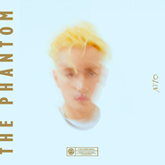

The Phantom虚幻
============================

|  |  |
| :--: | :-- |
| [ The Phantom虚幻](https://emumo.xiami.com/album/5020663722) | **艺人**: [Q.luv](../index.md) **语种**: 国语 **唱片公司**: 光先音乐 **发行时间**: 2020年05月24日 **专辑类别**: EP, 单曲 **专辑风格**: 科技舞曲 Techno, 都市音乐 Urban **播放数**: 2555 **收藏数**: 8 **评论数**: 7  |

## 简介

The Phantom 「 虚幻 」

## 曲目

## 评论

|  |  |  |  |
| :-- | :-- | :-- | :-- |
|  [虾米用户](https://emumo.xiami.com/u/124341790) 我还没想好要写什么... 2020-05-25 12:56 赞(0) 踩(0) | 

 |
|  [虾米用户](https://emumo.xiami.com/u/6612253) 你答对了，哥就是电子＆嘻... 2020-05-24 12:10 赞(1) 踩(0) | 
不错！顶上去！让这兄弟飞！
 |
|  [虾米用户](https://emumo.xiami.com/u/6612253) 你答对了，哥就是电子＆嘻... 2020-05-24 12:08 赞(1) 踩(0) | 
有点意思。
 |
|  [虾米用户](https://emumo.xiami.com/u/35865963) 。      用力跑  ... 2020-05-24 10:40 赞(0) 踩(0) | 
nice
 |
|  [虾米用户](https://emumo.xiami.com/u/252528023) 30 2020-05-24 03:08 赞(0) 踩(0) | 
啊啊啊啊，才发现没有v6啊！！！
 |
|  [虾米用户](https://emumo.xiami.com/u/252528023) 30 2020-05-24 03:07 赞(0) 踩(0) | 
头一回虾米排面
 |
|  [虾米用户](https://emumo.xiami.com/u/358995000) 散场本是常态 尽兴而归就... 2020-05-24 01:20 赞(1) 踩(0) | 
专辑第一首 助你轻松破十万播放量。
 |
