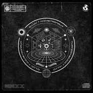

Q.luv
============================

|  |  |
| :--: | :-- |
| [ Q.luv](https://i.xiami.com/qluv) | **播放数**: 3404791 **粉丝数**: 2388 **评论数**: 194 **地区**: China 中国大陆 **风格**: 节奏布鲁斯 R&B  |

## 档案

Q.luv(赵钦) 音乐制作人、歌手。

## 专辑

| 名称 | 语种 | 唱片公司 | 发行时间 | 专辑类别 | 专辑风格 |
| :--: | :-- | :-- | :-- | :-- | :-- |
| [ The Phantom虚幻](./albums/5020663722.md) | 国语 | 光先音乐 | 2020年05月24日 | EP, 单曲 | 科技舞曲 Techno, 都市音乐 Urban |
| [ 愛要怎麼](./albums/5020647807.md) | 国语 | 独立发行 | 2020年05月16日 | EP, 单曲 | 流行 Pop |
| [ MMXXMMXX2020](./albums/2108271987.md) | 国语 | 光先音乐 | 2020年04月06日 | EP, 单曲 | 节奏布鲁斯 R&B, 放克 Funk, 陷阱说唱 Trap Rap |
| [ 星光层传送门](./albums/2106094583.md) | 国语 | 光先音乐 | 2020年01月18日 |  |  |
| [ 夜之城（The Night Of The City）The Night Of The City](./albums/2104846499.md) | 国语 | 光先音乐 | 2019年05月08日 | EP, 单曲 | 放克 Funk, 都市音乐 Urban, 节奏布鲁斯 R&B |
| [ Special EP](./albums/2104099136.md) | 国语 | 星火映画 | 2018年10月12日 | EP, 单曲 | 国语流行 Mandarin Pop |
| [ 一千多公里](./albums/2104060394.md) | 国语 | 光先音乐 | 2018年09月28日 | EP, 单曲 | 节奏布鲁斯 R&B |
| [ 带你去未来](./albums/2103991482.md) | 国语 | 独立发行 | 2018年09月07日 | EP, 单曲 | 电音流行 Electropop, 流行 Pop, 节奏布鲁斯 R&B |
| [ 记得那时光（Remember The Time'18)致敬 迈克尔.杰克逊](./albums/2103755250.md) | 国语 | 独立发行 | 2018年06月25日 | EP, 单曲 | 流行 Pop |
| [ 火：Hope&Change](./albums/2103489215.md) | 国语 | 独立发行 | 2018年01月13日 | EP, 单曲 | 节奏布鲁斯 R&B, 嘻哈 Hip-Hop |
| [ No Pain No Love](./albums/2102977715.md) | 国语 | 星火映画 | 2017年12月20日 | EP, 单曲 |  |
| [ PAI x 3](./albums/2102874578.md) | 国语 | 星火映画 | 2017年10月18日 | EP, 单曲 |  |
| [ 没烦恼](./albums/2102779952.md) | 国语 | 独立发行 | 2017年07月03日 | EP, 单曲 | 嘻哈 Hip-Hop, 节奏布鲁斯 R&B, 节奏布鲁斯 Rhythm & Blues |
| [ 有我在Got Ur Back](./albums/2102779948.md) | 国语 | 千和世纪 | 2017年06月20日 | EP, 单曲 | 节奏布鲁斯 R&B |
| [ No Emotion](./albums/2102473243.md) | 国语 |  | 2016年10月28日 | EP, 单曲 |  |
| [ CØ. $H!T](./albums/2102410001.md) | 国语 | 银河音乐 | 2016年10月21日 | EP, 单曲 |  |
| [ No Pian No Love](./albums/2102403480.md) | 国语 | 银河音乐 | 2016年09月29日 | EP, 单曲 |  |
| [ GAME OVER 专辑伴奏专辑伴奏](./albums/2100249112.md) | 国语 | 独立发行 | 2015年12月21日 | 录音室专辑 | 节奏布鲁斯 Rhythm & Blues, 新灵魂乐 Neo-Soul |
| [ SpecialSpecial](./albums/2100245912.md) | 国语 | Unit Muzik | 2015年12月11日 | EP, 单曲 | 节奏布鲁斯 Rhythm & Blues, 流行灵魂乐 Pop Soul, 新灵魂乐 Neo-Soul |
| [ With Me](./albums/2100238710.md) | 国语 | 千和世纪 | 2015年11月17日 | EP, 单曲 |  |
| [ 2015 HIT SONG](./albums/2100194294.md) | 国语 | Unit Muzik | 2015年09月07日 | 合集, 杂锦 |  |
| [ You Should Be Ma Girl Remix](./albums/1528943403.md) | 国语 | 独立发行 | 2015年04月14日 | EP, 单曲 | 节奏布鲁斯 Rhythm & Blues |
| [ GAME OVER](./albums/1809051342.md) | 国语 | 种子音乐 | 2014年08月26日 | EP, 单曲 | 节奏布鲁斯 Rhythm & Blues, 流行灵魂乐 Pop Soul |

## 评论

|  |  |  |  |
| :-- | :-- | :-- | :-- |
|  [虾米用户](https://emumo.xiami.com/u/54676006) 冷記憶 2020-07-06 08:50 赞(0) 踩(0) | 
。
 |
|  [虾米用户](https://emumo.xiami.com/u/184383) 我还没想好要写什么... 2020-03-13 16:26 赞(0) 踩(0) | 
已经被洗脑，天天循环！
 |
|  [虾米用户](https://emumo.xiami.com/u/327444554)  2020-01-09 08:35 赞(0) 踩(0) | 
⚡️等钦哥红的一天
 |
|  [虾米用户](https://emumo.xiami.com/u/358740045) 我还没想好要写什么... 2019-10-14 22:43 赞(0) 踩(0) | 
真的好像朴宰范，不火天理难容
 |
|  [虾米用户](https://emumo.xiami.com/u/35006847) Fallinluvwit... 2019-09-22 18:31 赞(0) 踩(0) | 
每天都要听zq的歌才能睡着
 |
|  [虾米用户](https://emumo.xiami.com/u/307232436) 你好 2019-08-31 23:57 赞(0) 踩(0) | 
我已经在想这哥们跟阿克江一起做首歌，该多骚啊
 |
|  [虾米用户](https://emumo.xiami.com/u/5848307) - 2019-05-22 00:16 赞(0) 踩(0) | 

 |
|  [虾米用户](https://emumo.xiami.com/u/204796074) 再见。 2019-05-10 10:33 赞(0) 踩(0) | 
也太好听了吧！！！
 |
|  [虾米用户](https://emumo.xiami.com/u/48379032) 最后警告，谢绝野蛮人，，... 2019-05-01 20:59 赞(0) 踩(0) | 
哇(⊙o⊙)
 |
|  [虾米用户](https://emumo.xiami.com/u/460880) 有声读物 2019-02-24 16:59 赞(1) 踩(0) | 
声线 腔调 完全OK
 |
|  [虾米用户](https://emumo.xiami.com/u/299387952)  2018-12-23 02:07 赞(1) 踩(0) | 
国内最牛逼的节奏布鲁斯歌手！把陶喆比下去，有点JOJO声音，有点超级男孩贾斯丁的声音，有点neyo的味道！
 |
|  [虾米用户](https://emumo.xiami.com/u/358025790) 我还没想好要写什么... 2018-12-09 20:08 赞(0) 踩(0) | 
我喜欢 
 |
|  [虾米用户](https://emumo.xiami.com/u/612355) 好听音乐收藏了 2018-12-04 21:35 赞(0) 踩(0) | 
十年粉丝～ 第一张Ep u盘版 Q哥亲笔签名照。那时候卖Ep的客服美眉QQ还在
 |
|  [虾米用户](https://emumo.xiami.com/u/316813193) 我不喜欢你会飞 2018-11-09 13:09 赞(0) 踩(0) | 
巨棒！！！
 |
|  [虾米用户](https://emumo.xiami.com/u/281715897) 我还没想好要写什么... 2018-11-09 00:39 赞(0) 踩(0) | 
换一个名字可能换更好更容易被发现吧
 |
|  [虾米用户](https://emumo.xiami.com/u/93081992) so what 2018-11-05 11:35 赞(0) 踩(0) | 
我有预感 你要
 |
|  [虾米用户](https://emumo.xiami.com/u/400014155) 如果记住就是忘却，我将不... 2018-09-08 22:28 赞(1) 踩(0) | 
哥哥要坚持下去呦！加油做自己喜欢的事情！
 |
|  [虾米用户](https://emumo.xiami.com/u/332296233)   2018-08-28 01:25 赞(3) 踩(0) | 
YYFC！！！那个网站都忘记了！十多年了，你还在坚持！手机还存着你十几年唱的几首歌！妈妈我还你一个爱，外面的外面，The key to your heart，巧克力&amp;hellip;&amp;hellip;满满都是回忆   
 |
| ⇒ |  [虾米用户](https://emumo.xiami.com/u/16377813)   2018-09-28 07:53 赞(0) 踩(0) | 
哈哈，忘掉那些老歌吧，常來聽新歌
 |
| ⇒ |  [虾米用户](https://emumo.xiami.com/u/332296233)   2018-09-30 17:59 赞(0) 踩(0) | 
<q><b>Q.luv说：</b></q>
 |
|  [虾米用户](https://emumo.xiami.com/u/303919180) 我还没想好要写什么... 2018-07-11 08:43 赞(0) 踩(0) | 
可以 
 |
|  [虾米用户](https://emumo.xiami.com/u/217586973)  2018-07-04 22:23 赞(0) 踩(0) | 
这位朋友我粉上你了
 |
|  [虾米用户](https://emumo.xiami.com/u/306569548)  2018-04-19 21:13 赞(0) 踩(0) | 
听过最舒服的声音 
 |
|  [虾米用户](https://emumo.xiami.com/u/342478773)  2018-04-07 12:39 赞(0) 踩(0) | 
加油
 |
|  [虾米用户](https://emumo.xiami.com/u/38558738) HipHop/R&B/F... 2018-01-02 01:55 赞(9) 踩(0) | 
等一个Q.luv和J.Sheon的合作
 |
| ⇒ |  [虾米用户](https://emumo.xiami.com/u/45910737) 谢菲尔德大学 音乐管理硕... 2018-01-08 00:50 赞(0) 踩(0) | 
当时看天籁之战 也觉得两人嗓音超像的！！！
 |
|  [虾米用户](https://emumo.xiami.com/u/71178106) 塵世や 酒、風呂を抜け ... 2017-12-20 06:34 赞(1) 踩(0) | 
♡
 |
|  [虾米用户](https://emumo.xiami.com/u/557297) Stay Real 2017-10-27 23:49 赞(0) 踩(0) | 
太屌了！哪里可以看到这位大神的现场视频！
 |
|  [虾米用户](https://emumo.xiami.com/u/49522968)   2017-10-27 23:44 赞(7) 踩(0) | 
最早听国产rnb 喜欢宋念宇 现在各种流派的音乐在国内发展 新晋音乐人崛起 你和夏呈青应该合作（比如来个Songs On 12 Play Remix哈哈哈） 应该会擦出火花
 |
|  [虾米用户](https://emumo.xiami.com/u/324113168)  2017-09-09 19:05 赞(0) 踩(0) | 
酷
 |
|  [虾米用户](https://emumo.xiami.com/u/132119586)  2017-08-06 23:48 赞(2) 踩(0) | 
中国有嘻哈制作，棒
 |
|  [虾米用户](https://emumo.xiami.com/u/52034644) 身体会跳舞 2017-08-03 10:18 赞(0) 踩(0) | 
好听 喜欢
 |
|  [虾米用户](https://emumo.xiami.com/u/17146554) weibo：@L1RRO... 2017-07-14 19:48 赞(1) 踩(0) | 
希望你能火
 |
|  [虾米用户](https://emumo.xiami.com/u/52657569)   2017-06-23 13:41 赞(1) 踩(0) | 
绝了 这声音 这才华 
 |
|  [虾米用户](https://emumo.xiami.com/u/37879663) 这家伙很聪明什么也没留下 2017-05-07 00:29 赞(0) 踩(0) | 
很棒
 |
|  [虾米用户](https://emumo.xiami.com/u/193184816) 我还没想好要写什么... 2017-04-27 09:22 赞(0) 踩(0) | 
旋律和编曲好听
 |
|  [虾米用户](https://emumo.xiami.com/u/193184816) 我还没想好要写什么... 2017-04-27 09:22 赞(0) 踩(0) | 
旋律和编曲好听
 |
|  [虾米用户](https://emumo.xiami.com/u/32068325) xvzz 2017-04-22 17:58 赞(0) 踩(0) | 
为啥这声音都不能火？
 |
|  [虾米用户](https://emumo.xiami.com/u/220124160) 武 藏 野SARU 20... 2017-03-31 23:28 赞(0) 踩(0) | 
才子
 |
|  [虾米用户](https://emumo.xiami.com/u/901190)  SCC 2017-03-31 20:05 赞(0) 踩(0) | 
好听
 |
|  [虾米用户](https://emumo.xiami.com/u/209276882)  2017-03-30 15:28 赞(1) 踩(0) | 
要听哭了 第一次听好国内那么好听的RNB 支持支持
 |
|  [虾米用户](https://emumo.xiami.com/u/39020627) 怪我没有读懂你... 2017-03-21 11:30 赞(0) 踩(0) | 
很好的音乐人，很多歌都有放高质量原版伴奏，让我们可以练习，赞
 |
|  [虾米用户](https://emumo.xiami.com/u/124598616) coooooooool 2017-03-20 22:48 赞(1) 踩(0) | 
声音简直是Dean与jay park合体 ，超爱 
 |
|  [虾米用户](https://emumo.xiami.com/u/52682108) 我还没想好要写什么... 2017-03-18 10:46 赞(0) 踩(0) | 
❤️
 |
|  [虾米用户](https://emumo.xiami.com/u/181699720) 喜欢彩妆 2017-03-16 01:45 赞(1) 踩(0) | 
给我第一感觉像朴宰范 风格啊声线啊什么的
 |
|  [虾米用户](https://emumo.xiami.com/u/92734936)   2017-01-16 04:02 赞(0) 踩(0) | 
爱上你的 钱女友 真心棒
 |
|  [虾米用户](https://emumo.xiami.com/u/157653676)  2017-01-04 13:18 赞(0) 踩(0) | 
调子真的很好听 支持！
 |
|  [虾米用户](https://emumo.xiami.com/u/534340) 琴乐不止 奕无声 2016-12-19 23:49 赞(0) 踩(0) | 
HOUSE DANCE
 |
|  [虾米用户](https://emumo.xiami.com/u/29077053) ET  2016-12-01 01:38 赞(2) 踩(0) | 
贵州人帅出一种新境界
 |
|  [虾米用户](https://emumo.xiami.com/u/41507283)   2016-11-28 22:19 赞(1) 踩(0) | 
真的难得r&amp;amp;b唱得那么好歌手
 |
|  [虾米用户](https://emumo.xiami.com/u/35167460) La vie elle ... 2016-11-28 06:19 赞(0) 踩(0) | 
好棒 
 |
|  [虾米用户](https://emumo.xiami.com/u/99168462) 再见虾米 2016-11-27 02:51 赞(0) 踩(0) | 
棒！！
 |
|  [虾米用户](https://emumo.xiami.com/u/18586629)  2016-11-10 14:22 赞(0) 踩(0) | 
越听 越爱 
 |
|  [虾米用户](https://emumo.xiami.com/u/31956002) This is popg... 2016-11-08 21:49 赞(0) 踩(0) | 
   
 |
|  [虾米用户](https://emumo.xiami.com/u/79509134) WeiBo：VickyF... 2016-10-23 10:12 赞(1) 踩(0) | 

 |
|  [虾米用户](https://emumo.xiami.com/u/4343869) 在虾米也是你官方女友 2016-10-09 09:57 赞(0) 踩(0) | 
nice
 |
|  [虾米用户](https://emumo.xiami.com/u/233790953) 或许我自己太有意思 2016-10-06 00:41 赞(0) 踩(0) | 
偶然找到这歌，还蛮好听的。
 |
|  [虾米用户](https://emumo.xiami.com/u/110354684)   2016-09-12 12:41 赞(0) 踩(0) | 
大神求发爱如潮水remix 伴奏。花钱也可以。真心求
 |
|  [虾米用户](https://emumo.xiami.com/u/49265597) 我还没想好要写什么... 2016-07-29 23:11 赞(0) 踩(0) | 
 
 |
|  [虾米用户](https://emumo.xiami.com/u/205514665) 希望有一天真的可以笑得天... 2016-07-26 21:23 赞(1) 踩(0) | 
 好喜欢你的音乐。。简直上瘾
 |
|  [虾米用户](https://emumo.xiami.com/u/8215264) 暂无签名~ 2016-07-15 09:53 赞(0) 踩(0) | 
大愛
 |
|  [虾米用户](https://emumo.xiami.com/u/193944963)  2016-06-25 16:48 赞(3) 踩(0) | 
中文歌听出来韩文歌的感觉，你好棒
 |
|  [虾米用户](https://emumo.xiami.com/u/11803799) 積極型喪氣 2016-06-10 11:05 赞(0) 踩(0) | 
(｀･ω･´)
 |
|  [虾米用户](https://emumo.xiami.com/u/9816949)   2016-05-17 10:30 赞(0) 踩(0) | 
好帅
 |
|  [虾米用户](https://emumo.xiami.com/u/33801615) FTG la Fr 2016-05-14 23:42 赞(0) 踩(0) | 
在中国10年，目前位置听到最棒的歌手 
 |
|  [虾米用户](https://emumo.xiami.com/u/159577950)  2016-05-02 23:56 赞(1) 踩(0) | 
误入桃花深处+1哈哈哈！这么有才华的歌手要多多支持！
 |
|  [虾米用户](https://emumo.xiami.com/u/15785415)   2016-05-02 22:47 赞(0) 踩(0) | 
quit on em girls和U should be my girl超好听，翻唱了
 |
|  [虾米用户](https://emumo.xiami.com/u/13154723) 脾气不太好 2016-05-01 22:11 赞(0) 踩(0) | 
哇哦，还蛮帅
 |
|  [虾米用户](https://emumo.xiami.com/u/155570968)  2016-04-29 18:17 赞(1) 踩(0) | 
真心不错啊，找浪费听到的
 |
|  [虾米用户](https://emumo.xiami.com/u/42590996) 虾米即将停止服务，喜欢我... 2016-04-27 00:59 赞(0) 踩(0) | 
一如既往的循环着这些歌。
 |
|  [虾米用户](https://emumo.xiami.com/u/115141608)  2016-04-24 03:03 赞(0) 踩(0) | 
加油！
 |
|  [虾米用户](https://emumo.xiami.com/u/665123) Diggin’ it! 2016-04-08 14:11 赞(0) 踩(0) | 
钦哥牛逼！
 |
|  [虾米用户](https://emumo.xiami.com/u/29230195) Gubba nub nu... 2016-04-07 13:07 赞(0) 踩(0) | 
颜好任性
 |
|  [虾米用户](https://emumo.xiami.com/u/103898674) 翻云覆雨，颠鸾倒凤 2016-03-28 12:48 赞(0) 踩(0) | 
喜欢节奏布鲁斯!觉得你比国内很多歌手和制作人都优秀，加油，一直挺你!
 |
| ⇒ |  [虾米用户](https://emumo.xiami.com/u/16377813)   2016-04-06 09:41 赞(0) 踩(0) | 
很高的评价，感谢！
 |
|  [虾米用户](https://emumo.xiami.com/u/3457223)  2016-03-25 17:13 赞(0) 踩(0) | 
误入桃花深处
 |
| ⇒ |  [虾米用户](https://emumo.xiami.com/u/16377813)   2016-04-06 09:41 赞(0) 踩(0) | 
这。。。啥。。。。意思啊？
 |
|  [虾米用户](https://emumo.xiami.com/u/93408636) 革命家 2016-03-18 13:37 赞(0) 踩(0) | 
酷
 |
|  [虾米用户](https://emumo.xiami.com/u/10894190) 心道 2016-03-11 22:23 赞(21) 踩(0) | 
我真心觉得钦哥不红真的是没天理好吗！！！！越听越喜欢！！！！
 |
| ⇒ |  [虾米用户](https://emumo.xiami.com/u/16377813)   2016-04-06 09:40 赞(0) 踩(0) | 
你们喜欢就是对我最大的认同，红不红无所谓了。
 |
| ⇒ |  [虾米用户](https://emumo.xiami.com/u/49951785) ~ 2018-07-15 19:02 赞(0) 踩(0) | 
<q><b>Q.luv说：</b></q>
 |
| ⇒ |  [虾米用户](https://emumo.xiami.com/u/407277380)  2019-04-10 18:48 赞(0) 踩(0) | 
<q><b>黒瞳5PTS说：</b></q>
 |
| ⇒ |  [虾米用户](https://emumo.xiami.com/u/407277380)  2019-04-10 18:49 赞(0) 踩(0) | 
<q><b>白晓说：</b></q>
 |
|  [虾米用户](https://emumo.xiami.com/u/8943891) 你咋那么可爱？ 2016-03-05 07:57 赞(0) 踩(0) | 

 |
|  [虾米用户](https://emumo.xiami.com/u/43044429) 无中生有的恶趣味 2016-03-04 17:41 赞(0) 踩(0) | 
钦哥什么时候发新啊
 |
|  [虾米用户](https://emumo.xiami.com/u/1495890)  2016-02-26 21:11 赞(0) 踩(0) | 
支持下，期待新歌哈
 |
|  [虾米用户](https://emumo.xiami.com/u/32725997)   2016-02-11 00:28 赞(0) 踩(0) | 
想你跟夏呈青合作一次 
 |
| ⇒ |  [虾米用户](https://emumo.xiami.com/u/15846865) 前進的目的? 2016-02-25 20:38 赞(0) 踩(0) | 
Quit On Em Girls
 |
|  [虾米用户](https://emumo.xiami.com/u/9479386) 我还没想好要写什么... 2016-02-04 01:31 赞(1) 踩(0) | 
颜值又高 又有才
 |
|  [虾米用户](https://emumo.xiami.com/u/6374841)  2016-01-29 22:16 赞(0) 踩(0) | 
听怀孕了！    
 |
|  [虾米用户](https://emumo.xiami.com/u/3877507) 劫尽观自在，动静两相宜。 2016-01-28 21:32 赞(0) 踩(0) | 
good
 |
|  [虾米用户](https://emumo.xiami.com/u/73400448) 师傅，请问这条路怎么走 2016-01-22 13:31 赞(0) 踩(0) | 
1111
 |
|  [虾米用户](https://emumo.xiami.com/u/54740818) music  2016-01-09 20:17 赞(0) 踩(0) | 
很棒 多出点
 |
|  [虾米用户](https://emumo.xiami.com/u/20368607)   2016-01-02 10:40 赞(0) 踩(0) | 
好喜欢
 |
|  [虾米用户](https://emumo.xiami.com/u/55354545) 精神分裂 2016-01-01 14:02 赞(0) 踩(0) | 
6
 |
|  [虾米用户](https://emumo.xiami.com/u/90945230)  2015-12-26 02:29 赞(0) 踩(0) | 
喜欢！
 |
|  [虾米用户](https://emumo.xiami.com/u/48564556) 努力吧 2015-12-17 11:11 赞(0) 踩(0) | 
何方神
 |
|  [虾米用户](https://emumo.xiami.com/u/50789736) 深爱你入骨。 2015-12-12 00:31 赞(0) 踩(0) | 
声音很独特，长相也很独特。
 |
|  [虾米用户](https://emumo.xiami.com/u/46435533)   2015-12-11 11:21 赞(0) 踩(0) | 
是真帅
 |
|  [虾米用户](https://emumo.xiami.com/u/3260451) ‖   ‖       ... 2015-12-09 01:52 赞(1) 踩(0) | 
棒棒的，
 |
|  [虾米用户](https://emumo.xiami.com/u/45035531)  2015-12-02 21:59 赞(0) 踩(0) | 
真的很像jay！！！声线好棒！！！关注起来 
 |
|  [虾米用户](https://emumo.xiami.com/u/50707657)  2015-11-30 17:36 赞(1) 踩(0) | 
曲风声线都像stevie hoang有木有
 |
|  [虾米用户](https://emumo.xiami.com/u/39756866) 我还没想好要写什么... 2015-11-25 02:11 赞(0) 踩(0) | 
表白！！每天听好多好多遍
 |
|  [虾米用户](https://emumo.xiami.com/u/28529835) wechat：13306... 2015-11-23 14:46 赞(1) 踩(0) | 
明明可以靠脸吃饭 却又那么才华横溢
 |
|  [虾米用户](https://emumo.xiami.com/u/36755876) Let it be.  2015-11-21 19:26 赞(0) 踩(0) | 
呀 真的喜欢 这拉普好听
 |
|  [虾米用户](https://emumo.xiami.com/u/2418238) weibo: @尤米口 2015-11-20 14:44 赞(0) 踩(0) | 
帅哭了
 |
|  [虾米用户](https://emumo.xiami.com/u/25962841) Y.Q.S.Y. 2015-11-16 13:00 赞(0) 踩(0) | 
cool
 |
|  [虾米用户](https://emumo.xiami.com/u/64350) 我还没想好要写什么... 2015-11-15 16:25 赞(0) 踩(0) | 
Gooooooood one！
 |
|  [虾米用户](https://emumo.xiami.com/u/45368652) 如果世界太危险 只有音乐... 2015-11-15 16:16 赞(0) 踩(0) | 
hi 一次无意点进 一个美丽的邂逅
 |
|  [虾米用户](https://emumo.xiami.com/u/54378823) 我还没想好要写什么... 2015-11-15 14:48 赞(0) 踩(0) | 
跟夏老师傻傻分不清
 |
|  [虾米用户](https://emumo.xiami.com/u/1442497) 임창균only 2015-11-15 03:14 赞(0) 踩(0) | 
火钳留名！！！声音有点像G.soul 
 |
|  [虾米用户](https://emumo.xiami.com/u/11595563) 我还没想好要写什么... 2015-11-06 12:47 赞(0) 踩(0) | 
97ks
 |
|  [虾米用户](https://emumo.xiami.com/u/547521)  2015-11-04 09:26 赞(0) 踩(0) | 
真是 卧虎藏龙啊 喜欢
 |
|  [虾米用户](https://emumo.xiami.com/u/57007664) 为你我变成了 Bette... 2015-10-30 14:37 赞(0) 踩(0) | 
哎哟哥哥嗨你好 
 |
|  [虾米用户](https://emumo.xiami.com/u/4110383) 暂无签名~ 2015-10-26 01:14 赞(0) 踩(0) | 
声音真可爱
 |
|  [虾米用户](https://emumo.xiami.com/u/49934640) 祝星 2015-10-24 10:02 赞(0) 踩(0) | 
侧脸刘烨！
 |
|  [虾米用户](https://emumo.xiami.com/u/36208991)   2015-10-21 00:57 赞(0) 踩(0) | 
Niceeeee
 |
|  [虾米用户](https://emumo.xiami.com/u/47023093)   2015-10-18 21:41 赞(0) 踩(0) | 
支持一钩子遵义人！   风格是我喜欢的
 |
| ⇒ |  [虾米用户](https://emumo.xiami.com/u/16377813)   2015-11-09 21:54 赞(0) 踩(0) | 
谢谢！
 |
|  [虾米用户](https://emumo.xiami.com/u/48246195) 节操丢掉 节奏跟上 2015-10-16 14:09 赞(0) 踩(0) | 
life is good[带墨镜笑]
 |
|  [虾米用户](https://emumo.xiami.com/u/49389164)  2015-10-13 16:31 赞(0) 踩(0) | 
这么帅
 |
|  [虾米用户](https://emumo.xiami.com/u/1495890)  2015-10-09 00:35 赞(0) 踩(0) | 
超喜欢，GOOD ！
 |
|  [虾米用户](https://emumo.xiami.com/u/10272294)  2015-10-05 01:24 赞(0) 踩(0) | 
雾草之前听过only one 觉得曲子做的特别高大上 原来声线真的很适合唱r&amp;amp;b 内地终于有好听的r&amp;amp;b辣（｡ò ∀ ó｡）
 |
|  [虾米用户](https://emumo.xiami.com/u/50475233) 没人保护你 2015-10-04 00:56 赞(0) 踩(0) | 
赞
 |
|  [虾米用户](https://emumo.xiami.com/u/7371655) Only god can... 2015-09-27 22:19 赞(0) 踩(0) | 
帅哥你好～
 |
|  [虾米用户](https://emumo.xiami.com/u/54231106) おかげさまで、元気です 2015-09-27 21:10 赞(0) 踩(0) | 

 |
|  [虾米用户](https://emumo.xiami.com/u/13978900) MUSIC 4 LIFE 2015-09-24 18:39 赞(0) 踩(0) | 
addict
 |
|  [虾米用户](https://emumo.xiami.com/u/50345864) 嘻嘻 2015-09-24 16:59 赞(0) 踩(0) | 
大哥   我只想求 钱女友 的原曲采样！
 |
|  [虾米用户](https://emumo.xiami.com/u/16551745) byebye｛wb/in... 2015-09-24 01:10 赞(0) 踩(0) | 
好奇问一哈哪的人 有live么
 |
| ⇒ |  [虾米用户](https://emumo.xiami.com/u/16377813)   2015-09-24 01:20 赞(0) 踩(0) | 
贵州遵义人士，目前居住成都。live目前还没有。下月出mv
 |
|  [虾米用户](https://emumo.xiami.com/u/10073365) 我还没想好要写什么... 2015-09-22 16:17 赞(0) 踩(0) | 
✔️
 |
|  [虾米用户](https://emumo.xiami.com/u/763459) (๑•̀ㅁ•́ฅ)嗷呜 2015-09-20 00:06 赞(0) 踩(0) | 
你制作的only one很好听，听了你几首热门歌曲，编曲挺棒的，就是R&amp;amp;B的唱法和歌词的感觉还不太对。
 |
| ⇒ |  [虾米用户](https://emumo.xiami.com/u/16377813)   2015-09-21 17:12 赞(0) 踩(0) | 
那么说你心目当中已有rnb固定唱法和写法了，如果我再按照你心目中那样的方向去写，跟别人的rnb还有区别吗？那也不是我的东西了。
 |
| ⇒ |  [虾米用户](https://emumo.xiami.com/u/16377813)   2015-09-21 17:12 赞(0) 踩(0) | 
感谢你的评价！
 |
| ⇒ |  [虾米用户](https://emumo.xiami.com/u/763459) (๑•̀ㅁ•́ฅ)嗷呜 2015-09-21 19:27 赞(0) 踩(0) | 
<q><b>Q.luv说：</b></q>
 |
| ⇒ |  [虾米用户](https://emumo.xiami.com/u/16377813)   2015-09-21 19:37 赞(0) 踩(0) | 
<q><b>DONTLOOKATME说：</b></q>
 |
|  [虾米用户](https://emumo.xiami.com/u/16377813)   2015-09-17 16:27 赞(0) 踩(0) | 
z时间过得很快哦！感叹
 |
|  [虾米用户](https://emumo.xiami.com/u/47431920)   2015-09-17 16:08 赞(0) 踩(0) | 
你为什么这么帅 请回答我
 |
| ⇒ |  [虾米用户](https://emumo.xiami.com/u/16377813)   2015-09-17 16:21 赞(0) 踩(0) | 
哈，过奖了，常来听歌喔
 |
| ⇒ |  [虾米用户](https://emumo.xiami.com/u/47431920)   2015-09-21 13:09 赞(0) 踩(0) | 
<q><b>Q.luv说：</b></q>
 |
|  [虾米用户](https://emumo.xiami.com/u/44080761)  2015-09-08 21:04 赞(0) 踩(0) | 
四处上传歌曲
 |
| ⇒ |  [虾米用户](https://emumo.xiami.com/u/16377813)   2015-09-17 16:24 赞(0) 踩(0) | 
目前主要就在虾米上传了
 |
|  [虾米用户](https://emumo.xiami.com/u/5494913) SO DAMN 2015-08-31 14:06 赞(0) 踩(0) | 
嗯
 |
|  [虾米用户](https://emumo.xiami.com/u/10232335) / 2015-08-26 15:04 赞(0) 踩(0) | 
终于复出了 我可是初中就听你的歌
 |
| ⇒ |  [虾米用户](https://emumo.xiami.com/u/16377813)   2015-09-17 16:21 赞(0) 踩(0) | 
好久远！不算复出！一直在做音乐啊
 |
| ⇒ |  [虾米用户](https://emumo.xiami.com/u/10232335) / 2015-09-17 16:24 赞(0) 踩(0) | 
<q><b>Q.luv说：</b></q>
 |
| ⇒ |  [虾米用户](https://emumo.xiami.com/u/16377813)   2015-09-17 16:24 赞(0) 踩(0) | 
<q><b>大宁子_说：</b></q>
 |
| ⇒ |  [虾米用户](https://emumo.xiami.com/u/10232335) / 2015-09-17 16:25 赞(0) 踩(0) | 
<q><b>Q.luv说：</b></q>
 |
|  [虾米用户](https://emumo.xiami.com/u/2387509)  2015-08-22 16:28 赞(0) 踩(0) | 
人帅歌好听真不错
 |
|  [虾米用户](https://emumo.xiami.com/u/44873270) 飛的越高我就心情越好 2015-08-19 15:27 赞(0) 踩(0) | 
喜欢
 |
|  [虾米用户](https://emumo.xiami.com/u/10382799) diavolo 2015-08-19 15:12 赞(0) 踩(0) | 
喜欢
 |
|  [虾米用户](https://emumo.xiami.com/u/51901933) 爱我的人 谢谢你 2015-08-18 23:42 赞(0) 踩(0) | 
人又帅，歌又好听 
 |
|  [虾米用户](https://emumo.xiami.com/u/46882353) 我还没想好要写什么... 2015-08-18 01:23 赞(0) 踩(0) | 
人又长得帅 
 |
|  [虾米用户](https://emumo.xiami.com/u/46882353) 我还没想好要写什么... 2015-08-18 01:23 赞(0) 踩(0) | 
人又长得帅 
 |
|  [虾米用户](https://emumo.xiami.com/u/46882353) 我还没想好要写什么... 2015-08-18 01:23 赞(0) 踩(0) | 
人又长得帅 
 |
|  [虾米用户](https://emumo.xiami.com/u/16396509)  2015-08-17 11:41 赞(0) 踩(0) | 
❤❤❤❤
 |
|  [虾米用户](https://emumo.xiami.com/u/43186525) ... 2015-08-15 22:09 赞(0) 踩(0) | 
已被圈为小粉丝 
 |
|  [虾米用户](https://emumo.xiami.com/u/1726687) Hi,bye~ 2015-08-15 17:10 赞(0) 踩(0) | 
够了，有才还帅，烦死。
 |
|  [虾米用户](https://emumo.xiami.com/u/10894190) 心道 2015-08-12 01:32 赞(1) 踩(0) | 
这么正的R&amp;amp;B居然not hot！这是我听过的最正的国产R&amp;amp;B！My god！
 |
| ⇒ |  [虾米用户](https://emumo.xiami.com/u/16377813)   2015-09-17 16:23 赞(0) 踩(0) | 
感谢你的高度评价！ 
 |
|  [虾米用户](https://emumo.xiami.com/u/49185549) 喜欢了六年的东西  至今... 2015-08-08 22:41 赞(0) 踩(0) | 
我想说~你唱R&amp;amp;B真的是猴塞雷阿~ 
 |
| ⇒ |  [虾米用户](https://emumo.xiami.com/u/16377813)   2015-08-11 13:05 赞(0) 踩(0) | 
这个猴赛雷是？ 
 |
|  [虾米用户](https://emumo.xiami.com/u/49185549) 喜欢了六年的东西  至今... 2015-08-08 22:40 赞(0) 踩(0) | 
我想说~你唱R&amp;amp;B真的是猴塞雷阿~ 
 |
|  [虾米用户](https://emumo.xiami.com/u/49185549) 喜欢了六年的东西  至今... 2015-08-08 22:21 赞(0) 踩(0) | 
喜欢R&amp;amp;B
 |
|  [虾米用户](https://emumo.xiami.com/u/49185549) 喜欢了六年的东西  至今... 2015-08-08 22:21 赞(0) 踩(0) | 
喜欢R&amp;amp;B
 |
|  [虾米用户](https://emumo.xiami.com/u/49185549) 喜欢了六年的东西  至今... 2015-08-08 22:21 赞(0) 踩(0) | 
喜欢R&amp;amp;B
 |
|  [虾米用户](https://emumo.xiami.com/u/46628234)  2015-08-04 16:36 赞(1) 踩(0) | 
作为欧美控对这首歌喜欢的不得了～单曲循环中
 |
| ⇒ |  [虾米用户](https://emumo.xiami.com/u/16377813)   2015-08-11 13:05 赞(0) 踩(0) | 
谢谢
 |
|  [虾米用户](https://emumo.xiami.com/u/8854264) Hypocrite. 2015-08-01 20:15 赞(0) 踩(0) | 
嗓音唱EDM应该不错
 |
|  [虾米用户](https://emumo.xiami.com/u/8854264) Hypocrite. 2015-08-01 20:14 赞(0) 踩(0) | 
帅比
 |
|  [虾米用户](https://emumo.xiami.com/u/9854093) 虾米再见，各位听友江湖再... 2015-07-31 22:16 赞(0) 踩(0) | 
QqqqqqLuv 哈哈哈
 |
|  [虾米用户](https://emumo.xiami.com/u/50390173) 婊情做作 2015-07-28 14:12 赞(0) 踩(0) | 
快发新歌！
 |
|  [虾米用户](https://emumo.xiami.com/u/50021550)  2015-07-27 21:10 赞(0) 踩(0) | 
真的每一首歌都很投入感情
 |
|  [虾米用户](https://emumo.xiami.com/u/50021550)  2015-07-27 21:10 赞(0) 踩(0) | 
真的每一首歌都很投入感情
 |
| ⇒ |  [虾米用户](https://emumo.xiami.com/u/16377813)   2015-07-30 06:53 赞(0) 踩(0) | 
谢谢你的评价
 |
|  [虾米用户](https://emumo.xiami.com/u/36784693)   2015-07-18 21:21 赞(0) 踩(0) | 
特别喜欢你阿 
 |
|  [虾米用户](https://emumo.xiami.com/u/36784693)   2015-07-18 21:21 赞(0) 踩(0) | 
特别喜欢你阿 
 |
|  [虾米用户](https://emumo.xiami.com/u/15622202)  2015-06-22 20:34 赞(0) 踩(0) | 
很棒
 |
|  [虾米用户](https://emumo.xiami.com/u/50227415)  2015-05-27 00:58 赞(0) 踩(0) | 
炫酷     
 |
| ⇒ |  [虾米用户](https://emumo.xiami.com/u/16377813)   2015-06-01 12:20 赞(0) 踩(0) | 
感谢来访
 |
|  [虾米用户](https://emumo.xiami.com/u/36782464) No.1 Fresh 2015-03-28 23:59 赞(1) 踩(0) | 
✌️✌️
 |
|  [虾米用户](https://emumo.xiami.com/u/16377813)   2015-03-28 18:02 赞(81) 踩(0) | 
我刚入驻了虾米音乐人，欢迎大家来我的个人主页，收听我的最新音乐
 |
| ⇒ |  [虾米用户](https://emumo.xiami.com/u/9119030) 你若盛开，清风自来…… 2015-05-12 21:43 赞(0) 踩(0) | 
:原来我们真的有如此黑的rnb!
 |
| ⇒ |  [虾米用户](https://emumo.xiami.com/u/16377813)   2015-05-18 18:37 赞(0) 踩(0) | 
<q><b>杨遇说：</b></q>
 |
| ⇒ |  [虾米用户](https://emumo.xiami.com/u/10540596) CDC 2015-07-30 02:02 赞(0) 踩(0) | 
这好嗓子 耳朵被治愈了！希望能听更多你的歌～
 |
| ⇒ |  [虾米用户](https://emumo.xiami.com/u/16377813)   2015-07-30 06:54 赞(0) 踩(0) | 
<q><b>daisy111说：</b></q>
 |
| ⇒ |  [虾米用户](https://emumo.xiami.com/u/9423208) 勿忘初心…… 2016-01-10 23:42 赞(0) 踩(0) | 
兄弟加油！
 |
| ⇒ |  [虾米用户](https://emumo.xiami.com/u/245782328)   2017-12-10 16:01 赞(0) 踩(0) | 
天啦 初中的时候在yyfc听过你的歌 现在都十年了吧
 |
|  [虾米用户](https://emumo.xiami.com/u/37772282) 暂无签名~ 2015-01-29 13:36 赞(30) 踩(0) | 
酷 声线很像jay park~
 |
| ⇒ |  [虾米用户](https://emumo.xiami.com/u/5947170) Let Me Be Me 2015-04-14 01:13 赞(0) 踩(0) | 
一说好像真有那么点点
 |
| ⇒ |  [虾米用户](https://emumo.xiami.com/u/37772282) 暂无签名~ 2015-04-14 08:50 赞(0) 踩(0) | 
<q><b>田麒琛说：</b></q>
 |
| ⇒ |  [虾米用户](https://emumo.xiami.com/u/5947170) Let Me Be Me 2015-04-14 11:59 赞(0) 踩(0) | 
<q><b>未知生物说：</b></q>
 |
|  [虾米用户](https://emumo.xiami.com/u/612355) 好听音乐收藏了 2014-12-28 02:18 赞(1) 踩(0) | 
终于有歌曲
 |
|  [虾米用户](https://emumo.xiami.com/u/33664487) 音乐会让我快乐， 2014-10-09 18:27 赞(1) 踩(0) | 
喜欢^_^
 |
