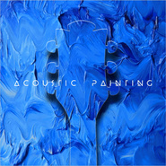
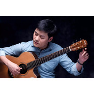

何雨田
============================

|  |  |
| :--: | :-- |
| [ 何雨田](https://i.xiami.com/hekang) | **地区**: China 中国大陆 **风格**: 器乐独奏 Solo Instrumental, 国语流行 Mandarin Pop **播放数**: 1404007 **粉丝数**: 781 **评论数**: 40  |

## 档案

2014年发行吉他演奏专辑《Time Melody》.   2018年发行吉他演奏专辑《Acoustic Painting》.

## 专辑

| 名称 | 语种 | 唱片公司 | 发行时间 | 专辑类别 | 专辑风格 |
| :--: | :-- | :-- | :-- | :-- | :-- |
| [ Acoustic Painting原声涂画](./albums/2103753822.md) | 纯音乐 | 独立发行 | 2018年06月22日 | 录音室专辑 | 器乐独奏 Solo Instrumental |
| [ time melody时光组曲](./albums/5020942475.md) | 纯音乐 | 独立发行 | 2014年11月24日 | 录音室专辑 | 器乐独奏 Solo Instrumental |

## 评论

|  |  |  |
| :-- | :-- | :-- |
|  [虾米用户](https://emumo.xiami.com/u/3583995) 一個人的戰爭 2019-07-24 16:24 赞(0) 踩(0) | 
.
 |
|  [虾米用户](https://emumo.xiami.com/u/10009897)  2019-01-31 20:13 赞(1) 踩(0) | 
此君参加指弹大赛区 取得名次了吗？哈哈哈哈哈哈
 |
| ⇒ |  [虾米用户](https://emumo.xiami.com/u/10009897)  2019-04-23 22:11 赞(0) 踩(0) | 
入围都费劲…
 |
|  [虾米用户](https://emumo.xiami.com/u/322395200)  2019-01-15 20:20 赞(0) 踩(0) | 
为什么要删《遥望》
 |
|  [虾米用户](https://emumo.xiami.com/u/15477519) 爱  是生命的和弦，而不... 2018-11-03 10:03 赞(1) 踩(0) | 
之前就喜爱… 只是没收藏…
 |
|  [虾米用户](https://emumo.xiami.com/u/318132) 抠啦 2018-05-17 14:46 赞(0) 踩(0) | 
抠啦
 |
| ⇒ |  [虾米用户](https://emumo.xiami.com/u/344296866) 我不想死。死了就不能听音... 2018-06-01 18:19 赞(0) 踩(0) | 
哪都是你
 |
|  [虾米用户](https://emumo.xiami.com/u/260583956)  2017-09-05 15:45 赞(0) 踩(0) | 
张岭的孩子(&amp;sup;･ᴥ･)つ！！我还教你弹过吉他！！【表情】
 |
|  [虾米用户](https://emumo.xiami.com/u/48442874) 把全世界所有的音乐听一遍... 2017-06-07 00:20 赞(0) 踩(0) | 
 
 |
|  [虾米用户](https://emumo.xiami.com/u/421459) 董小姐，你熄灭了烟，谈起... 2017-03-20 21:13 赞(0) 踩(0) | 
好美的音乐
 |
|  [虾米用户](https://emumo.xiami.com/u/9003931) 千淘万漉虽辛苦 2017-02-06 14:53 赞(2) 踩(0) | 
值得关注的独立指弹音乐人，期待更多优秀指弹作品。
 |
|  [虾米用户](https://emumo.xiami.com/u/269197442)  2017-02-04 01:30 赞(0) 踩(0) | 
听着非常舒服 
 |
|  [虾米用户](https://emumo.xiami.com/u/43107510) ♾ 2017-01-21 02:26 赞(0) 踩(0) | 
喜欢
 |
|  [虾米用户](https://emumo.xiami.com/u/11471527) 我还没想好要写什么... 2016-08-19 17:14 赞(1) 踩(0) | 
好喜欢 我居然错过了福州的场呜呜呜
 |
|  [虾米用户](https://emumo.xiami.com/u/40399785) 你的现在  是最美的回忆 2016-08-06 17:40 赞(0) 踩(0) | 
超帅的！声音好听到没朋友[带墨镜笑][带墨镜笑]颜好手长低音炮！
 |
|  [虾米用户](https://emumo.xiami.com/u/515831)  2016-03-19 00:03 赞(0) 踩(0) | 
追梦人好有日本东方同人团体“孟世”的feel~好赞~
 |
|  [虾米用户](https://emumo.xiami.com/u/90697802)  2015-12-11 23:01 赞(0) 踩(0) | 
康哥，等你下一张专辑 
 |
|  [虾米用户](https://emumo.xiami.com/u/53828447)  2015-11-24 21:18 赞(0) 踩(0) | 
何康老师五月多的时候来福州开音乐会我有去看(๑•ั็ω•็ั๑)
 |
|  [虾米用户](https://emumo.xiami.com/u/50522662)  2015-06-02 21:58 赞(0) 踩(0) | 
喜欢
 |
|  [虾米用户](https://emumo.xiami.com/u/338496)  2015-04-15 12:14 赞(0) 踩(0) | 
加油加油！
 |
|  [虾米用户](https://emumo.xiami.com/u/33814712)  2015-01-28 20:39 赞(0) 踩(0) | 
中国指弹加油！
 |
|  [虾米用户](https://emumo.xiami.com/u/39874616)  2014-12-22 14:17 赞(0) 踩(0) | 
好听的指弹
 |
|  [虾米用户](https://emumo.xiami.com/u/11422474) Mu5ic 伍™音乐 熙 2014-12-10 00:43 赞(0) 踩(0) | 
顶何老师，留名。
 |
|  [虾米用户](https://emumo.xiami.com/u/31304104) 爱音乐，爱生活。 2014-12-08 23:21 赞(0) 踩(0) | 
不错！赞
 |
|  [虾米用户](https://emumo.xiami.com/u/43153011) 暂无签名~ 2014-12-08 22:26 赞(0) 踩(0) | 
顶康师傅！
 |
|  [虾米用户](https://emumo.xiami.com/u/1078866)   2014-12-05 02:44 赞(0) 踩(0) | 
何老师很棒...
 |
|  [虾米用户](https://emumo.xiami.com/u/10300763) 一天一天 2014-12-03 11:35 赞(0) 踩(0) | 
康哥加油
 |
|  [虾米用户](https://emumo.xiami.com/u/40915831) 放不下你，于是在夜晚，我... 2014-10-28 11:24 赞(0) 踩(0) | 
火钳
 |
|  [虾米用户](https://emumo.xiami.com/u/3258648) 同学，大自然很奇妙~ 2014-10-06 00:02 赞(0) 踩(0) | 
火钳刘明
 |
|  [虾米用户](https://emumo.xiami.com/u/4103298)  2014-10-04 01:14 赞(0) 踩(0) | 
刚看你发专辑了，特别来听一下。
 |
|  [虾米用户](https://emumo.xiami.com/u/1695271) Fingerstyle ... 2014-10-03 21:21 赞(0) 踩(0) | 
我刚入驻了虾米音乐人，欢迎大家来我的个人主页，收听我的最新音乐
 |
| ⇒ |  [虾米用户](https://emumo.xiami.com/u/16892776)  2015-11-29 00:38 赞(0) 踩(0) | 
嗨，我是断头人在天涯，在你签售会问你结婚了没[带墨镜笑]
 |
|  [虾米用户](https://emumo.xiami.com/u/2298517) 我爱小清新~ 2012-03-26 16:25 赞(0) 踩(0) | 
貌似是指弹中国的朋友~~
 |
| ⇒ |  [虾米用户](https://emumo.xiami.com/u/1695271) Fingerstyle ... 2012-04-05 19:49 赞(0) 踩(0) | 
^ ^
 |
|  [虾米用户](https://emumo.xiami.com/u/1247902)   2011-04-16 20:33 赞(0) 踩(0) | 
这儿上pierre bensusan 的图片只有我俩 、好奇怪哦 ！ 之前我都没有发现  估计我早联系你 可能我们认识的就早了
 |
| ⇒ |  [虾米用户](https://emumo.xiami.com/u/1695271) Fingerstyle ... 2011-05-21 21:56 赞(0) 踩(0) | 
呵呵 是啊 希望关注他的人越来越多
 |
|  [虾米用户](https://emumo.xiami.com/u/4385) (ง •̀_•́)ง 2010-12-26 05:50 赞(0) 踩(0) | 
哈喽~ 请教你一下，能总结下Leo Kottke的风格吗？
 |
| ⇒ |  [虾米用户](https://emumo.xiami.com/u/1695271) Fingerstyle ... 2011-03-02 03:33 赞(0) 踩(0) | 
不好意思 最近很少上虾米 LEO就是指弹的代表 也属于纯吉他的音乐 美国乡村民谣一类 个人色彩很浓
 |
| ⇒ |  [虾米用户](https://emumo.xiami.com/u/4385) (ง •̀_•́)ง 2011-03-09 19:29 赞(0) 踩(0) | 
<q><b>何雨田说：</b></q>
 |
|  [虾米用户](https://emumo.xiami.com/u/1721509) 灵魂的洗涤剂 2010-12-07 20:43 赞(0) 踩(0) | 
留个印儿……
 |
