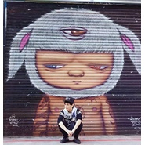

魏路遥
============================

|  |  |
| :--: | :-- |
| [ 魏路遥](https://i.xiami.com/wsjdewly) | **地区**: China 中国大陆 **风格**: 国语流行 Mandarin Pop **播放数**: 3660994 **粉丝数**: 87 **评论数**: 10  |

## 档案

音乐爱好者、制作人、歌手。

## 专辑

| 名称 | 语种 | 唱片公司 | 发行时间 | 专辑类别 | 专辑风格 |
| :--: | :-- | :-- | :-- | :-- | :-- |
| [ 遥仔翻唱](./albums/2104307808.md) | 国语 | 独立发行 | 2018年12月01日 | 录音室专辑 | 当代节奏布鲁斯 Contemporary R&B, 青少年流行 Teen Pop, 民谣流行 Folk Pop |
| [ 512汶川地震十周年](./albums/2103707026.md) | 国语 | 独立发行 | 2018年05月12日 | EP, 单曲 | 流行摇滚 Pop Rock |
| [ 真爱Live House官方主题曲](./albums/936098295.md) | 国语 | 独立发行 | 2015年07月05日 | EP, 单曲 | 流行摇滚 Pop Rock, 国语流行 Mandarin Pop |
| [ 造物主.时间](./albums/721228812.md) | 国语 | 独立发行 | 2014年12月08日 | 录音室专辑 | 国语流行 Mandarin Pop |

## 评论

|  |  |  |
| :-- | :-- | :-- |
|  [虾米用户](https://emumo.xiami.com/u/348530362) Hi 2020-03-10 02:01 赞(0) 踩(0) | 
竟然是四年前的最新了吗。。。
 |
|  [虾米用户](https://emumo.xiami.com/u/45818043) 多多指教。。。 2015-12-30 04:23 赞(0) 踩(0) | 
半年没写音乐日记了，这半年发生了什么？是的，看似很忙碌，忙碌地让我差点忘了对音乐最纯粹的那颗心。。
 |
|  [虾米用户](https://emumo.xiami.com/u/45135920) 霜雪白头。 2015-10-02 12:32 赞(0) 踩(0) | 
快把《两小无猜》上传了吧求你了 
 |
|  [虾米用户](https://emumo.xiami.com/u/55586064)   2015-08-19 00:00 赞(0) 踩(0) | 
遥仔眼睛好圆
 |
|  [虾米用户](https://emumo.xiami.com/u/17599629) just go 2015-03-03 21:30 赞(0) 踩(0) | 
你确实很强啊，，哈哈
 |
| ⇒ |  [虾米用户](https://emumo.xiami.com/u/45818043) 多多指教。。。 2015-05-05 15:32 赞(0) 踩(0) | 
耶，道哥，哈哈，自娱自乐嘛
 |
|  [虾米用户](https://emumo.xiami.com/u/45763450)  2015-01-17 10:59 赞(0) 踩(0) | 
我觉得你该去《中国好歌曲》
 |
|  [虾米用户](https://emumo.xiami.com/u/27327801)  2015-01-16 20:43 赞(0) 踩(0) | 
为了听歌，专门下的虾米～～～为什么是虾米～～
 |
|  [虾米用户](https://emumo.xiami.com/u/46082365)  2015-01-16 00:31 赞(0) 踩(0) | 
为了听遥姐新歌，我特别下载了虾米……我是真粉
 |
|  [虾米用户](https://emumo.xiami.com/u/45818043) 多多指教。。。 2015-01-14 17:17 赞(0) 踩(0) | 
我刚入驻了虾米音乐人，欢迎大家来我的个人主页，收听我的最新音乐
 |
