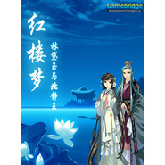

三世缘
============================

|  |  |
| :--: | :-- |
| [ 三世缘](https://emumo.xiami.com/album/2100304680) | **艺人**: [董真](../index.md) **语种**: 国语 **唱片公司**: 小旭音乐 **发行时间**: 2014年04月01日 **专辑类别**: EP, 单曲 **专辑风格**: 中国风 China-Wave **播放数**: 82113 **收藏数**: 57 **评论数**: 2  |

## 简介

《三世缘》是小旭音乐为北京娱乐通研发的单机游戏《红楼梦：林黛玉与北静王》精心打造的一首主题歌，由仙侠才女董贞唯美演唱，婉约的歌词如诗如画，歌手纯美的声线让歌曲拥有了直入人心的力量。

## 曲目

## 评论

|  |  |  |
| :-- | :-- | :-- |
|  [虾米用户](https://emumo.xiami.com/u/3069816)  2017-10-28 00:26 赞(0) 踩(0) | 
娱乐通红楼梦里最爱的歌之一。尤其那句“想回到，昨天。你一直在心间”。太触动灵魂了。
 |
|  [虾米用户](https://emumo.xiami.com/u/54753604) 顺其自然吧！ 2016-06-15 14:10 赞(0) 踩(0) | 
，
 |
|  [虾米用户](https://emumo.xiami.com/u/39788841)  . 2016-04-21 19:01 赞(0) 踩(0) | 
#
 |
