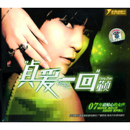

贞爱一回
============================

|  |  |
| :--: | :-- |
| [ 贞爱一回](https://emumo.xiami.com/album/292458) | **艺人**: [董真](../index.md) **语种**: 国语 **唱片公司**: 金凯盛唱片 **发行时间**: 2007年08月13日 **专辑类别**: 录音室专辑 **专辑风格**:  **播放数**: 1207449 **收藏数**: 302 **评论数**: 34  |

## 简介

07年最贴心的女声，唱出纯美，触动心弦，乐韵动听，歌声撩人。

## 曲目

## 评论

|  |  |  |
| :-- | :-- | :-- |
|  [虾米用户](https://emumo.xiami.com/u/6921204)  2017-09-01 18:04 赞(0) 踩(0) | 
2007年的音乐，那些年我还在玩穿越火线，曾经的年少
 |
|  [虾米用户](https://emumo.xiami.com/u/6921204)  2017-09-01 18:04 赞(0) 踩(0) | 
2007年的音乐，那些年我还在玩穿越火线，曾经的年少
 |
|  [虾米用户](https://emumo.xiami.com/u/7627013) 考古，深度挖掘华语音乐 2017-08-12 12:53 赞(0) 踩(0) | 
好甜啊
 |
|  [虾米用户](https://emumo.xiami.com/u/29537993) 高山流水 2017-02-12 17:55 赞(0) 踩(0) | 
好听
 |
|  [虾米用户](https://emumo.xiami.com/u/5106725) 我还没想好要写什么... 2016-05-01 15:34 赞(0) 踩(0) | 
好听！！
 |
|  [虾米用户](https://emumo.xiami.com/u/39788841)  . 2015-07-14 08:38 赞(0) 踩(0) | 
Lium
 |
|  [虾米用户](https://emumo.xiami.com/u/42938188)  2014-10-23 21:06 赞(0) 踩(0) | 
好
 |
|  [虾米用户](https://emumo.xiami.com/u/12258377)  2014-10-05 19:24 赞(0) 踩(0) | 
有一种爱叫放手
 |
|  [虾米用户](https://emumo.xiami.com/u/524532) 我还没想好要写什么... 2014-07-09 02:08 赞(0) 踩(0) | 
是好声音第一季里蒙面唱武侠的姑娘么？
 |
| ⇒ |  [虾米用户](https://emumo.xiami.com/u/18282119) 我就是我，独一无二 2014-09-20 14:53 赞(0) 踩(0) | 
是滴。
 |
| ⇒ |  [虾米用户](https://emumo.xiami.com/u/208342223)  尘世中迷途小书童…… 2017-06-23 21:31 赞(0) 踩(0) | 
是的，居然被淘汰。
 |
|  [虾米用户](https://emumo.xiami.com/u/13431140) 追求一个有趣的灵魂～ 2013-12-10 22:29 赞(0) 踩(0) | 
美的演绎~
 |
|  [虾米用户](https://emumo.xiami.com/u/20157267)  2013-10-19 01:29 赞(0) 踩(0) | 
聲音很乾淨
 |
|  [虾米用户](https://emumo.xiami.com/u/23865845)  2013-10-07 01:43 赞(0) 踩(0) | 
day dream
 |
|  [虾米用户](https://emumo.xiami.com/u/20643788)  2013-09-21 02:56 赞(0) 踩(0) | 
好听
 |
|  [虾米用户](https://emumo.xiami.com/u/6285539) 徒言树桃李，此木岂无阴。 2013-02-21 16:28 赞(0) 踩(0) | 
高品质翻唱，风格独特。
 |
|  [虾米用户](https://emumo.xiami.com/u/10454155)  2012-09-01 11:51 赞(0) 踩(0) | 
因为喜欢你贞姐姐
 |
|  [虾米用户](https://emumo.xiami.com/u/3997952) 室不可无音乐 2012-03-28 09:13 赞(0) 踩(0) | 
大陆,华语女歌手,纯音乐,喜欢风格,
 |
|  [虾米用户](https://emumo.xiami.com/u/3104716) 我还没想好要写什么... 2012-02-09 01:36 赞(0) 踩(0) | 
董贞--《贞爱一回》
 |
|  [虾米用户](https://emumo.xiami.com/u/7803586)  2012-02-04 19:57 赞(0) 踩(0) | 
非常的好听
 |
|  [虾米用户](https://emumo.xiami.com/u/7803586)  2012-02-04 19:57 赞(0) 踩(0) | 
真的很好听
 |
|  [虾米用户](https://emumo.xiami.com/u/2673320)  2011-11-29 19:18 赞(0) 踩(0) | 
听着如幻如梦
 |
|  [虾米用户](https://emumo.xiami.com/u/5205308)  2011-11-22 22:02 赞(0) 踩(0) | 
好听
 |
|  [虾米用户](https://emumo.xiami.com/u/6606842)  2011-11-04 15:28 赞(0) 踩(0) | 
听听
 |
|  [虾米用户](https://emumo.xiami.com/u/2349712) 小米虾 2011-10-27 20:53 赞(0) 踩(0) | 
好听
 |
|  [虾米用户](https://emumo.xiami.com/u/2904496) 我还没想好要写什么... 2011-09-20 08:36 赞(0) 踩(0) | 
翻唱可以听下
 |
|  [虾米用户](https://emumo.xiami.com/u/5020101)  2011-08-15 13:19 赞(0) 踩(0) | 
最喜欢董贞了，好听死了
 |
|  [虾米用户](https://emumo.xiami.com/u/5020101)  2011-07-26 12:42 赞(0) 踩(0) | 
好听
 |
|  [虾米用户](https://emumo.xiami.com/u/4374850)  2011-07-10 10:52 赞(0) 踩(0) | 
喜欢
 |
|  [虾米用户](https://emumo.xiami.com/u/3943983)  2011-06-17 17:23 赞(0) 踩(0) | 
太唯美了~~~~
 |
|  [虾米用户](https://emumo.xiami.com/u/2803464)  2011-02-11 15:50 赞(0) 踩(0) | 
很好听
 |
|  [虾米用户](https://emumo.xiami.com/u/1342581)  2011-02-09 11:06 赞(0) 踩(0) | 
古风创作才女...董贞
 |
|  [虾米用户](https://emumo.xiami.com/u/1721762)   2011-01-03 13:50 赞(1) 踩(0) | 
董贞的歌声有一种穿透力，能够直击人的心灵最深处，非常喜欢的一位女歌手，走的路线与众不同，有前途。希望继续延续自己的风格！
 |
|  [虾米用户](https://emumo.xiami.com/u/1014540)  2010-06-13 22:34 赞(0) 踩(0) | 
晕死。。不能下载  什么都要钱
 |
