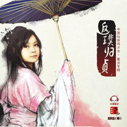

返璞归贞
============================

|  |  |
| :--: | :-- |
| [ 返璞归贞](https://emumo.xiami.com/album/345756) | **艺人**: [董真](../index.md) **语种**: 国语 **唱片公司**: 树良品文化 **发行时间**: 2009年08月27日 **专辑类别**: 录音室专辑 **专辑风格**: 中国风 China-Wave **播放数**: 7307816 **收藏数**: 1920 **评论数**: 180  |

## 简介

烟雨江南释返璞  
仙音若绪尽归贞  
  
被誉为“中国风仙侠音乐第一才女”的歌手董贞09年最新仙侠曲风大碟

## 曲目

## 评论

|  |  |  |  |
| :-- | :-- | :-- | :-- |
|  [虾米用户](https://emumo.xiami.com/u/350074255) 归去，也无风雨也无晴。 2021-01-12 09:08 赞(0) 踩(0) | 
爷青回
 |
|  [虾米用户](https://emumo.xiami.com/u/342331145) 不忘初心，方得始终！ 2019-10-05 23:45 赞(0) 踩(0) | 
很好听
 |
|  [虾米用户](https://emumo.xiami.com/u/131618)  2017-10-28 00:11 赞(0) 踩(0) | 
又是这个猪头，哈哈哈哈
 |
|  [虾米用户](https://emumo.xiami.com/u/238206120) 有花当折何须折，占有不如... 2017-07-16 16:18 赞(0) 踩(0) | 
 贞姐大才，好听，棒棒哒
 |
|  [虾米用户](https://emumo.xiami.com/u/216396348)  2016-08-22 13:44 赞(0) 踩(0) | 
非常好听，全部都喜欢
 |
|  [虾米用户](https://emumo.xiami.com/u/99243000)  2016-01-11 15:47 赞(1) 踩(0) | 
粉丝，接近于NC粉的粉丝
 |
|  [虾米用户](https://emumo.xiami.com/u/51856322)  2015-11-16 13:06 赞(0) 踩(0) | 
3232
 |
|  [虾米用户](https://emumo.xiami.com/u/75659604)  2015-11-14 14:25 赞(0) 踩(0) | 
仙剑
 |
|  [虾米用户](https://emumo.xiami.com/u/10185885)  2015-11-06 12:50 赞(0) 踩(0) | 
【返璞归贞】中国风仙侠音乐 董贞
 |
|  [虾米用户](https://emumo.xiami.com/u/49017327) 爱冷剑怜悲箫 月下狼孤啸... 2015-09-27 12:38 赞(0) 踩(0) | 
大爱贞姐
 |
|  [虾米用户](https://emumo.xiami.com/u/9079735)  2015-07-11 10:46 赞(0) 踩(0) | 
声音确实有侠气
 |
|  [虾米用户](https://emumo.xiami.com/u/3987161)  2015-06-07 18:03 赞(0) 踩(0) | 
返璞归贞,中国风,董贞,女声 古韵,
 |
|  [虾米用户](https://emumo.xiami.com/u/3987161)  2015-06-07 18:03 赞(0) 踩(0) | 
返璞归贞,中国风,董贞,女声 古韵,
 |
|  [虾米用户](https://emumo.xiami.com/u/47583845)   2015-06-03 13:08 赞(1) 踩(0) | 
金缕衣真是当年一曲入坑
 |
|  [虾米用户](https://emumo.xiami.com/u/16044932)  2015-05-09 16:44 赞(0) 踩(0) | 
金缕衣填词填得好！
 |
|  [虾米用户](https://emumo.xiami.com/u/10484022)  2015-04-08 20:30 赞(0) 踩(0) | 
曲风大赞
 |
|  [虾米用户](https://emumo.xiami.com/u/40599603) IsL 2015-01-12 21:04 赞(0) 踩(0) | 
好聽&amp;gt;  &amp;lt;~
 |
|  [虾米用户](https://emumo.xiami.com/u/10795656) 暂无签名~ 2014-12-19 19:49 赞(1) 踩(0) | 
笛子很美
 |
|  [虾米用户](https://emumo.xiami.com/u/18025377) 随风 2014-12-04 00:08 赞(0) 踩(0) | 
不错！
 |
|  [虾米用户](https://emumo.xiami.com/u/12271131) 牛奶と麵包 2014-11-25 23:35 赞(0) 踩(0) | 
董贞09年最新仙侠曲风大碟
 |
|  [虾米用户](https://emumo.xiami.com/u/42938188)  2014-10-23 21:07 赞(0) 踩(0) | 
好
 |
|  [虾米用户](https://emumo.xiami.com/u/42716936)  2014-10-18 21:48 赞(0) 踩(0) | 
很难得
 |
|  [虾米用户](https://emumo.xiami.com/u/4276421) 红尘飞雨悟剑声 2014-09-22 14:49 赞(0) 踩(0) | 
...又重新发布了？够快的。
 |
|  [虾米用户](https://emumo.xiami.com/u/4276421) 红尘飞雨悟剑声 2014-09-22 08:40 赞(0) 踩(0) | 
怎么变成未发布了...
 |
|  [虾米用户](https://emumo.xiami.com/u/5691092) 爱生活 爱音乐 爱影视 2014-09-17 22:58 赞(0) 踩(0) | 
收藏
 |
|  [虾米用户](https://emumo.xiami.com/u/29784768)  2014-08-27 13:18 赞(0) 踩(0) | 
有感觉
 |
|  [虾米用户](https://emumo.xiami.com/u/1601859) 想啊想啊，想起你了。 2014-08-23 18:03 赞(0) 踩(0) | 
最棒的一张专辑，相思引，雕花笼……百听不厌。
 |
|  [虾米用户](https://emumo.xiami.com/u/39148406)  2014-08-18 15:12 赞(0) 踩(0) | 
贞姐最好的一张专辑。
 |
|  [虾米用户](https://emumo.xiami.com/u/16509046) 躺在音乐里的女人 2014-08-02 23:24 赞(0) 踩(0) | 
很美的韵味
 |
|  [虾米用户](https://emumo.xiami.com/u/6439679)  2014-07-23 21:48 赞(0) 踩(0) | 
穿越时空的音乐。
 |
|  [虾米用户](https://emumo.xiami.com/u/231797) 活着真好 好好活着 2014-07-02 20:56 赞(0) 踩(0) | 
~
 |
|  [虾米用户](https://emumo.xiami.com/u/37249253) 我一直在，只是你不知道而 2014-06-08 11:52 赞(0) 踩(0) | 
不错。
 |
|  [虾米用户](https://emumo.xiami.com/u/7812867)  2014-05-27 22:48 赞(0) 踩(0) | 
古风古韵
 |
|  [虾米用户](https://emumo.xiami.com/u/28863699)  2014-04-26 18:09 赞(0) 踩(0) | 
good
 |
|  [虾米用户](https://emumo.xiami.com/u/675774)  2014-04-25 14:22 赞(0) 踩(0) | 
[情醉]好聽!!!
 |
|  [虾米用户](https://emumo.xiami.com/u/34271717)  2014-04-16 23:45 赞(0) 踩(0) | 
半月琴的前奏应该不是笛子，我觉得这曲子大部分还是用了萧
 |
|  [虾米用户](https://emumo.xiami.com/u/1485542) 情深多有误 2014-04-07 12:48 赞(1) 踩(0) | 
太做作了
 |
|  [虾米用户](https://emumo.xiami.com/u/5710594) 以马内利 2014-04-03 11:51 赞(0) 踩(0) | 
听得人越多的歌越不咋地，一听就开头就知道了——假模假式的。
 |
|  [虾米用户](https://emumo.xiami.com/u/1609946) 一即一切 2014-03-12 11:51 赞(0) 踩(0) | 
心 境不二
 |
| ⇒ |  [虾米用户](https://emumo.xiami.com/u/3446941) 挺住！ 2014-04-03 11:01 赞(0) 踩(0) | 
真是哪都有你啊 拜服
 |
|  [虾米用户](https://emumo.xiami.com/u/2644287) 好看的皮囊现实劈腿 有趣... 2014-03-10 22:06 赞(0) 踩(0) | 
还是最喜欢董贞这张专了，雕花笼，逍遥游都是单曲循环过非常久的歌(^３^)
 |
|  [虾米用户](https://emumo.xiami.com/u/33386803) 暂无签名~ 2014-02-28 20:33 赞(0) 踩(0) | 
喜欢董贞的歌曲，唯美动听
 |
|  [虾米用户](https://emumo.xiami.com/u/14851468) jay 2014-01-18 10:11 赞(0) 踩(0) | 
不錯
 |
| ⇒ |  [虾米用户](https://emumo.xiami.com/u/12552845) 稻艹人爱上蛇 2014-02-18 19:58 赞(0) 踩(0) | 
frtthhkolp跑跑
 |
|  [虾米用户](https://emumo.xiami.com/u/29051941) 修炼自身 2013-12-30 00:23 赞(0) 踩(0) | 
夙来喜欢
 |
|  [虾米用户](https://emumo.xiami.com/u/10932472) 浪琴 2013-09-13 02:20 赞(0) 踩(0) | 
00
 |
|  [虾米用户](https://emumo.xiami.com/u/21187365)  2013-09-05 12:08 赞(0) 踩(0) | 
很温柔。很喜欢。
 |
|  [虾米用户](https://emumo.xiami.com/u/20643788)  2013-09-02 17:36 赞(0) 踩(0) | 
雕花笼 - 情醉,金缕衣,
 |
|  [虾米用户](https://emumo.xiami.com/u/484041)  2013-08-31 23:36 赞(0) 踩(0) | 
额。。。。。虽然听着也蛮好听的。。。。但是那个相思引开头也实在太熟悉了。。。。。。<a href="http://www.xiami.com/song/3483780?spm=a1z1s.6659509.0.0.OUCMf0" target="_blank" rel="nofollow noreferrer noopener">http://www.xiami.com/song/3483780?spm=a1z1s.6659509.0.0.OUCMf0</a>突然不知道怎么做评论了。。。。。。
 |
|  [虾米用户](https://emumo.xiami.com/u/361287) 我还没想好要写什么... 2013-08-02 13:45 赞(0) 踩(0) | 
哟 不错哦
 |
|  [虾米用户](https://emumo.xiami.com/u/15507626) anigonghao 2013-07-03 13:35 赞(1) 踩(0) | 
难得的曲风
 |
|  [虾米用户](https://emumo.xiami.com/u/8818750)  2013-06-10 22:22 赞(0) 踩(0) | 
歌很好听
 |
|  [虾米用户](https://emumo.xiami.com/u/13491972) 执着于出人头地难，不执着... 2013-06-08 14:54 赞(0) 踩(0) | 
不错
 |
|  [虾米用户](https://emumo.xiami.com/u/15352012)  2013-05-20 15:34 赞(0) 踩(0) | 
听听
 |
|  [虾米用户](https://emumo.xiami.com/u/14396237)  2013-05-02 15:23 赞(0) 踩(0) | 
这个歌手是不是就是那一个去参加过中国好声音的那一个？
 |
| ⇒ |  [虾米用户](https://emumo.xiami.com/u/1935870)  2013-05-18 22:40 赞(0) 踩(0) | 
是的
 |
| ⇒ |  [虾米用户](https://emumo.xiami.com/u/3265314) 用音乐致青春 2013-07-20 21:52 赞(0) 踩(0) | 
那天若选，相思引，多好
 |
| ⇒ |  [虾米用户](https://emumo.xiami.com/u/2369834)  2013-08-29 15:31 赞(0) 踩(0) | 
<q><b>皮豆豆说：</b></q>
 |
|  [虾米用户](https://emumo.xiami.com/u/6898005)  2013-04-24 16:16 赞(0) 踩(0) | 
喜欢董贞的声音，喜欢她的歌
 |
|  [虾米用户](https://emumo.xiami.com/u/492360) 失恋不是自杀的借口 继续... 2013-04-06 06:06 赞(1) 踩(0) | 
这种音乐太难得了
 |
|  [虾米用户](https://emumo.xiami.com/u/9337798) 音乐，不只是一种娱乐，更... 2013-03-16 22:55 赞(1) 踩(0) | 
中国风，好听，仙女
 |
|  [虾米用户](https://emumo.xiami.com/u/7867049)  2013-02-26 09:35 赞(0) 踩(0) | 
精品
 |
|  [虾米用户](https://emumo.xiami.com/u/13183107) 静听星空物语，淡看物是人... 2013-02-22 16:14 赞(0) 踩(0) | 
喜欢董贞仙侠风的音乐~~~
 |
|  [虾米用户](https://emumo.xiami.com/u/13183107) 静听星空物语，淡看物是人... 2013-02-22 16:13 赞(0) 踩(0) | 
喜欢仙侠风的音乐！
 |
|  [虾米用户](https://emumo.xiami.com/u/11159124) 今生都是第一次。 2013-01-28 15:07 赞(0) 踩(0) | 
烟雨江南释返璞，仙音若绪尽归贞。
 |
|  [虾米用户](https://emumo.xiami.com/u/12724448)  2013-01-27 12:46 赞(0) 踩(0) | 
中国风
 |
|  [虾米用户](https://emumo.xiami.com/u/9270969)  2013-01-13 12:58 赞(0) 踩(0) | 
喜欢
 |
|  [虾米用户](https://emumo.xiami.com/u/9134017)  2013-01-12 14:37 赞(0) 踩(0) | 
听听
 |
|  [虾米用户](https://emumo.xiami.com/u/4019917)  2012-12-14 16:42 赞(0) 踩(0) | 
喜欢这张专辑
 |
|  [虾米用户](https://emumo.xiami.com/u/11572622) 不如就相忘江湖间 2012-11-20 11:40 赞(0) 踩(0) | 
第一首不是叫《烟雨江南》么？
 |
|  [虾米用户](https://emumo.xiami.com/u/10141903)  2012-11-06 14:29 赞(0) 踩(0) | 
淡淡的伤感
 |
|  [虾米用户](https://emumo.xiami.com/u/10893768)  2012-11-04 00:38 赞(0) 踩(0) | 
很好听
 |
|  [虾米用户](https://emumo.xiami.com/u/11317159)  2012-11-02 18:06 赞(0) 踩(0) | 
唯美，感伤，欲语泪先流
 |
|  [虾米用户](https://emumo.xiami.com/u/4733800) 真心爱音乐 2012-10-10 21:58 赞(0) 踩(0) | 
喜欢古风
 |
|  [虾米用户](https://emumo.xiami.com/u/1053194)  2012-10-09 22:51 赞(1) 踩(0) | 
参加什么JB“肿锅吼呻吟”，什么JB砖家，坚持自己的就对了！
 |
|  [虾米用户](https://emumo.xiami.com/u/930635)  2012-10-08 17:31 赞(0) 踩(0) | 
好听好听真好听
 |
|  [虾米用户](https://emumo.xiami.com/u/10935149)  2012-10-05 14:09 赞(0) 踩(0) | 
最喜欢这种古风歌曲了
 |
|  [虾米用户](https://emumo.xiami.com/u/8962302) ~love you~ 2012-10-01 23:15 赞(0) 踩(0) | 
其实她已经很出名了，真没必要去参加所谓的中国好声音。
 |
|  [虾米用户](https://emumo.xiami.com/u/811096) 优美的低于生活 2012-09-13 16:56 赞(0) 踩(0) | 
她不是参加中国好声音的么？其实当时就蛮喜欢她的
 |
|  [虾米用户](https://emumo.xiami.com/u/10454155)  2012-09-01 11:49 赞(0) 踩(0) | 
因为喜欢
 |
|  [虾米用户](https://emumo.xiami.com/u/5901773)  2012-07-27 15:13 赞(0) 踩(0) | 
就是喜欢这样柔美婉约的好声音
 |
|  [虾米用户](https://emumo.xiami.com/u/9326719)  2012-07-26 12:39 赞(0) 踩(0) | 
仙风道骨，音色出众
 |
|  [虾米用户](https://emumo.xiami.com/u/5609103)  2012-07-24 11:09 赞(0) 踩(0) | 
旧歌新唱 怀旧又憧憬美地很！！！
 |
|  [虾米用户](https://emumo.xiami.com/u/9773621) 忘记吧 2012-07-11 21:00 赞(0) 踩(0) | 
喜欢唯美的音乐
 |
|  [虾米用户](https://emumo.xiami.com/u/7841599)  2012-06-22 20:27 赞(0) 踩(0) | 
喜欢这种古风歌曲
 |
|  [虾米用户](https://emumo.xiami.com/u/7447146) 暂无签名~ 2012-06-01 21:58 赞(0) 踩(0) | 
漠然的翻唱更有爱~~~
 |
|  [虾米用户](https://emumo.xiami.com/u/9217945)  2012-05-25 08:32 赞(0) 踩(0) | 
很美能让你觉得自己穿越了
 |
|  [虾米用户](https://emumo.xiami.com/u/6567133)  2012-05-24 16:00 赞(0) 踩(0) | 
终于找到能触动心灵的歌了
 |
|  [虾米用户](https://emumo.xiami.com/u/9217945)  2012-05-23 18:55 赞(0) 踩(0) | 
唯美的中国风让你穿越
 |
|  [虾米用户](https://emumo.xiami.com/u/5680503)  2012-04-28 15:14 赞(0) 踩(0) | 
很好听的声音
 |
|  [虾米用户](https://emumo.xiami.com/u/8967887) 追寻想要的生活！！ 2012-04-26 22:19 赞(0) 踩(0) | 
中国风
 |
|  [虾米用户](https://emumo.xiami.com/u/2385173) 什么 2012-04-26 14:51 赞(0) 踩(0) | 
太适合给灵感了！！！
 |
|  [虾米用户](https://emumo.xiami.com/u/5187723)  2012-04-25 21:39 赞(0) 踩(0) | 
好爱❤❤
 |
|  [虾米用户](https://emumo.xiami.com/u/7642946)  2012-04-22 16:22 赞(0) 踩(0) | 
董贞的声音万分好听
 |
|  [虾米用户](https://emumo.xiami.com/u/8695582)   2012-04-13 21:25 赞(1) 踩(0) | 
董贞比较早也很经典的专辑。从这张专辑开始认识董贞。《情醉》直到现在都还百听不厌，一直认为，那就是碧瑶的声音……
 |
| ⇒ |  [虾米用户](https://emumo.xiami.com/u/6895907) 一只快乐的烤咩咩。。 2012-05-05 16:45 赞(0) 踩(0) | 
》_《碧瑶！~~！心疼死我了！！！
 |
|  [虾米用户](https://emumo.xiami.com/u/8793776)  2012-04-08 20:38 赞(0) 踩(0) | 
喜欢听这样的
 |
|  [虾米用户](https://emumo.xiami.com/u/8506565)  2012-03-25 12:18 赞(0) 踩(0) | 
董贞的仙侠风永远大爱，清澈透明的声音
 |
|  [虾米用户](https://emumo.xiami.com/u/6829759)  2012-03-24 13:47 赞(0) 踩(0) | 
真的不错！
 |
|  [虾米用户](https://emumo.xiami.com/u/2994126)  2012-03-17 15:59 赞(0) 踩(0) | 
古风古韵，远离世俗尘嚣...
 |
|  [虾米用户](https://emumo.xiami.com/u/7867752)  2012-03-05 13:12 赞(0) 踩(0) | 
烟雨江南释返璞，仙音若绪尽归贞。
 |
|  [虾米用户](https://emumo.xiami.com/u/8274125)  2012-03-03 18:00 赞(0) 踩(0) | 
不错
 |
|  [虾米用户](https://emumo.xiami.com/u/3088342)  2012-02-28 21:32 赞(0) 踩(0) | 
仙剑风
 |
|  [虾米用户](https://emumo.xiami.com/u/3370197)  2012-02-21 22:00 赞(0) 踩(0) | 
古典
 |
|  [虾米用户](https://emumo.xiami.com/u/2788749)  2012-02-17 18:27 赞(0) 踩(0) | 
轻灵,华美,果然这种风韵已经溶于血液中了么, 让人欲罢不能的音乐
 |
|  [虾米用户](https://emumo.xiami.com/u/3104716) 我还没想好要写什么... 2012-02-09 01:33 赞(0) 踩(0) | 
董贞--《返璞归贞》
 |
|  [虾米用户](https://emumo.xiami.com/u/2600356)  2012-02-07 22:55 赞(0) 踩(0) | 
有用处的音乐
 |
|  [虾米用户](https://emumo.xiami.com/u/479576)  2012-01-23 09:53 赞(0) 踩(0) | 
这音色无敌
 |
|  [虾米用户](https://emumo.xiami.com/u/7660523)  2012-01-22 14:41 赞(0) 踩(0) | 
灵魂被震撼了
 |
|  [虾米用户](https://emumo.xiami.com/u/7603570)  2012-01-10 20:53 赞(0) 踩(0) | 
m bhjv n
 |
|  [虾米用户](https://emumo.xiami.com/u/3228860)  2012-01-10 09:42 赞(0) 踩(0) | 
好听
 |
|  [虾米用户](https://emumo.xiami.com/u/7540612)  2012-01-05 09:53 赞(0) 踩(0) | 
喜歡
 |
|  [虾米用户](https://emumo.xiami.com/u/7195209)  2012-01-04 12:37 赞(0) 踩(0) | 
甜美的女声
 |
|  [虾米用户](https://emumo.xiami.com/u/6950773) 聽..  風在哪唱歌 2011-12-31 06:06 赞(0) 踩(0) | 
..
 |
|  [虾米用户](https://emumo.xiami.com/u/1196702)  2011-12-28 15:01 赞(0) 踩(0) | 
ok
 |
|  [虾米用户](https://emumo.xiami.com/u/3599440) 乡村女 2011-12-27 09:35 赞(0) 踩(0) | 
烟雨江南  愁音若绪
 |
|  [虾米用户](https://emumo.xiami.com/u/175240)  2011-12-23 15:28 赞(0) 踩(0) | 
中国风
 |
|  [虾米用户](https://emumo.xiami.com/u/1768964) 妈咪妈咪吼～ 2011-12-23 01:07 赞(0) 踩(0) | 
热爱古风，欣赏美妙的旋律，喜欢她唯美的声音～
 |
|  [虾米用户](https://emumo.xiami.com/u/629949)  2011-12-11 22:48 赞(0) 踩(0) | 
什么叫神音!!
 |
|  [虾米用户](https://emumo.xiami.com/u/1053194)  2011-12-08 22:16 赞(0) 踩(0) | 
贞好听！
 |
|  [虾米用户](https://emumo.xiami.com/u/5205308)  2011-11-22 22:03 赞(0) 踩(0) | 
好听
 |
|  [虾米用户](https://emumo.xiami.com/u/6619480)  2011-11-18 18:58 赞(0) 踩(0) | 
大爱贞姐！
 |
|  [虾米用户](https://emumo.xiami.com/u/1624404)  2011-11-17 21:01 赞(0) 踩(0) | 
好似听过。
 |
|  [虾米用户](https://emumo.xiami.com/u/6779566)  2011-11-14 19:49 赞(0) 踩(0) | 
找到我的感覺
 |
|  [虾米用户](https://emumo.xiami.com/u/4927484)  2011-11-07 13:26 赞(0) 踩(0) | 
好听
 |
|  [虾米用户](https://emumo.xiami.com/u/6606842)  2011-11-04 15:32 赞(0) 踩(0) | 
听听
 |
|  [虾米用户](https://emumo.xiami.com/u/1942555) 期待人生中的“阿花”。 2011-11-04 15:30 赞(0) 踩(0) | 
现代的节奏与古典的歌词
 |
|  [虾米用户](https://emumo.xiami.com/u/4744931) 猫仍然是猫，鱼只能是鱼。 2011-11-02 17:32 赞(0) 踩(0) | 
如闻仙乐耳暂明。
 |
|  [虾米用户](https://emumo.xiami.com/u/4744931) 猫仍然是猫，鱼只能是鱼。 2011-11-02 17:30 赞(0) 踩(0) | 
觉得游戏配这种音乐，太具吸引力啦~
 |
|  [虾米用户](https://emumo.xiami.com/u/6277219)  2011-10-16 10:57 赞(0) 踩(0) | 
为仙侠音乐作出贡献的都鼎了。
 |
|  [虾米用户](https://emumo.xiami.com/u/6112063)  2011-10-04 23:14 赞(0) 踩(0) | 
喜欢中国风  民族的还是有最有特色
 |
|  [虾米用户](https://emumo.xiami.com/u/6106773) 暂无签名~ 2011-10-04 17:47 赞(0) 踩(0) | 
一直喜欢中国风和创作了这么优美的有中国韵味的作曲者
 |
|  [虾米用户](https://emumo.xiami.com/u/6106773) 暂无签名~ 2011-10-04 17:30 赞(0) 踩(0) | 
好听
 |
|  [虾米用户](https://emumo.xiami.com/u/5188548) 只愿得一人心，白首不分离... 2011-09-19 23:18 赞(0) 踩(0) | 
来洗洗心
 |
|  [虾米用户](https://emumo.xiami.com/u/2644287) 好看的皮囊现实劈腿 有趣... 2011-09-05 22:28 赞(0) 踩(0) | 
好音乐没有理由不推荐，听多了浮躁的歌再来听这个，特别洗耳朵，好专辑！
 |
|  [虾米用户](https://emumo.xiami.com/u/2062485) 深夜的沿海公路配音乐 2011-09-02 13:46 赞(0) 踩(0) | 
董贞的古风还不错
 |
|  [虾米用户](https://emumo.xiami.com/u/5634387)  2011-08-30 20:15 赞(0) 踩(0) | 
声线自然，音色纯美。
 |
|  [虾米用户](https://emumo.xiami.com/u/5156556)  2011-08-06 23:50 赞(0) 踩(0) | 
古风
 |
|  [虾米用户](https://emumo.xiami.com/u/4899699)  2011-08-04 09:33 赞(0) 踩(0) | 
古风
 |
|  [虾米用户](https://emumo.xiami.com/u/4313652) 一念起，萬水千山 2011-08-01 15:31 赞(0) 踩(0) | 
古风，适合伴奏
 |
|  [虾米用户](https://emumo.xiami.com/u/3024528) 暂无签名~ 2011-07-27 12:56 赞(0) 踩(0) | 
还是不错的音乐。
 |
|  [虾米用户](https://emumo.xiami.com/u/4179506)  2011-07-08 15:29 赞(0) 踩(0) | 
空灵
 |
|  [虾米用户](https://emumo.xiami.com/u/4164405)  2011-07-07 00:36 赞(0) 踩(0) | 
好听~ 歌词美
 |
|  [虾米用户](https://emumo.xiami.com/u/3621664)  2011-06-29 23:23 赞(0) 踩(0) | 
贼喜欢
 |
|  [虾米用户](https://emumo.xiami.com/u/2500746)  2011-06-26 02:53 赞(0) 踩(0) | 
悠扬的曲调~心很平静！
 |
|  [虾米用户](https://emumo.xiami.com/u/4374850)  2011-06-25 00:01 赞(0) 踩(0) | 
好听，大爱古风
 |
|  [虾米用户](https://emumo.xiami.com/u/4374850)  2011-06-25 00:00 赞(0) 踩(0) | 
喜欢大爱
 |
|  [虾米用户](https://emumo.xiami.com/u/3997952) 室不可无音乐 2011-06-21 13:55 赞(0) 踩(0) | 
最近心情较糟，人很浮躁，每首歌听来都那么好听。做古风的
 |
|  [虾米用户](https://emumo.xiami.com/u/3400632)  2011-06-20 18:30 赞(0) 踩(0) | 
就是喜欢中国风。
 |
|  [虾米用户](https://emumo.xiami.com/u/4319219) 账户已注销 2011-06-17 12:50 赞(0) 踩(0) | 
歌曲超赞
 |
|  [虾米用户](https://emumo.xiami.com/u/3803382)  2011-05-23 01:32 赞(0) 踩(0) | 
就是喜欢中国风。
 |
|  [虾米用户](https://emumo.xiami.com/u/3607626)  2011-05-22 20:42 赞(0) 踩(0) | 
古典仙侠的旗帜人物~~~~~~
 |
|  [虾米用户](https://emumo.xiami.com/u/2343483) 把心情藏在歌里，把回忆藏... 2011-05-14 20:01 赞(0) 踩(0) | 
古风古色，美丽的故事，纯粹的爱~
 |
|  [虾米用户](https://emumo.xiami.com/u/3881506)  2011-05-09 08:12 赞(0) 踩(0) | 
不知道为什么  我就是喜欢古典仙侠曲风的歌
 |
|  [虾米用户](https://emumo.xiami.com/u/3836139)  2011-05-05 11:22 赞(0) 踩(0) | 
喜欢
 |
|  [虾米用户](https://emumo.xiami.com/u/1213016) 老鬼：午夜梦回 【带感】 2011-04-26 15:41 赞(0) 踩(0) | 
很早以前从头至尾听了一遍，中上乘之作
 |
|  [虾米用户](https://emumo.xiami.com/u/2147722) 欢然取水 2011-04-04 16:37 赞(0) 踩(0) | 
看小说的时候听~
 |
|  [虾米用户](https://emumo.xiami.com/u/1367480)  2011-04-01 18:40 赞(0) 踩(0) | 
贞姐在我心目中的地位绝对是无法撼动的。
 |
|  [虾米用户](https://emumo.xiami.com/u/2725459)  2011-03-06 23:12 赞(0) 踩(0) | 
仙侠，才女。
 |
|  [虾米用户](https://emumo.xiami.com/u/2529384) 暂无签名~ 2011-03-04 19:43 赞(0) 踩(0) | 
烟雨江南释返璞
 |
|  [虾米用户](https://emumo.xiami.com/u/363672)  2011-03-03 20:58 赞(0) 踩(0) | 
诗意 仙境
 |
|  [虾米用户](https://emumo.xiami.com/u/1790451)  2011-03-01 16:26 赞(0) 踩(0) | 
返璞归贞
 |
|  [虾米用户](https://emumo.xiami.com/u/2882410) 我还没想好要写什么... 2011-02-19 00:55 赞(0) 踩(0) | 
中国的也是世界的
 |
|  [虾米用户](https://emumo.xiami.com/u/2803464)  2011-02-11 15:49 赞(0) 踩(0) | 
很好听
 |
|  [虾米用户](https://emumo.xiami.com/u/1342581)  2011-02-09 11:08 赞(0) 踩(0) | 
古风创作才女...董贞
 |
|  [虾米用户](https://emumo.xiami.com/u/1187725)  2011-01-27 14:14 赞(0) 踩(0) | 
中国风
 |
|  [虾米用户](https://emumo.xiami.com/u/995967)  2011-01-23 16:35 赞(0) 踩(0) | 
曾经迷过一阵。
 |
|  [虾米用户](https://emumo.xiami.com/u/189090)  2011-01-20 12:22 赞(0) 踩(0) | 
..
 |
|  [虾米用户](https://emumo.xiami.com/u/2217227)  2011-01-06 20:15 赞(0) 踩(0) | 
偏爱古风不解释
 |
|  [虾米用户](https://emumo.xiami.com/u/2217227)  2010-12-18 00:40 赞(0) 踩(0) | 
夜深那一抹静静的想念……
 |
|  [虾米用户](https://emumo.xiami.com/u/80935)  2010-12-13 15:38 赞(0) 踩(0) | 
不喜欢翻唱的那些，实在是不适合，原创的不错
 |
|  [虾米用户](https://emumo.xiami.com/u/1622949)  2010-10-17 10:17 赞(0) 踩(0) | 
震撼！！  有种重回盛世的感觉。。
 |
|  [虾米用户](https://emumo.xiami.com/u/341441)  2010-09-18 17:08 赞(0) 踩(0) | 
返璞归贞
 |
|  [虾米用户](https://emumo.xiami.com/u/1027949)  2010-08-30 13:10 赞(0) 踩(0) | 
声音真的很好听,整个人就像融入中国古风之中
 |
|  [虾米用户](https://emumo.xiami.com/u/787752)  2010-05-03 18:51 赞(0) 踩(0) | 
感觉真的很不错的，推荐哈哈
 |
|  [虾米用户](https://emumo.xiami.com/u/754255) 千寻1989 2010-04-02 02:30 赞(0) 踩(0) | 
倾心倾耳
 |
|  [虾米用户](https://emumo.xiami.com/u/685)  2010-02-07 19:07 赞(0) 踩(0) | 
说实话感觉不到仙气。
 |
| ⇒ |  [虾米用户](https://emumo.xiami.com/u/2190428) 一梦如是 2010-12-22 10:55 赞(0) 踩(0) | 
实话说吧，有玩过仙剑哪部作品？
 |
| ⇒ |  [虾米用户](https://emumo.xiami.com/u/6106773) 暂无签名~ 2011-10-04 20:22 赞(0) 踩(0) | 
仙气？！！你听歌就为感觉仙气 老兄以为你在修炼啊 看来我还没到你那种境界啊
 |
|  [虾米用户](https://emumo.xiami.com/u/20870)  2009-11-02 22:18 赞(0) 踩(0) | 
听罢、可算是仙侠音乐的登封之作，顶！！！
 |
