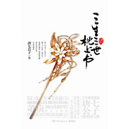

枕上书
============================

|  |  |
| :--: | :-- |
| [ 枕上书](https://emumo.xiami.com/album/516829) | **艺人**: [董真](../index.md) **语种**: 国语 **唱片公司**: 三生三世枕上书 **发行时间**: 2012年05月24日 **专辑类别**: EP, 单曲 **专辑风格**:  **播放数**: 356535 **收藏数**: 447 **评论数**: 61  |

## 简介

## 曲目

## 评论

|  |  |  |
| :-- | :-- | :-- |
|  [虾米用户](https://emumo.xiami.com/u/256393215) 音乐无边 2017-05-28 20:29 赞(0) 踩(0) | 
沒看过。
 |
|  [虾米用户](https://emumo.xiami.com/u/59163496)  2015-10-17 12:24 赞(0) 踩(0) | 
真的很好听，很感人  
 |
|  [虾米用户](https://emumo.xiami.com/u/50344556)  2015-06-02 14:00 赞(0) 踩(0) | 
足够
 |
|  [虾米用户](https://emumo.xiami.com/u/44626978)  2014-12-27 19:38 赞(0) 踩(0) | 
好
 |
|  [虾米用户](https://emumo.xiami.com/u/27731042)  2014-10-27 01:16 赞(2) 踩(0) | 
怎觉得前奏和了结那么像。。。枕上书上部还可以，下部完全是各种狗血老套烂尾啊。。。
 |
| ⇒ |  [虾米用户](https://emumo.xiami.com/u/39176878) 当君白首同归日，是我青山... 2015-04-26 22:58 赞(0) 踩(0) | 
枕上书下本真的写得很凌乱_(:_」∠)_…
 |
|  [虾米用户](https://emumo.xiami.com/u/7093141) 心香一瓣 2014-04-17 17:31 赞(1) 踩(0) | 
刚哭完，回来听歌~
 |
|  [虾米用户](https://emumo.xiami.com/u/7317623)  2014-03-06 05:02 赞(1) 踩(0) | 
枕上书居然还有歌！
 |
| ⇒ |  [虾米用户](https://emumo.xiami.com/u/8624983) 我以前的评论都好孩子气啊 2014-06-15 15:29 赞(0) 踩(0) | 
枕上书书里不是带张CD么，里面有首歌还有部广播剧。
 |
|  [虾米用户](https://emumo.xiami.com/u/31952716)  2014-01-21 17:16 赞(1) 踩(0) | 
超好听！！
 |
|  [虾米用户](https://emumo.xiami.com/u/20643788)  2013-09-21 02:51 赞(1) 踩(0) | 
好听
 |
|  [虾米用户](https://emumo.xiami.com/u/9314765)  2013-05-07 14:09 赞(1) 踩(0) | 
舒服！
 |
|  [虾米用户](https://emumo.xiami.com/u/9337798) 音乐，不只是一种娱乐，更... 2013-03-18 21:01 赞(1) 踩(0) | 
好听，很喜欢
 |
|  [虾米用户](https://emumo.xiami.com/u/9926785)  2013-02-26 12:52 赞(1) 踩(0) | 
喜欢
 |
|  [虾米用户](https://emumo.xiami.com/u/9261591)  2012-10-31 22:20 赞(1) 踩(0) | 
等下部... 七公子真是有才,又写文又填词,赞!
 |
|  [虾米用户](https://emumo.xiami.com/u/11229514)  2012-10-29 20:38 赞(1) 踩(0) | 
三生三世枕上书
 |
|  [虾米用户](https://emumo.xiami.com/u/10931566) 月夜疯狂 2012-10-05 10:39 赞(0) 踩(0) | 
喜欢
 |
|  [虾米用户](https://emumo.xiami.com/u/8755909)  2012-10-03 17:59 赞(1) 踩(0) | 
在要回家前的几分钟，再次打开了这首歌。空无一人的宿舍，满眼都是帝君和小白的种种。感谢有这样一篇文，感谢有这样一首歌，让人能够收获这样一份情感。也终于明白了枕上书的意义。等待下部~~
 |
|  [虾米用户](https://emumo.xiami.com/u/10847545)  2012-09-29 11:16 赞(0) 踩(0) | 
很好听的~~
 |
|  [虾米用户](https://emumo.xiami.com/u/9540211)  2012-09-04 20:33 赞(0) 踩(0) | 
好好哦·~大爱贞姐
 |
|  [虾米用户](https://emumo.xiami.com/u/1584482) cootin.com 2012-08-18 22:47 赞(1) 踩(0) | 
超喜欢！QQ音乐上竟然很多歌都没有，还是来虾米听歌
 |
|  [虾米用户](https://emumo.xiami.com/u/6989803)  2012-08-17 23:14 赞(0) 踩(0) | 
喜歡
 |
|  [虾米用户](https://emumo.xiami.com/u/34039) 好舍不得这里 2012-07-19 19:34 赞(0) 踩(0) | 
我想知道这本书出完没。
 |
| ⇒ |  [虾米用户](https://emumo.xiami.com/u/4306729) 不敢收新歌，往往是怕丢掉... 2012-11-02 17:52 赞(0) 踩(0) | 
还没，不过唐七现在已经在写下部了……豆瓣上可以搜到一小部分已公开的内容
 |
| ⇒ |  [虾米用户](https://emumo.xiami.com/u/34039) 好舍不得这里 2012-11-02 19:22 赞(0) 踩(0) | 
<q><b>墨困困说：</b></q>
 |
|  [虾米用户](https://emumo.xiami.com/u/9868291)  2012-07-19 00:22 赞(0) 踩(0) | 
好听
 |
|  [虾米用户](https://emumo.xiami.com/u/8074614)  2012-07-16 20:53 赞(0) 踩(0) | 
听多少次都激动的很
 |
|  [虾米用户](https://emumo.xiami.com/u/2473686)  2012-07-14 11:17 赞(0) 踩(0) | 
再把唐七的书都唱一遍吧。
 |
|  [虾米用户](https://emumo.xiami.com/u/9216980)  2012-07-10 13:35 赞(0) 踩(0) | 
静静听完这曲枕上书……
 |
|  [虾米用户](https://emumo.xiami.com/u/2502046)  2012-07-05 15:10 赞(0) 踩(0) | 
枕上书。
 |
|  [虾米用户](https://emumo.xiami.com/u/2473686)  2012-07-04 17:20 赞(0) 踩(0) | 
哎哟喂，意外搜到这个，太激动了。。。
 |
|  [虾米用户](https://emumo.xiami.com/u/332046)  2012-07-02 13:12 赞(0) 踩(0) | 
天哪，枕上书，5555555，泪花闪闪感动
 |
|  [虾米用户](https://emumo.xiami.com/u/1919575)   2012-07-01 19:20 赞(0) 踩(0) | 
这歌与词的搭配。愿做二位的脑残粉
 |
|  [虾米用户](https://emumo.xiami.com/u/7748280)  2012-07-01 16:56 赞(0) 踩(0) | 
公子的书大爱~
 |
|  [虾米用户](https://emumo.xiami.com/u/8146427)  2012-07-01 14:09 赞(0) 踩(0) | 
安安静静的音乐，很好听。
 |
|  [虾米用户](https://emumo.xiami.com/u/9239612)  2012-06-30 19:01 赞(0) 踩(0) | 
还是觉得华胥引更有感觉！
 |
|  [虾米用户](https://emumo.xiami.com/u/5533982)  2012-06-24 21:27 赞(0) 踩(0) | 
求歌词啊
 |
|  [虾米用户](https://emumo.xiami.com/u/5772572)  2012-06-23 09:04 赞(0) 踩(0) | 
因为书，因为歌
 |
|  [虾米用户](https://emumo.xiami.com/u/9098828)  2012-06-18 23:16 赞(0) 踩(0) | 
爱贞姐不解释
 |
|  [虾米用户](https://emumo.xiami.com/u/8977991)  2012-06-17 22:36 赞(0) 踩(0) | 
贞姐啊，大爱啊~
 |
|  [虾米用户](https://emumo.xiami.com/u/9447059)  2012-06-17 11:10 赞(0) 踩(0) | 
和小说相配的 音乐，挺有意境的
 |
|  [虾米用户](https://emumo.xiami.com/u/7723205)  2012-06-08 18:39 赞(0) 踩(0) | 
公子的词写得太好噜
 |
|  [虾米用户](https://emumo.xiami.com/u/8064646)  2012-06-08 08:55 赞(0) 踩(0) | 
词写得很美啊
 |
|  [虾米用户](https://emumo.xiami.com/u/6391168) 听歌是一种享受 2012-06-06 15:17 赞(0) 踩(0) | 
对我的味，很不错
 |
|  [虾米用户](https://emumo.xiami.com/u/8846732)  2012-06-06 10:13 赞(0) 踩(0) | 
书几行清音，落几段惆怅
 |
|  [虾米用户](https://emumo.xiami.com/u/7642946)  2012-06-05 19:56 赞(0) 踩(0) | 
太爱了
 |
|  [虾米用户](https://emumo.xiami.com/u/1367480)  2012-06-05 18:44 赞(0) 踩(0) | 
唐七公子和贞姐的结合，很完美。
 |
|  [虾米用户](https://emumo.xiami.com/u/5813824) 我还没想好要写什么... 2012-06-05 09:52 赞(0) 踩(0) | 
喜欢他的词和调调
 |
|  [虾米用户](https://emumo.xiami.com/u/5813824) 我还没想好要写什么... 2012-06-05 09:46 赞(0) 踩(0) | 
哦哦哦，#枕上书#的主题曲  简直是太棒啦！！！
 |
|  [虾米用户](https://emumo.xiami.com/u/2956992) 墨染霜華 2012-06-05 09:39 赞(0) 踩(0) | 
好听~~
 |
|  [虾米用户](https://emumo.xiami.com/u/9327684)  2012-06-05 08:21 赞(0) 踩(0) | 
喜欢动真的风格
 |
|  [虾米用户](https://emumo.xiami.com/u/1553278)  2012-06-05 00:04 赞(0) 踩(0) | 
公子的词，曲风不错
 |
|  [虾米用户](https://emumo.xiami.com/u/2624644) Simple as po... 2012-06-04 23:19 赞(0) 踩(0) | 
中文原创~
 |
|  [虾米用户](https://emumo.xiami.com/u/624646)  2012-06-04 23:03 赞(0) 踩(0) | 
贞姐最棒&amp;amp;gt;&amp;amp;lt;
 |
|  [虾米用户](https://emumo.xiami.com/u/3208940)  2012-06-04 22:16 赞(0) 踩(0) | 
三生三世
 |
|  [虾米用户](https://emumo.xiami.com/u/3768341)  2012-06-04 20:02 赞(0) 踩(0) | 
好听
 |
|  [虾米用户](https://emumo.xiami.com/u/8618867)  2012-06-04 18:46 赞(0) 踩(0) | 
很好听~~~
 |
|  [虾米用户](https://emumo.xiami.com/u/726463)   2012-06-04 18:45 赞(0) 踩(0) | 
.哎呀。。。
 |
|  [虾米用户](https://emumo.xiami.com/u/2049464)  2012-06-04 18:21 赞(0) 踩(0) | 
好听
 |
|  [虾米用户](https://emumo.xiami.com/u/4357749)  2012-06-04 17:47 赞(0) 踩(0) | 
喜欢~
 |
|  [虾米用户](https://emumo.xiami.com/u/6293348) 爱GD！ 2012-06-01 22:59 赞(0) 踩(0) | 
sf~~~  好听！公子作的词~
 |
