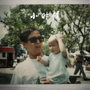

薄荷街的香草先生
============================

|  |  |
| :--: | :-- |
| [ 薄荷街的香草先生](https://i.xiami.com/yorckshi) | **地区**: China 中国大陆 **风格**: 民谣流行 Folk Pop, 国语流行 Mandarin Pop, 欧美流行 Western Pop **播放数**: 12108261 **粉丝数**: 1457 **评论数**: 113  |

## 档案

## 专辑

| 名称 | 语种 | 唱片公司 | 发行时间 | 专辑类别 | 专辑风格 |
| :--: | :-- | :-- | :-- | :-- | :-- |
| [ 大城小爱关于我爱你](./albums/2103926470.md) | 国语 | 独立发行 | 2018年08月17日 | EP, 单曲 | 流行 Pop, 国语流行 Mandarin Pop |
| [ M.E](./albums/2100190680.md) | 国语 | 薄荷街的香草先生 | 2016年12月18日 | 录音室专辑 |  |
| [ 22See You Again](./albums/2100190676.md) | 英语 | 薄荷街的香草先生 | 2016年07月08日 | 录音室专辑 |  |
| [ 小时候（给爸爸）](./albums/2100234208.md) | 国语 | 独立发行 | 2015年11月08日 | EP, 单曲 | 国语流行 Mandarin Pop |
| [ 他夏了夏天](./albums/2100185282.md) | 国语 | 独立发行 | 2015年08月26日 | EP, 单曲 | 国语流行 Mandarin Pop |
| [ Lost Stars](./albums/2100176348.md) | 英语 | 独立发行 | 2015年08月09日 | EP, 单曲 | 欧美流行 Western Pop |

## 评论

|  |  |  |
| :-- | :-- | :-- |
|  [虾米用户](https://emumo.xiami.com/u/402496347)  2020-12-02 15:18 赞(0) 踩(0) | 
之前就听了他夏了夏天，现在又听到别首，好听
 |
|  [虾米用户](https://emumo.xiami.com/u/426109161) 我还没想好要写什么... 2020-10-24 20:28 赞(1) 踩(0) | 
由多米到虾米，算是个老粉了，哈哈
 |
|  [虾米用户](https://emumo.xiami.com/u/316261284) 到最后…… 2020-05-25 20:25 赞(0) 踩(0) | 
不错哦
 |
|  [虾米用户](https://emumo.xiami.com/u/294497725)  2020-05-01 22:20 赞(1) 踩(0) | 
真的 粉了开始到现在
 |
|  [虾米用户](https://emumo.xiami.com/u/322235515) 在音乐里澎湃，在玩笑里开... 2020-01-23 08:09 赞(0) 踩(0) | 
伴奏很温柔，超过原唱。
 |
|  [虾米用户](https://emumo.xiami.com/u/291485613)  2020-01-20 10:27 赞(0) 踩(0) | 
我老公(他是美国人)听了你的five hundred miles 后他说和原唱很接近，只有一个词他问我歌手是不是中国人，我说你怎么知道， 他说中国人发音'the'有口音 
 |
| ⇒ |  [虾米用户](https://emumo.xiami.com/u/43048767) Let's enjoy ... 2020-01-23 10:38 赞(0) 踩(0) | 
哈哈哈 你说完又去听了一遍 果然我是中国人，完全没听出来 
 |
| ⇒ |  [虾米用户](https://emumo.xiami.com/u/291485613)  2020-01-23 22:33 赞(0) 踩(0) | 
由于工作关系他跑过100个国家，他能听出来，我听不出来，如果不是the暴露，他根本分辨不出来 母语歌手唱的还是中国歌手 
 |
|  [虾米用户](https://emumo.xiami.com/u/293692544) 你敢给我说话吗？我咬你 2019-12-01 20:01 赞(1) 踩(0) | 
好听
 |
|  [虾米用户](https://emumo.xiami.com/u/401315234) 超爱老大鬼鬼！攻铁大大放... 2019-08-30 21:20 赞(3) 踩(0) | 
你唱得很温柔，很好听，压喉的音像林宥嘉。
 |
|  [虾米用户](https://emumo.xiami.com/u/217822883) 我们外太空再见啦✧٩(ˊ... 2019-05-24 11:13 赞(1) 踩(0) | 
文艺范儿
 |
|  [虾米用户](https://emumo.xiami.com/u/251481777) 非主流子杀马特子 2019-05-04 00:25 赞(1) 踩(0) | 
静候佳音
 |
|  [虾米用户](https://emumo.xiami.com/u/369338559)  2019-04-28 20:31 赞(1) 踩(0) | 
很好听的名字
 |
|  [虾米用户](https://emumo.xiami.com/u/407216340)  2019-01-29 15:58 赞(1) 踩(0) | 
很喜欢，就是收费 
 |
| ⇒ |  [虾米用户](https://emumo.xiami.com/u/354739114)  2020-03-09 13:50 赞(0) 踩(0) | 
可以听呀，免费
 |
|  [虾米用户](https://emumo.xiami.com/u/402497507)  2018-11-24 22:18 赞(1) 踩(0) | 
还不错
 |
|  [虾米用户](https://emumo.xiami.com/u/337322731)  2018-10-09 21:13 赞(2) 踩(0) | 
你好( ^_^)／
 |
|  [虾米用户](https://emumo.xiami.com/u/294497725)  2018-09-06 21:20 赞(1) 踩(0) | 
真是很温柔呢
 |
|  [虾米用户](https://emumo.xiami.com/u/294497725)  2018-09-06 21:18 赞(1) 踩(0) | 
喜欢死了你的歌声，粉了三年，会一直坚持听你唱歌，加油更新 
 |
|  [虾米用户](https://emumo.xiami.com/u/401363781)  2018-08-18 07:00 赞(1) 踩(0) | 
66
 |
|  [虾米用户](https://emumo.xiami.com/u/233803638) 我还没想好要写什么... 2018-07-25 22:09 赞(1) 踩(0) | 
这位仁兄，好巧啊！
 |
|  [虾米用户](https://emumo.xiami.com/u/29574658)  2018-06-09 16:38 赞(2) 踩(0) | 
四分半的鸟叫声感觉很违和，破坏了大气的感觉，歌手把人引入草原，草原上出现喳喳小鸟声，这里不是很喜欢。还是非常支持你。
 |
|  [虾米用户](https://emumo.xiami.com/u/326022718)  2018-05-05 12:48 赞(1) 踩(0) | 
加油
 |
|  [虾米用户](https://emumo.xiami.com/u/324083209) 总有智障想害本宝宝o_O 2018-04-03 21:38 赞(7) 踩(0) | 
香草先生，我是抹茶小姐哦 
 |
|  [虾米用户](https://emumo.xiami.com/u/97280822) 但愿你被温柔对待 2018-02-20 10:41 赞(4) 踩(0) | 
高三的时候开始听你的歌，现在都大二啦  时间一晃竟然过了这么久，现在再听起当时经常听的歌，仿佛又回到了过去  
 |
| ⇒ |  [虾米用户](https://emumo.xiami.com/u/294497725)  2018-09-06 21:19 赞(0) 踩(0) | 
我也是，我是高二的时候
 |
|  [虾米用户](https://emumo.xiami.com/u/195220196) 只有我还在这里 2018-02-05 01:49 赞(1) 踩(0) | 
支持你哦！
 |
|  [虾米用户](https://emumo.xiami.com/u/131977962) 活着的倒计时 2018-01-23 11:51 赞(3) 踩(0) | 
因为five hundred miles过来的，唱得真好啊。很喜欢很喜欢
 |
|  [虾米用户](https://emumo.xiami.com/u/201778551) ， 2018-01-08 22:49 赞(0) 踩(0) | 
竟然好喜欢
 |
|  [虾米用户](https://emumo.xiami.com/u/326701669)  2017-11-09 17:10 赞(1) 踩(0) | 
一见如故的歌声
 |
|  [虾米用户](https://emumo.xiami.com/u/92580628)  2017-07-07 18:38 赞(0) 踩(0) | 
棒棒哒
 |
|  [虾米用户](https://emumo.xiami.com/u/44108240) 静静听… 2017-06-14 06:33 赞(0) 踩(0) | 
唱的挺好，只是声线不适合这个歌，
 |
|  [虾米用户](https://emumo.xiami.com/u/47885888)  2017-05-06 10:35 赞(0) 踩(0) | 
迷人。
 |
|  [虾米用户](https://emumo.xiami.com/u/289719249)  2017-04-19 21:50 赞(0) 踩(0) | 
咖喱给给驾到
 |
|  [虾米用户](https://emumo.xiami.com/u/44850099)   2017-04-04 01:22 赞(1) 踩(0) | 
咳咳 本人来点个赞
 |
|  [虾米用户](https://emumo.xiami.com/u/214926033) 往往真正想要的，很远……... 2017-04-01 19:24 赞(0) 踩(0) | 
我今天把男神你的所有歌听了一遍哦！果断路转粉～男神受我一拜～
 |
|  [虾米用户](https://emumo.xiami.com/u/214926033) 往往真正想要的，很远……... 2017-04-01 19:21 赞(0) 踩(0) | 
试试古风歌吧～一定会适合你的声音的～很好听的声音哦！  
 |
|  [虾米用户](https://emumo.xiami.com/u/69812270)  2017-03-11 12:49 赞(0) 踩(0) | 

 |
|  [虾米用户](https://emumo.xiami.com/u/213613995) no man is an... 2017-03-05 07:17 赞(2) 踩(0) | 
声音觉得先生应该是 陌上人如玉 公子世无双 
 |
|  [虾米用户](https://emumo.xiami.com/u/194664167) 整 2017-02-12 13:20 赞(0) 踩(0) | 
嫁我！！
 |
|  [虾米用户](https://emumo.xiami.com/u/194664167) 整 2017-02-12 13:20 赞(1) 踩(0) | 
Five Hundred Miles（feat.Evelyn）太好听
 |
|  [虾米用户](https://emumo.xiami.com/u/7024158)  2017-02-10 00:09 赞(0) 踩(0) | 
十分喜欢薄荷
 |
|  [虾米用户](https://emumo.xiami.com/u/213613995) no man is an... 2017-01-25 17:15 赞(2) 踩(0) | 
新年快乐    
 |
|  [虾米用户](https://emumo.xiami.com/u/255600507)   2016-12-29 17:31 赞(3) 踩(0) | 
这名字好有感觉啊，我也是被这名字吸引过来的，发现歌唱的不错诶，祝你越来越好！ 
 |
|  [虾米用户](https://emumo.xiami.com/u/195668222)  2016-12-28 19:52 赞(0) 踩(0) | 
乌兰巴托的夜，全假声唱。不是很好听呀！虽然很棒！
 |
|  [虾米用户](https://emumo.xiami.com/u/191220683) 你永远也不知道你会被讨厌... 2016-12-14 18:33 赞(1) 踩(0) | 
喜欢你
 |
|  [虾米用户](https://emumo.xiami.com/u/229042832)  2016-11-08 12:13 赞(0) 踩(0) | 
乌兰巴托的夜的声音听得我好想挠桌布，你还是唱董小姐吧
 |
|  [虾米用户](https://emumo.xiami.com/u/11771636)  2016-10-16 15:38 赞(0) 踩(0) | 
声音很干净！很棒！加油！
 |
|  [虾米用户](https://emumo.xiami.com/u/35528052)  2016-09-24 15:59 赞(1) 踩(0) | 
加油加油 歌单都是我超爱的 唱的很舒服 很好听 ~
 |
|  [虾米用户](https://emumo.xiami.com/u/81311142) 一只上进青年 2016-08-22 18:57 赞(0) 踩(0) | 
这个歌单好评！
 |
|  [虾米用户](https://emumo.xiami.com/u/206100260)  2016-08-20 10:34 赞(2) 踩(0) | 
沉迷薄荷街无法自拔 
 |
|  [虾米用户](https://emumo.xiami.com/u/203773973)  2016-07-25 12:16 赞(0) 踩(0) | 
好娘炮
 |
| ⇒ |  [虾米用户](https://emumo.xiami.com/u/213613995) no man is an... 2016-12-03 08:13 赞(0) 踩(0) | 
不喜左转  拒撕            
 |
|  [虾米用户](https://emumo.xiami.com/u/200676426)  2016-07-13 23:17 赞(0) 踩(0) | 
好听
 |
|  [虾米用户](https://emumo.xiami.com/u/195220196) 只有我还在这里 2016-07-12 20:26 赞(0) 踩(0) | 
刚听了宋冬野的《董小姐》，风格相差很大啊！
 |
|  [虾米用户](https://emumo.xiami.com/u/195220196) 只有我还在这里 2016-07-12 20:25 赞(2) 踩(0) | 
干净的声音！纯净的心灵！ 
 |
|  [虾米用户](https://emumo.xiami.com/u/115000252) Unless you t... 2016-06-18 23:52 赞(2) 踩(0) | 
OMG！声音So special and So soft~really Love it~Thanks for sharing with us
 |
|  [虾米用户](https://emumo.xiami.com/u/123247046)   2016-06-13 22:18 赞(0) 踩(0) | 
挺好听的
 |
|  [虾米用户](https://emumo.xiami.com/u/10374996) weixin: pola... 2016-06-06 21:20 赞(0) 踩(0) | 
好听
 |
| ⇒ |  [虾米用户](https://emumo.xiami.com/u/10374996) weixin: pola... 2016-06-19 21:24 赞(0) 踩(0) | 
<q><b>说：</b></q>
 |
|  [虾米用户](https://emumo.xiami.com/u/50231554)   2016-05-19 15:23 赞(0) 踩(0) | 
看了《无心法师》才知道这首歌曲，非常喜欢。入心……  
 |
|  [虾米用户](https://emumo.xiami.com/u/341810) 闷声听歌 2016-05-19 12:53 赞(0) 踩(0) | 
收藏艺人的推荐标签竟然是女声。。。。
 |
| ⇒ |  [虾米用户](https://emumo.xiami.com/u/43048767) Let's enjoy ... 2016-05-23 21:42 赞(0) 踩(0) | 
哈哈哈哈！可能是跟我合唱的女孩太优秀了吧，所以都变成我的标签了 
 |
|  [虾米用户](https://emumo.xiami.com/u/15928710)   2016-05-16 23:01 赞(0) 踩(0) | 
声音好好听！
 |
|  [虾米用户](https://emumo.xiami.com/u/143373852) 路遥知马力，日久见人心 2016-04-16 23:56 赞(1) 踩(0) | 
真的你为毛你不参加一下快乐男声或者中国好声音之类的 
 |
|  [虾米用户](https://emumo.xiami.com/u/143373852) 路遥知马力，日久见人心 2016-04-16 23:47 赞(0) 踩(0) | 
宣你唱的董小姐   
 |
|  [虾米用户](https://emumo.xiami.com/u/141424944) ……………… 2016-04-14 19:04 赞(0) 踩(0) | 
哈哈，挺好听的…不过有些歌还缺少味道呢，哥哥
 |
|  [虾米用户](https://emumo.xiami.com/u/80683502)   2016-04-09 21:10 赞(0) 踩(0) | 
我心中又多了一位男神！ 
 |
|  [虾米用户](https://emumo.xiami.com/u/9567910)  2016-03-20 19:38 赞(0) 踩(0) | 
民谣
 |
|  [虾米用户](https://emumo.xiami.com/u/48836112) knock knock 2016-03-17 23:43 赞(0) 踩(0) | 
棒棒哒，加油
 |
|  [虾米用户](https://emumo.xiami.com/u/42084029)  2016-03-11 00:29 赞(0) 踩(0) | 
好听好听好听
 |
|  [虾米用户](https://emumo.xiami.com/u/44449532) 暂无签名~ 2016-03-09 20:44 赞(2) 踩(0) | 
我男票也有这种声音就好啦！不对！我要是有男票就好了！
 |
|  [虾米用户](https://emumo.xiami.com/u/50587665) 只愁命短，不愁穷 2016-03-09 00:25 赞(0) 踩(0) | 
老子喜欢你
 |
| ⇒ |  [虾米用户](https://emumo.xiami.com/u/6864790)  2016-04-13 10:24 赞(0) 踩(0) | 
哈哈哈
 |
|  [虾米用户](https://emumo.xiami.com/u/49132757) 生活很难 但总比吃屎强 2016-03-07 22:11 赞(0) 踩(0) | 
正在听贝加尔湖畔 声音好听极了
 |
|  [虾米用户](https://emumo.xiami.com/u/44449532) 暂无签名~ 2016-03-04 17:16 赞(2) 踩(0) | 
声音好好听哦！
 |
|  [虾米用户](https://emumo.xiami.com/u/50214050)  2016-02-29 19:34 赞(0) 踩(0) | 
声音好(✪▽✪)
 |
|  [虾米用户](https://emumo.xiami.com/u/16743671)  2016-02-24 13:18 赞(0) 踩(0) | 
喜欢你！加油！
 |
|  [虾米用户](https://emumo.xiami.com/u/89397130)   2016-02-13 01:27 赞(0) 踩(0) | 
我是谁我是谁！！
 |
| ⇒ |  [虾米用户](https://emumo.xiami.com/u/43048767) Let's enjoy ... 2016-02-13 12:54 赞(0) 踩(0) | 
哈哈哈哥你别闹了！！！
 |
|  [虾米用户](https://emumo.xiami.com/u/42142000) merci 2016-02-07 23:23 赞(0) 踩(0) | 
加油
 |
|  [虾米用户](https://emumo.xiami.com/u/49639178) Unimaginatio... 2016-02-02 10:50 赞(0) 踩(0) | 
加油
 |
|  [虾米用户](https://emumo.xiami.com/u/2152895) Love 2016-01-20 15:32 赞(9) 踩(0) | 
声音干净 咬字清晰 不错不错
 |
|  [虾米用户](https://emumo.xiami.com/u/4748544) 这个人很懒，神马都没写.... 2016-01-03 13:33 赞(5) 踩(0) | 
好好的取这非主流文艺小清新的网名做年？
 |
| ⇒ |  [虾米用户](https://emumo.xiami.com/u/110636770) 世上事 ，了犹未了 ，何... 2016-04-17 21:54 赞(0) 踩(0) | 
你的名字也很“非主流文艺小清新”嘛
 |
|  [虾米用户](https://emumo.xiami.com/u/27222211)  2015-12-28 20:21 赞(0) 踩(0) | 
他夏了夏天
 |
|  [虾米用户](https://emumo.xiami.com/u/39580779) 长街 2015-12-27 13:13 赞(0) 踩(0) | 
Good
 |
|  [虾米用户](https://emumo.xiami.com/u/37863522)  2015-11-29 13:07 赞(1) 踩(0) | 
问下你那首safe and sound开头那是那首歌里的好熟悉，一时却记不起来了。。。
 |
| ⇒ |  [虾米用户](https://emumo.xiami.com/u/43048767) Let's enjoy ... 2015-11-29 16:08 赞(0) 踩(0) | 
Aamazing Grace
 |
|  [虾米用户](https://emumo.xiami.com/u/3189835) 我懒，所以我听纯音乐 2015-11-04 19:46 赞(2) 踩(0) | 
喜欢吐字清晰标准的歌手，大侠唱的好！所有版本的贝加尔湖畔你唱的最好！
 |
| ⇒ |  [虾米用户](https://emumo.xiami.com/u/43048767) Let's enjoy ... 2015-11-05 22:54 赞(0) 踩(0) | 
谢英雄肯定 
 |
| ⇒ |  [虾米用户](https://emumo.xiami.com/u/43593605) 暂无签名~ 2015-12-26 17:26 赞(0) 踩(0) | 
<q><b>薄荷街的香草先生说：</b></q>
 |
| ⇒ |  [虾米用户](https://emumo.xiami.com/u/43048767) Let's enjoy ... 2015-12-26 23:05 赞(0) 踩(0) | 
<q><b>猫树丶说：</b></q>
 |
| ⇒ |  [虾米用户](https://emumo.xiami.com/u/43593605) 暂无签名~ 2015-12-26 23:06 赞(0) 踩(0) | 
<q><b>薄荷街的香草先生说：</b></q>
 |
|  [虾米用户](https://emumo.xiami.com/u/47346454) 让我死于一场意外 2015-09-23 21:48 赞(0) 踩(0) | 
听第一首是Lost stars ,爱上了，果断关注，一个人静静听挺好的。
 |
| ⇒ |  [虾米用户](https://emumo.xiami.com/u/43048767) Let's enjoy ... 2015-09-23 22:31 赞(0) 踩(0) | 
很高兴你能喜欢我的歌！真好！
 |
|  [虾米用户](https://emumo.xiami.com/u/3798043)  2015-09-19 16:15 赞(0) 踩(0) | 
吐字和发音没有形成特色,为何不注意下让它更清晰些呢,声线还不错.
 |
| ⇒ |  [虾米用户](https://emumo.xiami.com/u/43048767) Let's enjoy ... 2015-09-19 23:24 赞(0) 踩(0) | 
感谢试听，吐字和发音兴许是从小形成的习惯，一时间不容易产生变化，在录制之后的cover时候会注意这些地方。谢谢反馈 
 |
|  [虾米用户](https://emumo.xiami.com/u/1233630) no taste 2015-08-29 17:02 赞(0) 踩(0) | 
非常一般啊。。。
 |
|  [虾米用户](https://emumo.xiami.com/u/55183040) Mayday。 2015-08-23 10:10 赞(0) 踩(0) | 
  时先生全国粉丝后援团团长在这里 
 |
|  [虾米用户](https://emumo.xiami.com/u/4096765)  2015-08-22 01:00 赞(0) 踩(0) | 
好喜歡～
 |
|  [虾米用户](https://emumo.xiami.com/u/9363392) 我还没想好要写什么... 2015-08-14 17:05 赞(0) 踩(0) | 
好好听！又没有微博呀
 |
| ⇒ |  [虾米用户](https://emumo.xiami.com/u/43048767) Let's enjoy ... 2015-08-14 17:51 赞(0) 踩(0) | 
微博名跟这个一样，但是我一般有新歌会先发在这里～
 |
| ⇒ |  [虾米用户](https://emumo.xiami.com/u/9363392) 我还没想好要写什么... 2015-08-14 17:52 赞(0) 踩(0) | 
<q><b>薄荷街的香草先生说：</b></q>
 |
| ⇒ |  [虾米用户](https://emumo.xiami.com/u/43048767) Let's enjoy ... 2015-08-14 17:52 赞(0) 踩(0) | 
<q><b>Kiwi说：</b></q>
 |
| ⇒ |  [虾米用户](https://emumo.xiami.com/u/9363392) 我还没想好要写什么... 2015-08-14 17:54 赞(0) 踩(0) | 
<q><b>薄荷街的香草先生说：</b></q>
 |
| ⇒ |  [虾米用户](https://emumo.xiami.com/u/43048767) Let's enjoy ... 2015-08-14 17:55 赞(0) 踩(0) | 
<q><b>Kiwi说：</b></q>
 |
|  [虾米用户](https://emumo.xiami.com/u/16527493) 游园惊梦 2015-08-14 03:00 赞(0) 踩(0) | 

 |
|  [虾米用户](https://emumo.xiami.com/u/6329354) Don't stop B... 2015-08-10 20:48 赞(0) 踩(0) | 
  
 |
|  [虾米用户](https://emumo.xiami.com/u/43048767) Let's enjoy ... 2015-07-14 01:03 赞(36) 踩(0) | 
我刚入驻了阿里音乐人，欢迎大家来我的个人主页，收听我的最新音乐
 |
| ⇒ |  [虾米用户](https://emumo.xiami.com/u/97280822) 但愿你被温柔对待 2016-07-09 21:43 赞(0) 踩(0) | 
加油加油！
 |
| ⇒ |  [虾米用户](https://emumo.xiami.com/u/304158798) 情深不寿 强极则辱 谦谦... 2017-07-16 16:36 赞(0) 踩(0) | 
加油！
 |
| ⇒ |  [虾米用户](https://emumo.xiami.com/u/352002339)  2018-02-24 20:21 赞(0) 踩(0) | 
特别特别好听，很独特。很伤情！唱出了心声！
 |
