橙光音乐
============================

|  |  |
| :--: | :-- |
| [ 橙光音乐](https://i.xiami.com/chengguang) | **播放数**: 26302985 **粉丝数**: 10022 **评论数**: 181 **地区**: China 中国大陆 **风格**: 原声 Soundtrack, 游戏配乐 Video Game Music, 国语流行 Mandarin Pop, 中国风 China-Wave  |

## 档案

橙光原创音乐精选自橙光人气游戏中的游戏主题曲。 
橙光游戏是剧情向的文字游戏，有古风类、现代类、非遗类、ACG类等多种游戏类型，由高水平的游戏作者利用橙光文字游戏制作工具制作而成。 
游戏主题曲衍生于游戏，是玩家对游戏附注的情感，是作者对游戏的另一种解读。

## 专辑

| 名称 | 语种 | 唱片公司 | 发行时间 | 专辑类别 | 专辑风格 |
| :--: | :-- | :-- | :-- | :-- | :-- |
| [ 云外山河-逐鹿篇橙光OST](./albums/2103952310.md) | 国语 | 橙光游戏 | 2021年01月08日 | 录音室专辑 | 古风 GuFeng Music, 流行 Pop, 国语流行 Mandarin Pop |
| [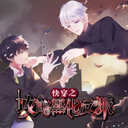 快穿之攻略黑化反派橙光OST](./albums/5021411331.md) | 国语 | 橙光游戏 | 2020年09月04日 | EP, 单曲 | 流行摇滚 Pop Rock, 国语流行 Mandarin Pop |
| [ 以爱之名](./albums/5021074103.md) | 国语 | 橙光游戏 | 2020年07月10日 | 录音室专辑 | 国语流行 Mandarin Pop |
| [ 偷心魔女橙光OST](./albums/2103724897.md) | 国语 | 橙光游戏 | 2020年03月13日 | 录音室专辑 | 国语流行 Mandarin Pop, 流行 Pop |
| [ 我被男神捅死了橙光OST](./albums/2102964110.md) | 国语 | 橙光游戏 | 2020年02月14日 | 录音室专辑 | 古风 GuFeng Music, 中国风 China-Wave, 国语流行 Mandarin Pop |
| [ 秃如一夜春风来木夕OST](./albums/2104986100.md) | 国语 | 橙光游戏 | 2019年07月11日 | 原声带, 影视音乐 | 游戏配乐 Video Game Music, 电音流行 Electropop, 国语流行 Mandarin Pop |
| [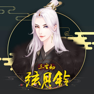 三生劫之弦月铃](./albums/2104870163.md) | 国语 | 橙光游戏 | 2019年05月17日 | EP, 单曲 | 古风 GuFeng Music, 游戏配乐 Video Game Music, 国语流行 Mandarin Pop |
| [ 绝蜜爱豆计划](./albums/2104468735.md) | 国语 | 橙光游戏 | 2019年01月11日 | EP, 单曲 | 游戏配乐 Video Game Music, 国语流行 Mandarin Pop, 电子 Electronic |
| [ 黑化徒弟养成攻略橙光OST](./albums/2102917087.md) | 国语 | 橙光游戏 | 2018年12月21日 | 录音室专辑 | 国语流行 Mandarin Pop, 古风 GuFeng Music, 中国风 China-Wave |
| [ 洄月石橙光OST](./albums/2104349106.md) | 国语 | 橙光游戏 | 2018年12月07日 | EP, 单曲 | 古风 GuFeng Music, 流行 Pop, 国语流行 Mandarin Pop |
| [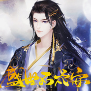 网游之盛世不太安橙光OST](./albums/2104195107.md) | 国语 | 橙光游戏 | 2018年11月09日 | EP, 单曲 | 游戏配乐 Video Game Music, 流行 Pop, 国语流行 Mandarin Pop |
| [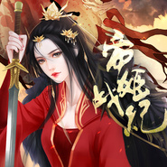 帝姬战纪橙光OST](./albums/2104150379.md) | 国语 | 橙光游戏 | 2018年10月26日 | EP, 单曲 | 流行 Pop, 国语流行 Mandarin Pop, 中国风 China-Wave |
| [ 绝望游戏：零橙光OST](./albums/2104098982.md) | 国语 | 橙光游戏 | 2018年10月12日 | EP, 单曲 | 国语流行 Mandarin Pop, 电子 Electronic |
| [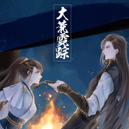 大荒霓踪橙光OST](./albums/2104062154.md) | 国语 | 橙光游戏 | 2018年09月28日 | EP, 单曲 | 游戏配乐 Video Game Music, 流行 Pop, 国语流行 Mandarin Pop, 古风 GuFeng Music |
| [ 前男友们求复合橙光OST](./albums/2104027689.md) | 国语 | 橙光游戏 | 2018年09月14日 | EP, 单曲 | 游戏配乐 Video Game Music, 流行 Pop, 国语流行 Mandarin Pop |
| [ 红娘大师橙光OST](./albums/2103928908.md) | 国语 | 橙光游戏 | 2018年08月17日 | EP, 单曲 | 游戏配乐 Video Game Music, 流行 Pop, 国语流行 Mandarin Pop |
| [ 网游之大神别装了橙光OST](./albums/2103888476.md) | 国语 | 橙光游戏 | 2018年08月02日 | 录音室专辑 | 国语流行 Mandarin Pop, 中国风 China-Wave, 古风 GuFeng Music |
| [ 叫我上仙大人橙光OST](./albums/2103850178.md) | 国语 | 橙光游戏 | 2018年07月26日 | 录音室专辑 | 国语流行 Mandarin Pop, 古风 GuFeng Music, 中国风 China-Wave |
| [ 皇帝的枕边人橙光OST](./albums/2103827781.md) | 国语 | 橙光游戏 | 2018年07月19日 | EP, 单曲 | 国语流行 Mandarin Pop, 古风 GuFeng Music, 中国风 China-Wave |
| [ 帝皇橙光OST](./albums/2103806746.md) | 国语 | 橙光游戏 | 2018年07月13日 | 录音室专辑 | 国语流行 Mandarin Pop, 流行 Pop, 古风 GuFeng Music |
| [ 并不十分娱乐圈2橙光OST](./albums/2103779790.md) | 国语 | 橙光游戏 | 2018年07月05日 | 录音室专辑 | 国语流行 Mandarin Pop, 流行 Pop |
| [ 电竞之甜心出击橙光OST](./albums/2103766656.md) | 国语 | 橙光游戏 | 2018年06月28日 | 录音室专辑 | 流行 Pop, 国语流行 Mandarin Pop |
| [ 风月谣橙光OST](./albums/2103753512.md) | 国语 | 橙光游戏 | 2018年06月21日 | 录音室专辑 | 国语流行 Mandarin Pop, 流行 Pop |
| [ 槑槑大改造橙光OST](./albums/2103750904.md) | 国语 | 橙光游戏 | 2018年06月15日 | 录音室专辑 | 流行 Pop, 国语流行 Mandarin Pop |
| [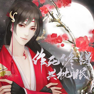 作死修得共枕眠橙光OST](./albums/2103738470.md) | 国语 | 橙光游戏 | 2018年06月07日 | 录音室专辑 | 国语流行 Mandarin Pop, 流行 Pop |
| [ 重生之逆袭娱乐圈橙光OST](./albums/2103717730.md) | 国语 | 橙光游戏 | 2018年05月24日 | 录音室专辑 | 流行 Pop, 国语流行 Mandarin Pop |
| [ 花重九霄城橙光OST](./albums/2103711643.md) | 国语 | 橙光游戏 | 2018年05月17日 | 录音室专辑 | 流行 Pop, 中国风 China-Wave, 古风 GuFeng Music |
| [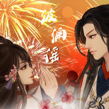 泊澜谣橙光OST](./albums/2103705384.md) | 国语 | 橙光游戏 | 2018年05月10日 | 录音室专辑 | 国语流行 Mandarin Pop, 流行 Pop, 中国风 China-Wave |
| [ 醉乡橙光OST](./albums/2103700840.md) | 国语 | 橙光游戏 | 2018年05月03日 | 录音室专辑 | 国语流行 Mandarin Pop, 流行 Pop, 古风 GuFeng Music |
| [ 我做夫人那些年之都市物语橙光OST](./albums/2103696575.md) | 国语 | 橙光游戏 | 2018年04月26日 | 录音室专辑 | 流行 Pop, 国语流行 Mandarin Pop |
| [ 皇上请稳住橙光OST](./albums/2103689829.md) | 国语 | 橙光游戏 | 2018年04月19日 | 录音室专辑 | 国语流行 Mandarin Pop, 流行 Pop |
| [ 众月捧星橙光OST](./albums/2103678995.md) | 国语 | 橙光游戏 | 2018年04月12日 | 录音室专辑 | 国语流行 Mandarin Pop, 流行 Pop, 中国风 China-Wave |
| [ 流年剪影橙光OST](./albums/2103665083.md) | 国语 | 橙光游戏 | 2018年04月04日 | 录音室专辑 | 流行 Pop, 国语流行 Mandarin Pop |
| [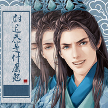 尉迟恭是什么鬼橙光OST](./albums/2103651394.md) | 国语 | 橙光游戏 | 2018年03月29日 | 录音室专辑 | 流行 Pop, 国语流行 Mandarin Pop, 中国风 China-Wave |
| [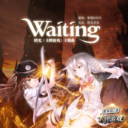 卡牌游戏橙光OST](./albums/2103632954.md) | 国语 | 橙光游戏 | 2018年03月23日 | 录音室专辑 | 流行 Pop, 国语流行 Mandarin Pop |
| [ 致命游戏橙光OST](./albums/2103612410.md) | 国语 | 橙光游戏 | 2018年03月16日 | 录音室专辑 | 流行 Pop, 国语流行 Mandarin Pop |
| [ 暴走千金橙光OST](./albums/2103594500.md) | 国语 | 橙光游戏 | 2018年03月08日 | 录音室专辑 | 国语流行 Mandarin Pop, 流行 Pop |
| [ 鬼山橙光OST](./albums/2103574349.md) | 国语 | 橙光游戏 | 2018年03月01日 | 录音室专辑 | 流行 Pop, 国语流行 Mandarin Pop |
| [ 我的血族大人橙光OST](./albums/2103549886.md) | 国语 | 橙光游戏 | 2018年02月23日 | 录音室专辑 | 国语流行 Mandarin Pop, 中国风 China-Wave, 古风 GuFeng Music |
| [ 帅哥我来也橙光OST](./albums/2103528631.md) | 国语 | 橙光游戏 | 2018年02月14日 | 录音室专辑 | 国语流行 Mandarin Pop, 古风 GuFeng Music, 中国风 China-Wave |
| [ 朝中美人橙光OST](./albums/2103522867.md) | 国语 | 橙光游戏 | 2018年02月09日 | 录音室专辑 | 国语流行 Mandarin Pop, 古风 GuFeng Music, 中国风 China-Wave |
| [ 宠妃进化法则橙光OST](./albums/2103511813.md) | 国语 | 橙光游戏 | 2018年02月01日 | 录音室专辑 | 国语流行 Mandarin Pop, 古风 GuFeng Music, 中国风 China-Wave |
| [ 给我滚橙光OST](./albums/2103499930.md) | 国语 | 橙光游戏 | 2018年01月25日 | 录音室专辑 | 国语流行 Mandarin Pop, 电子 Electronic |
| [ 我是陆锦溪橙光OST](./albums/2103493767.md) | 国语 | 橙光游戏 | 2018年01月18日 | 录音室专辑 | 国语流行 Mandarin Pop, 中国风 China-Wave, 古风 GuFeng Music |
| [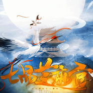 七品芝麻官橙光OST](./albums/2103485207.md) | 国语 | 橙光游戏 | 2018年01月11日 | 录音室专辑 | 流行 Pop, 国语流行 Mandarin Pop, 中国风 China-Wave |
| [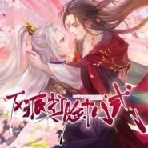 反派打脸十八式橙光OST](./albums/2102978276.md) | 国语 | 橙光游戏 | 2017年12月21日 | 录音室专辑 | 国语流行 Mandarin Pop, 古风 GuFeng Music, 中国风 China-Wave |
| [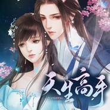 天生高手橙光OST](./albums/2102974049.md) | 国语 | 橙光游戏 | 2017年12月14日 | 录音室专辑 | 国语流行 Mandarin Pop, 古风 GuFeng Music, 中国风 China-Wave |
| [ 重生之璀璨归来橙光OST](./albums/2102969197.md) | 国语 | 橙光游戏 | 2017年12月07日 | 录音室专辑 | 国语流行 Mandarin Pop, 流行 Pop, 中国风 China-Wave |
| [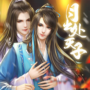 月出处天子橙光OST](./albums/2102957911.md) | 国语 | 橙光游戏 | 2017年11月23日 | 录音室专辑 | 国语流行 Mandarin Pop, 古风 GuFeng Music, 中国风 China-Wave |
| [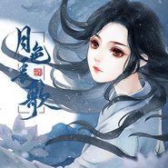 月色长歌橙光OST](./albums/2102935665.md) | 国语 | 橙光游戏 | 2017年11月16日 | 录音室专辑 | 国语流行 Mandarin Pop, 流行摇滚 Pop Rock, 中国风 China-Wave |
| [ 谁让我当红橙光OST](./albums/2102902743.md) | 国语 | 橙光游戏 | 2017年11月02日 | 录音室专辑 | 国语流行 Mandarin Pop, 流行 Pop, 电音流行 Electropop |
| [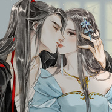 陌上尘橙光OST](./albums/2102880430.md) | 国语 | 橙光游戏 | 2017年10月26日 | 录音室专辑 | 古风 GuFeng Music, 中国风 China-Wave, 流行 Pop |
| [ 亲爱的小鲜肉橙光OST](./albums/2102874933.md) | 国语 | 橙光游戏 | 2017年10月18日 | EP, 单曲 | 流行 Pop |
| [ 浮生流年橙光音乐精选专辑Ⅰ](./albums/2102873430.md) | 国语 | 橙光游戏 | 2017年10月16日 | 录音室专辑 | 流行 Pop, 古风 GuFeng Music |
| [ 韶时尽橙光OST](./albums/2102871790.md) | 国语 | 橙光游戏 | 2017年10月13日 | EP, 单曲 | 流行 Pop, 国语流行 Mandarin Pop, 中国风 China-Wave |
| [ 真实幻象橙光OST](./albums/2102867847.md) | 国语 | 橙光游戏 | 2017年10月05日 | 录音室专辑 | 流行 Pop, 中国风 China-Wave |
| [ 旧城故梦橙光OST](./albums/2102865035.md) | 国语 | 橙光游戏 | 2017年09月28日 | 录音室专辑 | 流行 Pop |
| [ 要命！这神奇展开的偶像剧橙光OST](./albums/2102860916.md) | 国语 | 橙光游戏 | 2017年09月21日 | 录音室专辑 | 流行 Pop |
| [ 网游之一剑倾心：大神别过来橙光OST](./albums/2102856703.md) | 国语 | 橙光游戏 | 2017年09月14日 | 录音室专辑 | 流行 Pop, 中国风 China-Wave |
| [ 幸存者橙光OST](./albums/2102852684.md) | 国语 | 橙光游戏 | 2017年09月07日 | 录音室专辑 | 国语流行 Mandarin Pop, 流行摇滚 Pop Rock |
| [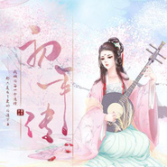 初年传橙光OST](./albums/2102842027.md) | 国语 | 橙光游戏 | 2017年08月31日 | 录音室专辑 | 国语流行 Mandarin Pop, 古风 GuFeng Music, 中国风 China-Wave |
| [ 网游之可话江湖橙光OST](./albums/2102819138.md) | 国语 | 橙光游戏 | 2017年08月24日 | 录音室专辑 | 国语流行 Mandarin Pop, 中国风 China-Wave, 游戏配乐 Video Game Music |
| [ 网游之盛世长安橙光OST](./albums/2102815349.md) | 国语 | 橙光游戏 | 2017年08月17日 | 录音室专辑 | 国语流行 Mandarin Pop, 游戏配乐 Video Game Music, 中国风 China-Wave |
| [ 谁主江山之帝姬篇橙光OST](./albums/2102812110.md) | 国语 | 橙光游戏 | 2017年08月10日 | 录音室专辑 | 国语流行 Mandarin Pop, 摇滚 Rock & Roll, 中国风 China-Wave |
| [ 那些年和男神相杀的日子橙光OST](./albums/2102808438.md) | 国语 | 橙光游戏 | 2017年08月03日 | 录音室专辑 | 流行 Pop, 中国风 China-Wave, 游戏配乐 Video Game Music |
| [ 君心我心之巅峰榜橙光OST](./albums/2102804134.md) | 国语 | 橙光游戏 | 2017年07月27日 | EP, 单曲 | 流行 Pop, 中国风 China-Wave, 游戏配乐 Video Game Music |
| [ 篱笆庄秘闻橙光OST](./albums/2102799847.md) | 国语 | 橙光游戏 | 2017年07月20日 | EP, 单曲 | 国语流行 Mandarin Pop, 流行 Pop, 布鲁斯 Blues |
| [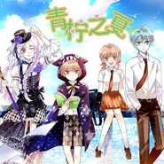 青柠之夏橙光OST](./albums/2102778615.md) | 国语 | 橙光游戏 | 2017年07月06日 | EP, 单曲 | 国语流行 Mandarin Pop, 轻摇滚 Soft Rock, 游戏配乐 Video Game Music |
| [ 金牌编剧橙光OST](./albums/2102774396.md) | 国语 | 橙光游戏 | 2017年06月29日 | EP, 单曲 | 流行 Pop, 国语流行 Mandarin Pop, 游戏配乐 Video Game Music |
| [ 男神都有黑历史橙光OST](./albums/2102766295.md) | 国语 | 橙光游戏 | 2017年06月15日 | 录音室专辑 | 流行 Pop, 中国风 China-Wave, 游戏配乐 Video Game Music |
| [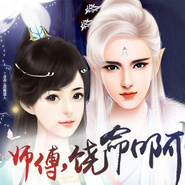 师傅，饶命啊橙光OST](./albums/2102762146.md) | 国语 | 橙光游戏 | 2017年06月08日 | 录音室专辑 | 流行 Pop, 中国风 China-Wave, 游戏配乐 Video Game Music |
| [ 灵烟阁橙光OST](./albums/2102757919.md) | 国语 | 橙光游戏 | 2017年06月02日 | EP, 单曲 | 国语流行 Mandarin Pop, 中国风 China-Wave, 游戏配乐 Video Game Music |
| [ 绾思结橙光OST](./albums/2102757247.md) | 国语 | 橙光游戏 | 2017年06月01日 | EP, 单曲 | 国语流行 Mandarin Pop, 中国风 China-Wave, 游戏配乐 Video Game Music |
| [ 再世为仙橙光OST](./albums/2102749432.md) | 国语 | 橙光游戏 | 2017年05月18日 | EP, 单曲 | 流行 Pop, 国语流行 Mandarin Pop, 中国风 China-Wave |
| [ 人生重启橙光OST](./albums/2102746149.md) | 国语 | 橙光游戏 | 2017年05月11日 | EP, 单曲 | 流行 Pop, 游戏配乐 Video Game Music |
| [ 猎鬼特工队橙光OST](./albums/2102742579.md) | 国语 | 橙光游戏 | 2017年05月04日 | EP, 单曲 | 国语流行 Mandarin Pop, 游戏配乐 Video Game Music |
| [ 碧海夜心橙光OST](./albums/2102738576.md) | 国语 | 橙光游戏 | 2017年04月27日 | 录音室专辑 | 流行 Pop, 游戏配乐 Video Game Music, 中国风 China-Wave |
| [ 梦仙橙光OST](./albums/2102734999.md) | 国语 | 橙光游戏 | 2017年04月20日 | EP, 单曲 | 流行 Pop, 中国风 China-Wave, 古风 GuFeng Music |
| [ 素心难逃橙光OST](./albums/2104484006.md) | 国语 | 橙光游戏 | 2017年04月13日 | EP, 单曲 | 游戏配乐 Video Game Music, 流行 Pop, 国语流行 Mandarin Pop |
| [ 同床异梦橙光OST](./albums/2102728124.md) | 国语 | 橙光游戏 | 2017年04月06日 | EP, 单曲 | 流行 Pop, 国语流行 Mandarin Pop, 游戏配乐 Video Game Music |
| [ 清魂引橙光OST](./albums/2102724734.md) | 国语 | 橙光游戏 | 2017年03月30日 | EP, 单曲 | 流行 Pop, 中国风 China-Wave, 游戏配乐 Video Game Music |
| [ 剑胆琴心橙光OST](./albums/2102720109.md) | 国语 | 橙光游戏 | 2017年03月23日 | EP, 单曲 | 流行 Pop, 国语流行 Mandarin Pop, 中国风 China-Wave |
| [ 祸世橙光OST](./albums/2102713085.md) | 国语 | 橙光游戏 | 2017年03月16日 | EP, 单曲 | 流行 Pop, 国语流行 Mandarin Pop, 游戏配乐 Video Game Music, 中国风 China-Wave |
| [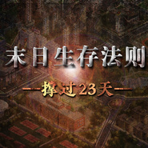 末日生存法则橙光OST](./albums/2102709007.md) | 国语 | 橙光游戏 | 2017年03月09日 | EP, 单曲 | 国语流行 Mandarin Pop |
| [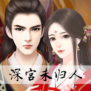 深宫未归人橙光OST](./albums/2102702471.md) | 国语 | 橙光游戏 | 2017年03月02日 | EP, 单曲 | 流行 Pop, 游戏配乐 Video Game Music, 中国风 China-Wave |
| [ 驸马上位记橙光OST](./albums/2102698257.md) | 国语 | 橙光游戏 | 2017年02月23日 | EP, 单曲 | 流行 Pop, 游戏配乐 Video Game Music, 中国风 China-Wave |
| [ 红颜若雪橙光OST](./albums/2102694499.md) | 国语 | 橙光游戏 | 2017年02月16日 | EP, 单曲 | 国语流行 Mandarin Pop, 中国风 China-Wave |
| [ 大唐贵妃传橙光OST](./albums/2102691717.md) | 国语 | 橙光游戏 | 2017年02月10日 | EP, 单曲 | 流行 Pop, 游戏配乐 Video Game Music, 中国风 China-Wave |
| [ 逆袭之别惹丑女橙光OST](./albums/2102687765.md) | 国语 | 橙光游戏 | 2017年02月03日 | EP, 单曲 | 流行 Pop, 国语流行 Mandarin Pop, 游戏配乐 Video Game Music |
| [ 墨魂橙光OST](./albums/2102685243.md) | 国语 | 橙光游戏 | 2017年01月25日 | EP, 单曲 | 流行 Pop, 国语流行 Mandarin Pop, 古风 GuFeng Music |
| [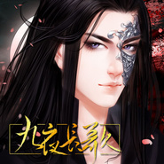 九夜长歌橙光OST](./albums/2102682723.md) | 国语 | 橙光游戏 | 2017年01月19日 | EP, 单曲 | 国语流行 Mandarin Pop, 中国风 China-Wave |
| [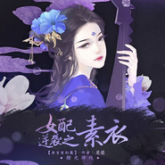 女配逆袭之素衣橙光OST](./albums/2102679198.md) | 国语 | 橙光游戏 | 2017年01月12日 | EP, 单曲 | 国语流行 Mandarin Pop, 古风 GuFeng Music |
| [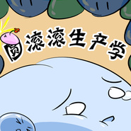 圆滚滚生产学橙光OST](./albums/2102675571.md) | 国语 | 橙光游戏 | 2017年01月05日 | EP, 单曲 | 流行 Pop, 国语流行 Mandarin Pop |
| [ 逆袭之星途闪耀橙光OST](./albums/2102673243.md) | 国语 | 橙光游戏 | 2016年12月29日 | EP, 单曲 | 国语流行 Mandarin Pop |
| [ 以凤为尊橙光OST](./albums/2102670827.md) | 国语 | 橙光游戏 | 2016年12月22日 | EP, 单曲 | 国语流行 Mandarin Pop, 中国风 China-Wave |
| [ 春秋判橙光OST](./albums/2102664327.md) | 国语 | 橙光游戏 | 2016年12月15日 | EP, 单曲 | 国语流行 Mandarin Pop, 古风 GuFeng Music |
| [ 盛世天下橙光OST](./albums/2102660741.md) | 国语 | 橙光游戏 | 2016年12月07日 | EP, 单曲 | 国语流行 Mandarin Pop, 古风 GuFeng Music |
| [ 百里莲花并蒂开橙光OST](./albums/2102658343.md) | 国语 | 橙光游戏 | 2016年12月01日 | EP, 单曲 | 国语流行 Mandarin Pop, 古风 GuFeng Music |
| [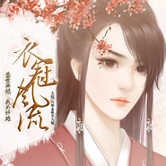 衣冠风流橙光OST](./albums/2102656133.md) | 国语 | 橙光游戏 | 2016年11月24日 | EP, 单曲 | 国语流行 Mandarin Pop, 古风 GuFeng Music |
| [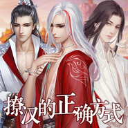 撩汉的正确方式橙光OST](./albums/2102654109.md) | 国语 | 橙光游戏 | 2016年11月18日 | EP, 单曲 | 国语流行 Mandarin Pop, 古风 GuFeng Music |
| [ 重生之胖妞逆袭橙光OST](./albums/2102651503.md) | 国语 | 橙光游戏 | 2016年11月10日 | EP, 单曲 | 国语流行 Mandarin Pop, 爵士流行 Jazz Pop |
| [ 妃容天下橙光OST](./albums/2102643814.md) | 国语 | 橙光游戏 | 2016年11月03日 | EP, 单曲 | 国语流行 Mandarin Pop, 古风 GuFeng Music |
| [ 长生诀橙光OST](./albums/2102409508.md) | 国语 | 橙光游戏 | 2016年10月19日 | EP, 单曲 | 国语流行 Mandarin Pop, 古风 GuFeng Music |
| [ 狐妖之凤唳九霄橙光OST](./albums/2102405916.md) | 国语 | 橙光游戏 | 2016年10月13日 | EP, 单曲 | 国语流行 Mandarin Pop, 古风 GuFeng Music |
| [ 名媛蜜语橙光OST](./albums/2102404450.md) | 国语 | 橙光游戏 | 2016年10月06日 | EP, 单曲 | 国语流行 Mandarin Pop |
| [ 谋取帝心橙光OST](./albums/2102403444.md) | 国语 | 橙光游戏 | 2016年09月29日 | EP, 单曲 | 国语流行 Mandarin Pop, 古风 GuFeng Music |
| [ 并不十分娱乐圈橙光OST](./albums/2102402240.md) | 国语 | 橙光游戏 | 2016年09月21日 | EP, 单曲 | 国语流行 Mandarin Pop |
| [ 伪装夫夫橙光OST](./albums/2102400773.md) | 国语 | 橙光游戏 | 2016年09月14日 | EP, 单曲 | 国语流行 Mandarin Pop |
| [ 引歌一梦橙光OST](./albums/2100387214.md) | 国语 | 橙光游戏 | 2016年09月07日 | EP, 单曲 | 国语流行 Mandarin Pop, 古风 GuFeng Music |
| [ 寻灵记橙光OST](./albums/2100384817.md) | 国语 | 橙光游戏 | 2016年08月30日 | EP, 单曲 | 国语流行 Mandarin Pop, 古风 GuFeng Music |
| [ 我的养父是杀手橙光OST](./albums/2100381959.md) | 国语 | 橙光游戏 | 2016年08月23日 | EP, 单曲 | 国语流行 Mandarin Pop, 古风 GuFeng Music, 中国风 China-Wave |
| [ 听不到的你橙光OST](./albums/2100378776.md) | 国语 | 橙光游戏 | 2016年08月12日 | EP, 单曲 | 国语流行 Mandarin Pop |
| [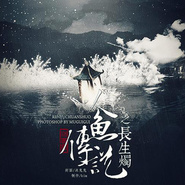 人鱼传说之长生烛橙光OST](./albums/2100378416.md) | 国语 | 六趣网络 | 2016年08月11日 | EP, 单曲 | 国语流行 Mandarin Pop, 中国风 China-Wave |
| [ 本恶橙光OST](./albums/2100378430.md) | 国语 | 六趣网络 | 2016年08月11日 | EP, 单曲 | 国语流行 Mandarin Pop |
| [ 穿越之逼恶成圣橙光OST](./albums/2100376106.md) | 国语 | 六趣网络 | 2016年08月04日 | EP, 单曲 | 国语流行 Mandarin Pop |
| [ 女配逆袭之素衣](./albums/2100373789.md) | 国语 | 六趣网络 | 2016年07月29日 | EP, 单曲 |  |
| [ 沧浪烟云](./albums/2100373780.md) | 国语 | 六趣网络 | 2016年07月29日 | EP, 单曲 |  |
| [ 官居几品](./albums/2100373094.md) | 国语 | 六趣网络 | 2016年07月27日 | EP, 单曲 | 中国风 China-Wave |
| [ 偏偏爱上你](./albums/2100367439.md) | 国语 | 六趣网络 | 2016年07月14日 | EP, 单曲 | 中国风 China-Wave |
| [ 酱油女官](./albums/2100357219.md) | 国语 | 六趣网络 | 2016年06月22日 | EP, 单曲 | 中国风 China-Wave |
| [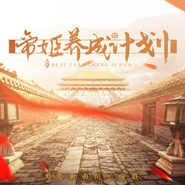 帝姬养成计划](./albums/2100355590.md) | 国语 |  | 2016年06月17日 | EP, 单曲 | 中国风 China-Wave |
| [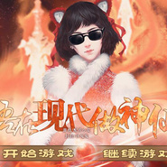 吾在现代做神仙](./albums/2100355598.md) | 国语 | 六趣网络 | 2016年06月17日 | EP, 单曲 | 中国风 China-Wave |
| [ 一诺情长](./albums/2100351935.md) | 国语 | 六趣网络 | 2016年06月08日 | EP, 单曲 | 古风 GuFeng Music |
| [ 云烟如梦](./albums/2100350240.md) | 国语 | 六趣网络 | 2016年06月03日 | EP, 单曲 | 中国风 China-Wave |
| [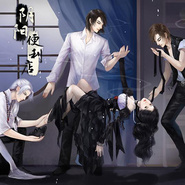 静默的爱](./albums/2100350361.md) | 国语 | 六趣网络 | 2016年06月03日 | EP, 单曲 | 中国风 China-Wave |
| [ 入梦已千年](./albums/2100341166.md) | 国语 | 六趣网络 | 2016年05月20日 | EP, 单曲 | 中国风 China-Wave |
| [ 江湖我主](./albums/2100338568.md) | 国语 | 六趣网络 | 2016年05月17日 | EP, 单曲 |  |
| [ 掌心蝶](./albums/2100337108.md) | 国语 | 六趣网络 | 2016年05月15日 | EP, 单曲 | 中国风 China-Wave |
| [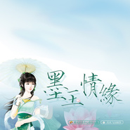 玫瑰情缘](./albums/2100330678.md) | 国语 | 六趣网络 | 2016年05月06日 | EP, 单曲 | 中国风 China-Wave |
| [ 一念偷心](./albums/2100325734.md) | 国语 | 六趣网络 | 2016年04月29日 | EP, 单曲 | 中国风 China-Wave |
| [ 余香](./albums/2100321792.md) | 国语 | 六趣网络 | 2016年04月25日 | EP, 单曲 | 古风 GuFeng Music |
| [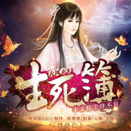 妙笔生花](./albums/2100321818.md) | 国语 | 六趣网络 | 2016年04月25日 | EP, 单曲 | 中国风 China-Wave |
| [ 战](./albums/2100321770.md) | 国语 | 六趣网络 | 2016年04月25日 | EP, 单曲 | 中国风 China-Wave |
| [ 青鸾颂](./albums/2100292658.md) | 国语 | 六趣网络 | 2016年03月14日 | EP, 单曲 | 中国风 China-Wave |
| [ 夜色无瑕](./albums/2100241802.md) | 国语 | 六趣网络 | 2015年11月25日 | EP, 单曲 | 中国风 China-Wave |
| [ 橙光游戏主题曲合辑•第一辑](./albums/2100241378.md) | 国语 | 六趣网络 | 2015年11月24日 | 录音室专辑 | 中国风 China-Wave |
| [ 明月依旧](./albums/2100266944.md) | 国语 | 六趣网络 | 2015年11月20日 | EP, 单曲 | 中国风 China-Wave |
| [ 君心我心橙光游戏主题曲](./albums/2100239674.md) | 国语 | 六趣网络 | 2015年11月18日 | 原声带, 影视音乐 | 中国风 China-Wave |
| [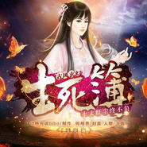 生死入簿](./albums/2100239676.md) | 国语 | 六趣网络 | 2015年11月18日 | EP, 单曲 | 中国风 China-Wave |
| [ 红妆天下](./albums/2100239682.md) | 国语 | 六趣网络 | 2015年11月18日 | EP, 单曲 | 中国风 China-Wave |
| [ 不思量](./albums/2100239680.md) | 国语 | 六趣网络 | 2015年11月18日 | EP, 单曲 |  |
| [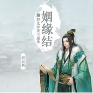 姻缘结](./albums/2100229008.md) | 国语 | 六趣网络 | 2015年10月20日 | EP, 单曲 | 古风 GuFeng Music |
| [ 十年一梦](./albums/2100229238.md) | 国语 | 六趣网络 | 2015年10月20日 | EP, 单曲 | 中国风 China-Wave |
| [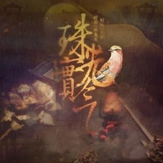 风月倾城](./albums/2100229240.md) | 国语 | 六趣网络 | 2015年10月20日 | EP, 单曲 | 古风 GuFeng Music |
| [ 遇萤](./albums/138069353.md) | 国语 | 六趣网络 | 2015年07月27日 | EP, 单曲 | 中国风 China-Wave |
| [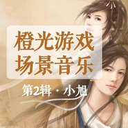 橙光场景音乐•第2辑](./albums/2100177389.md) | 国语 | 六趣网络 | 2015年07月01日 | 原声带, 影视音乐 | 中国风 China-Wave |
| [ 橙光游戏场景音乐•第1辑](./albums/2100177360.md) | 国语 | 六趣网络 | 2015年07月01日 | 原声带, 影视音乐 | 中国风 China-Wave |
| [ 橙光场景音乐•第3辑](./albums/2100177412.md) | 国语 | 六趣网络 | 2015年07月01日 | 原声带, 影视音乐 | 中国风 China-Wave |

## 评论

|  |  |  |  |
| :-- | :-- | :-- | :-- |
|  [虾米用户](https://emumo.xiami.com/u/3543247)  2021-01-06 09:06 赞(1) 踩(0) | 
再见虾米，再见橙光
 |
|  [虾米用户](https://emumo.xiami.com/u/444595307)  2020-09-11 09:12 赞(0) 踩(0) | 
我爱橙光呜呜呜
 |
|  [虾米用户](https://emumo.xiami.com/u/379480355) 到底怎样的结局，才配的上... 2020-03-02 17:28 赞(1) 踩(0) | 
前来打卡～   
 |
|  [虾米用户](https://emumo.xiami.com/u/286463) 音乐不是歌 2019-07-21 17:01 赞(2) 踩(0) | 
大名鼎鼎的唱片公司
 |
|  [虾米用户](https://emumo.xiami.com/u/403894780)  2019-07-03 14:07 赞(1) 踩(0) | 
好动听，生动
 |
|  [虾米用户](https://emumo.xiami.com/u/344018512) 我还没想好要写什么... 2019-06-30 19:36 赞(1) 踩(0) | 
橙光粉报到
 |
|  [虾米用户](https://emumo.xiami.com/u/424077178)  2019-05-04 21:10 赞(4) 踩(0) | 
橙光，一家被游戏耽误的音乐公司 
 |
|  [虾米用户](https://emumo.xiami.com/u/350034776) :D 2019-05-03 16:00 赞(1) 踩(0) | 
满满的回忆噫
 |
|  [虾米用户](https://emumo.xiami.com/u/306065331) 幸福开始有人选 2019-03-12 14:00 赞(3) 踩(0) | 
一剑指天下，一歌平心安
 |
|  [虾米用户](https://emumo.xiami.com/u/409874769)  2018-12-26 20:37 赞(14) 踩(0) | 
第一次进坑，是无意间玩的姻缘劫，，总之，希望橙光越做越好♡
 |
|  [虾米用户](https://emumo.xiami.com/u/409835120)  2018-12-17 13:54 赞(6) 踩(0) | 
喜欢橙光，中毒了
 |
|  [虾米用户](https://emumo.xiami.com/u/359587666)  2018-12-07 23:36 赞(5) 踩(0) | 
喜欢橙光游戏，喜欢橙光音乐 
 |
|  [虾米用户](https://emumo.xiami.com/u/358959514)  2018-11-16 18:11 赞(2) 踩(0) | 
******
 |
|  [虾米用户](https://emumo.xiami.com/u/55815470)  2018-11-13 13:04 赞(5) 踩(0) | 
被游戏耽误的音乐公司
 |
|  [虾米用户](https://emumo.xiami.com/u/407110053) 听好听的歌 2018-10-28 12:32 赞(3) 踩(0) | 
以前玩游戏，现在听音乐 
 |
|  [虾米用户](https://emumo.xiami.com/u/13416098) 。 2018-10-25 19:19 赞(3) 踩(0) | 
不玩游戏，但音乐是真好听！   
 |
|  [虾米用户](https://emumo.xiami.com/u/405485419) 声控 2018-10-07 08:28 赞(2) 踩(0) | 
   
 |
|  [虾米用户](https://emumo.xiami.com/u/18901308) 即使十年又怎样，爱一如往... 2018-09-03 17:33 赞(2) 踩(0) | 
希望可以听到醉情缘的游戏bgm
 |
| ⇒ |  [虾米用户](https://emumo.xiami.com/u/407815276)  2019-02-25 22:45 赞(0) 踩(0) | 
yes
 |
|  [虾米用户](https://emumo.xiami.com/u/346911096)  2018-08-18 23:05 赞(2) 踩(0) | 
希望能出更多配樂
 |
|  [虾米用户](https://emumo.xiami.com/u/400808220) 世界再大总会找到那个他。 2018-08-13 13:15 赞(0) 踩(0) | 
 
 |
|  [虾米用户](https://emumo.xiami.com/u/380199674)  2018-07-31 23:21 赞(0) 踩(0) | 
製作優良用心精品啊，希望除了主題曲外，還會發佈其餘出現在遊戲內的背景音樂喔
 |
|  [虾米用户](https://emumo.xiami.com/u/362043364)  2018-07-20 16:27 赞(2) 踩(0) | 
还有阿之 
 |
|  [虾米用户](https://emumo.xiami.com/u/362043364)  2018-07-20 16:23 赞(2) 踩(0) | 
表白我龙妹妹 o(*≧▽≦)ツ ~ ┴┴
 |
|  [虾米用户](https://emumo.xiami.com/u/325446452) 其实都知道 2018-07-20 12:56 赞(1) 踩(0) | 
很棒
 |
|  [虾米用户](https://emumo.xiami.com/u/377920607)  2018-07-12 23:47 赞(26) 踩(0) | 
第一次玩橙光还是六年级的时候，转眼就高三了，橙光陪伴了我6年，从姻缘劫入坑，再到十年清风，参商渡，星途璀璨，橙光变得越来越被大众所知，感谢橙光 
 |
|  [虾米用户](https://emumo.xiami.com/u/307658966) who TM care ... 2018-06-06 15:38 赞(5) 踩(0) | 
因为九锥才知道的橙光，虽然现在的橙光变了很多，但是我的初心不会变，喜欢九锥，顺便表白橙光。
 |
|  [虾米用户](https://emumo.xiami.com/u/249980101)  2018-05-24 12:53 赞(0) 踩(0) | 
没找到想要的门派纯音乐
 |
|  [虾米用户](https://emumo.xiami.com/u/357477970) 喜欢我的，着来全民K歌互... 2018-04-24 11:22 赞(0) 踩(0) | 
大爱橙光音乐     
 |
|  [虾米用户](https://emumo.xiami.com/u/349994276) 说不出口的思念都变成了黑... 2018-04-22 22:35 赞(1) 踩(0) | 
再次聆听，还是隐隐难受(╯﹏╰）特别看了剧情后
 |
|  [虾米用户](https://emumo.xiami.com/u/335574124)  2018-04-11 23:08 赞(1) 踩(0) | 
表白橙娘
 |
|  [虾米用户](https://emumo.xiami.com/u/272146028)  2018-03-20 19:58 赞(1) 踩(0) | 
有人知道主角死亡以后的标配背景音乐叫什么吗
 |
|  [虾米用户](https://emumo.xiami.com/u/214533735) 阿年 2018-03-19 19:11 赞(3) 踩(0) | 
表白待我长发及腰少年你娶我可好，入坑游戏
 |
| ⇒ |  [虾米用户](https://emumo.xiami.com/u/317250700)  2018-04-05 17:04 赞(0) 踩(0) | 
metoo
 |
|  [虾米用户](https://emumo.xiami.com/u/323911830) (๑• . •๑) 2018-02-11 20:38 赞(2) 踩(0) | 
喜欢喜欢喜欢喜欢，虽然我要的歌比较少，但满足了我的小心愿，之前为了找一首漫画里的歌找了好久，看到这里有，我已经很高兴了         
 |
|  [虾米用户](https://emumo.xiami.com/u/349149802) 世间里再美的东西，不过消... 2018-02-10 02:10 赞(0) 踩(0) | 
表白橙娘~
 |
|  [虾米用户](https://emumo.xiami.com/u/339849259)  2018-02-06 02:16 赞(1) 踩(0) | 
玩过弃后很倾城的把背景音乐给我说，谢谢！
 |
|  [虾米用户](https://emumo.xiami.com/u/335959933) love 2018-02-05 17:36 赞(0) 踩(0) | 
好
 |
|  [虾米用户](https://emumo.xiami.com/u/340778850) ：请保持心脏跳动，有人在... 2018-01-30 19:49 赞(1) 踩(0) | 
橙光，看小说必备的BGM，也是醉了，根本是催泪用的吧 
 |
|  [虾米用户](https://emumo.xiami.com/u/344600024)   2018-01-13 18:43 赞(4) 踩(0) | 
看小说专用背景音乐！一听头皮都发麻，印象最深的是那首遇莹，当初刷剧情的时候瞬间飙泪，无力龙王啊...
 |
|  [虾米用户](https://emumo.xiami.com/u/344120833)  2018-01-10 16:03 赞(0) 踩(0) | 
好
 |
|  [虾米用户](https://emumo.xiami.com/u/308778279)  2017-12-31 17:12 赞(1) 踩(0) | 
大爱橙娘
 |
|  [虾米用户](https://emumo.xiami.com/u/49991666) 有时候真想醉死在音乐里 2017-12-26 17:33 赞(3) 踩(0) | 
很多背景音乐都很好听，气氛渲染，画面塑造感都可棒了！作为bgm来说真是非常合适，但可惜的是作为曲子来听唯一的遗憾就是太短......虾米这边的配乐集好少啊，为什么网易那么多（怨
 |
|  [虾米用户](https://emumo.xiami.com/u/215437933)  2017-12-24 19:54 赞(2) 踩(0) | 
求问橙光里很多游戏都有的八音盒的bgm叫什么名字？？
 |
|  [虾米用户](https://emumo.xiami.com/u/340071092)  2017-12-16 13:58 赞(1) 踩(0) | 
表白  橙光   
 |
|  [虾米用户](https://emumo.xiami.com/u/308778279)  2017-12-15 20:45 赞(1) 踩(0) | 
第一次玩时，《快穿之女配逆袭记》骗了我好多泪水。现在玩《快穿之攻略主神计划》直接哭的眼肿了。现在觉得当时好容易哭啊。永爱橙娘。 
 |
|  [虾米用户](https://emumo.xiami.com/u/312980477)  2017-12-09 10:42 赞(1) 踩(0) | 
表白橙娘
 |
|  [虾米用户](https://emumo.xiami.com/u/297284274) 。。。。 2017-11-20 19:13 赞(142) 踩(0) | 
之前看到过一个评论：橙光，一个被游戏耽误的音乐公司
 |
| ⇒ |  [虾米用户](https://emumo.xiami.com/u/344600024)   2018-01-13 18:43 赞(0) 踩(0) | 
此话在理
 |
| ⇒ |  [虾米用户](https://emumo.xiami.com/u/245105896)  2018-02-09 13:46 赞(0) 踩(0) | 
很好听
 |
|  [虾米用户](https://emumo.xiami.com/u/229282351) cute· 2017-11-19 12:16 赞(3) 踩(0) | 
不知道还有没有人玩过当初的&amp;lt;娶我可好&amp;gt;，现在再去找来，却已经不存在了，很多回忆啊，骗了两次眼泪，很怀念当初各种刷剧情陪着主角们一起笑一起哭的时光，表白当初的十二人，珍惜现在的九个人，爱丽一直一直都在
 |
| ⇒ |  [虾米用户](https://emumo.xiami.com/u/245105896)  2018-02-09 13:44 赞(0) 踩(0) | 
我玩过 现在已经不在了吗
 |
| ⇒ |  [虾米用户](https://emumo.xiami.com/u/245105896)  2018-02-09 13:44 赞(0) 踩(0) | 
我玩过，现在已经不在了吗
 |
| ⇒ |  [虾米用户](https://emumo.xiami.com/u/229282351) cute· 2018-02-10 13:59 赞(0) 踩(0) | 
<q><b>너 의 약속°说：</b></q>
 |
|  [虾米用户](https://emumo.xiami.com/u/188634816) 不能输给自己 2017-11-16 21:07 赞(1) 踩(0) | 
谁能告我与君殊途不同归的封面曲是哪首呐？阿里阿多
 |
|  [虾米用户](https://emumo.xiami.com/u/334275939)  2017-11-14 22:06 赞(1) 踩(0) | 
奈何桥边长恨歌主题曲什么来着
 |
|  [虾米用户](https://emumo.xiami.com/u/278624364)  2017-11-01 20:44 赞(1) 踩(0) | 
请问玩过逆袭之星途闪耀下部的人，在橙子当蛋总秘书的时候，开会那里有个背景音乐，叫什么呢？
 |
|  [虾米用户](https://emumo.xiami.com/u/328801906) 愿爱与被爱都温柔无殇害… 2017-10-06 20:01 赞(1) 踩(0) | 
表白橙光～
 |
|  [虾米用户](https://emumo.xiami.com/u/299697998) 我没有拒绝过吹来的风，也... 2017-09-30 21:02 赞(31) 踩(0) | 
因为喜欢这个游戏，喜欢这个游戏里面 的音乐，特别是EXO里面的音乐。
 |
|  [虾米用户](https://emumo.xiami.com/u/320670314)  2017-09-16 16:13 赞(1) 踩(0) | 
橙光游戏如何下载
 |
| ⇒ |  [虾米用户](https://emumo.xiami.com/u/350569522)  2018-02-27 10:29 赞(0) 踩(0) | 
在下载软件的地方搜橙光游戏，就有啦
 |
|  [虾米用户](https://emumo.xiami.com/u/228729327) 朴灿烈  易烊千玺 2017-09-10 19:33 赞(16) 踩(0) | 
喜欢exo的可以关注作者，pcy小瓶盖和傻钰总攻pcy和胡静儿和法鲨的微笑和甜菜媳妇大总攻和一只雪糕
 |
|  [虾米用户](https://emumo.xiami.com/u/322734279)  2017-09-01 10:46 赞(1) 踩(0) | 
那个，我问一下谁知道关于《君莫离》的歌在哪
 |
|  [虾米用户](https://emumo.xiami.com/u/309478318)  2017-08-29 21:24 赞(1) 踩(0) | 
把巨人的肩膀整岀来呗，超喜欢那首。
 |
|  [虾米用户](https://emumo.xiami.com/u/321890271)  2017-08-27 17:15 赞(3) 踩(0) | 
遊戲很好玩  裡面的歌曲更是好聽搭配遊戲就是絕阿~~~不過很多配樂 找都找不到
 |
|  [虾米用户](https://emumo.xiami.com/u/277603716)  2017-08-10 23:55 赞(1) 踩(0) | 
为啥没有《与卿同醉》的主题曲！！！！！      
 |
|  [虾米用户](https://emumo.xiami.com/u/168397920)   2017-08-09 16:28 赞(2) 踩(0) | 
表白长生烛，表白冷艳师尊是反派，表白素心难逃，表白醉乡，表白橙光！
 |
|  [虾米用户](https://emumo.xiami.com/u/211423978) 你管我 2017-08-06 21:59 赞(1) 踩(0) | 
前排表白橙娘
 |
|  [虾米用户](https://emumo.xiami.com/u/257080988) 收集了很多自己喜欢的音乐... 2017-08-06 16:21 赞(2) 踩(0) | 
橙光音乐很棒，期待新的作品
 |
|  [虾米用户](https://emumo.xiami.com/u/308761919) 超爱张总和henry～ 2017-08-06 09:09 赞(3) 踩(0) | 
表白君心我心，龙妹妹～
 |
|  [虾米用户](https://emumo.xiami.com/u/191982200) 快乐就好 2017-08-02 14:37 赞(1) 踩(0) | 
表白夏北岛  
 |
|  [虾米用户](https://emumo.xiami.com/u/245371108) 松月 2017-08-01 10:07 赞(1) 踩(0) | 
表白夏北岛大大  
 |
|  [虾米用户](https://emumo.xiami.com/u/188634816) 不能输给自己 2017-07-30 22:41 赞(1) 踩(0) | 
找不到素心难逃主题曲我的阿之在哪里
 |
|  [虾米用户](https://emumo.xiami.com/u/251591814) 茶蛋最棒 2017-07-23 16:50 赞(7) 踩(0) | 
梦境边缘，入坑游戏
 |
|  [虾米用户](https://emumo.xiami.com/u/210851410) 我的愿望是…和你一起世界... 2017-07-22 13:50 赞(0) 踩(0) | 
。。刚来过
 |
|  [虾米用户](https://emumo.xiami.com/u/287117455)   2017-07-22 02:13 赞(2) 踩(0) | 
表白君心我心，表白龙妹，表白臭道士
 |
|  [虾米用户](https://emumo.xiami.com/u/245288781) 月亮不睡我不睡，我是花花... 2017-07-20 13:19 赞(4) 踩(0) | 
橙光创造了许许多多的世界，每一个世界都是一个作者的心血，感谢橙光，感谢作者！
 |
|  [虾米用户](https://emumo.xiami.com/u/245288781) 月亮不睡我不睡，我是花花... 2017-07-20 13:15 赞(2) 踩(0) | 
橙光真的给了我好多的回忆，大爱 
 |
|  [虾米用户](https://emumo.xiami.com/u/311879126)  2017-07-13 14:57 赞(1) 踩(0) | 
喜欢橙光音乐
 |
|  [虾米用户](https://emumo.xiami.com/u/284152795) 银临永远是我们的不老梦 2017-07-06 17:15 赞(1) 踩(0) | 
谁和我一样，先听曲子，那首好听玩那个 
 |
| ⇒ |  [虾米用户](https://emumo.xiami.com/u/340778850) ：请保持心脏跳动，有人在... 2018-01-30 19:51 赞(0) 踩(0) | 
哈哈哈哈哈哈同感 
 |
|  [虾米用户](https://emumo.xiami.com/u/292888205)  2017-07-05 13:06 赞(7) 踩(0) | 
超级喜欢玩橙光游戏的
 |
|  [虾米用户](https://emumo.xiami.com/u/269601815) NCT 吴亦凡  程潇  2017-06-27 00:27 赞(125) 踩(0) | 
表白橙光，表白我锥
 |
| ⇒ |  [虾米用户](https://emumo.xiami.com/u/379965459) 初心不变，要一直爱下去【... 2019-02-24 21:09 赞(0) 踩(0) | 
家人啊
 |
|  [虾米用户](https://emumo.xiami.com/u/301106397)  2017-06-11 11:59 赞(3) 踩(0) | 
遇龙让我哭了好久(&amp;acute;&amp;deg;̥̥̥̥̥̥̥̥&amp;omega;&amp;deg;̥̥̥̥̥̥̥̥｀)
 |
| ⇒ |  [虾米用户](https://emumo.xiami.com/u/299694836) 趁你病，要你命。 2017-07-06 19:22 赞(0) 踩(0) | 
我也是
 |
| ⇒ |  [虾米用户](https://emumo.xiami.com/u/317858263)  2017-12-21 18:57 赞(0) 踩(0) | 
同感 
 |
|  [虾米用户](https://emumo.xiami.com/u/169274388) Piao Bian Pi... 2017-06-08 20:15 赞(3) 踩(0) | 
不是也没关系啊。毕竟要演好还是专业人士来。只怕到时候塞进来一个老大不小的网红脸面瘫脸词都说不清的数字小姐。 
 |
|  [虾米用户](https://emumo.xiami.com/u/169274388) Piao Bian Pi... 2017-06-08 17:59 赞(4) 踩(0) | 
我的小16啊&amp;hellip;&amp;hellip;真的真的对不起，没能守护好你。不要埋怨我们，好不好？
 |
|  [虾米用户](https://emumo.xiami.com/u/184414526)  2017-06-08 14:38 赞(1) 踩(0) | 
啊啊啊啊要长发
 |
|  [虾米用户](https://emumo.xiami.com/u/298726117)  2017-05-24 16:03 赞(0) 踩(0) | 
(ಡ&amp;omega;ಡ)
 |
|  [虾米用户](https://emumo.xiami.com/u/252059276)  2017-05-06 19:04 赞(0) 踩(0) | 
(⊙o⊙)哇，，
 |
|  [虾米用户](https://emumo.xiami.com/u/242735792) 再见，或者，再也不见 2017-05-02 17:06 赞(40) 踩(0) | 
末生也变了啊&amp;hellip;&amp;hellip;唯一的期望，电视剧不要那么毁原著&amp;hellip;&amp;hellip;
 |
| ⇒ |  [虾米用户](https://emumo.xiami.com/u/169274388) Piao Bian Pi... 2017-06-08 17:53 赞(0) 踩(0) | 
抱抱，不哭。
 |
| ⇒ |  [虾米用户](https://emumo.xiami.com/u/169274388) Piao Bian Pi... 2017-06-08 17:58 赞(0) 踩(0) | 
不用想了，剧版末生一定是支离破碎的。现在我唯一的念想就是小16的人选了。毕竟，我们的小16才是这个故事的灵魂。她选好了，末生就还是末生。
 |
| ⇒ |  [虾米用户](https://emumo.xiami.com/u/242735792) 再见，或者，再也不见 2017-06-08 18:00 赞(0) 踩(0) | 
<q><b>翩。说：</b></q>
 |
| ⇒ |  [虾米用户](https://emumo.xiami.com/u/269601815) NCT 吴亦凡  程潇  2017-06-27 00:28 赞(0) 踩(0) | 
末生要拍成电视剧？
 |
| ⇒ |  [虾米用户](https://emumo.xiami.com/u/242735792) 再见，或者，再也不见 2017-06-27 14:31 赞(0) 踩(0) | 
<q><b>月亮的本体是你说：</b></q>
 |
| ⇒ |  [虾米用户](https://emumo.xiami.com/u/269601815) NCT 吴亦凡  程潇  2017-06-28 03:13 赞(0) 踩(0) | 
<q><b>边白熙说：</b></q>
 |
| ⇒ |  [虾米用户](https://emumo.xiami.com/u/245288781) 月亮不睡我不睡，我是花花... 2017-07-20 13:17 赞(0) 踩(0) | 
<q><b>月亮的本体是你说：</b></q>
 |
| ⇒ |  [虾米用户](https://emumo.xiami.com/u/269601815) NCT 吴亦凡  程潇  2017-07-29 14:04 赞(0) 踩(0) | 
<q><b>立风鱼卷说：</b></q>
 |
| ⇒ |  [虾米用户](https://emumo.xiami.com/u/245288781) 月亮不睡我不睡，我是花花... 2017-07-29 14:26 赞(0) 踩(0) | 
<q><b>月亮的本体是你说：</b></q>
 |
|  [虾米用户](https://emumo.xiami.com/u/49991666) 有时候真想醉死在音乐里 2017-05-01 16:43 赞(0) 踩(0) | 
真实幻象过来的...要找的歌曲没找到...不过也算有了意外的惊喜。虽然还是很怨念...（笑
 |
|  [虾米用户](https://emumo.xiami.com/u/292594965)  2017-04-30 12:29 赞(2) 踩(0) | 
橙光加油
 |
|  [虾米用户](https://emumo.xiami.com/u/292390008)  2017-04-30 11:26 赞(2) 踩(0) | 
超喜欢橙光游戏
 |
|  [虾米用户](https://emumo.xiami.com/u/258653998)  2017-04-29 17:10 赞(0) 踩(0) | 
&amp;hellip;
 |
|  [虾米用户](https://emumo.xiami.com/u/280526175)  2017-04-24 22:49 赞(2) 踩(0) | 
我27岁，，我还玩橙光。玩游戏于年龄无关
 |
|  [虾米用户](https://emumo.xiami.com/u/210406905) 劳尔女神请走花路(๑• ... 2017-04-09 10:25 赞(4) 踩(0) | 
原来橙光是音乐公司 
 |
|  [虾米用户](https://emumo.xiami.com/u/269601815) NCT 吴亦凡  程潇  2017-04-07 21:00 赞(0) 踩(0) | 
橙光加油，陪你一起走下去
 |
|  [虾米用户](https://emumo.xiami.com/u/284086550)  三千白发只为你 2017-04-01 20:36 赞(0) 踩(0) | 
喜欢～
 |
|  [虾米用户](https://emumo.xiami.com/u/242735792) 再见，或者，再也不见 2017-03-24 22:16 赞(113) 踩(0) | 
表白橙娘。表白末生。表白逆袭之星途闪耀。表白姻缘劫。表白夏尽时亡。表白梦境边缘。表白YT和散散
 |
| ⇒ |  [虾米用户](https://emumo.xiami.com/u/281505511) 猪始终都是猪，人有时不是... 2017-07-22 23:06 赞(0) 踩(0) | 
还有夏北岛大大
 |
| ⇒ |  [虾米用户](https://emumo.xiami.com/u/316316695) 今天吃螺蛳粉了吗 2018-12-18 21:03 赞(0) 踩(0) | 
末生
 |
| ⇒ |  [虾米用户](https://emumo.xiami.com/u/316316695) 今天吃螺蛳粉了吗 2018-12-18 21:03 赞(0) 踩(0) | 
<q><b>a蕾说：</b></q>
 |
|  [虾米用户](https://emumo.xiami.com/u/11749315) 穿山越海哼你的歌 2017-03-21 03:57 赞(188) 踩(0) | 
当年玩橙光游戏时，胭缘劫才刚刚完结，游戏不用充值，还有着自己要制作游戏的志向，一晃，多年过去，橙光的页面似乎没变，电脑里还存着大量当时下载的素材， 橙光有越来越多有才气的新人，名气也越来越大，存档和剧情都要花钱去买， 甚至当时陪伴我的那些游戏也即将被搬上荧屏，突然意识到橙光和以前不一样了，我也和以前不一样了。橙光变得更加的正规和商业化，而我也失去了当初那种连夜玩游戏，不厌其烦的刷不同的主线，下载2的多G素材的热血和冲动。不过，还是支持橙光，也感谢那些赚取了我多少泪水的游戏作者，
 |
| ⇒ |  [虾米用户](https://emumo.xiami.com/u/267564727)  2017-08-22 21:45 赞(0) 踩(0) | 
嗯嗯，说的太对了，还是好怀念之前的橙妹
 |
| ⇒ |  [虾米用户](https://emumo.xiami.com/u/11749315) 穿山越海哼你的歌 2017-08-23 07:25 赞(0) 踩(0) | 
<q><b>크리스说：</b></q>
 |
| ⇒ |  [虾米用户](https://emumo.xiami.com/u/335472868)   2017-12-01 22:43 赞(0) 踩(0) | 
现在都懒得刷了。直接一个大礼包各种通道
 |
| ⇒ |  [虾米用户](https://emumo.xiami.com/u/187630445) 囧呆，爱丽。我的青春是银... 2018-07-03 22:11 赞(0) 踩(0) | 
同感。如今的橙光有了自己的app，游戏画面越来越精致，类型越来越多，名气越来越大，知道的人越来越多，可是我已没有当初那种熬夜也要刷剧情的热情了，橙娘越来越商业化，日趋细致的网页，签约作者走了又来，充的鲜花越来越多，但当初的热情已耗尽，只剩当年的那些感动。我想我还是喜欢14年左右的橙娘吧
 |
| ⇒ |  [虾米用户](https://emumo.xiami.com/u/11749315) 穿山越海哼你的歌 2018-07-03 22:17 赞(0) 踩(0) | 
<q><b>Secret说：</b></q>
 |
| ⇒ |  [虾米用户](https://emumo.xiami.com/u/187630445) 囧呆，爱丽。我的青春是银... 2018-07-03 22:24 赞(0) 踩(0) | 
<q><b>Jessie说：</b></q>
 |
| ⇒ |  [虾米用户](https://emumo.xiami.com/u/308454112)  2018-07-09 13:10 赞(0) 踩(0) | 
<q><b>Secret说：</b></q>
 |
| ⇒ |  [虾米用户](https://emumo.xiami.com/u/122965468) -关于空白 关于你- 2019-02-06 13:04 赞(0) 踩(0) | 
是啊，当年每天熬夜坚持刷剧情的热情已经被现在越来越商业化的橙光磨灭了
 |
|  [虾米用户](https://emumo.xiami.com/u/276249895) 轻音乐 2017-03-18 06:02 赞(1) 踩(0) | 
好好听 
 |
|  [虾米用户](https://emumo.xiami.com/u/263746606)  2017-03-15 23:30 赞(0) 踩(0) | 
都好听呢
 |
|  [虾米用户](https://emumo.xiami.com/u/200036729)  2017-03-14 12:34 赞(3) 踩(0) | 
就我25岁了还玩橙光?！
 |
| ⇒ |  [虾米用户](https://emumo.xiami.com/u/269601815) NCT 吴亦凡  程潇  2017-06-27 00:28 赞(0) 踩(0) | 
还有个27的
 |
|  [虾米用户](https://emumo.xiami.com/u/260176390)  2017-03-12 15:12 赞(1) 踩(0) | 
橙光原创音乐精选自橙光人气游戏中的游戏主题曲。
 |
|  [虾米用户](https://emumo.xiami.com/u/275972435) 世界上，没有人可以支持你... 2017-03-03 17:19 赞(0) 踩(0) | 

 |
|  [虾米用户](https://emumo.xiami.com/u/271642202) 底线瑜洲，初心茶蛋 2017-03-02 21:36 赞(0) 踩(0) | 
哟哟
 |
|  [虾米用户](https://emumo.xiami.com/u/194151174) 音之声•乐之魂 2017-02-27 23:06 赞(0) 踩(0) | 
我想知道制作音乐的伴奏用什么软件好呢？有了原创歌曲，伴奏弄不了，想自己做，知道的友友私聊我哦
 |
|  [虾米用户](https://emumo.xiami.com/u/194151174) 音之声•乐之魂 2017-02-27 23:04 赞(0) 踩(0) | 
还不错
 |
|  [虾米用户](https://emumo.xiami.com/u/275029256)  2017-02-21 09:37 赞(0) 踩(0) | 
没有机会制作
 |
|  [虾米用户](https://emumo.xiami.com/u/275029256)  2017-02-21 09:36 赞(0) 踩(0) | 
我超喜欢那
 |
|  [虾米用户](https://emumo.xiami.com/u/260035871) 向阳花也会凋谢的那一天 2017-02-09 16:55 赞(1) 踩(0) | 
表白橙子 
 |
|  [虾米用户](https://emumo.xiami.com/u/93226796) 只见雪色映衣袂，抚琴月显... 2017-02-07 19:45 赞(1) 踩(0) | 
有《凤逃》的主题曲吗？
 |
|  [虾米用户](https://emumo.xiami.com/u/262605549)  2017-02-05 22:56 赞(1) 踩(0) | 
爱橙光
 |
|  [虾米用户](https://emumo.xiami.com/u/2752891)  2017-01-28 15:17 赞(2) 踩(0) | 
已中毒
 |
|  [虾米用户](https://emumo.xiami.com/u/14391216) 好久不见 2017-01-27 23:20 赞(3) 踩(0) | 
我就知道这样未成年会赞我哈哈哈哈哈哈哈热评是有技巧的
 |
|  [虾米用户](https://emumo.xiami.com/u/259902895) 废话不多说。 2017-01-27 16:56 赞(2) 踩(0) | 
玩游戏，听歌如同在做梦，超棒，大家有空去瞧瞧。
 |
|  [虾米用户](https://emumo.xiami.com/u/261364464)  2017-01-12 19:27 赞(3) 踩(0) | 
我制造了两个专辑一个是橙光音乐之古风篇，一个是橙光音乐之现代篇。应该不久就会出，大家有兴趣就关注一下吧
 |
|  [虾米用户](https://emumo.xiami.com/u/260035871) 向阳花也会凋谢的那一天 2017-01-07 13:24 赞(2) 踩(0) | 
加油！橙光游戏永远爱你！ 
 |
|  [虾米用户](https://emumo.xiami.com/u/255755832)  2017-01-05 18:25 赞(1) 踩(0) | 
橙光爱你～
 |
|  [虾米用户](https://emumo.xiami.com/u/244240004) 随心所欲而活 2016-12-31 20:20 赞(1) 踩(0) | 
橙光迷妹
 |
|  [虾米用户](https://emumo.xiami.com/u/122688364) 生在愤坑，长在赤圈；挣脱 2016-12-27 00:13 赞(1) 踩(0) | 
6929
 |
|  [虾米用户](https://emumo.xiami.com/u/14391216) 好久不见 2016-12-23 22:36 赞(1) 踩(0) | 
WTF 
 |
|  [虾米用户](https://emumo.xiami.com/u/251794853)  2016-12-03 17:02 赞(3) 踩(0) | 
橙光好好玩。 
 |
|  [虾米用户](https://emumo.xiami.com/u/169275742)            把... 2016-10-20 19:23 赞(3) 踩(0) | 
龙尧离
 |
|  [虾米用户](https://emumo.xiami.com/u/231299331)  2016-09-29 23:08 赞(8) 踩(0) | 
听着听着就哭了
 |
|  [虾米用户](https://emumo.xiami.com/u/52671426)  2016-09-29 14:20 赞(9) 踩(0) | 
橙光素材库更新了好多，能不能也发上来，有的真的好听！
 |
|  [虾米用户](https://emumo.xiami.com/u/52833418) 每周更新原创歌曲 2016-09-27 16:59 赞(12) 踩(0) | 
我刚入驻了虾米音乐人，欢迎大家来我的个人主页，收听我的最新音乐
 |
|  [虾米用户](https://emumo.xiami.com/u/60582718)  2016-08-24 21:49 赞(4) 踩(0) | 
求橙光游戏场景背景，第四专辑
 |
|  [虾米用户](https://emumo.xiami.com/u/145378356) 변백현♡강슬기 2016-08-10 15:53 赞(29) 踩(0) | 
...我一直都不知道虾米音乐有橙光的专辑....情何以堪...
 |
|  [虾米用户](https://emumo.xiami.com/u/14867489)  2016-08-07 20:15 赞(3) 踩(0) | 
就是好听呀
 |
|  [虾米用户](https://emumo.xiami.com/u/201310225)  2016-08-07 18:28 赞(8) 踩(0) | 
很喜欢橙光音乐
 |
|  [虾米用户](https://emumo.xiami.com/u/169275742)            把... 2016-06-26 21:03 赞(8) 踩(0) | 
橙娘棒棒哒~
 |
|  [虾米用户](https://emumo.xiami.com/u/191884936) 心落蛊，情终灭  2016-06-22 09:22 赞(4) 踩(0) | 
很喜欢橙光， 
 |
|  [虾米用户](https://emumo.xiami.com/u/187170757)  2016-06-08 12:34 赞(3) 踩(0) | 
阴阳便利店的封面很搭主题曲，超棒
 |
|  [虾米用户](https://emumo.xiami.com/u/2491381) 只不过是个 2016-05-26 09:37 赞(3) 踩(0) | 
前三都YT的
 |
| ⇒ |  [虾米用户](https://emumo.xiami.com/u/14391216) 好久不见 2016-06-06 21:03 赞(0) 踩(0) | 
?
 |
| ⇒ |  [虾米用户](https://emumo.xiami.com/u/2491381) 只不过是个 2016-06-06 22:53 赞(0) 踩(0) | 
<q><b>硬⊙核说：</b></q>
 |
|  [虾米用户](https://emumo.xiami.com/u/100492890)   2016-05-02 15:54 赞(3) 踩(0) | 
好得棒棒哒！支持橙光！！ 
 |
|  [虾米用户](https://emumo.xiami.com/u/102555536)  2016-04-30 23:19 赞(1) 踩(0) | 
真好
 |
|  [虾米用户](https://emumo.xiami.com/u/93226796) 只见雪色映衣袂，抚琴月显... 2016-04-10 21:29 赞(9) 踩(0) | 
姻缘结最经典了
 |
|  [虾米用户](https://emumo.xiami.com/u/128419688)  2016-04-05 01:06 赞(1) 踩(0) | 
好多都找到啦（๑✧∀✧๑）☀
 |
|  [虾米用户](https://emumo.xiami.com/u/11866084) 不競风花 2016-02-22 11:12 赞(2) 踩(0) | 
支持橙光
 |
|  [虾米用户](https://emumo.xiami.com/u/26409613) 懋 2016-02-04 10:22 赞(1) 踩(0) | 
了~啊
 |
|  [虾米用户](https://emumo.xiami.com/u/46353928) 少年 孤独穿梭于二三次元 2015-12-25 19:25 赞(1) 踩(0) | 
特别喜欢古风。
 |
|  [虾米用户](https://emumo.xiami.com/u/73811456)  2015-12-07 19:07 赞(3) 踩(0) | 
好听！古典歌曲，没事听听棒棒哒！！ 
 |
|  [虾米用户](https://emumo.xiami.com/u/73811456)  2015-12-07 19:07 赞(1) 踩(0) | 
好听！古典歌曲，没事听听棒棒哒！！
 |
|  [虾米用户](https://emumo.xiami.com/u/10438167) 虾米猜越来越不准了，江湖... 2015-11-28 15:51 赞(14) 踩(0) | 
为什么我现在才看到这个不科学……都是因为橙光我才开始用虾米的……
 |
| ⇒ |  [虾米用户](https://emumo.xiami.com/u/98781876)  2016-01-22 20:02 赞(0) 踩(0) | 
吾亦是
 |
|  [虾米用户](https://emumo.xiami.com/u/48565170) 网易和虾米结合起来更好用... 2015-10-25 11:02 赞(1) 踩(0) | 
太棒了，赞赞赞。再全一点更好了(*'▽'*)♪
 |
|  [虾米用户](https://emumo.xiami.com/u/60745412) 大爱古风、戏曲、纯音乐 2015-10-18 12:07 赞(4) 踩(0) | 
啊啊啊啊啊真没想到虾米居然还有这个！！！好开心！
 |
|  [虾米用户](https://emumo.xiami.com/u/2122233)   2015-10-10 13:49 赞(107) 踩(0) | 
玩着橙光，听着音乐，随着主人公进入剧情，多多少少会戳到内心。
 |
|  [虾米用户](https://emumo.xiami.com/u/36304041) 同心而离居，忧伤以终老。 2015-09-04 14:40 赞(3) 踩(0) | 
好多之前橙光库里的音乐都没有诶......比如七个小矮人里用的....
 |
|  [虾米用户](https://emumo.xiami.com/u/40187029)  2015-08-13 22:11 赞(2) 踩(0) | 
大家快来戳我戳我，我做了几个游戏的精选集！
 |
|  [虾米用户](https://emumo.xiami.com/u/40187029)  2015-08-13 22:06 赞(2) 踩(0) | 
现在音乐好全阿！
 |
|  [虾米用户](https://emumo.xiami.com/u/49278710) 六月栖栖 2015-08-03 09:04 赞(1) 踩(0) | 
。。
 |
| ⇒ |  [虾米用户](https://emumo.xiami.com/u/159355690)  2016-07-20 17:51 赞(0) 踩(0) | 
喜欢超爱
 |
|  [虾米用户](https://emumo.xiami.com/u/40187029)  2015-08-02 07:17 赞(1) 踩(0) | 
沙发沙发
 |
