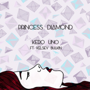
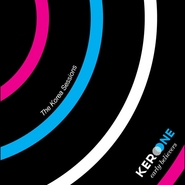
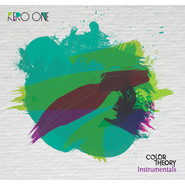
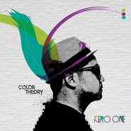
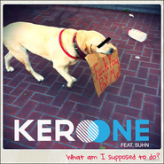
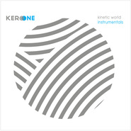
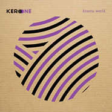
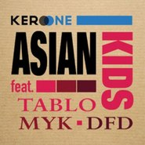
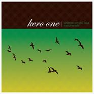

Kero One
============================

|  |  |
| :--: | :-- |
| [ Kero One](https://i.xiami.com/keroone) | **地区**: United States of America 美国 **风格**: 爵士嘻哈 Jazz Hip Hop, 嘻哈 Hip-Hop **播放数**: 5317575 **粉丝数**: 6296 **评论数**: 224  |

## 档案

Kero One...一个从小被迫学钢琴,号称初中13岁开始玩DJ,出生在美国又在日本呆过一段时间的韩裔…… 
动听的旋律,各个MC经过悉心挑选的Flow,整整60分钟不间断的jazz味道浓得化不开专辑,各种灵动的乐器,有力且弹力十足的鼓,再加上低沉却不阴暗的bass,这一切都于他从小良好的音乐教育分不开.有时候觉得DJ真是一个神奇的职业,通过别人的语言,来表达自己的想法...据说他曾在DJ和MC之间徘徊过,但最总还是坚持了下来,不要以为这很容易..并不是人人都是kanye west或者是Dr dre...前者的Flow实在对不起他的beats,后者则据说认识snoop dogg前完全不会饶舌,不过还到后来还是别出来了那种有点恐怖的大熊音... 
恩,不说这两位了,回到正题上来,再来看看Kero能够制作的音乐类型：classic hiphop,new (jazz influenced) hiphopsoul/jazz, broken beat, electronic, soulful disco and house,真万能... 
这似乎是一些优秀DJ的共性了,这很不容易,因为在制作之前,DJ本人必须对这些音乐本身有很深的理解,需要听多少相关音乐那真是无法计数了..对于Kero one本人的flow这张mixtape里面只有一首出现了,感觉还不错,就是太短了 
활동연대 2000, 2010 
출생 2003 | 미국 
활동유형 남성| 솔로 | 보컬,디제이 
활동장르 랩/힙합 
스타일 힙합 (Hip-Hop) 
데뷔 2007 |Windmills of The Soul |Give Thanks (feat. Niamaj) 
캘리포니아 베이 에이리어 출신의 케로원(Kero One)은 90년대 초부터 MC와 비트 메이킹, 그래피티와 디제잉, 그리고 레코드 수집을 해왔다. 2003년 여름, 스스로 운영하는 레이블인 플러그 레이블(Plug Label)에서 자신의 첫 12인치 레코드 [Check the Blueprints]를 공개하는데, 이는 여러 로컬 라디오 스테이션과 레코드샵에서 주목을 받으면서 놀라운 판매고로 이어진다. 여러 DJ들의 플레이리스트에 추가됐고, 다양한 장소에서 스핀되기도 했다. 싱글은 DJ 미츠 더 비츠(MItsu The Beats) 또한 리믹스 했는데, 단지 싱글의 세일즈 하나만으로 정규 앨범이 릴리즈되기 이전에 일본에서 투어가 진행되는 진풍경을 연출하기도 했다. 
재즈힙합이 일본과 한국을 점령할 무렵인 2005년도에 데뷔작 [Windmills of The Soul]을 발표했다. 실제로 서로 리믹스 해주는 사이이기도 했던 사운드 프로바이더스(SOund Providers)나 론 캐털리스츠(Lone Catalysts), 그리고 얼마전 운명을 달리한 누자베스(Nujabes)의 팬들에게 동시에 사랑 받았다. 샘플링과 실제 연주가 적절하게 매치된 한 장으로 여러 매체에서 호평을 얻고 중요하게 다뤄지면서 언더그라운드 재즈 힙합 클래식으로 자리매김해가는 듯한 양상을 보였다. 앨범은 미국보다는 일본에서 몇 달 먼저 발매됐고, 일본에서는 HMV와 타워 레코드 등의 대형매장 힙합 차트 1, 2위에 오르며 선전했다. 한국에서도 보너스 CD를 포함한 형태로 발매됐는데, 이는 훌륭한 호응을 얻어냈다. 
2006년 10월에는 [Plug Famalam Mixtape]이라는 믹스셋을 공개하기도 했다. 제이 디(Jay Dee)와 슬럼 빌리지(Slum Village), 그리고 에리카 바두(Eryka Badu) 등을 자신의 스타일로 믹스시키면서 DJ로서의 작업물을 담아낸 것이었다. 2007년도에는 레이블의 샘플러 격인 컴필레이션 [Kero One presents Plug Label]을 릴리즈 한다. 웨스트 코스트 언더그라운드에서 활약하는 크라운 시티 락커즈(Crown City Rockers), 라이트헤디드(Lightheaded)의 오메가 왓츠(Omega Watts), 그리고 달러가 필요한 스톤즈 쓰로(Stones Throw)의 알로에 블랙(Aloe Blacc) 등의 쟁쟁한 참여진들로 채워지면서 언더그라운드 팬들의 큰 관심을 불러 일으켰다. 
2009년도에 두 번째 정규앨범 [Early Believers]를 완성한다. 역시 훌륭한 바이브를 가진 캐치한 비트로 무장했는데, 약간은 올드한 무드를 지녔던 전작보다는 좀 더 모던한 사운드를 담아냈다-이 이유가 꼭 오토튠 때문만은 아니다-. 무서운 사나이 자일스 피터슨(Gilles Peterson)과 관련이 있는 브라운즈우드(Brownswood) 레코드 소속의 벤 웨스트비치(Ben Westbeech), 북유럽의 스티비 원더(Stevie Wonder)라는 평가를 받고 있다는 핀란드의 싱어 투오모(Tuomo), 그리고 오메가 왓츠와 크라운 시티 락커즈의 캣 오우아노(Kat Ouano) 등이 앨범을 더욱 빛내줬으며, 한국의 에픽하이, [지구본 뮤직]에서 먼저 호흡을 맞췄던 다이나믹 듀오, 그리고 맵더소울 소속의 MYK의 이름 또한 트랙리스트에서 발견할 수 있었다. 한국반에는 에픽 하이의 타블로가 피쳐링한 [Keep Pushin']이 추가되기도 했다. 
2집 공개 당시에는 블랙 아이드 피스(Black Eyed Peas)의 윌 아이엠(will.i.am)이 직접 추천하고 있는 비디오 메시지가 인터넷 상에 떠돌기도 했다. 인터뷰에 의하면 케로 원도 그가 이런 메시지를 보내준 것에 대해 무척 놀랐다고 한다. 아마 윌 아이엠의 사무실에 일하는 아는 사람이 케로 원의 음악을 그에게 추천해 준 것이 계기가 된 것이 아니었을까 하고 짐작한다 밝혔다. 이후 탈립 콸리(Talib Kweli)의 [In the Pocket]을 리믹스 하기도 했으며 페니(Pe2ny)의 곡 [Wake Up]과 라샨 아마드(Rashaan Ahmad)의 [Here We Go] 등에 피쳐링 하기도 했다. 커먼(Common)의 클래식 [The Light]도 리믹스했었는데, 이 곡은 뻐킹 불싸조 또한 리믹스 한 바 있다. 
에픽하이의 음반 [魂 : Map the Soul]에 피쳐링하면서, 그리고 2009년 5월에는 에픽하이의 월드 투어에 합류하면서 에픽하이의 레이블 맵더소울의 명예 아티스트로 활동하기도 했다고 한다. 에픽하이 6집 [[e]]에 수록된 [Rocksteady]에도 참여하면서 모국인 한국시장에서도 본격적으로 자신의 이름을 알려가기 시작했다.....

## 专辑

| 名称 | 语种 | 唱片公司 | 发行时间 | 专辑类别 | 专辑风格 |
| :--: | :-- | :-- | :-- | :-- | :-- |
| [ Stay Fly (feat. Cent3e三锤)](./albums/2105041522.md) | 国语 | KKFARM | 2019年07月30日 | EP, 单曲 | 嘻哈 Hip-Hop |
| [ Onethology: 2003-2018](./albums/2104256028.md) | 英语 | Plug Label | 2018年09月28日 | 精选集 | 嘻哈 Hip-Hop |
| [ Kero & Azure!](./albums/2102724647.md) | 英语 | KKFARM | 2017年06月20日 | EP, 单曲 | 爵士说唱 Jazz Rap, 地下说唱 Underground Hip Hop, 意识说唱 Conscious Hip Hop |
| [ JazzHop](./albums/2102754560.md) | 英语 | Self-Released | 2017年03月24日 | EP, 单曲 | 爵士 Jazz |
| [ Reflection Eternalリフレクション・エターナル](./albums/2100270244.md) | 英语 | P-VINE | 2015年12月16日 | 录音室专辑 | 弛放节拍 Chill Beats |
| [ Musical Journey - The Best of Kero One](./albums/2100288260.md) | 英语 | P-VINE | 2015年12月16日 | 精选集 |  |
| [ Princess Diamond](./albums/2100203814.md) | 英语 | Plug Label | 2015年08月24日 | EP, 单曲 |  |
| [ Roads (Kero Uno Remix)](./albums/2100209938.md) | 英语 | Self-Released | 2014年09月25日 | EP, 单曲 |  |
| [ E.B. Korean Sessions EP](./albums/276229256.md) | 英语 | Plug Label | 2013年08月07日 | EP, 单曲 |  |
| [ Color Theory Instrumentals.](./albums/562789.md) | 英语 | Plug Label | 2012年09月26日 | 录音室专辑 |  |
| [ Color Theoryカラー・セオリー 色彩理论](./albums/527047.md) | 英语 | P-VINE | 2012年07月04日 | 录音室专辑 | 嘻哈 Hip-Hop |
| [ What Am I Supposed to Do?](./albums/506322.md) | 英语 | Plug Label | 2012年04月09日 | EP, 单曲 |  |
| [ The Catch Up](./albums/469364.md) | 英语 | Plug Label | 2011年09月13日 | 录音室专辑 |  |
| [ Kinetic World Instrumentals](./albums/440632.md) | 英语 | Plug Label | 2011年04月18日 | 录音室专辑 |  |
| [ Kinetic World](./albums/389529.md) | 英语 | Plug Label | 2010年06月21日 | 录音室专辑 | 嘻哈 Hip-Hop, 世界音乐 World Music |
| [ Asian Kids](./albums/468892.md) | 英语 | Plug Label | 2010年05月18日 | EP, 单曲 |  |
| [ Early Believers (Instrumentals)](./albums/468890.md) | 英语 | Plug Label | 2009年07月28日 | 合集, 杂锦 |  |
| [ Early Believers](./albums/324579.md) | 英语 | Plug Label | 2009年01月01日 | 录音室专辑 | 另类说唱 Alternative Hip Hop, 地下说唱 Underground Hip Hop |
| [ Plug Famalam Mixtape](./albums/311072.md) | 英语 | White Label | 2008年08月04日 | 合集, 杂锦 | 嘻哈 Hip-Hop |
| [ Windmills Of The Soul Instrumental](./albums/297265.md) | 其他 | Plug Label | 2007年10月23日 | 录音室专辑 |  |
| [ Plug Label](./albums/297260.md) | 英语 | P-VINE | 2007年05月03日 | 录音室专辑 |  |
| [ In All the Wrong Places/ Give Thanks](./albums/397849.md) | 英语 | Plug Label US | 2006年11月06日 | EP, 单曲 |  |
| [ Windmills of the Soul](./albums/297259.md) | 英语 | Plug Label | 2006年01月01日 | 录音室专辑 |  |
| [ Keep It Alive](./albums/379749.md) | 日语 | PLUG | 2005年05月02日 | EP, 单曲 |  |
| [ Check the Blueprints](./albums/468888.md) | 英语 | Plug Label | 2003年01月01日 | EP, 单曲 | 嘻哈 Hip-Hop |

## 评论

|  |  |  |
| :-- | :-- | :-- |
|  [虾米用户](https://emumo.xiami.com/u/43492923) 行到水穷我才开始害怕，夕... 2020-04-17 14:29 赞(0) 踩(0) | 
。
 |
|  [虾米用户](https://emumo.xiami.com/u/349596358) 啾啾一口小奶羊 2020-04-05 21:07 赞(1) 踩(0) | 
太喜欢这个人的风格了
 |
|  [虾米用户](https://emumo.xiami.com/u/189921932)  2020-03-26 17:36 赞(0) 踩(0) | 

 |
|  [虾米用户](https://emumo.xiami.com/u/356763773) 我还没想好要写什么... 2020-02-27 00:12 赞(0) 踩(0) | 
~
 |
|  [虾米用户](https://emumo.xiami.com/u/40603098) You can’t ho... 2019-10-31 10:20 赞(0) 踩(0) | 

 |
|  [虾米用户](https://emumo.xiami.com/u/343737395) heres my key 2019-09-22 12:20 赞(0) 踩(0) | 
介绍用心
 |
|  [虾米用户](https://emumo.xiami.com/u/47251309) 我还没想好要写什么... 2019-09-05 00:12 赞(0) 踩(0) | 
再次错过jeff的推荐。。
 |
|  [虾米用户](https://emumo.xiami.com/u/342038768) pucikaka don... 2019-08-09 21:39 赞(0) 踩(0) | 
听懂啦！
 |
|  [虾米用户](https://emumo.xiami.com/u/30788105) 从不失手 2019-08-02 18:02 赞(0) 踩(0) | 
Nox
 |
|  [虾米用户](https://emumo.xiami.com/u/49365982) 当断则断 2019-08-01 17:57 赞(0) 踩(0) | 
see u in Guangzhou:）
 |
|  [虾米用户](https://emumo.xiami.com/u/346492287) 虾米不要离开我！ 2019-07-29 18:13 赞(0) 踩(0) | 
好想去！！可惜去不了(๑o̴̶̷̥᷅﹏o̴̶̷̥᷅๑)
 |
|  [虾米用户](https://emumo.xiami.com/u/245523212) 幸福的人从不晚睡 2019-07-29 17:52 赞(1) 踩(0) | 
啊啊啊啊武汉呢！！?
 |
|  [虾米用户](https://emumo.xiami.com/u/7361294) 24/7 2019-07-29 17:42 赞(0) 踩(0) | 
8月10号 北京见
 |
|  [虾米用户](https://emumo.xiami.com/u/856551) 虾米活下去 用户指责什么... 2019-07-29 14:38 赞(0) 踩(0) | 
真*良心巡演
 |
|  [虾米用户](https://emumo.xiami.com/u/50231722) 在路上小心点 2019-07-21 03:31 赞(0) 踩(0) | 
8月17号 ！！！
 |
|  [虾米用户](https://emumo.xiami.com/u/4208300) 微博/网易云：小田切尼  2019-07-20 22:06 赞(0) 踩(0) | 
8月可以听现场了 ;)
 |
|  [虾米用户](https://emumo.xiami.com/u/460880) 有声读物 2019-07-16 18:02 赞(0) 踩(0) | 
杭州见！XD
 |
|  [虾米用户](https://emumo.xiami.com/u/346492287) 虾米不要离开我！ 2019-07-06 18:11 赞(0) 踩(0) | 
要来巡演了[带墨镜笑]
 |
|  [虾米用户](https://emumo.xiami.com/u/400715332) 留白 2019-04-06 20:48 赞(0) 踩(0) | 
有才
 |
|  [虾米用户](https://emumo.xiami.com/u/55094882) ｉｄ９１ｏｍｏ＞Ｉ  2019-02-27 11:14 赞(0) 踩(0) | 
✨
 |
|  [虾米用户](https://emumo.xiami.com/u/42936819) 网易云搜索恶法lex i... 2018-08-16 16:10 赞(0) 踩(0) | 
get
 |
|  [虾米用户](https://emumo.xiami.com/u/648020)  2018-05-23 17:40 赞(0) 踩(0) | 
我把这位&amp;ldquo;han&amp;rdquo; 跟他混了，曲风虽然不一样.... 这个HAN挺R&amp;amp;B，Kero HAN 偏嘻哈说唱一点吧 <a href="https://www.xiami.com/song/bCkEBxo47244?spm=a1z1s.6659509.0.0.s5Ix7s" target="_blank" rel="nofollow noreferrer noopener">https://www.xiami.com/song/bCkEBxo47244?spm=a1z1s.6659509.0.0.s5Ix7s</a>
 |
|  [虾米用户](https://emumo.xiami.com/u/18567237)  2018-04-13 14:39 赞(0) 踩(0) | 
好听呀
 |
|  [虾米用户](https://emumo.xiami.com/u/10261121) YOU 2018-03-18 15:38 赞(0) 踩(0) | 

 |
|  [虾米用户](https://emumo.xiami.com/u/330907917) 每日每时，滴答滴答 2018-03-03 01:15 赞(0) 踩(0) | 
:-|
 |
|  [虾米用户](https://emumo.xiami.com/u/14733748)  2018-01-26 16:50 赞(1) 踩(0) | 
好洋气的调调哟
 |
|  [虾米用户](https://emumo.xiami.com/u/42725114) ThistheshitI... 2017-12-01 11:01 赞(0) 踩(0) | 

 |
|  [虾米用户](https://emumo.xiami.com/u/46583488)  2017-11-29 17:38 赞(0) 踩(0) | 
✨
 |
|  [虾米用户](https://emumo.xiami.com/u/17077682) 滚去spotify了。C... 2017-11-23 08:54 赞(0) 踩(0) | 
☑️
 |
|  [虾米用户](https://emumo.xiami.com/u/4468134) 1996~∞ 2017-10-27 23:21 赞(11) 踩(0) | 
KERO要来北京和上海还有台北演出啦!!!!!!!!!大家有没有想去看的.我是不行了.还在湾区...话说KERO在他新专辑里推荐韩国城里的东西好.我去了.一碗拉面(是人都知道是泡面)加味精要8美刀!棒子真的是自夸啊....
 |
|  [虾米用户](https://emumo.xiami.com/u/47275482)  2017-10-12 23:24 赞(2) 踩(0) | 
一个长在美国在日本韩国两个国家流窜用英文唱着jazz hip pop的牛b的胖子
 |
|  [虾米用户](https://emumo.xiami.com/u/36993026) 韵律不绝于耳，萦绕永生 2017-10-03 04:04 赞(0) 踩(0) | 
看到粉丝5000
 |
|  [虾米用户](https://emumo.xiami.com/u/50093825) 。 2017-09-06 23:37 赞(0) 踩(0) | 
: )
 |
|  [虾米用户](https://emumo.xiami.com/u/2418238) weibo: @尤米口 2017-09-02 11:13 赞(2) 踩(0) | 
补
 |
|  [虾米用户](https://emumo.xiami.com/u/91372642) 不開心就不好看了 2017-06-10 14:54 赞(0) 踩(0) | 
x
 |
|  [虾米用户](https://emumo.xiami.com/u/3166391) jazzhipa 和te... 2017-05-27 16:41 赞(1) 踩(0) | 
我说您一句&amp;ldquo;很牛逼&amp;rdquo; 您能答应下吗
 |
|  [虾米用户](https://emumo.xiami.com/u/1418202)  江山共老 2017-03-31 21:54 赞(1) 踩(0) | 
喜歡到不行，一天一張專輯地聽，到了晚上就拎出其中最棒的來聽！
 |
|  [虾米用户](https://emumo.xiami.com/u/156056836) 我还没想好要写什么... 2017-03-09 22:06 赞(0) 踩(0) | 
补！
 |
| ⇒ |  [虾米用户](https://emumo.xiami.com/u/33552517) 偏好、 2017-03-09 22:10 赞(0) 踩(0) | 

 |
|  [虾米用户](https://emumo.xiami.com/u/268410743) Tales of the... 2017-02-07 00:22 赞(1) 踩(0) | 
和Jeff bernat 曲风最爱！
 |
|  [虾米用户](https://emumo.xiami.com/u/10298668) 暂无签名~ 2017-01-12 01:57 赞(0) 踩(0) | 
轻松的爵士
 |
|  [虾米用户](https://emumo.xiami.com/u/60118666) 辗转反侧不敢入睡，太多时... 2016-12-12 02:00 赞(1) 踩(0) | 
Kanye的Beat比不起他的Flow？！ 真黑阿
 |
|  [虾米用户](https://emumo.xiami.com/u/40039629) Photography&... 2016-12-10 19:55 赞(0) 踩(0) | 
sam ock 是他本人吗啊哈哈哈
 |
|  [虾米用户](https://emumo.xiami.com/u/977238) 热爱音乐每一天 2016-10-13 18:47 赞(0) 踩(0) | 
cool
 |
|  [虾米用户](https://emumo.xiami.com/u/85148548)  2016-09-19 22:29 赞(1) 踩(0) | 

 |
|  [虾米用户](https://emumo.xiami.com/u/37891950) 我在熬夜 熟了叫你 2016-08-12 01:17 赞(0) 踩(0) | 
⭕️
 |
|  [虾米用户](https://emumo.xiami.com/u/36514939) 她留着超酷的短发 网易云... 2016-07-30 21:39 赞(0) 踩(0) | 
⚙
 |
|  [虾米用户](https://emumo.xiami.com/u/7951384) 我还没想好要写什么... 2016-07-22 20:59 赞(0) 踩(0) | 

 |
|  [虾米用户](https://emumo.xiami.com/u/23843876)  2016-07-05 02:11 赞(0) 踩(0) | 
超喜欢他，好多年了
 |
|  [虾米用户](https://emumo.xiami.com/u/190758376) hiya 2016-06-23 02:51 赞(1) 踩(0) | 
长得有点像日本人的赶脚 音乐也是  love it
 |
|  [虾米用户](https://emumo.xiami.com/u/28946659)   2016-06-03 09:27 赞(1) 踩(0) | 
乔丹穿出了fake的感觉 服！
 |
|  [虾米用户](https://emumo.xiami.com/u/4350663)  2016-05-17 10:46 赞(0) 踩(0) | 
点进艺人相册，这也只是微胖？
 |
| ⇒ |  [虾米用户](https://emumo.xiami.com/u/48888270) 中文饶舌像史诗一样浪漫；... 2016-07-08 15:23 赞(0) 踩(0) | 
哈哈哈
 |
|  [虾米用户](https://emumo.xiami.com/u/4350663)  2016-05-17 10:44 赞(0) 踩(0) | 
头像有点幻灭了，哈哈哈
 |
|  [虾米用户](https://emumo.xiami.com/u/5750028)  2016-05-09 19:23 赞(0) 踩(0) | 
正
 |
|  [虾米用户](https://emumo.xiami.com/u/6965583) 人體穿刺師° 2016-04-30 23:57 赞(0) 踩(0) | 
:)
 |
|  [虾米用户](https://emumo.xiami.com/u/9327494) http://www.x... 2016-04-23 01:05 赞(0) 踩(0) | 
So Seductive
 |
|  [虾米用户](https://emumo.xiami.com/u/60455770) 自己喜欢听就好 2016-04-09 14:48 赞(0) 踩(0) | 

 |
|  [虾米用户](https://emumo.xiami.com/u/51623903)   2016-03-24 07:09 赞(0) 踩(0) | 
什么，这叫微胖。。嗯心里得到安慰了
 |
|  [虾米用户](https://emumo.xiami.com/u/9028760) 豆瓣见 spotify ... 2016-03-08 13:05 赞(0) 踩(0) | 
☄
 |
|  [虾米用户](https://emumo.xiami.com/u/13526500) Comment ça v... 2016-03-08 09:03 赞(0) 踩(0) | 
nice
 |
|  [虾米用户](https://emumo.xiami.com/u/8475225)  2016-03-05 11:19 赞(0) 踩(0) | 
[[[[[[[[[[[[oooooOooooo]]]]]]]]]]]]
 |
|  [虾米用户](https://emumo.xiami.com/u/101322) 不怎么听歌了 2016-02-02 16:01 赞(1) 踩(0) | 
哟呵 改名啦
 |
|  [虾米用户](https://emumo.xiami.com/u/1385712) whatever…… 2016-01-30 23:36 赞(0) 踩(0) | 
新砖12月就出了……
 |
|  [虾米用户](https://emumo.xiami.com/u/1828555) Omnivore 2016-01-14 18:07 赞(1) 踩(0) | 
Reflection Eternal
 |
|  [虾米用户](https://emumo.xiami.com/u/72429240) ↶ ‿ ↶ 2016-01-12 17:15 赞(0) 踩(0) | 
F ᕕ(ᐛ)ᕗ Underwater Kero Uno ft. Blu
 |
|  [虾米用户](https://emumo.xiami.com/u/589764) The 1st cut ... 2015-12-26 01:28 赞(2) 踩(0) | 
改名了？
 |
|  [虾米用户](https://emumo.xiami.com/u/880455) 流血则没有声音。 2015-12-22 20:56 赞(2) 踩(0) | 
这简介从哪个山沟里找来的
 |
|  [虾米用户](https://emumo.xiami.com/u/11253182) 我还没想好要写什么... 2015-12-15 21:47 赞(0) 踩(0) | 
极好极好极好
 |
|  [虾米用户](https://emumo.xiami.com/u/18412060) v15175288880 2015-12-09 13:17 赞(0) 踩(0) | 
nice
 |
|  [虾米用户](https://emumo.xiami.com/u/14163342) dfwm 2015-11-15 22:24 赞(0) 踩(0) | 
我喜欢instrumental
 |
|  [虾米用户](https://emumo.xiami.com/u/13228266) 国破山河在 2015-10-24 11:14 赞(0) 踩(0) | 
好笑
 |
|  [虾米用户](https://emumo.xiami.com/u/4468134) 1996~∞ 2015-10-18 03:21 赞(0) 踩(0) | 
que?
 |
|  [虾米用户](https://emumo.xiami.com/u/8475225)  2015-09-23 10:14 赞(0) 踩(0) | 
[[[[[[[[[[[[oooooOooooo]]]]]]]]]]]]
 |
|  [虾米用户](https://emumo.xiami.com/u/856551) 虾米活下去 用户指责什么... 2015-09-21 18:23 赞(1) 踩(0) | 
真是Uno玩多了2333
 |
|  [虾米用户](https://emumo.xiami.com/u/40516135) 如果不是我，就不要去爱。 2015-09-20 12:06 赞(1) 踩(0) | 
被迫学钢琴2333
 |
|  [虾米用户](https://emumo.xiami.com/u/1828555) Omnivore 2015-09-19 21:31 赞(12) 踩(0) | 
现在改名叫Kero Uno（aka KERO 1），开始做时髦音乐了覀L覀
 |
|  [虾米用户](https://emumo.xiami.com/u/35580409) 对你不感兴趣 2015-09-04 13:03 赞(1) 踩(0) | 
虽然你长得不是我的菜 我还是要宣布 你是我的男人了
 |
| ⇒ |  [虾米用户](https://emumo.xiami.com/u/50792813) 爱你 虾米 2016-05-19 12:59 赞(0) 踩(0) | 
到处都是你的男人哈哈哈哈
 |
|  [虾米用户](https://emumo.xiami.com/u/47879673)  2015-08-24 23:09 赞(0) 踩(0) | 
love
 |
|  [虾米用户](https://emumo.xiami.com/u/560540) 勇敢的好姑娘永垂不朽 2015-08-19 14:53 赞(1) 踩(0) | 
第一次听到的时候顿时联想起另一个人 Jeff Bernat，都很棒
 |
| ⇒ |  [虾米用户](https://emumo.xiami.com/u/47114438)  2016-03-27 07:45 赞(0) 踩(0) | 
我也是！！
 |
|  [虾米用户](https://emumo.xiami.com/u/38640339) 我想好写什么了…… 2015-08-01 13:35 赞(0) 踩(0) | 

 |
|  [虾米用户](https://emumo.xiami.com/u/46128112) 一个假泰国人  2015-07-25 23:00 赞(1) 踩(0) | 
暖暖的很贴心。
 |
|  [虾米用户](https://emumo.xiami.com/u/7602693) 不知道怎么编辑精选 2015-07-22 00:47 赞(0) 踩(0) | 
从来不知道收藏艺人
 |
|  [虾米用户](https://emumo.xiami.com/u/20862728) 柯男 2015-07-05 01:40 赞(0) 踩(0) | 
首页推荐
 |
|  [虾米用户](https://emumo.xiami.com/u/2451585)  2015-06-10 12:47 赞(0) 踩(0) | 
.
 |
|  [虾米用户](https://emumo.xiami.com/u/50560480) 缺b操尼玛 2015-06-04 18:54 赞(0) 踩(0) | 
。
 |
|  [虾米用户](https://emumo.xiami.com/u/39556280) o 2015-05-26 17:24 赞(0) 踩(0) | 
简介好装逼
 |
|  [虾米用户](https://emumo.xiami.com/u/9618554)  2015-05-10 13:07 赞(1) 踩(0) | 
韩国电爵
 |
|  [虾米用户](https://emumo.xiami.com/u/7361294) 24/7 2015-05-09 00:58 赞(0) 踩(0) | 
ii
 |
|  [虾米用户](https://emumo.xiami.com/u/1507166) Power&Freedo... 2015-05-05 12:07 赞(0) 踩(0) | 
u goooot talent buddy 
 |
|  [虾米用户](https://emumo.xiami.com/u/6654069) mutherfacker... 2015-04-24 04:51 赞(0) 踩(0) | 
-
 |
|  [虾米用户](https://emumo.xiami.com/u/9025912) 不是本人 2015-04-19 15:50 赞(0) 踩(0) | 
...
 |
|  [虾米用户](https://emumo.xiami.com/u/36733390) People insti... 2015-04-15 01:21 赞(0) 踩(0) | 
也是胜在flow上了的jazz hiphop歌手
 |
|  [虾米用户](https://emumo.xiami.com/u/19764323)  2015-03-22 11:24 赞(0) 踩(0) | 
xihuan
 |
|  [虾米用户](https://emumo.xiami.com/u/7361294) 24/7 2015-03-10 22:14 赞(0) 踩(0) | 
m
 |
|  [虾米用户](https://emumo.xiami.com/u/45823964)  2015-01-19 21:18 赞(0) 踩(0) | 
曲风与冰块先生的很像，还是喜欢冰块多些 <a href="http://i.xiami.com/brian?spm=a1z1s.6843761.226669510.10.TIXbBQ&amp;amp;from=search_popup_artist" target="_blank" rel="nofollow noreferrer noopener">http://i.xiami.com/brian?spm=a1z1s.6843761.226669510.10.TIXbBQ&amp;amp;from=search_popup_artist</a> 你们可以去听听
 |
|  [虾米用户](https://emumo.xiami.com/u/33457836)   2015-01-06 21:21 赞(0) 踩(0) | 
-
 |
|  [虾米用户](https://emumo.xiami.com/u/8582967)   2015-01-05 23:31 赞(0) 踩(0) | 
救命全喜欢！！！！！男神嫁我！！！！！！！！！
 |
|  [虾米用户](https://emumo.xiami.com/u/18121643)  2015-01-05 08:55 赞(0) 踩(0) | 
ok
 |
|  [虾米用户](https://emumo.xiami.com/u/1317745) limitless 2014-11-29 11:12 赞(0) 踩(0) | 
在看tablo参与过的专辑 这名字有点眼熟就点进来了 嗯 好听
 |
|  [虾米用户](https://emumo.xiami.com/u/5169131) 我还没想好要写什么... 2014-11-15 22:53 赞(0) 踩(0) | 
胖子 一枚
 |
|  [虾米用户](https://emumo.xiami.com/u/7577732) 我还没想好要写什么... 2014-11-01 11:37 赞(0) 踩(0) | 
Han...
 |
| ⇒ |  [虾米用户](https://emumo.xiami.com/u/24123398) // 2014-12-28 07:26 赞(0) 踩(0) | 
哈哈
 |
|  [虾米用户](https://emumo.xiami.com/u/3781923) 别拒绝上帝。 2014-10-28 08:57 赞(0) 踩(0) | 
New Jazz！
 |
| ⇒ |  [虾米用户](https://emumo.xiami.com/u/7645492) CREEPY_DOLL 2015-01-17 20:39 赞(0) 踩(0) | 
yoooooo
 |
| ⇒ |  [虾米用户](https://emumo.xiami.com/u/3781923) 别拒绝上帝。 2015-01-17 22:31 赞(0) 踩(0) | 
<q><b>桃子同学❤说：</b></q>
 |
|  [虾米用户](https://emumo.xiami.com/u/21801236)  2014-10-14 01:55 赞(0) 踩(0) | 
没想啊
 |
|  [虾米用户](https://emumo.xiami.com/u/13866248) Disharmony 2014-09-22 23:16 赞(0) 踩(0) | 
不能换一个头像吗真难过。。
 |
|  [虾米用户](https://emumo.xiami.com/u/25364212) 不止hotshit 冷盘... 2014-08-09 07:22 赞(0) 踩(0) | 
算爵说麽
 |
|  [虾米用户](https://emumo.xiami.com/u/4043260) 内心小骚 2014-07-27 12:23 赞(0) 踩(0) | 
like
 |
|  [虾米用户](https://emumo.xiami.com/u/3749751) 白天是夜晚的仆从 2014-05-31 13:07 赞(0) 踩(0) | 
优质棒子音乐人～～················
 |
|  [虾米用户](https://emumo.xiami.com/u/7172752) 让寂寞狼狈偏安 2014-05-11 19:17 赞(0) 踩(0) | 
you can see ，爵士黑泡“重量级”选手，cooler
 |
|  [虾米用户](https://emumo.xiami.com/u/9178099) serious libi... 2014-04-19 22:16 赞(0) 踩(0) | 
大版阿憨⌒
 |
|  [虾米用户](https://emumo.xiami.com/u/6266822)  2014-04-03 17:28 赞(0) 踩(0) | 
虽然棒子无爱 但音乐确实有点意思
 |
|  [虾米用户](https://emumo.xiami.com/u/4471466)  2014-03-30 16:57 赞(1) 踩(0) | 
特别阳光的节奏……
 |
|  [虾米用户](https://emumo.xiami.com/u/9065885) 音乐是惊喜 2014-03-21 20:29 赞(1) 踩(0) | 
胖子么么哒
 |
|  [虾米用户](https://emumo.xiami.com/u/9657806) Music Makes ... 2014-02-15 17:21 赞(0) 踩(0) | 
I just like!
 |
|  [虾米用户](https://emumo.xiami.com/u/9657806) Music Makes ... 2014-02-15 13:37 赞(1) 踩(0) | 
you are awesome! Love your songs so much!!! Aamzaing!
 |
|  [虾米用户](https://emumo.xiami.com/u/18915444) 暂无签名~ 2014-02-14 15:21 赞(0) 踩(0) | 
哟西
 |
|  [虾米用户](https://emumo.xiami.com/u/31463623)  2014-02-01 14:50 赞(1) 踩(0) | 
听软趴趴的还整天装逼 kero one的专辑是越来越水 风格还underground?
 |
| ⇒ |  [虾米用户](https://emumo.xiami.com/u/2173196) W w w w w 2017-05-24 09:06 赞(0) 踩(0) | 
说的太对了！必须赞一个！我还记得07年刚开始听他歌，觉得这哥们是认真的！过了第2张专辑彻底歇菜了 。。全是流行，一听就知道他本人都不咋喜欢。。现在听他歌也就Plug Label和Windmills of the soul
 |
|  [虾米用户](https://emumo.xiami.com/u/859811) 献以至臻  潮乐共享 2014-01-22 13:58 赞(0) 踩(0) | 
JAZZY
 |
|  [虾米用户](https://emumo.xiami.com/u/11324869) 心灵造就美 2013-11-30 20:11 赞(0) 踩(0) | 
挺好玩儿
 |
|  [虾米用户](https://emumo.xiami.com/u/5170986) 从小耍流氓，长大风清扬 2013-11-25 20:45 赞(75) 踩(0) | 
“这位一脸文艺的微胖界人才，别以为我不知道你那副眼镜是可以用手指穿过去的。”
 |
| ⇒ |  [虾米用户](https://emumo.xiami.com/u/7428774) 我还没想好要写什么... 2015-03-14 09:01 赞(0) 踩(0) | 
笑傻了
 |
| ⇒ |  [虾米用户](https://emumo.xiami.com/u/54334842)  2015-08-24 13:37 赞(0) 踩(0) | 
爵士小丑鱼
 |
| ⇒ |  [虾米用户](https://emumo.xiami.com/u/54334842)  2015-08-24 13:37 赞(0) 踩(0) | 
爵士小丑
 |
| ⇒ |  [虾米用户](https://emumo.xiami.com/u/54334842)  2015-08-24 13:37 赞(0) 踩(0) | 
爵士小丑
 |
| ⇒ |  [虾米用户](https://emumo.xiami.com/u/101322) 不怎么听歌了 2017-10-30 10:18 赞(0) 踩(0) | 
hhahahahhahahahaaaaaaaaaaaaaaaaaaaaaa
 |
| ⇒ |  [虾米用户](https://emumo.xiami.com/u/329915557) 贝斯手 2018-04-07 13:26 赞(0) 踩(0) | 
<q><b>冷血老头盔说：</b></q>
 |
|  [虾米用户](https://emumo.xiami.com/u/9944827)  2013-11-06 12:00 赞(0) 踩(0) | 
喜欢呗
 |
|  [虾米用户](https://emumo.xiami.com/u/25188261)  2013-10-23 17:28 赞(0) 踩(0) | 
就是喜欢
 |
|  [虾米用户](https://emumo.xiami.com/u/21771765)  2013-09-12 13:37 赞(0) 踩(0) | 
COOL
 |
|  [虾米用户](https://emumo.xiami.com/u/2795876) 我还没想好要写什么... 2013-09-06 21:51 赞(0) 踩(0) | 
喜欢
 |
|  [虾米用户](https://emumo.xiami.com/u/5920185) 失业在家貌似也只能画画. 2013-08-26 10:52 赞(0) 踩(0) | 
嗯.
 |
|  [虾米用户](https://emumo.xiami.com/u/6103854)   2013-08-20 13:05 赞(0) 踩(0) | 
1
 |
|  [虾米用户](https://emumo.xiami.com/u/3581084)   2013-08-04 14:29 赞(0) 踩(0) | 
好听啊！
 |
|  [虾米用户](https://emumo.xiami.com/u/478527) 好想跟衣服在洗衣机里滚 2013-07-15 17:01 赞(1) 踩(0) | 
推荐RIP，非常好听，带着亚洲风，很有画面感
 |
|  [虾米用户](https://emumo.xiami.com/u/478527) 好想跟衣服在洗衣机里滚 2013-07-15 16:54 赞(27) 踩(0) | 
长得好像Han
 |
| ⇒ |  [虾米用户](https://emumo.xiami.com/u/648020)  2017-08-02 13:31 赞(0) 踩(0) | 
你抢了我的留言，哈哈哈哈
 |
| ⇒ |  [虾米用户](https://emumo.xiami.com/u/478527) 好想跟衣服在洗衣机里滚 2017-08-02 20:48 赞(0) 踩(0) | 
<q><b>Lvv说：</b></q>
 |
|  [虾米用户](https://emumo.xiami.com/u/1533968) 那安坐栖息的人将得到爱 2013-07-14 23:05 赞(0) 踩(0) | 
rap 韩国
 |
|  [虾米用户](https://emumo.xiami.com/u/5690483)  2013-07-11 15:53 赞(1) 踩(0) | 
晕死~一直以为是个很帅气的老外~原来是个棒子~~声线真棒~
 |
|  [虾米用户](https://emumo.xiami.com/u/2804005) 　　　NO GODS O... 2013-07-08 17:45 赞(0) 踩(0) | 
打2K的时候听还不错。。。
 |
|  [虾米用户](https://emumo.xiami.com/u/9327494) http://www.x... 2013-06-20 09:03 赞(0) 踩(0) | 
The Fast Life
 |
|  [虾米用户](https://emumo.xiami.com/u/2403528) 你们点赞，我就再听一遍，... 2013-06-04 22:00 赞(0) 踩(0) | 
歌单里经常有这位
 |
|  [虾米用户](https://emumo.xiami.com/u/7405289) 平行或交集？ 2013-03-16 11:53 赞(0) 踩(0) | 
这艺人不错~
 |
|  [虾米用户](https://emumo.xiami.com/u/11982764) 长情唯白水。 2013-03-16 00:09 赞(0) 踩(0) | 
acid jazz
 |
|  [虾米用户](https://emumo.xiami.com/u/4274466) 把酒黄昏后  醉卧水云间 2013-03-13 21:22 赞(0) 踩(0) | 
000太棒了
 |
|  [虾米用户](https://emumo.xiami.com/u/1880885) 我还没想好要写什么... 2013-02-24 22:35 赞(0) 踩(0) | 
动员了所有群员找的一个人。。。。辛苦了 大家 大闸虾 肠子 台湾人民神马的
 |
|  [虾米用户](https://emumo.xiami.com/u/4362866) 今天继续萌抖森。 2013-01-20 20:18 赞(1) 踩(0) | 
求给换个头像。。。
 |
|  [虾米用户](https://emumo.xiami.com/u/7802330) Don’t Fight ... 2013-01-14 14:05 赞(0) 踩(0) | 
从kero one 的 time move slowly里听到一段跟wiz的big screen一样的旋律。
 |
|  [虾米用户](https://emumo.xiami.com/u/4127548) yep yep! 2013-01-14 09:56 赞(0) 踩(0) | 
good guy......
 |
|  [虾米用户](https://emumo.xiami.com/u/12391539)  2013-01-12 22:32 赞(0) 踩(0) | 
超喜欢这种feel的音乐
 |
|  [虾米用户](https://emumo.xiami.com/u/7074555)  2013-01-03 07:49 赞(0) 踩(0) | 
很喜欢DJ
 |
|  [虾米用户](https://emumo.xiami.com/u/10737571) o(≧v≦)o 2012-12-20 17:26 赞(1) 踩(0) | 
难得~
 |
|  [虾米用户](https://emumo.xiami.com/u/5965728)  2012-12-19 10:11 赞(0) 踩(0) | 
最爱jazz
 |
|  [虾米用户](https://emumo.xiami.com/u/4468134) 1996~∞ 2012-12-13 05:43 赞(1) 踩(0) | 
Kero 在这个周末被Stevie Wonder 与Bruno Mars 邀请同台演出!这应该可以提高Kero本身的知名度了吧...被Stevie Wonder认同.感觉Kero这么冷门太不公平了.
 |
|  [虾米用户](https://emumo.xiami.com/u/8176877) 極其樂觀的悲觀主義者。 2012-12-10 12:13 赞(0) 踩(0) | 
好心情~
 |
|  [虾米用户](https://emumo.xiami.com/u/366736) 我的歌单们不会辜负你们对... 2012-12-07 18:30 赞(0) 踩(0) | 
Nice Flow.
 |
|  [虾米用户](https://emumo.xiami.com/u/1286224) swaggy 2012-12-02 18:16 赞(2) 踩(0) | 
外表看起来像是中国的网络那啥啥，但一开口说唱完全纯正黑人味，而亚裔独特的细腻声线却比黑人说唱来得更干净，很不错！
 |
|  [虾米用户](https://emumo.xiami.com/u/11395878)  2012-11-07 22:49 赞(0) 踩(0) | 
動聽的旋律
 |
|  [虾米用户](https://emumo.xiami.com/u/11164363)  2012-10-29 11:23 赞(0) 踩(0) | 
很喜欢的调调
 |
|  [虾米用户](https://emumo.xiami.com/u/11164363)  2012-10-29 11:20 赞(0) 踩(0) | 
喜欢的调调
 |
|  [虾米用户](https://emumo.xiami.com/u/9722800) 2013！！！ 2012-10-27 12:44 赞(0) 踩(0) | 
实力强｀｀｀但能不能把这类似鸟叔的头像改一下？？
 |
|  [虾米用户](https://emumo.xiami.com/u/4165827)  2012-10-17 18:24 赞(0) 踩(0) | 
jazz
 |
|  [虾米用户](https://emumo.xiami.com/u/2539281)  2012-09-23 18:32 赞(0) 踩(0) | 
kero one
 |
|  [虾米用户](https://emumo.xiami.com/u/1171396) 以前办不到的事情，未来也... 2012-09-19 23:41 赞(0) 踩(0) | 
0.0
 |
|  [虾米用户](https://emumo.xiami.com/u/1831131) god bless yo 2012-09-14 16:15 赞(0) 踩(0) | 
kero one
 |
|  [虾米用户](https://emumo.xiami.com/u/4362866) 今天继续萌抖森。 2012-09-13 16:32 赞(1) 踩(0) | 
真的不能给他换个头像么...
 |
|  [虾米用户](https://emumo.xiami.com/u/844643)  2012-08-25 11:45 赞(0) 踩(0) | 
摆动起来~旋律是会流动的~~~~~~
 |
|  [虾米用户](https://emumo.xiami.com/u/6462677)  2012-08-23 22:34 赞(0) 踩(0) | 
不错的节奏
 |
|  [虾米用户](https://emumo.xiami.com/u/10180032) 再看我就把你吃掉 2012-08-13 16:41 赞(0) 踩(0) | 
赞一个～～！
 |
|  [虾米用户](https://emumo.xiami.com/u/10180032) 再看我就把你吃掉 2012-08-13 16:34 赞(0) 踩(0) | 
有舒服的节奏～～
 |
|  [虾米用户](https://emumo.xiami.com/u/1639848)  2012-08-05 19:50 赞(0) 踩(0) | 
Love with nothing to say
 |
|  [虾米用户](https://emumo.xiami.com/u/229472)   2012-07-14 19:02 赞(0) 踩(0) | 
Just like it, feels good
 |
|  [虾米用户](https://emumo.xiami.com/u/4468134) 1996~∞ 2012-07-09 11:57 赞(0) 踩(0) | 
下载Kero One 的最新专辑 Color Theory 下载链接： <a href="http://115.com/file/c25esh8k" target="_blank" rel="nofollow noreferrer noopener">http://115.com/file/c25esh8k</a> 大家如果想下的话，抓紧时间！我也正在处理住专辑，有机会一定发布！（怎么发布专辑的啊？）
 |
|  [虾米用户](https://emumo.xiami.com/u/4468134) 1996~∞ 2012-07-05 05:07 赞(1) 踩(0) | 
喂！新专color theory出啦！没人发吗？！！
 |
| ⇒ |  [虾米用户](https://emumo.xiami.com/u/1486285) 玛神马莎 2012-07-08 00:16 赞(0) 踩(0) | 
我有几个文件坏了！不发了！呵呵……
 |
| ⇒ |  [虾米用户](https://emumo.xiami.com/u/4468134) 1996~∞ 2012-07-08 14:39 赞(0) 踩(0) | 
<q><b>玛神马莎说：</b></q>
 |
|  [虾米用户](https://emumo.xiami.com/u/9582086)   2012-07-05 01:55 赞(0) 踩(0) | 
u影天赋改变你们
 |
|  [虾米用户](https://emumo.xiami.com/u/9345930)  2012-07-04 10:09 赞(0) 踩(0) | 
wow
 |
|  [虾米用户](https://emumo.xiami.com/u/155947) 一期一会 2012-06-14 10:23 赞(0) 踩(0) | 
经历好丰富，出生在美国在日本呆过一段时间的韩裔，又要来中国演出鸟
 |
|  [虾米用户](https://emumo.xiami.com/u/289920) virtual real... 2012-05-30 14:43 赞(0) 踩(0) | 
不就是CEEZY那种。。有什么好稀奇
 |
|  [虾米用户](https://emumo.xiami.com/u/5991449)   2012-04-14 21:14 赞(0) 踩(0) | 
赞哦
 |
|  [虾米用户](https://emumo.xiami.com/u/4468134) 1996~∞ 2012-04-11 02:12 赞(0) 踩(0) | 
他的单曲出了，去他的face book 看看吧
 |
|  [虾米用户](https://emumo.xiami.com/u/5446410) 我还没想好要写什么... 2012-03-14 21:39 赞(0) 踩(0) | 
制作强大啊~~ 强！！
 |
|  [虾米用户](https://emumo.xiami.com/u/5489723) 音符与人生 2012-02-12 19:17 赞(0) 踩(0) | 
我是 不喜欢韩国人的 但是这个 韩裔 确实很牛，，，，，，
 |
|  [虾米用户](https://emumo.xiami.com/u/5489723) 音符与人生 2012-02-11 14:32 赞(0) 踩(0) | 
有味道
 |
|  [虾米用户](https://emumo.xiami.com/u/4861071)  2012-02-07 22:20 赞(0) 踩(0) | 
I like this
 |
|  [虾米用户](https://emumo.xiami.com/u/1341982) 敬春 2012-01-21 15:17 赞(0) 踩(0) | 
...
 |
|  [虾米用户](https://emumo.xiami.com/u/5419751)  2012-01-17 20:20 赞(0) 踩(0) | 
Kero One
 |
|  [虾米用户](https://emumo.xiami.com/u/6661598)  2012-01-11 10:06 赞(0) 踩(0) | 
喜欢这首 On Bended Knee
 |
|  [虾米用户](https://emumo.xiami.com/u/3126743) ONLY. 2012-01-09 11:49 赞(0) 踩(0) | 
很有自己的flow
 |
|  [虾米用户](https://emumo.xiami.com/u/7385876)  2011-12-26 23:48 赞(0) 踩(0) | 
KERO ONE,
 |
|  [虾米用户](https://emumo.xiami.com/u/3014076)  2011-12-20 22:37 赞(0) 踩(0) | 
我想说真的不错，有我喜欢的mix了jazz和小rap的优雅。推荐
 |
|  [虾米用户](https://emumo.xiami.com/u/330147)  2011-12-16 18:12 赞(0) 踩(0) | 
~!!!
 |
|  [虾米用户](https://emumo.xiami.com/u/205401) good luck~ 2011-12-14 16:10 赞(0) 踩(0) | 
好美的旋律
 |
|  [虾米用户](https://emumo.xiami.com/u/3159359)  2011-11-28 22:37 赞(0) 踩(0) | 
\'p;l\'
 |
|  [虾米用户](https://emumo.xiami.com/u/378236) 刺多不吃鱼 2011-10-29 20:46 赞(0) 踩(0) | 
这位小哥的音乐我真的超爱啊～
 |
|  [虾米用户](https://emumo.xiami.com/u/4468134) 1996~∞ 2011-09-25 02:23 赞(0) 踩(0) | 
和我住在同一个市的，顶一下！
 |
|  [虾米用户](https://emumo.xiami.com/u/5615422)  2011-09-24 13:15 赞(0) 踩(0) | 
great
 |
|  [虾米用户](https://emumo.xiami.com/u/5162522)  2011-09-20 08:56 赞(0) 踩(0) | 
这个韩国人还蛮可爱的。
 |
|  [虾米用户](https://emumo.xiami.com/u/5817652) 我还没想好要写什么... 2011-09-14 02:24 赞(0) 踩(0) | 
我爱 爵士
 |
|  [虾米用户](https://emumo.xiami.com/u/5411545)  2011-09-03 09:53 赞(0) 踩(0) | 
Jazz-hiphop
 |
|  [虾米用户](https://emumo.xiami.com/u/574065)  2011-08-13 16:43 赞(0) 踩(0) | 
音乐很棒~！！
 |
|  [虾米用户](https://emumo.xiami.com/u/3339772) 毒药 2011-08-09 21:11 赞(0) 踩(0) | 
喜欢
 |
|  [虾米用户](https://emumo.xiami.com/u/5045708)  2011-08-07 23:19 赞(0) 踩(0) | 
韩裔
 |
|  [虾米用户](https://emumo.xiami.com/u/4468134) 1996~∞ 2011-07-02 13:51 赞(0) 踩(0) | 
我嚓。。。原来KERO ONE是韩国人，还长得这么宅。。。当初我听他的声音还以为是一个像JAY Z的黑人或者像Eminem一样的白人。。太雷了。
 |
| ⇒ |  [虾米用户](https://emumo.xiami.com/u/4485514) 共勉 2011-07-15 16:02 赞(0) 踩(0) | 
哈哈 听她口音就不像欧美RAPPER
 |
|  [虾米用户](https://emumo.xiami.com/u/606670) 哈！某人！ 2011-05-08 18:57 赞(0) 踩(0) | 
又翻出来听...
 |
| ⇒ |  [虾米用户](https://emumo.xiami.com/u/2118563) 因 果 2011-05-13 22:52 赞(0) 踩(0) | 
hahahah 真的是叫翻出来听阿 又见面了 虽然玩虾米时间不长 但发现确实可以找到好多回忆阿..
 |
| ⇒ |  [虾米用户](https://emumo.xiami.com/u/606670) 哈！某人！ 2011-05-14 14:09 赞(0) 踩(0) | 
<q><b>Pis.m说：</b></q>
 |
| ⇒ |  [虾米用户](https://emumo.xiami.com/u/2118563) 因 果 2011-05-14 15:04 赞(0) 踩(0) | 
<q><b>bunny说：</b></q>
 |
| ⇒ |  [虾米用户](https://emumo.xiami.com/u/606670) 哈！某人！ 2011-05-14 16:44 赞(0) 踩(0) | 
<q><b>Pis.m说：</b></q>
 |
|  [虾米用户](https://emumo.xiami.com/u/849435) 双魚 2011-04-26 15:13 赞(0) 踩(0) | 
针刺疗法 坚挺
 |
|  [虾米用户](https://emumo.xiami.com/u/3267122) GOOD LIFE! 2011-03-19 15:11 赞(0) 踩(0) | 
喜欢~
 |
|  [虾米用户](https://emumo.xiami.com/u/2173196) W w w w w 2011-03-19 01:28 赞(0) 踩(0) | 
One love
 |
|  [虾米用户](https://emumo.xiami.com/u/1081588)  2011-03-13 23:13 赞(1) 踩(0) | 
一个从小被迫学钢琴,号称初中13岁开始玩DJ,出生在美国又在日本呆过一段时间的韩裔……
 |
|  [虾米用户](https://emumo.xiami.com/u/2103429) relax....... 2011-02-26 07:34 赞(0) 踩(0) | 
很棒的音乐人。。。。。
 |
|  [虾米用户](https://emumo.xiami.com/u/1937564)   2011-02-21 10:14 赞(0) 踩(0) | 
In All The Wrong Places ~
 |
|  [虾米用户](https://emumo.xiami.com/u/1309125)  2010-09-10 22:18 赞(0) 踩(0) | 
不错哈~
 |
