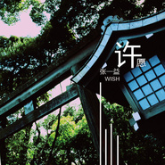

许愿
============================

|  |  |
| :--: | :-- |
| [ 许愿](https://emumo.xiami.com/album/2102778871) | **艺人**: [张一益](../index.md) **语种**: 纯音乐 **唱片公司**: 独立发行 **发行时间**: 2017年07月07日 **专辑类别**: 录音室专辑 **专辑风格**: 新世纪音乐 New Age, 轻音乐 Easy Listening, 爵士流行 Jazz Pop **播放数**: 631377 **收藏数**: 209 **评论数**: 18  |

## 简介

作曲、编曲、演奏、录音、混音：张一益  
封面：蒋宇  
文案：李方圆  
许一个愿  
对着清风，明月，白云，蓝天……  
愿你一生无忧  
愿你一世安好

## 曲目

## 评论

|  |  |  |
| :-- | :-- | :-- |
|  [虾米用户](https://emumo.xiami.com/u/118385468) 一个不愿透露姓名的的小猫... 2019-04-06 13:16 赞(0) 踩(0) | 
可以
 |
|  [虾米用户](https://emumo.xiami.com/u/8326332) 后来，即便是音乐，也无法... 2017-11-22 14:00 赞(0) 踩(0) | 
赶紧把无损资源盘起来，以免以后找不到
 |
|  [虾米用户](https://emumo.xiami.com/u/144620702)  2017-09-19 20:32 赞(0) 踩(0) | 
。。喜欢 。。
 |
|  [虾米用户](https://emumo.xiami.com/u/318984238)  2017-08-31 21:28 赞(0) 踩(0) | 
。。。
 |
|  [虾米用户](https://emumo.xiami.com/u/95829814) 我还没想好要写什么... 2017-07-30 12:23 赞(0) 踩(0) | 
总是很喜欢这种轻快的节奏！似乎所有恋爱的甜蜜都如昨日般浮现出来！
 |
|  [虾米用户](https://emumo.xiami.com/u/313095071)  2017-07-28 07:21 赞(2) 踩(0) | 
娴雅美感，深思清爽，作品很有个性。
 |
|  [虾米用户](https://emumo.xiami.com/u/45099372)   2017-07-22 16:23 赞(0) 踩(0) | 
夏日里的清新味道
 |
|  [虾米用户](https://emumo.xiami.com/u/31932569)  2017-07-16 06:58 赞(2) 踩(0) | 
纯音乐，用优美的音乐旋律来叙述表达作者的情感，很动听。
 |
|  [虾米用户](https://emumo.xiami.com/u/634749)  2017-07-08 01:41 赞(0) 踩(0) | 
砖
 |
|  [虾米用户](https://emumo.xiami.com/u/55780638) 皆为序章 2017-07-07 22:41 赞(1) 踩(0) | 
哈哈 新专 开心 这么一个吉利的日子
 |
|  [虾米用户](https://emumo.xiami.com/u/32461398) 曾在云上浮想联翩如今也终... 2017-07-07 18:46 赞(1) 踩(0) | 
好啊好啊 可是好贵的说
 |
|  [虾米用户](https://emumo.xiami.com/u/276841269)   2017-07-07 18:41 赞(1) 踩(0) | 
哇！终于出新歌了
 |
|  [虾米用户](https://emumo.xiami.com/u/186396946)  2017-07-07 17:09 赞(2) 踩(0) | 
等我打工挣钱了就买
 |
|  [虾米用户](https://emumo.xiami.com/u/220827158) 我就是我。不一样的烟花 2017-07-07 15:33 赞(1) 踩(0) | 
你们自己买吧  那么贵  一个刚毕业的穷学生买不起
 |
|  [虾米用户](https://emumo.xiami.com/u/5624787) 时光如梭，生命如歌。 2017-07-07 15:08 赞(3) 踩(0) | 
好听，但是，太贵了，350。。。。
 |
|  [虾米用户](https://emumo.xiami.com/u/8326332) 后来，即便是音乐，也无法... 2017-07-07 13:40 赞(1) 踩(0) | 
支持下
 |
|  [虾米用户](https://emumo.xiami.com/u/87622992) 再见既是道别，也是承诺！ 2017-07-07 13:40 赞(0) 踩(0) | 

 |
|  [虾米用户](https://emumo.xiami.com/u/31696713) 轻音乐群88876205 2017-07-07 13:36 赞(0) 踩(0) | 
  
 |
