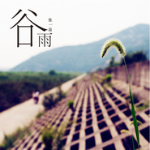
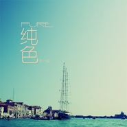

张一益
============================

|  |  |
| :--: | :-- |
| [ 张一益](https://i.xiami.com/zhangyiyi) | **地区**: China 中国大陆 **风格**: 新世纪音乐 New Age, 轻音乐 Easy Listening, 爵士流行 Jazz Pop, 器乐独奏 Solo Instrumental **播放数**: 9214304 **粉丝数**: 5401 **评论数**: 294  |

## 档案

1982年出生于浙江嘉兴，祖籍浙江宁波。资深音乐人，6岁开始弹钢琴，10岁开始弹吉他，从事作曲、编曲、演出行业十余年，发行过八张乐器独奏专辑，其中钢琴专辑《旅行》入围2015年华语金曲奖最佳New Age专辑。  浪漫钢琴唯美吉他音乐会系列：  2019年6月15日，南京南艺音乐厅  2018年11月17日，深圳少年宫剧场  2018年11月16日，广州星海音乐厅  2018年11月9日，北京音乐厅  2018年9月30日，成都特仑苏音乐厅  2018年9月29日，重庆国泰艺术中心  2018年9月14日，上海凯迪拉克音乐厅

## 专辑

| 名称 | 语种 | 唱片公司 | 发行时间 | 专辑类别 | 专辑风格 |
| :--: | :-- | :-- | :-- | :-- | :-- |
| [ 你别走得太快](./albums/5022457526.md) | 国语 |  | 2020年07月24日 | EP, 单曲 |  |
| [ 花开花落](./albums/2105536634.md) | 纯音乐 | 独立发行 | 2019年11月30日 | 录音室专辑 | 新世纪音乐 New Age, 轻音乐 Easy Listening, 爵士流行 Jazz Pop |
| [ 音符10周年钢琴纪念专辑](./albums/2103715197.md) | 纯音乐 | 独立发行 | 2018年05月21日 | 录音室专辑 | 新世纪音乐 New Age, 轻音乐 Easy Listening, 爵士流行 Jazz Pop |
| [ 许愿](./albums/2102778871.md) | 纯音乐 | 独立发行 | 2017年07月07日 | 录音室专辑 | 新世纪音乐 New Age, 轻音乐 Easy Listening, 爵士流行 Jazz Pop |
| [ 谷雨](./albums/2100329920.md) | 国语 | 独立发行 | 2016年05月05日 | 录音室专辑 | 新世纪音乐 New Age, 爵士流行 Jazz Pop, 器乐独奏 Solo Instrumental |
| [ 旅行](./albums/293905316.md) | 纯音乐 | 独立发行 | 2014年03月04日 | 录音室专辑 | 器乐独奏 Solo Instrumental, 轻音乐 Easy Listening |
| [ 回音](./albums/1604283613.md) | 纯音乐 | 独立发行 | 2014年01月02日 | 录音室专辑 | 器乐独奏 Solo Instrumental, 轻音乐 Easy Listening |
| [ 幻想](./albums/482610126.md) | 纯音乐 | 独立发行 | 2013年10月28日 | 录音室专辑 | 新世纪音乐 New Age, 爵士流行 Jazz Pop, 器乐独奏 Solo Instrumental |
| [ 纯色](./albums/1682518712.md) | 纯音乐 | 独立发行 | 2011年08月15日 | 录音室专辑 | 新世纪音乐 New Age, 爵士流行 Jazz Pop, 器乐独奏 Solo Instrumental |
| [ 唯美派](./albums/2105378487.md) | 纯音乐 | 独立发行 | 2008年09月27日 | 录音室专辑 | 器乐独奏 Solo Instrumental |

## 评论

|  |  |  |
| :-- | :-- | :-- |
|  [虾米用户](https://emumo.xiami.com/u/296864355) 浮生若梦 为欢几何 2020-03-24 18:10 赞(2) 踩(0) | 
一直很喜欢张老师的音乐风格，简单、清新、愉悦，听您的第一首曲子是《夏夜星光》，惊叹作曲家可以用音乐制造出夏夜星子点点在天空中闪烁游走的画面，太神奇了～期待您更多的音乐作品，也期待您再次来广东开演奏会！
 |
|  [虾米用户](https://emumo.xiami.com/u/128020408)  2020-02-08 20:40 赞(0) 踩(0) | 
随机推送了你的美丽女孩，卧槽！怎么这么好听
 |
|  [虾米用户](https://emumo.xiami.com/u/277583981) 顺境时照顾别人，逆境时照... 2020-01-27 13:32 赞(1) 踩(0) | 
喜欢您的音乐，期待
 |
|  [虾米用户](https://emumo.xiami.com/u/343395316) 不是得到，就是学到。 2020-01-02 21:57 赞(1) 踩(0) | 
非常喜欢你的音乐，期待更多的作品   
 |
|  [虾米用户](https://emumo.xiami.com/u/276944698) 不要自我设限..... 2019-04-29 19:08 赞(0) 踩(0) | 

 |
|  [虾米用户](https://emumo.xiami.com/u/95159686) 我还没想好要写什么... 2019-04-22 13:15 赞(1) 踩(0) | 
希望您能来昆明演奏！
 |
|  [虾米用户](https://emumo.xiami.com/u/5952204) 新浪微博：北京音乐台 2018-11-26 11:16 赞(1) 踩(0) | 
周末公司培训，茶歇时放了几首钢琴曲特别悦耳，于是就认识了张先生。旋律就像自家制造，有时候能猜到下一句旋律。深得我心加油，多来点钢琴曲 
 |
| ⇒ |  [虾米用户](https://emumo.xiami.com/u/19690066) 我还没想好要写什么... 2018-11-26 17:13 赞(0) 踩(0) | 
好的 
 |
|  [虾米用户](https://emumo.xiami.com/u/18721758) 很久以前 2018-11-08 22:20 赞(0) 踩(0) | 
明天见
 |
| ⇒ |  [虾米用户](https://emumo.xiami.com/u/19690066) 我还没想好要写什么... 2018-11-09 13:00 赞(0) 踩(0) | 
好的
 |
|  [虾米用户](https://emumo.xiami.com/u/267436021)  2018-11-06 21:57 赞(0) 踩(0) | 
您11月17号深圳的演出，我买了三张票，嘿嘿嘿就为等你
 |
| ⇒ |  [虾米用户](https://emumo.xiami.com/u/19690066) 我还没想好要写什么... 2018-11-07 08:10 赞(0) 踩(0) | 
谢谢你喜欢我的音乐 
 |
|  [虾米用户](https://emumo.xiami.com/u/2834667) 为谦虚而活，为卑微而生。 2018-09-17 09:00 赞(0) 踩(0) | 
北京唱弹奏会有人一起吗 周围的人都不爱听音乐啊&amp;hellip;&amp;hellip;
 |
|  [虾米用户](https://emumo.xiami.com/u/2753337) 想念虾米，可惜“再回首 ... 2018-08-19 21:07 赞(0) 踩(0) | 
好听！俺超低空悄悄掠过~
 |
|  [虾米用户](https://emumo.xiami.com/u/75497994) Om ar ra ba ... 2018-06-23 23:41 赞(0) 踩(0) | 
︽︽ ︽︽
 |
|  [虾米用户](https://emumo.xiami.com/u/326770615) 機會留給有準備的人 2018-03-19 16:47 赞(0) 踩(0) | 
不同心情听了有不同感覺，棒!!加油!
 |
|  [虾米用户](https://emumo.xiami.com/u/20177386) 感谢一切美好的遇见❤️ 2018-02-23 11:35 赞(0) 踩(0) | 

 |
|  [虾米用户](https://emumo.xiami.com/u/325437004)  2017-11-16 19:17 赞(3) 踩(0) | 
很喜欢你的作品，很干净纯粹的感觉，和你的名字一样清新。
 |
| ⇒ |  [虾米用户](https://emumo.xiami.com/u/19690066) 我还没想好要写什么... 2018-11-07 08:11 赞(0) 踩(0) | 

 |
|  [虾米用户](https://emumo.xiami.com/u/185049760) 我还没想好要写什么... 2017-11-05 14:13 赞(1) 踩(0) | 
很好听。谢谢带来这样美妙的音乐
 |
| ⇒ |  [虾米用户](https://emumo.xiami.com/u/19690066) 我还没想好要写什么... 2018-11-07 08:23 赞(0) 踩(0) | 

 |
|  [虾米用户](https://emumo.xiami.com/u/294048210)  2017-10-28 00:22 赞(14) 踩(0) | 
还有十天就是Valentine's Day. 百度一下了这个节日的起源，竟然无意中弹出这首音乐的名字，点进去听了一下，让我发现了张一益，简单又意味深长的名字，亦如你的音乐纯净，带着森林的气息，让人禁不住呆在丛林，看露水渐落大地。    来自一名考研复习女孩子的真挚感受
 |
| ⇒ |  [虾米用户](https://emumo.xiami.com/u/19690066) 我还没想好要写什么... 2018-11-07 08:23 赞(0) 踩(0) | 

 |
|  [虾米用户](https://emumo.xiami.com/u/634749)  2017-10-27 23:46 赞(1) 踩(0) | 
看到公告栏updated . congrats ! expecting to have your album before the summer ! haha
 |
| ⇒ |  [虾米用户](https://emumo.xiami.com/u/19690066) 我还没想好要写什么... 2018-11-07 08:13 赞(0) 踩(0) | 

 |
|  [虾米用户](https://emumo.xiami.com/u/4131849) 网易云：非人類兔子Agy... 2017-10-20 00:30 赞(0) 踩(0) | 
+
 |
|  [虾米用户](https://emumo.xiami.com/u/173626638)  2017-10-12 13:06 赞(3) 踩(0) | 
纯粹的音乐，听了使人内心有种平静清澈的感觉。相信作者内心也是纯净幸福的。张一益的音乐可以让人平静，放飞心灵，享受其中，很棒。希望可以听到你更多的作品。比较喜欢钢琴专辑《幻想》中的致母亲；《旅行》中的诺言和老照片二首作品。 吉他专辑《回音》的几首曲子我全有收藏，一直都很喜欢反反复复地听。还有新发行的吉他专辑《谷雨》，都别有一番风味，之前钢琴专辑的清新感人的神韵都在，让人享受到了音乐带来的乐趣。
 |
|  [虾米用户](https://emumo.xiami.com/u/9261161) 音乐里流动 2017-10-12 13:06 赞(1) 踩(0) | 
吉他也弹得别有一番风味，之前钢琴专辑的清新感人的神韵都在，希望不断尝试不断享受音乐带来的乐趣。
 |
|  [虾米用户](https://emumo.xiami.com/u/19809266) 安静听音乐 2017-10-09 20:41 赞(0) 踩(0) | 
来南京演出一定去看
 |
|  [虾米用户](https://emumo.xiami.com/u/19809266) 安静听音乐 2017-10-09 20:40 赞(0) 踩(0) | 
有点比尔道格拉斯的味道，非常喜欢！   
 |
|  [虾米用户](https://emumo.xiami.com/u/55780638) 皆为序章 2017-09-23 18:35 赞(0) 踩(0) | 
你什么时候也像梁晓雪开音乐会呢？
 |
|  [虾米用户](https://emumo.xiami.com/u/307809084)   2017-09-22 08:19 赞(1) 踩(0) | 
不知不觉间就收藏了你很多作品 可见真的是喜欢那种感觉
 |
|  [虾米用户](https://emumo.xiami.com/u/413990) 恶人勿近～ 2017-09-15 02:37 赞(0) 踩(0) | 
吓死我了
 |
|  [虾米用户](https://emumo.xiami.com/u/285580344)  2017-09-04 10:10 赞(0) 踩(0) | 
我觉的好听收藏了，希望听到你更好的作品
 |
|  [虾米用户](https://emumo.xiami.com/u/317372688) Salsamba 2017-08-18 02:17 赞(2) 踩(0) | 
你好，你的音乐很棒！ 我们是来自美国的爵士乐团Salsamba latin jazz group，刚刚上传了我们的一张专辑，希望大家能够互相欣赏互相交流。
 |
|  [虾米用户](https://emumo.xiami.com/u/168542090)   2017-08-10 16:28 赞(0) 踩(0) | 
第一次听张一益的原创钢琴专辑，是许多年前在「班得瑞全球音乐网」。其钢琴成名曲 &amp;ldquo;Valentine.s Day &amp;rdquo; (情人节)  就收录在这张专辑中，很经典很优美。张一益的音乐作品风格就是缥缈、空灵，富有感情。有的曲子伤感，充满回忆。有的曲子梦幻，充满美好。有的曲子让你如同置身于大自然中，有返璞归真的感觉。是轻音乐创作领域质量比较高的。
 |
|  [虾米用户](https://emumo.xiami.com/u/312803796)   2017-08-02 08:36 赞(3) 踩(0) | 
经典之作，收藏   
 |
|  [虾米用户](https://emumo.xiami.com/u/42172015)  2017-07-29 19:54 赞(1) 踩(0) | 
懂你
 |
|  [虾米用户](https://emumo.xiami.com/u/31932569)  2017-07-17 08:55 赞(1) 踩(0) | 
悦耳，任由音乐的感染力将自己带进了一种幻想的境界。旋律，节奏，和声等创作手法都很不错。
 |
|  [虾米用户](https://emumo.xiami.com/u/108892684)  2017-07-09 09:52 赞(0) 踩(0) | 
当我还在用酷我时听到了你的Autumn ,真的让人不舒服
 |
|  [虾米用户](https://emumo.xiami.com/u/108892684)  2017-07-09 09:49 赞(0) 踩(0) | 
这种东西，其实和pop music一个水准的，然而还是有这么多人边听轻音乐边自许清高，唉
 |
|  [虾米用户](https://emumo.xiami.com/u/108892684)  2017-07-09 09:43 赞(0) 踩(0) | 
你真的是中国的理查德(笑
 |
|  [虾米用户](https://emumo.xiami.com/u/307469044)  2017-06-26 20:29 赞(1) 踩(0) | 
基本功不错，遗憾了我的哥！没有灵魂的曲子， 你真心需要和别人好好谈谈心情
 |
|  [虾米用户](https://emumo.xiami.com/u/307469044)  2017-06-26 20:28 赞(1) 踩(0) | 
听了三首，充分感觉到你无法安静的心灵，抢节奏太明显，每个音符都在抢！不是自然流淌出来的！
 |
|  [虾米用户](https://emumo.xiami.com/u/307469044)  2017-06-26 20:26 赞(1) 踩(0) | 
冬之雨算曲子吗？？？？？练习曲！！！
 |
|  [虾米用户](https://emumo.xiami.com/u/307469044)  2017-06-26 20:24 赞(1) 踩(0) | 
你成了匠人了，，自由，也是技巧太匠！旋律性好差，节奏感也好差！
 |
|  [虾米用户](https://emumo.xiami.com/u/307469044)  2017-06-26 20:22 赞(2) 踩(0) | 
走过，杂接的音乐小节太多，不停的跳跃，有点受不了，太过技巧，丢了灵魂！不喜欢！遗憾了！你该出去走走，该去旅游了
 |
|  [虾米用户](https://emumo.xiami.com/u/22057823)  2017-06-18 17:46 赞(1) 踩(0) | 
无意间发现了一你 很好听啊
 |
|  [虾米用户](https://emumo.xiami.com/u/240593433)  2017-06-16 10:40 赞(1) 踩(0) | 
还是蛮简单纯粹的，加油，做出更多属于自己风格的作品 
 |
|  [虾米用户](https://emumo.xiami.com/u/9386558)  2017-06-06 19:39 赞(0) 踩(0) | 
china大陆！听着真振奋人心
 |
|  [虾米用户](https://emumo.xiami.com/u/4203830)  2017-04-08 23:10 赞(0) 踩(0) | 
吉他，jazz
 |
|  [虾米用户](https://emumo.xiami.com/u/8611453) 我还没想好要写什么... 2017-04-04 05:28 赞(2) 踩(0) | 
国产理查德。
 |
|  [虾米用户](https://emumo.xiami.com/u/35929982)   2017-03-15 20:40 赞(1) 踩(0) | 
已关注，真的很棒！加油哦支持你 
 |
|  [虾米用户](https://emumo.xiami.com/u/23133585) 暂无签名~ 2017-03-04 05:41 赞(0) 踩(0) | 
年轻人，加油！
 |
|  [虾米用户](https://emumo.xiami.com/u/49016407) 文字是音乐的感悟。 2017-02-25 19:10 赞(24) 踩(0) | 
张先生你好，今天偶然机会在虾米推荐上首次接触到你的音乐，很独特的感觉，有东方文化的表叙方式，&amp;hellip;&amp;hellip;由于初触还未深赏，假以时日再细细品味。早两年接触石进、林海先生的乐曲多些，也有将他们的曲填上国语歌词配合我的散文在一些文学平台上发表娱乐文友。也希望你的音乐能给我更多的文字灵感！祝你的音乐为你和大众乐迷更大的快乐！祝安好！
 |
| ⇒ |  [虾米用户](https://emumo.xiami.com/u/19690066) 我还没想好要写什么... 2018-11-07 08:12 赞(0) 踩(0) | 
谢谢
 |
|  [虾米用户](https://emumo.xiami.com/u/337664) 购买实体碟请在微信搜西皮... 2017-02-06 18:24 赞(1) 踩(0) | 
人才。
 |
|  [虾米用户](https://emumo.xiami.com/u/40323832)   2017-01-29 14:46 赞(0) 踩(0) | 
哪里可以买到谱子啊？
 |
|  [虾米用户](https://emumo.xiami.com/u/24735214) 喜欢老歌，也听新歌 2017-01-25 11:42 赞(1) 踩(0) | 
这是爵士？
 |
|  [虾米用户](https://emumo.xiami.com/u/266983569)   2017-01-24 09:16 赞(0) 踩(0) | 
好听的旋律 
 |
|  [虾米用户](https://emumo.xiami.com/u/3344068)  2017-01-10 22:44 赞(0) 踩(0) | 
很棒、好听极了！
 |
|  [虾米用户](https://emumo.xiami.com/u/252389435)  2017-01-08 14:48 赞(0) 踩(0) | 
真的是闭上眼睛静静听感觉好好
 |
|  [虾米用户](https://emumo.xiami.com/u/634749)  2017-01-04 08:04 赞(0) 踩(0) | 
每次想要放空脑袋的时候 就来回味一遍所有的音乐
 |
|  [虾米用户](https://emumo.xiami.com/u/204351522)  2016-12-18 09:21 赞(0) 踩(0) | 
那天推荐你的《曾经》后，我就开始听你所有的曲子，真的好听
 |
|  [虾米用户](https://emumo.xiami.com/u/150652272)  2016-11-07 11:21 赞(1) 踩(0) | 
我的心里素质不好，做不了莲花。我喜欢生活在泡泡里。
 |
|  [虾米用户](https://emumo.xiami.com/u/1184514) 庶幾夙夜，以永終譽。 2016-10-23 01:42 赞(1) 踩(0) | 
开始听还以为是日本作曲家 没想到是中国作曲家 impressive。
 |
|  [虾米用户](https://emumo.xiami.com/u/104723746)  2016-10-02 19:56 赞(1) 踩(0) | 
喜欢你的思绪
 |
|  [虾米用户](https://emumo.xiami.com/u/463865)  2016-09-01 21:10 赞(0) 踩(0) | 
你学过之后已经好久没再弹琴了，亲爱的，我以后也要学 给你弹一首曲子 只为我们在一起 好吗
 |
|  [虾米用户](https://emumo.xiami.com/u/8264734)  2016-08-30 17:49 赞(0) 踩(0) | 
喜欢你的微笑这首曲子 
 |
|  [虾米用户](https://emumo.xiami.com/u/189925590)  2016-08-28 07:55 赞(1) 踩(0) | 
喜欢他的音乐
 |
|  [虾米用户](https://emumo.xiami.com/u/88984338)  2016-08-27 18:28 赞(1) 踩(0) | 
美好
 |
|  [虾米用户](https://emumo.xiami.com/u/41967447) 暂无签名~ 2016-08-20 18:32 赞(0) 踩(0) | 
专辑封面很好看！
 |
|  [虾米用户](https://emumo.xiami.com/u/1006550) 束缚胜无界 2016-08-16 07:26 赞(0) 踩(0) | 
hey
 |
|  [虾米用户](https://emumo.xiami.com/u/31107504) 爱音乐爱生活～ 2016-07-30 23:13 赞(0) 踩(0) | 
听了你的落叶，所以我来了
 |
|  [虾米用户](https://emumo.xiami.com/u/185891091)  2016-07-18 09:43 赞(2) 踩(0) | 
我超喜欢那首spring的 
 |
|  [虾米用户](https://emumo.xiami.com/u/6775979) 我还没想好要写什么... 2016-06-30 16:11 赞(0) 踩(0) | 
玩音乐的都戴了眼镜哎
 |
|  [虾米用户](https://emumo.xiami.com/u/50553185)  2016-06-13 14:21 赞(2) 踩(0) | 
张一益！中国音乐人！必须关注！加油！ 
 |
|  [虾米用户](https://emumo.xiami.com/u/176520032)  2016-05-22 13:31 赞(3) 踩(0) | 
纯音乐制作人，善用西洋乐器钢琴和吉他来演绎中国元素，是个让人在听音乐过程中享受快乐的音乐人。-_-
 |
| ⇒ |  [虾米用户](https://emumo.xiami.com/u/6775979) 我还没想好要写什么... 2016-06-30 16:11 赞(0) 踩(0) | 
这叫钢琴曲
 |
|  [虾米用户](https://emumo.xiami.com/u/173733574)  2016-05-20 06:23 赞(4) 踩(0) | 
张一益的吉他曲《落叶》，渲染出一派多么悲壮的秋日气氛！秋风飒飒，树叶簌簌，淡然，以千百种姿态，离枝而落。音乐人用吉他声对落叶的场景作出了真情表达和描述。一首让人听过之后就再也没法忘记的纯音乐作品 。
 |
|  [虾米用户](https://emumo.xiami.com/u/173733574)  2016-05-20 06:04 赞(2) 踩(0) | 
夜深人静时，窗外下着小雨，闭上双眼，静下心来细细聆听……听着音乐人弹奏出的发自内心旋律，淡淡的忧伤，唯美而舒缓，感觉整个世界的喧哗戛然而止。随即发现作曲者出自中国大陆，才知张一益是国内首位同时发行钢琴专辑和吉他专辑的音乐人，已经发行有四张钢琴专辑和二张吉他专辑，感到很意外啊！不可多得的音乐作品，不可多得的音乐人。
 |
|  [虾米用户](https://emumo.xiami.com/u/173152820)  2016-05-19 11:26 赞(3) 踩(0) | 
张一益的吉他专辑"回音"我一直很喜欢，每当夜深人静的时候，听一下他的吉他曲，一天工作劳累隨即挥之而去了，心灵如同被洗涤了的感觉，心情平静了许多，音乐的韵味真的是很神奇啊。
 |
|  [虾米用户](https://emumo.xiami.com/u/634749)  2016-05-07 13:17 赞(4) 踩(0) | 
他是中国首位同时发行钢琴独奏专辑和吉他独奏专辑的音乐人。
 |
|  [虾米用户](https://emumo.xiami.com/u/634749)  2016-05-07 13:16 赞(2) 踩(0) | 
膜拜
 |
|  [虾米用户](https://emumo.xiami.com/u/20667868) 签名是什么能吃的吗 2016-05-06 00:44 赞(2) 踩(0) | 
我们的梦真的很棒！
 |
|  [虾米用户](https://emumo.xiami.com/u/154824710)  2016-04-28 23:29 赞(4) 踩(0) | 
旋律唯美，没有负担。
 |
|  [虾米用户](https://emumo.xiami.com/u/57350182)  2016-04-05 23:16 赞(4) 踩(0) | 
舍不得睡，听迷了
 |
|  [虾米用户](https://emumo.xiami.com/u/634749)  2016-03-31 10:08 赞(2) 踩(0) | 
每天都期待新专辑的快点到来~！ 会在网站发售实体专辑吗？！
 |
|  [虾米用户](https://emumo.xiami.com/u/3440904)  2016-03-14 23:06 赞(0) 踩(0) | 
就演奏乐器来讲我佩服的一是玩钢琴的，二是玩架子鼓的！
 |
|  [虾米用户](https://emumo.xiami.com/u/68146870)  2016-03-08 10:25 赞(2) 踩(0) | 
加油，好听   
 |
|  [虾米用户](https://emumo.xiami.com/u/9502905)  2016-03-02 10:52 赞(3) 踩(0) | 
曲子挺好的
 |
|  [虾米用户](https://emumo.xiami.com/u/750098)  2016-02-25 00:04 赞(3) 踩(0) | 
情人节真的很好听！有种韩剧主题曲的范儿 
 |
|  [虾米用户](https://emumo.xiami.com/u/37015847)  2016-02-10 01:13 赞(1) 踩(0) | 

 |
|  [虾米用户](https://emumo.xiami.com/u/949469) 我还没想好要写什么... 2016-01-31 01:36 赞(1) 踩(0) | 
真的好好听
 |
|  [虾米用户](https://emumo.xiami.com/u/100601932) 爱听音乐的姑娘 2016-01-16 16:40 赞(1) 踩(0) | 
超级喜欢的钢琴小哥，可以点来听哦
 |
|  [虾米用户](https://emumo.xiami.com/u/100601932) 爱听音乐的姑娘 2016-01-16 16:29 赞(1) 踩(0) | 
超级棒棒的
 |
|  [虾米用户](https://emumo.xiami.com/u/43297723)  2016-01-11 18:20 赞(0) 踩(0) | 
不错
 |
|  [虾米用户](https://emumo.xiami.com/u/94925856)  2016-01-09 21:14 赞(2) 踩(0) | 
喜欢
 |
|  [虾米用户](https://emumo.xiami.com/u/42243635)   2016-01-08 23:30 赞(2) 踩(0) | 
好听！
 |
|  [虾米用户](https://emumo.xiami.com/u/2112887)  2016-01-05 20:56 赞(0) 踩(0) | 
期待新专辑~
 |
|  [虾米用户](https://emumo.xiami.com/u/32461398) 曾在云上浮想联翩如今也终... 2016-01-05 19:25 赞(0) 踩(0) | 
等等等！！！
 |
|  [虾米用户](https://emumo.xiami.com/u/634749)  2016-01-05 14:04 赞(0) 踩(0) | 
congrats！
 |
|  [虾米用户](https://emumo.xiami.com/u/45435466) Learn By Hea... 2016-01-05 10:45 赞(0) 踩(0) | 
坐等新砖!!!
 |
|  [虾米用户](https://emumo.xiami.com/u/460795)  2015-12-15 12:42 赞(1) 踩(0) | 
舒服^^我和貓咪都愛聽!謝謝!
 |
|  [虾米用户](https://emumo.xiami.com/u/28666084) 风华是一指流砂，苍老是一 2015-12-11 22:05 赞(1) 踩(0) | 
很好不不错，很抓耳的旋律
 |
|  [虾米用户](https://emumo.xiami.com/u/49779402)  黑暗 2015-11-28 14:49 赞(2) 踩(0) | 
欣赏
 |
|  [虾米用户](https://emumo.xiami.com/u/13901059)  2015-11-21 17:00 赞(2) 踩(0) | 
因为钢琴曲七首联播知道的他，喜欢他弹奏的音乐
 |
|  [虾米用户](https://emumo.xiami.com/u/53608061)  2015-09-30 21:16 赞(2) 踩(0) | 
虾米推荐过来的 觉得他很懂我  很喜欢哦 可以一直放一直放… 加油加油
 |
|  [虾米用户](https://emumo.xiami.com/u/24421175) 可以，虾米我爱你 2015-09-23 23:35 赞(0) 踩(0) | 
不错，很喜欢！很有夜的钢琴曲的风格
 |
|  [虾米用户](https://emumo.xiami.com/u/52507715)  2015-09-09 23:35 赞(3) 踩(0) | 
for mother唯一一首听过之后就再没忘记过的纯音乐
 |
|  [虾米用户](https://emumo.xiami.com/u/52507715)  2015-09-09 23:34 赞(2) 踩(0) | 
我觉得最好听的是那首for mother。
 |
|  [虾米用户](https://emumo.xiami.com/u/46147173)   2015-08-10 22:02 赞(3) 踩(0) | 
去年在贴吧里看到有人推荐(=ﾟωﾟ)ﾉ真是太棒了……
 |
|  [虾米用户](https://emumo.xiami.com/u/8880211)  2015-07-30 23:31 赞(1) 踩(0) | 
夜深了  沉浸在旋律里  舍不得睡
 |
|  [虾米用户](https://emumo.xiami.com/u/8880211)  2015-07-30 23:27 赞(2) 踩(0) | 
纯净明亮的音符  美极了
 |
|  [虾米用户](https://emumo.xiami.com/u/45794558)   2015-07-21 06:57 赞(2) 踩(0) | 
喜欢你的曲风 
 |
|  [虾米用户](https://emumo.xiami.com/u/43948361) 曾同行寒夜雪中 2015-07-18 18:21 赞(0) 踩(0) | 
喜欢你
 |
|  [虾米用户](https://emumo.xiami.com/u/43948361) 曾同行寒夜雪中 2015-07-18 18:21 赞(0) 踩(0) | 
喜欢你
 |
|  [虾米用户](https://emumo.xiami.com/u/20826876) phil+harmoni... 2015-07-14 20:56 赞(2) 踩(0) | 
叹为观止的安静效果
 |
|  [虾米用户](https://emumo.xiami.com/u/20826876) phil+harmoni... 2015-07-14 20:56 赞(2) 踩(0) | 
不可多得的音乐作品
 |
|  [虾米用户](https://emumo.xiami.com/u/20826876) phil+harmoni... 2015-07-14 20:54 赞(1) 踩(0) | 
一直沉迷于一宜的旋律中，世间的浮华、喧嚣因此时的宁静而混合成为沉思下的沉淀。
 |
|  [虾米用户](https://emumo.xiami.com/u/9555350)  2015-06-27 21:21 赞(1) 踩(0) | 
好想学钢琴
 |
|  [虾米用户](https://emumo.xiami.com/u/38538603) 我还没想好要写什么... 2015-06-19 21:12 赞(0) 踩(0) | 
张大大求出琴谱！！
 |
|  [虾米用户](https://emumo.xiami.com/u/49352765) 励志传播正能量❤️ 2015-06-14 22:14 赞(2) 踩(0) | 
情人节一首歌断断续续弹了五年了 好喜欢你的歌 加油～
 |
|  [虾米用户](https://emumo.xiami.com/u/47843491) 奇女子 2015-06-07 18:17 赞(2) 踩(0) | 
这位的音乐都好棒，推荐！
 |
|  [虾米用户](https://emumo.xiami.com/u/36793530) 这家伙很聪明什么也没留下... 2015-05-08 23:33 赞(1) 踩(0) | 
Valentine&amp;#039;s Day很早以前就听过  今天又来了  好听
 |
|  [虾米用户](https://emumo.xiami.com/u/46613584)  2015-04-28 09:54 赞(2) 踩(0) | 
情人节单曲循环好几遍了  加油↖(^ω^)↗
 |
|  [虾米用户](https://emumo.xiami.com/u/46147173)   2015-04-26 08:35 赞(2) 踩(0) | 
特别喜欢那首Our Dream单曲循环停不下来
 |
|  [虾米用户](https://emumo.xiami.com/u/25481152) 我还没想好要写什么... 2015-03-22 14:58 赞(0) 踩(0) | 
试试，加油啊
 |
|  [虾米用户](https://emumo.xiami.com/u/9006988) 用绳命表演魔术 2015-03-15 16:21 赞(1) 踩(0) | 
好好聽！好想學！期待你出鋼琴譜！
 |
|  [虾米用户](https://emumo.xiami.com/u/12359290)  2015-02-23 00:32 赞(1) 踩(0) | 
非常好听~超级喜欢
 |
|  [虾米用户](https://emumo.xiami.com/u/12876004) ` 2015-02-17 13:49 赞(0) 踩(0) | 
0.0
 |
|  [虾米用户](https://emumo.xiami.com/u/47008211) (´･_･`) 2015-02-13 21:55 赞(0) 踩(0) | 
好听～加油！！！
 |
|  [虾米用户](https://emumo.xiami.com/u/44464089) 暂无签名~ 2015-02-06 00:40 赞(2) 踩(0) | 
很安静，很清澈，仿佛有甘苦的孤独从心底淌过。Best Wishes.
 |
|  [虾米用户](https://emumo.xiami.com/u/44376385)  2015-01-30 11:40 赞(0) 踩(0) | 
好听……
 |
|  [虾米用户](https://emumo.xiami.com/u/23421787) 暂时还没想好说什么鬼话 2015-01-21 18:21 赞(1) 踩(0) | 
真棒 离线音乐包的推送 在生病 听到整个人又有活力了
 |
|  [虾米用户](https://emumo.xiami.com/u/6970391)  2015-01-05 14:34 赞(1) 踩(0) | 
好舒服的旋律~
 |
|  [虾米用户](https://emumo.xiami.com/u/43539246)  2014-12-25 13:59 赞(1) 踩(0) | 
非常好!
 |
|  [虾米用户](https://emumo.xiami.com/u/14494009)  2014-12-07 12:52 赞(0) 踩(0) | 
hip-hoip融合钢琴
 |
|  [虾米用户](https://emumo.xiami.com/u/3991218)  2014-12-06 22:44 赞(1) 踩(0) | 
纯粹的钢琴，听着内心有种溢于言表的喜悦。相信作者内心也是平和幸福的。
 |
|  [虾米用户](https://emumo.xiami.com/u/32461398) 曾在云上浮想联翩如今也终... 2014-12-04 19:26 赞(0) 踩(0) | 
帅~
 |
|  [虾米用户](https://emumo.xiami.com/u/43607979)  2014-11-12 15:57 赞(0) 踩(0) | 
舒服！
 |
|  [虾米用户](https://emumo.xiami.com/u/19690066) 我还没想好要写什么... 2014-11-11 12:50 赞(3) 踩(0) | 
^_^
 |
| ⇒ |  [虾米用户](https://emumo.xiami.com/u/32461398) 曾在云上浮想联翩如今也终... 2014-12-04 19:26 赞(0) 踩(0) | 
恩恩~
 |
|  [虾米用户](https://emumo.xiami.com/u/10547530) 生于白昼，隐与黑夜。 2014-11-03 20:24 赞(0) 踩(0) | 
在初春未至的情人节，遇到了一个漂亮的女孩。因为共同的梦，我们走到了一起。然而，再一次走过雪花的纷飞的季节，你的微笑，我的誓言，却已经定格在了过去的相片中。
 |
|  [虾米用户](https://emumo.xiami.com/u/726752) 已下架 2014-11-03 12:37 赞(0) 踩(0) | 
从“生无可恋”听到“活着挺好”
 |
|  [虾米用户](https://emumo.xiami.com/u/7594074)  2014-11-01 09:26 赞(1) 踩(0) | 
在我最心痛的时候听到了你的独奏，心中的通也开始疏通了，谢谢你的音乐，加油！
 |
|  [虾米用户](https://emumo.xiami.com/u/11041553)   2014-10-30 06:56 赞(1) 踩(0) | 
听着十分想家。
 |
|  [虾米用户](https://emumo.xiami.com/u/6629718) 凉生过云 2014-10-29 21:14 赞(1) 踩(0) | 
还是喜欢哀伤一点的纯音
 |
|  [虾米用户](https://emumo.xiami.com/u/43085984)  2014-10-28 17:22 赞(1) 踩(0) | 
很喜欢你的音乐，通过你的音乐能够寻找到内心平静。谢谢你！
 |
|  [虾米用户](https://emumo.xiami.com/u/6291213) 我将真心付给了你 2014-10-21 20:34 赞(1) 踩(0) | 
舒缓和谐
 |
|  [虾米用户](https://emumo.xiami.com/u/13552)  2014-10-21 09:13 赞(1) 踩(0) | 
Valentine’s Day, Spring, For Mother
 |
|  [虾米用户](https://emumo.xiami.com/u/5691092) 爱生活 爱音乐 爱影视 2014-10-19 01:02 赞(0) 踩(0) | 
来晚了 藏龙卧虎的国内大神
 |
|  [虾米用户](https://emumo.xiami.com/u/42030216)  2014-10-04 11:22 赞(1) 踩(0) | 
轻松自然的表达方式，很舒服。
 |
|  [虾米用户](https://emumo.xiami.com/u/1655898) 雨不歇，心绵绵 2014-09-28 21:50 赞(0) 踩(0) | 
不错，支持
 |
|  [虾米用户](https://emumo.xiami.com/u/5523541)  2014-09-25 08:28 赞(0) 踩(0) | 
老张不错
 |
|  [虾米用户](https://emumo.xiami.com/u/3249842) Oublier le p... 2014-09-01 16:54 赞(0) 踩(0) | 
你是我的青春
 |
|  [虾米用户](https://emumo.xiami.com/u/26742917)  2014-07-17 22:07 赞(0) 踩(0) | 
喜欢，just
 |
|  [虾米用户](https://emumo.xiami.com/u/1303887)  2014-07-08 00:49 赞(0) 踩(0) | 
太棒了！！惊喜！！就是唯美派 干净
 |
|  [虾米用户](https://emumo.xiami.com/u/7348007)  2014-06-24 22:43 赞(0) 踩(0) | 
很酷
 |
|  [虾米用户](https://emumo.xiami.com/u/7614264)  2014-06-24 15:34 赞(0) 踩(0) | 
安静忧伤
 |
|  [虾米用户](https://emumo.xiami.com/u/3244222) 暂无签名~ 2014-06-16 20:30 赞(0) 踩(0) | 
嗨，还记得我是谁哇，那年一起去上海乐器展，还有阿飞李扬
 |
|  [虾米用户](https://emumo.xiami.com/u/32680044) ~ 2014-05-31 16:05 赞(0) 踩(0) | 
加油！
 |
|  [虾米用户](https://emumo.xiami.com/u/15423292)   2014-05-20 12:32 赞(1) 踩(0) | 
我最近在练
 |
|  [虾米用户](https://emumo.xiami.com/u/22644)  2014-04-28 17:24 赞(1) 踩(0) | 
你的音乐可以让人放松，平静，享受其中，很棒诶。希望可以听到你更多作品，加油~
 |
|  [虾米用户](https://emumo.xiami.com/u/35757702)  2014-04-25 09:02 赞(0) 踩(0) | 
喜欢这种静静的纯粹，静下心来细细聆听，放送心情……
 |
|  [虾米用户](https://emumo.xiami.com/u/34355794)  2014-04-12 11:13 赞(0) 踩(0) | 
就愛鋼琴...
 |
|  [虾米用户](https://emumo.xiami.com/u/19690066) 我还没想好要写什么... 2014-04-02 17:51 赞(104) 踩(0) | 
^_^
 |
| ⇒ |  [虾米用户](https://emumo.xiami.com/u/8250248)  2014-07-07 09:10 赞(0) 踩(0) | 
请问哪里可以买到《回音》的吉他谱呢~
 |
| ⇒ |  [虾米用户](https://emumo.xiami.com/u/28445678)  2014-09-29 10:10 赞(0) 踩(0) | 
张老师 既然您中学时代玩摇滚 有想过把钢琴和摇滚相融合的创作吗？觉得那样的曲子一样会很美～
 |
| ⇒ |  [虾米用户](https://emumo.xiami.com/u/19690066) 我还没想好要写什么... 2015-01-11 09:52 赞(0) 踩(0) | 
<q><b>布衣说：</b></q>
 |
| ⇒ |  [虾米用户](https://emumo.xiami.com/u/19690066) 我还没想好要写什么... 2015-01-11 09:53 赞(0) 踩(0) | 
<q><b>chimericspider说：</b></q>
 |
| ⇒ |  [虾米用户](https://emumo.xiami.com/u/634749)  2015-01-26 10:58 赞(0) 踩(0) | 
期待你的专属音
 |
| ⇒ |  [虾米用户](https://emumo.xiami.com/u/47898576) 要听的团太多了怎么办 2016-10-10 09:54 赞(0) 踩(0) | 
(‵▽′)
 |
| ⇒ |  [虾米用户](https://emumo.xiami.com/u/50145111) 你做三四月的事，在八九月... 2016-11-17 03:19 赞(0) 踩(0) | 
嘻嘻 好喜欢你的音乐哦 谢谢你:)
 |
|  [虾米用户](https://emumo.xiami.com/u/30990932) 暂无签名~ 2014-03-28 15:09 赞(0) 踩(0) | 
很好听 纯音乐 很舒缓~~~继续加油
 |
|  [虾米用户](https://emumo.xiami.com/u/9858506) 不自量力地还手，直至死方... 2014-03-26 23:02 赞(0) 踩(0) | 
支持小张啊！
 |
|  [虾米用户](https://emumo.xiami.com/u/11575558)   2014-03-10 11:09 赞(0) 踩(0) | 
很喜欢你作品，加油！
 |
|  [虾米用户](https://emumo.xiami.com/u/9261161) 音乐里流动 2014-03-06 17:17 赞(0) 踩(0) | 
好早之前就喜欢《Autumn》淡淡的忧伤，唯美派听了好久。 没想到这几年专辑速度猛增，都入住虾米了，希望继续出佳作，享受音乐！
 |
|  [虾米用户](https://emumo.xiami.com/u/13194141) 看到的给我来个联络方式。... 2014-03-04 21:54 赞(0) 踩(0) | 
从优酷听到的，现在在虾米找到了
 |
|  [虾米用户](https://emumo.xiami.com/u/13194141) 看到的给我来个联络方式。... 2014-03-04 21:53 赞(0) 踩(0) | 
真棒，好听
 |
|  [虾米用户](https://emumo.xiami.com/u/8877359) 我还没想好要写什么... 2014-02-22 23:05 赞(0) 踩(0) | 
恩～  从虾米猜听来的  超合口味啊   赞一个
 |
|  [虾米用户](https://emumo.xiami.com/u/15828193)  2014-02-04 06:11 赞(0) 踩(0) | 
钢琴很不错，加油！
 |
|  [虾米用户](https://emumo.xiami.com/u/19690066) 我还没想好要写什么... 2014-01-02 12:16 赞(84) 踩(0) | 
:-)
 |
| ⇒ |  [虾米用户](https://emumo.xiami.com/u/2686887)  2014-01-04 01:22 赞(0) 踩(0) | 
很喜欢你的钢琴，又是原创作品，加油~！！！
 |
| ⇒ |  [虾米用户](https://emumo.xiami.com/u/2071244) 旗未动，风也未吹，是人的... 2014-02-27 23:24 赞(0) 踩(0) | 
老兄你的音乐不错
 |
| ⇒ |  [虾米用户](https://emumo.xiami.com/u/19690066) 我还没想好要写什么... 2015-01-11 09:54 赞(0) 踩(0) | 
<q><b>Fuji说：</b></q>
 |
| ⇒ |  [虾米用户](https://emumo.xiami.com/u/19690066) 我还没想好要写什么... 2015-01-11 09:54 赞(0) 踩(0) | 
<q><b>催眠师提诺说：</b></q>
 |
| ⇒ |  [虾米用户](https://emumo.xiami.com/u/634749)  2015-01-26 10:56 赞(0) 踩(0) | 
期待已久
 |
| ⇒ |  [虾米用户](https://emumo.xiami.com/u/38888442)  2016-12-17 19:32 赞(0) 踩(0) | 
相当的好！加油哦
 |
| ⇒ |  [虾米用户](https://emumo.xiami.com/u/2306056)  2017-08-27 21:24 赞(0) 踩(0) | 
加油↖(^&amp;omega;^)↗  好听
 |
|  [虾米用户](https://emumo.xiami.com/u/7501001)  2013-12-20 16:42 赞(0) 踩(0) | 
感到以前从来没有听说过 不应该啊
 |
|  [虾米用户](https://emumo.xiami.com/u/7501001)  2013-12-20 16:41 赞(0) 踩(0) | 
今天听一个精选集 里面选了情人节那首曲子，觉得挺不错的，然后打开屏幕发现作曲者是中国的感到很意外啊~
 |
|  [虾米用户](https://emumo.xiami.com/u/7133174) 我还没想好要写什么... 2013-11-22 13:58 赞(0) 踩(0) | 
Valentine&amp;#039;s Day真的是原创吗？好熟悉的感觉！而且觉得不像国人创作的风格。（仅个人意见）
 |
| ⇒ |  [虾米用户](https://emumo.xiami.com/u/25760788)  2013-11-22 23:31 赞(0) 踩(0) | 
这个曲子都好几年前的了，张一益的成名曲。
 |
| ⇒ |  [虾米用户](https://emumo.xiami.com/u/7133174) 我还没想好要写什么... 2013-11-23 00:23 赞(0) 踩(0) | 
<q><b>天使爱美丽说：</b></q>
 |
| ⇒ |  [虾米用户](https://emumo.xiami.com/u/25760788)  2013-11-23 12:30 赞(0) 踩(0) | 
<q><b>Blue Runner说：</b></q>
 |
| ⇒ |  [虾米用户](https://emumo.xiami.com/u/7133174) 我还没想好要写什么... 2013-11-23 15:37 赞(0) 踩(0) | 
<q><b>天使爱美丽说：</b></q>
 |
| ⇒ |  [虾米用户](https://emumo.xiami.com/u/7133174) 我还没想好要写什么... 2013-11-23 15:38 赞(0) 踩(0) | 
<q><b>天使爱美丽说：</b></q>
 |
| ⇒ |  [虾米用户](https://emumo.xiami.com/u/25760788)  2013-11-23 16:10 赞(0) 踩(0) | 
<q><b>Blue Runner说：</b></q>
 |
| ⇒ |  [虾米用户](https://emumo.xiami.com/u/7133174) 我还没想好要写什么... 2013-11-23 16:21 赞(0) 踩(0) | 
<q><b>天使爱美丽说：</b></q>
 |
|  [虾米用户](https://emumo.xiami.com/u/11232764) 好想快乐的玩耍╯_╰ 2013-11-14 17:47 赞(0) 踩(0) | 
好音乐
 |
|  [虾米用户](https://emumo.xiami.com/u/2307526) 连接比特与像素的造梦师！ 2013-11-12 10:58 赞(0) 踩(0) | 
Valentine&amp;#039;s Day!
 |
|  [虾米用户](https://emumo.xiami.com/u/2446953)  2013-10-31 14:35 赞(0) 踩(0) | 
国产的，不错啊，水准挺高的。
 |
|  [虾米用户](https://emumo.xiami.com/u/25760788)  2013-10-31 09:31 赞(0) 踩(0) | 
唯美，太好听了
 |
|  [虾米用户](https://emumo.xiami.com/u/8128176) 好好活着 2013-10-26 22:44 赞(0) 踩(0) | 
欢迎入驻
 |
|  [虾米用户](https://emumo.xiami.com/u/19690066) 我还没想好要写什么... 2013-10-23 16:42 赞(219) 踩(0) | 
我刚入驻了虾米音乐人，欢迎大家来我的个人主页，收听我的最新音乐
 |
| ⇒ |  [虾米用户](https://emumo.xiami.com/u/8345353)  2013-10-24 18:54 赞(0) 踩(0) | 
哇，太棒了。鼓掌~
 |
| ⇒ |  [虾米用户](https://emumo.xiami.com/u/1546360) 就是如此清新脱俗 2013-10-24 20:57 赞(0) 踩(0) | 
支持。
 |
| ⇒ |  [虾米用户](https://emumo.xiami.com/u/12001044) 谛听中国 2013-10-26 19:46 赞(0) 踩(0) | 
赞~
 |
| ⇒ |  [虾米用户](https://emumo.xiami.com/u/2112887)  2013-11-19 21:39 赞(0) 踩(0) | 
都很喜欢呢，期待新作=w=
 |
| ⇒ |  [虾米用户](https://emumo.xiami.com/u/10822658)  2014-02-21 16:30 赞(0) 踩(0) | 
《唯美派》很好听
 |
| ⇒ |  [虾米用户](https://emumo.xiami.com/u/33157464) 2018.07.07 2014-06-25 19:52 赞(0) 踩(0) | 
张哥！能把你的Our Dream 的谱子给我么~我超级喜欢的！
 |
| ⇒ |  [虾米用户](https://emumo.xiami.com/u/18372511)  2014-07-11 13:21 赞(0) 踩(0) | 
非常爱，偶然发现你的音乐，却走不开了。会一直关注。
 |
| ⇒ |  [虾米用户](https://emumo.xiami.com/u/19690066) 我还没想好要写什么... 2015-01-11 09:54 赞(0) 踩(0) | 
<q><b>饿肥了的鸡蛋说：</b></q>
 |
| ⇒ |  [虾米用户](https://emumo.xiami.com/u/19690066) 我还没想好要写什么... 2015-01-11 09:55 赞(0) 踩(0) | 
<q><b>LogyFox说：</b></q>
 |
| ⇒ |  [虾米用户](https://emumo.xiami.com/u/19690066) 我还没想好要写什么... 2015-01-11 09:55 赞(0) 踩(0) | 
<q><b>Serendipity°说：</b></q>
 |
| ⇒ |  [虾米用户](https://emumo.xiami.com/u/19690066) 我还没想好要写什么... 2015-01-11 09:56 赞(0) 踩(0) | 
<q><b>Silver inch说：</b></q>
 |
| ⇒ |  [虾米用户](https://emumo.xiami.com/u/19690066) 我还没想好要写什么... 2015-01-11 09:56 赞(0) 踩(0) | 
<q><b>爱沃特加的茶说：</b></q>
 |
| ⇒ |  [虾米用户](https://emumo.xiami.com/u/19690066) 我还没想好要写什么... 2015-01-11 09:56 赞(0) 踩(0) | 
<q><b>迷途のButterfly说：</b></q>
 |
| ⇒ |  [虾米用户](https://emumo.xiami.com/u/19690066) 我还没想好要写什么... 2015-01-11 09:57 赞(0) 踩(0) | 
<q><b>板凳说：</b></q>
 |
| ⇒ |  [虾米用户](https://emumo.xiami.com/u/47843491) 奇女子 2015-06-07 18:10 赞(0) 踩(0) | 
好好听，加油！
 |
| ⇒ |  [虾米用户](https://emumo.xiami.com/u/29513849)  2016-01-18 00:31 赞(0) 踩(0) | 
好喜欢
 |
| ⇒ |  [虾米用户](https://emumo.xiami.com/u/1985701)  2016-03-08 23:21 赞(0) 踩(0) | 
超喜欢你的钢琴曲啊！加油！国内也有这么好这么年轻的作曲家 太开心了
 |
| ⇒ |  [虾米用户](https://emumo.xiami.com/u/125376126) 天文地理大象蚂蚁，四书五... 2016-06-22 13:45 赞(0) 踩(0) | 
已收听
 |
| ⇒ |  [虾米用户](https://emumo.xiami.com/u/138268478) 只有现在的悲伤。 2016-09-10 20:43 赞(0) 踩(0) | 
2333
 |
| ⇒ |  [虾米用户](https://emumo.xiami.com/u/2761156) 活着就要尽兴 2016-12-01 00:04 赞(0) 踩(0) | 
好听极了
 |
| ⇒ |  [虾米用户](https://emumo.xiami.com/u/222459768) 成长是一条铺满蔷薇的路，... 2016-12-24 09:21 赞(0) 踩(0) | 
从那次不经意听了你的花季，就深陷其中，从容 宁静 不入世俗。感谢你的音乐 现在听你的钢琴曲已经成为习惯。看到张一益都会马上点开，开始听❤️
 |
| ⇒ |  [虾米用户](https://emumo.xiami.com/u/85136258)   2017-02-26 18:58 赞(0) 踩(0) | 
纯粹
 |
| ⇒ |  [虾米用户](https://emumo.xiami.com/u/299361163)  2017-05-27 05:34 赞(0) 踩(0) | 
支持
 |
| ⇒ |  [虾米用户](https://emumo.xiami.com/u/7848590) 暂无签名~ 2017-09-11 21:20 赞(0) 踩(0) | 
支持
 |
| ⇒ |  [虾米用户](https://emumo.xiami.com/u/277581168)  2017-11-24 21:07 赞(0) 踩(0) | 
棒棒哒
 |
| ⇒ |  [虾米用户](https://emumo.xiami.com/u/29117) 我还没想好要写什么... 2019-03-17 18:28 赞(0) 踩(0) | 
很喜欢你的音乐～干净、温暖、向上～啥时候来上海演出，想听现场版
 |
|  [虾米用户](https://emumo.xiami.com/u/6216135)  2013-09-17 06:16 赞(0) 踩(0) | 
唯美
 |
|  [虾米用户](https://emumo.xiami.com/u/9003931) 千淘万漉虽辛苦 2013-09-14 09:08 赞(0) 踩(0) | 
点此收缩专辑介绍亮了。
 |
|  [虾米用户](https://emumo.xiami.com/u/1124608) 放弃治疗了 2013-08-28 10:43 赞(0) 踩(0) | 
国产 轻音乐 不错哦 哈哈哈
 |
|  [虾米用户](https://emumo.xiami.com/u/6869662)  2013-07-05 11:01 赞(0) 踩(0) | 
enen
 |
|  [虾米用户](https://emumo.xiami.com/u/10875032) schnuffel 2013-06-25 16:50 赞(0) 踩(0) | 
！
 |
|  [虾米用户](https://emumo.xiami.com/u/3102725) 没有音乐，人类无异于顽石... 2013-06-23 21:20 赞(0) 踩(0) | 
对呀，我也觉得那首Valentine`s  day很有韩国的感觉
 |
| ⇒ |  [虾米用户](https://emumo.xiami.com/u/13108151) 乱意 2013-09-20 13:22 赞(0) 踩(0) | 
倒是觉得有久石让某曲子的感觉
 |
|  [虾米用户](https://emumo.xiami.com/u/3095622)  2013-05-21 16:51 赞(0) 踩(0) | 
干净、透明
 |
|  [虾米用户](https://emumo.xiami.com/u/13179395) 忠告等乎废话一大堆 2013-04-13 22:55 赞(0) 踩(0) | 
那么少
 |
|  [虾米用户](https://emumo.xiami.com/u/13660895) Rain imprint 2013-03-30 13:00 赞(0) 踩(0) | 
silence
 |
|  [虾米用户](https://emumo.xiami.com/u/3080279)  2013-03-30 10:21 赞(0) 踩(0) | 
我也是,唯美派
 |
|  [虾米用户](https://emumo.xiami.com/u/3644079)  2013-03-26 02:05 赞(0) 踩(0) | 
很有韩国style
 |
|  [虾米用户](https://emumo.xiami.com/u/3521325) 活在阳光下 2013-03-25 11:51 赞(0) 踩(0) | 
真的很喜欢张一益的钢琴曲~很好听，舒缓，让人安静平和，而且valentine‘s day  可是大四毕业论文时期，单曲循环的神曲呢~
 |
|  [虾米用户](https://emumo.xiami.com/u/5784712) 大吱还有什么不知道的 2013-01-16 11:22 赞(0) 踩(0) | 
真的很安静
 |
|  [虾米用户](https://emumo.xiami.com/u/9327494) http://www.x... 2013-01-08 17:57 赞(0) 踩(0) | 
love
 |
|  [虾米用户](https://emumo.xiami.com/u/3940486)  2013-01-08 15:15 赞(0) 踩(0) | 
很美的音乐，动人心魄
 |
|  [虾米用户](https://emumo.xiami.com/u/7239297)  2012-12-31 14:09 赞(0) 踩(0) | 
Valentine＇s Day，非常动人心弦
 |
|  [虾米用户](https://emumo.xiami.com/u/382310)  2012-12-22 20:43 赞(0) 踩(0) | 
流畅的钢琴曲~干净~
 |
|  [虾米用户](https://emumo.xiami.com/u/3317317) 半俗半禅半随缘！ 2012-12-19 00:42 赞(0) 踩(0) | 
出生在音乐世家的张一益，6岁开始学习钢琴和小提琴，父是一位优秀的大提琴手，母特别喜好民族音乐。家庭环境的影响使他从小就突现出超常的音乐天赋。而中学时代的他并没有遵循父母所期望的路线，性格比较叛逆喜欢听摇滚乐自组摇滚乐队并担任吉他手和队长。当时他收藏最多的是Metallica的专辑
 |
|  [虾米用户](https://emumo.xiami.com/u/6770643) 谨言慎行，戒急用忍 2012-10-27 20:15 赞(0) 踩(0) | 
不错的钢琴，很好听
 |
|  [虾米用户](https://emumo.xiami.com/u/2112887)  2012-10-24 20:25 赞(0) 踩(0) | 
好久没有听到这样的钢琴了……有点感动
 |
|  [虾米用户](https://emumo.xiami.com/u/7739864)  2012-10-07 16:05 赞(0) 踩(0) | 
期待更多的感动。。
 |
|  [虾米用户](https://emumo.xiami.com/u/3177529) 暂无签名~ 2012-09-21 17:10 赞(0) 踩(0) | 
纯净的独奏，简单的感动
 |
|  [虾米用户](https://emumo.xiami.com/u/3235848)  2012-09-08 23:56 赞(0) 踩(0) | 
纯美
 |
|  [虾米用户](https://emumo.xiami.com/u/7739864)  2012-08-30 12:43 赞(0) 踩(0) | 
唯美
 |
|  [虾米用户](https://emumo.xiami.com/u/10261990)  2012-08-25 10:09 赞(0) 踩(0) | 
uiyuiyo
 |
|  [虾米用户](https://emumo.xiami.com/u/1546360) 就是如此清新脱俗 2012-07-16 13:01 赞(1) 踩(0) | 
来顶张老师：）
 |
|  [虾米用户](https://emumo.xiami.com/u/8976912)  2012-05-06 21:18 赞(0) 踩(0) | 
听着心情平静，也很唯美！
 |
|  [虾米用户](https://emumo.xiami.com/u/6660837)  2012-04-23 22:45 赞(0) 踩(0) | 
很清新，很舒服
 |
|  [虾米用户](https://emumo.xiami.com/u/3054699)  2012-04-14 17:01 赞(0) 踩(0) | 
曲都很不错 造诣嘛 再努力
 |
|  [虾米用户](https://emumo.xiami.com/u/2357528)  2012-04-09 17:06 赞(0) 踩(0) | 
钢琴
 |
|  [虾米用户](https://emumo.xiami.com/u/8635870)  2012-03-30 08:21 赞(0) 踩(0) | 
喜欢这种干净
 |
|  [虾米用户](https://emumo.xiami.com/u/2150499)  2012-03-12 17:42 赞(0) 踩(0) | 
喜欢
 |
|  [虾米用户](https://emumo.xiami.com/u/5824148)  2012-03-07 18:36 赞(0) 踩(0) | 
静 .....很不错的音乐
 |
|  [虾米用户](https://emumo.xiami.com/u/5671011)  2012-02-14 14:10 赞(0) 踩(0) | 
清
 |
|  [虾米用户](https://emumo.xiami.com/u/5464336)  2012-02-04 11:08 赞(0) 踩(0) | 
感动
 |
|  [虾米用户](https://emumo.xiami.com/u/7312909)  2011-12-19 18:45 赞(0) 踩(0) | 
唉
 |
|  [虾米用户](https://emumo.xiami.com/u/6848074) 我不会疲倦，我有梦想。 2011-11-30 13:38 赞(0) 踩(0) | 
For Mother
 |
|  [虾米用户](https://emumo.xiami.com/u/988634)  2011-11-24 16:03 赞(0) 踩(0) | 
觉得他的每一首曲子，总会在某个点的时候 和心中的频率达成一致
 |
|  [虾米用户](https://emumo.xiami.com/u/2313204)  2011-11-13 14:51 赞(0) 踩(0) | 
静静听
 |
|  [虾米用户](https://emumo.xiami.com/u/4789198)  2011-09-25 23:13 赞(0) 踩(0) | 
leaving you感动到了
 |
|  [虾米用户](https://emumo.xiami.com/u/5815475)  2011-09-14 06:41 赞(0) 踩(0) | 
有才
 |
|  [虾米用户](https://emumo.xiami.com/u/3768237)  2011-08-30 14:38 赞(0) 踩(0) | 
娓娓道来
 |
|  [虾米用户](https://emumo.xiami.com/u/634749)  2011-08-10 14:25 赞(0) 踩(0) | 
来自 OOSSOO的分享~~~   很美的音乐
 |
| ⇒ |  [虾米用户](https://emumo.xiami.com/u/185279)  2011-08-18 15:24 赞(0) 踩(0) | 
非常 喜欢
 |
| ⇒ |  [虾米用户](https://emumo.xiami.com/u/634749)  2011-08-18 15:31 赞(0) 踩(0) | 
<q><b>旅行的蝸牛说：</b></q>
 |
| ⇒ |  [虾米用户](https://emumo.xiami.com/u/185279)  2011-08-19 14:47 赞(0) 踩(0) | 
<q><b>花君说：</b></q>
 |
| ⇒ |  [虾米用户](https://emumo.xiami.com/u/634749)  2011-08-19 16:29 赞(0) 踩(0) | 
<q><b>旅行的蝸牛说：</b></q>
 |
|  [虾米用户](https://emumo.xiami.com/u/2217369) 不废一物，不轻一人，不着... 2011-08-07 06:27 赞(0) 踩(0) | 
喜欢
 |
|  [虾米用户](https://emumo.xiami.com/u/1484168)   2011-06-26 23:57 赞(0) 踩(0) | 
非常干净的钢琴。国内难得这样风格的乐手呢。〖不然流行钢琴曲市场全被高丽国艺人抢走了那怎么行〗&amp;gt;ε&amp;lt;
 |
|  [虾米用户](https://emumo.xiami.com/u/490414)  2011-05-16 23:01 赞(0) 踩(0) | 
calm
 |
|  [虾米用户](https://emumo.xiami.com/u/3244222) 暂无签名~ 2011-05-10 22:13 赞(0) 踩(0) | 
张一益，我顶你啊
 |
|  [虾米用户](https://emumo.xiami.com/u/3159888) /7 2011-05-07 23:13 赞(0) 踩(0) | 
钢琴
 |
|  [虾米用户](https://emumo.xiami.com/u/2024566)  2011-04-29 20:31 赞(0) 踩(0) | 
很优美的曲子哦！听了就知道
 |
|  [虾米用户](https://emumo.xiami.com/u/2024566)  2011-04-29 20:30 赞(0) 踩(0) | 
心情在烦燥的人听了都会静下心来的
 |
|  [虾米用户](https://emumo.xiami.com/u/369885) 而我已经分不清，你是友情... 2011-03-29 22:11 赞(0) 踩(0) | 
国内不错的New Age钢琴家.
 |
|  [虾米用户](https://emumo.xiami.com/u/2962301)  2011-03-25 20:24 赞(0) 踩(0) | 
极致浪漫的。。
 |
|  [虾米用户](https://emumo.xiami.com/u/2398552)  2011-02-13 22:37 赞(0) 踩(0) | 
哈哈哈哈
 |
|  [虾米用户](https://emumo.xiami.com/u/1495255) 时间是炸弹 2010-12-22 21:05 赞(0) 踩(0) | 
好喜欢~
 |
|  [虾米用户](https://emumo.xiami.com/u/431260) 地心引力抓不住我 2010-09-01 22:37 赞(0) 踩(0) | 
情人节很好听
 |
| ⇒ |  [虾米用户](https://emumo.xiami.com/u/1638089)  2010-12-05 14:37 赞(0) 踩(0) | 
他的歌都很适合做电影背景音乐，很有故事情节
 |
| ⇒ |  [虾米用户](https://emumo.xiami.com/u/2190430)  2011-05-10 10:28 赞(0) 踩(0) | 
<q><b>蓝色蚊子说：</b></q>
 |
