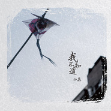

小安
============================

|  |  |
| :--: | :-- |
| [ 小安](https://i.xiami.com/degjinhuu) | **地区**: China 中国大陆 **风格**: 独立民谣 Indie Folk, 民谣 Folk, 校园民谣 Campus Folk, 独立流行 Indie Pop **播放数**: 10211924 **粉丝数**: 4590 **评论数**: 186  |

## 档案

xiaoanmusic.com

## 专辑

| 名称 | 语种 | 唱片公司 | 发行时间 | 专辑类别 | 专辑风格 |
| :--: | :-- | :-- | :-- | :-- | :-- |
| [ 梦旅人](./albums/2102813651.md) | 国语 | 独立发行 | 2017年08月12日 | EP, 单曲 | 民谣 Folk, 城市民谣 Urban Folk, 校园民谣 Campus Folk |
| [ 时光流转 (One-take Demo)](./albums/533754083.md) | 国语 | 独立发行 | 2012年11月05日 | EP, 单曲 | 独立民谣 Indie Folk |
| [ 我不知道](./albums/168581.md) | 国语 | 易石大橙 | 2008年05月26日 | 录音室专辑 | 校园民谣 Campus Folk, 独立流行 Indie Pop |

## 评论

|  |  |  |
| :-- | :-- | :-- |
|  [虾米用户](https://emumo.xiami.com/u/7111610)  2020-12-28 01:55 赞(0) 踩(0) | 
牛气！
 |
|  [虾米用户](https://emumo.xiami.com/u/276944698) 不要自我设限..... 2020-08-19 11:15 赞(0) 踩(0) | 
✔️✔️✔️
 |
|  [虾米用户](https://emumo.xiami.com/u/2869686)  2020-02-07 10:09 赞(0) 踩(0) | 
爱你的声音，爱你的心灵，加油~ 
 |
|  [虾米用户](https://emumo.xiami.com/u/378232990) 爱摇滚爱自己  爱虾米音... 2019-06-17 22:35 赞(1) 踩(0) | 
好听很放松支持支持小安
 |
|  [虾米用户](https://emumo.xiami.com/u/13963113) 冷月照荒漠  2019-02-11 03:46 赞(1) 踩(0) | 
小安，你的歌是我在南方小城度过的日子中仅有的温暖
 |
|  [虾米用户](https://emumo.xiami.com/u/369555938)  2018-11-11 15:23 赞(0) 踩(0) | 
喜欢这首歌，喜欢蓝色
 |
|  [虾米用户](https://emumo.xiami.com/u/350103560) 你好。陌生人！祝你幸福！ 2018-06-10 14:14 赞(0) 踩(0) | 
我以为是灵魂纸扎店呢，
 |
|  [虾米用户](https://emumo.xiami.com/u/90109968) acabbage 2018-04-30 06:38 赞(0) 踩(0) | 
你还出歌吗？看楼上评论说你转行了，想要听到你的歌声
 |
| ⇒ |  [虾米用户](https://emumo.xiami.com/u/91333398)  2018-06-07 08:52 赞(0) 踩(0) | 
17年有新出的《梦旅人》
 |
|  [虾米用户](https://emumo.xiami.com/u/303506160) 因为我对你爱的深沉 2018-01-16 07:11 赞(0) 踩(0) | 
嘿呦
 |
|  [虾米用户](https://emumo.xiami.com/u/220023141) 恨不相逢未嫁时…… 2017-11-12 07:34 赞(0) 踩(0) | 
第一次在推荐的歌里面听到你的歌，完全是一种享受啊！安哥，安歌， 
 |
|  [虾米用户](https://emumo.xiami.com/u/1156476) 四体不勤，五谷不分 2017-10-30 10:15 赞(0) 踩(0) | 
为毛我听着有点像宋冬野
 |
| ⇒ |  [虾米用户](https://emumo.xiami.com/u/354132670)  2018-04-28 19:32 赞(0) 踩(0) | 
不像。胖子的嗓音比较粗糙。
 |
|  [虾米用户](https://emumo.xiami.com/u/44484216) “最痛苦的事情，不是失败... 2017-10-03 00:19 赞(0) 踩(0) | 
很棒
 |
|  [虾米用户](https://emumo.xiami.com/u/7346477) 这个人很复杂，一句话说不... 2017-08-20 03:37 赞(1) 踩(0) | 
哈哈,这个人已经被我发现了.大爱落网,推荐的我都稀罕
 |
| ⇒ |  [虾米用户](https://emumo.xiami.com/u/354132670)  2018-04-28 19:33 赞(0) 踩(0) | 
哇，落网还有人呀？我好久没登了&amp;bull;ᴗ&amp;bull;怀念
 |
|  [虾米用户](https://emumo.xiami.com/u/253840987) 我还没想好要写什么... 2017-08-18 08:21 赞(1) 踩(0) | 
已入坑
 |
|  [虾米用户](https://emumo.xiami.com/u/262326500) 过往云霄，不如你回暇相濡... 2017-08-15 13:22 赞(0) 踩(0) | 
666
 |
|  [虾米用户](https://emumo.xiami.com/u/5778404)  2017-06-07 22:06 赞(0) 踩(0) | 
就是喜欢呀
 |
|  [虾米用户](https://emumo.xiami.com/u/23392947) 下次换一套不那么沉重的躯... 2017-04-08 21:48 赞(3) 踩(0) | 
你的歌真好听，不论你做什么，祝你好
 |
|  [虾米用户](https://emumo.xiami.com/u/187412429)  2017-04-01 22:24 赞(0) 踩(0) | 
最喜欢的就是那首歌，最后知道你不做音乐了。
 |
|  [虾米用户](https://emumo.xiami.com/u/92721646) 这是我，音乐有一片小天地 2017-02-28 23:37 赞(2) 踩(0) | 
真的很棒 感觉民谣歌手就是行走的诗人，自己的生活感想编成的歌，也贴切大家生活的经历。很喜欢
 |
|  [虾米用户](https://emumo.xiami.com/u/274825419) 请用心听 不要说话. 2017-02-20 12:05 赞(0) 踩(0) | 
听你歌长大的偶像派哈哈哈
 |
|  [虾米用户](https://emumo.xiami.com/u/7303242)   2017-02-12 22:23 赞(1) 踩(0) | 
期待回来
 |
|  [虾米用户](https://emumo.xiami.com/u/6166411) 喜歡的城市 ，沒有妳。 2017-02-10 15:23 赞(1) 踩(0) | 
可否与你取得联系，关于电影音乐.
 |
| ⇒ |  [虾米用户](https://emumo.xiami.com/u/8050400) 微博@小安 2017-02-10 18:17 赞(0) 踩(0) | 
私信即可联系
 |
| ⇒ |  [虾米用户](https://emumo.xiami.com/u/97300)  2017-03-09 08:53 赞(0) 踩(0) | 
<q><b>小安说：</b></q>
 |
|  [虾米用户](https://emumo.xiami.com/u/8050400) 微博@小安 2017-02-07 17:48 赞(17) 踩(0) | 
内容已删除
 |
| ⇒ |  [虾米用户](https://emumo.xiami.com/u/627423) 凸虾米你妹！ 2017-02-09 09:03 赞(0) 踩(0) | 
欢迎回来
 |
| ⇒ |  [虾米用户](https://emumo.xiami.com/u/38464) 你是啃住我的带鱼带鱼带鱼 2017-02-28 17:05 赞(0) 踩(0) | 
欢迎回来~
 |
| ⇒ |  [虾米用户](https://emumo.xiami.com/u/580369) keep moving 2017-03-26 09:49 赞(0) 踩(0) | 
期待新歌
 |
|  [虾米用户](https://emumo.xiami.com/u/44140680) 旅途愉快 2016-12-19 23:59 赞(2) 踩(0) | 
⚫️
 |
|  [虾米用户](https://emumo.xiami.com/u/51836126) 卡布拉基摩斯岛岛主 2016-05-22 10:08 赞(1) 踩(0) | 
安静
 |
| ⇒ |  [虾米用户](https://emumo.xiami.com/u/91786912) 这家辉 2016-05-30 20:50 赞(0) 踩(0) | 
zzzej&amp;amp;6vwe
 |
|  [虾米用户](https://emumo.xiami.com/u/3405178)  2015-11-25 11:14 赞(0) 踩(0) | 
1111
 |
|  [虾米用户](https://emumo.xiami.com/u/63159646)  2015-11-11 21:40 赞(1) 踩(0) | 
这是我最喜欢的专辑之一 很遗憾他出的歌太少
 |
|  [虾米用户](https://emumo.xiami.com/u/231913)  2015-10-10 17:01 赞(1) 踩(0) | 
噢 随机听到的 蛮有味道 给郁结的诗向金斯伯格的诗
 |
|  [虾米用户](https://emumo.xiami.com/u/2585988) 我爱过一个女孩儿 2015-09-28 09:51 赞(1) 踩(0) | 
读诗的时候好好听
 |
|  [虾米用户](https://emumo.xiami.com/u/62017)  2015-09-18 21:33 赞(2) 踩(0) | 
独白段让我想起了张楚的爱情。
 |
|  [虾米用户](https://emumo.xiami.com/u/21961687)  2015-08-28 14:14 赞(1) 踩(0) | 
好可惜 还想听小安的歌
 |
|  [虾米用户](https://emumo.xiami.com/u/39611781)  2015-08-04 23:30 赞(2) 踩(0) | 
听人声部分 想起了张楚的厕所和床
 |
| ⇒ |  [虾米用户](https://emumo.xiami.com/u/62017)  2015-09-18 21:31 赞(0) 踩(0) | 
想起了张楚的爱情
 |
|  [虾米用户](https://emumo.xiami.com/u/39788841)  . 2015-07-30 10:48 赞(2) 踩(0) | 
Lium
 |
|  [虾米用户](https://emumo.xiami.com/u/46287679)  2015-07-19 13:34 赞(1) 踩(0) | 
熟悉的旋律，再次听到才想起来出自哪里。
 |
|  [虾米用户](https://emumo.xiami.com/u/39255583)  2015-07-01 08:10 赞(3) 踩(0) | 
简直是为民谣而生的嗓子
 |
|  [虾米用户](https://emumo.xiami.com/u/3432776) 我还没想好要写什么... 2015-06-22 14:04 赞(0) 踩(0) | 
他是我的最爱没有之一，不过因为没有忧愁好久不在虾米听小安。发高烧的下午虾米在播给郁结的诗的时候，为什么感觉好像特别熟悉。
 |
|  [虾米用户](https://emumo.xiami.com/u/10812448)   2015-05-20 22:08 赞(0) 踩(0) | 
声音一出来耳朵就醒了
 |
|  [虾米用户](https://emumo.xiami.com/u/50105786)  2015-05-19 14:18 赞(1) 踩(0) | 
他的校园民谣给我带来很大触动，为此我还学过吉他。
 |
|  [虾米用户](https://emumo.xiami.com/u/6503715) 我是石头，不会开花。你还... 2015-05-08 11:38 赞(2) 踩(0) | 
声音清浅，一下子让人想到上学的时候。
 |
|  [虾米用户](https://emumo.xiami.com/u/439976) 我是个酒鬼，我无话可说 2015-04-28 10:44 赞(39) 踩(0) | 
像一张永远也洗不干净的洁白床单
 |
|  [虾米用户](https://emumo.xiami.com/u/8961287)  2015-04-27 21:53 赞(2) 踩(0) | 
忧愁（Sorrow）,给郁结的诗，非常好听！
 |
|  [虾米用户](https://emumo.xiami.com/u/32092417)  2015-04-26 23:08 赞(2) 踩(0) | 
听说他不做音乐了，可惜啊，他的嗓音这么棒
 |
|  [虾米用户](https://emumo.xiami.com/u/47941184) 理想今年你几岁 2015-04-17 22:25 赞(1) 踩(0) | 
好听
 |
|  [虾米用户](https://emumo.xiami.com/u/47008817)  2015-03-28 16:10 赞(3) 踩(0) | 
舒服
 |
|  [虾米用户](https://emumo.xiami.com/u/98914) 耳朵具有自动过滤歌词功能 2015-03-24 22:14 赞(15) 踩(0) | 
小安改艺名了吗，怎么后来没消息了。。。  “已经不做音乐了。感谢所有的朋友们。” <a href="http://site.douban.com/xiaoan/" target="_blank" rel="nofollow noreferrer noopener">http://site.douban.com/xiaoan/</a> 我擦
 |
| ⇒ |  [虾米用户](https://emumo.xiami.com/u/2865322) 我还没想好要写什么... 2015-06-24 09:13 赞(0) 踩(0) | 
可惜了。希望他不要放弃音乐啊。  我们都想听歌。 谁有他微博。@我一个。  我的微博名字。陈杯杯
 |
| ⇒ |  [虾米用户](https://emumo.xiami.com/u/7239494)  2015-06-24 11:09 赞(0) 踩(0) | 
<q><b>陈杯杯说：</b></q>
 |
| ⇒ |  [虾米用户](https://emumo.xiami.com/u/2865322) 我还没想好要写什么... 2015-06-24 22:20 赞(0) 踩(0) | 
<q><b>死了｀说：</b></q>
 |
| ⇒ |  [虾米用户](https://emumo.xiami.com/u/21838721)  2015-08-11 20:01 赞(0) 踩(0) | 
真心可惜啊，这份才华和这把好嗓子，不知道现在他的这些音乐还有没有分成，希望对的住当时的那份热爱
 |
| ⇒ |  [虾米用户](https://emumo.xiami.com/u/8050400) 微博@小安 2017-02-08 23:32 赞(0) 踩(0) | 
<q><b>陈杯杯说：</b></q>
 |
| ⇒ |  [虾米用户](https://emumo.xiami.com/u/279079212)  2017-04-02 18:54 赞(0) 踩(0) | 
<q><b>小安说：</b></q>
 |
| ⇒ |  [虾米用户](https://emumo.xiami.com/u/8403894) 不靠山不靠水 2020-11-03 15:41 赞(0) 踩(0) | 
<q><b>陈杯杯说：</b></q>
 |
| ⇒ |  [虾米用户](https://emumo.xiami.com/u/191782734)  2020-12-08 10:31 赞(0) 踩(0) | 
可惜了。。多好的音乐人
 |
|  [虾米用户](https://emumo.xiami.com/u/2051406) 总之，要热爱生活 2015-03-18 22:32 赞(2) 踩(0) | 
小安为什么没有新歌了 想念他的声音 当年的美人很惊艳的
 |
|  [虾米用户](https://emumo.xiami.com/u/1674120) 我还没想好要写什么... 2015-02-27 10:27 赞(1) 踩(0) | 
愿你永远拥有最好听的声音和心情
 |
|  [虾米用户](https://emumo.xiami.com/u/36215131) 我还没想好要写什么... 2015-02-10 10:33 赞(2) 踩(0) | 
喜欢了很多年了，就是一直都不会听腻的声音，可惜后来再也没有你的消息
 |
|  [虾米用户](https://emumo.xiami.com/u/45585901) - 2015-02-09 08:32 赞(0) 踩(0) | 
-
 |
|  [虾米用户](https://emumo.xiami.com/u/32623827) 独立音乐人刘昰 2015-02-07 21:14 赞(1) 踩(0) | 
好听  加油  小安
 |
|  [虾米用户](https://emumo.xiami.com/u/3557045) 让好事发声 2015-01-19 01:15 赞(2) 踩(0) | 
小安的嗓子，是为民谣而生，很多人这么说。他的音乐总会把我们带回高中的校园里，那时的小安在操场上夕阳里弹琴唱歌，天气不那么闷热，金黄色的阳光从高处，一点点，跌落成破碎的树阴。
 |
|  [虾米用户](https://emumo.xiami.com/u/42422302)   2015-01-13 13:04 赞(2) 踩(0) | 
喜欢这种悠闲自在的小清新，听完整个人都变文艺了❤️
 |
|  [虾米用户](https://emumo.xiami.com/u/296069) 暂无签名~ 2015-01-12 21:58 赞(1) 踩(0) | 
干净
 |
|  [虾米用户](https://emumo.xiami.com/u/45727846)  2015-01-07 11:20 赞(1) 踩(0) | 
简简单单
 |
|  [虾米用户](https://emumo.xiami.com/u/756667) 边上 2014-12-31 11:35 赞(2) 踩(0) | 
每次听着，都不知觉地进入了单曲循环。 最让人感动的那段念白， 让人懂得， 有些东西注定是抓不住的， 你拼了命使出全身的力量要去抓， 也只不过捞月一般的虚幻…… 是的， 就让那月浮于心中的这潭水
 |
|  [虾米用户](https://emumo.xiami.com/u/9755013) やる気ないね 2014-12-11 22:16 赞(1) 踩(0) | 
mlln的诗很舒服啊
 |
|  [虾米用户](https://emumo.xiami.com/u/16267422) 我还没想好要写什么... 2014-12-10 12:00 赞(1) 踩(0) | 
很久没有听到这样感动的歌了。
 |
|  [虾米用户](https://emumo.xiami.com/u/2781218) 来者何来 去者何去 2014-12-08 21:58 赞(1) 踩(0) | 
独白太长啦23333念的好认真，又傻又cute
 |
|  [虾米用户](https://emumo.xiami.com/u/38876938) 。 2014-11-28 14:05 赞(1) 踩(0) | 
听你的歌，就像在唱我自己的人生
 |
|  [虾米用户](https://emumo.xiami.com/u/35756029)  2014-11-12 12:07 赞(1) 踩(0) | 
不错。
 |
|  [虾米用户](https://emumo.xiami.com/u/10750652) 我还没想好要写什么... 2014-11-02 23:20 赞(1) 踩(0) | 
童真
 |
|  [虾米用户](https://emumo.xiami.com/u/41985405) 美丽新世界 2014-10-14 13:44 赞(1) 踩(0) | 
这首歌谁有吉他谱
 |
|  [虾米用户](https://emumo.xiami.com/u/5749381)  2014-09-22 21:19 赞(1) 踩(0) | 
循环一整天不嫌烦
 |
|  [虾米用户](https://emumo.xiami.com/u/13552)  2014-09-13 18:01 赞(1) 踩(0) | 
给郁结的诗、夏天的故事、美人、午后、我不知道、空房间
 |
|  [虾米用户](https://emumo.xiami.com/u/33723516)   2014-07-25 22:03 赞(1) 踩(0) | 
擦今天收货好多，又抓到一只
 |
|  [虾米用户](https://emumo.xiami.com/u/33126608) 临阵挽弓指天狼 2014-07-07 07:59 赞(1) 踩(0) | 
好喜欢的嗓音和音乐⊙▽⊙
 |
| ⇒ |  [虾米用户](https://emumo.xiami.com/u/7572176) 哈哈哈哈 2014-07-13 11:13 赞(0) 踩(0) | 
zhaz
 |
|  [虾米用户](https://emumo.xiami.com/u/28987537) YY频道66778989 2014-06-09 13:07 赞(1) 踩(0) | 
就喜欢这调调
 |
|  [虾米用户](https://emumo.xiami.com/u/9362834)  2014-06-06 21:30 赞(1) 踩(0) | 
好听
 |
|  [虾米用户](https://emumo.xiami.com/u/1333032) 岁月是首歌~~ 2014-06-02 00:45 赞(1) 踩(0) | 
相见恨晚！
 |
|  [虾米用户](https://emumo.xiami.com/u/8859071) 簽名太長寫不下~ 2014-05-24 14:22 赞(1) 踩(0) | 
接着出专辑撒~~~
 |
|  [虾米用户](https://emumo.xiami.com/u/1745)  2014-05-14 21:27 赞(0) 踩(0) | 
《浪费爱情》怎么下架了？
 |
| ⇒ |  [虾米用户](https://emumo.xiami.com/u/7882902) 但愿再见之时星光灿烂 2014-05-19 03:25 赞(0) 踩(0) | 
那是另一个同名歌手吧
 |
|  [虾米用户](https://emumo.xiami.com/u/518581) 纪念华为校招2009 2014-05-06 12:51 赞(1) 踩(0) | 
听到独白的时候，才发现这首歌勾起了回忆
 |
|  [虾米用户](https://emumo.xiami.com/u/20057600) fq kp 2014-04-25 19:46 赞(1) 踩(0) | 
精神中的青年，民谣的青年
 |
|  [虾米用户](https://emumo.xiami.com/u/3405342)  2014-04-15 11:52 赞(32) 踩(0) | 
像一张被洗干净的洁白床单
 |
| ⇒ |  [虾米用户](https://emumo.xiami.com/u/3324258)  2015-07-25 15:20 赞(0) 踩(0) | 

 |
|  [虾米用户](https://emumo.xiami.com/u/3791962)  2014-03-01 19:55 赞(1) 踩(0) | 
唤起了去年夏天高三的回忆。。
 |
|  [虾米用户](https://emumo.xiami.com/u/8058717) 芝 2014-02-02 22:01 赞(2) 踩(0) | 
可以把独白唱出来吗? 真想听
 |
|  [虾米用户](https://emumo.xiami.com/u/11824157) 始终爱陈绮贞，走不出我的... 2014-02-01 13:12 赞(2) 踩(0) | 
青春的样子，就在歌曲中，慢慢被描绘出形状……
 |
|  [虾米用户](https://emumo.xiami.com/u/11824157) 始终爱陈绮贞，走不出我的... 2014-02-01 13:11 赞(1) 踩(0) | 
带给我校园和青春的感觉
 |
|  [虾米用户](https://emumo.xiami.com/u/4342233)   2014-01-26 13:16 赞(1) 踩(0) | 
好好听！
 |
|  [虾米用户](https://emumo.xiami.com/u/1548545)  2014-01-16 10:45 赞(1) 踩(0) | 
HAOTI好听啊
 |
|  [虾米用户](https://emumo.xiami.com/u/8693018)   2013-12-15 17:54 赞(1) 踩(0) | 
希望必火~ㅋㅅㅋ
 |
|  [虾米用户](https://emumo.xiami.com/u/8831015)  2013-12-07 20:26 赞(1) 踩(0) | 
大叔音！
 |
|  [虾米用户](https://emumo.xiami.com/u/26246185)  2013-11-30 10:40 赞(2) 踩(0) | 
很文艺滴感觉··
 |
|  [虾米用户](https://emumo.xiami.com/u/24242971)  2013-11-14 13:31 赞(1) 踩(0) | 
在这个锈红色法桐叶子铺满校园的季节，听这样的小曲怎一个安逸了得~~·
 |
|  [虾米用户](https://emumo.xiami.com/u/12106291) 我要你远远地看到我，但不... 2013-10-24 23:37 赞(0) 踩(0) | 
安 ...
 |
|  [虾米用户](https://emumo.xiami.com/u/17538137)  2013-10-20 12:29 赞(1) 踩(0) | 
声音特别
 |
|  [虾米用户](https://emumo.xiami.com/u/3584698) 当你低头的瞬间，才发觉脚... 2013-10-19 17:39 赞(1) 踩(0) | 
夏日午后的感觉
 |
|  [虾米用户](https://emumo.xiami.com/u/1664574)  2013-08-31 13:14 赞(1) 踩(0) | 
小安本人吗？
 |
|  [虾米用户](https://emumo.xiami.com/u/9777922) 金属米 2013-08-18 13:50 赞(0) 踩(0) | 
不错 好听
 |
|  [虾米用户](https://emumo.xiami.com/u/1664574)  2013-08-14 12:48 赞(1) 踩(0) | 
此人必火
 |
|  [虾米用户](https://emumo.xiami.com/u/1664574)  2013-08-14 12:48 赞(0) 踩(0) | 
此人必火
 |
|  [虾米用户](https://emumo.xiami.com/u/7594216) 不想起床 2013-08-11 21:01 赞(1) 踩(0) | 
两个小安都好
 |
|  [虾米用户](https://emumo.xiami.com/u/10435106) 听靓歌 2013-07-11 00:34 赞(0) 踩(0) | 
不错.
 |
|  [虾米用户](https://emumo.xiami.com/u/520366)  2013-06-16 15:45 赞(1) 踩(0) | 
民谣湿人神马的弱爆了。湿意即**。
 |
|  [虾米用户](https://emumo.xiami.com/u/9158801)  2013-05-31 22:25 赞(0) 踩(0) | 
就是喜欢
 |
|  [虾米用户](https://emumo.xiami.com/u/13771055)  2013-04-30 17:36 赞(0) 踩(0) | 
很有意思
 |
|  [虾米用户](https://emumo.xiami.com/u/7919382)  2013-04-12 13:24 赞(1) 踩(0) | 
汪峰什么的弱爆了
 |
|  [虾米用户](https://emumo.xiami.com/u/9380249) 不要来摸我 2013-04-10 14:28 赞(0) 踩(0) | 
假象吖 我想做爱 那歌咋不被收录！～～～～
 |
| ⇒ |  [虾米用户](https://emumo.xiami.com/u/886551)  2013-05-20 15:50 赞(0) 踩(0) | 
虾米有两个小安，你说的那一首是另外一个小安的
 |
|  [虾米用户](https://emumo.xiami.com/u/9004080)  2013-03-22 17:48 赞(0) 踩(0) | 
不错不错~
 |
|  [虾米用户](https://emumo.xiami.com/u/13621546)  2013-03-21 14:43 赞(0) 踩(0) | 
说你妹啦
 |
|  [虾米用户](https://emumo.xiami.com/u/10203735) 音乐伴我行 2013-03-11 23:30 赞(0) 踩(0) | 
歌词全部都是诗歌？
 |
|  [虾米用户](https://emumo.xiami.com/u/2196181)  2013-03-06 23:47 赞(1) 踩(0) | 
哈哈，他也叫小安，舒服的嗓音
 |
|  [虾米用户](https://emumo.xiami.com/u/2625518)  2013-03-06 16:45 赞(1) 踩(0) | 
大心引力
 |
|  [虾米用户](https://emumo.xiami.com/u/8898842) 生活万岁。 2013-02-22 09:08 赞(1) 踩(0) | 
喜欢！！！
 |
|  [虾米用户](https://emumo.xiami.com/u/6904090)  2013-01-22 22:20 赞(1) 踩(0) | 
想要做梦的歌
 |
| ⇒ |  [虾米用户](https://emumo.xiami.com/u/4043410) 唯夜色浪漫 2013-04-03 16:31 赞(0) 踩(0) | 
Ha ha~
 |
| ⇒ |  [虾米用户](https://emumo.xiami.com/u/3936180)  2013-04-29 10:24 赞(0) 踩(0) | 
春梦还是夏梦
 |
|  [虾米用户](https://emumo.xiami.com/u/7562991)  2013-01-22 09:58 赞(1) 踩(0) | 
音乐做得很棒!只可惜浪漫程度，有些像风筝——确实是飞起来了，可惜也就这么高了。
 |
| ⇒ |  [虾米用户](https://emumo.xiami.com/u/890284)  2013-04-04 20:52 赞(0) 踩(0) | 
这个浪漫神马的 一部分需要天赋 一部分需要去刻意去锻炼
 |
| ⇒ |  [虾米用户](https://emumo.xiami.com/u/7562991)  2013-04-04 22:06 赞(0) 踩(0) | 
<q><b>三百六十度说：</b></q>
 |
|  [虾米用户](https://emumo.xiami.com/u/8914033) 戴了面具的假王子 2013-01-16 12:28 赞(1) 踩(0) | 
❤
 |
|  [虾米用户](https://emumo.xiami.com/u/9142852) 我还没想好要写什么... 2013-01-02 12:51 赞(1) 踩(0) | 
我也喜欢这样的声音，有青春的味道，生命的气息。
 |
|  [虾米用户](https://emumo.xiami.com/u/7511802)  2012-12-29 21:32 赞(1) 踩(0) | 
我喜欢成为这样的孩子
 |
|  [虾米用户](https://emumo.xiami.com/u/7511802)  2012-12-29 21:32 赞(2) 踩(0) | 
我喜欢这个诗人
 |
|  [虾米用户](https://emumo.xiami.com/u/2381982) 我还没想好要写什么... 2012-12-20 16:34 赞(1) 踩(0) | 
青春的诗人，年华的灵魂。
 |
|  [虾米用户](https://emumo.xiami.com/u/1214570) 致美好时光 2012-12-08 09:50 赞(3) 踩(0) | 
温暖的声音，有木有老狼、朴树、万晓利，有木有钟立风、张悬、小果，有木有
 |
|  [虾米用户](https://emumo.xiami.com/u/997508)  2012-11-23 12:38 赞(2) 踩(0) | 
听到了老狼，朴树，万晓利，听到了钟立风，张悬，小果
 |
|  [虾米用户](https://emumo.xiami.com/u/9158428) 以梦为马，诗酒趁年华。 2012-11-22 16:13 赞(1) 踩(0) | 
好温暖的声音。
 |
|  [虾米用户](https://emumo.xiami.com/u/5992147)  2012-11-11 15:59 赞(2) 踩(0) | 
从南方 独身一人来到长春上大学的这四年 听小安的歌最贴合
 |
|  [虾米用户](https://emumo.xiami.com/u/5114361)  2012-10-06 23:41 赞(1) 踩(0) | 
果然是天生的民谣嗓子
 |
|  [虾米用户](https://emumo.xiami.com/u/4940665)  2012-10-01 18:33 赞(1) 踩(0) | 
很好
 |
|  [虾米用户](https://emumo.xiami.com/u/5720602)  2012-09-24 18:01 赞(1) 踩(0) | 
民谣
 |
|  [虾米用户](https://emumo.xiami.com/u/1875612)  2012-09-21 14:20 赞(1) 踩(0) | 
小安
 |
|  [虾米用户](https://emumo.xiami.com/u/6815)  2012-09-15 13:34 赞(1) 踩(0) | 
那么透彻的吉他节奏和声音，好久没有听过这样的民谣了
 |
|  [虾米用户](https://emumo.xiami.com/u/2400116) 我还没想好要写什么... 2012-09-11 00:38 赞(1) 踩(0) | 
就是这样！！
 |
|  [虾米用户](https://emumo.xiami.com/u/9151131) 我还没想好要写什么... 2012-08-11 17:53 赞(1) 踩(0) | 
小清新，就是一缕阳光
 |
|  [虾米用户](https://emumo.xiami.com/u/3002042) 音乐是最好的情人……因为... 2012-07-19 21:55 赞(1) 踩(0) | 
很干净的声音~  感觉很舒服~
 |
|  [虾米用户](https://emumo.xiami.com/u/3087186) 一颗狭窄的心和大的宇宙 2012-07-05 22:25 赞(1) 踩(0) | 
好喜欢...
 |
|  [虾米用户](https://emumo.xiami.com/u/5842349)  2012-06-26 17:49 赞(1) 踩(0) | 
木吉他-民谣
 |
|  [虾米用户](https://emumo.xiami.com/u/9040705)  2012-06-14 13:53 赞(1) 踩(0) | 
..
 |
|  [虾米用户](https://emumo.xiami.com/u/2244994)  2012-05-23 22:51 赞(1) 踩(0) | 
能这样歌唱算是我的一个梦想吧。
 |
|  [虾米用户](https://emumo.xiami.com/u/594459)  2012-05-21 23:07 赞(1) 踩(0) | 
已经不唱了吗？真可惜。 非常非常喜欢这张EP
 |
|  [虾米用户](https://emumo.xiami.com/u/7287415)  2012-05-05 23:45 赞(1) 踩(0) | 
小安的嗓子，是为民谣而生。我也认同、
 |
|  [虾米用户](https://emumo.xiami.com/u/81933)  2012-04-28 15:27 赞(1) 踩(0) | 
美人的制作人，生于60、70？，有点怪。期待新专辑，期待.........................
 |
| ⇒ |  [虾米用户](https://emumo.xiami.com/u/352246)  2012-05-13 23:34 赞(0) 踩(0) | 
他已经不唱了哦
 |
| ⇒ |  [虾米用户](https://emumo.xiami.com/u/388605)  2012-07-14 21:37 赞(0) 踩(0) | 
是的，他已经不唱了
 |
|  [虾米用户](https://emumo.xiami.com/u/81933)  2012-04-28 15:19 赞(1) 踩(0) | 
快乐阳光呢？阳光自然引来花草的生长，虫鸟的歌唱，别再无病呻吟了。虽然歌的曲调不错，给老男人还行。
 |
|  [虾米用户](https://emumo.xiami.com/u/81933)  2012-04-28 15:15 赞(1) 踩(0) | 
又一个无知男声
 |
|  [虾米用户](https://emumo.xiami.com/u/626311) 我还没想好要写什么... 2012-04-21 13:56 赞(1) 踩(0) | 
写下来是诗，唱来，便是小天地
 |
|  [虾米用户](https://emumo.xiami.com/u/8849100)  2012-04-13 21:13 赞(1) 踩(0) | 
喜欢的民谣歌手
 |
|  [虾米用户](https://emumo.xiami.com/u/8849100)  2012-04-13 21:12 赞(1) 踩(0) | 
非常喜欢的艺人
 |
|  [虾米用户](https://emumo.xiami.com/u/8779191)  2012-04-12 22:43 赞(1) 踩(0) | 
不要问谁辜负了我们的青春
 |
|  [虾米用户](https://emumo.xiami.com/u/3901761) 懵懂顽童，游手好闲 2012-02-27 22:57 赞(1) 踩(0) | 
男生消毒厂~~
 |
|  [虾米用户](https://emumo.xiami.com/u/4303409) 万年大乙方 2011-11-25 12:20 赞(1) 踩(0) | 
送给胖胖的小清新~
 |
|  [虾米用户](https://emumo.xiami.com/u/1664744)  2011-11-22 09:56 赞(1) 踩(0) | 
我不知道有多少人听过他的歌，但他的歌是绝对好听的。
 |
|  [虾米用户](https://emumo.xiami.com/u/6714642)   2011-11-10 15:33 赞(1) 踩(0) | 
歌者，诗人。
 |
|  [虾米用户](https://emumo.xiami.com/u/742292) 心之憂矣，自貽伊戚。 2011-10-23 06:15 赞(1) 踩(0) | 
The name itself tells.
 |
|  [虾米用户](https://emumo.xiami.com/u/5992147)  2011-09-26 22:36 赞(1) 踩(0) | 
郁结的诗
 |
|  [虾米用户](https://emumo.xiami.com/u/1268949)  2011-09-24 21:05 赞(1) 踩(0) | 
能不能别告别 在听时光流转 如果可以希望你别放弃。T.T
 |
|  [虾米用户](https://emumo.xiami.com/u/1582311)  2011-08-26 12:12 赞(1) 踩(0) | 
恩，他的歌声陪我度过了人生第一次的长途旅行
 |
|  [虾米用户](https://emumo.xiami.com/u/1998318)  2011-08-18 01:35 赞(1) 踩(0) | 
爱你
 |
|  [虾米用户](https://emumo.xiami.com/u/2968755)   2011-08-03 13:46 赞(1) 踩(0) | 
给郁结的诗。
 |
|  [虾米用户](https://emumo.xiami.com/u/4728941)  2011-07-04 14:59 赞(1) 踩(0) | 
跟那个小安比还是有点嫩
 |
|  [虾米用户](https://emumo.xiami.com/u/4258914)  2011-06-19 17:38 赞(1) 踩(0) | 
小清新
 |
|  [虾米用户](https://emumo.xiami.com/u/3060165)  2011-06-14 22:35 赞(1) 踩(0) | 
17岁时候的小男孩写的歌。可美好。ps我对“美人”“姑娘”这类字眼情有独钟。
 |
|  [虾米用户](https://emumo.xiami.com/u/3691274)  2011-04-22 21:22 赞(1) 踩(0) | 
不知道怎么形容，太美了
 |
|  [虾米用户](https://emumo.xiami.com/u/606670) 哈！某人！ 2011-04-04 13:16 赞(1) 踩(0) | 
男生小独唱... 美人...
 |
|  [虾米用户](https://emumo.xiami.com/u/1224366)  2011-03-05 16:06 赞(1) 踩(0) | 
一首青春郁结的诗  被打动。。。。
 |
|  [虾米用户](https://emumo.xiami.com/u/198653)  2011-02-21 10:00 赞(1) 踩(0) | 
给郁结的诗
 |
|  [虾米用户](https://emumo.xiami.com/u/1437463)  2010-10-22 17:13 赞(1) 踩(0) | 
太喜欢了！歌词也好，调调也美！
 |
|  [虾米用户](https://emumo.xiami.com/u/1678156)  2010-10-19 00:52 赞(1) 踩(0) | 
说什么呢，如此质感、干净、特别的声音我只记住了你一个，小安~
 |
|  [虾米用户](https://emumo.xiami.com/u/685594) 我还没想好要写什么... 2010-09-22 19:17 赞(1) 踩(0) | 
擦。。男生小独唱
 |
|  [虾米用户](https://emumo.xiami.com/u/661757) 我还没想好要写什么... 2010-09-22 02:50 赞(1) 踩(0) | 
李维岩和小安
 |
| ⇒ |  [虾米用户](https://emumo.xiami.com/u/8050400) 微博@小安 2017-02-08 23:42 赞(0) 踩(0) | 
你怎么知道李维岩
 |
|  [虾米用户](https://emumo.xiami.com/u/399202)  2010-06-30 23:20 赞(0) 踩(0) | 
怎么有误~~
 |
