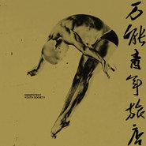

万能青年旅店 同名专辑
============================

|  |  |
| :--: | :-- |
| [ 万能青年旅店 同名专辑](https://emumo.xiami.com/album/408244) | **艺人**: [万能青年旅店](../index.md) **语种**: 国语 **唱片公司**: 独立发行 **发行时间**: 2010年10月26日 **专辑类别**: 录音室专辑 **专辑风格**: 摇滚 Rock & Roll **播放数**: 45144927 **收藏数**: 28380 **评论数**: 1919  |

## 简介

唱片的录音棚就是排练室，更早以前它是董亚千家里的老宅，闷在年代久远的四层红砖楼房里，周围住的多数是老人。乐队在这一片早起早睡的潮水里干活，扯淡，吃喝拉撒，无论昼夜，不知大中华盛世将至。  
那些80年代的红砖还能叫红色吗，大概只能算煤球渣子的近亲。正如唱歌的最终会沉默，昨日奔跑着的青年和鸵鸟，一转眼就是今天的腐肉，秃鹫。不过，音乐不是为如此这般的现实伴奏的，它一直在它该在的地方，需要一路撕扯着过去的，只是我们。  
这么多年，这么一帮人，前前后后兜圈子，现在终于出首张唱片。到了这一步，快和慢是另一个世界的话题。让企业家和文人继续开辩论会吧。专辑在手，大梦初醒，专属于个人的节奏，早就战胜了环境施加的心理暗示。药方就是我们自己，像羽毛，突然的，一下一下的飘落而至。  
必须承认首张唱片是土法炼钢，各种自学试验，呼哧呼哧的吹风点火，完全没有大跃进的豪爽速度，反倒前后拖了快两年。修改打磨，福祸焉知。硬伤是免不了的。有时候像拳头打进了棉花，那种落空和被瞬间软化的悲哀，简直让人恨不得放弃所有的努力。相信许多中国乐队也都经历过。不多说。Leonard Cohen 的名言最适合用来安慰：一半怪自己，一半怪环境。  
设备东拼西凑，制作也七嘴八舌，反正各种借，骗，着急和糊涂，旧交新朋全部派上了用场。万能青年旅店，名字叫的清楚响亮，自己没开张的时候先轮番被大家招待，欠下的人情堆到天边。这就是生命里的各种麻烦吗。现在描述起来，却又像一幅理想世界的蓝图：众人拾柴浇油，吵吵嚷嚷间，一团火焰轰地着了。  
90年代美式另类摇滚很深的影响过这个乐队，现在成员们的喜好包括老摇滚，民谣，爵士乐，迷幻噪音，酒后流行歌，草地唱诗等等，至于作品是什么，光自己说不算。  
录音室的窗外，短暂出现过一大片空地。那是开发商圈出的牧场，即将到来的肥肉和鲜血，即将到来的千万人厕身其间刨食的日子。但它曾经是空旷的，好几个足球场那么大的空旷，尤其到了晚上，像真理似的空虚，神秘，给目光以憧憬的机会，让风进来，吹得更猛烈。  
唱片完成之时，空地已经被耸立的高楼填满。我们渴望这张塞了很多东西的唱片还能留下空地的丝缕感觉，这样的话，所有听到的人，就有可能并肩站在一起。  
谢谢大家。

## 曲目

## 评论

|  |  |  |
| :-- | :-- | :-- |
|  [虾米用户](https://emumo.xiami.com/u/34706325)  2020-12-26 07:43 赞(0) 踩(0) | 
这张无论过多久再听都让我激动不已
 |
|  [虾米用户](https://emumo.xiami.com/u/3253320) Bon voyage! 2020-12-24 12:17 赞(1) 踩(0) | 
第8首酒馆不见了
 |
|  [虾米用户](https://emumo.xiami.com/u/857080) 讲不出再见，虾米有缘江湖... 2020-12-22 20:10 赞(2) 踩(0) | 
虽然虾米没有争取到万青十年后的新转首发 但我依然在这里守候！
 |
|  [虾米用户](https://emumo.xiami.com/u/996277) ‏‏ 2020-12-20 09:35 赞(0) 踩(0) | 
啦啦啦
 |
|  [虾米用户](https://emumo.xiami.com/u/379162683) 我想要记住你们，我想要你... 2020-12-17 11:25 赞(0) 踩(0) | 

 |
|  [虾米用户](https://emumo.xiami.com/u/44026816) 小虾米，爱你哦！ 2020-12-16 10:46 赞(0) 踩(0) | 
应该加紧出新歌呀！
 |
|  [虾米用户](https://emumo.xiami.com/u/9379443)  2020-12-10 16:28 赞(0) 踩(0) | 
充满想象力
 |
|  [虾米用户](https://emumo.xiami.com/u/321178345)  2020-11-22 05:51 赞(2) 踩(0) | 
十年了，新专辑来吧！万青
 |
| ⇒ |  [虾米用户](https://emumo.xiami.com/u/265677423)  2020-12-20 01:40 赞(0) 踩(0) | 
要来了！
 |
| ⇒ |  [虾米用户](https://emumo.xiami.com/u/321178345)  2020-12-20 01:49 赞(0) 踩(0) | 
<q><b>Addicted。说：</b></q>
 |
|  [虾米用户](https://emumo.xiami.com/u/49886680) 我还没想好要写什么... 2020-11-13 20:42 赞(0) 踩(0) | 
十年啦！
 |
|  [虾米用户](https://emumo.xiami.com/u/592764) . 2020-11-09 09:16 赞(1) 踩(0) | 
做乐评人门槛这么低吗？我可以做评乐评人人吗？播放记录都土成你辽宁奶奶的二人转了还跑出来聊审美？
 |
| ⇒ |  [虾米用户](https://emumo.xiami.com/u/6433781) life was sav... 2020-12-22 12:03 赞(0) 踩(0) | 
您知道热评的那个&amp;ldquo;Mikey&amp;rdquo;怎么不能对其进行回复吗？
 |
| ⇒ |  [虾米用户](https://emumo.xiami.com/u/592764) . 2020-12-22 22:46 赞(0) 踩(0) | 
<q><b>BluesDeluxe说：</b></q>
 |
|  [虾米用户](https://emumo.xiami.com/u/47418668) 就像所有的故事都有结局，... 2020-10-23 11:31 赞(1) 踩(0) | 
我有一系列的表达对此专喜欢之情的话，但大多不太文雅，而除此之外我却也没什么能说的了。就这样吧，是神。
 |
|  [虾米用户](https://emumo.xiami.com/u/273068072) 通灵能力研究师 2020-10-05 02:41 赞(0) 踩(0) | 
至少在这片土地上，在这个时代，无人可出其左右的声音
 |
|  [虾米用户](https://emumo.xiami.com/u/47459440)  2020-10-03 17:02 赞(0) 踩(0) | 
这是我们的时代
 |
|  [虾米用户](https://emumo.xiami.com/u/262877677)  2020-09-27 21:36 赞(0) 踩(0) | 
实力摆在那儿
 |
|  [虾米用户](https://emumo.xiami.com/u/22066979)  2020-09-12 21:21 赞(0) 踩(0) | 
就一个字，很好
 |
|  [虾米用户](https://emumo.xiami.com/u/73881410) 非常响，特别近 2020-09-03 17:16 赞(0) 踩(0) | 
苹果手机听不了？
 |
|  [虾米用户](https://emumo.xiami.com/u/186133406) 口水鸡 2020-09-01 16:51 赞(0) 踩(0) | 
12年听的
 |
|  [虾米用户](https://emumo.xiami.com/u/1159039) ▲▲▲Rock 2020-08-24 22:55 赞(0) 踩(0) | 
封神了
 |
|  [虾米用户](https://emumo.xiami.com/u/171953626) 生死去留 棚头傀儡 一线... 2020-08-09 04:49 赞(1) 踩(0) | 
内容已删除
 |
| ⇒ |  [虾米用户](https://emumo.xiami.com/u/273068072) 通灵能力研究师 2020-10-05 02:45 赞(0) 踩(0) | 
明显是被流行音乐综艺节目选秀节目灌满了一脑子翔
 |
|  [虾米用户](https://emumo.xiami.com/u/95653502) 云音乐ID：由于囿于。再... 2020-08-04 15:21 赞(0) 踩(0) | 
这个混声啊我是真的爱了
 |
|  [虾米用户](https://emumo.xiami.com/u/276112556) 我真的没想好要写什么(ﾟ... 2020-07-17 07:48 赞(0) 踩(0) | 
这还需要评分？直接满分啊！
 |
|  [虾米用户](https://emumo.xiami.com/u/10983386) 瘦子 朝夕奔梦 2020-07-15 07:46 赞(1) 踩(0) | 
一专成神
 |
|  [虾米用户](https://emumo.xiami.com/u/2472729) 嘘 2020-07-13 11:20 赞(0) 踩(0) | 
11年了 依然让人警醒
 |
|  [虾米用户](https://emumo.xiami.com/u/69433198) 夜半巨蟑爬床… 2020-07-12 17:01 赞(0) 踩(0) | 
这块砖要慢品。啃不下去嘴说明阅历浅感悟不深。我先站着舔一下，以后会不会跪着，看我造化吧。
 |
|  [虾米用户](https://emumo.xiami.com/u/422967687) 我还没想好要写什么... 2020-07-07 10:01 赞(1) 踩(0) | 
虾米，版权说没就没呀
 |
|  [虾米用户](https://emumo.xiami.com/u/432742576)  2020-06-20 13:44 赞(0) 踩(0) | 
建国之后小号不许成精
 |
|  [虾米用户](https://emumo.xiami.com/u/413476484)  2020-05-26 14:12 赞(0) 踩(0) | 
牛
 |
|  [虾米用户](https://emumo.xiami.com/u/51820475)  2020-05-21 20:07 赞(0) 踩(0) | 
总体上很牛逼，但是人声的旋律过于单一
 |
|  [虾米用户](https://emumo.xiami.com/u/103248306) 做自己 2020-05-16 23:57 赞(0) 踩(0) | 
牛逼
 |
|  [虾米用户](https://emumo.xiami.com/u/50719230)   2020-05-11 19:14 赞(0) 踩(0) | 
大梦一场
 |
|  [虾米用户](https://emumo.xiami.com/u/185953480) balabala 2020-05-05 21:25 赞(2) 踩(0) | 
真的回味无穷，曲曲都是精品，听了快4年了。看评论好像下架了，幸好之前存了
 |
|  [虾米用户](https://emumo.xiami.com/u/47448978) 今晚月色真美 2020-05-01 13:24 赞(1) 踩(0) | 
听了多少年了，却依然像第一次听时那样震撼。
 |
|  [虾米用户](https://emumo.xiami.com/u/78341678)  2020-04-22 19:04 赞(1) 踩(0) | 
像万匹骏马奔腾，振奋你的心
 |
|  [虾米用户](https://emumo.xiami.com/u/420148543)  2020-04-03 13:45 赞(2) 踩(0) | 
希望阿里能再努力争取一下版权   每次换手机就会发现很多喜欢的歌版块没了 
 |
|  [虾米用户](https://emumo.xiami.com/u/42810132) Aprés l'amou... 2020-03-30 23:19 赞(0) 踩(0) | 

 |
|  [虾米用户](https://emumo.xiami.com/u/42033849) 我还没想好要写什么... 2020-03-13 10:27 赞(1) 踩(0) | 
到此Worship 这张陪伴了我整个青春的专辑 独一无二
 |
|  [虾米用户](https://emumo.xiami.com/u/310501377) 纵火的青年 迫近的时间 2020-03-09 22:53 赞(0) 踩(0) | 
没有理由的满分
 |
|  [虾米用户](https://emumo.xiami.com/u/440737859)  2020-02-26 17:29 赞(4) 踩(0) | 
为啥没版权了？
 |
|  [虾米用户](https://emumo.xiami.com/u/7090203) I‘m not 2020-02-25 21:00 赞(4) 踩(0) | 
拥有的时候，你不知道下载保存，当没版权的时候，才追悔莫及！
 |
|  [虾米用户](https://emumo.xiami.com/u/43613583)  2020-02-20 21:58 赞(0) 踩(0) | 
都挺好听
 |
|  [虾米用户](https://emumo.xiami.com/u/266488693)  2020-02-19 15:39 赞(1) 踩(0) | 
没了没了都散了吧
 |
|  [虾米用户](https://emumo.xiami.com/u/433713234)  2020-02-17 18:00 赞(0) 踩(0) | 
我有一张首版未查封的CD
 |
|  [虾米用户](https://emumo.xiami.com/u/271200430) 耳 机 杀 手 2020-01-31 18:03 赞(0) 踩(0) | 
咋洋鸟消夏录版权没啦
 |
|  [虾米用户](https://emumo.xiami.com/u/105220408) 中国 摇滚 2020-01-11 18:33 赞(0) 踩(0) | 
从中体会音乐的感觉
 |
|  [虾米用户](https://emumo.xiami.com/u/4261095) 我还没想好要写什么... 2020-01-10 18:00 赞(2) 踩(0) | 
版权呢，听啥啥没有
 |
|  [虾米用户](https://emumo.xiami.com/u/8290600)  2020-01-10 02:06 赞(0) 踩(0) | 
爱听不听，独享我最开心
 |
|  [虾米用户](https://emumo.xiami.com/u/39446834) 无所住而生其心. 2020-01-02 16:23 赞(2) 踩(0) | 
下架啦？
 |
|  [虾米用户](https://emumo.xiami.com/u/419436100) 我还没想好要写什么... 2020-01-02 14:11 赞(2) 踩(0) | 
喜欢万青，盲听直接路转粉的那种。因为看到杀死这首歌歌名有趣就点进来听了，无论是歌词还是演唱还是编曲都能打动我，那时候还不了解这首歌的背景，了解到歌曲背景之后更是喜欢。会讲故事的乐队，支持。
 |
|  [虾米用户](https://emumo.xiami.com/u/132608926) 静静的看着远方，好似时间... 2020-01-02 03:36 赞(0) 踩(0) | 
听万青的还真多
 |
|  [虾米用户](https://emumo.xiami.com/u/258556768)  2019-12-26 15:18 赞(1) 踩(0) | 
石家庄人民等着新专辑呢！快来出吧
 |
| ⇒ |  [虾米用户](https://emumo.xiami.com/u/105778642) 去年  最想去塔希提  ... 2020-05-07 23:05 赞(0) 踩(0) | 
姬老师还没开学吗？去他学校催一下子
 |
|  [虾米用户](https://emumo.xiami.com/u/48517944)  2019-12-26 07:38 赞(0) 踩(0) | 
这是喜欢万青的第六年
 |
|  [虾米用户](https://emumo.xiami.com/u/113083970) 我还没想好要写什么... 2019-12-23 21:40 赞(1) 踩(0) | 
版权呢？
 |
|  [虾米用户](https://emumo.xiami.com/u/843300) 2681187657 2019-12-21 07:18 赞(0) 踩(0) | 
后知后觉，不知不觉
 |
|  [虾米用户](https://emumo.xiami.com/u/356153764)  2019-12-16 03:45 赞(0) 踩(0) | 
这么慢，有多少个十年等待，难道真的会万青么？我们都是凡人也是路人而已……
 |
|  [虾米用户](https://emumo.xiami.com/u/287284707)  2019-12-13 02:53 赞(1) 踩(0) | 
这首歌好就好在有一帮这种人死不死活不活的或者故意这么活着活着故意装着这么活着 如同这张专辑一样可悲
 |
| ⇒ |  [虾米用户](https://emumo.xiami.com/u/356186208) 不经常用，活动区在网易，... 2020-01-12 16:58 赞(0) 踩(0) | 
偏见源于无知。
 |
| ⇒ |  [虾米用户](https://emumo.xiami.com/u/287284707)  2020-08-09 10:46 赞(0) 踩(0) | 
<q><b>地球上最后一个盯鞋男孩说：</b></q>
 |
| ⇒ |  [虾米用户](https://emumo.xiami.com/u/356186208) 不经常用，活动区在网易，... 2020-08-10 11:44 赞(0) 踩(0) | 
<q><b>12把伞说：</b></q>
 |
|  [虾米用户](https://emumo.xiami.com/u/325607767)  2019-12-09 16:41 赞(0) 踩(0) | 
牛逼
 |
|  [虾米用户](https://emumo.xiami.com/u/307953012)  2019-11-26 14:56 赞(1) 踩(0) | 
每天都浑浑噩噩，什么时候是个头，什么时候能躺在床上等死，什么时候能不在劳累，做自己的美梦，因为我们不能实现梦想，只能做梦
 |
|  [虾米用户](https://emumo.xiami.com/u/265836527) 我爱你就如你爱我 2019-11-23 18:03 赞(0) 踩(0) | 
我等2030年出下一个专辑 
 |
|  [虾米用户](https://emumo.xiami.com/u/45759342) 唯音乐与爱情不可辜负！ 2019-11-12 00:49 赞(0) 踩(0) | 
快十年了这张专辑，所以下一张什么时候出
 |
|  [虾米用户](https://emumo.xiami.com/u/31535211)  2019-11-06 18:34 赞(0) 踩(0) | 
领跑中国音乐十年的专辑
 |
|  [虾米用户](https://emumo.xiami.com/u/36384051)  2019-11-02 21:29 赞(0) 踩(0) | 
万能的青年不万能的喜剧
 |
|  [虾米用户](https://emumo.xiami.com/u/600368) 群众的眼睛是雪亮的=喷子 2019-11-02 00:25 赞(0) 踩(0) | 
能吹一辈子的专辑
 |
|  [虾米用户](https://emumo.xiami.com/u/813312) 暂无签名~ 2019-10-28 19:35 赞(0) 踩(0) | 
很喜欢，又无奈又不甘，
 |
|  [虾米用户](https://emumo.xiami.com/u/68029380)  2019-10-25 16:59 赞(1) 踩(0) | 
听了几年每次听还像听第一次感动
 |
|  [虾米用户](https://emumo.xiami.com/u/326599654)  2019-10-05 20:38 赞(0) 踩(0) | 
万能青年旅店，万能，青年旅店。万，能，青年，旅店。
 |
|  [虾米用户](https://emumo.xiami.com/u/239052657) 我还没想好要写什么... 2019-10-03 20:32 赞(2) 踩(0) | 
有小号的乐队都惹不起
 |
|  [虾米用户](https://emumo.xiami.com/u/416114153) 我还没想好要写什么... 2019-09-22 20:38 赞(0) 踩(0) | 
w
 |
|  [虾米用户](https://emumo.xiami.com/u/68773028)  2019-09-20 11:22 赞(0) 踩(0) | 
娓娓道来的震撼
 |
|  [虾米用户](https://emumo.xiami.com/u/8637829)  2019-09-08 23:25 赞(1) 踩(0) | 
快十年了，感觉还有等的希望?
 |
|  [虾米用户](https://emumo.xiami.com/u/90273) 我还没想好要写什么... 2019-08-31 17:38 赞(1) 踩(0) | 
对啊，我还正在怀疑着是不是少了点什么
 |
|  [虾米用户](https://emumo.xiami.com/u/5138723)   2019-08-11 04:00 赞(1) 踩(0) | 
这真的是大陆有史以来最牛逼的专辑，每一首每一词每一曲，跪！
 |
|  [虾米用户](https://emumo.xiami.com/u/358609090) 个人兴趣：3———8 2019-08-08 08:53 赞(0) 踩(0) | 
大面积的音乐铺墙，由此可见作者的野心
 |
|  [虾米用户](https://emumo.xiami.com/u/16528349) 暂无签名~ 2019-08-01 23:15 赞(0) 踩(0) | 
神专
 |
|  [虾米用户](https://emumo.xiami.com/u/40805908)   2019-07-26 08:28 赞(0) 踩(0) | 
不至于完美但必须10分！
 |
|  [虾米用户](https://emumo.xiami.com/u/1164199)  2019-07-16 00:18 赞(0) 踩(0) | 
对这张专辑，反正我是找不到扣分点
 |
|  [虾米用户](https://emumo.xiami.com/u/344405179) 和陳綺貞 2019-07-12 17:08 赞(0) 踩(0) | 
石家庄人又死了
 |
|  [虾米用户](https://emumo.xiami.com/u/22387851) 不常用虾米。 2019-07-12 16:14 赞(0) 踩(0) | 
？咋发个评论又回来了？
 |
|  [虾米用户](https://emumo.xiami.com/u/22387851) 不常用虾米。 2019-07-12 16:13 赞(0) 踩(0) | 
404
 |
|  [虾米用户](https://emumo.xiami.com/u/224723112)  2019-07-12 16:08 赞(0) 踩(0) | 
石家庄都没了？
 |
|  [虾米用户](https://emumo.xiami.com/u/379136250)  2019-07-09 22:50 赞(0) 踩(0) | 
青春
 |
|  [虾米用户](https://emumo.xiami.com/u/378685522)  2019-07-06 00:27 赞(0) 踩(0) | 
一首就足够了……
 |
|  [虾米用户](https://emumo.xiami.com/u/44524789) 我还没想好要写什么... 2019-06-30 21:52 赞(0) 踩(0) | 
同求
 |
|  [虾米用户](https://emumo.xiami.com/u/238741726) 听好听的歌 2019-06-22 23:43 赞(0) 踩(0) | 
太好听了
 |
|  [虾米用户](https://emumo.xiami.com/u/421059543)  2019-06-22 16:32 赞(0) 踩(0) | 
这真的是张神专辑
 |
|  [虾米用户](https://emumo.xiami.com/u/752560)   2019-06-12 08:37 赞(1) 踩(0) | 
作词作曲都是今年摇滚最高水准
 |
|  [虾米用户](https://emumo.xiami.com/u/9241041) 愿世界和平 爸妈长命百岁... 2019-06-09 20:15 赞(0) 踩(0) | 
新专辑 新专辑
 |
|  [虾米用户](https://emumo.xiami.com/u/1978240) God,faith & ... 2019-05-27 20:34 赞(3) 踩(0) | 
不用说，中国摇滚史上重要的专辑之一
 |
|  [虾米用户](https://emumo.xiami.com/u/96856948)  2019-05-26 08:37 赞(1) 踩(0) | 
第一次听，有想下载下来的冲动，明明是很舒服的旋律，听着歌词又不那么舒服了，整张听完了，很喜欢。
 |
|  [虾米用户](https://emumo.xiami.com/u/340453568)  2019-05-25 22:23 赞(1) 踩(0) | 
好砖不在多
 |
|  [虾米用户](https://emumo.xiami.com/u/400723311) 我还没想好要写什么... 2019-05-23 08:47 赞(1) 踩(0) | 
听了5年，还是听不腻，太经典了，可惜酒馆关了
 |
|  [虾米用户](https://emumo.xiami.com/u/1109624)   介绍下你自己 2019-05-16 09:16 赞(1) 踩(0) | 
土法炼钢，国摇颜面
 |
|  [虾米用户](https://emumo.xiami.com/u/357462775)  2019-05-15 16:30 赞(3) 踩(0) | 
二十年一遇的神专
 |
|  [虾米用户](https://emumo.xiami.com/u/357026925)  2019-05-15 08:22 赞(3) 踩(0) | 
现象级的音乐
 |
|  [虾米用户](https://emumo.xiami.com/u/9387408)  2019-05-10 20:28 赞(0) 踩(0) | 
再革命的呐喊
 |
|  [虾米用户](https://emumo.xiami.com/u/9387408)  2019-05-10 20:27 赞(1) 踩(0) | 
到了四十岁听才懂得
 |
|  [虾米用户](https://emumo.xiami.com/u/244031591) 我想可以做朋友 2019-05-09 00:09 赞(1) 踩(0) | 
越听越有味道
 |
|  [虾米用户](https://emumo.xiami.com/u/185414370) 他们都说这叫前卫金狗 2019-05-08 03:43 赞(0) 踩(0) | 
怎么感觉现在的乐评越来越草淡了的 基本很不准确 看起来就觉得好好笑 居然说得出难道是玩前卫的 笑死我了
 |
|  [虾米用户](https://emumo.xiami.com/u/423539314)  2019-05-05 11:17 赞(1) 踩(0) | 
无情的人啊，撕裂了文明脆弱的虚伪。
 |
|  [虾米用户](https://emumo.xiami.com/u/413227677) 定浴火为龙 2019-04-30 11:25 赞(0) 踩(0) | 
10年能写出这样的歌已经很nb了
 |
|  [虾米用户](https://emumo.xiami.com/u/16337726)  2019-04-29 08:28 赞(0) 踩(0) | 
)
 |
|  [虾米用户](https://emumo.xiami.com/u/348631873) 我还没想好要写什么... 2019-04-21 17:35 赞(1) 踩(0) | 
千万遍
 |
|  [虾米用户](https://emumo.xiami.com/u/43937617) 永远爱虾米 2019-04-19 09:52 赞(1) 踩(0) | 

 |
|  [虾米用户](https://emumo.xiami.com/u/14457614) 我有怪癖 我得意 2019-04-19 06:49 赞(2) 踩(0) | 
有的时候歌词写的真是，一听这不就是老子心里想的嘛……挺好！我喜欢听歌旋律，但是歌词如果不好旋律再美也是徒有虚表的歌而已……听一下就不想听了，如果好的歌词会让整首歌更饱满。
 |
| ⇒ |  [虾米用户](https://emumo.xiami.com/u/419436100) 我还没想好要写什么... 2020-01-02 14:15 赞(0) 踩(0) | 
你说歌词不够好，那说明你根本没听懂呀……年纪太小了，不知道曾经的故事。像姐姐我这样活久见就能听懂了。
 |
| ⇒ |  [虾米用户](https://emumo.xiami.com/u/14457614) 我有怪癖 我得意 2020-01-08 09:20 赞(0) 踩(0) | 
<q><b>大乔说：</b></q>
 |
|  [虾米用户](https://emumo.xiami.com/u/346971542) 我还没想好要写什么... 2019-04-18 02:09 赞(1) 踩(0) | 
嗯 我喜欢
 |
|  [虾米用户](https://emumo.xiami.com/u/39166130)   2019-04-13 22:30 赞(2) 踩(0) | 
一个字  牛逼。
 |
|  [虾米用户](https://emumo.xiami.com/u/38502872) 0Oo 2019-04-13 21:35 赞(2) 踩(0) | 
上班的路上，坐在公交车的最后一排，戴上耳机，放着这张专辑，抑制不住的眼泪，车窗外的街道，生活历历在目。
 |
|  [虾米用户](https://emumo.xiami.com/u/299851446)  2019-04-11 19:38 赞(2) 踩(0) | 
希望有生之年可以等到新专辑
 |
|  [虾米用户](https://emumo.xiami.com/u/4912785) 卒 2019-04-11 19:22 赞(2) 踩(0) | 
best
 |
|  [虾米用户](https://emumo.xiami.com/u/133211020) 对于这个世界 我只想说 ... 2019-04-09 20:41 赞(1) 踩(0) | 
十年前看动画片做白日梦、十年后听万青做白日梦！
 |
|  [虾米用户](https://emumo.xiami.com/u/358388527)  2019-04-08 17:22 赞(1) 踩(0) | 
！！！！！摇滚，永不为奴
 |
|  [虾米用户](https://emumo.xiami.com/u/419300157)  2019-03-31 17:46 赞(0) 踩(0) | 
一直关注着万青，希望新专辑尽快发行，最好有实体专辑！
 |
|  [虾米用户](https://emumo.xiami.com/u/40044477) closed 2019-03-28 22:07 赞(1) 踩(0) | 
可以反复听的砖
 |
|  [虾米用户](https://emumo.xiami.com/u/318929764)  2019-03-26 19:51 赞(0) 踩(0) | 
cool
 |
|  [虾米用户](https://emumo.xiami.com/u/421669436)  2019-03-23 23:53 赞(1) 踩(0) | 
反反复复听了大概十几遍吧，首首牛逼，万青牛逼，
 |
| ⇒ |  [虾米用户](https://emumo.xiami.com/u/427959324)  2019-08-03 12:20 赞(0) 踩(0) | 
我反反复复听了好几年，从学生时代到工作成家立业，现在还在听哈哈
 |
|  [虾米用户](https://emumo.xiami.com/u/47494497) 李志、陈升，“虾米也没有... 2019-03-22 21:02 赞(1) 踩(0) | 
真有taste
 |
|  [虾米用户](https://emumo.xiami.com/u/189204565) 我还没想好要写什么... 2019-03-22 20:51 赞(2) 踩(0) | 
每次听到山川湖海都会想要流泪
 |
|  [虾米用户](https://emumo.xiami.com/u/3471274) Skyler 2019-03-21 12:08 赞(1) 踩(0) | 
哎，被骗钱了
 |
|  [虾米用户](https://emumo.xiami.com/u/408380510)  2019-03-20 22:21 赞(97) 踩(0) | 
这颗行星所有的酒馆
 |
| ⇒ |  [虾米用户](https://emumo.xiami.com/u/114100336) 呐，做人呢，最重要的就是... 2019-08-23 21:09 赞(0) 踩(0) | 
这首没有了
 |
|  [虾米用户](https://emumo.xiami.com/u/3267377) 喜欢的音乐人很多，偶像只... 2019-03-20 20:17 赞(2) 踩(0) | 
编曲+嗓音，给满分也嫌少。
 |
|  [虾米用户](https://emumo.xiami.com/u/325180213)  2019-03-19 08:59 赞(1) 踩(0) | 
好听
 |
|  [虾米用户](https://emumo.xiami.com/u/301141915) 恰好。 2019-03-18 20:52 赞(0) 踩(0) | 
还有以后可期待吗？
 |
| ⇒ |  [虾米用户](https://emumo.xiami.com/u/43937617) 永远爱虾米 2019-04-19 09:53 赞(0) 踩(0) | 
可期，听说在制作新专辑
 |
| ⇒ |  [虾米用户](https://emumo.xiami.com/u/301141915) 恰好。 2019-04-20 23:10 赞(0) 踩(0) | 
<q><b>芄蘭说：</b></q>
 |
| ⇒ |  [虾米用户](https://emumo.xiami.com/u/301141915) 恰好。 2019-04-20 23:11 赞(0) 踩(0) | 
<q><b>芄蘭说：</b></q>
 |
|  [虾米用户](https://emumo.xiami.com/u/327797200) 我还没想好要写什么... 2019-03-17 17:30 赞(0) 踩(0) | 
动人
 |
|  [虾米用户](https://emumo.xiami.com/u/57424342) 我还没想好要写什么... 2019-03-16 13:10 赞(0) 踩(0) | 
非常棒
 |
|  [虾米用户](https://emumo.xiami.com/u/49454512) 嘘 2019-03-10 23:44 赞(1) 踩(0) | 
编曲编曲编曲与词
 |
|  [虾米用户](https://emumo.xiami.com/u/54302382) 我还没想好要写什么... 2019-03-09 13:19 赞(1) 踩(0) | 
乏味日子里的一些慰藉
 |
|  [虾米用户](https://emumo.xiami.com/u/1224456) 也曾感到彷徨 2019-03-08 07:43 赞(1) 踩(0) | 
如隐者 似市侩 又不食烟火 妙不可言
 |
|  [虾米用户](https://emumo.xiami.com/u/29307905)   2019-03-07 23:29 赞(0) 踩(0) | 
大爱，
 |
|  [虾米用户](https://emumo.xiami.com/u/54975793) 我还没想好要写什么... 2019-03-07 10:56 赞(0) 踩(0) | 
支持加油
 |
|  [虾米用户](https://emumo.xiami.com/u/198519174)  2019-03-06 23:54 赞(0) 踩(0) | 
最喜欢的专辑了
 |
|  [虾米用户](https://emumo.xiami.com/u/3377171)  2019-03-06 22:44 赞(2) 踩(0) | 
被文青传播，令人不想听。偶尔听到，确实耐听。
 |
|  [虾米用户](https://emumo.xiami.com/u/405383967)  2019-03-06 22:21 赞(0) 踩(0) | 
棒
 |
|  [虾米用户](https://emumo.xiami.com/u/414651074)  2019-02-26 18:10 赞(0) 踩(0) | 
你好 再见
 |
|  [虾米用户](https://emumo.xiami.com/u/338727596) 人前人后光景两重 2019-02-25 20:26 赞(0) 踩(0) | 
XH
 |
|  [虾米用户](https://emumo.xiami.com/u/154393266) So fucking t... 2019-02-24 16:23 赞(2) 踩(0) | 
中国摇滚具有里程碑意义的一张专辑
 |
|  [虾米用户](https://emumo.xiami.com/u/96296322)  2019-02-20 19:05 赞(0) 踩(0) | 
.
 |
|  [虾米用户](https://emumo.xiami.com/u/321060258)  2019-02-20 00:09 赞(0) 踩(0) | 
不知道听什么的时候就听这个，慌乱中醒来的感觉
 |
|  [虾米用户](https://emumo.xiami.com/u/333802008)  2019-02-18 13:36 赞(1) 踩(0) | 
企图给这个拥挤的空间制造缺口
 |
|  [虾米用户](https://emumo.xiami.com/u/44266313)  2019-02-17 22:19 赞(0) 踩(0) | 
一个字，河北之光。
 |
|  [虾米用户](https://emumo.xiami.com/u/266559616) 我还没想好要写什么... 2019-02-14 11:05 赞(0) 踩(0) | 
一个专辑唱十年，国内哪个乐队能做到？ 每一首歌都有特色，万青啤
 |
|  [虾米用户](https://emumo.xiami.com/u/884036)  2019-02-10 21:59 赞(1) 踩(0) | 
任何时候拿出来都能听出新意
 |
|  [虾米用户](https://emumo.xiami.com/u/53737210) 哼哼哼 2019-02-09 19:41 赞(0) 踩(0) | 
行星去哪了？！
 |
|  [虾米用户](https://emumo.xiami.com/u/54833685) 是谁来自山川湖海，却囿于... 2019-02-07 20:22 赞(0) 踩(0) | 
经典
 |
|  [虾米用户](https://emumo.xiami.com/u/283539123)  2019-02-07 19:56 赞(0) 踩(0) | 
平凡灵魂的躁动
 |
|  [虾米用户](https://emumo.xiami.com/u/19996714) What's the p... 2019-02-07 19:22 赞(0) 踩(0) | 
废话肯定十分啊
 |
|  [虾米用户](https://emumo.xiami.com/u/247503576) 我还没想好要写什么... 2019-02-06 12:30 赞(0) 踩(0) | 
还能说什么
 |
|  [虾米用户](https://emumo.xiami.com/u/45099078) 人应该是一堆无用的热情  2019-02-05 00:40 赞(0) 踩(0) | 
最后一首有点kc的影响。没想到水平还是有的
 |
|  [虾米用户](https://emumo.xiami.com/u/283173513) Away from th... 2019-02-05 00:27 赞(1) 踩(0) | 
无数个夜晚，这些歌往复着流过黑暗的心
 |
|  [虾米用户](https://emumo.xiami.com/u/411951808)  2019-02-01 19:23 赞(1) 踩(0) | 
首首用心，曲曲好听。
 |
|  [虾米用户](https://emumo.xiami.com/u/193452248) 六千毫升的蓝。 2019-01-29 13:25 赞(1) 踩(0) | 
我觉得这是21世纪以来中国最强的摇滚专辑
 |
|  [虾米用户](https://emumo.xiami.com/u/276112556) 我真的没想好要写什么(ﾟ... 2019-01-29 13:03 赞(0) 踩(0) | 
永远追求摇滚
 |
|  [虾米用户](https://emumo.xiami.com/u/54950259) Fluidflux 2019-01-21 10:10 赞(1) 踩(0) | 
少了酒馆之后再没听过
 |
| ⇒ |  [虾米用户](https://emumo.xiami.com/u/53737210) 哼哼哼 2019-02-09 19:42 赞(0) 踩(0) | 
我也认为酒馆最好，想听去买CD吧
 |
|  [虾米用户](https://emumo.xiami.com/u/9664383) 一旦拥有，别无他求！ 2019-01-18 12:02 赞(0) 踩(0) | 
少一首歌
 |
|  [虾米用户](https://emumo.xiami.com/u/12633262)  2019-01-17 22:50 赞(0) 踩(0) | 
完美的时代之声
 |
|  [虾米用户](https://emumo.xiami.com/u/412091589) 我还没想好要写什么... 2019-01-14 18:53 赞(0) 踩(0) | 
最喜欢的万青的歌 
 |
|  [虾米用户](https://emumo.xiami.com/u/1936131) 十几年，剧本还是没变 2019-01-05 01:40 赞(0) 踩(0) | 
虽迟但到的喜爱
 |
|  [虾米用户](https://emumo.xiami.com/u/6532681)  2019-01-03 10:45 赞(1) 踩(0) | 
就从这段简介，值得一听！
 |
|  [虾米用户](https://emumo.xiami.com/u/357226496)  2018-12-31 21:38 赞(2) 踩(0) | 
愁容骑士大概指奥登的再论克尔凯廓尔
 |
|  [虾米用户](https://emumo.xiami.com/u/50089207)  2018-12-21 01:11 赞(0) 踩(0) | 
太真实了
 |
|  [虾米用户](https://emumo.xiami.com/u/37603687) 我还没想好要写什么... 2018-11-27 13:58 赞(0) 踩(0) | 
一曲肝肠断，天涯何处觅知音。
 |
|  [虾米用户](https://emumo.xiami.com/u/2717626) Endure And S... 2018-11-13 23:57 赞(0) 踩(0) | 
该出新专了
 |
|  [虾米用户](https://emumo.xiami.com/u/7614416) 异乡人 2018-10-30 23:02 赞(1) 踩(0) | 
究竟一支乐队最重要的是什么？主唱的音色和形象？歌词？作曲和编配？吉他技巧？
 |
|  [虾米用户](https://emumo.xiami.com/u/287962794)  2018-10-21 22:54 赞(0) 踩(0) | 
我最喜欢的国摇专辑！可惜酒馆关门了
 |
|  [虾米用户](https://emumo.xiami.com/u/403236757)  2018-10-07 21:37 赞(2) 踩(0) | 
在仙人掌音乐节听万青，很惊艳。以为九十年代之后摇滚要没落了，幸好，有万青。万青撑起了摇滚的高度。
 |
|  [虾米用户](https://emumo.xiami.com/u/118895356) 愿有未老未冷的情怀 2018-09-13 16:03 赞(2) 踩(0) | 
《在这颗行星所有的酒馆》没了？！
 |
|  [虾米用户](https://emumo.xiami.com/u/5011187)  2018-08-28 13:35 赞(2) 踩(0) | 
神作 好东西经得起时间的考验 过了好几年回过头再来听还是起了一身鸡皮疙瘩❤️❤️❤️
 |
|  [虾米用户](https://emumo.xiami.com/u/344459803) 我还没想好要写什么... 2018-08-23 20:13 赞(2) 踩(0) | 
9.在这颗行星所有的酒馆
 |
|  [虾米用户](https://emumo.xiami.com/u/3053410) 时间的玫瑰 2018-08-21 14:45 赞(0) 踩(0) | 
这专辑有SACD版，网上有下载。即使有原版CD的，也值得推荐。
 |
|  [虾米用户](https://emumo.xiami.com/u/54165804) 我还没想好要写什么... 2018-08-09 20:46 赞(0) 踩(0) | 
耐人寻味，对字的理解有一套，好砖。
 |
|  [虾米用户](https://emumo.xiami.com/u/264571362) nb 2018-07-17 10:42 赞(51) 踩(0) | 
那个给4.0的弱智有人骂吗
 |
| ⇒ |  [虾米用户](https://emumo.xiami.com/u/410760236) 我还没想好要写什么... 2019-01-08 12:47 赞(0) 踩(0) | 
真的是什么人都能写乐评了 
 |
| ⇒ |  [虾米用户](https://emumo.xiami.com/u/6543591)   2019-04-19 02:40 赞(0) 踩(0) | 
我带头骂。这样的水平可以写长评？
 |
| ⇒ |  [虾米用户](https://emumo.xiami.com/u/401112922)   2019-11-23 23:13 赞(0) 踩(0) | 
我我我！！！那就是一sb居然还写长评！！！还有万青这张砖真的太棒了！！！
 |
|  [虾米用户](https://emumo.xiami.com/u/252699597)  2018-07-04 21:57 赞(7) 踩(0) | 
内容已删除
 |
| ⇒ |  [虾米用户](https://emumo.xiami.com/u/317528421)  2018-08-17 23:52 赞(0) 踩(0) | 
写的很好，想知道《在》
 |
| ⇒ |  [虾米用户](https://emumo.xiami.com/u/252699597)  2018-08-22 15:12 赞(0) 踩(0) | 
<q><b>Zi尔开希说：</b></q>
 |
|  [虾米用户](https://emumo.xiami.com/u/255798286) 不要不开心哦♡ 2018-07-02 17:44 赞(1) 踩(0) | 
更喜欢伴奏（听起来有cowboy bebop的感觉
 |
| ⇒ |  [虾米用户](https://emumo.xiami.com/u/8873048) 迷幻南方摇滚蓝调自赏仙音... 2018-10-28 00:27 赞(0) 踩(0) | 
，e。好吧
 |
| ⇒ |  [虾米用户](https://emumo.xiami.com/u/4219122) Mortal Soul. 2019-02-17 15:49 赞(0) 踩(0) | 
惊现星际牛仔= =
 |
|  [虾米用户](https://emumo.xiami.com/u/28493255) 404 2018-06-27 18:42 赞(1) 踩(0) | 
一张专辑够吹半辈子了
 |
|  [虾米用户](https://emumo.xiami.com/u/193918054) 行经此处者，将获得沉重的... 2018-06-24 19:09 赞(0) 踩(0) | 
酒馆有了没
 |
|  [虾米用户](https://emumo.xiami.com/u/359739135) PEACE&LOVE 2018-06-04 22:54 赞(0) 踩(0) | 
贝塔贝塔贝塔贝塔开坦克的贝塔
 |
|  [虾米用户](https://emumo.xiami.com/u/18269116) 我还没想好要写什么 2018-06-04 00:08 赞(1) 踩(0) | 
面对涣散的未来 只唱情歌  看不到TANK
 |
|  [虾米用户](https://emumo.xiami.com/u/322699195) 尊師：小苦瓜（双击评论有... 2018-06-03 23:32 赞(1) 踩(0) | 
少首歌
 |
|  [虾米用户](https://emumo.xiami.com/u/325663934) 摇滚是改变世界的灵光 2018-06-02 22:45 赞(0) 踩(0) | 
听了无数次
 |
|  [虾米用户](https://emumo.xiami.com/u/261301937) 摇滚文青 2018-05-30 11:30 赞(4) 踩(0) | 
目前国内我认为最好的一张《专辑》
 |
|  [虾米用户](https://emumo.xiami.com/u/244162410) . 2018-05-27 12:43 赞(0) 踩(0) | 
g
 |
|  [虾米用户](https://emumo.xiami.com/u/97161330) 我还没想好要写什么... 2018-05-22 23:36 赞(0) 踩(0) | 
每次听都感慨的
 |
|  [虾米用户](https://emumo.xiami.com/u/145993368) 都是朕的、、、 2018-05-18 16:53 赞(0) 踩(0) | 
就像本书一样、、、很直白的发声~~
 |
|  [虾米用户](https://emumo.xiami.com/u/39403011) 这家伙很聪明 2018-05-17 23:16 赞(1) 踩(0) | 
原来也觉得主唱唱得一般，久了感觉声音还是很诚恳，并不差
 |
|  [虾米用户](https://emumo.xiami.com/u/39403011) 这家伙很聪明 2018-05-17 23:12 赞(1) 踩(0) | 
每首都有亮点
 |
|  [虾米用户](https://emumo.xiami.com/u/307600841)  2018-04-30 22:31 赞(0) 踩(0) | 
就爱歌词，这才是精神的东西。
 |
|  [虾米用户](https://emumo.xiami.com/u/4006012) 。 2018-04-25 12:49 赞(0) 踩(0) | 
时隔多年。
 |
|  [虾米用户](https://emumo.xiami.com/u/5988510) 小索索，安安呐～ 2018-04-24 14:27 赞(4) 踩(0) | 
久闻草东，突然万青
 |
|  [虾米用户](https://emumo.xiami.com/u/12321377) 为美好世界献上祝福。 2018-04-20 23:51 赞(0) 踩(0) | 
快八年啦&amp;hellip;
 |
|  [虾米用户](https://emumo.xiami.com/u/356489868) 马丁的夜晚 2018-04-01 18:24 赞(0) 踩(0) | 
HighA
 |
|  [虾米用户](https://emumo.xiami.com/u/43257990) 我还没想好要写什么... 2018-03-29 10:10 赞(1) 踩(0) | 
一千次赞美 一万次感动
 |
|  [虾米用户](https://emumo.xiami.com/u/5470058)  2018-03-23 15:01 赞(0) 踩(0) | 
编曲很用心，歌词也很好，主唱嗓子再老点就更完美了
 |
|  [虾米用户](https://emumo.xiami.com/u/35607819)  2018-03-21 14:04 赞(0) 踩(0) | 
少首歌
 |
|  [虾米用户](https://emumo.xiami.com/u/9972139) -Welcome to ... 2018-03-19 12:50 赞(0) 踩(0) | 
这颗行星所有的酒馆居然下架了...
 |
|  [虾米用户](https://emumo.xiami.com/u/145920998)   2018-03-11 23:55 赞(1) 踩(0) | 
一朝悲歌成金曲
 |
| ⇒ |  [虾米用户](https://emumo.xiami.com/u/6862230)   2018-12-26 22:27 赞(0) 踩(0) | 
愁容骑士更多余
 |
|  [虾米用户](https://emumo.xiami.com/u/117346176)  2018-02-26 14:08 赞(0) 踩(0) | 
油然而生的
 |
|  [虾米用户](https://emumo.xiami.com/u/278916720)  2018-02-26 01:26 赞(1) 踩(0) | 
小号是真好听
 |
|  [虾米用户](https://emumo.xiami.com/u/261025438)  2018-02-24 20:57 赞(0) 踩(0) | 
很少喜欢整张专辑，可能比较合我胃口吧
 |
|  [虾米用户](https://emumo.xiami.com/u/34095801)   2018-02-24 16:26 赞(0) 踩(0) | 
牛逼
 |
|  [虾米用户](https://emumo.xiami.com/u/3959950) 来自无锡的摇滚少年们 2018-02-21 16:53 赞(1) 踩(0) | 
封神之作
 |
|  [虾米用户](https://emumo.xiami.com/u/8991548)   2018-02-12 11:38 赞(7) 踩(0) | 
正经做音乐的，商业流行大潮不会记住，但历史会记录
 |
|  [虾米用户](https://emumo.xiami.com/u/68824810) 别把我的消息带回家乡，时... 2018-02-10 18:15 赞(2) 踩(0) | 
讨厌石家庄，牵挂石家庄，再见石家庄，再也不见
 |
|  [虾米用户](https://emumo.xiami.com/u/12892936) 猫           ... 2018-02-09 22:24 赞(0) 踩(0) | 
每次听都会闻到啤酒味。
 |
|  [虾米用户](https://emumo.xiami.com/u/43492923) 行到水穷我才开始害怕，夕... 2018-02-01 22:13 赞(0) 踩(0) | 
□
 |
|  [虾米用户](https://emumo.xiami.com/u/274350612) 無恥而熱鬧。 2018-01-29 20:01 赞(0) 踩(0) | 
酒馆与广场
 |
|  [虾米用户](https://emumo.xiami.com/u/222677042)  2018-01-29 17:04 赞(0) 踩(0) | 
热评竟然不能踩下去？？
 |
|  [虾米用户](https://emumo.xiami.com/u/316320962) 逆着人流走 2018-01-27 15:31 赞(0) 踩(0) | 
热爱万青，是热爱生活，还是逃避生活.
 |
|  [虾米用户](https://emumo.xiami.com/u/103435274) 我还没想好要写什么... 2018-01-24 15:11 赞(0) 踩(0) | 
一万匹脱缰的马，在我脑海中奔跑。
 |
|  [虾米用户](https://emumo.xiami.com/u/277223948) 爱是叹息吹起的一阵烟 2018-01-23 08:10 赞(0) 踩(0) | 
求乌云典当记
 |
| ⇒ |  [虾米用户](https://emumo.xiami.com/u/38710754) - 2018-01-27 17:46 赞(0) 踩(0) | 
留个邮箱老铁
 |
| ⇒ |  [虾米用户](https://emumo.xiami.com/u/277223948) 爱是叹息吹起的一阵烟 2018-01-27 21:50 赞(0) 踩(0) | 
<q><b>好人山姆说：</b></q>
 |
| ⇒ |  [虾米用户](https://emumo.xiami.com/u/359739135) PEACE&LOVE 2018-08-07 01:04 赞(0) 踩(0) | 
QQ音乐有
 |
| ⇒ |  [虾米用户](https://emumo.xiami.com/u/277223948) 爱是叹息吹起的一阵烟 2018-08-07 16:00 赞(0) 踩(0) | 
<q><b>气质男孩说：</b></q>
 |
|  [虾米用户](https://emumo.xiami.com/u/51836126) 卡布拉基摩斯岛岛主 2018-01-21 11:06 赞(0) 踩(0) | 
牛逼
 |
|  [虾米用户](https://emumo.xiami.com/u/13048549) 回应大地的召唤 2018-01-13 08:59 赞(0) 踩(0) | 
还没出新专辑嘛！！？？
 |
|  [虾米用户](https://emumo.xiami.com/u/291571353) 我就听听不说话 2018-01-07 02:18 赞(0) 踩(0) | 
不用多说
 |
|  [虾米用户](https://emumo.xiami.com/u/44191355) Bidalaska 2017-12-22 22:20 赞(2) 踩(0) | 
没有任何艺术的音乐
 |
| ⇒ |  [虾米用户](https://emumo.xiami.com/u/2096575)   2018-01-05 05:28 赞(0) 踩(0) | 
您指的「艺术」是什么？且不论阳春白雪还是下里巴人，音乐本身就是艺术表现形式之一。
 |
| ⇒ |  [虾米用户](https://emumo.xiami.com/u/44191355) Bidalaska 2018-01-05 10:43 赞(0) 踩(0) | 
<q><b>L.L.Bad.J说：</b></q>
 |
| ⇒ |  [虾米用户](https://emumo.xiami.com/u/2096575)   2018-01-05 13:16 赞(0) 踩(0) | 
<q><b>兴兴说：</b></q>
 |
| ⇒ |  [虾米用户](https://emumo.xiami.com/u/44191355) Bidalaska 2018-01-05 17:15 赞(0) 踩(0) | 
<q><b>L.L.Bad.J说：</b></q>
 |
| ⇒ |  [虾米用户](https://emumo.xiami.com/u/124692118) 我还没想好要写什么... 2018-01-09 19:08 赞(0) 踩(0) | 
请问什么样的音乐有艺术调性？前卫？融合爵士？
 |
| ⇒ |  [虾米用户](https://emumo.xiami.com/u/345038481)  2018-01-16 17:25 赞(0) 踩(0) | 
<q><b>Lark说：</b></q>
 |
| ⇒ |  [虾米用户](https://emumo.xiami.com/u/274350612) 無恥而熱鬧。 2018-01-29 20:02 赞(0) 踩(0) | 
有艺术的音乐是怎样的？
 |
| ⇒ |  [虾米用户](https://emumo.xiami.com/u/44191355) Bidalaska 2018-03-07 21:08 赞(0) 踩(0) | 
<q><b>其修遠兮说：</b></q>
 |
| ⇒ |  [虾米用户](https://emumo.xiami.com/u/274350612) 無恥而熱鬧。 2018-03-24 13:27 赞(0) 踩(0) | 
<q><b>兴兴说：</b></q>
 |
| ⇒ |  [虾米用户](https://emumo.xiami.com/u/44191355) Bidalaska 2018-03-25 03:55 赞(0) 踩(0) | 
<q><b>其修遠兮说：</b></q>
 |
| ⇒ |  [虾米用户](https://emumo.xiami.com/u/472261) 别跟我讲道理 2018-05-10 16:07 赞(0) 踩(0) | 
<q><b>兴兴说：</b></q>
 |
| ⇒ |  [虾米用户](https://emumo.xiami.com/u/44191355) Bidalaska 2018-05-10 16:09 赞(0) 踩(0) | 
<q><b>沸腾的小蚂蚁说：</b></q>
 |
| ⇒ |  [虾米用户](https://emumo.xiami.com/u/472261) 别跟我讲道理 2018-05-10 16:36 赞(0) 踩(0) | 
<q><b>兴兴说：</b></q>
 |
| ⇒ |  [虾米用户](https://emumo.xiami.com/u/44191355) Bidalaska 2018-05-12 10:05 赞(0) 踩(0) | 
<q><b>沸腾的小蚂蚁说：</b></q>
 |
|  [虾米用户](https://emumo.xiami.com/u/5917170) 在自己的轨道上行走。 2017-12-19 17:17 赞(0) 踩(0) | 
喜欢其实是有理由的，但为了装酷，我也要像个傻逼一样大声地说：喜欢需要理由吗？
 |
|  [虾米用户](https://emumo.xiami.com/u/1579934)  2017-12-16 09:55 赞(0) 踩(0) | 
首首都吊
 |
|  [虾米用户](https://emumo.xiami.com/u/1579934)  2017-12-16 09:54 赞(0) 踩(0) | 
吊，难得的是首首都吊
 |
|  [虾米用户](https://emumo.xiami.com/u/12682307) 我还没想好要写什么... 2017-12-12 22:24 赞(0) 踩(0) | 
是时候该出黑胶了。感觉好像是第一张，也是最后一张的感觉。
 |
| ⇒ |  [虾米用户](https://emumo.xiami.com/u/274350612) 無恥而熱鬧。 2018-01-29 20:03 赞(0) 踩(0) | 
不，新专快出了
 |
|  [虾米用户](https://emumo.xiami.com/u/5720690) metalhead 2017-12-04 09:47 赞(1) 踩(0) | 
乌云典当记还有一首名字很长的不见了，那两首我最喜欢....
 |
|  [虾米用户](https://emumo.xiami.com/u/101253906)  2017-12-01 21:24 赞(2) 踩(0) | 
满分，毋庸置疑
 |
|  [虾米用户](https://emumo.xiami.com/u/333385715) 哪里有压迫，哪里就有反抗... 2017-11-07 12:29 赞(0) 踩(0) | 
风格确立的一专
 |
|  [虾米用户](https://emumo.xiami.com/u/147887184) Mr. Cat & Mr... 2017-11-06 20:20 赞(1) 踩(0) | 
华语摇滚top10
 |
|  [虾米用户](https://emumo.xiami.com/u/47888673) 摇滚*ACG 2017-11-05 15:54 赞(1) 踩(0) | 
十年不出专辑，出就一鸣惊人
 |
|  [虾米用户](https://emumo.xiami.com/u/262748474)  2017-11-05 10:35 赞(1) 踩(0) | 
其实我还是挺赞同上面的乐评的
 |
|  [虾米用户](https://emumo.xiami.com/u/180307818)  2017-11-03 22:30 赞(3) 踩(0) | 
乌云典当记不见了&amp;hellip;&amp;hellip;？
 |
|  [虾米用户](https://emumo.xiami.com/u/314176549) 人类观察者 2017-11-03 09:03 赞(3) 踩(0) | 
歌词在三分中占两分，万青的歌词算是中文词唯一我能喜欢的。 编曲还凑合，算是能听。 作曲不忍直视，千篇一律都是套路，几乎因为曲不喜欢不听了。 主唱声音没啥特点，唱的还行吧。
 |
| ⇒ |  [虾米用户](https://emumo.xiami.com/u/43852046) 杂食系。 2017-11-08 17:00 赞(0) 踩(0) | 
怎么说你呢？图样
 |
|  [虾米用户](https://emumo.xiami.com/u/3521420) 我还没想好要写什么... 2017-10-30 10:18 赞(1) 踩(0) | 
这张太具代表性。觉得时刻在观看一场谐剧，啼笑皆非，却在不动声色之间击中你的心弦
 |
|  [虾米用户](https://emumo.xiami.com/u/8895096) 忘了你知道的一切 2017-10-30 10:13 赞(1) 踩(0) | 
每隔一段时间才会去听，永远无法直视牛逼闪闪的歌词啊。
 |
|  [虾米用户](https://emumo.xiami.com/u/2265980)  2017-10-30 10:11 赞(1) 踩(0) | 
在今年的草莓音乐节上第一听他们的歌，顿感惊艳！饱含诗意般的深刻歌词让人动容，最近一直循环听这张专辑，小号太棒了！
 |
|  [虾米用户](https://emumo.xiami.com/u/2731520) 我还没想好要写什么... 2017-10-28 00:23 赞(9) 踩(0) | 
我们的社会需要这样的声音，我们的文化需要这样的色彩。这虽是段充满迷茫的文化苦旅，但真正的勇士们敢于站在艺术的浪尖上而不是卑屈在金钱的诱惑下，为着中国式摇滚更倔强的声音奋然前行着。每个人心中都有个石家庄人，这人有时是生活，有时是信念，有时又或是其他。理性与忍耐让人绝望，生活在经验里，直到大厦崩塌，情感的宣泄最终以非理性的方式释放，非理性让人乐观了吗？或许更是种悲悯。不在沉默中爆发就在沉默中灭亡，火热的心在燃烧，但不能让这灰烬湮灭了火焰。中国式摇滚任再继续，冲破思想的束缚任在进行。。。。。。
 |
|  [虾米用户](https://emumo.xiami.com/u/6008832)  2017-10-28 00:20 赞(1) 踩(0) | 
这年的最后，必须要把年度心目最佳大碟推出来了。你给石家庄人一份安逸，石家庄人还你一份奇迹。引某文的话，叫“这不是几个摇滚青年‘穷则独善其身’的副产物，而是对于地下摇滚，对于音乐人‘兼济天下’的象征”，充分说明了“不靠谱青年”到底有多靠谱。来自山川湖海，囿于厨房和爱，直到大厦崩塌！
 |
|  [虾米用户](https://emumo.xiami.com/u/2792900) 一副耳机，一个世界 2017-10-28 00:07 赞(0) 踩(0) | 
Godogoood~~~Whahahahah~~~~!
 |
|  [虾米用户](https://emumo.xiami.com/u/364473)  2017-10-27 23:59 赞(0) 踩(0) | 
简直是摇滚乐界的一朵奇葩！
 |
|  [虾米用户](https://emumo.xiami.com/u/2739667) 你在红楼 我在西游 2017-10-27 23:55 赞(0) 踩(0) | 
《揪心的玩笑语漫长的白日梦》\\《秦皇岛》前面长达一分钟的酝酿只为之后的高潮，小号竟能如此动听！
 |
|  [虾米用户](https://emumo.xiami.com/u/8576332)  2017-10-27 23:53 赞(0) 踩(0) | 
******
 |
|  [虾米用户](https://emumo.xiami.com/u/34696758) 暂无签名~ 2017-10-27 23:33 赞(0) 踩(0) | 
萬青！牛逼！前兩天聽現場。冀西南林路行。哈，二千眼睛又小啦。
 |
|  [虾米用户](https://emumo.xiami.com/u/7125267)  2017-10-27 23:29 赞(2) 踩(0) | 
音乐审美的顶尖水平···· 一般人哪能真正体会作者生活的状态！只能隐约感知 真不能用语言去评论 只能带上耳机自己告诉自己·...这是心灵与心灵之间的撞击
 |
|  [虾米用户](https://emumo.xiami.com/u/34392063)  2017-10-27 23:25 赞(0) 踩(0) | 
万青你这么叼大家知道吗！▲▲▲▲▲▲
 |
|  [虾米用户](https://emumo.xiami.com/u/10149056) 浪潮来时随乐起舞 2017-10-27 23:06 赞(1) 踩(0) | 
听狗尿馆，有一种醍醐灌顶的感觉，听后仿佛已经一泻千里，远航万年。
 |
|  [虾米用户](https://emumo.xiami.com/u/3369578) 我还没想好要写什么... 2017-10-27 23:01 赞(2) 踩(0) | 
表达的是这一类人的现状，被压抑，被心里模糊的挣扎所困惑，这张专辑告诉你你的挣扎是什么，现代的太多快乐、悲伤都是人为的，同时强调个人的能量，告诉我们不要继续被压抑，要在混沌的大梦后乍醒，站出来做一些我们这一类人应该做的事
 |
|  [虾米用户](https://emumo.xiami.com/u/78377448)  2017-10-06 09:11 赞(0) 踩(0) | 
文不能测字 武不能防身 前已无通路 后不见归途
 |
|  [虾米用户](https://emumo.xiami.com/u/48433684)   2017-10-03 22:13 赞(0) 踩(0) | 
羽化成仙
 |
|  [虾米用户](https://emumo.xiami.com/u/10641809) 绅士的绅，绅士的士。 2017-10-02 23:52 赞(0) 踩(0) | 
感动。
 |
|  [虾米用户](https://emumo.xiami.com/u/2777789)  2017-09-30 10:43 赞(1) 踩(0) | 
表现普通人的悲伤、平淡、无奈，淋漓尽致！
 |
|  [虾米用户](https://emumo.xiami.com/u/49759788) 想要苟活就要杀了自己。 2017-09-28 10:48 赞(0) 踩(0) | 
无敌
 |
|  [虾米用户](https://emumo.xiami.com/u/285711106)   2017-09-24 09:49 赞(3) 踩(0) | 
我死的时候要把这张专辑一起埋下去
 |
|  [虾米用户](https://emumo.xiami.com/u/636491) Bad...Bad...... 2017-09-19 06:01 赞(0) 踩(0) | 
真好，真好，真好，真好，真好，真好
 |
|  [虾米用户](https://emumo.xiami.com/u/13733296)  2017-09-17 04:33 赞(0) 踩(0) | 
只怪我没有更早的听到你们的音乐～以后会追随
 |
|  [虾米用户](https://emumo.xiami.com/u/10028400) 我还没想好要写什么... 2017-09-12 22:57 赞(0) 踩(0) | 
一直
 |
|  [虾米用户](https://emumo.xiami.com/u/11130250) Doctorslin 2017-08-27 10:05 赞(0) 踩(0) | 
绝对算是&amp;hellip;最棒的一张专了！
 |
|  [虾米用户](https://emumo.xiami.com/u/37896107) 你在红楼  我在西游 2017-08-21 02:03 赞(0) 踩(0) | 
中国第二位诺奖得主去了天堂，带走了酒馆这首歌
 |
|  [虾米用户](https://emumo.xiami.com/u/313421425) 筚路蓝缕，以启山林 2017-08-16 20:31 赞(2) 踩(0) | 
每次听这些歌，都会想到曾经韩寒的杂文，那个非常热爱读书的年龄，或许很多人都有过非常理想主义的一段时间。但后来会发现批判在一个国家里不是美，思考什么时候都有他的价值，但不单纯的年代你不知道这是对是错
 |
|  [虾米用户](https://emumo.xiami.com/u/201391232) 谢谢虾米，你们是我。 2017-08-08 17:07 赞(0) 踩(0) | 
音乐使我欢乐
 |
|  [虾米用户](https://emumo.xiami.com/u/3423171)   2017-07-30 17:41 赞(0) 踩(0) | 
NB 的专辑
 |
|  [虾米用户](https://emumo.xiami.com/u/255206366)  2017-07-27 21:58 赞(0) 踩(0) | 
服
 |
|  [虾米用户](https://emumo.xiami.com/u/3556002) wubba lubba 2017-07-27 18:01 赞(0) 踩(0) | 
，
 |
|  [虾米用户](https://emumo.xiami.com/u/7502014) Music is Lif... 2017-07-26 10:55 赞(1) 踩(0) | 
习惯性重温
 |
|  [虾米用户](https://emumo.xiami.com/u/45099078) 人应该是一堆无用的热情  2017-07-19 12:17 赞(0) 踩(0) | 
又听了一遍，说句不该说的，写词的那哥们真是进错乐队了。
 |
| ⇒ |  [虾米用户](https://emumo.xiami.com/u/121338364) Cool kids ne... 2017-07-21 23:28 赞(0) 踩(0) | 
怎么讲？
 |
| ⇒ |  [虾米用户](https://emumo.xiami.com/u/45099078) 人应该是一堆无用的热情  2017-08-23 12:10 赞(0) 踩(0) | 
<q><b>Taecsaga说：</b></q>
 |
| ⇒ |  [虾米用户](https://emumo.xiami.com/u/45099078) 人应该是一堆无用的热情  2017-08-23 12:20 赞(0) 踩(0) | 
<q><b>Taecsaga说：</b></q>
 |
| ⇒ |  [虾米用户](https://emumo.xiami.com/u/10875785)   2017-08-31 02:19 赞(0) 踩(0) | 
<q><b>疯狂部屋…s说：</b></q>
 |
| ⇒ |  [虾米用户](https://emumo.xiami.com/u/10875785)   2017-09-27 00:27 赞(0) 踩(0) | 
<q><b>说：</b></q>
 |
| ⇒ |  [虾米用户](https://emumo.xiami.com/u/5806141)  2018-02-06 20:37 赞(0) 踩(0) | 
<q><b>说：</b></q>
 |
| ⇒ |  [虾米用户](https://emumo.xiami.com/u/121338364) Cool kids ne... 2019-01-07 19:49 赞(0) 踩(0) | 
<q><b>疯狂部屋…s说：</b></q>
 |
|  [虾米用户](https://emumo.xiami.com/u/265258445) 浩然正气. 2017-07-18 11:02 赞(1) 踩(0) | 
特别有质量的一张专辑
 |
|  [虾米用户](https://emumo.xiami.com/u/242153520) 为你唱首歌 2017-07-16 23:09 赞(3) 踩(0) | 
他们说中国摇滚走下坡路了，我递给他一张万青的专辑，他听完后，给自己两个响亮的耳光
 |
|  [虾米用户](https://emumo.xiami.com/u/4092865)  2017-07-12 21:52 赞(1) 踩(0) | 
日常祈祷：出新专辑吧
 |
|  [虾米用户](https://emumo.xiami.com/u/100500408)   2017-07-09 21:31 赞(0) 踩(0) | 
牛逼
 |
| ⇒ |  [虾米用户](https://emumo.xiami.com/u/300901476)  2017-07-14 16:29 赞(0) 踩(0) | 
＿五迷握手哈
 |
| ⇒ |  [虾米用户](https://emumo.xiami.com/u/100500408)   2017-07-14 16:59 赞(0) 踩(0) | 
<q><b>用户5543612088说：</b></q>
 |
|  [虾米用户](https://emumo.xiami.com/u/81818)  2017-07-05 02:56 赞(1) 踩(0) | 
妈的这样都行？真他妈的莫名其妙 哑然失笑   这样也能和谐？！？真尼玛荒诞！这样都行！我嚓！服了。这么多年了，我根本就没注意到还有这种操作！（一直都听成&amp;ldquo;只唱情歌，看不到坎坷&amp;rdquo;了。谁料想这样也行啊。我吃柠檬啊我嚓）
 |
| ⇒ |  [虾米用户](https://emumo.xiami.com/u/50613300) merde！ 2017-08-18 23:38 赞(0) 踩(0) | 
sbtg
 |
|  [虾米用户](https://emumo.xiami.com/u/33773532) Hypothermia.... 2017-07-03 07:30 赞(0) 踩(0) | 
酒馆啊   暗示的太多  已经被枪毙了  幸好我早下了（233
 |
|  [虾米用户](https://emumo.xiami.com/u/303362565)  2017-07-01 21:56 赞(0) 踩(0) | 
国摇经典！必须的。
 |
|  [虾米用户](https://emumo.xiami.com/u/25053200) 眉头紧锁不知前方的路 2017-06-21 00:45 赞(1) 踩(0) | 
这才叫高度。
 |
|  [虾米用户](https://emumo.xiami.com/u/3074474) 黄金十年 2017-06-18 17:36 赞(0) 踩(0) | 
但是《杀死那个石家庄人》编曲明显比其他曲子高出几个水准，感觉都不像同一张专的
 |
|  [虾米用户](https://emumo.xiami.com/u/45099078) 人应该是一堆无用的热情  2017-06-17 21:42 赞(0) 踩(0) | 
听了几遍，我还是同意乐评的那一位同志。歌词确实屌，这个没有争执，但是我个人认为旋律和主唱并不是很给力。。不过漫长白日梦那个是谁来自五湖四海什么的，难道在爱与厨房里不好吗？可能大了后也踏实了一点吧。
 |
|  [虾米用户](https://emumo.xiami.com/u/197802730)  2017-06-15 19:07 赞(0) 踩(0) | 
反正我挺喜欢的
 |
| ⇒ |  [虾米用户](https://emumo.xiami.com/u/33773532) Hypothermia.... 2017-07-03 07:26 赞(0) 踩(0) | 
庸于厨房和爱的人  已经忘记了离开五湖四海的初衷  我倒觉得这不是一种踏实  而是被世事杀死了理想
 |
|  [虾米用户](https://emumo.xiami.com/u/260378806) 这家伙没想到还有人会点进... 2017-06-14 22:28 赞(0) 踩(0) | 
完美的专辑，完美的专辑介绍
 |
|  [虾米用户](https://emumo.xiami.com/u/216757631) 曲终人不见，江上数峰青。 2017-06-13 18:15 赞(0) 踩(0) | 
消失了
 |
|  [虾米用户](https://emumo.xiami.com/u/11830559)   2017-06-09 19:46 赞(0) 踩(0) | 
你也堕落了
 |
|  [虾米用户](https://emumo.xiami.com/u/77327350)  2017-06-09 13:40 赞(0) 踩(0) | 
。。
 |
|  [虾米用户](https://emumo.xiami.com/u/1678193)   2017-06-07 09:15 赞(0) 踩(0) | 
干脆一起下架算了 
 |
|  [虾米用户](https://emumo.xiami.com/u/260123122)   2017-06-06 16:06 赞(0) 踩(0) | 
一起听过的万青
 |
|  [虾米用户](https://emumo.xiami.com/u/49181828)  2017-06-04 23:03 赞(2) 踩(0) | 
内容已删除
 |
| ⇒ |  [虾米用户](https://emumo.xiami.com/u/6975678) 生命如此短暂我比烟花灿烂 2017-06-18 03:15 赞(0) 踩(0) | 
看来真的是消失了
 |
|  [虾米用户](https://emumo.xiami.com/u/90449422) 这家伙很聪明什么也没留下... 2017-05-31 03:43 赞(0) 踩(0) | 
可以称的上神砖了
 |
|  [虾米用户](https://emumo.xiami.com/u/31737208) 我想和你虚度世界。 2017-05-25 20:35 赞(114) 踩(0) | 
应该有九首歌，少了一首  在这颗行星所有的酒馆
 |
| ⇒ |  [虾米用户](https://emumo.xiami.com/u/6975678) 生命如此短暂我比烟花灿烂 2017-06-18 03:12 赞(0) 踩(0) | 
我觉得是歌词太恐怖被和谐了
 |
| ⇒ |  [虾米用户](https://emumo.xiami.com/u/31737208) 我想和你虚度世界。 2017-06-18 23:41 赞(0) 踩(0) | 
<q><b>Rain.Penber说：</b></q>
 |
| ⇒ |  [虾米用户](https://emumo.xiami.com/u/275670182) 忧郁温柔的，有八块腹肌的... 2017-10-01 08:23 赞(0) 踩(0) | 
<q><b>Rain.Penber说：</b></q>
 |
| ⇒ |  [虾米用户](https://emumo.xiami.com/u/408329966) call me youn... 2019-10-21 18:58 赞(0) 踩(0) | 
罗伊·安德森！
 |
| ⇒ |  [虾米用户](https://emumo.xiami.com/u/341471689)  2020-03-02 02:28 赞(0) 踩(0) | 
就因为歌词里有坦克的字眼？
 |
| ⇒ |  [虾米用户](https://emumo.xiami.com/u/348540692) 惘闻爱好者 集结！ 2020-06-08 22:12 赞(0) 踩(0) | 
<q><b>下落不明-RIOS说：</b></q>
 |
| ⇒ |  [虾米用户](https://emumo.xiami.com/u/31915754) 有限的可能性 2021-01-24 17:28 赞(0) 踩(0) | 
有坦克不能提
 |
|  [虾米用户](https://emumo.xiami.com/u/35961000) 去海边吧 2017-05-21 19:41 赞(0) 踩(0) | 
怎么少了一首？！
 |
|  [虾米用户](https://emumo.xiami.com/u/16337726)  2017-05-21 12:02 赞(0) 踩(0) | 
)
 |
|  [虾米用户](https://emumo.xiami.com/u/297326596)  2017-05-18 20:42 赞(3) 踩(0) | 
听了中国摇滚几十年，万青还是让我眼前一亮的，个人以为风格已经相当接近欧美了。又辅以小号、黑管、提琴等伴奏，加入了国人自己的元素，还是很可贵的。
 |
|  [虾米用户](https://emumo.xiami.com/u/297326596)  2017-05-18 20:39 赞(0) 踩(0) | 
你仔细研究一下欧美语言和亚洲语言的发音结构，注定欧美摇滚是可以玩得很奔放的，而亚洲的摇滚只能玩过去那种黑人的布鲁斯的形式。农业金属这个词出现在中国不是偶然的，你体会一下。
 |
|  [虾米用户](https://emumo.xiami.com/u/23491748) 我还没想好要写什么... 2017-05-17 01:33 赞(0) 踩(0) | 
酒馆呢？！老子下载到手机里的都能给删了？
 |
|  [虾米用户](https://emumo.xiami.com/u/15474876) 一 2017-05-10 16:15 赞(1) 踩(0) | 
大学的回忆
 |
|  [虾米用户](https://emumo.xiami.com/u/17079879)  蚂蚁蚂蚁蚂蚁蚂蚁蝗虫的... 2017-05-10 08:01 赞(0) 踩(0) | 
踏马的！真是一张十全十美的专辑！请问还有谁？不服站出来！
 |
|  [虾米用户](https://emumo.xiami.com/u/295170798)  2017-05-10 04:38 赞(0) 踩(0) | 
有特色的独立音乐
 |
|  [虾米用户](https://emumo.xiami.com/u/127593564) - 2017-05-04 20:24 赞(2) 踩(0) | 
在这颗行星所有的酒馆怎么找不到了
 |
|  [虾米用户](https://emumo.xiami.com/u/21622390) 配乐迷 2017-04-25 17:09 赞(0) 踩(0) | 
爱死万青了，隔一段时间再听又有新体悟，新惊喜。
 |
|  [虾米用户](https://emumo.xiami.com/u/279542083)  2017-04-19 11:04 赞(4) 踩(0) | 
万青难产了，但是这一张可以听一辈子了，专门去音乐节看了二千，全程僵尸脸，杀人和秦皇岛前奏起就能唤起内心波涛翻滚，最不爱激动的我激动得快要泪流满面
 |
|  [虾米用户](https://emumo.xiami.com/u/220607359)  2017-04-14 20:01 赞(0) 踩(0) | 
很久没听见让人闭着眼睛听都能让人眼前一亮的专辑。
 |
|  [虾米用户](https://emumo.xiami.com/u/1693392)  2017-04-11 21:41 赞(1) 踩(0) | 
&amp;amp;quot;我们渴望这张塞了很多东西的唱片还能留下空地的丝缕感觉，这样的话，所有听到的人，就有可能并肩站在一起。&amp;amp;quot; Five stars for the album introduction!
 |
|  [虾米用户](https://emumo.xiami.com/u/125591476) 知多知少难知足 2017-04-04 10:49 赞(0) 踩(0) | 
喜欢就是喜欢 却有人用&amp;ldquo;十分专业&amp;rdquo;的口吻说这张唱片一般？对，总有一些专业的 我们其他觉得棒的都是普通大众罢了。
 |
|  [虾米用户](https://emumo.xiami.com/u/202762133) 伊甸园 2017-04-03 13:49 赞(0) 踩(0) | 
？
 |
|  [虾米用户](https://emumo.xiami.com/u/49937064) 大黄鸟 2017-04-01 05:59 赞(0) 踩(0) | 
质量特别高的一张专辑 
 |
|  [虾米用户](https://emumo.xiami.com/u/282877051)  2017-03-24 10:35 赞(0) 踩(0) | 
rock
 |
|  [虾米用户](https://emumo.xiami.com/u/8364606) never stop s... 2017-02-27 14:04 赞(0) 踩(0) | 
這專輯介紹寫得不錯
 |
|  [虾米用户](https://emumo.xiami.com/u/260582234) 淡性近枉人 2017-02-26 18:31 赞(1) 踩(0) | 
为什么少了一首？
 |
| ⇒ |  [虾米用户](https://emumo.xiami.com/u/583786)  2017-03-09 02:21 赞(0) 踩(0) | 
和谐了。
 |
|  [虾米用户](https://emumo.xiami.com/u/68630552) This above a... 2017-02-26 14:57 赞(0) 踩(0) | 
谁标的Rock and Roll啊&amp;hellip;&amp;hellip;
 |
|  [虾米用户](https://emumo.xiami.com/u/19068502) 哈哈哈哈 2017-02-22 20:01 赞(4) 踩(0) | 
我都替万青感到害怕 他们如果现在还能够做出相同质量的专辑都是奇迹
 |
|  [虾米用户](https://emumo.xiami.com/u/274563558)  2017-02-19 22:15 赞(0) 踩(0) | 
为什么喜欢，随便说点什么？这不废话嘛。
 |
|  [虾米用户](https://emumo.xiami.com/u/8448609) 这个基佬很懒~ 2017-01-23 23:17 赞(0) 踩(0) | 
听了很久 没什么好说的
 |
|  [虾米用户](https://emumo.xiami.com/u/248636134) 完美的男人。 2017-01-16 00:28 赞(0) 踩(0) | 

 |
|  [虾米用户](https://emumo.xiami.com/u/5721) 看！城市的上空有只猪侠！... 2017-01-15 23:19 赞(0) 踩(0) | 
牛逼至极。
 |
|  [虾米用户](https://emumo.xiami.com/u/7854789)   2017-01-10 21:55 赞(1) 踩(0) | 
看了看前五的热评，发现是两摩羯男，一射手男，两处女男 
 |
| ⇒ |  [虾米用户](https://emumo.xiami.com/u/100146288) 我走来走去，四处张望 2017-01-22 18:53 赞(0) 踩(0) | 
so？……
 |
|  [虾米用户](https://emumo.xiami.com/u/13048549) 回应大地的召唤 2017-01-09 23:55 赞(1) 踩(0) | 
这是一张八首歌六首999加的神专，就问还有谁
 |
| ⇒ |  [虾米用户](https://emumo.xiami.com/u/6164908)  2017-01-15 22:13 赞(0) 踩(0) | 
专辑有九首歌
 |
| ⇒ |  [虾米用户](https://emumo.xiami.com/u/18269116) 我还没想好要写什么 2017-02-14 22:22 赞(0) 踩(0) | 
五月天 
 |
|  [虾米用户](https://emumo.xiami.com/u/434422)  2017-01-05 23:05 赞(4) 踩(0) | 
从十万嬉皮追寻到这专辑，本来听音乐只在乎旋律节奏的我，突然被这一句句凝练的歌词惊讶到了，从那个雾霭中的嬉皮少年到生活三十年直到大厦崩塌，迷离，沮丧，深邃，诗意，含蓄，梦游，汹涌，像悲伤民谣过滤到工业摇滚，低音呢喃到高音清新吉他嘶吼，还有秦皇岛前段好听的小号，每一首都是精致的情绪爆发，难得的音乐与歌词同样很喜欢的专辑。
 |
|  [虾米用户](https://emumo.xiami.com/u/5493286) 。 2017-01-05 10:34 赞(4) 踩(0) | 
每年都会翻出来听听
 |
|  [虾米用户](https://emumo.xiami.com/u/18269116) 我还没想好要写什么 2016-12-18 15:22 赞(16) 踩(0) | 
内容已删除
 |
| ⇒ |  [虾米用户](https://emumo.xiami.com/u/6975678) 生命如此短暂我比烟花灿烂 2017-06-18 03:15 赞(0) 踩(0) | 
当时听到的时候惊出一身冷汗，我估计就是这首歌被和谐的原因？
 |
|  [虾米用户](https://emumo.xiami.com/u/2478507)  2016-12-16 10:19 赞(1) 踩(0) | 
为什么少了一首歌？
 |
|  [虾米用户](https://emumo.xiami.com/u/26500620)  2016-12-14 19:44 赞(2) 踩(0) | 
超逸绝伦，完美无瑕。可不可以给六颗星？
 |
|  [虾米用户](https://emumo.xiami.com/u/5968856)  2016-12-07 21:58 赞(1) 踩(0) | 
隔一段时间就要拿出来重温，可以反复听上十年的专辑。
 |
|  [虾米用户](https://emumo.xiami.com/u/331345) 安心，安心！ 2016-11-29 01:44 赞(0) 踩(0) | 
六年了！深刻又内敛。让听者舒服还有相当优越感的好专辑
 |
|  [虾米用户](https://emumo.xiami.com/u/40097706) 。 2016-11-22 22:59 赞(0) 踩(0) | 
过段时间会在兰州演出，可惜我不在兰州。。。
 |
|  [虾米用户](https://emumo.xiami.com/u/10562917)  2016-11-21 13:22 赞(0) 踩(0) | 
为什么没有 在这颗行星所有的酒馆
 |
|  [虾米用户](https://emumo.xiami.com/u/1185566) 勇气重生 全员下架 2016-11-18 00:16 赞(0) 踩(0) | 
再版专辑，带着它，走上恐惧的征途。
 |
|  [虾米用户](https://emumo.xiami.com/u/95561484)  2016-11-06 20:47 赞(0) 踩(0) | 
今天晚上就听这张专辑了。。每次听的感觉都不一样。
 |
|  [虾米用户](https://emumo.xiami.com/u/12730895) 不要离开！ 2016-11-02 12:52 赞(1) 踩(0) | 
想把封面纹在身上
 |
|  [虾米用户](https://emumo.xiami.com/u/7649204) 爱摇滚，爱音乐，不装逼 2016-10-22 04:08 赞(0) 踩(0) | 
牛逼
 |
|  [虾米用户](https://emumo.xiami.com/u/13821845)            人... 2016-10-08 22:02 赞(12) 踩(0) | 
这张专辑太难太难超越了，能体会万青的良苦用心，所以这么久一直未能发新专辑。
 |
|  [虾米用户](https://emumo.xiami.com/u/124750210) 相逢自是有缘 2016-10-03 08:12 赞(0) 踩(0) | 
like:)
 |
|  [虾米用户](https://emumo.xiami.com/u/41326484) 暂无签名~ 2016-10-02 11:04 赞(2) 踩(0) | 
昨晚音乐节的演绎酒馆太棒了！
 |
| ⇒ |  [虾米用户](https://emumo.xiami.com/u/5040002) 我还没想好要写什么... 2017-08-10 23:14 赞(0) 踩(0) | 
深圳草莓？
 |
|  [虾米用户](https://emumo.xiami.com/u/10509556) 他 2016-09-30 01:43 赞(0) 踩(0) | 
是不是少了首歌
 |
|  [虾米用户](https://emumo.xiami.com/u/45759342) 唯音乐与爱情不可辜负！ 2016-09-08 19:40 赞(0) 踩(0) | 
什么时候出完整专辑啊
 |
|  [虾米用户](https://emumo.xiami.com/u/4956618)  2016-09-04 20:50 赞(3) 踩(0) | 
我哥们从二千的车上直接拿过一张CD说：来给签个名，送哥们的。这TMD是我收到最好的礼物。
 |
|  [虾米用户](https://emumo.xiami.com/u/34425550)  2016-09-02 23:31 赞(0) 踩(0) | 
还缺那么一首歌哦 
 |
|  [虾米用户](https://emumo.xiami.com/u/91166912)   2016-08-30 14:12 赞(0) 踩(0) | 
服
 |
|  [虾米用户](https://emumo.xiami.com/u/40247296)  2016-08-22 20:51 赞(0) 踩(0) | 
小号响起，好像隔着屏幕看戈壁上的日出，只有苍凉
 |
|  [虾米用户](https://emumo.xiami.com/u/50097842)   2016-08-18 10:26 赞(0) 踩(0) | 
这是 tmd 西雅图之声啊！！
 |
| ⇒ |  [虾米用户](https://emumo.xiami.com/u/358043) blue monday 2016-08-19 09:23 赞(0) 踩(0) | 
比他们技术好
 |
| ⇒ |  [虾米用户](https://emumo.xiami.com/u/50097842)   2016-08-19 09:25 赞(0) 踩(0) | 
<q><b>高高说：</b></q>
 |
|  [虾米用户](https://emumo.xiami.com/u/125458680) 转战网易云 拜拜 2016-08-17 17:46 赞(2) 踩(0) | 
在这特殊的日子 居然分享不了酒馆这首歌
 |
|  [虾米用户](https://emumo.xiami.com/u/6121906)  2016-08-16 10:04 赞(4) 踩(0) | 
酒馆呢？？
 |
|  [虾米用户](https://emumo.xiami.com/u/8969791) 最怕生命的生死病痛，也最... 2016-08-11 20:03 赞(2) 踩(0) | 
超他妈，酒馆去哪里了！
 |
|  [虾米用户](https://emumo.xiami.com/u/10991906)  2016-08-11 06:02 赞(0) 踩(0) | 
喜欢就是喜欢！
 |
|  [虾米用户](https://emumo.xiami.com/u/69307508) 雀跃的人在河边骑脚踏车，... 2016-08-09 21:13 赞(0) 踩(0) | 
卧槽我酒馆
 |
|  [虾米用户](https://emumo.xiami.com/u/12058916) 自由的心 2016-08-09 11:50 赞(1) 踩(0) | 
听六年还是很爱？
 |
|  [虾米用户](https://emumo.xiami.com/u/12522950) 彪说六道 2016-08-05 00:00 赞(0) 踩(0) | 
操，牛逼。
 |
|  [虾米用户](https://emumo.xiami.com/u/12730895) 不要离开！ 2016-08-02 18:05 赞(1) 踩(0) | 
很少有一张专辑每首有词儿的歌评论都是999+
 |
|  [虾米用户](https://emumo.xiami.com/u/29827721)  2016-07-27 11:28 赞(1) 踩(0) | 
“终于沦为沉默的帮凶 ”  这一句才体现了万青的良知和勇气，不是吗？
 |
|  [虾米用户](https://emumo.xiami.com/u/49640493) 网易云SAINTDONT... 2016-07-21 12:45 赞(0) 踩(0) | 

 |
|  [虾米用户](https://emumo.xiami.com/u/10048326) 我是一个随缘而来的开放系... 2016-07-21 08:41 赞(9) 踩(0) | 
老子最爱的一首就这么没了：）
 |
|  [虾米用户](https://emumo.xiami.com/u/7126191)  2016-07-19 14:39 赞(13) 踩(0) | 
在这颗行星所有的旅馆哪去了？
 |
|  [虾米用户](https://emumo.xiami.com/u/11074430) 诗酒趁年华。 2016-07-11 18:02 赞(0) 踩(0) | 
对呀
 |
|  [虾米用户](https://emumo.xiami.com/u/1579453)   2016-07-09 20:50 赞(0) 踩(0) | 
明天草莓见！ 
 |
|  [虾米用户](https://emumo.xiami.com/u/1810644) 音乐是苦闷冗长的人生解药... 2016-06-27 10:43 赞(61) 踩(0) | 
昨晚在live拥挤小屋子看万青，董2千说接下来唱一首新歌，然后群众拼命跟唱，董2千没唱几句，不耐烦的停下来说了声：你们静一静。
 |
| ⇒ |  [虾米用户](https://emumo.xiami.com/u/7604962)  2016-06-27 22:43 赞(0) 踩(0) | 
然后捏？
 |
| ⇒ |  [虾米用户](https://emumo.xiami.com/u/31737208) 我想和你虚度世界。 2019-07-12 23:25 赞(0) 踩(0) | 
特么三年了。没等来新歌
 |
|  [虾米用户](https://emumo.xiami.com/u/43156603) 请叫我何小河 2016-06-26 20:38 赞(0) 踩(0) | 

 |
|  [虾米用户](https://emumo.xiami.com/u/49820256)  2016-06-07 07:34 赞(4) 踩(0) | 
酒馆下架了
 |
|  [虾米用户](https://emumo.xiami.com/u/9288193)  2016-06-05 14:09 赞(13) 踩(0) | 
这颗行星所有的酒馆！
 |
| ⇒ |  [虾米用户](https://emumo.xiami.com/u/49820256)  2016-06-07 07:34 赞(0) 踩(0) | 
真的没有了
 |
|  [虾米用户](https://emumo.xiami.com/u/100146288) 我走来走去，四处张望 2016-05-21 12:10 赞(0) 踩(0) | 
没想象的好，不过也是心中前10了
 |
|  [虾米用户](https://emumo.xiami.com/u/7205091) 胡同串子 2016-05-19 13:57 赞(0) 踩(0) | 
每年都要到秦皇岛去一两次，避暑，欣赏美景——顺便旅途中带着这首歌和她！
 |
|  [虾米用户](https://emumo.xiami.com/u/8956924)  2016-05-11 17:54 赞(1) 踩(0) | 
根本控制不了
 |
|  [虾米用户](https://emumo.xiami.com/u/11065458)   2016-05-05 15:19 赞(1) 踩(0) | 
看专辑简介 听每一首歌
 |
|  [虾米用户](https://emumo.xiami.com/u/6325087)  2016-05-04 18:13 赞(1) 踩(0) | 
末日癫痫，是的，万人皆醒我独醉。
 |
|  [虾米用户](https://emumo.xiami.com/u/1245622) 还是觉得虾米的界面是最好... 2016-05-04 10:50 赞(1) 踩(0) | 
一万匹脱缰的马。
 |
|  [虾米用户](https://emumo.xiami.com/u/1460647) 我还没想好要写什么... 2016-05-03 15:24 赞(2) 踩(0) | 
封面上这个跳水的人物图像取自哪里，谁知道？
 |
| ⇒ |  [虾米用户](https://emumo.xiami.com/u/176543184)  2016-08-03 22:56 赞(0) 踩(0) | 
我也想问，有没有哪位大神知道啊？？
 |
|  [虾米用户](https://emumo.xiami.com/u/48574824) 在注定失败的事业里，我觉... 2016-05-02 20:31 赞(2) 踩(0) | 
火车怪客的乐评看的我尴尬..
 |
|  [虾米用户](https://emumo.xiami.com/u/262256)  2016-05-02 11:23 赞(0) 踩(0) | 
歌词有多少是姬庚写的啊？有媒体说他是中国最会写词的人之一
 |
|  [虾米用户](https://emumo.xiami.com/u/166863) Like A Rolli... 2016-04-27 14:19 赞(0) 踩(0) | 
时不时又拿来听一遍，每次都还是那么惊艳。
 |
|  [虾米用户](https://emumo.xiami.com/u/8622271)  2016-04-26 11:01 赞(0) 踩(0) | 
万听不厌！
 |
|  [虾米用户](https://emumo.xiami.com/u/8622271)  2016-04-26 11:00 赞(0) 踩(0) | 
真是完美的一张专辑！
 |
|  [虾米用户](https://emumo.xiami.com/u/47978969) susuna~ 2016-04-24 12:17 赞(2) 踩(0) | 
万青什么时候出个新歌哦。。。这个风格真的是太有标志性了，而且我也喜欢主唱的嗓音，又柔和又冷酷。
 |
| ⇒ |  [虾米用户](https://emumo.xiami.com/u/31399475) 我还没想好要写什么... 2016-06-04 11:44 赞(0) 踩(0) | 
终于看到有人和我一样喜欢这嗓音了
 |
|  [虾米用户](https://emumo.xiami.com/u/147144848) 这一切没有想象的那么糟 2016-04-23 22:31 赞(0) 踩(0) | 
风格大赞
 |
|  [虾米用户](https://emumo.xiami.com/u/46762641)  2016-04-22 18:18 赞(3) 踩(0) | 
这样的乐队肯定不可能局限于小众，也不可能烂大街，仅仅只限于摇滚青年，和文艺青年，主唱的声音还是有些薄弱，个人喜欢狗尿馆，大石碎胸口，和酒馆
 |
|  [虾米用户](https://emumo.xiami.com/u/1070165) 天凉好个秋 2016-04-22 00:13 赞(0) 踩(0) | 
这专辑不错 没事听几遍挺好。
 |
|  [虾米用户](https://emumo.xiami.com/u/9894388) 没什么病 2016-04-18 01:48 赞(1) 踩(0) | 
”唱片的录音棚就是排练室&amp;quot;，看到这句顿时觉得崇敬
 |
|  [虾米用户](https://emumo.xiami.com/u/58657068) 爱自由☀无所畏 2016-04-17 15:57 赞(0) 踩(0) | 
签名专辑已经在路上●﹏●
 |
|  [虾米用户](https://emumo.xiami.com/u/45298985) Wechat:dqx19... 2016-04-17 15:49 赞(0) 踩(0) | 
+
 |
|  [虾米用户](https://emumo.xiami.com/u/82383920) 虽不能至，心向往之。 2016-04-17 13:58 赞(3) 踩(0) | 
就这张专辑 够给我理由把播放列表里的其他歌全部删了。
 |
|  [虾米用户](https://emumo.xiami.com/u/1544242)  2016-04-16 20:42 赞(0) 踩(0) | 
高级
 |
|  [虾米用户](https://emumo.xiami.com/u/51928085) 很舍不得虾米 2016-04-06 00:42 赞(16) 踩(0) | 
还记得第一次听觉得这什么鬼，如今是越听越好听啊
 |
|  [虾米用户](https://emumo.xiami.com/u/31399475) 我还没想好要写什么... 2016-03-31 20:50 赞(0) 踩(0) | 
同意下下下楼的观点
 |
|  [虾米用户](https://emumo.xiami.com/u/54237391)   2016-03-27 19:51 赞(0) 踩(0) | 
1500
 |
|  [虾米用户](https://emumo.xiami.com/u/38798908) 愿你孤独时有烟抽泣时有歌 2016-03-26 10:22 赞(1) 踩(0) | 
听一辈子的专辑
 |
|  [虾米用户](https://emumo.xiami.com/u/1503172)  2016-03-23 19:59 赞(13) 踩(0) | 
万青这个乐队很牛逼！居然90年代就组队了，这张专辑很惊艳！将载入中国摇滚史册
 |
|  [虾米用户](https://emumo.xiami.com/u/125825868) 从什么都没有的地方，到什... 2016-03-23 16:12 赞(2) 踩(0) | 
这张专辑怎么听都不厌，真的做的太好了 
 |
|  [虾米用户](https://emumo.xiami.com/u/605182) 人人都是精神病 2016-03-16 06:27 赞(0) 踩(0) | 
爱万青，一个理由就足够了
 |
|  [虾米用户](https://emumo.xiami.com/u/724725)  2016-03-11 23:29 赞(1) 踩(0) | 
谁能告诉我为什么选择这张照片做封面
 |
| ⇒ |  [虾米用户](https://emumo.xiami.com/u/9659976) 不灭 2016-03-15 09:21 赞(0) 踩(0) | 
阮千瑞
 |
|  [虾米用户](https://emumo.xiami.com/u/10849674) 不知道虾米的公告系统现在... 2016-03-11 16:13 赞(0) 踩(0) | 
A miracle.
 |
|  [虾米用户](https://emumo.xiami.com/u/10849674) 不知道虾米的公告系统现在... 2016-03-11 16:13 赞(0) 踩(0) | 
A miracle.
 |
|  [虾米用户](https://emumo.xiami.com/u/17733529)   2016-03-09 18:51 赞(0) 踩(0) | 
前奏就是青年的无声沉闷与嚣滤
 |
|  [虾米用户](https://emumo.xiami.com/u/77630102) 视之不见，听之不闻，搏之... 2016-03-06 16:42 赞(0) 踩(0) | 
洗净浑浊之心的音乐，这个时代弥足珍贵。
 |
|  [虾米用户](https://emumo.xiami.com/u/7184133)   2016-03-05 14:49 赞(1) 踩(0) | 
世界级水平
 |
|  [虾米用户](https://emumo.xiami.com/u/7184133)   2016-03-05 14:49 赞(1) 踩(0) | 
世界级
 |
|  [虾米用户](https://emumo.xiami.com/u/43023242)  2016-02-28 20:20 赞(0) 踩(0) | 
推荐
 |
|  [虾米用户](https://emumo.xiami.com/u/51864737) 神是缘分，游戏是我们。 2016-02-26 22:05 赞(0) 踩(0) | 
这张绝了。
 |
|  [虾米用户](https://emumo.xiami.com/u/2778345)  2016-02-26 17:37 赞(0) 踩(0) | 
听了几年每回听必须三首起，听烂了还没有新的
 |
|  [虾米用户](https://emumo.xiami.com/u/35572531) 我还没想好要写什么... 2016-02-12 12:12 赞(2) 踩(0) | 
抽烟喝酒听万青
 |
|  [虾米用户](https://emumo.xiami.com/u/43272234) 春雨不湿知心鬼 2016-02-11 19:24 赞(0) 踩(0) | 
我收到过的最好的生日礼物就是孙晓送我的一张万青CD
 |
|  [虾米用户](https://emumo.xiami.com/u/39083607)  2016-01-23 19:26 赞(0) 踩(0) | 
一个时代
 |
|  [虾米用户](https://emumo.xiami.com/u/46326943) 伪摇 2016-01-22 01:19 赞(3) 踩(0) | 
看了微博才意識但自己多奢侈，有兩張首版磚！ 
 |
| ⇒ |  [虾米用户](https://emumo.xiami.com/u/2279444) 爱在左，同情在右。 2016-01-24 18:28 赞(0) 踩(0) | 
多少钱买的啊 
 |
| ⇒ |  [虾米用户](https://emumo.xiami.com/u/8233768) 这家伙很潇洒什么也没留下... 2016-02-17 16:06 赞(0) 踩(0) | 
求转一张
 |
|  [虾米用户](https://emumo.xiami.com/u/1720629) 音乐无偏见。 2016-01-20 10:44 赞(0) 踩(0) | 
每一首都值得循环。
 |
|  [虾米用户](https://emumo.xiami.com/u/55349597)  2016-01-18 17:16 赞(0) 踩(0) | 
国货
 |
|  [虾米用户](https://emumo.xiami.com/u/39083607)  2016-01-16 21:42 赞(2) 踩(0) | 
他的音乐就像老乡经营的特色餐饮店，你走到哪儿去都能吃到那些城市里连锁餐饮店提供的食物，千篇一律，能喂饱你的胃，却喂不饱心。但怎样都没有隐蔽小巷里踏踏实实做的炭火烤驴肉串，撒上香料孜然辣椒胡椒，配一扎啤酒，好吃到心里，无论去哪儿吃些山珍海味，却只有这一家店你的味蕾会想念。
 |
| ⇒ |  [虾米用户](https://emumo.xiami.com/u/63020) 东东喜欢腕表 2016-03-06 05:33 赞(0) 踩(0) | 
评论太出彩，不得不赞一个 
 |
|  [虾米用户](https://emumo.xiami.com/u/8070377) 爱雾瑞性维欧腐漏 2016-01-10 14:15 赞(0) 踩(0) | 
哈哈楼下
 |
|  [虾米用户](https://emumo.xiami.com/u/45107178) 听什么好呢 2016-01-10 10:08 赞(10) 踩(0) | 
以前朋友说我披头发像高晓松，我给他安利了万青之后又说我像二千。= =
 |
| ⇒ |  [虾米用户](https://emumo.xiami.com/u/3529429) 他们的脸色，像我一样 2016-02-22 15:34 赞(0) 踩(0) | 
哈哈哈哈披头散发的基本被说像高晓松
 |
|  [虾米用户](https://emumo.xiami.com/u/14024959) biubiubiu 2016-01-09 19:00 赞(0) 踩(0) | 
牛逼
 |
|  [虾米用户](https://emumo.xiami.com/u/31277956) Oops! Sorry  2016-01-07 10:37 赞(0) 踩(0) | 
怎麼現在只剩這一張專輯了 
 |
| ⇒ |  [虾米用户](https://emumo.xiami.com/u/34069282) 敵視現實 虛構遠方 東張... 2016-01-09 08:51 赞(0) 踩(0) | 
他们就出了一张专辑 但是每次听都感觉像是新专辑 有思想的东西永不会过时
 |
| ⇒ |  [虾米用户](https://emumo.xiami.com/u/31277956) Oops! Sorry  2016-01-09 10:49 赞(0) 踩(0) | 
<q><b>方心玉说：</b></q>
 |
| ⇒ |  [虾米用户](https://emumo.xiami.com/u/31277956) Oops! Sorry  2016-01-09 10:51 赞(0) 踩(0) | 
<q><b>方心玉说：</b></q>
 |
| ⇒ |  [虾米用户](https://emumo.xiami.com/u/31277956) Oops! Sorry  2016-01-09 10:52 赞(0) 踩(0) | 
<q><b>方心玉说：</b></q>
 |
| ⇒ |  [虾米用户](https://emumo.xiami.com/u/34069282) 敵視現實 虛構遠方 東張... 2016-01-09 12:17 赞(0) 踩(0) | 
<q><b>OPPO说：</b></q>
 |
| ⇒ |  [虾米用户](https://emumo.xiami.com/u/4244381) 我还没想好要写什么... 2016-01-09 15:03 赞(0) 踩(0) | 
<q><b>OPPO说：</b></q>
 |
| ⇒ |  [虾米用户](https://emumo.xiami.com/u/31277956) Oops! Sorry  2016-01-09 15:04 赞(0) 踩(0) | 
<q><b>娜塔丽波特曼说：</b></q>
 |
|  [虾米用户](https://emumo.xiami.com/u/34309659) 去你大爷 2016-01-05 21:19 赞(0) 踩(0) | 
好。
 |
|  [虾米用户](https://emumo.xiami.com/u/51610072) f@ck 5 cents... 2016-01-02 22:24 赞(0) 踩(0) | 
华北平原我的家，河北数第一的乐队！加油！
 |
|  [虾米用户](https://emumo.xiami.com/u/46762641)  2016-01-02 20:23 赞(0) 踩(0) | 
雾霾覆盖华北平原，忧伤浸透她的脸
 |
|  [虾米用户](https://emumo.xiami.com/u/44362004) ： 2015-12-31 02:35 赞(0) 踩(0) | 
2015最后一天 签到  一张专辑听了三年
 |
|  [虾米用户](https://emumo.xiami.com/u/41341252) 。 2015-12-26 00:57 赞(0) 踩(0) | 
如果中国真的有一张能跟同时代的年轻人有共鸣的专辑，我觉得真的就是这一张了
 |
|  [虾米用户](https://emumo.xiami.com/u/34138233)  2015-12-10 15:19 赞(0) 踩(0) | 
新世纪最佳
 |
|  [虾米用户](https://emumo.xiami.com/u/13438942) To be fabulo... 2015-12-09 10:16 赞(0) 踩(0) | 
再来再来
 |
|  [虾米用户](https://emumo.xiami.com/u/364685)  2015-12-08 11:58 赞(2) 踩(0) | 
悔恨最初把这张专辑当作一般大陆渣音乐看待，没能及时的去听，待我听到时，方觉自己的无知与偏见。如今，我想买这张专辑已经成奢望了，如果上天再给我一次机会，我会说：再版一次可以吗？？？？
 |
| ⇒ |  [虾米用户](https://emumo.xiami.com/u/4244381) 我还没想好要写什么... 2015-12-18 16:03 赞(0) 踩(0) | 
没有到买不到那么夸张谢谢.....
 |
| ⇒ |  [虾米用户](https://emumo.xiami.com/u/87264364)  2015-12-19 06:46 赞(0) 踩(0) | 
买的
 |
| ⇒ |  [虾米用户](https://emumo.xiami.com/u/2279444) 爱在左，同情在右。 2015-12-20 10:43 赞(0) 踩(0) | 
能买到，就是贵了点，确实希望再版
 |
|  [虾米用户](https://emumo.xiami.com/u/3633207) 我还没想好要写什么... 2015-12-06 00:48 赞(0) 踩(0) | 
终于又上架
 |
|  [虾米用户](https://emumo.xiami.com/u/17250475)  2015-12-02 22:41 赞(0) 踩(0) | 
欣赏他们认真做音乐的态度，让我觉得真诚
 |
|  [虾米用户](https://emumo.xiami.com/u/52727353)  2015-11-29 14:58 赞(1) 踩(0) | 
连着听完整张专辑会被主唱弄疯。在唱的方面几乎每首歌都一样，一两首这样还可以接受，整张专辑都这样就会觉得难受了
 |
| ⇒ |  [虾米用户](https://emumo.xiami.com/u/3245583) 我还没想好要写什么... 2015-12-09 10:06 赞(0) 踩(0) | 
被流行乐弄得听觉永久性损伤。。默哀。。
 |
| ⇒ |  [虾米用户](https://emumo.xiami.com/u/37209181)  2015-12-14 12:22 赞(0) 踩(0) | 
虽然可以发出不同的声音，批判或者抨击，我还是想说，这个专辑是国内少有的杰作。
 |
| ⇒ |  [虾米用户](https://emumo.xiami.com/u/16097372) 来世的力量 2016-04-30 04:32 赞(0) 踩(0) | 
迎風而唾⋯⋯
 |
|  [虾米用户](https://emumo.xiami.com/u/46792416)  2015-11-27 11:18 赞(0) 踩(0) | 
喜欢万青，有观察，有想法，曲风有特点.
 |
|  [虾米用户](https://emumo.xiami.com/u/16852456) 理想是御用配乐师(/ω＼... 2015-11-25 23:55 赞(0) 踩(0) | 
太赞
 |
|  [虾米用户](https://emumo.xiami.com/u/4705514)   2015-11-25 21:53 赞(0) 踩(0) | 
毕业旅行相识，多年来百听不厌，每次都可以到高潮~
 |
|  [虾米用户](https://emumo.xiami.com/u/4705514)   2015-11-25 21:53 赞(0) 踩(0) | 
毕业旅行相识，多年来百听不厌，每次都可以到高潮~
 |
|  [虾米用户](https://emumo.xiami.com/u/41341252) 。 2015-11-24 12:51 赞(0) 踩(0) | 
第一支觉得值得真心喜欢的乐队
 |
|  [虾米用户](https://emumo.xiami.com/u/307491) shit world,c... 2015-11-24 11:20 赞(0) 踩(0) | 
简介写得真他妈好
 |
|  [虾米用户](https://emumo.xiami.com/u/31828826) 暂无签名~ 2015-11-23 15:49 赞(0) 踩(0) | 
百听不腻和旋律和现代诗般的作词，完美！
 |
|  [虾米用户](https://emumo.xiami.com/u/6975678) 生命如此短暂我比烟花灿烂 2015-11-21 11:37 赞(0) 踩(0) | 
改评价为五星。神专。
 |
|  [虾米用户](https://emumo.xiami.com/u/42989678) 勇敢 2015-11-18 21:03 赞(0) 踩(0) | 
一百个喜欢，又听了一遍打卡
 |
|  [虾米用户](https://emumo.xiami.com/u/83121158) 完整却片面 真实却虚幻 ... 2015-11-15 05:13 赞(0) 踩(0) | 
遇到灯神了……
 |
|  [虾米用户](https://emumo.xiami.com/u/9238636)  2015-11-11 16:26 赞(0) 踩(0) | 
不觉得封面和美剧《血肉之躯》的海报很像么……
 |
|  [虾米用户](https://emumo.xiami.com/u/17020124) 来，临走照张合影。 2015-11-10 19:57 赞(0) 踩(0) | 
什么时候出新歌呢
 |
|  [虾米用户](https://emumo.xiami.com/u/16097372) 来世的力量 2015-11-03 12:29 赞(0) 踩(0) | 
這麼熱鬧呀⋯⋯
 |
|  [虾米用户](https://emumo.xiami.com/u/1460119) 我还没想好要写什么... 2015-10-30 16:29 赞(0) 踩(0) | 
强推
 |
|  [虾米用户](https://emumo.xiami.com/u/12324816) かわってる。 2015-10-30 00:59 赞(4) 踩(0) | 
好听！ 刚得知同学的哥是万青鼓手于是又爬来听！
 |
| ⇒ |  [虾米用户](https://emumo.xiami.com/u/1507244)   2015-11-03 22:02 赞(0) 踩(0) | 
好⃡帅⃡好⃡帅⃡哒⃡
 |
| ⇒ |  [虾米用户](https://emumo.xiami.com/u/40752741) 。 2015-11-05 12:10 赞(0) 踩(0) | 
杨友耕
 |
| ⇒ |  [虾米用户](https://emumo.xiami.com/u/4112631) 。 2015-12-11 20:27 赞(0) 踩(0) | 
小耕嘛？哈哈
 |
| ⇒ |  [虾米用户](https://emumo.xiami.com/u/12324816) かわってる。 2016-02-23 20:22 赞(0) 踩(0) | 
<q><b>大咕咕咕咕说：</b></q>
 |
|  [虾米用户](https://emumo.xiami.com/u/7750003) ╯°口°)╯Σ(ﾟдﾟ; 2015-10-28 01:09 赞(0) 踩(0) | 
国产精品
 |
|  [虾米用户](https://emumo.xiami.com/u/35613078) 假若明天来临 2015-10-26 15:46 赞(1) 踩(0) | 
二手是中国地域文化的最佳代表 万青则是中国文化的最佳代表，就像下面说的，那是泥土的芳香
 |
| ⇒ |  [虾米用户](https://emumo.xiami.com/u/4244381) 我还没想好要写什么... 2015-11-11 04:21 赞(0) 踩(0) | 
可惜 这几年看着泥土糊在越来越多人的脸上，估计直接影响他们的下一张专辑。
 |
| ⇒ |  [虾米用户](https://emumo.xiami.com/u/35613078) 假若明天来临 2015-11-11 11:38 赞(0) 踩(0) | 
<q><b>娜塔丽波特曼说：</b></q>
 |
|  [虾米用户](https://emumo.xiami.com/u/1688767)   2015-10-24 14:20 赞(15) 踩(0) | 
我对万青的评价是：土得掉渣。 没错，渣都掉完了，只剩下精华，但是依然有泥土的芳香。
 |
| ⇒ |  [虾米用户](https://emumo.xiami.com/u/1569233)   2019-04-21 14:57 赞(0) 踩(0) | 
有点精辟，像一块精致的牛皮癣。
 |
|  [虾米用户](https://emumo.xiami.com/u/3570849) 再见小虾米，我们爱你。 2015-10-21 16:48 赞(1) 踩(0) | 
乌云典当记呢？
 |
|  [虾米用户](https://emumo.xiami.com/u/49231105) 夜幕覆盖华北平原，青春四... 2015-10-15 09:59 赞(9) 踩(0) | 
这张神专真是没有重大喜事轻易不舍得拿出来听的
 |
|  [虾米用户](https://emumo.xiami.com/u/49231105) 夜幕覆盖华北平原，青春四... 2015-10-15 09:58 赞(3) 踩(0) | 
二千拘谨又单纯的唱腔 唱出姬赓每句都充满意象拗口的词 是一种类似巧克力老干妈拌饭的特别听感
 |
|  [虾米用户](https://emumo.xiami.com/u/1627451) 是谁来自山川湖海，却囿于... 2015-10-14 00:33 赞(0) 踩(0) | 
好听！
 |
|  [虾米用户](https://emumo.xiami.com/u/32362730) 5はいいぞ~~ 2015-10-13 15:48 赞(0) 踩(0) | 
:P
 |
|  [虾米用户](https://emumo.xiami.com/u/8316160)   2015-10-10 11:08 赞(0) 踩(0) | 
难得的国产制作精良的专辑
 |
|  [虾米用户](https://emumo.xiami.com/u/15983112) Britain偏执狂 2015-10-06 15:26 赞(64) 踩(0) | 
这一张专....随便数数就够六七张专辑的主打歌了...全部放一起 摆明了是不会好好过日子的乐队 哈哈哈哈 顺带一提 一张专能跑十年音乐节
 |
| ⇒ |  [虾米用户](https://emumo.xiami.com/u/282369758) 彩绘人生无限公司 2019-05-14 15:00 赞(0) 踩(0) | 
真的马上就十年了……他们的新专辑该来了吧
 |
| ⇒ |  [虾米用户](https://emumo.xiami.com/u/426725730)  2019-08-07 05:39 赞(0) 踩(0) | 
这可真十年了。
 |
| ⇒ |  [虾米用户](https://emumo.xiami.com/u/105778642) 去年  最想去塔希提  ... 2020-05-07 23:08 赞(0) 踩(0) | 
<q><b>轻松的彩虹说：</b></q>
 |
|  [虾米用户](https://emumo.xiami.com/u/56308578)  2015-10-06 09:57 赞(0) 踩(0) | 
大爱。石家庄人的骄傲！
 |
|  [虾米用户](https://emumo.xiami.com/u/55051987) 叼得你好 2015-10-04 03:12 赞(0) 踩(0) | 
垃圾
 |
|  [虾米用户](https://emumo.xiami.com/u/4796027)  2015-10-01 19:44 赞(0) 踩(0) | 
新生代难得有深度的摇滚乐队!
 |
|  [虾米用户](https://emumo.xiami.com/u/6702105)  2015-09-28 12:53 赞(2) 踩(0) | 
现场的感受如同把心脏撕开大口，倾泻所有的鼓点，号角和弦乐，享受着饱满和空荡。
 |
|  [虾米用户](https://emumo.xiami.com/u/42023928) 喜欢养狗/不爱洗头 2015-09-27 23:20 赞(0) 踩(0) | 
今晚被圈粉
 |
|  [虾米用户](https://emumo.xiami.com/u/42989678) 勇敢 2015-09-25 22:33 赞(1) 踩(0) | 
晚上又听了一遍 鸡皮疙瘩一层一层的起啊 太棒了 万青
 |
|  [虾米用户](https://emumo.xiami.com/u/35688733) 小星星。 2015-09-18 20:38 赞(0) 踩(0) | 
里程碑
 |
|  [虾米用户](https://emumo.xiami.com/u/44087773)  2015-09-06 21:31 赞(2) 踩(0) | 
这么多年过去了，只出了一张专辑。
 |
|  [虾米用户](https://emumo.xiami.com/u/6293759) 愛真善美  审视欲望  ... 2015-09-05 13:50 赞(1) 踩(0) | 
你妻子在熬粥，他妻子在澳洲   Θ..Θ
 |
|  [虾米用户](https://emumo.xiami.com/u/37892423) 我还没想好要写什么... 2015-09-05 10:01 赞(2) 踩(0) | 
乌云典当记呢
 |
|  [虾米用户](https://emumo.xiami.com/u/33141338)  2015-08-25 21:45 赞(1) 踩(0) | 
应该是 中国新时代民谣摇滚中 最好得专辑
 |
|  [虾米用户](https://emumo.xiami.com/u/35631524)   2015-08-24 19:48 赞(0) 踩(0) | 
杀死那个石
 |
|  [虾米用户](https://emumo.xiami.com/u/44008091) 再见明天 2015-08-20 20:35 赞(1) 踩(0) | 

 |
|  [虾米用户](https://emumo.xiami.com/u/47365062) windy 2015-08-18 13:55 赞(98) 踩(0) | 
记得去年我发了个帖叫杀死那个石家庄人居然有个石家庄人要跟我撕逼 
 |
| ⇒ |  [虾米用户](https://emumo.xiami.com/u/34353908) 穷写小说的。 2017-10-28 00:00 赞(0) 踩(0) | 
哈哈哈他以为地图炮吧
 |
|  [虾米用户](https://emumo.xiami.com/u/40477495)   2015-08-14 22:54 赞(0) 踩(0) | 
好久没听   突然听起很爽
 |
|  [虾米用户](https://emumo.xiami.com/u/12600887)  2015-08-11 16:14 赞(1) 踩(0) | 
唯有万青
 |
|  [虾米用户](https://emumo.xiami.com/u/38662280) 不懂装懂中度患者 2015-08-07 10:20 赞(2) 踩(0) | 
渺小相通方显伟大
 |
|  [虾米用户](https://emumo.xiami.com/u/6293759) 愛真善美  审视欲望  ... 2015-08-04 17:17 赞(5) 踩(0) | 
一万匹脱缰的草泥马 在他脑海中奔跑
 |
|  [虾米用户](https://emumo.xiami.com/u/12458361) 签个毛啊 2015-08-04 10:17 赞(0) 踩(0) | 
求发新专啊 
 |
|  [虾米用户](https://emumo.xiami.com/u/9750097) 乐队已解散，自由人中 2015-08-03 01:10 赞(1) 踩(0) | 
如果可以，作为石家庄人，希望打100个星，
 |
|  [虾米用户](https://emumo.xiami.com/u/49091687) 去发现自由。 2015-08-02 12:45 赞(0) 踩(0) | 
你说，热爱音乐，一定要会唱歌吗？
 |
|  [虾米用户](https://emumo.xiami.com/u/2544130) LinkinPark北京... 2015-07-31 22:19 赞(3) 踩(0) | 
他们的音乐，的确具有特别的气质，似乎描绘出了这小城市的一种感觉…从河北师大附中乒乓少年，到药厂工人，到脱缰的野马，这城市就是让你要么沉默要么爆发。Rock Home Town，在摇滚之城等万青回家。20150801
 |
|  [虾米用户](https://emumo.xiami.com/u/9066420) 我还没想好要写什么... 2015-07-31 21:54 赞(3) 踩(0) | 
虾米要是这张专辑都让其他某音乐软件搞走版权的话。。。争气啊小虾米！！！
 |
| ⇒ |  [虾米用户](https://emumo.xiami.com/u/81439824) 沙河没有勤劳致富的土财主... 2015-11-11 23:45 赞(0) 踩(0) | 
某是哪个？
 |
| ⇒ |  [虾米用户](https://emumo.xiami.com/u/9066420) 我还没想好要写什么... 2015-11-12 11:33 赞(0) 踩(0) | 
<q><b>noiiimo说：</b></q>
 |
| ⇒ |  [虾米用户](https://emumo.xiami.com/u/25069657)  2015-11-13 12:29 赞(0) 踩(0) | 
<q><b>noiiimo说：</b></q>
 |
|  [虾米用户](https://emumo.xiami.com/u/7322777) ∮ 2015-07-29 01:51 赞(0) 踩(0) | 
...A...
 |
|  [虾米用户](https://emumo.xiami.com/u/3864941) 阿姆斯壮，那个家伙~ 2015-07-28 23:08 赞(1) 踩(0) | 
是谁来自山川湖海，却囿于昼夜、厨房与爱
 |
|  [虾米用户](https://emumo.xiami.com/u/2933707) Live my pace 2015-07-28 02:34 赞(2) 踩(0) | 
他人评论 一张专辑够跑一辈子音乐节
 |
|  [虾米用户](https://emumo.xiami.com/u/9193511)  2015-07-27 15:18 赞(0) 踩(0) | 
啧啧
 |
|  [虾米用户](https://emumo.xiami.com/u/6004372) 狂想症的双鱼座 2015-07-26 23:58 赞(0) 踩(0) | 
石家庄的同学作何感受
 |
| ⇒ |  [虾米用户](https://emumo.xiami.com/u/6958676)  2015-09-01 17:46 赞(0) 踩(0) | 
还好。
 |
|  [虾米用户](https://emumo.xiami.com/u/50148291) 蛰蛰蛰 2015-07-26 13:51 赞(0) 踩(0) | 
加油
 |
|  [虾米用户](https://emumo.xiami.com/u/38923248)  2015-07-26 09:16 赞(0) 踩(0) | 
董2000和姬赓真真的爱 他们的定情信物请听十万嬉皮 
 |
|  [虾米用户](https://emumo.xiami.com/u/52459622) 在希望的田野上，我们收获... 2015-07-25 01:55 赞(0) 踩(0) | 
一张专辑足以不朽的乐队
 |
|  [虾米用户](https://emumo.xiami.com/u/12097603)  2015-07-23 21:36 赞(0) 踩(0) | 
好闷好潮，掸一斗尘埃
 |
|  [虾米用户](https://emumo.xiami.com/u/31978930)  2015-07-21 11:41 赞(1) 踩(0) | 
好久没听这张专辑 旋律再响起时还是会惊艳 明明是一支摇滚乐队 董二千的声音却出奇地温柔 万青真的与众不同 真好
 |
|  [虾米用户](https://emumo.xiami.com/u/1658053) 一只备受折腾的蛆虫 2015-07-19 22:15 赞(1) 踩(0) | 
一个不喜欢台下大合唱的乐队，一个有自知之明的乐队，一个追求音乐本身精致的乐队。一个中国式的朋克乐队！
 |
|  [虾米用户](https://emumo.xiami.com/u/1676106) 在承担责任下，独立，自由 2015-07-13 10:10 赞(0) 踩(0) | 
歌词犀利之处，内心世界极度翻腾，几度崩塌，无奈至极
 |
|  [虾米用户](https://emumo.xiami.com/u/44353902)   2015-07-12 05:49 赞(0) 踩(0) | 
竟然是10年的专辑 相见恨晚啊
 |
|  [虾米用户](https://emumo.xiami.com/u/44353902)   2015-07-12 05:48 赞(0) 踩(0) | 
牛逼啊！
 |
|  [虾米用户](https://emumo.xiami.com/u/1674211) 用心去聆听，去感受…… 2015-07-03 22:19 赞(0) 踩(0) | 
大陆版CD和台版CD都收了
 |
| ⇒ |  [虾米用户](https://emumo.xiami.com/u/81439824) 沙河没有勤劳致富的土财主... 2015-11-11 23:46 赞(0) 踩(0) | 
大陆首版还是再版？
 |
| ⇒ |  [虾米用户](https://emumo.xiami.com/u/1674211) 用心去聆听，去感受…… 2015-11-13 13:06 赞(0) 踩(0) | 
<q><b>noiiimo说：</b></q>
 |
|  [虾米用户](https://emumo.xiami.com/u/31036875) kkkkk！ 2015-07-02 16:59 赞(0) 踩(0) | 
简直了！！！
 |
|  [虾米用户](https://emumo.xiami.com/u/31036875) kkkkk！ 2015-07-02 16:59 赞(0) 踩(0) | 
简直了！！！
 |
|  [虾米用户](https://emumo.xiami.com/u/13935656)  2015-07-01 06:42 赞(0) 踩(0) | 
allmighty
 |
|  [虾米用户](https://emumo.xiami.com/u/6749857)  2015-06-29 20:47 赞(0) 踩(0) | 
sb小雪人 么么哒
 |
|  [虾米用户](https://emumo.xiami.com/u/10292779)  2015-06-29 19:50 赞(0) 踩(0) | 
自恨接受的太晚！
 |
|  [虾米用户](https://emumo.xiami.com/u/9091968) 远山笑你滚滚去 2015-06-28 13:39 赞(0) 踩(0) | 
听了三四年 还是最爱
 |
|  [虾米用户](https://emumo.xiami.com/u/43804647) 人生不如陶渊明 2015-06-25 00:05 赞(0) 踩(0) | 
漂亮
 |
|  [虾米用户](https://emumo.xiami.com/u/6014508) 别端着了，该荡起来了！ 2015-06-24 14:18 赞(0) 踩(0) | 
因为万青
 |
|  [虾米用户](https://emumo.xiami.com/u/465493)  2015-06-24 14:00 赞(0) 踩(0) | 
是谁来自山川湖海 , 却囿于昼夜、厨房与爱
 |
|  [虾米用户](https://emumo.xiami.com/u/47576013) 2+2=5 2015-06-20 10:33 赞(1) 踩(0) | 
国内最牛逼的摇滚专辑，没有之一
 |
|  [虾米用户](https://emumo.xiami.com/u/24711605) 于是转身向大海走去！ 2015-06-10 15:27 赞(0) 踩(0) | 
这张专辑真的没谁了 
 |
|  [虾米用户](https://emumo.xiami.com/u/45754973)  2015-06-10 01:40 赞(1) 踩(0) | 
精致如你
 |
|  [虾米用户](https://emumo.xiami.com/u/46632943)  2015-06-09 14:54 赞(0) 踩(0) | 
太棒的专辑
 |
|  [虾米用户](https://emumo.xiami.com/u/9794040)  哈哈哈哈哈哈哈哈哈哈 2015-06-07 12:43 赞(0) 踩(0) | 
网易竟然下架了秦皇岛 玩毛
 |
|  [虾米用户](https://emumo.xiami.com/u/44724100)   2015-06-07 11:43 赞(0) 踩(0) | 
怎么才能买到这张专辑啊，，某宝会不会都是假货。。。
 |
| ⇒ |  [虾米用户](https://emumo.xiami.com/u/7146036)   2015-06-19 19:18 赞(0) 踩(0) | 
它有官方店
 |
| ⇒ |  [虾米用户](https://emumo.xiami.com/u/81439824) 沙河没有勤劳致富的土财主... 2015-11-11 23:47 赞(0) 踩(0) | 
淘宝独音唱片，300元
 |
|  [虾米用户](https://emumo.xiami.com/u/1159039) ▲▲▲Rock 2015-06-03 09:52 赞(12) 踩(0) | 
万青你们不要出新专辑了，我愿意这辈子只听这一张听到死，乌云典当记其实不错，不过不敢再听别的新歌了，总怕始终超越不了这张
 |
|  [虾米用户](https://emumo.xiami.com/u/8094301) Bye bye wx n... 2015-06-02 21:19 赞(1) 踩(0) | 
从高一听到现在。我从此称自己为万能青年，因为我想跟所有其他的你们在同一个旅馆谈天喝酒。
 |
|  [虾米用户](https://emumo.xiami.com/u/41116844) 強い人より優しい人になれ... 2015-06-02 12:19 赞(0) 踩(0) | 
#是谁来自山川湖海 却囿于昼夜 厨房和爱#
 |
|  [虾米用户](https://emumo.xiami.com/u/6130423) 暂无签名~ 2015-06-02 08:34 赞(1) 踩(0) | 
属于那种不舍得介绍给别人的专辑
 |
|  [虾米用户](https://emumo.xiami.com/u/13110690) 暂无签名~ 2015-06-01 22:10 赞(0) 踩(0) | 
妙
 |
|  [虾米用户](https://emumo.xiami.com/u/280791) @愚細胞 2015-05-31 20:21 赞(0) 踩(0) | 
前段时间的睡前
 |
|  [虾米用户](https://emumo.xiami.com/u/20147189) 嘘 2015-05-29 09:46 赞(0) 踩(0) | 
我还是想用一个很俗套的词去形容 好像除了它也找不到别的简单粗暴的形容了：神砖
 |
|  [虾米用户](https://emumo.xiami.com/u/37430150) 来瞧瞧这孤独而优秀的灵魂 2015-05-28 13:04 赞(0) 踩(0) | 
..
 |
|  [虾米用户](https://emumo.xiami.com/u/5666662)  2015-05-27 10:53 赞(0) 踩(0) | 
第一次听，好棒的编曲~歌词看似漫不经心，却能汹涌心口
 |
|  [虾米用户](https://emumo.xiami.com/u/4219122) Mortal Soul. 2015-05-25 23:50 赞(0) 踩(0) | 
意外人气好高！
 |
| ⇒ |  [虾米用户](https://emumo.xiami.com/u/9272053) (´・ω・｀) 2015-05-27 16:41 赞(0) 踩(0) | 
活捉→_→
 |
| ⇒ |  [虾米用户](https://emumo.xiami.com/u/4219122) Mortal Soul. 2015-05-27 17:33 赞(0) 踩(0) | 
<q><b>上清童子说：</b></q>
 |
|  [虾米用户](https://emumo.xiami.com/u/50326732)  2015-05-25 14:05 赞(0) 踩(0) | 
@iceberge 你随意感受下
 |
|  [虾米用户](https://emumo.xiami.com/u/39225683) 时光未老。 2015-05-23 13:48 赞(8) 踩(0) | 
我把评论看完了 
 |
|  [虾米用户](https://emumo.xiami.com/u/13341225) Vocaloid P 2015-05-22 22:08 赞(0) 踩(0) | 
沐浴在时代的废墟中。
 |
|  [虾米用户](https://emumo.xiami.com/u/6609554)  2015-05-17 20:55 赞(0) 踩(0) | 
最牛逼的专辑！万青牛逼！
 |
|  [虾米用户](https://emumo.xiami.com/u/504769) 爱人你可感到明天已经来临... 2015-05-17 09:34 赞(0) 踩(0) | 
嘿愉快的人啊嘿悲伤的人啊
 |
|  [虾米用户](https://emumo.xiami.com/u/4874420)   2015-05-16 00:20 赞(1) 踩(0) | 
十年磨一剑 万青牛逼
 |
|  [虾米用户](https://emumo.xiami.com/u/36897148) 再见 2015-05-12 11:54 赞(33) 踩(0) | 
一砖封神
 |
| ⇒ |  [虾米用户](https://emumo.xiami.com/u/344296866) 我不想死。死了就不能听音... 2018-06-02 20:46 赞(0) 踩(0) | 
封的对吗
 |
|  [虾米用户](https://emumo.xiami.com/u/4780463) 要啥自行车啊！ 2015-05-09 20:09 赞(0) 踩(0) | 
这张最棒！最棒！
 |
|  [虾米用户](https://emumo.xiami.com/u/24327434) 做自己 2015-05-08 19:01 赞(0) 踩(0) | 
平凡的爆发
 |
|  [虾米用户](https://emumo.xiami.com/u/44125808)  2015-05-03 08:38 赞(0) 踩(0) | 
昨天看了现场 还可以
 |
|  [虾米用户](https://emumo.xiami.com/u/44233768) 祝愿我的最爱，母子永远平... 2015-05-01 08:13 赞(0) 踩(0) | 
祝你：生男代代为奴，生女世世为娼。五一快乐
 |
|  [虾米用户](https://emumo.xiami.com/u/31617874)  2015-04-27 19:02 赞(0) 踩(0) | 
太精彩的一张专辑！
 |
|  [虾米用户](https://emumo.xiami.com/u/27972934)  2015-04-25 10:50 赞(0) 踩(0) | 
真他妈喜欢你们，真的
 |
|  [虾米用户](https://emumo.xiami.com/u/320387) 赐我爱上你的力量 2015-04-21 22:28 赞(1) 踩(0) | 
绝对是中国十大之一
 |
|  [虾米用户](https://emumo.xiami.com/u/320387) 赐我爱上你的力量 2015-04-21 22:20 赞(0) 踩(0) | 
真是一张好到放不下的专辑啊。
 |
|  [虾米用户](https://emumo.xiami.com/u/33316771) 也许我们永远不会再见 2015-04-19 18:15 赞(0) 踩(0) | 
这封面是啥意思？困惑了我好久
 |
| ⇒ |  [虾米用户](https://emumo.xiami.com/u/49482026) seeker 2015-05-04 09:06 赞(0) 踩(0) | 
勉强的自由落体 
 |
|  [虾米用户](https://emumo.xiami.com/u/10367201) 1R重症患者 2015-04-18 23:46 赞(0) 踩(0) | 
这张专辑真心赞   
 |
|  [虾米用户](https://emumo.xiami.com/u/2120603)   2015-04-18 22:57 赞(0) 踩(0) | 
董2000.快出专辑！！
 |
|  [虾米用户](https://emumo.xiami.com/u/47964271)   2015-04-13 23:52 赞(1) 踩(0) | 
高考之后去学小号。
 |
|  [虾米用户](https://emumo.xiami.com/u/12832915) 相见且欢娱 2015-04-13 22:55 赞(0) 踩(0) | 
卡在这个不尴不尬时代的青年们，进退维谷，左右徘徊。“是谁来自山川湖海，却囿于厨房、昼夜与爱”。姬赓写的这些歌词都是诗啊。弦乐和小号用得太神了。
 |
|  [虾米用户](https://emumo.xiami.com/u/12832915) 相见且欢娱 2015-04-13 22:55 赞(0) 踩(0) | 
卡在这个不尴不尬时代的青年们，进退维谷，左右徘徊。“是谁来自山川湖海，却囿于厨房、昼夜与爱”。姬赓写的这些歌词都是诗啊。弦乐和小号用得太神了。
 |
|  [虾米用户](https://emumo.xiami.com/u/15977324) 破山中贼易，破心中贼难！ 2015-04-12 21:23 赞(0) 踩(0) | 
幼稚
 |
|  [虾米用户](https://emumo.xiami.com/u/21450282) 哞~ 咩~ 2015-04-11 18:22 赞(0) 踩(0) | 
新砖在哪？
 |
|  [虾米用户](https://emumo.xiami.com/u/21450282) 哞~ 咩~ 2015-04-11 18:21 赞(0) 踩(0) | 
买的第一张专辑，值！
 |
|  [虾米用户](https://emumo.xiami.com/u/38664038) 从小到达放荡不羁 2015-04-11 09:57 赞(0) 踩(0) | 
处在不同时间，地点，心情会不同，这时就会找到一些符合现在心情的歌曲，万青的歌正是适合。
 |
|  [虾米用户](https://emumo.xiami.com/u/11115273)  2015-04-07 19:41 赞(0) 踩(0) | 
我觉得写的最好的专辑介绍。
 |
| ⇒ |  [虾米用户](https://emumo.xiami.com/u/8004964) 我还没想好要写什么... 2015-04-08 00:25 赞(0) 踩(0) | 
双手赞同
 |
|  [虾米用户](https://emumo.xiami.com/u/3496930)  2015-04-07 13:52 赞(4) 踩(0) | 
这起点真的是太高了..
 |
|  [虾米用户](https://emumo.xiami.com/u/40798652) 音乐生活 2015-04-04 20:28 赞(0) 踩(0) | 
每年循环一次！
 |
|  [虾米用户](https://emumo.xiami.com/u/15425251)  2015-04-04 20:17 赞(0) 踩(0) | 
莫扎特听睡了还是换这个吧
 |
|  [虾米用户](https://emumo.xiami.com/u/10484379) 一花一世界 2015-04-03 22:34 赞(0) 踩(0) | 
从那以后、就没消息了、
 |
|  [虾米用户](https://emumo.xiami.com/u/47874468) 信伴侣 2015-04-02 08:44 赞(0) 踩(0) | 
超棒的。。才听了一首
 |
|  [虾米用户](https://emumo.xiami.com/u/1510126)  2015-04-02 01:58 赞(0) 踩(0) | 
真是可以载入史册的一大神砖。
 |
|  [虾米用户](https://emumo.xiami.com/u/38881044)  2015-03-31 08:36 赞(2) 踩(0) | 
石家庄实在是没有做音乐的环境 磨出这么一张已经是牛B得不得了
 |
|  [虾米用户](https://emumo.xiami.com/u/48637205)  2015-03-29 22:07 赞(0) 踩(0) | 
棒
 |
|  [虾米用户](https://emumo.xiami.com/u/48637205)  2015-03-29 22:00 赞(1) 踩(0) | 
棒
 |
|  [虾米用户](https://emumo.xiami.com/u/1281141) 暂无签名~ 2015-03-26 23:04 赞(0) 踩(0) | 
中国也有如此好音乐！
 |
|  [虾米用户](https://emumo.xiami.com/u/6144851) 不务正业~ 2015-03-20 21:25 赞(1) 踩(0) | 
简介里面说录音室外面开发商的牧场让我想到20世纪少年的秘密基地，我们还有摇滚不是吗 
 |
| ⇒ |  [虾米用户](https://emumo.xiami.com/u/1903574) 抛弃自由，笼中的你和我。 2015-03-25 22:50 赞(0) 踩(0) | 
夜幕降临，我归心似箭。
 |
|  [虾米用户](https://emumo.xiami.com/u/7762612) 别看了 2015-03-17 10:01 赞(0) 踩(0) | 
一样的没有退路了，死磕吧
 |
|  [虾米用户](https://emumo.xiami.com/u/7685124)  2015-03-17 10:00 赞(1) 踩(0) | 
不管听了多少乱七八糟的音乐，走了多少歪门邪道，只要回到万能青年旅店，总是能笃定地回到原来的地方
 |
|  [虾米用户](https://emumo.xiami.com/u/46632943)  2015-03-12 23:54 赞(0) 踩(0) | 
久违的音乐，听得让人兴奋且幸福的留下眼泪！
 |
|  [虾米用户](https://emumo.xiami.com/u/47756186)  2015-03-03 13:58 赞(0) 踩(0) | 
沉淀了太多感情的专辑，几段旋律每每响起，让我流泪
 |
| ⇒ |  [虾米用户](https://emumo.xiami.com/u/35613078) 假若明天来临 2015-03-08 00:28 赞(0) 踩(0) | 
时代挽歌
 |
|  [虾米用户](https://emumo.xiami.com/u/47756186)  2015-03-03 13:33 赞(2) 踩(0) | 
我会告诉你们其实大石碎胸口才是神曲吗？
 |
| ⇒ |  [虾米用户](https://emumo.xiami.com/u/35613078) 假若明天来临 2015-03-08 00:28 赞(0) 踩(0) | 
此刻他醉倒在洗浴中心
 |
|  [虾米用户](https://emumo.xiami.com/u/9158681)  2015-02-27 11:03 赞(0) 踩(0) | 
.
 |
|  [虾米用户](https://emumo.xiami.com/u/4971136) Let me be tr... 2015-02-26 21:25 赞(0) 踩(0) | 
c d型的乐队 歌很好听 现场一般
 |
|  [虾米用户](https://emumo.xiami.com/u/8094301) Bye bye wx n... 2015-02-23 12:26 赞(2) 踩(0) | 
当初就是万青，带着我明白了我的生活是怎样的。现在我心灵的透彻，要感谢他们。
 |
|  [虾米用户](https://emumo.xiami.com/u/9857182) Time Travel 2015-02-22 20:29 赞(0) 踩(0) | 
回头来听 慢慢品其中的道理
 |
|  [虾米用户](https://emumo.xiami.com/u/47131997)  2015-02-19 21:08 赞(0) 踩(0) | 
一砖封神
 |
|  [虾米用户](https://emumo.xiami.com/u/33048844) 坐你开的车，听你听的歌 2015-02-16 06:36 赞(0) 踩(0) | 
文案，我是看到流泪了。
 |
|  [虾米用户](https://emumo.xiami.com/u/44616796) 狗熊般的童年 2015-02-12 17:17 赞(0) 踩(0) | 
万青听完看评论要抱着一种下面评论都是扯淡的心态，但是越看越觉得你和他们是在一个圈子里__万青的听众
 |
|  [虾米用户](https://emumo.xiami.com/u/11115379) HEAR_A.I 2015-02-11 13:26 赞(0) 踩(0) | 
这不就是我么
 |
|  [虾米用户](https://emumo.xiami.com/u/12001044) 谛听中国 2015-02-10 22:22 赞(1) 踩(0) | 
我们渴望这张塞了很多东西的唱片还能留下空地的丝缕感觉，这样的话，所有听到的人，就有可能并肩站在一起。
 |
|  [虾米用户](https://emumo.xiami.com/u/45585901) - 2015-02-09 08:06 赞(0) 踩(0) | 
-
 |
|  [虾米用户](https://emumo.xiami.com/u/8244559)  2015-01-27 13:46 赞(0) 踩(0) | 
******
 |
|  [虾米用户](https://emumo.xiami.com/u/4956618)  2015-01-23 20:31 赞(3) 踩(0) | 
一直觉得这张专辑里面有PINK FLOYD的气质
 |
| ⇒ |  [虾米用户](https://emumo.xiami.com/u/44965840)  2015-04-15 18:46 赞(0) 踩(0) | 
i like pink floyd  
 |
|  [虾米用户](https://emumo.xiami.com/u/4956618)  2015-01-23 20:29 赞(1) 踩(0) | 
好听
 |
|  [虾米用户](https://emumo.xiami.com/u/34272626) 我还没想好要写什么... 2015-01-22 00:27 赞(0) 踩(0) | 
神专
 |
|  [虾米用户](https://emumo.xiami.com/u/7742410)  2015-01-14 14:19 赞(0) 踩(0) | 
来来回回反反复复听了很多遍，审慎地点下五星。
 |
|  [虾米用户](https://emumo.xiami.com/u/8814584)  2015-01-14 11:36 赞(0) 踩(0) | 
不解释
 |
|  [虾米用户](https://emumo.xiami.com/u/22739812) 向死而生。 2015-01-11 04:25 赞(0) 踩(0) | 
这么多年，这么一帮人，前前后后兜圈子，现在终于出首张唱片。到了这一步，快和慢是另一个世界的话题。让企业家和文人继续开辩论会吧。专辑在手，大梦初醒，专属于个人的节奏，早就战胜了环境施加的心理暗示。药方就是我们自己，像羽毛，突然的，一下一下的飘落而至。
 |
|  [虾米用户](https://emumo.xiami.com/u/32386195) 金属 2015-01-07 22:29 赞(0) 踩(0) | 
真不懂，哪里偏后摇了。只不过歌还是挺不错的！
 |
|  [虾米用户](https://emumo.xiami.com/u/168718)  2015-01-07 15:42 赞(0) 踩(0) | 
还行
 |
|  [虾米用户](https://emumo.xiami.com/u/15723011) 丰盛的万春 2015-01-02 21:29 赞(0) 踩(0) | 
最喜欢秦皇岛和不万能的喜剧
 |
|  [虾米用户](https://emumo.xiami.com/u/44508241)  2015-01-02 11:20 赞(0) 踩(0) | 
酣畅淋漓，大爱！
 |
|  [虾米用户](https://emumo.xiami.com/u/1443415) 暂无签名~ 2015-01-01 00:23 赞(0) 踩(0) | 
初中时听不喜欢，现在拿来听又喜欢得睡不下。
 |
| ⇒ |  [虾米用户](https://emumo.xiami.com/u/9039938) Ordinary. 2015-04-01 23:03 赞(0) 踩(0) | 
头像是谁，好像布达佩斯大饭店里的一个。
 |
|  [虾米用户](https://emumo.xiami.com/u/344610) 浪打浪啊来浪啊 2014-12-31 21:35 赞(0) 踩(0) | 
赞赞赞赞！！！！！！
 |
|  [虾米用户](https://emumo.xiami.com/u/271515) 是什么让我震颤/虚弱/那... 2014-12-30 12:08 赞(1) 踩(0) | 
一首一首零星地听,便知道,这种感觉只有这样才有
 |
| ⇒ |  [虾米用户](https://emumo.xiami.com/u/9436112)   2015-01-05 15:42 赞(0) 踩(0) | 
你的头像居然和我一样！
 |
| ⇒ |  [虾米用户](https://emumo.xiami.com/u/676238)  2015-01-09 22:53 赞(0) 踩(0) | 
<q><b>郁青说：</b></q>
 |
| ⇒ |  [虾米用户](https://emumo.xiami.com/u/271515) 是什么让我震颤/虚弱/那... 2015-01-10 11:10 赞(0) 踩(0) | 
<q><b>郁青说：</b></q>
 |
| ⇒ |  [虾米用户](https://emumo.xiami.com/u/9436112)   2015-01-11 23:48 赞(0) 踩(0) | 
<q><b>可爱的煎饺说：</b></q>
 |
| ⇒ |  [虾米用户](https://emumo.xiami.com/u/7082888)  2015-01-18 20:54 赞(0) 踩(0) | 
<q><b>郁青说：</b></q>
 |
| ⇒ |  [虾米用户](https://emumo.xiami.com/u/9436112)   2015-01-18 22:32 赞(0) 踩(0) | 
<q><b>不万能的喜剧说：</b></q>
 |
|  [虾米用户](https://emumo.xiami.com/u/1772289)  2014-12-29 19:56 赞(0) 踩(0) | 
十八线工业城市的产物吧，每次换播放器都要有它
 |
| ⇒ |  [虾米用户](https://emumo.xiami.com/u/2119676) 爱国摇，爱90年代 2015-01-27 02:36 赞(0) 踩(0) | 
呵呵还十八线呢，石家庄是省会你不知道么
 |
| ⇒ |  [虾米用户](https://emumo.xiami.com/u/2119676) 爱国摇，爱90年代 2015-01-27 02:38 赞(0) 踩(0) | 
呵呵还十八线呢，石家庄是省会城市你不知道么
 |
| ⇒ |  [虾米用户](https://emumo.xiami.com/u/1772289)  2015-01-27 10:08 赞(0) 踩(0) | 
<q><b>安说：</b></q>
 |
|  [虾米用户](https://emumo.xiami.com/u/35501540)  2014-12-27 21:44 赞(0) 踩(0) | 
摇滚
 |
|  [虾米用户](https://emumo.xiami.com/u/1880546) 乐迷 2014-12-26 01:43 赞(1) 踩(0) | 
我想去KTV唱秦皇岛，可是没这个歌，大伙给我出出主意
 |
|  [虾米用户](https://emumo.xiami.com/u/45268848)  2014-12-25 13:09 赞(0) 踩(0) | 
摇滚
 |
|  [虾米用户](https://emumo.xiami.com/u/6862230)   2014-12-21 21:51 赞(2) 踩(0) | 
听万青最好还是不要看评论
 |
|  [虾米用户](https://emumo.xiami.com/u/37678017) 无摇滚，不青春！ 2014-12-07 19:40 赞(0) 踩(0) | 
每首歌都非常好听，越听感觉万青的编曲越牛逼、、、这张专辑的完美  完整性的，和超载《超载》有得一拼。。。
 |
|  [虾米用户](https://emumo.xiami.com/u/40179693)  2014-11-27 23:47 赞(0) 踩(0) | 
低产让我们这些追随者很着急
 |
|  [虾米用户](https://emumo.xiami.com/u/13707792)  2014-11-24 09:05 赞(1) 踩(0) | 
悲伤的人啊，和你们一样，我只是被灌醉的小丑
 |
|  [虾米用户](https://emumo.xiami.com/u/3414528) SONO CINESE 2014-11-21 11:24 赞(0) 踩(0) | 
十年一剑你懂的
 |
|  [虾米用户](https://emumo.xiami.com/u/22384824) 暂无签名~ 2014-11-19 22:30 赞(0) 踩(0) | 
好!!!
 |
|  [虾米用户](https://emumo.xiami.com/u/1246403)   2014-11-19 07:31 赞(0) 踩(0) | 
整张最烂的就是TM石家庄，不管你承认与否
 |
| ⇒ |  [虾米用户](https://emumo.xiami.com/u/798436) 暂无签名~ 2014-11-22 08:44 赞(0) 踩(0) | 
貌似你不懂生活
 |
| ⇒ |  [虾米用户](https://emumo.xiami.com/u/1569233)   2014-11-24 01:27 赞(0) 踩(0) | 
<q><b>ALEX SAX说：</b></q>
 |
| ⇒ |  [虾米用户](https://emumo.xiami.com/u/44616796) 狗熊般的童年 2015-02-12 17:15 赞(0) 踩(0) | 
赞同，最先听，吐槽最hen
 |
|  [虾米用户](https://emumo.xiami.com/u/12834747) 但行好事 莫问前程 2014-11-19 00:33 赞(0) 踩(0) | 
男票唱十万嘻皮的时候看跑调…
 |
|  [虾米用户](https://emumo.xiami.com/u/14506462) 辣鸡 2014-11-18 13:39 赞(2) 踩(0) | 
太好听了妈的
 |
|  [虾米用户](https://emumo.xiami.com/u/2417727) Hi~ 2014-11-17 20:09 赞(1) 踩(0) | 
这张专辑一万多的收藏！
 |
|  [虾米用户](https://emumo.xiami.com/u/13818436)  2014-11-14 20:38 赞(0) 踩(0) | 
最爱的中国专辑。
 |
|  [虾米用户](https://emumo.xiami.com/u/31617874)  2014-11-13 13:19 赞(0) 踩(0) | 
一种啱feel的波长
 |
|  [虾米用户](https://emumo.xiami.com/u/13816404) 可爱的人难道不是我吗 2014-11-07 00:27 赞(1) 踩(0) | 
牛逼
 |
|  [虾米用户](https://emumo.xiami.com/u/27134827)  2014-11-05 16:32 赞(0) 踩(0) | 
脑残粉不解释
 |
|  [虾米用户](https://emumo.xiami.com/u/29756284) 选择一种舒服的生活方式 2014-11-03 13:31 赞(0) 踩(0) | 
文青的挚爱  杀死那个石家庄人
 |
|  [虾米用户](https://emumo.xiami.com/u/29756284) 选择一种舒服的生活方式 2014-11-03 13:29 赞(0) 踩(0) | 
年轻一代的摇滚 唤醒老去的自己（好吧 我才17
 |
|  [虾米用户](https://emumo.xiami.com/u/39833722) 我还没想好要写什么... 2014-11-02 13:36 赞(1) 踩(0) | 
前以无通路，后不见归途
 |
|  [虾米用户](https://emumo.xiami.com/u/11856207) 水泥中的蝴蝶之谜 2014-10-29 11:08 赞(0) 踩(0) | 
耐听
 |
|  [虾米用户](https://emumo.xiami.com/u/9504665) 哈哈 2014-10-28 11:43 赞(2) 踩(0) | 
谁能告诉我 封面有什么寓意
 |
| ⇒ |  [虾米用户](https://emumo.xiami.com/u/36265291)  2014-10-29 14:23 赞(0) 踩(0) | 
看他们的海报 再结合专封来看 应该是对社会变迁的无奈 一群人和动物从高楼跳下去 远处的背景是工厂和旧时期的高楼 十万嬉皮的第一段兴许就是最好的诠释
 |
| ⇒ |  [虾米用户](https://emumo.xiami.com/u/5528730)  2014-10-30 09:26 赞(0) 踩(0) | 
看看这个海报：<a href="http://site.douban.com/omnipotent/widget/photos/403969/photo/697190552/" target="_blank" rel="nofollow noreferrer noopener">http://site.douban.com/omnipotent/widget/photos/403969/photo/697190552/</a>
 |
|  [虾米用户](https://emumo.xiami.com/u/30888150) 我 2014-10-27 16:14 赞(0) 踩(0) | 
我爱万青
 |
|  [虾米用户](https://emumo.xiami.com/u/23413758)  2014-10-25 22:01 赞(0) 踩(0) | 
万青还能更好听么！
 |
|  [虾米用户](https://emumo.xiami.com/u/10373247) is an island 2014-10-23 18:09 赞(0) 踩(0) | 
大号声新颖！
 |
|  [虾米用户](https://emumo.xiami.com/u/860195)  2014-10-23 09:20 赞(1) 踩(0) | 
装逼者甚多
 |
|  [虾米用户](https://emumo.xiami.com/u/7367567)  2014-10-22 11:05 赞(0) 踩(0) | 
有故事才能唱出情感。
 |
|  [虾米用户](https://emumo.xiami.com/u/42826464)  2014-10-21 10:37 赞(0) 踩(0) | 
l
 |
|  [虾米用户](https://emumo.xiami.com/u/28250847)  2014-10-20 21:42 赞(1) 踩(0) | 
怎么说呢，姬赓老师太有才华。
 |
|  [虾米用户](https://emumo.xiami.com/u/777222) 戴上耳机，这个世界已与我... 2014-10-20 10:53 赞(0) 踩(0) | 
最爱，没有理由，好听，没有原因
 |
|  [虾米用户](https://emumo.xiami.com/u/1871868) i need u sme... 2014-10-19 22:58 赞(0) 踩(0) | 
喜欢死了
 |
|  [虾米用户](https://emumo.xiami.com/u/8182226) 我还没想好要写什么... 2014-10-17 18:28 赞(1) 踩(0) | 
《在这颗行星所有的酒馆》收听率这么低简直。
 |
| ⇒ |  [虾米用户](https://emumo.xiami.com/u/1569233)   2014-11-16 00:33 赞(0) 踩(0) | 
同愤，大石碎胸口最棒，票也少。
 |
|  [虾米用户](https://emumo.xiami.com/u/317740) 无言 独盖高楼 2014-10-11 13:10 赞(1) 踩(0) | 
骚情的小号，隐晦的歌词，深沉的演绎
 |
|  [虾米用户](https://emumo.xiami.com/u/35368458) 我还没想好要写什么... 2014-10-08 11:07 赞(1) 踩(0) | 
我爱万青～
 |
|  [虾米用户](https://emumo.xiami.com/u/4234256)  2014-10-03 12:55 赞(0) 踩(0) | 
居然忘了收藏。。。
 |
|  [虾米用户](https://emumo.xiami.com/u/2119676) 爱国摇，爱90年代 2014-10-01 13:55 赞(2) 踩(0) | 
爱万青的人都是可以听出共鸣的人，歌词里唱的东西如果你没有经历过，那可能只是被表面的美吸引了。就像现在很多乐队，包括如日中天的国摇乐队，歌词还停留在宇宙 迷幻 性爱 上面，真的挺肤浅。万青是一个有深度的乐队，很喜欢他们，就像喜欢这座城市 石家庄一样
 |
|  [虾米用户](https://emumo.xiami.com/u/4072030)  2014-09-28 09:35 赞(3) 踩(0) | 
万青的词真心算同类大陆摇滚乐队中质量上乘的了..
 |
|  [虾米用户](https://emumo.xiami.com/u/11413456)  2014-09-23 10:51 赞(0) 踩(0) | 
hao
 |
|  [虾米用户](https://emumo.xiami.com/u/12982897) 灞波儿奔和奔波儿灞谁棒？ 2014-09-20 03:19 赞(0) 踩(0) | 
摇滚的孩子永远不会老，他们只是随风而逝……
 |
|  [虾米用户](https://emumo.xiami.com/u/41362451) 动也思君 静也思君 2014-09-18 13:57 赞(0) 踩(0) | 
让人有种莫名的感觉，真的…
 |
|  [虾米用户](https://emumo.xiami.com/u/40265861)  2014-09-17 13:34 赞(0) 踩(0) | 
我的菜是你的不？
 |
|  [虾米用户](https://emumo.xiami.com/u/30277259) 嗓子落满了红尘，山河在琴... 2014-09-15 19:29 赞(3) 踩(0) | 
万青被喷得少一是因为实力而是因为低调…
 |
|  [虾米用户](https://emumo.xiami.com/u/1560655)  2014-09-14 23:36 赞(0) 踩(0) | 
万能青年旅店这张专辑的配乐歌词 比某些自称为是艺术的水准高太多
 |
|  [虾米用户](https://emumo.xiami.com/u/33426512) 暂无签名~ 2014-09-08 00:48 赞(0) 踩(0) | 
第一次评论，好紧张，你们喷的也不赖
 |
|  [虾米用户](https://emumo.xiami.com/u/2859595) 我跟你描述一个灵魂，他拥... 2014-09-07 10:18 赞(0) 踩(0) | 
昨天听到了你们的现场，一尝夙愿
 |
|  [虾米用户](https://emumo.xiami.com/u/18865111) 不好意思我毒舌 2014-09-05 17:42 赞(0) 踩(0) | 
没想过仔细听过国内的摇滚，记得第一次听到这首专辑里面的第一首歌，十万嬉皮，也是在一年前，然后进而认识了这张专辑，四星好音乐，好原创。
 |
|  [虾米用户](https://emumo.xiami.com/u/38957317)  2014-09-05 01:08 赞(0) 踩(0) | 
很特别，多种元素运用的很讨巧
 |
|  [虾米用户](https://emumo.xiami.com/u/11880365) 来之声音 2014-08-31 11:42 赞(0) 踩(0) | 
谢谢！当你什么都看过的时候你就觉得人不过是宇宙当中的一粒极为渺小的沙
 |
|  [虾米用户](https://emumo.xiami.com/u/752597)  2014-08-30 13:14 赞(0) 踩(0) | 
万青似乎是少有的没有被喷子们黑过的土摇。
 |
|  [虾米用户](https://emumo.xiami.com/u/30342312) 内心强大的独行霞 2014-08-26 08:46 赞(0) 踩(0) | 
万能青年旅店的歌喉很像年青时的郑钧。以大提琴伴奏的歌让我心动，喜欢有骨有肉，有酸楚，也有轻快的歌谣。受不了一味嘶吼的......。赞！赞！赞！^O^.本人将此专辑转发到微博上，请博友们分享。
 |
|  [虾米用户](https://emumo.xiami.com/u/14025234) 我还没想好要写什么... 2014-08-25 17:34 赞(0) 踩(0) | 
@休克的苹果  那一年，你的耳边有这样一种声音在回荡吗？我记得那时有本杂志叫爱摇，然后这一张的最后一首歌让我迷了很久。
 |
|  [虾米用户](https://emumo.xiami.com/u/21472992)  2014-08-23 20:58 赞(0) 踩(0) | 
Zan
 |
|  [虾米用户](https://emumo.xiami.com/u/275850)  2014-08-23 15:43 赞(0) 踩(0) | 
虽然他们现场看了小腹好酸……但是高呼保卫她的生活的时候我已经忘了我经血已经四溢了。
 |
| ⇒ |  [虾米用户](https://emumo.xiami.com/u/40549336)  2014-08-28 21:54 赞(0) 踩(0) | 
。。。
 |
|  [虾米用户](https://emumo.xiami.com/u/11090928)  2014-08-21 14:57 赞(0) 踩(0) | 
超猛
 |
|  [虾米用户](https://emumo.xiami.com/u/11969859) 感谢相遇 2014-08-20 20:23 赞(0) 踩(0) | 
魂淡，谁给点的弱，为什么给每个人都点弱！
 |
|  [虾米用户](https://emumo.xiami.com/u/8226455) 只为好音乐 2014-08-20 09:39 赞(0) 踩(0) | 
没理由
 |
|  [虾米用户](https://emumo.xiami.com/u/16903177) 我还没想好要写什么... 2014-08-19 17:28 赞(0) 踩(0) | 
单纯地不喜欢，别问我为什么
 |
| ⇒ |  [虾米用户](https://emumo.xiami.com/u/40244174)  2014-08-24 16:25 赞(0) 踩(0) | 
你想太多，没人会在乎你的感受。知道吗？
 |
| ⇒ |  [虾米用户](https://emumo.xiami.com/u/16903177) 我还没想好要写什么... 2014-08-24 22:38 赞(0) 踩(0) | 
<q><b>吴小小小笙说：</b></q>
 |
| ⇒ |  [虾米用户](https://emumo.xiami.com/u/10763425)  2014-09-06 17:49 赞(0) 踩(0) | 
不喜欢就不要评论了，是吧？
 |
|  [虾米用户](https://emumo.xiami.com/u/36134699)  2014-08-17 15:23 赞(0) 踩(0) | 
石家庄
 |
|  [虾米用户](https://emumo.xiami.com/u/29671749)  2014-08-16 17:07 赞(0) 踩(0) | 
在心底里无法取代的专辑。怀念一帮兄弟秦皇岛野外实习时万青的调子。。
 |
|  [虾米用户](https://emumo.xiami.com/u/39867069) 一半火焰一半海水 2014-08-16 13:18 赞(0) 踩(0) | 
潇洒的心境，整张都喜欢
 |
|  [虾米用户](https://emumo.xiami.com/u/20678557) Come hell or... 2014-08-14 00:13 赞(0) 踩(0) | 
很是幸运能遇到这样一张专辑   这样一个乐队
 |
|  [虾米用户](https://emumo.xiami.com/u/81818)  2014-08-11 01:06 赞(0) 踩(0) | 
这才是牛逼的专辑。9.6分当之无愧。刚刚从许巍的《此时此刻》专辑的页面过来。实在想不明白，那么难听的一张如何会有9.4的分数。
 |
| ⇒ |  [虾米用户](https://emumo.xiami.com/u/752597)  2014-08-30 13:15 赞(0) 踩(0) | 
货比货得扔
 |
|  [虾米用户](https://emumo.xiami.com/u/9843390) 暂无签名~ 2014-08-09 08:59 赞(0) 踩(0) | 
本想分享到微信圈，但显得太装逼，喜欢的自己喜欢就好，没必要拿出去炫耀，痛苦的是内心虚伪，确又能让自己知道内心虚伪。想高调，却又觉得还是低调的好。很喜欢不万能的万能的青年旅店。
 |
| ⇒ |  [虾米用户](https://emumo.xiami.com/u/32052730) 虾米虾米？ 2014-08-13 17:09 赞(0) 踩(0) | 
赞。喜欢的有时候不需要分享 。
 |
| ⇒ |  [虾米用户](https://emumo.xiami.com/u/19462503) 内部装修中…… 2014-09-12 11:20 赞(0) 踩(0) | 
我对喜欢的乐队往往评论得比较少，我想这应该是真爱了
 |
| ⇒ |  [虾米用户](https://emumo.xiami.com/u/36319648) 学识使人坚毅 2014-09-15 22:19 赞(0) 踩(0) | 
对！
 |
| ⇒ |  [虾米用户](https://emumo.xiami.com/u/6264443) 阿赖耶识 2014-09-23 00:34 赞(0) 踩(0) | 
当你了解一种东西超过了一定程度，就不要那去分享了～摘自知乎
 |
| ⇒ |  [虾米用户](https://emumo.xiami.com/u/9843390) 暂无签名~ 2015-03-31 16:41 赞(0) 踩(0) | 
<q><b>广末凉子说：</b></q>
 |
| ⇒ |  [虾米用户](https://emumo.xiami.com/u/6264443) 阿赖耶识 2015-05-04 22:54 赞(0) 踩(0) | 
<q><b>黑小白说：</b></q>
 |
|  [虾米用户](https://emumo.xiami.com/u/30277259) 嗓子落满了红尘，山河在琴... 2014-08-08 21:01 赞(0) 踩(0) | 
牛逼的编曲，低调的乐队。
 |
| ⇒ |  [虾米用户](https://emumo.xiami.com/u/33113721) 你是世上的奇女子呀 我就... 2014-08-12 21:38 赞(0) 踩(0) | 
同感
 |
|  [虾米用户](https://emumo.xiami.com/u/39712150)  2014-08-07 13:52 赞(0) 踩(0) | 
可能是听的次数太多了 现在再听因为过于熟悉而少了当初的那份惊艳 但是这并影响这张专辑本身的素质 旋律优美 器乐丰富而精湛 歌词发人深省 最令我感动的是 在熟悉的布鲁斯旋律中 不着痕迹的融进了“中国”的元素 挺起来既亲切又耳目一新 说明乐队功力之深厚啊
 |
|  [虾米用户](https://emumo.xiami.com/u/11680201) 活着好，好在没有意义！ 2014-08-05 08:02 赞(0) 踩(0) | 
好，洒脱
 |
|  [虾米用户](https://emumo.xiami.com/u/37467926)  2014-08-04 21:58 赞(0) 踩(0) | 
敌视现实，虚构远方
 |
|  [虾米用户](https://emumo.xiami.com/u/34322965) 你先 2014-07-31 10:06 赞(0) 踩(0) | 
内容已删除
 |
| ⇒ |  [虾米用户](https://emumo.xiami.com/u/34322965) 你先 2014-07-31 10:08 赞(0) 踩(0) | 
打错了 是神笔
 |
| ⇒ |  [虾米用户](https://emumo.xiami.com/u/9789360) 我还没想好要写什么... 2014-07-31 23:50 赞(0) 踩(0) | 
<q><b>哥本哈根開膛手说：</b></q>
 |
|  [虾米用户](https://emumo.xiami.com/u/25302301) 我还没想好要写什么... 2014-07-30 06:29 赞(0) 踩(0) | 
唱给我们所有疑惑的烦恼的看不开的生活
 |
|  [虾米用户](https://emumo.xiami.com/u/11400405) 独立乐 2014-07-29 13:22 赞(0) 踩(0) | 
宝贝 你在哪里
 |
|  [虾米用户](https://emumo.xiami.com/u/5528730)  2014-07-25 23:33 赞(0) 踩(0) | 
我是第一千条评论(*￣▽￣)y
 |
| ⇒ |  [虾米用户](https://emumo.xiami.com/u/7802465) 杀死那个广东人 2014-08-17 18:59 赞(0) 踩(0) | 
感觉好像见过你…。。
 |
| ⇒ |  [虾米用户](https://emumo.xiami.com/u/5528730)  2014-08-17 20:10 赞(0) 踩(0) | 
<q><b>黄药丸说：</b></q>
 |
|  [虾米用户](https://emumo.xiami.com/u/3600657)   2014-07-23 14:31 赞(0) 踩(0) | 
一直听..一直听这专
 |
|  [虾米用户](https://emumo.xiami.com/u/3600657)   2014-07-23 14:20 赞(0) 踩(0) | 
最近一直听...一直听这专
 |
|  [虾米用户](https://emumo.xiami.com/u/6166809) 我为音乐狂 2014-07-21 14:42 赞(0) 踩(0) | 
妈的，好东西啊！
 |
|  [虾米用户](https://emumo.xiami.com/u/31203255) 暂无签名~ 2014-07-21 00:30 赞(2) 踩(0) | 
动机犀利，气魄高远。诗化其词，史化其曲，石化其众。及微极致，诚意四溢——只此一专，跻身银河一流足矣。
 |
|  [虾米用户](https://emumo.xiami.com/u/1220462) 看看这个世界 2014-07-15 22:06 赞(0) 踩(0) | 
终于听了现场，震撼啊，比专辑还要震撼
 |
|  [虾米用户](https://emumo.xiami.com/u/7631261) 我还没想好要写什么... 2014-07-15 10:14 赞(0) 踩(0) | 
现场牛逼！
 |
|  [虾米用户](https://emumo.xiami.com/u/11880365) 来之声音 2014-07-12 11:44 赞(0) 踩(0) | 
没什么感触~只觉得快乐永远比悲伤好~
 |
|  [虾米用户](https://emumo.xiami.com/u/7390589) 每天一只菜包。 2014-07-04 21:30 赞(1) 踩(0) | 
我只想问…封面那个人是不是绷脚背了
 |
|  [虾米用户](https://emumo.xiami.com/u/9301514) 独立唱作人 2014-07-02 20:53 赞(1) 踩(0) | 
十万嬉皮...
 |
|  [虾米用户](https://emumo.xiami.com/u/1444835)  2014-06-30 16:04 赞(0) 踩(0) | 
每一首歌都有画面感
 |
|  [虾米用户](https://emumo.xiami.com/u/14505533) 清醒梦 2014-06-29 15:11 赞(1) 踩(0) | 
站在能分割世界的桥
 |
|  [虾米用户](https://emumo.xiami.com/u/5099796)  2014-06-27 23:51 赞(0) 踩(0) | 
好久才出一个万青，别苛刻了
 |
|  [虾米用户](https://emumo.xiami.com/u/8972801)  2014-06-27 11:02 赞(0) 踩(0) | 
赞
 |
|  [虾米用户](https://emumo.xiami.com/u/29194682) 等你23岁再说吧 2014-06-18 17:02 赞(0) 踩(0) | 
所有听过万青的人都会在空地上现在一起！谢谢你们
 |
|  [虾米用户](https://emumo.xiami.com/u/1844) 农夫 山泉 有点田 2014-06-16 20:07 赞(0) 踩(0) | 
如此生活30年，直到大厦崩塌，云层深处的黑暗啊，淹没心底的景观。
 |
|  [虾米用户](https://emumo.xiami.com/u/17373847)  2014-06-16 14:02 赞(0) 踩(0) | 
.....我为什么要看评论.....我是不是有病.....
 |
| ⇒ |  [虾米用户](https://emumo.xiami.com/u/22686809) 暂无签名~ 2014-11-08 13:16 赞(0) 踩(0) | 
哈哈哈哈 握个手
 |
|  [虾米用户](https://emumo.xiami.com/u/1545381) 北境守望 2014-06-15 18:36 赞(0) 踩(0) | 
还是最爱秦皇岛，很久以前的晚上一个人回家听这歌最后鸡皮疙瘩都起来了，虽然也不知道是不是冬天太冷，哈哈
 |
|  [虾米用户](https://emumo.xiami.com/u/35802063) 我还没想好要写什么... 2014-06-12 16:47 赞(0) 踩(0) | 
万青真的的没有自己的特点，全部都是模仿几十年前的外国风格，歌曲没有旋律、歌词没有特点、编曲不牛逼、主唱没有个性，给予他们的评论比赞美多得多！！！
 |
| ⇒ |  [虾米用户](https://emumo.xiami.com/u/151527) 我还没想好要写什么... 2014-06-13 23:03 赞(0) 踩(0) | 
嗯，站在四环望五环开着奥迪奔奥运特别爷们儿特别有个性特别摇滚
 |
| ⇒ |  [虾米用户](https://emumo.xiami.com/u/32388740) 我还没想好要写什么... 2014-06-14 01:10 赞(0) 踩(0) | 
你行你上吧，我也喜欢谢天笑，但从不评论好与坏
 |
| ⇒ |  [虾米用户](https://emumo.xiami.com/u/35802063) 我还没想好要写什么... 2014-06-23 14:12 赞(0) 踩(0) | 
<q><b>扬太郎Agetaro说：</b></q>
 |
| ⇒ |  [虾米用户](https://emumo.xiami.com/u/35802063) 我还没想好要写什么... 2014-06-23 14:14 赞(0) 踩(0) | 
<q><b>咆哮公堂说：</b></q>
 |
| ⇒ |  [虾米用户](https://emumo.xiami.com/u/151527) 我还没想好要写什么... 2014-06-24 21:39 赞(0) 踩(0) | 
<q><b>ZYL说：</b></q>
 |
| ⇒ |  [虾米用户](https://emumo.xiami.com/u/19462503) 内部装修中…… 2014-06-25 18:02 赞(0) 踩(0) | 
<q><b>咆哮公堂说：</b></q>
 |
| ⇒ |  [虾米用户](https://emumo.xiami.com/u/8547900) 帅 2014-06-25 22:19 赞(0) 踩(0) | 
<q><b>素光馀景说：</b></q>
 |
| ⇒ |  [虾米用户](https://emumo.xiami.com/u/19462503) 内部装修中…… 2014-06-25 22:57 赞(0) 踩(0) | 
<q><b>dimlgq说：</b></q>
 |
| ⇒ |  [虾米用户](https://emumo.xiami.com/u/19462503) 内部装修中…… 2014-06-25 23:20 赞(0) 踩(0) | 
想装B，我教你，万青没什么好黑的，我找不出黑点，你说的这些都很可笑都是站不住脚的。老谢可以捧，我也挺喜欢老谢的。黑大众类国内乐队很容易提身价，恩，比如逃跑、GALA、痛仰、放光镜、脑浊、左小这些粉多，而且缺点明显，容易召集同伴彼此促进。但这里，我觉得除了他们长得难看没什么好黑的，黑长相显然这B装的不太雅观。或许你可以一年后再来，这样可以黑万青憋半天都憋不出一张碟，当然还得看看你老谢憋出了点啥了，或者你可以换个更完美的Rocker来粉，比如迪伦或是列侬，谁都不会黑这俩位，这样你对于你的装B之路也是非常有利的。懂？呵呵
 |
| ⇒ |  [虾米用户](https://emumo.xiami.com/u/11065036) 暂无签名~ 2014-06-29 00:36 赞(0) 踩(0) | 
逗死了 什么叫有特点 土摇 上脑 小苹果？再想想摇滚的跟在哪？一看你就不弹琴吧？
 |
| ⇒ |  [虾米用户](https://emumo.xiami.com/u/35802063) 我还没想好要写什么... 2014-07-02 10:34 赞(0) 踩(0) | 
<q><b>沙门豆说：</b></q>
 |
| ⇒ |  [虾米用户](https://emumo.xiami.com/u/511323) 暂无签名~ 2014-07-02 22:40 赞(0) 踩(0) | 
<q><b>ZYL说：</b></q>
 |
| ⇒ |  [虾米用户](https://emumo.xiami.com/u/7631551) 听歌的人儿最无情。 2014-07-15 04:45 赞(0) 踩(0) | 
<q><b>素光馀景说：</b></q>
 |
| ⇒ |  [虾米用户](https://emumo.xiami.com/u/8547900) 帅 2017-10-27 23:19 赞(0) 踩(0) | 
<q><b>素光馀景说：</b></q>
 |
|  [虾米用户](https://emumo.xiami.com/u/25125563) 伪文艺真汉子的酒窝君 2014-06-12 10:57 赞(2) 踩(0) | 
住在我心里的孤独的，孤独的海怪，痛苦之王。
 |
|  [虾米用户](https://emumo.xiami.com/u/11002070) 每逢佳节胖三斤 2014-06-11 16:31 赞(1) 踩(0) | 
一群弱逼在这资深音乐人一样的评论着，互相谩骂这，好搞笑
 |
| ⇒ |  [虾米用户](https://emumo.xiami.com/u/26234819) 核心是荒谬感 2014-06-20 13:15 赞(0) 踩(0) | 
我也觉得 哈哈 听歌而已 心境才重要
 |
|  [虾米用户](https://emumo.xiami.com/u/36752906)   2014-06-07 17:17 赞(0) 踩(0) | 
一股山寨腐国乐队的味道
 |
| ⇒ |  [虾米用户](https://emumo.xiami.com/u/9701323)  2014-06-14 21:34 赞(0) 踩(0) | 
真没听出什么腐国味
 |
|  [虾米用户](https://emumo.xiami.com/u/37307277) 你看，沙子迷住了你的眼睛... 2014-06-07 09:22 赞(0) 踩(0) | 
听不腻，有感觉。
 |
|  [虾米用户](https://emumo.xiami.com/u/84250)   2014-06-05 14:27 赞(0) 踩(0) | 
万青吉他真心弱了点，再牛逼些就屌炸天了
 |
| ⇒ |  [虾米用户](https://emumo.xiami.com/u/36892946)   2014-06-07 13:28 赞(0) 踩(0) | 
千哥吉他弱 开玩笑
 |
| ⇒ |  [虾米用户](https://emumo.xiami.com/u/1172716) 暂无签名~ 2014-06-11 01:14 赞(0) 踩(0) | 
大哥 你太幽默了 董亚千的吉他弱估计也就你说的出了
 |
| ⇒ |  [虾米用户](https://emumo.xiami.com/u/9701323)  2014-06-14 21:35 赞(0) 踩(0) | 
Acoustic部分很不错 电声的话确实不算特别突出 也不排除是刻意为之
 |
|  [虾米用户](https://emumo.xiami.com/u/724477) live long an... 2014-06-04 22:01 赞(0) 踩(0) | 
一直没看到现场，唉！
 |
|  [虾米用户](https://emumo.xiami.com/u/4070190)  2014-06-04 13:36 赞(0) 踩(0) | 
好听
 |
|  [虾米用户](https://emumo.xiami.com/u/11597956) 慢下来的灵魂 2014-06-04 10:41 赞(0) 踩(0) | 
风格每个人都有不同的爱好。说说我的感受，第一次是听的石家庄，没什么感觉，后来有听了几次，突然想听这乐队其他的歌，之后就一发不可收拾可
 |
|  [虾米用户](https://emumo.xiami.com/u/37163890) 把青春献给身后那座辉煌的... 2014-06-02 02:47 赞(0) 踩(0) | 
很好
 |
|  [虾米用户](https://emumo.xiami.com/u/37163890) 把青春献给身后那座辉煌的... 2014-06-02 02:47 赞(0) 踩(0) | 
怀念轻情
 |
|  [虾米用户](https://emumo.xiami.com/u/15457633)  2014-05-30 13:48 赞(0) 踩(0) | 
！
 |
|  [虾米用户](https://emumo.xiami.com/u/30323788) 东张西望东跑西颠东邪西毒 2014-05-29 23:40 赞(0) 踩(0) | 
是那种很丰满的感动。
 |
|  [虾米用户](https://emumo.xiami.com/u/4833621)  2014-05-29 22:33 赞(0) 踩(0) | 
就是屌就是屌就是 屌
 |
|  [虾米用户](https://emumo.xiami.com/u/30061257)  2014-05-28 00:49 赞(1) 踩(0) | 
能听到这张专辑是我的荣幸。真心这么想
 |
|  [虾米用户](https://emumo.xiami.com/u/36794563)  2014-05-27 18:24 赞(0) 踩(0) | 
支持石家庄老乡。
 |
|  [虾米用户](https://emumo.xiami.com/u/32951275) 10495 2014-05-23 21:38 赞(0) 踩(0) | 
行星酒馆    好歌   !
 |
|  [虾米用户](https://emumo.xiami.com/u/33958214)  2014-05-19 12:27 赞(0) 踩(0) | 
好
 |
|  [虾米用户](https://emumo.xiami.com/u/34965085) 天真是冬天的袍子 2014-05-18 22:46 赞(0) 踩(0) | 
这群伪文青无可救药了。。。
 |
|  [虾米用户](https://emumo.xiami.com/u/35802063) 我还没想好要写什么... 2014-05-17 11:33 赞(0) 踩(0) | 
我觉得没有一点特点啊 要旋律没有旋律 要摇滚不摇滚
 |
| ⇒ |  [虾米用户](https://emumo.xiami.com/u/1440376)  2014-06-01 16:30 赞(0) 踩(0) | 
妹妹 待你沉淀几年 再来看看自己说的话吧！
 |
| ⇒ |  [虾米用户](https://emumo.xiami.com/u/1172716) 暂无签名~ 2014-06-11 01:19 赞(0) 踩(0) | 
听你的谢天笑去吧 不送
 |
| ⇒ |  [虾米用户](https://emumo.xiami.com/u/35802063) 我还没想好要写什么... 2014-06-12 16:40 赞(0) 踩(0) | 
<q><b>龙天彪说：</b></q>
 |
| ⇒ |  [虾米用户](https://emumo.xiami.com/u/26234819) 核心是荒谬感 2014-06-20 13:14 赞(0) 踩(0) | 
太认真 你就输了
 |
| ⇒ |  [虾米用户](https://emumo.xiami.com/u/8547900) 帅 2014-06-22 04:06 赞(0) 踩(0) | 
这还没特点？一股子土的掉渣的纯粹感，这就是感人之处
 |
| ⇒ |  [虾米用户](https://emumo.xiami.com/u/35802063) 我还没想好要写什么... 2014-06-23 14:10 赞(0) 踩(0) | 
<q><b>dimlgq说：</b></q>
 |
| ⇒ |  [虾米用户](https://emumo.xiami.com/u/35802063) 我还没想好要写什么... 2014-06-23 14:16 赞(0) 踩(0) | 
<q><b>巧爷爷爷爷说：</b></q>
 |
| ⇒ |  [虾米用户](https://emumo.xiami.com/u/8547900) 帅 2014-06-24 14:57 赞(0) 踩(0) | 
<q><b>ZYL说：</b></q>
 |
| ⇒ |  [虾米用户](https://emumo.xiami.com/u/8547900) 帅 2014-06-26 01:26 赞(0) 踩(0) | 
<q><b>ZYL说：</b></q>
 |
| ⇒ |  [虾米用户](https://emumo.xiami.com/u/1149920) 我还没想好要写什么... 2014-07-01 07:19 赞(0) 踩(0) | 
<q><b>说：</b></q>
 |
| ⇒ |  [虾米用户](https://emumo.xiami.com/u/8547900) 帅 2014-07-01 19:38 赞(0) 踩(0) | 
<q><b>yaki86说：</b></q>
 |
| ⇒ |  [虾米用户](https://emumo.xiami.com/u/37018452)  2014-07-19 01:53 赞(0) 踩(0) | 
<q><b>dimlgq说：</b></q>
 |
| ⇒ |  [虾米用户](https://emumo.xiami.com/u/31203255) 暂无签名~ 2014-07-21 00:17 赞(0) 踩(0) | 
<q><b>说：</b></q>
 |
| ⇒ |  [虾米用户](https://emumo.xiami.com/u/4369361) 别把我从梦中叫醒。 2014-08-06 13:20 赞(0) 踩(0) | 
<q><b>说：</b></q>
 |
| ⇒ |  [虾米用户](https://emumo.xiami.com/u/8547900) 帅 2014-08-07 23:49 赞(0) 踩(0) | 
<q><b>万能青年蘑菇君说：</b></q>
 |
| ⇒ |  [虾米用户](https://emumo.xiami.com/u/1149920) 我还没想好要写什么... 2014-12-23 19:00 赞(0) 踩(0) | 
<q><b>dimlgq说：</b></q>
 |
| ⇒ |  [虾米用户](https://emumo.xiami.com/u/44275940) 青春止于某些歌，青春时我... 2014-12-25 03:01 赞(0) 踩(0) | 
其实你在等几年上了年纪应该会听懂万青的
 |
| ⇒ |  [虾米用户](https://emumo.xiami.com/u/35802063) 我还没想好要写什么... 2017-10-27 23:19 赞(0) 踩(0) | 
<q><b>dimlgq说：</b></q>
 |
|  [虾米用户](https://emumo.xiami.com/u/5289907) 戏曲，乡村，民谣....... 2014-05-16 13:58 赞(0) 踩(0) | 
不知盛世将至.....
 |
|  [虾米用户](https://emumo.xiami.com/u/34275149) 无音乐无生命 2014-05-16 00:06 赞(0) 踩(0) | 
音乐诗人…
 |
|  [虾米用户](https://emumo.xiami.com/u/2765461) 暂无签名~ 2014-05-15 10:36 赞(0) 踩(0) | 
好听感动，最爱万青！！
 |
|  [虾米用户](https://emumo.xiami.com/u/11574618) 昼夜不分，清净苦修 2014-05-15 03:08 赞(0) 踩(0) | 
一张专辑里不喜欢的多一秒都听不下去，喜欢的每每想到旋律都激动到泪流，再没有一个乐队让人这么矛盾了
 |
| ⇒ |  [虾米用户](https://emumo.xiami.com/u/31705624) 生活音乐如此有激情！ 2014-05-19 22:27 赞(0) 踩(0) | 
不好意思  你装逼过头了
 |
| ⇒ |  [虾米用户](https://emumo.xiami.com/u/1143143) 暂无签名~ 2014-05-20 09:27 赞(0) 踩(0) | 
<q><b>真诚的百合说：</b></q>
 |
| ⇒ |  [虾米用户](https://emumo.xiami.com/u/32779685) 没事听听歌 2014-05-23 16:14 赞(0) 踩(0) | 
有点同意
 |
|  [虾米用户](https://emumo.xiami.com/u/26066210) 不眞実の世界······ 2014-05-15 02:58 赞(0) 踩(0) | 
无法形容的乐队，只能说太好！编曲展现的太好了，质量很高！史诗般的曲风！大气恢弘！
 |
| ⇒ |  [虾米用户](https://emumo.xiami.com/u/6849975)  2014-05-21 18:18 赞(0) 踩(0) | 
哥们儿。。。。。大气恢弘和史诗这俩词用在万青身上以后你能帮我解释一下么？？
 |
| ⇒ |  [虾米用户](https://emumo.xiami.com/u/36265291)  2014-06-01 13:55 赞(0) 踩(0) | 
<q><b>李云龙云龙long说：</b></q>
 |
| ⇒ |  [虾米用户](https://emumo.xiami.com/u/6849975)  2014-06-02 17:24 赞(0) 踩(0) | 
<q><b>未知生物说：</b></q>
 |
| ⇒ |  [虾米用户](https://emumo.xiami.com/u/6849975)  2014-06-10 23:05 赞(0) 踩(0) | 
<q><b>未知生物说：</b></q>
 |
|  [虾米用户](https://emumo.xiami.com/u/6286855) 安静听歌。人生如此无聊，... 2014-05-13 21:27 赞(0) 踩(0) | 
相见恨晚
 |
| ⇒ |  [虾米用户](https://emumo.xiami.com/u/1270619)  2014-06-10 07:53 赞(0) 踩(0) | 
我也来到了这
 |
|  [虾米用户](https://emumo.xiami.com/u/9867403)  2014-05-11 17:57 赞(0) 踩(0) | 
太适合这个周末听
 |
|  [虾米用户](https://emumo.xiami.com/u/1264411) 我还没想好要写什么... 2014-05-10 13:59 赞(1) 踩(0) | 
回头来听这个真是发现他们玩的真杂。。。
 |
|  [虾米用户](https://emumo.xiami.com/u/5714135)  2014-05-09 15:29 赞(0) 踩(0) | 
编曲旋律的精彩程度远远超过了歌词的含义
 |
|  [虾米用户](https://emumo.xiami.com/u/9602863) He who hears... 2014-05-07 23:33 赞(0) 踩(0) | 
虽然变化少了点，初听不失为惊艳
 |
|  [虾米用户](https://emumo.xiami.com/u/14298264)  2014-05-06 22:01 赞(1) 踩(0) | 
用一种不甚在意的声音唱出那些发人深省令人震惊的话，反而更让人难忘
 |
|  [虾米用户](https://emumo.xiami.com/u/11969859) 感谢相遇 2014-05-04 00:45 赞(0) 踩(0) | 
棒呆啊。
 |
|  [虾米用户](https://emumo.xiami.com/u/23509770) The rhymes w... 2014-05-03 00:35 赞(0) 踩(0) | 
听过万青的现场真是人生一大幸事
 |
| ⇒ |  [虾米用户](https://emumo.xiami.com/u/11680552) 摇滚！ 2014-05-14 14:27 赞(0) 踩(0) | 
万青的现场不如专辑…有录音室乐队之称…不过这张专辑质量太高了
 |
| ⇒ |  [虾米用户](https://emumo.xiami.com/u/23509770) The rhymes w... 2014-05-14 21:18 赞(0) 踩(0) | 
<q><b>钟小屁屁说：</b></q>
 |
|  [虾米用户](https://emumo.xiami.com/u/35041309) 烦忧无门，惟人自扰。 2014-05-01 14:55 赞(0) 踩(0) | 
最喜欢万青和声音碎片的词，真心打动人
 |
|  [虾米用户](https://emumo.xiami.com/u/9088768)  2014-05-01 10:58 赞(0) 踩(0) | 
真他妈的好！词好，歌棒！
 |
|  [虾米用户](https://emumo.xiami.com/u/2634943)  2014-04-30 10:42 赞(0) 踩(0) | 
好！
 |
|  [虾米用户](https://emumo.xiami.com/u/3113982)  2014-04-27 13:19 赞(0) 踩(0) | 
经不住似水流年，逃不出此间少年，你，是否如当年那般倔强，坚守自己心中的大厦？
 |
|  [虾米用户](https://emumo.xiami.com/u/35888585)  2014-04-26 17:49 赞(0) 踩(0) | 
听起来很舒服
 |
|  [虾米用户](https://emumo.xiami.com/u/35888585)  2014-04-26 17:48 赞(0) 踩(0) | 
好听
 |
|  [虾米用户](https://emumo.xiami.com/u/3232409)  2014-04-26 16:47 赞(0) 踩(0) | 
好几次听得想哭
 |
| ⇒ |  [虾米用户](https://emumo.xiami.com/u/9292628) 暂无签名~ 2014-06-23 10:51 赞(0) 踩(0) | 
同感
 |
|  [虾米用户](https://emumo.xiami.com/u/5431577)   2014-04-24 23:30 赞(0) 踩(0) | 
安静的时候听，突然被震住了，想听live啊
 |
|  [虾米用户](https://emumo.xiami.com/u/10619017)  2014-04-23 13:22 赞(0) 踩(0) | 
最伟大的中国摇滚，我不知道是否绝后，但至少今天看来是空前的。
 |
| ⇒ |  [虾米用户](https://emumo.xiami.com/u/33974251)  2014-04-23 15:06 赞(0) 踩(0) | 
也没有那么夸张吧，中国摇滚起码也三十年了。
 |
|  [虾米用户](https://emumo.xiami.com/u/35563902) 不骗你 不伤害你 和陪着... 2014-04-19 01:58 赞(0) 踩(0) | 
我还能说什么…
 |
|  [虾米用户](https://emumo.xiami.com/u/15932121) 「表面的溫和派」 2014-04-18 23:43 赞(0) 踩(0) | 
很有feel
 |
|  [虾米用户](https://emumo.xiami.com/u/3138112)  2014-04-18 23:18 赞(0) 踩(0) | 
吉他活真好
 |
|  [虾米用户](https://emumo.xiami.com/u/12385334) 灵魂在游走 2014-04-18 18:27 赞(0) 踩(0) | 
好好听听 我喜欢这盘 十万嬉皮 杀死那个石家庄人 揪心的玩笑与漫长的白日梦 十万嬉皮里 不事劳作 一无所获 厌恶争执 不善言说 借酒消愁 不太能喝 是不是文艺青年的生活都是无赖又不是没有追求
 |
|  [虾米用户](https://emumo.xiami.com/u/12385334) 灵魂在游走 2014-04-18 17:47 赞(0) 踩(0) | 
好好听听  我喜欢这盘  十万嬉皮  杀死那个石家庄人  揪心的玩笑与漫长的白日梦   十万嬉皮里 不事劳作 一无所获 厌恶争执 不善言说 借酒消愁 不太能喝  是不是文艺青年的生活都是这么无赖又不是没有追求
 |
|  [虾米用户](https://emumo.xiami.com/u/2890857)  2014-04-18 17:10 赞(0) 踩(0) | 
不错，难得。
 |
|  [虾米用户](https://emumo.xiami.com/u/34657918) 我还没想好要写什么... 2014-04-17 17:49 赞(0) 踩(0) | 
大爱大爱中国摇滚！！！！！
 |
|  [虾米用户](https://emumo.xiami.com/u/33656455)  2014-04-13 12:06 赞(0) 踩(0) | 
中国人大都厚古薄今，哪怕是那种生活在经验里的生活
 |
|  [虾米用户](https://emumo.xiami.com/u/11018599) 暂无签名~ 2014-04-12 23:34 赞(0) 踩(0) | 
至今没找到比这张更好的国语专辑。怎么听都听不腻的神奇功效。
 |
|  [虾米用户](https://emumo.xiami.com/u/1048931)  2014-04-12 11:39 赞(0) 踩(0) | 
听现场更牛逼，原来没听过，但上次在珠海沙滩听的现场，只有一个字：棒！
 |
| ⇒ |  [虾米用户](https://emumo.xiami.com/u/10956957) 我还没想好要写什么... 2014-05-24 13:37 赞(0) 踩(0) | 
居然来过珠海沙滩音乐节？！TAT有点后悔没早点了解他们…
 |
|  [虾米用户](https://emumo.xiami.com/u/2324168)  2014-04-11 15:32 赞(1) 踩(0) | 
希望再來次台灣吧!!
 |
|  [虾米用户](https://emumo.xiami.com/u/2114967) Ich lebe als... 2014-04-08 19:35 赞(0) 踩(0) | 
不说什么了，希望能去次现场
 |
| ⇒ |  [虾米用户](https://emumo.xiami.com/u/752597)  2014-04-10 10:07 赞(0) 踩(0) | 
去过N次万青现场的得瑟下
 |
| ⇒ |  [虾米用户](https://emumo.xiami.com/u/2114967) Ich lebe als... 2014-04-10 12:36 赞(0) 踩(0) | 
<q><b>民院路708号说：</b></q>
 |
|  [虾米用户](https://emumo.xiami.com/u/4160754)   2014-04-06 16:05 赞(0) 踩(0) | 
总觉得来的太晚来不及将这张专辑再多循环几轮
 |
|  [虾米用户](https://emumo.xiami.com/u/8309184)  2014-04-05 15:36 赞(0) 踩(0) | 
神砖，一张足矣，也许也只有这一张。
 |
|  [虾米用户](https://emumo.xiami.com/u/6569836) 人时已尽 人世很长 2014-04-05 14:10 赞(0) 踩(0) | 
100星专辑。
 |
|  [虾米用户](https://emumo.xiami.com/u/3651488)  2014-04-01 20:32 赞(0) 踩(0) | 
14.3.31
 |
|  [虾米用户](https://emumo.xiami.com/u/3651488)  2014-04-01 20:32 赞(0) 踩(0) | 
14.3.31
 |
|  [虾米用户](https://emumo.xiami.com/u/20196608)  2014-03-29 09:55 赞(0) 踩(0) | 
杂闹之后突然安静下来给你会心一击
 |
|  [虾米用户](https://emumo.xiami.com/u/34570490) 我还没想好要写什么... 2014-03-28 23:40 赞(0) 踩(0) | 
赞
 |
|  [虾米用户](https://emumo.xiami.com/u/34570490) 我还没想好要写什么... 2014-03-28 23:34 赞(0) 踩(0) | 
•﹏•
 |
|  [虾米用户](https://emumo.xiami.com/u/34451482)  2014-03-26 04:21 赞(0) 踩(0) | 
居然从外国人那里才知道
 |
|  [虾米用户](https://emumo.xiami.com/u/3617777)  2014-03-22 12:59 赞(0) 踩(0) | 
十年一剑
 |
|  [虾米用户](https://emumo.xiami.com/u/6407804)  2014-03-17 14:02 赞(0) 踩(0) | 
平静中突然给你那么一下子
 |
|  [虾米用户](https://emumo.xiami.com/u/3495534)  2014-03-16 22:50 赞(0) 踩(0) | 
哎
 |
|  [虾米用户](https://emumo.xiami.com/u/3921121)  2014-03-16 20:43 赞(0) 踩(0) | 
我要打十星！
 |
|  [虾米用户](https://emumo.xiami.com/u/722051) П 2014-03-13 16:05 赞(0) 踩(0) | 
+
 |
|  [虾米用户](https://emumo.xiami.com/u/17817)  2014-03-13 09:32 赞(0) 踩(0) | 
屌！到没人玩！
 |
|  [虾米用户](https://emumo.xiami.com/u/10868156) 虾米海米都一个事儿 2014-03-13 07:35 赞(0) 踩(0) | 
2013年初春的时候、我一直在听这张专辑。
 |
|  [虾米用户](https://emumo.xiami.com/u/1609946) 一即一切 2014-03-11 15:33 赞(0) 踩(0) | 
心 境不二
 |
|  [虾米用户](https://emumo.xiami.com/u/2739874) 暂无签名~ 2014-03-10 20:12 赞(1) 踩(0) | 
国摇中最喜欢的一张专辑，有怎么也听不腻的神奇功效。还记得第一次听的时候只觉得杀死那个石家庄人好听，其他都是什么玩意儿，过了短时间在听，啧啧，真神作。
 |
|  [虾米用户](https://emumo.xiami.com/u/33780042)  2014-03-09 21:11 赞(0) 踩(0) | 
这张专辑真是无与伦比的好听！！！神作！！！
 |
|  [虾米用户](https://emumo.xiami.com/u/2718342) 我決定快樂起來 我今天就... 2014-03-08 14:55 赞(0) 踩(0) | 
耐听不厌
 |
|  [虾米用户](https://emumo.xiami.com/u/3881862) 摇滚吉他手 2014-03-06 06:24 赞(1) 踩(0) | 
秦皇岛 前奏吉他编的好
 |
|  [虾米用户](https://emumo.xiami.com/u/9038216) Stay weird 2014-03-05 21:41 赞(0) 踩(0) | 
有点儿颠覆我对摇滚的印象 看来对太多东西还维持着片面的认识吧
 |
|  [虾米用户](https://emumo.xiami.com/u/10406610) 既然你想安静，那就用我的... 2014-03-04 18:33 赞(0) 踩(0) | 
目前国内最好的中文摇滚专辑
 |
|  [虾米用户](https://emumo.xiami.com/u/6878826) 全国 花样作死大赛 上海... 2014-03-03 19:56 赞(0) 踩(0) | 
10年的时候，记得自己说过恭喜顶马和万青荣获「令我纠结最佳乐队」。几年过去了，重新开始听摇滚了。
 |
|  [虾米用户](https://emumo.xiami.com/u/4911910) 优美的低于生活 2014-03-03 10:31 赞(0) 踩(0) | 
听说今年要出新专辑。超期待。
 |
|  [虾米用户](https://emumo.xiami.com/u/32349829)  2014-03-03 02:57 赞(0) 踩(0) | 
刚好1000
 |
|  [虾米用户](https://emumo.xiami.com/u/32349829)  2014-03-03 02:56 赞(0) 踩(0) | 
我了个擦擦   还好买了这张专辑传家
 |
|  [虾米用户](https://emumo.xiami.com/u/26188264)  2014-02-24 21:31 赞(0) 踩(0) | 
一直循环着
 |
|  [虾米用户](https://emumo.xiami.com/u/4242364)  2014-02-21 17:57 赞(0) 踩(0) | 
afwer
 |
|  [虾米用户](https://emumo.xiami.com/u/12316902) 我还没想好要写什么... 2014-02-20 13:02 赞(0) 踩(0) | 
从向生活宣战 到与生活媾和
 |
|  [虾米用户](https://emumo.xiami.com/u/4187700)  2014-02-17 21:11 赞(0) 踩(0) | 
很荣幸能听到这样的作品，真的 非常的 荣幸……
 |
| ⇒ |  [虾米用户](https://emumo.xiami.com/u/30061257)  2014-05-27 22:42 赞(0) 踩(0) | 
同感。和那些没听过这专辑就死了的人相比，我太幸运了
 |
|  [虾米用户](https://emumo.xiami.com/u/23754052) 你听过千百首歌，真实的日... 2014-02-17 15:02 赞(0) 踩(0) | 
高中生表示太难懂
 |
| ⇒ |  [虾米用户](https://emumo.xiami.com/u/23635743) 酸 2014-03-02 01:19 赞(0) 踩(0) | 
初中時知道，把歌全下了一遍開始聽，發現“kao，誰能告訴老娘這是什麽玩意”不知所以然感，過了兩年再來聽，不得不承認，他們的確可以讓我重視兩年前的我，那個啥都不知道，心思單純又無知的我。
 |
| ⇒ |  [虾米用户](https://emumo.xiami.com/u/4314148) NO贪 NO嗔 NO痴 2014-03-02 18:55 赞(0) 踩(0) | 
因为你还年轻，还没进入这个社会
 |
|  [虾米用户](https://emumo.xiami.com/u/8376951) 你们爱的和爱你们的阿汤 2014-02-15 21:57 赞(0) 踩(0) | 
不说别的废话，就是好听
 |
|  [虾米用户](https://emumo.xiami.com/u/8231373)  2014-02-14 20:32 赞(0) 踩(0) | 
2.14 19:30下班归来，喝着酸奶，听着这张专辑，倍儿文艺。
 |
|  [虾米用户](https://emumo.xiami.com/u/4820432) 我还没想好要写什么... 2014-02-14 11:02 赞(1) 踩(0) | 
自从阿里收了虾米，虾米就真成了“虾米”，我特别想问：你们TM在干虾米！！！转不到朋友圈，N多歌都播放不了！！！
 |
|  [虾米用户](https://emumo.xiami.com/u/913506) 我还没想好要写什么... 2014-02-09 16:28 赞(0) 踩(0) | 
到现在还是自己专辑试听排行榜的第一。。
 |
|  [虾米用户](https://emumo.xiami.com/u/1347067) 光芒万丈的我。 2014-02-08 18:37 赞(1) 踩(0) | 
可以听一辈子的那种
 |
|  [虾米用户](https://emumo.xiami.com/u/28283155) . 2014-02-04 21:39 赞(1) 踩(0) | 
这个时代的杰作
 |
|  [虾米用户](https://emumo.xiami.com/u/2800823) 蝉鸣的季节从今天开始 2014-01-31 20:16 赞(0) 踩(0) | 
又俏皮，又严肃，深度的戏谑
 |
| ⇒ |  [虾米用户](https://emumo.xiami.com/u/6851856) 这个家伙不聪明，但还是什... 2014-03-28 18:13 赞(0) 踩(0) | 
戏谑这词儿太传神了！！不过我赌五毛钱至少有一多半儿收藏万青的人听不懂万青。恩，也包括我。。
 |
|  [虾米用户](https://emumo.xiami.com/u/12058916) 自由的心 2014-01-30 14:30 赞(0) 踩(0) | 
听了三年了 断断续续... 意义不同吧
 |
|  [虾米用户](https://emumo.xiami.com/u/10979692) 我怀念的，是无话不说。 2014-01-29 18:29 赞(0) 踩(0) | 
十万嬉皮
 |
|  [虾米用户](https://emumo.xiami.com/u/5760403) 阿不然呢。 2014-01-29 07:01 赞(0) 踩(0) | 
站在能分割世界的桥 还是看不清 在那些时刻 遮蔽我们 黑暗的心 究竟是什么 住在我心里孤独的 孤独的海怪 痛苦之王 开始厌倦 深海的光 停滞的海浪 站在能看到灯火的桥 还是看不清 在那些夜晚 照亮我们 黑暗的心 究竟是什么 于是他默默追逐着 横渡海峡 年轻的人 看着他们 为了彼岸 骄傲地 骄傲的 灭亡。
 |
|  [虾米用户](https://emumo.xiami.com/u/31134378)  2014-01-26 13:55 赞(0) 踩(0) | 
万青这是准备一张砖吃一辈子啊...
 |
|  [虾米用户](https://emumo.xiami.com/u/15353546) She's so hig... 2014-01-20 14:08 赞(1) 踩(0) | 
晒着太阳 把揪心的玩笑与漫长的白日梦和秦皇岛放在一块听 感觉像是慢性自杀 晕眩的快要灭亡了
 |
|  [虾米用户](https://emumo.xiami.com/u/2200533)  2014-01-19 22:35 赞(1) 踩(0) | 
我真是太后知后觉了，这专可以循环一百遍!!!
 |
| ⇒ |  [虾米用户](https://emumo.xiami.com/u/15353546) She's so hig... 2014-01-20 14:09 赞(0) 踩(0) | 
我循环了一个月
 |
|  [虾米用户](https://emumo.xiami.com/u/13599617)  2014-01-19 14:32 赞(0) 踩(0) | 
吉他编曲没得说。小号增加了力量，但也是短板，在即兴式的吉他面前略显失色。歌词具有诗的深度，但是缺乏一般歌词的通顺感，当然这也可能是刻意为之。
 |
|  [虾米用户](https://emumo.xiami.com/u/173002)  2014-01-19 11:00 赞(1) 踩(0) | 
江湖上戏称石家庄为”摇滚之都“不是没有道理的，一是它英文名叫 Rock Home Town ，二它是办了本神刊《爱摇》，三是它出了个国宝级乐队万能青年旅店（我封的，别当真）。万青可能是我见过的反差最大的乐队了，姬赓幽默内省嬉皮文艺的歌词经由董亚千华北平原式质朴乡土地唱完后，再来一大段密西西河中下游即兴式的器乐演奏。戏谑成诗，柔软叙事，编曲开放，神功百转。万青简直太**了。 说什么”十年磨一剑”，说什么“大器晚成“都没用，”出名要趁早“，”最好的年龄遇到你“才是硬道理。据说他们在台湾很红，是那种“小糖人”罗德里格斯似的墙内开花墙外香的红。希望他们万里江山一片红吧，毕竟江湖上欠他们一个及时的肯定。
 |
| ⇒ |  [虾米用户](https://emumo.xiami.com/u/84250)   2014-04-16 08:05 赞(0) 踩(0) | 
在国内小圈红爆天才出专辑才拿奖才漂过海。网上搬点资料你说个j8。
 |
|  [虾米用户](https://emumo.xiami.com/u/30111880) 不准早睡。 2014-01-17 22:39 赞(0) 踩(0) | 
为了秦皇岛而听，听了秦皇岛而深爱
 |
|  [虾米用户](https://emumo.xiami.com/u/4736959) everything i... 2014-01-13 01:03 赞(0) 踩(0) | 
仲有一座島 不叫鼓浪嶼 尼嗰盤旋著同一個旋律在整張 這激素 夠味兒 難得靜下來
 |
|  [虾米用户](https://emumo.xiami.com/u/4736959) everything i... 2014-01-13 00:55 赞(0) 踩(0) | 
就係咁啦 這首歌裡面的大提琴 曼陀鈴 聽起來極度令人搖擺 確實只是一只被灌醉的傻鳥。
 |
|  [虾米用户](https://emumo.xiami.com/u/2929794)  2014-01-11 17:23 赞(0) 踩(0) | 
有风格的摇滚
 |
|  [虾米用户](https://emumo.xiami.com/u/568892)  2014-01-11 15:57 赞(0) 踩(0) | 
两年后重听完全不同
 |
|  [虾米用户](https://emumo.xiami.com/u/15388816)  2014-01-08 22:39 赞(0) 踩(0) | 
早就知道《杀死那个石家庄人》这首歌，以为是和阴三儿的《老师你好》那个类型的，比如特恨一个人想要杀死他然后写个歌骂他几句，就没听。 后来一个玩滑板的朋友头像用的是万能青年旅店，然后我就想起了这个乐队 闲得没事干，就听一听吧 恩，听完之后不后悔，是近几年除了腰乐队我最喜欢的一个乐队了
 |
| ⇒ |  [虾米用户](https://emumo.xiami.com/u/18667908) peace 2014-01-22 11:13 赞(0) 踩(0) | 
toy machine
 |
|  [虾米用户](https://emumo.xiami.com/u/11948753) no fn 2014-01-07 17:09 赞(1) 踩(0) | 
中国当代最佳摇滚专辑
 |
|  [虾米用户](https://emumo.xiami.com/u/9119073) Welcome to r... 2014-01-02 13:22 赞(0) 踩(0) | 
Rock home town~大爱此砖！❤️
 |
|  [虾米用户](https://emumo.xiami.com/u/20167418)   2013-12-30 22:40 赞(1) 踩(0) | 
每天听都不会听腻，不过会成神经病。
 |
|  [虾米用户](https://emumo.xiami.com/u/309304) 886 2013-12-27 13:29 赞(0) 踩(0) | 
实力派
 |
|  [虾米用户](https://emumo.xiami.com/u/26568356) 暂无签名~ 2013-12-25 09:48 赞(0) 踩(0) | 
音乐节发现的，挺不错
 |
|  [虾米用户](https://emumo.xiami.com/u/7618914)  2013-12-22 22:00 赞(0) 踩(0) | 
万青的声音真亲切。。
 |
|  [虾米用户](https://emumo.xiami.com/u/9940537)  2013-12-12 14:24 赞(28) 踩(0) | 
为啥每次听到“一万匹脱缰的马”都会想到一万头草泥马呼啸而过……好违和
 |
| ⇒ |  [虾米用户](https://emumo.xiami.com/u/2797795)  2013-12-14 07:23 赞(0) 踩(0) | 
+1
 |
| ⇒ |  [虾米用户](https://emumo.xiami.com/u/11121419)  2014-01-11 11:49 赞(0) 踩(0) | 
一样····
 |
| ⇒ |  [虾米用户](https://emumo.xiami.com/u/518865) 你看不见吗？ 2014-02-28 07:58 赞(0) 踩(0) | 
其实是一个作用和感觉啊
 |
| ⇒ |  [虾米用户](https://emumo.xiami.com/u/26477097)   2014-03-01 20:33 赞(0) 踩(0) | 
我总是联想到脱肛的野马。。。。
 |
|  [虾米用户](https://emumo.xiami.com/u/10220155)   2013-12-07 17:21 赞(0) 踩(0) | 
如此生活30年 直到大厦崩塌 云层背后的黑暗啊 淹没心里的景观
 |
|  [虾米用户](https://emumo.xiami.com/u/2643944)  2013-11-29 07:12 赞(4) 踩(0) | 
这张专辑被抬太高了，其实还不至于。 我来拉低他的分数。
 |
| ⇒ |  [虾米用户](https://emumo.xiami.com/u/49643)  2013-12-26 17:42 赞(0) 踩(0) | 
<q><b>说：</b></q>
 |
| ⇒ |  [虾米用户](https://emumo.xiami.com/u/3713514) 明天我会在哪只鞋子里？ 2014-01-04 00:24 赞(0) 踩(0) | 
我点了赞
 |
|  [虾米用户](https://emumo.xiami.com/u/28531996)  2013-11-27 20:25 赞(0) 踩(0) | 
11
 |
|  [虾米用户](https://emumo.xiami.com/u/11414038) 总是在清晨出走 2013-11-27 16:32 赞(1) 踩(0) | 
上次遇见这么牛B齐整好听的摇滚专辑是97年许巍的《在别处》……，期间十几年各团残粉不许喷。
 |
|  [虾米用户](https://emumo.xiami.com/u/9025523)  2013-11-26 18:29 赞(0) 踩(0) | 
一万匹脱缰的马
 |
|  [虾米用户](https://emumo.xiami.com/u/9025523)  2013-11-26 18:28 赞(0) 踩(0) | 
一万匹脱缰的马
 |
|  [虾米用户](https://emumo.xiami.com/u/27552723)  2013-11-24 19:39 赞(0) 踩(0) | 
家乡的熟悉感
 |
|  [虾米用户](https://emumo.xiami.com/u/512623)  2013-11-22 16:37 赞(0) 踩(0) | 
除了爱，还能说什么
 |
|  [虾米用户](https://emumo.xiami.com/u/356086) 中部地区软骨病多发型幼猫 2013-11-15 13:51 赞(0) 踩(0) | 
如何评价万能青年旅店同名专辑《万能青年旅店》？附赠地址<a href="http://www.zhihu.com/question/20197584" target="_blank" rel="nofollow noreferrer noopener">http://www.zhihu.com/question/20197584</a>
 |
|  [虾米用户](https://emumo.xiami.com/u/702966)  2013-11-14 16:24 赞(1) 踩(0) | 
震撼！
 |
|  [虾米用户](https://emumo.xiami.com/u/24936842) 热爱这个可能不够完美的世 2013-11-14 12:54 赞(0) 踩(0) | 
相见恨晚啊 腻马~！
 |
|  [虾米用户](https://emumo.xiami.com/u/825046)  2013-11-12 19:00 赞(0) 踩(0) | 
朋友推薦的
 |
|  [虾米用户](https://emumo.xiami.com/u/5136877) 南方萝贝。 2013-11-10 16:59 赞(0) 踩(0) | 
一只特立独行不回头的鸵鸟
 |
|  [虾米用户](https://emumo.xiami.com/u/1791410)  2013-11-10 11:27 赞(0) 踩(0) | 
嗓子不错，有几首可以考虑缩短时长
 |
|  [虾米用户](https://emumo.xiami.com/u/1791410)  2013-11-10 11:26 赞(0) 踩(0) | 
嗓子不错，有些曲子可以考虑缩短时长
 |
|  [虾米用户](https://emumo.xiami.com/u/2971389) 幸福=效用／欲望 2013-11-07 20:09 赞(0) 踩(0) | 
太极品了555
 |
|  [虾米用户](https://emumo.xiami.com/u/13480409)  2013-11-05 10:48 赞(0) 踩(0) | 
万青啊！
 |
|  [虾米用户](https://emumo.xiami.com/u/414225) .......~_~ 2013-11-03 11:39 赞(0) 踩(0) | 
NB
 |
|  [虾米用户](https://emumo.xiami.com/u/4322823)  2013-11-01 13:14 赞(0) 踩(0) | 
为什么万青很久没有新作问世？？
 |
|  [虾米用户](https://emumo.xiami.com/u/1583805)   2013-11-01 12:44 赞(0) 踩(0) | 
万青
 |
|  [虾米用户](https://emumo.xiami.com/u/1999749) 认识的可以不认识的存在 2013-10-30 20:44 赞(0) 踩(0) | 
美
 |
|  [虾米用户](https://emumo.xiami.com/u/23646642)  2013-10-30 17:42 赞(0) 踩(0) | 
很难想象这是一支中国的摇滚乐队，浓浓的英伦风。为中国能出一支如此文艺的乐队感到高兴，听着让我想到了COLDPLAY.从不重复的段落，充满艺术气息的歌词，以及&amp;lt;秦皇岛&amp;gt;里恰到好处的小号，听得让人感动。&amp;lt;杀死那个石家庄人&amp;gt;让人对那个剧烈转型期的社会充满了反思。&amp;lt;十万嬉皮&amp;gt;强烈推荐
 |
| ⇒ |  [虾米用户](https://emumo.xiami.com/u/1441377)  2014-01-27 11:59 赞(0) 踩(0) | 
一点英伦的影子也没有吧。。。 我更多的听到民谣和独立。
 |
| ⇒ |  [虾米用户](https://emumo.xiami.com/u/1569233)   2014-01-28 03:20 赞(0) 踩(0) | 
<q><b>5000万个干说：</b></q>
 |
|  [虾米用户](https://emumo.xiami.com/u/17732384) 我还没想好要写什么... 2013-10-29 19:59 赞(0) 踩(0) | 
真是喜歡到不行，令人著迷
 |
|  [虾米用户](https://emumo.xiami.com/u/25467009)  2013-10-29 15:27 赞(0) 踩(0) | 
屌炸天
 |
|  [虾米用户](https://emumo.xiami.com/u/1441659)  2013-10-29 15:01 赞(2) 踩(0) | 
《杀死那个石家庄人》好的音乐，可以让你莫名的流下眼泪，告诉你，你是个有感情，有理想的人。
 |
|  [虾米用户](https://emumo.xiami.com/u/225382)  2013-10-29 09:11 赞(0) 踩(0) | 
你有幸成为我第八十张收藏的专辑。感谢你照亮我黑暗的心。你的新歌一般般。
 |
|  [虾米用户](https://emumo.xiami.com/u/699637) yep 2013-10-28 10:06 赞(0) 踩(0) | 
一直听歌，今天才仔细看专辑介绍。我擦，改行写字也行啊。“我们渴望这张塞了很多东西的唱片还能留下空地的丝缕感觉” 石家庄真是个有趣的地方，这个土气的名字竟可以boast宇内最棒的中文作家邱小刚，还有这只国内数一数二的摇滚乐队。
 |
|  [虾米用户](https://emumo.xiami.com/u/5480984) 头撞南墙 2013-10-27 00:45 赞(3) 踩(0) | 
今天听到萨克斯版的万青！！！绝赞！    （我在西湖国际音乐节）
 |
|  [虾米用户](https://emumo.xiami.com/u/6476225) 暂无签名~ 2013-10-27 00:39 赞(0) 踩(0) | 
从没见过一张专辑如此俗气的惊世核俗！！！
 |
|  [虾米用户](https://emumo.xiami.com/u/6433430)  2013-10-24 09:54 赞(0) 踩(0) | 
十万嬉皮
 |
|  [虾米用户](https://emumo.xiami.com/u/11779231) 暂无签名~ 2013-10-22 21:56 赞(0) 踩(0) | 
小号 提琴和鼓 是喜欢的原因。
 |
|  [虾米用户](https://emumo.xiami.com/u/24321741)  2013-10-22 19:33 赞(0) 踩(0) | 
深圳迷笛上偶遇一高大威猛的帅哥，站起来能遮天蔽日，给俺推荐了这个乐队。后来的后来，我因为逃跑计划的出场而逃跑了～听之，民谣？摇滚？带着蛋蛋忧伤的小清新吧+_+
 |
|  [虾米用户](https://emumo.xiami.com/u/13975936)  2013-10-22 14:35 赞(0) 踩(0) | 
总是可以反反复复的听。
 |
|  [虾米用户](https://emumo.xiami.com/u/15367670)  2013-10-22 12:39 赞(0) 踩(0) | 
没有之一。
 |
|  [虾米用户](https://emumo.xiami.com/u/15367670)  2013-10-22 12:23 赞(0) 踩(0) | 
住在你心里孤独的，孤独的海怪，痛苦之王。
 |
|  [虾米用户](https://emumo.xiami.com/u/3042640)  2013-10-21 10:35 赞(0) 踩(0) | 
这是一张可以一年一年循环听的专辑
 |
|  [虾米用户](https://emumo.xiami.com/u/4996557)  2013-10-18 14:50 赞(0) 踩(0) | 
一张足以
 |
|  [虾米用户](https://emumo.xiami.com/u/9569776) 其实我是一只胆小如虎的老 2013-10-17 16:23 赞(0) 踩(0) | 
!!!!!!
 |
|  [虾米用户](https://emumo.xiami.com/u/24564784) 孤独的乐色 2013-10-16 22:18 赞(0) 踩(0) | 
莫名的自嘲
 |
|  [虾米用户](https://emumo.xiami.com/u/24497410)  2013-10-15 12:34 赞(0) 踩(0) | 
宝贝试听专辑
 |
|  [虾米用户](https://emumo.xiami.com/u/11112652) 此刻无它 只有音乐 2013-10-14 15:24 赞(0) 踩(0) | 
好听
 |
|  [虾米用户](https://emumo.xiami.com/u/11636097)  2013-10-13 22:01 赞(0) 踩(0) | 
给一百颗星不为过。
 |
|  [虾米用户](https://emumo.xiami.com/u/5912692) 我还没想好要写什么... 2013-10-13 19:19 赞(0) 踩(0) | 
敢不敢有一首不好听的！
 |
|  [虾米用户](https://emumo.xiami.com/u/15889277)  2013-10-12 15:08 赞(0) 踩(0) | 
共鸣！
 |
|  [虾米用户](https://emumo.xiami.com/u/15889277)  2013-10-12 15:02 赞(0) 踩(0) | 
至今听过最好的一张专辑  没有之一
 |
|  [虾米用户](https://emumo.xiami.com/u/4033233)  2013-10-12 14:18 赞(0) 踩(0) | 
1
 |
|  [虾米用户](https://emumo.xiami.com/u/17079299)  2013-10-09 23:17 赞(0) 踩(0) | 
作为这个时代外这个区域外的人 从歌声里竟然能无比直接地观察甚至感受到一整个时代的北漂的生存感受 只能说这些看似艰涩难懂的歌词简直不能再好 好乐队 点赞
 |
|  [虾米用户](https://emumo.xiami.com/u/508481) 不要认为自己没有用 2013-10-08 15:23 赞(0) 踩(0) | 
听过他们的现场之后，我真的不想再用着破耳机听他们的专辑了。
 |
|  [虾米用户](https://emumo.xiami.com/u/7881039)  2013-10-07 13:25 赞(0) 踩(0) | 
如此生活三十年
 |
|  [虾米用户](https://emumo.xiami.com/u/7881039)  2013-10-07 13:25 赞(0) 踩(0) | 
如此生活三十年
 |
|  [虾米用户](https://emumo.xiami.com/u/32369)  2013-09-24 10:49 赞(1) 踩(0) | 
谁用黑铁换黄金，谁用头脑换垃圾，谁用运气换呼吸，谁用灵魂换稻米，谁用乌云换日月，谁用匕首换光明，明天不去问市场，自由或许问心脏
 |
|  [虾米用户](https://emumo.xiami.com/u/18797295) 我还没想好要写什么... 2013-09-23 00:46 赞(0) 踩(0) | 
国产后摇  最爱《揪心的玩笑与漫长的白日梦》 晚安:）
 |
|  [虾米用户](https://emumo.xiami.com/u/22426516)  2013-09-20 17:59 赞(0) 踩(0) | 
123233
 |
|  [虾米用户](https://emumo.xiami.com/u/10594519)  2013-09-16 15:12 赞(1) 踩(0) | 
多年不见的宝贵国内摇滚专辑！
 |
|  [虾米用户](https://emumo.xiami.com/u/3822550)  2013-09-16 08:40 赞(1) 踩(0) | 
杀死那个石家庄人//如此生活三十年
 |
|  [虾米用户](https://emumo.xiami.com/u/19646306)  2013-09-14 09:28 赞(1) 踩(0) | 
中国乐队中  歌词深度最接近涅槃
 |
|  [虾米用户](https://emumo.xiami.com/u/1242433)  2013-09-13 20:50 赞(1) 踩(0) | 
3年后再次回听这张专辑依旧耐听~
 |
|  [虾米用户](https://emumo.xiami.com/u/13450660)  2013-09-08 00:02 赞(1) 踩(0) | 
如此生活三十年。就像住在屠宰场边上的楼房，站在阳台上习惯了血腥的气息和一个个从鲜活血肉到透明包装的冷鲜肉的过程
 |
|  [虾米用户](https://emumo.xiami.com/u/399741)  2013-09-07 11:15 赞(1) 踩(0) | 
听听
 |
|  [虾米用户](https://emumo.xiami.com/u/18738542)  2013-09-04 18:17 赞(2) 踩(0) | 
不说话,有中国味的土摇
 |
|  [虾米用户](https://emumo.xiami.com/u/119251)  2013-09-02 14:20 赞(1) 踩(0) | 
十万嬉皮
 |
|  [虾米用户](https://emumo.xiami.com/u/2936842)  2013-08-30 10:41 赞(1) 踩(0) | 
和我的想法一样的专辑！
 |
|  [虾米用户](https://emumo.xiami.com/u/9471403) 12345，上山打老虎 2013-08-29 18:41 赞(1) 踩(0) | 
很棒的乐队，音乐有自己的特点，有想法，期望新专辑，最近一直迷恋这个乐队
 |
|  [虾米用户](https://emumo.xiami.com/u/8014831)  2013-08-28 17:42 赞(0) 踩(0) | 
用萨克斯玩摇滚少见但是超有感觉特别是《秦皇岛》，萨克斯一响起瞬间就燃起来了虽然本身不是很燃的歌
 |
| ⇒ |  [虾米用户](https://emumo.xiami.com/u/2162332)  2013-08-30 01:02 赞(0) 踩(0) | 
那是小号吧
 |
| ⇒ |  [虾米用户](https://emumo.xiami.com/u/13250283) 我是谁的谁 2013-10-25 12:50 赞(0) 踩(0) | 
噗！你故意的是吧？是吧？
 |
|  [虾米用户](https://emumo.xiami.com/u/3561218)  2013-08-27 21:05 赞(0) 踩(0) | 
平实给予力量，乐器很美
 |
|  [虾米用户](https://emumo.xiami.com/u/11567086) 有朋自远方来 2013-08-27 20:43 赞(0) 踩(0) | 
123...
 |
|  [虾米用户](https://emumo.xiami.com/u/2764535)  2013-08-23 22:36 赞(2) 踩(0) | 
感觉歌词只重了意而忽视了韵，听起来总觉得怪怪的。。不过音乐很不错！
 |
|  [虾米用户](https://emumo.xiami.com/u/18726794) 范范 2013-08-21 10:09 赞(0) 踩(0) | 
平淡，朴实，激励
 |
|  [虾米用户](https://emumo.xiami.com/u/16947076) 德州米饭 2013-08-20 20:08 赞(0) 踩(0) | 
有味道
 |
|  [虾米用户](https://emumo.xiami.com/u/19666656)  2013-08-19 07:52 赞(0) 踩(0) | 
记忆
 |
|  [虾米用户](https://emumo.xiami.com/u/18707682)  2013-08-18 19:30 赞(0) 踩(0) | 
喜欢
 |
|  [虾米用户](https://emumo.xiami.com/u/18738542)  2013-08-15 23:14 赞(0) 踩(0) | 
编曲,歌词,主唱
 |
|  [虾米用户](https://emumo.xiami.com/u/19363536)  2013-08-15 13:51 赞(0) 踩(0) | 
好
 |
|  [虾米用户](https://emumo.xiami.com/u/960366)  2013-08-13 20:04 赞(0) 踩(0) | 
太好听了
 |
|  [虾米用户](https://emumo.xiami.com/u/7015187)  2013-08-12 20:48 赞(0) 踩(0) | 
好听
 |
|  [虾米用户](https://emumo.xiami.com/u/7015187)  2013-08-12 20:48 赞(0) 踩(0) | 
好听
 |
|  [虾米用户](https://emumo.xiami.com/u/18766302)  2013-08-09 13:51 赞(0) 踩(0) | 
颓废的沧桑
 |
|  [虾米用户](https://emumo.xiami.com/u/6538750)  2013-08-05 23:18 赞(0) 踩(0) | 
复习了上个星期的快乐男声和中国好声音，感觉现在的小众音乐有一种慢慢开始走向时代舞台的趋势了嘛，不过啊，编曲能不能不要改太夸张呢0 0，像我这么传统的人接受不来如此高端的唱法好么- -，至于走调什么的就不吐槽了，反正某男声现在只是个偶像秀嘛- -，略萌略帅就够了~P.S.话说还是原版好听啊。
 |
|  [虾米用户](https://emumo.xiami.com/u/907198)  2013-08-05 21:13 赞(0) 踩(0) | 
炒鸡赞！
 |
|  [虾米用户](https://emumo.xiami.com/u/11090256)  2013-08-05 16:47 赞(0) 踩(0) | 
直白的嗓音，真实的音乐
 |
|  [虾米用户](https://emumo.xiami.com/u/587068) 我还没想好要写什么... 2013-08-04 22:31 赞(0) 踩(0) | 
海怪我寄给你的内张上有2000的签名。
 |
|  [虾米用户](https://emumo.xiami.com/u/2804005) 　　　NO GODS O... 2013-08-03 22:14 赞(2) 踩(0) | 
我只想知道是哪位大哥坚持弱了一年。。。如果是你，请联系我，以身相许
 |
| ⇒ |  [虾米用户](https://emumo.xiami.com/u/687193) 自由 2013-08-03 22:27 赞(0) 踩(0) | 
<a href="http://www.xiami.com/u/3290464?spm=0.0.0.0.t97n5G" target="_blank" rel="nofollow noreferrer noopener">http://www.xiami.com/u/3290464?spm=0.0.0.0.t97n5G</a>这只放弃治疗的~
 |
| ⇒ |  [虾米用户](https://emumo.xiami.com/u/1144010) 在微博再见吧：LZYxL... 2013-08-08 20:33 赞(0) 踩(0) | 
<q><b>竹小麦-网易id说：</b></q>
 |
|  [虾米用户](https://emumo.xiami.com/u/178244)  2013-08-03 01:48 赞(0) 踩(0) | 
******
 |
| ⇒ |  [虾米用户](https://emumo.xiami.com/u/2863542) 目前不搞音乐，只被音乐搞 2013-08-20 19:42 赞(0) 踩(0) | 
你真觉得不好听？！？
 |
| ⇒ |  [虾米用户](https://emumo.xiami.com/u/178244)  2013-09-15 21:31 赞(0) 踩(0) | 
<q><b>振动宠物说：</b></q>
 |
| ⇒ |  [虾米用户](https://emumo.xiami.com/u/1625313) 暂无签名~ 2013-09-18 16:33 赞(0) 踩(0) | 
<q><b>未知生物说：</b></q>
 |
|  [虾米用户](https://emumo.xiami.com/u/15886634) 吃五谷杂粮，听五花八门 2013-07-28 10:05 赞(0) 踩(0) | 
惊喜 惊喜~
 |
| ⇒ |  [虾米用户](https://emumo.xiami.com/u/1144010) 在微博再见吧：LZYxL... 2013-08-08 20:34 赞(0) 踩(0) | 
不好意思错点了“弱”，我本来只是想试着找出第一个弱谁点的
 |
|  [虾米用户](https://emumo.xiami.com/u/5887666)  2013-07-25 20:26 赞(0) 踩(0) | 
录音、混音根本不像独立发行的水平！
 |
|  [虾米用户](https://emumo.xiami.com/u/3483174) 版权流民 2013-07-25 11:26 赞(0) 踩(0) | 
吉他超级棒的乐队~编曲非常棒~很对乐器混在一起很有感觉~ 非常棒
 |
|  [虾米用户](https://emumo.xiami.com/u/3483174) 版权流民 2013-07-25 11:22 赞(0) 踩(0) | 
吉他超棒的！
 |
|  [虾米用户](https://emumo.xiami.com/u/9209845)  2013-07-18 11:45 赞(0) 踩(0) | 
力荐
 |
|  [虾米用户](https://emumo.xiami.com/u/10793683)  2013-07-17 18:50 赞(2) 踩(0) | 
压抑，透不过气，沉腻其中，又用力挣脱的感觉。努力的想要逃脱却被困的死死的，无力的，想给一个拥抱。不知道为什么主唱的声音给我一种纯真，脆弱又坚定的感觉。
 |
|  [虾米用户](https://emumo.xiami.com/u/4998197) 生鱼忧患 死鱼安乐 2013-07-14 09:07 赞(0) 踩(0) | 
.
 |
|  [虾米用户](https://emumo.xiami.com/u/4998197) 生鱼忧患 死鱼安乐 2013-07-14 09:07 赞(0) 踩(0) | 
.
 |
|  [虾米用户](https://emumo.xiami.com/u/13943165) 暂无签名~ 2013-07-13 17:19 赞(0) 踩(0) | 
词写得太神了，跟诗似的。每次小号的声音一出来，我的心都在颤抖。这么还这么低调，国内乐队中少见。
 |
|  [虾米用户](https://emumo.xiami.com/u/8303877) 我还没想好要写什么... 2013-07-11 18:30 赞(0) 踩(0) | 
百听不厌
 |
|  [虾米用户](https://emumo.xiami.com/u/1569233)   2013-07-09 14:53 赞(0) 踩(0) | 
黑暗好像一颗巨石按在胸口
 |
|  [虾米用户](https://emumo.xiami.com/u/10435106) 听靓歌 2013-07-08 01:02 赞(0) 踩(0) | 
不错.
 |
|  [虾米用户](https://emumo.xiami.com/u/895267)  2013-07-06 17:51 赞(0) 踩(0) | 
还能说什么呢，已经不需要说了
 |
|  [虾米用户](https://emumo.xiami.com/u/1317297)  2013-07-02 15:12 赞(0) 踩(0) | 
******
 |
|  [虾米用户](https://emumo.xiami.com/u/4933073)  2013-07-01 22:12 赞(0) 踩(0) | 
谁写了个小清新- -
 |
|  [虾米用户](https://emumo.xiami.com/u/687193) 自由 2013-06-29 15:37 赞(0) 踩(0) | 
国内摇滚很NB的一张专辑！！！
 |
|  [虾米用户](https://emumo.xiami.com/u/687193) 自由 2013-06-29 15:37 赞(0) 踩(0) | 
国内摇滚很NB的一张专辑！！！
 |
|  [虾米用户](https://emumo.xiami.com/u/2863542) 目前不搞音乐，只被音乐搞 2013-06-28 12:41 赞(0) 踩(0) | 
这乐队真是越听越nb，这种歌儿怎么给他们写出来的呢
 |
|  [虾米用户](https://emumo.xiami.com/u/11669669)  2013-06-27 10:01 赞(0) 踩(0) | 
@shennandongdong  他们的词写得真好
 |
|  [虾米用户](https://emumo.xiami.com/u/16380795)  2013-06-27 09:26 赞(0) 踩(0) | 
年度最佳专辑 囊括多项大奖作品，还能说什么！
 |
|  [虾米用户](https://emumo.xiami.com/u/15936628)  2013-06-26 20:41 赞(0) 踩(0) | 
摇滚
 |
|  [虾米用户](https://emumo.xiami.com/u/9283203)   2013-06-26 18:22 赞(0) 踩(0) | 
#如果你也爱摇滚#那这张万青旅的同名专辑你一定会喜欢：）强推「万能青年旅店」
 |
|  [虾米用户](https://emumo.xiami.com/u/4772283) 大虾米小虾米我是虾米大侠 2013-06-25 23:02 赞(0) 踩(0) | 
如此生活三十年，直到大厦崩塌
 |
|  [虾米用户](https://emumo.xiami.com/u/11283350) 我还没想好要写什么... 2013-06-25 15:25 赞(1) 踩(0) | 
遇到过的最好的中文专辑
 |
|  [虾米用户](https://emumo.xiami.com/u/2245256)  2013-06-23 21:34 赞(0) 踩(0) | 
屌
 |
|  [虾米用户](https://emumo.xiami.com/u/14031791)  2013-06-21 07:40 赞(0) 踩(0) | 
静静听完，每一首都很喜欢很对味。在愿望的最后一个季节，解散清晨还有黄昏；在愿望的最后一个季节，记起我曾深藏利刃。是谁来自山川湖海，却囿于昼夜，厨房与爱。致永不僵死的生命，和未来要面对的法则堆积的生活。
 |
|  [虾米用户](https://emumo.xiami.com/u/14031791)  2013-06-21 07:36 赞(1) 踩(0) | 
静静听完，每一首都很喜欢很对味。在愿望的最后一个季节，解散清晨还有黄昏；在愿望的最后一个季节，记起我曾深藏利刃。是谁来自山川湖海，却囿于昼夜，厨房与爱。致永不僵死的生命，和未来要面对的法则堆积的生活。
 |
|  [虾米用户](https://emumo.xiami.com/u/2429324) 一吃二睡三呆四忘.... 2013-06-20 13:00 赞(0) 踩(0) | 
感觉不错
 |
|  [虾米用户](https://emumo.xiami.com/u/8244559)  2013-06-19 12:56 赞(0) 踩(0) | 
******
 |
|  [虾米用户](https://emumo.xiami.com/u/15282804)  2013-06-18 04:20 赞(0) 踩(0) | 
很好听
 |
|  [虾米用户](https://emumo.xiami.com/u/7845038) 将带领众摇奴走出摇滚迷梦 2013-06-17 22:21 赞(0) 踩(0) | 
高擎反摇滚的旗帜
 |
|  [虾米用户](https://emumo.xiami.com/u/2265980)  2013-06-15 19:17 赞(0) 踩(0) | 
太对胃口了，喜欢的理由就这么简单！
 |
|  [虾米用户](https://emumo.xiami.com/u/5650982)  2013-06-14 20:10 赞(1) 踩(0) | 
草莓上万青出场，看见长发不言不语的主唱调试器材(请原谅当时还没听过他们:)...试音中默默就开场了，身旁有小伙开始用藏语问候“扎西德勒”...唱到高潮部分下面人跟着合...回来后找出专辑一首首听，无法言说，旋律唱进心里。
 |
|  [虾米用户](https://emumo.xiami.com/u/6270885)  2013-06-13 19:54 赞(0) 踩(0) | 
找一个安慰自己的理由
 |
|  [虾米用户](https://emumo.xiami.com/u/15282804)  2013-06-10 04:34 赞(0) 踩(0) | 
好听
 |
|  [虾米用户](https://emumo.xiami.com/u/966437)   2013-06-07 16:16 赞(0) 踩(0) | 
怎么都想起三里屯的那个青年旅店。
 |
|  [虾米用户](https://emumo.xiami.com/u/15841198)  2013-06-05 09:16 赞(1) 踩(0) | 
很怪却很优美的感觉
 |
|  [虾米用户](https://emumo.xiami.com/u/1870445)   2013-06-02 19:33 赞(0) 踩(0) | 
我听过的最好的中式迷幻, 有韵味.
 |
| ⇒ |  [虾米用户](https://emumo.xiami.com/u/5014015)  2013-06-18 19:14 赞(0) 踩(0) | 
额，怎么会有迷幻成分
 |
|  [虾米用户](https://emumo.xiami.com/u/1870445)   2013-06-02 19:33 赞(0) 踩(0) | 
受质量上乘的国语迷幻摇滚. 很多年没有见到了.
 |
|  [虾米用户](https://emumo.xiami.com/u/13243639)  2013-06-02 09:31 赞(0) 踩(0) | 
大气〜
 |
|  [虾米用户](https://emumo.xiami.com/u/4242219)   2013-05-31 20:30 赞(3) 踩(0) | 
2013年5月29日中午12:30左右第一次听万能青年旅店的《杀死那个石家庄人》，瞬间红了眼眶，几乎要落泪。此感觉有几分像高二那年通宵一晚看完《发条橙》后，从网吧里走到清晨中时内心旁白之语：朝观此片，夕死可矣。
 |
|  [虾米用户](https://emumo.xiami.com/u/4242219)   2013-05-30 12:50 赞(0) 踩(0) | 
感动到眼泪掉下来。
 |
|  [虾米用户](https://emumo.xiami.com/u/722784) Bite me！Baby 2013-05-29 15:09 赞(2) 踩(0) | 
每每听这张专辑都会忍不住想，把这这么多好歌放到一张专辑里面，看来万青并没有准备给自己留退路，万青有这样的能力；退一步说，做一张自己也难超越的专辑，那也是莫大的成功
 |
| ⇒ |  [虾米用户](https://emumo.xiami.com/u/722784) Bite me！Baby 2020-12-20 07:03 赞(0) 踩(0) | 
哈哈，出新专辑了
 |
|  [虾米用户](https://emumo.xiami.com/u/14692758) 一芥草民 2013-05-28 03:21 赞(0) 踩(0) | 
有種相見恨晚的感覺。太對我的胃口了這張專輯！
 |
|  [虾米用户](https://emumo.xiami.com/u/4468749)  2013-05-26 19:05 赞(0) 踩(0) | 
发现自己。
 |
|  [虾米用户](https://emumo.xiami.com/u/2169787)   2013-05-26 00:04 赞(0) 踩(0) | 
编曲不错，主歌旋律和《我爱他》太像了！
 |
|  [虾米用户](https://emumo.xiami.com/u/15378031) 起点文学网专区作者 2013-05-25 08:16 赞(0) 踩(0) | 
韩寒在微博里推荐过《杀死那个石家庄人》
 |
|  [虾米用户](https://emumo.xiami.com/u/5391826)   2013-05-24 22:10 赞(0) 踩(0) | 
整张专辑里的每一首歌都很喜欢，这年头，能找一张喜欢的专辑真心不容易，要说喜欢的理由，感觉就是我现在这个年龄所面对的问题和现实，希望十年后我再听到时就没这么多共鸣。
 |
|  [虾米用户](https://emumo.xiami.com/u/15409173) 最是难忘，与你携手。 2013-05-24 13:55 赞(0) 踩(0) | 
我想起当大家以前大家都喜欢信乐团的时候，我喜欢的却是他们。。万能青年旅店，《杀死那个石家庄人》，超级有Feel。。
 |
|  [虾米用户](https://emumo.xiami.com/u/3720043)  2013-05-20 22:43 赞(1) 踩(0) | 
“是你来自山川湖海。”
 |
|  [虾米用户](https://emumo.xiami.com/u/15331047)  2013-05-19 03:56 赞(0) 踩(0) | 
各种相同
 |
|  [虾米用户](https://emumo.xiami.com/u/175748) so it is 2013-05-19 02:15 赞(0) 踩(0) | 
现场high翻了啊 隔着电脑总觉得少了点什么
 |
|  [虾米用户](https://emumo.xiami.com/u/8553730)  2013-05-18 12:05 赞(0) 踩(0) | 
国内乐队最喜欢的专辑，没有之一
 |
|  [虾米用户](https://emumo.xiami.com/u/12292473)  2013-05-18 09:42 赞(0) 踩(0) | 
喜欢董亚千那把纯净嗓子
 |
|  [虾米用户](https://emumo.xiami.com/u/1274468) 暂无签名~ 2013-05-17 23:31 赞(0) 踩(0) | 
对我意义最大的中国摇滚专辑
 |
|  [虾米用户](https://emumo.xiami.com/u/1148765)  2013-05-17 11:47 赞(0) 踩(0) | 
傻鸟跪拜。
 |
|  [虾米用户](https://emumo.xiami.com/u/11071481)  2013-05-14 01:27 赞(0) 踩(0) | 
好乐队，好音乐！
 |
|  [虾米用户](https://emumo.xiami.com/u/4225663)  2013-05-12 15:44 赞(0) 踩(0) | 
太追求编曲的复杂和华丽了 反而觉得苍白了 乏了 削弱了想表达的内容与思想 配乐和歌词有时貌合神离 作者迷失在自己的意识流里了
 |
|  [虾米用户](https://emumo.xiami.com/u/7817265)  2013-05-08 15:50 赞(0) 踩(0) | 
从声音里听到清澈忧伤的面庞
 |
|  [虾米用户](https://emumo.xiami.com/u/7817265)  2013-05-08 15:49 赞(0) 踩(0) | 
不消说啦！！
 |
|  [虾米用户](https://emumo.xiami.com/u/1325016)   2013-05-06 22:40 赞(1) 踩(0) | 
这张专辑，就是我愿意花完我的红包全下下来的水平
 |
|  [虾米用户](https://emumo.xiami.com/u/8355193) 我还没想好要写什么... 2013-05-05 21:27 赞(0) 踩(0) | 
这应该是我听的第一首摇滚吧，11年的夏天每天循环无数遍，许多美好的事情都发生在夏天。
 |
|  [虾米用户](https://emumo.xiami.com/u/3606998)   2013-05-05 16:49 赞(0) 踩(0) | 
好听~~
 |
|  [虾米用户](https://emumo.xiami.com/u/7386832) 我还没想好要写什么... 2013-05-05 00:35 赞(0) 踩(0) | 
真的真的很好听啊啊啊！
 |
|  [虾米用户](https://emumo.xiami.com/u/2645856)  2013-05-03 22:31 赞(0) 踩(0) | 
怎么说呢。就是牛逼。
 |
|  [虾米用户](https://emumo.xiami.com/u/2937513)  2013-05-03 11:16 赞(0) 踩(0) | 
挣扎着突破了生活的枷锁！
 |
|  [虾米用户](https://emumo.xiami.com/u/2937513)  2013-05-03 11:13 赞(0) 踩(0) | 
从这里感受一段辛酸但是充满能量的历程
 |
|  [虾米用户](https://emumo.xiami.com/u/11274527)  2013-05-03 10:17 赞(0) 踩(0) | 
孤单和人群中的角落
 |
|  [虾米用户](https://emumo.xiami.com/u/14089755) 平常心 2013-04-29 11:39 赞(0) 踩(0) | 
好听
 |
|  [虾米用户](https://emumo.xiami.com/u/13775258)  2013-04-25 16:53 赞(0) 踩(0) | 
果然我是喜欢万青的 生活的味道 就像我空洞这坐在这里 听飞机轰鸣问过的声音
 |
|  [虾米用户](https://emumo.xiami.com/u/5070462)  2013-04-24 00:00 赞(0) 踩(0) | 
一度听到Pink Floyd和Nirvana的影子，很青睐做这种外来风格的佼佼者。就像陶喆当年把R&amp;amp;amp;B带进华语乐坛一样，编曲再开放点会更好!
 |
|  [虾米用户](https://emumo.xiami.com/u/13768632)  2013-04-20 17:41 赞(1) 踩(0) | 
11
 |
|  [虾米用户](https://emumo.xiami.com/u/681294) 若知了了，便不了。 2013-04-20 10:16 赞(1) 踩(0) | 
越听越好听！再次分享，怎么办！深深迷上主唱的声音了！
 |
|  [虾米用户](https://emumo.xiami.com/u/405207)  2013-04-18 21:17 赞(1) 踩(0) | 
满分的专辑。
 |
|  [虾米用户](https://emumo.xiami.com/u/11851605)  2013-04-14 10:58 赞(0) 踩(0) | 
超赞的专辑，满分
 |
|  [虾米用户](https://emumo.xiami.com/u/1144010) 在微博再见吧：LZYxL... 2013-04-12 12:59 赞(0) 踩(0) | 
谁和万青那么大仇全弱一遍？
 |
|  [虾米用户](https://emumo.xiami.com/u/911912)  2013-04-08 14:12 赞(0) 踩(0) | 
少有的适合我反复反复反复反复听的专辑。
 |
|  [虾米用户](https://emumo.xiami.com/u/2120603)   2013-04-05 13:15 赞(0) 踩(0) | 
用一张**，买一把假枪。保卫我的生活。
 |
|  [虾米用户](https://emumo.xiami.com/u/315665)  2013-04-01 19:15 赞(2) 踩(0) | 
是不是一个叫“隔壁的薛大叔他有很多很多小秘密”的新人给大家每人一个弱？
 |
| ⇒ |  [虾米用户](https://emumo.xiami.com/u/3058817)  2013-04-18 21:39 赞(0) 踩(0) | 
<q><b>妮妮说：</b></q>
 |
| ⇒ |  [虾米用户](https://emumo.xiami.com/u/12903770)  2013-04-30 11:49 赞(0) 踩(0) | 
<q><b>妮妮说：</b></q>
 |
| ⇒ |  [虾米用户](https://emumo.xiami.com/u/1182761) 松任谷由实的迷弟 2017-10-30 10:17 赞(0) 踩(0) | 
哈哈哈哈哈，特么笑死了，我还在奇怪到底是哪里来的神经病，原来大家都遇到这个神经病了
 |
| ⇒ |  [虾米用户](https://emumo.xiami.com/u/2804005) 　　　NO GODS O... 2017-10-30 10:17 赞(0) 踩(0) | 
坚持快一年了，薛大叔这种不放弃精神值得我们学习
 |
|  [虾米用户](https://emumo.xiami.com/u/12615283) 我说自由你咋还没发芽呢 2013-03-31 18:32 赞(1) 踩(0) | 
永远都在揪心的玩笑与漫长的白日梦
 |
|  [虾米用户](https://emumo.xiami.com/u/13692371)  2013-03-26 20:33 赞(0) 踩(0) | 
好
 |
|  [虾米用户](https://emumo.xiami.com/u/1182761) 松任谷由实的迷弟 2013-03-23 18:04 赞(0) 踩(0) | 
最喜欢的是不万能的喜剧
 |
|  [虾米用户](https://emumo.xiami.com/u/315665)  2013-03-22 10:23 赞(0) 踩(0) | 
去年听过最好听的专辑。自从李志开始，我走上了文艺的不归路，拿起吉他，蹩脚的弹几个和弦，寻找indie music。
 |
|  [虾米用户](https://emumo.xiami.com/u/2875419) 我还没想好要写什么... 2013-03-21 08:41 赞(1) 踩(0) | 
昨天在校园广播里听到《杀死那个石家庄人》，差点哭出来。我没听见后边，也听不清歌词。
 |
|  [虾米用户](https://emumo.xiami.com/u/12048239)   2013-03-20 13:24 赞(0) 踩(0) | 
最近单曲循环的歌《杀死那个石家庄人》，这歌太TM有感觉了。
 |
|  [虾米用户](https://emumo.xiami.com/u/13603983) 唯一一个不会背叛我的。 2013-03-19 23:17 赞(0) 踩(0) | 
因为我爱万青丫`
 |
|  [虾米用户](https://emumo.xiami.com/u/7753310)  2013-03-16 19:58 赞(0) 踩(0) | 
好巧
 |
|  [虾米用户](https://emumo.xiami.com/u/13506596) 李彷徨 2013-03-13 18:42 赞(1) 踩(0) | 
第一次看见《杀死那个石家庄人》觉得挺装逼文艺的一个名字，听过之后才发现自己颤抖了一身汗。当小号响起的时候，我整个大脑都轰鸣了。
 |
|  [虾米用户](https://emumo.xiami.com/u/13494546)  2013-03-12 20:24 赞(0) 踩(0) | 
石家庄人
 |
|  [虾米用户](https://emumo.xiami.com/u/13337631)   2013-03-08 22:52 赞(0) 踩(0) | 
你可以先听“杀死那个石家庄人” 我们都不是什么万能青年 只是被诱捕的傻鸟 现在这般神奇的中国 才会有这样的音乐 其实事情没有我们说的那么好，也没有我们想的那么坏。
 |
|  [虾米用户](https://emumo.xiami.com/u/13337631)   2013-03-08 22:50 赞(0) 踩(0) | 
你可以先听“杀死那个石家庄人” 我们都不是什么万能青年 只是被诱捕的傻鸟 这样的中国大陆 才会有这样的音乐 呵呵...。
 |
|  [虾米用户](https://emumo.xiami.com/u/1877501) 重金属大铁匠~.~ 2013-03-06 11:41 赞(0) 踩(0) | 
万能
 |
|  [虾米用户](https://emumo.xiami.com/u/1144010) 在微博再见吧：LZYxL... 2013-03-02 18:54 赞(0) 踩(0) | 
傻鸟来拜
 |
|  [虾米用户](https://emumo.xiami.com/u/12048239)   2013-03-02 17:17 赞(0) 踩(0) | 
看过韩寒微博才听的，果然不错。
 |
|  [虾米用户](https://emumo.xiami.com/u/10465468) 这网站不错啊~ 2013-02-26 17:23 赞(2) 踩(0) | 
第一次听就被迷住了，国内为数不多的好乐队！好音乐！
 |
|  [虾米用户](https://emumo.xiami.com/u/11954223)   2013-02-26 11:54 赞(0) 踩(0) | 
时隔数年，当小号响起还是禁不住汗毛直竖
 |
|  [虾米用户](https://emumo.xiami.com/u/10343922) 做个有智有爱有趣的人 2013-02-25 21:58 赞(0) 踩(0) | 
噢~
 |
|  [虾米用户](https://emumo.xiami.com/u/13208950) 不会，我不会做琐碎的事情 2013-02-23 23:43 赞(0) 踩(0) | 
独立摇滚
 |
|  [虾米用户](https://emumo.xiami.com/u/2709002)  2013-02-22 19:26 赞(0) 踩(0) | 
认同感
 |
|  [虾米用户](https://emumo.xiami.com/u/1485697)  2013-02-21 18:21 赞(0) 踩(0) | 
越听越牛B
 |
|  [虾米用户](https://emumo.xiami.com/u/11096996)  2013-02-20 15:29 赞(0) 踩(0) | 
嘿,愉快的人啊 和你们一样 我只是被诱捕的傻鸟 唉唉唉唉 不停歌唱  嘿,悲伤的人啊 和你们一样 我只是被麻醉的小丑 唉唉唉唉 歌唱
 |
|  [虾米用户](https://emumo.xiami.com/u/10471780)  2013-02-17 15:11 赞(0) 踩(0) | 
很有感觉
 |
|  [虾米用户](https://emumo.xiami.com/u/4157248) 但请不要停止我的音乐 2013-02-15 23:41 赞(0) 踩(0) | 
非常牛逼
 |
|  [虾米用户](https://emumo.xiami.com/u/10513126)  2013-02-10 20:27 赞(0) 踩(0) | 
太牛逼了 早就买个CD收藏了
 |
|  [虾米用户](https://emumo.xiami.com/u/2755385)   2013-02-06 01:54 赞(1) 踩(0) | 
《杀死那个石家庄人》《大石碎胸口》《揪心的玩笑与漫长的白日梦》，高三时听的最多的三首，嗯，炒冷饭
 |
|  [虾米用户](https://emumo.xiami.com/u/12903770)  2013-02-05 22:47 赞(0) 踩(0) | 
我不知道，还没听过呢
 |
|  [虾米用户](https://emumo.xiami.com/u/11964418)  2013-02-05 15:56 赞(0) 踩(0) | 
love
 |
|  [虾米用户](https://emumo.xiami.com/u/8910831) 会水的孩子厌倦了陆地，宁... 2013-02-04 17:12 赞(0) 踩(0) | 
like
 |
|  [虾米用户](https://emumo.xiami.com/u/12877203)  2013-02-04 14:56 赞(0) 踩(0) | 
rock
 |
|  [虾米用户](https://emumo.xiami.com/u/9546011)  2013-02-03 20:03 赞(0) 踩(0) | 
喜欢万青好多年……
 |
|  [虾米用户](https://emumo.xiami.com/u/9284979) 我果然还是普通人一个~~ 2013-02-02 20:16 赞(2) 踩(0) | 
如果你不知道在11年12年都不知道《万能青年旅店》。那我想你以后也不会知道了。错过有些音乐真的可惜么，你都不知道，那也没什么可惜的。
 |
|  [虾米用户](https://emumo.xiami.com/u/2226532)  2013-02-02 13:31 赞(0) 踩(0) | 
除去所有浮躁
 |
|  [虾米用户](https://emumo.xiami.com/u/5710594) 以马内利 2013-02-02 09:47 赞(0) 踩(0) | 
评论六十七页，是看到的乐队之最。在国内算不错了，向这份摇滚精神致敬！
 |
|  [虾米用户](https://emumo.xiami.com/u/1242433)  2013-02-01 11:33 赞(0) 踩(0) | 
一年前无意中听到他们的专辑的时候，就毫无抵抗力地喜欢上他们了。如今重新翻出来再次聆听，喜爱感依旧那么的亲切。
 |
|  [虾米用户](https://emumo.xiami.com/u/1891152)  2013-01-30 22:15 赞(2) 踩(0) | 
一声惊雷，棒极了的一张专辑，第一次听一般，越听越好！
 |
|  [虾米用户](https://emumo.xiami.com/u/12779048) 学习 2013-01-30 12:39 赞(1) 踩(0) | 
就是好
 |
|  [虾米用户](https://emumo.xiami.com/u/7497301)  2013-01-30 09:41 赞(1) 踩(0) | 
调子
 |
|  [虾米用户](https://emumo.xiami.com/u/1509648)  2013-01-29 13:58 赞(0) 踩(0) | 
有音乐，有内涵~
 |
|  [虾米用户](https://emumo.xiami.com/u/12194974)  2013-01-29 12:49 赞(0) 踩(0) | 
业内良心，韩寒基友。
 |
|  [虾米用户](https://emumo.xiami.com/u/12684916) 别问我是谁。请与我相恋。 2013-01-29 11:29 赞(0) 踩(0) | 
..
 |
|  [虾米用户](https://emumo.xiami.com/u/12754629)   2013-01-28 23:58 赞(0) 踩(0) | 
万青么..还用说什么？
 |
|  [虾米用户](https://emumo.xiami.com/u/11278148) No where 2013-01-28 10:31 赞(0) 踩(0) | 
河北的···
 |
|  [虾米用户](https://emumo.xiami.com/u/11964418)  2013-01-27 00:07 赞(0) 踩(0) | 
就是喜欢
 |
|  [虾米用户](https://emumo.xiami.com/u/12190621) 演出： 12.5 周六 ... 2013-01-26 00:45 赞(0) 踩(0) | 
说实话，一放这张我就想到噪摇那个轮胎以及那个夏天烧烤和呕吐物混合的味道
 |
|  [虾米用户](https://emumo.xiami.com/u/12696908) 有什么可惜 2013-01-25 22:42 赞(0) 踩(0) | 
一首歌，《秦皇岛》足以打动我。
 |
|  [虾米用户](https://emumo.xiami.com/u/7111172)  2013-01-25 22:34 赞(0) 踩(0) | 
原来内地还有这样的乐队 编曲之强无法形容 歌词也是一大特色
 |
|  [虾米用户](https://emumo.xiami.com/u/429048)  2013-01-25 20:45 赞(0) 踩(0) | 
现在才了解，孤陋寡闻的
 |
|  [虾米用户](https://emumo.xiami.com/u/1014900)  2013-01-25 19:45 赞(1) 踩(0) | 
#万能青年旅店# 是谁来自山川湖海，却囿于昼夜，厨房与爱。来到自我意识的边疆，看到父亲坐在云端抽烟，他说孩子去和昨天和解吧，就像我们从前那样。
 |
|  [虾米用户](https://emumo.xiami.com/u/9560454)  2013-01-25 19:09 赞(1) 踩(0) | 
支持万青···
 |
|  [虾米用户](https://emumo.xiami.com/u/1895303) 我还没想好要写什么... 2013-01-25 16:50 赞(1) 踩(0) | 
最近被韩寒在微博上一推荐估计要火
 |
|  [虾米用户](https://emumo.xiami.com/u/2522657)  2013-01-25 15:32 赞(1) 踩(0) | 
万能
 |
|  [虾米用户](https://emumo.xiami.com/u/1092774)  2013-01-25 14:45 赞(0) 踩(0) | 
国内的乐队，就他们了
 |
|  [虾米用户](https://emumo.xiami.com/u/12683721)  2013-01-25 10:49 赞(0) 踩(0) | 
COOL
 |
|  [虾米用户](https://emumo.xiami.com/u/12678740)  2013-01-24 23:53 赞(0) 踩(0) | 
非常好听.....
 |
|  [虾米用户](https://emumo.xiami.com/u/11212573) 暂无签名~ 2013-01-24 12:59 赞(0) 踩(0) | 
很早以前草草听过了，没听出什么味来。前些时候豆瓣fm给我放他的歌，突然觉得还不错，是我喜欢的声音，歌词也写得很好，喜欢秦皇岛。刚好现在韩寒就推荐了。
 |
|  [虾米用户](https://emumo.xiami.com/u/155947) 一期一会 2013-01-24 03:24 赞(0) 踩(0) | 
草莓现场有的卖，当时应该收一张的来着
 |
|  [虾米用户](https://emumo.xiami.com/u/12615429)  2013-01-23 18:23 赞(0) 踩(0) | 
nice
 |
|  [虾米用户](https://emumo.xiami.com/u/7954643)  2013-01-23 13:02 赞(0) 踩(0) | 
久违，像当年的张楚
 |
| ⇒ |  [虾米用户](https://emumo.xiami.com/u/7205091) 胡同串子 2013-07-22 12:26 赞(0) 踩(0) | 
啊？？？？张楚？？？
 |
|  [虾米用户](https://emumo.xiami.com/u/12324356)  2013-01-22 18:12 赞(0) 踩(0) | 
为着梦想而努力的人们
 |
|  [虾米用户](https://emumo.xiami.com/u/9) 不来都得死 2013-01-22 16:12 赞(1) 踩(0) | 
@韩寒 推荐一个乐队的两首歌给大家——《杀死那个石家庄人》，《秦皇岛》，来自万能青年旅店。现在才听到一定是晚了。想起人们玩开心网时我在写博客，人们玩微博了我又去偷菜。所谓特别，往往是后知后觉。好在迟到不可怕，没去才遗憾。手写一段他们的词，给横渡海峡的年轻人。  这下要更红了
 |
|  [虾米用户](https://emumo.xiami.com/u/12570871)  2013-01-22 16:11 赞(0) 踩(0) | 
独立 悲天悯人的摇滚
 |
|  [虾米用户](https://emumo.xiami.com/u/9632964)  2013-01-16 22:40 赞(0) 踩(0) | 
安静的挣扎
 |
|  [虾米用户](https://emumo.xiami.com/u/12453645)  2013-01-15 22:11 赞(0) 踩(0) | 
杀死那个中国人
 |
|  [虾米用户](https://emumo.xiami.com/u/5790126)  2013-01-15 10:07 赞(0) 踩(0) | 
了
 |
|  [虾米用户](https://emumo.xiami.com/u/2792443)  2013-01-13 21:23 赞(0) 踩(0) | 
庄里的骄傲 ，偶也！~
 |
|  [虾米用户](https://emumo.xiami.com/u/3237039)  2013-01-08 17:17 赞(0) 踩(0) | 
内容已删除
 |
| ⇒ |  [虾米用户](https://emumo.xiami.com/u/15388816)  2014-01-08 22:41 赞(0) 踩(0) | 
原来如此
 |
|  [虾米用户](https://emumo.xiami.com/u/12229146) 偏好永遠是主觀沒理由的愛 2013-01-05 23:04 赞(0) 踩(0) | 
好聽！！
 |
|  [虾米用户](https://emumo.xiami.com/u/1572677) 所有不能将我毁灭的必使我 2012-12-31 17:09 赞(0) 踩(0) | 
《杀死那个石家庄人》给人一种压抑的沉重感觉，知道了背后的新闻之后才是真的压抑......
 |
|  [虾米用户](https://emumo.xiami.com/u/7869844)  2012-12-24 17:36 赞(0) 踩(0) | 
石家庄人有共鸣
 |
|  [虾米用户](https://emumo.xiami.com/u/9131064) 你说噢噢噢 2012-12-20 17:03 赞(1) 踩(0) | 
好划耳朵  真好
 |
|  [虾米用户](https://emumo.xiami.com/u/4237498) 弹性，力度，流动，神秘感 2012-12-18 15:08 赞(0) 踩(0) | 
砖的封面有意思，有嚼劲。是不是万青自己搞的啊，因为感觉现在搞封面设计的人，哎，不敢恭维，，，，，，
 |
|  [虾米用户](https://emumo.xiami.com/u/11984960)  2012-12-18 13:14 赞(0) 踩(0) | 
我还没听 但是大家评价都不错
 |
|  [虾米用户](https://emumo.xiami.com/u/9118386)  2012-12-16 00:40 赞(0) 踩(0) | 
挺好
 |
|  [虾米用户](https://emumo.xiami.com/u/11945785)  2012-12-15 21:05 赞(0) 踩(0) | 
必需牛逼 编曲太好了 词也棒
 |
|  [虾米用户](https://emumo.xiami.com/u/11932259)  2012-12-15 12:01 赞(0) 踩(0) | 
支持
 |
|  [虾米用户](https://emumo.xiami.com/u/265613) smart people 2012-12-08 23:16 赞(0) 踩(0) | 
一张可以每听必哭的砖。
 |
|  [虾米用户](https://emumo.xiami.com/u/2085566)  2012-12-04 11:07 赞(0) 踩(0) | 
最好的一张
 |
|  [虾米用户](https://emumo.xiami.com/u/4363872) 想不起一首歌 2012-12-02 22:44 赞(0) 踩(0) | 
之前只爱《杀死》 今天又重新认真听了这张专辑 每首歌词都是诗 好美~和歌词、情感契合度最高的还是《杀死》“用一把**/买一把假枪/保卫她的生活”“坚硬的时刻/倒转的河/肥胖的城市”“是谁来自山川湖海/却囿于昼夜，厨房与爱”
 |
|  [虾米用户](https://emumo.xiami.com/u/7308968)  2012-11-29 17:28 赞(0) 踩(0) | 
天下无双
 |
|  [虾米用户](https://emumo.xiami.com/u/2549294)  2012-11-26 13:13 赞(0) 踩(0) | 
是谁来自山川胡海，却囿于昼夜，厨房与爱。
 |
|  [虾米用户](https://emumo.xiami.com/u/1887733) 彪悍的人生不需要解释~ 2012-11-25 23:58 赞(0) 踩(0) | 
也许真的没有那么的好，不过，够了~
 |
|  [虾米用户](https://emumo.xiami.com/u/10834043)   2012-11-25 22:44 赞(0) 踩(0) | 
喜欢一首歌其实没有特别的理由，哪怕它只是稍稍撩动了一下你的神经
 |
|  [虾米用户](https://emumo.xiami.com/u/4467095)  2012-11-20 21:52 赞(0) 踩(0) | 
真好的乐队
 |
|  [虾米用户](https://emumo.xiami.com/u/4876323) 文章 2012-11-19 02:50 赞(0) 踩(0) | 
哈
 |
|  [虾米用户](https://emumo.xiami.com/u/1493800)  2012-11-18 22:31 赞(0) 踩(0) | 
好音乐 用心做音乐的音乐人值得尊重！
 |
|  [虾米用户](https://emumo.xiami.com/u/11514733)  2012-11-16 15:22 赞(1) 踩(0) | 
喜欢
 |
|  [虾米用户](https://emumo.xiami.com/u/3627055)  2012-11-10 22:16 赞(1) 踩(0) | 
是谁来自山川胡海，却囿于昼夜，厨房与爱。
 |
|  [虾米用户](https://emumo.xiami.com/u/540440)  2012-11-08 12:50 赞(1) 踩(0) | 
“是谁来自山川湖海，却囿于昼夜，厨房与爱”
 |
|  [虾米用户](https://emumo.xiami.com/u/629160)   2012-11-06 14:14 赞(1) 踩(0) | 
不切实际的玩笑，没有未来的白日梦，如此生活20年，却幸福而满足
 |
|  [虾米用户](https://emumo.xiami.com/u/2736746)  2012-11-06 00:38 赞(1) 踩(0) | 
是谁来自山川湖海 却囿于昼夜厨房与爱
 |
|  [虾米用户](https://emumo.xiami.com/u/10461667) let it be 2012-11-05 02:23 赞(1) 踩(0) | 
歌名很诗意啊
 |
|  [虾米用户](https://emumo.xiami.com/u/6823274)  2012-11-05 02:18 赞(2) 踩(0) | 
把 声音碎片 比下去了
 |
|  [虾米用户](https://emumo.xiami.com/u/9717934)  2012-11-04 22:21 赞(1) 踩(0) | 
散漫随性
 |
|  [虾米用户](https://emumo.xiami.com/u/7561360)  2012-11-03 18:26 赞(1) 踩(0) | 
！
 |
|  [虾米用户](https://emumo.xiami.com/u/2291475) 爱拼才会赢 2012-10-27 20:38 赞(1) 踩(0) | 
万能青年旅店,中国摇滚,独立摇滚,
 |
|  [虾米用户](https://emumo.xiami.com/u/5609220) 我只希望我的生活自在轻松 2012-10-26 20:38 赞(1) 踩(0) | 
喜欢这种感觉,　只是这种感觉,　　可能是因为我也有好多想去的地方,这样的唱法　感动,　悲伤,　带点小执著.　　寻呀寻,寻呀寻,　寻到那个感兴趣的不腻的......
 |
|  [虾米用户](https://emumo.xiami.com/u/11099626) 宁静 2012-10-18 01:45 赞(1) 踩(0) | 
机耕是我老师
 |
|  [虾米用户](https://emumo.xiami.com/u/11052820)  2012-10-14 12:10 赞(1) 踩(0) | 
good
 |
|  [虾米用户](https://emumo.xiami.com/u/10916533) I love music 2012-10-14 07:59 赞(1) 踩(0) | 
听听再说
 |
|  [虾米用户](https://emumo.xiami.com/u/7741253)  2012-10-11 19:15 赞(1) 踩(0) | 
他们的现场在哪！！~~想看啊！
 |
|  [虾米用户](https://emumo.xiami.com/u/11014655) fade into u 2012-10-11 18:36 赞(1) 踩(0) | 
是谁来自山川湖海 却囿于昼夜，厨房与爱
 |
|  [虾米用户](https://emumo.xiami.com/u/1095311) 夜幕让城市模糊而完美 2012-10-11 09:36 赞(1) 踩(0) | 
杰出代表
 |
|  [虾米用户](https://emumo.xiami.com/u/4310328)  2012-10-09 14:54 赞(1) 踩(0) | 
所以天气这么好，都别操蛋了好么！
 |
|  [虾米用户](https://emumo.xiami.com/u/2376508)   2012-10-08 19:53 赞(1) 踩(0) | 
太！好！听！太漂亮！！！【词汇量匮乏对不住了……
 |
|  [虾米用户](https://emumo.xiami.com/u/10259564) 呱呱呱 2012-10-06 18:49 赞(1) 踩(0) | 
几乎完美
 |
|  [虾米用户](https://emumo.xiami.com/u/2902835) 我还没想好要写什么... 2012-10-05 18:23 赞(0) 踩(0) | 
我错了还不行。。。
 |
|  [虾米用户](https://emumo.xiami.com/u/2859595) 我跟你描述一个灵魂，他拥... 2012-10-03 22:10 赞(0) 踩(0) | 
如果能看万青的现场，实为幸事。
 |
|  [虾米用户](https://emumo.xiami.com/u/428038)  2012-10-02 13:28 赞(0) 踩(0) | 
万能的万青
 |
|  [虾米用户](https://emumo.xiami.com/u/592696)  2012-09-27 21:06 赞(0) 踩(0) | 
五星不需理由。
 |
|  [虾米用户](https://emumo.xiami.com/u/8536815) 音乐给我力量 2012-09-25 18:57 赞(0) 踩(0) | 
牛逼
 |
|  [虾米用户](https://emumo.xiami.com/u/1078394)  2012-09-25 13:22 赞(0) 踩(0) | 
听了好几年 现在才收藏，对不住了
 |
|  [虾米用户](https://emumo.xiami.com/u/10575959)  2012-09-22 18:41 赞(0) 踩(0) | 
di xia  cheng
 |
|  [虾米用户](https://emumo.xiami.com/u/10575959)  2012-09-22 18:39 赞(0) 踩(0) | 
dixia
 |
|  [虾米用户](https://emumo.xiami.com/u/2039235) 他不爱你，你的糖就不甜了 2012-09-19 20:30 赞(0) 踩(0) | 
中国少有的有气质摇滚
 |
|  [虾米用户](https://emumo.xiami.com/u/2736746)  2012-09-19 01:42 赞(0) 踩(0) | 
一支优秀的力量，一首轻漫的实在。
 |
|  [虾米用户](https://emumo.xiami.com/u/27216)  2012-09-18 10:51 赞(1) 踩(0) | 
nb～～～～～～～～～～～
 |
|  [虾米用户](https://emumo.xiami.com/u/27216)  2012-09-18 10:50 赞(0) 踩(0) | 
nb～～～～～～～～～～～
 |
|  [虾米用户](https://emumo.xiami.com/u/307477)   2012-09-13 10:53 赞(1) 踩(0) | 
带点儿口音尖锐又一身正气的嗓音，，我能说他其实很大气么
 |
|  [虾米用户](https://emumo.xiami.com/u/9657086)  2012-09-10 14:24 赞(1) 踩(0) | 
小号
 |
|  [虾米用户](https://emumo.xiami.com/u/9995043)  2012-09-10 13:01 赞(150) 踩(0) | 
有思想的乐队.真心感到好,期待佳作.
 |
| ⇒ |  [虾米用户](https://emumo.xiami.com/u/8094301) Bye bye wx n... 2015-04-17 20:31 赞(0) 踩(0) | 
头像我用过，特别喜欢这整个系列的，现在我还存着。
 |
| ⇒ |  [虾米用户](https://emumo.xiami.com/u/301053203) 念念难平 回忆锐起 2019-02-13 13:36 赞(0) 踩(0) | 
<a href="http://emumo.xiami.com/u/322290291" target="_blank" rel="nofollow" name_card="322290291">@虾小趴 </a><a href="http://emumo.xiami.com/u/50587944" target="_blank" rel="nofollow" name_card="50587944">@故人 </a><a href="http://emumo.xiami.com/u/50587944" target="_blank" rel="nofollow" name_card="50587944">@故人 </a><a href="http://emumo.xiami.com/u/50587944" target="_blank" rel="nofollow" name_card="50587944">@故人 </a>
 |
|  [虾米用户](https://emumo.xiami.com/u/6740553)  2012-09-09 23:27 赞(1) 踩(0) | 
碟子忘带了。。很不错了
 |
|  [虾米用户](https://emumo.xiami.com/u/717706)  2012-09-07 10:28 赞(1) 踩(0) | 
神编曲，神歌词，荒谬而温暖
 |
|  [虾米用户](https://emumo.xiami.com/u/6251250)  2012-09-04 10:59 赞(2) 踩(0) | 
相见恨晚，这是一支真诚的乐队。真诚对于音乐和生活，如水之为鱼。
 |
|  [虾米用户](https://emumo.xiami.com/u/7400151)  2012-09-03 21:34 赞(1) 踩(0) | 
很少听到国内有思想的摇滚
 |
|  [虾米用户](https://emumo.xiami.com/u/10451331)  2012-09-01 03:39 赞(0) 踩(0) | 
好听
 |
|  [虾米用户](https://emumo.xiami.com/u/7454344)  2012-08-30 21:18 赞(0) 踩(0) | 
好听
 |
|  [虾米用户](https://emumo.xiami.com/u/5187197)  2012-08-29 21:11 赞(0) 踩(0) | 
大梦一场
 |
|  [虾米用户](https://emumo.xiami.com/u/1385712) whatever…… 2012-08-26 10:27 赞(0) 踩(0) | 
罕见好听又有思想深度的国内摇滚
 |
|  [虾米用户](https://emumo.xiami.com/u/3314269) 我还没想好要写什么... 2012-08-22 13:22 赞(0) 踩(0) | 
我终于拥有了这张碟
 |
|  [虾米用户](https://emumo.xiami.com/u/3405702) 智商拙计。 2012-08-20 20:56 赞(0) 踩(0) | 
真心喜欢的一个乐队
 |
|  [虾米用户](https://emumo.xiami.com/u/4196821)  2012-08-17 09:41 赞(1) 踩(0) | 
重新翻出来听。小号的声音实在太迷人。
 |
|  [虾米用户](https://emumo.xiami.com/u/4103948) 一星如月看多时 2012-08-13 14:21 赞(0) 踩(0) | 
沈
 |
|  [虾米用户](https://emumo.xiami.com/u/7097327) 解构我然后建构你。 2012-08-12 21:39 赞(0) 踩(0) | 
。
 |
|  [虾米用户](https://emumo.xiami.com/u/3190500) 嘻嘻哈哈 2012-08-12 16:36 赞(0) 踩(0) | 
“站在能分割世界的桥 还是看不清 在那些时刻 遮蔽我们 黑暗的心 究竟是什么”—《 秦皇岛》
 |
|  [虾米用户](https://emumo.xiami.com/u/3414537)  2012-08-12 10:52 赞(0) 踩(0) | 
支持自己“庄”里的音乐！！！
 |
|  [虾米用户](https://emumo.xiami.com/u/9601705)  2012-08-11 20:36 赞(0) 踩(0) | 
舒坦
 |
|  [虾米用户](https://emumo.xiami.com/u/1287417) 我还没想好要写什么... 2012-08-07 14:00 赞(0) 踩(0) | 
无语了
 |
|  [虾米用户](https://emumo.xiami.com/u/416346) 边走边听，人山人海。 2012-08-05 20:52 赞(0) 踩(0) | 
好棒的编曲
 |
|  [虾米用户](https://emumo.xiami.com/u/8578787)  2012-08-04 20:28 赞(1) 踩(0) | 
很想再听一次live
 |
|  [虾米用户](https://emumo.xiami.com/u/3758923) 我还没想好要写什么... 2012-08-04 16:10 赞(0) 踩(0) | 
南方没有的北方气质！
 |
|  [虾米用户](https://emumo.xiami.com/u/5603953)  2012-08-03 10:59 赞(0) 踩(0) | 
温和的摇滚，更有点民谣的调调
 |
|  [虾米用户](https://emumo.xiami.com/u/3834725) 我书读得少，你不要骗我。 2012-07-30 19:16 赞(0) 踩(0) | 
如此生活三十年，直到大厦崩塌
 |
|  [虾米用户](https://emumo.xiami.com/u/821)  2012-07-29 19:50 赞(0) 踩(0) | 
是不是什么时候听过？似曾相识的感觉。
 |
|  [虾米用户](https://emumo.xiami.com/u/9863868) 文不能测字武不能防身 2012-07-29 16:28 赞(0) 踩(0) | 
我只是被诱捕的傻鸟
 |
|  [虾米用户](https://emumo.xiami.com/u/1616271)  2012-07-28 20:25 赞(0) 踩(0) | 
当梦想万能时。
 |
|  [虾米用户](https://emumo.xiami.com/u/859863)   2012-07-27 14:14 赞(0) 踩(0) | 
这是一张好专辑
 |
|  [虾米用户](https://emumo.xiami.com/u/5404372)  2012-07-24 14:15 赞(0) 踩(0) | 
很好的一支乐队
 |
|  [虾米用户](https://emumo.xiami.com/u/7984603) i need music... 2012-07-22 22:06 赞(0) 踩(0) | 
万能
 |
|  [虾米用户](https://emumo.xiami.com/u/3817503)  2012-07-22 21:04 赞(0) 踩(0) | 
碉堡的摇滚！
 |
|  [虾米用户](https://emumo.xiami.com/u/5472711)  2012-07-21 20:53 赞(0) 踩(0) | 
！
 |
|  [虾米用户](https://emumo.xiami.com/u/3023756)  2012-07-20 19:15 赞(1) 踩(0) | 
伴奏很美，主唱声音缺了点啥
 |
|  [虾米用户](https://emumo.xiami.com/u/9137634)  2012-07-18 20:29 赞(0) 踩(0) | 
太NM牛 神了
 |
|  [虾米用户](https://emumo.xiami.com/u/3995866)  2012-07-17 18:44 赞(0) 踩(0) | 
牛逼
 |
|  [虾米用户](https://emumo.xiami.com/u/1568903)  2012-07-16 20:03 赞(0) 踩(0) | 
歌词写的突破天际了啊
 |
|  [虾米用户](https://emumo.xiami.com/u/841558)  2012-07-16 10:05 赞(0) 踩(0) | 
帮
 |
|  [虾米用户](https://emumo.xiami.com/u/2864277)  2012-07-15 13:12 赞(0) 踩(0) | 
好
 |
|  [虾米用户](https://emumo.xiami.com/u/2777085)  2012-07-14 20:46 赞(0) 踩(0) | 
难得的好作品
 |
|  [虾米用户](https://emumo.xiami.com/u/1729651) 借你一场午睡 2012-07-14 19:40 赞(0) 踩(0) | 
是谁来自山川湖海 却囿于昼夜厨房与爱
 |
|  [虾米用户](https://emumo.xiami.com/u/3028833)  2012-07-14 18:59 赞(0) 踩(0) | 
是谁来自山川河海 却囿于昼夜 厨房与爱。。
 |
|  [虾米用户](https://emumo.xiami.com/u/2873019)  2012-07-14 10:31 赞(0) 踩(0) | 
当今难得有内涵又好听的摇滚
 |
|  [虾米用户](https://emumo.xiami.com/u/9773948)  2012-07-11 22:04 赞(3) 踩(0) | 
杀死那个石家庄人后请杀死我
 |
|  [虾米用户](https://emumo.xiami.com/u/2542123)  2012-07-10 14:34 赞(0) 踩(0) | 
要的感觉
 |
|  [虾米用户](https://emumo.xiami.com/u/9755730)  2012-07-10 11:36 赞(0) 踩(0) | 
苦逼青年的心声
 |
|  [虾米用户](https://emumo.xiami.com/u/2703284) 一个幽怨的老妇人 2012-07-08 13:37 赞(3) 踩(0) | 
这阵子听得我是严重中毒
 |
|  [虾米用户](https://emumo.xiami.com/u/8143998)  2012-07-08 00:06 赞(1) 踩(0) | 
感觉
 |
|  [虾米用户](https://emumo.xiami.com/u/1645854)  2012-07-07 09:44 赞(2) 踩(0) | 
整张专辑都很棒！没有烂歌。
 |
|  [虾米用户](https://emumo.xiami.com/u/1280296) 暂无签名~ 2012-07-02 23:27 赞(196) 踩(0) | 
如此生活三十年，直到大厦崩塌
 |
| ⇒ |  [虾米用户](https://emumo.xiami.com/u/935578)  2013-04-01 13:40 赞(0) 踩(0) | 
这两句歌词 前后的关联性是什么？
 |
| ⇒ |  [虾米用户](https://emumo.xiami.com/u/8749492) 挥手自兹去 2018-01-10 01:12 赞(0) 踩(0) | 
<q><b>tust  me说：</b></q>
 |
|  [虾米用户](https://emumo.xiami.com/u/3426903)  2012-07-02 11:03 赞(1) 踩(0) | 
谁周五去看live 求陪伴
 |
| ⇒ |  [虾米用户](https://emumo.xiami.com/u/3426903)  2012-07-03 10:43 赞(0) 踩(0) | 
<q><b>说：</b></q>
 |
|  [虾米用户](https://emumo.xiami.com/u/2804005) 　　　NO GODS O... 2012-07-01 18:05 赞(351) 踩(0) | 
哪个魂蛋这么无聊......   把所有评论都点了一个 弱    你牛B 给跪了
 |
| ⇒ |  [虾米用户](https://emumo.xiami.com/u/6780143) 我还没想好要写什么... 2012-08-14 15:36 赞(0) 踩(0) | 
这次不是我干的，但我也可以做出这样无聊的事，我也给所有的评论点过赞呢，怎么了，犯得上吗？
 |
| ⇒ |  [虾米用户](https://emumo.xiami.com/u/12903770)  2013-04-30 11:48 赞(0) 踩(0) | 
也给我的评论点弱了，哈哈
 |
| ⇒ |  [虾米用户](https://emumo.xiami.com/u/5099796)  2014-07-22 21:29 赞(0) 踩(0) | 
一个叫小小眠的。
 |
| ⇒ |  [虾米用户](https://emumo.xiami.com/u/1864133) 2112 2014-12-21 00:45 赞(0) 踩(0) | 
终于弱2了
 |
| ⇒ |  [虾米用户](https://emumo.xiami.com/u/3529429) 他们的脸色，像我一样 2015-02-19 12:48 赞(0) 踩(0) | 
虾米有那么几个人就爱干这个= =
 |
| ⇒ |  [虾米用户](https://emumo.xiami.com/u/6958676)  2015-09-01 17:45 赞(0) 踩(0) | 
啊啊哈哈哈哈哈
 |
| ⇒ |  [虾米用户](https://emumo.xiami.com/u/11533545) □ 2016-07-10 11:56 赞(0) 踩(0) | 
说不定是二千干的
 |
| ⇒ |  [虾米用户](https://emumo.xiami.com/u/227275972) Bloody Tears... 2018-03-01 17:06 赞(0) 踩(0) | 
咋点弱啊
 |
| ⇒ |  [虾米用户](https://emumo.xiami.com/u/3475745) 我还没想好要写什么... 2019-02-24 00:38 赞(0) 踩(0) | 
弱？
 |
| ⇒ |  [虾米用户](https://emumo.xiami.com/u/250400459)  2019-10-31 09:35 赞(0) 踩(0) | 
七年前啊
 |
| ⇒ |  [虾米用户](https://emumo.xiami.com/u/250400459)  2019-10-31 09:36 赞(0) 踩(0) | 
<q><b>wrx2k说：</b></q>
 |
| ⇒ |  [虾米用户](https://emumo.xiami.com/u/429518204)  2020-01-01 11:54 赞(0) 踩(0) | 
******
 |
| ⇒ |  [虾米用户](https://emumo.xiami.com/u/261713291)  2020-05-09 12:57 赞(0) 踩(0) | 
可能是想把乐队名字纹在身上  纹到一半感觉字太多了 疼得受不了  想让乐队改名字又没成功  所以成了黑粉了
 |
| ⇒ |  [虾米用户](https://emumo.xiami.com/u/502465) 不怕怀念的坚强 2020-06-01 09:55 赞(0) 踩(0) | 
<q><b>三和弦话唠说：</b></q>
 |
|  [虾米用户](https://emumo.xiami.com/u/9602337)  2012-06-27 00:47 赞(1) 踩(0) | 
很久没被声音感动了
 |
|  [虾米用户](https://emumo.xiami.com/u/5382921)   2012-06-26 12:25 赞(1) 踩(0) | 
为牛逼的小号！为董二千先生！
 |
|  [虾米用户](https://emumo.xiami.com/u/6888011) 商业摄影师| 制片人 2012-06-25 22:01 赞(1) 踩(0) | 
悲伤。现实。无奈。理想。
 |
|  [虾米用户](https://emumo.xiami.com/u/535199)  2012-06-25 17:45 赞(1) 踩(0) | 
生于理想，死于欲望。聽得胸口一大口悶氣噴不出。
 |
|  [虾米用户](https://emumo.xiami.com/u/9571840)  2012-06-24 14:25 赞(1) 踩(0) | 
没有理由的喜欢！
 |
|  [虾米用户](https://emumo.xiami.com/u/7881249)  2012-06-20 22:26 赞(1) 踩(0) | 
半个清新
 |
|  [虾米用户](https://emumo.xiami.com/u/7323645)  2012-06-12 18:16 赞(1) 踩(0) | 
开始爱上的民谣
 |
|  [虾米用户](https://emumo.xiami.com/u/6258018)  2012-06-11 18:42 赞(0) 踩(0) | 
喜欢！
 |
|  [虾米用户](https://emumo.xiami.com/u/8614324) 我还没想好要写什么... 2012-06-05 11:48 赞(0) 踩(0) | 
喜歡就是喜歡
 |
|  [虾米用户](https://emumo.xiami.com/u/926535)  2012-06-03 19:35 赞(0) 踩(0) | 
每首歌一开始都会毛管栋,非常不错的解释!@Lakon
 |
|  [虾米用户](https://emumo.xiami.com/u/5509313)  2012-05-28 11:42 赞(0) 踩(0) | 
如此生活三十年，直到大厦崩塌
 |
|  [虾米用户](https://emumo.xiami.com/u/6085204) 我还没想好要写什么... 2012-05-27 00:10 赞(0) 踩(0) | 
嗯啊，刚刚开始听中文摇滚就被他们激励了！！！！
 |
|  [虾米用户](https://emumo.xiami.com/u/6517386)  2012-05-26 16:04 赞(0) 踩(0) | 
超越曲风
 |
|  [虾米用户](https://emumo.xiami.com/u/9064447) 不想说话 2012-05-24 13:29 赞(1) 踩(0) | 
一点也不觉得属于Rock &amp;amp; Roll，为何不单独归类，所有的分类都不是平地而起的。。
 |
|  [虾米用户](https://emumo.xiami.com/u/5547638)  2012-05-23 10:46 赞(1) 踩(0) | 
电子乐器中加入提琴或小号，特别特别
 |
|  [虾米用户](https://emumo.xiami.com/u/6360618)  2012-05-22 22:57 赞(0) 踩(0) | 
又翻出来听这张新世纪以来中国最好的专辑…虽然carsick car,pk14 重塑都很优秀…
 |
|  [虾米用户](https://emumo.xiami.com/u/6360618)  2012-05-22 22:52 赞(0) 踩(0) | 
又翻出来听这张新世纪以来中国最好的专辑…虽然pk14，carsick cars,pk14都很优秀…
 |
|  [虾米用户](https://emumo.xiami.com/u/1712087)  2012-05-21 11:00 赞(0) 踩(0) | 
要死ktv里就好了
 |
|  [虾米用户](https://emumo.xiami.com/u/3148143)  2012-05-20 19:14 赞(0) 踩(0) | 
万能的
 |
|  [虾米用户](https://emumo.xiami.com/u/96423) 不说话 2012-05-20 15:54 赞(0) 踩(0) | 
揪心的玩笑与漫长的白日梦。
 |
|  [虾米用户](https://emumo.xiami.com/u/96423) 不说话 2012-05-20 15:52 赞(0) 踩(0) | 
封面。
 |
|  [虾米用户](https://emumo.xiami.com/u/858475)  2012-05-19 11:23 赞(0) 踩(0) | 
大陆最爱乐队，没有之一
 |
|  [虾米用户](https://emumo.xiami.com/u/951723) 繁华落尽,年华凋朽 2012-05-18 16:52 赞(0) 踩(0) | 
清澈的嗓音，直至内心，听着旋律好像看到了熟悉的工业城市，想起了童年，红墙，巨大的厂房，机器轰鸣。
 |
|  [虾米用户](https://emumo.xiami.com/u/246887) 音乐是一种想象 2012-05-14 12:09 赞(0) 踩(0) | 
真美
 |
|  [虾米用户](https://emumo.xiami.com/u/3160169) 反方向的鐘 2012-05-13 00:49 赞(0) 踩(0) | 
大提琴,小提琴做配乐的歌让我沉醉啊!!  摇滚!不一定非得撕扯着嗓子喊叫!  也可以,低声唱慢声吟.
 |
|  [虾米用户](https://emumo.xiami.com/u/329376)  2012-05-12 15:45 赞(0) 踩(0) | 
我在深圳南山根据地酒吧看过他们的现场，效果一般，主唱表现也一般。可能他们属于那种适合关起门来自己静静听的乐队，今天又听了一遍，更加专注了，所以听出了那天没有的意味。
 |
|  [虾米用户](https://emumo.xiami.com/u/4245883)  2012-05-11 23:28 赞(0) 踩(0) | 
听了一遍又一遍，惊讶中国还有这样的乐队。
 |
|  [虾米用户](https://emumo.xiami.com/u/8220811)  2012-05-08 23:15 赞(0) 踩(0) | 
我可以说这是国内现在摇滚专辑里面我最喜欢的一张
 |
|  [虾米用户](https://emumo.xiami.com/u/485410)  2012-05-07 15:27 赞(0) 踩(0) | 
创作实力一流 敏锐的洞察力与惊艳的作词编曲 在中国摇滚界独挡一面！
 |
|  [虾米用户](https://emumo.xiami.com/u/9046226)  2012-05-07 14:51 赞(1) 踩(0) | 
杀死那个石家庄人   旋律一出时，眼前浮现北方工业城市的摸样，灰蒙蒙的天，黄砖的墙，宽阔的马路，行人不多，有几家小卖部，穿着工作服的大人，来来往往孩子们在空地草地上追逐打闹。虽然没有生活在这样的城市过，现在也似乎没有这样的城市，或者是没有那份莫名的祥和静谧。光看城市的摸样，并非让人向往，然而竟有一些不舍，即使它从不存在我的记忆。 击破曾经灰色单调的生活，寻找光明多彩，多么激动人心的感觉，可是忽然间发现难以和过去说再见。究竟是什么原因？
 |
|  [虾米用户](https://emumo.xiami.com/u/8973271)  2012-05-07 05:46 赞(0) 踩(0) | 
作为一个庄里人，必须分享~
 |
|  [虾米用户](https://emumo.xiami.com/u/5806141)  2012-05-07 01:11 赞(0) 踩(0) | 
哈哈 怎么 万能没有学李志 抗议呢~！虾米上居然还能听
 |
|  [虾米用户](https://emumo.xiami.com/u/8862449) 秋水共长天一色 2012-05-02 21:31 赞(0) 踩(0) | 
内涵而不压抑；蓬勃而不狂乱。
 |
|  [虾米用户](https://emumo.xiami.com/u/8797915)  2012-05-01 10:21 赞(0) 踩(0) | 
收藏再听
 |
|  [虾米用户](https://emumo.xiami.com/u/538237)  2012-04-26 10:51 赞(1) 踩(0) | 
哪有说的那么神，就喜剧好听，万青真有那么高的驾驭能力么
 |
| ⇒ |  [虾米用户](https://emumo.xiami.com/u/3430293) 怀揣最纯真的梦想 2012-05-07 08:31 赞(0) 踩(0) | 
多听两遍
 |
|  [虾米用户](https://emumo.xiami.com/u/8431771)  2012-04-26 00:56 赞(0) 踩(0) | 
一半火焰一半海水
 |
| ⇒ |  [虾米用户](https://emumo.xiami.com/u/9093972) 暂无签名~ 2012-05-06 14:15 赞(0) 踩(0) | 
心里好像住了1个讨厌的鬼
 |
|  [虾米用户](https://emumo.xiami.com/u/8819423) 暂无签名~ 2012-04-22 23:09 赞(0) 踩(0) | 
啥都不说了
 |
|  [虾米用户](https://emumo.xiami.com/u/8754445)  2012-04-21 22:50 赞(0) 踩(0) | 
遮蔽我们 黑暗的心
 |
|  [虾米用户](https://emumo.xiami.com/u/788705)  2012-04-20 18:39 赞(0) 踩(0) | 
不一般的中国摇滚乐队，大爱！
 |
|  [虾米用户](https://emumo.xiami.com/u/788705)  2012-04-20 18:39 赞(0) 踩(0) | 
不一般的中国摇滚乐队，大爱！
 |
|  [虾米用户](https://emumo.xiami.com/u/894175)  2012-04-19 21:55 赞(0) 踩(0) | 
中国的摇滚。
 |
|  [虾米用户](https://emumo.xiami.com/u/894175)  2012-04-19 21:49 赞(0) 踩(0) | 
在youtube先听了《杀死那个石家庄人》，才找到旅店的。听听吧。
 |
|  [虾米用户](https://emumo.xiami.com/u/8005703)  2012-04-17 17:50 赞(1) 踩(0) | 
痛点很随意，说来就来，情绪很嚣张，说崩就崩
 |
|  [虾米用户](https://emumo.xiami.com/u/144354) It ain't ove... 2012-04-15 14:07 赞(0) 踩(0) | 
不知道怎么评论，听得很伤心！
 |
|  [虾米用户](https://emumo.xiami.com/u/2977748)  2012-04-14 13:09 赞(0) 踩(0) | 
震撼与感动
 |
|  [虾米用户](https://emumo.xiami.com/u/742844)  2012-04-13 10:34 赞(0) 踩(0) | 
没什么可说的，喜欢为什么要理由~
 |
|  [虾米用户](https://emumo.xiami.com/u/8796556) closer 2012-04-12 22:01 赞(0) 踩(0) | 
十万嬉皮下江南
 |
|  [虾米用户](https://emumo.xiami.com/u/3385977)  2012-04-10 13:05 赞(0) 踩(0) | 
万青，不是柏万青
 |
|  [虾米用户](https://emumo.xiami.com/u/8370258)  2012-04-02 22:59 赞(0) 踩(0) | 
朋友推荐我听，听了一首就喜欢上了。
 |
|  [虾米用户](https://emumo.xiami.com/u/5138727)  2012-04-01 19:46 赞(0) 踩(0) | 
每次听都触动心灵！
 |
|  [虾米用户](https://emumo.xiami.com/u/8676385)  2012-03-31 16:39 赞(0) 踩(0) | 
postrock
 |
|  [虾米用户](https://emumo.xiami.com/u/2667796)   2012-03-30 11:16 赞(0) 踩(0) | 
摇一摇，滚一滚
 |
|  [虾米用户](https://emumo.xiami.com/u/6177239)  2012-03-29 00:21 赞(0) 踩(0) | 
精神沙漠中的一抹暖色。
 |
|  [虾米用户](https://emumo.xiami.com/u/6586310)  2012-03-24 11:41 赞(0) 踩(0) | 
看過現場表演之後更覺得與萬青的音樂密不可分,字字句句唱入心坎裡，穿透心臟。
 |
| ⇒ |  [虾米用户](https://emumo.xiami.com/u/583786)  2012-03-29 22:34 赞(0) 踩(0) | 
在那里看的呢？
 |
| ⇒ |  [虾米用户](https://emumo.xiami.com/u/6586310)  2012-03-30 12:29 赞(0) 踩(0) | 
<q><b>谁是我的MP3说：</b></q>
 |
| ⇒ |  [虾米用户](https://emumo.xiami.com/u/583786)  2012-03-30 23:47 赞(0) 踩(0) | 
<q><b>小雅说：</b></q>
 |
|  [虾米用户](https://emumo.xiami.com/u/3855014)  2012-03-23 20:14 赞(0) 踩(0) | 
沉淀
 |
|  [虾米用户](https://emumo.xiami.com/u/8500792)  2012-03-21 12:00 赞(0) 踩(0) | 
嬉皮大闹新时代，披着九零年代美式摇滚乐的外衣的愤青，但似乎更懂的悠扬和含蓄。
 |
|  [虾米用户](https://emumo.xiami.com/u/178786)  2012-03-19 22:04 赞(0) 踩(0) | 
在这颗行星所有的酒馆，不万能的喜剧
 |
|  [虾米用户](https://emumo.xiami.com/u/8253437) 遗忘了多年的情绪，努力找... 2012-03-19 21:54 赞(0) 踩(0) | 
一半是音乐，一半是自己
 |
|  [虾米用户](https://emumo.xiami.com/u/8483548)  2012-03-18 16:41 赞(0) 踩(0) | 
哼哼唧唧
 |
|  [虾米用户](https://emumo.xiami.com/u/938027)  2012-03-17 22:21 赞(0) 踩(0) | 
一开始打动我的是，主唱的咬字发音感觉好青涩。。。
 |
|  [虾米用户](https://emumo.xiami.com/u/3819813)  2012-03-17 00:24 赞(0) 踩(0) | 
于是他默默追逐着 横渡海峡 年轻的人 看着他们 为了彼岸 骄傲地 骄傲的 灭 亡
 |
|  [虾米用户](https://emumo.xiami.com/u/5974115)  2012-03-15 23:57 赞(0) 踩(0) | 
憤怒作為搖滾樂的靈魂，仍然存在於歌曲的內容之中，但音樂表現卻已心平氣和，有別於其他中國搖滾樂隊。
 |
|  [虾米用户](https://emumo.xiami.com/u/5020288) 还没忘记窦唯。 2012-03-13 12:05 赞(0) 踩(0) | 
牛逼不需要解释
 |
|  [虾米用户](https://emumo.xiami.com/u/5492729)  2012-03-11 16:18 赞(0) 踩(0) | 
秦皇岛最经典，最多人播
 |
|  [虾米用户](https://emumo.xiami.com/u/5492729)  2012-03-11 16:10 赞(0) 踩(0) | 
已成经典了
 |
|  [虾米用户](https://emumo.xiami.com/u/4788608) 世界太小，無處可滾。 2012-03-10 13:33 赞(0) 踩(0) | 
您早。
 |
|  [虾米用户](https://emumo.xiami.com/u/8191876)  2012-03-10 05:27 赞(0) 踩(0) | 
万青真的很不容易，16年磨一剑阿。难怪歌坛教父李宗盛也把万青乐队的歌当做成功案例来分析。
 |
|  [虾米用户](https://emumo.xiami.com/u/6994977)  2012-03-09 10:23 赞(0) 踩(0) | 
我去聽了現場  很即興!!
 |
|  [虾米用户](https://emumo.xiami.com/u/1786993)  2012-03-08 22:35 赞(0) 踩(0) | 
就是有点受不了京腔的咬字
 |
|  [虾米用户](https://emumo.xiami.com/u/8350235)  2012-03-08 22:22 赞(0) 踩(0) | 
清新的感觉 仿佛听到了酷玩的感觉 是用心在唱 赞
 |
|  [虾米用户](https://emumo.xiami.com/u/4066011) mizfit 2012-03-07 21:52 赞(0) 踩(0) | 
杀死那个南京人
 |
|  [虾米用户](https://emumo.xiami.com/u/5971058) *Fish Kiss* 2012-03-06 14:28 赞(1) 踩(0) | 
今儿在外面终于听到了中国第一苦逼团的骚歌
 |
|  [虾米用户](https://emumo.xiami.com/u/3251857)  2012-03-05 13:26 赞(0) 踩(0) | 
不赖。可喜欢。
 |
|  [虾米用户](https://emumo.xiami.com/u/869057)  2012-03-02 13:58 赞(0) 踩(0) | 
记得自己早就收录啦？？
 |
|  [虾米用户](https://emumo.xiami.com/u/1556291)  2012-02-29 16:17 赞(0) 踩(0) | 
最爱万能青年旅店
 |
|  [虾米用户](https://emumo.xiami.com/u/2983957)  2012-02-29 14:14 赞(0) 踩(0) | 
真诚的歌者。有次坐火车刚好他们乐队一帮人坐我对面，哈哈！
 |
| ⇒ |  [虾米用户](https://emumo.xiami.com/u/7455833) 啥都听 2012-03-07 23:50 赞(0) 踩(0) | 
这么好!!!!什么时候?做去哪儿?
 |
| ⇒ |  [虾米用户](https://emumo.xiami.com/u/845311)  2012-12-28 20:39 赞(0) 踩(0) | 
碉堡了，哥们
 |
|  [虾米用户](https://emumo.xiami.com/u/3517689) 哈哈哈 2012-02-29 11:15 赞(0) 踩(0) | 
很不错
 |
|  [虾米用户](https://emumo.xiami.com/u/3517689) 哈哈哈 2012-02-29 11:14 赞(0) 踩(0) | 
名气很大
 |
|  [虾米用户](https://emumo.xiami.com/u/7564939)  2012-02-24 20:46 赞(0) 踩(0) | 
内心的那么一小点躁动就在这里
 |
|  [虾米用户](https://emumo.xiami.com/u/1584800)  2012-02-24 10:03 赞(0) 踩(0) | 
其实我也是大梦一场的董先生
 |
|  [虾米用户](https://emumo.xiami.com/u/7996861)  2012-02-11 09:34 赞(0) 踩(0) | 
名字怪异了点 音乐无敌
 |
|  [虾米用户](https://emumo.xiami.com/u/7984603) i need music... 2012-02-10 13:47 赞(0) 踩(0) | 
感觉
 |
|  [虾米用户](https://emumo.xiami.com/u/3388561) 我还没想好要写什么... 2012-02-08 12:12 赞(1) 踩(0) | 
我不确定万能青年旅店是什么类型的摇滚乐，但可以肯定的是，这是一张满分专辑
 |
|  [虾米用户](https://emumo.xiami.com/u/7947424)  2012-02-07 22:19 赞(0) 踩(0) | 
感觉的到压抑的力量
 |
|  [虾米用户](https://emumo.xiami.com/u/3047630) 有影子的灵魂 2012-02-06 20:42 赞(0) 踩(0) | 
我被十万嬉皮洗脑了
 |
|  [虾米用户](https://emumo.xiami.com/u/4395016)  2012-02-05 00:19 赞(0) 踩(0) | 
喜欢
 |
|  [虾米用户](https://emumo.xiami.com/u/5609448)  2012-02-04 15:21 赞(0) 踩(0) | 
还真不糊弄
 |
|  [虾米用户](https://emumo.xiami.com/u/2181046)  2012-02-03 21:39 赞(1) 踩(0) | 
不是一般的难听
 |
| ⇒ |  [虾米用户](https://emumo.xiami.com/u/304415) She never wo... 2012-02-08 18:13 赞(0) 踩(0) | 
你怎么想的
 |
| ⇒ |  [虾米用户](https://emumo.xiami.com/u/2181046)  2012-02-08 19:26 赞(0) 踩(0) | 
<q><b>anqi说：</b></q>
 |
|  [虾米用户](https://emumo.xiami.com/u/207714)  2012-02-02 00:17 赞(0) 踩(0) | 
住在我心里孤独的海怪
 |
|  [虾米用户](https://emumo.xiami.com/u/7840129)  2012-01-31 02:22 赞(0) 踩(0) | 
听了一夜
 |
|  [虾米用户](https://emumo.xiami.com/u/327730) 北京厂牌/派对组织 2012-01-26 17:00 赞(0) 踩(0) | 
用异国的调调唱华北平原的黑暗
 |
|  [虾米用户](https://emumo.xiami.com/u/181953)  2012-01-25 14:24 赞(0) 踩(0) | 
喜欢少年的声音
 |
|  [虾米用户](https://emumo.xiami.com/u/5879285)  2012-01-24 01:00 赞(0) 踩(0) | 
bu cuo
 |
|  [虾米用户](https://emumo.xiami.com/u/6994977)  2012-01-17 14:16 赞(0) 踩(0) | 
cool
 |
|  [虾米用户](https://emumo.xiami.com/u/6994977)  2012-01-17 14:15 赞(0) 踩(0) | 
厲害的搖滾樂隊 中國在地!
 |
|  [虾米用户](https://emumo.xiami.com/u/7049446)  2012-01-12 16:34 赞(0) 踩(0) | 
如此生活三十年，直到大厦崩塌
 |
|  [虾米用户](https://emumo.xiami.com/u/4935305)  2012-01-07 09:29 赞(0) 踩(0) | 
味道很正……
 |
|  [虾米用户](https://emumo.xiami.com/u/3938578)  2012-01-06 20:18 赞(0) 踩(0) | 
hao
 |
|  [虾米用户](https://emumo.xiami.com/u/7297555)  2012-01-04 19:39 赞(0) 踩(0) | 
在这张专辑面前所有语言都是空白的。
 |
|  [虾米用户](https://emumo.xiami.com/u/6994977)  2012-01-04 17:47 赞(0) 踩(0) | 
我只能說 中國這個團 實在很老味 味道很棒!!
 |
|  [虾米用户](https://emumo.xiami.com/u/3121790) 暂无签名~ 2012-01-03 19:11 赞(0) 踩(0) | 
是的还是这张，真的是让人忍不住分享。2012年分享的第一张，也是老正分享次数最多的一张。
 |
|  [虾米用户](https://emumo.xiami.com/u/7505879)  2012-01-02 00:28 赞(0) 踩(0) | 
嘿~愉快的人们啊！和你们一样，我只是被悠乎的傻鸟！
 |
|  [虾米用户](https://emumo.xiami.com/u/670182)   2012-01-01 19:39 赞(0) 踩(0) | 
难得的唱片
 |
|  [虾米用户](https://emumo.xiami.com/u/271166) punk 2011-12-30 12:30 赞(0) 踩(0) | 
好听
 |
|  [虾米用户](https://emumo.xiami.com/u/1342560)  2011-12-28 14:59 赞(0) 踩(0) | 
同样来自生活的声音
 |
|  [虾米用户](https://emumo.xiami.com/u/4260829)  2011-12-24 16:26 赞(0) 踩(0) | 
国内能做到这样相当不错了把
 |
|  [虾米用户](https://emumo.xiami.com/u/1702986)  2011-12-22 00:52 赞(0) 踩(0) | 
不是普通的  超级大大爱   唱片50块  哪里 好像都是这个价   喜欢就去买吧  听到老的 一张唱片
 |
|  [虾米用户](https://emumo.xiami.com/u/5171309)  2011-12-22 00:10 赞(0) 踩(0) | 
听过最好的专辑！！！
 |
|  [虾米用户](https://emumo.xiami.com/u/6382982)  2011-12-20 00:52 赞(0) 踩(0) | 
很朴素的专辑，一句话简约而不简单。
 |
|  [虾米用户](https://emumo.xiami.com/u/7018999)   2011-12-14 20:54 赞(0) 踩(0) | 
是谁来自山川湖海 却囿于昼夜 厨房与爱 就在一瞬间 握紧我矛盾密布的手
 |
|  [虾米用户](https://emumo.xiami.com/u/6215668)  2011-12-11 14:33 赞(0) 踩(0) | 
万青
 |
|  [虾米用户](https://emumo.xiami.com/u/7132899) 暂无签名~ 2011-12-11 00:50 赞(0) 踩(0) | 
气质非凡
 |
|  [虾米用户](https://emumo.xiami.com/u/7125784)  2011-12-07 14:38 赞(0) 踩(0) | 
超赞！
 |
|  [虾米用户](https://emumo.xiami.com/u/1019729)  2011-12-05 20:48 赞(0) 踩(0) | 
碉堡
 |
|  [虾米用户](https://emumo.xiami.com/u/273062)  2011-12-05 10:43 赞(0) 踩(0) | 
词曲意境深入骨髓
 |
|  [虾米用户](https://emumo.xiami.com/u/2736994)  2011-12-03 21:47 赞(0) 踩(0) | 
完美
 |
|  [虾米用户](https://emumo.xiami.com/u/5643121)  2011-11-30 14:19 赞(0) 踩(0) | 
有思想的音乐
 |
|  [虾米用户](https://emumo.xiami.com/u/6956904) 定西 2011-11-30 13:27 赞(0) 踩(0) | 
没理由 太和俺的胃口了
 |
|  [虾米用户](https://emumo.xiami.com/u/6231170) 相爱吧，终有一散的人们 2011-11-30 11:55 赞(0) 踩(0) | 
好音乐
 |
|  [虾米用户](https://emumo.xiami.com/u/2436181)  2011-11-29 17:53 赞(0) 踩(0) | 
有情有意!
 |
|  [虾米用户](https://emumo.xiami.com/u/4411623) 搞band啊！ 2011-11-29 11:49 赞(0) 踩(0) | 
好音乐
 |
|  [虾米用户](https://emumo.xiami.com/u/250868) 追憶似水年華 2011-11-27 14:35 赞(0) 踩(0) | 
再听一遍呀。。。
 |
|  [虾米用户](https://emumo.xiami.com/u/1529410) 隐于市 2011-11-27 11:12 赞(0) 踩(0) | 
再没有更爱了
 |
|  [虾米用户](https://emumo.xiami.com/u/2310968)  2011-11-27 00:40 赞(0) 踩(0) | 
万青什么最给力了
 |
|  [虾米用户](https://emumo.xiami.com/u/665226) 我还没想好要写什么... 2011-11-25 15:45 赞(0) 踩(0) | 
最喜欢也不为过
 |
|  [虾米用户](https://emumo.xiami.com/u/1545057)  2011-11-24 18:36 赞(0) 踩(0) | 
大爱啊
 |
|  [虾米用户](https://emumo.xiami.com/u/1545057)  2011-11-24 18:36 赞(0) 踩(0) | 
大爱啊
 |
|  [虾米用户](https://emumo.xiami.com/u/3857893)  2011-11-24 16:59 赞(0) 踩(0) | 
不错
 |
|  [虾米用户](https://emumo.xiami.com/u/1103899)  2011-11-24 15:28 赞(0) 踩(0) | 
配器很有感觉~~~从出场时间来看，人声反倒是配角~
 |
|  [虾米用户](https://emumo.xiami.com/u/5719165)  2011-11-24 00:50 赞(0) 踩(0) | 
最近一直听 百听不厌 国内的乐队 难得
 |
|  [虾米用户](https://emumo.xiami.com/u/6922836)  2011-11-23 15:58 赞(0) 踩(0) | 
潮来潮往，小喇叭手站在悲壮的涌浪边，将我推向悲伤的岸边。雨滴下在那些濡湿的乐谱上......（海上的阵雨）
 |
|  [虾米用户](https://emumo.xiami.com/u/3047390)  2011-11-23 14:47 赞(0) 踩(0) | 
站在能分割世界的桥 还是看不清 在那些时刻 遮蔽我们 黑暗的心 究竟是什么
 |
|  [虾米用户](https://emumo.xiami.com/u/1627499)  2011-11-21 18:45 赞(0) 踩(0) | 
有激情的摇滚 随性  洒脱
 |
|  [虾米用户](https://emumo.xiami.com/u/6413833)  2011-11-21 15:50 赞(0) 踩(0) | 
借酒消愁 不大能喝 所谓青春 不必多说
 |
|  [虾米用户](https://emumo.xiami.com/u/470196) 美しき残酷な世界 2011-11-20 22:02 赞(0) 踩(0) | 
囿于昼夜，厨房与爱。
 |
|  [虾米用户](https://emumo.xiami.com/u/5613384)  2011-11-20 18:09 赞(0) 踩(0) | 
我真没欣赏能力。 当初去哦喜欢范特西的时候说别人没欣赏能力，现在不得不承认 因为我完全不懂他在唱什么
 |
|  [虾米用户](https://emumo.xiami.com/u/5064925)  2011-11-19 22:52 赞(0) 踩(0) | 
最文艺的摇滚。
 |
|  [虾米用户](https://emumo.xiami.com/u/1703220)  2011-11-19 15:54 赞(0) 踩(0) | 
强烈推荐！！！！
 |
|  [虾米用户](https://emumo.xiami.com/u/3402396) 我们被淹没，我们倾听。 2011-11-18 11:35 赞(0) 踩(0) | 
这一大段在异国陪我一起搭乘公车的岁月。
 |
|  [虾米用户](https://emumo.xiami.com/u/6425470)  2011-11-18 09:13 赞(0) 踩(0) | 
歌词真八错····
 |
|  [虾米用户](https://emumo.xiami.com/u/1911332)  2011-11-14 22:08 赞(0) 踩(0) | 
试试看虾米的同步。 偶尔分享，是实在不想这样的乐队被埋没。。
 |
|  [虾米用户](https://emumo.xiami.com/u/6727162)  2011-11-11 14:52 赞(0) 踩(0) | 
爆了
 |
|  [虾米用户](https://emumo.xiami.com/u/3367081)  2011-11-11 11:33 赞(0) 踩(0) | 
中国最伟大的摇滚专辑
 |
|  [虾米用户](https://emumo.xiami.com/u/3443161)  2011-11-08 07:47 赞(0) 踩(0) | 
很久就听过啦  不同
 |
|  [虾米用户](https://emumo.xiami.com/u/295200) 像少年啦 2011-11-07 14:11 赞(0) 踩(0) | 
石家庄人去死...
 |
|  [虾米用户](https://emumo.xiami.com/u/6643380)  2011-11-06 15:55 赞(0) 踩(0) | 
万青
 |
|  [虾米用户](https://emumo.xiami.com/u/3910059)  2011-11-03 06:40 赞(0) 踩(0) | 
小号让乐队增色！
 |
|  [虾米用户](https://emumo.xiami.com/u/2300609)  2011-11-02 22:09 赞(0) 踩(0) | 
又一支优秀的独立摇滚乐队
 |
|  [虾米用户](https://emumo.xiami.com/u/5680578)  2011-11-02 21:30 赞(0) 踩(0) | 
NIU b
 |
|  [虾米用户](https://emumo.xiami.com/u/6104413) 好久不见虾米 ，只怕再不... 2011-11-02 16:57 赞(0) 踩(0) | 
喜欢 秦皇岛，无论是歌，还是地方
 |
|  [虾米用户](https://emumo.xiami.com/u/5834220)  2011-11-02 01:43 赞(0) 踩(0) | 
他们的歌让我的心飞起来了
 |
|  [虾米用户](https://emumo.xiami.com/u/5950943)  2011-10-31 20:59 赞(0) 踩(0) | 
少有的共鸣···
 |
|  [虾米用户](https://emumo.xiami.com/u/6018056)   2011-10-31 20:34 赞(0) 踩(0) | 
小号啊 那段骚瑞的小号
 |
|  [虾米用户](https://emumo.xiami.com/u/1149710)  2011-10-30 22:34 赞(0) 踩(0) | 
晚上，像真理似的空虚，神秘，给目光以憧憬的机会，让风进来，吹得更猛烈
 |
|  [虾米用户](https://emumo.xiami.com/u/6008685)  2011-10-30 22:05 赞(0) 踩(0) | 
不错
 |
|  [虾米用户](https://emumo.xiami.com/u/1911332)  2011-10-30 21:12 赞(0) 踩(0) | 
整张专辑同一性强了点，全是一个调。其他不错
 |
|  [虾米用户](https://emumo.xiami.com/u/3349700) om 2011-10-30 19:36 赞(0) 踩(0) | 
第一次听杀死那个石家庄人的时候是半夜，听的live 版，耳机里人声嘈杂，混着楼下时不时呼啸而过的施工车狂躁的引擎声。我在被子里嚎啕大哭，两只猫坐在我床上，一脸迷惑的用睡眼看着我。
 |
|  [虾米用户](https://emumo.xiami.com/u/1149710)  2011-10-30 15:37 赞(0) 踩(0) | 
好音乐
 |
|  [虾米用户](https://emumo.xiami.com/u/1416675) Floating 2011-10-29 20:55 赞(0) 踩(0) | 
亲爱的2000.
 |
|  [虾米用户](https://emumo.xiami.com/u/5579622) 生命不息 摇滚不止 2011-10-28 19:30 赞(0) 踩(0) | 
真不错
 |
|  [虾米用户](https://emumo.xiami.com/u/4008507)  2011-10-27 12:56 赞(0) 踩(0) | 
清新 中国青年摇滚
 |
|  [虾米用户](https://emumo.xiami.com/u/1537532)  2011-10-26 18:59 赞(0) 踩(0) | 
好听
 |
|  [虾米用户](https://emumo.xiami.com/u/5007413) 了犹未了，不了了之。 2011-10-26 14:27 赞(0) 踩(0) | 
“万能青年旅店”名字随便了点，歌曲故事平淡，平淡得让人感动。
 |
|  [虾米用户](https://emumo.xiami.com/u/492172)  2011-10-24 23:46 赞(0) 踩(0) | 
万青！
 |
|  [虾米用户](https://emumo.xiami.com/u/6232929)  2011-10-24 12:23 赞(0) 踩(0) | 
秦皇岛!秦皇岛!秦皇岛!
 |
|  [虾米用户](https://emumo.xiami.com/u/814412)  2011-10-23 23:36 赞(0) 踩(0) | 
今天在上海大宁听到了他们的现场，虽然之前不认识，但是就这一次，被征服了。。
 |
|  [虾米用户](https://emumo.xiami.com/u/667965)  2011-10-23 00:38 赞(0) 踩(0) | 
北方人的直接和戏谑吧 还真是有这种无限优越感的人- -，麻烦你不要得瑟，没意思
 |
|  [虾米用户](https://emumo.xiami.com/u/6363449)  2011-10-21 21:27 赞(0) 踩(0) | 
喜欢，好点意思
 |
|  [虾米用户](https://emumo.xiami.com/u/1469442)  2011-10-21 14:36 赞(0) 踩(0) | 
听过就知道什么叫厚积薄发了
 |
|  [虾米用户](https://emumo.xiami.com/u/2775878)  2011-10-18 02:24 赞(0) 踩(0) | 
说的是心里话
 |
|  [虾米用户](https://emumo.xiami.com/u/3208436) Joan 2011-10-17 15:43 赞(0) 踩(0) | 
听听~~
 |
|  [虾米用户](https://emumo.xiami.com/u/4801405)  2011-10-16 08:39 赞(0) 踩(0) | 
山脉起伏，人浪绵延，小号的声音在空中久久盘旋
 |
|  [虾米用户](https://emumo.xiami.com/u/5948941) 试试就试试 2011-10-15 14:44 赞(0) 踩(0) | 
有风格！！
 |
|  [虾米用户](https://emumo.xiami.com/u/377286)  2011-10-12 10:04 赞(0) 踩(0) | 
歌声中 我仿佛看到董二千挽着一缕丝绸 在妩媚的舞
 |
|  [虾米用户](https://emumo.xiami.com/u/2589771)  2011-10-10 09:59 赞(0) 踩(0) | 
虾米的收藏功能其实不方便，每次打开主页都要找个半天，“排行榜”那里点进去却是电台，要保存一张专辑就非要收藏不可。
 |
|  [虾米用户](https://emumo.xiami.com/u/1126943)  2011-10-07 21:38 赞(0) 踩(0) | 
需要理由么？。
 |
|  [虾米用户](https://emumo.xiami.com/u/2673884)  2011-10-05 02:02 赞(0) 踩(0) | 
@catson 是不错，慢慢品味
 |
|  [虾米用户](https://emumo.xiami.com/u/413640)  2011-10-03 01:21 赞(0) 踩(0) | 
秦皇岛 有一种淡淡的忧伤。最爱
 |
|  [虾米用户](https://emumo.xiami.com/u/5914462)  2011-10-02 15:36 赞(0) 踩(0) | 
好听，杀死那个石家庄人歌词的气质像李沧东的薄荷糖，都是个体面对被生活侵蚀的悲哀，美好的东西在一点点消失却无力挽回
 |
|  [虾米用户](https://emumo.xiami.com/u/6069648)  2011-10-02 00:17 赞(0) 踩(0) | 
好
 |
|  [虾米用户](https://emumo.xiami.com/u/4317427) 小猫的名字叫蒙圈=v= 2011-09-30 16:02 赞(0) 踩(0) | 
作曲功力了得
 |
|  [虾米用户](https://emumo.xiami.com/u/2003988)  2011-09-28 15:06 赞(0) 踩(0) | 
有自己得风格就好
 |
|  [虾米用户](https://emumo.xiami.com/u/1709368)  2011-09-28 09:48 赞(0) 踩(0) | 
时代的忧郁与平和。是谁来自山川湖海，却囿于昼夜，厨房与爱
 |
|  [虾米用户](https://emumo.xiami.com/u/1359306)  2011-09-27 20:24 赞(0) 踩(0) | 
万能牛逼
 |
|  [虾米用户](https://emumo.xiami.com/u/4001175)  2011-09-27 17:15 赞(0) 踩(0) | 
牛~~~
 |
|  [虾米用户](https://emumo.xiami.com/u/5836985)  2011-09-27 10:49 赞(0) 踩(0) | 
真正的音乐，大爱
 |
|  [虾米用户](https://emumo.xiami.com/u/103975)  2011-09-19 21:10 赞(0) 踩(0) | 
石家庄的靠谱好青年！
 |
|  [虾米用户](https://emumo.xiami.com/u/2555488)  2011-09-19 17:53 赞(0) 踩(0) | 
杀死那个摇滚之乡的人 哈哈
 |
|  [虾米用户](https://emumo.xiami.com/u/391005)  2011-09-19 14:28 赞(0) 踩(0) | 
绝逼我就感动了，真的是稀里哗啦。满满的喷薄的情绪，简直让我不能自已。巨大的杀伤力，或许这就是真正的微笑刺客吧。杀死那个石家庄人中的大提琴声显得是那般凄凉和悲伤。我想每一个人想有想将一个人置于死地的念头。哪怕只是一闪而过，都肯定有过
 |
|  [虾米用户](https://emumo.xiami.com/u/391005)  2011-09-19 14:18 赞(0) 踩(0) | 
绝逼我就感动了，真的是稀里哗啦。满满的喷薄的情绪，简直让我不能自已。巨大的杀伤力，或许这就是真正的微笑刺客吧。杀死那个石家庄人中的大提琴声显得是那般凄凉和悲伤。我想每一个人想有想将一个人置于死地的念头。哪怕只是一闪而过，都肯定有过。@每天磕冲懵懂 听 杀死那个石家庄人
 |
|  [虾米用户](https://emumo.xiami.com/u/1410353) 我还没想好要写什么... 2011-09-19 10:48 赞(0) 踩(0) | 
牛逼！
 |
|  [虾米用户](https://emumo.xiami.com/u/1410353) 我还没想好要写什么... 2011-09-19 10:39 赞(0) 踩(0) | 
牛逼
 |
|  [虾米用户](https://emumo.xiami.com/u/991623)  2011-09-18 22:05 赞(0) 踩(0) | 
被糟蹋的80后
 |
|  [虾米用户](https://emumo.xiami.com/u/5589662) 你好吗？我很好... 2011-09-17 23:52 赞(0) 踩(0) | 
呵呵 这个专辑很不错的啦，在北京的MAO LIVE听过他们的现场哦
 |
|  [虾米用户](https://emumo.xiami.com/u/1357523)  2011-09-13 21:54 赞(0) 踩(0) | 
这歌词啊，啊啊啊
 |
|  [虾米用户](https://emumo.xiami.com/u/1647391)  2011-09-13 20:54 赞(0) 踩(0) | 
真牛X的乐队~超喜欢~~
 |
|  [虾米用户](https://emumo.xiami.com/u/1639261)  2011-09-13 19:46 赞(0) 踩(0) | 
听着听着好像石家庄就浮现在眼前
 |
|  [虾米用户](https://emumo.xiami.com/u/417876)  2011-09-10 21:14 赞(0) 踩(0) | 
麻木许久的惊奇发现！
 |
|  [虾米用户](https://emumo.xiami.com/u/62686)  2011-09-09 09:46 赞(0) 踩(0) | 
生于理想，死于欲望。万青的歌有一种深度，每一次认真的听，都会发现隐藏得更深刻的寓意。这是一张可以反反复复的听无数遍的专辑。并且每次都不让人失望。
 |
|  [虾米用户](https://emumo.xiami.com/u/5412521) 然而 噩梦已经醒来 美梦 2011-09-04 12:25 赞(0) 踩(0) | 
不用多说
 |
|  [虾米用户](https://emumo.xiami.com/u/3200604)  2011-08-31 13:57 赞(0) 踩(0) | 
万青在唤醒我的每一颗细胞，感动，触动，还是感动。
 |
|  [虾米用户](https://emumo.xiami.com/u/5641496)  2011-08-31 09:18 赞(0) 踩(0) | 
hao
 |
|  [虾米用户](https://emumo.xiami.com/u/1237666)  2011-08-29 22:23 赞(0) 踩(0) | 
去年只买了这一张唱片。一阵阵的麻木，一片片的血淋淋。希望能听懂摇滚的人不要总匆忙于去定义、归类其中的情感和元素。或许是生于这个国家的原因，那些沉默和晦涩总让人发生许多好奇及着迷。但不要着急，总有些情愫其实你无法物化，无法言语化，感受就好。
 |
|  [虾米用户](https://emumo.xiami.com/u/199246) 无我 无用 2011-08-26 23:49 赞(0) 踩(0) | 
是抑郁了那么多年的中国摇滚的又一个里程碑。。。
 |
|  [虾米用户](https://emumo.xiami.com/u/946641)  2011-08-26 19:25 赞(0) 踩(0) | 
这张专辑听了一个暑假啊～～～～～
 |
|  [虾米用户](https://emumo.xiami.com/u/1616485)  2011-08-24 22:55 赞(0) 踩(0) | 
有点压抑，因为惧怕岁月带来的麻木与无所谓，这是某种站在临街口特有的感觉，和少年感的嗓子恰恰吻合。
 |
|  [虾米用户](https://emumo.xiami.com/u/465588) 这家伙很聪明什么也没留下... 2011-08-24 16:07 赞(0) 踩(0) | 
h很有感觉
 |
|  [虾米用户](https://emumo.xiami.com/u/2904968)  2011-08-24 11:45 赞(0) 踩(0) | 
無法不愛。
 |
|  [虾米用户](https://emumo.xiami.com/u/51212)  2011-08-23 23:06 赞(0) 踩(0) | 
很爱很爱很爱的专辑
 |
|  [虾米用户](https://emumo.xiami.com/u/65242)  2011-08-23 21:13 赞(0) 踩(0) | 
连续听了一个月都不腻，好听的没话说！
 |
|  [虾米用户](https://emumo.xiami.com/u/1736179)  2011-08-22 20:41 赞(0) 踩(0) | 
才发现居然忘了收藏这张！！！
 |
|  [虾米用户](https://emumo.xiami.com/u/5191614)  2011-08-22 16:43 赞(0) 踩(0) | 
交响乐般震撼
 |
|  [虾米用户](https://emumo.xiami.com/u/854087)  2011-08-21 15:43 赞(0) 踩(0) | 
牛逼的万青！！！！！！！！！！！
 |
|  [虾米用户](https://emumo.xiami.com/u/5404658)  2011-08-19 13:49 赞(0) 踩(0) | 
dayday 早上在微薄上写 “是谁来自山川湖海 却囿于昼夜 厨房与爱 dayday说这是万青的词里她最喜欢的一句 再次听到这句的时候 终于懂了原因 2纸xleex 说 这是在说我 ”因为你来自湖的北边“ 谁踏遍山川湖海  谁找到了厨房与爱
 |
|  [虾米用户](https://emumo.xiami.com/u/3371426)  2011-08-14 14:39 赞(0) 踩(0) | 
喜欢万青
 |
|  [虾米用户](https://emumo.xiami.com/u/5404206)  2011-08-13 17:47 赞(0) 踩(0) | 
好
 |
|  [虾米用户](https://emumo.xiami.com/u/3202276)  2011-08-13 09:46 赞(0) 踩(0) | 
万能青年旅店
 |
|  [虾米用户](https://emumo.xiami.com/u/120944)  2011-08-13 00:02 赞(0) 踩(0) | 
真心不错!
 |
|  [虾米用户](https://emumo.xiami.com/u/5141752)  2011-08-11 15:28 赞(0) 踩(0) | 
不能说多喜欢，但是蛮好听的！
 |
|  [虾米用户](https://emumo.xiami.com/u/265666)  2011-08-07 22:24 赞(0) 踩(0) | 
只有中国才能产出像《万能青年旅店》这样让我们觉得亲近的乐队，每个人都能在苦逼的生活之余从他那汲取力量，他告诫着我，只要人还活着，就有权利嬉笑怒骂、有权利自我嘲解、有权利彷徨呐喊、有权利火山爆发，不管是否有人关注，不管结果如何，这，是你的权利，是人和行尸的区别。
 |
|  [虾米用户](https://emumo.xiami.com/u/5150737)  2011-08-05 23:20 赞(0) 踩(0) | 
時代的良心之音
 |
|  [虾米用户](https://emumo.xiami.com/u/5150737)  2011-08-05 23:05 赞(0) 踩(0) | 
非常有感覺!
 |
|  [虾米用户](https://emumo.xiami.com/u/2606035)  2011-08-04 02:13 赞(0) 踩(0) | 
照亮我们 黑暗的心
 |
|  [虾米用户](https://emumo.xiami.com/u/4484320)  2011-07-30 13:23 赞(0) 踩(0) | 
听过现场之后才明白 为什么会如此深爱万青 好听~
 |
|  [虾米用户](https://emumo.xiami.com/u/719017)  2011-07-30 01:04 赞(0) 踩(0) | 
细腻耐听
 |
|  [虾米用户](https://emumo.xiami.com/u/3553109) Miss Cocky 2011-07-29 21:19 赞(0) 踩(0) | 
国内目前最好的后摇专辑，真心赞！可以媲美台湾甜梅号了，尤其其中《不万能的喜剧》等作品，绝对配的上虾米和豆瓣同时9.8的超级高分。
 |
| ⇒ |  [虾米用户](https://emumo.xiami.com/u/110416)  2011-08-04 03:16 赞(0) 踩(0) | 
这哪是什么后摇啊
 |
| ⇒ |  [虾米用户](https://emumo.xiami.com/u/13049) 再见 2011-08-21 01:26 赞(0) 踩(0) | 
后摇 噗
 |
| ⇒ |  [虾米用户](https://emumo.xiami.com/u/3553109) Miss Cocky 2011-08-21 09:26 赞(0) 踩(0) | 
<q><b>Jegatal?说：</b></q>
 |
| ⇒ |  [虾米用户](https://emumo.xiami.com/u/3553109) Miss Cocky 2011-08-21 09:31 赞(0) 踩(0) | 
<q><b>Jegatal?说：</b></q>
 |
| ⇒ |  [虾米用户](https://emumo.xiami.com/u/356023)  2011-08-28 20:38 赞(0) 踩(0) | 
还是叫土摇比较合适啊，哈哈！管他什么风格，好听才是王道啊1
 |
|  [虾米用户](https://emumo.xiami.com/u/4923582)  2011-07-25 13:04 赞(0) 踩(0) | 
我的调儿调儿
 |
|  [虾米用户](https://emumo.xiami.com/u/2251010)  2011-07-25 12:44 赞(0) 踩(0) | 
微笑刺客
 |
|  [虾米用户](https://emumo.xiami.com/u/5004424)  2011-07-24 22:38 赞(0) 踩(0) | 
非常好
 |
|  [虾米用户](https://emumo.xiami.com/u/4226303)  2011-07-24 01:46 赞(0) 踩(0) | 
第一次听他们的歌是《在这颗行星所有的酒馆》，被震撼了。 歌词很浪漫却又深刻，旋律不俗，我不知道听了多少遍
 |
|  [虾米用户](https://emumo.xiami.com/u/4836111)  2011-07-18 10:35 赞(0) 踩(0) | 
棒
 |
|  [虾米用户](https://emumo.xiami.com/u/4756783) sigh 2011-07-17 21:03 赞(0) 踩(0) | 
诶诶！很少的我会对国内乐队这么喜欢....
 |
|  [虾米用户](https://emumo.xiami.com/u/356023)  2011-07-16 12:02 赞(0) 踩(0) | 
啥时候KTV也能收录万青的歌啊，哈哈！真想去吼一嗓子！
 |
|  [虾米用户](https://emumo.xiami.com/u/356023)  2011-07-16 11:49 赞(0) 踩(0) | 
绝对是内地难得一见的土摇巅峰之作！
 |
|  [虾米用户](https://emumo.xiami.com/u/3255139)  2011-07-15 22:39 赞(0) 踩(0) | 
感觉
 |
|  [虾米用户](https://emumo.xiami.com/u/2208328)  2011-07-14 22:44 赞(0) 踩(0) | 
******
 |
|  [虾米用户](https://emumo.xiami.com/u/4531383) 暂无签名~ 2011-07-14 16:17 赞(0) 踩(0) | 
太帅 尤其是solo的时候
 |
|  [虾米用户](https://emumo.xiami.com/u/2637681)  2011-07-12 13:57 赞(0) 踩(0) | 
就是喜欢哪那么多理由
 |
|  [虾米用户](https://emumo.xiami.com/u/1679044)  2011-07-11 23:50 赞(0) 踩(0) | 
够酷！
 |
|  [虾米用户](https://emumo.xiami.com/u/4004890)  2011-07-11 20:03 赞(0) 踩(0) | 
万青无敌！！！
 |
|  [虾米用户](https://emumo.xiami.com/u/389728)  2011-07-08 21:12 赞(0) 踩(0) | 
舒服的小号 舒服的旋律 真tm好听
 |
|  [虾米用户](https://emumo.xiami.com/u/4470652)  2011-07-08 11:15 赞(0) 踩(0) | 
好歌词
 |
|  [虾米用户](https://emumo.xiami.com/u/1454648)  2011-07-07 00:22 赞(0) 踩(0) | 
如此生活三十年
 |
|  [虾米用户](https://emumo.xiami.com/u/3032175)  2011-07-06 23:38 赞(0) 踩(0) | 
对，没错，杀死那个石家庄人
 |
|  [虾米用户](https://emumo.xiami.com/u/3032175)  2011-07-06 23:38 赞(0) 踩(0) | 
杀死那个石家庄人
 |
|  [虾米用户](https://emumo.xiami.com/u/67998)  2011-07-04 23:37 赞(0) 踩(0) | 
好久没听到有如此感觉的专辑了。
 |
|  [虾米用户](https://emumo.xiami.com/u/1485697)  2011-07-03 14:03 赞(0) 踩(0) | 
“秦皇岛” “Kill the 石家庄人” 都很给力
 |
|  [虾米用户](https://emumo.xiami.com/u/4407734) 我还没想好要写什么... 2011-07-02 21:45 赞(0) 踩(0) | 
歌声平凡听则不凡
 |
|  [虾米用户](https://emumo.xiami.com/u/4707681)  2011-07-01 22:53 赞(0) 踩(0) | 
有感觉 很有想法
 |
|  [虾米用户](https://emumo.xiami.com/u/4393345)  2011-07-01 12:20 赞(0) 踩(0) | 
佛性摇滚--有激情无躁动，山水摇滚
 |
|  [虾米用户](https://emumo.xiami.com/u/4152727) 心无挂碍 2011-07-01 08:56 赞(0) 踩(0) | 
中国人能做出如此优秀的音乐，让人骄傲。感人！！直接打动我的灵魂。
 |
|  [虾米用户](https://emumo.xiami.com/u/1458917)  2011-06-30 11:42 赞(0) 踩(0) | 
就爱土摇了
 |
|  [虾米用户](https://emumo.xiami.com/u/2748692)  2011-06-29 21:43 赞(0) 踩(0) | 
需要理由么
 |
|  [虾米用户](https://emumo.xiami.com/u/1160953)  2011-06-23 20:57 赞(0) 踩(0) | 
呼吁 - 更多的 中国 创造  !
 |
|  [虾米用户](https://emumo.xiami.com/u/1160953)  2011-06-23 20:45 赞(0) 踩(0) | 
才发现的 中国制造 摇滚... 还有谁 ?!
 |
|  [虾米用户](https://emumo.xiami.com/u/4364299)  2011-06-21 10:56 赞(0) 踩(0) | 
好喜欢
 |
|  [虾米用户](https://emumo.xiami.com/u/181546)  2011-06-18 06:21 赞(0) 踩(0) | 
没有为什么
 |
|  [虾米用户](https://emumo.xiami.com/u/4320373)  2011-06-17 12:48 赞(0) 踩(0) | 
詞曲意境豐富，主唱聲音淡定但直擊人心，總之好聽!!
 |
|  [虾米用户](https://emumo.xiami.com/u/2506125)  2011-06-15 10:23 赞(0) 踩(0) | 
轻快与厚重并存，夏日必备
 |
|  [虾米用户](https://emumo.xiami.com/u/4271497)  2011-06-13 19:54 赞(0) 踩(0) | 
董二千先生不爱洗头。。
 |
|  [虾米用户](https://emumo.xiami.com/u/293851)  2011-06-12 16:09 赞(0) 踩(0) | 
牛逼的
 |
|  [虾米用户](https://emumo.xiami.com/u/3236874)  2011-06-06 12:52 赞(0) 踩(0) | 
“如此生活30年，直到大厦崩塌，云层深处的黑暗啊，淹没心底的景观”---哦。。。摇滚盛世又回来了！！
 |
|  [虾米用户](https://emumo.xiami.com/u/941563)  2011-06-04 13:00 赞(0) 踩(0) | 
耳朵觉醒，渐渐接受渐渐苦痛。
 |
|  [虾米用户](https://emumo.xiami.com/u/1523)  2011-06-03 15:05 赞(0) 踩(0) | 
爱爱爱爱爱爱爱
 |
|  [虾米用户](https://emumo.xiami.com/u/4120006)  2011-06-01 14:58 赞(0) 踩(0) | 
近年最棒的一张专辑
 |
|  [虾米用户](https://emumo.xiami.com/u/2515311)  2011-05-27 10:40 赞(0) 踩(0) | 
每日一练，陶冶情操
 |
|  [虾米用户](https://emumo.xiami.com/u/656201) 暂无签名~ 2011-05-23 12:31 赞(0) 踩(0) | 
很好听的 杀死那个石家庄人
 |
|  [虾米用户](https://emumo.xiami.com/u/3838928)  2011-05-21 20:18 赞(0) 踩(0) | 
草莓的万青最牛逼
 |
|  [虾米用户](https://emumo.xiami.com/u/645273)   2011-05-21 13:27 赞(0) 踩(0) | 
万青是2010年唯一一张喜欢的中文专辑，其实去掉演奏曲和一首明显填数的，算算只有6首歌，但是小号和吉他都很精彩，就是好几首歌的结尾方式都一样有点……毕竟是录音室专辑，没必要都搞得和现场演出似的结尾吧？收藏cd蛮值得的，同时以他们磨叽多年出6首歌的速度，对他们下一张表示怀疑~哈！
 |
| ⇒ |  [虾米用户](https://emumo.xiami.com/u/2279260)  2011-06-09 09:47 赞(0) 踩(0) | 
首先表示喜欢~直接说我的感觉：我也觉得结尾并不是很好~另外~对录音效果表示怀疑~~
 |
| ⇒ |  [虾米用户](https://emumo.xiami.com/u/845311)  2012-12-28 20:44 赞(0) 踩(0) | 
请问那首充数？
 |
| ⇒ |  [虾米用户](https://emumo.xiami.com/u/645273)   2012-12-29 00:06 赞(0) 踩(0) | 
<q><b>sgt.Morrison说：</b></q>
 |
|  [虾米用户](https://emumo.xiami.com/u/1480791)  2011-05-21 06:42 赞(0) 踩(0) | 
我只是被灌醉的小丑
 |
|  [虾米用户](https://emumo.xiami.com/u/1199082)  2011-05-21 00:05 赞(0) 踩(0) | 
装装叉
 |
|  [虾米用户](https://emumo.xiami.com/u/3994986) 身后的腿腿腿腿腿 2011-05-20 11:04 赞(0) 踩(0) | 
..
 |
|  [虾米用户](https://emumo.xiami.com/u/2981738)  2011-05-17 23:20 赞(0) 踩(0) | 
去年最好聽。第二To Hebe。
 |
|  [虾米用户](https://emumo.xiami.com/u/147959)   2011-05-17 16:53 赞(0) 踩(0) | 
好几年前2千就说快了快了快出专辑了 这几年听了无数版本 这张专辑里的曲子好多不是我喜欢的版本 感觉许多是商业加长版  但对于没听过以前万青的歌的朋友 无疑很成功
 |
|  [虾米用户](https://emumo.xiami.com/u/744090)  2011-05-16 21:45 赞(0) 踩(0) | 
杀死那个石家庄人
 |
|  [虾米用户](https://emumo.xiami.com/u/1879929)   2011-05-12 02:58 赞(0) 踩(0) | 
不厌
 |
|  [虾米用户](https://emumo.xiami.com/u/2217517) 來捉我 2011-05-11 10:49 赞(0) 踩(0) | 
超牛万青
 |
|  [虾米用户](https://emumo.xiami.com/u/2583676)  2011-05-09 19:58 赞(0) 踩(0) | 
我们都是石家庄人。
 |
|  [虾米用户](https://emumo.xiami.com/u/11145)  2011-05-08 20:11 赞(0) 踩(0) | 
猩猩推荐的
 |
|  [虾米用户](https://emumo.xiami.com/u/3839069)  2011-05-06 23:43 赞(0) 踩(0) | 
无意见听到杀死那个石家庄人，可能是和摇滚的缘分吧
 |
|  [虾米用户](https://emumo.xiami.com/u/2880951) … 2011-05-05 19:57 赞(0) 踩(0) | 
很有感
 |
|  [虾米用户](https://emumo.xiami.com/u/444874) 马叔代言人。 2011-05-03 10:08 赞(0) 踩(0) | 
草莓上的万青帅死了
 |
| ⇒ |  [虾米用户](https://emumo.xiami.com/u/780814)  2011-05-04 17:10 赞(0) 踩(0) | 
厥逼帅得死去活来
 |
| ⇒ |  [虾米用户](https://emumo.xiami.com/u/444874) 马叔代言人。 2011-05-04 22:12 赞(0) 踩(0) | 
<q><b>破铁羽毛说：</b></q>
 |
|  [虾米用户](https://emumo.xiami.com/u/3786219)  2011-05-02 14:06 赞(0) 踩(0) | 
真诚的音乐, 用心做的音乐
 |
|  [虾米用户](https://emumo.xiami.com/u/1561308)  2011-04-27 22:42 赞(0) 踩(0) | 
质量上乘
 |
|  [虾米用户](https://emumo.xiami.com/u/166960)  2011-04-27 19:03 赞(0) 踩(0) | 
直击每个焦躁不安的夜···
 |
|  [虾米用户](https://emumo.xiami.com/u/570848) 有与世界为敌的勇气，有守... 2011-04-26 18:33 赞(0) 踩(0) | 
什么都不说，音乐
 |
|  [虾米用户](https://emumo.xiami.com/u/2642423)  2011-04-26 01:47 赞(0) 踩(0) | 
雷子推荐的好动西！果然是个好青年啊！@雷子是个好青年 谢谢~ 边听边躺平去。。。
 |
|  [虾米用户](https://emumo.xiami.com/u/1288700)  2011-04-25 02:23 赞(0) 踩(0) | 
越听越喜欢
 |
|  [虾米用户](https://emumo.xiami.com/u/2981738)  2011-04-23 10:08 赞(0) 踩(0) | 
Hebe田馥甄×Kinaz包包聯名 期間限定店開幕 （4/30~5/9）
 |
|  [虾米用户](https://emumo.xiami.com/u/143417)  2011-04-21 11:08 赞(0) 踩(0) | 
大牌
 |
|  [虾米用户](https://emumo.xiami.com/u/2612179)   2011-04-20 15:15 赞(0) 踩(0) | 
杀死那个石家庄人
 |
|  [虾米用户](https://emumo.xiami.com/u/3345532)  2011-04-18 23:52 赞(0) 踩(0) | 
好听、写实
 |
|  [虾米用户](https://emumo.xiami.com/u/2976238) 懵懂少年 2011-04-17 21:55 赞(0) 踩(0) | 
揪心的玩笑与漫长的白日梦
 |
|  [虾米用户](https://emumo.xiami.com/u/2909525)  2011-04-17 17:56 赞(0) 踩(0) | 
原创摇滚，轻摇
 |
|  [虾米用户](https://emumo.xiami.com/u/3251606) 仰望星空，脚踏实地 2011-04-16 22:17 赞(0) 踩(0) | 
爱的无法自拔
 |
|  [虾米用户](https://emumo.xiami.com/u/3576044)  2011-04-14 13:47 赞(0) 踩(0) | 
绝逼亮啊！！！！
 |
|  [虾米用户](https://emumo.xiami.com/u/3518135)  2011-04-13 11:53 赞(0) 踩(0) | 
喜欢主唱的声音，喜欢华丽的小号，喜欢写实的歌词
 |
|  [虾米用户](https://emumo.xiami.com/u/1528621)  2011-04-11 20:50 赞(0) 踩(0) | 
买把假枪，干掉现实
 |
|  [虾米用户](https://emumo.xiami.com/u/3374797)  2011-04-10 21:22 赞(0) 踩(0) | 
感动
 |
|  [虾米用户](https://emumo.xiami.com/u/2981738)  2011-04-10 17:33 赞(0) 踩(0) | 
影劇新聞 果然還是 影劇新聞  很無言
 |
|  [虾米用户](https://emumo.xiami.com/u/3508213)  2011-04-07 02:37 赞(0) 踩(0) | 
喜欢 《杀死》 和 《秦皇岛》
 |
|  [虾米用户](https://emumo.xiami.com/u/567768) 受伤护士 2011-04-06 19:40 赞(0) 踩(0) | 
绝逼感动 嘹亮的小号
 |
|  [虾米用户](https://emumo.xiami.com/u/567768) 受伤护士 2011-04-06 19:35 赞(0) 踩(0) | 
小号胜出！
 |
|  [虾米用户](https://emumo.xiami.com/u/2617496)  2011-04-05 16:52 赞(0) 踩(0) | 
难得一见的好摇滚
 |
|  [虾米用户](https://emumo.xiami.com/u/3488827)  2011-04-05 14:47 赞(0) 踩(0) | 
总要有个开始么
 |
|  [虾米用户](https://emumo.xiami.com/u/2953704)  2011-04-02 13:46 赞(0) 踩(0) | 
想好好听听
 |
|  [虾米用户](https://emumo.xiami.com/u/43024)  2011-04-02 13:39 赞(0) 踩(0) | 
绝对的国产精品
 |
|  [虾米用户](https://emumo.xiami.com/u/1693658)  2011-03-31 21:06 赞(0) 踩(0) | 
%%……
 |
|  [虾米用户](https://emumo.xiami.com/u/1200393)  2011-03-31 20:57 赞(0) 踩(0) | 
内页设计大玩后现代
 |
|  [虾米用户](https://emumo.xiami.com/u/843194)  2011-03-31 15:10 赞(0) 踩(0) | 
能让内心接收到的频率。
 |
|  [虾米用户](https://emumo.xiami.com/u/773934)  2011-03-31 12:30 赞(0) 踩(0) | 
是谁来自山川湖海，却囿于昼夜、厨房与爱
 |
|  [虾米用户](https://emumo.xiami.com/u/773934)  2011-03-31 12:19 赞(0) 踩(0) | 
是谁来自山川湖海，却囿于昼夜、厨房与爱
 |
|  [虾米用户](https://emumo.xiami.com/u/2484348)  2011-03-30 19:35 赞(0) 踩(0) | 
听听牛逼的万能
 |
|  [虾米用户](https://emumo.xiami.com/u/1870445)   2011-03-29 14:35 赞(0) 踩(0) | 
少见的质量上乘的本土乐队
 |
|  [虾米用户](https://emumo.xiami.com/u/2656519)  2011-03-29 12:12 赞(0) 踩(0) | 
怎么说好，似乎怎么说都无法正确表达它所想要表达的东西。驼载在旋律之上的，红砖，青年，腐肉，亦或秃鹫，以及无数个昼夜。喷薄而出的感情让人措手不及，霎时间泪流满面。
 |
|  [虾米用户](https://emumo.xiami.com/u/798106)  2011-03-29 03:22 赞(0) 踩(0) | 
绝逼的美渗透我干涸的心。
 |
|  [虾米用户](https://emumo.xiami.com/u/962930)  2011-03-26 22:12 赞(0) 踩(0) | 
5年里我发现的最好的国语专辑
 |
|  [虾米用户](https://emumo.xiami.com/u/2615089)  2011-03-24 22:16 赞(0) 踩(0) | 
幻想的沧桑
 |
|  [虾米用户](https://emumo.xiami.com/u/2441280)  2011-03-24 16:22 赞(0) 踩(0) | 
节奏控~~ 声线控~~
 |
|  [虾米用户](https://emumo.xiami.com/u/3299276)  2011-03-24 07:18 赞(0) 踩(0) | 
xihuan
 |
|  [虾米用户](https://emumo.xiami.com/u/553901)  2011-03-22 14:10 赞(0) 踩(0) | 
超有爱
 |
|  [虾米用户](https://emumo.xiami.com/u/2487997)  2011-03-21 07:47 赞(0) 踩(0) | 
这几年听到的最好的中国乐队。思维方式就和其他中国乐队不一样。
 |
|  [虾米用户](https://emumo.xiami.com/u/3263236)  2011-03-19 13:33 赞(0) 踩(0) | 
来自家乡的声音，虽不 高亢，但却为了生命呐喊
 |
|  [虾米用户](https://emumo.xiami.com/u/3251606) 仰望星空，脚踏实地 2011-03-18 14:27 赞(0) 踩(0) | 
和你们一样，我只是被诱捕的傻鸟
 |
|  [虾米用户](https://emumo.xiami.com/u/727742)  2011-03-18 12:59 赞(0) 踩(0) | 
千哥~
 |
|  [虾米用户](https://emumo.xiami.com/u/2286781) 暴戾之巅 回眸一笑 2011-03-16 22:26 赞(0) 踩(0) | 
韵味十足
 |
|  [虾米用户](https://emumo.xiami.com/u/1636126) 我还没想好要写什么... 2011-03-16 19:34 赞(0) 踩(0) | 
每次听 感觉都不一样
 |
|  [虾米用户](https://emumo.xiami.com/u/2838646)  2011-03-16 11:50 赞(0) 踩(0) | 
现实的种种看法····还有那懵懂的未来的憧憬·······唱出了很多年轻人的心声
 |
|  [虾米用户](https://emumo.xiami.com/u/1203609)  2011-03-15 18:39 赞(0) 踩(0) | 
果然杀死那个石家庄人
 |
|  [虾米用户](https://emumo.xiami.com/u/3213919)   2011-03-15 12:43 赞(0) 踩(0) | 
年青热血，敌得过一切..
 |
|  [虾米用户](https://emumo.xiami.com/u/3210724)  2011-03-15 10:13 赞(0) 踩(0) | 
喜欢，北方强十足
 |
|  [虾米用户](https://emumo.xiami.com/u/2708503) 我自己第一个被感动 2011-03-14 21:47 赞(0) 踩(0) | 
才华
 |
|  [虾米用户](https://emumo.xiami.com/u/654270)  2011-03-12 16:12 赞(0) 踩(0) | 
支持原创，沉浸在摇滚的清醒和喷薄的力量感。
 |
|  [虾米用户](https://emumo.xiami.com/u/2299077)  2011-03-10 16:04 赞(0) 踩(0) | 
的确，在过去的一年里，这张专辑应该留有属于它的一个位置
 |
|  [虾米用户](https://emumo.xiami.com/u/2654182)  2011-03-09 14:22 赞(0) 踩(0) | 
1
 |
|  [虾米用户](https://emumo.xiami.com/u/669382)  2011-03-09 13:33 赞(0) 踩(0) | 
很含蓄，词写得挺有味道的
 |
|  [虾米用户](https://emumo.xiami.com/u/1026704)  2011-03-08 22:38 赞(0) 踩(0) | 
歌声是最好的表达
 |
|  [虾米用户](https://emumo.xiami.com/u/2849042)  2011-03-08 14:30 赞(0) 踩(0) | 
最近超迷
 |
|  [虾米用户](https://emumo.xiami.com/u/2808500)  2011-03-06 21:52 赞(0) 踩(0) | 
牛逼
 |
|  [虾米用户](https://emumo.xiami.com/u/1494163)  2011-03-06 20:14 赞(0) 踩(0) | 
加上小号与提琴的摇滚乐，太棒了
 |
|  [虾米用户](https://emumo.xiami.com/u/2981738)  2011-03-02 00:52 赞(0) 踩(0) | 
好聽
 |
|  [虾米用户](https://emumo.xiami.com/u/1416429) Viva la Vida 2011-03-01 10:47 赞(0) 踩(0) | 
好听
 |
|  [虾米用户](https://emumo.xiami.com/u/1321837)  2011-02-27 18:33 赞(0) 踩(0) | 
老歌经典
 |
|  [虾米用户](https://emumo.xiami.com/u/2997858)  2011-02-27 07:16 赞(0) 踩(0) | 
真的蛮好的
 |
|  [虾米用户](https://emumo.xiami.com/u/2997858)  2011-02-27 07:16 赞(0) 踩(0) | 
真的不错
 |
|  [虾米用户](https://emumo.xiami.com/u/2997858)  2011-02-27 07:16 赞(0) 踩(0) | 
很不错的音乐
 |
|  [虾米用户](https://emumo.xiami.com/u/2970602)  2011-02-25 12:19 赞(0) 踩(0) | 
fking great
 |
|  [虾米用户](https://emumo.xiami.com/u/2122078)  2011-02-25 11:36 赞(0) 踩(0) | 
最近听过的最好的国产
 |
|  [虾米用户](https://emumo.xiami.com/u/2167940)  2011-02-23 17:39 赞(0) 踩(0) | 
喜欢
 |
|  [虾米用户](https://emumo.xiami.com/u/2167940)  2011-02-23 17:36 赞(0) 踩(0) | 
天籁。
 |
|  [虾米用户](https://emumo.xiami.com/u/434744) Who？ 2011-02-21 19:26 赞(0) 踩(0) | 
杀死一只知更鸟~
 |
|  [虾米用户](https://emumo.xiami.com/u/1919233)  2011-02-20 22:58 赞(0) 踩(0) | 
新的感觉
 |
|  [虾米用户](https://emumo.xiami.com/u/1919233)  2011-02-20 22:57 赞(0) 踩(0) | 
跳跃
 |
|  [虾米用户](https://emumo.xiami.com/u/60395) 春种一粒粟 2011-02-19 15:46 赞(0) 踩(0) | 
很不错。
 |
|  [虾米用户](https://emumo.xiami.com/u/2897482)  2011-02-19 11:52 赞(0) 踩(0) | 
自然不造作，具時代感
 |
|  [虾米用户](https://emumo.xiami.com/u/2897482)  2011-02-19 11:51 赞(0) 踩(0) | 
很有時代感的一支年青樂隊，自然不造作
 |
|  [虾米用户](https://emumo.xiami.com/u/2614868)  2011-02-19 08:46 赞(0) 踩(0) | 
惊喜
 |
|  [虾米用户](https://emumo.xiami.com/u/868024) 我还没想好要写什么... 2011-02-17 22:56 赞(0) 踩(0) | 
有特色又很好听
 |
|  [虾米用户](https://emumo.xiami.com/u/2509506)  2011-02-17 03:15 赞(0) 踩(0) | 
啊啊啊发现小号的激昂又有点落魄的声音如此的震撼了我
 |
|  [虾米用户](https://emumo.xiami.com/u/2728119)  2011-02-16 16:51 赞(0) 踩(0) | 
黑夜地透彻，莫名地感动
 |
|  [虾米用户](https://emumo.xiami.com/u/1099052) 如果无论哪样都不如这样呢... 2011-02-16 15:50 赞(0) 踩(0) | 
多正经的一个乐队
 |
|  [虾米用户](https://emumo.xiami.com/u/1099052) 如果无论哪样都不如这样呢... 2011-02-16 15:48 赞(0) 踩(0) | 
很正经的乐队 所谓河北玉麒麟
 |
|  [虾米用户](https://emumo.xiami.com/u/2837986)  2011-02-14 15:52 赞(0) 踩(0) | 
静
 |
|  [虾米用户](https://emumo.xiami.com/u/671049)  2011-02-13 01:32 赞(0) 踩(0) | 
我现在最爱的乐团.上一个最爱的是 Coldplay.
 |
|  [虾米用户](https://emumo.xiami.com/u/2806829)  2011-02-11 20:23 赞(0) 踩(0) | 
很意外的发现这张专辑。惊喜！！！
 |
|  [虾米用户](https://emumo.xiami.com/u/2717520)  2011-02-10 01:28 赞(0) 踩(0) | 
我看到了NIRVANA！
 |
|  [虾米用户](https://emumo.xiami.com/u/2289680) 暂无签名~ 2011-02-09 11:46 赞(0) 踩(0) | 
小号   海水
 |
|  [虾米用户](https://emumo.xiami.com/u/1917975)  2011-02-08 14:57 赞(0) 踩(0) | 
什么也不说。喜欢。。
 |
|  [虾米用户](https://emumo.xiami.com/u/2768510)  2011-02-08 14:01 赞(0) 踩(0) | 
配乐牛逼
 |
|  [虾米用户](https://emumo.xiami.com/u/716702)  2011-02-07 18:44 赞(0) 踩(0) | 
他们让我在和别人谈论中国乐队时底气十足
 |
|  [虾米用户](https://emumo.xiami.com/u/716702)  2011-02-07 18:43 赞(0) 踩(0) | 
祝福他们能一直走下去
 |
|  [虾米用户](https://emumo.xiami.com/u/270488)  2011-02-05 23:30 赞(0) 踩(0) | 
歌词如诗，旋律如水，毫无瑕疵，毫无瑕疵……
 |
|  [虾米用户](https://emumo.xiami.com/u/2739667) 你在红楼 我在西游 2011-02-05 13:56 赞(0) 踩(0) | 
里面的音乐 太好听了，主场的声音太好听
 |
|  [虾米用户](https://emumo.xiami.com/u/317561) 一天早上，听见有人敲了敲... 2011-02-02 00:09 赞(0) 踩(0) | 
？不知神马
 |
|  [虾米用户](https://emumo.xiami.com/u/1675390) 我还没想好要写什么... 2011-02-01 16:29 赞(0) 踩(0) | 
越来越爱
 |
|  [虾米用户](https://emumo.xiami.com/u/2697788)  2011-01-31 23:42 赞(0) 踩(0) | 
杀死那个石家庄人
 |
|  [虾米用户](https://emumo.xiami.com/u/531231)  2011-01-31 21:55 赞(0) 踩(0) | 
rock home town,你好 石家庄
 |
|  [虾米用户](https://emumo.xiami.com/u/2684289)  2011-01-31 21:46 赞(0) 踩(0) | 
名字不错
 |
|  [虾米用户](https://emumo.xiami.com/u/2696475)  2011-01-31 21:21 赞(0) 踩(0) | 
很现实啊~~
 |
|  [虾米用户](https://emumo.xiami.com/u/886214)  2011-01-31 19:57 赞(0) 踩(0) | 
将黑暗的社会撕出一个光明的裂痕
 |
|  [虾米用户](https://emumo.xiami.com/u/2589898)  2011-01-31 19:47 赞(0) 踩(0) | 
充满激情与灵魂的独立摇滚
 |
|  [虾米用户](https://emumo.xiami.com/u/2589898)  2011-01-31 19:46 赞(0) 踩(0) | 
充满激情与灵魂的独立摇滚，非常耐听
 |
|  [虾米用户](https://emumo.xiami.com/u/2679977)  2011-01-31 11:34 赞(0) 踩(0) | 
大爱。
 |
|  [虾米用户](https://emumo.xiami.com/u/2357571)  2011-01-31 09:37 赞(0) 踩(0) | 
喜欢
 |
|  [虾米用户](https://emumo.xiami.com/u/1404986) 完全感覚Dreamer 2011-01-30 12:04 赞(0) 踩(0) | 
为了十万嬉皮
 |
|  [虾米用户](https://emumo.xiami.com/u/1260765)  2011-01-28 23:03 赞(0) 踩(0) | 
好听，还是好听。
 |
|  [虾米用户](https://emumo.xiami.com/u/1314116)  2011-01-28 22:07 赞(0) 踩(0) | 
彪悍的石家庄人，无法解释
 |
|  [虾米用户](https://emumo.xiami.com/u/1905417)  2011-01-28 21:29 赞(0) 踩(0) | 
很不错
 |
|  [虾米用户](https://emumo.xiami.com/u/1064664) IntotheVoid 2011-01-28 12:13 赞(0) 踩(0) | 
石家庄万岁！
 |
|  [虾米用户](https://emumo.xiami.com/u/303720)  2011-01-27 20:52 赞(0) 踩(0) | 
惊艳
 |
|  [虾米用户](https://emumo.xiami.com/u/1400022)  2011-01-27 19:16 赞(0) 踩(0) | 
很赞的旋律，以及歌名
 |
|  [虾米用户](https://emumo.xiami.com/u/2471736)  2011-01-27 15:12 赞(0) 踩(0) | 
超级好听
 |
|  [虾米用户](https://emumo.xiami.com/u/2417289)  2011-01-27 12:49 赞(0) 踩(0) | 
节奏舒缓，我喜欢
 |
|  [虾米用户](https://emumo.xiami.com/u/726043) 就不换头像 2011-01-27 07:43 赞(0) 踩(0) | 
..
 |
|  [虾米用户](https://emumo.xiami.com/u/304012) 再见已惘然 2011-01-26 22:59 赞(0) 踩(0) | 
+1党报到
 |
|  [虾米用户](https://emumo.xiami.com/u/2563407)  2011-01-26 16:57 赞(0) 踩(0) | 
******
 |
|  [虾米用户](https://emumo.xiami.com/u/203711)  2011-01-25 15:05 赞(0) 踩(0) | 
坚持原创音乐的力量！
 |
|  [虾米用户](https://emumo.xiami.com/u/682958)  2011-01-25 10:39 赞(0) 踩(0) | 
独立
 |
|  [虾米用户](https://emumo.xiami.com/u/2464080)  2011-01-24 20:34 赞(0) 踩(0) | 
人民商场现在叫新百商城~
 |
|  [虾米用户](https://emumo.xiami.com/u/304012) 再见已惘然 2011-01-23 20:47 赞(0) 踩(0) | 
+1
 |
|  [虾米用户](https://emumo.xiami.com/u/2571351)  2011-01-22 01:46 赞(0) 踩(0) | 
舒服
 |
|  [虾米用户](https://emumo.xiami.com/u/1199701)  2011-01-21 11:28 赞(0) 踩(0) | 
麻痹的，今年最爱单曲
 |
|  [虾米用户](https://emumo.xiami.com/u/2504196)  2011-01-20 23:51 赞(0) 踩(0) | 
Rock Home Town is so Geliable a...
 |
|  [虾米用户](https://emumo.xiami.com/u/2477239)  2011-01-20 03:08 赞(0) 踩(0) | 
有点让我说不清的 有理由又说不上的 喜欢了。离我很远却让我难受了一下
 |
|  [虾米用户](https://emumo.xiami.com/u/1465958)  2011-01-19 22:38 赞(0) 踩(0) | 
忽然想到要听下中国的摇滚，有这么推荐，就推听下罢
 |
| ⇒ |  [虾米用户](https://emumo.xiami.com/u/1331750)  2011-01-23 08:38 赞(0) 踩(0) | 
33岛，不过不是摇滚，挺另类的，不过很好听～
 |
|  [虾米用户](https://emumo.xiami.com/u/930325)  2011-01-19 21:27 赞(0) 踩(0) | 
~
 |
|  [虾米用户](https://emumo.xiami.com/u/635844)  2011-01-19 20:56 赞(0) 踩(0) | 
揪心的玩笑与漫长的白日梦
 |
|  [虾米用户](https://emumo.xiami.com/u/2335754)  2011-01-19 11:34 赞(0) 踩(0) | 
太好听
 |
|  [虾米用户](https://emumo.xiami.com/u/190503)  2011-01-19 10:24 赞(0) 踩(0) | 
石家庄
 |
|  [虾米用户](https://emumo.xiami.com/u/2514190)  2011-01-19 04:24 赞(0) 踩(0) | 
太棒了！！！！！！！！！！！！
 |
|  [虾米用户](https://emumo.xiami.com/u/2407781)  2011-01-18 21:33 赞(0) 踩(0) | 
只有石家庄的人才能懂！！！
 |
|  [虾米用户](https://emumo.xiami.com/u/1190352)  2011-01-18 18:34 赞(0) 踩(0) | 
回到住處，不知怎麼的，一進門我第一件想做的，竟是趕快再一次聽《萬能青年旅店》。其實這陣子已聽了好幾次，都是當生活中的背景音樂。雖然我不是rocker，也不懂什麼音樂，但可感知為什麼這專輯在這個嚴寒的冬季“惹火”了大陸搖滾樂界。因為每次聽都覺得主唱的聲音、主歌的旋律與編曲真的很好聽，而且是每首歌都想讓人一聽再聽，特別是那喚醒人們沉夢的小號。我的直覺是，這是一張才氣之作。.................... 全文詳 <a href="http://music.douban.com/review/4573951/" target="_blank" rel="nofollow noreferrer noopener">http://music.douban.com/review/4573951/</a>
 |
|  [虾米用户](https://emumo.xiami.com/u/355041)  2011-01-17 21:50 赞(0) 踩(0) | 
我喜欢北方  我喜欢摇滚乐  我真不喜欢石家庄这个城市
 |
| ⇒ |  [虾米用户](https://emumo.xiami.com/u/2407781)  2011-01-18 21:33 赞(0) 踩(0) | 
为什么啊？？
 |
| ⇒ |  [虾米用户](https://emumo.xiami.com/u/355041)  2011-01-18 23:06 赞(0) 踩(0) | 
<q><b>Leo Leung说：</b></q>
 |
| ⇒ |  [虾米用户](https://emumo.xiami.com/u/2407781)  2011-01-19 10:22 赞(0) 踩(0) | 
<q><b>醉着哎吆说：</b></q>
 |
|  [虾米用户](https://emumo.xiami.com/u/794531) liwen 2011-01-17 19:08 赞(0) 踩(0) | 
牛逼啊，竟然有人说万青词烂！！！！！！！！！！
 |
|  [虾米用户](https://emumo.xiami.com/u/2524413)  2011-01-17 17:09 赞(0) 踩(0) | 
无意看到
 |
|  [虾米用户](https://emumo.xiami.com/u/2514146)  2011-01-17 16:42 赞(0) 踩(0) | 
就是喜欢
 |
|  [虾米用户](https://emumo.xiami.com/u/2148694)  2011-01-17 14:33 赞(0) 踩(0) | 
只是因为小号
 |
|  [虾米用户](https://emumo.xiami.com/u/995910)  2011-01-16 14:35 赞(0) 踩(0) | 
喜欢这种貌似满不在乎其实内心唏嘘不已的风格感觉。
 |
|  [虾米用户](https://emumo.xiami.com/u/1942649)  2011-01-14 23:50 赞(0) 踩(0) | 
fk,词太烂，音乐模仿痕迹太重！
 |
| ⇒ |  [虾米用户](https://emumo.xiami.com/u/2407781)  2011-01-18 21:34 赞(0) 踩(0) | 
这是内心的感受，别这么说，你要明白这写的都是真事
 |
| ⇒ |  [虾米用户](https://emumo.xiami.com/u/1942649)  2011-01-19 20:27 赞(0) 踩(0) | 
<q><b>Leo Leung说：</b></q>
 |
| ⇒ |  [虾米用户](https://emumo.xiami.com/u/2407781)  2011-01-19 22:12 赞(0) 踩(0) | 
<q><b>summer说：</b></q>
 |
|  [虾米用户](https://emumo.xiami.com/u/851049)  2011-01-14 19:51 赞(0) 踩(0) | 
可以 第一次听这个乐队的
 |
|  [虾米用户](https://emumo.xiami.com/u/2491752)  2011-01-14 14:40 赞(0) 踩(0) | 
粉棒!
 |
|  [虾米用户](https://emumo.xiami.com/u/356930)  2011-01-14 13:44 赞(0) 踩(0) | 
还不错
 |
|  [虾米用户](https://emumo.xiami.com/u/2010311)  2011-01-14 03:20 赞(0) 踩(0) | 
我只觉得十万嬉皮和杀死那个石家庄人这两首歌还不错
 |
|  [虾米用户](https://emumo.xiami.com/u/2487616)  2011-01-14 02:10 赞(0) 踩(0) | 
一个做乐评的朋友说，这大概是中国目前最好的摇滚乐队。
 |
|  [虾米用户](https://emumo.xiami.com/u/1776109)  2011-01-12 20:12 赞(0) 踩(0) | 
you  ge  xing     du   te
 |
|  [虾米用户](https://emumo.xiami.com/u/1776109)  2011-01-12 20:12 赞(0) 踩(0) | 
bu  cuo   bu  cuo ha
 |
|  [虾米用户](https://emumo.xiami.com/u/2469990)  2011-01-12 13:50 赞(0) 踩(0) | 
万能憋了太长时间了终于出这张专辑 杨友耕的鼓很漂亮
 |
|  [虾米用户](https://emumo.xiami.com/u/2461274)  2011-01-12 09:58 赞(0) 踩(0) | 
听了它，啥都是万能的？摇滚加民谣，成摇民？哈哈
 |
|  [虾米用户](https://emumo.xiami.com/u/987000) 魂歌者 2011-01-11 10:27 赞(0) 踩(0) | 
很棒的作品!地下音乐超有品和血性!
 |
|  [虾米用户](https://emumo.xiami.com/u/1781906)  2011-01-11 01:10 赞(0) 踩(0) | 
音樂性豐富,讓人驚豔!
 |
|  [虾米用户](https://emumo.xiami.com/u/153047)  2011-01-10 14:26 赞(0) 踩(0) | 
现在开始尝试这些所谓的边缘音乐
 |
| ⇒ |  [虾米用户](https://emumo.xiami.com/u/606976) 南来北往，人生在世，有火... 2011-01-11 20:55 赞(0) 踩(0) | 
万青对于一部分人来 不但不边缘而且还太给力了  中国少有的后起出色的乐队 董亚千头发又长又油简直有才极了
 |
|  [虾米用户](https://emumo.xiami.com/u/183142)  2011-01-10 04:37 赞(0) 踩(0) | 
好听
 |
|  [虾米用户](https://emumo.xiami.com/u/118738)  2011-01-09 17:05 赞(0) 踩(0) | 
2010年最好的摇滚
 |
|  [虾米用户](https://emumo.xiami.com/u/227662)  2011-01-09 13:01 赞(0) 踩(0) | 
歌词怎么没了？
 |
|  [虾米用户](https://emumo.xiami.com/u/132377)  2011-01-09 00:41 赞(0) 踩(0) | 
道尽人生
 |
|  [虾米用户](https://emumo.xiami.com/u/1147378)  2011-01-08 20:59 赞(0) 踩(0) | 
治愈系~！
 |
|  [虾米用户](https://emumo.xiami.com/u/11466)  2011-01-08 09:42 赞(0) 踩(0) | 
非常棒的一张专辑，最喜欢秦皇岛里面的小号，还有石家庄人
 |
|  [虾米用户](https://emumo.xiami.com/u/857240) ~~重口味的小清新 2011-01-07 17:46 赞(0) 踩(0) | 
很好音乐！
 |
|  [虾米用户](https://emumo.xiami.com/u/727662)  2011-01-07 10:32 赞(0) 踩(0) | 
感同身受
 |
|  [虾米用户](https://emumo.xiami.com/u/627593)  2011-01-05 22:05 赞(0) 踩(0) | 
对不起...我实在听不懂他在干什么....
 |
|  [虾米用户](https://emumo.xiami.com/u/27984) 今天和昨天并没有什么不一... 2011-01-05 09:47 赞(0) 踩(0) | 
给力。节奏很棒。喜欢。
 |
|  [虾米用户](https://emumo.xiami.com/u/338402)  2011-01-04 17:58 赞(0) 踩(0) | 
有一股难得的人情味
 |
|  [虾米用户](https://emumo.xiami.com/u/160279)  2011-01-03 10:39 赞(0) 踩(0) | 
杀死那个石家庄人, 很有当年{stairway to heaven}的感觉...也是那段solo,用rock唤醒听者心中的寂静.
 |
|  [虾米用户](https://emumo.xiami.com/u/92236) 我还没想好要写什么... 2011-01-01 20:21 赞(0) 踩(0) | 
有意思
 |
| ⇒ |  [虾米用户](https://emumo.xiami.com/u/92236) 我还没想好要写什么... 2011-01-03 14:15 赞(0) 踩(0) | 
<q><b>说：</b></q>
 |
|  [虾米用户](https://emumo.xiami.com/u/208404) 操千曲而后晓声 2010-12-31 14:02 赞(0) 踩(0) | 
作为一个石家庄人~必须顶~真他么泪流满面~我还是河北师大附中出来的~经常打乒乓~
 |
|  [虾米用户](https://emumo.xiami.com/u/2325086) 自由自在 2010-12-31 04:17 赞(0) 踩(0) | 
有些相见恨晚的感觉
 |
|  [虾米用户](https://emumo.xiami.com/u/2241542)  2010-12-27 00:31 赞(0) 踩(0) | 
上回来成都小酒馆，我没当回事。。现在悔了
 |
|  [虾米用户](https://emumo.xiami.com/u/485410)  2010-12-24 14:00 赞(0) 踩(0) | 
什么是好音乐？就是听的让你要流泪了，还得强忍着继续听下去。这感觉TM这叫一个爽。 2010年底听到你们的声音，这一年的苦 没白受。
 |
|  [虾米用户](https://emumo.xiami.com/u/592764) . 2010-12-21 00:59 赞(0) 踩(0) | 
额...木玛也不错啦~都很好~
 |
|  [虾米用户](https://emumo.xiami.com/u/1260431)  2010-12-21 00:22 赞(0) 踩(0) | 
比木马强，中国的摇滚前锋。
 |
|  [虾米用户](https://emumo.xiami.com/u/427362)  2010-12-20 02:51 赞(0) 踩(0) | 
可是不是有点像木马吗？
 |
|  [虾米用户](https://emumo.xiami.com/u/274052)  2010-12-14 21:12 赞(0) 踩(0) | 
不万能的喜剧很好，可是个人觉得verse部分太像Dylan Mr tambourine man了： Hey! Mr. Tambourine Man, play a song for me, I'm not sleepy and there is no place I'm going to. Hey! Mr. Tambourine Man, play a song for me, In the jingle jangle morning I'll come followin' you.
 |
| ⇒ |  [虾米用户](https://emumo.xiami.com/u/555343) 我还没想好要写什么... 2010-12-17 19:18 赞(0) 踩(0) | 
我倒是没听出来噢
 |
|  [虾米用户](https://emumo.xiami.com/u/874251)  2010-12-13 00:25 赞(0) 踩(0) | 
我昨儿特么差点高潮了 就是觉得要是左腿一抬两秒钟后肯定就没地儿落脚了
 |
|  [虾米用户](https://emumo.xiami.com/u/1277075)   2010-12-12 20:31 赞(0) 踩(0) | 
昨天在MAO太飞了！没想到他们那么受欢迎，整个MAO都快炸了！！
 |
|  [虾米用户](https://emumo.xiami.com/u/444874) 马叔代言人。 2010-12-11 00:14 赞(0) 踩(0) | 
今晚！！！！！！
 |
|  [虾米用户](https://emumo.xiami.com/u/356023)  2010-12-09 12:54 赞(0) 踩(0) | 
《杀死那个石家庄人》大爱啊，就是不太明白歌词的意思，请高人指点一下！
 |
| ⇒ |  [虾米用户](https://emumo.xiami.com/u/1277075)   2010-12-12 20:29 赞(0) 踩(0) | 
这首歌实际上描述了北方重工业城市在经历过了时代变迁,从计划经济到市场经济的的变轨所经历的阵痛,和那些被遗忘或者是被抛弃的群体的失落和愤怒的感受.资源丰富和经济繁荣的城市已经荣光不再,而沿海的贸易投机者们取代了踏实的劳动者成为了时代的新宠儿.80年代出生的人亲身经历了这种从繁荣转向衰弱的历程,他们所受的教育是单纯的理想和浪漫主义,而满眼所见的,全都是金钱至上和欲望崇拜.生于理想,死于欲望,是这一代人最良好的写照.&amp;quot;杀死那个石家庄人&amp;quot;实际上就是对这种状态的一种描述.
 |
| ⇒ |  [虾米用户](https://emumo.xiami.com/u/874251)  2010-12-13 00:26 赞(0) 踩(0) | 
<q><b>丛林地仙说：</b></q>
 |
| ⇒ |  [虾米用户](https://emumo.xiami.com/u/1277075)   2010-12-13 11:41 赞(0) 踩(0) | 
<q><b>马神叨说：</b></q>
 |
| ⇒ |  [虾米用户](https://emumo.xiami.com/u/356023)  2010-12-13 18:47 赞(0) 踩(0) | 
<q><b>丛林地仙说：</b></q>
 |
|  [虾米用户](https://emumo.xiami.com/u/928576) 　　　　　　　　　 2010-12-07 21:48 赞(0) 踩(0) | 
我喜欢《秦皇岛》。
 |
|  [虾米用户](https://emumo.xiami.com/u/963639) l.love.you 2010-12-06 20:59 赞(0) 踩(0) | 
12月3。。。。悲剧了
 |
|  [虾米用户](https://emumo.xiami.com/u/963639) l.love.you 2010-12-06 20:55 赞(0) 踩(0) | 
什么时候来广州，，，，我在肇庆呀，好想去
 |
|  [虾米用户](https://emumo.xiami.com/u/1200393)  2010-12-05 09:45 赞(0) 踩(0) | 
真是好东西！
 |
|  [虾米用户](https://emumo.xiami.com/u/989426)  2010-12-05 09:28 赞(0) 踩(0) | 
2010年最佳摇滚专辑之一。
 |
|  [虾米用户](https://emumo.xiami.com/u/882055)  2010-12-05 08:05 赞(0) 踩(0) | 
很久没听摇滚，以为中国没摇滚了，现在发现原来还有而且异常华丽，庆幸自己无意间发现了。不得不承认一个《喜剧》的前奏就把我秒杀了。喜欢主唱的声线，时而自然洒脱，时而阴郁悲伤，时而高亢激昂激情澎湃,时而含蓄淡然却意境悠远。乐器的使用上很值得玩味，经常带来惊艳。就是觉得专辑的音质上制作的不是特别好，是设备的原因吗？但是瑕不掩瑜。这几天一直在循环这张专辑，这感觉真棒。
 |
| ⇒ |  [虾米用户](https://emumo.xiami.com/u/2093507)  2011-01-01 18:48 赞(0) 踩(0) | 
同感，还以为中国摇滚随窦唯一起沉沦了
 |
|  [虾米用户](https://emumo.xiami.com/u/1975173) show you 2010-12-01 22:16 赞(0) 踩(0) | 
喜欢 万能的想法
 |
|  [虾米用户](https://emumo.xiami.com/u/716470)  2010-11-29 20:45 赞(0) 踩(0) | 
现场很精彩!~是看了他们的演出后开始疯狂的找专辑听的...
 |
|  [虾米用户](https://emumo.xiami.com/u/38800)  2010-11-26 11:15 赞(0) 踩(0) | 
今晚的演出吖，我太激动了。。。
 |
| ⇒ |  [虾米用户](https://emumo.xiami.com/u/987412)  2010-11-29 14:24 赞(0) 踩(0) | 
哎呀 那天我也去看了
 |
| ⇒ |  [虾米用户](https://emumo.xiami.com/u/38800)  2010-11-30 22:26 赞(0) 踩(0) | 
<q><b>raving说：</b></q>
 |
|  [虾米用户](https://emumo.xiami.com/u/1289165)  2010-11-24 18:39 赞(0) 踩(0) | 
太牛了，新希望
 |
|  [虾米用户](https://emumo.xiami.com/u/158348) 无个性 不签名！ 2010-11-23 17:47 赞(0) 踩(0) | 
杀死那个石家庄人！！
 |
|  [虾米用户](https://emumo.xiami.com/u/1047701) 再见虾米 2010-11-22 23:44 赞(0) 踩(0) | 
没有你们是万万不能的。
 |
|  [虾米用户](https://emumo.xiami.com/u/959976)  2010-11-22 11:14 赞(0) 踩(0) | 
高潮又悲伤。。。
 |
|  [虾米用户](https://emumo.xiami.com/u/26217)  2010-11-22 01:48 赞(0) 踩(0) | 
在小酒馆看了，买了专集，可惜搞忘了去签名。大家齐唱《杀死那个石家庄人》时非常爽。
 |
|  [虾米用户](https://emumo.xiami.com/u/1274209) 我还没想好要写什么... 2010-11-21 15:57 赞(0) 踩(0) | 
完全爽爆了
 |
|  [虾米用户](https://emumo.xiami.com/u/1979342)  2010-11-21 12:58 赞(0) 踩(0) | 
很好
 |
|  [虾米用户](https://emumo.xiami.com/u/989426)  2010-11-21 10:12 赞(0) 踩(0) | 
迷人的小号！！！
 |
|  [虾米用户](https://emumo.xiami.com/u/13049) 再见 2010-11-20 22:22 赞(0) 踩(0) | 
买到了，还有签名哦！可以问心无愧的收藏这张专辑了。
 |
|  [虾米用户](https://emumo.xiami.com/u/1489489)  2010-11-20 20:39 赞(0) 踩(0) | 
geilivable
 |
|  [虾米用户](https://emumo.xiami.com/u/186815)  2010-11-20 16:51 赞(0) 踩(0) | 
给力！
 |
| ⇒ |  [虾米用户](https://emumo.xiami.com/u/1594657)  2010-12-01 19:34 赞(0) 踩(0) | 
你也深圳的？？有没有兴趣周五一起去广州看演出，万青的，5234834141qq联系
 |
| ⇒ |  [虾米用户](https://emumo.xiami.com/u/186815)  2010-12-01 19:40 赞(0) 踩(0) | 
<q><b>未知生物说：</b></q>
 |
| ⇒ |  [虾米用户](https://emumo.xiami.com/u/1594657)  2010-12-01 19:47 赞(0) 踩(0) | 
<q><b>小胭脂说：</b></q>
 |
| ⇒ |  [虾米用户](https://emumo.xiami.com/u/186815)  2010-12-01 20:02 赞(0) 踩(0) | 
<q><b>未知生物说：</b></q>
 |
| ⇒ |  [虾米用户](https://emumo.xiami.com/u/1594657)  2010-12-01 20:54 赞(0) 踩(0) | 
<q><b>小胭脂说：</b></q>
 |
| ⇒ |  [虾米用户](https://emumo.xiami.com/u/963639) l.love.you 2010-12-06 20:54 赞(0) 踩(0) | 
<q><b>未知生物说：</b></q>
 |
|  [虾米用户](https://emumo.xiami.com/u/1104306)  2010-11-18 14:35 赞(0) 踩(0) | 
真不错啊
 |
|  [虾米用户](https://emumo.xiami.com/u/971309)  2010-11-17 23:45 赞(0) 踩(0) | 
兴混!!!
 |
|  [虾米用户](https://emumo.xiami.com/u/1722249)  2010-11-17 17:17 赞(0) 踩(0) | 
周六现场买专辑！太赞了！
 |
|  [虾米用户](https://emumo.xiami.com/u/26217)  2010-11-17 10:12 赞(0) 踩(0) | 
有谁能提供歌词吗？ 19号去成都小酒馆看现场。
 |
| ⇒ |  [虾米用户](https://emumo.xiami.com/u/166582)  2010-11-17 16:15 赞(0) 踩(0) | 
米兔
 |
|  [虾米用户](https://emumo.xiami.com/u/617511)  2010-11-17 08:30 赞(0) 踩(0) | 
日 怎么就上来了 我要去现场要签名CD～
 |
|  [虾米用户](https://emumo.xiami.com/u/1817475)  2010-11-16 21:15 赞(0) 踩(0) | 
为什么没有歌词。。。。
 |
|  [虾米用户](https://emumo.xiami.com/u/890791)  2010-11-16 20:28 赞(0) 踩(0) | 
<a href="http://www.douban.com/note/95771724/" target="_blank" rel="nofollow noreferrer noopener">http://www.douban.com/note/95771724/</a> 全部歌词在这
 |
|  [虾米用户](https://emumo.xiami.com/u/13049) 再见 2010-11-16 19:46 赞(0) 踩(0) | 
擦！巡演都还没完专辑就上来啦！我不听我不听我不听！我要去现场买正版！
 |
| ⇒ |  [虾米用户](https://emumo.xiami.com/u/15) 吃嘛嘛香 2010-11-17 01:03 赞(0) 踩(0) | 
這給巡演造勢呢，挺好。 要買專輯的一樣會買的。
 |
| ⇒ |  [虾米用户](https://emumo.xiami.com/u/15) 吃嘛嘛香 2010-11-17 13:22 赞(0) 踩(0) | 
<q><b>Jegatal?说：</b></q>
 |
| ⇒ |  [虾米用户](https://emumo.xiami.com/u/13049) 再见 2017-10-27 23:15 赞(0) 踩(0) | 
<q><b>Av说：</b></q>
 |
|  [虾米用户](https://emumo.xiami.com/u/752597)  2010-11-16 19:27 赞(0) 踩(0) | 
秦皇岛  A Cm #Fm D e|--0------0------0-------(2)-------------| B|--0------0------0-------3-------------| G|--6------6------2-------2------------| D|--7------6------4-------0--------------| A|--0------0------4-------0-------------| E|--0------0------0-------0--------------|
 |
|  [虾米用户](https://emumo.xiami.com/u/166582)  2010-11-16 17:03 赞(0) 踩(0) | 
有谁能提供歌词吗？
 |
|  [虾米用户](https://emumo.xiami.com/u/1388517) 我还没想好要写什么... 2010-11-16 14:31 赞(0) 踩(0) | 
好了~~~~终于可以听到了
 |
|  [虾米用户](https://emumo.xiami.com/u/845245) 不告诉你 2010-11-16 14:18 赞(0) 踩(0) | 
好听得不得了~~~~~~~~~
 |
|  [虾米用户](https://emumo.xiami.com/u/576651)  2010-11-16 13:31 赞(0) 踩(0) | 
不要再删了，好烦啊
 |
|  [虾米用户](https://emumo.xiami.com/u/1425820)  2010-11-16 10:49 赞(0) 踩(0) | 
这是怎么回事呢
 |
|  [虾米用户](https://emumo.xiami.com/u/437466) 文不能测字武不能防身 2010-11-15 23:19 赞(0) 踩(0) | 
囧死我算了。。。。 下到一半卡住了。过来一看，专辑不见了。
 |
|  [虾米用户](https://emumo.xiami.com/u/1388517) 我还没想好要写什么... 2010-11-15 23:02 赞(0) 踩(0) | 
啊！！！！！！！！！！！不带这样的啊！！！！！！！！！！！！！！
 |
|  [虾米用户](https://emumo.xiami.com/u/811354)  2010-11-15 21:50 赞(0) 踩(0) | 
虾米。你不能这样啊。。。
 |
|  [虾米用户](https://emumo.xiami.com/u/811354)  2010-11-15 21:49 赞(0) 踩(0) | 
虾米。你不能这样啊。。。
 |
|  [虾米用户](https://emumo.xiami.com/u/453040) 战斗至死！ 2010-11-15 21:03 赞(0) 踩(0) | 
奇怪。。上午听着现在就没有了。
 |
|  [虾米用户](https://emumo.xiami.com/u/811354)  2010-11-15 20:23 赞(0) 踩(0) | 
刚才还是发布中，现在又倒回去了。。。
 |
|  [虾米用户](https://emumo.xiami.com/u/811354)  2010-11-15 20:22 赞(0) 踩(0) | 
听了半下午，再听，没了。。。
 |
|  [虾米用户](https://emumo.xiami.com/u/811354)  2010-11-15 20:22 赞(0) 踩(0) | 
hai，迟迟不来啊？。。。
 |
|  [虾米用户](https://emumo.xiami.com/u/342137)  2010-11-15 19:45 赞(0) 踩(0) | 
赶紧上上
 |
|  [虾米用户](https://emumo.xiami.com/u/1388517) 我还没想好要写什么... 2010-11-15 19:14 赞(0) 踩(0) | 
26号！！！！！！！！！！！！武汉！！！！！！！！！！！！！
 |
|  [虾米用户](https://emumo.xiami.com/u/423057) 我还没想好要写什么... 2010-11-15 17:16 赞(0) 踩(0) | 
买了哈哈还要到了签名
 |
|  [虾米用户](https://emumo.xiami.com/u/9) 不来都得死 2010-11-15 17:08 赞(0) 踩(0) | 
虾米已经获得了乐队授权，目前下架是因为要重新发布一下高品质版本:)
 |
| ⇒ |  [虾米用户](https://emumo.xiami.com/u/322) 我还没想好要写什么... 2010-11-15 23:02 赞(0) 踩(0) | 
你是最棒的，赶紧地！不过CD已经买了
 |
|  [虾米用户](https://emumo.xiami.com/u/359848)  2010-11-15 16:46 赞(0) 踩(0) | 
一节课的功夫就下架了。。。
 |
|  [虾米用户](https://emumo.xiami.com/u/637229)  2010-11-15 16:04 赞(0) 踩(0) | 
日的类，终于出了
 |
|  [虾米用户](https://emumo.xiami.com/u/11972)  2010-11-15 15:02 赞(0) 踩(0) | 
刚听了现场，感觉真棒！
 |
| ⇒ |  [虾米用户](https://emumo.xiami.com/u/143146) 暂无签名~ 2010-11-15 15:06 赞(0) 踩(0) | 
你是怎么听的现场
 |
| ⇒ |  [虾米用户](https://emumo.xiami.com/u/29) 耍中偶得 2010-11-15 17:12 赞(0) 踩(0) | 
<q><b>摇滚说：</b></q>
 |
|  [虾米用户](https://emumo.xiami.com/u/520618) 我还没想好要写什么... 2010-11-15 14:41 赞(0) 踩(0) | 
天啊 这么快 不过不会影响我买碟
 |
|  [虾米用户](https://emumo.xiami.com/u/321360) Segmentation 2010-11-15 14:12 赞(0) 踩(0) | 
不要那么早放上来啊,艹!!!!!!!!!!!!!!!!!!!!!!!!!!!!!! !!!!!!!!!!!!!!!!!!!!!!!!!!!!!! !!!!!!!!!!!!!!!!!!!!!!!!!!!!!! !!!!!!!!!!!!!!!!!!!!!!! 这样做有点不太道德了,,我愿意晚点听!!
 |
| ⇒ |  [虾米用户](https://emumo.xiami.com/u/29) 耍中偶得 2010-11-15 17:13 赞(0) 踩(0) | 
你可以现在就去买。
 |
| ⇒ |  [虾米用户](https://emumo.xiami.com/u/2871) 虾米编辑部唯一官方账号 ... 2010-11-15 17:17 赞(0) 踩(0) | 
虾米已经获得了乐队授权，目前下架是因为要重新发布一下高品质版本:)
 |
| ⇒ |  [虾米用户](https://emumo.xiami.com/u/321360) Segmentation 2010-11-15 18:14 赞(0) 踩(0) | 
<q><b>虾小编说：</b></q>
 |
|  [虾米用户](https://emumo.xiami.com/u/98198) 我还没想好要写什么... 2010-11-15 13:58 赞(0) 踩(0) | 
cao  这巡演才开始 专辑就都放出来了·   不过也没啥新歌，该买还是得买。
 |
|  [虾米用户](https://emumo.xiami.com/u/1224725) 最近很忙啷里个啷，奖励自... 2010-11-15 13:14 赞(0) 踩(0) | 
人气真旺……
 |
|  [虾米用户](https://emumo.xiami.com/u/1820871)  2010-11-15 13:00 赞(1) 踩(0) | 
有些朋友观点不能苟同啊，放出试听和下载与去买唱片矛盾吗？如果不是成名已久的乐队，大多数是不是至少需要先听下才能做决定吧？
 |
|  [虾米用户](https://emumo.xiami.com/u/65521)  2010-11-15 12:55 赞(0) 踩(0) | 
妈的，这么早就放试听和下载，人家才刚开始卖专辑。虾米有点过分了吧
 |
| ⇒ |  [虾米用户](https://emumo.xiami.com/u/2871) 虾米编辑部唯一官方账号 ... 2010-11-15 17:17 赞(0) 踩(0) | 
虾米已经获得了乐队授权，目前下架是因为要重新发布一下高品质版本:)
 |
|  [虾米用户](https://emumo.xiami.com/u/530706)  2010-11-15 12:11 赞(0) 踩(0) | 
marked~中国摇滚的希望！
 |
|  [虾米用户](https://emumo.xiami.com/u/220719) 自知不自見，自愛不自貴 2010-11-15 12:07 赞(0) 踩(0) | 
寶劍出鞘，鋒芒畢露
 |
|  [虾米用户](https://emumo.xiami.com/u/777675) 事物发生研究员 2010-11-15 11:11 赞(0) 踩(0) | 
已经买鸟~~~~~ +12580
 |
| ⇒ |  [虾米用户](https://emumo.xiami.com/u/29) 耍中偶得 2010-11-15 11:23 赞(0) 踩(0) | 
昨天去了。
 |
| ⇒ |  [虾米用户](https://emumo.xiami.com/u/441341) 我还没想好要写什么... 2010-11-15 13:01 赞(0) 踩(0) | 
<q><b>唐喜乐说：</b></q>
 |
|  [虾米用户](https://emumo.xiami.com/u/322) 我还没想好要写什么... 2010-11-14 23:41 赞(0) 踩(0) | 
已经买鸟~~~~~
 |
|  [虾米用户](https://emumo.xiami.com/u/3295)  2010-11-13 02:27 赞(0) 踩(0) | 
等等
 |
|  [虾米用户](https://emumo.xiami.com/u/1658901)  2010-11-12 07:03 赞(0) 踩(0) | 
千万别放上来啊,人家才刚刚开始卖CD
 |
| ⇒ |  [虾米用户](https://emumo.xiami.com/u/1026434) 我还没想好要写什么... 2010-11-13 13:17 赞(0) 踩(0) | 
+1
 |
| ⇒ |  [虾米用户](https://emumo.xiami.com/u/29) 耍中偶得 2010-11-15 11:24 赞(0) 踩(0) | 
放首页推广。
 |
|  [虾米用户](https://emumo.xiami.com/u/455978)  2010-11-05 22:04 赞(0) 踩(0) | 
都好听  可惜停不了
 |
