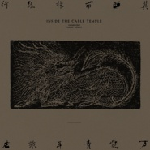

冀西南林路行
============================

|  |  |
| :--: | :-- |
| [ 冀西南林路行](https://emumo.xiami.com/album/5022281053) | **艺人**: [万能青年旅店](../index.md) **语种**: 国语 **唱片公司**: 独立发行 **发行时间**: 2020年12月22日 **专辑类别**: 录音室专辑 **专辑风格**: 摇滚 Rock & Roll **播放数**: 10066 **收藏数**: 298 **评论数**: 128  |

## 简介

发端似乎在2013年

一次出河北去西北

火车钻入太行山腹

景色突然叠加变幻

山脚的村庄还运行着古老仁慈的秩序

而对面山腰

炸药歌舞团的表演拉开大幕

神话握手现代化

启动了荒原上最悲怆的谜语

那一次眩晕令人至今难忘

之后就开始旷日持久的漫游解谜

偶尔是美妙的精神游艺

更多时候则不得不面对

内部的洪水和外部的歧路

像一个胸闷的哑巴

打不赢就大醉一场

丢人并且伤神

漫游搞复杂了，抬头已是2020

这几年间，气象风物变化急促

几人仍眼睛明亮，几人已失了魂？

感谢大家还有耐心听完这样一张唱片

轨迹和谜底都录在这44分22秒之中

各位可自助提取

西郊有密林 助君出重围

 

姬赓

2020.12.16  

录音室：郊眠寺（Cable Temple Studio）

录音师：马钰凯

混音师：时俊峰

母带处理：韩冬

专辑设计：阮千瑞

 

## 曲目

## 评论

|  |  |  |  |
| :-- | :-- | :-- | :-- |
|  [虾米用户](https://emumo.xiami.com/u/441147811) 谁用乌云换日星 2021-02-04 22:50 赞(0) 踩(0) | 
再见虾米
 |
|  [虾米用户](https://emumo.xiami.com/u/2496576) music foreve... 2021-01-18 14:35 赞(0) 踩(0) | 
新专辑虾米不会上了 
 |
|  [虾米用户](https://emumo.xiami.com/u/49438226)  2021-01-14 06:15 赞(1) 踩(0) | 
有些音乐我只想在这儿听
 |
|  [虾米用户](https://emumo.xiami.com/u/50130837) 我还没想好要写什么... 2021-01-07 20:13 赞(1) 踩(0) | 
虾米再见
 |
|  [虾米用户](https://emumo.xiami.com/u/555614) 这家伙很懒很聪明，什么都... 2021-01-07 19:33 赞(0) 踩(0) | 
我等你等到虾米都黄了
 |
|  [虾米用户](https://emumo.xiami.com/u/177276390)   2021-01-06 05:29 赞(3) 踩(0) | 
唉，阿里毁了虾米啊。看着要关服务器了，从网易云买来到虾米听，算是最后一点贡献了吧
 |
|  [虾米用户](https://emumo.xiami.com/u/195360377)  2021-01-05 20:02 赞(2) 踩(0) | 
阿里不要抛弃虾米！
 |
|  [虾米用户](https://emumo.xiami.com/u/60048)  2021-01-05 18:18 赞(2) 踩(0) | 
虾米就此消亡了么？
 |
|  [虾米用户](https://emumo.xiami.com/u/9252846) 摇滚是沉默的。 2021-01-05 14:40 赞(2) 踩(0) | 
等不到了。青春戛然而止
 |
|  [虾米用户](https://emumo.xiami.com/u/29684859) 一尘不染 2021-01-05 11:03 赞(3) 踩(0) | 
虾米！！我的青春啊啊啊啊
 |
|  [虾米用户](https://emumo.xiami.com/u/2955288) 音乐是最私密的交流 2021-01-04 21:32 赞(3) 踩(0) | 
买一下吧&amp;hellip;&amp;hellip;
 |
| ⇒ |  [虾米用户](https://emumo.xiami.com/u/29684859) 一尘不染 2021-01-05 11:03 赞(0) 踩(0) | 
没机会了
 |
|  [虾米用户](https://emumo.xiami.com/u/283495474) 我扑向你像扑向了悬崖 2021-01-02 22:05 赞(2) 踩(0) | 
出不出出不出出不出2021了
 |
|  [虾米用户](https://emumo.xiami.com/u/379287275) 秋天的道路 2021-01-02 21:23 赞(3) 踩(0) | 
听完了来虾米打分
 |
|  [虾米用户](https://emumo.xiami.com/u/306116365) ⠀⠀⠀ 2020-12-31 14:59 赞(1) 踩(0) | 
等
 |
|  [虾米用户](https://emumo.xiami.com/u/318379298) 认真听歌 2020-12-30 14:45 赞(1) 踩(0) | 
虾米加油(ง •̀_•́)ง
 |
|  [虾米用户](https://emumo.xiami.com/u/3950792) That's How I... 2020-12-30 05:43 赞(1) 踩(0) | 
虾米加油
 |
| ⇒ |  [虾米用户](https://emumo.xiami.com/u/3950792) That's How I... 2021-01-07 21:53 赞(0) 踩(0) | 
那时我还不知道虾米要下架，只是希望他能把失去的歌都拿回来
 |
|  [虾米用户](https://emumo.xiami.com/u/1203825)  2020-12-29 09:23 赞(2) 踩(0) | 
2010年开始用虾米。去年夏天穿插着用网易云，后面又卸载了网易云，23号又下载了。 
 |
| ⇒ |  [虾米用户](https://emumo.xiami.com/u/1115247) @Nebula_7293 2021-01-03 00:30 赞(0) 踩(0) | 
同 2010开始用虾米 前几年短暂体验过网易云 结果卸载了
 |
|  [虾米用户](https://emumo.xiami.com/u/93604930)   2020-12-28 17:09 赞(1) 踩(0) | 
除了伟大，还是伟大
 |
|  [虾米用户](https://emumo.xiami.com/u/55807649) 尘封的日子始终不会是一片... 2020-12-28 16:22 赞(1) 踩(0) | 
The dark side of Taihang.
 |
|  [虾米用户](https://emumo.xiami.com/u/24889026) 我还没想好要写什么... 2020-12-28 16:06 赞(1) 踩(0) | 
加油虾米！
 |
|  [虾米用户](https://emumo.xiami.com/u/24889026) 我还没想好要写什么... 2020-12-28 16:06 赞(1) 踩(0) | 
虾米加油！
 |
|  [虾米用户](https://emumo.xiami.com/u/380388211) 我的耳朵不会骗我 2020-12-28 13:07 赞(1) 踩(0) | 
爱万青爱虾米
 |
|  [虾米用户](https://emumo.xiami.com/u/435168873) 永别了虾米音乐。 2020-12-27 17:53 赞(1) 踩(0) | 
唉。
 |
|  [虾米用户](https://emumo.xiami.com/u/113908) 不远不近 2020-12-26 17:08 赞(3) 踩(0) | 
真不应该只是出钱买买买入股网抑云，虾米也不应该丢下，真正的自己人，网抑云你再怎么投资也好，看好也好，那也是“网易”云音乐，也不可能改名叫“阿里”云音乐
 |
|  [虾米用户](https://emumo.xiami.com/u/251622149)  2020-12-26 11:29 赞(8) 踩(0) | 
在虾米认识的万青，却只能在网易买下。
 |
|  [虾米用户](https://emumo.xiami.com/u/833141) 颜丑文良。 2020-12-25 23:26 赞(5) 踩(0) | 
初听时高三，如今已三高。
 |
|  [虾米用户](https://emumo.xiami.com/u/73881410) 非常响，特别近 2020-12-25 23:21 赞(4) 踩(0) | 
现在意识到阿狸有多恶心了？晚了。他们根本连音乐都不听的
 |
|  [虾米用户](https://emumo.xiami.com/u/1236131) 拜拜 虾米 2020-12-25 20:22 赞(2) 踩(0) | 
我又一次下了网易云，刚刚云上面突破30万张，不知道这几年虾米怎么了
 |
| ⇒ |  [虾米用户](https://emumo.xiami.com/u/355865) Let it go, l... 2020-12-28 21:11 赞(0) 踩(0) | 
Nobody cares about Xiami. :(
 |
| ⇒ |  [虾米用户](https://emumo.xiami.com/u/1236131) 拜拜 虾米 2020-12-28 21:21 赞(0) 踩(0) | 
<q><b>Desperado说：</b></q>
 |
|  [虾米用户](https://emumo.xiami.com/u/83436884) 这家伙 2020-12-25 18:43 赞(1) 踩(0) | 
再等等吧
 |
|  [虾米用户](https://emumo.xiami.com/u/11090256)  2020-12-25 09:09 赞(5) 踩(0) | 
虾米你能不能出这个，我真的不想下载网易云
 |
|  [虾米用户](https://emumo.xiami.com/u/344018512) 我还没想好要写什么... 2020-12-25 02:50 赞(2) 踩(0) | 
❤️山雀
 |
|  [虾米用户](https://emumo.xiami.com/u/2760237) 但永远有人在奋斗着 2020-12-25 01:45 赞(1) 踩(0) | 
加油啊虾米
 |
|  [虾米用户](https://emumo.xiami.com/u/445578267)  2020-12-25 00:27 赞(1) 踩(0) | 
这张专辑显然....所以还是想在买之前看看这里 
 |
|  [虾米用户](https://emumo.xiami.com/u/5765082) 来自第九区 2020-12-25 00:20 赞(1) 踩(0) | 
不能听，痒的不行，亏的还有度娘家盘子。
 |
|  [虾米用户](https://emumo.xiami.com/u/16678913)  2020-12-24 20:06 赞(0) 踩(0) | 
虾米都准备要下架了，买版权？算了吧！
 |
|  [虾米用户](https://emumo.xiami.com/u/261062316)  2020-12-24 19:31 赞(2) 踩(0) | 
我最爱你是，介乎万青与草东的诗意
 |
|  [虾米用户](https://emumo.xiami.com/u/103125394) 这家伙..... 2020-12-24 18:15 赞(0) 踩(0) | 
。
 |
|  [虾米用户](https://emumo.xiami.com/u/15817091) 最终之战 2020-12-24 17:01 赞(0) 踩(0) | 
等实体CD，出必买！！！
 |
|  [虾米用户](https://emumo.xiami.com/u/23161745) 无情无义，没心没肺 2020-12-24 14:02 赞(1) 踩(0) | 
估计可以听10年
 |
|  [虾米用户](https://emumo.xiami.com/u/11023089)   2020-12-24 12:29 赞(1) 踩(0) | 
第一次听万青是虾米的随机播放，想不到今天主动找曲子你不买。有点难过
 |
|  [虾米用户](https://emumo.xiami.com/u/55330007)   2020-12-24 11:38 赞(1) 踩(0) | 
这都没有？
 |
|  [虾米用户](https://emumo.xiami.com/u/606976) 南来北往，人生在世，有火... 2020-12-24 11:33 赞(0) 踩(0) | 
一直用虾米，今天过来买，居然不行。没有下载网易云音乐，这是逼我换教吗？
 |
|  [虾米用户](https://emumo.xiami.com/u/322860061) 我还没想好要写什么... 2020-12-23 21:07 赞(6) 踩(0) | 
那年，暗恋的姑娘在豆瓣上标记了她所有喜欢的专辑。李志，万青，宋冬野，马頔...2012的秋天，就在摇滚民谣夹杂的虾米里，晃晃悠悠地结束了。我其实想问问她还是不是用虾米听歌，是不是还会在发呆时一个人哼哼《秦皇岛》，是不是还会有阳光穿过教室落在她脸上，照亮她的眼睛。那个被叫做高中的时代过去了，没有啤酒，香烟，大蜜，Live House和喊不完的牛B、一切都在十年里消逝，仿佛曾经存在，仿佛从未出现。只是我还记得她的笑，和她在座位旁墙上悄悄写下那一行字&amp;ldquo;云层深处的黑暗啊/淹没心底的景观&amp;rdquo;
 |
|  [虾米用户](https://emumo.xiami.com/u/425255900)  2020-12-23 20:55 赞(3) 踩(0) | 
以前用网易云下载李志下载朴树，网易云卸载好久了不想下载回来，结果虾米没有
 |
|  [虾米用户](https://emumo.xiami.com/u/29684859) 一尘不染 2020-12-23 20:47 赞(2) 踩(0) | 
没办法还是去网易下载了！艹
 |
|  [虾米用户](https://emumo.xiami.com/u/95680) 伤风而来 败俗而去 2020-12-23 19:59 赞(28) 踩(0) | 
十二年了，一开始从豆瓣上知道虾米，用虾米听万青听痛仰听旅行团听逼哥听摇滚听民谣，十二年一晃而过，可如今连这张专辑的版权都没有，虾米已经不再是曾经的虾米了，只希望明年此时虾米还在，我还爱。
 |
| ⇒ |  [虾米用户](https://emumo.xiami.com/u/42856824)  2020-12-25 08:51 赞(0) 踩(0) | 
你们不知道虾米一月就gg了吗&amp;hellip;
 |
| ⇒ |  [虾米用户](https://emumo.xiami.com/u/95680) 伤风而来 败俗而去 2020-12-26 22:14 赞(0) 踩(0) | 
<q><b>拘谨xi说：</b></q>
 |
|  [虾米用户](https://emumo.xiami.com/u/408579756) 我还没想好要写什么... 2020-12-23 19:26 赞(4) 踩(0) | 
本来打算在这边买的 
 |
|  [虾米用户](https://emumo.xiami.com/u/193239197) so far so go... 2020-12-23 17:57 赞(5) 踩(0) | 
居然沒有版權 
 |
|  [虾米用户](https://emumo.xiami.com/u/323927996) 我还没想好要写什么... 2020-12-23 17:11 赞(22) 踩(0) | 
虾米什么时候能有？不想在网易云上买专
 |
| ⇒ |  [虾米用户](https://emumo.xiami.com/u/11095604) Monopoly 2021-01-13 21:21 赞(0) 踩(0) | 
永远都不会有了
 |
| ⇒ |  [虾米用户](https://emumo.xiami.com/u/323927996) 我还没想好要写什么... 2021-01-15 19:22 赞(0) 踩(0) | 
<q><b>Monopoly说：</b></q>
 |
|  [虾米用户](https://emumo.xiami.com/u/1286607) 这个人很聪明，什么也没有... 2020-12-23 16:27 赞(14) 踩(0) | 
我会点赞每一位踩一捧一和咒骂阿里的虾友虾米加油
 |
|  [虾米用户](https://emumo.xiami.com/u/26180037) 帽子小姐不结伴 2020-12-23 15:56 赞(2) 踩(0) | 
虾米加油
 |
|  [虾米用户](https://emumo.xiami.com/u/29684859) 一尘不染 2020-12-23 15:24 赞(3) 踩(0) | 
阿里愧对虾米
 |
|  [虾米用户](https://emumo.xiami.com/u/929370) 我还没想好要写什么... 2020-12-23 13:50 赞(3) 踩(0) | 
么办法，以前坚决不用网易云，可是真没办法
 |
|  [虾米用户](https://emumo.xiami.com/u/182195602) 既然来了就留下吧 2020-12-23 13:39 赞(0) 踩(0) | 
害
 |
|  [虾米用户](https://emumo.xiami.com/u/43982464) 哒优 2020-12-23 13:20 赞(4) 踩(0) | 
没虾米估计我也不懂什么叫摇滚
 |
|  [虾米用户](https://emumo.xiami.com/u/173387) 好事也许会发生在下个转弯 2020-12-23 13:05 赞(0) 踩(0) | 
等起
 |
|  [虾米用户](https://emumo.xiami.com/u/6454294) 1.3.8 2020-12-23 13:00 赞(1) 踩(0) | 
虾米坚持住啊啊啊啊啊啊！！！！！！！！！！！！！！！！！！！！！！
 |
|  [虾米用户](https://emumo.xiami.com/u/310501377) 纵火的青年 迫近的时间 2020-12-23 11:37 赞(0) 踩(0) | 
人间明暗
 |
|  [虾米用户](https://emumo.xiami.com/u/204923812) 最后一片清净留给自己 2020-12-23 10:39 赞(1) 踩(0) | 
刚刚买到了专辑，挺应景的，四姑奶奶翘翘了，我在一群抽烟沉默黑灰褐色的中年人中间显得格格不入，如果耳朵里没歌我断不会那么坦然，会绞尽脑汁回忆旁边的人是谁，怎样开个头说两句不咸不淡的，换来旁人几眼投过我早上刚洗的头发。情怀不能满分，就像四姑奶奶活过来也是诈尸。
 |
|  [虾米用户](https://emumo.xiami.com/u/346971542) 我还没想好要写什么... 2020-12-23 10:31 赞(0) 踩(0) | 
停电时候，暂时摆脱了……
 |
|  [虾米用户](https://emumo.xiami.com/u/287815898) 高考去了88 2020-12-23 09:48 赞(10) 踩(0) | 
看看虾米有没有，然后遗憾离开
 |
|  [虾米用户](https://emumo.xiami.com/u/4999714) 菜鸟听音乐 2020-12-23 09:18 赞(29) 踩(0) | 
虾米加油啊！！干死网易云啊
 |
|  [虾米用户](https://emumo.xiami.com/u/44097343)  你应该是一场梦， 我应... 2020-12-23 09:17 赞(0) 踩(0) | 
     
 |
|  [虾米用户](https://emumo.xiami.com/u/144245188)  2020-12-23 07:29 赞(1) 踩(0) | 
中年不万能，中年只有危机。
 |
|  [虾米用户](https://emumo.xiami.com/u/7327493)  2020-12-23 01:53 赞(3) 踩(0) | 
十年磨一剑的专辑，需要在听了十二年的虾米上播放，才行
 |
|  [虾米用户](https://emumo.xiami.com/u/6098734) 病卧羁旅中，梦萦枯野上 2020-12-23 01:35 赞(0) 踩(0) | 
虾米还能挺多久 
 |
|  [虾米用户](https://emumo.xiami.com/u/50449936) 'But I'm not... 2020-12-23 00:57 赞(2) 踩(0) | 
朋友们，在网易买了之后下载可以导入虾米听的！下载除了无损都是mp3格式
 |
| ⇒ |  [虾米用户](https://emumo.xiami.com/u/7742410)  2020-12-23 15:02 赞(0) 踩(0) | 
怎么操作啊？打算导入虾米。网易云实在用不惯
 |
| ⇒ |  [虾米用户](https://emumo.xiami.com/u/50449936) 'But I'm not... 2020-12-25 01:19 赞(0) 踩(0) | 
<q><b>momo3ma说：</b></q>
 |
|  [虾米用户](https://emumo.xiami.com/u/710029) 金属土老帽儿，也能听京戏 2020-12-23 00:43 赞(0) 踩(0) | 
谁知道哪有CD卖
 |
|  [虾米用户](https://emumo.xiami.com/u/18269116) 我还没想好要写什么 2020-12-23 00:37 赞(0) 踩(0) | 
可惜
 |
|  [虾米用户](https://emumo.xiami.com/u/95078038) 听说最后是周杰伦把中国摇... 2020-12-23 00:11 赞(2) 踩(0) | 
前后十年，对我而言，万青的词不再沉重与悲痛，变得更加成熟与晦暗，少了《石家庄》里最后的那声呐喊，多了对山石、山雀、人类、爱情等世间万物的悲悯，但一样的晦涩难懂，一样的震撼；而万青的编曲，则还是那个味道，甚至更加极致与精致，《采石》里的爆炸声和《山雀》后的器乐部分，不就是我最爱的噪音摇滚嘛。这张专辑我要听十年了。
 |
|  [虾米用户](https://emumo.xiami.com/u/131367646)  2020-12-22 23:51 赞(42) 踩(0) | 
听了这么多年虾米，最后还是要去网易云听&amp;hellip;哎&amp;hellip;阿里真有本事
 |
|  [虾米用户](https://emumo.xiami.com/u/355171621)  2020-12-22 23:49 赞(54) 踩(0) | 
我觉得这张专辑应该出现在虾米！
 |
|  [虾米用户](https://emumo.xiami.com/u/6652063) Carpe diem! 2020-12-22 23:13 赞(3) 踩(0) | 
阿里还我虾米！
 |
|  [虾米用户](https://emumo.xiami.com/u/301573363) QQ：248874879... 2020-12-22 23:11 赞(0) 踩(0) | 
网易云买完下载完回虾米听
 |
|  [虾米用户](https://emumo.xiami.com/u/14637601)  2020-12-22 22:53 赞(4) 踩(0) | 
马猴子只喜欢空手套白狼，还要花钱买版权？算了吧！！虾米应该是最懂音乐的音乐网站，如今却弄成了这个样子！！
 |
|  [虾米用户](https://emumo.xiami.com/u/5496438) 凡尘俗事，改变了你我！ 2020-12-22 22:25 赞(3) 踩(0) | 
我还是买张CD回来吧，哎！
 |
|  [虾米用户](https://emumo.xiami.com/u/109019164) GOODBYE 2020-12-22 22:08 赞(2) 踩(0) | 
等吧，值得。
 |
|  [虾米用户](https://emumo.xiami.com/u/6053083) 很不高兴为您服务 2020-12-22 22:01 赞(0) 踩(0) | 
嗯再见
 |
|  [虾米用户](https://emumo.xiami.com/u/180783266) 我还没想好要写什么... 2020-12-22 21:46 赞(3) 踩(0) | 
就是要等虾米的才买！
 |
|  [虾米用户](https://emumo.xiami.com/u/1454034) 南无阿弥陀佛 2020-12-22 21:15 赞(0) 踩(0) | 
X...
 |
|  [虾米用户](https://emumo.xiami.com/u/49334418) ～ 2020-12-22 21:02 赞(0) 踩(0) | 
～
 |
|  [虾米用户](https://emumo.xiami.com/u/21708821)  2020-12-22 20:45 赞(2) 踩(0) | 
被逼的才下载网易云
 |
|  [虾米用户](https://emumo.xiami.com/u/32558701) 再见虾米 2020-12-22 20:43 赞(1) 踩(0) | 
有的人与猛虎谈情，未曾发觉夏日来临。雷声隐隐，狂风骤雨，炫丽缤纷的群花一夜凋谢，只余满地落蕊。
 |
|  [虾米用户](https://emumo.xiami.com/u/335153219) 我爱你一直到月亮那里 2020-12-22 20:25 赞(1) 踩(0) | 
虾米争点气啊
 |
|  [虾米用户](https://emumo.xiami.com/u/2345257) 我还没想好要写什么... 2020-12-22 19:55 赞(3) 踩(0) | 
虾米你咋这么不争气啊
 |
|  [虾米用户](https://emumo.xiami.com/u/134196620) 犹似故人归 2020-12-22 19:03 赞(0) 踩(0) | 
摇滚我最土 听完整张最喜欢和上一张风格差不多的《泥河》，先8分，继续听听看 （个人感觉，别嘴我，嘴我也是我对）
 |
| ⇒ |  [虾米用户](https://emumo.xiami.com/u/134196620) 犹似故人归 2020-12-22 19:04 赞(0) 踩(0) | 
收回，10101010越听越喜欢 
 |
|  [虾米用户](https://emumo.xiami.com/u/60048)  2020-12-22 18:57 赞(40) 踩(0) | 
为什么不努力经营虾米，开始有着那么多的好资源和用户
 |
|  [虾米用户](https://emumo.xiami.com/u/6061758) 你的微笑，慌乱了我的青春... 2020-12-22 18:40 赞(2) 踩(0) | 
虾米啊虾米
 |
|  [虾米用户](https://emumo.xiami.com/u/328496) 听歌 2020-12-22 18:38 赞(2) 踩(0) | 
对呀，虾米怎么没有呢！
 |
|  [虾米用户](https://emumo.xiami.com/u/43875708)  遣词造句 穿山过水 他... 2020-12-22 18:02 赞(101) 踩(0) | 
我实在是不喜欢网易云 却不得不用
 |
|  [虾米用户](https://emumo.xiami.com/u/1929787) 让一部分非洲大人富起来，... 2020-12-22 16:37 赞(0) 踩(0) | 
真她妈完蛋，
 |
|  [虾米用户](https://emumo.xiami.com/u/69524702)  2020-12-22 15:58 赞(43) 踩(0) | 
阿里巴巴差这一点钱吗 为啥不买！！！
 |
|  [虾米用户](https://emumo.xiami.com/u/4222206)  2020-12-22 15:24 赞(0) 踩(0) | 
不差钱&amp;hellip;发吧&amp;hellip;&amp;hellip;
 |
|  [虾米用户](https://emumo.xiami.com/u/336911136) 落了片白茫茫大地真干净 2020-12-22 15:15 赞(0) 踩(0) | 
一切不去花钱的卖弄情怀，最终都是耍流氓。
 |
|  [虾米用户](https://emumo.xiami.com/u/280791) @愚細胞 2020-12-22 15:05 赞(2) 踩(0) | 
什么时候能买
 |
|  [虾米用户](https://emumo.xiami.com/u/14437329) 让一让，母牛们,生命短暂... 2020-12-22 14:58 赞(189) 踩(0) | 
虽然已经在网易云买了，还是习惯性来看看虾米出了没有。唉，这就是为什么放弃虾米的原因啊，阿里愧对虾米！
 |
| ⇒ |  [虾米用户](https://emumo.xiami.com/u/284756059) v❤️624262574 2021-01-02 09:08 赞(0) 踩(0) | 
我在网易云买了在虾米听，我是不是铁粉？
 |
| ⇒ |  [虾米用户](https://emumo.xiami.com/u/7061466) 好歌都在我的收藏，慢慢听... 2021-01-08 23:13 赞(0) 踩(0) | 
选的几个ceo都是辣鸡
 |
|  [虾米用户](https://emumo.xiami.com/u/49889895) 人吃土一生，土吃人一回 2020-12-22 14:53 赞(3) 踩(0) | 
大概率白嫖 几个月后
 |
|  [虾米用户](https://emumo.xiami.com/u/42725114) ThistheshitI... 2020-12-22 14:21 赞(2) 踩(0) | 

 |
|  [虾米用户](https://emumo.xiami.com/u/30591435) 著名神经病 2020-12-22 14:19 赞(2) 踩(0) | 
虾米加油啊
 |
|  [虾米用户](https://emumo.xiami.com/u/3506625) 偏爱类型：Rock N'... 2020-12-22 14:17 赞(0) 踩(0) | 
天啊！地啊！活久见！真的是激动到不行！真要提前过年啦！
 |
|  [虾米用户](https://emumo.xiami.com/u/43644980) 摇滚是解决孤单的良药 2020-12-22 14:09 赞(0) 踩(0) | 
估计听不了
 |
|  [虾米用户](https://emumo.xiami.com/u/3619853)   2020-12-22 14:08 赞(0) 踩(0) | 
有可能吗
 |
|  [虾米用户](https://emumo.xiami.com/u/4400366) 再也不见 2020-12-22 13:46 赞(0) 踩(0) | 
囍
 |
|  [虾米用户](https://emumo.xiami.com/u/218182560) The-soul-of-... 2020-12-22 13:41 赞(0) 踩(0) | 
快上，
 |
|  [虾米用户](https://emumo.xiami.com/u/2747990) 我还没想好要写什么... 2020-12-22 13:31 赞(3) 踩(0) | 
要是在虾米上该多好！
 |
|  [虾米用户](https://emumo.xiami.com/u/12686938) 活捉一只伪文青 2020-12-22 12:54 赞(0) 踩(0) | 
十年磨一剑期待新专！
 |
|  [虾米用户](https://emumo.xiami.com/u/38753085) 在学bass；啥都听听；... 2020-12-22 12:51 赞(2) 踩(0) | 
太拉跨了
 |
|  [虾米用户](https://emumo.xiami.com/u/12882203) 真的就只有这些歌吗 2020-12-22 12:30 赞(0) 踩(0) | 
上
 |
|  [虾米用户](https://emumo.xiami.com/u/3683833) 一宅_Ez. 2020-12-22 12:29 赞(3) 踩(0) | 
快上！take my money!!!
 |
|  [虾米用户](https://emumo.xiami.com/u/7596887) 这世界好宽 2020-12-22 12:28 赞(2) 踩(0) | 
虾米有没有机会呀
 |
|  [虾米用户](https://emumo.xiami.com/u/8957703) 我还没想好要写什么... 2020-12-22 12:27 赞(2) 踩(0) | 
虾米搞快点！
 |
|  [虾米用户](https://emumo.xiami.com/u/1561047) 我还没想好要写什么... 2020-12-22 12:24 赞(1) 踩(0) | 
虾米会出吗
 |
|  [虾米用户](https://emumo.xiami.com/u/41144425)   2020-12-22 11:53 赞(1) 踩(0) | 
真的是青春大爷们又出歌了！
 |
|  [虾米用户](https://emumo.xiami.com/u/41144425)   2020-12-22 11:52 赞(2) 踩(0) | 
等！
 |
