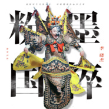

粉墨国粹
============================

|  |  |
| :--: | :-- |
| [ 粉墨国粹](https://emumo.xiami.com/album/2105327333) | **艺人**: [李晓杰](../index.md) **语种**: 国语 **唱片公司**: 鲸鱼向海 **发行时间**: 2019年10月01日 **专辑类别**: EP, 单曲 **专辑风格**:  **播放数**: 1743 **收藏数**: 2 **评论数**: 0  |

## 简介

李晓杰全新单曲《粉墨国粹》重磅登场，庆祝祖国70周年盛世华诞。  
  
新歌《粉墨国粹》将流行音乐、戏曲、历史典故等诸多不同艺术领域的元素结合到了极致，运用了一种“取其意而弃其形”的方式，就像山水写意画般，用纵横的笔势去体现传统文化中一切值得传承的事物。  
  
《粉墨国粹》集结了华语乐坛顶尖音乐制作团队，力求打造以国粹为概念的音乐艺术作品。音乐制作人张博文特地邀请了他的朋友新加坡编曲人Terence Teo为该歌曲编曲，相信这一次两位乐坛前辈的强强联手，一定会迸发出崭新的力量。  
  
“岳飞报国，桂英挂帅，霸王别姬”，李晓杰充满故事感的声线穿插戏腔，让整首作品气势磅礴中又不失婉转秀丽，为我们揭开一段段传奇故事的序幕。当音乐打破壁垒，将历史回溯而来，铭记的不仅是过往，同时也在感召世人。  
  
《粉墨国粹》将中华民族的传统文化瑰宝与当代流行音乐相结合，希望让更多的人感受到中华文化的魅力，找到心灵深处的民族归宿。任何艺术形式都是相通的，李晓杰以及他的制作团队希望给流行音乐注入全新的概念和活力，只有融会贯通，才能赋予音乐作品永恒的生命力。 

## 曲目

- [粉墨国粹](./2105327333/mT5GVE7565a.md)
- [粉墨国粹 (伴奏)](./2105327333/8JbE8Pe4daa.md)

## 评论

