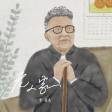
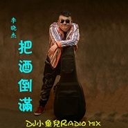

李晓杰
============================

|  |  |
| :--: | :-- |
| [ 李晓杰](https://i.xiami.com/lixiaojie) | **地区**: China 中国大陆 **风格**: 流行 Pop **播放数**: 59768302 **粉丝数**: 3212 **评论数**: 148  |

## 档案

小档案 
中   文   名   李晓杰 
外   文   名   Li Xiao Jie 
国        籍   中华人民共和国 
星        座   摩羯 
血        型   A 
身        高   173cm 
体        重   80kg 
出   生   地   辽宁沈阳 
出生日期    1  月  4  日 
职        业   歌手 
毕业院校   沈阳京剧院 
经纪公司  李晓杰(辽宁)文化传媒有限公司 
代表作品   《好姑娘》、《朋友的酒》、《把酒倒满》、《两只小蜜蜂》等 
最喜欢的运动   网球、游泳 
最尊敬的人   毛泽东 
最喜欢的颜色   天空的颜色 
最喜欢的季节   冬天 
最喜欢做的事   和家人团聚 
艺人资料 
李晓杰， 出生于辽宁沈阳，歌手。 
早年经历 
《两只小蜜蜂》专辑上市以来，歌手受到央视导演的喜爱和关注，常被邀请参加央视各种大型晚会，担任演唱嘉宾，同时在全国各省市地方电视台参加多场歌友会演唱会。 
期间，李晓杰接受贵州  ,  河南，河北，福建，黑龙江，吉林，辽宁，陕西，湖南，安徽，湖北，内蒙古，宁夏，青海，甘肃，广西，江西，云南，四川，海南，浙江等省级的广播电台媒体采访。 
专辑问世以来，李晓杰分别在深圳，杭州，举行了歌迷见面会，受到这两个地区歌迷的深切拥戴，甚至有歌迷千里迢迢从别的省会赶来参加，杰哥非常感动，他表示只要行程不满，一定到全国举行歌迷见面会，满足歌迷的愿望。 
2007  年，李晓杰经纪约签于香港稻草综合制作有限公司。 
演艺经历 
2006  年   1  月  19  日，李晓杰参加北仑网络歌手群星演唱会。  3  月   3  日，李晓杰被赴广东江门《歌手大赛》邀请做评委嘉宾。  4  月   1  日，李晓杰录制中央电视台《星光大道》。  5  月   1  日，李晓杰录制《星光大道——惠州之行》。  7  月  21  日，李晓杰参加锦州湾大型文艺晚会。   7  月  22  日，李晓杰参加‘大连之夏’演唱会。  7  月  29  日，李晓杰参加《艺术人生》新民歌会，担任表演嘉宾。  8  月  17  日，李晓杰参加浙江台州中国十大原创歌曲总评榜颁奖典礼，歌曲《好姑娘》获得十大金曲。   9  月   4  日，李晓杰参加“中国十大杰出青年  ------  赢在中国”。   9  月  19  日，李晓杰在哈尔滨举办新闻发布会。   9  月  21  日，李晓杰参加凤凰卫视“声响亚洲”文化节，担任演唱嘉宾。  9  月  23  日，李晓杰参加贵州六盘水央视大型文艺晚会。   9  月  28  日，李晓杰参加厦门星光大道，担任评委嘉宾。  10  月  12  日，李晓杰参加安徽铜陵大型央视晚会。  10  月  14  日，李晓杰四川师范大学  TOM  专场个唱。  10  月  19  日，李晓杰参加昆明唱响中国。  10  月  27  日，李晓杰录制儿童节目《赢在未来》。  10  月  29  日，李晓杰参加山东唱响中国。  10  月  31  日，李晓杰录制吉林《音乐  100"  》歌友会。  11  月   5  日，李晓杰参加山西《山花工程》。  11  月   8  日，李晓杰郑州  FM88.1  电台歌友见面会。  12  月  12  日，李晓杰录影广西《唱山歌》元旦晚会。  12  月  25  日，李晓杰录制《乡村大世界》开渔节。 
2007  年   1  月  12  日，李晓杰参加深圳原创音乐颁奖典礼。  1  月  23  日，李晓杰录制河南电视栏目《情感密码》《乐河之声》《快乐星期天—老爸老妈总动员》。  1  月  24  日，李晓杰召开专辑新闻发布会，并录制河南电视栏目《乐海冲浪》、《星登陆》歌友会。   1  月  26  日，李晓杰录制中国教育《春节晚会》。   1  月  31  日，李晓杰录制河南《新年歌会》。   2  月   1  日，李晓杰录制河南《房地产颁奖晚会》。  2  月  14  日，李晓杰录制《乡村大世界》。  3  月   5  日，李晓杰参加山西平定元宵晚会。  5  月   4  日，李晓杰参加楼盘开幕典礼。  6  月  29  日，李晓杰参加泰州欢乐中国行。   7  月  13  日，李晓杰担任河南电视台  7%  音乐男女半决赛评委。   7  月  21  日，李晓杰担任河南电视台  7%  音乐男女决赛评委。  7  月  23  日，李晓杰参加国际旅游小姐大赛演出嘉宾。   8  月   6  日，李晓杰参加呼和浩特第七届青少年文化艺术节开幕式晚会。  8  月   8  日，李晓杰参加景德镇市交通音乐广播建台五周年晚会。  8  月  15  日，李晓杰参加献歌浙江报喜鸟服饰股份有限公司  A  股  IPO  上市答谢酒会。  9  月  27  日，李晓杰联袂参加山东曲阜《中华情》大型文艺晚会   。   9  月  22  日，李晓杰湖南芷江“超级歌会   放歌芷江”。  11  月   3  日，李晓杰情系江西新余“首届世界旅游大使爱心公益晚会”。  10  月  17  日，李晓杰山东师范大学  2007  大学生音乐节最受欢迎歌手演唱会。  10  月  26  日，李晓杰“相聚安吉”  2007  中国（安吉）竹文化节文艺晚会。  11  月  23  日，李晓杰参加《山花工程》大别山助学捐助晚会。  11  月  26  日，李晓杰参加《同乐五洲   相聚玉山》首届三清山旅游文化节明星演唱会。  12  月   8  日，李晓杰参加江苏泗阳县演出。 
2008  年  1  月  30  日，李晓杰参加“阳泉电视台春节晚会”。  4  月  8  日，李晓杰参加深圳《放歌奥运—勇夺奥运第一金》大型演唱会。 
2010  年发行专辑《老大》。 
2011  年发行  EP  《快乐嘭恰恰》。 
2012  年发行  EP  《又唱艳阳天》和《沂蒙山小调》。 
2015  年发行专辑《有情有义》。 
2016  年  6  月发行  EP  《美人酒》，  7  月发行  EP  《把酒倒满》和《朋友去远方》。

## 专辑

| 名称 | 语种 | 唱片公司 | 发行时间 | 专辑类别 | 专辑风格 |
| :--: | :-- | :-- | :-- | :-- | :-- |
| [ 相信生命](./albums/2105442681.md) | 国语 | 鲸鱼向海 | 2019年11月14日 |  |  |
| [ 老人家](./albums/2105327334.md) | 国语 | 鲸鱼向海 | 2019年10月07日 | EP, 单曲 |  |
| [ 粉墨国粹](./albums/2105327333.md) | 国语 | 鲸鱼向海 | 2019年10月01日 | EP, 单曲 |  |
| [ 成功谣](./albums/2105327332.md) | 国语 | 鲸鱼向海 | 2019年09月28日 | EP, 单曲 |  |
| [ 喝酒醉了](./albums/2105241011.md) | 国语 | 咚吧嗒文化 | 2019年09月12日 | EP, 单曲 |  |
| [ 北漂](./albums/2105161842.md) | 国语 | 百纳娱乐 | 2019年08月18日 | EP, 单曲 |  |
| [ 爷们儿的爱](./albums/2105000256.md) | 国语 | 百纳娱乐 | 2019年07月18日 | EP, 单曲 |  |
| [ 不同的人](./albums/2105001792.md) | 国语 | 鲸鱼向海 | 2019年06月30日 | EP, 单曲 |  |
| [ 此生无怨无悔](./albums/2104870349.md) | 国语 | 鲸鱼向海 | 2019年05月20日 | EP, 单曲 | 国语流行 Mandarin Pop |
| [ 我滴个乖乖](./albums/2104881315.md) | 国语 | 鲸鱼向海 | 2019年04月30日 | EP, 单曲 |  |
| [ 老大+好姑娘+两只小蜜蜂-李晓杰李晓杰重新演绎经典老歌联唱](./albums/2103868921.md) | 国语 | 独立发行 | 2018年07月29日 | 录音室专辑 | 流行 Pop |
| [ 同道人](./albums/2103679565.md) | 国语 | 壹零零文化 | 2018年04月13日 | EP, 单曲 |  |
| [ 别再让](./albums/2103648991.md) | 国语 | 壹零零文化 | 2018年03月29日 | EP, 单曲 | 国语流行 Mandarin Pop |
| [ 早点回家](./albums/2103472209.md) | 国语 | 壹零零文化 | 2018年01月08日 | EP, 单曲 |  |
| [ 李晓杰-杰伴同行](./albums/2103850185.md) | 国语 | 独立发行 | 2017年12月01日 | 精选集 | 流行 Pop |
| [ 把酒倒满](./albums/2102931590.md) | 国语 | 壹零零文化 | 2017年11月15日 | 录音室专辑 | 国语流行 Mandarin Pop |
| [ 狼奔狼跑](./albums/2102821728.md) | 国语 | 壹零零文化 | 2017年08月29日 | EP, 单曲 |  |
| [ 美人酒](./albums/2102402634.md) | 国语 | 博轩音乐 | 2016年09月23日 | EP, 单曲 |  |
| [ 朋友去远方](./albums/2100370093.md) | 国语 | 博轩音乐 | 2016年07月20日 | EP, 单曲 |  |
| [ 把酒倒满](./albums/2100362968.md) | 国语 | 欧乐文化 | 2016年07月05日 | EP, 单曲 | 国语流行 Mandarin Pop |
| [ 美人酒](./albums/2100350571.md) | 国语 | 壹零零文化 | 2016年06月03日 | EP, 单曲 |  |
| [ 把酒倒满](./albums/2100215200.md) | 国语 | 壹零零文化 | 2015年12月20日 | EP, 单曲 | 国语流行 Mandarin Pop |
| [ 有情有义](./albums/2100174762.md) | 国语 | 百纳娱乐 | 2015年08月03日 | 录音室专辑 |  |
| [ 沂蒙山小调](./albums/673264494.md) | 国语 | 龙乐唱片 | 2012年01月01日 | EP, 单曲 |  |
| [ 又唱艳阳天](./albums/1773264415.md) | 国语 | 龙乐唱片 | 2012年01月01日 | EP, 单曲 |  |
| [ 快乐嘭恰恰](./albums/436477.md) | 国语 | 东方二十一 | 2011年04月11日 | EP, 单曲 |  |
| [ 老大](./albums/369548.md) | 国语 | 稻草公司 | 2010年02月13日 | 录音室专辑 |  |
| [ 两只小蜜蜂](./albums/2507.md) | 国语 | 龙乐唱片 | 2005年12月01日 | 录音室专辑 | 国语流行 Mandarin Pop |

## 评论

|  |  |  |
| :-- | :-- | :-- |
|  [虾米用户](https://emumo.xiami.com/u/1090755)   2020-11-18 23:48 赞(1) 踩(0) | 
邓丽君 ，段品章，李慧敏，李晓杰，逍遥自在； 原曲：くちなしの花 渡哲也
 |
|  [虾米用户](https://emumo.xiami.com/u/429293644)  2020-05-21 05:07 赞(0) 踩(0) | 
俗不可耐
 |
| ⇒ |  [虾米用户](https://emumo.xiami.com/u/443650578) 我还没想好要写什么... 2020-07-18 00:53 赞(0) 踩(0) | 
请尊重每位艺人。应该说更接地气不是更好吗？
 |
|  [虾米用户](https://emumo.xiami.com/u/440531210)  2020-02-18 23:44 赞(0) 踩(0) | 
男人的歌，喜欢！带劲！！
 |
|  [虾米用户](https://emumo.xiami.com/u/401671060)  2019-11-03 17:29 赞(0) 踩(0) | 
喜欢你
 |
|  [虾米用户](https://emumo.xiami.com/u/43923282) 音乐狂人 2019-05-13 16:16 赞(0) 踩(0) | 
喜欢他唱的民歌沂蒙山小调
 |
|  [虾米用户](https://emumo.xiami.com/u/342796674)  2019-05-09 17:23 赞(0) 踩(0) | 
好听，带感 
 |
|  [虾米用户](https://emumo.xiami.com/u/40426728)  2019-05-08 14:56 赞(0) 踩(0) | 
涌出每当听到这首歌满满的回忆怀念那时候的时光
 |
|  [虾米用户](https://emumo.xiami.com/u/328673922)  2019-04-08 04:41 赞(2) 踩(0) | 
大哥，早上好，现在是澳大利亚时间6:34，我们工地早会时间，十年前我在沈阳三达演艺做舞台音响，因为对舞台，对音乐的热爱，一直关注家乡的变化，特别是像你这样优秀的艺人的出现，让我倍感亲切，人生路上遇到知己不易！加油大哥！保重身体！
 |
|  [虾米用户](https://emumo.xiami.com/u/420838665)  2019-03-29 20:49 赞(0) 踩(0) | 
还记得初一时课间全班合唱这首歌被老班骂了 
 |
|  [虾米用户](https://emumo.xiami.com/u/421794172) 低调做人，高调做事 2019-03-24 18:41 赞(0) 踩(0) | 
音乐，好听，  
 |
|  [虾米用户](https://emumo.xiami.com/u/325374787)  2019-03-22 21:39 赞(0) 踩(0) | 
好
 |
|  [虾米用户](https://emumo.xiami.com/u/377017435) 我还没想好要写什么... 2019-01-31 12:55 赞(0) 踩(0) | 
李晓杰，我喜欢听你唱的，朋友的酒，找不到下载啊
 |
|  [虾米用户](https://emumo.xiami.com/u/370309184)  2019-01-06 12:00 赞(0) 踩(0) | 
喜欢您的歌
 |
|  [虾米用户](https://emumo.xiami.com/u/409388928)  2018-12-18 10:48 赞(0) 踩(0) | 
杰歌棒棒的
 |
|  [虾米用户](https://emumo.xiami.com/u/247242427) 声声不息 2018-10-19 19:48 赞(2) 踩(0) | 
KTV热曲
 |
|  [虾米用户](https://emumo.xiami.com/u/403877460)  2018-09-16 21:28 赞(0) 踩(0) | 
好听
 |
|  [虾米用户](https://emumo.xiami.com/u/293692544) 你敢给我说话吗？我咬你 2018-07-30 05:24 赞(1) 踩(0) | 
好
 |
|  [虾米用户](https://emumo.xiami.com/u/277133872)  2018-07-13 22:31 赞(1) 踩(0) | 
加油
 |
|  [虾米用户](https://emumo.xiami.com/u/336516835) 来是偶然，走是必然。你我... 2018-07-11 15:08 赞(3) 踩(0) | 
......Look back on your life, making us the pain, not failure, but no experience everything I want to experience.~回首人生，最使得我们痛的，不是失败，而是没有经历我所想要经历的一切。来是偶然，走是必然～出生✪死亡。你我都在路上&amp;hellip;&amp;hellip;欢乐只是记忆，痛苦也只是记忆，一切都只是记忆，让我们慢慢地回忆&amp;hellip;&amp;hellip;愿那些灵魂的深处依然&amp;hellip;&amp;hellip;
 |
|  [虾米用户](https://emumo.xiami.com/u/247080759) 关注  公众号 【第六号... 2018-06-02 19:35 赞(2) 踩(0) | 
滴~
 |
|  [虾米用户](https://emumo.xiami.com/u/354766640) 上半生错过，下半生浪荡，... 2018-05-21 22:22 赞(2) 踩(0) | 
你唱的歌很好听加油支持你
 |
|  [虾米用户](https://emumo.xiami.com/u/368881134)  2018-05-19 19:04 赞(2) 踩(0) | 
两字&amp;ldquo;好听&amp;rdquo;
 |
|  [虾米用户](https://emumo.xiami.com/u/331301500) 不是帅哥才永远最帅，你拥... 2018-04-21 19:03 赞(1) 踩(0) | 
一个字，帅 
 |
|  [虾米用户](https://emumo.xiami.com/u/354768047)  2018-03-20 13:14 赞(1) 踩(0) | 
很喜欢李晓杰唱的歌 
 |
|  [虾米用户](https://emumo.xiami.com/u/316926525)  2018-03-11 20:55 赞(1) 踩(0) | 
希望多出新歌
 |
|  [虾米用户](https://emumo.xiami.com/u/340156893) 哈哈哈O(∩_∩)O哈哈... 2018-02-25 09:18 赞(1) 踩(0) | 
哈哈，好听
 |
|  [虾米用户](https://emumo.xiami.com/u/313795319)   2018-02-20 20:51 赞(3) 踩(0) | 
一首朋友的酒，唱的是如此深入心，也勾起我对旧友的回忆与思念
 |
|  [虾米用户](https://emumo.xiami.com/u/336654611) 一醉方休 2018-02-10 18:23 赞(3) 踩(0) | 
好姑娘,这是经典歌曲!谢谢你兄弟！祝你愉快
 |
|  [虾米用户](https://emumo.xiami.com/u/76935370)  2018-01-04 22:26 赞(1) 踩(0) | 
如果你有一双翅膀，你还在等什么
 |
|  [虾米用户](https://emumo.xiami.com/u/341575778)  2017-12-30 08:07 赞(4) 踩(0) | 
你的歌真好听
 |
| ⇒ |  [虾米用户](https://emumo.xiami.com/u/340156893) 哈哈哈O(∩_∩)O哈哈... 2018-02-25 09:19 赞(0) 踩(0) | 
好
 |
|  [虾米用户](https://emumo.xiami.com/u/341251650)  2017-12-24 13:37 赞(4) 踩(0) | 
够味
 |
|  [虾米用户](https://emumo.xiami.com/u/335713086)  2017-12-11 08:23 赞(3) 踩(0) | 
我很喜欢你的歌，特别是朋友的酒。希望你能出越来越多的专辑 
 |
|  [虾米用户](https://emumo.xiami.com/u/213809550)  2017-12-04 20:31 赞(2) 踩(0) | 
赞
 |
|  [虾米用户](https://emumo.xiami.com/u/322413211)  2017-11-27 21:47 赞(4) 踩(0) | 
老李才这么点粉  相信听歌的人得乘个100万
 |
|  [虾米用户](https://emumo.xiami.com/u/335907634)  2017-11-17 21:30 赞(2) 踩(0) | 
喜欢听这味道
 |
|  [虾米用户](https://emumo.xiami.com/u/334313739)  2017-11-15 19:47 赞(2) 踩(0) | 
杰哥的歌听过后就放不下了，真心好听
 |
|  [虾米用户](https://emumo.xiami.com/u/293692544) 你敢给我说话吗？我咬你 2017-11-15 16:04 赞(2) 踩(0) | 
好听
 |
|  [虾米用户](https://emumo.xiami.com/u/334547075) 低调才是彩色，稳重才是特... 2017-11-15 15:01 赞(2) 踩(0) | 
接地气好听
 |
|  [虾米用户](https://emumo.xiami.com/u/281891568) 虾米乐迷 2017-11-13 09:46 赞(3) 踩(0) | 
晓杰是大叔级歌迷对音乐的释放 
 |
|  [虾米用户](https://emumo.xiami.com/u/293692544) 你敢给我说话吗？我咬你 2017-11-09 16:43 赞(2) 踩(0) | 
好听
 |
|  [虾米用户](https://emumo.xiami.com/u/326775601)  2017-11-02 15:14 赞(3) 踩(0) | 
实诚
 |
|  [虾米用户](https://emumo.xiami.com/u/185396000)  2017-10-24 16:49 赞(3) 踩(0) | 
东北出人才
 |
|  [虾米用户](https://emumo.xiami.com/u/289655257)   2017-10-21 23:52 赞(12) 踩(0) | 
我最喜欢的歌手，没有之一！在此祝李晓杰先生身体健康，青春永驻 
 |
|  [虾米用户](https://emumo.xiami.com/u/2653030) 好音乐共享群 2017-10-20 14:43 赞(4) 踩(0) | 
好音乐聆听经典【华语百强歌手之李晓杰】
 |
|  [虾米用户](https://emumo.xiami.com/u/303182916)  2017-10-11 16:41 赞(1) 踩(0) | 
不知道怎
 |
|  [虾米用户](https://emumo.xiami.com/u/318637567)  2017-09-23 21:32 赞(1) 踩(0) | 
在哪里能关注呢
 |
|  [虾米用户](https://emumo.xiami.com/u/325944293)  2017-09-23 03:27 赞(2) 踩(0) | 
好听
 |
|  [虾米用户](https://emumo.xiami.com/u/318444540)  2017-09-17 12:48 赞(2) 踩(0) | 
杰哥加油，我永远支持你
 |
|  [虾米用户](https://emumo.xiami.com/u/260188159)  2017-09-15 21:35 赞(1) 踩(0) | 
顶
 |
|  [虾米用户](https://emumo.xiami.com/u/323699943)  2017-09-11 23:37 赞(2) 踩(0) | 
很喜欢   
 |
|  [虾米用户](https://emumo.xiami.com/u/324400555)  2017-09-10 20:31 赞(2) 踩(0) | 
好
 |
|  [虾米用户](https://emumo.xiami.com/u/323400128)  2017-09-06 13:39 赞(4) 踩(0) | 
从你的歌声里以及歌词内容上，就可以看出你出一个有过经历，有过奋斗，有过拼搏，一个有故事的汉子。第一次听到你的歌声是在央视音乐频道上看到你唱北风吹，感觉唱的特别，也特有味，就等重播时，用DⅤ在电视背后输出插孔上反录了下来，那时还没电脑，就经常反复在电视上播放，觉的特过瘾，后来就下载了《好姑娘》《朋友的酒》等脍炙人口的歌曲，你的歌唱风格正如仔的噪音一样，给乐台带来了别样的美。今天在虾米音乐里看到你，更能随心所欲的听你的歌，很是开心，祝福你，祝你再出佳作，杰作。      
 |
|  [虾米用户](https://emumo.xiami.com/u/322404281)  2017-08-30 14:31 赞(3) 踩(0) | 
不错
 |
|  [虾米用户](https://emumo.xiami.com/u/255960378)  2017-08-19 21:32 赞(3) 踩(0) | 
加油哦，我的哥，多来点经典
 |
|  [虾米用户](https://emumo.xiami.com/u/319033543)  2017-08-18 08:55 赞(4) 踩(0) | 
超喜欢 
 |
|  [虾米用户](https://emumo.xiami.com/u/293965520)  2017-08-02 21:23 赞(1) 踩(0) | 

 |
|  [虾米用户](https://emumo.xiami.com/u/296002764) 刺骨的寒风，逼着我前进。 2017-08-01 12:56 赞(3) 踩(0) | 
你的喉咙是二锅头通道。你的歌冲份的把它的质朴无华展示。听每一次，我都醉一次。  
 |
|  [虾米用户](https://emumo.xiami.com/u/304598329)  2017-07-26 15:56 赞(2) 踩(0) | 
今天第一次唱你的歌 
 |
|  [虾米用户](https://emumo.xiami.com/u/33217876)  2017-07-19 22:07 赞(1) 踩(0) | 
好
 |
|  [虾米用户](https://emumo.xiami.com/u/202167798) 既然不能在一起，命运为什... 2017-07-11 01:51 赞(9) 踩(0) | 
今天才发现您的歌都离不开酒 
 |
|  [虾米用户](https://emumo.xiami.com/u/311061830)  2017-07-10 03:34 赞(3) 踩(0) | 
听过摇滚，抒情，民谣，甚至装逼般也去研究过所谓的高雅音乐。但你的歌声，让人感到真实。喜欢这种歌声！
 |
|  [虾米用户](https://emumo.xiami.com/u/307169527)  2017-07-08 11:12 赞(4) 踩(0) | 
男人的歌
 |
|  [虾米用户](https://emumo.xiami.com/u/147203002) 远芳的你，在哪里 2017-07-06 22:11 赞(1) 踩(0) | 
热血
 |
|  [虾米用户](https://emumo.xiami.com/u/304301384)  2017-06-13 23:17 赞(1) 踩(0) | 
爷们
 |
|  [虾米用户](https://emumo.xiami.com/u/302313620)  2017-06-06 14:51 赞(115) 踩(0) | 
我刚入驻了虾米音乐人，欢迎大家来我的个人主页，收听我的最新音乐
 |
| ⇒ |  [虾米用户](https://emumo.xiami.com/u/18282119) 我就是我，独一无二 2017-06-17 11:52 赞(0) 踩(0) | 
欢迎加入虾米音乐人，老乡。
 |
| ⇒ |  [虾米用户](https://emumo.xiami.com/u/244748965)  2017-09-11 09:19 赞(0) 踩(0) | 
第一次碰到艺人写评论
 |
| ⇒ |  [虾米用户](https://emumo.xiami.com/u/334313739)  2017-11-15 19:48 赞(0) 踩(0) | 
杰哥实在人啊！
 |
| ⇒ |  [虾米用户](https://emumo.xiami.com/u/324767242)  2017-12-20 16:25 赞(0) 踩(0) | 
就喜欢这节奏，ktv必点!!!
 |
| ⇒ |  [虾米用户](https://emumo.xiami.com/u/43923282) 音乐狂人 2018-01-02 14:42 赞(0) 踩(0) | 
竟然是新入驻的。
 |
| ⇒ |  [虾米用户](https://emumo.xiami.com/u/323531695)  2018-12-29 23:58 赞(0) 踩(0) | 
我有幸和你一面，还记得那天你感冒了，过来时还未吃饭，只能为你临时搞了碗面条，你一点也无歌星架子。为一个兄弟的约来帮我们公司沈阳代理会议捧场，当时《朋友的酒》这首歌刚出来，有幸现场聆听。有感你真的是以朋友心待人之人！一直喜欢你这个风格。
 |
| ⇒ |  [虾米用户](https://emumo.xiami.com/u/328673922)  2019-04-08 04:31 赞(0) 踩(0) | 
大哥，感谢你的音乐，我是铁岭人，十年前来的澳大利亚，这么多年为了生活似乎迷失了一些东西，毕竟文化不同，自从听到你的音乐，让我知道我还可以，欣赏你的才华！加油兄弟永远挺你
 |
|  [虾米用户](https://emumo.xiami.com/u/300613706)  2017-06-04 18:17 赞(0) 踩(0) | 
李哥真好听
 |
|  [虾米用户](https://emumo.xiami.com/u/283679322) 这家伙很聪明什么也没留下... 2017-04-28 00:03 赞(0) 踩(0) | 
大哥好。我还有咋俩合影呢， 
 |
|  [虾米用户](https://emumo.xiami.com/u/291648033)  2017-04-26 21:00 赞(0) 踩(0) | 
。。。。。。。。。。。。
 |
|  [虾米用户](https://emumo.xiami.com/u/287070662)  2017-04-23 09:40 赞(0) 踩(0) | 
不错哦！
 |
|  [虾米用户](https://emumo.xiami.com/u/254775795)  2017-04-18 21:26 赞(1) 踩(0) | 
和兄弟一起听 一起回忆曾经
 |
|  [虾米用户](https://emumo.xiami.com/u/45478460) 爱很烂❤️ 2017-04-15 08:23 赞(0) 踩(0) | 
这种歌曲只能放在夜市摆地摊的地方 low 死了
 |
| ⇒ |  [虾米用户](https://emumo.xiami.com/u/122979770)  2017-04-17 14:48 赞(0) 踩(0) | 
雅俗共赏，谢谢
 |
| ⇒ |  [虾米用户](https://emumo.xiami.com/u/45478460) 爱很烂❤️ 2017-04-17 19:23 赞(0) 踩(0) | 
<q><b>天空之城说：</b></q>
 |
|  [虾米用户](https://emumo.xiami.com/u/288536990)  2017-04-14 16:38 赞(0) 踩(0) | 
不错
 |
|  [虾米用户](https://emumo.xiami.com/u/278711845)   2017-04-03 07:42 赞(0) 踩(0) | 
好听
 |
|  [虾米用户](https://emumo.xiami.com/u/235543508) 君子之行，芳留世。 2017-03-19 05:47 赞(1) 踩(0) | 
把酒倒满，来他个不醉不休
 |
|  [虾米用户](https://emumo.xiami.com/u/5762492) 音乐让人变的生动 2017-03-10 14:46 赞(0) 踩(0) | 
  
 |
|  [虾米用户](https://emumo.xiami.com/u/277681093) 我的人生我做主 2017-03-05 20:08 赞(3) 踩(0) | 
《朋友的酒》就是好听，有情有义值得点赞。
 |
|  [虾米用户](https://emumo.xiami.com/u/97830192) 乐天派却反对高调。 2017-01-11 12:55 赞(2) 踩(0) | 
雖然李小傑很實在，但我不得不說後來出的朋友的酒的歌詞太虛偽。誰都是扛過來的，沒必要抱怨給朋友聽！你抱怨生活的朋友，肯定不是你的知己！真朋友不喝酒，不抱怨生活，只有問對方需不需要幫助而已！
 |
| ⇒ |  [虾米用户](https://emumo.xiami.com/u/258620294)   2017-01-22 11:55 赞(0) 踩(0) | 
人家这么想，不要你评论
 |
| ⇒ |  [虾米用户](https://emumo.xiami.com/u/45478460) 爱很烂❤️ 2017-04-15 08:24 赞(0) 踩(0) | 
感觉歌词是小学生水平 
 |
| ⇒ |  [虾米用户](https://emumo.xiami.com/u/301897290)  2017-07-01 15:21 赞(0) 踩(0) | 
<q><b>海海ricky说：</b></q>
 |
| ⇒ |  [虾米用户](https://emumo.xiami.com/u/45478460) 爱很烂❤️ 2017-07-02 19:02 赞(0) 踩(0) | 
<q><b>清宝儿的欧巴说：</b></q>
 |
|  [虾米用户](https://emumo.xiami.com/u/258029370)  2016-12-30 17:40 赞(1) 踩(0) | 
明哥
 |
|  [虾米用户](https://emumo.xiami.com/u/252930315)  2016-12-08 15:54 赞(1) 踩(0) | 
不错朋友的酒我想送朋友
 |
|  [虾米用户](https://emumo.xiami.com/u/252930315)  2016-12-08 15:54 赞(0) 踩(0) | 
不错朋友的酒我想送朋友
 |
|  [虾米用户](https://emumo.xiami.com/u/252930315)  2016-12-08 15:52 赞(0) 踩(0) | 
《老大》是不错
 |
|  [虾米用户](https://emumo.xiami.com/u/35334772)  2016-12-01 03:04 赞(0) 踩(0) | 
非常好。。歌曲节奏感好，很舒服。
 |
|  [虾米用户](https://emumo.xiami.com/u/1103563)  2016-11-23 21:16 赞(4) 踩(0) | 
今天听小齐的翻唱《朋友的酒》跟过来了的。
 |
|  [虾米用户](https://emumo.xiami.com/u/124744130) 很高兴见到你 2016-07-25 14:13 赞(1) 踩(0) | 
不错，朋友的酒非常好
 |
|  [虾米用户](https://emumo.xiami.com/u/122688364) 生在愤坑，长在赤圈；挣脱 2016-05-04 23:34 赞(3) 踩(0) | 
474
 |
|  [虾米用户](https://emumo.xiami.com/u/9876584) 我还没想好要写什么... 2016-03-07 16:50 赞(2) 踩(0) | 
熊
 |
|  [虾米用户](https://emumo.xiami.com/u/51740442) 绿玉党 2015-12-20 20:39 赞(1) 踩(0) | 
        
 |
|  [虾米用户](https://emumo.xiami.com/u/74137202)  2015-10-16 10:54 赞(1) 踩(0) | 
兄弟抱一下，一听就爱上了 
 |
|  [虾米用户](https://emumo.xiami.com/u/23144668) 我需要安靜。我自已和自己... 2015-09-12 22:43 赞(3) 踩(0) | 
给杰哥点个赞。
 |
|  [虾米用户](https://emumo.xiami.com/u/50844746)  2015-08-01 19:22 赞(1) 踩(0) | 

 |
|  [虾米用户](https://emumo.xiami.com/u/50707086)  2015-06-30 23:40 赞(1) 踩(0) | 
我就是喜欢你沙哑的声音
 |
|  [虾米用户](https://emumo.xiami.com/u/18325694)   2015-06-15 10:06 赞(0) 踩(0) | 
坦克世界 拎大侠～
 |
|  [虾米用户](https://emumo.xiami.com/u/235050) 我就说我是穷逼嘛~ 2015-06-11 20:24 赞(1) 踩(0) | 
长得有点儿像黄海波啊……
 |
|  [虾米用户](https://emumo.xiami.com/u/5556788) 我还没想好要写什么... 2015-03-02 21:48 赞(1) 踩(0) | 
好欢乐的歌~摇起来
 |
|  [虾米用户](https://emumo.xiami.com/u/43811179) 音乐 2014-12-13 22:25 赞(0) 踩(0) | 
旋律太美了，[撒花],点击[ <a href="http://pinyin.cn/e3377" target="_blank" rel="nofollow noreferrer noopener">http://pinyin.cn/e3377</a> ]查看表情
 |
|  [虾米用户](https://emumo.xiami.com/u/43811179) 音乐 2014-12-13 22:23 赞(2) 踩(0) | 
不错，偶然的机会听到立刻喜欢了
 |
|  [虾米用户](https://emumo.xiami.com/u/17520744) 落英不忍拭素手 2014-08-24 16:20 赞(0) 踩(0) | 
因为是学京剧出身，还可以从他的歌里听出京剧味。
 |
|  [虾米用户](https://emumo.xiami.com/u/374450) GAME MAKER！！ 2014-08-12 16:48 赞(0) 踩(0) | 
朋友的酒
 |
|  [虾米用户](https://emumo.xiami.com/u/12427706)  2014-05-28 19:29 赞(1) 踩(0) | 
洗脑了。。。
 |
|  [虾米用户](https://emumo.xiami.com/u/73555) 我还没想好要写什么... 2014-04-09 09:20 赞(0) 踩(0) | 
知道这歌了 植入广告 效果不错
 |
|  [虾米用户](https://emumo.xiami.com/u/6171465)  2014-04-08 13:38 赞(0) 踩(0) | 
小杰同学如何也没想到 电视剧能再让他的这首歌儿再火一把
 |
|  [虾米用户](https://emumo.xiami.com/u/7924467)  2014-04-04 16:28 赞(1) 踩(0) | 
一仆二主 杨树手机铃声
 |
| ⇒ |  [虾米用户](https://emumo.xiami.com/u/235050) 我就说我是穷逼嘛~ 2015-06-11 20:24 赞(0) 踩(0) | 
原来是酱紫！！！我说怎么有点耳熟
 |
|  [虾米用户](https://emumo.xiami.com/u/1458292) 哈？ 2014-04-02 15:39 赞(0) 踩(0) | 
昨日~
 |
|  [虾米用户](https://emumo.xiami.com/u/6141167) 人生皆浮云 2014-03-31 16:57 赞(0) 踩(0) | 
《朋友的酒》大气，豪放。 我的手机铃声也用这首歌了。《一仆二主》杨树的手机铃声也是这歌。
 |
|  [虾米用户](https://emumo.xiami.com/u/28167204)  2014-03-25 14:17 赞(27) 踩(0) | 
我都不想说是从老杨的铃声里听到的，艾玛，
 |
|  [虾米用户](https://emumo.xiami.com/u/1270456)   2014-03-20 22:11 赞(64) 踩(0) | 
接地气儿，但不俗气。
 |
|  [虾米用户](https://emumo.xiami.com/u/19903201)  2014-02-17 10:57 赞(0) 踩(0) | 
好听
 |
|  [虾米用户](https://emumo.xiami.com/u/6712055) 非典型。 2014-02-12 16:43 赞(1) 踩(0) | 
喜欢Mv里李大哥脱衣服那一段儿，特有范儿
 |
|  [虾米用户](https://emumo.xiami.com/u/15791199)  2013-11-07 09:29 赞(0) 踩(0) | 
熊
 |
|  [虾米用户](https://emumo.xiami.com/u/590223)  2013-08-15 22:18 赞(22) 踩(0) | 
乡下同学婚礼上听到的，不错！
 |
|  [虾米用户](https://emumo.xiami.com/u/4993602) 我还没想好要写什么... 2013-06-02 16:21 赞(0) 踩(0) | 
豪爽，痛快
 |
|  [虾米用户](https://emumo.xiami.com/u/8021391)  2013-04-09 22:25 赞(0) 踩(0) | 
听完心情真舒畅
 |
|  [虾米用户](https://emumo.xiami.com/u/6553997) 小西 2013-04-06 21:57 赞(0) 踩(0) | 
大叔
 |
|  [虾米用户](https://emumo.xiami.com/u/2975433)  2013-03-25 19:09 赞(0) 踩(0) | 
心情舒畅！
 |
|  [虾米用户](https://emumo.xiami.com/u/5105211) 等待新成员加入 2012-12-19 16:45 赞(0) 踩(0) | 
豪爽~~~
 |
|  [虾米用户](https://emumo.xiami.com/u/1182212) · 2012-09-24 19:23 赞(2) 踩(0) | 
豪放，粗犷，沙哑，热情，敞亮，阳光，舒坦，开朗，友情，爷们儿，坦荡，东北，烈酒，开心，宽心
 |
|  [虾米用户](https://emumo.xiami.com/u/6497415) 山有起伏 2012-08-07 21:51 赞(0) 踩(0) | 
快乐的大叔............
 |
|  [虾米用户](https://emumo.xiami.com/u/6639200)  2012-07-30 20:32 赞(0) 踩(0) | 
男人的歌
 |
|  [虾米用户](https://emumo.xiami.com/u/1704201)  2012-06-11 20:44 赞(0) 踩(0) | 
朋友的酒
 |
|  [虾米用户](https://emumo.xiami.com/u/9272311)  2012-06-03 09:24 赞(0) 踩(0) | 
好聽
 |
|  [虾米用户](https://emumo.xiami.com/u/3121) 不畏将来！ 2012-06-02 10:51 赞(0) 踩(0) | 
朋友的酒很好听
 |
|  [虾米用户](https://emumo.xiami.com/u/1778876)  2012-05-21 20:28 赞(0) 踩(0) | 
喜欢，好听
 |
|  [虾米用户](https://emumo.xiami.com/u/397778)  2012-04-19 20:11 赞(0) 踩(0) | 
喜欢粗犷毫无拘束的风格
 |
|  [虾米用户](https://emumo.xiami.com/u/3915225)  2012-04-18 23:44 赞(0) 踩(0) | 
好声音
 |
|  [虾米用户](https://emumo.xiami.com/u/979466)  2012-03-17 22:36 赞(0) 踩(0) | 
真不错，谁知道有没有其他类似朋友的酒这种歌？ 比如，我的好兄弟，永不言败，相信自己，这样的。
 |
|  [虾米用户](https://emumo.xiami.com/u/7931961)  2012-03-11 20:03 赞(0) 踩(0) | 
好聽
 |
|  [虾米用户](https://emumo.xiami.com/u/8289182)  2012-03-04 14:59 赞(0) 踩(0) | 
真好听！
 |
|  [虾米用户](https://emumo.xiami.com/u/6652575) mbz2006 2011-12-13 01:11 赞(0) 踩(0) | 
ok
 |
|  [虾米用户](https://emumo.xiami.com/u/2425967)  2011-11-12 19:50 赞(0) 踩(0) | 
声音有磁性
 |
|  [虾米用户](https://emumo.xiami.com/u/6022790)  2011-09-28 22:06 赞(0) 踩(0) | 
好
 |
|  [虾米用户](https://emumo.xiami.com/u/4816083)  2011-09-20 09:59 赞(0) 踩(0) | 
李曉杰的歌曲有活力又好聽謝了
 |
|  [虾米用户](https://emumo.xiami.com/u/3484845)  2011-08-07 21:52 赞(0) 踩(0) | 
通俗 写实 朗朗上口
 |
