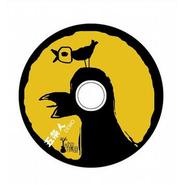

五条人DEMO
============================

|  |  |
| :--: | :-- |
| [ 五条人DEMO](https://emumo.xiami.com/album/308178) | **艺人**: [五条人](../index.md) **语种**: 国语 **唱片公司**: 刀马旦 **发行时间**: 2008年09月25日 **专辑类别**: EP, 单曲 **专辑风格**:  **播放数**: 598859 **收藏数**: 514 **评论数**: 51  |

## 简介

阿茂和仁科这两只麻雀仔，是某次我在广州“捡”到的，当然，跟着捡到的还有一堆他们创作的有趣的海丰话歌谣。这样，一口袋南方小县城的风被我带回了北京。  
这张EP里收录的6首DEMO，是五条人很多很多歌曲中派遣的一小撮现状各异的“现行军”，如果我们把它们形容成“粗粮”，那不久的将来，一张正式发行的唱片《县城记》——一个精心制作的“白面馒头”将会诚意为朋友们奉上。  
在这张DEMO里，《阿炳耀》讲述了48岁的炳耀伯老实巴交又“很有性格”的日常生活；《彭阿湃》歌里有歌，五条人很搞怪地虚拟了一个地下革命者与两个国民党小兵的对话，争论着革命先烈彭湃的故事；《开船歌》是在五条人加油添醋之下的一段闽南地方戏曲选段，如果你觉得它有点耳熟的话，那你肯定看过侯孝贤导演的《戏梦人生》；《清明过纸》是一部小小的“纪录片”，它描述的是清明节那天，一家老小上山扫墓的情景，通过旋律加以想象，他们讲述的故事是那么地细致而生动；《绿苍苍》是一首渔歌，阿茂说，那是读小学的时候老师教的，但是时间把记忆抹淡了，于是有一半的词和曲是自己“中国制造”的。《问题出现我再告诉大家》，五条人为数不多的“外语歌”之一，送给说普通话的朋友。  
他们说：用母语唱民谣，是歌者献给生活最美妙的礼物——也是，谁都有自己的母语，让我们尝试一下长出不一样的耳朵，来做那个传说里能听懂鸟语的“公冶长”吧……  
——阿佟妍 

## 曲目

## 评论

|  |  |  |
| :-- | :-- | :-- |
|  [虾米用户](https://emumo.xiami.com/u/324366279)  2020-11-25 12:16 赞(1) 踩(0) | 
和你们在同一个时代，是我的荣幸
 |
|  [虾米用户](https://emumo.xiami.com/u/1226184) The best u e... 2020-09-19 10:32 赞(1) 踩(0) | 
越听越上头
 |
|  [虾米用户](https://emumo.xiami.com/u/427384237) 我还没想好要写什么... 2020-03-17 21:54 赞(0) 踩(0) | 
想要再听现场
 |
|  [虾米用户](https://emumo.xiami.com/u/305732457)  2019-07-26 10:57 赞(2) 踩(0) | 
問題出現我再告訴大家
 |
|  [虾米用户](https://emumo.xiami.com/u/35032732) 无法表达注定了悲剧宿命的... 2019-06-06 00:10 赞(1) 踩(0) | 
早期的几张专辑每次听都想要流泪，广东姑娘之后，是一道海风吹化了我的心
 |
|  [虾米用户](https://emumo.xiami.com/u/52415194) ♬♩♫♪♡ 2018-04-04 00:16 赞(0) 踩(0) | 
ᵕ᷄≀ ̠˘᷅
 |
|  [虾米用户](https://emumo.xiami.com/u/30800139) 我在低俗与高雅间活的很尴... 2018-03-11 17:45 赞(0) 踩(0) | 
。
 |
|  [虾米用户](https://emumo.xiami.com/u/43492923) 行到水穷我才开始害怕，夕... 2017-11-15 11:33 赞(0) 踩(0) | 
棒
 |
|  [虾米用户](https://emumo.xiami.com/u/10786093)  2017-08-15 06:00 赞(1) 踩(0) | 
民间文工团 地下文艺工作者 游走在街头巷尾 哈哈哈
 |
|  [虾米用户](https://emumo.xiami.com/u/40138724)  2017-05-01 00:00 赞(1) 踩(0) | 
牛逼
 |
|  [虾米用户](https://emumo.xiami.com/u/5371783)  2016-12-24 19:33 赞(0) 踩(0) | 
好，好听！
 |
|  [虾米用户](https://emumo.xiami.com/u/3583995) 一個人的戰爭 2015-12-28 02:04 赞(0) 踩(0) | 

 |
|  [虾米用户](https://emumo.xiami.com/u/31621483) 识六艺 2015-11-08 12:16 赞(1) 踩(0) | 
广东的“交工”
 |
| ⇒ |  [虾米用户](https://emumo.xiami.com/u/12745155)   2016-03-21 00:41 赞(0) 踩(0) | 
感觉较交工还是略逊一筹，不过也不赖
 |
| ⇒ |  [虾米用户](https://emumo.xiami.com/u/41914) 滚好滚坏，大家担待。 2016-12-07 18:54 赞(0) 踩(0) | 
<q><b>孤旅天涯丶说：</b></q>
 |
|  [虾米用户](https://emumo.xiami.com/u/3019759)  2015-05-15 00:32 赞(4) 踩(0) | 
天上雷公，地下海陆丰。
 |
|  [虾米用户](https://emumo.xiami.com/u/852767)   2015-03-14 16:22 赞(0) 踩(0) | 
一如既往的好听
 |
|  [虾米用户](https://emumo.xiami.com/u/6249580) 如果世界太危险只有音乐最... 2014-08-08 21:45 赞(0) 踩(0) | 
加油啊，噶d人支持下
 |
|  [虾米用户](https://emumo.xiami.com/u/338655) 收集一团火追一支仪葬队 2014-03-26 10:05 赞(0) 踩(0) | 
被超度了的感觉
 |
|  [虾米用户](https://emumo.xiami.com/u/6242531)  2011-10-14 00:26 赞(0) 踩(0) | 
forever priority
 |
| ⇒ |  [虾米用户](https://emumo.xiami.com/u/6971764)  2011-11-26 18:33 赞(0) 踩(0) | 
有发现 SUSAN？
 |
|  [虾米用户](https://emumo.xiami.com/u/5887907)  2011-09-19 19:04 赞(0) 踩(0) | 
好听！但我也是海丰人
 |
|  [虾米用户](https://emumo.xiami.com/u/5887907)  2011-09-19 19:03 赞(0) 踩(0) | 
gh
 |
|  [虾米用户](https://emumo.xiami.com/u/1702986)  2010-12-06 17:55 赞(0) 踩(0) | 
开船歌  跟清明过纸  歌反过来了   歌词都不对
 |
|  [虾米用户](https://emumo.xiami.com/u/1702986)  2010-12-06 17:53 赞(1) 踩(0) | 
哇  意外的听倒  潮汕人  牛B
 |
|  [虾米用户](https://emumo.xiami.com/u/1883472)  2010-11-10 16:20 赞(0) 踩(0) | 
噶D人。啪死无仙刚~~ 找到了。。
 |
|  [虾米用户](https://emumo.xiami.com/u/639802) 累计听歌40000（20... 2010-01-30 13:43 赞(1) 踩(0) | 
太棒了一张专辑，好久没听到这么让我惊喜的专辑，充满了小情趣和戏剧性，让人心情很愉悦，客家话相当好听
 |
| ⇒ |  [虾米用户](https://emumo.xiami.com/u/1702986)  2010-12-06 17:54 赞(0) 踩(0) | 
这不是客家话哈
 |
| ⇒ |  [虾米用户](https://emumo.xiami.com/u/2850121) 一日如千年。千年如一日。 2012-04-18 15:07 赞(0) 踩(0) | 
的确不是客家话哦。。不过听了之后怎么觉得海陆丰话有点点像闽南话，而离潮汕话反而远些。。尽管海陆丰算是潮汕的一部分。。（虽然我也知道潮汕话也勉强算是闽南话的一种。。）
 |
|  [虾米用户](https://emumo.xiami.com/u/564152)  2009-12-09 14:04 赞(0) 踩(0) | 
顶起
 |
|  [虾米用户](https://emumo.xiami.com/u/562115)  2009-12-08 11:54 赞(0) 踩(0) | 
隆隆金啊！！！
 |
|  [虾米用户](https://emumo.xiami.com/u/540158) 音乐是最浪漫的数学，是A... 2009-11-27 16:09 赞(0) 踩(0) | 
开船歌的吉他前奏很棒！
 |
| ⇒ |  [虾米用户](https://emumo.xiami.com/u/988688)  2010-06-22 09:30 赞(0) 踩(0) | 
嗯  虽然听不懂唱的是什么  但是感觉很不错
 |
|  [虾米用户](https://emumo.xiami.com/u/540158) 音乐是最浪漫的数学，是A... 2009-11-27 16:07 赞(0) 踩(0) | 
开船歌的吉他前奏很棒！
 |
|  [虾米用户](https://emumo.xiami.com/u/306857)  2009-08-16 12:44 赞(0) 踩(0) | 
希望有机会能去听一听他们的现场，我相信那一定更棒！我也是汕尾的
 |
|  [虾米用户](https://emumo.xiami.com/u/306857)  2009-08-16 12:41 赞(0) 踩(0) | 
很喜欢听他们音乐的这种感觉！ 超棒！ 谢谢你们！、
 |
|  [虾米用户](https://emumo.xiami.com/u/306857)  2009-08-16 12:40 赞(0) 踩(0) | 
很喜欢听他们音乐的这种感觉！ 超棒！ 谢谢你们！、
 |
|  [虾米用户](https://emumo.xiami.com/u/156774)  2009-07-19 18:01 赞(0) 踩(0) | 
理由就是牛B
 |
|  [虾米用户](https://emumo.xiami.com/u/156774)  2009-07-19 17:59 赞(2) 踩(0) | 
第一次知道他们是在周云蓬的专场  他们是暖场的  当时整个13气氛都被他们调动的很好 现在真的能进入他们的世界了
 |
|  [虾米用户](https://emumo.xiami.com/u/181914)  2009-06-10 12:27 赞(0) 踩(0) | 
一见如故。
 |
|  [虾米用户](https://emumo.xiami.com/u/199246) 无我 无用 2009-06-06 02:39 赞(0) 踩(0) | 
Folk
 |
|  [虾米用户](https://emumo.xiami.com/u/168136)  2009-05-18 22:00 赞(0) 踩(0) | 
hao
 |
|  [虾米用户](https://emumo.xiami.com/u/27299) T… 2009-05-15 18:01 赞(0) 踩(0) | 
nice nice～
 |
|  [虾米用户](https://emumo.xiami.com/u/100380)  2009-04-03 16:32 赞(0) 踩(0) | 
为什么不推荐？！
 |
|  [虾米用户](https://emumo.xiami.com/u/100380)  2009-04-01 10:47 赞(0) 踩(0) | 
嗯那，期待两个小蝌蚪从厦门带来更美好的声音。
 |
|  [虾米用户](https://emumo.xiami.com/u/100380)  2009-04-01 10:46 赞(0) 踩(0) | 
哇噻，这里有五条人耶，青葱哪~~~
 |
|  [虾米用户](https://emumo.xiami.com/u/11316)  2008-12-05 10:04 赞(0) 踩(0) | 
最爱清明过纸
 |
| ⇒ |  [虾米用户](https://emumo.xiami.com/u/100380)  2009-04-01 10:46 赞(0) 踩(0) | 
哇噻，小病，这里都能看到你！
 |
