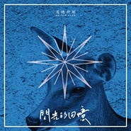

闪光的回忆Shining Memory
============================

|  |  |
| :--: | :-- |
| [ 闪光的回忆Shining Memory](https://emumo.xiami.com/album/2102766424) | **艺人**: [逃跑计划](../index.md) **语种**: 国语 **唱片公司**: StreetVoice, 东亚星光 **发行时间**: 2017年06月16日 **专辑类别**: EP, 单曲 **专辑风格**: 流行摇滚 Pop Rock **播放数**: 5771582 **收藏数**: 723 **评论数**: 106  |

## 简介

走了很久的路再回头，斑驳的回忆被抛在身后。  
  
逃跑计划用一首《闪光的回忆》回归众人眼前。这首歌依旧是乐队自己编曲，保留了逃跑计划的原汁原味。没有华丽的词藻，不涉及任何高超的表达技巧，只是用简单直白的词语，就轻易虏获聆听者的心。  
  
然而细细品味，却又觉得与早年逃跑计划的作品相比，歌曲里少了对情感生活的宣泄和忧郁，多了些对生活的感悟和思考。而早年的作品里那些蓬勃顽强的生命力被保存了下来，如今的逃跑计划不仅仅满足于用音乐记录生活，他们把爱与思也融入到作品中，让人听之难忘。  
  
逃跑计划已经成立十年，时间给了创作者以灵感，而创作者又用这些来记录时间。多年来磕磕绊绊的人生阅历，给这首歌曲赋予了全新的情感内核。所以有了“愿生有去处，苍有归途”的慨叹。不得不说，在歌词层面上，逃跑计划得到了一个不小的升华。  
  
如今的逃跑计划，已经褪去对世界的好奇，打破外界给予的限定，向听众展现出多元且真实的态度。一个乐队的生命力在岁月中被打磨得更加成熟。时隔一年，他们带着自己的作品回到大众视野，这首单曲就是最好的证明。  
  
我们行走在世间，总会失去些什么，又得到些什么。那些日夜饮不尽的杯中酒和为赋新词强说的愁，终究都会被时间抚平。我们也会在失去和收获里，获得平衡。至于人生感悟，往往不在于和生活厮杀后的胜利，而是在于磨练中找到的力量和安宁。  
  
岁月缓缓流逝，而那些闪光的回忆，是时光赋予我们最好的馈赠。

## 曲目

- [闪光的回忆MVShining Memory](./2102766424/8HOHKGf7502.md)

## 评论

|  |  |  |
| :-- | :-- | :-- |
|  [虾米用户](https://emumo.xiami.com/u/328019402)  2020-12-02 10:34 赞(0) 踩(0) | 
就是很喜欢 没有原因
 |
|  [虾米用户](https://emumo.xiami.com/u/426007804)  2019-06-15 20:33 赞(1) 踩(0) | 
very good
 |
|  [虾米用户](https://emumo.xiami.com/u/40746765)   2019-05-18 09:43 赞(3) 踩(0) | 
不要纠结身份，想见就见，一切皆虚幻，时光不等你，陪伴是真爱。
 |
|  [虾米用户](https://emumo.xiami.com/u/21742151) yep! 2019-01-12 12:47 赞(2) 踩(0) | 
你才不是一个没有故事的女同学。
 |
|  [虾米用户](https://emumo.xiami.com/u/34263253) 看着明天的当下先生 2019-01-11 15:38 赞(1) 踩(0) | 
难道是我不再合适听 逃跑计划了吗，
 |
|  [虾米用户](https://emumo.xiami.com/u/25591810)  2018-12-11 09:49 赞(1) 踩(0) | 
分手，微笑转身。你是你，我还是我。彼此知己。致：分手伤我的人或畜。。。
 |
|  [虾米用户](https://emumo.xiami.com/u/4487129)  2018-11-15 08:47 赞(0) 踩(0) | 
！！！
 |
|  [虾米用户](https://emumo.xiami.com/u/4195874)  2018-09-05 11:09 赞(2) 踩(0) | 
很是越来越像coldplay了-0-
 |
|  [虾米用户](https://emumo.xiami.com/u/71157688)  2018-01-18 21:39 赞(0) 踩(0) | 
太棒了
 |
|  [虾米用户](https://emumo.xiami.com/u/114775392) 吸烟 喝酒 烫头 2017-12-16 14:20 赞(2) 踩(0) | 
可能一辈子都要追随逃跑了
 |
|  [虾米用户](https://emumo.xiami.com/u/281129246) 我怀疑人们的生活 有所掩... 2017-11-30 18:26 赞(0) 踩(0) | 
闪光 还是给人很温暖的感觉
 |
|  [虾米用户](https://emumo.xiami.com/u/337182071)  2017-11-26 10:06 赞(0) 踩(0) | 
很优秀
 |
|  [虾米用户](https://emumo.xiami.com/u/200162265) 低质量的社交不如高质量的... 2017-10-09 00:54 赞(2) 踩(0) | 
在一起5年，最难熬的时刻彼此依靠撑了过来，现在很好，期待未来。
 |
|  [虾米用户](https://emumo.xiami.com/u/126070566)  2017-09-14 11:20 赞(3) 踩(0) | 
这首歌陪我度过了整个夏天
 |
|  [虾米用户](https://emumo.xiami.com/u/203993047)  2017-08-29 23:21 赞(2) 踩(0) | 
越听越好听  果然 好歌 就是需要细细品
 |
|  [虾米用户](https://emumo.xiami.com/u/320473703)  2017-08-29 21:58 赞(1) 踩(0) | 
愿生有去出
 |
|  [虾米用户](https://emumo.xiami.com/u/32961761) 一切终将化为乌有 2017-08-26 22:29 赞(2) 踩(0) | 
岁月缓缓流逝，回忆闪闪发光
 |
|  [虾米用户](https://emumo.xiami.com/u/302079176)  2017-08-13 07:56 赞(3) 踩(0) | 
喜欢这种不羁，随性而唱。
 |
|  [虾米用户](https://emumo.xiami.com/u/8120531) 森林冒险 2017-08-06 19:45 赞(2) 踩(0) | 
高铁上因为想起之前我们的总总哭出声，分手一年半，经历很多，但也没用和你一起深刻，很高兴你说要迈出那重新的第一步，我信你会越来越好。因为我也会是。
 |
|  [虾米用户](https://emumo.xiami.com/u/413790) 惜知音再难觅 2017-08-03 19:52 赞(1) 踩(0) | 
快出专辑！！！！！
 |
|  [虾米用户](https://emumo.xiami.com/u/92170238) 信仰是一种力量 2017-07-06 22:50 赞(2) 踩(0) | 
喜欢没话说
 |
|  [虾米用户](https://emumo.xiami.com/u/43714694) WeChat：96529... 2017-07-03 21:56 赞(1) 踩(0) | 
吱/音
 |
|  [虾米用户](https://emumo.xiami.com/u/36601958) 你还站在塔尖那吗。 2017-07-03 21:46 赞(0) 踩(0) | 
没有失望
 |
|  [虾米用户](https://emumo.xiami.com/u/286855115)   2017-07-02 10:20 赞(1) 踩(0) | 
昨天刚听了现场
 |
|  [虾米用户](https://emumo.xiami.com/u/124537360) Nothing's go... 2017-07-01 17:48 赞(0) 踩(0) | 
从来没让人失望的逃跑计划！
 |
|  [虾米用户](https://emumo.xiami.com/u/218423941) 永远年轻，永远热泪盈眶 2017-06-29 18:30 赞(0) 踩(0) | 
等了好久，逃跑计划!
 |
|  [虾米用户](https://emumo.xiami.com/u/294265269) give up 2017-06-28 13:41 赞(4) 踩(0) | 
回忆越是美丽，现实就越是残忍。生命的长河不知不觉推着我们前行，只是这条路上，我知道再也不能奢望与你同行。
 |
|  [虾米用户](https://emumo.xiami.com/u/264390934)  2017-06-27 10:06 赞(1) 踩(0) | 
等了5年了
 |
|  [虾米用户](https://emumo.xiami.com/u/304913165)   2017-06-24 11:50 赞(67) 踩(0) | 
我有一万零一个去见你的理由，却差一个去见你的身份。愿我们各自安好。
 |
|  [虾米用户](https://emumo.xiami.com/u/2955100)  2017-06-21 15:34 赞(2) 踩(0) | 
我去！！！！！  这太特马好听！！太特马励志了！！！！！！感觉就像喝了一口奶奶熬的鸡汤一样温柔和温暖！！！！！！！！！
 |
|  [虾米用户](https://emumo.xiami.com/u/7980605) 咩咩咩~ 2017-06-21 11:31 赞(1) 踩(0) | 
献给那些已经离开或还驻留的老虾米们
 |
|  [虾米用户](https://emumo.xiami.com/u/11704065) 讲不出再见 2017-06-20 13:04 赞(0) 踩(0) | 
睡在上铺的兄弟。
 |
|  [虾米用户](https://emumo.xiami.com/u/284452740)  2017-06-20 09:20 赞(0) 踩(0) | 
等久了。
 |
|  [虾米用户](https://emumo.xiami.com/u/170523288) 充满善意的世界啊( •̀... 2017-06-19 17:28 赞(0) 踩(0) | 
爱你
 |
|  [虾米用户](https://emumo.xiami.com/u/234915369)  2017-06-19 12:54 赞(0) 踩(0) | 
好听，逃跑计划风！
 |
|  [虾米用户](https://emumo.xiami.com/u/234915369)  2017-06-19 09:44 赞(0) 踩(0) | 
简单就好，内心的声音无需做过多的装饰，逃跑计划，加油！
 |
|  [虾米用户](https://emumo.xiami.com/u/9021270)   2017-06-19 01:10 赞(2) 踩(0) | 
可以听听coldplay的up&amp;amp;amp;up
 |
|  [虾米用户](https://emumo.xiami.com/u/88274034)  2017-06-18 20:39 赞(3) 踩(0) | 
昨晚与你一起相约工体，你说你最喜欢逃跑的《08年我们结婚》，因为这首歌有你难忘六年前的那个夜晚，回不去的曾经，只愿你能像《夜空中最亮的星》，能够《重来》，放下曾经的，永远照耀你前行。 
 |
|  [虾米用户](https://emumo.xiami.com/u/3883281) Reality 2017-06-18 16:46 赞(1) 踩(0) | 
终于等到你
 |
|  [虾米用户](https://emumo.xiami.com/u/120188140)  2017-06-18 13:46 赞(1) 踩(0) | 
挺好的
 |
|  [虾米用户](https://emumo.xiami.com/u/194850624)  2017-06-18 12:15 赞(0) 踩(0) | 
有着岁月沉淀的味道，但仍秉持英伦Rock味儿！祝福逃跑计划！永远是夜空最亮那颗星！
 |
|  [虾米用户](https://emumo.xiami.com/u/199176)  2017-06-18 10:38 赞(2) 踩(0) | 
热泪盈眶
 |
|  [虾米用户](https://emumo.xiami.com/u/7345510) 我真的喜欢吃虾 2017-06-18 09:37 赞(0) 踩(0) | 
让我涌起那些奔跑起来像是一道春天的闪电的日子
 |
|  [虾米用户](https://emumo.xiami.com/u/87510142)  2017-06-17 21:53 赞(0) 踩(0) | 
加油
 |
|  [虾米用户](https://emumo.xiami.com/u/31371) 稀奇古怪 2017-06-17 15:02 赞(0) 踩(0) | 
无论火不火，好听，是这个味儿
 |
|  [虾米用户](https://emumo.xiami.com/u/9594816) ... 2017-06-17 11:39 赞(0) 踩(0) | 
凑凑合合吧 是他们的原汁原味
 |
|  [虾米用户](https://emumo.xiami.com/u/5496438) 凡尘俗事，改变了你我！ 2017-06-17 10:50 赞(1) 踩(0) | 
这首歌不错，只是它没有爆点，所以应该不会火。
 |
|  [虾米用户](https://emumo.xiami.com/u/118308204) 有一种方式是：缘起缘灭.... 2017-06-17 06:43 赞(0) 踩(0) | 
好听的...比较像在晚上一个人 喝着小酒的赶脚，想念 
 |
|  [虾米用户](https://emumo.xiami.com/u/39575559) 开心就好 2017-06-17 01:59 赞(0) 踩(0) | 
火钳刘明！不声不响就出新了！
 |
|  [虾米用户](https://emumo.xiami.com/u/217138529)  2017-06-17 01:57 赞(0) 踩(0) | 
还算挺好听的
 |
|  [虾米用户](https://emumo.xiami.com/u/9021270)   2017-06-17 01:13 赞(1) 踩(0) | 
up&amp;amp;amp;up
 |
|  [虾米用户](https://emumo.xiami.com/u/269108183) 原来这里可以签名 2017-06-16 23:59 赞(0) 踩(0) | 
第一
 |
|  [虾米用户](https://emumo.xiami.com/u/52847575) 摇滚，民谣音乐爱好者， 2017-06-16 19:57 赞(0) 踩(0) | 
虾米人好少啊
 |
|  [虾米用户](https://emumo.xiami.com/u/10028400) 我还没想好要写什么... 2017-06-16 19:19 赞(0) 踩(0) | 
来听
 |
|  [虾米用户](https://emumo.xiami.com/u/202667217)   2017-06-16 17:41 赞(2) 踩(0) | 
所幸 蓝颜已知己，不论祸与福，陪在你身旁的那么多年，闪光的回忆，在寒冷的冬夜里，还能用来取暖，愿你能有安适的清晨与傍晚，能在柴米油盐的生活中不忘曾经屠龙的梦想 
 |
|  [虾米用户](https://emumo.xiami.com/u/1126943)  2017-06-16 17:21 赞(0) 踩(0) | 
五星儿!歌曲真好!虽然不喜欢他们乐队:)。。
 |
|  [虾米用户](https://emumo.xiami.com/u/47570527) 怂属性 2017-06-16 17:20 赞(0) 踩(0) | 
...
 |
|  [虾米用户](https://emumo.xiami.com/u/205363457) 如果你给我的和别人一样，... 2017-06-16 17:14 赞(0) 踩(0) | 
逃跑计划
 |
|  [虾米用户](https://emumo.xiami.com/u/10551698) 2b 2017-06-16 15:33 赞(0) 踩(0) | 
好的
 |
|  [虾米用户](https://emumo.xiami.com/u/87513812) 到此为止 2017-06-16 14:10 赞(1) 踩(0) | 
前排站评论
 |
|  [虾米用户](https://emumo.xiami.com/u/235797)  2017-06-16 14:09 赞(1) 踩(0) | 
唱的像汪峰是怎么回事
 |
|  [虾米用户](https://emumo.xiami.com/u/87510142)  2017-06-16 13:38 赞(0) 踩(0) | 
喜欢
 |
|  [虾米用户](https://emumo.xiami.com/u/2278753) 浩瀚，渺小 2017-06-16 13:31 赞(0) 踩(0) | 
一张蛮有&amp;ldquo;沉淀&amp;rdquo;味道的好砖
 |
|  [虾米用户](https://emumo.xiami.com/u/1235868)  2017-06-16 12:31 赞(1) 踩(0) | 
这才是属于大家的&amp;ldquo;逃跑计划&amp;rdquo;!
 |
|  [虾米用户](https://emumo.xiami.com/u/811354)  2017-06-16 12:29 赞(0) 踩(0) | 
一线乐队水准！稍微留心，还是可以能听出来乐队的成长和改变。。。
 |
|  [虾米用户](https://emumo.xiami.com/u/3933648)  2017-06-16 12:20 赞(1) 踩(0) | 
这是乐团，不是乐队
 |
|  [虾米用户](https://emumo.xiami.com/u/5020716) 想象另一种可能。 2017-06-16 10:13 赞(1) 踩(0) | 
在北京的边缘，十年。 有了闪光的回忆，才有了美好的闪闪发光的记忆片段。 离新专辑就不远了。
 |
|  [虾米用户](https://emumo.xiami.com/u/36762750)  2017-06-16 10:05 赞(0) 踩(0) | 
还不错
 |
|  [虾米用户](https://emumo.xiami.com/u/297598290)  2017-06-16 09:12 赞(0) 踩(0) | 
路过路过
 |
|  [虾米用户](https://emumo.xiami.com/u/11774664) 做个顺应自己心意的怪咖有... 2017-06-16 08:53 赞(0) 踩(0) | 
棒！
 |
|  [虾米用户](https://emumo.xiami.com/u/3045102) 听听音乐，思考人生 2017-06-16 08:35 赞(0) 踩(0) | 
周末工体，谁去？！
 |
|  [虾米用户](https://emumo.xiami.com/u/1064695)  2017-06-16 07:40 赞(0) 踩(0) | 
等挺久
 |
|  [虾米用户](https://emumo.xiami.com/u/32659213) hell 2017-06-16 07:30 赞(0) 踩(0) | 
❤️
 |
|  [虾米用户](https://emumo.xiami.com/u/4012622)  2017-06-16 07:07 赞(0) 踩(0) | 
终于等到你！
 |
|  [虾米用户](https://emumo.xiami.com/u/13907017) 希望发现很多喜欢的音乐 2017-06-16 06:13 赞(0) 踩(0) | 
回忆
 |
|  [虾米用户](https://emumo.xiami.com/u/31190181) 上架补签卡啊啊啊 2017-06-16 05:06 赞(0) 踩(0) | 
new new new!
 |
|  [虾米用户](https://emumo.xiami.com/u/13332760) You will be ... 2017-06-16 04:59 赞(0) 踩(0) | 
妈的，终于等到了
 |
|  [虾米用户](https://emumo.xiami.com/u/200632206) 对周遭一切抱有好奇 2017-06-16 02:37 赞(0) 踩(0) | 
等了又等，终于等到你。
 |
|  [虾米用户](https://emumo.xiami.com/u/12043954) Who cares 2017-06-16 01:57 赞(0) 踩(0) | 
前三十留念哈哈哈哈
 |
|  [虾米用户](https://emumo.xiami.com/u/1506551) 越美的东西越不可碰 2017-06-16 01:38 赞(0) 踩(0) | 
牛逼了嘿 是逃跑的劲儿
 |
|  [虾米用户](https://emumo.xiami.com/u/379141) 梦寐以求，是真爱和自由。 2017-06-16 01:18 赞(0) 踩(0) | 
从大一的时候听你们 转眼已经四年 想不来的那些日子和还熟记于心的你们的歌啊
 |
|  [虾米用户](https://emumo.xiami.com/u/89319954) 生活中真正的勇士想来默默... 2017-06-16 00:50 赞(0) 踩(0) | 
依旧脱俗清澈的高嗓
 |
|  [虾米用户](https://emumo.xiami.com/u/9410724)   2017-06-16 00:46 赞(0) 踩(0) | 
有没有instrumental version
 |
|  [虾米用户](https://emumo.xiami.com/u/8337431) 以乐会友 2017-06-16 00:46 赞(0) 踩(0) | 
22
 |
|  [虾米用户](https://emumo.xiami.com/u/134697)  2017-06-16 00:41 赞(0) 踩(0) | 
我要再吃個甜筒
 |
|  [虾米用户](https://emumo.xiami.com/u/42849889)   2017-06-16 00:35 赞(0) 踩(0) | 
的确是深夜发歌
 |
|  [虾米用户](https://emumo.xiami.com/u/2644274) 从虾米一路走来，留下了许... 2017-06-16 00:25 赞(0) 踩(0) | 
深夜发哥
 |
|  [虾米用户](https://emumo.xiami.com/u/28183882)  2017-06-16 00:24 赞(0) 踩(0) | 
沒有那曾經的過去 就沒有現在的回憶
 |
|  [虾米用户](https://emumo.xiami.com/u/37842867)  2017-06-16 00:19 赞(0) 踩(0) | 
逃离不到过去
 |
|  [虾米用户](https://emumo.xiami.com/u/49031400) 爱让一切变得温暖温柔。 2017-06-16 00:18 赞(0) 踩(0) | 
来啦来啦，前排
 |
|  [虾米用户](https://emumo.xiami.com/u/282827970)  2017-06-16 00:14 赞(0) 踩(0) | 
哈哈！
 |
|  [虾米用户](https://emumo.xiami.com/u/4034462)  2017-06-16 00:13 赞(0) 踩(0) | 
头顶青天
 |
| ⇒ |  [虾米用户](https://emumo.xiami.com/u/5046315) damn you 2017-06-16 01:58 赞(0) 踩(0) | 
脚踩狗屎在#手动滑稽
 |
|  [虾米用户](https://emumo.xiami.com/u/8524905)   2017-06-16 00:09 赞(0) 踩(0) | 
惊喜啊
 |
|  [虾米用户](https://emumo.xiami.com/u/28739793)   2017-06-16 00:08 赞(0) 踩(0) | 
期待更多的新歌 
 |
|  [虾米用户](https://emumo.xiami.com/u/39161684)  2017-06-16 00:07 赞(0) 踩(0) | 
像你  闪光的回忆   你
 |
|  [虾米用户](https://emumo.xiami.com/u/41306052)   2017-06-16 00:07 赞(0) 踩(0) | 
耶
 |
|  [虾米用户](https://emumo.xiami.com/u/50411623) 我还没想好要写什么... 2017-06-16 00:06 赞(1) 踩(0) | 
卧槽，又出新歌了？？
 |
|  [虾米用户](https://emumo.xiami.com/u/282671087)  2017-06-16 00:05 赞(0) 踩(0) | 
看到微博就赶紧跑过来这里！！！
 |
|  [虾米用户](https://emumo.xiami.com/u/32862052)  2017-06-16 00:04 赞(0) 踩(0) | 
尿尿
 |
|  [虾米用户](https://emumo.xiami.com/u/302294010) 朝闻道 2017-06-16 00:03 赞(0) 踩(0) | 
嗷
 |
|  [虾米用户](https://emumo.xiami.com/u/302807618)   2017-06-16 00:01 赞(0) 踩(0) | 
起来了，你在吗？
 |
|  [虾米用户](https://emumo.xiami.com/u/304208991) … 2017-06-16 00:01 赞(0) 踩(0) | 
wow
 |
|  [虾米用户](https://emumo.xiami.com/u/53794483) 中国海洋大学音乐表演20... 2017-06-15 23:59 赞(0) 踩(0) | 
期待
 |
|  [虾米用户](https://emumo.xiami.com/u/8191253)  2017-06-15 23:59 赞(0) 踩(0) | 
哈哈哈哈
 |
|  [虾米用户](https://emumo.xiami.com/u/29949983) 金属、核  2017-06-15 23:58 赞(0) 踩(0) | 
哈哈哈
 |
