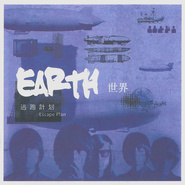

世界Earth
============================

|  |  |
| :--: | :-- |
| [ 世界Earth](https://emumo.xiami.com/album/487102) | **艺人**: [逃跑计划](../index.md) **语种**: 国语 **唱片公司**: 美丽世界音乐 **发行时间**: 2012年01月01日 **专辑类别**: 录音室专辑 **专辑风格**: 流行摇滚 Pop Rock **播放数**: 208033845 **收藏数**: 23203 **评论数**: 1172  |

## 简介

逃跑计划的首张专辑《世界》将会发行10000张，这次发行的仅为限量收藏版共2012张。其后会发行正式简装版7988张。

 逃跑计划以《世界》命名专辑，其寓意在于：我们生活的世界，正在疯狂的演变，来不及看清一切的我们，会发现现在的生活、工作、家庭和环境似乎都没有向适合人类的方向发展，诸多的疑问与问题，让我们应接不暇。内心世界的恐慌与煎熬，却成为了这个时代的共性。看看这张专辑里所触及的字眼：爱、阳光、离开、悲伤、生命、结婚、星辰、拥抱、化学和再见......都无不关系着生活与生存的各个角落。而逃跑想说的是，即使在最失落甚至绝望的时候，该如何面对这一切，这里面包括自己和已是面目全非的母亲-地球。

## 曲目

- [Is This LoveMV](./487102/xLvL9hbc8c0.md)
- [阳光照进回忆里MV](./487102/mQAMK87ebfd.md)
- [Take Me Away](./487102/xLvL9jb4d10.md)
- [一万次悲伤](./487102/bf0xGP42de68.md)
- [AppleMV](./487102/mQAMKB8b420.md)
- [结婚](./487102/xLvL9mce05f.md)
- [夜空中最亮的星MV微电影《摘星的你》主题曲](./487102/xLt7ZWc5213.md)
- [哪里是你的拥抱](./487102/xLvL9o11f04.md)
- [Chemical BusMV](./487102/xLvL9p9d9bd.md)
- [再见 再见MV](./487102/mQAMKGbd816.md)

## 评论

|  |  |  |
| :-- | :-- | :-- |
|  [虾米用户](https://emumo.xiami.com/u/1754181) 我还没想好要写什么... 2021-01-24 16:05 赞(0) 踩(0) | 
还有这样的音乐么给推荐一下
 |
|  [虾米用户](https://emumo.xiami.com/u/12306228) Sing My Soul... 2021-01-15 13:48 赞(0) 踩(0) | 
评论太少不科学
 |
|  [虾米用户](https://emumo.xiami.com/u/410322448)  2021-01-06 20:45 赞(1) 踩(0) | 
一起说再见、再见、再见、再见
 |
|  [虾米用户](https://emumo.xiami.com/u/43486707) 我们脚踏实地为你延续理想 2021-01-05 22:41 赞(1) 踩(0) | 
我的真正摇滚启蒙
 |
|  [虾米用户](https://emumo.xiami.com/u/43486707) 我们脚踏实地为你延续理想 2021-01-05 22:40 赞(1) 踩(0) | 
我的真正摇滚启蒙
 |
|  [虾米用户](https://emumo.xiami.com/u/193961856) Lead your ow... 2021-01-04 14:03 赞(2) 踩(0) | 
啊啊啊这张封面有老李！！！都没人注意那时候是5个人嘛
 |
|  [虾米用户](https://emumo.xiami.com/u/12053363) Let's keep g... 2020-12-16 12:27 赞(0) 踩(0) | 
2013年听的歌喜欢的乐队，突然在会员库刷到，怀念一下
 |
|  [虾米用户](https://emumo.xiami.com/u/123864136) 我还没想好要写什么... 2020-09-12 13:49 赞(0) 踩(0) | 
非常好听！
 |
|  [虾米用户](https://emumo.xiami.com/u/276944698) 不要自我设限..... 2020-09-02 14:15 赞(0) 踩(0) | 
⭐️⭐️⭐️
 |
|  [虾米用户](https://emumo.xiami.com/u/289766910) 是时代的泪呢 2020-08-30 22:55 赞(0) 踩(0) | 
怀念那些年...
 |
|  [虾米用户](https://emumo.xiami.com/u/283970509)  2020-08-23 12:57 赞(0) 踩(0) | 
5'@
 |
|  [虾米用户](https://emumo.xiami.com/u/96296322)  2020-08-20 12:51 赞(0) 踩(0) | 
.
 |
|  [虾米用户](https://emumo.xiami.com/u/411138644)  2020-08-05 21:12 赞(0) 踩(0) | 
经典咏流传
 |
|  [虾米用户](https://emumo.xiami.com/u/444136810) 不敢表白 2020-07-16 12:12 赞(1) 踩(0) | 
逃跑计划最好的专辑
 |
|  [虾米用户](https://emumo.xiami.com/u/379162683) 我想要记住你们，我想要你... 2020-06-06 16:47 赞(0) 踩(0) | 

 |
|  [虾米用户](https://emumo.xiami.com/u/431905270)  2020-05-25 13:36 赞(0) 踩(0) | 
好听的歌
 |
|  [虾米用户](https://emumo.xiami.com/u/11934356)   2020-05-18 21:10 赞(0) 踩(0) | 
我叫世界
 |
|  [虾米用户](https://emumo.xiami.com/u/36466533) 这家伙很聪明 2020-05-07 08:47 赞(1) 踩(0) | 
最伟大的国产乐队专辑之一，虽然当时没有特别特别喜欢逃跑计划，但还是收了一张签名版实体，现在想想值了 
 |
|  [虾米用户](https://emumo.xiami.com/u/441025100) 我还没想好要写什么... 2020-04-19 23:18 赞(0) 踩(0) | 
星游记主题曲《再飞行》呢？被吃了？
 |
|  [虾米用户](https://emumo.xiami.com/u/315181553)  2020-03-18 16:16 赞(0) 踩(0) | 
&amp;
 |
|  [虾米用户](https://emumo.xiami.com/u/437066978)  2020-02-23 15:15 赞(0) 踩(0) | 
恶邻
 |
|  [虾米用户](https://emumo.xiami.com/u/422170353) 不乱于心 2020-02-13 13:39 赞(0) 踩(0) | 
值得拥有
 |
|  [虾米用户](https://emumo.xiami.com/u/299326724)  2020-01-22 17:59 赞(0) 踩(0) | 
逃跑的巅峰之作
 |
|  [虾米用户](https://emumo.xiami.com/u/1416076)  2020-01-18 23:08 赞(0) 踩(0) | 
好听
 |
|  [虾米用户](https://emumo.xiami.com/u/429959177)  2019-12-25 13:00 赞(0) 踩(0) | 
完美！
 |
|  [虾米用户](https://emumo.xiami.com/u/432857557)  2019-12-01 17:38 赞(1) 踩(0) | 
好听
 |
|  [虾米用户](https://emumo.xiami.com/u/78372138)  2019-11-24 16:08 赞(0) 踩(0) | 
能够让人感动的作品不多
 |
|  [虾米用户](https://emumo.xiami.com/u/202160717) 泛舟当歌 2019-11-23 18:15 赞(0) 踩(0) | 
很有创意的一张，旅行团很棒。
 |
|  [虾米用户](https://emumo.xiami.com/u/357221960) 静到极致便是动 动到极致... 2019-11-16 10:37 赞(1) 踩(0) | 
很棒，这个专辑就是夜空中最亮的星!
 |
|  [虾米用户](https://emumo.xiami.com/u/424417850) 帅气的迈克 2019-10-28 20:49 赞(0) 踩(0) | 
推荐大家来听
 |
|  [虾米用户](https://emumo.xiami.com/u/15725146) 最棒： 2019-10-23 13:05 赞(1) 踩(0) | 
2年前在循环这张专辑，今天的我还在循环。逃跑计划到底这几年在干什么呢。
 |
|  [虾米用户](https://emumo.xiami.com/u/403830108)  2019-10-13 19:39 赞(0) 踩(0) | 
好
 |
|  [虾米用户](https://emumo.xiami.com/u/87421924) 唯有自己钟情的音乐不可抗... 2019-09-29 08:04 赞(0) 踩(0) | 
逃跑计划代表作之一夜空中最亮的星
 |
|  [虾米用户](https://emumo.xiami.com/u/367282545) 怪我庸人自扰活该想起倪嘚... 2019-09-28 19:06 赞(0) 踩(0) | 
好听仿佛听到过去的我在不屈嘚歌唱
 |
|  [虾米用户](https://emumo.xiami.com/u/155675794)  2019-09-14 10:03 赞(0) 踩(0) | 
超级棒
 |
|  [虾米用户](https://emumo.xiami.com/u/254940082)  2019-09-10 16:45 赞(0) 踩(0) | 
crzgwr
 |
|  [虾米用户](https://emumo.xiami.com/u/561819) 自律 2019-08-23 23:27 赞(1) 踩(0) | 
不是……土耳其流行是什么啦……
 |
|  [虾米用户](https://emumo.xiami.com/u/337283231)  2019-08-18 11:56 赞(0) 踩(0) | 
UK就al﹉
 |
|  [虾米用户](https://emumo.xiami.com/u/283660115) 我还没想好要写什么... 2019-08-07 19:48 赞(0) 踩(0) | 
那年今日，是否后悔过呢？
 |
|  [虾米用户](https://emumo.xiami.com/u/52056952) 人生即是到來、相遇、陪伴... 2019-07-16 12:57 赞(0) 踩(0) | 

 |
|  [虾米用户](https://emumo.xiami.com/u/5119732) 生来平凡 何以高歌 2019-07-02 18:53 赞(1) 踩(0) | 
如果我是个挑剔的人的话 那么我就觉得一张专辑每首歌如果都可以不由自主跟着跳起来 唱起来 这张专辑就是最佳 不在于别人 我的最佳歌单就会有这张专辑
 |
|  [虾米用户](https://emumo.xiami.com/u/284000612)  2019-06-26 06:12 赞(0) 踩(0) | 
记得当年，一边哭一边哼唱着这首歌，无限循环
 |
|  [虾米用户](https://emumo.xiami.com/u/377411391) 说你，爱喔 2019-06-25 16:41 赞(0) 踩(0) | 
勿忘初心
 |
|  [虾米用户](https://emumo.xiami.com/u/426160104)  2019-06-17 21:48 赞(0) 踩(0) | 
很激励的一首歌！
 |
|  [虾米用户](https://emumo.xiami.com/u/43486707) 我们脚踏实地为你延续理想 2019-06-10 23:01 赞(0) 踩(0) | 
这张多有自己的味道，后面就全是酷玩的影子了
 |
|  [虾米用户](https://emumo.xiami.com/u/43486707) 我们脚踏实地为你延续理想 2019-06-10 22:59 赞(0) 踩(0) | 
这张多有feel啊 
 |
|  [虾米用户](https://emumo.xiami.com/u/424182171)  2019-06-06 19:42 赞(0) 踩(0) | 
态度还是很不错的
 |
|  [虾米用户](https://emumo.xiami.com/u/317367618)  2019-06-01 21:42 赞(0) 踩(0) | 
近年流行摇滚中最好的专辑之一！
 |
|  [虾米用户](https://emumo.xiami.com/u/1970044)  2019-05-03 14:36 赞(1) 踩(0) | 
悲伤好于夜空 同意的点赞
 |
|  [虾米用户](https://emumo.xiami.com/u/423349872)  2019-04-15 22:38 赞(0) 踩(0) | 
很迷茫找不到我的星
 |
|  [虾米用户](https://emumo.xiami.com/u/83190294) 我们曾相爱，想到就心酸 2019-04-12 08:19 赞(1) 踩(0) | 
这张专辑简直是巅峰了
 |
|  [虾米用户](https://emumo.xiami.com/u/96296322)  2019-04-04 17:09 赞(0) 踩(0) | 
.
 |
|  [虾米用户](https://emumo.xiami.com/u/346437197) 学习和听歌一点都不冲突 2019-04-01 18:00 赞(0) 踩(0) | 
好听
 |
|  [虾米用户](https://emumo.xiami.com/u/16509404) 可是命运啊 渴望啊 和热... 2019-03-05 08:31 赞(1) 踩(0) | 
我觉得吐字清晰是最起码的要求。不喜欢大陆人唱港台腔。
 |
|  [虾米用户](https://emumo.xiami.com/u/11692622) 海外公民，沒有聽歌的權利... 2019-02-01 13:50 赞(0) 踩(0) | 
竟然可以下載？！，但是我好想花錢買這張專輯。
 |
|  [虾米用户](https://emumo.xiami.com/u/411905465)  2019-01-25 02:57 赞(0) 踩(0) | 
这是世界
 |
|  [虾米用户](https://emumo.xiami.com/u/2721362)  2019-01-21 09:06 赞(1) 踩(0) | 
听完《你的爱情》过来的。我对逃跑计划的认知除了《夜空》多次在电视节目中被翻唱之外，就是在虾米随机听原创时的“偶遇”。听主唱在节目中说到创作瓶颈，于是翻到第一张专辑一首首听下来，十年来一张正式专辑两三张EP几首单曲确实不算多，“偶遇”看来也不是因为我听得少。 十年的时间已经足够一个男孩儿长成男人，开始成家立业。如果说这张专辑带着年轻人的热情纯真的话，最新的《闪光的回忆》更多了一些理性和技术的娴熟。就像每个人都会更缅怀自己逝去的青春一样，五星要给这张《世界》，但我也希望乐队能够不断地挑战突破自我，人的一生就在于不断积累蜕变，Coldplay都20多年了依然占有一席之地，希望你们也能如此！
 |
|  [虾米用户](https://emumo.xiami.com/u/326100437) How old are ... 2019-01-18 13:45 赞(0) 踩(0) | 
挺好听
 |
|  [虾米用户](https://emumo.xiami.com/u/356139920) 散入天际者，心自冥生。 2019-01-18 10:24 赞(1) 踩(0) | 
初中听逃跑，现在是大学。他们陪了我一段路程。
 |
|  [虾米用户](https://emumo.xiami.com/u/410692923)  2019-01-02 22:30 赞(0) 踩(0) | 
待在
 |
|  [虾米用户](https://emumo.xiami.com/u/305890029)  2018-11-24 07:41 赞(0) 踩(0) | 
 
 |
|  [虾米用户](https://emumo.xiami.com/u/305890029)  2018-11-24 07:40 赞(0) 踩(0) | 
我们数学老师也唱过，太好听了。
 |
|  [虾米用户](https://emumo.xiami.com/u/357486673) rtddbjvffg 2018-11-03 18:42 赞(1) 踩(0) | 
你很行嗎!
 |
| ⇒ |  [虾米用户](https://emumo.xiami.com/u/305890029)  2018-11-24 07:41 赞(0) 踩(0) | 
好
 |
|  [虾米用户](https://emumo.xiami.com/u/50597089) 我还没想好要写什么... 2018-07-10 06:26 赞(0) 踩(0) | 
他们的旋律真的写的太好了
 |
|  [虾米用户](https://emumo.xiami.com/u/5846015)  2018-07-01 08:45 赞(12) 踩(0) | 
封面很难不让人联想到Led Zeppelin 和The Beatles
 |
|  [虾米用户](https://emumo.xiami.com/u/32108480) 要开心٩( *´﹀`* ... 2018-06-17 12:03 赞(2) 踩(0) | 
最喜欢的还是这一张
 |
|  [虾米用户](https://emumo.xiami.com/u/43481789)   2018-06-07 13:42 赞(1) 踩(0) | 
我心目中每一首歌都好听的满分专辑！
 |
|  [虾米用户](https://emumo.xiami.com/u/8764466) 我还没想好要写什么... 2018-05-04 15:45 赞(0) 踩(0) | 
为什么下载不了 付费也可以呀 但是我找不到哪里付费&amp;hellip;&amp;hellip;&amp;hellip; 虾米怎么搞的
 |
| ⇒ |  [虾米用户](https://emumo.xiami.com/u/151521902) 别在树下徘徊，别在雨中沉... 2018-05-10 18:42 赞(0) 踩(0) | 
只能单个音乐付费，没有整辑买的选项
 |
| ⇒ |  [虾米用户](https://emumo.xiami.com/u/199390145) 这家伙很聪明什么也没留下... 2018-11-22 16:36 赞(0) 踩(0) | 
手机APP下载。
 |
|  [虾米用户](https://emumo.xiami.com/u/350479081)  2018-04-12 20:10 赞(0) 踩(0) | 
:-[  不大是
 |
|  [虾米用户](https://emumo.xiami.com/u/15725146) 最棒： 2018-04-04 15:12 赞(1) 踩(0) | 
奇怪&amp;hellip;&amp;hellip;居然喜欢到循环这张专辑&amp;hellip;&amp;hellip;
 |
|  [虾米用户](https://emumo.xiami.com/u/186156516) 我的故事被風吹散 我的明... 2018-03-22 02:15 赞(0) 踩(0) | 
竟然下载不了了。。
 |
|  [虾米用户](https://emumo.xiami.com/u/11996643) 积木 2018-03-15 22:20 赞(0) 踩(0) | 
这是第1100条评论
 |
|  [虾米用户](https://emumo.xiami.com/u/92532630)  2018-03-07 23:40 赞(1) 踩(0) | 
只为了到1100条评论，不为了点赞
 |
|  [虾米用户](https://emumo.xiami.com/u/7814389) 我还没想好要写什么... 2018-03-05 19:26 赞(0) 踩(0) | 
来晚啦 尼玛
 |
|  [虾米用户](https://emumo.xiami.com/u/41806328)   2018-03-04 18:07 赞(0) 踩(0) | 
高中的时候循环播放
 |
|  [虾米用户](https://emumo.xiami.com/u/143401552) 我没有能力我有野心 2018-02-26 22:38 赞(0) 踩(0) | 
1.3亿．看到这个数字惊人
 |
|  [虾米用户](https://emumo.xiami.com/u/349419287)  2018-02-13 21:07 赞(0) 踩(0) | 
666
 |
|  [虾米用户](https://emumo.xiami.com/u/255271048)  2018-02-07 08:36 赞(1) 踩(0) | 
神专
 |
|  [虾米用户](https://emumo.xiami.com/u/250924689) 怎么那一天的我们，都默默... 2018-02-06 18:56 赞(0) 踩(0) | 
为什么还要收费？这都多早以前的专辑了
 |
|  [虾米用户](https://emumo.xiami.com/u/14004084) 你好 2018-01-31 08:33 赞(0) 踩(0) | 
这张真的是难以逾越了
 |
|  [虾米用户](https://emumo.xiami.com/u/337100153)  2018-01-27 16:24 赞(0) 踩(0) | 
牛B
 |
|  [虾米用户](https://emumo.xiami.com/u/71157688)  2017-12-26 15:01 赞(0) 踩(0) | 
超棒
 |
|  [虾米用户](https://emumo.xiami.com/u/293810709)  2017-12-17 15:43 赞(3) 踩(0) | 
大学特别爱听五月天，现在喜欢逃跑计划。看完了灿烂的星空，总希望自己会有一颗最灿烂的星。
 |
| ⇒ |  [虾米用户](https://emumo.xiami.com/u/33495901) 什么音乐都听，只要能感动... 2018-01-03 15:49 赞(0) 踩(0) | 
你是我見過唯一跳槽的五迷.
 |
|  [虾米用户](https://emumo.xiami.com/u/339573571)  2017-12-14 21:17 赞(0) 踩(0) | 
旅行必须带上的专辑
 |
|  [虾米用户](https://emumo.xiami.com/u/12086294) 我的名字在我旅途的终点 2017-12-09 01:26 赞(0) 踩(0) | 
无敌的一张
 |
|  [虾米用户](https://emumo.xiami.com/u/290607263)    知行合一 2017-12-07 13:46 赞(1) 踩(0) | 
超爱，绝对地神专
 |
|  [虾米用户](https://emumo.xiami.com/u/44830503) hurts instea... 2017-12-05 23:57 赞(1) 踩(0) | 
中国流行摇滚的专辑中的最高成就，这样说，应该没有异议吧。
 |
| ⇒ |  [虾米用户](https://emumo.xiami.com/u/84953834)  2017-12-13 21:26 赞(0) 踩(0) | 
呵呵 过誉了
 |
| ⇒ |  [虾米用户](https://emumo.xiami.com/u/170286742)  2018-03-27 15:50 赞(0) 踩(0) | 
最高成就?请问你听过多少国内摇滚专辑
 |
| ⇒ |  [虾米用户](https://emumo.xiami.com/u/44830503) hurts instea... 2018-03-27 22:57 赞(0) 踩(0) | 
<q><b>失忆灵魂29说：</b></q>
 |
| ⇒ |  [虾米用户](https://emumo.xiami.com/u/351343717) 原谅我这一生不羁放纵爱自... 2018-03-28 18:36 赞(0) 踩(0) | 
beyond呢?
 |
| ⇒ |  [虾米用户](https://emumo.xiami.com/u/13934354) 人民艺术家 2018-06-03 23:49 赞(0) 踩(0) | 
<q><b>谁伴我闯荡说：</b></q>
 |
|  [虾米用户](https://emumo.xiami.com/u/335412524)  2017-12-02 20:52 赞(1) 踩(0) | 
可以，是个不错的乐队
 |
|  [虾米用户](https://emumo.xiami.com/u/281129246) 我怀疑人们的生活 有所掩... 2017-11-30 18:27 赞(0) 踩(0) | 
现在最喜欢的一张专辑
 |
|  [虾米用户](https://emumo.xiami.com/u/335707345)  2017-11-25 20:44 赞(0) 踩(0) | 
666666666666666666666666666
 |
|  [虾米用户](https://emumo.xiami.com/u/8522111)  2017-11-20 03:36 赞(0) 踩(0) | 
逃跑计划最好的一张专辑
 |
|  [虾米用户](https://emumo.xiami.com/u/274699291)  2017-11-06 22:13 赞(1) 踩(0) | 
完美
 |
|  [虾米用户](https://emumo.xiami.com/u/8715304) 夏了夏天 2017-10-30 10:16 赞(1) 踩(0) | 
#最近running最爱专辑#夜空中最亮的星 能否听清 那仰望的人心底的孤独和叹息
 |
|  [虾米用户](https://emumo.xiami.com/u/1522315)  2017-10-28 00:33 赞(0) 踩(0) | 
为了相互包养互赠豆豆的那一天，不得不放一下这个振奋人心了
 |
|  [虾米用户](https://emumo.xiami.com/u/29399093) 听音乐听心情 2017-10-28 00:21 赞(0) 踩(0) | 
最近循环听 夜空中最亮的星，真的很适合这个夏夜
 |
|  [虾米用户](https://emumo.xiami.com/u/75137)  2017-10-28 00:09 赞(2) 踩(0) | 
逃跑计划以《世界》命名专辑，其寓意在于：我们生活的世界，正在疯狂的演变，来不及看清一切的我们，会发现现在的生活、工作、家庭和环境似乎都没有向适合人类的方向发展，诸多的疑问与问题，让我们应接不暇。内心世界的恐慌与煎熬，却成为了这个时代的共性。⋯⋯
 |
|  [虾米用户](https://emumo.xiami.com/u/9383320)   2017-10-28 00:09 赞(2) 踩(0) | 
他们的音乐很接近心脏跳动的频率,所以很简单就让人陷入他们的音乐世界里.
 |
|  [虾米用户](https://emumo.xiami.com/u/10117624)  2017-10-27 23:47 赞(2) 踩(0) | 
Escape Plan乐队前身成立于05年，前身为孔雀乐队，后经重组07年正式更名为逃跑计划并签约北京美丽世界[BeautyLife]音乐公司。乐队由毛川、马晓东、刚昂、红桃组成。曾获通力杯全国乐队大赛第三名
 |
|  [虾米用户](https://emumo.xiami.com/u/10117624)  2017-10-27 23:47 赞(2) 踩(0) | 
Escape Plan乐队前身成立于05年，前身为孔雀乐队，后经重组07年正式更名为逃跑计划并签约北京美丽世界[BeautyLife]音乐公司。乐队由毛川、马晓东、刚昂、红桃组成。曾获通力杯全国乐队大赛第三名
 |
|  [虾米用户](https://emumo.xiami.com/u/9678244)  2017-10-27 23:26 赞(2) 踩(0) | 
第一次好声音唱的没原唱好听，夜空中最亮的星，听张恒远的时候就很感动，逃跑更胜一筹，会继续关注，希望走得更远。声音有点动力火车的味道，但很清越，音乐让人想飞，自由。
 |
|  [虾米用户](https://emumo.xiami.com/u/1397900)  2017-10-27 23:24 赞(1) 踩(0) | 
作为一个金属党能喜欢上他们的音乐自己都感到很吃惊
 |
|  [虾米用户](https://emumo.xiami.com/u/50909620) TYPE of meee... 2017-09-26 07:38 赞(2) 踩(0) | 
随时随地都可以听的
 |
|  [虾米用户](https://emumo.xiami.com/u/50909620) TYPE of meee... 2017-09-26 07:37 赞(1) 踩(0) | 
我的逃跑计划就是去看你
 |
|  [虾米用户](https://emumo.xiami.com/u/5530113)   2017-09-13 02:09 赞(3) 踩(0) | 
全部下载提示需要付费，但找不到付费入口啊？！我愿意付费哒！
 |
|  [虾米用户](https://emumo.xiami.com/u/11782490)  2017-09-12 10:17 赞(0) 踩(0) | 
相当棒得一张专辑，夜空中最亮的星， 久违的感动，听了不后悔爱不能释，循环中
 |
|  [虾米用户](https://emumo.xiami.com/u/11782490)  2017-09-12 10:17 赞(0) 踩(0) | 
相当棒得一张专辑，夜空中最亮的星， 久违的感动，听了不后悔爱不能释，循环中
 |
|  [虾米用户](https://emumo.xiami.com/u/4727415) swallowyours... 2017-09-10 00:08 赞(2) 踩(0) | 
恍然回到刚毕业&amp;hellip;
 |
|  [虾米用户](https://emumo.xiami.com/u/248978404)  2017-09-02 14:43 赞(1) 踩(0) | 
巅峰神作
 |
|  [虾米用户](https://emumo.xiami.com/u/33770942)  2017-08-13 16:13 赞(0) 踩(0) | 
燥热与悲伤的少年，奔跑在星空下，风很大，天气很热，蝉鸣阵阵，芳草沙沙作响。
 |
|  [虾米用户](https://emumo.xiami.com/u/27684693)  2017-07-31 19:42 赞(0) 踩(0) | 
******
 |
|  [虾米用户](https://emumo.xiami.com/u/315850922) 李文静 2017-07-29 13:18 赞(0) 踩(0) | 
小涵涵太棒了           
 |
|  [虾米用户](https://emumo.xiami.com/u/40260378) lhbl. 2017-07-20 18:30 赞(0) 踩(0) | 
❤️
 |
|  [虾米用户](https://emumo.xiami.com/u/309261078)  2017-07-04 21:07 赞(1) 踩(0) | 
依然是目前我认为逃跑最好的专辑。
 |
|  [虾米用户](https://emumo.xiami.com/u/275916994)  2017-06-25 19:15 赞(1) 踩(0) | 
神专，所有都好听，可惜以后的专辑貌似没有再前进了，这张专辑估计是难以超越了。
 |
|  [虾米用户](https://emumo.xiami.com/u/7693217)  2017-06-20 07:38 赞(3) 踩(0) | 
工体演唱会归来，再翻出专辑听又是另一番滋味～逃跑虽然不算高产乐队，可是没有烂歌，这种宁缺毋滥的精神有多少人能做到？难道不应该向这种认真做音乐的乐队致敬吗？
 |
|  [虾米用户](https://emumo.xiami.com/u/305190571)  2017-06-17 17:18 赞(0) 踩(0) | 
好
 |
|  [虾米用户](https://emumo.xiami.com/u/40397874) 暂无签名~ 2017-06-17 10:44 赞(0) 踩(0) | 
我知道为什么那么多人讨厌夜空中最亮的星了，看看评论，喜恶与歌本身无关， 
 |
|  [虾米用户](https://emumo.xiami.com/u/4184215) 故事的小黄花 2017-06-12 08:36 赞(0) 踩(0) | 
经典聚集一张专辑系列
 |
|  [虾米用户](https://emumo.xiami.com/u/186156516) 我的故事被風吹散 我的明... 2017-06-11 09:18 赞(0) 踩(0) | 
993
 |
|  [虾米用户](https://emumo.xiami.com/u/298828894) 生活需要一个逗号，可以想... 2017-06-06 13:58 赞(0) 踩(0) | 
很棒的专辑，每首歌都那么好听
 |
|  [虾米用户](https://emumo.xiami.com/u/1192824) （づ￣3￣）づ╭❤～ 2017-05-02 10:56 赞(3) 踩(0) | 
逃跑计划最好的一张唱片没有之一
 |
|  [虾米用户](https://emumo.xiami.com/u/13561605) 爱音乐 爱生活 2017-04-09 19:07 赞(0) 踩(0) | 
可以推到死
 |
|  [虾米用户](https://emumo.xiami.com/u/47448978) 今晚月色真美 2017-04-05 01:23 赞(15) 踩(0) | 
所谓神砖 就是当你边听它边做俯卧撑 不累还特带劲并且觉得这个世界是他妈的这么美好
 |
|  [虾米用户](https://emumo.xiami.com/u/181863) 声音就是音乐，是音乐就听... 2017-03-24 00:16 赞(2) 踩(0) | 
发行了五年了，我却才开始听这首歌。之前在电台听到，还以为是陈奕迅唱的。我是有多久没有关注过当今乐坛了？
 |
|  [虾米用户](https://emumo.xiami.com/u/279279296) 曾经喜欢一个人，而今喜欢... 2017-03-16 11:46 赞(1) 踩(0) | 
很好听！
 |
|  [虾米用户](https://emumo.xiami.com/u/259159357)  2017-02-27 19:10 赞(0) 踩(0) | 
rock
 |
|  [虾米用户](https://emumo.xiami.com/u/256181483)  2017-02-25 21:50 赞(0) 踩(0) | 
说傻叉的两你们才呢
 |
|  [虾米用户](https://emumo.xiami.com/u/259972095)  2017-02-07 13:09 赞(0) 踩(0) | 
全部歌曲、只有一首夜星空中最亮的星好听
 |
| ⇒ |  [虾米用户](https://emumo.xiami.com/u/206029922) 一笑泯恩仇 2017-02-07 17:49 赞(0) 踩(0) | 
再见 再见也很好听
 |
|  [虾米用户](https://emumo.xiami.com/u/262331179) 加油少年 2017-02-01 19:25 赞(0) 踩(0) | 
夜空中最亮的星，简直是唱神了。66666666666666666666666666666666666 
 |
|  [虾米用户](https://emumo.xiami.com/u/262331179) 加油少年 2017-02-01 19:23 赞(0) 踩(0) | 
夜空中最亮的星，很好听
 |
|  [虾米用户](https://emumo.xiami.com/u/255699077)    你爱他 ，他会有多... 2017-01-20 19:03 赞(0) 踩(0) | 
有的一直缓冲？？？
 |
| ⇒ |  [虾米用户](https://emumo.xiami.com/u/262331179) 加油少年 2017-02-01 19:23 赞(0) 踩(0) | 
是你手机质量差 
 |
|  [虾米用户](https://emumo.xiami.com/u/166587948)  2016-12-12 08:24 赞(0) 踩(0) | 
，
 |
|  [虾米用户](https://emumo.xiami.com/u/13821845)            人... 2016-12-03 21:55 赞(3) 踩(0) | 
这么俗的编曲？ 逃跑的编曲国内很多乐队有一半能赶上，演出费得涨一番。
 |
|  [虾米用户](https://emumo.xiami.com/u/221927968)  2016-11-29 13:15 赞(0) 踩(0) | 
6666666666666666666
 |
|  [虾米用户](https://emumo.xiami.com/u/221927968)  2016-11-29 13:14 赞(0) 踩(0) | 
6666666666
 |
|  [虾米用户](https://emumo.xiami.com/u/87318242)  2016-11-29 10:38 赞(2) 踩(0) | 
难以名状的Coldplay感～
 |
|  [虾米用户](https://emumo.xiami.com/u/245197487)   2016-11-19 19:59 赞(0) 踩(0) | 
刚知道有个这乐队，歌好听
 |
|  [虾米用户](https://emumo.xiami.com/u/8070377) 爱雾瑞性维欧腐漏 2016-11-06 22:49 赞(0) 踩(0) | 
喔 哈尼
 |
|  [虾米用户](https://emumo.xiami.com/u/11313647)  2016-10-24 13:53 赞(1) 踩(0) | 
逃跑计划 我爱你们！
 |
|  [虾米用户](https://emumo.xiami.com/u/8244559)  2016-07-25 10:44 赞(0) 踩(0) | 
******
 |
|  [虾米用户](https://emumo.xiami.com/u/179181914)   2016-07-08 09:36 赞(0) 踩(0) | 
这个专辑绝了
 |
|  [虾米用户](https://emumo.xiami.com/u/4854712) 唯音乐和美食不可负。 2016-07-01 14:30 赞(0) 踩(0) | 
还没能有机会欣赏逃跑的LIVE SHOW，盼着盼着〜〜就能看到了！〜
 |
|  [虾米用户](https://emumo.xiami.com/u/192640873)  2016-06-21 22:10 赞(0) 踩(0) | 
为什么有评论却没有歌曲？
 |
|  [虾米用户](https://emumo.xiami.com/u/39503664)   2016-06-21 10:52 赞(0) 踩(0) | 
rock and roll
 |
|  [虾米用户](https://emumo.xiami.com/u/191154346)  2016-06-20 19:50 赞(0) 踩(0) | 
hello 夜空中最亮的星 
 |
|  [虾米用户](https://emumo.xiami.com/u/1142678) 不培养废物了。 2016-06-14 00:09 赞(0) 踩(0) | 
青春回忆。
 |
|  [虾米用户](https://emumo.xiami.com/u/4256650) 前尘往事成云烟 2016-05-24 21:17 赞(0) 踩(0) | 
足够经典，我很喜欢
 |
|  [虾米用户](https://emumo.xiami.com/u/85928852) 穷极一生 追求快乐 2016-05-19 07:10 赞(0) 踩(0) | 
每首都好好好好好
 |
|  [虾米用户](https://emumo.xiami.com/u/55843048) 霁初家的巨星 2016-04-08 18:06 赞(1) 踩(0) | 
隐隐感觉这张专辑的高度，逃跑计划自己难以逾越了。有幸去年在迷笛音乐节听了live，现场真的超棒。期待新专。
 |
|  [虾米用户](https://emumo.xiami.com/u/265925)  2016-04-07 09:22 赞(1) 踩(0) | 
听一万次悲伤竟然听哭了。。。怎么回事
 |
|  [虾米用户](https://emumo.xiami.com/u/478527) 好想跟衣服在洗衣机里滚 2016-03-29 13:21 赞(2) 踩(0) | 
终于，逃跑也成了自己唱过的那颗星，划过天际，渐行渐远。
 |
|  [虾米用户](https://emumo.xiami.com/u/478527) 好想跟衣服在洗衣机里滚 2016-03-29 13:21 赞(0) 踩(0) | 
终于，逃跑也成了自己唱过的那颗星，划过天际，渐行渐远。
 |
|  [虾米用户](https://emumo.xiami.com/u/10441588) is not NaN 2016-03-28 21:34 赞(1) 踩(0) | 
也是巅峰了
 |
|  [虾米用户](https://emumo.xiami.com/u/50043180)  2016-03-25 18:09 赞(0) 踩(0) | 
几年后从听是忘不了的感觉！
 |
|  [虾米用户](https://emumo.xiami.com/u/50633460) Summer rain 2016-03-21 23:42 赞(1) 踩(0) | 
诶？这专辑评分那么高？不过我听着听着竟然恍惚了
 |
|  [虾米用户](https://emumo.xiami.com/u/51684)  2016-03-14 21:18 赞(0) 踩(0) | 
star
 |
|  [虾米用户](https://emumo.xiami.com/u/5754160) 爱音乐，爱摄影。 2016-03-14 20:07 赞(75) 踩(0) | 
这个专辑的高度， 已难以逾越。
 |
|  [虾米用户](https://emumo.xiami.com/u/13561605) 爱音乐 爱生活 2016-03-10 11:35 赞(0) 踩(0) | 
神专
 |
|  [虾米用户](https://emumo.xiami.com/u/1716769) YO 2016-02-24 19:53 赞(0) 踩(0) | 
经典
 |
|  [虾米用户](https://emumo.xiami.com/u/51690777) 解忧 2016-02-07 22:56 赞(0) 踩(0) | 

 |
|  [虾米用户](https://emumo.xiami.com/u/4769419) 我没有被你改写一生怎配有... 2016-02-04 15:02 赞(0) 踩(0) | 
多年之后，《夜空中最亮的星》才彻底火了 他们一直在默默的唱着，唱着，其实我们很多人都喜欢的歌
 |
|  [虾米用户](https://emumo.xiami.com/u/11430) 听歌，晒太阳；睡觉，享自... 2016-01-30 09:06 赞(0) 踩(0) | 
在我心中，这是一张完美的专辑
 |
|  [虾米用户](https://emumo.xiami.com/u/37741337) 没想好要写什么 2016-01-26 15:46 赞(0) 踩(0) | 
感觉不错！~
 |
|  [虾米用户](https://emumo.xiami.com/u/35949248)  2016-01-11 23:56 赞(0) 踩(0) | 
蓦然回首，身后空无一人，唯有远方夜空，孤星一点……
 |
|  [虾米用户](https://emumo.xiami.com/u/54061061)  2016-01-08 16:10 赞(0) 踩(0) | 
喜欢的味道
 |
|  [虾米用户](https://emumo.xiami.com/u/96012242)   2016-01-06 00:15 赞(2) 踩(0) | 
第一次听夜空，是在我高二的时候吧，忘了在哪里听到的了，只记得我跟第一个人分享的是那时我最爱的人，那段高中时光，疯狂迷恋逃跑计划，也去广播站要求放他们的歌，一首夜空，一首一万次悲伤，一首结婚，一首拥抱，陪我度过了高三最难熬的最后30天，我不爱他们，我只是离不开他们的音乐
 |
|  [虾米用户](https://emumo.xiami.com/u/44001320)   2016-01-02 13:07 赞(1) 踩(0) | 
不懂英语吗 earth是地球，地球！！！world才是世界
 |
| ⇒ |  [虾米用户](https://emumo.xiami.com/u/199838007)  2016-07-12 09:56 赞(0) 踩(0) | 
哈哈哈哈
 |
|  [虾米用户](https://emumo.xiami.com/u/92845270)  2015-12-27 22:24 赞(0) 踩(0) | 
没歌听
 |
|  [虾米用户](https://emumo.xiami.com/u/10586897) 我想要简洁，却变得晦涩。 2015-12-18 16:37 赞(1) 踩(0) | 
一万次悲伤 / 夜空中最亮的星(最先在电视汽车广告听到很喜欢)
 |
|  [虾米用户](https://emumo.xiami.com/u/10863944)   2015-12-08 00:25 赞(0) 踩(0) | 
贰零壹壹年認識了很多人值得的不值得的 一轉眼又年底了 當年的世界末日也不知道何時會來 夜空中最亮的星指引了我 希望我也能指引過有意義
 |
|  [虾米用户](https://emumo.xiami.com/u/52746491) 80后 2015-12-06 12:07 赞(0) 踩(0) | 
好听，5星。
 |
|  [虾米用户](https://emumo.xiami.com/u/43142808)  2015-12-02 12:05 赞(0) 踩(0) | 
好像五月天
 |
|  [虾米用户](https://emumo.xiami.com/u/31460416) 我还没想好要写什么... 2015-11-30 21:31 赞(0) 踩(0) | 
iryt
 |
|  [虾米用户](https://emumo.xiami.com/u/53750791) 想了半天不知道写啥，就用... 2015-11-30 18:13 赞(0) 踩(0) | 
从is this love开始，几年了，没听厌过。
 |
|  [虾米用户](https://emumo.xiami.com/u/11109821)  2015-11-11 14:02 赞(1) 踩(0) | 
我祈祷拥有一颗透明的心灵 和会流泪的眼睛 给我再去相信的勇气 噢 越过谎言去拥抱你
 |
|  [虾米用户](https://emumo.xiami.com/u/12097603)  2015-11-08 00:10 赞(3) 踩(0) | 
第一次听夜空是雪弗兰广告背景音乐，一见钟情。
 |
|  [虾米用户](https://emumo.xiami.com/u/34434545)  2015-11-04 11:29 赞(0) 踩(0) | 
一首夜空中最亮的星，陪我走过人生里最难忘的一段时光。必须五分！
 |
|  [虾米用户](https://emumo.xiami.com/u/46896367)  2015-11-03 13:08 赞(0) 踩(0) | 
结婚尾声吉他solo听的全身鸡皮疙瘩都起来了
 |
|  [虾米用户](https://emumo.xiami.com/u/10363108) 我还没想好要写什么... 2015-10-30 00:51 赞(1) 踩(0) | 
牛逼 绝对是近几十年来的经典专辑 每首都好听
 |
|  [虾米用户](https://emumo.xiami.com/u/13827508)  2015-10-20 12:07 赞(1) 踩(0) | 
每首都好听
 |
|  [虾米用户](https://emumo.xiami.com/u/12800136) 外在神经吃货内心细嗅蔷薇 2015-10-19 00:03 赞(1) 踩(0) | 
“他们是能够，唱出，穿过黎明前的那段黑暗的希望与所有不顾一切的青春的，摇滚乐队” 对这张专辑的印象，以上。
 |
|  [虾米用户](https://emumo.xiami.com/u/12800136) 外在神经吃货内心细嗅蔷薇 2015-10-19 00:02 赞(1) 踩(0) | 
“你们能唱出，黎明之前走过黑暗的希望与所有不顾一切的青春”
 |
|  [虾米用户](https://emumo.xiami.com/u/274033) 微信公号璇律，分享好歌 2015-10-14 22:30 赞(0) 踩(0) | 
我们做了一期推荐《当我们在听逃跑计划的时候，我们在听什么》，一个中二少女写的么么哒文案☺。除了夜星，还有哪些好作品，有兴趣的听友可以微信公号搜索看下 
 |
| ⇒ |  [虾米用户](https://emumo.xiami.com/u/179181914)   2016-07-08 09:37 赞(0) 踩(0) | 
微信号多少
 |
|  [虾米用户](https://emumo.xiami.com/u/5683508)   2015-09-23 14:23 赞(0) 踩(0) | 
不过很常一段时间我真的以为夜空是王力宏的新歌 
 |
|  [虾米用户](https://emumo.xiami.com/u/10947569)  2015-09-20 16:17 赞(0) 踩(0) | 
我本来以为我不会听年轻人的歌.但是我听了.不错！
 |
|  [虾米用户](https://emumo.xiami.com/u/43406739)  2015-09-12 17:42 赞(0) 踩(0) | 
好听
 |
|  [虾米用户](https://emumo.xiami.com/u/2188475) 寵貓的人 2015-09-07 03:28 赞(0) 踩(0) | 
依然好听
 |
|  [虾米用户](https://emumo.xiami.com/u/59740358)  2015-08-31 21:03 赞(0) 踩(0) | 
我在听...
 |
|  [虾米用户](https://emumo.xiami.com/u/42054370) Yeah 2015-08-29 23:12 赞(0) 踩(0) | 
每一首都好听
 |
|  [虾米用户](https://emumo.xiami.com/u/12555839) 独善其身 2015-08-15 23:01 赞(1) 踩(0) | 
节凑感超强
 |
|  [虾米用户](https://emumo.xiami.com/u/9199758) 么 2015-08-15 21:25 赞(0) 踩(0) | 
一万次悲伤入坑 这张很好听
 |
|  [虾米用户](https://emumo.xiami.com/u/9199758) 么 2015-08-15 21:25 赞(0) 踩(0) | 
一万次悲伤入坑 这张很好听
 |
|  [虾米用户](https://emumo.xiami.com/u/45458451) 信·命 2015-08-09 01:11 赞(1) 踩(0) | 
这张专辑就红了两首歌。一万次悲伤 夜空中最亮的星 
 |
| ⇒ |  [虾米用户](https://emumo.xiami.com/u/61318390) 我一直在最温暖的地方等你 2015-10-01 15:23 赞(0) 踩(0) | 
不，再见再见也挺红
 |
| ⇒ |  [虾米用户](https://emumo.xiami.com/u/61318390) 我一直在最温暖的地方等你 2015-10-01 15:24 赞(0) 踩(0) | 
还有阳光照进回忆里
 |
|  [虾米用户](https://emumo.xiami.com/u/54052319)  2015-07-31 13:10 赞(1) 踩(0) | 
哈哈，mv是吓到我了
 |
|  [虾米用户](https://emumo.xiami.com/u/14052727)   2015-07-27 23:40 赞(0) 踩(0) | 
嘿嘿
 |
|  [虾米用户](https://emumo.xiami.com/u/14052727)   2015-07-27 23:40 赞(0) 踩(0) | 
^_^
 |
|  [虾米用户](https://emumo.xiami.com/u/14052727)   2015-07-27 23:39 赞(0) 踩(0) | 

 |
|  [虾米用户](https://emumo.xiami.com/u/14052727)   2015-07-27 23:39 赞(0) 踩(0) | 
新专辑到底如何了哦
 |
|  [虾米用户](https://emumo.xiami.com/u/39255583)  2015-07-21 11:22 赞(0) 踩(0) | 
我奔涌的暖流，寻找你的海洋
 |
|  [虾米用户](https://emumo.xiami.com/u/995967)  2015-07-08 22:12 赞(1) 踩(0) | 
为什么有种王力宏的唱腔感觉
 |
|  [虾米用户](https://emumo.xiami.com/u/50098069) 14届青海美术生 狮子座... 2015-07-06 22:51 赞(0) 踩(0) | 
大爱逃跑计划 激动的不行啊
 |
|  [虾米用户](https://emumo.xiami.com/u/45639735) 我还没想好要写什么...... 2015-07-05 17:56 赞(3) 踩(0) | 
去听一次夜空的live是人生一定要做的一件事
 |
|  [虾米用户](https://emumo.xiami.com/u/1553372) 我还没想好要写什么... 2015-07-04 08:21 赞(0) 踩(0) | 
第一轨，很棒的，很韵味~！
 |
|  [虾米用户](https://emumo.xiami.com/u/3372003)   2015-06-30 16:57 赞(0) 踩(0) | 
突破5000万试听
 |
|  [虾米用户](https://emumo.xiami.com/u/51893762)  2015-06-30 01:51 赞(0) 踩(0) | 
好听
 |
|  [虾米用户](https://emumo.xiami.com/u/3741761) 我就是很聪明的什么也没留... 2015-06-21 23:23 赞(4) 踩(0) | 
一开始觉得夜空中最亮的星最好，现在觉得一万次悲伤没谁了
 |
|  [虾米用户](https://emumo.xiami.com/u/6868864) 一穷二白 2015-06-21 17:47 赞(0) 踩(0) | 
好吧
 |
|  [虾米用户](https://emumo.xiami.com/u/12006114)  2015-06-19 12:44 赞(0) 踩(0) | 
好歌大集结
 |
|  [虾米用户](https://emumo.xiami.com/u/32408116)  2015-06-16 21:21 赞(0) 踩(0) | 
国内近期的优秀乐团
 |
|  [虾米用户](https://emumo.xiami.com/u/37678017) 无摇滚，不青春！ 2015-06-16 19:43 赞(0) 踩(0) | 
期望淘宝的第二张砖能有几首做的比这张的TAKE ME AWAY 结婚更加独立。不然你们还好意思去迷笛吗？
 |
|  [虾米用户](https://emumo.xiami.com/u/4715251) 愿屁屁在喵星开开心心还有... 2015-06-16 09:25 赞(0) 踩(0) | 
不得不说淘宝的这张专辑质量高到不行
 |
|  [虾米用户](https://emumo.xiami.com/u/23399783) 时间能过慢一点 2015-06-15 00:45 赞(0) 踩(0) | 
这首格陪伴了我的高中时期 现在再回顾也是一种怀念~ 以前的种种像记忆碎片而重叠~
 |
|  [虾米用户](https://emumo.xiami.com/u/44724100)   2015-06-14 09:18 赞(0) 踩(0) | 
青春的气息游啊游 
 |
|  [虾米用户](https://emumo.xiami.com/u/50641155)  2015-06-07 20:09 赞(4) 踩(0) | 
整张专辑如此优秀，在我看来夜空的星居然火的很，其他几首我觉得都好过夜空呐。
 |
| ⇒ |  [虾米用户](https://emumo.xiami.com/u/37678017) 无摇滚，不青春！ 2015-06-16 19:45 赞(0) 踩(0) | 
尤其是结婚  take me away   Is This Love 比夜空好太多了。
 |
|  [虾米用户](https://emumo.xiami.com/u/11978714)  2015-06-03 22:01 赞(1) 踩(0) | 
很欢快的节奏感
 |
|  [虾米用户](https://emumo.xiami.com/u/9884149) 我还没想好要写什么... 2015-06-03 13:19 赞(0) 踩(0) | 
一万次悲伤
 |
|  [虾米用户](https://emumo.xiami.com/u/49475030)  2015-05-29 10:34 赞(3) 踩(0) | 
像是说尽了话、流尽的眼泪、发泄完的负面情绪，但最终心里藏着一小片光明和希望
 |
|  [虾米用户](https://emumo.xiami.com/u/3372003)   2015-05-18 19:30 赞(0) 踩(0) | 
亲和力忒强
 |
|  [虾米用户](https://emumo.xiami.com/u/1390607) 雨水却在不知名的清晨 纷... 2015-05-14 14:52 赞(0) 踩(0) | 
擦 我抖腿用的歌要换了！越抖越瘦了
 |
|  [虾米用户](https://emumo.xiami.com/u/43000138)  2015-05-07 22:33 赞(0) 踩(0) | 
这张专辑真的很棒
 |
|  [虾米用户](https://emumo.xiami.com/u/14030316)  2015-05-03 16:53 赞(0) 踩(0) | 
一万次悲伤，开车累了听，立即就投入了
 |
|  [虾米用户](https://emumo.xiami.com/u/4257394) 永远年轻 永远热泪盈眶 2015-05-02 11:48 赞(0) 踩(0) | 
强烈推荐这张专辑。极有可能成为一个传奇的中国摇滚乐队。
 |
|  [虾米用户](https://emumo.xiami.com/u/4257394) 永远年轻 永远热泪盈眶 2015-05-02 11:33 赞(0) 踩(0) | 
很久没有听到过这么棒的国内乐队专辑了
 |
|  [虾米用户](https://emumo.xiami.com/u/4257394) 永远年轻 永远热泪盈眶 2015-05-02 11:33 赞(0) 踩(0) | 
很久没有听到过这么棒的国内乐队专辑了
 |
|  [虾米用户](https://emumo.xiami.com/u/826671) 蔡小豆要奋斗 2015-04-29 21:47 赞(1) 踩(0) | 
这张专辑真是牛逼爆了
 |
|  [虾米用户](https://emumo.xiami.com/u/5539174)  2015-04-24 14:34 赞(0) 踩(0) | 
偶然的机会听到Chemical Bus.立马喜欢上了.一搜.居然是中国人唱的.更喜欢.
 |
|  [虾米用户](https://emumo.xiami.com/u/1615885) 废物一个 2015-04-19 00:26 赞(0) 踩(0) | 
夜空中最亮的星/一万次悲伤
 |
|  [虾米用户](https://emumo.xiami.com/u/49260025)  2015-04-18 23:07 赞(0) 踩(0) | 
有首歌，歌词里有so wonderful的，是哪首？
 |
| ⇒ |  [虾米用户](https://emumo.xiami.com/u/11763924) 抱着树的过活 2015-04-27 00:06 赞(0) 踩(0) | 
歌名就叫《wonderful》，虾米里暂无
 |
| ⇒ |  [虾米用户](https://emumo.xiami.com/u/39255583)  2015-07-21 11:23 赞(0) 踩(0) | 
wonderful，还没出专辑，都是现场版的
 |
|  [虾米用户](https://emumo.xiami.com/u/34169272)   2015-04-15 10:57 赞(0) 踩(0) | 
想你大涛
 |
|  [虾米用户](https://emumo.xiami.com/u/4093479) 暂无签名~ 2015-04-14 12:17 赞(0) 踩(0) | 
好听的口水歌~
 |
|  [虾米用户](https://emumo.xiami.com/u/4093479) 暂无签名~ 2015-04-14 12:17 赞(0) 踩(0) | 
好听的口水歌啊~
 |
|  [虾米用户](https://emumo.xiami.com/u/9178712) 我还没想好要写什么... 2015-04-11 00:16 赞(0) 踩(0) | 
再见，你们。
 |
|  [虾米用户](https://emumo.xiami.com/u/9178712) 我还没想好要写什么... 2015-04-11 00:16 赞(0) 踩(0) | 
2012年夏天的回忆
 |
|  [虾米用户](https://emumo.xiami.com/u/6271014) 你能不能别那么中二 2015-04-09 20:51 赞(0) 踩(0) | 
前年的暑假，顶着烈日去学吉他时耳朵边一直循环的专辑。跟学长说想学夜空，结果最后学长自己练好了一万次悲伤在迎新晚会上表演了，我连扫弦都扫不利索。
 |
|  [虾米用户](https://emumo.xiami.com/u/39255583)  2015-04-06 00:10 赞(0) 踩(0) | 
逃跑的现场绝对世界一流水准，去过的都说好！ 
 |
|  [虾米用户](https://emumo.xiami.com/u/43413925)   2015-02-07 11:19 赞(0) 踩(0) | 
好听！
 |
|  [虾米用户](https://emumo.xiami.com/u/6635247)   2015-02-01 09:07 赞(0) 踩(0) | 
啊自自在在自自在在最早
 |
|  [虾米用户](https://emumo.xiami.com/u/5410220) 爱生活，爱阳光，爱色彩，... 2015-01-30 21:32 赞(0) 踩(0) | 
发出了自己的声音
 |
|  [虾米用户](https://emumo.xiami.com/u/9030563) 这家伙很狡猾什么也没留下... 2015-01-25 02:59 赞(0) 踩(0) | 
哪里是你的拥抱太好听！
 |
|  [虾米用户](https://emumo.xiami.com/u/35872916)  2015-01-24 13:09 赞(0) 踩(0) | 
好听。
 |
|  [虾米用户](https://emumo.xiami.com/u/36499668) 厌恶争执，不善言说，终于... 2015-01-23 17:46 赞(0) 踩(0) | 
绝对不装逼 阳光是当初听逃跑第一首 对里面当完成了童年理想 童年又成了理想特有感触 ！那是7年前完成了童年理想考上大学 结果发现大学就是一个毁人的地方 哎 感触太多了
 |
| ⇒ |  [虾米用户](https://emumo.xiami.com/u/8561502) 试听数完胜你！ 2015-03-04 23:09 赞(0) 踩(0) | 
刚来到一个毁人的地方。
 |
|  [虾米用户](https://emumo.xiami.com/u/2836088) 老歌协会会员 2015-01-19 20:26 赞(0) 踩(0) | 
难得的好专辑
 |
|  [虾米用户](https://emumo.xiami.com/u/39376053)  2015-01-16 12:47 赞(0) 踩(0) | 
夜空中最亮的星
 |
|  [虾米用户](https://emumo.xiami.com/u/478527) 好想跟衣服在洗衣机里滚 2015-01-12 17:23 赞(0) 踩(0) | 
夜空中最亮的星
 |
|  [虾米用户](https://emumo.xiami.com/u/41097878) 老板，来碗鱼丸米线. 2015-01-12 15:58 赞(1) 踩(0) | 
蛮喜欢的一张专
 |
|  [虾米用户](https://emumo.xiami.com/u/11975197) -     - 2015-01-06 09:14 赞(0) 踩(0) | 
单纯为了第7首打五颗星。------艾玛这样都能被“弱”，居然有人关注这条评论
 |
|  [虾米用户](https://emumo.xiami.com/u/12048603) 观感。 2015-01-03 21:44 赞(0) 踩(0) | 
夜空中最亮的星
 |
|  [虾米用户](https://emumo.xiami.com/u/33113721) 你是世上的奇女子呀 我就... 2014-12-31 11:10 赞(0) 踩(0) | 
3年…
 |
|  [虾米用户](https://emumo.xiami.com/u/33113721) 你是世上的奇女子呀 我就... 2014-12-31 11:09 赞(0) 踩(0) | 
到今天整整4年
 |
|  [虾米用户](https://emumo.xiami.com/u/40492408) 暂无签名~ 2014-12-24 20:45 赞(0) 踩(0) | 
夜空中最亮的星
 |
|  [虾米用户](https://emumo.xiami.com/u/9039938) Ordinary. 2014-12-23 14:42 赞(0) 踩(0) | 
夜空中最亮的星，最流行的也是最难听的。
 |
|  [虾米用户](https://emumo.xiami.com/u/2618777)  2014-12-22 16:52 赞(0) 踩(0) | 
夜空中最亮的星！可惜就一首好听。
 |
| ⇒ |  [虾米用户](https://emumo.xiami.com/u/25298023)  2015-01-06 20:30 赞(0) 踩(0) | 
就一首好听吗？我现在觉得就这首不好听
 |
| ⇒ |  [虾米用户](https://emumo.xiami.com/u/61318390) 我一直在最温暖的地方等你 2015-10-01 15:30 赞(0) 踩(0) | 
夜空入坑，结果慢慢发现，这个专辑的歌都好听
 |
|  [虾米用户](https://emumo.xiami.com/u/8630958) 偶尔觉得，这个世界，人，... 2014-12-22 13:53 赞(0) 踩(0) | 
打动内心的，还是那最本质的，最单纯的东西——《夜空中最亮的星》……
 |
|  [虾米用户](https://emumo.xiami.com/u/44959396)  2014-12-16 21:15 赞(0) 踩(0) | 
想到你
 |
|  [虾米用户](https://emumo.xiami.com/u/13915662)  2014-12-15 14:46 赞(0) 踩(0) | 
我祈祷拥有一颗透明的心灵和会流泪的眼睛。给我再去相信的勇气越过谎言去拥抱你。我宁愿所有痛苦都留在心里也不愿忘记你的眼睛。每当我找不到存在的意义每当我迷失在黑夜里。夜空中最亮的星 请照亮我前行。就靠这歌词和简单的旋律，我只能给满分0 0+
 |
|  [虾米用户](https://emumo.xiami.com/u/18265880)  2014-12-15 11:33 赞(0) 踩(0) | 
~~~
 |
|  [虾米用户](https://emumo.xiami.com/u/9558012)  2014-12-15 01:34 赞(0) 踩(0) | 
太爱！
 |
|  [虾米用户](https://emumo.xiami.com/u/40916439) 我爱摇滚乐，摇滚永不死！ 2014-12-14 09:38 赞(0) 踩(0) | 
夜空中最亮的星，夜晚中最暖的心-世界
 |
|  [虾米用户](https://emumo.xiami.com/u/39267869)  2014-12-11 11:39 赞(0) 踩(0) | 
喜欢就是那种自然的感觉！
 |
|  [虾米用户](https://emumo.xiami.com/u/6896335)  2014-12-09 17:11 赞(0) 踩(0) | 
喜欢！
 |
|  [虾米用户](https://emumo.xiami.com/u/44461199) 呵呵呵呵哈哈哈哈。。。 2014-12-05 20:23 赞(0) 踩(0) | 
没新歌了吗？
 |
|  [虾米用户](https://emumo.xiami.com/u/44392969)  2014-12-04 00:47 赞(0) 踩(0) | 
被《哪里是你的拥抱》陶醉了
 |
|  [虾米用户](https://emumo.xiami.com/u/1037454)  2014-12-02 18:55 赞(0) 踩(0) | 
不知道为什么，就凭一首夜空中最亮的星，就想给五星。
 |
|  [虾米用户](https://emumo.xiami.com/u/28426249) 暂无签名~ 2014-12-02 11:47 赞(0) 踩(0) | 
谁不眷恋这一词一曲的光辉。
 |
|  [虾米用户](https://emumo.xiami.com/u/43765113) the world ma... 2014-11-27 21:59 赞(0) 踩(0) | 
声线饱满，条件很好，如果多一些独立的创作，不要浪费了
 |
|  [虾米用户](https://emumo.xiami.com/u/44085219) —— 在这里，听懂一个人... 2014-11-25 18:56 赞(0) 踩(0) | 
沙皮沙皮╮(╯▽╰)╭
 |
|  [虾米用户](https://emumo.xiami.com/u/10104297)  2014-11-20 20:44 赞(0) 踩(0) | 
为嘛整张砖听着很热血的赶脚，有木有人同俺一样的感受，整个人都赶脚年轻了~
 |
|  [虾米用户](https://emumo.xiami.com/u/40900865)  2014-11-18 18:19 赞(0) 踩(0) | 
嗯
 |
|  [虾米用户](https://emumo.xiami.com/u/6039708) 灯火之外 人艰不拆 2014-11-17 18:55 赞(0) 踩(0) | 
时间流淌，怎么收藏，与你一起的时光。 最喜欢《哪里是你的拥抱》！
 |
|  [虾米用户](https://emumo.xiami.com/u/373283) 爱是遥望同一方向。。。 2014-11-16 12:28 赞(0) 踩(0) | 
《一万次悲伤》，非常的好听，整张专辑都很棒
 |
|  [虾米用户](https://emumo.xiami.com/u/35098124) 一段，流动的海洋，手中的... 2014-11-16 08:57 赞(1) 踩(0) | 
众多的中国独立乐队里面，让我有了一种甚是怀念的味道，音乐不过过火的“独立”味道，但是在感情表达的时候，却还是充满了爆发力量，显得情感非产的饱满。音乐的层次清晰，旋律柔和，主唱声线富有磁性！是我目前在国内发现的最令产生舒适的一个乐队。
 |
|  [虾米用户](https://emumo.xiami.com/u/9241294) 1314521 2014-11-15 22:24 赞(0) 踩(0) | 
最亮的星很好听。别的歌还没听。
 |
|  [虾米用户](https://emumo.xiami.com/u/1147085) 且行且珍惜 2014-11-10 19:09 赞(0) 踩(0) | 
一万次悲伤，这个算抄袭吧
 |
|  [虾米用户](https://emumo.xiami.com/u/39496782)  2014-11-09 14:09 赞(0) 踩(0) | 
很不错
 |
|  [虾米用户](https://emumo.xiami.com/u/36087921)   2014-10-31 20:26 赞(1) 踩(0) | 
每首歌听起来就像Coldplay《Yellow》的无限延伸版，电吉他和主唱的假声，似曾相识。只不过《世界》的封面是低调的蓝。
 |
|  [虾米用户](https://emumo.xiami.com/u/43122588) 读书，思考，成长，给自己... 2014-10-30 23:24 赞(0) 踩(0) | 
这张专辑在我的心目中才算的上是一首专辑，每一首都是诚意和精华，不可或缺，完美。
 |
|  [虾米用户](https://emumo.xiami.com/u/42607778) 不懂音乐的小青年 2014-10-28 20:15 赞(0) 踩(0) | 
夜空中最亮的星
 |
|  [虾米用户](https://emumo.xiami.com/u/42607778) 不懂音乐的小青年 2014-10-28 20:15 赞(0) 踩(0) | 
夜空中最亮的星
 |
|  [虾米用户](https://emumo.xiami.com/u/10435232)   2014-10-28 09:15 赞(0) 踩(0) | 
还是ep版本的08年我们结婚
 |
|  [虾米用户](https://emumo.xiami.com/u/41494786) 那些苦难都只是游戏 2014-10-25 18:42 赞(0) 踩(0) | 
每首歌都好听
 |
|  [虾米用户](https://emumo.xiami.com/u/17873279)  2014-10-19 21:58 赞(0) 踩(0) | 
感動
 |
|  [虾米用户](https://emumo.xiami.com/u/5806004) 重度AAC收集控 2014-10-13 22:41 赞(1) 踩(0) | 
夜空这首歌的录音质量其实很不错  不过有时候用高频偏亮的耳机去听 吉他声就会显得很烫手  整体而言编曲和唱的部分相得益彰 加上歌词和旋律的搭配 确实怎么听都不容易腻！
 |
|  [虾米用户](https://emumo.xiami.com/u/17245491)  2014-10-12 19:34 赞(0) 踩(0) | 
喜欢
 |
|  [虾米用户](https://emumo.xiami.com/u/36319648) 学识使人坚毅 2014-10-12 13:15 赞(0) 踩(0) | 
当时夜空中最亮的星是整夜都在循环的，现在你是谁的拥抱让我又无法自拔了，分享给她分享快乐
 |
|  [虾米用户](https://emumo.xiami.com/u/42396709)  2014-10-11 21:03 赞(0) 踩(0) | 
美女你好漂亮！
 |
|  [虾米用户](https://emumo.xiami.com/u/37167354) 慢 慢 听 2014-10-11 18:59 赞(0) 踩(0) | 
一万次悲伤 是当时夜里最想与她分享
 |
|  [虾米用户](https://emumo.xiami.com/u/6436398) 十二字如何表達複雜的自我 2014-10-07 10:05 赞(0) 踩(0) | 
夜空中最亮的星 搶拍了
 |
|  [虾米用户](https://emumo.xiami.com/u/931296)  2014-10-04 14:35 赞(0) 踩(0) | 
喜欢
 |
|  [虾米用户](https://emumo.xiami.com/u/2526196)  2014-10-03 04:50 赞(0) 踩(0) | 
good
 |
|  [虾米用户](https://emumo.xiami.com/u/2526196)  2014-10-03 04:12 赞(0) 踩(0) | 
good
 |
|  [虾米用户](https://emumo.xiami.com/u/12754187)  2014-09-30 00:08 赞(0) 踩(0) | 
大龄中二病的新口味，居然是2011年的，老黄瓜刷绿漆一把
 |
|  [虾米用户](https://emumo.xiami.com/u/41820792) 淡淡旳淡淡 2014-09-29 11:39 赞(0) 踩(0) | 
好听
 |
|  [虾米用户](https://emumo.xiami.com/u/37678017) 无摇滚，不青春！ 2014-09-28 13:05 赞(0) 踩(0) | 
结婚 有这么难听？好歹也是08年迷笛主题曲。。。 尾奏SOLO很有气势、、、
 |
|  [虾米用户](https://emumo.xiami.com/u/34232115)  2014-09-27 12:37 赞(0) 踩(0) | 
喜欢
 |
|  [虾米用户](https://emumo.xiami.com/u/12171976) 我还没想好要写什么... 2014-09-26 08:08 赞(0) 踩(0) | 
积极的大旋律下带点忧伤
 |
|  [虾米用户](https://emumo.xiami.com/u/37678017) 无摇滚，不青春！ 2014-09-24 22:13 赞(0) 踩(0) | 
take me away是同时兼具最英伦和最硬摇滚的。。。
 |
|  [虾米用户](https://emumo.xiami.com/u/38742132)  2014-09-22 11:24 赞(0) 踩(0) | 
好听
 |
|  [虾米用户](https://emumo.xiami.com/u/449849) “我的时代还没有到来，有 2014-09-18 20:33 赞(2) 踩(0) | 
真没觉得夜空中最亮的星这首最好听 我觉得最好听的是一万次悲伤！
 |
| ⇒ |  [虾米用户](https://emumo.xiami.com/u/10198485)  2014-10-02 14:13 赞(0) 踩(0) | 
我也这么觉得
 |
| ⇒ |  [虾米用户](https://emumo.xiami.com/u/695526)  2014-10-29 12:26 赞(0) 踩(0) | 
同意，我最喜欢的是一万次悲伤
 |
|  [虾米用户](https://emumo.xiami.com/u/11746973)  2014-09-17 22:24 赞(0) 踩(0) | 
“我们生活的世界，正在疯狂的演变，来不及看清一切的我们，会发现现在的生活没有向适合你的方向发展，诸多的疑问与问题，让我们应接不暇。内心世界的恐慌与煎熬，却成为了这个时代的共性”
 |
|  [虾米用户](https://emumo.xiami.com/u/11746973)  2014-09-17 22:23 赞(0) 踩(0) | 
”我们生活的世界，正在疯狂的演变，来不及看清一切的我们，会发现现在的生活没有向适合你的方向发展，诸多的疑问与问题，让我们应接不暇。内心世界的恐慌与煎熬，却成为了这个时代的共性“
 |
|  [虾米用户](https://emumo.xiami.com/u/11746973)  2014-09-17 22:21 赞(1) 踩(0) | 
专辑一定要整张听，不只是“最亮的星”，一次听完歌曲才能体会到想要表达的主题。
 |
|  [虾米用户](https://emumo.xiami.com/u/32925794)  2014-09-15 03:31 赞(0) 踩(0) | 
逃跑计划牛掰
 |
|  [虾米用户](https://emumo.xiami.com/u/3195562)  2014-09-14 14:27 赞(0) 踩(0) | 
大陆最好的独立摇滚专辑
 |
|  [虾米用户](https://emumo.xiami.com/u/41162723)  2014-09-13 00:25 赞(0) 踩(0) | 
陪伴的歌曲，有时不需要太多的理由
 |
|  [虾米用户](https://emumo.xiami.com/u/11221879) time comes a... 2014-09-12 12:21 赞(0) 踩(0) | 
好好听的声音触人的旋律！
 |
|  [虾米用户](https://emumo.xiami.com/u/11221879) time comes a... 2014-09-12 12:20 赞(0) 踩(0) | 
好喜欢他的声音！
 |
|  [虾米用户](https://emumo.xiami.com/u/7754537) 嗅觉 2014-09-10 11:57 赞(0) 踩(0) | 
感动
 |
|  [虾米用户](https://emumo.xiami.com/u/3136168) 停不下来的rock 2014-09-05 16:13 赞(1) 踩(0) | 
除了《夜空中最亮的星》，《哪里是你的拥抱》也很好听。
 |
| ⇒ |  [虾米用户](https://emumo.xiami.com/u/11540971) 只有噪音能填充世界的空洞 2014-09-08 11:13 赞(0) 踩(0) | 
编曲不错
 |
|  [虾米用户](https://emumo.xiami.com/u/7934396)  2014-09-02 17:12 赞(0) 踩(0) | 
最喜欢《夜空中最亮的星》！每天都在循环！
 |
|  [虾米用户](https://emumo.xiami.com/u/32878597) 这家伙很聪明什么也没留下... 2014-08-28 00:50 赞(0) 踩(0) | 
好吧，我也是最近发现并开始听这张专辑，今晚全部下载了，认真听完。
 |
|  [虾米用户](https://emumo.xiami.com/u/40411032)  2014-08-25 21:28 赞(0) 踩(0) | 
只因为 亚男 ，才喜欢逃跑。我相信你和他很幸福。
 |
|  [虾米用户](https://emumo.xiami.com/u/2808705)  2014-08-18 22:58 赞(0) 踩(0) | 
夜空 第一次听就喜欢
 |
|  [虾米用户](https://emumo.xiami.com/u/745617) 我还没想好要写什么... 2014-08-13 17:58 赞(0) 踩(0) | 
Is This Love第二段的女生伴唱美妙极了
 |
|  [虾米用户](https://emumo.xiami.com/u/3098783)  2014-08-12 09:48 赞(0) 踩(0) | 
世界
 |
|  [虾米用户](https://emumo.xiami.com/u/234123)  2014-08-11 11:17 赞(0) 踩(0) | 
好听哦
 |
|  [虾米用户](https://emumo.xiami.com/u/39741726)  2014-08-06 21:09 赞(0) 踩(0) | 
夜空中最亮点的星
 |
|  [虾米用户](https://emumo.xiami.com/u/9361780) 神圣蛋蛋 2014-08-04 13:25 赞(0) 踩(0) | 
夜空中最亮的星
 |
|  [虾米用户](https://emumo.xiami.com/u/761657)  2014-08-01 14:37 赞(0) 踩(0) | 
一万次悲伤 依然会有dream 我一直在最后的地方等你 你是否会是夜空中最亮的星 给我再去相信的勇气 越过谎言去拥抱你
 |
|  [虾米用户](https://emumo.xiami.com/u/39242516)  2014-07-31 19:16 赞(0) 踩(0) | 
星星 ，一种信念，信仰。如若没有，一个人会真成了行尸走肉了吧。。。。。。。。
 |
|  [虾米用户](https://emumo.xiami.com/u/6438546)  2014-07-30 14:44 赞(0) 踩(0) | 
这居然是2011年的专辑，这么棒的音乐现在才发现，没关系，好东西迟早会被人知道。
 |
|  [虾米用户](https://emumo.xiami.com/u/39406503) 热爱小众音乐 2014-07-29 13:38 赞(0) 踩(0) | 
逃跑计划滴铁粉儿
 |
|  [虾米用户](https://emumo.xiami.com/u/38378331) 希望每天好心情 2014-07-28 13:58 赞(0) 踩(0) | 
个性！
 |
|  [虾米用户](https://emumo.xiami.com/u/36613274)   2014-07-27 21:44 赞(0) 踩(0) | 
百听不倦，单曲盼新专~
 |
|  [虾米用户](https://emumo.xiami.com/u/2009397)  2014-07-22 23:22 赞(1) 踩(0) | 
11年专辑现在才火 可见
 |
| ⇒ |  [虾米用户](https://emumo.xiami.com/u/25731681) 我爱洪一萍 2014-08-09 03:46 赞(0) 踩(0) | 
拜托是你才知道
 |
|  [虾米用户](https://emumo.xiami.com/u/33518410) ✔ 2014-07-18 04:27 赞(0) 踩(0) | 
越过谎言去拥抱你
 |
|  [虾米用户](https://emumo.xiami.com/u/9715944) 努力向上！ 2014-07-15 13:09 赞(1) 踩(0) | 
正能量
 |
|  [虾米用户](https://emumo.xiami.com/u/16047173) 恐怖的无聊份子 2014-07-13 20:53 赞(0) 踩(0) | 
★★★★★
 |
|  [虾米用户](https://emumo.xiami.com/u/36319648) 学识使人坚毅 2014-07-11 10:59 赞(0) 踩(0) | 
曾有一段时间一直旋环夜空中最亮的星，迷惘迷惘给我心里上的触动，逃跑计划很棒！
 |
|  [虾米用户](https://emumo.xiami.com/u/33578946) 原谅我今天，永远怀念家驹 2014-07-11 00:43 赞(0) 踩(0) | 
幸好有虾米音乐，否则对于很少看新闻的人来说很难发现这么好的音乐
 |
|  [虾米用户](https://emumo.xiami.com/u/4472638)  2014-07-10 09:18 赞(0) 踩(0) | 
每当我找不到存在意义，，，，，，，，，，，，，，，，，，，，
 |
|  [虾米用户](https://emumo.xiami.com/u/149506)  2014-07-06 23:48 赞(1) 踩(0) | 
每首都不错额
 |
|  [虾米用户](https://emumo.xiami.com/u/2304582)  2014-07-03 13:05 赞(0) 踩(0) | 
IS THIS LOVE 比夜空好听 好不拉
 |
| ⇒ |  [虾米用户](https://emumo.xiami.com/u/38639292)   2014-07-06 18:33 赞(0) 踩(0) | 
赞同
 |
|  [虾米用户](https://emumo.xiami.com/u/1223795)  2014-07-01 19:01 赞(0) 踩(0) | 
l
 |
|  [虾米用户](https://emumo.xiami.com/u/25554877) 星星 2014-06-30 14:59 赞(0) 踩(0) | 
独爱
 |
|  [虾米用户](https://emumo.xiami.com/u/10447688)  2014-06-28 19:10 赞(0) 踩(0) | 
半年后听了《世界》才知道当时学校早上那首骚气的起床歌是Take Me Away
 |
|  [虾米用户](https://emumo.xiami.com/u/1487245)  2014-06-27 21:17 赞(0) 踩(0) | 
世界太大
 |
| ⇒ |  [虾米用户](https://emumo.xiami.com/u/7572176) 哈哈哈哈 2014-07-02 15:35 赞(0) 踩(0) | 
I
 |
|  [虾米用户](https://emumo.xiami.com/u/38455934) 暂无签名~ 2014-06-27 11:21 赞(0) 踩(0) | 
赞
 |
|  [虾米用户](https://emumo.xiami.com/u/913289) 暂无签名~ 2014-06-25 20:10 赞(0) 踩(0) | 
我现在的最爱。
 |
|  [虾米用户](https://emumo.xiami.com/u/935759)  2014-06-24 14:47 赞(0) 踩(0) | 
非常喜欢
 |
|  [虾米用户](https://emumo.xiami.com/u/37905514) 音乐是最完美的恋人 2014-06-23 12:04 赞(0) 踩(0) | 
总有那么一首歌，会让你泪流满面。
 |
| ⇒ |  [虾米用户](https://emumo.xiami.com/u/34688888) 我还没想好要写什么... 2014-09-22 00:11 赞(0) 踩(0) | 
赞
 |
|  [虾米用户](https://emumo.xiami.com/u/33405891) 我还没想好要写什么... 2014-06-22 13:35 赞(0) 踩(0) | 
今天看了下榜单发现被小苹果超了。。。
 |
| ⇒ |  [虾米用户](https://emumo.xiami.com/u/11190269) 暂无签名~ 2014-06-24 08:05 赞(0) 踩(0) | 
hehe~小苹果儿~
 |
|  [虾米用户](https://emumo.xiami.com/u/37444404)  2014-06-22 02:39 赞(0) 踩(0) | 
有一种深邃的感觉
 |
|  [虾米用户](https://emumo.xiami.com/u/37444404)  2014-06-22 02:35 赞(0) 踩(0) | 
特别美
 |
|  [虾米用户](https://emumo.xiami.com/u/1625705) 不用加班的土肥圆 2014-06-20 15:05 赞(0) 踩(0) | 
听到这张cd，第一个就是想到分享给你！兄弟！@troy_cao
 |
|  [虾米用户](https://emumo.xiami.com/u/1625705) 不用加班的土肥圆 2014-06-20 14:55 赞(0) 踩(0) | 
听到这个专辑，第一个想到就是分享给 @tory_cao 你!
 |
|  [虾米用户](https://emumo.xiami.com/u/4300721)  2014-06-20 11:00 赞(0) 踩(0) | 
不能给再多赞美的专辑，来年的绿野音节争取到场感受…
 |
|  [虾米用户](https://emumo.xiami.com/u/7978698) 我还没想好要写什么... 2014-06-17 11:42 赞(0) 踩(0) | 
收听量多得惊人
 |
|  [虾米用户](https://emumo.xiami.com/u/37487284)  2014-06-12 10:49 赞(0) 踩(0) | 
忽然飘过往事的味道
 |
|  [虾米用户](https://emumo.xiami.com/u/10191571) 没事听听歌，挺好 2014-06-10 01:45 赞(0) 踩(0) | 
初次听有点像酷玩，认真听，也就这么回事。听听就好
 |
| ⇒ |  [虾米用户](https://emumo.xiami.com/u/35041309) 烦忧无门，惟人自扰。 2014-06-13 21:04 赞(0) 踩(0) | 
对的
 |
| ⇒ |  [虾米用户](https://emumo.xiami.com/u/2899322)  2014-06-14 20:56 赞(0) 踩(0) | 
同感！！像酷玩的风格
 |
|  [虾米用户](https://emumo.xiami.com/u/4363189) qq1243320998 2014-06-07 23:18 赞(0) 踩(0) | 
支持 一下 顶啦
 |
|  [虾米用户](https://emumo.xiami.com/u/5683443)  2014-06-07 21:53 赞(0) 踩(0) | 
追寻最亮的星，哪怕变成最亮的流星。
 |
|  [虾米用户](https://emumo.xiami.com/u/5809458)  2014-06-06 12:54 赞(0) 踩(0) | 
哪里是你的拥抱也很赞
 |
|  [虾米用户](https://emumo.xiami.com/u/5049645)  2014-06-04 18:23 赞(0) 踩(0) | 
因为《夜空中最亮的星》关注上逃跑计划，因为《一万次悲伤》成为逃跑的粉，这张专辑不能再赞了。
 |
|  [虾米用户](https://emumo.xiami.com/u/36947134)  2014-06-02 19:17 赞(0) 踩(0) | 
power of young
 |
|  [虾米用户](https://emumo.xiami.com/u/16812541) 爱 2014-06-02 14:27 赞(0) 踩(0) | 
喜欢
 |
|  [虾米用户](https://emumo.xiami.com/u/6264443) 阿赖耶识 2014-05-28 13:30 赞(1) 踩(0) | 
其实我更喜欢的................一万次悲伤
 |
|  [虾米用户](https://emumo.xiami.com/u/12347277)  2014-05-27 22:30 赞(0) 踩(0) | 
加油 有可能成为一代人的精神偶像
 |
|  [虾米用户](https://emumo.xiami.com/u/34470317) 好起来吧 2014-05-27 14:59 赞(0) 踩(0) | 
2014南宁绿野音乐节，现场大合唱，泪飙了！
 |
|  [虾米用户](https://emumo.xiami.com/u/26027714)  2014-05-25 20:25 赞(0) 踩(0) | 
赞赞赞！
 |
|  [虾米用户](https://emumo.xiami.com/u/35501540)  2014-05-25 17:07 赞(0) 踩(0) | 
承德市摇首届摇滚音乐节见2014.5.31
 |
|  [虾米用户](https://emumo.xiami.com/u/3912760) 用嘻哈的蓝调过二胡一样的... 2014-05-24 11:36 赞(0) 踩(0) | 
晚上见。。。。。。。。
 |
|  [虾米用户](https://emumo.xiami.com/u/812392) 【封面控】毛驴牌❤小众好... 2014-05-24 00:09 赞(0) 踩(0) | 
今天24号了，所以我想说明晚南宁见！
 |
| ⇒ |  [虾米用户](https://emumo.xiami.com/u/214571) 话题终结者 2014-05-27 00:01 赞(0) 踩(0) | 
现场好感动~
 |
|  [虾米用户](https://emumo.xiami.com/u/605134)  2014-05-23 19:45 赞(0) 踩(0) | 
夜空中最亮的星
 |
|  [虾米用户](https://emumo.xiami.com/u/7626844) 输入墓志铭... 2014-05-21 22:58 赞(0) 踩(0) | 
非常经典
 |
|  [虾米用户](https://emumo.xiami.com/u/36679546) 五月天&霉霉 2014-05-21 21:50 赞(0) 踩(0) | 
我宁愿所有的痛留在心里
 |
|  [虾米用户](https://emumo.xiami.com/u/7792391) 人得自己成全自己。 2014-05-18 20:14 赞(0) 踩(0) | 
挺喜欢的，这种旋律。
 |
|  [虾米用户](https://emumo.xiami.com/u/21778238) mikrio还只是个孩子 2014-05-15 12:10 赞(0) 踩(0) | 
毛川没事别出去走了，在家安心写歌吧，《世界》都听N遍了！
 |
|  [虾米用户](https://emumo.xiami.com/u/15479317) 金奖冷场王 音乐懒乞丐 2014-05-15 01:05 赞(0) 踩(0) | 
一首歌听出了太多东西，结果跑去看mv之后觉得mv配不上，一种听到远比看到得多的冲击
 |
|  [虾米用户](https://emumo.xiami.com/u/36613274)   2014-05-14 23:33 赞(0) 踩(0) | 
逃跑计划是我最喜欢的国内摇滚乐队，喜欢主唱充满阳光与张力的唱腔，还喜欢充满正能量的歌词，而演唱、旋律、歌词三者质量都超高的专辑《世界》，每一首都值得一听再听。
 |
|  [虾米用户](https://emumo.xiami.com/u/113300)  2014-05-14 12:11 赞(0) 踩(0) | 
星的歌词很好
 |
|  [虾米用户](https://emumo.xiami.com/u/32399695) ... 2014-05-13 16:31 赞(0) 踩(0) | 
温暖
 |
|  [虾米用户](https://emumo.xiami.com/u/1850749)  2014-05-13 15:21 赞(0) 踩(0) | 
奇幻的星空漫步
 |
|  [虾米用户](https://emumo.xiami.com/u/35939617) 暂无签名~ 2014-05-13 00:01 赞(0) 踩(0) | 
世界
 |
|  [虾米用户](https://emumo.xiami.com/u/36492147)  2014-05-11 20:41 赞(0) 踩(0) | 
歌词很喜欢
 |
|  [虾米用户](https://emumo.xiami.com/u/36467584)  2014-05-11 11:13 赞(0) 踩(0) | 
喜欢
 |
|  [虾米用户](https://emumo.xiami.com/u/34338229) 没有比音乐更完美的恋人。 2014-05-11 10:20 赞(1) 踩(0) | 
能够一整张专辑首首耐听的作品实在太少。
 |
|  [虾米用户](https://emumo.xiami.com/u/36420679)  2014-05-11 09:36 赞(0) 踩(0) | 
制作精良！
 |
|  [虾米用户](https://emumo.xiami.com/u/32042795)  2014-05-10 23:38 赞(0) 踩(0) | 
很赞！最近就指着这个过了
 |
|  [虾米用户](https://emumo.xiami.com/u/2230334) 老不死的地球你好！ 2014-05-10 16:26 赞(0) 踩(0) | 
有些小惊喜
 |
|  [虾米用户](https://emumo.xiami.com/u/36391258)  2014-05-09 11:48 赞(0) 踩(0) | 
hao
 |
|  [虾米用户](https://emumo.xiami.com/u/36390027)  2014-05-09 11:01 赞(0) 踩(0) | 
非常好聽
 |
|  [虾米用户](https://emumo.xiami.com/u/7269831) (´・ω・`) 2014-05-08 20:59 赞(0) 踩(0) | 
难以抗拒~~
 |
|  [虾米用户](https://emumo.xiami.com/u/1704201)  2014-05-08 20:45 赞(0) 踩(0) | 
22748990没统计错吧，( ⊙o⊙ )哇
 |
|  [虾米用户](https://emumo.xiami.com/u/3617777)  2014-05-07 19:53 赞(0) 踩(0) | 
中国最好的cp模仿
 |
|  [虾米用户](https://emumo.xiami.com/u/4376156) 暂无签名~ 2014-05-07 13:45 赞(0) 踩(0) | 
收下好东西   慢慢细细品
 |
|  [虾米用户](https://emumo.xiami.com/u/2834778) 放肆 2014-05-06 22:04 赞(0) 踩(0) | 
其他的歌也相当不错！
 |
|  [虾米用户](https://emumo.xiami.com/u/36182829)  2014-05-06 19:24 赞(0) 踩(0) | 
很淳朴的声音 很好听的音乐
 |
|  [虾米用户](https://emumo.xiami.com/u/15505493) 空折枝 2014-05-06 17:00 赞(0) 踩(0) | 
青春的声音
 |
|  [虾米用户](https://emumo.xiami.com/u/9045951) Electronic M... 2014-05-06 10:34 赞(0) 踩(0) | 
氵
 |
|  [虾米用户](https://emumo.xiami.com/u/2443233)  2014-05-05 15:29 赞(0) 踩(0) | 
谁要是找到比&amp;lt;夜空中最亮的星&amp;gt;播放次数还多的歌曲，记得告通知我一下！很好奇虾米播放率最高的歌曲有多高
 |
| ⇒ |  [虾米用户](https://emumo.xiami.com/u/437466) 文不能测字武不能防身 2014-05-06 16:22 赞(0) 踩(0) | 
看到你这条。。。瞄了眼虾米的热门榜，有首韩国原声带的比夜空中最亮的星稍微高一点，来自星星的你的原声。大概就是来自夜空中最亮的星的你吧。(゜ロ゜)
 |
| ⇒ |  [虾米用户](https://emumo.xiami.com/u/2443233)  2014-05-06 21:54 赞(0) 踩(0) | 
<q><b>陆人甲说：</b></q>
 |
| ⇒ |  [虾米用户](https://emumo.xiami.com/u/1303342)  2014-05-07 00:28 赞(0) 踩(0) | 
<q><b>陆人甲说：</b></q>
 |
|  [虾米用户](https://emumo.xiami.com/u/36220837)  2014-05-05 02:16 赞(0) 踩(0) | 
还行啊
 |
|  [虾米用户](https://emumo.xiami.com/u/17884466)   2014-05-04 23:42 赞(0) 踩(0) | 
喜欢
 |
|  [虾米用户](https://emumo.xiami.com/u/463807) 所有真实的人生，皆是相遇 2014-05-04 18:59 赞(0) 踩(0) | 
恣意挥洒的青春，没有之一
 |
|  [虾米用户](https://emumo.xiami.com/u/2205472)  2014-05-04 18:28 赞(0) 踩(0) | 
每首都好听
 |
|  [虾米用户](https://emumo.xiami.com/u/6921802) 感谢永远有歌把心境道破. 2014-05-04 12:34 赞(0) 踩(0) | 
逃跑你該出新专了！！
 |
| ⇒ |  [虾米用户](https://emumo.xiami.com/u/14243420) 在巷口等我好不好 2014-05-11 23:07 赞(0) 踩(0) | 
+1
 |
|  [虾米用户](https://emumo.xiami.com/u/36153975)  2014-05-03 11:05 赞(0) 踩(0) | 
不知道这张专辑，
 |
|  [虾米用户](https://emumo.xiami.com/u/36126746)  2014-05-02 17:03 赞(0) 踩(0) | 
音乐感强   好听
 |
|  [虾米用户](https://emumo.xiami.com/u/492360) 失恋不是自杀的借口 继续... 2014-05-02 16:32 赞(0) 踩(0) | 
群众的耳朵是雪亮的 我打5星
 |
|  [虾米用户](https://emumo.xiami.com/u/13180530)  2014-05-01 21:19 赞(0) 踩(0) | 
音乐很不错。
 |
|  [虾米用户](https://emumo.xiami.com/u/35052821)  2014-05-01 02:54 赞(0) 踩(0) | 
大爱逃跑
 |
|  [虾米用户](https://emumo.xiami.com/u/1382108)  2014-04-30 23:07 赞(0) 踩(0) | 
一聽深深愛上
 |
|  [虾米用户](https://emumo.xiami.com/u/13724934)  2014-04-29 14:35 赞(0) 踩(0) | 
好听
 |
|  [虾米用户](https://emumo.xiami.com/u/25018275)  2014-04-28 18:52 赞(0) 踩(0) | 
嘿嘿
 |
|  [虾米用户](https://emumo.xiami.com/u/27224237) 永远在寻找能唤醒我耳朵的... 2014-04-27 20:22 赞(0) 踩(0) | 
最爱的逃跑计划的专~
 |
|  [虾米用户](https://emumo.xiami.com/u/35870750)  2014-04-26 11:01 赞(0) 踩(0) | 
13
 |
|  [虾米用户](https://emumo.xiami.com/u/1158779)  2014-04-25 23:20 赞(0) 踩(0) | 
一万次悲伤才是挚爱吖
 |
|  [虾米用户](https://emumo.xiami.com/u/35813146)  2014-04-24 21:00 赞(0) 踩(0) | 
夜空中最亮的星
 |
|  [虾米用户](https://emumo.xiami.com/u/2543843)  2014-04-23 00:23 赞(0) 踩(0) | 
好听到没朋友
 |
|  [虾米用户](https://emumo.xiami.com/u/11749972)  2014-04-22 22:40 赞(0) 踩(0) | 
很不错的乐队哦！！
 |
|  [虾米用户](https://emumo.xiami.com/u/13798280)  2014-04-22 18:39 赞(1) 踩(0) | 
有coldplay的影子 唱到了我心里
 |
|  [虾米用户](https://emumo.xiami.com/u/3900004) 暂无签名~ 2014-04-22 15:54 赞(0) 踩(0) | 
有我喜欢的那首歌
 |
|  [虾米用户](https://emumo.xiami.com/u/10555613)  2014-04-22 14:28 赞(0) 踩(0) | 
你们听Coldplay的Christmas lights，再回来听夜空中最亮的星。
 |
| ⇒ |  [虾米用户](https://emumo.xiami.com/u/3942234) . 2014-05-03 10:57 赞(0) 踩(0) | 
啊哈哈听第一遍就有这种感觉！！！
 |
| ⇒ |  [虾米用户](https://emumo.xiami.com/u/6583251)  2014-05-12 00:53 赞(0) 踩(0) | 
我会告诉你听多了很多歌都很像么。。
 |
|  [虾米用户](https://emumo.xiami.com/u/28141553) 我需要一个领导精神的领袖 2014-04-18 17:48 赞(0) 踩(0) | 
第一次听见- -   是在大理洱海音乐节、
 |
|  [虾米用户](https://emumo.xiami.com/u/34928960)  2014-04-18 14:43 赞(0) 踩(0) | 
开车听很舒服
 |
|  [虾米用户](https://emumo.xiami.com/u/35501540)  2014-04-17 21:41 赞(0) 踩(0) | 
带我离开这青春没有终点的世界。 2014年5月承德市避暑山庄首届摇滚文化节期待逃跑计划燥起来。
 |
|  [虾米用户](https://emumo.xiami.com/u/34347004) sts 2014-04-17 08:31 赞(0) 踩(0) | 
男生
 |
|  [虾米用户](https://emumo.xiami.com/u/1339831) 人生是一场蹉跎，愿你别错... 2014-04-17 02:20 赞(0) 踩(0) | 
我觉得这张封面暗示齐柏林飞艇
 |
|  [虾米用户](https://emumo.xiami.com/u/25412982)  2014-04-16 21:02 赞(0) 踩(0) | 
好听，唯美
 |
|  [虾米用户](https://emumo.xiami.com/u/1909982) 原声，新世纪，电子 2014-04-16 10:44 赞(0) 踩(0) | 
夜空中最亮的星，第一次听到的时候觉得还可以，越听越恶心
 |
|  [虾米用户](https://emumo.xiami.com/u/1209219) 怎么办，啥都听不进去 2014-04-16 09:33 赞(0) 踩(0) | 
第一次听到你声音大概就是这种感觉
 |
|  [虾米用户](https://emumo.xiami.com/u/35146147)  2014-04-15 20:31 赞(0) 踩(0) | 
160g鱿鱼丝、200g香酥鱼排（或者200g鳗鱼）、12g海苔、125g小黄鱼、125g鲅鱼、80g香鱼片，这6中产品组成！~       大气的外观 产品的多样化 都让这款产品成为送礼的佳品！~  虽有产品均为青岛本土产品与生产
 |
|  [虾米用户](https://emumo.xiami.com/u/3049924) I love u 无望 2014-04-15 12:40 赞(0) 踩(0) | 
这张专辑非常棒啊~
 |
|  [虾米用户](https://emumo.xiami.com/u/1744204)  2014-04-14 23:47 赞(0) 踩(0) | 
发财
 |
|  [虾米用户](https://emumo.xiami.com/u/31906922)  2014-04-14 23:00 赞(0) 踩(0) | 
hit me！rising up！
 |
|  [虾米用户](https://emumo.xiami.com/u/9600187)  2014-04-12 15:31 赞(0) 踩(0) | 
喜欢
 |
|  [虾米用户](https://emumo.xiami.com/u/3652662) free me 2014-04-12 10:31 赞(0) 踩(0) | 
夜空中最亮的星这首歌承载了我太多回忆
 |
|  [虾米用户](https://emumo.xiami.com/u/33504668) 听独立音乐创作的人 2014-04-11 18:25 赞(0) 踩(0) | 
夜空中最闪亮的星太好听了
 |
|  [虾米用户](https://emumo.xiami.com/u/3722074)   2014-04-10 21:43 赞(0) 踩(0) | 
喜欢他们的风格，能感觉到沧桑，也能感觉到希望，有英伦风
 |
|  [虾米用户](https://emumo.xiami.com/u/12453640) let be 2014-04-09 19:24 赞(0) 踩(0) | 
一万次悲伤句句戳心却又停不下来
 |
|  [虾米用户](https://emumo.xiami.com/u/28891340)  2014-04-09 11:35 赞(0) 踩(0) | 
太好听了
 |
|  [虾米用户](https://emumo.xiami.com/u/28891340)  2014-04-09 11:35 赞(0) 踩(0) | 
太好听了
 |
|  [虾米用户](https://emumo.xiami.com/u/35048832) 静 2014-04-07 23:08 赞(0) 踩(0) | 
加油吧
 |
|  [虾米用户](https://emumo.xiami.com/u/5596673) 讲道理，这么多人关注我干... 2014-04-05 19:49 赞(0) 踩(0) | 
纯正口水歌，扣女必备。唱起来估计跑调都难。
 |
|  [虾米用户](https://emumo.xiami.com/u/1221509) 爱音乐 2014-04-04 23:01 赞(0) 踩(0) | 
无处可逃
 |
|  [虾米用户](https://emumo.xiami.com/u/10849702) 天下太平 你输我赢 2014-04-04 01:46 赞(1) 踩(0) | 
纯粹为了这首歌的纯粹而感动。。。
 |
|  [虾米用户](https://emumo.xiami.com/u/8662300) 白 2014-04-03 09:01 赞(1) 踩(0) | 
口水歌之王
 |
|  [虾米用户](https://emumo.xiami.com/u/31307596)  2014-03-31 13:59 赞(0) 踩(0) | 
深沉中的明亮
 |
|  [虾米用户](https://emumo.xiami.com/u/16117055) 我还没想好要写什么... 2014-03-30 23:11 赞(1) 踩(0) | 
音乐需要这种力量！
 |
|  [虾米用户](https://emumo.xiami.com/u/17495020) 人生如逆旅，我亦是行人 2014-03-30 22:46 赞(1) 踩(0) | 
摇滚并不只有愤怒
 |
|  [虾米用户](https://emumo.xiami.com/u/295735) 现实与梦境，我不怀疑 2014-03-30 20:51 赞(1) 踩(0) | 
夜空中最亮的星 原来是他们的 不错 哈
 |
|  [虾米用户](https://emumo.xiami.com/u/34005340)  2014-03-30 18:20 赞(0) 踩(0) | 
一个字：好
 |
|  [虾米用户](https://emumo.xiami.com/u/22215275)  2014-03-29 22:56 赞(0) 踩(0) | 
我们生活的世界正在疯狂的演变 来不及看清一切的我们会发现现在的生活工作家庭和环境似乎都没有向适合人类的方向发展 诸多的疑问与问题让我们应接不暇 内心世界的恐慌与煎熬却成为了这个时代的共性 如何面对这一切这里面包括自己和已是面目全非的母亲-地球
 |
|  [虾米用户](https://emumo.xiami.com/u/34566610)  2014-03-28 22:58 赞(0) 踩(0) | 
⊙０⊙
 |
|  [虾米用户](https://emumo.xiami.com/u/1236858)   2014-03-27 20:23 赞(0) 踩(0) | 
专辑循环ing
 |
|  [虾米用户](https://emumo.xiami.com/u/1219131) 来世还想和你共渡人生路 2014-03-27 04:24 赞(1) 踩(0) | 
逃离现实，逃离悲伤，向希望奔去
 |
|  [虾米用户](https://emumo.xiami.com/u/34476949)  2014-03-26 23:12 赞(0) 踩(0) | 
带感
 |
|  [虾米用户](https://emumo.xiami.com/u/292156) 如果我听歌可眼红 何以待... 2014-03-26 15:46 赞(0) 踩(0) | 
不能用vip購買好內傷啊～～～～～
 |
|  [虾米用户](https://emumo.xiami.com/u/34152946)  2014-03-25 13:55 赞(0) 踩(0) | 
夜空中最闪亮的星，带着激励，也带着点伤感
 |
|  [虾米用户](https://emumo.xiami.com/u/3967987)   2014-03-24 15:12 赞(0) 踩(0) | 
逃跑计划 《世界》 “夜空中最亮的星”  再听还是很喜欢
 |
|  [虾米用户](https://emumo.xiami.com/u/8665504)  2014-03-23 20:27 赞(0) 踩(0) | 
是你让我发现了这个棒棒的乐队
 |
|  [虾米用户](https://emumo.xiami.com/u/27585974)  2014-03-23 14:19 赞(0) 踩(0) | 
完全被洗脑！！根本停不下来！！！
 |
|  [虾米用户](https://emumo.xiami.com/u/34304563)  2014-03-21 08:03 赞(0) 踩(0) | 
清澈温暖的味道~
 |
|  [虾米用户](https://emumo.xiami.com/u/34297739) 我的孤独是一座花园。 2014-03-20 23:25 赞(0) 踩(0) | 
夜空中最亮的星
 |
|  [虾米用户](https://emumo.xiami.com/u/3950507) 阳光照进回忆里 2014-03-20 22:39 赞(0) 踩(0) | 
5星合理，不解释！
 |
|  [虾米用户](https://emumo.xiami.com/u/11522886) 哈哈你好你好 2014-03-20 22:26 赞(1) 踩(0) | 
我的那颗星！
 |
|  [虾米用户](https://emumo.xiami.com/u/32701586) 小确幸~ 2014-03-20 21:11 赞(1) 踩(0) | 
很喜欢，感动~
 |
|  [虾米用户](https://emumo.xiami.com/u/30314268) 春来花自青，秋至叶飘零 2014-03-20 15:31 赞(1) 踩(0) | 
再测试一下这个
 |
|  [虾米用户](https://emumo.xiami.com/u/11638929)  2014-03-19 22:06 赞(1) 踩(0) | 
前几天淘到The Cranberries，今天在百度热歌榜里竟然淘出Escape Plan，诚惶诚恐万幸万幸
 |
|  [虾米用户](https://emumo.xiami.com/u/6244871)  2014-03-19 18:02 赞(1) 踩(0) | 
你就是那颗星
 |
|  [虾米用户](https://emumo.xiami.com/u/24231899)  2014-03-19 12:54 赞(1) 踩(0) | 
于心重合
 |
|  [虾米用户](https://emumo.xiami.com/u/25572659)   2014-03-19 11:01 赞(1) 踩(0) | 
轻盈的呐喊 照进我心
 |
|  [虾米用户](https://emumo.xiami.com/u/33984835)  2014-03-18 23:13 赞(1) 踩(0) | 
喜欢
 |
|  [虾米用户](https://emumo.xiami.com/u/34226961)  2014-03-18 15:04 赞(1) 踩(0) | 
b不喜欢
 |
|  [虾米用户](https://emumo.xiami.com/u/672221) 记不住歌名 2014-03-17 21:51 赞(0) 踩(0) | 
喜欢听
 |
|  [虾米用户](https://emumo.xiami.com/u/33643742)  2014-03-17 14:16 赞(1) 踩(0) | 
逃跑的风格真的很像酷玩
 |
|  [虾米用户](https://emumo.xiami.com/u/9055448) 一步一迈，踏上云端 2014-03-17 09:34 赞(0) 踩(0) | 
赞
 |
|  [虾米用户](https://emumo.xiami.com/u/33529599) 没有音乐 无法呼吸。 2014-03-17 00:37 赞(0) 踩(0) | 
夜空中最亮的星
 |
|  [虾米用户](https://emumo.xiami.com/u/34118847) 自我实现 2014-03-16 17:09 赞(0) 踩(0) | 
很优秀的乐队，怎么就没出名呢？
 |
|  [虾米用户](https://emumo.xiami.com/u/7743999) 一座大冰山。 2014-03-16 12:25 赞(0) 踩(0) | 
很不错
 |
|  [虾米用户](https://emumo.xiami.com/u/7712876)  2014-03-16 11:34 赞(0) 踩(0) | 
逃跑计划
 |
|  [虾米用户](https://emumo.xiami.com/u/7003779)  2014-03-16 11:05 赞(0) 踩(0) | 
逃跑计划 世界
 |
|  [虾米用户](https://emumo.xiami.com/u/6818437) 清风盈袖，星斗满天 2014-03-16 00:04 赞(0) 踩(0) | 
能让那个我不自觉的跟着唱起来，很舒畅。
 |
|  [虾米用户](https://emumo.xiami.com/u/34111690)  2014-03-15 20:22 赞(0) 踩(0) | 
夜空中最亮的星
 |
|  [虾米用户](https://emumo.xiami.com/u/3677323)  2014-03-15 19:42 赞(1) 踩(0) | 
中国味儿···
 |
|  [虾米用户](https://emumo.xiami.com/u/34063977)  2014-03-14 22:02 赞(1) 踩(0) | 
很好
 |
|  [虾米用户](https://emumo.xiami.com/u/5604776) 从此为勇敢者哭泣，为不平... 2014-03-14 11:02 赞(0) 踩(0) | 
逃跑的评论真多！旋律好听，编曲到位，确为好音乐的推广做出巨大贡献！
 |
|  [虾米用户](https://emumo.xiami.com/u/651857) 何不食肉糜 2014-03-13 23:18 赞(1) 踩(0) | 
有多少声音，在深夜里，经过心房。
 |
|  [虾米用户](https://emumo.xiami.com/u/3777676) 我还没想好要写什么... 2014-03-13 19:30 赞(1) 踩(0) | 
今年最佳循环单曲。
 |
|  [虾米用户](https://emumo.xiami.com/u/7291980) 快乐啊 2014-03-13 16:55 赞(1) 踩(0) | 
多一个看世界的角度，很接地气
 |
|  [虾米用户](https://emumo.xiami.com/u/6895720)   2014-03-13 09:10 赞(1) 踩(0) | 
赋予我们活下去的力量。
 |
|  [虾米用户](https://emumo.xiami.com/u/1803790)  2014-03-12 13:20 赞(1) 踩(0) | 
很不错的一张专辑
 |
|  [虾米用户](https://emumo.xiami.com/u/54476) 小耳朵，听大世界。。。 2014-03-12 00:36 赞(2) 踩(0) | 
我是歌手中，透过张杰的翻唱才认识到这首歌，当时听已经是泪盈满眶。。。 原唱，是很淳朴的，是一种倾述的口吻。。。 翻唱，给了我很固执的感觉，固执地很坚信。。。  但无论怎样。。。我有很深的感触。。。 感觉大陆很少这样的写词和乐韵。。。谢谢逃跑计划。。。
 |
| ⇒ |  [虾米用户](https://emumo.xiami.com/u/6895720)   2014-03-13 09:26 赞(0) 踩(0) | 
张杰唱出的是做加法之后的歌曲，已经失去的当初逃跑计划创作时的那种草根、屌丝的拼搏精神。从风格上说张杰的是四不像的电声音乐，原创是朋克清新摇滚。所以个人还是觉得原唱好。
 |
|  [虾米用户](https://emumo.xiami.com/u/1955060)  2014-03-11 15:10 赞(1) 踩(0) | 
国际范。
 |
|  [虾米用户](https://emumo.xiami.com/u/1183332) 我还没想好要写什么... 2014-03-10 23:04 赞(1) 踩(0) | 
夜空中最亮的星 第一次听就撞到内心最深处。
 |
|  [虾米用户](https://emumo.xiami.com/u/1609946) 一即一切 2014-03-10 09:58 赞(1) 踩(0) | 
心 境不二
 |
|  [虾米用户](https://emumo.xiami.com/u/32267284) 暂无签名~ 2014-03-08 21:48 赞(1) 踩(0) | 
很有激情的感觉，让人想起年轻的梦想
 |
|  [虾米用户](https://emumo.xiami.com/u/722837) 886 2014-03-08 18:20 赞(2) 踩(0) | 
一首歌4块钱，整张专辑40，怎么不去抢啊
 |
| ⇒ |  [虾米用户](https://emumo.xiami.com/u/11820365)  2014-03-08 21:29 赞(0) 踩(0) | 
值得
 |
| ⇒ |  [虾米用户](https://emumo.xiami.com/u/358043) blue monday 2014-03-26 19:03 赞(0) 踩(0) | 
尊重版权
 |
|  [虾米用户](https://emumo.xiami.com/u/6651684)  2014-03-08 10:25 赞(1) 踩(0) | 
清新摇滚
 |
|  [虾米用户](https://emumo.xiami.com/u/29823969)  2014-03-07 22:51 赞(0) 踩(0) | 
坚持梦想～
 |
|  [虾米用户](https://emumo.xiami.com/u/23852769)  2014-03-06 20:54 赞(0) 踩(0) | 
国人骄傲
 |
|  [虾米用户](https://emumo.xiami.com/u/3650325)  2014-03-06 16:15 赞(0) 踩(0) | 
青春像花永远开在心底
 |
|  [虾米用户](https://emumo.xiami.com/u/22931387)  2014-03-06 14:28 赞(0) 踩(0) | 
:)
 |
|  [虾米用户](https://emumo.xiami.com/u/33012022) 终身美丽 2014-03-04 17:07 赞(0) 踩(0) | 
chinese-coldplay style 却比原装更清晰
 |
|  [虾米用户](https://emumo.xiami.com/u/33012022) 终身美丽 2014-03-04 17:06 赞(0) 踩(0) | 
看到了中国新生代摇滚的希望
 |
|  [虾米用户](https://emumo.xiami.com/u/33012022) 终身美丽 2014-03-04 17:00 赞(0) 踩(0) | 
很不错
 |
|  [虾米用户](https://emumo.xiami.com/u/1468094) 牵手来，空手去 2014-03-03 17:44 赞(0) 踩(0) | 
逃跑计划－－夜空中最亮的星
 |
|  [虾米用户](https://emumo.xiami.com/u/6500390)  2014-03-02 21:42 赞(0) 踩(0) | 
好专辑
 |
|  [虾米用户](https://emumo.xiami.com/u/6500390)  2014-03-02 21:39 赞(1) 踩(0) | 
时隔好久，重新燃起我买CD的冲动
 |
|  [虾米用户](https://emumo.xiami.com/u/25579427)  2014-03-02 13:30 赞(0) 踩(0) | 
这样的乐队应该越来越多才行
 |
|  [虾米用户](https://emumo.xiami.com/u/12007996)  2014-03-02 12:51 赞(0) 踩(0) | 
very touched
 |
|  [虾米用户](https://emumo.xiami.com/u/3981552)  2014-03-01 23:14 赞(2) 踩(0) | 
严重抄袭coldplay和oasis
 |
| ⇒ |  [虾米用户](https://emumo.xiami.com/u/10619017)  2014-03-14 00:36 赞(0) 踩(0) | 
放屁 逃跑计划根本就不是英伦摇滚 它怎么抄？
 |
| ⇒ |  [虾米用户](https://emumo.xiami.com/u/10619017)  2014-03-20 23:56 赞(0) 踩(0) | 
<q><b>说：</b></q>
 |
| ⇒ |  [虾米用户](https://emumo.xiami.com/u/32901346) / 2014-03-28 22:36 赞(0) 踩(0) | 
<q><b>拾荒说：</b></q>
 |
| ⇒ |  [虾米用户](https://emumo.xiami.com/u/3981552)  2014-05-03 09:51 赞(0) 踩(0) | 
<q><b>拾荒说：</b></q>
 |
| ⇒ |  [虾米用户](https://emumo.xiami.com/u/10619017)  2014-05-23 16:17 赞(0) 踩(0) | 
<q><b>说：</b></q>
 |
| ⇒ |  [虾米用户](https://emumo.xiami.com/u/10619017)  2014-06-05 01:29 赞(0) 踩(0) | 
<q><b>说：</b></q>
 |
| ⇒ |  [虾米用户](https://emumo.xiami.com/u/10619017)  2014-06-07 15:29 赞(0) 踩(0) | 
<q><b>说：</b></q>
 |
| ⇒ |  [虾米用户](https://emumo.xiami.com/u/16851571)  2014-06-23 15:24 赞(0) 踩(0) | 
<q><b>拾荒说：</b></q>
 |
| ⇒ |  [虾米用户](https://emumo.xiami.com/u/10619017)  2017-12-20 11:18 赞(0) 踩(0) | 
<q><b>说：</b></q>
 |
|  [虾米用户](https://emumo.xiami.com/u/15934597) 我还能说什么呢？？ 2014-03-01 20:00 赞(0) 踩(0) | 
挺像我想说的话~~~~~~
 |
|  [虾米用户](https://emumo.xiami.com/u/1764423)  2014-03-01 00:59 赞(0) 踩(0) | 
好听，英伦摇滚。
 |
|  [虾米用户](https://emumo.xiami.com/u/21434568) 暂无签名~ 2014-02-22 19:05 赞(0) 踩(0) | 
听哭
 |
|  [虾米用户](https://emumo.xiami.com/u/4242364)  2014-02-21 17:59 赞(0) 踩(0) | 
听他们的英文歌，要不是那个around的发音，还真以为是个美国乐队呢。
 |
|  [虾米用户](https://emumo.xiami.com/u/9677677)  2014-02-20 11:52 赞(1) 踩(0) | 
整张专辑的调调都差不多，风格变化不大，单听一首都还不错，合起来有点感觉腻
 |
| ⇒ |  [虾米用户](https://emumo.xiami.com/u/1745881)   2014-02-22 20:47 赞(0) 踩(0) | 
很多时候听一首歌和听十首歌都是一个感觉
 |
|  [虾米用户](https://emumo.xiami.com/u/24395239) 如果我吻你你就微笑我就吻... 2014-02-19 17:20 赞(0) 踩(0) | 
你好美好
 |
|  [虾米用户](https://emumo.xiami.com/u/8365041) 我还没想好要写什么... 2014-02-18 12:44 赞(0) 踩(0) | 
喜欢歌词
 |
|  [虾米用户](https://emumo.xiami.com/u/5394219) 我还没想好要写什么... 2014-02-18 10:48 赞(0) 踩(0) | 
两年了，逃跑代表了心里的一些记号和梦想，《世界》太好了，就怕以后不好超越。。。
 |
|  [虾米用户](https://emumo.xiami.com/u/32341933)  2014-02-16 22:14 赞(0) 踩(0) | 
世界世界
 |
|  [虾米用户](https://emumo.xiami.com/u/14574579)  2014-02-16 03:05 赞(0) 踩(0) | 
流行摇滚
 |
|  [虾米用户](https://emumo.xiami.com/u/31204731)  2014-02-15 13:02 赞(0) 踩(0) | 
现在才完整地听逃跑计划的专辑《世界》，实在不能再好听了！词曲唱都很棒！
 |
|  [虾米用户](https://emumo.xiami.com/u/17844738) 雨一样的 2014-02-14 15:47 赞(0) 踩(0) | 
很不错的唱片
 |
|  [虾米用户](https://emumo.xiami.com/u/1478498) 我还没想好要写什么... 2014-02-12 12:37 赞(1) 踩(0) | 
夜空中最亮的星，陪伴过我非常孤独迷茫的一年，2012年考研。给过我很多很多的慰藉。虽然到最后我没有考上，但这首歌对我来说，很重要。
 |
|  [虾米用户](https://emumo.xiami.com/u/6886821)  2014-02-09 21:03 赞(0) 踩(0) | 
像由重到轻的线条，像从悲伤到上扬的嘴角，像现实向虚幻的渐变
 |
|  [虾米用户](https://emumo.xiami.com/u/32348062)  2014-02-08 11:30 赞(0) 踩(0) | 
欢快的节奏
 |
|  [虾米用户](https://emumo.xiami.com/u/32391132)  2014-02-05 09:15 赞(0) 踩(0) | 
我们其实可以更用心的生活，去发现身边的美，而不必盲目羡慕地球另一边的人。
 |
|  [虾米用户](https://emumo.xiami.com/u/5073155)  2014-02-04 13:17 赞(0) 踩(0) | 
夜里喉咙里的寂静和燥
 |
|  [虾米用户](https://emumo.xiami.com/u/18632313)  2014-01-31 08:24 赞(0) 踩(0) | 
頗似落日飛車 好聽
 |
|  [虾米用户](https://emumo.xiami.com/u/9325652)  2014-01-25 21:44 赞(0) 踩(0) | 
第一次接触独立摇滚还是几年前最好的基友带我去看表演，一群人在狭隘的空间里，挥着手很high，当时不懂也不喜欢摇滚。但后来发现看似愤世嫉俗的音乐实际上是以这样的形式表达着公民诉求，追求公平与正义。和政治一样，好的政治，好的摇滚都是温暖人心的东西。分享给大家：《世界》。
 |
|  [虾米用户](https://emumo.xiami.com/u/9968599)  2014-01-25 09:24 赞(0) 踩(0) | 
无语
 |
|  [虾米用户](https://emumo.xiami.com/u/758643) Born to die. 2014-01-24 22:48 赞(0) 踩(0) | 
两次迷笛邂逅
 |
|  [虾米用户](https://emumo.xiami.com/u/487815)  2014-01-24 14:00 赞(0) 踩(0) | 
正点！！
 |
|  [虾米用户](https://emumo.xiami.com/u/6975678) 生命如此短暂我比烟花灿烂 2014-01-22 21:40 赞(1) 踩(0) | 
自己买了实体CD来收藏，更新了CD封面，比长方形的看起来的要舒服些了吧！
 |
|  [虾米用户](https://emumo.xiami.com/u/31980212)  2014-01-22 12:14 赞(0) 踩(0) | 
噢 越过谎言去拥抱你
 |
|  [虾米用户](https://emumo.xiami.com/u/7983538) sakura rin 2014-01-22 09:20 赞(0) 踩(0) | 
中国的乐坛的骄傲
 |
|  [虾米用户](https://emumo.xiami.com/u/283689) 虾米爱我~ 2014-01-21 17:33 赞(0) 踩(0) | 
特别喜欢专辑封面
 |
|  [虾米用户](https://emumo.xiami.com/u/29969226)  2014-01-20 22:53 赞(0) 踩(0) | 
你是夜空中最亮的星！
 |
|  [虾米用户](https://emumo.xiami.com/u/25236289)  2014-01-17 10:42 赞(0) 踩(0) | 
很健康环境和放假回家
 |
|  [虾米用户](https://emumo.xiami.com/u/31590154)  2014-01-16 11:55 赞(0) 踩(0) | 
不媚俗不小众
 |
|  [虾米用户](https://emumo.xiami.com/u/2142915)  2014-01-15 00:47 赞(1) 踩(0) | 
有点像one repubilic
 |
|  [虾米用户](https://emumo.xiami.com/u/4051682) 一往无前 2014-01-13 10:47 赞(0) 踩(0) | 
好棒
 |
|  [虾米用户](https://emumo.xiami.com/u/8683764)  2014-01-13 01:11 赞(0) 踩(0) | 
正能量
 |
|  [虾米用户](https://emumo.xiami.com/u/30953866) 哪吒只哭过一次 2014-01-12 21:13 赞(0) 踩(0) | 
我妈给了我一大笔钱让我去把逃跑所有出过的专辑都买回来
 |
|  [虾米用户](https://emumo.xiami.com/u/30450659)  2014-01-09 17:58 赞(0) 踩(0) | 
我也是听夜空中最亮的星喜欢上了
 |
|  [虾米用户](https://emumo.xiami.com/u/8402135)  2014-01-09 17:20 赞(0) 踩(0) | 
捞钱狗 好好出歌能死
 |
|  [虾米用户](https://emumo.xiami.com/u/8402135)  2014-01-09 17:20 赞(0) 踩(0) | 
。。。。。。。。。。。。。。。。。呵呵  什么时候出新歌 就这么几首唱几百次了 无聊
 |
|  [虾米用户](https://emumo.xiami.com/u/8402135)  2014-01-09 17:18 赞(0) 踩(0) | 
听腻了
 |
|  [虾米用户](https://emumo.xiami.com/u/11183969)  2014-01-09 14:55 赞(0) 踩(0) | 
爱上了你们
 |
|  [虾米用户](https://emumo.xiami.com/u/30409256)  2014-01-09 14:28 赞(0) 踩(0) | 
很nice的乐队
 |
|  [虾米用户](https://emumo.xiami.com/u/31346273)  2014-01-09 11:53 赞(0) 踩(0) | 
chao xuan
 |
|  [虾米用户](https://emumo.xiami.com/u/31287955)  2014-01-08 11:24 赞(0) 踩(0) | 
夜空中最亮的星 最好听，感觉最好
 |
|  [虾米用户](https://emumo.xiami.com/u/27490798) 我还没想好要写什么... 2014-01-07 12:49 赞(0) 踩(0) | 
首首经典不用多说 去年那个假期一直循环播放的
 |
|  [虾米用户](https://emumo.xiami.com/u/30495178)  2014-01-05 16:41 赞(0) 踩(0) | 
good
 |
|  [虾米用户](https://emumo.xiami.com/u/15369060)  2014-01-05 13:14 赞(0) 踩(0) | 
第一次听现场便是阳光照进回忆里
 |
|  [虾米用户](https://emumo.xiami.com/u/29866413)  2014-01-02 18:45 赞(0) 踩(0) | 
喜欢！！！逃跑计划！！！！！
 |
|  [虾米用户](https://emumo.xiami.com/u/495360)  2014-01-02 16:44 赞(0) 踩(0) | 
不多说了，都在歌里了
 |
|  [虾米用户](https://emumo.xiami.com/u/6026110)  2014-01-01 21:22 赞(0) 踩(0) | 
很帮的专辑
 |
|  [虾米用户](https://emumo.xiami.com/u/28722750) 同类 2014-01-01 18:03 赞(0) 踩(0) | 
重新对国内的音乐有了向往
 |
|  [虾米用户](https://emumo.xiami.com/u/5035126) 必须起来奋斗！ 2014-01-01 13:22 赞(0) 踩(0) | 
LRC歌词制作完毕！！！！！嚯嚯嚯，以后大家听歌就可以边听边唱啦！！ 2013年最后一个心愿达成！
 |
|  [虾米用户](https://emumo.xiami.com/u/6795236) 诗书，电影，音乐 2013-12-31 19:04 赞(0) 踩(0) | 
能否照亮
 |
|  [虾米用户](https://emumo.xiami.com/u/30788068) 金属核 老派金属 脑浊 2013-12-31 18:07 赞(0) 踩(0) | 
有理想、有态度
 |
|  [虾米用户](https://emumo.xiami.com/u/11801275)  2013-12-30 11:10 赞(0) 踩(0) | 
年纪大了听不来年轻人的口味
 |
|  [虾米用户](https://emumo.xiami.com/u/102991)  2013-12-29 15:48 赞(0) 踩(0) | 
越过谎言去拥抱你
 |
|  [虾米用户](https://emumo.xiami.com/u/7420648)  2013-12-29 14:45 赞(0) 踩(0) | 
眼眶已湿 不知道还能打什么字来表达
 |
|  [虾米用户](https://emumo.xiami.com/u/3186895) 真的好吗？ 2013-12-27 23:15 赞(0) 踩(0) | 
爆发
 |
|  [虾米用户](https://emumo.xiami.com/u/4346517) 种树的郭橐驼 2013-12-26 14:13 赞(0) 踩(0) | 
澎湃
 |
|  [虾米用户](https://emumo.xiami.com/u/15032156)   2013-12-26 11:58 赞(0) 踩(0) | 
逃跑计划,
 |
|  [虾米用户](https://emumo.xiami.com/u/30543768) 耳朵不挑食 2013-12-26 11:17 赞(0) 踩(0) | 
蛮舒服
 |
|  [虾米用户](https://emumo.xiami.com/u/30542135)  2013-12-26 10:41 赞(0) 踩(0) | 
让世界是世界
 |
|  [虾米用户](https://emumo.xiami.com/u/26568356) 暂无签名~ 2013-12-25 09:50 赞(0) 踩(0) | 
喜欢
 |
|  [虾米用户](https://emumo.xiami.com/u/5979147) 我还没想好要写什么... 2013-12-24 17:25 赞(0) 踩(0) | 
爱、阳光、离开、悲伤、生命、结婚、星辰、拥抱、奇妙和再见这就是《世界》
 |
|  [虾米用户](https://emumo.xiami.com/u/18186092)  2013-12-24 15:14 赞(2) 踩(0) | 
不因为喜欢的人少就好一分,不因为喜欢的人多就差一分
 |
|  [虾米用户](https://emumo.xiami.com/u/18186092)  2013-12-24 15:13 赞(2) 踩(0) | 
音乐是怎么样就怎么样，不管喜欢的人多还是少
 |
|  [虾米用户](https://emumo.xiami.com/u/27838259)  2013-12-24 13:48 赞(0) 踩(0) | 
羁绊 放开
 |
|  [虾米用户](https://emumo.xiami.com/u/29864208)  2013-12-23 23:02 赞(0) 踩(0) | 
泪流满面。。。
 |
|  [虾米用户](https://emumo.xiami.com/u/29864208)  2013-12-23 22:54 赞(0) 踩(0) | 
确实不错啊~~支持国产乐队，挺厉害~~
 |
|  [虾米用户](https://emumo.xiami.com/u/10923668)  2013-12-22 21:41 赞(0) 踩(0) | 
只为一首歌
 |
|  [虾米用户](https://emumo.xiami.com/u/30305896)  2013-12-22 20:25 赞(0) 踩(0) | 
一样
 |
|  [虾米用户](https://emumo.xiami.com/u/30269325)  2013-12-22 11:41 赞(0) 踩(0) | 
原来国内还有那么赞的乐队!
 |
| ⇒ |  [虾米用户](https://emumo.xiami.com/u/1985484)  2013-12-25 14:56 赞(0) 踩(0) | 
这叫什么话？国内多少牛逼的乐队的
 |
|  [虾米用户](https://emumo.xiami.com/u/6195379)  2013-12-19 12:39 赞(0) 踩(0) | 
第一句  感动我了
 |
|  [虾米用户](https://emumo.xiami.com/u/29901421)  2013-12-16 19:53 赞(0) 踩(0) | 
ok
 |
|  [虾米用户](https://emumo.xiami.com/u/5180868)  2013-12-16 16:07 赞(0) 踩(0) | 
内地
 |
|  [虾米用户](https://emumo.xiami.com/u/29878137)  2013-12-16 14:32 赞(0) 踩(0) | 
好听
 |
|  [虾米用户](https://emumo.xiami.com/u/7415793)  2013-12-16 14:05 赞(0) 踩(0) | 
原来我们都有一颗最浪的心。
 |
|  [虾米用户](https://emumo.xiami.com/u/29875406)  2013-12-16 14:00 赞(1) 踩(0) | 
2013年底，我又开始搬家。提着我不多的行李走在这城市的夜晚，夜空中的星穿不透城市上空浓重的雾霾和霓虹妖娆的光幕，也照不进我的心里。“但愿在新的一年里，我们能远离一切古怪的事情，大家都能做个健全的人--我实在想不出有什么话比这句更吉利”--王小波1997年
 |
|  [虾米用户](https://emumo.xiami.com/u/602391)  2013-12-16 00:56 赞(2) 踩(0) | 
“夜空中最亮的星 请指引我靠近你” 很久没有听到华语能让心颤的旋律 晚安
 |
|  [虾米用户](https://emumo.xiami.com/u/29852759)  2013-12-16 00:36 赞(0) 踩(0) | 
爱
 |
|  [虾米用户](https://emumo.xiami.com/u/7342761) 我是个刚要哭的人。 2013-12-15 21:45 赞(0) 踩(0) | 
喜欢这张碟。夜空中最亮的星让我哭成个泪人。一万次悲伤的高潮总是让我亢奋。
 |
|  [虾米用户](https://emumo.xiami.com/u/13856510)  2013-12-15 20:25 赞(0) 踩(0) | 
喜欢没理由
 |
|  [虾米用户](https://emumo.xiami.com/u/13856510)  2013-12-15 20:21 赞(0) 踩(0) | 
好听
 |
|  [虾米用户](https://emumo.xiami.com/u/2425272)   2013-12-14 20:46 赞(0) 踩(0) | 
和酷玩乐队的曲风很像，凄美却励志
 |
|  [虾米用户](https://emumo.xiami.com/u/29703919)  2013-12-14 10:35 赞(0) 踩(0) | 
恩恩不错
 |
|  [虾米用户](https://emumo.xiami.com/u/29703919)  2013-12-14 10:35 赞(0) 踩(0) | 
恩恩不错
 |
|  [虾米用户](https://emumo.xiami.com/u/29703919)  2013-12-14 10:29 赞(0) 踩(0) | 
歌词很好
 |
|  [虾米用户](https://emumo.xiami.com/u/29480183)  2013-12-14 00:06 赞(0) 踩(0) | 
非常非常喜欢歌曲都写的非常爽不过一点意见希望各位找一位英文发音老师Takemeaway中开始的意境非常不错结果第二句的一个around的糟糕发音顿时让人万念俱灰只是一个例子我觉得有些发音的地方如果处理好了而且也不是什么难的事情会让人感觉到您各位的用心的
 |
| ⇒ |  [虾米用户](https://emumo.xiami.com/u/13856510)  2013-12-15 20:23 赞(0) 踩(0) | 
It doesnt matter。 Just enjoy the music！
 |
| ⇒ |  [虾米用户](https://emumo.xiami.com/u/29480183)  2013-12-16 21:51 赞(0) 踩(0) | 
<q><b>爱吃可颂lixianwinnie做个纯爷们说：</b></q>
 |
|  [虾米用户](https://emumo.xiami.com/u/27211564)  2013-12-13 22:47 赞(0) 踩(0) | 
很棒
 |
|  [虾米用户](https://emumo.xiami.com/u/1727608)  2013-12-11 19:08 赞(1) 踩(0) | 
又一支给力的乐队
 |
|  [虾米用户](https://emumo.xiami.com/u/29352473)  2013-12-10 00:44 赞(1) 踩(0) | 
晚上听很赞，飞了
 |
|  [虾米用户](https://emumo.xiami.com/u/5174447) 这几年 2013-12-07 12:53 赞(0) 踩(0) | 
我在寻找诚恳的心
 |
|  [虾米用户](https://emumo.xiami.com/u/3256886)  2013-12-06 17:11 赞(0) 踩(0) | 
讨巧的英伦曲风~
 |
|  [虾米用户](https://emumo.xiami.com/u/895210)  2013-12-06 11:34 赞(0) 踩(0) | 
喜欢为什么还得说点什么呢
 |
|  [虾米用户](https://emumo.xiami.com/u/895210)  2013-12-06 11:07 赞(0) 踩(0) | 
爱、阳光、离开、悲伤、生命、结婚、星辰、拥抱、化学和再见.....《世界》- 逃跑计划
 |
|  [虾米用户](https://emumo.xiami.com/u/873787)   2013-12-06 11:03 赞(0) 踩(0) | 
哈哈哈蛋蛋姐还记得那首再见再见吗！！@DandelionH
 |
|  [虾米用户](https://emumo.xiami.com/u/2463077)  2013-12-05 19:09 赞(0) 踩(0) | 
还不错。
 |
|  [虾米用户](https://emumo.xiami.com/u/10624520) 不要放弃自己的梦想 2013-12-04 15:22 赞(0) 踩(0) | 
超赞
 |
|  [虾米用户](https://emumo.xiami.com/u/3252620)  2013-12-02 15:52 赞(0) 踩(0) | 
爱
 |
|  [虾米用户](https://emumo.xiami.com/u/22129539)  2013-12-02 11:51 赞(0) 踩(0) | 
嗓音.曲.词
 |
|  [虾米用户](https://emumo.xiami.com/u/26875629) 用音乐救赎 2013-12-02 11:10 赞(0) 踩(0) | 
喜欢
 |
|  [虾米用户](https://emumo.xiami.com/u/15696331)  2013-12-01 21:32 赞(0) 踩(0) | 
唱出心聲！！
 |
|  [虾米用户](https://emumo.xiami.com/u/2034753) 让我把记忆结成冰 2013-11-30 23:48 赞(0) 踩(0) | 
一万次悲伤～
 |
|  [虾米用户](https://emumo.xiami.com/u/8963103)  2013-11-30 21:56 赞(0) 踩(0) | 
攒劲
 |
|  [虾米用户](https://emumo.xiami.com/u/11027070)  2013-11-30 11:18 赞(0) 踩(0) | 
就是喜欢 能触动很多条敏感的神经
 |
|  [虾米用户](https://emumo.xiami.com/u/4092858) 做个五迷也挺好的 2013-11-29 14:22 赞(0) 踩(0) | 
喜欢
 |
|  [虾米用户](https://emumo.xiami.com/u/8471091) 文艺逗比女青年 2013-11-27 20:57 赞(0) 踩(0) | 
仰首凝望我最爱的星空的时候，耳机里播着这首歌，会有种眼泪蓦地滑落的错觉，然而那却不是纯粹的悲伤
 |
|  [虾米用户](https://emumo.xiami.com/u/23933642)  2013-11-26 22:06 赞(0) 踩(0) | 
轻松自由，随心所欲
 |
|  [虾米用户](https://emumo.xiami.com/u/23933642)  2013-11-26 22:05 赞(0) 踩(0) | 
喜欢这种自由的风格
 |
|  [虾米用户](https://emumo.xiami.com/u/8271136)  2013-11-26 21:35 赞(0) 踩(0) | 
听了好久夜空中最亮的星。从来没去查名字。一个俗气的名字，亲切的感觉
 |
|  [虾米用户](https://emumo.xiami.com/u/414225) .......~_~ 2013-11-26 16:14 赞(0) 踩(0) | 
不错的流行摇滚..........
 |
|  [虾米用户](https://emumo.xiami.com/u/8028104) 贺慧 2013-11-26 12:48 赞(0) 踩(0) | 
感动
 |
|  [虾米用户](https://emumo.xiami.com/u/1411619) 文盲。 2013-11-26 12:07 赞(1) 踩(0) | 
莫名想到五月天
 |
|  [虾米用户](https://emumo.xiami.com/u/6615358) 暂无签名~ 2013-11-25 15:14 赞(0) 踩(0) | 
青春风
 |
|  [虾米用户](https://emumo.xiami.com/u/296692) 食欲一瞬,デブ一生 2013-11-24 20:09 赞(0) 踩(0) | 
一周前在蒲甘等日出的时候用手机放起了这首歌。凌晨4点，还是繁星点点，彼时彼景和歌配合得很好，有种内牛满面的感动。
 |
|  [虾米用户](https://emumo.xiami.com/u/22333106)  2013-11-24 19:13 赞(0) 踩(0) | 
夜空中最亮的星
 |
|  [虾米用户](https://emumo.xiami.com/u/7008733)  2013-11-24 18:28 赞(0) 踩(0) | 
不错
 |
|  [虾米用户](https://emumo.xiami.com/u/6473020) hey God. 2013-11-24 17:16 赞(0) 踩(0) | 
OMG 不觉得&amp;lt;一万次悲伤&amp;gt;那个开头听到人‘骨痹’么? 哈 “oh honey~tonight~&amp;quot; so sweet 捏~
 |
|  [虾米用户](https://emumo.xiami.com/u/28285582)  2013-11-23 23:00 赞(0) 踩(0) | 
.
 |
|  [虾米用户](https://emumo.xiami.com/u/7689136)   2013-11-22 21:08 赞(0) 踩(0) | 
-
 |
|  [虾米用户](https://emumo.xiami.com/u/23543266)  2013-11-21 23:29 赞(1) 踩(0) | 
刚开始看歌曲的名字，根本没打算听。后来实在太无聊，就点进去听了，结果啊啊啊啊啊啊啊啊啊啊！！！！喜欢！！！！
 |
|  [虾米用户](https://emumo.xiami.com/u/1429961)  2013-11-21 22:51 赞(0) 踩(0) | 
很燃很带感~~~吃完黑山羊肉火锅回来想方案感觉脑袋不会转了(～ o ～)~zZ
 |
|  [虾米用户](https://emumo.xiami.com/u/1682885)   2013-11-21 20:41 赞(0) 踩(0) | 
nice~
 |
|  [虾米用户](https://emumo.xiami.com/u/8512939) never look b... 2013-11-21 19:36 赞(0) 踩(0) | 
音乐有点许巍的风格。
 |
|  [虾米用户](https://emumo.xiami.com/u/3569930)  2013-11-21 16:13 赞(0) 踩(0) | 
灰霾、阴冷的秋天里，还有一丝丝的温暖渗透内心，真好！
 |
|  [虾米用户](https://emumo.xiami.com/u/3017647)  2013-11-20 13:13 赞(0) 踩(0) | 
楼下的就管不了了，楼上的请留意，去找《夜星》的原版，可能是Demo的录音，不过真心是不完美的最完美！隔了这么久毛川终于火了！
 |
|  [虾米用户](https://emumo.xiami.com/u/661709)  2013-11-20 03:20 赞(0) 踩(0) | 
简单，干净，希望
 |
|  [虾米用户](https://emumo.xiami.com/u/448934) 最多12个字符 2013-11-19 14:30 赞(0) 踩(0) | 
刚下来没多久，这专辑就只能用虾币下载
 |
|  [虾米用户](https://emumo.xiami.com/u/1909100)   2013-11-19 14:19 赞(1) 踩(0) | 
慢歌比英伦风好听，可能我老了，或者他们还年轻。应该为他们喊加油，至少心中不冷，外面冷不打紧。
 |
|  [虾米用户](https://emumo.xiami.com/u/8451559)  2013-11-17 23:15 赞(0) 踩(0) | 
值得不停地循环循环再循环~
 |
|  [虾米用户](https://emumo.xiami.com/u/3697281)  2013-11-17 20:30 赞(0) 踩(0) | 
有点国际范，风格沉稳，编曲层次感好，主唱声线很好，不像有滴乐队外国人听不懂他说是中国风，中国人不明白他说是国际范，其实GOUPI不通就知道自嗨
 |
|  [虾米用户](https://emumo.xiami.com/u/10910988) 不回头的人生。 2013-11-17 19:11 赞(0) 踩(0) | 
逃出她的世界。
 |
|  [虾米用户](https://emumo.xiami.com/u/3371594)  2013-11-16 23:37 赞(0) 踩(0) | 
治愈啊
 |
|  [虾米用户](https://emumo.xiami.com/u/206199) 我像鱼一样在水里摇滚生活... 2013-11-16 22:54 赞(0) 踩(0) | 
逃跑？我只想追随他们。。。。哈哈。。。。
 |
|  [虾米用户](https://emumo.xiami.com/u/27751318)  2013-11-16 20:24 赞(0) 踩(0) | 
听了《夜空中最亮的星》，果断收藏
 |
|  [虾米用户](https://emumo.xiami.com/u/5878272) 在爱中行走 2013-11-16 16:21 赞(0) 踩(0) | 
不知不觉他们就火了。
 |
|  [虾米用户](https://emumo.xiami.com/u/19670088)  2013-11-15 09:08 赞(0) 踩(0) | 
就是喜欢
 |
|  [虾米用户](https://emumo.xiami.com/u/2774698)  2013-11-15 00:24 赞(0) 踩(0) | 
我宁愿所有痛苦都留在心底，也不愿忘记你的眼睛
 |
|  [虾米用户](https://emumo.xiami.com/u/8632026)  2013-11-14 17:18 赞(0) 踩(0) | 
非常合影
 |
|  [虾米用户](https://emumo.xiami.com/u/26013853) 没有如果，如果你是我的！ 2013-11-14 15:46 赞(0) 踩(0) | 
沙哑的声音，美妙的夜晚。
 |
|  [虾米用户](https://emumo.xiami.com/u/26013853) 没有如果，如果你是我的！ 2013-11-14 15:45 赞(0) 踩(0) | 
黑色中你是最亮的星。
 |
|  [虾米用户](https://emumo.xiami.com/u/3750921)  2013-11-14 14:10 赞(0) 踩(0) | 
good
 |
|  [虾米用户](https://emumo.xiami.com/u/826671) 蔡小豆要奋斗 2013-11-13 22:58 赞(0) 踩(0) | 
大学的时候就听，真的是非常好听的一张专辑，曲曲都是精品
 |
|  [虾米用户](https://emumo.xiami.com/u/205735) 芒果的体型能变成黄瓜的么 2013-11-13 17:25 赞(0) 踩(0) | 
咋能这么好听呢，就是好听~。
 |
|  [虾米用户](https://emumo.xiami.com/u/27236501) 见天儿蹦儿蹦儿颠儿颠儿 2013-11-13 15:53 赞(0) 踩(0) | 
逃跑计划！毛川！不解释
 |
|  [虾米用户](https://emumo.xiami.com/u/498661)  2013-11-13 14:15 赞(0) 踩(0) | 
确实好听，鸡皮疙瘩起来了
 |
|  [虾米用户](https://emumo.xiami.com/u/721393)  2013-11-13 07:14 赞(0) 踩(0) | 
好听
 |
|  [虾米用户](https://emumo.xiami.com/u/7877046) 随便听听。 2013-11-12 18:48 赞(0) 踩(0) | 
我也想摘星，然后把星星送给你~
 |
|  [虾米用户](https://emumo.xiami.com/u/26706154)  2013-11-12 07:53 赞(0) 踩(0) | 
喜欢这首歌的感觉
 |
|  [虾米用户](https://emumo.xiami.com/u/22698196) 自净其意 2013-11-11 21:36 赞(0) 踩(0) | 
把我听哭了
 |
|  [虾米用户](https://emumo.xiami.com/u/3697281)  2013-11-11 17:35 赞(0) 踩(0) | 
声音不错，这风格，不燥，岁数大了听不了重金属了呵呵
 |
|  [虾米用户](https://emumo.xiami.com/u/3697281)  2013-11-11 17:34 赞(0) 踩(0) | 
主唱声音很好，音乐风格我喜欢
 |
|  [虾米用户](https://emumo.xiami.com/u/23619311)  2013-11-11 13:04 赞(0) 踩(0) | 
夜空中最亮的星
 |
|  [虾米用户](https://emumo.xiami.com/u/4708955)  2013-11-10 23:38 赞(0) 踩(0) | 
乐队名字有点消极，但歌曲越听越好听，最近听到的比较好的一张专辑
 |
|  [虾米用户](https://emumo.xiami.com/u/4875514)  2013-11-10 22:03 赞(0) 踩(0) | 
这张专辑一点都不输给当下那些当红的乐队，加油，逃跑计划!
 |
|  [虾米用户](https://emumo.xiami.com/u/11252887)  2013-11-10 18:53 赞(0) 踩(0) | 
夜空中最亮的星 好像水手一般遥相呼应
 |
|  [虾米用户](https://emumo.xiami.com/u/2680073)  2013-11-10 14:38 赞(0) 踩(0) | 
挺喜欢，主唱声音好听，好歌挺多，第一遍就入耳的有几首，除了“大俗歌”，一万次悲伤和take me away也很不错。其他几首多听也不错。
 |
|  [虾米用户](https://emumo.xiami.com/u/8297047)  2013-11-10 12:21 赞(2) 踩(0) | 
我艹 第一次发现虾米给歌曲区别标价了？什么时候一首歌要收4块钱了 其他歌还是8毛 不能这么做生意啊 不厚道
 |
|  [虾米用户](https://emumo.xiami.com/u/16456431)  2013-11-09 17:56 赞(0) 踩(0) | 
非常不错。
 |
|  [虾米用户](https://emumo.xiami.com/u/9322842)  2013-11-09 08:56 赞(0) 踩(0) | 
夜空中最亮的星……内牛满面
 |
|  [虾米用户](https://emumo.xiami.com/u/2709041) 我才不说我是签名档！！！ 2013-11-08 21:48 赞(0) 踩(0) | 
看完视频真的哭瞎了
 |
|  [虾米用户](https://emumo.xiami.com/u/8782582)  2013-11-08 21:02 赞(0) 踩(0) | 
嗷!哪里,夜空中最亮的星?
 |
|  [虾米用户](https://emumo.xiami.com/u/22062375)  2013-11-08 06:27 赞(0) 踩(0) | 
好
 |
|  [虾米用户](https://emumo.xiami.com/u/19436898)  2013-11-08 05:35 赞(0) 踩(0) | 
不知道
 |
|  [虾米用户](https://emumo.xiami.com/u/1290897)  2013-11-07 21:10 赞(0) 踩(0) | 
够味~
 |
|  [虾米用户](https://emumo.xiami.com/u/1336167) 我还没想好要写什么... 2013-11-07 20:58 赞(0) 踩(0) | 
12年最佳乐队最佳专辑最佳歌曲最佳主唱 推荐[夜空中最亮的星][一万次悲伤]
 |
|  [虾米用户](https://emumo.xiami.com/u/9720322)  2013-11-07 17:07 赞(0) 踩(0) | 
内地五月天
 |
| ⇒ |  [虾米用户](https://emumo.xiami.com/u/6846952)  2013-11-10 21:42 赞(0) 踩(0) | 
是五月天档次不够的
 |
|  [虾米用户](https://emumo.xiami.com/u/991843)   2013-11-07 12:57 赞(0) 踩(0) | 
找不到存在的意义
 |
|  [虾米用户](https://emumo.xiami.com/u/5484582)  2013-11-07 09:23 赞(0) 踩(0) | 
好喜欢
 |
|  [虾米用户](https://emumo.xiami.com/u/1701462) Safrina 2013-11-06 23:18 赞(1) 踩(0) | 
我想知道为什么2011年的专辑现在突然这么火。。。。
 |
| ⇒ |  [虾米用户](https://emumo.xiami.com/u/8219826)  2013-11-12 17:32 赞(0) 踩(0) | 
让我想起了上班好几年之后的某一天突然发现上大学时候听的乐队火了,那感觉真是恍如隔世..
 |
|  [虾米用户](https://emumo.xiami.com/u/9274415) 暂无签名~ 2013-11-06 16:22 赞(0) 踩(0) | 
留着听听
 |
|  [虾米用户](https://emumo.xiami.com/u/21228183) 喜欢的音乐就要听一整天 2013-11-05 23:48 赞(0) 踩(0) | 
必须好听
 |
|  [虾米用户](https://emumo.xiami.com/u/9636428)  2013-11-05 23:03 赞(0) 踩(0) | 
很出色的专辑
 |
|  [虾米用户](https://emumo.xiami.com/u/33667)   2013-11-05 16:35 赞(0) 踩(0) | 
一万次悲伤
 |
|  [虾米用户](https://emumo.xiami.com/u/13480409)  2013-11-05 10:47 赞(0) 踩(0) | 
毛川啊！
 |
|  [虾米用户](https://emumo.xiami.com/u/1883877) 白日飞翔 2013-11-04 23:05 赞(0) 踩(0) | 
几乎所有的歌曲都不错的说
 |
|  [虾米用户](https://emumo.xiami.com/u/2569603) 我还没想好要写什么... 2013-11-04 21:44 赞(0) 踩(0) | 
原来是变成中文歌啦
 |
|  [虾米用户](https://emumo.xiami.com/u/2569603) 我还没想好要写什么... 2013-11-04 21:36 赞(0) 踩(0) | 
还是TELL U？
 |
|  [虾米用户](https://emumo.xiami.com/u/2569603) 我还没想好要写什么... 2013-11-04 21:36 赞(0) 踩(0) | 
为什么没有TELL ME呢
 |
|  [虾米用户](https://emumo.xiami.com/u/2506383)  2013-11-04 21:23 赞(0) 踩(0) | 
在听主打  不错的
 |
|  [虾米用户](https://emumo.xiami.com/u/4239798)  2013-11-04 13:31 赞(0) 踩(0) | 
很好的一张专辑
 |
|  [虾米用户](https://emumo.xiami.com/u/8546742)  2013-11-03 14:21 赞(0) 踩(0) | 
我发现我爱上他们了。
 |
|  [虾米用户](https://emumo.xiami.com/u/18454986)  2013-11-03 08:32 赞(0) 踩(0) | 
逃跑计划
 |
|  [虾米用户](https://emumo.xiami.com/u/20358226) smile 2013-11-03 00:25 赞(0) 踩(0) | 
有feel
 |
|  [虾米用户](https://emumo.xiami.com/u/23073896)  2013-11-02 23:59 赞(0) 踩(0) | 
听起来很给力啊
 |
|  [虾米用户](https://emumo.xiami.com/u/15804851) ygl5979 2013-11-02 09:30 赞(0) 踩(0) | 
good
 |
|  [虾米用户](https://emumo.xiami.com/u/3568847) …我在澳头 2013-11-02 07:54 赞(0) 踩(0) | 
这是我听过中国最好的英伦了，会红噢！！！！！
 |
|  [虾米用户](https://emumo.xiami.com/u/921709)  2013-11-02 05:59 赞(0) 踩(0) | 
一股指引我向前的力量
 |
|  [虾米用户](https://emumo.xiami.com/u/4157248) 但请不要停止我的音乐 2013-11-02 00:28 赞(0) 踩(0) | 
哎，看看评论，我就不知道该说什么了
 |
|  [虾米用户](https://emumo.xiami.com/u/649482)  2013-11-01 15:36 赞(0) 踩(0) | 
副歌部分一听我就亮了
 |
|  [虾米用户](https://emumo.xiami.com/u/8509287)  2013-11-01 11:46 赞(0) 踩(0) | 
夜空中最亮的星。一个宣称逃跑的乐团却让我听到了  年轻、朝气、梦想的气息依然~
 |
|  [虾米用户](https://emumo.xiami.com/u/1450015)  2013-11-01 11:34 赞(0) 踩(0) | 
歌词很好~
 |
|  [虾米用户](https://emumo.xiami.com/u/6122653)  2013-11-01 09:24 赞(0) 踩(0) | 
从不听摇滚，他们除外
 |
|  [虾米用户](https://emumo.xiami.com/u/25826457)  2013-11-01 08:22 赞(0) 踩(0) | 
沒有理由的熱愛
 |
|  [虾米用户](https://emumo.xiami.com/u/16080395)  2013-11-01 01:23 赞(0) 踩(0) | 
国行
 |
|  [虾米用户](https://emumo.xiami.com/u/1842010) Just listeni... 2013-10-31 23:51 赞(0) 踩(0) | 
我就说怎么那么耳熟。 原来是汽车广告歌...  星... 哈哈哈哈...人们都需要这种正能量歌曲来哭一场笑一场是吗?  现在的人们都好辛苦哟...............
 |
|  [虾米用户](https://emumo.xiami.com/u/671914)  2013-10-31 23:35 赞(0) 踩(0) | 
许久不见的一块金子。
 |
|  [虾米用户](https://emumo.xiami.com/u/6781085)   2013-10-31 22:30 赞(1) 踩(0) | 
喜欢到收藏了正版CD的国产专辑。
 |
|  [虾米用户](https://emumo.xiami.com/u/2535585) 顺其自然 2013-10-31 19:13 赞(0) 踩(0) | 
这个乐队终于火起来了！
 |
|  [虾米用户](https://emumo.xiami.com/u/3008385) Melbourne. S... 2013-10-31 11:57 赞(0) 踩(0) | 
少有的用心做音乐的团体，坐等商业化和流行化
 |
|  [虾米用户](https://emumo.xiami.com/u/25585239)  2013-10-31 01:32 赞(0) 踩(0) | 
国行酷玩
 |
|  [虾米用户](https://emumo.xiami.com/u/6845089) 喜欢那些触动心灵的声音… 2013-10-30 23:21 赞(0) 踩(0) | 
安静……
 |
|  [虾米用户](https://emumo.xiami.com/u/25745628) 我就是我 2013-10-30 22:31 赞(0) 踩(0) | 
从未听过这个乐队，突然发现这么一支乐队唱歌这么好听
 |
|  [虾米用户](https://emumo.xiami.com/u/2403710)  2013-10-30 17:18 赞(0) 踩(0) | 
意外的惊喜。。好喜欢！
 |
|  [虾米用户](https://emumo.xiami.com/u/6774381)  2013-10-30 12:09 赞(0) 踩(0) | 
夜空中的星 再见 再见  一万次的悲伤
 |
|  [虾米用户](https://emumo.xiami.com/u/3335010)  2013-10-30 09:51 赞(0) 踩(0) | 
好聽。
 |
|  [虾米用户](https://emumo.xiami.com/u/9879410)  2013-10-29 22:34 赞(0) 踩(0) | 
好久没听歌，却被这首歌一击即中！很棒！
 |
|  [虾米用户](https://emumo.xiami.com/u/11122354) 爱音乐 2013-10-29 19:24 赞(0) 踩(0) | 
看似平淡简单的歌词，唱出了变化的沧桑
 |
|  [虾米用户](https://emumo.xiami.com/u/7819895) 向阳草坡 晨曦夜幕 2013-10-29 08:22 赞(0) 踩(0) | 
refreshing and crispy.
 |
|  [虾米用户](https://emumo.xiami.com/u/3410857)  2013-10-28 23:00 赞(0) 踩(0) | 
喜欢
 |
|  [虾米用户](https://emumo.xiami.com/u/7303576)  2013-10-28 22:33 赞(0) 踩(0) | 
夜空中最亮的星，请照亮我前行，雾霾总会散去是吗？
 |
|  [虾米用户](https://emumo.xiami.com/u/1249039)  2013-10-28 15:59 赞(0) 踩(0) | 
很多很多的oh...
 |
|  [虾米用户](https://emumo.xiami.com/u/10149)  2013-10-28 15:05 赞(0) 踩(0) | 
最近在轮播
 |
|  [虾米用户](https://emumo.xiami.com/u/613688)  2013-10-28 14:42 赞(0) 踩(0) | 
为什么这张专辑下载这么贵？！
 |
|  [虾米用户](https://emumo.xiami.com/u/11722170) Eve 2013-10-28 11:45 赞(0) 踩(0) | 
I like this song
 |
|  [虾米用户](https://emumo.xiami.com/u/10526221)  2013-10-28 01:59 赞(0) 踩(0) | 
good
 |
|  [虾米用户](https://emumo.xiami.com/u/12128912)  2013-10-27 16:32 赞(0) 踩(0) | 
那两句好听
 |
|  [虾米用户](https://emumo.xiami.com/u/3108929) 没时间观念，喜欢戴表。 2013-10-27 11:10 赞(0) 踩(0) | 
模仿得的很精准 创作很流畅 只是个性模糊
 |
|  [虾米用户](https://emumo.xiami.com/u/15832101)  2013-10-26 14:20 赞(0) 踩(0) | 
感动，大爱
 |
|  [虾米用户](https://emumo.xiami.com/u/9365071)  2013-10-26 14:02 赞(0) 踩(0) | 
流行
 |
|  [虾米用户](https://emumo.xiami.com/u/25087734)   2013-10-26 13:52 赞(0) 踩(0) | 
英式摇滚是一种瘾。
 |
|  [虾米用户](https://emumo.xiami.com/u/260853) 少听音乐多上火 2013-10-26 11:44 赞(0) 踩(0) | 
is this love 这首才是逃跑最好的歌！
 |
|  [虾米用户](https://emumo.xiami.com/u/4137931)  2013-10-25 16:02 赞(0) 踩(0) | 
一霎那之间,倾盆而下的感动
 |
|  [虾米用户](https://emumo.xiami.com/u/13110963)  2013-10-25 13:04 赞(0) 踩(0) | 
dream
 |
|  [虾米用户](https://emumo.xiami.com/u/7174847)  2013-10-25 13:03 赞(0) 踩(0) | 
舒服 ，个性十足却不张扬。第一时间抓住耳朵 ，想逃跑就逃跑到逃跑的音乐中。
 |
|  [虾米用户](https://emumo.xiami.com/u/8218964)  2013-10-25 10:50 赞(0) 踩(0) | 
good singer!good music!
 |
|  [虾米用户](https://emumo.xiami.com/u/1297771) 永远年轻，永远热泪盈眶。 2013-10-25 00:23 赞(2) 踩(0) | 
幸福这件小事，就是能在对的时间遇见对的声音，再美好不过了。
 |
|  [虾米用户](https://emumo.xiami.com/u/9043146) 求一首好歌听一首好曲 2013-10-24 21:53 赞(0) 踩(0) | 
终于找到好听的国语歌曲了！终于有能够触动我心灵的歌曲、
 |
|  [虾米用户](https://emumo.xiami.com/u/188912)  2013-10-24 21:25 赞(0) 踩(0) | 
夜空中最亮的星给我和酷玩的christmas light一样的感动
 |
|  [虾米用户](https://emumo.xiami.com/u/6433430)  2013-10-24 10:05 赞(0) 踩(0) | 
就是喜欢
 |
|  [虾米用户](https://emumo.xiami.com/u/1463117)  2013-10-24 00:12 赞(0) 踩(0) | 
LET US RUN!
 |
|  [虾米用户](https://emumo.xiami.com/u/22718466)  2013-10-23 21:41 赞(0) 踩(0) | 
大爱
 |
|  [虾米用户](https://emumo.xiami.com/u/1545424) 我还没想好要写什么... 2013-10-23 18:48 赞(0) 踩(0) | 
夜空中最亮的星 莫名的感动
 |
|  [虾米用户](https://emumo.xiami.com/u/7090203) I‘m not 2013-10-23 17:30 赞(0) 踩(0) | 
夜空中最亮的星..今天考试失败，听到这个，哭的稀里哗啦。---我是男的。
 |
|  [虾米用户](https://emumo.xiami.com/u/19410705) 00 2013-10-23 15:41 赞(0) 踩(0) | 
好有美國樂團的曲風喔~~~~~
 |
|  [虾米用户](https://emumo.xiami.com/u/711352)   2013-10-23 15:29 赞(0) 踩(0) | 
很不错的旋律
 |
|  [虾米用户](https://emumo.xiami.com/u/25157908)  2013-10-23 11:11 赞(0) 踩(0) | 
2013年2月的一趟凤凰之行听到流浪歌手唱了夜星，莫名感动，通过歌词查到了逃跑，瞬间爱上他们所有的音乐，满满正能量。
 |
|  [虾米用户](https://emumo.xiami.com/u/991843)   2013-10-23 08:50 赞(0) 踩(0) | 
放松 逃跑
 |
|  [虾米用户](https://emumo.xiami.com/u/23762088)  2013-10-22 21:41 赞(0) 踩(0) | 
录得超赞。很有感觉！
 |
|  [虾米用户](https://emumo.xiami.com/u/8128667)   2013-10-22 20:07 赞(0) 踩(0) | 
夜空中最亮的星
 |
|  [虾米用户](https://emumo.xiami.com/u/11597956) 慢下来的灵魂 2013-10-22 20:02 赞(0) 踩(0) | 
曲风很喜欢，一直很有才华很努力的乐队
 |
|  [虾米用户](https://emumo.xiami.com/u/6911596) 哈利不是波特 2013-10-22 19:23 赞(0) 踩(0) | 
再度邂逅，夜空中明亮的星星。
 |
|  [虾米用户](https://emumo.xiami.com/u/10129823) 一个人的好天气 2013-10-22 16:55 赞(0) 踩(0) | 
我突然发现我也可以听这样的歌
 |
| ⇒ |  [虾米用户](https://emumo.xiami.com/u/19380556) :) 2013-10-23 15:37 赞(0) 踩(0) | 
同感。
 |
|  [虾米用户](https://emumo.xiami.com/u/6689688) 精神无常女 2013-10-22 11:45 赞(0) 踩(0) | 
声音真好！歌词真好！
 |
|  [虾米用户](https://emumo.xiami.com/u/2070803)  2013-10-21 08:55 赞(0) 踩(0) | 
xihuan
 |
|  [虾米用户](https://emumo.xiami.com/u/6787759) 云在山上，山在树里。 2013-10-20 12:44 赞(0) 踩(0) | 
好砖
 |
|  [虾米用户](https://emumo.xiami.com/u/6755502) 忙碌到无法想念 2013-10-19 13:57 赞(0) 踩(0) | 
一听就触动了 爱上了
 |
|  [虾米用户](https://emumo.xiami.com/u/1080350)  2013-10-19 12:17 赞(0) 踩(0) | 
版权问题解决了？
 |
|  [虾米用户](https://emumo.xiami.com/u/1752753)   2013-10-18 22:30 赞(0) 踩(0) | 
虾米抽风了，不能下载！
 |
| ⇒ |  [虾米用户](https://emumo.xiami.com/u/3664254) 看我的唐诗剑法 2013-10-20 13:56 赞(0) 踩(0) | 
你又不是会员
 |
|  [虾米用户](https://emumo.xiami.com/u/11389264) 除了自由 都是小事 2013-10-18 22:28 赞(0) 踩(0) | 
尾奏爆好听，世界是一一年的专辑现在才听到有点可惜了
 |
|  [虾米用户](https://emumo.xiami.com/u/16119626) 想当个放荡不羁的游侠浪荡... 2013-10-18 13:08 赞(0) 踩(0) | 
温暖而动人
 |
|  [虾米用户](https://emumo.xiami.com/u/1388084)  2013-10-17 20:36 赞(0) 踩(0) | 
我希望明年的沙滩音乐节可以看到他们
 |
|  [虾米用户](https://emumo.xiami.com/u/9261388)  2013-10-17 20:00 赞(0) 踩(0) | 
VC之前更偏向纯正的英式摇滚，逃跑在这张专辑来看会更流行一点，但这不妨碍我们喜欢他们，如果你喜欢这种风格的话，台湾的1975也是不错的选择，特别是他们的代表作《方向感》,每首都很不俗。
 |
|  [虾米用户](https://emumo.xiami.com/u/4788608) 世界太小，無處可滾。 2013-10-17 16:53 赞(0) 踩(0) | 
那年，和聲，pogo，生啤，中南海。酒球。
 |
|  [虾米用户](https://emumo.xiami.com/u/4788608) 世界太小，無處可滾。 2013-10-17 16:49 赞(0) 踩(0) | 
還記得那年我們在酒球，大喊，pogo。
 |
|  [虾米用户](https://emumo.xiami.com/u/828078)  2013-10-17 15:09 赞(0) 踩(0) | 
大家以为跟果味VC相比如何？
 |
| ⇒ |  [虾米用户](https://emumo.xiami.com/u/9261388)  2013-10-17 20:00 赞(0) 踩(0) | 
VC之前更偏向纯正的英式摇滚，逃跑在这张专辑来看会更流行一点，但这不妨碍我们喜欢他们，如果你喜欢这种风格的话，台湾的1975也是不错的选择，特别是他们的代表作《方向感》,每首都很不俗。
 |
| ⇒ |  [虾米用户](https://emumo.xiami.com/u/6215850) 於無聲處聽驚雷 2013-10-18 14:07 赞(0) 踩(0) | 
聽到ta們聲音的當下，也是立即聯想到了果味VC樂隊…………
 |
|  [虾米用户](https://emumo.xiami.com/u/24654940)  2013-10-17 13:23 赞(0) 踩(0) | 
。
 |
|  [虾米用户](https://emumo.xiami.com/u/549376)  2013-10-17 01:43 赞(0) 踩(0) | 
世界 Earth
 |
|  [虾米用户](https://emumo.xiami.com/u/19723891)  2013-10-16 21:57 赞(0) 踩(0) | 
给我惊喜和感动
 |
|  [虾米用户](https://emumo.xiami.com/u/18045753)  2013-10-16 20:13 赞(0) 踩(0) | 
逃跑乐队，整张都不错。
 |
|  [虾米用户](https://emumo.xiami.com/u/373760)  2013-10-16 16:16 赞(0) 踩(0) | 
撞了满心满肺。
 |
|  [虾米用户](https://emumo.xiami.com/u/13987401)  2013-10-16 05:04 赞(0) 踩(0) | 
有内涵，有思想，希望坚持自己的风格，创作出更多好听歌歌曲！“夜空中最亮的星” - 赞！
 |
|  [虾米用户](https://emumo.xiami.com/u/1597014)  2013-10-15 20:24 赞(0) 踩(0) | 
细细听来，这张专辑还是挺耐听的。。。有点想去迷笛的冲动，哎~~·时间哎。。。
 |
|  [虾米用户](https://emumo.xiami.com/u/9346773)  2013-10-15 16:13 赞(0) 踩(0) | 
这张专辑很赞，看得出乐队的才气，无法遮挡的光芒！支持！
 |
|  [虾米用户](https://emumo.xiami.com/u/8696047)  2013-10-15 11:25 赞(0) 踩(0) | 
单曲循环ing..................................... .........GO
 |
|  [虾米用户](https://emumo.xiami.com/u/6265661)  2013-10-14 23:42 赞(0) 踩(0) | 
陽光健氣的好磚，直到現在還是聽不膩味。
 |
|  [虾米用户](https://emumo.xiami.com/u/8393735)  2013-10-14 22:44 赞(0) 踩(0) | 
好好听
 |
|  [虾米用户](https://emumo.xiami.com/u/1275579) 他人即地狱 2013-10-14 22:34 赞(0) 踩(0) | 
！
 |
|  [虾米用户](https://emumo.xiami.com/u/10924171)  2013-10-14 17:30 赞(0) 踩(0) | 
感觉发片的时候没有做好宣传。知道的人不多
 |
|  [虾米用户](https://emumo.xiami.com/u/10973924) 音乐是生命 2013-10-14 13:35 赞(0) 踩(0) | 
莫名的感动
 |
|  [虾米用户](https://emumo.xiami.com/u/7820613) 深情不纠缠 2013-10-13 10:28 赞(0) 踩(0) | 
每一首都听得热泪盈眶。
 |
|  [虾米用户](https://emumo.xiami.com/u/8014521) 声声不息 2013-10-13 01:09 赞(0) 踩(0) | 
中国好声音
 |
|  [虾米用户](https://emumo.xiami.com/u/506354)  2013-10-12 19:13 赞(0) 踩(0) | 
洋子推荐
 |
|  [虾米用户](https://emumo.xiami.com/u/1454366)  2013-10-12 01:01 赞(0) 踩(0) | 
独立的声音
 |
|  [虾米用户](https://emumo.xiami.com/u/7772092) Metal sucks！ 2013-10-11 21:54 赞(0) 踩(0) | 
@阿面_doubi汪
 |
|  [虾米用户](https://emumo.xiami.com/u/3202276)  2013-10-11 09:42 赞(0) 踩(0) | 
夜空中最亮的星
 |
|  [虾米用户](https://emumo.xiami.com/u/23034897)  2013-10-11 09:39 赞(0) 踩(0) | 
yeah~
 |
|  [虾米用户](https://emumo.xiami.com/u/23034897)  2013-10-11 09:39 赞(0) 踩(0) | 
because of u
 |
|  [虾米用户](https://emumo.xiami.com/u/994951) 只要能睡觉就会觉得很幸福 2013-10-11 07:44 赞(0) 踩(0) | 
好感动！
 |
|  [虾米用户](https://emumo.xiami.com/u/6300471)  2013-10-10 19:29 赞(0) 踩(0) | 
喜欢。。
 |
|  [虾米用户](https://emumo.xiami.com/u/4394818) 我还没想好要写什么... 2013-10-10 16:17 赞(0) 踩(0) | 
柔性的声音不失刚强，悲伤但并不绝望，生活要有自己的方向！
 |
|  [虾米用户](https://emumo.xiami.com/u/4394818) 我还没想好要写什么... 2013-10-10 12:03 赞(0) 踩(0) | 
喜欢 没有道理！
 |
|  [虾米用户](https://emumo.xiami.com/u/7229323)  2013-10-10 10:45 赞(0) 踩(0) | 
击中心底
 |
|  [虾米用户](https://emumo.xiami.com/u/12590900) 为音乐服务 2013-10-10 01:19 赞(0) 踩(0) | 
热波音乐节 深圳站 我们公司为他们提供得音响与乐器，听完3天的音乐节 他们这只乐队让我留下非常好的映像。
 |
|  [虾米用户](https://emumo.xiami.com/u/2617482)  2013-10-09 23:48 赞(0) 踩(0) | 
不错，很有潜力的乐队
 |
|  [虾米用户](https://emumo.xiami.com/u/10419532) Love life 2013-10-09 19:57 赞(0) 踩(0) | 
自由的音乐
 |
|  [虾米用户](https://emumo.xiami.com/u/22183603)  2013-10-09 15:09 赞(0) 踩(0) | 
逃跑计划
 |
|  [虾米用户](https://emumo.xiami.com/u/449860)  2013-10-09 11:38 赞(0) 踩(0) | 
&amp;#039;&amp;#039;我祈祷拥有一颗透明心灵,和会流泪的眼睛.&amp;#039;&amp;#039;
 |
|  [虾米用户](https://emumo.xiami.com/u/5119326) 是个80kg的大肥猪 2013-10-09 10:44 赞(0) 踩(0) | 
多集中评论他们是国产英伦摇滚乐队。好听就行，管他国产还是英伦。
 |
|  [虾米用户](https://emumo.xiami.com/u/7707330) enjoy 2013-10-09 01:46 赞(0) 踩(0) | 
不多说，中国有这样好的乐队！力荐！
 |
|  [虾米用户](https://emumo.xiami.com/u/7707330) enjoy 2013-10-09 01:43 赞(0) 踩(0) | 
好听！很干脆有点热血的声音。就是要这种味！大环境的一个成熟的产物！
 |
|  [虾米用户](https://emumo.xiami.com/u/3085016)  2013-10-08 22:20 赞(0) 踩(0) | 
Thanks to the very one for giving me such a surprise in rock music
 |
|  [虾米用户](https://emumo.xiami.com/u/16511683)  2013-10-08 20:41 赞(0) 踩(0) | 
有感觉 很清澈
 |
|  [虾米用户](https://emumo.xiami.com/u/899201)  2013-10-08 15:29 赞(0) 踩(0) | 
36+
 |
|  [虾米用户](https://emumo.xiami.com/u/9114198)  2013-10-08 15:24 赞(0) 踩(0) | 
接近完美的专辑，如果非要挑刺的话，也就是封面了吧。
 |
|  [虾米用户](https://emumo.xiami.com/u/3840283)  2013-10-08 10:30 赞(0) 踩(0) | 
试听一下
 |
|  [虾米用户](https://emumo.xiami.com/u/12169889)  2013-10-08 00:00 赞(0) 踩(0) | 
不一样的音乐
 |
|  [虾米用户](https://emumo.xiami.com/u/2941209)  2013-10-07 22:35 赞(0) 踩(0) | 
挺好的。
 |
|  [虾米用户](https://emumo.xiami.com/u/1472195)  2013-10-07 22:24 赞(0) 踩(0) | 
难得听到国内有这样的乐队，看好！ 不口水、不叛逆搞怪，音乐大气、阳光、主流，还有自己的想法^_^
 |
|  [虾米用户](https://emumo.xiami.com/u/8923612)  2013-10-06 23:21 赞(0) 踩(0) | 
痛快
 |
|  [虾米用户](https://emumo.xiami.com/u/3513816)  2013-10-06 23:14 赞(0) 踩(0) | 
虽然我不懂，但这就是摇滚吧！
 |
|  [虾米用户](https://emumo.xiami.com/u/23685549)  2013-10-05 21:35 赞(0) 踩(0) | 
每个人内心深处都想拥一颗在夜空中最明亮的星星。
 |
|  [虾米用户](https://emumo.xiami.com/u/4145242)  2013-10-05 20:07 赞(0) 踩(0) | 
偶然从朋友那里听到的一张专辑，和自己的不一样，不过非常喜欢，力荐！有时候接触一下自己不常听的音乐也蛮好
 |
|  [虾米用户](https://emumo.xiami.com/u/9545688) 暂无签名~ 2013-10-05 19:27 赞(0) 踩(0) | 
太好听了，能用中文表达的这么好真是太不容易了
 |
|  [虾米用户](https://emumo.xiami.com/u/9545688) 暂无签名~ 2013-10-05 19:27 赞(0) 踩(0) | 
太好听了，能用中文表达的这么好真是太不容易了
 |
|  [虾米用户](https://emumo.xiami.com/u/11612601) 年轻的世界、 2013-10-04 14:03 赞(0) 踩(0) | 
Good，
 |
|  [虾米用户](https://emumo.xiami.com/u/12545345) 男人至死是少年。 2013-10-04 04:08 赞(0) 踩(0) | 
花擦，相见恨晚！
 |
|  [虾米用户](https://emumo.xiami.com/u/5662151) 蒲小萌 2013-10-03 15:01 赞(0) 踩(0) | 
真是没想到啊！ 能让我把每首歌都好奇得听一遍，真心不错！
 |
|  [虾米用户](https://emumo.xiami.com/u/7623143)  2013-10-01 11:28 赞(0) 踩(0) | 
一万次悲伤 哪里是你的拥抱
 |
|  [虾米用户](https://emumo.xiami.com/u/13962018)  2013-09-29 09:57 赞(0) 踩(0) | 
tpjh
 |
|  [虾米用户](https://emumo.xiami.com/u/22825454)  2013-09-28 22:07 赞(0) 踩(0) | 
非常不错的一张专辑
 |
|  [虾米用户](https://emumo.xiami.com/u/2272133)  2013-09-28 17:16 赞(0) 踩(0) | 
怎么人声比乐器声小那么多啊
 |
|  [虾米用户](https://emumo.xiami.com/u/7634503)  2013-09-28 10:17 赞(0) 踩(0) | 
夜空中最亮的星。
 |
|  [虾米用户](https://emumo.xiami.com/u/2630359)  2013-09-27 23:16 赞(0) 踩(0) | 
年度最佳！！！！！！
 |
|  [虾米用户](https://emumo.xiami.com/u/3908798) JJ 2013-09-27 15:51 赞(0) 踩(0) | 
地球
 |
|  [虾米用户](https://emumo.xiami.com/u/13285102)  2013-09-26 17:08 赞(0) 踩(0) | 
很好听的。
 |
|  [虾米用户](https://emumo.xiami.com/u/23040879)  2013-09-26 10:06 赞(0) 踩(0) | 
平息怒路症的良方 “但愿总有阳光照进回忆 青春像花永远开在心里 太拥挤的城市里 理想丢在哪里”
 |
|  [虾米用户](https://emumo.xiami.com/u/1530644)  2013-09-24 20:27 赞(0) 踩(0) | 
靠近英伦风格
 |
|  [虾米用户](https://emumo.xiami.com/u/3043373) 真羡慕你，年纪轻轻就认识... 2013-09-24 10:05 赞(0) 踩(0) | 
《一万次悲伤》也非常不错啊！！！！！！！！！
 |
|  [虾米用户](https://emumo.xiami.com/u/14371370)  2013-09-22 22:19 赞(0) 踩(0) | 
2011年末2012年初，跨年的这个乐队，请留住这个时间的我
 |
|  [虾米用户](https://emumo.xiami.com/u/3739847) 还好有音乐，提醒我活过 2013-09-22 20:02 赞(0) 踩(0) | 
每次看到雪佛兰汽车广告，百度了一下……《夜空中最亮的星》
 |
|  [虾米用户](https://emumo.xiami.com/u/6324479)  2013-09-22 09:18 赞(0) 踩(0) | 
夜空中最亮的那颗星，我们把它叫做月亮
 |
|  [虾米用户](https://emumo.xiami.com/u/21624061)  2013-09-21 18:22 赞(0) 踩(0) | 
很喜欢他们的歌
 |
|  [虾米用户](https://emumo.xiami.com/u/8178588) 自由自省自持自赏 2013-09-20 20:29 赞(0) 踩(0) | 
夜空中最亮的星 戳到泪点&amp;gt; &amp;lt;
 |
|  [虾米用户](https://emumo.xiami.com/u/16064689)  2013-09-20 19:12 赞(0) 踩(0) | 
nice music
 |
|  [虾米用户](https://emumo.xiami.com/u/2950648)  2013-09-19 17:51 赞(1) 踩(0) | 
我太同意了……恳求毛川不要再写英文歌，也不要再唱了，有那空多写几首经典的中文抒情摇滚多棒啊。
 |
|  [虾米用户](https://emumo.xiami.com/u/2520495)  2013-09-18 10:44 赞(0) 踩(0) | 
夜空中的星星，曾今有那么一颗照亮我一个人前进的道路，而现在我似乎找不到，失去了。但是路还要继续走下去。听到这首歌的时候，内心便哭成泪人，好多感触，好多回忆，好多好多。。。。。。。难受的想死，却又必须下去，这是青春么。。。去他妈的
 |
|  [虾米用户](https://emumo.xiami.com/u/1258477) Desperado 2013-09-17 10:38 赞(0) 踩(0) | 
喜欢夜空中最亮的星
 |
|  [虾米用户](https://emumo.xiami.com/u/21428531)  2013-09-16 19:53 赞(1) 踩(0) | 
这首歌里也就一首不错...下一张专辑就别唱英文歌了好么？
 |
|  [虾米用户](https://emumo.xiami.com/u/5994774)  2013-09-16 14:23 赞(0) 踩(0) | 
难得一见国产摇滚精品
 |
|  [虾米用户](https://emumo.xiami.com/u/889343)  2013-09-16 11:11 赞(0) 踩(0) | 
简洁真实而有力！简洁的旋律，真实的声音，有力的共鸣，怎能不爱！
 |
|  [虾米用户](https://emumo.xiami.com/u/16574642)  2013-09-16 11:08 赞(0) 踩(0) | 
ffff
 |
|  [虾米用户](https://emumo.xiami.com/u/16574642)  2013-09-16 11:06 赞(0) 踩(0) | 
rrrr
 |
|  [虾米用户](https://emumo.xiami.com/u/4143731)  2013-09-14 23:10 赞(0) 踩(0) | 
感触良多
 |
|  [虾米用户](https://emumo.xiami.com/u/23326)   2013-09-13 22:12 赞(3) 踩(0) | 
淘宝计划，好名字
 |
|  [虾米用户](https://emumo.xiami.com/u/6717541) 爱悠悠的时光轻轻的慢 2013-09-12 22:38 赞(0) 踩(0) | 
好有live时的临场感，人声的自由演绎始终是我的最爱！这张唱片不错！
 |
|  [虾米用户](https://emumo.xiami.com/u/11145885)   2013-09-10 14:01 赞(0) 踩(0) | 
I love it
 |
|  [虾米用户](https://emumo.xiami.com/u/4881426) 暂无签名~ 2013-09-09 20:35 赞(0) 踩(0) | 
加油逃跑计划！加油毛川！
 |
|  [虾米用户](https://emumo.xiami.com/u/11948198)  2013-09-08 21:40 赞(0) 踩(0) | 
take me away
 |
|  [虾米用户](https://emumo.xiami.com/u/9080165) Hello Rekie！ 2013-09-07 23:53 赞(0) 踩(0) | 
坐在星空里，想回忆点点滴滴，满脑子却只是你弹着吉他的故事。
 |
|  [虾米用户](https://emumo.xiami.com/u/9247398)  2013-09-06 12:51 赞(0) 踩(0) | 
就一个字  好听！
 |
|  [虾米用户](https://emumo.xiami.com/u/6854854) 最后一个月，红心听一遍~ 2013-09-04 23:04 赞(0) 踩(0) | 
哪里土，哪里俗，看着感觉就很好好么。听起来更好呢！
 |
|  [虾米用户](https://emumo.xiami.com/u/15423522) 从此，心里装了一个人。 2013-09-04 12:29 赞(1) 踩(0) | 
喜欢一万次悲伤+夜空中最亮的星，无数次循环了 喜欢这种passion!
 |
|  [虾米用户](https://emumo.xiami.com/u/1213611)  2013-09-04 09:20 赞(0) 踩(0) | 
从封面到内容全部喜欢
 |
|  [虾米用户](https://emumo.xiami.com/u/11187707)  2013-09-03 11:21 赞(0) 踩(0) | 
每首歌都可以循环播放，中国摇滚第一团
 |
|  [虾米用户](https://emumo.xiami.com/u/14333412)  2013-09-02 16:43 赞(0) 踩(0) | 
夜空中最亮的星 最爱最喜欢。
 |
|  [虾米用户](https://emumo.xiami.com/u/14333412)  2013-09-02 16:40 赞(0) 踩(0) | 
大爱。
 |
|  [虾米用户](https://emumo.xiami.com/u/492360) 失恋不是自杀的借口 继续... 2013-08-30 09:13 赞(0) 踩(0) | 
这么贵？
 |
|  [虾米用户](https://emumo.xiami.com/u/15313888)  2013-08-29 22:39 赞(0) 踩(0) | 
年轻
 |
|  [虾米用户](https://emumo.xiami.com/u/12319515)  2013-08-29 14:07 赞(0) 踩(0) | 
其实我也只听 夜空里最亮的星 这首歌。其他还没有听，是随机听的，不过着呢好听，很舒服的声音。也有值得思考的地方
 |
|  [虾米用户](https://emumo.xiami.com/u/3690622)  2013-08-28 22:43 赞(0) 踩(0) | 
@逃跑计划
 |
|  [虾米用户](https://emumo.xiami.com/u/355128)  2013-08-28 22:00 赞(0) 踩(0) | 
《一万次悲伤》 ，应我心景，听到泪殇
 |
|  [虾米用户](https://emumo.xiami.com/u/10896108) 我的燃料就是你。 2013-08-28 17:01 赞(0) 踩(0) | 
青春的张扬与激情，人士的迷茫与得失。唱出了多少年轻人的心声。重要的事给人希望，不像筷子兄弟或张韶涵的破歌只是一味的灌输希望的思想。
 |
|  [虾米用户](https://emumo.xiami.com/u/10896108) 我的燃料就是你。 2013-08-28 16:57 赞(0) 踩(0) | 
好听需要理由吗？需要吗？不需要吗？需要吗？在加上歌曲里充满了永不放弃的希望，能不满分吗？不满分吗？一定满分。
 |
|  [虾米用户](https://emumo.xiami.com/u/11302217)  2013-08-28 15:25 赞(0) 踩(0) | 
自由自在
 |
|  [虾米用户](https://emumo.xiami.com/u/9982067)  2013-08-28 11:06 赞(0) 踩(0) | 
喜欢
 |
|  [虾米用户](https://emumo.xiami.com/u/540158) 音乐是最浪漫的数学，是A... 2013-08-27 21:12 赞(0) 踩(0) | 
最亮
 |
|  [虾米用户](https://emumo.xiami.com/u/699633)  2013-08-27 20:13 赞(0) 踩(0) | 
《夜空中最亮的星》值得循环播放。
 |
|  [虾米用户](https://emumo.xiami.com/u/966437)   2013-08-26 17:54 赞(0) 踩(0) | 
你是我夜空中最亮的星`
 |
|  [虾米用户](https://emumo.xiami.com/u/16326237)  2013-08-25 19:46 赞(0) 踩(0) | 
好听
 |
|  [虾米用户](https://emumo.xiami.com/u/7812053)   2013-08-25 18:57 赞(0) 踩(0) | 
每当我找不到存在的意义
 |
|  [虾米用户](https://emumo.xiami.com/u/16819031)  2013-08-25 09:39 赞(0) 踩(0) | 
整张专辑都帅爆，nice轻摇
 |
|  [虾米用户](https://emumo.xiami.com/u/2564613)  2013-08-24 21:53 赞(0) 踩(0) | 
最喜欢《一万次悲伤》
 |
|  [虾米用户](https://emumo.xiami.com/u/9396941)  2013-08-24 19:19 赞(0) 踩(0) | 
逃跑计划倒计时开始！
 |
|  [虾米用户](https://emumo.xiami.com/u/1132941)  2013-08-24 15:05 赞(0) 踩(0) | 
差点错过的声音
 |
|  [虾米用户](https://emumo.xiami.com/u/1675495)  2013-08-24 10:41 赞(0) 踩(0) | 
很棒的专辑
 |
|  [虾米用户](https://emumo.xiami.com/u/12175196)  2013-08-23 13:11 赞(0) 踩(0) | 
夜空中最亮的星
 |
|  [虾米用户](https://emumo.xiami.com/u/1086079)  2013-08-23 00:27 赞(0) 踩(0) | 
calm down my heart
 |
|  [虾米用户](https://emumo.xiami.com/u/9360968)  2013-08-22 21:34 赞(0) 踩(0) | 
我祈祷拥有一颗透明的心灵，和会流泪的眼睛 写的太好了 很多时候我们都习惯不被打动，觉得那样是有城府有深度的  其实那些都是假的
 |
|  [虾米用户](https://emumo.xiami.com/u/9360968)  2013-08-22 21:29 赞(0) 踩(0) | 
逃跑的品质真棒
 |
|  [虾米用户](https://emumo.xiami.com/u/10159087) 人间有味是清欢 2013-08-22 17:45 赞(0) 踩(0) | 
每当我迷失在黑夜里，夜空中最明亮的星
 |
|  [虾米用户](https://emumo.xiami.com/u/616003)  2013-08-22 15:08 赞(1) 踩(0) | 
钟爱“一万次悲伤，依然会有dream”中Dream一词的调调，像很有弹性的布丁。。。。。
 |
| ⇒ |  [虾米用户](https://emumo.xiami.com/u/9016956)  2013-09-06 19:15 赞(0) 踩(0) | 
哇！遇到一个头像居然跟我一样的！
 |
|  [虾米用户](https://emumo.xiami.com/u/9447677)  2013-08-21 23:49 赞(0) 踩(0) | 
@孤岛小姐chole    夜空中最亮的星  可以永远听的节奏
 |
|  [虾米用户](https://emumo.xiami.com/u/1572677) 所有不能将我毁灭的必使我 2013-08-21 21:40 赞(0) 踩(0) | 
虾米终于又逃跑的歌了，大三暑假只身从东北回西北的假，在北京听了差不多一天《夜空中最亮的星》，而这些歌，仅仅是为了打发旅途的无聊在出发前一个小时匆匆搜着下的......
 |
|  [虾米用户](https://emumo.xiami.com/u/1572677) 所有不能将我毁灭的必使我 2013-08-21 21:38 赞(0) 踩(0) | 
这次抱着试试看的想法搜了一下，居然有了！！
 |
|  [虾米用户](https://emumo.xiami.com/u/9686206)  2013-08-21 04:50 赞(0) 踩(0) | 
纯粹
 |
|  [虾米用户](https://emumo.xiami.com/u/12852212)   2013-08-20 21:53 赞(0) 踩(0) | 
好听
 |
|  [虾米用户](https://emumo.xiami.com/u/555194) 啦啦啦登911 2013-08-20 21:44 赞(0) 踩(0) | 
旋律绕梁 简单明亮
 |
|  [虾米用户](https://emumo.xiami.com/u/8106172) 100% 2013-08-20 16:26 赞(0) 踩(0) | 
大爱 单曲循环中
 |
|  [虾米用户](https://emumo.xiami.com/u/12828867)  2013-08-19 20:09 赞(0) 踩(0) | 
新认识的乐队，很喜欢~
 |
|  [虾米用户](https://emumo.xiami.com/u/9815539)  2013-08-19 11:52 赞(0) 踩(0) | 
暗藏心底有些事、没能让我哭成傻缺、需要一颗流泪的眼睛、这片夜空中最亮的心
 |
|  [虾米用户](https://emumo.xiami.com/u/344610) 浪打浪啊来浪啊 2013-08-19 00:59 赞(1) 踩(0) | 
6星！！
 |
|  [虾米用户](https://emumo.xiami.com/u/5527333)  2013-08-18 07:03 赞(0) 踩(0) | 
nice song
 |
|  [虾米用户](https://emumo.xiami.com/u/991042)  2013-08-16 21:28 赞(0) 踩(0) | 
9.7分，毛川到底唱哭了多少人？
 |
|  [虾米用户](https://emumo.xiami.com/u/19277707)  2013-08-16 00:02 赞(0) 踩(0) | 
逃跑想说的是，即使是失落甚至是绝望的时候，抬头不难看见夜空中最亮的星。
 |
|  [虾米用户](https://emumo.xiami.com/u/1407304)  2013-08-15 17:15 赞(0) 踩(0) | 
感谢逃跑计划，真心喜欢
 |
|  [虾米用户](https://emumo.xiami.com/u/7792606)  2013-08-15 10:53 赞(0) 踩(0) | 
~
 |
|  [虾米用户](https://emumo.xiami.com/u/2979120) silence 2013-08-14 23:06 赞(0) 踩(0) | 
不错哟！
 |
|  [虾米用户](https://emumo.xiami.com/u/5905802) 嘿嘿~ 2013-08-14 16:16 赞(1) 踩(0) | 
高潮部分，那声音就像秋天的空气，清到进肺了！没哭成傻X，但是感动成了傻Y==~
 |
|  [虾米用户](https://emumo.xiami.com/u/495370)  2013-08-14 12:48 赞(0) 踩(0) | 
最亮的那颗星
 |
|  [虾米用户](https://emumo.xiami.com/u/17939524) 人生如此，拿酒来 2013-08-14 01:34 赞(2) 踩(0) | 
那些说星星亮的人没有见过你的眼睛。
 |
|  [虾米用户](https://emumo.xiami.com/u/2651912)  2013-08-12 18:44 赞(0) 踩(0) | 
不知道说啥，可真的好听
 |
|  [虾米用户](https://emumo.xiami.com/u/2651912)  2013-08-12 18:44 赞(0) 踩(0) | 
不知道说啥，可真的好听
 |
|  [虾米用户](https://emumo.xiami.com/u/2937242)  2013-08-12 13:48 赞(0) 踩(0) | 
喜欢的没有理由。
 |
|  [虾米用户](https://emumo.xiami.com/u/7718488)  2013-08-11 23:22 赞(0) 踩(0) | 
如果永远都不再见。
 |
|  [虾米用户](https://emumo.xiami.com/u/4813648)  2013-08-09 22:01 赞(0) 踩(0) | 
这不是第二个五月天么  pop rock
 |
|  [虾米用户](https://emumo.xiami.com/u/2225000)  2013-08-08 17:36 赞(0) 踩(0) | 
喜欢。
 |
|  [虾米用户](https://emumo.xiami.com/u/18768662)  2013-08-08 17:23 赞(0) 踩(0) | 
很摇滚哎，我喜欢
 |
|  [虾米用户](https://emumo.xiami.com/u/13557899) opium 2013-08-08 13:44 赞(0) 踩(0) | 
是啊 为什么 听这个歌 感触这儿多 我也有想哭的冲动 被哪些情愫感动的呢？
 |
|  [虾米用户](https://emumo.xiami.com/u/16271447)  2013-08-08 13:41 赞(1) 踩(0) | 
——就算是大腕级的歌手，也很难遇到整张专辑的歌都好听的。这张「世界」绝对是首首经典，值得一听。专辑中的「夜空中最亮的星」戳中了不少人的心，迅速走红。我个人觉得「结婚」这首歌，虽然节奏不像「夜空中最亮的星」那样忧伤，但是歌词内容也很感人。另外，戳中人心的还有「阳光照进回忆里」的那句&amp;quot;遇见的越美好，越觉得自己变老，当完成了童年理想，童年又变成了理想。&amp;quot;毛川的写词水平真是很不错的呢。其他的歌我也都很喜欢，希望大家都好好听一下。
 |
|  [虾米用户](https://emumo.xiami.com/u/13839326)  2013-08-08 12:20 赞(1) 踩(0) | 
Take Me Away 很有英伦摇滚的感觉，特别是哪嗓音！以前怎么没发现 逃跑计划
 |
|  [虾米用户](https://emumo.xiami.com/u/13839326)  2013-08-08 12:17 赞(54) 踩(0) | 
夜空中最亮的星   最好听，感觉最好
 |
|  [虾米用户](https://emumo.xiami.com/u/579575)  2013-08-06 20:55 赞(0) 踩(0) | 
最具希望的国内摇滚乐队！下一只能走上地面的乐队！看好
 |
|  [虾米用户](https://emumo.xiami.com/u/579575)  2013-08-06 20:55 赞(0) 踩(0) | 
最具希望的国内摇滚乐队！下一只能走上地面的乐队！看好
 |
|  [虾米用户](https://emumo.xiami.com/u/1717294)   2013-08-05 19:40 赞(0) 踩(0) | 
和coldplay像极了....真好听
 |
|  [虾米用户](https://emumo.xiami.com/u/862762) Lemeng 2013-08-01 23:25 赞(0) 踩(0) | 
听第一句音乐就爱上了，本土的英伦风！眼前一亮！大爱
 |
|  [虾米用户](https://emumo.xiami.com/u/6338545) life = ♡ + ∞ 2013-07-31 22:28 赞(0) 踩(0) | 
后知后觉
 |
|  [虾米用户](https://emumo.xiami.com/u/3516744)   2013-07-31 22:14 赞(1) 踩(0) | 
燥热的青春
 |
|  [虾米用户](https://emumo.xiami.com/u/7170877) 野猪力量注入！ 2013-07-31 18:36 赞(0) 踩(0) | 
再飞行居然没有收录太残念了！
 |
|  [虾米用户](https://emumo.xiami.com/u/8761252)  2013-07-31 17:38 赞(0) 踩(0) | 
理由就是喜欢。
 |
|  [虾米用户](https://emumo.xiami.com/u/1554132)  2013-07-31 14:18 赞(0) 踩(0) | 
《夜空中最亮的星》简单的歌词，最爱的吉他声，却能唱到人心里，一遍又一遍地重复
 |
|  [虾米用户](https://emumo.xiami.com/u/1589196) Monster 2013-07-29 12:07 赞(0) 踩(0) | 
我每次听都哭...爱死了！  看你们的评论好亲切，都爱这几只蘑菇头！咩咔咔
 |
|  [虾米用户](https://emumo.xiami.com/u/7249852)  2013-07-29 10:06 赞(0) 踩(0) | 
那里能买到CD呢？
 |
|  [虾米用户](https://emumo.xiami.com/u/9233073) Hugo(雨中的苹果)，... 2013-07-28 23:54 赞(0) 踩(0) | 
2013张北唯一买到的签售CD
 |
|  [虾米用户](https://emumo.xiami.com/u/7174772)  2013-07-28 18:00 赞(0) 踩(0) | 
很不错
 |
|  [虾米用户](https://emumo.xiami.com/u/16477665)  2013-07-28 14:42 赞(0) 踩(0) | 
每一首都太好听了。
 |
|  [虾米用户](https://emumo.xiami.com/u/2524862)  2013-07-28 13:54 赞(0) 踩(0) | 
夜空中最亮的星，给我平静照亮我的心
 |
|  [虾米用户](https://emumo.xiami.com/u/8704688)  2013-07-26 17:53 赞(0) 踩(0) | 
我们这个世界正在发生
 |
|  [虾米用户](https://emumo.xiami.com/u/1855239)  2013-07-25 22:07 赞(0) 踩(0) | 
啧啧，午夜狂奔~[鼓掌]
 |
|  [虾米用户](https://emumo.xiami.com/u/845191)  2013-07-25 15:36 赞(0) 踩(0) | 
又一次听到一个迷人的声音
 |
|  [虾米用户](https://emumo.xiami.com/u/9653208)  2013-07-25 11:49 赞(0) 踩(0) | 
《夜空中最亮的星》，听这个想哭了，喜欢。
 |
|  [虾米用户](https://emumo.xiami.com/u/3125343) 我爱大风和烈酒，还有孤独... 2013-07-24 22:51 赞(0) 踩(0) | 
好听\(^o^)/~
 |
|  [虾米用户](https://emumo.xiami.com/u/17871617) 往事如烟，何须祭奠 2013-07-24 17:10 赞(0) 踩(0) | 
好听
 |
|  [虾米用户](https://emumo.xiami.com/u/1567480)  2013-07-23 14:33 赞(0) 踩(0) | 
太棒，太完美。
 |
|  [虾米用户](https://emumo.xiami.com/u/350760)  2013-07-23 12:54 赞(0) 踩(0) | 
~~~~~墙裂推荐~~~~~~~
 |
|  [虾米用户](https://emumo.xiami.com/u/10251766)  2013-07-23 08:06 赞(0) 踩(0) | 
很久没有这么好听的中文专辑了
 |
|  [虾米用户](https://emumo.xiami.com/u/11636819) 听歌的时候最快乐 2013-07-22 20:20 赞(0) 踩(0) | 
真心爱逃跑
 |
|  [虾米用户](https://emumo.xiami.com/u/10232206)  2013-07-22 07:20 赞(0) 踩(0) | 
整张专辑的歌都很喜欢
 |
|  [虾米用户](https://emumo.xiami.com/u/9142562) 山下凡间一道士 2013-07-21 22:56 赞(0) 踩(0) | 
夜空中最亮的星，我们的自己的摇滚~~
 |
|  [虾米用户](https://emumo.xiami.com/u/17271542)  2013-07-21 13:19 赞(0) 踩(0) | 
爱逃跑。
 |
|  [虾米用户](https://emumo.xiami.com/u/9585028)  2013-07-20 22:38 赞(1) 踩(0) | 
我祈祷拥有一颗透明的心灵和会流泪的眼睛。听哭了～～～
 |
|  [虾米用户](https://emumo.xiami.com/u/1611557)  2013-07-20 16:24 赞(0) 踩(0) | 
去过好多次live，终于在虾米等来他们的专辑了
 |
|  [虾米用户](https://emumo.xiami.com/u/3253365)  2013-07-20 15:10 赞(1) 踩(0) | 
喜欢这种style！
 |
|  [虾米用户](https://emumo.xiami.com/u/6861152) Time waits f... 2013-07-19 16:23 赞(0) 踩(0) | 
Excellent!!!!!!!!!!!!!
 |
|  [虾米用户](https://emumo.xiami.com/u/10232206)  2013-07-19 10:24 赞(0) 踩(0) | 
超棒
 |
|  [虾米用户](https://emumo.xiami.com/u/4585502)  2013-07-19 02:20 赞(0) 踩(0) | 
唯美又深沉的歌词 摇滚又悠远的旋律 还有清亮而动人的歌声
 |
|  [虾米用户](https://emumo.xiami.com/u/2732298)  2013-07-19 01:41 赞(0) 踩(0) | 
青春的记录。
 |
|  [虾米用户](https://emumo.xiami.com/u/911212) 拥有我所期待之物。 2013-07-18 09:11 赞(1) 踩(0) | 
我祈祷拥有一颗透明的心灵和会流泪的眼睛。
 |
|  [虾米用户](https://emumo.xiami.com/u/911212) 拥有我所期待之物。 2013-07-18 09:06 赞(0) 踩(0) | 
我祈祷拥有一颗透明的心灵和会流泪的眼睛。
 |
|  [虾米用户](https://emumo.xiami.com/u/2350002) 无可避免地走向庸俗 2013-07-18 04:56 赞(0) 踩(0) | 
虾米有了！好听的一塌糊涂
 |
|  [虾米用户](https://emumo.xiami.com/u/17556248) 班委常委班长兼心理委员兼 2013-07-17 21:19 赞(0) 踩(0) | 
抛出世界穿越银河
 |
|  [虾米用户](https://emumo.xiami.com/u/2362700) 夢裡的糖絲做衣裳。 2013-07-17 06:41 赞(0) 踩(0) | 
嗚哇～好喜歡好喜歡好喜歡好喜歡這個隊的貝司手 &amp;gt; &amp;lt;
 |
|  [虾米用户](https://emumo.xiami.com/u/9005269) 我还没想好要写什么... 2013-07-16 16:20 赞(0) 踩(0) | 
力荐就是力荐
 |
|  [虾米用户](https://emumo.xiami.com/u/1010662)  2013-07-16 13:53 赞(0) 踩(0) | 
喜欢！
 |
|  [虾米用户](https://emumo.xiami.com/u/9005269) 我还没想好要写什么... 2013-07-16 10:16 赞(0) 踩(0) | 
声音喜欢
 |
|  [虾米用户](https://emumo.xiami.com/u/4082013)  2013-07-14 08:41 赞(1) 踩(0) | 
虾米终于有了...除了英语发音外都很好
 |
| ⇒ |  [虾米用户](https://emumo.xiami.com/u/9005269) 我还没想好要写什么... 2013-07-16 10:29 赞(0) 踩(0) | 
对呀 之前还没有的
 |
|  [虾米用户](https://emumo.xiami.com/u/2988070)  2013-07-13 20:18 赞(0) 踩(0) | 
先被声音击中。。。
 |
|  [虾米用户](https://emumo.xiami.com/u/1303660)  2013-07-13 13:40 赞(0) 踩(0) | 
击中！
 |
|  [虾米用户](https://emumo.xiami.com/u/17202530)   2013-07-12 21:59 赞(0) 踩(0) | 
w
 |
|  [虾米用户](https://emumo.xiami.com/u/2930708) 天涯海角，唯愿君安。 2013-07-11 17:06 赞(0) 踩(0) | 
感动的不知所措......
 |
|  [虾米用户](https://emumo.xiami.com/u/3996008) 歌单不导，因为再遇见它们... 2013-07-11 13:43 赞(1) 踩(0) | 
中国这样的音乐很值得骄傲。。
 |
|  [虾米用户](https://emumo.xiami.com/u/1606718)  2013-07-11 12:21 赞(0) 踩(0) | 
喜欢的英伦风
 |
|  [虾米用户](https://emumo.xiami.com/u/1606344) 邊陲生活，散碎記憶，民謠 2013-07-10 13:53 赞(0) 踩(0) | 
可以和自己喜欢的人听一场逃跑计划·哇哦！
 |
|  [虾米用户](https://emumo.xiami.com/u/3562785)  2013-07-09 13:07 赞(0) 踩(0) | 
虾米上也有了哦
 |
|  [虾米用户](https://emumo.xiami.com/u/15979378) wqnmlgb 2013-07-09 01:00 赞(2) 踩(0) | 
我也要恶俗一把 不要拦我
 |
|  [虾米用户](https://emumo.xiami.com/u/1015306) 匍匐在7.1秒的水 2013-07-06 23:04 赞(0) 踩(0) | 
青春里有终点才有新的起点
 |
|  [虾米用户](https://emumo.xiami.com/u/15862496) 入 寺 鲨 我 . 2013-07-06 01:58 赞(0) 踩(0) | 
年度最爱专辑❤
 |
|  [虾米用户](https://emumo.xiami.com/u/1459775)  2013-07-05 19:23 赞(0) 踩(0) | 
矮油  不是特扭捏特作的英伦调调 难得哦！
 |
|  [虾米用户](https://emumo.xiami.com/u/4266146) 不要给米饭吃巧克力和奶油 2013-07-05 14:16 赞(0) 踩(0) | 
一个态度特别好的组合 一张质量特别高的碟
 |
|  [虾米用户](https://emumo.xiami.com/u/9794672) 户外、旅行、骑行、大自然 2013-07-02 21:49 赞(0) 踩(0) | 
因为迷笛爱上逃跑计划，再见再见，百听不厌啊。。。
 |
|  [虾米用户](https://emumo.xiami.com/u/6818244)  2013-07-02 21:23 赞(0) 踩(0) | 
虾米上终于也有逃跑的专辑听了~
 |
|  [虾米用户](https://emumo.xiami.com/u/8449675)  2013-07-02 18:24 赞(0) 踩(0) | 
动听的音乐，莫名的感动。
 |
|  [虾米用户](https://emumo.xiami.com/u/8449675)  2013-07-02 17:51 赞(0) 踩(0) | 
夜空中最亮的星 久违的感动！
 |
|  [虾米用户](https://emumo.xiami.com/u/9734282) 迷幻死忠 2013-07-02 15:03 赞(0) 踩(0) | 
夜空中最亮的星
 |
|  [虾米用户](https://emumo.xiami.com/u/5505807)  2013-07-01 20:46 赞(0) 踩(0) | 
太棒了，终于虾米能听夜空中最亮的星~~太感谢楼主了
 |
|  [虾米用户](https://emumo.xiami.com/u/5388880)  2013-07-01 18:03 赞(0) 踩(0) | 
那该有多悲伤呀~~~~~~~
 |
|  [虾米用户](https://emumo.xiami.com/u/5388880)  2013-07-01 18:03 赞(0) 踩(0) | 
一万次悲伤~~~~~~
 |
|  [虾米用户](https://emumo.xiami.com/u/11302954) 无所求时，无所不有。 2013-07-01 15:20 赞(0) 踩(0) | 
一团乱的时候·在快节奏，哒哒的鼓点里慢下来，找到宁静。还是有想哭的冲动。
 |
|  [虾米用户](https://emumo.xiami.com/u/1295160) 英伦、旋死、力量、交响。... 2013-07-01 11:40 赞(0) 踩(0) | 
尼玛！终于上线啦！从别人精选集看到逃跑计划，我第一时间赶过来写下这句话。 目测，还有一首Wonderful 缺失
 |
|  [虾米用户](https://emumo.xiami.com/u/10294893) XXX 2013-07-01 00:10 赞(0) 踩(0) | 
四星给夜空中最亮的星
 |
|  [虾米用户](https://emumo.xiami.com/u/658719) 我还没想好要写什么，就要... 2013-06-27 10:19 赞(1) 踩(0) | 
终于恢复了！！！！！
 |
|  [虾米用户](https://emumo.xiami.com/u/6112973)  2013-06-26 18:10 赞(0) 踩(0) | 
虾米终于有逃跑的专辑了……这滞后的。。。
 |
| ⇒ |  [虾米用户](https://emumo.xiami.com/u/594614)  2013-06-26 22:35 赞(0) 踩(0) | 
好像本来有 版权原因给删了
 |
|  [虾米用户](https://emumo.xiami.com/u/16273426) 从当下出发 2013-06-26 15:08 赞(0) 踩(0) | 
新生力量
 |
|  [虾米用户](https://emumo.xiami.com/u/1095311) 夜幕让城市模糊而完美 2013-06-26 12:22 赞(0) 踩(0) | 
也不知道来留过名没，中国有这样的英伦味，很欣慰，中国摇滚越来越成熟了~！
 |
|  [虾米用户](https://emumo.xiami.com/u/16380795)  2013-06-26 10:31 赞(0) 踩(0) | 
英伦格调，中国声音，新的逃跑路线已经制定。
 |
|  [虾米用户](https://emumo.xiami.com/u/6707968)  2013-06-25 11:13 赞(0) 踩(0) | 
疯狂英伦崇拜！大爱蘑菇头！
 |
|  [虾米用户](https://emumo.xiami.com/u/241988)  2013-06-25 09:54 赞(0) 踩(0) | 
近年来最好的一张indie pop 专辑，英式味儿纯正
 |
|  [虾米用户](https://emumo.xiami.com/u/7322777) ∮ 2013-06-25 01:15 赞(0) 踩(0) | 
zoom 收藏并分享专辑
 |
|  [虾米用户](https://emumo.xiami.com/u/2959969)  2013-06-24 22:38 赞(0) 踩(0) | 
终于上虾米了啊
 |
|  [虾米用户](https://emumo.xiami.com/u/4182003)  2013-06-24 14:15 赞(0) 踩(0) | 
终于在虾米可以听到逃跑了~等了好久啊
 |
|  [虾米用户](https://emumo.xiami.com/u/525152)  2013-06-24 12:27 赞(0) 踩(0) | 
因为夜空中最亮的星，狂搜逃跑计划
 |
|  [虾米用户](https://emumo.xiami.com/u/1319684)  2013-06-24 09:28 赞(1) 踩(0) | 
在这个工厂化音乐大行其道的时代，能听到这样从心底呼唤出的声音，实属歌迷的幸运，让乐坛为之一振。
 |
|  [虾米用户](https://emumo.xiami.com/u/2423923) 会流泪的眼睛。 2013-06-24 09:16 赞(0) 踩(0) | 
大爱。
 |
|  [虾米用户](https://emumo.xiami.com/u/2423923) 会流泪的眼睛。 2013-06-24 09:15 赞(0) 踩(0) | 
听了你就会明白
 |
|  [虾米用户](https://emumo.xiami.com/u/2362700) 夢裡的糖絲做衣裳。 2013-06-24 00:49 赞(0) 踩(0) | 
鏡子一直相信 有個一流貝司手的樂隊一定會紅(*´▽｀*)
 |
|  [虾米用户](https://emumo.xiami.com/u/366191)  2013-06-24 00:09 赞(0) 踩(0) | 
失而复得
 |
|  [虾米用户](https://emumo.xiami.com/u/5035126) 必须起来奋斗！ 2013-06-23 23:34 赞(0) 踩(0) | 
去年的音乐节，本来是冲着曲婉婷去的，结果疯狂爱上#逃跑计划#，甚至音乐节HIGH完后排队买签名专辑。今年他们果然红了，很高兴自己早就迷上了他们。
 |
|  [虾米用户](https://emumo.xiami.com/u/3305013)  2013-06-23 23:01 赞(0) 踩(0) | 
终于收录了！喜大普奔
 |
|  [虾米用户](https://emumo.xiami.com/u/3267911) 闪光稍瞬即逝 2013-06-23 22:38 赞(0) 踩(0) | 
逃跑來蝦米了。
 |
|  [虾米用户](https://emumo.xiami.com/u/3834725) 我书读得少，你不要骗我。 2013-06-23 11:32 赞(0) 踩(0) | 
咦，所有专辑又都回来了？虾米真搞不懂
 |
|  [虾米用户](https://emumo.xiami.com/u/260971) 游离在人群中的抑郁2B 2013-06-22 22:50 赞(0) 踩(0) | 
什么时候能有wonderful，特喜欢这首歌
 |
|  [虾米用户](https://emumo.xiami.com/u/1200713) 暂无签名~ 2013-06-22 21:31 赞(0) 踩(0) | 
虾米总算有了！
 |
|  [虾米用户](https://emumo.xiami.com/u/11471230) 不插电的Young 2013-06-22 19:55 赞(0) 踩(0) | 
太好了，终于可以在虾米里面听了
 |
|  [虾米用户](https://emumo.xiami.com/u/13789952) 杀死那个原画师 2013-06-22 18:15 赞(1) 踩(0) | 
今年迷笛那是听着听着，晃着晃着，眼泪就无声的下来了
 |
|  [虾米用户](https://emumo.xiami.com/u/8476625) 剧情直转急下观众一头雾水 2013-06-22 18:04 赞(0) 踩(0) | 
太棒了，再也不用去豆瓣听逃跑了！
 |
| ⇒ |  [虾米用户](https://emumo.xiami.com/u/9582865) 梦里不知身是客，一晌贪欢 2013-06-23 08:12 赞(0) 踩(0) | 
含泪顶。。
 |
|  [虾米用户](https://emumo.xiami.com/u/1931086) 正义，或许会迟到，但永远... 2013-06-22 14:23 赞(0) 踩(0) | 
看过逃跑计划主唱毛川晋级中国梦之声后非常开心，喜欢《夜空中最亮的星》。
 |
|  [虾米用户](https://emumo.xiami.com/u/7316425) ThinkBig 2013-06-22 13:03 赞(0) 踩(0) | 
哦也
 |
|  [虾米用户](https://emumo.xiami.com/u/7316425) ThinkBig 2013-06-22 13:00 赞(0) 踩(0) | 
有了有了！
 |
|  [虾米用户](https://emumo.xiami.com/u/7316425) ThinkBig 2013-06-22 13:00 赞(0) 踩(0) | 
哇  哈哈哈有听了
 |
|  [虾米用户](https://emumo.xiami.com/u/193646)  2013-06-22 12:51 赞(0) 踩(0) | 
这次是正版了吧  不会下架了吧
 |
|  [虾米用户](https://emumo.xiami.com/u/3624391) 幸好还有音乐。 2013-06-22 12:31 赞(0) 踩(0) | 
等到花儿都谢了
 |
|  [虾米用户](https://emumo.xiami.com/u/2459454)  2013-06-22 11:05 赞(0) 踩(0) | 
终于有了，哈哈
 |
|  [虾米用户](https://emumo.xiami.com/u/2144343) 癫狂又紧张，兴奋又害怕 2013-06-22 10:48 赞(0) 踩(0) | 
终于来了
 |
|  [虾米用户](https://emumo.xiami.com/u/3566187)  2013-06-22 10:08 赞(0) 踩(0) | 
赞！强烈顶！
 |
|  [虾米用户](https://emumo.xiami.com/u/466369)  2013-06-22 10:06 赞(0) 踩(0) | 
终于在虾米能听了！！
 |
|  [虾米用户](https://emumo.xiami.com/u/7028921) 脑瘫儿 2013-06-22 09:36 赞(0) 踩(0) | 
虾米终于有了 喜闻乐见啊
 |
|  [虾米用户](https://emumo.xiami.com/u/3331565)  2013-06-22 03:27 赞(0) 踩(0) | 
总算上架了。这张真心大好评（我就是只听前奏星人
 |
|  [虾米用户](https://emumo.xiami.com/u/356012) 低调地耍着流氓 2013-06-22 01:03 赞(0) 踩(0) | 
啧啧 又有了！没下的赶快下！！
 |
| ⇒ |  [虾米用户](https://emumo.xiami.com/u/412979) 听，世界。 2013-06-22 01:31 赞(0) 踩(0) | 
这次应该是正版的了吧。。。
 |
| ⇒ |  [虾米用户](https://emumo.xiami.com/u/356012) 低调地耍着流氓 2013-06-22 01:35 赞(0) 踩(0) | 
<q><b>死的蚊说：</b></q>
 |
|  [虾米用户](https://emumo.xiami.com/u/7818401) 没有缺憾才不完美 2013-06-22 00:49 赞(0) 踩(0) | 
哎，等发布都等的星星都坠落了。。。。
 |
|  [虾米用户](https://emumo.xiami.com/u/432796) 天下萬物生於有，有生於無... 2013-06-22 00:16 赞(0) 踩(0) | 
!!!!!!!!!!!!!!!!!!!!!!!!!!!!!!!!!!!!!!!! !!!!!!!!!!!!!!!!!!!!
 |
|  [虾米用户](https://emumo.xiami.com/u/2305211)  2013-06-22 00:14 赞(0) 踩(0) | 
版權OK了這是？@李赤bj
 |
|  [虾米用户](https://emumo.xiami.com/u/6353211)  2013-06-22 00:02 赞(0) 踩(0) | 
就当是#午夜电台# 了吧。
 |
|  [虾米用户](https://emumo.xiami.com/u/5797611) 吃我 2013-06-21 23:34 赞(0) 踩(0) | 
脑残粉
 |
|  [虾米用户](https://emumo.xiami.com/u/5797611) 吃我 2013-06-21 23:34 赞(0) 踩(0) | 
脑残粉
 |
|  [虾米用户](https://emumo.xiami.com/u/14422249)  2013-06-21 23:27 赞(0) 踩(0) | 
力荐啊，循环播放有木有。
 |
|  [虾米用户](https://emumo.xiami.com/u/14422249)  2013-06-21 23:27 赞(0) 踩(0) | 
力荐！
 |
|  [虾米用户](https://emumo.xiami.com/u/14422249)  2013-06-21 23:26 赞(0) 踩(0) | 
夜空中最亮的星。一万次悲伤，依然会有意义！
 |
|  [虾米用户](https://emumo.xiami.com/u/14574079) 这是在哪儿~ 2013-06-21 23:25 赞(0) 踩(0) | 
十首歌都很棒~下次新专辑一定买一张~
 |
|  [虾米用户](https://emumo.xiami.com/u/4369361) 别把我从梦中叫醒。 2013-06-21 23:16 赞(0) 踩(0) | 
终于能试听了！！！
 |
|  [虾米用户](https://emumo.xiami.com/u/6074582) 你说在干嘛？我说在烙赛。 2013-06-21 22:59 赞(0) 踩(0) | 
夜空中最亮的星 那么快就试听上万了。。
 |
|  [虾米用户](https://emumo.xiami.com/u/3826067) œœœœœœ 2013-06-21 22:56 赞(0) 踩(0) | 
终于有了！！！！
 |
|  [虾米用户](https://emumo.xiami.com/u/1267474) 二到尽头，覆水难收 2013-06-21 22:48 赞(0) 踩(0) | 
阳光照进回忆里
 |
|  [虾米用户](https://emumo.xiami.com/u/1086821) / 2013-06-21 22:44 赞(0) 踩(0) | 
downloading..................
 |
|  [虾米用户](https://emumo.xiami.com/u/9297677) ：） 2013-06-21 22:39 赞(0) 踩(0) | 
居然粗来了……！！版权大丈夫吗！
 |
|  [虾米用户](https://emumo.xiami.com/u/4840755) 我还没想好要写什么... 2013-06-21 22:38 赞(0) 踩(0) | 
有啦！
 |
|  [虾米用户](https://emumo.xiami.com/u/11420900) erase me 2013-06-21 22:37 赞(0) 踩(0) | 
oh honey,我脑海里全都是你~
 |
|  [虾米用户](https://emumo.xiami.com/u/2845855)  2013-06-21 22:37 赞(0) 踩(0) | 
Finally!!!!
 |
|  [虾米用户](https://emumo.xiami.com/u/11420900) erase me 2013-06-21 22:35 赞(0) 踩(0) | 
好喜欢好喜欢
 |
|  [虾米用户](https://emumo.xiami.com/u/11420900) erase me 2013-06-21 22:28 赞(0) 踩(0) | 
总算回来了....
 |
|  [虾米用户](https://emumo.xiami.com/u/1036823) 无风放筝 2013-06-21 22:24 赞(0) 踩(0) | 
折腾的蛋疼
 |
|  [虾米用户](https://emumo.xiami.com/u/2282197)  2013-06-21 22:17 赞(0) 踩(0) | 
终于有了！！！！泪奔！！！
 |
|  [虾米用户](https://emumo.xiami.com/u/2282197)  2013-06-21 22:17 赞(0) 踩(0) | 
终于有了！！！！泪奔~~~~~
 |
|  [虾米用户](https://emumo.xiami.com/u/8766838)  2013-06-21 22:05 赞(0) 踩(0) | 
哇啊啊啊 回来啦！又有啦好开心！！！
 |
|  [虾米用户](https://emumo.xiami.com/u/5691162)   2013-06-21 21:51 赞(0) 踩(0) | 
啊！！！
 |
|  [虾米用户](https://emumo.xiami.com/u/251264) stay gold 2013-06-21 21:51 赞(0) 踩(0) | 
终于……
 |
|  [虾米用户](https://emumo.xiami.com/u/6258320) CORE & POSTR... 2013-06-21 21:50 赞(0) 踩(0) | 
又放出来了。。
 |
|  [虾米用户](https://emumo.xiami.com/u/9352515) 哦？ 2013-06-21 21:49 赞(0) 踩(0) | 
终于有了！
 |
|  [虾米用户](https://emumo.xiami.com/u/5662211)  2013-06-21 21:48 赞(0) 踩(0) | 
终于有了啊
 |
|  [虾米用户](https://emumo.xiami.com/u/9435668) Inní mér syn... 2013-06-21 21:48 赞(0) 踩(0) | 
终于又能听了！
 |
|  [虾米用户](https://emumo.xiami.com/u/8433176) Enjoy 2013-06-21 21:48 赞(0) 踩(0) | 
啊啊啊啊啊啊!!! 终于有啦!!!!!
 |
|  [虾米用户](https://emumo.xiami.com/u/2667467)  2013-06-21 21:35 赞(0) 踩(0) | 
strongly recommend！！！！
 |
|  [虾米用户](https://emumo.xiami.com/u/812392) 【封面控】毛驴牌❤小众好... 2013-06-21 21:35 赞(0) 踩(0) | 
天，我看到了啥！！！！！！孩子们，这个必须鸡冻啊！！！！！！！
 |
| ⇒ |  [虾米用户](https://emumo.xiami.com/u/819805) 我们点起火把，烧死爱情。 2013-06-21 21:38 赞(0) 踩(0) | 
不知道神马时候又上架了= =
 |
| ⇒ |  [虾米用户](https://emumo.xiami.com/u/6630660) 猜赢涂口红… 2013-06-21 21:41 赞(0) 踩(0) | 
<q><b>douglas™说：</b></q>
 |
| ⇒ |  [虾米用户](https://emumo.xiami.com/u/812392) 【封面控】毛驴牌❤小众好... 2013-06-21 21:45 赞(0) 踩(0) | 
<q><b>douglas™说：</b></q>
 |
| ⇒ |  [虾米用户](https://emumo.xiami.com/u/819805) 我们点起火把，烧死爱情。 2013-06-21 21:47 赞(0) 踩(0) | 
<q><b>我是小毛驴说：</b></q>
 |
| ⇒ |  [虾米用户](https://emumo.xiami.com/u/812392) 【封面控】毛驴牌❤小众好... 2013-06-21 21:49 赞(0) 踩(0) | 
<q><b>douglas™说：</b></q>
 |
| ⇒ |  [虾米用户](https://emumo.xiami.com/u/819805) 我们点起火把，烧死爱情。 2013-06-21 21:51 赞(0) 踩(0) | 
<q><b>我是小毛驴说：</b></q>
 |
| ⇒ |  [虾米用户](https://emumo.xiami.com/u/355865) Let it go, l... 2013-06-21 22:13 赞(0) 踩(0) | 
<q><b>哈哈哈哈哈哈哈哈哈哈哈皮说：</b></q>
 |
| ⇒ |  [虾米用户](https://emumo.xiami.com/u/6630660) 猜赢涂口红… 2013-06-21 22:18 赞(0) 踩(0) | 
<q><b>Desperado说：</b></q>
 |
| ⇒ |  [虾米用户](https://emumo.xiami.com/u/4275776) 虾米音质检测督查账号 2013-06-22 13:40 赞(0) 踩(0) | 
<q><b>哈哈哈哈哈哈哈哈哈哈哈皮说：</b></q>
 |
|  [虾米用户](https://emumo.xiami.com/u/513190) 喜形於色，無動於衷。 2013-06-21 21:29 赞(0) 踩(0) | 
终于出现了
 |
|  [虾米用户](https://emumo.xiami.com/u/8701321) 平平安安 2013-06-21 21:27 赞(0) 踩(0) | 
虾米中算出来了
 |
|  [虾米用户](https://emumo.xiami.com/u/6630660) 猜赢涂口红… 2013-06-21 21:22 赞(0) 踩(0) | 
<a href="http://emumo.xiami.com/u/4275776" target="_blank" rel="nofollow" name_card="4275776">@320K专门店</a> 无损转制合格320K
 |
|  [虾米用户](https://emumo.xiami.com/u/1280262)  2012-01-15 13:43 赞(0) 踩(0) | 
touching one
 |
|  [虾米用户](https://emumo.xiami.com/u/3418951)   2012-01-15 12:38 赞(0) 踩(0) | 
很不错的专辑
 |
|  [虾米用户](https://emumo.xiami.com/u/3418951)   2012-01-15 11:08 赞(0) 踩(0) | 
不错的一张专辑
 |
|  [虾米用户](https://emumo.xiami.com/u/3418951)   2012-01-15 09:35 赞(0) 踩(0) | 
好听 好听
 |
|  [虾米用户](https://emumo.xiami.com/u/7670840)  2012-01-15 01:08 赞(0) 踩(0) | 
某届迷笛的宣传曲~~~结婚
 |
|  [虾米用户](https://emumo.xiami.com/u/2645856)  2012-01-14 22:29 赞(0) 踩(0) | 
无意间听到。被惊艳了。
 |
|  [虾米用户](https://emumo.xiami.com/u/1836754)  2012-01-14 21:22 赞(0) 踩(0) | 
华语音乐也还是有人才的，那个某函数姐您还是回去演戏吧。。。
 |
|  [虾米用户](https://emumo.xiami.com/u/1836754)  2012-01-14 20:15 赞(0) 踩(0) | 
先听再评价
 |
|  [虾米用户](https://emumo.xiami.com/u/6845352) 当滚石撞击甲壳虫 2012-01-14 16:37 赞(0) 踩(0) | 
算是我现在还听的流行歌曲
 |
|  [虾米用户](https://emumo.xiami.com/u/7661244)  2012-01-14 12:06 赞(0) 踩(0) | 
新专辑已经入手啦！
 |
|  [虾米用户](https://emumo.xiami.com/u/7651588)  2012-01-14 09:51 赞(0) 踩(0) | 
每首都很喜欢
 |
|  [虾米用户](https://emumo.xiami.com/u/955047) 0.2秒的幸福 2012-01-14 09:51 赞(0) 踩(0) | 
盼这张专辑盼了太久了。。。
 |
|  [虾米用户](https://emumo.xiami.com/u/547252)  2012-01-13 23:52 赞(0) 踩(0) | 
感动
 |
|  [虾米用户](https://emumo.xiami.com/u/2068096) 消失的光年 2012-01-13 22:26 赞(0) 踩(0) | 
还不错么~
 |
|  [虾米用户](https://emumo.xiami.com/u/208279) 保持清醒，怀疑一切。 2012-01-13 19:33 赞(0) 踩(0) | 
好喜欢Chemical Bus啊。
 |
|  [虾米用户](https://emumo.xiami.com/u/81818)  2012-01-13 19:14 赞(0) 踩(0) | 
捱呀我嚓  终于见新砖了   哦耶也~
 |
|  [虾米用户](https://emumo.xiami.com/u/2522753)  2012-01-13 19:06 赞(0) 踩(0) | 
终于盼到了，购买的限量CD也到手了，今天真是丰收！！！
 |
|  [虾米用户](https://emumo.xiami.com/u/2422933)  2012-01-13 19:03 赞(0) 踩(0) | 
逃跑计划~
 |
|  [虾米用户](https://emumo.xiami.com/u/1948245) be ur queenb 2012-01-13 16:06 赞(0) 踩(0) | 
天啊天啊！！！好激动！！！我想买专辑！！！ Is this love似乎比原来的版本更重一点点了。
 |
|  [虾米用户](https://emumo.xiami.com/u/106353)  2012-01-13 15:34 赞(0) 踩(0) | 
******
 |
|  [虾米用户](https://emumo.xiami.com/u/7161036)  2012-01-13 14:58 赞(0) 踩(0) | 
好听的没话说 ！！！
 |
|  [虾米用户](https://emumo.xiami.com/u/2175989)  2012-01-13 14:58 赞(0) 踩(0) | 
泪流满面
 |
|  [虾米用户](https://emumo.xiami.com/u/2247480) 温暖而奔放~~~ 2012-01-13 14:14 赞(0) 踩(0) | 
出了！一激动把咖啡倒凉水里了……
 |
|  [虾米用户](https://emumo.xiami.com/u/10535) 我还没想好要写什么... 2012-01-13 13:30 赞(0) 踩(0) | 
整体感觉这张新砖，配乐什么的，都比第一张强太多了。可是物是人非，再好也没用
 |
|  [虾米用户](https://emumo.xiami.com/u/1980486)  2012-01-13 11:27 赞(0) 踩(0) | 
哪里买得到呢？
 |
|  [虾米用户](https://emumo.xiami.com/u/2750122) Be juicy : ) 2012-01-13 11:00 赞(0) 踩(0) | 
脑残粉看到泪流满面！！！
 |
|  [虾米用户](https://emumo.xiami.com/u/5994185) Lucky Dog 2012-01-13 10:29 赞(0) 踩(0) | 
总有一些缘分 说不明白。就是喜欢他的声音。像是深情地唱给我的。
 |
|  [虾米用户](https://emumo.xiami.com/u/3657217) 忽如参与商 2012-01-13 09:16 赞(0) 踩(0) | 
nice
 |
|  [虾米用户](https://emumo.xiami.com/u/5045892)  2012-01-12 23:49 赞(0) 踩(0) | 
终于，专辑来了~~~
 |
|  [虾米用户](https://emumo.xiami.com/u/3709272)  2012-01-12 23:24 赞(0) 踩(0) | 
great
 |
|  [虾米用户](https://emumo.xiami.com/u/3921021) 平淡的生活不能将我们击倒 2012-01-12 23:01 赞(0) 踩(0) | 
新年必买CD！
 |
|  [虾米用户](https://emumo.xiami.com/u/2966868) 公众号【艺池吉他】 2012-01-12 21:13 赞(0) 踩(0) | 
听不了，怎么回事？
 |
|  [虾米用户](https://emumo.xiami.com/u/437466) 文不能测字武不能防身 2012-01-12 21:05 赞(0) 踩(0) | 
都很好听
 |
|  [虾米用户](https://emumo.xiami.com/u/3677471)  2012-01-12 20:42 赞(0) 踩(0) | 
Sivona
 |
|  [虾米用户](https://emumo.xiami.com/u/7638754)  2012-01-12 19:21 赞(0) 踩(0) | 
听不了
 |
|  [虾米用户](https://emumo.xiami.com/u/1784350) 你好呀，小蜉蝣 2012-01-12 19:11 赞(0) 踩(0) | 
一定要买！
 |
|  [虾米用户](https://emumo.xiami.com/u/1078394)  2012-01-12 19:05 赞(0) 踩(0) | 
还是喜欢老版本的is this love
 |
|  [虾米用户](https://emumo.xiami.com/u/1395744) 嘘，我在听音乐。。。 2012-01-12 18:53 赞(0) 踩(0) | 
惊喜！
 |
|  [虾米用户](https://emumo.xiami.com/u/13049)  2012-01-12 18:20 赞(0) 踩(0) | 
什么时候开始新专辑巡演啊
 |
|  [虾米用户](https://emumo.xiami.com/u/1078394)  2012-01-12 18:06 赞(0) 踩(0) | 
回忆我的大学时代
 |
|  [虾米用户](https://emumo.xiami.com/u/155947) 一期一会 2012-01-12 18:05 赞(0) 踩(0) | 
逃跑计划酝酿中
 |
|  [虾米用户](https://emumo.xiami.com/u/547252)  2012-01-12 17:49 赞(0) 踩(0) | 
买碟收藏
 |
|  [虾米用户](https://emumo.xiami.com/u/2005458)  2012-01-12 17:46 赞(0) 踩(0) | 
等了好久终于出来了。
 |
|  [虾米用户](https://emumo.xiami.com/u/4187811)  2012-01-12 17:43 赞(0) 踩(0) | 
支持中国摇滚···支持中国原创音乐
 |
|  [虾米用户](https://emumo.xiami.com/u/2005458)  2012-01-12 17:42 赞(0) 踩(0) | 
希望赶快巡演。
 |
|  [虾米用户](https://emumo.xiami.com/u/909434)  2012-01-12 16:43 赞(0) 踩(0) | 
要去买专辑，那天现场真的很棒
 |
|  [虾米用户](https://emumo.xiami.com/u/2305211)  2012-01-12 15:16 赞(0) 踩(0) | 
本来以为专辑里大部分歌都听过了，结果拿到才发现所有歌都是重新编曲录制的，所以对于已经把老歌听到烂熟的人来说这简直就是一张新专辑啊！
 |
|  [虾米用户](https://emumo.xiami.com/u/7350899)  2012-01-09 14:59 赞(0) 踩(0) | 
等到世界末日了都……
 |
|  [虾米用户](https://emumo.xiami.com/u/8516)  2012-01-08 22:51 赞(0) 踩(0) | 
坚决买专辑听
 |
|  [虾米用户](https://emumo.xiami.com/u/7500541)  2012-01-08 21:23 赞(0) 踩(0) | 
好英伦啊 ~~~
 |
|  [虾米用户](https://emumo.xiami.com/u/1329826)  2012-01-08 14:38 赞(0) 踩(0) | 
顶下顶下！我要买这张专辑，电脑上和MP3听得都不爽
 |
|  [虾米用户](https://emumo.xiami.com/u/308845) axelzx.com 2012-01-08 09:15 赞(0) 踩(0) | 
想听！！！~~~~~~~~~~~~~~~~~
 |
| ⇒ |  [虾米用户](https://emumo.xiami.com/u/7575146)  2012-01-08 12:35 赞(0) 踩(0) | 
值得一听
 |
| ⇒ |  [虾米用户](https://emumo.xiami.com/u/308845) axelzx.com 2012-01-08 13:20 赞(0) 踩(0) | 
<q><b>mikoz2009说：</b></q>
 |
