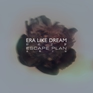
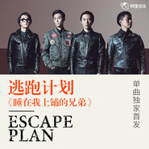

逃跑计划
============================

|  |  |
| :--: | :-- |
| [ 逃跑计划](https://i.xiami.com/taopaojihua) | **地区**: China 中国大陆 **风格**: 流行摇滚 Pop Rock, 独立流行 Indie Pop **播放数**: 320457194 **粉丝数**: 306572 **评论数**: 3076  |

## 档案

小档案 
中 文 名： 逃跑计划乐队 
外 文 名： escape plan 
主   唱： 毛川 
吉   他： 马晓东 
贝   斯： 刚昂 
鼓   手： 李洪涛 
成立时间： 2007年 
代表作品： 夜空中最亮的星 
简介 
成军于2007年的逃跑计划（Escape Plan）由主唱毛川、吉他手马晓东、贝斯手小刚、鼓手红桃组成，是中国最具有影响力的摇滚乐队之一，其乐队风格“张扬又不失内涵”，被誉为“穿透灵魂的摇滚好青年”、“国摇界的当红炸子鸡”。乐队2012年发行首张专辑《世界》，《夜空中最亮的星》《一万次悲伤》等曲目获得了广泛好评，并斩获年度摇滚专辑、年度摇滚乐队等重磅大奖，成为各大音乐节的压轴常客；2016携新EP《时代之梦》，举行了全国七城的剧院级别巡演；2017年首次登录北美巡演，在洛杉矶、芝加哥、纽约、波士顿四站演出。 
演艺经历 
2005  年末，来自青岛的毛川与老乡马晓东等人在北京组建了孔雀乐队，毛川担任主创。经过两年的重组与磨合，乐队更名为逃跑计划。经过  7  年的历练，来自山东的毛川、马晓东、小刚和来自哈尔滨的红桃构成了乐队的最终阵容。 
2006  年  4  月，逃跑计划乐队参加通力杯全国乐队大赛，获得第三名。  8  月，主唱毛川代表乐队参加了北京电视台“欢度世界杯”栏目的现场直播，在为期一个月的时间里，毛川以每两天一首新歌（词，曲）的创作能力，为乐队打开了现身大众媒体的第一扇门。同年  11  月，与“麦丁国际”签约奥运单曲，创作了《  08  年我们结婚》。因相关事宜不完善，所以合约失效，作品被乐队自己保留。 
2007  年  3  月，乐队接受《广播歌选》杂志采访，并且被专刊报道。  6  月，乐队作品《  APPLE  》被《我爱摇滚乐》有声杂志收录于第  66  期。  7  月，在  MAO Livehouse  参加“我们还有时间拯救”救助三个失血儿童的慈善义演活动，是乐队自成立以来参加的最有意义最有价值的活动。同年  9  月，参加北京  798  艺术沙龙社区举办的“与建筑的对话”摇滚演出活动。  10  月，乐队作品《  08  年我们结婚》入闱北京电视台“唱响奥运”栏目的奥运征歌的前十名，并且在同年  12  月应邀参加了栏目组的电视节目录制。 
2008  年  1  月，  Perdel  逃跑计划入选  MAO Livehouse  举办最佳新生力量提名，并获得名次。乐队与台湾音乐制作人李宗盛合作参加“百年  CONVERSE  （匡威）”广告的录制，乐队作品以及现场得到李宗盛好评。同年  2-3  月期间，乐队便开始大范围活跃在北京的各个演出场所。  4  月，推出乐队首张  EP  。并且在  2008  年  MIDI  音乐节的主舞台亮相。  2008  年  11  月  1  日   在  MAO Livehouse  举行第一场专场演出。 
2009  年《  A City Without Sorrow  没有悲伤的城市》逃跑计划乐队首次全国巡演。  2009  年首届中国摇滚迷笛迷笛奖，荣获“最佳年度摇滚新人奖”。同年，在《快乐女声》决赛中与李霄云合作。  5  月  28  日，荣获“盖世群音”乐队大赛北京赛区冠军。 
2011  年的  15  届“首尔国际动漫节”上，为参赛动画《星游记》主题曲进行演唱。  9  月  19  日，拍摄入围“  2011  红牛新能量音乐计划”入选合辑的能量歌曲《阳光照进回忆里》的  MV  。 
2012  年  9  月  22  日，虎牌啤酒乐队龙虎榜全国总决赛。  7  月，推出专辑《世界》。  11  月  21  日，举办哈尔滨  sublive  演唱会。  23  日，举办逃跑计划《  earth  》长春站；  24  日，举办逃跑计划《  earth  》沈阳站；  25  日，举办逃跑计划《  earth  》大连站。  12  月  16  日第四届中国摇滚迷笛奖，乐队一举摘得四项大奖：最佳年度摇滚乐队、最佳年度摇滚专辑（《世界》）、最佳年度摇滚歌曲（《夜空中最亮的星》）、最佳年度摇滚男歌手（毛川）。  12  月  22  日，逃离末日——逃跑计划上海专场。  12  月  29  日—  31  日，逃跑计划北京  MAO LIVEHOUSE  三专场。 
2013  年  2  月  1  日，发表《爱在北京的岁月》。  4  月  4  日，举办逃跑计划《  earth  》西安站。  7  月  10  日，获邀为台湾  2013  新北市贡寮海洋国际音乐节大陆乐团代表。 
2014  年  11  月  19  日，受邀参加魅族（  MEIZU  ）手机新品发布会，作为开场演唱嘉宾乐队。 
2015  年  5  月，逃跑计划作为特别演员参与了《摇滚英雄》；  5  月  16  日，在台湾举办大型演唱会。

## 专辑

| 名称 | 语种 | 唱片公司 | 发行时间 | 专辑类别 | 专辑风格 |
| :--: | :-- | :-- | :-- | :-- | :-- |
| [ 伟大的友谊](./albums/2106058201.md) | 国语 | 东亚星光 | 2020年02月16日 | EP, 单曲 | 国语流行 Mandarin Pop |
| [ 闪光的回忆Shining Memory](./albums/2102766424.md) | 国语 | StreetVoice, 东亚星光 | 2017年06月16日 | EP, 单曲 | 流行摇滚 Pop Rock |
| [ 时代之梦](./albums/2100351125.md) | 国语 | 匠尺文化 | 2016年06月06日 | EP, 单曲 | 流行摇滚 Pop Rock |
| [ 睡在我上铺的兄弟](./albums/2100301400.md) | 国语 | 乐视影业 | 2016年03月28日 | EP, 单曲 | 流行摇滚 Pop Rock |
| [ 因为理想](./albums/5020829725.md) | 国语 |  | 2013年05月01日 | EP, 单曲 | 摇滚 Rock & Roll |
| [ 青春没有终点](./albums/1571826547.md) | 国语 | 美丽世界音乐 | 2012年07月20日 | EP, 单曲 | 流行摇滚 Pop Rock, 英伦摇滚 Britpop, 布鲁斯摇滚 Blues Rock |
| [ 世界Earth](./albums/487102.md) | 国语 | 美丽世界音乐 | 2012年01月01日 | 录音室专辑 | 流行摇滚 Pop Rock |
| [ 带我离开Take Me Away...](./albums/308816.md) | 国语 | 美丽世界音乐 | 2008年08月08日 | EP, 单曲 |  |

## 评论

|  |  |  |
| :-- | :-- | :-- |
|  [虾米用户](https://emumo.xiami.com/u/12306228) Sing My Soul... 2021-01-15 13:48 赞(0) 踩(0) | 
评论太少不科学
 |
|  [虾米用户](https://emumo.xiami.com/u/276479856) @晚安虾米音乐/公众等你 2021-01-12 02:52 赞(0) 踩(0) | 
歌虽然不多，但是每首我都喜欢
 |
|  [虾米用户](https://emumo.xiami.com/u/276479856) @晚安虾米音乐/公众等你 2021-01-12 02:51 赞(0) 踩(0) | 
一开始就是在虾米认识逃跑计划的 
 |
|  [虾米用户](https://emumo.xiami.com/u/50229840) 生命不在于得到什么，而在... 2020-08-04 01:15 赞(0) 踩(0) | 
还不出歌。。。
 |
|  [虾米用户](https://emumo.xiami.com/u/416514968)  2020-07-27 12:48 赞(0) 踩(0) | 
人TVvv vv_城 、人女人方法润肤乳
 |
|  [虾米用户](https://emumo.xiami.com/u/379162683) 我想要记住你们，我想要你... 2020-06-06 16:45 赞(0) 踩(0) | 

 |
|  [虾米用户](https://emumo.xiami.com/u/440060032) 听听唱唱尿尿 2020-05-30 11:31 赞(1) 踩(0) | 
喜欢&amp;lt;&amp;lt;夜空中最亮的星&amp;gt;&amp;gt;，因为这是一个人的情境和抗争和信仰~好像张韶涵的&amp;lt;&amp;lt;隐形的翅膀&amp;gt;&amp;gt;，都是一心向上一心向好~
 |
|  [虾米用户](https://emumo.xiami.com/u/27857090) 有朝一日 2020-05-09 17:37 赞(0) 踩(0) | 

 |
|  [虾米用户](https://emumo.xiami.com/u/971010) 这家伙很聪明什么也没留下... 2020-04-24 09:30 赞(0) 踩(0) | 
我还记得演唱会上那个满脸泪水的男孩。
 |
|  [虾米用户](https://emumo.xiami.com/u/276094038) 遗 世//。而 独立  2020-03-16 02:32 赞(0) 踩(0) | 
谢谢你们坚持了这么久 请一直都在
 |
|  [虾米用户](https://emumo.xiami.com/u/2796166) 最爱莫文蔚..... 2020-02-18 01:58 赞(0) 踩(0) | 
加油~~~~yeah~
 |
|  [虾米用户](https://emumo.xiami.com/u/4325830)  2020-01-23 13:19 赞(1) 踩(0) | 
20年了，该出新专辑了吧。 
 |
|  [虾米用户](https://emumo.xiami.com/u/251583221)  2020-01-22 22:49 赞(0) 踩(0) | 
牛牛牛牛牛牛牛牛！！！！！！！！！！！！！！！！！！！！！！！！！！！！！！ ！！！！！！！！！！！！！！！！！！！！！！！！！！！！！！ ！！！！！！！！！！！！！！！！！！！！！！！！！！！！！！ ！！！！！！！！！！！！！！！！！！！！！！！！！！！！！！ ！！！！！！！！！！！！！！！！！！！！！！！！！！！！！！ ！！！！！！！！！！！！！！！！！！！！！！！！！！！！！！ ！！！！！！！！！！！！！！！！！！！！！！！！！！！！！！ ！！！！！！！！！！！！！！！！！！！！！！！！！！！！！！ ！！！！！！！！！！！！！！！！！！！！！！！！！！！！！！ ！！！！！！！！！！！！！！！！！！！！！！
 |
|  [虾米用户](https://emumo.xiami.com/u/402532382)  2019-12-05 20:41 赞(0) 踩(0) | 
这首歌还可以
 |
|  [虾米用户](https://emumo.xiami.com/u/10881363) C'est la vie... 2019-10-10 20:54 赞(0) 踩(0) | 
令人羡慕的长腿与发量
 |
|  [虾米用户](https://emumo.xiami.com/u/230281976)  2019-10-08 19:00 赞(0) 踩(0) | 
我买的第一张也是现在唯一的一张正版CD，开车的时候无限循环一个多月了，感觉我好像能理解你们要表达的意思，却又说不出来，和我心正切合。如果可以的话，mv要做好点才能与这么经典的歌匹配。期待你们的下一张专辑 
 |
|  [虾米用户](https://emumo.xiami.com/u/11313978) 光彩照人本就不易-不安分... 2019-08-24 02:09 赞(0) 踩(0) | 
抄袭简单计划 
 |
|  [虾米用户](https://emumo.xiami.com/u/561819) 自律 2019-08-23 23:32 赞(0) 踩(0) | 
距离第一次听逃跑乐队竟然已经快十年了。啧。
 |
|  [虾米用户](https://emumo.xiami.com/u/380016678) 亲爱的，别离开。 2019-08-22 19:22 赞(0) 踩(0) | 
我爱你们 谢谢你们
 |
|  [虾米用户](https://emumo.xiami.com/u/308436357) 有点不聪明什么也不留..... 2019-08-20 15:10 赞(0) 踩(0) | 
牛逼，就是，歌真的倍儿棒
 |
|  [虾米用户](https://emumo.xiami.com/u/50160009)   2019-08-16 20:10 赞(2) 踩(0) | 
为什么没去参加乐夏，其实一直在等逃跑计划出场&amp;hellip;&amp;hellip;
 |
|  [虾米用户](https://emumo.xiami.com/u/93485204)  2019-08-11 07:46 赞(0) 踩(0) | 
tyt'bnk。。m。.org，
 |
|  [虾米用户](https://emumo.xiami.com/u/52056952) 人生即是到來、相遇、陪伴... 2019-07-16 12:59 赞(0) 踩(0) | 
♥
 |
|  [虾米用户](https://emumo.xiami.com/u/377388231) Qwert yui op... 2019-07-10 15:51 赞(0) 踩(0) | 
他们居然喜欢椎名林檎？！这风格像不搭边啊。
 |
|  [虾米用户](https://emumo.xiami.com/u/358104299) 悲观的唯心存在现实解构虚... 2019-06-29 12:45 赞(0) 踩(0) | 
12480
 |
|  [虾米用户](https://emumo.xiami.com/u/16823384)  我希望有一颗透明的心灵... 2019-06-10 15:16 赞(3) 踩(0) | 
为啥没上乐队的夏天 哈哈
 |
|  [虾米用户](https://emumo.xiami.com/u/328842286)  2019-05-23 17:18 赞(2) 踩(0) | 
陪我度过了最艰难的日子
 |
|  [虾米用户](https://emumo.xiami.com/u/856026) to the moon 2019-05-07 13:51 赞(0) 踩(0) | 
突然想起来在哪里见过你们了！ 广州！！
 |
|  [虾米用户](https://emumo.xiami.com/u/293557697) 我会永远十八岁，缩不小也... 2019-04-27 22:05 赞(20) 踩(0) | 
虾米还缺一首《星游记》主题曲 《再飞行》 歌名：再飞行 作曲：格非 作词：爱的战士刘北 演唱：逃跑计划乐队 出自：星游记动画片头曲 歌词： 眼前重复的风景 渐渐模糊的约定 星空下流浪的你 仍然秘密的距离 温度消失的瞬间 无法触摸的明天 没有引力的世界 没有脚印的光年 还在等着你出现 日日夜夜自转的行星 到处遮满别人的背影 让风吹散混乱的呼吸 快快清醒 yeyeye 静静照亮原来的自己 天空撒满忽然的光明 眼中只要绚烂的天际 再飞行
 |
| ⇒ |  [虾米用户](https://emumo.xiami.com/u/283614544) Music is lif... 2019-05-01 18:19 赞(0) 踩(0) | 
找了半天没找到 所以来评论看看 
 |
|  [虾米用户](https://emumo.xiami.com/u/403706778)  2019-04-21 21:00 赞(0) 踩(0) | 
超好听的。
 |
|  [虾米用户](https://emumo.xiami.com/u/10494100) 浏览声音，珍藏音符 2019-04-13 14:16 赞(0) 踩(0) | 
酷玩 绿日 梦龙  共和时代
 |
|  [虾米用户](https://emumo.xiami.com/u/423100853)  2019-04-11 10:16 赞(0) 踩(0) | 
666。
 |
|  [虾米用户](https://emumo.xiami.com/u/46402630)  2019-03-24 01:23 赞(2) 踩(0) | 
到底什么时候可以上你的爱情啊？？？
 |
|  [虾米用户](https://emumo.xiami.com/u/420777478)  2019-03-22 19:15 赞(0) 踩(0) | 
好听
 |
|  [虾米用户](https://emumo.xiami.com/u/43255668)  2019-03-12 00:09 赞(7) 踩(0) | 
你的爱情怎么还不发EP!
 |
|  [虾米用户](https://emumo.xiami.com/u/312704809)  2019-03-08 22:23 赞(0) 踩(0) | 
特好听
 |
|  [虾米用户](https://emumo.xiami.com/u/354599993)  2019-03-06 19:32 赞(1) 踩(0) | 
软软的非常出差吃吃吃
 |
|  [虾米用户](https://emumo.xiami.com/u/379233187)  2019-03-02 00:15 赞(0) 踩(0) | 
难得一闻的好歌，听了很多次，希望再有这样倾心悦耳的好歌
 |
|  [虾米用户](https://emumo.xiami.com/u/260756613) 夜空中最弱的星 2019-02-27 01:42 赞(0) 踩(0) | 
逃跑大爱
 |
|  [虾米用户](https://emumo.xiami.com/u/245459510)  2019-02-22 08:14 赞(1) 踩(0) | 
耶
 |
|  [虾米用户](https://emumo.xiami.com/u/418950261)  2019-02-12 11:27 赞(0) 踩(0) | 
微信我要加
 |
|  [虾米用户](https://emumo.xiami.com/u/418950261)  2019-02-12 11:26 赞(0) 踩(0) | 

 |
|  [虾米用户](https://emumo.xiami.com/u/418950261)  2019-02-12 11:25 赞(0) 踩(0) | 
再唱一些别的？
 |
|  [虾米用户](https://emumo.xiami.com/u/286768724)  2019-02-11 18:34 赞(0) 踩(0) | 
给哈哈哈，我觉得可以
 |
|  [虾米用户](https://emumo.xiami.com/u/39944384) 那么热血 无理 2019-02-10 01:21 赞(0) 踩(0) | 
喜欢这个乐队 特别有感觉
 |
|  [虾米用户](https://emumo.xiami.com/u/10292779)  2019-02-07 23:36 赞(0) 踩(0) | 
看了春/晚的改编，很生气
 |
|  [虾米用户](https://emumo.xiami.com/u/151521902) 别在树下徘徊，别在雨中沉... 2019-02-05 17:38 赞(0) 踩(0) | 
好久没新歌了……
 |
|  [虾米用户](https://emumo.xiami.com/u/151521902) 别在树下徘徊，别在雨中沉... 2019-02-05 17:37 赞(0) 踩(0) | 
我可以说你们的所有歌都很好听吗？(ง •̀_•́)ง
 |
|  [虾米用户](https://emumo.xiami.com/u/209945845) 死にませんが？ 2019-01-30 13:47 赞(3) 踩(0) | 
毛川太他妈帅了
 |
| ⇒ |  [虾米用户](https://emumo.xiami.com/u/377388231) Qwert yui op... 2019-07-10 15:49 赞(0) 踩(0) | 
换了发型后更帅
 |
|  [虾米用户](https://emumo.xiami.com/u/264458678)  2019-01-26 23:54 赞(0) 踩(0) | 
太好听了
 |
|  [虾米用户](https://emumo.xiami.com/u/307611577) 那些说好的，就都算了吧。 2019-01-25 22:43 赞(3) 踩(0) | 
你的爱情啥时候上架啊
 |
|  [虾米用户](https://emumo.xiami.com/u/303506160) 因为我对你爱的深沉 2019-01-24 00:07 赞(2) 踩(0) | 
嘿呦
 |
|  [虾米用户](https://emumo.xiami.com/u/4911883) 如果你也爱Eason 2019-01-23 23:47 赞(0) 踩(0) | 
新专该来了
 |
|  [虾米用户](https://emumo.xiami.com/u/1425642) 我还没想好要写什么... 2019-01-22 19:29 赞(2) 踩(0) | 
为什么虾米还没有你的爱情这首歌
 |
|  [虾米用户](https://emumo.xiami.com/u/4771536) I like the v... 2019-01-20 21:26 赞(0) 踩(0) | 
你的爱情 好听～
 |
|  [虾米用户](https://emumo.xiami.com/u/127192866) 兰花换锦服。 2019-01-20 11:10 赞(0) 踩(0) | 
《你的爱情》真的不错
 |
|  [虾米用户](https://emumo.xiami.com/u/50388578) 越长大越孤单 2019-01-19 18:07 赞(1) 踩(0) | 
我和你们不一样。我是08年结婚时放08年我们结婚时认识这个队的。我有优越感。
 |
|  [虾米用户](https://emumo.xiami.com/u/4279183)   2019-01-19 08:40 赞(2) 踩(0) | 
现在只想知道你的爱情什么时候出， 好听，编曲很赞
 |
|  [虾米用户](https://emumo.xiami.com/u/276094038) 遗 世//。而 独立  2019-01-19 02:17 赞(4) 踩(0) | 
感谢《歌手》！ 感谢500个现场听众那 不盲从不落俗的品味与健康不浮躁的审美！！ 让我觉得更喜欢他们 是一件无比幸福无比正确的事！！！
 |
|  [虾米用户](https://emumo.xiami.com/u/407780443) 曾经说好的取了就不能舍 2019-01-19 00:37 赞(1) 踩(0) | 
你的爱情
 |
|  [虾米用户](https://emumo.xiami.com/u/41803)  2019-01-19 00:29 赞(2) 踩(0) | 
今晚的歌手 很棒！ 最喜欢齐豫刘欢跟你们 我觉得唱歌技巧好音域广固然是难得，但都不如你们这样 直接简单 有自己风格的音乐来得珍贵 加油！
 |
|  [虾米用户](https://emumo.xiami.com/u/306476) 我还没想好要写什么... 2019-01-19 00:03 赞(2) 踩(0) | 
一个陌生人完全被圈粉
 |
| ⇒ |  [虾米用户](https://emumo.xiami.com/u/306476) 我还没想好要写什么... 2019-01-19 00:04 赞(0) 踩(0) | 
我竟然是第三千个留言哈哈，看完歌手想去买你们演唱会票
 |
|  [虾米用户](https://emumo.xiami.com/u/74244272) 八戒，谁让你翻我资料的 2019-01-18 22:30 赞(49) 踩(0) | 
《你的爱情》太好听了   ，支持支持，笔芯
 |
|  [虾米用户](https://emumo.xiami.com/u/89269630)  2019-01-16 11:37 赞(1) 踩(0) | 
单曲循环夜空中最亮的星 
 |
|  [虾米用户](https://emumo.xiami.com/u/81926692) 听音乐也听生活 2019-01-14 20:25 赞(4) 踩(0) | 
有点Coldplay的那种味道。耳边响起那些歌，真的感觉自己好像长不大，永远年轻，永远热泪盈眶，永远热血沸腾，永远是那个少年。真的很独特很好听，陪伴了整个青春的声音啊。要越来越好！
 |
|  [虾米用户](https://emumo.xiami.com/u/277957297) 有你就好…… 2019-01-14 12:50 赞(1) 踩(0) | 
逃跑计划！ 舍得是门学问，是看你舍了什么，就会得到什么！是看你舍了多少，相对的就会得到多少……
 |
|  [虾米用户](https://emumo.xiami.com/u/215847755) 还有整理不完的歌单读一半... 2019-01-14 05:04 赞(3) 踩(0) | 
“这是一个不完美的世界，我们无法选择。面对丑恶，面对创伤，面对死亡，事实上我们无路可逃，所以逃跑的真正意义仅存在于计划。”
 |
|  [虾米用户](https://emumo.xiami.com/u/408637106)  2019-01-04 18:27 赞(2) 踩(0) | 
原唱才是最好听的！！
 |
|  [虾米用户](https://emumo.xiami.com/u/303506160) 因为我对你爱的深沉 2019-01-02 08:19 赞(1) 踩(0) | 
嘿呦
 |
|  [虾米用户](https://emumo.xiami.com/u/177970278) 是脆弱同时也是力量 2018-12-30 17:13 赞(2) 踩(0) | 
开心死了啊啊啊 歌手加油
 |
|  [虾米用户](https://emumo.xiami.com/u/344149677) 时间可否慢点………… 2018-12-27 12:14 赞(2) 踩(0) | 
第一次还是在坐在车里听到这首歌
 |
|  [虾米用户](https://emumo.xiami.com/u/186156516) 我的故事被風吹散 我的明... 2018-12-27 07:06 赞(3) 踩(0) | 
期待歌手2019！
 |
|  [虾米用户](https://emumo.xiami.com/u/305525084)  2018-12-26 22:13 赞(35) 踩(0) | 
你们终于上《歌手》了，虽然知道你们可能走的不会太远，但还是特别期待你们带来重新演绎的作品。  加油！
 |
| ⇒ |  [虾米用户](https://emumo.xiami.com/u/4184215) 故事的小黄花 2019-01-18 22:31 赞(0) 踩(0) | 
好喜欢今晚竟演的那首歌。
 |
| ⇒ |  [虾米用户](https://emumo.xiami.com/u/305525084)  2019-01-18 23:53 赞(0) 踩(0) | 
<q><b>四葉说：</b></q>
 |
| ⇒ |  [虾米用户](https://emumo.xiami.com/u/414013472) 用音乐与世界连接 2019-01-29 02:44 赞(0) 踩(0) | 
那些现场听众不懂欣赏
 |
|  [虾米用户](https://emumo.xiami.com/u/401173840)  2018-12-24 03:03 赞(4) 踩(0) | 
夜空中最亮的星，校园版本，我天天单曲循环，希望在这也能听到，天天看腾讯视频，辣眼睛
 |
|  [虾米用户](https://emumo.xiami.com/u/411118543)  2018-12-23 17:19 赞(0) 踩(0) | 
唱的非常好听
 |
|  [虾米用户](https://emumo.xiami.com/u/27019179)  2018-12-20 17:59 赞(2) 踩(0) | 
不用感谢我收藏你们的作品，好作品谁都喜欢，感谢你给我们带来音乐上美的享受！
 |
|  [虾米用户](https://emumo.xiami.com/u/42812575) 用音乐填满我的空虚 2018-12-12 17:49 赞(1) 踩(0) | 
我昨天还听着呢，今天就没了
 |
| ⇒ |  [虾米用户](https://emumo.xiami.com/u/411118543)  2018-12-23 17:19 赞(0) 踩(0) | 
 
 |
|  [虾米用户](https://emumo.xiami.com/u/6881173) 过去是我冷落了你，从现在... 2018-12-10 21:37 赞(0) 踩(0) | 
他们为什么没有大火？
 |
|  [虾米用户](https://emumo.xiami.com/u/353383122)  2018-12-02 19:00 赞(1) 踩(0) | 
呵呵好听养耳
 |
|  [虾米用户](https://emumo.xiami.com/u/403692105)  2018-12-01 04:33 赞(1) 踩(0) | 
想听星游记。
 |
|  [虾米用户](https://emumo.xiami.com/u/4487129)  2018-11-15 08:46 赞(0) 踩(0) | 
！！！
 |
|  [虾米用户](https://emumo.xiami.com/u/404632812) 花有重开日，人无再少年 2018-11-10 19:25 赞(0) 踩(0) | 
好听，是我喜欢的歌曲类型之一
 |
|  [虾米用户](https://emumo.xiami.com/u/408000516)  2018-11-06 21:30 赞(0) 踩(0) | 
 
 |
|  [虾米用户](https://emumo.xiami.com/u/207573038)  2018-11-06 19:34 赞(0) 踩(0) | 
拉开wlwxcw胃啊
 |
|  [虾米用户](https://emumo.xiami.com/u/368481079)  2018-11-04 22:54 赞(0) 踩(0) | 
很期待你们再出心的歌
 |
|  [虾米用户](https://emumo.xiami.com/u/314954280) Hi  2018-10-30 18:49 赞(2) 踩(0) | 
夜空中最亮的星，请给我点个赞。[带墨镜笑]
 |
|  [虾米用户](https://emumo.xiami.com/u/352039380) 听着音乐入睡 2018-10-22 17:09 赞(0) 踩(0) | 
歌太好听了。赞赏
 |
|  [虾米用户](https://emumo.xiami.com/u/404056028)  2018-10-14 18:03 赞(0) 踩(0) | 
淘宝计划？
 |
|  [虾米用户](https://emumo.xiami.com/u/404169037)  2018-10-06 10:03 赞(0) 踩(0) | 
能发你们的照片给我吗？
 |
|  [虾米用户](https://emumo.xiami.com/u/404169037)  2018-10-06 10:00 赞(0) 踩(0) | 
星星如歌听见最美好的你们加油!  
 |
|  [虾米用户](https://emumo.xiami.com/u/64688820)  2018-09-29 12:27 赞(1) 踩(0) | 
好听青岛人顶
 |
|  [虾米用户](https://emumo.xiami.com/u/9372715) 孤独的人听后摇。 2018-09-29 10:07 赞(0) 踩(0) | 
厦门简单生活音乐节，你们会来吗？！
 |
|  [虾米用户](https://emumo.xiami.com/u/7244457) 我还没想好要写什么... 2018-09-26 11:41 赞(0) 踩(0) | 
求出新专
 |
|  [虾米用户](https://emumo.xiami.com/u/309230446)  2018-09-24 07:13 赞(1) 踩(0) | 
每一道眼泪是一万道光，最昏暗的地方也变得明亮
 |
|  [虾米用户](https://emumo.xiami.com/u/1249304) 我还没想好要写什么... 2018-09-08 12:29 赞(1) 踩(0) | 
还不出新歌？
 |
|  [虾米用户](https://emumo.xiami.com/u/194362430) 你熬夜你也会 2018-08-24 16:35 赞(3) 踩(0) | 
coldplay like
 |
|  [虾米用户](https://emumo.xiami.com/u/297999609) 去克洛里吧 2018-07-30 22:38 赞(0) 踩(0) | 
、
 |
|  [虾米用户](https://emumo.xiami.com/u/282387825) 我爱的是你爱我 2018-07-29 08:25 赞(1) 踩(0) | 

 |
|  [虾米用户](https://emumo.xiami.com/u/327757758)  2018-07-27 21:26 赞(0) 踩(0) | 
这歌我很爱听，期待你们出更好的作品。
 |
|  [虾米用户](https://emumo.xiami.com/u/85234430)  2018-07-27 20:00 赞(1) 踩(0) | 
求出新歌！
 |
|  [虾米用户](https://emumo.xiami.com/u/282387825) 我爱的是你爱我 2018-07-25 00:22 赞(1) 踩(0) | 
淘宝计划666
 |
|  [虾米用户](https://emumo.xiami.com/u/333965514) 私の名前は？ 2018-07-20 22:36 赞(1) 踩(0) | 
庞&amp;hellip;&amp;hellip;庞麦郎？
 |
|  [虾米用户](https://emumo.xiami.com/u/27804577) Stay simple,... 2018-07-14 12:45 赞(1) 踩(0) | 
隔了这么多年再听居然被治愈了
 |
|  [虾米用户](https://emumo.xiami.com/u/325433193) 正当芳华、才不做大多数 2018-06-29 22:23 赞(0) 踩(0) | 
我听张杰翻唱的前面的调有我童年的感觉&amp;hellip;&amp;hellip;
 |
|  [虾米用户](https://emumo.xiami.com/u/50590185) https://www.... 2018-06-27 19:52 赞(2) 踩(0) | 
事实证明，有的歌还是原唱最有意味。
 |
|  [虾米用户](https://emumo.xiami.com/u/321383340)  2018-06-03 15:44 赞(3) 踩(0) | 
毛川真他妈帅
 |
|  [虾米用户](https://emumo.xiami.com/u/12221090) 逍遥于天地而心意自得 2018-05-28 01:49 赞(0) 踩(0) | 
赞
 |
|  [虾米用户](https://emumo.xiami.com/u/112281570) 人生是一次愉快旅行，感謝... 2018-05-22 00:49 赞(3) 踩(0) | 
夜空中最亮的星，能否听清我在地球呼唤你～～～
 |
|  [虾米用户](https://emumo.xiami.com/u/366298613) Less is more 2018-05-21 00:21 赞(0) 踩(0) | 
三千!
 |
|  [虾米用户](https://emumo.xiami.com/u/353898350) 小rg 2018-05-20 20:30 赞(3) 踩(0) | 
逃跑计划唱的歌音调都比较低，我喜欢这种歌
 |
|  [虾米用户](https://emumo.xiami.com/u/318122995) 18岁的美少女 2018-05-17 20:06 赞(1) 踩(0) | 
好听
 |
|  [虾米用户](https://emumo.xiami.com/u/5885862)  2018-05-03 22:13 赞(2) 踩(0) | 
好久没有听到这么好听的歌了      逃跑计划  收了   
 |
|  [虾米用户](https://emumo.xiami.com/u/245126886) 唯有孤独永恒。 2018-05-01 22:08 赞(0) 踩(0) | 
毛川，成都，Escape Plan今夜最强 
 |
|  [虾米用户](https://emumo.xiami.com/u/243612528)  2018-04-27 11:38 赞(0) 踩(0) | 
什么歌唱的都一样
 |
|  [虾米用户](https://emumo.xiami.com/u/307777599) 革命，是不朽的。 2018-04-20 21:55 赞(0) 踩(0) | 
不如林肯公园
 |
| ⇒ |  [虾米用户](https://emumo.xiami.com/u/378841254)  2018-09-20 13:38 赞(0) 踩(0) | 
都跟林肯做对比了，说明档次也不低呀
 |
|  [虾米用户](https://emumo.xiami.com/u/270837429) 我唱的不够动人，你别皱眉 2018-04-18 20:12 赞(2) 踩(0) | 
逃跑计划和coldplay好像
 |
| ⇒ |  [虾米用户](https://emumo.xiami.com/u/25382133) 守心自暖 2018-08-15 06:02 赞(0) 踩(0) | 
他们还需要更棒！
 |
|  [虾米用户](https://emumo.xiami.com/u/78567816) 我还没想好要写什么... 2018-04-12 12:54 赞(0) 踩(0) | 
几时开演唱会
 |
|  [虾米用户](https://emumo.xiami.com/u/20814234)  2018-04-10 15:46 赞(1) 踩(0) | 
我爱你们！求出新歌！！！
 |
|  [虾米用户](https://emumo.xiami.com/u/351738394)  2018-04-09 18:10 赞(1) 踩(0) | 
始终单曲循环～
 |
|  [虾米用户](https://emumo.xiami.com/u/354743161)  2018-04-04 21:10 赞(0) 踩(0) | 

 |
|  [虾米用户](https://emumo.xiami.com/u/8873048) 迷幻南方摇滚蓝调自赏仙音... 2018-04-04 14:13 赞(0) 踩(0) | 
AVIREX飞行员夹克
 |
|  [虾米用户](https://emumo.xiami.com/u/203259740)  2018-04-01 11:54 赞(0) 踩(0) | 
摇滚皇帝
 |
|  [虾米用户](https://emumo.xiami.com/u/122741406)   2018-03-30 20:18 赞(0) 踩(0) | 
喜欢chemical bus
 |
|  [虾米用户](https://emumo.xiami.com/u/19996714) What's the p... 2018-03-29 07:49 赞(0) 踩(0) | 
卧槽换发型之后真的帅
 |
|  [虾米用户](https://emumo.xiami.com/u/151521902) 别在树下徘徊，别在雨中沉... 2018-03-24 19:39 赞(3) 踩(0) | 
2018年了，就盼着出新专辑  
 |
|  [虾米用户](https://emumo.xiami.com/u/335268947)  2018-03-23 19:17 赞(0) 踩(0) | 
帮出道的发型浓浓的披头士味
 |
|  [虾米用户](https://emumo.xiami.com/u/25358042)  2018-03-21 22:08 赞(1) 踩(0) | 
逃跑计划的歌怎么用SVIP也下载不了啊 
 |
|  [虾米用户](https://emumo.xiami.com/u/355064486) 喜欢音乐，带来的美好心情 2018-03-20 22:48 赞(0) 踩(0) | 
我想关注你们的，但不知道怎么办？麻烦帮帮忙 
 |
|  [虾米用户](https://emumo.xiami.com/u/302388301)  2018-03-18 00:06 赞(0) 踩(0) | 
Like A Bird
 |
|  [虾米用户](https://emumo.xiami.com/u/52728741)  2018-03-17 01:08 赞(0) 踩(0) | 
诶？你们咋剪头了呢？
 |
|  [虾米用户](https://emumo.xiami.com/u/24838376) ++++++++++++ 2018-03-12 22:31 赞(0) 踩(0) | 
啊 红桃 中学男神
 |
|  [虾米用户](https://emumo.xiami.com/u/343039659)  2018-02-19 09:17 赞(0) 踩(0) | 
重聚吧
 |
|  [虾米用户](https://emumo.xiami.com/u/114821636) 风雨洗礼了彩虹，烂漫了世... 2018-02-18 01:13 赞(4) 踩(0) | 
无论在哪，总感觉逃跑计划不是在逃跑，而是追逐心灵的深处，青春的渴望，生活的希望。
 |
| ⇒ |  [虾米用户](https://emumo.xiami.com/u/327351613)  2018-03-11 12:17 赞(0) 踩(0) | 

 |
|  [虾米用户](https://emumo.xiami.com/u/246543420) 穿上风衣我推门出去 2018-02-08 15:02 赞(1) 踩(0) | 
一万次悲伤
 |
|  [虾米用户](https://emumo.xiami.com/u/346309184) 你猜不透 2018-01-25 18:51 赞(2) 踩(0) | 
夜空中最亮的星太好听了！逃跑计划万万万岁岁岁666666
 |
| ⇒ |  [虾米用户](https://emumo.xiami.com/u/310414250)  2018-02-17 17:14 赞(0) 踩(0) | 
？？
 |
|  [虾米用户](https://emumo.xiami.com/u/215473326) 你是人间五月天 2018-01-22 06:26 赞(4) 踩(0) | 
有多久没听曾经你最喜欢的逃跑计划了？因为什么呢？
 |
|  [虾米用户](https://emumo.xiami.com/u/333822101) 春风不止十里，心有多大哪... 2018-01-16 10:40 赞(3) 踩(0) | 
前五首歌真的是我的最爱
 |
|  [虾米用户](https://emumo.xiami.com/u/113511032) 再见，再也不见 2018-01-15 16:15 赞(1) 踩(0) | 
你好
 |
|  [虾米用户](https://emumo.xiami.com/u/45007822)  2018-01-12 04:41 赞(2) 踩(0) | 
快发唱片吧！我的逃跑，等到要哭了，我想多听你们几十年。
 |
|  [虾米用户](https://emumo.xiami.com/u/333965514) 私の名前は？ 2017-12-30 12:24 赞(2) 踩(0) | 
夜空中最亮的星真神曲
 |
|  [虾米用户](https://emumo.xiami.com/u/341161370)  2017-12-30 06:32 赞(1) 踩(0) | 
真棒!    
 |
|  [虾米用户](https://emumo.xiami.com/u/11931217)  2017-12-25 10:09 赞(1) 踩(0) | 
真的超好听
 |
|  [虾米用户](https://emumo.xiami.com/u/103659178) 永远宠爱哥哥 2017-12-24 21:58 赞(51) 踩(0) | 
有多少人是从夜空中最亮的星开始关注这个乐队的
 |
| ⇒ |  [虾米用户](https://emumo.xiami.com/u/303341860) Heaven knows 2018-01-23 22:43 赞(0) 踩(0) | 
我是
 |
|  [虾米用户](https://emumo.xiami.com/u/103659178) 永远宠爱哥哥 2017-12-24 21:57 赞(1) 踩(0) | 
看到了beyond当年的一点影子，逃跑计划华语乐坛的希望
 |
| ⇒ |  [虾米用户](https://emumo.xiami.com/u/333965514) 私の名前は？ 2017-12-30 12:24 赞(0) 踩(0) | 
朋友你来晚啦
 |
|  [虾米用户](https://emumo.xiami.com/u/334935388)  2017-12-24 00:12 赞(0) 踩(0) | 
好听
 |
|  [虾米用户](https://emumo.xiami.com/u/311479018)   2017-12-21 17:09 赞(1) 踩(0) | 
666
 |
|  [虾米用户](https://emumo.xiami.com/u/333965514) 私の名前は？ 2017-12-19 19:06 赞(3) 踩(0) | 
淘宝计划的你滚出来  
 |
|  [虾米用户](https://emumo.xiami.com/u/8833102) 伟❤️375882267 2017-12-18 23:01 赞(3) 踩(0) | 
逃跑计划的艺人档案  Escape Plan逃跑计划乐队简介 Escape Plan逃跑计划乐队前身成立于2005年，后经过乐队的重组，2007年正式更名为逃跑计划，并签约北京美丽世界[BeautyLife]音乐公司，乐队的音乐风格较之前British pop英式风格有了很大变化。以Indie pop(独立流行)为主，其间也融入了Electronic、New wave(新浪潮)、Post punk(后朋) 等音乐元素，伴随着青春的律动，使得乐队的音乐在保留了原来唯美且感人至深的旋律的同时，更加具有时代的气息，更富有激情和活力。乐队主唱的声音充满激情，具有超强的震撼力，加之乐队欢快与动情旋律巧
 |
| ⇒ |  [虾米用户](https://emumo.xiami.com/u/333965514) 私の名前は？ 2017-12-19 19:06 赞(0) 踩(0) | 
淘宝计划  
 |
|  [虾米用户](https://emumo.xiami.com/u/72193308) The eyes hav... 2017-12-17 00:56 赞(3) 踩(0) | 
高二那年，第一次听到逃跑的歌。高三那年，逃跑每天叫我起床。高四那年，逃跑是我逃跑时听的歌。大一今年的今晚，我在&amp;ldquo;大事发生&amp;rdquo;发现，逃跑计划现在是我第一个发自内心喜欢的乐队！
 |
|  [虾米用户](https://emumo.xiami.com/u/339703516)  2017-12-12 22:27 赞(0) 踩(0) | 
非常棒的乐队 希望出更多的歌曲  很开心能听到这么好听的歌
 |
|  [虾米用户](https://emumo.xiami.com/u/104140350) 与摇滚 故老侄末 2017-12-11 13:40 赞(0) 踩(0) | 
嘿嘿
 |
|  [虾米用户](https://emumo.xiami.com/u/339333229)  2017-12-10 09:49 赞(0) 踩(0) | 
好听
 |
|  [虾米用户](https://emumo.xiami.com/u/288591904) 简单爱你心所爱，世界也变... 2017-12-06 23:58 赞(1) 踩(0) | 
这首歌让我知道世界上不止我一个人孤独和叹息  感谢作者
 |
|  [虾米用户](https://emumo.xiami.com/u/322337931)  2017-12-04 11:43 赞(1) 踩(0) | 
可是我是迷失在白昼
 |
|  [虾米用户](https://emumo.xiami.com/u/3470738)  2017-12-03 20:34 赞(0) 踩(0) | 
发新单吧
 |
|  [虾米用户](https://emumo.xiami.com/u/49973474) ？.....！..... 2017-11-30 16:00 赞(0) 踩(0) | 
什么时候发行sorry啊
 |
|  [虾米用户](https://emumo.xiami.com/u/334935388)  2017-11-26 08:49 赞(0) 踩(0) | 
好听
 |
|  [虾米用户](https://emumo.xiami.com/u/13173319) mmmm hasjmj 2017-11-20 16:50 赞(0) 踩(0) | 
888
 |
|  [虾米用户](https://emumo.xiami.com/u/50825297) 不强求，顺其自然 2017-11-15 12:57 赞(74) 踩(0) | 
我觉得乐队可以改名为&amp;ldquo;虽然大家以为我们只有一首歌但我们还是火了乐队&amp;rdquo;
 |
| ⇒ |  [虾米用户](https://emumo.xiami.com/u/315842397) 扌丁 字 要 扌丁 完整 2018-09-15 21:52 赞(0) 踩(0) | 
皮
 |
|  [虾米用户](https://emumo.xiami.com/u/331147182)  2017-11-12 13:41 赞(0) 踩(0) | 
我一生的偶像
 |
|  [虾米用户](https://emumo.xiami.com/u/334493244) 生命不止，奋斗不息！加油... 2017-11-11 21:05 赞(0) 踩(0) | 
一直都在逃跑，从未停止过，他们的进步！
 |
|  [虾米用户](https://emumo.xiami.com/u/333520925) 欺负我    让班主任 ... 2017-11-06 09:40 赞(1) 踩(0) | 
希望，你们组合，越唱越好听，出更多更好的歌曲，给观众听，谢谢！
 |
|  [虾米用户](https://emumo.xiami.com/u/790407) 我还没想好要写什么... 2017-10-30 10:20 赞(0) 踩(0) | 
原来虾米也有么有的歌~~还不如手机里的酷我呢……汗死。
 |
|  [虾米用户](https://emumo.xiami.com/u/408249)  2017-10-30 10:09 赞(0) 踩(0) | 
近来最喜欢的乐队。。。很优秀
 |
|  [虾米用户](https://emumo.xiami.com/u/11449786) 外表和内心没有什么关系 2017-10-30 10:07 赞(1) 踩(0) | 
我祈祷拥有一颗透明的心灵和会流泪的眼睛 给我再去相信的勇气 越过谎言去拥抱你  昨晚在MAO终于听到现场版了 说不上特别喜欢逃跑 但自打听过这首歌 这句话就像是人生的信条
 |
|  [虾米用户](https://emumo.xiami.com/u/14151164) 谁知道怎么介绍 2017-10-30 10:07 赞(1) 踩(0) | 
无论是颇具人气的Gala、旅行团，还是后起之秀逃跑计划、Rolling Rolling都是近两年在摇滚圈十分活跃的英“范儿”乐队，可以说，正是他们的年轻，以及对英国音乐的顶礼膜拜，才转化成对音乐的热情。明天见！让海口温度更高点！
 |
| ⇒ |  [虾米用户](https://emumo.xiami.com/u/35397866)   2018-01-19 16:23 赞(0) 踩(0) | 
gala没有逃跑计划早吧
 |
|  [虾米用户](https://emumo.xiami.com/u/194550024)   2017-10-30 09:54 赞(0) 踩(0) | 
一直喜欢淘宝计划的歌   主唱的发型 一直是我给儿纸模仿的对象 
 |
|  [虾米用户](https://emumo.xiami.com/u/249937070) 人生若无悔放下过去归零 2017-10-30 09:53 赞(2) 踩(0) | 
有时候很累，不想说话也不想动，不需要安慰和陪伴，只想要一个人呆着。有时候，虽然能想明白，但心里就是接受不了。成长就是这样，痛并快乐着。你得接受这个世界带给你的所有伤害，然后无所谓惧的长大。原本只是生命的过客，后来却成了记忆的常客
 |
|  [虾米用户](https://emumo.xiami.com/u/118489)  2017-10-28 00:36 赞(1) 踩(0) | 
老感觉有以前“大地乐队”的影子，但希望你们走的更远
 |
|  [虾米用户](https://emumo.xiami.com/u/9033811) new me , bet... 2017-10-28 00:19 赞(3) 踩(0) | 
亲，虽然我真的超爱夜空中（而且绝不是因为我是歌手才爱他）但是咱不能就靠一两首歌活啊，，，，木有了创造力还屁的乐队啊，新歌在哪儿呢？
 |
|  [虾米用户](https://emumo.xiami.com/u/252648388)  2017-10-27 23:45 赞(4) 踩(0) | 
淘宝计划，哈哈哈
 |
|  [虾米用户](https://emumo.xiami.com/u/13522375)  2017-10-27 23:29 赞(2) 踩(0) | 
没什么目的 就是瞟到原来喜欢的男生的qq名片里写着他喜欢听 过来看看
 |
|  [虾米用户](https://emumo.xiami.com/u/26376202)  2017-10-27 23:27 赞(2) 踩(0) | 
不做商业表演哪来钱搞音乐啊？真为智硬捉急，你不爱听live别人还爱听呢，他们哪张专辑隔得时间短啊，草莓音乐节就是去看他们和海龟先生的。
 |
|  [虾米用户](https://emumo.xiami.com/u/3365979)  ———— 万物皆为一物... 2017-10-27 23:21 赞(1) 踩(0) | 
北京迷笛现场被《夜空总最亮的星》感动到流泪了... ...看到毛川也落泪了，四首歌完毕，大家都心有不甘！
 |
|  [虾米用户](https://emumo.xiami.com/u/586331) 我还没想好要写什么... 2017-10-27 23:20 赞(3) 踩(0) | 
生活在这个城市，这个时代，我们看清了很多...... 这是一个不完美的世界，我们无法选择。 面对丑恶，面对创伤，面对死亡，事实上我们无路可逃。 所以逃跑的真正意义仅存在于计划。 我们能做出的反应大多只能是慌乱， 但也有例外，就是一些根本逃不掉的东西-热爱。
 |
|  [虾米用户](https://emumo.xiami.com/u/303010) 我还没想好要写什么... 2017-10-27 23:16 赞(1) 踩(0) | 
绝对我最喜欢内地乐队南玻湾最近loop整张&lt;世界&gt;真心爱死了 之前觉得GALA痛仰都还不错也只是还不错原来真爱是他们好吗!!!!!!!!!!!!!!!!!明天我一定要去看现场啊赞死了
 |
|  [虾米用户](https://emumo.xiami.com/u/3139015)  2017-10-27 23:16 赞(2) 踩(0) | 
如果说欧美的英伦，离我们有些距离，我想， 第一次认识逃跑， 第一次聆听毛川，你会相信很多东西，中国，属于亚洲的后摇，不再那么生硬，
 |
|  [虾米用户](https://emumo.xiami.com/u/30756662)   2017-10-27 23:01 赞(1) 踩(0) | 
逃跑计划，最近非常喜欢的一个乐队，独特中国摇滚，他们的歌我都喜欢。《夜空中最亮的星》《再见 再见》等等等等，我最近是他们的狂热粉丝，支持摇滚，挺他们！
 |
|  [虾米用户](https://emumo.xiami.com/u/68421586)   2017-10-25 00:21 赞(0) 踩(0) | 
~
 |
|  [虾米用户](https://emumo.xiami.com/u/255842386)   2017-10-23 00:03 赞(0) 踩(0) | 
第一次知道逃跑计划是在看星游记的时候。。。 
 |
|  [虾米用户](https://emumo.xiami.com/u/331147182)  2017-10-21 18:05 赞(0) 踩(0) | 
他们好帅
 |
|  [虾米用户](https://emumo.xiami.com/u/7008104)   2017-10-19 06:16 赞(1) 踩(0) | 
创作和头像都很Beatles
 |
|  [虾米用户](https://emumo.xiami.com/u/287491480)   2017-09-26 17:49 赞(4) 踩(0) | 
我能说什么？我男友让我装作陌生人和他以及他朋友一起去了合肥音乐节，他朋友全程热情，他对我冷淡到不行，怀疑人生？我大概谈了一个假的男朋友，不承认我就算了，我的心也会痛的好伐！分手这个词大概心里默念了一万遍吧 
 |
|  [虾米用户](https://emumo.xiami.com/u/293732796) 我还没想好要写什么... 2017-09-24 12:41 赞(3) 踩(0) | 
昨天去了现场看逃跑，淋着雨全场合唱
 |
|  [虾米用户](https://emumo.xiami.com/u/43627085) Roland_1969 2017-09-21 16:58 赞(1) 踩(0) | 
很不错的乐队！
 |
|  [虾米用户](https://emumo.xiami.com/u/79992566)  2017-09-21 16:49 赞(0) 踩(0) | 
第一次听就流泪了，太好听。
 |
|  [虾米用户](https://emumo.xiami.com/u/87111928) 小一辈无产阶级知识学家 2017-09-17 23:35 赞(0) 踩(0) | 
逃跑计划
 |
|  [虾米用户](https://emumo.xiami.com/u/92626444) Go away. 2017-09-16 17:30 赞(0) 踩(0) | 
竟然不再刘海遮脸！我的刘海白留了！
 |
|  [虾米用户](https://emumo.xiami.com/u/325262371)  2017-09-16 10:59 赞(0) 踩(0) | 
历害
 |
|  [虾米用户](https://emumo.xiami.com/u/307620867)   2017-09-11 20:59 赞(0) 踩(0) | 
历害了我的哥
 |
|  [虾米用户](https://emumo.xiami.com/u/31199821) 君子慎独 2017-09-03 09:13 赞(1) 踩(0) | 
这首歌好励志啊，丧病的时候听一听觉得自己还是可以再抢救一下药不能停不要那么早怀疑人生。
 |
|  [虾米用户](https://emumo.xiami.com/u/306960925)   2017-09-01 20:06 赞(0) 踩(0) | 
夜空中最亮的星 
 |
|  [虾米用户](https://emumo.xiami.com/u/306960925)   2017-09-01 20:05 赞(0) 踩(0) | 
夜空中最亮的星
 |
|  [虾米用户](https://emumo.xiami.com/u/322251778)  2017-08-31 15:40 赞(0) 踩(0) | 

 |
|  [虾米用户](https://emumo.xiami.com/u/322251778)  2017-08-31 15:38 赞(0) 踩(0) | 
真好听
 |
|  [虾米用户](https://emumo.xiami.com/u/308765121) 红海早过了。。。 2017-08-29 16:45 赞(0) 踩(0) | 
赞
 |
|  [虾米用户](https://emumo.xiami.com/u/308765121) 红海早过了。。。 2017-08-29 16:45 赞(0) 踩(0) | 
1
 |
|  [虾米用户](https://emumo.xiami.com/u/45333485) 你的眼神和我的烟圈 2017-08-25 13:28 赞(1) 踩(0) | 
毛川越来越像曾毅了，怎么破！
 |
|  [虾米用户](https://emumo.xiami.com/u/243088904) 音乐是治疗精神疾病的良药... 2017-08-24 15:46 赞(0) 踩(0) | 
再飞行没出专辑？虾米根本找不到啊
 |
|  [虾米用户](https://emumo.xiami.com/u/221204560) 我的征途是星辰大海 2017-08-23 20:19 赞(0) 踩(0) | 
My dream and coverage.
 |
|  [虾米用户](https://emumo.xiami.com/u/7674936) 我还没想好要写什么... 2017-08-21 10:29 赞(0) 踩(0) | 
嘿嘿
 |
| ⇒ |  [虾米用户](https://emumo.xiami.com/u/2412) 一二三四五s七八九十一二 2017-08-21 10:33 赞(0) 踩(0) | 
呀呀
 |
| ⇒ |  [虾米用户](https://emumo.xiami.com/u/2412) 一二三四五s七八九十一二 2017-08-21 10:47 赞(0) 踩(0) | 
嘿嘿嘿
 |
|  [虾米用户](https://emumo.xiami.com/u/3441367) At Las［T］ 2017-08-16 00:17 赞(1) 踩(0) | 
青岛骄傲
 |
|  [虾米用户](https://emumo.xiami.com/u/319197165) 就任性 2017-08-13 21:50 赞(0) 踩(0) | 
喜欢
 |
|  [虾米用户](https://emumo.xiami.com/u/318525212)  2017-08-10 19:02 赞(0) 踩(0) | 
好听的歌
 |
|  [虾米用户](https://emumo.xiami.com/u/259727220) 人人都热爱音乐。 2017-08-10 12:42 赞(0) 踩(0) | 
MD MD MD
 |
|  [虾米用户](https://emumo.xiami.com/u/259727220) 人人都热爱音乐。 2017-08-10 12:41 赞(0) 踩(0) | 
mdmdmd
 |
|  [虾米用户](https://emumo.xiami.com/u/286148744) 我还没想好要写什么... 2017-08-07 09:52 赞(0) 踩(0) | 
卧槽 睡梦中因为这个曲子醒了！！！ 从此爱上了逃跑计划！卧槽！！卧槽！！
 |
|  [虾米用户](https://emumo.xiami.com/u/200632206) 对周遭一切抱有好奇 2017-08-04 03:53 赞(0) 踩(0) | 
虾米版权堪忧
 |
|  [虾米用户](https://emumo.xiami.com/u/308609523)  2017-07-30 12:09 赞(0) 踩(0) | 
好好听啊，要疯了！！！！！！！！！！！！！！！！！！！！！！！！！！！！！！！！
 |
|  [虾米用户](https://emumo.xiami.com/u/308609523)  2017-07-30 12:09 赞(0) 踩(0) | 
好好听！！！！！！！！
 |
|  [虾米用户](https://emumo.xiami.com/u/282238306)  2017-07-27 16:11 赞(0) 踩(0) | 
对
 |
|  [虾米用户](https://emumo.xiami.com/u/21878851)  2017-07-26 22:47 赞(0) 踩(0) | 
致特别存在的你
 |
|  [虾米用户](https://emumo.xiami.com/u/311918021) 南柯 2017-07-26 14:04 赞(2) 踩(0) | 
加油↖(^&amp;omega;^)↗
 |
|  [虾米用户](https://emumo.xiami.com/u/314667468)  2017-07-24 16:50 赞(1) 踩(0) | 
鲜明的音乐个性，独特的歌曲风格和舞台表演力，让人如此着迷
 |
|  [虾米用户](https://emumo.xiami.com/u/40260378) lhbl. 2017-07-20 18:31 赞(1) 踩(0) | 
希望有机会能去一次现场 ❤️
 |
|  [虾米用户](https://emumo.xiami.com/u/96976648)  2017-07-20 01:40 赞(0) 踩(0) | 
什么时候能听到《wake up》《wonderful》《better day》
 |
|  [虾米用户](https://emumo.xiami.com/u/309623038) 凛冬已至 2017-07-16 08:19 赞(0) 踩(0) | 
上次在kpl赛事上看见你们，都减了头发了！在想起当年听你的歌，唱你的歌去追的女生！恍惚间原来都已好几年了！！
 |
|  [虾米用户](https://emumo.xiami.com/u/302300618)  2017-07-12 13:49 赞(1) 踩(0) | 
最欣赏的乐队，没有之一
 |
|  [虾米用户](https://emumo.xiami.com/u/310015398)  2017-07-08 19:52 赞(0) 踩(0) | 
一万次悲伤
 |
| ⇒ |  [虾米用户](https://emumo.xiami.com/u/173127634) 如果人生少一点异想天开，... 2017-07-09 16:57 赞(0) 踩(0) | 
所以嘞  我就注定这样
 |
|  [虾米用户](https://emumo.xiami.com/u/284966766) 什么都不能改变 2017-07-02 15:36 赞(0) 踩(0) | 
怎么没了
 |
|  [虾米用户](https://emumo.xiami.com/u/284966766) 什么都不能改变 2017-07-02 15:36 赞(0) 踩(0) | 
新专辑被吃了？
 |
|  [虾米用户](https://emumo.xiami.com/u/13953427)  2017-06-29 11:48 赞(0) 踩(0) | 
不错的团队
 |
|  [虾米用户](https://emumo.xiami.com/u/236767547) 后会无期 2017-06-20 14:14 赞(1) 踩(0) | 
在星游记里了解了逃跑计划乐队，在夜空中最亮的星还没火的时候就每天循环，老朋友，谢谢你
 |
|  [虾米用户](https://emumo.xiami.com/u/534507) 哈喽 world 2017-06-19 23:26 赞(0) 踩(0) | 
<a href="http://i.xiami.com/hybridtheory/demo/1795968747?spm=a1z1s.6632057.350708697.10.foBVgK" target="_blank" rel="nofollow noreferrer noopener">http://i.xiami.com/hybridtheory/demo/1795968747?spm=a1z1s.6632057.350708697.10.foBVgK</a> 一首好听的歌
 |
|  [虾米用户](https://emumo.xiami.com/u/272889250)  2017-06-18 16:02 赞(0) 踩(0) | 
求问各位大神，有个逃跑计划连唱三次my love或者my Lou的不知道是哪首歌
 |
| ⇒ |  [虾米用户](https://emumo.xiami.com/u/296517547)  2017-07-25 16:38 赞(0) 踩(0) | 
wonderful么？？
 |
| ⇒ |  [虾米用户](https://emumo.xiami.com/u/272889250)  2017-07-30 16:56 赞(0) 踩(0) | 
<q><b>白洋淀说：</b></q>
 |
| ⇒ |  [虾米用户](https://emumo.xiami.com/u/296517547)  2019-07-22 08:00 赞(0) 踩(0) | 
<q><b>白马踏青泥说：</b></q>
 |
|  [虾米用户](https://emumo.xiami.com/u/35745987) far far away 2017-06-18 00:22 赞(1) 踩(0) | 
分手歌
 |
|  [虾米用户](https://emumo.xiami.com/u/11474666) Keep pace. 2017-06-17 21:02 赞(1) 踩(0) | 
我今天来听演唱会了！！！
 |
| ⇒ |  [虾米用户](https://emumo.xiami.com/u/301759208) 我张开了双手 却只能抱住... 2017-06-17 23:36 赞(0) 踩(0) | 
我也是！
 |
| ⇒ |  [虾米用户](https://emumo.xiami.com/u/11474666) Keep pace. 2017-06-18 00:20 赞(0) 踩(0) | 
<q><b>子鱼小哥哥说：</b></q>
 |
|  [虾米用户](https://emumo.xiami.com/u/14474909)  2017-06-16 16:13 赞(1) 踩(0) | 
第一次听逃跑计划是2011大学刚毕业，第一次听夜空中最亮的星，一万次悲伤就深深爱上了，然后把所有歌全听一遍。然后。。手机里就只有他呢的歌了。
 |
|  [虾米用户](https://emumo.xiami.com/u/256146439)  2017-06-08 10:55 赞(2) 踩(0) | 
怎么没有再飞行啊
 |
|  [虾米用户](https://emumo.xiami.com/u/2425272)   2017-06-05 01:12 赞(1) 踩(0) | 
哎，中国摇滚乐队都是昙花一现&amp;hellip;&amp;hellip;
 |
|  [虾米用户](https://emumo.xiami.com/u/226010591)  2017-06-04 10:13 赞(1) 踩(0) | 
下雨⋯⋯
 |
|  [虾米用户](https://emumo.xiami.com/u/226010591)  2017-06-04 10:12 赞(1) 踩(0) | 
逃跑计划，名字也好听
 |
|  [虾米用户](https://emumo.xiami.com/u/301491862)  2017-06-03 13:24 赞(1) 踩(0) | 
66666
 |
|  [虾米用户](https://emumo.xiami.com/u/10932540)  2017-06-01 09:12 赞(3) 踩(0) | 
你们是铁了心不出新专辑了呀
 |
| ⇒ |  [虾米用户](https://emumo.xiami.com/u/297108124)  2017-06-16 22:13 赞(0) 踩(0) | 
正在听新歌。
 |
|  [虾米用户](https://emumo.xiami.com/u/53023709)  2017-05-28 14:33 赞(3) 踩(0) | 
和Diamonds（钻石）两 首歌重复播放，感觉都是杠杠的，钻石般闪耀
 |
|  [虾米用户](https://emumo.xiami.com/u/283929767)  2017-05-22 08:15 赞(1) 踩(0) | 
爱
 |
|  [虾米用户](https://emumo.xiami.com/u/204902139) 꿈에서라도 너는만나 다... 2017-05-17 13:05 赞(1) 踩(0) | 
很有味道的声线，句句歌词扣人心弦
 |
|  [虾米用户](https://emumo.xiami.com/u/95669108)  2017-05-15 23:06 赞(3) 踩(0) | 
五迷路过啦啦啦
 |
|  [虾米用户](https://emumo.xiami.com/u/153253760) 音乐是灵魂的解药 2017-05-08 22:40 赞(1) 踩(0) | 
老哥 归隐了啊
 |
|  [虾米用户](https://emumo.xiami.com/u/42924510)  2017-05-04 20:55 赞(3) 踩(0) | 
青春最好的音乐伙伴
 |
|  [虾米用户](https://emumo.xiami.com/u/293509601)  2017-05-03 21:06 赞(2) 踩(0) | 
赞！最爱！
 |
|  [虾米用户](https://emumo.xiami.com/u/272401651) 五大三粗的小鲜肉 2017-05-02 10:28 赞(39) 踩(0) | 
但愿总有阳光照进回忆里，青春像花永远开在心里。
 |
| ⇒ |  [虾米用户](https://emumo.xiami.com/u/1192824) （づ￣3￣）づ╭❤～ 2017-05-02 10:58 赞(0) 踩(0) | 
我也正在听这句
 |
|  [虾米用户](https://emumo.xiami.com/u/292893800)  2017-05-01 12:09 赞(1) 踩(0) | 
空灵 激荡胸怀
 |
|  [虾米用户](https://emumo.xiami.com/u/291963943)  2017-04-30 10:51 赞(3) 踩(0) | 
第一次听就大爱，经玩常循环播放，百听不厌 
 |
|  [虾米用户](https://emumo.xiami.com/u/47493892) 创作好听的音乐与您共分享 2017-04-27 14:46 赞(1) 踩(0) | 
有感觉
 |
|  [虾米用户](https://emumo.xiami.com/u/287939718)  2017-04-26 17:31 赞(1) 踩(0) | 
很好
 |
|  [虾米用户](https://emumo.xiami.com/u/272401651) 五大三粗的小鲜肉 2017-04-26 10:50 赞(2) 踩(0) | 
毛川 毛川
 |
|  [虾米用户](https://emumo.xiami.com/u/290547773)  2017-04-24 21:46 赞(2) 踩(0) | 
谁敢说我的逃跑计划！！
 |
| ⇒ |  [虾米用户](https://emumo.xiami.com/u/291024191) 地下音场，会有人懂得。 2017-04-26 19:48 赞(0) 踩(0) | 
你记得？
 |
| ⇒ |  [虾米用户](https://emumo.xiami.com/u/290547773)  2017-04-26 19:58 赞(0) 踩(0) | 
<q><b>qdlgl说：</b></q>
 |
|  [虾米用户](https://emumo.xiami.com/u/291024191) 地下音场，会有人懂得。 2017-04-24 08:37 赞(3) 踩(0) | 
沧口的地下音场有人还记得吗？
 |
|  [虾米用户](https://emumo.xiami.com/u/290909086) 在音乐的世界里寻找另一个... 2017-04-24 07:01 赞(2) 踩(0) | 
夜空中最亮的星
 |
|  [虾米用户](https://emumo.xiami.com/u/290541817)  2017-04-22 12:42 赞(1) 踩(0) | 
我一直喜欢
 |
|  [虾米用户](https://emumo.xiami.com/u/285254522)  2017-04-22 11:31 赞(1) 踩(0) | 

 |
|  [虾米用户](https://emumo.xiami.com/u/247979200)  2017-04-19 23:58 赞(1) 踩(0) | 
123456789
 |
|  [虾米用户](https://emumo.xiami.com/u/96443888) 明白什么才让我骄傲不明白... 2017-04-19 10:53 赞(1) 踩(0) | 
日常打卡 滴
 |
|  [虾米用户](https://emumo.xiami.com/u/287123989)  2017-04-18 23:10 赞(1) 踩(0) | 
加油
 |
|  [虾米用户](https://emumo.xiami.com/u/288949436) 好 2017-04-15 19:45 赞(2) 踩(0) | 
一
 |
|  [虾米用户](https://emumo.xiami.com/u/288949436) 好 2017-04-15 19:45 赞(1) 踩(0) | 

 |
|  [虾米用户](https://emumo.xiami.com/u/240578180)  2017-04-13 21:32 赞(1) 踩(0) | 
对。无处可逃
 |
|  [虾米用户](https://emumo.xiami.com/u/32193680) Po Kei 寶驥 2017-04-09 11:57 赞(2) 踩(0) | 
good songs!
 |
|  [虾米用户](https://emumo.xiami.com/u/235422057)  大音希声 2017-04-07 11:41 赞(4) 踩(0) | 
逃跑只存在计划
 |
|  [虾米用户](https://emumo.xiami.com/u/284703125)  2017-04-05 12:37 赞(2) 踩(0) | 
他們的歌可以
 |
|  [虾米用户](https://emumo.xiami.com/u/283654114) 無一物 2017-04-04 17:47 赞(3) 踩(0) | 
幾年前偶然在U管發現了這個樂隊，第一次聽夜空中最亮的心，从詞到曲 真心喜歡，有股衝動再次拿起吉他繼續學習，希望以後有機會唱給我媽聽。
 |
|  [虾米用户](https://emumo.xiami.com/u/272754396)  2017-04-02 16:48 赞(2) 踩(0) | 
大爱夜空中最亮的星
 |
|  [虾米用户](https://emumo.xiami.com/u/9145831)  2017-04-01 04:58 赞(2) 踩(0) | 
舒服
 |
|  [虾米用户](https://emumo.xiami.com/u/284703398) 就是爱听歌  2017-03-31 03:37 赞(4) 踩(0) | 
第一次听就喜欢得不得了啊&amp;hellip;&amp;hellip; 今天才知道各大翻唱的 最亮的星 是你们的原创 大爱  想带着你们的歌去看看北极光 
 |
|  [虾米用户](https://emumo.xiami.com/u/284241849)   2017-03-29 11:43 赞(2) 踩(0) | 
一万次的悲伤和夜空里最亮的星，轮流单曲重播中。 
 |
|  [虾米用户](https://emumo.xiami.com/u/283004247)  2017-03-26 22:16 赞(2) 踩(0) | 
我木炭默默
 |
|  [虾米用户](https://emumo.xiami.com/u/135755442)  2017-03-24 09:31 赞(2) 踩(0) | 
吼听
 |
|  [虾米用户](https://emumo.xiami.com/u/282106408)   2017-03-22 07:51 赞(2) 踩(0) | 
百听不厌，最亮的星
 |
|  [虾米用户](https://emumo.xiami.com/u/282278782) 爱音乐就是爱生活 2017-03-21 21:54 赞(1) 踩(0) | 
我喜欢
 |
|  [虾米用户](https://emumo.xiami.com/u/280528248)  2017-03-17 12:20 赞(1) 踩(0) | 

 |
|  [虾米用户](https://emumo.xiami.com/u/214796212)  2017-03-13 22:41 赞(2) 踩(0) | 
夜空中最亮的星 谢谢你的陪伴
 |
|  [虾米用户](https://emumo.xiami.com/u/257761178)  2017-03-12 14:01 赞(1) 踩(0) | 
每个人的看法不同 我只是表达自己的意见
 |
|  [虾米用户](https://emumo.xiami.com/u/278978907)  2017-03-09 17:29 赞(2) 踩(0) | 
我觉得夜空中最亮的是最好听的
 |
|  [虾米用户](https://emumo.xiami.com/u/278978907)  2017-03-09 17:29 赞(1) 踩(0) | 

 |
|  [虾米用户](https://emumo.xiami.com/u/2195466)  2017-03-07 13:45 赞(1) 踩(0) | 
2016.5.1，上海，春浪音乐节，从此无法自拔！
 |
|  [虾米用户](https://emumo.xiami.com/u/277733844)  2017-03-04 14:50 赞(2) 踩(0) | 
逃跑，加油，继续唱，爱死你们了，
 |
|  [虾米用户](https://emumo.xiami.com/u/270788728) 想你所想的，爱我所爱的，... 2017-02-22 23:29 赞(4) 踩(0) | 
夜空中最亮的星,真的好棒!许多别的名星唱的还底你们一筹。
 |
| ⇒ |  [虾米用户](https://emumo.xiami.com/u/251686715)  2017-03-26 23:12 赞(0) 踩(0) | 
最喜欢他们的哪里是你的拥抱和重来，英文的最喜欢弯得佛
 |
|  [虾米用户](https://emumo.xiami.com/u/273987551)  2017-02-17 00:01 赞(2) 踩(0) | 
很喜欢听逃跑计划的歌，听完后很舒服，大爱逃跑，永远爱你。
 |
|  [虾米用户](https://emumo.xiami.com/u/244785135)  2017-02-09 09:50 赞(2) 踩(0) | 
夜空中最亮的星     一直激励着我 
 |
|  [虾米用户](https://emumo.xiami.com/u/213059398)  2017-02-02 08:21 赞(1) 踩(0) | 
夜空中最亮的星   单曲循环
 |
|  [虾米用户](https://emumo.xiami.com/u/47494497) 李志、陈升，“虾米也没有... 2017-02-02 01:17 赞(1) 踩(0) | 
乐队有个好名字。
 |
|  [虾米用户](https://emumo.xiami.com/u/256324700)  2017-01-30 18:44 赞(1) 踩(0) | 
你在干嘛！
 |
|  [虾米用户](https://emumo.xiami.com/u/268477976)  2017-01-27 22:10 赞(2) 踩(0) | 
自从第一次在魅族发布会上见到逃跑计划，就一直在听 
 |
|  [虾米用户](https://emumo.xiami.com/u/616693)  2017-01-26 12:47 赞(2) 踩(0) | 
挺好听的
 |
|  [虾米用户](https://emumo.xiami.com/u/266122366)  2017-01-22 11:31 赞(1) 踩(0) | 
真的很好听
 |
|  [虾米用户](https://emumo.xiami.com/u/265943403)  2017-01-21 22:43 赞(2) 踩(0) | 
这个乐队太棒了
 |
|  [虾米用户](https://emumo.xiami.com/u/261781943)  2017-01-14 21:45 赞(1) 踩(0) | 
编首歌叫……
 |
|  [虾米用户](https://emumo.xiami.com/u/261781943)  2017-01-14 11:34 赞(1) 踩(0) | 
我最最最喜欢听你的歌
 |
|  [虾米用户](https://emumo.xiami.com/u/261781943)  2017-01-14 11:32 赞(1) 踩(0) | 
我一定要看到你出现在年会上，毛川哥哥，加油加油加油吧
 |
|  [虾米用户](https://emumo.xiami.com/u/261781943)  2017-01-14 11:30 赞(1) 踩(0) | 
我终于见到我的偶像了！加油吧!我们挺你
 |
|  [虾米用户](https://emumo.xiami.com/u/261693393)   2017-01-13 22:38 赞(2) 踩(0) | 
逃跑在于计划，5年陪伴的铁粉
 |
| ⇒ |  [虾米用户](https://emumo.xiami.com/u/261781943)  2017-01-14 11:36 赞(0) 踩(0) | 
我知道在计划还没有实施之前，不能先想到失败。
 |
| ⇒ |  [虾米用户](https://emumo.xiami.com/u/261781943)  2017-01-14 11:37 赞(0) 踩(0) | 
失败是下一次成功的经验
 |
|  [虾米用户](https://emumo.xiami.com/u/19694431)  2017-01-06 22:04 赞(3) 踩(0) | 
可笑的是被张杰带红的
 |
| ⇒ |  [虾米用户](https://emumo.xiami.com/u/257761178)  2017-03-11 20:06 赞(0) 踩(0) | 
这话说的我不服 别人靠的是实力 不存在带不带
 |
| ⇒ |  [虾米用户](https://emumo.xiami.com/u/19694431)  2017-03-12 02:44 赞(0) 踩(0) | 
<q><b>不再见说：</b></q>
 |
| ⇒ |  [虾米用户](https://emumo.xiami.com/u/174652108)  2017-03-12 02:56 赞(0) 踩(0) | 
<q><b>说：</b></q>
 |
| ⇒ |  [虾米用户](https://emumo.xiami.com/u/235422057)  大音希声 2017-04-07 11:45 赞(0) 踩(0) | 
<q><b>毁灭的欲望说：</b></q>
 |
|  [虾米用户](https://emumo.xiami.com/u/259051110)  2017-01-05 17:54 赞(1) 踩(0) | 
 
 |
|  [虾米用户](https://emumo.xiami.com/u/256705816)  2016-12-26 15:52 赞(1) 踩(0) | 
付费。。
 |
|  [虾米用户](https://emumo.xiami.com/u/34991783) 为了明年季后赛时候能ID... 2016-12-20 23:47 赞(1) 踩(0) | 
我记得有一个demo merry Christmas everyone 去哪儿了
 |
|  [虾米用户](https://emumo.xiami.com/u/40154777) This is it. 2016-12-17 21:07 赞(1) 踩(0) | 
跳脱出繁杂的轻快感
 |
|  [虾米用户](https://emumo.xiami.com/u/85170248) 爱老陈 2016-12-17 19:20 赞(2) 踩(0) | 
毛川的嗓子啊～
 |
|  [虾米用户](https://emumo.xiami.com/u/10459721) 敏感易碎的男子 2016-12-13 21:17 赞(1) 踩(0) | 
最喜欢你们的茶底世界
 |
| ⇒ |  [虾米用户](https://emumo.xiami.com/u/49474059) 听的明白么你 2017-01-09 18:06 赞(0) 踩(0) | 
你是来搞笑的吗 大哥
 |
|  [虾米用户](https://emumo.xiami.com/u/588121) 我还没想好要写什么... 2016-12-08 20:11 赞(1) 踩(0) | 
负分
 |
|  [虾米用户](https://emumo.xiami.com/u/247946909)  2016-12-04 23:41 赞(1) 踩(0) | 
好听
 |
|  [虾米用户](https://emumo.xiami.com/u/242331730) 游戏人生。。。 2016-11-29 15:22 赞(2) 踩(0) | 
真心好听。。。
 |
|  [虾米用户](https://emumo.xiami.com/u/31233430) 天父愛您 2016-11-26 14:16 赞(0) 踩(0) | 
搖滾精神
 |
|  [虾米用户](https://emumo.xiami.com/u/99385046)   2016-11-15 18:07 赞(0) 踩(0) | 
怎么购买整张专辑啊？
 |
|  [虾米用户](https://emumo.xiami.com/u/239283122)  2016-11-14 20:38 赞(2) 踩(0) | 
喜欢逃跑计划好久了
 |
|  [虾米用户](https://emumo.xiami.com/u/32600202)  2016-11-13 00:49 赞(2) 踩(0) | 
支持
 |
|  [虾米用户](https://emumo.xiami.com/u/243034726)  2016-11-05 01:30 赞(1) 踩(0) | 
厉害
 |
|  [虾米用户](https://emumo.xiami.com/u/243034726)  2016-11-05 01:30 赞(1) 踩(0) | 
好
 |
|  [虾米用户](https://emumo.xiami.com/u/12097874) Nobody can s... 2016-11-03 09:23 赞(0) 踩(0) | 
出新歌啊赶紧多出歌啊！！！
 |
|  [虾米用户](https://emumo.xiami.com/u/231917231)  2016-10-21 22:22 赞(0) 踩(0) | 
支持一下
 |
|  [虾米用户](https://emumo.xiami.com/u/237854658)  2016-10-18 13:02 赞(0) 踩(0) | 
Indie Rock
 |
|  [虾米用户](https://emumo.xiami.com/u/40564893)   2016-10-13 17:42 赞(0) 踩(0) | 
又重新喜欢上了，因为你
 |
|  [虾米用户](https://emumo.xiami.com/u/235143882)  2016-10-10 23:34 赞(0) 踩(0) | 
逃跑计划力挺
 |
|  [虾米用户](https://emumo.xiami.com/u/49637572) 看到我写的评论@下我 我... 2016-10-09 11:14 赞(0) 踩(0) | 
后悔广州那次没去
 |
|  [虾米用户](https://emumo.xiami.com/u/144308952)  2016-09-27 14:22 赞(0) 踩(0) | 
支持一下把
 |
|  [虾米用户](https://emumo.xiami.com/u/225729778)  2016-09-22 12:35 赞(0) 踩(0) | 
不错。。。
 |
|  [虾米用户](https://emumo.xiami.com/u/80795590)  2016-09-14 16:44 赞(0) 踩(0) | 
这个封面………
 |
|  [虾米用户](https://emumo.xiami.com/u/226005400)   2016-09-14 01:57 赞(0) 踩(0) | 
支持
 |
|  [虾米用户](https://emumo.xiami.com/u/1601859) 想啊想啊，想起你了。 2016-09-10 03:11 赞(2) 踩(0) | 
多年前被阿姨拉到mao live house看过一次逃跑计划的现场。当时毛川脚还受伤了，坐着轮椅唱……现场气氛很棒，印象特别深。
 |
|  [虾米用户](https://emumo.xiami.com/u/35658691) 身行万里半天下 2016-09-04 01:12 赞(0) 踩(0) | 
开心阿
 |
|  [虾米用户](https://emumo.xiami.com/u/35658691) 身行万里半天下 2016-09-04 01:11 赞(0) 踩(0) | 
今天广州场好开心
 |
| ⇒ |  [虾米用户](https://emumo.xiami.com/u/15860195)  2016-10-07 20:50 赞(0) 踩(0) | 
有广州场吗
 |
|  [虾米用户](https://emumo.xiami.com/u/774208) 我还没想好要写什么... 2016-08-24 11:48 赞(2) 踩(0) | 
逃跑计划将于10月4日于上海简单生活节演出！  10月4-6日 上海世博公园 简单生活节  陈绮贞、张震岳、徐佳莹、李荣浩、许巍、李志、老狼、窦靖童、陈粒、王若琳、赵雷、苏慧伦、陶晶莹、关淑怡、梁博、韦礼安、Faye飞、邱比、陈珊妮 feat 蔡健雅、MATZKA feat A-Lin、魏如萱 feat 马頔、杨乃文 feat 高旗、HUSH feat 阿肆、草东没有派对、万能青年旅店、逃跑计划、好妹妹、旅行团、果味VC、谢震廷、Hello Nico、声音玩具……众星云集！  微博：@简单生活节上海 <a href="http://weibo.com/simplelifeshanghai" target="_blank" rel="nofollow noreferrer noopener">http://weibo.com/simplelifeshanghai</a>
 |
| ⇒ |  [虾米用户](https://emumo.xiami.com/u/49053046) KEEP SMILE:) 2016-09-03 14:08 赞(0) 踩(0) | 
哇塞！！！！
 |
|  [虾米用户](https://emumo.xiami.com/u/206934727)  2016-08-23 14:27 赞(0) 踩(0) | 
6666666666666
 |
|  [虾米用户](https://emumo.xiami.com/u/72721536)   2016-08-22 10:57 赞(0) 踩(0) | 
很喜欢这个乐队
 |
|  [虾米用户](https://emumo.xiami.com/u/206771472)  2016-08-03 16:53 赞(0) 踩(0) | 
666
 |
| ⇒ |  [虾米用户](https://emumo.xiami.com/u/199838007)  2016-08-11 21:01 赞(0) 踩(0) | 
666
 |
|  [虾米用户](https://emumo.xiami.com/u/175032472)  2016-07-18 00:57 赞(0) 踩(0) | 
 
 |
|  [虾米用户](https://emumo.xiami.com/u/2279444) 爱在左，同情在右。 2016-07-15 03:52 赞(2) 踩(0) | 
英伦乐队成员的身材可能是所有音乐风格里面最好的
 |
| ⇒ |  [虾米用户](https://emumo.xiami.com/u/2016) 哈哈哈 2016-08-30 21:00 赞(0) 踩(0) | 
4根竹竿吗，哈哈哈
 |
|  [虾米用户](https://emumo.xiami.com/u/191174437)  2016-07-10 18:31 赞(0) 踩(0) | 
  
 |
|  [虾米用户](https://emumo.xiami.com/u/50157160) 七八点 2016-07-09 14:01 赞(0) 踩(0) | 
谢谢你们
 |
|  [虾米用户](https://emumo.xiami.com/u/179181914)   2016-07-08 09:26 赞(1) 踩(0) | 
有生之年有这样的寄托真好
 |
|  [虾米用户](https://emumo.xiami.com/u/50633738) Less is more... 2016-07-04 08:00 赞(1) 踩(0) | 
2016.07.03. 上海东方艺术中心like a bird. 谢谢你们 比心❤️
 |
|  [虾米用户](https://emumo.xiami.com/u/189907368)  2016-06-30 17:37 赞(1) 踩(0) | 
上帝啊 我的愿望就是出现在逃跑的每一次演唱会上
 |
| ⇒ |  [虾米用户](https://emumo.xiami.com/u/259528752)   2017-01-05 08:27 赞(0) 踩(0) | 
深圳迷笛音乐节看了没有
 |
|  [虾米用户](https://emumo.xiami.com/u/165809836)  2016-06-30 17:21 赞(0) 踩(0) | 
我只想说什么时候能出专辑   。
 |
|  [虾米用户](https://emumo.xiami.com/u/4487129)  2016-06-28 17:12 赞(1) 踩(0) | 
！！！
 |
|  [虾米用户](https://emumo.xiami.com/u/30054825) 想听新歌 去网易云找我吧 2016-06-22 13:37 赞(0) 踩(0) | 
太酷了
 |
|  [虾米用户](https://emumo.xiami.com/u/93417194)  2016-06-18 22:58 赞(2) 踩(0) | 
今天看了逃跑计划的演唱会，路转粉，太可爱了   
 |
|  [虾米用户](https://emumo.xiami.com/u/46854854)  2016-06-15 19:43 赞(3) 踩(0) | 
一点进步没有，08年我们结婚 那年的你们多少牛逼
 |
| ⇒ |  [虾米用户](https://emumo.xiami.com/u/204153653)  2016-08-18 11:10 赞(0) 踩(0) | 
丶
 |
| ⇒ |  [虾米用户](https://emumo.xiami.com/u/204153653)  2016-08-18 11:10 赞(0) 踩(0) | 
丶
 |
|  [虾米用户](https://emumo.xiami.com/u/1716769) YO 2016-06-06 16:34 赞(1) 踩(0) | 
终于629要去见见传说中的逃跑了 夜空中最亮的星
 |
|  [虾米用户](https://emumo.xiami.com/u/857110) 仰望银河，思绪万千 2016-06-04 01:06 赞(4) 踩(0) | 
沉溺于去各种音乐节捞钱，早晚毁了这个乐队
 |
|  [虾米用户](https://emumo.xiami.com/u/183836244)  2016-06-01 09:08 赞(0) 踩(0) | 
真实，可爱，很美好
 |
|  [虾米用户](https://emumo.xiami.com/u/379141) 梦寐以求，是真爱和自由。 2016-05-23 15:54 赞(25) 踩(0) | 
还是忍不住去扣扣音乐上买了新歌听。前奏出来以为是点了阳光照进回忆里。可能是听歌的心境和环境都不像几年前，所以觉得这四个人的音乐也不像以前那样让人从头到脚都被热水冲洗一样酣畅淋漓。每个喜爱的音乐人都难逃这样的定律，总觉得过去的歌才是经典才是巅峰，那是因为过去听歌的自己才是心境纯粹。我们一起成长了，只不过走向了不同的路。感谢依旧在，希望你们更好。
 |
|  [虾米用户](https://emumo.xiami.com/u/379141) 梦寐以求，是真爱和自由。 2016-05-23 14:24 赞(0) 踩(0) | 
新歌呢？！！
 |
|  [虾米用户](https://emumo.xiami.com/u/48939367) 留下我的爪印，证明我来过 2016-05-20 23:11 赞(0) 踩(0) | 
@虾米音乐想听他们的新歌啊
 |
|  [虾米用户](https://emumo.xiami.com/u/2266848) 很自由，很无聊 2016-05-18 20:46 赞(0) 踩(0) | 
逃跑计划就是这样一支让你感受到温暖，感受到力量的神奇乐队
 |
|  [虾米用户](https://emumo.xiami.com/u/61318390) 我一直在最温暖的地方等你 2016-05-18 00:14 赞(0) 踩(0) | 
新专呢？？？？？？？
 |
|  [虾米用户](https://emumo.xiami.com/u/45474363) 不争气的婊子！ 2016-05-17 23:04 赞(1) 踩(0) | 
我就想问问，新专辑还能出来了不，我都特么等三年了。
 |
|  [虾米用户](https://emumo.xiami.com/u/5014262) 我还没想好要写什么... 2016-05-06 19:33 赞(0) 踩(0) | 
太他妈酷了
 |
|  [虾米用户](https://emumo.xiami.com/u/162064636) 音乐听声音的乐动 2016-05-05 21:25 赞(0) 踩(0) | 
。。。\
 |
|  [虾米用户](https://emumo.xiami.com/u/14920595)  2016-05-05 01:57 赞(0) 踩(0) | 
看完现场 爱上❤️
 |
|  [虾米用户](https://emumo.xiami.com/u/10914849)  2016-04-30 20:43 赞(0) 踩(0) | 
吼吼吼
 |
|  [虾米用户](https://emumo.xiami.com/u/115772824)  2016-04-28 20:25 赞(0) 踩(0) | 
鱼寒
 |
|  [虾米用户](https://emumo.xiami.com/u/45371297) 爱是一路艰辛一路仁至义尽 2016-04-28 10:32 赞(1) 踩(0) | 
内容已删除
 |
| ⇒ |  [虾米用户](https://emumo.xiami.com/u/159124) 你是国王，晚安，我是小鸟... 2016-05-08 00:58 赞(0) 踩(0) | 
那是真的傻
 |
|  [虾米用户](https://emumo.xiami.com/u/49474059) 听的明白么你 2016-04-28 07:04 赞(0) 踩(0) | 
等你们北京演唱会
 |
|  [虾米用户](https://emumo.xiami.com/u/49474059) 听的明白么你 2016-04-28 07:03 赞(0) 踩(0) | 
新MAO ，你们也会来吧
 |
|  [虾米用户](https://emumo.xiami.com/u/49474059) 听的明白么你 2016-04-28 07:03 赞(1) 踩(0) | 
哭死了 昨天在MAO
 |
|  [虾米用户](https://emumo.xiami.com/u/44962603) QiQi I miss ... 2016-04-22 08:07 赞(1) 踩(0) | 
早起上班，分享给大家昨晚添加的list
 |
| ⇒ |  [虾米用户](https://emumo.xiami.com/u/120530420)  2016-04-23 17:45 赞(0) 踩(0) | 
哪里
 |
|  [虾米用户](https://emumo.xiami.com/u/44352083) 我已经看过了大海，我不能... 2016-04-21 12:33 赞(0) 踩(0) | 
送给我烟抽的兄弟
 |
|  [虾米用户](https://emumo.xiami.com/u/124460310)  2016-04-19 16:47 赞(0) 踩(0) | 
BeautyLife
 |
|  [虾米用户](https://emumo.xiami.com/u/5667441) 在虾米认识的朋友们呢。 2016-04-16 22:03 赞(1) 踩(0) | 
好几年前的wonderful和sorry都没有出来呀 几年没新作品了！
 |
| ⇒ |  [虾米用户](https://emumo.xiami.com/u/61318390) 我一直在最温暖的地方等你 2016-04-26 00:05 赞(0) 踩(0) | 
六月巡演出专辑
 |
|  [虾米用户](https://emumo.xiami.com/u/1932738)  2016-04-14 16:30 赞(0) 踩(0) | 
逃跑计划
 |
|  [虾米用户](https://emumo.xiami.com/u/6533689) 我还没想好要写什么... 2016-04-13 19:46 赞(0) 踩(0) | 
跳票计划
 |
|  [虾米用户](https://emumo.xiami.com/u/33723516)   2016-04-07 09:41 赞(3) 踩(0) | 
逃跑计划计划5年逃跑
 |
|  [虾米用户](https://emumo.xiami.com/u/857110) 仰望银河，思绪万千 2016-04-06 22:29 赞(2) 踩(0) | 
出歌真的太慢了，总是去音乐节没啥大前途的
 |
| ⇒ |  [虾米用户](https://emumo.xiami.com/u/6116290)  2016-04-14 11:42 赞(0) 踩(0) | 
但真没出一首烂歌
 |
| ⇒ |  [虾米用户](https://emumo.xiami.com/u/857110) 仰望银河，思绪万千 2016-04-14 17:02 赞(0) 踩(0) | 
<q><b>木棉手帕说：</b></q>
 |
|  [虾米用户](https://emumo.xiami.com/u/38662719)  2016-04-04 03:53 赞(0) 踩(0) | 
111
 |
|  [虾米用户](https://emumo.xiami.com/u/132504704)  2016-04-03 05:47 赞(0) 踩(0) | 
就是喜欢   没有理由
 |
|  [虾米用户](https://emumo.xiami.com/u/130268246)   2016-04-01 17:45 赞(1) 踩(0) | 
还深深记得11年第一次在迷笛听你们唱的08年我们结婚吧，就深深的喜欢上了你们的歌，现在只要是心里感觉委屈和难过。都会听你们的歌来安慰我自己。逃跑计划
 |
|  [虾米用户](https://emumo.xiami.com/u/66798556)  2016-03-30 14:01 赞(0) 踩(0) | 
喜欢
 |
|  [虾米用户](https://emumo.xiami.com/u/8700341)  2016-03-30 12:23 赞(0) 踩(0) | 
四个人长得都有点像。。。声音好听！！！
 |
|  [虾米用户](https://emumo.xiami.com/u/50536971)  2016-03-29 10:59 赞(1) 踩(0) | 
like
 |
|  [虾米用户](https://emumo.xiami.com/u/82571358)   2016-03-29 01:57 赞(1) 踩(0) | 
希望逃跑计划能成为我一辈子的关注
 |
|  [虾米用户](https://emumo.xiami.com/u/43414824) 暂无签名~ 2016-03-28 21:48 赞(2) 踩(0) | 
从MAO的那场现场开始喜欢
 |
|  [虾米用户](https://emumo.xiami.com/u/65088670)  2016-03-28 16:21 赞(0) 踩(0) | 
蘑菇头英伦清新
 |
|  [虾米用户](https://emumo.xiami.com/u/52061523)  2016-03-28 15:41 赞(0) 踩(0) | 
喜欢的
 |
|  [虾米用户](https://emumo.xiami.com/u/33634014) 网易云音乐：乌昂科尔 2016-03-23 14:36 赞(2) 踩(0) | 
新专在哪里 新专在哪里 新专在哪里
 |
|  [虾米用户](https://emumo.xiami.com/u/8008943) 洞悉混乱 2016-03-23 10:32 赞(4) 踩(0) | 
低产似北欧
 |
|  [虾米用户](https://emumo.xiami.com/u/125592090)  2016-03-21 21:21 赞(0) 踩(0) | 
不错
 |
|  [虾米用户](https://emumo.xiami.com/u/77797672)  2016-03-20 18:39 赞(8) 踩(0) | 
对不起 没有时间 各种音乐节 演唱会忙不过来  已忘初心  年纪也来了  捞钱第一
 |
|  [虾米用户](https://emumo.xiami.com/u/46038956)   2016-03-16 07:21 赞(0) 踩(0) | 
听到这首歌，特别想再去一次鼓浪屿～～
 |
|  [虾米用户](https://emumo.xiami.com/u/118496874)   2016-03-08 17:40 赞(0) 踩(0) | 
虾米音乐人交流群 245563426 就等你来 
 |
|  [虾米用户](https://emumo.xiami.com/u/5026773)  2016-03-05 21:02 赞(0) 踩(0) | 
 
 |
|  [虾米用户](https://emumo.xiami.com/u/6820570) 这是语言的变调，承接醒来... 2016-03-04 23:57 赞(0) 踩(0) | 
为什么我搜索neo classical 相关歌手第一位是这？
 |
|  [虾米用户](https://emumo.xiami.com/u/118993218)  2016-03-01 13:10 赞(0) 踩(0) | 
就是喜欢
 |
|  [虾米用户](https://emumo.xiami.com/u/38502872) 0Oo 2016-03-01 10:38 赞(3) 踩(0) | 
确实做的好，这几年捞钱的捞的不亦乐乎吧。心已经变了，又如何做一张好的新专？
 |
|  [虾米用户](https://emumo.xiami.com/u/81199034)   2016-02-23 18:18 赞(1) 踩(0) | 
新专辑等多久！
 |
|  [虾米用户](https://emumo.xiami.com/u/82290976) 2 2016-02-19 10:39 赞(0) 踩(0) | 
tb计划
 |
|  [虾米用户](https://emumo.xiami.com/u/112080738)  2016-02-13 19:32 赞(0) 踩(0) | 
太好
 |
|  [虾米用户](https://emumo.xiami.com/u/41903332)   2016-02-12 20:33 赞(0) 踩(0) | 
喜欢还需要理由吗
 |
|  [虾米用户](https://emumo.xiami.com/u/40981585) 人如鸿毛，命若野草 2016-02-10 19:15 赞(4) 踩(0) | 
专注编曲十余年，至今没挣一分钱，本人愿意免费为原创词作者编曲制作并发专辑，只求你有好词（拒绝口水歌词），我们一起做出更多年轻的独立Rock，请虾米私信@我
 |
|  [虾米用户](https://emumo.xiami.com/u/70274014) 我还没想好要写什么... 2016-02-10 11:15 赞(0) 踩(0) | 
支持
 |
|  [虾米用户](https://emumo.xiami.com/u/40166248) stonerfucker 2016-02-08 17:44 赞(0) 踩(0) | 
taobaoplan
 |
|  [虾米用户](https://emumo.xiami.com/u/9989080)  2016-02-03 22:34 赞(1) 踩(0) | 
00000
 |
|  [虾米用户](https://emumo.xiami.com/u/44842051) 生而为人，我很抱歉。 2016-01-24 02:45 赞(17) 踩(0) | 
什么时候出新专辑啊？？？离上一张已经过去三年半了。你可知道，这三年半的时间里我跟谈了两年的女朋友分手了，分手了，分手了啊！
 |
| ⇒ |  [虾米用户](https://emumo.xiami.com/u/356355502)  2019-01-18 22:33 赞(0) 踩(0) | 
你的爱情，歌手这个节目上出的一首新歌。
 |
| ⇒ |  [虾米用户](https://emumo.xiami.com/u/44842051) 生而为人，我很抱歉。 2019-01-19 03:45 赞(0) 踩(0) | 
<q><b>Flora说：</b></q>
 |
| ⇒ |  [虾米用户](https://emumo.xiami.com/u/338140406)  2019-01-21 11:51 赞(0) 踩(0) | 
<q><b>十二少说：</b></q>
 |
| ⇒ |  [虾米用户](https://emumo.xiami.com/u/44842051) 生而为人，我很抱歉。 2019-01-21 15:55 赞(0) 踩(0) | 
<q><b>the wild things说：</b></q>
 |
| ⇒ |  [虾米用户](https://emumo.xiami.com/u/273457680)  2019-06-09 11:26 赞(0) 踩(0) | 
真惨
 |
|  [虾米用户](https://emumo.xiami.com/u/96083840) 珍惜你给的思念是一种病 2016-01-18 15:09 赞(0) 踩(0) | 
汽车声打破宁静
 |
|  [虾米用户](https://emumo.xiami.com/u/96083840) 珍惜你给的思念是一种病 2016-01-18 15:09 赞(0) 踩(0) | 
汽车声打破宁静
 |
|  [虾米用户](https://emumo.xiami.com/u/831430)  2016-01-17 23:49 赞(0) 踩(0) | 
都加入音乐人了，怎么woderful呢？
 |
|  [虾米用户](https://emumo.xiami.com/u/100808154)  2016-01-17 18:53 赞(0) 踩(0) | 
喜欢那种有感染力，深情的感觉。
 |
|  [虾米用户](https://emumo.xiami.com/u/100808154)  2016-01-17 18:53 赞(0) 踩(0) | 
喜欢那种有感染力，深情的感觉。
 |
|  [虾米用户](https://emumo.xiami.com/u/5411366) 氧气 2016-01-17 15:54 赞(0) 踩(0) | 
逃跑计划，，我想出逃，出去晒太阳，，晒掉一身的迷茫
 |
|  [虾米用户](https://emumo.xiami.com/u/87860480) 音乐与爱不舍情怀 2016-01-14 14:57 赞(2) 踩(0) | 
给我相信的勇气，曾与我同行，宁愿痛苦埋在心里，也不靠你太近，只因我有透明的眼睛和心灵，清醒者必定是孤独的，异方的你该听清我在风中的叹息！因为你，我找到了存在的意义，只愿各自幸福，慢慢变老，直至世界的尽头。。。。。。
 |
|  [虾米用户](https://emumo.xiami.com/u/6475202)  2016-01-08 16:55 赞(0) 踩(0) | 
Shut Up and Dance 既视感
 |
|  [虾米用户](https://emumo.xiami.com/u/41190273) 你！到底，怎么肥四啊？！ 2016-01-04 21:48 赞(1) 踩(0) | 
hey，guy~你们的新专好了伐？！！！
 |
|  [虾米用户](https://emumo.xiami.com/u/55332652)  2016-01-03 10:54 赞(0) 踩(0) | 
take me away真是。
 |
|  [虾米用户](https://emumo.xiami.com/u/52141047) 爱音乐，爱阅读，幻想旅行... 2016-01-02 23:32 赞(0) 踩(0) | 
别老催川爷新砖，我不急，慢慢发，我等得起，川爷加把劲啊~~~
 |
|  [虾米用户](https://emumo.xiami.com/u/50656265) 继续努力吧妹子… 2016-01-01 08:40 赞(1) 踩(0) | 
昨晚迷笛延迟没看到   
 |
|  [虾米用户](https://emumo.xiami.com/u/90768000)  2015-12-28 11:26 赞(1) 踩(0) | 
很棒的独立流行
 |
|  [虾米用户](https://emumo.xiami.com/u/48086552) 孙燕姿的脑残粉 2015-12-28 08:40 赞(0) 踩(0) | 
好妹妹真是火的不行啊下面就看你们的了
 |
|  [虾米用户](https://emumo.xiami.com/u/9920381)  2015-12-26 14:56 赞(0) 踩(0) | 
啥时候出新专辑呀？？
 |
|  [虾米用户](https://emumo.xiami.com/u/16456403) 我还没想好要写什么... 2015-12-22 19:19 赞(4) 踩(0) | 
操，夜空中最亮的星被播了6千多万次……
 |
|  [虾米用户](https://emumo.xiami.com/u/92622866) 我只听听  不说话 2015-12-19 18:34 赞(0) 踩(0) | 
听逃跑计划的歌，总想疯狂一把
 |
|  [虾米用户](https://emumo.xiami.com/u/46581592)  2015-12-17 00:27 赞(1) 踩(0) | 
有种感人肺腑的光明感，失恋听你的歌心情好了很多
 |
|  [虾米用户](https://emumo.xiami.com/u/53553991)  2015-12-16 17:45 赞(0) 踩(0) | 
好听，推荐搜索“刹那乐小组”的音乐，一首“妈妈包的饺子”真的很好听，<a href="http://i.xiami.com/cnyxz" target="_blank" rel="nofollow noreferrer noopener">http://i.xiami.com/cnyxz</a>都给我唱哭了！！！！主唱的声音真是难得，还有禅乐，和佛教音乐加民谣，真的很好。！！！！
 |
|  [虾米用户](https://emumo.xiami.com/u/28759813) A 2015-12-16 15:01 赞(0) 踩(0) | 
唉！
 |
|  [虾米用户](https://emumo.xiami.com/u/35098161)  2015-12-14 03:06 赞(0) 踩(0) | 
321
 |
|  [虾米用户](https://emumo.xiami.com/u/24079016) 也许像星星。 2015-12-12 08:53 赞(1) 踩(0) | 
温暖治愈
 |
|  [虾米用户](https://emumo.xiami.com/u/6507607) 请把我的尸体埋在音乐里。 2015-12-12 00:31 赞(0) 踩(0) | 
12.11 广州海心沙音乐节。现场真的很烂…敬业态度是个谜…貌似我还是红之前收藏这乐队的呢
 |
|  [虾米用户](https://emumo.xiami.com/u/856026) to the moon 2015-12-11 22:52 赞(0) 踩(0) | 
下班就趕過去海心沙，帶墨鏡的主唱好帥！
 |
|  [虾米用户](https://emumo.xiami.com/u/8833102) 伟❤️375882267 2015-12-10 07:07 赞(1) 踩(0) | 
；         2015.12.10
 |
|  [虾米用户](https://emumo.xiami.com/u/52847575) 摇滚，民谣音乐爱好者， 2015-12-08 17:46 赞(4) 踩(0) | 
大概最近半年一年看到大家的评论都是关于新专的问题，固然大家都期待，我是他们的粉，也不时梦见跟他们在一起的画面，我觉得逃跑计划带给大家的是一种生活状态，去追求自己想要的，毛川小刚的摩的，小东天天跟施嫂晒幸福，红桃还是那么帅，一想到逃跑计划会是一种美好的状态，这种状态会让你高兴的，毛川怎么可能在乎你们说的几句话，国内乐队很多，喜欢歌的有很多，喜欢一个乐队状态的就一个，逃跑计划
 |
|  [虾米用户](https://emumo.xiami.com/u/46972558)  2015-12-06 22:28 赞(0) 踩(0) | 
加油！多出新作品
 |
|  [虾米用户](https://emumo.xiami.com/u/8138503)   2015-12-04 13:47 赞(0) 踩(0) | 
好
 |
|  [虾米用户](https://emumo.xiami.com/u/1767955) 我还没想好要写什么... 2015-12-01 14:43 赞(0) 踩(0) | 
两三年前毛川对livehouse里的所有人说：&amp;quot;马上发布新专辑&amp;quot;。呵呵
 |
|  [虾米用户](https://emumo.xiami.com/u/13447945) 浮游 2015-11-30 00:02 赞(0) 踩(0) | 
再不出新歌 丢
 |
|  [虾米用户](https://emumo.xiami.com/u/49149372) 什么！你是麻油叶？！ 2015-11-27 22:40 赞(0) 踩(0) | 
再不出新转就报警了
 |
|  [虾米用户](https://emumo.xiami.com/u/83775892) 我还没想好要写什么... 2015-11-27 01:12 赞(2) 踩(0) | 
为什么没有 .“直到有一天”这首歌！
 |
|  [虾米用户](https://emumo.xiami.com/u/50558619)  2015-11-23 20:27 赞(0) 踩(0) | 
求新专辑！！！！时间太快。。。怎么还没有完整版   
 |
|  [虾米用户](https://emumo.xiami.com/u/19694431)  2015-11-18 23:41 赞(2) 踩(0) | 
我不希望结局像jacky janny那样，要知道喜欢的国产乐队寥寥无几
 |
|  [虾米用户](https://emumo.xiami.com/u/50569150) Isolation. 2015-11-18 20:45 赞(3) 踩(0) | 
低产似公猪
 |
|  [虾米用户](https://emumo.xiami.com/u/13051868) 岁月静好 现世安稳 2015-11-17 21:28 赞(0) 踩(0) | 
听你们的歌会想起大学时光
 |
|  [虾米用户](https://emumo.xiami.com/u/20142364) Let it go 2015-11-13 15:16 赞(0) 踩(0) | 
好久没有新歌了
 |
|  [虾米用户](https://emumo.xiami.com/u/41311341) 非常无趣的人 2015-11-09 13:34 赞(0) 踩(0) | 
同学跟我说他最近爱上英伦摇滚了… gala 然后问我中国有哪些英伦乐队…搜了一下发现逃跑计划在其中…是吗
 |
|  [虾米用户](https://emumo.xiami.com/u/49938563) no music no ... 2015-11-07 14:57 赞(0) 踩(0) | 
乐队那么多 唯独只喜欢你们
 |
|  [虾米用户](https://emumo.xiami.com/u/1088712) 我还没想好要写什么... 2015-11-07 12:25 赞(1) 踩(0) | 
真诚
 |
|  [虾米用户](https://emumo.xiami.com/u/7789812) 南方小胖 2015-11-07 01:33 赞(0) 踩(0) | 
厦门见  
 |
|  [虾米用户](https://emumo.xiami.com/u/12827132)  2015-11-04 20:53 赞(0) 踩(0) | 
再见再见再见再见再见再见再见再见再见再见再见再见一百遍
 |
|  [虾米用户](https://emumo.xiami.com/u/73403456)  2015-11-02 08:30 赞(0) 踩(0) | 
等待新专辑 不知能不能超越曾经的自己 不过很期待
 |
|  [虾米用户](https://emumo.xiami.com/u/3208618) Pulsar.:  2015-11-01 23:14 赞(0) 踩(0) | 
竟然还没有新歌？还是音乐人吗
 |
|  [虾米用户](https://emumo.xiami.com/u/10603651) 人闲桂花落，夜静春山空。... 2015-10-29 21:26 赞(0) 踩(0) | 
每首制作都非常精良，尤其是无人声时的器乐。不会有粗制滥造的感觉
 |
|  [虾米用户](https://emumo.xiami.com/u/35003335)  2015-10-26 04:53 赞(1) 踩(0) | 
One More Shot（再度出击）是一支来自上海的95后新派女声金属核乐队，组建于2014年10月,主唱和吉他贝斯均为95后，我们没有什么精神或思想，有的只是年轻与冲动，也预示着一股95后的年轻金属力量正在袭来。从参加2015虎牌龙虎榜比赛获得#上海赛区#第一名的好成绩，到征战国内各音乐节户外舞台,再曾与国内外多支优秀乐队多次同台，一年内收获颇丰。2015年2月起开始录制首张EP，经过长达八个月的修改与录制，首张EP将于十二月底在上海与北京进行首发。我们将以全新的面貌展现给大家不同的感受，就像我们的名字，再度出击！
 |
| ⇒ |  [虾米用户](https://emumo.xiami.com/u/7742202)  2015-12-05 05:01 赞(0) 踩(0) | 
不管怎样，你们是有追求的。先顶上去
 |
|  [虾米用户](https://emumo.xiami.com/u/48628377) 先有若风后有天 2015-10-25 10:58 赞(0) 踩(0) | 
逃跑很好听。嗯
 |
|  [虾米用户](https://emumo.xiami.com/u/17395329) 暂无签名~ 2015-10-23 13:49 赞(0) 踩(0) | 
听几年了啊   快出新专辑吧............
 |
|  [虾米用户](https://emumo.xiami.com/u/36675234) 吃铁丝拉笊篱真能编。 2015-10-22 06:40 赞(0) 踩(0) | 
666
 |
|  [虾米用户](https://emumo.xiami.com/u/73771634) 我还没想好要写什么... 2015-10-20 16:11 赞(0) 踩(0) | 
经典
 |
|  [虾米用户](https://emumo.xiami.com/u/5764558) 不冷不热，只是微凉 2015-10-19 20:12 赞(0) 踩(0) | 
不小心看了魅族发布会视频。。。
 |
|  [虾米用户](https://emumo.xiami.com/u/67998282) 咔嚓 2015-10-19 18:42 赞(0) 踩(0) | 
期待新作
 |
|  [虾米用户](https://emumo.xiami.com/u/11326871) 山里人 2015-10-19 10:46 赞(2) 踩(0) | 
该出新歌了吧，总是这些老歌，虽然好听，但是总要有些新鲜的东西注入啊
 |
|  [虾米用户](https://emumo.xiami.com/u/32647000) 我还没想好要写什么... 2015-10-17 13:41 赞(0) 踩(0) | 

 |
|  [虾米用户](https://emumo.xiami.com/u/42936819) 网易云搜索恶法lex i... 2015-10-08 20:56 赞(1) 踩(0) | 
很棒的band
 |
|  [虾米用户](https://emumo.xiami.com/u/37649233) 喵了个咪~ 2015-10-08 08:46 赞(0) 踩(0) | 
不错
 |
|  [虾米用户](https://emumo.xiami.com/u/71797448)  2015-10-05 11:10 赞(0) 踩(0) | 
彩虹海.next the would
 |
|  [虾米用户](https://emumo.xiami.com/u/6028948) 梨涡 虎牙 星星眼 2015-10-04 21:43 赞(112) 踩(0) | 
前天晚上 在全场大合唱夜空中最亮的星的时候 我给他发了条信息 说好想你。可现场太多人了 信号不好 我对朋友说 如果这条信息发的出去就发出去了 没发出去就当我们俩真的没有缘分了吧 结果音乐节散场的时候我打开手机 他回了我 说我也想你。当场 泪目。
 |
| ⇒ |  [虾米用户](https://emumo.xiami.com/u/12800136) 外在神经吃货内心细嗅蔷薇 2015-10-19 16:37 赞(0) 踩(0) | 
=3= 请问施主，是不是也去了 珠海的沙滩音乐节...
 |
| ⇒ |  [虾米用户](https://emumo.xiami.com/u/6028948) 梨涡 虎牙 星星眼 2015-11-08 00:40 赞(0) 踩(0) | 
<q><b>寂洛纪安说：</b></q>
 |
|  [虾米用户](https://emumo.xiami.com/u/13906557) 暂无签名~ 2015-10-03 10:52 赞(2) 踩(0) | 
虾米少了好多歌 昨晚嗨哭
 |
|  [虾米用户](https://emumo.xiami.com/u/9501025) 暂无签名~ 2015-10-03 00:34 赞(4) 踩(0) | 
沙滩音乐节站得都麻木了，保安和特保老是挡视线，火大！还好有逃跑计划，喜欢你们的所有歌曲。
 |
| ⇒ |  [虾米用户](https://emumo.xiami.com/u/12800136) 外在神经吃货内心细嗅蔷薇 2015-10-19 16:38 赞(0) 踩(0) | 
=3=作为在珠海沙滩音乐节上，站了四五个小时距离最前面舞台大概二十米的，深深认同你...当时大合唱，有你有我
 |
| ⇒ |  [虾米用户](https://emumo.xiami.com/u/9501025) 暂无签名~ 2015-10-19 18:56 赞(0) 踩(0) | 
<q><b>寂洛纪安说：</b></q>
 |
| ⇒ |  [虾米用户](https://emumo.xiami.com/u/9501025) 暂无签名~ 2015-10-19 18:56 赞(0) 踩(0) | 
<q><b>寂洛纪安说：</b></q>
 |
| ⇒ |  [虾米用户](https://emumo.xiami.com/u/12800136) 外在神经吃货内心细嗅蔷薇 2015-10-20 15:01 赞(0) 踩(0) | 
<q><b>午后睡莲说：</b></q>
 |
|  [虾米用户](https://emumo.xiami.com/u/20147189) 嘘 2015-10-03 00:11 赞(2) 踩(0) | 
今晚大合唱棒呆！
 |
|  [虾米用户](https://emumo.xiami.com/u/20147189) 嘘 2015-10-02 16:38 赞(0) 踩(0) | 
晚上见！
 |
|  [虾米用户](https://emumo.xiami.com/u/6633212)  2015-09-29 07:39 赞(1) 踩(0) | 
越听越有 酷玩 的感觉 。。。
 |
|  [虾米用户](https://emumo.xiami.com/u/7251478)  2015-09-27 12:27 赞(1) 踩(0) | 
怎么没有wonderful啊。
 |
|  [虾米用户](https://emumo.xiami.com/u/69367204)  2015-09-25 20:55 赞(0) 踩(0) | 
期待新专辑
 |
|  [虾米用户](https://emumo.xiami.com/u/52877737) 你要的，我都有。 2015-09-25 16:44 赞(0) 踩(0) | 
只听得见看不清(～￣▽￣)～
 |
|  [虾米用户](https://emumo.xiami.com/u/68704686) 速热常情的酷boy～ 2015-09-22 21:52 赞(1) 踩(0) | 
【一万次悲伤】
 |
|  [虾米用户](https://emumo.xiami.com/u/18197346)  2015-09-21 11:22 赞(0) 踩(0) | 
新专辑呢
 |
|  [虾米用户](https://emumo.xiami.com/u/8705236) 放到，我先听 2015-09-18 15:37 赞(1) 踩(0) | 
每次都会在不同朋友的车里听到逃跑计划，有一天空荡的脑袋里突然冒出“我已用尽全身力气...再见再见一万遍”，然后我就在这儿了。
 |
|  [虾米用户](https://emumo.xiami.com/u/159049)  2015-09-17 18:49 赞(0) 踩(0) | 
the killers
 |
|  [虾米用户](https://emumo.xiami.com/u/6273414)  2015-09-13 12:39 赞(1) 踩(0) | 
什么时候会开专场演出啊？一定去看
 |
|  [虾米用户](https://emumo.xiami.com/u/43486707) 我们脚踏实地为你延续理想 2015-09-13 10:29 赞(0) 踩(0) | 
我已经无法分辨逃跑的好与坏了，满满的回忆啊
 |
|  [虾米用户](https://emumo.xiami.com/u/43486707) 我们脚踏实地为你延续理想 2015-09-13 10:19 赞(3) 踩(0) | 
最喜欢的国内乐队没有之一
 |
|  [虾米用户](https://emumo.xiami.com/u/43486707) 我们脚踏实地为你延续理想 2015-09-13 10:19 赞(1) 踩(0) | 
是逃跑带我入坑的啊～
 |
|  [虾米用户](https://emumo.xiami.com/u/17679375)  2015-09-12 23:15 赞(0) 踩(0) | 
星星之后再无他爱。
 |
|  [虾米用户](https://emumo.xiami.com/u/55994786)  2015-09-12 09:28 赞(0) 踩(0) | 
 
 |
|  [虾米用户](https://emumo.xiami.com/u/55994786)  2015-09-12 09:28 赞(0) 踩(0) | 
 
 |
|  [虾米用户](https://emumo.xiami.com/u/43477710) 没有色彩 2015-09-11 21:20 赞(1) 踩(0) | 
●ｖ●
 |
|  [虾米用户](https://emumo.xiami.com/u/6533689) 我还没想好要写什么... 2015-09-09 21:52 赞(1) 踩(0) | 
跳票跳票
 |
|  [虾米用户](https://emumo.xiami.com/u/7906879)  2015-09-02 18:23 赞(0) 踩(0) | 
说好的新专辑呢+身份证号码
 |
|  [虾米用户](https://emumo.xiami.com/u/8475225)  2015-09-02 09:16 赞(1) 踩(0) | 
[[[[[[[[[[[[oooooOooooo]]]]]]] ]]]]]]
 |
|  [虾米用户](https://emumo.xiami.com/u/34651918)  2015-09-02 00:05 赞(2) 踩(0) | 
说好的新专辑呢
 |
|  [虾米用户](https://emumo.xiami.com/u/34651918)  2015-09-02 00:05 赞(1) 踩(0) | 
说好的新专辑呢
 |
|  [虾米用户](https://emumo.xiami.com/u/34651918)  2015-09-02 00:05 赞(0) 踩(0) | 
说好的新专辑呢
 |
|  [虾米用户](https://emumo.xiami.com/u/50333873) 有音乐就没有世界末日～ 2015-09-01 22:47 赞(0) 踩(0) | 
有味道
 |
|  [虾米用户](https://emumo.xiami.com/u/40530512) 持柳条而搏猛虎 2015-08-30 22:10 赞(0) 踩(0) | 

 |
|  [虾米用户](https://emumo.xiami.com/u/52304976) 烟花的美丽。 2015-08-30 21:36 赞(0) 踩(0) | 
单曲循环
 |
|  [虾米用户](https://emumo.xiami.com/u/50292929)  2015-08-30 14:01 赞(1) 踩(0) | 
谁还记得他们唱的一首动画片星游记的歌曲！
 |
|  [虾米用户](https://emumo.xiami.com/u/50292929)  2015-08-30 14:01 赞(2) 踩(0) | 
谁还记得他们唱的一首动画片星游记的歌曲！
 |
| ⇒ |  [虾米用户](https://emumo.xiami.com/u/47776216) 暂无签名~ 2015-09-05 22:42 赞(0) 踩(0) | 
叫再飞行，虾米里面没有
 |
| ⇒ |  [虾米用户](https://emumo.xiami.com/u/50633738) Less is more... 2015-10-29 14:40 赞(0) 踩(0) | 
再飞行！
 |
|  [虾米用户](https://emumo.xiami.com/u/52381625)  2015-08-29 22:17 赞(1) 踩(0) | 
有种看到曙光的感觉 
 |
|  [虾米用户](https://emumo.xiami.com/u/752597)  2015-08-28 13:34 赞(3) 踩(0) | 
08年夏天来北京看的第一场演出就是在MAO看的逃跑计划和几个乐队，门票60。
 |
| ⇒ |  [虾米用户](https://emumo.xiami.com/u/6698271)   2015-09-05 17:19 赞(0) 踩(0) | 
十月份吗。我记得下雨没什么人。门票60
 |
| ⇒ |  [虾米用户](https://emumo.xiami.com/u/752597)  2015-09-06 10:05 赞(0) 踩(0) | 
<q><b>12说：</b></q>
 |
| ⇒ |  [虾米用户](https://emumo.xiami.com/u/6698271)   2015-09-09 22:13 赞(0) 踩(0) | 
<q><b>民院路708号说：</b></q>
 |
|  [虾米用户](https://emumo.xiami.com/u/56648422)  2015-08-22 18:39 赞(0) 踩(0) | 
快点出新专辑吧
 |
|  [虾米用户](https://emumo.xiami.com/u/56648422)  2015-08-22 18:32 赞(0) 踩(0) | 
好想听时间太快，为什么有好多新歌播放器都搜不到，
 |
|  [虾米用户](https://emumo.xiami.com/u/56648422)  2015-08-22 18:31 赞(0) 踩(0) | 
好想听时间太快
 |
|  [虾米用户](https://emumo.xiami.com/u/46226735) 顿感的后知后觉的人。 2015-08-21 09:58 赞(0) 踩(0) | 
再见再见好感人
 |
|  [虾米用户](https://emumo.xiami.com/u/36517683)  2015-08-20 11:54 赞(0) 踩(0) | 
  唯有夜空中最亮的星
 |
|  [虾米用户](https://emumo.xiami.com/u/46854854)  2015-08-15 23:13 赞(1) 踩(0) | 
去了四次现场一样的歌曲一样的编曲，唱一次结婚会死啊/
 |
|  [虾米用户](https://emumo.xiami.com/u/2645510) live long 2015-08-15 17:18 赞(0) 踩(0) | 
等新单等的心好累，哈哈
 |
|  [虾米用户](https://emumo.xiami.com/u/54923872) 我还没想好要写什么... 2015-08-15 16:19 赞(0) 踩(0) | 
什么时候能出新单…都多久了
 |
|  [虾米用户](https://emumo.xiami.com/u/13447945) 浮游 2015-08-14 15:45 赞(3) 踩(0) | 
再他妈不出新专 你们好混蛋了
 |
|  [虾米用户](https://emumo.xiami.com/u/55132367)  2015-08-13 09:47 赞(2) 踩(0) | 
一万次悲伤很好听啊！
 |
|  [虾米用户](https://emumo.xiami.com/u/55132367)  2015-08-13 09:47 赞(0) 踩(0) | 
一万次悲伤很好听！
 |
|  [虾米用户](https://emumo.xiami.com/u/9310550) 我还没想好要写什么... 2015-08-13 08:56 赞(0) 踩(0) | 
我十分想听时间太快！！
 |
|  [虾米用户](https://emumo.xiami.com/u/3293298)  2015-08-11 16:31 赞(0) 踩(0) | 
单曲循环中
 |
|  [虾米用户](https://emumo.xiami.com/u/52252165)  2015-08-09 21:35 赞(0) 踩(0) | 
还要考虑杰伦
 |
|  [虾米用户](https://emumo.xiami.com/u/54885367) 哼着民谣玩摇滚 ，就要这... 2015-08-09 21:29 赞(0) 踩(0) | 
硬
 |
|  [虾米用户](https://emumo.xiami.com/u/54885367) 哼着民谣玩摇滚 ，就要这... 2015-08-09 21:29 赞(0) 踩(0) | 
硬
 |
|  [虾米用户](https://emumo.xiami.com/u/54839362)  2015-08-09 10:44 赞(0) 踩(0) | 
音效太棒了，很慵懒
 |
|  [虾米用户](https://emumo.xiami.com/u/54536043)  2015-08-05 13:35 赞(0) 踩(0) | 
好好
 |
|  [虾米用户](https://emumo.xiami.com/u/47616835) 121岁了。 2015-08-04 11:33 赞(0) 踩(0) | 
留
 |
|  [虾米用户](https://emumo.xiami.com/u/54301161)  2015-08-02 18:21 赞(0) 踩(0) | 
444
 |
|  [虾米用户](https://emumo.xiami.com/u/52988667)  2015-08-02 17:58 赞(0) 踩(0) | 
好好
 |
|  [虾米用户](https://emumo.xiami.com/u/52988667)  2015-08-02 17:58 赞(0) 踩(0) | 
好好
 |
|  [虾米用户](https://emumo.xiami.com/u/54207344) 哈哈哈哈 2015-08-01 20:02 赞(1) 踩(0) | 
love李洪涛
 |
|  [虾米用户](https://emumo.xiami.com/u/28436973)  2015-07-30 23:08 赞(0) 踩(0) | 
依然没有sorry
 |
|  [虾米用户](https://emumo.xiami.com/u/37897769) unreal 2015-07-23 09:01 赞(2) 踩(0) | 
总得有那么几个装逼的人来说这不是摇滚以便提高他们的逼格
 |
|  [虾米用户](https://emumo.xiami.com/u/49456568)  2015-07-22 18:08 赞(1) 踩(0) | 
昏暗中带来勇气
 |
|  [虾米用户](https://emumo.xiami.com/u/21778238) mikrio还只是个孩子 2015-07-22 11:06 赞(2) 踩(0) | 
我想知道有多少人一边骂着垃圾乐队一边循环反复听着“夜空中最亮的星”？
 |
|  [虾米用户](https://emumo.xiami.com/u/13012891) Musicneverce... 2015-07-21 14:31 赞(1) 踩(0) | 
清新摇滚
 |
|  [虾米用户](https://emumo.xiami.com/u/39255583)  2015-07-21 11:00 赞(4) 踩(0) | 
当年录音条件差的时候写的歌最让人感动，现在慢慢有钱了，从地下完全进入了大众视野，写的歌很high，也很好听，但是那份纯真的感动也慢慢远去了，可能无论是对乐队还是对听众而言，都慢慢成长了，我们都不是从前的自己了，不论如何，感谢逃跑计划，愿做你永远忠实的听众。我奔涌的暖流，寻找你的海洋！
 |
|  [虾米用户](https://emumo.xiami.com/u/3779854) Life is goon 2015-07-21 02:54 赞(0) 踩(0) | 
风格挺喜欢。
 |
|  [虾米用户](https://emumo.xiami.com/u/51599513) 信娜扎雨生王杰谁撕他们我... 2015-07-17 17:30 赞(1) 踩(0) | 
虽然我不喜欢他们，但是还是愿他们安好，夜空中最亮的星我听得是陈奕迅的，对不起啦
 |
| ⇒ |  [虾米用户](https://emumo.xiami.com/u/49392790)   2015-07-25 09:36 赞(0) 踩(0) | 
原作原唱才是最美，虽然我也喜欢陈奕迅。但这首我最爱原唱。乐队很强大，一样的喜欢。世界好大，大到你喜欢不过来，所以尽可能地倾听所有的声音，这才是爱音乐的人。
 |
|  [虾米用户](https://emumo.xiami.com/u/17395046) 我还没想好要写什么... 2015-07-17 17:03 赞(0) 踩(0) | 
你们什么时候出新歌呀  两年了跑步听你们的歌  希望能有焕然一新的东西  期待你们的新作问世
 |
|  [虾米用户](https://emumo.xiami.com/u/47178811)   2015-07-17 14:51 赞(0) 踩(0) | 
快发专辑！！等不得了
 |
|  [虾米用户](https://emumo.xiami.com/u/12837775)  2015-07-17 10:28 赞(0) 踩(0) | 
喜欢
 |
|  [虾米用户](https://emumo.xiami.com/u/46262963)  2015-07-17 01:09 赞(0) 踩(0) | 
缠绕的声线
 |
|  [虾米用户](https://emumo.xiami.com/u/49518218)  2015-07-16 13:00 赞(0) 踩(0) | 
no why
 |
|  [虾米用户](https://emumo.xiami.com/u/7626844) 输入墓志铭... 2015-07-14 21:17 赞(0) 踩(0) | 
新浪潮
 |
|  [虾米用户](https://emumo.xiami.com/u/47365062) windy 2015-07-13 14:08 赞(1) 踩(0) | 
……
 |
|  [虾米用户](https://emumo.xiami.com/u/285227) どんなに楽しいことだろう 2015-07-13 09:41 赞(1) 踩(0) | 
写了好多好听的歌
 |
|  [虾米用户](https://emumo.xiami.com/u/52058054) 山海潮 2015-07-08 21:57 赞(1) 踩(0) | 
好歌都要钱？
 |
|  [虾米用户](https://emumo.xiami.com/u/48884304)  2015-07-07 12:22 赞(2) 踩(0) | 
五月天根本没法比
 |
|  [虾米用户](https://emumo.xiami.com/u/10481409) 暂无签名~ 2015-07-06 07:15 赞(5) 踩(0) | 
就他们还披头士…几首破歌各大音乐节到处唱各种唱，唱了好几年了没新作品…喜欢逃跑的我看大多“摇滚”学生妹
 |
| ⇒ |  [虾米用户](https://emumo.xiami.com/u/48135736)  2015-07-06 20:52 赞(0) 踩(0) | 
你知道个球，
 |
| ⇒ |  [虾米用户](https://emumo.xiami.com/u/33250449)  2015-07-06 22:04 赞(0) 踩(0) | 
我就没觉得那叫摇滚
 |
| ⇒ |  [虾米用户](https://emumo.xiami.com/u/10481409) 暂无签名~ 2015-07-07 23:46 赞(0) 踩(0) | 
<q><b>未知生物说：</b></q>
 |
| ⇒ |  [虾米用户](https://emumo.xiami.com/u/48135736)  2015-07-08 09:41 赞(0) 踩(0) | 
<q><b>乐乐浑身都是刺儿说：</b></q>
 |
| ⇒ |  [虾米用户](https://emumo.xiami.com/u/45117912)  2015-07-13 08:04 赞(0) 踩(0) | 
<q><b>未知生物说：</b></q>
 |
| ⇒ |  [虾米用户](https://emumo.xiami.com/u/48135736)  2015-07-13 10:39 赞(0) 踩(0) | 
<q><b>嘎嘎嘣脆价说：</b></q>
 |
| ⇒ |  [虾米用户](https://emumo.xiami.com/u/54427827)   2015-08-04 03:13 赞(0) 踩(0) | 
让你写你写的出来吗？不喜欢可以不听，在这损别人的成果你算什么东西。
 |
| ⇒ |  [虾米用户](https://emumo.xiami.com/u/10481409) 暂无签名~ 2015-08-11 20:16 赞(0) 踩(0) | 
<q><b>rockytang1998说：</b></q>
 |
| ⇒ |  [虾米用户](https://emumo.xiami.com/u/37870718) 原谅我不再送花 2015-08-26 17:17 赞(0) 踩(0) | 
<q><b>Melvin说：</b></q>
 |
| ⇒ |  [虾米用户](https://emumo.xiami.com/u/49974869) Jusqu'à Mour... 2017-07-14 15:17 赞(0) 踩(0) | 
<q><b>乐乐浑身都是刺儿说：</b></q>
 |
|  [虾米用户](https://emumo.xiami.com/u/52076735)  2015-07-05 10:00 赞(0) 踩(0) | 
32个赞
 |
|  [虾米用户](https://emumo.xiami.com/u/50582737)  2015-07-04 02:11 赞(4) 踩(0) | 
与其说是大陆五月天  我倒是觉得更像中国版披头士
 |
|  [虾米用户](https://emumo.xiami.com/u/49990948)  2015-07-02 10:56 赞(0) 踩(0) | 
没人觉得主唱声音像eason？
 |
|  [虾米用户](https://emumo.xiami.com/u/36536789) 深锁广寒宫殿 2015-07-02 00:25 赞(0) 踩(0) | 
红红火火
 |
|  [虾米用户](https://emumo.xiami.com/u/10465008)  2015-06-30 11:40 赞(0) 踩(0) | 
muy bien
 |
|  [虾米用户](https://emumo.xiami.com/u/8475225)  2015-06-30 08:28 赞(0) 踩(0) | 
.
 |
|  [虾米用户](https://emumo.xiami.com/u/8791816) Never Mind. 2015-06-29 14:06 赞(0) 踩(0) | 
快出新砖啊~~不然我拍你。。
 |
|  [虾米用户](https://emumo.xiami.com/u/8791816) Never Mind. 2015-06-29 14:06 赞(0) 踩(0) | 
对主唱的声音有种莫名的迷恋。。
 |
|  [虾米用户](https://emumo.xiami.com/u/866063)   2015-06-28 22:10 赞(0) 踩(0) | 
多年没新歌了
 |
|  [虾米用户](https://emumo.xiami.com/u/31184261) 没有音乐我们都会死吧。 2015-06-27 01:23 赞(0) 踩(0) | 
逃跑计划设置了仅虾币，感觉挺棒的；因为我终于可以真正地为自己喜欢的歌曲埋单了。
 |
|  [虾米用户](https://emumo.xiami.com/u/41390130) 不过是墙上的另一块砖 2015-06-25 19:37 赞(0) 踩(0) | 
迷笛五月天 23333
 |
|  [虾米用户](https://emumo.xiami.com/u/41432033)  2015-06-25 14:24 赞(0) 踩(0) | 
淘宝流行乐队粉太多。。。
 |
|  [虾米用户](https://emumo.xiami.com/u/13755111)   2015-06-24 21:29 赞(1) 踩(0) | 
第一次愛上的大陸樂團!!
 |
|  [虾米用户](https://emumo.xiami.com/u/1452164)  2015-06-24 12:16 赞(1) 踩(0) | 
真心的  什时候出新砖啊
 |
|  [虾米用户](https://emumo.xiami.com/u/21536159) 斑斓。 2015-06-24 02:22 赞(0) 踩(0) | 
大陆五月天
 |
|  [虾米用户](https://emumo.xiami.com/u/8946950) 灌不饱的耳朵 2015-06-23 23:06 赞(0) 踩(0) | 
全场大合唱的感觉，根本不要和声
 |
|  [虾米用户](https://emumo.xiami.com/u/161828)  2015-06-23 14:04 赞(0) 踩(0) | 
好听
 |
|  [虾米用户](https://emumo.xiami.com/u/1290405)  2015-06-22 11:47 赞(0) 踩(0) | 
好听
 |
|  [虾米用户](https://emumo.xiami.com/u/7694439) 挚爱英伦 2015-06-22 01:22 赞(1) 踩(0) | 
看了无锡太湖音乐节的现场，一万个赞！！！
 |
| ⇒ |  [虾米用户](https://emumo.xiami.com/u/34360900) 总有一天你会成为英雄 2015-06-22 07:31 赞(0) 踩(0) | 
sorry好棒  可惜都是现场版
 |
|  [虾米用户](https://emumo.xiami.com/u/49793333) 默默听歌 2015-06-21 15:04 赞(0) 踩(0) | 
独立摇滚
 |
|  [虾米用户](https://emumo.xiami.com/u/43039354)   2015-06-16 13:23 赞(0) 踩(0) | 
为什么都不出新歌了
 |
| ⇒ |  [虾米用户](https://emumo.xiami.com/u/6090697)  2015-06-21 17:06 赞(0) 踩(0) | 
好的音乐需要时间来沉淀，会有的，只是个时间问题。
 |
|  [虾米用户](https://emumo.xiami.com/u/6595177) 抛开一切，走进天堂 2015-06-15 23:50 赞(7) 踩(0) | 
唱的一手好流行歌
 |
|  [虾米用户](https://emumo.xiami.com/u/30588174) heure entre ... 2015-06-15 12:45 赞(0) 踩(0) | 
想起Keane的乐点
 |
|  [虾米用户](https://emumo.xiami.com/u/1859796) Shine with y... 2015-06-15 12:35 赞(0) 踩(0) | 
很有特点的一个乐队，曲子不单调平庸，歌儿都值得好好品味~~
 |
|  [虾米用户](https://emumo.xiami.com/u/50796557)  2015-06-14 08:30 赞(0) 踩(0) | 
重来也没有 心好痛
 |
|  [虾米用户](https://emumo.xiami.com/u/50796557)  2015-06-14 07:27 赞(0) 踩(0) | 
怎么没有sorry
 |
| ⇒ |  [虾米用户](https://emumo.xiami.com/u/44697174)  2015-06-27 17:33 赞(0) 踩(0) | 
豆瓣有
 |
|  [虾米用户](https://emumo.xiami.com/u/6633212)  2015-06-10 23:31 赞(0) 踩(0) | 
大陆版 -基因-乐队
 |
|  [虾米用户](https://emumo.xiami.com/u/11455624) (_ 2015-06-01 22:33 赞(5) 踩(0) | 
狗屎
 |
|  [虾米用户](https://emumo.xiami.com/u/46616710)  2015-06-01 16:30 赞(0) 踩(0) | 
现场很赞，一股青春热浪奔涌扑面
 |
|  [虾米用户](https://emumo.xiami.com/u/7471823)  2015-05-19 17:38 赞(0) 踩(0) | 
想去看他们啊  买不到30号的票  跪求大神解救 qq541522664
 |
|  [虾米用户](https://emumo.xiami.com/u/48142562)  2015-05-19 11:24 赞(1) 踩(0) | 
demo很好听啊
 |
|  [虾米用户](https://emumo.xiami.com/u/4182003)  2015-05-18 16:20 赞(2) 踩(0) | 
什么时候出新专辑啊？？
 |
|  [虾米用户](https://emumo.xiami.com/u/49527640)  2015-05-15 11:20 赞(0) 踩(0) | 
喜欢，百听不厌
 |
|  [虾米用户](https://emumo.xiami.com/u/49693908)  2015-05-15 00:54 赞(0) 踩(0) | 
我还关注您的乐队。 
 |
|  [虾米用户](https://emumo.xiami.com/u/18865432)  2015-05-14 18:59 赞(0) 踩(0) | 
我就想来说一句 逃跑牛逼
 |
|  [虾米用户](https://emumo.xiami.com/u/3225600) 我还没想好要写什么... 2015-05-11 14:22 赞(0) 踩(0) | 
刚从LightReal音乐节回来 意犹未尽！！现场感觉超棒嗒！！！
 |
| ⇒ |  [虾米用户](https://emumo.xiami.com/u/1104339) 最多12个字 2015-05-13 14:32 赞(0) 踩(0) | 
:D
 |
|  [虾米用户](https://emumo.xiami.com/u/20862728) 柯男 2015-05-08 15:18 赞(0) 踩(0) | 
(●—●)
 |
|  [虾米用户](https://emumo.xiami.com/u/39098511)  2015-05-06 21:39 赞(0) 踩(0) | 
我好爱红桃
 |
|  [虾米用户](https://emumo.xiami.com/u/44994878) 哟 2015-05-06 20:23 赞(0) 踩(0) | 
葫芦子瓢 压葫芦起瓢 瓜砍头子 怂了？还是阳痿了 汇仁肾宝片 温阳补肾 她好我也好
 |
|  [虾米用户](https://emumo.xiami.com/u/7401087) stay with u 2015-05-05 13:58 赞(0) 踩(0) | 
什么时候出新专 
 |
|  [虾米用户](https://emumo.xiami.com/u/49833779)  2015-05-05 12:42 赞(0) 踩(0) | 
逃跑计划
 |
|  [虾米用户](https://emumo.xiami.com/u/49833779)  2015-05-05 12:41 赞(0) 踩(0) | 

 |
|  [虾米用户](https://emumo.xiami.com/u/31749205)  2015-05-04 22:04 赞(0) 踩(0) | 
******
 |
|  [虾米用户](https://emumo.xiami.com/u/46327524) 幸福中 2015-05-03 13:44 赞(0) 踩(0) | 
夜空中
 |
|  [虾米用户](https://emumo.xiami.com/u/44994878) 哟 2015-05-03 00:24 赞(3) 踩(0) | 
新歌DEMO是个啥莫.完全枯燥无味.给动画片配乐去算了 从此走上伟大的国产动画的复兴之路
 |
| ⇒ |  [虾米用户](https://emumo.xiami.com/u/35608197)  2015-05-03 00:30 赞(0) 踩(0) | 
就是的，感觉新歌咋不给力了呀，完全没听出英伦摇滚的感觉，以后可以考虑去像牛奶咖啡那样专门给动画片配乐了..
 |
| ⇒ |  [虾米用户](https://emumo.xiami.com/u/2517983) 太牛b了 2015-05-03 00:38 赞(0) 踩(0) | 
<q><b>硬哥Woods说：</b></q>
 |
| ⇒ |  [虾米用户](https://emumo.xiami.com/u/44994878) 哟 2015-05-03 00:41 赞(0) 踩(0) | 
<q><b>李葫芦说：</b></q>
 |
| ⇒ |  [虾米用户](https://emumo.xiami.com/u/2517983) 太牛b了 2015-05-03 00:42 赞(0) 踩(0) | 
不要用demo评判一首歌 先问你你能听出来demo里有多少轨吗
 |
| ⇒ |  [虾米用户](https://emumo.xiami.com/u/35608197)  2015-05-03 00:47 赞(0) 踩(0) | 
<q><b>李葫芦说：</b></q>
 |
| ⇒ |  [虾米用户](https://emumo.xiami.com/u/44994878) 哟 2015-05-03 00:47 赞(0) 踩(0) | 
<q><b>李葫芦说：</b></q>
 |
| ⇒ |  [虾米用户](https://emumo.xiami.com/u/2517983) 太牛b了 2015-05-03 00:58 赞(0) 踩(0) | 
<q><b>凯夜夜说：</b></q>
 |
| ⇒ |  [虾米用户](https://emumo.xiami.com/u/44994878) 哟 2015-05-03 01:05 赞(0) 踩(0) | 
<q><b>李葫芦说：</b></q>
 |
| ⇒ |  [虾米用户](https://emumo.xiami.com/u/2517983) 太牛b了 2015-05-03 01:08 赞(0) 踩(0) | 
<q><b>凯夜夜说：</b></q>
 |
| ⇒ |  [虾米用户](https://emumo.xiami.com/u/44994878) 哟 2015-05-03 01:10 赞(0) 踩(0) | 
<q><b>李葫芦说：</b></q>
 |
| ⇒ |  [虾米用户](https://emumo.xiami.com/u/44994878) 哟 2015-05-03 01:11 赞(0) 踩(0) | 
<q><b>李葫芦说：</b></q>
 |
| ⇒ |  [虾米用户](https://emumo.xiami.com/u/44994878) 哟 2015-05-04 20:51 赞(0) 踩(0) | 
<q><b>李葫芦说：</b></q>
 |
| ⇒ |  [虾米用户](https://emumo.xiami.com/u/44994878) 哟 2015-09-19 19:56 赞(0) 踩(0) | 
<q><b>李葫芦说：</b></q>
 |
|  [虾米用户](https://emumo.xiami.com/u/616381) 天高地广 心远即安 2015-04-30 13:27 赞(0) 踩(0) | 
4年了 该出新作啦
 |
|  [虾米用户](https://emumo.xiami.com/u/5083880) Cowboy Bebop 2015-04-30 08:24 赞(9) 踩(0) | 
一首歌唱遍大江南北，是好事，更是坏事。
 |
|  [虾米用户](https://emumo.xiami.com/u/10178412)   2015-04-29 18:54 赞(0) 踩(0) | 
。。。 来自iPhone 8 客户端
 |
|  [虾米用户](https://emumo.xiami.com/u/2523233) 太热 2015-04-29 17:45 赞(0) 踩(0) | 
就。。二辑是难产了么？。。。
 |
|  [虾米用户](https://emumo.xiami.com/u/24602983)  2015-04-29 15:56 赞(0) 踩(0) | 
好歌曲
 |
|  [虾米用户](https://emumo.xiami.com/u/4103948) 一星如月看多时 2015-04-27 00:30 赞(0) 踩(0) | 
居然还来过我们大济宁？？！！！—— 12月28日 济宁群星演唱会
 |
| ⇒ |  [虾米用户](https://emumo.xiami.com/u/15574937)   2015-04-30 13:45 赞(0) 踩(0) | 
同是济宁
 |
|  [虾米用户](https://emumo.xiami.com/u/45608950)  2015-04-25 12:12 赞(0) 踩(0) | 
很好听   
 |
|  [虾米用户](https://emumo.xiami.com/u/49550743)  2015-04-25 11:09 赞(1) 踩(0) | 
唯美
 |
|  [虾米用户](https://emumo.xiami.com/u/11164632)  2015-04-22 15:32 赞(1) 踩(0) | 
什么时候会有新砖呢呢呢呢呢呢？
 |
|  [虾米用户](https://emumo.xiami.com/u/48318534)  2015-04-18 20:01 赞(1) 踩(0) | 
深夜归途 孤独的城市 放浪的心
 |
|  [虾米用户](https://emumo.xiami.com/u/37845545)  2015-04-16 10:14 赞(2) 踩(0) | 
这个乐队 很棒很棒
 |
|  [虾米用户](https://emumo.xiami.com/u/3122427)  2015-04-13 12:45 赞(1) 踩(0) | 
一万次悲伤
 |
|  [虾米用户](https://emumo.xiami.com/u/1070165) 天凉好个秋 2015-04-11 23:25 赞(1) 踩(0) | 
不错。
 |
|  [虾米用户](https://emumo.xiami.com/u/41784562)             ... 2015-04-11 00:43 赞(1) 踩(0) | 
新专快来吧  
 |
|  [虾米用户](https://emumo.xiami.com/u/8234347) Last day 2015-04-10 17:10 赞(1) 踩(0) | 
淘宝计划~yeah~
 |
|  [虾米用户](https://emumo.xiami.com/u/12950509) 敬往事一杯酒，再爱也不回... 2015-04-08 08:46 赞(1) 踩(0) | 
新歌wonderful,sorry很好听早点出来
 |
|  [虾米用户](https://emumo.xiami.com/u/13781780) 生活哲学家 2015-04-02 13:45 赞(1) 踩(0) | 
夜空中最亮的星单循到爆
 |
|  [虾米用户](https://emumo.xiami.com/u/699912)  2015-04-02 13:25 赞(1) 踩(0) | 
特别喜欢“夜空中最亮的星”和“一万次悲伤”
 |
|  [虾米用户](https://emumo.xiami.com/u/699912)  2015-04-02 13:25 赞(1) 踩(0) | 
特别喜欢“夜空中的星”和“一万次悲伤”
 |
|  [虾米用户](https://emumo.xiami.com/u/48596843) 喜欢就是喜欢。。。 2015-03-28 22:26 赞(1) 踩(0) | 
很喜欢再见再见
 |
|  [虾米用户](https://emumo.xiami.com/u/45387812)  2015-03-28 10:39 赞(1) 踩(0) | 
hi
 |
|  [虾米用户](https://emumo.xiami.com/u/35818736)  2015-03-25 19:28 赞(1) 踩(0) | 
喜欢
 |
|  [虾米用户](https://emumo.xiami.com/u/300550)   2015-03-24 22:52 赞(1) 踩(0) | 
一首歌，足以让大家记住一支乐队，很久，很久。
 |
|  [虾米用户](https://emumo.xiami.com/u/48186805)  2015-03-23 09:59 赞(1) 踩(0) | 
好听
 |
|  [虾米用户](https://emumo.xiami.com/u/46063409) うるさい*7 2015-03-22 23:40 赞(1) 踩(0) | 
怎么木有再飞行啊……
 |
|  [虾米用户](https://emumo.xiami.com/u/10813478) 黑白分明该杀就杀 2015-03-22 01:47 赞(0) 踩(0) | 
一万次悲伤，爷听哭过。既然这样，好吧。支持你们吧，淘宝计划。
 |
| ⇒ |  [虾米用户](https://emumo.xiami.com/u/46063409) うるさい*7 2015-03-22 23:39 赞(0) 踩(0) | 
23333淘宝计划笑尿，又是买买买吗……
 |
| ⇒ |  [虾米用户](https://emumo.xiami.com/u/10813478) 黑白分明该杀就杀 2015-03-23 15:04 赞(0) 踩(0) | 
<q><b>双马尾什么的才不是呢说：</b></q>
 |
|  [虾米用户](https://emumo.xiami.com/u/4274466) 把酒黄昏后  醉卧水云间 2015-03-20 12:07 赞(0) 踩(0) | 
夜空中最亮的星 能否记起 曾与我同行 消失在风里的身影
 |
|  [虾米用户](https://emumo.xiami.com/u/4274466) 把酒黄昏后  醉卧水云间 2015-03-20 12:07 赞(0) 踩(0) | 
夜空中最亮的星 能否听清 那仰望的人 心底的孤独和叹息
 |
|  [虾米用户](https://emumo.xiami.com/u/3290409)  2015-03-18 03:34 赞(1) 踩(0) | 
头回见一张专骗了这么久钱的乐队呵呵呵
 |
| ⇒ |  [虾米用户](https://emumo.xiami.com/u/37199594) 爱生活,爱亮哥. 2015-03-20 18:32 赞(0) 踩(0) | 
大儿子,骗你了袄？
 |
| ⇒ |  [虾米用户](https://emumo.xiami.com/u/3290409)  2015-03-21 21:18 赞(0) 踩(0) | 
<q><b>信徒,说：</b></q>
 |
| ⇒ |  [虾米用户](https://emumo.xiami.com/u/37199594) 爱生活,爱亮哥. 2015-03-23 17:39 赞(0) 踩(0) | 
<q><b>Fantasia说：</b></q>
 |
|  [虾米用户](https://emumo.xiami.com/u/10197528) 星辰相伴. 2015-03-16 22:27 赞(0) 踩(0) | 
等等，再飞行呢？
 |
|  [虾米用户](https://emumo.xiami.com/u/46063409) うるさい*7 2015-03-14 22:51 赞(0) 踩(0) | 
逃跑计划终于有人气了我好开心！
 |
|  [虾米用户](https://emumo.xiami.com/u/9485486) 犹记多情，曾为系归舟。 2015-03-11 14:20 赞(0) 踩(0) | 
并不想出新专辑。
 |
| ⇒ |  [虾米用户](https://emumo.xiami.com/u/4911883) 如果你也爱Eason 2015-03-19 02:35 赞(0) 踩(0) | 
认真对待才好啊
 |
|  [虾米用户](https://emumo.xiami.com/u/10146463) 我还没想好要写什么... 2015-03-02 01:17 赞(0) 踩(0) | 
凶
 |
|  [虾米用户](https://emumo.xiami.com/u/46722590) 求放过 2015-03-01 12:15 赞(0) 踩(0) | 
我祈祷拥有一颗透明的心灵和会流泪的眼睛
 |
|  [虾米用户](https://emumo.xiami.com/u/47583646) Patrichor 2015-02-28 10:53 赞(0) 踩(0) | 
夜空中最亮的星
 |
|  [虾米用户](https://emumo.xiami.com/u/1730251)  2015-02-22 17:35 赞(0) 踩(0) | 
好像要出新专了。。。深圳演唱会首唱，反正宣传是这样吹的，不知道是真是假
 |
|  [虾米用户](https://emumo.xiami.com/u/26404498) 暂无签名~ 2015-02-22 13:14 赞(0) 踩(0) | 
喊着要出新砖都喊了几届迷笛了。。还不出
 |
|  [虾米用户](https://emumo.xiami.com/u/40171195)   2015-02-20 22:00 赞(0) 踩(0) | 
扫弦非常非常得出色，不愧是中国新生代摇滚得希望！
 |
|  [虾米用户](https://emumo.xiami.com/u/15818075) O_o 2015-02-19 02:26 赞(0) 踩(0) | 
为什么出名了我都不知道，有同学说我喜欢逃跑了，爱死了。呵呵，就一首歌可以听出一个乐队吗！！
 |
|  [虾米用户](https://emumo.xiami.com/u/1730251)  2015-02-15 18:47 赞(3) 踩(0) | 
不要只出一张专，然后到处演出赚钱，然后就没有然后了，出新专！
 |
|  [虾米用户](https://emumo.xiami.com/u/31825593) Miss.D&M 2015-02-15 15:39 赞(0) 踩(0) | 
.
 |
|  [虾米用户](https://emumo.xiami.com/u/13429052) 古 2015-02-12 17:34 赞(1) 踩(0) | 
难道没有人觉得声音有点像王力宏？
 |
|  [虾米用户](https://emumo.xiami.com/u/505485) 啊咦吼嘿呦 2015-02-10 06:34 赞(1) 踩(0) | 
这都多少年了啊，该出新专辑了吧
 |
|  [虾米用户](https://emumo.xiami.com/u/10534355)  2015-02-05 13:03 赞(0) 踩(0) | 
喜欢毛川的声音
 |
|  [虾米用户](https://emumo.xiami.com/u/4471602) 灵魂讲述师。 2015-02-05 09:57 赞(0) 踩(0) | 
拜托，该出新砖了。
 |
|  [虾米用户](https://emumo.xiami.com/u/15508467) 我还没想好要写什么... 2015-01-31 12:30 赞(0) 踩(0) | 
就是喜欢 就是百听不厌
 |
|  [虾米用户](https://emumo.xiami.com/u/36428458) 暂无签名~ 2015-01-21 20:14 赞(0) 踩(0) | 
期待新专咯
 |
|  [虾米用户](https://emumo.xiami.com/u/46215104)  2015-01-19 00:46 赞(0) 踩(0) | 
夜空中最亮的星
 |
|  [虾米用户](https://emumo.xiami.com/u/45234591) 原谅我沉默不羁。 2015-01-18 19:38 赞(0) 踩(0) | 
没有那一首wonderful ？
 |
|  [虾米用户](https://emumo.xiami.com/u/10492304)  2015-01-16 17:19 赞(0) 踩(0) | 
流行
 |
|  [虾米用户](https://emumo.xiami.com/u/45305164)  2015-01-16 17:06 赞(0) 踩(0) | 
就是喜欢。
 |
|  [虾米用户](https://emumo.xiami.com/u/34118847) 自我实现 2015-01-14 19:36 赞(0) 踩(0) | 
＜我们之间＞这首歌也好啊。
 |
|  [虾米用户](https://emumo.xiami.com/u/7885234)  2015-01-14 01:24 赞(4) 踩(0) | 
有华人的地方就有喷子  ，不喜欢的点个垃圾桶不在播放便是 还有力气点进来喷？   有这力气好好复习考个专升本 人生从此改天换地多好
 |
| ⇒ |  [虾米用户](https://emumo.xiami.com/u/46087181)  2015-03-05 02:03 赞(0) 踩(0) | 
顶一个
 |
|  [虾米用户](https://emumo.xiami.com/u/8737417)  2015-01-13 21:42 赞(0) 踩(0) | 
SAQWS
 |
|  [虾米用户](https://emumo.xiami.com/u/2569711) 哈哈哈哈哈哈哈 2015-01-11 22:36 赞(0) 踩(0) | 
一万次悲伤也不错
 |
|  [虾米用户](https://emumo.xiami.com/u/14219505) 不辞而别是最洒脱的方式。 2015-01-11 21:59 赞(0) 踩(0) | 
要买全部专辑了，大爱
 |
|  [虾米用户](https://emumo.xiami.com/u/45617516)  2015-01-10 21:19 赞(0) 踩(0) | 
中国的乡村音乐
 |
|  [虾米用户](https://emumo.xiami.com/u/44677579)  2015-01-09 11:07 赞(0) 踩(0) | 
你就是我的整片星空
 |
|  [虾米用户](https://emumo.xiami.com/u/45796787) 细节人生实力分析我服我服 2015-01-09 09:57 赞(1) 踩(0) | 
我是因为阳光照进回忆里……
 |
|  [虾米用户](https://emumo.xiami.com/u/15240171)  2015-01-05 14:48 赞(0) 踩(0) | 
夜空中最亮的星
 |
|  [虾米用户](https://emumo.xiami.com/u/32863763)  2015-01-04 23:27 赞(0) 踩(0) | 
求Sorry和Tequila！
 |
| ⇒ |  [虾米用户](https://emumo.xiami.com/u/28176561) I am You 2015-01-04 23:51 赞(0) 踩(0) | 
sorry 有的
 |
| ⇒ |  [虾米用户](https://emumo.xiami.com/u/28176561) I am You 2015-01-04 23:53 赞(0) 踩(0) | 
<a href="http://www.xiami.com/song/1773687187?spm=a1z1s.6632057.350708705.10.tiEy2X" target="_blank" rel="nofollow noreferrer noopener">http://www.xiami.com/song/1773687187?spm=a1z1s.6632057.350708705.10.tiEy2X</a>
 |
|  [虾米用户](https://emumo.xiami.com/u/1272436) 听歌是件很累的事 2015-01-04 20:02 赞(3) 踩(0) | 
有人说“不要老是纠结最亮的星 他们其他的歌也很棒！”我试了一下 果真如此
 |
|  [虾米用户](https://emumo.xiami.com/u/4863858)  2015-01-02 19:25 赞(0) 踩(0) | 
夜空中最亮的星
 |
|  [虾米用户](https://emumo.xiami.com/u/19286442) (๑╹ڡ╹)╭Love ... 2015-01-01 01:15 赞(0) 踩(0) | 
有两首歌儿，虾米为啥没收录，认识逃跑计划是从夜空，但是绝对不是那种一首红，一首死，一首一辈子的音乐人，所有的歌儿都很耐听，有自己的风格，必须买CD支持
 |
|  [虾米用户](https://emumo.xiami.com/u/33113721) 你是世上的奇女子呀 我就... 2014-12-31 11:03 赞(0) 踩(0) | 
新专辑！？
 |
|  [虾米用户](https://emumo.xiami.com/u/1290529)  2014-12-31 05:53 赞(0) 踩(0) | 
大部分人知道逃跑计划都是 《夜空中》吧  可有一部分乐迷对他们的印象还是08年还没出专辑前 迷笛音乐节上 唱的最早那版《08结婚》，歌词跟现在专辑里的不一样  那版更简单真诚  有同感的 点赞    xiami是找不到了 直接给链接  <a href="http://v.youku.com/v_show/id_XNDU1MTc3MDA=.html?x&amp;amp;from=y7.2-1-103.3.1-2.17-1-1-0" target="_blank" rel="nofollow noreferrer noopener">http://v.youku.com/v_show/id_XNDU1MTc3MDA=.html?x&amp;amp;from=y7.2-1-103.3.1-2.17-1-1-0</a>
 |
| ⇒ |  [虾米用户](https://emumo.xiami.com/u/443674)  2015-02-16 11:46 赞(0) 踩(0) | 
是啊。那版好质朴真挚。
 |
|  [虾米用户](https://emumo.xiami.com/u/5038991) Last.fm Scro 2014-12-27 23:22 赞(0) 踩(0) | 
内地新生乐队最看好之一
 |
|  [虾米用户](https://emumo.xiami.com/u/45349126)  2014-12-27 16:16 赞(0) 踩(0) | 
为什么没有再飞行
 |
|  [虾米用户](https://emumo.xiami.com/u/13970592) 文不能测字 武不能防身 2014-12-24 15:20 赞(2) 踩(0) | 
不要老是纠结最亮的星 他们其他的歌也很棒！
 |
|  [虾米用户](https://emumo.xiami.com/u/43804640) 命运它无法让我们跪地求饶 2014-12-17 04:39 赞(1) 踩(0) | 
没有重来
 |
|  [虾米用户](https://emumo.xiami.com/u/413790) 惜知音再难觅 2014-12-15 13:23 赞(1) 踩(0) | 
敢不敢出新专辑！！
 |
|  [虾米用户](https://emumo.xiami.com/u/559177) 郑力健 2014-12-14 21:16 赞(1) 踩(0) | 
不错 不呢星
 |
|  [虾米用户](https://emumo.xiami.com/u/10174822) 如果你敢在我身上赌 我拼... 2014-12-14 20:56 赞(1) 踩(0) | 
没有sorry
 |
|  [虾米用户](https://emumo.xiami.com/u/3556002) wubba lubba 2014-12-11 00:05 赞(1) 踩(0) | 
没有Sorry
 |
| ⇒ |  [虾米用户](https://emumo.xiami.com/u/2423923) 会流泪的眼睛。 2014-12-12 17:23 赞(0) 踩(0) | 
虾米这里都是正式出版的
 |
|  [虾米用户](https://emumo.xiami.com/u/4033676) 我要把你放在我心，就像虹... 2014-12-09 11:30 赞(0) 踩(0) | 
相爱真的不是一般的好听！可惜没有上首页
 |
|  [虾米用户](https://emumo.xiami.com/u/36227338)  2014-12-08 22:59 赞(0) 踩(0) | 
1
 |
|  [虾米用户](https://emumo.xiami.com/u/37066830) But this is ... 2014-12-06 18:51 赞(0) 踩(0) | 
神魔时候出新砖，虽然不太关注这类小清新，不过还i是比较支持他们的
 |
|  [虾米用户](https://emumo.xiami.com/u/27354256) 小梅花鹿 2014-12-05 20:27 赞(0) 踩(0) | 
重金属的悦动旋律
 |
|  [虾米用户](https://emumo.xiami.com/u/1835181) 暂无签名~ 2014-12-05 20:22 赞(0) 踩(0) | 
逃跑计划真心不错
 |
|  [虾米用户](https://emumo.xiami.com/u/44315999)  2014-12-02 10:51 赞(0) 踩(0) | 
很好听耶
 |
|  [虾米用户](https://emumo.xiami.com/u/5179893)   2014-11-30 20:57 赞(0) 踩(0) | 
有点温暖和力量的声音
 |
|  [虾米用户](https://emumo.xiami.com/u/44262877) 与你一起仰望最亮的星…… 2014-11-30 19:47 赞(0) 踩(0) | 
因为有你，让我可以抬头看星空，可以在西藏仰望最美的星河，可以看见最美的眼睛……醉了！
 |
|  [虾米用户](https://emumo.xiami.com/u/23697844)  2014-11-29 21:32 赞(0) 踩(0) | 
喜欢没有道理。。
 |
|  [虾米用户](https://emumo.xiami.com/u/44119808)  2014-11-26 16:50 赞(0) 踩(0) | 
内地当红乐队当之无愧
 |
|  [虾米用户](https://emumo.xiami.com/u/44085219) —— 在这里，听懂一个人... 2014-11-25 18:58 赞(0) 踩(0) | 
沙皮
 |
|  [虾米用户](https://emumo.xiami.com/u/1997665) angry kid 2014-11-24 19:01 赞(0) 踩(0) | 
我宁愿所有痛苦都留在心里，也不愿忘记你的眼睛 ----好久没听国内的摇滚了，太惊喜了，借用别人的评论：哭成傻x了。。。。
 |
| ⇒ |  [虾米用户](https://emumo.xiami.com/u/2612680)  2014-12-13 15:04 赞(0) 踩(0) | 
+1
 |
| ⇒ |  [虾米用户](https://emumo.xiami.com/u/2612680)  2014-12-13 15:05 赞(0) 踩(0) | 
+1
 |
|  [虾米用户](https://emumo.xiami.com/u/6335610) 艺术性的装X 2014-11-23 21:04 赞(0) 踩(0) | 
卧槽，好喜欢，收藏的首只国产乐队！
 |
|  [虾米用户](https://emumo.xiami.com/u/6335610) 艺术性的装X 2014-11-23 20:59 赞(0) 踩(0) | 
这个国产乐队实在是不错撒，夜空中最亮的星，确实好听啊
 |
|  [虾米用户](https://emumo.xiami.com/u/43587436)  2014-11-23 15:25 赞(0) 踩(0) | 
昨晚看了版现场的歌，虽然还不知道那首歌叫啥;尽管多少能听出点儿coldplay的味道，不过对我这个欧美音乐了解不多的听觉来说，依然印象深刻，促发了今天搜他们其他歌曲来听的冲动
 |
| ⇒ |  [虾米用户](https://emumo.xiami.com/u/2593639) 学会接受自己的不完美。（... 2014-12-12 23:12 赞(0) 踩(0) | 
那你可以多听听几个英伦乐队。绿洲，山羊皮，电台司令。都是很有名气的乐队。
 |
| ⇒ |  [虾米用户](https://emumo.xiami.com/u/1329826)  2014-12-16 20:33 赞(0) 踩(0) | 
你听到的应该是Chemical Bus。风格很酷玩~
 |
|  [虾米用户](https://emumo.xiami.com/u/3416923)   2014-11-22 19:30 赞(0) 踩(0) | 
有点像山羊皮的风格，我喜欢，中国人能唱出来这种感觉很赞
 |
|  [虾米用户](https://emumo.xiami.com/u/23061451) wake 2014-11-22 16:25 赞(0) 踩(0) | 
最近觉得自己真的抑郁了，所有的情绪脆弱的一碰就爆发，连基本的掩饰都不会了。所有人都要拉我一把，我却控制不住堕落下去。虽然我知道这样不对，可是我真的控制不住。我恨我自己。
 |
| ⇒ |  [虾米用户](https://emumo.xiami.com/u/31239492)  2014-12-07 13:59 赞(0) 踩(0) | 
我们的觊觎很相似，共勉吧
 |
| ⇒ |  [虾米用户](https://emumo.xiami.com/u/23061451) wake 2014-12-20 22:17 赞(0) 踩(0) | 
<q><b>writers2012说：</b></q>
 |
|  [虾米用户](https://emumo.xiami.com/u/43882570)  2014-11-22 14:32 赞(0) 踩(0) | 
我奔涌的暖流 寻找你的海洋 我注定这样
 |
|  [虾米用户](https://emumo.xiami.com/u/43882570)  2014-11-22 14:31 赞(0) 踩(0) | 
没人觉得 一万次悲伤 好听吗
 |
| ⇒ |  [虾米用户](https://emumo.xiami.com/u/43395735)  2014-11-23 14:45 赞(0) 踩(0) | 
我也超爱的
 |
| ⇒ |  [虾米用户](https://emumo.xiami.com/u/40360858)  2014-11-25 13:54 赞(0) 踩(0) | 
必须好听啊
 |
| ⇒ |  [虾米用户](https://emumo.xiami.com/u/37404064)  2014-12-05 15:38 赞(0) 踩(0) | 
他们的第一首
 |
| ⇒ |  [虾米用户](https://emumo.xiami.com/u/44403544)  2014-12-17 15:49 赞(0) 踩(0) | 
超爱
 |
|  [虾米用户](https://emumo.xiami.com/u/7735624) 暂无签名~ 2014-11-20 19:51 赞(1) 踩(0) | 
Because of meizu
 |
|  [虾米用户](https://emumo.xiami.com/u/16494729) 音乐是我最好的精神伴侣！ 2014-11-20 18:00 赞(0) 踩(0) | 
因为魅族pro的发布会
 |
|  [虾米用户](https://emumo.xiami.com/u/35589717)   2014-11-19 21:06 赞(0) 踩(0) | 
星游记的《再飞行》呢？当初就是听这个认识逃跑的
 |
|  [虾米用户](https://emumo.xiami.com/u/1988731)  2014-11-19 14:41 赞(3) 踩(0) | 
魅族 MX4 Pro 发布会现场，白总普通话口播：下面有请淘宝计划，夜空中最浪的星！ MX4 pro的发布会，现场版和录音版差了好大一截。
 |
| ⇒ |  [虾米用户](https://emumo.xiami.com/u/3290409)  2014-11-30 04:59 赞(0) 踩(0) | 
哈哈笑尿
 |
| ⇒ |  [虾米用户](https://emumo.xiami.com/u/28906305)  2014-12-11 21:04 赞(0) 踩(0) | 
笑尿
 |
| ⇒ |  [虾米用户](https://emumo.xiami.com/u/33359223) 你在暮色中 2014-12-15 11:00 赞(0) 踩(0) | 
哈哈，笑死我
 |
|  [虾米用户](https://emumo.xiami.com/u/43871521)  2014-11-19 14:12 赞(0) 踩(0) | 
大爱逃跑
 |
|  [虾米用户](https://emumo.xiami.com/u/4306998)  2014-11-17 15:46 赞(1) 踩(0) | 
Nice，居然听出了酷玩和林肯公园的感觉
 |
|  [虾米用户](https://emumo.xiami.com/u/8943891) 你咋那么可爱？ 2014-11-14 08:24 赞(0) 踩(0) | 
٩(๑ᵒ̴̶̷͈᷄ᗨᵒ̴̶̷͈᷅)و ... . 。o   O     〇
 |
|  [虾米用户](https://emumo.xiami.com/u/35316147)  2014-11-11 20:53 赞(0) 踩(0) | 
我被主唱征服了✧*｡٩(ˊᗜˋ*)و✧*｡
 |
| ⇒ |  [虾米用户](https://emumo.xiami.com/u/37944073) 你好吗 62488626... 2014-11-15 23:50 赞(0) 踩(0) | 

 |
| ⇒ |  [虾米用户](https://emumo.xiami.com/u/37944073) 你好吗 62488626... 2014-11-15 23:50 赞(0) 踩(0) | 
you are beautiful
 |
|  [虾米用户](https://emumo.xiami.com/u/63639)  2014-11-09 18:32 赞(0) 踩(0) | 
╭(╯ε╰)╮╭(╯ε╰)╮╭(╯ε╰)╮
 |
|  [虾米用户](https://emumo.xiami.com/u/43415418) Music is lif... 2014-11-06 22:30 赞(0) 踩(0) | 
乐队这辈子只听逃跑计划。
 |
|  [虾米用户](https://emumo.xiami.com/u/40997231)  2014-11-04 22:31 赞(0) 踩(0) | 
夜空的星
 |
|  [虾米用户](https://emumo.xiami.com/u/42771648)  2014-11-01 23:23 赞(0) 踩(0) | 
很喜欢 好听
 |
|  [虾米用户](https://emumo.xiami.com/u/43118124)  2014-10-31 15:58 赞(0) 踩(0) | 
好好听！！
 |
|  [虾米用户](https://emumo.xiami.com/u/37559898) 暂无签名~ 2014-10-27 17:20 赞(0) 踩(0) | 
最亮的星
 |
|  [虾米用户](https://emumo.xiami.com/u/957973) 生活不止如此 2014-10-27 10:29 赞(0) 踩(0) | 
听了他们的现场，太棒了
 |
|  [虾米用户](https://emumo.xiami.com/u/3975223) 人的歌声是笑着的啊 2014-10-27 00:05 赞(0) 踩(0) | 
没有星游记的 再飞行？
 |
|  [虾米用户](https://emumo.xiami.com/u/5109032) 看情况吧 2014-10-26 11:04 赞(0) 踩(0) | 
点进来就感受到了老爷们的恶意...其实挺不错主唱声音心水
 |
|  [虾米用户](https://emumo.xiami.com/u/13250782)  2014-10-23 21:42 赞(0) 踩(0) | 
青春！
 |
|  [虾米用户](https://emumo.xiami.com/u/42877224) 礼弥亚 2014-10-22 17:13 赞(1) 踩(0) | 
只听过一首歌
 |
|  [虾米用户](https://emumo.xiami.com/u/42833962) 冬日暖阳` 2014-10-22 08:26 赞(1) 踩(0) | 
一群老大叔，，，
 |
|  [虾米用户](https://emumo.xiami.com/u/2765484)  2014-10-21 23:17 赞(0) 踩(0) | 
夜空，我找你很辛苦
 |
|  [虾米用户](https://emumo.xiami.com/u/37210671) 我祈祷拥有一颗透明的心灵 2014-10-21 17:37 赞(0) 踩(0) | 
喜欢你喜欢的
 |
|  [虾米用户](https://emumo.xiami.com/u/6424575)  2014-10-20 06:23 赞(2) 踩(0) | 
5-16 我坐在去深圳的长途大巴上 8小时我也不知道会这么累 那时候高速公路两旁的树忽忽往后倒 才意识到 真的要出发了啊 耳畔是逃跑计划的歌 这是要去流浪么 虽然不知道前方是哪里 但好像有光 嗯 所以看到大屏幕上毛川满脸汗水 自己莫名热泪盈眶 那时候差点给暧昧的小伙子打电话 算了
 |
| ⇒ |  [虾米用户](https://emumo.xiami.com/u/36531581) 这家伙很傻逼什么也没留下... 2014-10-22 21:55 赞(0) 踩(0) | 
听民谣听中国摇滚的姑娘难道都憧憬着一场说走就走的**？
 |
| ⇒ |  [虾米用户](https://emumo.xiami.com/u/4381138) 暂无签名~ 2014-10-27 12:17 赞(0) 踩(0) | 
<q><b>未知生物说：</b></q>
 |
| ⇒ |  [虾米用户](https://emumo.xiami.com/u/31239492)  2014-12-07 14:01 赞(0) 踩(0) | 
干嘛不能，大胆，错过就不会再有了
 |
|  [虾米用户](https://emumo.xiami.com/u/1412629) Listen to me... 2014-10-19 22:44 赞(0) 踩(0) | 
好久不出新专辑了
 |
|  [虾米用户](https://emumo.xiami.com/u/9612662) 说话好听 很照顾别人感受 2014-10-19 11:22 赞(0) 踩(0) | 
我最爱 再见再见 和 is this love，好听但不落俗套。如果逃跑计划红了多年之后，又回头做自己当年最想做的音乐，那该多好！
 |
|  [虾米用户](https://emumo.xiami.com/u/38273327)  2014-10-19 08:41 赞(0) 踩(0) | 
逃跑摇滚
 |
|  [虾米用户](https://emumo.xiami.com/u/11892631)  2014-10-18 22:16 赞(0) 踩(0) | 
内地五月天。。。
 |
| ⇒ |  [虾米用户](https://emumo.xiami.com/u/9612662) 说话好听 很照顾别人感受 2014-10-19 11:16 赞(0) 踩(0) | 
俩路子
 |
| ⇒ |  [虾米用户](https://emumo.xiami.com/u/8036562) 殊途同归 2014-10-19 21:02 赞(0) 踩(0) | 
至少是东方Beatles
 |
| ⇒ |  [虾米用户](https://emumo.xiami.com/u/11897273)   2014-10-21 09:33 赞(0) 踩(0) | 
<q><b>ゴシカ说：</b></q>
 |
| ⇒ |  [虾米用户](https://emumo.xiami.com/u/9687593) 我还没想好要写什么... 2014-10-23 15:05 赞(0) 踩(0) | 
<q><b>乐理不明说：</b></q>
 |
| ⇒ |  [虾米用户](https://emumo.xiami.com/u/42751481) 开口之前想想你有没有让别... 2014-10-24 00:53 赞(0) 踩(0) | 
五月天算什么？？？
 |
|  [虾米用户](https://emumo.xiami.com/u/8281600) 我还没想好要写什么... 2014-10-16 16:39 赞(0) 踩(0) | 
因为夜空中最亮的星能指引我前行
 |
|  [虾米用户](https://emumo.xiami.com/u/40011134) 每一首歌都是我的生命 2014-10-16 14:39 赞(0) 踩(0) | 
刚刚录完音，诚邀您能来鉴赏一下，欢迎指教：我的新歌“已不再是那个青春年代”（人声版）<a href="http://i.xiami.com/airejake/demo/1773632606?spm=a1z1s.6639473.471965917.2.yZoW3p" target="_blank" rel="nofollow noreferrer noopener">http://i.xiami.com/airejake/demo/1773632606?spm=a1z1s.6639473.471965917.2.yZoW3p</a>
 |
|  [虾米用户](https://emumo.xiami.com/u/24406994) . 2014-10-15 20:27 赞(0) 踩(0) | 
回宿舍用WiFi听
 |
|  [虾米用户](https://emumo.xiami.com/u/42539667)  2014-10-14 21:15 赞(0) 踩(0) | 
...
 |
|  [虾米用户](https://emumo.xiami.com/u/11897273)   2014-10-14 15:00 赞(0) 踩(0) | 
= =
 |
|  [虾米用户](https://emumo.xiami.com/u/42505345) 跟随心情的音乐 独自陶醉... 2014-10-14 01:22 赞(0) 踩(0) | 
听过他们的歌 都很有感觉 陶醉和感慨
 |
|  [虾米用户](https://emumo.xiami.com/u/17056833) Zy 2014-10-13 21:58 赞(0) 踩(0) | 
夜空中最亮的星
 |
|  [虾米用户](https://emumo.xiami.com/u/33158098) 不去想自由 反而更轻松 ... 2014-10-07 16:50 赞(0) 踩(0) | 
但愿总有阳光照进回忆
 |
|  [虾米用户](https://emumo.xiami.com/u/2621842)  2014-10-07 16:25 赞(0) 踩(0) | 
他们每首歌都有一个抓人的hook, 还挺厉害的
 |
|  [虾米用户](https://emumo.xiami.com/u/41465763) 心，听，音乐 2014-10-06 17:23 赞(0) 踩(0) | 
逃跑计划
 |
|  [虾米用户](https://emumo.xiami.com/u/40262806)  2014-10-06 12:22 赞(0) 踩(0) | 
他們是少數民族嗎
 |
|  [虾米用户](https://emumo.xiami.com/u/31915978)  走在路上 2014-10-04 09:52 赞(0) 踩(0) | 
一直爱你们
 |
|  [虾米用户](https://emumo.xiami.com/u/39957314) uncle 2014-10-03 11:00 赞(0) 踩(0) | 
想听sorry
 |
| ⇒ |  [虾米用户](https://emumo.xiami.com/u/1980814) ****** 2014-10-08 21:05 赞(0) 踩(0) | 
哈哈我有录音
 |
|  [虾米用户](https://emumo.xiami.com/u/32101704) Lost in musi... 2014-10-02 12:41 赞(0) 踩(0) | 
当年发专辑的时候没觉得夜空中最亮的星多好听，到觉得其他歌都不错，没想到就这首歌火了，草
 |
|  [虾米用户](https://emumo.xiami.com/u/41928994)  2014-10-01 19:31 赞(0) 踩(0) | 
等新专辑啊!
 |
|  [虾米用户](https://emumo.xiami.com/u/39277724) 该走的就走 2014-10-01 10:38 赞(0) 踩(0) | 
喜欢你们
 |
|  [虾米用户](https://emumo.xiami.com/u/9578325)  2014-09-29 10:27 赞(0) 踩(0) | 
beatfly
 |
|  [虾米用户](https://emumo.xiami.com/u/7563426)  2014-09-28 10:34 赞(0) 踩(0) | 
Pop Rock
 |
|  [虾米用户](https://emumo.xiami.com/u/28618850)  2014-09-27 21:18 赞(0) 踩(0) | 
很好
 |
|  [虾米用户](https://emumo.xiami.com/u/13844730)  2014-09-27 02:45 赞(0) 踩(0) | 
啊啊啊啊
 |
|  [虾米用户](https://emumo.xiami.com/u/41721711)  2014-09-27 02:31 赞(0) 踩(0) | 
两年了 依旧热爱
 |
|  [虾米用户](https://emumo.xiami.com/u/10052412) 暂无签名~ 2014-09-25 23:31 赞(1) 踩(0) | 
好多当红国内摇滚乐队的词说实话我很看不上，简直就是小学水平网上摘字，但曲子又那么动听，于我真是又爱又恨
 |
| ⇒ |  [虾米用户](https://emumo.xiami.com/u/32101704) Lost in musi... 2014-10-02 12:45 赞(0) 踩(0) | 
收入不行啊，付出那么多，收入甚微，不成正比
 |
|  [虾米用户](https://emumo.xiami.com/u/10052412) 暂无签名~ 2014-09-25 23:28 赞(1) 踩(0) | 
摇滚阅历不久，对逃跑的最熟的无非那首最亮的星，在车载收音机只听了片段就喜欢了。可能是港台音乐和爵士古典听太久了，总认为曲调做工有待精致，词确实比起其他的歌有长进，觉得算是满有诚意的。
 |
| ⇒ |  [虾米用户](https://emumo.xiami.com/u/10052412) 暂无签名~ 2014-12-13 23:25 赞(0) 踩(0) | 
<q><b>说：</b></q>
 |
|  [虾米用户](https://emumo.xiami.com/u/10052412) 暂无签名~ 2014-09-25 23:21 赞(1) 踩(0) | 
中国摇滚界奇缺优秀作词人
 |
| ⇒ |  [虾米用户](https://emumo.xiami.com/u/4268757) 我也不知道，在你向往的日... 2014-10-06 23:52 赞(0) 踩(0) | 
不觉得，还是有很多词曲都碉堡的
 |
| ⇒ |  [虾米用户](https://emumo.xiami.com/u/40762390) 谦虚   谦虚   ╮(... 2014-10-14 12:32 赞(0) 踩(0) | 
没错   相对来说  逃跑计划的词写的还是不错的
 |
|  [虾米用户](https://emumo.xiami.com/u/10461292) 匕咻 2014-09-24 22:47 赞(1) 踩(0) | 
我老记不起这乐队的名字 想半天 想起逃跑俩字 输入了...逃跑乐队
 |
|  [虾米用户](https://emumo.xiami.com/u/41526232)  2014-09-24 21:17 赞(0) 踩(0) | 
你是我夜空中最亮的星。
 |
|  [虾米用户](https://emumo.xiami.com/u/34243673) 给我再去相信的勇气 越过... 2014-09-22 00:39 赞(1) 踩(0) | 
那些说怕自己欣赏的歌手走红的多半是觉得自己的逼格降低了 说到底你喜欢他们的歌不是你慧眼独到  而是这确实是好音乐
 |
|  [虾米用户](https://emumo.xiami.com/u/41471819)  2014-09-21 00:21 赞(0) 踩(0) | 
好听
 |
|  [虾米用户](https://emumo.xiami.com/u/22053106) 物质的短暂情人. 2014-09-20 23:22 赞(0) 踩(0) | 
一如既往爱
 |
|  [虾米用户](https://emumo.xiami.com/u/8723763) 大脸猫爱听音乐，汪～ 2014-09-19 23:51 赞(1) 踩(0) | 
晕，满大街放歌也阻止不了真正的好乐队的前进，当然了只有不断出好歌曲，满大街也跟着你更新，才是真正的牛乐队。酷玩也肯定是满大街放的。
 |
|  [虾米用户](https://emumo.xiami.com/u/2573842) 心有一片海。 2014-09-18 14:54 赞(1) 踩(0) | 
for the voice
 |
|  [虾米用户](https://emumo.xiami.com/u/13979779)  2014-09-18 00:02 赞(4) 踩(0) | 
虽然抄袭我大酷玩抄袭的不成功，曲风中始终有一股城乡结合部的味道。 但是人家起码出名能赚钱了 真是羡慕。
 |
| ⇒ |  [虾米用户](https://emumo.xiami.com/u/13979779)  2014-09-23 14:46 赞(0) 踩(0) | 
<q><b>说：</b></q>
 |
| ⇒ |  [虾米用户](https://emumo.xiami.com/u/11897273)   2014-10-14 15:00 赞(0) 踩(0) | 
太同感了，有短时间被洗脑的听yellow前奏以为是夜空，我也是醉的不行
 |
|  [虾米用户](https://emumo.xiami.com/u/41295892) 8292112 2014-09-16 17:03 赞(0) 踩(0) | 
摇滚乐的新时代，追求灵魂的傻子。
 |
|  [虾米用户](https://emumo.xiami.com/u/41274073) 独立DJ，治愈系女主播。 2014-09-15 22:26 赞(0) 踩(0) | 
夜空中最亮的星。
 |
|  [虾米用户](https://emumo.xiami.com/u/13844316)  2014-09-15 20:54 赞(0) 踩(0) | 
音乐一起头，立刻漫天繁星般洒下来，心瞬间碎了
 |
|  [虾米用户](https://emumo.xiami.com/u/39656597) 暂无签名~ 2014-09-14 15:35 赞(3) 踩(0) | 
喜欢逃跑的时光太短暂，涉入这个圈子晚，后来芒果弄了个我是歌手，自从张杰翻唱了夜空后，我才发现这已经在地面上烂俗的炸开了，迅猛程度丝毫不比当时的董**逊，学校广播站开始不厌其烦的放夜空，每当我问起别人，你们喜欢逃跑什么歌，回答的只有夜空，当我说起别的歌他们都不知道。其实内心里一方面希望地下音乐被大众接受，但又感觉想私自保留。因为很多东西被大众追捧后，就会失去本身的价值。
 |
| ⇒ |  [虾米用户](https://emumo.xiami.com/u/13847002) 愿我是太阳温暖你 2014-09-16 19:22 赞(0) 踩(0) | 
+1  刚开始夜空的时候还没那么多人知道 后来就炸了 看到别人分享还有点反感。对自己喜欢的歌也是有一种很想分享又很小气的不想随便分享给别人
 |
| ⇒ |  [虾米用户](https://emumo.xiami.com/u/7884123)  2014-09-19 21:06 赞(0) 踩(0) | 
同感啊，内心非常希望自己喜欢的歌手大红大紫，但又怕红了后变得烂俗，我一直都不知道逃跑计划这个组合，直到电视放这歌，满大街，同学朋友铃声都是这歌，由一开始觉得几好听，到现在听到厌烦听到怕，中国大部分人这种盲目跟风的爱好，感觉好像自己一首首的爱歌正在被摧毁。心不由得伤心起来。
 |
| ⇒ |  [虾米用户](https://emumo.xiami.com/u/28249588) 来自1998 2014-09-20 16:41 赞(0) 踩(0) | 
小众的东西一旦被曝光就毫无纯粹可言了
 |
|  [虾米用户](https://emumo.xiami.com/u/320897) 音乐无国界，分享无境界 2014-09-14 13:20 赞(0) 踩(0) | 
3千多万的单曲播放次数，超越了很多很多人，夜空中最亮的星太好了！中文歌能有这种高度很棒！
 |
|  [虾米用户](https://emumo.xiami.com/u/13552)  2014-09-12 14:49 赞(0) 踩(0) | 
夜空中最亮的星、一万次悲伤
 |
|  [虾米用户](https://emumo.xiami.com/u/2990520)  2014-09-11 20:34 赞(0) 踩(0) | 
听歌听出优越感的都是大神
 |
|  [虾米用户](https://emumo.xiami.com/u/11415339)  2014-09-09 21:43 赞(0) 踩(0) | 
干嘛去什么央视中秋晚会？穿着西装唱夜空中最亮的星多憋屈，跳不起来、躁不起来。。。。
 |
| ⇒ |  [虾米用户](https://emumo.xiami.com/u/39656597) 暂无签名~ 2014-09-14 15:19 赞(0) 踩(0) | 
赞同
 |
|  [虾米用户](https://emumo.xiami.com/u/15866685)  2014-09-09 14:29 赞(0) 踩(0) | 
好听
 |
|  [虾米用户](https://emumo.xiami.com/u/40397874) 暂无签名~ 2014-09-08 14:06 赞(0) 踩(0) | 
他的声音真的是绝了，跟录音绝对一样，现场完美，干嘛那么多人嘚吧嘚
 |
|  [虾米用户](https://emumo.xiami.com/u/20097049)   2014-09-07 17:05 赞(0) 踩(0) | 
就爱逃跑 就是爱 可爱的歌
 |
|  [虾米用户](https://emumo.xiami.com/u/9079353) 氓之嗤嗤 2014-09-05 14:08 赞(0) 踩(0) | 
星你妹啊
 |
|  [虾米用户](https://emumo.xiami.com/u/4354366)  my soul is ... 2014-09-04 18:10 赞(0) 踩(0) | 
为什么成夜空中最亮的螳了。。
 |
|  [虾米用户](https://emumo.xiami.com/u/23085705)  2014-09-04 07:08 赞(0) 踩(0) | 
很喜欢的声音   很喜欢的歌曲
 |
|  [虾米用户](https://emumo.xiami.com/u/2450528)  2014-09-03 10:21 赞(0) 踩(0) | 
中国摇滚
 |
|  [虾米用户](https://emumo.xiami.com/u/12562992) 我还没想好要写什么... 2014-09-02 05:19 赞(0) 踩(0) | 
好想看现场啊啊啊。。。 来北京阿，来天津啊，来洛杉矶啊！！！
 |
|  [虾米用户](https://emumo.xiami.com/u/39971211) Uc 2014-09-01 01:42 赞(0) 踩(0) | 
今天全体大合唱的时候，真是超感动！！！川哥好帅！！！！
 |
|  [虾米用户](https://emumo.xiami.com/u/10112665) 没什么可以留下 2014-09-01 00:19 赞(0) 踩(0) | 
今晚high翻
 |
|  [虾米用户](https://emumo.xiami.com/u/11676371) 激情与理性的和谐 2014-08-30 22:18 赞(1) 踩(0) | 
支持原创音乐！
 |
|  [虾米用户](https://emumo.xiami.com/u/9114732) 这里不错呢 2014-08-30 15:49 赞(0) 踩(0) | 
大爱～
 |
|  [虾米用户](https://emumo.xiami.com/u/40611916)  2014-08-30 15:39 赞(0) 踩(0) | 
赞赞赞~
 |
|  [虾米用户](https://emumo.xiami.com/u/40250296) 我的书呢！ 2014-08-27 16:09 赞(0) 踩(0) | 
和我很像
 |
|  [虾米用户](https://emumo.xiami.com/u/1262636) 暂无签名~ 2014-08-24 20:09 赞(0) 踩(0) | 
流行英伦摇滚吧，内涵缺乏
 |
|  [虾米用户](https://emumo.xiami.com/u/35331899) 我永远不穿西装永不会走进... 2014-08-24 12:45 赞(0) 踩(0) | 
对比起夜空 其实我更喜欢的是《阳光照进回忆里》《青春没有终点》可是音乐节十有九都会有夜空压轴啊。。。(︶^︶)而且还是全场大合唱。。。
 |
| ⇒ |  [虾米用户](https://emumo.xiami.com/u/6720081)  2014-08-24 21:09 赞(0) 踩(0) | 
表示同更喜欢《阳光照进回忆里》
 |
| ⇒ |  [虾米用户](https://emumo.xiami.com/u/41382221)  2014-09-18 22:52 赞(0) 踩(0) | 
<q><b>老赵说：</b></q>
 |
|  [虾米用户](https://emumo.xiami.com/u/777675) 事物发生研究员 2014-08-21 15:21 赞(0) 踩(0) | 
好久没更新简介了……
 |
|  [虾米用户](https://emumo.xiami.com/u/4315880)   2014-08-21 13:45 赞(0) 踩(0) | 
地下成名曲没人听，大众以为地上成名曲是翻唱的
 |
|  [虾米用户](https://emumo.xiami.com/u/6172004)  2014-08-19 06:07 赞(0) 踩(0) | 
小心捧杀，且淘且珍惜
 |
|  [虾米用户](https://emumo.xiami.com/u/34118847) 自我实现 2014-08-18 16:10 赞(0) 踩(0) | 
逃跑计划所有的歌，我都喜欢。对我口味。商业化，才证明了自身的社会价值，没社会价值的东西，没有资本投资你。没有人去投资一个喷子，因为喷子没价值。
 |
|  [虾米用户](https://emumo.xiami.com/u/626103)  2014-08-17 16:12 赞(0) 踩(0) | 
这么吊？不充值不给下载了？
 |
|  [虾米用户](https://emumo.xiami.com/u/2521723)  2014-08-17 14:33 赞(0) 踩(0) | 
国内目前做英伦范的最好的乐队，看好你们。
 |
|  [虾米用户](https://emumo.xiami.com/u/18359101) 暂无签名~ 2014-08-17 00:01 赞(0) 踩(0) | 
就在等sorry正式版
 |
|  [虾米用户](https://emumo.xiami.com/u/23810315)  2014-08-16 14:57 赞(0) 踩(0) | 
什么时候能在虾米听sorry
 |
|  [虾米用户](https://emumo.xiami.com/u/22053106) 物质的短暂情人. 2014-08-16 14:10 赞(0) 踩(0) | 
爱你们
 |
|  [虾米用户](https://emumo.xiami.com/u/36655779) 爱你，爱音乐 2014-08-14 15:53 赞(0) 踩(0) | 
为什么恶评这么多，喜欢与否都不要带太多个人主见可以么
 |
| ⇒ |  [虾米用户](https://emumo.xiami.com/u/449354) 我还没想好要写什么... 2014-08-23 20:12 赞(0) 踩(0) | 
<q><b>说：</b></q>
 |
|  [虾米用户](https://emumo.xiami.com/u/39302855)  2014-08-14 14:49 赞(0) 踩(0) | 
有自我的感觉！不拘束
 |
|  [虾米用户](https://emumo.xiami.com/u/5187593)  2014-08-14 11:34 赞(2) 踩(0) | 
说实话《夜空中最亮的星》旋律太俗套，没有吹的那么高吧
 |
| ⇒ |  [虾米用户](https://emumo.xiami.com/u/2829623) 野蛮生长，不忘初心 2014-10-03 15:40 赞(0) 踩(0) | 
电视台喜欢用啊……
 |
|  [虾米用户](https://emumo.xiami.com/u/8495224)  2014-08-14 10:02 赞(1) 踩(0) | 
在创作《夜空中最亮的星》的时候，毛川觉得世界上没有真正的坦诚，事实本身在于是否主观愿意相信。如果爱一个人，有时候哪怕感觉到对方在说谎，还是会去相信。这个观点被写进歌里，撞进了不少歌迷的耳朵：“给我再去相信的勇气，越过谎言去拥抱你。”——自此每当听到这句歌词，总感觉在泪眼朦胧中看见当时满是谎言闪烁的你的眼睛和心碎满地依然想继续爱你的自己。
 |
| ⇒ |  [虾米用户](https://emumo.xiami.com/u/39926763)  2014-08-24 15:32 赞(0) 踩(0) | 
赞一个
 |
|  [虾米用户](https://emumo.xiami.com/u/16456403) 我还没想好要写什么... 2014-08-11 15:57 赞(3) 踩(0) | 
一直觉得淘宝计划唯一有点品位的歌是《一万次悲桑》，因为会联想起我的偶像郑源的《一万个理由》，虽不及一万分之一，但还勉强可以一听。
 |
| ⇒ |  [虾米用户](https://emumo.xiami.com/u/16456403) 我还没想好要写什么... 2014-08-12 22:51 赞(0) 踩(0) | 
<q><b>说：</b></q>
 |
|  [虾米用户](https://emumo.xiami.com/u/32382525) ᴊᴜsᴛ ғᴏʀ ғᴜɴ 2014-08-09 23:41 赞(0) 踩(0) | 
等专辑等的快死了
 |
|  [虾米用户](https://emumo.xiami.com/u/1564799) 爱音乐 2014-08-09 18:45 赞(0) 踩(0) | 
可能之前听过这个乐队 但从没留意。源于那晚聚会回家的路上 很享受他的 夜空中最亮的星。2014.7.13
 |
|  [虾米用户](https://emumo.xiami.com/u/3981552)  2014-08-09 05:10 赞(2) 踩(0) | 
觉得逃跑计划模仿coldplay很严重
 |
|  [虾米用户](https://emumo.xiami.com/u/5548939)  2014-08-07 01:38 赞(0) 踩(0) | 
马太效应 ，汗⊙﹏⊙b汗
 |
|  [虾米用户](https://emumo.xiami.com/u/12319515)  2014-08-03 16:53 赞(1) 踩(0) | 
为什么没有因为理想？？
 |
|  [虾米用户](https://emumo.xiami.com/u/6132000) 地狱空荡荡，魔鬼在人间。 2014-07-31 23:24 赞(3) 踩(0) | 
夜空中最亮的星 管我鸟事
 |
|  [虾米用户](https://emumo.xiami.com/u/10637) 音乐唱作人 2014-07-31 22:09 赞(0) 踩(0) | 
重生后的逃跑计划！赞！
 |
|  [虾米用户](https://emumo.xiami.com/u/7626844) 输入墓志铭... 2014-07-31 19:18 赞(3) 踩(0) | 
逃跑计划 原名 逃税计划，作品内容大多都是对特色主义高税率的不满，反映了当代人的生活压力
 |
|  [虾米用户](https://emumo.xiami.com/u/225506) 白天的月亮和晚上的太陽遙... 2014-07-29 20:50 赞(0) 踩(0) | 
12年巡演的开场音乐为什么不发布 :（
 |
|  [虾米用户](https://emumo.xiami.com/u/34104899)  2014-07-29 20:28 赞(1) 踩(0) | 
原谅我真的听不懂。
 |
|  [虾米用户](https://emumo.xiami.com/u/10459721) 敏感易碎的男子 2014-07-28 21:27 赞(1) 踩(0) | 
星你妹那个蛋
 |
|  [虾米用户](https://emumo.xiami.com/u/3780068) LOVE LIFE 2014-07-28 18:00 赞(0) 踩(0) | 
积极向上，旋律明快
 |
|  [虾米用户](https://emumo.xiami.com/u/33510460) 只剩一对耳朵 2014-07-28 02:06 赞(1) 踩(0) | 
阿川，可能以后会在一块演出了
 |
|  [虾米用户](https://emumo.xiami.com/u/2751189) one day 2014-07-27 23:46 赞(0) 踩(0) | 
喜欢他们，有一个永远都不能说出的原因
 |
|  [虾米用户](https://emumo.xiami.com/u/12973148) 暂无签名~ 2014-07-27 16:05 赞(0) 踩(0) | 
为啥专辑新出这么多都不更新啊
 |
|  [虾米用户](https://emumo.xiami.com/u/31995086)   2014-07-27 10:34 赞(2) 踩(0) | 
到底是什么风格的乐队？我怎么觉得挺伪摇的，完全听不出歌路啊。
 |
|  [虾米用户](https://emumo.xiami.com/u/449354) 我还没想好要写什么... 2014-07-26 15:08 赞(4) 踩(0) | 
自从被阿里收购后，虾米也越来越商业化了。为了赚钱，不惜和唱片公司勾搭起来捧歌手乐队，不论音乐水准如何，只要有钱赚，一切在所不惜。美丽世界音乐也好意思给自己出的唱片打上INDIE POP的标签，丝毫看不出来你们INDIE在哪里？
 |
| ⇒ |  [虾米用户](https://emumo.xiami.com/u/358043) blue monday 2014-08-06 17:10 赞(0) 踩(0) | 
因为他们不是大厂牌乐队，所以是indie。
 |
| ⇒ |  [虾米用户](https://emumo.xiami.com/u/449354) 我还没想好要写什么... 2014-08-23 20:14 赞(0) 踩(0) | 
<q><b>说：</b></q>
 |
|  [虾米用户](https://emumo.xiami.com/u/449354) 我还没想好要写什么... 2014-07-26 14:52 赞(2) 踩(0) | 
以为大众们都没听过摇滚吗？尼玛，还POST PUNK，你们要是有POST PUNK元素，Ian Curtis能活过来再让你们气死一次。
 |
| ⇒ |  [虾米用户](https://emumo.xiami.com/u/10362998)   2014-07-26 23:51 赞(0) 踩(0) | 
最爱Joy division
 |
| ⇒ |  [虾米用户](https://emumo.xiami.com/u/358043) blue monday 2014-08-06 17:09 赞(0) 踩(0) | 
有元素就一定要一样么 = = U2，The Killers什么的都受后朋克影响，但也是为了市场做着流行音乐。这不矛盾。
 |
|  [虾米用户](https://emumo.xiami.com/u/449354) 我还没想好要写什么... 2014-07-26 14:46 赞(8) 踩(0) | 
听了几首。音乐做的平庸、俗气。无论是曲还是词，都毫无亮点。曲调i就是些简单的流行歌而已，编曲毫无特点，歌词以早已用滥臭大街的诸如青春、理想、勇气、存在等励志专属名词作为基调。尼玛，以为听众都是傻子吗？更可气的是，你们怎么好意思厚着脸皮说出口：“以Indie pop(独立流行)为主，其间也融入了Electronic、New wave(新浪潮)、Post punk(后朋) 等音乐元素”。唱片公司的文案真敢给你们吹牛逼。别再糟蹋上述这些风格了，你们也就是做了些迎合市场烂俗的流行歌而已。夹着尾巴挣钱没人说你们，不贴上摇滚的标签你们能死？
 |
| ⇒ |  [虾米用户](https://emumo.xiami.com/u/35206575)  2014-07-26 15:15 赞(0) 踩(0) | 
你行你上啊
 |
| ⇒ |  [虾米用户](https://emumo.xiami.com/u/449354) 我还没想好要写什么... 2014-07-26 15:35 赞(0) 踩(0) | 
<q><b>vince说：</b></q>
 |
| ⇒ |  [虾米用户](https://emumo.xiami.com/u/449354) 我还没想好要写什么... 2014-07-26 15:37 赞(0) 踩(0) | 
<q><b>vince说：</b></q>
 |
| ⇒ |  [虾米用户](https://emumo.xiami.com/u/35206575)  2014-07-26 17:54 赞(0) 踩(0) | 
<q><b>我家狗叫雷克斯，黑色的说：</b></q>
 |
| ⇒ |  [虾米用户](https://emumo.xiami.com/u/13322535)  2014-07-26 18:06 赞(0) 踩(0) | 
Indie pop确实过誉了
 |
| ⇒ |  [虾米用户](https://emumo.xiami.com/u/5611135)  2014-07-26 20:18 赞(0) 踩(0) | 
你这种人根本什么都不懂
 |
| ⇒ |  [虾米用户](https://emumo.xiami.com/u/449354) 我还没想好要写什么... 2014-07-26 23:59 赞(0) 踩(0) | 
<q><b>vince说：</b></q>
 |
| ⇒ |  [虾米用户](https://emumo.xiami.com/u/449354) 我还没想好要写什么... 2014-07-27 00:03 赞(0) 踩(0) | 
<q><b>vince说：</b></q>
 |
| ⇒ |  [虾米用户](https://emumo.xiami.com/u/449354) 我还没想好要写什么... 2014-07-27 00:04 赞(0) 踩(0) | 
<q><b>不是、爱说：</b></q>
 |
| ⇒ |  [虾米用户](https://emumo.xiami.com/u/3468208)   2014-07-28 07:24 赞(0) 踩(0) | 
其他不想多说，反正我没找到New Wave、Post Punk的痕迹
 |
| ⇒ |  [虾米用户](https://emumo.xiami.com/u/449354) 我还没想好要写什么... 2014-08-01 18:15 赞(0) 踩(0) | 
<q><b>说：</b></q>
 |
| ⇒ |  [虾米用户](https://emumo.xiami.com/u/35206575)  2014-08-08 10:00 赞(0) 踩(0) | 
<q><b>说：</b></q>
 |
| ⇒ |  [虾米用户](https://emumo.xiami.com/u/34027889)   2014-08-12 12:29 赞(0) 踩(0) | 
赞
 |
| ⇒ |  [虾米用户](https://emumo.xiami.com/u/2861186) 我还没想好要写什么... 2014-09-22 18:02 赞(0) 踩(0) | 
<q><b>说：</b></q>
 |
| ⇒ |  [虾米用户](https://emumo.xiami.com/u/5230909)  2014-10-10 18:49 赞(0) 踩(0) | 
haters gonna hate
 |
|  [虾米用户](https://emumo.xiami.com/u/21137359) 我不想留在一个地方 也不... 2014-07-26 03:51 赞(0) 踩(0) | 
继续摇滚下去吧
 |
|  [虾米用户](https://emumo.xiami.com/u/33914149) 地表最强算法:虾米音乐每... 2014-07-26 00:03 赞(4) 踩(0) | 
好歌是要沉淀的，夜空中最亮的星埋到现在多少年了？并不是有钱就能做出好歌的，词、曲都要靠时间来谱，慢工出细活。p.s.伪逃跑迷请自重。还有那些中国摇滚界的嘴遁大佬请移步，中国目前还没有哪支摇滚乐队需要你们来指点，去好声音吧，去向杨坤自荐，杨坤带你飞32场(///▽///)
 |
|  [虾米用户](https://emumo.xiami.com/u/33106821) 口口相传的爱情，真是荒谬... 2014-07-25 22:01 赞(0) 踩(0) | 
有些歌是能单曲循环一辈子的
 |
|  [虾米用户](https://emumo.xiami.com/u/39348561)  2014-07-25 18:31 赞(0) 踩(0) | 
夜空中最亮的星
 |
|  [虾米用户](https://emumo.xiami.com/u/5184976) 我恨你 2014-07-24 22:02 赞(0) 踩(0) | 
終於有個電音的作品，我看到了希望。
 |
|  [虾米用户](https://emumo.xiami.com/u/34078432) KISS &CRY  2014-07-23 12:16 赞(0) 踩(0) | 
节奏对了点对了歌词也对了
 |
|  [虾米用户](https://emumo.xiami.com/u/981384)  2014-07-23 09:43 赞(0) 踩(0) | 
赞赞赞~
 |
|  [虾米用户](https://emumo.xiami.com/u/38477352)  2014-07-23 08:59 赞(0) 踩(0) | 
喜欢需要理由吗？
 |
|  [虾米用户](https://emumo.xiami.com/u/2807373)  2014-07-22 17:59 赞(1) 踩(0) | 
商业化这个问题很蛋疼。不商演没有钱做音乐，一直商演没法沉下心做好音乐。但是这就是现状。不管国内国外，不成名存活就是很困难。至少我听国内摇滚不多，但是他们算我觉得还不错的英摇了。毕竟冷玩那种闲散缥缈劲也不是一般人想学就能学来的。还有点the fray的感觉。
 |
|  [虾米用户](https://emumo.xiami.com/u/3530419)  2014-07-22 17:44 赞(1) 踩(0) | 
指责人家商业化的，是觉得乐队都有天上掉下来的经费吗。神奇。
 |
|  [虾米用户](https://emumo.xiami.com/u/12364290)   2014-07-22 16:10 赞(0) 踩(0) | 
中国喷子真牛逼啊，察言观色的能力特别出众
 |
|  [虾米用户](https://emumo.xiami.com/u/4497047)  2014-07-22 00:48 赞(0) 踩(0) | 
不错不错 很好听！！
 |
|  [虾米用户](https://emumo.xiami.com/u/37531298)  2014-07-21 12:30 赞(0) 踩(0) | 
hoho
 |
|  [虾米用户](https://emumo.xiami.com/u/12410203)   2014-07-20 08:38 赞(0) 踩(0) | 
一年了 我还是那么喜欢你们
 |
|  [虾米用户](https://emumo.xiami.com/u/374450) GAME MAKER！！ 2014-07-19 21:07 赞(0) 踩(0) | 
夜空中最亮的星
 |
|  [虾米用户](https://emumo.xiami.com/u/7140198) 我要在这腐烂的世界活下去 2014-07-19 00:42 赞(1) 踩(0) | 
我一直很喜欢 escape plan   看了寻光集的视频，我觉得这个乐队会散。整个队伍只有毛川有点知名度，视频开始他也在说羡慕国外换过乐手的乐队。可以看出对队友技术的不满，而且旁边的人脸色也不太好。整个视频只有一个人在说。大多数的时候也是毛川站在聚光灯下
 |
|  [虾米用户](https://emumo.xiami.com/u/2590549)  2014-07-18 19:26 赞(1) 踩(0) | 
歌比较贵
 |
|  [虾米用户](https://emumo.xiami.com/u/35611546) 我还没想好要写什么... 2014-07-17 10:05 赞(2) 踩(0) | 
一天商演，我只想问你们的新歌呢
 |
| ⇒ |  [虾米用户](https://emumo.xiami.com/u/9352472) 不想当rocker的sk... 2014-07-18 23:03 赞(0) 踩(0) | 
我也想问，越来越商业化了。当初高三，2012年的时候第一次听到星星，现在都特么快大三了新专辑还没出来
 |
| ⇒ |  [虾米用户](https://emumo.xiami.com/u/6064348)  2014-07-20 01:11 赞(0) 踩(0) | 
<q><b>vertigo说：</b></q>
 |
|  [虾米用户](https://emumo.xiami.com/u/37385062)   2014-07-17 06:43 赞(1) 踩(0) | 
怎么听都觉得是模仿酷玩风格 又怎么听又有那么一点点自己的风格
 |
| ⇒ |  [虾米用户](https://emumo.xiami.com/u/6064348)  2014-07-20 01:11 赞(0) 踩(0) | 
曲风都是birt-pop
 |
|  [虾米用户](https://emumo.xiami.com/u/12319515)  2014-07-15 16:34 赞(1) 踩(0) | 
8月2号广州见
 |
|  [虾米用户](https://emumo.xiami.com/u/4726998) . 2014-07-15 13:28 赞(0) 踩(0) | 
♪♪（￣ー￣）
 |
|  [虾米用户](https://emumo.xiami.com/u/30314320)  2014-07-15 11:23 赞(0) 踩(0) | 
好听
 |
|  [虾米用户](https://emumo.xiami.com/u/35102978) sounds good~ 2014-07-15 01:00 赞(0) 踩(0) | 
越走下去，越觉得放不开你。你竟然成了我黑暗夜里，最亮的星。哎，天蝎座竟然让金牛座吃定了，困惑之余，又有点儿心甘情愿。 哎。。。
 |
|  [虾米用户](https://emumo.xiami.com/u/12342506)  2014-07-14 21:04 赞(0) 踩(0) | 
艾玛剪头发了
 |
|  [虾米用户](https://emumo.xiami.com/u/16057802)  2014-07-14 20:50 赞(0) 踩(0) | 
7.21出的是新专辑？？？
 |
|  [虾米用户](https://emumo.xiami.com/u/38906024) Lerry.Han 2014-07-13 20:43 赞(0) 踩(0) | 
因为喜欢 所以喜欢
 |
|  [虾米用户](https://emumo.xiami.com/u/20814319) 但愿总有阳光照进回忆 2014-07-13 18:18 赞(0) 踩(0) | 
喜欢需要为什么么？
 |
|  [虾米用户](https://emumo.xiami.com/u/15978361)  2014-07-13 10:17 赞(0) 踩(0) | 
不错
 |
|  [虾米用户](https://emumo.xiami.com/u/22237908)  2014-07-13 08:38 赞(0) 踩(0) | 
真的很不错的乐队。无论商演还是怎样，真心希望他们越来越好，无论从生活还是到音乐。因为音乐人真的太苦了。
 |
|  [虾米用户](https://emumo.xiami.com/u/38723564) 你只有成功他们才会闭嘴 2014-07-12 12:01 赞(0) 踩(0) | 
good
 |
|  [虾米用户](https://emumo.xiami.com/u/18707682)  2014-07-10 18:30 赞(0) 踩(0) | 
oye
 |
|  [虾米用户](https://emumo.xiami.com/u/16080395)  2014-07-09 22:52 赞(0) 踩(0) | 
一直商业表演赚钱，都没新歌。呵呵呵呵。又被商业化的一支乐队
 |
| ⇒ |  [虾米用户](https://emumo.xiami.com/u/16080395)  2014-09-15 18:49 赞(0) 踩(0) | 
<q><b>说：</b></q>
 |
|  [虾米用户](https://emumo.xiami.com/u/32405529) 我还没想好要写什么... 2014-07-09 11:18 赞(0) 踩(0) | 
国内算很不错了
 |
|  [虾米用户](https://emumo.xiami.com/u/16911014) 呵呵呵 2014-07-09 08:02 赞(0) 踩(0) | 
那仰望的人如今在哪里
 |
|  [虾米用户](https://emumo.xiami.com/u/3113643) 参次多态乃幸福之本源 2014-07-08 21:39 赞(0) 踩(0) | 
一个人在陌生城市大街上最适，不能更
 |
|  [虾米用户](https://emumo.xiami.com/u/24328668) 寂寞先生 2014-07-08 03:55 赞(0) 踩(0) | 
一直被模仿，从未被超越。
 |
|  [虾米用户](https://emumo.xiami.com/u/38556828)  2014-07-07 22:13 赞(0) 踩(0) | 
欣赏！
 |
|  [虾米用户](https://emumo.xiami.com/u/16026169) 啊~~我还可以再抢救一下 2014-07-07 17:23 赞(0) 踩(0) | 
摇滚
 |
|  [虾米用户](https://emumo.xiami.com/u/2468322) 暂无签名~ 2014-07-07 11:49 赞(0) 踩(0) | 
<a href="http://i.xiami.com/float" target="_blank" rel="nofollow noreferrer noopener">http://i.xiami.com/float</a>
 |
|  [虾米用户](https://emumo.xiami.com/u/2038988)  2014-07-06 20:09 赞(0) 踩(0) | 
一夜之间从地下走到地上了
 |
|  [虾米用户](https://emumo.xiami.com/u/759691) 摇 2014-07-06 12:38 赞(0) 踩(0) | 
张帆 迷笛
 |
|  [虾米用户](https://emumo.xiami.com/u/13766107) Calm down  2014-07-06 00:19 赞(0) 踩(0) | 
为什么歌曲不全，sorry哪去了？
 |
| ⇒ |  [虾米用户](https://emumo.xiami.com/u/7917596) 我发誓我没有枪。 2014-07-14 19:43 赞(0) 踩(0) | 
因为还没正式发行。
 |
|  [虾米用户](https://emumo.xiami.com/u/5130492)  2014-07-05 16:33 赞(0) 踩(0) | 
好的心情给好听的歌
 |
|  [虾米用户](https://emumo.xiami.com/u/38644656)  2014-07-04 15:22 赞(0) 踩(0) | 
最亮的星  hOT
 |
|  [虾米用户](https://emumo.xiami.com/u/37945713) 认真的做音乐。 2014-07-04 10:48 赞(0) 踩(0) | 
我一直在最后的地方等你。
 |
|  [虾米用户](https://emumo.xiami.com/u/5691521) 孤独是最大的敌人 2014-07-03 23:41 赞(0) 踩(0) | 
他们或许是昙花一现 又或许仍能前行
 |
|  [虾米用户](https://emumo.xiami.com/u/9137942)  2014-07-03 10:33 赞(0) 踩(0) | 
无需多说
 |
|  [虾米用户](https://emumo.xiami.com/u/1537947)  2014-07-02 13:07 赞(1) 踩(0) | 
接商演接得手软菊开，再也写不出首像样的歌啦~
 |
|  [虾米用户](https://emumo.xiami.com/u/1537947)  2014-07-02 13:06 赞(1) 踩(0) | 
接商演接得手软菊开，再也写不出首像样的歌
 |
|  [虾米用户](https://emumo.xiami.com/u/34329670)   2014-07-01 21:23 赞(0) 踩(0) | 
因为 她，因为 夜空中最亮的星，因为两次音乐节
 |
|  [虾米用户](https://emumo.xiami.com/u/35142422)  2014-06-30 21:42 赞(0) 踩(0) | 
喜欢夜空中最亮的星
 |
|  [虾米用户](https://emumo.xiami.com/u/3494580)  2014-06-30 20:58 赞(0) 踩(0) | 
蛮好听的啊……
 |
|  [虾米用户](https://emumo.xiami.com/u/3518946) 画画的人儿都喜欢听音乐 2014-06-29 14:47 赞(0) 踩(0) | 
摇滚,一定要听现场才更有feel.
 |
|  [虾米用户](https://emumo.xiami.com/u/24446549) 阿斯密达 2014-06-28 00:29 赞(0) 踩(0) | 
牛
 |
|  [虾米用户](https://emumo.xiami.com/u/30626799)  2014-06-26 22:05 赞(0) 踩(0) | 
有感觉
 |
|  [虾米用户](https://emumo.xiami.com/u/32781178)  2014-06-26 17:04 赞(1) 踩(0) | 
夜空中最亮的星，一个难以逾越的高度
 |
|  [虾米用户](https://emumo.xiami.com/u/7186323)  2014-06-25 11:31 赞(0) 踩(0) | 
最近迷上逃跑计划了............
 |
|  [虾米用户](https://emumo.xiami.com/u/7929536)  2014-06-25 09:37 赞(0) 踩(0) | 
逃跑计划
 |
|  [虾米用户](https://emumo.xiami.com/u/17597681) 我很懒的 2014-06-24 12:51 赞(0) 踩(0) | 
感动吧，第一次与朋友去听他们的音乐节，现场嗨到爆！！！
 |
|  [虾米用户](https://emumo.xiami.com/u/7468945)  2014-06-24 09:49 赞(0) 踩(0) | 
逃跑计划。计划逃跑
 |
|  [虾米用户](https://emumo.xiami.com/u/34970827)  2014-06-23 13:16 赞(1) 踩(0) | 
你们耍大牌是么？
 |
|  [虾米用户](https://emumo.xiami.com/u/37905514) 音乐是最完美的恋人 2014-06-23 12:03 赞(0) 踩(0) | 
是阳光，是空气，是活着的意义。
 |
|  [虾米用户](https://emumo.xiami.com/u/7163225)   2014-06-22 10:24 赞(0) 踩(0) | 
很喜欢他们的歌~
 |
|  [虾米用户](https://emumo.xiami.com/u/1026612) 拼多多广告歌是我目前为止... 2014-06-21 22:19 赞(0) 踩(0) | 
以前在虾米看是土摇就收了 没怎么听 最近好像挺火 听了世界 歌词还行吧  感觉偏流行 但又不像流行那么腻的想吐    但不是我的菜   好几首听着好酷玩
 |
| ⇒ |  [虾米用户](https://emumo.xiami.com/u/12364290)   2014-06-22 12:11 赞(0) 踩(0) | 
好多首都可以找到和coldplay一样的调调 哈哈哈
 |
| ⇒ |  [虾米用户](https://emumo.xiami.com/u/22422185)  2014-06-29 01:41 赞(0) 踩(0) | 
<q><b>Get  a  life说：</b></q>
 |
| ⇒ |  [虾米用户](https://emumo.xiami.com/u/2493237) Star never l... 2014-07-07 15:47 赞(0) 踩(0) | 
还像美国另外几个乐队。感觉偏流行的抒情摇滚。蓝后其他歌都好一般了~~~~~
 |
|  [虾米用户](https://emumo.xiami.com/u/9236971)  2014-06-21 17:35 赞(1) 踩(0) | 
好听哭了
 |
|  [虾米用户](https://emumo.xiami.com/u/33921304)  2014-06-21 12:31 赞(0) 踩(0) | 
好聽，喜歡這種風格
 |
|  [虾米用户](https://emumo.xiami.com/u/2563535) 一个写诗的少年 2014-06-20 16:08 赞(0) 踩(0) | 
我祈祷拥有一颗透明的心灵 和会流泪的眼睛 给我再去相信的勇气 噢 越过谎言去拥抱你
 |
|  [虾米用户](https://emumo.xiami.com/u/25453450) 好音乐系里度 2014-06-20 15:13 赞(0) 踩(0) | 
有两首歌曲太多的重复的词很不好听
 |
|  [虾米用户](https://emumo.xiami.com/u/1869182)  2014-06-20 10:16 赞(6) 踩(0) | 
内容已删除
 |
| ⇒ |  [虾米用户](https://emumo.xiami.com/u/9099544)  2014-06-23 20:04 赞(0) 踩(0) | 
哈哈哈哈哈
 |
| ⇒ |  [虾米用户](https://emumo.xiami.com/u/1869182)  2014-06-26 09:58 赞(0) 踩(0) | 
<q><b>血的契约说：</b></q>
 |
| ⇒ |  [虾米用户](https://emumo.xiami.com/u/1869182)  2014-07-28 09:59 赞(0) 踩(0) | 
<q><b>说：</b></q>
 |
| ⇒ |  [虾米用户](https://emumo.xiami.com/u/449354) 我还没想好要写什么... 2014-07-30 13:25 赞(0) 踩(0) | 
<q><b>说：</b></q>
 |
| ⇒ |  [虾米用户](https://emumo.xiami.com/u/1869182)  2014-07-31 09:41 赞(0) 踩(0) | 
<q><b>我家狗叫雷克斯，黑色的说：</b></q>
 |
|  [虾米用户](https://emumo.xiami.com/u/1869182)  2014-06-20 10:16 赞(4) 踩(0) | 
垃圾，
 |
|  [虾米用户](https://emumo.xiami.com/u/19535062)  2014-06-19 17:50 赞(0) 踩(0) | 
。
 |
|  [虾米用户](https://emumo.xiami.com/u/37474761)  2014-06-18 20:34 赞(0) 踩(0) | 
沙发撒旦
 |
|  [虾米用户](https://emumo.xiami.com/u/37555052)  2014-06-18 19:57 赞(0) 踩(0) | 
这是能派遣一切忧伤的声音，世界需要这样的音乐
 |
|  [虾米用户](https://emumo.xiami.com/u/3139015)  2014-06-16 15:17 赞(2) 踩(0) | 
在中国这个大环境下，时不时的需要一个浪潮来唤醒一部分人的意识，不是去学习他们，而是更加执着于音乐，不管是创作还是 倾听。
 |
|  [虾米用户](https://emumo.xiami.com/u/1038814) 世界以痛吻我 我报之以歌 2014-06-16 15:02 赞(0) 踩(0) | 
喜欢没道理
 |
|  [虾米用户](https://emumo.xiami.com/u/2167035)  2014-06-15 17:22 赞(1) 踩(0) | 
所以这是新的五月天？
 |
| ⇒ |  [虾米用户](https://emumo.xiami.com/u/27734000)   2014-06-21 00:23 赞(0) 踩(0) | 
大神你怎么看出来的？
 |
| ⇒ |  [虾米用户](https://emumo.xiami.com/u/2167035)  2014-06-22 05:48 赞(0) 踩(0) | 
<q><b>Artemis说：</b></q>
 |
| ⇒ |  [虾米用户](https://emumo.xiami.com/u/9407496)  2014-06-23 10:10 赞(0) 踩(0) | 
感觉这跟五月天不一样
 |
|  [虾米用户](https://emumo.xiami.com/u/37610586) 暂无签名~ 2014-06-15 14:49 赞(0) 踩(0) | 
就是喜欢。
 |
|  [虾米用户](https://emumo.xiami.com/u/37306161)  2014-06-14 01:28 赞(0) 踩(0) | 
风格不重要。只要听着。进心。舒服。  就好
 |
|  [虾米用户](https://emumo.xiami.com/u/12720654)  2014-06-13 12:26 赞(0) 踩(0) | 
不解释了
 |
|  [虾米用户](https://emumo.xiami.com/u/36211397)   2014-06-11 20:53 赞(4) 踩(0) | 
人火是非多，逼格不保啊。
 |
|  [虾米用户](https://emumo.xiami.com/u/752597)  2014-06-10 12:05 赞(6) 踩(0) | 
内容已删除
 |
| ⇒ |  [虾米用户](https://emumo.xiami.com/u/37752717) 生你的生命，死你的死亡 2014-06-19 03:55 赞(0) 踩(0) | 
对
 |
|  [虾米用户](https://emumo.xiami.com/u/33823285)  2014-06-10 10:02 赞(1) 踩(0) | 
发心肺腑的情感，声线的多变，让人沉沦其中
 |
|  [虾米用户](https://emumo.xiami.com/u/35355473) 浓情蜜意，此话当真 2014-06-09 22:52 赞(1) 踩(0) | 
呃 还是觉得夜空中最亮的星最好听 其他没感觉
 |
|  [虾米用户](https://emumo.xiami.com/u/10183109) 我一直假装自己是个学霸… 2014-06-09 21:50 赞(0) 踩(0) | 
一开始，当我在虾米搜逃跑的时候，虾米还没有逃跑的歌！
 |
|  [虾米用户](https://emumo.xiami.com/u/3139015)  2014-06-08 22:22 赞(0) 踩(0) | 
一万次悲伤 是遗忘的光
 |
|  [虾米用户](https://emumo.xiami.com/u/4831002)  2014-06-08 16:16 赞(0) 踩(0) | 
夜空中最亮的星
 |
|  [虾米用户](https://emumo.xiami.com/u/4831002)  2014-06-08 16:16 赞(0) 踩(0) | 
夜空中最亮的一个星
 |
|  [虾米用户](https://emumo.xiami.com/u/25554877) 星星 2014-06-08 14:31 赞(0) 踩(0) | 
很喜欢 听到心里去拉
 |
|  [虾米用户](https://emumo.xiami.com/u/5854347) 神遊 丷  有感° 2014-06-07 16:32 赞(1) 踩(0) | 
相思艺人里面应该加上冷弯乐队！
 |
|  [虾米用户](https://emumo.xiami.com/u/30949967)  2014-06-07 14:33 赞(0) 踩(0) | 
吉他 国语
 |
|  [虾米用户](https://emumo.xiami.com/u/13327593) 啊哈哈哈 2014-06-06 20:43 赞(0) 踩(0) | 
I&amp;#039;m sorry和wonderful等等都没有…
 |
|  [虾米用户](https://emumo.xiami.com/u/7585513) 为了所有的向往 2014-06-06 19:33 赞(0) 踩(0) | 
很喜欢他们的歌
 |
|  [虾米用户](https://emumo.xiami.com/u/5230909)  2014-06-06 17:58 赞(3) 踩(0) | 
希望他们能成为像五月天一样伟大的乐队
 |
| ⇒ |  [虾米用户](https://emumo.xiami.com/u/10759560)  2014-06-06 18:37 赞(0) 踩(0) | 
竟敢直呼宇宙第一天团五月天的大名！
 |
| ⇒ |  [虾米用户](https://emumo.xiami.com/u/5230909)  2014-06-06 18:44 赞(0) 踩(0) | 
<q><b>whc说：</b></q>
 |
| ⇒ |  [虾米用户](https://emumo.xiami.com/u/2523233) 太热 2014-06-09 10:24 赞(0) 踩(0) | 
<q><b>whc说：</b></q>
 |
| ⇒ |  [虾米用户](https://emumo.xiami.com/u/6093713) 你酱拽 你家里人造嘛 2014-06-11 11:26 赞(0) 踩(0) | 
<q><b>whc说：</b></q>
 |
| ⇒ |  [虾米用户](https://emumo.xiami.com/u/10759560)  2014-06-14 18:08 赞(0) 踩(0) | 
<q><b>我叫徐说：</b></q>
 |
|  [虾米用户](https://emumo.xiami.com/u/26381576) 我情愿消灭了一切执念，冰... 2014-06-06 16:43 赞(0) 踩(0) | 
大概是因为声音很吸引很温和。
 |
|  [虾米用户](https://emumo.xiami.com/u/9642566) 最悲惨的人生是没有理想 2014-06-06 12:07 赞(0) 踩(0) | 
5月22号 博多之子演唱会 跳水那哥们 是不是毛川？那么像呢
 |
|  [虾米用户](https://emumo.xiami.com/u/11892380)  2014-06-05 21:27 赞(0) 踩(0) | 
假唱。呵呵。
 |
|  [虾米用户](https://emumo.xiami.com/u/2732298)  2014-06-05 12:26 赞(0) 踩(0) | 
百度     《重来》逃跑计划，虾米没有 好歌一首 不要错过。
 |
|  [虾米用户](https://emumo.xiami.com/u/2732298)  2014-06-05 12:19 赞(0) 踩(0) | 
内地的 声音碎片 非常不错，  有机会听听。
 |
|  [虾米用户](https://emumo.xiami.com/u/2104186)  2014-06-04 20:49 赞(1) 踩(0) | 
已变脑残粉
 |
|  [虾米用户](https://emumo.xiami.com/u/1309392) 听听歌，装装逼。。。 2014-06-04 03:52 赞(0) 踩(0) | 
怎麼這樂隊這麼火了？跑第一名去了。。。
 |
|  [虾米用户](https://emumo.xiami.com/u/5556165)  2014-06-03 22:13 赞(0) 踩(0) | 
现场超级棒，一定要听现场！
 |
|  [虾米用户](https://emumo.xiami.com/u/5230909)  2014-06-03 18:41 赞(2) 踩(0) | 
什么流行摇滚 不就是伪摇么 搞得这么高端
 |
| ⇒ |  [虾米用户](https://emumo.xiami.com/u/11006207)  2014-06-04 12:08 赞(0) 踩(0) | 
真摇是啥子？介绍下噻？
 |
| ⇒ |  [虾米用户](https://emumo.xiami.com/u/5230909)  2014-06-04 12:19 赞(0) 踩(0) | 
<q><b>layerburg说：</b></q>
 |
| ⇒ |  [虾米用户](https://emumo.xiami.com/u/2732298)  2014-06-05 12:17 赞(0) 踩(0) | 
<q><b>Radiobaby说：</b></q>
 |
| ⇒ |  [虾米用户](https://emumo.xiami.com/u/2982338) 我多想和你一样臭不要脸 2014-06-06 04:57 赞(0) 踩(0) | 
不能同意的更多
 |
| ⇒ |  [虾米用户](https://emumo.xiami.com/u/4907480)  2014-06-27 19:37 赞(0) 踩(0) | 
<q><b>Radiobaby说：</b></q>
 |
|  [虾米用户](https://emumo.xiami.com/u/1137157)   2014-06-03 02:55 赞(0) 踩(0) | 
没有收录I&amp;#039;m Sorry么？超棒的！
 |
|  [虾米用户](https://emumo.xiami.com/u/32264390) 这家伙很牛逼什么都没有留... 2014-06-03 01:23 赞(0) 踩(0) | 
世界已成为了一段无法泯灭的记忆、、记忆中的旋律荡漾在熟悉却又尘封味道中、但愿总有阳光照进回忆、给记忆添加一层朦胧的面纱、只留下美丽的印象
 |
|  [虾米用户](https://emumo.xiami.com/u/15093841)  2014-06-02 22:16 赞(0) 踩(0) | 
给力啊，停不下来，真心好听。
 |
|  [虾米用户](https://emumo.xiami.com/u/2551107)  2014-06-02 12:00 赞(0) 踩(0) | 
很像COLDPLAY,GALA,RADIOHEAD
 |
| ⇒ |  [虾米用户](https://emumo.xiami.com/u/11006207)  2014-06-04 12:10 赞(0) 踩(0) | 
你说的这三个有什么联系么？
 |
|  [虾米用户](https://emumo.xiami.com/u/17964986)  2014-06-01 15:15 赞(0) 踩(0) | 
因为朋友~
 |
|  [虾米用户](https://emumo.xiami.com/u/30994216) 发现melody 2014-06-01 11:55 赞(0) 踩(0) | 
想要听现场!
 |
|  [虾米用户](https://emumo.xiami.com/u/11151712)  2014-05-31 17:27 赞(0) 踩(0) | 
很有感觉的乐队   主唱飘逸的嗓音很舒服
 |
|  [虾米用户](https://emumo.xiami.com/u/37136001)  2014-05-31 10:44 赞(1) 踩(0) | 
现在独立乐队越来越受年轻们喜欢了，这是好趋势，别老瞎整些听不懂的鸟语
 |
|  [虾米用户](https://emumo.xiami.com/u/11878263) 行动是解决问题的第一要素 2014-05-30 16:18 赞(1) 踩(0) | 
杭州西湖音乐节，听了现场！预测不久将来将火爆！
 |
| ⇒ |  [虾米用户](https://emumo.xiami.com/u/37154709)  2014-06-01 14:49 赞(0) 踩(0) | 
已经很火了。。。
 |
|  [虾米用户](https://emumo.xiami.com/u/546816)  2014-05-29 19:40 赞(0) 踩(0) | 
以前觉得“中文不适合搞摇滚”这话有几分道理，听了这乐队的歌之后，才发现是因为之前听到的乐队水平太烂，要么主唱不好，要么曲不好，要么词不好
 |
| ⇒ |  [虾米用户](https://emumo.xiami.com/u/1137157)   2014-06-03 22:44 赞(0) 踩(0) | 
是的，而且其实不算特别喜欢之前北方的嘶喊派摇滚。。
 |
| ⇒ |  [虾米用户](https://emumo.xiami.com/u/1309392) 听听歌，装装逼。。。 2014-06-04 03:55 赞(0) 踩(0) | 
<q><b>山住雨文说：</b></q>
 |
| ⇒ |  [虾米用户](https://emumo.xiami.com/u/1137157)   2014-06-04 10:23 赞(0) 踩(0) | 
<q><b>Acsel说：</b></q>
 |
|  [虾米用户](https://emumo.xiami.com/u/11323492) 音乐很重要。 2014-05-27 20:02 赞(1) 踩(0) | 
中国大陆的独立乐队。大爱。
 |
|  [虾米用户](https://emumo.xiami.com/u/37080373)  2014-05-27 17:43 赞(0) 踩(0) | 
好听
 |
|  [虾米用户](https://emumo.xiami.com/u/36284933)  2014-05-27 11:51 赞(0) 踩(0) | 
Chemical Bus 还以为在听英国哪个乐队
 |
|  [虾米用户](https://emumo.xiami.com/u/2493176) 单机游戏领主 2014-05-26 21:47 赞(0) 踩(0) | 
我擦2400多万次收藏！头一次看见这么多的！虾米有多少用户啊？！
 |
| ⇒ |  [虾米用户](https://emumo.xiami.com/u/45750)  2014-05-31 00:09 赞(0) 踩(0) | 
兄弟，是播放次数，不是收藏
 |
| ⇒ |  [虾米用户](https://emumo.xiami.com/u/2493176) 单机游戏领主 2014-06-01 11:18 赞(0) 踩(0) | 
<q><b>dongfang919说：</b></q>
 |
|  [虾米用户](https://emumo.xiami.com/u/207056)  2014-05-26 21:26 赞(0) 踩(0) | 
中国乐队能搞成这样，应该说已经不错了。
 |
|  [虾米用户](https://emumo.xiami.com/u/4445811)  2014-05-26 19:24 赞(0) 踩(0) | 
昨晚在绿野听了现场，超棒么么哒
 |
|  [虾米用户](https://emumo.xiami.com/u/35501540)  2014-05-26 11:25 赞(0) 踩(0) | 
承德避暑山庄摇滚音乐节见 2014.5月31日
 |
| ⇒ |  [虾米用户](https://emumo.xiami.com/u/35224202) 暂无签名~ 2014-05-31 11:53 赞(0) 踩(0) | 
有吗？我是承德人 都谁来啊
 |
|  [虾米用户](https://emumo.xiami.com/u/17362573) 暂无签名~ 2014-05-26 00:05 赞(0) 踩(0) | 
nice
 |
|  [虾米用户](https://emumo.xiami.com/u/34366508) Life isn' al... 2014-05-25 21:42 赞(0) 踩(0) | 
2014年第2014条！！！Azure在EP影响下前进
 |
|  [虾米用户](https://emumo.xiami.com/u/34366508) Life isn' al... 2014-05-25 21:41 赞(0) 踩(0) | 
Azure乐队欢迎EP！！
 |
|  [虾米用户](https://emumo.xiami.com/u/34366508) Life isn' al... 2014-05-25 21:40 赞(0) 踩(0) | 
期待来沈阳
 |
|  [虾米用户](https://emumo.xiami.com/u/34366508) Life isn' al... 2014-05-25 21:40 赞(0) 踩(0) | 
！！！
 |
|  [虾米用户](https://emumo.xiami.com/u/34366508) Life isn' al... 2014-05-25 21:40 赞(0) 踩(0) | 
牛逼
 |
|  [虾米用户](https://emumo.xiami.com/u/34366508) Life isn' al... 2014-05-25 21:40 赞(0) 踩(0) | 
灵魂的宣泄
 |
|  [虾米用户](https://emumo.xiami.com/u/34366508) Life isn' al... 2014-05-25 21:40 赞(0) 踩(0) | 
音乐道路的伴随
 |
|  [虾米用户](https://emumo.xiami.com/u/35816190)  2014-05-25 20:24 赞(0) 踩(0) | 
特别特别特别特别喜欢
 |
|  [虾米用户](https://emumo.xiami.com/u/35501540)  2014-05-25 17:05 赞(0) 踩(0) | 
承德避暑山庄摇滚音乐节见    2014.5月31日
 |
|  [虾米用户](https://emumo.xiami.com/u/234936)   2014-05-25 14:09 赞(0) 踩(0) | 
之前有关注，但也只是觉得还不错。听完现场才真正感到惊叹并且爱上
 |
|  [虾米用户](https://emumo.xiami.com/u/3531256) 倾听一切 2014-05-25 00:14 赞(0) 踩(0) | 
今天稀糊音乐节现场真赞！
 |
| ⇒ |  [虾米用户](https://emumo.xiami.com/u/6725650)   2014-05-25 01:13 赞(0) 踩(0) | 
哈哈我也在，high翻
 |
| ⇒ |  [虾米用户](https://emumo.xiami.com/u/15382796)  2014-05-26 21:49 赞(0) 踩(0) | 
<q><b>Jade说：</b></q>
 |
| ⇒ |  [虾米用户](https://emumo.xiami.com/u/37073704)  2014-05-27 10:49 赞(0) 踩(0) | 
<q><b>Jade说：</b></q>
 |
| ⇒ |  [虾米用户](https://emumo.xiami.com/u/37073704)  2014-05-27 10:50 赞(0) 踩(0) | 
<q><b>斯莱戈 说：</b></q>
 |
|  [虾米用户](https://emumo.xiami.com/u/11333671) 摇滚万岁 2014-05-24 01:57 赞(0) 踩(0) | 
哈哈
 |
| ⇒ |  [虾米用户](https://emumo.xiami.com/u/11333671) 摇滚万岁 2014-05-24 01:57 赞(0) 踩(0) | 
我是第2000液！
 |
|  [虾米用户](https://emumo.xiami.com/u/32336948)  2014-05-23 18:41 赞(0) 踩(0) | 
真心不错啊  夜空中最亮的星
 |
|  [虾米用户](https://emumo.xiami.com/u/4369254)  2014-05-23 16:03 赞(0) 踩(0) | 
.
 |
|  [虾米用户](https://emumo.xiami.com/u/24045619)  2014-05-23 08:59 赞(0) 踩(0) | 
年轻就是要唱出来！厕所里的歇斯底里不是盖的哈。
 |
|  [虾米用户](https://emumo.xiami.com/u/2844242) 搏命CC 2014-05-22 23:28 赞(1) 踩(0) | 
真心普通的一个队～怎么会突然肿起来了呢
 |
|  [虾米用户](https://emumo.xiami.com/u/18355644)  2014-05-22 13:59 赞(0) 踩(0) | 
. ....
 |
|  [虾米用户](https://emumo.xiami.com/u/1942645)  2014-05-22 00:03 赞(0) 踩(0) | 
电影备注2
 |
|  [虾米用户](https://emumo.xiami.com/u/18799860)  2014-05-21 23:55 赞(0) 踩(0) | 
逃跑
 |
|  [虾米用户](https://emumo.xiami.com/u/5674943)  2014-05-21 22:53 赞(0) 踩(0) | 
转音很耐听~~
 |
|  [虾米用户](https://emumo.xiami.com/u/29884481)  2014-05-21 20:44 赞(0) 踩(0) | 
try
 |
|  [虾米用户](https://emumo.xiami.com/u/29619707)  2014-05-21 20:06 赞(0) 踩(0) | 
之前就听到过，后来从网易云音乐春春推荐才得知...这才有点儿顶级的意思了...不过，我泼点冷水，咱这英文怎么这么本地化啊，这可不是英文啊，整个一白话中文...
 |
|  [虾米用户](https://emumo.xiami.com/u/32293877) 音乐 2014-05-21 16:45 赞(0) 踩(0) | 
....
 |
|  [虾米用户](https://emumo.xiami.com/u/15378674) 你懷念的，我緬懷的。 2014-05-21 13:47 赞(0) 踩(0) | 
星星的归宿
 |
|  [虾米用户](https://emumo.xiami.com/u/36853472)  2014-05-21 11:01 赞(0) 踩(0) | 
GOOD
 |
|  [虾米用户](https://emumo.xiami.com/u/10187072)  2014-05-20 22:00 赞(0) 踩(0) | 
live之王，现场效果完爆录音室版本。草莓音乐节让人亢奋的大合唱！主唱华丽的嗓音在live中展现得尤其性感，让我想起的不是beatles而是龅牙叔！
 |
|  [虾米用户](https://emumo.xiami.com/u/6633212)  2014-05-20 19:31 赞(0) 踩(0) | 
这头像造型 是在 模仿 披头士 吗 ？
 |
|  [虾米用户](https://emumo.xiami.com/u/1008504)  2014-05-19 23:54 赞(0) 踩(0) | 
好听到死啊，尤其是吉他弹得超有feel
 |
|  [虾米用户](https://emumo.xiami.com/u/32172101) 听歌是虾米？ 2014-05-19 23:19 赞(0) 踩(0) | 
风格听起来比较自然
 |
|  [虾米用户](https://emumo.xiami.com/u/12364290)   2014-05-19 22:32 赞(0) 踩(0) | 
Top1：哪里是你的拥抱
 |
|  [虾米用户](https://emumo.xiami.com/u/1137157)   2014-05-19 21:11 赞(0) 踩(0) | 
从前听着这首去跑步，孤独又美好。如今听着这首歌，泪要掉下来，却也是孤独而美好。
 |
|  [虾米用户](https://emumo.xiami.com/u/14874791) isu 2014-05-19 18:45 赞(0) 踩(0) | 
拥有真诚的歌声
 |
|  [虾米用户](https://emumo.xiami.com/u/3819948) 一直善良，就会幸福。 2014-05-19 17:19 赞(0) 踩(0) | 
名很熟，人不熟，但是有喜欢~
 |
|  [虾米用户](https://emumo.xiami.com/u/10833454)  2014-05-19 08:41 赞(0) 踩(0) | 
直抵心灵深处，听着听着想流泪
 |
|  [虾米用户](https://emumo.xiami.com/u/32089206)   2014-05-19 00:49 赞(0) 踩(0) | 
文青～
 |
|  [虾米用户](https://emumo.xiami.com/u/432796) 天下萬物生於有，有生於無... 2014-05-18 22:39 赞(0) 踩(0) | 
什么时候把 sorry（排练室版） 放上来
 |
|  [虾米用户](https://emumo.xiami.com/u/36720227)  2014-05-17 22:24 赞(0) 踩(0) | 
喜欢这种风格
 |
|  [虾米用户](https://emumo.xiami.com/u/32960181)  2014-05-17 18:39 赞(0) 踩(0) | 
好聽+背景音樂吉他清脆
 |
|  [虾米用户](https://emumo.xiami.com/u/36708581)  2014-05-17 16:10 赞(0) 踩(0) | 
.
 |
|  [虾米用户](https://emumo.xiami.com/u/11190269) 暂无签名~ 2014-05-17 15:38 赞(3) 踩(0) | 
确实是一首在社会主义社会的基础上让人感动到的歌曲。
 |
|  [虾米用户](https://emumo.xiami.com/u/34366508) Life isn' al... 2014-05-17 14:40 赞(0) 踩(0) | 
张杰的粉呢
 |
|  [虾米用户](https://emumo.xiami.com/u/13138202) 我还没想好要写什么... 2014-05-16 18:45 赞(1) 踩(0) | 
他们的歌我都喜欢！不只是那首夜空中最亮的星
 |
|  [虾米用户](https://emumo.xiami.com/u/8754154) sunshine 2014-05-16 07:49 赞(1) 踩(0) | 
他们的歌让我感觉到正能量
 |
|  [虾米用户](https://emumo.xiami.com/u/3707881) 等你有版权了我会回来爱你... 2014-05-15 20:07 赞(0) 踩(0) | 
音乐节要疯的节奏
 |
|  [虾米用户](https://emumo.xiami.com/u/11596641)  2014-05-15 10:32 赞(1) 踩(0) | 
雨天 望着窗外 遥想远方 忽然有一种想远行的冲动 在陌生的地方 放肆的笑 尽情的哭 随心所欲 现在 要做的事 铿锵前行
 |
|  [虾米用户](https://emumo.xiami.com/u/2269362)  2014-05-15 10:32 赞(0) 踩(0) | 
good~~~
 |
|  [虾米用户](https://emumo.xiami.com/u/10208188)  2014-05-15 10:22 赞(0) 踩(0) | 
好真实的声音~~
 |
|  [虾米用户](https://emumo.xiami.com/u/34461828)   2014-05-15 09:23 赞(0) 踩(0) | 
不要最好听
 |
|  [虾米用户](https://emumo.xiami.com/u/36613274)   2014-05-15 00:36 赞(0) 踩(0) | 
没听说喜欢不需要理由么
 |
|  [虾米用户](https://emumo.xiami.com/u/5611135)  2014-05-14 18:20 赞(0) 踩(0) | 
一万次的悲伤好听死了
 |
|  [虾米用户](https://emumo.xiami.com/u/35436766) ♪still lovin... 2014-05-14 13:31 赞(0) 踩(0) | 
每当我找不到存在的意义，每当我迷失在黑夜里....
 |
|  [虾米用户](https://emumo.xiami.com/u/36395415)   2014-05-13 17:21 赞(0) 踩(0) | 
这声线就是为旅行 为夜行 为灵魂发出的。
 |
|  [虾米用户](https://emumo.xiami.com/u/34313612)  2014-05-13 08:58 赞(0) 踩(0) | 
流行摇滚的感受很好
 |
|  [虾米用户](https://emumo.xiami.com/u/36505220) ～ 2014-05-13 08:49 赞(0) 踩(0) | 
璀璨的星空
 |
|  [虾米用户](https://emumo.xiami.com/u/35939617) 暂无签名~ 2014-05-12 23:44 赞(0) 踩(0) | 
蘑菇头
 |
|  [虾米用户](https://emumo.xiami.com/u/9729155)  2014-05-12 21:17 赞(0) 踩(0) | 
因为她喜欢
 |
|  [虾米用户](https://emumo.xiami.com/u/12057296)  2014-05-12 20:56 赞(2) 踩(0) | 
很难听 耳朵被强奸的感觉
 |
|  [虾米用户](https://emumo.xiami.com/u/36507402)  2014-05-12 11:01 赞(0) 踩(0) | 
舒服的摇滚！
 |
|  [虾米用户](https://emumo.xiami.com/u/1240851)  2014-05-11 22:21 赞(0) 踩(0) | 
虽然是逃跑计划，但是听着歌我有勇气直面惨淡的人生了说！
 |
|  [虾米用户](https://emumo.xiami.com/u/3330375)  2014-05-11 12:52 赞(0) 踩(0) | 
为你抹去流下的眼泪，却抹不去悲伤。
 |
|  [虾米用户](https://emumo.xiami.com/u/16669767) 。 2014-05-11 11:21 赞(0) 踩(0) | 
感觉。
 |
|  [虾米用户](https://emumo.xiami.com/u/320897) 音乐无国界，分享无境界 2014-05-10 23:42 赞(0) 踩(0) | 
浓烈英式摇滚，形象还那么披头四，咔咔咔
 |
|  [虾米用户](https://emumo.xiami.com/u/25804004) 辉辉 2014-05-10 18:39 赞(1) 踩(0) | 
大叔大妈躁起来，你是我夜空中最亮的星，让我用心把你留下来。留下来。        毛川，你的乐迷要给你下猪！！！
 |
|  [虾米用户](https://emumo.xiami.com/u/9350515)  2014-05-09 10:05 赞(0) 踩(0) | 
淡淡又有滋味
 |
|  [虾米用户](https://emumo.xiami.com/u/6088217)  2014-05-09 00:49 赞(0) 踩(0) | 
总听老炮 今见新娘 。。。
 |
|  [虾米用户](https://emumo.xiami.com/u/10074251)  2014-05-08 22:39 赞(0) 踩(0) | 
夜里最亮的星星
 |
|  [虾米用户](https://emumo.xiami.com/u/7269831) (´・ω・`) 2014-05-08 21:04 赞(0) 踩(0) | 
bingo~~~
 |
|  [虾米用户](https://emumo.xiami.com/u/14759131) 我还没想好要写什么... 2014-05-08 18:19 赞(3) 踩(0) | 
这特么也叫摇滚？
 |
| ⇒ |  [虾米用户](https://emumo.xiami.com/u/3427121) 时光带走你，时光吞噬我。 2014-05-10 22:38 赞(0) 踩(0) | 
为什么不能
 |
| ⇒ |  [虾米用户](https://emumo.xiami.com/u/1619920)  2014-05-12 16:21 赞(0) 踩(0) | 
真的很英伦呢，我今天在电台听到，反正是我迄今为止国内听到英伦摇滚最正的乐队了。
 |
|  [虾米用户](https://emumo.xiami.com/u/6575979) 我还没想好要写什么... 2014-05-08 12:34 赞(0) 踩(0) | 
他是夜空中最亮的星
 |
|  [虾米用户](https://emumo.xiami.com/u/32268916)  2014-05-07 20:58 赞(1) 踩(0) | 
王菲在微博上分享了这夜空中最亮的星。。寻过来看看
 |
|  [虾米用户](https://emumo.xiami.com/u/696058)  2014-05-07 17:26 赞(0) 踩(0) | 
以前都不知道，夜空中最亮的星这么好听，歌词歌曲都很赞
 |
|  [虾米用户](https://emumo.xiami.com/u/36027103)  2014-05-07 03:34 赞(0) 踩(0) | 
一首歌火了
 |
|  [虾米用户](https://emumo.xiami.com/u/10939236) 新浪微博：@叶洛洛 2014-05-06 23:59 赞(0) 踩(0) | 
好听~~
 |
|  [虾米用户](https://emumo.xiami.com/u/3397363) 音乐满足了我对世界的幻想... 2014-05-06 23:01 赞(1) 踩(0) | 
阳光照进回忆里，忘了一万次的悲伤，看着夜空中最亮的星。说再见再见，想知道哪里是你的拥抱，不遗憾青春没有终点！！！！！
 |
| ⇒ |  [虾米用户](https://emumo.xiami.com/u/3752380)  2014-05-09 23:05 赞(0) 踩(0) | 
有才
 |
|  [虾米用户](https://emumo.xiami.com/u/7524065)  2014-05-06 22:04 赞(0) 踩(0) | 
励志
 |
|  [虾米用户](https://emumo.xiami.com/u/20097049)   2014-05-06 19:47 赞(0) 踩(0) | 
都好喜欢
 |
|  [虾米用户](https://emumo.xiami.com/u/8208003)   2014-05-06 14:53 赞(0) 踩(0) | 
My heart ROCKs
 |
|  [虾米用户](https://emumo.xiami.com/u/36239842)  2014-05-06 12:00 赞(0) 踩(0) | 
为毛没有sorry 和 wonderful阿
 |
|  [虾米用户](https://emumo.xiami.com/u/18265880)  2014-05-06 08:49 赞(0) 踩(0) | 
~~~
 |
|  [虾米用户](https://emumo.xiami.com/u/9600378)  2014-05-05 17:43 赞(1) 踩(0) | 
当我看到第一首歌曲播放量是第二首歌曲的十倍时候，总觉得怪怪的
 |
|  [虾米用户](https://emumo.xiami.com/u/7958270)  2014-05-05 14:58 赞(0) 踩(0) | 
fuck yeah
 |
|  [虾米用户](https://emumo.xiami.com/u/6373063) 为爱而  2014-05-05 11:27 赞(0) 踩(0) | 
迷笛上那首《Sorry》众人合唱得地动山摇。。。这时候请求原谅一定会成功吧。。。
 |
|  [虾米用户](https://emumo.xiami.com/u/2555446) never end 2014-05-04 17:37 赞(0) 踩(0) | 
在我们学校听过他们现场版的，那会嗨翻了。。很喜欢一万次悲伤
 |
|  [虾米用户](https://emumo.xiami.com/u/1689631) 喜欢听歌的纯屌丝一枚 2014-05-04 15:16 赞(0) 踩(0) | 
算一夜成名吗
 |
| ⇒ |  [虾米用户](https://emumo.xiami.com/u/3752380)  2014-05-09 23:06 赞(0) 踩(0) | 
早就有名气，好吧
 |
|  [虾米用户](https://emumo.xiami.com/u/14129092)   2014-05-04 12:40 赞(0) 踩(0) | 
很励志
 |
|  [虾米用户](https://emumo.xiami.com/u/1335599)  2014-05-04 11:41 赞(0) 踩(0) | 
充满着现实，却有给你一股力量 抗争着 挣扎着，奋力反抗着！
 |
|  [虾米用户](https://emumo.xiami.com/u/5787391) 没有梦想，何必远方。 2014-05-04 10:49 赞(0) 踩(0) | 
看完他们，想留那种蘑菇头
 |
|  [虾米用户](https://emumo.xiami.com/u/8540175) 一个路人。 2014-05-04 09:38 赞(0) 踩(0) | 
昨晚在迷笛唱的新歌快点上传吧上传吧上传吧上传吧！(&amp;gt;ω
 |
|  [虾米用户](https://emumo.xiami.com/u/18443068)  2014-05-03 22:23 赞(0) 踩(0) | 
总会在歌词里找到向前的力量
 |
|  [虾米用户](https://emumo.xiami.com/u/34202709)  2014-05-03 18:15 赞(1) 踩(0) | 
这种乐队走不长久  在乐坛摸爬打滚那么久才出了一首热门曲   但我还是不明白夜空...  有什么好听？   刚出来时别人就推荐给我听   完全无感  而且似曾相识的感觉     纳尼   为什么被那么多人推崇   亚乜爹
 |
| ⇒ |  [虾米用户](https://emumo.xiami.com/u/816116) 暂无签名~ 2014-07-17 14:54 赞(0) 踩(0) | 
很多时候，不是乐队太差，而是我们听众的耳朵不行！
 |
|  [虾米用户](https://emumo.xiami.com/u/682784) 人要去做自己渴望的事，内... 2014-05-02 16:59 赞(0) 踩(0) | 
超喜欢哦
 |
|  [虾米用户](https://emumo.xiami.com/u/8498165) 一个人久了就期待两个人 2014-05-01 22:53 赞(0) 踩(0) | 
夜空中最亮的星
 |
|  [虾米用户](https://emumo.xiami.com/u/36099424) 流苏，谢谢让我遇见了你 2014-05-01 22:25 赞(0) 踩(0) | 
每当我找不到纯在的意义，每当我迷失在黑夜里
 |
|  [虾米用户](https://emumo.xiami.com/u/7326352)  2014-04-30 14:35 赞(0) 踩(0) | 
我祈祷拥有一颗透明的心灵和会流泪的眼睛
 |
|  [虾米用户](https://emumo.xiami.com/u/34926064)  2014-04-29 17:32 赞(0) 踩(0) | 
最亮的星
 |
|  [虾米用户](https://emumo.xiami.com/u/5383274)  2014-04-28 21:49 赞(0) 踩(0) | 
昨天他们表演的很棒
 |
|  [虾米用户](https://emumo.xiami.com/u/710691)  2014-04-28 14:37 赞(0) 踩(0) | 
昨天可赞
 |
|  [虾米用户](https://emumo.xiami.com/u/21771765)  2014-04-27 22:44 赞(0) 踩(0) | 
ㄏ
 |
|  [虾米用户](https://emumo.xiami.com/u/35883656)  2014-04-26 18:45 赞(0) 踩(0) | 
喜欢歌词和曲子，给我力量
 |
|  [虾米用户](https://emumo.xiami.com/u/10612798)  2014-04-25 23:55 赞(2) 踩(0) | 
wonderful太特么好听了！！！！！！！！！！！！！！！！！！！！！！！！！！快上资源！！！！！！！！！！！！！！！！！！！！！！！！！！！！！！ ！！！！！！
 |
|  [虾米用户](https://emumo.xiami.com/u/7251478)  2014-04-25 19:48 赞(0) 踩(0) | 
毛川，毛川
 |
|  [虾米用户](https://emumo.xiami.com/u/319255) 谢谢陪伴，虾米再见！ 2014-04-25 17:34 赞(0) 踩(0) | 
我宁愿所有痛苦都留在心里，也不愿忘记你的眼睛……循环中。
 |
|  [虾米用户](https://emumo.xiami.com/u/28003457)  2014-04-25 15:28 赞(0) 踩(0) | 
夜空中最亮的星
 |
|  [虾米用户](https://emumo.xiami.com/u/2224550) 再见 我会想你的 2014-04-25 09:46 赞(0) 踩(0) | 
夜空中最亮的星夜空中最亮的星夜空中最亮的星夜空中最亮的星夜空中最亮的星…………选秀一唱完……这歌马上就要唱烂了啊！！逃跑还有其他的歌啊！！！听听他们其他的歌好嘛！！
 |
|  [虾米用户](https://emumo.xiami.com/u/7251478)  2014-04-24 12:35 赞(0) 踩(0) | 
为毛虾米上没有wonderful 啊，很赞的好么。
 |
|  [虾米用户](https://emumo.xiami.com/u/10365681)  2014-04-24 09:11 赞(0) 踩(0) | 
灵魂主唱！~~～~～～~～~~～~～～～～~~～~～~～～~~~～～~~～～~～～~～~～~~~~～～~}～～~~~~～～～～~～～～～~~～～～~~～~~～～~~～~～~~～～~～~～～~～~～~
 |
|  [虾米用户](https://emumo.xiami.com/u/1451362)  2014-04-24 02:53 赞(0) 踩(0) | 
主唱的声音真好听 和声也很赞
 |
|  [虾米用户](https://emumo.xiami.com/u/6933068)  2014-04-23 20:43 赞(0) 踩(0) | 
唉
 |
|  [虾米用户](https://emumo.xiami.com/u/27694403) 哈哈，嘿嘿 2014-04-23 17:51 赞(0) 踩(0) | 
不错
 |
|  [虾米用户](https://emumo.xiami.com/u/2075045)  2014-04-23 12:49 赞(0) 踩(0) | 
。。。。。。
 |
|  [虾米用户](https://emumo.xiami.com/u/33570603)  2014-04-23 12:36 赞(0) 踩(0) | 
不错
 |
|  [虾米用户](https://emumo.xiami.com/u/34904229) 高高滴山顶上有个姑娘，诶 2014-04-23 09:48 赞(0) 踩(0) | 
一闻钟情
 |
|  [虾米用户](https://emumo.xiami.com/u/3900004) 暂无签名~ 2014-04-22 15:38 赞(0) 踩(0) | 
主场声音很好听，最初被《夜空中最亮的星》吸引，然后就有然后了。。。
 |
|  [虾米用户](https://emumo.xiami.com/u/2943385)  2014-04-22 02:17 赞(0) 踩(0) | 
安静的背景音乐下撕裂的主唱声音给了我坚强的力量。希望中国多出这样的摇滚乐队！棒！
 |
|  [虾米用户](https://emumo.xiami.com/u/10547530) 生于白昼，隐与黑夜。 2014-04-20 23:51 赞(0) 踩(0) | 
青春的味道如影随形。带着沧桑迷惘的北京晚风呼啸而过。——很动听。不矫情，也不做作。不颓丧，也不叹息。
 |
|  [虾米用户](https://emumo.xiami.com/u/29197411) 我还没想好要写什么... 2014-04-20 10:19 赞(0) 踩(0) | 
比大部分唱那些商业化的庸俗情歌的艺人好
 |
|  [虾米用户](https://emumo.xiami.com/u/467667) 爱音乐的孩子都是好孩子 2014-04-20 00:29 赞(0) 踩(0) | 
好听
 |
|  [虾米用户](https://emumo.xiami.com/u/33808812)  2014-04-19 22:47 赞(0) 踩(0) | 
夜空中最亮的星
 |
|  [虾米用户](https://emumo.xiami.com/u/6892560)  2014-04-19 17:51 赞(0) 踩(0) | 
垃圾~
 |
|  [虾米用户](https://emumo.xiami.com/u/6844311) 尘归尘土归土 2014-04-19 02:20 赞(2) 踩(0) | 
感觉跟Coldplay的风格和唱风很像0.0
 |
|  [虾米用户](https://emumo.xiami.com/u/28250847)  2014-04-18 22:09 赞(0) 踩(0) | 
假声真迷人
 |
|  [虾米用户](https://emumo.xiami.com/u/11834714)  2014-04-18 15:58 赞(0) 踩(0) | 
喜歡這種舒服的感覺
 |
|  [虾米用户](https://emumo.xiami.com/u/35501540)  2014-04-18 02:12 赞(0) 踩(0) | 
2014年5月31日承德市首届避暑山庄摇滚音乐节期待逃跑计划和众乐队燥起来。
 |
|  [虾米用户](https://emumo.xiami.com/u/19613280)   2014-04-17 22:05 赞(0) 踩(0) | 
#An anniversary#
 |
|  [虾米用户](https://emumo.xiami.com/u/19613280)   2014-04-17 22:00 赞(0) 踩(0) | 
一周年
 |
|  [虾米用户](https://emumo.xiami.com/u/35501540)  2014-04-17 17:04 赞(0) 踩(0) | 
河北省承德市避暑山庄首届摇滚音乐节燥起来
 |
|  [虾米用户](https://emumo.xiami.com/u/11813828)  2014-04-17 08:22 赞(1) 踩(0) | 
歌词旋律假声转换都喜欢的不得了，很多歌可以更爆发，空间巨大。加油
 |
| ⇒ |  [虾米用户](https://emumo.xiami.com/u/28250847)  2014-04-18 22:09 赞(0) 踩(0) | 
假声超迷人
 |
|  [虾米用户](https://emumo.xiami.com/u/11226371)  2014-04-15 23:23 赞(1) 踩(0) | 
垃圾
 |
|  [虾米用户](https://emumo.xiami.com/u/13650710) 璇子 2014-04-15 22:37 赞(0) 踩(0) | 
最近迷上Escape Plan啦。这样的摇滚乐队是偶的菜啊。话说偶爱的八三夭要参加上海的草莓音乐节啦。。
 |
|  [虾米用户](https://emumo.xiami.com/u/34810680)  2014-04-15 21:47 赞(0) 踩(0) | 
够cool
 |
|  [虾米用户](https://emumo.xiami.com/u/6862967) 我还没想好要写什么... 2014-04-15 21:44 赞(0) 踩(0) | 
freedom
 |
|  [虾米用户](https://emumo.xiami.com/u/2867334)  2014-04-15 19:51 赞(1) 踩(0) | 
莫名的突然红了……
 |
|  [虾米用户](https://emumo.xiami.com/u/15811902)  2014-04-15 10:41 赞(0) 踩(0) | 
纯粹
 |
|  [虾米用户](https://emumo.xiami.com/u/33920017) 暂无签名~ 2014-04-14 17:32 赞(0) 踩(0) | 
cool
 |
|  [虾米用户](https://emumo.xiami.com/u/177875) Hakuna Matat... 2014-04-14 12:42 赞(0) 踩(0) | 
诶呀呀 不错！
 |
|  [虾米用户](https://emumo.xiami.com/u/35245366)  2014-04-13 12:45 赞(0) 踩(0) | 
我喜欢
 |
|  [虾米用户](https://emumo.xiami.com/u/33744235) 暂无签名~ 2014-04-13 11:18 赞(0) 踩(0) | 
国内比较屌的乐队，词曲唱各方面都不错。
 |
|  [虾米用户](https://emumo.xiami.com/u/4388599) 一點孤獨品嘗一點寂寞。 2014-04-13 01:44 赞(0) 踩(0) | 
多出好音乐啊.国内少见英伦
 |
|  [虾米用户](https://emumo.xiami.com/u/2754613)  2014-04-13 00:19 赞(0) 踩(0) | 
现在电视上经常见到
 |
|  [虾米用户](https://emumo.xiami.com/u/20581861)  2014-04-12 21:04 赞(0) 踩(0) | 
一直循环 循环
 |
|  [虾米用户](https://emumo.xiami.com/u/2877047)   2014-04-11 22:43 赞(2) 踩(0) | 
近年来比较好的摇滚
 |
|  [虾米用户](https://emumo.xiami.com/u/12364290)   2014-04-11 17:14 赞(2) 踩(0) | 
虾米太少他的歌了
 |
|  [虾米用户](https://emumo.xiami.com/u/987995)  2014-04-10 21:24 赞(3) 踩(0) | 
大二时，广播台办晚会我负责联系嘉宾，当时就邀请了逃跑计划，还跟他们经纪人讨价还价，嗨嗨，想起来真是青春呀~~~~~演出很成功，结束后各种小姑娘求合影，大票女青年对玩摇滚的还真是没有抵抗力~~~毛川给我的印象就是纯粹玩摇滚直肠子很热情的leader~~~那晚的一切幻化成了夜空中最亮的星，照亮着青春前进~~~~~~~~呃呃呃好矫情飘走~~~~~
 |
| ⇒ |  [虾米用户](https://emumo.xiami.com/u/1461332) Music soul 2014-04-12 21:55 赞(0) 踩(0) | 
学校广播台吗？哪个啊？这么摆！
 |
|  [虾米用户](https://emumo.xiami.com/u/35094273) 暂无签名~ 2014-04-10 18:17 赞(0) 踩(0) | 
没有为什么
 |
|  [虾米用户](https://emumo.xiami.com/u/9217022)  2014-04-09 18:04 赞(0) 踩(0) | 
喜欢
 |
|  [虾米用户](https://emumo.xiami.com/u/7940156) Nothing. 2014-04-08 21:58 赞(0) 踩(0) | 
喜欢几首歌
 |
|  [虾米用户](https://emumo.xiami.com/u/6985234)  2014-04-08 21:52 赞(0) 踩(0) | 
haozan
 |
|  [虾米用户](https://emumo.xiami.com/u/434047) 度一切苦厄。 2014-04-08 13:13 赞(0) 踩(0) | 
。。。。。。
 |
|  [虾米用户](https://emumo.xiami.com/u/34841685)  2014-04-07 01:10 赞(5) 踩(0) | 
一个要主唱没主唱，要精神没精神的13线乐队，不出两年销声匿迹
 |
| ⇒ |  [虾米用户](https://emumo.xiami.com/u/12364290)   2014-04-11 17:14 赞(0) 踩(0) | 
呵呵
 |
|  [虾米用户](https://emumo.xiami.com/u/1143401)  2014-04-06 21:51 赞(0) 踩(0) | 
除了主题曲，《摘星的你》挺没劲的
 |
|  [虾米用户](https://emumo.xiami.com/u/450284)  2014-04-05 20:21 赞(0) 踩(0) | 
这是我听过最好听的摇滚~~~
 |
| ⇒ |  [虾米用户](https://emumo.xiami.com/u/34841685)  2014-04-07 01:09 赞(0) 踩(0) | 
估计你就听过这么一个伪摇滚乐队吧……见识浅显
 |
| ⇒ |  [虾米用户](https://emumo.xiami.com/u/15431501) 我还没想好要写什么... 2014-04-07 16:53 赞(0) 踩(0) | 
多听些吧 好听的多了去了。
 |
| ⇒ |  [虾米用户](https://emumo.xiami.com/u/1054948) 渣技术鼓手 2014-04-07 20:01 赞(0) 踩(0) | 
是真摇哦~
 |
|  [虾米用户](https://emumo.xiami.com/u/8191448) 相似度多少你才会开口 2014-04-05 11:09 赞(0) 踩(0) | 
自由
 |
|  [虾米用户](https://emumo.xiami.com/u/2443233)  2014-04-05 01:09 赞(0) 踩(0) | 
听到夜空中的星，油然而然，耳边响起yellow的旋律
 |
|  [虾米用户](https://emumo.xiami.com/u/34908889) Here am i 2014-04-04 21:48 赞(0) 踩(0) | 
喜欢的第一个乐队
 |
|  [虾米用户](https://emumo.xiami.com/u/34425493) 浮尘 2014-04-04 19:35 赞(0) 踩(0) | 
最纯净的音乐
 |
|  [虾米用户](https://emumo.xiami.com/u/9034523)  2014-04-04 15:48 赞(0) 踩(0) | 
让人放松的声音
 |
|  [虾米用户](https://emumo.xiami.com/u/6063180)  2014-04-03 22:29 赞(0) 踩(0) | 
不行了，被淘寶計劃笑尿了
 |
|  [虾米用户](https://emumo.xiami.com/u/5631436)  2014-04-03 16:25 赞(0) 踩(0) | 
纯净的声音
 |
|  [虾米用户](https://emumo.xiami.com/u/548770)  2014-04-03 15:47 赞(0) 踩(0) | 
其次就是阳光照进回忆里比较好听
 |
|  [虾米用户](https://emumo.xiami.com/u/34827249)  2014-04-02 22:29 赞(0) 踩(0) | 
阳光
 |
|  [虾米用户](https://emumo.xiami.com/u/10557888)  2014-04-02 21:01 赞(0) 踩(0) | 
治愈系，一万次悲伤
 |
|  [虾米用户](https://emumo.xiami.com/u/686506) 吃人魔王魔王古阿拉 2014-04-02 12:29 赞(0) 踩(0) | 
夜空中最亮的星无法被超越，听过逃跑计划的，其他人翻唱的全部听不下去啊啊啊
 |
|  [虾米用户](https://emumo.xiami.com/u/12215768)  2014-04-02 11:55 赞(0) 踩(0) | 
不错的音乐
 |
|  [虾米用户](https://emumo.xiami.com/u/7255921)  2014-04-02 06:29 赞(0) 踩(0) | 
好好听，虽然是听了【夜空中最亮的星】知道这乐队的，但听了整张专辑，真的首首都很对味，好赞
 |
|  [虾米用户](https://emumo.xiami.com/u/13942651)  2014-04-01 22:37 赞(0) 踩(0) | 
为何不出新专辑
 |
|  [虾米用户](https://emumo.xiami.com/u/11133506) 勇敢、努力地去争取自己想... 2014-03-31 16:50 赞(0) 踩(0) | 
夜空中最亮的星要4虾币，抢钱啊？
 |
|  [虾米用户](https://emumo.xiami.com/u/12364290)   2014-03-30 14:04 赞(0) 踩(0) | 
一千遍  哪里是你永远的拥抱
 |
|  [虾米用户](https://emumo.xiami.com/u/4035395)  2014-03-29 09:04 赞(1) 踩(0) | 
真的还不错！！！
 |
|  [虾米用户](https://emumo.xiami.com/u/3939679)  2014-03-28 23:16 赞(0) 踩(0) | 
我居然一直没收藏么！
 |
|  [虾米用户](https://emumo.xiami.com/u/8323762) 静下心来听音乐的时候少了 2014-03-28 20:40 赞(0) 踩(0) | 
why AM I ALWAYS  ESCAPE
 |
|  [虾米用户](https://emumo.xiami.com/u/16119626) 想当个放荡不羁的游侠浪荡... 2014-03-28 14:08 赞(0) 踩(0) | 
脑残粉儿来了
 |
|  [虾米用户](https://emumo.xiami.com/u/3564226) 我想想.. 2014-03-28 07:11 赞(1) 踩(0) | 
一首歌试听次数千万，，好夸张，好厉害！！
 |
|  [虾米用户](https://emumo.xiami.com/u/34481295) 歌不醉人人自醉 2014-03-27 08:40 赞(0) 踩(0) | 
第一次听他们的歌是男朋友放的
 |
|  [虾米用户](https://emumo.xiami.com/u/33794594) 呼啦啦呼啦啦呼啦呼啦嘿 2014-03-25 18:47 赞(1) 踩(0) | 
听了逃跑这么久，终于红了耶~棒~
 |
|  [虾米用户](https://emumo.xiami.com/u/16074363) 愿你成为自己的太阳 2014-03-25 14:15 赞(0) 踩(0) | 
不可救药地爱上了这个乐队
 |
|  [虾米用户](https://emumo.xiami.com/u/34152946)  2014-03-25 13:50 赞(0) 踩(0) | 
唱出了青春，伤着点忧伤，夜空中最闪亮的星。
 |
|  [虾米用户](https://emumo.xiami.com/u/30136811) 可以独享，亦可以分享 2014-03-25 11:34 赞(0) 踩(0) | 
xihuan
 |
|  [虾米用户](https://emumo.xiami.com/u/34372000) vs 2014-03-24 17:47 赞(0) 踩(0) | 
好听~~~~~~~~~~~~~~~~~~~~~~~~~~~~~~ ~~~~~~~~！
 |
|  [虾米用户](https://emumo.xiami.com/u/6090697)  2014-03-24 17:06 赞(1) 踩(0) | 
喜欢这样的乐队  不求产量 只求质量
 |
|  [虾米用户](https://emumo.xiami.com/u/6115457)  2014-03-23 22:15 赞(1) 踩(0) | 
为什么喜欢，随便说点什么
 |
|  [虾米用户](https://emumo.xiami.com/u/34382007) (๑و•̀ω•́)و 2014-03-23 18:43 赞(1) 踩(0) | 
一万次悲伤的歌词写得好！！！！很久以前就关注你们乐队了奈何一直不出新歌啊！！！最喜欢一万次悲伤嗷嗷嗷嗷嗷
 |
|  [虾米用户](https://emumo.xiami.com/u/11141241)  2014-03-23 10:22 赞(2) 踩(0) | 
大爱
 |
|  [虾米用户](https://emumo.xiami.com/u/11949793)  2014-03-23 01:46 赞(2) 踩(0) | 
indie rock
 |
|  [虾米用户](https://emumo.xiami.com/u/11212075) kdkd 2014-03-21 19:38 赞(2) 踩(0) | 
不错！看好这个乐队。希望有当年beyond的成绩
 |
|  [虾米用户](https://emumo.xiami.com/u/33498652)  2014-03-21 18:48 赞(3) 踩(0) | 
听来听去就夜空中的星这首还行 这首副歌旋律还行 其他歌曲歌词空洞毫无意义 cant take me awayy 作为一个普通乐迷。
 |
|  [虾米用户](https://emumo.xiami.com/u/34293876)  2014-03-21 13:44 赞(1) 踩(0) | 
淘宝计划乐队
 |
|  [虾米用户](https://emumo.xiami.com/u/17070209) 外面太嘈杂，安静一会儿~ 2014-03-21 10:34 赞(1) 踩(0) | 
sorry
 |
|  [虾米用户](https://emumo.xiami.com/u/630611)  2014-03-21 10:15 赞(1) 踩(0) | 
听到就喜欢
 |
|  [虾米用户](https://emumo.xiami.com/u/9330415)  2014-03-20 23:52 赞(3) 踩(0) | 
中毒循环 简直听一辈子感觉不会腻有没有····夜空啊！！！
 |
|  [虾米用户](https://emumo.xiami.com/u/1275997)  2014-03-20 19:45 赞(1) 踩(0) | 
好听~~
 |
|  [虾米用户](https://emumo.xiami.com/u/5962250)   2014-03-20 01:57 赞(1) 踩(0) | 
什么时候才出新专辑啊
 |
|  [虾米用户](https://emumo.xiami.com/u/34228674)  2014-03-19 22:22 赞(1) 踩(0) | 
今天我一直在疯狂地推荐这个乐队和他们的歌，我的学生同事朋友都没能幸免，可我们才认识不到24个小时而已~那又怎样，去听吧！你就是我夜空中最亮的星。唔呼~
 |
| ⇒ |  [虾米用户](https://emumo.xiami.com/u/11638929)  2014-03-19 22:27 赞(0) 踩(0) | 
同感同感
 |
|  [虾米用户](https://emumo.xiami.com/u/33403735)  2014-03-19 19:37 赞(1) 踩(0) | 
like
 |
|  [虾米用户](https://emumo.xiami.com/u/34246827) Just a joker 2014-03-19 12:03 赞(1) 踩(0) | 
很喜欢这样的曲风
 |
|  [虾米用户](https://emumo.xiami.com/u/33955819) 喜欢的就好 2014-03-18 15:31 赞(1) 踩(0) | 
好干净纯粹的声音！
 |
|  [虾米用户](https://emumo.xiami.com/u/8845308)  2014-03-18 13:55 赞(1) 踩(0) | 
夜空中最亮的星。
 |
|  [虾米用户](https://emumo.xiami.com/u/8845308)  2014-03-18 13:54 赞(1) 踩(0) | 
单曲循环《夜空》。
 |
|  [虾米用户](https://emumo.xiami.com/u/4901803)  2014-03-18 10:51 赞(1) 踩(0) | 
有无数难忘 回忆的声音
 |
|  [虾米用户](https://emumo.xiami.com/u/464312) Heyoo, 2014-03-18 10:47 赞(1) 踩(0) | 
每一首歌都那麼好聽
 |
|  [虾米用户](https://emumo.xiami.com/u/6755920)  2014-03-18 10:21 赞(1) 踩(0) | 
是我的错觉吗？为什么我总觉得“夜空中最亮的星”和王力宏的风格好像啊... ...
 |
|  [虾米用户](https://emumo.xiami.com/u/7003779)  2014-03-18 09:17 赞(1) 踩(0) | 
夜空中最亮的星
 |
|  [虾米用户](https://emumo.xiami.com/u/33994581) 下岗职工 2014-03-17 14:49 赞(1) 踩(0) | 
非常好听！
 |
|  [虾米用户](https://emumo.xiami.com/u/34165662)  2014-03-16 20:26 赞(1) 踩(0) | 
夜空中最亮的星
 |
|  [虾米用户](https://emumo.xiami.com/u/26634922) 操笔帝 2014-03-16 13:30 赞(1) 踩(0) | 
logve
 |
|  [虾米用户](https://emumo.xiami.com/u/2040653) 暂无签名~ 2014-03-15 21:59 赞(1) 踩(0) | 
他们的歌词太好了，很触动
 |
|  [虾米用户](https://emumo.xiami.com/u/11791945)  2014-03-15 13:57 赞(1) 踩(0) | 
歌真好
 |
|  [虾米用户](https://emumo.xiami.com/u/6920849)  2014-03-15 09:28 赞(2) 踩(0) | 
真是国内少有。听一首歌就有听一张专辑的冲动，听完一张专辑就希望他快点出下一张了。
 |
|  [虾米用户](https://emumo.xiami.com/u/6966374)  2014-03-14 17:52 赞(1) 踩(0) | 
已烂大街 哇咔咔。。。。。
 |
|  [虾米用户](https://emumo.xiami.com/u/33985545) ◆ 放映丶终将腐朽的青春 2014-03-14 13:27 赞(1) 踩(0) | 
想哭～～
 |
|  [虾米用户](https://emumo.xiami.com/u/651857) 何不食肉糜 2014-03-13 22:43 赞(1) 踩(0) | 
突然想回到十年前，回到高三的青涩年华。 &amp;quot;噢，姑娘，哈哈，你也迟到了...&amp;quot;
 |
|  [虾米用户](https://emumo.xiami.com/u/3498390)   2014-03-13 21:07 赞(7) 踩(0) | 
一想到张杰改编的那首《夜空中最亮的星》，我就觉得伤心……
 |
|  [虾米用户](https://emumo.xiami.com/u/8463464)  2014-03-13 16:10 赞(1) 踩(0) | 
只因一首歌
 |
|  [虾米用户](https://emumo.xiami.com/u/33981709) 暂无签名~ 2014-03-13 12:04 赞(1) 踩(0) | 
喜欢就喜欢
 |
|  [虾米用户](https://emumo.xiami.com/u/33977017)  2014-03-13 10:27 赞(2) 踩(0) | 
国人的英伦摇滚
 |
|  [虾米用户](https://emumo.xiami.com/u/3683228)  2014-03-13 00:11 赞(1) 踩(0) | 
不矫情的唱歌是动听的
 |
|  [虾米用户](https://emumo.xiami.com/u/3749751) 白天是夜晚的仆从 2014-03-12 22:50 赞(1) 踩(0) | 
国内少有啊~ 果断收藏
 |
|  [虾米用户](https://emumo.xiami.com/u/3696419) 翍☉曉 2014-03-12 22:13 赞(1) 踩(0) | 
夜空中最亮的星~~
 |
|  [虾米用户](https://emumo.xiami.com/u/1803790)  2014-03-12 13:10 赞(2) 踩(0) | 
很不错 有点英伦的味道
 |
|  [虾米用户](https://emumo.xiami.com/u/33655057) 我爱你，韩梅 2014-03-12 10:19 赞(1) 踩(0) | 
还行
 |
|  [虾米用户](https://emumo.xiami.com/u/1091641)  2014-03-11 15:35 赞(1) 踩(0) | 
逝去的青春
 |
|  [虾米用户](https://emumo.xiami.com/u/33351914)  2014-03-09 16:57 赞(1) 踩(0) | 
夜空中最亮的星
 |
|  [虾米用户](https://emumo.xiami.com/u/28854885)  2014-03-09 14:13 赞(1) 踩(0) | 
逃得好!
 |
|  [虾米用户](https://emumo.xiami.com/u/26695276) 生活本来美好 2014-03-09 00:27 赞(1) 踩(0) | 
太治愈了23333
 |
|  [虾米用户](https://emumo.xiami.com/u/1716837)  2014-03-08 17:48 赞(1) 踩(0) | 
赞
 |
|  [虾米用户](https://emumo.xiami.com/u/1504637)  2014-03-08 11:52 赞(1) 踩(0) | 
“我操 淘宝计划 这乐队好”
 |
|  [虾米用户](https://emumo.xiami.com/u/1208024)  2014-03-07 19:53 赞(1) 踩(0) | 
太赞了,居然现在才发现,好有感觉.Good
 |
|  [虾米用户](https://emumo.xiami.com/u/1303490) 洛薇薇 2014-03-07 12:25 赞(1) 踩(0) | 
夜空中最亮的星很有味道，喜欢~
 |
|  [虾米用户](https://emumo.xiami.com/u/3807881)  2014-03-07 06:20 赞(1) 踩(0) | 
歌曲很好听, 主唱的声音也很加分 从虾米推荐里知道这个乐队, 还挺惊艳的, 加油
 |
|  [虾米用户](https://emumo.xiami.com/u/13871028) 人生得失 难以两全 2014-03-07 06:17 赞(1) 踩(0) | 
国人需要的好声音
 |
|  [虾米用户](https://emumo.xiami.com/u/6825875)  2014-03-06 18:46 赞(1) 踩(0) | 
夜空中最亮的星
 |
|  [虾米用户](https://emumo.xiami.com/u/12933809) 寂寞旅馆的老板。欢迎入住 2014-03-06 16:56 赞(1) 踩(0) | 
#如果来成都
 |
|  [虾米用户](https://emumo.xiami.com/u/33640409) 越过谎言去拥抱你 2014-03-06 12:59 赞(1) 踩(0) | 
没有老去，只管嘶吼，
 |
|  [虾米用户](https://emumo.xiami.com/u/32143925) 我还没想好要写什么... 2014-03-05 16:35 赞(1) 踩(0) | 
一万次悲伤
 |
|  [虾米用户](https://emumo.xiami.com/u/33574711)  2014-03-04 21:07 赞(1) 踩(0) | 
大 爱
 |
|  [虾米用户](https://emumo.xiami.com/u/31662037)  2014-03-04 15:43 赞(1) 踩(0) | 
新时代中国流行摇滚风
 |
|  [虾米用户](https://emumo.xiami.com/u/3289503)  2014-03-04 01:19 赞(1) 踩(0) | 
逃跑计划火了吗
 |
|  [虾米用户](https://emumo.xiami.com/u/33478985) 小刘老头儿 2014-03-03 20:58 赞(1) 踩(0) | 
只有喜欢，没有理由
 |
|  [虾米用户](https://emumo.xiami.com/u/4061547)   2014-03-03 19:04 赞(2) 踩(0) | 
主场声音很舒服，歌曲让人热血、有画面，编曲很炫
 |
|  [虾米用户](https://emumo.xiami.com/u/12476111) 让我们紧紧依靠在一起 2014-03-03 12:43 赞(1) 踩(0) | 
young
 |
|  [虾米用户](https://emumo.xiami.com/u/33502518)  2014-03-03 10:49 赞(1) 踩(0) | 
听听罢了
 |
|  [虾米用户](https://emumo.xiami.com/u/2481322) 签名是什么玩意。。。 2014-03-03 09:29 赞(1) 踩(0) | 
中国的COLDPLAY。
 |
|  [虾米用户](https://emumo.xiami.com/u/6500390)  2014-03-02 21:40 赞(1) 踩(0) | 
就是喜欢
 |
|  [虾米用户](https://emumo.xiami.com/u/12677962) 哈哈哈哈哈 2014-03-02 20:23 赞(1) 踩(0) | 
喜欢喜欢~
 |
|  [虾米用户](https://emumo.xiami.com/u/7135977) 我不要天上的星星，我只要... 2014-03-01 18:19 赞(1) 踩(0) | 
逃跑计划，你有吗，求赞？
 |
|  [虾米用户](https://emumo.xiami.com/u/859652)  2014-03-01 17:51 赞(2) 踩(0) | 

 |
|  [虾米用户](https://emumo.xiami.com/u/2523233) 太热 2014-03-01 00:36 赞(1) 踩(0) | 
还记得前年橘洲音乐节、真想再去你们的现场。。真是棒呆了！~~~~~~~气氛超好！~
 |
|  [虾米用户](https://emumo.xiami.com/u/2712532)  2014-02-28 23:58 赞(1) 踩(0) | 
静静坐下聆听。
 |
|  [虾米用户](https://emumo.xiami.com/u/28699792)  2014-02-28 23:43 赞(1) 踩(0) | 
❤
 |
|  [虾米用户](https://emumo.xiami.com/u/33331038)  2014-02-28 16:16 赞(0) 踩(0) | 
l o v e  i t ！
 |
|  [虾米用户](https://emumo.xiami.com/u/2400333) 签个毛名 2014-02-28 15:04 赞(0) 踩(0) | 
有coldplay的感觉
 |
| ⇒ |  [虾米用户](https://emumo.xiami.com/u/999678) 暂无签名~ 2014-03-02 18:04 赞(0) 踩(0) | 
同感
 |
|  [虾米用户](https://emumo.xiami.com/u/9281390)  2014-02-27 16:23 赞(1) 踩(0) | 
r5r64we6rw5e6r
 |
|  [虾米用户](https://emumo.xiami.com/u/5634988)  2014-02-27 12:51 赞(2) 踩(0) | 
中国摇滚，有希望了！
 |
|  [虾米用户](https://emumo.xiami.com/u/5634988)  2014-02-27 12:50 赞(1) 踩(0) | 
有共鸣
 |
|  [虾米用户](https://emumo.xiami.com/u/2735183) 是时候再见了，这是我第一... 2014-02-27 11:23 赞(0) 踩(0) | 
唱的好的都是野路子啊~没上几天迷笛还逃课想着08年那会儿就在学校小舞台演出的人们，这才过了几年变化真大马上国际范儿了。我特么的还原地踏步！
 |
|  [虾米用户](https://emumo.xiami.com/u/25352898)  2014-02-26 22:31 赞(1) 踩(0) | 
要因为我歌2被更多人熟知了 但是不喜欢这种感觉呵呵呵呵
 |
|  [虾米用户](https://emumo.xiami.com/u/25752952) 暂无签名~ 2014-02-25 21:54 赞(1) 踩(0) | 
中国摇滚崛起
 |
|  [虾米用户](https://emumo.xiami.com/u/7244457) 我还没想好要写什么... 2014-02-25 19:07 赞(2) 踩(0) | 
到现在还不出新砖- -
 |
|  [虾米用户](https://emumo.xiami.com/u/30361942)  2014-02-25 14:40 赞(1) 踩(0) | 
沧桑中带点性感而温暖的声音，歌词大暖励志范儿，第一次喜欢上的大陆摇滚乐团。
 |
|  [虾米用户](https://emumo.xiami.com/u/33232745) 去往远方的风比远方更远。 2014-02-25 14:15 赞(1) 踩(0) | 
夜空中最亮的星~~感动~~~
 |
|  [虾米用户](https://emumo.xiami.com/u/8080324)  2014-02-24 22:39 赞(1) 踩(0) | 
有点意思，前段时间还在红糖罐有演出，错过了
 |
|  [虾米用户](https://emumo.xiami.com/u/33087298) 我还没想好要写什么... 2014-02-22 12:23 赞(1) 踩(0) | 
536343
 |
|  [虾米用户](https://emumo.xiami.com/u/33082146)  2014-02-22 09:59 赞(1) 踩(0) | 
好棒~
 |
|  [虾米用户](https://emumo.xiami.com/u/3838004)  2014-02-21 16:49 赞(1) 踩(0) | 
深邃的声音和横溢的才华~
 |
|  [虾米用户](https://emumo.xiami.com/u/12121807)  2014-02-21 12:09 赞(1) 踩(0) | 
青春，爱爱爱爱爱
 |
|  [虾米用户](https://emumo.xiami.com/u/30947724)  2014-02-21 10:51 赞(1) 踩(0) | 
独特的嗓音，很舒服
 |
|  [虾米用户](https://emumo.xiami.com/u/30361942)  2014-02-20 20:35 赞(1) 踩(0) | 
迷失的时候最亮的星
 |
|  [虾米用户](https://emumo.xiami.com/u/24395239) 如果我吻你你就微笑我就吻... 2014-02-19 17:21 赞(1) 踩(0) | 
喜欢奔跑
 |
|  [虾米用户](https://emumo.xiami.com/u/6519669)  2014-02-18 21:56 赞(1) 踩(0) | 
好棒QAQ
 |
|  [虾米用户](https://emumo.xiami.com/u/691317) 微店搜索 空之穴 2014-02-18 11:04 赞(3) 踩(0) | 
你们一直赞我的评论不累吗
 |
|  [虾米用户](https://emumo.xiami.com/u/32890061) hao 2014-02-17 18:18 赞(1) 踩(0) | 
爱逃跑 透明的心
 |
|  [虾米用户](https://emumo.xiami.com/u/7661178) knock knock 2014-02-17 17:26 赞(1) 踩(0) | 
nice
 |
|  [虾米用户](https://emumo.xiami.com/u/27771636) 是你爸爸 2014-02-17 11:03 赞(1) 踩(0) | 
这个feel倍儿爽
 |
|  [虾米用户](https://emumo.xiami.com/u/1979718) 检书烧烛短 看剑引杯长 2014-02-15 18:19 赞(1) 踩(0) | 
唱：一万次悲伤，手机里的浪漫~~
 |
|  [虾米用户](https://emumo.xiami.com/u/32788704)  2014-02-15 12:08 赞(1) 踩(0) | 
有感觉
 |
|  [虾米用户](https://emumo.xiami.com/u/22733797) 嗯哼 2014-02-14 10:48 赞(1) 踩(0) | 
hi
 |
|  [虾米用户](https://emumo.xiami.com/u/9973743)  2014-02-14 09:59 赞(1) 踩(0) | 
一万次悲伤还不够
 |
|  [虾米用户](https://emumo.xiami.com/u/32370000) 我喜欢音乐 2014-02-13 23:13 赞(1) 踩(0) | 
好听，特别
 |
|  [虾米用户](https://emumo.xiami.com/u/32660204)  2014-02-12 10:02 赞(1) 踩(0) | 
我祈祷拥有一颗透明的心灵 和会流泪的眼睛
 |
|  [虾米用户](https://emumo.xiami.com/u/9776019) 从容地让自己生活得更深刻 2014-02-11 22:57 赞(3) 踩(0) | 
《阳光照进回忆里》，眼泪禁不住要留下来，无法自拔，心甘情愿，死心塌地地听下去。。。
 |
|  [虾米用户](https://emumo.xiami.com/u/32018652)  2014-02-11 16:00 赞(1) 踩(0) | 
就是喜欢。
 |
|  [虾米用户](https://emumo.xiami.com/u/8037668) 爱上小爱克 2014-02-11 09:32 赞(1) 踩(0) | 
钟爱你，逃跑
 |
|  [虾米用户](https://emumo.xiami.com/u/32582461) 初来乍到，多多关注 2014-02-10 12:08 赞(1) 踩(0) | 
曾经错过了那么多次《夜空中最亮的星》，但以后不会再错过了。
 |
|  [虾米用户](https://emumo.xiami.com/u/20385199)  2014-02-10 06:03 赞(1) 踩(0) | 
I really like the sound these guys make.
 |
|  [虾米用户](https://emumo.xiami.com/u/2860963) 690313618/No... 2014-02-06 23:41 赞(2) 踩(0) | 
不好听
 |
|  [虾米用户](https://emumo.xiami.com/u/3945966)  2014-02-04 22:37 赞(3) 踩(0) | 
听他们的歌从失恋到复合再到失恋 感触很多。。。
 |
|  [虾米用户](https://emumo.xiami.com/u/8123188)  2014-02-03 20:34 赞(2) 踩(0) | 
因为错过的人而关注他们并喜欢上他们，就是这样
 |
|  [虾米用户](https://emumo.xiami.com/u/13047760)  2014-02-02 21:51 赞(1) 踩(0) | 
没觉得好听啊 怎么这么红
 |
| ⇒ |  [虾米用户](https://emumo.xiami.com/u/29227344) 逗逼你好逗逼再见 2014-02-07 19:05 赞(0) 踩(0) | 
你果然是猴子请来的逗逼
 |
| ⇒ |  [虾米用户](https://emumo.xiami.com/u/13047760)  2014-02-07 22:58 赞(0) 踩(0) | 
<q><b>黎明的曙光说：</b></q>
 |
| ⇒ |  [虾米用户](https://emumo.xiami.com/u/29227344) 逗逼你好逗逼再见 2014-02-08 11:12 赞(0) 踩(0) | 
<q><b>墟衍说：</b></q>
 |
|  [虾米用户](https://emumo.xiami.com/u/414504) 寻找你的歌声 2014-02-02 11:31 赞(0) 踩(0) | 
一段歌声让我爱的死心塌地了！
 |
|  [虾米用户](https://emumo.xiami.com/u/23575678)   2014-01-31 10:54 赞(0) 踩(0) | 
一个故事 关于逃跑 关于计划
 |
|  [虾米用户](https://emumo.xiami.com/u/3590715)  2014-01-29 20:09 赞(0) 踩(0) | 
有首歌叫 再飞行 怎么没上啊?
 |
|  [虾米用户](https://emumo.xiami.com/u/32234522)  2014-01-29 02:16 赞(0) 踩(0) | 
就是喜欢
 |
|  [虾米用户](https://emumo.xiami.com/u/6866518)  2014-01-28 19:28 赞(0) 踩(0) | 
逃跑计划
 |
|  [虾米用户](https://emumo.xiami.com/u/32211683)  2014-01-28 12:57 赞(0) 踩(0) | 
很好的歌，不错，值得推荐！！！很好的歌，不错，值得推荐！！！
 |
|  [虾米用户](https://emumo.xiami.com/u/3016125)  2014-01-27 13:40 赞(0) 踩(0) | 
很不错，支持。
 |
|  [虾米用户](https://emumo.xiami.com/u/9325652)  2014-01-27 13:23 赞(0) 踩(0) | 
逃跑计划 逃跑中的诗意漂泊
 |
|  [虾米用户](https://emumo.xiami.com/u/4320866) 我还没想好要写什么... 2014-01-25 22:29 赞(0) 踩(0) | 
不敢想象，中国还有如此牛逼的摇滚乐队--------浓郁的国产英伦风，好听。
 |
|  [虾米用户](https://emumo.xiami.com/u/32029185) cat 2014-01-22 19:32 赞(0) 踩(0) | 
星
 |
|  [虾米用户](https://emumo.xiami.com/u/31932399)  2014-01-22 19:00 赞(0) 踩(0) | 
不敢想象中国有这样牛逼的摇滚乐队！
 |
|  [虾米用户](https://emumo.xiami.com/u/7983538) sakura rin 2014-01-22 09:32 赞(0) 踩(0) | 
支持你们~请加油！
 |
|  [虾米用户](https://emumo.xiami.com/u/26033877) 你们都是为了明天而活吧。... 2014-01-22 03:59 赞(0) 踩(0) | 
不错
 |
|  [虾米用户](https://emumo.xiami.com/u/20966810)  2014-01-21 13:21 赞(0) 踩(0) | 
潮
 |
|  [虾米用户](https://emumo.xiami.com/u/4188551) 暂无签名~ 2014-01-21 12:40 赞(0) 踩(0) | 
一万次的悲伤不敌你的一句问候
 |
|  [虾米用户](https://emumo.xiami.com/u/6641156)  2014-01-21 07:59 赞(0) 踩(0) | 
都市的忧郁！
 |
|  [虾米用户](https://emumo.xiami.com/u/31954178)  2014-01-20 22:26 赞(0) 踩(0) | 
夜空中最亮的星
 |
|  [虾米用户](https://emumo.xiami.com/u/31418983)  2014-01-20 17:13 赞(0) 踩(0) | 
声线很特别
 |
|  [虾米用户](https://emumo.xiami.com/u/13072872) 末路狂花。 2014-01-20 17:00 赞(0) 踩(0) | 
不停留。逃跑计划。
 |
|  [虾米用户](https://emumo.xiami.com/u/810525) 快让我在这草地上撒点儿野 2014-01-20 14:48 赞(0) 踩(0) | 
【Tony&amp;#039;s Theme - Rock to Death 】一看吓一跳 夜空中最亮的星已经1000万次试听了，这是什么概念，从毛川在迷笛颁奖典礼说摇滚乐能给他们买皮鞋买衣服了 说明这个乐队成功了 吉他长得很有beatles的范儿
 |
|  [虾米用户](https://emumo.xiami.com/u/30681161) 业障 2014-01-20 09:52 赞(0) 踩(0) | 
夜空中最亮的星
 |
|  [虾米用户](https://emumo.xiami.com/u/31886447)  2014-01-19 16:30 赞(0) 踩(0) | 
就是喜欢
 |
|  [虾米用户](https://emumo.xiami.com/u/12690979)  2014-01-18 18:23 赞(0) 踩(0) | 
中国酷玩？！
 |
| ⇒ |  [虾米用户](https://emumo.xiami.com/u/2700380)  2014-01-20 11:24 赞(0) 踩(0) | 
有点儿那意思
 |
|  [虾米用户](https://emumo.xiami.com/u/31811392)  2014-01-18 01:46 赞(0) 踩(0) | 
喜欢
 |
|  [虾米用户](https://emumo.xiami.com/u/15811196) 辛苦时躲进音乐的世界，防... 2014-01-17 23:22 赞(0) 踩(0) | 
今天第一次听了他们的歌，我想我会一直喜欢下去
 |
|  [虾米用户](https://emumo.xiami.com/u/12847192) 是你的摇滚永不死 2014-01-17 22:39 赞(0) 踩(0) | 
越过谎言拥抱你。
 |
|  [虾米用户](https://emumo.xiami.com/u/12385334) 灵魂在游走 2014-01-17 22:12 赞(0) 踩(0) | 
我祈祷拥有一颗透明的心灵    才放歌在虾米上
 |
|  [虾米用户](https://emumo.xiami.com/u/31226184) 111 2014-01-17 16:52 赞(0) 踩(0) | 
asdasd
 |
|  [虾米用户](https://emumo.xiami.com/u/6463620)  2014-01-17 10:44 赞(1) 踩(0) | 
淘宝计划 太治愈了
 |
|  [虾米用户](https://emumo.xiami.com/u/31752475) 那仰望的人，心底的孤独和... 2014-01-16 21:46 赞(0) 踩(0) | 
夜空中最亮的星。
 |
|  [虾米用户](https://emumo.xiami.com/u/17190983) 已下架 2014-01-16 13:17 赞(0) 踩(0) | 
虽然我不是一个装逼的人 但是我想说逃跑计划再见 那些狗屁一样的电视传媒
 |
|  [虾米用户](https://emumo.xiami.com/u/5511878) 不能殺死我的終將使我強大 2014-01-14 22:54 赞(0) 踩(0) | 
因为夜空里最亮的星
 |
|  [虾米用户](https://emumo.xiami.com/u/9871459)  2014-01-14 11:19 赞(1) 踩(0) | 
我奔涌的暖流，寻找你的海洋，我注定这样
 |
|  [虾米用户](https://emumo.xiami.com/u/8337431) 以乐会友 2014-01-13 04:07 赞(0) 踩(0) | 
逃跑计划 15565849,34642,1657
 |
|  [虾米用户](https://emumo.xiami.com/u/31546441)  2014-01-12 22:31 赞(0) 踩(0) | 
青春  纯粹
 |
|  [虾米用户](https://emumo.xiami.com/u/3647012) 要输就输给追求 2014-01-12 18:20 赞(0) 踩(0) | 
歌词很棒
 |
|  [虾米用户](https://emumo.xiami.com/u/7219093)  2014-01-12 12:52 赞(0) 踩(0) | 
牛逼
 |
|  [虾米用户](https://emumo.xiami.com/u/7987740)  2014-01-12 01:15 赞(0) 踩(0) | 
喜欢他们没有道理
 |
|  [虾米用户](https://emumo.xiami.com/u/8877754) beat you 2014-01-11 23:50 赞(0) 踩(0) | 
钟爱
 |
|  [虾米用户](https://emumo.xiami.com/u/3309039)  2014-01-10 15:33 赞(0) 踩(0) | 
夜空中最亮的星.....中间一段我以为是王力宏在唱.....声音有点像....
 |
|  [虾米用户](https://emumo.xiami.com/u/973639)  2014-01-09 13:40 赞(0) 踩(0) | 
想听coldplay了 我就来听淘宝计划
 |
|  [虾米用户](https://emumo.xiami.com/u/13296444) 诺言 到此街头 归诸 2014-01-09 00:52 赞(0) 踩(0) | 
只是因为一首 夜空中最亮的星
 |
|  [虾米用户](https://emumo.xiami.com/u/12326517)  2014-01-08 11:33 赞(0) 踩(0) | 
力量
 |
|  [虾米用户](https://emumo.xiami.com/u/3986872)  2014-01-08 10:56 赞(0) 踩(0) | 
突然就着迷了
 |
|  [虾米用户](https://emumo.xiami.com/u/9569852)  2014-01-08 01:05 赞(0) 踩(0) | 
就快成为流行小天团了
 |
|  [虾米用户](https://emumo.xiami.com/u/5590900)  2014-01-07 21:38 赞(0) 踩(0) | 
likeit
 |
|  [虾米用户](https://emumo.xiami.com/u/1239851)  2014-01-07 21:01 赞(0) 踩(0) | 
夜空中最亮的星一直重复+1
 |
|  [虾米用户](https://emumo.xiami.com/u/11626474)  2014-01-07 17:08 赞(0) 踩(0) | 
说些什吗
 |
|  [虾米用户](https://emumo.xiami.com/u/21288962) 听着音乐、一路向北。 2014-01-06 15:12 赞(0) 踩(0) | 
现场感不错。
 |
|  [虾米用户](https://emumo.xiami.com/u/22137330)  2014-01-05 21:31 赞(0) 踩(0) | 
夜空中最亮的星 百听不厌 超级喜欢
 |
|  [虾米用户](https://emumo.xiami.com/u/14022210)  2014-01-05 19:25 赞(1) 踩(0) | 
就应该鼓励这样的音乐人~！！！
 |
|  [虾米用户](https://emumo.xiami.com/u/31096761)  2014-01-05 14:33 赞(0) 踩(0) | 
夜空中最亮的星
 |
|  [虾米用户](https://emumo.xiami.com/u/6426638) 这家伙很聪明什么也没留下... 2014-01-04 11:14 赞(1) 踩(0) | 
流行是够流行，但没有独立的感觉
 |
|  [虾米用户](https://emumo.xiami.com/u/20211584) 无悔这一生 2014-01-04 10:05 赞(0) 踩(0) | 
很喜欢的一支乐队，越听越有味道
 |
|  [虾米用户](https://emumo.xiami.com/u/9569852)  2014-01-03 18:29 赞(1) 踩(0) | 
深圳迷笛挤到哭
 |
|  [虾米用户](https://emumo.xiami.com/u/15329887) 安静聆听.... 2014-01-03 00:28 赞(0) 踩(0) | 
清晰的摇滚，动感
 |
|  [虾米用户](https://emumo.xiami.com/u/3344334)  2014-01-02 23:56 赞(2) 踩(0) | 
深圳现场真是太考验功力了！！！赞啊！！！！各种共鸣有木有！！！
 |
| ⇒ |  [虾米用户](https://emumo.xiami.com/u/2841604) 感谢陪伴，有缘再见❤️ 2014-01-03 12:42 赞(0) 踩(0) | 
各种共鸣+各种踩踏
 |
| ⇒ |  [虾米用户](https://emumo.xiami.com/u/31227508) 暂无签名~ 2014-01-07 14:16 赞(0) 踩(0) | 
<q><b>ankAkna说：</b></q>
 |
| ⇒ |  [虾米用户](https://emumo.xiami.com/u/3344334)  2014-01-15 21:04 赞(0) 踩(0) | 
<q><b>Nekonut说：</b></q>
 |
|  [虾米用户](https://emumo.xiami.com/u/30987760)  2014-01-02 22:05 赞(0) 踩(0) | 
爱爱爱啊！！！
 |
|  [虾米用户](https://emumo.xiami.com/u/6865761) 暂无签名~ 2014-01-02 21:28 赞(0) 踩(0) | 
爱死
 |
|  [虾米用户](https://emumo.xiami.com/u/4278332)  2014-01-02 19:39 赞(0) 踩(0) | 
去年居然没去看毛川一眼！啊！！哥真是对灰常会唱歌的男人有与生俱来的拜倒感❤v❤
 |
|  [虾米用户](https://emumo.xiami.com/u/9593311)  2014-01-02 18:25 赞(0) 踩(0) | 
希望在2014年有机会去迷笛音乐节看到你们！
 |
|  [虾米用户](https://emumo.xiami.com/u/658922) 暂无签名~ 2014-01-02 14:50 赞(0) 踩(0) | 
红桃害羞地冲我笑了\(^o^)/~
 |
|  [虾米用户](https://emumo.xiami.com/u/1137473) 我还没想好要写什么... 2014-01-02 11:14 赞(0) 踩(0) | 
每当我找不到存在的意义 每当我迷失在黑夜里 夜空中最亮的星 请照亮我前行
 |
|  [虾米用户](https://emumo.xiami.com/u/30714245) 这就是签名。 2014-01-01 23:22 赞(0) 踩(0) | 
我不会说我是因为 再飞行 这首歌而不是 夜空中最亮的星 而认识逃跑计划的。
 |
|  [虾米用户](https://emumo.xiami.com/u/981888) Fvcktheworld 2014-01-01 23:13 赞(0) 踩(0) | 
我擦，夜空。。。一千多万，我数了三遍。。。。。
 |
| ⇒ |  [虾米用户](https://emumo.xiami.com/u/185796)  2014-01-17 20:42 赞(0) 踩(0) | 
比我预想的还夸张啊！！！好多个数字····
 |
|  [虾米用户](https://emumo.xiami.com/u/9732390)  2014-01-01 08:34 赞(0) 踩(0) | 
歌很好听
 |
|  [虾米用户](https://emumo.xiami.com/u/6268957)  2013-12-31 11:15 赞(0) 踩(0) | 
因为一首歌喜欢上这个乐队
 |
|  [虾米用户](https://emumo.xiami.com/u/30816721)  2013-12-30 23:15 赞(0) 踩(0) | 
夜空中最亮的星，超赞。
 |
|  [虾米用户](https://emumo.xiami.com/u/4199002)  2013-12-30 22:54 赞(0) 踩(0) | 
有感觉
 |
|  [虾米用户](https://emumo.xiami.com/u/30807309)  2013-12-30 21:01 赞(0) 踩(0) | 
怎么才能买他们的专辑支持下逃跑？怎么也买不到啊!
 |
|  [虾米用户](https://emumo.xiami.com/u/1858640) 末路.狂花. 2013-12-30 12:22 赞(0) 踩(0) | 
1号去深圳迷笛现场听听
 |
|  [虾米用户](https://emumo.xiami.com/u/30723233)  2013-12-29 21:02 赞(0) 踩(0) | 
好听好听
 |
|  [虾米用户](https://emumo.xiami.com/u/4771454) lovelife 2013-12-28 14:48 赞(0) 踩(0) | 
夜空中最亮的星星，很棒
 |
|  [虾米用户](https://emumo.xiami.com/u/28681131)  2013-12-28 03:01 赞(0) 踩(0) | 
流行摇滚吧，人气好旺的哦，在张北都嗨翻了
 |
|  [虾米用户](https://emumo.xiami.com/u/11714241) 需要无限多的时间和脑容量 2013-12-27 21:38 赞(0) 踩(0) | 
歌词好棒！
 |
|  [虾米用户](https://emumo.xiami.com/u/12915457)  2013-12-26 18:32 赞(0) 踩(0) | 
真棒!
 |
|  [虾米用户](https://emumo.xiami.com/u/5573980)   2013-12-26 17:22 赞(0) 踩(0) | 
i had a dream and i&amp;#039;m making it beautiful !!!
 |
|  [虾米用户](https://emumo.xiami.com/u/11323188) 暂无签名~ 2013-12-26 13:37 赞(0) 踩(0) | 
舒服，自由
 |
|  [虾米用户](https://emumo.xiami.com/u/4291905) 朝闻道，夕死可矣 2013-12-26 10:16 赞(6) 踩(0) | 
喜欢逃跑的都是些低级装逼者，觉得自己要比什么凤凰传奇啊、五月天之类的要高一点，这样就觉得自己文艺了，在金属棒子看来，你们啊毕竟奶一无
 |
| ⇒ |  [虾米用户](https://emumo.xiami.com/u/3468208)   2013-12-28 17:14 赞(0) 踩(0) | 
你也不见得高端到哪里去，少说多听吧，谢谢
 |
| ⇒ |  [虾米用户](https://emumo.xiami.com/u/7348505) 最新型ですよ。 2013-12-29 22:09 赞(0) 踩(0) | 
好一条完整的鄙视链 = v= 何必呢
 |
| ⇒ |  [虾米用户](https://emumo.xiami.com/u/7471488)  2014-01-06 08:48 赞(0) 踩(0) | 
音乐风格没有高低贵贱之分
 |
| ⇒ |  [虾米用户](https://emumo.xiami.com/u/757078) 动不动，就很感动 2014-03-07 17:13 赞(0) 踩(0) | 
<q><b>β ξ м γ说：</b></q>
 |
|  [虾米用户](https://emumo.xiami.com/u/158566) 忙也要常上来看看呀！我在... 2013-12-25 19:40 赞(0) 踩(0) | 
就是喜欢
 |
|  [虾米用户](https://emumo.xiami.com/u/3468208)   2013-12-25 16:56 赞(3) 踩(0) | 
放眼望去都是夜空中最亮的星，不否认是首不错的歌，但是麻烦能不能多听一些乐队或者音乐人的作品再来说谁是中国最牛逼的乐队？再者，艺术从来没有第一的说法！
 |
|  [虾米用户](https://emumo.xiami.com/u/2089857) 我想描述一束光 2013-12-25 11:23 赞(1) 踩(0) | 
世界这一整张专辑都很好听
 |
|  [虾米用户](https://emumo.xiami.com/u/29303802)  2013-12-23 11:10 赞(0) 踩(0) | 
文艺范 i like
 |
|  [虾米用户](https://emumo.xiami.com/u/3633419)  2013-12-22 17:58 赞(2) 踩(0) | 
毛川的声音真的是太太太太性感了QAQ
 |
|  [虾米用户](https://emumo.xiami.com/u/13516152) 世界大 生命长 2013-12-21 17:05 赞(0) 踩(0) | 
夜空中最亮的星
 |
|  [虾米用户](https://emumo.xiami.com/u/4459186)  2013-12-21 17:03 赞(0) 踩(0) | 
Great, sounds like HURT!
 |
|  [虾米用户](https://emumo.xiami.com/u/8276787) 花开两朵；天各一方。 2013-12-21 11:45 赞(0) 踩(0) | 
跑吧 !
 |
|  [虾米用户](https://emumo.xiami.com/u/5606927) 我只是我 2013-12-20 09:54 赞(2) 踩(0) | 
我操 越听越觉得很屌！！
 |
|  [虾米用户](https://emumo.xiami.com/u/5606927) 我只是我 2013-12-20 09:45 赞(0) 踩(0) | 
特别好听 伴奏主唱吉他特别好
 |
|  [虾米用户](https://emumo.xiami.com/u/29398630) 顺其自然，为当所为 2013-12-18 21:47 赞(0) 踩(0) | 
嗯···旋律歌词 风格都喜欢
 |
|  [虾米用户](https://emumo.xiami.com/u/2369866)  2013-12-18 12:25 赞(0) 踩(0) | 
刚刚在首页第一次听了这首歌，现在单曲循环ing~ 夜空中最亮的星~ 听着这首歌，莫名的感动，脑海中突然想起了一句话：我最喜欢自己的地方，就是我爱你。
 |
|  [虾米用户](https://emumo.xiami.com/u/28374367)  2013-12-18 09:37 赞(0) 踩(0) | 
夜空中最亮的星好喜欢~
 |
|  [虾米用户](https://emumo.xiami.com/u/29971535) 沉入音乐世界 2013-12-17 19:21 赞(0) 踩(0) | 
for midi
 |
|  [虾米用户](https://emumo.xiami.com/u/1047000) 今天不蹦迪 明天变垃圾 2013-12-17 17:14 赞(0) 踩(0) | 
夜空中最亮的星
 |
|  [虾米用户](https://emumo.xiami.com/u/13209598)  2013-12-16 10:18 赞(1) 踩(0) | 
真心好听
 |
|  [虾米用户](https://emumo.xiami.com/u/14389540)  2013-12-16 10:09 赞(0) 踩(0) | 
好
 |
|  [虾米用户](https://emumo.xiami.com/u/172106)  2013-12-16 10:07 赞(0) 踩(0) | 
逃跑计划
 |
|  [虾米用户](https://emumo.xiami.com/u/29860529) 健康幸福快乐～ 2013-12-16 10:03 赞(0) 踩(0) | 
我想逃离悲伤
 |
|  [虾米用户](https://emumo.xiami.com/u/5434262) 暂无签名~ 2013-12-15 15:00 赞(3) 踩(0) | 
感觉就因为一万次悲伤和夜空中最亮的星这货突然就成了超级流行金曲组合
 |
|  [虾米用户](https://emumo.xiami.com/u/4460020)  2013-12-15 13:00 赞(1) 踩(0) | 
太爱！
 |
|  [虾米用户](https://emumo.xiami.com/u/8117923)  2013-12-15 00:10 赞(0) 踩(0) | 
好聽
 |
|  [虾米用户](https://emumo.xiami.com/u/1885600)  2013-12-14 19:46 赞(0) 踩(0) | 
中国摇滚
 |
|  [虾米用户](https://emumo.xiami.com/u/9697816)  2013-12-14 18:59 赞(0) 踩(0) | 
逆袭者必备
 |
|  [虾米用户](https://emumo.xiami.com/u/6368908) easy come,ea... 2013-12-13 22:50 赞(1) 踩(0) | 
08年我们结婚，赞
 |
|  [虾米用户](https://emumo.xiami.com/u/3613956)  2013-12-13 20:44 赞(0) 踩(0) | 
每次悲伤都有意义
 |
|  [虾米用户](https://emumo.xiami.com/u/29534998)  2013-12-13 11:23 赞(0) 踩(0) | 
自由
 |
|  [虾米用户](https://emumo.xiami.com/u/9817679) 就是喜欢好听的音乐！那种... 2013-12-13 10:21 赞(1) 踩(0) | 
无意中听到的，就被深深吸引了！加油！
 |
|  [虾米用户](https://emumo.xiami.com/u/12844447)  2013-12-12 22:57 赞(0) 踩(0) | 
喜欢
 |
|  [虾米用户](https://emumo.xiami.com/u/9591) 我还没想好要写什么... 2013-12-12 18:08 赞(0) 踩(0) | 
我已用尽全身力气，依然无法阻止忘记
 |
|  [虾米用户](https://emumo.xiami.com/u/9591) 我还没想好要写什么... 2013-12-12 18:06 赞(0) 踩(0) | 
吾之等待，恰逢花开。
 |
|  [虾米用户](https://emumo.xiami.com/u/24038235)  2013-12-12 14:34 赞(0) 踩(0) | 
有感觉
 |
|  [虾米用户](https://emumo.xiami.com/u/2407025)  2013-12-12 13:28 赞(0) 踩(0) | 
夜空中最亮的星星~~
 |
|  [虾米用户](https://emumo.xiami.com/u/7896015)  2013-12-12 07:03 赞(2) 踩(0) | 
逃跑只能是个计划
 |
|  [虾米用户](https://emumo.xiami.com/u/7289990)  2013-12-12 03:00 赞(1) 踩(0) | 
基本上没有旋律可言
 |
|  [虾米用户](https://emumo.xiami.com/u/8132529)  2013-12-11 17:46 赞(0) 踩(0) | 
有态度的乐队
 |
|  [虾米用户](https://emumo.xiami.com/u/12947776) 光影寻梦人 www.li... 2013-12-11 14:43 赞(0) 踩(0) | 
特殊好听的声音
 |
|  [虾米用户](https://emumo.xiami.com/u/10823331) 摇滚小清新 2013-12-11 08:59 赞(0) 踩(0) | 
好听
 |
|  [虾米用户](https://emumo.xiami.com/u/28977868)  2013-12-10 20:09 赞(0) 踩(0) | 
好听
 |
|  [虾米用户](https://emumo.xiami.com/u/3807650) 我是街上的游魂你是闻到我... 2013-12-10 13:49 赞(0) 踩(0) | 
歌词写得真好
 |
|  [虾米用户](https://emumo.xiami.com/u/22932916)  2013-12-09 23:04 赞(0) 踩(0) | 
支持原创
 |
|  [虾米用户](https://emumo.xiami.com/u/22151113)  2013-12-09 23:01 赞(0) 踩(0) | 
always wanna run away from this horrible horrible life.....
 |
|  [虾米用户](https://emumo.xiami.com/u/1448502) 放开我跟你拼了 2013-12-09 17:58 赞(0) 踩(0) | 
这首歌的歌词太棒好么！每当我找不到我存在的意义
 |
|  [虾米用户](https://emumo.xiami.com/u/22001272) 无朋友。若我记得恋爱过得... 2013-12-08 22:05 赞(0) 踩(0) | 
不知道！！一听就喜欢上。。。
 |
|  [虾米用户](https://emumo.xiami.com/u/7269041) 敌视现实 虚构远方 2013-12-08 21:24 赞(0) 踩(0) | 
电台听到的一万次悲伤
 |
|  [虾米用户](https://emumo.xiami.com/u/10048835)  2013-12-08 20:02 赞(0) 踩(0) | 
最亮的星
 |
|  [虾米用户](https://emumo.xiami.com/u/8269438)  2013-12-08 13:14 赞(0) 踩(0) | 
喜欢这风格，好听
 |
|  [虾米用户](https://emumo.xiami.com/u/29244631)  2013-12-08 11:44 赞(0) 踩(0) | 
其实主唱的嗓音并不出彩。这种嗓子的人多的很。倒是《夜空中最亮的星》的歌词容易引起年轻人的共鸣。
 |
|  [虾米用户](https://emumo.xiami.com/u/16197555) 暂无签名~ 2013-12-07 23:48 赞(0) 踩(0) | 
感人
 |
|  [虾米用户](https://emumo.xiami.com/u/29009094)  2013-12-07 23:26 赞(0) 踩(0) | 
G
 |
|  [虾米用户](https://emumo.xiami.com/u/12471647) 仰先 2013-12-07 22:08 赞(0) 踩(0) | 
plan
 |
|  [虾米用户](https://emumo.xiami.com/u/7256654)  2013-12-07 19:39 赞(0) 踩(0) | 
神曲好在哪？
 |
|  [虾米用户](https://emumo.xiami.com/u/978124) 我想能不能不要这么坚强？ 2013-12-07 13:54 赞(0) 踩(0) | 
摘星的你和你们
 |
|  [虾米用户](https://emumo.xiami.com/u/3797941)  2013-12-07 13:35 赞(0) 踩(0) | 
夜空中最亮的星，一万次悲伤，阳光照进回忆里。 British Pop，有点coldplay的意思。应该是目前中国最好的摇滚乐团了吧。
 |
|  [虾米用户](https://emumo.xiami.com/u/5691092) 爱生活 爱音乐 爱影视 2013-12-07 00:37 赞(0) 踩(0) | 
给力，非常nice。
 |
|  [虾米用户](https://emumo.xiami.com/u/58278)  2013-12-06 20:24 赞(0) 踩(0) | 
保持关注
 |
|  [虾米用户](https://emumo.xiami.com/u/1979404) 我还没想好要写什么... 2013-12-06 17:01 赞(0) 踩(0) | 
副歌的曲调很好听，但老觉得以前在哪听过。有知道的可否告知~
 |
|  [虾米用户](https://emumo.xiami.com/u/1835674)  2013-12-06 15:41 赞(0) 踩(0) | 
喜欢他们的风格,奔跑\流浪\青春
 |
|  [虾米用户](https://emumo.xiami.com/u/646632)   2013-12-06 15:13 赞(0) 踩(0) | 
赞
 |
|  [虾米用户](https://emumo.xiami.com/u/1770502) 听觉的历险！！！ 2013-12-06 09:07 赞(0) 踩(0) | 
不错啊
 |
|  [虾米用户](https://emumo.xiami.com/u/1770502) 听觉的历险！！！ 2013-12-06 09:04 赞(0) 踩(0) | 
还不错
 |
|  [虾米用户](https://emumo.xiami.com/u/2159853)  2013-12-05 22:48 赞(0) 踩(0) | 
夜空中最亮的星
 |
|  [虾米用户](https://emumo.xiami.com/u/43615)  2013-12-05 22:24 赞(0) 踩(0) | 
试听量好高
 |
|  [虾米用户](https://emumo.xiami.com/u/3203465)  2013-12-05 15:50 赞(0) 踩(0) | 
因为这首歌记住了那个广告！~
 |
|  [虾米用户](https://emumo.xiami.com/u/895210)  2013-12-05 13:29 赞(0) 踩(0) | 
13.11.30号去看了现场~很是激动。
 |
|  [虾米用户](https://emumo.xiami.com/u/4017240)  2013-12-05 10:44 赞(0) 踩(0) | 
完全无感
 |
|  [虾米用户](https://emumo.xiami.com/u/29048549) 推开窗，放一首歌曲 2013-12-04 22:41 赞(0) 踩(0) | 
大爱
 |
|  [虾米用户](https://emumo.xiami.com/u/10104604)  2013-12-04 16:59 赞(0) 踩(0) | 
卧槽！！！800多万试听量的那颗星，哪些大网吧一直在循环这首歌一直没关机么！！！
 |
| ⇒ |  [虾米用户](https://emumo.xiami.com/u/1723882) 回归~ 2013-12-05 11:32 赞(0) 踩(0) | 
我已经弱弱的循环了好多天了。。就内首歌=.=
 |
| ⇒ |  [虾米用户](https://emumo.xiami.com/u/10104604)  2013-12-05 12:58 赞(0) 踩(0) | 
<q><b>Chalcogra说：</b></q>
 |
| ⇒ |  [虾米用户](https://emumo.xiami.com/u/320387) 赐我爱上你的力量 2013-12-05 14:32 赞(0) 踩(0) | 
我看到也吓死了！！！不至于吧！毕竟还是小众音乐。
 |
| ⇒ |  [虾米用户](https://emumo.xiami.com/u/10104604)  2013-12-06 11:25 赞(0) 踩(0) | 
<q><b>LAWSXXX说：</b></q>
 |
| ⇒ |  [虾米用户](https://emumo.xiami.com/u/1723882) 回归~ 2013-12-06 19:05 赞(0) 踩(0) | 
<q><b>Hiram说：</b></q>
 |
| ⇒ |  [虾米用户](https://emumo.xiami.com/u/320387) 赐我爱上你的力量 2013-12-08 11:52 赞(0) 踩(0) | 
<q><b>Hiram说：</b></q>
 |
|  [虾米用户](https://emumo.xiami.com/u/28351633)  2013-12-03 15:27 赞(0) 踩(0) | 
逃跑计划
 |
|  [虾米用户](https://emumo.xiami.com/u/2008355)  2013-12-03 06:40 赞(0) 踩(0) | 
british pop
 |
|  [虾米用户](https://emumo.xiami.com/u/8690388) 竹杖笀鞋轻胜马，何妨吟啸... 2013-12-02 22:21 赞(0) 踩(0) | 
从夜空中最亮的星了解他们，金属声，释放内心的呼唤
 |
|  [虾米用户](https://emumo.xiami.com/u/5749555)  2013-12-01 22:17 赞(0) 踩(0) | 
虐得无以复加，一万次悲伤
 |
|  [虾米用户](https://emumo.xiami.com/u/28223600) 不遗忘自己 2013-11-30 20:31 赞(0) 踩(0) | 
在济南班卓酒吧看过他们乐队的表演，现场很棒！
 |
|  [虾米用户](https://emumo.xiami.com/u/6335610) 艺术性的装X 2013-11-28 21:13 赞(1) 踩(0) | 
这乐队还是挺不错的，在中国来说
 |
|  [虾米用户](https://emumo.xiami.com/u/11084281)  2013-11-28 21:07 赞(0) 踩(0) | 
他们的歌曲有种特殊的魅力，给人一种力量！
 |
|  [虾米用户](https://emumo.xiami.com/u/15266725)  2013-11-28 20:02 赞(0) 踩(0) | 
近期很喜欢的乐队。。。啊哈哈。。。整个人又青春了！
 |
|  [虾米用户](https://emumo.xiami.com/u/9697597) 他人即地獄 2013-11-28 11:01 赞(1) 踩(0) | 
- -为什么让我想到coldplay啦
 |
|  [虾米用户](https://emumo.xiami.com/u/5612847) 努力做过的事都不后悔 2013-11-27 22:28 赞(0) 踩(0) | 
有一种想家的感觉
 |
|  [虾米用户](https://emumo.xiami.com/u/3305624) 理想乡 2013-11-27 21:59 赞(1) 踩(0) | 
Escaping man never set a plan
 |
|  [虾米用户](https://emumo.xiami.com/u/20573303)  2013-11-27 21:13 赞(0) 踩(0) | 
夜空中最亮的星
 |
|  [虾米用户](https://emumo.xiami.com/u/12769150)  2013-11-27 16:42 赞(0) 踩(0) | 
就是喜欢
 |
|  [虾米用户](https://emumo.xiami.com/u/4028522)  2013-11-27 11:45 赞(0) 踩(0) | 
就是喜欢这个调调，米有为什么
 |
|  [虾米用户](https://emumo.xiami.com/u/8840144) 大家说签名越长越装B 2013-11-27 10:04 赞(0) 踩(0) | 
感觉有点儿像coldplay
 |
| ⇒ |  [虾米用户](https://emumo.xiami.com/u/9697597) 他人即地獄 2013-11-28 11:02 赞(0) 踩(0) | 
同感！！
 |
| ⇒ |  [虾米用户](https://emumo.xiami.com/u/323846) 其实我作为一个伸手党已经... 2013-11-29 14:11 赞(0) 踩(0) | 
同感啊~
 |
| ⇒ |  [虾米用户](https://emumo.xiami.com/u/8840144) 大家说签名越长越装B 2013-12-04 13:08 赞(0) 踩(0) | 
<q><b>Hanz说：</b></q>
 |
| ⇒ |  [虾米用户](https://emumo.xiami.com/u/8840144) 大家说签名越长越装B 2013-12-04 13:08 赞(0) 踩(0) | 
<q><b>上世纪的人说：</b></q>
 |
|  [虾米用户](https://emumo.xiami.com/u/5749555)  2013-11-26 19:59 赞(0) 踩(0) | 
一万次悲伤，听过一万次，每次都悲伤到窒息。我注定这样。
 |
|  [虾米用户](https://emumo.xiami.com/u/12327954) 我还没想好要写什么... 2013-11-26 17:00 赞(0) 踩(0) | 
意外意外。。
 |
|  [虾米用户](https://emumo.xiami.com/u/6664001)  2013-11-26 16:10 赞(0) 踩(0) | 
.
 |
|  [虾米用户](https://emumo.xiami.com/u/3322280)  2013-11-26 12:37 赞(0) 踩(0) | 
怎么关注
 |
|  [虾米用户](https://emumo.xiami.com/u/90033) 樂园 2013-11-26 02:27 赞(1) 踩(0) | 
Make a plan and run away?NO! just run without a plan.
 |
|  [虾米用户](https://emumo.xiami.com/u/90033) 樂园 2013-11-26 01:25 赞(0) 踩(0) | 
我宁愿所有痛苦都留在心里 也不愿意忘记你的眼睛
 |
|  [虾米用户](https://emumo.xiami.com/u/28409555)  2013-11-25 20:47 赞(0) 踩(0) | 
夜空中最亮的星,百听不厌
 |
|  [虾米用户](https://emumo.xiami.com/u/1698263) Seven 2013-11-25 20:02 赞(0) 踩(0) | 
逃跑计划
 |
|  [虾米用户](https://emumo.xiami.com/u/532661) 不要停止我的音乐 2013-11-25 19:05 赞(0) 踩(0) | 
歌曲挺真诚的 他们可以成为中国的五月天·加油
 |
| ⇒ |  [虾米用户](https://emumo.xiami.com/u/654503)  2013-11-26 01:01 赞(0) 踩(0) | 
大家都系亚洲黄种人
 |
| ⇒ |  [虾米用户](https://emumo.xiami.com/u/11459181) 白色的月光 洒满我的心房 2013-11-27 01:36 赞(0) 踩(0) | 
五月天也可以成为中国的五月天。
 |
|  [虾米用户](https://emumo.xiami.com/u/11687578)  2013-11-25 12:59 赞(0) 踩(0) | 
听着夜空中最亮的星哭了，很触动
 |
|  [虾米用户](https://emumo.xiami.com/u/8632691)  2013-11-24 22:44 赞(0) 踩(0) | 
给力!!!!
 |
|  [虾米用户](https://emumo.xiami.com/u/27065019)  2013-11-24 21:07 赞(0) 踩(0) | 
逃跑计划,中国摇滚
 |
|  [虾米用户](https://emumo.xiami.com/u/655118) 我还没想好要写什么... 2013-11-24 20:17 赞(0) 踩(0) | 
有feel
 |
|  [虾米用户](https://emumo.xiami.com/u/721808)  2013-11-24 12:12 赞(0) 踩(0) | 
夜空中最亮的星很到位
 |
|  [虾米用户](https://emumo.xiami.com/u/19716841)  2013-11-23 21:54 赞(0) 踩(0) | 
hh
 |
|  [虾米用户](https://emumo.xiami.com/u/28085384)  2013-11-23 21:40 赞(2) 踩(0) | 
一万次悲伤明显抄袭nothin&amp;#039; on you
 |
| ⇒ |  [虾米用户](https://emumo.xiami.com/u/320387) 赐我爱上你的力量 2013-12-08 11:56 赞(0) 踩(0) | 
抄袭不抄袭不好说，但有点像是真的。
 |
|  [虾米用户](https://emumo.xiami.com/u/11290779) 你猜我是谁 2013-11-23 21:22 赞(0) 踩(0) | 
听着 夜空中最亮的星 想起了那个人
 |
|  [虾米用户](https://emumo.xiami.com/u/1286980)  2013-11-23 21:01 赞(0) 踩(0) | 
夜空中最亮的星，然后各种能否
 |
|  [虾米用户](https://emumo.xiami.com/u/28257007)  2013-11-23 18:20 赞(0) 踩(0) | 
超爱
 |
|  [虾米用户](https://emumo.xiami.com/u/28254027)  2013-11-23 15:56 赞(0) 踩(0) | 
.
 |
|  [虾米用户](https://emumo.xiami.com/u/10529497)  2013-11-23 14:48 赞(0) 踩(0) | 
fight
 |
|  [虾米用户](https://emumo.xiami.com/u/4320586)   2013-11-23 09:19 赞(0) 踩(0) | 
夜空中最亮的星
 |
|  [虾米用户](https://emumo.xiami.com/u/13750069)  2013-11-23 04:02 赞(0) 踩(0) | 
每当我找不到存在的意义，就听“夜空中最亮的星”
 |
|  [虾米用户](https://emumo.xiami.com/u/28151138)  2013-11-22 23:04 赞(0) 踩(0) | 
不知道是自己老了，还是怎么，音乐逐渐淡出自己的耳朵，记得听逃跑计划，还是那首 再见再见 ，又见新歌，味道没变，依旧欢喜。
 |
|  [虾米用户](https://emumo.xiami.com/u/24467784)  2013-11-22 22:43 赞(0) 踩(0) | 
找到了一个好乐队!
 |
|  [虾米用户](https://emumo.xiami.com/u/7256654)  2013-11-22 20:52 赞(0) 踩(0) | 
卧槽这么这么火？
 |
|  [虾米用户](https://emumo.xiami.com/u/13664534)   2013-11-22 20:08 赞(0) 踩(0) | 
声音沙哑迷人，积极向上
 |
|  [虾米用户](https://emumo.xiami.com/u/7763904) A Sky Full o... 2013-11-22 16:31 赞(0) 踩(0) | 
虾米终于可以听逃跑计划啦啊哈哈
 |
|  [虾米用户](https://emumo.xiami.com/u/301218) 一瓢江湖~我沉浮 2013-11-22 12:08 赞(0) 踩(0) | 
我擦...第一次看到试听量这么海的.... 不过听了几首，的确不错啊
 |
|  [虾米用户](https://emumo.xiami.com/u/4268757) 我也不知道，在你向往的日... 2013-11-22 03:21 赞(2) 踩(0) | 
试听量是要逆天啊!!!!!!!
 |
|  [虾米用户](https://emumo.xiami.com/u/5829969)  2013-11-22 02:35 赞(0) 踩(0) | 
收藏不能打分的啊囧
 |
|  [虾米用户](https://emumo.xiami.com/u/43615)  2013-11-22 00:37 赞(0) 踩(0) | 
艾玛！的确还挺好听的。。。
 |
|  [虾米用户](https://emumo.xiami.com/u/926931)  2013-11-21 21:56 赞(0) 踩(0) | 
第一次听到这么美好的旋律用这样的嗓音和这样的方式演绎，浮躁的自己，已经好久没去更新MP3里的歌单，好像生活除了上班，下班，睡觉，吃饭，一切都已经不再和我有关。想想真是，才进入社会，就丢掉我曾经最看重的东西，多么不应该。我要更新我的MP3，然后塞上耳塞，骑上脚踏车，迎接每一个早晨！
 |
|  [虾米用户](https://emumo.xiami.com/u/16141755) 音乐给我力量 2013-11-21 19:53 赞(0) 踩(0) | 
好听了
 |
|  [虾米用户](https://emumo.xiami.com/u/8512939) never look b... 2013-11-21 19:50 赞(0) 踩(0) | 
这样的乐队在中国太少太少。。。。。。。。
 |
|  [虾米用户](https://emumo.xiami.com/u/2556048)  2013-11-21 14:49 赞(0) 踩(0) | 
有质感的嗓音，难得的好歌词
 |
|  [虾米用户](https://emumo.xiami.com/u/12159560) 半个完美主义者 2013-11-21 13:33 赞(0) 踩(0) | 
逃跑计划今年年底再来一场哈～
 |
|  [虾米用户](https://emumo.xiami.com/u/25853899) 人如其名 2013-11-21 10:24 赞(0) 踩(0) | 
矫情
 |
|  [虾米用户](https://emumo.xiami.com/u/4711882) 别想太多。 2013-11-20 22:08 赞(0) 踩(0) | 
本土摇滚 前途无量
 |
|  [虾米用户](https://emumo.xiami.com/u/3738803)  2013-11-20 14:53 赞(0) 踩(0) | 

 |
|  [虾米用户](https://emumo.xiami.com/u/13419798) 大杂烩 2013-11-20 14:46 赞(0) 踩(0) | 
哈哈哈
 |
|  [虾米用户](https://emumo.xiami.com/u/4736915) 吸血鬼 2013-11-20 14:22 赞(0) 踩(0) | 
舒服的声音
 |
|  [虾米用户](https://emumo.xiami.com/u/1216664)   2013-11-20 14:13 赞(0) 踩(0) | 
很有实力的乐队，加油！！！！
 |
|  [虾米用户](https://emumo.xiami.com/u/1572916)  2013-11-19 20:53 赞(0) 踩(0) | 
就是喜欢
 |
|  [虾米用户](https://emumo.xiami.com/u/24676643) 你有药吗。 2013-11-19 15:36 赞(0) 踩(0) | 
就是喜欢
 |
|  [虾米用户](https://emumo.xiami.com/u/2732298)  2013-11-19 14:47 赞(0) 踩(0) | 
推荐一首虾米里没有的，   12月份新专辑里的逃跑计划——《重来》 。
 |
|  [虾米用户](https://emumo.xiami.com/u/11485862) 暂无签名~ 2013-11-19 14:43 赞(0) 踩(0) | 
好听！
 |
|  [虾米用户](https://emumo.xiami.com/u/5716617)  2013-11-18 19:15 赞(0) 踩(0) | 
ok
 |
|  [虾米用户](https://emumo.xiami.com/u/5622342)  2013-11-18 18:52 赞(0) 踩(0) | 
很适合冬夜里一个人在空旷处聆听吟唱
 |
|  [虾米用户](https://emumo.xiami.com/u/8646738)  2013-11-18 15:20 赞(0) 踩(0) | 
honey 我脑海里全都是你
 |
|  [虾米用户](https://emumo.xiami.com/u/8815472) 喵~喵... 2013-11-18 11:37 赞(0) 踩(0) | 
喜欢那种嘶哑的嗓音，节奏也喜欢，歌超喜欢，反正都是通通喜欢 、
 |
|  [虾米用户](https://emumo.xiami.com/u/27839999)   2013-11-17 22:18 赞(0) 踩(0) | 
不做作
 |
|  [虾米用户](https://emumo.xiami.com/u/2882549)  2013-11-17 19:40 赞(2) 踩(0) | 
不是我说，每首歌怎么都差不多一个调呢，
 |
|  [虾米用户](https://emumo.xiami.com/u/12192905) 既宅又腐，前途未卜。 2013-11-17 19:33 赞(0) 踩(0) | 
之前姐姐说的时候奇怪这么屌的乐队居然没听说过，最近不知道怎么《夜空中最亮的星》突然火了起来……
 |
|  [虾米用户](https://emumo.xiami.com/u/27804306)  2013-11-17 14:56 赞(0) 踩(0) | 
没有为什么啊
 |
|  [虾米用户](https://emumo.xiami.com/u/27759320)  2013-11-17 08:32 赞(0) 踩(0) | 
去年从三角龙电台听到他们的歌，那首夜空中最亮的星感动的我哭的稀里哗啦。现在他们终于，终于走入大众的眼中，好好走下去！
 |
|  [虾米用户](https://emumo.xiami.com/u/1669569)  2013-11-16 20:35 赞(0) 踩(0) | 
暖暖的，像冬天捧着一杯热咖啡的感觉
 |
|  [虾米用户](https://emumo.xiami.com/u/15689657)  2013-11-16 09:33 赞(0) 踩(0) | 
我喜欢。。很喜欢
 |
|  [虾米用户](https://emumo.xiami.com/u/9946022)  2013-11-15 16:37 赞(0) 踩(0) | 
我喜欢那种fell
 |
|  [虾米用户](https://emumo.xiami.com/u/15878385) sharing 2013-11-15 16:12 赞(0) 踩(0) | 
逃跑
 |
|  [虾米用户](https://emumo.xiami.com/u/5691471)  2013-11-15 14:13 赞(1) 踩(0) | 
太好听了！感谢张恒远，感谢中国好声音，让我有机会知道并听到逃跑计划的歌，时尚的英伦摇滚范，欢快的忧伤，主唱的声音沙哑沧桑性感，唱功也很好，摇滚也可以深邃，也可以优美，谢谢音乐天才们，让世界更丰富和美好。
 |
|  [虾米用户](https://emumo.xiami.com/u/11697652) 想要问问你敢不敢，像我这... 2013-11-15 10:58 赞(1) 踩(0) | 
有灵魂的歌
 |
|  [虾米用户](https://emumo.xiami.com/u/1546167) 钧钧大魔王 2013-11-14 23:39 赞(1) 踩(0) | 
夜空中最亮的星
 |
|  [虾米用户](https://emumo.xiami.com/u/21205175)  2013-11-14 16:08 赞(1) 踩(0) | 
好友推荐
 |
|  [虾米用户](https://emumo.xiami.com/u/27495994) 生如夏花之绚烂。 2013-11-14 15:11 赞(0) 踩(0) | 
喜欢没道理
 |
|  [虾米用户](https://emumo.xiami.com/u/7663869)  2013-11-14 14:58 赞(0) 踩(0) | 
幸好在失意时遇上你
 |
|  [虾米用户](https://emumo.xiami.com/u/10441990) 业余原创音乐人 2013-11-14 13:37 赞(0) 踩(0) | 
摇滚乐。。。
 |
|  [虾米用户](https://emumo.xiami.com/u/26156188)  2013-11-14 11:55 赞(0) 踩(0) | 
逃跑 逃跑 creative tittle
 |
|  [虾米用户](https://emumo.xiami.com/u/7026368)  2013-11-14 11:54 赞(0) 踩(0) | 
好听
 |
|  [虾米用户](https://emumo.xiami.com/u/6618684)  2013-11-14 10:16 赞(0) 踩(0) | 
男人味
 |
|  [虾米用户](https://emumo.xiami.com/u/12281694)  2013-11-14 10:11 赞(0) 踩(0) | 
逃跑计划
 |
|  [虾米用户](https://emumo.xiami.com/u/1955060)  2013-11-13 23:30 赞(0) 踩(0) | 
高端大气上档次！
 |
|  [虾米用户](https://emumo.xiami.com/u/12108220)  2013-11-13 19:31 赞(0) 踩(0) | 
我喜欢
 |
|  [虾米用户](https://emumo.xiami.com/u/27264759)  2013-11-13 16:36 赞(0) 踩(0) | 
挚爱音乐。
 |
|  [虾米用户](https://emumo.xiami.com/u/7854045) 人生最大的浪漫是自由~ 2013-11-13 14:49 赞(0) 踩(0) | 
太喜欢了！
 |
|  [虾米用户](https://emumo.xiami.com/u/3058573) 我还没想好要写什么... 2013-11-13 10:48 赞(0) 踩(0) | 
20130710.532852581推荐《一万次悲伤》
 |
|  [虾米用户](https://emumo.xiami.com/u/4877368) Carpe Diem 2013-11-13 10:03 赞(0) 踩(0) | 
好听 纯粹
 |
|  [虾米用户](https://emumo.xiami.com/u/18891509)  2013-11-12 20:59 赞(0) 踩(0) | 
夜空中最亮的星 一万次悲伤
 |
|  [虾米用户](https://emumo.xiami.com/u/10749412) 我可好玩了 2013-11-12 20:28 赞(0) 踩(0) | 
真实    通透
 |
|  [虾米用户](https://emumo.xiami.com/u/4972857)  2013-11-12 16:59 赞(0) 踩(0) | 
再飞行是他们唱的吗？
 |
|  [虾米用户](https://emumo.xiami.com/u/10663924) Rock\'n Roll 2013-11-12 16:34 赞(0) 踩(0) | 
收回曾经的误解和不屑 如今真实触动我心底
 |
|  [虾米用户](https://emumo.xiami.com/u/24304139)  2013-11-12 11:14 赞(0) 踩(0) | 
青春似乎又找到了骚动的节奏
 |
|  [虾米用户](https://emumo.xiami.com/u/15888893)   2013-11-12 08:59 赞(0) 踩(0) | 
歌儿很好听呀~~
 |
|  [虾米用户](https://emumo.xiami.com/u/3338915) hi 2013-11-12 08:34 赞(0) 踩(0) | 
自由
 |
|  [虾米用户](https://emumo.xiami.com/u/25055167)  2013-11-11 22:08 赞(0) 踩(0) | 
好久以前在电视上听到 阳光照进回忆，觉得很好听，那个时候第一次听说这个乐队。
 |
|  [虾米用户](https://emumo.xiami.com/u/5663310)  2013-11-11 20:35 赞(0) 踩(0) | 
旋律就像是闪烁的星空，这个乐队对星空和眼泪情有独钟，不仅旋律有着那种感觉，就连歌词中必有
 |
|  [虾米用户](https://emumo.xiami.com/u/13457970) 就这样 2013-11-11 19:46 赞(0) 踩(0) | 
喜欢
 |
|  [虾米用户](https://emumo.xiami.com/u/6340830) Made in xi a... 2013-11-11 19:13 赞(0) 踩(0) | 
夜空中最亮的星   火透了。、。。。。。。。
 |
|  [虾米用户](https://emumo.xiami.com/u/19945579)  2013-11-11 18:07 赞(0) 踩(0) | 
哈哈哈
 |
|  [虾米用户](https://emumo.xiami.com/u/19945579)  2013-11-11 18:07 赞(0) 踩(0) | 
哈哈哈
 |
|  [虾米用户](https://emumo.xiami.com/u/26420540)  2013-11-11 14:37 赞(0) 踩(0) | 
逃跑计划
 |
|  [虾米用户](https://emumo.xiami.com/u/1411262)   2013-11-11 13:05 赞(0) 踩(0) | 
难得好听的中国流行摇滚
 |
|  [虾米用户](https://emumo.xiami.com/u/23832540)  2013-11-11 11:36 赞(0) 踩(0) | 
活力
 |
|  [虾米用户](https://emumo.xiami.com/u/3615049)  2013-11-11 10:47 赞(0) 踩(0) | 
听一次现场，就会爱上&amp;gt;.&amp;lt;
 |
|  [虾米用户](https://emumo.xiami.com/u/12545660)  2013-11-11 02:27 赞(0) 踩(0) | 
目前只听了主打歌，挺好听的！
 |
|  [虾米用户](https://emumo.xiami.com/u/24926171) 无签名 2013-11-10 21:19 赞(0) 踩(0) | 
我想象有一天出生在八十年代，一把吉他，一个摇滚乐队，一个有信仰的人生。
 |
|  [虾米用户](https://emumo.xiami.com/u/3971782)  2013-11-10 15:25 赞(0) 踩(0) | 
indie pop
 |
|  [虾米用户](https://emumo.xiami.com/u/6572156)  2013-11-10 00:14 赞(0) 踩(0) | 
哎哟！我怎么才发现！！！
 |
|  [虾米用户](https://emumo.xiami.com/u/3756283)  2013-11-09 13:53 赞(2) 踩(0) | 
神烦。。每首歌差不多都一样，听一次再也不打开了。。
 |
|  [虾米用户](https://emumo.xiami.com/u/2506383)  2013-11-08 18:56 赞(0) 踩(0) | 
有觉得毛川声音有点像五月天啊信的么
 |
|  [虾米用户](https://emumo.xiami.com/u/8198427)  2013-11-08 17:45 赞(0) 踩(0) | 
我是听张恒远唱的那个版本，觉得好听。才知道逃跑
 |
|  [虾米用户](https://emumo.xiami.com/u/26333022) 赶在霓虹遍满城市前。 2013-11-08 16:33 赞(1) 踩(0) | 
逃跑计划
 |
|  [虾米用户](https://emumo.xiami.com/u/7982974)  2013-11-08 11:22 赞(1) 踩(0) | 
独立音乐一个个火起来，说明我的审美逐渐开始步了主流。。。。。
 |
|  [虾米用户](https://emumo.xiami.com/u/26303304)  2013-11-08 08:43 赞(0) 踩(0) | 
2年前看过你们现场  很棒
 |
|  [虾米用户](https://emumo.xiami.com/u/11693270) 音乐代表我的心情 2013-11-07 17:58 赞(0) 踩(0) | 
很感性的声音……
 |
|  [虾米用户](https://emumo.xiami.com/u/777665) Keep Rolling... 2013-11-07 16:35 赞(0) 踩(0) | 
独立摇滚 逃划
 |
|  [虾米用户](https://emumo.xiami.com/u/90021)  2013-11-07 10:38 赞(0) 踩(0) | 
很久没有单曲重复了。。。夜空中最亮的星，下次来杭州提前打招呼，上次都不知道。。。
 |
|  [虾米用户](https://emumo.xiami.com/u/23841972)  2013-11-06 19:28 赞(0) 踩(0) | 
晚上好
 |
|  [虾米用户](https://emumo.xiami.com/u/2283324) Are we we ar... 2013-11-06 18:46 赞(0) 踩(0) | 
rock
 |
|  [虾米用户](https://emumo.xiami.com/u/2283324) Are we we ar... 2013-11-06 18:45 赞(0) 踩(0) | 
爱死毛川的声音
 |
|  [虾米用户](https://emumo.xiami.com/u/6258004)  2013-11-06 12:04 赞(0) 踩(0) | 
好听~
 |
|  [虾米用户](https://emumo.xiami.com/u/1506235) 所以 最后 还好 有音乐 2013-11-06 01:02 赞(1) 踩(0) | 
一下子想到929的也许像星星。。。。。。
 |
|  [虾米用户](https://emumo.xiami.com/u/2455382) 爱生活~爱音乐~ 2013-11-06 00:41 赞(0) 踩(0) | 
这个怎么突然就火了？？
 |
|  [虾米用户](https://emumo.xiami.com/u/26165069)  2013-11-06 00:15 赞(0) 踩(0) | 
就是喜欢，没有理由。
 |
|  [虾米用户](https://emumo.xiami.com/u/611760)  2013-11-05 21:43 赞(0) 踩(0) | 
不错
 |
|  [虾米用户](https://emumo.xiami.com/u/11969868) sad 2013-11-05 15:35 赞(0) 踩(0) | 
三大
 |
|  [虾米用户](https://emumo.xiami.com/u/17961805) strong leaf 2013-11-05 13:29 赞(0) 踩(0) | 
空灵的feel
 |
|  [虾米用户](https://emumo.xiami.com/u/23832540)  2013-11-05 13:22 赞(0) 踩(0) | 
喜欢的风格！
 |
|  [虾米用户](https://emumo.xiami.com/u/535023)  2013-11-05 10:32 赞(0) 踩(0) | 
声音挺像张恒远的
 |
|  [虾米用户](https://emumo.xiami.com/u/102311)  2013-11-05 08:34 赞(0) 踩(0) | 
怎么一直没注意到这首歌！！！
 |
|  [虾米用户](https://emumo.xiami.com/u/1883877) 白日飞翔 2013-11-04 23:04 赞(0) 踩(0) | 
几乎所有的歌曲都不错
 |
|  [虾米用户](https://emumo.xiami.com/u/15714805)  2013-11-04 22:23 赞(0) 踩(0) | 
就是喜欢这调调。
 |
|  [虾米用户](https://emumo.xiami.com/u/18881784)   2013-11-04 21:25 赞(0) 踩(0) | 
永远青春
 |
|  [虾米用户](https://emumo.xiami.com/u/5878272) 在爱中行走 2013-11-04 20:55 赞(0) 踩(0) | 
好久没有听到 这么动听的歌声了   夜空中最亮的星
 |
|  [虾米用户](https://emumo.xiami.com/u/26082142) 我还没想好要写什么... 2013-11-04 20:22 赞(0) 踩(0) | 
~逃跑
 |
|  [虾米用户](https://emumo.xiami.com/u/1109759)  2013-11-04 18:04 赞(0) 踩(0) | 
双十一要到了，特从首页第一名点进淘宝计划首页，发来贺电。
 |
|  [虾米用户](https://emumo.xiami.com/u/3910283) 基本款 2013-11-04 16:50 赞(0) 踩(0) | 
我去！热门歌曲TOP1 超过五月天了
 |
|  [虾米用户](https://emumo.xiami.com/u/24621702)   2013-11-04 13:58 赞(0) 踩(0) | 
青春文艺歌词唱到心上
 |
|  [虾米用户](https://emumo.xiami.com/u/5145786)  2013-11-04 09:04 赞(0) 踩(0) | 
一种现实的读写
 |
|  [虾米用户](https://emumo.xiami.com/u/9551424)  2013-11-03 23:06 赞(0) 踩(0) | 
只有听着才能睡着 ……
 |
|  [虾米用户](https://emumo.xiami.com/u/10537062) 一买补签必断签 2013-11-03 21:50 赞(0) 踩(0) | 
突然就火了，为什么？
 |
|  [虾米用户](https://emumo.xiami.com/u/15954225)  2013-11-03 19:35 赞(0) 踩(0) | 
行星会逃过月狼的眼捷
 |
|  [虾米用户](https://emumo.xiami.com/u/2418786) 做个牛逼音乐人 2013-11-02 23:58 赞(0) 踩(0) | 
或者我们可以叫他们“抒情摇滚”？
 |
| ⇒ |  [虾米用户](https://emumo.xiami.com/u/752597)  2013-11-04 12:35 赞(0) 踩(0) | 
这么中规中矩的Britpop都听不出来？
 |
| ⇒ |  [虾米用户](https://emumo.xiami.com/u/2418786) 做个牛逼音乐人 2013-11-04 13:25 赞(0) 踩(0) | 
<q><b>民院路708号说：</b></q>
 |
| ⇒ |  [虾米用户](https://emumo.xiami.com/u/90021)  2013-11-07 10:39 赞(0) 踩(0) | 
<q><b>民院路708号说：</b></q>
 |
| ⇒ |  [虾米用户](https://emumo.xiami.com/u/752597)  2013-11-07 11:02 赞(0) 踩(0) | 
<q><b>momo说：</b></q>
 |
|  [虾米用户](https://emumo.xiami.com/u/4316930) -- 烟花不堪剪 2013-11-02 23:25 赞(1) 踩(0) | 
主音声音还可以吧，旋律在国内各种奇葩中够得上好听，词写得也不忧郁悲伤愤怒反而很“正能量（字面义谢谢）”。至于那些在底下留爪说rock的，我就说一句，rock尼玛！
 |
| ⇒ |  [虾米用户](https://emumo.xiami.com/u/361477)  2013-11-03 17:11 赞(0) 踩(0) | 
童鞋请不要这样，你这样也会杀了好多英伦的乐队的，好多好多哟
 |
| ⇒ |  [虾米用户](https://emumo.xiami.com/u/25861372)  2013-11-03 18:58 赞(0) 踩(0) | 
<q><b>X-Ken说：</b></q>
 |
| ⇒ |  [虾米用户](https://emumo.xiami.com/u/4209347) 我还没想好要写什么... 2013-11-03 22:04 赞(0) 踩(0) | 
<q><b>tb5194531说：</b></q>
 |
| ⇒ |  [虾米用户](https://emumo.xiami.com/u/4316930) -- 烟花不堪剪 2013-11-03 23:39 赞(0) 踩(0) | 
<q><b>X-Ken说：</b></q>
 |
| ⇒ |  [虾米用户](https://emumo.xiami.com/u/211439) 啊啊啊啊 啊啊 啊啊啊 2013-11-04 13:10 赞(0) 踩(0) | 
何必太较真
 |
| ⇒ |  [虾米用户](https://emumo.xiami.com/u/361477)  2013-11-07 20:04 赞(0) 踩(0) | 
<q><b>tb5194531说：</b></q>
 |
|  [虾米用户](https://emumo.xiami.com/u/25953915) Aaron_君昌 2013-11-02 22:34 赞(0) 踩(0) | 
伤
 |
|  [虾米用户](https://emumo.xiami.com/u/3265272)  2013-11-02 22:12 赞(0) 踩(0) | 
刚从 西溪山蛙音乐节回来，他们的现场很棒啊！！  实力派！！！！
 |
|  [虾米用户](https://emumo.xiami.com/u/25263878) 我梦寐以求 真爱和自由 2013-11-02 22:10 赞(0) 踩(0) | 
一万次悲伤，依然还有dream
 |
|  [虾米用户](https://emumo.xiami.com/u/18034267)  2013-11-02 15:01 赞(0) 踩(0) | 
很有节奏！！！调调很喜欢
 |
|  [虾米用户](https://emumo.xiami.com/u/2367665)  2013-11-02 12:42 赞(3) 踩(0) | 
没听出什么British Pop，什么Indie Pop，更别说Electronic, New Age和Post Punk了…… 好听是好听，可不带这么扣帽子的。
 |
| ⇒ |  [虾米用户](https://emumo.xiami.com/u/4316930) -- 烟花不堪剪 2013-11-02 23:22 赞(0) 踩(0) | 
罩了个壳子呗  开头还有编曲的确还有brit-pop的影子啊  只不过这个作曲什么的blabla是吧  就呵呵了  至于摇滚 大概就真呵呵了
 |
| ⇒ |  [虾米用户](https://emumo.xiami.com/u/1992333) 我真的不是杀手，是榛子。 2013-11-19 21:37 赞(0) 踩(0) | 
<q><b>Urien说：</b></q>
 |
| ⇒ |  [虾米用户](https://emumo.xiami.com/u/4316930) -- 烟花不堪剪 2017-10-28 00:09 赞(0) 踩(0) | 
<q><b>Caberus说：</b></q>
 |
|  [虾米用户](https://emumo.xiami.com/u/7612585) 微博:   -阿布酱- 2013-11-02 09:36 赞(0) 踩(0) | 
很好听...很感动我....
 |
|  [虾米用户](https://emumo.xiami.com/u/8098251)  2013-11-02 07:54 赞(0) 踩(0) | 
只能说这音乐风格真心好
 |
|  [虾米用户](https://emumo.xiami.com/u/8946950) 灌不饱的耳朵 2013-11-01 16:29 赞(0) 踩(0) | 
青春是场没有终点的赛跑，请带我离开这个世界。
 |
|  [虾米用户](https://emumo.xiami.com/u/25492819)  2013-11-01 16:22 赞(0) 踩(0) | 
hj
 |
|  [虾米用户](https://emumo.xiami.com/u/16299277)  2013-11-01 14:00 赞(0) 踩(0) | 
ROCK
 |
|  [虾米用户](https://emumo.xiami.com/u/2568311) Let you down 2013-11-01 10:16 赞(0) 踩(0) | 
nice
 |
|  [虾米用户](https://emumo.xiami.com/u/25826457)  2013-11-01 08:24 赞(1) 踩(0) | 
沒有理由的熱愛
 |
|  [虾米用户](https://emumo.xiami.com/u/13013888) 暂无签名~ 2013-10-31 22:40 赞(0) 踩(0) | 
因为一首歌
 |
|  [虾米用户](https://emumo.xiami.com/u/5544610) 命运真奇怪。。。 2013-10-31 22:26 赞(0) 踩(0) | 
喜欢这个乐队的风格，很适合迷茫的时候听，很能够触动心灵。
 |
|  [虾米用户](https://emumo.xiami.com/u/25663988)  2013-10-31 20:33 赞(0) 踩(0) | 
。
 |
|  [虾米用户](https://emumo.xiami.com/u/1444025) 我是帅哥 2013-10-31 18:36 赞(0) 踩(0) | 
怎么总想起那汽车广告……
 |
|  [虾米用户](https://emumo.xiami.com/u/10591087) 满满的都是情怀~ 2013-10-31 17:42 赞(0) 踩(0) | 
舒服
 |
|  [虾米用户](https://emumo.xiami.com/u/9234728)  2013-10-31 15:12 赞(1) 踩(0) | 
那首怎么突然这么火了？
 |
|  [虾米用户](https://emumo.xiami.com/u/25762253) 改天和你说…… 2013-10-31 14:24 赞(0) 踩(0) | 
舒服的感觉
 |
|  [虾米用户](https://emumo.xiami.com/u/25680541)  2013-10-31 12:43 赞(0) 踩(0) | 
唱的不错  喜欢
 |
|  [虾米用户](https://emumo.xiami.com/u/8166050) 我们的征途是无限的乐空 2013-10-31 11:41 赞(0) 踩(0) | 
贝斯
 |
|  [虾米用户](https://emumo.xiami.com/u/25680118)  2013-10-30 23:14 赞(0) 踩(0) | 
夜空中最亮的星
 |
|  [虾米用户](https://emumo.xiami.com/u/25059646)  2013-10-30 22:36 赞(0) 踩(0) | 
一年前听的这首，没想到现在才火（是因为某某歌唱节目吗）
 |
|  [虾米用户](https://emumo.xiami.com/u/9776866)  2013-10-30 21:13 赞(0) 踩(0) | 
声音太棒了~
 |
|  [虾米用户](https://emumo.xiami.com/u/84606) 还记得 2013-10-30 20:17 赞(0) 踩(0) | 
天空中的确有一颗最亮的星 每每看见都会想你这首歌
 |
|  [虾米用户](https://emumo.xiami.com/u/10177260) 好男儿志在四方 2013-10-30 19:27 赞(0) 踩(0) | 
沧桑，深沉
 |
|  [虾米用户](https://emumo.xiami.com/u/10834181) 粽子 2013-10-30 17:36 赞(0) 踩(0) | 
好听
 |
|  [虾米用户](https://emumo.xiami.com/u/3263073) 要该多努力 2013-10-30 15:47 赞(0) 踩(0) | 
喜欢。
 |
|  [虾米用户](https://emumo.xiami.com/u/2393294) 和彭彭一起加油! 2013-10-30 12:54 赞(0) 踩(0) | 
调都 差不多好么 这个副歌的调 跟阳光照进回忆里  很相似有没有
 |
|  [虾米用户](https://emumo.xiami.com/u/2590882)  2013-10-30 12:46 赞(0) 踩(0) | 
很舒服
 |
|  [虾米用户](https://emumo.xiami.com/u/1087277)  2013-10-30 11:09 赞(0) 踩(0) | 
这个乐队还不错
 |
|  [虾米用户](https://emumo.xiami.com/u/9178712) 我还没想好要写什么... 2013-10-30 05:23 赞(0) 踩(0) | 
一年多前喜欢他们。。。现在竟然这么火了？ 而且居然没有继续发表新歌。。。
 |
|  [虾米用户](https://emumo.xiami.com/u/8272756) ♡L'Arc/ACID/... 2013-10-30 00:07 赞(1) 踩(0) | 
爲什麽沒有再飛行啊，很燃的，星遊記二季求奇跡復活
 |
|  [虾米用户](https://emumo.xiami.com/u/11538445)  2013-10-29 22:38 赞(0) 踩(0) | 
温暖。
 |
|  [虾米用户](https://emumo.xiami.com/u/12495601) 哈哈哈哈哈 2013-10-29 20:20 赞(2) 踩(0) | 
很久很久以前，有人推荐的，很久很久以后，听着还是那么好听，有些美与时间无关
 |
|  [虾米用户](https://emumo.xiami.com/u/12495601) 哈哈哈哈哈 2013-10-29 20:19 赞(0) 踩(0) | 
很久很久以前，有个人推荐的，很久很久之后，听着还是很好听~美是可以变成永恒的
 |
|  [虾米用户](https://emumo.xiami.com/u/2731520) 我还没想好要写什么... 2013-10-29 19:49 赞(0) 踩(0) | 
唱出了一种真真切切的情感。
 |
|  [虾米用户](https://emumo.xiami.com/u/7455833) 啥都听 2013-10-29 16:35 赞(1) 踩(0) | 
突然就红了..................
 |
|  [虾米用户](https://emumo.xiami.com/u/2026318) rock 2013-10-29 14:43 赞(0) 踩(0) | 
怎么说呢~人红是非多啊！只要大家喜欢的不是外表而更是他们的创作和他们对摇滚的表达！去一次迷笛听听现场吧！
 |
|  [虾米用户](https://emumo.xiami.com/u/18891560) 摇滚我不会啊 2013-10-29 11:41 赞(0) 踩(0) | 
流行都应该是这个水准就好了。好听。
 |
|  [虾米用户](https://emumo.xiami.com/u/12788734) F.A.C.T 2013-10-29 09:23 赞(0) 踩(0) | 
雖然曲調都似曾相識，甚至想過是不是翻唱的。不過總體上還不錯。
 |
|  [虾米用户](https://emumo.xiami.com/u/564257)  2013-10-29 09:20 赞(0) 踩(0) | 
夜空中最闪亮的星 超赞~
 |
|  [虾米用户](https://emumo.xiami.com/u/4018246)  2013-10-29 00:25 赞(0) 踩(0) | 
夜空中最亮的星，开始还以为医生唱的，那假音真像
 |
|  [虾米用户](https://emumo.xiami.com/u/230756)  2013-10-28 22:34 赞(0) 踩(0) | 
顶，加油！
 |
|  [虾米用户](https://emumo.xiami.com/u/1500056) 杂食动物 2013-10-28 15:34 赞(0) 踩(0) | 
15
 |
|  [虾米用户](https://emumo.xiami.com/u/10805872)  2013-10-28 12:42 赞(0) 踩(0) | 
歌詞與嗓音特別的喜歡
 |
|  [虾米用户](https://emumo.xiami.com/u/25506788)  2013-10-28 12:19 赞(0) 踩(0) | 
独立
 |
|  [虾米用户](https://emumo.xiami.com/u/3364419) 暂无签名~ 2013-10-27 20:53 赞(0) 踩(0) | 
那样仰望的人
 |
|  [虾米用户](https://emumo.xiami.com/u/8305865)  2013-10-27 20:23 赞(0) 踩(0) | 
不错
 |
|  [虾米用户](https://emumo.xiami.com/u/8182097)  2013-10-27 19:49 赞(0) 踩(0) | 
自由
 |
|  [虾米用户](https://emumo.xiami.com/u/23188211)  2013-10-27 18:10 赞(0) 踩(0) | 
要火了吗这是。。
 |
|  [虾米用户](https://emumo.xiami.com/u/13224809)  2013-10-27 12:20 赞(0) 踩(0) | 
摇滚的音乐沸腾了人生
 |
|  [虾米用户](https://emumo.xiami.com/u/1613991)  2013-10-27 12:13 赞(0) 踩(0) | 
喜欢的调调。。。。。。
 |
|  [虾米用户](https://emumo.xiami.com/u/4189506) 敢於生活 2013-10-27 11:45 赞(0) 踩(0) | 
《夜空中最亮的星》就一首歌，就值得收藏了。
 |
|  [虾米用户](https://emumo.xiami.com/u/5119904) 操蛋的生活沒有音樂怎麼活 2013-10-27 10:43 赞(0) 踩(0) | 
有前途，我喜欢
 |
|  [虾米用户](https://emumo.xiami.com/u/15233689)  2013-10-27 09:54 赞(0) 踩(0) | 
那啥听得好热泪盈眶= =
 |
|  [虾米用户](https://emumo.xiami.com/u/3999589)  2013-10-27 05:01 赞(0) 踩(0) | 
太棒了.
 |
|  [虾米用户](https://emumo.xiami.com/u/22062375)  2013-10-26 23:37 赞(0) 踩(0) | 
是原创的吗？是的话大力支持.
 |
|  [虾米用户](https://emumo.xiami.com/u/6022427) 秋雨清寒，小室暖饮，悠扬... 2013-10-26 23:19 赞(0) 踩(0) | 
不错不错   大赞！
 |
|  [虾米用户](https://emumo.xiami.com/u/6975678) 生命如此短暂我比烟花灿烂 2013-10-26 22:37 赞(0) 踩(0) | 
喜欢这种风格！！
 |
|  [虾米用户](https://emumo.xiami.com/u/13555326) 无音不乐 2013-10-26 18:45 赞(0) 踩(0) | 
喜欢他们的摇滚
 |
|  [虾米用户](https://emumo.xiami.com/u/6178579)  2013-10-26 12:15 赞(0) 踩(0) | 
hi 毛川 我是老黄 昨晚见老贾了 然后听说了你现在 目前最亮的星repeating
 |
|  [虾米用户](https://emumo.xiami.com/u/485872)  2013-10-26 05:15 赞(0) 踩(0) | 
先看的微电影 再听音乐都是有画面的
 |
|  [虾米用户](https://emumo.xiami.com/u/25378062)  2013-10-26 01:25 赞(0) 踩(0) | 
..
 |
|  [虾米用户](https://emumo.xiami.com/u/866111) 我还没想好要写什么... 2013-10-25 22:14 赞(0) 踩(0) | 
四个长得像披头士的家伙，我觉得温暖积极向上还是中国摇滚的主流啊，这种风格毕竟还是少在国外摇滚听到的
 |
|  [虾米用户](https://emumo.xiami.com/u/2152213)  2013-10-25 21:51 赞(0) 踩(0) | 
我去，哪冒出来的，试听都6百万了~~~
 |
|  [虾米用户](https://emumo.xiami.com/u/9065885) 音乐是惊喜 2013-10-25 14:17 赞(0) 踩(0) | 
多久才出现一次这样划时代的音乐呢 还好在我年轻热血的时候等到了 期待更多 加油中国音乐！
 |
|  [虾米用户](https://emumo.xiami.com/u/2469068)   2013-10-25 12:43 赞(3) 踩(0) | 
夜空中最亮的星····感觉听了一遍以后就舍不得再多听了！
 |
|  [虾米用户](https://emumo.xiami.com/u/11883189) Sorting out 2013-10-25 09:59 赞(0) 踩(0) | 
我宁愿所有痛苦都放在心里  也不愿忘记你的眼睛
 |
|  [虾米用户](https://emumo.xiami.com/u/3772724)  2013-10-25 09:53 赞(0) 踩(0) | 
好像汽车广告的背景音乐。只要一听就忘不了。
 |
| ⇒ |  [虾米用户](https://emumo.xiami.com/u/712469) 迷墙。。。 2013-10-25 13:27 赞(0) 踩(0) | 
他的确做了汽车广告的背景音乐。。。
 |
|  [虾米用户](https://emumo.xiami.com/u/25304165)  2013-10-25 08:09 赞(0) 踩(0) | 
中国难得的好音乐
 |
|  [虾米用户](https://emumo.xiami.com/u/633335) 暂无签名~ 2013-10-25 01:34 赞(0) 踩(0) | 
400万的播放次数，你们不觉得假么?
 |
| ⇒ |  [虾米用户](https://emumo.xiami.com/u/3701643)  2013-10-25 18:55 赞(0) 踩(0) | 
很假
 |
| ⇒ |  [虾米用户](https://emumo.xiami.com/u/4466092)  2013-10-25 21:39 赞(0) 踩(0) | 
太火了
 |
| ⇒ |  [虾米用户](https://emumo.xiami.com/u/633335) 暂无签名~ 2013-10-26 18:33 赞(0) 踩(0) | 
<q><b>小培说：</b></q>
 |
|  [虾米用户](https://emumo.xiami.com/u/1382694)  2013-10-24 23:38 赞(0) 踩(0) | 
逃跑计划乐队 -让人眼前一亮的感觉啊!~对于现在中国国内的乐队来说！～很流畅很自然。
 |
|  [虾米用户](https://emumo.xiami.com/u/3310351)  2013-10-24 20:14 赞(0) 踩(0) | 
力量  真实
 |
|  [虾米用户](https://emumo.xiami.com/u/1082067)  2013-10-24 20:05 赞(0) 踩(0) | 
超好听！！！
 |
|  [虾米用户](https://emumo.xiami.com/u/9404409) 真爱需要耐心的等待 2013-10-24 19:34 赞(0) 踩(0) | 
很喜欢这种风格，从旋律的一开始就被吸引住了，不停地单曲循环
 |
|  [虾米用户](https://emumo.xiami.com/u/8272082)  2013-10-24 18:42 赞(0) 踩(0) | 
臭味相投
 |
|  [虾米用户](https://emumo.xiami.com/u/16456431)  2013-10-24 18:19 赞(0) 踩(0) | 
不错。
 |
|  [虾米用户](https://emumo.xiami.com/u/1778304) 眼泪成诗 2013-10-24 17:56 赞(0) 踩(0) | 
cry啊！！！
 |
|  [虾米用户](https://emumo.xiami.com/u/8842626) 永远年轻，永远热泪盈眶。 2013-10-24 17:25 赞(0) 踩(0) | 
英伦
 |
|  [虾米用户](https://emumo.xiami.com/u/1497959)  2013-10-24 17:09 赞(0) 踩(0) | 
我喜欢英伦摇滚，有这样的内地乐队真是开心~
 |
|  [虾米用户](https://emumo.xiami.com/u/1497959)  2013-10-24 17:08 赞(0) 踩(0) | 
终于有我喜欢的风格的内地乐队啦
 |
|  [虾米用户](https://emumo.xiami.com/u/14437329) 让一让，母牛们,生命短暂... 2013-10-24 16:21 赞(0) 踩(0) | 
上次看了迷笛现场改变了对逃跑的看法，觉得还可以，有点英式。
 |
|  [虾米用户](https://emumo.xiami.com/u/12099217) 专心倚靠我的神。 2013-10-24 16:13 赞(0) 踩(0) | 
他们的歌听着有喜欢的感觉啊~
 |
|  [虾米用户](https://emumo.xiami.com/u/7678993) 自由 2013-10-24 13:49 赞(0) 踩(0) | 
夜空中最亮的星 单曲循环的节奏。
 |
|  [虾米用户](https://emumo.xiami.com/u/6433430)  2013-10-24 10:04 赞(0) 踩(0) | 
不错的原创乐队
 |
|  [虾米用户](https://emumo.xiami.com/u/11399144) 旅途的伴侣 2013-10-24 08:54 赞(0) 踩(0) | 
超赞
 |
|  [虾米用户](https://emumo.xiami.com/u/11399144) 旅途的伴侣 2013-10-24 08:50 赞(0) 踩(0) | 
超赞
 |
|  [虾米用户](https://emumo.xiami.com/u/25223233)  2013-10-24 01:49 赞(0) 踩(0) | 
喜欢那股摇滚的情绪
 |
|  [虾米用户](https://emumo.xiami.com/u/2429264) 朝闻游子唱离歌,昨夜微霜... 2013-10-24 01:06 赞(0) 踩(0) | 
注定这样。。。。。
 |
|  [虾米用户](https://emumo.xiami.com/u/616381) 天高地广 心远即安 2013-10-23 23:33 赞(0) 踩(0) | 
这个主唱的声音咋这么迷人啊
 |
|  [虾米用户](https://emumo.xiami.com/u/25215620)   2013-10-23 22:53 赞(0) 踩(0) | 
小众歌曲里面的大众乐队
 |
|  [虾米用户](https://emumo.xiami.com/u/13361997)  2013-10-23 21:40 赞(0) 踩(0) | 
听完万青听这个
 |
|  [虾米用户](https://emumo.xiami.com/u/25125563) 伪文艺真汉子的酒窝君 2013-10-22 20:30 赞(0) 踩(0) | 
哈哈哈
 |
|  [虾米用户](https://emumo.xiami.com/u/148491)  2013-10-22 14:43 赞(0) 踩(0) | 
五星推荐
 |
|  [虾米用户](https://emumo.xiami.com/u/148491)  2013-10-22 14:43 赞(0) 踩(0) | 
被声音，灵魂征服了
 |
|  [虾米用户](https://emumo.xiami.com/u/665706) 好久不来，发现好友不在了... 2013-10-22 11:35 赞(0) 踩(0) | 
主场声音不错
 |
|  [虾米用户](https://emumo.xiami.com/u/1277550) 逗你玩 2013-10-22 10:38 赞(0) 踩(0) | 
我会说我看的第一场live 就是他们的。从此走上不归路。
 |
|  [虾米用户](https://emumo.xiami.com/u/13898951)  2013-10-22 10:23 赞(0) 踩(0) | 
因为BF喜欢，总跟着听，也喜欢上了。不过，感觉他们的音乐有魔力，听过之后就戒不掉了。
 |
|  [虾米用户](https://emumo.xiami.com/u/9085257)  2013-10-22 01:48 赞(0) 踩(0) | 
爱。
 |
|  [虾米用户](https://emumo.xiami.com/u/8539793) 想成为一棵树 2013-10-21 22:30 赞(0) 踩(0) | 
有那么点感觉是小众歌曲
 |
|  [虾米用户](https://emumo.xiami.com/u/14428011) 小龙虾的介绍 2013-10-21 20:31 赞(0) 踩(0) | 
d
 |
|  [虾米用户](https://emumo.xiami.com/u/21157207) 这个人很聪明，什么都没有... 2013-10-21 19:33 赞(0) 踩(0) | 
那首《夜空中最亮的星》很经典吧～
 |
|  [虾米用户](https://emumo.xiami.com/u/5035126) 必须起来奋斗！ 2013-10-21 13:34 赞(0) 踩(0) | 
求wonderful的demo～～～
 |
|  [虾米用户](https://emumo.xiami.com/u/25001484) lalalalala~~ 2013-10-21 10:06 赞(0) 踩(0) | 
打鸡血一样的励志
 |
|  [虾米用户](https://emumo.xiami.com/u/24998283) lvlv 2013-10-21 09:21 赞(0) 踩(0) | 
haoting
 |
|  [虾米用户](https://emumo.xiami.com/u/11669883) 努力成为一个善良的有钱人 2013-10-20 22:07 赞(0) 踩(0) | 
逃跑计划
 |
|  [虾米用户](https://emumo.xiami.com/u/24979199)   2013-10-20 21:47 赞(0) 踩(0) | 
棒！
 |
|  [虾米用户](https://emumo.xiami.com/u/5669001)  2013-10-20 15:55 赞(0) 踩(0) | 
嗓
 |
|  [虾米用户](https://emumo.xiami.com/u/1952298)  2013-10-20 12:37 赞(0) 踩(0) | 
嗯 夜空中最亮的星 爬黄山的时候单曲循环！！
 |
|  [虾米用户](https://emumo.xiami.com/u/7878778)  2013-10-20 00:23 赞(1) 踩(0) | 
某些选秀节目让这类音乐过分流行真不是件好事，还有那些拿人家的音乐来粉饰自己的选手，有本事怎么不原创。
 |
|  [虾米用户](https://emumo.xiami.com/u/9604904)  2013-10-19 21:52 赞(0) 踩(0) | 
这个乐队有点意思。
 |
|  [虾米用户](https://emumo.xiami.com/u/10063536)  2013-10-19 21:21 赞(0) 踩(0) | 
今年国内乐坛除火星弟弟外最大的发现！这评价够高了吧
 |
|  [虾米用户](https://emumo.xiami.com/u/10063536)  2013-10-19 21:19 赞(0) 踩(0) | 
今年国内乐坛除火星弟弟外最大的发现！
 |
|  [虾米用户](https://emumo.xiami.com/u/10890475)  2013-10-19 17:38 赞(0) 踩(0) | 
好听
 |
|  [虾米用户](https://emumo.xiami.com/u/8413317)  2013-10-19 15:14 赞(0) 踩(0) | 
在某汽车电视广告第一次听到 夜空中最亮的星 这首歌就好喜欢，有种畅快的感觉。赞~国产乐团崛起~
 |
|  [虾米用户](https://emumo.xiami.com/u/22083250)  2013-10-19 11:49 赞(0) 踩(0) | 
曲风
 |
|  [虾米用户](https://emumo.xiami.com/u/24827071)  2013-10-19 04:34 赞(0) 踩(0) | 
啊哈 乐队名字挺浪漫的 而且歌曲无论曲风 歌词 嗓音 都能精准的抓住你内心柔弱的地方 名副其实 不错
 |
|  [虾米用户](https://emumo.xiami.com/u/23326784) 一 2013-10-18 18:26 赞(0) 踩(0) | 
有感觉
 |
|  [虾米用户](https://emumo.xiami.com/u/8166050) 我们的征途是无限的乐空 2013-10-18 14:23 赞(0) 踩(0) | 
内容已删除
 |
| ⇒ |  [虾米用户](https://emumo.xiami.com/u/9214567)  2013-10-20 20:25 赞(0) 踩(0) | 
谁吖
 |
|  [虾米用户](https://emumo.xiami.com/u/11910526)  2013-10-18 10:55 赞(0) 踩(0) | 
老听，你说收不收？
 |
|  [虾米用户](https://emumo.xiami.com/u/7237038)  2013-10-17 23:25 赞(0) 踩(0) | 
coldplay的旋律感加上asiapop的温暖和小清新。。
 |
|  [虾米用户](https://emumo.xiami.com/u/1355664)  2013-10-17 20:28 赞(0) 踩(0) | 
很不错的感觉
 |
|  [虾米用户](https://emumo.xiami.com/u/9624978) 我爱喝豆汁儿 2013-10-17 11:30 赞(0) 踩(0) | 
很好很单纯的一个乐队
 |
|  [虾米用户](https://emumo.xiami.com/u/6215668)  2013-10-16 22:24 赞(0) 踩(0) | 
计划
 |
|  [虾米用户](https://emumo.xiami.com/u/1357506) 舍不得，哭了好几天了，一... 2013-10-16 20:09 赞(0) 踩(0) | 
还不错
 |
|  [虾米用户](https://emumo.xiami.com/u/22284917) 低头看路，抬头看世界！ 2013-10-16 17:19 赞(0) 踩(0) | 
努力！
 |
|  [虾米用户](https://emumo.xiami.com/u/12260063) 想着那些未成曲的歌谣。 2013-10-16 10:20 赞(0) 踩(0) | 
一首  夜空中最亮的星   带你走
 |
|  [虾米用户](https://emumo.xiami.com/u/13566087)  2013-10-16 10:17 赞(0) 踩(0) | 
zaixinren
 |
|  [虾米用户](https://emumo.xiami.com/u/2164145)  2013-10-15 22:56 赞(0) 踩(0) | 
tp
 |
|  [虾米用户](https://emumo.xiami.com/u/24540771)  2013-10-15 20:18 赞(0) 踩(0) | 
最亮的星 一万次悲伤！
 |
|  [虾米用户](https://emumo.xiami.com/u/663762)  2013-10-15 10:47 赞(0) 踩(0) | 
coldplay即视感
 |
|  [虾米用户](https://emumo.xiami.com/u/2184490)  2013-10-14 17:56 赞(0) 踩(0) | 
夜空中最亮的星
 |
|  [虾米用户](https://emumo.xiami.com/u/120532)  2013-10-14 12:53 赞(0) 踩(0) | 
中国摇滚！喜欢！！！
 |
|  [虾米用户](https://emumo.xiami.com/u/12937134) .. 2013-10-14 12:32 赞(0) 踩(0) | 
本来不怎么关注国内乐队了，看电视上好声音有人翻唱《夜空中最亮的星》，找来一听，立刻被吸引了，歌词旋律打动人心。
 |
| ⇒ |  [虾米用户](https://emumo.xiami.com/u/2863542) 目前不搞音乐，只被音乐搞 2013-10-15 23:06 赞(0) 踩(0) | 
国内乐队必须关注啊同学
 |
|  [虾米用户](https://emumo.xiami.com/u/2230996)  2013-10-13 14:55 赞(0) 踩(0) | 
文艺摇滚英伦范！
 |
|  [虾米用户](https://emumo.xiami.com/u/7818401) 没有缺憾才不完美 2013-10-13 09:49 赞(0) 踩(0) | 
求《因为理想》速速上架！！！
 |
|  [虾米用户](https://emumo.xiami.com/u/7818401) 没有缺憾才不完美 2013-10-13 09:46 赞(0) 踩(0) | 
自从去年的长江音乐节之后，就再也忘不了了！
 |
|  [虾米用户](https://emumo.xiami.com/u/8702650) 懒蛋。 2013-10-12 23:35 赞(0) 踩(0) | 
很赞！！！！！！！！！！！！！！！！！！
 |
|  [虾米用户](https://emumo.xiami.com/u/8702650) 懒蛋。 2013-10-12 23:20 赞(0) 踩(0) | 
夜空中最亮的星！赞爆！
 |
|  [虾米用户](https://emumo.xiami.com/u/9248511) 我的头像呢？！ 2013-10-12 23:18 赞(0) 踩(0) | 
好像听到了王直男的感觉
 |
| ⇒ |  [虾米用户](https://emumo.xiami.com/u/8413317)  2013-10-19 15:09 赞(0) 踩(0) | 
完了，本来不觉得，被你一说个别鼻音还真有点王宇直~哎，谁较我颜控，从小被王宇直毒害颇深。表拍我~遁走
 |
|  [虾米用户](https://emumo.xiami.com/u/13992891)  2013-10-12 23:10 赞(0) 踩(0) | 
曲风像coldplay!!
 |
|  [虾米用户](https://emumo.xiami.com/u/3452809)  2013-10-12 22:52 赞(0) 踩(0) | 
看上了
 |
|  [虾米用户](https://emumo.xiami.com/u/10562543) DJNZ HEART,E... 2013-10-12 18:40 赞(0) 踩(0) | 
刚才在广播听到《夜空中最亮的星》太赞！！
 |
|  [虾米用户](https://emumo.xiami.com/u/931800)  2013-10-12 13:00 赞(0) 踩(0) | 
随意听听，听到副歌部分惊艳了。
 |
|  [虾米用户](https://emumo.xiami.com/u/24266587)  2013-10-12 03:30 赞(0) 踩(0) | 
走心
 |
|  [虾米用户](https://emumo.xiami.com/u/9287566) 淡淡地。。。。品味 2013-10-11 13:07 赞(0) 踩(0) | 
....20131011
 |
|  [虾米用户](https://emumo.xiami.com/u/3693738)  2013-10-11 04:35 赞(0) 踩(0) | 
中国的INDIE
 |
|  [虾米用户](https://emumo.xiami.com/u/17030658)  2013-10-10 22:38 赞(0) 踩(0) | 
好听，送给(. .)
 |
|  [虾米用户](https://emumo.xiami.com/u/10042778)  2013-10-10 22:04 赞(1) 踩(0) | 
其实在13年深圳MIDI第一次听，就被深深吸引，激情亦温馨
 |
|  [虾米用户](https://emumo.xiami.com/u/1708189) 没有什么能够阻挡，你对自... 2013-10-10 20:52 赞(0) 踩(0) | 
夜空中最亮的星
 |
|  [虾米用户](https://emumo.xiami.com/u/8989870)  2013-10-10 18:20 赞(0) 踩(0) | 
青春
 |
|  [虾米用户](https://emumo.xiami.com/u/6911596) 哈利不是波特 2013-10-10 17:31 赞(0) 踩(0) | 
Nicely and deeply touching sound..
 |
|  [虾米用户](https://emumo.xiami.com/u/24135820) Yesterday on... 2013-10-10 17:10 赞(0) 踩(0) | 
中国摇滚
 |
|  [虾米用户](https://emumo.xiami.com/u/3513401)  2013-10-10 13:42 赞(0) 踩(0) | 
每当我找不到存在的意义 每当我迷失在黑夜里   自己正处这状态！一下子像触电了！
 |
|  [虾米用户](https://emumo.xiami.com/u/1432130) 暂无签名~ 2013-10-10 10:05 赞(0) 踩(0) | 
想起六七年前听coldplay时的感受
 |
| ⇒ |  [虾米用户](https://emumo.xiami.com/u/828935)  2013-10-11 13:00 赞(0) 踩(0) | 
me too!
 |
| ⇒ |  [虾米用户](https://emumo.xiami.com/u/940091) 明日风回更好 2013-10-12 02:03 赞(0) 踩(0) | 
+10086
 |
|  [虾米用户](https://emumo.xiami.com/u/2359406) aimeinv 2013-10-10 03:58 赞(0) 踩(0) | 
好听
 |
|  [虾米用户](https://emumo.xiami.com/u/10311598)  2013-10-09 23:10 赞(0) 踩(0) | 
好听
 |
|  [虾米用户](https://emumo.xiami.com/u/1196669)  2013-10-09 22:14 赞(0) 踩(0) | 
夜空中最亮的星，第一次听，就被迷住！
 |
|  [虾米用户](https://emumo.xiami.com/u/11151712)  2013-10-09 21:43 赞(0) 踩(0) | 
真心不错，年轻又活力！
 |
|  [虾米用户](https://emumo.xiami.com/u/24069391) 有两个我在不断拉扯 2013-10-09 21:33 赞(0) 踩(0) | 
声音 态度 温暖 感触
 |
|  [虾米用户](https://emumo.xiami.com/u/5058856)  2013-10-09 20:16 赞(0) 踩(0) | 
很棒
 |
|  [虾米用户](https://emumo.xiami.com/u/8439791)  2013-10-09 18:23 赞(0) 踩(0) | 
摇滚-逃跑计划
 |
|  [虾米用户](https://emumo.xiami.com/u/2088739)  2013-10-09 18:23 赞(1) 踩(0) | 
红星照我去战斗！！！
 |
|  [虾米用户](https://emumo.xiami.com/u/522245) 我要长胖！ 2013-10-09 16:40 赞(0) 踩(0) | 
声音飘逸沉稳 激励与放肆青春
 |
|  [虾米用户](https://emumo.xiami.com/u/23976274)   2013-10-09 15:39 赞(0) 踩(0) | 
好听
 |
|  [虾米用户](https://emumo.xiami.com/u/9854259)  2013-10-09 14:06 赞(0) 踩(0) | 
他让我用力活用力爱！
 |
|  [虾米用户](https://emumo.xiami.com/u/947031)  2013-10-09 08:33 赞(2) 踩(0) | 
被翻唱了,会不会是董小姐的节奏? 然后出新专辑，然后葫芦屯铁岭什么的巡演一圈赚一笔，然后文青什么的愤怒的喊道再也不会爱了。
 |
| ⇒ |  [虾米用户](https://emumo.xiami.com/u/2543843)  2013-10-09 10:16 赞(0) 踩(0) | 
该赚钱的时候就去赚，不然独立音乐人怎么能长久活下去。
 |
| ⇒ |  [虾米用户](https://emumo.xiami.com/u/1500056) 杂食动物 2013-10-19 19:57 赞(0) 踩(0) | 
<q><b>千秋说：</b></q>
 |
|  [虾米用户](https://emumo.xiami.com/u/7817972)  2013-10-09 00:37 赞(0) 踩(0) | 
英倫味極重的中國樂隊. 超好聽的旋律
 |
|  [虾米用户](https://emumo.xiami.com/u/4758778) 浅握双手，回望灯如旧。 2013-10-08 20:57 赞(1) 踩(0) | 
主唱的嗓音很迷人。
 |
|  [虾米用户](https://emumo.xiami.com/u/760311)  2013-10-08 20:53 赞(0) 踩(0) | 
中国摇
 |
|  [虾米用户](https://emumo.xiami.com/u/3273068) 崭新的进化个体！ 2013-10-08 18:26 赞(0) 踩(0) | 
主唱的声音！！！
 |
|  [虾米用户](https://emumo.xiami.com/u/1270354)  2013-10-08 16:54 赞(0) 踩(0) | 
心灵的分享
 |
|  [虾米用户](https://emumo.xiami.com/u/1270354)  2013-10-08 16:54 赞(0) 踩(0) | 
心灵的分享
 |
|  [虾米用户](https://emumo.xiami.com/u/8232058) 但要走 总要飞 2013-10-08 11:45 赞(0) 踩(0) | 
好感动的声音
 |
|  [虾米用户](https://emumo.xiami.com/u/2679804)   2013-10-08 10:50 赞(0) 踩(0) | 
雪佛兰广告歌~~~ 还以为张恒远唱这首肯定就冠军了。  超好听， 特励志。 喜欢~~~
 |
| ⇒ |  [虾米用户](https://emumo.xiami.com/u/12852212)   2013-10-08 21:38 赞(0) 踩(0) | 
真的不错！
 |
|  [虾米用户](https://emumo.xiami.com/u/12287963) 载满悲伤的森林冷冽的耸立 2013-10-07 23:37 赞(0) 踩(0) | 
《夜空中最亮的星》这首个我是第一次听，真的很好听，触击心灵
 |
|  [虾米用户](https://emumo.xiami.com/u/4851248) 原来骨外科金属医生 2013-10-07 22:54 赞(0) 踩(0) | 
被好声音上了
 |
| ⇒ |  [虾米用户](https://emumo.xiami.com/u/9464693) 还行吧。 2013-10-07 23:07 赞(0) 踩(0) | 
隔壁电器城老早就整天放了。。
 |
|  [虾米用户](https://emumo.xiami.com/u/23929300)  2013-10-07 22:21 赞(0) 踩(0) | 
中国英伦范~~~@..@
 |
|  [虾米用户](https://emumo.xiami.com/u/23928775)  2013-10-07 22:12 赞(0) 踩(0) | 
一起摇滚！
 |
|  [虾米用户](https://emumo.xiami.com/u/7235462)  2013-10-07 22:02 赞(0) 踩(0) | 
毛川
 |
|  [虾米用户](https://emumo.xiami.com/u/20815036)  2013-10-05 22:42 赞(0) 踩(0) | 
我祈祷拥有一颗透明的心灵……太美了
 |
| ⇒ |  [虾米用户](https://emumo.xiami.com/u/23685549)  2013-10-06 11:06 赞(0) 踩(0) | 
多希望有一颗夜空中最亮的星  好让我能呵护她为她而奋斗
 |
|  [虾米用户](https://emumo.xiami.com/u/4073196)  2013-10-05 20:43 赞(0) 踩(0) | 
good voice
 |
|  [虾米用户](https://emumo.xiami.com/u/8192609)  2013-10-05 20:25 赞(0) 踩(0) | 
国内唯一能听得进的小清新乐队 很不错，有当年半夜听coldplay的感觉
 |
|  [虾米用户](https://emumo.xiami.com/u/16773904)  2013-10-05 14:41 赞(0) 踩(0) | 
棒，心里的感动
 |
|  [虾米用户](https://emumo.xiami.com/u/14808985) 用音乐放松心情～ 2013-10-05 12:41 赞(0) 踩(0) | 
喜欢的一种摇滚风格～
 |
|  [虾米用户](https://emumo.xiami.com/u/13812899) music me 2013-10-04 20:55 赞(0) 踩(0) | 
棒！
 |
|  [虾米用户](https://emumo.xiami.com/u/14298264)  2013-10-04 18:09 赞(0) 踩(0) | 
目前（2013.10.4）为止最喜欢的乐队了，仔细听每首歌都用心都很好
 |
|  [虾米用户](https://emumo.xiami.com/u/23653362)  2013-10-04 11:47 赞(1) 踩(0) | 
偶然听到《08年我们结婚》，就爱上了逃跑计划
 |
|  [虾米用户](https://emumo.xiami.com/u/7274881) 宇宙 2013-10-04 00:01 赞(0) 踩(0) | 
根本是中國版的1976，酷啊
 |
|  [虾米用户](https://emumo.xiami.com/u/699637) yep 2013-10-03 22:42 赞(0) 踩(0) | 
Midi上太牛逼了。so wonderful so wonderful
 |
|  [虾米用户](https://emumo.xiami.com/u/699637) yep 2013-10-03 22:31 赞(1) 踩(0) | 
这乐队放到英国也不丢人
 |
|  [虾米用户](https://emumo.xiami.com/u/9105738)  2013-10-03 20:57 赞(0) 踩(0) | 
温柔摇滚
 |
|  [虾米用户](https://emumo.xiami.com/u/678969)  2013-10-03 12:40 赞(0) 踩(0) | 
好听啊！
 |
|  [虾米用户](https://emumo.xiami.com/u/8385185) 我庆幸音乐陪我长大 2013-10-03 08:58 赞(0) 踩(0) | 
支持中国原创音乐！
 |
|  [虾米用户](https://emumo.xiami.com/u/1823396)  2013-10-02 23:09 赞(0) 踩(0) | 
这差距 看来国内乐队还是得靠大厂家商业营销才能红？
 |
|  [虾米用户](https://emumo.xiami.com/u/11483040)  2013-10-02 21:59 赞(0) 踩(0) | 
-
 |
|  [虾米用户](https://emumo.xiami.com/u/13881141)  2013-10-02 21:32 赞(0) 踩(0) | 
听到他们歌的一瞬间就被感动
 |
|  [虾米用户](https://emumo.xiami.com/u/5680283)  2013-10-02 11:17 赞(0) 踩(0) | 
壕乐队必须赞!
 |
|  [虾米用户](https://emumo.xiami.com/u/21339983)   2013-10-01 22:19 赞(0) 踩(0) | 
好听
 |
|  [虾米用户](https://emumo.xiami.com/u/5653330) 我还没想好要写什么... 2013-10-01 18:58 赞(1) 踩(0) | 
声音很有特色
 |
|  [虾米用户](https://emumo.xiami.com/u/13179302) 来自安徽合肥的声音 2013-09-30 17:46 赞(0) 踩(0) | 
大家好，我是一个新人，大家可以试听的我的demo，新人求罩~
 |
|  [虾米用户](https://emumo.xiami.com/u/92138) ☆ 2013-09-29 22:50 赞(1) 踩(0) | 
一首夜空最亮的星彻底惊艳
 |
|  [虾米用户](https://emumo.xiami.com/u/7415023)  2013-09-29 21:00 赞(0) 踩(0) | 
音乐非常棒
 |
|  [虾米用户](https://emumo.xiami.com/u/5103978)  2013-09-29 14:38 赞(0) 踩(0) | 
一万次的悲伤，依然会有dream，我会在最温暖的地方等你~~~
 |
|  [虾米用户](https://emumo.xiami.com/u/7852926)  2013-09-29 12:34 赞(1) 踩(0) | 
记得09年那个冬天逃跑计划《没有悲伤的城市》第一次巡演武汉站，应该11月15 那天武汉第一场雪  vox人不是很多 按时气氛很high！拿了签名海报！这几年虽然他们经历了人员变动 但发展的越来越好 每一个喜欢他们的人真心为他们开心！
 |
|  [虾米用户](https://emumo.xiami.com/u/9466994) 小魚頭 2013-09-28 00:19 赞(0) 踩(0) | 
夜空中最亮的星···
 |
|  [虾米用户](https://emumo.xiami.com/u/1091741) 在冬天和奶奶一起晒太阳 2013-09-27 16:39 赞(0) 踩(0) | 
夜空中最亮的星
 |
|  [虾米用户](https://emumo.xiami.com/u/1938054) 明月在苏州 2013-09-27 15:41 赞(0) 踩(0) | 
歌声传奇《崔健专场》认识的，屁股扭的很有郑钧的范儿~哈哈~~
 |
|  [虾米用户](https://emumo.xiami.com/u/15514605)  2013-09-27 12:02 赞(0) 踩(0) | 
Like
 |
|  [虾米用户](https://emumo.xiami.com/u/22962769)  2013-09-27 09:50 赞(0) 踩(0) | 
思念总是最美的，怀念美国中部小镇情怀，那美丽的星空，纽约这城市很缺少。
 |
|  [虾米用户](https://emumo.xiami.com/u/18915444) 暂无签名~ 2013-09-26 20:46 赞(0) 踩(0) | 
夜空中最亮的星
 |
|  [虾米用户](https://emumo.xiami.com/u/1874463)  2013-09-26 08:14 赞(0) 踩(0) | 
总引起无数起回忆
 |
|  [虾米用户](https://emumo.xiami.com/u/2564766)  2013-09-25 22:29 赞(0) 踩(0) | 
因为 夜空中最亮的星
 |
|  [虾米用户](https://emumo.xiami.com/u/12364290)   2013-09-25 21:13 赞(0) 踩(0) | 
~
 |
|  [虾米用户](https://emumo.xiami.com/u/14034833)  2013-09-25 16:31 赞(0) 踩(0) | 
发的什么
 |
|  [虾米用户](https://emumo.xiami.com/u/1662559) 哈哈哈哈哈哈哈 2013-09-24 21:47 赞(0) 踩(0) | 
计划逃跑
 |
|  [虾米用户](https://emumo.xiami.com/u/21138277)  2013-09-24 21:25 赞(0) 踩(0) | 
青春没有终点
 |
|  [虾米用户](https://emumo.xiami.com/u/5579348) OMG 2013-09-24 12:29 赞(0) 踩(0) | 
不错吧
 |
|  [虾米用户](https://emumo.xiami.com/u/11818743)  2013-09-23 22:45 赞(1) 踩(0) | 
主唱声音真真儿的好听
 |
|  [虾米用户](https://emumo.xiami.com/u/6700744) 名字是新浪微博名字 、 2013-09-23 10:20 赞(0) 踩(0) | 
夜空中最亮的星   @青丝绕足     .
 |
|  [虾米用户](https://emumo.xiami.com/u/6113169)  2013-09-22 20:47 赞(0) 踩(0) | 
沧桑的嗓音，听着给人一种犹豫的感觉，
 |
|  [虾米用户](https://emumo.xiami.com/u/13952644)  2013-09-22 18:28 赞(0) 踩(0) | 
每次听夜空中最亮的星都跟第一次听时一样激动喜欢
 |
|  [虾米用户](https://emumo.xiami.com/u/1589681) 我就是我 2013-09-22 12:15 赞(0) 踩(0) | 
感觉很像coolplay。
 |
|  [虾米用户](https://emumo.xiami.com/u/22664097)  2013-09-22 12:04 赞(0) 踩(0) | 
摇滚
 |
|  [虾米用户](https://emumo.xiami.com/u/19964323) 天地不仁，心万物为刍狗. 2013-09-22 10:58 赞(0) 踩(0) | 
夜空中最亮的星
 |
|  [虾米用户](https://emumo.xiami.com/u/22633934)  2013-09-21 23:05 赞(0) 踩(0) | 
再见再见
 |
|  [虾米用户](https://emumo.xiami.com/u/3403997) 愿无岁月可回头 2013-09-21 21:00 赞(0) 踩(0) | 
实在太喜欢夜空中最亮的星了 太喜欢
 |
|  [虾米用户](https://emumo.xiami.com/u/9464831)  2013-09-21 20:06 赞(0) 踩(0) | 
感觉sons of day换成中文就成了逃跑计划 两个都喜欢
 |
|  [虾米用户](https://emumo.xiami.com/u/12725635)   2013-09-21 19:47 赞(0) 踩(0) | 
LIVEHOUSE
 |
|  [虾米用户](https://emumo.xiami.com/u/22108956)  2013-09-21 11:09 赞(0) 踩(0) | 
好听
 |
|  [虾米用户](https://emumo.xiami.com/u/4253962)   2013-09-21 10:24 赞(0) 踩(0) | 
我爱他们！！！
 |
|  [虾米用户](https://emumo.xiami.com/u/3619853)   2013-09-21 10:11 赞(0) 踩(0) | 
夹band的 总显着格调高 虽然做的也是流行音乐 。祈求上苍 多给给我们几只这样的乐队吧。
 |
|  [虾米用户](https://emumo.xiami.com/u/10086150) 最遗憾的是我不知道我爱你 2013-09-20 22:52 赞(0) 踩(0) | 
好温暖。
 |
|  [虾米用户](https://emumo.xiami.com/u/14209736) GladYouCame 2013-09-20 22:07 赞(1) 踩(0) | 
夜空中最亮的星 喜欢的不能再喜欢了有一阵子是 起来听 睡觉听 能听的时候都听，时间久了 在听到 会有想哭的心情， 因为这歌词实在写的太让人有感触 ，想到了自己的故事
 |
|  [虾米用户](https://emumo.xiami.com/u/7865039)  2013-09-19 20:35 赞(0) 踩(0) | 
最爱男声
 |
|  [虾米用户](https://emumo.xiami.com/u/10955806) 以太 2013-09-19 08:06 赞(0) 踩(0) | 
夜空中最亮的猩比其他所有歌的試聽量加起來還多。。。。。。。。。。。。。。。。。。你們是怎麼做到的，。。。。。。。。。。。。
 |
|  [虾米用户](https://emumo.xiami.com/u/1306678)  2013-09-18 14:57 赞(0) 踩(0) | 
时尚的摇滚
 |
|  [虾米用户](https://emumo.xiami.com/u/4904987) W 2013-09-17 11:13 赞(0) 踩(0) | 
音乐超棒
 |
|  [虾米用户](https://emumo.xiami.com/u/10547530) 生于白昼，隐与黑夜。 2013-09-16 19:15 赞(0) 踩(0) | 
永远青春的味道。永远黑夜里闪烁的星子，都是指引的意义。发现自己，比发现任何东西都更重要。——发现这一点，在三十岁来临之前。
 |
|  [虾米用户](https://emumo.xiami.com/u/5412320)  2013-09-16 12:16 赞(0) 踩(0) | 
就是喜欢啊！
 |
|  [虾米用户](https://emumo.xiami.com/u/886551)  2013-09-16 12:03 赞(0) 踩(0) | 
欢迎入驻
 |
|  [虾米用户](https://emumo.xiami.com/u/355041)  2013-09-15 21:31 赞(2) 踩(0) | 
虽然你们的音乐做的很不错  但是常年就靠几首歌混日子早晚也要被歌迷厌倦的   内地靠单张专辑混一辈子的音乐人不少   再出张经典的才让人服气
 |
|  [虾米用户](https://emumo.xiami.com/u/9919801) cx5115 2013-09-15 13:11 赞(0) 踩(0) | 
亮，星
 |
|  [虾米用户](https://emumo.xiami.com/u/22012174)   2013-09-15 09:48 赞(0) 踩(0) | 
清新的摇滚
 |
|  [虾米用户](https://emumo.xiami.com/u/7561360)  2013-09-14 00:04 赞(0) 踩(0) | 
旋律好
 |
|  [虾米用户](https://emumo.xiami.com/u/6463310)  2013-09-13 23:23 赞(0) 踩(0) | 
非常不错的乐队！
 |
|  [虾米用户](https://emumo.xiami.com/u/487375) 我想风一样自由~ 2013-09-13 09:11 赞(0) 踩(0) | 
自从去年在根据地遇上，就不觉喜欢上，难得的这样充满热摇滚又清爽动听的乐队！@逃跑计划EscapePlan <a href="http://www.xiami.com/song/1770201852" target="_blank" rel="nofollow noreferrer noopener">http://www.xiami.com/song/1770201852</a>
 |
|  [虾米用户](https://emumo.xiami.com/u/21814358)  2013-09-12 22:44 赞(0) 踩(0) | 
好吉他的音樂
 |
|  [虾米用户](https://emumo.xiami.com/u/1348213)  2013-09-12 11:24 赞(0) 踩(0) | 
瞬间funs～
 |
|  [虾米用户](https://emumo.xiami.com/u/20186554)  2013-09-11 22:55 赞(0) 踩(0) | 
夜空中最亮的星
 |
|  [虾米用户](https://emumo.xiami.com/u/123854) 我还没想好要写什么... 2013-09-11 22:28 赞(0) 踩(0) | 
一个知道很长时间的乐队，第一次听，居然如此惊艳！强烈推荐 《夜空中最亮的星》
 |
|  [虾米用户](https://emumo.xiami.com/u/8918875)  2013-09-10 23:47 赞(0) 踩(0) | 
这是我要的声音~
 |
|  [虾米用户](https://emumo.xiami.com/u/270000) 各色音乐爱好者 2013-09-10 22:12 赞(0) 踩(0) | 
is this love对歌声的处理有点过了 还是喜欢最原始版本的
 |
|  [虾米用户](https://emumo.xiami.com/u/3457609)  2013-09-10 18:40 赞(0) 踩(0) | 
总觉得chemical bus和披头士的drive my car有种异曲同工之妙感。
 |
|  [虾米用户](https://emumo.xiami.com/u/21625577)  2013-09-10 15:43 赞(0) 踩(0) | 
那年在白海豚音乐节上认识你们，结果一发不可收拾，所以说呢，18年我结婚时，就能改歌词唱歌了吧哈！
 |
|  [虾米用户](https://emumo.xiami.com/u/5429478) 唯有音乐和亲情不可遗落！ 2013-09-10 13:11 赞(0) 踩(0) | 
好棒。
 |
|  [虾米用户](https://emumo.xiami.com/u/3838004)  2013-09-10 12:21 赞(0) 踩(0) | 
夜空中最闪亮的星！！~~好喜欢！！！！~~
 |
|  [虾米用户](https://emumo.xiami.com/u/2179605) 暂无签名~ 2013-09-09 23:09 赞(0) 踩(0) | 
Earth Escape Plan
 |
|  [虾米用户](https://emumo.xiami.com/u/21579497)  2013-09-09 22:58 赞(0) 踩(0) | 
心情复杂的时候 听听感觉很好
 |
|  [虾米用户](https://emumo.xiami.com/u/4881426) 暂无签名~ 2013-09-09 20:36 赞(0) 踩(0) | 
加油逃跑计划！加油毛川！
 |
|  [虾米用户](https://emumo.xiami.com/u/10105500) 我还没想好要写什么... 2013-09-09 11:26 赞(0) 踩(0) | 
夜空中最亮的星，听这首歌一年多了，还会继续下去。
 |
|  [虾米用户](https://emumo.xiami.com/u/1133153)  2013-09-08 19:56 赞(0) 踩(0) | 
声音好有磁性
 |
|  [虾米用户](https://emumo.xiami.com/u/10714810) tolly fine 2013-09-08 11:41 赞(0) 踩(0) | 
在噪杂的流行音乐中，如一缕清泉。。。
 |
|  [虾米用户](https://emumo.xiami.com/u/13457439) ~~ 2013-09-08 08:30 赞(0) 踩(0) | 
分
 |
|  [虾米用户](https://emumo.xiami.com/u/5042427)  2013-09-07 08:00 赞(0) 踩(0) | 
夜空中最亮的星
 |
|  [虾米用户](https://emumo.xiami.com/u/3413598) Crazy for U 2013-09-06 19:46 赞(1) 踩(0) | 
夜空中最亮的星，听得我哭死了……感动得要死！！！我要死了！！！！有木有比这更带感的？！！？？没有！！！！给个特写？？！？！！不可以！！！！
 |
|  [虾米用户](https://emumo.xiami.com/u/9254524) 音乐音乐音乐，总有你陪着... 2013-09-05 22:51 赞(0) 踩(0) | 
不要忘记我的眼睛。
 |
|  [虾米用户](https://emumo.xiami.com/u/8902010)   2013-09-05 22:16 赞(0) 踩(0) | 
蝦米竟然有逃跑計劃，終於有了！！
 |
|  [虾米用户](https://emumo.xiami.com/u/7249300) 习惯，醒脑，排解，引导，... 2013-09-05 17:49 赞(0) 踩(0) | 
国内难得一见的风格啊
 |
|  [虾米用户](https://emumo.xiami.com/u/15423522) 从此，心里装了一个人。 2013-09-04 12:32 赞(0) 踩(0) | 
很少有这么喜欢的band了！
 |
|  [虾米用户](https://emumo.xiami.com/u/3455283) 这个人很懒，什么都没写。 2013-09-03 11:38 赞(0) 踩(0) | 
夜星，08年，我们结婚喜欢
 |
|  [虾米用户](https://emumo.xiami.com/u/20550865)  2013-09-03 00:05 赞(0) 踩(0) | 
喜欢
 |
|  [虾米用户](https://emumo.xiami.com/u/2035604)  2013-09-02 22:49 赞(0) 踩(0) | 
虾米终于有逃跑计划了。。进步了~
 |
|  [虾米用户](https://emumo.xiami.com/u/10183109) 我一直假装自己是个学霸… 2013-09-01 22:16 赞(0) 踩(0) | 
终于有了逃跑
 |
|  [虾米用户](https://emumo.xiami.com/u/20813697) 情不知所起 一往情深 2013-08-31 23:36 赞(0) 踩(0) | 
原来 是你！~ 支持 夜空中最亮的星~
 |
|  [虾米用户](https://emumo.xiami.com/u/17436031)  2013-08-31 20:03 赞(0) 踩(0) | 
脑海里神奇的一丝回音
 |
|  [虾米用户](https://emumo.xiami.com/u/4014016) 孤帆远影碧空尽，唯见长江... 2013-08-31 11:01 赞(0) 踩(0) | 
很干净的声音和音乐啊~~喜欢~~
 |
|  [虾米用户](https://emumo.xiami.com/u/16066608)  2013-08-30 23:42 赞(0) 踩(0) | 
我在西安 为什么我们这里的KTV都没有逃跑计划 居然有便利商店
 |
|  [虾米用户](https://emumo.xiami.com/u/17343555)  2013-08-30 20:16 赞(0) 踩(0) | 
好有磁性的声音]
 |
|  [虾米用户](https://emumo.xiami.com/u/10152747)  2013-08-29 14:56 赞(0) 踩(0) | 
好听，不矫情。
 |
|  [虾米用户](https://emumo.xiami.com/u/20377348) 挖煤的 2013-08-29 14:25 赞(0) 踩(0) | 
做夜空中最亮的星
 |
|  [虾米用户](https://emumo.xiami.com/u/355128)  2013-08-28 22:04 赞(0) 踩(0) | 
《一万次悲伤》 让我想起我和她的过去，听到泪殇
 |
|  [虾米用户](https://emumo.xiami.com/u/10896108) 我的燃料就是你。 2013-08-28 16:33 赞(0) 踩(0) | 
世界的尽头 终将会有希望。心不灭，希望不熄。
 |
|  [虾米用户](https://emumo.xiami.com/u/10896108) 我的燃料就是你。 2013-08-28 16:33 赞(0) 踩(0) | 
世界的尽头 终将会有希望
 |
|  [虾米用户](https://emumo.xiami.com/u/8471450) 关忆北 2013-08-28 14:26 赞(0) 踩(0) | 
我弟弟喜欢
 |
|  [虾米用户](https://emumo.xiami.com/u/8765404)  2013-08-28 14:17 赞(0) 踩(0) | 
喜欢主唱的声音
 |
|  [虾米用户](https://emumo.xiami.com/u/20493295)  2013-08-28 14:01 赞(0) 踩(0) | 
随心随性
 |
|  [虾米用户](https://emumo.xiami.com/u/6783082)  2013-08-28 13:37 赞(0) 踩(0) | 
挺有意思的乐队
 |
|  [虾米用户](https://emumo.xiami.com/u/3418276)  2013-08-27 22:01 赞(0) 踩(0) | 
主唱的声音太好听了，听了还想听，听了还想听哈哈~虽然没有仔细看歌词，可是歌曲听来总有一股莫名的感动
 |
|  [虾米用户](https://emumo.xiami.com/u/20058217) 一个怕爱的小蝎子～～～ 2013-08-27 10:52 赞(0) 踩(0) | 
一次爱过，一次逃跑，一次疯狂～～～
 |
|  [虾米用户](https://emumo.xiami.com/u/7634793) 爱还在 2013-08-27 10:06 赞(0) 踩(0) | 
希望能有更多更打动我们的歌曲，加油_逃跑计划
 |
|  [虾米用户](https://emumo.xiami.com/u/7634793) 爱还在 2013-08-27 09:57 赞(0) 踩(0) | 
&amp;lt;夜空中最亮的星&amp;gt;——这么土的名字,这么俗的编曲,我却听得像个SB
 |
|  [虾米用户](https://emumo.xiami.com/u/806055) 松本十年成佳树，林中百世... 2013-08-26 22:49 赞(0) 踩(0) | 
美好的情怀。
 |
|  [虾米用户](https://emumo.xiami.com/u/792060) 我还没想好要写什么... 2013-08-26 21:13 赞(0) 踩(0) | 
最亮的星你的眼睛~~
 |
|  [虾米用户](https://emumo.xiami.com/u/8517672) 恩 这里是签名吗 咳咳！ 2013-08-26 01:47 赞(0) 踩(0) | 
太棒了！！！
 |
|  [虾米用户](https://emumo.xiami.com/u/16782750)  2013-08-25 17:48 赞(0) 踩(0) | 
像一直会有甜味的口香糖，越嚼越有味道，谢谢好歌，谢谢歌者，加油哦!
 |
|  [虾米用户](https://emumo.xiami.com/u/17290058)  2013-08-25 16:25 赞(0) 踩(0) | 
动听！
 |
|  [虾米用户](https://emumo.xiami.com/u/1913403) 歌声远 琴声长~ 2013-08-25 09:58 赞(0) 踩(0) | 
好赞！
 |
|  [虾米用户](https://emumo.xiami.com/u/8055564) 暂无签名~ 2013-08-25 09:42 赞(0) 踩(0) | 
好听！
 |
|  [虾米用户](https://emumo.xiami.com/u/5998140) 我最傻！ 2013-08-25 09:12 赞(0) 踩(0) | 
词入我心
 |
|  [虾米用户](https://emumo.xiami.com/u/20166487) 梦想就是像风一样自由！！ 2013-08-24 20:24 赞(0) 踩(0) | 
后摇滚
 |
|  [虾米用户](https://emumo.xiami.com/u/17142824)   2013-08-24 19:50 赞(0) 踩(0) | 
ヽ［・∀・］ノ
 |
|  [虾米用户](https://emumo.xiami.com/u/17155469)  2013-08-24 11:18 赞(0) 踩(0) | 
..
 |
|  [虾米用户](https://emumo.xiami.com/u/831430)  2013-08-24 10:40 赞(0) 踩(0) | 
越听越喜欢
 |
|  [虾米用户](https://emumo.xiami.com/u/3765954) 装下那片湖 2013-08-23 21:44 赞(0) 踩(0) | 
经一个很喜欢音乐的同学推荐，乐队很棒！
 |
|  [虾米用户](https://emumo.xiami.com/u/2229698)   2013-08-23 18:36 赞(0) 踩(0) | 
apple这么棒的歌竟然垫底
 |
|  [虾米用户](https://emumo.xiami.com/u/9767135) 旧歌欣赏 词曲同音 回绕 2013-08-22 15:58 赞(0) 踩(0) | 
嗓音我喜欢
 |
|  [虾米用户](https://emumo.xiami.com/u/8906526)  2013-08-21 21:44 赞(1) 踩(0) | 
声音干净平稳
 |
|  [虾米用户](https://emumo.xiami.com/u/5775096)  2013-08-21 11:05 赞(0) 踩(0) | 
我又觉得好年轻！
 |
|  [虾米用户](https://emumo.xiami.com/u/7757144) 懒癌晚期 2013-08-21 00:00 赞(0) 踩(0) | 
囤了一年的乐队终于开始听了 差点把他给忘了 我想迟早有一天你将是中国摇滚夜空中最亮的星
 |
|  [虾米用户](https://emumo.xiami.com/u/1819187) Guitarist Si... 2013-08-20 16:05 赞(0) 踩(0) | 
我看好你们，千万别走歪了。
 |
|  [虾米用户](https://emumo.xiami.com/u/5576501) 一个人吃饭旅行走走停停 2013-08-20 09:38 赞(0) 踩(0) | 
喜欢有力量的音乐
 |
|  [虾米用户](https://emumo.xiami.com/u/9161409)  2013-08-19 16:27 赞(0) 踩(0) | 
有感动有激情的中国摇滚乐队，早晚有一天会大火！
 |
|  [虾米用户](https://emumo.xiami.com/u/19378687)  2013-08-18 13:23 赞(0) 踩(0) | 
11
 |
|  [虾米用户](https://emumo.xiami.com/u/8014551) 不要怕。 2013-08-18 11:36 赞(0) 踩(0) | 
就是喜欢 夜空中最亮的星
 |
|  [虾米用户](https://emumo.xiami.com/u/1321383)  2013-08-18 07:56 赞(0) 踩(0) | 
咦，什么时候可以听啦？
 |
|  [虾米用户](https://emumo.xiami.com/u/8562356)  2013-08-17 10:15 赞(0) 踩(0) | 
挺喜欢的乐队
 |
|  [虾米用户](https://emumo.xiami.com/u/5946336) here she is ... 2013-08-16 09:50 赞(0) 踩(0) | 
。
 |
| ⇒ |  [虾米用户](https://emumo.xiami.com/u/5499194)   2013-08-21 14:08 赞(0) 踩(0) | 
你好
 |
| ⇒ |  [虾米用户](https://emumo.xiami.com/u/5946336) here she is ... 2013-08-21 20:54 赞(0) 踩(0) | 
<q><b>性本柔弱说：</b></q>
 |
|  [虾米用户](https://emumo.xiami.com/u/666000) 我会永远爱你，虾米的朋友... 2013-08-15 21:00 赞(0) 踩(0) | 
很久~ 忘记收藏~
 |
|  [虾米用户](https://emumo.xiami.com/u/9828030)  2013-08-15 15:08 赞(0) 踩(0) | 
夜空中最亮的星 无限循环
 |
|  [虾米用户](https://emumo.xiami.com/u/9864557) 暂无签名~ 2013-08-14 18:21 赞(0) 踩(0) | 
真英伦
 |
|  [虾米用户](https://emumo.xiami.com/u/1566203) 我纵深跳 , 跳进你的河... 2013-08-14 13:29 赞(0) 踩(0) | 
老子终于能在虾米听到你们了。
 |
|  [虾米用户](https://emumo.xiami.com/u/1566203) 我纵深跳 , 跳进你的河... 2013-08-14 13:29 赞(1) 踩(0) | 
老子终于能在虾米听到你们了。
 |
|  [虾米用户](https://emumo.xiami.com/u/4367312)  2013-08-14 13:16 赞(0) 踩(0) | 
夜空里最亮的星星
 |
|  [虾米用户](https://emumo.xiami.com/u/4367312)  2013-08-14 13:16 赞(0) 踩(0) | 
夜空里最亮的星星
 |
|  [虾米用户](https://emumo.xiami.com/u/18738542)  2013-08-14 11:49 赞(0) 踩(0) | 
支持原创,支持摇滚
 |
|  [虾米用户](https://emumo.xiami.com/u/3755019)  2013-08-13 20:33 赞(0) 踩(0) | 
又发现新大陆了
 |
|  [虾米用户](https://emumo.xiami.com/u/760965) 我还没想好要写什么... 2013-08-13 19:10 赞(0) 踩(0) | 
超级爱
 |
|  [虾米用户](https://emumo.xiami.com/u/760965) 我还没想好要写什么... 2013-08-13 19:10 赞(0) 踩(0) | 
超级爱
 |
|  [虾米用户](https://emumo.xiami.com/u/19166288) Rock music 2013-08-13 12:33 赞(0) 踩(0) | 
就是喜欢...哪那么多废话./
 |
|  [虾米用户](https://emumo.xiami.com/u/19166288) Rock music 2013-08-13 12:33 赞(0) 踩(0) | 
就是喜欢...哪那么多废话./
 |
|  [虾米用户](https://emumo.xiami.com/u/2710593) In the Absen... 2013-08-12 22:29 赞(0) 踩(0) | 
何时进驻虾米了？
 |
|  [虾米用户](https://emumo.xiami.com/u/2710593) In the Absen... 2013-08-12 22:29 赞(0) 踩(0) | 
何时进驻虾米了？
 |
|  [虾米用户](https://emumo.xiami.com/u/7818401) 没有缺憾才不完美 2013-08-12 01:03 赞(0) 踩(0) | 
《因为理想》快上架啊！！！真慢~~~
 |
|  [虾米用户](https://emumo.xiami.com/u/656686)  2013-08-10 10:19 赞(0) 踩(0) | 
终于上传啦。
 |
|  [虾米用户](https://emumo.xiami.com/u/102182) 最近我常常陷入回忆，每个... 2013-08-09 22:37 赞(0) 踩(0) | 
再次恢复平静。。。
 |
|  [虾米用户](https://emumo.xiami.com/u/10190709)  2013-08-09 21:46 赞(0) 踩(0) | 
喜欢就是喜欢哪有那么多为什么
 |
|  [虾米用户](https://emumo.xiami.com/u/10190709)  2013-08-09 21:46 赞(0) 踩(0) | 
喜欢就是喜欢哪有那么多为什么
 |
|  [虾米用户](https://emumo.xiami.com/u/12235628) 虾米，你要早点回家 2013-08-09 17:16 赞(0) 踩(0) | 
不得不循环的夜空中最亮的星
 |
|  [虾米用户](https://emumo.xiami.com/u/2507795)  2013-08-08 22:34 赞(0) 踩(0) | 
想要逃跑~！！！
 |
|  [虾米用户](https://emumo.xiami.com/u/7282898) 一直dog状态 2013-08-08 21:12 赞(4) 踩(0) | 
因为《夜空中最亮的星》，我回归了中文。
 |
|  [虾米用户](https://emumo.xiami.com/u/18782898)  2013-08-08 20:04 赞(0) 踩(0) | 
就是很喜欢啊
 |
|  [虾米用户](https://emumo.xiami.com/u/12095351) Forever Youn... 2013-08-07 14:22 赞(0) 踩(0) | 
永不回头
 |
|  [虾米用户](https://emumo.xiami.com/u/28910)  2013-08-07 13:04 赞(0) 踩(0) | 
好声音
 |
|  [虾米用户](https://emumo.xiami.com/u/6700744) 名字是新浪微博名字 、 2013-08-07 10:33 赞(0) 踩(0) | 
昨天分享一万次悲伤到自己微博，分享到公司官方微博上了 ........     瞬间一万多人看 ...
 |
|  [虾米用户](https://emumo.xiami.com/u/912319)  2013-08-06 12:40 赞(1) 踩(0) | 
不知道团员们看不看这里的评论，我想说你们的调子变化太少了，好几首歌都和《夜空中最亮的星》一样的旋律。包括《夜空中最亮的星》本身也太多重复，不过这首用得最好所以它火了。仍需努力啊。
 |
| ⇒ |  [虾米用户](https://emumo.xiami.com/u/266633)  2013-08-06 21:33 赞(0) 踩(0) | 
耳朵不行就不要说太多废话了。
 |
|  [虾米用户](https://emumo.xiami.com/u/7216550)  2013-08-06 08:57 赞(0) 踩(0) | 
好听 向上 正能量
 |
|  [虾米用户](https://emumo.xiami.com/u/2768615)   2013-08-04 22:17 赞(0) 踩(0) | 
好想念中文- -
 |
|  [虾米用户](https://emumo.xiami.com/u/15282400)  2013-08-03 18:30 赞(0) 踩(0) | 
[呵呵]今天关在屋子里，边听Escape Plan和小毛的两张特赞的专辑，边把《子弹》看完了。。。
 |
|  [虾米用户](https://emumo.xiami.com/u/3405366)  2013-08-02 15:07 赞(0) 踩(0) | 
等这么久终于进驻虾米了
 |
|  [虾米用户](https://emumo.xiami.com/u/3541089)  2013-08-02 10:53 赞(0) 踩(0) | 
听着舒服的声音
 |
|  [虾米用户](https://emumo.xiami.com/u/18217221) 固体乐队 2013-08-01 14:09 赞(0) 踩(0) | 
我最喜欢的那首歌呢《因为理想》怎么没有啊？
 |
|  [虾米用户](https://emumo.xiami.com/u/6340830) Made in xi a... 2013-08-01 13:00 赞(0) 踩(0) | 
夜空中最亮的星  火了!!!!!!!!!!!!!
 |
|  [虾米用户](https://emumo.xiami.com/u/216914)  2013-08-01 01:10 赞(0) 踩(0) | 
Take me away 不错。
 |
|  [虾米用户](https://emumo.xiami.com/u/8761252)  2013-07-31 17:43 赞(0) 踩(0) | 
刚刚喜欢，希望不晚。
 |
|  [虾米用户](https://emumo.xiami.com/u/9815539)  2013-07-31 13:11 赞(0) 踩(0) | 
AIAPO
 |
|  [虾米用户](https://emumo.xiami.com/u/7718488)  2013-07-31 13:10 赞(0) 踩(0) | 
一直在重播  一直单曲回放。。。大爱  大爱！
 |
|  [虾米用户](https://emumo.xiami.com/u/1246538)  2013-07-31 11:33 赞(0) 踩(0) | 
夜空中最亮的星
 |
|  [虾米用户](https://emumo.xiami.com/u/472468)  2013-07-31 10:57 赞(0) 踩(0) | 
夜空中最亮的星。。。真的让我整个人懵了啊懵了，回过神的时候便抽离了，蘑菇头的你们好样的啊！
 |
|  [虾米用户](https://emumo.xiami.com/u/739130)  2013-07-31 09:41 赞(0) 踩(0) | 
音乐节朋友推荐的，真心好听，歌词太棒了，作曲也太棒了！
 |
|  [虾米用户](https://emumo.xiami.com/u/7718488)  2013-07-30 21:49 赞(0) 踩(0) | 
即使在最失落甚至绝望的时候，该如何面对这一切，这里面包括自己和已是面目全非的母亲-地球。
 |
|  [虾米用户](https://emumo.xiami.com/u/18227890)  2013-07-30 13:51 赞(0) 踩(0) | 
夏日的午后，阳光和音乐
 |
|  [虾米用户](https://emumo.xiami.com/u/340103) 我还没想好要写什么... 2013-07-30 13:10 赞(0) 踩(0) | 
感觉不错，很温柔的英伦风
 |
|  [虾米用户](https://emumo.xiami.com/u/340103) 我还没想好要写什么... 2013-07-30 12:53 赞(0) 踩(0) | 
真温柔，真英伦
 |
|  [虾米用户](https://emumo.xiami.com/u/7763041)  2013-07-29 20:42 赞(0) 踩(0) | 
夜空中最亮的星
 |
|  [虾米用户](https://emumo.xiami.com/u/18189415) 想要的遗忘，原来就在你 2013-07-29 19:17 赞(0) 踩(0) | 
一万次悲伤
 |
|  [虾米用户](https://emumo.xiami.com/u/4947082)  2013-07-29 10:40 赞(0) 踩(0) | 
好听~~
 |
|  [虾米用户](https://emumo.xiami.com/u/7322777) ∮ 2013-07-29 01:00 赞(0) 踩(0) | 
kkk 收藏并分享艺人
 |
|  [虾米用户](https://emumo.xiami.com/u/125630)  2013-07-28 17:33 赞(0) 踩(0) | 
听起来很辽远
 |
|  [虾米用户](https://emumo.xiami.com/u/15847288) be whatever 2013-07-28 15:51 赞(0) 踩(0) | 
为什么是最亮的啊，因为只有一颗~
 |
|  [虾米用户](https://emumo.xiami.com/u/10374242) XXXXXXXXXXXX 2013-07-28 12:21 赞(0) 踩(0) | 
一
 |
|  [虾米用户](https://emumo.xiami.com/u/18096006) 坚定走下去，学自己想学。 2013-07-27 21:09 赞(0) 踩(0) | 
一首简单计划让我喜欢了他们
 |
|  [虾米用户](https://emumo.xiami.com/u/8314271) 热爱音乐的狂热分子！？！ 2013-07-27 11:26 赞(0) 踩(0) | 
个人认为：中国的英式摇滚代言人
 |
|  [虾米用户](https://emumo.xiami.com/u/2655865) 做我的音乐海盗 2013-07-27 04:53 赞(0) 踩(0) | 
很单纯的音乐,听他们的个有种从现实出离的感觉和欲望.
 |
|  [虾米用户](https://emumo.xiami.com/u/10869595) 音乐，让人变得聪明…… 2013-07-26 23:16 赞(0) 踩(0) | 
为什么是最亮的，因为最亮的，只有一颗。
 |
|  [虾米用户](https://emumo.xiami.com/u/17998832) 信仰，摇滚乐。 2013-07-25 20:23 赞(0) 踩(0) | 
——每个人心里都有一个逃跑计划。
 |
|  [虾米用户](https://emumo.xiami.com/u/17987300) 默默无声 2013-07-25 16:43 赞(0) 踩(0) | 
因为星空，所以喜欢。
 |
|  [虾米用户](https://emumo.xiami.com/u/8358837)  2013-07-25 13:52 赞(0) 踩(0) | 
.......
 |
|  [虾米用户](https://emumo.xiami.com/u/1086911) 这世间所有的盐 2013-07-25 13:07 赞(0) 踩(0) | 
都是旋律很好听的歌
 |
|  [虾米用户](https://emumo.xiami.com/u/3125343) 我爱大风和烈酒，还有孤独... 2013-07-24 22:50 赞(0) 踩(0) | 
酷。。。
 |
|  [虾米用户](https://emumo.xiami.com/u/513173)  2013-07-24 22:28 赞(0) 踩(0) | 
一下喜欢上的
 |
|  [虾米用户](https://emumo.xiami.com/u/7144090)  2013-07-24 22:02 赞(0) 踩(0) | 
完全击倒再起不能！
 |
|  [虾米用户](https://emumo.xiami.com/u/4001763)  2013-07-24 21:28 赞(0) 踩(0) | 
夜空中最亮的星，这是在合适的时间听到一首合适的歌，感动得一塌糊涂
 |
|  [虾米用户](https://emumo.xiami.com/u/17948479) 暂无签名~ 2013-07-24 19:28 赞(0) 踩(0) | 
因为是最亮的星啊
 |
|  [虾米用户](https://emumo.xiami.com/u/6102583) 你不懂的世界 2013-07-24 13:01 赞(0) 踩(0) | 
如果2013年7月27号你会去张北草原音乐节的现场，你或许能和他们和一张影，或者得到更多期待。
 |
|  [虾米用户](https://emumo.xiami.com/u/2891677)  2013-07-24 12:57 赞(0) 踩(0) | 
.
 |
|  [虾米用户](https://emumo.xiami.com/u/6102583) 你不懂的世界 2013-07-24 12:55 赞(0) 踩(0) | 
如果27号你回去张北草原音乐节的现场，你或许能和他们和一张影，或者得到更多起到。。
 |
|  [虾米用户](https://emumo.xiami.com/u/6102583) 你不懂的世界 2013-07-24 12:54 赞(0) 踩(0) | 
夜空中最亮的星，他离我们其实很近。
 |
|  [虾米用户](https://emumo.xiami.com/u/303010) 我还没想好要写什么... 2013-07-24 12:15 赞(0) 踩(0) | 
绝对是内地最好的乐队外加我最想看live的乐队 怪不得说GALA是月抛真的抛了 赛高!!!!
 |
|  [虾米用户](https://emumo.xiami.com/u/6781295) 香菜黑猪 2013-07-23 19:50 赞(0) 踩(0) | 
喜欢
 |
|  [虾米用户](https://emumo.xiami.com/u/3600266)  2013-07-23 15:16 赞(0) 踩(0) | 
喜欢这样的风格，不错的乐队！
 |
|  [虾米用户](https://emumo.xiami.com/u/7118868)   2013-07-22 13:00 赞(0) 踩(0) | 
突然就爱上了
 |
|  [虾米用户](https://emumo.xiami.com/u/1589196) Monster 2013-07-22 10:16 赞(0) 踩(0) | 
夜空里最亮的星   再见再见    我心疼！！！哇哈哈哈   吼
 |
|  [虾米用户](https://emumo.xiami.com/u/13322231)  2013-07-22 10:08 赞(0) 踩(0) | 
夜空中最亮的星星
 |
|  [虾米用户](https://emumo.xiami.com/u/16117908)  2013-07-22 09:58 赞(0) 踩(0) | 
淘宝计划，好听！！
 |
|  [虾米用户](https://emumo.xiami.com/u/16117908)  2013-07-22 09:58 赞(0) 踩(0) | 
淘宝计划！
 |
|  [虾米用户](https://emumo.xiami.com/u/7612577)  2013-07-22 08:46 赞(0) 踩(0) | 
很有发展潜力的乐队，看好他们！
 |
|  [虾米用户](https://emumo.xiami.com/u/7612577)  2013-07-22 08:43 赞(0) 踩(0) | 
很有潜力的乐队
 |
|  [虾米用户](https://emumo.xiami.com/u/9583117)  2013-07-22 02:20 赞(0) 踩(0) | 
大爱
 |
|  [虾米用户](https://emumo.xiami.com/u/9583117)  2013-07-22 02:18 赞(0) 踩(0) | 
夜空中最亮的星
 |
|  [虾米用户](https://emumo.xiami.com/u/9583117)  2013-07-22 02:17 赞(0) 踩(0) | 
在radio听到的，感动。
 |
|  [虾米用户](https://emumo.xiami.com/u/6359847)  2013-07-21 23:25 赞(0) 踩(0) | 
喜欢
 |
|  [虾米用户](https://emumo.xiami.com/u/4285477) 自己喜欢的歌慢慢累积 2013-07-21 23:15 赞(0) 踩(0) | 
逃跑的歌好贵
 |
|  [虾米用户](https://emumo.xiami.com/u/2830748) 虽苦还望莫作 2013-07-21 21:03 赞(0) 踩(0) | 
一万次悲伤
 |
|  [虾米用户](https://emumo.xiami.com/u/7549096)  2013-07-21 14:01 赞(0) 踩(0) | 
真的哭了
 |
|  [虾米用户](https://emumo.xiami.com/u/8866319) 暂无签名~ 2013-07-21 13:42 赞(0) 踩(0) | 
淘宝计划
 |
|  [虾米用户](https://emumo.xiami.com/u/1167518)   2013-07-21 06:22 赞(0) 踩(0) | 
主唱声音灵光的~
 |
|  [虾米用户](https://emumo.xiami.com/u/10730113)  2013-07-21 01:07 赞(0) 踩(0) | 
逃跑计划
 |
|  [虾米用户](https://emumo.xiami.com/u/5049590) 我还没想好要写什么... 2013-07-20 22:04 赞(0) 踩(0) | 
如果有SORRY和重来,那就最perfect啦~~~不过这两首应该还没有录音吧,现在这么忙四处巡演TAT
 |
|  [虾米用户](https://emumo.xiami.com/u/15261687) 嗯 2013-07-20 14:47 赞(0) 踩(0) | 
就是喜欢
 |
|  [虾米用户](https://emumo.xiami.com/u/15261687) 嗯 2013-07-20 14:29 赞(0) 踩(0) | 
事实就是一听就爱上了！棒！
 |
|  [虾米用户](https://emumo.xiami.com/u/6166411) 喜歡的城市 ，沒有妳。 2013-07-20 04:22 赞(0) 踩(0) | 
夜空中最亮的星   、、、、你说仰头就能看见你的眼睛。但是我找不到、、、、、晚安
 |
|  [虾米用户](https://emumo.xiami.com/u/6796026)  2013-07-19 19:34 赞(0) 踩(0) | 
一听就爱上了。我喜欢的风格。音乐风格听上去就好像是努力向上生长并开放的花朵。
 |
|  [虾米用户](https://emumo.xiami.com/u/2588222) 生命与民谣，同在路上。 2013-07-19 14:43 赞(0) 踩(0) | 
虽然不是我很喜欢的那种风格，但还是要支持一下！国产精品！！
 |
|  [虾米用户](https://emumo.xiami.com/u/16271447)  2013-07-19 13:01 赞(0) 踩(0) | 
——每个人心里都有个逃跑计划，每个人心里都有一颗最亮的星。
 |
|  [虾米用户](https://emumo.xiami.com/u/413990) 恶人勿近～ 2013-07-19 06:48 赞(0) 踩(0) | 
免检产品！
 |
|  [虾米用户](https://emumo.xiami.com/u/2732298)  2013-07-19 00:30 赞(0) 踩(0) | 
终于有了， 我的最爱，哈哈。
 |
|  [虾米用户](https://emumo.xiami.com/u/1984197)  2013-07-18 21:19 赞(0) 踩(0) | 
我靠 要到棒子国去演出？？？！！！
 |
|  [虾米用户](https://emumo.xiami.com/u/1810644) 音乐是苦闷冗长的人生解药... 2013-07-18 14:49 赞(0) 踩(0) | 
四个字，热泪盈眶。
 |
|  [虾米用户](https://emumo.xiami.com/u/1810644) 音乐是苦闷冗长的人生解药... 2013-07-18 14:49 赞(0) 踩(0) | 
真的是。。热血盈眶。。
 |
|  [虾米用户](https://emumo.xiami.com/u/17613019)  2013-07-18 13:13 赞(0) 踩(0) | 
英伦摇滚
 |
|  [虾米用户](https://emumo.xiami.com/u/13517753)  2013-07-17 13:50 赞(0) 踩(0) | 
rock~
 |
|  [虾米用户](https://emumo.xiami.com/u/908804)  2013-07-17 09:22 赞(0) 踩(0) | 
歌曲里有美好的回忆
 |
|  [虾米用户](https://emumo.xiami.com/u/8645352)  2013-07-17 03:35 赞(0) 踩(0) | 
不知道
 |
|  [虾米用户](https://emumo.xiami.com/u/2200173)  2013-07-16 21:41 赞(0) 踩(0) | 
呜呜呜呜 虾米终于出了TAT
 |
|  [虾米用户](https://emumo.xiami.com/u/1407304)  2013-07-16 17:17 赞(0) 踩(0) | 
非常喜欢
 |
|  [虾米用户](https://emumo.xiami.com/u/1746372) 我懷疑你懷疑我不懷好意 2013-07-16 16:42 赞(0) 踩(0) | 
逛淘宝要有计划有节制地逛，不然辛辛苦苦赚来的钱一会儿就没了
 |
|  [虾米用户](https://emumo.xiami.com/u/3118535)   2013-07-16 16:29 赞(0) 踩(0) | 
我嚼着论英伦味EP跟VC比还是差了些
 |
|  [虾米用户](https://emumo.xiami.com/u/3441998) 暂无签名~ 2013-07-16 10:47 赞(0) 踩(0) | 
夜空中最亮的星
 |
|  [虾米用户](https://emumo.xiami.com/u/17361700) 嘬牙花子乐队。 2013-07-16 05:03 赞(0) 踩(0) | 
最喜欢的乐队之一~
 |
|  [虾米用户](https://emumo.xiami.com/u/13407178) 摇滚是悬崖，我用思想攀爬 2013-07-15 15:17 赞(0) 踩(0) | 
青春没有终点，封面很有意思，一看就知道偏英伦风格。哈哈
 |
|  [虾米用户](https://emumo.xiami.com/u/13407178) 摇滚是悬崖，我用思想攀爬 2013-07-15 15:16 赞(0) 踩(0) | 
好听，旋律很好，偏流行，所以如此受欢迎。
 |
|  [虾米用户](https://emumo.xiami.com/u/17319574)  2013-07-15 12:03 赞(0) 踩(0) | 
赶紧把固原改掉！！！！
 |
| ⇒ |  [虾米用户](https://emumo.xiami.com/u/7297688) 我还没想好要写什么... 2013-07-15 17:21 赞(0) 踩(0) | 
岩射
 |
| ⇒ |  [虾米用户](https://emumo.xiami.com/u/17319574)  2013-07-18 14:22 赞(0) 踩(0) | 
<q><b>公羊的门徒说：</b></q>
 |
|  [虾米用户](https://emumo.xiami.com/u/6756713) 我还没想好要写什么... 2013-07-15 11:47 赞(0) 踩(0) | 
终于回来啦！！！！！！！！！！！！！！！
 |
|  [虾米用户](https://emumo.xiami.com/u/5429559)  2013-07-15 11:28 赞(0) 踩(0) | 
终于进驻虾米了！撒花~撒花~
 |
|  [虾米用户](https://emumo.xiami.com/u/9628593)  2013-07-14 21:39 赞(0) 踩(0) | 
粉丝终于过万了，这才正常
 |
|  [虾米用户](https://emumo.xiami.com/u/10620180) 哦...Lucky！ 2013-07-14 20:07 赞(0) 踩(0) | 
喜欢
 |
|  [虾米用户](https://emumo.xiami.com/u/11380400) 冉冉孤生竹 2013-07-14 16:08 赞(0) 踩(0) | 
喜欢就是喜欢，务必热泪的喜欢
 |
|  [虾米用户](https://emumo.xiami.com/u/5414307)  2013-07-14 11:46 赞(0) 踩(0) | 
好听被
 |
|  [虾米用户](https://emumo.xiami.com/u/1467332) 热爱。 2013-07-14 10:59 赞(0) 踩(0) | 
就是喜欢啊~
 |
|  [虾米用户](https://emumo.xiami.com/u/14151164) 谁知道怎么介绍 2013-07-14 09:22 赞(0) 踩(0) | 
终于有歌了
 |
|  [虾米用户](https://emumo.xiami.com/u/9329826)  2013-07-14 01:08 赞(0) 踩(0) | 
新发现的哦~~非常不错
 |
|  [虾米用户](https://emumo.xiami.com/u/15787376)  2013-07-13 13:07 赞(0) 踩(0) | 
..
 |
|  [虾米用户](https://emumo.xiami.com/u/4715251) 愿屁屁在喵星开开心心还有... 2013-07-13 10:31 赞(0) 踩(0) | 
终于进虾米了
 |
|  [虾米用户](https://emumo.xiami.com/u/15787376)  2013-07-13 09:43 赞(0) 踩(0) | 
就是就是喜欢
 |
|  [虾米用户](https://emumo.xiami.com/u/143231) 我还没想好要写什么... 2013-07-12 10:29 赞(0) 踩(0) | 
~!收入CD~！之
 |
|  [虾米用户](https://emumo.xiami.com/u/719943)  木有鱼丸 2013-07-11 21:10 赞(0) 踩(0) | 
相当有腔调的乐队  名字哈土 歌曲哈赞! 英伦清心范~
 |
|  [虾米用户](https://emumo.xiami.com/u/13628407)  2013-07-11 19:24 赞(0) 踩(0) | 
计划起来，准备逃跑
 |
|  [虾米用户](https://emumo.xiami.com/u/1229851) cao死这群骚货 2013-07-11 14:43 赞(1) 踩(0) | 
居然有了？！
 |
|  [虾米用户](https://emumo.xiami.com/u/3996008) 歌单不导，因为再遇见它们... 2013-07-11 13:55 赞(0) 踩(0) | 
次奥。。N久没听歌损失太大了。。太有范了逃跑计划！
 |
|  [虾米用户](https://emumo.xiami.com/u/11507776)  2013-07-11 13:08 赞(0) 踩(0) | 
摇滚不死~~
 |
|  [虾米用户](https://emumo.xiami.com/u/13394613) 你还在不在 2013-07-11 12:56 赞(0) 踩(0) | 
夜空中最亮的星
 |
|  [虾米用户](https://emumo.xiami.com/u/16570085)  2013-07-11 12:53 赞(0) 踩(0) | 
他们很有希望的
 |
|  [虾米用户](https://emumo.xiami.com/u/1014811)   2013-07-11 05:52 赞(0) 踩(0) | 
其实还是偏英伦的
 |
|  [虾米用户](https://emumo.xiami.com/u/6513722)  2013-07-10 20:36 赞(0) 踩(0) | 
！good
 |
|  [虾米用户](https://emumo.xiami.com/u/8684469)  2013-07-10 15:10 赞(0) 踩(0) | 
o
 |
|  [虾米用户](https://emumo.xiami.com/u/17061463) 暂无签名~ 2013-07-10 11:34 赞(0) 踩(0) | 
like！！！
 |
|  [虾米用户](https://emumo.xiami.com/u/7051239)  2013-07-10 10:56 赞(0) 踩(0) | 
08年我们结婚！
 |
|  [虾米用户](https://emumo.xiami.com/u/7188325)  2013-07-09 18:35 赞(0) 踩(0) | 
最亮的星在夜空中
 |
|  [虾米用户](https://emumo.xiami.com/u/8218530) 加油！ 2013-07-09 17:01 赞(0) 踩(0) | 
..
 |
|  [虾米用户](https://emumo.xiami.com/u/17002341)  2013-07-09 15:56 赞(0) 踩(0) | 
摇滚青春，旋律舒服，词正能量
 |
|  [虾米用户](https://emumo.xiami.com/u/2909579)  2013-07-09 13:35 赞(0) 踩(0) | 
simply amazing!
 |
|  [虾米用户](https://emumo.xiami.com/u/340542)  2013-07-09 09:26 赞(0) 踩(0) | 
今年迷迪错过了逃跑计划，现在不可能错过
 |
|  [虾米用户](https://emumo.xiami.com/u/16525481)  2013-07-08 01:08 赞(0) 踩(0) | 
我爱你们！
 |
|  [虾米用户](https://emumo.xiami.com/u/977238) 热爱音乐每一天 2013-07-07 16:28 赞(0) 踩(0) | 
喜欢就对了
 |
|  [虾米用户](https://emumo.xiami.com/u/16063476) 暂无签名~ 2013-07-07 01:40 赞(0) 踩(0) | 
舌吻 毛川
 |
|  [虾米用户](https://emumo.xiami.com/u/5121911) 我还没想好要写什么... 2013-07-06 20:40 赞(0) 踩(0) | 
好棒！
 |
|  [虾米用户](https://emumo.xiami.com/u/3513111)   2013-07-06 00:09 赞(0) 踩(0) | 
哎哟。终于有了
 |
|  [虾米用户](https://emumo.xiami.com/u/11044238)  2013-07-05 21:35 赞(0) 踩(0) | 
腿比我细！ 很有范。
 |
|  [虾米用户](https://emumo.xiami.com/u/8812672) be but 2013-07-05 17:11 赞(0) 踩(0) | 
夜空中最亮的星
 |
|  [虾米用户](https://emumo.xiami.com/u/4275477) 晚来天欲雪 能饮一杯无 2013-07-05 16:55 赞(0) 踩(0) | 
like it
 |
|  [虾米用户](https://emumo.xiami.com/u/6202846)  2013-07-05 16:10 赞(0) 踩(0) | 
终于可以听了 顶一个
 |
|  [虾米用户](https://emumo.xiami.com/u/4266146) 不要给米饭吃巧克力和奶油 2013-07-05 14:18 赞(0) 踩(0) | 
一个态度特别好的组合  一张质量特别高的碟
 |
|  [虾米用户](https://emumo.xiami.com/u/10099863)  2013-07-05 11:47 赞(0) 踩(0) | 
夜空中最亮的星
 |
|  [虾米用户](https://emumo.xiami.com/u/2033645)   2013-07-04 21:39 赞(0) 踩(0) | 
终于有啦！！
 |
|  [虾米用户](https://emumo.xiami.com/u/5571389)  2013-07-04 21:30 赞(0) 踩(0) | 
like this style
 |
|  [虾米用户](https://emumo.xiami.com/u/8003936)   2013-07-04 18:17 赞(0) 踩(0) | 
虾米终于又有了阿
 |
|  [虾米用户](https://emumo.xiami.com/u/16794424) 青春不死 2013-07-04 14:54 赞(0) 踩(0) | 
大众口味 英伦
 |
|  [虾米用户](https://emumo.xiami.com/u/4832446)  2013-07-04 11:41 赞(0) 踩(0) | 
希望再来绵阳！！！！
 |
|  [虾米用户](https://emumo.xiami.com/u/1816757)  2013-07-04 11:23 赞(0) 踩(0) | 
好听
 |
|  [虾米用户](https://emumo.xiami.com/u/9795374)  2013-07-04 09:44 赞(0) 踩(0) | 
第一次来听
 |
|  [虾米用户](https://emumo.xiami.com/u/11420900) erase me 2013-07-04 02:54 赞(0) 踩(0) | 
一万次悲伤一直重复
 |
|  [虾米用户](https://emumo.xiami.com/u/3055734)  2013-07-03 23:12 赞(0) 踩(0) | 
‘我宁愿所有痛苦都留在心里,也不愿忘记你的眼睛...’ 眼泪已不觉涌出
 |
|  [虾米用户](https://emumo.xiami.com/u/5687290) 願愛無憂 2013-07-03 22:26 赞(0) 踩(0) | 
最亮的星
 |
|  [虾米用户](https://emumo.xiami.com/u/8943891) 你咋那么可爱？ 2013-07-03 21:37 赞(0) 踩(0) | 
好喜欢！！！
 |
|  [虾米用户](https://emumo.xiami.com/u/13646135) 世上最温暖的，是情人的体... 2013-07-03 19:12 赞(0) 踩(0) | 
觉得某些歌声直击心里某处
 |
|  [虾米用户](https://emumo.xiami.com/u/1124003)  2013-07-02 20:40 赞(0) 踩(0) | 
我操，我又听到希望了
 |
|  [虾米用户](https://emumo.xiami.com/u/15408376) i am potted 2013-07-02 09:49 赞(0) 踩(0) | 
主唱声音太好听
 |
|  [虾米用户](https://emumo.xiami.com/u/500757) 闲下的时候就会听音乐，心... 2013-07-02 08:01 赞(0) 踩(0) | 
就是喜欢
 |
|  [虾米用户](https://emumo.xiami.com/u/3201363) 相见不如怀念，怀念不如忘... 2013-07-01 23:05 赞(0) 踩(0) | 
夜空中最明亮的星。。
 |
|  [虾米用户](https://emumo.xiami.com/u/2428154)  2013-07-01 22:56 赞(0) 踩(0) | 
爱~
 |
|  [虾米用户](https://emumo.xiami.com/u/10797618)  2013-07-01 22:48 赞(0) 踩(0) | 
我一无所有，除了一颗透明的心和会流泪的眼睛
 |
|  [虾米用户](https://emumo.xiami.com/u/5505807)  2013-07-01 20:51 赞(0) 踩(0) | 
中国摇滚新力量~~
 |
|  [虾米用户](https://emumo.xiami.com/u/2354958)  2013-07-01 18:45 赞(0) 踩(0) | 
终于又有了啊虾米-= =
 |
|  [虾米用户](https://emumo.xiami.com/u/755750)  2013-07-01 18:28 赞(0) 踩(0) | 
声音沙哑
 |
|  [虾米用户](https://emumo.xiami.com/u/2423923) 会流泪的眼睛。 2013-07-01 10:41 赞(0) 踩(0) | 
is this love
 |
|  [虾米用户](https://emumo.xiami.com/u/7339909)  2013-06-30 17:20 赞(0) 踩(0) | 
终于有了……
 |
|  [虾米用户](https://emumo.xiami.com/u/3202613) 这家伙很懒，个人介绍也没 2013-06-30 16:31 赞(0) 踩(0) | 
终于来了。。。。。。。
 |
|  [虾米用户](https://emumo.xiami.com/u/16592833)  2013-06-30 12:55 赞(0) 踩(0) | 
喜欢
 |
|  [虾米用户](https://emumo.xiami.com/u/7618700)  2013-06-30 11:22 赞(0) 踩(0) | 
赞赞赞
 |
|  [虾米用户](https://emumo.xiami.com/u/16243316) 我还没想好要写什么... 2013-06-29 15:05 赞(0) 踩(0) | 
很cool的乐队。
 |
|  [虾米用户](https://emumo.xiami.com/u/3553321)  2013-06-28 22:53 赞(0) 踩(0) | 
时尚了
 |
|  [虾米用户](https://emumo.xiami.com/u/1280296) 暂无签名~ 2013-06-28 21:45 赞(0) 踩(0) | 
啊！哈哈！
 |
|  [虾米用户](https://emumo.xiami.com/u/7072637)  2013-06-28 20:42 赞(0) 踩(0) | 
虾米终于有逃跑计划的歌了！
 |
|  [虾米用户](https://emumo.xiami.com/u/13120669)   2013-06-28 18:09 赞(0) 踩(0) | 
sorry怎么哪都没。。好想听
 |
|  [虾米用户](https://emumo.xiami.com/u/4319144)  2013-06-28 17:39 赞(0) 踩(0) | 
@虾米音乐 真不错，更新音乐库了。以前搜索不到@逃跑计划 现在也有了
 |
|  [虾米用户](https://emumo.xiami.com/u/1082820)  2013-06-28 15:02 赞(0) 踩(0) | 
期待今年再来舟山演出，去年的东海音乐节去迟了只看到痛仰，太可惜了
 |
|  [虾米用户](https://emumo.xiami.com/u/3570262) 王不见王 2013-06-28 14:53 赞(0) 踩(0) | 
爽
 |
|  [虾米用户](https://emumo.xiami.com/u/7007254) 你要的我都有啊~~ 2013-06-28 00:09 赞(0) 踩(0) | 
为什么他们的节奏让我感觉不到悲伤。。。
 |
|  [虾米用户](https://emumo.xiami.com/u/15509817)  2013-06-27 23:26 赞(0) 踩(0) | 
支持！
 |
|  [虾米用户](https://emumo.xiami.com/u/10511613) 我还没想好要写什么... 2013-06-27 22:57 赞(0) 踩(0) | 
真挚
 |
|  [虾米用户](https://emumo.xiami.com/u/552267)  2013-06-27 19:10 赞(0) 踩(0) | 
终于有了 泪流满面啊....
 |
|  [虾米用户](https://emumo.xiami.com/u/15487747)  2013-06-27 17:53 赞(0) 踩(0) | 
喜欢不羁的风格
 |
|  [虾米用户](https://emumo.xiami.com/u/11341970)  2013-06-27 17:30 赞(0) 踩(0) | 
啊啊啊逃跑终于进驻虾米了@谭经伪摇滚
 |
|  [虾米用户](https://emumo.xiami.com/u/1260263) 刘海很长的NPC 2013-06-27 16:02 赞(0) 踩(0) | 
逃跑计划终于进驻虾米，留在虾米的理由又多了一个~
 |
|  [虾米用户](https://emumo.xiami.com/u/11449786) 外表和内心没有什么关系 2013-06-27 13:56 赞(0) 踩(0) | 
才这么几天点击率好高呀 最近喜欢哪里是你的拥抱
 |
|  [虾米用户](https://emumo.xiami.com/u/2470471)  2013-06-26 23:32 赞(0) 踩(0) | 
入驻了
 |
