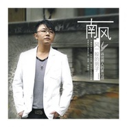

风一般的男子
============================

|  |  |
| :--: | :-- |
| [ 风一般的男子](https://emumo.xiami.com/album/309401) | **艺人**: [南风(姜海龙)](../index.md) **语种**: 国语 **唱片公司**:  **发行时间**: 2008年11月18日 **专辑类别**: 录音室专辑 **专辑风格**: 流行 Pop, 网络流行 Cyber Hit **播放数**: 65177 **收藏数**: 8 **评论数**: 1  |

## 简介

南风个人首张专辑08震撼发行    ——真正值得一听再听的悲伤情歌！    南风：风一般的男子——诉说男人的累与泪    震撼主打：《走了你还有谁》、《城市里的鸟》、《求求你别离开我》    南风的《风一般的男子》，力量磁声南风，风中呐喊，尽情释放男人坚强背后最痛的心底话，想带出的一个概念是无论是初尝漂泊滋味的，还是是饱经沧桑、经历过人生大起大落及情感离离合合的男人，都不能忽视内心真实的声音，将内心的哀伤都呐喊出来，卸下包袱，尽情释放！    南风，一首红极一时的《走了你还有谁》至今仍然活跃，这首炙手可热的歌曲获得好评和广泛关注，也雄踞各搜索引擎、音乐网站的排行榜数月之久，每日下载量数以万计。成功不是偶然，南风继《走了你还有谁》后，推出首张流行原创大碟《风一般的男子》，该专辑大部分歌曲出自南风之手，足见其才华横溢及音乐素养。    这些年来南风在音乐之路上的付出让他满怀感慨，生活的积淀让他内心变得强大，体验着自己的人生，也目睹着别人的人生，歌曲将诉说出男人不轻易说出口的心事，冲击不能被触碰的最低心理防线，道尽男人的累与泪。虽然歌曲是伤感的倾诉，饱含哀伤成分，但是却有振奋人心的力量。听过南风声音，都会留下深刻印象，他声音穿透力强、充满男性爆发力，容易引起共鸣，因此歌曲极富有张力与感染力，让人感受到澎湃的激情。听着此专辑的歌曲，令人很想跟他一起唱，一起尽情道出心理话，同时也想痛快地哭一场，释放压抑的情感。    专辑中收录当红艺人庞龙的制作人夏英峰先生为南风量身定做的歌曲：    《走了你还有谁》，情感浓烈的氛围唱出了在没有她的世界里，孤独的痛撕心裂肺，呼喊出不再在乎谁的坚决；    《城市里的鸟》弥漫出沧桑悲凉的气息，隐约闻到阵阵辛酸的味道，南风娴熟的唱功将极度渴望有个家的欲望唱到了每个寂寞人的心里；    《求求你别离开我》用悲伤的独特的声音，诠释着一个悲伤男子向心爱的女孩在心里苦苦哀求的伤感经过，爱是如此迷人，又是那么的令人无法面对，你最初深爱的他/她现在还在你身边吗?    听南风这张大碟，会被南风充满力量的磁声所吸引，引发无限共鸣；回味间不易发现每首歌都有一个触动情感的爆发点，那或许也是我们内心最真实的声音。如果现实太危险，那么就在音乐里安全地尽情释放吧…… 

## 曲目

## 评论

|  |  |  |
| :-- | :-- | :-- |
|  [虾米用户](https://emumo.xiami.com/u/3449305)  2012-01-22 12:07 赞(0) 踩(0) | 
fgh
 |
