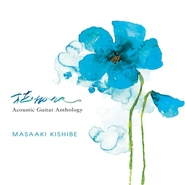
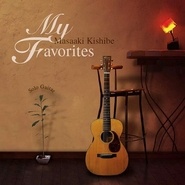
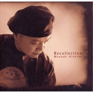
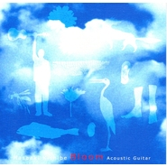
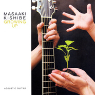

岸部眞明
============================

|  |  |
| :--: | :-- |
| [<br>岸部眞明](https://i.xiami.com/masaakikishibe) | **地区**: Japan 日本<br>**风格**: 器乐独奏 Solo Instrumental, 轻音乐 Easy Listening<br>**播放数**: 43738909<br>**粉丝数**: 61856<br>**评论数**: 2469<br> |

## 档案

<div>
小档案<br>
中 文 名：岸部真明<br>
外 文 名：Masaaki Kishibe<br>
国    籍： 日本<br>
出 生 地：大阪府吹田市<br>
出生日期：1964年1月13日<br>
职    业：演奏家<br>
代表作：《奇跡の山》<br>
最新作：《Passion》<br>
主要成就：National Fingerstyle Guitar Championships 获奖<br>
简介<br>
岸部真明（Masaaki Kishibe）是日本新生代指弹吉他演奏家，日本finger-style大师Isato Nakagawa的学生。其作品风格非常的多元化，既有优美清新的吉他独奏小品，又有另类的独奏作品。他所演奏曲目中，揉合了他细腻的情感与娴熟的演奏技巧，展现了多元的面貌，营造出极具情景和画面的音乐张力。<br>
早年经历<br>
1964年 1月13日 岸部真明在大阪府吹田市出生。<br>
1978年 岸部真明中学 2 年生时开始弹吉他 、从那时开始对 The Beatles 等 、国外摇滚、流行感兴趣。没有进行弹唱 、就马上发行了 Acoustic Guitar Hi-Technique 系列唱片、听其中的 Angie 、Doc 的吉他等、而对吉他音乐兴趣。 于是听 Doc Watson 、Stefan Grossman 的带有 TAB 谱的教材唱片等。<br>
1980年 他高中 2 年时去了中川 ISATO 的吉他教室、在那里知道了 RICK RUSKIN 、Bruce Cockburn 等的音乐 、从其吉他风格可以看出是受到了强烈的影响。<br>
1985年 由于 Windham Hill Label 的吉他演奏家 Michel Hedges 、William Ackerman 、Alex de Grassi 的出现，岸部真明知道了和现在不同的 Open·Tuning 、在其中 、接受了 Michel Hedges 的Tapping技术的冲击而受到影响、还听了 PIERRE BENSUSAN 的专辑 「Solilai」、并受到更强烈的冲击。 开始着手于作曲。<br>
1987年 岸部真明首次作的曲是 Stream。另外 DADGAD 调弦的曲子也开始创作。 有 Snow Fall、Le Solitaire 等。<br>
1991年 岸部真明开始以京都 、大阪为中心开始 Live 活动。同时也开始吉他教室。<br>
1995年 岸部真明的 1st 专辑发表。<br>
演奏之路<br>
1995～1998年<br>
由于专辑的发行，岸部真明的活动场所扩展到北海道 、山阴 、山阳 、中部 、关东地方。<br>
1999年 2nd专辑《GROWING UP》发表。<br>
1999～2001年<br>
Live活动年间超过60场、进一步扩大活动场所。<br>
2002年 3rd专辑《Bloom》发表。<br>
2003年 在美国 Winfield 举办的 Walnut Valley Festival 的 Finger Picking 比赛上获得 第 2 名。<br>
由 RITTOR-MUSIC 发行教材DVD《Open·Tuning & Finger Picking / 岸部真明》。 由 B2 发卖 Live DVD<br>
2004年 担当NHK电视剧《圣安娜下来的跑道》的音乐。<br>
2005年 4th专辑《Recollection》发表。<br>
2006年 担当NHK BS TV《映像诗·富士山 挑战不知道的绝景》的音乐。<br>
2008年 发售专辑《My Favorites》。<br>
2009年 发售专辑《12　Stories》。<br>
2013年 发售专辑《Ways》。<br>
2016年 发售专辑《Passion》。<br>
——————————————————————————————————————<br>
岸部 眞明（きしべ　まさあき）（1964年1月13日 - ）は日本のギタリスト。アコースティック・ギターのフィンガーピッカーとして日本を代表する一人であり、屈指のテクニックを持っている。オープン・チューニングを用いることが多い。中川イサト氏に師事。<br>
来歴<br>
2002年には、アメリカのカンザス州ウィンフィールドで毎年開催される『ナショナル・フィンガーピッキング・ギター・チャンピオンシップ』に参加し、最終予選に残った5名の一人に選ばれるという快挙を成し遂げた。翌2003年の9月、ウォルナットバレー・フェスティバルのフィンガーピッキング・コンテストで2位を獲得した。2004年12月には、NHK制作のクリスマス特別番組のドラマ「サンタが降りた滑走路」の音楽を担当し、2006年4月には、やはりNHK制作によるBSハイビジョン「映像詩・富士山　知られざる絶景に挑む」の音楽を担当し、彼自身のギターインストゥルメンタル作品が全国に放送された。<br>
アルバム<br>
GROWING UP（1998年）<br>
BLOOM（2002年）<br>
Recollection（2005年）<br>
奇跡の山（2006年)<br>
My Favorites（2008年)<br>
12　Stories（2009年)<br>
Ways(2013年)<br>
Passion(2016年)
</div>

## 专辑

| 名称 | 语种 | 唱片公司 | 发行时间 | 专辑类别 | 专辑风格 |
| :--: | :-- | :-- | :-- | :-- | :-- |
| [<br>Passion](./albums/2100351102.md) | 日语 | Self-Released | 2016年05月23日 | 录音室专辑 |  |
| [<br>Ways](./albums/468509865.md) | 纯音乐 | M.K Music | 2013年05月09日 | 录音室专辑 | 器乐独奏 Solo Instrumental, 轻音乐 Easy Listening |
| [<br>花HANA / Acoustic Guitar Anthology](./albums/173878048.md) | 纯音乐 | C&L Music | 2010年08月01日 | 精选集 | 器乐独奏 Solo Instrumental, 轻音乐 Easy Listening |
| [<br>12 Stories12 个故事](./albums/380324.md) | 纯音乐 | MK Music | 2009年09月09日 | 录音室专辑 | 器乐独奏 Solo Instrumental, 轻音乐 Easy Listening |
| [<br>My Favorites](./albums/321054.md) | 纯音乐 | M.K Music | 2008年01月01日 | 录音室专辑 | 器乐独奏 Solo Instrumental, 轻音乐 Easy Listening |
| [<br>奇跡の山](./albums/321053.md) | 纯音乐 | MK Music | 2006年01月01日 | 录音室专辑 | 器乐独奏 Solo Instrumental, 轻音乐 Easy Listening |
| [<br>RECOLLECTION](./albums/321052.md) | 纯音乐 | MK Music | 2005年01月01日 | 录音室专辑 | 器乐独奏 Solo Instrumental, 轻音乐 Easy Listening |
| [<br>BLOOM](./albums/321051.md) | 纯音乐 | MK Music | 2002年01月01日 | 录音室专辑 | 器乐独奏 Solo Instrumental, 轻音乐 Easy Listening |
| [<br>GROWING UP](./albums/321050.md) | 纯音乐 | MK Music | 1999年01月01日 | 录音室专辑 | 器乐独奏 Solo Instrumental, 轻音乐 Easy Listening |
| [<br>TRUTH](./albums/321049.md) | 纯音乐 | MK Music | 1995年01月01日 | 录音室专辑 | 器乐独奏 Solo Instrumental, 轻音乐 Easy Listening |

## 评论

|  |  |  |
| :-- | :-- | :-- |
| <br>[虾米用户](https://emumo.xiami.com/u/44100335)<br><br>2021-01-13 23:02<br>赞(0) 踩(0) | <div>好一曲奇迹之山！生日快乐！</div> |
| <br>[虾米用户](https://emumo.xiami.com/u/8337886)<br>春有百花秋有月 夏有凉风...<br>2021-01-13 16:28<br>赞(0) 踩(0) | <div>谢谢您</div> |
| <br>[虾米用户](https://emumo.xiami.com/u/12700311)<br><br>2021-01-13 13:14<br>赞(0) 踩(0) | <div>生日快乐</div> |
| <br>[虾米用户](https://emumo.xiami.com/u/322057597)<br><br>2021-01-13 12:28<br>赞(0) 踩(0) | <div>生日快乐 </div> |
| <br>[虾米用户](https://emumo.xiami.com/u/11627573)<br>遠方詩意的世界<br>2021-01-13 10:45<br>赞(0) 踩(0) | <div>生日快乐</div> |
| <br>[虾米用户](https://emumo.xiami.com/u/321282051)<br><br>2021-01-13 10:21<br>赞(1) 踩(0) | <div>生日快乐，再就是以后就只能去隔壁听了 </div> |
| <br>[虾米用户](https://emumo.xiami.com/u/349523508)<br>music<br>2021-01-13 10:21<br>赞(0) 踩(0) | <div>能让人安静的音乐，生日快乐</div> |
| <br>[虾米用户](https://emumo.xiami.com/u/30049674)<br>你鞋带散了<br>2021-01-13 10:09<br>赞(0) 踩(0) | <div>暗部老爷子，除了虾米，在哪里还能听到你的音乐呢？</div> |
| <br>[虾米用户](https://emumo.xiami.com/u/4299389)<br><br>2021-01-13 10:07<br>赞(0) 踩(0) | <div>生日快乐 </div> |
| <br>[虾米用户](https://emumo.xiami.com/u/47104979)<br>仅仅活着是不够的，还需要...<br>2021-01-13 10:07<br>赞(0) 踩(0) | <div>生日快乐</div> |
| <br>[虾米用户](https://emumo.xiami.com/u/237240098)<br>世态炎凉也无妨<br>2021-01-13 10:07<br>赞(0) 踩(0) | <div>生日快乐大师</div> |
| <br>[虾米用户](https://emumo.xiami.com/u/445989676)<br>如果音乐足够动人<br>2020-11-24 09:42<br>赞(0) 踩(0) | <div></div> |
| <br>[虾米用户](https://emumo.xiami.com/u/197129222)<br><br>2020-08-10 18:28<br>赞(0) 踩(0) | <div>教我吉他的老师说岸部真明的曲子虽然好弹，但是不好编配，能把这样丰富的曲子编配得如此简单流畅且动听，这才是大佬</div> |
| <br>[虾米用户](https://emumo.xiami.com/u/427504407)<br><br>2020-07-31 08:12<br>赞(0) 踩(0) | <div>爱你的每一首曲</div> |
| <br>[虾米用户](https://emumo.xiami.com/u/424352698)<br><br>2020-07-29 14:05<br>赞(1) 踩(0) | <div>刚刚升级了5G，往后可以听更多的艺术大师的作品了，由衷感谢您的创作和演奏给听众带来的超级听觉享受。</div> |
| <br>[虾米用户](https://emumo.xiami.com/u/342412676)<br><br>2020-03-07 00:12<br>赞(0) 踩(0) | <div>我真的超爱这种吉他音乐诶</div> |
| <br>[虾米用户](https://emumo.xiami.com/u/62954402)<br><br>2020-03-03 23:49<br>赞(0) 踩(0) | <div>什么时候能听朝光 </div> |
| <br>[虾米用户](https://emumo.xiami.com/u/62954402)<br><br>2020-03-03 23:49<br>赞(0) 踩(0) | <div>什么时候能听整个passon </div> |
| <br>[虾米用户](https://emumo.xiami.com/u/1240596)<br><br>2020-02-12 14:09<br>赞(1) 踩(0) | <div>2020中国春节到来时也是疫情漫延时 而这时的日本站了出来 并以无偿的方式给予中国人民重大的帮助 而他的旋律更是映托出日本国家和人民那每一节帮助的片段 每一句加油的话语 每一张捐赠的照片中给中国人民无私的奉献!两地的樱花和旋律散发出的是和谐是友谊是真诚的爱!感谢日本!武汉加油!</div> |
| <br>[虾米用户](https://emumo.xiami.com/u/400715332)<br>留白<br>2020-02-07 23:53<br>赞(0) 踩(0) | <div></div> |
| <br>[虾米用户](https://emumo.xiami.com/u/894602)<br><br>2020-01-13 22:34<br>赞(0) 踩(0) | <div>头部提示信息，挡住搜索了又差不掉，差评</div> |
| <br>[虾米用户](https://emumo.xiami.com/u/47104979)<br>仅仅活着是不够的，还需要...<br>2020-01-13 10:09<br>赞(0) 踩(0) | <div>生日快乐！</div> |
| <br>[虾米用户](https://emumo.xiami.com/u/426852593)<br>还行吧，我挺好。<br>2020-01-13 05:47<br>赞(0) 踩(0) | <div>高考考好了就可以去看演唱会了</div> |
| <br>[虾米用户](https://emumo.xiami.com/u/430475906)<br><br>2019-12-17 12:26<br>赞(0) 踩(0) | <div>音乐无国界！<br>在你的结他声中，听到宁静，和平，<br>还有自然的美！<br>（希望你能看懂以上中文）</div> |
| <br>[虾米用户](https://emumo.xiami.com/u/187568628)<br>G<br>2019-12-07 17:41<br>赞(0) 踩(0) | <div>求来厦门</div> |
| <br>[虾米用户](https://emumo.xiami.com/u/13829070)<br> <br>2019-11-13 21:41<br>赞(1) 踩(0) | <div>什么时候能来长沙开演奏会啊</div> |
| <br>[虾米用户](https://emumo.xiami.com/u/27857090)<br>有朝一日<br>2019-11-13 20:48<br>赞(0) 踩(0) | <div>要来啦！！！</div> |
| <br>[虾米用户](https://emumo.xiami.com/u/3161673)<br>我还没想好要写什么...<br>2019-10-24 20:06<br>赞(1) 踩(0) | <div>不用谢！你弹得好好听！</div> |
| <br>[虾米用户](https://emumo.xiami.com/u/254088877)<br><br>2019-09-21 22:22<br>赞(2) 踩(0) | <div>很多时候只要谈起战争，中国人就会想到日本人，可是你们看，很奇怪的我喜欢的日本漫画家喜欢他们的每一部作品，也喜欢这个家伙的每一个作品，很向往去日本，最想学日语，没有害怕过什么过去的事，所以喜欢就是这么简单的事情，我忽然感伤的是我们本来就没有仇恨啊！可不可以就这样一直喜欢下去呢？</div> |
| ⇒ | <br>[虾米用户](https://emumo.xiami.com/u/444300875)<br><br>2020-10-11 14:00<br>赞(0) 踩(0) | <div>优秀作品无国界，但你若谈及历史，（你提到了 &amp;ldquo;过去的事&amp;rdquo;）请你尊重既成事实。</div> |
| <br>[虾米用户](https://emumo.xiami.com/u/199515893)<br><br>2019-09-07 12:44<br>赞(4) 踩(0) | <div>第一次关注，奇跡の山日本樱花雪景观美景，日本乐器，美食，优美音乐响起来轻柔美妙旋律！！   </div> |
| <br>[虾米用户](https://emumo.xiami.com/u/407623737)<br><br>2019-09-02 15:07<br>赞(0) 踩(0) | <div>deep in your masterpieces</div> |
| <br>[虾米用户](https://emumo.xiami.com/u/276944698)<br>不要自我设限.....<br>2019-08-25 21:16<br>赞(2) 踩(0) | <div>✔️✔️✔️</div> |
| <br>[虾米用户](https://emumo.xiami.com/u/52056952)<br>人生即是到來、相遇、陪伴...<br>2019-07-08 22:24<br>赞(1) 踩(0) | <div>...(｡•ˇ‸ˇ•｡) ...</div> |
| ⇒ | <br>[虾米用户](https://emumo.xiami.com/u/358189489)<br>心之所向 ， 义之所在....<br>2019-10-21 18:57<br>赞(0) 踩(0) | <div>                    ——鄙人不才</div> |
| <br>[虾米用户](https://emumo.xiami.com/u/88626590)<br>我还没想好要写什么...<br>2019-07-03 09:11<br>赞(0) 踩(0) | <div>啊啊啊啊啊啊啊，巡演江苏偏偏没有苏州站 </div> |
| ⇒ | <br>[虾米用户](https://emumo.xiami.com/u/315219430)<br>从下课到下班，其实很简单...<br>2019-07-16 14:11<br>赞(0) 踩(0) | <div>哈哈哈哈，我镇江人</div> |
| <br>[虾米用户](https://emumo.xiami.com/u/66823378)<br><br>2019-06-23 23:02<br>赞(0) 踩(0) | <div></div> |
| <br>[虾米用户](https://emumo.xiami.com/u/47494497)<br>李志、陈升，“虾米也没有...<br>2019-05-17 01:07<br>赞(1) 踩(0) | <div>艺人相册里那张中国商演图认真的吗 <br>可能只能说老师太低调</div> |
| <br>[虾米用户](https://emumo.xiami.com/u/411210156)<br>不要找我，故事讲不完<br>2019-05-15 12:43<br>赞(1) 踩(0) | <div>刚刚来过中国演出还不知道 </div> |
| <br>[虾米用户](https://emumo.xiami.com/u/303371910)<br><br>2019-04-04 02:25<br>赞(0) 踩(0) | <div>北京最近有音乐会吗</div> |
| <br>[虾米用户](https://emumo.xiami.com/u/219479094)<br>長夜安乐，自为诸洲。<br>2019-02-28 07:54<br>赞(0) 踩(0) | <div>大家有多少像我一样因为岸部老师喜欢上指弹Guitar滴？</div> |
| ⇒ | <br>[虾米用户](https://emumo.xiami.com/u/309403184)<br>愿你身披战甲，归来仍是少...<br>2019-07-10 19:38<br>赞(0) 踩(0) | <div>我是因为先接触吉他，后来知道岸部眞明才喜欢弹古典音乐的</div> |
| <br>[虾米用户](https://emumo.xiami.com/u/97390042)<br>每个人都可以是杀手<br>2019-01-28 01:40<br>赞(0) 踩(0) | <div>希望可以听一次您的现场。</div> |
| <br>[虾米用户](https://emumo.xiami.com/u/284863977)<br> 自律给我自由<br>2019-01-14 07:38<br>赞(1) 踩(0) | <div>生日快乐 大师</div> |
| <br>[虾米用户](https://emumo.xiami.com/u/204227316)<br>零零落落<br>2019-01-14 00:17<br>赞(1) 踩(0) | <div>Happy birthday!</div> |
| <br>[虾米用户](https://emumo.xiami.com/u/256857950)<br><br>2019-01-13 22:19<br>赞(1) 踩(0) | <div>生快！</div> |
| <br>[虾米用户](https://emumo.xiami.com/u/406132442)<br>我喜欢动漫和电影<br>2019-01-13 20:55<br>赞(1) 踩(0) | <div>happy birthday to you</div> |
| <br>[虾米用户](https://emumo.xiami.com/u/3271294)<br><br>2019-01-13 19:27<br>赞(1) 踩(0) | <div>好听的音乐无国界</div> |
| <br>[虾米用户](https://emumo.xiami.com/u/8569487)<br>ruin<br>2019-01-13 18:16<br>赞(1) 踩(0) | <div>生日快乐呀  </div> |
| <br>[虾米用户](https://emumo.xiami.com/u/126850740)<br>去教堂或者去寺庙都不会有...<br>2019-01-13 16:55<br>赞(1) 踩(0) | <div>Happy birthday to you</div> |
| <br>[虾米用户](https://emumo.xiami.com/u/48888270)<br>中文饶舌像史诗一样浪漫；...<br>2019-01-13 16:40<br>赞(1) 踩(0) | <div>happy birthday～</div> |
| <br>[虾米用户](https://emumo.xiami.com/u/96699214)<br>90<br>2019-01-13 15:39<br>赞(1) 踩(0) | <div>哇o，大神诶，生快生快</div> |
| <br>[虾米用户](https://emumo.xiami.com/u/3034974)<br><br>2019-01-13 14:35<br>赞(1) 踩(0) | <div>指弹永远美丽，happy birthday</div> |
| <br>[虾米用户](https://emumo.xiami.com/u/2801999)<br>经常失踪的酱油瓶<br>2019-01-13 14:27<br>赞(1) 踩(0) | <div>生日快乐 </div> |
| <br>[虾米用户](https://emumo.xiami.com/u/11154604)<br>小王子只有一朵玫瑰<br>2019-01-13 12:22<br>赞(1) 踩(0) | <div>Happy b-day!!✨</div> |
| <br>[虾米用户](https://emumo.xiami.com/u/132117588)<br>梦游天姥吟留别<br>2019-01-13 11:31<br>赞(1) 踩(0) | <div>生日快乐！</div> |
| <br>[虾米用户](https://emumo.xiami.com/u/240074145)<br><br>2019-01-13 11:08<br>赞(1) 踩(0) | <div></div> |
| <br>[虾米用户](https://emumo.xiami.com/u/6040099)<br><br>2019-01-13 11:03<br>赞(1) 踩(0) | <div>生日快乐</div> |
| <br>[虾米用户](https://emumo.xiami.com/u/347352104)<br><br>2019-01-13 10:47<br>赞(1) 踩(0) | <div>生日快乐~</div> |
| <br>[虾米用户](https://emumo.xiami.com/u/344483636)<br>我还没想好要写什么...<br>2019-01-13 10:47<br>赞(1) 踩(0) | <div>生日快乐！感谢您的音乐</div> |
| <br>[虾米用户](https://emumo.xiami.com/u/356962079)<br><br>2019-01-13 10:31<br>赞(2) 踩(0) | <div>生日快乐</div> |
| <br>[虾米用户](https://emumo.xiami.com/u/3861814)<br>2001年，班得瑞的蓝色...<br>2019-01-13 10:07<br>赞(1) 踩(0) | <div>生日快乐，最好的指弹！</div> |
| <br>[虾米用户](https://emumo.xiami.com/u/4728840)<br>我还没想好要写什么...<br>2019-01-13 10:05<br>赞(0) 踩(0) | <div>生日快乐</div> |
| <br>[虾米用户](https://emumo.xiami.com/u/326168215)<br> <br>2019-01-13 10:03<br>赞(0) 踩(0) | <div>祝您生日快乐岸部老师，happy birthday</div> |
| <br>[虾米用户](https://emumo.xiami.com/u/246981155)<br><br>2019-01-13 10:03<br>赞(0) 踩(0) | <div>生日快乐</div> |
| <br>[虾米用户](https://emumo.xiami.com/u/85952408)<br><br>2019-01-13 10:01<br>赞(0) 踩(0) | <div>生日快乐。</div> |
| <br>[虾米用户](https://emumo.xiami.com/u/242876445)<br> <br>2019-01-12 15:43<br>赞(0) 踩(0) | <div>请问您是岸部真明本尊吗？</div> |
| <br>[虾米用户](https://emumo.xiami.com/u/112463526)<br>豆瓣: 坤斤拷    我...<br>2019-01-06 01:23<br>赞(0) 踩(0) | <div>重温</div> |
| <br>[虾米用户](https://emumo.xiami.com/u/323951891)<br>Chasing  lov...<br>2018-12-20 22:59<br>赞(0) 踩(0) | <div>日本人纯音乐真的厉害</div> |
| <br>[虾米用户](https://emumo.xiami.com/u/42894053)<br><br>2018-12-03 13:07<br>赞(0) 踩(0) | <div>还没来我的城市</div> |
| <br>[虾米用户](https://emumo.xiami.com/u/39133419)<br>飞～～<br>2018-11-08 21:58<br>赞(0) 踩(0) | <div>Masaaki 啥时候来长沙呢？！！</div> |
| <br>[虾米用户](https://emumo.xiami.com/u/13613638)<br>有猫病<br>2018-11-07 20:33<br>赞(0) 踩(0) | <div>准备二刷了，成都</div> |
| <br>[虾米用户](https://emumo.xiami.com/u/15566661)<br>我爱这精彩的世界，交织着...<br>2018-11-07 18:56<br>赞(0) 踩(0) | <div>哇，又来了，不能再错过了</div> |
| <br>[虾米用户](https://emumo.xiami.com/u/52415194)<br>♬♩♫♪♡<br>2018-11-06 23:01<br>赞(0) 踩(0) | <div>等您</div> |
| <br>[虾米用户](https://emumo.xiami.com/u/359582835)<br>我还没想好要写什么。。。<br>2018-11-06 22:51<br>赞(0) 踩(0) | <div>成都啊，离我很近但真的去不了啊</div> |
| <br>[虾米用户](https://emumo.xiami.com/u/2156426)<br>天天听歌，佛系交友<br>2018-11-06 19:48<br>赞(0) 踩(0) | <div>没有上海场…</div> |
| <br>[虾米用户](https://emumo.xiami.com/u/323982579)<br>若文明消失,惟有音乐值得...<br>2018-10-29 17:28<br>赞(0) 踩(0) | <div>岸部，你是最最棒的！支持！   </div> |
| <br>[虾米用户](https://emumo.xiami.com/u/30527758)<br>学习是一种信仰<br>2018-09-23 18:25<br>赞(0) 踩(0) | <div>好棒啊！ </div> |
| <br>[虾米用户](https://emumo.xiami.com/u/48382211)<br>-<br>2018-09-17 23:26<br>赞(0) 踩(0) | <div>⭐️⭐️</div> |
| <br>[虾米用户](https://emumo.xiami.com/u/71178106)<br>塵世や 酒、風呂を抜け ...<br>2018-08-31 12:32<br>赞(1) 踩(0) | <div>♡</div> |
| <br>[虾米用户](https://emumo.xiami.com/u/44446290)<br>突然喜欢上音乐 发现原来...<br>2018-08-03 09:49<br>赞(0) 踩(0) | <div>啊啊啊啊啊啊 可惜我不在国贸了啊啊啊啊啊啊</div> |
| <br>[虾米用户](https://emumo.xiami.com/u/7872701)<br>多一份远见，就少一分刺激<br>2018-08-01 11:17<br>赞(0) 踩(0) | <div>年年都来。。。</div> |
| <br>[虾米用户](https://emumo.xiami.com/u/4333471)<br> <br>2018-07-25 22:11<br>赞(0) 踩(0) | <div>错过。。。。。。。。有没有什么地方能看到所有演出信息啊！！！！！！！！！！</div> |
| ⇒ | <br>[虾米用户](https://emumo.xiami.com/u/47257748)<br>我还没想好要写什么...<br>2018-07-31 17:21<br>赞(0) 踩(0) | <div>您可以关注弦风音乐、巴洛克学院的微信公众号和微博，有演出信息会第一时间发布的。</div> |
| ⇒ | <br>[虾米用户](https://emumo.xiami.com/u/313476375)<br><br>2018-08-16 18:09<br>赞(0) 踩(0) | <div><q><b>岸部眞明说：</b></q></div> |
| <br>[虾米用户](https://emumo.xiami.com/u/3797803)<br>流浪。<br>2018-07-24 22:45<br>赞(0) 踩(0) | <div>你什么时候能来珠海呢</div> |
| <br>[虾米用户](https://emumo.xiami.com/u/193918054)<br>行经此处者，将获得沉重的...<br>2018-06-17 18:21<br>赞(0) 踩(0) | <div>岸部真明全以&amp;ldquo;境界&amp;rdquo;胜。<br>众里寻她千百度，蓦然回首&amp;hellip;&amp;hellip;</div> |
| <br>[虾米用户](https://emumo.xiami.com/u/321259841)<br><br>2018-06-16 14:02<br>赞(0) 踩(0) | <div>今年的错过了杭州场，不知道下一次是什么时候了</div> |
| <br>[虾米用户](https://emumo.xiami.com/u/244515697)<br>我还没想好要写什么...<br>2018-06-01 00:52<br>赞(1) 踩(0) | <div>    </div> |
| <br>[虾米用户](https://emumo.xiami.com/u/4290612)<br><br>2018-04-23 20:16<br>赞(0) 踩(0) | <div>真的错过了今年的巡演，我就在西安&amp;hellip;&amp;hellip;从来没去过演唱会，音乐会。但是相比演唱会，我更想去音乐会 </div> |
| <br>[虾米用户](https://emumo.xiami.com/u/32704477)<br>像熟悉了一个世纪<br>2018-04-10 22:04<br>赞(0) 踩(0) | <div>喜欢他的名字 真的 就是很喜欢岸部真明</div> |
| <br>[虾米用户](https://emumo.xiami.com/u/7133174)<br>我还没想好要写什么...<br>2018-04-09 09:16<br>赞(1) 踩(0) | <div>深圳场大家席地而坐，现场的气氛很奇妙</div> |
| ⇒ | <br>[虾米用户](https://emumo.xiami.com/u/11655526)<br> <br>2018-05-30 12:10<br>赞(0) 踩(0) | <div>上海场所有人罚站一样，我真的最后累的几乎没听进去歌...</div> |
| ⇒ | <br>[虾米用户](https://emumo.xiami.com/u/7133174)<br>我还没想好要写什么...<br>2018-06-04 04:54<br>赞(0) 踩(0) | <div><q><b>X▲ND∑R说：</b></q></div> |
| <br>[虾米用户](https://emumo.xiami.com/u/3708232)<br>live half at...<br>2018-04-07 22:32<br>赞(2) 踩(0) | <div>南京场， 让人热泪盈眶的美</div> |
| <br>[虾米用户](https://emumo.xiami.com/u/3475077)<br><br>2018-04-07 12:12<br>赞(0) 踩(0) | <div>上海巡演昨天倒数第二首曲子为NHK节目谱曲的是哪首 好好听～</div> |
| <br>[虾米用户](https://emumo.xiami.com/u/6881680)<br><br>2018-04-07 09:21<br>赞(1) 踩(0) | <div>错过了西安的巡演</div> |
| <br>[虾米用户](https://emumo.xiami.com/u/43492923)<br>行到水穷我才开始害怕，夕...<br>2018-03-23 12:22<br>赞(1) 踩(0) | <div>▼</div> |
| <br>[虾米用户](https://emumo.xiami.com/u/203240572)<br>千载勋名身外影   百年...<br>2018-03-21 20:24<br>赞(0) 踩(0) | <div>让我静一静&amp;hellip;&amp;hellip;  </div> |
| <br>[虾米用户](https://emumo.xiami.com/u/13741772)<br>就算微不足道，也要英勇跳...<br>2018-03-18 19:09<br>赞(0) 踩(0) | <div>哎，怎么不去北京呀</div> |
| <br>[虾米用户](https://emumo.xiami.com/u/39133419)<br>飞～～<br>2018-03-14 16:42<br>赞(2) 踩(0) | <div>四月我去合肥见我女朋友 也能见到Masaaki 哈哈 想想就很开心！！</div> |
| <br>[虾米用户](https://emumo.xiami.com/u/316502674)<br>在最后陪着你吧，我的虾米<br>2018-03-11 09:52<br>赞(0) 踩(0) | <div>哇&amp;hellip;&amp;hellip;</div> |
| <br>[虾米用户](https://emumo.xiami.com/u/2159126)<br>啊哈<br>2018-03-09 23:05<br>赞(0) 踩(0) | <div>哇 等了三年 真好！</div> |
| <br>[虾米用户](https://emumo.xiami.com/u/3708232)<br>live half at...<br>2018-03-09 23:05<br>赞(0) 踩(0) | <div>南京南京！！！</div> |
| <br>[虾米用户](https://emumo.xiami.com/u/228843687)<br>懒惰统治人间<br>2018-03-09 21:35<br>赞(0) 踩(0) | <div>:-O</div> |
| <br>[虾米用户](https://emumo.xiami.com/u/5831379)<br>过去永远是痛苦和快乐的根...<br>2018-03-09 21:02<br>赞(0) 踩(0) | <div>成都に行きませんか</div> |
| <br>[虾米用户](https://emumo.xiami.com/u/7569165)<br>。<br>2018-03-09 15:54<br>赞(1) 踩(0) | <div>可惜这次没有成都。。</div> |
| <br>[虾米用户](https://emumo.xiami.com/u/7133174)<br>我还没想好要写什么...<br>2018-03-09 15:51<br>赞(0) 踩(0) | <div>A8场</div> |
| <br>[虾米用户](https://emumo.xiami.com/u/1250578)<br><br>2018-02-15 18:22<br>赞(1) 踩(0) | <div>MD居然错过了演奏会！</div> |
| <br>[虾米用户](https://emumo.xiami.com/u/209366148)<br>缘定三生.<br>2018-02-10 14:07<br>赞(4) 踩(0) | <div>这是这罪恶的世界中一片珍贵的净土。音乐里没有金钱，没有权利，没有欲望。透过一个个跃动的音符，我来到了一个神奇的世界。这里的云好白，天空也好纯净。一把吉他，演绎世间千千万万。感谢，您创作出了如此动听的音乐。音乐无国界。我们很喜欢。期待您的其他作品。 </div> |
| <br>[虾米用户](https://emumo.xiami.com/u/20177386)<br>感谢一切美好的遇见❤️<br>2018-02-04 13:55<br>赞(2) 踩(0) | <div></div> |
| <br>[虾米用户](https://emumo.xiami.com/u/345153285)<br><br>2018-01-17 13:44<br>赞(0) 踩(0) | <div>希望日后有机会能在现场听一首音乐，因为我们难得徜徉那么一回</div> |
| <br>[虾米用户](https://emumo.xiami.com/u/41047662)<br>我还没想好要写什么...<br>2018-01-14 13:51<br>赞(0) 踩(0) | <div>貌似昨天是男神生日啊，森快哦！</div> |
| <br>[虾米用户](https://emumo.xiami.com/u/52056952)<br>人生即是到來、相遇、陪伴...<br>2018-01-01 14:26<br>赞(0) 踩(0) | <div></div> |
| <br>[虾米用户](https://emumo.xiami.com/u/333814027)<br>逆流而上的清流<br>2017-12-30 11:35<br>赞(0) 踩(0) | <div>开心</div> |
| <br>[虾米用户](https://emumo.xiami.com/u/10529435)<br>Listening is...<br>2017-12-29 15:17<br>赞(0) 踩(0) | <div>大神</div> |
| <br>[虾米用户](https://emumo.xiami.com/u/42334211)<br><br>2017-12-10 23:23<br>赞(1) 踩(0) | <div>刚听完厦门场，太享受了</div> |
| <br>[虾米用户](https://emumo.xiami.com/u/13613638)<br>有猫病<br>2017-12-06 00:02<br>赞(2) 踩(0) | <div>刚听完成都演出，您就是春风本人啊</div> |
| <br>[虾米用户](https://emumo.xiami.com/u/113054900)<br>    让沉稳填满优秀<br>2017-11-16 09:26<br>赞(0) 踩(0) | <div>只能说是真的好听了。</div> |
| <br>[虾米用户](https://emumo.xiami.com/u/9939199)<br><br>2017-11-03 14:50<br>赞(0) 踩(0) | <div>休闲，阳光，沙滩</div> |
| <br>[虾米用户](https://emumo.xiami.com/u/4011091)<br><br>2017-10-29 11:35<br>赞(1) 踩(0) | <div>啊啊啊啊真好啊又要来杭州啦</div> |
| ⇒ | <br>[虾米用户](https://emumo.xiami.com/u/13741772)<br>就算微不足道，也要英勇跳...<br>2017-12-13 18:27<br>赞(0) 踩(0) | <div>没有上海，哭</div> |
| <br>[虾米用户](https://emumo.xiami.com/u/16119370)<br>腹中少食口中少言<br>2017-10-29 06:42<br>赞(0) 踩(0) | <div>听着奇迹的山会湿润眼眶</div> |
| <br>[虾米用户](https://emumo.xiami.com/u/4175084)<br>藏<br>2017-10-28 00:43<br>赞(0) 踩(0) | <div>3.19 西安 太棒了</div> |
| <br>[虾米用户](https://emumo.xiami.com/u/2643347)<br><br>2017-10-28 00:33<br>赞(2) 踩(0) | <div>外婆最近住院，白天醒着的时候干瞪着眼睛，给她听我mp3里的曲子，好多悲伤的歌，或者就是闹得不行。这里的曲子正是我在找的。希望她听的时候能享受当下的安静，免去孤单。</div> |
| <br>[虾米用户](https://emumo.xiami.com/u/8811330)<br>竟然被你找到了<br>2017-10-28 00:12<br>赞(0) 踩(0) | <div>成都见 ：）</div> |
| ⇒ | <br>[虾米用户](https://emumo.xiami.com/u/50869938)<br>我的一年，有四个春天。<br>2017-11-04 16:38<br>赞(0) 踩(0) | <div>没有成都站啊，有吗</div> |
| ⇒ | <br>[虾米用户](https://emumo.xiami.com/u/8811330)<br>竟然被你找到了<br>2017-11-04 21:00<br>赞(0) 踩(0) | <div><q><b>黑眉猫说：</b></q></div> |
| <br>[虾米用户](https://emumo.xiami.com/u/1359021)<br><br>2017-10-28 00:11<br>赞(0) 踩(0) | <div>聽著聽著，仿佛有什麼東西從心上劃過，有種淡淡的哀傷的感覺......{悶太久了有點神經病。}</div> |
| <br>[虾米用户](https://emumo.xiami.com/u/4292468)<br><br>2017-10-28 00:07<br>赞(2) 踩(0) | <div>每到复习爆头时，总需要些美好的BGM（¯﹃¯）</div> |
| <br>[虾米用户](https://emumo.xiami.com/u/2551242)<br><br>2017-10-27 23:56<br>赞(0) 踩(0) | <div>静谧的和平</div> |
| <br>[虾米用户](https://emumo.xiami.com/u/44058718)<br>winter is co...<br>2017-10-27 23:42<br>赞(3) 踩(0) | <div>想听The End of the World，岸部真明大师，拜托了。可惜武汉场的四等票没机会合影，太可惜了，希望以后赚钱了买一等票。</div> |
| <br>[虾米用户](https://emumo.xiami.com/u/254088877)<br><br>2017-10-27 23:31<br>赞(2) 踩(0) | <div>关于反日的极端言论我就不说什么音乐无国界了，可是从祖先开始我们就已经在相互学习了，怎么就许别国学我们的智慧来进步自己的国家，却抵制我们去学习他们进步的智慧来升级我们呢？什么是好什么是坏我们还是能分辨判断的吧？那么就请理智的批评他们的错误，技术的学习他们的优点，强大我们的国家</div> |
| <br>[虾米用户](https://emumo.xiami.com/u/3708232)<br>live half at...<br>2017-10-27 23:30<br>赞(0) 踩(0) | <div>有种安静的感觉，像是在海洋里自由呼吸的样子。</div> |
| ⇒ | <br>[虾米用户](https://emumo.xiami.com/u/3708232)<br>live half at...<br>2018-03-09 23:06<br>赞(0) 踩(0) | <div>太好了，4月份你就可以看到他了</div> |
| <br>[虾米用户](https://emumo.xiami.com/u/3254921)<br>都是印记<br>2017-10-27 23:30<br>赞(0) 踩(0) | <div>越来越喜欢大师的曲子~我疯狂的爱上了~</div> |
| <br>[虾米用户](https://emumo.xiami.com/u/33555637)<br> <br>2017-10-27 23:24<br>赞(0) 踩(0) | <div>学习当背景音乐毫无违和感</div> |
| <br>[虾米用户](https://emumo.xiami.com/u/378236)<br>刺多不吃鱼<br>2017-10-27 23:21<br>赞(0) 踩(0) | <div>最近喜欢幽静点的。</div> |
| <br>[虾米用户](https://emumo.xiami.com/u/317204786)<br>diru/sukekiy...<br>2017-10-27 22:18<br>赞(1) 踩(0) | <div>看着定位都在南方，大连的我正在考虑要不要逃学去看..发现机票比岸叔的票贵多了   </div> |
| <br>[虾米用户](https://emumo.xiami.com/u/246912077)<br><br>2017-10-27 21:45<br>赞(0) 踩(0) | <div>为什么是星期二啊啊啊啊啊啊啊哭(ಥ_ಥ)</div> |
| <br>[虾米用户](https://emumo.xiami.com/u/246912077)<br><br>2017-10-27 21:41<br>赞(0) 踩(0) | <div>成都啊啊啊啊啊啊啊啊啊啊</div> |
| <br>[虾米用户](https://emumo.xiami.com/u/66958590)<br>每首歌都是无可替代的旅程<br>2017-10-27 20:40<br>赞(0) 踩(0) | <div>12.10见</div> |
| <br>[虾米用户](https://emumo.xiami.com/u/97390042)<br>每个人都可以是杀手<br>2017-10-27 16:59<br>赞(0) 踩(0) | <div>话说这次会有早鸟票吗…</div> |
| <br>[虾米用户](https://emumo.xiami.com/u/7569165)<br>。<br>2017-10-27 16:49<br>赞(3) 踩(0) | <div>能来成都太棒了！</div> |
| <br>[虾米用户](https://emumo.xiami.com/u/97390042)<br>每个人都可以是杀手<br>2017-10-27 16:42<br>赞(0) 踩(0) | <div>哇总算有厦门了！</div> |
| <br>[虾米用户](https://emumo.xiami.com/u/30664643)<br> 挚爱五月天<br>2017-10-27 16:38<br>赞(0) 踩(0) | <div>真的很好听啊！要是我们这里有演出就好了</div> |
| ⇒ | <br>[虾米用户](https://emumo.xiami.com/u/97390042)<br>每个人都可以是杀手<br>2017-10-27 16:42<br>赞(0) 踩(0) | <div>哈哈哈快看看有没有你们地方的哈哈刚发的演出</div> |
| ⇒ | <br>[虾米用户](https://emumo.xiami.com/u/30664643)<br> 挚爱五月天<br>2017-10-27 16:44<br>赞(0) 踩(0) | <div><q><b>Logic说：</b></q></div> |
| ⇒ | <br>[虾米用户](https://emumo.xiami.com/u/97390042)<br>每个人都可以是杀手<br>2017-10-27 16:45<br>赞(0) 踩(0) | <div><q><b>Ashin的小酒窝说：</b></q></div> |
| ⇒ | <br>[虾米用户](https://emumo.xiami.com/u/13741772)<br>就算微不足道，也要英勇跳...<br>2017-12-13 18:28<br>赞(0) 踩(0) | <div><q><b>Ashin的小酒窝说：</b></q></div> |
| <br>[虾米用户](https://emumo.xiami.com/u/52555139)<br>来日某天再相见<br>2017-10-19 18:45<br>赞(0) 踩(0) | <div></div> |
| <br>[虾米用户](https://emumo.xiami.com/u/28301439)<br>想带你去看海～<br>2017-10-12 13:11<br>赞(0) 踩(0) | <div>神韵</div> |
| <br>[虾米用户](https://emumo.xiami.com/u/637148)<br>一个吉他老师<br>2017-10-11 23:41<br>赞(1) 踩(0) | <div>岸部真明的帽子哪里有卖？</div> |
| <br>[虾米用户](https://emumo.xiami.com/u/46932974)<br>活着为了讲述生活<br>2017-09-27 11:11<br>赞(0) 踩(0) | <div>你拨弄不是弦而是心</div> |
| <br>[虾米用户](https://emumo.xiami.com/u/317204786)<br>diru/sukekiy...<br>2017-09-24 11:24<br>赞(0) 踩(0) | <div>每一首都是治愈啊</div> |
| <br>[虾米用户](https://emumo.xiami.com/u/2085965)<br>lost  memory...<br>2017-09-23 00:17<br>赞(1) 踩(0) | <div>哪位大大能告知岸部身高 </div> |
| ⇒ | <br>[虾米用户](https://emumo.xiami.com/u/47257748)<br>我还没想好要写什么...<br>2017-10-03 19:52<br>赞(0) 踩(0) | <div>secret~</div> |
| ⇒ | <br>[虾米用户](https://emumo.xiami.com/u/2085965)<br>lost  memory...<br>2017-10-04 00:28<br>赞(0) 踩(0) | <div><q><b>岸部眞明说：</b></q></div> |
| ⇒ | <br>[虾米用户](https://emumo.xiami.com/u/13741772)<br>就算微不足道，也要英勇跳...<br>2017-12-13 18:29<br>赞(0) 踩(0) | <div><q><b>库洛Sakura说：</b></q></div> |
| ⇒ | <br>[虾米用户](https://emumo.xiami.com/u/13741772)<br>就算微不足道，也要英勇跳...<br>2017-12-13 18:32<br>赞(0) 踩(0) | <div>yeah!我是第一个发现秘密的人！</div> |
| ⇒ | <br>[虾米用户](https://emumo.xiami.com/u/2085965)<br>lost  memory...<br>2017-12-15 11:16<br>赞(0) 踩(0) | <div><q><b>菜脯说：</b></q></div> |
| <br>[虾米用户](https://emumo.xiami.com/u/20571854)<br>这家伙很聪明什么也没留下...<br>2017-09-19 02:07<br>赞(0) 踩(0) | <div>晴朗美丽的琴声很难忘，路人转粉</div> |
| <br>[虾米用户](https://emumo.xiami.com/u/19942005)<br><br>2017-09-17 10:27<br>赞(0) 踩(0) | <div>弹出了吉他特有的感觉，创作风格轻快优雅</div> |
| <br>[虾米用户](https://emumo.xiami.com/u/762181)<br> <br>2017-08-28 03:39<br>赞(0) 踩(0) | <div>.</div> |
| <br>[虾米用户](https://emumo.xiami.com/u/7075002)<br><br>2017-08-27 20:01<br>赞(0) 踩(0) | <div>终于解封了，谢谢虾米了 </div> |
| <br>[虾米用户](https://emumo.xiami.com/u/321041024)<br><br>2017-08-23 14:08<br>赞(0) 踩(0) | <div>喜欢他的音乐</div> |
| <br>[虾米用户](https://emumo.xiami.com/u/249029522)<br><br>2017-08-14 00:04<br>赞(0) 踩(0) | <div>听这些歌，让我沉重的心竟明朗起来。</div> |
| <br>[虾米用户](https://emumo.xiami.com/u/196242332)<br><br>2017-08-12 09:03<br>赞(0) 踩(0) | <div>happy</div> |
| <br>[虾米用户](https://emumo.xiami.com/u/8070377)<br>爱雾瑞性维欧腐漏<br>2017-08-07 18:43<br>赞(0) 踩(0) | <div>#</div> |
| <br>[虾米用户](https://emumo.xiami.com/u/52555139)<br>来日某天再相见<br>2017-07-31 14:19<br>赞(0) 踩(0) | <div>昨晚令人难忘</div> |
| <br>[虾米用户](https://emumo.xiami.com/u/316286808)<br>愿与草木饮清茶<br>2017-07-31 11:33<br>赞(0) 踩(0) | <div>加油</div> |
| <br>[虾米用户](https://emumo.xiami.com/u/10312958)<br>无远不近，心有所动<br>2017-07-17 22:09<br>赞(0) 踩(0) | <div>曲出于景而胜于景，很好听</div> |
| <br>[虾米用户](https://emumo.xiami.com/u/3038663)<br>无言的人最深情，而幸福的...<br>2017-07-14 10:24<br>赞(0) 踩(0) | <div>你咋说来就来说走就走呢</div> |
| <br>[虾米用户](https://emumo.xiami.com/u/7252584)<br>新的梦想<br>2017-07-06 02:37<br>赞(1) 踩(0) | <div>虾米终于可以看到岸部真明了，我抱过他抱过他哦！看现场演出结束时合照，抱了他哦！哈哈哈</div> |
| ⇒ | <br>[虾米用户](https://emumo.xiami.com/u/7332620)<br>欢迎约拍，胶片风 男生。...<br>2017-07-25 17:29<br>赞(0) 踩(0) | <div>合肥那场吗？</div> |
| <br>[虾米用户](https://emumo.xiami.com/u/53008228)<br>尝试用旋律纪念我成长的一...<br>2017-06-30 13:05<br>赞(0) 踩(0) | <div>吉他</div> |
| <br>[虾米用户](https://emumo.xiami.com/u/9232636)<br>这个家伙很聪明，什么都没...<br>2017-06-26 12:27<br>赞(0) 踩(0) | <div>铛铛铛铛</div> |
| <br>[虾米用户](https://emumo.xiami.com/u/47329293)<br>我还没想好要写什么...<br>2017-06-22 01:23<br>赞(0) 踩(0) | <div>大半夜失眠 翻出来听 还是那么感动 14还是15年在mao听的现场 一开始弹人就感觉化了 莫名其妙感动想哭 现在还是</div> |
| <br>[虾米用户](https://emumo.xiami.com/u/5287046)<br>爱音乐的人不会老<br>2017-06-19 21:00<br>赞(0) 踩(0) | <div>谢谢带来美妙的音乐。听了心情很好</div> |
| <br>[虾米用户](https://emumo.xiami.com/u/30209436)<br><br>2017-06-18 19:08<br>赞(0) 踩(0) | <div>马头琴   朝克吉勒图</div> |
| <br>[虾米用户](https://emumo.xiami.com/u/37638890)<br>我在机场拿着车票等一艘船<br>2017-06-18 10:20<br>赞(1) 踩(0) | <div>想全部都下进手机里 可是那样我就更孤独了</div> |
| <br>[虾米用户](https://emumo.xiami.com/u/7682892)<br>…等到足够成熟就不会轻易...<br>2017-06-08 00:27<br>赞(0) 踩(0) | <div>&amp;hellip;居然有收到私信，回来真好&amp;hellip;</div> |
| <br>[虾米用户](https://emumo.xiami.com/u/288086793)<br> <br>2017-06-05 21:25<br>赞(0) 踩(0) | <div>真希望先生能回复我的留言，好喜欢你的音乐！</div> |
| <br>[虾米用户](https://emumo.xiami.com/u/288086793)<br> <br>2017-06-05 21:20<br>赞(0) 踩(0) | <div>弹得真是随心所欲啊！</div> |
| <br>[虾米用户](https://emumo.xiami.com/u/246912077)<br><br>2017-06-05 20:40<br>赞(0) 踩(0) | <div>很开心来到大师的主页ヾ(❀╹◡╹)ﾉ~</div> |
| <br>[虾米用户](https://emumo.xiami.com/u/43130288)<br>卖螺蛳粉的王阿姨<br>2017-06-05 11:07<br>赞(0) 踩(0) | <div>居然&amp;hellip;错过了广州表演&amp;hellip;我蓝瘦啊</div> |
| <br>[虾米用户](https://emumo.xiami.com/u/301808227)<br><br>2017-06-04 15:36<br>赞(1) 踩(0) | <div>好听</div> |
| <br>[虾米用户](https://emumo.xiami.com/u/6814577)<br><br>2017-06-02 09:45<br>赞(1) 踩(0) | <div>喝着白茶，看窗外小雨漫漫，在听<br><br>_...._<br>&amp;amp;quot;         &amp;amp;quot; .__  . &amp;amp;quot; .<br>&amp;amp;quot;     *.__            .  )                       o<br>&amp;amp;quot;           ~*          . ~                  o o o |<br>|@@\-------:--------=========================|* * * * ` .<br>|@@/-------:------===========================|* * * * .&amp;amp;#039;<br>&amp;amp;quot;         __</div> |
| <br>[虾米用户](https://emumo.xiami.com/u/300972129)<br>内心的祥和宁静是最有力的...<br>2017-06-01 12:24<br>赞(0) 踩(0) | <div>一念万年</div> |
| <br>[虾米用户](https://emumo.xiami.com/u/14795985)<br>你喜欢不停游走，到不同地...<br>2017-05-30 09:42<br>赞(0) 踩(0) | <div>这两天北京有场吗</div> |
| <br>[虾米用户](https://emumo.xiami.com/u/50362526)<br>我要爱人 啊哈哈哈<br>2017-05-30 00:37<br>赞(1) 踩(0) | <div>欢迎回来！！</div> |
| <br>[虾米用户](https://emumo.xiami.com/u/68727558)<br><br>2017-05-29 22:47<br>赞(0) 踩(0) | <div>AI</div> |
| <br>[虾米用户](https://emumo.xiami.com/u/5119641)<br>在这里，等风来～<br>2017-05-29 09:20<br>赞(0) 踩(0) | <div>因为清澈，明朗</div> |
| <br>[虾米用户](https://emumo.xiami.com/u/22760151)<br><br>2017-05-25 17:50<br>赞(0) 踩(0) | <div>轻快，听的心情都好了很喜欢。</div> |
| <br>[虾米用户](https://emumo.xiami.com/u/24506902)<br>I am the wor...<br>2017-05-23 11:32<br>赞(0) 踩(0) | <div>终于可以播放了</div> |
| <br>[虾米用户](https://emumo.xiami.com/u/165563008)<br><br>2017-05-21 12:19<br>赞(1) 踩(0) | <div>大师竟然回复别人了 好羡慕，希望能有机会看你的演奏会</div> |
| <br>[虾米用户](https://emumo.xiami.com/u/287310098)<br>Mr.Mount and...<br>2017-05-17 20:43<br>赞(1) 踩(0) | <div>听完想学吉他了  </div> |
| <br>[虾米用户](https://emumo.xiami.com/u/95970892)<br>高中生<br>2017-05-11 21:41<br>赞(0) 踩(0) | <div>有版权了！！！</div> |
| <br>[虾米用户](https://emumo.xiami.com/u/8811330)<br>竟然被你找到了<br>2017-05-10 21:40<br>赞(1) 踩(0) | <div>有没有成都？？</div> |
| <br>[虾米用户](https://emumo.xiami.com/u/9486114)<br>倾东海以为酒<br>2017-05-09 18:17<br>赞(1) 踩(0) | <div>谁能把那个巡演时间和地点发出来啊 手机看不到 十分感谢啦!!!</div> |
| <br>[虾米用户](https://emumo.xiami.com/u/12248205)<br>暂无签名~<br>2017-05-09 17:20<br>赞(0) 踩(0) | <div>2017居然没有北京站，我感到很纳闷儿</div> |
| ⇒ | <br>[虾米用户](https://emumo.xiami.com/u/47257748)<br>我还没想好要写什么...<br>2017-05-09 18:11<br>赞(0) 踩(0) | <div>12.01 in Beijing</div> |
| ⇒ | <br>[虾米用户](https://emumo.xiami.com/u/12248205)<br>暂无签名~<br>2017-05-12 12:35<br>赞(0) 踩(0) | <div><q><b>岸部眞明说：</b></q></div> |
| <br>[虾米用户](https://emumo.xiami.com/u/254088877)<br><br>2017-05-06 22:25<br>赞(0) 踩(0) | <div>这个来自海外的男生收藏的歌曲也很赞呦！</div> |
| <br>[虾米用户](https://emumo.xiami.com/u/3045796)<br><br>2017-05-05 15:44<br>赞(0) 踩(0) | <div>欢迎</div> |
| <br>[虾米用户](https://emumo.xiami.com/u/195701823)<br>人生最好的一天，一场生活...<br>2017-05-01 20:44<br>赞(0) 踩(0) | <div>welcome</div> |
| <br>[虾米用户](https://emumo.xiami.com/u/414734)<br><br>2017-05-01 11:55<br>赞(0) 踩(0) | <div></div> |
| <br>[虾米用户](https://emumo.xiami.com/u/292856144)<br><br>2017-05-01 09:56<br>赞(0) 踩(0) | <div>棒</div> |
| <br>[虾米用户](https://emumo.xiami.com/u/8785939)<br><br>2017-04-30 22:07<br>赞(0) 踩(0) | <div>欢迎回来 (๑&amp;gt;◡&amp;lt;๑)</div> |
| <br>[虾米用户](https://emumo.xiami.com/u/75872962)<br>what did not...<br>2017-04-30 17:09<br>赞(0) 踩(0) | <div>欢迎回家</div> |
| <br>[虾米用户](https://emumo.xiami.com/u/113365876)<br>欲戴王冠，必承其重。<br>2017-04-30 01:36<br>赞(0) 踩(0) | <div>岸部真明的音乐每首都很棒</div> |
| <br>[虾米用户](https://emumo.xiami.com/u/18371533)<br>如梦幻泡影 如露亦如电<br>2017-04-30 00:42<br>赞(0) 踩(0) | <div>终于回来了</div> |
| <br>[虾米用户](https://emumo.xiami.com/u/47570527)<br>怂属性<br>2017-04-29 19:30<br>赞(0) 踩(0) | <div></div> |
| <br>[虾米用户](https://emumo.xiami.com/u/6628637)<br><br>2017-04-29 18:37<br>赞(4) 踩(0) | <div>虽然知道是群发，但是还是忍不住觉得还可爱！嘤嘤嘤(&amp;gt;_&amp;lt;)</div> |
| <br>[虾米用户](https://emumo.xiami.com/u/44492954)<br>...<br>2017-04-29 16:30<br>赞(0) 踩(0) | <div>！！</div> |
| <br>[虾米用户](https://emumo.xiami.com/u/1115247)<br>@Nebula_7293<br>2017-04-29 01:53<br>赞(0) 踩(0) | <div>吓我一跳</div> |
| <br>[虾米用户](https://emumo.xiami.com/u/98252556)<br> <br>2017-04-29 00:18<br>赞(2) 踩(0) | <div>接到大神私信受宠若惊，啊，你们也是吧？</div> |
| <br>[虾米用户](https://emumo.xiami.com/u/8569487)<br>ruin<br>2017-04-28 18:29<br>赞(0) 踩(0) | <div>你好呀</div> |
| <br>[虾米用户](https://emumo.xiami.com/u/10983386)<br>瘦子 朝夕奔梦<br>2017-04-28 13:10<br>赞(0) 踩(0) | <div>你好啊，亲</div> |
| <br>[虾米用户](https://emumo.xiami.com/u/4990364)<br>木头<br>2017-04-28 06:56<br>赞(2) 踩(0) | <div>这次回来，我就不会让你走了，因为我会&amp;hellip;&amp;hellip;全部下载！好不好？哈哈</div> |
| <br>[虾米用户](https://emumo.xiami.com/u/4990364)<br>木头<br>2017-04-28 06:54<br>赞(0) 踩(0) | <div>感谢你终于回来，每次想听你的曲子都只能在心里默默的哼给自己听</div> |
| <br>[虾米用户](https://emumo.xiami.com/u/33723042)<br>只是一颗少女心<br>2017-04-28 06:05<br>赞(0) 踩(0) | <div>欢迎回来！！！ </div> |
| <br>[虾米用户](https://emumo.xiami.com/u/91092606)<br>希望我能有一颗马儿的头，...<br>2017-04-28 05:57<br>赞(0) 踩(0) | <div>回来了 </div> |
| <br>[虾米用户](https://emumo.xiami.com/u/39925823)<br>#<br>2017-04-28 05:28<br>赞(0) 踩(0) | <div>练你曲子的日子回不来了 </div> |
| <br>[虾米用户](https://emumo.xiami.com/u/39925823)<br>#<br>2017-04-28 05:22<br>赞(0) 踩(0) | <div>回来了？</div> |
| <br>[虾米用户](https://emumo.xiami.com/u/48797230)<br>我还没想好要写什么...<br>2017-04-28 00:11<br>赞(1) 踩(0) | <div>&amp;ldquo;你回来了！&amp;rdquo;&amp;ldquo;小新，应该是我回来了&amp;rdquo;</div> |
| <br>[虾米用户](https://emumo.xiami.com/u/12221090)<br>逍遥于天地而心意自得<br>2017-04-27 23:23<br>赞(0) 踩(0) | <div>回来就不要走了。虾小米你觉得呢？</div> |
| <br>[虾米用户](https://emumo.xiami.com/u/48276337)<br>22世纪不道德<br>2017-04-27 21:21<br>赞(0) 踩(0) | <div></div> |
| <br>[虾米用户](https://emumo.xiami.com/u/4829579)<br>纯音皆为万世解.<br>2017-04-27 20:37<br>赞(4) 踩(0) | <div>接到私信的我一脸懵逼 ，好像我们生活中很熟的样子 </div> |
| ⇒ | <br>[虾米用户](https://emumo.xiami.com/u/7133174)<br>我还没想好要写什么...<br>2017-04-27 21:26<br>赞(0) 踩(0) | <div>萌哭了</div> |
| <br>[虾米用户](https://emumo.xiami.com/u/64828)<br> <br>2017-04-27 19:53<br>赞(0) 踩(0) | <div>欢迎。</div> |
| <br>[虾米用户](https://emumo.xiami.com/u/22616958)<br> <br>2017-04-27 19:14<br>赞(0) 踩(0) | <div>お久しぶりです～</div> |
| <br>[虾米用户](https://emumo.xiami.com/u/22616958)<br> <br>2017-04-27 19:07<br>赞(0) 踩(0) | <div>迷之私信qwq</div> |
| <br>[虾米用户](https://emumo.xiami.com/u/24038685)<br><br>2017-04-27 18:52<br>赞(0) 踩(0) | <div>欢迎~~~</div> |
| <br>[虾米用户](https://emumo.xiami.com/u/12996076)<br>我还没想好要写什么...<br>2017-04-27 18:11<br>赞(0) 踩(0) | <div>你回来啦～</div> |
| <br>[虾米用户](https://emumo.xiami.com/u/15373698)<br>微博@_杰峻<br>2017-04-27 18:10<br>赞(0) 踩(0) | <div>欢迎回来</div> |
| <br>[虾米用户](https://emumo.xiami.com/u/1601859)<br>想啊想啊，想起你了。<br>2017-04-27 17:55<br>赞(0) 踩(0) | <div>欢迎回来！ ⊙&amp;omega;⊙</div> |
| <br>[虾米用户](https://emumo.xiami.com/u/50511371)<br>我还没想好要写什么...<br>2017-04-27 17:51<br>赞(0) 踩(0) | <div>欢迎回来</div> |
| <br>[虾米用户](https://emumo.xiami.com/u/32274796)<br>世界尽头，唯音乐相伴。<br>2017-04-27 17:18<br>赞(0) 踩(0) | <div>啊啊终于能在虾米听了</div> |
| <br>[虾米用户](https://emumo.xiami.com/u/17372130)<br><br>2017-04-27 17:12<br>赞(0) 踩(0) | <div>欢迎回来～</div> |
| <br>[虾米用户](https://emumo.xiami.com/u/8770859)<br><br>2017-04-27 17:07<br>赞(0) 踩(0) | <div>欢迎回来～</div> |
| <br>[虾米用户](https://emumo.xiami.com/u/7249300)<br>习惯，醒脑，排解，引导，...<br>2017-04-27 17:00<br>赞(0) 踩(0) | <div>欢迎回来~</div> |
| <br>[虾米用户](https://emumo.xiami.com/u/42704537)<br>Decay or com...<br>2017-04-27 16:48<br>赞(0) 踩(0) | <div>欢迎回来！</div> |
| <br>[虾米用户](https://emumo.xiami.com/u/5705386)<br>我还没想好要写什么...<br>2017-04-27 16:37<br>赞(0) 踩(0) | <div>好呀好呀</div> |
| <br>[虾米用户](https://emumo.xiami.com/u/29100992)<br>Look at the ...<br>2017-04-27 16:37<br>赞(0) 踩(0) | <div>哇</div> |
| <br>[虾米用户](https://emumo.xiami.com/u/1902701)<br>我还没想好要写什么...<br>2017-04-27 16:36<br>赞(0) 踩(0) | <div>回来啦 真好～</div> |
| <br>[虾米用户](https://emumo.xiami.com/u/13194141)<br>看到的给我来个联络方式。...<br>2017-04-27 16:35<br>赞(0) 踩(0) | <div>欢迎回来。</div> |
| <br>[虾米用户](https://emumo.xiami.com/u/48904070)<br>I love CHINA<br>2017-04-25 20:56<br>赞(0) 踩(0) | <div>2017 Naga Guitars 音乐会系列 Masaaki Kishibe 岸部真明 中国演奏会<br>=<br>6月2日合肥 6月3日上海 6月4日广州<br>购票：<a href="http://www.showstart.com/event/list?type=1&amp;amp;amp;tag=18450" target="_blank" rel="nofollow noreferrer noopener">http://www.showstart.com/event/list?type=1&amp;amp;amp;tag=18450</a></div> |
| <br>[虾米用户](https://emumo.xiami.com/u/48904070)<br>I love CHINA<br>2017-04-25 20:55<br>赞(0) 踩(0) | <div>2017 Naga Guitars 音乐会系列 Masaaki Kishibe 岸部真明 中国演奏会<br>6月2日合肥 6月3日上海 6月4日广州&amp;middot;<br>购票：<a href="http://www.showstart.com/event/list?type=1&amp;amp;amp;tag=18450" target="_blank" rel="nofollow noreferrer noopener">http://www.showstart.com/event/list?type=1&amp;amp;amp;tag=18450</a></div> |
| <br>[虾米用户](https://emumo.xiami.com/u/48904070)<br>I love CHINA<br>2017-04-25 20:54<br>赞(0) 踩(0) | <div>2017 Naga Guitars 音乐会系列 Masaaki Kishibe 岸部真明 中国演奏会<br>6月2日合肥 6月3日上海 6月4日广州<br>购票：<a href="http://www.showstart.com/event/list?type=1&amp;amp;amp;tag=18450" target="_blank" rel="nofollow noreferrer noopener">http://www.showstart.com/event/list?type=1&amp;amp;amp;tag=18450</a></div> |
| ⇒ | <br>[虾米用户](https://emumo.xiami.com/u/38838718)<br> <br>2017-04-27 16:44<br>赞(0) 踩(0) | <div>居然早鸟票都已经没了，气人</div> |
| <br>[虾米用户](https://emumo.xiami.com/u/14569193)<br>大爱Jazz Hipho...<br>2017-04-18 00:13<br>赞(0) 踩(0) | <div>笑笑不说话。</div> |
| <br>[虾米用户](https://emumo.xiami.com/u/714633)<br><br>2017-03-29 21:53<br>赞(0) 踩(0) | <div>为什么都下架了 让你马云爸爸去买版权吧</div> |
| <br>[虾米用户](https://emumo.xiami.com/u/83893196)<br>我还没想好要写什么...<br>2017-03-28 21:41<br>赞(1) 踩(0) | <div>虾米快点买版权！</div> |
| <br>[虾米用户](https://emumo.xiami.com/u/83893196)<br>我还没想好要写什么...<br>2017-03-28 21:41<br>赞(0) 踩(0) | <div>为什么下架了(;&amp;acute;༎ຶД༎ຶ`)</div> |
| <br>[虾米用户](https://emumo.xiami.com/u/5499555)<br>花有重开日，人无再少年。<br>2017-03-27 23:41<br>赞(0) 踩(0) | <div>下架了啊 </div> |
| <br>[虾米用户](https://emumo.xiami.com/u/97390042)<br>每个人都可以是杀手<br>2017-03-20 01:15<br>赞(0) 踩(0) | <div>总算又能听了&amp;hellip;</div> |
| <br>[虾米用户](https://emumo.xiami.com/u/2025873)<br><br>2017-03-11 01:05<br>赞(0) 踩(0) | <div>一首都听不了！为什么！为什么！    </div> |
| <br>[虾米用户](https://emumo.xiami.com/u/1393420)<br>似是遥远往事，白云在天上...<br>2017-03-05 14:03<br>赞(0) 踩(0) | <div>你好，我是音乐人岸部真明。<br><br>你好，我已经下架全部歌曲！</div> |
| <br>[虾米用户](https://emumo.xiami.com/u/18726851)<br>每一个人，都会重聚<br>2017-02-05 21:08<br>赞(1) 踩(0) | <div>我靠，现在居然一首都没了</div> |
| <br>[虾米用户](https://emumo.xiami.com/u/98252556)<br> <br>2017-02-04 11:31<br>赞(0) 踩(0) | <div>诶呦好心疼啊，怎么一首都没有了</div> |
| <br>[虾米用户](https://emumo.xiami.com/u/29100992)<br>Look at the ...<br>2017-02-01 00:52<br>赞(0) 踩(0) | <div>where is your song </div> |
| <br>[虾米用户](https://emumo.xiami.com/u/1085325)<br>暂无签名~<br>2017-01-30 02:49<br>赞(1) 踩(0) | <div>这是版权谈崩了吗？</div> |
| <br>[虾米用户](https://emumo.xiami.com/u/113046228)<br><br>2017-01-13 21:04<br>赞(0) 踩(0) | <div>全程下架……曾经下过的很多曲子都只能回忆了？？</div> |
| <br>[虾米用户](https://emumo.xiami.com/u/13190774)<br>Waiting<br>2017-01-12 19:26<br>赞(0) 踩(0) | <div>有没有搞错啊，全部下架了</div> |
| <br>[虾米用户](https://emumo.xiami.com/u/193930611)<br>Hello,Wuhan!<br>2017-01-10 18:57<br>赞(1) 踩(0) | <div>我觉得这是岸叔经纪人在操作，岸叔经纪人好像是中国人，岸叔应该不会操作中国内地应用吧，猜想 </div> |
| ⇒ | <br>[虾米用户](https://emumo.xiami.com/u/10419853)<br>暂无签名~<br>2017-01-29 16:11<br>赞(0) 踩(0) | <div>其实岸部的经纪人就是黄家伟。</div> |
| <br>[虾米用户](https://emumo.xiami.com/u/930181)<br> <br>2016-12-22 05:31<br>赞(1) 踩(0) | <div>真牛B！一首都没有……</div> |
| <br>[虾米用户](https://emumo.xiami.com/u/98065492)<br>这个人很丧，什么也不想写...<br>2016-12-14 19:11<br>赞(0) 踩(0) | <div>给个理由？？？？</div> |
| <br>[虾米用户](https://emumo.xiami.com/u/31430298)<br>暂无签名~<br>2016-12-10 18:58<br>赞(0) 踩(0) | <div>下架了，小悲伤</div> |
| <br>[虾米用户](https://emumo.xiami.com/u/9466788)<br>Like<br>2016-12-07 14:40<br>赞(0) 踩(0) | <div>岸部大叔自己听了几百首，也该留个几时首啊</div> |
| <br>[虾米用户](https://emumo.xiami.com/u/43617494)<br>沉迷工作无法自拔……<br>2016-12-05 12:52<br>赞(3) 踩(0) | <div>都已经是虾米音乐人了为毛还没有版权？！</div> |
| <br>[虾米用户](https://emumo.xiami.com/u/1403392)<br>落日熔金，暮云合壁<br>2016-11-25 14:20<br>赞(0) 踩(0) | <div>很棒啊给虾米鼓鼓掌</div> |
| <br>[虾米用户](https://emumo.xiami.com/u/12330064)<br>音乐贝壳<br>2016-11-25 13:40<br>赞(0) 踩(0) | <div>so？？？摊手</div> |
| <br>[虾米用户](https://emumo.xiami.com/u/228035850)<br><br>2016-11-16 14:52<br>赞(0) 踩(0) | <div>为什么都听不了？？？</div> |
| <br>[虾米用户](https://emumo.xiami.com/u/9236456)<br><br>2016-10-18 09:23<br>赞(0) 踩(0) | <div>什么情况？！！！！</div> |
| <br>[虾米用户](https://emumo.xiami.com/u/68151018)<br>只有在听音乐、写字、运动...<br>2016-10-13 22:36<br>赞(15) 踩(0) | <div>虾米，脸伸过来！</div> |
| ⇒ | <br>[虾米用户](https://emumo.xiami.com/u/307391780)<br><br>2017-11-12 17:44<br>赞(0) 踩(0) | <div>。。。</div> |
| <br>[虾米用户](https://emumo.xiami.com/u/11628896)<br>我还没想好要写什么...<br>2016-10-06 22:40<br>赞(2) 踩(0) | <div>马云糟蹋了虾米，难怪吃王健林的尾气</div> |
| <br>[虾米用户](https://emumo.xiami.com/u/50127600)<br><br>2016-09-30 22:52<br>赞(0) 踩(0) | <div>为什么又不能听了！！！</div> |
| <br>[虾米用户](https://emumo.xiami.com/u/31636888)<br>永恒的悲伤，不是所有人能...<br>2016-09-28 08:36<br>赞(1) 踩(0) | <div>绝 一首不留</div> |
| <br>[虾米用户](https://emumo.xiami.com/u/198983)<br><br>2016-09-27 23:53<br>赞(0) 踩(0) | <div>？</div> |
| <br>[虾米用户](https://emumo.xiami.com/u/16293141)<br><br>2016-09-27 16:37<br>赞(0) 踩(0) | <div>可以</div> |
| <br>[虾米用户](https://emumo.xiami.com/u/41047662)<br>我还没想好要写什么...<br>2016-09-11 09:19<br>赞(0) 踩(0) | <div>再次呼吁passion,全心期待passion </div> |
| <br>[虾米用户](https://emumo.xiami.com/u/48276337)<br>22世纪不道德<br>2016-09-06 16:17<br>赞(0) 踩(0) | <div>发生了什么事 </div> |
| <br>[虾米用户](https://emumo.xiami.com/u/201391232)<br>最快的方法是先抱抱<br>2016-08-21 10:40<br>赞(2) 踩(0) | <div>为！什！么！<br>我只下载了一首啊啊啊啊</div> |
| ⇒ | <br>[虾米用户](https://emumo.xiami.com/u/74115932)<br>别急别慌不至于。<br>2016-08-22 17:47<br>赞(0) 踩(0) | <div>一樣 </div> |
| ⇒ | <br>[虾米用户](https://emumo.xiami.com/u/201391232)<br>最快的方法是先抱抱<br>2016-08-22 20:35<br>赞(0) 踩(0) | <div><q><b>至尊寶.说：</b></q></div> |
| <br>[虾米用户](https://emumo.xiami.com/u/46953812)<br> <br>2016-08-20 21:53<br>赞(0) 踩(0) | <div>！！！</div> |
| <br>[虾米用户](https://emumo.xiami.com/u/32085761)<br>俊琪小号<br>2016-08-19 21:24<br>赞(0) 踩(0) | <div>啊~肿麽回事？偶滴【樹氷の輝き】没得听了？</div> |
| <br>[虾米用户](https://emumo.xiami.com/u/41047662)<br>我还没想好要写什么...<br>2016-08-16 12:36<br>赞(1) 踩(0) | <div>又灰了 ，还好岸部的曲子我全部下载了！</div> |
| <br>[虾米用户](https://emumo.xiami.com/u/49838907)<br> <br>2016-08-15 03:06<br>赞(0) 踩(0) | <div>虾米又听不了</div> |
| <br>[虾米用户](https://emumo.xiami.com/u/52555139)<br>来日某天再相见<br>2016-08-05 11:02<br>赞(0) 踩(0) | <div>又灰了</div> |
| <br>[虾米用户](https://emumo.xiami.com/u/41715737)<br>喜欢简直就是把人变蠢的魔...<br>2016-08-02 01:40<br>赞(0) 踩(0) | <div>也是够了</div> |
| <br>[虾米用户](https://emumo.xiami.com/u/4570323)<br>BadClutch艺术总...<br>2016-07-29 23:38<br>赞(2) 踩(0) | <div>全灰音乐家</div> |
| <br>[虾米用户](https://emumo.xiami.com/u/6846924)<br><br>2016-07-28 06:09<br>赞(0) 踩(0) | <div>怎么听不了了?</div> |
| <br>[虾米用户](https://emumo.xiami.com/u/1002758)<br>随便听听<br>2016-07-17 10:13<br>赞(0) 踩(0) | <div>就不能只关注音乐人，但不收到站内信吗？站内信好多，真的很烦，虾米的站内信还必须要打开才能消除未读。</div> |
| <br>[虾米用户](https://emumo.xiami.com/u/286463)<br>音乐不是歌<br>2016-07-16 03:59<br>赞(0) 踩(0) | <div>话说测试信什么都没有呢</div> |
| <br>[虾米用户](https://emumo.xiami.com/u/1812430)<br>ヽ剩下的时光以你为名❤<br>2016-07-15 22:49<br>赞(0) 踩(0) | <div>第一次收到大叔的测试信，没有一个字也开心阿(*^-^*) 嘻嘻……</div> |
| <br>[虾米用户](https://emumo.xiami.com/u/27684693)<br><br>2016-07-15 15:07<br>赞(1) 踩(0) | <div>******</div> |
| <br>[虾米用户](https://emumo.xiami.com/u/7133174)<br>我还没想好要写什么...<br>2016-07-14 17:29<br>赞(0) 踩(0) | <div>来深圳再通知我</div> |
| <br>[虾米用户](https://emumo.xiami.com/u/1087508)<br>质本洁来还洁去<br>2016-07-13 14:34<br>赞(0) 踩(0) | <div>收到信，来看看</div> |
| <br>[虾米用户](https://emumo.xiami.com/u/200219095)<br><br>2016-07-13 11:42<br>赞(0) 踩(0) | <div>喜欢奇迹之山</div> |
| <br>[虾米用户](https://emumo.xiami.com/u/11517463)<br>耳机是耳朵的坏朋友<br>2016-07-13 11:26<br>赞(0) 踩(0) | <div>还是两封233</div> |
| ⇒ | <br>[虾米用户](https://emumo.xiami.com/u/47257748)<br>我还没想好要写什么...<br>2016-07-13 11:35<br>赞(0) 踩(0) | <div>ありがとう</div> |
| <br>[虾米用户](https://emumo.xiami.com/u/2724370)<br>王权没有永恒，你将何去何...<br>2016-07-13 03:49<br>赞(1) 踩(0) | <div>嗯……已经收到您的测试站内信了23333333</div> |
| ⇒ | <br>[虾米用户](https://emumo.xiami.com/u/47257748)<br>我还没想好要写什么...<br>2016-07-13 11:35<br>赞(0) 踩(0) | <div>ありがとう</div> |
| <br>[虾米用户](https://emumo.xiami.com/u/48904070)<br>I love CHINA<br>2016-07-12 16:55<br>赞(0) 踩(0) | <div>终于恢复免费试听啦，哇啊哇哇哇</div> |
| <br>[虾米用户](https://emumo.xiami.com/u/9987885)<br>Zzz…(¦3[▓▓]<br>2016-07-10 19:03<br>赞(0) 踩(0) | <div>为什么不能批量付费………</div> |
| <br>[虾米用户](https://emumo.xiami.com/u/6770643)<br>谨言慎行，戒急用忍<br>2016-07-09 14:22<br>赞(0) 踩(0) | <div>就算是因为版权，也不至于，所有专辑作品都要付费才能听吧。。。</div> |
| ⇒ | <br>[虾米用户](https://emumo.xiami.com/u/48904070)<br>I love CHINA<br>2016-07-10 13:24<br>赞(0) 踩(0) | <div>免费听，下载收费。很正常啊</div> |
| ⇒ | <br>[虾米用户](https://emumo.xiami.com/u/6770643)<br>谨言慎行，戒急用忍<br>2016-07-10 18:22<br>赞(0) 踩(0) | <div><q><b>The Candle Thieves说：</b></q></div> |
| ⇒ | <br>[虾米用户](https://emumo.xiami.com/u/48904070)<br>I love CHINA<br>2016-07-11 08:34<br>赞(0) 踩(0) | <div><q><b>云龙说：</b></q></div> |
| <br>[虾米用户](https://emumo.xiami.com/u/37024445)<br><br>2016-07-08 10:33<br>赞(0) 踩(0) | <div>能来大连吗！！！！能不能！！！！</div> |
| <br>[虾米用户](https://emumo.xiami.com/u/11517463)<br>耳机是耳朵的坏朋友<br>2016-07-02 09:57<br>赞(0) 踩(0) | <div>8月13日济南站如何购票啊</div> |
| ⇒ | <br>[虾米用户](https://emumo.xiami.com/u/48904070)<br>I love CHINA<br>2016-07-06 09:44<br>赞(0) 踩(0) | <div><a href="http://www.showstart.com/event/12665" target="_blank" rel="nofollow noreferrer noopener">http://www.showstart.com/event/12665</a></div> |
| <br>[虾米用户](https://emumo.xiami.com/u/1005719)<br> <br>2016-06-28 21:27<br>赞(1) 踩(0) | <div>来广州我肯定买票啊</div> |
| ⇒ | <br>[虾米用户](https://emumo.xiami.com/u/48904070)<br>I love CHINA<br>2016-06-30 10:45<br>赞(0) 踩(0) | <div>8月20日广州乐府Livehouse（Tu凸空间新店）</div> |
| ⇒ | <br>[虾米用户](https://emumo.xiami.com/u/2571428)<br><br>2016-07-12 21:35<br>赞(0) 踩(0) | <div><q><b>The Candle Thieves说：</b></q></div> |
| ⇒ | <br>[虾米用户](https://emumo.xiami.com/u/48904070)<br>I love CHINA<br>2016-07-13 11:17<br>赞(0) 踩(0) | <div><q><b>危险上尉说：</b></q></div> |
| <br>[虾米用户](https://emumo.xiami.com/u/10088250)<br>自己的国王<br>2016-06-28 13:34<br>赞(2) 踩(0) | <div>想您来深圳！或者广州再去一次也好，上次出差了没有去成，简直人生遗憾啊。哭哭哭</div> |
| ⇒ | <br>[虾米用户](https://emumo.xiami.com/u/48904070)<br>I love CHINA<br>2016-06-30 10:45<br>赞(0) 踩(0) | <div>8月20日广州乐府Livehouse（Tu凸空间新店）</div> |
| ⇒ | <br>[虾米用户](https://emumo.xiami.com/u/10088250)<br>自己的国王<br>2016-06-30 15:21<br>赞(0) 踩(0) | <div><q><b>The Candle Thieves说：</b></q></div> |
| ⇒ | <br>[虾米用户](https://emumo.xiami.com/u/48904070)<br>I love CHINA<br>2016-07-01 10:42<br>赞(0) 踩(0) | <div><q><b>徐十七说：</b></q></div> |
| ⇒ | <br>[虾米用户](https://emumo.xiami.com/u/10088250)<br>自己的国王<br>2016-07-01 11:33<br>赞(0) 踩(0) | <div><q><b>The Candle Thieves说：</b></q></div> |
| <br>[虾米用户](https://emumo.xiami.com/u/124685342)<br>每天都被梦想叫醒<br>2016-06-26 21:57<br>赞(0) 踩(0) | <div>岸部真明的曲子怎么可以这么棒！之前的我到底在干嘛怎么会错过这样的大师！真想赶紧忙完这阵子撸一个琴！</div> |
| <br>[虾米用户](https://emumo.xiami.com/u/36007421)<br><br>2016-06-19 16:31<br>赞(0) 踩(0) | <div>广州</div> |
| ⇒ | <br>[虾米用户](https://emumo.xiami.com/u/48904070)<br>I love CHINA<br>2016-06-30 10:45<br>赞(0) 踩(0) | <div>8月20日广州乐府Livehouse（Tu凸空间新店）</div> |
| <br>[虾米用户](https://emumo.xiami.com/u/8810981)<br><br>2016-06-13 07:39<br>赞(0) 踩(0) | <div>纯净透明。就像水晶闪着光！</div> |
| <br>[虾米用户](https://emumo.xiami.com/u/12319515)<br><br>2016-06-10 17:32<br>赞(0) 踩(0) | <div>こうしゅう广州~</div> |
| <br>[虾米用户](https://emumo.xiami.com/u/23212117)<br> <br>2016-06-09 13:22<br>赞(0) 踩(0) | <div>杭州或者宁波啊！！</div> |
| ⇒ | <br>[虾米用户](https://emumo.xiami.com/u/48904070)<br>I love CHINA<br>2016-06-30 10:45<br>赞(0) 踩(0) | <div>杭州12月</div> |
| ⇒ | <br>[虾米用户](https://emumo.xiami.com/u/23212117)<br> <br>2016-06-30 19:25<br>赞(0) 踩(0) | <div><q><b>The Candle Thieves说：</b></q></div> |
| <br>[虾米用户](https://emumo.xiami.com/u/45077764)<br>单曲循环<br>2016-06-07 10:25<br>赞(0) 踩(0) | <div>8月来北京吗？！天</div> |
| <br>[虾米用户](https://emumo.xiami.com/u/10113345)<br> <br>2016-05-25 20:55<br>赞(0) 踩(0) | <div>广州～～～～</div> |
| ⇒ | <br>[虾米用户](https://emumo.xiami.com/u/48904070)<br>I love CHINA<br>2016-06-30 10:45<br>赞(0) 踩(0) | <div>8月20日广州乐府Livehouse（Tu凸空间新店）</div> |
| <br>[虾米用户](https://emumo.xiami.com/u/10113345)<br> <br>2016-05-24 22:51<br>赞(0) 踩(0) | <div>广州(灬ºωº灬)♡</div> |
| <br>[虾米用户](https://emumo.xiami.com/u/10113345)<br> <br>2016-05-24 22:50<br>赞(0) 踩(0) | <div>pls come to Guangzhou</div> |
| <br>[虾米用户](https://emumo.xiami.com/u/2451992)<br><br>2016-05-24 16:35<br>赞(1) 踩(0) | <div>来杭州吧！！</div> |
| <br>[虾米用户](https://emumo.xiami.com/u/53561601)<br>如果月亮笑了<br>2016-05-24 14:24<br>赞(1) 踩(0) | <div>八月来上海吗！天啊激动！</div> |
| ⇒ | <br>[虾米用户](https://emumo.xiami.com/u/48904070)<br>I love CHINA<br>2016-05-27 14:03<br>赞(0) 踩(0) | <div>去的</div> |
| ⇒ | <br>[虾米用户](https://emumo.xiami.com/u/428038)<br><br>2016-06-29 03:44<br>赞(0) 踩(0) | <div><q><b>The Candle Thieves说：</b></q></div> |
| ⇒ | <br>[虾米用户](https://emumo.xiami.com/u/48904070)<br>I love CHINA<br>2016-06-29 14:03<br>赞(0) 踩(0) | <div><q><b>多米说：</b></q></div> |
| <br>[虾米用户](https://emumo.xiami.com/u/31777842)<br>生活打我，我打生活。<br>2016-05-23 23:30<br>赞(0) 踩(0) | <div>08月</div> |
| <br>[虾米用户](https://emumo.xiami.com/u/180847)<br>只有心知道 岁月不宽宏<br>2016-05-23 20:12<br>赞(0) 踩(0) | <div>是非広州にお越し頂きたくお願い致します。</div> |
| <br>[虾米用户](https://emumo.xiami.com/u/2159126)<br>啊哈<br>2016-05-23 15:45<br>赞(0) 踩(0) | <div>期待再次来西安 印象深刻 太美了</div> |
| <br>[虾米用户](https://emumo.xiami.com/u/48276337)<br>22世纪不道德<br>2016-05-23 10:54<br>赞(0) 踩(0) | <div></div> |
| <br>[虾米用户](https://emumo.xiami.com/u/12053363)<br>Let's keep g...<br>2016-05-23 10:42<br>赞(0) 踩(0) | <div>会来郑州或武汉吗 </div> |
| <br>[虾米用户](https://emumo.xiami.com/u/8909011)<br>Izumi Sakai<br>2016-05-23 10:35<br>赞(0) 踩(0) | <div>又要来了，再去听</div> |
| <br>[虾米用户](https://emumo.xiami.com/u/152942054)<br><br>2016-05-21 01:19<br>赞(1) 踩(0) | <div>喜欢他的风格</div> |
| <br>[虾米用户](https://emumo.xiami.com/u/2613067)<br>WaitingForU<br>2016-05-19 15:17<br>赞(0) 踩(0) | <div>会来成都吗</div> |
| <br>[虾米用户](https://emumo.xiami.com/u/33737904)<br>insta：blubon...<br>2016-05-18 18:18<br>赞(0) 踩(0) | <div>希望能来重庆</div> |
| <br>[虾米用户](https://emumo.xiami.com/u/51546400)<br><br>2016-05-17 18:07<br>赞(3) 踩(0) | <div>东海隔着的到底是什么呢？这种因历史，记忆和恩怨而生的距离，我们用什么去跨越呢？我想，是用音乐、文字，还有对美的热爱。<br>当中国的音乐人能用这些跨越一切距离，我们就能从他们的音乐里感受到同样的东西。</div> |
| <br>[虾米用户](https://emumo.xiami.com/u/80545274)<br> <br>2016-05-13 23:05<br>赞(0) 踩(0) | <div>头好疼，希望能听着听着就入睡</div> |
| <br>[虾米用户](https://emumo.xiami.com/u/428038)<br><br>2016-05-06 05:31<br>赞(0) 踩(0) | <div>他的指弹给我的印象，一个是干净明澈，另一个是甜。无论是夏日酷暑，还是冬天捧一杯热茶，都很合适。</div> |
| <br>[虾米用户](https://emumo.xiami.com/u/428038)<br><br>2016-05-06 05:29<br>赞(0) 踩(0) | <div>为了岸部真明八月去上海（休息的日子少没时间旅游要哭了。。。）</div> |
| <br>[虾米用户](https://emumo.xiami.com/u/74755418)<br>I FOUND YOU！...<br>2016-05-01 21:22<br>赞(0) 踩(0) | <div>多想关注你啊，你却是个小日本，果断放弃了。不听也好</div> |
| ⇒ | <br>[虾米用户](https://emumo.xiami.com/u/2590379)<br>全凭喜好。<br>2016-05-23 10:18<br>赞(0) 踩(0) | <div>狭隘</div> |
| ⇒ | <br>[虾米用户](https://emumo.xiami.com/u/42575996)<br>fingerstyle<br>2016-05-23 23:32<br>赞(0) 踩(0) | <div>妳放不放棄沒人在乎，只是別髒了評論</div> |
| ⇒ | <br>[虾米用户](https://emumo.xiami.com/u/74755418)<br>I FOUND YOU！...<br>2016-05-23 23:42<br>赞(0) 踩(0) | <div><q><b>说：</b></q></div> |
| ⇒ | <br>[虾米用户](https://emumo.xiami.com/u/51597118)<br>   我也不会再对谁满怀...<br>2016-06-05 17:02<br>赞(0) 踩(0) | <div><q><b>未知生物说：</b></q></div> |
| ⇒ | <br>[虾米用户](https://emumo.xiami.com/u/74755418)<br>I FOUND YOU！...<br>2016-06-30 20:52<br>赞(0) 踩(0) | <div><q><b>说：</b></q></div> |
| ⇒ | <br>[虾米用户](https://emumo.xiami.com/u/74755418)<br>I FOUND YOU！...<br>2016-06-30 20:52<br>赞(0) 踩(0) | <div><q><b>说：</b></q></div> |
| ⇒ | <br>[虾米用户](https://emumo.xiami.com/u/9584702)<br>暂无签名？<br>2016-07-02 12:50<br>赞(0) 踩(0) | <div><q><b>未知生物说：</b></q></div> |
| <br>[虾米用户](https://emumo.xiami.com/u/121910506)<br> 无言.<br>2016-04-24 14:48<br>赞(0) 踩(0) | <div>很少听到。</div> |
| <br>[虾米用户](https://emumo.xiami.com/u/121910506)<br> 无言.<br>2016-04-24 14:48<br>赞(0) 踩(0) | <div>很不错</div> |
| <br>[虾米用户](https://emumo.xiami.com/u/143839026)<br>法澤如雨，伊澤如安。<br>2016-04-22 11:00<br>赞(0) 踩(0) | <div>最喜歡的三個指彈吉他大師之一。。</div> |
| <br>[虾米用户](https://emumo.xiami.com/u/69247268)<br><br>2016-04-15 14:42<br>赞(0) 踩(0) | <div>听不够，听不腻</div> |
| <br>[虾米用户](https://emumo.xiami.com/u/9975550)<br>我讨厌这个世界，就像讨厌...<br>2016-04-15 13:43<br>赞(0) 踩(0) | <div>来我家啊</div> |
| <br>[虾米用户](https://emumo.xiami.com/u/1302712)<br>炼海为酒，指星为棋，伊人...<br>2016-04-15 12:28<br>赞(0) 踩(0) | <div>什么时候来深圳呀（期待脸</div> |
| <br>[虾米用户](https://emumo.xiami.com/u/3648628)<br>今天今天你走慢點，我還沒...<br>2016-04-14 23:28<br>赞(0) 踩(0) | <div>你随便是那个国家，喜欢就是喜欢！</div> |
| <br>[虾米用户](https://emumo.xiami.com/u/122307860)<br><br>2016-04-14 21:39<br>赞(0) 踩(0) | <div></div> |
| <br>[虾米用户](https://emumo.xiami.com/u/97390042)<br>每个人都可以是杀手<br>2016-04-14 20:53<br>赞(2) 踩(0) | <div>阿西吧！错过了你！竟然没想到竟然还有一次机会再见到您！希望这一次你们来厦门！</div> |
| <br>[虾米用户](https://emumo.xiami.com/u/636419)<br>我还没想好要写什么...<br>2016-04-14 19:15<br>赞(1) 踩(0) | <div>今天开始在练息吹了  快把3张专辑 奇迹的山 ways   12故事里的  open D调弦 全部练完了  耶</div> |
| <br>[虾米用户](https://emumo.xiami.com/u/11517463)<br>耳机是耳朵的坏朋友<br>2016-04-11 12:14<br>赞(2) 踩(0) | <div>北讲，大家听到熟悉的曲子会欢呼。第一次听岸部大叔唱歌，录下来每天临睡来一遍w</div> |
| ⇒ | <br>[虾米用户](https://emumo.xiami.com/u/30125411)<br>红魔馆妹抖小舞<br>2016-04-11 23:58<br>赞(0) 踩(0) | <div>我也在北讲听~~</div> |
| ⇒ | <br>[虾米用户](https://emumo.xiami.com/u/11517463)<br>耳机是耳朵的坏朋友<br>2016-04-12 12:55<br>赞(0) 踩(0) | <div><q><b>红魔馆魅斗小舞说：</b></q></div> |
| ⇒ | <br>[虾米用户](https://emumo.xiami.com/u/30125411)<br>红魔馆妹抖小舞<br>2016-04-12 21:20<br>赞(0) 踩(0) | <div><q><b>不练琴会死星人说：</b></q></div> |
| ⇒ | <br>[虾米用户](https://emumo.xiami.com/u/5569588)<br>一个人的交响乐<br>2016-04-15 10:20<br>赞(0) 踩(0) | <div>在北大听过岸部两次了，上一次还是6,7年前，时光倒流的感觉</div> |
| ⇒ | <br>[虾米用户](https://emumo.xiami.com/u/11517463)<br>耳机是耳朵的坏朋友<br>2016-04-15 12:46<br>赞(0) 踩(0) | <div><q><b>沙漠绿洲说：</b></q></div> |
| <br>[虾米用户](https://emumo.xiami.com/u/3233867)<br><br>2016-04-11 07:19<br>赞(0) 踩(0) | <div>第一次听大师的现场 内心深处很安静</div> |
| <br>[虾米用户](https://emumo.xiami.com/u/206723)<br>楽しく生きる<br>2016-04-10 23:26<br>赞(8) 踩(0) | <div>螺旋是首好曲子，岸部叔好可爱，弹错了一处下半场还非要重弹一次ww<br>midnight blues是岸部少有的标准调弦（请的翻译在这里翻错了），简单的布鲁斯调。バラの窓的巴洛克风十足。passion的两个版本还是更喜欢ballad ver.<br>春夏秋冬唱的很好，可惜一开始vocal mic没调音好ww<br>期待下次再见。</div> |
| ⇒ | <br>[虾米用户](https://emumo.xiami.com/u/8809365)<br><br>2016-04-10 23:41<br>赞(0) 踩(0) | <div>当时岸部说open tuning的时候，我估计翻译就翻不过来了</div> |
| ⇒ | <br>[虾米用户](https://emumo.xiami.com/u/9654398)<br><br>2016-04-11 05:31<br>赞(0) 踩(0) | <div>北大百年讲堂 好棒的一晚</div> |
| <br>[虾米用户](https://emumo.xiami.com/u/2716817)<br>ｺﾝﾁｬ━━ヽ(★ゝω<br>2016-04-10 22:45<br>赞(2) 踩(0) | <div>听完演奏意犹未尽，感谢您的精彩表演！ </div> |
| <br>[虾米用户](https://emumo.xiami.com/u/6721506)<br><br>2016-04-10 19:21<br>赞(1) 踩(0) | <div>4月10日，上海Mao Live House场留名</div> |
| <br>[虾米用户](https://emumo.xiami.com/u/14526109)<br><br>2016-04-09 22:51<br>赞(3) 踩(0) | <div>恭喜今晚百讲演出顺利结束～老曲百听不严，新曲里新风格也很棒，期待您五月的新专Passion 《春夏秋冬》唱得也很好听，第一次听您开口唱歌，谢谢您的惊喜 </div> |
| <br>[虾米用户](https://emumo.xiami.com/u/14048473)<br><br>2016-04-09 19:58<br>赞(0) 踩(0) | <div>百讲，中场休息</div> |
| <br>[虾米用户](https://emumo.xiami.com/u/48020687)<br> <br>2016-04-09 19:41<br>赞(0) 踩(0) | <div>北京百讲场 现场音响泛音听起来好扎，心疼 </div> |
| ⇒ | <br>[虾米用户](https://emumo.xiami.com/u/14526109)<br><br>2016-04-09 19:47<br>赞(0) 踩(0) | <div>同 </div> |
| <br>[虾米用户](https://emumo.xiami.com/u/1260174)<br>keep healthy<br>2016-04-09 12:29<br>赞(0) 踩(0) | <div>每做一个项目都能遇上大叔的演出~</div> |
| <br>[虾米用户](https://emumo.xiami.com/u/792060)<br>我还没想好要写什么...<br>2016-04-09 11:23<br>赞(0) 踩(0) | <div>我真的不想吐槽渣渣音响把美好的泛音都折损了，观众心也浮躁商家炒作课程，感觉十分不美妙。老师新曲子都蛮忧伤的，有一首慢版听的脑海中出现雨中恋人告别的情节…</div> |
| <br>[虾米用户](https://emumo.xiami.com/u/47862530)<br> <br>2016-04-08 10:03<br>赞(0) 踩(0) | <div>明天，百讲，期待</div> |
| <br>[虾米用户](https://emumo.xiami.com/u/39944579)<br>我还没想好要写什么...<br>2016-04-08 09:31<br>赞(1) 踩(0) | <div>奇跡の山</div> |
| <br>[虾米用户](https://emumo.xiami.com/u/6288490)<br><br>2016-04-07 16:11<br>赞(0) 踩(0) | <div>希望有Wonderful Tonight， 因为一个特殊原因</div> |
| <br>[虾米用户](https://emumo.xiami.com/u/199444)<br>享受音乐，享受生活<br>2016-04-06 12:05<br>赞(0) 踩(0) | <div>想听岸部桑第一张专辑里的truth，真的好听</div> |
| <br>[虾米用户](https://emumo.xiami.com/u/4504728)<br> <br>2016-04-06 10:09<br>赞(0) 踩(0) | <div>好辛苦 连续三天在三个城市演出。</div> |
| <br>[虾米用户](https://emumo.xiami.com/u/25815052)<br>年龄星座是假的<br>2016-04-05 02:32<br>赞(1) 踩(0) | <div>随便弹什么曲子都好，去年也去了现场，今年弹的和去年少些重复就好，有新曲更好～</div> |
| <br>[虾米用户](https://emumo.xiami.com/u/8418183)<br>ha-ha-happyc...<br>2016-04-01 14:07<br>赞(0) 踩(0) | <div>眠れない夜に！！！</div> |
| <br>[虾米用户](https://emumo.xiami.com/u/16100073)<br>The Insider<br>2016-04-01 11:01<br>赞(0) 踩(0) | <div>能听一次岸部老湿现场版的《J-Blues》此生无憾，笑哭~</div> |
| <br>[虾米用户](https://emumo.xiami.com/u/11517463)<br>耳机是耳朵的坏朋友<br>2016-03-31 20:51<br>赞(0) 踩(0) | <div>北京站想听wonderful tonight</div> |
| <br>[虾米用户](https://emumo.xiami.com/u/1772421)<br><br>2016-03-31 14:32<br>赞(0) 踩(0) | <div>雨降る窓辺で<br>Hajimari</div> |
| <br>[虾米用户](https://emumo.xiami.com/u/97390042)<br>每个人都可以是杀手<br>2016-03-31 04:38<br>赞(0) 踩(0) | <div>少年的梦</div> |
| <br>[虾米用户](https://emumo.xiami.com/u/17350154)<br>境由心生<br>2016-03-30 21:23<br>赞(0) 踩(0) | <div>The End of the World<br>Down by the Sally Garden<br>夏の終わりの海<br><br>上海</div> |
| <br>[虾米用户](https://emumo.xiami.com/u/2590379)<br>全凭喜好。<br>2016-03-30 11:27<br>赞(0) 踩(0) | <div>上海 想听yesterday once more</div> |
| <br>[虾米用户](https://emumo.xiami.com/u/6362689)<br><br>2016-03-30 00:03<br>赞(0) 踩(0) | <div>奇跡の山<br>流れ行く雲<br>Time travel<br>花</div> |
| <br>[虾米用户](https://emumo.xiami.com/u/1628323)<br> <br>2016-03-29 21:23<br>赞(0) 踩(0) | <div>奇跡の山<br>流れ行く雲<br>Time travel<br>花<br>The End of the World<br><br>上海</div> |
| <br>[虾米用户](https://emumo.xiami.com/u/69134314)<br> <br>2016-03-28 21:29<br>赞(0) 踩(0) | <div>武汉场 想听 風、走る</div> |
| <br>[虾米用户](https://emumo.xiami.com/u/1983561)<br>且听风吟<br>2016-03-28 17:55<br>赞(1) 踩(0) | <div>武汉场<br>想听 the end of the world</div> |
| <br>[虾米用户](https://emumo.xiami.com/u/853066)<br>Iktsuarpok<br>2016-03-28 17:39<br>赞(0) 踩(0) | <div>武汉场<br>想听Song for 1310/Raindrops 可以破例弹首Tommy Emmanuel的Angelina嘛~</div> |
| <br>[虾米用户](https://emumo.xiami.com/u/742851)<br>笑看各路小众狗<br>2016-03-28 15:48<br>赞(0) 踩(0) | <div>您好，想听您演奏Beatles的Michelle和Girl</div> |
| <br>[虾米用户](https://emumo.xiami.com/u/1761507)<br><br>2016-03-28 14:07<br>赞(0) 踩(0) | <div>time travel 虽然已经大路货了但还是最想听最想听的一首&amp;gt;&amp;lt;</div> |
| <br>[虾米用户](https://emumo.xiami.com/u/47175972)<br>for what?<br>2016-03-28 13:11<br>赞(0) 踩(0) | <div>花❁❀✿✾</div> |
| <br>[虾米用户](https://emumo.xiami.com/u/50792813)<br>爱你 虾米<br>2016-03-28 12:47<br>赞(0) 踩(0) | <div>来西安啊 上次押尾来都没去成</div> |
| <br>[虾米用户](https://emumo.xiami.com/u/7569165)<br>。<br>2016-03-28 12:30<br>赞(0) 踩(0) | <div>来成都啊，来成都啊，来成都啊！</div> |
| <br>[虾米用户](https://emumo.xiami.com/u/104620016)<br>越草根越大声！<br>2016-03-27 11:34<br>赞(0) 踩(0) | <div>日本吉他，纯音乐</div> |
| <br>[虾米用户](https://emumo.xiami.com/u/7598146)<br><br>2016-03-23 15:53<br>赞(0) 踩(0) | <div>可惜我4月10日不在上海，去不了了</div> |
| <br>[虾米用户](https://emumo.xiami.com/u/7598146)<br><br>2016-03-23 15:51<br>赞(0) 踩(0) | <div>棒棒哒安静的音乐</div> |
| <br>[虾米用户](https://emumo.xiami.com/u/41715737)<br>喜欢简直就是把人变蠢的魔...<br>2016-03-15 10:46<br>赞(0) 踩(0) | <div>为什么看不全啊 后面到底还有几场？</div> |
| <br>[虾米用户](https://emumo.xiami.com/u/12268482)<br><br>2016-03-15 10:10<br>赞(0) 踩(0) | <div>希望岸部的别下架了，虾米啊，不要让我失去了唯一的来你这里的动力啊</div> |
| <br>[虾米用户](https://emumo.xiami.com/u/25851565)<br><br>2016-03-13 09:49<br>赞(1) 踩(0) | <div>希望會到深圳或廣州。</div> |
| ⇒ | <br>[虾米用户](https://emumo.xiami.com/u/10088250)<br>自己的国王<br>2016-03-15 14:16<br>赞(0) 踩(0) | <div>去年来了广州呢，当时我出差在外地，好难过，我也希望他来深圳，或者再去一次广州也好啊，哭</div> |
| <br>[虾米用户](https://emumo.xiami.com/u/4821157)<br>活在当下，着眼未来。<br>2016-03-08 14:25<br>赞(0) 踩(0) | <div>不敢来南京</div> |
| <br>[虾米用户](https://emumo.xiami.com/u/3683833)<br>一宅_Ez.<br>2016-03-08 01:43<br>赞(0) 踩(0) | <div>来厦门啊！</div> |
| <br>[虾米用户](https://emumo.xiami.com/u/1668119)<br>我还没想好要写什么...<br>2016-03-08 00:00<br>赞(0) 踩(0) | <div>不敢去了~受伤了，去年您在上海的音乐会我订了两张票，专门飞上海拉朋友去听，领票时说我的两张已被人领了，由于人一直在外地，验证码从未揭露过，很奇怪是怎么泄露的，投诉无门啊   那会豆瓣买的，好不容易找到电话，根本没人站出来负责  不知道是不是就我一个这么倒霉</div> |
| ⇒ | <br>[虾米用户](https://emumo.xiami.com/u/25297899)<br><br>2016-03-10 00:06<br>赞(0) 踩(0) | <div>去年的主办方/协办方很糟糕的。</div> |
| ⇒ | <br>[虾米用户](https://emumo.xiami.com/u/1668119)<br>我还没想好要写什么...<br>2016-03-10 08:25<br>赞(0) 踩(0) | <div><q><b>wangsitan说：</b></q></div> |
| ⇒ | <br>[虾米用户](https://emumo.xiami.com/u/10088250)<br>自己的国王<br>2016-03-15 14:17<br>赞(0) 踩(0) | <div>啊？竟然有这样的事情，这也太过分了</div> |
| <br>[虾米用户](https://emumo.xiami.com/u/2716817)<br>ｺﾝﾁｬ━━ヽ(★ゝω<br>2016-03-07 23:01<br>赞(0) 踩(0) | <div>有人知道上海站是在哪个场地？什么时候开票？</div> |
| ⇒ | <br>[虾米用户](https://emumo.xiami.com/u/33202977)<br><br>2016-03-15 08:58<br>赞(0) 踩(0) | <div>4月10号   晚8点   在Mao live house</div> |
| ⇒ | <br>[虾米用户](https://emumo.xiami.com/u/2716817)<br>ｺﾝﾁｬ━━ヽ(★ゝω<br>2016-03-15 20:22<br>赞(0) 踩(0) | <div><q><b>好好学习说：</b></q></div> |
| ⇒ | <br>[虾米用户](https://emumo.xiami.com/u/337895)<br>全平台同名<br>2016-03-15 20:56<br>赞(0) 踩(0) | <div>已经开了 在乐童</div> |
| ⇒ | <br>[虾米用户](https://emumo.xiami.com/u/2716817)<br>ｺﾝﾁｬ━━ヽ(★ゝω<br>2016-03-17 20:50<br>赞(0) 踩(0) | <div><q><b>尿裤侠说：</b></q></div> |
| <br>[虾米用户](https://emumo.xiami.com/u/2172629)<br>我还没想好要写什么...<br>2016-03-07 19:17<br>赞(1) 踩(0) | <div>求来深圳啊啊啊啊 </div> |
| <br>[虾米用户](https://emumo.xiami.com/u/337895)<br>全平台同名<br>2016-03-06 16:11<br>赞(0) 踩(0) | <div>上海站几时卖票？</div> |
| ⇒ | <br>[虾米用户](https://emumo.xiami.com/u/47257748)<br>我还没想好要写什么...<br>2016-03-07 11:23<br>赞(0) 踩(0) | <div>20号以后</div> |
| ⇒ | <br>[虾米用户](https://emumo.xiami.com/u/337895)<br>全平台同名<br>2016-03-07 17:29<br>赞(0) 踩(0) | <div><q><b>岸部眞明说：</b></q></div> |
| ⇒ | <br>[虾米用户](https://emumo.xiami.com/u/1668119)<br>我还没想好要写什么...<br>2016-03-08 00:03<br>赞(0) 踩(0) | <div><q><b>尿裤侠说：</b></q></div> |
| <br>[虾米用户](https://emumo.xiami.com/u/7133174)<br>我还没想好要写什么...<br>2016-03-06 15:06<br>赞(0) 踩(0) | <div>啥时候来深圳</div> |
| ⇒ | <br>[虾米用户](https://emumo.xiami.com/u/47257748)<br>我还没想好要写什么...<br>2016-03-07 11:24<br>赞(0) 踩(0) | <div>目前没有计划</div> |
| <br>[虾米用户](https://emumo.xiami.com/u/2772247)<br>d(˙_˙)b<br>2016-03-06 13:04<br>赞(0) 踩(0) | <div>跟re:plus的live冲了(╯‵□′)╯︵┻━┻</div> |
| ⇒ | <br>[虾米用户](https://emumo.xiami.com/u/150699)<br>我还没想好要写什么...<br>2016-03-07 21:16<br>赞(0) 踩(0) | <div>心都要碎了，re:plus的票都买好了。。。</div> |
| ⇒ | <br>[虾米用户](https://emumo.xiami.com/u/214782)<br><br>2016-03-08 00:21<br>赞(0) 踩(0) | <div>心塞。。。两个都想去。。。</div> |
| <br>[虾米用户](https://emumo.xiami.com/u/67947)<br><br>2016-03-05 21:50<br>赞(0) 踩(0) | <div>期待4.9北京大讲堂</div> |
| <br>[虾米用户](https://emumo.xiami.com/u/6409843)<br><br>2016-03-02 12:50<br>赞(1) 踩(0) | <div>再发站内信  我怕自己会慢慢的不喜欢你的音乐了</div> |
| ⇒ | <br>[虾米用户](https://emumo.xiami.com/u/3830551)<br>我还没想好要写什么...<br>2016-03-06 14:09<br>赞(0) 踩(0) | <div>同感</div> |
| ⇒ | <br>[虾米用户](https://emumo.xiami.com/u/7133174)<br>我还没想好要写什么...<br>2016-03-06 15:05<br>赞(0) 踩(0) | <div>傲娇</div> |
| <br>[虾米用户](https://emumo.xiami.com/u/1006550)<br>束缚胜无界<br>2016-03-02 00:25<br>赞(0) 踩(0) | <div>2016</div> |
| <br>[虾米用户](https://emumo.xiami.com/u/1006550)<br>束缚胜无界<br>2016-03-02 00:25<br>赞(0) 踩(0) | <div>2015</div> |
| <br>[虾米用户](https://emumo.xiami.com/u/52555139)<br>来日某天再相见<br>2016-03-01 22:52<br>赞(0) 踩(0) | <div>只求您来一次重庆</div> |
| ⇒ | <br>[虾米用户](https://emumo.xiami.com/u/8233185)<br><br>2016-03-04 10:22<br>赞(0) 踩(0) | <div>专门从重庆飞上海看过一次···  是啊 后来才知道可以去成都看啊</div> |
| ⇒ | <br>[虾米用户](https://emumo.xiami.com/u/52555139)<br>来日某天再相见<br>2016-03-04 15:28<br>赞(0) 踩(0) | <div><q><b>Master说：</b></q></div> |
| ⇒ | <br>[虾米用户](https://emumo.xiami.com/u/6404810)<br><br>2016-03-07 04:31<br>赞(0) 踩(0) | <div>去年9月来成都了，蛮近的</div> |
| <br>[虾米用户](https://emumo.xiami.com/u/40342486)<br>四月，我说了一个谎，然后...<br>2016-03-01 21:08<br>赞(0) 踩(0) | <div>棒棒棒</div> |
| <br>[虾米用户](https://emumo.xiami.com/u/853066)<br>Iktsuarpok<br>2016-03-01 20:34<br>赞(1) 踩(0) | <div>⠒̫⃝武汉求组队</div> |
| <br>[虾米用户](https://emumo.xiami.com/u/41715737)<br>喜欢简直就是把人变蠢的魔...<br>2016-03-01 15:39<br>赞(0) 踩(0) | <div>看不全啊 除了武汉还有哪里？</div> |
| ⇒ | <br>[虾米用户](https://emumo.xiami.com/u/16615020)<br><br>2016-03-01 15:45<br>赞(0) 踩(0) | <div>北京也有 在北大</div> |
| ⇒ | <br>[虾米用户](https://emumo.xiami.com/u/72869)<br>我有宠物啦~きらら！<br>2016-03-01 16:54<br>赞(0) 踩(0) | <div><q><b>大雄说：</b></q></div> |
| ⇒ | <br>[虾米用户](https://emumo.xiami.com/u/33202977)<br><br>2016-03-01 20:02<br>赞(0) 踩(0) | <div><q><b>danly_gao说：</b></q></div> |
| <br>[虾米用户](https://emumo.xiami.com/u/28946659)<br> <br>2016-02-24 12:41<br>赞(0) 踩(0) | <div></div> |
| <br>[虾米用户](https://emumo.xiami.com/u/52555139)<br>来日某天再相见<br>2016-02-22 11:15<br>赞(11) 踩(0) | <div>以后撩妹还要多仰仗您 </div> |
| ⇒ | <br>[虾米用户](https://emumo.xiami.com/u/41715737)<br>喜欢简直就是把人变蠢的魔...<br>2016-02-29 02:19<br>赞(0) 踩(0) | <div>hhh</div> |
| <br>[虾米用户](https://emumo.xiami.com/u/95659654)<br><br>2016-02-21 12:47<br>赞(1) 踩(0) | <div>小姑娘最爱</div> |
| <br>[虾米用户](https://emumo.xiami.com/u/69247268)<br><br>2016-02-18 15:40<br>赞(1) 踩(0) | <div>真好听</div> |
| <br>[虾米用户](https://emumo.xiami.com/u/24525836)<br>every thing<br>2016-02-15 16:08<br>赞(1) 踩(0) | <div>崇拜~~~~~</div> |
| <br>[虾米用户](https://emumo.xiami.com/u/5602611)<br><br>2016-02-15 11:13<br>赞(0) 踩(0) | <div>轻快 像是春天的雨 哈</div> |
| <br>[虾米用户](https://emumo.xiami.com/u/17172936)<br>为什么我的手机客户端加载...<br>2016-02-13 14:30<br>赞(1) 踩(0) | <div>大叔的贴吧里已经有吧友把几首新曲的谱子做好了。</div> |
| <br>[虾米用户](https://emumo.xiami.com/u/52555139)<br>来日某天再相见<br>2016-02-13 07:48<br>赞(1) 踩(0) | <div>希望您的腱鞘炎早日康复 真想给您揉揉 </div> |
| <br>[虾米用户](https://emumo.xiami.com/u/6807)<br><br>2016-01-29 13:58<br>赞(3) 踩(0) | <div>手活儿真好</div> |
| <br>[虾米用户](https://emumo.xiami.com/u/15520071)<br>心之所向<br>2016-01-19 18:50<br>赞(1) 踩(0) | <div>没想到现在还会有人通过频繁刷乐评引起别人注意，连岸部真明竟然都被吸引去看TA的主页。。。真是太厉害[汗][汗][汗]</div> |
| <br>[虾米用户](https://emumo.xiami.com/u/11499416)<br><br>2016-01-18 19:17<br>赞(0) 踩(0) | <div>净化心灵</div> |
| <br>[虾米用户](https://emumo.xiami.com/u/43917948)<br><br>2016-01-07 20:48<br>赞(1) 踩(0) | <div>很清纯的曲子</div> |
| <br>[虾米用户](https://emumo.xiami.com/u/8402406)<br><br>2016-01-07 16:45<br>赞(1) 踩(0) | <div>他把ERIC CLAPTON在WONDERFUL TONIGHT想要唱出来的东西给弹出来了。</div> |
| <br>[虾米用户](https://emumo.xiami.com/u/30622616)<br>这个人什么都不想留下<br>2016-01-07 12:44<br>赞(3) 踩(0) | <div>入驻虾米音乐人，阿里爸爸还是牛逼</div> |
| <br>[虾米用户](https://emumo.xiami.com/u/47646776)<br><br>2016-01-05 19:23<br>赞(1) 踩(0) | <div>有些禅意</div> |
| <br>[虾米用户](https://emumo.xiami.com/u/93108082)<br>做我的小猫咪吧<br>2016-01-02 13:04<br>赞(1) 踩(0) | <div>音乐是生活的美好</div> |
| <br>[虾米用户](https://emumo.xiami.com/u/87860480)<br>音乐与爱不舍情怀<br>2015-12-31 20:57<br>赞(3) 踩(0) | <div>2015最后3小时，听它，顿觉时光飞逝，与最亲最爱的人度过！！！珍惜，开心！！</div> |
| <br>[虾米用户](https://emumo.xiami.com/u/87584860)<br><br>2015-12-28 10:47<br>赞(2) 踩(0) | <div>爱吉他，没有原因</div> |
| <br>[虾米用户](https://emumo.xiami.com/u/72018680)<br>天生孤单过路再上路也不清...<br>2015-12-22 12:21<br>赞(0) 踩(0) | <div>❤❤❤❤</div> |
| <br>[虾米用户](https://emumo.xiami.com/u/11115144)<br><br>2015-12-15 14:40<br>赞(1) 踩(0) | <div>不知道为什么，就是听着很开心，很平静，很舒服。</div> |
| <br>[虾米用户](https://emumo.xiami.com/u/41162892)<br>听听回忆的声音<br>2015-12-03 00:15<br>赞(1) 踩(0) | <div>  </div> |
| <br>[虾米用户](https://emumo.xiami.com/u/41162892)<br>听听回忆的声音<br>2015-12-03 00:15<br>赞(1) 踩(0) | <div>老师</div> |
| <br>[虾米用户](https://emumo.xiami.com/u/7249300)<br>习惯，醒脑，排解，引导，...<br>2015-11-16 17:35<br>赞(3) 踩(0) | <div>岸部的曲子有股禅味，一定是个内心安宁平静的人</div> |
| <br>[虾米用户](https://emumo.xiami.com/u/49129829)<br>君子之道<br>2015-11-11 19:11<br>赞(0) 踩(0) | <div>jia meng</div> |
| <br>[虾米用户](https://emumo.xiami.com/u/7685124)<br><br>2015-11-08 11:35<br>赞(0) 踩(0) | <div>美到哭！</div> |
| <br>[虾米用户](https://emumo.xiami.com/u/2221341)<br><br>2015-11-07 14:47<br>赞(3) 踩(0) | <div>才注意到右边有一栏写着2105金秋巡演。。。</div> |
| <br>[虾米用户](https://emumo.xiami.com/u/49294603)<br> <br>2015-11-06 11:03<br>赞(1) 踩(0) | <div>指弹大师~</div> |
| <br>[虾米用户](https://emumo.xiami.com/u/12284703)<br>志不同不相为谋<br>2015-11-05 14:53<br>赞(4) 踩(0) | <div>打开真明老师的页面，点击播放。同时打开新窗口打开无印良品的官网，足不出户也能体验到实体店的氛围</div> |
| ⇒ | <br>[虾米用户](https://emumo.xiami.com/u/155381)<br><br>2015-11-05 16:42<br>赞(0) 踩(0) | <div>绝了</div> |
| ⇒ | <br>[虾米用户](https://emumo.xiami.com/u/8233185)<br><br>2015-12-14 16:43<br>赞(0) 踩(0) | <div>无印良品没用老师的作品吧</div> |
| ⇒ | <br>[虾米用户](https://emumo.xiami.com/u/12284703)<br>志不同不相为谋<br>2015-12-14 17:49<br>赞(0) 踩(0) | <div><q><b>Master说：</b></q></div> |
| <br>[虾米用户](https://emumo.xiami.com/u/2354018)<br>我还没想好要写什么...<br>2015-10-29 00:25<br>赞(0) 踩(0) | <div>谢啦</div> |
| <br>[虾米用户](https://emumo.xiami.com/u/13369648)<br><br>2015-10-23 20:19<br>赞(0) 踩(0) | <div>暖暖</div> |
| <br>[虾米用户](https://emumo.xiami.com/u/14337425)<br>喵捕小鱼~<br>2015-10-23 16:24<br>赞(44) 踩(0) | <div>弹指无时竟，暗部有真明。</div> |
| <br>[虾米用户](https://emumo.xiami.com/u/5992709)<br><br>2015-10-18 15:14<br>赞(1) 踩(0) | <div>9月工作太忙，没怎么刷虾米。。。。老师来成都了都不知道，太遗憾了。这下不知道什么时候才有缘去听你的现场了</div> |
| <br>[虾米用户](https://emumo.xiami.com/u/71956)<br><br>2015-10-16 18:36<br>赞(1) 踩(0) | <div>今年乐博岸部真明老师也来的。有幸遇见~</div> |
| <br>[虾米用户](https://emumo.xiami.com/u/39707621)<br><br>2015-10-14 20:20<br>赞(1) 踩(0) | <div>岸部真明</div> |
| <br>[虾米用户](https://emumo.xiami.com/u/69985980)<br>听说虾米要关停了，好难过...<br>2015-10-12 04:09<br>赞(0) 踩(0) | <div>过来看亲呢，记得回访互粉哦</div> |
| <br>[虾米用户](https://emumo.xiami.com/u/25196671)<br><br>2015-10-06 19:05<br>赞(0) 踩(0) | <div>好舒服，好放松</div> |
| <br>[虾米用户](https://emumo.xiami.com/u/8664570)<br><br>2015-09-24 23:13<br>赞(0) 踩(0) | <div>岸部真明</div> |
| <br>[虾米用户](https://emumo.xiami.com/u/50541290)<br> <br>2015-09-21 22:55<br>赞(2) 踩(0) | <div>啊啊啊，什么时候岸部入住虾米音乐人了？</div> |
| ⇒ | <br>[虾米用户](https://emumo.xiami.com/u/1727615)<br>每天数着日子还是过着人生...<br>2015-11-04 15:06<br>赞(0) 踩(0) | <div>好久了</div> |
| <br>[虾米用户](https://emumo.xiami.com/u/7769980)<br>horseman, pa...<br>2015-09-21 21:55<br>赞(1) 踩(0) | <div>还是那两个字，好听~</div> |
| <br>[虾米用户](https://emumo.xiami.com/u/36415723)<br>安靜聽一會兒歌～<br>2015-09-14 14:51<br>赞(0) 踩(0) | <div>快出新砖！求砸～现场听了新砖曲目，念念不忘ing～</div> |
| <br>[虾米用户](https://emumo.xiami.com/u/36415723)<br>安靜聽一會兒歌～<br>2015-09-14 14:51<br>赞(0) 踩(0) | <div>快出新砖！求砸～现场听了新砖曲目，念念不忘ing～</div> |
| <br>[虾米用户](https://emumo.xiami.com/u/8418183)<br>ha-ha-happyc...<br>2015-09-14 09:36<br>赞(0) 踩(0) | <div>啊！回来了</div> |
| <br>[虾米用户](https://emumo.xiami.com/u/6404810)<br><br>2015-09-14 03:22<br>赞(0) 踩(0) | <div>现场很赞，不虚此行。</div> |
| <br>[虾米用户](https://emumo.xiami.com/u/3081572)<br>不忘初心，方得始终<br>2015-09-13 14:55<br>赞(0) 踩(0) | <div>谢谢大师，自己弹这些曲子情不自禁被感动（指弹路漫漫）</div> |
| <br>[虾米用户](https://emumo.xiami.com/u/6416094)<br>好的<br>2015-09-13 09:23<br>赞(0) 踩(0) | <div>今晚小酒馆 哪些人要去？组个团WeChat terrix </div> |
| <br>[虾米用户](https://emumo.xiami.com/u/4219122)<br>Mortal Soul.<br>2015-09-12 17:39<br>赞(0) 踩(0) | <div>- -终于到live的日子了！今晚8点</div> |
| <br>[虾米用户](https://emumo.xiami.com/u/7460176)<br>눈_눈<br>2015-09-12 16:36<br>赞(0) 踩(0) | <div>明天见哈</div> |
| ⇒ | <br>[虾米用户](https://emumo.xiami.com/u/6819347)<br>我的征途是星辰大海<br>2015-09-12 22:51<br>赞(0) 踩(0) | <div>明天见 </div> |
| ⇒ | <br>[虾米用户](https://emumo.xiami.com/u/7460176)<br>눈_눈<br>2015-09-12 22:57<br>赞(0) 踩(0) | <div><q><b>Merry Marry说：</b></q></div> |
| <br>[虾米用户](https://emumo.xiami.com/u/1000925)<br>其实我是那谁谁谁。<br>2015-09-12 15:42<br>赞(0) 踩(0) | <div>.....错过了早鸟.. 又忘了预售.. 红专厂加班ing.. 快来请我去吧~ 【喂！想创你个心啊！</div> |
| <br>[虾米用户](https://emumo.xiami.com/u/1260174)<br>keep healthy<br>2015-09-11 14:33<br>赞(1) 踩(0) | <div>不知道大叔的琴是刷了什么油漆比镜子还亮 快被反光闪瞎了 大家的脸上都沐浴着日出的金色 岸部“真明”——自带圣光的男人（师姐语）</div> |
| <br>[虾米用户](https://emumo.xiami.com/u/11567098)<br>疯言疯语<br>2015-09-11 01:23<br>赞(0) 踩(0) | <div>听了10号的演奏会，当旋律刚响起来，瞬间有一种想哭的感觉，好听到想哭，美妙的吉他声让我的心也渐渐安静下来，音乐真是一种奇妙又美妙的好东西！</div> |
| ⇒ | <br>[虾米用户](https://emumo.xiami.com/u/1073173)<br><br>2015-09-11 13:22<br>赞(0) 踩(0) | <div>是的</div> |
| ⇒ | <br>[虾米用户](https://emumo.xiami.com/u/847574)<br><br>2015-09-19 20:36<br>赞(0) 踩(0) | <div>我才想哭呢，没机会现场听</div> |
| <br>[虾米用户](https://emumo.xiami.com/u/2604984)<br><br>2015-09-07 22:15<br>赞(2) 踩(0) | <div>9.13成都站巡演求同行 </div> |
| ⇒ | <br>[虾米用户](https://emumo.xiami.com/u/37950358)<br>抗忙~北鼻！！巴扎黑~~<br>2015-09-10 11:41<br>赞(0) 踩(0) | <div>好啊，</div> |
| ⇒ | <br>[虾米用户](https://emumo.xiami.com/u/6404810)<br><br>2015-09-10 22:58<br>赞(0) 踩(0) | <div>这就约起来了吗[dog face]</div> |
| ⇒ | <br>[虾米用户](https://emumo.xiami.com/u/6416094)<br>好的<br>2015-09-13 09:21<br>赞(0) 踩(0) | <div>走</div> |
| ⇒ | <br>[虾米用户](https://emumo.xiami.com/u/2604984)<br><br>2015-09-15 19:42<br>赞(0) 踩(0) | <div><q><b>大潇说：</b></q></div> |
| ⇒ | <br>[虾米用户](https://emumo.xiami.com/u/2604984)<br><br>2015-09-15 19:42<br>赞(0) 踩(0) | <div><q><b>VarGraV说：</b></q></div> |
| ⇒ | <br>[虾米用户](https://emumo.xiami.com/u/6404810)<br><br>2015-09-16 02:40<br>赞(0) 踩(0) | <div><q><b>我是要成为超级英雄的男人说：</b></q></div> |
| <br>[虾米用户](https://emumo.xiami.com/u/4281768)<br>，<br>2015-09-06 11:18<br>赞(0) 踩(0) | <div>10号去现场✌️</div> |
| <br>[虾米用户](https://emumo.xiami.com/u/4901225)<br>Bad seed<br>2015-09-01 23:13<br>赞(1) 踩(0) | <div>热烈欢迎进驻虾米音乐人~~~</div> |
| <br>[虾米用户](https://emumo.xiami.com/u/478527)<br>好想跟衣服在洗衣机里滚<br>2015-09-01 20:59<br>赞(0) 踩(0) | <div>m</div> |
| <br>[虾米用户](https://emumo.xiami.com/u/6409843)<br><br>2015-09-01 09:32<br>赞(0) 踩(0) | <div>&amp;amp;</div> |
| <br>[虾米用户](https://emumo.xiami.com/u/40323832)<br> <br>2015-08-28 09:05<br>赞(3) 踩(0) | <div>多希望大师能来重庆</div> |
| <br>[虾米用户](https://emumo.xiami.com/u/6107302)<br><br>2015-08-27 12:38<br>赞(0) 踩(0) | <div>纯真之音</div> |
| <br>[虾米用户](https://emumo.xiami.com/u/31696713)<br>轻音乐群88876205<br>2015-08-25 02:02<br>赞(0) 踩(0) | <div>  </div> |
| <br>[虾米用户](https://emumo.xiami.com/u/2199751)<br>聪明如你，却习惯欺骗自己<br>2015-08-25 00:12<br>赞(0) 踩(0) | <div>谁去广州的？</div> |
| ⇒ | <br>[虾米用户](https://emumo.xiami.com/u/36415723)<br>安靜聽一會兒歌～<br>2015-08-25 10:40<br>赞(0) 踩(0) | <div>你是男的还是女的？？？</div> |
| ⇒ | <br>[虾米用户](https://emumo.xiami.com/u/36415723)<br>安靜聽一會兒歌～<br>2015-08-25 10:40<br>赞(0) 踩(0) | <div>你是男的还是女的？？？</div> |
| ⇒ | <br>[虾米用户](https://emumo.xiami.com/u/36415723)<br>安靜聽一會兒歌～<br>2015-08-25 10:40<br>赞(0) 踩(0) | <div>你是男的还是女的？？？</div> |
| ⇒ | <br>[虾米用户](https://emumo.xiami.com/u/2199751)<br>聪明如你，却习惯欺骗自己<br>2015-08-25 11:14<br>赞(0) 踩(0) | <div><q><b>月悬柳岸说：</b></q></div> |
| ⇒ | <br>[虾米用户](https://emumo.xiami.com/u/2199751)<br>聪明如你，却习惯欺骗自己<br>2015-08-25 11:14<br>赞(0) 踩(0) | <div><q><b>月悬柳岸说：</b></q></div> |
| ⇒ | <br>[虾米用户](https://emumo.xiami.com/u/2199751)<br>聪明如你，却习惯欺骗自己<br>2015-08-25 11:14<br>赞(0) 踩(0) | <div><q><b>月悬柳岸说：</b></q></div> |
| <br>[虾米用户](https://emumo.xiami.com/u/6819347)<br>我的征途是星辰大海<br>2015-08-24 21:53<br>赞(1) 踩(0) | <div>小酒馆，约约约</div> |
| <br>[虾米用户](https://emumo.xiami.com/u/51628598)<br><br>2015-08-24 21:31<br>赞(0) 踩(0) | <div>不开心，怎么没有我这</div> |
| <br>[虾米用户](https://emumo.xiami.com/u/51628598)<br><br>2015-08-24 21:31<br>赞(0) 踩(0) | <div>不开心，怎么没有我这</div> |
| <br>[虾米用户](https://emumo.xiami.com/u/51628598)<br><br>2015-08-24 21:31<br>赞(0) 踩(0) | <div>不开心，怎么没有我这</div> |
| <br>[虾米用户](https://emumo.xiami.com/u/34936363)<br>或许命运的签,<br>2015-08-24 18:18<br>赞(0) 踩(0) | <div>为何要去飞为何要去飞为何要去飞</div> |
| <br>[虾米用户](https://emumo.xiami.com/u/41715737)<br>喜欢简直就是把人变蠢的魔...<br>2015-08-24 17:56<br>赞(0) 踩(0) | <div>哎呀有演出！</div> |
| <br>[虾米用户](https://emumo.xiami.com/u/10965832)<br><br>2015-08-24 16:23<br>赞(0) 踩(0) | <div>演出啊</div> |
| <br>[虾米用户](https://emumo.xiami.com/u/10965832)<br><br>2015-08-24 16:23<br>赞(0) 踩(0) | <div>演出啊</div> |
| <br>[虾米用户](https://emumo.xiami.com/u/9043589)<br>WINGS<br>2015-08-24 15:18<br>赞(0) 踩(0) | <div>可惜我现在不在成都…</div> |
| <br>[虾米用户](https://emumo.xiami.com/u/47257748)<br>我还没想好要写什么...<br>2015-08-24 11:44<br>赞(37) 踩(0) | <div>2015年金秋巡演<br>杭州站9月10日<a href="http://www.douban.com/event/24334655/" target="_blank" rel="nofollow noreferrer noopener">http://www.douban.com/event/24334655/</a><br>广州站9月12日<a href="http://www.douban.com/event/24334752/" target="_blank" rel="nofollow noreferrer noopener">http://www.douban.com/event/24334752/</a><br>成都站9月13日<a href="http://www.douban.com/event/24334933/" target="_blank" rel="nofollow noreferrer noopener">http://www.douban.com/event/24334933/</a><br>独家票务：<a href="http://www.showstart.com/event/list?keyword=" target="_blank" rel="nofollow noreferrer noopener">http://www.showstart.com/event/list?keyword=</a>岸部真明</div> |
| ⇒ | <br>[虾米用户](https://emumo.xiami.com/u/1393420)<br>似是遥远往事，白云在天上...<br>2015-08-24 13:37<br>赞(0) 踩(0) | <div>久仰大师，喜欢作品多年，请问有来昆明演出的打算吗？</div> |
| ⇒ | <br>[虾米用户](https://emumo.xiami.com/u/143590)<br>暂无签名~<br>2015-08-24 16:22<br>赞(0) 踩(0) | <div><q><b>永烁星光之树说：</b></q></div> |
| ⇒ | <br>[虾米用户](https://emumo.xiami.com/u/13111760)<br>以梦为马，拥抱诗和远方。<br>2015-08-25 00:43<br>赞(0) 踩(0) | <div><q><b>永烁星光之树说：</b></q></div> |
| <br>[虾米用户](https://emumo.xiami.com/u/17527)<br>爱被我们打了死结<br>2015-08-18 23:24<br>赞(1) 踩(0) | <div>广州！约起</div> |
| <br>[虾米用户](https://emumo.xiami.com/u/5006956)<br><br>2015-08-15 16:34<br>赞(0) 踩(0) | <div>好听</div> |
| <br>[虾米用户](https://emumo.xiami.com/u/4219122)<br>Mortal Soul.<br>2015-08-14 21:08<br>赞(0) 踩(0) | <div>还有一个月就要来广州啦啦啦。太棒w</div> |
| <br>[虾米用户](https://emumo.xiami.com/u/23417829)<br>入落枕中。<br>2015-08-12 16:05<br>赞(0) 踩(0) | <div>现场怎样</div> |
| <br>[虾米用户](https://emumo.xiami.com/u/47689727)<br><br>2015-08-12 15:14<br>赞(0) 踩(0) | <div>吉他曲</div> |
| <br>[虾米用户](https://emumo.xiami.com/u/54628244)<br>きしべ まさあき 大爱<br>2015-08-08 13:36<br>赞(1) 踩(0) | <div>岸部真明让我喜欢上了日本❤</div> |
| <br>[虾米用户](https://emumo.xiami.com/u/35093972)<br>「」<br>2015-08-07 20:59<br>赞(1) 踩(0) | <div>大师要来成都了，哇哈哈哈哈</div> |
| ⇒ | <br>[虾米用户](https://emumo.xiami.com/u/637148)<br>一个吉他老师<br>2015-08-24 14:23<br>赞(0) 踩(0) | <div>买不起票</div> |
| <br>[虾米用户](https://emumo.xiami.com/u/38640339)<br>我想好写什么了……<br>2015-08-07 20:49<br>赞(0) 踩(0) | <div></div> |
| <br>[虾米用户](https://emumo.xiami.com/u/42362468)<br><br>2015-08-04 11:01<br>赞(0) 踩(0) | <div>吉他 清新</div> |
| <br>[虾米用户](https://emumo.xiami.com/u/11737392)<br>音乐是一种生活方式<br>2015-07-28 12:15<br>赞(0) 踩(0) | <div>每首都那么有味道。</div> |
| <br>[虾米用户](https://emumo.xiami.com/u/12950509)<br>敬往事一杯酒，再爱也不回...<br>2015-07-27 20:37<br>赞(1) 踩(0) | <div>听到这样的吉他心都静下来了</div> |
| <br>[虾米用户](https://emumo.xiami.com/u/8233185)<br><br>2015-07-20 13:50<br>赞(1) 踩(0) | <div>曲子赞美着日本干净的山 水 云   环境孕育出来的大师    难道这就是人和自然合一吗？</div> |
| <br>[虾米用户](https://emumo.xiami.com/u/13111760)<br>以梦为马，拥抱诗和远方。<br>2015-07-15 15:15<br>赞(0) 踩(0) | <div>好听到飞起来</div> |
| <br>[虾米用户](https://emumo.xiami.com/u/42736362)<br><br>2015-07-14 21:21<br>赞(0) 踩(0) | <div>这个假期就要开始学吉他了。</div> |
| ⇒ | <br>[虾米用户](https://emumo.xiami.com/u/4241117)<br>心外无物<br>2015-07-18 14:09<br>赞(0) 踩(0) | <div>吉他能够弹好的人 都是非常有耐心的人 尤其是指弹</div> |
| <br>[虾米用户](https://emumo.xiami.com/u/42879011)<br>暂无签名~<br>2015-07-11 18:35<br>赞(0) 踩(0) | <div>超喜欢</div> |
| <br>[虾米用户](https://emumo.xiami.com/u/6810807)<br>✌✌✌✌<br>2015-07-11 13:07<br>赞(0) 踩(0) | <div>很棒的</div> |
| <br>[虾米用户](https://emumo.xiami.com/u/6810807)<br>✌✌✌✌<br>2015-07-11 13:07<br>赞(0) 踩(0) | <div>漂亮</div> |
| <br>[虾米用户](https://emumo.xiami.com/u/41639168)<br>不挑食<br>2015-07-11 13:02<br>赞(20) 踩(0) | <div>第二次约会 他用一把雅依利给我弹flower和流行的云 现在已是老公^ ^</div> |
| <br>[虾米用户](https://emumo.xiami.com/u/8526267)<br><br>2015-07-11 10:58<br>赞(0) 踩(0) | <div>不得不由衷赞叹日本艺术家的创作才华</div> |
| <br>[虾米用户](https://emumo.xiami.com/u/43853600)<br> <br>2015-07-09 14:16<br>赞(0) 踩(0) | <div>上个礼拜在办公室第一次听到他的吉他独奏，就觉得好舒服好好听，一直想问是谁的作品。昨天知道后，就好迷恋。仿佛被带入另一个世界，在想他的世界有多美…</div> |
| <br>[虾米用户](https://emumo.xiami.com/u/35968246)<br>最美音乐，最爱音乐(๑•...<br>2015-07-08 00:26<br>赞(0) 踩(0) | <div>为什么是9月份，9月份就要开学了！ </div> |
| ⇒ | <br>[虾米用户](https://emumo.xiami.com/u/2539704)<br><br>2015-07-28 15:34<br>赞(0) 踩(0) | <div>请假出来玩才是正道，哈哈</div> |
| ⇒ | <br>[虾米用户](https://emumo.xiami.com/u/35968246)<br>最美音乐，最爱音乐(๑•...<br>2015-07-28 16:09<br>赞(0) 踩(0) | <div><q><b>Nomak说：</b></q></div> |
| ⇒ | <br>[虾米用户](https://emumo.xiami.com/u/2539704)<br><br>2015-07-30 14:30<br>赞(0) 踩(0) | <div><q><b>^殇々【声乐】ξ陌漓说：</b></q></div> |
| ⇒ | <br>[虾米用户](https://emumo.xiami.com/u/35968246)<br>最美音乐，最爱音乐(๑•...<br>2015-07-30 14:51<br>赞(0) 踩(0) | <div><q><b>Nomak说：</b></q></div> |
| <br>[虾米用户](https://emumo.xiami.com/u/33514794)<br><br>2015-07-06 12:59<br>赞(0) 踩(0) | <div>净化心灵</div> |
| <br>[虾米用户](https://emumo.xiami.com/u/4219122)<br>Mortal Soul.<br>2015-07-04 16:24<br>赞(1) 踩(0) | <div>广州预售票已入。=w=坐等9月份降临。</div> |
| <br>[虾米用户](https://emumo.xiami.com/u/36536789)<br>深锁广寒宫殿<br>2015-07-02 00:30<br>赞(0) 踩(0) | <div>红红火火</div> |
| <br>[虾米用户](https://emumo.xiami.com/u/7872701)<br>多一份远见，就少一分刺激<br>2015-06-29 18:36<br>赞(1) 踩(0) | <div>9.13 成都！！！</div> |
| ⇒ | <br>[虾米用户](https://emumo.xiami.com/u/36170228)<br><br>2015-07-11 22:27<br>赞(0) 踩(0) | <div>为何是九月份 </div> |
| <br>[虾米用户](https://emumo.xiami.com/u/3432391)<br><br>2015-06-29 17:58<br>赞(0) 踩(0) | <div>指弹</div> |
| <br>[虾米用户](https://emumo.xiami.com/u/34929019)<br>N<br>2015-06-23 06:00<br>赞(0) 踩(0) | <div>喜欢</div> |
| <br>[虾米用户](https://emumo.xiami.com/u/38863543)<br><br>2015-06-18 16:22<br>赞(0) 踩(0) | <div>因为他走上了指弹这条不归路，越陷越深</div> |
| <br>[虾米用户](https://emumo.xiami.com/u/7859162)<br>就算是我最开心的时候，也...<br>2015-06-05 01:16<br>赞(0) 踩(0) | <div>好棒的吉他声，大师级别</div> |
| <br>[虾米用户](https://emumo.xiami.com/u/988688)<br><br>2015-05-31 23:05<br>赞(0) 踩(0) | <div>吉他</div> |
| <br>[虾米用户](https://emumo.xiami.com/u/49850211)<br>나는 좋은 애이지만 천...<br>2015-05-31 00:22<br>赞(0) 踩(0) | <div>一直为之动容的吉他弹奏</div> |
| <br>[虾米用户](https://emumo.xiami.com/u/50406877)<br><br>2015-05-29 09:03<br>赞(0) 踩(0) | <div>一个多愁善感的指弹音乐演奏家</div> |
| <br>[虾米用户](https://emumo.xiami.com/u/49762372)<br>道有亦盗<br>2015-05-26 02:46<br>赞(0) 踩(0) | <div>吉他高手。</div> |
| <br>[虾米用户](https://emumo.xiami.com/u/50271715)<br><br>2015-05-26 01:44<br>赞(0) 踩(0) | <div>大师风范，纯净内心</div> |
| <br>[虾米用户](https://emumo.xiami.com/u/5697315)<br>◆◇<br>2015-05-26 00:30<br>赞(0) 踩(0) | <div>纯净。</div> |
| <br>[虾米用户](https://emumo.xiami.com/u/46011958)<br>这个家伙很懒，只留下一堆...<br>2015-05-25 22:25<br>赞(2) 踩(0) | <div>娴静，遐想</div> |
| <br>[虾米用户](https://emumo.xiami.com/u/9888270)<br><br>2015-05-23 14:13<br>赞(0) 踩(0) | <div>心里不纯洁，是弹不出这样的音乐的，好美</div> |
| <br>[虾米用户](https://emumo.xiami.com/u/49401435)<br><br>2015-05-22 13:59<br>赞(0) 踩(0) | <div>第一次听到他的弹奏，想到两个字，惊艳。。。</div> |
| <br>[虾米用户](https://emumo.xiami.com/u/40010114)<br><br>2015-05-18 21:51<br>赞(1) 踩(0) | <div>音乐是不分国界的吧。。。</div> |
| <br>[虾米用户](https://emumo.xiami.com/u/35968246)<br>最美音乐，最爱音乐(๑•...<br>2015-05-17 22:26<br>赞(2) 踩(0) | <div>岸部真明爷爷真是厉害啊，用朴实的节奏勾画出如此美丽的乐曲 在这方面，日本比咱们做的好！</div> |
| <br>[虾米用户](https://emumo.xiami.com/u/8233185)<br><br>2015-05-14 16:51<br>赞(3) 踩(0) | <div>我认为岸部真明和宫崎骏是日本国宝级人物</div> |
| <br>[虾米用户](https://emumo.xiami.com/u/2539704)<br><br>2015-05-14 13:16<br>赞(10) 踩(0) | <div>好消息给大家：岸部真明秋季巡演<br>今年9月11日杭州站演出<br>9月12日广州站演出<br>9月13日成都站演出<br>更多消息<a href="http://www.douban.com/event/24335995/" target="_blank" rel="nofollow noreferrer noopener">http://www.douban.com/event/24335995/</a>关注豆瓣小站</div> |
| ⇒ | <br>[虾米用户](https://emumo.xiami.com/u/8233185)<br><br>2015-05-14 16:53<br>赞(0) 踩(0) | <div>···3月去了上海MAO看了   机票要贵的所    不过成都的还去看</div> |
| ⇒ | <br>[虾米用户](https://emumo.xiami.com/u/2539704)<br><br>2015-05-14 17:07<br>赞(0) 踩(0) | <div><q><b>Master说：</b></q></div> |
| <br>[虾米用户](https://emumo.xiami.com/u/4390365)<br><br>2015-05-14 01:14<br>赞(0) 踩(0) | <div>吉他</div> |
| <br>[虾米用户](https://emumo.xiami.com/u/36967498)<br><br>2015-05-10 20:58<br>赞(0) 踩(0) | <div>好听的吉他~</div> |
| <br>[虾米用户](https://emumo.xiami.com/u/3405912)<br><br>2015-05-10 17:32<br>赞(2) 踩(0) | <div>成天说,音乐无国界 ...烦死人了.你喜欢就行了.管这么多干吗?既然还要想那么多事.还听什么音乐.中国人的思想不要总是这样行不行.听下音乐好像对不起国家一样.现在21世纪了.我才不要让这种封建思想管着我,这么好音乐因为某种思想而不去听.觉得太浪费了.人生没有多少个10年.只想自己能够听多点看多点 不同的东西,英文日文韩文俄文等反正好听.我都喜欢(对日系音乐仲意多)</div> |
| ⇒ | <br>[虾米用户](https://emumo.xiami.com/u/1539457)<br>暂无签名~<br>2015-07-01 10:18<br>赞(0) 踩(0) | <div>兄弟 点错了 本来要跟你赞的……sorry</div> |
| <br>[虾米用户](https://emumo.xiami.com/u/46298495)<br> <br>2015-05-08 22:12<br>赞(0) 踩(0) | <div>喜欢这种类型的音乐很舒适的感觉</div> |
| <br>[虾米用户](https://emumo.xiami.com/u/5086324)<br><br>2015-05-08 13:20<br>赞(1) 踩(0) | <div>夏天</div> |
| <br>[虾米用户](https://emumo.xiami.com/u/48969206)<br>我还没想好要写什么...<br>2015-05-06 03:04<br>赞(0) 踩(0) | <div>guitar</div> |
| <br>[虾米用户](https://emumo.xiami.com/u/16078447)<br><br>2015-04-27 15:36<br>赞(0) 踩(0) | <div>岸部真明 桑</div> |
| <br>[虾米用户](https://emumo.xiami.com/u/42736362)<br><br>2015-04-25 19:18<br>赞(0) 踩(0) | <div>因为他爱上了吉他</div> |
| <br>[虾米用户](https://emumo.xiami.com/u/43108933)<br>再来一碗<br>2015-04-25 00:59<br>赞(0) 踩(0) | <div>好音乐不可辜负</div> |
| <br>[虾米用户](https://emumo.xiami.com/u/42736362)<br><br>2015-04-22 23:22<br>赞(0) 踩(0) | <div>偶像</div> |
| <br>[虾米用户](https://emumo.xiami.com/u/33953474)<br><br>2015-04-17 15:17<br>赞(0) 踩(0) | <div>赞</div> |
| <br>[虾米用户](https://emumo.xiami.com/u/3989578)<br>音乐无国界<br>2015-04-14 17:56<br>赞(0) 踩(0) | <div>清新自然，流畅不造作。单单不煽情不造作这点，就乃大家风范。</div> |
| ⇒ | <br>[虾米用户](https://emumo.xiami.com/u/42133396)<br>暂无签名~<br>2015-07-12 11:40<br>赞(0) 踩(0) | <div>握手</div> |
| <br>[虾米用户](https://emumo.xiami.com/u/4904927)<br><br>2015-04-13 20:56<br>赞(0) 踩(0) | <div>美好的吉他声音</div> |
| <br>[虾米用户](https://emumo.xiami.com/u/49054827)<br><br>2015-04-09 21:51<br>赞(1) 踩(0) | <div>音乐无国界</div> |
| ⇒ | <br>[虾米用户](https://emumo.xiami.com/u/3405912)<br><br>2015-05-10 17:28<br>赞(0) 踩(0) | <div>成天说,音乐无国界 ...烦死人了.你喜欢就行了.管这么多干吗?既然还想那么多事.还听什么音乐.中国人的思想不要总是这样是不是.听下音乐好像对不起国家.现在21世纪了.我才不要让这种封建思想管着我</div> |
| <br>[虾米用户](https://emumo.xiami.com/u/41455655)<br>输家总是说自己尽力了<br>2015-04-06 22:40<br>赞(1) 踩(0) | <div>国内能有几人？</div> |
| <br>[虾米用户](https://emumo.xiami.com/u/5810058)<br> <br>2015-04-04 09:22<br>赞(1) 踩(0) | <div>喜欢没有理由</div> |
| <br>[虾米用户](https://emumo.xiami.com/u/39788841)<br> .<br>2015-04-02 22:02<br>赞(0) 踩(0) | <div>lium</div> |
| <br>[虾米用户](https://emumo.xiami.com/u/2316654)<br>不是星辰 没有轨迹.<br>2015-03-31 20:55<br>赞(2) 踩(0) | <div>当时去了西安场 三场其实哪里都方便去 西安场的好处是不用像live又挤又长站 遗憾是拍照摄影管理很严 但还是很享受这次 享受到路程上受的苦 在静坐下来后 演出开始拨动的第一个音就能热泪盈眶 很美好的一晚</div> |
| <br>[虾米用户](https://emumo.xiami.com/u/19598495)<br>我永远爱虾米<br>2015-03-28 17:08<br>赞(0) 踩(0) | <div>天呐，相见恨晚！</div> |
| ⇒ | <br>[虾米用户](https://emumo.xiami.com/u/43108933)<br>再来一碗<br>2015-04-25 01:00<br>赞(0) 踩(0) | <div>天啦，相见同名！</div> |
| <br>[虾米用户](https://emumo.xiami.com/u/44372372)<br>求失忆药。<br>2015-03-26 11:21<br>赞(1) 踩(0) | <div>听着他，和着窗外新绿沙沙响。我好像又回到了那一年。你还在，我们都在。谢谢，带我回去。</div> |
| <br>[虾米用户](https://emumo.xiami.com/u/8233185)<br><br>2015-03-25 10:32<br>赞(0) 踩(0) | <div>专程去上海看了岸部的演奏会    现场效果很赞，音色饱满，层次丰富（下山暖场3首曲子）。    现场观众也不少嘛，文艺青年很多哦 </div> |
| <br>[虾米用户](https://emumo.xiami.com/u/5436309)<br><br>2015-03-23 14:06<br>赞(0) 踩(0) | <div>吉他</div> |
| <br>[虾米用户](https://emumo.xiami.com/u/8909011)<br>Izumi Sakai<br>2015-03-23 10:50<br>赞(2) 踩(0) | <div>醉了 去糖果看的。现场工作人员说，本来打算200人的，结果现场来了1000。浑浊不堪的空气，暖场居然还放hitfm？那我为什么不去夜店？挤死了不说，听演奏的人一点素质也没有。唯一慰借的就是岸部的音乐了吧。不过让我惊奇的是，第一个上场的竟然不是本人，而演出之前也没有说明。这次感觉很不好。 </div> |
| ⇒ | <br>[虾米用户](https://emumo.xiami.com/u/681476)<br>衣不如新，人不如故<br>2015-03-27 11:00<br>赞(0) 踩(0) | <div>同感，现场人太多了，听岸部的根本不应该是这个氛围。</div> |
| ⇒ | <br>[虾米用户](https://emumo.xiami.com/u/8909011)<br>Izumi Sakai<br>2015-03-27 13:08<br>赞(0) 踩(0) | <div><q><b>水木臻说：</b></q></div> |
| ⇒ | <br>[虾米用户](https://emumo.xiami.com/u/39249917)<br><br>2015-03-27 13:39<br>赞(0) 踩(0) | <div>同感！！人太多了挤死了挤死了挤死了挤死了热死了热死了热死了！！！！</div> |
| ⇒ | <br>[虾米用户](https://emumo.xiami.com/u/8909011)<br>Izumi Sakai<br>2015-03-27 15:28<br>赞(0) 踩(0) | <div><q><b>xiaowu说：</b></q></div> |
| ⇒ | <br>[虾米用户](https://emumo.xiami.com/u/35714790)<br><br>2015-05-03 16:13<br>赞(0) 踩(0) | <div><q><b>古美萌说：</b></q></div> |
| ⇒ | <br>[虾米用户](https://emumo.xiami.com/u/8909011)<br>Izumi Sakai<br>2015-05-03 23:04<br>赞(0) 踩(0) | <div><q><b>DJ女婶♛✨⚈้̤͡ ˌ说：</b></q></div> |
| <br>[虾米用户](https://emumo.xiami.com/u/6062004)<br> <br>2015-03-22 22:02<br>赞(0) 踩(0) | <div>上海那边今晚演出如何，求反馈啊～～～</div> |
| ⇒ | <br>[虾米用户](https://emumo.xiami.com/u/3190828)<br><br>2015-03-23 00:28<br>赞(0) 踩(0) | <div>超棒～</div> |
| ⇒ | <br>[虾米用户](https://emumo.xiami.com/u/4732260)<br>。<br>2015-03-23 01:09<br>赞(0) 踩(0) | <div>暖暖的，充满了回忆</div> |
| ⇒ | <br>[虾米用户](https://emumo.xiami.com/u/6062004)<br> <br>2015-03-23 15:58<br>赞(0) 踩(0) | <div><q><b>小性感说：</b></q></div> |
| ⇒ | <br>[虾米用户](https://emumo.xiami.com/u/6062004)<br> <br>2015-03-23 15:58<br>赞(0) 踩(0) | <div><q><b>fish说：</b></q></div> |
| ⇒ | <br>[虾米用户](https://emumo.xiami.com/u/11352873)<br>清醒的浪漫主义者<br>2015-03-27 20:13<br>赞(0) 踩(0) | <div>非常棒</div> |
| <br>[虾米用户](https://emumo.xiami.com/u/4163880)<br><br>2015-03-22 14:24<br>赞(0) 踩(0) | <div>今晚一起～</div> |
| <br>[虾米用户](https://emumo.xiami.com/u/7067714)<br>一个脱离了高级趣味的人。<br>2015-03-22 11:04<br>赞(0) 踩(0) | <div>今晚有没有一起的小伙伴（≧∀≦）</div> |
| <br>[虾米用户](https://emumo.xiami.com/u/44902340)<br><br>2015-03-21 07:19<br>赞(0) 踩(0) | <div>昨晚在北京糖果，和朋友去看他，好棒</div> |
| ⇒ | <br>[虾米用户](https://emumo.xiami.com/u/17280488)<br>安静点吧<br>2015-03-21 12:48<br>赞(0) 踩(0) | <div>我也在 激动死了</div> |
| ⇒ | <br>[虾米用户](https://emumo.xiami.com/u/5548316)<br>WOW!这只刺猬好快!<br>2015-03-21 13:12<br>赞(0) 踩(0) | <div>排队→贪吃蛇100级！</div> |
| <br>[虾米用户](https://emumo.xiami.com/u/1238138)<br>夕暮。<br>2015-03-21 01:00<br>赞(0) 踩(0) | <div>今晚太开心啦！ありがとう！</div> |
| <br>[虾米用户](https://emumo.xiami.com/u/1238138)<br>夕暮。<br>2015-03-20 14:58<br>赞(0) 踩(0) | <div>晚上糖果有一起的吗～</div> |
| ⇒ | <br>[虾米用户](https://emumo.xiami.com/u/80202)<br>LIKE A ROLLI...<br>2015-03-20 17:59<br>赞(0) 踩(0) | <div>一起喽，马上出发=U=</div> |
| <br>[虾米用户](https://emumo.xiami.com/u/2848861)<br><br>2015-03-20 14:33<br>赞(0) 踩(0) | <div>居然能听到现场勒，晚上见</div> |
| <br>[虾米用户](https://emumo.xiami.com/u/39944244)<br>一个叫木头 一个叫马尾。<br>2015-03-20 12:06<br>赞(0) 踩(0) | <div>晚上糖果有一起的吗</div> |
| <br>[虾米用户](https://emumo.xiami.com/u/26331824)<br>hi<br>2015-03-20 09:57<br>赞(0) 踩(0) | <div>西安</div> |
| <br>[虾米用户](https://emumo.xiami.com/u/2201924)<br><br>2015-03-20 09:24<br>赞(0) 踩(0) | <div>SEE YOU TONIGHT &amp;lt;3&amp;lt;3&amp;lt;3</div> |
| <br>[虾米用户](https://emumo.xiami.com/u/18583250)<br>講嘢<br>2015-03-20 00:51<br>赞(0) 踩(0) | <div>流行的雲現場真是美呆了～</div> |
| <br>[虾米用户](https://emumo.xiami.com/u/3996944)<br>从哪里开始从哪里结束。<br>2015-03-19 22:41<br>赞(0) 踩(0) | <div>下雨天迷糊的1101坐错到1111。很棒的演奏，希望再来西安，在不远的将来。</div> |
| ⇒ | <br>[虾米用户](https://emumo.xiami.com/u/9732374)<br>简单的。<br>2015-03-19 23:00<br>赞(0) 踩(0) | <div>不虚此行，刚到家躺下</div> |
| ⇒ | <br>[虾米用户](https://emumo.xiami.com/u/23784835)<br>雲深古剎記何年.<br>2015-03-19 23:23<br>赞(0) 踩(0) | <div><q><b>梅开墨淡说：</b></q></div> |
| ⇒ | <br>[虾米用户](https://emumo.xiami.com/u/826907)<br><br>2015-03-20 00:09<br>赞(0) 踩(0) | <div><q><b>南山说：</b></q></div> |
| ⇒ | <br>[虾米用户](https://emumo.xiami.com/u/23784835)<br>雲深古剎記何年.<br>2015-03-20 14:40<br>赞(0) 踩(0) | <div><q><b>nono-mental说：</b></q></div> |
| ⇒ | <br>[虾米用户](https://emumo.xiami.com/u/9732374)<br>简单的。<br>2015-03-20 23:36<br>赞(0) 踩(0) | <div><q><b>南山说：</b></q></div> |
| ⇒ | <br>[虾米用户](https://emumo.xiami.com/u/23784835)<br>雲深古剎記何年.<br>2015-03-21 12:24<br>赞(0) 踩(0) | <div><q><b>梅开墨淡说：</b></q></div> |
| <br>[虾米用户](https://emumo.xiami.com/u/46585954)<br>Blues, Jazz,...<br>2015-03-19 16:59<br>赞(0) 踩(0) | <div>今晚见</div> |
| <br>[虾米用户](https://emumo.xiami.com/u/681476)<br>衣不如新，人不如故<br>2015-03-19 16:43<br>赞(0) 踩(0) | <div>这周五见！</div> |
| <br>[虾米用户](https://emumo.xiami.com/u/1211086)<br>浪里格朗<br>2015-03-18 22:20<br>赞(0) 踩(0) | <div>周五见</div> |
| <br>[虾米用户](https://emumo.xiami.com/u/11299385)<br>原来自己也不了解<br>2015-03-18 11:28<br>赞(0) 踩(0) | <div>走心</div> |
| <br>[虾米用户](https://emumo.xiami.com/u/29069996)<br>清晨,和梦<br>2015-03-17 18:48<br>赞(0) 踩(0) | <div>好听，舒心</div> |
| <br>[虾米用户](https://emumo.xiami.com/u/35904309)<br><br>2015-03-17 13:56<br>赞(0) 踩(0) | <div>真好听。</div> |
| <br>[虾米用户](https://emumo.xiami.com/u/23784835)<br>雲深古剎記何年.<br>2015-03-16 21:38<br>赞(0) 踩(0) | <div>3.19西安场有同去的么~ ~</div> |
| ⇒ | <br>[虾米用户](https://emumo.xiami.com/u/1336910)<br>我的一生在没有2014.<br>2015-03-18 23:13<br>赞(0) 踩(0) | <div>同</div> |
| ⇒ | <br>[虾米用户](https://emumo.xiami.com/u/1336910)<br>我的一生在没有2014.<br>2015-03-18 23:14<br>赞(0) 踩(0) | <div>同</div> |
| ⇒ | <br>[虾米用户](https://emumo.xiami.com/u/18583250)<br>講嘢<br>2015-03-19 15:13<br>赞(0) 踩(0) | <div>去～</div> |
| ⇒ | <br>[虾米用户](https://emumo.xiami.com/u/46585954)<br>Blues, Jazz,...<br>2015-03-19 16:59<br>赞(0) 踩(0) | <div>有</div> |
| ⇒ | <br>[虾米用户](https://emumo.xiami.com/u/23784835)<br>雲深古剎記何年.<br>2015-03-19 23:31<br>赞(0) 踩(0) | <div><q><b>甜蜜的生活说：</b></q></div> |
| <br>[虾米用户](https://emumo.xiami.com/u/42062500)<br>这个家伙很低调，所以留下...<br>2015-03-15 23:14<br>赞(0) 踩(0) | <div>虾米的人物主页“来自北京的60后摩羯男生”也是醉了</div> |
| <br>[虾米用户](https://emumo.xiami.com/u/80202)<br>LIKE A ROLLI...<br>2015-03-15 13:43<br>赞(0) 踩(0) | <div>北京场我生日哟呵呵呵，今年这个生日不要太赞，糖果走起 (๑•̀ㅂ•́)و✧</div> |
| ⇒ | <br>[虾米用户](https://emumo.xiami.com/u/29553182)<br>爱我就别打扰我。<br>2015-03-19 12:56<br>赞(0) 踩(0) | <div>也是我生日哈哈</div> |
| ⇒ | <br>[虾米用户](https://emumo.xiami.com/u/80202)<br>LIKE A ROLLI...<br>2015-03-20 13:50<br>赞(0) 踩(0) | <div><q><b>苏卓说：</b></q></div> |
| ⇒ | <br>[虾米用户](https://emumo.xiami.com/u/1238138)<br>夕暮。<br>2015-03-20 14:59<br>赞(0) 踩(0) | <div><q><b>苏卓说：</b></q></div> |
| ⇒ | <br>[虾米用户](https://emumo.xiami.com/u/1238138)<br>夕暮。<br>2015-03-20 14:59<br>赞(0) 踩(0) | <div>生日快乐ww</div> |
| ⇒ | <br>[虾米用户](https://emumo.xiami.com/u/80202)<br>LIKE A ROLLI...<br>2015-03-20 17:59<br>赞(0) 踩(0) | <div><q><b>sue说：</b></q></div> |
| <br>[虾米用户](https://emumo.xiami.com/u/7488528)<br>日月长，天地阔，闲快活<br>2015-03-14 23:48<br>赞(0) 踩(0) | <div>糖果三层，期待</div> |
| <br>[虾米用户](https://emumo.xiami.com/u/5087074)<br>Music heals ...<br>2015-03-14 16:39<br>赞(0) 踩(0) | <div>岸部叔叔～这周五见</div> |
| <br>[虾米用户](https://emumo.xiami.com/u/4225645)<br>人生暫時充滿了挑戰~<br>2015-03-13 12:16<br>赞(0) 踩(0) | <div>!!!!!!!!!!好听</div> |
| <br>[虾米用户](https://emumo.xiami.com/u/9732374)<br>简单的。<br>2015-03-12 23:53<br>赞(0) 踩(0) | <div>来西安了，我也要去听！</div> |
| <br>[虾米用户](https://emumo.xiami.com/u/1030613)<br>来个人教我粤语啊啊啊<br>2015-03-10 20:28<br>赞(0) 踩(0) | <div>希望来广州！！！！！！！</div> |
| ⇒ | <br>[虾米用户](https://emumo.xiami.com/u/2539704)<br><br>2015-04-27 17:57<br>赞(0) 踩(0) | <div>9月12日广州TU凸空间~~~</div> |
| ⇒ | <br>[虾米用户](https://emumo.xiami.com/u/1030613)<br>来个人教我粤语啊啊啊<br>2015-04-28 09:28<br>赞(0) 踩(0) | <div><q><b>Nomak说：</b></q></div> |
| ⇒ | <br>[虾米用户](https://emumo.xiami.com/u/2539704)<br><br>2015-05-04 22:14<br>赞(0) 踩(0) | <div><q><b>风趣的梅子说：</b></q></div> |
| ⇒ | <br>[虾米用户](https://emumo.xiami.com/u/12996076)<br>我还没想好要写什么...<br>2015-05-06 14:25<br>赞(0) 踩(0) | <div><q><b>Nomak说：</b></q></div> |
| ⇒ | <br>[虾米用户](https://emumo.xiami.com/u/2539704)<br><br>2015-05-11 18:03<br>赞(0) 踩(0) | <div><q><b>-说：</b></q></div> |
| <br>[虾米用户](https://emumo.xiami.com/u/47981818)<br><br>2015-03-09 17:55<br>赞(0) 踩(0) | <div>指弹</div> |
| <br>[虾米用户](https://emumo.xiami.com/u/6404810)<br><br>2015-03-07 18:08<br>赞(0) 踩(0) | <div>今年不能去听演奏会太遗憾了，有生之年一定要去一次，完成某人的心愿。</div> |
| <br>[虾米用户](https://emumo.xiami.com/u/2861617)<br><br>2015-03-07 08:58<br>赞(0) 踩(0) | <div>好想去 还有新曲目 @_@</div> |
| <br>[虾米用户](https://emumo.xiami.com/u/6637226)<br><br>2015-03-06 21:40<br>赞(0) 踩(0) | <div>居然是虾米音乐人了=0=</div> |
| <br>[虾米用户](https://emumo.xiami.com/u/2094357)<br>你牛逼你敢不敢得糖尿病<br>2015-03-06 11:33<br>赞(0) 踩(0) | <div>上海站购票还送酒水一杯简直贴心哈哈哈，岸部老师到时见~</div> |
| <br>[虾米用户](https://emumo.xiami.com/u/348356)<br> <br>2015-03-05 10:31<br>赞(0) 踩(0) | <div>大家一起去看吧！北京演奏會～行雲流水花間奏～</div> |
| <br>[虾米用户](https://emumo.xiami.com/u/43850441)<br><br>2015-03-04 01:34<br>赞(0) 踩(0) | <div>我擦～演奏会前一天要去外地上学啦～他妹的</div> |
| <br>[虾米用户](https://emumo.xiami.com/u/5135402)<br><br>2015-03-03 12:49<br>赞(0) 踩(0) | <div>谢谢！预祝演出成功！</div> |
| <br>[虾米用户](https://emumo.xiami.com/u/13016685)<br>～～～<br>2015-03-02 12:21<br>赞(0) 踩(0) | <div>票已买</div> |
| <br>[虾米用户](https://emumo.xiami.com/u/32085761)<br>俊琪小号<br>2015-03-01 10:23<br>赞(1) 踩(0) | <div>个人觉得《樹氷の輝き》比《奇迹の山》要好听得多。</div> |
| ⇒ | <br>[虾米用户](https://emumo.xiami.com/u/22527061)<br><br>2015-07-22 14:47<br>赞(0) 踩(0) | <div>樹氷の輝き 超级好听，有一种说不出的古典美</div> |
| <br>[虾米用户](https://emumo.xiami.com/u/2316654)<br>不是星辰 没有轨迹.<br>2015-02-28 11:43<br>赞(2) 踩(0) | <div>老娘在云南都买好西安票不嫌远了好不 得去！</div> |
| <br>[虾米用户](https://emumo.xiami.com/u/6351337)<br>音乐救过你的命<br>2015-02-27 22:09<br>赞(0) 踩(0) | <div>什么叫早鸟票？</div> |
| <br>[虾米用户](https://emumo.xiami.com/u/16745497)<br>我还没想好要写什么...<br>2015-02-27 20:18<br>赞(1) 踩(0) | <div>弱弱的问一句，怎么没有成都的音乐会！！！！！！！！！！！！</div> |
| ⇒ | <br>[虾米用户](https://emumo.xiami.com/u/2539704)<br><br>2015-04-27 18:00<br>赞(0) 踩(0) | <div>今年9月13日成都小酒馆新址，岸部真明。</div> |
| ⇒ | <br>[虾米用户](https://emumo.xiami.com/u/39131443)<br> <br>2015-05-07 08:34<br>赞(0) 踩(0) | <div><q><b>Nomak说：</b></q></div> |
| <br>[虾米用户](https://emumo.xiami.com/u/146858)<br>暂无签名~<br>2015-02-27 10:30<br>赞(0) 踩(0) | <div>上海啊上海！！！</div> |
| ⇒ | <br>[虾米用户](https://emumo.xiami.com/u/146858)<br>暂无签名~<br>2015-03-04 11:05<br>赞(0) 踩(0) | <div><q><b>独活说：</b></q></div> |
| ⇒ | <br>[虾米用户](https://emumo.xiami.com/u/71956)<br><br>2017-10-27 23:47<br>赞(0) 踩(0) | <div>看了西安的票价。心中喊着，为毛北京上海这么贵啊！！</div> |
| <br>[虾米用户](https://emumo.xiami.com/u/5548316)<br>WOW!这只刺猬好快!<br>2015-02-27 09:22<br>赞(0) 踩(0) | <div>有人知道他的演唱会能带单反吗？？</div> |
| <br>[虾米用户](https://emumo.xiami.com/u/1877580)<br><br>2015-02-27 00:59<br>赞(0) 踩(0) | <div>来北京啊，擦</div> |
| ⇒ | <br>[虾米用户](https://emumo.xiami.com/u/248238)<br>我胡汉三又回来了<br>2015-02-27 15:14<br>赞(0) 踩(0) | <div>20号来。。。已经卖票很久了。。。</div> |
| ⇒ | <br>[虾米用户](https://emumo.xiami.com/u/1877580)<br><br>2015-02-27 23:20<br>赞(0) 踩(0) | <div><q><b>章赳赳说：</b></q></div> |
| ⇒ | <br>[虾米用户](https://emumo.xiami.com/u/248238)<br>我胡汉三又回来了<br>2015-02-28 09:32<br>赞(0) 踩(0) | <div><q><b>™㈱说：</b></q></div> |
| ⇒ | <br>[虾米用户](https://emumo.xiami.com/u/1877580)<br><br>2015-02-28 11:59<br>赞(0) 踩(0) | <div><q><b>章赳赳说：</b></q></div> |
| ⇒ | <br>[虾米用户](https://emumo.xiami.com/u/248238)<br>我胡汉三又回来了<br>2015-02-28 13:40<br>赞(0) 踩(0) | <div><q><b>™㈱说：</b></q></div> |
| <br>[虾米用户](https://emumo.xiami.com/u/6634459)<br> <br>2015-02-26 22:29<br>赞(0) 踩(0) | <div>本来只要男神来中国 再远都要去的…结果他喵的居然这么关键的时刻一天也不在中国</div> |
| <br>[虾米用户](https://emumo.xiami.com/u/12071442)<br><br>2015-02-26 21:58<br>赞(0) 踩(0) | <div>来魔都了耶www 好久没去mao live house 耍了，上次去还是看euphoria的时候呢ww</div> |
| <br>[虾米用户](https://emumo.xiami.com/u/7871053)<br>星火相传，奋飞不辍。<br>2015-02-26 20:31<br>赞(0) 踩(0) | <div>qxq好犹豫要不要去上海那场...</div> |
| ⇒ | <br>[虾米用户](https://emumo.xiami.com/u/9809309)<br>一尾明月<br>2015-02-26 21:38<br>赞(0) 踩(0) | <div>我也是- -家离上海很近动车的话半个小时就到了可是实在星期天晚上啊= =</div> |
| ⇒ | <br>[虾米用户](https://emumo.xiami.com/u/7871053)<br>星火相传，奋飞不辍。<br>2015-02-26 22:37<br>赞(0) 踩(0) | <div><q><b>vibrio 说：</b></q></div> |
| ⇒ | <br>[虾米用户](https://emumo.xiami.com/u/9809309)<br>一尾明月<br>2015-02-27 10:06<br>赞(0) 踩(0) | <div><q><b>龙啾说：</b></q></div> |
| <br>[虾米用户](https://emumo.xiami.com/u/1820306)<br><br>2015-02-26 17:55<br>赞(0) 踩(0) | <div>来西安了哦也 ╰(*°▽°*)╯</div> |
| <br>[虾米用户](https://emumo.xiami.com/u/260853)<br>少听音乐多上火<br>2015-02-26 17:29<br>赞(0) 踩(0) | <div>非常非常想去看，可惜太远了</div> |
| <br>[虾米用户](https://emumo.xiami.com/u/16019527)<br>向日葵是长在土里的太阳。<br>2015-02-26 17:10<br>赞(2) 踩(0) | <div>待我会弹你的曲子，再去看你的LIVE。</div> |
| <br>[虾米用户](https://emumo.xiami.com/u/3367855)<br>指輪<br>2015-02-26 14:22<br>赞(0) 踩(0) | <div>来武汉吧嘤嘤嘤QAQ</div> |
| <br>[虾米用户](https://emumo.xiami.com/u/4400366)<br>再也不见<br>2015-02-26 14:04<br>赞(0) 踩(0) | <div>期待</div> |
| <br>[虾米用户](https://emumo.xiami.com/u/8015969)<br>听好歌<br>2015-02-26 14:02<br>赞(0) 踩(0) | <div>在西安，去不了太远了。唉算了</div> |
| <br>[虾米用户](https://emumo.xiami.com/u/7133174)<br>我还没想好要写什么...<br>2015-02-26 13:53<br>赞(0) 踩(0) | <div>来澳门！！！！</div> |
| <br>[虾米用户](https://emumo.xiami.com/u/9850446)<br>心有猛虎，细嗅蔷薇。<br>2015-02-26 13:46<br>赞(0) 踩(0) | <div>西安好远<br>好远</div> |
| <br>[虾米用户](https://emumo.xiami.com/u/12161298)<br>天涯海角，有缘再见如果愿...<br>2015-02-26 13:34<br>赞(2) 踩(0) | <div>看公告栏不像是本人在操作。</div> |
| ⇒ | <br>[虾米用户](https://emumo.xiami.com/u/673677)<br>今天的路也要走<br>2015-02-26 13:44<br>赞(0) 踩(0) | <div>那肯定啦。肯定是经纪人什么的～</div> |
| ⇒ | <br>[虾米用户](https://emumo.xiami.com/u/12161298)<br>天涯海角，有缘再见如果愿...<br>2015-02-26 14:22<br>赞(0) 踩(0) | <div><q><b>Ava1oN龙龙说：</b></q></div> |
| <br>[虾米用户](https://emumo.xiami.com/u/3609042)<br><br>2015-02-26 13:14<br>赞(1) 踩(0) | <div>喵竟然要来演出了！！</div> |
| <br>[虾米用户](https://emumo.xiami.com/u/4219122)<br>Mortal Soul.<br>2015-02-26 12:42<br>赞(2) 踩(0) | <div>。。。来演出了QAQ但是竟然不来广州或者香港么！<br>QAQ。。。広州に来てくださいませんか。。。岸部さん</div> |
| ⇒ | <br>[虾米用户](https://emumo.xiami.com/u/1612404)<br>我有时看不了你们的回复<br>2015-02-26 12:44<br>赞(0) 踩(0) | <div>广州或者香港+1，深圳也行QAQ</div> |
| ⇒ | <br>[虾米用户](https://emumo.xiami.com/u/4219122)<br>Mortal Soul.<br>2015-02-26 13:05<br>赞(0) 踩(0) | <div><q><b>管子说：</b></q></div> |
| <br>[虾米用户](https://emumo.xiami.com/u/47257748)<br>我还没想好要写什么...<br>2015-02-26 12:35<br>赞(203) 踩(0) | <div>我刚入驻了虾米音乐人，欢迎大家来我的个人主页，收听我的最新音乐</div> |
| ⇒ | <br>[虾米用户](https://emumo.xiami.com/u/7455150)<br><br>2015-03-02 22:55<br>赞(0) 踩(0) | <div>热烈欢迎岸叔！！！！！！！！！</div> |
| ⇒ | <br>[虾米用户](https://emumo.xiami.com/u/136802502)<br>看来这家伙玩脱了.......<br>2017-09-12 22:25<br>赞(0) 踩(0) | <div>欢迎岸部桑</div> |
| ⇒ | <br>[虾米用户](https://emumo.xiami.com/u/49383596)<br>太过美好的事物本身就是悲...<br>2017-10-09 07:48<br>赞(0) 踩(0) | <div>欢迎岸叔！</div> |
| ⇒ | <br>[虾米用户](https://emumo.xiami.com/u/96692324)<br>那一秒错过以后就只是过客...<br>2017-12-13 00:07<br>赞(0) 踩(0) | <div>看来人不多，好几年前就听过 </div> |
| ⇒ | <br>[虾米用户](https://emumo.xiami.com/u/253574577)<br><br>2017-12-27 00:25<br>赞(0) 踩(0) | <div>热烈欢迎，即使隔着遥远的时空</div> |
| ⇒ | <br>[虾米用户](https://emumo.xiami.com/u/263874741)<br><br>2017-12-31 22:42<br>赞(0) 踩(0) | <div>好听</div> |
| ⇒ | <br>[虾米用户](https://emumo.xiami.com/u/313476375)<br><br>2018-08-01 10:45<br>赞(0) 踩(0) | <div>你好 </div> |
| ⇒ | <br>[虾米用户](https://emumo.xiami.com/u/24132384)<br><br>2018-10-19 16:32<br>赞(0) 踩(0) | <div>真的好好听，听了很多年了，手机铃声就是老师的音乐</div> |
| ⇒ | <br>[虾米用户](https://emumo.xiami.com/u/4290612)<br><br>2018-11-17 01:05<br>赞(0) 踩(0) | <div>大神 </div> |
| ⇒ | <br>[虾米用户](https://emumo.xiami.com/u/426892144)<br><br>2020-01-07 17:51<br>赞(0) 踩(0) | <div>真的很好听，谢谢！</div> |
| <br>[虾米用户](https://emumo.xiami.com/u/4151411)<br>Not Human<br>2015-02-26 11:58<br>赞(0) 踩(0) | <div>入驻啥的  吓屎个淫了</div> |
| <br>[虾米用户](https://emumo.xiami.com/u/2523233)<br>太热<br>2015-02-25 20:42<br>赞(3) 踩(0) | <div>我只能跟风说一句。。啊啊啊啊啊啊啊啊、好棒、入驻虾米了。</div> |
| <br>[虾米用户](https://emumo.xiami.com/u/2043650)<br>Music is so ...<br>2015-02-25 16:07<br>赞(1) 踩(0) | <div>Your music is incredible. Welcome!</div> |
| <br>[虾米用户](https://emumo.xiami.com/u/32856032)<br>buzzpanda一生推<br>2015-02-25 15:08<br>赞(2) 踩(0) | <div>天啊啊啊!!入驻了好好好！！！</div> |
| <br>[虾米用户](https://emumo.xiami.com/u/4827724)<br>嗯<br>2015-02-25 12:06<br>赞(2) 踩(0) | <div>歡迎！</div> |
| <br>[虾米用户](https://emumo.xiami.com/u/16745497)<br>我还没想好要写什么...<br>2015-02-23 12:15<br>赞(2) 踩(0) | <div>OMG，简直不敢相信，居然入驻虾米了!</div> |
| <br>[虾米用户](https://emumo.xiami.com/u/836741)<br><br>2015-02-22 15:54<br>赞(0) 踩(0) | <div>KIMOCHIIIII</div> |
| <br>[虾米用户](https://emumo.xiami.com/u/1329826)<br><br>2015-02-21 20:00<br>赞(3) 踩(0) | <div>居然入驻了！！是为巡演做准备么？？！！</div> |
| <br>[虾米用户](https://emumo.xiami.com/u/34381247)<br>愿你我拥有相同的感动<br>2015-02-20 16:06<br>赞(0) 踩(0) | <div>吓我一跳！！！</div> |
| <br>[虾米用户](https://emumo.xiami.com/u/7455150)<br><br>2015-02-19 23:50<br>赞(2) 踩(0) | <div>入驻？！！！！！太不可思议了吧！！！！！！！！</div> |
| <br>[虾米用户](https://emumo.xiami.com/u/35133814)<br>我还没想好要写什么...<br>2015-02-19 12:06<br>赞(0) 踩(0) | <div>0.0....</div> |
| <br>[虾米用户](https://emumo.xiami.com/u/2857420)<br>昨天晚上我梦见你<br>2015-02-19 10:49<br>赞(0) 踩(0) | <div>虾米逆天！</div> |
| <br>[虾米用户](https://emumo.xiami.com/u/7776021)<br>memento mori<br>2015-02-19 10:11<br>赞(1) 踩(0) | <div>！！欢迎！！</div> |
| <br>[虾米用户](https://emumo.xiami.com/u/678185)<br><br>2015-02-19 09:14<br>赞(1) 踩(0) | <div>入驻了？！惊喜啊！</div> |
| <br>[虾米用户](https://emumo.xiami.com/u/19606022)<br>唯美和风控<br>2015-02-19 03:23<br>赞(0) 踩(0) | <div>天啊...难道是马云亲自出面把岸部大神从日本请到虾米来的??</div> |
| <br>[虾米用户](https://emumo.xiami.com/u/1686991)<br><br>2015-02-18 15:24<br>赞(0) 踩(0) | <div>押尾快来！！！</div> |
| <br>[虾米用户](https://emumo.xiami.com/u/712705)<br>我还没想好要写什么...<br>2015-02-18 12:13<br>赞(0) 踩(0) | <div>本人入驻？！=口=</div> |
| <br>[虾米用户](https://emumo.xiami.com/u/17249919)<br>最近缺蛋白质铁和氨基酸(...<br>2015-02-17 23:53<br>赞(0) 踩(0) | <div>居然入驻了？</div> |
| <br>[虾米用户](https://emumo.xiami.com/u/1019822)<br>Weibo:传琦SAMA...<br>2015-02-17 23:40<br>赞(0) 踩(0) | <div>确定本人入驻？</div> |
| <br>[虾米用户](https://emumo.xiami.com/u/1092922)<br>listen...<br>2015-02-17 22:52<br>赞(0) 踩(0) | <div>咋回事？</div> |
| <br>[虾米用户](https://emumo.xiami.com/u/5487745)<br>因为好奇，所以神秘。<br>2015-02-17 18:14<br>赞(0) 踩(0) | <div>真的是本人入驻了???</div> |
| <br>[虾米用户](https://emumo.xiami.com/u/3475124)<br>还是喜欢虾米~~~~<br>2015-02-17 15:05<br>赞(1) 踩(0) | <div>好激动呀 岸部入驻虾米了~！！！！！</div> |
| <br>[虾米用户](https://emumo.xiami.com/u/15828193)<br><br>2015-02-17 14:56<br>赞(0) 踩(0) | <div>入驻了简直惊讶！</div> |
| <br>[虾米用户](https://emumo.xiami.com/u/13204909)<br>江湖旅客  |   包罗...<br>2015-02-17 13:48<br>赞(1) 踩(0) | <div>因为你而迷上的指弹<br>欢迎入驻！！！</div> |
| <br>[虾米用户](https://emumo.xiami.com/u/1268772)<br>该用户已删除<br>2015-02-17 13:14<br>赞(0) 踩(0) | <div>真的入驻了好惊讶！</div> |
| <br>[虾米用户](https://emumo.xiami.com/u/3495534)<br><br>2015-02-17 12:37<br>赞(0) 踩(0) | <div>我的天 虾米音乐人？？？？入住了！！！</div> |
| <br>[虾米用户](https://emumo.xiami.com/u/136018)<br><br>2015-02-17 11:43<br>赞(0) 踩(0) | <div>太喜欢你了！希望有机会来福州巡演！あなたのあまりに好きは福州で見学する機会を持ちたい</div> |
| <br>[虾米用户](https://emumo.xiami.com/u/12161298)<br>天涯海角，有缘再见如果愿...<br>2015-02-17 11:42<br>赞(0) 踩(0) | <div>我擦！入住了？！</div> |
| <br>[虾米用户](https://emumo.xiami.com/u/4019258)<br><br>2015-02-17 11:20<br>赞(0) 踩(0) | <div>竟然入驻了！！</div> |
| <br>[虾米用户](https://emumo.xiami.com/u/3581084)<br> <br>2015-02-17 11:06<br>赞(0) 踩(0) | <div>我擦入住了！</div> |
| <br>[虾米用户](https://emumo.xiami.com/u/16712058)<br>=￣ω￣=<br>2015-02-17 10:50<br>赞(0) 踩(0) | <div>真的入驻了？！</div> |
| <br>[虾米用户](https://emumo.xiami.com/u/1030613)<br>来个人教我粤语啊啊啊<br>2015-02-17 10:08<br>赞(0) 踩(0) | <div>哇噢 特来看看 我很早就喜欢你了</div> |
| <br>[虾米用户](https://emumo.xiami.com/u/8226204)<br>≡<br>2015-02-17 09:58<br>赞(0) 踩(0) | <div>！？</div> |
| <br>[虾米用户](https://emumo.xiami.com/u/2543291)<br>氪星girl//银河系漫...<br>2015-02-17 09:40<br>赞(1) 踩(0) | <div>Congratulate you settle down here :)</div> |
| <br>[虾米用户](https://emumo.xiami.com/u/6136079)<br>江欲其怒，涧欲其清<br>2015-02-17 09:37<br>赞(0) 踩(0) | <div>真的入驻了？好棒呀~~~第一首听到的岸部的曲子是流れ行く雲，也是接触指弹吉他乐的第一首曲子，当时就觉得原来吉他也可以这么干净动人的。<br>巡演没有到哈尔滨啊【伤心】，来这边好不？</div> |
| <br>[虾米用户](https://emumo.xiami.com/u/653044)<br><br>2015-02-17 09:33<br>赞(1) 踩(0) | <div>welcome!!!!!!!!!</div> |
| <br>[虾米用户](https://emumo.xiami.com/u/6005918)<br>网易云账号同名：pans...<br>2015-02-17 09:01<br>赞(2) 踩(0) | <div>票已买好~\(≧▽≦)/~上海MAO见~</div> |
| <br>[虾米用户](https://emumo.xiami.com/u/673677)<br>今天的路也要走<br>2015-02-17 05:16<br>赞(0) 踩(0) | <div>真的假的？～ 超喜欢你的曲子的说！！！</div> |
| <br>[虾米用户](https://emumo.xiami.com/u/2361915)<br>得菩提时，心似琉璃<br>2015-02-17 04:48<br>赞(0) 踩(0) | <div>真的入驻了？？！！</div> |
| <br>[虾米用户](https://emumo.xiami.com/u/5465655)<br>列维<br>2015-02-17 04:02<br>赞(0) 踩(0) | <div>欢迎入驻虾米音乐人！</div> |
| <br>[虾米用户](https://emumo.xiami.com/u/919960)<br>再見了 蝦米<br>2015-02-17 03:36<br>赞(0) 踩(0) | <div>????!</div> |
| <br>[虾米用户](https://emumo.xiami.com/u/5390139)<br>我还没想好要写什么...<br>2015-02-17 03:03<br>赞(0) 踩(0) | <div>欢迎入驻虾米音乐人！</div> |
| <br>[虾米用户](https://emumo.xiami.com/u/1453131)<br>悉听尊便，世界。<br>2015-02-17 02:13<br>赞(0) 踩(0) | <div>WHAT?!!</div> |
| <br>[虾米用户](https://emumo.xiami.com/u/9850446)<br>心有猛虎，细嗅蔷薇。<br>2015-02-17 01:27<br>赞(0) 踩(0) | <div>我来打个招呼</div> |
| <br>[虾米用户](https://emumo.xiami.com/u/1612404)<br>我有时看不了你们的回复<br>2015-02-17 01:16<br>赞(0) 踩(0) | <div>卧槽怎么谈的</div> |
| <br>[虾米用户](https://emumo.xiami.com/u/5473721)<br>-<br>2015-02-17 01:10<br>赞(0) 踩(0) | <div>woooooooooooooooooooooooooooo</div> |
| <br>[虾米用户](https://emumo.xiami.com/u/3041248)<br><br>2015-02-17 00:05<br>赞(0) 踩(0) | <div>欢迎入驻虾米音乐人！</div> |
| <br>[虾米用户](https://emumo.xiami.com/u/880490)<br>其实我姓“曰”<br>2015-02-16 23:50<br>赞(1) 踩(0) | <div>卧了个大槽！！</div> |
| <br>[虾米用户](https://emumo.xiami.com/u/610315)<br><br>2015-02-16 23:38<br>赞(0) 踩(0) | <div>这个必须赞啊！</div> |
| <br>[虾米用户](https://emumo.xiami.com/u/2085965)<br>lost  memory...<br>2015-02-16 23:26<br>赞(0) 踩(0) | <div>诶诶诶诶？！真的啊！？</div> |
| <br>[虾米用户](https://emumo.xiami.com/u/883368)<br>海底的水族箱<br>2015-02-16 23:23<br>赞(0) 踩(0) | <div>卧槽！！！</div> |
| <br>[虾米用户](https://emumo.xiami.com/u/1668119)<br>我还没想好要写什么...<br>2015-02-16 22:49<br>赞(1) 踩(0) | <div>哇哦！！！这是本人吗？？？难以置信！！！！</div> |
| <br>[虾米用户](https://emumo.xiami.com/u/3404293)<br>我还没想好要写什么...<br>2015-02-16 22:40<br>赞(0) 踩(0) | <div>Σ( ° △ °|||)︴哇哦~</div> |
| <br>[虾米用户](https://emumo.xiami.com/u/9809309)<br>一尾明月<br>2015-02-16 22:36<br>赞(0) 踩(0) | <div>warmly welcome!!!!!!</div> |
| <br>[虾米用户](https://emumo.xiami.com/u/9809309)<br>一尾明月<br>2015-02-16 22:35<br>赞(0) 踩(0) | <div>简直狂喜！！！！</div> |
| <br>[虾米用户](https://emumo.xiami.com/u/2761941)<br>我还没想好要写什么...<br>2015-02-16 22:26<br>赞(2) 踩(0) | <div>这不科学！！！！！</div> |
| <br>[虾米用户](https://emumo.xiami.com/u/8058437)<br><br>2015-02-16 21:28<br>赞(0) 踩(0) | <div>欢迎来虾米！</div> |
| <br>[虾米用户](https://emumo.xiami.com/u/2159126)<br>啊哈<br>2015-02-16 21:25<br>赞(0) 踩(0) | <div>3月19 西安音乐厅见 1排12座</div> |
| ⇒ | <br>[虾米用户](https://emumo.xiami.com/u/2316654)<br>不是星辰 没有轨迹.<br>2015-02-28 11:48<br>赞(0) 踩(0) | <div>11排2座T_T</div> |
| <br>[虾米用户](https://emumo.xiami.com/u/4037968)<br>我还没想好要写什么...<br>2015-02-16 21:23<br>赞(0) 踩(0) | <div>マジで！？！？！</div> |
| <br>[虾米用户](https://emumo.xiami.com/u/4828269)<br>还在<br>2015-02-16 21:10<br>赞(0) 踩(0) | <div>驚！！！！！</div> |
| <br>[虾米用户](https://emumo.xiami.com/u/1282465)<br>夢を目指す怪盗<br>2015-02-16 20:57<br>赞(0) 踩(0) | <div>おぉぉぉぉー　ようこそ、米蝦へ</div> |
| <br>[虾米用户](https://emumo.xiami.com/u/20407324)<br>暂无签名~<br>2015-02-16 20:50<br>赞(0) 踩(0) | <div>∑(っ °Д °;)っ纳尼？！！</div> |
| <br>[虾米用户](https://emumo.xiami.com/u/2864221)<br>无聊的人是可耻的<br>2015-02-16 20:19<br>赞(0) 踩(0) | <div>卧槽！</div> |
| <br>[虾米用户](https://emumo.xiami.com/u/7133174)<br>我还没想好要写什么...<br>2015-02-16 20:08<br>赞(0) 踩(0) | <div>巡演在哪里？？</div> |
| <br>[虾米用户](https://emumo.xiami.com/u/7133174)<br>我还没想好要写什么...<br>2015-02-16 20:03<br>赞(0) 踩(0) | <div>卧槽！sorry just too excited...</div> |
| <br>[虾米用户](https://emumo.xiami.com/u/7402157)<br>你先让我躺一会<br>2015-02-16 19:43<br>赞(0) 踩(0) | <div>欢迎来虾米</div> |
| <br>[虾米用户](https://emumo.xiami.com/u/2880357)<br><br>2015-02-16 19:24<br>赞(0) 踩(0) | <div>入住虾米了？会有怎样不同？</div> |
| <br>[虾米用户](https://emumo.xiami.com/u/26919685)<br>Music fensi<br>2015-02-16 19:20<br>赞(0) 踩(0) | <div>吉他</div> |
| <br>[虾米用户](https://emumo.xiami.com/u/8381480)<br>悬崖勒马。被自己蠢哭了唉...<br>2015-02-16 19:16<br>赞(0) 踩(0) | <div>めでたいめでたい</div> |
| <br>[虾米用户](https://emumo.xiami.com/u/2411004)<br><br>2015-02-16 19:14<br>赞(0) 踩(0) | <div>konn ni chi wa ，shia ma se 。</div> |
| <br>[虾米用户](https://emumo.xiami.com/u/6283082)<br>口聋目哑耳瞎<br>2015-02-16 18:59<br>赞(0) 踩(0) | <div>来てくれてありがとうございます！嬉しすぎ！</div> |
| <br>[虾米用户](https://emumo.xiami.com/u/16961759)<br>永远长不大的少年<br>2015-02-16 18:54<br>赞(0) 踩(0) | <div>欢迎入驻虾米音乐人~~~</div> |
| <br>[虾米用户](https://emumo.xiami.com/u/7365010)<br>超然<br>2015-02-16 18:53<br>赞(0) 踩(0) | <div>welcome to xiami</div> |
| <br>[虾米用户](https://emumo.xiami.com/u/3863310)<br>闭上双眼听着那首纯音乐.<br>2015-02-16 18:49<br>赞(0) 踩(0) | <div>超级喜欢~！</div> |
| <br>[虾米用户](https://emumo.xiami.com/u/12456097)<br>我还没想好要写什么...<br>2015-02-16 18:44<br>赞(0) 踩(0) | <div>欢迎入驻虾米音乐人！</div> |
| <br>[虾米用户](https://emumo.xiami.com/u/1154943)<br>嬲<br>2015-02-16 18:44<br>赞(1) 踩(0) | <div>惊呆了。。。</div> |
| <br>[虾米用户](https://emumo.xiami.com/u/8701834)<br>沉淀中<br>2015-02-16 18:21<br>赞(0) 踩(0) | <div>？！？！</div> |
| <br>[虾米用户](https://emumo.xiami.com/u/12842453)<br>我没有为之努力，只是为了...<br>2015-02-16 18:17<br>赞(0) 踩(0) | <div>好开心，竟然真的入驻啦</div> |
| <br>[虾米用户](https://emumo.xiami.com/u/2890244)<br>既来之，则安之<br>2015-02-16 18:13<br>赞(0) 踩(0) | <div>入驻了！！？</div> |
| <br>[虾米用户](https://emumo.xiami.com/u/8337749)<br>暴笑综合征。神游患者。高...<br>2015-02-16 18:07<br>赞(0) 踩(0) | <div>@docomo-hink梗王 来安利了</div> |
| <br>[虾米用户](https://emumo.xiami.com/u/155947)<br>一期一会<br>2015-02-16 17:41<br>赞(0) 踩(0) | <div>入驻了哇！期待今年巡演！</div> |
| <br>[虾米用户](https://emumo.xiami.com/u/8286923)<br>赛赛粉丝<br>2015-02-16 17:34<br>赞(0) 踩(0) | <div>诶……？岸部真明居然入驻虾米了……？？？</div> |
| <br>[虾米用户](https://emumo.xiami.com/u/7072578)<br>~.~<br>2015-02-16 17:27<br>赞(0) 踩(0) | <div>!!!</div> |
| <br>[虾米用户](https://emumo.xiami.com/u/2576304)<br>圣德太子与苏我马子<br>2015-02-16 17:23<br>赞(0) 踩(0) | <div>我凑凑凑 入驻虾米音乐人</div> |
| <br>[虾米用户](https://emumo.xiami.com/u/10113184)<br>o。q°o<br>2015-02-16 16:53<br>赞(0) 踩(0) | <div>ようこそいらっしゃいませ！</div> |
| <br>[虾米用户](https://emumo.xiami.com/u/10286964)<br>━┳━　━┳━<br>2015-02-16 16:49<br>赞(0) 踩(0) | <div>哎~叔入驻了！期待有生之年看一次现场演奏QAQ</div> |
| ⇒ | <br>[虾米用户](https://emumo.xiami.com/u/640704)<br>Fight for Lo...<br>2015-02-16 17:05<br>赞(0) 踩(0) | <div>三月北京西安上海～</div> |
| ⇒ | <br>[虾米用户](https://emumo.xiami.com/u/10286964)<br>━┳━　━┳━<br>2015-02-17 07:53<br>赞(0) 踩(0) | <div><q><b>natsumelinco说：</b></q></div> |
| <br>[虾米用户](https://emumo.xiami.com/u/640704)<br>Fight for Lo...<br>2015-02-16 16:47<br>赞(0) 踩(0) | <div>ようこそいらっしゃいませ！<br>欢迎入驻！</div> |
| <br>[虾米用户](https://emumo.xiami.com/u/4312008)<br>O(∩_∩)O<br>2015-02-16 16:44<br>赞(0) 踩(0) | <div>QAQ巡演去不了了。。。。5555555</div> |
| <br>[虾米用户](https://emumo.xiami.com/u/1393420)<br>似是遥远往事，白云在天上...<br>2015-02-16 16:42<br>赞(1) 踩(0) | <div>真的假的！岸部真明入住虾米音乐人？！！！！！！！</div> |
| <br>[虾米用户](https://emumo.xiami.com/u/8536134)<br>game over<br>2015-02-16 16:37<br>赞(0) 踩(0) | <div>ようこそいらっしゃいませ！</div> |
| <br>[虾米用户](https://emumo.xiami.com/u/2212142)<br>预习 复习<br>2015-02-16 16:30<br>赞(1) 踩(0) | <div>真的假的！岸部真明入住虾米音乐人？！！！！！！！</div> |
| <br>[虾米用户](https://emumo.xiami.com/u/601978)<br><br>2015-02-16 16:29<br>赞(0) 踩(0) | <div>【大开眼界EWO】之日本指弹大师岸部真明 2015年新春音乐会 路线：<br>【西安】 2015年03月19日 19:30 - 21:00<br>场地 西安音乐厅 西安市曲江新区雁南一路<br>【北京】 2015年03月20日 19:30 - 21:00<br>场地 糖果三层 北京市东城区和平里西街79号<br>【上海】 2015年03月22日 20:00 - 21:30<br>场地 Mao Live House 上海黄浦区重庆南路308号3楼(近建国中路)<br><br>详情：<a href="http://www.douban.com/event/23553744/" target="_blank" rel="nofollow noreferrer noopener">http://www.douban.com/event/23553744/</a></div> |
| <br>[虾米用户](https://emumo.xiami.com/u/7240092)<br>砕月灬映花冢<br>2015-02-16 16:26<br>赞(0) 踩(0) | <div>(°д°)マジかよ?!（吃驚</div> |
| <br>[虾米用户](https://emumo.xiami.com/u/305651)<br>攒钱买碟的路遥遥无期<br>2015-02-16 16:23<br>赞(2) 踩(0) | <div>一有巡演虾米就能拉到人- -</div> |
| ⇒ | <br>[虾米用户](https://emumo.xiami.com/u/2762256)<br>螺旋描く<br>2015-02-16 17:10<br>赞(0) 踩(0) | <div>这是真相吗- -</div> |
| <br>[虾米用户](https://emumo.xiami.com/u/7269731)<br>謎樣跨次元喵¤電波星¤<br>2015-02-16 16:23<br>赞(0) 踩(0) | <div>I love you so much.</div> |
| <br>[虾米用户](https://emumo.xiami.com/u/2542364)<br>再见虾米，以后再会。<br>2015-02-16 16:21<br>赞(0) 踩(0) | <div>前来致敬。</div> |
| <br>[虾米用户](https://emumo.xiami.com/u/8089221)<br>ずっと 忘れずに 進むの<br>2015-02-16 16:19<br>赞(0) 踩(0) | <div>哇！入驻啦！！:)</div> |
| <br>[虾米用户](https://emumo.xiami.com/u/287642)<br>今天感觉自己萌萌哒~~<br>2015-02-16 16:14<br>赞(0) 踩(0) | <div>听说叔入驻虾米音乐人了，过来留唇印</div> |
| <br>[虾米用户](https://emumo.xiami.com/u/5662640)<br>失落<br>2015-02-16 16:14<br>赞(0) 踩(0) | <div>岸部眞明</div> |
| <br>[虾米用户](https://emumo.xiami.com/u/3601926)<br>到了独自行走的时候。<br>2015-02-16 16:13<br>赞(0) 踩(0) | <div>入驻虾米音乐人。<br>赞一个。</div> |
| <br>[虾米用户](https://emumo.xiami.com/u/47293971)<br>你说什么?_?<br>2015-02-14 23:55<br>赞(0) 踩(0) | <div>其实日本音乐为我们贡献了很多优美经典的曲子</div> |
| <br>[虾米用户](https://emumo.xiami.com/u/13038072)<br><br>2015-02-14 22:05<br>赞(0) 踩(0) | <div>轻松</div> |
| <br>[虾米用户](https://emumo.xiami.com/u/47211803)<br><br>2015-02-12 22:40<br>赞(0) 踩(0) | <div>清新</div> |
| <br>[虾米用户](https://emumo.xiami.com/u/33841656)<br><br>2015-02-12 14:21<br>赞(13) 踩(0) | <div>【大开眼界EWO】之日本指弹大师岸部真明 2015年新春音乐会 路线：<br>【西安】 2015年03月19日 19:30 - 21:00<br>场地 西安音乐厅 西安市曲江新区雁南一路<br>【北京】 2015年03月20日 19:30 - 21:00<br>场地 糖果三层 北京市东城区和平里西街79号<br>【上海】 2015年03月22日 20:00 - 21:30<br>场地 Mao Live House 上海黄浦区重庆南路308号3楼(近建国中路)<br><br>详情：<a href="http://www.douban.com/event/23553744/" target="_blank" rel="nofollow noreferrer noopener">http://www.douban.com/event/23553744/</a></div> |
| <br>[虾米用户](https://emumo.xiami.com/u/29251858)<br>爱吉他<br>2015-02-12 11:06<br>赞(0) 踩(0) | <div>西安</div> |
| <br>[虾米用户](https://emumo.xiami.com/u/4163880)<br><br>2015-02-11 15:56<br>赞(0) 踩(0) | <div>口袋唱片的淘宝店关闭了……票都买了你关店？骗钱啊？</div> |
| ⇒ | <br>[虾米用户](https://emumo.xiami.com/u/601978)<br><br>2015-02-16 16:21<br>赞(0) 踩(0) | <div>误会</div> |
| <br>[虾米用户](https://emumo.xiami.com/u/7067714)<br>一个脱离了高级趣味的人。<br>2015-02-06 21:43<br>赞(0) 踩(0) | <div>要来上海啦！买买买！</div> |
| <br>[虾米用户](https://emumo.xiami.com/u/7086726)<br>暂无签名~<br>2015-02-06 18:29<br>赞(0) 踩(0) | <div>第一次听，真的很好听  谢谢</div> |
| <br>[虾米用户](https://emumo.xiami.com/u/9521072)<br><br>2015-02-03 00:04<br>赞(0) 踩(0) | <div>好听</div> |
| <br>[虾米用户](https://emumo.xiami.com/u/3186803)<br><br>2015-02-02 18:46<br>赞(0) 踩(0) | <div>3.19 西安音乐厅</div> |
| <br>[虾米用户](https://emumo.xiami.com/u/3581084)<br> <br>2015-01-29 20:50<br>赞(0) 踩(0) | <div>要来中国了</div> |
| <br>[虾米用户](https://emumo.xiami.com/u/1736735)<br> <br>2015-01-23 11:43<br>赞(2) 踩(0) | <div>3月22 Shanghai<br>Mao</div> |
| <br>[虾米用户](https://emumo.xiami.com/u/13426646)<br><br>2015-01-22 11:33<br>赞(0) 踩(0) | <div>像在听一个老朋友，平静的娓娓诉说.</div> |
| <br>[虾米用户](https://emumo.xiami.com/u/8502640)<br>I'm half cra...<br>2015-01-21 21:58<br>赞(0) 踩(0) | <div>真好</div> |
| <br>[虾米用户](https://emumo.xiami.com/u/29995682)<br>俗人一个<br>2015-01-15 11:36<br>赞(1) 踩(0) | <div>正在练习的曲子。</div> |
| ⇒ | <br>[虾米用户](https://emumo.xiami.com/u/4488531)<br><br>2015-01-19 15:20<br>赞(0) 踩(0) | <div>在练哪一首啊？一起练吧。</div> |
| <br>[虾米用户](https://emumo.xiami.com/u/345144)<br>快交出胖次<br>2015-01-09 18:59<br>赞(0) 踩(0) | <div>日本的音乐真是太美了，无论是吉他还是电音</div> |
| <br>[虾米用户](https://emumo.xiami.com/u/2595123)<br><br>2015-01-04 19:35<br>赞(0) 踩(0) | <div>纯音乐</div> |
| <br>[虾米用户](https://emumo.xiami.com/u/2078537)<br><br>2014-12-28 14:28<br>赞(0) 踩(0) | <div>纯音吉他</div> |
| <br>[虾米用户](https://emumo.xiami.com/u/6908415)<br><br>2014-12-23 15:47<br>赞(0) 踩(0) | <div>干净的声音，纯净的心情</div> |
| <br>[虾米用户](https://emumo.xiami.com/u/29542874)<br>努力<br>2014-12-21 22:53<br>赞(0) 踩(0) | <div>安静的音乐</div> |
| <br>[虾米用户](https://emumo.xiami.com/u/9078203)<br><br>2014-12-21 20:47<br>赞(0) 踩(0) | <div>好听的纯音乐</div> |
| <br>[虾米用户](https://emumo.xiami.com/u/17553369)<br>对待音乐须要有敬畏的态度...<br>2014-12-21 15:39<br>赞(0) 踩(0) | <div>可能受学校广播影响，挺有意境的</div> |
| <br>[虾米用户](https://emumo.xiami.com/u/949469)<br>我还没想好要写什么...<br>2014-12-13 23:08<br>赞(0) 踩(0) | <div>新发现 好喜欢</div> |
| <br>[虾米用户](https://emumo.xiami.com/u/21216195)<br>我还没想好要写什么...<br>2014-12-10 04:17<br>赞(0) 踩(0) | <div>大叔。</div> |
| <br>[虾米用户](https://emumo.xiami.com/u/6984514)<br> <br>2014-12-09 13:48<br>赞(0) 踩(0) | <div>清澈的水养成清澈的人和音乐</div> |
| <br>[虾米用户](https://emumo.xiami.com/u/1009078)<br><br>2014-12-04 23:57<br>赞(0) 踩(0) | <div>阿雷推荐 吉他曲</div> |
| <br>[虾米用户](https://emumo.xiami.com/u/7345510)<br>我真的喜欢吃虾<br>2014-11-29 16:22<br>赞(1) 踩(0) | <div>这弹的就是心吧？</div> |
| <br>[虾米用户](https://emumo.xiami.com/u/33202977)<br><br>2014-11-29 16:13<br>赞(0) 踩(0) | <div>日本好多大师啊。</div> |
| <br>[虾米用户](https://emumo.xiami.com/u/19901464)<br><br>2014-11-25 21:58<br>赞(0) 踩(0) | <div>大爱！奇跡の山</div> |
| <br>[虾米用户](https://emumo.xiami.com/u/38548259)<br>食货<br>2014-11-23 13:44<br>赞(0) 踩(0) | <div>最喜欢他的奇迹的山了~\(≧▽≦)/~</div> |
| <br>[虾米用户](https://emumo.xiami.com/u/5992709)<br><br>2014-11-19 00:29<br>赞(0) 踩(0) | <div>希望有生之年能够去现场听大师的演奏会</div> |
| <br>[虾米用户](https://emumo.xiami.com/u/469355)<br>坚持梦想<br>2014-11-14 14:59<br>赞(0) 踩(0) | <div>不错</div> |
| <br>[虾米用户](https://emumo.xiami.com/u/43590456)<br><br>2014-11-13 20:14<br>赞(0) 踩(0) | <div>有他的签名和全套谱子~正版哦</div> |
| <br>[虾米用户](https://emumo.xiami.com/u/14494009)<br><br>2014-11-08 18:55<br>赞(0) 踩(0) | <div>清新优美吉他独奏</div> |
| <br>[虾米用户](https://emumo.xiami.com/u/6789478)<br>喜欢，就去做<br>2014-11-06 23:16<br>赞(0) 踩(0) | <div>一次非常偶然的机会让我听到了一曲 流れ行く雲 从此爱上了吉他，爱上了这位可以将情感注入到音乐中的大师</div> |
| <br>[虾米用户](https://emumo.xiami.com/u/39710865)<br><br>2014-11-05 22:29<br>赞(0) 踩(0) | <div>空空</div> |
| <br>[虾米用户](https://emumo.xiami.com/u/12303976)<br>在音乐面前 还说什么<br>2014-11-04 06:35<br>赞(0) 踩(0) | <div>就是喜欢这种吉他的感觉！</div> |
| <br>[虾米用户](https://emumo.xiami.com/u/8723222)<br> <br>2014-10-31 22:48<br>赞(1) 踩(0) | <div>好听到想去爬山</div> |
| <br>[虾米用户](https://emumo.xiami.com/u/13552)<br><br>2014-10-27 17:58<br>赞(1) 踩(0) | <div>Time Travel</div> |
| <br>[虾米用户](https://emumo.xiami.com/u/1387600)<br><br>2014-10-26 21:24<br>赞(0) 踩(0) | <div>谢谢</div> |
| <br>[虾米用户](https://emumo.xiami.com/u/40734042)<br>雁去雁歸雁不散潮起潮落潮...<br>2014-10-22 16:37<br>赞(0) 踩(0) | <div>音乐没有国界，确实折服这份功力！</div> |
| <br>[虾米用户](https://emumo.xiami.com/u/10410204)<br>?<br>2014-10-21 23:34<br>赞(0) 踩(0) | <div>听说这位大师很久了第一次来撸嗯…</div> |
| <br>[虾米用户](https://emumo.xiami.com/u/3630734)<br>暂无签名~<br>2014-10-21 14:05<br>赞(0) 踩(0) | <div>好赞</div> |
| <br>[虾米用户](https://emumo.xiami.com/u/37921084)<br><br>2014-10-18 17:37<br>赞(0) 踩(0) | <div>hi</div> |
| <br>[虾米用户](https://emumo.xiami.com/u/4816476)<br>暂无签名~<br>2014-10-17 12:04<br>赞(0) 踩(0) | <div>宁静的午后来一曲温柔的吉他，感觉阳光正好，生活安逸~</div> |
| <br>[虾米用户](https://emumo.xiami.com/u/13562858)<br><br>2014-10-17 02:04<br>赞(0) 踩(0) | <div>喜欢吉他</div> |
| <br>[虾米用户](https://emumo.xiami.com/u/11305543)<br>sen<br>2014-10-16 23:36<br>赞(0) 踩(0) | <div>听了他的曲子我都想去学了</div> |
| <br>[虾米用户](https://emumo.xiami.com/u/41912725)<br>我还没想好要写什么...<br>2014-10-12 21:44<br>赞(0) 踩(0) | <div>吉他好听</div> |
| <br>[虾米用户](https://emumo.xiami.com/u/13690923)<br>hot what！<br>2014-10-11 00:17<br>赞(0) 踩(0) | <div>诶呀 好想变成可以住进他心里的小物</div> |
| <br>[虾米用户](https://emumo.xiami.com/u/788377)<br>風の记忆<br>2014-10-08 17:18<br>赞(0) 踩(0) | <div>很适合温暖的秋日听。</div> |
| <br>[虾米用户](https://emumo.xiami.com/u/36565122)<br>生无可恋，埋头苦读<br>2014-10-07 23:00<br>赞(0) 踩(0) | <div>喜欢</div> |
| <br>[虾米用户](https://emumo.xiami.com/u/41883805)<br><br>2014-10-06 13:41<br>赞(0) 踩(0) | <div>222</div> |
| <br>[虾米用户](https://emumo.xiami.com/u/1733422)<br><br>2014-09-29 03:02<br>赞(0) 踩(0) | <div>舒服</div> |
| <br>[虾米用户](https://emumo.xiami.com/u/26100731)<br>暂无签名~<br>2014-09-24 12:17<br>赞(0) 踩(0) | <div>调子很舒服解压.</div> |
| <br>[虾米用户](https://emumo.xiami.com/u/29596918)<br>音乐，是最最有效的止疼片...<br>2014-09-22 23:05<br>赞(0) 踩(0) | <div>Lx。 good night...</div> |
| <br>[虾米用户](https://emumo.xiami.com/u/36633)<br><br>2014-09-22 21:57<br>赞(1) 踩(0) | <div>一听就是日本味道的音乐小品，也适合清新系的动漫配乐</div> |
| <br>[虾米用户](https://emumo.xiami.com/u/11586439)<br>陪你拉屎!£&@!<br>2014-09-21 10:45<br>赞(0) 踩(0) | <div>木吉他的声音总能给人安慰</div> |
| <br>[虾米用户](https://emumo.xiami.com/u/13843867)<br>乐在其中<br>2014-09-18 22:10<br>赞(0) 踩(0) | <div>谈得很有质感，听着很享受。</div> |
| <br>[虾米用户](https://emumo.xiami.com/u/39087251)<br>为了自己的梦想，去努力拼...<br>2014-09-16 02:19<br>赞(0) 踩(0) | <div>入睡的时候就需要安静～温柔～</div> |
| <br>[虾米用户](https://emumo.xiami.com/u/32173556)<br><br>2014-09-15 19:33<br>赞(0) 踩(0) | <div>好听</div> |
| <br>[虾米用户](https://emumo.xiami.com/u/27972924)<br><br>2014-09-15 14:34<br>赞(2) 踩(0) | <div>轻快地感觉很不错，听起来有故事又不深沉似乎浪漫又觉得遗憾....</div> |
| <br>[虾米用户](https://emumo.xiami.com/u/7410360)<br><br>2014-09-09 18:58<br>赞(0) 踩(0) | <div>纯音乐</div> |
| <br>[虾米用户](https://emumo.xiami.com/u/33403485)<br><br>2014-09-03 16:37<br>赞(0) 踩(0) | <div>the end of the world</div> |
| <br>[虾米用户](https://emumo.xiami.com/u/8047976)<br>美工<br>2014-09-03 11:01<br>赞(0) 踩(0) | <div>为他演奏的音乐的美妙和技巧而感动</div> |
| <br>[虾米用户](https://emumo.xiami.com/u/10440220)<br>暂无签名~<br>2014-08-31 15:42<br>赞(0) 踩(0) | <div>为什么拿他跟押尾比。。。。。。。我。。。。。。。</div> |
| ⇒ | <br>[虾米用户](https://emumo.xiami.com/u/17172936)<br>为什么我的手机客户端加载...<br>2014-09-01 00:09<br>赞(0) 踩(0) | <div>因为在某个方面来说，岸部和押尾分别代表了指弹风格的两个极端，甚至体现在行事模式上，总会有人拿他们两相比。其实我想说的是，比也不是坏事，因为这样才能迸发更多的思想火花，但是请不要忘了指弹界的大触并不只有他们两人，而且不存在谁好谁坏的问题，既然都是大师，就有值得我们学习的地方。</div> |
| ⇒ | <br>[虾米用户](https://emumo.xiami.com/u/10440220)<br>暂无签名~<br>2014-09-01 09:33<br>赞(0) 踩(0) | <div><q><b>chzl92说：</b></q></div> |
| <br>[虾米用户](https://emumo.xiami.com/u/3035534)<br> <br>2014-08-24 13:13<br>赞(0) 踩(0) | <div>日本，纯音乐</div> |
| <br>[虾米用户](https://emumo.xiami.com/u/9249884)<br>期待他日再相逢，共度白首<br>2014-08-22 08:54<br>赞(0) 踩(0) | <div>高天流云，小河潺潺；眼望四季，穿梭时间；思绪渺渺，情意三三两两、简简单单。</div> |
| <br>[虾米用户](https://emumo.xiami.com/u/11336822)<br><br>2014-08-19 11:50<br>赞(1) 踩(0) | <div>指弹风格是最近两年很喜欢的，颇体现功力的深厚，这样的音乐值得欣赏与收藏！</div> |
| <br>[虾米用户](https://emumo.xiami.com/u/23669769)<br>暂无签名~<br>2014-08-16 14:14<br>赞(0) 踩(0) | <div>我倒是觉得流行的云很容易弹~~就是要变调，调音时略麻烦(ฅ&amp;gt;ω</div> |
| <br>[虾米用户](https://emumo.xiami.com/u/40041569)<br>niggah<br>2014-08-16 12:18<br>赞(0) 踩(0) | <div>真正的大师</div> |
| <br>[虾米用户](https://emumo.xiami.com/u/12382057)<br><br>2014-08-15 05:59<br>赞(0) 踩(0) | <div>good</div> |
| <br>[虾米用户](https://emumo.xiami.com/u/24052233)<br>LET S MUSIC<br>2014-08-12 18:09<br>赞(0) 踩(0) | <div>第一首：time travel</div> |
| <br>[虾米用户](https://emumo.xiami.com/u/14734740)<br>陷入慵懒<br>2014-08-06 22:20<br>赞(0) 踩(0) | <div>又是一个淡淡的忧伤</div> |
| <br>[虾米用户](https://emumo.xiami.com/u/4476504)<br><br>2014-08-06 14:49<br>赞(1) 踩(0) | <div>舒服的想翘脚</div> |
| <br>[虾米用户](https://emumo.xiami.com/u/4457367)<br>天地寂寥山雨歇<br>2014-08-04 17:41<br>赞(0) 踩(0) | <div>灰常纯净的音乐，感觉天地间就这声音存在了</div> |
| <br>[虾米用户](https://emumo.xiami.com/u/9850446)<br>心有猛虎，细嗅蔷薇。<br>2014-08-02 05:07<br>赞(0) 踩(0) | <div>明明可以更早的。所幸未错过</div> |
| <br>[虾米用户](https://emumo.xiami.com/u/7318774)<br>我还没想好要写什么...<br>2014-08-01 17:20<br>赞(0) 踩(0) | <div>美丽的乐曲</div> |
| <br>[虾米用户](https://emumo.xiami.com/u/3222752)<br><br>2014-07-31 20:14<br>赞(0) 踩(0) | <div>民谣吉他 纯音乐</div> |
| ⇒ | <br>[虾米用户](https://emumo.xiami.com/u/7907043)<br>酷 坏 帅<br>2014-08-03 18:56<br>赞(0) 踩(0) | <div>这是指弹好不好</div> |
| ⇒ | <br>[虾米用户](https://emumo.xiami.com/u/8691265)<br>微博@卷毛儿的夏天<br>2015-01-25 17:27<br>赞(0) 踩(0) | <div>~~~建议了解一下。。多听听歌。然后再来评论</div> |
| <br>[虾米用户](https://emumo.xiami.com/u/39268035)<br>这个家伙很懒，什么都没有...<br>2014-07-27 15:11<br>赞(0) 踩(0) | <div>爱~≧▽≦)/~</div> |
| <br>[虾米用户](https://emumo.xiami.com/u/12222652)<br>再也不能好好的收藏了<br>2014-07-23 16:01<br>赞(0) 踩(0) | <div>不知道怎么形容欣赏他弹奏时的感受。<br>山转水流，云游风走...</div> |
| <br>[虾米用户](https://emumo.xiami.com/u/2894357)<br><br>2014-07-19 15:28<br>赞(0) 踩(0) | <div>有現場錄音嗎嗎嗎嗎嗎嗎嗎</div> |
| <br>[虾米用户](https://emumo.xiami.com/u/23975037)<br><br>2014-07-17 22:18<br>赞(0) 踩(0) | <div>喜欢吉他</div> |
| <br>[虾米用户](https://emumo.xiami.com/u/6080264)<br>暂无签名~<br>2014-07-15 11:31<br>赞(0) 踩(0) | <div>一定去学吉他</div> |
| <br>[虾米用户](https://emumo.xiami.com/u/4426181)<br>不酷不温柔<br>2014-07-12 16:09<br>赞(0) 踩(0) | <div>内心不美的人弹奏不出这么清澈的音乐。</div> |
| <br>[虾米用户](https://emumo.xiami.com/u/780349)<br><br>2014-07-11 11:15<br>赞(0) 踩(0) | <div>岸部真明</div> |
| <br>[虾米用户](https://emumo.xiami.com/u/8220124)<br><br>2014-07-11 10:54<br>赞(0) 踩(0) | <div>niben</div> |
| <br>[虾米用户](https://emumo.xiami.com/u/27482631)<br>只要做你生命的鼓手就好<br>2014-07-10 22:17<br>赞(0) 踩(0) | <div>为了他我特地去买了吉他</div> |
| ⇒ | <br>[虾米用户](https://emumo.xiami.com/u/2829623)<br>野蛮生长，不忘初心<br>2014-08-08 12:40<br>赞(0) 踩(0) | <div>我也想买QAQ快阻止我快阻止我</div> |
| <br>[虾米用户](https://emumo.xiami.com/u/1271812)<br>WX:Likejazzm...<br>2014-07-10 22:11<br>赞(0) 踩(0) | <div>音痴到此一游</div> |
| <br>[虾米用户](https://emumo.xiami.com/u/4218901)<br>The best is ...<br>2014-07-05 09:35<br>赞(0) 踩(0) | <div>舒服。</div> |
| <br>[虾米用户](https://emumo.xiami.com/u/38694689)<br><br>2014-07-04 12:34<br>赞(0) 踩(0) | <div>喜欢</div> |
| <br>[虾米用户](https://emumo.xiami.com/u/8150668)<br><br>2014-07-04 02:58<br>赞(0) 踩(0) | <div>纯音乐。吉他</div> |
| <br>[虾米用户](https://emumo.xiami.com/u/9527965)<br>——我要笑遍世界.<br>2014-06-30 11:56<br>赞(0) 踩(0) | <div>安静的音乐。心情莫名地纯净。</div> |
| <br>[虾米用户](https://emumo.xiami.com/u/37693885)<br>Madness<br>2014-06-27 21:52<br>赞(0) 踩(0) | <div>绝赞的吉他</div> |
| <br>[虾米用户](https://emumo.xiami.com/u/4906602)<br> <br>2014-06-25 01:00<br>赞(0) 踩(0) | <div>世界本应如此透彻</div> |
| <br>[虾米用户](https://emumo.xiami.com/u/28169099)<br><br>2014-06-22 19:25<br>赞(0) 踩(0) | <div>清澈透明温暖</div> |
| <br>[虾米用户](https://emumo.xiami.com/u/11987413)<br>真的不想哭时就切洋葱去。<br>2014-06-19 12:32<br>赞(0) 踩(0) | <div>温润</div> |
| <br>[虾米用户](https://emumo.xiami.com/u/15842049)<br><br>2014-06-15 16:15<br>赞(0) 踩(0) | <div>一直想再找他的flower来听，没有搜到，还有就是想不起来他叫什么名字了……-_-||</div> |
| <br>[虾米用户](https://emumo.xiami.com/u/2803524)<br> <br>2014-06-08 11:02<br>赞(2) 踩(0) | <div>我们会点吉他的总会忍不住吼一嗓子，稍微弹好点的就开始创作神曲强奸听众耳朵，浮躁的环境只能批量制造网络口水歌</div> |
| ⇒ | <br>[虾米用户](https://emumo.xiami.com/u/27684693)<br><br>2014-06-14 13:17<br>赞(0) 踩(0) | <div>******</div> |
| <br>[虾米用户](https://emumo.xiami.com/u/11901452)<br><br>2014-06-05 22:18<br>赞(0) 踩(0) | <div>美cry,,,,,,,,,</div> |
| <br>[虾米用户](https://emumo.xiami.com/u/37164761)<br>我还没想好要写什么...<br>2014-06-05 13:59<br>赞(0) 踩(0) | <div>天哪居然还有岸部真明！！！！！太棒了！！！！！</div> |
| <br>[虾米用户](https://emumo.xiami.com/u/5662640)<br>失落<br>2014-06-01 20:57<br>赞(0) 踩(0) | <div>岸部眞明</div> |
| <br>[虾米用户](https://emumo.xiami.com/u/17766209)<br>一百年太短 二十年太长<br>2014-05-31 16:45<br>赞(0) 踩(0) | <div>吉他大叔！！</div> |
| <br>[虾米用户](https://emumo.xiami.com/u/23622010)<br>love music<br>2014-05-30 10:47<br>赞(0) 踩(0) | <div>纯音乐</div> |
| <br>[虾米用户](https://emumo.xiami.com/u/32319265)<br> <br>2014-05-29 14:49<br>赞(0) 踩(0) | <div>岸部</div> |
| <br>[虾米用户](https://emumo.xiami.com/u/3761915)<br>：）<br>2014-05-24 20:30<br>赞(0) 踩(0) | <div>好听</div> |
| <br>[虾米用户](https://emumo.xiami.com/u/3851144)<br><br>2014-05-23 07:58<br>赞(0) 踩(0) | <div>喜欢这种简单的感觉</div> |
| <br>[虾米用户](https://emumo.xiami.com/u/12055289)<br><br>2014-05-22 23:29<br>赞(0) 踩(0) | <div>吉他也可以演奏出这么好听的音乐！</div> |
| <br>[虾米用户](https://emumo.xiami.com/u/1887733)<br>彪悍的人生不需要解释~<br>2014-05-20 20:51<br>赞(0) 踩(0) | <div>音乐无国界~</div> |
| <br>[虾米用户](https://emumo.xiami.com/u/2785353)<br>最爱金属<br>2014-05-19 15:47<br>赞(0) 踩(0) | <div>纯净</div> |
| <br>[虾米用户](https://emumo.xiami.com/u/4240907)<br><br>2014-05-18 20:17<br>赞(0) 踩(0) | <div>大爱岸部眞明。</div> |
| <br>[虾米用户](https://emumo.xiami.com/u/10183109)<br>我一直假装自己是个学霸…<br>2014-05-18 18:50<br>赞(0) 踩(0) | <div>啧啧啧~</div> |
| <br>[虾米用户](https://emumo.xiami.com/u/36619582)<br><br>2014-05-15 10:08<br>赞(0) 踩(0) | <div>纯音乐</div> |
| <br>[虾米用户](https://emumo.xiami.com/u/13376297)<br><br>2014-05-13 19:47<br>赞(0) 踩(0) | <div>好听</div> |
| <br>[虾米用户](https://emumo.xiami.com/u/12842453)<br>我没有为之努力，只是为了...<br>2014-05-13 12:46<br>赞(0) 踩(0) | <div>喜欢</div> |
| <br>[虾米用户](https://emumo.xiami.com/u/12399238)<br><br>2014-05-13 12:14<br>赞(0) 踩(0) | <div>干净的吉他 清澈 通透不做作</div> |
| <br>[虾米用户](https://emumo.xiami.com/u/6477841)<br>König<br>2014-05-11 18:30<br>赞(0) 踩(0) | <div>三年前听到了都要疯掉了 竟然没收藏。。。</div> |
| <br>[虾米用户](https://emumo.xiami.com/u/3701035)<br><br>2014-05-09 14:55<br>赞(1) 踩(0) | <div>听得忘记了还在工作，脑海里全是美丽的画面，只期待有一天会弹出来给对的人听。</div> |
| <br>[虾米用户](https://emumo.xiami.com/u/13194623)<br>Yolo<br>2014-05-08 21:13<br>赞(0) 踩(0) | <div>强烈推荐，没听过这么温柔的吉他~</div> |
| <br>[虾米用户](https://emumo.xiami.com/u/11159132)<br>我还没想好要写什么...<br>2014-05-08 19:07<br>赞(1) 踩(0) | <div>第一次听到《流れ行く雲 》时 想如果他是在我身边弹奏的话 我直接就双膝跪地了</div> |
| <br>[虾米用户](https://emumo.xiami.com/u/3676939)<br>音乐ye发烧<br>2014-05-05 21:01<br>赞(0) 踩(0) | <div>日本新生代吉他演奏家，作品清新雅致，犹如故事娓娓道来，极强的空间感，令人回味无穷，录音精湛亦功不可没，吉他迷们可以一饱耳福了。</div> |
| <br>[虾米用户](https://emumo.xiami.com/u/34082891)<br><br>2014-05-02 10:36<br>赞(0) 踩(0) | <div>厲害</div> |
| <br>[虾米用户](https://emumo.xiami.com/u/25747637)<br>南洋华人，印度教徒<br>2014-04-27 21:32<br>赞(0) 踩(0) | <div>安部真明，弹出了雪山和樱花的味道</div> |
| ⇒ | <br>[虾米用户](https://emumo.xiami.com/u/18748728)<br><br>2014-05-07 22:31<br>赞(0) 踩(0) | <div>1!!untd</div> |
| ⇒ | <br>[虾米用户](https://emumo.xiami.com/u/18748728)<br><br>2014-05-07 22:31<br>赞(0) 踩(0) | <div><q><b>pengyutang125说：</b></q></div> |
| <br>[虾米用户](https://emumo.xiami.com/u/90033)<br>樂园<br>2014-04-27 09:00<br>赞(0) 踩(0) | <div>淡淡的安然</div> |
| <br>[虾米用户](https://emumo.xiami.com/u/11150215)<br><br>2014-04-25 17:21<br>赞(0) 踩(0) | <div>朋友推荐</div> |
| <br>[虾米用户](https://emumo.xiami.com/u/4729371)<br>007777-申请顺利<br>2014-04-19 21:31<br>赞(0) 踩(0) | <div>喜欢 还挺！！</div> |
| <br>[虾米用户](https://emumo.xiami.com/u/11342331)<br>如是我闻<br>2014-04-16 06:49<br>赞(0) 踩(0) | <div>绵长隽永</div> |
| <br>[虾米用户](https://emumo.xiami.com/u/1588067)<br><br>2014-04-15 10:22<br>赞(0) 踩(0) | <div>好听</div> |
| <br>[虾米用户](https://emumo.xiami.com/u/13781321)<br>暂无签名~<br>2014-04-14 21:48<br>赞(0) 踩(0) | <div>表示今天才知道名字iain，out</div> |
| <br>[虾米用户](https://emumo.xiami.com/u/19684664)<br><br>2014-04-13 19:51<br>赞(0) 踩(0) | <div>好听</div> |
| <br>[虾米用户](https://emumo.xiami.com/u/5604569)<br><br>2014-04-10 20:45<br>赞(0) 踩(0) | <div>ooo</div> |
| <br>[虾米用户](https://emumo.xiami.com/u/10536204)<br>摇滚～摇滚～rock～<br>2014-04-09 14:56<br>赞(0) 踩(0) | <div>小清新</div> |
| <br>[虾米用户](https://emumo.xiami.com/u/204789)<br>音乐，不仅仅是听觉。<br>2014-04-09 00:38<br>赞(0) 踩(0) | <div>最近在扒曲子，感觉很好很喜欢的怎么都这么难扒呢。。咬手指。。。</div> |
| ⇒ | <br>[虾米用户](https://emumo.xiami.com/u/4241117)<br>心外无物<br>2014-04-09 10:36<br>赞(0) 踩(0) | <div>他的Dandelion很适合练习 难度也不高</div> |
| <br>[虾米用户](https://emumo.xiami.com/u/7767409)<br>目標：和喜歡的一切在一起...<br>2014-04-07 16:09<br>赞(0) 踩(0) | <div>非常舒服的旋律，原創的小品都非常好聽。</div> |
| <br>[虾米用户](https://emumo.xiami.com/u/34006278)<br><br>2014-04-05 22:06<br>赞(0) 踩(0) | <div>123</div> |
| <br>[虾米用户](https://emumo.xiami.com/u/9696063)<br>音乐可以抚慰你的悠伤。<br>2014-04-03 12:03<br>赞(0) 踩(0) | <div>喜欢！</div> |
| <br>[虾米用户](https://emumo.xiami.com/u/128538)<br>听梦<br>2014-04-02 08:59<br>赞(0) 踩(0) | <div>太棒了。。。。！！</div> |
| <br>[虾米用户](https://emumo.xiami.com/u/32350659)<br><br>2014-03-29 17:48<br>赞(0) 踩(0) | <div>指弹</div> |
| <br>[虾米用户](https://emumo.xiami.com/u/10062993)<br>蛰伏，抬头见喜。<br>2014-03-29 13:32<br>赞(0) 踩(0) | <div>这得多强大的内心支撑着平静。</div> |
| <br>[虾米用户](https://emumo.xiami.com/u/34378264)<br><br>2014-03-28 23:38<br>赞(0) 踩(0) | <div>他的音乐很有平静的感觉</div> |
| <br>[虾米用户](https://emumo.xiami.com/u/1232616)<br>签名档空间好短啊~<br>2014-03-27 20:09<br>赞(0) 踩(0) | <div>怎么我突然就软了...开始听这种文艺的东西了...</div> |
| <br>[虾米用户](https://emumo.xiami.com/u/18615279)<br><br>2014-03-24 15:34<br>赞(0) 踩(0) | <div>hhhh</div> |
| <br>[虾米用户](https://emumo.xiami.com/u/1888360)<br><br>2014-03-24 14:22<br>赞(0) 踩(0) | <div>走心里的曲子</div> |
| <br>[虾米用户](https://emumo.xiami.com/u/464312)<br>Heyoo,<br>2014-03-24 09:20<br>赞(0) 踩(0) | <div>純凈</div> |
| <br>[虾米用户](https://emumo.xiami.com/u/7641215)<br>啥？你刚才说的啥？<br>2014-03-22 14:26<br>赞(0) 踩(0) | <div>daai</div> |
| <br>[虾米用户](https://emumo.xiami.com/u/5621234)<br><br>2014-03-19 19:14<br>赞(0) 踩(0) | <div>暖暖的治愈</div> |
| <br>[虾米用户](https://emumo.xiami.com/u/16745497)<br>我还没想好要写什么...<br>2014-03-19 17:33<br>赞(0) 踩(0) | <div>吉他也疯狂</div> |
| <br>[虾米用户](https://emumo.xiami.com/u/18005081)<br><br>2014-03-14 11:34<br>赞(0) 踩(0) | <div>娓娓诉说的心情，简单而温柔</div> |
| <br>[虾米用户](https://emumo.xiami.com/u/3112034)<br><br>2014-03-13 15:31<br>赞(0) 踩(0) | <div>有流水经过的叮咚，长而不幽，活而不躁</div> |
| <br>[虾米用户](https://emumo.xiami.com/u/33483133)<br><br>2014-03-06 15:06<br>赞(0) 踩(0) | <div>流畅舒心</div> |
| <br>[虾米用户](https://emumo.xiami.com/u/225622)<br>我还没想好要写什么...<br>2014-03-03 16:52<br>赞(0) 踩(0) | <div>蓝天白云即视感</div> |
| <br>[虾米用户](https://emumo.xiami.com/u/9281390)<br><br>2014-02-27 16:13<br>赞(0) 踩(0) | <div>dfssdfdsfsdfs</div> |
| <br>[虾米用户](https://emumo.xiami.com/u/28699792)<br><br>2014-02-24 15:40<br>赞(0) 踩(0) | <div>❤</div> |
| <br>[虾米用户](https://emumo.xiami.com/u/11278725)<br><br>2014-02-23 16:04<br>赞(1) 踩(0) | <div>颗粒感很强，闷音划弦，每个音色都干净清澈，配上一个富有画面感的名字，无可挑剔的一首。</div> |
| <br>[虾米用户](https://emumo.xiami.com/u/727575)<br>一个游戏美术设计师疯狂迷...<br>2014-02-22 22:30<br>赞(1) 踩(0) | <div>让人感动的琴声 琴语</div> |
| <br>[虾米用户](https://emumo.xiami.com/u/9262854)<br>珍惜当下<br>2014-02-22 17:30<br>赞(1) 踩(0) | <div>舒服的音乐</div> |
| <br>[虾米用户](https://emumo.xiami.com/u/32877660)<br><br>2014-02-17 13:56<br>赞(1) 踩(0) | <div>CX</div> |
| <br>[虾米用户](https://emumo.xiami.com/u/25280350)<br><br>2014-02-16 19:08<br>赞(0) 踩(0) | <div>slience</div> |
| <br>[虾米用户](https://emumo.xiami.com/u/12353876)<br><br>2014-02-11 10:54<br>赞(0) 踩(0) | <div>吉他曲让人平静</div> |
| <br>[虾米用户](https://emumo.xiami.com/u/10466919)<br>music<br>2014-02-10 23:54<br>赞(0) 踩(0) | <div>唯美</div> |
| <br>[虾米用户](https://emumo.xiami.com/u/7081783)<br>暂无签名~<br>2014-02-10 14:25<br>赞(0) 踩(0) | <div>平淡却有意境的编曲</div> |
| <br>[虾米用户](https://emumo.xiami.com/u/3781923)<br>别拒绝上帝。<br>2014-02-09 01:52<br>赞(0) 踩(0) | <div>Time travel</div> |
| <br>[虾米用户](https://emumo.xiami.com/u/12349345)<br>你若盛开，清风自来。<br>2014-02-08 08:53<br>赞(0) 踩(0) | <div>触动心灵的纯音乐</div> |
| <br>[虾米用户](https://emumo.xiami.com/u/1502522)<br><br>2014-02-02 21:02<br>赞(0) 踩(0) | <div>虽然我也是刚刚才开始听他的作品，而且还会同DEPAPEPE的感觉混淆，但是还是推荐啦~</div> |
| <br>[虾米用户](https://emumo.xiami.com/u/19249125)<br>动人的、难以寻觅的、追求<br>2014-01-29 22:33<br>赞(0) 踩(0) | <div>温柔悠闲有清新~美丽的木吉他！一生珍藏呢</div> |
| <br>[虾米用户](https://emumo.xiami.com/u/5511496)<br>◜◡◝<br>2014-01-24 21:36<br>赞(0) 踩(0) | <div>好喜欢呜呜呜呜呜QAQ</div> |
| <br>[虾米用户](https://emumo.xiami.com/u/4935021)<br>没有音乐不能呼吸、<br>2014-01-22 12:10<br>赞(0) 踩(0) | <div>时间旅行。。。</div> |
| <br>[虾米用户](https://emumo.xiami.com/u/128900)<br><br>2014-01-19 14:42<br>赞(0) 踩(0) | <div>喜欢那份宁静的，沉浸在音乐中的那份感觉</div> |
| <br>[虾米用户](https://emumo.xiami.com/u/9327494)<br>http://www.x...<br>2014-01-18 17:30<br>赞(0) 踩(0) | <div>Time travel</div> |
| <br>[虾米用户](https://emumo.xiami.com/u/10578883)<br>You Are<br>2014-01-10 13:11<br>赞(0) 踩(0) | <div>大触！</div> |
| <br>[虾米用户](https://emumo.xiami.com/u/15950283)<br>聆听音乐 放松心情<br>2014-01-08 22:25<br>赞(0) 踩(0) | <div>安静，美好，愉快</div> |
| <br>[虾米用户](https://emumo.xiami.com/u/13820009)<br><br>2014-01-01 14:03<br>赞(0) 踩(0) | <div>好听。</div> |
| <br>[虾米用户](https://emumo.xiami.com/u/1507864)<br>.<br>2013-12-30 13:06<br>赞(0) 踩(0) | <div>真的是一个人弹出来的吗？感觉很丰富，很像几个人一起弹得呢。</div> |
| ⇒ | <br>[虾米用户](https://emumo.xiami.com/u/3016510)<br><br>2014-03-12 09:42<br>赞(0) 踩(0) | <div>必然是一个人，你去优酷搜一下“指弹”，就知道了</div> |
| <br>[虾米用户](https://emumo.xiami.com/u/8401289)<br><br>2013-12-27 11:49<br>赞(0) 踩(0) | <div>动人</div> |
| <br>[虾米用户](https://emumo.xiami.com/u/21475531)<br><br>2013-12-24 12:10<br>赞(0) 踩(0) | <div>听了3首，都好听</div> |
| <br>[虾米用户](https://emumo.xiami.com/u/11377394)<br><br>2013-12-24 00:21<br>赞(0) 踩(0) | <div>简单音乐但特别好听</div> |
| <br>[虾米用户](https://emumo.xiami.com/u/7488867)<br>我还没想好要写什么...<br>2013-12-21 01:46<br>赞(0) 踩(0) | <div>到此一游。</div> |
| <br>[虾米用户](https://emumo.xiami.com/u/746706)<br><br>2013-12-13 17:17<br>赞(0) 踩(0) | <div>向日本子学习</div> |
| <br>[虾米用户](https://emumo.xiami.com/u/5180439)<br>hia~<br>2013-12-11 23:39<br>赞(0) 踩(0) | <div>有很多指弹教程的那位；；；；</div> |
| <br>[虾米用户](https://emumo.xiami.com/u/858235)<br><br>2013-12-10 18:08<br>赞(0) 踩(0) | <div>安静</div> |
| <br>[虾米用户](https://emumo.xiami.com/u/3297004)<br><br>2013-12-10 16:16<br>赞(0) 踩(0) | <div>简单纯粹</div> |
| <br>[虾米用户](https://emumo.xiami.com/u/23054418)<br>命格无双<br>2013-12-09 17:41<br>赞(0) 踩(0) | <div>催眠可以吗</div> |
| <br>[虾米用户](https://emumo.xiami.com/u/2120202)<br>重新出发<br>2013-12-08 19:14<br>赞(0) 踩(0) | <div>指弹 日本</div> |
| <br>[虾米用户](https://emumo.xiami.com/u/1555162)<br><br>2013-12-06 17:34<br>赞(0) 踩(0) | <div>我竟然现在才知道... 惭愧</div> |
| <br>[虾米用户](https://emumo.xiami.com/u/13688578)<br>我还没想好要写什么...<br>2013-12-02 21:34<br>赞(0) 踩(0) | <div>SD</div> |
| <br>[虾米用户](https://emumo.xiami.com/u/7816774)<br>我还没想好要写什么...<br>2013-12-01 23:17<br>赞(3) 踩(0) | <div>亚洲大同，很遗憾，中国人能做出这样音乐的不多。在谈及反日的时候，我们还需要继续向日本学习。</div> |
| <br>[虾米用户](https://emumo.xiami.com/u/7496984)<br><br>2013-11-28 13:10<br>赞(0) 踩(0) | <div>动人心弦指的应该就是这样的曲子吧</div> |
| <br>[虾米用户](https://emumo.xiami.com/u/694561)<br><br>2013-11-27 21:15<br>赞(0) 踩(0) | <div>让人的内心平静</div> |
| <br>[虾米用户](https://emumo.xiami.com/u/538923)<br><br>2013-11-25 12:28<br>赞(0) 踩(0) | <div>很赞很清新很可口很治愈~~~~</div> |
| <br>[虾米用户](https://emumo.xiami.com/u/11390)<br><br>2013-11-24 05:09<br>赞(0) 踩(0) | <div>吉他</div> |
| <br>[虾米用户](https://emumo.xiami.com/u/3882053)<br><br>2013-11-22 14:23<br>赞(0) 踩(0) | <div>美.....</div> |
| <br>[虾米用户](https://emumo.xiami.com/u/839387)<br><br>2013-11-22 10:31<br>赞(0) 踩(0) | <div>迷茫的时候还是 只有那音乐能 让你不至于迷失自己</div> |
| <br>[虾米用户](https://emumo.xiami.com/u/11897273)<br> <br>2013-11-18 13:26<br>赞(0) 踩(0) | <div>time travel</div> |
| <br>[虾米用户](https://emumo.xiami.com/u/15423088)<br><br>2013-11-17 14:03<br>赞(0) 踩(0) | <div>动人心弦指的应该就是这样的曲子吧，望一切都能如此宁静。</div> |
| <br>[虾米用户](https://emumo.xiami.com/u/1969646)<br>我心有猛虎 细嗅蔷薇<br>2013-11-17 10:00<br>赞(0) 踩(0) | <div>由他 喜欢上吉他</div> |
| <br>[虾米用户](https://emumo.xiami.com/u/8819956)<br>戴上耳机，开启虾米，我的...<br>2013-11-13 13:11<br>赞(0) 踩(0) | <div>好多F调  调弦技术活变成体力活</div> |
| <br>[虾米用户](https://emumo.xiami.com/u/7080000)<br><br>2013-11-12 19:04<br>赞(0) 踩(0) | <div>吉他！吉他！！！</div> |
| <br>[虾米用户](https://emumo.xiami.com/u/11692492)<br><br>2013-11-10 11:24<br>赞(0) 踩(0) | <div>脱俗</div> |
| <br>[虾米用户](https://emumo.xiami.com/u/26004763)<br><br>2013-11-09 17:44<br>赞(0) 踩(0) | <div>好音乐</div> |
| <br>[虾米用户](https://emumo.xiami.com/u/26399718)<br><br>2013-11-09 17:09<br>赞(0) 踩(0) | <div>好像是漫步在一条绚烂的花道上</div> |
| <br>[虾米用户](https://emumo.xiami.com/u/5572792)<br><br>2013-11-09 14:26<br>赞(0) 踩(0) | <div>安静</div> |
| <br>[虾米用户](https://emumo.xiami.com/u/23043353)<br><br>2013-11-01 12:40<br>赞(0) 踩(0) | <div>曲风很美</div> |
| <br>[虾米用户](https://emumo.xiami.com/u/9477900)<br>独自唱歌<br>2013-10-31 12:01<br>赞(0) 踩(0) | <div>喜欢需要道理吗？</div> |
| <br>[虾米用户](https://emumo.xiami.com/u/25506788)<br><br>2013-10-28 12:16<br>赞(0) 踩(0) | <div>大师</div> |
| <br>[虾米用户](https://emumo.xiami.com/u/11154214)<br>爱听音乐，永远充满希望快...<br>2013-10-26 00:37<br>赞(0) 踩(0) | <div>喜欢这吉他曲风</div> |
| <br>[虾米用户](https://emumo.xiami.com/u/9430721)<br><br>2013-10-25 21:54<br>赞(0) 踩(0) | <div>安静</div> |
| <br>[虾米用户](https://emumo.xiami.com/u/16100073)<br>The Insider<br>2013-10-22 13:28<br>赞(0) 踩(0) | <div>指弹启蒙</div> |
| <br>[虾米用户](https://emumo.xiami.com/u/419706)<br>要多吃番茄<br>2013-10-21 08:46<br>赞(0) 踩(0) | <div>听了升哥的新砖两首。。。。显然是强烈的左小AT立场入侵。。。。。。赶紧听下岸步老师洗洗耳。。。</div> |
| <br>[虾米用户](https://emumo.xiami.com/u/7129356)<br><br>2013-10-21 00:28<br>赞(0) 踩(0) | <div>昨晚的狂欢派对，最后还是蛮成功的。我还是很喜欢他，我喜欢和他亲吻的感觉。谢谢T，谢谢你所做的一切。世事真的很奇怪，对你好的，你不喜欢，不喜欢你的，我们却无法轻易地放下。我相信，我还是相信，我会遇到自己喜欢的，他也喜欢我的，我们能够为对方相互迁就的人。谢谢。生日快乐，aiko。:)</div> |
| <br>[虾米用户](https://emumo.xiami.com/u/9003931)<br>千淘万漉虽辛苦<br>2013-10-19 11:24<br>赞(0) 踩(0) | <div>。</div> |
| <br>[虾米用户](https://emumo.xiami.com/u/24321287)<br><br>2013-10-12 19:09<br>赞(0) 踩(0) | <div>真的很好听他的吉他</div> |
| <br>[虾米用户](https://emumo.xiami.com/u/14019727)<br><br>2013-10-12 11:26<br>赞(0) 踩(0) | <div>柔系吉他</div> |
| <br>[虾米用户](https://emumo.xiami.com/u/1164173)<br><br>2013-10-08 23:06<br>赞(0) 踩(0) | <div>不错</div> |
| <br>[虾米用户](https://emumo.xiami.com/u/7345510)<br>我真的喜欢吃虾<br>2013-10-02 12:41<br>赞(0) 踩(0) | <div>纯天然绿色无污染非转基因。</div> |
| <br>[虾米用户](https://emumo.xiami.com/u/389099)<br><br>2013-09-29 20:32<br>赞(0) 踩(0) | <div>调调~！</div> |
| <br>[虾米用户](https://emumo.xiami.com/u/6892757)<br><br>2013-09-26 20:34<br>赞(0) 踩(0) | <div>岸部 眞明（きしべ　まさあき）（1964年1月13日 - ）は日本のギタリスト。アコースティック・ギターのフィンガーピッカーとして日本を代表する一人であり、屈指のテクニックを持っている。オープン・チューニングを用いることが多い。中川イサト氏に師事。2002年には、アメ、NHK制... (更多)</div> |
| <br>[虾米用户](https://emumo.xiami.com/u/11198049)<br>指弹中国上的那个<br>2013-09-26 09:03<br>赞(0) 踩(0) | <div>对岸部大叔的爱贯彻了听指弹的全部时光</div> |
| <br>[虾米用户](https://emumo.xiami.com/u/3911074)<br><br>2013-09-24 11:30<br>赞(0) 踩(0) | <div>令人愉悦的吉他</div> |
| <br>[虾米用户](https://emumo.xiami.com/u/2473310)<br> <br>2013-09-21 09:45<br>赞(0) 踩(0) | <div>还是不错的  通过虫师认识的艺人</div> |
| <br>[虾米用户](https://emumo.xiami.com/u/10887285)<br> <br>2013-09-14 17:36<br>赞(0) 踩(0) | <div>特殊调弦的大师</div> |
| <br>[虾米用户](https://emumo.xiami.com/u/6904599)<br>美梦成真<br>2013-09-13 14:04<br>赞(0) 踩(0) | <div>ss</div> |
| <br>[虾米用户](https://emumo.xiami.com/u/8589628)<br><br>2013-09-12 01:00<br>赞(0) 踩(0) | <div>太好听了</div> |
| <br>[虾米用户](https://emumo.xiami.com/u/5781354)<br><br>2013-09-09 16:46<br>赞(0) 踩(0) | <div>吉他的曼妙音符。</div> |
| <br>[虾米用户](https://emumo.xiami.com/u/1122937)<br>话多，但不影响我酷<br>2013-09-08 19:46<br>赞(0) 踩(0) | <div>听他的吉他声，你会怀念洪洞县的槐树下的板凳旁的小狗和小猫~</div> |
| <br>[虾米用户](https://emumo.xiami.com/u/20578031)<br><br>2013-09-07 23:42<br>赞(0) 踩(0) | <div>吉他，净化心灵的乐器</div> |
| <br>[虾米用户](https://emumo.xiami.com/u/2913708)<br>暂无签名~<br>2013-09-06 19:55<br>赞(0) 踩(0) | <div>低调的大师 高超的技艺</div> |
| <br>[虾米用户](https://emumo.xiami.com/u/5831961)<br><br>2013-09-05 15:33<br>赞(0) 踩(0) | <div>指弹</div> |
| <br>[虾米用户](https://emumo.xiami.com/u/3686677)<br>Z-MUSIC王梓<br>2013-09-05 05:21<br>赞(0) 踩(0) | <div>每次听到他的作品，就会给我坚持下去的动力。</div> |
| <br>[虾米用户](https://emumo.xiami.com/u/634274)<br><br>2013-09-04 14:03<br>赞(0) 踩(0) | <div>很安静的吉他弹奏</div> |
| <br>[虾米用户](https://emumo.xiami.com/u/11465869)<br>暂无签名~<br>2013-09-03 12:53<br>赞(0) 踩(0) | <div>简单其实就是不简单</div> |
| <br>[虾米用户](https://emumo.xiami.com/u/12257128)<br><br>2013-09-02 13:24<br>赞(0) 踩(0) | <div>感觉人都平静下来了  《November》是大本命</div> |
| <br>[虾米用户](https://emumo.xiami.com/u/15275345)<br>暂无签名~<br>2013-08-29 21:59<br>赞(0) 踩(0) | <div>很好的音乐</div> |
| <br>[虾米用户](https://emumo.xiami.com/u/9900054)<br><br>2013-08-24 06:18<br>赞(0) 踩(0) | <div>真的很好听</div> |
| <br>[虾米用户](https://emumo.xiami.com/u/33484)<br>我劝告妖怪们，不要试图吃...<br>2013-08-23 20:37<br>赞(1) 踩(0) | <div>我居然听了一个小时</div> |
| <br>[虾米用户](https://emumo.xiami.com/u/17097142)<br><br>2013-08-21 14:11<br>赞(0) 踩(0) | <div>安静和谐</div> |
| <br>[虾米用户](https://emumo.xiami.com/u/2752891)<br><br>2013-08-20 23:43<br>赞(0) 踩(0) | <div>很棒，还是喜欢这样的吉他曲</div> |
| <br>[虾米用户](https://emumo.xiami.com/u/6697341)<br><br>2013-08-20 12:47<br>赞(0) 踩(0) | <div>喜欢吉他的声音~</div> |
| <br>[虾米用户](https://emumo.xiami.com/u/12339954)<br><br>2013-08-19 18:47<br>赞(0) 踩(0) | <div>不同于其他指弹艺术家岸部真明大师的歌总能给人温暖让人体会生命中最美好的事物</div> |
| <br>[虾米用户](https://emumo.xiami.com/u/16006909)<br><br>2013-08-18 19:53<br>赞(0) 踩(0) | <div>拨动琴弦，扣动心弦</div> |
| <br>[虾米用户](https://emumo.xiami.com/u/4312008)<br>O(∩_∩)O<br>2013-08-16 09:23<br>赞(0) 踩(0) | <div>什么时候来上海呀！</div> |
| <br>[虾米用户](https://emumo.xiami.com/u/10215809)<br><br>2013-08-12 23:20<br>赞(0) 踩(0) | <div>一流的吉他一流的音乐</div> |
| <br>[虾米用户](https://emumo.xiami.com/u/10215809)<br><br>2013-08-12 23:20<br>赞(0) 踩(0) | <div>一流的吉他一流的音乐</div> |
| <br>[虾米用户](https://emumo.xiami.com/u/11014181)<br><br>2013-08-11 17:44<br>赞(0) 踩(0) | <div>6</div> |
| <br>[虾米用户](https://emumo.xiami.com/u/11014181)<br><br>2013-08-11 17:44<br>赞(0) 踩(0) | <div>6</div> |
| <br>[虾米用户](https://emumo.xiami.com/u/1336910)<br>我的一生在没有2014.<br>2013-08-11 13:42<br>赞(0) 踩(0) | <div>流行的云伴着我多少个夜晚春夏秋冬</div> |
| <br>[虾米用户](https://emumo.xiami.com/u/1336910)<br>我的一生在没有2014.<br>2013-08-11 13:42<br>赞(0) 踩(0) | <div>流行的云伴着我多少个夜晚春夏秋冬</div> |
| <br>[虾米用户](https://emumo.xiami.com/u/8053074)<br><br>2013-08-04 21:12<br>赞(0) 踩(0) | <div>还记得两年前有幸见到本人，当时真是激动地什么也说不出了</div> |
| <br>[虾米用户](https://emumo.xiami.com/u/18505697)<br><br>2013-08-04 17:04<br>赞(0) 踩(0) | <div>她也</div> |
| <br>[虾米用户](https://emumo.xiami.com/u/6481471)<br>一只水晶小灯笼<br>2013-08-01 21:28<br>赞(0) 踩(0) | <div>just because</div> |
| <br>[虾米用户](https://emumo.xiami.com/u/8173434)<br><br>2013-07-26 00:25<br>赞(0) 踩(0) | <div>真的太好听了</div> |
| <br>[虾米用户](https://emumo.xiami.com/u/589544)<br><br>2013-07-24 19:13<br>赞(0) 踩(0) | <div>G</div> |
| <br>[虾米用户](https://emumo.xiami.com/u/4241117)<br>心外无物<br>2013-07-22 13:53<br>赞(309) 踩(0) | <div>我只相信一点 内心不美的人 弹奏不出这么美的旋律！！</div> |
| ⇒ | <br>[虾米用户](https://emumo.xiami.com/u/49383596)<br>太过美好的事物本身就是悲...<br>2017-10-09 07:46<br>赞(0) 踩(0) | <div>还真能</div> |
| <br>[虾米用户](https://emumo.xiami.com/u/9018887)<br><br>2013-07-19 20:10<br>赞(0) 踩(0) | <div>吉他旋律，心如止水</div> |
| <br>[虾米用户](https://emumo.xiami.com/u/10101874)<br><br>2013-07-19 16:18<br>赞(0) 踩(0) | <div>很清澈的吉他</div> |
| <br>[虾米用户](https://emumo.xiami.com/u/8293124)<br><br>2013-07-19 10:03<br>赞(0) 踩(0) | <div>静</div> |
| <br>[虾米用户](https://emumo.xiami.com/u/279902)<br><br>2013-07-17 21:53<br>赞(0) 踩(0) | <div>还是最喜欢流れ行く雲~</div> |
| <br>[虾米用户](https://emumo.xiami.com/u/10862308)<br>抄袭者死一户口本<br>2013-07-17 19:52<br>赞(0) 踩(0) | <div>因为travel</div> |
| <br>[虾米用户](https://emumo.xiami.com/u/8456193)<br><br>2013-07-14 08:31<br>赞(0) 踩(0) | <div>小吉他</div> |
| <br>[虾米用户](https://emumo.xiami.com/u/5562902)<br><br>2013-07-11 13:42<br>赞(0) 踩(0) | <div>吉他的</div> |
| <br>[虾米用户](https://emumo.xiami.com/u/11831305)<br>生活 在重复中变化 在变<br>2013-07-11 12:03<br>赞(0) 踩(0) | <div>很有东方味....偶尔听下 放松心情..</div> |
| <br>[虾米用户](https://emumo.xiami.com/u/10663924)<br>Rock\'n Roll<br>2013-07-09 09:42<br>赞(0) 踩(0) | <div>绵长隽咏 温婉淡雅</div> |
| <br>[虾米用户](https://emumo.xiami.com/u/16921428)<br><br>2013-07-08 12:15<br>赞(0) 踩(0) | <div>不错的说，以前对吉他曲不是很了解，通过聆听，感觉还不错，蛮喜欢。</div> |
| <br>[虾米用户](https://emumo.xiami.com/u/9153399)<br>知足常乐！<br>2013-07-07 01:05<br>赞(0) 踩(0) | <div>time travel</div> |
| <br>[虾米用户](https://emumo.xiami.com/u/4955234)<br><br>2013-07-05 16:32<br>赞(0) 踩(0) | <div>既然有一整张专辑的推荐的话，来听听看</div> |
| <br>[虾米用户](https://emumo.xiami.com/u/1604346)<br>再見<br>2013-07-05 11:11<br>赞(0) 踩(0) | <div>温暖</div> |
| <br>[虾米用户](https://emumo.xiami.com/u/10134856)<br><br>2013-07-03 14:35<br>赞(0) 踩(0) | <div>最喜欢的指弹大师之一，学吉他的时候第一首独奏就是hana（花）</div> |
| <br>[虾米用户](https://emumo.xiami.com/u/3524643)<br><br>2013-06-30 15:22<br>赞(0) 踩(0) | <div>喜欢《流行的云》</div> |
| <br>[虾米用户](https://emumo.xiami.com/u/4219122)<br>Mortal Soul.<br>2013-06-28 11:05<br>赞(0) 踩(0) | <div>虽然这叔叔的确是有点猥琐佬的样子。但是技术和音乐素质的确高啊。</div> |
| <br>[虾米用户](https://emumo.xiami.com/u/1573777)<br><br>2013-06-25 21:44<br>赞(2) 踩(0) | <div>要不要每首岸部真明的曲子都收藏一遍这么夸张啊，哈哈~</div> |
| <br>[虾米用户](https://emumo.xiami.com/u/8059114)<br><br>2013-06-24 23:54<br>赞(0) 踩(0) | <div>吉他很好听，旋律很喜欢...</div> |
| <br>[虾米用户](https://emumo.xiami.com/u/12190351)<br><br>2013-06-21 16:58<br>赞(0) 踩(0) | <div>好听的吉他乐曲</div> |
| <br>[虾米用户](https://emumo.xiami.com/u/16151966)<br><br>2013-06-21 13:37<br>赞(0) 踩(0) | <div>好喜欢他啊！</div> |
| <br>[虾米用户](https://emumo.xiami.com/u/1092239)<br>天蝎音乐<br>2013-06-20 18:49<br>赞(0) 踩(0) | <div>岸部真明的经典语录，很清新舒服！</div> |
| <br>[虾米用户](https://emumo.xiami.com/u/9475576)<br>永远只爱呆呆一人！！<br>2013-06-20 17:34<br>赞(0) 踩(0) | <div>相当喜欢的吉他</div> |
| <br>[虾米用户](https://emumo.xiami.com/u/8235815)<br>i need some ...<br>2013-06-19 22:42<br>赞(0) 踩(0) | <div>每次复习像马克思啊，毛概时必须要听的歌，这是什么症状？</div> |
| <br>[虾米用户](https://emumo.xiami.com/u/8603681)<br><br>2013-06-18 14:30<br>赞(0) 踩(0) | <div>下午犯困，听着他的吉他，真舒服，也精神许多。</div> |
| <br>[虾米用户](https://emumo.xiami.com/u/2909951)<br>我还没想好要写什么...<br>2013-06-18 09:34<br>赞(0) 踩(0) | <div>超好听！！！</div> |
| <br>[虾米用户](https://emumo.xiami.com/u/3341133)<br>“来不及，回不去”<br>2013-06-16 14:23<br>赞(0) 踩(0) | <div>去年和他去听了现场，而今年他已不在。那首hana寄托了我多少青春，看到岸部的名字又开始心痛。</div> |
| <br>[虾米用户](https://emumo.xiami.com/u/12482101)<br>哈哈哈<br>2013-06-16 11:56<br>赞(0) 踩(0) | <div>好棒的吉他</div> |
| <br>[虾米用户](https://emumo.xiami.com/u/10247280)<br>^-^<br>2013-06-15 22:01<br>赞(0) 踩(0) | <div>他新砖中的heartstring很喜欢〜</div> |
| <br>[虾米用户](https://emumo.xiami.com/u/2716719)<br><br>2013-06-15 12:33<br>赞(0) 踩(0) | <div>不能更棒！</div> |
| <br>[虾米用户](https://emumo.xiami.com/u/10227226)<br><br>2013-06-13 23:09<br>赞(0) 踩(0) | <div>指弹吉他</div> |
| <br>[虾米用户](https://emumo.xiami.com/u/1859523)<br><br>2013-06-13 14:56<br>赞(0) 踩(0) | <div>听到的安静</div> |
| <br>[虾米用户](https://emumo.xiami.com/u/10969685)<br><br>2013-06-12 20:46<br>赞(0) 踩(0) | <div>好听</div> |
| <br>[虾米用户](https://emumo.xiami.com/u/8422716)<br><br>2013-06-12 17:02<br>赞(0) 踩(0) | <div>吉他，如果我还有时间，我一定要学会它!</div> |
| <br>[虾米用户](https://emumo.xiami.com/u/5160648)<br><br>2013-06-12 11:05<br>赞(0) 踩(0) | <div>有时需要静一静···</div> |
| <br>[虾米用户](https://emumo.xiami.com/u/10233326)<br>皮卡丘～<br>2013-06-10 14:14<br>赞(0) 踩(0) | <div>吉他..</div> |
| <br>[虾米用户](https://emumo.xiami.com/u/8129928)<br>谁的声音谁的眼<br>2013-06-09 23:16<br>赞(0) 踩(0) | <div>动人心弦</div> |
| <br>[虾米用户](https://emumo.xiami.com/u/15940371)<br><br>2013-06-09 17:48<br>赞(0) 踩(0) | <div>面膜</div> |
| <br>[虾米用户](https://emumo.xiami.com/u/4004937)<br><br>2013-06-06 11:00<br>赞(0) 踩(0) | <div>撩拨心弦</div> |
| <br>[虾米用户](https://emumo.xiami.com/u/4258222)<br>心里没有了任何期望<br>2013-06-05 22:03<br>赞(0) 踩(0) | <div>...</div> |
| <br>[虾米用户](https://emumo.xiami.com/u/11097613)<br><br>2013-06-05 15:20<br>赞(0) 踩(0) | <div>#下午茶音乐静享#生如夏花之绚烂，死如秋叶之静美——泰戈尔《飞鸟集》</div> |
| <br>[虾米用户](https://emumo.xiami.com/u/15206762)<br><br>2013-06-03 23:38<br>赞(0) 踩(0) | <div>夜行的风</div> |
| <br>[虾米用户](https://emumo.xiami.com/u/7726741)<br><br>2013-06-03 14:55<br>赞(0) 踩(0) | <div>吉它</div> |
| <br>[虾米用户](https://emumo.xiami.com/u/4993986)<br>酷波<br>2013-06-01 23:30<br>赞(0) 踩(0) | <div>Good</div> |
| <br>[虾米用户](https://emumo.xiami.com/u/15730943)<br><br>2013-06-01 17:01<br>赞(0) 踩(0) | <div>喜欢就是喜欢</div> |
| <br>[虾米用户](https://emumo.xiami.com/u/3655662)<br>Life is just...<br>2013-05-30 19:11<br>赞(0) 踩(0) | <div>可以让人安静下来的</div> |
| <br>[虾米用户](https://emumo.xiami.com/u/13361986)<br><br>2013-05-28 11:47<br>赞(0) 踩(0) | <div>******</div> |
| <br>[虾米用户](https://emumo.xiami.com/u/15454762)<br><br>2013-05-27 12:02<br>赞(0) 踩(0) | <div>吉他</div> |
| <br>[虾米用户](https://emumo.xiami.com/u/9310741)<br>世界以痛吻我<br>2013-05-23 13:09<br>赞(0) 踩(0) | <div>好棒</div> |
| <br>[虾米用户](https://emumo.xiami.com/u/7269831)<br>(´・ω・`)<br>2013-05-21 21:53<br>赞(0) 踩(0) | <div>一把吉他走天下</div> |
| <br>[虾米用户](https://emumo.xiami.com/u/552071)<br><br>2013-05-21 11:29<br>赞(0) 踩(0) | <div>他很特别，你会注意到乐器本身，正在向你传达音乐与感情的不仅仅是人，还有一把木吉他。</div> |
| <br>[虾米用户](https://emumo.xiami.com/u/15257908)<br><br>2013-05-19 19:20<br>赞(0) 踩(0) | <div>岸部真明</div> |
| <br>[虾米用户](https://emumo.xiami.com/u/7829514)<br>也许死了<br>2013-05-19 17:36<br>赞(0) 踩(0) | <div>欽佩至極的音樂家！！！</div> |
| <br>[虾米用户](https://emumo.xiami.com/u/15301147)<br>我还没想好要写什么...<br>2013-05-19 08:14<br>赞(0) 踩(0) | <div>喜欢吉他，喜欢指弹，喜欢音乐</div> |
| <br>[虾米用户](https://emumo.xiami.com/u/9281208)<br><br>2013-05-18 10:32<br>赞(0) 踩(0) | <div>音乐无国界</div> |
| <br>[虾米用户](https://emumo.xiami.com/u/8607822)<br><br>2013-05-16 22:03<br>赞(0) 踩(0) | <div>我喜爱吉他 ，</div> |
| <br>[虾米用户](https://emumo.xiami.com/u/3110981)<br>:з」∠<br>2013-05-16 21:06<br>赞(0) 踩(0) | <div>~~~~~~~~~~~~</div> |
| <br>[虾米用户](https://emumo.xiami.com/u/9144063)<br><br>2013-05-16 20:35<br>赞(0) 踩(0) | <div>怎么可以那么好听~</div> |
| <br>[虾米用户](https://emumo.xiami.com/u/7455150)<br><br>2013-05-16 10:57<br>赞(0) 踩(0) | <div>好听啊！支持！！！</div> |
| <br>[虾米用户](https://emumo.xiami.com/u/1580082)<br>今夕何夕。<br>2013-05-15 13:57<br>赞(0) 踩(0) | <div>不喜以大师为标榜，能在指与弦间弹出心声，就值得喜欢与收藏。</div> |
| <br>[虾米用户](https://emumo.xiami.com/u/1580082)<br>今夕何夕。<br>2013-05-15 13:55<br>赞(0) 踩(0) | <div>不喜以大师为标榜。</div> |
| <br>[虾米用户](https://emumo.xiami.com/u/8638782)<br><br>2013-05-15 11:24<br>赞(0) 踩(0) | <div>这个就不说了  赞~\(≧▽≦)/~</div> |
| <br>[虾米用户](https://emumo.xiami.com/u/2786602)<br>人生如歌，所以到歌里去经...<br>2013-05-14 22:35<br>赞(0) 踩(0) | <div>Gd</div> |
| <br>[虾米用户](https://emumo.xiami.com/u/8653229)<br> <br>2013-05-14 22:33<br>赞(0) 踩(0) | <div>GOOD感觉，安静的，安静的</div> |
| <br>[虾米用户](https://emumo.xiami.com/u/15256407)<br><br>2013-05-14 01:27<br>赞(0) 踩(0) | <div>h</div> |
| <br>[虾米用户](https://emumo.xiami.com/u/10483645)<br><br>2013-05-07 23:42<br>赞(1) 踩(0) | <div>巅峰级大师</div> |
| <br>[虾米用户](https://emumo.xiami.com/u/2043189)<br><br>2013-05-07 01:12<br>赞(0) 踩(0) | <div>押尾炫技，而这个家伙音色和力度控制的非常不错</div> |
| <br>[虾米用户](https://emumo.xiami.com/u/10582851)<br>fin<br>2013-05-05 21:34<br>赞(1) 踩(0) | <div>不要反日，美妙的音乐能超越国界——这样的话不要再说了，这样的音乐面前说什么都是无力</div> |
| <br>[虾米用户](https://emumo.xiami.com/u/7518772)<br>just do it<br>2013-05-05 14:44<br>赞(0) 踩(0) | <div>大师</div> |
| <br>[虾米用户](https://emumo.xiami.com/u/2604752)<br>理论乃灰色，生命之树长青<br>2013-05-05 10:44<br>赞(0) 踩(0) | <div>对大部分日语歌曲无感，无论摇滚、流行、初音还是ACG。但岛国器材党真心厉害，从久石让那样的配乐大师，到知名DJ OKAWARI，再到押尾桑、尾部真明这样的指弹吉他达人，不管恢弘的交响还是清新的solo都是如此悦耳动人。</div> |
| <br>[虾米用户](https://emumo.xiami.com/u/1976753)<br><br>2013-05-02 23:09<br>赞(0) 踩(0) | <div>細膩的吉他音。</div> |
| <br>[虾米用户](https://emumo.xiami.com/u/5553748)<br><br>2013-05-01 23:56<br>赞(0) 踩(0) | <div>即使学的出他的曲，却学不出他的情怀……</div> |
| <br>[虾米用户](https://emumo.xiami.com/u/6708456)<br><br>2013-04-29 21:33<br>赞(0) 踩(0) | <div>天籁之音</div> |
| <br>[虾米用户](https://emumo.xiami.com/u/4120609)<br><br>2013-04-27 12:25<br>赞(0) 踩(0) | <div>轻静、遥远、深邃、幽静</div> |
| <br>[虾米用户](https://emumo.xiami.com/u/13912494)<br><br>2013-04-26 18:45<br>赞(0) 踩(0) | <div>很好听</div> |
| <br>[虾米用户](https://emumo.xiami.com/u/14125601)<br>WTF<br>2013-04-26 16:24<br>赞(0) 踩(0) | <div>暗部真明</div> |
| <br>[虾米用户](https://emumo.xiami.com/u/8734283)<br><br>2013-04-26 15:33<br>赞(0) 踩(0) | <div>清新</div> |
| <br>[虾米用户](https://emumo.xiami.com/u/4091067)<br><br>2013-04-26 00:52<br>赞(0) 踩(0) | <div>好听</div> |
| <br>[虾米用户](https://emumo.xiami.com/u/5442567)<br><br>2013-04-25 15:54<br>赞(0) 踩(0) | <div>最爱Time travel！</div> |
| <br>[虾米用户](https://emumo.xiami.com/u/7206372)<br><br>2013-04-22 03:09<br>赞(0) 踩(0) | <div>qq</div> |
| <br>[虾米用户](https://emumo.xiami.com/u/3751309)<br>520apk.com<br>2013-04-19 16:06<br>赞(0) 踩(0) | <div>很美好</div> |
| <br>[虾米用户](https://emumo.xiami.com/u/10020375)<br>silent<br>2013-04-19 14:49<br>赞(0) 踩(0) | <div>吉他的旋律，安静而舒缓，在午后听来尤其让人神清气爽，很是舒畅~冲杯咖啡，感觉春的暖阳，闲来时，读本好书，惬意自是不必说的了。伴随如此的音乐与时光，固是诗一样的起始了~~~<br>收藏~分享~</div> |
| <br>[虾米用户](https://emumo.xiami.com/u/6164722)<br><br>2013-04-18 22:15<br>赞(0) 踩(0) | <div>温和细腻的曲风，感动~</div> |
| <br>[虾米用户](https://emumo.xiami.com/u/7781732)<br><br>2013-04-18 16:52<br>赞(0) 踩(0) | <div>T T 就因为收藏了岸部 搞的虾米猜老猜各种奇怪的岛国歌手 可是我真的只是喜欢听岸部啊~</div> |
| <br>[虾米用户](https://emumo.xiami.com/u/49926)<br><br>2013-04-17 15:12<br>赞(0) 踩(0) | <div>很好听~纯音乐~</div> |
| <br>[虾米用户](https://emumo.xiami.com/u/8485862)<br><br>2013-04-16 15:50<br>赞(0) 踩(0) | <div>轻音乐</div> |
| <br>[虾米用户](https://emumo.xiami.com/u/1012951)<br><br>2013-04-13 16:01<br>赞(0) 踩(0) | <div>吉他的轻音乐也可以很好听</div> |
| <br>[虾米用户](https://emumo.xiami.com/u/3980342)<br><br>2013-04-12 18:26<br>赞(0) 踩(0) | <div>喜欢的纯音乐</div> |
| <br>[虾米用户](https://emumo.xiami.com/u/1675240)<br>游离<br>2013-04-12 12:18<br>赞(0) 踩(0) | <div>调调</div> |
| <br>[虾米用户](https://emumo.xiami.com/u/13859536)<br><br>2013-04-11 20:41<br>赞(0) 踩(0) | <div>淡淡的吉他弹到人心里</div> |
| <br>[虾米用户](https://emumo.xiami.com/u/13838033)<br><br>2013-04-09 23:57<br>赞(0) 踩(0) | <div>好听</div> |
| <br>[虾米用户](https://emumo.xiami.com/u/2086343)<br>在路上<br>2013-04-08 23:23<br>赞(0) 踩(0) | <div>清新、低调的华丽。哎，如果我的吉他也有这么好。。。</div> |
| <br>[虾米用户](https://emumo.xiami.com/u/13848023)<br>没有音乐会死为什么不明白<br>2013-04-07 04:52<br>赞(0) 踩(0) | <div>finger_style</div> |
| <br>[虾米用户](https://emumo.xiami.com/u/1700002)<br>V5_ORZZZZZ<br>2013-04-06 12:31<br>赞(0) 踩(0) | <div>吉他~~~</div> |
| <br>[虾米用户](https://emumo.xiami.com/u/4412959)<br>fresh steame...<br>2013-04-05 23:55<br>赞(0) 踩(0) | <div>我喜歡古典吉他的感覺，美好得會做美夢~</div> |
| <br>[虾米用户](https://emumo.xiami.com/u/9700783)<br><br>2013-04-05 14:06<br>赞(0) 踩(0) | <div>吉他</div> |
| <br>[虾米用户](https://emumo.xiami.com/u/13618823)<br><br>2013-04-02 12:31<br>赞(0) 踩(0) | <div>guitar is nice~</div> |
| <br>[虾米用户](https://emumo.xiami.com/u/3310582)<br><br>2013-04-02 01:38<br>赞(0) 踩(0) | <div>喜欢</div> |
| <br>[虾米用户](https://emumo.xiami.com/u/12741196)<br><br>2013-04-01 10:21<br>赞(0) 踩(0) | <div>这是古典吉他吗？听了心里暖暖的。。</div> |
| <br>[虾米用户](https://emumo.xiami.com/u/4245836)<br>你是一壶美酒我是酒鬼<br>2013-03-31 10:25<br>赞(0) 踩(0) | <div>大爱</div> |
| <br>[虾米用户](https://emumo.xiami.com/u/3401075)<br><br>2013-03-29 11:18<br>赞(0) 踩(0) | <div>清新，治愈</div> |
| <br>[虾米用户](https://emumo.xiami.com/u/6404810)<br><br>2013-03-28 21:54<br>赞(0) 踩(0) | <div>低调的华丽</div> |
| <br>[虾米用户](https://emumo.xiami.com/u/7074605)<br>Kidult.<br>2013-03-28 16:21<br>赞(0) 踩(0) | <div>内心的平静。</div> |
| <br>[虾米用户](https://emumo.xiami.com/u/1695789)<br><br>2013-03-28 09:27<br>赞(1) 踩(0) | <div>听着他吉他声，自己心里会很平静。</div> |
| <br>[虾米用户](https://emumo.xiami.com/u/13691928)<br>我的目标是没有蛀牙。<br>2013-03-27 15:03<br>赞(0) 踩(0) | <div>，，，，，，，，</div> |
| <br>[虾米用户](https://emumo.xiami.com/u/7673434)<br>最后救你的定是最初的你<br>2013-03-25 00:01<br>赞(0) 踩(0) | <div>Time travel</div> |
| <br>[虾米用户](https://emumo.xiami.com/u/13601994)<br>爱乐<br>2013-03-23 22:57<br>赞(0) 踩(0) | <div>稀饭</div> |
| <br>[虾米用户](https://emumo.xiami.com/u/1367601)<br>嘿，兄弟~<br>2013-03-23 12:58<br>赞(0) 踩(0) | <div>超厉害的指弹大师~</div> |
| <br>[虾米用户](https://emumo.xiami.com/u/1168545)<br><br>2013-03-22 15:06<br>赞(0) 踩(0) | <div>清新，动人。用简单的旋律，朴实的曲调，弹奏出最美丽的世界。</div> |
| <br>[虾米用户](https://emumo.xiami.com/u/1185431)<br> <br>2013-03-20 22:39<br>赞(0) 踩(0) | <div>喜欢吉他声</div> |
| <br>[虾米用户](https://emumo.xiami.com/u/478527)<br>好想跟衣服在洗衣机里滚<br>2013-03-20 10:01<br>赞(0) 踩(0) | <div>m</div> |
| <br>[虾米用户](https://emumo.xiami.com/u/2789509)<br><br>2013-03-19 12:11<br>赞(0) 踩(0) | <div>奇跡の山 听1000遍都不厌倦</div> |
| <br>[虾米用户](https://emumo.xiami.com/u/1791395)<br><br>2013-03-17 20:27<br>赞(0) 踩(0) | <div>大神</div> |
| <br>[虾米用户](https://emumo.xiami.com/u/443263)<br><br>2013-03-13 13:42<br>赞(0) 踩(0) | <div>让人心情澄澈的音乐</div> |
| <br>[虾米用户](https://emumo.xiami.com/u/13414935)<br>Angel<br>2013-03-11 19:36<br>赞(0) 踩(0) | <div>good</div> |
| <br>[虾米用户](https://emumo.xiami.com/u/2602272)<br>你值得去爱和被爱<br>2013-03-11 18:14<br>赞(0) 踩(0) | <div>好听的静心的吉他 @华子康_阳光吉他 @赢家教育薛乔微博 @小瓜其实叫朱明明</div> |
| <br>[虾米用户](https://emumo.xiami.com/u/7879143)<br>你以为 你看到的是我 其...<br>2013-03-11 14:19<br>赞(1) 踩(0) | <div>干净的木吉他 像是山谷中的清泉一样 让浮躁嘈杂的世界 安静下来 让你的心 也跟着轻轻的流动着静谧安详的色彩 学会感恩的倾听 喜欢~</div> |
| <br>[虾米用户](https://emumo.xiami.com/u/7879143)<br>你以为 你看到的是我 其...<br>2013-03-11 14:14<br>赞(0) 踩(0) | <div>纯纯的木吉他 闭上双眼 像是看到山谷里的一泓清泉一样 让你的心 分外清凉静谧……</div> |
| <br>[虾米用户](https://emumo.xiami.com/u/526484)<br>虾米，さよならーそして、...<br>2013-03-09 15:55<br>赞(0) 踩(0) | <div>指弹的魅力...听着就想学</div> |
| <br>[虾米用户](https://emumo.xiami.com/u/9769534)<br>听音乐~<br>2013-03-07 15:07<br>赞(0) 踩(0) | <div>王文推荐的歌</div> |
| <br>[虾米用户](https://emumo.xiami.com/u/4016715)<br><br>2013-03-06 15:57<br>赞(0) 踩(0) | <div>好听的</div> |
| <br>[虾米用户](https://emumo.xiami.com/u/6614558)<br><br>2013-03-06 15:51<br>赞(0) 踩(0) | <div>下午茶</div> |
| <br>[虾米用户](https://emumo.xiami.com/u/1169481)<br><br>2013-03-03 23:23<br>赞(0) 踩(0) | <div>听了三秒，果断收藏</div> |
| <br>[虾米用户](https://emumo.xiami.com/u/12313867)<br>冰封之鲲<br>2013-02-26 23:02<br>赞(0) 踩(0) | <div>time travel第一句就被吸引了，没什么理由</div> |
| <br>[虾米用户](https://emumo.xiami.com/u/2136097)<br>我还没想好要写什么...<br>2013-02-26 18:04<br>赞(0) 踩(0) | <div>岸部的吉他只要听都会有一番味道。</div> |
| <br>[虾米用户](https://emumo.xiami.com/u/11739971)<br>大爱东方<br>2013-02-23 22:19<br>赞(0) 踩(0) | <div>慢慢弹吧~</div> |
| <br>[虾米用户](https://emumo.xiami.com/u/11739971)<br>大爱东方<br>2013-02-23 22:17<br>赞(0) 踩(0) | <div>吉他果然是年份越高，越有味道！</div> |
| <br>[虾米用户](https://emumo.xiami.com/u/13125296)<br><br>2013-02-22 20:48<br>赞(0) 踩(0) | <div>柳州</div> |
| <br>[虾米用户](https://emumo.xiami.com/u/13184479)<br><br>2013-02-22 17:19<br>赞(0) 踩(0) | <div>安静</div> |
| <br>[虾米用户](https://emumo.xiami.com/u/7390670)<br><br>2013-02-22 17:02<br>赞(0) 踩(0) | <div>没什么，就是喜欢</div> |
| <br>[虾米用户](https://emumo.xiami.com/u/13174387)<br>红内裤里穿不挂红斗篷的超<br>2013-02-22 01:39<br>赞(0) 踩(0) | <div>likeit</div> |
| <br>[虾米用户](https://emumo.xiami.com/u/12173104)<br><br>2013-02-21 19:48<br>赞(0) 踩(0) | <div>岸部真明   是一个奇迹</div> |
| <br>[虾米用户](https://emumo.xiami.com/u/1995613)<br><br>2013-02-21 15:49<br>赞(0) 踩(0) | <div>吉他小王子</div> |
| <br>[虾米用户](https://emumo.xiami.com/u/7880520)<br><br>2013-02-19 21:44<br>赞(0) 踩(0) | <div>超爱……治愈系TAT</div> |
| <br>[虾米用户](https://emumo.xiami.com/u/11798635)<br>鱼肉<br>2013-02-19 12:00<br>赞(0) 踩(0) | <div>很喜欢他，不用像押尾那样炫技，一个人弹出一群人的效果，只要淡淡的就很绵长隽永。</div> |
| <br>[虾米用户](https://emumo.xiami.com/u/11273837)<br>暂无签名~<br>2013-02-18 22:59<br>赞(0) 踩(0) | <div>喜欢~</div> |
| <br>[虾米用户](https://emumo.xiami.com/u/11105130)<br><br>2013-02-18 18:10<br>赞(0) 踩(0) | <div>很好听</div> |
| <br>[虾米用户](https://emumo.xiami.com/u/11523072)<br>黄尘清泉三山下 更变千年...<br>2013-02-18 10:40<br>赞(0) 踩(0) | <div>好听的吉它</div> |
| <br>[虾米用户](https://emumo.xiami.com/u/11535368)<br>这个号也归我啦！哈~<br>2013-02-16 18:55<br>赞(0) 踩(0) | <div>未知</div> |
| <br>[虾米用户](https://emumo.xiami.com/u/8166055)<br>Don ’t Worry...<br>2013-02-16 02:40<br>赞(0) 踩(0) | <div>无止境的好听。</div> |
| <br>[虾米用户](https://emumo.xiami.com/u/13018004)<br><br>2013-02-12 22:03<br>赞(0) 踩(0) | <div>东方指弹风格</div> |
| <br>[虾米用户](https://emumo.xiami.com/u/6799293)<br>。<br>2013-02-12 19:49<br>赞(0) 踩(0) | <div>优美清新。</div> |
| <br>[虾米用户](https://emumo.xiami.com/u/5159904)<br><br>2013-02-12 13:41<br>赞(0) 踩(0) | <div>很美呢</div> |
| <br>[虾米用户](https://emumo.xiami.com/u/5159904)<br><br>2013-02-12 13:39<br>赞(0) 踩(0) | <div>恩，很美</div> |
| <br>[虾米用户](https://emumo.xiami.com/u/1429801)<br><br>2013-02-10 14:13<br>赞(0) 踩(0) | <div>安静，有些人体会不了的感觉</div> |
| <br>[虾米用户](https://emumo.xiami.com/u/12190105)<br>Let it shine<br>2013-02-08 16:56<br>赞(1) 踩(0) | <div>多样的指弹技巧并不是他出彩的地方，最重要的是他的音乐感觉上能给人以清新、温馨的感觉，譬如“流行的云”低音声部规律和谐的节奏产生的流动感，又比如“奇迹山”到高潮部分，给人以思念怀旧的感觉。真心喜欢他的风格，他的音乐。</div> |
| ⇒ | <br>[虾米用户](https://emumo.xiami.com/u/660228)<br><br>2013-02-22 15:16<br>赞(0) 踩(0) | <div>大神，请问一下，他这个吉他是普通的吉他吗？</div> |
| <br>[虾米用户](https://emumo.xiami.com/u/9631087)<br><br>2013-02-07 07:09<br>赞(0) 踩(0) | <div>喜欢</div> |
| <br>[虾米用户](https://emumo.xiami.com/u/5706817)<br><br>2013-02-06 00:32<br>赞(0) 踩(0) | <div>安静</div> |
| <br>[虾米用户](https://emumo.xiami.com/u/12862689)<br><br>2013-02-05 17:31<br>赞(0) 踩(0) | <div>好听</div> |
| <br>[虾米用户](https://emumo.xiami.com/u/12753473)<br>feel my word<br>2013-02-04 15:20<br>赞(0) 踩(0) | <div>总有一种让人静下心的意境呢........</div> |
| <br>[虾米用户](https://emumo.xiami.com/u/11563246)<br>Che vuoi?<br>2013-02-04 06:19<br>赞(0) 踩(0) | <div>音乐无国界！推荐另外一个艺人，也很好听的：Andy McKee</div> |
| <br>[虾米用户](https://emumo.xiami.com/u/3606998)<br> <br>2013-02-03 13:47<br>赞(0) 踩(0) | <div>ht ~~</div> |
| <br>[虾米用户](https://emumo.xiami.com/u/12821262)<br>呵呵<br>2013-02-01 20:17<br>赞(0) 踩(0) | <div>ok</div> |
| <br>[虾米用户](https://emumo.xiami.com/u/10501757)<br>一刻，即是永恒<br>2013-01-28 17:29<br>赞(0) 踩(0) | <div>他的曲，能让我的心，安静在只有他的世界。</div> |
| <br>[虾米用户](https://emumo.xiami.com/u/7940156)<br>Nothing.<br>2013-01-27 10:08<br>赞(0) 踩(0) | <div>吉他党大爱！~</div> |
| <br>[虾米用户](https://emumo.xiami.com/u/2716719)<br><br>2013-01-25 20:54<br>赞(0) 踩(0) | <div>以后一定要仔细的品味。太有味道了，就是爱的箱子味！~</div> |
| <br>[虾米用户](https://emumo.xiami.com/u/2855826)<br>不太用虾米米米<br>2013-01-23 19:21<br>赞(257) 踩(0) | <div>很喜欢他，不用像押尾那样炫技，一个人弹出一群人的效果，只要淡淡的就很绵长隽永。</div> |
| ⇒ | <br>[虾米用户](https://emumo.xiami.com/u/7592608)<br> <br>2013-04-05 21:07<br>赞(0) 踩(0) | <div>他有很多曲子是那种先抑后扬的~我很喜欢那种的，像song for 13010和梦の中</div> |
| ⇒ | <br>[虾米用户](https://emumo.xiami.com/u/7592608)<br> <br>2013-04-05 21:07<br>赞(0) 踩(0) | <div>就是感觉前面所有的铺垫只为了最后一个高潮也值得~</div> |
| ⇒ | <br>[虾米用户](https://emumo.xiami.com/u/2043189)<br><br>2013-05-07 01:12<br>赞(0) 踩(0) | <div>这个家伙的音色和手指力度控制的非常好，有些时候慢弹也是会很难控制的……押尾炫技总有处理音乐感觉不是很到位的地方……</div> |
| ⇒ | <br>[虾米用户](https://emumo.xiami.com/u/887109)<br><br>2013-07-26 17:55<br>赞(0) 踩(0) | <div>押尾，有些曲子也不错的，炫技只是个别</div> |
| ⇒ | <br>[虾米用户](https://emumo.xiami.com/u/4848081)<br><br>2013-08-23 14:37<br>赞(0) 踩(0) | <div>录音听到的可能就真的是一群人的说。。。</div> |
| ⇒ | <br>[虾米用户](https://emumo.xiami.com/u/681476)<br>衣不如新，人不如故<br>2015-03-19 16:43<br>赞(0) 踩(0) | <div>can&amp;#039;t agree more！</div> |
| ⇒ | <br>[虾米用户](https://emumo.xiami.com/u/49356370)<br><br>2015-06-07 01:15<br>赞(0) 踩(0) | <div>各有所长，都一样，也没有意思了</div> |
| ⇒ | <br>[虾米用户](https://emumo.xiami.com/u/50487546)<br><br>2015-12-27 18:44<br>赞(0) 踩(0) | <div>呵呵，押尾的感情更细腻，你感觉不出来而已</div> |
| ⇒ | <br>[虾米用户](https://emumo.xiami.com/u/1500339)<br>光总是在黑暗中最明亮<br>2017-06-26 08:01<br>赞(0) 踩(0) | <div><q><b>♂初夏灬黄昏说：</b></q></div> |
| ⇒ | <br>[虾米用户](https://emumo.xiami.com/u/231202094)<br>guitar · my ...<br>2017-12-23 15:22<br>赞(0) 踩(0) | <div><q><b>♂初夏灬黄昏说：</b></q></div> |
| ⇒ | <br>[虾米用户](https://emumo.xiami.com/u/264571362)<br>nb<br>2018-04-07 19:18<br>赞(0) 踩(0) | <div><q><b>petpetrings说：</b></q></div> |
| ⇒ | <br>[虾米用户](https://emumo.xiami.com/u/426852593)<br>还行吧，我挺好。<br>2020-01-13 05:45<br>赞(0) 踩(0) | <div>其实押尾还好啦，都是中川老爷爷教出来的优秀后辈●ｖ●</div> |
| <br>[虾米用户](https://emumo.xiami.com/u/4126242)<br><br>2013-01-23 18:02<br>赞(0) 踩(0) | <div>音乐是心</div> |
| <br>[虾米用户](https://emumo.xiami.com/u/10317373)<br><br>2013-01-23 11:33<br>赞(0) 踩(0) | <div>他的弹奏的音乐很棒哦。</div> |
| <br>[虾米用户](https://emumo.xiami.com/u/12579307)<br>一直往南方开<br>2013-01-23 09:11<br>赞(0) 踩(0) | <div>喜欢吉他淡淡的感觉</div> |
| <br>[虾米用户](https://emumo.xiami.com/u/12494170)<br><br>2013-01-22 15:23<br>赞(0) 踩(0) | <div>这次来看 他的人气好旺了 不过音乐是好听</div> |
| <br>[虾米用户](https://emumo.xiami.com/u/588121)<br>我还没想好要写什么...<br>2013-01-21 22:02<br>赞(0) 踩(0) | <div>....怎么还不出新传啊</div> |
| <br>[虾米用户](https://emumo.xiami.com/u/12543677)<br><br>2013-01-21 01:46<br>赞(0) 踩(0) | <div>Time travel 很赞！！</div> |
| <br>[虾米用户](https://emumo.xiami.com/u/5706817)<br><br>2013-01-20 15:13<br>赞(0) 踩(0) | <div>林中漫步</div> |
| <br>[虾米用户](https://emumo.xiami.com/u/12500906)<br><br>2013-01-19 11:11<br>赞(0) 踩(0) | <div>岸部真明</div> |
| <br>[虾米用户](https://emumo.xiami.com/u/279902)<br><br>2013-01-16 22:20<br>赞(0) 踩(0) | <div>还是最爱流れ行く雲呐~</div> |
| <br>[虾米用户](https://emumo.xiami.com/u/1407636)<br><br>2013-01-16 12:56<br>赞(0) 踩(0) | <div>guitar</div> |
| <br>[虾米用户](https://emumo.xiami.com/u/8294648)<br><br>2013-01-15 21:25<br>赞(0) 踩(0) | <div>特别喜欢 奇迹の山</div> |
| <br>[虾米用户](https://emumo.xiami.com/u/9054589)<br><br>2013-01-15 12:45<br>赞(0) 踩(0) | <div>干净的音乐。</div> |
| <br>[虾米用户](https://emumo.xiami.com/u/8917465)<br>下雨天睡觉最开心<br>2013-01-15 10:07<br>赞(0) 踩(0) | <div>小清新吉他指弹</div> |
| <br>[虾米用户](https://emumo.xiami.com/u/8917465)<br>下雨天睡觉最开心<br>2013-01-15 10:06<br>赞(0) 踩(0) | <div>纯音乐，大师级指弹，很喜欢啊</div> |
| <br>[虾米用户](https://emumo.xiami.com/u/11357027)<br>哈？<br>2013-01-14 20:29<br>赞(0) 踩(0) | <div>听着岸部真明，似乎就有那种在暖暖的下午悠闲散步的感觉</div> |
| <br>[虾米用户](https://emumo.xiami.com/u/4993479)<br><br>2013-01-13 22:10<br>赞(0) 踩(0) | <div>timetravel听着特有感觉~~~</div> |
| <br>[虾米用户](https://emumo.xiami.com/u/2023028)<br><br>2013-01-11 14:41<br>赞(0) 踩(0) | <div>describe a story that he would share with the others</div> |
| <br>[虾米用户](https://emumo.xiami.com/u/12343934)<br>我还没想好要写什么...<br>2013-01-10 15:31<br>赞(0) 踩(0) | <div>轮指大师..爱吉他没商量。</div> |
| <br>[虾米用户](https://emumo.xiami.com/u/11357316)<br>暂无签名~<br>2013-01-08 23:05<br>赞(0) 踩(0) | <div>喜欢</div> |
| <br>[虾米用户](https://emumo.xiami.com/u/4775202)<br><br>2013-01-08 10:01<br>赞(0) 踩(0) | <div>宁静以致远</div> |
| <br>[虾米用户](https://emumo.xiami.com/u/2762256)<br>螺旋描く<br>2013-01-06 23:21<br>赞(0) 踩(0) | <div>我喜欢的风格</div> |
| <br>[虾米用户](https://emumo.xiami.com/u/252834)<br><br>2013-01-06 22:13<br>赞(0) 踩(0) | <div>吉他</div> |
| <br>[虾米用户](https://emumo.xiami.com/u/12046278)<br>寻找不同类型的背景音乐<br>2013-01-06 18:24<br>赞(0) 踩(0) | <div>纯音乐</div> |
| <br>[虾米用户](https://emumo.xiami.com/u/2204967)<br><br>2013-01-06 16:51<br>赞(0) 踩(0) | <div>缓缓的，很舒服</div> |
| <br>[虾米用户](https://emumo.xiami.com/u/2956690)<br><br>2013-01-05 16:58<br>赞(0) 踩(0) | <div>为什么在这么美妙的音乐下总会有些低劣的偏见呢？<br>音乐有什么用呢？表达一些感情罢了。它不会强迫你接受它。<br>乐者本身不需要被理解，因为总有人会用排他主义的眼光听出乐曲里没有的色彩。</div> |
| <br>[虾米用户](https://emumo.xiami.com/u/4226892)<br>一个人走<br>2013-01-05 15:25<br>赞(0) 踩(0) | <div>每当心累就来听 給自己内心放个假</div> |
| <br>[虾米用户](https://emumo.xiami.com/u/2931905)<br>我还没想好要写什么...<br>2013-01-04 13:06<br>赞(0) 踩(0) | <div>いつも光と共にある</div> |
| <br>[虾米用户](https://emumo.xiami.com/u/483409)<br>牛继续吹<br>2013-01-04 11:25<br>赞(0) 踩(0) | <div>只聊音乐</div> |
| <br>[虾米用户](https://emumo.xiami.com/u/1358379)<br><br>2013-01-04 04:38<br>赞(0) 踩(0) | <div>喜欢吉他</div> |
| <br>[虾米用户](https://emumo.xiami.com/u/12152197)<br>宁静之人<br>2013-01-02 12:40<br>赞(0) 踩(0) | <div>优雅寂静</div> |
| <br>[虾米用户](https://emumo.xiami.com/u/11931316)<br><br>2012-12-27 23:18<br>赞(0) 踩(0) | <div>岸部眞明</div> |
| <br>[虾米用户](https://emumo.xiami.com/u/9194876)<br><br>2012-12-27 20:19<br>赞(0) 踩(0) | <div>奇迹的山。。。任何时候听来都能镇定我心的曲目</div> |
| <br>[虾米用户](https://emumo.xiami.com/u/11321992)<br>易木<br>2012-12-27 14:08<br>赞(0) 踩(0) | <div>灵魂乐</div> |
| <br>[虾米用户](https://emumo.xiami.com/u/4249448)<br><br>2012-12-27 11:53<br>赞(0) 踩(0) | <div>指弹魅力</div> |
| <br>[虾米用户](https://emumo.xiami.com/u/4249448)<br><br>2012-12-27 11:45<br>赞(0) 踩(0) | <div>舒心的纯音乐</div> |
| <br>[虾米用户](https://emumo.xiami.com/u/11998664)<br><br>2012-12-26 23:07<br>赞(0) 踩(0) | <div>指弹？</div> |
| <br>[虾米用户](https://emumo.xiami.com/u/2335307)<br><br>2012-12-24 19:11<br>赞(0) 踩(0) | <div>细腻的感情</div> |
| <br>[虾米用户](https://emumo.xiami.com/u/8377697)<br><br>2012-12-21 15:43<br>赞(0) 踩(0) | <div>爽</div> |
| <br>[虾米用户](https://emumo.xiami.com/u/2355316)<br> <br>2012-12-19 15:00<br>赞(0) 踩(0) | <div>指弹 安静</div> |
| <br>[虾米用户](https://emumo.xiami.com/u/4711882)<br>别想太多。<br>2012-12-18 14:45<br>赞(0) 踩(0) | <div>大师</div> |
| <br>[虾米用户](https://emumo.xiami.com/u/1579453)<br> <br>2012-12-14 13:23<br>赞(0) 踩(0) | <div>留爪</div> |
| <br>[虾米用户](https://emumo.xiami.com/u/11882366)<br>呵呵~<br>2012-12-11 20:29<br>赞(0) 踩(0) | <div>很不错呢·~~~</div> |
| <br>[虾米用户](https://emumo.xiami.com/u/8314271)<br>热爱音乐的狂热分子！？！<br>2012-12-11 14:53<br>赞(0) 踩(0) | <div>指弹</div> |
| <br>[虾米用户](https://emumo.xiami.com/u/9752976)<br>nomore studi...<br>2012-12-11 00:35<br>赞(0) 踩(0) | <div>情绪都好了呢</div> |
| <br>[虾米用户](https://emumo.xiami.com/u/1535333)<br><br>2012-12-10 23:32<br>赞(0) 踩(0) | <div>花</div> |
| <br>[虾米用户](https://emumo.xiami.com/u/4223215)<br><br>2012-12-10 10:55<br>赞(0) 踩(0) | <div>又一位指弹大师</div> |
| <br>[虾米用户](https://emumo.xiami.com/u/8641216)<br>渔王还想，继续做渔王！<br>2012-12-09 20:17<br>赞(0) 踩(0) | <div>清澈</div> |
| <br>[虾米用户](https://emumo.xiami.com/u/6876296)<br>人淡且懒<br>2012-12-09 12:19<br>赞(0) 踩(0) | <div>很好听</div> |
| <br>[虾米用户](https://emumo.xiami.com/u/6876296)<br>人淡且懒<br>2012-12-09 12:19<br>赞(0) 踩(0) | <div>e</div> |
| <br>[虾米用户](https://emumo.xiami.com/u/6418331)<br>love music<br>2012-12-08 23:57<br>赞(0) 踩(0) | <div>这个人真的太喜欢了</div> |
| <br>[虾米用户](https://emumo.xiami.com/u/2425630)<br><br>2012-12-08 04:40<br>赞(0) 踩(0) | <div>轻松 纯音乐 清新的吉他</div> |
| <br>[虾米用户](https://emumo.xiami.com/u/3726804)<br><br>2012-12-07 23:30<br>赞(0) 踩(0) | <div>! ! !</div> |
| <br>[虾米用户](https://emumo.xiami.com/u/11251418)<br>越熟悉越美好。。。<br>2012-12-07 21:52<br>赞(0) 踩(0) | <div>思恋</div> |
| <br>[虾米用户](https://emumo.xiami.com/u/4054113)<br>so<br>2012-12-07 13:34<br>赞(0) 踩(0) | <div>喜欢吉他曲</div> |
| <br>[虾米用户](https://emumo.xiami.com/u/904128)<br>我还没想好要写什么...<br>2012-12-06 20:50<br>赞(0) 踩(0) | <div>指弹吉他</div> |
| <br>[虾米用户](https://emumo.xiami.com/u/8906330)<br>冬季<br>2012-12-06 13:06<br>赞(0) 踩(0) | <div>我喜欢</div> |
| <br>[虾米用户](https://emumo.xiami.com/u/588121)<br>我还没想好要写什么...<br>2012-12-05 01:15<br>赞(0) 踩(0) | <div>木头是爱情的最好见证 - 奇跡の山</div> |
| <br>[虾米用户](https://emumo.xiami.com/u/4000935)<br><br>2012-12-04 21:23<br>赞(0) 踩(0) | <div>原声吉他指弹吉他</div> |
| <br>[虾米用户](https://emumo.xiami.com/u/5097116)<br><br>2012-12-02 22:41<br>赞(0) 踩(0) | <div>JUST LIKE...</div> |
| <br>[虾米用户](https://emumo.xiami.com/u/10999003)<br>轻音乐大爱<br>2012-12-02 12:19<br>赞(0) 踩(0) | <div>轻音果然很舒服</div> |
| <br>[虾米用户](https://emumo.xiami.com/u/3613918)<br><br>2012-11-30 21:45<br>赞(0) 踩(0) | <div>这么好听</div> |
| <br>[虾米用户](https://emumo.xiami.com/u/2330072)<br><br>2012-11-28 09:38<br>赞(0) 踩(0) | <div>舒服</div> |
| <br>[虾米用户](https://emumo.xiami.com/u/2169979)<br><br>2012-11-27 23:34<br>赞(0) 踩(0) | <div>吉他很棒</div> |
| <br>[虾米用户](https://emumo.xiami.com/u/7213533)<br><br>2012-11-26 22:59<br>赞(0) 踩(0) | <div>1111</div> |
| <br>[虾米用户](https://emumo.xiami.com/u/2350605)<br><br>2012-11-25 20:19<br>赞(0) 踩(0) | <div>感觉他的吉他更干净。。。</div> |
| <br>[虾米用户](https://emumo.xiami.com/u/11513344)<br><br>2012-11-22 13:22<br>赞(0) 踩(0) | <div>能让焦虑的心静下来，或是百无聊赖的心活跃起来</div> |
| <br>[虾米用户](https://emumo.xiami.com/u/11600642)<br><br>2012-11-22 10:00<br>赞(0) 踩(0) | <div>指弹大师</div> |
| <br>[虾米用户](https://emumo.xiami.com/u/1716504)<br><br>2012-11-21 12:08<br>赞(0) 踩(0) | <div>空手吉他不一样的感觉 好听</div> |
| <br>[虾米用户](https://emumo.xiami.com/u/1716504)<br><br>2012-11-21 12:06<br>赞(0) 踩(0) | <div>空手吉他很经典</div> |
| <br>[虾米用户](https://emumo.xiami.com/u/2795325)<br><br>2012-11-17 16:19<br>赞(0) 踩(0) | <div>超喜欢</div> |
| <br>[虾米用户](https://emumo.xiami.com/u/6900418)<br><br>2012-11-16 14:18<br>赞(0) 踩(0) | <div>安静的舒服，，，，，，，，</div> |
| <br>[虾米用户](https://emumo.xiami.com/u/7240092)<br>砕月灬映花冢<br>2012-11-16 09:04<br>赞(0) 踩(0) | <div>指弹好腻害！</div> |
| <br>[虾米用户](https://emumo.xiami.com/u/1700002)<br>V5_ORZZZZZ<br>2012-11-15 13:24<br>赞(0) 踩(0) | <div>很好~~</div> |
| <br>[虾米用户](https://emumo.xiami.com/u/11387373)<br><br>2012-11-15 11:52<br>赞(0) 踩(0) | <div>好听·</div> |
| <br>[虾米用户](https://emumo.xiami.com/u/5970603)<br><br>2012-11-14 20:08<br>赞(0) 踩(0) | <div>好想一起跳</div> |
| <br>[虾米用户](https://emumo.xiami.com/u/11340558)<br><br>2012-11-13 13:24<br>赞(0) 踩(0) | <div>安静，听起来很舒服</div> |
| <br>[虾米用户](https://emumo.xiami.com/u/11441906)<br><br>2012-11-11 09:45<br>赞(0) 踩(0) | <div>truth</div> |
| <br>[虾米用户](https://emumo.xiami.com/u/3122427)<br><br>2012-11-09 12:55<br>赞(0) 踩(0) | <div>中川砂仁是他和押尾桑的老师</div> |
| <br>[虾米用户](https://emumo.xiami.com/u/4467705)<br><br>2012-11-08 16:06<br>赞(0) 踩(0) | <div>只听不买日本货</div> |
| <br>[虾米用户](https://emumo.xiami.com/u/1099635)<br><br>2012-11-08 01:08<br>赞(0) 踩(0) | <div>吉他</div> |
| <br>[虾米用户](https://emumo.xiami.com/u/11380816)<br><br>2012-11-06 21:16<br>赞(0) 踩(0) | <div>岸部真明</div> |
| <br>[虾米用户](https://emumo.xiami.com/u/4001946)<br><br>2012-11-06 18:13<br>赞(0) 踩(0) | <div>抒情</div> |
| <br>[虾米用户](https://emumo.xiami.com/u/9438622)<br>努力多一点，微笑多一点！<br>2012-11-05 16:27<br>赞(0) 踩(0) | <div>游刃有余的吉他高手...</div> |
| <br>[虾米用户](https://emumo.xiami.com/u/9824853)<br><br>2012-11-05 11:50<br>赞(0) 踩(0) | <div>在</div> |
| <br>[虾米用户](https://emumo.xiami.com/u/10241816)<br>此处省略一千字<br>2012-11-05 10:32<br>赞(0) 踩(0) | <div>跟押尾桑相比较，我更喜欢他。</div> |
| <br>[虾米用户](https://emumo.xiami.com/u/2498556)<br><br>2012-10-31 18:23<br>赞(0) 踩(0) | <div>干净，淡淡的忧伤</div> |
| <br>[虾米用户](https://emumo.xiami.com/u/1012805)<br><br>2012-10-30 22:14<br>赞(0) 踩(0) | <div>听后心境很静</div> |
| <br>[虾米用户](https://emumo.xiami.com/u/4991969)<br><br>2012-10-30 20:18<br>赞(0) 踩(0) | <div>这老头 ，日   本   ，旋律 ，和声</div> |
| <br>[虾米用户](https://emumo.xiami.com/u/4991969)<br><br>2012-10-30 20:17<br>赞(0) 踩(0) | <div>这老头，，日本的，怎么仙侣那么好听，还有和声</div> |
| <br>[虾米用户](https://emumo.xiami.com/u/10495358)<br>秋凉天气<br>2012-10-30 11:47<br>赞(0) 踩(0) | <div>喜欢</div> |
| <br>[虾米用户](https://emumo.xiami.com/u/11243240)<br>阡陌纵横<br>2012-10-29 12:51<br>赞(0) 踩(0) | <div>吉他</div> |
| <br>[虾米用户](https://emumo.xiami.com/u/1784988)<br><br>2012-10-28 17:29<br>赞(0) 踩(0) | <div>画面感的旋律</div> |
| <br>[虾米用户](https://emumo.xiami.com/u/6704254)<br><br>2012-10-28 14:10<br>赞(0) 踩(0) | <div>能让你有想弹吉他的冲动</div> |
| <br>[虾米用户](https://emumo.xiami.com/u/11198399)<br><br>2012-10-25 20:32<br>赞(0) 踩(0) | <div>感动的音乐</div> |
| <br>[虾米用户](https://emumo.xiami.com/u/7986227)<br><br>2012-10-24 12:30<br>赞(0) 踩(0) | <div>灵魂 给她 心灵</div> |
| <br>[虾米用户](https://emumo.xiami.com/u/7447367)<br><br>2012-10-23 20:48<br>赞(0) 踩(0) | <div>风格很好~</div> |
| <br>[虾米用户](https://emumo.xiami.com/u/2090993)<br><br>2012-10-22 11:55<br>赞(0) 踩(0) | <div>吉他也可以成为主角，也可以那么有韵味</div> |
| <br>[虾米用户](https://emumo.xiami.com/u/10931006)<br><br>2012-10-22 05:12<br>赞(0) 踩(0) | <div>能够产生画面感的吉他曲 +1</div> |
| ⇒ | <br>[虾米用户](https://emumo.xiami.com/u/10532234)<br>light music<br>2012-12-30 20:31<br>赞(0) 踩(0) | <div>因为这是个纪录片的主题，讲富士山的。</div> |
| <br>[虾米用户](https://emumo.xiami.com/u/5613012)<br>暂无签名~<br>2012-10-21 03:04<br>赞(0) 踩(0) | <div>很喜欢</div> |
| <br>[虾米用户](https://emumo.xiami.com/u/5100639)<br><br>2012-10-20 20:49<br>赞(1) 踩(0) | <div>能够产生画面感的吉他曲</div> |
| <br>[虾米用户](https://emumo.xiami.com/u/11120394)<br>meng1000<br>2012-10-19 21:44<br>赞(0) 踩(0) | <div>好听！！</div> |
| <br>[虾米用户](https://emumo.xiami.com/u/11056560)<br><br>2012-10-18 22:06<br>赞(0) 踩(0) | <div>轻松 自然的感觉</div> |
| <br>[虾米用户](https://emumo.xiami.com/u/5900184)<br><br>2012-10-17 16:20<br>赞(0) 踩(0) | <div>试听</div> |
| <br>[虾米用户](https://emumo.xiami.com/u/5900184)<br><br>2012-10-17 16:16<br>赞(0) 踩(0) | <div>想了解一下岸部的风格</div> |
| <br>[虾米用户](https://emumo.xiami.com/u/2204233)<br>生命是一次旅行<br>2012-10-16 23:46<br>赞(0) 踩(0) | <div>宁静。</div> |
| <br>[虾米用户](https://emumo.xiami.com/u/498622)<br><br>2012-10-16 16:14<br>赞(0) 踩(0) | <div>很安静的吉他~</div> |
| <br>[虾米用户](https://emumo.xiami.com/u/11074465)<br>愛~<br>2012-10-15 23:31<br>赞(0) 踩(0) | <div>因為喜歡</div> |
| <br>[虾米用户](https://emumo.xiami.com/u/9354836)<br><br>2012-10-15 22:43<br>赞(0) 踩(0) | <div>好听吉他</div> |
| <br>[虾米用户](https://emumo.xiami.com/u/11039938)<br><br>2012-10-13 14:48<br>赞(0) 踩(0) | <div>吉他青春</div> |
| <br>[虾米用户](https://emumo.xiami.com/u/10039972)<br>轻剪一段时光．<br>2012-10-08 13:44<br>赞(0) 踩(0) | <div>鋼琴曲,超棒.!</div> |
| <br>[虾米用户](https://emumo.xiami.com/u/10953913)<br><br>2012-10-06 22:25<br>赞(0) 踩(0) | <div>fingerstyle大爱啊</div> |
| <br>[虾米用户](https://emumo.xiami.com/u/10572288)<br>forever<br>2012-10-04 18:18<br>赞(0) 踩(0) | <div>听得心都碎了</div> |
| <br>[虾米用户](https://emumo.xiami.com/u/5637916)<br>listen to be<br>2012-09-28 16:26<br>赞(0) 踩(0) | <div>纯粹</div> |
| <br>[虾米用户](https://emumo.xiami.com/u/10495358)<br>秋凉天气<br>2012-09-27 11:12<br>赞(0) 踩(0) | <div>好听</div> |
| <br>[虾米用户](https://emumo.xiami.com/u/2526087)<br>嘿 你的虾米<br>2012-09-26 13:36<br>赞(0) 踩(0) | <div>好听</div> |
| <br>[虾米用户](https://emumo.xiami.com/u/2538686)<br><br>2012-09-25 18:58<br>赞(0) 踩(0) | <div>7458326</div> |
| <br>[虾米用户](https://emumo.xiami.com/u/5987928)<br><br>2012-09-24 19:55<br>赞(0) 踩(0) | <div>吉他-岸部真明</div> |
| <br>[虾米用户](https://emumo.xiami.com/u/5442567)<br><br>2012-09-21 12:49<br>赞(0) 踩(0) | <div>肿么能这么动人~</div> |
| <br>[虾米用户](https://emumo.xiami.com/u/8510738)<br>raye<br>2012-09-19 18:19<br>赞(0) 踩(0) | <div>很好听</div> |
| <br>[虾米用户](https://emumo.xiami.com/u/1275579)<br>他人即地狱<br>2012-09-19 16:43<br>赞(0) 踩(0) | <div>神</div> |
| <br>[虾米用户](https://emumo.xiami.com/u/144175)<br><br>2012-09-19 14:24<br>赞(0) 踩(0) | <div>大师！</div> |
| <br>[虾米用户](https://emumo.xiami.com/u/10633648)<br>对你的思念化作歌声，<br>2012-09-17 19:41<br>赞(0) 踩(0) | <div>这货弹得不错嘛</div> |
| <br>[虾米用户](https://emumo.xiami.com/u/5485699)<br><br>2012-09-17 11:24<br>赞(549) 踩(0) | <div>先不要说反日，美妙的音乐能超越国界，拥有纯净之心的人才能写出这样的音乐，在这美好之时，只有天地自然</div> |
| ⇒ | <br>[虾米用户](https://emumo.xiami.com/u/5485699)<br><br>2014-05-30 19:00<br>赞(0) 踩(0) | <div><q><b>说：</b></q></div> |
| ⇒ | <br>[虾米用户](https://emumo.xiami.com/u/3085171)<br>什么东西？<br>2015-07-05 23:15<br>赞(0) 踩(0) | <div>反日</div> |
| ⇒ | <br>[虾米用户](https://emumo.xiami.com/u/278000529)<br><br>2017-05-02 23:30<br>赞(0) 踩(0) | <div>没错，我赞同你的说法，赞\(≧▽≦)/</div> |
| ⇒ | <br>[虾米用户](https://emumo.xiami.com/u/340530719)<br><br>2018-02-02 21:34<br>赞(0) 踩(0) | <div>好听</div> |
| ⇒ | <br>[虾米用户](https://emumo.xiami.com/u/324003586)<br>放屁达人<br>2018-02-26 00:36<br>赞(0) 踩(0) | <div>嗯</div> |
| ⇒ | <br>[虾米用户](https://emumo.xiami.com/u/343169518)<br><br>2018-07-11 16:55<br>赞(0) 踩(0) | <div>与假想敌自我斗争的标准现场了_(:з」&amp;ang;)_</div> |
| ⇒ | <br>[虾米用户](https://emumo.xiami.com/u/328270654)<br>我愿意留在这里，倾听你们...<br>2020-03-25 18:32<br>赞(0) 踩(0) | <div>嗯，其实优秀的音乐作品没有国界。</div> |
| <br>[虾米用户](https://emumo.xiami.com/u/10458025)<br>如你所见<br>2012-09-16 22:25<br>赞(0) 踩(0) | <div>先听听指弹吉他</div> |
| <br>[虾米用户](https://emumo.xiami.com/u/10638591)<br><br>2012-09-16 18:24<br>赞(0) 踩(0) | <div>1</div> |
| <br>[虾米用户](https://emumo.xiami.com/u/9441134)<br><br>2012-09-14 22:51<br>赞(0) 踩(0) | <div>淡淡的，恬静的，难忘的，思绪的，纷纷扰扰……</div> |
| <br>[虾米用户](https://emumo.xiami.com/u/8658948)<br><br>2012-09-14 15:44<br>赞(0) 踩(0) | <div>好听的吉他。</div> |
| <br>[虾米用户](https://emumo.xiami.com/u/8213434)<br><br>2012-09-11 17:32<br>赞(1) 踩(0) | <div>简单的东西总是最能打动人</div> |
| <br>[虾米用户](https://emumo.xiami.com/u/821541)<br>什么是生活，永远没有答案<br>2012-09-11 09:41<br>赞(0) 踩(0) | <div>吉他</div> |
| <br>[虾米用户](https://emumo.xiami.com/u/3938047)<br>我爱后摇！<br>2012-09-11 05:04<br>赞(0) 踩(0) | <div>无法形容了 美丽至极</div> |
| <br>[虾米用户](https://emumo.xiami.com/u/3938047)<br>我爱后摇！<br>2012-09-11 05:04<br>赞(0) 踩(0) | <div>美丽</div> |
| <br>[虾米用户](https://emumo.xiami.com/u/6268801)<br><br>2012-09-09 21:05<br>赞(0) 踩(0) | <div>太好听了。。。。</div> |
| <br>[虾米用户](https://emumo.xiami.com/u/10243612)<br><br>2012-09-09 16:49<br>赞(0) 踩(0) | <div>好听</div> |
| <br>[虾米用户](https://emumo.xiami.com/u/2208174)<br>暂无签名~<br>2012-09-09 13:35<br>赞(0) 踩(0) | <div>抱歉光头大叔，来晚了</div> |
| <br>[虾米用户](https://emumo.xiami.com/u/10547505)<br>卡纳溪<br>2012-09-08 21:27<br>赞(0) 踩(0) | <div>good</div> |
| <br>[虾米用户](https://emumo.xiami.com/u/6744435)<br>歌词都是给你的情书<br>2012-09-08 18:14<br>赞(0) 踩(0) | <div>！</div> |
| <br>[虾米用户](https://emumo.xiami.com/u/10444710)<br>.....<br>2012-09-08 08:55<br>赞(0) 踩(0) | <div>~~~~~</div> |
| <br>[虾米用户](https://emumo.xiami.com/u/10305914)<br><br>2012-09-06 13:36<br>赞(0) 踩(0) | <div>吉它</div> |
| <br>[虾米用户](https://emumo.xiami.com/u/8861037)<br><br>2012-09-06 10:25<br>赞(0) 踩(0) | <div>不懂，只知好听...</div> |
| <br>[虾米用户](https://emumo.xiami.com/u/6995588)<br>哎呦喂~~~<br>2012-09-05 12:15<br>赞(0) 踩(0) | <div>指弹大师，风格多样。。。</div> |
| <br>[虾米用户](https://emumo.xiami.com/u/10307366)<br><br>2012-09-04 10:52<br>赞(0) 踩(0) | <div>吉他曲好柔和啊。。非常想学。</div> |
| <br>[虾米用户](https://emumo.xiami.com/u/10038228)<br><br>2012-08-29 20:32<br>赞(0) 踩(0) | <div>2</div> |
| <br>[虾米用户](https://emumo.xiami.com/u/2579901)<br><br>2012-08-26 19:04<br>赞(0) 踩(0) | <div>清朗吉他</div> |
| <br>[虾米用户](https://emumo.xiami.com/u/1943940)<br>这家伙很懒，什么都没留下<br>2012-08-23 13:16<br>赞(0) 踩(0) | <div>很清澈的吉他曲</div> |
| <br>[虾米用户](https://emumo.xiami.com/u/2829623)<br>野蛮生长，不忘初心<br>2012-08-22 23:47<br>赞(0) 踩(0) | <div>能不这么美么！？完全陶醉了</div> |
| <br>[虾米用户](https://emumo.xiami.com/u/3368118)<br><br>2012-08-22 22:52<br>赞(0) 踩(0) | <div>优美的木吉他</div> |
| <br>[虾米用户](https://emumo.xiami.com/u/9779504)<br><br>2012-08-21 11:46<br>赞(0) 踩(0) | <div>神</div> |
| <br>[虾米用户](https://emumo.xiami.com/u/2285337)<br><br>2012-08-21 05:48<br>赞(0) 踩(0) | <div>fingherstyle</div> |
| <br>[虾米用户](https://emumo.xiami.com/u/7911532)<br><br>2012-08-19 19:18<br>赞(0) 踩(0) | <div>还不熟,但不久就会熟的,她喜欢的指弹大师嘛,我也了解了解~</div> |
| <br>[虾米用户](https://emumo.xiami.com/u/5066976)<br><br>2012-08-16 08:18<br>赞(0) 踩(0) | <div>beautiful melody, feeling warm, love it ^_^</div> |
| <br>[虾米用户](https://emumo.xiami.com/u/5018302)<br><br>2012-08-13 22:12<br>赞(0) 踩(0) | <div>还是久违的圆寸弹的好听！</div> |
| <br>[虾米用户](https://emumo.xiami.com/u/7415283)<br><br>2012-08-10 09:40<br>赞(0) 踩(0) | <div>只有感动</div> |
| <br>[虾米用户](https://emumo.xiami.com/u/6436965)<br><br>2012-08-09 21:46<br>赞(0) 踩(0) | <div>决定了，带上你的歌，这就上路~~</div> |
| <br>[虾米用户](https://emumo.xiami.com/u/9224989)<br>找到那个渐渐消失的自己。<br>2012-08-08 14:00<br>赞(0) 踩(0) | <div>心情愉悦</div> |
| <br>[虾米用户](https://emumo.xiami.com/u/5599150)<br>平凡的幸福<br>2012-08-08 10:47<br>赞(0) 踩(0) | <div>好美的弦律</div> |
| <br>[虾米用户](https://emumo.xiami.com/u/1276167)<br><br>2012-08-04 12:25<br>赞(0) 踩(0) | <div>好的指弹</div> |
| <br>[虾米用户](https://emumo.xiami.com/u/19518)<br><br>2012-08-03 13:19<br>赞(0) 踩(0) | <div>pure</div> |
| <br>[虾米用户](https://emumo.xiami.com/u/4449312)<br><br>2012-08-01 19:25<br>赞(0) 踩(0) | <div>华丽</div> |
| <br>[虾米用户](https://emumo.xiami.com/u/1052970)<br><br>2012-08-01 17:08<br>赞(0) 踩(0) | <div>smooth</div> |
| <br>[虾米用户](https://emumo.xiami.com/u/9634116)<br>杠精儿<br>2012-07-27 22:12<br>赞(0) 踩(0) | <div>听他的音乐发现，原来时光真的会流淌~</div> |
| <br>[虾米用户](https://emumo.xiami.com/u/3653136)<br><br>2012-07-27 16:56<br>赞(0) 踩(0) | <div>木吉他</div> |
| <br>[虾米用户](https://emumo.xiami.com/u/9924031)<br><br>2012-07-27 14:04<br>赞(0) 踩(0) | <div>relax</div> |
| <br>[虾米用户](https://emumo.xiami.com/u/9957790)<br><br>2012-07-27 10:40<br>赞(0) 踩(0) | <div>真的很舒服啊</div> |
| <br>[虾米用户](https://emumo.xiami.com/u/687193)<br>自由<br>2012-07-27 02:06<br>赞(0) 踩(0) | <div>吉他~~</div> |
| <br>[虾米用户](https://emumo.xiami.com/u/980893)<br><br>2012-07-26 11:23<br>赞(1) 踩(0) | <div>奇跡の山 和 心语星愿 走的是一个调.和弦顺序完全一样.</div> |
| <br>[虾米用户](https://emumo.xiami.com/u/8480102)<br>云山有水<br>2012-07-26 09:47<br>赞(0) 踩(0) | <div>岸部真明,吉他,纯音乐,日本,指弹,岸部 眞明,guitar,</div> |
| <br>[虾米用户](https://emumo.xiami.com/u/4350559)<br>我还没想好要写什么...<br>2012-07-22 22:09<br>赞(0) 踩(0) | <div>┏┛┻━━━┛┻┓<br>┃　　　　　　　┃<br>┃　　　━　　　┃<br>┃　┳┛　┗┳　┃<br>┃　　　　　　　┃<br>┃　　　┻　　　┃<br>┃　　　　　　　┃<br>┗━┓　　　┏━┛<br>┃　　　┃<br>┃　　　┃<br>┃　　　┗━━━┓<br>┃　　　　　　　┣┓<br>┃　　　　　　　┏┛<br>┗┓┓┏━┳┓┏┛</div> |
| <br>[虾米用户](https://emumo.xiami.com/u/2902528)<br>御伽银行<br>2012-07-22 13:56<br>赞(1) 踩(0) | <div>在炎热的夏天听起来显得特别清新，明郎，すき</div> |
| <br>[虾米用户](https://emumo.xiami.com/u/1142016)<br>Straight, no...<br>2012-07-21 09:31<br>赞(1) 踩(0) | <div>为什么喜欢？以为听不到日语？因为觉得日语不好听？因为听日语歌感觉很怪？因为他弹得不错，我又听不到日语。呵呵，也许是我收藏的第一位日本艺术家吧。:)</div> |
| <br>[虾米用户](https://emumo.xiami.com/u/752597)<br><br>2012-07-18 15:53<br>赞(1) 踩(0) | <div>一首 奇跡の山 足以让我追忆往事 感慨当前</div> |
| <br>[虾米用户](https://emumo.xiami.com/u/599535)<br><br>2012-07-18 11:07<br>赞(0) 踩(0) | <div>舒服</div> |
| <br>[虾米用户](https://emumo.xiami.com/u/9353542)<br><br>2012-07-17 10:40<br>赞(0) 踩(0) | <div>没有原因心里觉得舒服，安慰</div> |
| <br>[虾米用户](https://emumo.xiami.com/u/2050260)<br>自己觉得好听就是好歌！<br>2012-07-16 16:41<br>赞(0) 踩(0) | <div>又一个桶头。！</div> |
| <br>[虾米用户](https://emumo.xiami.com/u/847574)<br><br>2012-07-15 11:24<br>赞(0) 踩(0) | <div>第一首太熟悉了</div> |
| <br>[虾米用户](https://emumo.xiami.com/u/1826965)<br>需要安静<br>2012-07-14 00:50<br>赞(0) 踩(0) | <div>z</div> |
| <br>[虾米用户](https://emumo.xiami.com/u/8272077)<br>我在梦里行走！双脚也不会...<br>2012-07-13 02:27<br>赞(0) 踩(0) | <div>14011</div> |
| <br>[虾米用户](https://emumo.xiami.com/u/8617546)<br> <br>2012-07-12 13:24<br>赞(0) 踩(0) | <div>静静地听岸部眞明的音乐。。。</div> |
| <br>[虾米用户](https://emumo.xiami.com/u/2641264)<br><br>2012-07-11 18:12<br>赞(0) 踩(0) | <div>favorite</div> |
| <br>[虾米用户](https://emumo.xiami.com/u/5433938)<br><br>2012-07-11 10:16<br>赞(0) 踩(0) | <div>美好</div> |
| <br>[虾米用户](https://emumo.xiami.com/u/1799218)<br><br>2012-07-10 16:58<br>赞(0) 踩(0) | <div>好听</div> |
| <br>[虾米用户](https://emumo.xiami.com/u/1191431)<br><br>2012-07-10 15:41<br>赞(0) 踩(0) | <div>真心好听</div> |
| <br>[虾米用户](https://emumo.xiami.com/u/461875)<br><br>2012-07-06 18:41<br>赞(0) 踩(0) | <div>岸部老爷子的吉他真是没话说的</div> |
| <br>[虾米用户](https://emumo.xiami.com/u/7341639)<br><br>2012-07-06 00:13<br>赞(0) 踩(0) | <div>清新舒服</div> |
| <br>[虾米用户](https://emumo.xiami.com/u/9693059)<br><br>2012-07-05 00:05<br>赞(0) 踩(0) | <div>在四桥和高架上堵的不耐烦的时候 听着最好</div> |
| <br>[虾米用户](https://emumo.xiami.com/u/5431975)<br><br>2012-07-04 11:37<br>赞(0) 踩(0) | <div>恬淡，梦中散步般浅吟低唱～</div> |
| <br>[虾米用户](https://emumo.xiami.com/u/6519234)<br>你的不言不语我的自言自语<br>2012-07-02 17:59<br>赞(0) 踩(0) | <div>不错的吉他</div> |
| <br>[虾米用户](https://emumo.xiami.com/u/4852413)<br><br>2012-07-02 17:13<br>赞(0) 踩(0) | <div>还是他的耐听啊~</div> |
| <br>[虾米用户](https://emumo.xiami.com/u/9647443)<br> <br>2012-06-30 23:04<br>赞(0) 踩(0) | <div>吉他弹得很棒</div> |
| <br>[虾米用户](https://emumo.xiami.com/u/7270835)<br><br>2012-06-30 10:11<br>赞(0) 踩(0) | <div>free style</div> |
| <br>[虾米用户](https://emumo.xiami.com/u/9613034)<br><br>2012-06-27 23:57<br>赞(0) 踩(0) | <div>偶像,低调的人,我想要这种远离喧嚣的恬静</div> |
| <br>[虾米用户](https://emumo.xiami.com/u/8093080)<br><br>2012-06-27 18:20<br>赞(0) 踩(0) | <div>吉他曲~</div> |
| <br>[虾米用户](https://emumo.xiami.com/u/4985696)<br><br>2012-06-27 14:34<br>赞(0) 踩(0) | <div>吉他，很放松！</div> |
| <br>[虾米用户](https://emumo.xiami.com/u/9031914)<br>音乐伴随记忆。总有一首歌...<br>2012-06-24 10:44<br>赞(0) 踩(0) | <div>他的音乐能让人很快安静下来</div> |
| <br>[虾米用户](https://emumo.xiami.com/u/591566)<br><br>2012-06-23 01:56<br>赞(0) 踩(0) | <div>像流水</div> |
| <br>[虾米用户](https://emumo.xiami.com/u/5699062)<br>褶的深意<br>2012-06-22 13:01<br>赞(0) 踩(0) | <div>纯净</div> |
| <br>[虾米用户](https://emumo.xiami.com/u/9537419)<br>二<br>2012-06-21 18:29<br>赞(0) 踩(0) | <div>好听</div> |
| <br>[虾米用户](https://emumo.xiami.com/u/4312008)<br>O(∩_∩)O<br>2012-06-21 14:11<br>赞(0) 踩(0) | <div>每次浮躁的时候总是想听一听奇迹的山。听罢总有一种坐看云起时，岁月静好之感。</div> |
| <br>[虾米用户](https://emumo.xiami.com/u/1138974)<br> <br>2012-06-20 12:12<br>赞(0) 踩(0) | <div>吉他不只有andy mckee, 这位虽然没有那么夸张的技艺，但指尖流露出的却是让人心醉的旋律</div> |
| <br>[虾米用户](https://emumo.xiami.com/u/8976619)<br><br>2012-06-20 09:13<br>赞(0) 踩(0) | <div>very good</div> |
| <br>[虾米用户](https://emumo.xiami.com/u/653044)<br><br>2012-06-16 16:53<br>赞(0) 踩(0) | <div>吉他高赞！</div> |
| <br>[虾米用户](https://emumo.xiami.com/u/6005829)<br><br>2012-06-16 08:48<br>赞(0) 踩(0) | <div>镇静。</div> |
| <br>[虾米用户](https://emumo.xiami.com/u/3060473)<br><br>2012-06-14 23:13<br>赞(0) 踩(0) | <div>少年的梦</div> |
| <br>[虾米用户](https://emumo.xiami.com/u/7569508)<br><br>2012-06-14 22:17<br>赞(0) 踩(0) | <div>吉他</div> |
| <br>[虾米用户](https://emumo.xiami.com/u/7353724)<br><br>2012-06-14 19:34<br>赞(0) 踩(0) | <div>听着让人心疼</div> |
| <br>[虾米用户](https://emumo.xiami.com/u/9144513)<br>人生即使零度也沸腾<br>2012-06-13 21:23<br>赞(0) 踩(0) | <div>不错</div> |
| <br>[虾米用户](https://emumo.xiami.com/u/9144513)<br>人生即使零度也沸腾<br>2012-06-13 21:14<br>赞(0) 踩(0) | <div>不错</div> |
| <br>[虾米用户](https://emumo.xiami.com/u/9459962)<br><br>2012-06-13 15:05<br>赞(0) 踩(0) | <div>peaceful</div> |
| <br>[虾米用户](https://emumo.xiami.com/u/2694523)<br>我还没想好要写什么...<br>2012-06-12 14:26<br>赞(0) 踩(0) | <div>.....</div> |
| <br>[虾米用户](https://emumo.xiami.com/u/7462676)<br><br>2012-06-12 12:48<br>赞(0) 踩(0) | <div>吉他..轻音乐.....</div> |
| <br>[虾米用户](https://emumo.xiami.com/u/9439168)<br><br>2012-06-12 12:21<br>赞(0) 踩(0) | <div>很好听，想添加在我淘宝店的背景音乐里，可必须是http://........mp3 格式的，有高人给个链接吗，我找了很久。。。。。。。</div> |
| <br>[虾米用户](https://emumo.xiami.com/u/8903554)<br><br>2012-06-11 13:48<br>赞(0) 踩(0) | <div>好聽</div> |
| <br>[虾米用户](https://emumo.xiami.com/u/7916323)<br><br>2012-06-08 11:46<br>赞(0) 踩(0) | <div>吉他曲</div> |
| <br>[虾米用户](https://emumo.xiami.com/u/7625763)<br><br>2012-06-08 10:03<br>赞(0) 踩(0) | <div>喜欢这清新的吉他声</div> |
| <br>[虾米用户](https://emumo.xiami.com/u/3855272)<br><br>2012-06-06 22:54<br>赞(0) 踩(0) | <div>anben</div> |
| <br>[虾米用户](https://emumo.xiami.com/u/6388502)<br><br>2012-06-06 00:08<br>赞(1) 踩(0) | <div>岸部真明的吉他作品真的与别人不一样，治愈的旋律，每首曲子都那么舒心轻松。一听就舍不得关掉了。有童鞋喜欢这种音乐吗？推荐给大家</div> |
| <br>[虾米用户](https://emumo.xiami.com/u/230222)<br>Hello<br>2012-06-05 20:56<br>赞(0) 踩(0) | <div>要高考了。现在在复习语文。你要用这么漂亮的吉他声保佑我啊。</div> |
| <br>[虾米用户](https://emumo.xiami.com/u/8750945)<br><br>2012-06-04 18:35<br>赞(0) 踩(0) | <div>木吉他声，太美了</div> |
| <br>[虾米用户](https://emumo.xiami.com/u/9361744)<br><br>2012-06-03 13:11<br>赞(0) 踩(0) | <div>安静和谐淡然</div> |
| <br>[虾米用户](https://emumo.xiami.com/u/7367770)<br><br>2012-06-02 11:42<br>赞(0) 踩(0) | <div>又有吉他声</div> |
| <br>[虾米用户](https://emumo.xiami.com/u/1393420)<br>似是遥远往事，白云在天上...<br>2012-05-31 23:23<br>赞(0) 踩(0) | <div>喜欢</div> |
| <br>[虾米用户](https://emumo.xiami.com/u/9320115)<br><br>2012-05-30 16:56<br>赞(0) 踩(0) | <div>温柔</div> |
| <br>[虾米用户](https://emumo.xiami.com/u/1713213)<br><br>2012-05-29 21:58<br>赞(0) 踩(0) | <div>不见自然而闻其声</div> |
| <br>[虾米用户](https://emumo.xiami.com/u/5842036)<br><br>2012-05-29 14:18<br>赞(0) 踩(0) | <div>行云流水般</div> |
| <br>[虾米用户](https://emumo.xiami.com/u/9137753)<br><br>2012-05-29 12:50<br>赞(0) 踩(0) | <div>从小就喜欢吉他</div> |
| <br>[虾米用户](https://emumo.xiami.com/u/39805)<br><br>2012-05-29 10:41<br>赞(0) 踩(0) | <div>行云流水般的吉他声</div> |
| <br>[虾米用户](https://emumo.xiami.com/u/1451717)<br><br>2012-05-28 09:57<br>赞(0) 踩(0) | <div>听了心情会变好</div> |
| <br>[虾米用户](https://emumo.xiami.com/u/7043719)<br><br>2012-05-27 22:12<br>赞(0) 踩(0) | <div>流动的云</div> |
| <br>[虾米用户](https://emumo.xiami.com/u/216535)<br>艺术是遥远世界吹来的风<br>2012-05-27 20:53<br>赞(0) 踩(0) | <div>听他的吉他，有一种心碎的感觉，然后，从心碎中，会慢慢找到阳光。恩，就是这样……</div> |
| <br>[虾米用户](https://emumo.xiami.com/u/5556735)<br>=。=<br>2012-05-26 19:54<br>赞(0) 踩(0) | <div>没有理由的喜欢</div> |
| <br>[虾米用户](https://emumo.xiami.com/u/7710232)<br>总算是有签名了<br>2012-05-25 12:51<br>赞(0) 踩(0) | <div>24号武音没白去啊，听到《奇迹之山》的时候我差点没抹眼角啊</div> |
| <br>[虾米用户](https://emumo.xiami.com/u/4875228)<br><br>2012-05-25 10:10<br>赞(0) 踩(0) | <div>好听   有感觉</div> |
| <br>[虾米用户](https://emumo.xiami.com/u/559427)<br>你觉得恨，却离不开<br>2012-05-25 01:32<br>赞(0) 踩(0) | <div>24号晚上在武汉音乐学院看了他和黄家伟一起的现场，2个多小时2人的轮流演出，醉了</div> |
| ⇒ | <br>[虾米用户](https://emumo.xiami.com/u/7710232)<br>总算是有签名了<br>2012-05-25 12:50<br>赞(0) 踩(0) | <div>我也去看了哈，《花》和《流行的云》快听到呼吸停止了</div> |
| ⇒ | <br>[虾米用户](https://emumo.xiami.com/u/559427)<br>你觉得恨，却离不开<br>2012-05-31 02:06<br>赞(0) 踩(0) | <div><q><b>cylnnn说：</b></q></div> |
| ⇒ | <br>[虾米用户](https://emumo.xiami.com/u/7710232)<br>总算是有签名了<br>2012-05-31 11:54<br>赞(0) 踩(0) | <div><q><b>Viking.说：</b></q></div> |
| ⇒ | <br>[虾米用户](https://emumo.xiami.com/u/559427)<br>你觉得恨，却离不开<br>2012-06-01 16:03<br>赞(0) 踩(0) | <div><q><b>cylnnn说：</b></q></div> |
| ⇒ | <br>[虾米用户](https://emumo.xiami.com/u/7710232)<br>总算是有签名了<br>2012-06-02 11:55<br>赞(0) 踩(0) | <div><q><b>Viking.说：</b></q></div> |
| <br>[虾米用户](https://emumo.xiami.com/u/1775881)<br><br>2012-05-24 09:32<br>赞(0) 踩(0) | <div>简单的感觉</div> |
| <br>[虾米用户](https://emumo.xiami.com/u/8572348)<br><br>2012-05-23 23:46<br>赞(0) 踩(0) | <div>喜欢的类型~</div> |
| <br>[虾米用户](https://emumo.xiami.com/u/9252613)<br><br>2012-05-22 20:38<br>赞(0) 踩(0) | <div>很清新的感觉而且是某人推荐</div> |
| <br>[虾米用户](https://emumo.xiami.com/u/8792948)<br><br>2012-05-22 17:31<br>赞(0) 踩(0) | <div>大叔的曲子都很清新啊</div> |
| <br>[虾米用户](https://emumo.xiami.com/u/8281471)<br><br>2012-05-22 13:28<br>赞(1) 踩(0) | <div>流畅的指弹，我的梦想。</div> |
| ⇒ | <br>[虾米用户](https://emumo.xiami.com/u/8960663)<br>living<br>2012-05-23 21:51<br>赞(0) 踩(0) | <div>一样的梦想，加油~</div> |
| <br>[虾米用户](https://emumo.xiami.com/u/5754989)<br>宅宅宅小熊<br>2012-05-21 15:43<br>赞(0) 踩(0) | <div>触动心弦的感觉</div> |
| <br>[虾米用户](https://emumo.xiami.com/u/555593)<br><br>2012-05-20 19:11<br>赞(0) 踩(0) | <div>fingerstyle清新</div> |
| <br>[虾米用户](https://emumo.xiami.com/u/4710579)<br> <br>2012-05-19 23:16<br>赞(0) 踩(0) | <div>easy listening</div> |
| <br>[虾米用户](https://emumo.xiami.com/u/3819226)<br><br>2012-05-19 22:40<br>赞(0) 踩(0) | <div>额~~~~</div> |
| <br>[虾米用户](https://emumo.xiami.com/u/3242193)<br><br>2012-05-19 15:44<br>赞(0) 踩(0) | <div>吉他喔~@虾米菌酱</div> |
| <br>[虾米用户](https://emumo.xiami.com/u/8020448)<br>o_o<br>2012-05-18 09:13<br>赞(0) 踩(0) | <div>他使吉他更迷人 更具魅力 值得记住</div> |
| <br>[虾米用户](https://emumo.xiami.com/u/7135565)<br><br>2012-05-17 15:48<br>赞(0) 踩(0) | <div>干净清新的吉他。。。很美好</div> |
| <br>[虾米用户](https://emumo.xiami.com/u/4203597)<br><br>2012-05-16 00:33<br>赞(0) 踩(0) | <div>好安静</div> |
| <br>[虾米用户](https://emumo.xiami.com/u/8261354)<br><br>2012-05-14 16:40<br>赞(0) 踩(0) | <div>很安静舒服</div> |
| <br>[虾米用户](https://emumo.xiami.com/u/2212142)<br>预习 复习<br>2012-05-13 22:46<br>赞(0) 踩(0) | <div>很好听的吉他，可以循环N遍的那种！</div> |
| <br>[虾米用户](https://emumo.xiami.com/u/3434656)<br><br>2012-05-12 21:13<br>赞(0) 踩(0) | <div>欣然指跃</div> |
| <br>[虾米用户](https://emumo.xiami.com/u/8316518)<br><br>2012-05-12 12:25<br>赞(0) 踩(0) | <div>吉他也可以如此甜美~</div> |
| ⇒ | <br>[虾米用户](https://emumo.xiami.com/u/7532903)<br>我还没想好要写什么...<br>2012-05-12 14:55<br>赞(0) 踩(0) | <div>收藏，然后循环播放~</div> |
| <br>[虾米用户](https://emumo.xiami.com/u/223746)<br>自然<br>2012-05-11 18:00<br>赞(0) 踩(0) | <div>岸部真明大师</div> |
| <br>[虾米用户](https://emumo.xiami.com/u/5442951)<br><br>2012-05-09 22:38<br>赞(0) 踩(0) | <div>just music</div> |
| <br>[虾米用户](https://emumo.xiami.com/u/2543063)<br><br>2012-05-06 14:09<br>赞(0) 踩(0) | <div>啊~~~好听要循环循环。。。。</div> |
| <br>[虾米用户](https://emumo.xiami.com/u/8884295)<br> <br>2012-05-06 10:23<br>赞(0) 踩(0) | <div>喜欢</div> |
| <br>[虾米用户](https://emumo.xiami.com/u/9072214)<br><br>2012-05-04 10:56<br>赞(0) 踩(0) | <div>木吉他心灵演奏家</div> |
| <br>[虾米用户](https://emumo.xiami.com/u/6356546)<br>好听就下载吧说不定哪天就...<br>2012-05-03 17:15<br>赞(0) 踩(0) | <div>怎么那么好听！！</div> |
| <br>[虾米用户](https://emumo.xiami.com/u/392780)<br><br>2012-05-03 16:29<br>赞(0) 踩(0) | <div>音乐很安静，却很有活力。</div> |
| <br>[虾米用户](https://emumo.xiami.com/u/3518232)<br>唯有音乐相伴，不再孤独启...<br>2012-05-03 14:46<br>赞(0) 踩(0) | <div>喜欢没有道理！</div> |
| <br>[虾米用户](https://emumo.xiami.com/u/7846738)<br>这家伙很聪明什么也没留下...<br>2012-05-02 16:12<br>赞(0) 踩(0) | <div>just like it</div> |
| <br>[虾米用户](https://emumo.xiami.com/u/2731983)<br> <br>2012-05-02 03:28<br>赞(0) 踩(0) | <div>纯音乐 很喜欢</div> |
| <br>[虾米用户](https://emumo.xiami.com/u/166577)<br>我愿意当那一刻孤星<br>2012-05-01 22:58<br>赞(0) 踩(0) | <div>goodnit</div> |
| <br>[虾米用户](https://emumo.xiami.com/u/7125677)<br><br>2012-05-01 12:34<br>赞(0) 踩(0) | <div>偶像啊，5.21，严重期待！！(*^__^*)</div> |
| ⇒ | <br>[虾米用户](https://emumo.xiami.com/u/4313691)<br><br>2012-05-17 13:16<br>赞(0) 踩(0) | <div>不好意思。问一下，5.21什么演出呀，有活动链接吗？</div> |
| ⇒ | <br>[虾米用户](https://emumo.xiami.com/u/7125677)<br><br>2012-05-17 13:34<br>赞(0) 踩(0) | <div><q><b>before说：</b></q></div> |
| ⇒ | <br>[虾米用户](https://emumo.xiami.com/u/4313691)<br><br>2012-05-17 13:37<br>赞(0) 踩(0) | <div><q><b>北冥有鱼说：</b></q></div> |
| <br>[虾米用户](https://emumo.xiami.com/u/3721584)<br>杂食动物~<br>2012-05-01 11:10<br>赞(0) 踩(0) | <div>love</div> |
| <br>[虾米用户](https://emumo.xiami.com/u/4932179)<br>so what?<br>2012-05-01 09:43<br>赞(0) 踩(0) | <div>纯净的音乐，可以洗涤人的灵魂</div> |
| <br>[虾米用户](https://emumo.xiami.com/u/1440663)<br>暂无签名~<br>2012-04-30 14:07<br>赞(0) 踩(0) | <div>舒服</div> |
| <br>[虾米用户](https://emumo.xiami.com/u/3823646)<br>杂讯<br>2012-04-30 11:24<br>赞(0) 踩(0) | <div>这位先生的现场僕也去过还买了盘。。那会儿还是高中呢 当初可能是岁数的关系并不十分中意 现在听觉得味道很足</div> |
| <br>[虾米用户](https://emumo.xiami.com/u/1649433)<br><br>2012-04-28 10:50<br>赞(0) 踩(0) | <div>被一支奇迹的山征服！</div> |
| <br>[虾米用户](https://emumo.xiami.com/u/8911984)<br>音乐是我骨子里的风情。<br>2012-04-27 18:40<br>赞(0) 踩(0) | <div>岸部真明</div> |
| <br>[虾米用户](https://emumo.xiami.com/u/3136670)<br><br>2012-04-27 16:22<br>赞(0) 踩(0) | <div>视频音乐</div> |
| <br>[虾米用户](https://emumo.xiami.com/u/6296189)<br>可怜<br>2012-04-27 15:01<br>赞(0) 踩(0) | <div>这吉他弹得，真好~</div> |
| <br>[虾米用户](https://emumo.xiami.com/u/4161053)<br>Be happy!<br>2012-04-26 09:55<br>赞(0) 踩(0) | <div>轻音乐</div> |
| <br>[虾米用户](https://emumo.xiami.com/u/3041185)<br><br>2012-04-25 01:59<br>赞(0) 踩(0) | <div>吉他诗人</div> |
| <br>[虾米用户](https://emumo.xiami.com/u/2430376)<br> <br>2012-04-23 23:25<br>赞(0) 踩(0) | <div>喜欢吉他曲</div> |
| <br>[虾米用户](https://emumo.xiami.com/u/7896811)<br><br>2012-04-22 11:24<br>赞(0) 踩(0) | <div>和风的味道</div> |
| <br>[虾米用户](https://emumo.xiami.com/u/8920307)<br><br>2012-04-21 10:21<br>赞(0) 踩(0) | <div>清新</div> |
| <br>[虾米用户](https://emumo.xiami.com/u/7614198)<br>歌唱吧，就像沒有人聆聽一<br>2012-04-20 08:37<br>赞(0) 踩(0) | <div>清新的大自然</div> |
| <br>[虾米用户](https://emumo.xiami.com/u/7442391)<br>surfing oak<br>2012-04-18 22:19<br>赞(0) 踩(0) | <div>tidy...</div> |
| <br>[虾米用户](https://emumo.xiami.com/u/152418)<br>我只爱我的小萝卜永远<br>2012-04-18 21:45<br>赞(0) 踩(0) | <div>吉他 舒服的感受~</div> |
| <br>[虾米用户](https://emumo.xiami.com/u/3665800)<br><br>2012-04-18 21:43<br>赞(0) 踩(0) | <div>平静</div> |
| <br>[虾米用户](https://emumo.xiami.com/u/8794767)<br><br>2012-04-18 20:29<br>赞(0) 踩(0) | <div>因为弹琴 所以喜欢</div> |
| <br>[虾米用户](https://emumo.xiami.com/u/1714502)<br><br>2012-04-18 20:24<br>赞(0) 踩(0) | <div>如同夏日吹过草原的风~</div> |
| <br>[虾米用户](https://emumo.xiami.com/u/5934512)<br><br>2012-04-18 16:55<br>赞(0) 踩(0) | <div>纯正的音乐，恰到好处的吉他尾音……</div> |
| <br>[虾米用户](https://emumo.xiami.com/u/8157222)<br><br>2012-04-17 21:47<br>赞(0) 踩(0) | <div>岸部真明的指弹功力是一流的，对吉他的表现深深地感染着我。</div> |
| <br>[虾米用户](https://emumo.xiami.com/u/8379360)<br>有些人一辈子不能离开一个<br>2012-04-16 20:26<br>赞(0) 踩(0) | <div>清新淡雅！</div> |
| <br>[虾米用户](https://emumo.xiami.com/u/7133174)<br>我还没想好要写什么...<br>2012-04-16 16:06<br>赞(0) 踩(0) | <div>有种听班得瑞钢琴的感觉……还是比较喜欢西班牙的调调。</div> |
| <br>[虾米用户](https://emumo.xiami.com/u/5645346)<br><br>2012-04-16 14:49<br>赞(0) 踩(0) | <div>很轻很静</div> |
| <br>[虾米用户](https://emumo.xiami.com/u/8883511)<br><br>2012-04-16 13:35<br>赞(0) 踩(0) | <div>很舒服</div> |
| <br>[虾米用户](https://emumo.xiami.com/u/212255)<br>LESS IS MORE<br>2012-04-15 19:57<br>赞(0) 踩(0) | <div>很好很好</div> |
| <br>[虾米用户](https://emumo.xiami.com/u/5511874)<br><br>2012-04-15 09:10<br>赞(0) 踩(0) | <div>喜欢,没有理由,就如风为什么会吹过.</div> |
| <br>[虾米用户](https://emumo.xiami.com/u/5934512)<br><br>2012-04-14 16:42<br>赞(0) 踩(0) | <div>简单、让人轻松的节奏~！！</div> |
| <br>[虾米用户](https://emumo.xiami.com/u/5683534)<br> <br>2012-04-13 23:11<br>赞(0) 踩(0) | <div>很清雅啊~这个风格也很好不过跟虫师的那种感觉还不一样咧~</div> |
| <br>[虾米用户](https://emumo.xiami.com/u/4809409)<br><br>2012-04-13 18:36<br>赞(0) 踩(0) | <div>安静舒心</div> |
| <br>[虾米用户](https://emumo.xiami.com/u/8107739)<br>做最好的自己<br>2012-04-13 11:28<br>赞(0) 踩(0) | <div>很好</div> |
| <br>[虾米用户](https://emumo.xiami.com/u/8484587)<br>替我关掉世俗的喧嚣<br>2012-04-11 23:54<br>赞(0) 踩(0) | <div>有个疑惑 为什么歌手资料全是外文</div> |
| <br>[虾米用户](https://emumo.xiami.com/u/8484587)<br>替我关掉世俗的喧嚣<br>2012-04-11 23:52<br>赞(0) 踩(0) | <div>真好听！</div> |
| <br>[虾米用户](https://emumo.xiami.com/u/8795351)<br><br>2012-04-10 21:20<br>赞(0) 踩(0) | <div>让我听了好平静</div> |
| <br>[虾米用户](https://emumo.xiami.com/u/455396)<br><br>2012-04-10 16:48<br>赞(0) 踩(0) | <div>大师，请受我一拜！</div> |
| <br>[虾米用户](https://emumo.xiami.com/u/8387065)<br><br>2012-04-07 20:23<br>赞(0) 踩(0) | <div>放松的轻音</div> |
| <br>[虾米用户](https://emumo.xiami.com/u/1790622)<br><br>2012-04-07 11:51<br>赞(0) 踩(0) | <div>relax</div> |
| <br>[虾米用户](https://emumo.xiami.com/u/8764746)<br><br>2012-04-06 20:11<br>赞(0) 踩(0) | <div>听着他的音乐很舒服</div> |
| <br>[虾米用户](https://emumo.xiami.com/u/8012981)<br><br>2012-04-06 10:57<br>赞(0) 踩(0) | <div>他赋予吉他新的灵魂了。</div> |
| <br>[虾米用户](https://emumo.xiami.com/u/6554322)<br><br>2012-04-05 20:09<br>赞(0) 踩(0) | <div>轻松，舒服</div> |
| <br>[虾米用户](https://emumo.xiami.com/u/2934768)<br><br>2012-04-05 10:52<br>赞(0) 踩(0) | <div>@小猪姬姬 猜你喜欢</div> |
| <br>[虾米用户](https://emumo.xiami.com/u/8742542)<br><br>2012-04-05 00:42<br>赞(0) 踩(0) | <div>岸部眞明吉他</div> |
| <br>[虾米用户](https://emumo.xiami.com/u/48497)<br>暂无签名~<br>2012-04-04 22:37<br>赞(0) 踩(0) | <div>简单，清澈。。</div> |
| <br>[虾米用户](https://emumo.xiami.com/u/8712136)<br><br>2012-04-04 15:17<br>赞(0) 踩(0) | <div>听完清脆的吉他声在浮躁的世界中找寻到了一丝轻松悠闲</div> |
| <br>[虾米用户](https://emumo.xiami.com/u/3954741)<br><br>2012-04-04 13:47<br>赞(0) 踩(0) | <div>纯粹</div> |
| <br>[虾米用户](https://emumo.xiami.com/u/8586276)<br><br>2012-04-04 13:12<br>赞(0) 踩(0) | <div>悠閒午後~</div> |
| <br>[虾米用户](https://emumo.xiami.com/u/7710232)<br>总算是有签名了<br>2012-04-03 19:48<br>赞(0) 踩(0) | <div>好啊，纯音啊，大爱啊</div> |
| <br>[虾米用户](https://emumo.xiami.com/u/4761798)<br><br>2012-04-02 22:02<br>赞(0) 踩(0) | <div>心情顿时好起来的音乐</div> |
| <br>[虾米用户](https://emumo.xiami.com/u/33965)<br><br>2012-04-02 16:11<br>赞(0) 踩(0) | <div>吉他</div> |
| <br>[虾米用户](https://emumo.xiami.com/u/1445312)<br>喜欢音乐的游戏人<br>2012-04-01 01:21<br>赞(0) 踩(0) | <div>能把吉他弹成这样 太NB了</div> |
| <br>[虾米用户](https://emumo.xiami.com/u/8677887)<br><br>2012-03-31 18:50<br>赞(0) 踩(0) | <div>太好听了</div> |
| <br>[虾米用户](https://emumo.xiami.com/u/6953207)<br>独立、快乐、享受生活～<br>2012-03-30 15:14<br>赞(0) 踩(0) | <div>美...</div> |
| <br>[虾米用户](https://emumo.xiami.com/u/6953207)<br>独立、快乐、享受生活～<br>2012-03-30 15:14<br>赞(0) 踩(0) | <div>美</div> |
| <br>[虾米用户](https://emumo.xiami.com/u/3020720)<br><br>2012-03-29 22:28<br>赞(0) 踩(0) | <div>、</div> |
| <br>[虾米用户](https://emumo.xiami.com/u/7029579)<br><br>2012-03-29 03:51<br>赞(0) 踩(0) | <div>fresh and relax</div> |
| <br>[虾米用户](https://emumo.xiami.com/u/4292057)<br><br>2012-03-28 22:17<br>赞(0) 踩(0) | <div>清澈</div> |
| <br>[虾米用户](https://emumo.xiami.com/u/1442346)<br><br>2012-03-28 18:31<br>赞(0) 踩(0) | <div>给了我说不出画不出的情景</div> |
| <br>[虾米用户](https://emumo.xiami.com/u/3306420)<br> <br>2012-03-27 11:16<br>赞(0) 踩(0) | <div>美妙的吉他～</div> |
| <br>[虾米用户](https://emumo.xiami.com/u/8567331)<br><br>2012-03-24 09:03<br>赞(0) 踩(0) | <div>淡淡的 浅浅的</div> |
| <br>[虾米用户](https://emumo.xiami.com/u/6531859)<br><br>2012-03-22 16:11<br>赞(0) 踩(0) | <div>真好听，真纯~~~~</div> |
| <br>[虾米用户](https://emumo.xiami.com/u/1647572)<br><br>2012-03-20 11:21<br>赞(0) 踩(0) | <div>很好听、很纯净的木吉他</div> |
| <br>[虾米用户](https://emumo.xiami.com/u/1647572)<br><br>2012-03-20 11:11<br>赞(0) 踩(0) | <div>很好听的木吉他，办公时作为背景音乐实在棒！</div> |
| <br>[虾米用户](https://emumo.xiami.com/u/413093)<br><br>2012-03-20 01:44<br>赞(0) 踩(0) | <div>自然之美</div> |
| <br>[虾米用户](https://emumo.xiami.com/u/7018337)<br><br>2012-03-19 22:30<br>赞(0) 踩(0) | <div>安静 木吉他</div> |
| <br>[虾米用户](https://emumo.xiami.com/u/8462194)<br><br>2012-03-18 12:38<br>赞(0) 踩(0) | <div>喜欢</div> |
| <br>[虾米用户](https://emumo.xiami.com/u/5793159)<br>9年虾米生涯，走好，有缘...<br>2012-03-17 23:00<br>赞(0) 踩(0) | <div>很好奇这样一个油菜花的艺人在日常生活中是个什么样的人</div> |
| <br>[虾米用户](https://emumo.xiami.com/u/5142640)<br>感恩相遇，谢谢虾米<br>2012-03-17 14:48<br>赞(0) 踩(0) | <div>&amp;gt;&amp;lt;</div> |
| <br>[虾米用户](https://emumo.xiami.com/u/3744453)<br><br>2012-03-16 16:11<br>赞(0) 踩(0) | <div>很舒心的音乐</div> |
| <br>[虾米用户](https://emumo.xiami.com/u/634749)<br><br>2012-03-15 16:58<br>赞(0) 踩(0) | <div>偶像。</div> |
| <br>[虾米用户](https://emumo.xiami.com/u/7163105)<br><br>2012-03-15 16:57<br>赞(0) 踩(0) | <div>出神入化的吉他</div> |
| <br>[虾米用户](https://emumo.xiami.com/u/6294857)<br><br>2012-03-14 21:01<br>赞(0) 踩(0) | <div>静听中静思，很感动……</div> |
| <br>[虾米用户](https://emumo.xiami.com/u/5923091)<br><br>2012-03-14 12:59<br>赞(0) 踩(0) | <div>指弹，诗意</div> |
| <br>[虾米用户](https://emumo.xiami.com/u/709923)<br>生活家<br>2012-03-13 23:52<br>赞(0) 踩(0) | <div>木吉他</div> |
| <br>[虾米用户](https://emumo.xiami.com/u/377907)<br><br>2012-03-13 21:30<br>赞(0) 踩(0) | <div>喜欢不惜要理由</div> |
| <br>[虾米用户](https://emumo.xiami.com/u/8100164)<br><br>2012-03-13 18:39<br>赞(0) 踩(0) | <div>纯净的音乐</div> |
| <br>[虾米用户](https://emumo.xiami.com/u/8359000)<br>木耳<br>2012-03-13 13:16<br>赞(0) 踩(0) | <div>魔指仙境</div> |
| <br>[虾米用户](https://emumo.xiami.com/u/6035512)<br><br>2012-03-12 20:25<br>赞(0) 踩(0) | <div>能够深入灵魂</div> |
| <br>[虾米用户](https://emumo.xiami.com/u/8388678)<br><br>2012-03-12 16:03<br>赞(0) 踩(0) | <div>bucuo</div> |
| <br>[虾米用户](https://emumo.xiami.com/u/6372438)<br> <br>2012-03-11 17:30<br>赞(0) 踩(0) | <div>真心的好听...</div> |
| <br>[虾米用户](https://emumo.xiami.com/u/1323922)<br>“大都好物不坚牢,彩云易...<br>2012-03-11 14:51<br>赞(0) 踩(0) | <div>真好听~</div> |
| <br>[虾米用户](https://emumo.xiami.com/u/1523895)<br>暂无签名~<br>2012-03-11 14:37<br>赞(0) 踩(0) | <div>心灵的感触·</div> |
| <br>[虾米用户](https://emumo.xiami.com/u/4837866)<br><br>2012-03-11 00:50<br>赞(0) 踩(0) | <div>好聽.</div> |
| <br>[虾米用户](https://emumo.xiami.com/u/8367695)<br><br>2012-03-10 09:51<br>赞(0) 踩(0) | <div>http...mt3c...spm=11044jgc.1.br0uu.3.5co<br>j6i多样选择.满足渴望..</div> |
| <br>[虾米用户](https://emumo.xiami.com/u/5767499)<br><br>2012-03-10 06:01<br>赞(1) 踩(0) | <div>这个人的声音，能够深入灵魂呢</div> |
| <br>[虾米用户](https://emumo.xiami.com/u/1118324)<br><br>2012-03-09 20:46<br>赞(0) 踩(0) | <div>Japen</div> |
| <br>[虾米用户](https://emumo.xiami.com/u/4402253)<br><br>2012-03-09 17:41<br>赞(0) 踩(0) | <div>指弹</div> |
| <br>[虾米用户](https://emumo.xiami.com/u/7129778)<br><br>2012-03-09 10:38<br>赞(0) 踩(0) | <div>岸部真明。</div> |
| <br>[虾米用户](https://emumo.xiami.com/u/3294397)<br>我能想到最浪漫的事，就是...<br>2012-03-08 13:58<br>赞(0) 踩(0) | <div>Masaaki Kishibe  不辜负每一次用心的演唱</div> |
| <br>[虾米用户](https://emumo.xiami.com/u/929160)<br>我还没想好要写什么...<br>2012-03-08 09:10<br>赞(0) 踩(0) | <div>治愈</div> |
| <br>[虾米用户](https://emumo.xiami.com/u/8254124)<br><br>2012-03-08 07:06<br>赞(0) 踩(0) | <div>清馨</div> |
| <br>[虾米用户](https://emumo.xiami.com/u/8325239)<br><br>2012-03-06 23:49<br>赞(0) 踩(0) | <div>就是喜欢纯音乐</div> |
| <br>[虾米用户](https://emumo.xiami.com/u/7271246)<br><br>2012-03-06 20:22<br>赞(0) 踩(0) | <div>like~</div> |
| <br>[虾米用户](https://emumo.xiami.com/u/2216665)<br><br>2012-03-06 01:37<br>赞(0) 踩(0) | <div>真美</div> |
| <br>[虾米用户](https://emumo.xiami.com/u/1291996)<br><br>2012-03-05 23:25<br>赞(0) 踩(0) | <div>旋律很优美嘛</div> |
| <br>[虾米用户](https://emumo.xiami.com/u/6118995)<br><br>2012-03-05 22:12<br>赞(0) 踩(0) | <div>挺好的</div> |
| <br>[虾米用户](https://emumo.xiami.com/u/7986315)<br><br>2012-03-05 14:22<br>赞(0) 踩(0) | <div>原来是你</div> |
| <br>[虾米用户](https://emumo.xiami.com/u/1441446)<br><br>2012-03-03 18:43<br>赞(0) 踩(0) | <div>正在学流行的云</div> |
| <br>[虾米用户](https://emumo.xiami.com/u/8188228)<br><br>2012-03-03 16:13<br>赞(0) 踩(0) | <div>小日本</div> |
| <br>[虾米用户](https://emumo.xiami.com/u/4211925)<br>跟着音乐给心灵按按摩<br>2012-03-03 14:00<br>赞(0) 踩(0) | <div>因为他而喜欢上吉他乐~</div> |
| <br>[虾米用户](https://emumo.xiami.com/u/7731354)<br><br>2012-03-01 10:37<br>赞(0) 踩(0) | <div>吉他</div> |
| <br>[虾米用户](https://emumo.xiami.com/u/2525832)<br><br>2012-02-29 23:27<br>赞(0) 踩(0) | <div>感觉天晴了，云散了</div> |
| <br>[虾米用户](https://emumo.xiami.com/u/1677112)<br>我还没想好要写什么...<br>2012-02-27 20:32<br>赞(0) 踩(0) | <div>民谣旋律</div> |
| <br>[虾米用户](https://emumo.xiami.com/u/7977114)<br><br>2012-02-27 19:26<br>赞(0) 踩(0) | <div>吉他</div> |
| <br>[虾米用户](https://emumo.xiami.com/u/8162904)<br><br>2012-02-27 17:29<br>赞(0) 踩(0) | <div>h</div> |
| <br>[虾米用户](https://emumo.xiami.com/u/7071186)<br><br>2012-02-26 19:37<br>赞(0) 踩(0) | <div>瓦擦 一直想找的赶脚~~</div> |
| <br>[虾米用户](https://emumo.xiami.com/u/1750442)<br><br>2012-02-25 13:32<br>赞(0) 踩(0) | <div>悠扬</div> |
| <br>[虾米用户](https://emumo.xiami.com/u/5553540)<br>STAY REAL!<br>2012-02-24 00:10<br>赞(0) 踩(0) | <div>喜欢他的歌~</div> |
| <br>[虾米用户](https://emumo.xiami.com/u/7179108)<br>我只是个聪明的小鬼<br>2012-02-23 20:42<br>赞(0) 踩(0) | <div>唯美</div> |
| <br>[虾米用户](https://emumo.xiami.com/u/3219018)<br><br>2012-02-23 19:07<br>赞(0) 踩(0) | <div>他的音乐很好听，不可多得</div> |
| <br>[虾米用户](https://emumo.xiami.com/u/7710924)<br><br>2012-02-23 11:37<br>赞(0) 踩(0) | <div>舒心</div> |
| <br>[虾米用户](https://emumo.xiami.com/u/1928235)<br><br>2012-02-22 23:55<br>赞(0) 踩(0) | <div>非常好！</div> |
| <br>[虾米用户](https://emumo.xiami.com/u/7173654)<br><br>2012-02-21 23:16<br>赞(0) 踩(0) | <div>好（*@ο@*） 哇～</div> |
| <br>[虾米用户](https://emumo.xiami.com/u/1527210)<br><br>2012-02-21 22:59<br>赞(0) 踩(0) | <div>弹好岸部、YEAH!!</div> |
| <br>[虾米用户](https://emumo.xiami.com/u/1701805)<br><br>2012-02-21 22:23<br>赞(0) 踩(0) | <div>治愈</div> |
| <br>[虾米用户](https://emumo.xiami.com/u/6153257)<br><br>2012-02-21 21:02<br>赞(0) 踩(0) | <div>好听的吉他，岸部真明</div> |
| <br>[虾米用户](https://emumo.xiami.com/u/3082628)<br> <br>2012-02-21 09:53<br>赞(0) 踩(0) | <div>他的吉他的旋律带给人平和的自然的感觉。</div> |
| <br>[虾米用户](https://emumo.xiami.com/u/2697646)<br>哈牛柚子露<br>2012-02-19 18:42<br>赞(0) 踩(0) | <div>治愈 自然系的吉他~</div> |
| <br>[虾米用户](https://emumo.xiami.com/u/6169815)<br><br>2012-02-18 23:28<br>赞(0) 踩(0) | <div>吉他</div> |
| <br>[虾米用户](https://emumo.xiami.com/u/978661)<br><br>2012-02-18 22:31<br>赞(0) 踩(0) | <div>有大自然的感觉。</div> |
| <br>[虾米用户](https://emumo.xiami.com/u/8064672)<br><br>2012-02-16 12:02<br>赞(0) 踩(0) | <div>动听</div> |
| <br>[虾米用户](https://emumo.xiami.com/u/295805)<br>音乐无界限<br>2012-02-15 00:07<br>赞(0) 踩(0) | <div>宁静，舒服，安详</div> |
| <br>[虾米用户](https://emumo.xiami.com/u/8045526)<br><br>2012-02-14 19:09<br>赞(0) 踩(0) | <div>...</div> |
| <br>[虾米用户](https://emumo.xiami.com/u/5708623)<br> <br>2012-02-13 11:12<br>赞(0) 踩(0) | <div>指弹，我最爱的指弹向沈大师、蒲大师致敬~</div> |
| <br>[虾米用户](https://emumo.xiami.com/u/3553786)<br>那阵风吹过<br>2012-02-12 18:37<br>赞(0) 踩(0) | <div>好听贝</div> |
| <br>[虾米用户](https://emumo.xiami.com/u/7123857)<br><br>2012-02-11 19:56<br>赞(0) 踩(0) | <div>吉他,岸部真明,纯音乐,指弹,</div> |
| <br>[虾米用户](https://emumo.xiami.com/u/7815281)<br><br>2012-02-11 17:46<br>赞(0) 踩(0) | <div>能抓住耳朵和心灵的曲子</div> |
| <br>[虾米用户](https://emumo.xiami.com/u/6336089)<br><br>2012-02-10 00:05<br>赞(0) 踩(0) | <div>音乐库</div> |
| <br>[虾米用户](https://emumo.xiami.com/u/6003969)<br><br>2012-02-07 22:07<br>赞(0) 踩(0) | <div>传神。。。</div> |
| <br>[虾米用户](https://emumo.xiami.com/u/1790921)<br><br>2012-02-07 09:36<br>赞(0) 踩(0) | <div>日本吉他欢快的纯音乐</div> |
| <br>[虾米用户](https://emumo.xiami.com/u/2188967)<br><br>2012-02-07 07:55<br>赞(0) 踩(0) | <div>舒服</div> |
| <br>[虾米用户](https://emumo.xiami.com/u/5610836)<br><br>2012-02-04 12:55<br>赞(0) 踩(0) | <div>让心安宁纯净的音乐</div> |
| <br>[虾米用户](https://emumo.xiami.com/u/2929264)<br><br>2012-02-03 16:23<br>赞(0) 踩(0) | <div>记得大二时整天循环播放。</div> |
| <br>[虾米用户](https://emumo.xiami.com/u/7899438)<br><br>2012-02-03 15:59<br>赞(0) 踩(0) | <div>喜欢吉他大师作品</div> |
| <br>[虾米用户](https://emumo.xiami.com/u/7536783)<br><br>2012-02-03 10:03<br>赞(0) 踩(0) | <div>因为奇迹的山，爱上一个人。</div> |
| <br>[虾米用户](https://emumo.xiami.com/u/3304629)<br><br>2012-02-02 13:15<br>赞(0) 踩(0) | <div>因为喜欢</div> |
| <br>[虾米用户](https://emumo.xiami.com/u/7595685)<br>暂无签名~<br>2012-02-02 02:04<br>赞(0) 踩(0) | <div>清新 自然 深蕴...</div> |
| <br>[虾米用户](https://emumo.xiami.com/u/243327)<br>命短し、恋せよ少女<br>2012-02-01 22:36<br>赞(0) 踩(0) | <div>像远古的风</div> |
| <br>[虾米用户](https://emumo.xiami.com/u/6874472)<br>ॐ मणिपद्मे ह...<br>2012-02-01 21:59<br>赞(0) 踩(0) | <div>行到水穷，坐看云起。</div> |
| <br>[虾米用户](https://emumo.xiami.com/u/7726960)<br><br>2012-02-01 10:43<br>赞(0) 踩(0) | <div>音乐很轻松，让人觉得很温暖</div> |
| <br>[虾米用户](https://emumo.xiami.com/u/7551924)<br><br>2012-01-31 22:04<br>赞(0) 踩(0) | <div>《奇迹的山》整张专辑都很赞，干净的木吉他。</div> |
| <br>[虾米用户](https://emumo.xiami.com/u/5141752)<br><br>2012-01-31 14:13<br>赞(0) 踩(0) | <div>指弹大师</div> |
| <br>[虾米用户](https://emumo.xiami.com/u/6227651)<br><br>2012-01-30 21:30<br>赞(0) 踩(0) | <div>Time travel  一定会爱上的 歌</div> |
| <br>[虾米用户](https://emumo.xiami.com/u/5820324)<br><br>2012-01-30 16:28<br>赞(0) 踩(0) | <div>弦震</div> |
| <br>[虾米用户](https://emumo.xiami.com/u/7828570)<br><br>2012-01-29 15:08<br>赞(0) 踩(0) | <div>安静的音乐侵入人心~</div> |
| <br>[虾米用户](https://emumo.xiami.com/u/7105553)<br>想回家<br>2012-01-27 05:21<br>赞(0) 踩(0) | <div>一首奇迹の山，岸部真明老爷子的手在吉他上轻轻撩拨，音乐故事娓娓叙来。内流满面，好想忘却尘世。倚山伊水壹村庄，弈棋旖画颐梦香。。</div> |
| <br>[虾米用户](https://emumo.xiami.com/u/7780063)<br><br>2012-01-24 12:19<br>赞(0) 踩(0) | <div>因为清澈</div> |
| <br>[虾米用户](https://emumo.xiami.com/u/7461149)<br><br>2012-01-23 20:07<br>赞(0) 踩(0) | <div>暖暖的</div> |
| <br>[虾米用户](https://emumo.xiami.com/u/1385168)<br>如此而已！<br>2012-01-22 19:47<br>赞(0) 踩(0) | <div>我几乎可以想想我身边有条小溪 静悄悄的流淌着， 旋律优美舒服，。清澈的声音</div> |
| <br>[虾米用户](https://emumo.xiami.com/u/7551561)<br><br>2012-01-22 12:42<br>赞(0) 踩(0) | <div>奇迹の山,怎能不爱你</div> |
| <br>[虾米用户](https://emumo.xiami.com/u/2835642)<br>山水无常属，闲者是主人。<br>2012-01-22 10:40<br>赞(0) 踩(0) | <div>如潺潺溪水，流畅清澈纯净。</div> |
| <br>[虾米用户](https://emumo.xiami.com/u/4462001)<br><br>2012-01-20 13:55<br>赞(0) 踩(0) | <div>听得我内牛满面</div> |
| <br>[虾米用户](https://emumo.xiami.com/u/5169766)<br><br>2012-01-19 10:15<br>赞(0) 踩(0) | <div>清新</div> |
| <br>[虾米用户](https://emumo.xiami.com/u/4402805)<br>这家伙什么也没留下，只留...<br>2012-01-18 10:43<br>赞(0) 踩(0) | <div>真挚感情随指尖而流露，犹在耳边娓娓道来，拨动你的心弦。</div> |
| <br>[虾米用户](https://emumo.xiami.com/u/4176430)<br><br>2012-01-18 10:06<br>赞(0) 踩(0) | <div>纯粹的吉他</div> |
| <br>[虾米用户](https://emumo.xiami.com/u/3283576)<br><br>2012-01-17 21:56<br>赞(0) 踩(0) | <div>觉得伤感，前尘往事都回来了</div> |
| <br>[虾米用户](https://emumo.xiami.com/u/6155821)<br><br>2012-01-17 18:16<br>赞(0) 踩(0) | <div>吉他清新动人，让人平静</div> |
| <br>[虾米用户](https://emumo.xiami.com/u/2559964)<br><br>2012-01-15 20:46<br>赞(0) 踩(0) | <div>好听的现代吉他</div> |
| <br>[虾米用户](https://emumo.xiami.com/u/7509251)<br><br>2012-01-15 11:36<br>赞(0) 踩(0) | <div>挺干净的旋律</div> |
| <br>[虾米用户](https://emumo.xiami.com/u/901111)<br>我真没化妆。<br>2012-01-15 00:31<br>赞(0) 踩(0) | <div>仍然没有找到你弹的那个啊！！！！</div> |
| <br>[虾米用户](https://emumo.xiami.com/u/7644535)<br><br>2012-01-12 22:51<br>赞(0) 踩(0) | <div>个人模仿翻弹最多的指弹大师。</div> |
| <br>[虾米用户](https://emumo.xiami.com/u/3224784)<br> <br>2012-01-11 10:28<br>赞(0) 踩(0) | <div>喜欢，好喜欢</div> |
| <br>[虾米用户](https://emumo.xiami.com/u/6745213)<br><br>2012-01-10 21:02<br>赞(0) 踩(0) | <div>！！</div> |
| <br>[虾米用户](https://emumo.xiami.com/u/7003409)<br><br>2012-01-09 14:48<br>赞(0) 踩(0) | <div>就喜欢~~~</div> |
| <br>[虾米用户](https://emumo.xiami.com/u/6153257)<br><br>2012-01-09 00:10<br>赞(0) 踩(0) | <div>好听</div> |
| <br>[虾米用户](https://emumo.xiami.com/u/7266346)<br><br>2012-01-08 19:07<br>赞(0) 踩(0) | <div>优美</div> |
| <br>[虾米用户](https://emumo.xiami.com/u/1816444)<br><br>2012-01-08 15:27<br>赞(0) 踩(0) | <div>很穿透的吉他声，非常值得收藏。</div> |
| <br>[虾米用户](https://emumo.xiami.com/u/1816444)<br><br>2012-01-08 15:17<br>赞(0) 踩(0) | <div>奇跡の山，很穿越的音乐。</div> |
| <br>[虾米用户](https://emumo.xiami.com/u/2114092)<br><br>2012-01-08 10:20<br>赞(0) 踩(0) | <div>1</div> |
| <br>[虾米用户](https://emumo.xiami.com/u/7521298)<br><br>2012-01-08 10:16<br>赞(0) 踩(0) | <div>舒服和緩的樂音給人安心清明的感覺</div> |
| <br>[虾米用户](https://emumo.xiami.com/u/6291602)<br>敬天爱人<br>2012-01-08 01:30<br>赞(0) 踩(0) | <div>guitar。</div> |
| <br>[虾米用户](https://emumo.xiami.com/u/6802916)<br><br>2012-01-07 11:52<br>赞(0) 踩(0) | <div>喜欢吉他的同学们可以听听，真后悔当初没学。</div> |
| <br>[虾米用户](https://emumo.xiami.com/u/6802916)<br><br>2012-01-07 11:50<br>赞(0) 踩(0) | <div>吉他还真是有魅力啊，后悔早年没学啊！</div> |
| <br>[虾米用户](https://emumo.xiami.com/u/1456119)<br><br>2012-01-06 09:53<br>赞(0) 踩(0) | <div>吉他</div> |
| <br>[虾米用户](https://emumo.xiami.com/u/7537295)<br><br>2012-01-04 12:56<br>赞(0) 踩(0) | <div>喜欢吉他</div> |
| <br>[虾米用户](https://emumo.xiami.com/u/1300538)<br>知你会来 所以我等<br>2012-01-02 13:10<br>赞(0) 踩(0) | <div>岸部 吉他</div> |
| <br>[虾米用户](https://emumo.xiami.com/u/305651)<br>攒钱买碟的路遥遥无期<br>2012-01-01 21:42<br>赞(0) 踩(0) | <div>...</div> |
| <br>[虾米用户](https://emumo.xiami.com/u/3687497)<br><br>2012-01-01 19:09<br>赞(0) 踩(0) | <div>治愈啊，这音乐！</div> |
| <br>[虾米用户](https://emumo.xiami.com/u/2777924)<br><br>2011-12-31 14:40<br>赞(0) 踩(0) | <div>Easy to listen</div> |
| <br>[虾米用户](https://emumo.xiami.com/u/7412475)<br>这家伙很聪明什么都没留下...<br>2011-12-30 18:21<br>赞(0) 踩(0) | <div>很好听的吉他音乐</div> |
| <br>[虾米用户](https://emumo.xiami.com/u/7088011)<br><br>2011-12-30 15:43<br>赞(0) 踩(0) | <div>简单</div> |
| <br>[虾米用户](https://emumo.xiami.com/u/3233867)<br><br>2011-12-30 14:59<br>赞(0) 踩(0) | <div>good</div> |
| <br>[虾米用户](https://emumo.xiami.com/u/5892324)<br><br>2011-12-29 22:41<br>赞(0) 踩(0) | <div>好听</div> |
| <br>[虾米用户](https://emumo.xiami.com/u/1647310)<br><br>2011-12-29 12:29<br>赞(0) 踩(0) | <div>每个旋律都如精灵一样轻轻的飞入内心</div> |
| <br>[虾米用户](https://emumo.xiami.com/u/5412657)<br><br>2011-12-29 11:33<br>赞(0) 踩(0) | <div>清脆的吉他</div> |
| <br>[虾米用户](https://emumo.xiami.com/u/7033135)<br>独乐乐?众乐乐?都乐!<br>2011-12-28 21:15<br>赞(0) 踩(0) | <div>好听啊~~~~~~~</div> |
| <br>[虾米用户](https://emumo.xiami.com/u/6151630)<br>燃烧生命<br>2011-12-28 14:45<br>赞(0) 踩(0) | <div>安静</div> |
| <br>[虾米用户](https://emumo.xiami.com/u/1097071)<br>好像还是容易怀旧<br>2011-12-28 12:18<br>赞(0) 踩(0) | <div>我要学！</div> |
| <br>[虾米用户](https://emumo.xiami.com/u/6729421)<br><br>2011-12-28 11:24<br>赞(0) 踩(0) | <div>安静……</div> |
| <br>[虾米用户](https://emumo.xiami.com/u/7424240)<br><br>2011-12-27 15:52<br>赞(0) 踩(0) | <div>大师</div> |
| <br>[虾米用户](https://emumo.xiami.com/u/3056974)<br><br>2011-12-27 15:13<br>赞(0) 踩(0) | <div>悠长，婉转</div> |
| <br>[虾米用户](https://emumo.xiami.com/u/3873847)<br><br>2011-12-27 13:18<br>赞(0) 踩(0) | <div>好听</div> |
| <br>[虾米用户](https://emumo.xiami.com/u/3397953)<br><br>2011-12-26 15:12<br>赞(0) 踩(0) | <div>吉他輕跳的琴弦，猶如細膩的情感在心中留下一片漣漪……</div> |
| <br>[虾米用户](https://emumo.xiami.com/u/624376)<br>玩着做音乐<br>2011-12-26 15:07<br>赞(0) 踩(0) | <div>岸部的作品~难度不大，但乐曲都很优美。相比押尾~~难度很大~~</div> |
| <br>[虾米用户](https://emumo.xiami.com/u/4025807)<br>那份存在<br>2011-12-24 19:15<br>赞(0) 踩(0) | <div>一个人的沉溺</div> |
| <br>[虾米用户](https://emumo.xiami.com/u/4025807)<br>那份存在<br>2011-12-24 19:15<br>赞(0) 踩(0) | <div>吉他弹得好</div> |
| <br>[虾米用户](https://emumo.xiami.com/u/7386112)<br><br>2011-12-24 18:39<br>赞(0) 踩(0) | <div>fingerstyle</div> |
| <br>[虾米用户](https://emumo.xiami.com/u/7035789)<br>飘乎乎的豆子。。。<br>2011-12-24 15:09<br>赞(0) 踩(0) | <div>一个人沉浸在散漫的思绪中。。</div> |
| <br>[虾米用户](https://emumo.xiami.com/u/7049595)<br>暂无签名~<br>2011-12-23 09:49<br>赞(0) 踩(0) | <div>岸部眞明</div> |
| <br>[虾米用户](https://emumo.xiami.com/u/3097064)<br>听音乐，画画，捏泥巴<br>2011-12-21 23:33<br>赞(0) 踩(0) | <div>凄清高远</div> |
| <br>[虾米用户](https://emumo.xiami.com/u/2034366)<br><br>2011-12-20 12:55<br>赞(0) 踩(0) | <div>吉他很好听</div> |
| <br>[虾米用户](https://emumo.xiami.com/u/2307526)<br>连接比特与像素的造梦师！<br>2011-12-19 18:28<br>赞(0) 踩(0) | <div>让人平静的吉他声……</div> |
| <br>[虾米用户](https://emumo.xiami.com/u/5895797)<br><br>2011-12-19 13:36<br>赞(0) 踩(0) | <div>吉他我最爱</div> |
| <br>[虾米用户](https://emumo.xiami.com/u/7008881)<br><br>2011-12-18 15:54<br>赞(0) 踩(0) | <div>最喜欢奇迹的山这个专辑里的。清新的作品</div> |
| <br>[虾米用户](https://emumo.xiami.com/u/1537448)<br> <br>2011-12-18 11:18<br>赞(0) 踩(0) | <div>喜欢</div> |
| <br>[虾米用户](https://emumo.xiami.com/u/7136131)<br><br>2011-12-18 09:26<br>赞(0) 踩(0) | <div>纯音乐</div> |
| <br>[虾米用户](https://emumo.xiami.com/u/7025651)<br><br>2011-12-18 02:28<br>赞(0) 踩(0) | <div>行云流水一般的音乐</div> |
| <br>[虾米用户](https://emumo.xiami.com/u/7277164)<br><br>2011-12-17 12:36<br>赞(0) 踩(0) | <div>岸部真明,吉他</div> |
| <br>[虾米用户](https://emumo.xiami.com/u/2800114)<br>zuhören~<br>2011-12-16 20:40<br>赞(0) 踩(0) | <div>只是因为喜欢，就可以忘却许多。<br>只是因为走过，就可以铭记许多。</div> |
| <br>[虾米用户](https://emumo.xiami.com/u/6024830)<br><br>2011-12-16 20:11<br>赞(0) 踩(0) | <div>time travel ~~~~~~~超喜欢</div> |
| <br>[虾米用户](https://emumo.xiami.com/u/865866)<br>人不努力，与狗无异<br>2011-12-16 00:34<br>赞(0) 踩(0) | <div>能让我哭。</div> |
| <br>[虾米用户](https://emumo.xiami.com/u/7257808)<br><br>2011-12-15 22:25<br>赞(0) 踩(0) | <div>很舒缓，很柔和的曲风，让人心旷神怡~</div> |
| <br>[虾米用户](https://emumo.xiami.com/u/5851850)<br><br>2011-12-14 23:47<br>赞(0) 踩(0) | <div>吉他</div> |
| <br>[虾米用户](https://emumo.xiami.com/u/1020087)<br><br>2011-12-14 21:35<br>赞(0) 踩(0) | <div>好听的吉他</div> |
| <br>[虾米用户](https://emumo.xiami.com/u/6674068)<br><br>2011-12-14 14:22<br>赞(0) 踩(0) | <div>吉他很空灵</div> |
| <br>[虾米用户](https://emumo.xiami.com/u/7094272)<br><br>2011-12-13 23:44<br>赞(0) 踩(0) | <div>像夏天的冰激凌⋯⋯</div> |
| <br>[虾米用户](https://emumo.xiami.com/u/5696852)<br><br>2011-12-13 22:20<br>赞(0) 踩(0) | <div>淡淡的感觉，宁静而悠远。</div> |
| <br>[虾米用户](https://emumo.xiami.com/u/7228107)<br><br>2011-12-13 19:38<br>赞(0) 踩(0) | <div>因为喜欢</div> |
| <br>[虾米用户](https://emumo.xiami.com/u/606760)<br>魂牵一线<br>2011-12-13 00:18<br>赞(0) 踩(0) | <div>听</div> |
| <br>[虾米用户](https://emumo.xiami.com/u/3662538)<br><br>2011-12-11 00:34<br>赞(0) 踩(0) | <div>...</div> |
| <br>[虾米用户](https://emumo.xiami.com/u/6088457)<br><br>2011-12-10 18:06<br>赞(0) 踩(0) | <div>境界</div> |
| <br>[虾米用户](https://emumo.xiami.com/u/2316654)<br>不是星辰 没有轨迹.<br>2011-12-10 14:24<br>赞(0) 踩(0) | <div>空灵。</div> |
| <br>[虾米用户](https://emumo.xiami.com/u/2023467)<br> <br>2011-12-09 18:52<br>赞(0) 踩(0) | <div>每首都很喜欢</div> |
| <br>[虾米用户](https://emumo.xiami.com/u/6973664)<br><br>2011-12-09 17:40<br>赞(0) 踩(0) | <div>好听</div> |
| <br>[虾米用户](https://emumo.xiami.com/u/6802916)<br><br>2011-12-09 15:48<br>赞(0) 踩(0) | <div>空灵 感性</div> |
| <br>[虾米用户](https://emumo.xiami.com/u/681476)<br>衣不如新，人不如故<br>2011-12-08 13:03<br>赞(0) 踩(0) | <div>之前因为押尾桑忽视了这位，但是再仔细听听还是更喜欢岸部大人的作品啊！</div> |
| <br>[虾米用户](https://emumo.xiami.com/u/1836684)<br><br>2011-12-08 12:59<br>赞(0) 踩(0) | <div>吉它弹的真好听.</div> |
| <br>[虾米用户](https://emumo.xiami.com/u/6430902)<br><br>2011-12-08 12:54<br>赞(0) 踩(0) | <div>优美清新。</div> |
| <br>[虾米用户](https://emumo.xiami.com/u/508078)<br>七弦琴鳴，夢回太古。<br>2011-12-07 18:11<br>赞(0) 踩(0) | <div>他的吉他曲真不错。</div> |
| <br>[虾米用户](https://emumo.xiami.com/u/929332)<br><br>2011-12-07 02:04<br>赞(0) 踩(0) | <div>piano<br>=</div> |
| <br>[虾米用户](https://emumo.xiami.com/u/6966629)<br><br>2011-12-06 22:13<br>赞(0) 踩(0) | <div>不错。</div> |
| <br>[虾米用户](https://emumo.xiami.com/u/1879021)<br><br>2011-12-06 21:17<br>赞(0) 踩(0) | <div>很纯净的音乐！大爱~</div> |
| <br>[虾米用户](https://emumo.xiami.com/u/2920027)<br><br>2011-12-06 12:30<br>赞(0) 踩(0) | <div>淡淡的思念</div> |
| <br>[虾米用户](https://emumo.xiami.com/u/4455068)<br><br>2011-12-06 11:28<br>赞(0) 踩(0) | <div>很干净，很简单的吉他音</div> |
| <br>[虾米用户](https://emumo.xiami.com/u/6594707)<br><br>2011-12-05 22:36<br>赞(0) 踩(0) | <div>好音乐！</div> |
| <br>[虾米用户](https://emumo.xiami.com/u/1304187)<br>暂无签名~<br>2011-12-05 20:38<br>赞(0) 踩(0) | <div>不变的感动，于指尖流淌</div> |
| <br>[虾米用户](https://emumo.xiami.com/u/6946666)<br><br>2011-12-05 19:58<br>赞(0) 踩(0) | <div>温柔的吉他</div> |
| <br>[虾米用户](https://emumo.xiami.com/u/1364890)<br><br>2011-12-05 12:45<br>赞(0) 踩(0) | <div>纯</div> |
| <br>[虾米用户](https://emumo.xiami.com/u/5423347)<br><br>2011-12-05 09:43<br>赞(0) 踩(0) | <div>岸部眞明</div> |
| <br>[虾米用户](https://emumo.xiami.com/u/2676443)<br><br>2011-12-04 21:50<br>赞(0) 踩(0) | <div>吉他纯音乐</div> |
| <br>[虾米用户](https://emumo.xiami.com/u/7029228)<br>My all<br>2011-12-04 11:12<br>赞(0) 踩(0) | <div>就是喜欢~！</div> |
| <br>[虾米用户](https://emumo.xiami.com/u/4031604)<br><br>2011-12-03 14:11<br>赞(0) 踩(0) | <div>有段时间觉得押尾比岸部牛多了。后来才明白把那种旋律发挥到极致是种怎样的功力。大爱岸部的曲子</div> |
| <br>[虾米用户](https://emumo.xiami.com/u/7075002)<br><br>2011-12-03 11:02<br>赞(0) 踩(0) | <div>感觉</div> |
| <br>[虾米用户](https://emumo.xiami.com/u/3203932)<br><br>2011-12-02 17:01<br>赞(0) 踩(0) | <div>````</div> |
| <br>[虾米用户](https://emumo.xiami.com/u/1119611)<br><br>2011-12-02 12:50<br>赞(0) 踩(0) | <div>音乐在指尖流淌的感觉带来无限的感动</div> |
| <br>[虾米用户](https://emumo.xiami.com/u/3736882)<br>我还没想好要写什么...<br>2011-12-02 12:43<br>赞(0) 踩(0) | <div>很不错的治愈木吉他  真棒呢~~</div> |
| <br>[虾米用户](https://emumo.xiami.com/u/2658111)<br><br>2011-12-02 00:27<br>赞(0) 踩(0) | <div>喜欢</div> |
| <br>[虾米用户](https://emumo.xiami.com/u/1605015)<br><br>2011-12-01 19:47<br>赞(0) 踩(0) | <div>神级吉他手！大爱！</div> |
| <br>[虾米用户](https://emumo.xiami.com/u/7022766)<br><br>2011-12-01 15:50<br>赞(0) 踩(0) | <div>哦买嘎士</div> |
| <br>[虾米用户](https://emumo.xiami.com/u/5194411)<br><br>2011-12-01 12:27<br>赞(0) 踩(0) | <div>真的很有感觉</div> |
| <br>[虾米用户](https://emumo.xiami.com/u/7038763)<br><br>2011-11-30 21:47<br>赞(0) 踩(0) | <div>很好的音乐，很好的音乐人！值得收藏！</div> |
| <br>[虾米用户](https://emumo.xiami.com/u/605751)<br><br>2011-11-30 15:11<br>赞(0) 踩(0) | <div>1</div> |
| <br>[虾米用户](https://emumo.xiami.com/u/5786818)<br><br>2011-11-30 14:48<br>赞(0) 踩(0) | <div>想到高山流水了吗</div> |
| <br>[虾米用户](https://emumo.xiami.com/u/7028949)<br><br>2011-11-30 13:25<br>赞(0) 踩(0) | <div>ai jita</div> |
| <br>[虾米用户](https://emumo.xiami.com/u/7023190)<br><br>2011-11-30 11:36<br>赞(0) 踩(0) | <div>很美</div> |
| <br>[虾米用户](https://emumo.xiami.com/u/7025281)<br><br>2011-11-29 23:14<br>赞(0) 踩(0) | <div>喜欢</div> |
| <br>[虾米用户](https://emumo.xiami.com/u/7025281)<br><br>2011-11-29 23:10<br>赞(0) 踩(0) | <div>喜欢</div> |
| <br>[虾米用户](https://emumo.xiami.com/u/893697)<br>Producer/DJ<br>2011-11-29 23:04<br>赞(0) 踩(0) | <div>大师</div> |
| <br>[虾米用户](https://emumo.xiami.com/u/5122815)<br> <br>2011-11-29 19:14<br>赞(0) 踩(0) | <div>总能在每一段音乐中找到共鸣</div> |
| <br>[虾米用户](https://emumo.xiami.com/u/2068096)<br>消失的光年<br>2011-11-29 19:09<br>赞(0) 踩(0) | <div>治愈系......纯音乐。岸部真明。</div> |
| <br>[虾米用户](https://emumo.xiami.com/u/5944489)<br><br>2011-11-29 16:04<br>赞(0) 踩(0) | <div>喜欢</div> |
| <br>[虾米用户](https://emumo.xiami.com/u/4870366)<br><br>2011-11-29 08:25<br>赞(0) 踩(0) | <div>很好的曲子</div> |
| <br>[虾米用户](https://emumo.xiami.com/u/3521302)<br><br>2011-11-28 11:46<br>赞(0) 踩(0) | <div>好</div> |
| <br>[虾米用户](https://emumo.xiami.com/u/5327071)<br><br>2011-11-28 08:44<br>赞(0) 踩(0) | <div>很好听</div> |
| <br>[虾米用户](https://emumo.xiami.com/u/1406943)<br>我还没想好要写什么...<br>2011-11-28 08:32<br>赞(0) 踩(0) | <div>明亮如秋光</div> |
| <br>[虾米用户](https://emumo.xiami.com/u/5499813)<br>也许，未来不曾来。<br>2011-11-28 01:06<br>赞(0) 踩(0) | <div>喜欢你的吉他</div> |
| <br>[虾米用户](https://emumo.xiami.com/u/6987547)<br><br>2011-11-27 16:57<br>赞(0) 踩(0) | <div>纯净的音乐，钢琴，吉他。大爱~</div> |
| <br>[虾米用户](https://emumo.xiami.com/u/6986197)<br><br>2011-11-27 14:56<br>赞(0) 踩(0) | <div>喜欢他音乐的平和、宽大、清澈和舒缓</div> |
| <br>[虾米用户](https://emumo.xiami.com/u/2165533)<br><br>2011-11-26 22:31<br>赞(0) 踩(0) | <div>安抚心灵</div> |
| <br>[虾米用户](https://emumo.xiami.com/u/3837491)<br><br>2011-11-26 21:34<br>赞(0) 踩(0) | <div>流淌着</div> |
| <br>[虾米用户](https://emumo.xiami.com/u/536692)<br>回家是八首歌的距离<br>2011-11-26 21:10<br>赞(0) 踩(0) | <div>很补充元气的曲子，听着就减压，喜欢！</div> |
| <br>[虾米用户](https://emumo.xiami.com/u/6973075)<br><br>2011-11-26 19:20<br>赞(0) 踩(0) | <div>很好！</div> |
| <br>[虾米用户](https://emumo.xiami.com/u/3691695)<br><br>2011-11-26 16:06<br>赞(0) 踩(0) | <div>很棒的音乐！</div> |
| <br>[虾米用户](https://emumo.xiami.com/u/1486448)<br>(╯3╰)个少年<br>2011-11-26 15:33<br>赞(0) 踩(0) | <div>每一下触碰都颤动心弦</div> |
| <br>[虾米用户](https://emumo.xiami.com/u/1846497)<br>一首歌，一段回忆。<br>2011-11-25 17:16<br>赞(0) 踩(0) | <div>美！</div> |
| <br>[虾米用户](https://emumo.xiami.com/u/566486)<br><br>2011-11-25 13:58<br>赞(0) 踩(0) | <div>旋律</div> |
| <br>[虾米用户](https://emumo.xiami.com/u/6512182)<br><br>2011-11-25 10:54<br>赞(0) 踩(0) | <div>很舒服的吉他。</div> |
| <br>[虾米用户](https://emumo.xiami.com/u/1673322)<br><br>2011-11-24 16:24<br>赞(0) 踩(0) | <div>好美的吉他</div> |
| <br>[虾米用户](https://emumo.xiami.com/u/405765)<br><br>2011-11-24 16:11<br>赞(0) 踩(0) | <div>吉他弹出的行云流水 ....</div> |
| <br>[虾米用户](https://emumo.xiami.com/u/6924130)<br><br>2011-11-23 16:22<br>赞(0) 踩(0) | <div>指弹</div> |
| <br>[虾米用户](https://emumo.xiami.com/u/5034895)<br><br>2011-11-23 12:53<br>赞(0) 踩(0) | <div>指弹大师、 比押尾要大气的多、</div> |
| <br>[虾米用户](https://emumo.xiami.com/u/6799392)<br><br>2011-11-23 01:49<br>赞(0) 踩(0) | <div>回归了</div> |
| <br>[虾米用户](https://emumo.xiami.com/u/6451684)<br><br>2011-11-22 23:33<br>赞(0) 踩(0) | <div>好听</div> |
| <br>[虾米用户](https://emumo.xiami.com/u/2966582)<br><br>2011-11-22 01:27<br>赞(0) 踩(0) | <div>哦</div> |
| <br>[虾米用户](https://emumo.xiami.com/u/6835097)<br><br>2011-11-21 11:22<br>赞(0) 踩(0) | <div>云卷云舒~~~</div> |
| <br>[虾米用户](https://emumo.xiami.com/u/3360528)<br><br>2011-11-21 00:13<br>赞(0) 踩(0) | <div>纯纯的</div> |
| <br>[虾米用户](https://emumo.xiami.com/u/3360528)<br><br>2011-11-21 00:12<br>赞(0) 踩(0) | <div>夜深人不静</div> |
| <br>[虾米用户](https://emumo.xiami.com/u/6854018)<br><br>2011-11-20 23:51<br>赞(0) 踩(0) | <div>清新..<br>大威哥哥</div> |
| <br>[虾米用户](https://emumo.xiami.com/u/395109)<br>暂无签名~<br>2011-11-20 21:31<br>赞(0) 踩(0) | <div>没听过，听听呗</div> |
| <br>[虾米用户](https://emumo.xiami.com/u/5136430)<br><br>2011-11-20 20:20<br>赞(0) 踩(0) | <div>行云流水般的感觉~</div> |
| <br>[虾米用户](https://emumo.xiami.com/u/6740771)<br>你一首我一首，交个朋友吧<br>2011-11-20 12:37<br>赞(0) 踩(0) | <div>不知道</div> |
| <br>[虾米用户](https://emumo.xiami.com/u/6873892)<br><br>2011-11-20 11:38<br>赞(0) 踩(0) | <div>听得心里很清朗.开阔</div> |
| <br>[虾米用户](https://emumo.xiami.com/u/256684)<br><br>2011-11-19 13:46<br>赞(0) 踩(0) | <div>心弦上跳跃的音符</div> |
| <br>[虾米用户](https://emumo.xiami.com/u/6839640)<br><br>2011-11-19 11:11<br>赞(0) 踩(0) | <div>高水平的日本吉他音乐 就像其建筑风格能古今和谐相融</div> |
| <br>[虾米用户](https://emumo.xiami.com/u/1363817)<br> <br>2011-11-19 10:52<br>赞(0) 踩(0) | <div>舒服得像是在抚摸着阳光。</div> |
| <br>[虾米用户](https://emumo.xiami.com/u/2710662)<br><br>2011-11-18 22:08<br>赞(0) 踩(0) | <div>自然，洒脱，不矫情的吉他曲。</div> |
| <br>[虾米用户](https://emumo.xiami.com/u/6839640)<br><br>2011-11-18 16:02<br>赞(0) 踩(0) | <div>纯真 舒服 真正好的音乐</div> |
| <br>[虾米用户](https://emumo.xiami.com/u/4734062)<br><br>2011-11-17 21:11<br>赞(0) 踩(0) | <div>忧美</div> |
| <br>[虾米用户](https://emumo.xiami.com/u/6591531)<br> <br>2011-11-17 19:39<br>赞(0) 踩(0) | <div>有时间听听</div> |
| <br>[虾米用户](https://emumo.xiami.com/u/4285643)<br>稀饭虾米听虾米<br>2011-11-17 15:46<br>赞(0) 踩(0) | <div>美好~~~</div> |
| <br>[虾米用户](https://emumo.xiami.com/u/4285643)<br>稀饭虾米听虾米<br>2011-11-17 15:25<br>赞(0) 踩(0) | <div>美好~</div> |
| <br>[虾米用户](https://emumo.xiami.com/u/4855354)<br><br>2011-11-17 13:47<br>赞(0) 踩(0) | <div>8错</div> |
| <br>[虾米用户](https://emumo.xiami.com/u/6439935)<br><br>2011-11-16 13:56<br>赞(0) 踩(0) | <div>清新派,相比押尾桑的都市感,这个更大自然</div> |
| <br>[虾米用户](https://emumo.xiami.com/u/4732581)<br><br>2011-11-16 12:40<br>赞(0) 踩(0) | <div>因为喜欢了</div> |
| <br>[虾米用户](https://emumo.xiami.com/u/6577302)<br><br>2011-11-16 08:37<br>赞(0) 踩(0) | <div>他的音乐让我感动</div> |
| <br>[虾米用户](https://emumo.xiami.com/u/1113569)<br><br>2011-11-15 21:37<br>赞(0) 踩(0) | <div>好听</div> |
| <br>[虾米用户](https://emumo.xiami.com/u/547479)<br><br>2011-11-15 20:34<br>赞(0) 踩(0) | <div>太喜欢了，仿佛突然进入仙境，让人平静下来，感受这种美好</div> |
| <br>[虾米用户](https://emumo.xiami.com/u/547479)<br><br>2011-11-15 20:27<br>赞(0) 踩(0) | <div>吉他</div> |
| <br>[虾米用户](https://emumo.xiami.com/u/6792721)<br><br>2011-11-15 17:31<br>赞(0) 踩(0) | <div>溫暖的吉他聲</div> |
| <br>[虾米用户](https://emumo.xiami.com/u/6566598)<br><br>2011-11-15 10:35<br>赞(0) 踩(0) | <div>奇跡の山、流れ行く雲</div> |
| <br>[虾米用户](https://emumo.xiami.com/u/2521723)<br><br>2011-11-14 16:47<br>赞(0) 踩(0) | <div>非常舒服，好音乐应该是这个样子。</div> |
| <br>[虾米用户](https://emumo.xiami.com/u/3744497)<br>别赞我了！<br>2011-11-14 11:54<br>赞(0) 踩(0) | <div>琴弦带你进入他的世界</div> |
| <br>[虾米用户](https://emumo.xiami.com/u/6448833)<br>虾米没有之前好用了……<br>2011-11-14 10:20<br>赞(0) 踩(0) | <div>很感谢 虾米  让我听到这么多好听的音乐</div> |
| <br>[虾米用户](https://emumo.xiami.com/u/6674031)<br><br>2011-11-14 09:32<br>赞(0) 踩(0) | <div>喜欢他的风格</div> |
| <br>[虾米用户](https://emumo.xiami.com/u/6761864)<br><br>2011-11-13 17:37<br>赞(0) 踩(0) | <div>好听，清静，不落凡尘。</div> |
| <br>[虾米用户](https://emumo.xiami.com/u/1723261)<br><br>2011-11-13 16:23<br>赞(0) 踩(0) | <div>静</div> |
| <br>[虾米用户](https://emumo.xiami.com/u/6756131)<br><br>2011-11-13 15:04<br>赞(0) 踩(0) | <div>心沉寂下来、而思绪悠远...</div> |
| <br>[虾米用户](https://emumo.xiami.com/u/1271494)<br><br>2011-11-13 11:33<br>赞(0) 踩(0) | <div>like it no reason</div> |
| <br>[虾米用户](https://emumo.xiami.com/u/4904339)<br><br>2011-11-13 08:10<br>赞(0) 踩(0) | <div>自然</div> |
| <br>[虾米用户](https://emumo.xiami.com/u/6753183)<br><br>2011-11-13 05:06<br>赞(0) 踩(0) | <div>Love guitar, too.</div> |
| <br>[虾米用户](https://emumo.xiami.com/u/5042032)<br><br>2011-11-12 21:50<br>赞(0) 踩(0) | <div>悠悠吉他</div> |
| <br>[虾米用户](https://emumo.xiami.com/u/6746341)<br><br>2011-11-12 21:11<br>赞(0) 踩(0) | <div>简单的旋律，厚重的心情。</div> |
| <br>[虾米用户](https://emumo.xiami.com/u/6615358)<br>暂无签名~<br>2011-11-12 18:14<br>赞(0) 踩(0) | <div>喜欢吉他的人都喜欢</div> |
| <br>[虾米用户](https://emumo.xiami.com/u/696067)<br>我还没想好要写什么...<br>2011-11-11 15:48<br>赞(0) 踩(0) | <div>喜欢这种淡淡的感觉，心中满是感动。</div> |
| <br>[虾米用户](https://emumo.xiami.com/u/5521290)<br><br>2011-11-11 09:09<br>赞(0) 踩(0) | <div>舒缓闲适的音乐！曼妙的声音！</div> |
| <br>[虾米用户](https://emumo.xiami.com/u/6715054)<br><br>2011-11-11 00:09<br>赞(0) 踩(0) | <div>簡單,但好聽</div> |
| <br>[虾米用户](https://emumo.xiami.com/u/3642024)<br> <br>2011-11-10 17:51<br>赞(0) 踩(0) | <div>灵性之音···</div> |
| <br>[虾米用户](https://emumo.xiami.com/u/6709835)<br>我若秋歌。<br>2011-11-10 12:56<br>赞(0) 踩(0) | <div>纯的像水的吉他。</div> |
| <br>[虾米用户](https://emumo.xiami.com/u/5428986)<br><br>2011-11-10 12:49<br>赞(0) 踩(0) | <div>喜欢</div> |
| <br>[虾米用户](https://emumo.xiami.com/u/6661616)<br><br>2011-11-10 07:50<br>赞(0) 踩(0) | <div>喜欢那首奇迹的山,洋洋撒撒的,...........</div> |
| <br>[虾米用户](https://emumo.xiami.com/u/6122384)<br><br>2011-11-09 14:58<br>赞(0) 踩(0) | <div>非常优美的吉他音乐</div> |
| <br>[虾米用户](https://emumo.xiami.com/u/1583986)<br><br>2011-11-08 21:36<br>赞(0) 踩(0) | <div>很喜欢吉他</div> |
| <br>[虾米用户](https://emumo.xiami.com/u/6688761)<br><br>2011-11-08 21:26<br>赞(0) 踩(0) | <div>hehhe</div> |
| <br>[虾米用户](https://emumo.xiami.com/u/6399024)<br>生来彷徨<br>2011-11-08 20:40<br>赞(0) 踩(0) | <div>喜欢纯净的，不喜欢吵闹的</div> |
| <br>[虾米用户](https://emumo.xiami.com/u/6399024)<br>生来彷徨<br>2011-11-08 20:34<br>赞(0) 踩(0) | <div>喜欢木吉他</div> |
| <br>[虾米用户](https://emumo.xiami.com/u/2398071)<br>静以修身。<br>2011-11-08 18:47<br>赞(0) 踩(0) | <div>喜欢安静的，纯净的。</div> |
| <br>[虾米用户](https://emumo.xiami.com/u/6655721)<br><br>2011-11-08 13:20<br>赞(0) 踩(0) | <div>大师啊</div> |
| <br>[虾米用户](https://emumo.xiami.com/u/6654401)<br><br>2011-11-07 19:53<br>赞(0) 踩(0) | <div>~~~~</div> |
| <br>[虾米用户](https://emumo.xiami.com/u/1811908)<br>以前山川江海都是你，现在...<br>2011-11-07 16:03<br>赞(0) 踩(0) | <div>吉他</div> |
| <br>[虾米用户](https://emumo.xiami.com/u/2249302)<br><br>2011-11-07 11:26<br>赞(0) 踩(0) | <div>流云行水的静谧</div> |
| <br>[虾米用户](https://emumo.xiami.com/u/6661206)<br><br>2011-11-07 09:18<br>赞(0) 踩(0) | <div>在练他的曲子</div> |
| <br>[虾米用户](https://emumo.xiami.com/u/6158275)<br>想飞的海豚<br>2011-11-07 07:48<br>赞(0) 踩(0) | <div>有一点感动</div> |
| <br>[虾米用户](https://emumo.xiami.com/u/4271721)<br><br>2011-11-06 22:46<br>赞(0) 踩(0) | <div>1</div> |
| <br>[虾米用户](https://emumo.xiami.com/u/3107013)<br>what the...<br>2011-11-06 22:26<br>赞(0) 踩(0) | <div>从朋友那里听到了他的音乐，才知道了他，很不错的吉他～</div> |
| <br>[虾米用户](https://emumo.xiami.com/u/6652409)<br><br>2011-11-06 21:54<br>赞(0) 踩(0) | <div>当初被奇迹的山 流行的云给秒的不行~<br>真心推荐 日本新生代演奏家！</div> |
| <br>[虾米用户](https://emumo.xiami.com/u/530490)<br>音乐不说谎。<br>2011-11-06 11:42<br>赞(0) 踩(0) | <div>吉他小清新，治愈系。</div> |
| <br>[虾米用户](https://emumo.xiami.com/u/6277915)<br><br>2011-11-06 11:42<br>赞(0) 踩(0) | <div>听他，舒坦。</div> |
| <br>[虾米用户](https://emumo.xiami.com/u/6643430)<br><br>2011-11-06 11:42<br>赞(0) 踩(0) | <div>舒服</div> |
| <br>[虾米用户](https://emumo.xiami.com/u/6267349)<br><br>2011-11-05 20:25<br>赞(0) 踩(0) | <div>吉他</div> |
| <br>[虾米用户](https://emumo.xiami.com/u/6626449)<br><br>2011-11-05 13:15<br>赞(0) 踩(0) | <div>听到他第一首曲子时就喜欢，先收藏～</div> |
| <br>[虾米用户](https://emumo.xiami.com/u/6579901)<br><br>2011-11-05 12:52<br>赞(0) 踩(0) | <div>嗯..</div> |
| <br>[虾米用户](https://emumo.xiami.com/u/6626061)<br><br>2011-11-05 12:49<br>赞(0) 踩(0) | <div>治愈啊，永远那么好听....</div> |
| <br>[虾米用户](https://emumo.xiami.com/u/6624148)<br><br>2011-11-05 11:58<br>赞(0) 踩(0) | <div>心里很暖</div> |
| <br>[虾米用户](https://emumo.xiami.com/u/6258001)<br><br>2011-11-05 10:51<br>赞(0) 踩(0) | <div>喜欢</div> |
| <br>[虾米用户](https://emumo.xiami.com/u/2927004)<br><br>2011-11-05 10:24<br>赞(0) 踩(0) | <div>喜欢他安宁触动的感觉</div> |
| <br>[虾米用户](https://emumo.xiami.com/u/6211828)<br><br>2011-11-04 15:42<br>赞(0) 踩(0) | <div>喜欢吉他</div> |
| <br>[虾米用户](https://emumo.xiami.com/u/340401)<br>我还没想好要写什么...<br>2011-11-04 08:18<br>赞(0) 踩(0) | <div>一种心情</div> |
| <br>[虾米用户](https://emumo.xiami.com/u/6522539)<br><br>2011-11-03 22:24<br>赞(0) 踩(0) | <div>没什么好说的啊</div> |
| <br>[虾米用户](https://emumo.xiami.com/u/6571699)<br><br>2011-11-03 20:36<br>赞(0) 踩(0) | <div>牛B的技法，优美的旋律，让人在享受美好音乐的同时，心情慢慢好起来</div> |
| <br>[虾米用户](https://emumo.xiami.com/u/6474328)<br> <br>2011-11-03 20:31<br>赞(0) 踩(0) | <div>大师</div> |
| <br>[虾米用户](https://emumo.xiami.com/u/6590029)<br><br>2011-11-03 17:11<br>赞(0) 踩(0) | <div>我老公喜欢</div> |
| <br>[虾米用户](https://emumo.xiami.com/u/6204921)<br><br>2011-11-03 17:07<br>赞(0) 踩(0) | <div>各种木吉他曲子~ 美妙极了！</div> |
| <br>[虾米用户](https://emumo.xiami.com/u/6582410)<br><br>2011-11-03 15:47<br>赞(0) 踩(0) | <div>大气</div> |
| <br>[虾米用户](https://emumo.xiami.com/u/6563921)<br><br>2011-11-03 14:20<br>赞(0) 踩(0) | <div>娴熟 洒脱的指法 经久不衰的旋律 治愈系之经典</div> |
| <br>[虾米用户](https://emumo.xiami.com/u/2493885)<br><br>2011-11-03 12:44<br>赞(0) 踩(0) | <div>又一位指弹大师。</div> |
| <br>[虾米用户](https://emumo.xiami.com/u/5751144)<br><br>2011-11-03 12:06<br>赞(0) 踩(0) | <div>我喜欢！</div> |
| <br>[虾米用户](https://emumo.xiami.com/u/6577963)<br><br>2011-11-02 23:51<br>赞(0) 踩(0) | <div>喜欢</div> |
| <br>[虾米用户](https://emumo.xiami.com/u/4031604)<br><br>2011-11-02 22:51<br>赞(0) 踩(0) | <div>一直练岸部的曲子，大爱</div> |
| <br>[虾米用户](https://emumo.xiami.com/u/1674354)<br><br>2011-11-02 19:21<br>赞(0) 踩(0) | <div>爱</div> |
| <br>[虾米用户](https://emumo.xiami.com/u/1090354)<br><br>2011-11-02 13:49<br>赞(0) 踩(0) | <div>第一次听是在初中 瞬间被秒杀</div> |
| <br>[虾米用户](https://emumo.xiami.com/u/5451821)<br><br>2011-11-01 22:00<br>赞(0) 踩(0) | <div>dddddddd</div> |
| <br>[虾米用户](https://emumo.xiami.com/u/5832319)<br>生之囚徒 声之门徒<br>2011-11-01 12:46<br>赞(0) 踩(0) | <div>@啥好名都没了</div> |
| <br>[虾米用户](https://emumo.xiami.com/u/5991189)<br><br>2011-11-01 12:29<br>赞(0) 踩(0) | <div>84哦！</div> |
| <br>[虾米用户](https://emumo.xiami.com/u/6468215)<br><br>2011-11-01 12:19<br>赞(0) 踩(0) | <div>心旷神怡，不用出去旅游了</div> |
| <br>[虾米用户](https://emumo.xiami.com/u/6392052)<br><br>2011-11-01 12:00<br>赞(0) 踩(0) | <div>77</div> |
| <br>[虾米用户](https://emumo.xiami.com/u/5526219)<br><br>2011-11-01 10:16<br>赞(0) 踩(0) | <div>听过大叔现场，确实厉害</div> |
| <br>[虾米用户](https://emumo.xiami.com/u/6374496)<br><br>2011-11-01 00:35<br>赞(0) 踩(0) | <div>喜欢吉他</div> |
| <br>[虾米用户](https://emumo.xiami.com/u/987707)<br><br>2011-10-31 19:43<br>赞(0) 踩(0) | <div>这个厉害！</div> |
| <br>[虾米用户](https://emumo.xiami.com/u/2408525)<br>音乐是寂寞的耳朵<br>2011-10-31 14:11<br>赞(0) 踩(0) | <div>想学吉他的，这可是榜样啊！</div> |
| <br>[虾米用户](https://emumo.xiami.com/u/3939264)<br><br>2011-10-30 15:01<br>赞(0) 踩(0) | <div>吉他！</div> |
| <br>[虾米用户](https://emumo.xiami.com/u/1010007)<br><br>2011-10-30 13:03<br>赞(0) 踩(0) | <div>这个大叔太美了</div> |
| <br>[虾米用户](https://emumo.xiami.com/u/1010007)<br><br>2011-10-30 13:02<br>赞(0) 踩(0) | <div>太好听了，吉他真是的感觉，就像在我身边演奏哦</div> |
| <br>[虾米用户](https://emumo.xiami.com/u/1010007)<br><br>2011-10-30 13:02<br>赞(0) 踩(0) | <div>吉他，很想学的，一个小小的交响乐团。这声音太美了</div> |
| <br>[虾米用户](https://emumo.xiami.com/u/5856893)<br><br>2011-10-30 12:54<br>赞(0) 踩(0) | <div>他的曲子让人容易静下来，没有歌词，但是能听到他的心声</div> |
| <br>[虾米用户](https://emumo.xiami.com/u/6249420)<br>只为钰儿和那个家<br>2011-10-30 11:00<br>赞(0) 踩(0) | <div>一般一般</div> |
| <br>[虾米用户](https://emumo.xiami.com/u/6249420)<br>只为钰儿和那个家<br>2011-10-30 10:59<br>赞(0) 踩(0) | <div>还可以嘛</div> |
| <br>[虾米用户](https://emumo.xiami.com/u/1643926)<br>听歌减肥<br>2011-10-29 18:55<br>赞(0) 踩(0) | <div>岸部真明就是岸部真明</div> |
| <br>[虾米用户](https://emumo.xiami.com/u/6477215)<br><br>2011-10-29 15:49<br>赞(0) 踩(0) | <div>喜欢</div> |
| <br>[虾米用户](https://emumo.xiami.com/u/692871)<br><br>2011-10-29 09:15<br>赞(0) 踩(0) | <div>宁静</div> |
| <br>[虾米用户](https://emumo.xiami.com/u/384476)<br> <br>2011-10-29 08:59<br>赞(0) 踩(0) | <div>绚丽的吉他</div> |
| <br>[虾米用户](https://emumo.xiami.com/u/5626724)<br><br>2011-10-29 08:15<br>赞(0) 踩(0) | <div>好听的</div> |
| <br>[虾米用户](https://emumo.xiami.com/u/3267911)<br>闪光稍瞬即逝<br>2011-10-29 00:12<br>赞(0) 踩(0) | <div>又一個吉他輕音樂演奏的佼佼者。好舒服。</div> |
| <br>[虾米用户](https://emumo.xiami.com/u/6460239)<br><br>2011-10-28 17:14<br>赞(0) 踩(0) | <div>这样的旋律，让人平静，去除浮躁，很喜欢</div> |
| <br>[虾米用户](https://emumo.xiami.com/u/6478467)<br><br>2011-10-28 16:40<br>赞(0) 踩(0) | <div>喜欢吉他 没有理由</div> |
| <br>[虾米用户](https://emumo.xiami.com/u/3024309)<br><br>2011-10-28 15:07<br>赞(0) 踩(0) | <div>吉他大師</div> |
| <br>[虾米用户](https://emumo.xiami.com/u/2100014)<br><br>2011-10-27 12:50<br>赞(0) 踩(0) | <div>吉他的轻弹浅唱，余音绕梁</div> |
| <br>[虾米用户](https://emumo.xiami.com/u/6457701)<br><br>2011-10-27 10:27<br>赞(0) 踩(0) | <div>非常 好</div> |
| <br>[虾米用户](https://emumo.xiami.com/u/5890830)<br><br>2011-10-27 08:21<br>赞(0) 踩(0) | <div>干净 清新</div> |
| <br>[虾米用户](https://emumo.xiami.com/u/3797565)<br><br>2011-10-26 23:31<br>赞(0) 踩(0) | <div>喜欢不需要理由~</div> |
| <br>[虾米用户](https://emumo.xiami.com/u/6449984)<br><br>2011-10-26 22:44<br>赞(0) 踩(0) | <div>差十万七千里就赶上Bandari了。</div> |
| <br>[虾米用户](https://emumo.xiami.com/u/4864562)<br><br>2011-10-26 20:08<br>赞(0) 踩(0) | <div>人间精品啊</div> |
| <br>[虾米用户](https://emumo.xiami.com/u/4405824)<br>南無阿彌陀佛<br>2011-10-26 20:00<br>赞(0) 踩(0) | <div>如果你不快乐。也许对你有帮助</div> |
| <br>[虾米用户](https://emumo.xiami.com/u/6324831)<br><br>2011-10-26 17:21<br>赞(0) 踩(0) | <div>明净空灵的声音</div> |
| <br>[虾米用户](https://emumo.xiami.com/u/437295)<br><br>2011-10-26 14:55<br>赞(0) 踩(0) | <div>很舒服</div> |
| <br>[虾米用户](https://emumo.xiami.com/u/1087045)<br>Enjoy!<br>2011-10-26 12:30<br>赞(0) 踩(0) | <div>大师</div> |
| <br>[虾米用户](https://emumo.xiami.com/u/5425867)<br><br>2011-10-26 01:17<br>赞(0) 踩(0) | <div>可以安靜下來</div> |
| <br>[虾米用户](https://emumo.xiami.com/u/5447930)<br><br>2011-10-25 18:58<br>赞(0) 踩(0) | <div>纯净的吉他音</div> |
| <br>[虾米用户](https://emumo.xiami.com/u/5447930)<br><br>2011-10-25 18:57<br>赞(0) 踩(0) | <div>纯净的吉他音</div> |
| <br>[虾米用户](https://emumo.xiami.com/u/2525098)<br><br>2011-10-25 16:26<br>赞(0) 踩(0) | <div>纯音,</div> |
| <br>[虾米用户](https://emumo.xiami.com/u/2525098)<br><br>2011-10-25 16:07<br>赞(0) 踩(0) | <div>纯音</div> |
| <br>[虾米用户](https://emumo.xiami.com/u/2400150)<br>Music Cicada<br>2011-10-25 09:41<br>赞(0) 踩(0) | <div>喜欢他的吉他，流畅，欢快</div> |
| <br>[虾米用户](https://emumo.xiami.com/u/5084908)<br>暮然回首，时间和青春都去...<br>2011-10-25 09:15<br>赞(0) 踩(0) | <div>就是喜欢这样的感觉</div> |
| <br>[虾米用户](https://emumo.xiami.com/u/1990094)<br><br>2011-10-24 21:23<br>赞(0) 踩(0) | <div>很好。很舒服</div> |
| <br>[虾米用户](https://emumo.xiami.com/u/849308)<br><br>2011-10-24 21:10<br>赞(0) 踩(0) | <div>自然清新</div> |
| <br>[虾米用户](https://emumo.xiami.com/u/4307417)<br><br>2011-10-24 08:11<br>赞(0) 踩(0) | <div>让人能够静下心来</div> |
| <br>[虾米用户](https://emumo.xiami.com/u/1438404)<br><br>2011-10-23 14:25<br>赞(0) 踩(0) | <div>感人</div> |
| <br>[虾米用户](https://emumo.xiami.com/u/6382656)<br><br>2011-10-22 21:35<br>赞(0) 踩(0) | <div>清爽</div> |
| <br>[虾米用户](https://emumo.xiami.com/u/2091969)<br><br>2011-10-22 14:34<br>赞(0) 踩(0) | <div>很宁静，很清新，很有感觉</div> |
| <br>[虾米用户](https://emumo.xiami.com/u/1621488)<br>还好有音乐陪伴。<br>2011-10-22 12:44<br>赞(0) 踩(0) | <div>只要你听过，不会忘记。</div> |
| <br>[虾米用户](https://emumo.xiami.com/u/1202143)<br>R.I.P<br>2011-10-21 19:59<br>赞(0) 踩(0) | <div>学的第一个指弹吉他</div> |
| <br>[虾米用户](https://emumo.xiami.com/u/1215366)<br><br>2011-10-21 17:05<br>赞(0) 踩(0) | <div>吉他</div> |
| <br>[虾米用户](https://emumo.xiami.com/u/6249059)<br><br>2011-10-21 12:30<br>赞(0) 踩(0) | <div>风格</div> |
| <br>[虾米用户](https://emumo.xiami.com/u/95688)<br><br>2011-10-21 10:13<br>赞(0) 踩(0) | <div>每次听都 痴痴的 都能想起 最简单最美好的回忆</div> |
| <br>[虾米用户](https://emumo.xiami.com/u/1689358)<br>夜色愈暗，眼见愈深<br>2011-10-21 08:11<br>赞(0) 踩(0) | <div>vvv</div> |
| <br>[虾米用户](https://emumo.xiami.com/u/6297288)<br><br>2011-10-20 21:10<br>赞(0) 踩(0) | <div>干净的旋律，带着回忆，看着云朵流向远方的感觉...</div> |
| <br>[虾米用户](https://emumo.xiami.com/u/6347372)<br> <br>2011-10-20 17:26<br>赞(0) 踩(0) | <div>我老公很喜欢，推荐给我听，恩，喜欢演奏者精湛的技艺</div> |
| <br>[虾米用户](https://emumo.xiami.com/u/5457149)<br><br>2011-10-20 16:39<br>赞(0) 踩(0) | <div>干净的吉他声。</div> |
| <br>[虾米用户](https://emumo.xiami.com/u/6346661)<br><br>2011-10-20 16:30<br>赞(0) 踩(0) | <div>很喜欢</div> |
| <br>[虾米用户](https://emumo.xiami.com/u/6147165)<br><br>2011-10-20 08:29<br>赞(0) 踩(0) | <div>不多说，太好听了</div> |
| <br>[虾米用户](https://emumo.xiami.com/u/6336201)<br><br>2011-10-20 02:40<br>赞(0) 踩(0) | <div>美しい音だな！</div> |
| <br>[虾米用户](https://emumo.xiami.com/u/4320302)<br><br>2011-10-19 15:21<br>赞(0) 踩(0) | <div>吉他～！赤脚～！微风～！</div> |
| <br>[虾米用户](https://emumo.xiami.com/u/1204819)<br><br>2011-10-19 01:36<br>赞(0) 踩(0) | <div>日本吉他大叔不错</div> |
| <br>[虾米用户](https://emumo.xiami.com/u/11231)<br>百里香<br>2011-10-18 21:46<br>赞(0) 踩(0) | <div>指弹大师</div> |
| <br>[虾米用户](https://emumo.xiami.com/u/2491113)<br><br>2011-10-18 21:41<br>赞(0) 踩(0) | <div>在北大听了一次他的现场演奏，差一点感动的落泪...</div> |
| <br>[虾米用户](https://emumo.xiami.com/u/6297613)<br><br>2011-10-18 12:31<br>赞(0) 踩(0) | <div>那段简单的吉他征服了我</div> |
| <br>[虾米用户](https://emumo.xiami.com/u/6304506)<br><br>2011-10-18 11:22<br>赞(0) 踩(0) | <div>好听~<br>整个人都平静下来了</div> |
| <br>[虾米用户](https://emumo.xiami.com/u/6295941)<br><br>2011-10-17 14:07<br>赞(0) 踩(0) | <div>木吉他</div> |
| <br>[虾米用户](https://emumo.xiami.com/u/11231)<br>百里香<br>2011-10-17 00:12<br>赞(0) 踩(0) | <div>清澈的琴声在指尖涓涓流过，用心去感受就能感觉到无比的美妙，真好听。。。</div> |
| <br>[虾米用户](https://emumo.xiami.com/u/618871)<br>行在长安城  时常背包客<br>2011-10-15 15:37<br>赞(0) 踩(0) | <div>指弹大师</div> |
| <br>[虾米用户](https://emumo.xiami.com/u/1967611)<br><br>2011-10-15 14:10<br>赞(0) 踩(0) | <div>喜欢就是喜欢</div> |
| <br>[虾米用户](https://emumo.xiami.com/u/6162392)<br><br>2011-10-12 22:14<br>赞(0) 踩(0) | <div>推荐暂时收听</div> |
| <br>[虾米用户](https://emumo.xiami.com/u/6209488)<br><br>2011-10-12 21:26<br>赞(0) 踩(0) | <div>不错~</div> |
| <br>[虾米用户](https://emumo.xiami.com/u/5696322)<br><br>2011-10-12 19:18<br>赞(0) 踩(0) | <div>撥動琴弦剎那,  柔和的琴音扣人心弦....</div> |
| <br>[虾米用户](https://emumo.xiami.com/u/2027)<br>Ashes to ash...<br>2011-10-12 13:26<br>赞(0) 踩(0) | <div>漂亮的拨弦</div> |
| <br>[虾米用户](https://emumo.xiami.com/u/3251815)<br>Rambo Chen<br>2011-10-09 15:20<br>赞(0) 踩(0) | <div>one of the best japanese guitar player</div> |
| <br>[虾米用户](https://emumo.xiami.com/u/705149)<br>music life<br>2011-10-08 17:55<br>赞(0) 踩(0) | <div>很喜欢他的吉他。</div> |
| <br>[虾米用户](https://emumo.xiami.com/u/3799617)<br><br>2011-10-07 22:26<br>赞(0) 踩(0) | <div>岸部真明的作品融合了他对大自然的无比热爱与深情，弹指间安静动人</div> |
| <br>[虾米用户](https://emumo.xiami.com/u/6058563)<br><br>2011-10-06 10:08<br>赞(0) 踩(0) | <div>我会弹他的花~</div> |
| <br>[虾米用户](https://emumo.xiami.com/u/5659689)<br><br>2011-10-06 07:52<br>赞(0) 踩(0) | <div>奇迹的山，超喜欢</div> |
| <br>[虾米用户](https://emumo.xiami.com/u/1119839)<br> <br>2011-10-05 19:55<br>赞(0) 踩(0) | <div>听安静的心</div> |
| <br>[虾米用户](https://emumo.xiami.com/u/5639774)<br> <br>2011-10-05 17:01<br>赞(0) 踩(0) | <div>他的音乐有种安静的力量……</div> |
| <br>[虾米用户](https://emumo.xiami.com/u/2587165)<br><br>2011-10-05 16:32<br>赞(0) 踩(0) | <div>忧伤的美··</div> |
| <br>[虾米用户](https://emumo.xiami.com/u/6108057)<br><br>2011-10-04 19:27<br>赞(0) 踩(0) | <div>很安静</div> |
| <br>[虾米用户](https://emumo.xiami.com/u/6067280)<br><br>2011-10-04 17:16<br>赞(0) 踩(0) | <div>挺喜欢这个老头的~ 他的曲子总有股说不出的静谧跟忧伤<br>适合下雨天的时候听</div> |
| <br>[虾米用户](https://emumo.xiami.com/u/3041810)<br><br>2011-10-04 10:48<br>赞(0) 踩(0) | <div>清新、窝心、温暖、还让人想坚强、听着听着仿佛置身于美丽而干净的风景中。</div> |
| <br>[虾米用户](https://emumo.xiami.com/u/5019197)<br><br>2011-10-03 22:27<br>赞(0) 踩(0) | <div>就是喜欢没办法</div> |
| <br>[虾米用户](https://emumo.xiami.com/u/1263209)<br><br>2011-10-02 16:54<br>赞(0) 踩(0) | <div>奇迹的山</div> |
| <br>[虾米用户](https://emumo.xiami.com/u/5971830)<br><br>2011-10-02 15:31<br>赞(0) 踩(0) | <div>喜欢</div> |
| <br>[虾米用户](https://emumo.xiami.com/u/6034251)<br><br>2011-09-30 23:10<br>赞(0) 踩(0) | <div>听着舒服</div> |
| <br>[虾米用户](https://emumo.xiami.com/u/6035245)<br><br>2011-09-30 10:56<br>赞(0) 踩(0) | <div>很静，很清新</div> |
| <br>[虾米用户](https://emumo.xiami.com/u/6042116)<br><br>2011-09-30 09:03<br>赞(0) 踩(0) | <div>简单的歌曲，优美的旋律，醉人的声音，拨动心弦。能用简单的音乐打动人的，无愧大师</div> |
| <br>[虾米用户](https://emumo.xiami.com/u/6031823)<br><br>2011-09-29 20:53<br>赞(0) 踩(0) | <div>喜欢</div> |
| <br>[虾米用户](https://emumo.xiami.com/u/4367273)<br><br>2011-09-28 22:27<br>赞(0) 踩(0) | <div>舒服..............</div> |
| <br>[虾米用户](https://emumo.xiami.com/u/5676474)<br><br>2011-09-28 18:40<br>赞(0) 踩(0) | <div>清爽..舒心..</div> |
| <br>[虾米用户](https://emumo.xiami.com/u/5999494)<br><br>2011-09-27 16:24<br>赞(0) 踩(0) | <div>一首“跡の山”让我爱上了这位大师</div> |
| <br>[虾米用户](https://emumo.xiami.com/u/5986897)<br><br>2011-09-27 16:08<br>赞(0) 踩(0) | <div>大师·······</div> |
| <br>[虾米用户](https://emumo.xiami.com/u/3248753)<br><br>2011-09-27 09:43<br>赞(0) 踩(0) | <div>岸部 眞明  不一样的风格，很喜欢</div> |
| <br>[虾米用户](https://emumo.xiami.com/u/2525840)<br><br>2011-09-26 17:03<br>赞(0) 踩(0) | <div>大碍</div> |
| <br>[虾米用户](https://emumo.xiami.com/u/1717285)<br>多年积攒的体验点换来一年...<br>2011-09-25 23:56<br>赞(0) 踩(0) | <div>真心推荐，好舒服的吉他～</div> |
| <br>[虾米用户](https://emumo.xiami.com/u/925249)<br><br>2011-09-24 12:34<br>赞(0) 踩(0) | <div>花</div> |
| <br>[虾米用户](https://emumo.xiami.com/u/2605398)<br><br>2011-09-24 04:08<br>赞(0) 踩(0) | <div>大爱</div> |
| <br>[虾米用户](https://emumo.xiami.com/u/4224540)<br><br>2011-09-23 11:01<br>赞(0) 踩(0) | <div>窗外在下雨，这样婉转又灵动的曲调，应着景，说不出的自然</div> |
| <br>[虾米用户](https://emumo.xiami.com/u/523287)<br><br>2011-09-22 21:29<br>赞(0) 踩(0) | <div>好好听~~</div> |
| <br>[虾米用户](https://emumo.xiami.com/u/3963574)<br>☆✧♥✧☆♥✩✭♥<br>2011-09-21 23:48<br>赞(0) 踩(0) | <div>真是清爽~~~</div> |
| <br>[虾米用户](https://emumo.xiami.com/u/5574654)<br><br>2011-09-21 21:22<br>赞(0) 踩(0) | <div>吉他,岸部真明,</div> |
| <br>[虾米用户](https://emumo.xiami.com/u/1012636)<br><br>2011-09-20 17:31<br>赞(0) 踩(0) | <div>喜欢没理由</div> |
| <br>[虾米用户](https://emumo.xiami.com/u/2373947)<br><br>2011-09-19 15:46<br>赞(0) 踩(0) | <div>nice guitar music</div> |
| <br>[虾米用户](https://emumo.xiami.com/u/5773974)<br>(⊙o⊙)<br>2011-09-18 22:27<br>赞(0) 踩(0) | <div>吉它大师，能流进心灵的音乐</div> |
| <br>[虾米用户](https://emumo.xiami.com/u/2893402)<br>功不唐捐<br>2011-09-18 20:50<br>赞(0) 踩(0) | <div>吉他，很好听。</div> |
| <br>[虾米用户](https://emumo.xiami.com/u/5700611)<br><br>2011-09-18 18:57<br>赞(0) 踩(0) | <div>轻快的吉他 总能带来好心情</div> |
| <br>[虾米用户](https://emumo.xiami.com/u/660265)<br><br>2011-09-18 12:51<br>赞(0) 踩(0) | <div>和爸爸一样大哟，这位大叔的吉他声还真有日本的音乐特色</div> |
| <br>[虾米用户](https://emumo.xiami.com/u/5830235)<br><br>2011-09-17 22:13<br>赞(0) 踩(0) | <div>流れ行く雲</div> |
| <br>[虾米用户](https://emumo.xiami.com/u/3868455)<br><br>2011-09-16 23:51<br>赞(0) 踩(0) | <div>吉他大师</div> |
| <br>[虾米用户](https://emumo.xiami.com/u/5040580)<br>我还没想好要写什么...<br>2011-09-16 17:23<br>赞(0) 踩(0) | <div>哪一首都好听，好像会把那种情愫嫁接给听得人一样呢！</div> |
| <br>[虾米用户](https://emumo.xiami.com/u/2129965)<br><br>2011-09-16 12:01<br>赞(0) 踩(0) | <div>吉他</div> |
| <br>[虾米用户](https://emumo.xiami.com/u/3398414)<br>施主，听老衲为您唱首如何<br>2011-09-16 05:58<br>赞(0) 踩(0) | <div>喜欢吉他独奏那谈谈的忧伤~！</div> |
| <br>[虾米用户](https://emumo.xiami.com/u/4971976)<br><br>2011-09-15 13:45<br>赞(0) 踩(0) | <div>很喜欢他的吉他独奏~~~</div> |
| <br>[虾米用户](https://emumo.xiami.com/u/4901077)<br><br>2011-09-13 18:18<br>赞(0) 踩(0) | <div>听着暖暖的淡淡的，就是我想要的音乐。</div> |
| <br>[虾米用户](https://emumo.xiami.com/u/4952234)<br><br>2011-09-12 02:21<br>赞(0) 踩(0) | <div>吉他的声音很柔软很纯粹很圆润，不像很多乐手的吉他声有刺耳破裂的杂音，很喜欢很喜欢。。</div> |
| <br>[虾米用户](https://emumo.xiami.com/u/3061428)<br><br>2011-09-11 12:58<br>赞(0) 踩(0) | <div>让我爱上吉他的声音了</div> |
| <br>[虾米用户](https://emumo.xiami.com/u/4328187)<br><br>2011-09-10 23:29<br>赞(0) 踩(0) | <div>我的吉他落了灰</div> |
| <br>[虾米用户](https://emumo.xiami.com/u/4715146)<br><br>2011-09-10 22:43<br>赞(0) 踩(0) | <div>好听、动听/</div> |
| <br>[虾米用户](https://emumo.xiami.com/u/5743622)<br>我还没想好要写什么...<br>2011-09-08 20:39<br>赞(0) 踩(0) | <div>喜欢。大爱。小情深、文艺、什么的都不是理由。理由就是，一听，我就觉得我的夏天来到了，一听就爱上了。</div> |
| <br>[虾米用户](https://emumo.xiami.com/u/5546469)<br><br>2011-09-08 20:03<br>赞(0) 踩(0) | <div>净</div> |
| <br>[虾米用户](https://emumo.xiami.com/u/4888203)<br><br>2011-09-08 15:14<br>赞(0) 踩(0) | <div>像午后的阳光随意的洒在心的角落，安静又惬意的享受。喜欢</div> |
| <br>[虾米用户](https://emumo.xiami.com/u/5738950)<br><br>2011-09-08 10:22<br>赞(0) 踩(0) | <div>初声就已经将我心融化。</div> |
| <br>[虾米用户](https://emumo.xiami.com/u/5724663)<br><br>2011-09-08 07:49<br>赞(0) 踩(0) | <div>很纯粹的音乐，听着很舒服。。</div> |
| <br>[虾米用户](https://emumo.xiami.com/u/3367843)<br><br>2011-09-07 14:25<br>赞(0) 踩(0) | <div>就像天空之城我更喜欢吉他版一样 纯音乐用吉他弹出来别有韵味</div> |
| <br>[虾米用户](https://emumo.xiami.com/u/5690474)<br><br>2011-09-07 14:06<br>赞(0) 踩(0) | <div>奇迹的山</div> |
| <br>[虾米用户](https://emumo.xiami.com/u/4386604)<br><br>2011-09-06 19:45<br>赞(0) 踩(0) | <div>指弹，喜欢他的风格</div> |
| <br>[虾米用户](https://emumo.xiami.com/u/5537663)<br><br>2011-09-06 17:00<br>赞(0) 踩(0) | <div>舒服 自然</div> |
| <br>[虾米用户](https://emumo.xiami.com/u/2085965)<br>lost  memory...<br>2011-09-06 13:49<br>赞(0) 踩(0) | <div>不知不覺的嘴角上揚，就算是雨天也會很開心～</div> |
| <br>[虾米用户](https://emumo.xiami.com/u/2085965)<br>lost  memory...<br>2011-09-06 13:49<br>赞(0) 踩(0) | <div>嘴角上揚的清新</div> |
| <br>[虾米用户](https://emumo.xiami.com/u/5711318)<br><br>2011-09-06 10:50<br>赞(0) 踩(0) | <div>超级喜欢岸部的风格</div> |
| <br>[虾米用户](https://emumo.xiami.com/u/1366993)<br><br>2011-09-05 19:40<br>赞(0) 踩(0) | <div>吉他</div> |
| <br>[虾米用户](https://emumo.xiami.com/u/298019)<br>douban.com/p...<br>2011-09-04 22:13<br>赞(0) 踩(0) | <div>岸部眞明</div> |
| <br>[虾米用户](https://emumo.xiami.com/u/608683)<br>姐要瘦成一道闪电⚡️<br>2011-09-01 21:03<br>赞(0) 踩(0) | <div>很好听啊~~</div> |
| <br>[虾米用户](https://emumo.xiami.com/u/4405824)<br>南無阿彌陀佛<br>2011-09-01 17:10<br>赞(0) 踩(0) | <div>听听心情会变好哦</div> |
| <br>[虾米用户](https://emumo.xiami.com/u/5118786)<br><br>2011-09-01 12:36<br>赞(0) 踩(0) | <div>听到会有种想学吉他的冲动，幻想自己也能弹出如此动听的声音</div> |
| <br>[虾米用户](https://emumo.xiami.com/u/1934785)<br><br>2011-08-31 11:35<br>赞(0) 踩(0) | <div>听他的吉他，会有共鸣</div> |
| <br>[虾米用户](https://emumo.xiami.com/u/5618299)<br><br>2011-08-30 21:57<br>赞(0) 踩(0) | <div>dashi</div> |
| <br>[虾米用户](https://emumo.xiami.com/u/1025027)<br>.<br>2011-08-30 18:08<br>赞(0) 踩(0) | <div>还是更喜欢老先生</div> |
| <br>[虾米用户](https://emumo.xiami.com/u/3735051)<br><br>2011-08-30 08:04<br>赞(0) 踩(0) | <div>123</div> |
| <br>[虾米用户](https://emumo.xiami.com/u/5194158)<br><br>2011-08-30 00:39<br>赞(0) 踩(0) | <div>淡淡的</div> |
| <br>[虾米用户](https://emumo.xiami.com/u/155381)<br><br>2011-08-28 23:01<br>赞(0) 踩(0) | <div>大师！没什么说的！</div> |
| <br>[虾米用户](https://emumo.xiami.com/u/167083)<br>我还没想好要写什么...<br>2011-08-28 22:53<br>赞(0) 踩(0) | <div>空灵如秋日的天空</div> |
| <br>[虾米用户](https://emumo.xiami.com/u/4106794)<br>我还没想好要写什么...<br>2011-08-28 21:06<br>赞(0) 踩(0) | <div>超棒的吉他曲！</div> |
| <br>[虾米用户](https://emumo.xiami.com/u/3943777)<br><br>2011-08-27 18:34<br>赞(0) 踩(0) | <div>心灵</div> |
| <br>[虾米用户](https://emumo.xiami.com/u/199644)<br>FusionDusty廉...<br>2011-08-26 14:57<br>赞(0) 踩(0) | <div>启蒙老师啊 想想都是泪啊~~</div> |
| <br>[虾米用户](https://emumo.xiami.com/u/3488533)<br><br>2011-08-25 15:43<br>赞(0) 踩(0) | <div>真的很好听 。。。。。。。。</div> |
| <br>[虾米用户](https://emumo.xiami.com/u/4711996)<br> <br>2011-08-25 12:36<br>赞(0) 踩(0) | <div>指弹。岸部真明。。</div> |
| <br>[虾米用户](https://emumo.xiami.com/u/334057)<br>你的主题曲是什么<br>2011-08-24 23:33<br>赞(0) 踩(0) | <div>好听，轻轻滴</div> |
| <br>[虾米用户](https://emumo.xiami.com/u/5524098)<br><br>2011-08-23 09:16<br>赞(0) 踩(0) | <div>感动的音符</div> |
| <br>[虾米用户](https://emumo.xiami.com/u/1283492)<br><br>2011-08-22 22:02<br>赞(0) 踩(0) | <div>good</div> |
| <br>[虾米用户](https://emumo.xiami.com/u/5516845)<br><br>2011-08-22 18:43<br>赞(0) 踩(0) | <div>指弹指弹！</div> |
| <br>[虾米用户](https://emumo.xiami.com/u/634749)<br><br>2011-08-21 18:49<br>赞(0) 踩(0) | <div>每次听都会有不一样的感动。</div> |
| <br>[虾米用户](https://emumo.xiami.com/u/4821157)<br>活在当下，着眼未来。<br>2011-08-19 10:33<br>赞(0) 踩(0) | <div>原声吉他大师，内心细腻的男子，流水般沁人心脾的音乐。</div> |
| <br>[虾米用户](https://emumo.xiami.com/u/5388587)<br><br>2011-08-19 00:31<br>赞(0) 踩(0) | <div>DJ OKAWARI</div> |
| <br>[虾米用户](https://emumo.xiami.com/u/5465250)<br><br>2011-08-18 00:19<br>赞(0) 踩(0) | <div>我也想要到这样。。。。</div> |
| <br>[虾米用户](https://emumo.xiami.com/u/5176906)<br><br>2011-08-17 23:48<br>赞(0) 踩(0) | <div>赞·</div> |
| <br>[虾米用户](https://emumo.xiami.com/u/4996162)<br><br>2011-08-17 14:48<br>赞(0) 踩(0) | <div>很喜欢这个旋律，很轻松的感觉，听完很想去旅游(*^__^*) 嘻嘻……</div> |
| <br>[虾米用户](https://emumo.xiami.com/u/4399605)<br><br>2011-08-15 16:22<br>赞(0) 踩(0) | <div>没基础的还真学不了，练这个时刚学指弹，两多月才能听。。。。。。。</div> |
| <br>[虾米用户](https://emumo.xiami.com/u/2398190)<br><br>2011-08-14 17:27<br>赞(0) 踩(0) | <div>静静地，很清新</div> |
| <br>[虾米用户](https://emumo.xiami.com/u/4354143)<br><br>2011-08-11 23:13<br>赞(0) 踩(0) | <div>每次听，都可以走进某种心情</div> |
| <br>[虾米用户](https://emumo.xiami.com/u/2502074)<br><br>2011-08-11 14:27<br>赞(0) 踩(0) | <div>这些曲子会让任何人都有一种想学吉他的欲望，每一首都好听~</div> |
| <br>[虾米用户](https://emumo.xiami.com/u/5261104)<br><br>2011-08-10 19:44<br>赞(0) 踩(0) | <div>。。</div> |
| <br>[虾米用户](https://emumo.xiami.com/u/5201271)<br> <br>2011-08-10 03:23<br>赞(0) 踩(0) | <div>岸部真明的演奏，空灵，清澈~</div> |
| <br>[虾米用户](https://emumo.xiami.com/u/4894902)<br><br>2011-08-09 17:05<br>赞(0) 踩(0) | <div>指弹的魅力根本无法抵挡</div> |
| <br>[虾米用户](https://emumo.xiami.com/u/122395)<br><br>2011-08-08 19:21<br>赞(0) 踩(0) | <div>行云流水，纯净的美。</div> |
| <br>[虾米用户](https://emumo.xiami.com/u/4261213)<br><br>2011-08-08 18:07<br>赞(0) 踩(0) | <div>宁静中的激情</div> |
| <br>[虾米用户](https://emumo.xiami.com/u/3690774)<br>苍山负雪，浮生尽歇。<br>2011-08-08 16:52<br>赞(0) 踩(0) | <div>好听的吉他</div> |
| <br>[虾米用户](https://emumo.xiami.com/u/4845159)<br><br>2011-08-08 11:31<br>赞(0) 踩(0) | <div>第三秒决定收藏，怎么能写出这么美的曲子。</div> |
| <br>[虾米用户](https://emumo.xiami.com/u/4850338)<br><br>2011-08-07 02:36<br>赞(0) 踩(0) | <div>真切的</div> |
| <br>[虾米用户](https://emumo.xiami.com/u/5064088)<br><br>2011-08-06 22:56<br>赞(0) 踩(0) | <div>没见过吉他大师，，十分动人催魂的音乐   六道穿梭  六道轮回  不寂不灭........</div> |
| <br>[虾米用户](https://emumo.xiami.com/u/272512)<br><br>2011-08-06 22:07<br>赞(0) 踩(0) | <div>guitar</div> |
| <br>[虾米用户](https://emumo.xiami.com/u/4242894)<br><br>2011-08-06 20:17<br>赞(0) 踩(0) | <div>..</div> |
| <br>[虾米用户](https://emumo.xiami.com/u/3975677)<br><br>2011-08-06 19:54<br>赞(0) 踩(0) | <div>空灵</div> |
| <br>[虾米用户](https://emumo.xiami.com/u/4905499)<br><br>2011-08-06 18:56<br>赞(0) 踩(0) | <div>奇迹的山</div> |
| <br>[虾米用户](https://emumo.xiami.com/u/3133930)<br>暂无签名~<br>2011-08-06 11:49<br>赞(0) 踩(0) | <div>很棒的guitar啊``</div> |
| <br>[虾米用户](https://emumo.xiami.com/u/4905499)<br><br>2011-08-06 10:55<br>赞(0) 踩(0) | <div>奇迹的山</div> |
| <br>[虾米用户](https://emumo.xiami.com/u/4240466)<br><br>2011-08-05 00:49<br>赞(0) 踩(0) | <div>原来是你！！！大爱~~</div> |
| <br>[虾米用户](https://emumo.xiami.com/u/1369997)<br>暂无签名~<br>2011-08-04 23:05<br>赞(0) 踩(0) | <div>亚洲人的弦乐，泻进亚洲人的心坎</div> |
| <br>[虾米用户](https://emumo.xiami.com/u/5106679)<br><br>2011-08-03 06:54<br>赞(0) 踩(0) | <div>洒脱</div> |
| <br>[虾米用户](https://emumo.xiami.com/u/3937328)<br><br>2011-08-02 16:52<br>赞(0) 踩(0) | <div>清澈的乐器，举手弹拨之间，恐怕无人能拒绝吧？</div> |
| <br>[虾米用户](https://emumo.xiami.com/u/4354523)<br><br>2011-08-02 14:52<br>赞(0) 踩(0) | <div>pure</div> |
| <br>[虾米用户](https://emumo.xiami.com/u/4212924)<br><br>2011-08-02 14:05<br>赞(0) 踩(0) | <div>好手。。</div> |
| <br>[虾米用户](https://emumo.xiami.com/u/4212924)<br><br>2011-08-02 14:05<br>赞(0) 踩(0) | <div>什么时候。。。。</div> |
| <br>[虾米用户](https://emumo.xiami.com/u/5093278)<br><br>2011-08-01 17:59<br>赞(0) 踩(0) | <div>淡淡忧愁，淡淡思念，最近盐吃得太少了</div> |
| <br>[虾米用户](https://emumo.xiami.com/u/2748938)<br><br>2011-08-01 14:32<br>赞(0) 踩(0) | <div>吉他大师</div> |
| <br>[虾米用户](https://emumo.xiami.com/u/2624670)<br><br>2011-08-01 07:20<br>赞(0) 踩(0) | <div>Fingerstyle~</div> |
| <br>[虾米用户](https://emumo.xiami.com/u/4761058)<br><br>2011-08-01 00:27<br>赞(0) 踩(0) | <div>源自内心的触动</div> |
| <br>[虾米用户](https://emumo.xiami.com/u/5065859)<br><br>2011-07-30 01:19<br>赞(0) 踩(0) | <div>從他撥動第一根弦開始就喜歡上了....</div> |
| <br>[虾米用户](https://emumo.xiami.com/u/4355724)<br><br>2011-07-29 11:48<br>赞(0) 踩(0) | <div>平静，有一种一切结束的感觉。</div> |
| <br>[虾米用户](https://emumo.xiami.com/u/866194)<br><br>2011-07-28 01:21<br>赞(0) 踩(0) | <div>听起来很舒服！</div> |
| <br>[虾米用户](https://emumo.xiami.com/u/4017424)<br><br>2011-07-27 18:50<br>赞(0) 踩(0) | <div>干净！</div> |
| <br>[虾米用户](https://emumo.xiami.com/u/2337544)<br><br>2011-07-27 15:57<br>赞(0) 踩(0) | <div>清净的音乐</div> |
| <br>[虾米用户](https://emumo.xiami.com/u/4767213)<br>尘埃<br>2011-07-25 17:13<br>赞(0) 踩(0) | <div>超级喜欢</div> |
| <br>[虾米用户](https://emumo.xiami.com/u/4767213)<br>尘埃<br>2011-07-25 16:59<br>赞(0) 踩(0) | <div>岸部真明</div> |
| <br>[虾米用户](https://emumo.xiami.com/u/1173943)<br>我还没想好要写什么...<br>2011-07-25 14:20<br>赞(0) 踩(0) | <div>好听~只对这一个日本人不方案</div> |
| <br>[虾米用户](https://emumo.xiami.com/u/1173943)<br>我还没想好要写什么...<br>2011-07-25 14:05<br>赞(0) 踩(0) | <div>好听~只对这一个日本人不方案</div> |
| <br>[虾米用户](https://emumo.xiami.com/u/2892750)<br>如果，你也喜欢。<br>2011-07-24 18:08<br>赞(0) 踩(0) | <div>吉他的清澈悠扬淋漓尽致</div> |
| <br>[虾米用户](https://emumo.xiami.com/u/2701886)<br><br>2011-07-24 17:13<br>赞(0) 踩(0) | <div>棒！</div> |
| <br>[虾米用户](https://emumo.xiami.com/u/2781453)<br>我还没想好要写什么...<br>2011-07-23 18:46<br>赞(0) 踩(0) | <div>大师啊...</div> |
| <br>[虾米用户](https://emumo.xiami.com/u/4835788)<br><br>2011-07-22 23:25<br>赞(0) 踩(0) | <div>今晩、岸部眞明が大好き</div> |
| <br>[虾米用户](https://emumo.xiami.com/u/4835788)<br><br>2011-07-22 23:25<br>赞(0) 踩(0) | <div>音乐像清泉流过心田，清澈得如过往的纯真岁月</div> |
| <br>[虾米用户](https://emumo.xiami.com/u/2293400)<br>傻<br>2011-07-22 18:57<br>赞(0) 踩(0) | <div>奇迹之山,充满奇迹的音调</div> |
| <br>[虾米用户](https://emumo.xiami.com/u/4945088)<br><br>2011-07-21 08:24<br>赞(0) 踩(0) | <div>喜欢奇迹山</div> |
| <br>[虾米用户](https://emumo.xiami.com/u/4058934)<br><br>2011-07-20 19:56<br>赞(0) 踩(0) | <div>就是喜歡!</div> |
| <br>[虾米用户](https://emumo.xiami.com/u/2331331)<br><br>2011-07-20 17:00<br>赞(0) 踩(0) | <div>吉他高手</div> |
| <br>[虾米用户](https://emumo.xiami.com/u/4867866)<br> <br>2011-07-20 16:45<br>赞(0) 踩(0) | <div>因为他的guitar曲   太美了</div> |
| <br>[虾米用户](https://emumo.xiami.com/u/4856971)<br><br>2011-07-19 12:54<br>赞(0) 踩(0) | <div>masaaki</div> |
| <br>[虾米用户](https://emumo.xiami.com/u/4142885)<br>我还没想好要写什么...<br>2011-07-18 15:26<br>赞(0) 踩(0) | <div>太爱了</div> |
| <br>[虾米用户](https://emumo.xiami.com/u/3836964)<br><br>2011-07-18 15:20<br>赞(0) 踩(0) | <div>吉他可以这么美</div> |
| <br>[虾米用户](https://emumo.xiami.com/u/2656758)<br><br>2011-07-18 14:14<br>赞(0) 踩(0) | <div>純淨</div> |
| <br>[虾米用户](https://emumo.xiami.com/u/4842790)<br><br>2011-07-14 13:56<br>赞(0) 踩(0) | <div>喜欢原声吉他。 听《奇迹の山》，浩渺烟波：心在俗世之外，千山暮雪，荡胸生层云……</div> |
| <br>[虾米用户](https://emumo.xiami.com/u/655219)<br>老去是最好的招安。<br>2011-07-14 09:10<br>赞(0) 踩(0) | <div>大师~</div> |
| <br>[虾米用户](https://emumo.xiami.com/u/4837278)<br><br>2011-07-13 22:57<br>赞(0) 踩(0) | <div>吉他，钢琴我的最爱。</div> |
| <br>[虾米用户](https://emumo.xiami.com/u/4836394)<br><br>2011-07-13 22:15<br>赞(0) 踩(0) | <div>他的吉他风格恬静悠然 很适合静下来听</div> |
| <br>[虾米用户](https://emumo.xiami.com/u/1762667)<br><br>2011-07-13 21:06<br>赞(0) 踩(0) | <div>喜欢他的吉他</div> |
| <br>[虾米用户](https://emumo.xiami.com/u/2556532)<br>、<br>2011-07-13 00:25<br>赞(0) 踩(0) | <div>真美</div> |
| <br>[虾米用户](https://emumo.xiami.com/u/1936049)<br>假装我未曾来过 或 我不...<br>2011-07-12 15:17<br>赞(0) 踩(0) | <div>在这个喧嚣城市 累了 就戴上耳机 用心来静静聆听 这一片宁静//<br><br>阳光 清新 或浅浅的低吟 总会触动你心//<br><br>欢迎来我的电台 <a href="http://www.xiami.com/radio/play/type/4/oid/1936049" target="_blank" rel="nofollow noreferrer noopener">http://www.xiami.com/radio/play/type/4/oid/1936049</a></div> |
| <br>[虾米用户](https://emumo.xiami.com/u/1984311)<br><br>2011-07-12 11:24<br>赞(0) 踩(0) | <div>很纯，很美</div> |
| <br>[虾米用户](https://emumo.xiami.com/u/4817657)<br><br>2011-07-12 11:11<br>赞(0) 踩(0) | <div>细腻、浪漫、温情、纯洁，能够打动听者心灵深处。非常喜欢：）</div> |
| <br>[虾米用户](https://emumo.xiami.com/u/4530678)<br><br>2011-07-10 13:31<br>赞(0) 踩(0) | <div>大师啊</div> |
| <br>[虾米用户](https://emumo.xiami.com/u/601825)<br><br>2011-07-10 09:30<br>赞(0) 踩(0) | <div>快乐、清新的吉他大师</div> |
| <br>[虾米用户](https://emumo.xiami.com/u/454356)<br>化作风，自由的旅行……<br>2011-07-10 07:48<br>赞(0) 踩(0) | <div>不错</div> |
| <br>[虾米用户](https://emumo.xiami.com/u/1965731)<br><br>2011-07-09 18:32<br>赞(0) 踩(0) | <div>从内心深处喜欢指弹</div> |
| <br>[虾米用户](https://emumo.xiami.com/u/4779073)<br><br>2011-07-08 18:55<br>赞(0) 踩(0) | <div>喏·· 喜欢就是喜欢 没理由啊···</div> |
| <br>[虾米用户](https://emumo.xiami.com/u/3981055)<br><br>2011-07-08 10:25<br>赞(0) 踩(0) | <div>吉他</div> |
| <br>[虾米用户](https://emumo.xiami.com/u/208501)<br><br>2011-07-07 23:35<br>赞(0) 踩(0) | <div>佩服</div> |
| <br>[虾米用户](https://emumo.xiami.com/u/3665390)<br><br>2011-07-05 19:08<br>赞(0) 踩(0) | <div>真是很好听</div> |
| <br>[虾米用户](https://emumo.xiami.com/u/4354556)<br><br>2011-07-04 12:44<br>赞(0) 踩(0) | <div>即抒情又很阳光的音乐，旋律动人、舒缓让人听着很舒服，仿佛闻到山野气息。</div> |
| <br>[虾米用户](https://emumo.xiami.com/u/4716101)<br><br>2011-07-03 09:39<br>赞(0) 踩(0) | <div>全部收录</div> |
| <br>[虾米用户](https://emumo.xiami.com/u/2631060)<br><br>2011-07-01 09:57<br>赞(0) 踩(0) | <div>是独奏吗？我怎么听到里面很多的声音啊？</div> |
| <br>[虾米用户](https://emumo.xiami.com/u/3089709)<br><br>2011-06-27 23:22<br>赞(0) 踩(0) | <div>为什么就这么流畅呢。。。像静静的水流，像窗边划过的雨滴，像汩汩而出的泉水。。。曲子的颗粒感十足啊。。。</div> |
| <br>[虾米用户](https://emumo.xiami.com/u/4457921)<br><br>2011-06-27 11:16<br>赞(0) 踩(0) | <div>很喜欢</div> |
| <br>[虾米用户](https://emumo.xiami.com/u/4000261)<br><br>2011-06-24 12:10<br>赞(0) 踩(0) | <div>吉他很棒</div> |
| <br>[虾米用户](https://emumo.xiami.com/u/2689579)<br><br>2011-06-23 21:16<br>赞(0) 踩(0) | <div>流动的旋律</div> |
| <br>[虾米用户](https://emumo.xiami.com/u/1309273)<br><br>2011-06-23 10:52<br>赞(0) 踩(0) | <div>吉他</div> |
| <br>[虾米用户](https://emumo.xiami.com/u/3846288)<br><br>2011-06-23 04:42<br>赞(0) 踩(0) | <div>良</div> |
| <br>[虾米用户](https://emumo.xiami.com/u/1535777)<br> <br>2011-06-19 10:44<br>赞(0) 踩(0) | <div>喜欢纯音乐，喜欢吉他音，喜欢小资情怀，喜欢发呆幻想，耳边可以萦绕这样的音乐，我相信会有那么一刻你会觉得很幸福。</div> |
| <br>[虾米用户](https://emumo.xiami.com/u/2183894)<br><br>2011-06-19 02:26<br>赞(0) 踩(0) | <div>技术流，我喜欢</div> |
| <br>[虾米用户](https://emumo.xiami.com/u/811784)<br>wish you wer...<br>2011-06-17 15:13<br>赞(0) 踩(0) | <div>油菜！</div> |
| <br>[虾米用户](https://emumo.xiami.com/u/3280846)<br>Producer<br>2011-06-16 17:12<br>赞(0) 踩(0) | <div>风格</div> |
| <br>[虾米用户](https://emumo.xiami.com/u/402896)<br><br>2011-06-16 14:45<br>赞(0) 踩(0) | <div>与自然为舞</div> |
| <br>[虾米用户](https://emumo.xiami.com/u/2838169)<br><br>2011-06-15 21:34<br>赞(0) 踩(0) | <div>他内心一定有阳光</div> |
| <br>[虾米用户](https://emumo.xiami.com/u/988389)<br>有一个让人伤心的地方！<br>2011-06-15 17:09<br>赞(0) 踩(0) | <div>很不错的吉他曲，音乐无国界！</div> |
| <br>[虾米用户](https://emumo.xiami.com/u/988389)<br>有一个让人伤心的地方！<br>2011-06-15 17:09<br>赞(0) 踩(0) | <div>好吉他</div> |
| <br>[虾米用户](https://emumo.xiami.com/u/4028707)<br><br>2011-06-15 13:31<br>赞(0) 踩(0) | <div>静静听</div> |
| <br>[虾米用户](https://emumo.xiami.com/u/1254202)<br><br>2011-06-15 10:04<br>赞(0) 踩(0) | <div>奇跡の山 ---那 奇迹般的回环</div> |
| <br>[虾米用户](https://emumo.xiami.com/u/3675947)<br>除了演戏什么都会<br>2011-06-14 14:18<br>赞(0) 踩(0) | <div>n</div> |
| <br>[虾米用户](https://emumo.xiami.com/u/2855382)<br><br>2011-06-13 14:31<br>赞(0) 踩(0) | <div>很唯美，就是没起伏感，感觉一直飘在空中，不刺激，听听Tommy Emmanuel 的吧</div> |
| <br>[虾米用户](https://emumo.xiami.com/u/3004256)<br>这疯狂的世界，音乐能救命<br>2011-06-13 09:18<br>赞(0) 踩(0) | <div>技术什么的我不在乎，主要是耳朵喜欢</div> |
| <br>[虾米用户](https://emumo.xiami.com/u/4229871)<br>吟游诗人是个孤独患者<br>2011-06-13 01:01<br>赞(0) 踩(0) | <div>19岁的吉他</div> |
| <br>[虾米用户](https://emumo.xiami.com/u/4242802)<br><br>2011-06-12 17:46<br>赞(0) 踩(0) | <div>因为他喜欢 然后 慢慢地，，我也喜欢上了。</div> |
| <br>[虾米用户](https://emumo.xiami.com/u/2117686)<br><br>2011-06-12 16:30<br>赞(0) 踩(0) | <div>吉他圣手</div> |
| <br>[虾米用户](https://emumo.xiami.com/u/1586917)<br><br>2011-06-11 10:02<br>赞(0) 踩(0) | <div>干净的纯音乐</div> |
| <br>[虾米用户](https://emumo.xiami.com/u/4223472)<br><br>2011-06-08 21:11<br>赞(0) 踩(0) | <div>大师啊……</div> |
| <br>[虾米用户](https://emumo.xiami.com/u/4223472)<br><br>2011-06-08 20:56<br>赞(0) 踩(0) | <div>大师啊……</div> |
| <br>[虾米用户](https://emumo.xiami.com/u/3156184)<br>告辞啦虾米<br>2011-06-08 14:44<br>赞(0) 踩(0) | <div>大师没拿缺角的琴，</div> |
| <br>[虾米用户](https://emumo.xiami.com/u/3495258)<br><br>2011-06-08 07:55<br>赞(0) 踩(0) | <div>指弹</div> |
| <br>[虾米用户](https://emumo.xiami.com/u/3675800)<br><br>2011-06-07 22:25<br>赞(0) 踩(0) | <div>喜欢 这么玩的</div> |
| <br>[虾米用户](https://emumo.xiami.com/u/3960443)<br><br>2011-06-07 16:05<br>赞(0) 踩(0) | <div>try!! don\'t give up!!</div> |
| <br>[虾米用户](https://emumo.xiami.com/u/939118)<br>杀心伺机而动<br>2011-06-05 19:43<br>赞(0) 踩(0) | <div>指弹大师。</div> |
| <br>[虾米用户](https://emumo.xiami.com/u/3684643)<br>知足常乐<br>2011-06-05 16:14<br>赞(0) 踩(0) | <div>大大爱</div> |
| <br>[虾米用户](https://emumo.xiami.com/u/2485936)<br>我还没想好要写什么...<br>2011-06-05 11:52<br>赞(0) 踩(0) | <div>大爱</div> |
| <br>[虾米用户](https://emumo.xiami.com/u/4026675)<br>我还没想好要写什么...<br>2011-06-04 23:08<br>赞(0) 踩(0) | <div>指弹指弹~</div> |
| <br>[虾米用户](https://emumo.xiami.com/u/4092524)<br>人生如梦，梦如人生<br>2011-06-04 14:52<br>赞(0) 踩(0) | <div>干净的音乐，很舒爽</div> |
| <br>[虾米用户](https://emumo.xiami.com/u/33410)<br>词表意，曲奏境。<br>2011-06-04 10:59<br>赞(0) 踩(0) | <div>流行的云 学会的第一首吉他曲</div> |
| <br>[虾米用户](https://emumo.xiami.com/u/4027284)<br><br>2011-06-04 03:08<br>赞(0) 踩(0) | <div>purity.</div> |
| <br>[虾米用户](https://emumo.xiami.com/u/2875966)<br> <br>2011-06-03 14:32<br>赞(0) 踩(0) | <div>干净～</div> |
| <br>[虾米用户](https://emumo.xiami.com/u/3990162)<br><br>2011-06-02 12:38<br>赞(0) 踩(0) | <div>喜欢</div> |
| <br>[虾米用户](https://emumo.xiami.com/u/889177)<br>耳朵会唱歌...<br>2011-06-02 12:30<br>赞(0) 踩(0) | <div>喜欢</div> |
| <br>[虾米用户](https://emumo.xiami.com/u/3020961)<br> <br>2011-06-02 00:59<br>赞(0) 踩(0) | <div>干净、清澈的旋律 如同雨后的天空 一尘不染……</div> |
| <br>[虾米用户](https://emumo.xiami.com/u/1416440)<br><br>2011-06-01 22:52<br>赞(0) 踩(0) | <div>干净的旋律，让人沉醉</div> |
| <br>[虾米用户](https://emumo.xiami.com/u/1416440)<br><br>2011-06-01 22:51<br>赞(0) 踩(0) | <div>干净的旋律，让人沉醉</div> |
| <br>[虾米用户](https://emumo.xiami.com/u/1416440)<br><br>2011-06-01 22:50<br>赞(0) 踩(0) | <div>干净的旋律，让人沉醉</div> |
| <br>[虾米用户](https://emumo.xiami.com/u/3905022)<br><br>2011-06-01 08:54<br>赞(0) 踩(0) | <div>我最喜欢的感觉，用心去……</div> |
| <br>[虾米用户](https://emumo.xiami.com/u/4131502)<br><br>2011-05-31 14:56<br>赞(0) 踩(0) | <div>爱吉他，爱生活。</div> |
| <br>[虾米用户](https://emumo.xiami.com/u/3085613)<br><br>2011-05-31 12:37<br>赞(0) 踩(0) | <div>大师！</div> |
| <br>[虾米用户](https://emumo.xiami.com/u/347807)<br><br>2011-05-30 21:07<br>赞(0) 踩(0) | <div>温柔</div> |
| <br>[虾米用户](https://emumo.xiami.com/u/2623547)<br><br>2011-05-30 17:59<br>赞(0) 踩(0) | <div>啊</div> |
| <br>[虾米用户](https://emumo.xiami.com/u/2359758)<br><br>2011-05-29 17:52<br>赞(0) 踩(0) | <div>纯音乐~</div> |
| <br>[虾米用户](https://emumo.xiami.com/u/134204)<br><br>2011-05-29 17:07<br>赞(0) 踩(0) | <div>像一弯小船静静被风吹拂</div> |
| <br>[虾米用户](https://emumo.xiami.com/u/3467779)<br><br>2011-05-28 20:49<br>赞(0) 踩(0) | <div>无数次的单曲播放</div> |
| <br>[虾米用户](https://emumo.xiami.com/u/1964191)<br><br>2011-05-28 10:23<br>赞(0) 踩(0) | <div>非常好听。。</div> |
| <br>[虾米用户](https://emumo.xiami.com/u/4024442)<br><br>2011-05-26 23:07<br>赞(0) 踩(0) | <div>大师！！！</div> |
| <br>[虾米用户](https://emumo.xiami.com/u/68062)<br><br>2011-05-26 04:28<br>赞(0) 踩(0) | <div>新しいのアーティスト発見する！</div> |
| <br>[虾米用户](https://emumo.xiami.com/u/3979360)<br><br>2011-05-24 22:20<br>赞(0) 踩(0) | <div>df</div> |
| <br>[虾米用户](https://emumo.xiami.com/u/3637503)<br><br>2011-05-24 21:25<br>赞(0) 踩(0) | <div>太棒了</div> |
| <br>[虾米用户](https://emumo.xiami.com/u/3518028)<br><br>2011-05-24 10:44<br>赞(0) 踩(0) | <div>个人最喜欢的指弹大师之一，以意境见长，早期的音乐有不少BLUES的影子，很多曲子都是百听不厌</div> |
| <br>[虾米用户](https://emumo.xiami.com/u/4026170)<br><br>2011-05-24 05:35<br>赞(0) 踩(0) | <div>舒缓 优美的曲子</div> |
| <br>[虾米用户](https://emumo.xiami.com/u/4026170)<br><br>2011-05-24 05:34<br>赞(0) 踩(0) | <div>优美</div> |
| <br>[虾米用户](https://emumo.xiami.com/u/3673179)<br><br>2011-05-23 13:47<br>赞(0) 踩(0) | <div>很好听的Guitar</div> |
| <br>[虾米用户](https://emumo.xiami.com/u/1091908)<br>一切随缘<br>2011-05-23 13:24<br>赞(0) 踩(0) | <div>行云流水</div> |
| <br>[虾米用户](https://emumo.xiami.com/u/2468474)<br><br>2011-05-23 11:33<br>赞(0) 踩(0) | <div>7年前,还在读大学,第一次听就被他用音乐表达的那股情绪吸引住了.7年后,那首曲子,依旧是我一个梦.</div> |
| <br>[虾米用户](https://emumo.xiami.com/u/4024715)<br><br>2011-05-22 14:21<br>赞(0) 踩(0) | <div>喜欢</div> |
| <br>[虾米用户](https://emumo.xiami.com/u/868750)<br><br>2011-05-21 23:13<br>赞(0) 踩(0) | <div>清新的吉他</div> |
| <br>[虾米用户](https://emumo.xiami.com/u/3661800)<br><br>2011-05-18 20:08<br>赞(0) 踩(0) | <div>富有感情而平缓的音乐~~</div> |
