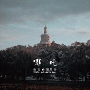

他在时间门外
============================

|  |  |
| :--: | :-- |
| [ 他在时间门外](https://emumo.xiami.com/album/311101) | **艺人**: [哪吒](../index.md) **语种**: 国语 **唱片公司**: 哪咤工作室 **发行时间**: 2012年12月20日 **专辑类别**: 录音室专辑 **专辑风格**: 摇滚 Rock & Roll **播放数**: 7151601 **收藏数**: 7019 **评论数**: 469  |

## 简介

致你们：  
小时候，经常把最喜欢的卡片，玻璃弹珠，橘子橡皮，  
这些别人眼里不值一提，在自己眼里却是最宝贵的物件放进铁盒子，再偷偷埋到自家的院子里。  
我们现在做的就是这样的事情，与其说这是张CD，倒不如说是一个时光盒子更让人舒心，  
我们把在一起的时光小小翼翼的放进去，埋进人类世界的最后一个晚上。  
在盒子里的我们，嘴一翘就会笑，灿烂飞扬。  
说到头，本该是四个人的小秘密，  
现在却要唐突的邀请大家一起去探望，  
去探望在那些起风的日子里，吃着火锅唱着歌的少年们。  
  
我们  
2012年12月20日夜 

  
哪吒乐队处于半解散状态，这张录音十首歌，是在这几年，重新录制的非现场版录音。  
  
他们把这十首歌放在网上，作为自己昙花盛开时的美好回忆与喜爱哪吒的人们分享。  
  
宿命一般，起了这个该死的名字，乐队好象就必须早夭。而因为存在的时间短，他们的故事也只在北京的地下酒吧里被传说。但当年，作为No Beijing的四只乐队之一（其余三支现在都火了，Carsick Cars，Snapline，后海大鲨鱼），他们的歌像针一样刺向年轻人悲伤的心脏。  
  
——文字来自左道  

## 曲目

## 评论

|  |  |  |
| :-- | :-- | :-- |
|  [虾米用户](https://emumo.xiami.com/u/37061462) 看看未来给你什么礼物 2021-01-20 23:45 赞(0) 踩(0) | 
这应该是最后一次在虾米听哪吒了，我失去了虾米，失去了小文，失去了四年的爱情，失去了童真，失去了太多太多了，厮杀在现实泥淖，像一个败了阵的士兵。
 |
|  [虾米用户](https://emumo.xiami.com/u/4933614)  2020-12-28 13:55 赞(0) 踩(0) | 
时代的声音
 |
|  [虾米用户](https://emumo.xiami.com/u/446205358) 很抱歉，我来晚了。 2020-11-30 18:33 赞(1) 踩(0) | 
去年，《一起乐队吧》未经允许翻唱了《环形公路》。时隔12年，哪吒乐队四人联合发声，对节目发出了律师函。事件告一段落后，邵宸北发出一份声明：&amp;ldquo;当日夜叉贼子水围陈塘，哪吒手持宝剑，以一命换取一城！今日种种莫不如此，哪吒乐队愿以此，换取贼子良知！他日纵使莲花盛开，灵珠哪吒却已不在！&amp;rdquo; &amp;ldquo;哪吒乐队决定，永不重组！&amp;rdquo;
 |
|  [虾米用户](https://emumo.xiami.com/u/446205358) 很抱歉，我来晚了。 2020-11-30 18:32 赞(0) 踩(0) | 
九月，在他们的聚点平乐园歪火锅店，邵宸北喝大后哭着写出了《闹海》；十月，邵宸北看完《七宗罪》，写出了《潜水艇司机》，却从未排练过。后来的故事广为人知：在第一次演出前，他们用两个小时将这首歌排了出来。 07年七月，我们甚至不知道确切日期，哪吒解散了。&amp;ldquo;哪吒只哭过一次，从今后不会再有。&amp;rdquo;也许当初起这该死的名字就是个悲伤的错误，早早夭折的宿命围绕着他们。
 |
|  [虾米用户](https://emumo.xiami.com/u/446205358) 很抱歉，我来晚了。 2020-11-30 18:31 赞(2) 踩(0) | 
好久前的乐评，献给哪吒。 哪吒：“忧郁的孩子们别怕，守护你们的是哪吒” 05年的每个早晨，邵宸北都会坐在理工大西门的台阶上啃着面包，等待其他成员来临。那时，哪吒的鼓手还是漂亮的姑娘谦儿，迫于母亲的压力，谦儿退出了乐队，后来他们找到了“小胖”王子春。就这样，哪吒的阵容完整了：主唱詹盼，正是他的嗓音让哪吒的歌有了“像针一样刺向年轻人悲伤的心脏”的力量；吉他邵宸北，写出了所有最美妙的歌词，道尽了所有最悲伤的情绪；贝斯高鹤，又一个美丽的姑娘，与邵宸北说不清的关系让哪吒的解散蒙上了更深的忧郁；鼓手王子春，打出了哪吒各种简洁但有力的奇异鼓点。
 |
|  [虾米用户](https://emumo.xiami.com/u/33932132) 易困 2020-11-20 12:44 赞(0) 踩(0) | 
时间门外
 |
|  [虾米用户](https://emumo.xiami.com/u/31874702) 边缘者 2020-11-08 16:10 赞(0) 踩(0) | 
如果让我选择一支乐队复活，就是哪吒
 |
|  [虾米用户](https://emumo.xiami.com/u/203093894) Been going t... 2020-09-06 21:19 赞(3) 踩(0) | 
北海公园爬了一圈，最后在停车场拍到了专辑封面的角度 
 |
|  [虾米用户](https://emumo.xiami.com/u/16654460)  2020-08-14 08:53 赞(0) 踩(0) | 
我爱哪吒
 |
|  [虾米用户](https://emumo.xiami.com/u/32461597) 楼船夜雪瓜洲渡，铁马秋风... 2020-07-19 17:06 赞(0) 踩(0) | 
为什么我听出了碎瓜的味道？
 |
|  [虾米用户](https://emumo.xiami.com/u/44235667)   2020-06-12 19:53 赞(1) 踩(0) | 
常常想他们如果有第二张专辑会是什么样。
 |
|  [虾米用户](https://emumo.xiami.com/u/410685087) 可愛變態 2020-04-26 20:04 赞(0) 踩(0) | 
愛
 |
|  [虾米用户](https://emumo.xiami.com/u/401913893)  2020-03-23 19:27 赞(0) 踩(0) | 
楼容易也没用
 |
|  [虾米用户](https://emumo.xiami.com/u/434156135)  2019-12-16 11:33 赞(0) 踩(0) | 
力害
 |
|  [虾米用户](https://emumo.xiami.com/u/38164) 钻石牌钻石型钻石牙刷。 2019-12-04 23:04 赞(0) 踩(0) | 
唉
 |
|  [虾米用户](https://emumo.xiami.com/u/44283886) 这个家伙很讨厌虾米的预设... 2019-12-03 20:37 赞(0) 踩(0) | 
铁打的乐迷，流水的主唱~
 |
|  [虾米用户](https://emumo.xiami.com/u/277289263)  2019-11-19 20:24 赞(0) 踩(0) | 
君生我未知，我知君已去
 |
|  [虾米用户](https://emumo.xiami.com/u/37603687) 我还没想好要写什么... 2019-11-13 08:36 赞(1) 踩(0) | 
尽情撕扯吧 趁青春未退役之前
 |
|  [虾米用户](https://emumo.xiami.com/u/194225217) Ouch.       ... 2019-10-16 17:46 赞(0) 踩(0) | 
大爱
 |
|  [虾米用户](https://emumo.xiami.com/u/7190710) 月亮被云挡住了，但月光却... 2019-10-14 17:37 赞(0) 踩(0) | 
闹海和环形公路听了好久了一直没收藏专辑
 |
|  [虾米用户](https://emumo.xiami.com/u/407641946) 总有傻逼隔应朕 2019-09-27 22:56 赞(0) 踩(0) | 
我爱哪吒！永远的哪吒！！！！
 |
|  [虾米用户](https://emumo.xiami.com/u/342650941)  2019-09-26 17:06 赞(0) 踩(0) | 
哪吒去天国
 |
|  [虾米用户](https://emumo.xiami.com/u/327861224)  2019-09-25 00:53 赞(0) 踩(0) | 
太好了
 |
|  [虾米用户](https://emumo.xiami.com/u/427913671) 我还没想好要写什么... 2019-09-23 16:18 赞(0) 踩(0) | 
哪吒！
 |
|  [虾米用户](https://emumo.xiami.com/u/329758615)  2019-09-21 09:04 赞(0) 踩(0) | 
里没有这个？
 |
|  [虾米用户](https://emumo.xiami.com/u/7960941) 我还没想好要写什么... 2019-08-23 21:49 赞(0) 踩(0) | 
写入中国摇滚历史的好专
 |
|  [虾米用户](https://emumo.xiami.com/u/68824810) 别把我的消息带回家乡，时... 2019-08-16 18:11 赞(1) 踩(0) | 
你们一直都是我认为的宝藏乐队，多希望你们能再出山啊，乐队的夏天出现的哪吒的时候多希望那是你们啊
 |
|  [虾米用户](https://emumo.xiami.com/u/1839967)   2019-08-06 18:59 赞(1) 踩(0) | 
宝藏....可能不太希望充重组，但出来表演圈钱还是很希望的
 |
|  [虾米用户](https://emumo.xiami.com/u/42963872) 我还没想好要写什么... 2019-08-05 00:31 赞(0) 踩(0) | 
~
 |
|  [虾米用户](https://emumo.xiami.com/u/328415179) ฅ( ̳•  ̮ • ̳... 2019-08-01 08:47 赞(0) 踩(0) | 
nice啊 (｡･ω･｡)ﾉ♡
 |
|  [虾米用户](https://emumo.xiami.com/u/418658661)  2019-07-29 00:17 赞(0) 踩(0) | 
了不起
 |
|  [虾米用户](https://emumo.xiami.com/u/37043100) 愿地狱也有音乐。 2019-07-28 22:59 赞(0) 踩(0) | 

 |
|  [虾米用户](https://emumo.xiami.com/u/335334407) 我想好要写什么... 2019-07-28 14:45 赞(0) 踩(0) | 
無須多說
 |
|  [虾米用户](https://emumo.xiami.com/u/147361618) 再会 2019-07-25 16:24 赞(0) 踩(0) | 
恨却离不开。
 |
|  [虾米用户](https://emumo.xiami.com/u/12529717) 你覺得恨？！ 卻離不開！ 2019-07-19 15:54 赞(2) 踩(0) | 
12年到19年  19岁到26岁 济南 北京 沈阳  已经不觉得恨了 ...试着去融入
 |
|  [虾米用户](https://emumo.xiami.com/u/323798626)  2019-07-07 22:36 赞(1) 踩(0) | 
先锋。
 |
|  [虾米用户](https://emumo.xiami.com/u/57231736)  2019-07-01 08:54 赞(1) 踩(0) | 
今天再回过头去看，05年的这张专辑，英伦风和中国土摇一样正，非常棒
 |
|  [虾米用户](https://emumo.xiami.com/u/400901482)  2019-06-26 11:09 赞(2) 踩(0) | 
这是国内少数的真正具有PUNK内核的乐队。
 |
|  [虾米用户](https://emumo.xiami.com/u/250245397)  2019-06-13 22:50 赞(2) 踩(0) | 
没有为什么,就是好。
 |
|  [虾米用户](https://emumo.xiami.com/u/11226605)  2019-06-13 16:42 赞(0) 踩(0) | 
忧郁的孩子们别怕，守护着你们是哪吒。 你不该忘记英雄般的童年，他保护着你。
 |
|  [虾米用户](https://emumo.xiami.com/u/375131635)  2019-06-12 23:16 赞(1) 踩(0) | 
只有年轻人才有的东西
 |
|  [虾米用户](https://emumo.xiami.com/u/123262020) 保护我 来骗我吧。 2019-06-11 13:39 赞(0) 踩(0) | 
永远的
 |
|  [虾米用户](https://emumo.xiami.com/u/47357376)  2019-06-08 10:38 赞(0) 踩(0) | 
******
 |
|  [虾米用户](https://emumo.xiami.com/u/216832112)  2019-06-02 13:05 赞(1) 踩(0) | 
去克罗里吧！
 |
|  [虾米用户](https://emumo.xiami.com/u/711352)   2019-05-26 20:54 赞(0) 踩(0) | 
非常棒，听了好多年，不知道会不会复出
 |
|  [虾米用户](https://emumo.xiami.com/u/85229340) 信息一概不回 2019-05-05 22:39 赞(0) 踩(0) | 
怕不怕。 怕。
 |
|  [虾米用户](https://emumo.xiami.com/u/472261) 别跟我讲道理 2019-05-02 05:00 赞(1) 踩(0) | 
诶，我有cd压的无损，我就不传了，嘻嘻
 |
|  [虾米用户](https://emumo.xiami.com/u/378357384)  2019-04-28 20:13 赞(0) 踩(0) | 
大爱哪吒
 |
|  [虾米用户](https://emumo.xiami.com/u/211185383) 也许，我们会在梦里相见 2019-04-23 12:49 赞(0) 踩(0) | 
开始有了互联网 人们开始发泄 开始说出不负责的话 人们终于吃饱了 开始有了不同的欲望 人们终于开心的笑了。
 |
|  [虾米用户](https://emumo.xiami.com/u/48308963)   2019-04-21 10:29 赞(0) 踩(0) | 
我也不知道我是着了什么魔。
 |
|  [虾米用户](https://emumo.xiami.com/u/37061462) 看看未来给你什么礼物 2019-04-21 01:07 赞(0) 踩(0) | 
又听了一遍
 |
|  [虾米用户](https://emumo.xiami.com/u/40936242) 我还没想好要写什么... 2019-04-03 21:02 赞(0) 踩(0) | 
很遗憾这么晚才遇到你们，在你们不在存在以后
 |
|  [虾米用户](https://emumo.xiami.com/u/6654061) Cosmic Wave 2019-04-03 12:41 赞(0) 踩(0) | 
斩断404
 |
|  [虾米用户](https://emumo.xiami.com/u/374780766) 銀河的子民 2019-04-01 12:20 赞(0) 踩(0) | 
铿锵有力 简直完美！
 |
|  [虾米用户](https://emumo.xiami.com/u/47357376)  2019-03-27 23:28 赞(0) 踩(0) | 
******
 |
|  [虾米用户](https://emumo.xiami.com/u/284081618)  2019-03-15 23:30 赞(0) 踩(0) | 
除了贵以外都好
 |
|  [虾米用户](https://emumo.xiami.com/u/403129250) 飞上天，变成一朵乌云。 2019-03-14 22:28 赞(0) 踩(0) | 
好听，炸裂
 |
|  [虾米用户](https://emumo.xiami.com/u/151341790) 我爱虾米，我爱你们 2019-03-12 12:35 赞(3) 踩(0) | 
若说它是中国当代青年中最具人气的专辑之一也完全不为过。作为曾经的No Beijing之一的乐队也是唯一解散的No Beijing 的乐队，哪吒留下这样一张不可复制的专辑，所有的年轻都定格在这里，唯一的哪吒也定格在了这里，我的年轻也和哪吒钉在了一起。
 |
|  [虾米用户](https://emumo.xiami.com/u/408864342) 接受你的洗礼 2019-03-10 14:08 赞(0) 踩(0) | 
超爱哪吒
 |
|  [虾米用户](https://emumo.xiami.com/u/329265319) 要在这混沌世界大开杀戒 2019-03-07 23:59 赞(0) 踩(0) | 
今朝我三头六臂，身后的落花盛开。
 |
|  [虾米用户](https://emumo.xiami.com/u/124837912)  2019-02-08 08:51 赞(0) 踩(0) | 
哪吒只哭过一次
 |
|  [虾米用户](https://emumo.xiami.com/u/193452248) 六千毫升的蓝。 2019-02-03 01:52 赞(0) 踩(0) | 
no beijing
 |
|  [虾米用户](https://emumo.xiami.com/u/374780766) 銀河的子民 2018-12-16 10:57 赞(1) 踩(0) | 
:(
 |
|  [虾米用户](https://emumo.xiami.com/u/51681976) 泥巴 2018-12-04 18:27 赞(0) 踩(0) | 
爱爱爱爱爱爱爱生活生活生活生活生活
 |
|  [虾米用户](https://emumo.xiami.com/u/347009827) 哪吒. 2018-11-24 16:22 赞(0) 踩(0) | 
为什么看不了乐评 
 |
|  [虾米用户](https://emumo.xiami.com/u/347009827) 哪吒. 2018-11-24 16:21 赞(0) 踩(0) | 
6
 |
|  [虾米用户](https://emumo.xiami.com/u/12799235) 暂无签名~ 2018-09-28 23:22 赞(0) 踩(0) | 
认识的太晚，想去趟现场
 |
|  [虾米用户](https://emumo.xiami.com/u/87828918) 你纵有家财万贯，也买不了... 2018-09-20 00:19 赞(0) 踩(0) | 
QQ音乐已经灰了一半。。。
 |
|  [虾米用户](https://emumo.xiami.com/u/3845059)  2018-09-14 00:52 赞(2) 踩(0) | 
那个打1星的是谁。您牛逼上天了
 |
|  [虾米用户](https://emumo.xiami.com/u/6498265) 这家伙很聪明什么也没留下... 2018-08-21 16:59 赞(0) 踩(0) | 
这个老专辑呀
 |
|  [虾米用户](https://emumo.xiami.com/u/83893196) 我还没想好要写什么... 2018-08-12 23:13 赞(0) 踩(0) | 
yep
 |
|  [虾米用户](https://emumo.xiami.com/u/297999609) 去克洛里吧 2018-07-30 22:54 赞(0) 踩(0) | 

 |
|  [虾米用户](https://emumo.xiami.com/u/47357376)  2018-05-09 21:34 赞(0) 踩(0) | 
******
 |
|  [虾米用户](https://emumo.xiami.com/u/57231736)  2018-04-28 16:57 赞(4) 踩(0) | 
中国摇滚前十乐队，中国摇滚前十专辑。
 |
|  [虾米用户](https://emumo.xiami.com/u/359806974) 我还没想好要写什么... 2018-04-22 20:55 赞(3) 踩(0) | 
一出世便是顶峰，华语最爱的乐队
 |
|  [虾米用户](https://emumo.xiami.com/u/18577189) 假如再也不能见到你，祝你... 2018-04-10 16:45 赞(2) 踩(0) | 
在你已经消失的时候
 |
|  [虾米用户](https://emumo.xiami.com/u/275670182) 忧郁温柔的，有八块腹肌的... 2018-04-01 22:50 赞(3) 踩(0) | 
难得一见的天才乐队 前无古人 后估计也不会有来者的天才乐队 爆炸般四射的青春感 还有 北海是我最爱的地方
 |
|  [虾米用户](https://emumo.xiami.com/u/11748602) 一片待回收的垃圾 2018-04-01 01:34 赞(1) 踩(0) | 
太深刻
 |
|  [虾米用户](https://emumo.xiami.com/u/37222390) 我还没想好要写什么... 2018-03-20 22:55 赞(1) 踩(0) | 
神作！
 |
|  [虾米用户](https://emumo.xiami.com/u/132119586)  2018-02-24 20:22 赞(1) 踩(0) | 
为什么虾米这张专的封面跟其他的都不同
 |
| ⇒ |  [虾米用户](https://emumo.xiami.com/u/36938932) 倒霉的小伙子比洞還潮濕的... 2018-11-09 14:54 赞(0) 踩(0) | 
可能這張是真正的封面吧
 |
|  [虾米用户](https://emumo.xiami.com/u/209110946)  2018-01-31 13:43 赞(1) 踩(0) | 
泪目
 |
|  [虾米用户](https://emumo.xiami.com/u/251527707) 我还没想好要写什么... 2018-01-29 01:47 赞(1) 踩(0) | 
没了这俩字儿怎么写？
 |
|  [虾米用户](https://emumo.xiami.com/u/35658691) 身行万里半天下 2017-12-10 01:43 赞(2) 踩(0) | 
留名
 |
|  [虾米用户](https://emumo.xiami.com/u/43492923) 行到水穷我才开始害怕，夕... 2017-12-03 13:05 赞(1) 踩(0) | 
喜欢
 |
|  [虾米用户](https://emumo.xiami.com/u/9154037) 到水星散心去了。 2017-11-24 21:54 赞(1) 踩(0) | 
You Are So Great
 |
|  [虾米用户](https://emumo.xiami.com/u/8257232)   2017-11-24 12:51 赞(2) 踩(0) | 
哪吒，幼儿园出事了
 |
|  [虾米用户](https://emumo.xiami.com/u/136078694)   2017-11-04 13:50 赞(1) 踩(0) | 
有活力，小清新，年轻的力量
 |
|  [虾米用户](https://emumo.xiami.com/u/7633591) 做个人吧。 2017-10-27 23:16 赞(0) 踩(0) | 
那么多年，百听不厌，每听一遍就更喜欢一首歌，最近极度喜欢情歌
 |
|  [虾米用户](https://emumo.xiami.com/u/7379704) 你消失的哪天就像就像一场... 2017-10-13 11:12 赞(1) 踩(0) | 
每次听到闹海都想流泪，太有感染力
 |
|  [虾米用户](https://emumo.xiami.com/u/311688017) 我还没想好要写什么... 2017-10-05 23:48 赞(0) 踩(0) | 
短命却很精细
 |
|  [虾米用户](https://emumo.xiami.com/u/45308299) 我还没想好要写什么... 2017-09-21 16:26 赞(0) 踩(0) | 
北京是我的眼泪伤心地
 |
|  [虾米用户](https://emumo.xiami.com/u/45308299) 我还没想好要写什么... 2017-09-21 16:25 赞(0) 踩(0) | 
对北京这个地儿真是又爱又恨
 |
|  [虾米用户](https://emumo.xiami.com/u/45308299) 我还没想好要写什么... 2017-09-21 16:25 赞(0) 踩(0) | 
为什么这么想哭呢
 |
|  [虾米用户](https://emumo.xiami.com/u/285329269)   2017-07-20 14:13 赞(0) 踩(0) | 
充满了才气
 |
|  [虾米用户](https://emumo.xiami.com/u/260123122)   2017-07-13 15:44 赞(1) 踩(0) | 
/
 |
|  [虾米用户](https://emumo.xiami.com/u/285329269)   2017-07-12 20:37 赞(0) 踩(0) | 
哪吒很棒！好专辑！
 |
|  [虾米用户](https://emumo.xiami.com/u/1126943)  2017-06-25 12:18 赞(1) 踩(0) | 
一张即永恒!--那幸运的几百个拷贝收藏者里 我也幸运的成为之一 --感谢 金鑫相赠!!:)。。
 |
|  [虾米用户](https://emumo.xiami.com/u/46041141)   2017-06-13 14:10 赞(27) 踩(0) | 
前男友非常喜欢的一个乐队，分手时他送了对他来说非常珍贵的这张CD给我。这么多年了，希望大家各自都好。
 |
| ⇒ |  [虾米用户](https://emumo.xiami.com/u/285329269)   2017-07-20 14:13 赞(0) 踩(0) | 
真的超珍贵！
 |
| ⇒ |  [虾米用户](https://emumo.xiami.com/u/123987172)   2017-08-31 13:47 赞(0) 踩(0) | 
牛啊
 |
| ⇒ |  [虾米用户](https://emumo.xiami.com/u/5040002) 我还没想好要写什么... 2019-04-03 21:05 赞(0) 踩(0) | 
值啊 你发了
 |
| ⇒ |  [虾米用户](https://emumo.xiami.com/u/123262020) 保护我 来骗我吧。 2019-06-11 13:40 赞(0) 踩(0) | 
有兴趣转手吗 真的超喜欢哪吒
 |
| ⇒ |  [虾米用户](https://emumo.xiami.com/u/401687432)  2019-07-20 10:05 赞(0) 踩(0) | 
你真幸福
 |
| ⇒ |  [虾米用户](https://emumo.xiami.com/u/1288867) 000999# 9016... 2019-07-25 11:41 赞(0) 踩(0) | 
转手不？
 |
| ⇒ |  [虾米用户](https://emumo.xiami.com/u/123262020) 保护我 来骗我吧。 2019-07-25 11:42 赞(0) 踩(0) | 
<q><b>To Pepe说：</b></q>
 |
| ⇒ |  [虾米用户](https://emumo.xiami.com/u/1288867) 000999# 9016... 2019-07-27 16:27 赞(0) 踩(0) | 
<q><b>坚说：</b></q>
 |
| ⇒ |  [虾米用户](https://emumo.xiami.com/u/123262020) 保护我 来骗我吧。 2019-07-30 11:36 赞(0) 踩(0) | 
<q><b>To Pepe说：</b></q>
 |
| ⇒ |  [虾米用户](https://emumo.xiami.com/u/123262020) 保护我 来骗我吧。 2019-07-30 11:37 赞(0) 踩(0) | 
<q><b>To Pepe说：</b></q>
 |
| ⇒ |  [虾米用户](https://emumo.xiami.com/u/332508016)  2019-12-20 11:51 赞(0) 踩(0) | 
好喜欢哪吒乐队，CD太贵了，买不起了~
 |
| ⇒ |  [虾米用户](https://emumo.xiami.com/u/39123038) 我我是中国男孩 我是沙壁... 2020-08-28 01:17 赞(0) 踩(0) | 
真好呀
 |
|  [虾米用户](https://emumo.xiami.com/u/37678017) 无摇滚，不青春！ 2017-05-28 20:28 赞(1) 踩(0) | 
詹盼你们这是要搞事情。和痛仰有仇吗？哈哈  还是想把痛仰搞解散。。。
 |
|  [虾米用户](https://emumo.xiami.com/u/45053311) anytime 2017-04-29 12:05 赞(4) 踩(0) | 
我心中的时间门外 可能就是那个保持纯真没有烦恼的地方
 |
|  [虾米用户](https://emumo.xiami.com/u/12938082) 地球背叛我们的那个小时 2017-04-27 20:49 赞(1) 踩(0) | 
当年如此喜欢的专辑
 |
|  [虾米用户](https://emumo.xiami.com/u/33126608) 临阵挽弓指天狼 2017-04-23 17:26 赞(2) 踩(0) | 
于是后来再听闹海的时候 就只会流泪了
 |
|  [虾米用户](https://emumo.xiami.com/u/9964902) 。。。。 2017-03-30 19:32 赞(31) 踩(0) | 
2004年的夏天，我跟我混乱的生活告别了，离开了那些只懂得欺骗的身边人，想要投入到一种全新的简单的生活，当时我狂热的迷恋着70年代的曼彻斯特，迷恋那时期那地方的所有乐队，当然，我也更加离不开joy division了，我写了《他站在时间门外》送给23岁就结束了的年轻人，后来在香山的地下室里第一次排了这首歌，当时在场的人问我这该算什么风格，我答不上来。当太阳的影子掉进小月河，下午来临，我每天在这个时候独自吃晚饭，脑子里总在不停的重复着一段旋律，这就是后来的《you&amp;#39;re so great》。
 |
| ⇒ |  [虾米用户](https://emumo.xiami.com/u/193452248) 六千毫升的蓝。 2019-02-03 01:51 赞(0) 踩(0) | 
邵宸北
 |
|  [虾米用户](https://emumo.xiami.com/u/169153196) 恣欲支配 2017-01-24 13:21 赞(0) 踩(0) | 
今朝我三头六臂！
 |
|  [虾米用户](https://emumo.xiami.com/u/45404950)  2017-01-12 03:52 赞(0) 踩(0) | 
啊，相见恨晚
 |
|  [虾米用户](https://emumo.xiami.com/u/15728836)   2016-11-30 10:35 赞(0) 踩(0) | 
老了
 |
|  [虾米用户](https://emumo.xiami.com/u/29872889) 彼一如我 2016-10-24 22:41 赞(4) 踩(0) | 
二次元和哪吒并不冲突 
 |
|  [虾米用户](https://emumo.xiami.com/u/41471305)  2016-10-18 00:14 赞(1) 踩(0) | 
大学时有个特别喜欢哪吒乐队的朋友
 |
|  [虾米用户](https://emumo.xiami.com/u/5032986) Private 2016-10-17 19:59 赞(1) 踩(0) | 
又把哪吒掏出来听  U Are So Great  一次次循环 疯狂地笑吧疯笑吧 我只拥有这一次
 |
|  [虾米用户](https://emumo.xiami.com/u/236914350)  2016-10-15 17:07 赞(0) 踩(0) | 

 |
|  [虾米用户](https://emumo.xiami.com/u/50857309) 回归，不代表原来。 2016-10-14 13:24 赞(0) 踩(0) | 
品质优良！
 |
|  [虾米用户](https://emumo.xiami.com/u/203733622)  2016-10-14 09:46 赞(0) 踩(0) | 
不错
 |
|  [虾米用户](https://emumo.xiami.com/u/182115316)  2016-10-13 20:07 赞(0) 踩(0) | 
呦呦
 |
|  [虾米用户](https://emumo.xiami.com/u/7623893)  2016-10-13 18:21 赞(0) 踩(0) | 
丢丢丢
 |
|  [虾米用户](https://emumo.xiami.com/u/30800139) 我在低俗与高雅间活的很尴... 2016-09-25 02:44 赞(0) 踩(0) | 
。
 |
|  [虾米用户](https://emumo.xiami.com/u/2209190)  2016-09-09 01:42 赞(0) 踩(0) | 
过去了
 |
|  [虾米用户](https://emumo.xiami.com/u/29405588) 聪明 2016-09-04 04:37 赞(0) 踩(0) | 
我太爱哪吒！待我健身半年后把你们纹身上！
 |
|  [虾米用户](https://emumo.xiami.com/u/11873617) 不耐听的都不算好歌。 2016-08-09 19:20 赞(1) 踩(0) | 
我清楚的记得之前第一次听这张专辑的时候感觉明明很一般，留过言说不知道为什么那么多人推荐这个乐队，结果被好多人弱....当时还很不爽(* ￣︿￣)，结果现在重新一听，MD，喜欢上了，真是尴尬(─.─|||
 |
|  [虾米用户](https://emumo.xiami.com/u/45139143)  2016-07-19 10:41 赞(0) 踩(0) | 
是个好乐队
 |
|  [虾米用户](https://emumo.xiami.com/u/3580619)  2016-05-28 13:51 赞(0) 踩(0) | 
真喜欢
 |
|  [虾米用户](https://emumo.xiami.com/u/12694181) 我还没想好要写什么... 2016-04-16 21:46 赞(0) 踩(0) | 
说好的不解散呢！
 |
|  [虾米用户](https://emumo.xiami.com/u/1703028) “n55!w!" "im... 2016-04-13 01:49 赞(1) 踩(0) | 
我不怕，我有哪吒守护我。
 |
|  [虾米用户](https://emumo.xiami.com/u/6451965)  2016-04-11 18:04 赞(0) 踩(0) | 
真是好想得到这张专辑呐
 |
|  [虾米用户](https://emumo.xiami.com/u/10825322) @Bside1 2016-03-07 05:02 赞(0) 踩(0) | 
噢
 |
|  [虾米用户](https://emumo.xiami.com/u/1142678) 不培养废物了。 2016-03-04 16:23 赞(0) 踩(0) | 
该懂的道理在2012已经被写出来
 |
|  [虾米用户](https://emumo.xiami.com/u/32362730) 5はいいぞ~~ 2016-02-25 23:35 赞(0) 踩(0) | 
⁽* ¨̮ *⁾
 |
|  [虾米用户](https://emumo.xiami.com/u/2909579)  2016-02-15 13:28 赞(0) 踩(0) | 
词好，曲好，唱得好
 |
|  [虾米用户](https://emumo.xiami.com/u/2909579)  2016-02-15 13:27 赞(0) 踩(0) | 
为什么以前就不知道这首歌！！！为什么！
 |
|  [虾米用户](https://emumo.xiami.com/u/53717250) MUZIK SHIT 2016-01-25 14:41 赞(1) 踩(0) | 
妈的相见恨晚，真他妈好听
 |
|  [虾米用户](https://emumo.xiami.com/u/42408809)  2016-01-19 23:31 赞(0) 踩(0) | 
这张专辑不需要任何修饰
 |
|  [虾米用户](https://emumo.xiami.com/u/678878)  2016-01-08 15:23 赞(1) 踩(0) | 
你觉得狠却离不开，我擦擦擦擦！
 |
|  [虾米用户](https://emumo.xiami.com/u/8018014) 20170925#不要轻... 2016-01-01 23:39 赞(0) 踩(0) | 
【1/366】他们的歌像针一样刺向年轻人悲伤的心脏
 |
|  [虾米用户](https://emumo.xiami.com/u/3713514) 明天我会在哪只鞋子里？ 2015-12-24 18:07 赞(3) 踩(0) | 
主唱不飙高音的时候还是很萌的，国内头号少年嗓。但那些捧上天的我就搞不懂了。
 |
|  [虾米用户](https://emumo.xiami.com/u/3641279) [ 丧心病狂 ]get√ 2015-11-24 15:09 赞(0) 踩(0) | 
☺☺☺☺☺
 |
|  [虾米用户](https://emumo.xiami.com/u/42671904)  2015-11-20 07:26 赞(1) 踩(0) | 
你觉得恨却离不开！
 |
|  [虾米用户](https://emumo.xiami.com/u/44796286) 努力成为独立音乐人 2015-11-17 15:29 赞(2) 踩(0) | 
就像听到哪吒的时候，乐队已经解散了
 |
|  [虾米用户](https://emumo.xiami.com/u/42861347) 暂无签名~ 2015-11-09 19:00 赞(0) 踩(0) | 
哪吒牛逼
 |
|  [虾米用户](https://emumo.xiami.com/u/38801880)   2015-10-17 16:41 赞(0) 踩(0) | 
^_^
 |
|  [虾米用户](https://emumo.xiami.com/u/48090365) 救世主的死亡，即为天启！ 2015-10-11 11:18 赞(0) 踩(0) | 
牛逼~！
 |
|  [虾米用户](https://emumo.xiami.com/u/1447058) 已迁移至网易云，祝好——... 2015-09-27 17:44 赞(73) 踩(0) | 
看着国内的一众小年轻烂乐队整天更新公告，去哪里巡演啦，新专辑正在创作中啦之类的。 不是不尊重你们的“梦想”还有“事业”，然而你们做出来的玩意除了狗屎还是狗屎。听两秒都觉得浪费时间。  再出现一个哪吒，看来还真的挺难。
 |
| ⇒ |  [虾米用户](https://emumo.xiami.com/u/1927894)   2019-10-24 12:02 赞(0) 踩(0) | 
回头再看看你自己这段话 羞耻吗
 |
| ⇒ |  [虾米用户](https://emumo.xiami.com/u/1447058) 已迁移至网易云，祝好——... 2019-10-24 13:08 赞(0) 踩(0) | 
<q><b>白日梦说：</b></q>
 |
| ⇒ |  [虾米用户](https://emumo.xiami.com/u/1447058) 已迁移至网易云，祝好——... 2019-10-24 13:12 赞(0) 踩(0) | 
<q><b>白日梦说：</b></q>
 |
| ⇒ |  [虾米用户](https://emumo.xiami.com/u/428960256) 一个Poser,仅此而已... 2020-04-19 01:43 赞(0) 踩(0) | 
4年了，依旧没多大改变，依旧使人失望
 |
| ⇒ |  [虾米用户](https://emumo.xiami.com/u/443431448)  2020-08-05 13:27 赞(0) 踩(0) | 
<q><b>暗叉说：</b></q>
 |
|  [虾米用户](https://emumo.xiami.com/u/30617820) 窝列大窝列大哟 2015-09-17 12:54 赞(0) 踩(0) | 
马
 |
|  [虾米用户](https://emumo.xiami.com/u/34419938) 我还没想好要写什么.. 2015-09-09 20:20 赞(0) 踩(0) | 
一张专辑听不完了 怀疑自己是垃圾
 |
|  [虾米用户](https://emumo.xiami.com/u/8273609)  2015-08-22 14:09 赞(1) 踩(0) | 
看了简介再听闹海，突然有了种敬畏与忧伤。
 |
|  [虾米用户](https://emumo.xiami.com/u/15341999) 怎么可能忘记 2015-08-06 03:08 赞(0) 踩(0) | 
像Joy Division
 |
|  [虾米用户](https://emumo.xiami.com/u/46798736) 你梦见你不停地走向自己 2015-07-29 17:23 赞(0) 踩(0) | 
太喜欢这张专辑了啊！！！好可惜的一支乐队
 |
|  [虾米用户](https://emumo.xiami.com/u/10486405) didudidu~ 2015-07-28 23:44 赞(0) 踩(0) | 
酷
 |
|  [虾米用户](https://emumo.xiami.com/u/32695431) 你他娘的就是一只狗 2015-07-04 16:18 赞(0) 踩(0) | 
soga
 |
|  [虾米用户](https://emumo.xiami.com/u/6834988)  2015-07-04 00:17 赞(0) 踩(0) | 
我的天 多棒的一张专辑 好久没有这样发现宝物的感觉了
 |
|  [虾米用户](https://emumo.xiami.com/u/39619356) 宇宙 始终 未来 自由 2015-07-02 18:21 赞(1) 踩(0) | 
吃我安利 超超超棒的专辑  全身都在躁动WWWW太棒了
 |
|  [虾米用户](https://emumo.xiami.com/u/44724100)   2015-06-14 23:07 赞(0) 踩(0) | 
1
 |
|  [虾米用户](https://emumo.xiami.com/u/43270027)   2015-06-10 21:00 赞(1) 踩(0) | 
他们一定也很喜欢那些我喜欢的乐队。
 |
|  [虾米用户](https://emumo.xiami.com/u/11783759)  2015-05-27 16:12 赞(0) 踩(0) | 
能有什么理由了，一首能循环到底的哪吒就能证明！
 |
|  [虾米用户](https://emumo.xiami.com/u/49861463)  2015-05-24 08:49 赞(0) 踩(0) | 
这么n b的哪吒还不是被猴哥打得不要不要的 
 |
| ⇒ |  [虾米用户](https://emumo.xiami.com/u/50420985)   2015-05-30 15:55 赞(0) 踩(0) | 
<q><b>Aule说：</b></q>
 |
| ⇒ |  [虾米用户](https://emumo.xiami.com/u/2590549)  2017-10-27 23:51 赞(0) 踩(0) | 
哈哈哈 那这么说乐队要想牛逼只能叫佛祖乐队了
 |
|  [虾米用户](https://emumo.xiami.com/u/32695431) 你他娘的就是一只狗 2015-04-27 14:11 赞(1) 踩(0) | 
环形公路和嘎调的圈 这他妈不是一首歌吗！？！？
 |
| ⇒ |  [虾米用户](https://emumo.xiami.com/u/1170903) 我妖气重我自豪 2015-06-14 20:30 赞(0) 踩(0) | 
哪吒是嘎调的前身,重组了之后换名字
 |
| ⇒ |  [虾米用户](https://emumo.xiami.com/u/8895778) 我还没想好要写什么... 2015-06-15 15:14 赞(0) 踩(0) | 
<q><b>鬼束石燕说：</b></q>
 |
| ⇒ |  [虾米用户](https://emumo.xiami.com/u/39481580) 好听 2015-07-03 10:08 赞(0) 踩(0) | 
本就一个人
 |
|  [虾米用户](https://emumo.xiami.com/u/547986)  2015-04-25 23:51 赞(0) 踩(0) | 
我的神曲？不，是你的神曲！
 |
|  [虾米用户](https://emumo.xiami.com/u/42263789) 。 2015-04-25 09:27 赞(0) 踩(0) | 
可惜了这样有态度的音乐和这群有态度的人。。。不过也因为短暂。所以这张唱片也“侥幸”切合了主题。被锁在时间门外了。不会被淘汰
 |
|  [虾米用户](https://emumo.xiami.com/u/25398465) 夜夜梦魂牵绕……未能眠… 2015-04-22 12:28 赞(0) 踩(0) | 
冷郁电子曲风,哪吒乐队,摇滚,
 |
|  [虾米用户](https://emumo.xiami.com/u/12128912)  2015-04-21 21:39 赞(0) 踩(0) | 
我的生活和孩子的假期 牛B
 |
|  [虾米用户](https://emumo.xiami.com/u/43475154)   2015-04-21 17:27 赞(0) 踩(0) | 
我天！！牛逼！！！！
 |
|  [虾米用户](https://emumo.xiami.com/u/6468115) 暂无签名~ 2015-04-15 22:15 赞(0) 踩(0) | 
躁动的青春 再不会重来
 |
|  [虾米用户](https://emumo.xiami.com/u/10422104) 困。。。饿。。。 2015-04-12 12:03 赞(0) 踩(0) | 
妈呀这张专辑好听到爆！！好久没有从头到尾听一张专辑了！相见恨晚！！我是寻着《闹海》这歌找到这乐队找到这专辑的！超级棒！
 |
|  [虾米用户](https://emumo.xiami.com/u/48637205)  2015-03-29 22:09 赞(0) 踩(0) | 
棒
 |
|  [虾米用户](https://emumo.xiami.com/u/37627294)  2015-02-11 19:41 赞(0) 踩(0) | 
怀念哪吒
 |
|  [虾米用户](https://emumo.xiami.com/u/40600451)  2015-01-31 19:06 赞(0) 踩(0) | 
我听了很多张专辑，最爱这个
 |
|  [虾米用户](https://emumo.xiami.com/u/24648377) 别装逼 认真听 2015-01-15 00:24 赞(0) 踩(0) | 
有自己的风格在
 |
|  [虾米用户](https://emumo.xiami.com/u/23092729)  2015-01-12 23:17 赞(0) 踩(0) | 
我日、竟然没收藏
 |
|  [虾米用户](https://emumo.xiami.com/u/44261333) 你可能不相信，我是永远不... 2014-12-03 16:32 赞(0) 踩(0) | 
安静的听完，搞笑到有点想哭
 |
|  [虾米用户](https://emumo.xiami.com/u/10616599) to me 2014-12-01 11:18 赞(0) 踩(0) | 
一种情怀
 |
|  [虾米用户](https://emumo.xiami.com/u/2302021)  2014-11-29 12:04 赞(0) 踩(0) | 
振奋人心，真可惜乐队已经成为传说：...
 |
|  [虾米用户](https://emumo.xiami.com/u/2302021)  2014-11-29 11:57 赞(0) 踩(0) | 
振奋人心，真可惜乐队已经成为传说：...&amp;lt;
 |
|  [虾米用户](https://emumo.xiami.com/u/5084856)  2014-11-23 01:25 赞(0) 踩(0) | 
时间门外  passover  傻傻分不清楚
 |
|  [虾米用户](https://emumo.xiami.com/u/510533)  2014-11-22 11:45 赞(0) 踩(0) | 
棒棒哒！
 |
|  [虾米用户](https://emumo.xiami.com/u/5591661) ， 2014-11-12 15:50 赞(12) 踩(0) | 
卧槽，几个月不来这里掐起来了。有意思吗？听听歌就行了，掐你妹儿啊。别人点评论是来找喜欢哪吒的朋友的，不是来看你们掐的好吗！！有病，回家吃药，在这里找什么存在感。
 |
|  [虾米用户](https://emumo.xiami.com/u/37766590) 把耳朵抛向远方 2014-11-06 17:21 赞(0) 踩(0) | 
虽然只给了三星，但真的很欣赏他们的精神，听得出来，这似乎是一张拼盘？
 |
|  [虾米用户](https://emumo.xiami.com/u/9672768)  2014-10-25 23:08 赞(1) 踩(0) | 
你造吗，我手贱点了下那个“淘宝音乐馆”按钮，发现这碟要卖1980软妹币！ 是不是买到的都升值了……
 |
|  [虾米用户](https://emumo.xiami.com/u/268680)  2014-10-15 20:17 赞(0) 踩(0) | 
爽
 |
|  [虾米用户](https://emumo.xiami.com/u/12690979)  2014-09-29 09:31 赞(1) 踩(0) | 
听歌儿就听歌儿，别胡逼。听个歌儿还听出优越感了？！
 |
|  [虾米用户](https://emumo.xiami.com/u/39253326) isolation 2014-09-22 01:14 赞(1) 踩(0) | 
吃不消煞笔，不喜勿喷。我爱哪吒
 |
|  [虾米用户](https://emumo.xiami.com/u/9728554)  2014-09-20 21:49 赞(0) 踩(0) | 
内容已删除
 |
| ⇒ |  [虾米用户](https://emumo.xiami.com/u/39724688) 时间过得飞快 转眼这些已... 2014-10-21 20:49 赞(0) 踩(0) | 
你还是适合去听外国的鸟文吧 干脆别说国语算了
 |
| ⇒ |  [虾米用户](https://emumo.xiami.com/u/341091) 偶爱我们呢~ 2014-11-20 10:18 赞(0) 踩(0) | 
1979跟这听上去还是差别很大吧
 |
|  [虾米用户](https://emumo.xiami.com/u/9728554)  2014-09-20 21:46 赞(2) 踩(0) | 
<a href="http://www.xiami.com/song/2079465?spm=a1z1s.6659513.0.0.xSxc6G" target="_blank" rel="nofollow noreferrer noopener">http://www.xiami.com/song/2079465?spm=a1z1s.6659513.0.0.xSxc6G</a> 这张专辑的全是抄袭的 不行就听链接！！！！！！！！！！！ 在对比一下 发布时间！！！！！！！！！！！！！！！！！！！！！
 |
|  [虾米用户](https://emumo.xiami.com/u/12690979)  2014-09-19 13:20 赞(0) 踩(0) | 
好听
 |
|  [虾米用户](https://emumo.xiami.com/u/9728554)  2014-09-16 19:44 赞(0) 踩(0) | 
学英伦风格的 又是山寨！！！！！！！！！！
 |
| ⇒ |  [虾米用户](https://emumo.xiami.com/u/963987) 逃离吧。 2014-09-20 01:21 赞(0) 踩(0) | 
抱歉，不想挑事儿，但这是我最喜欢的国内专辑，我不希望看到有人泼脏水，更别提无脑喷了。麻烦您多听几首歌再来发表你的高论好么？这是Britpop风格？这么好听的专辑山寨哪个了？别他妈做一只跟风狗就知道跟着一群装逼犯们后头汪汪汪，多听听歌，你自然知道这张专辑多么优秀。
 |
| ⇒ |  [虾米用户](https://emumo.xiami.com/u/9728554)  2014-09-20 21:42 赞(0) 踩(0) | 
<q><b>发发明说：</b></q>
 |
| ⇒ |  [虾米用户](https://emumo.xiami.com/u/963987) 逃离吧。 2014-09-20 23:15 赞(0) 踩(0) | 
<q><b>未知生物说：</b></q>
 |
| ⇒ |  [虾米用户](https://emumo.xiami.com/u/8087342)  2014-09-25 22:49 赞(0) 踩(0) | 
<q><b>说：</b></q>
 |
| ⇒ |  [虾米用户](https://emumo.xiami.com/u/39724688) 时间过得飞快 转眼这些已... 2014-10-21 20:47 赞(0) 踩(0) | 
<q><b>未知生物说：</b></q>
 |
| ⇒ |  [虾米用户](https://emumo.xiami.com/u/2141027)  2015-03-21 03:36 赞(0) 踩(0) | 
<q><b>未知生物说：</b></q>
 |
|  [虾米用户](https://emumo.xiami.com/u/3252070) 打口人生 2014-09-11 09:28 赞(0) 踩(0) | 
近两个月的干粮。
 |
|  [虾米用户](https://emumo.xiami.com/u/10484379) 一花一世界 2014-09-04 23:40 赞(0) 踩(0) | 
对呀，圈和环形公路一样阿
 |
|  [虾米用户](https://emumo.xiami.com/u/8326109)  2014-09-03 04:32 赞(0) 踩(0) | 
孤独而勇敢
 |
|  [虾米用户](https://emumo.xiami.com/u/12690979)  2014-09-02 11:30 赞(0) 踩(0) | 
看专辑介绍的文字我汗毛竖起来了我也不知道为什么
 |
|  [虾米用户](https://emumo.xiami.com/u/25590032) 咩啊 2014-08-26 13:07 赞(0) 踩(0) | 
闹海！
 |
|  [虾米用户](https://emumo.xiami.com/u/9446283) ' 2014-08-23 10:50 赞(0) 踩(0) | 

 |
|  [虾米用户](https://emumo.xiami.com/u/3724288)   2014-08-20 12:11 赞(0) 踩(0) | 
爱！
 |
|  [虾米用户](https://emumo.xiami.com/u/7172752) 让寂寞狼狈偏安 2014-08-18 11:19 赞(1) 踩(0) | 
京摇
 |
|  [虾米用户](https://emumo.xiami.com/u/6081586) 不停止休息的耳膜  聋掉... 2014-08-06 16:39 赞(20) 踩(0) | 
哪吒只哭过一次 从此不会再有
 |
|  [虾米用户](https://emumo.xiami.com/u/1688279) 我们在等待 2014-08-02 18:04 赞(0) 踩(0) | 
好东西
 |
|  [虾米用户](https://emumo.xiami.com/u/27224237) 永远在寻找能唤醒我耳朵的... 2014-07-15 16:03 赞(0) 踩(0) | 
\^O^/
 |
|  [虾米用户](https://emumo.xiami.com/u/12360592) 简约低调乐观阳光 2014-07-09 16:30 赞(0) 踩(0) | 
一张专辑里有4首我非常喜欢的歌，这很难得。
 |
|  [虾米用户](https://emumo.xiami.com/u/12690979)  2014-07-05 10:33 赞(0) 踩(0) | 
越听越带劲，完全停不下来。
 |
|  [虾米用户](https://emumo.xiami.com/u/38477316)  2014-06-26 17:30 赞(0) 踩(0) | 
《他在时间门外》——哪吒
 |
|  [虾米用户](https://emumo.xiami.com/u/1142678) 不培养废物了。 2014-06-21 19:41 赞(0) 踩(0) | 
这封面真心带感
 |
|  [虾米用户](https://emumo.xiami.com/u/6764555)  2014-06-17 15:51 赞(0) 踩(0) | 
。。。。。。
 |
|  [虾米用户](https://emumo.xiami.com/u/36931732)  2014-06-07 04:05 赞(1) 踩(0) | 
环形公路这不是嘎调的《圈》？
 |
| ⇒ |  [虾米用户](https://emumo.xiami.com/u/4331615) 我还没想好要写什么... 2014-06-25 12:53 赞(0) 踩(0) | 
还真是的感觉耶
 |
| ⇒ |  [虾米用户](https://emumo.xiami.com/u/36931732)  2014-06-25 13:15 赞(0) 踩(0) | 
<q><b>ifudiesoami说：</b></q>
 |
| ⇒ |  [虾米用户](https://emumo.xiami.com/u/4331615) 我还没想好要写什么... 2014-06-25 13:58 赞(0) 踩(0) | 
<q><b>掉色说：</b></q>
 |
|  [虾米用户](https://emumo.xiami.com/u/9244357) 暂无签名~ 2014-05-23 20:27 赞(0) 踩(0) | 
出售《他在时间门外》专辑一本.需要的联系我.价格私聊.
 |
| ⇒ |  [虾米用户](https://emumo.xiami.com/u/36515937)  2014-05-31 00:48 赞(0) 踩(0) | 
多少钱？
 |
| ⇒ |  [虾米用户](https://emumo.xiami.com/u/9244357) 暂无签名~ 2014-05-31 11:47 赞(0) 踩(0) | 
<q><b>tb_6066216说：</b></q>
 |
| ⇒ |  [虾米用户](https://emumo.xiami.com/u/1536353)  2014-06-11 07:18 赞(0) 踩(0) | 
<q><b>ready to die说：</b></q>
 |
| ⇒ |  [虾米用户](https://emumo.xiami.com/u/9244357) 暂无签名~ 2014-06-11 20:15 赞(0) 踩(0) | 
<q><b>Rock说：</b></q>
 |
| ⇒ |  [虾米用户](https://emumo.xiami.com/u/1536353)  2014-06-11 20:50 赞(0) 踩(0) | 
<q><b>ready to die说：</b></q>
 |
| ⇒ |  [虾米用户](https://emumo.xiami.com/u/9244357) 暂无签名~ 2014-06-11 21:21 赞(0) 踩(0) | 
<q><b>Rock说：</b></q>
 |
| ⇒ |  [虾米用户](https://emumo.xiami.com/u/39253326) isolation 2014-08-09 18:21 赞(0) 踩(0) | 
<q><b>ready to die说：</b></q>
 |
| ⇒ |  [虾米用户](https://emumo.xiami.com/u/27436185)  2014-09-11 00:16 赞(0) 踩(0) | 
<q><b>ready to die说：</b></q>
 |
|  [虾米用户](https://emumo.xiami.com/u/10894709) 不喜欢摇滚乐 2014-05-12 22:29 赞(0) 踩(0) | 
不知道邵宸北会不会也偶尔来翻翻这儿的评论
 |
|  [虾米用户](https://emumo.xiami.com/u/3624867) 狗向西奔走,奔向自由… 2014-05-10 20:41 赞(0) 踩(0) | 
你觉得恨却离不开 ...
 |
|  [虾米用户](https://emumo.xiami.com/u/1001127)  2014-05-05 22:02 赞(0) 踩(0) | 
这么耳熟怎么回事 - -
 |
|  [虾米用户](https://emumo.xiami.com/u/35477394) Im still 2014-05-03 00:19 赞(0) 踩(0) | 
多好听啊
 |
|  [虾米用户](https://emumo.xiami.com/u/1447058) 已迁移至网易云，祝好——... 2014-04-18 15:12 赞(4) 踩(0) | 
最中国的摇滚乐就该是这样的 什么狗屁传统乐器都让开
 |
|  [虾米用户](https://emumo.xiami.com/u/14065263)  2014-04-10 20:21 赞(0) 踩(0) | 
No Beijing, 哪吒，十首歌都很喜欢。
 |
|  [虾米用户](https://emumo.xiami.com/u/6716379)  2014-04-05 19:30 赞(0) 踩(0) | 
<a href="http://Pan.baidu.com/s/1pJ78V39" target="_blank" rel="nofollow noreferrer noopener">http://Pan.baidu.com/s/1pJ78V39</a>
 |
|  [虾米用户](https://emumo.xiami.com/u/4464280)  2014-04-02 13:34 赞(43) 踩(0) | 
内容已删除
 |
| ⇒ |  [虾米用户](https://emumo.xiami.com/u/576000) 我还没想好要写什么... 2014-04-15 13:56 赞(0) 踩(0) | 
...和弦一模一样.
 |
| ⇒ |  [虾米用户](https://emumo.xiami.com/u/412437)  2014-05-13 15:19 赞(0) 踩(0) | 
恩，的确是的。
 |
| ⇒ |  [虾米用户](https://emumo.xiami.com/u/7490000) 我还没想好要写什么... 2014-05-15 16:31 赞(0) 踩(0) | 
一直奇怪 嘎调的圈和环形公路是什么关系 为什么只有名字不同
 |
| ⇒ |  [虾米用户](https://emumo.xiami.com/u/1643981) 电子音乐人 2014-05-19 12:00 赞(0) 踩(0) | 
呵呵，这评论
 |
| ⇒ |  [虾米用户](https://emumo.xiami.com/u/36931732)  2014-06-07 04:06 赞(0) 踩(0) | 
<q><b>青猫说：</b></q>
 |
| ⇒ |  [虾米用户](https://emumo.xiami.com/u/7583070) 暂无签名~ 2014-08-11 23:33 赞(0) 踩(0) | 
<q><b>青猫说：</b></q>
 |
| ⇒ |  [虾米用户](https://emumo.xiami.com/u/11430) 听歌，晒太阳；睡觉，享自... 2015-06-09 06:36 赞(0) 踩(0) | 
确实抄袭无疑
 |
| ⇒ |  [虾米用户](https://emumo.xiami.com/u/9039938) Ordinary. 2015-12-31 16:59 赞(0) 踩(0) | 
你可真牛逼
 |
| ⇒ |  [虾米用户](https://emumo.xiami.com/u/31944291) Blues,Jazz,F... 2016-03-20 08:29 赞(0) 踩(0) | 
你也可以抄
 |
| ⇒ |  [虾米用户](https://emumo.xiami.com/u/4874128)  2016-04-13 13:34 赞(0) 踩(0) | 
哦，然后呢？
 |
| ⇒ |  [虾米用户](https://emumo.xiami.com/u/44497366)  2016-12-31 01:57 赞(0) 踩(0) | 
那还有7首没抄呢，也够牛逼了！
 |
| ⇒ |  [虾米用户](https://emumo.xiami.com/u/254616230) 革命只是忧伤的幻觉 2017-06-22 18:15 赞(0) 踩(0) | 
抄袭就抄袭了，评论上面说你牛逼你抄袭的什么心态？国内滚青素质有待拯救啊，除了偶像崇拜之外敢探讨音乐本身？
 |
| ⇒ |  [虾米用户](https://emumo.xiami.com/u/575652) I'll be back... 2017-07-09 15:40 赞(0) 踩(0) | 
。。。全世界就你听出来了，你好棒喔
 |
|  [虾米用户](https://emumo.xiami.com/u/2094357) 你牛逼你敢不敢得糖尿病 2014-03-31 23:52 赞(0) 踩(0) | 
赵文刚你再看不见可就真是瞎了
 |
|  [虾米用户](https://emumo.xiami.com/u/31438015) 一切源于模仿... 2014-03-20 21:08 赞(0) 踩(0) | 
无力的成人感，过渡阶段
 |
|  [虾米用户](https://emumo.xiami.com/u/30314268) 春来花自青，秋至叶飘零 2014-03-17 15:48 赞(0) 踩(0) | 
专辑不错啊
 |
|  [虾米用户](https://emumo.xiami.com/u/15369060)  2014-03-17 13:10 赞(0) 踩(0) | 
相当不容易。
 |
|  [虾米用户](https://emumo.xiami.com/u/6151095)  2014-03-13 22:30 赞(0) 踩(0) | 
挺不错的
 |
|  [虾米用户](https://emumo.xiami.com/u/1353171)  2014-03-10 23:25 赞(0) 踩(0) | 
太有青春的感觉了
 |
|  [虾米用户](https://emumo.xiami.com/u/13125965)  2014-03-09 13:25 赞(0) 踩(0) | 
闹海
 |
|  [虾米用户](https://emumo.xiami.com/u/9672768)  2014-03-05 04:56 赞(0) 踩(0) | 
哪吒闹海，奥特曼打小怪兽。
 |
|  [虾米用户](https://emumo.xiami.com/u/8279196) 人间激霸 2014-03-02 21:13 赞(0) 踩(0) | 
哪吒只哭过一次 从今后不会再有 也算自我安慰。
 |
|  [虾米用户](https://emumo.xiami.com/u/11074709) — 2014-02-23 22:30 赞(0) 踩(0) | 
属于过去的好专辑
 |
|  [虾米用户](https://emumo.xiami.com/u/341091) 偶爱我们呢~ 2014-02-16 10:12 赞(0) 踩(0) | 
这是国际化了的中国摇滚。。。
 |
|  [虾米用户](https://emumo.xiami.com/u/1562810)  2014-02-07 21:26 赞(0) 踩(0) | 
……介绍写那么文艺，何必。
 |
| ⇒ |  [虾米用户](https://emumo.xiami.com/u/9045951) Electronic M... 2014-04-14 11:58 赞(0) 踩(0) | 
活的伟大？
 |
|  [虾米用户](https://emumo.xiami.com/u/11817836) 暂无签名~ 2014-01-14 13:58 赞(0) 踩(0) | 
最喜欢的一张专辑没有之一
 |
|  [虾米用户](https://emumo.xiami.com/u/3529429) 他们的脸色，像我一样 2014-01-10 11:18 赞(97) 踩(0) | 
内容已删除
 |
| ⇒ |  [虾米用户](https://emumo.xiami.com/u/2014824)  2014-03-23 10:15 赞(0) 踩(0) | 
没错！
 |
| ⇒ |  [虾米用户](https://emumo.xiami.com/u/3529429) 他们的脸色，像我一样 2014-03-23 10:18 赞(0) 踩(0) | 
<q><b>未知生物说：</b></q>
 |
| ⇒ |  [虾米用户](https://emumo.xiami.com/u/7765647)   2014-03-27 22:16 赞(0) 踩(0) | 
哈哈好赞
 |
| ⇒ |  [虾米用户](https://emumo.xiami.com/u/3529429) 他们的脸色，像我一样 2014-03-28 03:30 赞(0) 踩(0) | 
<q><b> :P说：</b></q>
 |
| ⇒ |  [虾米用户](https://emumo.xiami.com/u/1447058) 已迁移至网易云，祝好——... 2014-04-17 20:33 赞(0) 踩(0) | 
只能点赞
 |
| ⇒ |  [虾米用户](https://emumo.xiami.com/u/49367733) 正直  勇敢  善良 2016-04-19 23:53 赞(0) 踩(0) | 
这是音乐信仰怎么能这样说。。小孩能听懂么？
 |
| ⇒ |  [虾米用户](https://emumo.xiami.com/u/3529429) 他们的脸色，像我一样 2016-04-20 08:29 赞(0) 踩(0) | 
<q><b>今日青年说：</b></q>
 |
| ⇒ |  [虾米用户](https://emumo.xiami.com/u/2350950) 我还没想好要写什么... 2016-06-23 13:33 赞(0) 踩(0) | 
哈哈哈哈哈哈
 |
| ⇒ |  [虾米用户](https://emumo.xiami.com/u/96482742)   2016-10-13 20:33 赞(0) 踩(0) | 
受教了
 |
| ⇒ |  [虾米用户](https://emumo.xiami.com/u/3082199)  2016-10-20 07:59 赞(0) 踩(0) | 
为什么要在这种地方秀素质的下限呢
 |
| ⇒ |  [虾米用户](https://emumo.xiami.com/u/3529429) 他们的脸色，像我一样 2016-10-20 11:17 赞(0) 踩(0) | 
<q><b>E.M.T说：</b></q>
 |
| ⇒ |  [虾米用户](https://emumo.xiami.com/u/100146288) 我走来走去，四处张望 2017-01-09 19:54 赞(0) 踩(0) | 
<q><b>E.M.T说：</b></q>
 |
| ⇒ |  [虾米用户](https://emumo.xiami.com/u/3242167)   2017-05-31 01:18 赞(0) 踩(0) | 
<q><b>说：</b></q>
 |
| ⇒ |  [虾米用户](https://emumo.xiami.com/u/19231251) sorry,I don'... 2017-06-28 00:05 赞(0) 踩(0) | 
你们这些沙比 凭什么尊重你们 凭你们又肥又宅么
 |
| ⇒ |  [虾米用户](https://emumo.xiami.com/u/3529429) 他们的脸色，像我一样 2017-06-30 07:40 赞(0) 踩(0) | 
<q><b>账号已荒芜说：</b></q>
 |
| ⇒ |  [虾米用户](https://emumo.xiami.com/u/19231251) sorry,I don'... 2017-06-30 13:52 赞(0) 踩(0) | 
<q><b>白泽说：</b></q>
 |
| ⇒ |  [虾米用户](https://emumo.xiami.com/u/3529429) 他们的脸色，像我一样 2017-10-28 00:45 赞(0) 踩(0) | 
<q><b>godsaveme说：</b></q>
 |
|  [虾米用户](https://emumo.xiami.com/u/14614047) Summer Slipp... 2014-01-08 22:41 赞(0) 踩(0) | 
我们都在那时间门外
 |
|  [虾米用户](https://emumo.xiami.com/u/31107799)  2014-01-05 00:51 赞(0) 踩(0) | 
太赞，跳进这个圈
 |
|  [虾米用户](https://emumo.xiami.com/u/9493428)  2014-01-03 11:43 赞(0) 踩(0) | 
买不到的才珍贵、
 |
|  [虾米用户](https://emumo.xiami.com/u/30953866) 哪吒只哭过一次 2014-01-02 13:30 赞(0) 踩(0) | 
500以内可以接受 回收 以前的丢了
 |
|  [虾米用户](https://emumo.xiami.com/u/15400571)  2013-12-21 18:25 赞(0) 踩(0) | 
“总之，哪吒不会消失的，你信不信？反正我信！”  乐队信息写的太好人了。
 |
|  [虾米用户](https://emumo.xiami.com/u/1794117)  2013-12-15 21:19 赞(0) 踩(0) | 
中国摇滚
 |
|  [虾米用户](https://emumo.xiami.com/u/10282385) · 2013-12-11 14:02 赞(1) 踩(0) | 
我觉得詹盼的声音好听呀，他的歌儿一听就让我心情好，让我觉得自己也还是个年轻人。
 |
|  [虾米用户](https://emumo.xiami.com/u/2066472) 扛过、撑过、拼过、奔过… 2013-12-10 08:47 赞(0) 踩(0) | 
听到这样的音乐除了偷偷收藏还能做什么呢？羡慕嫉妒恨？
 |
|  [虾米用户](https://emumo.xiami.com/u/28273734)   2013-12-09 22:00 赞(0) 踩(0) | 
多好听啊
 |
|  [虾米用户](https://emumo.xiami.com/u/1634821)  2013-11-28 12:02 赞(0) 踩(0) | 
MR.TU
 |
|  [虾米用户](https://emumo.xiami.com/u/6048822)   2013-11-27 01:11 赞(0) 踩(0) | 
又要泪奔
 |
|  [虾米用户](https://emumo.xiami.com/u/1459336)  2013-11-15 21:43 赞(0) 踩(0) | 
翻滚吧，青春！
 |
|  [虾米用户](https://emumo.xiami.com/u/3258171)  2013-11-12 23:25 赞(0) 踩(0) | 
纪念
 |
|  [虾米用户](https://emumo.xiami.com/u/2608421)  2013-11-07 10:36 赞(0) 踩(0) | 
简单直接明快的呐喊
 |
|  [虾米用户](https://emumo.xiami.com/u/10113551) dadadaadadad 2013-10-23 11:20 赞(0) 踩(0) | 
小众摇滚
 |
|  [虾米用户](https://emumo.xiami.com/u/7928159) - 2013-10-23 10:01 赞(0) 踩(0) | 
局外人？
 |
|  [虾米用户](https://emumo.xiami.com/u/5557839)  2013-10-16 16:29 赞(0) 踩(0) | 
闹海
 |
|  [虾米用户](https://emumo.xiami.com/u/11834948)  2013-10-16 02:47 赞(0) 踩(0) | 
环形公路，闹海，只为这嗓子，这青春
 |
|  [虾米用户](https://emumo.xiami.com/u/628560)   2013-10-15 17:50 赞(0) 踩(0) | 
没有理由,这就是生活的模样! 爱他们是没有理由的理由
 |
|  [虾米用户](https://emumo.xiami.com/u/782508) 公众号：失控的王国 2013-10-11 08:41 赞(0) 踩(0) | 
呵呵
 |
|  [虾米用户](https://emumo.xiami.com/u/12301481) 在网易云 这里备用 我的... 2013-10-08 13:38 赞(0) 踩(0) | 
绝对经典 永远都那么热血又让人感动
 |
|  [虾米用户](https://emumo.xiami.com/u/188085)  2013-09-24 15:11 赞(1) 踩(0) | 
《第一季中国好声音》里面 褚乔他妈对唱得导师转身后下台的褚乔说：孩子，你就是为音乐而生的！ 这个场景一直深深的恶心着我，且在脑海中挥之不去~~~ 回过来，借用褚乔他妈的这句话，我想说：哪吒 ！你就是为了 闹海 而生的！！
 |
|  [虾米用户](https://emumo.xiami.com/u/451239)  2013-09-18 16:04 赞(0) 踩(0) | 
有很多只唱青春的乐队，哪吒唱的是我最喜欢的感觉。 感动啊！
 |
|  [虾米用户](https://emumo.xiami.com/u/6411291) 我很棒 2013-09-16 15:55 赞(0) 踩(0) | 
这是唯一肯承认的 活蹦乱跳的青春
 |
|  [虾米用户](https://emumo.xiami.com/u/312179) 潜入深蓝，放肆幻听 2013-09-05 21:02 赞(0) 踩(0) | 
new order
 |
|  [虾米用户](https://emumo.xiami.com/u/9069568) Betty 2013-09-02 08:48 赞(0) 踩(0) | 
快听哭了
 |
|  [虾米用户](https://emumo.xiami.com/u/1536353)  2013-08-28 19:58 赞(0) 踩(0) | 
这张专辑增值的都翻倍了。。。
 |
| ⇒ |  [虾米用户](https://emumo.xiami.com/u/10955806) 以太 2013-09-16 15:12 赞(0) 踩(0) | 
前段時間看的時候已經翻到十倍了。。。。。。
 |
|  [虾米用户](https://emumo.xiami.com/u/12398907) Love is Roar 2013-08-23 14:49 赞(0) 踩(0) | 
听烂掉
 |
|  [虾米用户](https://emumo.xiami.com/u/9888358)  2013-08-18 19:36 赞(0) 踩(0) | 
当时最短命的no beijing乐队 哪吒的再版专辑，发了这么几百张，没抢上。歌很棒。
 |
|  [虾米用户](https://emumo.xiami.com/u/301380)  2013-08-18 10:31 赞(0) 踩(0) | 
久听不厌的一张专辑。
 |
|  [虾米用户](https://emumo.xiami.com/u/9134781)  2013-08-07 08:41 赞(0) 踩(0) | 
听哭了，但没感觉不正常
 |
|  [虾米用户](https://emumo.xiami.com/u/7240531) 她没在 2013-07-28 14:21 赞(1) 踩(0) | 
我爱他们，孤独的孩子们别怕，守护你们的是哪吒..........听到哭
 |
|  [虾米用户](https://emumo.xiami.com/u/1651054)  2013-07-24 23:41 赞(0) 踩(0) | 
就带上我们所有的干粮
 |
|  [虾米用户](https://emumo.xiami.com/u/4442577)  2013-07-22 21:52 赞(0) 踩(0) | 
重新录的吗？
 |
|  [虾米用户](https://emumo.xiami.com/u/17474082) 优先淘汰 2013-07-19 18:39 赞(0) 踩(0) | 
我觉得好棒！ 哎呀可是嘎调在前好别扭啊
 |
|  [虾米用户](https://emumo.xiami.com/u/3765954) 装下那片湖 2013-06-28 10:24 赞(0) 踩(0) | 
好像声音没有任何阻碍的直射心里。
 |
|  [虾米用户](https://emumo.xiami.com/u/3765954) 装下那片湖 2013-06-28 10:23 赞(0) 踩(0) | 
毕业前我听着哪吒的作品真是很有感觉，真想一直这么听下去。
 |
|  [虾米用户](https://emumo.xiami.com/u/6392700)   2013-06-24 23:21 赞(0) 踩(0) | 
没别的 就为这嗓门
 |
|  [虾米用户](https://emumo.xiami.com/u/5621283) Zufall 2013-06-22 15:31 赞(1) 踩(0) | 
他们的歌像针一样刺向年轻人悲伤的心脏，这张迟来的专辑里，不仅有他们未尽的遗憾，还有我们未完成的青春。这才是称得上青春这个词的致敬。
 |
|  [虾米用户](https://emumo.xiami.com/u/10955806) 以太 2013-06-20 08:01 赞(0) 踩(0) | 
有什么好说的   买的第一张国内摇滚CD
 |
|  [虾米用户](https://emumo.xiami.com/u/7400905) 我还没想好要写什么... 2013-06-14 23:13 赞(0) 踩(0) | 
为什么要换为什么要换为什么要换为什么要换为什么要换为什么要换啊
 |
|  [虾米用户](https://emumo.xiami.com/u/220719) 自知不自見，自愛不自貴 2013-06-13 20:51 赞(0) 踩(0) | 
看封面，哪吒 的名字是不是拼錯了？
 |
|  [虾米用户](https://emumo.xiami.com/u/4275776) 虾米音质检测督查账号 2013-06-13 20:35 赞(1) 踩(0) | 
#音质报告# 已更新合格320K~
 |
|  [虾米用户](https://emumo.xiami.com/u/668143)  2013-06-10 03:27 赞(0) 踩(0) | 
很好听的，可惜早夭了。
 |
|  [虾米用户](https://emumo.xiami.com/u/3765954) 装下那片湖 2013-06-07 15:22 赞(0) 踩(0) | 
处于半解散的状态，摇滚的东西就是这样，他就是生活，你想弄清为什么这样，其实没有必要，这就是哪吒的选择，也许过不了多久，又是一番新的景象，听作品，悠闲地。
 |
|  [虾米用户](https://emumo.xiami.com/u/172329)  2013-05-16 11:55 赞(0) 踩(0) | 
我身后莲花盛开
 |
|  [虾米用户](https://emumo.xiami.com/u/11221879) time comes a... 2013-05-09 21:38 赞(0) 踩(0) | 
你觉得恨却离不开
 |
|  [虾米用户](https://emumo.xiami.com/u/12636942)  2013-04-25 11:47 赞(0) 踩(0) | 
就是喜欢
 |
|  [虾米用户](https://emumo.xiami.com/u/4816176) 再见虾米～2021.2.... 2013-04-11 11:52 赞(0) 踩(0) | 
今朝我三头六臂 身后的莲花盛开 回来我取你性命 再闹东海 金刚圈和红绸缎 看我举银枪在手 要在这混沌世界 大开杀戒  哪吒只哭过一次 从今后不会再有 翻江倒海的本领无人能挡 忧郁的孩子们别怕 守护着你们是哪吒 谁要是再来害人 定不饶他
 |
|  [虾米用户](https://emumo.xiami.com/u/13845829) O 2013-04-06 22:39 赞(0) 踩(0) | 
就是喜欢
 |
|  [虾米用户](https://emumo.xiami.com/u/1521888)  2013-04-02 15:36 赞(0) 踩(0) | 
属于少年们的忧愁
 |
|  [虾米用户](https://emumo.xiami.com/u/4212709) あなたをめぐる惑星 2013-03-22 01:09 赞(0) 踩(0) | 
特别好的一支乐队，特别好的一张专辑，经典青春摇滚
 |
|  [虾米用户](https://emumo.xiami.com/u/140387)  2013-03-21 13:33 赞(0) 踩(0) | 
谁当初多买了愿意转一张的求站内信。。
 |
|  [虾米用户](https://emumo.xiami.com/u/13280910) damage and j... 2013-03-10 15:00 赞(0) 踩(0) | 
必须五星
 |
|  [虾米用户](https://emumo.xiami.com/u/2283719)  2013-03-06 19:41 赞(1) 踩(0) | 
so great，被旋律吸引的无法自拔
 |
|  [虾米用户](https://emumo.xiami.com/u/1865480)  2013-03-06 17:24 赞(0) 踩(0) | 
很好听
 |
|  [虾米用户](https://emumo.xiami.com/u/75591) 我还没想好要写什么... 2013-03-06 15:02 赞(0) 踩(0) | 
谁能换一下封面？以及我继续求谁多买了转让我一张CD
 |
|  [虾米用户](https://emumo.xiami.com/u/1643721)  2013-02-24 12:34 赞(0) 踩(0) | 
我抽你的筋，看你还害人不！
 |
|  [虾米用户](https://emumo.xiami.com/u/8029244) 我以物喜，也以己悲 2013-02-18 14:35 赞(0) 踩(0) | 
啊啊啊啊啊  停不下来啊 停不下来  一直在听
 |
|  [虾米用户](https://emumo.xiami.com/u/9244357) 暂无签名~ 2013-02-15 09:26 赞(0) 踩(0) | 
谁有..他在时间门外...联系我..谢谢..
 |
|  [虾米用户](https://emumo.xiami.com/u/14065) 人生并不甜~ 2013-01-30 23:16 赞(0) 踩(0) | 
哪吒只哭过一次，从今后不会再有，翻江倒海的本领无人能挡 。。。谁曾想一语成谶，传为绝唱。
 |
|  [虾米用户](https://emumo.xiami.com/u/4051682) 一往无前 2013-01-23 10:34 赞(0) 踩(0) | 
她对他说：留下来永远陪着我 他对她说：放心吧我会厮守着
 |
|  [虾米用户](https://emumo.xiami.com/u/587830) 天蝎座 摇滚乐 丝绒迷幻 2013-01-07 12:06 赞(0) 踩(0) | 
谁转卖《时间门外》的CD啊？？请联系我！
 |
|  [虾米用户](https://emumo.xiami.com/u/859135)  2012-12-31 15:07 赞(0) 踩(0) | 
今年听过的最眼前一亮的专辑
 |
|  [虾米用户](https://emumo.xiami.com/u/2416837) 一只乌鸦正从身体里飞出 2012-12-30 15:03 赞(0) 踩(0) | 
时间门外
 |
|  [虾米用户](https://emumo.xiami.com/u/5181233)  2012-12-25 17:39 赞(0) 踩(0) | 
百合老人赐名
 |
|  [虾米用户](https://emumo.xiami.com/u/11871147)  2012-12-10 14:40 赞(0) 踩(0) | 
哪吒
 |
|  [虾米用户](https://emumo.xiami.com/u/914182)  2012-12-06 22:56 赞(0) 踩(0) | 
再次分享！做作业的时候怎么能不听点儿给劲的！！！！
 |
|  [虾米用户](https://emumo.xiami.com/u/5722877)   2012-11-29 12:50 赞(0) 踩(0) | 
看我不抽你的筋扒你的皮！
 |
|  [虾米用户](https://emumo.xiami.com/u/4531383) 暂无签名~ 2012-11-25 13:51 赞(0) 踩(0) | 
原来是你们。脱胎地更改的过去，不过是自己的回忆，半点都无法令他人感同身受不是么？
 |
|  [虾米用户](https://emumo.xiami.com/u/4531383) 暂无签名~ 2012-11-25 13:50 赞(0) 踩(0) | 
原来是你们。脱胎地更改的过去，不过是自己的回忆，半点都无法令他人感同身受不是么？
 |
|  [虾米用户](https://emumo.xiami.com/u/47019)  2012-11-19 10:49 赞(60) 踩(0) | 
专辑出来了！！！！！！！！！！！！！！！！！！！！ ！！！世界末日的礼物！！！！！！！！！！！！
 |
|  [虾米用户](https://emumo.xiami.com/u/6861097) 我还没想好要写什么... 2012-11-11 11:17 赞(0) 踩(0) | 
哪吒给予我最美好的记忆！谢谢邵宸北、詹盼、高鹤、王子春！
 |
|  [虾米用户](https://emumo.xiami.com/u/7982974)  2012-11-11 04:38 赞(0) 踩(0) | 
简单纯粹的声音。
 |
|  [虾米用户](https://emumo.xiami.com/u/2593320)  2012-11-10 20:58 赞(0) 踩(0) | 
整张专辑越听越好听！
 |
|  [虾米用户](https://emumo.xiami.com/u/10712190)   2012-10-29 22:40 赞(0) 踩(0) | 
喜欢
 |
|  [虾米用户](https://emumo.xiami.com/u/1424489)   2012-10-21 17:37 赞(0) 踩(0) | 
虽然喜欢的晚 但印象深刻
 |
|  [虾米用户](https://emumo.xiami.com/u/3506625) 偏爱类型：Rock N'... 2012-10-14 00:03 赞(0) 踩(0) | 
怎么就解散了呢 55555.....不过我相信有那么一天他们一定会回来的。以全新的面貌。会的。
 |
|  [虾米用户](https://emumo.xiami.com/u/3506625) 偏爱类型：Rock N'... 2012-10-14 00:00 赞(0) 踩(0) | 
怎么就解散了呢
 |
|  [虾米用户](https://emumo.xiami.com/u/4164557)  2012-10-13 01:57 赞(0) 踩(0) | 
好听
 |
|  [虾米用户](https://emumo.xiami.com/u/83388)  2012-10-12 20:29 赞(0) 踩(0) | 
这么好的乐队 这么棒的专辑。。。哎。。。哪怕你把这张专辑给发行了也好啊。。。再哎。。。
 |
|  [虾米用户](https://emumo.xiami.com/u/83388)  2012-10-12 12:33 赞(0) 踩(0) | 
能不能发行一张cd！
 |
|  [虾米用户](https://emumo.xiami.com/u/3149919)  2012-09-20 16:39 赞(0) 踩(0) | 
我以前都不知道哪吒和嘎调的关系，觉得还是嘎调的圈好听，最后的小怪物去天国很治愈，这女的是谁啊
 |
|  [虾米用户](https://emumo.xiami.com/u/4480505)  2012-09-18 12:08 赞(0) 踩(0) | 
虾米恶心的，版权没拿到用别人的歌不说下载居然还要收费，你怎么不去抢呢？
 |
|  [虾米用户](https://emumo.xiami.com/u/10306501) maroro 2012-09-14 20:27 赞(0) 踩(0) | 
NO BEIJING唯一只留下一张专辑就走了的乐队...就像哪吒...
 |
|  [虾米用户](https://emumo.xiami.com/u/9261388)  2012-09-11 14:28 赞(0) 踩(0) | 
现在再听哪吒乐队的同名专辑，听到了青春最原始的悸动与忧郁，每首歌都似乎在讲述一个青春故事，前九首歌把世界敲击的体无完肤之后，最后一首《小怪物去天国》。。。我去，真特么治愈！这是张可以听到流泪的唱片，越听越带感！
 |
|  [虾米用户](https://emumo.xiami.com/u/10337970)  2012-09-09 00:16 赞(0) 踩(0) | 
我喜欢
 |
|  [虾米用户](https://emumo.xiami.com/u/10300196) 动画民工 2012-08-21 09:28 赞(0) 踩(0) | 
好听
 |
|  [虾米用户](https://emumo.xiami.com/u/5257159)  2012-08-20 11:14 赞(0) 踩(0) | 
求下载....
 |
| ⇒ |  [虾米用户](https://emumo.xiami.com/u/1354646)  2012-10-13 18:27 赞(0) 踩(0) | 
这个时间....泪流满面啊！！！
 |
|  [虾米用户](https://emumo.xiami.com/u/3260154)  2012-08-14 12:21 赞(0) 踩(0) | 
哪吒在此
 |
|  [虾米用户](https://emumo.xiami.com/u/1672677)  2012-08-11 16:53 赞(2) 踩(0) | 
哪吒只出过一张专辑，从今以后不会再有~
 |
|  [虾米用户](https://emumo.xiami.com/u/4004890)  2012-08-09 16:12 赞(0) 踩(0) | 
现实枪毙了童话   求求你睁开眼吧
 |
|  [虾米用户](https://emumo.xiami.com/u/377035)   2012-08-08 11:11 赞(0) 踩(0) | 
带着劲儿，像无知无畏的青春
 |
|  [虾米用户](https://emumo.xiami.com/u/250868) 追憶似水年華 2012-07-29 22:44 赞(0) 踩(0) | 
超赞~
 |
|  [虾米用户](https://emumo.xiami.com/u/9899184)  2012-07-22 12:37 赞(0) 踩(0) | 
那些青春
 |
|  [虾米用户](https://emumo.xiami.com/u/9810231)  2012-07-17 09:57 赞(0) 踩(0) | 
U ARE SO GREAT  这首歌真是呕心之作。。。。大叔能听懂
 |
|  [虾米用户](https://emumo.xiami.com/u/8888654) 最爱英伦摇滚 2012-07-13 09:10 赞(0) 踩(0) | 
中国的英伦摇滚
 |
|  [虾米用户](https://emumo.xiami.com/u/9779942) 秋天走了 你的声音用旧了 2012-07-12 12:55 赞(0) 踩(0) | 
在我心里国内最棒的punk砖，没有之一
 |
|  [虾米用户](https://emumo.xiami.com/u/9751746)  2012-07-09 23:07 赞(0) 踩(0) | 
1
 |
|  [虾米用户](https://emumo.xiami.com/u/8963802)  2012-07-05 22:32 赞(0) 踩(0) | 
喜欢，要理由吗？
 |
|  [虾米用户](https://emumo.xiami.com/u/3498993)  2012-06-18 10:29 赞(0) 踩(0) | 
多好的乐队啊。。回来吧回来吧。怀着十二分的期待下一张专辑
 |
|  [虾米用户](https://emumo.xiami.com/u/1895303) 我还没想好要写什么... 2012-06-05 19:01 赞(0) 踩(0) | 
热血，冲劲，哪吒
 |
|  [虾米用户](https://emumo.xiami.com/u/1181121) 达者，猛也！ 2012-05-27 22:08 赞(0) 踩(0) | 
终于找到了！
 |
|  [虾米用户](https://emumo.xiami.com/u/5124502)  2012-05-26 22:14 赞(0) 踩(0) | 
今朝我三头六臂 身后的莲花盛开
 |
|  [虾米用户](https://emumo.xiami.com/u/9186444) 交个女朋友，还是养条狗 2012-05-15 22:16 赞(0) 踩(0) | 
不错
 |
|  [虾米用户](https://emumo.xiami.com/u/1604887)  2012-05-08 19:44 赞(0) 踩(0) | 
首首都很中我意T.T
 |
|  [虾米用户](https://emumo.xiami.com/u/5689806)  2012-04-15 22:51 赞(0) 踩(0) | 
哪吒啊！！！！！！！
 |
|  [虾米用户](https://emumo.xiami.com/u/8838073) 嘘 2012-04-15 21:14 赞(0) 踩(0) | 
回来吧哪吒你的混天绫还在我这儿呢
 |
|  [虾米用户](https://emumo.xiami.com/u/2484722) 我还没想好要写什么... 2012-04-15 17:22 赞(0) 踩(0) | 
回来吧 再闹东海
 |
|  [虾米用户](https://emumo.xiami.com/u/7347497) hi there ;) 2012-02-25 19:03 赞(0) 踩(0) | 
回来吧   再闹东海
 |
|  [虾米用户](https://emumo.xiami.com/u/8080933) 我还没想好要写什么... 2012-02-17 15:03 赞(0) 踩(0) | 
去克洛里吧,去克洛里啦
 |
|  [虾米用户](https://emumo.xiami.com/u/328558)  2012-02-17 10:44 赞(0) 踩(0) | 
很不错的音乐
 |
|  [虾米用户](https://emumo.xiami.com/u/1577958)  2012-01-30 16:56 赞(0) 踩(0) | 
好乐队！好音乐!
 |
|  [虾米用户](https://emumo.xiami.com/u/232695)  2012-01-29 08:18 赞(0) 踩(0) | 
封面有点儿grillaz的感觉！
 |
| ⇒ |  [虾米用户](https://emumo.xiami.com/u/5257159)  2012-02-17 11:04 赞(0) 踩(0) | 
是的...
 |
|  [虾米用户](https://emumo.xiami.com/u/3555799)  2012-01-25 20:58 赞(0) 踩(0) | 
哪一个现在是陈老师乐队的捏
 |
|  [虾米用户](https://emumo.xiami.com/u/901547) 我还没想好要写什么... 2012-01-01 14:50 赞(0) 踩(0) | 
永远保护我的哪吒
 |
|  [虾米用户](https://emumo.xiami.com/u/901547) 我还没想好要写什么... 2012-01-01 14:50 赞(0) 踩(0) | 
永远保护我的哪吒
 |
|  [虾米用户](https://emumo.xiami.com/u/8584) 温柔其心，敦厚其行。 2012-01-01 11:06 赞(0) 踩(0) | 
你觉得恨，却离不开。
 |
|  [虾米用户](https://emumo.xiami.com/u/3125312)   2011-12-19 11:53 赞(0) 踩(0) | 
&amp;amp;lt; 没有解散，只是需要休息 &amp;amp;gt;  等你们回来的时候，我便去看，无论何时何地。
 |
|  [虾米用户](https://emumo.xiami.com/u/2233084) 耕云钓月，一斤理想…… 2011-12-18 19:55 赞(0) 踩(0) | 
来，再一起闹海吧……
 |
|  [虾米用户](https://emumo.xiami.com/u/1379654) 用声音绘画 2011-12-16 14:26 赞(0) 踩(0) | 
画个圈来一起诅咒
 |
|  [虾米用户](https://emumo.xiami.com/u/3452701) 暂无签名~ 2011-12-13 20:43 赞(0) 踩(0) | 
哪吒,哪吒,哪吒,
 |
|  [虾米用户](https://emumo.xiami.com/u/5523545) 我会常常幻想伴着那些牛逼... 2011-11-30 20:04 赞(0) 踩(0) | 
喜欢呀
 |
|  [虾米用户](https://emumo.xiami.com/u/6949817)  2011-11-25 11:32 赞(0) 踩(0) | 
闹海
 |
|  [虾米用户](https://emumo.xiami.com/u/838855)  2011-11-23 19:27 赞(0) 踩(0) | 
不错哦!
 |
|  [虾米用户](https://emumo.xiami.com/u/828110)  2011-11-20 17:36 赞(0) 踩(0) | 
en
 |
|  [虾米用户](https://emumo.xiami.com/u/828110)  2011-11-19 18:57 赞(0) 踩(0) | 
劲
 |
|  [虾米用户](https://emumo.xiami.com/u/3562722) ~ 2011-11-15 01:29 赞(0) 踩(0) | 
别盯着太阳看，别被晃瞎了眼!
 |
|  [虾米用户](https://emumo.xiami.com/u/3562722) ~ 2011-11-15 01:11 赞(0) 踩(0) | 
回来吧，哪吒！
 |
|  [虾米用户](https://emumo.xiami.com/u/179136)  2011-11-11 11:50 赞(0) 踩(0) | 
完全离不开
 |
|  [虾米用户](https://emumo.xiami.com/u/5507742) 我还没想好要写什么... 2011-11-09 21:42 赞(0) 踩(0) | 
u\'re so great!!!!!!
 |
|  [虾米用户](https://emumo.xiami.com/u/5964013)  2011-11-02 10:49 赞(0) 踩(0) | 
闹海
 |
|  [虾米用户](https://emumo.xiami.com/u/2198512)  2011-10-26 14:08 赞(0) 踩(0) | 
为什么不发行呢？？一定有很多人捧场的！！！
 |
|  [虾米用户](https://emumo.xiami.com/u/5454628) 我还没想好要写什么... 2011-10-05 16:40 赞(0) 踩(0) | 
哇哦……总之你听了也会说一句：“哇哦~”
 |
|  [虾米用户](https://emumo.xiami.com/u/150910)  2011-09-21 00:42 赞(0) 踩(0) | 
夜晚提神用
 |
|  [虾米用户](https://emumo.xiami.com/u/2756641)  2011-09-03 01:57 赞(0) 踩(0) | 
这张专辑我都会唱。
 |
|  [虾米用户](https://emumo.xiami.com/u/916434)  2011-08-25 15:07 赞(0) 踩(0) | 
喜欢~
 |
|  [虾米用户](https://emumo.xiami.com/u/155947) 一期一会 2011-08-24 00:03 赞(0) 踩(0) | 
哪吒
 |
|  [虾米用户](https://emumo.xiami.com/u/65242)  2011-08-23 21:04 赞(0) 踩(0) | 
詹盼！
 |
|  [虾米用户](https://emumo.xiami.com/u/1428095)  2011-07-31 17:58 赞(0) 踩(0) | 
你觉得恨，却离不开！
 |
|  [虾米用户](https://emumo.xiami.com/u/398493) 我还没想好要写什么... 2011-07-28 19:34 赞(0) 踩(0) | 
不错不错
 |
|  [虾米用户](https://emumo.xiami.com/u/335803) 后知后觉 2011-07-25 08:38 赞(0) 踩(0) | 
非常喜欢的风格。
 |
|  [虾米用户](https://emumo.xiami.com/u/473056) 摇滚是无能的愤怒 2011-07-05 23:14 赞(0) 踩(0) | 
一些优秀的声音，在我们熟知前久已经决意死去
 |
|  [虾米用户](https://emumo.xiami.com/u/4208654)  2011-06-07 15:01 赞(0) 踩(0) | 
就是喜欢
 |
|  [虾米用户](https://emumo.xiami.com/u/3092458) 青春若是莫名的忧伤。 2011-05-29 01:17 赞(0) 踩(0) | 
good
 |
|  [虾米用户](https://emumo.xiami.com/u/497836) 夜召唤他 2011-05-17 11:54 赞(0) 踩(0) | 
万能的哪吒
 |
|  [虾米用户](https://emumo.xiami.com/u/2344916)  2011-03-25 22:49 赞(0) 踩(0) | 
超爱
 |
|  [虾米用户](https://emumo.xiami.com/u/1243511)  2011-02-20 11:25 赞(0) 踩(0) | 
逝去的感动
 |
|  [虾米用户](https://emumo.xiami.com/u/933522)  2011-01-24 21:15 赞(0) 踩(0) | 
嘎调哪吒，早就分不清哪是哪
 |
|  [虾米用户](https://emumo.xiami.com/u/619059)  2011-01-24 19:04 赞(0) 踩(0) | 
环形公路 原来就是嘎调《圈》的原型呀
 |
|  [虾米用户](https://emumo.xiami.com/u/965806)  2011-01-22 16:10 赞(0) 踩(0) | 
哪吒只哭过一次 从今后不会再有
 |
|  [虾米用户](https://emumo.xiami.com/u/2437408)  2011-01-09 19:17 赞(0) 踩(0) | 
又干净 又给力。
 |
|  [虾米用户](https://emumo.xiami.com/u/2437408)  2011-01-09 19:16 赞(0) 踩(0) | 
相当不错 又干净 又给力
 |
|  [虾米用户](https://emumo.xiami.com/u/1652507)  2010-11-30 06:06 赞(0) 踩(0) | 
不错的乐队，就是不喜欢主唱的声音。
 |
|  [虾米用户](https://emumo.xiami.com/u/1531133)  2010-11-21 19:21 赞(0) 踩(0) | 
喜欢主唱稚气真诚的声音
 |
|  [虾米用户](https://emumo.xiami.com/u/111336) 十万个凭什么 2010-11-05 00:23 赞(0) 踩(0) | 
哪吒只哭过一次 从今后不会再有
 |
|  [虾米用户](https://emumo.xiami.com/u/706270)  2010-04-02 11:50 赞(0) 踩(0) | 
很帶勁！尤其喜歡鬧海
 |
|  [虾米用户](https://emumo.xiami.com/u/657145)  2010-02-27 21:43 赞(0) 踩(0) | 
看着封面很像gorillaz,听了听，挺好的！！！加油！！！
 |
|  [虾米用户](https://emumo.xiami.com/u/337099)  2010-01-23 23:58 赞(0) 踩(0) | 
很棒的乐队，祝愿他们有各自的事业！
 |
|  [虾米用户](https://emumo.xiami.com/u/627912)  2010-01-20 15:38 赞(0) 踩(0) | 
忧郁的孩子们别怕，保护你们的是哪吒
 |
|  [虾米用户](https://emumo.xiami.com/u/65521)  2009-08-17 13:30 赞(0) 踩(0) | 
主创现在组了嘎调 喜欢哪吒的去听听看吧 不会失望的
 |
| ⇒ |  [虾米用户](https://emumo.xiami.com/u/5257159)  2012-02-17 11:06 赞(0) 踩(0) | 
赞同!
 |
|  [虾米用户](https://emumo.xiami.com/u/317022)  2009-08-09 10:10 赞(0) 踩(0) | 
很优秀的十首歌
 |
|  [虾米用户](https://emumo.xiami.com/u/136584)  2009-07-08 20:48 赞(0) 踩(0) | 
他们这一拨人好不容易出个唱母语而且还搞得不错的乐队，结果还解散了（本人并不排斥唱英语的乐队），实在是令人惋惜！
 |
|  [虾米用户](https://emumo.xiami.com/u/25576)  2009-05-30 15:18 赞(0) 踩(0) | 
可惜了,怎么就解散了呢
 |
|  [虾米用户](https://emumo.xiami.com/u/183181)  2009-05-27 17:38 赞(0) 踩(0) | 
这么王牌的一个乐队就不知不觉的解散了，忧伤。多么出色的一张专辑
 |
|  [虾米用户](https://emumo.xiami.com/u/11928)  2009-05-24 04:56 赞(0) 踩(0) | 
水逆之时忧郁的人儿们都去听哪吒吧
 |
|  [虾米用户](https://emumo.xiami.com/u/8908)  2009-05-22 15:39 赞(0) 踩(0) | 
除了好听带劲还该怎么说
 |
|  [虾米用户](https://emumo.xiami.com/u/89672)  2009-03-23 22:55 赞(0) 踩(0) | 
只喜欢小怪物去天国 因为可以感觉到薄荷叶
 |
|  [虾米用户](https://emumo.xiami.com/u/3046) Love Fighter 2009-02-04 14:53 赞(0) 踩(0) | 
非常非常非常喜欢的一个乐队！非常非常非常好听的一本专辑！
 |
| ⇒ |  [虾米用户](https://emumo.xiami.com/u/29) 耍中偶得 2009-02-04 15:28 赞(0) 踩(0) | 
确实很不错的。
 |
| ⇒ |  [虾米用户](https://emumo.xiami.com/u/173113)  2009-05-22 01:15 赞(0) 踩(0) | 
嗯
 |
| ⇒ |  [虾米用户](https://emumo.xiami.com/u/829375) 我还没想好要写什么... 2015-04-01 19:01 赞(0) 踩(0) | 
現在才聽到。。很提神滴聲音！
 |
