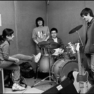

哪吒
============================

|  |  |
| :--: | :-- |
| [ 哪吒](https://i.xiami.com/nezha) | **地区**: China 中国大陆 **风格**: 摇滚 Rock & Roll **播放数**: 7142125 **粉丝数**: 14983 **评论数**: 592  |

## 档案

小档案 
北京乐队，存在于2007年7月～2006年9月（具体时间不明） 
宿命一般，起了这个该死的名字，乐队好象就必须早夭。而因为存在的时间短，他们的故事也只在北京的地下酒吧里被传说。但当年，作为No Beijing的四只乐队之一（其余三支现在都火了，Carsick Cars，Snapline，后海大鲨鱼），他们的歌像针一样刺向年轻人悲伤的心脏。 
乐队成员：卲宸北，高鹤，詹盼，王子春。 
你如此消沉，低迷的好象只掉队的红嘴燕，孤零零的望着天空，进也不是退也不妥。你需要一句启示录一样的话，以便你尽快的出去。你想找个神甫谈谈，可你不是天主教徒，神甫的祝福仅限于圣水的喷洒，关于你的心，他说：你还不是神的孩子，你的悲苦是注定自己背负的，我的孩子，我能帮你，但我救不了你。那好吧，神甫，那让我自己来吧。 
邵宸北写的《我与哪吒的时光》。 
于是，我开始看见过往时光 
2002年，我认识了高鹤，我们在一个只有朋克的地方大谈特谈The cure，然后又当机立断的做了一个莫名其妙的决定，要一起组建一个牛逼的乐队。一切都开始了，她还送我一张微的《所有的日子》作为鼓励。从这开始一直到2004年，一起合作的人不停的换，我们也像铁道游击队一样不停的找地方排练，不屈不挠的，在香山脚底下一个朋友家的地下室里，我们早上就钻进地下室，制造着噪音，中午几个人走上地平面喝啤酒，下午又接着下去制造噪音，直到现在，我还记得那里的霉味和烟味混合的神秘地下室色彩。 
2004年的夏天，我跟我混乱的生活告别了，离开了那些只懂得欺骗的身边人，想要投入到一种全新的简单的生活，当时我狂热的迷恋着70年代的曼彻斯特，迷恋那时期那地方的所有乐队，当然，我也更加离不开joy division了，我写了《他站在时间门外》送给23岁就结束了的年轻人，后来在香山的地下室里第一次排了这首歌，当时在场的人问我这该算什么风格，我答不上来。当太阳的影子掉进小月河，下午来临，我每天在这个时候独自吃晚饭，脑子里总在不停的重复着一段旋律，这就是后来的《you're so great》。现在想想，那是我经历的最孤独的一个夏天，那么大的北京只有我自己，吃饭睡觉走路听歌都是自己，一遍一遍的看碧海蓝天，左手拿着胖男孩卡门的玩偶，右手扣墙。 
2004年秋天，曹家汉以主唱的身份加入了这个一直没名字乐队，原鼓手退出，我甚至都想不起来那个鼓手的名字了。我们甚至还有一个从没在一起排过的鼓手。这是个诡异的事实，每当有新人加入的时候，我们就会失去一个队友，一直都是这样，包括后来詹盼的加入谦儿的退出。当时乐队的名字叫The joker，我喜欢把它翻译成小丑一样的国王。直到2005年的春天，经过商量，因为种种问题开除了主唱。他带走了我最珍贵的the stone roses首张专集，所以到现在我还有点记恨他。后来，他听了哪吒的歌，说我变了，说这本来是个牛逼的乐队，可是他没本事再跟下去了，为了把我the stone roses的盘弄丢的事向我道歉，我说算了，都过去了。 
2005年的7月，这个停滞下来的乐队又开始排练了，我，高鹤和谦儿，一个小伙子和两个姑娘的乐队。我们决定把名字换成哪吒。于是我们在7月的某一个早晨走进了严肃的理工大，见到了李维斯，第一次见面的时候，我以为他是个狂热的涅磐迷，后来才知道原来他也是耶稣锁链，不过我第一次见到他的时候就挺喜欢这哥们的。不爱说话，但是能看出来是那种一熟了就特贫的人。他把我们带到了哪吒最开始的理工大排练室，走廊的黑板上写着car sick cars，屋里有一把把的大金属琴，墙上有一张张大金属照片，一堆鼓叠在一起放在墙边，三个大小不等的音箱都可以出声，那时候我用的还是我最得意的EP疯。排的第一首歌是boy don't cry，我弹吉他，高鹤唱，谦儿是个鼓手。中午一起喝酒，李维斯说他们学校都是大金属，还经常和大金属打架。当时我肃然起敬，他看起来如此瘦弱，而大金属们又如此的电锯杀人狂。 
第三天的中午，詹盼来了，他曾经在我博克上留下了被tr称为2006年最潘长江似留言，之后我们就成了朋友，那天他来看我们排练，休息的时候他从地上捡了把能用的大金属琴，我们一起唱boy don't cry。中午一起吃饭喝啤酒，在午后的941车站旁，詹盼正式加入了哪吒乐队。之后的每个早晨，我都坐在理工大西门的台阶上，吃着面包等他们三个，高鹤，詹盼和谦儿 。乐队的排练也有了新鲜的感觉。我以为会一直这样。 
第五天早上，6点半，接到谦儿的短信，她退出了，因为她的妈妈。我一句话都说不出来。8点，我继续坐在西门的台阶上吃面包，我必须有足够的力气面对，这回等到的只有两个人。大家都把这个事实当做事实来接受了。没有鼓手的情况下，我们排出了浪费了最早的版本和情歌。可是高鹤要去德国了，一个半月。在她去德国的最后一次排练，我和她大吵一架，这是三年来第一次吵架，还是因为点儿鸡毛蒜皮的事，现在都觉得挺奇怪的，为什么当时要吵架呢。不过也就是在那天，我们三个完成了闹海的动机，之后，她去了德国，并且给了我们一个任务，就是要在她回来前找到新的鼓手。 
所以，我们需要个鼓手，王子春，这只龙猫神秘的出现了，我还是叫他小胖吧，这样才亲切。我和小胖在网上从7月底聊到8月底，我断定，这是个敏感的孩子，但是这样的孩子才可爱。高鹤从德国回来了，2005年8月29或者是30日，我们四个人第一次在那个伴随着这个多坎坷乐队成长的平乐园歪火锅店大吃大喝，哪吒，从这一刻起，算真正完整了。 
9月，在一次喝大了之后，我哭着写出来闹海的歌词，把最后一句话送给了自己。看完了《七宗罪》，写出来潜水艇司机的词送给那些臃肿的老逼。后来，后来的事情大家都知道了，10月5日是我们的第一次演出，这离我们正式排练才一个月，在演出前的两个小时，我们把潜水艇司机排了出来，两个小时后，韩旭们便听到了它。 
现在是2006年8月19日，当我们即兴的走进小歪火锅的时候，老板告诉我们，明天，这个火锅店就拆了，明天就再也没有了，再也没有了。原来，这是我们最后一次在小歪耍了。一瓶倒和吹三爷表现都可圈可点。我怎么突然想起了宿命这个词。真快对吗，哪吒整一年了，一共演出20场，12首自己的歌，这里边包含了太多的情感，原谅我文笔愚蠢，我写不出来那些情感，因为我正在经历着。最喜欢自己在《浪费了》里的吉他和眼镜那个奇异的高音，最喜欢小怪物去天国的结尾和高鹤喊出来的啦啦啦，最喜欢4AD里小胖藏不住才华的鼓点。那么现在，一切还没结束，哪吒不会解散，可能有的队友累了需要暂时休息，可能有时候演出台上不是4个人，那没关系，总之，哪吒是不会消失的，永远不会，你信不信？反正我信。每个人都会看到一个新的哪吒，全新的．

## 专辑

| 名称 | 语种 | 唱片公司 | 发行时间 | 专辑类别 | 专辑风格 |
| :--: | :-- | :-- | :-- | :-- | :-- |
| [ 漫无止境的八月](./albums/5022453900.md) | 国语 |  | 2018年02月24日 | EP, 单曲 |  |
| [ 他在时间门外](./albums/311101.md) | 国语 | 哪咤工作室 | 2012年12月20日 | 录音室专辑 | 摇滚 Rock & Roll |

## 评论

|  |  |  |
| :-- | :-- | :-- |
|  [虾米用户](https://emumo.xiami.com/u/405743998) 你好 2021-01-23 21:32 赞(0) 踩(0) | 
留下最后的踪迹
 |
|  [虾米用户](https://emumo.xiami.com/u/104457) 中年抖腿大师 2021-01-06 23:21 赞(0) 踩(0) | 
虾米与好音乐永存，一起站在时间门外吧
 |
|  [虾米用户](https://emumo.xiami.com/u/36601958) 你还站在塔尖那吗。 2020-08-24 23:41 赞(1) 踩(0) | 
要回来吗
 |
|  [虾米用户](https://emumo.xiami.com/u/500413) 完成重过完美 2020-06-30 00:38 赞(2) 踩(0) | 
存在于2007-2006也是画风清奇啦
 |
|  [虾米用户](https://emumo.xiami.com/u/357315912) 1 2020-06-06 10:13 赞(0) 踩(0) | 
好爱这个乐队 
 |
|  [虾米用户](https://emumo.xiami.com/u/360033180)  2020-05-07 13:14 赞(0) 踩(0) | 
好听
 |
|  [虾米用户](https://emumo.xiami.com/u/9579707)  2020-04-30 18:19 赞(0) 踩(0) | 
一开场，还以为是麦田守望者
 |
|  [虾米用户](https://emumo.xiami.com/u/13903993) shine on  2020-02-16 22:16 赞(5) 踩(0) | 
我俩坐在床边 一边抽烟一边听腰 你说这些专辑再也找不到了 当年觉得贵 也没渠道 现在几千块的价格尽管也出得起 好像都不是那么一回事了 我见摇滚就听 因为遇到你 一切开始不一样 你说为什么觉得你不是好人 但 爱摇滚 怎么会有坏孩子
 |
|  [虾米用户](https://emumo.xiami.com/u/40096090)   2020-01-06 14:11 赞(0) 踩(0) | 
哪吒只哭过一次 从今后不会再有
 |
|  [虾米用户](https://emumo.xiami.com/u/34724252) 我还没想好要写什么... 2019-12-29 15:41 赞(0) 踩(0) | 
我们觉得恨 却离不开 万针刺心
 |
|  [虾米用户](https://emumo.xiami.com/u/203939497)  2019-12-25 23:06 赞(1) 踩(0) | 
写得最好的 小档案
 |
|  [虾米用户](https://emumo.xiami.com/u/203960247)  2019-12-21 21:33 赞(0) 踩(0) | 
NEZHANIUBI
 |
|  [虾米用户](https://emumo.xiami.com/u/260992790) I'll Be Your... 2019-11-05 05:23 赞(4) 踩(0) | 
只有在紧要关头才会播放哪吒 在需要力量的时候 在有点绝望的时候 詹盼永远少年的声音让我觉得自己一直在时间门外不会老去
 |
|  [虾米用户](https://emumo.xiami.com/u/341192869)  2019-10-12 09:17 赞(7) 踩(0) | 
“存在于2007年7月~2006年9月”挺魔幻的
 |
|  [虾米用户](https://emumo.xiami.com/u/411058641) 取之不尽 用之不竭 2019-09-23 10:59 赞(2) 踩(0) | 
希望维权顺利！支持你们！
 |
|  [虾米用户](https://emumo.xiami.com/u/2350950) 我还没想好要写什么... 2019-09-23 07:15 赞(0) 踩(0) | 
最爱的乐队
 |
|  [虾米用户](https://emumo.xiami.com/u/155947) 一期一会 2019-09-22 23:33 赞(2) 踩(0) | 
喜欢的乐队火了，没想到是这种方式，无论结果如何，大家支持你们
 |
|  [虾米用户](https://emumo.xiami.com/u/4023011) 我还没想好要写什么... 2019-09-22 21:30 赞(0) 踩(0) | 
支持你们
 |
|  [虾米用户](https://emumo.xiami.com/u/318379298) 认真听歌 2019-09-22 14:01 赞(0) 踩(0) | 
在这混沌世界大开杀戒
 |
|  [虾米用户](https://emumo.xiami.com/u/47377673) 世界不是黑白的，而是灰色... 2019-08-10 21:47 赞(1) 踩(0) | 
我命由我不由天，哪吒乐队回来吧
 |
|  [虾米用户](https://emumo.xiami.com/u/415408124) 你好，贼 2019-08-09 07:29 赞(0) 踩(0) | 
真好听。
 |
|  [虾米用户](https://emumo.xiami.com/u/42963872) 我还没想好要写什么... 2019-08-05 00:33 赞(0) 踩(0) | 
呢奥闹
 |
|  [虾米用户](https://emumo.xiami.com/u/3030861) 也无风雨亦无晴。 2019-08-04 11:09 赞(0) 踩(0) | 
怎么成虾米音乐人了？买了版权？还是入驻了？ 
 |
|  [虾米用户](https://emumo.xiami.com/u/44235667)   2019-07-23 10:20 赞(1) 踩(0) | 
去乐队的夏天啊！
 |
|  [虾米用户](https://emumo.xiami.com/u/965806)  2019-07-15 12:01 赞(0) 踩(0) | 
在乐队的夏天听见刺猬 赶紧回来听听哪吒 这个才是最佳
 |
|  [虾米用户](https://emumo.xiami.com/u/721351)  2019-07-07 23:15 赞(0) 踩(0) | 
踩着风火轮，无所畏惧！
 |
|  [虾米用户](https://emumo.xiami.com/u/70786838) 你还有一些年轻人的不快乐 2019-07-07 10:53 赞(4) 踩(0) | 
一直想去把哪吒紋身上，但每次遇見的紋身師都說因為痛仰嗎，然後我就不紋了
 |
| ⇒ |  [虾米用户](https://emumo.xiami.com/u/43486707) 我们脚踏实地为你延续理想 2020-01-01 11:46 赞(0) 踩(0) | 
痛仰真的不配
 |
| ⇒ |  [虾米用户](https://emumo.xiami.com/u/94039430) 人生何处不相逢啊 2020-01-11 17:00 赞(0) 踩(0) | 
<q><b>hvhÅhjk说：</b></q>
 |
|  [虾米用户](https://emumo.xiami.com/u/415307845) 我还没想好要写什么... 2019-07-02 23:24 赞(0) 踩(0) | 
重组吧
 |
|  [虾米用户](https://emumo.xiami.com/u/44743196) 听虾米记得收藏～ 2019-06-06 18:59 赞(0) 踩(0) | 

 |
|  [虾米用户](https://emumo.xiami.com/u/40471541) - 2019-06-06 09:52 赞(0) 踩(0) | 
快回来，时代不同了
 |
|  [虾米用户](https://emumo.xiami.com/u/223419)  2019-05-29 08:43 赞(1) 踩(0) | 
好的音乐确实能穿越时空对话
 |
|  [虾米用户](https://emumo.xiami.com/u/18056127) 我当然相信你就是其中最正... 2019-05-28 00:18 赞(0) 踩(0) | 
什么真的吗？ 我错过了什么？
 |
|  [虾米用户](https://emumo.xiami.com/u/391438) 就算是流血 2019-05-24 01:00 赞(2) 踩(0) | 
12年看到专辑出来立马让圣诞节回国的舍友买了三张,一张送给了当时特喜欢的一个姑娘,之后回国也没然后了,好久没联系今天她突然说搬家收拾屋子看到我送她的唱片问问我 “就还那样呗”
 |
| ⇒ |  [虾米用户](https://emumo.xiami.com/u/9530447) 再见了，朋友们 2019-06-06 22:24 赞(0) 踩(0) | 
这唱片价格已经翻了好几百倍
 |
|  [虾米用户](https://emumo.xiami.com/u/212440354) 我还没想好要写什么... 2019-05-13 12:47 赞(0) 踩(0) | 
哭了
 |
|  [虾米用户](https://emumo.xiami.com/u/51545489) 你赠予我连绵群山，而我心... 2019-04-21 00:02 赞(1) 踩(0) | 
5555有生之年吗
 |
|  [虾米用户](https://emumo.xiami.com/u/19794942) 有缘再见朋友们 2019-04-20 23:58 赞(3) 踩(0) | 
真的吗真的吗真的吗真的吗真的吗真的吗真的吗真的吗真的吗真的吗真的吗真的吗真的吗真的吗真的吗真的吗真的吗真的吗真的吗真的吗真的吗真的吗真的吗真的吗真的吗真的吗真的吗真的吗真的吗真的吗真的吗真的吗真的吗真的吗真的吗真的吗真的吗真的吗真的吗真的吗真的吗真的吗真的吗真的吗真的吗真的吗真的吗真的吗真的吗真的吗真的吗真的吗真的吗真的吗真的吗真的吗真的吗真的吗真的吗真的吗真的吗真的吗真的吗真的吗真的吗真的吗真的吗真的吗真的吗真的吗真的吗真的吗真的吗真的吗真的吗真的吗真的吗真的吗真的吗真的吗真的吗真的吗真的吗真的吗
 |
|  [虾米用户](https://emumo.xiami.com/u/178747290) 你会像马达那样找我吗？ 2019-04-07 21:59 赞(0) 踩(0) | 
哪吒!
 |
|  [虾米用户](https://emumo.xiami.com/u/374780766) 銀河的子民 2019-04-01 12:04 赞(0) 踩(0) | 
哪吒
 |
|  [虾米用户](https://emumo.xiami.com/u/28176774) 殊方邂逅豈无緣 2019-03-27 19:31 赞(0) 踩(0) | 
四年了，我还在听哪吒。
 |
|  [虾米用户](https://emumo.xiami.com/u/346165752)  2019-03-12 13:28 赞(0) 踩(0) | 

 |
|  [虾米用户](https://emumo.xiami.com/u/14687285) 我还没想好要写什么... 2019-03-09 11:29 赞(0) 踩(0) | 
名字就很容易愛上
 |
|  [虾米用户](https://emumo.xiami.com/u/73738100) 一坨不需要发光的翔 2019-02-16 15:46 赞(0) 踩(0) | 
头皮发麻
 |
| ⇒ |  [虾米用户](https://emumo.xiami.com/u/73738100) 一坨不需要发光的翔 2019-02-16 15:46 赞(0) 踩(0) | 

 |
|  [虾米用户](https://emumo.xiami.com/u/54165804) 我还没想好要写什么... 2019-01-17 19:41 赞(0) 踩(0) | 
人还活着啊，真是幸运看到南海子有死人，傅山共我相伴。
 |
|  [虾米用户](https://emumo.xiami.com/u/173055614) 我还没想好要写什么... 2018-11-20 01:48 赞(1) 踩(0) | 
现在貌似就詹盼一直比较活跃了，在音乐方面
 |
|  [虾米用户](https://emumo.xiami.com/u/87169304) 这个人有点奇怪，什么都没... 2018-11-18 17:17 赞(0) 踩(0) | 
多好的乐队啊
 |
|  [虾米用户](https://emumo.xiami.com/u/275670182) 忧郁温柔的，有八块腹肌的... 2018-11-08 01:50 赞(0) 踩(0) | 
我最爱的乐队 转瞬即逝
 |
|  [虾米用户](https://emumo.xiami.com/u/3164745) 我还没想好要写什么... 2018-10-24 01:00 赞(0) 踩(0) | 
当年守着马云宝抢到了一张专辑，快递电话是在周末的清晨打来的，那会儿我还在学校宿舍躺尸，接到电话，直接套了个外套，蓬头垢面的跑出去拿到了我心心念念的专辑
 |
| ⇒ |  [虾米用户](https://emumo.xiami.com/u/275670182) 忧郁温柔的，有八块腹肌的... 2018-11-08 01:48 赞(0) 踩(0) | 
那你现在一定暴富了！
 |
|  [虾米用户](https://emumo.xiami.com/u/318746832)  2018-10-07 18:18 赞(1) 踩(0) | 
是真朋
 |
|  [虾米用户](https://emumo.xiami.com/u/55804537) 到倒盗悼道 2018-08-23 04:46 赞(0) 踩(0) | 
永远永远永远
 |
|  [虾米用户](https://emumo.xiami.com/u/297999609) 去克洛里吧 2018-07-30 22:53 赞(0) 踩(0) | 
、
 |
|  [虾米用户](https://emumo.xiami.com/u/45404950)  2018-06-22 14:10 赞(0) 踩(0) | 
呜呜呜我觉得真的特别喜欢的队会舍不得听，刚发现的时候每天循环狂听，现在一听反而特别伤感，心揪着一样。
 |
|  [虾米用户](https://emumo.xiami.com/u/41265111) 土法炼钢 2018-05-27 21:47 赞(2) 踩(0) | 
忧郁的孩子们别怕 守护你们是哪吒
 |
|  [虾米用户](https://emumo.xiami.com/u/275670182) 忧郁温柔的，有八块腹肌的... 2018-05-12 08:54 赞(3) 踩(0) | 
一张专辑3000人民币起价的乐队 也只有哪吒了 这才是中国乐队里的奢侈品
 |
|  [虾米用户](https://emumo.xiami.com/u/218750610) 唯一一个不需要LSD就可... 2018-04-21 22:46 赞(1) 踩(0) | 
好想买哪吒的T&amp;hellip;
 |
|  [虾米用户](https://emumo.xiami.com/u/275670182) 忧郁温柔的，有八块腹肌的... 2018-04-20 03:20 赞(0) 踩(0) | 
不可多得的天才乐队
 |
|  [虾米用户](https://emumo.xiami.com/u/37866414) Night Rider 2018-04-18 00:38 赞(9) 踩(0) | 
今天邵回我微博私信了耶！✌️
 |
| ⇒ |  [虾米用户](https://emumo.xiami.com/u/317624763) 我还没想好要写什么... 2018-06-12 16:32 赞(0) 踩(0) | 
真幸福
 |
|  [虾米用户](https://emumo.xiami.com/u/7104961) 我见青山多妩媚，料青山，... 2018-04-04 20:39 赞(0) 踩(0) | 
中国人口基数这么多，天才遍地都是。此既是也
 |
|  [虾米用户](https://emumo.xiami.com/u/52415194) ♬♩♫♪♡ 2018-03-29 01:40 赞(2) 踩(0) | 
哪吒 想你们了
 |
|  [虾米用户](https://emumo.xiami.com/u/40020870)  2018-03-12 15:54 赞(0) 踩(0) | 
燃烧吧，小宇宙
 |
|  [虾米用户](https://emumo.xiami.com/u/43492923) 行到水穷我才开始害怕，夕... 2018-03-07 17:54 赞(0) 踩(0) | 
嗯哼
 |
|  [虾米用户](https://emumo.xiami.com/u/19362917)   2018-02-26 16:17 赞(0) 踩(0) | 
伟大的乐队
 |
|  [虾米用户](https://emumo.xiami.com/u/45404950)  2018-02-14 20:22 赞(1) 踩(0) | 
忧郁的孩子们别怕
 |
|  [虾米用户](https://emumo.xiami.com/u/251527707) 我还没想好要写什么... 2018-01-29 01:58 赞(0) 踩(0) | 
好啊走呗就是
 |
|  [虾米用户](https://emumo.xiami.com/u/336605198)  2018-01-19 00:05 赞(0) 踩(0) | 
我在等那个人。他也爱你们。
 |
|  [虾米用户](https://emumo.xiami.com/u/203259740)  2018-01-01 14:15 赞(4) 踩(0) | 
中国古代最早具有反抗精神的神话人物哪吒 然而如今那个挥刀自刎的哪吒早已双手合十
 |
|  [虾米用户](https://emumo.xiami.com/u/332850510)   2017-12-24 09:50 赞(0) 踩(0) | 
第521 。 圣诞快乐 希望我能快乐。
 |
|  [虾米用户](https://emumo.xiami.com/u/35658691) 身行万里半天下 2017-12-10 01:44 赞(0) 踩(0) | 
加油
 |
|  [虾米用户](https://emumo.xiami.com/u/279471054)  2017-12-03 23:58 赞(0) 踩(0) | 
2007年7月～2006年9月为什么是反的
 |
|  [虾米用户](https://emumo.xiami.com/u/10822018) 暂无签名~ 2017-10-28 00:35 赞(2) 踩(0) | 
哪吒，每次听他们的作品，再看看他们的照片，总有种心酸的感觉。身为一个金属党，向你们致敬了！
 |
|  [虾米用户](https://emumo.xiami.com/u/83893196) 我还没想好要写什么... 2017-10-26 11:10 赞(0) 踩(0) | 
一辈子都爱摇滚。
 |
|  [虾米用户](https://emumo.xiami.com/u/45587595) 挺迷茫的 2017-10-24 09:00 赞(0) 踩(0) | 
十年后，仍然再听。
 |
|  [虾米用户](https://emumo.xiami.com/u/32627205) imissmydear 2017-10-17 21:31 赞(4) 踩(0) | 
哪吒你知道吗王者荣耀里的你好厉害好厉害
 |
|  [虾米用户](https://emumo.xiami.com/u/306397541) 我不配得到自由 2017-10-15 15:48 赞(0) 踩(0) | 
哪吒啊
 |
|  [虾米用户](https://emumo.xiami.com/u/6962514)  2017-09-26 01:23 赞(0) 踩(0) | 
出他在时间门外 #<a href="http://a.p6ff.com/F.XIebS" target="_blank" rel="nofollow noreferrer noopener">http://a.p6ff.com/F.XIebS</a>
 |
|  [虾米用户](https://emumo.xiami.com/u/45308299) 我还没想好要写什么... 2017-09-21 12:40 赞(39) 踩(0) | 
哪吒是不会消失的，永远不会。你信不信？反正我信
 |
|  [虾米用户](https://emumo.xiami.com/u/15528853) 你热爱生活，生活才能热爱... 2017-09-15 11:38 赞(1) 踩(0) | 
小鼓敲敲敲
 |
|  [虾米用户](https://emumo.xiami.com/u/51643204)  2017-09-06 17:06 赞(0) 踩(0) | 
写词的是谁
 |
|  [虾米用户](https://emumo.xiami.com/u/89293600) 这个家伙什么也不想留下. 2017-09-04 02:17 赞(0) 踩(0) | 
哪吒是不会退散的少年气息
 |
|  [虾米用户](https://emumo.xiami.com/u/32304462) Dust it off. 2017-08-02 02:01 赞(0) 踩(0) | 
听前奏泪奔
 |
|  [虾米用户](https://emumo.xiami.com/u/294214839) 纯音乐，请欣赏 2017-07-20 20:41 赞(0) 踩(0) | 
哪吒是不会消失的，永远不会。你信不信？反正我信
 |
|  [虾米用户](https://emumo.xiami.com/u/524535) 我还没想好要写什么... 2017-07-06 11:41 赞(1) 踩(0) | 
我的妈，听哪吒鸡皮疙瘩从胳膊一直电到大腿！好歌
 |
|  [虾米用户](https://emumo.xiami.com/u/132119586)  2017-06-26 18:02 赞(0) 踩(0) | 
和嘎调相比，其实我更喜欢哪吒的风格，感觉更有血性。嗯！
 |
|  [虾米用户](https://emumo.xiami.com/u/48857998)  2017-06-26 02:39 赞(1) 踩(0) | 
一直觉得詹盼是叛徒的&amp;hellip;&amp;hellip;可是哪吒却关注了他&amp;hellip;&amp;hellip;心有点疼啊&amp;hellip;&amp;hellip;
 |
|  [虾米用户](https://emumo.xiami.com/u/186686968) 嘿嘿嘿 2017-06-23 00:18 赞(2) 踩(0) | 
期待一个新的哪吒！回来吧！我们需要你的守护
 |
|  [虾米用户](https://emumo.xiami.com/u/302004774) 只有音乐才是真 2017-06-09 09:16 赞(1) 踩(0) | 
叼就叼在哪吒本身就是摇滚的代名词。这样想想中国才是摇滚乐的发源地
 |
|  [虾米用户](https://emumo.xiami.com/u/43151254)   2017-06-09 00:40 赞(2) 踩(0) | 
哪吒像是碎南瓜和音速青年的结合体
 |
|  [虾米用户](https://emumo.xiami.com/u/294023990)  2017-05-12 05:30 赞(0) 踩(0) | 
涅磐重生
 |
|  [虾米用户](https://emumo.xiami.com/u/7049564) 一杯长岛下肚 2017-05-08 14:10 赞(1) 踩(0) | 
生来就是哪吒
 |
|  [虾米用户](https://emumo.xiami.com/u/283011048)  2017-03-25 13:00 赞(0) 踩(0) | 
只能说喜欢
 |
|  [虾米用户](https://emumo.xiami.com/u/122688364) 生在愤坑，长在赤圈；挣脱 2017-02-25 21:54 赞(0) 踩(0) | 
8311
 |
|  [虾米用户](https://emumo.xiami.com/u/18203072) 闭门造潜水艇 2017-02-24 21:25 赞(0) 踩(0) | 
生活一天一天的过，被我混乱的理解，哪吒的歌，我觉得我三十岁之前听，都觉得他们是最高亢的旗手
 |
|  [虾米用户](https://emumo.xiami.com/u/72331380)   2017-01-22 00:33 赞(0) 踩(0) | 
无论多久听都会感动
 |
|  [虾米用户](https://emumo.xiami.com/u/257904261)  2017-01-20 22:47 赞(1) 踩(0) | 
生来就像个哪吒
 |
|  [虾米用户](https://emumo.xiami.com/u/14004084) 你好 2017-01-05 21:58 赞(1) 踩(0) | 
我说怎么和快乐分裂好像
 |
|  [虾米用户](https://emumo.xiami.com/u/11492054)   2016-12-17 12:55 赞(0) 踩(0) | 
♭
 |
|  [虾米用户](https://emumo.xiami.com/u/49748006) Fly me to th... 2016-11-27 15:50 赞(2) 踩(0) | 
⁺ₒ⁺
 |
|  [虾米用户](https://emumo.xiami.com/u/173068258) 随便找一个方向转身 2016-11-04 21:33 赞(0) 踩(0) | 
逝去之美
 |
|  [虾米用户](https://emumo.xiami.com/u/72331380)   2016-10-22 16:36 赞(1) 踩(0) | 
相见恨晚 不能在最好的时候遇见你们真遗憾
 |
|  [虾米用户](https://emumo.xiami.com/u/29993997) 我还没想好要写什么... 2016-10-16 10:10 赞(3) 踩(0) | 
你们会不会回来？我们等！
 |
|  [虾米用户](https://emumo.xiami.com/u/806564)  2016-10-15 20:10 赞(1) 踩(0) | 
不错啊真不错赞个支持国内乐队 
 |
|  [虾米用户](https://emumo.xiami.com/u/233829486)  2016-10-15 12:38 赞(0) 踩(0) | 
不错 
 |
|  [虾米用户](https://emumo.xiami.com/u/203733622)  2016-10-14 00:07 赞(0) 踩(0) | 
可以
 |
|  [虾米用户](https://emumo.xiami.com/u/848618) 像花虽未红，如冰虽不冻 2016-10-13 14:06 赞(2) 踩(0) | 
艺人介绍里面，乐队时间是倒着长的
 |
| ⇒ |  [虾米用户](https://emumo.xiami.com/u/36770110) 蘋藻攸陈飨祭 2016-10-13 14:51 赞(0) 踩(0) | 
他们在时间门外
 |
| ⇒ |  [虾米用户](https://emumo.xiami.com/u/848618) 像花虽未红，如冰虽不冻 2016-10-13 15:39 赞(0) 踩(0) | 
<q><b>43说：</b></q>
 |
|  [虾米用户](https://emumo.xiami.com/u/198595952)  2016-09-30 22:05 赞(1) 踩(0) | 
和  the  libertines有点像呢
 |
|  [虾米用户](https://emumo.xiami.com/u/49091284)   2016-08-28 11:26 赞(0) 踩(0) | 
还在
 |
|  [虾米用户](https://emumo.xiami.com/u/46284980) 谢谢你让我成为了我 2016-08-26 14:48 赞(0) 踩(0) | 
年轻，声音好年轻
 |
|  [虾米用户](https://emumo.xiami.com/u/3056457)   2016-08-20 16:06 赞(3) 踩(0) | 
喜欢的乐队再也不会出新歌了，算不算一种孤独呢？
 |
|  [虾米用户](https://emumo.xiami.com/u/33550560)  hate！ 2016-08-13 08:03 赞(0) 踩(0) | 
你好，哪吒
 |
|  [虾米用户](https://emumo.xiami.com/u/555086) 密集 2016-07-25 11:16 赞(1) 踩(0) | 
刚开始会把他们和痛仰认做同一个乐队
 |
|  [虾米用户](https://emumo.xiami.com/u/48162877) 熊猫的想法和你们不一样 2016-06-15 19:11 赞(1) 踩(0) | 
早啊，哪吒
 |
|  [虾米用户](https://emumo.xiami.com/u/165354792) 我还没想好要写什么... 2016-05-12 23:00 赞(1) 踩(0) | 
孤独的孩子都长大了。
 |
|  [虾米用户](https://emumo.xiami.com/u/50232898) 欲壑难填 2016-05-12 22:33 赞(0) 踩(0) | 
哈哈
 |
|  [虾米用户](https://emumo.xiami.com/u/115521026) 再见::_ 2016-05-07 00:15 赞(0) 踩(0) | 
哪吒是最棒的
 |
|  [虾米用户](https://emumo.xiami.com/u/9585404) 不可忘本 2016-04-14 22:46 赞(0) 踩(0) | 
好厉害的样子，我也来听听
 |
|  [虾米用户](https://emumo.xiami.com/u/10455718) 花开生两面 人生佛魔间 2016-03-06 02:33 赞(4) 踩(0) | 
你们来了，你们又匆忙走了，但被人记住了
 |
|  [虾米用户](https://emumo.xiami.com/u/75472964) 清醒的时刻本来就不多 2016-02-27 13:19 赞(19) 踩(0) | 
哪吒只哭过一次  从今便不会再有 翻江倒海的本领无人能有
 |
|  [虾米用户](https://emumo.xiami.com/u/57854698)  2016-02-04 18:33 赞(2) 踩(0) | 
谢谢你 非常 谢谢你
 |
|  [虾米用户](https://emumo.xiami.com/u/49091284)   2016-01-25 09:57 赞(0) 踩(0) | 
还在
 |
|  [虾米用户](https://emumo.xiami.com/u/4315880)   2016-01-16 15:41 赞(1) 踩(0) | 
时间门外专辑出来一段时间后我才知道了哪吒，听了就爱上了，当时虾米评论很少，但是全是一片激动和感动，现在评论多了，反而有些很“客观”恶意的挑刺。哪吒跟别的乐队不一样，他们不会有什么演出，不会有什么下一张专辑。请宽容点，为了哪吒还有被哪吒感动的人
 |
|  [虾米用户](https://emumo.xiami.com/u/1136712)  2016-01-14 16:00 赞(2) 踩(0) | 
闹海 每次听 都很佩服当时这几个哥们儿 可惜在这个社会 哪吒只能夭折
 |
|  [虾米用户](https://emumo.xiami.com/u/49091284)   2016-01-12 21:50 赞(0) 踩(0) | 
我回来了 最爱的乐队 你好 你还在
 |
|  [虾米用户](https://emumo.xiami.com/u/50717431)  2016-01-01 19:20 赞(0) 踩(0) | 
很喜欢的乐队之一。
 |
|  [虾米用户](https://emumo.xiami.com/u/21607895) 忠于自己，保持独立。 2015-12-27 21:48 赞(1) 踩(0) | 
为什么每当我失魂落魄的时候总会想到你们
 |
|  [虾米用户](https://emumo.xiami.com/u/1113346) 你曾怀疑，别忧郁我们终将... 2015-12-24 10:37 赞(0) 踩(0) | 
哪托脑海
 |
|  [虾米用户](https://emumo.xiami.com/u/55065736)  2015-12-22 20:25 赞(0) 踩(0) | 
声线大爱 
 |
|  [虾米用户](https://emumo.xiami.com/u/5990517)  2015-12-22 01:03 赞(0) 踩(0) | 
有些人的音乐主要靠音乐部分，有些人的音乐主要靠词，对于这类人这么爱拽文怎么不去当作家呢，比如老谢古筝雷鬼这算是一个音乐流派，至今没看到以歌词著称的流派
 |
|  [虾米用户](https://emumo.xiami.com/u/5990517)  2015-12-22 00:55 赞(0) 踩(0) | 
你解读的太到位…简直像参考答案…可是这样的解读总让人想起阅读理解。表达了什么思想什么节操…继续意淫吧。不就是几个肤浅象征？你所理解的东西难道你本身不懂？非要通过这样的嘶吼你才能彻悟？音乐包阔词和曲，同样的曲子不同的人有不同的词，又怎么能简单的以好坏来区分音乐的整体？所以我没有仔细的去说这音乐怎么怎么了，就说这歌词空洞没意思，现在好了你把空洞给填了，但是还是没意思。而且得加一句这音乐也没意思，太形式化，中国的摇滚都爱装逼，写一些看似高深的东西一点没有摇滚的直觉痛快，小清新文艺青年的思想非要装着颗摇滚的心，装的累不累
 |
| ⇒ |  [虾米用户](https://emumo.xiami.com/u/48857998)  2017-06-26 02:40 赞(0) 踩(0) | 
你这回复也挺官方的 
 |
|  [虾米用户](https://emumo.xiami.com/u/12302634)  2015-12-11 15:13 赞(1) 踩(0) | 
最爱的乐队之一。（最爱和之一矛盾吗？）
 |
|  [虾米用户](https://emumo.xiami.com/u/43331756) Shoot the po... 2015-12-10 14:12 赞(0) 踩(0) | 
.
 |
|  [虾米用户](https://emumo.xiami.com/u/44320879) 人生岂止爱恨 2015-12-07 23:58 赞(0) 踩(0) | 
最可怕的就是被商业化 像这么纯真的歌不多了
 |
|  [虾米用户](https://emumo.xiami.com/u/39931532) 我假装自己是个机器人 2015-12-01 10:47 赞(0) 踩(0) | 
哪吒，就是你了
 |
|  [虾米用户](https://emumo.xiami.com/u/18946216) 他很蠢，什么都没留下。 2015-11-03 02:07 赞(3) 踩(0) | 
我永远记得第一次听哪吒，那是一个晚上，掺杂着我们这些闲人聊天话语的晚上，我把声音放的很小，嗯，我把专辑放了一遍，好像不是很好听，我把责任怪罪在自己没有认真听，只顾聊天； 我也记得一个刚下完雨的晚上，我蹦蹦哒哒地就像小时候那样，我那时候就很想和街道死在一起。
 |
|  [虾米用户](https://emumo.xiami.com/u/47369751) 大米大米！ 2015-10-20 12:08 赞(0) 踩(0) | 
詹盼声音太棒
 |
|  [虾米用户](https://emumo.xiami.com/u/48090365) 救世主的死亡，即为天启！ 2015-10-11 11:16 赞(2) 踩(0) | 
看完这简介，我知道我一定不能说这乐队不好
 |
|  [虾米用户](https://emumo.xiami.com/u/49934446) SINA WEIBO:@... 2015-10-07 18:35 赞(2) 踩(0) | 
忧郁的孩子们别怕 守护着你们是哪吒 哪吒还有嘎调 我想说的都无关痛痒 无关痛仰
 |
|  [虾米用户](https://emumo.xiami.com/u/33578394) 啧啧啧 2015-10-05 16:37 赞(0) 踩(0) | 
真棒
 |
|  [虾米用户](https://emumo.xiami.com/u/225742) 我还没想好要写什么... 2015-10-02 20:41 赞(0) 踩(0) | 
简介很感动,他很坎坷也很执着.虽然短暂不曾让人想起.但是音乐永远在哪里
 |
|  [虾米用户](https://emumo.xiami.com/u/47013863)   2015-09-26 21:32 赞(0) 踩(0) | 
比嘎调好
 |
|  [虾米用户](https://emumo.xiami.com/u/47013863)   2015-09-26 21:32 赞(0) 踩(0) | 
真的 好棒 要是还在就好了
 |
|  [虾米用户](https://emumo.xiami.com/u/1113346) 你曾怀疑，别忧郁我们终将... 2015-09-25 11:02 赞(0) 踩(0) | 
，
 |
|  [虾米用户](https://emumo.xiami.com/u/9281390)  2015-09-08 20:21 赞(0) 踩(0) | 
的飒沓大大大撒大撒的撒
 |
|  [虾米用户](https://emumo.xiami.com/u/11250435) 我还没想好要写什么... 2015-08-29 16:02 赞(87) 踩(0) | 
前几天痛仰发微博表示嫌弃现在市面上的民谣，梅二评论说五十步笑百步。 有时候发跟哪吒有关的东西，还会有人以为哪吒只是痛仰的代表。 邵宸北成了咖啡师，詹盼某天发了一张姑娘的照片，说很像当年的高鹤。 这个世界不缓不急的运转着，人们讨论着充满噱头的东西，却很少真正的听什么东西。 我从未觉得这张炒高价格的专辑被高估了。再过几十年，硬件还会越来越好，但是还会有这么充满力量的音乐出现么。
 |
|  [虾米用户](https://emumo.xiami.com/u/45258530) 万人如海一身藏  2015-08-28 13:21 赞(3) 踩(0) | 
这艺人简介写的要不要这么赞(´இ皿இ｀)
 |
|  [虾米用户](https://emumo.xiami.com/u/7154903) ~~~~~~~~~~~~ 2015-08-27 09:43 赞(0) 踩(0) | 
中国摇滚,摇滚,
 |
|  [虾米用户](https://emumo.xiami.com/u/32176686) Hugs to ashe... 2015-08-27 08:39 赞(0) 踩(0) | 
真的好听啊我的天啊
 |
|  [虾米用户](https://emumo.xiami.com/u/4939473) 这不是一个可以说谎的时刻 2015-08-19 15:15 赞(0) 踩(0) | 
去看卲宸北写的简介吧
 |
|  [虾米用户](https://emumo.xiami.com/u/2300275) 我还没想好要写什么... 2015-07-26 11:52 赞(2) 踩(0) | 
2007年7月～2006年9月,我也是醉了
 |
|  [虾米用户](https://emumo.xiami.com/u/31301791) 微博：惨绿乙女 2015-07-21 07:05 赞(0) 踩(0) | 
想哭
 |
|  [虾米用户](https://emumo.xiami.com/u/488688)  2015-07-14 14:39 赞(0) 踩(0) | 
主唱声音不够霸气
 |
|  [虾米用户](https://emumo.xiami.com/u/17805521)  2015-07-13 01:00 赞(0) 踩(0) | 
看完简介路人转粉
 |
|  [虾米用户](https://emumo.xiami.com/u/38640339) 我想好写什么了…… 2015-07-12 15:35 赞(0) 踩(0) | 

 |
|  [虾米用户](https://emumo.xiami.com/u/40729438) 听音乐可以活到100岁 2015-07-09 19:44 赞(0) 踩(0) | 
脑海每次听都虐心啊，这么好的乐队怎么就解散了呢，哎
 |
|  [虾米用户](https://emumo.xiami.com/u/52143438)  2015-07-05 19:09 赞(0) 踩(0) | 
偶然的相遇，于是走在香山熟悉得不能熟悉的每个角落时听着哪吒的噪音……猜想着，当初你们到底在哪一处地下室一遍遍的排练过……余音可否还在…而我又可曾在哪一刻路过过？？？
 |
|  [虾米用户](https://emumo.xiami.com/u/9295639) 沉默是因为包容 2015-06-30 14:58 赞(0) 踩(0) | 
u r so great
 |
|  [虾米用户](https://emumo.xiami.com/u/39619356) 宇宙 始终 未来 自由 2015-06-25 13:38 赞(0) 踩(0) | 
心疼 永远看不到的现场 早点出生多好
 |
|  [虾米用户](https://emumo.xiami.com/u/39619356) 宇宙 始终 未来 自由 2015-06-25 13:37 赞(0) 踩(0) | 
心疼T_T
 |
|  [虾米用户](https://emumo.xiami.com/u/6081586) 不停止休息的耳膜  聋掉... 2015-06-24 10:25 赞(0) 踩(0) | 
难得的乐队 哎
 |
|  [虾米用户](https://emumo.xiami.com/u/47776922) 小马，你以前不是这样的 2015-06-21 17:09 赞(0) 踩(0) | 
就这么夭折了 太tm可惜了
 |
|  [虾米用户](https://emumo.xiami.com/u/44724100)   2015-06-14 08:55 赞(0) 踩(0) | 
主唱声音有点像张震岳？？？
 |
|  [虾米用户](https://emumo.xiami.com/u/7113539)  2015-06-11 02:57 赞(0) 踩(0) | 
hao
 |
|  [虾米用户](https://emumo.xiami.com/u/11543371) 我还没想好要写什么... 2015-06-06 10:59 赞(0) 踩(0) | 
嗯
 |
|  [虾米用户](https://emumo.xiami.com/u/49826126) 一笔雕凿的朋克青年。 2015-05-29 22:20 赞(1) 踩(0) | 
简介实在太虐了，前一段时间还看到有人写痛仰和哪吒的同人文 我勒个去 这是什么梗好想知道
 |
| ⇒ |  [虾米用户](https://emumo.xiami.com/u/1170903) 我妖气重我自豪 2015-06-14 20:25 赞(0) 踩(0) | 
只不过痛仰的乐队LOGO正好是哪吒罢了...没什么关系
 |
| ⇒ |  [虾米用户](https://emumo.xiami.com/u/49826126) 一笔雕凿的朋克青年。 2015-06-14 22:42 赞(0) 踩(0) | 
<q><b>鬼束石燕说：</b></q>
 |
| ⇒ |  [虾米用户](https://emumo.xiami.com/u/1170903) 我妖气重我自豪 2015-06-15 14:05 赞(0) 踩(0) | 
<q><b>J四猫说：</b></q>
 |
|  [虾米用户](https://emumo.xiami.com/u/11543371) 我还没想好要写什么... 2015-05-26 07:23 赞(0) 踩(0) | 
突然想scb
 |
|  [虾米用户](https://emumo.xiami.com/u/109171)  2015-05-22 18:16 赞(0) 踩(0) | 
哪吒乐队在虾米音乐人项目成立之前就解散了，怎么入驻的呀？
 |
| ⇒ |  [虾米用户](https://emumo.xiami.com/u/15296189) 有趣即真理 2015-05-27 13:26 赞(0) 踩(0) | 
华生你发现了盲点
 |
| ⇒ |  [虾米用户](https://emumo.xiami.com/u/24207388)   2015-05-29 09:31 赞(0) 踩(0) | 
哪咤解散了不代表人都死了,吉他手邵宸北之前在微博说过哪咤入住虾米,但不代表重建乐队.
 |
|  [虾米用户](https://emumo.xiami.com/u/9538005) 具島直子歌迷 2015-05-16 23:23 赞(3) 踩(0) | 
内容已删除
 |
| ⇒ |  [虾米用户](https://emumo.xiami.com/u/24826347) 我还没想好要写什么... 2015-07-10 21:27 赞(0) 踩(0) | 
哈哈哈哈哈哈
 |
| ⇒ |  [虾米用户](https://emumo.xiami.com/u/44389767)   2017-02-16 21:04 赞(0) 踩(0) | 
笑
 |
|  [虾米用户](https://emumo.xiami.com/u/928576) 　　　　　　　　　 2015-05-16 21:25 赞(1) 踩(0) | 
听了几年的”闹海“。
 |
|  [虾米用户](https://emumo.xiami.com/u/10459721) 敏感易碎的男子 2015-05-06 19:18 赞(3) 踩(0) | 
比痛痒叼
 |
|  [虾米用户](https://emumo.xiami.com/u/18653274)  2015-05-04 13:32 赞(0) 踩(0) | 
因为闹海
 |
|  [虾米用户](https://emumo.xiami.com/u/39462898) Ciboncibon 2015-05-02 10:26 赞(2) 踩(0) | 
看介绍快哭出来
 |
|  [虾米用户](https://emumo.xiami.com/u/13816404) 可爱的人难道不是我吗 2015-04-26 22:03 赞(0) 踩(0) | 
居！然！没！收！藏！
 |
|  [虾米用户](https://emumo.xiami.com/u/24711605) 于是转身向大海走去！ 2015-04-24 15:26 赞(0) 踩(0) | 
痛痒跟哪吒什么梗？？？
 |
|  [虾米用户](https://emumo.xiami.com/u/43596589) indie rock 2015-04-12 01:51 赞(0) 踩(0) | 
如果喜欢他们的歌，推荐那个british india
 |
|  [虾米用户](https://emumo.xiami.com/u/3600773)  2015-04-09 10:02 赞(0) 踩(0) | 
卡通形象让我感到了山寨Gorillaz
 |
|  [虾米用户](https://emumo.xiami.com/u/271166) punk 2015-04-06 01:11 赞(29) 踩(0) | 
喜欢听哪吒的孩子肯定都是好孩子。
 |
|  [虾米用户](https://emumo.xiami.com/u/2166613)  2015-04-05 21:10 赞(1) 踩(0) | 
求助！以前好像在电视上看到过哪吒那四个人的卡通形象！四个人在城市里玩跑酷之类的！求！是我记错了还是真的有？网上搜不到啊
 |
| ⇒ |  [虾米用户](https://emumo.xiami.com/u/12690979)  2015-04-19 11:13 赞(0) 踩(0) | 
真的有
 |
| ⇒ |  [虾米用户](https://emumo.xiami.com/u/2166613)  2015-04-19 12:36 赞(0) 踩(0) | 
<q><b>农村包围城市说：</b></q>
 |
| ⇒ |  [虾米用户](https://emumo.xiami.com/u/12690979)  2015-04-19 17:22 赞(0) 踩(0) | 
<q><b>Bonnibel说：</b></q>
 |
| ⇒ |  [虾米用户](https://emumo.xiami.com/u/8895778) 我还没想好要写什么... 2015-08-13 14:28 赞(0) 踩(0) | 
你说的是迷国之门吗 土豆搜一搜
 |
| ⇒ |  [虾米用户](https://emumo.xiami.com/u/2166613)  2015-09-11 22:37 赞(0) 踩(0) | 
<q><b>私吾说：</b></q>
 |
| ⇒ |  [虾米用户](https://emumo.xiami.com/u/8895778) 我还没想好要写什么... 2015-09-24 02:33 赞(0) 踩(0) | 
<q><b>Bonnibel说：</b></q>
 |
|  [虾米用户](https://emumo.xiami.com/u/36347481) MJDMM 2015-04-03 18:22 赞(0) 踩(0) | 
明确版权QAQ
 |
|  [虾米用户](https://emumo.xiami.com/u/9313636)   2015-04-02 15:46 赞(0) 踩(0) | 
*
 |
|  [虾米用户](https://emumo.xiami.com/u/9327133) 不对外开放博物馆 2015-03-31 23:01 赞(0) 踩(0) | 
0 0
 |
|  [虾米用户](https://emumo.xiami.com/u/8337431) 以乐会友 2015-03-31 21:57 赞(0) 踩(0) | 
再多出几张闹一下虾米 1165587,6164,378
 |
|  [虾米用户](https://emumo.xiami.com/u/15789327)   2015-03-29 00:28 赞(0) 踩(0) | 
????????????????????????????????
 |
|  [虾米用户](https://emumo.xiami.com/u/12690979)  2015-03-29 00:10 赞(4) 踩(0) | 
邵宸北微博说”入驻虾米只是为了明确版权，没别的意思，安心吧“  晚安。
 |
| ⇒ |  [虾米用户](https://emumo.xiami.com/u/15789327)   2015-03-29 00:30 赞(0) 踩(0) | 
刚打完一排问号就看到你这条了，还把最后看成了“安息吧”
 |
| ⇒ |  [虾米用户](https://emumo.xiami.com/u/2776065) 我还没想好要写什么... 2015-03-29 07:20 赞(0) 踩(0) | 
哎
 |
| ⇒ |  [虾米用户](https://emumo.xiami.com/u/12690979)  2015-03-29 10:38 赞(0) 踩(0) | 
<q><b>stg.说：</b></q>
 |
|  [虾米用户](https://emumo.xiami.com/u/18389573) be my funera... 2015-03-28 15:47 赞(0) 踩(0) | 
!
 |
|  [虾米用户](https://emumo.xiami.com/u/3256844) 恩斯波肯 多姆 2015-03-28 12:24 赞(0) 踩(0) | 
！！！！
 |
|  [虾米用户](https://emumo.xiami.com/u/2484722) 我还没想好要写什么... 2015-03-28 11:00 赞(4) 踩(0) | 
酷一点，别重组了
 |
|  [虾米用户](https://emumo.xiami.com/u/5167973) 昨晚发了一个最近现场演的... 2015-03-28 10:54 赞(0) 踩(0) | 
这是重组了？
 |
|  [虾米用户](https://emumo.xiami.com/u/12301481) 在网易云 这里备用 我的... 2015-03-27 22:55 赞(0) 踩(0) | 
什么情况！
 |
|  [虾米用户](https://emumo.xiami.com/u/6339700) 世界末日 2015-03-27 22:30 赞(0) 踩(0) | 
！
 |
|  [虾米用户](https://emumo.xiami.com/u/9672768)  2015-03-27 22:23 赞(0) 踩(0) | 
复活了吗！！恭喜！！期待！！
 |
|  [虾米用户](https://emumo.xiami.com/u/4348913)   2015-03-27 18:22 赞(0) 踩(0) | 
几层意思？！
 |
|  [虾米用户](https://emumo.xiami.com/u/29280696) FUNNY OR DIE 2015-03-27 17:22 赞(2) 踩(0) | 
发生什么了！！！！
 |
|  [虾米用户](https://emumo.xiami.com/u/8689327)   2015-03-27 17:14 赞(2) 踩(0) | 
哪吒回来了？当年去看你们现场的孤独的孩子们都长大了~~~o(&amp;gt;_&amp;lt;)o ~~
 |
|  [虾米用户](https://emumo.xiami.com/u/1693816)  2015-03-27 17:07 赞(2) 踩(0) | 
入驻了？ 是要发新砖并了痛仰么 哈哈
 |
|  [虾米用户](https://emumo.xiami.com/u/155947) 一期一会 2015-03-27 17:02 赞(0) 踩(0) | 
我抽你的筋，扒你的皮！
 |
|  [虾米用户](https://emumo.xiami.com/u/2288372) 我还没想好要写什么... 2015-03-27 16:49 赞(0) 踩(0) | 
what happened？
 |
|  [虾米用户](https://emumo.xiami.com/u/9310467) 再见420 2015-03-27 16:45 赞(0) 踩(0) | 
WTF
 |
|  [虾米用户](https://emumo.xiami.com/u/1525727) 大凉山不大小凉山不小 2015-03-27 16:28 赞(0) 踩(0) | 
????!!!!
 |
|  [虾米用户](https://emumo.xiami.com/u/3609042)  2015-03-27 16:20 赞(0) 踩(0) | 
！！！！
 |
|  [虾米用户](https://emumo.xiami.com/u/14373840)   2015-03-27 15:38 赞(0) 踩(0) | 
是要怎样！
 |
|  [虾米用户](https://emumo.xiami.com/u/1433109) 听到的世界 2015-03-27 15:12 赞(0) 踩(0) | 
入驻了？
 |
|  [虾米用户](https://emumo.xiami.com/u/22154064)  2015-03-27 14:53 赞(0) 踩(0) | 
入驻！？什么鬼！？要重来？？
 |
|  [虾米用户](https://emumo.xiami.com/u/22154064)  2015-03-27 14:52 赞(0) 踩(0) | 
同被召唤过来 什么鬼！？！？
 |
|  [虾米用户](https://emumo.xiami.com/u/1270973)  2015-03-27 14:47 赞(0) 踩(0) | 
卧槽？？
 |
|  [虾米用户](https://emumo.xiami.com/u/7931418)  2015-03-27 14:32 赞(1) 踩(0) | 
入驻了？！是要重组的节奏嘛？！
 |
|  [虾米用户](https://emumo.xiami.com/u/1928563) 在看得见整个天空的地方，... 2015-03-27 14:24 赞(0) 踩(0) | 
moshikashide.........................
 |
|  [虾米用户](https://emumo.xiami.com/u/9898304)   2015-03-27 14:05 赞(0) 踩(0) | 
〣( ºΔº )〣
 |
|  [虾米用户](https://emumo.xiami.com/u/3462143)  2015-03-27 14:03 赞(0) 踩(0) | 
哪吒不是解散了吗？什么情况
 |
|  [虾米用户](https://emumo.xiami.com/u/1000925) 其实我是那谁谁谁。 2015-03-27 14:01 赞(0) 踩(0) | 
我来围观！！！
 |
|  [虾米用户](https://emumo.xiami.com/u/8621143) fake 2015-03-27 13:58 赞(0) 踩(0) | 
真的嗎？
 |
|  [虾米用户](https://emumo.xiami.com/u/846130) 如果是真的 就让他来吧 2015-03-27 13:40 赞(0) 踩(0) | 
what&amp;#039;s the fuck
 |
|  [虾米用户](https://emumo.xiami.com/u/886551)  2015-03-27 13:39 赞(0) 踩(0) | 
欢迎入驻
 |
|  [虾米用户](https://emumo.xiami.com/u/8547543)  2015-03-27 13:28 赞(0) 踩(0) | 
什么情况！！！！！！
 |
|  [虾米用户](https://emumo.xiami.com/u/6861097) 我还没想好要写什么... 2015-03-27 12:39 赞(0) 踩(0) | 
什么情况，要重组了
 |
|  [虾米用户](https://emumo.xiami.com/u/2223122) 我还没想好要写什么... 2015-03-27 12:38 赞(0) 踩(0) | 
几个意思嘛！！！！！
 |
|  [虾米用户](https://emumo.xiami.com/u/11265612)  2015-03-27 12:26 赞(0) 踩(0) | 
什么意思！！！！！！！！！！！！要重组了？
 |
|  [虾米用户](https://emumo.xiami.com/u/912140) 我还没想好要写什么... 2015-03-27 12:16 赞(0) 踩(0) | 
草草！什么情况
 |
|  [虾米用户](https://emumo.xiami.com/u/36104)   2015-03-27 12:14 赞(0) 踩(0) | 
!!!!!!!!!!!!!!!!!!!!!!!!!!!!!!!!!!!!!!!! !!!!
 |
|  [虾米用户](https://emumo.xiami.com/u/8279196) 人间激霸 2015-03-27 11:59 赞(0) 踩(0) | 
这是个怎样的信号？
 |
|  [虾米用户](https://emumo.xiami.com/u/1154943) 嬲 2015-03-27 11:53 赞(0) 踩(0) | 
擦？！
 |
|  [虾米用户](https://emumo.xiami.com/u/32176686) Hugs to ashe... 2015-03-27 11:48 赞(0) 踩(0) | 
擦
 |
|  [虾米用户](https://emumo.xiami.com/u/7678885)  2015-03-27 11:45 赞(0) 踩(0) | 
入驻？要复活的节奏？？
 |
|  [虾米用户](https://emumo.xiami.com/u/14065) 人生并不甜~ 2015-03-27 11:42 赞(0) 踩(0) | 
入驻是几个意思，要发片？
 |
|  [虾米用户](https://emumo.xiami.com/u/8497202) 寻人启世 2015-03-27 11:40 赞(0) 踩(0) | 
有望复出？
 |
|  [虾米用户](https://emumo.xiami.com/u/35904030)  2015-03-27 11:36 赞(0) 踩(0) | 
入驻个屁
 |
|  [虾米用户](https://emumo.xiami.com/u/1170903) 我妖气重我自豪 2015-03-27 11:34 赞(0) 踩(0) | 
欢迎入驻!!!
 |
|  [虾米用户](https://emumo.xiami.com/u/23212060)  2015-03-23 07:39 赞(0) 踩(0) | 
不错
 |
|  [虾米用户](https://emumo.xiami.com/u/27891247)  2015-03-11 13:25 赞(0) 踩(0) | 
再也没有哪吒了
 |
|  [虾米用户](https://emumo.xiami.com/u/5770278) 现实完成不了的让梦去完成... 2015-03-06 21:55 赞(0) 踩(0) | 
我靠，，环行公路，竟然和嘎调乐队《圈》是一首歌，，是翻唱？？？？？
 |
| ⇒ |  [虾米用户](https://emumo.xiami.com/u/44472263) Golden one 2015-03-17 23:52 赞(0) 踩(0) | 
同一个主唱
 |
|  [虾米用户](https://emumo.xiami.com/u/11494868) Hello world. 2015-01-29 22:01 赞(0) 踩(0) | 
缅怀一下。
 |
|  [虾米用户](https://emumo.xiami.com/u/41689576) if l die tom... 2015-01-28 18:50 赞(0) 踩(0) | 
听过passover的请听时间门外
 |
|  [虾米用户](https://emumo.xiami.com/u/479186)  2015-01-26 13:53 赞(0) 踩(0) | 
小惊喜
 |
|  [虾米用户](https://emumo.xiami.com/u/6796991) 我还没想好要写什么... 2015-01-25 12:42 赞(0) 踩(0) | 
现在也就剩下后海一支了
 |
|  [虾米用户](https://emumo.xiami.com/u/4394197) last.fm id: ... 2015-01-11 14:39 赞(1) 踩(0) | 
哪吒的粉丝:刺猬........
 |
|  [虾米用户](https://emumo.xiami.com/u/45267007) 停 止 想 象. 2015-01-10 18:30 赞(0) 踩(0) | 
哪吒会火~
 |
|  [虾米用户](https://emumo.xiami.com/u/28299938) 我还没想好要写什么... 2015-01-10 18:03 赞(0) 踩(0) | 
再也不会有哪吒了
 |
|  [虾米用户](https://emumo.xiami.com/u/36182350) 别盯着太阳看 2015-01-04 14:36 赞(0) 踩(0) | 
u are so great 和ad for 简直棒呆
 |
|  [虾米用户](https://emumo.xiami.com/u/3190533) 蜂蜜厚多士 2014-12-29 13:46 赞(0) 踩(0) | 
T T
 |
|  [虾米用户](https://emumo.xiami.com/u/12723049) get money 2014-12-29 13:11 赞(0) 踩(0) | 
niub
 |
|  [虾米用户](https://emumo.xiami.com/u/1525727) 大凉山不大小凉山不小 2014-12-27 13:38 赞(0) 踩(0) | 
校友学长
 |
|  [虾米用户](https://emumo.xiami.com/u/5990517)  2014-12-23 13:49 赞(1) 踩(0) | 
无来由的 讨厌北京乐队 那种口音 那种特别本地化的小清新装逼文艺范.........空洞的歌词罗里吧嗦
 |
| ⇒ |  [虾米用户](https://emumo.xiami.com/u/12690979)  2014-12-28 16:18 赞(0) 踩(0) | 
也不全是。装逼拿样儿的哪儿都有。
 |
| ⇒ |  [虾米用户](https://emumo.xiami.com/u/4315880)   2014-12-29 01:53 赞(0) 踩(0) | 
你讨厌的理由居然是我喜欢的理由
 |
| ⇒ |  [虾米用户](https://emumo.xiami.com/u/12910741) 我还没想好要写什么... 2014-12-29 13:23 赞(0) 踩(0) | 
<q><b>肉丸说：</b></q>
 |
| ⇒ |  [虾米用户](https://emumo.xiami.com/u/4315880)   2014-12-29 16:55 赞(0) 踩(0) | 
<q><b>Ego说：</b></q>
 |
| ⇒ |  [虾米用户](https://emumo.xiami.com/u/5990517)  2015-01-08 17:22 赞(0) 踩(0) | 
<q><b>肉丸说：</b></q>
 |
| ⇒ |  [虾米用户](https://emumo.xiami.com/u/5176663) 沙文主义 2015-07-20 20:33 赞(0) 踩(0) | 
<q><b>大鱼说：</b></q>
 |
| ⇒ |  [虾米用户](https://emumo.xiami.com/u/668729) 我正百无聊赖你正美丽 2015-12-22 00:31 赞(0) 踩(0) | 
看了眼你听的歌，呵呵。
 |
| ⇒ |  [虾米用户](https://emumo.xiami.com/u/5990517)  2015-12-22 00:40 赞(0) 踩(0) | 
<q><b>潜水艇司机说：</b></q>
 |
| ⇒ |  [虾米用户](https://emumo.xiami.com/u/668729) 我正百无聊赖你正美丽 2015-12-22 00:46 赞(0) 踩(0) | 
<q><b>大鱼说：</b></q>
 |
| ⇒ |  [虾米用户](https://emumo.xiami.com/u/5990517)  2015-12-22 00:59 赞(0) 踩(0) | 
<q><b>潜水艇司机说：</b></q>
 |
| ⇒ |  [虾米用户](https://emumo.xiami.com/u/49242047) 你说甜蜜生活里有脏东西。... 2016-12-27 11:53 赞(0) 踩(0) | 
我巨喜欢北京口音！！！！啊！！！！太爷们了！！！！一种吊儿郎当爱谁谁的感觉！！！
 |
|  [虾米用户](https://emumo.xiami.com/u/33969410) Don't believ... 2014-12-22 09:35 赞(23) 踩(0) | 
想你时你在闹海
 |
| ⇒ |  [虾米用户](https://emumo.xiami.com/u/37022981) 千里莫独行，同是夜归人 2015-03-23 15:09 赞(0) 踩(0) | 
笑cry
 |
| ⇒ |  [虾米用户](https://emumo.xiami.com/u/8628598) 创造 珍惜 2015-04-26 10:57 赞(0) 踩(0) | 
蛤蛤
 |
|  [虾米用户](https://emumo.xiami.com/u/3456773) 走好，老朋友。 2014-12-14 21:02 赞(0) 踩(0) | 
环形公路咋和圈一样 翻唱？
 |
| ⇒ |  [虾米用户](https://emumo.xiami.com/u/3456773) 走好，老朋友。 2014-12-14 22:39 赞(0) 踩(0) | 
<q><b>说：</b></q>
 |
| ⇒ |  [虾米用户](https://emumo.xiami.com/u/3456773) 走好，老朋友。 2014-12-14 22:45 赞(0) 踩(0) | 
<q><b>说：</b></q>
 |
|  [虾米用户](https://emumo.xiami.com/u/22219308) 笑一个吧！~ 2014-12-14 00:23 赞(0) 踩(0) | 
梦想，勇敢追过就是好样的！~
 |
|  [虾米用户](https://emumo.xiami.com/u/8943891) 你咋那么可爱？ 2014-12-06 13:53 赞(0) 踩(0) | 
٩(๑ᵒ̴̶̷͈᷄ᗨᵒ̴̶̷͈᷅)و ... . 。o   O     〇
 |
|  [虾米用户](https://emumo.xiami.com/u/3428884) 暂无签名~ 2014-12-05 15:50 赞(0) 踩(0) | 
我抽你的筋，看你還敢不敢害人！
 |
|  [虾米用户](https://emumo.xiami.com/u/15263888)  2014-12-03 15:02 赞(1) 踩(0) | 
青春啊青春..
 |
|  [虾米用户](https://emumo.xiami.com/u/17980257) 從無到有 2014-11-23 02:44 赞(0) 踩(0) | 
三头六臂
 |
|  [虾米用户](https://emumo.xiami.com/u/28783389) 我就是 2014-11-19 11:09 赞(0) 踩(0) | 
情歌 啊 离去了
 |
|  [虾米用户](https://emumo.xiami.com/u/28783389) 我就是 2014-11-19 11:07 赞(0) 踩(0) | 
飞
 |
|  [虾米用户](https://emumo.xiami.com/u/22053106) 物质的短暂情人. 2014-11-18 13:05 赞(0) 踩(0) | 
白鹤老人他取名哪吒
 |
|  [虾米用户](https://emumo.xiami.com/u/8239835)  2014-11-16 04:10 赞(0) 踩(0) | 
不是矫情 真的是想哭
 |
|  [虾米用户](https://emumo.xiami.com/u/775534)   2014-11-14 13:40 赞(0) 踩(0) | 
可惜了
 |
|  [虾米用户](https://emumo.xiami.com/u/28299938) 我还没想好要写什么... 2014-11-04 15:51 赞(0) 踩(0) | 
就是喜欢哪吒的歌名儿
 |
|  [虾米用户](https://emumo.xiami.com/u/20699580) Are you an a... 2014-10-31 08:28 赞(1) 踩(0) | 
&nbsp;听闹海想哭
 |
|  [虾米用户](https://emumo.xiami.com/u/9688911)  2014-10-27 14:31 赞(0) 踩(0) | 
“北京乐队，存在于2007年7月～2006年9月（具体时间不明）。” 我相信这是编辑故意的。
 |
|  [虾米用户](https://emumo.xiami.com/u/3781923) 别拒绝上帝。 2014-10-22 17:27 赞(0) 踩(0) | 
完全为了名字
 |
|  [虾米用户](https://emumo.xiami.com/u/28299938) 我还没想好要写什么... 2014-10-22 11:26 赞(0) 踩(0) | 
少年的歌儿，帆布鞋 小军鼓，布衣裳 笑脸 草场 伙伴们 玩起来好了
 |
|  [虾米用户](https://emumo.xiami.com/u/6424575)  2014-10-20 06:06 赞(0) 踩(0) | 
因为哪吒这首歌让我想学少林棍
 |
|  [虾米用户](https://emumo.xiami.com/u/3443687)  2014-10-17 23:45 赞(0) 踩(0) | 
出售一张带詹盼签名的专辑。
 |
| ⇒ |  [虾米用户](https://emumo.xiami.com/u/6962514)  2014-11-04 03:04 赞(0) 踩(0) | 
多少出？
 |
|  [虾米用户](https://emumo.xiami.com/u/11873617) 不耐听的都不算好歌。 2014-10-12 13:16 赞(0) 踩(0) | 
时间门外别唱就好了。。。。。。。。光听曲子多好
 |
|  [虾米用户](https://emumo.xiami.com/u/12939923) XSWL Record 2014-10-04 20:17 赞(4) 踩(0) | 
妈的主唱就是詹盼。
 |
| ⇒ |  [虾米用户](https://emumo.xiami.com/u/42175544) 暂无签名~ 2014-10-08 00:15 赞(0) 踩(0) | 
哈哈，这个评论太可爱了，喜欢詹盼，就是詹盼
 |
|  [虾米用户](https://emumo.xiami.com/u/12939923) XSWL Record 2014-10-04 20:16 赞(0) 踩(0) | 
主唱声音像詹盼
 |
|  [虾米用户](https://emumo.xiami.com/u/14004084) 你好 2014-09-22 15:03 赞(0) 踩(0) | 
女主唱？？
 |
|  [虾米用户](https://emumo.xiami.com/u/12690979)  2014-09-19 08:05 赞(0) 踩(0) | 
再来瞅瞅
 |
|  [虾米用户](https://emumo.xiami.com/u/12690979)  2014-09-18 11:04 赞(0) 踩(0) | 
听听听听听听听！！！你觉得恨却离不开。
 |
|  [虾米用户](https://emumo.xiami.com/u/7111789)  2014-09-03 15:17 赞(0) 踩(0) | 
赞！
 |
|  [虾米用户](https://emumo.xiami.com/u/10547530) 生于白昼，隐与黑夜。 2014-09-02 20:29 赞(3) 踩(0) | 
女主唱的声音太犯规了。根本没法抗拒，简直是一箭命中。
 |
| ⇒ |  [虾米用户](https://emumo.xiami.com/u/42175544) 暂无签名~ 2014-10-08 00:28 赞(0) 踩(0) | 
同感
 |
|  [虾米用户](https://emumo.xiami.com/u/25590032) 咩啊 2014-08-28 11:03 赞(0) 踩(0) | 
。
 |
|  [虾米用户](https://emumo.xiami.com/u/7264359) For ever. 2014-08-24 00:48 赞(1) 踩(0) | 
缅怀一下下....
 |
|  [虾米用户](https://emumo.xiami.com/u/35658691) 身行万里半天下 2014-08-21 00:55 赞(1) 踩(0) | 
再见了
 |
|  [虾米用户](https://emumo.xiami.com/u/10351053)  2014-08-20 08:52 赞(2) 踩(0) | 
“我抽你的筋，看你还害人不”，哈哈哈
 |
|  [虾米用户](https://emumo.xiami.com/u/1323753) 宅在家里什么都会。 2014-08-18 13:52 赞(1) 踩(0) | 
贝斯突出阿
 |
|  [虾米用户](https://emumo.xiami.com/u/3252070) 打口人生 2014-08-11 18:40 赞(1) 踩(0) | 
去嘎调怀念哪吒
 |
|  [虾米用户](https://emumo.xiami.com/u/39896984)  2014-08-11 11:14 赞(1) 踩(0) | 
怀念那时的哪吒，少年心气
 |
|  [虾米用户](https://emumo.xiami.com/u/393983) “这个家伙很机智什么也没... 2014-08-10 20:22 赞(1) 踩(0) | 

 |
|  [虾米用户](https://emumo.xiami.com/u/39362650) 蓝色的缓慢午后  站在时... 2014-07-31 21:30 赞(1) 踩(0) | 
哪吒，需要原因吗
 |
|  [虾米用户](https://emumo.xiami.com/u/11221879) time comes a... 2014-07-23 07:10 赞(1) 踩(0) | 
那么棒的乐队怎么就没了呢
 |
|  [虾米用户](https://emumo.xiami.com/u/11214306)   2014-07-17 00:06 赞(31) 踩(0) | 
专辑只出过一次 从今后不会再有
 |
|  [虾米用户](https://emumo.xiami.com/u/12690979)  2014-07-08 12:22 赞(0) 踩(0) | 
每天都要听。
 |
|  [虾米用户](https://emumo.xiami.com/u/2681548) hellohellohe... 2014-07-08 07:24 赞(1) 踩(0) | 
你觉得恨却离不开
 |
|  [虾米用户](https://emumo.xiami.com/u/6270541) 我不告诉你 2014-07-07 14:01 赞(0) 踩(0) | 
哪吒闹海
 |
|  [虾米用户](https://emumo.xiami.com/u/8817793)  2014-07-06 22:53 赞(0) 踩(0) | 
传奇，不解释
 |
|  [虾米用户](https://emumo.xiami.com/u/37225533) 死摇狗 2014-07-06 19:07 赞(0) 踩(0) | 
同问！和痛仰什么关系
 |
|  [虾米用户](https://emumo.xiami.com/u/4912255) 暂无签名~ 2014-06-27 19:35 赞(0) 踩(0) | 
年轻人嘛
 |
|  [虾米用户](https://emumo.xiami.com/u/11707269)  2014-06-20 20:49 赞(1) 踩(0) | 
忧郁的孩子们别怕守护着你们是哪吒。但是你们不在了啊，最恨许下诺言却没有坚持到最后……MCR也说过要一起去参加黑色大**，当有一天我终于自由，你们却都在生活里走散
 |
|  [虾米用户](https://emumo.xiami.com/u/773393) GALAXY 2014-06-20 14:33 赞(3) 踩(0) | 
简介的存在时间是怎么回事。。。
 |
|  [虾米用户](https://emumo.xiami.com/u/12827560) 一片白徘徊 2014-06-17 19:48 赞(0) 踩(0) | 
不断得有人在听  就挺好
 |
|  [虾米用户](https://emumo.xiami.com/u/37225533) 死摇狗 2014-06-13 00:03 赞(0) 踩(0) | 
我抽你的筋  剥你的皮！
 |
| ⇒ |  [虾米用户](https://emumo.xiami.com/u/1142678) 不培养废物了。 2014-06-21 19:39 赞(0) 踩(0) | 
hiahia
 |
| ⇒ |  [虾米用户](https://emumo.xiami.com/u/37225533) 死摇狗 2014-06-22 17:34 赞(0) 踩(0) | 
<q><b>original.说：</b></q>
 |
|  [虾米用户](https://emumo.xiami.com/u/4315880)   2014-06-10 22:00 赞(2) 踩(0) | 
1979
 |
|  [虾米用户](https://emumo.xiami.com/u/33876378) Do or Die 2014-06-10 14:20 赞(0) 踩(0) | 
环形公路和曾经听过的一首英文摇滚很像！背景音乐真是像爆了！只是我忘记是哪首了。
 |
| ⇒ |  [虾米用户](https://emumo.xiami.com/u/6716241)  2014-06-13 13:38 赞(0) 踩(0) | 
1979
 |
| ⇒ |  [虾米用户](https://emumo.xiami.com/u/48171) Are u talkin... 2014-06-20 19:50 赞(0) 踩(0) | 
<q><b>Naxism_H说：</b></q>
 |
| ⇒ |  [虾米用户](https://emumo.xiami.com/u/4355173)  2014-07-06 22:57 赞(0) 踩(0) | 
radiohead的歌
 |
| ⇒ |  [虾米用户](https://emumo.xiami.com/u/4355173)  2014-07-06 22:59 赞(0) 踩(0) | 
错了，错了，是碎南瓜的1979
 |
|  [虾米用户](https://emumo.xiami.com/u/19462503) 内部装修中…… 2014-06-06 17:21 赞(0) 踩(0) | 
瞧瞧人家这公关做的
 |
|  [虾米用户](https://emumo.xiami.com/u/7752628) 我还没想好要写什么... 2014-06-04 12:51 赞(0) 踩(0) | 
最爱
 |
|  [虾米用户](https://emumo.xiami.com/u/8433176) Enjoy 2014-05-30 14:17 赞(1) 踩(0) | 
所以今天google主页的logo在纪念这支乐队吗?
 |
|  [虾米用户](https://emumo.xiami.com/u/11484762) 你开心我随意 2014-05-28 13:24 赞(1) 踩(0) | 
所以，是嘎调的前身吗？
 |
| ⇒ |  [虾米用户](https://emumo.xiami.com/u/35479048)  2014-06-13 10:32 赞(0) 踩(0) | 
并不是，哪吒是哪吒，嘎调是嘎调，只不过哪吒解散以后，詹盼还想继续搞音乐，然后就有了嘎调
 |
| ⇒ |  [虾米用户](https://emumo.xiami.com/u/11484762) 你开心我随意 2014-06-14 14:19 赞(0) 踩(0) | 
<q><b>小怪兽说：</b></q>
 |
|  [虾米用户](https://emumo.xiami.com/u/5614938)   2014-05-26 00:29 赞(0) 踩(0) | 
“环形公路”跟“圈”是啥关系？
 |
| ⇒ |  [虾米用户](https://emumo.xiami.com/u/8895778) 我还没想好要写什么... 2015-04-20 01:40 赞(0) 踩(0) | 
同一首歌
 |
|  [虾米用户](https://emumo.xiami.com/u/3715322) 1979 2014-05-24 21:37 赞(0) 踩(0) | 
95年，billy写下了1979.记录他曾经少年心气，迷茫  现在你们又用环形公路继续了这样的故事，不过这次主角变成了我们
 |
|  [虾米用户](https://emumo.xiami.com/u/9244357) 暂无签名~ 2014-05-24 09:59 赞(0) 踩(0) | 
出一本儿《他在时间门外》要的私聊.
 |
| ⇒ |  [虾米用户](https://emumo.xiami.com/u/7633591) 做个人吧。 2014-06-17 08:37 赞(0) 踩(0) | 
How much
 |
| ⇒ |  [虾米用户](https://emumo.xiami.com/u/9244357) 暂无签名~ 2014-06-17 20:27 赞(0) 踩(0) | 
<q><b>lessicc说：</b></q>
 |
|  [虾米用户](https://emumo.xiami.com/u/5535987)  2014-05-22 21:41 赞(0) 踩(0) | 
去年的五一，通州草莓节，听了嘎调，抽着烟，晒太阳，永远难忘！
 |
|  [虾米用户](https://emumo.xiami.com/u/1736735)   2014-05-17 09:39 赞(0) 踩(0) | 
环形公路=圈
 |
|  [虾米用户](https://emumo.xiami.com/u/963987) 逃离吧。 2014-05-15 12:25 赞(0) 踩(0) | 
少年心气，不再拥有
 |
|  [虾米用户](https://emumo.xiami.com/u/1054638)  2014-05-12 22:54 赞(0) 踩(0) | 
哪吒只哭过一次，从今后不会在有
 |
|  [虾米用户](https://emumo.xiami.com/u/6639742)  2014-05-05 00:02 赞(0) 踩(0) | 
似曾相识的共鸣
 |
|  [虾米用户](https://emumo.xiami.com/u/1383972) 世事如歌，而我偏爱这一首 2014-04-29 22:41 赞(0) 踩(0) | 
最早豆瓣随机到哪吒，听着完全嗨疯了。
 |
|  [虾米用户](https://emumo.xiami.com/u/31333067) 2波伊。 2014-04-28 22:13 赞(2) 踩(0) | 
我要抽你的筋，看你还害人不！
 |
|  [虾米用户](https://emumo.xiami.com/u/10355777) CAO 2014-04-21 23:25 赞(1) 踩(0) | 
嘎调  请你重新变回哪吒！
 |
|  [虾米用户](https://emumo.xiami.com/u/31438015) 一切源于模仿... 2014-04-12 10:24 赞(0) 踩(0) | 
孩子       刚刚醒，刚刚踏出去 吃掉有毒的蘑菇，忘掉新鲜的自己，享受着离开水面的遭遇
 |
|  [虾米用户](https://emumo.xiami.com/u/33777279) biubiubiu 2014-04-06 15:22 赞(0) 踩(0) | 
听到环形公路，想起圈，第一次听到这首歌听到这个声音被感动的稀里哗啦，不管是谁都爱！
 |
|  [虾米用户](https://emumo.xiami.com/u/1615467)   2014-03-11 21:14 赞(0) 踩(0) | 
出张全新未拆  要的私信我
 |
| ⇒ |  [虾米用户](https://emumo.xiami.com/u/846130) 如果是真的 就让他来吧 2014-05-07 22:39 赞(0) 踩(0) | 
多少钱 是原版吗
 |
| ⇒ |  [虾米用户](https://emumo.xiami.com/u/1615467)   2014-05-10 16:58 赞(0) 踩(0) | 
<q><b>赵xy说：</b></q>
 |
|  [虾米用户](https://emumo.xiami.com/u/9310467) 再见420 2014-03-02 13:13 赞(0) 踩(0) | 
永远等你们回来
 |
|  [虾米用户](https://emumo.xiami.com/u/970323)  2014-02-27 17:01 赞(0) 踩(0) | 
什么时候能回来？
 |
|  [虾米用户](https://emumo.xiami.com/u/11420900) erase me 2014-02-19 08:21 赞(2) 踩(0) | 
哪儿托！
 |
|  [虾米用户](https://emumo.xiami.com/u/31342189) 飞去南方。 2014-01-09 17:58 赞(0) 踩(0) | 
期待归来。
 |
|  [虾米用户](https://emumo.xiami.com/u/31342189) 飞去南方。 2014-01-09 17:54 赞(0) 踩(0) | 
等待归来。
 |
|  [虾米用户](https://emumo.xiami.com/u/31342189) 飞去南方。 2014-01-09 17:44 赞(0) 踩(0) | 
像针一样刺向我悲伤的心脏。
 |
|  [虾米用户](https://emumo.xiami.com/u/24207388)   2013-12-27 23:57 赞(2) 踩(0) | 
哪咤比嘎调好
 |
|  [虾米用户](https://emumo.xiami.com/u/9142155) 郝虾米 未知生物是敏感词 2013-12-21 23:38 赞(0) 踩(0) | 
这不就是后朋克吗？
 |
| ⇒ |  [虾米用户](https://emumo.xiami.com/u/4271576) 一本正经地说道 2014-01-01 20:52 赞(0) 踩(0) | 
明明是emo哼！
 |
| ⇒ |  [虾米用户](https://emumo.xiami.com/u/9142155) 郝虾米 未知生物是敏感词 2014-01-01 21:06 赞(0) 踩(0) | 
<q><b>白农码说：</b></q>
 |
| ⇒ |  [虾米用户](https://emumo.xiami.com/u/2166613)  2014-04-09 21:46 赞(0) 踩(0) | 
<q><b>白农码说：</b></q>
 |
|  [虾米用户](https://emumo.xiami.com/u/10835193)  2013-12-13 12:33 赞(0) 踩(0) | 
还要鼓手吗？想加入你们！做个替补鼓手也可以啊！赶紧重组！
 |
|  [虾米用户](https://emumo.xiami.com/u/11073019)   2013-12-03 19:34 赞(0) 踩(0) | 
早知道当时因该拍个十几张...
 |
|  [虾米用户](https://emumo.xiami.com/u/1302264)   2013-12-02 22:41 赞(0) 踩(0) | 
求CD 有虾友有渠道介绍吗
 |
|  [虾米用户](https://emumo.xiami.com/u/9142155) 郝虾米 未知生物是敏感词 2013-10-24 20:20 赞(1) 踩(0) | 
专辑里面有什么武林绝学？
 |
|  [虾米用户](https://emumo.xiami.com/u/2794341) 万能青年 2013-09-25 16:15 赞(252) 踩(0) | 
哪吒自刎，一片绿洲变为荒漠，绿日化为红日。 铁风筝断了线，反光镜成了平光镜。 我的化学罗曼史成为历史，痛仰早已不疼不痒。 岁月会磨平我们的棱角，也会夺走我们最初的美好。
 |
| ⇒ |  [虾米用户](https://emumo.xiami.com/u/28621324)  2014-03-05 11:54 赞(0) 踩(0) | 
这话说 的 好。。伤心啊
 |
| ⇒ |  [虾米用户](https://emumo.xiami.com/u/2794341) 万能青年 2014-03-07 21:44 赞(0) 踩(0) | 
<q><b>开心无敌幸运猩说：</b></q>
 |
| ⇒ |  [虾米用户](https://emumo.xiami.com/u/28621324)  2014-03-08 11:11 赞(0) 踩(0) | 
<q><b>上上上说：</b></q>
 |
| ⇒ |  [虾米用户](https://emumo.xiami.com/u/29569)  2014-03-13 23:33 赞(0) 踩(0) | 
太伤感了哪吒绿洲MCR 其实还有传说中的七八点
 |
| ⇒ |  [虾米用户](https://emumo.xiami.com/u/271166) punk 2014-04-16 04:56 赞(0) 踩(0) | 
<q><b>榕树岛说：</b></q>
 |
| ⇒ |  [虾米用户](https://emumo.xiami.com/u/702836) no caging 2014-10-27 14:53 赞(0) 踩(0) | 
哦，操
 |
| ⇒ |  [虾米用户](https://emumo.xiami.com/u/5112785) 空空 2014-11-18 04:51 赞(0) 踩(0) | 
还有人在意
 |
| ⇒ |  [虾米用户](https://emumo.xiami.com/u/153253760) 音乐是灵魂的解药 2016-05-05 22:44 赞(0) 踩(0) | 
牛逼
 |
| ⇒ |  [虾米用户](https://emumo.xiami.com/u/251942)  2016-10-13 01:34 赞(0) 踩(0) | 
我的另类罗曼史又复出了 哪吒呢。。好想他们
 |
| ⇒ |  [虾米用户](https://emumo.xiami.com/u/304556918)  2017-09-14 08:48 赞(0) 踩(0) | 
人总要被迫接受自己不愿面对的改变 爱如查斯特的离开 比如我们都早已不再拥有轻狂的资本 偶尔带上耳机还能感受到最初的美与憧憬已经显得弥足珍贵了
 |
| ⇒ |  [虾米用户](https://emumo.xiami.com/u/401687432)  2019-02-15 22:16 赞(0) 踩(0) | 
<q><b>renirvana说：</b></q>
 |
| ⇒ |  [虾米用户](https://emumo.xiami.com/u/297929031) 东张西望，一无所成 2019-07-29 21:33 赞(0) 踩(0) | 
<q><b>要是你在麦田碰见了我说：</b></q>
 |
|  [虾米用户](https://emumo.xiami.com/u/6623959) 身贵自由 2013-08-30 23:42 赞(0) 踩(0) | 
！
 |
|  [虾米用户](https://emumo.xiami.com/u/9717528) 但行好事 莫问前程 2013-08-30 00:27 赞(0) 踩(0) | 
高鹤！我爱摇滚乐？
 |
| ⇒ |  [虾米用户](https://emumo.xiami.com/u/5572045)  2013-10-13 22:36 赞(0) 踩(0) | 
可别这么说~吉祥叔估计同意不了啊~
 |
|  [虾米用户](https://emumo.xiami.com/u/3883966) 暂无签名~ 2013-08-16 08:55 赞(0) 踩(0) | 
ROCK
 |
|  [虾米用户](https://emumo.xiami.com/u/2518218)   2013-08-07 20:30 赞(0) 踩(0) | 
是时候听了
 |
|  [虾米用户](https://emumo.xiami.com/u/15245122) 我是惊诧 2013-08-05 10:30 赞(0) 踩(0) | 
谁还有富余的CD ！！！ 卖给我一张    感激不尽 =W=  微信：amber_mixyico
 |
|  [虾米用户](https://emumo.xiami.com/u/354506)  2013-07-30 10:36 赞(0) 踩(0) | 
求CD…欢迎站内信
 |
|  [虾米用户](https://emumo.xiami.com/u/1657284)  2013-07-24 17:01 赞(0) 踩(0) | 
环形公路和与圈是什么关系 哪吒和嘎调又是什么关系 求科普
 |
| ⇒ |  [虾米用户](https://emumo.xiami.com/u/1651054)  2013-07-25 21:09 赞(0) 踩(0) | 
看主唱就知道了
 |
|  [虾米用户](https://emumo.xiami.com/u/5686443) 我还没想好要写什么... 2013-07-07 06:32 赞(1) 踩(0) | 
谁有富余的CD  卖我一张 谢谢谢谢  QQ 469712041
 |
|  [虾米用户](https://emumo.xiami.com/u/4165342)  2013-06-24 11:15 赞(0) 踩(0) | 
哪吒
 |
|  [虾米用户](https://emumo.xiami.com/u/5621283) Zufall 2013-06-22 09:02 赞(0) 踩(0) | 
u r so damn good!
 |
|  [虾米用户](https://emumo.xiami.com/u/4018116)  2013-06-21 21:51 赞(0) 踩(0) | 
哪吒
 |
|  [虾米用户](https://emumo.xiami.com/u/6295373)  2013-06-20 18:44 赞(0) 踩(0) | 
环形公路 圈。。。
 |
|  [虾米用户](https://emumo.xiami.com/u/23326)   2013-06-18 10:44 赞(0) 踩(0) | 
闹海
 |
|  [虾米用户](https://emumo.xiami.com/u/15963725) 艾丽 2013-06-10 23:31 赞(0) 踩(0) | 
dfsa
 |
|  [虾米用户](https://emumo.xiami.com/u/3765954) 装下那片湖 2013-06-08 13:02 赞(0) 踩(0) | 
在听哪吒的作品的时候，刚好是毕业的尾声，今天又送走了一个可爱女生，听着哪吒的歌曲，想着no beijing,其实，每个人都得到了上天的祝福，每个人都有追求幸福的权利，你幸福吗？我很幸福！特别是今天。
 |
|  [虾米用户](https://emumo.xiami.com/u/154641) 然后青天在上，星日朗朗 2013-06-08 00:51 赞(4) 踩(0) | 
我已搞不清我是喜欢嘎调还是哪吒，哦北鼻，没准只是詹盼罢了。
 |
|  [虾米用户](https://emumo.xiami.com/u/5862093) 我还没想好要写什么... 2013-06-06 21:33 赞(0) 踩(0) | 
干 又一个解散的
 |
|  [虾米用户](https://emumo.xiami.com/u/13445895)  2013-06-03 17:57 赞(0) 踩(0) | 
巧了。
 |
|  [虾米用户](https://emumo.xiami.com/u/7584518)  2013-06-02 18:43 赞(0) 踩(0) | 
没什么原因。就是喜欢。
 |
|  [虾米用户](https://emumo.xiami.com/u/3527270)  2013-05-12 00:13 赞(0) 踩(0) | 
主唱声音和嘎调真像
 |
| ⇒ |  [虾米用户](https://emumo.xiami.com/u/9554954)  2013-05-12 22:20 赞(0) 踩(0) | 
是一个人啊= =
 |
| ⇒ |  [虾米用户](https://emumo.xiami.com/u/3527270)  2013-05-12 22:26 赞(0) 踩(0) | 
<q><b>小可乐说：</b></q>
 |
| ⇒ |  [虾米用户](https://emumo.xiami.com/u/2579178) 和你慢慢悠悠过这辈子 2013-05-25 23:12 赞(0) 踩(0) | 
哈哈哈  你是在开玩笑么 都是詹盼啊
 |
| ⇒ |  [虾米用户](https://emumo.xiami.com/u/3527270)  2013-05-26 11:04 赞(0) 踩(0) | 
<q><b>1234asdf说：</b></q>
 |
| ⇒ |  [虾米用户](https://emumo.xiami.com/u/1273725) 世界终焉 2013-06-22 17:03 赞(0) 踩(0) | 
哈哈，怪不得听的时候总觉得嘎调附体...~
 |
| ⇒ |  [虾米用户](https://emumo.xiami.com/u/3527270)  2013-06-22 19:22 赞(0) 踩(0) | 
<q><b>茶沢™说：</b></q>
 |
|  [虾米用户](https://emumo.xiami.com/u/2198964)  2013-05-03 11:44 赞(0) 踩(0) | 
好听啊啊啊啊
 |
|  [虾米用户](https://emumo.xiami.com/u/13810622) 有些东西陪着一起走，总归 2013-04-30 12:43 赞(0) 踩(0) | 
属于摇滚简单的明朗，纯粹。
 |
|  [虾米用户](https://emumo.xiami.com/u/119737)  2013-04-24 18:39 赞(0) 踩(0) | 
重新发了一张？
 |
|  [虾米用户](https://emumo.xiami.com/u/8337431) 以乐会友 2013-04-22 13:54 赞(1) 踩(0) | 
哪咤闹海
 |
|  [虾米用户](https://emumo.xiami.com/u/4805569) 在败坏之前肆意吞咽甜美 2013-04-18 13:29 赞(0) 踩(0) | 
为什么这么好的乐队解散了Q.Q
 |
|  [虾米用户](https://emumo.xiami.com/u/9554954)  2013-04-16 09:29 赞(0) 踩(0) | 
闹海、环形公路、詹盼！！！
 |
|  [虾米用户](https://emumo.xiami.com/u/11221879) time comes a... 2013-04-14 17:02 赞(0) 踩(0) | 
因为他们，开始喜欢上摇滚了
 |
|  [虾米用户](https://emumo.xiami.com/u/11221879) time comes a... 2013-04-14 13:51 赞(0) 踩(0) | 
有些事儿就是这样 觉得恨却离不开
 |
|  [虾米用户](https://emumo.xiami.com/u/11010365) 灵魂自由行走 2013-04-03 17:33 赞(1) 踩(0) | 
“他们的歌像针一样刺向年轻人悲伤的心脏。”不知为何，被这句乐队介绍深深吸引。悲伤的年轻人，悲伤的心脏，悲伤的哪吒闹海，悲伤的Fabrizio Paterlini的&amp;lt;Veloma &amp;gt;。根本不惧怕悲伤孤独这些残念留存的字眼儿。这是每个年轻的灵魂都必须经历的，在痛苦中成长，抬头迎曙光。
 |
|  [虾米用户](https://emumo.xiami.com/u/901111) 我真没化妆。 2013-03-29 15:36 赞(0) 踩(0) | 
名字已经注定了早夭
 |
|  [虾米用户](https://emumo.xiami.com/u/155947) 一期一会 2013-03-27 10:53 赞(0) 踩(0) | 
《他在时间门外》
 |
|  [虾米用户](https://emumo.xiami.com/u/1067527)  2013-03-20 23:34 赞(0) 踩(0) | 
haha
 |
|  [虾米用户](https://emumo.xiami.com/u/7469295) @王玄乎 2013-03-20 19:44 赞(452) 踩(0) | 
购买专辑的600人后来都有了自己的乐队
 |
| ⇒ |  [虾米用户](https://emumo.xiami.com/u/1536353)  2013-08-11 12:16 赞(0) 踩(0) | 
操 中国的大香蕉？
 |
| ⇒ |  [虾米用户](https://emumo.xiami.com/u/6688475)   2013-09-13 17:19 赞(0) 踩(0) | 
什么 求科普
 |
| ⇒ |  [虾米用户](https://emumo.xiami.com/u/13975572) 我还没想好要写什么... 2014-06-24 12:32 赞(0) 踩(0) | 
哈哈哈原来是你…xuan bo
 |
| ⇒ |  [虾米用户](https://emumo.xiami.com/u/7469295) @王玄乎 2014-06-26 10:22 赞(0) 踩(0) | 
<q><b>Sasorin说：</b></q>
 |
| ⇒ |  [虾米用户](https://emumo.xiami.com/u/8802004) eeeeeeeee 2014-08-22 10:38 赞(0) 踩(0) | 
哈哈哈哈哈哈
 |
| ⇒ |  [虾米用户](https://emumo.xiami.com/u/12690979)  2014-09-03 10:41 赞(0) 踩(0) | 
还以为错进到了lou Reed 的主页，不过是这样的
 |
| ⇒ |  [虾米用户](https://emumo.xiami.com/u/18263830) 审美疲劳中 2015-07-30 14:52 赞(0) 踩(0) | 
太地下丝绒了吧
 |
| ⇒ |  [虾米用户](https://emumo.xiami.com/u/5585061) 堕落的脚趾 2015-11-27 11:22 赞(0) 踩(0) | 
噗，地下丝绒吗
 |
| ⇒ |  [虾米用户](https://emumo.xiami.com/u/4911883) 如果你也爱Eason 2016-01-19 23:52 赞(0) 踩(0) | 
真的吗这么吊
 |
| ⇒ |  [虾米用户](https://emumo.xiami.com/u/7383303) 我好气啊 2017-05-07 17:09 赞(0) 踩(0) | 
哈哈哈哈我买了两张然后乐队解散了。。。
 |
| ⇒ |  [虾米用户](https://emumo.xiami.com/u/275670182) 忧郁温柔的，有八块腹肌的... 2018-05-12 08:53 赞(0) 踩(0) | 
昨天问了 一张专辑3000人民币起价
 |
|  [虾米用户](https://emumo.xiami.com/u/128124) 祝你身体健康 2013-03-14 16:15 赞(0) 踩(0) | 
嘎调
 |
|  [虾米用户](https://emumo.xiami.com/u/12715090)  2013-03-06 22:04 赞(1) 踩(0) | 
和彭坦声音好象
 |
|  [虾米用户](https://emumo.xiami.com/u/7562991)  2013-03-02 17:56 赞(0) 踩(0) | 
纯粹糟践东西!! 还不如《哪吒闹海》影片里在龙宫中演奏的鱼、虾、蛤蟆呢。 <a href="http://v.youku.com/v_show/id_XMzkxOTMzOTUy.html" target="_blank" rel="nofollow noreferrer noopener">http://v.youku.com/v_show/id_XMzkxOTMzOTUy.html</a> 好好的一部艺术精品，竟然就这么给毁了。 可惜...可耻。
 |
|  [虾米用户](https://emumo.xiami.com/u/209452) 红。 2013-02-23 00:07 赞(0) 踩(0) | 
我爱上哪吒了，大家靠边。
 |
|  [虾米用户](https://emumo.xiami.com/u/13174865)  2013-02-22 03:29 赞(0) 踩(0) | 
好乐队
 |
|  [虾米用户](https://emumo.xiami.com/u/6048027)  2013-02-20 11:52 赞(1) 踩(0) | 
购买专辑的600人后来都有了自己的乐队
 |
| ⇒ |  [虾米用户](https://emumo.xiami.com/u/2579178) 和你慢慢悠悠过这辈子 2013-05-25 23:13 赞(0) 踩(0) | 
what
 |
| ⇒ |  [虾米用户](https://emumo.xiami.com/u/6048027)  2013-06-19 23:31 赞(0) 踩(0) | 
<q><b>1234asdf说：</b></q>
 |
|  [虾米用户](https://emumo.xiami.com/u/1126164)  2013-02-14 22:51 赞(0) 踩(0) | 
坐等楼下挨骂。。。
 |
|  [虾米用户](https://emumo.xiami.com/u/7878857) 山脚驴 2013-02-06 10:19 赞(0) 踩(0) | 
女的叫哈啊？
 |
| ⇒ |  [虾米用户](https://emumo.xiami.com/u/321360) Segmentation 2013-02-08 23:41 赞(0) 踩(0) | 
高鹤
 |
|  [虾米用户](https://emumo.xiami.com/u/2446828) 不必惊讶 ，无须欢喜 2013-01-23 07:56 赞(0) 踩(0) | 
我要抽你的筋，拨你的皮
 |
|  [虾米用户](https://emumo.xiami.com/u/12529717) 你覺得恨？！ 卻離不開！ 2013-01-20 11:25 赞(0) 踩(0) | 
小妹喜欢！
 |
|  [虾米用户](https://emumo.xiami.com/u/2551919)  2013-01-18 17:55 赞(0) 踩(0) | 
额外人味儿
 |
|  [虾米用户](https://emumo.xiami.com/u/12298161) 谬热克 2013-01-10 00:23 赞(0) 踩(0) | 
没理由
 |
|  [虾米用户](https://emumo.xiami.com/u/11073019)   2013-01-02 16:41 赞(0) 踩(0) | 
盼盼的声音好萌的
 |
|  [虾米用户](https://emumo.xiami.com/u/2745317)  2012-12-24 22:56 赞(0) 踩(0) | 
好青春的声线啊！不错
 |
|  [虾米用户](https://emumo.xiami.com/u/2745317)  2012-12-24 22:52 赞(0) 踩(0) | 
听着有种青涩年轻的感觉，感觉真不错。
 |
|  [虾米用户](https://emumo.xiami.com/u/637474)  2012-12-22 10:59 赞(16) 踩(0) | 
内容已删除
 |
| ⇒ |  [虾米用户](https://emumo.xiami.com/u/6623959) 身贵自由 2013-09-12 21:53 赞(0) 踩(0) | 
已下架
 |
| ⇒ |  [虾米用户](https://emumo.xiami.com/u/1515378) 你是我的梦想。 2014-02-23 23:47 赞(0) 踩(0) | 
还能买到吗????
 |
|  [虾米用户](https://emumo.xiami.com/u/10246212)  2012-12-22 09:15 赞(0) 踩(0) | 
像针一样刺伤年轻人的心脏
 |
|  [虾米用户](https://emumo.xiami.com/u/2484722) 我还没想好要写什么... 2012-12-20 23:25 赞(1) 踩(0) | 
《他在时间门外》
 |
|  [虾米用户](https://emumo.xiami.com/u/8240130)  2012-12-15 20:30 赞(0) 踩(0) | 
哪吒只哭过一次  从今后不会再有
 |
|  [虾米用户](https://emumo.xiami.com/u/9079353) 氓之嗤嗤 2012-12-05 19:12 赞(0) 踩(0) | 
这么好的乐队怎么就解散了呢？可惜啊！
 |
|  [虾米用户](https://emumo.xiami.com/u/9079353) 氓之嗤嗤 2012-12-05 19:10 赞(0) 踩(0) | 
金吒木吒听你弟唱歌。哈哈
 |
|  [虾米用户](https://emumo.xiami.com/u/9079353) 氓之嗤嗤 2012-12-05 19:10 赞(0) 踩(0) | 
你觉得恨？却离不开！
 |
|  [虾米用户](https://emumo.xiami.com/u/9079353) 氓之嗤嗤 2012-12-05 19:09 赞(0) 踩(0) | 
环形公路跟嘎调的圈一样呢。。
 |
| ⇒ |  [虾米用户](https://emumo.xiami.com/u/1703028) “n55!w!" "im... 2012-12-08 00:01 赞(0) 踩(0) | 
是嘎调和环形公路一样。。
 |
| ⇒ |  [虾米用户](https://emumo.xiami.com/u/6604716)  2012-12-22 14:54 赞(0) 踩(0) | 
<q><b>机智的小X说：</b></q>
 |
| ⇒ |  [虾米用户](https://emumo.xiami.com/u/1703028) “n55!w!" "im... 2012-12-23 18:15 赞(0) 踩(0) | 
<q><b>xiaoluo说：</b></q>
 |
|  [虾米用户](https://emumo.xiami.com/u/6516197)   2012-11-15 18:29 赞(0) 踩(0) | 
！
 |
|  [虾米用户](https://emumo.xiami.com/u/11471335)  2012-11-15 17:41 赞(0) 踩(0) | 
哪吒！
 |
|  [虾米用户](https://emumo.xiami.com/u/884177)  2012-11-13 11:09 赞(115) 踩(0) | 
和痛仰是什么关系啊哈哈
 |
| ⇒ |  [虾米用户](https://emumo.xiami.com/u/1354646)  2012-11-20 08:11 赞(0) 踩(0) | 
<a href="http://weibo.com/2667246743/yzIbdxfGK" target="_blank" rel="nofollow noreferrer noopener">http://weibo.com/2667246743/yzIbdxfGK</a>
 |
| ⇒ |  [虾米用户](https://emumo.xiami.com/u/3752339)  2012-11-28 18:09 赞(0) 踩(0) | 
<q><b>boc说：</b></q>
 |
| ⇒ |  [虾米用户](https://emumo.xiami.com/u/1130904)  2012-12-19 21:12 赞(0) 踩(0) | 
<q><b>boc说：</b></q>
 |
| ⇒ |  [虾米用户](https://emumo.xiami.com/u/901111) 我真没化妆。 2013-03-29 15:37 赞(0) 踩(0) | 
嘎调
 |
| ⇒ |  [虾米用户](https://emumo.xiami.com/u/6891623)  2013-04-25 21:15 赞(0) 踩(0) | 
痛仰是土摇，这是洋的
 |
| ⇒ |  [虾米用户](https://emumo.xiami.com/u/9650194)   2014-05-30 20:41 赞(0) 踩(0) | 
<q><b>强生说：</b></q>
 |
| ⇒ |  [虾米用户](https://emumo.xiami.com/u/347656) 想得却不可得，你奈人生何... 2015-01-27 20:33 赞(0) 踩(0) | 
他每一句开头都是乐队撒-，-
 |
| ⇒ |  [虾米用户](https://emumo.xiami.com/u/44051898) 异怪杂食不伦类 2017-02-28 00:46 赞(0) 踩(0) | 
上过床打过炮
 |
| ⇒ |  [虾米用户](https://emumo.xiami.com/u/50157063) 国家二级陀手 2017-05-24 00:03 赞(0) 踩(0) | 
痛仰是个屌
 |
| ⇒ |  [虾米用户](https://emumo.xiami.com/u/12402504) 我还没想好要写什么... 2017-05-26 22:45 赞(0) 踩(0) | 
<q><b>Tycho邓灏之说：</b></q>
 |
| ⇒ |  [虾米用户](https://emumo.xiami.com/u/162692100)   2018-05-02 14:01 赞(0) 踩(0) | 
？
 |
| ⇒ |  [虾米用户](https://emumo.xiami.com/u/50017194) 我还没想好要写什么... 2018-06-27 11:51 赞(0) 踩(0) | 
应该毛关系都没
 |
| ⇒ |  [虾米用户](https://emumo.xiami.com/u/124152208)  2019-04-06 23:17 赞(0) 踩(0) | 
搞不明白为什么在哪吒这里踩痛仰，论头像的话，痛仰的哪吒形象可以追溯到03年的专辑封面，甚至更早   …… 搞不明白
 |
|  [虾米用户](https://emumo.xiami.com/u/1354646)  2012-11-11 22:21 赞(1) 踩(0) | 
解散了的乐队都是好乐队
 |
|  [虾米用户](https://emumo.xiami.com/u/431362)  2012-11-10 07:31 赞(0) 踩(0) | 
卧槽 手贱了又忍不住点开 听第一句就受不了了  瘫软了
 |
|  [虾米用户](https://emumo.xiami.com/u/431362)  2012-11-10 07:24 赞(0) 踩(0) | 
那什么 小怪物去天国  这女声太太也让人受不了 想听又不敢听
 |
|  [虾米用户](https://emumo.xiami.com/u/2103902)  2012-11-08 15:50 赞(0) 踩(0) | 
青春残像
 |
|  [虾米用户](https://emumo.xiami.com/u/711352)   2012-11-06 15:42 赞(0) 踩(0) | 
好乐队
 |
|  [虾米用户](https://emumo.xiami.com/u/11464)  2012-11-02 23:05 赞(1) 踩(0) | 
第一句就喜欢上了，没原因，不知道。
 |
|  [虾米用户](https://emumo.xiami.com/u/8318418)  2012-10-23 18:35 赞(0) 踩(0) | 
哪吒！
 |
|  [虾米用户](https://emumo.xiami.com/u/1376342)  2012-10-20 17:42 赞(0) 踩(0) | 
嘎调？
 |
|  [虾米用户](https://emumo.xiami.com/u/4164557)  2012-10-12 00:53 赞(0) 踩(0) | 
回顾
 |
|  [虾米用户](https://emumo.xiami.com/u/6861097) 我还没想好要写什么... 2012-10-09 10:55 赞(0) 踩(0) | 
短暂而伟大的！
 |
|  [虾米用户](https://emumo.xiami.com/u/7962476)  2012-10-01 19:53 赞(0) 踩(0) | 
你觉得恨却离不开
 |
|  [虾米用户](https://emumo.xiami.com/u/8222880)  2012-09-28 23:30 赞(1) 踩(0) | 
犹豫的孩子们别怕，守护你们的哪咤，谁要是再来害人，定不饶他！今儿听，倍儿精神
 |
|  [虾米用户](https://emumo.xiami.com/u/6997045) 嘚儿。 2012-09-28 04:06 赞(1) 踩(0) | 
每次听的时候总觉得有一股气流堵在胸口和喉咙 吞不下去却也呼不出来
 |
| ⇒ |  [虾米用户](https://emumo.xiami.com/u/9142155) 郝虾米 未知生物是敏感词 2013-01-19 15:37 赞(0) 踩(0) | 
点赞
 |
|  [虾米用户](https://emumo.xiami.com/u/208404) 操千曲而后晓声 2012-09-18 12:56 赞(0) 踩(0) | 
哪吒还在，趁着虾米没和谐赶紧收藏。。。
 |
| ⇒ |  [虾米用户](https://emumo.xiami.com/u/6852330)  2012-09-28 23:32 赞(0) 踩(0) | 
为啥要和谐啊
 |
|  [虾米用户](https://emumo.xiami.com/u/937204) 我还没想好要写什么... 2012-09-18 12:56 赞(0) 踩(0) | 
等再次莲花转世
 |
|  [虾米用户](https://emumo.xiami.com/u/623782)  2012-09-14 11:42 赞(0) 踩(0) | 
环形公路怎么跟嘎调的圈一样？
 |
| ⇒ |  [虾米用户](https://emumo.xiami.com/u/4808818) 我没有什么想吃的 2012-09-18 00:38 赞(0) 踩(0) | 
是换代关系···嘎调的前身
 |
|  [虾米用户](https://emumo.xiami.com/u/48890) 我还没想好要写什么... 2012-09-11 14:18 赞(0) 踩(0) | 
去克洛里呀  去克洛里吧  带上我们所有的干粮
 |
|  [虾米用户](https://emumo.xiami.com/u/10514672)  2012-09-08 22:43 赞(0) 踩(0) | 
Herewecome
 |
|  [虾米用户](https://emumo.xiami.com/u/971183) Major Tom 2012-08-15 23:40 赞(0) 踩(0) | 
环形公路 和 圈
 |
|  [虾米用户](https://emumo.xiami.com/u/4004890)  2012-08-09 15:51 赞(0) 踩(0) | 
小哪吒去天国
 |
|  [虾米用户](https://emumo.xiami.com/u/10059241)  2012-08-02 12:36 赞(0) 踩(0) | 
你觉得恨，却离不开
 |
|  [虾米用户](https://emumo.xiami.com/u/5624182) 一个怂逼 2012-07-17 15:58 赞(0) 踩(0) | 
很喜欢的一支乐队，可惜命太短
 |
|  [虾米用户](https://emumo.xiami.com/u/399583)  2012-07-16 00:16 赞(0) 踩(0) | 
听了几首很不错
 |
|  [虾米用户](https://emumo.xiami.com/u/2238854) 过如春草芟难尽、学似秋云... 2012-07-14 11:25 赞(0) 踩(0) | 
登……呛……呛……啊~~~咿呀  我……本是 卧龙岗 散   淡 的人~~~~
 |
|  [虾米用户](https://emumo.xiami.com/u/3853367)  2012-06-15 12:35 赞(0) 踩(0) | 
因为他是翻江倒海的哪吒
 |
|  [虾米用户](https://emumo.xiami.com/u/3857492)   2012-06-05 10:08 赞(0) 踩(0) | 
闹海
 |
|  [虾米用户](https://emumo.xiami.com/u/7493444)  2012-05-27 13:21 赞(1) 踩(0) | 
喜欢晚了我操
 |
|  [虾米用户](https://emumo.xiami.com/u/576000) 我还没想好要写什么... 2012-05-22 17:12 赞(0) 踩(0) | 
<a href="http://www.xiami.com/artist/59175" target="_blank" rel="nofollow noreferrer noopener">http://www.xiami.com/artist/59175</a> 是嘎调啊！
 |
| ⇒ |  [虾米用户](https://emumo.xiami.com/u/275850)  2012-05-23 15:15 赞(0) 踩(0) | 
我也是迷糊了……难道是翻唱
 |
| ⇒ |  [虾米用户](https://emumo.xiami.com/u/3229407)  2012-05-23 19:20 赞(0) 踩(0) | 
<q><b>哈里妈的波特说：</b></q>
 |
| ⇒ |  [虾米用户](https://emumo.xiami.com/u/576000) 我还没想好要写什么... 2012-05-23 21:36 赞(0) 踩(0) | 
<q><b>哈里妈的波特说：</b></q>
 |
| ⇒ |  [虾米用户](https://emumo.xiami.com/u/914182)  2012-05-24 04:23 赞(0) 踩(0) | 
<q><b>迷糊之国度说：</b></q>
 |
| ⇒ |  [虾米用户](https://emumo.xiami.com/u/576000) 我还没想好要写什么... 2012-05-24 17:15 赞(0) 踩(0) | 
<q><b>肉丸说：</b></q>
 |
| ⇒ |  [虾米用户](https://emumo.xiami.com/u/914182)  2012-05-26 19:20 赞(0) 踩(0) | 
<q><b>迷糊之国度说：</b></q>
 |
| ⇒ |  [虾米用户](https://emumo.xiami.com/u/4315880)   2013-12-08 15:06 赞(0) 踩(0) | 
<q><b>肉丸说：</b></q>
 |
|  [虾米用户](https://emumo.xiami.com/u/2906452)  2012-05-17 21:39 赞(0) 踩(0) | 
找了好久重要在虾米找到了·········
 |
|  [虾米用户](https://emumo.xiami.com/u/1715638) 我还没想好要写什么... 2012-05-16 09:17 赞(0) 踩(0) | 
越听越好听~越听越对味啊~~~
 |
|  [虾米用户](https://emumo.xiami.com/u/312179) 潜入深蓝，放肆幻听 2012-04-30 20:37 赞(0) 踩(0) | 
最近才开始听这个乐队。真的很不错。真不明白这样的乐队为什么没火起来。
 |
|  [虾米用户](https://emumo.xiami.com/u/1895303) 我还没想好要写什么... 2012-04-08 11:51 赞(0) 踩(0) | 
爱你们
 |
|  [虾米用户](https://emumo.xiami.com/u/7828041)  2012-04-01 19:30 赞(0) 踩(0) | 
听醉了
 |
|  [虾米用户](https://emumo.xiami.com/u/1170903) 我妖气重我自豪 2012-03-22 01:16 赞(0) 踩(0) | 
嘎调....
 |
|  [虾米用户](https://emumo.xiami.com/u/7694397)  2012-02-14 19:58 赞(0) 踩(0) | 
奏是那份感觉
 |
|  [虾米用户](https://emumo.xiami.com/u/249466)  2012-02-11 13:34 赞(1) 踩(0) | 
忧郁的孩子们别怕，守护你们的是哪吒
 |
|  [虾米用户](https://emumo.xiami.com/u/6340830) Made in xi a... 2012-02-08 15:04 赞(0) 踩(0) | 
闹海歌词很不错
 |
|  [虾米用户](https://emumo.xiami.com/u/6674200) 每个劫数时间会善后。 2012-01-28 10:14 赞(0) 踩(0) | 
ROCK，对味，心水❤
 |
|  [虾米用户](https://emumo.xiami.com/u/3909743) 微笑着挣脱，又痛苦的降落 2012-01-18 15:29 赞(0) 踩(0) | 
主唱的声音很赞呢~~就是解散了
 |
|  [虾米用户](https://emumo.xiami.com/u/5602949)  2012-01-13 04:12 赞(0) 踩(0) | 
写论文呢
 |
|  [虾米用户](https://emumo.xiami.com/u/6848724)   2012-01-11 21:49 赞(0) 踩(0) | 
多好的乐队啊
 |
|  [虾米用户](https://emumo.xiami.com/u/782808) bie 2012-01-08 20:40 赞(0) 踩(0) | 
喜欢
 |
|  [虾米用户](https://emumo.xiami.com/u/5442673)  2012-01-02 09:52 赞(0) 踩(0) | 
~~~~~~~~
 |
|  [虾米用户](https://emumo.xiami.com/u/3957252)  2011-12-23 10:18 赞(0) 踩(0) | 
好
 |
|  [虾米用户](https://emumo.xiami.com/u/5689806)  2011-12-21 23:20 赞(0) 踩(0) | 
如果中弹了就躺在街上吧，我们会和街道死在一起。 忧郁的孩子们别害怕，守卫你们的是哪吒!!!!!!
 |
|  [虾米用户](https://emumo.xiami.com/u/77866)   2011-12-21 22:05 赞(0) 踩(0) | 
虾米居然有资源 OMG。
 |
|  [虾米用户](https://emumo.xiami.com/u/1078538)  2011-12-21 00:13 赞(0) 踩(0) | 
档案真好看
 |
|  [虾米用户](https://emumo.xiami.com/u/1748666) 我还没想好要写什么... 2011-12-19 16:50 赞(0) 踩(0) | 
潜水艇司机
 |
|  [虾米用户](https://emumo.xiami.com/u/3452701) 暂无签名~ 2011-12-07 18:32 赞(0) 踩(0) | 
伤的感觉
 |
|  [虾米用户](https://emumo.xiami.com/u/3452701) 暂无签名~ 2011-12-07 18:25 赞(0) 踩(0) | 
喜欢哪吒
 |
|  [虾米用户](https://emumo.xiami.com/u/6841347)  2011-12-04 11:48 赞(0) 踩(0) | 
像针一样刺向年轻人悲伤的心脏=
 |
|  [虾米用户](https://emumo.xiami.com/u/6944262) 我还没想好要写什么... 2011-11-28 20:39 赞(0) 踩(0) | 
ROCK AND ROLL1
 |
|  [虾米用户](https://emumo.xiami.com/u/6956019)  2011-11-25 19:49 赞(0) 踩(0) | 
真实
 |
|  [虾米用户](https://emumo.xiami.com/u/3949609)  2011-11-23 22:10 赞(0) 踩(0) | 
很喜欢闹海~
 |
|  [虾米用户](https://emumo.xiami.com/u/2318651)  2011-11-18 14:08 赞(0) 踩(0) | 
******
 |
|  [虾米用户](https://emumo.xiami.com/u/6714642)   2011-11-10 15:50 赞(1) 踩(0) | 
我更喜欢哪吒时期的东西……哪吒，中国历史上最悲剧的愤青，呵呵，是隐喻么
 |
|  [虾米用户](https://emumo.xiami.com/u/5095954)  2011-10-30 20:02 赞(0) 踩(0) | 
守护着你的是哪吒
 |
|  [虾米用户](https://emumo.xiami.com/u/1568724) 暂无签名~ 2011-10-28 23:44 赞(0) 踩(0) | 
为什么？！
 |
|  [虾米用户](https://emumo.xiami.com/u/6424648)  2011-10-27 11:27 赞(0) 踩(0) | 
66
 |
|  [虾米用户](https://emumo.xiami.com/u/1011672) 虾米除了歌，其他都是垃圾 2011-10-14 22:21 赞(0) 踩(0) | 
很好
 |
|  [虾米用户](https://emumo.xiami.com/u/2512043)  2011-10-12 22:58 赞(0) 踩(0) | 
喜欢啊
 |
|  [虾米用户](https://emumo.xiami.com/u/45046) 我还没想好要写什么... 2011-10-09 22:37 赞(0) 踩(0) | 
很不错
 |
|  [虾米用户](https://emumo.xiami.com/u/5454628) 我还没想好要写什么... 2011-09-30 08:23 赞(0) 踩(0) | 
一首《闹海》吸引我呗~
 |
|  [虾米用户](https://emumo.xiami.com/u/1447058) 已迁移至网易云，祝好——... 2011-09-21 18:34 赞(0) 踩(0) | 
忧郁的孩子们别怕 守护着你们的是哪吒
 |
|  [虾米用户](https://emumo.xiami.com/u/2300923)   2011-09-04 18:54 赞(0) 踩(0) | 
好年轻
 |
|  [虾米用户](https://emumo.xiami.com/u/642028)  2011-08-30 20:27 赞(0) 踩(0) | 
嘎调跟哪吒是什么关系啊？
 |
| ⇒ |  [虾米用户](https://emumo.xiami.com/u/334816) 13号 2011-09-12 12:08 赞(0) 踩(0) | 
嘎调有詹盼，哪吒原来也有詹盼，后来哪吒没了，詹盼就搞了嘎调
 |
| ⇒ |  [虾米用户](https://emumo.xiami.com/u/642028)  2011-09-19 05:18 赞(0) 踩(0) | 
<q><b>喜盈盈的覆盆子说：</b></q>
 |
|  [虾米用户](https://emumo.xiami.com/u/155947) 一期一会 2011-08-24 00:01 赞(0) 踩(0) | 
秋天到了么
 |
|  [虾米用户](https://emumo.xiami.com/u/356012) 低调地耍着流氓 2011-07-24 17:44 赞(0) 踩(0) | 
今年秋天 哪吒要出实体专辑啦 发行500张
 |
| ⇒ |  [虾米用户](https://emumo.xiami.com/u/1374033) 文不能测字 武不能防身 2011-08-04 16:09 赞(0) 踩(0) | 
麻烦问一下，这个消息准确么？在哪卖？
 |
| ⇒ |  [虾米用户](https://emumo.xiami.com/u/356012) 低调地耍着流氓 2011-08-04 16:26 赞(0) 踩(0) | 
<q><b>万能青年刘跳跳说：</b></q>
 |
|  [虾米用户](https://emumo.xiami.com/u/689126) 我还没想好要写什么... 2011-07-16 00:19 赞(0) 踩(0) | 
怎么听都不会倦，然后不断站起来
 |
|  [虾米用户](https://emumo.xiami.com/u/2515311)  2011-07-14 10:57 赞(0) 踩(0) | 
尖叫
 |
|  [虾米用户](https://emumo.xiami.com/u/3896994)  2011-06-04 03:32 赞(0) 踩(0) | 
用一辈子来爱他们的音和乐
 |
|  [虾米用户](https://emumo.xiami.com/u/2756641)  2011-05-30 00:57 赞(0) 踩(0) | 
哪吒一直都在 詹盼一直都在
 |
|  [虾米用户](https://emumo.xiami.com/u/4027812)  2011-05-25 20:57 赞(0) 踩(0) | 
好这一口啊！
 |
|  [虾米用户](https://emumo.xiami.com/u/3418827)  2011-04-07 14:24 赞(0) 踩(0) | 
好像是已经解了吧……
 |
|  [虾米用户](https://emumo.xiami.com/u/2574167)  2011-03-13 12:47 赞(0) 踩(0) | 
哪吒
 |
|  [虾米用户](https://emumo.xiami.com/u/453040) 战斗至死！ 2011-02-26 15:18 赞(0) 踩(0) | 
环形公路都变成圈了~~哪吒还是经典些~
 |
|  [虾米用户](https://emumo.xiami.com/u/2888100)  2011-02-21 18:37 赞(0) 踩(0) | 
只可惜现在都洗手不干了，不过经典终归是经典
 |
|  [虾米用户](https://emumo.xiami.com/u/157551)  2011-02-20 22:13 赞(0) 踩(0) | 
横行毁灭
 |
|  [虾米用户](https://emumo.xiami.com/u/196704)  2011-02-14 19:01 赞(0) 踩(0) | 
一上网就看到这么欢乐的文章，兄弟我不禁虎躯一震。我以前现在将来都不认识作者自插双目，扶墙而出
 |
|  [虾米用户](https://emumo.xiami.com/u/1667007)  2011-01-10 18:43 赞(0) 踩(0) | 
哪吒乐队
 |
|  [虾米用户](https://emumo.xiami.com/u/321360) Segmentation 2010-12-05 11:01 赞(0) 踩(0) | 
。。。。。。相见恨晚！！
 |
|  [虾米用户](https://emumo.xiami.com/u/375773)  2010-08-17 01:31 赞(0) 踩(0) | 
哎，真希望哪吒能重组，太喜欢他们了………………
 |
|  [虾米用户](https://emumo.xiami.com/u/1190277)  2010-08-02 00:40 赞(0) 踩(0) | 
音乐挺好，不喜欢男主唱声音。。
 |
|  [虾米用户](https://emumo.xiami.com/u/356023)  2010-07-11 13:20 赞(0) 踩(0) | 
这么好的乐队解散可惜了！
 |
|  [虾米用户](https://emumo.xiami.com/u/627912)  2010-06-01 11:19 赞(0) 踩(0) | 
哎，真是，多好一乐队，也好，这样就永葆长青了！
 |
|  [虾米用户](https://emumo.xiami.com/u/13049)  2010-05-14 14:52 赞(0) 踩(0) | 
咦，我怎么记得哪吒有李青啊？难道我穿越了？
 |
|  [虾米用户](https://emumo.xiami.com/u/328487)   2009-09-14 23:34 赞(0) 踩(0) | 
这么好的乐队这么快就解散了，嘎调一点也找不到哪吒的感觉了。
 |
| ⇒ |  [虾米用户](https://emumo.xiami.com/u/14065) 人生并不甜~ 2010-03-13 16:36 赞(0) 踩(0) | 
同意啊
 |
|  [虾米用户](https://emumo.xiami.com/u/7188)  2008-12-03 23:11 赞(0) 踩(0) | 
好，太喜欢这张了，期待嘎调的新专辑！
 |
