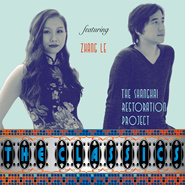

The Classics
============================

|  |  |
| :--: | :-- |
| [ The Classics](https://emumo.xiami.com/album/1292025801) | **艺人**: [The Shanghai Restoration Project](../index.md) **语种**: 国语 **唱片公司**: Undercover Culture Music **发行时间**: 2014年01月28日 **专辑类别**: 录音室专辑 **专辑风格**: 沙发音乐 Lounge, 人声爵士 Vocal Jazz **播放数**: 3127417 **收藏数**: 7056 **评论数**: 338  |

## 简介

上海复兴方案(The Shanghai Restoration Project)系为毕业于哈佛大学的华裔美人梁文伟(Dave Liang)的得意之作，其创作灵感来源于30年代旧上海夜总会中的爵士乐，而在融合了传统中式乐器的基础上，乐曲又被创作人赋予了嘻哈、电子、沙发等西式风格化标签，由此绽放异彩。“The Classics”已是梁在此项目名下发布的第12张作品，本张专辑主要注重对经典上海爵士乐的解构、雕琢与重塑，同时亦不乏诸如“何日君再来”等金曲的改编新唱，借助于上海爵士歌手张乐的女声演绎，加之耐人寻味的歌词，给人耳目一新的别样感受。 

## 曲目

## 评论

|  |  |  |  |
| :-- | :-- | :-- | :-- |
|  [虾米用户](https://emumo.xiami.com/u/298986001) 人生如逆旅 我亦如行人 2021-01-24 12:25 赞(0) 踩(0) | 
复古时尚
 |
|  [虾米用户](https://emumo.xiami.com/u/276944698) 不要自我设限..... 2020-12-26 22:05 赞(0) 踩(0) | 

 |
|  [虾米用户](https://emumo.xiami.com/u/3583995) 一個人的戰爭 2020-03-29 18:35 赞(0) 踩(0) | 
.
 |
|  [虾米用户](https://emumo.xiami.com/u/403112183) 我还没想好要写什么... 2020-01-07 12:10 赞(0) 踩(0) | 
可爱
 |
|  [虾米用户](https://emumo.xiami.com/u/350194939) 假装合群 2019-12-19 20:48 赞(0) 踩(0) | 
太爱了
 |
|  [虾米用户](https://emumo.xiami.com/u/358688746)  2019-05-25 01:00 赞(1) 踩(0) | 
喜欢音乐的各种玩法 请继续！
 |
|  [虾米用户](https://emumo.xiami.com/u/2379617) 回归家庭 2019-05-10 15:10 赞(1) 踩(0) | 
喜欢 现在国语音乐很难说喜欢了 又稳又时髦 古典和新音乐元素的结合 高玩
 |
|  [虾米用户](https://emumo.xiami.com/u/420854298)  2019-04-16 00:31 赞(0) 踩(0) | 
你们怎么这么棒！
 |
|  [虾米用户](https://emumo.xiami.com/u/412171476)  2019-03-22 03:49 赞(0) 踩(0) | 
挺不错
 |
|  [虾米用户](https://emumo.xiami.com/u/49036093) ⁢ 2019-03-13 13:22 赞(0) 踩(0) | 
最爱的两张专辑之一另一张是    王菲的《寓言》
 |
|  [虾米用户](https://emumo.xiami.com/u/34522244)  2019-03-06 21:02 赞(0) 踩(0) | 
淘到宝 
 |
|  [虾米用户](https://emumo.xiami.com/u/404862770)  2019-02-26 15:06 赞(0) 踩(0) | 
极富才华 喜欢！
 |
|  [虾米用户](https://emumo.xiami.com/u/50475895) 诗酒趁年华 2019-02-07 10:55 赞(0) 踩(0) | 
从五年前听到现在，这张专辑我太爱了
 |
|  [虾米用户](https://emumo.xiami.com/u/342038768) pucikaka don... 2019-02-02 01:20 赞(0) 踩(0) | 
!!!!
 |
|  [虾米用户](https://emumo.xiami.com/u/8811330) 竟然被你找到了 2018-12-04 15:43 赞(1) 踩(0) | 
简直可以和我妈一起听一天了！
 |
|  [虾米用户](https://emumo.xiami.com/u/128679388) 热爱生命 2018-10-21 15:41 赞(3) 踩(0) | 
金风玉露一相逢，便胜却人间无数。
 |
|  [虾米用户](https://emumo.xiami.com/u/3788485) 我还没想好要写什么... 2018-10-16 11:55 赞(0) 踩(0) | 
好想要這張的實體專輯！（不知道有沒有
 |
|  [虾米用户](https://emumo.xiami.com/u/19724958) 活下只为一首主题曲 2018-07-22 10:30 赞(0) 踩(0) | 
 买了好些  发现需要收入囊中的太多 能有打包价吗
 |
|  [虾米用户](https://emumo.xiami.com/u/3879971)  2018-05-09 21:06 赞(2) 踩(0) | 
张乐声音太美了
 |
|  [虾米用户](https://emumo.xiami.com/u/12802270) 道曦 2018-05-02 08:16 赞(0) 踩(0) | 
很棒！别致。
 |
|  [虾米用户](https://emumo.xiami.com/u/201391232) 最快的方法是先抱抱 2018-04-06 14:07 赞(0) 踩(0) | 
彡
 |
|  [虾米用户](https://emumo.xiami.com/u/316502674) 在最后陪着你吧，我的虾米 2018-03-11 10:19 赞(1) 踩(0) | 
来晚了
 |
|  [虾米用户](https://emumo.xiami.com/u/1030568) 乐色撩人 2017-11-11 22:34 赞(0) 踩(0) | 
超嗲的一张专辑
 |
|  [虾米用户](https://emumo.xiami.com/u/63101240)  2017-11-04 15:24 赞(0) 踩(0) | 
喜欢
 |
|  [虾米用户](https://emumo.xiami.com/u/260828419) Tomorrow is ... 2017-11-02 15:46 赞(0) 踩(0) | 
人生就是戏
 |
|  [虾米用户](https://emumo.xiami.com/u/10355266)  2017-10-27 23:47 赞(3) 踩(0) | 
加入新的女声果然变幻出新的感觉了。我认为上海这个意象至此已经完整的被音乐“复兴”了。我只是发愁什么时候把北京也复兴一下吧。
 |
|  [虾米用户](https://emumo.xiami.com/u/18236235) 我还没想好要写什么... 2017-09-29 11:05 赞(0) 踩(0) | 
爱死这个team了
 |
|  [虾米用户](https://emumo.xiami.com/u/15270473) 听到喜欢的歌 身体不跟着... 2017-09-28 12:18 赞(0) 踩(0) | 
-
 |
|  [虾米用户](https://emumo.xiami.com/u/16089568) 暂无签名~ 2017-09-06 15:06 赞(0) 踩(0) | 
lounge
 |
|  [虾米用户](https://emumo.xiami.com/u/51740442) 绿玉党 2017-08-04 19:41 赞(1) 踩(0) | 
老上海的味道     
 |
|  [虾米用户](https://emumo.xiami.com/u/810028)  2017-07-13 21:02 赞(2) 踩(0) | 
超赞，很有中国味道的音乐，跟现代的完美结合，很可惜他们上次来广州表演时，我没去成。
 |
|  [虾米用户](https://emumo.xiami.com/u/293747165)  2017-05-04 11:35 赞(0) 踩(0) | 
不是很浮躁的那种音乐~
 |
|  [虾米用户](https://emumo.xiami.com/u/39769356) 很普通，很快乐 2017-04-29 14:45 赞(0) 踩(0) | 
大爱！！！
 |
|  [虾米用户](https://emumo.xiami.com/u/5543468)  2017-04-28 12:40 赞(0) 踩(0) | 
我想买 怎么买不了
 |
|  [虾米用户](https://emumo.xiami.com/u/39769356) 很普通，很快乐 2017-04-17 23:37 赞(0) 踩(0) | 

 |
|  [虾米用户](https://emumo.xiami.com/u/25247834)  2017-03-30 21:51 赞(0) 踩(0) | 
WO
 |
|  [虾米用户](https://emumo.xiami.com/u/1185566) 勇气重生 全员下架 2016-12-06 18:14 赞(0) 踩(0) | 
喜欢
 |
|  [虾米用户](https://emumo.xiami.com/u/30067566)  2016-11-19 16:35 赞(1) 踩(0) | 
怎么才发现这张专辑！！！唾骂自己！！！
 |
|  [虾米用户](https://emumo.xiami.com/u/41278877)  2016-10-10 21:44 赞(1) 踩(0) | 
四季歌 最NICE
 |
|  [虾米用户](https://emumo.xiami.com/u/231135605)  2016-10-06 20:07 赞(0) 踩(0) | 
听了到Dave Liang帮我爱豆MEG制作的专辑&amp;lt;journey&amp;gt;,特地过来听听~~~赞.喜欢的朋友也可以去听听
 |
|  [虾米用户](https://emumo.xiami.com/u/53026563) 我是罗森内里 FORZA... 2016-09-23 23:47 赞(0) 踩(0) | 

 |
|  [虾米用户](https://emumo.xiami.com/u/206328574)   2016-07-29 12:34 赞(0) 踩(0) | 
好
 |
|  [虾米用户](https://emumo.xiami.com/u/36514939) 她留着超酷的短发 网易云... 2016-07-27 19:56 赞(0) 踩(0) | 
⚙
 |
|  [虾米用户](https://emumo.xiami.com/u/9017271)  2016-07-10 18:03 赞(0) 踩(0) | 
惊喜
 |
|  [虾米用户](https://emumo.xiami.com/u/157597682) 弄乐 2016-06-04 12:49 赞(0) 踩(0) | 
 
 |
|  [虾米用户](https://emumo.xiami.com/u/101779900)   2016-06-04 00:27 赞(0) 踩(0) | 
太好听 了吧
 |
|  [虾米用户](https://emumo.xiami.com/u/46583488)  2016-05-30 10:12 赞(0) 踩(0) | 
 
 |
|  [虾米用户](https://emumo.xiami.com/u/163295132)  2016-05-07 08:29 赞(3) 踩(0) | 
古典与现代的融合，喜欢老上海的味道
 |
|  [虾米用户](https://emumo.xiami.com/u/13849307)   2016-05-04 23:21 赞(0) 踩(0) | 
女神范老师推荐！！
 |
|  [虾米用户](https://emumo.xiami.com/u/30617820) 窝列大窝列大哟 2016-04-16 20:53 赞(0) 踩(0) | 
＝＝
 |
|  [虾米用户](https://emumo.xiami.com/u/8111102) 浮光背道而驰，长满白发。 2016-03-30 07:56 赞(1) 踩(0) | 
“上海复兴方案，其创作灵感来源于30年代旧上海夜总会中的爵士乐，而在融合了传统中式乐器的基础上，乐曲又被创作人赋予了嘻哈、电子、沙发等西式风格化标签，由此绽放异彩。”
 |
|  [虾米用户](https://emumo.xiami.com/u/634749)  2016-03-24 11:15 赞(0) 踩(0) | 
腔调！
 |
|  [虾米用户](https://emumo.xiami.com/u/5995638) 暂无签名~ 2016-03-20 16:40 赞(0) 踩(0) | 
终于又上架了~真好~我还以为再也没有了~
 |
| ⇒ |  [虾米用户](https://emumo.xiami.com/u/51978498)  2016-04-15 22:08 赞(0) 踩(0) | 
我也是 当时想哭
 |
| ⇒ |  [虾米用户](https://emumo.xiami.com/u/5995638) 暂无签名~ 2016-05-06 02:48 赞(0) 踩(0) | 
<q><b>peixuan说：</b></q>
 |
|  [虾米用户](https://emumo.xiami.com/u/27224237) 永远在寻找能唤醒我耳朵的... 2016-03-03 18:25 赞(0) 踩(0) | 
♥
 |
|  [虾米用户](https://emumo.xiami.com/u/6477396)   2016-03-01 11:28 赞(0) 踩(0) | 
古典现代爵士
 |
|  [虾米用户](https://emumo.xiami.com/u/38752771)   2016-02-27 21:07 赞(1) 踩(0) | 
撒花欢迎回归
 |
|  [虾米用户](https://emumo.xiami.com/u/36208991)   2016-02-27 19:47 赞(0) 踩(0) | 
❤️
 |
|  [虾米用户](https://emumo.xiami.com/u/41163024) I’m done. 2016-02-27 15:05 赞(0) 踩(0) | 
0.0
 |
|  [虾米用户](https://emumo.xiami.com/u/46102833)   2016-02-27 14:52 赞(0) 踩(0) | 
回来了
 |
|  [虾米用户](https://emumo.xiami.com/u/48211350) 已弃虾米，勿扰 2016-02-27 13:56 赞(0) 踩(0) | 
6
 |
|  [虾米用户](https://emumo.xiami.com/u/1320669) ツ 2016-02-27 13:33 赞(0) 踩(0) | 
0.0
 |
|  [虾米用户](https://emumo.xiami.com/u/45385073) 爱虾米期待再相遇为新：t... 2016-02-27 13:15 赞(0) 踩(0) | 

 |
|  [虾米用户](https://emumo.xiami.com/u/11906267)  2016-02-11 00:57 赞(0) 踩(0) | 
整张
 |
|  [虾米用户](https://emumo.xiami.com/u/14150920)   2016-02-04 00:00 赞(0) 踩(0) | 
<a href="http://emumo.xiami.com/u/3984225" target="_blank" rel="nofollow" name_card="3984225">@白白</a>
 |
|  [虾米用户](https://emumo.xiami.com/u/1245452)  2016-01-08 20:21 赞(0) 踩(0) | 
明月千里寄相思 副歌的和弦走向听着怪别扭。。其他无可挑剔。。尤其钟爱何日君再来
 |
|  [虾米用户](https://emumo.xiami.com/u/3127219) 寻找听上去像她的音乐。。... 2015-12-28 21:57 赞(1) 踩(0) | 
15年撞见最沁人心脾的专辑
 |
|  [虾米用户](https://emumo.xiami.com/u/44056925)   2015-12-25 12:00 赞(1) 踩(0) | 
中国的神秘园
 |
|  [虾米用户](https://emumo.xiami.com/u/19849243) 嗯 2015-12-22 21:04 赞(1) 踩(0) | 
女声真的很一般 哎
 |
|  [虾米用户](https://emumo.xiami.com/u/9140401)  2015-12-16 10:28 赞(0) 踩(0) | 
very special!
 |
|  [虾米用户](https://emumo.xiami.com/u/1026338)  2015-12-04 09:46 赞(1) 踩(0) | 
这张专辑听了半年。
 |
|  [虾米用户](https://emumo.xiami.com/u/23254367) 暂无签名~ 2015-11-18 19:48 赞(2) 踩(0) | 
从第一次听到Miss Shanghai 就喜欢的不要不要的 再到这张老歌remix 每首都有惊喜
 |
|  [虾米用户](https://emumo.xiami.com/u/4909860) 暂无签名~ 2015-11-17 09:41 赞(2) 踩(0) | 
好久没有这么眼前一亮，电子爵士没有想到的结合，但是听得舒服的很。
 |
|  [虾米用户](https://emumo.xiami.com/u/34021724)   2015-11-14 14:23 赞(0) 踩(0) | 
#东方巴黎#
 |
|  [虾米用户](https://emumo.xiami.com/u/4392878)   2015-11-03 03:25 赞(0) 踩(0) | 
so cool
 |
|  [虾米用户](https://emumo.xiami.com/u/13724982) 进入梦想，怀念真实 2015-10-28 14:35 赞(0) 踩(0) | 
the shanghai restoration project
 |
|  [虾米用户](https://emumo.xiami.com/u/13724982) 进入梦想，怀念真实 2015-10-28 14:35 赞(0) 踩(0) | 
the shanghai restoration project
 |
|  [虾米用户](https://emumo.xiami.com/u/9196794)  2015-10-25 22:14 赞(0) 踩(0) | 
这张专辑超级棒！！！
 |
|  [虾米用户](https://emumo.xiami.com/u/9196794)  2015-10-25 22:13 赞(0) 踩(0) | 
这张专辑超级棒！！！
 |
|  [虾米用户](https://emumo.xiami.com/u/10813478) 黑白分明该杀就杀 2015-10-21 00:05 赞(0) 踩(0) | 
非常非常非常棒
 |
|  [虾米用户](https://emumo.xiami.com/u/5416714)   2015-10-09 22:44 赞(0) 踩(0) | 
很喜欢
 |
|  [虾米用户](https://emumo.xiami.com/u/37821851) we are ratio... 2015-10-07 13:28 赞(0) 踩(0) | 
蛮有趣的一张专辑~ 
 |
|  [虾米用户](https://emumo.xiami.com/u/45436261) 我还没想好要写什么... 2015-10-07 08:45 赞(0) 踩(0) | 

 |
|  [虾米用户](https://emumo.xiami.com/u/51705890) 用十倍苦心，做最突出一个... 2015-10-05 15:18 赞(1) 踩(0) | 
好久以前聽過一些，好幾首吧。沒想到都是同一位歌手。很讚，還有miss shang hai 在去年聽過貌似。
 |
|  [虾米用户](https://emumo.xiami.com/u/6948494)  2015-10-04 22:23 赞(0) 踩(0) | 
很有味道
 |
|  [虾米用户](https://emumo.xiami.com/u/4960476)  2015-10-01 10:31 赞(0) 踩(0) | 
好听！！！
 |
|  [虾米用户](https://emumo.xiami.com/u/36356883) 暂无签名~ 2015-10-01 00:55 赞(0) 踩(0) | 
牛逼的装机
 |
|  [虾米用户](https://emumo.xiami.com/u/5605656)  2015-09-30 12:40 赞(0) 踩(0) | 
大爱！！
 |
|  [虾米用户](https://emumo.xiami.com/u/7322777) ∮ 2015-09-26 03:44 赞(0) 踩(0) | 
...A...
 |
|  [虾米用户](https://emumo.xiami.com/u/36047468)  2015-09-22 14:17 赞(0) 踩(0) | 
中西结合的经典之一
 |
|  [虾米用户](https://emumo.xiami.com/u/34021724)   2015-09-21 09:47 赞(2) 踩(0) | 
#专辑全部音乐顺序播放#新发现的超赞上海民谣组合
 |
|  [虾米用户](https://emumo.xiami.com/u/13810266) 我觉得自己像一位艺术家 2015-09-21 01:40 赞(3) 踩(0) | 
不客气的讲，这张专辑把中国那些只会玩商业，唱玩世不恭的摇滚和民谣的所谓音乐家的脸，给打了。
 |
|  [虾米用户](https://emumo.xiami.com/u/224893) 你这是想红你造吗 2015-09-08 05:39 赞(1) 踩(0) | 
不禁想用黄龄的vocal代入
 |
|  [虾米用户](https://emumo.xiami.com/u/1910935)  2015-09-05 11:17 赞(0) 踩(0) | 
听起来特别舒服。
 |
|  [虾米用户](https://emumo.xiami.com/u/10355266)  2015-09-01 18:48 赞(3) 踩(0) | 
加入新的女声果然变幻出新的感觉了。我认为上海这个意象至此已经完整的被音乐“复兴”了。我只是发愁什么时候把北京也复兴一下吧。
 |
|  [虾米用户](https://emumo.xiami.com/u/10205695) 蓝色月光 2015-08-19 19:31 赞(0) 踩(0) | 
ok
 |
|  [虾米用户](https://emumo.xiami.com/u/55457989)  2015-08-19 19:25 赞(0) 踩(0) | 
嗲
 |
|  [虾米用户](https://emumo.xiami.com/u/44264733)  2015-08-15 10:35 赞(0) 踩(0) | 
时尚与传统的结合，耳目一新，大爱，非常赞！
 |
|  [虾米用户](https://emumo.xiami.com/u/46459599)  2015-08-13 23:08 赞(1) 踩(0) | 
报告。发现新大陆。 
 |
|  [虾米用户](https://emumo.xiami.com/u/986237) 我愿意用一只黑色的铅笔，... 2015-08-07 13:45 赞(0) 踩(0) | 
很少有这样难得的音乐了。赞
 |
|  [虾米用户](https://emumo.xiami.com/u/1180492)  2015-08-07 09:47 赞(0) 踩(0) | 
现代中国风
 |
|  [虾米用户](https://emumo.xiami.com/u/26439089) 我想好了要写什么... 2015-07-06 11:58 赞(2) 踩(0) | 
分享一张专辑。分享一张专辑。分享一张专辑。分享一张专辑。分享一张专辑。分享一张专辑。分享一张专辑。分享一张专辑。分享一张专辑。分享一张专辑。分享一张专辑。分享一张专辑。分享一张专辑。
 |
|  [虾米用户](https://emumo.xiami.com/u/6229907)  2015-06-23 22:43 赞(0) 踩(0) | 
good job~
 |
|  [虾米用户](https://emumo.xiami.com/u/1716502)   2015-06-20 08:01 赞(1) 踩(0) | 
这张专辑啊
 |
|  [虾米用户](https://emumo.xiami.com/u/46499599)  2015-06-15 04:45 赞(0) 踩(0) | 
。
 |
|  [虾米用户](https://emumo.xiami.com/u/7650235) 来自新疆的异域风情，孜然 2015-06-10 20:49 赞(0) 踩(0) | 
哦 。
 |
|  [虾米用户](https://emumo.xiami.com/u/13989)   2015-05-20 13:56 赞(0) 踩(0) | 
老上海
 |
|  [虾米用户](https://emumo.xiami.com/u/13989)   2015-05-20 13:54 赞(0) 踩(0) | 
听“大内密谈”知道的
 |
|  [虾米用户](https://emumo.xiami.com/u/20862728) 柯男 2015-05-18 01:20 赞(0) 踩(0) | 
(ΦωΦ)
 |
|  [虾米用户](https://emumo.xiami.com/u/1911134)  2015-04-25 20:33 赞(0) 踩(0) | 
shanghai
 |
|  [虾米用户](https://emumo.xiami.com/u/14230079) 行百里者半九十 2015-04-13 22:53 赞(0) 踩(0) | 
发行时间：2014年01月28日？
 |
|  [虾米用户](https://emumo.xiami.com/u/14230079) 行百里者半九十 2015-04-13 22:24 赞(0) 踩(0) | 
神作啊。。。。
 |
|  [虾米用户](https://emumo.xiami.com/u/47016953) 在最美的年华，寻找最好的... 2015-04-13 22:09 赞(1) 踩(0) | 
广州那场太棒了，现场反应也是超级好的！    
 |
|  [虾米用户](https://emumo.xiami.com/u/6538898)   2015-04-10 01:22 赞(1) 踩(0) | 
深圳站 今晚见！
 |
| ⇒ |  [虾米用户](https://emumo.xiami.com/u/3977914)  2015-04-11 21:40 赞(0) 踩(0) | 
enjoy it~
 |
|  [虾米用户](https://emumo.xiami.com/u/15790152) 暂无签名~ 2015-04-09 12:35 赞(0) 踩(0) | 
Chinese Jazz~
 |
|  [虾米用户](https://emumo.xiami.com/u/11017913) 爵士呆瓜 WeiBo:是... 2015-04-08 13:21 赞(0) 踩(0) | 
这里好厉害，西安场的大家都可遇到神奇
 |
|  [虾米用户](https://emumo.xiami.com/u/1959541) 听音乐很幸福 2015-04-08 08:35 赞(0) 踩(0) | 
昨晚现场很不错啊，本人更帅啊有木有啊，表情太丰富啦，老外表演好卖力的呀！
 |
| ⇒ |  [虾米用户](https://emumo.xiami.com/u/3487489) 多想想 2015-04-10 09:23 赞(0) 踩(0) | 
底下太不给力，一个个呆若木鸡
 |
| ⇒ |  [虾米用户](https://emumo.xiami.com/u/1959541) 听音乐很幸福 2015-04-10 14:04 赞(0) 踩(0) | 
<q><b>Good说：</b></q>
 |
| ⇒ |  [虾米用户](https://emumo.xiami.com/u/8977854) 我还没想好要写什么... 2015-04-12 14:48 赞(0) 踩(0) | 
<q><b>bee.zy说：</b></q>
 |
|  [虾米用户](https://emumo.xiami.com/u/9958085) 我的第一张完整原创专辑要... 2015-04-06 01:07 赞(0) 踩(0) | 
哈哈 太有缘了
 |
|  [虾米用户](https://emumo.xiami.com/u/9958085) 我的第一张完整原创专辑要... 2015-04-05 23:50 赞(0) 踩(0) | 
今晚西安太嗨！可惜没唱夜来香跟何日君再来
 |
| ⇒ |  [虾米用户](https://emumo.xiami.com/u/9664447)   2015-04-06 00:40 赞(0) 踩(0) | 
我也去啦
 |
| ⇒ |  [虾米用户](https://emumo.xiami.com/u/7210136) 我还没想好要写什么... 2015-04-06 00:53 赞(0) 踩(0) | 
我是你前面那位 
 |
|  [虾米用户](https://emumo.xiami.com/u/12076161) 兼容古典和嘻哈 2015-04-04 10:42 赞(0) 踩(0) | 
有没有人一起去看7号成都场啊~求同去~
 |
| ⇒ |  [虾米用户](https://emumo.xiami.com/u/1959541) 听音乐很幸福 2015-04-05 23:28 赞(0) 踩(0) | 
我要去！
 |
|  [虾米用户](https://emumo.xiami.com/u/45996368) 然而都没有意思 2015-04-02 14:43 赞(0) 踩(0) | 
paris of  shanghai让我想起了被嫌弃的松子的一生里的配乐…让人心疼
 |
|  [虾米用户](https://emumo.xiami.com/u/35039617)   2015-03-31 19:50 赞(1) 踩(0) | 
和黄龄才是绝配 合作一次就满足了 
 |
|  [虾米用户](https://emumo.xiami.com/u/628174) 我还没想好要写什么... 2015-03-25 11:01 赞(0) 踩(0) | 
四季歌唱的我全身鸡皮! 那声音真是迷人!
 |
|  [虾米用户](https://emumo.xiami.com/u/649640) 我想好了 2015-03-23 09:25 赞(0) 踩(0) | 
张乐太棒了！ love love love
 |
|  [虾米用户](https://emumo.xiami.com/u/1318932) 想好写什么了 就是我不想... 2015-03-21 15:31 赞(0) 踩(0) | 
当bgm 配乐很定很不错
 |
|  [虾米用户](https://emumo.xiami.com/u/2874763) 签什么名 2015-03-20 00:58 赞(0) 踩(0) | 
这个 这个  好牛逼啊
 |
| ⇒ |  [虾米用户](https://emumo.xiami.com/u/47369364) 我还没想好要写什么... 2015-07-31 21:40 赞(0) 踩(0) | 
你们试试看采样这个吧？
 |
| ⇒ |  [虾米用户](https://emumo.xiami.com/u/2874763) 签什么名 2015-07-31 22:26 赞(0) 踩(0) | 
<q><b>Yelowtech说：</b></q>
 |
|  [虾米用户](https://emumo.xiami.com/u/8337700)  2015-03-19 22:59 赞(0) 踩(0) | 
今年带上张乐！棒棒棒
 |
|  [虾米用户](https://emumo.xiami.com/u/6485455) 电子乐狂欢中~ 2015-03-14 17:31 赞(0) 踩(0) | 
下月去广州听
 |
|  [虾米用户](https://emumo.xiami.com/u/1290529)  2015-03-11 15:26 赞(1) 踩(0) | 
其实这张只是老歌翻新而已 没多大意义 算是个吵冷饭麽  真没当年的The Shanghai Restoration Project来的震撼惊艳
 |
|  [虾米用户](https://emumo.xiami.com/u/8225944)  2015-02-28 23:56 赞(1) 踩(0) | 
推荐啦...
 |
|  [虾米用户](https://emumo.xiami.com/u/8485542)  2015-02-28 23:47 赞(0) 踩(0) | 
新年第一张惊喜的专辑。
 |
|  [虾米用户](https://emumo.xiami.com/u/526266) 我不能强迫自己天天签到，... 2015-02-28 12:32 赞(0) 踩(0) | 
醉了·····
 |
|  [虾米用户](https://emumo.xiami.com/u/8226204) ≡ 2015-02-27 22:31 赞(0) 踩(0) | 
!!!
 |
|  [虾米用户](https://emumo.xiami.com/u/1895474) 再见 虾米 现在我不能像... 2015-02-14 15:47 赞(0) 踩(0) | 
by the suzhou river 太醉
 |
|  [虾米用户](https://emumo.xiami.com/u/23464588)  2015-02-08 16:48 赞(0) 踩(0) | 
每一首都好听的不要不要的
 |
|  [虾米用户](https://emumo.xiami.com/u/4375977) 我还没想好要写什么... 2015-01-14 11:46 赞(0) 踩(0) | 
Paris of east 感觉好像西西里的美丽传说里的某个旋律
 |
|  [虾米用户](https://emumo.xiami.com/u/41278877)  2015-01-09 00:57 赞(0) 踩(0) | 
四季歌 nice the Perfect Music !
 |
|  [虾米用户](https://emumo.xiami.com/u/38458478)  2014-12-15 02:20 赞(0) 踩(0) | 
喜欢...第一首的感觉.有些调皮有些浪漫有些温馨.
 |
|  [虾米用户](https://emumo.xiami.com/u/66009) Edric 2014-11-30 13:23 赞(0) 踩(0) | 
有感觉....
 |
|  [虾米用户](https://emumo.xiami.com/u/7894054) 沉醉了，便是和旋律做爱的... 2014-11-26 01:56 赞(0) 踩(0) | 
有感觉，封面图颜色喜欢，顺带支持下国产，这个算理由吗
 |
|  [虾米用户](https://emumo.xiami.com/u/18987690)  2014-11-08 13:45 赞(0) 踩(0) | 
在酒吧听到放这张专辑 马上就去问了出处 太有感觉了
 |
|  [虾米用户](https://emumo.xiami.com/u/43372298)  2014-11-05 17:46 赞(0) 踩(0) | 
我喜欢的风格
 |
|  [虾米用户](https://emumo.xiami.com/u/1936438)  2014-10-29 23:04 赞(0) 踩(0) | 
性感的中国jazz~每首都很经典
 |
|  [虾米用户](https://emumo.xiami.com/u/447565) 兴奋郁闷互转模式中 2014-10-25 21:29 赞(0) 踩(0) | 
潮籍棒~
 |
|  [虾米用户](https://emumo.xiami.com/u/1931086) 正义，或许会迟到，但永远... 2014-10-20 21:29 赞(0) 踩(0) | 
第一首是周易用乐器演奏的《东方巴黎》。
 |
|  [虾米用户](https://emumo.xiami.com/u/29053890)  2014-10-20 12:17 赞(0) 踩(0) | 
dave liang 好帅，我的梦中情人的长相。哈哈
 |
|  [虾米用户](https://emumo.xiami.com/u/9104118)  2014-10-17 09:34 赞(0) 踩(0) | 
简直不能太棒⊙▽⊙
 |
|  [虾米用户](https://emumo.xiami.com/u/6157010)  2014-10-12 11:20 赞(0) 踩(0) | 
有点意思~
 |
|  [虾米用户](https://emumo.xiami.com/u/42082354)  2014-10-11 10:26 赞(0) 踩(0) | 
舒服的感觉！
 |
|  [虾米用户](https://emumo.xiami.com/u/32337584)  2014-09-20 08:00 赞(0) 踩(0) | 
四季歌 美到不行了
 |
|  [虾米用户](https://emumo.xiami.com/u/41278877)  2014-09-16 01:23 赞(0) 踩(0) | 
夜来香 Shit,太他妈的好听了。
 |
|  [虾米用户](https://emumo.xiami.com/u/757994) J-POP命！ 2014-09-12 23:29 赞(0) 踩(0) | 
要不要这么带感!!!
 |
|  [虾米用户](https://emumo.xiami.com/u/848951)  2014-09-09 00:11 赞(0) 踩(0) | 
合味~
 |
|  [虾米用户](https://emumo.xiami.com/u/38951198)   2014-09-02 15:13 赞(0) 踩(0) | 
棒呆了
 |
|  [虾米用户](https://emumo.xiami.com/u/9481336) 暂无签名~ 2014-08-30 22:43 赞(0) 踩(0) | 
好有感觉
 |
|  [虾米用户](https://emumo.xiami.com/u/1851561)  2014-08-20 13:05 赞(0) 踩(0) | 
才华横溢
 |
|  [虾米用户](https://emumo.xiami.com/u/6610597) 去Spotify啦 我爱... 2014-08-18 16:56 赞(0) 踩(0) | 
Starbuck music
 |
|  [虾米用户](https://emumo.xiami.com/u/774212) 杭州仅一位 2014-08-14 07:40 赞(0) 踩(0) | 
雀巢咖啡，滴滴乡浓
 |
|  [虾米用户](https://emumo.xiami.com/u/2431605) LOVE Flower 2014-08-06 18:59 赞(0) 踩(0) | 
很有感觉的歌。
 |
|  [虾米用户](https://emumo.xiami.com/u/35320145) 以音乐为伴，与世无争！ 2014-08-05 15:22 赞(0) 踩(0) | 
不一样的感觉...
 |
|  [虾米用户](https://emumo.xiami.com/u/8337700)  2014-08-04 20:43 赞(0) 踩(0) | 
真的太biang老！几个月后继续翻来听
 |
|  [虾米用户](https://emumo.xiami.com/u/6987399)  2014-07-24 16:37 赞(0) 踩(0) | 
帝都表示非常羡慕
 |
| ⇒ |  [虾米用户](https://emumo.xiami.com/u/8337700)  2014-08-04 20:45 赞(0) 踩(0) | 
羡慕不来，哈哈哈
 |
|  [虾米用户](https://emumo.xiami.com/u/38951198)   2014-07-14 22:00 赞(2) 踩(0) | 
夜来香，改的真牛逼！才华横溢
 |
|  [虾米用户](https://emumo.xiami.com/u/3663305) music never ... 2014-07-13 16:05 赞(0) 踩(0) | 
爱~~~~~
 |
|  [虾米用户](https://emumo.xiami.com/u/7971186)  2014-07-10 08:33 赞(0) 踩(0) | 
高大上
 |
|  [虾米用户](https://emumo.xiami.com/u/13413786) 加我微信TGSshell... 2014-06-28 11:01 赞(0) 踩(0) | 
我的天啊  怎么那么好听啊 讨厌
 |
|  [虾米用户](https://emumo.xiami.com/u/12000448)   2014-06-26 11:38 赞(0) 踩(0) | 
这专辑喜欢到没话说
 |
|  [虾米用户](https://emumo.xiami.com/u/348239)  2014-06-24 17:22 赞(0) 踩(0) | 
The Shanghai Restoration Project. Dave Liang featuring Zhang Le. When Shanghai  1930s meets modern tag.
 |
|  [虾米用户](https://emumo.xiami.com/u/10056188) 暂无签名~ 2014-06-21 22:52 赞(1) 踩(0) | 
以前听miss shanghai就挺心水了
 |
|  [虾米用户](https://emumo.xiami.com/u/6009889)  2014-06-21 20:33 赞(0) 踩(0) | 
can&amp;#039;t get your love是翻唱哪一支歌啊？～
 |
| ⇒ |  [虾米用户](https://emumo.xiami.com/u/774212) 杭州仅一位 2014-08-14 07:41 赞(0) 踩(0) | 
得不到你的爱情
 |
|  [虾米用户](https://emumo.xiami.com/u/838728)  2014-06-20 09:33 赞(0) 踩(0) | 
我们终于有自己的爵士了。
 |
|  [虾米用户](https://emumo.xiami.com/u/645273)   2014-06-19 12:51 赞(1) 踩(0) | 
我真心的觉得这个女声可以再好点，或者把她mix小一点 :P
 |
|  [虾米用户](https://emumo.xiami.com/u/16698042) 寻找穿透心灵的是声音～ 2014-06-18 21:11 赞(0) 踩(0) | 
nice～
 |
|  [虾米用户](https://emumo.xiami.com/u/2030690)  2014-06-18 14:59 赞(0) 踩(0) | 
上海复兴方案。老上海。专辑真是棒！
 |
|  [虾米用户](https://emumo.xiami.com/u/10131787)  2014-06-17 21:04 赞(0) 踩(0) | 
赞，赞，赞。
 |
|  [虾米用户](https://emumo.xiami.com/u/34998396)  2014-06-09 09:32 赞(0) 踩(0) | 
上海复兴方案
 |
|  [虾米用户](https://emumo.xiami.com/u/4310341) 不当如此，又当如何 2014-06-07 17:52 赞(0) 踩(0) | 
不用说了，自己听
 |
|  [虾米用户](https://emumo.xiami.com/u/29956669)  2014-06-06 18:58 赞(0) 踩(0) | 
中国风
 |
|  [虾米用户](https://emumo.xiami.com/u/1734448) 我还没想好要写什么... 2014-06-06 13:18 赞(0) 踩(0) | 
整张专辑真的是耐听！
 |
|  [虾米用户](https://emumo.xiami.com/u/1830132)  2014-06-04 16:29 赞(0) 踩(0) | 
完美～
 |
|  [虾米用户](https://emumo.xiami.com/u/1229652) 沉到深处自然顶，顶到高处... 2014-06-01 19:33 赞(0) 踩(0) | 
喜欢这感觉..感觉 很 舒服...
 |
|  [虾米用户](https://emumo.xiami.com/u/4317367)  2014-05-28 01:15 赞(0) 踩(0) | 
dave的现场非常棒!现场的mix和即兴 听得很满足 后悔不能录下来 因为每个城市的现场都有些许不一样 但每一场都十分精彩
 |
|  [虾米用户](https://emumo.xiami.com/u/30966961)  2014-05-27 00:36 赞(0) 踩(0) | 
-_-#can&amp;#039;t get your love，27晚，雞凍過度。(●°u°●)​ 」
 |
|  [虾米用户](https://emumo.xiami.com/u/30966961)  2014-05-27 00:34 赞(0) 踩(0) | 
can&amp;#039;t get you love 超愛，28晚見！！！
 |
|  [虾米用户](https://emumo.xiami.com/u/24447330) 江湖人称月少 2014-05-26 19:57 赞(0) 踩(0) | 
Dave Liang &amp;amp;Zhang le 新碟哦，先听了两首，最爱 rose rose I love you
 |
|  [虾米用户](https://emumo.xiami.com/u/3259974)   2014-05-26 10:57 赞(0) 踩(0) | 
这才是牛逼的中国风精华 的确是艺术家
 |
|  [虾米用户](https://emumo.xiami.com/u/12390700)  2014-05-22 18:51 赞(0) 踩(0) | 
昨晚坚果真的好嗨！
 |
|  [虾米用户](https://emumo.xiami.com/u/6891539)  2014-05-21 09:08 赞(0) 踩(0) | 
成都看过还想看第二次 high翻了
 |
|  [虾米用户](https://emumo.xiami.com/u/5648554)   2014-05-20 22:20 赞(0) 踩(0) | 
深圳见！
 |
|  [虾米用户](https://emumo.xiami.com/u/155947) 一期一会 2014-05-20 22:16 赞(53) 踩(0) | 
周璇如果见到Dave Liang，肯定天作之合
 |
|  [虾米用户](https://emumo.xiami.com/u/202779) 江湖有事，爱恋无声。 2014-05-20 13:08 赞(0) 踩(0) | 
5月27号广州巡演，已买票，哦耶～
 |
|  [虾米用户](https://emumo.xiami.com/u/1316534) 我还没想好要写什么... 2014-05-19 21:54 赞(0) 踩(0) | 
NB
 |
|  [虾米用户](https://emumo.xiami.com/u/2293348)  2014-05-17 11:35 赞(0) 踩(0) | 
正在听糖蒜的节目 过来了解下
 |
|  [虾米用户](https://emumo.xiami.com/u/2718671) 你来啦：） 2014-05-16 16:45 赞(0) 踩(0) | 
dave liang曲风越做越成熟了
 |
|  [虾米用户](https://emumo.xiami.com/u/11550440)   2014-05-15 17:22 赞(0) 踩(0) | 
融合的独特感受
 |
|  [虾米用户](https://emumo.xiami.com/u/9033060)  2014-05-15 07:45 赞(0) 踩(0) | 
来点LRC歌词吧！~嗷嗷嗷
 |
|  [虾米用户](https://emumo.xiami.com/u/669738) 是我啊 2014-05-04 00:49 赞(1) 踩(0) | 
上海复兴计划的乐曲越发的成熟
 |
|  [虾米用户](https://emumo.xiami.com/u/6612253) 你答对了，哥就是电子＆嘻... 2014-05-01 15:47 赞(0) 踩(0) | 
很赞！
 |
|  [虾米用户](https://emumo.xiami.com/u/3144227) 阿里巴巴 你多买版权 我... 2014-04-30 13:03 赞(0) 踩(0) | 
当电子乐遇到经典留声金曲
 |
|  [虾米用户](https://emumo.xiami.com/u/15938307)  2014-04-29 16:11 赞(29) 踩(0) | 
暖的爵士+冷的电子中式的复古+欧美的流行
 |
|  [虾米用户](https://emumo.xiami.com/u/4376156) 暂无签名~ 2014-04-28 09:52 赞(0) 踩(0) | 
爵士夜上海
 |
|  [虾米用户](https://emumo.xiami.com/u/4951186)  2014-04-24 21:13 赞(0) 踩(0) | 
fushion有意思！
 |
|  [虾米用户](https://emumo.xiami.com/u/8435151) 治愈系 2014-04-18 03:03 赞(0) 踩(0) | 
融合的不错
 |
|  [虾米用户](https://emumo.xiami.com/u/32881697)  2014-04-17 00:40 赞(0) 踩(0) | 
经典翻唱，新鲜感，怀旧感的并凑
 |
|  [虾米用户](https://emumo.xiami.com/u/35461656)  2014-04-16 18:13 赞(0) 踩(0) | 
好型，好听
 |
|  [虾米用户](https://emumo.xiami.com/u/9821820)  2014-04-16 13:17 赞(0) 踩(0) | 
潮流古典民乐
 |
|  [虾米用户](https://emumo.xiami.com/u/5820691)  2014-04-14 17:10 赞(0) 踩(0) | 
往昔&amp;amp;今时
 |
|  [虾米用户](https://emumo.xiami.com/u/4043410) 唯夜色浪漫 2014-04-11 13:19 赞(0) 踩(0) | 
这是一张旧歌新唱的专辑，一张能让我坐在沙发上跟着节奏摇晃脑袋的专辑，断断续续循环听了几个月，感觉依然解乏啊~！
 |
|  [虾米用户](https://emumo.xiami.com/u/757262) 虾米深挖掘员。 2014-04-07 00:33 赞(0) 踩(0) | 
很有趣
 |
|  [虾米用户](https://emumo.xiami.com/u/1798519)   2014-04-05 10:48 赞(0) 踩(0) | 
Dave Liang
 |
|  [虾米用户](https://emumo.xiami.com/u/3754822)  2014-04-02 12:25 赞(0) 踩(0) | 
⊙▽⊙
 |
|  [虾米用户](https://emumo.xiami.com/u/593136)  2014-04-02 11:09 赞(0) 踩(0) | 
清新
 |
|  [虾米用户](https://emumo.xiami.com/u/34610863)  2014-03-29 18:30 赞(0) 踩(0) | 
一个字~就是好~
 |
|  [虾米用户](https://emumo.xiami.com/u/1656986) Ta-ta . H 2014-03-29 13:48 赞(0) 踩(0) | 
还可以找黄神婆合作的嘛
 |
|  [虾米用户](https://emumo.xiami.com/u/1656986) Ta-ta . H 2014-03-29 13:32 赞(0) 踩(0) | 
艺人归属错误，网上只找到这片采访：<a href="http://jingdaily.com/jing-daily-interview-zhang-le-chinese-jazz-singer/14082/" target="_blank" rel="nofollow noreferrer noopener">http://jingdaily.com/jing-daily-interview-zhang-le-chinese-jazz-singer/14082/</a>
 |
|  [虾米用户](https://emumo.xiami.com/u/1656986) Ta-ta . H 2014-03-29 13:28 赞(0) 踩(0) | 
新砖头必须收藏
 |
|  [虾米用户](https://emumo.xiami.com/u/15325599) 暂无签名~ 2014-03-28 20:04 赞(0) 踩(0) | 
每一首歌都很有味道
 |
|  [虾米用户](https://emumo.xiami.com/u/9866264) 我还没想好要写什么... 2014-03-24 12:11 赞(0) 踩(0) | 
不错
 |
|  [虾米用户](https://emumo.xiami.com/u/7321800) just feeling 2014-03-22 01:51 赞(0) 踩(0) | 
绝对值得收藏！！
 |
|  [虾米用户](https://emumo.xiami.com/u/6790506)  2014-03-20 13:15 赞(0) 踩(0) | 
舒服。。。
 |
|  [虾米用户](https://emumo.xiami.com/u/4585780) 蛤？ 2014-03-18 22:02 赞(0) 踩(0) | 
前兩首還算新鮮感後面就有點麻痺
 |
|  [虾米用户](https://emumo.xiami.com/u/12948310) 音乐是上帝派来慰藉灵魂的... 2014-03-18 03:09 赞(0) 踩(0) | 
上海复兴，韵味十足。
 |
|  [虾米用户](https://emumo.xiami.com/u/2247835)  2014-03-15 20:40 赞(0) 踩(0) | 
上海风味
 |
|  [虾米用户](https://emumo.xiami.com/u/126761) 正弦曲线 2014-03-12 22:33 赞(0) 踩(0) | 
Dave Liang~
 |
|  [虾米用户](https://emumo.xiami.com/u/33807446)  2014-03-09 16:53 赞(0) 踩(0) | 
这风格我喜欢
 |
|  [虾米用户](https://emumo.xiami.com/u/6485455) 电子乐狂欢中~ 2014-03-07 15:31 赞(1) 踩(0) | 
怎么不把天涯歌女放进这张来呢。。。
 |
|  [虾米用户](https://emumo.xiami.com/u/1931086) 正义，或许会迟到，但永远... 2014-03-07 13:26 赞(89) 踩(0) | 
曲目如下（中文翻译）：1、东方巴黎2、得不到的爱情3、如果没有你4、玫瑰玫瑰我爱你5、夜来香6、等你回来7、人生就是一场戏8、苏州河边9、明月千里寄相思10、何日君再来11、四季歌12、纯真年代
 |
| ⇒ |  [虾米用户](https://emumo.xiami.com/u/6485455) 电子乐狂欢中~ 2014-03-07 15:24 赞(0) 踩(0) | 
我前几天刚在朋友圈翻过。。。。
 |
| ⇒ |  [虾米用户](https://emumo.xiami.com/u/7054341)   2014-07-12 23:03 赞(0) 踩(0) | 
32个赞
 |
|  [虾米用户](https://emumo.xiami.com/u/8192862) 诗人和先知。vchat:... 2014-03-06 21:38 赞(0) 踩(0) | 
超赞。
 |
|  [虾米用户](https://emumo.xiami.com/u/845568) 赚钱 生B 环游世界/ ... 2014-03-06 09:16 赞(0) 踩(0) | 
nice
 |
|  [虾米用户](https://emumo.xiami.com/u/1677112) 我还没想好要写什么... 2014-03-05 11:21 赞(0) 踩(0) | 
赞一个！
 |
|  [虾米用户](https://emumo.xiami.com/u/310558) We chat:kink... 2014-03-04 23:19 赞(0) 踩(0) | 
Nice
 |
|  [虾米用户](https://emumo.xiami.com/u/1314946) i  am  sunsh... 2014-03-04 21:52 赞(0) 踩(0) | 
好听，赞！！！
 |
|  [虾米用户](https://emumo.xiami.com/u/5842643)  2014-03-04 09:41 赞(0) 踩(0) | 
this album is interesting
 |
|  [虾米用户](https://emumo.xiami.com/u/6116969) Enjoy music 2014-03-03 16:36 赞(0) 踩(0) | 
别不是320K的，不然我就骂人了阿。。。
 |
|  [虾米用户](https://emumo.xiami.com/u/2743100)  2014-03-03 10:52 赞(0) 踩(0) | 
@漆猫黑 快来听听
 |
|  [虾米用户](https://emumo.xiami.com/u/6631689) 我还没想好要写什么... 2014-03-02 15:33 赞(0) 踩(0) | 
没什么可说的  听了你就懂了
 |
|  [虾米用户](https://emumo.xiami.com/u/8203501)   2014-02-26 10:24 赞(0) 踩(0) | 
song of four seasons: “打得鸳鸯各一方” 唱得真嗲
 |
|  [虾米用户](https://emumo.xiami.com/u/120123)  2014-02-23 22:05 赞(0) 踩(0) | 
一如既往的赞 根本不想停
 |
|  [虾米用户](https://emumo.xiami.com/u/4310341) 不当如此，又当如何 2014-02-20 20:01 赞(1) 踩(0) | 
dave liang new album唤起了我对东方巴黎的记忆加上张乐的爵士唱腔，听的我激动啊
 |
|  [虾米用户](https://emumo.xiami.com/u/6538898)   2014-02-20 08:58 赞(1) 踩(0) | 
<a href="http://site.douban.com/DaveLiang/room/3166711/" target="_blank" rel="nofollow noreferrer noopener">http://site.douban.com/DaveLiang/room/3166711/</a>  关于Dave Liang五月份中国巡演事宜！
 |
|  [虾米用户](https://emumo.xiami.com/u/25348162)   2014-02-19 16:32 赞(1) 踩(0) | 
太喜欢了，根本停不下来~
 |
|  [虾米用户](https://emumo.xiami.com/u/14443436) 热爱我的热爱。 2014-02-19 10:07 赞(0) 踩(0) | 
赞！~
 |
|  [虾米用户](https://emumo.xiami.com/u/1243834) 我还没想好要写什么... 2014-02-19 06:06 赞(0) 踩(0) | 
华裔美人。。。。。。
 |
|  [虾米用户](https://emumo.xiami.com/u/1082440) JL 2014-02-18 15:29 赞(0) 踩(0) | 
NEW AGE SHANGHAI STYLE
 |
|  [虾米用户](https://emumo.xiami.com/u/1121339) 我还没想好要写什么... 2014-02-18 14:06 赞(0) 踩(0) | 
很棒的跨界~
 |
|  [虾米用户](https://emumo.xiami.com/u/2119319) 我还没想好要写什么... 2014-02-18 12:02 赞(0) 踩(0) | 
@kameng黄暖暖，有新嘢!!!
 |
|  [虾米用户](https://emumo.xiami.com/u/32882497)  2014-02-17 15:45 赞(0) 踩(0) | 
hao
 |
|  [虾米用户](https://emumo.xiami.com/u/478527) 好想跟衣服在洗衣机里滚 2014-02-17 13:09 赞(0) 踩(0) | 
m
 |
|  [虾米用户](https://emumo.xiami.com/u/6863398)  2014-02-16 10:42 赞(0) 踩(0) | 
一直都喜欢DJ liang的专辑
 |
|  [虾米用户](https://emumo.xiami.com/u/51526)  2014-02-15 08:12 赞(0) 踩(0) | 
光是配乐就给五星，真有腔调啊
 |
|  [虾米用户](https://emumo.xiami.com/u/9657806) Music Makes ... 2014-02-14 21:47 赞(0) 踩(0) | 
what should I say?! Amazing!Brilliant!
 |
|  [虾米用户](https://emumo.xiami.com/u/1479142) 再见虾米音乐 2014-02-14 20:28 赞(1) 踩(0) | 
偷偷看了你的淘宝交易记录，买了两张冰雪奇缘的电影票，乐乐你明明说和我一起看的，明明说只爱我一个的。
 |
|  [虾米用户](https://emumo.xiami.com/u/1006645)  2014-02-14 16:32 赞(0) 踩(0) | 
好听~~~
 |
|  [虾米用户](https://emumo.xiami.com/u/9014716) 未来再见！ 2014-02-14 09:57 赞(0) 踩(0) | 
上海爵士
 |
|  [虾米用户](https://emumo.xiami.com/u/11047624) 『你、就是我的信仰』 2014-02-13 18:11 赞(0) 踩(0) | 
换成英文名，就得延迟一下，才能还原。
 |
|  [虾米用户](https://emumo.xiami.com/u/14128054) 嘻嘻嘻 2014-02-13 15:44 赞(0) 踩(0) | 
额，我很多年前之前居然下过这么冷门的音乐人，上海复兴，这张专辑跟以前那张一样让我果断拿下了。
 |
| ⇒ |  [虾米用户](https://emumo.xiami.com/u/2714323) 大龄未婚男青年 2014-04-07 09:53 赞(0) 踩(0) | 
我也是几年前从电驴上下的还刻了几张给朋友本以为属于昙花一现那种的 这几年又出了这么多张专辑
 |
|  [虾米用户](https://emumo.xiami.com/u/14128054) 嘻嘻嘻 2014-02-13 15:35 赞(0) 踩(0) | 
上海国际风，蛮不错好不拉
 |
|  [虾米用户](https://emumo.xiami.com/u/679445)  2014-02-13 13:46 赞(0) 踩(0) | 
惊喜
 |
|  [虾米用户](https://emumo.xiami.com/u/6941196) 我还没想好要写什么... 2014-02-12 22:46 赞(0) 踩(0) | 
改名了？
 |
|  [虾米用户](https://emumo.xiami.com/u/1247234) Silhouette。 2014-02-12 22:19 赞(0) 踩(0) | 
m
 |
|  [虾米用户](https://emumo.xiami.com/u/22131417)  2014-02-12 20:11 赞(0) 踩(0) | 
好!听!的!
 |
|  [虾米用户](https://emumo.xiami.com/u/9896850) 我还没想好要写什么... 2014-02-12 19:16 赞(0) 踩(0) | 
叼爆了
 |
|  [虾米用户](https://emumo.xiami.com/u/25639638)  2014-02-12 19:10 赞(0) 踩(0) | 
就算你化成灰我依然喜欢你的音乐
 |
|  [虾米用户](https://emumo.xiami.com/u/8419186) 梦游机长长的长 2014-02-12 17:47 赞(0) 踩(0) | 
after party ！！！！！！！！！！！！！！！！！！！！！
 |
|  [虾米用户](https://emumo.xiami.com/u/6361475) 我就是我，是口味不一样的... 2014-02-12 16:48 赞(0) 踩(0) | 
话没说完哈哈哈哈，但是还是喜欢的调调。
 |
|  [虾米用户](https://emumo.xiami.com/u/6361475) 我就是我，是口味不一样的... 2014-02-12 16:44 赞(0) 踩(0) | 
虽然没有耳朵一亮的赶脚，但是
 |
|  [虾米用户](https://emumo.xiami.com/u/6661598)  2014-02-12 15:23 赞(0) 踩(0) | 
就最后一首棒
 |
|  [虾米用户](https://emumo.xiami.com/u/1324013) 转眼就是十年了 2014-02-12 13:43 赞(0) 踩(0) | 
可以说粗口么？什么时候改名字的
 |
|  [虾米用户](https://emumo.xiami.com/u/4300998) 当这一切已结束 请不要失... 2014-02-12 13:32 赞(0) 踩(0) | 
还是觉得原来的好听
 |
|  [虾米用户](https://emumo.xiami.com/u/3462438)  2014-02-12 12:24 赞(1) 踩(0) | 
看着介绍的“华裔美人”愣了一会儿，才反应过来。。。
 |
|  [虾米用户](https://emumo.xiami.com/u/1001127)  2014-02-12 03:14 赞(0) 踩(0) | 
最喜歡的只是首尾兩首。。
 |
|  [虾米用户](https://emumo.xiami.com/u/1001127)  2014-02-12 03:09 赞(0) 踩(0) | 
女聲單調了。
 |
|  [虾米用户](https://emumo.xiami.com/u/3341133) “来不及，回不去” 2014-02-12 01:15 赞(0) 踩(0) | 
好听！
 |
|  [虾米用户](https://emumo.xiami.com/u/5995638) 暂无签名~ 2014-02-12 00:49 赞(0) 踩(0) | 
极品啊！！！真的！实话！非常值得一听~
 |
|  [虾米用户](https://emumo.xiami.com/u/890969)  2014-02-12 00:43 赞(0) 踩(0) | 
旧瓶装新酒，但是还可以
 |
|  [虾米用户](https://emumo.xiami.com/u/9883974) jazz fun 2014-02-11 23:30 赞(0) 踩(0) | 
因为shaihai jazz，所以就加一星吧。
 |
|  [虾米用户](https://emumo.xiami.com/u/864029) 趙先生 2014-02-11 22:49 赞(0) 踩(0) | 
david liang出品
 |
|  [虾米用户](https://emumo.xiami.com/u/864029) 趙先生 2014-02-11 22:48 赞(0) 踩(0) | 
发现国粹文化都是被洋人或者华裔发扬的比较高端洋气
 |
|  [虾米用户](https://emumo.xiami.com/u/9906914) Let it be 2014-02-11 22:33 赞(0) 踩(0) | 
终于等到发片，好音乐，5月重庆见。
 |
| ⇒ |  [虾米用户](https://emumo.xiami.com/u/5958915)   2014-02-14 01:32 赞(0) 踩(0) | 
5月他会出现在重庆？？？！！！求告知！
 |
| ⇒ |  [虾米用户](https://emumo.xiami.com/u/9906914) Let it be 2014-02-26 13:03 赞(0) 踩(0) | 
<q><b>nagaD说：</b></q>
 |
| ⇒ |  [虾米用户](https://emumo.xiami.com/u/9906914) Let it be 2014-04-15 00:08 赞(0) 踩(0) | 
<q><b>nagaD说：</b></q>
 |
|  [虾米用户](https://emumo.xiami.com/u/1445965)   2014-02-11 22:31 赞(0) 踩(0) | 
谢谢MadCalorie Luxuries！
 |
| ⇒ |  [虾米用户](https://emumo.xiami.com/u/1413751)  2014-02-11 22:43 赞(0) 踩(0) | 
有福同享 不谢
 |
|  [虾米用户](https://emumo.xiami.com/u/3304289) 卖麻豆的小火柴 2014-02-11 22:19 赞(0) 踩(0) | 
太可恶惹，昨天看还没有噜
 |
|  [虾米用户](https://emumo.xiami.com/u/7919272)  2014-02-11 21:57 赞(0) 踩(0) | 
ok
 |
|  [虾米用户](https://emumo.xiami.com/u/444386) Jazzy Mood 2014-02-11 21:49 赞(0) 踩(0) | 
！！
 |
|  [虾米用户](https://emumo.xiami.com/u/7696662)  2014-02-11 21:42 赞(0) 踩(0) | 
很顺耳的调调，能思考。
 |
|  [虾米用户](https://emumo.xiami.com/u/2928117) 你好 2014-02-11 20:46 赞(0) 踩(0) | 
其实我个人觉得这张专辑的编曲不如之前的专辑，没什么亮点
 |
|  [虾米用户](https://emumo.xiami.com/u/2337575) x 2014-02-11 20:19 赞(0) 踩(0) | 
很牛逼的老歌爵士改编
 |
|  [虾米用户](https://emumo.xiami.com/u/7904755) 不经意打击帝不顾家大螃蟹 2014-02-11 19:37 赞(0) 踩(0) | 
Dave Liang 出品
 |
| ⇒ |  [虾米用户](https://emumo.xiami.com/u/864029) 趙先生 2014-02-11 22:48 赞(0) 踩(0) | 
必属精品
 |
| ⇒ |  [虾米用户](https://emumo.xiami.com/u/7904755) 不经意打击帝不顾家大螃蟹 2014-02-12 00:02 赞(0) 踩(0) | 
<q><b>BLAC ™说：</b></q>
 |
|  [虾米用户](https://emumo.xiami.com/u/25959247) 各种音乐都爱听，最爱听杨... 2014-02-11 19:24 赞(0) 踩(0) | 
相当不错啊
 |
|  [虾米用户](https://emumo.xiami.com/u/29649182)  2014-02-11 19:11 赞(0) 踩(0) | 
赞！！编曲很独特
 |
|  [虾米用户](https://emumo.xiami.com/u/6507607) 请把我的尸体埋在音乐里。 2014-02-11 19:03 赞(0) 踩(0) | 
..
 |
|  [虾米用户](https://emumo.xiami.com/u/480139) 天尽头 何处有香丘 2014-02-11 18:16 赞(0) 踩(0) | 
终于o(*≧▽≦)ツ
 |
|  [虾米用户](https://emumo.xiami.com/u/7531798) 赤脚在非洲 2014-02-11 18:07 赞(0) 踩(0) | 
好久不见啊！再来一次华丽的新瓶装老酒，上海人听到这些音乐总要顶的
 |
|  [虾米用户](https://emumo.xiami.com/u/278702) 我爱音乐 2014-02-11 17:40 赞(0) 踩(0) | 
新的感觉。。。
 |
|  [虾米用户](https://emumo.xiami.com/u/4199190)  2014-02-11 17:34 赞(1) 踩(0) | 
咦耶 感觉比之前的单纯了耶？。。。可是还是觉得没有人声会更好听。。。
 |
|  [虾米用户](https://emumo.xiami.com/u/3333818) 生命不止音乐不断 2014-02-11 17:08 赞(2) 踩(0) | 
The Classics——经典  从第一首传入耳朵我想念我奶奶，在她老人家71岁的时候我还带她去KTV唱歌，奶奶可以唱周旋的整张专辑，可惜当年周旋的太少了，包括邓丽君都翻唱了好多周旋的，自从奶奶唱了之后才关注周旋，今天这张经典又带我们重回上海滩，当然歌词是老的但是配器保证全新
 |
|  [虾米用户](https://emumo.xiami.com/u/10269120) nothing 2014-02-11 16:50 赞(0) 踩(0) | 
与前两张不太一样的feel
 |
|  [虾米用户](https://emumo.xiami.com/u/1914447) 放弃虾米？NoNoNo 2014-02-11 15:51 赞(0) 踩(0) | 
coffee般浓郁 富有韵味十足的声线
 |
|  [虾米用户](https://emumo.xiami.com/u/5133491) 其他音乐平台用户名依旧叫... 2014-02-11 15:49 赞(0) 踩(0) | 
AA啊啊 终于来了。
 |
|  [虾米用户](https://emumo.xiami.com/u/5176645) Seek inner p... 2014-02-11 15:44 赞(0) 踩(0) | 
The Shanghai Restoration Project的新砖必须要顶！
 |
|  [虾米用户](https://emumo.xiami.com/u/1258888) 我还没想好要写什么... 2014-02-11 15:41 赞(0) 踩(0) | 
送上我的膝盖
 |
|  [虾米用户](https://emumo.xiami.com/u/1830132)  2014-02-11 15:06 赞(0) 踩(0) | 
歌手好赞，编曲更是味道十足！高级质感满载~~~收藏之~~~
 |
|  [虾米用户](https://emumo.xiami.com/u/819805) 我们点起火把，烧死爱情。 2014-02-11 13:49 赞(0) 踩(0) | 
M。
 |
|  [虾米用户](https://emumo.xiami.com/u/1381551)  2014-02-11 13:25 赞(0) 踩(0) | 
屌爆！给哈佛大神跪了！
 |
|  [虾米用户](https://emumo.xiami.com/u/339625)   2014-02-11 13:21 赞(0) 踩(0) | 
上海拧表示很欢喜。
 |
|  [虾米用户](https://emumo.xiami.com/u/675613) 那束粉色的光温柔的照进我... 2014-02-11 13:19 赞(0) 踩(0) | 
第12首 好赞！！
 |
|  [虾米用户](https://emumo.xiami.com/u/6537865)   2014-02-11 13:19 赞(0) 踩(0) | 
Can&amp;#039;t get you love.  很好听。
 |
|  [虾米用户](https://emumo.xiami.com/u/1841799) 我还没想好要写什么... 2014-02-11 13:09 赞(0) 踩(0) | 
赞
 |
|  [虾米用户](https://emumo.xiami.com/u/2270024) DeeJay Flea 2014-02-11 13:07 赞(0) 踩(0) | 
最新的。很屌很屌。需要jazz的来啊啊啊啊
 |
|  [虾米用户](https://emumo.xiami.com/u/6892945) Voltka 2014-02-11 13:02 赞(0) 踩(0) | 
~
 |
|  [虾米用户](https://emumo.xiami.com/u/10417095) 听客 2014-02-11 12:50 赞(0) 踩(0) | 
哇
 |
|  [虾米用户](https://emumo.xiami.com/u/2162811) 下次虾米上传周杰伦专辑的... 2014-02-11 12:13 赞(0) 踩(0) | 
The Shanghai Restoration Project
 |
|  [虾米用户](https://emumo.xiami.com/u/652547)  2014-02-11 12:07 赞(0) 踩(0) | 
夜上海
 |
|  [虾米用户](https://emumo.xiami.com/u/155947) 一期一会 2014-02-11 11:45 赞(1) 踩(0) | 
魔都复兴企划
 |
|  [虾米用户](https://emumo.xiami.com/u/8244559)  2014-02-11 11:20 赞(0) 踩(0) | 
******
 |
|  [虾米用户](https://emumo.xiami.com/u/1886346) #  蒸気住民 2014-02-11 11:18 赞(0) 踩(0) | 
纯曲子会更加喜欢._(: ]
 |
|  [虾米用户](https://emumo.xiami.com/u/866065) 乐随心动 2014-02-11 11:15 赞(0) 踩(0) | 
cool~
 |
|  [虾米用户](https://emumo.xiami.com/u/1413751)  2014-02-10 20:16 赞(0) 踩(0) | 
已上传 请享用 个人推荐：11-4-8-5
 |
