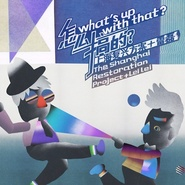

What's up with That?怎么搞的?
============================

|  |  |
| :--: | :-- |
| [ What's up with That?怎么搞的?](https://emumo.xiami.com/album/2100276266) | **艺人**: [The Shanghai Restoration Project](../index.md) **语种**: 国语 **唱片公司**: Undercover Culture Music **发行时间**: 2016年02月18日 **专辑类别**: 录音室专辑 **专辑风格**: 放克电子 Electro (Electro-Funk), 独立电子乐 Indietronica **播放数**: 340475 **收藏数**: 1434 **评论数**: 170  |

## 简介

广州 05月21号 乐府 《怎么搞的？》与雷磊 <a href="https://www.douban.com/event/26619388/" target="_blank" rel="nofollow noreferrer noopener">https://www.douban.com/event/26619388/</a>  

 

《What's up with That？》是电子音乐人Dave Liang（上海复兴方案）和视觉艺术家雷磊合作的多媒体艺术项目。他们用现场电子音乐演奏和视觉vj表演的方式，描绘孩子们与生俱来的好奇心，和天马行空的想像力。10首电子音乐的创作从雷磊孩童时期讲故事的磁带录音出发，在其基础上Dave进行了采样和编辑，并加入电子音乐的元素和当代城市生活的声音。视觉方面的动画创作，来自于雷磊对父亲80年代旧书《国际书籍装帧设计选》的再创作，用手工拼贴的方式制作了一系列充满了几何形体和抽象设计感的动画 。
 

 
 

 

## 曲目

## 评论

|  |  |  |  |
| :-- | :-- | :-- | :-- |
|  [虾米用户](https://emumo.xiami.com/u/311782792) ⭐️不爱我别听我歌单 2021-01-22 12:30 赞(0) 踩(0) | 
可可爱
 |
|  [虾米用户](https://emumo.xiami.com/u/406102286) 震源深度来自我心 2020-07-14 16:57 赞(0) 踩(0) | 
好听。有趣。
 |
|  [虾米用户](https://emumo.xiami.com/u/400715332) 留白 2020-02-08 00:09 赞(5) 踩(0) | 
·
 |
|  [虾米用户](https://emumo.xiami.com/u/9142282) 微博：FEVER_DOG... 2019-09-01 22:38 赞(0) 踩(0) | 
mmm
 |
|  [虾米用户](https://emumo.xiami.com/u/15270473) 听到喜欢的歌 身体不跟着... 2017-09-28 12:55 赞(0) 踩(0) | 
-
 |
|  [虾米用户](https://emumo.xiami.com/u/15270473) 听到喜欢的歌 身体不跟着... 2017-09-28 12:18 赞(0) 踩(0) | 
-
 |
|  [虾米用户](https://emumo.xiami.com/u/198266248) （，，） 2017-06-10 22:20 赞(1) 踩(0) | 
好可爱的专辑
 |
|  [虾米用户](https://emumo.xiami.com/u/32904849)  2017-04-14 03:13 赞(0) 踩(0) | 
一直很喜欢David Liang的作品啊
 |
|  [虾米用户](https://emumo.xiami.com/u/211616358) 若他日重逢，我将以何贺你... 2017-04-03 12:06 赞(0) 踩(0) | 
整张专辑红心系列。
 |
|  [虾米用户](https://emumo.xiami.com/u/16337726)  2016-11-20 16:41 赞(0) 踩(0) | 
)
 |
|  [虾米用户](https://emumo.xiami.com/u/6872757)   2016-11-06 22:26 赞(0) 踩(0) | 
妙啊
 |
|  [虾米用户](https://emumo.xiami.com/u/843367)  2016-08-31 01:17 赞(0) 踩(0) | 
四星。不难听，但总觉得缺乏记忆点和兴奋点。
 |
| ⇒ |  [虾米用户](https://emumo.xiami.com/u/231135605)  2017-10-30 09:53 赞(0) 踩(0) | 
其实就是喜欢这种慵懒的感觉..推荐大家听听大神为MEG制作的专辑
 |
|  [虾米用户](https://emumo.xiami.com/u/206328574)   2016-07-29 12:23 赞(0) 踩(0) | 
个性
 |
|  [虾米用户](https://emumo.xiami.com/u/7786009) 我还没想好要写什么... 2016-07-22 00:47 赞(0) 踩(0) | 
酷 雷磊
 |
|  [虾米用户](https://emumo.xiami.com/u/2977794) She's not go... 2016-06-16 03:04 赞(2) 踩(0) | 
雷磊这名字好熟，然后想起来是小老虎那一票的！
 |
|  [虾米用户](https://emumo.xiami.com/u/13634431)  2016-05-26 21:51 赞(0) 踩(0) | 
喜欢~
 |
|  [虾米用户](https://emumo.xiami.com/u/7779210) 。 2016-05-20 21:34 赞(1) 踩(0) | 
说好的独家呢，为什么网易也有 
 |
|  [虾米用户](https://emumo.xiami.com/u/13807108)   2016-05-15 22:02 赞(1) 踩(0) | 
今天去了现场听此砖才知道原来每首歌背后都有那么精（ji）彩（qing)的(de)故(duan)事(zi)～
 |
|  [虾米用户](https://emumo.xiami.com/u/48932192)   2016-05-01 16:36 赞(0) 踩(0) | 
哎哟喂
 |
|  [虾米用户](https://emumo.xiami.com/u/9294872)  2016-04-21 20:33 赞(0) 踩(0) | 
童趣
 |
|  [虾米用户](https://emumo.xiami.com/u/648415) 孤独终老 2016-04-20 21:43 赞(0) 踩(0) | 
噔儿~
 |
|  [虾米用户](https://emumo.xiami.com/u/30617820) 窝列大窝列大哟 2016-04-16 20:54 赞(0) 踩(0) | 
＝＝
 |
|  [虾米用户](https://emumo.xiami.com/u/2482997) 愤青 2016-04-07 21:41 赞(5) 踩(0) | 
内容已删除
 |
| ⇒ |  [虾米用户](https://emumo.xiami.com/u/9294872)  2016-04-21 20:35 赞(0) 踩(0) | 
呵呵，共鸣
 |
|  [虾米用户](https://emumo.xiami.com/u/342217) 其实我一点都不开心  2016-04-06 00:30 赞(0) 踩(0) | 
所以什麼時候來現場演出呢？
 |
|  [虾米用户](https://emumo.xiami.com/u/15345250) 一和声，一世界 2016-03-29 18:43 赞(1) 踩(0) | 
所以说是多媒体艺术项目啊，必须要现场听的！他们五月份要来上海！！！！到时候走起去看啦！！！
 |
| ⇒ |  [虾米用户](https://emumo.xiami.com/u/31355651) 我还没想好要写什么... 2016-04-05 11:13 赞(0) 踩(0) | 
有官方消息吗？
 |
|  [虾米用户](https://emumo.xiami.com/u/7690662) 一别两宽 个生欢喜 2016-03-29 16:42 赞(0) 踩(0) | 
我喜欢
 |
|  [虾米用户](https://emumo.xiami.com/u/11527119) 第二生命 2016-03-25 18:53 赞(0) 踩(0) | 
越听越像鬼畜……………………
 |
| ⇒ |  [虾米用户](https://emumo.xiami.com/u/43982464) 哒优 2016-07-26 11:32 赞(0) 踩(0) | 
混音和鬼畜的区别其实不大
 |
|  [虾米用户](https://emumo.xiami.com/u/5995638) 暂无签名~ 2016-03-20 16:50 赞(0) 踩(0) | 
哈哈哈哈哈哈哈哈哈哈哈哈哈哈哈哈哈哈哈哈哈哈~~~~好玩~
 |
|  [虾米用户](https://emumo.xiami.com/u/2910122) jiangpu 2016-03-14 17:10 赞(0) 踩(0) | 
现转再听
 |
|  [虾米用户](https://emumo.xiami.com/u/478527) 好想跟衣服在洗衣机里滚 2016-03-14 17:00 赞(1) 踩(0) | 
这张真是玩心好重
 |
|  [虾米用户](https://emumo.xiami.com/u/478527) 好想跟衣服在洗衣机里滚 2016-03-14 17:00 赞(0) 踩(0) | 
这张真是玩心好重
 |
|  [虾米用户](https://emumo.xiami.com/u/33310780) ！ 2016-03-08 20:39 赞(0) 踩(0) | 
!!
 |
|  [虾米用户](https://emumo.xiami.com/u/141580) 喜欢new age,世界... 2016-03-04 02:46 赞(1) 踩(0) | 
偏向实验音乐一点
 |
|  [虾米用户](https://emumo.xiami.com/u/1363126)   2016-03-03 17:49 赞(0) 踩(0) | 
越听越停不下来 晚五点后起效果
 |
|  [虾米用户](https://emumo.xiami.com/u/1246820)  2016-03-01 17:37 赞(1) 踩(0) | 
牛炸~
 |
|  [虾米用户](https://emumo.xiami.com/u/39900361) (=ﾟωﾟ)ﾉ 2016-02-28 22:55 赞(0) 踩(0) | 
哈哈哈哈
 |
|  [虾米用户](https://emumo.xiami.com/u/56388418) 一个人 能有多付面孔  2016-02-28 20:30 赞(0) 踩(0) | 
做铃声
 |
|  [虾米用户](https://emumo.xiami.com/u/6372750)  2016-02-28 20:10 赞(1) 踩(0) | 
第一首好可耐
 |
|  [虾米用户](https://emumo.xiami.com/u/8583712) 上传反动、色情等照片将导... 2016-02-27 22:48 赞(0) 踩(0) | 
赞
 |
|  [虾米用户](https://emumo.xiami.com/u/118127408)  2016-02-27 16:58 赞(0) 踩(0) | 
中西合璧，中国的，也是世界的！
 |
|  [虾米用户](https://emumo.xiami.com/u/15286935) XxX 2016-02-27 16:26 赞(1) 踩(0) | 
这张 好有爱~
 |
|  [虾米用户](https://emumo.xiami.com/u/15286935) XxX 2016-02-27 16:16 赞(0) 踩(0) | 
~
 |
|  [虾米用户](https://emumo.xiami.com/u/46102833)   2016-02-27 14:57 赞(1) 踩(0) | 
好tm喜欢怎么办！
 |
|  [虾米用户](https://emumo.xiami.com/u/760961)  2016-02-27 11:51 赞(1) 踩(0) | 
哎哟喂激萌；）
 |
|  [虾米用户](https://emumo.xiami.com/u/18192557) sourire : ) 2016-02-26 20:26 赞(0) 踩(0) | 
好萌
 |
|  [虾米用户](https://emumo.xiami.com/u/464312) Heyoo, 2016-02-26 17:33 赞(0) 踩(0) | 
轻松
 |
|  [虾米用户](https://emumo.xiami.com/u/34696573) 您好 很高兴认识了你 2016-02-25 04:54 赞(0) 踩(0) | 
嘿！！！
 |
|  [虾米用户](https://emumo.xiami.com/u/36471014) oi to the wo... 2016-02-24 22:13 赞(0) 踩(0) | 
这首歌曲风原来好像你 这不正是我们睡过的证据吗
 |
|  [虾米用户](https://emumo.xiami.com/u/17806314) 以梦为马 以己为光 2016-02-24 17:27 赞(0) 踩(0) | 
_(:з」∠)_
 |
|  [虾米用户](https://emumo.xiami.com/u/5698983) 再也不愿想起不完美的旋律 2016-02-24 16:08 赞(0) 踩(0) | 
hhh好玩
 |
|  [虾米用户](https://emumo.xiami.com/u/4897627)   2016-02-23 00:42 赞(0) 踩(0) | 
看了评论略忐忑啊哈哈
 |
|  [虾米用户](https://emumo.xiami.com/u/35410089) 一朵花 2016-02-22 15:27 赞(0) 踩(0) | 
好几首各片段都有很熟悉的感觉 但是合在一起听得为什么这么想打人？
 |
|  [虾米用户](https://emumo.xiami.com/u/8202675)  2016-02-22 14:25 赞(1) 踩(0) | 
啊哟喂
 |
|  [虾米用户](https://emumo.xiami.com/u/54848238) i hope this ... 2016-02-22 10:56 赞(1) 踩(0) | 
大卫梁又童心泛滥了
 |
|  [虾米用户](https://emumo.xiami.com/u/54848238) i hope this ... 2016-02-22 10:56 赞(1) 踩(0) | 
大卫梁又童心泛滥了
 |
|  [虾米用户](https://emumo.xiami.com/u/17720845)   2016-02-22 08:16 赞(0) 踩(0) | 
哈哈哈 做朋友吧！
 |
|  [虾米用户](https://emumo.xiami.com/u/32448108)  2016-02-21 16:26 赞(0) 踩(0) | 
捧场！
 |
|  [虾米用户](https://emumo.xiami.com/u/46990699)   2016-02-21 11:48 赞(0) 踩(0) | 
来听新砖
 |
|  [虾米用户](https://emumo.xiami.com/u/35097468) 屋里起火了，我赶紧抱起孩... 2016-02-21 09:39 赞(0) 踩(0) | 
.，.
 |
|  [虾米用户](https://emumo.xiami.com/u/7985814)  2016-02-20 18:26 赞(0) 踩(0) | 

 |
|  [虾米用户](https://emumo.xiami.com/u/278702) 我爱音乐 2016-02-20 17:36 赞(0) 踩(0) | 
是最后一首有点感觉。
 |
|  [虾米用户](https://emumo.xiami.com/u/2215777) ❢ 2016-02-20 15:07 赞(0) 踩(0) | 
最后一首好可爱好可爱好可爱~~~
 |
|  [虾米用户](https://emumo.xiami.com/u/52716530) 平安喜乐 2016-02-19 23:59 赞(0) 踩(0) | 
我全部都喜欢！！！
 |
|  [虾米用户](https://emumo.xiami.com/u/1331382) 点击编辑 2016-02-19 22:03 赞(0) 踩(0) | 
6666666666666666
 |
|  [虾米用户](https://emumo.xiami.com/u/2476501) 爱车爱音乐，快乐的生活！ 2016-02-19 21:40 赞(0) 踩(0) | 
~
 |
|  [虾米用户](https://emumo.xiami.com/u/42499011)   2016-02-19 21:31 赞(1) 踩(0) | 
虾米我要向你表白！！！啊啊啊啊超喜欢tag collection这首，春节在云村各种求都没人发，梦里寻他千百度蓦然回首那人却在灯火阑珊处！
 |
|  [虾米用户](https://emumo.xiami.com/u/4343869) 在虾米也是你官方女友 2016-02-19 20:21 赞(0) 踩(0) | 
3005
 |
|  [虾米用户](https://emumo.xiami.com/u/5667996) 我还没想好要写什么... 2016-02-19 16:36 赞(2) 踩(0) | 
诶呦，听得好想搞你呦~~(づ￣ 3￣)づ❤❤❤
 |
|  [虾米用户](https://emumo.xiami.com/u/6396294) 我还没想好要写什么... 2016-02-19 16:28 赞(0) 踩(0) | 
funny
 |
|  [虾米用户](https://emumo.xiami.com/u/115508176)  2016-02-19 16:01 赞(0) 踩(0) | 
很可爱，是种全新的音乐类型，感觉很好玩，挺一下！
 |
|  [虾米用户](https://emumo.xiami.com/u/115508176)  2016-02-19 16:01 赞(0) 踩(0) | 
很可爱，是种全新的音乐类型，感觉很好玩，挺一下！
 |
|  [虾米用户](https://emumo.xiami.com/u/42661055) ✨ 2016-02-19 15:16 赞(0) 踩(0) | 
❁
 |
|  [虾米用户](https://emumo.xiami.com/u/37439769) 我还没想好要写什么... 2016-02-19 14:38 赞(0) 踩(0) | 
棒！
 |
|  [虾米用户](https://emumo.xiami.com/u/37439769) 我还没想好要写什么... 2016-02-19 14:37 赞(0) 踩(0) | 
棒！
 |
|  [虾米用户](https://emumo.xiami.com/u/43982464) 哒优 2016-02-19 09:18 赞(1) 踩(0) | 
有生之年系列～赶紧下啊 
 |
|  [虾米用户](https://emumo.xiami.com/u/2928117) 你好 2016-02-19 01:59 赞(12) 踩(0) | 
整张专辑听着还算愉快。说说我初听的感受，不知多听几遍感受会怎样。这张专辑的编曲我觉得还不如《Chinese Children&amp;#039;s Songs》，旋律的辨识度和好听度也不如上海复兴方案系列。《Ayo WAY》有新意，也很鬼马。希望梁先生回祖国巡演，加上视觉画面，一定很棒。
 |
|  [虾米用户](https://emumo.xiami.com/u/54775385)  2016-02-19 01:44 赞(1) 踩(0) | 
巨萌第一首！！！
 |
|  [虾米用户](https://emumo.xiami.com/u/719995) 事出有音 2016-02-19 00:05 赞(0) 踩(0) | 
如果要切合童心这个主题，恐怕风格上不大好太标新立异吧，没有惊喜当然很正常
 |
|  [虾米用户](https://emumo.xiami.com/u/10811234) Love Mucic 2016-02-18 23:54 赞(0) 踩(0) | 
非常普通 没有之前首专的惊喜 编曲略品 高产但质量下降的很快 3 6
 |
|  [虾米用户](https://emumo.xiami.com/u/6015418) 如今，听什么广播，都不痛... 2016-02-18 23:22 赞(0) 踩(0) | 
大师终于出手了
 |
|  [虾米用户](https://emumo.xiami.com/u/3642153)  2016-02-18 22:57 赞(0) 踩(0) | 
除了最后一曲，其他略有失望
 |
|  [虾米用户](https://emumo.xiami.com/u/47272170)  2016-02-18 22:57 赞(0) 踩(0) | 
除了第一首 都平平
 |
|  [虾米用户](https://emumo.xiami.com/u/26374467)  2016-02-18 22:41 赞(0) 踩(0) | 
最喜欢的乐队！
 |
|  [虾米用户](https://emumo.xiami.com/u/11227870)  2016-02-18 22:41 赞(0) 踩(0) | 
最爱
 |
|  [虾米用户](https://emumo.xiami.com/u/2725178) ╮(╯▽╰)╭ 2016-02-18 22:30 赞(0) 踩(0) | 
玩得了浓墨重彩又玩得了小清新还有自己的风格
 |
|  [虾米用户](https://emumo.xiami.com/u/1147955)   2016-02-18 21:22 赞(0) 踩(0) | 
是...大椰子的那个雷？
 |
| ⇒ |  [虾米用户](https://emumo.xiami.com/u/2780922) 电池胶囊 2016-02-19 01:15 赞(0) 踩(0) | 
是啊
 |
|  [虾米用户](https://emumo.xiami.com/u/18210561) 何以解忧，唯有暴富 2016-02-18 20:43 赞(0) 踩(0) | 
3
 |
|  [虾米用户](https://emumo.xiami.com/u/2928117) 你好 2016-02-18 19:53 赞(18) 踩(0) | 
我说这张专辑听了没惊喜 会被打吗
 |
| ⇒ |  [虾米用户](https://emumo.xiami.com/u/48375492) 我很聪明，关于你什么都没... 2016-02-18 20:01 赞(0) 踩(0) | 
不会
 |
| ⇒ |  [虾米用户](https://emumo.xiami.com/u/1130904)  2016-02-18 23:23 赞(0) 踩(0) | 
不喜欢就不喜欢呗，在意别人看法干啥
 |
| ⇒ |  [虾米用户](https://emumo.xiami.com/u/52716530) 平安喜乐 2016-02-19 23:58 赞(0) 踩(0) | 
会！！
 |
|  [虾米用户](https://emumo.xiami.com/u/19305910) 考哥么么哒~ 2016-02-18 19:22 赞(0) 踩(0) | 
来晚了 
 |
|  [虾米用户](https://emumo.xiami.com/u/1324013) 转眼就是十年了 2016-02-18 18:50 赞(0) 踩(0) | 
迟到了
 |
|  [虾米用户](https://emumo.xiami.com/u/855191)  2016-02-18 17:52 赞(27) 踩(0) | 
好基友的专辑~ 加油~
 |
| ⇒ |  [虾米用户](https://emumo.xiami.com/u/93517134)  2016-02-19 01:02 赞(0) 踩(0) | 
我也喜欢你哦～
 |
| ⇒ |  [虾米用户](https://emumo.xiami.com/u/3732926)  2016-04-12 16:07 赞(0) 踩(0) | 
你的好基友是Dave Liang 还是雷磊
 |
| ⇒ |  [虾米用户](https://emumo.xiami.com/u/3815293) baby Jesus s... 2016-04-20 15:53 赞(0) 踩(0) | 
daveliang和雷磊哪个是好基友呀 _(:з」∠)_
 |
| ⇒ |  [虾米用户](https://emumo.xiami.com/u/3815293) baby Jesus s... 2016-04-20 16:00 赞(0) 踩(0) | 
<q><b>何小事儿说：</b></q>
 |
| ⇒ |  [虾米用户](https://emumo.xiami.com/u/855191)  2016-04-20 17:38 赞(0) 踩(0) | 
<q><b>Null说：</b></q>
 |
|  [虾米用户](https://emumo.xiami.com/u/11421497) dont act lik... 2016-02-18 17:40 赞(0) 踩(0) | 
啊啊啊啊啊
 |
|  [虾米用户](https://emumo.xiami.com/u/44423620)   2016-02-18 17:33 赞(0) 踩(0) | 
八错
 |
|  [虾米用户](https://emumo.xiami.com/u/25017703)   2016-02-18 17:29 赞(0) 踩(0) | 
！！
 |
|  [虾米用户](https://emumo.xiami.com/u/1130904)  2016-02-18 17:17 赞(0) 踩(0) | 
新砖再来上海巡演吧~~~上次错过了
 |
|  [虾米用户](https://emumo.xiami.com/u/8854264) Hypocrite. 2016-02-18 16:47 赞(1) 踩(0) | 
Dave每次都能在建立自己特色的基础上把主题拿捏得很好 可见功力
 |
|  [虾米用户](https://emumo.xiami.com/u/3815293) baby Jesus s... 2016-02-18 16:05 赞(0) 踩(0) | 
Restoration continues  
 |
|  [虾米用户](https://emumo.xiami.com/u/15134494) 我只是爱音乐 2016-02-18 15:52 赞(0) 踩(0) | 
cool
 |
|  [虾米用户](https://emumo.xiami.com/u/3911677) 荡漾人儿 2016-02-18 15:24 赞(0) 踩(0) | 
nice~
 |
|  [虾米用户](https://emumo.xiami.com/u/2724698) 我还没想好要写什么... 2016-02-18 15:19 赞(0) 踩(0) | 
棒 flashbulb
 |
|  [虾米用户](https://emumo.xiami.com/u/762113) 我还没想好要写什么... 2016-02-18 15:14 赞(1) 踩(0) | 
哈哈哈 雷老师又来讲童话故事了吗
 |
|  [虾米用户](https://emumo.xiami.com/u/7380494) 音律者，波动也 2016-02-18 15:12 赞(4) 踩(0) | 
Ayo Way→ Ah Your Way
 |
|  [虾米用户](https://emumo.xiami.com/u/669738) 是我啊 2016-02-18 14:36 赞(0) 踩(0) | 
可以的
 |
|  [虾米用户](https://emumo.xiami.com/u/439976) 我是个酒鬼，我无话可说 2016-02-18 14:22 赞(0) 踩(0) | 
上海复兴方案 的出的专辑真的风格太鲜明了，一听就知道是他们的。
 |
|  [虾米用户](https://emumo.xiami.com/u/1738117)  2016-02-18 14:09 赞(0) 踩(0) | 
停不下来
 |
|  [虾米用户](https://emumo.xiami.com/u/1738117)  2016-02-18 14:09 赞(0) 踩(0) | 
停不下来
 |
|  [虾米用户](https://emumo.xiami.com/u/33412842) 风虽大，都绕过我灵魂 2016-02-18 13:56 赞(0) 踩(0) | 
噫
 |
|  [虾米用户](https://emumo.xiami.com/u/11017913) 爵士呆瓜 WeiBo:是... 2016-02-18 13:49 赞(0) 踩(0) | 
永远保持童心,永远保持纯真
 |
|  [虾米用户](https://emumo.xiami.com/u/11017913) 爵士呆瓜 WeiBo:是... 2016-02-18 13:48 赞(0) 踩(0) | 
永远保持童心,永远保持纯真
 |
|  [虾米用户](https://emumo.xiami.com/u/11017913) 爵士呆瓜 WeiBo:是... 2016-02-18 13:48 赞(0) 踩(0) | 
永远保持童心，永远保持纯真
 |
|  [虾米用户](https://emumo.xiami.com/u/49934446) SINA WEIBO:@... 2016-02-18 13:44 赞(0) 踩(0) | 
好
 |
|  [虾米用户](https://emumo.xiami.com/u/11017913) 爵士呆瓜 WeiBo:是... 2016-02-18 13:38 赞(0) 踩(0) | 
[带墨镜笑]cooooooool
 |
|  [虾米用户](https://emumo.xiami.com/u/3223758) 不惜歌者苦,但伤知音稀。 2016-02-18 13:37 赞(0) 踩(0) | 
耶
 |
|  [虾米用户](https://emumo.xiami.com/u/45206163)  2016-02-18 13:24 赞(0) 踩(0) | 
！
 |
|  [虾米用户](https://emumo.xiami.com/u/45621221) 卸载状态。 2016-02-18 13:14 赞(0) 踩(0) | 
依然很清新。
 |
|  [虾米用户](https://emumo.xiami.com/u/1954665)  2016-02-18 12:58 赞(0) 踩(0) | 
出新了！！！大发！！！
 |
|  [虾米用户](https://emumo.xiami.com/u/6361118) 黑洞無始終，音樂無疆界 2016-02-18 12:56 赞(0) 踩(0) | 
一张充满了玩心童趣的创意专辑。
 |
|  [虾米用户](https://emumo.xiami.com/u/3716752)  2016-02-18 12:47 赞(0) 踩(0) | 
David 么么哒
 |
|  [虾米用户](https://emumo.xiami.com/u/4372646) 可爱又迷人的正派角色IG... 2016-02-18 12:37 赞(0) 踩(0) | 
#
 |
|  [虾米用户](https://emumo.xiami.com/u/7210136) 我还没想好要写什么... 2016-02-18 12:28 赞(0) 踩(0) | 
哈哈哈哈哈哈封面 想到了微博上的照片
 |
|  [虾米用户](https://emumo.xiami.com/u/937330) 麻木幼稚虚伪无聊任性冲动 2016-02-18 12:26 赞(0) 踩(0) | 
好评如潮
 |
|  [虾米用户](https://emumo.xiami.com/u/17719900) 请把我的歌带回你的家 2016-02-18 12:20 赞(0) 踩(0) | 
新作品吗
 |
|  [虾米用户](https://emumo.xiami.com/u/7829793) Whisper_chac... 2016-02-18 12:15 赞(0) 踩(0) | 
-
 |
|  [虾米用户](https://emumo.xiami.com/u/7807195) 现在好像啥都听了 2016-02-18 12:14 赞(0) 踩(0) | 
、
 |
|  [虾米用户](https://emumo.xiami.com/u/1828555) Omnivore 2016-02-18 12:11 赞(0) 踩(0) | 
睡了一觉竟然有新
 |
|  [虾米用户](https://emumo.xiami.com/u/10813478) 黑白分明该杀就杀 2016-02-18 12:11 赞(0) 踩(0) | 
独家~
 |
|  [虾米用户](https://emumo.xiami.com/u/48993222)  2016-02-18 12:10 赞(0) 踩(0) | 
哦。
 |
|  [虾米用户](https://emumo.xiami.com/u/2928117) 你好 2016-02-18 12:08 赞(0) 踩(0) | 
巡演！
 |
|  [虾米用户](https://emumo.xiami.com/u/13450787) 自作自受 2016-02-18 12:07 赞(0) 踩(0) | 
！
 |
|  [虾米用户](https://emumo.xiami.com/u/719995) 事出有音 2016-02-18 12:01 赞(0) 踩(0) | 
我去，这张纯粹好多！赞一个！强烈推荐最后一首，采样与乐曲融合得太完美了！
 |
|  [虾米用户](https://emumo.xiami.com/u/8244559)  2016-02-18 11:58 赞(0) 踩(0) | 
******
 |
|  [虾米用户](https://emumo.xiami.com/u/11662974) All for you 2016-02-18 11:52 赞(1) 踩(0) | 
想到我小时候和妈妈一起做的的录音磁带 满满回忆 找出来现在连个播放工具都没得 
 |
|  [虾米用户](https://emumo.xiami.com/u/7949094) 信仰崩塌的后集权时代。 2016-02-18 11:48 赞(0) 踩(0) | 
啊虾米终于上线了！完全可以弄成付费的啊！
 |
|  [虾米用户](https://emumo.xiami.com/u/34936363) 零. 2016-02-18 11:45 赞(0) 踩(0) | 
收
 |
|  [虾米用户](https://emumo.xiami.com/u/39802823) 难以表述的杂偏好 2016-02-18 11:40 赞(0) 踩(0) | 
赞 
 |
|  [虾米用户](https://emumo.xiami.com/u/1320669) ツ 2016-02-18 11:39 赞(0) 踩(0) | 
0.0
 |
|  [虾米用户](https://emumo.xiami.com/u/1219240)  2016-02-18 11:38 赞(0) 踩(0) | 
(ง •̀_•́)ง(ง •̀_•́)ง(ง •̀_•́)ง
 |
|  [虾米用户](https://emumo.xiami.com/u/33761986)   2016-02-18 11:35 赞(0) 踩(0) | 
…
 |
|  [虾米用户](https://emumo.xiami.com/u/641336) 那些由來已久的問題，從來... 2016-02-18 11:33 赞(0) 踩(0) | 
！！！
 |
|  [虾米用户](https://emumo.xiami.com/u/37724775) Be more. 2016-02-18 11:30 赞(0) 踩(0) | 
yeeeaaaahhhhh！！！
 |
|  [虾米用户](https://emumo.xiami.com/u/22661890)   2016-02-18 11:27 赞(0) 踩(0) | 
等到的不容易
 |
|  [虾米用户](https://emumo.xiami.com/u/15981815) 大卫清心 2016-02-18 11:27 赞(0) 踩(0) | 
：
 |
|  [虾米用户](https://emumo.xiami.com/u/651380) No way out 2016-02-18 11:25 赞(0) 踩(0) | 
啊啊啊
 |
|  [虾米用户](https://emumo.xiami.com/u/9014716) 未来再见！ 2016-02-18 11:23 赞(0) 踩(0) | 
精灵
 |
|  [虾米用户](https://emumo.xiami.com/u/1065560) ‮‮ 2016-02-18 11:22 赞(0) 踩(0) | 
前排
 |
|  [虾米用户](https://emumo.xiami.com/u/9144182) 京阿尼挺住！！！冲鸭！！... 2016-02-18 11:20 赞(0) 踩(0) | 
15年1月的那张专没发布啊
 |
|  [虾米用户](https://emumo.xiami.com/u/245067) 我还没想好要写什么... 2016-02-18 11:15 赞(0) 踩(0) | 
猴塞雷   
 |
|  [虾米用户](https://emumo.xiami.com/u/8539366) 我们在网易云音乐相见，网... 2016-02-18 11:12 赞(0) 踩(0) | 
完美i
 |
|  [虾米用户](https://emumo.xiami.com/u/1988060) Electrow 2016-02-18 11:11 赞(0) 踩(0) | 
iii
 |
|  [虾米用户](https://emumo.xiami.com/u/2928117) 你好 2016-02-18 11:06 赞(0) 踩(0) | 
梁先生的中国心
 |
|  [虾米用户](https://emumo.xiami.com/u/28923588) 空 2016-02-18 10:57 赞(0) 踩(0) | 
终于发了！！！
 |
|  [虾米用户](https://emumo.xiami.com/u/17330125) 想象音乐的另一种可能 2016-02-18 10:51 赞(0) 踩(0) | 
666666666
 |
|  [虾米用户](https://emumo.xiami.com/u/7555992) 我还没想好要写什么... 2016-02-18 10:46 赞(0) 踩(0) | 
☂
 |
|  [虾米用户](https://emumo.xiami.com/u/2085092) 属于自己的地方 2016-02-18 10:35 赞(0) 踩(0) | 
我是真爱！！！
 |
| ⇒ |  [虾米用户](https://emumo.xiami.com/u/30992051) a o e 2016-02-20 01:39 赞(0) 踩(0) | 
看出来了
 |
|  [虾米用户](https://emumo.xiami.com/u/652547)  2016-02-18 10:30 赞(0) 踩(0) | 
来赏
 |
|  [虾米用户](https://emumo.xiami.com/u/14304) 不安是心理扭曲的激化 2016-02-18 10:06 赞(0) 踩(0) | 
卡哇伊呢
 |
|  [虾米用户](https://emumo.xiami.com/u/6083094)  2016-02-17 17:14 赞(0) 踩(0) | 
占座！
 |
