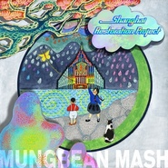

Mungbean Mash - Single
============================

|  |  |
| :--: | :-- |
| [ Mungbean Mash - Single](https://emumo.xiami.com/album/2100293086) | **艺人**: [The Shanghai Restoration Project](../index.md) **语种**: 其他 **唱片公司**: 独立发行 **发行时间**: 2015年01月13日 **专辑类别**: EP, 单曲 **专辑风格**: 电音流行 Electropop **播放数**: 2829193 **收藏数**: 1205 **评论数**: 92  |

## 简介

Music by Dave Liang
 

Vocals by 张乐
 

Artwork by 孙云帆

## 曲目

## 评论

|  |  |  |
| :-- | :-- | :-- |
|  [虾米用户](https://emumo.xiami.com/u/8364854) 我还没想好要写什么... 2020-12-27 00:04 赞(0) 踩(0) | 
找不到《一席》里面的钢琴版，失望。。。
 |
|  [虾米用户](https://emumo.xiami.com/u/34309178)   2020-12-12 18:25 赞(0) 踩(0) | 
fiao搞了好wa.
 |
|  [虾米用户](https://emumo.xiami.com/u/443131642)  2020-09-09 00:46 赞(0) 踩(0) | 
覅搞了好伐~
 |
|  [虾米用户](https://emumo.xiami.com/u/433401305) 不美丽就是我的美丽 2020-07-17 12:54 赞(0) 踩(0) | 
真好真好 我喜欢上海话
 |
|  [虾米用户](https://emumo.xiami.com/u/50625743) SO ROSÉ SO C... 2019-12-10 00:38 赞(0) 踩(0) | 
很有意思
 |
|  [虾米用户](https://emumo.xiami.com/u/357653657)  2019-06-12 18:25 赞(0) 踩(0) | 
第一次觉得上海话好听 
 |
|  [虾米用户](https://emumo.xiami.com/u/49796964) 我还没想好要写什么... 2019-06-01 10:01 赞(0) 踩(0) | 
非常棒，记录和保护了吴侬软语的文化，对我来说有点百听不厌
 |
|  [虾米用户](https://emumo.xiami.com/u/373225253)  2019-05-19 11:08 赞(0) 踩(0) | 
갠찬네
 |
|  [虾米用户](https://emumo.xiami.com/u/600368) 群众的眼睛是雪亮的=喷子 2019-05-11 19:01 赞(0) 踩(0) | 
有趣
 |
|  [虾米用户](https://emumo.xiami.com/u/276944698) 不要自我设限..... 2019-05-07 09:23 赞(1) 踩(0) | 
♒️
 |
|  [虾米用户](https://emumo.xiami.com/u/293667133)  2019-05-06 23:42 赞(0) 踩(0) | 
有意思
 |
|  [虾米用户](https://emumo.xiami.com/u/113525962) 谁能知道哪首音乐何时成为... 2019-04-22 19:38 赞(0) 踩(0) | 
好听
 |
|  [虾米用户](https://emumo.xiami.com/u/403057815) 一块骄傲的用于娱乐的苹果... 2019-04-09 06:29 赞(0) 踩(0) | 

 |
|  [虾米用户](https://emumo.xiami.com/u/104360892)   2019-04-07 00:15 赞(0) 踩(0) | 
大开耳界
 |
|  [虾米用户](https://emumo.xiami.com/u/7916742) 我还没想好要写什么... 2019-04-03 18:30 赞(0) 踩(0) | 
24路电车大弯乐
 |
|  [虾米用户](https://emumo.xiami.com/u/12318660) 与音符共振 2019-03-29 02:10 赞(0) 踩(0) | 
有味道
 |
|  [虾米用户](https://emumo.xiami.com/u/364457895)  2019-03-27 13:38 赞(1) 踩(0) | 
桑嘿米道伐哟塔农额
 |
| ⇒ |  [虾米用户](https://emumo.xiami.com/u/348723545) 点击编辑 2019-05-22 13:48 赞(0) 踩(0) | 
太浓啦！
 |
|  [虾米用户](https://emumo.xiami.com/u/34047674) 我还没想好要写什么... 2019-03-22 23:54 赞(0) 踩(0) | 
很绝！
 |
|  [虾米用户](https://emumo.xiami.com/u/19724958) 活下只为一首主题曲 2019-03-19 23:43 赞(0) 踩(0) | 
听就对了
 |
|  [虾米用户](https://emumo.xiami.com/u/409142672)  2019-03-17 23:24 赞(0) 踩(0) | 
很有味道
 |
|  [虾米用户](https://emumo.xiami.com/u/409773852)  2019-03-16 19:12 赞(0) 踩(0) | 
非常好听
 |
|  [虾米用户](https://emumo.xiami.com/u/400703323)  2019-03-12 13:12 赞(0) 踩(0) | 
Geil!
 |
|  [虾米用户](https://emumo.xiami.com/u/200069844) 无她唯手熟尔 2019-03-11 07:38 赞(0) 踩(0) | 
嗲
 |
|  [虾米用户](https://emumo.xiami.com/u/30726993)  2019-03-08 00:50 赞(0) 踩(0) | 
很棒的音乐
 |
|  [虾米用户](https://emumo.xiami.com/u/9545724) 我还没想好要写什么... 2019-03-05 05:35 赞(0) 踩(0) | 
下雨走在路上突然就想起了上海话这句“落雨了” 简单好听的曲子
 |
|  [虾米用户](https://emumo.xiami.com/u/4970504)  2019-02-27 20:59 赞(0) 踩(0) | 
很新颖
 |
|  [虾米用户](https://emumo.xiami.com/u/356962079)  2019-02-23 19:36 赞(0) 踩(0) | 

 |
|  [虾米用户](https://emumo.xiami.com/u/409491092)  2019-02-23 05:32 赞(0) 踩(0) | 
Good
 |
|  [虾米用户](https://emumo.xiami.com/u/409226121) 忍一时得寸进尺，退一步变... 2019-02-19 08:15 赞(0) 踩(0) | 
Swing,Jazz等本来就是我的至爱！中文的更要支持了！
 |
|  [虾米用户](https://emumo.xiami.com/u/286716063) 我还没想好要写什么... 2019-02-10 23:59 赞(0) 踩(0) | 
very good
 |
|  [虾米用户](https://emumo.xiami.com/u/25128230) 東  京  急  行  ... 2019-02-09 22:55 赞(0) 踩(0) | 
好！
 |
|  [虾米用户](https://emumo.xiami.com/u/7747246)  2019-02-09 21:27 赞(0) 踩(0) | 
都下载了
 |
|  [虾米用户](https://emumo.xiami.com/u/42238774) 笑一笑 十年少 2019-02-05 21:55 赞(0) 踩(0) | 
百听不腻
 |
|  [虾米用户](https://emumo.xiami.com/u/14310827) 我已经接受没有情绪的自己... 2019-02-01 08:00 赞(1) 踩(0) | 
喜欢这种小资情调～
 |
|  [虾米用户](https://emumo.xiami.com/u/4262815) 我还没想好要写什么... 2019-01-16 13:07 赞(1) 踩(0) | 
老好白相啦
 |
|  [虾米用户](https://emumo.xiami.com/u/47357376)  2019-01-07 20:47 赞(0) 踩(0) | 
******
 |
|  [虾米用户](https://emumo.xiami.com/u/1486619) 我也不想这样 2018-04-26 21:24 赞(0) 踩(0) | 
有一段旋律很像恋爱约会究竟是什么
 |
|  [虾米用户](https://emumo.xiami.com/u/104765694) 假朋克 2018-03-01 02:05 赞(0) 踩(0) | 
文本歌词很np
 |
|  [虾米用户](https://emumo.xiami.com/u/276665724)  2017-12-16 14:05 赞(0) 踩(0) | 
张乐的声音真好听
 |
|  [虾米用户](https://emumo.xiami.com/u/85165792) COMING 2017-11-25 16:04 赞(0) 踩(0) | 
.
 |
|  [虾米用户](https://emumo.xiami.com/u/118969422) 我还没想好要写什么... 2017-09-08 17:04 赞(1) 踩(0) | 
上海话真好听
 |
|  [虾米用户](https://emumo.xiami.com/u/278796109)  2017-09-03 09:34 赞(0) 踩(0) | 
非常有趣
 |
|  [虾米用户](https://emumo.xiami.com/u/279129162)  2017-07-23 19:29 赞(0) 踩(0) | 
怎样下载手机铃声
 |
|  [虾米用户](https://emumo.xiami.com/u/28134340) 个性签名 2017-07-17 23:32 赞(1) 踩(0) | 
哈欢喜
 |
|  [虾米用户](https://emumo.xiami.com/u/87208478) 大风起，尘埃落 2016-11-22 23:21 赞(1) 踩(0) | 
老欢喜了
 |
|  [虾米用户](https://emumo.xiami.com/u/206328574)   2016-07-29 12:30 赞(0) 踩(0) | 
喜欢的
 |
|  [虾米用户](https://emumo.xiami.com/u/14513981)   2016-05-09 19:36 赞(0) 踩(0) | 
太喜欢了
 |
|  [虾米用户](https://emumo.xiami.com/u/61279050) ᴛʜᴇ ʙᴇsᴛ ᴏʀ ... 2016-05-07 23:11 赞(0) 踩(0) | 
可以可以
 |
|  [虾米用户](https://emumo.xiami.com/u/30617820) 窝列大窝列大哟 2016-04-16 20:53 赞(0) 踩(0) | 
＝＝
 |
|  [虾米用户](https://emumo.xiami.com/u/3367267)   2016-04-13 11:13 赞(1) 踩(0) | 
413真是个好日子！
 |
|  [虾米用户](https://emumo.xiami.com/u/7740898) 有音乐就不会有世界末日 2016-03-26 15:01 赞(1) 踩(0) | 
上海味道很浓的一块砖
 |
|  [虾米用户](https://emumo.xiami.com/u/7740898) 有音乐就不会有世界末日 2016-03-26 15:01 赞(0) 踩(0) | 
NCIE，虽然我是北方人。
 |
| ⇒ |  [虾米用户](https://emumo.xiami.com/u/192652444) 游走于梦与现实之间 2018-06-27 13:45 赞(0) 踩(0) | 
nice吧
 |
|  [虾米用户](https://emumo.xiami.com/u/11527119) 第二生命 2016-03-21 13:36 赞(0) 踩(0) | 
好棒啊
 |
|  [虾米用户](https://emumo.xiami.com/u/5995638) 暂无签名~ 2016-03-20 16:09 赞(1) 踩(0) | 
hahahahah!好听棒极了
 |
|  [虾米用户](https://emumo.xiami.com/u/5995638) 暂无签名~ 2016-03-20 16:09 赞(0) 踩(0) | 
hahahahah!好听棒极了
 |
|  [虾米用户](https://emumo.xiami.com/u/4990704) 音乐永不停息。 2016-03-19 17:42 赞(0) 踩(0) | 
翻译呢。。
 |
|  [虾米用户](https://emumo.xiami.com/u/6265746) 嗜睡患者 2016-03-18 22:48 赞(0) 踩(0) | 

 |
|  [虾米用户](https://emumo.xiami.com/u/25639638)  2016-03-18 22:08 赞(1) 踩(0) | 
耶……诡异了，我居然听得懂……
 |
|  [虾米用户](https://emumo.xiami.com/u/471885) 查缺补漏，宁缺毋滥 2016-03-17 18:31 赞(2) 踩(0) | 
覅搞了好伐  覅看了好伐  想来白相伐
 |
|  [虾米用户](https://emumo.xiami.com/u/2913019)  2016-03-17 13:17 赞(0) 踩(0) | 
覅覅覅覅覅覅搞了好伐
 |
|  [虾米用户](https://emumo.xiami.com/u/36057872) 网易/BC: Breat... 2016-03-17 08:48 赞(0) 踩(0) | 
~
 |
|  [虾米用户](https://emumo.xiami.com/u/3142781) Musik ! 2016-03-17 02:07 赞(0) 踩(0) | 
佛要港了 一起去白相
 |
|  [虾米用户](https://emumo.xiami.com/u/3142781) Musik ! 2016-03-17 02:05 赞(0) 踩(0) | 
佛要港了 一起去白相
 |
|  [虾米用户](https://emumo.xiami.com/u/2476501) 爱车爱音乐，快乐的生活！ 2016-03-17 00:16 赞(0) 踩(0) | 
～
 |
|  [虾米用户](https://emumo.xiami.com/u/992122)  2016-03-16 19:11 赞(1) 踩(0) | 
小巴辣子才来了！
 |
|  [虾米用户](https://emumo.xiami.com/u/3333818) 生命不止音乐不断 2016-03-16 10:04 赞(0) 踩(0) | 
上海银
 |
|  [虾米用户](https://emumo.xiami.com/u/1477967) 应无所住而生其心 2016-03-16 09:54 赞(0) 踩(0) | 
哈哈哈
 |
|  [虾米用户](https://emumo.xiami.com/u/5667996) 我还没想好要写什么... 2016-03-16 09:14 赞(0) 踩(0) | 
大爱
 |
|  [虾米用户](https://emumo.xiami.com/u/31696713) 轻音乐群88876205 2016-03-16 02:17 赞(0) 踩(0) | 
下架？
 |
|  [虾米用户](https://emumo.xiami.com/u/5820324)  2016-03-15 20:33 赞(0) 踩(0) | 
好魔性的词
 |
|  [虾米用户](https://emumo.xiami.com/u/12058916) 自由的心 2016-03-15 20:06 赞(0) 踩(0) | 

 |
|  [虾米用户](https://emumo.xiami.com/u/15833325) Anansi 2016-03-15 19:10 赞(0) 踩(0) | 
啊哈
 |
|  [虾米用户](https://emumo.xiami.com/u/15286935) XxX 2016-03-15 18:06 赞(0) 踩(0) | 
歌谣·
 |
|  [虾米用户](https://emumo.xiami.com/u/2928117) 你好 2016-03-15 16:56 赞(0) 踩(0) | 
孙云帆是梁先生的媳妇儿
 |
|  [虾米用户](https://emumo.xiami.com/u/8854264) Hypocrite. 2016-03-15 16:35 赞(0) 踩(0) | 
终于有人传这歌儿了。。
 |
|  [虾米用户](https://emumo.xiami.com/u/9144182) 京阿尼挺住！！！冲鸭！！... 2016-03-15 14:32 赞(0) 踩(0) | 
总算出来了啊
 |
|  [虾米用户](https://emumo.xiami.com/u/652547)  2016-03-15 14:32 赞(0) 踩(0) | 
Swing
 |
|  [虾米用户](https://emumo.xiami.com/u/20097802) 鱼... 2016-03-15 14:03 赞(0) 踩(0) | 
一唱我鸡皮疙瘩都起来了。。。
 |
|  [虾米用户](https://emumo.xiami.com/u/46102833)   2016-03-15 13:57 赞(0) 踩(0) | 
啊啊啊啊！
 |
|  [虾米用户](https://emumo.xiami.com/u/4372646) 可爱又迷人的正派角色IG... 2016-03-15 13:55 赞(0) 踩(0) | 
#
 |
|  [虾米用户](https://emumo.xiami.com/u/19258387) Wechat: chri... 2016-03-15 13:34 赞(0) 踩(0) | 
yo
 |
|  [虾米用户](https://emumo.xiami.com/u/11421497) dont act lik... 2016-03-15 13:24 赞(0) 踩(0) | 
啊啊啊
 |
|  [虾米用户](https://emumo.xiami.com/u/1320669) ツ 2016-03-15 13:24 赞(0) 踩(0) | 
0.0
 |
|  [虾米用户](https://emumo.xiami.com/u/40853588) 失眠的夜晚，离不开佩伯军... 2016-03-15 13:19 赞(0) 踩(0) | 
相见恨晚
 |
|  [虾米用户](https://emumo.xiami.com/u/49934446) SINA WEIBO:@... 2016-03-15 13:14 赞(0) 踩(0) | 
M.A
 |
|  [虾米用户](https://emumo.xiami.com/u/17328517) just a kid 2016-03-15 13:09 赞(0) 踩(0) | 
QAQ
 |
|  [虾米用户](https://emumo.xiami.com/u/606201)  2016-03-15 12:44 赞(0) 踩(0) | 
好可爱
 |
|  [虾米用户](https://emumo.xiami.com/u/48274031) 慎獨 2016-03-15 12:44 赞(0) 踩(0) | 
-
 |
|  [虾米用户](https://emumo.xiami.com/u/1801026) 我的時代已經過去了 2016-03-15 12:36 赞(0) 踩(0) | 

 |
|  [虾米用户](https://emumo.xiami.com/u/21716317)   2016-03-15 12:26 赞(0) 踩(0) | 
终于等到啦！
 |
