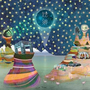

Life Elsewhere她乡
============================

|  |  |
| :--: | :-- |
| [ Life Elsewhere她乡](https://emumo.xiami.com/album/2100378412) | **艺人**: [The Shanghai Restoration Project](../index.md) **语种**: 国语 **唱片公司**: Undercover Culture Music **发行时间**: 2016年08月12日 **专辑类别**: 录音室专辑 **专辑风格**: 电子 Electronic, 迪斯科 Disco, 电爵士 Nu Jazz **播放数**: 261060 **收藏数**: 1765 **评论数**: 116  |

## 简介

 
 

《她乡》Life Elsewhere 是纽约电子乐队Shanghai Restoration Project发行的首张原创中文专辑。这是继2014年合作发行中文爵士经典专辑《The Classics》之后，制作人Dave Liang与爵士女伶张乐二度携手，并有跨界艺术家孙云帆加盟专辑的词曲创作和音乐制作。
 
  

三人的创意交集从头至尾异想天开，各种流派兼收并蓄。在美国东岸陆离驳杂的文化熔炉中十多年的生活经验让人面对自我少一份执着，面对未知与不确定性多一份坦然。博尔赫斯在短篇小说《另一个人》里与年轻时的自己尴尬相遇，庄子在梦蝶的故事里玩了一个将自我与他者换位的游戏，《她乡》的主创们则在专辑中展开了一场气象开阔的心灵自省，一次关于身份边界的模糊和自我意识跃迁的探险，一不小心会看见自己的后脑勺。
 
  

十二首曲目的风格如同在融合着电子、爵士与拉丁的丹炉中抖落时空各异的微量元素——摇摆、蓝调、桑巴、Bossa Nova、印度古典音乐、嘻哈和Synthpop等等，炼造出流淌于异域与故土、过去与未来之间的奇异之环。张乐自然、细致而充满灵性的演绎展现一位卓越的歌者在不同音乐传统里游刃有余的自信。专辑除却汇聚顶级爵士黑管演奏家、印度传统打击乐手、爵士吉他手、吉他手、小号手的才华，还包括一些独特的制作选择，比如蚂蚁啃西瓜皮声、蟋蟀打招呼声、手指敲打汽水瓶声，穷得叮当响的破铁罐声、玩具吉他以及旧金山海浪风琴发出的咕咚声。
 
  

序曲《一瞬》用音符描绘出Caspar David Friedrich的浪漫主义名画《雾海上的旅人》式的场景。谁在聆听，谁就凝视着《她乡》封面上的那片海，海面是未知的将来，却又像无迹可寻的过去，远处高悬着一轮明月，但它也可能是在另一个星球上看到的地球。钢琴是泛在波光里的憧憬、留恋与挣扎，温暖悠扬的小号则像来自远古的通透月光，提醒旅人——沧海桑田不过一瞬间。
 
  

十六分音延时的合成器Riff将时间轴拉进21世纪，在一轨比肖邦调皮一点的钢琴对旋律的牵引之下，张乐拾起时代曲风格的复古唱腔轻松登场。一曲诙谐而又磅礡的《非彼无我》唱出自我的虚妄和易变。他者其实是定义自我的边界，而界线不断演变，线的两边无刻不在转换。今天我们甚至已经分不清机器和身体。一个戏剧性的变速scat结尾向大西洋彼岸的Ella Fitzgerald致敬。
 
  

紧接着，上世纪80年代风格的鼓击与合成器音色依稀将人置身一段大城市早晨上班族如潮涌动的蒙太奇之中。张乐摇曳的吟唱与无拘无束的钢琴​​​​旋律飞舞在Dave内省的说唱和肃穆的鼓点周围，一轨黑胶唱片的摩擦声标注出按下Reset键之前的焦虑。
 
  

《皇后的温泉》 的灵感来自2013年主创一次参观印尼日惹Ratu Boko宫殿废墟的经历。由于废墟体量巨大，三人于日落之后才发现静静躺在昏暗之中的一片昔日曾盛满男欢女爱的温泉遗址。于是张乐化身一位皇后的幽灵，从公元八世纪穿越到今天，重访当年为她所修的温泉，看看爱与艺术是否可以逃脱时光的碾轧。
 
  

《听》是一首关于地籁与天籁的人籁。 “地球母亲”这一比喻虽深入人心，却不乏来自当代环保主义者的诟病——由心及物的比反映的是人类中心主义，仿佛地球存在的意义就是忍辱负重哺育人类。然而这种批评的逻辑恰也反映了另一种深入人心的对女性的道德束缚——“地球父亲”感觉就很怪异。也许只有借着由物及心的兴，将拟人共情的对象具体到一草一木，我们才能学会尊重与人类一起客居地球的生灵万物。
 
  

《笑话》是一曲受吉普赛爵士启发的小调摇摆，带你到一条清晨的石子街里踢踢铁皮罐。夜的清晰和黎明的恍惚重叠着，黑管究竟是想像中藏在暗处的陌生人，还是已经被遗忘的自己的影子？
 
  

夏天天色暗得晚些，时间仿佛延展了。知了爬出地面，人们到户外活动，生活从私密的公寓里蔓延到街道上和公园里，所以万物的心也宽了。 《八月指南》由A段的见物起兴过度至B段外应物象的铺陈，随着C段言无所指的bilibala和拍手riff，你我她他和蟋蟀蚂蚁在明晃晃的实存之境里愉快地达成了谅解。
 
  

《没跳完的探戈》里没有大提琴的激情和手风琴的缠绵，在场的是呜咽的黑管和幽灵般的钢琴，人声如单人舞步滑行在一片回旋的留白之中。
 
  

旅行癖和桑巴爱好者都有《多动的脚掌》。这是一曲加入了印度坎击拉鼓的桑巴舞，律动中严丝合缝的人声格外明媚。
 
  

传统的Bossa Nova和弦在嘻哈节拍的律动和一轨倔强执拗的底鼓之上舒展开来，《给艾丽的歌》是张乐老师对戾气小孩的温柔一笑。
 
  

坎击拉鼓的鼓声涨落伴随着一次漫不经心的散步，沉稳的人声与姿纵的黑管庄谐交错，勾画出藏于落寞斜阳中的《喜悦》。
 
  
结尾曲《送别》是专辑中唯一一首翻唱作品。在几乎随时随地可以视讯的当代，再用西出阳关无故人式的伤感预言来表达惜别之情不免迂腐。何妨将“今宵别梦寒”歪解成“今晚梦里别着凉”？小号吹出新奥尔良葬礼的庆典气氛，道地的摇摆蓝调人声将这首写于美国南北战争时期、于二十世纪经由日本传至中国的骊歌带回了纽约夏夜里一场为了告别的洒脱聚会。 

 
 

 
 

 

## 曲目

## 评论

|  |  |  |  |
| :-- | :-- | :-- | :-- |
|  [虾米用户](https://emumo.xiami.com/u/12921098) 輕飄飄 淡悠悠 你再也看... 2020-01-22 12:07 赞(0) 踩(0) | 
喜欢这张好多年哦
 |
|  [虾米用户](https://emumo.xiami.com/u/1219018) 你好，我叫谢有君。估计大... 2019-09-05 11:10 赞(0) 踩(0) | 
这张专辑好有趣啊，声音出场率不高的大卫梁是锦上添花的存在，去听听 Guide to August
 |
|  [虾米用户](https://emumo.xiami.com/u/34593165) 我还没想好要写什么... 2019-08-21 21:44 赞(0) 踩(0) | 
啊 我还是更喜欢jazz
 |
|  [虾米用户](https://emumo.xiami.com/u/10686676) 只當你的女神 2019-02-20 11:56 赞(0) 踩(0) | 
有些慵懶有些性感的節奏，完美體現夜晚的迷人感。今晚我想擦上紅色口紅，換上黑色連衣裙和高跟鞋，和你跳一支屬於二個人的舞。
 |
|  [虾米用户](https://emumo.xiami.com/u/315057025) 一寸山河一寸血 2019-02-08 08:06 赞(0) 踩(0) | 
非常棒，很有节奏感，很享受
 |
|  [虾米用户](https://emumo.xiami.com/u/4262815) 我还没想好要写什么... 2019-01-16 14:36 赞(0) 踩(0) | 
无意发现，惊喜～
 |
|  [虾米用户](https://emumo.xiami.com/u/9946179)  2019-01-07 20:12 赞(0) 踩(0) | 
这个是真正的好音乐！
 |
|  [虾米用户](https://emumo.xiami.com/u/3302686)  2018-12-10 12:48 赞(0) 踩(0) | 
一张神专!!重复几百次都不腻
 |
|  [虾米用户](https://emumo.xiami.com/u/9142282) 微博：FEVER_DOG... 2018-11-11 12:19 赞(1) 踩(0) | 
mmmmm
 |
|  [虾米用户](https://emumo.xiami.com/u/3556002) wubba lubba 2018-07-06 10:18 赞(0) 踩(0) | 
。
 |
|  [虾米用户](https://emumo.xiami.com/u/10881363) C'est la vie... 2018-01-14 09:53 赞(0) 踩(0) | 
可以说是和乐队名最契合的一张专辑了
 |
|  [虾米用户](https://emumo.xiami.com/u/10881363) C'est la vie... 2018-01-14 09:52 赞(0) 踩(0) | 
可以说是和乐队名最契合的一张专辑了 
 |
|  [虾米用户](https://emumo.xiami.com/u/33427783) 回首以望，笑而不语…… 2017-12-04 13:25 赞(0) 踩(0) | 
哪里有这CD可以买啊&amp;mdash;&amp;mdash;&amp;mdash;&amp;mdash;
 |
|  [虾米用户](https://emumo.xiami.com/u/85165792) COMING 2017-11-25 16:46 赞(0) 踩(0) | 
.
 |
|  [虾米用户](https://emumo.xiami.com/u/332426882)  2017-10-30 20:00 赞(0) 踩(0) | 
太难听了，没有我唱得好听
 |
|  [虾米用户](https://emumo.xiami.com/u/3855918) 我还没想好要写什么... 2017-10-14 10:51 赞(0) 踩(0) | 
主唱歌声有毒。有人评论说风格有点千篇一律，我觉得还好吧，整体编曲编排挺合理的，特别是女主唱。个人拙见啊…
 |
|  [虾米用户](https://emumo.xiami.com/u/15270473) 听到喜欢的歌 身体不跟着... 2017-09-28 13:26 赞(0) 踩(0) | 
-
 |
|  [虾米用户](https://emumo.xiami.com/u/44191355) Bidalaska 2017-09-18 08:13 赞(0) 踩(0) | 
good, jazz... chinese..... west
 |
|  [虾米用户](https://emumo.xiami.com/u/36323133)  2017-07-21 14:42 赞(0) 踩(0) | 
很惊喜，遇到，虽然稍晚，但不阻挡喜欢
 |
|  [虾米用户](https://emumo.xiami.com/u/19329751)  2017-05-20 01:04 赞(2) 踩(0) | 
现场听了，才发现，我没爱错你们！
 |
|  [虾米用户](https://emumo.xiami.com/u/16206377) rabbit_❀moon 2017-05-15 23:37 赞(0) 踩(0) | 
5.13在广州TU凸空间看他们演出了，实力就摆在那，现场版跟这里听着一样，没收藏错，太棒了
 |
| ⇒ |  [虾米用户](https://emumo.xiami.com/u/972050) 此去经年，应是良辰好景。 2017-07-02 12:45 赞(0) 踩(0) | 
太后悔了，七月才看到五月有演出计划
 |
|  [虾米用户](https://emumo.xiami.com/u/1430438)  2017-05-14 23:22 赞(2) 踩(0) | 
张乐在现场好美啊！
 |
|  [虾米用户](https://emumo.xiami.com/u/45052758) 我还没想好要写什么... 2017-04-06 00:55 赞(0) 踩(0) | 
[带墨镜笑]
 |
|  [虾米用户](https://emumo.xiami.com/u/856551) 虾米活下去 用户指责什么... 2017-03-31 15:19 赞(0) 踩(0) | 
又要开始巡演了 CD很贵 多听听呢
 |
| ⇒ |  [虾米用户](https://emumo.xiami.com/u/13741772) 就算微不足道，也要英勇跳... 2017-05-18 22:58 赞(0) 踩(0) | 
我觉得还可以吧。国内很多独立音乐人的CD才几十，但是真的用CD机放出来效果并不好。
 |
|  [虾米用户](https://emumo.xiami.com/u/8467113) 在邀请你之前，已有浓郁的... 2017-03-21 14:57 赞(0) 踩(0) | 
为广州演出提前温习
 |
|  [虾米用户](https://emumo.xiami.com/u/5600378)  2017-03-09 18:30 赞(0) 踩(0) | 
不知道怎么购买 无法下载于手机 着急。。。
 |
|  [虾米用户](https://emumo.xiami.com/u/7339667) 嗯，好的。 2017-02-21 16:10 赞(1) 踩(0) | 
其实这种冲突感正是他们独特的一点啊。。如果真换一个很合拍的女声，那就没那么&amp;ldquo;特别&amp;rdquo;了，变成了普通的indie electronic。
 |
|  [虾米用户](https://emumo.xiami.com/u/38755)  2017-01-24 05:08 赞(0) 踩(0) | 
改编的歌曲没有the classics那张好听 也许是选曲的问题
 |
|  [虾米用户](https://emumo.xiami.com/u/6361118) 黑洞無始終，音樂無疆界 2017-01-17 23:12 赞(0) 踩(0) | 
电子与爵士的融合风格带着鲜明的SRP特色印记，但是歌者的唱腔过于一板一眼，或许更适合原版的老爵士风格，但不适合SRP较为现代化的改编。
 |
|  [虾米用户](https://emumo.xiami.com/u/36206811) 我还没想好要写什么... 2016-12-30 16:44 赞(1) 踩(0) | 
上班写个PPT、整个word没问题，感觉更适合带着耳机一个人安安静静，复古的味道，忍不住让人点根儿烟，吐个烟圈
 |
|  [虾米用户](https://emumo.xiami.com/u/26391343)  2016-12-27 12:01 赞(0) 踩(0) | 
//：D
 |
|  [虾米用户](https://emumo.xiami.com/u/35955416)  2016-11-25 06:46 赞(0) 踩(0) | 
是我喜欢的风格，不过正像有些人的评论，曲风声音有特色但唱法变化少，一张专辑听下来有些审美疲劳。
 |
|  [虾米用户](https://emumo.xiami.com/u/18332744)  2016-11-21 14:55 赞(0) 踩(0) | 
惊喜
 |
|  [虾米用户](https://emumo.xiami.com/u/713048)  2016-11-08 15:15 赞(1) 踩(0) | 
想问，这张有没有发行黑胶版本
 |
|  [虾米用户](https://emumo.xiami.com/u/25639638)  2016-10-02 22:30 赞(0) 踩(0) | 
good
 |
|  [虾米用户](https://emumo.xiami.com/u/48484512)  2016-09-25 16:17 赞(0) 踩(0) | 
抖脚爵士乐专辑 ，张乐的音色hin有特点啊（我也想有） ，但是大概因为太有特色而反复出现久了还是会有点审美疲劳 ，总结一句，这张专辑值得一听很美味的～  
 |
|  [虾米用户](https://emumo.xiami.com/u/48484512)  2016-09-25 16:13 赞(0) 踩(0) | 
抖脚爵士专辑，张乐声线真的hin有特色，不过反复出现还是会审美疲劳，总结一句这张专辑值得一听～
 |
|  [虾米用户](https://emumo.xiami.com/u/1292687) 简介个头 2016-09-12 14:39 赞(0) 踩(0) | 
封面丑爆
 |
|  [虾米用户](https://emumo.xiami.com/u/45298985) Wechat:dqx19... 2016-09-02 10:55 赞(0) 踩(0) | 
+
 |
|  [虾米用户](https://emumo.xiami.com/u/4344622)  2016-08-28 21:16 赞(0) 踩(0) | 
从《Preface》的虾米推荐开始，觉得印象比较深刻，不过那时候并没有记住作者名字，时过四季刚刚看了《一席》的开头，暗觉这个作者会与这首曲子有关，看完虾米一搜，果然哈哈哈哈！！！非常棒的跨界融合，把很多旧有的过于老套的循律重新定义，有了新生命与新活力，这是我近年来唯一觉得可以花钱买的专辑：）：）了不起的Dave Liang！！！
 |
| ⇒ |  [虾米用户](https://emumo.xiami.com/u/8707966)   2016-10-13 00:45 赞(0) 踩(0) | 
看来好多一席观众啊
 |
|  [虾米用户](https://emumo.xiami.com/u/9529483)  2016-08-19 20:51 赞(0) 踩(0) | 
可惜张乐唱词太清楚了。
 |
|  [虾米用户](https://emumo.xiami.com/u/253075) 专注内八二十年 2016-08-19 14:21 赞(0) 踩(0) | 
张乐声音挺好听的啊 LOL
 |
|  [虾米用户](https://emumo.xiami.com/u/491510) 诗 Ƹ̵̡Ӝ̵̨̄Ʒ 酒 2016-08-19 09:03 赞(0) 踩(0) | 
歌词有点怪……其他还好吧
 |
|  [虾米用户](https://emumo.xiami.com/u/722784) Bite me！Baby 2016-08-17 14:21 赞(0) 踩(0) | 
夫妻联手打造的专辑，在你刚开始选择音乐的时候，你做梦也想着这一天吧，8.14专程去南京看了你的专场，听了你音乐八年，希望你能坚持做下去，也许正如你自己说的，上海复新方案 这个名字有点狂，但你配得上
 |
|  [虾米用户](https://emumo.xiami.com/u/7902684)  2016-08-17 01:12 赞(4) 踩(0) | 
失望的专辑……觉得张乐匠气油腻的嗓音毁了梁作品的点个赞……关键是他们还会继续合作
 |
|  [虾米用户](https://emumo.xiami.com/u/1332272)  2016-08-14 19:40 赞(0) 踩(0) | 
爵士、电子、氛围，甚至还有一些disco的元素，丰富但不肥腻，这个音乐精致餐点，我吃得好满足！听过两场现场，现场又是另一种精彩，梁&amp;amp;张合作，复古和探索并存，好过瘾！
 |
|  [虾米用户](https://emumo.xiami.com/u/1332272)  2016-08-14 19:37 赞(0) 踩(0) | 
没有错过他的作品，我这生命也丰盛了，音乐的状态里没有遗憾了。
 |
|  [虾米用户](https://emumo.xiami.com/u/1332272)  2016-08-14 19:33 赞(0) 踩(0) | 
Dave Liang的作品，分分钟都爱分分钟都珍贵。没有错过他的作品，是我人生的珍宝。
 |
|  [虾米用户](https://emumo.xiami.com/u/32218878) 再见虾虾仔们vx：xxx... 2016-08-14 15:37 赞(0) 踩(0) | 

 |
|  [虾米用户](https://emumo.xiami.com/u/9874495) 一人でいい 2016-08-14 15:02 赞(0) 踩(0) | 
听第一遍觉得有点不习惯，看书时loop，却觉得越来越带感www
 |
|  [虾米用户](https://emumo.xiami.com/u/8224498) 我还没想好要写什么... 2016-08-13 23:39 赞(0) 踩(0) | 
除了送别是翻唱，还有哪些是翻唱啊？ 求问各位大虾
 |
|  [虾米用户](https://emumo.xiami.com/u/8108665) - 2016-08-13 23:14 赞(0) 踩(0) | 

 |
|  [虾米用户](https://emumo.xiami.com/u/1990758)  2016-08-13 13:36 赞(0) 踩(0) | 
so so
 |
|  [虾米用户](https://emumo.xiami.com/u/278702) 我爱音乐 2016-08-13 12:25 赞(0) 踩(0) | 
第一首好听~
 |
|  [虾米用户](https://emumo.xiami.com/u/3606918)  2016-08-13 10:12 赞(19) 踩(0) | 
个人觉得整张专辑因为每首歌都有点类似，听到后面有点腻。特别是张乐的声音因为太有特点、太突出了，反复出现就更容易让人有种审美疲劳。当然每首歌单独拿出来还是棒棒哒。建议DAVE制作专辑的时候可以适当考虑整张专辑的视听感受，把不同风格不同节奏不同意境的歌进行适当穿插：）——以上仅个人看法
 |
| ⇒ |  [虾米用户](https://emumo.xiami.com/u/8707966)   2016-10-13 00:44 赞(0) 踩(0) | 
这才叫概念专辑，国内很少有人这么做了，我觉得挺好的，有特点
 |
|  [虾米用户](https://emumo.xiami.com/u/25639638)  2016-08-13 10:05 赞(0) 踩(0) | 
棒棒的
 |
|  [虾米用户](https://emumo.xiami.com/u/55171872)   2016-08-13 07:49 赞(2) 踩(0) | 
不太喜欢张乐的声音……不贴合liang的音乐感觉 她唱成了流行
 |
| ⇒ |  [虾米用户](https://emumo.xiami.com/u/278702) 我爱音乐 2016-08-13 12:15 赞(0) 踩(0) | 
有同感
 |
| ⇒ |  [虾米用户](https://emumo.xiami.com/u/55171872)   2016-08-13 15:41 赞(0) 踩(0) | 
<q><b>JAZZCAFE说：</b></q>
 |
| ⇒ |  [虾米用户](https://emumo.xiami.com/u/55171872)   2016-08-13 15:42 赞(0) 踩(0) | 
<q><b>JAZZCAFE说：</b></q>
 |
| ⇒ |  [虾米用户](https://emumo.xiami.com/u/278702) 我爱音乐 2016-08-13 17:02 赞(0) 踩(0) | 
<q><b>cardsvii说：</b></q>
 |
|  [虾米用户](https://emumo.xiami.com/u/3442087) Dust To Dust 2016-08-13 06:50 赞(0) 踩(0) | 
m
 |
|  [虾米用户](https://emumo.xiami.com/u/1001127)  2016-08-13 00:48 赞(0) 踩(0) | 
好奇怪啊    为什么虾歌上不能听  但是虾米网站可以。。
 |
|  [虾米用户](https://emumo.xiami.com/u/25017703)   2016-08-12 21:11 赞(0) 踩(0) | 
欢迎来南京！！！！
 |
|  [虾米用户](https://emumo.xiami.com/u/43982464) 哒优 2016-08-12 20:49 赞(0) 踩(0) | 
一股上世纪上海复古唱腔
 |
|  [虾米用户](https://emumo.xiami.com/u/43982464) 哒优 2016-08-12 20:34 赞(0) 踩(0) | 
开心，出新专辑
 |
|  [虾米用户](https://emumo.xiami.com/u/15286935) XxX 2016-08-12 19:13 赞(0) 踩(0) | 
·
 |
|  [虾米用户](https://emumo.xiami.com/u/37254292)   2016-08-12 18:08 赞(0) 踩(0) | 
前50！
 |
|  [虾米用户](https://emumo.xiami.com/u/41163024) I’m done. 2016-08-12 17:54 赞(0) 踩(0) | 
_(:3」∠)_
 |
| ⇒ |  [虾米用户](https://emumo.xiami.com/u/7779210) 。 2016-08-13 05:23 赞(0) 踩(0) | 
废汪你好
 |
| ⇒ |  [虾米用户](https://emumo.xiami.com/u/41163024) I’m done. 2016-08-13 11:08 赞(0) 踩(0) | 
<q><b>DoubleS说：</b></q>
 |
| ⇒ |  [虾米用户](https://emumo.xiami.com/u/7779210) 。 2016-08-13 14:56 赞(0) 踩(0) | 
<q><b>shiitake说：</b></q>
 |
|  [虾米用户](https://emumo.xiami.com/u/55133339)  2016-08-12 17:28 赞(0) 踩(0) | 
都要收费怎么听啊
 |
|  [虾米用户](https://emumo.xiami.com/u/5070444) 音乐是最好的“避风塘” 2016-08-12 17:27 赞(0) 踩(0) | 
电音
 |
|  [虾米用户](https://emumo.xiami.com/u/2164176) hum~ 2016-08-12 17:18 赞(0) 踩(0) | 
必须留名支持支持。
 |
|  [虾米用户](https://emumo.xiami.com/u/1451905) 活着就是修行 2016-08-12 15:42 赞(0) 踩(0) | 
  太棒了
 |
|  [虾米用户](https://emumo.xiami.com/u/15945566) 已秃 2016-08-12 15:09 赞(0) 踩(0) | 
喜欢；））
 |
|  [虾米用户](https://emumo.xiami.com/u/7779210) 。 2016-08-12 15:03 赞(39) 踩(0) | 
推荐各位去看他上个月在一席做的演讲，超级赞。<a href="http://t.cn/Rtbfkdl" target="_blank" rel="nofollow noreferrer noopener">http://t.cn/Rtbfkdl</a>
 |
| ⇒ |  [虾米用户](https://emumo.xiami.com/u/722784) Bite me！Baby 2016-08-12 15:13 赞(0) 踩(0) | 
好看，不知道什么时候有巡演，这次不能再错过了
 |
| ⇒ |  [虾米用户](https://emumo.xiami.com/u/7779210) 。 2016-08-12 15:19 赞(0) 踩(0) | 
<q><b>飞出个未来说：</b></q>
 |
| ⇒ |  [虾米用户](https://emumo.xiami.com/u/278702) 我爱音乐 2016-08-13 12:25 赞(0) 踩(0) | 
链接打不开
 |
| ⇒ |  [虾米用户](https://emumo.xiami.com/u/722784) Bite me！Baby 2016-08-13 14:36 赞(0) 踩(0) | 
<q><b>DoubleS说：</b></q>
 |
| ⇒ |  [虾米用户](https://emumo.xiami.com/u/7779210) 。 2016-08-13 14:40 赞(0) 踩(0) | 
<q><b>JAZZCAFE说：</b></q>
 |
| ⇒ |  [虾米用户](https://emumo.xiami.com/u/278702) 我爱音乐 2016-08-13 17:03 赞(0) 踩(0) | 
打开了
 |
| ⇒ |  [虾米用户](https://emumo.xiami.com/u/8707966)   2016-10-13 00:49 赞(0) 踩(0) | 
是霄霄姐他们找的人好
 |
| ⇒ |  [虾米用户](https://emumo.xiami.com/u/23180929) 我还没想好要写什么... 2020-11-29 23:29 赞(0) 踩(0) | 
还能打开 谢谢分享 很好看 才知道原来还有这样的背后故事！
 |
|  [虾米用户](https://emumo.xiami.com/u/35201727) 再见 2016-08-12 14:32 赞(0) 踩(0) | 
，
 |
|  [虾米用户](https://emumo.xiami.com/u/710597) 真正的美无需隐藏。 2016-08-12 14:20 赞(0) 踩(0) | 
光听完第一首，整个浮躁的心就被抚平了。哎呀真舒坦。
 |
|  [虾米用户](https://emumo.xiami.com/u/47653188) 以hiphop之名经营生... 2016-08-12 14:12 赞(0) 踩(0) | 
太舒服了
 |
|  [虾米用户](https://emumo.xiami.com/u/669738) 是我啊 2016-08-12 14:08 赞(0) 踩(0) | 
非常的可爱
 |
|  [虾米用户](https://emumo.xiami.com/u/6485455) 电子乐狂欢中~ 2016-08-12 13:57 赞(0) 踩(0) | 
留个言表示激动一下
 |
|  [虾米用户](https://emumo.xiami.com/u/31696713) 轻音乐群88876205 2016-08-12 13:52 赞(0) 踩(0) | 
  
 |
|  [虾米用户](https://emumo.xiami.com/u/6934536) no genre 2016-08-12 13:49 赞(0) 踩(0) | 
nb！
 |
|  [虾米用户](https://emumo.xiami.com/u/1528891)  2016-08-12 13:43 赞(0) 踩(0) | 
\enjoy!/
 |
|  [虾米用户](https://emumo.xiami.com/u/7790667) Follow your ... 2016-08-12 13:29 赞(0) 踩(0) | 
八月指南 
 |
|  [虾米用户](https://emumo.xiami.com/u/8661441)  2016-08-12 13:24 赞(1) 踩(0) | 
真心好听，深圳首发我在现场
 |
|  [虾米用户](https://emumo.xiami.com/u/8468754) @ddazedconfu... 2016-08-12 13:01 赞(0) 踩(0) | 
很迪斯科
 |
|  [虾米用户](https://emumo.xiami.com/u/2386373) 时代变迁，hiphop永... 2016-08-12 12:50 赞(0) 踩(0) | 
好棒！！！！！！！！！！！！！！！！！！！！！！！！！！！！！！！
 |
|  [虾米用户](https://emumo.xiami.com/u/49828336)   2016-08-12 12:29 赞(0) 踩(0) | 
美妙
 |
|  [虾米用户](https://emumo.xiami.com/u/448091) 一个胖子。 2016-08-12 12:27 赞(4) 踩(0) | 
哇！今天是什么日子啊！鸭打鹅发了新砖，DOC也发了，上海复兴计划也发了（≧∇≦）
 |
|  [虾米用户](https://emumo.xiami.com/u/49639178) Unimaginatio... 2016-08-12 12:25 赞(0) 踩(0) | 
秋天了
 |
|  [虾米用户](https://emumo.xiami.com/u/50642130) 很软 2016-08-12 12:09 赞(0) 踩(0) | 
⊕
 |
|  [虾米用户](https://emumo.xiami.com/u/52682624) 没有签名 2016-08-12 12:00 赞(0) 踩(0) | 
喜欢
 |
|  [虾米用户](https://emumo.xiami.com/u/652547)  2016-08-12 11:58 赞(0) 踩(0) | 
Guide to August
 |
|  [虾米用户](https://emumo.xiami.com/u/40080369) . 2016-08-12 11:57 赞(0) 踩(0) | 
哈哈～来啦
 |
|  [虾米用户](https://emumo.xiami.com/u/28923588) 空 2016-08-12 11:55 赞(0) 踩(0) | 
终于
 |
|  [虾米用户](https://emumo.xiami.com/u/1320669) ツ 2016-08-12 11:54 赞(0) 踩(0) | 
0.0
 |
|  [虾米用户](https://emumo.xiami.com/u/6015418) 如今，听什么广播，都不痛... 2016-08-12 11:50 赞(0) 踩(0) | 
好！
 |
|  [虾米用户](https://emumo.xiami.com/u/4372646) 可爱又迷人的正派角色IG... 2016-08-12 11:49 赞(0) 踩(0) | 
＃
 |
|  [虾米用户](https://emumo.xiami.com/u/1988060) Electrow 2016-08-12 11:35 赞(0) 踩(0) | 
iii
 |
|  [虾米用户](https://emumo.xiami.com/u/9299585) In Ya Mellow... 2016-08-12 11:33 赞(0) 踩(0) | 
美好的夏日要结束了
 |
|  [虾米用户](https://emumo.xiami.com/u/2085092) 属于自己的地方 2016-08-12 11:16 赞(0) 踩(0) | 
 
 |
