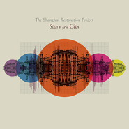

Story of a City
============================

|  |  |
| :--: | :-- |
| [ Story of a City](https://emumo.xiami.com/album/312820) | **艺人**: [The Shanghai Restoration Project](../index.md) **语种**: 英语 **唱片公司**: Undercover Culture Music **发行时间**: 2008年02月05日 **专辑类别**: 录音室专辑 **专辑风格**: 嘻哈 Hip-Hop, 电子 Electronic **播放数**: 4418078 **收藏数**: 6223 **评论数**: 312  |

## 简介

这是美国的华裔制作人Dave Liang制作的第二张专辑。专辑的创作是以20世纪关于上海的故事为背景展开的,依旧围绕着上海这个不变的主题.  
  
"上海复兴方案"灵感来源于上世纪30年代的旧上海夜店里的那些Jazz乐队演奏的音乐.在这一新奇的概念下DJ Dave Liang大胆的将带有鲜明东方气息的曲调与西方的现代音乐Hip-Hop,Electronica,Jazz等巧妙的融合在一起。  
  
我觉得专辑歌曲的风格很多样，在融入中国元素的前提下，结合众多的音乐风格是难得的尝试。专辑里女声的演唱清新动人，男声给人感觉有点参差不齐。但是有的地方还是给人感觉有点怪异，毕竟他们很难真正的理解中国文化。印象最深的是歌曲里采集的人物谈笑声音，那时候感觉音乐和自己的距离一下子缩短了。  
  
Preface熟悉的开头和清雅的女声完全好感中。Voices应该是Dave Liang自己唱的吧，个人感觉般般的说。 Last Night of the Dynasty在喜庆的唢呐（应该是这个乐器）声中开始了， 轻快的女生加上背景的一些人物谈笑声音， 总让人想象到喜宴的情景，推荐。 Movement, 很多人喜欢这首， 只能说， 不是我喜欢的风格， 或许你会喜欢也不一定。 接着的Love and Warlords, Touchdown, Call Me Home, Last Morning，让我想到了那个瑞士的女歌手， 用英文把中国的民歌都翻唱了一遍， 虽然声音的确不错， 可是却有点怪异及缺乏新意，在我看来。 还好， Pace of Light的出现让我耳目一新， Afterword还凑合,Divided We Stand把康定情歌mix了进去。 剩下的Notes, Bibliography,Acknowledgements都是轻音乐。  
  
At the turn of the 20th century, China underwent a remarkable transformation. A dynastic system that had governed the country for over two thousand years was crumbling, and uncertainty loomed. But while most of the country clung to the remnants of the past, Shanghai fixed its gaze firmly on the future. Story of a City, the second full length album from The Shanghai Restoration Project, derives its inspiration from the monumental events that took place during this era. Like its predecessor, Story of a City does not restrict itself to any particular genre, drawing instead from an array of musical styles that have come to define the Shanghai Restoration Project sound. This time around, producer Dave Liang builds upon his signature hip-hop / electronica blend by bringing in new influences ranging from country to rap to choral music. Each track on the project is unique in flavor but remains part of a cohesive fabric, woven together by traditional Chinese instruments such as the erhu, pipa, and the dizi. To enhance the listener's journey, many songs contain authentic street sounds recorded during one of Liang's recent visits to Shanghai.i
 

 

## 曲目

## 评论

|  |  |  |  |
| :-- | :-- | :-- | :-- |
|  [虾米用户](https://emumo.xiami.com/u/443131642)  2020-09-09 00:55 赞(0) 踩(0) | 
莫比和侃爷都有参与制作
 |
|  [虾米用户](https://emumo.xiami.com/u/421003351) ....那星～Puter... 2020-02-16 18:53 赞(0) 踩(0) | 
Perfect Voice &amp; Story of a City  ♥️
 |
|  [虾米用户](https://emumo.xiami.com/u/401024) 影徒随我身 2019-08-18 15:26 赞(0) 踩(0) | 
对此专辑情有独钟
 |
|  [虾米用户](https://emumo.xiami.com/u/7519190) 流氓有文化，走遍全天下 2019-03-11 19:48 赞(0) 踩(0) | 
节奏、旋律、风格把握都很到位比较商业化的风格很适合时下的流行
 |
|  [虾米用户](https://emumo.xiami.com/u/38600585) 弱者滔滔不绝，强者毫不在... 2019-02-03 22:56 赞(0) 踩(0) | 
Preface歌词也很棒
 |
|  [虾米用户](https://emumo.xiami.com/u/12804407) I happen to ... 2018-09-23 00:36 赞(2) 踩(0) | 
把音乐专辑设计成书的结构 有趣 作者真是很严谨呢 连bibliography和acknowledgements都有 哈哈哈
 |
|  [虾米用户](https://emumo.xiami.com/u/3708232) live half at... 2018-07-28 21:49 赞(1) 踩(0) | 
以前听不进去的歌，突然某一天就像保龄球，把我击倒在地，再次见面，幸甚至哉！
 |
|  [虾米用户](https://emumo.xiami.com/u/201391232) 最快的方法是先抱抱 2018-04-06 13:52 赞(0) 踩(0) | 
彡
 |
|  [虾米用户](https://emumo.xiami.com/u/30787737) 我还没想好要写什么... 2018-03-26 16:03 赞(0) 踩(0) | 
感动
 |
|  [虾米用户](https://emumo.xiami.com/u/18713084)  2018-02-03 13:10 赞(0) 踩(0) | 
着迷
 |
|  [虾米用户](https://emumo.xiami.com/u/298941603) 我們創造。 2018-01-28 09:27 赞(3) 踩(0) | 
出个全专购买多好
 |
| ⇒ |  [虾米用户](https://emumo.xiami.com/u/18713084)  2018-02-03 13:11 赞(0) 踩(0) | 
不能全专购买对不对，我找了半天按键 
 |
| ⇒ |  [虾米用户](https://emumo.xiami.com/u/298941603) 我們創造。 2018-02-03 13:12 赞(0) 踩(0) | 
<q><b>苹果长毛了说：</b></q>
 |
|  [虾米用户](https://emumo.xiami.com/u/16047370)  2018-01-20 16:03 赞(0) 踩(0) | 
这是我心中中国元素＋电子的音乐
 |
|  [虾米用户](https://emumo.xiami.com/u/6139765) 杂食党 2017-12-16 00:40 赞(0) 踩(0) | 
好砖！
 |
|  [虾米用户](https://emumo.xiami.com/u/47762018) 虾米我永远爱你 2017-12-10 21:11 赞(0) 踩(0) | 

 |
|  [虾米用户](https://emumo.xiami.com/u/4344622)  2017-10-28 00:28 赞(1) 踩(0) | 
从《Preface》的虾米推荐开始，觉得印象比较深刻，不过那时候并没有记住作者名字，时过四季刚刚看了《一席》的开头，暗觉这个作者会与这首曲子有关，看完虾米一搜，果然哈哈哈哈！！！非常棒的跨界融合，把很多旧有的过于老套的循律重新定义，有了新生命与新活力，这是我近年来唯一觉得可以花钱买的专辑：）：）了不起的Dave Liang！！！
 |
|  [虾米用户](https://emumo.xiami.com/u/1258013)  2017-10-27 23:25 赞(1) 踩(0) | 
旧瓶装新酒，和复兴计划相比味道变得有点厉害。不过也只有老外才能把这种题材做得那么有意思。有两首估计是截了弄堂里什么对话remix一下，还蛮有趣的。总体说起来中国元素有点哗众取宠的作用。
 |
|  [虾米用户](https://emumo.xiami.com/u/4937505)  2017-10-03 19:54 赞(0) 踩(0) | 
这张专辑好洋气
 |
|  [虾米用户](https://emumo.xiami.com/u/15270473) 听到喜欢的歌 身体不跟着... 2017-09-28 00:52 赞(0) 踩(0) | 
-
 |
|  [虾米用户](https://emumo.xiami.com/u/49981775)  2017-09-27 09:18 赞(0) 踩(0) | 
实验音乐
 |
|  [虾米用户](https://emumo.xiami.com/u/11697156) bitter sweet 2017-08-10 13:14 赞(0) 踩(0) | 
大丁丁小丁丁~
 |
|  [虾米用户](https://emumo.xiami.com/u/36653956) 爱音乐 2017-07-28 15:08 赞(0) 踩(0) | 
..
 |
|  [虾米用户](https://emumo.xiami.com/u/310723656)  2017-07-13 15:14 赞(0) 踩(0) | 
不错的音乐
 |
|  [虾米用户](https://emumo.xiami.com/u/1177094)  2017-05-28 16:05 赞(0) 踩(0) | 
对我胃口！
 |
|  [虾米用户](https://emumo.xiami.com/u/1418921)  2017-05-02 14:40 赞(0) 踩(0) | 
特别
 |
|  [虾米用户](https://emumo.xiami.com/u/50157160) 七八点 2017-04-13 00:24 赞(1) 踩(0) | 
520北京见
 |
|  [虾米用户](https://emumo.xiami.com/u/2928117) 你好 2016-10-07 15:29 赞(0) 踩(0) | 
下次巡演 希望能买到这张 上次没买到
 |
|  [虾米用户](https://emumo.xiami.com/u/45298985) Wechat:dqx19... 2016-09-02 10:56 赞(0) 踩(0) | 
+
 |
|  [虾米用户](https://emumo.xiami.com/u/35955416)  2016-07-04 10:25 赞(0) 踩(0) | 
哈哈哈哈我买了这张碟的美版！音质棒棒哒……
 |
|  [虾米用户](https://emumo.xiami.com/u/5109350)  2016-06-26 23:13 赞(0) 踩(0) | 
怎么要付费了？
 |
|  [虾米用户](https://emumo.xiami.com/u/12899728) Good Luck 2016-06-23 23:35 赞(0) 踩(0) | 
很值得聽的一張專輯！糅合了很多中國元素像嗩吶，最喜歡Preface。聽Preface就好像可以看到上海這座城市剛醒來漸漸車水馬龍恢復熱鬧。華裔DJ Dave Liang作品上世紀二三十年代和如今的上海。
 |
|  [虾米用户](https://emumo.xiami.com/u/12899728) Good Luck 2016-06-23 23:26 赞(0) 踩(0) | 
很值得聽的一張專輯！融入了很多中國元素像嗩吶，最喜歡Preface和Pace of Light。聽Preface就好像可以看到上海這座城市剛醒來漸漸車水馬龍恢復熱鬧。華裔DJ Dave Liang每個城市都有她的文化底蘊和故事。
 |
|  [虾米用户](https://emumo.xiami.com/u/48756969)   2016-06-01 16:25 赞(0) 踩(0) | 
有唢呐元素
 |
|  [虾米用户](https://emumo.xiami.com/u/48756969)   2016-06-01 16:25 赞(0) 踩(0) | 
中国风
 |
|  [虾米用户](https://emumo.xiami.com/u/16505364)   2016-05-20 17:07 赞(0) 踩(0) | 
神曲
 |
|  [虾米用户](https://emumo.xiami.com/u/17200972)  2016-05-08 10:12 赞(0) 踩(0) | 
整张都爱
 |
|  [虾米用户](https://emumo.xiami.com/u/30617820) 窝列大窝列大哟 2016-04-16 20:51 赞(0) 踩(0) | 
＝＝
 |
|  [虾米用户](https://emumo.xiami.com/u/86028392)  2016-03-19 11:48 赞(0) 踩(0) | 
实验音乐
 |
|  [虾米用户](https://emumo.xiami.com/u/2389087)  2016-03-05 11:33 赞(0) 踩(0) | 
整个专辑都好喜欢
 |
|  [虾米用户](https://emumo.xiami.com/u/1320669) ツ 2016-02-28 11:26 赞(0) 踩(0) | 
0.0
 |
|  [虾米用户](https://emumo.xiami.com/u/14703454)  2016-02-28 09:54 赞(0) 踩(0) | 
回来了
 |
|  [虾米用户](https://emumo.xiami.com/u/42007446)  2016-02-10 18:54 赞(0) 踩(0) | 
电音不闹，听起来轻松时尚，耐听，除电音还穿插笛子的伴奏。
 |
|  [虾米用户](https://emumo.xiami.com/u/39873913) 远在远方的风比远方更远 2016-02-06 17:00 赞(0) 踩(0) | 
整好4000收藏啊，我这怎么能下的去手收藏啊
 |
|  [虾米用户](https://emumo.xiami.com/u/18884379)  2016-01-15 01:32 赞(0) 踩(0) | 
听歌识曲，preface, Dave Liang, Shanghai Restoration Project...越来越离不开虾米，但也有越来越多的歌曲和专辑下架，此时心情像在听的acknowledgements 版权啊版权©
 |
|  [虾米用户](https://emumo.xiami.com/u/476127)  2016-01-11 12:22 赞(0) 踩(0) | 
荒诞
 |
|  [虾米用户](https://emumo.xiami.com/u/1057020) 最高级的自由是做自己 2015-12-09 19:18 赞(0) 踩(0) | 
很早就收了这几辑，每想到突然听到，重温经典。
 |
|  [虾米用户](https://emumo.xiami.com/u/4090272) 阳光柔暖 2015-11-27 22:37 赞(0) 踩(0) | 
不觉得这张碟里所有歌编曲都差不多么，尤其是前奏
 |
|  [虾米用户](https://emumo.xiami.com/u/57833758) Ku. 2015-11-24 23:10 赞(1) 踩(0) | 
这张专辑满满中国元素，好听❤
 |
|  [虾米用户](https://emumo.xiami.com/u/24345242) 爱谁谁 2015-11-02 13:58 赞(0) 踩(0) | 

 |
|  [虾米用户](https://emumo.xiami.com/u/24345242) 爱谁谁 2015-11-01 17:33 赞(0) 踩(0) | 

 |
|  [虾米用户](https://emumo.xiami.com/u/51517898)  2015-10-16 13:42 赞(1) 踩(0) | 
曲目名字排列 这是写论文么 
 |
| ⇒ |  [虾米用户](https://emumo.xiami.com/u/2150099)  2015-10-20 22:34 赞(0) 踩(0) | 
难道是作者是工科狗
 |
| ⇒ |  [虾米用户](https://emumo.xiami.com/u/18884379)  2016-01-15 01:34 赞(0) 踩(0) | 
<q><b>火星人的脸说：</b></q>
 |
| ⇒ |  [虾米用户](https://emumo.xiami.com/u/2150099)  2016-01-15 21:27 赞(0) 踩(0) | 
<q><b>quietcelia说：</b></q>
 |
|  [虾米用户](https://emumo.xiami.com/u/36208991)   2015-08-23 23:49 赞(0) 踩(0) | 
๑
 |
|  [虾米用户](https://emumo.xiami.com/u/4203918)  2015-08-22 14:51 赞(0) 踩(0) | 
神作
 |
|  [虾米用户](https://emumo.xiami.com/u/53147614)  2015-07-25 23:27 赞(0) 踩(0) | 
有特色，中西合璧
 |
|  [虾米用户](https://emumo.xiami.com/u/31860454) 我还没想好要写什么... 2015-07-22 23:05 赞(0) 踩(0) | 
你的城市
 |
|  [虾米用户](https://emumo.xiami.com/u/35928235) Stay wild 2015-07-10 22:23 赞(0) 踩(0) | 
很棒
 |
|  [虾米用户](https://emumo.xiami.com/u/12922352)  2015-07-08 09:32 赞(6) 踩(0) | 
******
 |
|  [虾米用户](https://emumo.xiami.com/u/51997598)   2015-07-02 22:29 赞(0) 踩(0) | 
昨夜王朝
 |
|  [虾米用户](https://emumo.xiami.com/u/43889396) 我还没想好要写什么... 2015-06-30 15:19 赞(1) 踩(0) | 
非常棒，沉迷
 |
|  [虾米用户](https://emumo.xiami.com/u/6229907)  2015-06-23 22:40 赞(0) 踩(0) | 
酷酷的
 |
|  [虾米用户](https://emumo.xiami.com/u/7217489)  2015-06-03 03:15 赞(0) 踩(0) | 
Craig David
 |
|  [虾米用户](https://emumo.xiami.com/u/23399783) 时间能过慢一点 2015-06-01 23:08 赞(0) 踩(0) | 
存了！
 |
|  [虾米用户](https://emumo.xiami.com/u/2368420) 埃文默克 2015-05-26 21:05 赞(0) 踩(0) | 
太好听
 |
|  [虾米用户](https://emumo.xiami.com/u/43365562)  2015-05-19 15:06 赞(0) 踩(0) | 
很舒服，带有中国风
 |
|  [虾米用户](https://emumo.xiami.com/u/43365562)  2015-05-19 15:06 赞(0) 踩(0) | 
很舒服，带有中国风
 |
|  [虾米用户](https://emumo.xiami.com/u/34612274)  2015-05-16 21:53 赞(0) 踩(0) | 
民國
 |
|  [虾米用户](https://emumo.xiami.com/u/20862728) 柯男 2015-05-06 19:29 赞(0) 踩(0) | 
(●—●)
 |
|  [虾米用户](https://emumo.xiami.com/u/29487871) 我还没想好要写什么... 2015-05-06 13:32 赞(0) 踩(0) | 
中国音乐非常
 |
|  [虾米用户](https://emumo.xiami.com/u/29487871) 我还没想好要写什么... 2015-05-06 13:32 赞(0) 踩(0) | 
中国音乐非常
 |
|  [虾米用户](https://emumo.xiami.com/u/7322777) ∮ 2015-05-02 14:02 赞(0) 踩(0) | 
收
 |
|  [虾米用户](https://emumo.xiami.com/u/1734448) 我还没想好要写什么... 2015-04-18 23:17 赞(0) 踩(0) | 
这首也是超爱的……
 |
|  [虾米用户](https://emumo.xiami.com/u/44534915)   2015-04-15 19:41 赞(0) 踩(0) | 
特别是这张专辑！！！！！
 |
|  [虾米用户](https://emumo.xiami.com/u/15351174) 划水键盘手 2015-04-13 22:23 赞(0) 踩(0) | 
好音乐再迟听到也依旧赚到。
 |
|  [虾米用户](https://emumo.xiami.com/u/3130215)  2015-04-13 13:58 赞(0) 踩(0) | 
Voices!!!真的惊艳到！
 |
|  [虾米用户](https://emumo.xiami.com/u/18225519)   2015-04-03 13:04 赞(0) 踩(0) | 
这里的女声是谁呢
 |
|  [虾米用户](https://emumo.xiami.com/u/8270425)  2015-03-27 18:26 赞(0) 踩(0) | 
好棒！
 |
|  [虾米用户](https://emumo.xiami.com/u/47857774)   2015-03-23 23:54 赞(0) 踩(0) | 
好棒
 |
|  [虾米用户](https://emumo.xiami.com/u/7492419) 再也不去音乐节了 2015-03-09 11:38 赞(0) 踩(0) | 
这张依旧是他最好的一张啊
 |
|  [虾米用户](https://emumo.xiami.com/u/10130056) 我与我周旋久，宁作我。 2015-02-11 11:56 赞(0) 踩(0) | 
在书店买到了实体，开心～
 |
|  [虾米用户](https://emumo.xiami.com/u/1068441) 这不科学！ 2015-02-05 18:04 赞(1) 踩(0) | 
现在走在街上都感觉不到中国风，还是这种中国乐器更有带入感。中西结合疗效好！
 |
|  [虾米用户](https://emumo.xiami.com/u/29713237) I LOVE MELOD... 2015-01-23 21:55 赞(0) 踩(0) | 
一直都听Dava Liang的歌，好赞⊙▽⊙
 |
|  [虾米用户](https://emumo.xiami.com/u/46002197)  2015-01-17 05:08 赞(1) 踩(0) | 
真的很特别的 赞
 |
|  [虾米用户](https://emumo.xiami.com/u/7366852) 听这些年的风华绝代 2015-01-07 17:06 赞(0) 踩(0) | 
外国人眼里的中国街头巷尾，韵味足足的，虽说有种不可言喻的唐人街风格，但浓郁的中国风满满的流入心底
 |
|  [虾米用户](https://emumo.xiami.com/u/27490798) 我还没想好要写什么... 2015-01-06 22:03 赞(0) 踩(0) | 
太棒了 听着preface心情一下子就好了 难道所谓preface啊 intro啊什么的都有这种功能吗= =
 |
|  [虾米用户](https://emumo.xiami.com/u/12159036) 我还没想好要写什么... 2014-12-24 13:38 赞(0) 踩(0) | 
国风
 |
|  [虾米用户](https://emumo.xiami.com/u/13810266) 我觉得自己像一位艺术家 2014-12-21 18:48 赞(0) 踩(0) | 
很棒的专辑！
 |
|  [虾米用户](https://emumo.xiami.com/u/6749649) 小哥，我们回家了。 2014-12-15 14:06 赞(0) 踩(0) | 
这张专辑很不错啊
 |
|  [虾米用户](https://emumo.xiami.com/u/6489917)  2014-12-11 10:48 赞(0) 踩(0) | 
经典，中西结合，太棒
 |
|  [虾米用户](https://emumo.xiami.com/u/1056561)  2014-12-08 01:54 赞(0) 踩(0) | 
柔和電音
 |
|  [虾米用户](https://emumo.xiami.com/u/24858306)   2014-11-04 16:42 赞(0) 踩(0) | 
人工点赞
 |
|  [虾米用户](https://emumo.xiami.com/u/41653762)  2014-10-22 16:24 赞(0) 踩(0) | 
忘了推荐了，这张专辑不错@暮晓瑶
 |
|  [虾米用户](https://emumo.xiami.com/u/8838073) 嘘 2014-10-12 23:39 赞(0) 踩(0) | 
美哭了
 |
|  [虾米用户](https://emumo.xiami.com/u/2260170) 小小的我是一粒沙，但不甘... 2014-10-03 14:17 赞(0) 踩(0) | 
终于找到个牛逼的中国风音乐了
 |
|  [虾米用户](https://emumo.xiami.com/u/5885883)  2014-09-24 14:42 赞(0) 踩(0) | 
嗲爆了，诚意之作
 |
|  [虾米用户](https://emumo.xiami.com/u/5885883)  2014-09-24 14:41 赞(0) 踩(0) | 
Bravo!
 |
|  [虾米用户](https://emumo.xiami.com/u/29277774) 暂无签名~ 2014-09-15 13:06 赞(0) 踩(0) | 
重味+清唱
 |
|  [虾米用户](https://emumo.xiami.com/u/12528973) 条脷冇毛。 2014-09-08 02:12 赞(0) 踩(0) | 
特叼
 |
|  [虾米用户](https://emumo.xiami.com/u/8580690) 人生几回如人愿 日满西堤 2014-08-21 14:16 赞(0) 踩(0) | 
别样国风
 |
|  [虾米用户](https://emumo.xiami.com/u/15477519) 爱  是生命的和弦，而不... 2014-08-20 22:24 赞(0) 踩(0) | 
❤
 |
|  [虾米用户](https://emumo.xiami.com/u/36311516)  2014-08-05 00:17 赞(0) 踩(0) | 
中国民歌mix
 |
|  [虾米用户](https://emumo.xiami.com/u/27790295)  2014-08-03 13:32 赞(0) 踩(0) | 
新演绎，灵感音乐
 |
|  [虾米用户](https://emumo.xiami.com/u/8962178)   2014-08-02 20:10 赞(0) 踩(0) | 
好听牛逼
 |
|  [虾米用户](https://emumo.xiami.com/u/13194141) 看到的给我来个联络方式。... 2014-08-01 22:26 赞(0) 踩(0) | 
伤
 |
|  [虾米用户](https://emumo.xiami.com/u/3685742)  2014-07-29 22:14 赞(0) 踩(0) | 
最近半年常常循环
 |
|  [虾米用户](https://emumo.xiami.com/u/9222155)  2014-07-20 10:12 赞(0) 踩(0) | 
很有趣
 |
|  [虾米用户](https://emumo.xiami.com/u/742851) 笑看各路小众狗 2014-07-07 12:05 赞(0) 踩(0) | 
这张真是太好听了
 |
|  [虾米用户](https://emumo.xiami.com/u/11192947) endeav 2014-06-26 12:44 赞(0) 踩(0) | 
中西方很有趣的mix啊哈
 |
|  [虾米用户](https://emumo.xiami.com/u/857375)  2014-06-13 12:48 赞(0) 踩(0) | 
东西合壁
 |
|  [虾米用户](https://emumo.xiami.com/u/1332272)  2014-06-08 17:22 赞(0) 踩(0) | 
打错字 纯熟的技巧。当然还有这份心意和玩味。
 |
|  [虾米用户](https://emumo.xiami.com/u/1332272)  2014-06-08 17:21 赞(3) 踩(0) | 
5月底看了现场，唯一的后悔是没有站到第一排，不过第三排已经很好了，没有想到DL本人的声音这么好听，纯属的现场演绎，忘情的沉浸，一个音乐人引起的共鸣，一场音乐互动让你觉得生命的趣味、美好和希望，已经太过好了。
 |
| ⇒ |  [虾米用户](https://emumo.xiami.com/u/66100)  2014-07-19 09:23 赞(0) 踩(0) | 
你是再哪里看的现场啊
 |
| ⇒ |  [虾米用户](https://emumo.xiami.com/u/1332272)  2014-07-20 21:11 赞(0) 踩(0) | 
<q><b>DDJ说：</b></q>
 |
| ⇒ |  [虾米用户](https://emumo.xiami.com/u/1332272)  2014-09-12 17:15 赞(0) 踩(0) | 
<q><b>DDJ说：</b></q>
 |
| ⇒ |  [虾米用户](https://emumo.xiami.com/u/1332272)  2014-09-24 10:30 赞(0) 踩(0) | 
<q><b>DDJ说：</b></q>
 |
| ⇒ |  [虾米用户](https://emumo.xiami.com/u/97132) 醉卧沙场君莫笑 2015-04-27 11:51 赞(0) 踩(0) | 
哎呀真可惜，我错过了现场。。。哭！
 |
|  [虾米用户](https://emumo.xiami.com/u/37109757) 不乱于心，积累才是王道。 2014-06-04 00:27 赞(0) 踩(0) | 
很新鲜，听上去很放松，很棒的sofa.
 |
|  [虾米用户](https://emumo.xiami.com/u/4251908) ， 2014-05-27 23:57 赞(0) 踩(0) | 
<a href="http://emumo.xiami.com/u/6647054" target="_blank" rel="nofollow" name_card="6647054">@番茄炒西芹</a> 他的这张也不错~
 |
|  [虾米用户](https://emumo.xiami.com/u/3259974)   2014-05-26 11:02 赞(0) 踩(0) | 
这才是艺术家
 |
|  [虾米用户](https://emumo.xiami.com/u/5168717)  2014-05-25 22:26 赞(0) 踩(0) | 
这就叫大隐隐于市
 |
|  [虾米用户](https://emumo.xiami.com/u/155947) 一期一会 2014-05-19 23:26 赞(0) 踩(0) | 
有故事的城市
 |
|  [虾米用户](https://emumo.xiami.com/u/23319416) 我还没想好要写什么... 2014-05-19 23:01 赞(0) 踩(0) | 
我听了六年的专集哦~
 |
|  [虾米用户](https://emumo.xiami.com/u/2251590) 気分転換チョウ苦手 2014-05-18 22:52 赞(0) 踩(0) | 
静心尽力
 |
|  [虾米用户](https://emumo.xiami.com/u/2251590) 気分転換チョウ苦手 2014-05-18 22:52 赞(0) 踩(0) | 
已对上海有所改观
 |
|  [虾米用户](https://emumo.xiami.com/u/14465196) 可爱又迷人的反派角色！ 2014-05-17 13:00 赞(0) 踩(0) | 
大爱
 |
|  [虾米用户](https://emumo.xiami.com/u/5820691)  2014-05-16 10:50 赞(0) 踩(0) | 
新的演绎
 |
|  [虾米用户](https://emumo.xiami.com/u/22131417)  2014-05-14 19:19 赞(0) 踩(0) | 
才发现5月16在帝都，有点心痒啊
 |
|  [虾米用户](https://emumo.xiami.com/u/809680)  2014-05-01 23:32 赞(0) 踩(0) | 
不过第二首挺好听
 |
|  [虾米用户](https://emumo.xiami.com/u/809680)  2014-05-01 23:31 赞(0) 踩(0) | 
不太喜欢他 好像饺子皮里放的芝士馅
 |
|  [虾米用户](https://emumo.xiami.com/u/6612253) 你答对了，哥就是电子＆嘻... 2014-05-01 15:47 赞(0) 踩(0) | 
很赞！中西结合！
 |
|  [虾米用户](https://emumo.xiami.com/u/6612253) 你答对了，哥就是电子＆嘻... 2014-05-01 15:28 赞(0) 踩(0) | 
真的很赞！
 |
|  [虾米用户](https://emumo.xiami.com/u/23516508)  2014-04-27 06:14 赞(0) 踩(0) | 
很喜欢
 |
|  [虾米用户](https://emumo.xiami.com/u/1609946) 一即一切 2014-04-26 17:24 赞(0) 踩(0) | 
心 境不二
 |
|  [虾米用户](https://emumo.xiami.com/u/4760244)  2014-04-20 22:13 赞(0) 踩(0) | 
城市宣传片BGM
 |
|  [虾米用户](https://emumo.xiami.com/u/3597031) 我还没想好要写什么... 2014-04-12 22:34 赞(0) 踩(0) | 
上海音乐
 |
|  [虾米用户](https://emumo.xiami.com/u/9832944) 我还没想好要写什么... 2014-04-08 22:08 赞(0) 踩(0) | 
赞。
 |
|  [虾米用户](https://emumo.xiami.com/u/13261597) 一个人要像一支队伍 2014-04-02 16:35 赞(1) 踩(0) | 
原来就是这张专辑！！！以前听了acknowledgements觉得特别有画面感 然后就记得好像专辑叫城市的故事之类的 今天搜到last night of the dynasty还怀疑是不是记错了。。。。
 |
|  [虾米用户](https://emumo.xiami.com/u/6322306) 我还没想好要写什么... 2014-03-24 14:35 赞(1) 踩(0) | 
这张Last Morning最入耳
 |
|  [虾米用户](https://emumo.xiami.com/u/2542071)  2014-03-22 19:05 赞(1) 踩(0) | 
Preface 古典现代元素结合，而且水乳交融，听着飘渺轻盈的歌声，我好像看到了一个站在外滩的夜景下轻声歌唱的少女，与暖色的调的霓虹灯背景交织成为一道永不褪色的风景。Last Night of the Dynasty  似真似幻的人生，在世界的某个角落被某个看透它的人咏唱出来，喝完这一杯，转动命运的色子吧，你永远不知道前方还有什么，然而此时，我们需要的只是放松自己的神经跟着节奏跳跃。
 |
|  [虾米用户](https://emumo.xiami.com/u/7781615) 虾皮 2014-03-07 12:00 赞(1) 踩(0) | 
上海复兴
 |
|  [虾米用户](https://emumo.xiami.com/u/9248290)  2014-03-05 14:01 赞(1) 踩(0) | 
AMAZING!
 |
|  [虾米用户](https://emumo.xiami.com/u/6631689) 我还没想好要写什么... 2014-03-02 15:36 赞(10) 踩(0) | 
通过这张专辑知道了 DJ Dave liang 我的最爱“preface”&amp;amp;“pace of light”
 |
|  [虾米用户](https://emumo.xiami.com/u/10131787)  2014-02-23 22:02 赞(1) 踩(0) | 
很有意思和风情的一张砖。推荐听整盘。今日作业BGM确定XD偶尔虾米猜也还是靠谱的嘛
 |
|  [虾米用户](https://emumo.xiami.com/u/32720973)  2014-02-15 16:18 赞(1) 踩(0) | 
挺特别的
 |
|  [虾米用户](https://emumo.xiami.com/u/32720973)  2014-02-15 16:18 赞(1) 踩(0) | 
还不错
 |
|  [虾米用户](https://emumo.xiami.com/u/30385968) 如果有音乐我愿一直孤单。 2014-01-26 01:04 赞(1) 踩(0) | 
2014.1.26
 |
|  [虾米用户](https://emumo.xiami.com/u/9134017)  2014-01-18 14:19 赞(1) 踩(0) | 
好听
 |
|  [虾米用户](https://emumo.xiami.com/u/30652013) tonyhy 2014-01-16 14:36 赞(0) 踩(0) | 
Bridging the cultural gap between East and West
 |
|  [虾米用户](https://emumo.xiami.com/u/14054613)  2014-01-15 12:55 赞(0) 踩(0) | 
城市记忆-
 |
|  [虾米用户](https://emumo.xiami.com/u/2942388) ACG NewAge向 2014-01-14 00:41 赞(0) 踩(0) | 
这是我听过的 中国风 X NewAge 最好的一张砖，没有之一！
 |
|  [虾米用户](https://emumo.xiami.com/u/5599150) 平凡的幸福 2014-01-13 21:27 赞(0) 踩(0) | 
喜歡!
 |
|  [虾米用户](https://emumo.xiami.com/u/12391567)  2014-01-12 00:44 赞(0) 踩(0) | 
hhhhhh
 |
|  [虾米用户](https://emumo.xiami.com/u/1659947)  2013-12-14 21:06 赞(0) 踩(0) | 
cool!
 |
|  [虾米用户](https://emumo.xiami.com/u/23286853) Life is shor... 2013-12-09 11:16 赞(0) 踩(0) | 
超赞！
 |
|  [虾米用户](https://emumo.xiami.com/u/28262181)  2013-11-23 17:40 赞(0) 踩(0) | 
amazing
 |
|  [虾米用户](https://emumo.xiami.com/u/6633832)  2013-10-18 16:10 赞(0) 踩(0) | 
上海元素
 |
|  [虾米用户](https://emumo.xiami.com/u/592195) Cool,huh? 2013-10-16 15:56 赞(0) 踩(0) | 
Just like it
 |
|  [虾米用户](https://emumo.xiami.com/u/929877) 霍格沃兹魔法师，辅修音乐... 2013-10-14 23:09 赞(0) 踩(0) | 
很有风情的一张专辑。听着这个修完了迪士尼的照片。
 |
|  [虾米用户](https://emumo.xiami.com/u/24094445)  2013-10-10 03:23 赞(0) 踩(0) | 
充满画面感,太美了!
 |
|  [虾米用户](https://emumo.xiami.com/u/4876323) 文章 2013-10-06 00:46 赞(0) 踩(0) | 
ok
 |
|  [虾米用户](https://emumo.xiami.com/u/4357310) 音乐是我用来诠释世界的方... 2013-09-27 00:50 赞(0) 踩(0) | 
迷恋上海（3）
 |
|  [虾米用户](https://emumo.xiami.com/u/271071)   2013-09-25 00:03 赞(0) 踩(0) | 
充满回忆的一张专辑，让我回想起2009年在上海杭州的那段时间，当然是两个人的共同回忆。
 |
|  [虾米用户](https://emumo.xiami.com/u/3258131)   2013-09-21 19:36 赞(0) 踩(0) | 
终于找到了。
 |
|  [虾米用户](https://emumo.xiami.com/u/4179809)  2013-09-21 13:30 赞(1) 踩(0) | 
喜欢上海需要理由吗
 |
|  [虾米用户](https://emumo.xiami.com/u/10932472) 浪琴 2013-09-04 00:11 赞(0) 踩(0) | 
00
 |
|  [虾米用户](https://emumo.xiami.com/u/13362059) moew~ 2013-08-31 10:30 赞(0) 踩(0) | 
The Shanghai Restoration Project-Story of a City;上海复兴方案
 |
|  [虾米用户](https://emumo.xiami.com/u/340970) ◕‿◕✿ 2013-08-26 20:53 赞(0) 踩(0) | 
^_^
 |
|  [虾米用户](https://emumo.xiami.com/u/1029540)  2013-08-19 23:32 赞(0) 踩(0) | 
古典与现代的结合 perfect
 |
|  [虾米用户](https://emumo.xiami.com/u/7863241) 暂无签名~ 2013-08-17 21:49 赞(0) 踩(0) | 
太美，太珍贵
 |
|  [虾米用户](https://emumo.xiami.com/u/4043410) 唯夜色浪漫 2013-07-26 21:46 赞(0) 踩(0) | 
因为爱，所以爱！
 |
|  [虾米用户](https://emumo.xiami.com/u/5140210) 好痛 2013-07-26 20:07 赞(0) 踩(0) | 
虽然不喜欢上海，不过这张听起来跟上海关系不大。。
 |
|  [虾米用户](https://emumo.xiami.com/u/665598) 暂无签名~ 2013-07-22 00:41 赞(0) 踩(0) | 
比起上张专辑，各种元素使用的更为融洽。百听不厌
 |
|  [虾米用户](https://emumo.xiami.com/u/11756646)  2013-07-13 16:59 赞(0) 踩(0) | 
好听
 |
|  [虾米用户](https://emumo.xiami.com/u/864029) 趙先生 2013-06-26 22:39 赞(0) 踩(0) | 
大艺术家
 |
|  [虾米用户](https://emumo.xiami.com/u/864029) 趙先生 2013-06-26 22:39 赞(0) 踩(0) | 
～～
 |
|  [虾米用户](https://emumo.xiami.com/u/3368734)  2013-06-04 17:01 赞(0) 踩(0) | 
好听
 |
|  [虾米用户](https://emumo.xiami.com/u/6970484) 呵呵 呵呵呵呵 2013-05-29 16:49 赞(0) 踩(0) | 
this is beautiful
 |
|  [虾米用户](https://emumo.xiami.com/u/2841927)  2013-05-10 14:52 赞(0) 踩(0) | 
好惊艳的一张专
 |
|  [虾米用户](https://emumo.xiami.com/u/2808187)  2013-05-07 12:00 赞(0) 踩(0) | 
中国风复古电音，很棒的专辑
 |
|  [虾米用户](https://emumo.xiami.com/u/7223221) 某只爱吃音乐的吃货 2013-04-13 09:26 赞(0) 踩(0) | 
悠扬婉转
 |
|  [虾米用户](https://emumo.xiami.com/u/13614492)  2013-04-01 19:33 赞(0) 踩(0) | 
lll
 |
|  [虾米用户](https://emumo.xiami.com/u/1287017)  2013-03-26 21:46 赞(0) 踩(0) | 
听见了不一样的音乐
 |
|  [虾米用户](https://emumo.xiami.com/u/6609909)  2013-03-24 12:06 赞(0) 踩(0) | 
刨到一盘好辑：把东方元素和Jazz融合得蛮不错，听起来很丰富，收藏起来以后做活动用！
 |
|  [虾米用户](https://emumo.xiami.com/u/11786658) 狗屎 2013-03-20 02:14 赞(0) 踩(0) | 
不错
 |
|  [虾米用户](https://emumo.xiami.com/u/6999224)  2013-03-14 11:34 赞(0) 踩(0) | 
很不错啊~
 |
|  [虾米用户](https://emumo.xiami.com/u/11883189) Sorting out 2013-03-12 19:17 赞(0) 踩(0) | 
Last Night of the Dynasty !!!!
 |
|  [虾米用户](https://emumo.xiami.com/u/5110472) 重口味又小清新 2013-03-04 18:51 赞(0) 踩(0) | 
不完美而优美的城市印象。
 |
|  [虾米用户](https://emumo.xiami.com/u/7792034)  2013-03-02 17:54 赞(0) 踩(0) | 
中国风
 |
|  [虾米用户](https://emumo.xiami.com/u/827689) 夜空中最亮的星 2013-02-17 19:59 赞(0) 踩(0) | 
@Leticiayu 上海复兴计划~~有几首歌不错哦
 |
|  [虾米用户](https://emumo.xiami.com/u/6815356)  2013-02-17 19:03 赞(0) 踩(0) | 
中西合璧的作品
 |
|  [虾米用户](https://emumo.xiami.com/u/5178658) 喜欢有角色代入感的音乐 2013-02-11 21:39 赞(0) 踩(0) | 
很不错，我是被童谣那张专辑吸引进来的，喜欢啊
 |
|  [虾米用户](https://emumo.xiami.com/u/1937323) 赤橙黄绿青蓝紫 2013-01-24 10:20 赞(0) 踩(0) | 
上海第二章专辑
 |
|  [虾米用户](https://emumo.xiami.com/u/8082600)  2013-01-11 16:46 赞(0) 踩(0) | 
really nice Electronic,
 |
|  [虾米用户](https://emumo.xiami.com/u/2593109)   2012-12-27 23:12 赞(0) 踩(0) | 
思绪飘走了，喜欢这感觉
 |
|  [虾米用户](https://emumo.xiami.com/u/1585764)  2012-12-20 11:21 赞(0) 踩(0) | 
融合的相当醇厚！
 |
|  [虾米用户](https://emumo.xiami.com/u/5983397) 欲望既是痛苦的根源… 2012-12-15 15:32 赞(0) 踩(0) | 
……
 |
|  [虾米用户](https://emumo.xiami.com/u/4247028)  2012-12-14 22:08 赞(0) 踩(0) | 
中国风融合电子风
 |
|  [虾米用户](https://emumo.xiami.com/u/9076669)  2012-12-10 00:21 赞(0) 踩(0) | 
很喜欢。
 |
|  [虾米用户](https://emumo.xiami.com/u/3606440)  2012-12-09 18:33 赞(0) 踩(0) | 
有意思
 |
|  [虾米用户](https://emumo.xiami.com/u/3340217) 浮生若梦～ 2012-12-03 22:22 赞(0) 踩(0) | 
好棒！ 还有康定情歌。。。。必须顶。。。。。
 |
|  [虾米用户](https://emumo.xiami.com/u/11756646)  2012-12-02 15:36 赞(0) 踩(0) | 
感觉很奇妙
 |
|  [虾米用户](https://emumo.xiami.com/u/11355856)  2012-11-27 18:55 赞(0) 踩(0) | 
最美中国风！
 |
|  [虾米用户](https://emumo.xiami.com/u/87713) https://weib... 2012-11-10 18:05 赞(0) 踩(0) | 
!!!!!!!!!!!!!!!!!!!
 |
|  [虾米用户](https://emumo.xiami.com/u/2697460)  2012-11-05 21:42 赞(0) 踩(0) | 
Awesome!!
 |
|  [虾米用户](https://emumo.xiami.com/u/1921207) look around 2012-11-02 14:15 赞(0) 踩(0) | 
oh yeah
 |
|  [虾米用户](https://emumo.xiami.com/u/9147229)  2012-10-14 13:30 赞(0) 踩(0) | 
中西合璧，舞动的音符随思绪飘扬，漂浮的灵魂在琴键上舞蹈！
 |
|  [虾米用户](https://emumo.xiami.com/u/10867056)  2012-09-30 16:10 赞(0) 踩(0) | 
有腔调
 |
|  [虾米用户](https://emumo.xiami.com/u/7039034)  2012-09-05 20:09 赞(0) 踩(0) | 
赞！！！！！！！！！！
 |
|  [虾米用户](https://emumo.xiami.com/u/3709390) 暂无签名~ 2012-09-05 01:16 赞(0) 踩(0) | 
amazing!!
 |
|  [虾米用户](https://emumo.xiami.com/u/3589214)   2012-08-28 21:18 赞(0) 踩(0) | 
好棒啊，中欧结合的感觉
 |
|  [虾米用户](https://emumo.xiami.com/u/10287461)  2012-08-20 17:41 赞(0) 踩(0) | 
非常喜欢！
 |
|  [虾米用户](https://emumo.xiami.com/u/10086787)   2012-08-04 14:19 赞(0) 踩(0) | 
超喜欢这类清新的纯音乐
 |
|  [虾米用户](https://emumo.xiami.com/u/3291149)  2012-07-30 19:38 赞(0) 踩(0) | 
bang!
 |
|  [虾米用户](https://emumo.xiami.com/u/3406249)  2012-07-19 13:18 赞(0) 踩(0) | 
中西合璧~~~
 |
|  [虾米用户](https://emumo.xiami.com/u/4446642)  2012-07-18 11:15 赞(0) 踩(0) | 
棒。
 |
|  [虾米用户](https://emumo.xiami.com/u/4446642)  2012-07-18 11:15 赞(0) 踩(0) | 
perfect for the intergration.
 |
|  [虾米用户](https://emumo.xiami.com/u/9841887)  2012-07-17 02:36 赞(0) 踩(0) | 
大爱。
 |
|  [虾米用户](https://emumo.xiami.com/u/4111195)  2012-07-15 13:03 赞(0) 踩(0) | 
很棒！
 |
|  [虾米用户](https://emumo.xiami.com/u/9605091)  2012-06-27 11:54 赞(0) 踩(0) | 
Dave Liang
 |
|  [虾米用户](https://emumo.xiami.com/u/1124859)  2012-06-26 08:22 赞(0) 踩(0) | 
有画面感的音乐。
 |
|  [虾米用户](https://emumo.xiami.com/u/9539248)  2012-06-21 20:42 赞(0) 踩(0) | 
好听~听了很舒服~~~
 |
|  [虾米用户](https://emumo.xiami.com/u/141362) 唯有音乐能拯救世界 2012-06-16 16:40 赞(0) 踩(0) | 
美~~
 |
|  [虾米用户](https://emumo.xiami.com/u/9467325)  2012-06-14 12:33 赞(0) 踩(0) | 
Memory of Shanghai
 |
|  [虾米用户](https://emumo.xiami.com/u/1957561)  2012-06-13 22:17 赞(0) 踩(0) | 
cooooooooooooooooooooooooooooooool!!!!!!!!!!!!!!!!!!!!!!
 |
|  [虾米用户](https://emumo.xiami.com/u/6266762)  2012-06-13 19:45 赞(0) 踩(0) | 
很美好很乐观的音乐
 |
|  [虾米用户](https://emumo.xiami.com/u/7408933)  2012-06-11 12:40 赞(0) 踩(0) | 
一直重复。
 |
|  [虾米用户](https://emumo.xiami.com/u/4407628)  2012-06-11 02:23 赞(0) 踩(0) | 
大爱。
 |
|  [虾米用户](https://emumo.xiami.com/u/3401020)  2012-06-10 00:24 赞(0) 踩(0) | 
墙裂推荐这张❕中国风配乐+英文唱词，超级enjoy
 |
|  [虾米用户](https://emumo.xiami.com/u/810878)  2012-06-03 09:42 赞(0) 踩(0) | 
这张专辑非常精彩 每首歌都好听
 |
|  [虾米用户](https://emumo.xiami.com/u/4090272) 阳光柔暖 2012-05-17 14:51 赞(0) 踩(0) | 
听了好久还是收藏吧
 |
|  [虾米用户](https://emumo.xiami.com/u/9125468)  2012-05-09 20:59 赞(0) 踩(0) | 
喜欢
 |
|  [虾米用户](https://emumo.xiami.com/u/4388676)  2012-04-29 11:29 赞(0) 踩(0) | 
gooooooood
 |
|  [虾米用户](https://emumo.xiami.com/u/819740)  2012-04-27 22:46 赞(1) 踩(0) | 
繁华下的平静
 |
|  [虾米用户](https://emumo.xiami.com/u/819740)  2012-04-27 22:44 赞(0) 踩(0) | 
东西方曲风结合的很好，繁华下的平静
 |
|  [虾米用户](https://emumo.xiami.com/u/3691488)  2012-04-23 17:58 赞(0) 踩(0) | 
各种好听~
 |
|  [虾米用户](https://emumo.xiami.com/u/391355)  2012-04-20 15:33 赞(1) 踩(0) | 
很时尚，又很中国的一张合集。仿若六七点的薄雾轻启的街头清晨。湿漉漉里混合着豆浆油条的诱惑。
 |
|  [虾米用户](https://emumo.xiami.com/u/1396206) 聆听月升 2012-04-20 11:05 赞(0) 踩(0) | 
还是这张比较耐听
 |
|  [虾米用户](https://emumo.xiami.com/u/391355)  2012-04-20 10:58 赞(0) 踩(0) | 
很鲜少的贴近中国近代元素的综合音乐。时尚，又有中国特色。
 |
|  [虾米用户](https://emumo.xiami.com/u/4960476)  2012-04-14 16:36 赞(0) 踩(0) | 
好听!!!
 |
|  [虾米用户](https://emumo.xiami.com/u/1503131)  2012-03-31 17:14 赞(0) 踩(0) | 
只是爱
 |
|  [虾米用户](https://emumo.xiami.com/u/836896) 也许某一天，我紧闭双眼，... 2012-03-23 08:39 赞(0) 踩(0) | 
每个城市都有属于他/她的故事 人声 音乐 不同的语言 足够讲一个又一个精彩的故事
 |
|  [虾米用户](https://emumo.xiami.com/u/8547704)  2012-03-22 21:59 赞(0) 踩(0) | 
有味道
 |
|  [虾米用户](https://emumo.xiami.com/u/7718160)  2012-03-19 22:10 赞(0) 踩(0) | 
确实有味道
 |
|  [虾米用户](https://emumo.xiami.com/u/1164947)  2012-03-04 19:58 赞(0) 踩(0) | 
很特别~
 |
|  [虾米用户](https://emumo.xiami.com/u/114983)  2012-02-26 20:10 赞(1) 踩(0) | 
一个城市若能让人写出一众音乐，本来就是一种内涵，让被灰尘掩盖的传统重新被人提及——即使只言片语，也是内涵。 回归音乐，听得痛快。
 |
|  [虾米用户](https://emumo.xiami.com/u/3812689)  2012-02-17 23:51 赞(0) 踩(0) | 
百听不厌
 |
|  [虾米用户](https://emumo.xiami.com/u/1466110)  2012-02-08 22:39 赞(0) 踩(0) | 
翻了~
 |
|  [虾米用户](https://emumo.xiami.com/u/1860756) 一点我就燃 2012-02-04 17:47 赞(0) 踩(0) | 
先收藏
 |
|  [虾米用户](https://emumo.xiami.com/u/4117318) 哈3巫4 2012-01-31 15:24 赞(0) 踩(0) | 
awesome
 |
|  [虾米用户](https://emumo.xiami.com/u/964467)  2012-01-21 04:26 赞(0) 踩(0) | 
一点一点碎裂心扉
 |
|  [虾米用户](https://emumo.xiami.com/u/3540575)      气旋、 2012-01-11 15:17 赞(0) 踩(0) | 
好有味道。
 |
|  [虾米用户](https://emumo.xiami.com/u/3540575)      气旋、 2012-01-11 15:17 赞(0) 踩(0) | 
好有味道。
 |
|  [虾米用户](https://emumo.xiami.com/u/4265762)  2011-12-29 21:55 赞(0) 踩(0) | 
问问，《Last night of Dynasty》里面是不是有唢呐？
 |
| ⇒ |  [虾米用户](https://emumo.xiami.com/u/3812689)  2012-02-17 23:50 赞(0) 踩(0) | 
我听着感觉也像
 |
| ⇒ |  [虾米用户](https://emumo.xiami.com/u/4265762)  2012-02-21 22:37 赞(0) 踩(0) | 
<q><b>turBoZhao说：</b></q>
 |
|  [虾米用户](https://emumo.xiami.com/u/2531526)  2011-12-26 16:45 赞(0) 踩(0) | 
比《上海复兴方案》稍显温柔，“Preface” 把《梅花三弄》用的真不错
 |
|  [虾米用户](https://emumo.xiami.com/u/7256583)  2011-12-15 21:22 赞(0) 踩(0) | 
不错 喜欢
 |
|  [虾米用户](https://emumo.xiami.com/u/7181451)  2011-12-10 14:51 赞(0) 踩(0) | 
好听。。好喜欢这种感觉的歌
 |
|  [虾米用户](https://emumo.xiami.com/u/7110526) xxxxx 2011-12-05 14:51 赞(0) 踩(0) | 
good
 |
|  [虾米用户](https://emumo.xiami.com/u/3298443)  2011-12-05 10:40 赞(0) 踩(0) | 
好听~
 |
|  [虾米用户](https://emumo.xiami.com/u/6241759) 从前有座山，山上有座城，... 2011-12-01 19:19 赞(1) 踩(0) | 
在这听歌，在电驴上下载，不用费虾米币，哇咔咔！！！！！
 |
|  [虾米用户](https://emumo.xiami.com/u/5425473)  2011-11-30 22:55 赞(0) 踩(0) | 
the book is loosely inspired by a different scene from the era: the fall of the dynasty, the various intellectual and artistic movements, the rise of the Bund, etc.  To enhance the listening experience, many of the songs on Story feature actual street sounds recorded in Shanghai.
 |
|  [虾米用户](https://emumo.xiami.com/u/5425473)  2011-11-30 22:55 赞(0) 踩(0) | 
The album is entitled \&amp;quot;Story of a City\&amp;quot; and is inspired by Shanghai at the turn of the ** century. Structured like a book, the fifteen track compilation opens with an \&amp;quot;Author\'s Note\&amp;quot; and \&amp;quot;Preface\&amp;quot; and concludes with a \&amp;quot;Bibliography,\&amp;quot; \&amp;quot;Notes,\&amp;quot; and \&amp;quot;Acknowledgements.\&amp;quot; Each \&amp;quot;chapter\&amp;quot; of the book
 |
|  [虾米用户](https://emumo.xiami.com/u/5170986) 从小耍流氓，长大风清扬 2011-11-30 12:51 赞(0) 踩(0) | 
第二首华丽到渣！！~
 |
|  [虾米用户](https://emumo.xiami.com/u/14304) 不安是心理扭曲的激化 2011-11-23 09:03 赞(0) 踩(0) | 
又把我发布的砖删掉~~555555555555，是制度问题咩~
 |
|  [虾米用户](https://emumo.xiami.com/u/4205171)  2011-11-01 23:22 赞(0) 踩(0) | 
能把中国风糅合电子和各种流行元素。。。古典中带有活力就像在胡同里跳popping。。。
 |
|  [虾米用户](https://emumo.xiami.com/u/3892672)   2011-10-10 08:24 赞(0) 踩(0) | 
SHANGHAI
 |
|  [虾米用户](https://emumo.xiami.com/u/440953)  2011-09-10 19:02 赞(0) 踩(0) | 
奇妙的感觉又回来了~~
 |
|  [虾米用户](https://emumo.xiami.com/u/2326818)  2011-09-05 12:13 赞(0) 踩(0) | 
旧上海
 |
|  [虾米用户](https://emumo.xiami.com/u/4001175)  2011-09-02 17:30 赞(0) 踩(0) | 
第二张~~
 |
|  [虾米用户](https://emumo.xiami.com/u/1701142) 我还没想好要写什么... 2011-09-02 12:13 赞(0) 踩(0) | 
今年秋天别有滋味...story of city, story of you...
 |
|  [虾米用户](https://emumo.xiami.com/u/5548488)  2011-08-23 23:19 赞(0) 踩(0) | 
值得慢慢欣赏，感觉是有故事的曲子
 |
|  [虾米用户](https://emumo.xiami.com/u/2688180) 喜新不厌旧 2011-08-22 01:58 赞(0) 踩(0) | 
这是美国的华裔制作人DJ Dave Liang制作的第二张专辑《Story of a City》
 |
|  [虾米用户](https://emumo.xiami.com/u/3587432)  2011-08-17 02:11 赞(0) 踩(0) | 
伤害复兴方案
 |
|  [虾米用户](https://emumo.xiami.com/u/342068) 我还没想好要写什么... 2011-08-16 10:41 赞(0) 踩(0) | 
十分了得
 |
|  [虾米用户](https://emumo.xiami.com/u/342068) 我还没想好要写什么... 2011-08-16 09:41 赞(0) 踩(0) | 
第一首歌并没有让我想起了上海。而是日本。。。- -！！
 |
|  [虾米用户](https://emumo.xiami.com/u/5082812)  2011-07-31 15:00 赞(0) 踩(0) | 
喜欢
 |
|  [虾米用户](https://emumo.xiami.com/u/4420032)  2011-06-25 18:42 赞(0) 踩(0) | 
很让人心静
 |
|  [虾米用户](https://emumo.xiami.com/u/1743160)  2011-06-22 02:26 赞(0) 踩(0) | 
啧啧=w=
 |
|  [虾米用户](https://emumo.xiami.com/u/64554)  2011-06-21 12:31 赞(0) 踩(0) | 
story story~
 |
|  [虾米用户](https://emumo.xiami.com/u/4338493)  2011-06-18 23:01 赞(0) 踩(0) | 
期待
 |
|  [虾米用户](https://emumo.xiami.com/u/467071) 话最多的死的最快。 2011-06-18 01:08 赞(0) 踩(0) | 
最后分享一张。
 |
|  [虾米用户](https://emumo.xiami.com/u/1330439) Be Good 2011-06-09 20:10 赞(0) 踩(0) | 
shanghai
 |
|  [虾米用户](https://emumo.xiami.com/u/4188285)  2011-06-05 19:21 赞(0) 踩(0) | 
=.=很有爱
 |
|  [虾米用户](https://emumo.xiami.com/u/297079)  2011-05-22 21:44 赞(0) 踩(0) | 
Dave Liang !很值得去听！
 |
|  [虾米用户](https://emumo.xiami.com/u/4013660)  2011-05-21 18:48 赞(0) 踩(0) | 
超爱
 |
|  [虾米用户](https://emumo.xiami.com/u/2092701)  2011-05-11 02:16 赞(0) 踩(0) | 
昨没本土人士出头做一些泥？大而不全也。KYH 收藏并分享专辑：上海复兴方案引发的狂潮。
 |
|  [虾米用户](https://emumo.xiami.com/u/3882035) noun 2011-05-11 01:03 赞(0) 踩(0) | 
上海复兴方案引发的狂潮。
 |
|  [虾米用户](https://emumo.xiami.com/u/1052461) @blinK4sy- 2011-04-09 22:34 赞(0) 踩(0) | 
说不上多好听，但是挺特别，有意义。
 |
|  [虾米用户](https://emumo.xiami.com/u/3430607)  2011-03-31 22:40 赞(0) 踩(0) | 
听着这个歌开车会越开越快~评论完毕
 |
|  [虾米用户](https://emumo.xiami.com/u/169740) Back to eart... 2011-03-23 12:51 赞(0) 踩(0) | 
上海复兴方案
 |
|  [虾米用户](https://emumo.xiami.com/u/169740) Back to eart... 2011-03-23 12:44 赞(0) 踩(0) | 
Voice的男声好棒   专辑下崽码f2517472e5
 |
|  [虾米用户](https://emumo.xiami.com/u/286325)  2011-03-12 22:50 赞(0) 踩(0) | 
最爱~
 |
|  [虾米用户](https://emumo.xiami.com/u/1242459) 自歌自舞自开怀 2011-03-08 14:57 赞(0) 踩(0) | 
...有国际范的中国血统的人制作的中国风乐曲,国籍都不是中国....设计师和科学家也一样.....这是个杯具吧
 |
|  [虾米用户](https://emumo.xiami.com/u/515140)  2011-01-24 16:09 赞(0) 踩(0) | 
中国味十足又不失国际风范
 |
|  [虾米用户](https://emumo.xiami.com/u/420487)  2011-01-24 13:40 赞(0) 踩(0) | 
很大气的专辑
 |
|  [虾米用户](https://emumo.xiami.com/u/1599722) 期待转机… 2011-01-22 15:26 赞(0) 踩(0) | 
再一次听到~再一次推荐~
 |
|  [虾米用户](https://emumo.xiami.com/u/2129008)   2011-01-08 15:31 赞(0) 踩(0) | 
很不错！！如果能够在加入中国古典的韵律节奏，而不止是单单用传统乐器来伴奏的话，中国味会不会更浓一点？不懂，只是想到而已。
 |
|  [虾米用户](https://emumo.xiami.com/u/757418)  2010-12-17 18:22 赞(0) 踩(0) | 
可能不能每一首都称心合意，但真的很耐听
 |
|  [虾米用户](https://emumo.xiami.com/u/640507)  2010-12-09 01:35 赞(0) 踩(0) | 
真是太棒了
 |
|  [虾米用户](https://emumo.xiami.com/u/1692380)  2010-11-14 08:15 赞(0) 踩(0) | 
浓厚的味道，非常吸引人。值得收藏
 |
|  [虾米用户](https://emumo.xiami.com/u/431260) 地心引力抓不住我 2010-11-12 22:57 赞(0) 踩(0) | 
很有味道
 |
|  [虾米用户](https://emumo.xiami.com/u/422053)  2010-11-12 13:47 赞(1) 踩(0) | 
国器响起的时候，那样的一股洪流，滚入之前就已经特定形成的根脉血液中，况味迂回，不论世间万物如何变幻，那些该在的永远改变不了。一盒关于上海的音乐，混入太多期许原素之后，风景自然，独好。
 |
|  [虾米用户](https://emumo.xiami.com/u/1316577)  2010-08-14 14:34 赞(0) 踩(0) | 
超级好听
 |
|  [虾米用户](https://emumo.xiami.com/u/1012869)  2010-08-09 19:28 赞(0) 踩(0) | 
喜欢，很耐听。听一次是一次的感受
 |
|  [虾米用户](https://emumo.xiami.com/u/842794)  2010-04-30 15:51 赞(0) 踩(0) | 
这张专辑是dave那么多张里面我最喜欢的一张 可能是它是我接触的第一张吧 感觉很不错
 |
|  [虾米用户](https://emumo.xiami.com/u/447565) 兴奋郁闷互转模式中 2009-11-11 23:18 赞(0) 踩(0) | 
相当不错~~我听过第一张~
 |
|  [虾米用户](https://emumo.xiami.com/u/30676)  2009-01-09 21:45 赞(1) 踩(0) | 
别样的中国风，你绝对没听或这种感觉的中国风歌曲，绝对有创意，歌词也超棒，富有意境美，回味无穷（歌曲和歌词都是）！
 |
