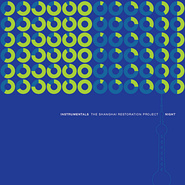

Instrumentals: Day - Night
============================

|  |  |
| :--: | :-- |
| [ Instrumentals: Day - Night](https://emumo.xiami.com/album/349001) | **艺人**: [The Shanghai Restoration Project](../index.md) **语种**: 其他 **唱片公司**: Undercover Culture Music **发行时间**: 2008年08月05日 **专辑类别**: 录音室专辑 **专辑风格**: 嘻哈 Hip-Hop, 电子 Electronic **播放数**: 386445 **收藏数**: 1169 **评论数**: 53  |

## 简介

Bridging the cultural gap between East and West, the artist/producer known as the SHANGHAI RESTORATION PROJECT has put together the ultimate collection of music for your ultimate 24 Hours in his namesake city. Features select instrumentals from the albums THE SHANGHAI RESTORATION PROJECT: SPECIAL EDITION and STORY OF A CITY along with several previously unreleased tracks.
 

 

## 曲目

## 评论

|  |  |  |
| :-- | :-- | :-- |
|  [虾米用户](https://emumo.xiami.com/u/343124500) 我还没想好要写什么... 2019-03-27 02:16 赞(0) 踩(0) | 
哪位大神知道这张专辑cd哪里有卖？   
 |
|  [虾米用户](https://emumo.xiami.com/u/264283064) bye  2017-06-20 20:09 赞(0) 踩(0) | 
△
 |
|  [虾米用户](https://emumo.xiami.com/u/12983602)   2016-12-06 16:59 赞(0) 踩(0) | 
牛逼
 |
|  [虾米用户](https://emumo.xiami.com/u/2085092) 属于自己的地方 2016-10-30 06:46 赞(0) 踩(0) | 
大四发现dave 已经四年过去了 谢谢你的音乐陪伴度过毕设 和每个难忘的瞬间
 |
|  [虾米用户](https://emumo.xiami.com/u/11719634) 俺是小壮 2016-09-12 23:45 赞(0) 踩(0) | 
老上海加电音第二
 |
|  [虾米用户](https://emumo.xiami.com/u/12076161) 兼容古典和嘻哈 2016-08-01 17:01 赞(0) 踩(0) | 
从当初对Miss Shanghai的惊艳，到现在更爱这张无人声的伴奏专辑。当年分享给朋友也是大呼好听
 |
|  [虾米用户](https://emumo.xiami.com/u/6237256)  2016-07-13 09:46 赞(0) 踩(0) | 
碉堡得很！
 |
|  [虾米用户](https://emumo.xiami.com/u/101779900)   2016-06-03 22:53 赞(0) 踩(0) | 
我只能说 真tm牛
 |
|  [虾米用户](https://emumo.xiami.com/u/30617820) 窝列大窝列大哟 2016-04-16 20:52 赞(0) 踩(0) | 
＝＝
 |
|  [虾米用户](https://emumo.xiami.com/u/344118)  2016-04-14 10:31 赞(0) 踩(0) | 
时尚中国风
 |
|  [虾米用户](https://emumo.xiami.com/u/36208991)   2015-12-07 22:32 赞(0) 踩(0) | 
๑
 |
|  [虾米用户](https://emumo.xiami.com/u/31186919) ？ 2015-10-02 01:21 赞(0) 踩(0) | 
绝
 |
|  [虾米用户](https://emumo.xiami.com/u/4960476)  2015-10-01 10:39 赞(0) 踩(0) | 
好听！！！
 |
|  [虾米用户](https://emumo.xiami.com/u/6237256)  2015-06-01 22:22 赞(0) 踩(0) | 
我也是醉了！
 |
|  [虾米用户](https://emumo.xiami.com/u/2088338) what 2015-02-13 13:36 赞(0) 踩(0) | 
太浮夸了，受不了了- -
 |
|  [虾米用户](https://emumo.xiami.com/u/1277527) 网易云：糖衣心脏 2015-02-07 20:05 赞(0) 踩(0) | 
Wa 哈哈哈 好亲切
 |
|  [虾米用户](https://emumo.xiami.com/u/8141200)  2015-02-04 21:26 赞(0) 踩(0) | 
不错.好听
 |
|  [虾米用户](https://emumo.xiami.com/u/9234171) 电音才是男人的浪漫～ 2014-10-04 21:17 赞(0) 踩(0) | 
0.0
 |
|  [虾米用户](https://emumo.xiami.com/u/2260170) 小小的我是一粒沙，但不甘... 2014-10-03 14:59 赞(0) 踩(0) | 
中西融合非常棒。。。。
 |
|  [虾米用户](https://emumo.xiami.com/u/295871)  2014-05-20 10:40 赞(0) 踩(0) | 
The version With more flexible rhythm.
 |
|  [虾米用户](https://emumo.xiami.com/u/6612253) 你答对了，哥就是电子＆嘻... 2014-05-01 18:30 赞(0) 踩(0) | 
shanghai style
 |
|  [虾米用户](https://emumo.xiami.com/u/22933472) 步入未来。 2014-04-22 03:12 赞(0) 踩(0) | 
可以感受到未来华夏的感觉。。
 |
|  [虾米用户](https://emumo.xiami.com/u/8946950) 灌不饱的耳朵 2014-04-01 09:16 赞(1) 踩(0) | 
这张碟一贯风格，而且感觉更加浮夸了，略微有点违和感。
 |
|  [虾米用户](https://emumo.xiami.com/u/6631689) 我还没想好要写什么... 2014-03-02 15:35 赞(0) 踩(0) | 
带你重新感受上海
 |
|  [虾米用户](https://emumo.xiami.com/u/30652013) tonyhy 2014-01-16 14:25 赞(0) 踩(0) | 
Bridging the cultural gap between East and West
 |
|  [虾米用户](https://emumo.xiami.com/u/609877)  2013-06-26 23:01 赞(0) 踩(0) | 
中西结合。。支持Dave Liang！
 |
|  [虾米用户](https://emumo.xiami.com/u/10443977) 我累了，我想自己呆着 2013-05-21 22:39 赞(0) 踩(0) | 
太棒了
 |
|  [虾米用户](https://emumo.xiami.com/u/117110)  2013-05-21 00:23 赞(0) 踩(0) | 
好听，非常舒服。
 |
|  [虾米用户](https://emumo.xiami.com/u/14648217) 我还没想好要写什么... 2013-05-10 08:06 赞(0) 踩(0) | 
hao
 |
|  [虾米用户](https://emumo.xiami.com/u/7412061)   2013-04-28 10:42 赞(0) 踩(0) | 
整张专辑都喜欢
 |
|  [虾米用户](https://emumo.xiami.com/u/12051188)  2013-01-06 23:16 赞(0) 踩(0) | 
..............
 |
|  [虾米用户](https://emumo.xiami.com/u/1075105)   2012-12-20 20:03 赞(3) 踩(0) | 
这张真是太愉悦耳朵了，每首歌的主题都表现的很好，而且jazzhiphop和中国传统音乐的配合十分自然融洽，不生硬，不像有些音乐人过于突出民乐而显得装逼，或是过于突出jazzhiphop而导致音乐玩味不足。
 |
|  [虾米用户](https://emumo.xiami.com/u/358702)  2012-11-12 15:22 赞(0) 踩(0) | 
不错哦~
 |
|  [虾米用户](https://emumo.xiami.com/u/3706286)  2012-07-06 23:54 赞(10) 踩(0) | 
上海复兴啊！ 完全不顾客厅的客人大喊了一声“   我   操！     牛   逼！！”
 |
|  [虾米用户](https://emumo.xiami.com/u/2286115) 耳朵在聆听 2012-06-15 16:32 赞(0) 踩(0) | 
京味十足的 中国风
 |
|  [虾米用户](https://emumo.xiami.com/u/2928117) 你好 2012-06-03 20:03 赞(0) 踩(0) | 
哎哟妈呀 爽
 |
|  [虾米用户](https://emumo.xiami.com/u/4032293) 记得我们变态的时候还很年... 2012-04-17 14:28 赞(0) 踩(0) | 
大卫梁
 |
|  [虾米用户](https://emumo.xiami.com/u/3812689)  2012-02-18 21:22 赞(0) 踩(0) | 
满分
 |
|  [虾米用户](https://emumo.xiami.com/u/1450166)  2011-11-09 17:57 赞(0) 踩(0) | 
喜欢这种感觉
 |
|  [虾米用户](https://emumo.xiami.com/u/3587432)  2011-10-12 11:34 赞(0) 踩(0) | 
舒服啊！！
 |
|  [虾米用户](https://emumo.xiami.com/u/2928117) 你好 2011-09-30 20:31 赞(0) 踩(0) | 
了不起的音乐家，怎么就没红起来呢
 |
|  [虾米用户](https://emumo.xiami.com/u/2928117) 你好 2011-09-30 19:46 赞(0) 踩(0) | 
开心~~~！
 |
|  [虾米用户](https://emumo.xiami.com/u/3568966) 你的声，我都要听... 2011-09-27 13:40 赞(1) 踩(0) | 
可以high死在这乐音里
 |
|  [虾米用户](https://emumo.xiami.com/u/2361171) 音乐响起.又是美好的一天 2011-09-26 23:17 赞(0) 踩(0) | 
哎呀!~ 我来了!~
 |
|  [虾米用户](https://emumo.xiami.com/u/567768) 受伤护士 2011-09-26 18:28 赞(0) 踩(0) | 
棒梁子
 |
|  [虾米用户](https://emumo.xiami.com/u/2173149) Go to Boston 2011-09-26 17:54 赞(0) 踩(0) | 
David Liang，完美融合中国风的电子新浪潮音乐！！
 |
|  [虾米用户](https://emumo.xiami.com/u/5379598)  2011-08-19 20:23 赞(0) 踩(0) | 
肿么办，肿么介么稀饭他的音乐捏…… 自从知道了 MISS SHANGHAI 也是他制作的就更加……
 |
|  [虾米用户](https://emumo.xiami.com/u/3666454)  2011-06-05 18:10 赞(0) 踩(0) | 
Dave Liang 是一位充满音乐天分的DJ。第一次听到他的专辑被他的中西元素合并吸引住了。我已经爱上了上海20/30年代的那种东方时尚格调。他把这种风格和西方的旋律穿插起来可以把电子音乐带出一个特别的风格出来。棒！
 |
|  [虾米用户](https://emumo.xiami.com/u/151580)  2011-05-13 23:43 赞(0) 踩(0) | 
good
 |
|  [虾米用户](https://emumo.xiami.com/u/2104148)  2011-04-04 17:18 赞(0) 踩(0) | 
Dave Liang
 |
|  [虾米用户](https://emumo.xiami.com/u/252289) 修不屈之魂，炼不灭之躯！ 2011-04-03 19:00 赞(0) 踩(0) | 
喜欢！
 |
|  [虾米用户](https://emumo.xiami.com/u/2762619)  2011-02-17 07:28 赞(0) 踩(0) | 
******
 |
|  [虾米用户](https://emumo.xiami.com/u/1933685)  2011-01-08 15:59 赞(0) 踩(0) | 
有魅力
 |
