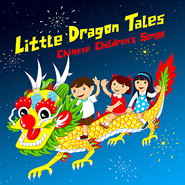

Little Dragon Tales: Chinese Children's Songs
============================

|  |  |
| :--: | :-- |
| [ Little Dragon Tales: Chinese Children's Songs](https://emumo.xiami.com/album/471870) | **艺人**: [The Shanghai Restoration Project](../index.md) **语种**: 国语 **唱片公司**: Undercover Culture Music **发行时间**: 2011年11月29日 **专辑类别**: 录音室专辑 **专辑风格**: 沙发音乐 Lounge, 儿歌 Nursery Rhyme, 独立电子乐 Indietronica **播放数**: 5247195 **收藏数**: 11860 **评论数**: 1002  |

## 简介

这张专辑内旧时代的音乐，都反映出当时的社会风貌，无论是市井百态还是文人气息，由环境造化又由创作者创造，而且还是儿歌，字句旋律本身就充满了作者的伤感、温柔和希冀，复杂而单纯。当我们正沉浸在当时的映像中，那些鲜明的节奏和各色乐器的融合又将情境悄然转回此时此刻，然而足迹却又历历在目。  
  
Little Dragon Tales is a collection of 12 classic Chinese Children’s songs with a modern twist. Produced by the electronic music group The Shanghai Restoration Project, the album features the voices of the Yip’s Canada Children’s Choir. In partnership with Cheng &amp; Tsui Company and IODA, the album will be available online and in stores on Tuesday, Nov. 29th.
 

 
 

 

## 曲目

## 评论

|  |  |  |
| :-- | :-- | :-- |
|  [虾米用户](https://emumo.xiami.com/u/344097188) 等待你回眸的那一刻…… 2020-10-21 09:57 赞(0) 踩(0) | 
怎么能不爱
 |
|  [虾米用户](https://emumo.xiami.com/u/40864669) 我还没想好要写什么... 2020-10-17 22:32 赞(0) 踩(0) | 
竟然是2011年的专辑了
 |
|  [虾米用户](https://emumo.xiami.com/u/798356) 我还没想好要写什么... 2020-08-20 17:19 赞(0) 踩(0) | 
❤️
 |
|  [虾米用户](https://emumo.xiami.com/u/372574239) 爱恨多自在 2020-07-18 23:02 赞(1) 踩(0) | 
值得收藏
 |
|  [虾米用户](https://emumo.xiami.com/u/422798319)  2020-06-04 11:37 赞(0) 踩(0) | 
丶一心坼a
 |
|  [虾米用户](https://emumo.xiami.com/u/76210658) 短的沉默长的无意义 2020-04-01 11:25 赞(0) 踩(0) | 
秀  
 |
|  [虾米用户](https://emumo.xiami.com/u/5224674)   2020-03-21 13:30 赞(0) 踩(0) | 
满分！ 小红花花！ 哈哈哈哈哈哈哈哈
 |
|  [虾米用户](https://emumo.xiami.com/u/100854936)  2020-03-20 01:48 赞(0) 踩(0) | 
超级喜欢
 |
|  [虾米用户](https://emumo.xiami.com/u/100854936)  2020-03-20 01:48 赞(2) 踩(0) | 
这张专辑 必须mark啊！
 |
|  [虾米用户](https://emumo.xiami.com/u/271339403)  2020-03-04 19:57 赞(0) 踩(0) | 
编曲有时尚感又不嘈杂不低俗，孩子大人都爱听。
 |
|  [虾米用户](https://emumo.xiami.com/u/36531835)  2020-03-04 04:06 赞(0) 踩(0) | 
听到了儿时的回忆，曾经的家人、曾经的小朋友们在一起多开心，无忧无虑的一切都那么新奇，什么是快乐美好，不过如此… 
 |
|  [虾米用户](https://emumo.xiami.com/u/216220730) 那些所谓橙蓝都好虚好虚的... 2020-03-02 13:34 赞(0) 踩(0) | 
太好听了
 |
|  [虾米用户](https://emumo.xiami.com/u/360225340)  2020-02-15 19:51 赞(0) 踩(0) | 
满分
 |
|  [虾米用户](https://emumo.xiami.com/u/5931356)  2019-12-27 10:44 赞(1) 踩(0) | 
diǎo
 |
|  [虾米用户](https://emumo.xiami.com/u/8382419) . 2019-11-20 10:45 赞(4) 踩(0) | 
为了这个专辑生了个女儿
 |
|  [虾米用户](https://emumo.xiami.com/u/10081975) weibo@winnin... 2019-11-19 20:36 赞(0) 踩(0) | 
神作
 |
|  [虾米用户](https://emumo.xiami.com/u/325143321) 就这 2019-11-18 14:03 赞(0) 踩(0) | 
？？？
 |
|  [虾米用户](https://emumo.xiami.com/u/8021033) 去他X虾米评论的骗赞抄段... 2019-11-05 00:05 赞(3) 踩(0) | 
作为虾米听了五万多首的挑剔听众，第一个10分专辑竟然给了一张电音儿歌专辑……不知不觉回到返璞归真不忘初心的境界了 
 |
|  [虾米用户](https://emumo.xiami.com/u/2143184)  2019-10-12 08:34 赞(2) 踩(0) | 
有点遗憾没有小小少年，不然更多人哭
 |
|  [虾米用户](https://emumo.xiami.com/u/42560187) 归于传统 2019-10-10 01:58 赞(0) 踩(0) | 

 |
|  [虾米用户](https://emumo.xiami.com/u/420484759)  2019-10-07 13:52 赞(0) 踩(0) | 
u
 |
|  [虾米用户](https://emumo.xiami.com/u/347581418) 難道你教世間漂亮 或默令... 2019-09-23 22:27 赞(1) 踩(0) | 
要是有数鸭子就更完美了～
 |
|  [虾米用户](https://emumo.xiami.com/u/154328560) 我想好了，不写什么 2019-08-17 06:14 赞(0) 踩(0) | 
只是专辑名太东方主义了
 |
|  [虾米用户](https://emumo.xiami.com/u/401102483)  2019-08-12 00:09 赞(0) 踩(0) | 
人才无处不在
 |
|  [虾米用户](https://emumo.xiami.com/u/5739067)   2019-08-09 15:43 赞(0) 踩(0) | 
超级棒！我们家小朋友超级喜欢！
 |
|  [虾米用户](https://emumo.xiami.com/u/42606578) 反对菠菜 永远拥护带壳的... 2019-08-08 12:56 赞(0) 踩(0) | 
这也太柔软了
 |
|  [虾米用户](https://emumo.xiami.com/u/204198552)  2019-08-07 08:21 赞(0) 踩(0) | 
这才是10后听的儿歌。有律动，有可爱。
 |
|  [虾米用户](https://emumo.xiami.com/u/185480169) Life was a g... 2019-07-26 03:04 赞(0) 踩(0) | 
真是太棒了！！
 |
|  [虾米用户](https://emumo.xiami.com/u/538042)  2019-06-19 09:17 赞(0) 踩(0) | 
这么好的改编应该收获无数掌声和鲜花
 |
|  [虾米用户](https://emumo.xiami.com/u/5630476) 要令到爱人微笑着，要令朋... 2019-06-05 22:30 赞(0) 踩(0) | 
是真的嗨
 |
|  [虾米用户](https://emumo.xiami.com/u/3585623) 建构主义学习理论的教学启... 2019-05-29 00:02 赞(0) 踩(0) | 
旧酒焕发新青春，谁说新瓶没味道？
 |
|  [虾米用户](https://emumo.xiami.com/u/46378692) If you come.... 2019-05-26 09:17 赞(0) 踩(0) | 
给自己听 童年回忆
 |
|  [虾米用户](https://emumo.xiami.com/u/8706909) 心烦意躁的时候别说话 2019-05-22 20:51 赞(2) 踩(0) | 
高二时候听反应根本没大二现在这么强烈，短短四年我真的变了很多，或者说是真的自己已经回来了吧。强烈地怀念着童年，最后几首歌太催泪了。眼前浮现出小孩的天真和我慢慢长大这一无法扭转事实的失落，只能凭着这一张专辑再装一回小孩。
 |
|  [虾米用户](https://emumo.xiami.com/u/99798254)  2019-05-11 19:13 赞(0) 踩(0) | 
所以大家都一个年龄层~
 |
|  [虾米用户](https://emumo.xiami.com/u/45176669)  2019-05-08 18:19 赞(0) 踩(0) | 
魔音... 宝宝和我一起边听边晃悠，哈哈……
 |
|  [虾米用户](https://emumo.xiami.com/u/36754873)  2019-05-06 11:26 赞(0) 踩(0) | 
可爱到不行
 |
|  [虾米用户](https://emumo.xiami.com/u/839591)  2019-05-02 20:34 赞(0) 踩(0) | 
吹爆～
 |
|  [虾米用户](https://emumo.xiami.com/u/20177386) 感谢一切美好的遇见❤️ 2019-04-10 16:21 赞(3) 踩(0) | 
可爱
 |
|  [虾米用户](https://emumo.xiami.com/u/132904128)  2019-03-31 15:45 赞(1) 踩(0) | 
专辑太棒了吧！听完之后，心情棒棒的
 |
|  [虾米用户](https://emumo.xiami.com/u/307773310) 微醺的人生 2019-02-24 09:47 赞(1) 踩(0) | 
这是一本让家长也能跟着摇摆的儿歌专辑。不错，nice~
 |
|  [虾米用户](https://emumo.xiami.com/u/600368) 群众的眼睛是雪亮的=喷子 2019-02-20 12:43 赞(1) 踩(0) | 
女儿爱听就够了
 |
|  [虾米用户](https://emumo.xiami.com/u/10295320) 譬如朝露 去日苦多 2019-02-13 19:09 赞(1) 踩(0) | 
每天播给我刚出生的儿子听
 |
|  [虾米用户](https://emumo.xiami.com/u/216922826) 我的酷是文静外表下有颗巨... 2018-11-03 14:03 赞(1) 踩(0) | 
胎教音乐已备好可是男朋友呢 
 |
|  [虾米用户](https://emumo.xiami.com/u/600368) 群众的眼睛是雪亮的=喷子 2018-10-28 20:15 赞(1) 踩(0) | 
从小教育什么叫编曲
 |
|  [虾米用户](https://emumo.xiami.com/u/8481976) 苦情少女微波炉 2018-10-24 12:25 赞(0) 踩(0) | 
这也太牛逼了
 |
|  [虾米用户](https://emumo.xiami.com/u/123388710) 晚来风急。 2018-08-22 22:00 赞(1) 踩(0) | 
这是一张神奇的专辑，我都会唱。
 |
|  [虾米用户](https://emumo.xiami.com/u/4957639) I Don't Want... 2018-08-06 19:18 赞(0) 踩(0) | 
6666666
 |
|  [虾米用户](https://emumo.xiami.com/u/35052418)  2018-06-30 16:14 赞(1) 踩(0) | 
宝物
 |
|  [虾米用户](https://emumo.xiami.com/u/44714480) 虾米别关啊，没地方去了 2018-06-01 17:13 赞(0) 踩(0) | 
打卡打卡
 |
|  [虾米用户](https://emumo.xiami.com/u/10183109) 我一直假装自己是个学霸… 2018-06-01 13:42 赞(0) 踩(0) | 
6.1打卡
 |
|  [虾米用户](https://emumo.xiami.com/u/9878283) 歌单很乱 将就听吧 新歌... 2018-05-12 17:29 赞(0) 踩(0) | 
真的是非常好了
 |
|  [虾米用户](https://emumo.xiami.com/u/20407295) 很聪明的家伙呀 2018-04-26 21:08 赞(1) 踩(0) | 
我收藏了，虾米之宝 
 |
|  [虾米用户](https://emumo.xiami.com/u/1456915) 我还没想好要写什么... 2018-04-19 08:17 赞(3) 踩(0) | 
八个月的儿子除了泥娃娃一听就哭其他的都嗨起来了
 |
|  [虾米用户](https://emumo.xiami.com/u/6237785) 天早灰蓝，想告别，偏未晚 2018-04-06 23:31 赞(1) 踩(0) | 
正张专辑的背景电音都很不错啊
 |
|  [虾米用户](https://emumo.xiami.com/u/309707928) 乐极忘形 2018-03-06 23:08 赞(3) 踩(0) | 
最近开车出门，小儿子都要求听此专辑&amp;hellip;&amp;hellip;
 |
|  [虾米用户](https://emumo.xiami.com/u/72210902) 我还没想好要写什么... 2018-03-04 10:51 赞(0) 踩(0) | 
我们的童年又来了
 |
|  [虾米用户](https://emumo.xiami.com/u/93407)   2018-02-26 10:47 赞(0) 踩(0) | 
好听死了！
 |
|  [虾米用户](https://emumo.xiami.com/u/159124) 你是国王，晚安，我是小鸟... 2018-02-04 13:49 赞(0) 踩(0) | 
这张专辑太牛了！谁说童谣儿歌就不能有精巧的编曲和精良的制作？疯狂打电话啊！
 |
|  [虾米用户](https://emumo.xiami.com/u/3063291)  2018-01-15 15:13 赞(0) 踩(0) | 
太好听了，很喜欢，。百年难得的电子儿歌。
 |
|  [虾米用户](https://emumo.xiami.com/u/44714480) 虾米别关啊，没地方去了 2018-01-02 20:55 赞(1) 踩(0) | 
为了这张专辑怎么着也得找个女朋友生猴子了 
 |
|  [虾米用户](https://emumo.xiami.com/u/182448154) 离我远一点，你压到我的翅... 2017-12-29 11:43 赞(0) 踩(0) | 
收藏给我未来的小孩
 |
|  [虾米用户](https://emumo.xiami.com/u/4830548)  2017-12-12 21:24 赞(0) 踩(0) | 
童趣
 |
|  [虾米用户](https://emumo.xiami.com/u/9978123)   2017-11-24 01:55 赞(0) 踩(0) | 
11年的专辑了 想法很不错的 好喜欢
 |
|  [虾米用户](https://emumo.xiami.com/u/193353160)  2017-11-17 23:31 赞(0) 踩(0) | 
颠覆一切的专辑！！
 |
|  [虾米用户](https://emumo.xiami.com/u/6649476) 我还没想好要写什么... 2017-10-28 00:10 赞(0) 踩(0) | 
这是哈佛应数哥们儿的神砖。。你们再感受下。。。如果我弃疗一定会义无反顾地投身厄运金属界的。。。不过话说回来这专辑还蛮好听的嘻嘻嘻
 |
|  [虾米用户](https://emumo.xiami.com/u/722766) 大婶奔四，不清新。 2017-10-28 00:03 赞(3) 踩(0) | 
今天再看《城南旧事》，翻找到《送别》的原版Dreaming of Home and Mother(才知作者原是美国人John Pond Ordway，传至日本，再由李叔同引入中国），顺带再重听这张专辑，突然体会到之前未注意过的说明——“字句旋律本身就充满了作者的伤感” （当然，以及一直存在的Dave Liang和弦里的“温柔和希冀”）——所有儿歌和童话本质的寓言性与忧郁感，以及制作者的善良，就这样结合起来了。
 |
|  [虾米用户](https://emumo.xiami.com/u/3336097)   2017-10-22 09:30 赞(0) 踩(0) | 
心情好
 |
|  [虾米用户](https://emumo.xiami.com/u/8749492) 挥手自兹去 2017-10-16 03:44 赞(0) 踩(0) | 
其实我觉得这个编曲挺俗的 现在欧美流行歌曲不也这么编的吗
 |
| ⇒ |  [虾米用户](https://emumo.xiami.com/u/2741546)  2017-11-22 01:29 赞(0) 踩(0) | 
哥们挺懂啊 也玩编曲？
 |
|  [虾米用户](https://emumo.xiami.com/u/278261731) 世界上比天鹅绒更柔软的是... 2017-10-15 01:56 赞(0) 踩(0) | 
真好听
 |
|  [虾米用户](https://emumo.xiami.com/u/204839095) 超级喜欢易烊千玺 2017-10-14 23:23 赞(0) 踩(0) | 
童声清澈纯真，配乐精致细腻，突出中国风
 |
|  [虾米用户](https://emumo.xiami.com/u/204839095) 超级喜欢易烊千玺 2017-10-14 19:38 赞(0) 踩(0) | 
发现这张专辑做梦都要笑醒
 |
|  [虾米用户](https://emumo.xiami.com/u/11645936)  2017-10-14 12:47 赞(0) 踩(0) | 
儿舞素材
 |
|  [虾米用户](https://emumo.xiami.com/u/5027691) 暂无签名~ 2017-10-11 17:29 赞(0) 踩(0) | 
当年一起唱歌的小伙伴呢？
 |
|  [虾米用户](https://emumo.xiami.com/u/49309294) “哪有开心这一说” 2017-10-11 09:01 赞(2) 踩(0) | 
神砖
 |
|  [虾米用户](https://emumo.xiami.com/u/15270473) 听到喜欢的歌 身体不跟着... 2017-09-28 02:27 赞(0) 踩(0) | 
太好玩了
 |
|  [虾米用户](https://emumo.xiami.com/u/15270473) 听到喜欢的歌 身体不跟着... 2017-09-28 00:52 赞(0) 踩(0) | 
-
 |
|  [虾米用户](https://emumo.xiami.com/u/12464012) 这个世界太疯狂 2017-09-13 19:52 赞(0) 踩(0) | 
这时代应该有的儿歌！
 |
|  [虾米用户](https://emumo.xiami.com/u/12464012) 这个世界太疯狂 2017-09-13 19:51 赞(0) 踩(0) | 
妈呀，这专辑也太牛逼了！
 |
|  [虾米用户](https://emumo.xiami.com/u/72502) 音乐可以改变人的心情！ 2017-08-12 15:57 赞(0) 踩(0) | 
适合小朋友听！！
 |
|  [虾米用户](https://emumo.xiami.com/u/93238794)  2017-07-23 23:39 赞(0) 踩(0) | 
mmp
 |
|  [虾米用户](https://emumo.xiami.com/u/583107) 音乐 和 码字 需要走心 2017-07-22 18:09 赞(0) 踩(0) | 
请问我怎么才能下载啊。虽然说是购买，但好复杂的操作呀
 |
|  [虾米用户](https://emumo.xiami.com/u/1631900) . 2017-07-02 20:57 赞(1) 踩(0) | 
的确是要为了未来的孩子保存起来呀。。 可却还是个单身。。
 |
|  [虾米用户](https://emumo.xiami.com/u/10310498)   2017-06-24 18:54 赞(0) 踩(0) | 
～
 |
|  [虾米用户](https://emumo.xiami.com/u/91372642) 不開心就不好看了 2017-06-16 15:28 赞(0) 踩(0) | 

 |
|  [虾米用户](https://emumo.xiami.com/u/50522777) 爱与和平  2017-06-06 11:39 赞(0) 踩(0) | 
童年不同味
 |
|  [虾米用户](https://emumo.xiami.com/u/16337726)  2017-06-05 16:24 赞(0) 踩(0) | 
)
 |
|  [虾米用户](https://emumo.xiami.com/u/47357376)  2017-06-01 09:48 赞(0) 踩(0) | 
******
 |
|  [虾米用户](https://emumo.xiami.com/u/22172791)  2017-06-01 09:27 赞(0) 踩(0) | 
六一儿童节快乐
 |
|  [虾米用户](https://emumo.xiami.com/u/5108333) 我还没想好要写什么... 2017-05-27 16:58 赞(0) 踩(0) | 
想知道这张专辑在国外销量怎么样_(:3」&amp;ang;❀)_
 |
|  [虾米用户](https://emumo.xiami.com/u/39769356) 很普通，很快乐 2017-04-29 00:05 赞(0) 踩(0) | 
真是棒！
 |
|  [虾米用户](https://emumo.xiami.com/u/4174873) 我还没想好要写什么... 2017-04-15 19:56 赞(0) 踩(0) | 
天籁童声配着节奏强烈的爵士乐格外有趣
 |
|  [虾米用户](https://emumo.xiami.com/u/5426125)  2017-03-12 22:23 赞(0) 踩(0) | 
萌萌哒到爆炸！！
 |
|  [虾米用户](https://emumo.xiami.com/u/9809603) 这家伙很聪明什么都没留下 2017-03-04 23:15 赞(1) 踩(0) | 
一张特别棒的电子儿歌专辑，分享给爹妈们:)
 |
|  [虾米用户](https://emumo.xiami.com/u/30848223)   2017-02-06 17:41 赞(0) 踩(0) | 
发现一个宝贝！
 |
|  [虾米用户](https://emumo.xiami.com/u/53008228) 尝试用旋律纪念我成长的一... 2017-02-03 14:00 赞(1) 踩(0) | 
为什么没有蜗牛与黄鹂鸟。。。。
 |
|  [虾米用户](https://emumo.xiami.com/u/53008228) 尝试用旋律纪念我成长的一... 2017-02-03 13:45 赞(0) 踩(0) | 
神砖。。。。
 |
|  [虾米用户](https://emumo.xiami.com/u/1842399)  2017-02-03 12:51 赞(0) 踩(0) | 
天啊……神专跪………………
 |
|  [虾米用户](https://emumo.xiami.com/u/100660422) 你好呀。(¦3[▓▓]虾... 2017-01-31 01:21 赞(0) 踩(0) | 
很喜欢这一盘，就是封面太丑了 
 |
|  [虾米用户](https://emumo.xiami.com/u/4727768)  2017-01-17 20:41 赞(2) 踩(0) | 
混音童谣，按说是目前处理老歌的高明办法，但是我国除了个别歌手老经典翻唱一下，儿歌却很少，这个真是难得
 |
|  [虾米用户](https://emumo.xiami.com/u/13945602) 美好肉体，穿透迷妄，向现... 2017-01-09 16:51 赞(0) 踩(0) | 
哈哈哈哈哈 T_T
 |
|  [虾米用户](https://emumo.xiami.com/u/49907653)  2017-01-05 10:41 赞(0) 踩(0) | 
找呀找呀找笨友～
 |
|  [虾米用户](https://emumo.xiami.com/u/5739067)   2016-12-20 20:10 赞(2) 踩(0) | 
电子要从娃娃抓起！是时候去称霸幼儿园了！
 |
| ⇒ |  [虾米用户](https://emumo.xiami.com/u/13945602) 美好肉体，穿透迷妄，向现... 2017-01-09 16:51 赞(0) 踩(0) | 
haha
 |
|  [虾米用户](https://emumo.xiami.com/u/12983602)   2016-12-06 11:05 赞(0) 踩(0) | 
今天我6岁！
 |
|  [虾米用户](https://emumo.xiami.com/u/12983602)   2016-12-06 11:05 赞(1) 踩(0) | 
牛逼咧上海复兴方案
 |
|  [虾米用户](https://emumo.xiami.com/u/777858) 7XX23223@qq.... 2016-10-14 11:56 赞(24) 踩(0) | 
才出生5天的宝用眼神告诉我 他喜欢这块砖❤️
 |
|  [虾米用户](https://emumo.xiami.com/u/43068924) 天木纯的fans 2016-10-08 00:03 赞(1) 踩(0) | 
ko
 |
|  [虾米用户](https://emumo.xiami.com/u/50033001)  2016-10-06 22:53 赞(2) 踩(0) | 
耳朵中毒 思想轻松
 |
|  [虾米用户](https://emumo.xiami.com/u/50033001)  2016-10-06 22:47 赞(0) 踩(0) | 
so so so so  so wonderful.......
 |
|  [虾米用户](https://emumo.xiami.com/u/50033001)  2016-10-06 22:44 赞(0) 踩(0) | 
so so so wonderful.......
 |
|  [虾米用户](https://emumo.xiami.com/u/50033001)  2016-10-06 22:38 赞(0) 踩(0) | 
wonderful
 |
|  [虾米用户](https://emumo.xiami.com/u/144726676)   2016-09-08 15:05 赞(1) 踩(0) | 
复兴方案的每一张专辑都大爱。两张儿歌的专辑尤其喜欢。
 |
|  [虾米用户](https://emumo.xiami.com/u/36726571)  2016-09-02 00:33 赞(0) 踩(0) | 
牛逼的专辑！今天我7岁！
 |
|  [虾米用户](https://emumo.xiami.com/u/33072171) 越来越喜欢虾米 2016-08-30 21:27 赞(0) 踩(0) | 
每当心情不好的时候，或者是听到一些负面的消息导致心情低落的时候就听听这些歌曲，很治愈。
 |
|  [虾米用户](https://emumo.xiami.com/u/1032532) 我还没想好要写什么... 2016-08-29 01:50 赞(0) 踩(0) | 
传统歌曲的新演绎
 |
|  [虾米用户](https://emumo.xiami.com/u/7269731) 謎樣跨次元喵¤電波星¤ 2016-08-22 19:33 赞(0) 踩(0) | 
棒棒~
 |
|  [虾米用户](https://emumo.xiami.com/u/26190565) 一世无虞 2016-08-22 19:29 赞(0) 踩(0) | 
辑玩纪
 |
|  [虾米用户](https://emumo.xiami.com/u/9154037) 到水星散心去了。 2016-08-16 15:34 赞(0) 踩(0) | 
可爱！！！！！（专辑介绍写得真好
 |
|  [虾米用户](https://emumo.xiami.com/u/206328574)   2016-07-29 00:44 赞(0) 踩(0) | 
hao
 |
|  [虾米用户](https://emumo.xiami.com/u/46112622)  2016-07-27 22:26 赞(0) 踩(0) | 
二十一世纪新世代新潮儿歌标杆之作么
 |
|  [虾米用户](https://emumo.xiami.com/u/8468754) @ddazedconfu... 2016-06-24 16:02 赞(0) 踩(0) | 
赞！
 |
|  [虾米用户](https://emumo.xiami.com/u/49156415)  2016-06-01 16:43 赞(0) 踩(0) | 
儿歌
 |
|  [虾米用户](https://emumo.xiami.com/u/8737214) 我还没想好要写什么... 2016-06-01 00:40 赞(1) 踩(0) | 
这张专辑真的适合在各大节日分享
 |
|  [虾米用户](https://emumo.xiami.com/u/10531858) 有素质的人 2016-05-16 17:27 赞(0) 踩(0) | 
太NB了！（请原谅我是个粗人）
 |
|  [虾米用户](https://emumo.xiami.com/u/31229240)  2016-05-11 20:08 赞(0) 踩(0) | 
~
 |
|  [虾米用户](https://emumo.xiami.com/u/12010664) The Light 2016-05-11 11:49 赞(1) 踩(0) | 
童声的杀伤力太强。
 |
|  [虾米用户](https://emumo.xiami.com/u/89950520)  2016-05-09 10:24 赞(0) 踩(0) | 
棒棒~
 |
|  [虾米用户](https://emumo.xiami.com/u/2968301) 电音才是音乐进化的完整体 2016-05-04 10:40 赞(0) 踩(0) | 
以后就让自己的孩子听这里面的儿歌、不仅不是童真，而且还有中国元素风，节奏感强，现代感也十足。 不像以前我们听的那种形式  单调乏味。   这张太完美   赞。
 |
|  [虾米用户](https://emumo.xiami.com/u/6621071) Real is rare 2016-05-04 03:03 赞(0) 踩(0) | 
莫名戳中萌点
 |
|  [虾米用户](https://emumo.xiami.com/u/6621071) Real is rare 2016-05-04 03:03 赞(0) 踩(0) | 
莫名戳中萌点
 |
|  [虾米用户](https://emumo.xiami.com/u/15323579)   2016-04-27 19:06 赞(1) 踩(0) | 
妈呀 听哭了
 |
|  [虾米用户](https://emumo.xiami.com/u/3676248)  2016-04-25 03:36 赞(0) 踩(0) | 
清新，明快，打动心灵
 |
|  [虾米用户](https://emumo.xiami.com/u/13666756) 我还没想好要写什么... 2016-04-21 20:04 赞(0) 踩(0) | 
神专辑
 |
|  [虾米用户](https://emumo.xiami.com/u/18169133) 停用个人功能.仅上传音乐... 2016-04-21 08:06 赞(0) 踩(0) | 
听哭！！！！
 |
|  [虾米用户](https://emumo.xiami.com/u/30617820) 窝列大窝列大哟 2016-04-16 20:53 赞(0) 踩(0) | 
＝＝
 |
|  [虾米用户](https://emumo.xiami.com/u/11811199) 多少唏嘘的你在人海　 2016-03-31 14:49 赞(1) 踩(0) | 
excuse me？我的童年才没这么好听！！！！！春天在哪里猴猴听！！！！！
 |
|  [虾米用户](https://emumo.xiami.com/u/365637)  2016-03-24 17:13 赞(0) 踩(0) | 
这些英文歌名实在是...........
 |
|  [虾米用户](https://emumo.xiami.com/u/50204355) 微博：诱甜- 2016-03-19 00:46 赞(0) 踩(0) | 
太棒了
 |
|  [虾米用户](https://emumo.xiami.com/u/40853588) 失眠的夜晚，离不开佩伯军... 2016-03-07 16:44 赞(0) 踩(0) | 
有趣
 |
|  [虾米用户](https://emumo.xiami.com/u/7602582) 电子/神游/浩室/迷幻/... 2016-03-06 20:51 赞(0) 踩(0) | 
早教必备儿歌三百首
 |
|  [虾米用户](https://emumo.xiami.com/u/3713514) 明天我会在哪只鞋子里？ 2016-03-01 01:38 赞(0) 踩(0) | 
很抱歉…我觉得这张专辑没有任何迷人之处…松弛乏味的电音…既没有对原曲情绪的深入挖掘…也没有创造性改编…仅仅是感伤怀旧的童谣串烧而已…
 |
| ⇒ |  [虾米用户](https://emumo.xiami.com/u/10913183)  2016-03-21 21:45 赞(0) 踩(0) | 
同感 get不到有趣的点
 |
| ⇒ |  [虾米用户](https://emumo.xiami.com/u/1431) 谁帮我的歌设计个封面？ 2017-11-28 05:48 赞(0) 踩(0) | 
<q><b>鸭蛋叔说：</b></q>
 |
|  [虾米用户](https://emumo.xiami.com/u/3122918) ♒ 2016-02-28 13:06 赞(0) 踩(0) | 
666666666
 |
|  [虾米用户](https://emumo.xiami.com/u/700991) 2020 2016-02-27 22:07 赞(0) 踩(0) | 
哈哈哈哈哈哈
 |
|  [虾米用户](https://emumo.xiami.com/u/1716769) YO 2016-02-27 17:19 赞(0) 踩(0) | 
牛逼歪歪
 |
|  [虾米用户](https://emumo.xiami.com/u/11556500) 大半夜的。。。起！来！嗨... 2016-02-27 15:25 赞(0) 踩(0) | 
什么鬼
 |
|  [虾米用户](https://emumo.xiami.com/u/11662974) All for you 2016-02-27 15:18 赞(0) 踩(0) | 
长大后 原来童谣这么好听 感谢Dave liang~
 |
|  [虾米用户](https://emumo.xiami.com/u/41163024) I’m done. 2016-02-27 15:05 赞(0) 踩(0) | 
0.0
 |
|  [虾米用户](https://emumo.xiami.com/u/1320669) ツ 2016-02-27 14:45 赞(0) 踩(0) | 
0.0
 |
|  [虾米用户](https://emumo.xiami.com/u/11336395) 鱼唇的人类、 2016-02-27 14:44 赞(0) 踩(0) | 
小白船好听到哭
 |
|  [虾米用户](https://emumo.xiami.com/u/11336395) 鱼唇的人类、 2016-02-27 14:30 赞(0) 踩(0) | 
好萌的砖
 |
|  [虾米用户](https://emumo.xiami.com/u/11336395) 鱼唇的人类、 2016-02-27 14:29 赞(0) 踩(0) | 
说点什么呢？
 |
|  [虾米用户](https://emumo.xiami.com/u/3569954) 微博 & Ins: As... 2016-02-22 04:06 赞(0) 踩(0) | 
我的妈呀这张专辑简直了哈哈哈哈哈哈
 |
|  [虾米用户](https://emumo.xiami.com/u/3569954) 微博 & Ins: As... 2016-02-22 04:06 赞(0) 踩(0) | 
我的妈呀这张专辑简直了哈哈哈哈哈哈
 |
|  [虾米用户](https://emumo.xiami.com/u/32383003)  2016-02-19 23:11 赞(0) 踩(0) | 
好听到不得了~~~~~
 |
|  [虾米用户](https://emumo.xiami.com/u/12835349) 微博 @小羊艾琳 2016-02-17 15:53 赞(0) 踩(0) | 
我的妈   
 |
|  [虾米用户](https://emumo.xiami.com/u/10791385) 有梦想的一定是屌丝 2016-02-01 18:18 赞(0) 踩(0) | 
来吧~~~追忆一下
 |
|  [虾米用户](https://emumo.xiami.com/u/47952781)   2016-01-30 02:08 赞(0) 踩(0) | 
儿子听的歌
 |
|  [虾米用户](https://emumo.xiami.com/u/37517052) 不要停止我的音乐 2016-01-28 20:08 赞(0) 踩(0) | 
春天在哪里，小朋友们一起喔！的声音，真的是要萌化了。
 |
|  [虾米用户](https://emumo.xiami.com/u/13939044) 再见了虾米 2016-01-25 10:01 赞(0) 踩(0) | 
给我小孩听
 |
|  [虾米用户](https://emumo.xiami.com/u/4311251) 声音捕手 2016-01-23 22:55 赞(0) 踩(0) | 
for liam
 |
|  [虾米用户](https://emumo.xiami.com/u/1651269)  2016-01-22 23:10 赞(0) 踩(0) | 
好听！电子+JAZZ+童声+合唱，我的童年只有大白嗓儿
 |
|  [虾米用户](https://emumo.xiami.com/u/319342)  2016-01-21 12:44 赞(0) 踩(0) | 
这个也不错
 |
|  [虾米用户](https://emumo.xiami.com/u/9619892) 多听歌 少放屁 2016-01-11 12:47 赞(0) 踩(0) | 
全砖听完 发现儿歌和童年一样美好而短暂
 |
|  [虾米用户](https://emumo.xiami.com/u/38785812)  2016-01-02 12:57 赞(2) 踩(0) | 
一张专辑～～～成功交上妹纸～～～感恩
 |
|  [虾米用户](https://emumo.xiami.com/u/24684627)  2015-12-30 16:24 赞(0) 踩(0) | 
这种Jazz+电子+儿歌的结合简直要报警！
 |
|  [虾米用户](https://emumo.xiami.com/u/4907604)  2015-12-29 09:47 赞(0) 踩(0) | 
里面的孩子唱的都非常好~
 |
|  [虾米用户](https://emumo.xiami.com/u/4907604)  2015-12-29 09:46 赞(1) 踩(0) | 
美国味儿的中国童谣~
 |
|  [虾米用户](https://emumo.xiami.com/u/51750854)  2015-12-25 16:19 赞(0) 踩(0) | 
整个专辑都好好听
 |
|  [虾米用户](https://emumo.xiami.com/u/25622244)  2015-12-25 12:55 赞(1) 踩(0) | 
给以后的子女提前找到了胎教音乐了，这种Jazz+电子+儿歌的结合简直让人无法免疫啊。
 |
|  [虾米用户](https://emumo.xiami.com/u/50734371)  2015-12-22 18:09 赞(1) 踩(0) | 
儿歌改成这样也太给力了
 |
|  [虾米用户](https://emumo.xiami.com/u/462546)  2015-12-20 00:18 赞(0) 踩(0) | 
编曲和各种细节都好神
 |
|  [虾米用户](https://emumo.xiami.com/u/12541410) 嘿~~FREEDOM 2015-12-18 22:37 赞(1) 踩(0) | 
封面杀伤力太大，让人无法拒绝················
 |
|  [虾米用户](https://emumo.xiami.com/u/6626354) 天地有大美而不言 2015-12-13 21:11 赞(0) 踩(0) | 
以后要给孩子听这张专辑
 |
|  [虾米用户](https://emumo.xiami.com/u/9617076) 我还没想好要写什么... 2015-12-12 16:37 赞(0) 踩(0) | 
好棒
 |
|  [虾米用户](https://emumo.xiami.com/u/13559437) 哪也不去 2015-12-12 12:19 赞(0) 踩(0) | 

 |
|  [虾米用户](https://emumo.xiami.com/u/37148905) Bing 2015-12-10 04:17 赞(0) 踩(0) | 
儿歌三百首还不齐啊~
 |
|  [虾米用户](https://emumo.xiami.com/u/49631494) 冷冷         清... 2015-12-09 11:13 赞(0) 踩(0) | 
满满童年啊
 |
|  [虾米用户](https://emumo.xiami.com/u/33617355) 暂无签名~ 2015-12-08 18:08 赞(0) 踩(0) | 
牛逼！～
 |
|  [虾米用户](https://emumo.xiami.com/u/33617355) 暂无签名~ 2015-12-08 18:08 赞(0) 踩(0) | 
牛逼！～
 |
|  [虾米用户](https://emumo.xiami.com/u/59843076)   2015-11-30 22:58 赞(0) 踩(0) | 
真的边听，边不能自已的笑出声来了
 |
|  [虾米用户](https://emumo.xiami.com/u/85740014) 阳光下丰盈的城市间，贮满... 2015-11-29 12:19 赞(0) 踩(0) | 
复新的非常有创意 节奏巧妙 配器元素丰富且符合当下流行 完美
 |
|  [虾米用户](https://emumo.xiami.com/u/86586976)   2015-11-26 18:39 赞(0) 踩(0) | 
很喜欢，对儿童的一种耳目一新的创作。
 |
|  [虾米用户](https://emumo.xiami.com/u/57833758) Ku. 2015-11-26 14:36 赞(0) 踩(0) | 
天啊  听这张专辑，整个童年都不一样了！
 |
|  [虾米用户](https://emumo.xiami.com/u/52160048) 听到30年代 2015-11-26 05:47 赞(0) 踩(0) | 
满满的回忆 
 |
|  [虾米用户](https://emumo.xiami.com/u/487300) Run to... 2015-11-23 23:38 赞(0) 踩(0) | 
神砖 
 |
|  [虾米用户](https://emumo.xiami.com/u/34918991)  2015-11-23 21:58 赞(0) 踩(0) | 
棒棒哒～
 |
|  [虾米用户](https://emumo.xiami.com/u/12876394)  2015-11-23 21:20 赞(1) 踩(0) | 
好轻快，第一首就爱上了，儿童歌还能这样唱
 |
|  [虾米用户](https://emumo.xiami.com/u/30451738)   2015-11-23 17:40 赞(1) 踩(0) | 
發現好東西 上海復興方案 中國童謠改編版 dave liang 好聽的飛起來 童年都有這種質量的音樂就好了
 |
|  [虾米用户](https://emumo.xiami.com/u/1610780)  2015-11-21 13:34 赞(0) 踩(0) | 
神作而已
 |
|  [虾米用户](https://emumo.xiami.com/u/8097591)  2015-11-18 09:52 赞(0) 踩(0) | 
爱爱爱
 |
|  [虾米用户](https://emumo.xiami.com/u/38621438)  2015-11-17 19:29 赞(1) 踩(0) | 
这是我听过的最洋气的中国儿歌，送给有孩子的朋友们
 |
|  [虾米用户](https://emumo.xiami.com/u/6160637)  2015-11-13 13:49 赞(0) 踩(0) | 
好听
 |
|  [虾米用户](https://emumo.xiami.com/u/13191483) 爱音乐，爱生活 2015-11-13 12:28 赞(0) 踩(0) | 
听《找朋友》的时候，脑补这孩纸边唱歌边冒鼻涕泡的可爱样子
 |
|  [虾米用户](https://emumo.xiami.com/u/81168828)  2015-11-09 14:51 赞(0) 踩(0) | 
Little Dragon Tales: Chinese Children&amp;#039;s Songs
 |
|  [虾米用户](https://emumo.xiami.com/u/9943259) の 2015-11-09 13:17 赞(0) 踩(0) | 
开心笑着听完，无限美好~
 |
|  [虾米用户](https://emumo.xiami.com/u/8136166)  2015-11-04 18:50 赞(1) 踩(0) | 
真的是带着微笑听完整张的，特别有趣特别有新意
 |
|  [虾米用户](https://emumo.xiami.com/u/774137) 知足常乐 2015-11-03 09:55 赞(1) 踩(0) | 
千万别下架！ 
 |
|  [虾米用户](https://emumo.xiami.com/u/8337431) 以乐会友 2015-11-01 04:55 赞(0) 踩(0) | 
亲爱的同学们，小喇叭广播在美国又开始了！ 1059964,5053,752,1534
 |
|  [虾米用户](https://emumo.xiami.com/u/8337431) 以乐会友 2015-11-01 04:55 赞(0) 踩(0) | 
亲爱的同学们，小喇叭广播在美国又开始了！ 1059964,5053,752,1534
 |
|  [虾米用户](https://emumo.xiami.com/u/6474004)  2015-10-31 17:30 赞(0) 踩(0) | 
以前小伙伴推荐给我其中的一首，现在写教案全靠这张了
 |
|  [虾米用户](https://emumo.xiami.com/u/7789812) 南方小胖 2015-10-27 14:17 赞(1) 踩(0) | 
我要给我侄子听！！！
 |
| ⇒ |  [虾米用户](https://emumo.xiami.com/u/8337431) 以乐会友 2015-11-01 04:51 赞(0) 踩(0) | 
小蓝有好听的也不给大叔推荐一下
 |
| ⇒ |  [虾米用户](https://emumo.xiami.com/u/7789812) 南方小胖 2015-11-01 20:22 赞(0) 踩(0) | 
<q><b>无本说：</b></q>
 |
| ⇒ |  [虾米用户](https://emumo.xiami.com/u/8337431) 以乐会友 2015-11-02 00:39 赞(0) 踩(0) | 
<q><b>伽落蓝说：</b></q>
 |
| ⇒ |  [虾米用户](https://emumo.xiami.com/u/8337431) 以乐会友 2015-11-02 00:39 赞(0) 踩(0) | 
<q><b>伽落蓝说：</b></q>
 |
| ⇒ |  [虾米用户](https://emumo.xiami.com/u/7789812) 南方小胖 2015-11-02 14:36 赞(0) 踩(0) | 
<q><b>无本说：</b></q>
 |
| ⇒ |  [虾米用户](https://emumo.xiami.com/u/8337431) 以乐会友 2015-11-02 15:11 赞(0) 踩(0) | 
<q><b>伽落蓝说：</b></q>
 |
| ⇒ |  [虾米用户](https://emumo.xiami.com/u/7789812) 南方小胖 2015-11-02 22:55 赞(0) 踩(0) | 
<q><b>无本说：</b></q>
 |
|  [虾米用户](https://emumo.xiami.com/u/4990721) 你对下限一无所知～～～ 2015-10-22 12:39 赞(0) 踩(0) | 
满满的童年回忆！快要听哭了~
 |
|  [虾米用户](https://emumo.xiami.com/u/50697823) 像风一样自由 2015-10-20 18:46 赞(0) 踩(0) | 
小时候的回忆
 |
|  [虾米用户](https://emumo.xiami.com/u/6984514)   2015-10-10 20:35 赞(0) 踩(0) | 
替我娃点上一万个赞
 |
|  [虾米用户](https://emumo.xiami.com/u/43454131) 我没能开心欢畅 也无法痛... 2015-10-10 15:52 赞(0) 踩(0) | 
在enjoy里看见有网友推重建计划的歌曲，瞬间被秒到，听的心都化了。
 |
|  [虾米用户](https://emumo.xiami.com/u/48932743) Yo！ 2015-10-07 00:42 赞(0) 踩(0) | 
赞爆了
 |
|  [虾米用户](https://emumo.xiami.com/u/2760237) 但永远有人在奋斗着 2015-10-06 23:18 赞(1) 踩(0) | 
太高大上了。。。童年的儿歌啊！！！！！！！！编曲太厉害
 |
|  [虾米用户](https://emumo.xiami.com/u/2760237) 但永远有人在奋斗着 2015-10-06 20:21 赞(0) 踩(0) | 
(ˉ﹃ˉ)
 |
|  [虾米用户](https://emumo.xiami.com/u/10137433)  2015-09-28 17:09 赞(0) 踩(0) | 
适合听
 |
|  [虾米用户](https://emumo.xiami.com/u/7322777) ∮ 2015-09-26 03:45 赞(0) 踩(0) | 
...A...
 |
|  [虾米用户](https://emumo.xiami.com/u/13810266) 我觉得自己像一位艺术家 2015-09-21 01:24 赞(2) 踩(0) | 
我真为国内的流行音乐家感到害臊，除了赚钱和唱玩世不恭的民谣和摇滚，你们能干点什么？看看人家，再看看你。
 |
|  [虾米用户](https://emumo.xiami.com/u/6703403)  2015-09-16 12:07 赞(2) 踩(0) | 
不能再听啦 我都不想上班啦
 |
|  [虾米用户](https://emumo.xiami.com/u/1225858)  2015-09-14 14:57 赞(0) 踩(0) | 
之前是给儿子买的早教机里听到这些歌，简直惊为天人，怎么能改编的这么好，这前奏，这旋律，太好听了。然后赶紧联系早教机的客服，问这些歌是他们自已编的还是怎么样，给到的回答是收录的，别人的歌。问是谁的，说也不清楚。然后很偶尔听虾米轻音乐电台里播放了读书郎。才真相大白，感谢虾米。
 |
|  [虾米用户](https://emumo.xiami.com/u/2260170) 小小的我是一粒沙，但不甘... 2015-09-12 20:55 赞(0) 踩(0) | 
给现在的小孩子学学真是太合适不过了，竟然还有伴奏版的。。。
 |
|  [虾米用户](https://emumo.xiami.com/u/8218530) 加油！ 2015-09-09 13:40 赞(1) 踩(0) | 
。。
 |
|  [虾米用户](https://emumo.xiami.com/u/224893) 你这是想红你造吗 2015-09-08 04:37 赞(1) 踩(0) | 
太！牛！！逼！！！了！！！！
 |
|  [虾米用户](https://emumo.xiami.com/u/2641396)  2015-09-03 18:05 赞(1) 踩(0) | 
这专好像是配信限定？
 |
|  [虾米用户](https://emumo.xiami.com/u/493761)  2015-08-31 18:23 赞(1) 踩(0) | 
不一样的童谣。
 |
|  [虾米用户](https://emumo.xiami.com/u/19258387) Wechat: chri... 2015-08-28 18:35 赞(1) 踩(0) | 
...我会放给我的孩子听
 |
|  [虾米用户](https://emumo.xiami.com/u/7251447)  2015-08-28 13:35 赞(0) 踩(0) | 
这种形式的中西新旧合壁真是可遇不可求
 |
|  [虾米用户](https://emumo.xiami.com/u/27656832) 月上柳梢头 2015-08-27 15:55 赞(0) 踩(0) | 
满满的幸福感
 |
|  [虾米用户](https://emumo.xiami.com/u/7197846)  2015-08-24 15:50 赞(0) 踩(0) | 
满满的回忆
 |
|  [虾米用户](https://emumo.xiami.com/u/1523567)  2015-08-23 21:21 赞(0) 踩(0) | 
各位妈妈们。。。别犹豫。这就是属于你们的早教歌曲
 |
|  [虾米用户](https://emumo.xiami.com/u/3011274)  2015-08-22 21:22 赞(0) 踩(0) | 
满满的回忆
 |
|  [虾米用户](https://emumo.xiami.com/u/40778896)  2015-08-22 00:37 赞(0) 踩(0) | 
哭的不行了。
 |
|  [虾米用户](https://emumo.xiami.com/u/40778896)  2015-08-22 00:37 赞(0) 踩(0) | 
哭的不行了。
 |
|  [虾米用户](https://emumo.xiami.com/u/12517995) 一个脱离了高级趣味的人。 2015-08-21 16:56 赞(0) 踩(0) | 
旧歌新唱，回忆慢慢。小孩听这个儿歌真是逼格满满。
 |
|  [虾米用户](https://emumo.xiami.com/u/55473308) 看屁啊 没见过美少男啊 2015-08-18 01:59 赞(0) 踩(0) | 
小朋友间奏的笛子？短笛？特别好听
 |
|  [虾米用户](https://emumo.xiami.com/u/8187104) 你不是真正的快乐。我是。 2015-08-16 18:38 赞(0) 踩(0) | 
喜欢孩子奶音的不可错过啦，很棒的专辑。现代电子*童谣
 |
|  [虾米用户](https://emumo.xiami.com/u/22902157)  2015-08-14 20:20 赞(0) 踩(0) | 
无意中从英文‘Little Swallow’翻过来的，看到这个版本的小燕子实在是太美妙了。留着给将来的孩子吧。
 |
|  [虾米用户](https://emumo.xiami.com/u/46256496)  2015-08-11 16:26 赞(0) 踩(0) | 
逆天的专辑
 |
|  [虾米用户](https://emumo.xiami.com/u/9680360) 我还没想好要写什么... 2015-08-11 01:21 赞(0) 踩(0) | 
乱逛一通又发现宝了，留着将来给闺女听。
 |
|  [虾米用户](https://emumo.xiami.com/u/3880930)  2015-08-11 00:47 赞(0) 踩(0) | 
除了感动还有啥呢
 |
|  [虾米用户](https://emumo.xiami.com/u/6993154) 我还没想好要写什么... 2015-08-06 17:11 赞(0) 踩(0) | 
我去了！！！ 太神了 小燕子和春天在哪里都是神级感动QAQ
 |
|  [虾米用户](https://emumo.xiami.com/u/5611158)   2015-08-06 08:24 赞(0) 踩(0) | 
旧童谣新演绎
 |
|  [虾米用户](https://emumo.xiami.com/u/21617678) 我还没想好要写什么... 2015-08-04 14:14 赞(2) 踩(0) | 
厌倦了不想给宝宝听粗制滥造拙劣配乐的儿童歌曲，那么这个很适合你。重新混音过的儿童歌曲，酷酷萌萌的，已经长大了的我们听着会有点泪目，那回忆里童年的声音，遥远又亲切。。。
 |
|  [虾米用户](https://emumo.xiami.com/u/3088517) 遇见未来 2015-08-04 13:43 赞(0) 踩(0) | 
几年前听过读书郎，被那轻快的节奏和孩子们清脆的“嘿”吸引，然后却想不起歌名了，最终搜了几句歌词终于找到了，久违的旋律一响起，顿时释然。。。
 |
|  [虾米用户](https://emumo.xiami.com/u/6177323) V:IvanWu-juv... 2015-08-04 12:41 赞(0) 踩(0) | 
收了这专辑，以后给孩子听
 |
|  [虾米用户](https://emumo.xiami.com/u/9116971)  2015-07-29 21:02 赞(0) 踩(0) | 
刚是伴奏，这才是正曲  @回甘的苦瓜
 |
|  [虾米用户](https://emumo.xiami.com/u/47680187)   2015-07-26 10:43 赞(0) 踩(0) | 

 |
|  [虾米用户](https://emumo.xiami.com/u/11845018)  2015-07-25 22:29 赞(0) 踩(0) | 
简直了
 |
|  [虾米用户](https://emumo.xiami.com/u/6867905) 吃饭，画图，骂甲方 2015-07-22 10:30 赞(0) 踩(0) | 
这专辑真是神了……
 |
|  [虾米用户](https://emumo.xiami.com/u/6867905) 吃饭，画图，骂甲方 2015-07-22 10:30 赞(0) 踩(0) | 
这专辑真是神了……
 |
|  [虾米用户](https://emumo.xiami.com/u/4044937) 宇宙万象。 2015-07-16 23:24 赞(0) 踩(0) | 
实在太好听不能更多
 |
|  [虾米用户](https://emumo.xiami.com/u/4044937) 宇宙万象。 2015-07-16 23:24 赞(0) 踩(0) | 
实在太好听不能更多
 |
|  [虾米用户](https://emumo.xiami.com/u/52596577) 恍若初见的你 2015-07-15 04:06 赞(0) 踩(0) | 
妈妈问我为什么要哭，因为我是跪着听完这张专辑
 |
|  [虾米用户](https://emumo.xiami.com/u/15461180) 流浪的听觉者 2015-07-05 12:22 赞(0) 踩(0) | 
舊歌新唱
 |
|  [虾米用户](https://emumo.xiami.com/u/17132003) 一个开始认真养虾米的人 2015-07-05 11:54 赞(0) 踩(0) | 
我有一个好友，以前叫狗娃，现在叫旺达，他的头像就是这张专辑。
 |
|  [虾米用户](https://emumo.xiami.com/u/49369752) 特别不特别。 2015-07-02 11:04 赞(0) 踩(0) | 
中国儿歌
 |
|  [虾米用户](https://emumo.xiami.com/u/49369752) 特别不特别。 2015-07-02 11:02 赞(0) 踩(0) | 
中国儿歌。
 |
|  [虾米用户](https://emumo.xiami.com/u/7075312) Keep Ballin 2015-07-01 15:12 赞(0) 踩(0) | 
ORZ
 |
|  [虾米用户](https://emumo.xiami.com/u/51724885)  2015-07-01 08:24 赞(0) 踩(0) | 
这个专辑说明，内容要和形式相搭配。旧歌很闷，旧歌新曲就很好玩！
 |
|  [虾米用户](https://emumo.xiami.com/u/49135109)  2015-06-28 13:02 赞(0) 踩(0) | 
童心未泯而不幼稚，基本每首歌都带出满满回忆.
 |
|  [虾米用户](https://emumo.xiami.com/u/9757341) 心字已成灰 2015-06-21 17:29 赞(0) 踩(0) | 
非常棒！难得一见～！
 |
|  [虾米用户](https://emumo.xiami.com/u/11047727)   2015-06-19 19:19 赞(0) 踩(0) | 
已被整张专辑洗脑，兴奋程度超越第一次听schnappi 。耳朵的猎奇就在于发现新的音乐风格啊！^_^
 |
|  [虾米用户](https://emumo.xiami.com/u/8325469)  2015-06-18 10:28 赞(0) 踩(0) | 
fusion
 |
|  [虾米用户](https://emumo.xiami.com/u/4714719)   2015-06-11 19:30 赞(0) 踩(0) | 

 |
|  [虾米用户](https://emumo.xiami.com/u/365682) 小青蛙Kevin 2015-06-11 09:56 赞(0) 踩(0) | 
听完这张专辑整个人都年轻了٩(๑ᵒ̴̶̷͈᷄ᗨᵒ̴̶̷͈᷅)و …
 |
|  [虾米用户](https://emumo.xiami.com/u/6865964) 一个世界里有你，一个世界... 2015-06-06 11:51 赞(1) 踩(0) | 
周末上着班，听着读书郎，原来我终于又找到了催人奋进一辈子的歌曲
 |
| ⇒ |  [虾米用户](https://emumo.xiami.com/u/7757085) 不如试试 2015-06-26 13:14 赞(0) 踩(0) | 
666
 |
|  [虾米用户](https://emumo.xiami.com/u/2441913)  2015-06-01 11:07 赞(0) 踩(0) | 
儿童节嘛...拿去听
 |
|  [虾米用户](https://emumo.xiami.com/u/22649959)   2015-05-27 10:08 赞(1) 踩(0) | 
.以后我孩子就听这个专辑
 |
|  [虾米用户](https://emumo.xiami.com/u/1456483)  2015-05-24 03:02 赞(1) 踩(0) | 
誰有孩子的，先給你娃聽聽這張專輯，三年後告訴我你娃娃是不是已經學會了R&amp;amp;B 雷鬼 浩室 了
 |
|  [虾米用户](https://emumo.xiami.com/u/49840698) 言之命至，人随己愿 2015-05-23 15:03 赞(0) 踩(0) | 
小时候的儿歌是这样就好了。
 |
|  [虾米用户](https://emumo.xiami.com/u/9574473)  2015-05-20 23:49 赞(0) 踩(0) | 
童年＋电子
 |
|  [虾米用户](https://emumo.xiami.com/u/2733443) 把耳朵听烂 2015-05-11 21:28 赞(0) 踩(0) | 
童年 T T
 |
|  [虾米用户](https://emumo.xiami.com/u/13160744) 差劲是大人的标志.... 2015-05-11 18:13 赞(0) 踩(0) | 
童年的回忆 用这样别样的方式传达 耳目一新 也有浓浓的童真 纪念曾经的童年和儿时总是懵懂纯真的自己..
 |
|  [虾米用户](https://emumo.xiami.com/u/8211929) 没错~我这么聪明怎么会留... 2015-05-03 19:25 赞(1) 踩(0) | 
听到这张专辑的时候瞬间迷之感动······总之收藏了再说吧。
 |
|  [虾米用户](https://emumo.xiami.com/u/1317745) limitless 2015-05-02 04:37 赞(0) 踩(0) | 
简直是amazing！！！！！！！留着以后胎教（有机会生的话……）
 |
|  [虾米用户](https://emumo.xiami.com/u/1317745) limitless 2015-05-02 04:08 赞(0) 踩(0) | 
妈呀真是一张超级萌又那么modern和classic的砖，虽然提早了一个月，但还是要给有童心的人听！
 |
|  [虾米用户](https://emumo.xiami.com/u/8515079) 月光晒干眼泪 2015-04-29 21:35 赞(0) 踩(0) | 
简直不能更喜欢这张电子曲风的儿歌砖！给编曲大神跪下了！
 |
|  [虾米用户](https://emumo.xiami.com/u/25644487)  2015-04-25 10:29 赞(0) 踩(0) | 
神砖
 |
|  [虾米用户](https://emumo.xiami.com/u/9762041) 略～ 2015-04-20 12:34 赞(0) 踩(0) | 
今天听到个好东西 听完这觉得钢伴实在太low了……
 |
|  [虾米用户](https://emumo.xiami.com/u/8082605)  2015-04-17 15:58 赞(0) 踩(0) | 
超级赞~\(≧▽≦)/~超级萌O(∩_∩)O，旋律超有创意，前无古人后无来者。为我孩子以后留着。。棒棒的儿歌，听着这些，感觉自己都回到了童年！！Dave Liang，原来还有这么酷炫的中国风！！！
 |
|  [虾米用户](https://emumo.xiami.com/u/8628178) 好好做个红苹果 2015-04-17 14:13 赞(1) 踩(0) | 
哈哈哈哈先给我未来的宝宝收了！
 |
|  [虾米用户](https://emumo.xiami.com/u/49292413) 小萝莉的妈 内心女汉纸外... 2015-04-17 12:24 赞(0) 踩(0) | 
昨天在恒赐听到的音乐，很久没有发现调性如此之高的音乐了，大爱！绝对值得你们听一下！
 |
|  [虾米用户](https://emumo.xiami.com/u/11017913) 爵士呆瓜 WeiBo:是... 2015-04-14 22:57 赞(0) 踩(0) | 
dave 
 |
|  [虾米用户](https://emumo.xiami.com/u/3130215)  2015-04-13 17:26 赞(0) 踩(0) | 
听完年轻二十岁了耶！突然变成3岁了！
 |
|  [虾米用户](https://emumo.xiami.com/u/527459) @4ART 2015-04-11 23:19 赞(0) 踩(0) | 
^-^    ^-^
 |
|  [虾米用户](https://emumo.xiami.com/u/36138489)  2015-04-09 18:54 赞(0) 踩(0) | 
哈哈哈哈
 |
|  [虾米用户](https://emumo.xiami.com/u/45443891)   2015-04-09 16:28 赞(0) 踩(0) | 
不能更棒
 |
|  [虾米用户](https://emumo.xiami.com/u/3454814) 我爱故我在~ 2015-04-05 02:45 赞(0) 踩(0) | 
太有才，怎么办，怎么办~~
 |
|  [虾米用户](https://emumo.xiami.com/u/2102348) 执节者歌 2015-04-03 14:44 赞(0) 踩(0) | 
萌的一比
 |
|  [虾米用户](https://emumo.xiami.com/u/1317448) 暂无签名~ 2015-03-31 23:35 赞(0) 踩(0) | 
Lovely
 |
|  [虾米用户](https://emumo.xiami.com/u/1457758) 念念不忘必有回响 2015-03-31 20:13 赞(0) 踩(0) | 
醉了
 |
|  [虾米用户](https://emumo.xiami.com/u/35928894)   2015-03-31 16:12 赞(0) 踩(0) | 
好可愛啊啊啊啊 萌fly～
 |
|  [虾米用户](https://emumo.xiami.com/u/3417480)  2015-03-25 09:00 赞(0) 踩(0) | 
蛮有童趣的意味！
 |
|  [虾米用户](https://emumo.xiami.com/u/45493334) damn我的青春被狗吃了 2015-03-24 10:53 赞(0) 踩(0) | 
今天这张专辑真的是感觉挖到宝贝了，都要感动哭了
 |
|  [虾米用户](https://emumo.xiami.com/u/45493334) damn我的青春被狗吃了 2015-03-24 10:50 赞(0) 踩(0) | 
不能更可爱了，没男票的妹子仿佛看到以后的自己的baby听着这张专辑陶醉的表情了，对，就是得如此的臭不要脸
 |
|  [虾米用户](https://emumo.xiami.com/u/628174) 我还没想好要写什么... 2015-03-23 14:32 赞(0) 踩(0) | 
留给以后孩子听
 |
|  [虾米用户](https://emumo.xiami.com/u/13372392)  2015-03-22 19:43 赞(0) 踩(0) | 
max技能已超神 推荐全专辑 作者是dave liang
 |
|  [虾米用户](https://emumo.xiami.com/u/1415542) Fuck my life 2015-03-18 18:44 赞(0) 踩(0) | 
要听哭了
 |
|  [虾米用户](https://emumo.xiami.com/u/31134710) 只求在我最美的年华遇见你 2015-03-18 14:36 赞(0) 踩(0) | 
小呀小儿郎
 |
|  [虾米用户](https://emumo.xiami.com/u/3061564)   2015-03-18 02:21 赞(0) 踩(0) | 
牛逼！！
 |
|  [虾米用户](https://emumo.xiami.com/u/5905881) 我还没想好要写什么... 2015-03-15 23:57 赞(0) 踩(0) | 
魔性的节奏魔性的童年，深夜醒神系列，推荐一张编曲相当有趣的“儿歌”专辑，不要被看似碉堡的英文曲目所蒙骗，里面好多都是Chinese English，po主建议每首都听一遍，包你耳目一新～
 |
|  [虾米用户](https://emumo.xiami.com/u/5905881) 我还没想好要写什么... 2015-03-15 23:46 赞(0) 踩(0) | 
魔性的编曲魔性的童年，深夜醒神系列，超有趣的一张专辑，不要被看似碉堡的英文曲目被蒙骗，其实里面好多都是Chinese English，改编的都是儿歌，保证耳熟能详，建议每首都听一遍别有一番风味~
 |
|  [虾米用户](https://emumo.xiami.com/u/47234376)  2015-03-14 17:13 赞(0) 踩(0) | 
赞
 |
|  [虾米用户](https://emumo.xiami.com/u/7234637) 签到~ 2015-03-13 11:43 赞(0) 踩(0) | 
真是才华横溢 与众不同的儿歌精选！
 |
|  [虾米用户](https://emumo.xiami.com/u/2846349)   2015-03-13 11:04 赞(0) 踩(0) | 
记号1
 |
|  [虾米用户](https://emumo.xiami.com/u/32335897)  2015-03-08 09:30 赞(0) 踩(0) | 
(‾◡◝)
 |
|  [虾米用户](https://emumo.xiami.com/u/21135153) 你若盛开 清风自来 2015-03-05 09:32 赞(0) 踩(0) | 
顶 时尚的童年旋律
 |
|  [虾米用户](https://emumo.xiami.com/u/6102191)  2015-03-02 12:17 赞(0) 踩(0) | 
好听
 |
|  [虾米用户](https://emumo.xiami.com/u/1355012) 暂无签名~ 2015-03-01 10:38 赞(127) 踩(0) | 
给我孩子先收着，嗯，作为一个连男朋友的影子都没看见过的单身狗就是这么高瞻远瞩
 |
| ⇒ |  [虾米用户](https://emumo.xiami.com/u/17719900) 请把我的歌带回你的家 2015-05-09 22:36 赞(0) 踩(0) | 
哈哈哈喽！你最喜欢里面哪首？
 |
| ⇒ |  [虾米用户](https://emumo.xiami.com/u/52596577) 恍若初见的你 2015-07-15 04:06 赞(0) 踩(0) | 
我要报名做孩子他爹
 |
| ⇒ |  [虾米用户](https://emumo.xiami.com/u/1355012) 暂无签名~ 2015-07-16 17:57 赞(0) 踩(0) | 
<q><b>唐果夫说：</b></q>
 |
| ⇒ |  [虾米用户](https://emumo.xiami.com/u/37142363) 且听风吟 2016-03-26 12:19 赞(0) 踩(0) | 
我居然tm的笑了
 |
| ⇒ |  [虾米用户](https://emumo.xiami.com/u/155946718)  2017-10-15 11:20 赞(0) 踩(0) | 
我也是我也是≥﹏≤
 |
| ⇒ |  [虾米用户](https://emumo.xiami.com/u/338549738)  2017-12-18 16:57 赞(0) 踩(0) | 
虾米音乐应该仿照糗百上神评
 |
| ⇒ |  [虾米用户](https://emumo.xiami.com/u/357724716)  2018-05-02 15:32 赞(0) 踩(0) | 
要不你看看我合不合适？ 
 |
| ⇒ |  [虾米用户](https://emumo.xiami.com/u/4290612)  2020-11-16 08:35 赞(0) 踩(0) | 
现在有了没？ 
 |
|  [虾米用户](https://emumo.xiami.com/u/3130215)  2015-02-27 13:57 赞(0) 踩(0) | 
太厉害了！！！
 |
|  [虾米用户](https://emumo.xiami.com/u/47530089)   2015-02-23 15:02 赞(0) 踩(0) | 
中国元素
 |
|  [虾米用户](https://emumo.xiami.com/u/1613558)  2015-02-14 13:37 赞(0) 踩(0) | 
适合幼儿园小盆友街舞。
 |
|  [虾米用户](https://emumo.xiami.com/u/1613558)  2015-02-14 13:36 赞(0) 踩(0) | 
好时髦的编曲，fashion～
 |
|  [虾米用户](https://emumo.xiami.com/u/3225017)  2015-02-08 22:33 赞(0) 踩(0) | 
小朋友（？）歌唱得有点厉害
 |
|  [虾米用户](https://emumo.xiami.com/u/3225017)  2015-02-08 22:22 赞(0) 踩(0) | 
哇
 |
|  [虾米用户](https://emumo.xiami.com/u/4987114)  2015-01-30 01:27 赞(0) 踩(0) | 
好赞！
 |
|  [虾米用户](https://emumo.xiami.com/u/757650)  2015-01-23 13:57 赞(0) 踩(0) | 
怪味 难说 特别
 |
|  [虾米用户](https://emumo.xiami.com/u/19122308) 疲倦。 2015-01-21 20:16 赞(0) 踩(0) | 
回不去了我们。
 |
|  [虾米用户](https://emumo.xiami.com/u/19122308) 疲倦。 2015-01-21 20:16 赞(0) 踩(0) | 
想哭。
 |
|  [虾米用户](https://emumo.xiami.com/u/9260444)  2015-01-16 10:55 赞(0) 踩(0) | 
儿子电子
 |
|  [虾米用户](https://emumo.xiami.com/u/25159418)  2015-01-09 11:00 赞(0) 踩(0) | 
必须顶上  都是小时候的记忆
 |
|  [虾米用户](https://emumo.xiami.com/u/12387307) xiami重度用户 2015-01-06 15:58 赞(0) 踩(0) | 
童年是美好的，歌声能让我回想起许多
 |
|  [虾米用户](https://emumo.xiami.com/u/27490798) 我还没想好要写什么... 2015-01-04 18:39 赞(0) 踩(0) | 
这么厉害。。。
 |
|  [虾米用户](https://emumo.xiami.com/u/9810404)  2015-01-03 11:10 赞(0) 踩(0) | 
真心佩服能坚持从头到尾听完的诸位.........
 |
|  [虾米用户](https://emumo.xiami.com/u/32514029) 灯笼易灭 2015-01-01 09:23 赞(0) 踩(0) | 
可爱又好好听
 |
|  [虾米用户](https://emumo.xiami.com/u/5862982) - 2014-12-31 01:04 赞(0) 踩(0) | 
哇
 |
|  [虾米用户](https://emumo.xiami.com/u/13940839) 口头日记 2014-12-30 19:08 赞(0) 踩(0) | 
时髦到飞起
 |
|  [虾米用户](https://emumo.xiami.com/u/13940839) 口头日记 2014-12-30 19:05 赞(0) 踩(0) | 
时髦到飞起
 |
|  [虾米用户](https://emumo.xiami.com/u/651380) No way out 2014-12-24 20:41 赞(0) 踩(0) | 
好听！
 |
|  [虾米用户](https://emumo.xiami.com/u/1169181) 像条鱼,自由自在游唱。 2014-12-24 20:15 赞(0) 踩(0) | 
任何人都值得听
 |
|  [虾米用户](https://emumo.xiami.com/u/9241333) 感谢虾米陪我度过每个春夏... 2014-12-23 16:04 赞(0) 踩(0) | 
居然把整张专辑给听完了，听的不仅仅是轻快美妙的旋律，是满满儿时的回忆。
 |
|  [虾米用户](https://emumo.xiami.com/u/32031632)  2014-12-20 14:59 赞(0) 踩(0) | 
神专辑！赞！！
 |
|  [虾米用户](https://emumo.xiami.com/u/3314234) 找寻 · 有趣 2014-12-15 20:34 赞(0) 踩(0) | 
1
 |
|  [虾米用户](https://emumo.xiami.com/u/1369727)  2014-12-15 16:27 赞(0) 踩(0) | 
非常好听，从广播里听到又跑来虾米找的
 |
|  [虾米用户](https://emumo.xiami.com/u/33434932)  2014-12-15 14:46 赞(0) 踩(0) | 
儿童歌
 |
|  [虾米用户](https://emumo.xiami.com/u/630500) 9 2014-12-13 14:45 赞(0) 踩(0) | 
回忆
 |
|  [虾米用户](https://emumo.xiami.com/u/5499918) 暂无签名~ 2014-12-08 08:29 赞(0) 踩(0) | 
膝盖碎了。。。
 |
|  [虾米用户](https://emumo.xiami.com/u/8070377) 爱雾瑞性维欧腐漏 2014-12-08 00:20 赞(0) 踩(0) | 
哈哈哈 13年六一好像是美乐给推荐过
 |
|  [虾米用户](https://emumo.xiami.com/u/9107133)  2014-12-07 21:38 赞(0) 踩(0) | 
神专辑！
 |
|  [虾米用户](https://emumo.xiami.com/u/6515789)  2014-12-05 11:13 赞(0) 踩(0) | 
连跳带唱了
 |
|  [虾米用户](https://emumo.xiami.com/u/4795694) 好好听歌 2014-11-28 19:31 赞(0) 踩(0) | 
怀旧加时代感的专辑，无法抵抗
 |
|  [虾米用户](https://emumo.xiami.com/u/43884068)  2014-11-27 14:50 赞(0) 踩(0) | 
很棒啊
 |
|  [虾米用户](https://emumo.xiami.com/u/572276) 蹦 擦擦 2014-11-25 22:04 赞(0) 踩(0) | 
萌翻
 |
|  [虾米用户](https://emumo.xiami.com/u/12683658)  2014-11-24 19:34 赞(0) 踩(0) | 
太棒了！！！！！
 |
|  [虾米用户](https://emumo.xiami.com/u/9134862)  2014-11-22 22:48 赞(0) 踩(0) | 
淘到这张专辑，简直如获至宝，现代与经典结合，听完仿佛年轻10岁！
 |
|  [虾米用户](https://emumo.xiami.com/u/9626637)  2014-11-22 19:59 赞(0) 踩(0) | 
暴走大事件来专门听第5首的
 |
|  [虾米用户](https://emumo.xiami.com/u/43971003)  2014-11-22 06:13 赞(0) 踩(0) | 
给力~
 |
|  [虾米用户](https://emumo.xiami.com/u/1141030)  2014-11-22 02:30 赞(0) 踩(0) | 
从暴走来的朋友你们好，我是你们的老司机！！
 |
|  [虾米用户](https://emumo.xiami.com/u/26360746)  2014-11-20 23:34 赞(0) 踩(0) | 
你们大家感受下
 |
|  [虾米用户](https://emumo.xiami.com/u/96749)   2014-11-20 15:29 赞(0) 踩(0) | 
电子版童谣
 |
|  [虾米用户](https://emumo.xiami.com/u/6016751)   2014-11-19 23:26 赞(0) 踩(0) | 
怀旧又时尚
 |
|  [虾米用户](https://emumo.xiami.com/u/36780937)  2014-11-14 13:53 赞(0) 踩(0) | 
我觉得我已丧病。。。就喰。。。
 |
|  [虾米用户](https://emumo.xiami.com/u/38140852) MeegoRice 2014-11-08 18:22 赞(0) 踩(0) | 
童年
 |
|  [虾米用户](https://emumo.xiami.com/u/244793)  2014-10-31 08:25 赞(0) 踩(0) | 
不一样的儿歌
 |
|  [虾米用户](https://emumo.xiami.com/u/8043339)  2014-10-28 11:18 赞(0) 踩(0) | 
节奏感的儿歌，怀旧又时尚。
 |
|  [虾米用户](https://emumo.xiami.com/u/2369675) 我还没想好要写什么... 2014-10-22 16:25 赞(0) 踩(0) | 
真欢乐，哈哈哈
 |
|  [虾米用户](https://emumo.xiami.com/u/24195719)  2014-10-10 11:05 赞(0) 踩(0) | 
泥娃娃，泥娃娃，冲这个慵懒的嗓子必须给个赞，笑抽了
 |
|  [虾米用户](https://emumo.xiami.com/u/2260170) 小小的我是一粒沙，但不甘... 2014-10-03 14:29 赞(0) 踩(0) | 
我的儿歌啊。。。。。啥时候变得这么霸气了。。。。
 |
|  [虾米用户](https://emumo.xiami.com/u/12248458) 没有关系的 让我惦记着 2014-09-25 17:40 赞(0) 踩(0) | 
小白船-宁静的声音，遥远的家乡，内心的呼唤，时而让人充满希冀，时而让人暗自感伤。这不仅仅是一张关乎儿歌、关乎童年的专辑，更是岁月流逝，人人事事更迭后一种轻缓的温暖传承，传承着曾经有过一个时代，这些歌儿让那些人儿感动与怀念过。
 |
|  [虾米用户](https://emumo.xiami.com/u/8849699)  我从前风闻有你，现在亲... 2014-09-19 11:37 赞(0) 踩(0) | 
我最敬佩的乐队，Dave Liang 尊敬您
 |
|  [虾米用户](https://emumo.xiami.com/u/41278877)  2014-09-16 01:32 赞(0) 踩(0) | 
仿佛又回到童年！ 太好听了，
 |
|  [虾米用户](https://emumo.xiami.com/u/757994) J-POP命！ 2014-09-12 23:03 赞(0) 踩(0) | 
凤阳花鼓最赞不解释!!!
 |
|  [虾米用户](https://emumo.xiami.com/u/39060260)  2014-09-09 21:02 赞(0) 踩(0) | 
童趣
 |
|  [虾米用户](https://emumo.xiami.com/u/39060260)  2014-09-08 16:02 赞(0) 踩(0) | 
清晰童声
 |
|  [虾米用户](https://emumo.xiami.com/u/17328517) just a kid 2014-09-07 12:42 赞(0) 踩(0) | 
妈呀。。。。。。路转脑残粉
 |
|  [虾米用户](https://emumo.xiami.com/u/14289677) NOTUSINGTHIS... 2014-09-06 16:20 赞(0) 踩(0) | 
流下眼泪:-)
 |
|  [虾米用户](https://emumo.xiami.com/u/5853523)  2014-08-31 16:57 赞(0) 踩(0) | 
曾经我们的歌，成了他们的歌。Love you kid.
 |
|  [虾米用户](https://emumo.xiami.com/u/5853523)  2014-08-31 16:47 赞(1) 踩(0) | 
曾经我们的歌，成了他们的歌。Love you kids.
 |
|  [虾米用户](https://emumo.xiami.com/u/9600828)  2014-08-30 16:57 赞(0) 踩(0) | 
美好的童年
 |
|  [虾米用户](https://emumo.xiami.com/u/7740898) 有音乐就不会有世界末日 2014-08-27 21:06 赞(0) 踩(0) | 
儿歌的魅力只能儿童才能唱出那份天真无邪，编曲东西兼并，难得难得呀！
 |
|  [虾米用户](https://emumo.xiami.com/u/6626170) Weibo: 木明君 2014-08-20 14:00 赞(0) 踩(0) | 
幸福的小朋友
 |
|  [虾米用户](https://emumo.xiami.com/u/22633508) 暂无签名~ 2014-08-14 21:32 赞(0) 踩(0) | 
拾起童年＆
 |
|  [虾米用户](https://emumo.xiami.com/u/7653956) 听什么就什么✟ 2014-08-08 17:09 赞(0) 踩(0) | 
太棒了，让人感动的音乐。
 |
|  [虾米用户](https://emumo.xiami.com/u/2431605) LOVE Flower 2014-08-06 19:14 赞(0) 踩(0) | 
感觉自己回到了过去，醉了。
 |
|  [虾米用户](https://emumo.xiami.com/u/37948990) ... 2014-08-05 15:39 赞(1) 踩(0) | 
从中国传统民谣再到老上海歌曲，乃至中国儿歌，华裔电子音乐人Dave Liang弥补了中国风电子难出佳作的窘境，这张《Little Dragon Tales: Chinese Children&amp;#039;s Songs》汇聚了内地耳熟能详的儿歌并将其改编成有趣的电子乐，童真且动人，温暖却能从电子配乐里触碰到对年少逝去的伤感.
 |
|  [虾米用户](https://emumo.xiami.com/u/12812257) 暂无签名~ 2014-07-28 21:16 赞(0) 踩(0) | 
拾起童年
 |
|  [虾米用户](https://emumo.xiami.com/u/199709) 星光撒在酒杯里，喝下去，... 2014-07-23 01:22 赞(0) 踩(0) | 
小燕子这首特别有一期一会的感觉，特别适合party的告别。天南海北一期一会，候鸟一样的相互取暖。行云流水般的伤感。
 |
|  [虾米用户](https://emumo.xiami.com/u/3960291)  2014-07-20 21:57 赞(0) 踩(0) | 
小马哥的催眠音乐是电子乐，以后泡个吧都是睡觉的节奏啊～嘻嘻
 |
|  [虾米用户](https://emumo.xiami.com/u/37210361)  2014-07-13 17:54 赞(0) 踩(0) | 
怒赞一个
 |
|  [虾米用户](https://emumo.xiami.com/u/3699067)  2014-07-13 00:05 赞(0) 踩(0) | 
好棒的说 儿歌也可以这么唱
 |
|  [虾米用户](https://emumo.xiami.com/u/7791386)  2014-07-09 22:37 赞(0) 踩(0) | 
回忆童年
 |
|  [虾米用户](https://emumo.xiami.com/u/36615528) 戴上耳机聆听只有我的世界 2014-07-08 16:32 赞(0) 踩(0) | 
听到的是满满的回忆，欢乐的旋律里又觉得时光飞逝，一种莫名的哀伤涌上心头。超感动，超怀旧，超喜欢，极品，不解释。梁，GJ
 |
|  [虾米用户](https://emumo.xiami.com/u/7110988)  2014-07-07 03:21 赞(0) 踩(0) | 
春天在哪里春天在哪里
 |
|  [虾米用户](https://emumo.xiami.com/u/23516563) 收藏夹里都是待听的 2014-07-06 21:19 赞(0) 踩(0) | 
开心！好玩！
 |
|  [虾米用户](https://emumo.xiami.com/u/3410337) 是梦想支撑了现实 2014-07-06 21:04 赞(0) 踩(0) | 
听完整个人都小十岁~整张专辑都是儿歌~无论是电子音色 8bit音色 还是人声 用起来简单又出效果~想起来以前还在写个丢手绢结果中间放下了 看来现在有动力继续！我爱儿歌！耶！
 |
|  [虾米用户](https://emumo.xiami.com/u/3410337) 是梦想支撑了现实 2014-07-06 20:58 赞(0) 踩(0) | 
听完整个人都小十岁~想起来以前还在写个丢手绢结果中间放下了 看来现在有动力继续！
 |
|  [虾米用户](https://emumo.xiami.com/u/894575)  2014-07-04 10:29 赞(0) 踩(0) | 
很有趣 听到 读书郎 搜过来的 其他英文歌也很喜欢 有新意~清新 哈哈 歌词也简单 好唱 推荐！！！
 |
|  [虾米用户](https://emumo.xiami.com/u/894575)  2014-07-04 10:28 赞(0) 踩(0) | 
好~~
 |
|  [虾米用户](https://emumo.xiami.com/u/34947762)  2014-07-02 09:19 赞(0) 踩(0) | 
你一定猜不到这是些什么音乐，独特的编曲与熟悉的旋律，八零后的朋友一定要听听，你会收到惊喜的
 |
|  [虾米用户](https://emumo.xiami.com/u/1845675)  2014-06-27 14:06 赞(0) 踩(0) | 
得儿飘得儿 飘飘一得儿···哈哈哈·这专辑··
 |
|  [虾米用户](https://emumo.xiami.com/u/2708503) 我自己第一个被感动 2014-06-23 10:36 赞(0) 踩(0) | 
惊喜
 |
|  [虾米用户](https://emumo.xiami.com/u/10694225) 一块肥美的肉。 2014-06-19 22:30 赞(0) 踩(0) | 
随手分享好音乐:)
 |
|  [虾米用户](https://emumo.xiami.com/u/8477629) 少年若星光 2014-06-19 00:23 赞(0) 踩(0) | 
儿歌
 |
|  [虾米用户](https://emumo.xiami.com/u/11012392)  2014-06-18 10:08 赞(0) 踩(0) | 
温暖~
 |
|  [虾米用户](https://emumo.xiami.com/u/12755536)  2014-06-17 03:36 赞(0) 踩(0) | 
给外国人学中文有特色又有节奏感
 |
|  [虾米用户](https://emumo.xiami.com/u/15872286)  2014-06-13 07:35 赞(0) 踩(0) | 
儿歌翻唱
 |
|  [虾米用户](https://emumo.xiami.com/u/1758731)  2014-06-10 18:01 赞(0) 踩(0) | 
碉堡
 |
|  [虾米用户](https://emumo.xiami.com/u/5200672)  2014-06-10 16:33 赞(0) 踩(0) | 
原来二哥和电子可以结合的这么棒！听到泪奔，根本停不下来！
 |
|  [虾米用户](https://emumo.xiami.com/u/3591013) 没有音乐，生活就是坨屎。 2014-06-04 22:56 赞(0) 踩(0) | 
结合的很神奇。
 |
|  [虾米用户](https://emumo.xiami.com/u/9801314)  2014-06-01 00:44 赞(0) 踩(0) | 
六一快乐
 |
|  [虾米用户](https://emumo.xiami.com/u/3256886)  2014-06-01 00:14 赞(0) 踩(0) | 
六一快乐！！
 |
|  [虾米用户](https://emumo.xiami.com/u/4195148) 热爱生活的普通人 2014-05-31 10:22 赞(0) 踩(0) | 
六一
 |
|  [虾米用户](https://emumo.xiami.com/u/13182802)  2014-05-30 22:04 赞(0) 踩(0) | 
力荐！
 |
|  [虾米用户](https://emumo.xiami.com/u/3256886)  2014-05-30 14:38 赞(0) 踩(0) | 
喜迎六一~~
 |
|  [虾米用户](https://emumo.xiami.com/u/2683211) 我不能走错一步！ 2014-05-26 23:08 赞(0) 踩(0) | 
我去，小时候要是听到这样的儿歌，就好了，必须收藏。
 |
|  [虾米用户](https://emumo.xiami.com/u/31884770) 我还没想好要写什么... 2014-05-25 04:29 赞(0) 踩(0) | 
棒呆了！无限喜爱
 |
|  [虾米用户](https://emumo.xiami.com/u/2913019)  2014-05-24 20:53 赞(0) 踩(0) | 
要不要这么带感啊！
 |
|  [虾米用户](https://emumo.xiami.com/u/9958085) 我的第一张完整原创专辑要... 2014-05-23 20:11 赞(0) 踩(0) | 
从中国传统民谣再到老上海歌曲，乃至中国儿歌，华裔电子音乐人Dave Liang弥补了中国风电子难出佳作的窘境，这张《Little Dragon Tales: Chinese Children&amp;#039;s Songs》汇聚了内地耳熟能详的儿歌并将其改编成有趣的电子乐，童真且动人，温暖却能从电子配乐里触碰到对年少逝去的伤感
 |
|  [虾米用户](https://emumo.xiami.com/u/9857325) 我还没想好要写什么... 2014-05-20 21:29 赞(0) 踩(0) | 
听这张碟，最让人愉快的就是点开整张播放但不看list，听到前奏，在猜会是什么儿歌，然后等到歌声出来那种惊喜的感觉了！
 |
|  [虾米用户](https://emumo.xiami.com/u/1316534) 我还没想好要写什么... 2014-05-20 19:39 赞(0) 踩(0) | 
此神砖的NB之处与其说是在经典上标新，不如说是把电子乐做出了复古怀旧的气氛。六一快到了，提前快乐~~~
 |
|  [虾米用户](https://emumo.xiami.com/u/1944983)  2014-05-20 12:52 赞(0) 踩(0) | 
我小时候要有这歌...
 |
|  [虾米用户](https://emumo.xiami.com/u/4409362)  2014-05-18 10:46 赞(0) 踩(0) | 
心简直化了
 |
|  [虾米用户](https://emumo.xiami.com/u/15323351)  2014-05-18 02:00 赞(0) 踩(0) | 
童年！
 |
|  [虾米用户](https://emumo.xiami.com/u/3731202)   2014-05-17 01:10 赞(0) 踩(0) | 
情不自禁跳起舞来啊嘿！
 |
|  [虾米用户](https://emumo.xiami.com/u/4427554)  2014-05-16 20:47 赞(0) 踩(0) | 
我和四个月的女女一起听着！感觉轻快的节奏很好。
 |
|  [虾米用户](https://emumo.xiami.com/u/20010220) 热爱音乐，享受生活 2014-05-16 17:48 赞(1) 踩(0) | 
有爱.快到儿童节了,提前祝还保持童心的大朋友们六一快乐
 |
|  [虾米用户](https://emumo.xiami.com/u/9237840) 我还没想好要写什么... 2014-05-15 23:49 赞(0) 踩(0) | 
nice.
 |
|  [虾米用户](https://emumo.xiami.com/u/18532199) 请你记住我最好的模样 2014-05-15 20:56 赞(0) 踩(0) | 
就是棒!!!
 |
|  [虾米用户](https://emumo.xiami.com/u/12862428) 暂无签名~ 2014-05-15 11:02 赞(0) 踩(0) | 
觉得童谣这么唱 立即就高大上了..... _(:з」∠)_
 |
|  [虾米用户](https://emumo.xiami.com/u/13174211)  2014-05-14 20:04 赞(0) 踩(0) | 
我真的是好喜欢这张啊！超可爱！！@srpdaveliang  你们好棒，目前是听了三张专辑 全部都是一听就喜欢了～VOX推荐的《Zodiac》以及新专《The Classic》，22号见！！
 |
|  [虾米用户](https://emumo.xiami.com/u/563562) How we roll 2014-05-12 16:31 赞(0) 踩(0) | 
周五看他演出去！！
 |
|  [虾米用户](https://emumo.xiami.com/u/33723042) 只是一颗少女心 2014-05-12 14:45 赞(0) 踩(0) | 
听了两首就坐不住了……棒cry！ 中西合璧不能再赞！  又是一下午的好心情~
 |
|  [虾米用户](https://emumo.xiami.com/u/24085087)   2014-05-11 21:42 赞(0) 踩(0) | 
已经赞到说不出话来。
 |
|  [虾米用户](https://emumo.xiami.com/u/24085087)   2014-05-11 21:34 赞(0) 踩(0) | 
Dave我们来一炮！
 |
| ⇒ |  [虾米用户](https://emumo.xiami.com/u/2054976)  2014-05-15 14:06 赞(0) 踩(0) | 
………笑喷啦
 |
|  [虾米用户](https://emumo.xiami.com/u/4333880) 暂无签名~ 2014-05-11 12:56 赞(0) 踩(0) | 
萌哭！
 |
|  [虾米用户](https://emumo.xiami.com/u/10417095) 听客 2014-05-08 20:26 赞(0) 踩(0) | 
萌萌的！
 |
|  [虾米用户](https://emumo.xiami.com/u/3256886)  2014-05-08 20:19 赞(0) 踩(0) | 
<a href="http://emumo.xiami.com/u/10417095" target="_blank" rel="nofollow" name_card="10417095">@南夏</a>  好听不~
 |
| ⇒ |  [虾米用户](https://emumo.xiami.com/u/10417095) 听客 2014-05-08 20:25 赞(0) 踩(0) | 
哎呀 我小时候也唱过~~
 |
| ⇒ |  [虾米用户](https://emumo.xiami.com/u/3256886)  2014-05-08 20:27 赞(0) 踩(0) | 
<q><b>c.说：</b></q>
 |
| ⇒ |  [虾米用户](https://emumo.xiami.com/u/10417095) 听客 2014-05-08 20:28 赞(0) 踩(0) | 
<q><b>浮生说：</b></q>
 |
| ⇒ |  [虾米用户](https://emumo.xiami.com/u/3256886)  2014-05-08 20:31 赞(0) 踩(0) | 
<q><b>c.说：</b></q>
 |
| ⇒ |  [虾米用户](https://emumo.xiami.com/u/10417095) 听客 2014-05-08 20:34 赞(0) 踩(0) | 
<q><b>浮生说：</b></q>
 |
| ⇒ |  [虾米用户](https://emumo.xiami.com/u/3256886)  2014-05-08 20:35 赞(0) 踩(0) | 
<q><b>c.说：</b></q>
 |
| ⇒ |  [虾米用户](https://emumo.xiami.com/u/10417095) 听客 2014-05-08 20:36 赞(0) 踩(0) | 
<q><b>浮生说：</b></q>
 |
|  [虾米用户](https://emumo.xiami.com/u/11914795) 胖胖 2014-05-05 18:59 赞(0) 踩(0) | 
shanghai 懂得
 |
|  [虾米用户](https://emumo.xiami.com/u/35925243) wawaa 2014-05-03 19:56 赞(0) 踩(0) | 
创造，可以前无古人后无来者，也可以承上启下； 旋律，可以独来独往标新立异，可以延续承接，还可以复兴融合。  DAVE LIANG 的专辑让人听得惊喜中窝心一笑，可以窥探出他的善良细心，和潜在的宽容大度。 特别是这一张，纯真年代，都装在里面，开一辆特快列车暖暖地开到跟前来了。
 |
|  [虾米用户](https://emumo.xiami.com/u/5541750) 对酒当歌 2014-05-03 15:31 赞(0) 踩(0) | 
❤
 |
|  [虾米用户](https://emumo.xiami.com/u/13917119) 享受过程 2014-05-02 21:38 赞(0) 踩(0) | 
别样的中国风
 |
|  [虾米用户](https://emumo.xiami.com/u/10115738) 黑色不再忧郁。 2014-04-28 20:00 赞(0) 踩(0) | 
我特么的听哭了——唱的应该是很久以前的歌了。我会唱歌的时候还只有四五岁。
 |
|  [虾米用户](https://emumo.xiami.com/u/3517817) 白云苍狗，盛者必衰。 2014-04-26 18:37 赞(0) 踩(0) | 
太奇妙了……
 |
|  [虾米用户](https://emumo.xiami.com/u/2156824)  2014-04-25 14:22 赞(0) 踩(0) | 
小婊贝
 |
|  [虾米用户](https://emumo.xiami.com/u/2441913)  2014-04-24 11:58 赞(0) 踩(0) | 
没有小龙人...不给好评
 |
|  [虾米用户](https://emumo.xiami.com/u/464312) Heyoo, 2014-04-22 14:50 赞(0) 踩(0) | 
原来儿歌还能这样玩
 |
|  [虾米用户](https://emumo.xiami.com/u/464312) Heyoo, 2014-04-22 14:47 赞(0) 踩(0) | 
颠覆了我对儿歌的认知
 |
|  [虾米用户](https://emumo.xiami.com/u/5473721) - 2014-04-18 17:36 赞(0) 踩(0) | 
lounge=。。=
 |
|  [虾米用户](https://emumo.xiami.com/u/9857182) Time Travel 2014-04-11 14:18 赞(0) 踩(0) | 
大爱
 |
|  [虾米用户](https://emumo.xiami.com/u/6512789)  2014-04-09 00:05 赞(0) 踩(0) | 
啦啦啦
 |
|  [虾米用户](https://emumo.xiami.com/u/23594200)  2014-04-08 22:57 赞(0) 踩(0) | 
超赞的编配！！值得珍藏！！！让我们一同缅怀那逝去的童年！！
 |
|  [虾米用户](https://emumo.xiami.com/u/23594200)  2014-04-08 22:54 赞(0) 踩(0) | 
超赞的编配！！！值得珍藏！让我们一同缅怀那逝去的童年！！！！
 |
|  [虾米用户](https://emumo.xiami.com/u/8372382)  2014-04-08 22:32 赞(0) 踩(0) | 
很好听~ 喜欢！ 听到了心情好好！~~
 |
|  [虾米用户](https://emumo.xiami.com/u/746088) 敬启 2014-04-06 22:36 赞(0) 踩(0) | 
spectacular
 |
|  [虾米用户](https://emumo.xiami.com/u/13241098)  2014-04-05 09:46 赞(0) 踩(0) | 
真神曲专辑。LIKE！
 |
|  [虾米用户](https://emumo.xiami.com/u/1911590) 音乐是陪伴灵魂的东西 2014-04-04 21:23 赞(0) 踩(0) | 
留着给孩子听 呵呵~
 |
|  [虾米用户](https://emumo.xiami.com/u/5003059)  2014-04-03 18:53 赞(1) 踩(0) | 
听完这张神砖，屏幕上满是一口又一口的老血，脚下是碎了一地的眼镜……
 |
|  [虾米用户](https://emumo.xiami.com/u/34212471)  2014-04-03 14:02 赞(0) 踩(0) | 
呜呜呜！好喜欢！送给美国朋友的最好中文礼物
 |
|  [虾米用户](https://emumo.xiami.com/u/22319887) 不忘初心  方得始终 2014-04-02 11:32 赞(0) 踩(0) | 
哈哈
 |
|  [虾米用户](https://emumo.xiami.com/u/1141470) 赚大钱 2014-04-01 14:03 赞(0) 踩(0) | 
和谐无忧
 |
|  [虾米用户](https://emumo.xiami.com/u/6440152)  2014-03-31 20:44 赞(0) 踩(0) | 
洋气！
 |
|  [虾米用户](https://emumo.xiami.com/u/5173532)  2014-03-30 17:06 赞(0) 踩(0) | 
妈惹偶然发现的神专！推荐给男女老少！随便点开一首都能让你惊呆！
 |
|  [虾米用户](https://emumo.xiami.com/u/13748039)  2014-03-26 22:42 赞(0) 踩(0) | 
回忆的方式很多，用最最纯净的方式唤起最纯净的记忆······
 |
|  [虾米用户](https://emumo.xiami.com/u/87398) 藏不住的是你最珍贵的倔强 2014-03-24 15:06 赞(0) 踩(0) | 
哭给你们看！
 |
|  [虾米用户](https://emumo.xiami.com/u/2045507)  2014-03-22 14:39 赞(0) 踩(0) | 
好可怕……神专T^T
 |
|  [虾米用户](https://emumo.xiami.com/u/2490364)  2014-03-20 14:12 赞(0) 踩(0) | 
！！！
 |
|  [虾米用户](https://emumo.xiami.com/u/2634943)  2014-03-14 16:40 赞(0) 踩(0) | 
颠覆啊～
 |
|  [虾米用户](https://emumo.xiami.com/u/2634943)  2014-03-14 12:21 赞(0) 踩(0) | 
泥娃娃好阴森啊。。。。
 |
| ⇒ |  [虾米用户](https://emumo.xiami.com/u/34212471)  2014-04-03 14:03 赞(0) 踩(0) | 
Hhhhhh
 |
|  [虾米用户](https://emumo.xiami.com/u/1907713) @Daniel-_-Li 2014-03-13 11:47 赞(0) 踩(0) | 
这是一张能让你产生颅内高潮的专辑。
 |
|  [虾米用户](https://emumo.xiami.com/u/12026031) 我还没想好要写什么... 2014-03-13 08:23 赞(0) 踩(0) | 
我妈听了之后觉得碉堡了
 |
|  [虾米用户](https://emumo.xiami.com/u/6378902)   2014-03-12 17:10 赞(0) 踩(0) | 
真开心~
 |
|  [虾米用户](https://emumo.xiami.com/u/10292459) 爱音乐，爱生活！ 2014-03-07 18:10 赞(0) 踩(0) | 
The Shanghai Restoration Project 的中国电音儿童歌曲专辑《Little Dragon Tales 小龙人》！当所有童年都会唱的歌曲加上电音节奏，并且配上洋气的英文名以后！！你必须听听！
 |
|  [虾米用户](https://emumo.xiami.com/u/2500079)  2014-03-07 07:13 赞(0) 踩(0) | 
my god,这个专辑也太棒了！
 |
|  [虾米用户](https://emumo.xiami.com/u/12041124) 轻时尚生活 2014-03-06 23:10 赞(0) 踩(0) | 
让我想起了童年 可是歌曲风格不一样了
 |
|  [虾米用户](https://emumo.xiami.com/u/7557145)  2014-03-06 21:55 赞(0) 踩(0) | 
开心!
 |
|  [虾米用户](https://emumo.xiami.com/u/517344) JJ&W 2014-03-06 17:57 赞(0) 踩(0) | 
儿歌童谣能做成这范，真的不简单，完全可以当主流听了！真的很喜欢，谢谢！
 |
|  [虾米用户](https://emumo.xiami.com/u/1642659)   2014-03-06 10:24 赞(0) 踩(0) | 
电音版儿歌，听了好心情，两只老虎神好听~
 |
|  [虾米用户](https://emumo.xiami.com/u/10373247) is an island 2014-03-05 20:24 赞(0) 踩(0) | 
好时尚的童谣啊！
 |
|  [虾米用户](https://emumo.xiami.com/u/718496)   2014-03-05 15:24 赞(0) 踩(0) | 
听了这张专辑根本把持不住，坐在办公室的椅子上心就这么嗨翻天啦，真想大声来两句。哟哟！
 |
|  [虾米用户](https://emumo.xiami.com/u/310558) We chat:kink... 2014-03-04 22:57 赞(0) 踩(0) | 
Really nice
 |
|  [虾米用户](https://emumo.xiami.com/u/1321944) 。 2014-03-01 22:42 赞(0) 踩(0) | 
中西合璧儿电神专！！！最爱读书郎啦！！！！浪里格朗里格朗格里格朗
 |
|  [虾米用户](https://emumo.xiami.com/u/4360945) 哟 2014-02-28 10:53 赞(1) 踩(0) | 
仿佛初恋一般
 |
|  [虾米用户](https://emumo.xiami.com/u/32542954) 暂无签名~ 2014-02-27 17:43 赞(0) 踩(0) | 
电音和儿歌的完美结合，让人欲罢不能
 |
|  [虾米用户](https://emumo.xiami.com/u/463600)  2014-02-25 19:52 赞(0) 踩(0) | 
真好听啊！！！！！！！
 |
|  [虾米用户](https://emumo.xiami.com/u/463600)  2014-02-25 19:50 赞(0) 踩(0) | 
好听啊！！！
 |
|  [虾米用户](https://emumo.xiami.com/u/503963) 我还没想好要写什么... 2014-02-22 12:55 赞(0) 踩(0) | 
神专一张。
 |
|  [虾米用户](https://emumo.xiami.com/u/15854433) 凭感觉听歌，我想有个印记... 2014-02-19 03:47 赞(0) 踩(0) | 
*儿时的回忆*
 |
|  [虾米用户](https://emumo.xiami.com/u/6778261) 我还没想好要写什么... 2014-02-18 22:37 赞(0) 踩(0) | 
电音儿歌 收藏留给我以后儿子听 哈哈
 |
|  [虾米用户](https://emumo.xiami.com/u/6778261) 我还没想好要写什么... 2014-02-18 22:18 赞(0) 踩(0) | 
童年...
 |
|  [虾米用户](https://emumo.xiami.com/u/1914447) 放弃虾米？NoNoNo 2014-02-17 20:34 赞(0) 踩(0) | 
当电子remix我们童年耳熟能详的儿歌之中后 会是怎样与众不同的感觉呢？
 |
|  [虾米用户](https://emumo.xiami.com/u/1914447) 放弃虾米？NoNoNo 2014-02-17 20:26 赞(0) 踩(0) | 
哦 童年！
 |
|  [虾米用户](https://emumo.xiami.com/u/726752) 已下架 2014-02-16 19:08 赞(0) 踩(0) | 
辣么流弊
 |
|  [虾米用户](https://emumo.xiami.com/u/31961558) Jazz-HipHop 2014-02-16 18:32 赞(0) 踩(0) | 
新年，我到過幼兒園，剛過去的元宵節，姐生下一個小新生命，出來工作才知悉讀書期間沒學夠知識...種種因素令我回想起這張專輯，前無古人的電音+童謠，一首The Schoolboy足以讓你回到童年~~  &amp;quot;Instrumentals&amp;quot;後發...
 |
|  [虾米用户](https://emumo.xiami.com/u/11126905) ☣ 2014-02-15 15:05 赞(0) 踩(0) | 
我一定要买一张以后放给我崽听！
 |
|  [虾米用户](https://emumo.xiami.com/u/313124) 聊下天吧~~~~~ 2014-02-14 22:54 赞(1) 踩(0) | 
最爱读书郎的前奏！！
 |
|  [虾米用户](https://emumo.xiami.com/u/5670909)  2014-02-08 14:05 赞(0) 踩(0) | 
美
 |
|  [虾米用户](https://emumo.xiami.com/u/5719641)  2014-02-07 14:54 赞(0) 踩(0) | 
哭出声
 |
|  [虾米用户](https://emumo.xiami.com/u/4703012)   2014-02-06 01:05 赞(0) 踩(0) | 
牛逼专辑！
 |
|  [虾米用户](https://emumo.xiami.com/u/2458107) 很奇怪吗？一个从来没写过... 2014-02-06 00:26 赞(0) 踩(0) | 
。。。。。。牛逼！！
 |
|  [虾米用户](https://emumo.xiami.com/u/9540088) i can't rely... 2014-02-05 10:05 赞(0) 踩(0) | 
电音+童谣 我觉得蛮神奇的，好喜庆（＾ω＾）
 |
|  [虾米用户](https://emumo.xiami.com/u/2387509)  2014-02-05 09:15 赞(0) 踩(0) | 
童谣电音儿时回忆会跟着唱起来
 |
|  [虾米用户](https://emumo.xiami.com/u/2387509)  2014-02-05 09:11 赞(0) 踩(0) | 
童谣电音
 |
|  [虾米用户](https://emumo.xiami.com/u/2996163)  2014-01-27 03:24 赞(0) 踩(0) | 
花嚓...神了！
 |
|  [虾米用户](https://emumo.xiami.com/u/32164918)  2014-01-26 19:03 赞(0) 踩(0) | 
这是我目前为止听到的最棒的一张专辑！！
 |
|  [虾米用户](https://emumo.xiami.com/u/1607996)   2014-01-23 15:22 赞(0) 踩(0) | 
小汐汐音乐
 |
|  [虾米用户](https://emumo.xiami.com/u/2479021) Dead Inside 2014-01-22 11:21 赞(0) 踩(0) | 
五星，为这寒冬突然而来的春风。
 |
|  [虾米用户](https://emumo.xiami.com/u/31911479)  2014-01-20 17:39 赞(1) 踩(0) | 
致我终将逝去的童真和童贞
 |
|  [虾米用户](https://emumo.xiami.com/u/9134017)  2014-01-18 14:21 赞(0) 踩(0) | 
好听
 |
|  [虾米用户](https://emumo.xiami.com/u/3053702) 想看云和天空汹涌地流淌，... 2014-01-10 17:15 赞(0) 踩(0) | 
以后可以拿来当胎教音乐！听了心情大好
 |
|  [虾米用户](https://emumo.xiami.com/u/26285975)  2014-01-06 13:53 赞(0) 踩(0) | 
DJ加儿歌，，好样的，，
 |
|  [虾米用户](https://emumo.xiami.com/u/1886346) #  蒸気住民 2013-12-27 22:14 赞(0) 踩(0) | 
一直都没发现 ~  神砖.  Σ(⊙o⊙  5★!
 |
|  [虾米用户](https://emumo.xiami.com/u/2095260)  2013-12-26 21:57 赞(0) 踩(0) | 
我累个牛啊
 |
|  [虾米用户](https://emumo.xiami.com/u/169441)  2013-12-12 21:45 赞(0) 踩(0) | 
太有爱了 这张专辑
 |
|  [虾米用户](https://emumo.xiami.com/u/9906914) Let it be 2013-12-11 02:15 赞(0) 踩(0) | 
国内儿童音乐人都吃屎去了，有时候觉得很可悲，最最传统的中国音乐往往都在国外唐人街。
 |
|  [虾米用户](https://emumo.xiami.com/u/1716769) YO 2013-12-10 17:14 赞(0) 踩(0) | 
真的是神转啊 小伙伴们一定要听！！！！眼泪鼻涕溜出来！！！
 |
|  [虾米用户](https://emumo.xiami.com/u/5521538)  2013-12-09 10:16 赞(0) 踩(0) | 
强烈推荐这张专辑，3岁到30岁都合适，工作凑仔两相宜！~
 |
|  [虾米用户](https://emumo.xiami.com/u/6204497)  2013-12-08 22:51 赞(0) 踩(0) | 
童年
 |
|  [虾米用户](https://emumo.xiami.com/u/4889736)  2013-12-08 17:55 赞(0) 踩(0) | 
童趣
 |
|  [虾米用户](https://emumo.xiami.com/u/2542071)  2013-12-04 20:47 赞(0) 踩(0) | 
这编曲！！！你为何这么屌？！！
 |
|  [虾米用户](https://emumo.xiami.com/u/902657)  2013-12-04 09:35 赞(0) 踩(0) | 
碉堡！儿歌remix
 |
|  [虾米用户](https://emumo.xiami.com/u/2702963)  2013-12-03 16:19 赞(0) 踩(0) | 
小盆友最考特，真好听，
 |
|  [虾米用户](https://emumo.xiami.com/u/7860097)  2013-12-02 16:46 赞(0) 踩(0) | 
有趣的儿歌 有意思
 |
|  [虾米用户](https://emumo.xiami.com/u/12280294)  2013-11-30 13:52 赞(0) 踩(0) | 
很萌的感觉啊！
 |
|  [虾米用户](https://emumo.xiami.com/u/24255) Everything i... 2013-11-29 21:04 赞(0) 踩(0) | 
yo yo yo~~切开脑~
 |
|  [虾米用户](https://emumo.xiami.com/u/484975) Are you ther 2013-11-29 19:18 赞(0) 踩(0) | 
美好回忆~~
 |
|  [虾米用户](https://emumo.xiami.com/u/11677594) 爱情伤在彩虹上，那么华丽 2013-11-27 14:51 赞(0) 踩(0) | 
很有感觉哦
 |
|  [虾米用户](https://emumo.xiami.com/u/1257324) 我还没想好要写什么... 2013-11-23 23:55 赞(0) 踩(0) | 
太棒了！
 |
|  [虾米用户](https://emumo.xiami.com/u/1540834) 花样作死大赛冠军 2013-11-14 20:37 赞(0) 踩(0) | 
这特么也可以啊
 |
|  [虾米用户](https://emumo.xiami.com/u/2123936)  2013-11-10 18:02 赞(0) 踩(0) | 
当经典童谣遇到hiphop电子乐
 |
|  [虾米用户](https://emumo.xiami.com/u/3223189) Fu*k Yeah ! 2013-11-09 15:22 赞(0) 踩(0) | 
好赞 好萌
 |
|  [虾米用户](https://emumo.xiami.com/u/2060901) 无所触及 2013-10-30 00:22 赞(0) 踩(0) | 
华人DJ，儿歌电音，五星推荐
 |
|  [虾米用户](https://emumo.xiami.com/u/4398161) jump 2013-10-27 22:31 赞(0) 踩(0) | 
<a href="http://v.youku.com/v_show/id_XNDY0OTgwODQ0.html" target="_blank" rel="nofollow noreferrer noopener">http://v.youku.com/v_show/id_XNDY0OTgwODQ0.html</a> Little Dragon Tales Chinese Children&amp;#039;s Songs ,当年同桌的双胞胎姐妹每逢6.1都要在台上跳clay doll 泥娃娃
 |
|  [虾米用户](https://emumo.xiami.com/u/25447636)  2013-10-26 22:23 赞(0) 踩(0) | 
感觉很棒
 |
|  [虾米用户](https://emumo.xiami.com/u/7384617) 我在你温暖的路上。 2013-10-24 12:46 赞(0) 踩(0) | 
超级赞
 |
|  [虾米用户](https://emumo.xiami.com/u/1773640)  2013-10-23 21:33 赞(0) 踩(0) | 
天籁童声，满满童年回忆
 |
|  [虾米用户](https://emumo.xiami.com/u/2326120)  2013-10-21 18:06 赞(0) 踩(0) | 
******
 |
|  [虾米用户](https://emumo.xiami.com/u/2326120)  2013-10-21 18:01 赞(0) 踩(0) | 
******
 |
|  [虾米用户](https://emumo.xiami.com/u/284231)  2013-10-19 20:29 赞(0) 踩(0) | 
凤阳花鼓
 |
|  [虾米用户](https://emumo.xiami.com/u/9220666)  2013-10-18 05:26 赞(0) 踩(0) | 
可爱又有趣
 |
|  [虾米用户](https://emumo.xiami.com/u/13122748)  2013-10-04 11:33 赞(0) 踩(0) | 
好赞！
 |
|  [虾米用户](https://emumo.xiami.com/u/3223436)  2013-09-27 21:55 赞(0) 踩(0) | 
以前只听过佛教电音，却不知居然还有电子童谣，神了
 |
|  [虾米用户](https://emumo.xiami.com/u/273889) 下雨天打孩子，阴天骂猫 2013-09-27 20:25 赞(0) 踩(0) | 
终于没有毁童年。
 |
|  [虾米用户](https://emumo.xiami.com/u/13070991) 一曲一世界 2013-09-24 21:10 赞(0) 踩(0) | 
神作啊！！笑疯了！！！
 |
|  [虾米用户](https://emumo.xiami.com/u/760961)  2013-09-24 16:08 赞(0) 踩(0) | 
瞬间老泪纵横
 |
|  [虾米用户](https://emumo.xiami.com/u/340970) ◕‿◕✿ 2013-09-19 07:26 赞(0) 踩(0) | 
满满的都是回忆哟哈哈哈哈^_^
 |
| ⇒ |  [虾米用户](https://emumo.xiami.com/u/3256886)  2014-05-08 20:21 赞(0) 踩(0) | 
熊大姐也有童年~
 |
| ⇒ |  [虾米用户](https://emumo.xiami.com/u/340970) ◕‿◕✿ 2014-05-08 20:22 赞(0) 踩(0) | 
<q><b>浮生说：</b></q>
 |
| ⇒ |  [虾米用户](https://emumo.xiami.com/u/3256886)  2014-05-08 20:25 赞(0) 踩(0) | 
<q><b>玩具熊老大的姐姐说：</b></q>
 |
| ⇒ |  [虾米用户](https://emumo.xiami.com/u/340970) ◕‿◕✿ 2014-05-08 20:27 赞(0) 踩(0) | 
<q><b>浮生说：</b></q>
 |
| ⇒ |  [虾米用户](https://emumo.xiami.com/u/3256886)  2014-05-08 20:27 赞(0) 踩(0) | 
<q><b>玩具熊老大的姐姐说：</b></q>
 |
| ⇒ |  [虾米用户](https://emumo.xiami.com/u/340970) ◕‿◕✿ 2014-05-08 20:28 赞(0) 踩(0) | 
<q><b>浮生说：</b></q>
 |
| ⇒ |  [虾米用户](https://emumo.xiami.com/u/3256886)  2014-05-08 20:34 赞(0) 踩(0) | 
<q><b>玩具熊老大的姐姐说：</b></q>
 |
|  [虾米用户](https://emumo.xiami.com/u/2741096) 这个人很懒，什么都懒得写... 2013-09-17 23:15 赞(0) 踩(0) | 
一下子就童真了
 |
|  [虾米用户](https://emumo.xiami.com/u/13688294) 我还没想好要写什么... 2013-09-06 15:23 赞(0) 踩(0) | 
好感动啊啊啊啊啊啊啊啊啊啊啊啊
 |
|  [虾米用户](https://emumo.xiami.com/u/398965) Finally we'r... 2013-09-04 12:19 赞(0) 踩(0) | 
有几首还不错，其实麦兜原声也玩过这种混风的 不过是跟古典结合（最近是爱上古典的节奏。。
 |
|  [虾米用户](https://emumo.xiami.com/u/9386239)  2013-08-23 13:36 赞(0) 踩(0) | 
不是位错环，也不为面心广
 |
|  [虾米用户](https://emumo.xiami.com/u/285471)  2013-08-22 17:16 赞(0) 踩(0) | 
欢乐童年
 |
|  [虾米用户](https://emumo.xiami.com/u/9633662) ज्ञापारिमता 2013-08-20 19:28 赞(0) 踩(0) | 
0.0
 |
|  [虾米用户](https://emumo.xiami.com/u/13574676)  2013-08-20 10:08 赞(0) 踩(0) | 
发现新鲜玩意，美籍华人的DJ Dave Liang，我们耳熟能详的童谣，他这么玩儿~~最新专辑十二生肖剔除了很多中国元素~~~
 |
|  [虾米用户](https://emumo.xiami.com/u/2511772)  2013-08-19 21:37 赞(0) 踩(0) | 
这张专辑是由美籍华人的DJ Dave Liang制作的一张混合东方韵味和西方电音的专辑，它的副标题为Chinese Children&amp;#039;s Songs，看到这里就知道这是有什么内容的专辑了吧，多多少少勾起了一些童年时的回忆呢。这张专辑收录了12首经典中国童谣，由Yip&amp;#039;s Canada Children‘s Choir担任vocal，11年11月29日发行。
 |
|  [虾米用户](https://emumo.xiami.com/u/797729)  2013-08-14 08:02 赞(0) 踩(0) | 
通了电流的儿歌 推荐 收听请猛击
 |
|  [虾米用户](https://emumo.xiami.com/u/797729)  2013-08-14 08:02 赞(0) 踩(0) | 
被**的儿歌 推荐 收听请猛击
 |
|  [虾米用户](https://emumo.xiami.com/u/797729)  2013-08-14 08:02 赞(0) 踩(0) | 
被**的儿歌 推荐 收听请猛击
 |
|  [虾米用户](https://emumo.xiami.com/u/340970) ◕‿◕✿ 2013-08-11 21:19 赞(0) 踩(0) | 
哈哈哈哈
 |
|  [虾米用户](https://emumo.xiami.com/u/17234786)  2013-08-07 11:33 赞(0) 踩(0) | 
太欢乐了，电子童谣么,萌翻了
 |
|  [虾米用户](https://emumo.xiami.com/u/6401066)  2013-08-01 23:00 赞(0) 踩(0) | 
电子童谣，貌似很耐听
 |
|  [虾米用户](https://emumo.xiami.com/u/4342998)  2013-07-30 17:06 赞(0) 踩(0) | 
儿歌大全
 |
|  [虾米用户](https://emumo.xiami.com/u/18149151) 不忘初心。 2013-07-28 23:11 赞(0) 踩(0) | 
再创造，感觉很有趣，很时尚。
 |
|  [虾米用户](https://emumo.xiami.com/u/3587432)  2013-07-26 22:28 赞(0) 踩(0) | 
超赞！！
 |
|  [虾米用户](https://emumo.xiami.com/u/12976615) 那个童鞋，放学别走！ 2013-07-24 21:14 赞(0) 踩(0) | 
总算找到能和我宝宝一起欣赏的歌了\(^o^)/~
 |
|  [虾米用户](https://emumo.xiami.com/u/7001290)  2013-07-23 14:09 赞(0) 踩(0) | 
我和小伙伴们都听呆了 o o
 |
|  [虾米用户](https://emumo.xiami.com/u/9653954) 哟哟哟 2013-07-20 09:11 赞(0) 踩(0) | 
好听
 |
|  [虾米用户](https://emumo.xiami.com/u/3612722)  2013-07-15 12:16 赞(0) 踩(0) | 
今天全编辑部回归儿童时代。。。重编碉堡了。。。洗脑了！
 |
|  [虾米用户](https://emumo.xiami.com/u/2928117) 你好 2013-07-07 13:53 赞(0) 踩(0) | 
孩子的歌声很美，一点也不做作
 |
|  [虾米用户](https://emumo.xiami.com/u/9888358)  2013-07-05 21:48 赞(1) 踩(0) | 
电子童谣，没听过这么有爱的电子。
 |
|  [虾米用户](https://emumo.xiami.com/u/3502735)  2013-07-03 10:05 赞(0) 踩(0) | 
好萌好可爱
 |
|  [虾米用户](https://emumo.xiami.com/u/13819914) 小鹏孙 2013-07-03 10:03 赞(0) 踩(0) | 
小白船，唱到可以让自己心碎、！
 |
|  [虾米用户](https://emumo.xiami.com/u/13819914) 小鹏孙 2013-07-03 09:47 赞(0) 踩(0) | 
我终于明白什么叫做电子童谣了！！！唱得我心碎啊啊啊啊！！！
 |
|  [虾米用户](https://emumo.xiami.com/u/10537062) 一买补签必断签 2013-07-02 20:12 赞(0) 踩(0) | 
我和我的小伙伴们都惊呆了！
 |
|  [虾米用户](https://emumo.xiami.com/u/13913377)  2013-06-27 11:15 赞(0) 踩(0) | 
我最无法忍受的一张专辑，没有之一。
 |
|  [虾米用户](https://emumo.xiami.com/u/7941924) F.T.W.W.W. 2013-06-25 21:46 赞(0) 踩(0) | 
我觉得这张专辑真是屌炸了.............快来听...！
 |
|  [虾米用户](https://emumo.xiami.com/u/4866159) 暂无签名~ 2013-06-25 19:00 赞(0) 踩(0) | 
这张专辑高端洋气上档次的赶脚啊……
 |
|  [虾米用户](https://emumo.xiami.com/u/7183384)  2013-06-14 22:45 赞(0) 踩(0) | 
尼玛啊！太牛逼啦！！！电子童谣啊！！！这是神马啊！！！
 |
|  [虾米用户](https://emumo.xiami.com/u/2589031)  2013-06-08 02:06 赞(0) 踩(0) | 
天了噜！天了噜！！实在太酷了！！！这是我今年碰到最牛逼的专辑了！！！好几首都妙到不行，我现在正在听恭喜恭喜，哼——哈——哈——哈——哈——
 |
|  [虾米用户](https://emumo.xiami.com/u/15830290)  2013-06-04 18:07 赞(0) 踩(0) | 
儿歌。
 |
|  [虾米用户](https://emumo.xiami.com/u/15830290)  2013-06-04 17:58 赞(0) 踩(0) | 
……
 |
|  [虾米用户](https://emumo.xiami.com/u/15830290)  2013-06-04 17:53 赞(0) 踩(0) | 
……
 |
|  [虾米用户](https://emumo.xiami.com/u/8672694) 我还没想好要写什么... 2013-06-02 15:51 赞(0) 踩(0) | 
太萌啦啦啦了啦，受不鸟了~~(≧▽≦)/~啦啦啦，本来要儿童节来听的~
 |
|  [虾米用户](https://emumo.xiami.com/u/2961623) 如欲相见 我在各种悲喜交... 2013-06-02 14:07 赞(0) 踩(0) | 
6 1快乐 太带心上来了
 |
|  [虾米用户](https://emumo.xiami.com/u/6794825)  2013-06-02 13:17 赞(0) 踩(0) | 
用电子节拍回忆童年
 |
|  [虾米用户](https://emumo.xiami.com/u/1895474) 再见 虾米 现在我不能像... 2013-06-01 09:22 赞(0) 踩(0) | 
可以助个兴~
 |
|  [虾米用户](https://emumo.xiami.com/u/13639675) ……… 2013-05-29 13:57 赞(0) 踩(0) | 
......
 |
|  [虾米用户](https://emumo.xiami.com/u/8419186) 梦游机长长的长 2013-05-27 13:07 赞(0) 踩(0) | 
Chinese Children&amp;#039;s Songs
 |
|  [虾米用户](https://emumo.xiami.com/u/3439570)  2013-05-26 21:54 赞(0) 踩(0) | 
amazing !
 |
|  [虾米用户](https://emumo.xiami.com/u/13543712) Emma 2013-05-26 12:45 赞(0) 踩(0) | 
听了没有办法不高兴起来的儿时记忆！
 |
|  [虾米用户](https://emumo.xiami.com/u/2419942)  2013-05-24 17:51 赞(0) 踩(0) | 
听哭了，呜呜呜
 |
|  [虾米用户](https://emumo.xiami.com/u/2419942)  2013-05-24 17:48 赞(0) 踩(0) | 
好感动啊啊啊啊啊啊啊呜呜呜呜呜
 |
|  [虾米用户](https://emumo.xiami.com/u/3781107) 无音乐不快活 2013-05-24 08:55 赞(0) 踩(0) | 
儿歌新唱！
 |
|  [虾米用户](https://emumo.xiami.com/u/117110)  2013-05-21 00:22 赞(0) 踩(0) | 
有创新，非常哈听。
 |
|  [虾米用户](https://emumo.xiami.com/u/637279)  2013-05-18 13:36 赞(0) 踩(0) | 
嗯~好潮的儿歌...卧槽...都有人听哭了
 |
|  [虾米用户](https://emumo.xiami.com/u/637279)  2013-05-18 13:27 赞(0) 踩(0) | 
听哭了...
 |
|  [虾米用户](https://emumo.xiami.com/u/2928117) 你好 2013-05-14 23:23 赞(0) 踩(0) | 
我爱死你了 戴维梁
 |
|  [虾米用户](https://emumo.xiami.com/u/2808187)  2013-05-07 14:56 赞(0) 踩(0) | 
中国风电子童谣
 |
|  [虾米用户](https://emumo.xiami.com/u/8581718) 暂无签名~ 2013-05-07 11:55 赞(0) 踩(0) | 
新味道
 |
|  [虾米用户](https://emumo.xiami.com/u/1177183)   2013-05-07 10:28 赞(0) 踩(0) | 
给宝宝的歌！
 |
|  [虾米用户](https://emumo.xiami.com/u/4108206)  2013-05-05 12:02 赞(0) 踩(0) | 
这一个真的好诶~童谣改编……听一下吧听一下吧
 |
|  [虾米用户](https://emumo.xiami.com/u/5058570)  2013-05-05 09:51 赞(0) 踩(0) | 
FUCK！！！！！！！！这些儿歌顿时都潮爆了好吗！！！跪舔大神！
 |
|  [虾米用户](https://emumo.xiami.com/u/2585746)  2013-05-04 15:01 赞(0) 踩(0) | 
瞬间又好听了 woo woo woo
 |
|  [虾米用户](https://emumo.xiami.com/u/10616599) to me 2013-05-01 11:06 赞(0) 踩(0) | 
眼泪要下来了。。真他妈。。。棒
 |
|  [虾米用户](https://emumo.xiami.com/u/8195664) 感谢陪伴 2021.1.... 2013-04-15 14:01 赞(0) 踩(0) | 
哈哈 略带电子风的中国童谣
 |
|  [虾米用户](https://emumo.xiami.com/u/6114734)  2013-04-12 17:51 赞(0) 踩(0) | 
so fucking special！！！！！！！！！！！！电音+儿歌，嗨爆全场！真的需要诚心感谢豆友的推荐！快去听吧！快去！！！！！！！！！！！！！！！！！！！！ ！！
 |
|  [虾米用户](https://emumo.xiami.com/u/6129056)  2013-04-09 20:28 赞(0) 踩(0) | 
童年
 |
|  [虾米用户](https://emumo.xiami.com/u/2264022) “我要满足我自己也给你一... 2013-04-07 23:22 赞(0) 踩(0) | 
奔三的人了，还会跟着唱。与离别的童年再重逢。
 |
|  [虾米用户](https://emumo.xiami.com/u/13853602) 杯具的马老三 2013-04-07 17:13 赞(0) 踩(0) | 
完美
 |
|  [虾米用户](https://emumo.xiami.com/u/1584006)  2013-04-06 12:22 赞(0) 踩(0) | 
感觉之前打了四星太对不起童年了
 |
|  [虾米用户](https://emumo.xiami.com/u/90033) 樂园 2013-04-05 11:41 赞(0) 踩(0) | 
嘿嘿~
 |
|  [虾米用户](https://emumo.xiami.com/u/1584006)  2013-04-05 01:00 赞(0) 踩(0) | 
哈哈哈哈
 |
|  [虾米用户](https://emumo.xiami.com/u/2880951) … 2013-04-04 20:03 赞(0) 踩(0) | 
中国风+电子+童谣
 |
|  [虾米用户](https://emumo.xiami.com/u/2053202)  2013-04-03 04:07 赞(0) 踩(0) | 
childrens songs
 |
|  [虾米用户](https://emumo.xiami.com/u/6182812)  2013-03-31 19:39 赞(0) 踩(0) | 
儿歌
 |
|  [虾米用户](https://emumo.xiami.com/u/3927840)  2013-03-31 12:42 赞(0) 踩(0) | 
现代与童年的绝妙搭配~
 |
|  [虾米用户](https://emumo.xiami.com/u/4714087) 回归 2013-03-29 15:33 赞(0) 踩(0) | 
..
 |
|  [虾米用户](https://emumo.xiami.com/u/3129769)  2013-03-27 18:44 赞(0) 踩(0) | 
不给你满分都对不起那颗心花怒发的心啊~ 春天在哪里啊~春天在哪里~
 |
|  [虾米用户](https://emumo.xiami.com/u/4160754)   2013-03-26 17:48 赞(0) 踩(0) | 
翻乐库收藏重温，觉得这张可以升级五星推荐了。童谣+电子，传承与创新，听的不仅是对过去的怀旧也是对未来的展望。用心的作品~
 |
|  [虾米用户](https://emumo.xiami.com/u/11516802) 11 2013-03-24 09:15 赞(0) 踩(0) | 
special chinese children\'s song
 |
|  [虾米用户](https://emumo.xiami.com/u/6791567)  2013-03-21 13:45 赞(0) 踩(0) | 
电子童谣？哈哈哈，好听
 |
|  [虾米用户](https://emumo.xiami.com/u/2307981) daydreamer 2013-03-18 22:06 赞(0) 踩(0) | 
电子童谣  也太有创意了吧  听得我好感动  童年的回忆一幕又一幕
 |
|  [虾米用户](https://emumo.xiami.com/u/1997808) 怀旧是一种情怀 2013-03-14 11:55 赞(0) 踩(0) | 
中国风电子童谣
 |
|  [虾米用户](https://emumo.xiami.com/u/7426989)   2013-03-11 02:22 赞(0) 踩(0) | 
lililililililililililililililililililili liiiiiiiiiiiiiiiiiiiiiii ~~~~
 |
|  [虾米用户](https://emumo.xiami.com/u/4069426)  2013-03-08 20:19 赞(0) 踩(0) | 
这是一张小朋友和大人都很乐意听的专集~~~
 |
|  [虾米用户](https://emumo.xiami.com/u/253673)   2013-03-06 23:43 赞(0) 踩(0) | 
新奇 编曲棒
 |
|  [虾米用户](https://emumo.xiami.com/u/11516802) 11 2013-03-05 14:30 赞(0) 踩(0) | 
fabulous
 |
|  [虾米用户](https://emumo.xiami.com/u/3392250)  2013-03-04 16:31 赞(0) 踩(0) | 
经典儿歌 电子乐
 |
|  [虾米用户](https://emumo.xiami.com/u/13338779) 扯淡吹牛逼 2013-03-02 23:50 赞(0) 踩(0) | 
@茶爷蛋
 |
|  [虾米用户](https://emumo.xiami.com/u/13285553)  2013-02-28 12:40 赞(0) 踩(0) | 
好听
 |
|  [虾米用户](https://emumo.xiami.com/u/11301821) 尉-willing 2013-02-27 13:59 赞(0) 踩(0) | 
哈哈，欢乐的小儿歌重奏，收了！
 |
|  [虾米用户](https://emumo.xiami.com/u/1052121)  2013-02-26 15:30 赞(0) 踩(0) | 
鼓点不要那么强烈好不好
 |
| ⇒ |  [虾米用户](https://emumo.xiami.com/u/2874763) 签什么名 2013-03-08 12:03 赞(0) 踩(0) | 
.......这是电子啊............
 |
|  [虾米用户](https://emumo.xiami.com/u/1813245)  2013-02-26 13:03 赞(0) 踩(0) | 
－－
 |
|  [虾米用户](https://emumo.xiami.com/u/13198450)  2013-02-25 10:31 赞(0) 踩(0) | 
liang2
 |
|  [虾米用户](https://emumo.xiami.com/u/4844432) 听到high为止 2013-02-24 00:08 赞(0) 踩(0) | 
唱的我都想捏她小脸了 哈哈
 |
|  [虾米用户](https://emumo.xiami.com/u/2471884)  2013-02-23 06:01 赞(0) 踩(0) | 
做的真不错
 |
|  [虾米用户](https://emumo.xiami.com/u/2471884)  2013-02-23 03:05 赞(0) 踩(0) | 
做的真不错
 |
|  [虾米用户](https://emumo.xiami.com/u/4774958)  2013-02-22 13:29 赞(0) 踩(0) | 
feeling good
 |
|  [虾米用户](https://emumo.xiami.com/u/12783102)  2013-02-18 14:36 赞(0) 踩(0) | 
为什么喜欢?好听呗
 |
|  [虾米用户](https://emumo.xiami.com/u/2161661)   2013-02-18 10:31 赞(0) 踩(0) | 
有意思！中国儿歌！！！
 |
|  [虾米用户](https://emumo.xiami.com/u/30291)  2013-02-17 22:58 赞(0) 踩(0) | 
中文儿歌经典重新演绎
 |
|  [虾米用户](https://emumo.xiami.com/u/9800939)  2013-02-14 22:48 赞(0) 踩(0) | 
（上海复兴方案）美国华裔制作人 DJ Dave Liang 将中国古典音乐与西洋电子完美结合
 |
|  [虾米用户](https://emumo.xiami.com/u/9888358)  2013-02-13 22:09 赞(0) 踩(0) | 
太。。棒了！
 |
|  [虾米用户](https://emumo.xiami.com/u/9888358)  2013-02-13 22:05 赞(0) 踩(0) | 
过年听正合适
 |
|  [虾米用户](https://emumo.xiami.com/u/721605) Mika one 2013-02-12 23:13 赞(0) 踩(0) | 
好美~ 好纯净~
 |
|  [虾米用户](https://emumo.xiami.com/u/7531798) 赤脚在非洲 2013-02-11 16:22 赞(0) 踩(0) | 
新年和女儿一起听电音童谣^_^
 |
|  [虾米用户](https://emumo.xiami.com/u/4874548)  2013-02-09 12:53 赞(0) 踩(0) | 
张张都这么精彩！
 |
|  [虾米用户](https://emumo.xiami.com/u/6460016)  2013-02-09 12:44 赞(0) 踩(0) | 
过年又要放这张！！！
 |
|  [虾米用户](https://emumo.xiami.com/u/8662421)  2013-02-08 19:36 赞(0) 踩(0) | 
Chinese Children's Songs治好了我好多天的消化不凉，泥娃娃最高！听出了年味儿啊33
 |
|  [虾米用户](https://emumo.xiami.com/u/8662421)  2013-02-08 19:21 赞(0) 踩(0) | 
听出年味儿来了- -
 |
|  [虾米用户](https://emumo.xiami.com/u/11811006) 我死了，然后放了个屁。 2013-02-07 15:44 赞(0) 踩(0) | 
clay doll 听的我内牛满面。。。。。。。
 |
|  [虾米用户](https://emumo.xiami.com/u/11815641)  2013-02-06 17:55 赞(0) 踩(0) | 
@_Miller_0320  这个东西给侄女听  挺合适的。
 |
|  [虾米用户](https://emumo.xiami.com/u/1115635) 孤独的飞行员 2013-02-06 17:26 赞(0) 踩(0) | 
电子童谣，做得很好没有拖泥带水，也不俗气。跟《百代百年》那张异曲同工
 |
|  [虾米用户](https://emumo.xiami.com/u/264612)  2013-02-06 16:34 赞(0) 踩(0) | 
唐人街的孩子（我猜）。。。好吧 我可以给一个笑脸的（听这歌的时候 打字特别轻快）
 |
|  [虾米用户](https://emumo.xiami.com/u/7803967) 我还没想好要写什么... 2013-02-06 16:14 赞(0) 踩(0) | 
不一样的演绎。
 |
|  [虾米用户](https://emumo.xiami.com/u/4760244)  2013-02-04 16:35 赞(0) 踩(0) | 
很萌
 |
|  [虾米用户](https://emumo.xiami.com/u/3551520) 一万年太久，只争朝夕 2013-02-04 09:21 赞(0) 踩(0) | 
儿时
 |
|  [虾米用户](https://emumo.xiami.com/u/3413295) 如入不動 2013-02-04 06:44 赞(0) 踩(0) | 
Chinese new year party 可以DJ这张专辑了
 |
|  [虾米用户](https://emumo.xiami.com/u/775682) 我还没想好要写什么... 2013-02-03 17:10 赞(0) 踩(0) | 
[耶] 翻墙成功 这里头很多歌大家都会唱吧 [嘻嘻]
 |
|  [虾米用户](https://emumo.xiami.com/u/8882540)   2013-02-03 00:03 赞(0) 踩(0) | 
你是我的好盆友~~啦啦~~好听~~
 |
|  [虾米用户](https://emumo.xiami.com/u/6085547) 翻译或是采访，是人与人的... 2013-02-02 23:21 赞(0) 踩(0) | 
电子童谣 充满现代感又童心烂漫
 |
|  [虾米用户](https://emumo.xiami.com/u/10428601)  2013-02-02 23:21 赞(0) 踩(0) | 
回忆啊
 |
|  [虾米用户](https://emumo.xiami.com/u/10185294)  2013-02-02 16:38 赞(0) 踩(0) | 
@花园里的大头猫 @labazhang 新年要不要考虑在HI放一下！？;)
 |
|  [虾米用户](https://emumo.xiami.com/u/1333676)  2013-02-01 08:44 赞(0) 踩(0) | 
春天在哪里，春天在哪里
 |
|  [虾米用户](https://emumo.xiami.com/u/80079) Mindfucking 2013-01-31 20:16 赞(0) 踩(0) | 
以上都是我女儿打的
 |
|  [虾米用户](https://emumo.xiami.com/u/80079) Mindfucking 2013-01-31 20:15 赞(0) 踩(0) | 
又回到童年时代
 |
|  [虾米用户](https://emumo.xiami.com/u/80079) Mindfucking 2013-01-31 20:14 赞(0) 踩(0) | 
歌再多一点儿嘛
 |
|  [虾米用户](https://emumo.xiami.com/u/80079) Mindfucking 2013-01-31 20:12 赞(0) 踩(0) | 
很好听
 |
|  [虾米用户](https://emumo.xiami.com/u/2898433)  2013-01-31 17:26 赞(0) 踩(0) | 
回归童年
 |
|  [虾米用户](https://emumo.xiami.com/u/12276092)  2013-01-25 21:18 赞(0) 踩(0) | 
电子版中国儿歌，这是闹哪样儿啊...
 |
|  [虾米用户](https://emumo.xiami.com/u/4064767)  2013-01-20 23:05 赞(0) 踩(0) | 
因为我有童心么？咋这么喜欢这个专辑呢
 |
|  [虾米用户](https://emumo.xiami.com/u/9950095)  2013-01-20 16:43 赞(0) 踩(0) | 
很怀念啊~
 |
|  [虾米用户](https://emumo.xiami.com/u/10076101)  2013-01-10 22:59 赞(0) 踩(0) | 
oh,我要死了......
 |
|  [虾米用户](https://emumo.xiami.com/u/12015663)  2013-01-09 14:23 赞(0) 踩(0) | 
还没听
 |
|  [虾米用户](https://emumo.xiami.com/u/12314906)  2013-01-08 16:27 赞(0) 踩(0) | 
童年的回忆动感节奏
 |
|  [虾米用户](https://emumo.xiami.com/u/9147863)  2012-12-23 16:32 赞(0) 踩(0) | 
小阿bu每次一听到这张专辑~就特别high~适合给小baby胎教~~老外改编d儿歌挺不错~~Hoo~~~
 |
|  [虾米用户](https://emumo.xiami.com/u/1888594)   2012-12-22 19:21 赞(0) 踩(0) | 
贼喜欢了！
 |
|  [虾米用户](https://emumo.xiami.com/u/2056459) 我还没想好要写什么... 2012-12-21 23:27 赞(0) 踩(0) | 
虽然不喜欢和中文人声，但真心神mix
 |
|  [虾米用户](https://emumo.xiami.com/u/3544169)  2012-12-21 17:41 赞(0) 踩(0) | 
梁总碉堡了
 |
|  [虾米用户](https://emumo.xiami.com/u/1947814) 暂无签名~ 2012-12-21 13:20 赞(0) 踩(0) | 
很有趣，充满新意
 |
|  [虾米用户](https://emumo.xiami.com/u/1947814) 暂无签名~ 2012-12-21 13:19 赞(0) 踩(0) | 
哈哈 太有趣了  充满新意
 |
|  [虾米用户](https://emumo.xiami.com/u/15) 吃嘛嘛香 2012-12-21 13:13 赞(0) 踩(0) | 
突然把这张和Joy Division连起来听=。=
 |
|  [虾米用户](https://emumo.xiami.com/u/8962305)  2012-12-19 11:10 赞(0) 踩(0) | 
这首歌好棒wwwwwww
 |
|  [虾米用户](https://emumo.xiami.com/u/2056459) 我还没想好要写什么... 2012-12-18 00:42 赞(0) 踩(0) | 
确实混得很棒
 |
|  [虾米用户](https://emumo.xiami.com/u/931800)  2012-12-05 22:34 赞(0) 踩(0) | 
嘿   嘿  嘿
 |
|  [虾米用户](https://emumo.xiami.com/u/6682864)  2012-12-05 19:52 赞(0) 踩(0) | 
我是听到小燕子真的哭了。。。
 |
|  [虾米用户](https://emumo.xiami.com/u/6682864)  2012-12-05 19:49 赞(0) 踩(0) | 
怎么听得人伤感了。。
 |
|  [虾米用户](https://emumo.xiami.com/u/3807229)  2012-12-05 12:17 赞(0) 踩(0) | 
将我们的童年重新混音。虽然是节奏跳跃的电子音乐，但听着便莫名的伤感起来了。
 |
|  [虾米用户](https://emumo.xiami.com/u/42191)  2012-12-04 23:57 赞(0) 踩(0) | 
我是来吐槽小孩们的“嘿嘿嘿”的==我也想“嘿嘿嘿”这呆萌的喜感！
 |
|  [虾米用户](https://emumo.xiami.com/u/11708037)  2012-12-03 20:50 赞(0) 踩(0) | 
听了很感动
 |
|  [虾米用户](https://emumo.xiami.com/u/5163736) 这家伙很聪明什么也没留下... 2012-12-03 18:05 赞(0) 踩(0) | 
我的幼儿园啊
 |
|  [虾米用户](https://emumo.xiami.com/u/9455337) 我还没想好要写什么... 2012-12-03 04:06 赞(0) 踩(0) | 
满满的记忆~~~这样的二歌，真的很舒服
 |
|  [虾米用户](https://emumo.xiami.com/u/9455337) 我还没想好要写什么... 2012-12-03 04:05 赞(0) 踩(0) | 
我真的好喜欢这张专辑，每一首歌都是满满的记忆~~
 |
|  [虾米用户](https://emumo.xiami.com/u/886562)  2012-12-01 11:07 赞(0) 踩(0) | 
听到小白船时听哭了
 |
|  [虾米用户](https://emumo.xiami.com/u/10750427) 一直都在，一直。 2012-12-01 10:48 赞(0) 踩(0) | 
漂亮！！！
 |
|  [虾米用户](https://emumo.xiami.com/u/10750427) 一直都在，一直。 2012-12-01 10:46 赞(0) 踩(0) | 
来听听儿时的歌吧。唤起你的记忆。Little dragon taleeeeeeee...
 |
|  [虾米用户](https://emumo.xiami.com/u/5488288)  2012-11-30 22:15 赞(0) 踩(0) | 
在豆瓣上听到这张专辑的《春天在哪里》时真的非常感动！童真和潮流的结合！
 |
|  [虾米用户](https://emumo.xiami.com/u/8493533) 在虾米找个想听的歌比中六... 2012-11-24 03:36 赞(0) 踩(0) | 
children
 |
|  [虾米用户](https://emumo.xiami.com/u/8127716) 我还没想好要写什么... 2012-11-23 20:48 赞(0) 踩(0) | 
咩鬼儿歌改编都有，还不错的旋律
 |
|  [虾米用户](https://emumo.xiami.com/u/1480288)  2012-11-23 13:53 赞(0) 踩(0) | 
回味童年。
 |
|  [虾米用户](https://emumo.xiami.com/u/1480288)  2012-11-23 13:53 赞(0) 踩(0) | 
回味童年。
 |
|  [虾米用户](https://emumo.xiami.com/u/5996822) 一回头，青春都喂了狗 2012-11-20 09:54 赞(0) 踩(0) | 
每一首歌都是感动！
 |
|  [虾米用户](https://emumo.xiami.com/u/4745112) Aran 2012-11-16 20:19 赞(0) 踩(0) | 
童声有创意不容易啊！ 编曲牛。
 |
|  [虾米用户](https://emumo.xiami.com/u/3643) 暂无签名~ 2012-11-14 21:05 赞(0) 踩(0) | 
好文艺，好复古，有意思的专辑
 |
|  [虾米用户](https://emumo.xiami.com/u/9031853) 爱·罗·舞·尤！ 2012-11-13 19:34 赞(0) 踩(0) | 
强烈推荐，超级赞的一张~儿歌remix……
 |
|  [虾米用户](https://emumo.xiami.com/u/3476688)   2012-11-06 23:16 赞(0) 踩(0) | 
Little Dragon Tales
 |
|  [虾米用户](https://emumo.xiami.com/u/11000036)  2012-11-06 11:28 赞(0) 踩(0) | 
好听。。。
 |
|  [虾米用户](https://emumo.xiami.com/u/1431) 谁帮我的歌设计个封面？ 2012-11-04 18:24 赞(0) 踩(0) | 
給兒子聽聽
 |
|  [虾米用户](https://emumo.xiami.com/u/5050996) 慢慢来，比较快。 2012-11-04 16:59 赞(0) 踩(0) | 
不一样的演绎，，儿歌。。
 |
|  [虾米用户](https://emumo.xiami.com/u/5902512)  2012-11-04 12:26 赞(0) 踩(0) | 
电子童谣，爽
 |
|  [虾米用户](https://emumo.xiami.com/u/8324837)  2012-11-02 00:57 赞(0) 踩(0) | 
中国民间歌曲的欧洲演绎
 |
|  [虾米用户](https://emumo.xiami.com/u/6777650)   2012-10-27 18:02 赞(0) 踩(0) | 
艾玛艾玛这张专辑实在是太可爱了！！！！ 小盆友唱的好好听TAT
 |
|  [虾米用户](https://emumo.xiami.com/u/7196991)  2012-10-26 20:08 赞(0) 踩(0) | 
我想下...
 |
|  [虾米用户](https://emumo.xiami.com/u/11210498)  2012-10-26 16:38 赞(0) 踩(0) | 
一定要听哈 ， 不听是你的吃亏
 |
|  [虾米用户](https://emumo.xiami.com/u/11200541)  2012-10-25 22:17 赞(0) 踩(0) | 
回味过去的童年 感触很多啊
 |
|  [虾米用户](https://emumo.xiami.com/u/1379444)  2012-10-25 00:00 赞(0) 踩(0) | 
儿歌＋电子，太带劲了～
 |
|  [虾米用户](https://emumo.xiami.com/u/10442460)  2012-10-23 14:50 赞(0) 踩(0) | 
好安静
 |
|  [虾米用户](https://emumo.xiami.com/u/2218995)  2012-10-22 17:25 赞(0) 踩(0) | 
Little Dragon Tales Chinese Children\'s Songs
 |
|  [虾米用户](https://emumo.xiami.com/u/3035719) 術。 2012-10-22 16:49 赞(0) 踩(0) | 
颓废的儿歌
 |
|  [虾米用户](https://emumo.xiami.com/u/3044828) take me away 2012-10-20 20:07 赞(0) 踩(0) | 
童真
 |
|  [虾米用户](https://emumo.xiami.com/u/4756985)  2012-10-17 11:56 赞(0) 踩(0) | 
好欢乐…
 |
|  [虾米用户](https://emumo.xiami.com/u/11000036)  2012-10-11 10:19 赞(0) 踩(0) | 
听着很轻松。。。。很喜欢
 |
|  [虾米用户](https://emumo.xiami.com/u/9226535)  2012-10-09 19:54 赞(0) 踩(0) | 
无可厚非，这是张让人无法忘怀的专辑，童年的回忆，随着乐声，悄然而出。
 |
|  [虾米用户](https://emumo.xiami.com/u/9722800) 2013！！！ 2012-10-06 08:04 赞(0) 踩(0) | 
很好的一张童谣&amp;amp;电音融合｀｀｀但还是听着蛮伤感的
 |
|  [虾米用户](https://emumo.xiami.com/u/306662)  2012-10-04 11:41 赞(0) 踩(0) | 
好！
 |
|  [虾米用户](https://emumo.xiami.com/u/10169266)  2012-09-29 12:20 赞(0) 踩(0) | 
可以愉悦心情
 |
|  [虾米用户](https://emumo.xiami.com/u/10803512)  2012-09-26 13:27 赞(0) 踩(0) | 
啊
 |
|  [虾米用户](https://emumo.xiami.com/u/3581084)   2012-09-18 01:12 赞(0) 踩(0) | 
强力推荐！！！用电子乐重新演绎中国儿歌，都是童年的味道，很有爱。
 |
|  [虾米用户](https://emumo.xiami.com/u/2143249)   2012-09-17 11:30 赞(0) 踩(0) | 
喜欢没理由~
 |
|  [虾米用户](https://emumo.xiami.com/u/10471404)  2012-09-02 16:54 赞(0) 踩(0) | 
新元素 音乐。。。。爱，，大爱
 |
|  [虾米用户](https://emumo.xiami.com/u/1375269) 吾识郁 2012-09-01 11:11 赞(0) 踩(0) | 
爱你们！mua！
 |
|  [虾米用户](https://emumo.xiami.com/u/1375269) 吾识郁 2012-09-01 11:11 赞(0) 踩(0) | 
爱你们！mua！
 |
|  [虾米用户](https://emumo.xiami.com/u/3778666)  2012-09-01 09:32 赞(0) 踩(0) | 
喜欢
 |
|  [虾米用户](https://emumo.xiami.com/u/8147699)  2012-08-31 23:57 赞(0) 踩(0) | 
儿歌,
 |
|  [虾米用户](https://emumo.xiami.com/u/469204)  2012-08-31 18:30 赞(0) 踩(0) | 
_临下班儿给你萌分享个欢乐的 么么哒！终于放假啦！
 |
|  [虾米用户](https://emumo.xiami.com/u/534163) 刘宏业 2012-08-23 00:47 赞(0) 踩(0) | 
大家都来听吧~
 |
|  [虾米用户](https://emumo.xiami.com/u/4004937)  2012-08-22 09:52 赞(0) 踩(0) | 
有爱！友爱！呦哎！！
 |
|  [虾米用户](https://emumo.xiami.com/u/3573209)  2012-08-15 11:15 赞(0) 踩(0) | 
这个必须要收，缅怀我们逝去的童年
 |
|  [虾米用户](https://emumo.xiami.com/u/7057296)  2012-08-15 01:46 赞(0) 踩(0) | 
整张专辑做相当有意思！
 |
|  [虾米用户](https://emumo.xiami.com/u/1172564)  2012-08-09 22:33 赞(0) 踩(0) | 
新演绎的经典儿歌，赞！赞！赞！
 |
|  [虾米用户](https://emumo.xiami.com/u/1007797) 我给你唱一支好听的歌 2012-07-22 16:25 赞(0) 踩(0) | 
这么有趣的专辑怎么能不分享一下呢~:D
 |
|  [虾米用户](https://emumo.xiami.com/u/108436)  2012-07-22 13:35 赞(0) 踩(0) | 
中国儿歌融合电子乐
 |
|  [虾米用户](https://emumo.xiami.com/u/1451247)  2012-07-16 21:34 赞(0) 踩(0) | 
~~~~~
 |
|  [虾米用户](https://emumo.xiami.com/u/2860963) 690313618/No... 2012-07-16 15:52 赞(0) 踩(0) | 
电子融合中国童谣~有爱死了！1
 |
|  [虾米用户](https://emumo.xiami.com/u/781998) Apple Music:... 2012-07-10 12:32 赞(0) 踩(0) | 
把古老的曲调用新兴手法制作并重新演绎出来,让现在的小朋友更容易接受,让这些歌曲重新流行起来。
 |
|  [虾米用户](https://emumo.xiami.com/u/376562)  2012-07-06 14:27 赞(0) 踩(0) | 
很赞啊！
 |
|  [虾米用户](https://emumo.xiami.com/u/2833010) 当苹果落地的时候...就... 2012-07-02 18:30 赞(0) 踩(0) | 
xxc
 |
|  [虾米用户](https://emumo.xiami.com/u/3333818) 生命不止音乐不断 2012-06-28 16:53 赞(1) 踩(0) | 
为孩子准备着！让孩子早日进入NEW AGE跟电子音乐界！
 |
|  [虾米用户](https://emumo.xiami.com/u/3738625)  2012-06-27 19:59 赞(0) 踩(0) | 
电子儿歌
 |
|  [虾米用户](https://emumo.xiami.com/u/4219995) 问灵十三载，等一不归人 2012-06-27 13:50 赞(0) 踩(0) | 
好欢乐啊~
 |
|  [虾米用户](https://emumo.xiami.com/u/3958392)  2012-06-27 13:17 赞(0) 踩(0) | 
非常赞的一张专辑啊！勾起了多少童年的回忆！
 |
|  [虾米用户](https://emumo.xiami.com/u/3958392)  2012-06-27 13:16 赞(0) 踩(0) | 
非常赞的一张专辑啊！勾起了多少童年的回忆！
 |
|  [虾米用户](https://emumo.xiami.com/u/9509834)  2012-06-26 21:55 赞(0) 踩(0) | 
好听！
 |
|  [虾米用户](https://emumo.xiami.com/u/945831)  2012-06-20 21:40 赞(0) 踩(0) | 
怀旧不需要借口，不一样的儿歌
 |
|  [虾米用户](https://emumo.xiami.com/u/3137976)  2012-06-19 00:34 赞(0) 踩(0) | 
时髦电音儿歌。。。
 |
|  [虾米用户](https://emumo.xiami.com/u/7598121)  2012-06-18 16:15 赞(0) 踩(0) | 
DJ Dave Liang的新作六一听听蛮好。
 |
|  [虾米用户](https://emumo.xiami.com/u/848985)  2012-06-17 22:21 赞(0) 踩(0) | 
胜在老少皆宜！就怀旧得remix感，不如Shanghai Lounge Divas好，<a href="http://www.xiami.com/album/167422" target="_blank" rel="nofollow noreferrer noopener">http://www.xiami.com/album/167422</a>
 |
|  [虾米用户](https://emumo.xiami.com/u/848985)  2012-06-17 22:17 赞(0) 踩(0) | 
Dave Liang,快多出点专辑，买正版支持你
 |
|  [虾米用户](https://emumo.xiami.com/u/1706013)  2012-06-16 12:35 赞(0) 踩(0) | 
******
 |
|  [虾米用户](https://emumo.xiami.com/u/7562991)  2012-06-12 11:56 赞(0) 踩(0) | 
“最难忘的旋律，到死都忘不了；最不容易记起的曲调，平时都不会哼唱。” 但这就是塑造我们灵魂的根儿。无论身处何地都无法抹去的记忆！
 |
|  [虾米用户](https://emumo.xiami.com/u/6266762)  2012-06-10 01:19 赞(0) 踩(0) | 
好可爱呀！！传统与现代的结合，完美地～
 |
|  [虾米用户](https://emumo.xiami.com/u/9186301)  2012-06-09 10:06 赞(0) 踩(0) | 
儿歌
 |
|  [虾米用户](https://emumo.xiami.com/u/1983998) 口味不符大众 2012-06-08 13:18 赞(0) 踩(0) | 
非常棒！
 |
|  [虾米用户](https://emumo.xiami.com/u/200233)  2012-06-04 17:06 赞(0) 踩(0) | 
哈哈哈哈哈哈哈哈哈哈哈哈哈哈哈哈哈哈哈哈哈哈哈哈哈哈哈哈哈哈哈哈哈哈哈哈哈哈哈哈哈哈哈哈哈哈哈
 |
|  [虾米用户](https://emumo.xiami.com/u/2035962)  2012-06-02 23:21 赞(0) 踩(0) | 
i don\'t konw how to explain
 |
|  [虾米用户](https://emumo.xiami.com/u/2035962)  2012-06-02 23:19 赞(0) 踩(0) | 
oh my god
 |
|  [虾米用户](https://emumo.xiami.com/u/1934830)   2012-06-01 11:42 赞(0) 踩(0) | 
好玩！
 |
|  [虾米用户](https://emumo.xiami.com/u/1727906)  2012-06-01 10:58 赞(0) 踩(0) | 
儿童节应下景，这张碟以后可以给我小孩听~
 |
|  [虾米用户](https://emumo.xiami.com/u/1396206) 聆听月升 2012-06-01 10:45 赞(0) 踩(0) | 
儿童节听电子童谣啦
 |
|  [虾米用户](https://emumo.xiami.com/u/724005) 我还没想好要写什么... 2012-06-01 10:03 赞(0) 踩(0) | 
呵呵   节日快乐 小崽子们
 |
|  [虾米用户](https://emumo.xiami.com/u/9344527)  2012-06-01 03:08 赞(0) 踩(0) | 
好啊
 |
|  [虾米用户](https://emumo.xiami.com/u/3340631)  2012-05-31 15:01 赞(0) 踩(0) | 
keai
 |
|  [虾米用户](https://emumo.xiami.com/u/1394088) 世间智障合集 2012-05-31 08:47 赞(1) 踩(0) | 
吐槽封面，我以前（不记得什么时候，也不记得在哪）听说龙不能直接骑，应该先弄个鞍子，不然你的屁股会被鳞片扎烂。。。。。
 |
| ⇒ |  [虾米用户](https://emumo.xiami.com/u/3071648) ʕ•‿•ʔ 2012-05-31 17:23 赞(0) 踩(0) | 
哈哈哈哈哈哈 笑抽ing~
 |
| ⇒ |  [虾米用户](https://emumo.xiami.com/u/1394088) 世间智障合集 2012-05-31 20:16 赞(0) 踩(0) | 
<q><b>Aharley说：</b></q>
 |
| ⇒ |  [虾米用户](https://emumo.xiami.com/u/3071648) ʕ•‿•ʔ 2012-05-31 20:28 赞(0) 踩(0) | 
<q><b>语麟霖说：</b></q>
 |
| ⇒ |  [虾米用户](https://emumo.xiami.com/u/1394088) 世间智障合集 2012-06-01 08:43 赞(0) 踩(0) | 
<q><b>Aharley说：</b></q>
 |
| ⇒ |  [虾米用户](https://emumo.xiami.com/u/1396391)  2012-06-01 14:48 赞(0) 踩(0) | 
虽然很冷~但是我也笑咯..笑点真低啊我~~
 |
| ⇒ |  [虾米用户](https://emumo.xiami.com/u/3071648) ʕ•‿•ʔ 2012-06-01 22:40 赞(0) 踩(0) | 
<q><b>语麟霖说：</b></q>
 |
| ⇒ |  [虾米用户](https://emumo.xiami.com/u/3071648) ʕ•‿•ʔ 2012-06-01 22:40 赞(0) 踩(0) | 
<q><b>咸鱼饭说：</b></q>
 |
| ⇒ |  [虾米用户](https://emumo.xiami.com/u/1394088) 世间智障合集 2012-06-01 23:26 赞(0) 踩(0) | 
<q><b>咸鱼饭说：</b></q>
 |
| ⇒ |  [虾米用户](https://emumo.xiami.com/u/1394088) 世间智障合集 2012-06-01 23:27 赞(0) 踩(0) | 
<q><b>Aharley说：</b></q>
 |
|  [虾米用户](https://emumo.xiami.com/u/355865) Let it go, l... 2012-05-30 23:25 赞(0) 踩(0) | 
今年六一就听它了～
 |
|  [虾米用户](https://emumo.xiami.com/u/6327759)  2012-05-30 22:20 赞(0) 踩(0) | 
儿童节快到了，大家提前温习下儿歌吧！
 |
|  [虾米用户](https://emumo.xiami.com/u/6327759)  2012-05-30 17:15 赞(0) 踩(0) | 
儿童节快到了啊，听听儿歌吧
 |
|  [虾米用户](https://emumo.xiami.com/u/1393205)  2012-05-30 15:42 赞(0) 踩(0) | 
曲编得很有节奏感，奶声奶气的娃娃声太萌了，留着
 |
|  [虾米用户](https://emumo.xiami.com/u/2648010)  2012-05-27 15:01 赞(0) 踩(0) | 
春天在哪里啊 春天在哪里！
 |
|  [虾米用户](https://emumo.xiami.com/u/4072049)  2012-05-23 14:31 赞(0) 踩(0) | 
童年    瞬间被治愈
 |
|  [虾米用户](https://emumo.xiami.com/u/2137129)  2012-05-16 17:32 赞(0) 踩(0) | 
power
 |
|  [虾米用户](https://emumo.xiami.com/u/652547)  2012-05-13 17:37 赞(0) 踩(0) | 
Dreaming of Home and Mother
 |
|  [虾米用户](https://emumo.xiami.com/u/669179)  2012-05-11 01:34 赞(0) 踩(0) | 
被治愈了。
 |
|  [虾米用户](https://emumo.xiami.com/u/966892)  2012-05-10 13:19 赞(0) 踩(0) | 
相见恨晚！
 |
|  [虾米用户](https://emumo.xiami.com/u/123623) OI/W 2012-05-08 16:42 赞(0) 踩(0) | 
好欢乐的电音儿歌~~~
 |
|  [虾米用户](https://emumo.xiami.com/u/8944634) 。。。 2012-05-06 17:57 赞(0) 踩(0) | 
充满回忆的童年啊！
 |
|  [虾米用户](https://emumo.xiami.com/u/1035) 为众生服务 2012-05-06 03:21 赞(0) 踩(0) | 
哈哈哈哈，乐得不行了~！！！
 |
|  [虾米用户](https://emumo.xiami.com/u/3836414) 很难跟你解释 2012-05-01 18:52 赞(0) 踩(0) | 
还有那会唱歌滴小黄鹂~@天天向上的好孩子毅仔
 |
|  [虾米用户](https://emumo.xiami.com/u/4388676)  2012-04-29 10:14 赞(0) 踩(0) | 
大爱！！！
 |
|  [虾米用户](https://emumo.xiami.com/u/7966702)   2012-04-22 17:33 赞(0) 踩(0) | 
由衷喜欢！
 |
|  [虾米用户](https://emumo.xiami.com/u/1396206) 聆听月升 2012-04-19 20:11 赞(0) 踩(0) | 
太可爱了，心情一下子由阴霾展露晴朗
 |
|  [虾米用户](https://emumo.xiami.com/u/8246556)  2012-04-16 12:19 赞(0) 踩(0) | 
太棒了....童年的回忆啊
 |
|  [虾米用户](https://emumo.xiami.com/u/1717701) 浮 2012-04-15 13:24 赞(0) 踩(0) | 
大萌
 |
|  [虾米用户](https://emumo.xiami.com/u/2291182)  2012-04-08 21:35 赞(0) 踩(0) | 
听完心情好成马了
 |
|  [虾米用户](https://emumo.xiami.com/u/8073903)  2012-04-07 14:15 赞(0) 踩(0) | 
Impressed.
 |
|  [虾米用户](https://emumo.xiami.com/u/8662295) 哈哈哈哈哈哈哈 2012-04-06 21:57 赞(0) 踩(0) | 
女儿喜欢！！！！！
 |
|  [虾米用户](https://emumo.xiami.com/u/5533089) ˉ﹃ˉ 2012-04-05 03:17 赞(0) 踩(0) | 
唉 完美的融合
 |
|  [虾米用户](https://emumo.xiami.com/u/8408092)  2012-04-04 03:55 赞(0) 踩(0) | 
好听
 |
|  [虾米用户](https://emumo.xiami.com/u/4303194)  2012-04-02 16:47 赞(0) 踩(0) | 
哪个缺心眼的给了一星两星噢~那些真正毁掉了童年的怎么办啊？！
 |
|  [虾米用户](https://emumo.xiami.com/u/1225601)   2012-04-01 16:09 赞(0) 踩(0) | 
快听这个！！！！！！！
 |
|  [虾米用户](https://emumo.xiami.com/u/1078665) 我还没想好要写什么... 2012-03-29 20:16 赞(0) 踩(0) | 
原来电音也可以很可爱很纯真呀！
 |
|  [虾米用户](https://emumo.xiami.com/u/3877613)  三餐食无肉可，一日闻无... 2012-03-27 21:23 赞(0) 踩(0) | 
曾经的儿童歌曲居然可以这么着来唱。hoho
 |
|  [虾米用户](https://emumo.xiami.com/u/2037228)  2012-03-27 10:49 赞(0) 踩(0) | 
好听到直起鸡皮疙瘩。
 |
|  [虾米用户](https://emumo.xiami.com/u/5663310)  2012-03-26 15:04 赞(0) 踩(0) | 
回味一下童年吧少年们，以现代的电子音乐融合儿歌，感觉还蛮棒的，强力推荐
 |
|  [虾米用户](https://emumo.xiami.com/u/5981069)  2012-03-25 16:05 赞(0) 踩(0) | 
儿歌耶！
 |
|  [虾米用户](https://emumo.xiami.com/u/4705050)  2012-03-23 20:53 赞(0) 踩(0) | 
满满的惊喜，满满的感动，太感动了！而又哭不出来，要命！
 |
|  [虾米用户](https://emumo.xiami.com/u/69023)  2012-03-22 20:26 赞(0) 踩(0) | 
让人想哭
 |
|  [虾米用户](https://emumo.xiami.com/u/5645199) 我还没想好要写什么... 2012-03-22 11:12 赞(0) 踩(0) | 
爱童声哈哈
 |
|  [虾米用户](https://emumo.xiami.com/u/2677594)  2012-03-22 09:42 赞(0) 踩(0) | 
新鲜的中国感觉
 |
|  [虾米用户](https://emumo.xiami.com/u/2677594)  2012-03-22 09:42 赞(1) 踩(0) | 
新鲜的中国感觉！
 |
|  [虾米用户](https://emumo.xiami.com/u/2394147)  2012-03-22 08:13 赞(0) 踩(0) | 
可爱、自然，有创意~
 |
|  [虾米用户](https://emumo.xiami.com/u/4361954)  2012-03-22 02:05 赞(0) 踩(0) | 
编得不错啊！而且童声也很自然 不是憋嗓很作的儿童演唱方式。
 |
|  [虾米用户](https://emumo.xiami.com/u/5935130)  2012-03-21 23:48 赞(0) 踩(0) | 
有点现代的元素，有点童年的味道
 |
|  [虾米用户](https://emumo.xiami.com/u/4266388) Little West 2012-03-21 21:26 赞(0) 踩(0) | 
好怀念啊
 |
|  [虾米用户](https://emumo.xiami.com/u/625907)  2012-03-21 20:37 赞(0) 踩(0) | 
蛮好玩的呢
 |
|  [虾米用户](https://emumo.xiami.com/u/427164) 電 2012-03-21 13:05 赞(0) 踩(0) | 
强电
 |
|  [虾米用户](https://emumo.xiami.com/u/2098552) 老灵魂 2012-03-20 19:36 赞(0) 踩(0) | 
有爱！
 |
|  [虾米用户](https://emumo.xiami.com/u/8475501)  2012-03-19 11:50 赞(0) 踩(0) | 
有创意！
 |
|  [虾米用户](https://emumo.xiami.com/u/4106665) the world 2012-03-18 21:50 赞(0) 踩(0) | 
明明就是一首咱的儿歌集，为啥是英文名呢。
 |
|  [虾米用户](https://emumo.xiami.com/u/2672675)  2012-03-18 18:45 赞(0) 踩(0) | 
不听等于白活
 |
|  [虾米用户](https://emumo.xiami.com/u/1077970) 我还没想好要写什么... 2012-03-18 12:50 赞(0) 踩(0) | 
童年呢。
 |
|  [虾米用户](https://emumo.xiami.com/u/361394)  2012-03-17 11:20 赞(0) 踩(0) | 
这里有我的童年
 |
|  [虾米用户](https://emumo.xiami.com/u/392071) Rock U 2012-03-17 10:44 赞(0) 踩(0) | 
萌死人了
 |
|  [虾米用户](https://emumo.xiami.com/u/8203501)   2012-03-14 08:58 赞(71) 踩(0) | 
我听到小燕子真是要哭出来了。听卖报歌那么轻快地演绎，心里莫名很伤感，但会一起大声跟着唱
 |
| ⇒ |  [虾米用户](https://emumo.xiami.com/u/9359849) 后来我爱的人，都像你。 2015-05-27 15:36 赞(0) 踩(0) | 
这个卖报歌很TECHNO。街舞味道特别明显
 |
| ⇒ |  [虾米用户](https://emumo.xiami.com/u/4727768)  2017-01-17 22:31 赞(0) 踩(0) | 
卖报歌带有左翼同情思潮，其背景就是苦痛，而今时代变化了，今天的&amp;quot;卖报童&amp;quot;在作者的视角下是很难见到的，他更像复原的是那个自己憧憬的繁华时代，这个唱片不足之处在这里，但是其他的东西还算不错，而且将50年代以来筛选过的东西做素材，本就无法脱离时代的隔离，而作者还无法达到能够越过50年代号召挑选XX主义民歌并有意识消灭不符合价值观民歌的时代找到以前真正的田野或者城市之声，因为politic这个东西对文化实在是。，，
 |
| ⇒ |  [虾米用户](https://emumo.xiami.com/u/294172104)  2017-05-06 14:59 赞(0) 踩(0) | 
。，，，丨
 |
|  [虾米用户](https://emumo.xiami.com/u/2434538)   2012-03-13 22:43 赞(0) 踩(0) | 
经典之作！
 |
|  [虾米用户](https://emumo.xiami.com/u/2434538)   2012-03-13 22:40 赞(0) 踩(0) | 
经典之作！
 |
|  [虾米用户](https://emumo.xiami.com/u/8214420)   2012-03-13 00:06 赞(0) 踩(0) | 
儿时的回忆涌上心头。那些最纯净的歌声，有着不同的演绎
 |
|  [虾米用户](https://emumo.xiami.com/u/1639254)   2012-03-08 15:51 赞(0) 踩(0) | 
@YO陈俞绮COMI
 |
|  [虾米用户](https://emumo.xiami.com/u/3906964) 你的葬礼上可能没有我。 2012-03-07 14:01 赞(0) 踩(0) | 
LK推荐的歌儿就是青春！
 |
|  [虾米用户](https://emumo.xiami.com/u/481796) 你的眼是一朵异次元的玫瑰... 2012-03-02 14:02 赞(0) 踩(0) | 
真可爱~好有趣啊~！！！
 |
|  [虾米用户](https://emumo.xiami.com/u/207201)  2012-03-02 12:20 赞(0) 踩(0) | 
儿时的美好回忆
 |
|  [虾米用户](https://emumo.xiami.com/u/5471619)  2012-03-02 00:15 赞(0) 踩(0) | 
让我们共同赏听歌手“Dave Liang”的专辑《Little Dragon Tale》。
 |
|  [虾米用户](https://emumo.xiami.com/u/1940223) 我还没想好要写什么... 2012-03-01 22:59 赞(0) 踩(0) | 
不一样的小时候
 |
|  [虾米用户](https://emumo.xiami.com/u/4237498) 弹性，力度，流动，神秘感 2012-03-01 20:24 赞(0) 踩(0) | 
呵呵，有意思。。。。。。。。。
 |
|  [虾米用户](https://emumo.xiami.com/u/1373746)  2012-03-01 17:33 赞(0) 踩(0) | 
给孩子买一张吧。
 |
|  [虾米用户](https://emumo.xiami.com/u/3407905) 我还没想好要写什么... 2012-02-29 16:47 赞(0) 踩(0) | 
哪里的小朋友啊 好可爱的
 |
|  [虾米用户](https://emumo.xiami.com/u/2448735)  2012-02-27 22:38 赞(0) 踩(0) | 
欢乐的一张专辑
 |
|  [虾米用户](https://emumo.xiami.com/u/8163788)  2012-02-24 16:15 赞(0) 踩(0) | 
好喜欢，好听
 |
|  [虾米用户](https://emumo.xiami.com/u/2186633)  2012-02-23 01:00 赞(0) 踩(0) | 
有关小盆友
 |
|  [虾米用户](https://emumo.xiami.com/u/2765135) Rockazz 2012-02-21 20:03 赞(0) 踩(0) | 
童谣 电子
 |
|  [虾米用户](https://emumo.xiami.com/u/8051718)  2012-02-20 14:35 赞(0) 踩(0) | 
太喜欢啦
 |
|  [虾米用户](https://emumo.xiami.com/u/8043263)  2012-02-20 10:36 赞(0) 踩(0) | 
好听
 |
|  [虾米用户](https://emumo.xiami.com/u/225351) 人，最重要的是‘心’啊！ 2012-02-19 10:39 赞(0) 踩(0) | 
Where is Spring?   春天在哪里！童年的回忆！
 |
|  [虾米用户](https://emumo.xiami.com/u/2774317) 一本书 一碗茶 一首歌 ... 2012-02-18 17:31 赞(0) 踩(0) | 
儿歌
 |
|  [虾米用户](https://emumo.xiami.com/u/2774317) 一本书 一碗茶 一首歌 ... 2012-02-18 17:31 赞(0) 踩(0) | 
给小朋友的
 |
|  [虾米用户](https://emumo.xiami.com/u/8088274)  2012-02-18 09:56 赞(0) 踩(0) | 
hao
 |
|  [虾米用户](https://emumo.xiami.com/u/1580932)  2012-02-17 19:38 赞(0) 踩(0) | 
Old songs decorated with new elements, feeling familiar while with surprise.
 |
|  [虾米用户](https://emumo.xiami.com/u/7939435)  2012-02-17 19:34 赞(0) 踩(0) | 
有创意
 |
|  [虾米用户](https://emumo.xiami.com/u/7060583)   2012-02-09 10:44 赞(0) 踩(0) | 
喜欢
 |
|  [虾米用户](https://emumo.xiami.com/u/1466110)  2012-02-08 22:49 赞(0) 踩(0) | 
剥皮推荐
 |
|  [虾米用户](https://emumo.xiami.com/u/7958252)  2012-02-08 00:33 赞(0) 踩(0) | 
别出心裁的儿歌，好欢乐啊~
 |
|  [虾米用户](https://emumo.xiami.com/u/7333920)  2012-02-05 13:31 赞(0) 踩(0) | 
率真-。-
 |
|  [虾米用户](https://emumo.xiami.com/u/7562991)  2012-02-03 22:30 赞(0) 踩(0) | 
好听好听！好痛好痛！ 好可赞。好可恨。
 |
|  [虾米用户](https://emumo.xiami.com/u/7655554)  2012-02-02 19:47 赞(0) 踩(0) | 
不解释，不会唱拉出去枪毙五分钟！
 |
|  [虾米用户](https://emumo.xiami.com/u/25771) 为看云而看云 2012-01-31 14:08 赞(0) 踩(0) | 
电子童谣，很甜很可爱。
 |
|  [虾米用户](https://emumo.xiami.com/u/3068172)  2012-01-31 12:30 赞(0) 踩(0) | 
小龙人
 |
|  [虾米用户](https://emumo.xiami.com/u/5561591) 坂本熊一 2012-01-30 18:19 赞(0) 踩(0) | 
小龙传说= = 12首童谣新演绎，别出新裁..
 |
|  [虾米用户](https://emumo.xiami.com/u/453094) 上善若水 2012-01-27 16:42 赞(0) 踩(0) | 
勾起了回忆，听着这些曲子，可以恬心地笑出声儿...
 |
|  [虾米用户](https://emumo.xiami.com/u/7767710)  2012-01-23 00:39 赞(0) 踩(0) | 
泥娃娃
 |
|  [虾米用户](https://emumo.xiami.com/u/1313342)  2012-01-22 14:21 赞(0) 踩(0) | 
很喜欢~现代感和童年的感觉融合在一起。。
 |
|  [虾米用户](https://emumo.xiami.com/u/1228624) 溪岸之远，梦境之初 2012-01-22 13:12 赞(0) 踩(0) | 
跌破眼镜，太萌
 |
|  [虾米用户](https://emumo.xiami.com/u/2391850)  2012-01-22 12:40 赞(0) 踩(0) | 
~~听后我果断分享了
 |
|  [虾米用户](https://emumo.xiami.com/u/142630)  2012-01-20 23:56 赞(0) 踩(0) | 
另一种声音
 |
|  [虾米用户](https://emumo.xiami.com/u/1743160)  2012-01-20 20:46 赞(0) 踩(0) | 
欢乐跨龙年~~~
 |
|  [虾米用户](https://emumo.xiami.com/u/364041)   2012-01-20 17:17 赞(0) 踩(0) | 
好欢乐。
 |
|  [虾米用户](https://emumo.xiami.com/u/2514258)  2012-01-20 13:20 赞(0) 踩(0) | 
只能说..................................“才华”
 |
|  [虾米用户](https://emumo.xiami.com/u/1150151)  2012-01-19 01:07 赞(0) 踩(0) | 
装13，嘻嘻嘻。。。。。。
 |
|  [虾米用户](https://emumo.xiami.com/u/1433727)  2012-01-17 21:48 赞(0) 踩(0) | 
太出乎人意料了｀｀
 |
|  [虾米用户](https://emumo.xiami.com/u/771721) 何必同志，何必呢！ 2012-01-11 23:33 赞(0) 踩(0) | 
春天在哪里＝必杀
 |
|  [虾米用户](https://emumo.xiami.com/u/6855000)  2012-01-11 19:34 赞(0) 踩(0) | 
混音版儿歌，哈哈····
 |
|  [虾米用户](https://emumo.xiami.com/u/1243163) Nake I came♂ 2012-01-11 15:22 赞(0) 踩(0) | 
敢在萌点么~
 |
|  [虾米用户](https://emumo.xiami.com/u/3540575)      气旋、 2012-01-11 14:48 赞(0) 踩(0) | 
用全新的方式去演绎那些琅琅上口的儿歌，让耳朵清新了好多。
 |
|  [虾米用户](https://emumo.xiami.com/u/3540575)      气旋、 2012-01-11 14:46 赞(0) 踩(0) | 
小时候的儿歌。
 |
|  [虾米用户](https://emumo.xiami.com/u/852138)  2012-01-11 13:47 赞(0) 踩(0) | 
萌翻了......
 |
|  [虾米用户](https://emumo.xiami.com/u/2341264)  2012-01-10 09:51 赞(0) 踩(0) | 
我真心感受到了【儿歌】REMIX的可怕了… 第一首就吓尿了...推介大家听听.
 |
|  [虾米用户](https://emumo.xiami.com/u/1309529) 这个人很懒，除了一只耳朵... 2012-01-09 19:11 赞(0) 踩(0) | 
嘀哩哩哩哩哩哩
 |
|  [虾米用户](https://emumo.xiami.com/u/2195016)  2012-01-08 15:44 赞(0) 踩(0) | 
@椎冶  赶紧的
 |
|  [虾米用户](https://emumo.xiami.com/u/1634982)  2012-01-07 16:34 赞(0) 踩(0) | 
太棒了！！每一张专辑都是惊喜！
 |
|  [虾米用户](https://emumo.xiami.com/u/2282951) 清尘浊水，后会无期。 2012-01-04 14:06 赞(0) 踩(0) | 
可爱，柔情，温婉，细腻。以电音舞曲与新世纪儿童的天籁嗓音全新演绎了那些曾经最脍炙人口的华人儿歌、民谣。每首歌听来都勾起深深回忆，每首曲响起都是百感交集。
 |
|  [虾米用户](https://emumo.xiami.com/u/4996541)  2012-01-02 23:01 赞(0) 踩(0) | 
幼儿
 |
|  [虾米用户](https://emumo.xiami.com/u/1020922) 让我看下签名是显示在哪儿 2012-01-02 22:14 赞(0) 踩(0) | 
出口的
 |
|  [虾米用户](https://emumo.xiami.com/u/5130164) 我站在废墟上，开口说话。 2012-01-02 21:56 赞(0) 踩(0) | 
我爱儿歌，我爱拥有的一切。
 |
|  [虾米用户](https://emumo.xiami.com/u/701873) Less is More 2012-01-02 21:31 赞(0) 踩(0) | 
懷舊到底！
 |
|  [虾米用户](https://emumo.xiami.com/u/3543317)  2012-01-01 22:46 赞(0) 踩(0) | 
他的上海復興計劃.灰常贊..
 |
|  [虾米用户](https://emumo.xiami.com/u/923208) 我还没想好要写什么... 2011-12-31 15:56 赞(0) 踩(0) | 
美
 |
|  [虾米用户](https://emumo.xiami.com/u/3501403) ♬♪♩♪♩♬ 2011-12-31 10:23 赞(0) 踩(0) | 
太棒了 我儿时的美好时光 专辑让我无限的怀念
 |
|  [虾米用户](https://emumo.xiami.com/u/364460) 这家伙很聪明什么也没留下... 2011-12-29 14:57 赞(0) 踩(0) | 
突然有心暖的感觉
 |
|  [虾米用户](https://emumo.xiami.com/u/687679)  2011-12-29 00:34 赞(0) 踩(0) | 
有意思
 |
|  [虾米用户](https://emumo.xiami.com/u/766516)   2011-12-28 16:44 赞(0) 踩(0) | 
很喜欢哟
 |
|  [虾米用户](https://emumo.xiami.com/u/1853644) 暂无签名~ 2011-12-23 04:15 赞(0) 踩(0) | 
都是我喜欢的，呵呵
 |
|  [虾米用户](https://emumo.xiami.com/u/469204)  2011-12-22 20:31 赞(0) 踩(0) | 
再分享一次！儿时的回忆！
 |
|  [虾米用户](https://emumo.xiami.com/u/6255246) 我还没想好要写什么... 2011-12-18 16:34 赞(0) 踩(0) | 
太欢乐了~~~~
 |
|  [虾米用户](https://emumo.xiami.com/u/2457939) 我还没想好要写什么... 2011-12-16 10:40 赞(0) 踩(0) | 
真好！真温暖！
 |
|  [虾米用户](https://emumo.xiami.com/u/1639978) ～ 2011-12-16 09:23 赞(0) 踩(0) | 
童年回忆啊~~~咩
 |
|  [虾米用户](https://emumo.xiami.com/u/244089) 好好学习 2011-12-15 23:04 赞(0) 踩(0) | 
好酷 凡凡推荐。
 |
|  [虾米用户](https://emumo.xiami.com/u/1318662)  2011-12-15 18:29 赞(0) 踩(0) | 
DaveLiang的上海复兴计划这次献上13首电音童谣，这里推荐一首《两只老虎》。边听边想我要是有小孩儿的话肯定从小儿就给她听这些，长大了跟我混电音趴去
 |
|  [虾米用户](https://emumo.xiami.com/u/7247431)  2011-12-15 09:05 赞(0) 踩(0) | 
cool
 |
|  [虾米用户](https://emumo.xiami.com/u/6636418)  2011-12-10 11:05 赞(0) 踩(0) | 
电子和中国风擦出可爱的小火花，嘿嘿 可爱的小儿歌呢。老歌新听，很有意思呢。
 |
|  [虾米用户](https://emumo.xiami.com/u/919960) 再見了 蝦米 2011-12-10 05:27 赞(0) 踩(0) | 
童 趣
 |
|  [虾米用户](https://emumo.xiami.com/u/451695)  2011-12-10 05:22 赞(0) 踩(0) | 
Damn like it!!!!lalalala~~~
 |
|  [虾米用户](https://emumo.xiami.com/u/9) 不来都得死 2011-12-09 16:10 赞(0) 踩(0) | 
真不错！
 |
|  [虾米用户](https://emumo.xiami.com/u/325053)  2011-12-07 16:40 赞(0) 踩(0) | 
响叮当··响叮当···这几句太贱太欢乐了哈哈····
 |
|  [虾米用户](https://emumo.xiami.com/u/1931086) 正义，或许会迟到，但永远... 2011-12-06 16:01 赞(0) 踩(0) | 
《龙年童谣》的声线和伴奏部分我都收下了。
 |
|  [虾米用户](https://emumo.xiami.com/u/908341)  2011-12-04 22:39 赞(0) 踩(0) | 
心情大好~
 |
|  [虾米用户](https://emumo.xiami.com/u/2531526)  2011-12-04 19:58 赞(0) 踩(0) | 
绝对会让你跟着一起唱的儿歌！
 |
| ⇒ |  [虾米用户](https://emumo.xiami.com/u/908341)  2011-12-04 23:57 赞(0) 踩(0) | 
嘿嘿 是地 是地~ 阿娜大 北京下雪了 你这真是雪中送炭啊
 |
| ⇒ |  [虾米用户](https://emumo.xiami.com/u/2531526)  2011-12-05 00:03 赞(0) 踩(0) | 
<q><b>鹅呆说：</b></q>
 |
|  [虾米用户](https://emumo.xiami.com/u/2531526)  2011-12-04 19:55 赞(0) 踩(0) | 
绝对会让你跟着一起唱的儿歌1
 |
|  [虾米用户](https://emumo.xiami.com/u/2531526)  2011-12-04 19:45 赞(0) 踩(0) | 
绝对会让你跟着一起唱的儿歌！
 |
|  [虾米用户](https://emumo.xiami.com/u/655073)  2011-12-04 19:28 赞(0) 踩(0) | 
等到了
 |
|  [虾米用户](https://emumo.xiami.com/u/7098997)  2011-12-04 18:59 赞(0) 踩(0) | 
期待已久
 |
|  [虾米用户](https://emumo.xiami.com/u/1882701)  2011-12-04 06:25 赞(0) 踩(0) | 
冲冲喜！本命年喽~
 |
|  [虾米用户](https://emumo.xiami.com/u/5022254) 依赖网络 2011-12-03 14:32 赞(0) 踩(0) | 
童年啊！
 |
|  [虾米用户](https://emumo.xiami.com/u/7070396)  2011-12-02 23:02 赞(0) 踩(0) | 
美国大哥我只能说您太牛了 中西音乐融会贯通  有生之年能听到这种歌曲我只能说死而无憾 希望您能继续中国风音乐创做  用您的歌曲 （找朋友）跳街舞太爽了都炸了。
 |
|  [虾米用户](https://emumo.xiami.com/u/791099)  2011-12-02 19:49 赞(0) 踩(0) | 
童心一颗
 |
|  [虾米用户](https://emumo.xiami.com/u/4704051) 越努力越幸运 2011-12-02 18:34 赞(1) 踩(0) | 
回味童年
 |
|  [虾米用户](https://emumo.xiami.com/u/1151921) 要啥自行车 2011-12-02 14:43 赞(7) 踩(0) | 
感谢Meadow♪小朋友提供的歌词
 |
| ⇒ |  [虾米用户](https://emumo.xiami.com/u/1410353) 我还没想好要写什么... 2013-05-27 15:25 赞(0) 踩(0) | 
为什么现在显示的全都是另一个人最后编辑过的啊!!!!!我他妈那么辛苦搞的!!!!!!凭什么啊凭什么啊凭什么啊????????????????明明就是我自己一开始的版本根本就连一个字都没改过啊!!!!
 |
| ⇒ |  [虾米用户](https://emumo.xiami.com/u/1151921) 要啥自行车 2013-05-27 19:49 赞(0) 踩(0) | 
<q><b>栗栗咚说：</b></q>
 |
| ⇒ |  [虾米用户](https://emumo.xiami.com/u/1410353) 我还没想好要写什么... 2013-05-27 22:56 赞(0) 踩(0) | 
<q><b>Vanhci说：</b></q>
 |
| ⇒ |  [虾米用户](https://emumo.xiami.com/u/1151921) 要啥自行车 2013-05-28 19:22 赞(0) 踩(0) | 
<q><b>栗栗咚说：</b></q>
 |
| ⇒ |  [虾米用户](https://emumo.xiami.com/u/1410353) 我还没想好要写什么... 2013-06-02 00:17 赞(0) 踩(0) | 
<q><b>Vanhci说：</b></q>
 |
| ⇒ |  [虾米用户](https://emumo.xiami.com/u/1151921) 要啥自行车 2013-06-02 08:43 赞(0) 踩(0) | 
<q><b>栗栗咚说：</b></q>
 |
|  [虾米用户](https://emumo.xiami.com/u/3298443)  2011-12-02 10:24 赞(0) 踩(0) | 
很可爱啊~~
 |
|  [虾米用户](https://emumo.xiami.com/u/1410353) 我还没想好要写什么... 2011-12-02 09:07 赞(0) 踩(0) | 
赞!!!!!
 |
|  [虾米用户](https://emumo.xiami.com/u/3367267)   2011-12-01 20:07 赞(0) 踩(0) | 
凤阳花鼓的前奏还以为是丢手绢~ 对啦！丢手绢肿么没有？！~
 |
|  [虾米用户](https://emumo.xiami.com/u/2546187)  2011-12-01 19:17 赞(0) 踩(0) | 
好聽！！
 |
|  [虾米用户](https://emumo.xiami.com/u/1314919)  2011-12-01 16:23 赞(0) 踩(0) | 
有才呀
 |
|  [虾米用户](https://emumo.xiami.com/u/2366698) 现在只听歌不说话 2011-12-01 16:08 赞(0) 踩(0) | 
勾起了许多童年的回忆呢~
 |
|  [虾米用户](https://emumo.xiami.com/u/5170986) 从小耍流氓，长大风清扬 2011-12-01 09:26 赞(0) 踩(0) | 
踏雪寻梅！~
 |
|  [虾米用户](https://emumo.xiami.com/u/4317430) @_老文_ 2011-12-01 02:28 赞(0) 踩(0) | 
神曲啊！哈哈哈哈~
 |
|  [虾米用户](https://emumo.xiami.com/u/6237762)   2011-11-30 23:47 赞(0) 踩(0) | 
很是怀旧，八错！
 |
|  [虾米用户](https://emumo.xiami.com/u/5914081) 暂无签名~ 2011-11-30 21:39 赞(0) 踩(0) | 
终于出了~~！！！
 |
|  [虾米用户](https://emumo.xiami.com/u/4387227)  2011-11-30 21:33 赞(0) 踩(0) | 
终于等到啦O(∩_∩)O哈！
 |
|  [虾米用户](https://emumo.xiami.com/u/700270)  2011-11-30 21:31 赞(0) 踩(0) | 
真给力 这也可以.......
 |
|  [虾米用户](https://emumo.xiami.com/u/3657334) 你打錯電話啦. 嘟--- 2011-11-30 21:16 赞(0) 踩(0) | 
太有趣了!這張專輯 *´∀`)´∀`)*´∀`)*´∀`)
 |
|  [虾米用户](https://emumo.xiami.com/u/738558) 知音难寻 2011-11-30 21:10 赞(0) 踩(0) | 
纳尼 这也可以啊 Dave太给力了
 |
|  [虾米用户](https://emumo.xiami.com/u/2694183) 人生太短 听音乐都不够 2011-11-30 20:52 赞(0) 踩(0) | 
remix 一下 然后在97放   一定碉堡了
 |
|  [虾米用户](https://emumo.xiami.com/u/2129008)   2011-11-30 20:21 赞(0) 踩(0) | 
原来儿童歌曲可以如此文艺啊。。。。梁先森。。。。膜拜 OTZ
 |
|  [虾米用户](https://emumo.xiami.com/u/1481559)  2011-11-30 20:19 赞(0) 踩(0) | 
这个我也不知道该说些什么。算是Dave Liang的惊喜吧。
 |
|  [虾米用户](https://emumo.xiami.com/u/2129008)   2011-11-30 20:18 赞(0) 踩(0) | 
泪流满面 T T
 |
|  [虾米用户](https://emumo.xiami.com/u/6461200)  2011-11-30 19:54 赞(0) 踩(0) | 
不一样的感觉~
 |
|  [虾米用户](https://emumo.xiami.com/u/3290868)  2011-11-30 19:31 赞(0) 踩(0) | 
终于等到了
 |
|  [虾米用户](https://emumo.xiami.com/u/323933)  2011-11-30 19:18 赞(0) 踩(0) | 
出了！
 |
|  [虾米用户](https://emumo.xiami.com/u/5799335) 无业游民 2011-11-30 18:50 赞(0) 踩(0) | 
我感觉大学里最牛的就是学数学的 没想到毕业出来了也可以这么牛
 |
|  [虾米用户](https://emumo.xiami.com/u/3367267)   2011-11-30 18:33 赞(0) 踩(0) | 
梁文伟新作！！~儿歌特辑~比新旋律更动人的，是八零后专属的童年回忆啊！！！
 |
|  [虾米用户](https://emumo.xiami.com/u/3460872)  2011-11-30 18:18 赞(0) 踩(0) | 
”将来必须买一张给我孩听“
 |
|  [虾米用户](https://emumo.xiami.com/u/2948685)  2011-11-30 18:10 赞(0) 踩(0) | 
小时候的儿歌 加了点电音
 |
|  [虾米用户](https://emumo.xiami.com/u/599627) 社会闲散人员 2011-11-30 17:42 赞(0) 踩(0) | 
学数学的男子伤不起，梁先生。
 |
|  [虾米用户](https://emumo.xiami.com/u/59450) 就像公车坐过站 2011-11-30 17:21 赞(0) 踩(0) | 
** Children\'s Songs
 |
|  [虾米用户](https://emumo.xiami.com/u/155947) 一期一会 2011-11-30 16:50 赞(0) 踩(0) | 
我擦，欢乐的儿童电音
 |
|  [虾米用户](https://emumo.xiami.com/u/5170986) 从小耍流氓，长大风清扬 2011-11-30 16:20 赞(0) 踩(0) | 
儿歌！！！
 |
|  [虾米用户](https://emumo.xiami.com/u/941274) 吃货拯救世界 2011-11-30 15:42 赞(0) 踩(0) | 
我的童年啊
 |
|  [虾米用户](https://emumo.xiami.com/u/1931086) 正义，或许会迟到，但永远... 2011-11-30 15:41 赞(0) 踩(0) | 
这些电音儿歌专辑勾起人们对童年的回忆。
 |
|  [虾米用户](https://emumo.xiami.com/u/3633935) 以前的都被动删除了啊。还... 2011-11-30 15:24 赞(0) 踩(0) | 
童年记忆 能忆起的不多了。
 |
|  [虾米用户](https://emumo.xiami.com/u/1656986) Ta-ta . H 2011-11-30 15:18 赞(0) 踩(0) | 
终于等到好心人发布了
 |
|  [虾米用户](https://emumo.xiami.com/u/665580)   2011-11-30 15:14 赞(0) 踩(0) | 
无需解释...
 |
|  [虾米用户](https://emumo.xiami.com/u/665580)   2011-11-30 15:07 赞(0) 踩(0) | 
矮油 矮油...
 |
|  [虾米用户](https://emumo.xiami.com/u/470848) 我还没想好要写什么... 2011-11-30 14:44 赞(0) 踩(0) | 
更喜歡Instrumentals... 不過&amp;lt;春天在哪裡&amp;gt;和&amp;lt;兩隻老虎&amp;gt;很萌呀~
 |
|  [虾米用户](https://emumo.xiami.com/u/14304) 不安是心理扭曲的激化 2011-11-30 14:41 赞(0) 踩(0) | 
童年，呵呵~
 |
|  [虾米用户](https://emumo.xiami.com/u/14304) 不安是心理扭曲的激化 2011-11-30 14:40 赞(0) 踩(0) | 
呵呵，有点生硬，但是不能否认很萌啊~
 |
|  [虾米用户](https://emumo.xiami.com/u/1052461) @blinK4sy- 2011-11-30 14:30 赞(0) 踩(0) | 
^________-
 |
|  [虾米用户](https://emumo.xiami.com/u/1151921) 要啥自行车 2011-11-30 13:18 赞(0) 踩(0) | 
^____;^
 |
|  [虾米用户](https://emumo.xiami.com/u/2652428)  2011-11-30 10:43 赞(0) 踩(0) | 
发布的大婶，→_→，your sister~
 |
|  [虾米用户](https://emumo.xiami.com/u/4205579)  2011-11-29 08:26 赞(0) 踩(0) | 
喜欢中西合璧
 |
|  [虾米用户](https://emumo.xiami.com/u/155947) 一期一会 2011-11-14 06:42 赞(1) 踩(0) | 
不一样么，求毁童年
 |
|  [虾米用户](https://emumo.xiami.com/u/5526678)  2011-11-09 19:45 赞(0) 踩(0) | 
这是张NB的儿童歌曲合辑
 |
| ⇒ |  [虾米用户](https://emumo.xiami.com/u/6485074)  2011-11-23 12:41 赞(0) 踩(0) | 
我感觉还是听我们的自己儿歌有味道，所以对这张我保留意见，因为在iTuns上听完 感觉一般。
 |
| ⇒ |  [虾米用户](https://emumo.xiami.com/u/2399865) 乐 2011-11-24 10:05 赞(0) 踩(0) | 
<q><b>Geek.C说：</b></q>
 |
|  [虾米用户](https://emumo.xiami.com/u/2928117) 你好 2011-11-08 23:18 赞(0) 踩(0) | 
有人发布吗
 |
|  [虾米用户](https://emumo.xiami.com/u/1151921) 要啥自行车 2011-11-08 18:17 赞(0) 踩(0) | 
<a href="http://soundcloud.com/vanhci/the-shanghai-restoration" target="_blank" rel="nofollow noreferrer noopener">http://soundcloud.com/vanhci/the-shanghai-restoration</a>
 |
|  [虾米用户](https://emumo.xiami.com/u/627472) 我还没想好要写什么... 2011-11-08 08:59 赞(0) 踩(0) | 
好可爱~~
 |
|  [虾米用户](https://emumo.xiami.com/u/1052461) @blinK4sy- 2011-11-08 08:43 赞(0) 踩(0) | 
waiting 4 ~
 |
|  [虾米用户](https://emumo.xiami.com/u/3568966) 你的声，我都要听... 2011-10-25 17:36 赞(0) 踩(0) | 
期待...
 |
