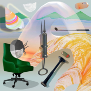
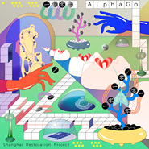
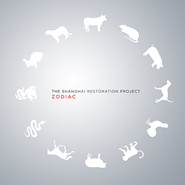

The Shanghai Restoration Project
============================

|  |  |
| :--: | :-- |
| [ The Shanghai Restoration Project](https://i.xiami.com/srp) | **地区**: United States of America 美国 **风格**: 氛围音乐 Ambient, 电子 Electronic, 器乐嘻哈 Instrumental Hip Hop **播放数**: 24175469 **粉丝数**: 42831 **评论数**: 1540  |

## 档案

Shanghai Restoration Project（上海复兴方案／SRP）是一支以布鲁克林为根据地的电子音乐制作人组合：Dave Liang和孙云帆。  2005年由Dave Liang创立，SRP最初的灵感来自上世纪30年代上海爵士乐坛东西方融合的音乐风格。Dave早期的作品，如Instrumentals: Day-Night，将中国传统器乐与嘻哈节奏有机融合，令人耳目一新。在2009年发行的电子专辑Zodiac《十二生肖》中，Dave拓展了SRP的风格，将唱诗班音乐、氛围、电子和民歌的元素融入自己的词汇中。 2010年，Dave遇见了来自上海的爵士歌手张乐，二人开始对中国民歌和爵士的经典曲目，如The Wandering Songstress《天涯歌女》，Can’t Get Your Love《得不到的爱情》等，进行了一系列当代诠释。  2011年，Dave遇见了多媒体艺术家孙云帆，二人先是在视觉方面进行合作，如音乐录影带和视听多媒体表演项目，随后在词曲创作和音乐制作方面展开合作。2016年二人共同制作的Life Elsewhere《她乡》专辑，将张乐的爵士人声与电子、桑巴、bossa nova、世界音乐与道家哲学有趣地编织在一起。  2017年底，SRP将发行两人共同制作的第一张电子专辑R.U.R.。这张专辑是一个从近年来较为轻松的作品风格回归内省的转变，也是对不断变化的世界的反应。在混乱中寻找平衡，R.U.R.呈现出一个色彩冲突、节奏复杂的调色板，声场中叠置着日常用品的敲敲打打，热带雨林的昆虫鸣叫，商场中的促销广播，以及外太空的电磁震动声。

## 专辑

| 名称 | 语种 | 唱片公司 | 发行时间 | 专辑类别 | 专辑风格 |
| :--: | :-- | :-- | :-- | :-- | :-- |
| [ Brave New World Symphony](./albums/5022141908.md) | 英语 | Undercover Culture Music | 2020年12月11日 | 录音室专辑 | 电子乐 Electronica |
| [ Night Odyssey](./albums/5022038111.md) | 国语 | Undercover Culture Music | 2020年11月27日 | EP, 单曲 | 电子乐 Electronica |
| [ Present Continuous](./albums/5021899941.md) | 英语 | Undercover Culture Music | 2020年11月13日 | EP, 单曲 | 恍惚嘻哈舞曲 Wonky |
| [ Involuntary Prophet](./albums/5021680589.md) | 纯音乐 | Undercover Culture Music | 2020年10月16日 | EP, 单曲 | 电子乐 Electronica, 恍惚嘻哈舞曲 Wonky |
| [ Flashbacks in a Crystal Ball](./albums/2105365621.md) | 国语 | Undercover Culture Music | 2019年11月09日 | 录音室专辑 | 合成器流行 Synthpop, 独立电子乐 Indietronica, 电子 Electronic |
| [ Soft Diamond](./albums/5021397293.md) | 国语 | Undercover Culture Music | 2019年10月18日 | EP, 单曲 |  |
| [ Beeswax Chamber](./albums/5021394370.md) | 英语 | Undercover Culture Music | 2019年10月04日 | EP, 单曲 |  |
| [ Tactile Sonic Glide](./albums/2105234180.md) | 英语 | Undercover Culture Music | 2019年09月07日 | EP, 单曲 | 电子 Electronic |
| [ A148](./albums/2104317538.md) | 国语 | Undercover Culture Music | 2018年12月08日 | EP, 单曲 | 缓拍 Downtempo, 电子 Electronic |
| [ Public Poet](./albums/2103773204.md) | 纯音乐 | Undercover Culture Music | 2018年07月06日 | EP, 单曲 | 电子 Electronic |
| [ Dubalonia Radio International杜巴鲁尼亚国际广播电台](./albums/2103612631.md) | 国语 | Undercover Culture Music | 2018年03月19日 | EP, 单曲 | 电子 Electronic |
| [ R.U.R](./albums/2102959817.md) | 英语 | Undercover Culture Music | 2017年11月24日 | 录音室专辑 | 电子 Electronic |
| [ Alpha Go](./albums/5021388357.md) | 英语 | Undercover Culture Music | 2017年11月17日 | EP, 单曲 |  |
| [ Spooky Party](./albums/5021397291.md) | 英语 | Undercover Culture Music | 2017年10月27日 | EP, 单曲 |  |
| [ I Don't Like the Comics You Drew不喜欢你画的漫画](./albums/2102872368.md) | 国语 | Undercover Culture Music | 2017年10月13日 | EP, 单曲 | 嘻哈 Hip-Hop |
| [ Life Elsewhere她乡](./albums/2100378412.md) | 国语 | Undercover Culture Music | 2016年08月12日 | 录音室专辑 | 电子 Electronic, 迪斯科 Disco, 电爵士 Nu Jazz |
| [ What's up with That?怎么搞的?](./albums/2100276266.md) | 国语 | Undercover Culture Music | 2016年02月18日 | 录音室专辑 | 放克电子 Electro (Electro-Funk), 独立电子乐 Indietronica |
| [ Mungbean Mash - Single](./albums/2100293086.md) | 其他 | 独立发行 | 2015年01月13日 | EP, 单曲 | 电音流行 Electropop |
| [ The Classics](./albums/1292025801.md) | 国语 | Undercover Culture Music | 2014年01月28日 | 录音室专辑 | 沙发音乐 Lounge, 人声爵士 Vocal Jazz |
| [ Pictures in Motion](./albums/1360590524.md) | 其他 | Undercover Culture Music | 2013年02月05日 | 录音室专辑 | 电子 Electronic |
| [ Sum of All Things Nini](./albums/5021390841.md) | 英语 | Undercover Culture Music | 2012年10月02日 | EP, 单曲 |  |
| [ Little Dragon Tales: Chinese Children's Songs](./albums/471870.md) | 国语 | Undercover Culture Music | 2011年11月29日 | 录音室专辑 | 沙发音乐 Lounge, 儿歌 Nursery Rhyme, 独立电子乐 Indietronica |
| [ Little Dragon Tales: Chinese Children's Songs (Instrumentals)](./albums/476465.md) | 其他 | Undercover Culture Music | 2011年11月29日 | 录音室专辑 | 沙发音乐 Lounge |
| [ Clay Doll (Ni Wa Wa)](./albums/5021389375.md) | 国语 | Undercover Culture Music | 2011年11月01日 | EP, 单曲 |  |
| [ New Tea](./albums/5021392367.md) | 国语 | Undercover Culture Music | 2011年04月05日 | EP, 单曲 |  |
| [ A Winter Song](./albums/5021388356.md) | 日语 | Curious Creature Records & Undercover Culture Music | 2010年12月07日 | EP, 单曲 | 爵士 Jazz |
| [ A Summer Song](./albums/5021394795.md) | 日语 | Curious Creature Records & Undercover Culture Music | 2010年06月22日 | EP, 单曲 | 爵士 Jazz |
| [ Zodiac十二生肖](./albums/345640.md) | 其他 | Undercover Culture Music | 2009年01月20日 | 录音室专辑 | 电子 Electronic |
| [ Instrumentals: Day - Night](./albums/349001.md) | 其他 | Undercover Culture Music | 2008年08月05日 | 录音室专辑 | 嘻哈 Hip-Hop, 电子 Electronic |
| [ Story of a City](./albums/312820.md) | 英语 | Undercover Culture Music | 2008年02月05日 | 录音室专辑 | 嘻哈 Hip-Hop, 电子 Electronic |
| [ Remixed and Restored, Vol. 1](./albums/467960.md) | 国语 | CRC Jianian, Inc. | 2007年12月11日 | 合集, 杂锦 | 沙发音乐 Lounge |
| [ Instrumentals](./albums/349003.md) | 其他 | Undercover Culture Music | 2006年10月24日 | 录音室专辑 | 器乐嘻哈 Instrumental Hip Hop, 电子 Electronic |
| [ Reinterpretations](./albums/428210.md) | 英语 | Undercover Culture Music | 2006年07月04日 | 录音室专辑 | 沙发音乐 Lounge |
| [ The Shanghai Restoration Project上海复兴方案](./albums/312823.md) | 英语 | Undercover Culture Music | 2006年01月02日 | 录音室专辑 | 嘻哈 Hip-Hop, 电子 Electronic |

## 评论

|  |  |  |
| :-- | :-- | :-- |
|  [虾米用户](https://emumo.xiami.com/u/170211738) 上帝在开始爱着了 2020-12-22 15:22 赞(0) 踩(0) | 
专封！
 |
|  [虾米用户](https://emumo.xiami.com/u/170211738) 上帝在开始爱着了 2020-12-22 15:20 赞(0) 踩(0) | 
+
 |
|  [虾米用户](https://emumo.xiami.com/u/406401872)  2020-11-17 21:19 赞(0) 踩(0) | 
在混乱中寻求平衡
 |
|  [虾米用户](https://emumo.xiami.com/u/301916931)   2020-10-30 13:17 赞(1) 踩(0) | 
他们的歌都太适合做胶片相册bgm了！
 |
| ⇒ |  [虾米用户](https://emumo.xiami.com/u/8767679) 我还没想好要写什么... 2020-12-08 11:08 赞(0) 踩(0) | 
赞同
 |
|  [虾米用户](https://emumo.xiami.com/u/1540834) 花样作死大赛冠军 2020-10-20 11:51 赞(1) 踩(0) | 
5分30秒转的椅子  i want u ！！！
 |
|  [虾米用户](https://emumo.xiami.com/u/354073970) 我还没想好要写什么... 2020-09-25 10:23 赞(1) 踩(0) | 
牛逼
 |
|  [虾米用户](https://emumo.xiami.com/u/340903899) 我还没想好要写什么... 2020-09-16 20:53 赞(1) 踩(0) | 
，
 |
|  [虾米用户](https://emumo.xiami.com/u/433401305) 不美丽就是我的美丽 2020-07-15 18:27 赞(1) 踩(0) | 
好棒
 |
|  [虾米用户](https://emumo.xiami.com/u/577845) 兼职连环杀手研究 2020-06-05 19:02 赞(1) 踩(0) | 
有意思，有才华
 |
|  [虾米用户](https://emumo.xiami.com/u/31691342) 官方微信:OOG1900 2020-05-01 23:19 赞(1) 踩(0) | 
太棒了
 |
|  [虾米用户](https://emumo.xiami.com/u/35528100)  2020-04-12 17:11 赞(1) 踩(0) | 
邓丽君很多音乐适合做成这种新风格，期待
 |
|  [虾米用户](https://emumo.xiami.com/u/431145732) 享受生活是一種態度射手男 2020-04-08 23:08 赞(1) 踩(0) | 
什麼時候再出新作呢？
 |
|  [虾米用户](https://emumo.xiami.com/u/73740960)  2020-02-20 13:10 赞(1) 踩(0) | 
大佬
 |
|  [虾米用户](https://emumo.xiami.com/u/356763773) 我还没想好要写什么... 2020-02-10 08:51 赞(1) 踩(0) | 
~
 |
|  [虾米用户](https://emumo.xiami.com/u/400715332) 留白 2020-02-08 00:09 赞(1) 踩(0) | 
·
 |
|  [虾米用户](https://emumo.xiami.com/u/289040880) 有只熊在心里低吼 2020-01-05 02:51 赞(1) 踩(0) | 
中国这样的音乐真的不多。。。挖到宝了
 |
| ⇒ |  [虾米用户](https://emumo.xiami.com/u/9428553)  2020-12-07 11:41 赞(0) 踩(0) | 
这是美国人～
 |
|  [虾米用户](https://emumo.xiami.com/u/30980397) 爱憎分明 2019-12-01 11:06 赞(1) 踩(0) | 
太厉害了，专辑封面太好看了吧！
 |
|  [虾米用户](https://emumo.xiami.com/u/43022736) NYU‘21 2019-11-15 05:24 赞(1) 踩(0) | 
下周五ny见
 |
|  [虾米用户](https://emumo.xiami.com/u/408810867) 低空飞行 2019-11-14 20:56 赞(1) 踩(0) | 
太酷了 复兴复兴
 |
|  [虾米用户](https://emumo.xiami.com/u/388558) time flies 2019-10-29 23:15 赞(2) 踩(0) | 
SRP即将在纽约演出！！
 |
|  [虾米用户](https://emumo.xiami.com/u/3008874) 什么时候遇见外星人/回宇... 2019-10-28 21:10 赞(2) 踩(0) | 
希望快快来西安演出。
 |
|  [虾米用户](https://emumo.xiami.com/u/996277) ‏‏ 2019-10-22 23:32 赞(1) 踩(0) | 
啊呀
 |
|  [虾米用户](https://emumo.xiami.com/u/132930340)  2019-10-19 12:17 赞(1) 踩(0) | 
记不得是从什么时候开始喜欢他们的音乐已经很多年了~希望有机会能去他们的音乐会 多多来中国开音乐会吧！
 |
|  [虾米用户](https://emumo.xiami.com/u/406631241) 桀骜不羁的温柔 2019-09-13 00:46 赞(1) 踩(0) | 
灵动的配乐，我爱了     喜欢  
 |
|  [虾米用户](https://emumo.xiami.com/u/1219018) 你好，我叫谢有君。估计大... 2019-09-05 18:13 赞(1) 踩(0) | 
我觉得梁先生的声音要多些岀场才行
 |
|  [虾米用户](https://emumo.xiami.com/u/34593165) 我还没想好要写什么... 2019-08-21 21:36 赞(1) 踩(0) | 
我爱
 |
|  [虾米用户](https://emumo.xiami.com/u/426842751)  2019-08-18 17:34 赞(1) 踩(0) | 
******
 |
|  [虾米用户](https://emumo.xiami.com/u/18063537) 风物长宜放眼量 2019-06-10 13:50 赞(2) 踩(0) | 
乐手确实是好乐手，特别是儿歌那张专辑太棒了，有一点小建议，可以去学习一下中国的传统文化，诗词歌赋和古乐曲，这样可以更好地理解中国传统文化。祝你越来越成功！
 |
|  [虾米用户](https://emumo.xiami.com/u/325374787)  2019-05-10 17:51 赞(1) 踩(0) | 
好
 |
|  [虾米用户](https://emumo.xiami.com/u/345221218) 煮一壶云水禅心，参一道似... 2019-05-10 17:17 赞(2) 踩(0) | 

 |
|  [虾米用户](https://emumo.xiami.com/u/276944698) 不要自我设限..... 2019-05-07 09:22 赞(2) 踩(0) | 
▶️
 |
|  [虾米用户](https://emumo.xiami.com/u/339665648)  2019-05-06 19:22 赞(2) 踩(0) | 
好有童趣很好听 
 |
|  [虾米用户](https://emumo.xiami.com/u/346165752)  2019-05-06 00:38 赞(2) 踩(0) | 

 |
| ⇒ |  [虾米用户](https://emumo.xiami.com/u/403448960)             ... 2020-11-04 17:33 赞(0) 踩(0) | 
kkkkkkkkkkkkkkkkkkkkkkkkkkkkkk kkkkkkkkkkkkkkkkkkkkkkkkkkkkkk kkkkkkkkkkkkkkkkkkkkkkkk'kkkkk kkkkkkkkkkkkkkkkkkkkkkkkkkkkkk kkkkkkkkkkkkkkkkkkkkkkkkkkkkkk kkkkkkkkkkkkkkkkkkkkkkkkkkkkkk kkkkkkkkkkkkkkkkkkkkkkbbbbbbbb bbbbbbbbbbbbbbbbbbbbbbbbbbbbbb bbbbbbbbbbbbbbbbbbbbbbbbbbbbbb bbbbbbbbbbb'bbbbbbbbbbbbbbb;bb
 |
| ⇒ |  [虾米用户](https://emumo.xiami.com/u/403448960)             ... 2020-11-04 17:33 赞(0) 踩(0) | 
<q><b>Δ说：</b></q>
 |
|  [虾米用户](https://emumo.xiami.com/u/78439144) 阮 2019-04-24 17:54 赞(2) 踩(0) | 
太想认识这样的编曲人 能够给到我一点中国传统乐器与各种风格的融合的灵感 值得学习
 |
|  [虾米用户](https://emumo.xiami.com/u/11225224) 哔哩哔哩up主 绫人太太... 2019-04-23 11:17 赞(1) 踩(0) | 
我发现了什么宝藏！！！！！开心！！！！
 |
|  [虾米用户](https://emumo.xiami.com/u/90226282) 这家伙很聪明什么也没留下... 2019-04-18 00:41 赞(0) 踩(0) | 
get
 |
|  [虾米用户](https://emumo.xiami.com/u/346492287) 虾米不要离开我！ 2019-04-07 01:12 赞(0) 踩(0) | 
很棒
 |
|  [虾米用户](https://emumo.xiami.com/u/6179259) 丧失理智 2019-03-28 22:20 赞(3) 踩(0) | 
听的我脚趾抓地
 |
| ⇒ |  [虾米用户](https://emumo.xiami.com/u/35509231) 提灯天后  策马小僧 2019-04-05 14:49 赞(0) 踩(0) | 
哈哈哈哈到位~
 |
|  [虾米用户](https://emumo.xiami.com/u/2928117) 你好 2019-03-26 19:34 赞(2) 踩(0) | 
看了《这就是原创》，你来就好了，哈哈哈哈
 |
|  [虾米用户](https://emumo.xiami.com/u/44215646)  2019-03-25 19:24 赞(3) 踩(0) | 
喜欢专辑封面的设计，很复古
 |
|  [虾米用户](https://emumo.xiami.com/u/37091916) 暂无签名~ 2019-03-22 06:23 赞(2) 踩(0) | 
能不能私信我兄弟
 |
|  [虾米用户](https://emumo.xiami.com/u/276944698) 不要自我设限..... 2019-03-21 13:21 赞(3) 踩(0) | 
。
 |
|  [虾米用户](https://emumo.xiami.com/u/11157418) 暂无签名~ 2019-03-19 22:46 赞(2) 踩(0) | 
来晚了
 |
|  [虾米用户](https://emumo.xiami.com/u/357723869)  2019-03-15 18:55 赞(1) 踩(0) | 
爱上你的音乐了～ 越是民族的越是世界的～ 加油＾０＾~
 |
|  [虾米用户](https://emumo.xiami.com/u/11217593) 没有垃圾的风格，只有垃圾... 2019-03-13 02:10 赞(1) 踩(0) | 
我吹爆上海复兴计划。这几年几乎耳里唯一不尬又熟悉的声音。虽然不是上海人。 
 |
|  [虾米用户](https://emumo.xiami.com/u/102230226) 我真的还没想好要写什么.... 2019-03-12 21:27 赞(1) 踩(0) | 
真好
 |
|  [虾米用户](https://emumo.xiami.com/u/45686435) 一壺飛鳧 尋山夢鶴   ... 2019-03-04 18:48 赞(2) 踩(0) | 
好
 |
|  [虾米用户](https://emumo.xiami.com/u/85568296) 只有阳光而无阴影 只有欢... 2019-02-24 03:12 赞(1) 踩(0) | 
之前看到有推荐呢～今天又因缘巧合找来了！ 
 |
|  [虾米用户](https://emumo.xiami.com/u/98114174) 我还没想好要写什么... 2019-02-15 23:12 赞(1) 踩(0) | 
‍♀️
 |
|  [虾米用户](https://emumo.xiami.com/u/38600585) 弱者滔滔不绝，强者毫不在... 2019-02-03 22:54 赞(1) 踩(0) | 
准确的说应该是ABC
 |
|  [虾米用户](https://emumo.xiami.com/u/32416874) 人格不太稳定 2019-01-14 03:55 赞(1) 踩(0) | 
好喜欢 
 |
|  [虾米用户](https://emumo.xiami.com/u/288013826) 请大家一起养小虾米帮助听... 2019-01-09 18:17 赞(1) 踩(0) | 
））
 |
|  [虾米用户](https://emumo.xiami.com/u/230761831) rose,charm&l... 2018-12-28 10:26 赞(1) 踩(0) | 
挖到宝了。
 |
|  [虾米用户](https://emumo.xiami.com/u/45619276)  2018-12-07 16:48 赞(1) 踩(0) | 
我太爱这个乐队了，完全就是我的个人内心活动写照！
 |
|  [虾米用户](https://emumo.xiami.com/u/713877)  2018-11-17 00:53 赞(1) 踩(0) | 
听说更新了公告栏 可是，在哪儿呢 
 |
|  [虾米用户](https://emumo.xiami.com/u/526851) 听听音乐，好好生活。 2018-11-01 10:07 赞(1) 踩(0) | 
原里第一次听是十年前了，那时候还没有找到作者介绍，以为是热爱中华文化的歪果仁写的哈哈哈。真的超级好听
 |
|  [虾米用户](https://emumo.xiami.com/u/299613688) 取之有劫 2018-10-21 16:37 赞(2) 踩(0) | 
let you win
 |
|  [虾米用户](https://emumo.xiami.com/u/128679388) 热爱生命 2018-10-20 07:20 赞(2) 踩(0) | 
该来北京演出一趟了不，去年倒霉错过了，唉
 |
|  [虾米用户](https://emumo.xiami.com/u/11472475) 我还没想好要写什么... 2018-10-06 20:14 赞(2) 踩(0) | 
有愧啊，此人真的太牛逼了，电子乐中玩出了自己的风格，太他妈好听了。我的妈呀
 |
|  [虾米用户](https://emumo.xiami.com/u/298941603) 我們創造。 2018-09-30 09:14 赞(2) 踩(0) | 
来香港拜托了！
 |
|  [虾米用户](https://emumo.xiami.com/u/6638261) 已下架。。。。20200... 2018-09-21 15:18 赞(1) 踩(0) | 
新砖好听到爆炸 强推！！
 |
|  [虾米用户](https://emumo.xiami.com/u/333530901)  2018-09-16 17:27 赞(0) 踩(0) | 
内容已删除
 |
| ⇒ |  [虾米用户](https://emumo.xiami.com/u/327350725)  2019-04-01 21:27 赞(0) 踩(0) | 
请问您是怎么听出猥琐的呢？
 |
|  [虾米用户](https://emumo.xiami.com/u/10811234) Love Mucic 2018-09-14 06:53 赞(1) 踩(0) | 
赞
 |
|  [虾米用户](https://emumo.xiami.com/u/249913806)  2018-09-08 07:17 赞(1) 踩(0) | 
音乐很有风格
 |
|  [虾米用户](https://emumo.xiami.com/u/249913806)  2018-09-08 07:17 赞(1) 踩(0) | 
加油，期待更好的音乐
 |
|  [虾米用户](https://emumo.xiami.com/u/294536517)  2018-09-07 17:47 赞(1) 踩(0) | 
好喜欢 什么时候再巡回演出
 |
|  [虾米用户](https://emumo.xiami.com/u/94726186)  2018-09-02 23:18 赞(1) 踩(0) | 
超赞，迷上了
 |
|  [虾米用户](https://emumo.xiami.com/u/52415194) ♬♩♫♪♡ 2018-08-25 23:19 赞(2) 踩(0) | 
混凝草见
 |
|  [虾米用户](https://emumo.xiami.com/u/4222269) 我还没想好要写什么... 2018-08-23 12:51 赞(1) 踩(0) | 

 |
|  [虾米用户](https://emumo.xiami.com/u/17691156) あなたに出会えて よかっ... 2018-08-22 19:46 赞(3) 踩(0) | 
今年混凝草有你们～～想起去年你们南下巡演的时候我在魔都看Mew
 |
|  [虾米用户](https://emumo.xiami.com/u/21889447) 口亨 2018-08-22 12:27 赞(2) 踩(0) | 
什么时候来西安 
 |
|  [虾米用户](https://emumo.xiami.com/u/241344362) 美丽的事物都有自我毁灭的... 2018-08-19 13:06 赞(1) 踩(0) | 
9月1/东海音乐节知道的这个乐队
 |
|  [虾米用户](https://emumo.xiami.com/u/43544718) 暂无签名~ 2018-08-15 02:43 赞(1) 踩(0) | 
I love it
 |
|  [虾米用户](https://emumo.xiami.com/u/128810542) 网易云:每天170912 2018-07-25 17:22 赞(1) 踩(0) | 
一饱耳福，中国风！
 |
|  [虾米用户](https://emumo.xiami.com/u/48379032) 最后警告，谢绝野蛮人，，... 2018-07-25 10:09 赞(1) 踩(0) | 
强
 |
|  [虾米用户](https://emumo.xiami.com/u/324879742)   2018-07-21 10:40 赞(1) 踩(0) | 
.
 |
|  [虾米用户](https://emumo.xiami.com/u/7800081) 我还没想好要写什么... 2018-07-21 07:56 赞(1) 踩(0) | 
vip下载也要钱了
 |
|  [虾米用户](https://emumo.xiami.com/u/43972215) 音乐和诗歌，最美妙的两种... 2018-07-18 10:29 赞(1) 踩(0) | 
真有才华
 |
|  [虾米用户](https://emumo.xiami.com/u/285049473) 剛拿起酒杯想和你碰杯 才... 2018-07-05 12:17 赞(0) 踩(0) | 
封面有趣~人也是
 |
|  [虾米用户](https://emumo.xiami.com/u/9080006) groove 2018-06-19 23:05 赞(2) 踩(0) | 
眼看着就听了十年了
 |
|  [虾米用户](https://emumo.xiami.com/u/4711645) 我还没想好要写什么... 2018-06-12 20:58 赞(0) 踩(0) | 
chinese style~牛鼻！！
 |
|  [虾米用户](https://emumo.xiami.com/u/78131264) Ångra Kärlek... 2018-05-30 13:31 赞(0) 踩(0) | 
太强了
 |
|  [虾米用户](https://emumo.xiami.com/u/332509862) 嗡嗡苍蝇为此看到意难平 2018-05-27 08:33 赞(0) 踩(0) | 
想知道图片集里第7页那位美女是谁
 |
|  [虾米用户](https://emumo.xiami.com/u/268187) 永远不能成熟的耳朵 2018-05-24 11:33 赞(1) 踩(0) | 
太棒的音乐和音乐人，怪我知道的太晚了
 |
|  [虾米用户](https://emumo.xiami.com/u/71178106) 塵世や 酒、風呂を抜け ... 2018-05-21 20:50 赞(0) 踩(0) | 
♡
 |
|  [虾米用户](https://emumo.xiami.com/u/17146554) weibo：@L1RRO... 2018-05-13 08:12 赞(0) 踩(0) | 
很早就听了你的歌 
 |
|  [虾米用户](https://emumo.xiami.com/u/288013826) 请大家一起养小虾米帮助听... 2018-05-06 16:51 赞(0) 踩(0) | 
来晚了！！！！
 |
|  [虾米用户](https://emumo.xiami.com/u/249948903) 好风凭借力，送我上青云。 2018-04-28 12:38 赞(0) 踩(0) | 
我一点都不觉得我很无能
 |
|  [虾米用户](https://emumo.xiami.com/u/355757769) 我还没想好要写什么... 2018-04-25 22:08 赞(0) 踩(0) | 
真是宝藏阿
 |
|  [虾米用户](https://emumo.xiami.com/u/44672756) 用不回老号了…哭倒 2018-04-23 15:46 赞(2) 踩(0) | 
要是往后不管哪年有巡演 看到这条评论的朋友请提醒我呀 谢谢❤
 |
| ⇒ |  [虾米用户](https://emumo.xiami.com/u/256666291) 我还没想好要写什么... 2018-07-31 21:40 赞(0) 踩(0) | 
今年混凝草会来
 |
|  [虾米用户](https://emumo.xiami.com/u/47493932) 独处不难 用音乐作伴 2018-04-20 14:13 赞(0) 踩(0) | 
谢谢虾米让我遇见你！
 |
|  [虾米用户](https://emumo.xiami.com/u/228843687) 懒惰统治人间 2018-04-11 22:24 赞(0) 踩(0) | 
:-O
 |
|  [虾米用户](https://emumo.xiami.com/u/89261502)  总会不经意间就感觉到离... 2018-04-07 21:18 赞(0) 踩(0) | 
这男的好像那个剪辑魔术师
 |
|  [虾米用户](https://emumo.xiami.com/u/201391232) 最快的方法是先抱抱 2018-04-06 13:51 赞(0) 踩(0) | 
彡
 |
|  [虾米用户](https://emumo.xiami.com/u/1326168)  2018-03-31 02:21 赞(1) 踩(0) | 
大世界ost
 |
|  [虾米用户](https://emumo.xiami.com/u/56041895) 星际音乐过滤器  小啵 2018-03-27 23:28 赞(1) 踩(0) | 
好喜欢他们的封面风格
 |
|  [虾米用户](https://emumo.xiami.com/u/38873272)  2018-03-27 17:32 赞(2) 踩(0) | 
今年有演出计划吗？想看！
 |
| ⇒ |  [虾米用户](https://emumo.xiami.com/u/241344362) 美丽的事物都有自我毁灭的... 2018-08-19 13:06 赞(0) 踩(0) | 
有的 9月1舟山东海音乐节
 |
|  [虾米用户](https://emumo.xiami.com/u/275666073)  2018-03-04 10:13 赞(0) 踩(0) | 
喜欢
 |
|  [虾米用户](https://emumo.xiami.com/u/26523180) 封面动物 2018-03-02 09:38 赞(2) 踩(0) | 
想知道视觉设计师是哪位，太喜欢专封了！
 |
| ⇒ |  [虾米用户](https://emumo.xiami.com/u/2928117) 你好 2018-03-04 20:49 赞(0) 踩(0) | 
梁先生的妻子
 |
| ⇒ |  [虾米用户](https://emumo.xiami.com/u/2993440)  2018-03-21 21:51 赞(0) 踩(0) | 
<q><b>♩♪♫♩♬说：</b></q>
 |
|  [虾米用户](https://emumo.xiami.com/u/52415194) ♬♩♫♪♡ 2018-02-22 10:28 赞(0) 踩(0) | 
希望今年有望能来成都演出::-)
 |
|  [虾米用户](https://emumo.xiami.com/u/9229744) judge me 2018-02-20 19:09 赞(0) 踩(0) | 
&amp;rdquo;
 |
|  [虾米用户](https://emumo.xiami.com/u/9079353) 氓之嗤嗤 2018-02-09 11:09 赞(0) 踩(0) | 

 |
|  [虾米用户](https://emumo.xiami.com/u/6232148) 在虾米坚持到最后一秒 2018-01-19 22:57 赞(1) 踩(0) | 
妈妈问我为什么跪着听系列
 |
|  [虾米用户](https://emumo.xiami.com/u/200921754)   2018-01-09 10:29 赞(10) 踩(0) | 
我发现外国的音乐人侧重审美，而非技术高超。Dave并不是苦练音乐出身的人，但他对音乐的嗅觉与品味的捕捉力，真的秒杀。。
 |
|  [虾米用户](https://emumo.xiami.com/u/1214054) 洗洗耳朵 2018-01-02 12:31 赞(0) 踩(0) | 
太棒了
 |
|  [虾米用户](https://emumo.xiami.com/u/3211822) 再见， 2017-12-30 14:41 赞(0) 踩(0) | 
。
 |
|  [虾米用户](https://emumo.xiami.com/u/2097165)   2017-12-29 09:50 赞(0) 踩(0) | 
期待来成都！！！！
 |
|  [虾米用户](https://emumo.xiami.com/u/2928117) 你好 2017-12-19 13:47 赞(0) 踩(0) | 
<a href="http://www.xiami.com/song/1769091427?spm=a1z1s.3521865.23309997.80.pNt78q" target="_blank" rel="nofollow noreferrer noopener">http://www.xiami.com/song/1769091427?spm=a1z1s.3521865.23309997.80.pNt78q</a> 梁先生和MEG小姐合作的作品
 |
|  [虾米用户](https://emumo.xiami.com/u/26456235)   2017-12-18 10:27 赞(1) 踩(0) | 
复制这条信息，打开手机淘宝即可看到【2017上海复兴方案《她乡》巡演】￥tzp9LlLRtp￥<a href="http://c.b1wt.com/h.4M4J2S?cv=tzp9LlLRtp&amp;sm=cced53" target="_blank" rel="nofollow noreferrer noopener">http://c.b1wt.com/h.4M4J2S?cv=tzp9LlLRtp&amp;sm=cced53</a>
 |
|  [虾米用户](https://emumo.xiami.com/u/338764896)  2017-12-06 00:27 赞(0) 踩(0) | 
哪里能免费下载
 |
|  [虾米用户](https://emumo.xiami.com/u/242022847) 你当独立且自由。  2017-12-02 23:44 赞(1) 踩(0) | 
我现在才发现你
 |
|  [虾米用户](https://emumo.xiami.com/u/7797443) / / 2017-11-29 08:54 赞(0) 踩(0) | 
换了封面，Dave 越来越帅了
 |
|  [虾米用户](https://emumo.xiami.com/u/4711645) 我还没想好要写什么... 2017-11-25 08:40 赞(0) 踩(0) | 
融合系音乐～可以
 |
|  [虾米用户](https://emumo.xiami.com/u/49482499) speechless 2017-11-14 09:11 赞(0) 踩(0) | 
哈哈哈 像金靖 
 |
|  [虾米用户](https://emumo.xiami.com/u/33094549) 讲不出再见 call:1... 2017-11-08 13:58 赞(0) 踩(0) | 
几年前只听了miss shanghai后悔没发掘一下 
 |
|  [虾米用户](https://emumo.xiami.com/u/260828419) Tomorrow is ... 2017-11-02 16:00 赞(0) 踩(0) | 
姑娘的声音有汤唯的味道
 |
|  [虾米用户](https://emumo.xiami.com/u/13461745)  2017-10-30 10:03 赞(0) 踩(0) | 
最近很喜欢这一支 →
 |
|  [虾米用户](https://emumo.xiami.com/u/13461745)  2017-10-30 10:03 赞(0) 踩(0) | 
最近好喜欢他们！ →
 |
|  [虾米用户](https://emumo.xiami.com/u/4706292) 暂无签名~ 2017-10-28 00:36 赞(0) 踩(0) | 
2014年中国巡演 北京 05月16日 糖果三层 <a href="http://site.douban.com/DaveLiang/room/3166711/" target="_blank" rel="nofollow noreferrer noopener">http://site.douban.com/DaveLiang/room/3166711/</a>
 |
|  [虾米用户](https://emumo.xiami.com/u/5521254)  2017-10-28 00:10 赞(0) 踩(0) | 
Dave liang＿多么希望他是中国人，把中国调式谱写的如此独特。
 |
| ⇒ |  [虾米用户](https://emumo.xiami.com/u/200921754)   2017-11-02 13:49 赞(0) 踩(0) | 
本就是中国人啊
 |
| ⇒ |  [虾米用户](https://emumo.xiami.com/u/90100756) 我还没想好要写什么... 2017-11-25 20:54 赞(0) 踩(0) | 
美籍华裔
 |
|  [虾米用户](https://emumo.xiami.com/u/325733254) 夜空深深群星在，青烟鸟鸟... 2017-10-28 00:09 赞(1) 踩(0) | 
因为朋友喜欢，所以我也喜欢。
 |
|  [虾米用户](https://emumo.xiami.com/u/9840738) Arabesque 2017-10-27 23:29 赞(7) 踩(0) | 
颛顼：  Apr 3, 2015TBDBeijing, China 北京愚公移山 Apr 4, 2015TBDShanghai, China 上海Mao Live House Apr 5, 2015TBDXi'an, China 西安光圈 Apr 7, 2015TBDChengdu, China 成都小酒馆 Apr 9, 2015TBDXiamen, China 厦门Real Live Apr 10, 2015TBDShenzhen, China 深圳B10 Apr 11, 2015TBDGuangzhou, China 广州凸空间
 |
|  [虾米用户](https://emumo.xiami.com/u/1416550) 海岱没有忧虑 2017-10-27 23:19 赞(46) 踩(0) | 
牛人的经历总是我等凡人可望不可即的。本科哈佛应用数学系毕业在贝恩做了几年辞掉工作开始发唱片，让我们这些以为进了哈佛进了贝恩就人生赢家的惭愧到死。怎么才不算白活，你看着别人，问过自己没？
 |
| ⇒ |  [虾米用户](https://emumo.xiami.com/u/200921754)   2017-11-02 13:51 赞(0) 踩(0) | 
凡人的天花板，牛人嫌弃的鸡肋   
 |
| ⇒ |  [虾米用户](https://emumo.xiami.com/u/327893168)   2019-09-23 12:40 赞(0) 踩(0) | 
做自己喜欢做的事其实就是赢家
 |
|  [虾米用户](https://emumo.xiami.com/u/9123818) 我还没想好要写什么... 2017-10-27 23:16 赞(0) 踩(0) | 
卧槽 哈佛经济系的
 |
|  [虾米用户](https://emumo.xiami.com/u/298941603) 我們創造。 2017-10-26 22:30 赞(0) 踩(0) | 
sooo cool
 |
|  [虾米用户](https://emumo.xiami.com/u/7131429) Melody first 2017-10-26 19:05 赞(0) 踩(0) | 
THe power of Chinese Jazz
 |
|  [虾米用户](https://emumo.xiami.com/u/5045815) 终有一天猫狗双全 2017-10-25 20:32 赞(0) 踩(0) | 
有实体专辑吗?
 |
|  [虾米用户](https://emumo.xiami.com/u/262861568) 我还没想好要写什么... 2017-10-20 15:25 赞(0) 踩(0) | 

 |
|  [虾米用户](https://emumo.xiami.com/u/4400366) 再也不见 2017-10-19 15:38 赞(0) 踩(0) | 
囍
 |
|  [虾米用户](https://emumo.xiami.com/u/16012805) 我还没想好要写什么... 2017-10-11 18:26 赞(0) 踩(0) | 
上海复兴方案，真是难得的中国电子风。融合西方和东方的神韵。
 |
|  [虾米用户](https://emumo.xiami.com/u/305682) 我还没想好要写什么... 2017-10-11 18:24 赞(2) 踩(0) | 
时尚的中国风，东方神韵与西方现代的完美结合。
 |
|  [虾米用户](https://emumo.xiami.com/u/305682) 我还没想好要写什么... 2017-10-11 18:24 赞(0) 踩(0) | 
时尚的中国风，东方神韵与西方现代的完美结合。
 |
|  [虾米用户](https://emumo.xiami.com/u/11990649) 万物皆入耳 2017-09-28 14:56 赞(0) 踩(0) | 
期待明年的巡演
 |
|  [虾米用户](https://emumo.xiami.com/u/258780985)  2017-09-23 15:35 赞(1) 踩(0) | 
嫑搞了好否？两块洋钿拿去[捂脸]
 |
|  [虾米用户](https://emumo.xiami.com/u/52093145) 鹿 2017-09-21 13:12 赞(0) 踩(0) | 
✺
 |
|  [虾米用户](https://emumo.xiami.com/u/85165792) COMING 2017-09-16 19:58 赞(0) 踩(0) | 
.
 |
|  [虾米用户](https://emumo.xiami.com/u/50093825) 。 2017-09-14 21:55 赞(0) 踩(0) | 
: )
 |
|  [虾米用户](https://emumo.xiami.com/u/128335808) 喵～ 2017-09-10 18:53 赞(0) 踩(0) | 
听到了他们的曲子，如获至宝！好久没有这么惊喜的感觉了！ 
 |
|  [虾米用户](https://emumo.xiami.com/u/312874366) 我还没想好要写什么... 2017-09-05 14:26 赞(0) 踩(0) | 
试听
 |
|  [虾米用户](https://emumo.xiami.com/u/1926156)  2017-08-10 12:56 赞(0) 踩(0) | 
好听
 |
|  [虾米用户](https://emumo.xiami.com/u/8577554) 我还没想好要写什么... 2017-08-06 14:29 赞(0) 踩(0) | 
this is REAL shanghai 
 |
|  [虾米用户](https://emumo.xiami.com/u/170211738) 上帝在开始爱着了 2017-08-03 17:12 赞(0) 踩(0) | 

 |
|  [虾米用户](https://emumo.xiami.com/u/2050162) 彼岸 2017-07-29 23:05 赞(0) 踩(0) | 
何时再来魔都   
 |
|  [虾米用户](https://emumo.xiami.com/u/3498758)  2017-07-28 17:38 赞(0) 踩(0) | 
惊艳
 |
|  [虾米用户](https://emumo.xiami.com/u/7882047) ↗这家伙试听了很多曲子！ 2017-07-24 15:08 赞(0) 踩(0) | 
百代唱片公司混音那张也是屌炸天    
 |
|  [虾米用户](https://emumo.xiami.com/u/40513262)   2017-07-23 17:40 赞(0) 踩(0) | 
2017甚麼時候演出啊？看不到公告。
 |
|  [虾米用户](https://emumo.xiami.com/u/2433636) 肚子 2017-07-19 18:38 赞(0) 踩(0) | 
留学党一边搞论文一边听着 然后思念着上海
 |
|  [虾米用户](https://emumo.xiami.com/u/40283620) 我还没想好要写什么... 2017-07-17 22:27 赞(0) 踩(0) | 
不知道为什么我会哭
 |
|  [虾米用户](https://emumo.xiami.com/u/40062493) I just want ... 2017-07-09 15:49 赞(1) 踩(0) | 
艺术家梁朝伟
 |
|  [虾米用户](https://emumo.xiami.com/u/301536397)  2017-07-06 11:15 赞(0) 踩(0) | 
Refreshing sound
 |
|  [虾米用户](https://emumo.xiami.com/u/170211738) 上帝在开始爱着了 2017-06-29 15:33 赞(0) 踩(0) | 

 |
|  [虾米用户](https://emumo.xiami.com/u/264283064) bye  2017-06-20 20:10 赞(0) 踩(0) | 
△
 |
|  [虾米用户](https://emumo.xiami.com/u/71422602) 是我为落叶而飘落。 2017-06-11 23:12 赞(3) 踩(0) | 
初二就喜欢上了
 |
|  [虾米用户](https://emumo.xiami.com/u/43418234) ^_−☆ 2017-06-09 08:17 赞(0) 踩(0) | 

 |
|  [虾米用户](https://emumo.xiami.com/u/75895918) 世界与世隔绝×纯粹×自私 2017-06-07 23:08 赞(2) 踩(0) | 
13个小时前   The Shanghai Restoration Project:感谢你收藏我的作品《dark HORSE》，我在虾米音乐人期待你的关注。&amp;ldquo; 我们的梁先生，您是想怎样！？感谢！感谢！非常感谢！
 |
|  [虾米用户](https://emumo.xiami.com/u/3063291)  2017-06-02 10:33 赞(1) 踩(0) | 
美籍华裔音乐制作人
 |
|  [虾米用户](https://emumo.xiami.com/u/1302357)  2017-05-30 09:58 赞(0) 踩(0) | 
有意思，有意思~
 |
|  [虾米用户](https://emumo.xiami.com/u/261580776)  2017-05-26 14:35 赞(0) 踩(0) | 
baileman swing.feat咋没有啊
 |
| ⇒ |  [虾米用户](https://emumo.xiami.com/u/5820111) 自由灵魂 2017-05-29 10:34 赞(0) 踩(0) | 
有
 |
| ⇒ |  [虾米用户](https://emumo.xiami.com/u/5820111) 自由灵魂 2017-05-29 10:35 赞(0) 踩(0) | 
mungbean 那张专辑里
 |
|  [虾米用户](https://emumo.xiami.com/u/248621927)   2017-05-21 12:03 赞(0) 踩(0) | 
喜欢你！
 |
|  [虾米用户](https://emumo.xiami.com/u/45759342) 唯音乐与爱情不可辜负！ 2017-05-20 21:55 赞(0) 踩(0) | 
北京乐空间拔草
 |
|  [虾米用户](https://emumo.xiami.com/u/41310723) @MelodySpeed 2017-05-20 18:46 赞(0) 踩(0) | 
昨晚看了现场实在是太幸福啦! 超喜欢你们!!!
 |
|  [虾米用户](https://emumo.xiami.com/u/1513798)  2017-05-19 23:28 赞(2) 踩(0) | 
刚现场嗨完回来，同时享受jazz和electronic盛宴实在是饱餐一顿啊
 |
|  [虾米用户](https://emumo.xiami.com/u/266758916)  2017-05-15 23:41 赞(0) 踩(0) | 
cooler！真的so so sonice！
 |
|  [虾米用户](https://emumo.xiami.com/u/24814862) - 2017-05-15 17:03 赞(1) 踩(0) | 
-
 |
|  [虾米用户](https://emumo.xiami.com/u/12717438) love will ke... 2017-05-14 20:53 赞(0) 踩(0) | 
南京见 
 |
|  [虾米用户](https://emumo.xiami.com/u/9972139) -Welcome to ... 2017-05-14 01:55 赞(0) 踩(0) | 
今晚演出超赞 孙云帆太棒噜
 |
|  [虾米用户](https://emumo.xiami.com/u/1801026) 我的時代已經過去了 2017-05-14 00:28 赞(0) 踩(0) | 
  今晚贼正
 |
|  [虾米用户](https://emumo.xiami.com/u/10310498)   2017-05-13 16:35 赞(0) 踩(0) | 
今晚见！！
 |
|  [虾米用户](https://emumo.xiami.com/u/80936866) 我还没想好要写什么... 2017-05-12 22:46 赞(0) 踩(0) | 
b10归来 云帆太棒了
 |
|  [虾米用户](https://emumo.xiami.com/u/9028760) 豆瓣见 spotify ... 2017-05-05 21:40 赞(0) 踩(0) | 
✓
 |
|  [虾米用户](https://emumo.xiami.com/u/293427256)   2017-05-05 13:11 赞(0) 踩(0) | 
主唱的声音真的是   
 |
|  [虾米用户](https://emumo.xiami.com/u/186797303) 我还没想好要写什么... 2017-05-03 08:32 赞(0) 踩(0) | 
5.18南京票怎么买？ 
 |
| ⇒ |  [虾米用户](https://emumo.xiami.com/u/6139765) 杂食党 2017-05-14 13:38 赞(0) 踩(0) | 
可以在欧拉的淘宝店买
 |
| ⇒ |  [虾米用户](https://emumo.xiami.com/u/186797303) 我还没想好要写什么... 2017-05-14 13:45 赞(0) 踩(0) | 
<q><b>稻叶斑比说：</b></q>
 |
|  [虾米用户](https://emumo.xiami.com/u/3762677) 我还没想好要写什么... 2017-05-02 19:19 赞(0) 踩(0) | 
5月13的广州场求一起去
 |
| ⇒ |  [虾米用户](https://emumo.xiami.com/u/14230079) 行百里者半九十 2017-05-07 02:17 赞(0) 踩(0) | 
一起吗
 |
|  [虾米用户](https://emumo.xiami.com/u/12338824) 听歌改变心频 2017-05-02 12:00 赞(0) 踩(0) | 
最爱中国风
 |
|  [虾米用户](https://emumo.xiami.com/u/49734359) Never Say Go... 2017-04-23 12:48 赞(1) 踩(0) | 
今天在打工的餐厅好像有见到dave
 |
|  [虾米用户](https://emumo.xiami.com/u/478527) 好想跟衣服在洗衣机里滚 2017-04-21 10:06 赞(0) 踩(0) | 
2017.5.12-20，shanghai
 |
|  [虾米用户](https://emumo.xiami.com/u/5118264) Stop Talking... 2017-04-19 17:00 赞(0) 踩(0) | 
五月份見ಥ_ಥ
 |
|  [虾米用户](https://emumo.xiami.com/u/46329562) If a song co... 2017-04-15 18:27 赞(1) 踩(0) | 
考虑哈成都呗
 |
|  [虾米用户](https://emumo.xiami.com/u/7375384) Ծ ̮ Ծ 好好听歌 听... 2017-04-09 21:44 赞(0) 踩(0) | 
好有意思
 |
|  [虾米用户](https://emumo.xiami.com/u/227036713)  2017-04-08 09:49 赞(0) 踩(0) | 

 |
|  [虾米用户](https://emumo.xiami.com/u/14252639) . 2017-04-07 10:23 赞(0) 踩(0) | 
in
 |
|  [虾米用户](https://emumo.xiami.com/u/10563785) 我还没想好要写什么... 2017-04-05 21:37 赞(2) 踩(0) | 
真的不来成都吗 
 |
|  [虾米用户](https://emumo.xiami.com/u/6519695) 野狗般出生 怪兽般长大 2017-04-05 21:32 赞(0) 踩(0) | 
更新信息了！广州票在哪里买！
 |
|  [虾米用户](https://emumo.xiami.com/u/26456235)   2017-04-05 18:46 赞(0) 踩(0) | 
已经开票了我买好了<a href="http://wap.showstart.com/event/25441" target="_blank" rel="nofollow noreferrer noopener">http://wap.showstart.com/event/25441</a>
 |
| ⇒ |  [虾米用户](https://emumo.xiami.com/u/6519695) 野狗般出生 怪兽般长大 2017-04-05 21:32 赞(0) 踩(0) | 
发给我！
 |
| ⇒ |  [虾米用户](https://emumo.xiami.com/u/26456235)   2017-04-05 23:08 赞(0) 踩(0) | 
<q><b>Leon说：</b></q>
 |
|  [虾米用户](https://emumo.xiami.com/u/9489670) 死了 2017-03-30 23:46 赞(0) 踩(0) | 
哇
 |
|  [虾米用户](https://emumo.xiami.com/u/25247834)  2017-03-30 21:40 赞(0) 踩(0) | 
可以听听
 |
|  [虾米用户](https://emumo.xiami.com/u/13748776) 孤身走我路 2017-03-24 23:54 赞(1) 踩(0) | 
重庆有吗
 |
|  [虾米用户](https://emumo.xiami.com/u/25815015) 我还没想好要写什么... 2017-03-22 13:24 赞(1) 踩(0) | 
啊。希望可以去南京看一看
 |
|  [虾米用户](https://emumo.xiami.com/u/573686)  2017-03-22 13:16 赞(3) 踩(0) | 
2017上海复兴方案&amp;ldquo;她乡&amp;rdquo;巡演安排  512 深圳 B10 513 广州 Tu凸空间 518 南京 欧拉艺术空间 519 上海 万代南宫梦上海文化中心.FUTURE HOUSE.未来剧场（原上海浅水湾文化艺术中心小剧场） 520  北京 乐空间
 |
| ⇒ |  [虾米用户](https://emumo.xiami.com/u/2735827)  2017-04-01 23:00 赞(0) 踩(0) | 
谢谢发在下面让大家终于看到了北京站
 |
|  [虾米用户](https://emumo.xiami.com/u/45052758) 我还没想好要写什么... 2017-03-22 10:07 赞(1) 踩(0) | 
北京演出 在乐空间  北新桥那边
 |
|  [虾米用户](https://emumo.xiami.com/u/2899322)  2017-03-22 09:49 赞(0) 踩(0) | 
急死我了，518南京的演出在哪买票呀？？？知道的麻烦告诉我一声，咱想去！
 |
|  [虾米用户](https://emumo.xiami.com/u/3376323)  2017-03-21 17:37 赞(0) 踩(0) | 
！！！！！！来广州了！！！！！张乐！！！
 |
|  [虾米用户](https://emumo.xiami.com/u/26456235)   2017-03-20 23:13 赞(0) 踩(0) | 
那上海场应该去哪里买票？坐等更新开票信息！
 |
|  [虾米用户](https://emumo.xiami.com/u/3214380) 本想和你一起去流浪 沒想... 2017-03-20 23:07 赞(1) 踩(0) | 
請問廣州有誰去！組隊？
 |
| ⇒ |  [虾米用户](https://emumo.xiami.com/u/8467113) 在邀请你之前，已有浓郁的... 2017-03-21 21:48 赞(0) 踩(0) | 
请问在哪里买票呢，好激动
 |
| ⇒ |  [虾米用户](https://emumo.xiami.com/u/3376323)  2017-03-22 10:22 赞(0) 踩(0) | 
<q><b>转说：</b></q>
 |
|  [虾米用户](https://emumo.xiami.com/u/40080369) . 2017-03-20 22:51 赞(1) 踩(0) | 
上海复兴方案终于要来上海啦！！！
 |
|  [虾米用户](https://emumo.xiami.com/u/38762292) 再见 2017-03-20 20:54 赞(1) 踩(0) | 
北京在哪里？北京的盆友请举起你们滴塑昂手
 |
| ⇒ |  [虾米用户](https://emumo.xiami.com/u/2735827)  2017-03-21 07:21 赞(0) 踩(0) | 
同问 北京在哪里 完全看不见
 |
|  [虾米用户](https://emumo.xiami.com/u/13111079) 有缘再见 2017-03-20 20:15 赞(0) 踩(0) | 
要演出啦开心 
 |
| ⇒ |  [虾米用户](https://emumo.xiami.com/u/16140309) never forget... 2017-03-20 20:35 赞(0) 踩(0) | 
看不到上海的，哪里有售票？
 |
| ⇒ |  [虾米用户](https://emumo.xiami.com/u/13111079) 有缘再见 2017-03-20 20:38 赞(0) 踩(0) | 
<q><b>阿元的Ragtime说：</b></q>
 |
| ⇒ |  [虾米用户](https://emumo.xiami.com/u/16140309) never forget... 2017-03-20 20:39 赞(0) 踩(0) | 
<q><b>徐 姨说：</b></q>
 |
| ⇒ |  [虾米用户](https://emumo.xiami.com/u/21045456) 我还没想好要写什么... 2017-03-21 01:47 赞(0) 踩(0) | 
<q><b>徐 姨说：</b></q>
 |
| ⇒ |  [虾米用户](https://emumo.xiami.com/u/13111079) 有缘再见 2017-03-21 09:30 赞(0) 踩(0) | 
<q><b>狂阿弥说：</b></q>
 |
| ⇒ |  [虾米用户](https://emumo.xiami.com/u/21045456) 我还没想好要写什么... 2017-03-21 11:20 赞(0) 踩(0) | 
<q><b>徐 姨说：</b></q>
 |
|  [虾米用户](https://emumo.xiami.com/u/8811330) 竟然被你找到了 2017-03-20 20:14 赞(2) 踩(0) | 
成都呢 ：（
 |
| ⇒ |  [虾米用户](https://emumo.xiami.com/u/3487489) 多想想 2017-03-22 19:57 赞(0) 踩(0) | 
可能是成都之前的气氛并不好吧，应该有影响
 |
| ⇒ |  [虾米用户](https://emumo.xiami.com/u/8811330) 竟然被你找到了 2017-03-22 20:31 赞(0) 踩(0) | 
<q><b>Good说：</b></q>
 |
| ⇒ |  [虾米用户](https://emumo.xiami.com/u/3487489) 多想想 2017-03-23 23:01 赞(0) 踩(0) | 
<q><b>Oladi Olada说：</b></q>
 |
|  [虾米用户](https://emumo.xiami.com/u/6967638) 对于杂食动物来说，音乐素... 2017-03-19 21:37 赞(0) 踩(0) | 
哪里能买票  找不到地儿&amp;hellip;&amp;hellip;
 |
|  [虾米用户](https://emumo.xiami.com/u/2735827)  2017-03-19 14:19 赞(0) 踩(0) | 
公告看不见北京站
 |
| ⇒ |  [虾米用户](https://emumo.xiami.com/u/2831675) 情痴 情呆 行怪 言狂 2017-03-20 11:46 赞(0) 踩(0) | 
有的
 |
|  [虾米用户](https://emumo.xiami.com/u/11640829) ._. 2017-03-19 13:04 赞(1) 踩(0) | 
请问在哪里买票啊
 |
|  [虾米用户](https://emumo.xiami.com/u/184294)  2017-03-19 10:07 赞(0) 踩(0) | 
男神发布新一年巡演计划的今天 去回复了提到他的微博 好开心！！！这个点想去老年迪斯科甩头发！！！
 |
|  [虾米用户](https://emumo.xiami.com/u/184294)  2017-03-19 09:09 赞(0) 踩(0) | 
啊有2017巡演啦！！！为啥不去杭州或者北京
 |
| ⇒ |  [虾米用户](https://emumo.xiami.com/u/13526500) Comment ça v... 2017-03-19 09:36 赞(0) 踩(0) | 
那不是有北京么
 |
| ⇒ |  [虾米用户](https://emumo.xiami.com/u/184294)  2017-03-19 09:40 赞(0) 踩(0) | 
<q><b>苏利文说：</b></q>
 |
| ⇒ |  [虾米用户](https://emumo.xiami.com/u/13526500) Comment ça v... 2017-03-19 09:42 赞(0) 踩(0) | 
<q><b>咸鱼说：</b></q>
 |
| ⇒ |  [虾米用户](https://emumo.xiami.com/u/13526500) Comment ça v... 2017-03-19 09:52 赞(0) 踩(0) | 
<q><b>咸鱼说：</b></q>
 |
| ⇒ |  [虾米用户](https://emumo.xiami.com/u/184294)  2017-03-19 09:52 赞(0) 踩(0) | 
<q><b>苏利文说：</b></q>
 |
| ⇒ |  [虾米用户](https://emumo.xiami.com/u/21045456) 我还没想好要写什么... 2017-03-19 20:51 赞(0) 踩(0) | 
<q><b>苏利文说：</b></q>
 |
| ⇒ |  [虾米用户](https://emumo.xiami.com/u/21045456) 我还没想好要写什么... 2017-03-19 20:51 赞(0) 踩(0) | 
<q><b>苏利文说：</b></q>
 |
| ⇒ |  [虾米用户](https://emumo.xiami.com/u/13526500) Comment ça v... 2017-03-19 20:55 赞(0) 踩(0) | 
<q><b>狂阿弥说：</b></q>
 |
| ⇒ |  [虾米用户](https://emumo.xiami.com/u/21045456) 我还没想好要写什么... 2017-03-19 21:31 赞(0) 踩(0) | 
<q><b>苏利文说：</b></q>
 |
| ⇒ |  [虾米用户](https://emumo.xiami.com/u/13526500) Comment ça v... 2017-03-19 21:33 赞(0) 踩(0) | 
<q><b>狂阿弥说：</b></q>
 |
| ⇒ |  [虾米用户](https://emumo.xiami.com/u/21045456) 我还没想好要写什么... 2017-03-19 21:33 赞(0) 踩(0) | 
<q><b>苏利文说：</b></q>
 |
| ⇒ |  [虾米用户](https://emumo.xiami.com/u/13526500) Comment ça v... 2017-03-19 21:34 赞(0) 踩(0) | 
<q><b>狂阿弥说：</b></q>
 |
| ⇒ |  [虾米用户](https://emumo.xiami.com/u/23635743) 酸 2017-03-20 00:27 赞(0) 踩(0) | 
<q><b>苏利文说：</b></q>
 |
| ⇒ |  [虾米用户](https://emumo.xiami.com/u/13526500) Comment ça v... 2017-03-20 07:01 赞(0) 踩(0) | 
<q><b>啊!橘说：</b></q>
 |
| ⇒ |  [虾米用户](https://emumo.xiami.com/u/21045456) 我还没想好要写什么... 2017-03-20 13:23 赞(0) 踩(0) | 
<q><b>苏利文说：</b></q>
 |
| ⇒ |  [虾米用户](https://emumo.xiami.com/u/13526500) Comment ça v... 2017-03-21 14:17 赞(0) 踩(0) | 
<q><b>狂阿弥说：</b></q>
 |
| ⇒ |  [虾米用户](https://emumo.xiami.com/u/21045456) 我还没想好要写什么... 2017-10-28 00:24 赞(0) 踩(0) | 
<q><b>苏利文说：</b></q>
 |
| ⇒ |  [虾米用户](https://emumo.xiami.com/u/184294)  2017-10-30 09:50 赞(0) 踩(0) | 
<q><b>苏利文说：</b></q>
 |
|  [虾米用户](https://emumo.xiami.com/u/39932171)  2017-03-17 14:37 赞(0) 踩(0) | 
酷
 |
|  [虾米用户](https://emumo.xiami.com/u/202980424)  2017-03-11 16:59 赞(0) 踩(0) | 
太棒了
 |
|  [虾米用户](https://emumo.xiami.com/u/5600378)  2017-03-09 18:41 赞(0) 踩(0) | 
真不知道怎么购买  
 |
|  [虾米用户](https://emumo.xiami.com/u/184294)  2017-03-08 07:36 赞(0) 踩(0) | 
啊今天刚认识他们 喜欢❤️
 |
|  [虾米用户](https://emumo.xiami.com/u/8811330) 竟然被你找到了 2017-03-02 12:02 赞(0) 踩(0) | 
我找了半天没看到公告的&amp;ldquo;点开全文&amp;rdquo; 按钮在哪 于是只是说 我要演出了吗
 |
|  [虾米用户](https://emumo.xiami.com/u/1727615) 每天数着日子还是过着人生... 2017-02-28 00:35 赞(0) 踩(0) | 
所以是还没定好时间是吗哈哈就让你们知道今年会有演出就对了
 |
|  [虾米用户](https://emumo.xiami.com/u/13526500) Comment ça v... 2017-02-26 00:35 赞(0) 踩(0) | 
那上海是一定要来的咯。哈哈
 |
|  [虾米用户](https://emumo.xiami.com/u/2735827)  2017-02-25 20:26 赞(0) 踩(0) | 
公告是什么
 |
|  [虾米用户](https://emumo.xiami.com/u/2003548) 我懷念的. 2017-02-25 12:13 赞(2) 踩(0) | 
这公告骗详细收缩按钮的点击率呢t.t
 |
|  [虾米用户](https://emumo.xiami.com/u/23635743) 酸 2017-02-25 00:19 赞(0) 踩(0) | 
期待巡演❤
 |
|  [虾米用户](https://emumo.xiami.com/u/7985814)  2017-02-24 23:21 赞(0) 踩(0) | 
演出演出演出快来 
 |
|  [虾米用户](https://emumo.xiami.com/u/13951208)   2017-02-24 16:55 赞(0) 踩(0) | 
然后呢？！上哪演？！什么时间？？你倒是说啊这个公告急死我了！！！ 
 |
|  [虾米用户](https://emumo.xiami.com/u/431036)  2017-02-24 16:39 赞(2) 踩(0) | 
希望下半年广州!
 |
|  [虾米用户](https://emumo.xiami.com/u/3400048) Spotify ID: ... 2017-02-24 14:59 赞(0) 踩(0) | 
什么计划，西北会走吗？
 |
|  [虾米用户](https://emumo.xiami.com/u/100660422) 你好呀。(¦3[▓▓]虾... 2017-02-24 12:01 赞(0) 踩(0) | 
有演出了！！
 |
| ⇒ |  [虾米用户](https://emumo.xiami.com/u/45633948) 为啥要介绍我自己 2017-02-24 12:52 赞(0) 踩(0) | 
有广州吗？
 |
| ⇒ |  [虾米用户](https://emumo.xiami.com/u/100660422) 你好呀。(¦3[▓▓]虾... 2017-02-24 13:17 赞(0) 踩(0) | 
<q><b>我喔说：</b></q>
 |
| ⇒ |  [虾米用户](https://emumo.xiami.com/u/713926) 嘘！ 2017-02-24 14:43 赞(0) 踩(0) | 
<q><b>啊板说：</b></q>
 |
| ⇒ |  [虾米用户](https://emumo.xiami.com/u/100660422) 你好呀。(¦3[▓▓]虾... 2017-02-24 14:50 赞(0) 踩(0) | 
<q><b>一身说：</b></q>
 |
| ⇒ |  [虾米用户](https://emumo.xiami.com/u/45633948) 为啥要介绍我自己 2017-02-24 17:40 赞(0) 踩(0) | 
<q><b>啊板说：</b></q>
 |
|  [虾米用户](https://emumo.xiami.com/u/46523150) 尔有何坚 2017-02-09 11:05 赞(0) 踩(0) | 

 |
|  [虾米用户](https://emumo.xiami.com/u/6560811) 在下失礼，并语祝吉安。 2017-02-06 14:10 赞(0) 踩(0) | 
表白，之前虾米好久都没有
 |
|  [虾米用户](https://emumo.xiami.com/u/61423444) 我还没想好要写什么... 2017-01-29 21:22 赞(0) 踩(0) | 
艺术家 
 |
|  [虾米用户](https://emumo.xiami.com/u/41370098)  2017-01-24 09:09 赞(0) 踩(0) | 
现代中国风！表白上海复兴方案
 |
|  [虾米用户](https://emumo.xiami.com/u/260381233)  2017-01-23 11:20 赞(0) 踩(0) | 
上海复兴方案
 |
|  [虾米用户](https://emumo.xiami.com/u/261457634)  2017-01-12 23:48 赞(0) 踩(0) | 
哈林
 |
|  [虾米用户](https://emumo.xiami.com/u/12930904) 月亮与六便士 2017-01-12 18:18 赞(0) 踩(0) | 
OK
 |
|  [虾米用户](https://emumo.xiami.com/u/261147282)  2017-01-11 21:07 赞(0) 踩(0) | 
喜欢！
 |
|  [虾米用户](https://emumo.xiami.com/u/47357376)  2017-01-04 10:15 赞(0) 踩(0) | 
******
 |
|  [虾米用户](https://emumo.xiami.com/u/26391343)  2016-12-27 11:56 赞(0) 踩(0) | 
//:D
 |
|  [虾米用户](https://emumo.xiami.com/u/8858880)  公開処刑 ／ リリー・... 2016-12-21 12:36 赞(0) 踩(0) | 
Ç
 |
|  [虾米用户](https://emumo.xiami.com/u/14867331) 不论性向 任意嚣张 2016-12-16 22:38 赞(1) 踩(0) | 
好厉害  中国风走向世界！
 |
|  [虾米用户](https://emumo.xiami.com/u/28473068) 粉红嬉皮士 2016-12-04 21:29 赞(0) 踩(0) | 
L I KE
 |
|  [虾米用户](https://emumo.xiami.com/u/2174789)   2016-12-03 18:48 赞(0) 踩(0) | 
调调可以
 |
|  [虾米用户](https://emumo.xiami.com/u/40046181) 黑抒情 白摇滚 2016-11-26 10:53 赞(0) 踩(0) | 

 |
|  [虾米用户](https://emumo.xiami.com/u/188987695)  2016-11-24 23:44 赞(0) 踩(0) | 
非常好
 |
|  [虾米用户](https://emumo.xiami.com/u/11638875) 阳光小正太皮皮 2016-11-15 13:50 赞(1) 踩(0) | 
一席听到
 |
|  [虾米用户](https://emumo.xiami.com/u/20879292) BetterMe. 2016-10-29 04:24 赞(31) 踩(0) | 
追随着梁先生的音乐来，他的音乐总是能把各种元素糅合得恰到好处，后来了解他的个人经历，或许跟他自身数学和经济学的背景不无关系。 离上帝最近两样东西——音乐和数学，梁先生都具有了，实为幸事。 之前希腊作曲家克赛纳基斯很早就创立“算法音乐”，以数学方法代替音乐思维，创作过程就是演奏过程，作品名称类乎数学公式，马卡黑尔发展了施托克豪森的“图表音乐”（读和看的音乐）的思想，以几何图形的轮转方式作出“几何音乐”。 梁先生作为当代实验音乐人，Keep On Moving.
 |
|  [虾米用户](https://emumo.xiami.com/u/122688364) 生在愤坑，长在赤圈；挣脱 2016-10-28 17:21 赞(0) 踩(0) | 
db277
 |
|  [虾米用户](https://emumo.xiami.com/u/14333598) 假装在北京 2016-10-27 22:28 赞(0) 踩(0) | 
已经买了北京的现场，求偶遇
 |
|  [虾米用户](https://emumo.xiami.com/u/27248880)  2016-10-27 00:48 赞(0) 踩(0) | 
上海在哪里演
 |
|  [虾米用户](https://emumo.xiami.com/u/9799609)   2016-10-26 16:44 赞(0) 踩(0) | 
第一次没那么嫌弃南京
 |
|  [虾米用户](https://emumo.xiami.com/u/278702) 我爱音乐 2016-10-26 09:32 赞(0) 踩(0) | 
这次没有广州
 |
|  [虾米用户](https://emumo.xiami.com/u/2386373) 时代变迁，hiphop永... 2016-10-24 16:39 赞(1) 踩(0) | 
快来深圳！！！！！！！！！！！！！！！！！！！ ---------------无论票价多少钱都会来的粉丝（1W以内）
 |
| ⇒ |  [虾米用户](https://emumo.xiami.com/u/3815293) baby Jesus s... 2016-11-28 21:58 赞(0) 踩(0) | 
我在深圳看过两次了都……
 |
|  [虾米用户](https://emumo.xiami.com/u/2386373) 时代变迁，hiphop永... 2016-10-24 16:31 赞(0) 踩(0) | 
快来深圳！！！！！！！！！！！！！！！！！！！！！！！！
 |
|  [虾米用户](https://emumo.xiami.com/u/34979680) 生活在别处 2016-10-19 19:24 赞(0) 踩(0) | 
2017年望能有更多现场 
 |
|  [虾米用户](https://emumo.xiami.com/u/3449737) ww 2016-10-16 18:23 赞(0) 踩(0) | 
哎
 |
|  [虾米用户](https://emumo.xiami.com/u/1954665)  2016-10-15 17:11 赞(0) 踩(0) | 
这次没有深圳，不开心。
 |
|  [虾米用户](https://emumo.xiami.com/u/805845) Petal 2016-10-15 01:06 赞(0) 踩(0) | 
chic
 |
|  [虾米用户](https://emumo.xiami.com/u/5790969) Just listen.... 2016-10-14 22:23 赞(0) 踩(0) | 
快来浙江！！！！
 |
|  [虾米用户](https://emumo.xiami.com/u/1604346) 再見 2016-10-14 16:47 赞(0) 踩(0) | 
没有广州 : (
 |
|  [虾米用户](https://emumo.xiami.com/u/41175629) 你是幻觉 2016-10-14 15:00 赞(0) 踩(0) | 
为啥是半夜。。。
 |
|  [虾米用户](https://emumo.xiami.com/u/6485455) 电子乐狂欢中~ 2016-10-14 14:47 赞(0) 踩(0) | 
又有演出咯！~
 |
|  [虾米用户](https://emumo.xiami.com/u/8539366) 我们在网易云音乐相见，网... 2016-10-14 13:46 赞(0) 踩(0) | 
盼望能到无锡演出
 |
|  [虾米用户](https://emumo.xiami.com/u/8707966)   2016-10-13 00:32 赞(1) 踩(0) | 
期待欧拉的演出
 |
|  [虾米用户](https://emumo.xiami.com/u/2493237) Star never l... 2016-10-10 08:56 赞(0) 踩(0) | 

 |
|  [虾米用户](https://emumo.xiami.com/u/50646227) 舔啊 2016-10-07 10:13 赞(0) 踩(0) | 
很好听啊为什么以前没听过呢 
 |
|  [虾米用户](https://emumo.xiami.com/u/48993862) have fun&be ... 2016-10-05 14:41 赞(0) 踩(0) | 
竟然不让下载 心碎了一地
 |
|  [虾米用户](https://emumo.xiami.com/u/2888769)  2016-09-25 17:26 赞(0) 踩(0) | 
hi
 |
|  [虾米用户](https://emumo.xiami.com/u/45298985) Wechat:dqx19... 2016-09-02 10:56 赞(0) 踩(0) | 
+
 |
|  [虾米用户](https://emumo.xiami.com/u/43130288) 卖螺蛳粉的王阿姨 2016-08-31 13:01 赞(0) 踩(0) | 
去年来广州好棒啊，如果能够在柳州遇到你多好~~可能等柳州发展好了会来的。。
 |
|  [虾米用户](https://emumo.xiami.com/u/10677009)  2016-08-29 17:42 赞(2) 踩(0) | 
Dave Liang, 纽约华裔音乐人 中西实验音乐人
 |
|  [虾米用户](https://emumo.xiami.com/u/23534686) o 2016-08-27 20:40 赞(1) 踩(0) | 
o
 |
|  [虾米用户](https://emumo.xiami.com/u/744976) 这个家伙很聪明，什么都没... 2016-08-21 22:38 赞(1) 踩(0) | 
牛逼编曲…牛逼扯了
 |
|  [虾米用户](https://emumo.xiami.com/u/36057872) 网易/BC: Breat... 2016-08-13 15:19 赞(1) 踩(0) | 
现场爆炸了…
 |
|  [虾米用户](https://emumo.xiami.com/u/36057872) 网易/BC: Breat... 2016-08-13 11:07 赞(0) 踩(0) | 
新头像
 |
|  [虾米用户](https://emumo.xiami.com/u/1073821) 著名糖纸收藏家 2016-08-13 09:24 赞(0) 踩(0) | 
新头像可爱❤
 |
|  [虾米用户](https://emumo.xiami.com/u/722784) Bite me！Baby 2016-08-12 14:34 赞(0) 踩(0) | 
什么时候上海演出
 |
|  [虾米用户](https://emumo.xiami.com/u/191909058) 浓墨重彩一笔过，轻描淡写... 2016-08-11 20:04 赞(1) 踩(0) | 
现场很酷
 |
|  [虾米用户](https://emumo.xiami.com/u/3815293) baby Jesus s... 2016-08-05 19:02 赞(0) 踩(0) | 
等她乡~
 |
|  [虾米用户](https://emumo.xiami.com/u/8854264) Hypocrite. 2016-08-05 11:29 赞(1) 踩(0) | 
网易都发梁大新专了，虾米你的速度呢？
 |
|  [虾米用户](https://emumo.xiami.com/u/6770643) 谨言慎行，戒急用忍 2016-08-04 15:21 赞(1) 踩(0) | 
所有歌曲都付费，那岂不是我想试听下都不可以？下周在南京有演出，只是想先试听看看呢
 |
| ⇒ |  [虾米用户](https://emumo.xiami.com/u/8707966)   2016-10-13 00:33 赞(0) 踩(0) | 
很值得去欧拉看，我在安徽都想坐车去看
 |
|  [虾米用户](https://emumo.xiami.com/u/7980150)  2016-07-30 22:35 赞(8) 踩(0) | 
虽然之前就下了，但是还是主动给十几首最喜欢的曲子付了费。是欠他的。这年头用心研究音乐的人真的不多，那些唱口水歌的艺人腰缠万贯风光无限。这些真心做音乐的人却默默无闻。一张电影票的钱罢了，加油，梁先生。在愚公移山看过live，you r genius～
 |
|  [虾米用户](https://emumo.xiami.com/u/1229938)  2016-07-26 20:09 赞(25) 踩(0) | 
内容已删除
 |
| ⇒ |  [虾米用户](https://emumo.xiami.com/u/8707966)   2016-10-13 00:34 赞(0) 踩(0) | 
支持一席，支持霄霄姐
 |
|  [虾米用户](https://emumo.xiami.com/u/594428) Swing it 2016-07-25 22:48 赞(0) 踩(0) | 
可以。
 |
|  [虾米用户](https://emumo.xiami.com/u/204530583)  2016-07-24 11:24 赞(0) 踩(0) | 
大爱
 |
|  [虾米用户](https://emumo.xiami.com/u/11308285)  2016-07-05 10:28 赞(1) 踩(0) | 
上海复兴方案 独辟蹊径中国风
 |
|  [虾米用户](https://emumo.xiami.com/u/9538809) authentic ru... 2016-06-20 14:52 赞(0) 踩(0) | 
卧槽……
 |
|  [虾米用户](https://emumo.xiami.com/u/124116232) 比比說愛是妳來到世上的原... 2016-06-10 23:44 赞(2) 踩(0) | 
迷笛過來的 
 |
|  [虾米用户](https://emumo.xiami.com/u/44007019)  2016-06-10 20:53 赞(1) 踩(0) | 
迷笛过来的！
 |
|  [虾米用户](https://emumo.xiami.com/u/42796332) H e l l o ! ... 2016-06-08 13:52 赞(0) 踩(0) | 
哈？
 |
|  [虾米用户](https://emumo.xiami.com/u/149022570) 声控（有点吧（明明是重度... 2016-05-31 22:14 赞(0) 踩(0) | 
我只下了一首啊啊啊啊……
 |
|  [虾米用户](https://emumo.xiami.com/u/40080369) . 2016-05-25 22:42 赞(2) 踩(0) | 
从没听过这么有魔性的音乐啊
 |
|  [虾米用户](https://emumo.xiami.com/u/101553678) 这个人很懒哦 2016-05-23 23:49 赞(0) 踩(0) | 
卧槽，付费了，还好我基本都下载了
 |
|  [虾米用户](https://emumo.xiami.com/u/648623) 公狗咬人 2016-05-21 18:09 赞(3) 踩(0) | 
今晚来广州了~~~~
 |
|  [虾米用户](https://emumo.xiami.com/u/41175629) 你是幻觉 2016-05-19 10:41 赞(1) 踩(0) | 
收费是什么鬼！！ 
 |
|  [虾米用户](https://emumo.xiami.com/u/8600772)   2016-05-15 18:09 赞(1) 踩(0) | 
china style
 |
|  [虾米用户](https://emumo.xiami.com/u/44991093) Beautiful Bl... 2016-05-12 12:53 赞(0) 踩(0) | 
朕心甚慰
 |
|  [虾米用户](https://emumo.xiami.com/u/5115221) 忙碌一天只能看到日落的美... 2016-05-11 23:20 赞(0) 踩(0) | 
真好
 |
|  [虾米用户](https://emumo.xiami.com/u/102659768)  2016-05-10 14:09 赞(1) 踩(0) | 
一个月没听 网易竟然一言不合就开始收费
 |
|  [虾米用户](https://emumo.xiami.com/u/10765666)  2016-05-08 15:24 赞(2) 踩(0) | 
复古，中国，民谣，上海，电音，节奏
 |
|  [虾米用户](https://emumo.xiami.com/u/1302712) 炼海为酒，指星为棋，伊人... 2016-05-07 21:46 赞(1) 踩(0) | 
我在b10现场
 |
|  [虾米用户](https://emumo.xiami.com/u/11991495) Be happy don... 2016-05-06 04:05 赞(0) 踩(0) | 
期待週六遇見
 |
|  [虾米用户](https://emumo.xiami.com/u/1914643)  2016-05-05 22:29 赞(2) 踩(0) | 
今年为啥不去上海和成都！！！！！！！！！ 今年为啥不去上海和成都！！！！！！！！！ 今年为啥不去上海和成都！！！！！！！！！ 今年为啥不去上海和成都！！！！！！！！！
 |
|  [虾米用户](https://emumo.xiami.com/u/1914643)  2016-05-05 22:27 赞(1) 踩(0) | 
今年为啥不去上海和成都！！！！！！！！！
 |
|  [虾米用户](https://emumo.xiami.com/u/2968301) 电音才是音乐进化的完整体 2016-05-04 10:18 赞(0) 踩(0) | 
纯然自叙般地将中国乐器与曲调的感性注入西方爵士、流行和嘻哈的音色之中
 |
|  [虾米用户](https://emumo.xiami.com/u/48932192)   2016-05-01 16:35 赞(0) 踩(0) | 
这才叫艺术家
 |
|  [虾米用户](https://emumo.xiami.com/u/10888930)  2016-04-28 12:13 赞(0) 踩(0) | 
I like  
 |
|  [虾米用户](https://emumo.xiami.com/u/8468754) @ddazedconfu... 2016-04-27 11:48 赞(0) 踩(0) | 
有趣哦
 |
|  [虾米用户](https://emumo.xiami.com/u/3024039)   2016-04-26 22:41 赞(3) 踩(0) | 
上海复兴计划，好多年前一个文青同学推荐我听他们的音乐…一晃都好久了，那会还是豆瓣党，如今重新听，竟然很伤感，时光，你可不可以慢点走
 |
| ⇒ |  [虾米用户](https://emumo.xiami.com/u/4402701) 我奔涌的暖流寻找你的海洋 2016-06-01 21:59 赞(0) 踩(0) | 
我也是几年前在豆瓣听到Dave Liang
 |
| ⇒ |  [虾米用户](https://emumo.xiami.com/u/1420953)   2016-08-22 13:56 赞(0) 踩(0) | 
<q><b>likelylively说：</b></q>
 |
| ⇒ |  [虾米用户](https://emumo.xiami.com/u/170625270)  2016-08-31 18:34 赞(0) 踩(0) | 
<q><b>vidad说：</b></q>
 |
|  [虾米用户](https://emumo.xiami.com/u/2166570)  2016-04-24 22:43 赞(0) 踩(0) | 
终于来广州了！！！
 |
| ⇒ |  [虾米用户](https://emumo.xiami.com/u/7557145)  2016-04-25 23:50 赞(0) 踩(0) | 
when?
 |
| ⇒ |  [虾米用户](https://emumo.xiami.com/u/7557145)  2016-04-25 23:55 赞(0) 踩(0) | 
看到了~~
 |
|  [虾米用户](https://emumo.xiami.com/u/7316425) ThinkBig 2016-04-24 14:44 赞(3) 踩(0) | 
妈蛋搞了半天巡演还没上海！？
 |
|  [虾米用户](https://emumo.xiami.com/u/7133174) 我还没想好要写什么... 2016-04-23 12:39 赞(1) 踩(0) | 
还是日本人的中国风比较动人
 |
| ⇒ |  [虾米用户](https://emumo.xiami.com/u/7772147)  2016-04-25 17:25 赞(0) 踩(0) | 
毕竟都是东亚一个文化圈的
 |
|  [虾米用户](https://emumo.xiami.com/u/53137318) 尽兴 2016-04-23 09:21 赞(0) 踩(0) | 
卧槽啊 网易云还要收费
 |
|  [虾米用户](https://emumo.xiami.com/u/8468754) @ddazedconfu... 2016-04-22 20:38 赞(0) 踩(0) | 
666
 |
|  [虾米用户](https://emumo.xiami.com/u/40141156) Postrock/... 2016-04-21 18:37 赞(0) 踩(0) | 
我想去！！！！
 |
|  [虾米用户](https://emumo.xiami.com/u/3068890)  2016-04-21 10:34 赞(4) 踩(0) | 
还行，假模假式假洋派的“上海味”，华人做出来的“中国化”和理念中的上海一样尴尬，处处洋溢着一种讨巧又讨嫌的模范少数派的中产阶级气息。
 |
|  [虾米用户](https://emumo.xiami.com/u/14920595)  2016-04-21 02:57 赞(0) 踩(0) | 

 |
|  [虾米用户](https://emumo.xiami.com/u/9052263)  2016-04-20 20:40 赞(0) 踩(0) | 
成都呢成都呢成都呢
 |
|  [虾米用户](https://emumo.xiami.com/u/50335966) プレセンス 2016-04-20 15:27 赞(0) 踩(0) | 
快到上海开演出吧
 |
|  [虾米用户](https://emumo.xiami.com/u/41163024) I’m done. 2016-04-20 14:48 赞(2) 踩(0) | 
上海呢？？？？
 |
|  [虾米用户](https://emumo.xiami.com/u/19122308) 疲倦。 2016-04-20 12:32 赞(0) 踩(0) | 
妈蛋 我要去深圳啊啊啊啊啊啊啊啊啊啊
 |
|  [虾米用户](https://emumo.xiami.com/u/15251406)  2016-04-20 11:24 赞(0) 踩(0) | 
太棒啦深圳场能赶上
 |
|  [虾米用户](https://emumo.xiami.com/u/41850498)  2016-04-19 15:18 赞(0) 踩(0) | 
电子乐
 |
|  [虾米用户](https://emumo.xiami.com/u/13204909) 江湖旅客  |   包罗... 2016-04-18 16:40 赞(0) 踩(0) | 
中国风的加入，行云流水，对于爵士黑泡本命的我简直欲罢不能
 |
|  [虾米用户](https://emumo.xiami.com/u/30617820) 窝列大窝列大哟 2016-04-16 20:50 赞(0) 踩(0) | 
＝＝
 |
|  [虾米用户](https://emumo.xiami.com/u/41884640)  2016-04-13 20:32 赞(0) 踩(0) | 
，
 |
|  [虾米用户](https://emumo.xiami.com/u/836333) 冷光微逝 2016-04-13 15:04 赞(0) 踩(0) | 
QQ群 397297100~~~有兴趣的进来坐哈
 |
|  [虾米用户](https://emumo.xiami.com/u/23977095) 这个家伙很能吃什么也没留... 2016-04-13 12:59 赞(0) 踩(0) | 
只去b10
 |
|  [虾米用户](https://emumo.xiami.com/u/3732926)  2016-04-12 16:11 赞(0) 踩(0) | 
5月7日深圳B10
 |
|  [虾米用户](https://emumo.xiami.com/u/96177904) 钢铁是怎样没有炼成的 2016-04-09 00:43 赞(0) 踩(0) | 
非常可以
 |
|  [虾米用户](https://emumo.xiami.com/u/15740572)  2016-04-02 09:14 赞(0) 踩(0) | 
舒服
 |
|  [虾米用户](https://emumo.xiami.com/u/3045227)  2016-04-01 08:23 赞(0) 踩(0) | 
欢快地唱着儿歌
 |
|  [虾米用户](https://emumo.xiami.com/u/125895) 我还没想好要写什么... 2016-03-27 16:18 赞(0) 踩(0) | 
编曲好简单。。这也能火。
 |
| ⇒ |  [虾米用户](https://emumo.xiami.com/u/50630171)   2016-04-19 21:20 赞(0) 踩(0) | 
好听啊
 |
|  [虾米用户](https://emumo.xiami.com/u/50427611)  Alferdpacke... 2016-03-27 09:06 赞(0) 踩(0) | 
我竟然没有关注！！我说怎么没有给我推送新专。。。
 |
|  [虾米用户](https://emumo.xiami.com/u/39549707) 静悄悄做人 2016-03-26 12:51 赞(0) 踩(0) | 
上海复兴计划
 |
|  [虾米用户](https://emumo.xiami.com/u/45814690)  2016-03-20 20:11 赞(0) 踩(0) | 
好喜欢好喜欢。
 |
|  [虾米用户](https://emumo.xiami.com/u/37325497)   2016-03-19 22:59 赞(25) 踩(0) | 
看成上海餐馆计划我有罪= =
 |
| ⇒ |  [虾米用户](https://emumo.xiami.com/u/423947424) Wnt to be ma... 2020-01-10 10:15 赞(0) 踩(0) | 
哈哈哈哈啊哈哈，哪家餐馆放这音乐那还了得！！排队排到大西洋上面去
 |
|  [虾米用户](https://emumo.xiami.com/u/50204355) 微博：诱甜- 2016-03-19 00:43 赞(0) 踩(0) | 
膜拜大神
 |
|  [虾米用户](https://emumo.xiami.com/u/27684693)  2016-03-11 02:58 赞(1) 踩(0) | 
******
 |
|  [虾米用户](https://emumo.xiami.com/u/33164579) 我还没有完成，还不能… 2016-03-07 20:28 赞(3) 踩(0) | 
中国风电音，爱我大华夏   
 |
|  [虾米用户](https://emumo.xiami.com/u/40716481)  2016-03-06 19:36 赞(0) 踩(0) | 
从方所讲座吃了安利过来
 |
|  [虾米用户](https://emumo.xiami.com/u/2389087)  2016-03-05 11:03 赞(0) 踩(0) | 
有点好玩
 |
|  [虾米用户](https://emumo.xiami.com/u/992122)  2016-02-29 21:54 赞(6) 踩(0) | 
嘿 去年底 新浪采访美国华人 偶遇的居然就是你！貌似新浪的记者还不知道在虾米里 你还是这么出名 ！
 |
|  [虾米用户](https://emumo.xiami.com/u/5487745) 因为好奇，所以神秘。 2016-02-27 17:19 赞(0) 踩(0) | 
惊艳
 |
|  [虾米用户](https://emumo.xiami.com/u/49801197)  2016-02-26 21:41 赞(0) 踩(0) | 
不错。听着很舒服。～ 
 |
|  [虾米用户](https://emumo.xiami.com/u/4243757) 没玩没了各有需要把青春贱 2016-02-25 15:02 赞(1) 踩(0) | 
风格讨喜
 |
|  [虾米用户](https://emumo.xiami.com/u/5365524) 谢尔盖耶维奇·醋栗耶夫 2016-02-20 22:53 赞(2) 踩(0) | 
第一耳很惊艳，但是不耐听
 |
|  [虾米用户](https://emumo.xiami.com/u/10885088) ~ 2016-02-20 15:47 赞(1) 踩(0) | 
让我想起了窦唯
 |
|  [虾米用户](https://emumo.xiami.com/u/2215777) ❢ 2016-02-20 14:53 赞(0) 踩(0) | 
14年，15年都来开巡演了，16年也来嘛！！！好想再看~~现场听多久都觉得不够~~~
 |
|  [虾米用户](https://emumo.xiami.com/u/2142704)  2016-02-18 19:33 赞(0) 踩(0) | 
好听不需要解释
 |
|  [虾米用户](https://emumo.xiami.com/u/18389573) be my funera... 2016-02-17 20:38 赞(0) 踩(0) | 
cool
 |
|  [虾米用户](https://emumo.xiami.com/u/11893543) と·む 2016-02-12 11:23 赞(0) 踩(0) | 
正
 |
|  [虾米用户](https://emumo.xiami.com/u/11546454) set me free 2016-02-12 00:35 赞(0) 踩(0) | 
已爱上
 |
|  [虾米用户](https://emumo.xiami.com/u/49317974)   2016-02-05 01:16 赞(0) 踩(0) | 
第11张波多野结衣瞩目
 |
|  [虾米用户](https://emumo.xiami.com/u/2928117) 你好 2016-02-04 00:45 赞(0) 踩(0) | 
去年是4月巡演吗   快点来吧
 |
|  [虾米用户](https://emumo.xiami.com/u/5958915)   2016-02-03 23:33 赞(0) 踩(0) | 
新生命！
 |
|  [虾米用户](https://emumo.xiami.com/u/55457989)  2016-02-03 09:30 赞(1) 踩(0) | 
什么时候再来上海。。。。我等等等等
 |
|  [虾米用户](https://emumo.xiami.com/u/3653331) 画满全身~(˘▾˘~) 2016-02-02 23:35 赞(0) 踩(0) | 
牛逼闪闪
 |
|  [虾米用户](https://emumo.xiami.com/u/10933446) hello,b!tch 2016-02-02 21:11 赞(0) 踩(0) | 
应该是即将在2月5号正式发布的新专辑 What‘s Up With That
 |
|  [虾米用户](https://emumo.xiami.com/u/112797)  2016-02-02 19:54 赞(0) 踩(0) | 
FB上说出新专辑了……
 |
|  [虾米用户](https://emumo.xiami.com/u/5790969) Just listen.... 2016-02-02 19:48 赞(0) 踩(0) | 
公告呢呢呢？？？
 |
|  [虾米用户](https://emumo.xiami.com/u/1954665)  2016-02-02 13:50 赞(0) 踩(0) | 
骗人的新公告！害我还以为有演出！
 |
| ⇒ |  [虾米用户](https://emumo.xiami.com/u/11644332)  2016-02-02 13:52 赞(0) 踩(0) | 
哪里看
 |
| ⇒ |  [虾米用户](https://emumo.xiami.com/u/1954665)  2016-02-02 14:23 赞(0) 踩(0) | 
<q><b>；)说：</b></q>
 |
| ⇒ |  [虾米用户](https://emumo.xiami.com/u/16140309) never forget... 2016-02-02 20:29 赞(0) 踩(0) | 
<q><b>李虎奇说：</b></q>
 |
|  [虾米用户](https://emumo.xiami.com/u/50204355) 微博：诱甜- 2016-02-02 13:34 赞(1) 踩(0) | 
发生了啥（一脸茫然）
 |
|  [虾米用户](https://emumo.xiami.com/u/41163024) I’m done. 2016-02-02 13:17 赞(1) 踩(0) | 
？哪有新公告
 |
|  [虾米用户](https://emumo.xiami.com/u/7637382) 暂无签名~ 2016-02-01 17:20 赞(0) 踩(0) | 
气氛
 |
|  [虾米用户](https://emumo.xiami.com/u/45179984)  2016-02-01 08:52 赞(0) 踩(0) | 

 |
|  [虾米用户](https://emumo.xiami.com/u/5960888)  2016-01-30 00:47 赞(0) 踩(0) | 
中国元素加国际元素，大爱
 |
|  [虾米用户](https://emumo.xiami.com/u/18721758) 很久以前 2016-01-29 09:17 赞(1) 踩(0) | 
为什么没有Bailemen Swing Feat. Zhang Le
 |
| ⇒ |  [虾米用户](https://emumo.xiami.com/u/1161601)  2016-01-30 07:43 赞(0) 踩(0) | 
只能转战网易云。。
 |
|  [虾米用户](https://emumo.xiami.com/u/3890321) 我还没想好要写什么... 2016-01-26 11:02 赞(0) 踩(0) | 
艺术家！！！！
 |
|  [虾米用户](https://emumo.xiami.com/u/15536232)  2016-01-19 19:46 赞(0) 踩(0) | 
其实大多音乐还是很一般，并未找到中式复兴的方法。
 |
|  [虾米用户](https://emumo.xiami.com/u/6717745) 不 要 告 别 2016-01-19 13:31 赞(0) 踩(0) | 
喜庆！
 |
|  [虾米用户](https://emumo.xiami.com/u/11527119) 第二生命 2016-01-18 13:13 赞(1) 踩(0) | 
现在能把中西风格结合的这么美的真是罕见。
 |
|  [虾米用户](https://emumo.xiami.com/u/10884535)  2016-01-16 16:57 赞(0) 踩(0) | 
支持走向国际
 |
|  [虾米用户](https://emumo.xiami.com/u/9570840)  2016-01-14 17:31 赞(0) 踩(0) | 
太棒了棒极了
 |
|  [虾米用户](https://emumo.xiami.com/u/8946950) 灌不饱的耳朵 2016-01-11 18:11 赞(4) 踩(0) | 
哎，上海居然要靠歪果仁复兴，但是真她妈好听啊！
 |
|  [虾米用户](https://emumo.xiami.com/u/40141156) Postrock/... 2016-01-09 01:20 赞(0) 踩(0) | 
棒棒哒！！！
 |
|  [虾米用户](https://emumo.xiami.com/u/4359882) Life must be... 2016-01-06 17:49 赞(0) 踩(0) | 
dj
 |
|  [虾米用户](https://emumo.xiami.com/u/13639563) 我就是爱音乐别叫我停下来 2016-01-06 14:20 赞(0) 踩(0) | 
bgm
 |
|  [虾米用户](https://emumo.xiami.com/u/42366932)  2016-01-05 01:47 赞(0) 踩(0) | 
   
 |
|  [虾米用户](https://emumo.xiami.com/u/9269475)  2016-01-03 20:14 赞(0) 踩(0) | 
Shanghai restoration
 |
|  [虾米用户](https://emumo.xiami.com/u/229535) 我还没想好要写什么... 2016-01-01 19:38 赞(1) 踩(0) | 
电子乐果然什么都能混进去
 |
|  [虾米用户](https://emumo.xiami.com/u/50606127)   2015-12-29 05:16 赞(1) 踩(0) | 
听一次就会爱上的旋律   配器很有心思
 |
|  [虾米用户](https://emumo.xiami.com/u/9283115)  2015-12-21 22:22 赞(0) 踩(0) | 
没有理由的收藏
 |
|  [虾米用户](https://emumo.xiami.com/u/1675174) Shut up! 2015-12-19 21:53 赞(1) 踩(0) | 
让女人的女人味散的太远
 |
|  [虾米用户](https://emumo.xiami.com/u/983667)  2015-12-19 09:06 赞(0) 踩(0) | 
喜欢的沙发音乐
 |
|  [虾米用户](https://emumo.xiami.com/u/91969248)  2015-12-16 02:54 赞(0) 踩(0) | 
222
 |
|  [虾米用户](https://emumo.xiami.com/u/11253182) 我还没想好要写什么... 2015-12-14 11:44 赞(0) 踩(0) | 
居然才收藏\\\
 |
|  [虾米用户](https://emumo.xiami.com/u/55254486) 嗷！ 2015-12-11 21:37 赞(2) 踩(0) | 
一定是2013年我的搜索方式不对，漏掉了那么多棒的东西。怒摔！ 当时只听到一部分就惊艳了，如今全听了一遍，简直二次帅炸。摔！那么13年和15年icy最喜欢的音乐人都得是梁叔叔了。摔！
 |
|  [虾米用户](https://emumo.xiami.com/u/24992870) 美兔 2015-12-10 11:01 赞(0) 踩(0) | 
很有才
 |
|  [虾米用户](https://emumo.xiami.com/u/8833102) 伟❤️375882267 2015-12-10 07:00 赞(0) 踩(0) | 
；         2015.12.10
 |
|  [虾米用户](https://emumo.xiami.com/u/68418374) 继续吻！！！别停！！！ 2015-12-06 00:06 赞(0) 踩(0) | 
哇塞！！！有才啊！！！
 |
|  [虾米用户](https://emumo.xiami.com/u/87424354) 雕刻时光 2015-11-29 19:43 赞(1) 踩(0) | 
典型的中西电子合并，宣扬中国文化！
 |
|  [虾米用户](https://emumo.xiami.com/u/421005) 这家伙很聪明什么也没留下... 2015-11-28 22:13 赞(0) 踩(0) | 
厉害
 |
|  [虾米用户](https://emumo.xiami.com/u/40627369)  2015-11-27 13:40 赞(0) 踩(0) | 
太赞了
 |
|  [虾米用户](https://emumo.xiami.com/u/13263434)  2015-11-24 22:03 赞(0) 踩(0) | 
氛围音乐
 |
|  [虾米用户](https://emumo.xiami.com/u/5714592) 一个收集故事的人 2015-11-24 13:10 赞(0) 踩(0) | 
配乐用
 |
|  [虾米用户](https://emumo.xiami.com/u/3810938) 古来圣贤皆死尽，惟有饮者... 2015-11-23 20:16 赞(0) 踩(0) | 
挺美的
 |
|  [虾米用户](https://emumo.xiami.com/u/28305547) Freedøm 2015-11-23 01:56 赞(0) 踩(0) | 
哈佛数学系…
 |
|  [虾米用户](https://emumo.xiami.com/u/3944129) 嘘…… 2015-11-21 23:19 赞(0) 踩(0) | 
没有一首不好听
 |
|  [虾米用户](https://emumo.xiami.com/u/661140) 光河不息 2015-11-18 02:57 赞(1) 踩(0) | 
喜欢那么多年从来没收藏我脑子也一定是瓦特了（再见.gif
 |
|  [虾米用户](https://emumo.xiami.com/u/48559247) Live like a ... 2015-11-18 00:00 赞(1) 踩(0) | 
阿太有才了
 |
|  [虾米用户](https://emumo.xiami.com/u/9431468) 空巢老人 2015-11-17 14:06 赞(0) 踩(0) | 
嗯
 |
|  [虾米用户](https://emumo.xiami.com/u/6418133)  2015-11-15 21:12 赞(0) 踩(0) | 
意外的好听怎么破
 |
|  [虾米用户](https://emumo.xiami.com/u/4260824) 在心脏盖高楼 2015-11-09 17:48 赞(0) 踩(0) | 
国风
 |
|  [虾米用户](https://emumo.xiami.com/u/18225519)   2015-11-09 15:01 赞(0) 踩(0) | 
棒死了   
 |
|  [虾米用户](https://emumo.xiami.com/u/7775450)  2015-11-02 21:49 赞(0) 踩(0) | 
哇又中国又时髦
 |
|  [虾米用户](https://emumo.xiami.com/u/8337431) 以乐会友 2015-11-01 04:35 赞(0) 踩(0) | 
美国华人新世纪融合沙发节奏电子上海复兴方案 5665141,19340,1067
 |
| ⇒ |  [虾米用户](https://emumo.xiami.com/u/7789812) 南方小胖 2015-11-02 15:04 赞(0) 踩(0) | 
我一直都想知道你下面的数字是啥意思哦
 |
| ⇒ |  [虾米用户](https://emumo.xiami.com/u/8337431) 以乐会友 2015-11-02 15:13 赞(0) 踩(0) | 
<q><b>伽落蓝说：</b></q>
 |
| ⇒ |  [虾米用户](https://emumo.xiami.com/u/7789812) 南方小胖 2015-11-03 00:27 赞(0) 踩(0) | 
<q><b>无本说：</b></q>
 |
|  [虾米用户](https://emumo.xiami.com/u/16014339) 寄情山水，永远漂泊。 2015-10-29 15:48 赞(1) 踩(0) | 
为什么虾米不给Dave Liang名份呢？
 |
|  [虾米用户](https://emumo.xiami.com/u/10238117) 时光不染 回忆不淡 2015-10-29 01:08 赞(1) 踩(0) | 
一瞬间联想到SENS，水准也不错。
 |
|  [虾米用户](https://emumo.xiami.com/u/41525932)   2015-10-28 00:55 赞(2) 踩(0) | 
电子界的王力宏么
 |
|  [虾米用户](https://emumo.xiami.com/u/75721226)  2015-10-27 22:58 赞(0) 踩(0) | 
<a href="http://shuochangba.com" target="_blank" rel="nofollow noreferrer noopener">http://shuochangba.com</a>  欢迎喜欢说唱的朋友们~
 |
|  [虾米用户](https://emumo.xiami.com/u/7056029) 再 见 2015-10-25 00:53 赞(0) 踩(0) | 
今年听过很喜欢的现场之一！
 |
|  [虾米用户](https://emumo.xiami.com/u/573243)  2015-10-22 09:07 赞(0) 踩(0) | 
当电子遇上氛围音乐，再加上器乐说唱，绝了！！！
 |
|  [虾米用户](https://emumo.xiami.com/u/7419416)   2015-10-21 03:44 赞(0) 踩(0) | 
我收藏的好晚啊~都听了4年了
 |
|  [虾米用户](https://emumo.xiami.com/u/7419416)   2015-10-21 03:44 赞(0) 踩(0) | 
我收藏的好晚啊~都听了4年了
 |
|  [虾米用户](https://emumo.xiami.com/u/37950358) 抗忙~北鼻！！巴扎黑~~ 2015-10-15 09:33 赞(3) 踩(0) | 
怒摔！来成都巡演的时候我都不认识你们！怎么不早说！
 |
|  [虾米用户](https://emumo.xiami.com/u/3700825)  2015-10-06 15:59 赞(0) 踩(0) | 
为啥没有《Mungbean Mash》？
 |
|  [虾米用户](https://emumo.xiami.com/u/6705873) 吐翔而亡 =皿 = 2015-10-04 23:23 赞(1) 踩(0) | 
有點意思
 |
|  [虾米用户](https://emumo.xiami.com/u/42966211)  2015-10-04 01:20 赞(0) 踩(0) | 
好棒 真的
 |
|  [虾米用户](https://emumo.xiami.com/u/42759745) 我还没想好要写什么... 2015-10-02 19:27 赞(0) 踩(0) | 
wowow～ 本来就爱中国风 这样跟现代结合的简直直冲我心  
 |
|  [虾米用户](https://emumo.xiami.com/u/37471508)   2015-10-01 15:37 赞(0) 踩(0) | 
我怎么看到第7张图片上衣服印有爆鸡两个字？
 |
| ⇒ |  [虾米用户](https://emumo.xiami.com/u/2257555) Enoc 2015-10-04 09:26 赞(0) 踩(0) | 
宫爆鸡丁
 |
|  [虾米用户](https://emumo.xiami.com/u/1734448) 我还没想好要写什么... 2015-09-28 12:56 赞(0) 踩(0) | 
新专辑啥时出啊···
 |
|  [虾米用户](https://emumo.xiami.com/u/51690777) 解忧 2015-09-26 21:20 赞(0) 踩(0) | 
还行吧他们的歌
 |
|  [虾米用户](https://emumo.xiami.com/u/2317454)  2015-09-25 21:36 赞(0) 踩(0) | 
大气 空灵的好电音
 |
|  [虾米用户](https://emumo.xiami.com/u/16027302) 自得其乐 2015-09-24 11:42 赞(0) 踩(0) | 
上海复兴计划
 |
|  [虾米用户](https://emumo.xiami.com/u/40764659) 双腿夹着灵魂赶路匆忙 2015-09-20 20:36 赞(0) 踩(0) | 
dave今天的演出太精彩啦
 |
|  [虾米用户](https://emumo.xiami.com/u/45260652)  2015-09-17 09:11 赞(0) 踩(0) | 
安利一块宝
 |
|  [虾米用户](https://emumo.xiami.com/u/1608646) 臭嬉皮 2015-09-11 23:12 赞(0) 踩(0) | 
儿歌专供
 |
|  [虾米用户](https://emumo.xiami.com/u/62345190) 我还没想好要写什么... 2015-09-09 17:22 赞(1) 踩(0) | 
经典演绎传奇
 |
|  [虾米用户](https://emumo.xiami.com/u/7689716) 有本事咬我啊... 2015-09-07 20:08 赞(0) 踩(0) | 
我喜欢元素混搭，科科
 |
|  [虾米用户](https://emumo.xiami.com/u/17906271) I witing u. 2015-09-02 13:53 赞(0) 踩(0) | 
就是喜欢
 |
|  [虾米用户](https://emumo.xiami.com/u/3549727) chemistry 2015-09-01 23:33 赞(0) 踩(0) | 
Bailemen Swing撒时候上架嘛！
 |
|  [虾米用户](https://emumo.xiami.com/u/3658219) 恐惧 / 狂喜 2015-08-30 23:56 赞(3) 踩(0) | 
迷幻/ 摇滚/ 电子/ 科幻/ 艺术.  Science &amp;amp; Art . 群8425657
 |
|  [虾米用户](https://emumo.xiami.com/u/8138830)  2015-08-28 16:42 赞(0) 踩(0) | 
啦啦~
 |
|  [虾米用户](https://emumo.xiami.com/u/10811234) Love Mucic 2015-08-28 08:06 赞(0) 踩(0) | 
赞
 |
|  [虾米用户](https://emumo.xiami.com/u/10811234) Love Mucic 2015-08-28 08:06 赞(0) 踩(0) | 
赞
 |
|  [虾米用户](https://emumo.xiami.com/u/52636862)   2015-08-28 02:11 赞(0) 踩(0) | 

 |
|  [虾米用户](https://emumo.xiami.com/u/52636862)   2015-08-28 02:11 赞(0) 踩(0) | 

 |
|  [虾米用户](https://emumo.xiami.com/u/54844283) 好歌要学会分享哦 2015-08-26 16:28 赞(0) 踩(0) | 
3005
 |
|  [虾米用户](https://emumo.xiami.com/u/54844283) 好歌要学会分享哦 2015-08-26 16:28 赞(0) 踩(0) | 
3005
 |
|  [虾米用户](https://emumo.xiami.com/u/50767892) 无关风月 梦之以太 2015-08-25 23:04 赞(0) 踩(0) | 
dark horse
 |
|  [虾米用户](https://emumo.xiami.com/u/1461447) 主页君 2015-08-25 17:51 赞(0) 踩(0) | 
艺术家啊！
 |
|  [虾米用户](https://emumo.xiami.com/u/26391343)  2015-08-25 14:14 赞(1) 踩(0) | 
每次看到他就先听他的《vOX》才去听其他，所以已成习惯后就只听vOX了
 |
|  [虾米用户](https://emumo.xiami.com/u/39194372)   2015-08-23 13:17 赞(8) 踩(0) | 
妈的每首歌都这么好听好烦哦。
 |
|  [虾米用户](https://emumo.xiami.com/u/37283284)  2015-08-22 20:57 赞(0) 踩(0) | 
中西结合
 |
|  [虾米用户](https://emumo.xiami.com/u/52528575) 向往，追求，在这静好岁月... 2015-08-20 02:34 赞(0) 踩(0) | 
无意中听到之前在一个歌单里听到的一首歌，觉得不错就来看看，感觉发现了新大陆，好想赶紧安利给身边的小伙伴   
 |
|  [虾米用户](https://emumo.xiami.com/u/1464468) 我还没想好要写什么... 2015-08-18 22:03 赞(0) 踩(0) | 
“《The Shanghai Restoration Project (上海复兴方案) 》融当代节奏感与现代中国城市文化的于一体。纯然自叙般地将中国乐器与曲调的感性注入西方爵士、流行和嘻哈的音色之中。”
 |
|  [虾米用户](https://emumo.xiami.com/u/25128230) 東  京  急  行  ... 2015-08-14 11:27 赞(0) 踩(0) | 
Pace of Light 得分怎么这么低？！
 |
|  [虾米用户](https://emumo.xiami.com/u/22123927)  2015-08-12 18:13 赞(0) 踩(0) | 
牛逼～
 |
|  [虾米用户](https://emumo.xiami.com/u/1631012) 找歌中... 2015-08-11 18:20 赞(0) 踩(0) | 
我的灵魂被震撼了都
 |
|  [虾米用户](https://emumo.xiami.com/u/54734377)  2015-08-10 01:56 赞(0) 踩(0) | 
好特别 喜欢❤️
 |
|  [虾米用户](https://emumo.xiami.com/u/49713502)   2015-08-08 11:58 赞(0) 踩(0) | 
我只能说太感谢虾米把它推荐给我了。。好听死了
 |
|  [虾米用户](https://emumo.xiami.com/u/5817009)  2015-08-08 07:31 赞(0) 踩(0) | 
听了下感觉融合得很不错！马克！
 |
|  [虾米用户](https://emumo.xiami.com/u/46986921)  2015-08-07 16:57 赞(1) 踩(0) | 
已经至少三个人给推荐了！~
 |
|  [虾米用户](https://emumo.xiami.com/u/25442088)  2015-08-07 08:15 赞(0) 踩(0) | 
宣传片
 |
|  [虾米用户](https://emumo.xiami.com/u/7527720)  2015-08-06 11:15 赞(0) 踩(0) | 
中国风 企业风
 |
|  [虾米用户](https://emumo.xiami.com/u/53718481)  2015-07-30 13:18 赞(0) 踩(0) | 
******
 |
|  [虾米用户](https://emumo.xiami.com/u/9144182) 京阿尼挺住！！！冲鸭！！... 2015-07-29 18:14 赞(0) 踩(0) | 
还有一张专就不发布了嘛  
 |
|  [虾米用户](https://emumo.xiami.com/u/11815253) 虾米版权太少了 除了趴间... 2015-07-27 22:48 赞(1) 踩(0) | 
专走中国风一百年
 |
|  [虾米用户](https://emumo.xiami.com/u/3234517) 天涯海角，世事流转。唯空... 2015-07-27 20:38 赞(0) 踩(0) | 
何时更新专辑架?
 |
|  [虾米用户](https://emumo.xiami.com/u/39205039)  2015-07-27 12:03 赞(0) 踩(0) | 
他们很棒！第一次在豆瓣上听到，那时候太惊艳了，然后推荐给了我所有的朋友们~
 |
|  [虾米用户](https://emumo.xiami.com/u/43522390) 好想去挥霍。 2015-07-27 02:00 赞(0) 踩(0) | 
尼玛，我的典藏版怎么似乎有点大众化的趋势了
 |
|  [虾米用户](https://emumo.xiami.com/u/2808113) 请叫我阿扎西 2015-07-25 11:57 赞(0) 踩(0) | 
听了一下,前面几首英文的,加了点中国元素.英文不算好的,中文里又没有特点.只有改版的原中文歌春天在哪里里,读书郎这类好听点.亲切点吧.
 |
|  [虾米用户](https://emumo.xiami.com/u/13688294) 我还没想好要写什么... 2015-07-24 15:18 赞(0) 踩(0) | 
今天在华人世界看到介绍张乐，真棒，
 |
|  [虾米用户](https://emumo.xiami.com/u/32112125)  2015-07-24 13:30 赞(0) 踩(0) | 
喜欢
 |
|  [虾米用户](https://emumo.xiami.com/u/7910525) 有音乐的世界不孤单 2015-07-19 16:19 赞(0) 踩(0) | 
好棒！！！
 |
|  [虾米用户](https://emumo.xiami.com/u/35968246) 最美音乐，最爱音乐(๑•... 2015-07-19 12:35 赞(0) 踩(0) | 
China,like you 
 |
|  [虾米用户](https://emumo.xiami.com/u/33731294)   2015-07-17 11:38 赞(0) 踩(0) | 
1000赞
 |
|  [虾米用户](https://emumo.xiami.com/u/33731294)   2015-07-17 11:38 赞(0) 踩(0) | 
❤
 |
|  [虾米用户](https://emumo.xiami.com/u/33731294)   2015-07-17 11:38 赞(0) 踩(0) | 

 |
|  [虾米用户](https://emumo.xiami.com/u/10822504)  2015-07-16 16:22 赞(17) 踩(0) | 
收藏之后...虾米猜经常给推荐《花仙子》之类的儿童歌曲...我表示不能接受...
 |
| ⇒ |  [虾米用户](https://emumo.xiami.com/u/32112125)  2015-07-24 13:30 赞(0) 踩(0) | 
哈哈太逗了
 |
| ⇒ |  [虾米用户](https://emumo.xiami.com/u/36301932) 为什么不让改头像 2018-04-24 14:12 赞(0) 踩(0) | 
你都遭遇了什么&amp;hellip;&amp;hellip;我好担心
 |
| ⇒ |  [虾米用户](https://emumo.xiami.com/u/8767679) 我还没想好要写什么... 2020-12-08 11:08 赞(0) 踩(0) | 
哈哈哈哈哈
 |
|  [虾米用户](https://emumo.xiami.com/u/49463013) 一期一会 2015-07-12 14:30 赞(0) 踩(0) | 
太棒了~~喜欢上了
 |
|  [虾米用户](https://emumo.xiami.com/u/50768042) 爱好男男 对人类没兴趣 2015-07-10 01:15 赞(0) 踩(0) | 
东西方音乐滴水不漏的奇异结合
 |
|  [虾米用户](https://emumo.xiami.com/u/5790969) Just listen.... 2015-07-08 12:18 赞(0) 踩(0) | 
今年有演出咩？在哪
 |
|  [虾米用户](https://emumo.xiami.com/u/1160353) 热爱生活，敢于冒险。 2015-07-07 00:05 赞(0) 踩(0) | 
我是来看公告栏更新的。。。。
 |
|  [虾米用户](https://emumo.xiami.com/u/6611743)  2015-07-06 14:54 赞(0) 踩(0) | 
好多汉韵英文歌都棒棒的~
 |
|  [虾米用户](https://emumo.xiami.com/u/48741199)  2015-07-04 21:38 赞(0) 踩(0) | 
大爱
 |
|  [虾米用户](https://emumo.xiami.com/u/48741199)  2015-07-04 21:38 赞(0) 踩(0) | 
大爱
 |
|  [虾米用户](https://emumo.xiami.com/u/23977095) 这个家伙很能吃什么也没留... 2015-07-03 11:15 赞(1) 踩(0) | 
哪里更新了
 |
|  [虾米用户](https://emumo.xiami.com/u/1320669) ツ 2015-07-03 10:04 赞(0) 踩(0) | 
0.0
 |
|  [虾米用户](https://emumo.xiami.com/u/1734448) 我还没想好要写什么... 2015-07-03 08:42 赞(0) 踩(0) | 
同问，哪里更新咯
 |
|  [虾米用户](https://emumo.xiami.com/u/41163024) I’m done. 2015-07-03 08:31 赞(0) 踩(0) | 
公告栏哪儿更新了？
 |
|  [虾米用户](https://emumo.xiami.com/u/630731) 切 2015-06-28 23:57 赞(0) 踩(0) | 
MV什么鬼
 |
|  [虾米用户](https://emumo.xiami.com/u/32434247) 通吃/啥都做 2015-06-27 13:46 赞(0) 踩(0) | 
好赞！
 |
|  [虾米用户](https://emumo.xiami.com/u/25017703)   2015-06-24 16:19 赞(0) 踩(0) | 
太棒
 |
|  [虾米用户](https://emumo.xiami.com/u/5906412)  2015-06-22 11:44 赞(0) 踩(0) | 
高标准，好听
 |
|  [虾米用户](https://emumo.xiami.com/u/40466106) 我还没想好要写什么... 2015-06-20 18:30 赞(1) 踩(0) | 
我记得何勇有次演出 凡穿旗袍的女子一律免票 同样 穿旗袍的女子 我一向都把持不住
 |
|  [虾米用户](https://emumo.xiami.com/u/5170454) 心有猛虎，细嗅蔷薇 2015-06-20 10:42 赞(0) 踩(0) | 
高逼格
 |
|  [虾米用户](https://emumo.xiami.com/u/41175629) 你是幻觉 2015-06-20 10:28 赞(0) 踩(0) | 
和谐，唯有和谐能言喻！
 |
|  [虾米用户](https://emumo.xiami.com/u/7989574)  2015-06-15 16:56 赞(0) 踩(0) | 
哈佛
 |
|  [虾米用户](https://emumo.xiami.com/u/3839380)  2015-06-15 14:17 赞(0) 踩(0) | 
音乐需要融合创造，不能说他们是中国风，而应说他们融合了中西方的音乐精髓部分，创造出一种新的曲风
 |
|  [虾米用户](https://emumo.xiami.com/u/46499599)  2015-06-15 00:31 赞(0) 踩(0) | 
.
 |
|  [虾米用户](https://emumo.xiami.com/u/16880547) 我还没想好要写什么... 2015-06-10 17:04 赞(0) 踩(0) | 
好棒辣！！！为什么才知道！错过了巡演！！哭泣！
 |
|  [虾米用户](https://emumo.xiami.com/u/1320669) ツ 2015-06-10 16:11 赞(0) 踩(0) | 
0.0
 |
|  [虾米用户](https://emumo.xiami.com/u/50624252) 我怀恋一切只能被留存在记... 2015-06-07 10:17 赞(0) 踩(0) | 
这个中国元素加的好啊啊
 |
|  [虾米用户](https://emumo.xiami.com/u/50519364)  2015-06-03 21:09 赞(1) 踩(0) | 
相见恨晚
 |
|  [虾米用户](https://emumo.xiami.com/u/9800963)  2015-06-03 17:01 赞(0) 踩(0) | 
实在是有才
 |
|  [虾米用户](https://emumo.xiami.com/u/38793924)  2015-05-31 17:58 赞(0) 踩(0) | 
中国风
 |
|  [虾米用户](https://emumo.xiami.com/u/281428) 活得自己 2015-05-23 22:07 赞(0) 踩(0) | 
今晚听会上海复兴方案。 你们时候再来广州开live！！！
 |
|  [虾米用户](https://emumo.xiami.com/u/12753941)   2015-05-23 11:22 赞(1) 踩(0) | 
太棒了啊我竟然错过了厦门的现场啊啊啊！
 |
|  [虾米用户](https://emumo.xiami.com/u/12753941)   2015-05-23 11:15 赞(0) 踩(0) | 
太棒了啊！！！
 |
|  [虾米用户](https://emumo.xiami.com/u/11149064)  2015-05-21 21:59 赞(0) 踩(0) | 
就是喜欢惹
 |
|  [虾米用户](https://emumo.xiami.com/u/7931418)  2015-05-21 19:54 赞(0) 踩(0) | 
哇哦！！
 |
|  [虾米用户](https://emumo.xiami.com/u/7904288) ✖╹◡╹✖ 2015-05-19 17:43 赞(1) 踩(0) | 
怎麼沒有Bailemen Swing!
 |
|  [虾米用户](https://emumo.xiami.com/u/562905) 我还没想好要写什么... 2015-05-18 18:13 赞(8) 踩(0) | 
他们对采访中说: &amp;quot;其实我们不希望被叫做中国风,那并不是我们所追求的,只因加入了中国元素而被听者误读&amp;quot;
 |
|  [虾米用户](https://emumo.xiami.com/u/20862728) 柯男 2015-05-18 01:20 赞(0) 踩(0) | 
٩(●̮̮̃●̃)۶ ٩(•̮̮̃•̃)۶ ٩(-̮̮̃-̃)۶ ٩(●̮̮̃•̃)۶ ٩(-̮̮̃•̃)۶
 |
|  [虾米用户](https://emumo.xiami.com/u/46990699)   2015-05-17 19:11 赞(1) 踩(0) | 
古风的正确打开方式!太赞!
 |
|  [虾米用户](https://emumo.xiami.com/u/31414639) 我还没想好要写什么... 2015-05-17 01:19 赞(0) 踩(0) | 
最爱miss shanghai
 |
|  [虾米用户](https://emumo.xiami.com/u/50104240) 以兴汉为己任，不亦重乎；... 2015-05-16 13:22 赞(0) 踩(0) | 
他们很喜欢用古琴啊⊙▽⊙
 |
|  [虾米用户](https://emumo.xiami.com/u/44242228) あたまの上でピカピカ！ 2015-05-16 11:15 赞(0) 踩(0) | 
Amazing！！
 |
|  [虾米用户](https://emumo.xiami.com/u/3591037)  2015-05-08 14:07 赞(0) 踩(0) | 
谢谢你们，只因赠与这座娇艳城市一束新鲜的玫瑰
 |
|  [虾米用户](https://emumo.xiami.com/u/11163413) 懒语 2015-05-06 13:54 赞(0) 踩(0) | 
超棒
 |
|  [虾米用户](https://emumo.xiami.com/u/1317745) limitless 2015-05-02 03:02 赞(0) 踩(0) | 
超级偶然听到，太棒辣！！！！！
 |
|  [虾米用户](https://emumo.xiami.com/u/13692100)  2015-04-24 20:43 赞(0) 踩(0) | 
最喜欢的实验音乐
 |
|  [虾米用户](https://emumo.xiami.com/u/10895210)  2015-04-24 12:29 赞(0) 踩(0) | 
喜欢JAZZ -HIP HOP的请加群 306843736 群主听的很广哦一定能在这找到喜欢的音乐
 |
|  [虾米用户](https://emumo.xiami.com/u/7757466) 只想好好当个垃圾✓ 2015-04-23 22:00 赞(0) 踩(0) | 
☣
 |
|  [虾米用户](https://emumo.xiami.com/u/10937472) 吉他版 2015-04-22 14:07 赞(0) 踩(0) | 
这嗓音好醇厚
 |
|  [虾米用户](https://emumo.xiami.com/u/2928117) 你好 2015-04-21 21:11 赞(1) 踩(0) | 
梁先生的媳妇叫孙云帆，也是个艺术家。哈哈哈。
 |
|  [虾米用户](https://emumo.xiami.com/u/46997783)  2015-04-21 15:24 赞(0) 踩(0) | 
小婊砸推荐的~
 |
|  [虾米用户](https://emumo.xiami.com/u/46997783)  2015-04-21 15:20 赞(0) 踩(0) | 
小婊砸推荐的~~
 |
|  [虾米用户](https://emumo.xiami.com/u/2085294) 嘘~~~~听歌儿 2015-04-16 22:55 赞(0) 踩(0) | 
后摇
 |
|  [虾米用户](https://emumo.xiami.com/u/5995638) 暂无签名~ 2015-04-16 02:13 赞(1) 踩(0) | 
内容已删除
 |
| ⇒ |  [虾米用户](https://emumo.xiami.com/u/3130215)  2015-04-16 15:32 赞(0) 踩(0) | 
我立马杀过去
 |
| ⇒ |  [虾米用户](https://emumo.xiami.com/u/5995638) 暂无签名~ 2015-04-17 02:03 赞(0) 踩(0) | 
<q><b>小媛子说：</b></q>
 |
| ⇒ |  [虾米用户](https://emumo.xiami.com/u/5995638) 暂无签名~ 2015-04-17 02:04 赞(0) 踩(0) | 
<q><b>小媛子说：</b></q>
 |
|  [虾米用户](https://emumo.xiami.com/u/31050686)  2015-04-15 11:28 赞(0) 踩(0) | 
好听爆了
 |
|  [虾米用户](https://emumo.xiami.com/u/3130215)  2015-04-13 10:56 赞(0) 踩(0) | 
前天去看了live，真是棒呆了！！！完全实力派！
 |
|  [虾米用户](https://emumo.xiami.com/u/2870412)  2015-04-12 20:20 赞(1) 踩(0) | 
广州场好high!!~
 |
|  [虾米用户](https://emumo.xiami.com/u/11976777) i luv xiami 2015-04-12 19:21 赞(0) 踩(0) | 
看来大家看了liveshow 心情都跟我一样 Dave又帅又有才华 我只想给他生一群娃娃
 |
| ⇒ |  [虾米用户](https://emumo.xiami.com/u/3130215)  2015-04-13 10:57 赞(0) 踩(0) | 
哈哈哈哈哈哈哈哈哈 人家有老婆/女票的好嘛（这个我为什么会知道...)
 |
| ⇒ |  [虾米用户](https://emumo.xiami.com/u/11976777) i luv xiami 2015-04-13 13:01 赞(0) 踩(0) | 
<q><b>小媛子说：</b></q>
 |
| ⇒ |  [虾米用户](https://emumo.xiami.com/u/3130215)  2015-04-14 15:08 赞(0) 踩(0) | 
<q><b>Mu'x说：</b></q>
 |
|  [虾米用户](https://emumo.xiami.com/u/36615528) 戴上耳机聆听只有我的世界 2015-04-12 15:24 赞(0) 踩(0) | 
喜欢不需要理由
 |
|  [虾米用户](https://emumo.xiami.com/u/112797)  2015-04-12 13:19 赞(2) 踩(0) | 
妈妈呀 昨晚唱到Miss Shanghai全场合唱吓我一跳惹！简直棒棒哒！最后合唱送别棒呆！
 |
| ⇒ |  [虾米用户](https://emumo.xiami.com/u/5698983) 再也不愿想起不完美的旋律 2015-04-12 16:17 赞(0) 踩(0) | 
全场一起唱的时候简直要感动cry了！
 |
| ⇒ |  [虾米用户](https://emumo.xiami.com/u/11976777) i luv xiami 2015-04-12 19:18 赞(0) 踩(0) | 
昨晚站在第一排 简直视线无法离开Dave 帅炸天啦！！！
 |
| ⇒ |  [虾米用户](https://emumo.xiami.com/u/11039913) 知音難求~ 2015-04-14 12:33 赞(0) 踩(0) | 
之前无谂过有噤多人去，仲要都系真fans啊！哈哈，果晚真心high爆~~
 |
|  [虾米用户](https://emumo.xiami.com/u/43130288) 卖螺蛳粉的王阿姨 2015-04-12 12:58 赞(0) 踩(0) | 
广州这场high了，连闷骚的小心灵都忍不住一直抖腿抖腿~晃头~~谢谢那么棒的演出，新专辑的曲目很棒，感谢~~
 |
|  [虾米用户](https://emumo.xiami.com/u/34411576) 这家伙很牛逼什么也没留下... 2015-04-12 01:25 赞(0) 踩(0) | 
很好奇dave会不会讲中文 今天去看saycet了。。
 |
| ⇒ |  [虾米用户](https://emumo.xiami.com/u/3241145)  2015-04-12 02:11 赞(0) 踩(0) | 
他会的！
 |
| ⇒ |  [虾米用户](https://emumo.xiami.com/u/34411576) 这家伙很牛逼什么也没留下... 2015-04-12 03:00 赞(0) 踩(0) | 
<q><b>RachelLeung说：</b></q>
 |
| ⇒ |  [虾米用户](https://emumo.xiami.com/u/11976777) i luv xiami 2015-04-12 19:18 赞(0) 踩(0) | 
<q><b>Vision说：</b></q>
 |
| ⇒ |  [虾米用户](https://emumo.xiami.com/u/3241145)  2015-04-13 00:55 赞(0) 踩(0) | 
<q><b>Vision说：</b></q>
 |
| ⇒ |  [虾米用户](https://emumo.xiami.com/u/34411576) 这家伙很牛逼什么也没留下... 2015-04-13 00:56 赞(0) 踩(0) | 
<q><b>RachelLeung说：</b></q>
 |
| ⇒ |  [虾米用户](https://emumo.xiami.com/u/3241145)  2015-04-17 23:25 赞(0) 踩(0) | 
<q><b>Vision说：</b></q>
 |
|  [虾米用户](https://emumo.xiami.com/u/2215777) ❢ 2015-04-12 00:16 赞(1) 踩(0) | 
去了tu凸看了超开心的！Dave Liang进场的时候从我面前经过啊！！！后悔没伸手去拉一拉他～～唱歌的时候表情也超多的可爱死了～感觉一群人都超nice啊～太满足了！就是手机渣没拍到什么！摔！！
 |
|  [虾米用户](https://emumo.xiami.com/u/6485455) 电子乐狂欢中~ 2015-04-11 23:19 赞(0) 踩(0) | 
哎呀，现场听真的太棒了～可惜没得听到天涯歌女，都安可两回了～好多新歌，很不错的～继续支持Dave梁
 |
|  [虾米用户](https://emumo.xiami.com/u/23977095) 这个家伙很能吃什么也没留... 2015-04-11 22:39 赞(0) 踩(0) | 
妈妈，我要跟他谈恋爱！
 |
|  [虾米用户](https://emumo.xiami.com/u/6485455) 电子乐狂欢中~ 2015-04-11 18:01 赞(0) 踩(0) | 
一会见
 |
|  [虾米用户](https://emumo.xiami.com/u/4243597) 我还没想好要写什么... 2015-04-11 17:05 赞(0) 踩(0) | 
今晚广州凸空间见！！！
 |
|  [虾米用户](https://emumo.xiami.com/u/49101390)          我在就... 2015-04-11 13:13 赞(0) 踩(0) | 
昨晚去听b10听了 很棒哟
 |
|  [虾米用户](https://emumo.xiami.com/u/7234637) 签到~ 2015-04-11 09:00 赞(0) 踩(0) | 
昨天刚听完live so cool
 |
|  [虾米用户](https://emumo.xiami.com/u/6532494)  2015-04-11 00:54 赞(0) 踩(0) | 
今晚hi爆！签名的时候你们看到我没有
 |
|  [虾米用户](https://emumo.xiami.com/u/6532494)  2015-04-11 00:53 赞(0) 踩(0) | 
看了！
 |
|  [虾米用户](https://emumo.xiami.com/u/112797)  2015-04-10 20:15 赞(0) 踩(0) | 
明晚去看啦，好兴奋～
 |
| ⇒ |  [虾米用户](https://emumo.xiami.com/u/7234637) 签到~ 2015-04-11 09:01 赞(0) 踩(0) | 
ME TOO~~~ HI 深圳的小伙伴~
 |
|  [虾米用户](https://emumo.xiami.com/u/40579044) Let it be. 2015-04-10 17:20 赞(0) 踩(0) | 
“上海复兴方案”The Classics中国巡演-广州站有直播哦，实在没办法去现场的话，也可以通过看直播来支持，直播地址：<a href="http://www.kktv5.com/59510334" target="_blank" rel="nofollow noreferrer noopener">http://www.kktv5.com/59510334</a>。
 |
|  [虾米用户](https://emumo.xiami.com/u/590219) 再见了虾米的各位，Q音乐... 2015-04-10 13:38 赞(0) 踩(0) | 
去看现场了，开心！
 |
|  [虾米用户](https://emumo.xiami.com/u/14512464)  2015-04-10 11:19 赞(0) 踩(0) | 
刚刚才知道他们来深圳B10了！可是我在台湾5555
 |
|  [虾米用户](https://emumo.xiami.com/u/45400313) Du Idiot 2015-04-09 22:37 赞(0) 踩(0) | 
吊
 |
|  [虾米用户](https://emumo.xiami.com/u/45759342) 唯音乐与爱情不可辜负！ 2015-04-09 10:00 赞(0) 踩(0) | 
上海复兴方案
 |
|  [虾米用户](https://emumo.xiami.com/u/40144627) 我还没想好要写什么... 2015-04-08 10:49 赞(0) 踩(0) | 
昨晚的现场太赞，新歌都很好听，非常期待新专辑！
 |
| ⇒ |  [虾米用户](https://emumo.xiami.com/u/3995887)  2015-04-08 11:47 赞(0) 踩(0) | 
新歌都不错 就是一个小时太短
 |
| ⇒ |  [虾米用户](https://emumo.xiami.com/u/40144627) 我还没想好要写什么... 2015-04-08 13:46 赞(0) 踩(0) | 
<q><b>TOY2r说：</b></q>
 |
| ⇒ |  [虾米用户](https://emumo.xiami.com/u/856551) 虾米活下去 用户指责什么... 2015-04-08 14:14 赞(0) 踩(0) | 
啊我买了好多票然后记成是今天了！
 |
| ⇒ |  [虾米用户](https://emumo.xiami.com/u/6892945) Voltka 2015-04-09 20:12 赞(0) 踩(0) | 
<q><b>sk8_singo说：</b></q>
 |
|  [虾米用户](https://emumo.xiami.com/u/26376054)   2015-04-07 17:58 赞(0) 踩(0) | 
4月11广州场有人去吗！！
 |
| ⇒ |  [虾米用户](https://emumo.xiami.com/u/43130288) 卖螺蛳粉的王阿姨 2015-04-07 18:10 赞(0) 踩(0) | 
有的
 |
| ⇒ |  [虾米用户](https://emumo.xiami.com/u/8977854) 我还没想好要写什么... 2015-04-07 21:23 赞(0) 踩(0) | 
要去要去
 |
| ⇒ |  [虾米用户](https://emumo.xiami.com/u/21382179)   2015-04-08 11:06 赞(0) 踩(0) | 
？
 |
| ⇒ |  [虾米用户](https://emumo.xiami.com/u/11039913) 知音難求~ 2015-04-08 12:45 赞(0) 踩(0) | 
我同几个朋友都去~
 |
| ⇒ |  [虾米用户](https://emumo.xiami.com/u/7748641)   2015-04-08 23:38 赞(0) 踩(0) | 
有！！
 |
| ⇒ |  [虾米用户](https://emumo.xiami.com/u/3589214)   2015-04-09 14:04 赞(0) 踩(0) | 
有有有
 |
|  [虾米用户](https://emumo.xiami.com/u/11720811)  2015-04-07 12:43 赞(0) 踩(0) | 
4月3  愚公移山 表演了新专辑的歌   大赞
 |
|  [虾米用户](https://emumo.xiami.com/u/5061788) 世界需要音乐 2015-04-07 00:21 赞(0) 踩(0) | 
10号深圳现场  有木有小伙伴一起组队吖？
 |
| ⇒ |  [虾米用户](https://emumo.xiami.com/u/7307481)  2015-04-10 11:06 赞(0) 踩(0) | 
有，但是现在应该太晚了？
 |
| ⇒ |  [虾米用户](https://emumo.xiami.com/u/5061788) 世界需要音乐 2015-04-10 13:54 赞(0) 踩(0) | 
<q><b>茄子说：</b></q>
 |
| ⇒ |  [虾米用户](https://emumo.xiami.com/u/5061788) 世界需要音乐 2015-04-10 14:25 赞(0) 踩(0) | 
<q><b>茄子说：</b></q>
 |
|  [虾米用户](https://emumo.xiami.com/u/30703548)  2015-04-06 18:54 赞(0) 踩(0) | 
踏春忙
 |
|  [虾米用户](https://emumo.xiami.com/u/13973455) ***! 2015-04-06 18:07 赞(0) 踩(0) | 
三年前无意听到你们的第一张专辑，很喜欢  昨天去看了现场  真好:)
 |
|  [虾米用户](https://emumo.xiami.com/u/11182909)  2015-04-06 12:33 赞(0) 踩(0) | 
听了西安现场，感觉新曲目多了一些波萨诺瓦风
 |
|  [虾米用户](https://emumo.xiami.com/u/9664447)   2015-04-05 21:49 赞(0) 踩(0) | 
我在西安现场，哈哈哈
 |
|  [虾米用户](https://emumo.xiami.com/u/709098) 永别了虾米 2015-04-05 09:04 赞(0) 踩(0) | 
听了现场…女的唱功有待提高  个人只喜欢他们的acknowledgements…其他不适合我
 |
|  [虾米用户](https://emumo.xiami.com/u/3496847) 夢醒了，所以心碎了。 2015-04-05 01:07 赞(0) 踩(0) | 
能让一个纯民乐完全听不下去的货。。。深深爱上你们。。。 所以说，真的是无敌了！！！ 这样的中国风才喜欢得上啊~~
 |
| ⇒ |  [虾米用户](https://emumo.xiami.com/u/7056029) 再 见 2015-04-05 17:57 赞(0) 踩(0) | 
抱一个
 |
| ⇒ |  [虾米用户](https://emumo.xiami.com/u/3496847) 夢醒了，所以心碎了。 2015-04-05 19:30 赞(0) 踩(0) | 
<q><b>会游泳的蜜蜂说：</b></q>
 |
|  [虾米用户](https://emumo.xiami.com/u/1282269)  2015-04-05 00:23 赞(0) 踩(0) | 
全国巡演第一站北京。有幸听到了，现场真的是，好嗨啊。新专辑很多都很不错。最喜欢开场的前三首。希望出更多更好的原创音乐，加油。期待下次来北京。 
 |
|  [虾米用户](https://emumo.xiami.com/u/3496847) 夢醒了，所以心碎了。 2015-04-04 23:44 赞(0) 踩(0) | 
刚看完现场回来~~爱死Jamahl了!!!Genius!!!
 |
|  [虾米用户](https://emumo.xiami.com/u/37724775) Be more. 2015-04-04 23:08 赞(1) 踩(0) | 
刚看完现场表演…赞赞赞赞赞！！！！！
 |
| ⇒ |  [虾米用户](https://emumo.xiami.com/u/836064)  2015-04-05 00:21 赞(0) 踩(0) | 
握爪！还合影了！现在兴奋的睡不着啊！
 |
| ⇒ |  [虾米用户](https://emumo.xiami.com/u/37724775) Be more. 2015-04-05 00:37 赞(0) 踩(0) | 
<q><b>gintam说：</b></q>
 |
| ⇒ |  [虾米用户](https://emumo.xiami.com/u/836064)  2015-04-05 00:39 赞(0) 踩(0) | 
<q><b>J_Crossover说：</b></q>
 |
|  [虾米用户](https://emumo.xiami.com/u/141362) 唯有音乐能拯救世界 2015-04-04 13:25 赞(0) 踩(0) | 
4.3 北京愚公移山 结束之后买原版专辑能签售，但是最爱的Story of a City居然木有原版卖了......╮(￣▽￣&amp;quot;)╭
 |
|  [虾米用户](https://emumo.xiami.com/u/2649466) 偏执，就此一生 。 2015-04-03 22:42 赞(0) 踩(0) | 
上海，明儿见～
 |
|  [虾米用户](https://emumo.xiami.com/u/1143807) 小龍女开始談戀愛 2015-04-03 22:33 赞(0) 踩(0) | 
赞赞赞 
 |
|  [虾米用户](https://emumo.xiami.com/u/10419096)  2015-04-03 15:29 赞(0) 踩(0) | 
明晚上海mao live house还有要组队的么？
 |
|  [虾米用户](https://emumo.xiami.com/u/45852832) 暂无 2015-04-03 11:38 赞(0) 踩(0) | 
哪个区比较热闹。感觉厦门没人。 
 |
|  [虾米用户](https://emumo.xiami.com/u/8131169)   2015-04-02 11:54 赞(0) 踩(0) | 
哎呀哎呀已入魔
 |
|  [虾米用户](https://emumo.xiami.com/u/34687922) 你必须得听~ 2015-04-01 22:32 赞(0) 踩(0) | 
西安！！快
 |
|  [虾米用户](https://emumo.xiami.com/u/2928117) 你好 2015-04-01 22:14 赞(0) 踩(0) | 
4月11  广州见
 |
|  [虾米用户](https://emumo.xiami.com/u/7696013)   2015-04-01 18:12 赞(0) 踩(0) | 
4月10
 |
|  [虾米用户](https://emumo.xiami.com/u/3995887)  2015-04-01 10:49 赞(0) 踩(0) | 
有没有4月7日成都一起去的啊
 |
| ⇒ |  [虾米用户](https://emumo.xiami.com/u/642548)  2015-04-01 12:55 赞(0) 踩(0) | 
很想去呢！
 |
| ⇒ |  [虾米用户](https://emumo.xiami.com/u/3995887)  2015-04-01 13:03 赞(0) 踩(0) | 
<q><b>激光烧蚀说：</b></q>
 |
|  [虾米用户](https://emumo.xiami.com/u/2899322)  2015-04-01 00:07 赞(0) 踩(0) | 
请问在哪里能买到票？？
 |
|  [虾米用户](https://emumo.xiami.com/u/1674285) 我还没想好要写什么... 2015-03-31 21:38 赞(0) 踩(0) | 
上海话的专辑什么时候发布阿？
 |
|  [虾米用户](https://emumo.xiami.com/u/6485455) 电子乐狂欢中~ 2015-03-30 22:20 赞(0) 踩(0) | 
411广州见
 |
| ⇒ |  [虾米用户](https://emumo.xiami.com/u/2899322)  2015-04-01 00:07 赞(0) 踩(0) | 
请问在哪里买票？？？
 |
| ⇒ |  [虾米用户](https://emumo.xiami.com/u/6485455) 电子乐狂欢中~ 2015-04-02 23:31 赞(0) 踩(0) | 
<q><b>浦东浦东林浦东说：</b></q>
 |
|  [虾米用户](https://emumo.xiami.com/u/2782231) :-( 2015-03-30 14:48 赞(0) 踩(0) | 
9号厦门见！
 |
| ⇒ |  [虾米用户](https://emumo.xiami.com/u/2899322)  2015-04-01 00:07 赞(0) 踩(0) | 
请问在哪里买票？？我找了很多网站都没找到票！
 |
| ⇒ |  [虾米用户](https://emumo.xiami.com/u/2782231) :-( 2015-04-01 09:53 赞(0) 踩(0) | 
<q><b>浦东浦东林浦东说：</b></q>
 |
|  [虾米用户](https://emumo.xiami.com/u/26070224) 你不要吃我，我唱好听的歌... 2015-03-29 19:06 赞(0) 踩(0) | 
西安
 |
|  [虾米用户](https://emumo.xiami.com/u/36460440) 天性不可夺 2015-03-29 03:27 赞(0) 踩(0) | 
四月七号成都小酒馆见
 |
| ⇒ |  [虾米用户](https://emumo.xiami.com/u/8811330) 竟然被你找到了 2015-03-29 19:39 赞(0) 踩(0) | 
四月七号他们要来小酒馆？
 |
| ⇒ |  [虾米用户](https://emumo.xiami.com/u/36460440) 天性不可夺 2015-04-01 03:07 赞(0) 踩(0) | 
<q><b>Oladi Olada说：</b></q>
 |
|  [虾米用户](https://emumo.xiami.com/u/6658958)  2015-03-28 01:55 赞(0) 踩(0) | 
大神啊
 |
|  [虾米用户](https://emumo.xiami.com/u/12844857) 及时行乐 2015-03-27 23:21 赞(0) 踩(0) | 
四月4求上海mao live 同去
 |
| ⇒ |  [虾米用户](https://emumo.xiami.com/u/1475073)  2015-03-30 17:27 赞(0) 踩(0) | 
走～
 |
|  [虾米用户](https://emumo.xiami.com/u/12844857) 及时行乐 2015-03-27 23:17 赞(0) 踩(0) | 
爱爱爱、
 |
|  [虾米用户](https://emumo.xiami.com/u/38457192) Xiami.Stay.w... 2015-03-27 19:33 赞(0) 踩(0) | 
确定喜欢无误
 |
|  [虾米用户](https://emumo.xiami.com/u/47142545)  2015-03-27 11:42 赞(0) 踩(0) | 
转让4.3北京减免票一张
 |
|  [虾米用户](https://emumo.xiami.com/u/1959541) 听音乐很幸福 2015-03-26 20:27 赞(0) 踩(0) | 
哈哈，要来成都了！太嗨森啦！
 |
|  [虾米用户](https://emumo.xiami.com/u/2421887)  2015-03-26 11:54 赞(0) 踩(0) | 
待听
 |
|  [虾米用户](https://emumo.xiami.com/u/33613682)   2015-03-24 21:50 赞(0) 踩(0) | 
复合地创作也接地气
 |
|  [虾米用户](https://emumo.xiami.com/u/32268916)  2015-03-24 18:29 赞(0) 踩(0) | 
4月，我在成都等你!
 |
|  [虾米用户](https://emumo.xiami.com/u/6399683) 静享美乐，滔听音感 2015-03-24 17:46 赞(0) 踩(0) | 
原味道
 |
|  [虾米用户](https://emumo.xiami.com/u/27831904)   2015-03-24 17:27 赞(0) 踩(0) | 
4.11 广州 求小伙伴
 |
| ⇒ |  [虾米用户](https://emumo.xiami.com/u/21382179)   2015-03-28 15:15 赞(0) 踩(0) | 
在这里
 |
| ⇒ |  [虾米用户](https://emumo.xiami.com/u/21382179)   2015-04-01 11:47 赞(0) 踩(0) | 
<q><b>尘尘尘尘尘说：</b></q>
 |
| ⇒ |  [虾米用户](https://emumo.xiami.com/u/2870412)  2015-04-01 11:49 赞(0) 踩(0) | 
<q><b>vega说：</b></q>
 |
| ⇒ |  [虾米用户](https://emumo.xiami.com/u/9274090) 强迫自己做分类又拖延症 2015-04-08 10:30 赞(0) 踩(0) | 
<q><b>vega说：</b></q>
 |
| ⇒ |  [虾米用户](https://emumo.xiami.com/u/2870412)  2017-10-27 23:52 赞(0) 踩(0) | 
<q><b>vega说：</b></q>
 |
|  [虾米用户](https://emumo.xiami.com/u/33845217)  2015-03-24 00:26 赞(0) 踩(0) | 
赞赞赞
 |
|  [虾米用户](https://emumo.xiami.com/u/48260744) 想从脚板底游到脑门心 2015-03-21 09:49 赞(0) 踩(0) | 
棒呆。
 |
|  [虾米用户](https://emumo.xiami.com/u/11393058)  2015-03-19 18:17 赞(0) 踩(0) | 
原创
 |
|  [虾米用户](https://emumo.xiami.com/u/9022095) Freestyle 2015-03-15 00:17 赞(0) 踩(0) | 
谁有《MISS SHANGHAI》的伴奏！急需
 |
|  [虾米用户](https://emumo.xiami.com/u/23948127)  2015-03-14 16:51 赞(0) 踩(0) | 
中国风
 |
|  [虾米用户](https://emumo.xiami.com/u/141580) 喜欢new age,世界... 2015-03-14 01:01 赞(0) 踩(0) | 
4月3日 我们愚公移山见~希望北京的乐迷给点力
 |
| ⇒ |  [虾米用户](https://emumo.xiami.com/u/2150960)  2015-03-23 23:19 赞(0) 踩(0) | 
上海复兴！求组团呀
 |
| ⇒ |  [虾米用户](https://emumo.xiami.com/u/141580) 喜欢new age,世界... 2015-03-24 11:40 赞(0) 踩(0) | 
<q><b>佐葵说：</b></q>
 |
| ⇒ |  [虾米用户](https://emumo.xiami.com/u/2150960)  2015-03-24 15:11 赞(0) 踩(0) | 
<q><b>katherine说：</b></q>
 |
| ⇒ |  [虾米用户](https://emumo.xiami.com/u/141580) 喜欢new age,世界... 2015-03-24 15:26 赞(0) 踩(0) | 
<q><b>佐葵说：</b></q>
 |
| ⇒ |  [虾米用户](https://emumo.xiami.com/u/2150960)  2015-03-27 23:19 赞(0) 踩(0) | 
<q><b>说：</b></q>
 |
| ⇒ |  [虾米用户](https://emumo.xiami.com/u/12844857) 及时行乐 2015-03-27 23:23 赞(0) 踩(0) | 
<q><b>佐葵说：</b></q>
 |
| ⇒ |  [虾米用户](https://emumo.xiami.com/u/2150960)  2017-10-27 22:59 赞(0) 踩(0) | 
<q><b>katherine说：</b></q>
 |
|  [虾米用户](https://emumo.xiami.com/u/24667664) 我还没想好要写什么... 2015-03-13 18:50 赞(0) 踩(0) | 
4月10号 求同行
 |
|  [虾米用户](https://emumo.xiami.com/u/2521898) 网易云电台：陷在沙发里  2015-03-13 17:52 赞(0) 踩(0) | 
4月去看现场。
 |
|  [虾米用户](https://emumo.xiami.com/u/38873272)  2015-03-13 10:58 赞(0) 踩(0) | 
洗脑！循环好久！
 |
|  [虾米用户](https://emumo.xiami.com/u/462787) 社会主义一块砖 2015-03-12 23:00 赞(0) 踩(0) | 
中国风
 |
|  [虾米用户](https://emumo.xiami.com/u/30105857)   2015-03-11 00:47 赞(0) 踩(0) | 
听到《Miss Shanghai》瞬间一惊
 |
|  [虾米用户](https://emumo.xiami.com/u/10269120) nothing 2015-03-11 00:10 赞(0) 踩(0) | 
上海组团有没有？
 |
| ⇒ |  [虾米用户](https://emumo.xiami.com/u/12844857) 及时行乐 2015-03-27 23:18 赞(0) 踩(0) | 
有
 |
| ⇒ |  [虾米用户](https://emumo.xiami.com/u/5958915)   2017-10-28 00:05 赞(0) 踩(0) | 
有  一起否 微信号：mrstsc
 |
|  [虾米用户](https://emumo.xiami.com/u/6892945) Voltka 2015-03-10 20:30 赞(1) 踩(0) | 
4月4号 上海的这里还能买<a href="http://www.zhongchou.cn/deal-show/id-88633" target="_blank" rel="nofollow noreferrer noopener">http://www.zhongchou.cn/deal-show/id-88633</a>
 |
|  [虾米用户](https://emumo.xiami.com/u/2956690)  2015-03-09 15:46 赞(0) 踩(0) | 
赞赞赞赞赞！
 |
|  [虾米用户](https://emumo.xiami.com/u/2683211) 我不能走错一步！ 2015-03-07 18:01 赞(0) 踩(0) | 
这才是真正的中国风啊！！！！！！！！！但是知道他们的人太少了.
 |
|  [虾米用户](https://emumo.xiami.com/u/14434561)          - 爵... 2015-03-07 17:15 赞(0) 踩(0) | 
女声好好听!
 |
|  [虾米用户](https://emumo.xiami.com/u/21382179)   2015-03-07 10:48 赞(1) 踩(0) | 
广州已购票 小伙伴在哪里???∪･ω･∪
 |
| ⇒ |  [虾米用户](https://emumo.xiami.com/u/6485455) 电子乐狂欢中~ 2015-03-11 23:18 赞(0) 踩(0) | 
我是广西的想去广州那场，在哪购票，还能买吗
 |
| ⇒ |  [虾米用户](https://emumo.xiami.com/u/21382179)   2015-03-20 00:02 赞(0) 踩(0) | 
<q><b>幽幻教科书说：</b></q>
 |
|  [虾米用户](https://emumo.xiami.com/u/10547530) 生于白昼，隐与黑夜。 2015-03-03 21:52 赞(0) 踩(0) | 
第一眼看到就觉得学霸脸。果然是。
 |
|  [虾米用户](https://emumo.xiami.com/u/141580) 喜欢new age,世界... 2015-03-03 11:26 赞(0) 踩(0) | 
2015年 4月3日 北京愚公移山他们演出，谁去啊？组团啊
 |
|  [虾米用户](https://emumo.xiami.com/u/2505315)  2015-03-03 08:40 赞(0) 踩(0) | 
西安的求个伙伴一起听！
 |
| ⇒ |  [虾米用户](https://emumo.xiami.com/u/18391358)   2015-03-14 20:26 赞(0) 踩(0) | 
西安握爪
 |
| ⇒ |  [虾米用户](https://emumo.xiami.com/u/2505315)  2015-03-21 17:51 赞(0) 踩(0) | 
<q><b>風说：</b></q>
 |
|  [虾米用户](https://emumo.xiami.com/u/38947423) jazzhiphop l... 2015-03-03 02:56 赞(0) 踩(0) | 
谁可以帮我录个现场什么的啊 因为要错过 但是十分喜欢他 必有重谢！
 |
|  [虾米用户](https://emumo.xiami.com/u/9022095) Freestyle 2015-03-02 21:48 赞(0) 踩(0) | 
4.9 想去看厦门巡演 求伙伴儿一起
 |
|  [虾米用户](https://emumo.xiami.com/u/8337700)  2015-03-02 13:15 赞(0) 踩(0) | 
哇！今年的巡演有张乐也！
 |
|  [虾米用户](https://emumo.xiami.com/u/11528141) love you. 2015-03-01 20:58 赞(0) 踩(0) | 
上海上海！要去听现场有点小兴奋！((٩(//д//)۶))
 |
|  [虾米用户](https://emumo.xiami.com/u/43889423)  2015-03-01 10:37 赞(0) 踩(0) | 
刚买到广州的预售票！
 |
|  [虾米用户](https://emumo.xiami.com/u/17132003) 一个开始认真养虾米的人 2015-03-01 09:58 赞(0) 踩(0) | 
怎么没有北京党 快出来！
 |
| ⇒ |  [虾米用户](https://emumo.xiami.com/u/141580) 喜欢new age,世界... 2015-03-03 11:27 赞(0) 踩(0) | 
我我我 联系偶 北京 LIDONGDONG6969
 |
|  [虾米用户](https://emumo.xiami.com/u/112797)  2015-03-01 01:02 赞(0) 踩(0) | 
什么！广州就卖完了？！现场去一定买到票吗？
 |
| ⇒ |  [虾米用户](https://emumo.xiami.com/u/601978)  2015-03-01 08:32 赞(0) 踩(0) | 
淘宝店的早鸟票卖完了，预售票下周上架
 |
| ⇒ |  [虾米用户](https://emumo.xiami.com/u/21382179)   2015-03-21 00:17 赞(0) 踩(0) | 
没卖完啊豆瓣还有
 |
|  [虾米用户](https://emumo.xiami.com/u/1146303) 我还没想好要写什么... 2015-02-28 16:56 赞(0) 踩(0) | 
期待去现场
 |
|  [虾米用户](https://emumo.xiami.com/u/2704321) 谢谢您 2015-02-28 14:36 赞(0) 踩(0) | 
welcome!
 |
|  [虾米用户](https://emumo.xiami.com/u/2387509)  2015-02-27 23:04 赞(0) 踩(0) | 
四月四日。。。。  真不知道那天有没有空
 |
|  [虾米用户](https://emumo.xiami.com/u/5645199) 我还没想好要写什么... 2015-02-27 22:13 赞(0) 踩(0) | 
广州站什么时候售票啊！！！哪里购买啊！！！有没有一起去的小伙伴啊！！！！
 |
| ⇒ |  [虾米用户](https://emumo.xiami.com/u/23977095) 这个家伙很能吃什么也没留... 2015-02-28 03:05 赞(0) 踩(0) | 
我！ 广州早年票卖完了心疼，我去问客服几时有预售，还没回复我ˊ_&amp;gt;ˋ
 |
| ⇒ |  [虾米用户](https://emumo.xiami.com/u/6083094)  2015-02-28 15:04 赞(0) 踩(0) | 
<q><b>你好6号机说：</b></q>
 |
| ⇒ |  [虾米用户](https://emumo.xiami.com/u/23977095) 这个家伙很能吃什么也没留... 2015-02-28 19:21 赞(0) 踩(0) | 
<q><b>qqqhh说：</b></q>
 |
| ⇒ |  [虾米用户](https://emumo.xiami.com/u/6083094)  2015-02-28 20:57 赞(0) 踩(0) | 
<q><b>你好6号机说：</b></q>
 |
| ⇒ |  [虾米用户](https://emumo.xiami.com/u/23977095) 这个家伙很能吃什么也没留... 2015-02-28 21:03 赞(0) 踩(0) | 
<q><b>qqqhh说：</b></q>
 |
| ⇒ |  [虾米用户](https://emumo.xiami.com/u/5645199) 我还没想好要写什么... 2015-03-02 16:09 赞(0) 踩(0) | 
<q><b>你好6号机说：</b></q>
 |
| ⇒ |  [虾米用户](https://emumo.xiami.com/u/23977095) 这个家伙很能吃什么也没留... 2015-03-03 13:58 赞(0) 踩(0) | 
<q><b>Shirley零说：</b></q>
 |
|  [虾米用户](https://emumo.xiami.com/u/2162811) 下次虾米上传周杰伦专辑的... 2015-02-27 19:12 赞(0) 踩(0) | 
好想去现场听！
 |
|  [虾米用户](https://emumo.xiami.com/u/1215466) 我要去撞所有的墙 2015-02-27 17:51 赞(0) 踩(0) | 
amazing
 |
|  [虾米用户](https://emumo.xiami.com/u/34411576) 这家伙很牛逼什么也没留下... 2015-02-27 16:48 赞(0) 踩(0) | 
广州见
 |
|  [虾米用户](https://emumo.xiami.com/u/9520985) 搬家了 2015-02-27 16:01 赞(0) 踩(0) | 
大广东见＝）
 |
|  [虾米用户](https://emumo.xiami.com/u/11221879) time comes a... 2015-02-27 15:56 赞(0) 踩(0) | 
4月来成都！想知道在哪里可以买票呢？
 |
| ⇒ |  [虾米用户](https://emumo.xiami.com/u/601978)  2015-03-01 08:33 赞(0) 踩(0) | 
大开眼界淘宝店和豆瓣票务，以及小酒馆淘宝店
 |
| ⇒ |  [虾米用户](https://emumo.xiami.com/u/11221879) time comes a... 2015-03-01 09:40 赞(0) 踩(0) | 
<q><b>6978说：</b></q>
 |
|  [虾米用户](https://emumo.xiami.com/u/7867758)  2015-02-27 15:39 赞(0) 踩(0) | 
喜欢
 |
|  [虾米用户](https://emumo.xiami.com/u/4767123) 草木皆眠的丑时三刻 2015-02-27 15:33 赞(0) 踩(0) | 
好想去现场啊呜呜呜
 |
|  [虾米用户](https://emumo.xiami.com/u/651380) No way out 2015-02-27 15:29 赞(0) 踩(0) | 
<a href="http://emumo.xiami.com/u/28640266" target="_blank" rel="nofollow" name_card="28640266">@Daft Ivan</a> 他要去成都！
 |
|  [虾米用户](https://emumo.xiami.com/u/2928117) 你好 2015-02-27 15:15 赞(0) 踩(0) | 
最近没什么新作啊……期待新作
 |
|  [虾米用户](https://emumo.xiami.com/u/2928117) 你好 2015-02-27 15:14 赞(0) 踩(0) | 
托朋友买的梁先生签名CD还在我这里呢   梁先生的字我看不懂啊……几个圈圈
 |
|  [虾米用户](https://emumo.xiami.com/u/7458114) . 2015-02-27 15:13 赞(0) 踩(0) | 
要来北京啦！好棒！
 |
|  [虾米用户](https://emumo.xiami.com/u/43130288) 卖螺蛳粉的王阿姨 2015-02-27 15:13 赞(0) 踩(0) | 
广州见~
 |
|  [虾米用户](https://emumo.xiami.com/u/2928117) 你好 2015-02-27 15:13 赞(0) 踩(0) | 
梁先生 要来中国啦 可惜我不能去 哎~~嗷嗷嗷嗷
 |
|  [虾米用户](https://emumo.xiami.com/u/278702) 我爱音乐 2015-02-27 15:12 赞(0) 踩(0) | 
点解豆瓣登陆不了
 |
|  [虾米用户](https://emumo.xiami.com/u/47255856)  2015-02-27 14:47 赞(148) 踩(0) | 
我刚入驻了虾米音乐人，欢迎大家来我的个人主页，收听我的最新音乐
 |
| ⇒ |  [虾米用户](https://emumo.xiami.com/u/43130288) 卖螺蛳粉的王阿姨 2015-02-27 15:14 赞(0) 踩(0) | 
广州见
 |
| ⇒ |  [虾米用户](https://emumo.xiami.com/u/34411576) 这家伙很牛逼什么也没留下... 2015-02-27 16:49 赞(0) 踩(0) | 
你好 hello dave liang。See you in guangzhou.China is a magnificent place
 |
| ⇒ |  [虾米用户](https://emumo.xiami.com/u/876351) 人生那么长，哪有那么多圆... 2015-02-28 00:35 赞(0) 踩(0) | 
棒
 |
| ⇒ |  [虾米用户](https://emumo.xiami.com/u/55355125)  2018-07-15 10:55 赞(0) 踩(0) | 
真的很棒
 |
| ⇒ |  [虾米用户](https://emumo.xiami.com/u/10386362) W·H·Yunse 2019-03-29 09:07 赞(0) 踩(0) | 
真真囍~
 |
| ⇒ |  [虾米用户](https://emumo.xiami.com/u/441772044) 鲸落海底，哺暗界众生十五... 2020-04-13 12:54 赞(0) 踩(0) | 
一听就喜欢上了
 |
|  [虾米用户](https://emumo.xiami.com/u/2929539) 注册家里蹲执照所有者 2015-02-27 12:00 赞(1) 踩(0) | 
哦哦哦入驻音乐人了！！祝唱片热卖、live热销！
 |
|  [虾米用户](https://emumo.xiami.com/u/27490798) 我还没想好要写什么... 2015-02-27 11:05 赞(1) 踩(0) | 
哇 入驻了 加油加油
 |
|  [虾米用户](https://emumo.xiami.com/u/7980605) 咩咩咩~ 2015-02-27 10:59 赞(1) 踩(0) | 
太赞了！2015年一开年就入驻音乐人！太棒了！
 |
|  [虾米用户](https://emumo.xiami.com/u/564304)  2015-02-27 09:37 赞(1) 踩(0) | 
欢迎你The Shanghai Restoration Project，期待新的音乐。
 |
|  [虾米用户](https://emumo.xiami.com/u/155947) 一期一会 2015-02-27 09:22 赞(1) 踩(0) | 
虾米威武，招安男神！
 |
|  [虾米用户](https://emumo.xiami.com/u/7154254) 他人亦已歌 2015-02-27 09:12 赞(1) 踩(0) | 
欢迎入驻
 |
|  [虾米用户](https://emumo.xiami.com/u/8246136) 很高兴给你带来短暂的快乐... 2015-02-27 09:06 赞(1) 踩(0) | 
欢迎
 |
|  [虾米用户](https://emumo.xiami.com/u/6806893)  2015-02-27 07:59 赞(1) 踩(0) | 
来拜男神了！
 |
|  [虾米用户](https://emumo.xiami.com/u/5533089) ˉ﹃ˉ 2015-02-27 05:56 赞(1) 踩(0) | 
哎哟入驻啦~
 |
|  [虾米用户](https://emumo.xiami.com/u/4043410) 唯夜色浪漫 2015-02-27 00:51 赞(0) 踩(0) | 
跪求新专!!!
 |
|  [虾米用户](https://emumo.xiami.com/u/757994) J-POP命！ 2015-02-27 00:18 赞(0) 踩(0) | 
中国文艺复兴就靠你们了!~~~~
 |
|  [虾米用户](https://emumo.xiami.com/u/1130904)  2015-02-26 23:56 赞(0) 踩(0) | 
4月4，上海
 |
|  [虾米用户](https://emumo.xiami.com/u/5061788) 世界需要音乐 2015-02-26 23:29 赞(1) 踩(0) | 
——  欢迎 Dave梁  入驻虾米 ,  ——  绕梁之音不绝于耳已久 ,  ——  特此前来膜拜大神 ~
 |
|  [虾米用户](https://emumo.xiami.com/u/1612404) 我有时看不了你们的回复 2015-02-26 22:29 赞(1) 踩(0) | 
这次约约约！
 |
|  [虾米用户](https://emumo.xiami.com/u/7365010) 超然 2015-02-26 20:53 赞(1) 踩(0) | 
欢迎，欢迎~
 |
|  [虾米用户](https://emumo.xiami.com/u/8226204) ≡ 2015-02-26 20:42 赞(0) 踩(0) | 
!!!
 |
|  [虾米用户](https://emumo.xiami.com/u/2928117) 你好 2015-02-26 20:28 赞(1) 踩(0) | 
halo  梁先生  春节快乐
 |
|  [虾米用户](https://emumo.xiami.com/u/216867) 无垠无涯的蓝 2015-02-26 20:16 赞(0) 踩(0) | 
O R Z
 |
|  [虾米用户](https://emumo.xiami.com/u/7187271) Invoke(this)... 2015-02-26 20:07 赞(0) 踩(0) | 
吓得我跪在地上【
 |
|  [虾米用户](https://emumo.xiami.com/u/7339667) 嗯，好的。 2015-02-26 20:02 赞(1) 踩(0) | 
欢迎欢迎~
 |
|  [虾米用户](https://emumo.xiami.com/u/256761) 99 problems 2015-02-26 19:49 赞(1) 踩(0) | 
欢迎
 |
|  [虾米用户](https://emumo.xiami.com/u/39556280) o 2015-02-26 19:43 赞(0) 踩(0) | 
哇！！！！！！！！！
 |
|  [虾米用户](https://emumo.xiami.com/u/5946336) here she is ... 2015-02-26 19:39 赞(0) 踩(0) | 
~
 |
|  [虾米用户](https://emumo.xiami.com/u/3108605) 无趣的庸人，就这么活着吧 2015-02-26 19:35 赞(0) 踩(0) | 
哇塞 入驻了内 wlc
 |
|  [虾米用户](https://emumo.xiami.com/u/3487489) 多想想 2015-02-26 19:20 赞(0) 踩(0) | 
66666
 |
|  [虾米用户](https://emumo.xiami.com/u/1931086) 正义，或许会迟到，但永远... 2015-02-26 19:11 赞(0) 踩(0) | 
欢迎。
 |
|  [虾米用户](https://emumo.xiami.com/u/1740318)  2015-02-26 19:11 赞(0) 踩(0) | 
大家速度真快啊
 |
|  [虾米用户](https://emumo.xiami.com/u/1147955)   2015-02-26 19:10 赞(0) 踩(0) | 
哇啊啊啊啊啊
 |
|  [虾米用户](https://emumo.xiami.com/u/11474616)  2015-02-26 19:09 赞(0) 踩(0) | 
欢迎欢迎～
 |
|  [虾米用户](https://emumo.xiami.com/u/9430725) 当为神所佑 2015-02-26 19:06 赞(0) 踩(0) | 
欢迎！
 |
|  [虾米用户](https://emumo.xiami.com/u/6111570) 我想请你吃雪糕 2015-02-26 19:05 赞(0) 踩(0) | 
The Shanghai Restoration Project，收录
 |
|  [虾米用户](https://emumo.xiami.com/u/4926807) 你会变成这样都是我害的 2015-02-26 19:03 赞(1) 踩(0) | 
欢迎入驻！
 |
|  [虾米用户](https://emumo.xiami.com/u/5995638) 暂无签名~ 2015-02-26 19:02 赞(0) 踩(0) | 
据说dave入驻虾米，是真的吗？
 |
|  [虾米用户](https://emumo.xiami.com/u/43130288) 卖螺蛳粉的王阿姨 2015-02-24 09:16 赞(0) 踩(0) | 
来广州了呢，好呀~~约吧
 |
|  [虾米用户](https://emumo.xiami.com/u/4987629) 音乐像毒品，也像阳光。 2015-02-21 18:33 赞(1) 踩(0) | 
张乐一起？！太棒了
 |
|  [虾米用户](https://emumo.xiami.com/u/43642644) 暂无签名~ 2015-02-20 21:44 赞(0) 踩(0) | 
非常喜欢，喜欢了很多年！
 |
|  [虾米用户](https://emumo.xiami.com/u/10813478) 黑白分明该杀就杀 2015-02-16 17:11 赞(0) 踩(0) | 
<a href="http://v.youku.com/v_show/id_XNzUwNDI0NjYw.html" target="_blank" rel="nofollow noreferrer noopener">http://v.youku.com/v_show/id_XNzUwNDI0NjYw.html</a>   <a href="http://v.youku.com/v_show/id_XNjkxOTc5MDA4.html" target="_blank" rel="nofollow noreferrer noopener">http://v.youku.com/v_show/id_XNjkxOTc5MDA4.html</a>   现场 MTV
 |
|  [虾米用户](https://emumo.xiami.com/u/10898462)  2015-02-13 22:20 赞(0) 踩(0) | 
上海复兴方案 电子乐东方
 |
|  [虾米用户](https://emumo.xiami.com/u/33841656)  2015-02-12 14:28 赞(12) 踩(0) | 
美国Shanghai Restoration Project （上海复兴方案）新专辑&amp;quot;The Classics&amp;quot;2015中国巡演路线：  4/3  北京 愚公移山 4/4  上海 Mao Live House 4/5  西安 光圈Club 4/7  成都 小酒馆【芳沁店】 4/9  厦门 Real Live 4/10 深圳 B10现场 4/11 广州 Tu凸空间  此次巡演将由Dave Liang与张乐共同演绎，敬请期待！  详情：<a href="http://www.douban.com/event/23563864/" target="_blank" rel="nofollow noreferrer noopener">http://www.douban.com/event/23563864/</a>
 |
| ⇒ |  [虾米用户](https://emumo.xiami.com/u/14046904) 死ね 2015-02-17 01:15 赞(0) 踩(0) | 
不来武汉哭瞎……
 |
| ⇒ |  [虾米用户](https://emumo.xiami.com/u/11528141) love you. 2015-02-25 01:02 赞(0) 踩(0) | 
上海！上海！上海！哦棒棒棒！
 |
|  [虾米用户](https://emumo.xiami.com/u/2208838) 愿我永生 2015-02-09 00:29 赞(0) 踩(0) | 
amazing
 |
|  [虾米用户](https://emumo.xiami.com/u/11221879) time comes a... 2015-02-08 23:12 赞(0) 踩(0) | 
才华横溢
 |
|  [虾米用户](https://emumo.xiami.com/u/27200032)  2015-02-07 03:37 赞(0) 踩(0) | 
貌似大学寒假的时候第一次听这歌，令人惊艳的旋律，和谐的乐器编曲，非常佩服创作者的旋律，直入人心
 |
|  [虾米用户](https://emumo.xiami.com/u/5717264) 过滤 2015-02-01 20:27 赞(2) 踩(0) | 
头像乍一看有点象《花样年华》里的梁朝伟...
 |
| ⇒ |  [虾米用户](https://emumo.xiami.com/u/15512073) 因为是奇怪的人和头颅唱出... 2015-02-06 18:17 赞(0) 踩(0) | 
哈哈哈我也这么觉得！
 |
|  [虾米用户](https://emumo.xiami.com/u/2165528)   2015-02-01 11:54 赞(0) 踩(0) | 
4月
 |
|  [虾米用户](https://emumo.xiami.com/u/11913286) 斗战圣皇 2015-01-28 17:00 赞(0) 踩(0) | 
上海复兴方案
 |
|  [虾米用户](https://emumo.xiami.com/u/7853153)  2015-01-28 15:52 赞(0) 踩(0) | 
将中国近现代的老歌曲用新时代的电子乐进行重新编曲，让老歌焕发青春，并且呈现出更多样化的形式，富有民族风同时兼有国际风。
 |
|  [虾米用户](https://emumo.xiami.com/u/45990994) April 2015-01-27 15:41 赞(0) 踩(0) | 
不错！
 |
|  [虾米用户](https://emumo.xiami.com/u/651380) No way out 2015-01-25 14:04 赞(0) 踩(0) | 
忘记留名
 |
|  [虾米用户](https://emumo.xiami.com/u/9022095) Freestyle 2015-01-22 22:14 赞(0) 踩(0) | 
Jessfield Park  （大拇指）
 |
|  [虾米用户](https://emumo.xiami.com/u/15952911) 虾米还能听啥呢 2015-01-20 19:31 赞(0) 踩(0) | 
听着挺清爽，刘明
 |
|  [虾米用户](https://emumo.xiami.com/u/601978)  2015-01-20 15:20 赞(1) 踩(0) | 
4月来巡演～带着张乐
 |
| ⇒ |  [虾米用户](https://emumo.xiami.com/u/5103653) 暂无签名~ 2015-01-30 01:29 赞(0) 踩(0) | 
真的？
 |
|  [虾米用户](https://emumo.xiami.com/u/45423409)  2015-01-19 13:35 赞(0) 踩(0) | 
最纯粹的儿童歌曲，加入了部分爵士音乐，朋友周云推荐。
 |
|  [虾米用户](https://emumo.xiami.com/u/1337275)  2015-01-11 17:26 赞(0) 踩(0) | 
cool
 |
|  [虾米用户](https://emumo.xiami.com/u/41278877)  2015-01-09 00:47 赞(0) 踩(0) | 
Preface 最爱 接下来 miss shanghai
 |
|  [虾米用户](https://emumo.xiami.com/u/6631704)   2015-01-07 02:25 赞(0) 踩(0) | 
SUPER AMAZING!!!! PROUD OF YOU!!!!
 |
|  [虾米用户](https://emumo.xiami.com/u/45560943) 溺死于乐海 2015-01-06 18:26 赞(0) 踩(0) | 
纯正统国风现代化之精髓
 |
|  [虾米用户](https://emumo.xiami.com/u/2975411)  2015-01-06 14:56 赞(0) 踩(0) | 
saf
 |
|  [虾米用户](https://emumo.xiami.com/u/13085731)   2015-01-05 15:37 赞(0) 踩(0) | 
流逼
 |
|  [虾米用户](https://emumo.xiami.com/u/9152998) 我还没想好要写什么... 2015-01-02 00:46 赞(0) 踩(0) | 
好~
 |
|  [虾米用户](https://emumo.xiami.com/u/2282124) 西风吹雨长路遥，葬花落魄... 2014-12-30 23:12 赞(0) 踩(0) | 
电台音乐，适合晚11点后欣赏。
 |
|  [虾米用户](https://emumo.xiami.com/u/3467276) @ 2014-12-23 21:00 赞(0) 踩(0) | 
太！喜！欢！他！miss shanghai the best!
 |
|  [虾米用户](https://emumo.xiami.com/u/829006) 遇到了解。 2014-12-20 16:38 赞(0) 踩(0) | 
美死个人~~~
 |
|  [虾米用户](https://emumo.xiami.com/u/32756667)  2014-12-20 13:47 赞(0) 踩(0) | 
喜欢
 |
|  [虾米用户](https://emumo.xiami.com/u/8005740)  2014-12-20 07:58 赞(2) 踩(0) | 
相关专辑：2008年 Cafe Lounge Presents:Shanghai Lounge  <a href="http://www.xiami.com/album/328958" target="_blank" rel="nofollow noreferrer noopener">http://www.xiami.com/album/328958</a> China Lounge  <a href="http://www.xiami.com/album/311175" target="_blank" rel="nofollow noreferrer noopener">http://www.xiami.com/album/311175</a> The Shanghai Restoration Project Presents:Di Johnston  <a href="http://www.xiami.com/album/312825" target="_blank" rel="nofollow noreferrer noopener">http://www.xiami.com/album/312825</a>
 |
|  [虾米用户](https://emumo.xiami.com/u/11601) 垂首抚琴，不得其味 2014-12-18 16:16 赞(0) 踩(0) | 
他的音乐描述了中国近代那个稍纵即逝的美好时代
 |
|  [虾米用户](https://emumo.xiami.com/u/9697597) 他人即地獄 2014-12-18 16:01 赞(0) 踩(0) | 
操 好妙 起鸡皮疙瘩
 |
|  [虾米用户](https://emumo.xiami.com/u/3314234) 找寻 · 有趣 2014-12-15 20:53 赞(0) 踩(0) | 
1
 |
|  [虾米用户](https://emumo.xiami.com/u/11263798)  2014-12-15 19:18 赞(0) 踩(0) | 
每首都好听，点赞！
 |
|  [虾米用户](https://emumo.xiami.com/u/11512430)  2014-12-15 13:43 赞(0) 踩(0) | 
好听好听啊~~COOL
 |
|  [虾米用户](https://emumo.xiami.com/u/2543302)  2014-12-12 18:18 赞(0) 踩(0) | 
上海
 |
|  [虾米用户](https://emumo.xiami.com/u/2740611)  2014-12-12 15:37 赞(0) 踩(0) | 
cool
 |
|  [虾米用户](https://emumo.xiami.com/u/368924) Wechat:Compo... 2014-12-06 11:49 赞(0) 踩(0) | 
<a href="http://emumo.xiami.com/u/1399592" target="_blank" rel="nofollow" name_card="1399592">@ciaoyanyan</a>
 |
|  [虾米用户](https://emumo.xiami.com/u/9065885) 音乐是惊喜 2014-12-05 08:47 赞(0) 踩(0) | 
歌手名寄有点悲伤
 |
|  [虾米用户](https://emumo.xiami.com/u/1482497) 自由 2014-12-01 18:01 赞(2) 踩(0) | 
miss shanghai好棒啊！
 |
|  [虾米用户](https://emumo.xiami.com/u/43623136)  2014-12-01 16:49 赞(0) 踩(0) | 
简直是天才
 |
|  [虾米用户](https://emumo.xiami.com/u/43903217)  2014-12-01 12:38 赞(0) 踩(0) | 
不错的说～
 |
|  [虾米用户](https://emumo.xiami.com/u/1324013) 转眼就是十年了 2014-11-30 00:30 赞(0) 踩(0) | 
名什么时候都改了
 |
|  [虾米用户](https://emumo.xiami.com/u/10410204) ? 2014-11-26 19:28 赞(0) 踩(0) | 
mark
 |
|  [虾米用户](https://emumo.xiami.com/u/2134827)  2014-11-23 01:57 赞(0) 踩(0) | 
!
 |
|  [虾米用户](https://emumo.xiami.com/u/15122121)  2014-11-18 22:16 赞(0) 踩(0) | 
今天无意间听到Miss shanghai close up 重新听 The Shanghai Restoration Project,感动依旧
 |
|  [虾米用户](https://emumo.xiami.com/u/15122121)  2014-11-18 22:13 赞(0) 踩(0) | 
今天无意间听到英语组的人播了一首之前选的miss shanghai close up又重新听了一下shanghai restoration project的音乐，还是那么律动十足，赞(≧▽≦)/
 |
|  [虾米用户](https://emumo.xiami.com/u/7783916)  2014-11-07 19:08 赞(0) 踩(0) | 
123
 |
|  [虾米用户](https://emumo.xiami.com/u/43420453)  2014-11-07 04:48 赞(0) 踩(0) | 
总觉得过分强调Chinese 风格很奇怪。。音乐还是蛮好听的
 |
|  [虾米用户](https://emumo.xiami.com/u/878361)  2014-11-04 15:55 赞(1) 踩(0) | 
梁文伟中国现代曲风
 |
|  [虾米用户](https://emumo.xiami.com/u/24858306)   2014-11-04 15:45 赞(0) 踩(0) | 
长得像帅一点的香川真司
 |
|  [虾米用户](https://emumo.xiami.com/u/667841) 长夜漫漫，唯有音乐相伴 2014-11-04 13:01 赞(0) 踩(0) | 
好像梁朝伟0 0
 |
|  [虾米用户](https://emumo.xiami.com/u/4024515)  2014-11-01 12:37 赞(0) 踩(0) | 
旋律大赞~~有种中国的美
 |
|  [虾米用户](https://emumo.xiami.com/u/667841) 长夜漫漫，唯有音乐相伴 2014-10-31 23:48 赞(0) 踩(0) | 
china
 |
|  [虾米用户](https://emumo.xiami.com/u/6037106)   2014-10-26 22:02 赞(0) 踩(0) | 
资料里面写哈佛毕业 因为很重要所以要说两遍？
 |
| ⇒ |  [虾米用户](https://emumo.xiami.com/u/23977095) 这个家伙很能吃什么也没留... 2014-12-26 14:14 赞(0) 踩(0) | 
哈哈哈哈哈
 |
|  [虾米用户](https://emumo.xiami.com/u/6435422) 我还没想好要写什么... 2014-10-25 21:03 赞(0) 踩(0) | 
不错啊
 |
|  [虾米用户](https://emumo.xiami.com/u/6626224)  2014-10-22 23:05 赞(0) 踩(0) | 
introductory 这首在哪听
 |
| ⇒ |  [虾米用户](https://emumo.xiami.com/u/33236255) 永远热爱生活 2014-11-18 19:43 赞(0) 踩(0) | 
豆瓣有
 |
|  [虾米用户](https://emumo.xiami.com/u/2369675) 我还没想好要写什么... 2014-10-22 15:33 赞(0) 踩(0) | 
不错，有意思
 |
|  [虾米用户](https://emumo.xiami.com/u/32219051) 品味奇葩的怪力女子 2014-10-19 20:50 赞(1) 踩(0) | 
这种才是真正而不违和的中国风
 |
|  [虾米用户](https://emumo.xiami.com/u/11470007) 我还没想好要写什么... 2014-10-16 07:06 赞(0) 踩(0) | 
This is my taste!
 |
|  [虾米用户](https://emumo.xiami.com/u/3587768) 个性签名 2014-10-16 05:29 赞(0) 踩(0) | 
<a href="http://emumo.xiami.com/u/11470007" target="_blank" rel="nofollow" name_card="11470007">@hestilicious</a> this guy is aweeeeesoooooome!!
 |
|  [虾米用户](https://emumo.xiami.com/u/6818589) 我还没想好要写什么... 2014-10-13 19:27 赞(0) 踩(0) | 
喜欢他！和他聊过，是个很随和的人！
 |
|  [虾米用户](https://emumo.xiami.com/u/8226204) ≡ 2014-10-12 11:23 赞(0) 踩(0) | 
太帅。
 |
|  [虾米用户](https://emumo.xiami.com/u/16456403) 我还没想好要写什么... 2014-10-09 15:18 赞(1) 踩(0) | 
《Black Sheep》颇有史诗气质，《Age of Innocence》却像极了王家卫电影里恋爱中的男女唱出的歌，他的歌真是一首也不容错过啊。
 |
|  [虾米用户](https://emumo.xiami.com/u/16456403) 我还没想好要写什么... 2014-10-09 15:09 赞(0) 踩(0) | 
这是少数我觉得几乎所有专辑的所有歌都好听的……
 |
|  [虾米用户](https://emumo.xiami.com/u/21992686)  2014-09-27 21:46 赞(0) 踩(0) | 
上海民风
 |
|  [虾米用户](https://emumo.xiami.com/u/11866372) 赞 (9 2014-09-27 13:52 赞(0) 踩(0) | 
最喜欢那首春天在哪里
 |
|  [虾米用户](https://emumo.xiami.com/u/15880648)  2014-09-25 22:23 赞(8) 踩(0) | 
《上海复习方案》by 梁文伟，学应用数学照样还是满是文艺气息，人本是多元的，怎能被自己所学所限呢？
 |
|  [虾米用户](https://emumo.xiami.com/u/15880648)  2014-09-25 22:18 赞(0) 踩(0) | 
《上海复兴方案》by  梁文伟，学应用数学照样满是文艺气息。人本来就是复杂的，怎么所学所限呢？
 |
|  [虾米用户](https://emumo.xiami.com/u/41675630)  2014-09-25 15:14 赞(0) 踩(0) | 
棒呆！
 |
|  [虾米用户](https://emumo.xiami.com/u/4303194)  2014-09-22 10:25 赞(0) 踩(0) | 
找了好久
 |
|  [虾米用户](https://emumo.xiami.com/u/34542553)  2014-09-19 12:59 赞(0) 踩(0) | 
整张专辑都很棒！！把鲜明东方气息的曲调与Hip-Hop,Electronica,Jazz融合在一起。
 |
|  [虾米用户](https://emumo.xiami.com/u/968770)  2014-09-18 21:51 赞(0) 踩(0) | 
求快来中国巡演多一次...现场大合唱气氛真的太好!
 |
|  [虾米用户](https://emumo.xiami.com/u/330621) 你喜欢的 我也喜欢 2014-09-17 17:09 赞(0) 踩(0) | 
..
 |
|  [虾米用户](https://emumo.xiami.com/u/41310206)  2014-09-16 22:26 赞(0) 踩(0) | 
last night of the dynasty
 |
|  [虾米用户](https://emumo.xiami.com/u/4017514)  2014-09-16 21:56 赞(0) 踩(0) | 
惊艳啦
 |
|  [虾米用户](https://emumo.xiami.com/u/757994) J-POP命！ 2014-09-12 23:02 赞(0) 踩(0) | 
凤阳花鼓最赞混音非The Shanghai Restoration Project莫属不解释!!!
 |
|  [虾米用户](https://emumo.xiami.com/u/12992109)   2014-09-09 08:16 赞(0) 踩(0) | 
很用心的一张专辑，一下好像回到了老上海，但是是带着穿越感。太值得聆听的一张专辑。
 |
|  [虾米用户](https://emumo.xiami.com/u/2386373) 时代变迁，hiphop永... 2014-09-07 16:05 赞(0) 踩(0) | 
重新定义“中国风”
 |
|  [虾米用户](https://emumo.xiami.com/u/14289677) NOTUSINGTHIS... 2014-09-06 16:07 赞(0) 踩(0) | 
美妙
 |
|  [虾米用户](https://emumo.xiami.com/u/23951394) 如果你想飛,那就逆風而上 2014-09-06 12:05 赞(0) 踩(0) | 
听着曲子，就有一副上海的画面从眼前飘过。
 |
|  [虾米用户](https://emumo.xiami.com/u/34210974)  2014-09-04 22:27 赞(0) 踩(0) | 
真正的中国风都在国外。。。
 |
|  [虾米用户](https://emumo.xiami.com/u/8281275) 我还没想好要写什么... 2014-09-02 13:53 赞(0) 踩(0) | 
很赞~！
 |
|  [虾米用户](https://emumo.xiami.com/u/1813258)  2014-09-01 12:12 赞(0) 踩(0) | 
有理科生的缜密，缺少了一些文科生的随性，有些不耐听，但是相信现场和第一次听会惊艳
 |
|  [虾米用户](https://emumo.xiami.com/u/2106005)  2014-08-31 17:37 赞(0) 踩(0) | 
.
 |
|  [虾米用户](https://emumo.xiami.com/u/9481336) 暂无签名~ 2014-08-30 22:16 赞(0) 踩(0) | 
太爱了！！每一首都好听！！！
 |
|  [虾米用户](https://emumo.xiami.com/u/10284907) SSSSSSS 2014-08-29 09:17 赞(0) 踩(0) | 
旋律过于简单啊
 |
|  [虾米用户](https://emumo.xiami.com/u/40445936) 你又不看我。 2014-08-26 16:07 赞(0) 踩(0) | 
好听
 |
|  [虾米用户](https://emumo.xiami.com/u/2615837)  2014-08-25 15:38 赞(0) 踩(0) | 
非常上海的一张碟，现代繁华和复古旗袍结合的听觉
 |
|  [虾米用户](https://emumo.xiami.com/u/12850296)  2014-08-24 22:07 赞(0) 踩(0) | 
又遇到了耳熟能详但是不知道名字的歌w
 |
|  [虾米用户](https://emumo.xiami.com/u/35185823) 真是不客气，什么也没留下 2014-08-21 00:14 赞(0) 踩(0) | 
喜欢
 |
|  [虾米用户](https://emumo.xiami.com/u/15477519) 爱  是生命的和弦，而不... 2014-08-20 22:24 赞(0) 踩(0) | 
特殊关注...
 |
|  [虾米用户](https://emumo.xiami.com/u/3134695) kk 2014-08-19 13:25 赞(0) 踩(0) | 
每一张都好棒
 |
|  [虾米用户](https://emumo.xiami.com/u/6610597) 去Spotify啦 我爱... 2014-08-18 23:33 赞(0) 踩(0) | 
Metropolis Lounge。
 |
|  [虾米用户](https://emumo.xiami.com/u/15643217)  2014-08-16 20:59 赞(0) 踩(0) | 
小时候的音乐，长大了也好听
 |
|  [虾米用户](https://emumo.xiami.com/u/2965823)  2014-08-15 21:58 赞(0) 踩(0) | 
又遇到了耳熟能详但是不知道名字的歌w
 |
|  [虾米用户](https://emumo.xiami.com/u/39138561)   2014-08-11 18:15 赞(0) 踩(0) | 
城市音乐
 |
|  [虾米用户](https://emumo.xiami.com/u/19516196)  2014-08-08 19:37 赞(0) 踩(0) | 
Brilliant music
 |
|  [虾米用户](https://emumo.xiami.com/u/3048053)  2014-08-07 11:24 赞(0) 踩(0) | 
这种风格非常先进了，再加点打碟和变奏就更爽了
 |
|  [虾米用户](https://emumo.xiami.com/u/39552483)  2014-07-31 14:10 赞(0) 踩(0) | 
大爱❤️…
 |
|  [虾米用户](https://emumo.xiami.com/u/34073619)  2014-07-28 20:09 赞(0) 踩(0) | 
超级超级超级赞的融合！！！
 |
|  [虾米用户](https://emumo.xiami.com/u/8246136) 很高兴给你带来短暂的快乐... 2014-07-26 19:17 赞(0) 踩(0) | 
看到相片想起了李小龙
 |
|  [虾米用户](https://emumo.xiami.com/u/12189163)  2014-07-15 23:09 赞(0) 踩(0) | 
一张我找了好久的碟！
 |
|  [虾米用户](https://emumo.xiami.com/u/38600585) 弱者滔滔不绝，强者毫不在... 2014-07-08 22:04 赞(1) 踩(0) | 
电子中国风，应该叫美国人严重的中国风
 |
|  [虾米用户](https://emumo.xiami.com/u/13070991) 一曲一世界 2014-07-08 13:09 赞(0) 踩(0) | 
此人太有才
 |
|  [虾米用户](https://emumo.xiami.com/u/7202885) 不能救我，只能爱我。 2014-07-06 01:09 赞(0) 踩(0) | 
!!!!!!!!!!!!!!!!!
 |
|  [虾米用户](https://emumo.xiami.com/u/894575)  2014-07-04 10:20 赞(0) 踩(0) | 
赞！！！
 |
|  [虾米用户](https://emumo.xiami.com/u/239535)  2014-07-02 12:40 赞(0) 踩(0) | 
hao
 |
|  [虾米用户](https://emumo.xiami.com/u/208466)   2014-06-28 21:25 赞(0) 踩(0) | 
上海
 |
|  [虾米用户](https://emumo.xiami.com/u/9007489) 想到些什么  又好像没什... 2014-06-24 15:23 赞(0) 踩(0) | 
试听了几首，不错，似乎欠点意境，人声再迷幻点就好。。。
 |
| ⇒ |  [虾米用户](https://emumo.xiami.com/u/3879971)  2014-07-04 19:02 赞(0) 踩(0) | 
迷幻的有中美混血组合Jomo，推荐一下
 |
|  [虾米用户](https://emumo.xiami.com/u/2125734)  2014-06-21 14:29 赞(0) 踩(0) | 
哇哇哇哇···喜欢
 |
|  [虾米用户](https://emumo.xiami.com/u/2481423)  2014-06-21 10:27 赞(0) 踩(0) | 
babylon of the occident
 |
|  [虾米用户](https://emumo.xiami.com/u/3470193)  2014-06-19 21:27 赞(0) 踩(0) | 
有意思的复古~
 |
|  [虾米用户](https://emumo.xiami.com/u/15959106) 唯美食与摇滚不可辜负 2014-06-19 17:11 赞(0) 踩(0) | 
太惊艳了！！
 |
|  [虾米用户](https://emumo.xiami.com/u/8135845)  2014-06-19 17:04 赞(0) 踩(0) | 
上海
 |
|  [虾米用户](https://emumo.xiami.com/u/7290390) *´∀`* 2014-06-19 01:43 赞(0) 踩(0) | 
好棒！！！循环了missshanghai一年了之后才知道这个计划(*´∀`*)
 |
| ⇒ |  [虾米用户](https://emumo.xiami.com/u/10640984) 给我一张320k就能翩翩... 2014-07-05 01:19 赞(0) 踩(0) | 
我擦在这看到你
 |
| ⇒ |  [虾米用户](https://emumo.xiami.com/u/7290390) *´∀`* 2014-07-05 22:54 赞(0) 踩(0) | 
<q><b>余子绛说：</b></q>
 |
|  [虾米用户](https://emumo.xiami.com/u/32860033) more music a... 2014-06-18 23:42 赞(0) 踩(0) | 
好厉害 amazing
 |
|  [虾米用户](https://emumo.xiami.com/u/562843)   2014-06-18 23:06 赞(0) 踩(0) | 
音乐中的新中式~很棒
 |
|  [虾米用户](https://emumo.xiami.com/u/1705569) CHOCCHOC 2014-06-18 22:37 赞(1) 踩(0) | 
如果中国风都能做成这样 那真的可以算上restoration project了
 |
|  [虾米用户](https://emumo.xiami.com/u/16698042) 寻找穿透心灵的是声音～ 2014-06-18 21:10 赞(0) 踩(0) | 
很喜欢，很不错的东方现代艺术融合方式～！～
 |
|  [虾米用户](https://emumo.xiami.com/u/2935403)   2014-06-18 20:20 赞(0) 踩(0) | 
就是这个味儿~
 |
|  [虾米用户](https://emumo.xiami.com/u/2579607)  2014-06-18 19:10 赞(1) 踩(0) | 
优秀采样，轻盈的上海爵士feeling，别样中国风
 |
|  [虾米用户](https://emumo.xiami.com/u/947146)  2014-06-18 17:47 赞(0) 踩(0) | 
大爱
 |
|  [虾米用户](https://emumo.xiami.com/u/1447058) 已迁移至网易云，祝好——... 2014-06-18 11:44 赞(0) 踩(0) | 
看成上海餐厅
 |
|  [虾米用户](https://emumo.xiami.com/u/3591013) 没有音乐，生活就是坨屎。 2014-06-17 15:12 赞(0) 踩(0) | 
节奏感恰到好处却又不失道地风味。
 |
|  [虾米用户](https://emumo.xiami.com/u/7980605) 咩咩咩~ 2014-06-17 12:45 赞(0) 踩(0) | 
真心赞！耳目一新，绝对洋气啊！ 这才是未来民族音乐与西洋音乐的结合方向啊~
 |
|  [虾米用户](https://emumo.xiami.com/u/6111570) 我想请你吃雪糕 2014-06-15 23:43 赞(0) 踩(0) | 
真正的中西结合
 |
|  [虾米用户](https://emumo.xiami.com/u/1067131) 我不喜大众主流音乐。 2014-06-11 15:46 赞(2) 踩(0) | 
上次他来演出我去看了 氛围很好 而且我不会告诉你们 他一个亲戚是我中学校友。。。
 |
|  [虾米用户](https://emumo.xiami.com/u/6695835) 丢进耳朵 2014-06-09 17:09 赞(0) 踩(0) | 
感受过~
 |
|  [虾米用户](https://emumo.xiami.com/u/405975)   2014-06-06 10:51 赞(0) 踩(0) | 
喜欢爆了ヾ(◍&amp;#039;౪`◍)ﾉﾞ
 |
|  [虾米用户](https://emumo.xiami.com/u/28374367)  2014-06-04 09:18 赞(0) 踩(0) | 
轻音乐
 |
|  [虾米用户](https://emumo.xiami.com/u/16456403) 我还没想好要写什么... 2014-06-03 23:50 赞(0) 踩(0) | 
略吊啊
 |
|  [虾米用户](https://emumo.xiami.com/u/1228873) 克己 2014-06-03 21:34 赞(0) 踩(0) | 
@srpdaveliang 感受到了细腻的爱上海的情感
 |
|  [虾米用户](https://emumo.xiami.com/u/878974)  2014-05-29 14:51 赞(0) 踩(0) | 
一人食
 |
|  [虾米用户](https://emumo.xiami.com/u/1604346) 再見 2014-05-28 12:43 赞(0) 踩(0) | 
意猶未盡的現場啊！！！！！！！！！！！！！！！！！！！！！！！！！ 正翻了！！！！！！ 跪求快點再來！！！！！！！！！！！！！！！！！！！！！！！！！！！
 |
|  [虾米用户](https://emumo.xiami.com/u/1000925) 其实我是那谁谁谁。 2014-05-27 23:57 赞(0) 踩(0) | 
很高兴下决心去了最后一场广州场。 因为不只是看了一场live，更是学会了一种态度。
 |
|  [虾米用户](https://emumo.xiami.com/u/29321346)  2014-05-27 15:58 赞(0) 踩(0) | 
点开的一瞬间，仿佛，                     发现了一个全新的世界。
 |
|  [虾米用户](https://emumo.xiami.com/u/3624867) 狗向西奔走,奔向自由… 2014-05-27 14:37 赞(0) 踩(0) | 
fxxk dope ...
 |
|  [虾米用户](https://emumo.xiami.com/u/2823377) 你TM在逗我? 2014-05-26 23:45 赞(0) 踩(0) | 
林书豪的学长啊~~哈哈哈
 |
|  [虾米用户](https://emumo.xiami.com/u/8973068)  2014-05-26 18:08 赞(0) 踩(0) | 
紧凑的节拍  丰富的肢体语言 全场齐唱Miss Shanghai --20140525 Dave Liang in SZ
 |
|  [虾米用户](https://emumo.xiami.com/u/6085547) 翻译或是采访，是人与人的... 2014-05-26 15:51 赞(3) 踩(0) | 
[14.5.25 深圳] 全场合唱Miss Shanghai好棒！Dave还挺幽默的，唱童安格的《不必太在意》之前，他问大家听没听过这首歌，看全场8090后都一脸茫然，他说：“没关系，（没听过的话）你们就当成是我写的就好了。”
 |
| ⇒ |  [虾米用户](https://emumo.xiami.com/u/9480639) 宇宙公民 2014-05-27 21:41 赞(0) 踩(0) | 
哈哈 连台词都是一样的~
 |
| ⇒ |  [虾米用户](https://emumo.xiami.com/u/4317367)  2014-05-28 01:22 赞(0) 踩(0) | 
<q><b>Lwxx说：</b></q>
 |
| ⇒ |  [虾米用户](https://emumo.xiami.com/u/12854179)  2014-05-28 09:56 赞(0) 踩(0) | 
广州的同学表示 台词是一样的～～～
 |
| ⇒ |  [虾米用户](https://emumo.xiami.com/u/6863398)  2014-05-28 13:12 赞(0) 踩(0) | 
上海的同学表示，台词也是一样的
 |
| ⇒ |  [虾米用户](https://emumo.xiami.com/u/6085547) 翻译或是采访，是人与人的... 2014-05-30 00:55 赞(0) 踩(0) | 
<q><b>Lwxx说：</b></q>
 |
|  [虾米用户](https://emumo.xiami.com/u/1514530)   2014-05-26 12:54 赞(0) 踩(0) | 
这次错过了，明年再来一定要去看看
 |
|  [虾米用户](https://emumo.xiami.com/u/2079568) 不要變圓滑，要變成星星。 2014-05-26 10:57 赞(0) 踩(0) | 
肥猪Bobrap到汗如雨下，音乐人的炽热势不可挡~~ 现场真的很赞，期待下一次再临深圳。^^
 |
|  [虾米用户](https://emumo.xiami.com/u/2899322)  2014-05-26 02:43 赞(0) 踩(0) | 
用不同的风格演绎的儿歌，梦回童年~
 |
|  [虾米用户](https://emumo.xiami.com/u/1954665)  2014-05-25 23:57 赞(1) 踩(0) | 
深圳live show~！超级赞！！希望下次再来！
 |
| ⇒ |  [虾米用户](https://emumo.xiami.com/u/3951407) 微信Victoria88... 2014-05-25 23:58 赞(0) 踩(0) | 
超级超级棒啊 我还想听现场 还不过瘾啊！
 |
| ⇒ |  [虾米用户](https://emumo.xiami.com/u/579516) 胡麻半夏煮桃花。 2014-05-26 11:09 赞(0) 踩(0) | 
好希望每年都会来～～太赞了～～～
 |
|  [虾米用户](https://emumo.xiami.com/u/7169777)  2014-05-23 17:30 赞(0) 踩(0) | 
我昨儿问他他说几个月后还会回武汉 好嗨森
 |
| ⇒ |  [虾米用户](https://emumo.xiami.com/u/4317367)  2014-05-28 01:24 赞(0) 踩(0) | 
!!!dave?回武汉么?
 |
|  [虾米用户](https://emumo.xiami.com/u/9480639) 宇宙公民 2014-05-21 23:46 赞(1) 踩(0) | 
今晚现场很赞！！人帅技嘉歌喉棒！dj小伙伴扭得可欢了哈哈
 |
| ⇒ |  [虾米用户](https://emumo.xiami.com/u/9734318)  2014-05-22 09:44 赞(0) 踩(0) | 
黑人大哥那真叫挥汗如雨哟~
 |
| ⇒ |  [虾米用户](https://emumo.xiami.com/u/9480639) 宇宙公民 2014-05-22 12:37 赞(0) 踩(0) | 
<q><b>eddyair说：</b></q>
 |
| ⇒ |  [虾米用户](https://emumo.xiami.com/u/537863)   2014-05-22 15:26 赞(0) 踩(0) | 
<q><b>Lwxx说：</b></q>
 |
| ⇒ |  [虾米用户](https://emumo.xiami.com/u/1609533)  2014-05-22 15:51 赞(0) 踩(0) | 
请问昨天是不是戴了红色耳环？
 |
| ⇒ |  [虾米用户](https://emumo.xiami.com/u/9480639) 宇宙公民 2014-05-22 17:15 赞(0) 踩(0) | 
<q><b>小脏。说：</b></q>
 |
| ⇒ |  [虾米用户](https://emumo.xiami.com/u/537863)   2014-05-22 17:25 赞(0) 踩(0) | 
<q><b>Lwxx说：</b></q>
 |
| ⇒ |  [虾米用户](https://emumo.xiami.com/u/9480639) 宇宙公民 2014-05-22 17:28 赞(0) 踩(0) | 
<q><b>第三岸说：</b></q>
 |
| ⇒ |  [虾米用户](https://emumo.xiami.com/u/9480639) 宇宙公民 2014-05-22 17:35 赞(0) 踩(0) | 
<q><b>小脏。说：</b></q>
 |
| ⇒ |  [虾米用户](https://emumo.xiami.com/u/1609533)  2014-05-22 20:24 赞(0) 踩(0) | 
<q><b>Lwxx说：</b></q>
 |
|  [虾米用户](https://emumo.xiami.com/u/7048975) 物.怪 2014-05-21 11:02 赞(0) 踩(0) | 
什么时候来上海演出啊！！
 |
|  [虾米用户](https://emumo.xiami.com/u/592222)  2014-05-20 18:23 赞(0) 踩(0) | 
还行 不错啊 ，，，
 |
|  [虾米用户](https://emumo.xiami.com/u/13966803) ==！ 2014-05-20 15:38 赞(0) 踩(0) | 
等我买到实体唱片存上放给我儿子听。。。
 |
|  [虾米用户](https://emumo.xiami.com/u/1609533)  2014-05-20 11:50 赞(0) 踩(0) | 
明天就来啦 不过想听找朋友呀
 |
| ⇒ |  [虾米用户](https://emumo.xiami.com/u/9480639) 宇宙公民 2014-05-21 00:09 赞(0) 踩(0) | 
是的！！
 |
| ⇒ |  [虾米用户](https://emumo.xiami.com/u/1609533)  2014-05-21 10:59 赞(0) 踩(0) | 
<q><b>Lwxx说：</b></q>
 |
| ⇒ |  [虾米用户](https://emumo.xiami.com/u/9480639) 宇宙公民 2014-05-21 12:22 赞(0) 踩(0) | 
<q><b>第三岸说：</b></q>
 |
| ⇒ |  [虾米用户](https://emumo.xiami.com/u/7169777)  2014-05-21 15:38 赞(0) 踩(0) | 
明天来武汉 我脚底抹油飞奔而去
 |
|  [虾米用户](https://emumo.xiami.com/u/1403292)  2014-05-20 08:49 赞(0) 踩(0) | 
nice
 |
|  [虾米用户](https://emumo.xiami.com/u/19363740) 虾米你这个大坏蛋，我恨你 2014-05-20 00:08 赞(0) 踩(0) | 
迥异
 |
|  [虾米用户](https://emumo.xiami.com/u/155947) 一期一会 2014-05-19 23:27 赞(0) 踩(0) | 
小哥现场很赞，电音爵士界的王力宏！
 |
| ⇒ |  [虾米用户](https://emumo.xiami.com/u/7495296)   2014-05-22 00:27 赞(0) 踩(0) | 
哈哈哈 今天看见我也觉得像王力宏！
 |
| ⇒ |  [虾米用户](https://emumo.xiami.com/u/6085547) 翻译或是采访，是人与人的... 2014-06-03 17:27 赞(0) 踩(0) | 
同觉得像王力宏，包括说中文的语气！
 |
|  [虾米用户](https://emumo.xiami.com/u/2929539) 注册家里蹲执照所有者 2014-05-19 12:27 赞(0) 踩(0) | 
站在第一排看好爽啊啊！完全不想转头看其他观众反应。( ﾟ∀ﾟ)
 |
|  [虾米用户](https://emumo.xiami.com/u/1604346) 再見 2014-05-18 23:38 赞(0) 踩(0) | 
527 TU凸！去不去好呢。。。
 |
| ⇒ |  [虾米用户](https://emumo.xiami.com/u/1000925) 其实我是那谁谁谁。 2014-05-19 22:23 赞(0) 踩(0) | 
去！！！！！！！！！！
 |
|  [虾米用户](https://emumo.xiami.com/u/6085420) 暂无签名~ 2014-05-18 15:37 赞(1) 踩(0) | 
昨晚超赞！！！！！！但总感觉观众放的不是很开，窝在那边扭啊扭的，旁边老外淡定的要死。。。
 |
| ⇒ |  [虾米用户](https://emumo.xiami.com/u/1998710) 我还没想好要写什么... 2014-05-18 23:06 赞(0) 踩(0) | 
总体合唱还是很棒的，很多来的人都没听过他们的音乐
 |
| ⇒ |  [虾米用户](https://emumo.xiami.com/u/13726033) Heart&Soul 2014-05-19 21:00 赞(0) 踩(0) | 
<q><b>达喜说：</b></q>
 |
|  [虾米用户](https://emumo.xiami.com/u/6791386) 我似流云天自游~ 2014-05-18 13:11 赞(0) 踩(0) | 
是啊 昨晚太赞了~~可惜太短了  急着出去签名  都忘记喊安可了。。。
 |
| ⇒ |  [虾米用户](https://emumo.xiami.com/u/4987629) 音乐像毒品，也像阳光。 2014-05-18 23:52 赞(0) 踩(0) | 
他闪得超快，根本没有机会喊 Encore。
 |
| ⇒ |  [虾米用户](https://emumo.xiami.com/u/6863398)  2014-05-19 14:30 赞(0) 踩(0) | 
想问下，他中场单独演奏的古典钢琴音乐叫什么呢？原曲是谁的？
 |
| ⇒ |  [虾米用户](https://emumo.xiami.com/u/4987629) 音乐像毒品，也像阳光。 2014-05-19 18:28 赞(0) 踩(0) | 
<q><b>菊冈次郎说：</b></q>
 |
| ⇒ |  [虾米用户](https://emumo.xiami.com/u/6056425) （≧∇≦） 2014-05-19 22:13 赞(0) 踩(0) | 
<q><b>菊冈次郎说：</b></q>
 |
| ⇒ |  [虾米用户](https://emumo.xiami.com/u/4317367)  2014-05-28 01:43 赞(0) 踩(0) | 
<q><b>菊冈次郎说：</b></q>
 |
| ⇒ |  [虾米用户](https://emumo.xiami.com/u/4317367)  2014-05-28 01:51 赞(0) 踩(0) | 
<q><b>charis_h说：</b></q>
 |
| ⇒ |  [虾米用户](https://emumo.xiami.com/u/6056425) （≧∇≦） 2014-05-28 09:13 赞(0) 踩(0) | 
<q><b>冲吖123说：</b></q>
 |
| ⇒ |  [虾米用户](https://emumo.xiami.com/u/4317367)  2014-05-28 15:18 赞(0) 踩(0) | 
<q><b>charis_h说：</b></q>
 |
|  [虾米用户](https://emumo.xiami.com/u/4987629) 音乐像毒品，也像阳光。 2014-05-18 12:22 赞(0) 踩(0) | 
昨晚Dave Liang一出来兴奋死了，现场很赞。
 |
| ⇒ |  [虾米用户](https://emumo.xiami.com/u/1000925) 其实我是那谁谁谁。 2014-05-18 14:37 赞(0) 踩(0) | 
你们好幸福啊！！&amp;gt; &amp;lt;
 |
| ⇒ |  [虾米用户](https://emumo.xiami.com/u/4987629) 音乐像毒品，也像阳光。 2014-05-18 23:23 赞(0) 踩(0) | 
<q><b>小的柚说：</b></q>
 |
| ⇒ |  [虾米用户](https://emumo.xiami.com/u/1000925) 其实我是那谁谁谁。 2014-05-18 23:36 赞(0) 踩(0) | 
<q><b>你的节操呢说：</b></q>
 |
| ⇒ |  [虾米用户](https://emumo.xiami.com/u/4987629) 音乐像毒品，也像阳光。 2014-05-18 23:42 赞(0) 踩(0) | 
<q><b>小的柚说：</b></q>
 |
| ⇒ |  [虾米用户](https://emumo.xiami.com/u/1000925) 其实我是那谁谁谁。 2014-05-19 15:44 赞(0) 踩(0) | 
<q><b>你的节操呢说：</b></q>
 |
| ⇒ |  [虾米用户](https://emumo.xiami.com/u/4987629) 音乐像毒品，也像阳光。 2014-05-19 18:27 赞(0) 踩(0) | 
<q><b>小的柚说：</b></q>
 |
| ⇒ |  [虾米用户](https://emumo.xiami.com/u/1000925) 其实我是那谁谁谁。 2014-05-28 00:04 赞(0) 踩(0) | 
<q><b>你的节操呢说：</b></q>
 |
|  [虾米用户](https://emumo.xiami.com/u/295871)  2014-05-17 22:20 赞(0) 踩(0) | 
建议将艺人直接改成Dave Liang，这project只是其中一张专辑。。
 |
| ⇒ |  [虾米用户](https://emumo.xiami.com/u/1612404) 我有时看不了你们的回复 2014-05-22 12:44 赞(0) 踩(0) | 
之前还是Dave Liang来着，中途改成Project的
 |
|  [虾米用户](https://emumo.xiami.com/u/295871)  2014-05-17 22:14 赞(0) 踩(0) | 
喜欢了6年了！！可惜没有去上昨天在糖果的live，应该体验一下现场的那种氛围。
 |
|  [虾米用户](https://emumo.xiami.com/u/3084791) 修身养性 2014-05-17 10:27 赞(0) 踩(0) | 
昨天糖果感觉非常好.
 |
| ⇒ |  [虾米用户](https://emumo.xiami.com/u/1239175)  2014-05-17 11:30 赞(0) 踩(0) | 
的确！他的小伙伴也够给力。
 |
| ⇒ |  [虾米用户](https://emumo.xiami.com/u/3084791) 修身养性 2014-05-17 23:27 赞(0) 踩(0) | 
<q><b>Vinkamor说：</b></q>
 |
| ⇒ |  [虾米用户](https://emumo.xiami.com/u/1239175)  2014-05-17 23:41 赞(0) 踩(0) | 
<q><b>黑朋克说：</b></q>
 |
| ⇒ |  [虾米用户](https://emumo.xiami.com/u/6863398)  2014-05-18 00:04 赞(0) 踩(0) | 
<q><b>黑朋克说：</b></q>
 |
|  [虾米用户](https://emumo.xiami.com/u/340970) ◕‿◕✿ 2014-05-15 22:58 赞(0) 踩(0) | 
晚上在HIT FM听到他的声音 好激动！！！
 |
|  [虾米用户](https://emumo.xiami.com/u/6533291) 我还没想好要写什么... 2014-05-14 21:42 赞(0) 踩(0) | 
魔都整修计划
 |
|  [虾米用户](https://emumo.xiami.com/u/3081040)  2014-05-14 17:23 赞(0) 踩(0) | 
电子中国风,Dave Liang, 听着非常舒服的音乐
 |
|  [虾米用户](https://emumo.xiami.com/u/478527) 好想跟衣服在洗衣机里滚 2014-05-13 23:03 赞(1) 踩(0) | 
Dave Liang 2014年5月中国巡演 516北京糖果，正在众筹<a href="http://www.zhongchou.cn/deal-show/id-5212" target="_blank" rel="nofollow noreferrer noopener">http://www.zhongchou.cn/deal-show/id-5212</a>
 |
|  [虾米用户](https://emumo.xiami.com/u/934228)  2014-05-13 16:17 赞(0) 踩(0) | 
从未听到过的声音
 |
|  [虾米用户](https://emumo.xiami.com/u/6085420) 暂无签名~ 2014-05-12 22:36 赞(0) 踩(0) | 
专业求setlist三十年。。。。。。17号浅水湾有小伙伴吗
 |
| ⇒ |  [虾米用户](https://emumo.xiami.com/u/6806086) 暂无签名~ 2014-05-13 14:47 赞(0) 踩(0) | 
我去呀的
 |
| ⇒ |  [虾米用户](https://emumo.xiami.com/u/6085420) 暂无签名~ 2014-05-13 15:20 赞(0) 踩(0) | 
<q><b>DJ.Farmer说：</b></q>
 |
| ⇒ |  [虾米用户](https://emumo.xiami.com/u/5958915)   2014-05-17 08:40 赞(0) 踩(0) | 
小伙伴在这儿！
 |
| ⇒ |  [虾米用户](https://emumo.xiami.com/u/6863398)  2014-05-18 00:02 赞(0) 踩(0) | 
我也去了，亲们要不要建个群啊，这样视频，照片资源都可以共享啊
 |
|  [虾米用户](https://emumo.xiami.com/u/4462408) MOR Queen 2014-05-12 15:15 赞(0) 踩(0) | 
擅长将带有鲜明东方气息的曲调与西方的现代音乐Hip-Hop,Electronica,Jazz等巧妙的融合在一起
 |
|  [虾米用户](https://emumo.xiami.com/u/3828328) No music no ... 2014-05-12 10:31 赞(0) 踩(0) | 
垫乐
 |
|  [虾米用户](https://emumo.xiami.com/u/4980322) 破~! 2014-05-11 17:14 赞(0) 踩(0) | 
梁朝伟和你什么关系。。。。
 |
|  [虾米用户](https://emumo.xiami.com/u/11090928)  2014-05-10 14:56 赞(0) 踩(0) | 
很好
 |
|  [虾米用户](https://emumo.xiami.com/u/10547530) 生于白昼，隐与黑夜。 2014-05-08 19:53 赞(0) 踩(0) | 
<a href="http://emumo.xiami.com/u/3256886" target="_blank" rel="nofollow" name_card="3256886">@浮声</a>  东西方的碰撞。融合，交汇。堪称完美。
 |
| ⇒ |  [虾米用户](https://emumo.xiami.com/u/3256886)  2014-05-08 19:59 赞(0) 踩(0) | 
很厉害~谢谢橙子~ ps：去年儿童节我就分享了Little Dragon Tales里的歌~\(^o^)/~
 |
| ⇒ |  [虾米用户](https://emumo.xiami.com/u/10547530) 生于白昼，隐与黑夜。 2014-05-09 00:09 赞(0) 踩(0) | 
<q><b>浮生说：</b></q>
 |
|  [虾米用户](https://emumo.xiami.com/u/1953202) 这是神马功能 2014-05-06 23:03 赞(0) 踩(0) | 
=3= 遗珠~
 |
|  [虾米用户](https://emumo.xiami.com/u/3526016)  2014-04-30 10:19 赞(0) 踩(0) | 
21号来重庆···yes!!!!
 |
|  [虾米用户](https://emumo.xiami.com/u/24873464)  2014-04-26 13:10 赞(0) 踩(0) | 
耳目一新，声音在脑海中蔓延出了情感，太棒了!
 |
|  [虾米用户](https://emumo.xiami.com/u/9188643) 起来嗨！ 2014-04-24 15:54 赞(0) 踩(0) | 
好喜欢！！！
 |
|  [虾米用户](https://emumo.xiami.com/u/1795981)  2014-04-24 07:21 赞(0) 踩(0) | 
挖到宝！！！
 |
|  [虾米用户](https://emumo.xiami.com/u/2772247) d(˙_˙)b 2014-04-23 22:37 赞(0) 踩(0) | 
为什么武汉是22号QAQ我23号答辩啊QAQ。。。。
 |
| ⇒ |  [虾米用户](https://emumo.xiami.com/u/2441913)  2014-04-24 11:37 赞(0) 踩(0) | 
答辩之前清一下脑子嘛
 |
|  [虾米用户](https://emumo.xiami.com/u/1411759) 你为什么一脸严肃 2014-04-21 19:28 赞(3) 踩(0) | 
2014中国巡演 5.16 @ 糖果_TANGO 5.17 @ 上海浅水湾文化艺术中心 5.18 南京 @ 古堡C-LOUNGE 5.20 @ 成都小酒馆 5.21 @ 重庆坚果俱乐部 5.22 武汉 @ VOXLIVEHOUSE 5.24 长沙 @ Red_LiveClub 5.25 深圳 @ 一渡堂idutang 5.27 广州 @ TU凸空间
 |
|  [虾米用户](https://emumo.xiami.com/u/13174158) jazzy hippop 2014-04-21 10:58 赞(0) 踩(0) | 
中国风的动词大慈~
 |
|  [虾米用户](https://emumo.xiami.com/u/4760244)  2014-04-20 22:12 赞(0) 踩(0) | 
上海 - 土洋结合 - 方案
 |
|  [虾米用户](https://emumo.xiami.com/u/15938120) Ohne Dich 2014-04-17 00:27 赞(0) 踩(0) | 
有才的艺术家，果断收藏了
 |
|  [虾米用户](https://emumo.xiami.com/u/9821820)  2014-04-16 13:15 赞(0) 踩(0) | 
潮流古典文艺
 |
|  [虾米用户](https://emumo.xiami.com/u/5820691)  2014-04-14 16:59 赞(0) 踩(0) | 
穿梭在小巷子里
 |
|  [虾米用户](https://emumo.xiami.com/u/15968991)  2014-04-13 18:38 赞(0) 踩(0) | 
创新无比
 |
|  [虾米用户](https://emumo.xiami.com/u/23354380)  2014-04-13 18:23 赞(0) 踩(0) | 
好听
 |
|  [虾米用户](https://emumo.xiami.com/u/9857182) Time Travel 2014-04-11 17:34 赞(0) 踩(0) | 
大爱
 |
|  [虾米用户](https://emumo.xiami.com/u/3897515) 音乐人 2014-04-10 14:10 赞(1) 踩(0) | 
沙漠中的绿洲
 |
|  [虾米用户](https://emumo.xiami.com/u/12399008) 暂无签名~ 2014-04-06 15:28 赞(0) 踩(0) | 
特别的中国风，上海复兴方案
 |
|  [虾米用户](https://emumo.xiami.com/u/6512789)  2014-04-05 04:49 赞(0) 踩(0) | 
童年。。
 |
|  [虾米用户](https://emumo.xiami.com/u/16337726)  2014-04-03 11:45 赞(0) 踩(0) | 
呃……又轮回过来了……
 |
|  [虾米用户](https://emumo.xiami.com/u/17824650)   2014-04-02 10:19 赞(0) 踩(0) | 
special
 |
|  [虾米用户](https://emumo.xiami.com/u/573686)  2014-03-31 18:56 赞(4) 踩(0) | 
Dave Liang2014年5月中国大陆巡演详情：  5月16日 北京 Tango；5月17日 上海 浅水湾文化艺术中心；5月18日 南京 古堡；5月20日 成都 小酒馆；5月21日 重庆 坚果俱乐部；5月22日 武汉 Vox；5月24日 长沙 红咖俱乐部；5月25日 深圳一渡堂； 5月27日 广州 TU凸空间。  票务等其他信息请参见：<a href="http://www.douban.com/event/20469460/" target="_blank" rel="nofollow noreferrer noopener">http://www.douban.com/event/20469460/</a>
 |
|  [虾米用户](https://emumo.xiami.com/u/34669181)  2014-03-30 17:30 赞(0) 踩(0) | 
z
 |
|  [虾米用户](https://emumo.xiami.com/u/10347207) 花落知多少 2014-03-29 18:43 赞(0) 踩(0) | 
十分欣賞這位Dj
 |
|  [虾米用户](https://emumo.xiami.com/u/7380494) 音律者，波动也 2014-03-27 11:28 赞(0) 踩(0) | 
绝赞！~~
 |
|  [虾米用户](https://emumo.xiami.com/u/10284907) SSSSSSS 2014-03-22 21:16 赞(1) 踩(0) | 
说实话 不耐听
 |
|  [虾米用户](https://emumo.xiami.com/u/6538898)   2014-03-20 14:17 赞(0) 踩(0) | 
<a href="http://site.douban.com/DaveLiang/room/3166711/" target="_blank" rel="nofollow noreferrer noopener">http://site.douban.com/DaveLiang/room/3166711/</a>关于Dave Liang五月份中国巡演事宜！
 |
| ⇒ |  [虾米用户](https://emumo.xiami.com/u/1656986) Ta-ta . H 2014-03-29 13:14 赞(0) 踩(0) | 
多谢
 |
| ⇒ |  [虾米用户](https://emumo.xiami.com/u/6538898)   2014-03-31 11:08 赞(0) 踩(0) | 
<q><b>Dr.Lecter说：</b></q>
 |
|  [虾米用户](https://emumo.xiami.com/u/8109041)  2014-03-19 18:44 赞(0) 踩(0) | 
先锋中乐，喜欢
 |
|  [虾米用户](https://emumo.xiami.com/u/1549248)   2014-03-18 21:43 赞(0) 踩(0) | 
~~忙里偷闲
 |
|  [虾米用户](https://emumo.xiami.com/u/621789) 英伦歌手爱不释手 2014-03-17 05:38 赞(0) 踩(0) | 
6年前就听他的asian lounge music啦；没想到到现在还有新专
 |
|  [虾米用户](https://emumo.xiami.com/u/10311617)  2014-03-14 13:13 赞(0) 踩(0) | 
好好听啊！
 |
|  [虾米用户](https://emumo.xiami.com/u/32245425)  2014-03-14 10:55 赞(0) 踩(0) | 
真是極好的
 |
|  [虾米用户](https://emumo.xiami.com/u/23213639)  2014-03-13 00:50 赞(0) 踩(0) | 
耳朵所难以忘记的声音.
 |
|  [虾米用户](https://emumo.xiami.com/u/722837) 886 2014-03-11 19:58 赞(0) 踩(0) | 
电子味
 |
|  [虾米用户](https://emumo.xiami.com/u/9529483)  2014-03-10 20:39 赞(1) 踩(0) | 
梁老师其实并没有做很开创性的rewrite， 但他执着地试图为东方的美丽找一个现代的出口释放， 这种坚持和连通文化和文化的情怀， 让我觉得比什么都美丽。 加之梁老师心态平和，不哗众取宠，中式风情旋律中自然流露 毫无造作，有的作品甚至朴拙天真得紧。 这样的他，我只想叫他梁老师。很值得尊敬的音乐人。
 |
|  [虾米用户](https://emumo.xiami.com/u/3039463)  2014-03-10 19:59 赞(0) 踩(0) | 
******
 |
|  [虾米用户](https://emumo.xiami.com/u/31655863)  2014-03-10 13:19 赞(0) 踩(0) | 
听了就很喜欢。。。
 |
|  [虾米用户](https://emumo.xiami.com/u/10168417)  2014-03-08 17:13 赞(0) 踩(0) | 
发现金矿了！不对，钻石矿！真真是极好的！
 |
|  [虾米用户](https://emumo.xiami.com/u/12007839)  2014-03-04 19:33 赞(0) 踩(0) | 
因为一篇游记的配乐
 |
|  [虾米用户](https://emumo.xiami.com/u/25600427)  2014-03-02 21:03 赞(0) 踩(0) | 
memory of kid
 |
|  [虾米用户](https://emumo.xiami.com/u/1164173)  2014-03-01 15:22 赞(0) 踩(0) | 
fantastic fantastic fantastic
 |
|  [虾米用户](https://emumo.xiami.com/u/1321944) 。 2014-03-01 02:58 赞(0) 踩(0) | 
快被你吓软了，赞爆好嘛！
 |
|  [虾米用户](https://emumo.xiami.com/u/4360945) 哟 2014-02-28 14:14 赞(0) 踩(0) | 
找盆友！瞬间秒杀啊
 |
|  [虾米用户](https://emumo.xiami.com/u/4987629) 音乐像毒品，也像阳光。 2014-02-23 12:05 赞(0) 踩(0) | 
5月中国巡演：北京、上海 、南京 、成都 、重庆 、武汉 、长沙 、深圳 、广州 ，走起！
 |
|  [虾米用户](https://emumo.xiami.com/u/864029) 趙先生 2014-02-21 22:38 赞(0) 踩(0) | 
复苏旧上海的艺术家
 |
|  [虾米用户](https://emumo.xiami.com/u/726752) 已下架 2014-02-16 18:50 赞(0) 踩(0) | 
鸡皮疙瘩，根本停不下来。。。。
 |
|  [虾米用户](https://emumo.xiami.com/u/1445965)   2014-02-15 20:31 赞(2) 踩(0) | 
wow！！Dave Liang来中国巡演了！期待0527广州站！！  推送演出城市名单：<a href="http://site.douban.com/DaveLiang/room/3166711/" target="_blank" rel="nofollow noreferrer noopener">http://site.douban.com/DaveLiang/room/3166711/</a>
 |
|  [虾米用户](https://emumo.xiami.com/u/9014716) 未来再见！ 2014-02-14 09:52 赞(0) 踩(0) | 
中国风是什么样子滴~来听下就知道了~ The Shanghai Restoration Project
 |
|  [虾米用户](https://emumo.xiami.com/u/864029) 趙先生 2014-02-13 22:18 赞(0) 踩(0) | 
改名了， 上海复兴方案，野心不小
 |
|  [虾米用户](https://emumo.xiami.com/u/12661120)  2014-02-13 10:46 赞(0) 踩(0) | 
intergration and infiltration
 |
|  [虾米用户](https://emumo.xiami.com/u/6941196) 我还没想好要写什么... 2014-02-12 22:47 赞(0) 踩(0) | 
我就说我什么时候收藏过这个艺人嘛，原来是改名了
 |
|  [虾米用户](https://emumo.xiami.com/u/638785) 缺少社会的毒打 2014-02-06 17:19 赞(0) 踩(0) | 
元素真的好多，借刘欢老湿的话“信息量好大” ，专辑每首都好用心的感脚。。。支持下~
 |
|  [虾米用户](https://emumo.xiami.com/u/2162811) 下次虾米上传周杰伦专辑的... 2014-02-05 13:47 赞(0) 踩(0) | 
East and West
 |
|  [虾米用户](https://emumo.xiami.com/u/2928117) 你好 2014-02-03 20:01 赞(1) 踩(0) | 
哇 您要来中国巡演了  我好想去好想去好想去看您的演出
 |
|  [虾米用户](https://emumo.xiami.com/u/3046096) 这样····也许··· 2014-02-02 11:51 赞(0) 踩(0) | 
····养伤啊···听到那么吊的东西，大爱
 |
|  [虾米用户](https://emumo.xiami.com/u/8030723) 唐小猪，你不准备跟我一起... 2014-02-02 04:24 赞(0) 踩(0) | 
喜欢这样的声音
 |
|  [虾米用户](https://emumo.xiami.com/u/2928117) 你好 2014-01-30 19:45 赞(0) 踩(0) | 
哎哟，听说您要来中国巡演了。我好想去看您一眼
 |
|  [虾米用户](https://emumo.xiami.com/u/9896850) 我还没想好要写什么... 2014-01-23 08:52 赞(0) 踩(0) | 
电子中国风
 |
|  [虾米用户](https://emumo.xiami.com/u/13125214) 看这里看这里 2014-01-20 14:13 赞(0) 踩(0) | 
春天在哪里真心蛮好听的
 |
|  [虾米用户](https://emumo.xiami.com/u/9671405)  2014-01-19 22:00 赞(0) 踩(0) | 
我啦个去~《春天在哪里》还能这么编？太颠覆啦~~~！！
 |
|  [虾米用户](https://emumo.xiami.com/u/18207920)  2014-01-19 15:43 赞(0) 踩(0) | 
where is spring大神
 |
|  [虾米用户](https://emumo.xiami.com/u/6825864)  2014-01-17 21:16 赞(0) 踩(0) | 
真的很棒
 |
|  [虾米用户](https://emumo.xiami.com/u/4823698) 0 001-225-09 2014-01-15 23:05 赞(0) 踩(0) | 
声线太棒了！！
 |
|  [虾米用户](https://emumo.xiami.com/u/573642) 常不在线请留言 2014-01-15 15:48 赞(0) 踩(0) | 
已经爱声音多过声音了……
 |
|  [虾米用户](https://emumo.xiami.com/u/8946950) 灌不饱的耳朵 2014-01-14 21:24 赞(0) 踩(0) | 
为什么听他的音乐会联想到王宇直？！
 |
|  [虾米用户](https://emumo.xiami.com/u/5691092) 爱生活 爱音乐 爱影视 2014-01-13 22:41 赞(0) 踩(0) | 
超赞啊。
 |
|  [虾米用户](https://emumo.xiami.com/u/8946950) 灌不饱的耳朵 2014-01-13 15:16 赞(1) 踩(0) | 
会作曲的理科生太流弊
 |
|  [虾米用户](https://emumo.xiami.com/u/666000) 我会永远爱你，虾米的朋友... 2013-12-28 13:56 赞(0) 踩(0) | 
~~~
 |
|  [虾米用户](https://emumo.xiami.com/u/9065885) 音乐是惊喜 2013-12-26 20:46 赞(0) 踩(0) | 
dark horse 大晚上惊艳了一下
 |
|  [虾米用户](https://emumo.xiami.com/u/29644084)  2013-12-23 21:36 赞(0) 踩(0) | 
专辑中这个很甜美的女生是哪位歌手，请问有人知道么？很喜欢这个声音。
 |
|  [虾米用户](https://emumo.xiami.com/u/29644084)  2013-12-23 21:31 赞(1) 踩(0) | 
一听到Last night of the Dynasty的前奏就沦陷了。。。
 |
|  [虾米用户](https://emumo.xiami.com/u/7821357)  2013-12-15 16:32 赞(2) 踩(0) | 
Dave Liang 2014年5月中国出演决定！！！！豆瓣活动地址：<a href="http://www.douban.com/event/20469460/" target="_blank" rel="nofollow noreferrer noopener">http://www.douban.com/event/20469460/</a> 他本人微博也有转发并证实消息！！！！！微博地址：<a href="http://weibo.com/p/1005052154353203/weibo?from=page_100505&amp;amp;mod=TAB#place" target="_blank" rel="nofollow noreferrer noopener">http://weibo.com/p/1005052154353203/weibo?from=page_100505&amp;amp;mod=TAB#place</a> 我真的太太太开心了啦！！！！新的一年有盼头！！！
 |
| ⇒ |  [虾米用户](https://emumo.xiami.com/u/5434976)  2013-12-30 09:31 赞(0) 踩(0) | 
OMG！！！
 |
| ⇒ |  [虾米用户](https://emumo.xiami.com/u/7821357)  2013-12-30 14:22 赞(0) 踩(0) | 
<q><b>耐心的柚子说：</b></q>
 |
|  [虾米用户](https://emumo.xiami.com/u/7607395)  2013-12-14 14:09 赞(0) 踩(0) | 
中国风
 |
|  [虾米用户](https://emumo.xiami.com/u/597569) 何必故作姿态 2013-12-09 21:24 赞(1) 踩(0) | 
<a href="http://www.douban.com/event/20469460/" target="_blank" rel="nofollow noreferrer noopener">http://www.douban.com/event/20469460/</a>
 |
|  [虾米用户](https://emumo.xiami.com/u/702836) no caging 2013-12-07 10:39 赞(0) 踩(0) | 
Wow！整个人都燃起来了！
 |
|  [虾米用户](https://emumo.xiami.com/u/15799201) 我还没想好要写什么... 2013-12-03 20:26 赞(0) 踩(0) | 
这才是中国风啊我跪。。。艺术家，用艺人称呼他是侮辱他~
 |
|  [虾米用户](https://emumo.xiami.com/u/2772247) d(˙_˙)b 2013-11-30 18:33 赞(0) 踩(0) | 
强烈要求换头像！人家根本没这么沧桑啊啊啊！
 |
|  [虾米用户](https://emumo.xiami.com/u/28262181)  2013-11-23 17:41 赞(0) 踩(0) | 
good
 |
|  [虾米用户](https://emumo.xiami.com/u/590028)  2013-11-23 17:34 赞(0) 踩(0) | 
另类
 |
|  [虾米用户](https://emumo.xiami.com/u/3259820)  2013-11-22 01:39 赞(0) 踩(0) | 
美籍华人 中西音乐的结合
 |
|  [虾米用户](https://emumo.xiami.com/u/775973)  2013-11-21 02:51 赞(0) 踩(0) | 
一听倾心
 |
|  [虾米用户](https://emumo.xiami.com/u/7172752) 让寂寞狼狈偏安 2013-11-16 19:08 赞(0) 踩(0) | 
十几年儿歌白唱了
 |
|  [虾米用户](https://emumo.xiami.com/u/601978)  2013-11-13 22:32 赞(0) 踩(0) | 
要来中国了！
 |
|  [虾米用户](https://emumo.xiami.com/u/2999716)  2013-11-02 23:53 赞(0) 踩(0) | 
s
 |
|  [虾米用户](https://emumo.xiami.com/u/11783229)  2013-11-02 09:41 赞(0) 踩(0) | 
特别
 |
|  [虾米用户](https://emumo.xiami.com/u/10630446) save yoursel... 2013-10-26 14:45 赞(1) 踩(0) | 
听歌都有名校情结，没救了
 |
|  [虾米用户](https://emumo.xiami.com/u/7365010) 超然 2013-10-26 01:06 赞(0) 踩(0) | 
确实相逢恨晚~
 |
|  [虾米用户](https://emumo.xiami.com/u/11658482)   2013-10-23 19:09 赞(0) 踩(0) | 
~~~~
 |
|  [虾米用户](https://emumo.xiami.com/u/4362530)  2013-10-15 23:13 赞(0) 踩(0) | 
真正新颖的中国风，一点不俗气~推荐给大家。
 |
|  [虾米用户](https://emumo.xiami.com/u/369652)   2013-10-15 16:15 赞(0) 踩(0) | 
非常喜欢并且很特别的风格。
 |
|  [虾米用户](https://emumo.xiami.com/u/24447330) 江湖人称月少 2013-10-14 11:34 赞(0) 踩(0) | 
NB
 |
|  [虾米用户](https://emumo.xiami.com/u/6929294)  2013-10-04 09:15 赞(340) 踩(0) | 
哈佛数学系给跪
 |
| ⇒ |  [虾米用户](https://emumo.xiami.com/u/9384418) 音乐 2013-11-16 12:06 赞(0) 踩(0) | 
少林寺藏经阁给跪
 |
| ⇒ |  [虾米用户](https://emumo.xiami.com/u/8848852)  2013-12-11 15:26 赞(0) 踩(0) | 
贫民窟拾荒者给跪
 |
| ⇒ |  [虾米用户](https://emumo.xiami.com/u/41091512) 让我想一想。。。还是算了 2015-03-25 01:28 赞(0) 踩(0) | 
音乐是数学之美最直观的体现之一！！！ 可惜
 |
| ⇒ |  [虾米用户](https://emumo.xiami.com/u/7740898) 有音乐就不会有世界末日 2016-03-26 15:07 赞(0) 踩(0) | 
研究表明数学，音乐，绘画其实有这千丝万缕的联系。20世纪初，现代主义同时在音乐、绘画、文学出现，同时科学界进入了量子物理时代。
 |
| ⇒ |  [虾米用户](https://emumo.xiami.com/u/132930340)  2017-04-09 10:35 赞(0) 踩(0) | 
哈佛数学系?
 |
| ⇒ |  [虾米用户](https://emumo.xiami.com/u/30211104) 每首歌都是新的 2017-05-08 20:03 赞(0) 踩(0) | 
什么情况
 |
| ⇒ |  [虾米用户](https://emumo.xiami.com/u/287446596)  2017-07-07 04:40 赞(0) 踩(0) | 
游民献花来了 &amp;hellip;   
 |
| ⇒ |  [虾米用户](https://emumo.xiami.com/u/359055857)  2018-04-27 17:22 赞(0) 踩(0) | 
中国人
 |
|  [虾米用户](https://emumo.xiami.com/u/19680508)  2013-09-27 14:09 赞(0) 踩(0) | 
有才！
 |
|  [虾米用户](https://emumo.xiami.com/u/23047309)  2013-09-27 09:45 赞(0) 踩(0) | 
新颖，有点jazz，有点中国风。
 |
|  [虾米用户](https://emumo.xiami.com/u/11399991)   2013-09-25 15:13 赞(0) 踩(0) | 
听起来很舒服哦
 |
|  [虾米用户](https://emumo.xiami.com/u/760961)  2013-09-24 16:06 赞(0) 踩(0) | 
跪舔~。~
 |
|  [虾米用户](https://emumo.xiami.com/u/6538898)   2013-09-23 15:51 赞(0) 踩(0) | 
丫的 这个真牛逼啊 来晚了
 |
|  [虾米用户](https://emumo.xiami.com/u/11883189) Sorting out 2013-09-23 12:55 赞(0) 踩(0) | 
Harvard University where he majored in Applied Mathematics ....... 然后搞音乐，哥们儿太牛了
 |
|  [虾米用户](https://emumo.xiami.com/u/134407) 我听音乐很自由，喜欢的很... 2013-09-17 11:56 赞(0) 踩(0) | 
大神！！！
 |
|  [虾米用户](https://emumo.xiami.com/u/307925)  2013-09-07 03:13 赞(0) 踩(0) | 
1
 |
|  [虾米用户](https://emumo.xiami.com/u/4423700)  2013-08-30 21:54 赞(0) 踩(0) | 
才子！
 |
|  [虾米用户](https://emumo.xiami.com/u/3442087) Dust To Dust 2013-08-24 22:06 赞(0) 踩(0) | 
真心佩服，简直是中西合璧啊。
 |
|  [虾米用户](https://emumo.xiami.com/u/11516802) 11 2013-08-19 10:37 赞(0) 踩(0) | 
哇艹！好喜欢啊！
 |
|  [虾米用户](https://emumo.xiami.com/u/4790474)  2013-08-11 23:57 赞(0) 踩(0) | 
强烈推荐所有Dave Liang滴作品！！！你是我滴新偶像~~
 |
|  [虾米用户](https://emumo.xiami.com/u/7710661)  2013-08-05 03:16 赞(0) 踩(0) | 
牛人
 |
|  [虾米用户](https://emumo.xiami.com/u/9633662) ज्ञापारिमता 2013-07-30 11:41 赞(0) 踩(0) | 
啊~==
 |
|  [虾米用户](https://emumo.xiami.com/u/4043410) 唯夜色浪漫 2013-07-26 21:47 赞(0) 踩(0) | 
很赞
 |
|  [虾米用户](https://emumo.xiami.com/u/9345581) Trekkie 2013-07-26 19:51 赞(0) 踩(0) | 
中国传统器乐与现代曲风的完美结合，这才是中西合璧！
 |
|  [虾米用户](https://emumo.xiami.com/u/10399244) 爱是奇妙的滋养 2013-07-23 15:42 赞(0) 踩(0) | 
MF
 |
|  [虾米用户](https://emumo.xiami.com/u/5519119)  2013-07-10 16:55 赞(0) 踩(0) | 
foreign chinese taste
 |
|  [虾米用户](https://emumo.xiami.com/u/652547)  2013-07-06 02:06 赞(0) 踩(0) | 
Last Night of the Dynasty
 |
|  [虾米用户](https://emumo.xiami.com/u/1820564) 方向比速度更重要 2013-07-04 14:40 赞(0) 踩(0) | 
v_V
 |
|  [虾米用户](https://emumo.xiami.com/u/334491) 独乐乐不如独乐乐~ 2013-07-02 09:06 赞(0) 踩(0) | 
❤~！
 |
|  [虾米用户](https://emumo.xiami.com/u/864029) 趙先生 2013-06-26 22:07 赞(230) 踩(0) | 
唉，他是艺术家，用艺人称呼他是侮辱他
 |
| ⇒ |  [虾米用户](https://emumo.xiami.com/u/407831) 享受音乐，享受生活 2015-11-12 19:57 赞(0) 踩(0) | 
音乐又一个鬼才
 |
| ⇒ |  [虾米用户](https://emumo.xiami.com/u/50258089) 中二啊 2015-12-14 12:20 赞(0) 踩(0) | 
不要问为什么赞你，有强迫症看到99顺便点一下到一百    不用感谢我
 |
|  [虾米用户](https://emumo.xiami.com/u/864029) 趙先生 2013-06-26 22:00 赞(0) 踩(0) | 
精致的音乐
 |
|  [虾米用户](https://emumo.xiami.com/u/864029) 趙先生 2013-06-26 21:59 赞(0) 踩(0) | 
即使华人出名了，也必定是在国外深造过，不论是绘画还是音乐
 |
| ⇒ |  [虾米用户](https://emumo.xiami.com/u/1949345) Skong(司空) 2013-11-23 13:50 赞(0) 踩(0) | 
音乐：贾鹏芳 绘画：陈丹青
 |
|  [虾米用户](https://emumo.xiami.com/u/9968086) 只求同好 无关浮名 2013-06-24 09:37 赞(1) 踩(0) | 
miss shanghai
 |
|  [虾米用户](https://emumo.xiami.com/u/8101826)  2013-06-20 16:20 赞(0) 踩(0) | 
一听就喜欢上了他的风格
 |
|  [虾米用户](https://emumo.xiami.com/u/665706) 好久不来，发现好友不在了... 2013-06-17 11:23 赞(0) 踩(0) | 
这哥们莫非是中国风，不过改的都不错啊，挺好玩的，这才是玩音乐啊，中国的那些人们啊，别被音乐玩儿了，选秀出来没钱途的
 |
|  [虾米用户](https://emumo.xiami.com/u/7203167)  2013-06-15 21:40 赞(0) 踩(0) | 
中国风
 |
|  [虾米用户](https://emumo.xiami.com/u/7203167)  2013-06-15 21:37 赞(0) 踩(0) | 
次奥！！！！听到就震撼到了！！确实是具有才华的家伙
 |
|  [虾米用户](https://emumo.xiami.com/u/905601)  2013-06-10 22:33 赞(0) 踩(0) | 
真是挺不错的
 |
|  [虾米用户](https://emumo.xiami.com/u/6636985)  2013-06-07 14:22 赞(0) 踩(0) | 
巨油菜，巨牛逼
 |
|  [虾米用户](https://emumo.xiami.com/u/9132385) 无解 2013-06-04 10:50 赞(0) 踩(0) | 
同上，以前就只听过MISS SHANGHAI，确实是个很有才华的家伙。
 |
|  [虾米用户](https://emumo.xiami.com/u/2403528) 你们点赞，我就再听一遍，... 2013-06-01 20:37 赞(2) 踩(0) | 
别被TOP10的儿歌糊弄了，好听的在下面！
 |
|  [虾米用户](https://emumo.xiami.com/u/478527) 好想跟衣服在洗衣机里滚 2013-06-01 12:27 赞(0) 踩(0) | 
m
 |
|  [虾米用户](https://emumo.xiami.com/u/10443977) 我累了，我想自己呆着 2013-05-21 22:22 赞(0) 踩(0) | 
太棒了
 |
|  [虾米用户](https://emumo.xiami.com/u/2928117) 你好 2013-05-19 20:42 赞(0) 踩(0) | 
长得帅  音乐标新立异 爱死这种男人了
 |
|  [虾米用户](https://emumo.xiami.com/u/2321955)  2013-05-19 13:44 赞(0) 踩(0) | 
Dave Ling
 |
|  [虾米用户](https://emumo.xiami.com/u/14972) 我还没想好要写什么... 2013-05-17 15:59 赞(0) 踩(0) | 
丰富。
 |
|  [虾米用户](https://emumo.xiami.com/u/13715797)  2013-05-16 22:00 赞(0) 踩(0) | 
great
 |
|  [虾米用户](https://emumo.xiami.com/u/8794966)   2013-05-14 22:10 赞(0) 踩(0) | 
很特别
 |
|  [虾米用户](https://emumo.xiami.com/u/10039350)   2013-05-13 18:52 赞(0) 踩(0) | 
Mis Shanghai第一次还是在FM96.8听的 上海复兴方案整张都很好
 |
|  [虾米用户](https://emumo.xiami.com/u/3438156) =￣ω￣= 2013-05-13 18:07 赞(0) 踩(0) | 
原来以前就听过Miss Shanghai很惊艳，那时候还不知道他，今天又详细的听了一遍他的其他作品，果然好喜欢这种调调(*￣▽￣)y
 |
|  [虾米用户](https://emumo.xiami.com/u/12476165)   2013-05-12 09:52 赞(0) 踩(0) | 
^.^
 |
|  [虾米用户](https://emumo.xiami.com/u/8662913) 深夜食堂 2013-05-09 21:55 赞(0) 踩(0) | 
好
 |
|  [虾米用户](https://emumo.xiami.com/u/3348656)  2013-05-08 19:36 赞(0) 踩(0) | 
不错~
 |
|  [虾米用户](https://emumo.xiami.com/u/13422688)  2013-05-08 02:01 赞(0) 踩(0) | 
好聽
 |
|  [虾米用户](https://emumo.xiami.com/u/1182761) 松任谷由实的迷弟 2013-05-05 20:10 赞(0) 踩(0) | 
来听听“上海复兴方案”··········
 |
|  [虾米用户](https://emumo.xiami.com/u/4743049) DDDDDD 2013-05-02 20:27 赞(0) 踩(0) | 
这个中国风舒服 大气 就像从小在纽约唐人街长大的孩子
 |
|  [虾米用户](https://emumo.xiami.com/u/11833611)  2013-04-30 20:59 赞(0) 踩(0) | 
感觉给儿歌注入新生命
 |
|  [虾米用户](https://emumo.xiami.com/u/8375873) 一个人的窝也要很暖 2013-04-23 17:28 赞(0) 踩(0) | 
为什么 没有为什么 一听这音乐就知道该果断加粉
 |
|  [虾米用户](https://emumo.xiami.com/u/7616503) 暂无签名~ 2013-04-23 06:51 赞(0) 踩(0) | 
很有趣
 |
|  [虾米用户](https://emumo.xiami.com/u/5890585)  2013-04-22 20:19 赞(0) 踩(0) | 
耳前一亮
 |
|  [虾米用户](https://emumo.xiami.com/u/5690474)  2013-04-21 09:36 赞(0) 踩(0) | 
惊喜惊喜！大清早找到这么好听的JAZZ HIPHOP，好尖的电风中国味！！
 |
|  [虾米用户](https://emumo.xiami.com/u/4109773)  2013-04-17 02:55 赞(0) 踩(0) | 
中国风~很少听到的中国风
 |
|  [虾米用户](https://emumo.xiami.com/u/10547530) 生于白昼，隐与黑夜。 2013-04-16 19:44 赞(0) 踩(0) | 
他和Stevie Hoang是听过的所有歌手中，将中西方音乐融合的最好的。并不是单纯的同时将两种乐器奏响。而是将它们的灵魂揉捏在一起，赋予它们全新的生命。每一个音符都仿若自然天成。
 |
|  [虾米用户](https://emumo.xiami.com/u/1700002) V5_ORZZZZZ 2013-04-10 22:01 赞(0) 踩(0) | 
电子中国风- -~这标签- -！
 |
|  [虾米用户](https://emumo.xiami.com/u/11883189) Sorting out 2013-04-09 13:33 赞(1) 踩(0) | 
Preface太大气了，每次听完心情很好~~~
 |
|  [虾米用户](https://emumo.xiami.com/u/11682884) 挺有意思 2013-04-05 12:50 赞(0) 踩(0) | 
音乐很大气~
 |
|  [虾米用户](https://emumo.xiami.com/u/2190872)  2013-04-03 01:42 赞(0) 踩(0) | 
蛮不错，，
 |
|  [虾米用户](https://emumo.xiami.com/u/2190872)  2013-04-03 01:41 赞(0) 踩(0) | 
dark horse
 |
|  [虾米用户](https://emumo.xiami.com/u/13408031) 人像摄影师 2013-04-02 23:56 赞(0) 踩(0) | 
好听！
 |
|  [虾米用户](https://emumo.xiami.com/u/1427117)  2013-03-27 00:02 赞(0) 踩(0) | 
太棒了。
 |
|  [虾米用户](https://emumo.xiami.com/u/3106812) 口是心非 2013-03-26 10:57 赞(0) 踩(0) | 
非常厉害，非常喜欢。
 |
|  [虾米用户](https://emumo.xiami.com/u/3132582)  2013-03-20 13:18 赞(0) 踩(0) | 
@陈灵伟  下次你可以试下放他的专辑非常不错，是我最欣赏之一
 |
|  [虾米用户](https://emumo.xiami.com/u/2386373) 时代变迁，hiphop永... 2013-03-19 17:37 赞(347) 踩(0) | 
这才是真正的中国风啊！！！！！！！！！ 本来我挺讨厌中国风的，来来去去就是二胡，京剧之类的各种强行违和感乱入 听完Acknowledgements以后我觉得这才是最恰到好处的利用了中国古文化元素
 |
| ⇒ |  [虾米用户](https://emumo.xiami.com/u/1376231) ⚡️ kisskiss ... 2013-05-19 22:02 赞(0) 踩(0) | 
完全同意。。。。。。。。。。。。。。。。。。。。。
 |
| ⇒ |  [虾米用户](https://emumo.xiami.com/u/3210792) Podcast@频率FM 2014-01-31 22:10 赞(0) 踩(0) | 
你可以在试试陈伟伦或者囍
 |
| ⇒ |  [虾米用户](https://emumo.xiami.com/u/10284907) SSSSSSS 2014-02-13 16:36 赞(0) 踩(0) | 
风居住的街道也有二胡
 |
| ⇒ |  [虾米用户](https://emumo.xiami.com/u/7871523) 歪星扔 2014-03-11 09:17 赞(0) 踩(0) | 
你所說的中國風很籠統阿。。。這應該算是newage吧。感覺你沒怎麼聽過中國風阿...
 |
| ⇒ |  [虾米用户](https://emumo.xiami.com/u/10813478) 黑白分明该杀就杀 2015-02-26 19:18 赞(0) 踩(0) | 
澳大利亚有一团 shangren 应该是一华人 单人团 你可以试试 能把中国元素玩的那么透彻的
 |
| ⇒ |  [虾米用户](https://emumo.xiami.com/u/2386373) 时代变迁，hiphop永... 2015-02-27 15:02 赞(0) 踩(0) | 
<q><b>inextremo说：</b></q>
 |
| ⇒ |  [虾米用户](https://emumo.xiami.com/u/9127301) 木蘭 2015-09-23 22:39 赞(0) 踩(0) | 
呃-------
 |
| ⇒ |  [虾米用户](https://emumo.xiami.com/u/9858927) 哈啰 2016-08-25 00:33 赞(0) 踩(0) | 
acknowledgements讓人想起賈鵬芳，他的二胡也有很現代很中國的不過是日本的公司做的...和平之月
 |
| ⇒ |  [虾米用户](https://emumo.xiami.com/u/51678203)   2017-04-01 22:05 赞(0) 踩(0) | 
你不是讨厌中国风，你只是讨厌不懂中国风内涵却要强行中国风的音乐风
 |
| ⇒ |  [虾米用户](https://emumo.xiami.com/u/24814862) - 2017-05-15 19:45 赞(0) 踩(0) | 
这顶多是mix...
 |
| ⇒ |  [虾米用户](https://emumo.xiami.com/u/300627036)  2017-06-03 12:56 赞(0) 踩(0) | 
<q><b>łæm说：</b></q>
 |
| ⇒ |  [虾米用户](https://emumo.xiami.com/u/45281204)  2017-12-21 10:20 赞(0) 踩(0) | 
这个不算真正的中国风吧，只是添加了一丝古韵味。推荐【冷却多情弦】【离弦】中国风更浓
 |
| ⇒ |  [虾米用户](https://emumo.xiami.com/u/472261) 别跟我讲道理 2018-03-19 00:01 赞(0) 踩(0) | 
尴尬
 |
| ⇒ |  [虾米用户](https://emumo.xiami.com/u/346860043) 我这辈子都不会想好写什么... 2018-12-13 13:02 赞(0) 踩(0) | 
不要用你西化的耳朵粗浅评论传统音乐
 |
| ⇒ |  [虾米用户](https://emumo.xiami.com/u/354560864) 知音者有吗？有 2020-04-08 23:00 赞(0) 踩(0) | 
<q><b>łæm说：</b></q>
 |
| ⇒ |  [虾米用户](https://emumo.xiami.com/u/18063537) 风物长宜放眼量 2020-05-23 19:08 赞(0) 踩(0) | 
<q><b>Rosie说：</b></q>
 |
| ⇒ |  [虾米用户](https://emumo.xiami.com/u/431601302)  2020-10-20 19:50 赞(0) 踩(0) | 
可以
 |
|  [虾米用户](https://emumo.xiami.com/u/580335)  2013-03-19 01:53 赞(0) 踩(0) | 
好玩儿
 |
|  [虾米用户](https://emumo.xiami.com/u/1410353) 我还没想好要写什么... 2013-03-16 04:12 赞(1) 踩(0) | 
看了现场忍不住来炫耀一发 &amp;gt;w&amp;lt;
 |
|  [虾米用户](https://emumo.xiami.com/u/1997808) 怀旧是一种情怀 2013-03-14 11:57 赞(0) 踩(0) | 
电子中国风
 |
|  [虾米用户](https://emumo.xiami.com/u/3392250)  2013-03-04 17:31 赞(0) 踩(0) | 
好听暴啊
 |
|  [虾米用户](https://emumo.xiami.com/u/2478295)  2013-03-03 14:17 赞(0) 踩(0) | 
儿童电子
 |
|  [虾米用户](https://emumo.xiami.com/u/11355856)  2013-02-27 21:04 赞(0) 踩(0) | 
中国风......
 |
|  [虾米用户](https://emumo.xiami.com/u/11301821) 尉-willing 2013-02-27 14:37 赞(0) 踩(0) | 
好音乐，收着
 |
|  [虾米用户](https://emumo.xiami.com/u/4844432) 听到high为止 2013-02-20 23:31 赞(0) 踩(0) | 
秒爱
 |
|  [虾米用户](https://emumo.xiami.com/u/110645) 尽人事，听天命。 2013-02-18 23:21 赞(0) 踩(0) | 
找你好久
 |
|  [虾米用户](https://emumo.xiami.com/u/5924774) 我还没想好要写什么... 2013-02-17 18:42 赞(0) 踩(0) | 
所谓中西合璧就是这个意思。
 |
|  [虾米用户](https://emumo.xiami.com/u/1054447) 虾米聊天好高级- = - 2013-02-16 21:01 赞(0) 踩(0) | 
好牛逼
 |
|  [虾米用户](https://emumo.xiami.com/u/6815356)  2013-02-16 20:12 赞(0) 踩(0) | 
名族风的现代传承
 |
|  [虾米用户](https://emumo.xiami.com/u/6168138)   2013-02-16 13:11 赞(0) 踩(0) | 
中西合璧
 |
|  [虾米用户](https://emumo.xiami.com/u/120123)  2013-02-15 20:29 赞(0) 踩(0) | 
中西融合的情调
 |
|  [虾米用户](https://emumo.xiami.com/u/5178658) 喜欢有角色代入感的音乐 2013-02-11 21:28 赞(0) 踩(0) | 
很有音乐才华，而且还是哈佛数学系的，不得了
 |
|  [虾米用户](https://emumo.xiami.com/u/1723554) 天鹅绒金矿情结 2013-02-11 12:12 赞(0) 踩(0) | 
新砖pictures in motion出了
 |
|  [虾米用户](https://emumo.xiami.com/u/6689411)  2013-02-08 20:32 赞(0) 踩(0) | 
偶喜欢！！！！！秒杀偶了！
 |
|  [虾米用户](https://emumo.xiami.com/u/264612)  2013-02-06 16:28 赞(0) 踩(0) | 
强者！！！
 |
|  [虾米用户](https://emumo.xiami.com/u/5025896) who love who... 2013-02-05 02:48 赞(0) 踩(0) | 
很好
 |
|  [虾米用户](https://emumo.xiami.com/u/2214340) 以愚见，听风声 2013-02-04 22:22 赞(0) 踩(0) | 
融合
 |
|  [虾米用户](https://emumo.xiami.com/u/689388)  2013-02-04 19:50 赞(0) 踩(0) | 
good
 |
|  [虾米用户](https://emumo.xiami.com/u/12061651)  2013-02-04 19:00 赞(0) 踩(0) | 
中西结合 儿歌很动人嘿嘿
 |
|  [虾米用户](https://emumo.xiami.com/u/6156095)  2013-02-03 22:00 赞(0) 踩(0) | 
Dave Liang
 |
|  [虾米用户](https://emumo.xiami.com/u/10677028)  2013-02-03 00:24 赞(0) 踩(0) | 
喜欢
 |
|  [虾米用户](https://emumo.xiami.com/u/2134879) 暂无签名~ 2013-02-02 15:26 赞(0) 踩(0) | 
The Bund - BestRivenNA上单19杀视频
 |
|  [虾米用户](https://emumo.xiami.com/u/5629549)  2013-02-02 00:26 赞(0) 踩(0) | 
挺~~~
 |
|  [虾米用户](https://emumo.xiami.com/u/269787)  2013-02-01 20:40 赞(0) 踩(0) | 
风格很有趣，电子和中国风搭得很温柔，都好听
 |
|  [虾米用户](https://emumo.xiami.com/u/1937323) 赤橙黄绿青蓝紫 2013-01-24 10:23 赞(0) 踩(0) | 
中西合璧的优秀代表
 |
|  [虾米用户](https://emumo.xiami.com/u/4936650)  2013-01-17 23:19 赞(1) 踩(0) | 
美妙的中西合璧，亦古典亦时尚。
 |
|  [虾米用户](https://emumo.xiami.com/u/8757546) love 2013-01-16 22:30 赞(0) 踩(0) | 
好有趣的音乐，开头很中国，配上英文，混合风~
 |
|  [虾米用户](https://emumo.xiami.com/u/10039619) 我相信遗忘是一种美德 2013-01-16 00:24 赞(0) 踩(0) | 
乐了.......
 |
|  [虾米用户](https://emumo.xiami.com/u/1959541) 听音乐很幸福 2013-01-14 11:54 赞(0) 踩(0) | 
爵士黑婆婆
 |
|  [虾米用户](https://emumo.xiami.com/u/8899378)  2013-01-10 09:49 赞(0) 踩(0) | 
太奇葩了
 |
|  [虾米用户](https://emumo.xiami.com/u/3946982)  2013-01-08 17:28 赞(0) 踩(0) | 
挺有趣的。。
 |
|  [虾米用户](https://emumo.xiami.com/u/2692348) 明心见性 我亦是我 2013-01-07 08:38 赞(0) 踩(0) | 
Dave LiangDJ Dave Liang
 |
|  [虾米用户](https://emumo.xiami.com/u/794069) 暂无签名~ 2013-01-06 16:09 赞(1) 踩(0) | 
Harvard...applied math...my god
 |
|  [虾米用户](https://emumo.xiami.com/u/2901184)  2013-01-05 17:51 赞(0) 踩(0) | 
DJ
 |
|  [虾米用户](https://emumo.xiami.com/u/7315399) … 2013-01-04 21:32 赞(0) 踩(0) | 
找呀找呀找朋友~
 |
|  [虾米用户](https://emumo.xiami.com/u/2961466) sofa 2013-01-03 12:38 赞(0) 踩(0) | 
挺有趣的结合
 |
|  [虾米用户](https://emumo.xiami.com/u/880622) 所谓落阙 2013-01-01 20:55 赞(0) 踩(0) | 
卖萌用儿歌
 |
|  [虾米用户](https://emumo.xiami.com/u/3824934)  2012-12-30 00:59 赞(0) 踩(0) | 
：）
 |
|  [虾米用户](https://emumo.xiami.com/u/12061651)  2012-12-24 11:25 赞(0) 踩(0) | 
中西结合
 |
|  [虾米用户](https://emumo.xiami.com/u/10910748)  2012-12-22 20:05 赞(0) 踩(0) | 
很晴朗
 |
|  [虾米用户](https://emumo.xiami.com/u/1947814) 暂无签名~ 2012-12-21 13:19 赞(0) 踩(0) | 
哈哈  太有趣了
 |
|  [虾米用户](https://emumo.xiami.com/u/5741468)  2012-12-21 10:53 赞(0) 踩(0) | 
意外的好听
 |
|  [虾米用户](https://emumo.xiami.com/u/5741468)  2012-12-21 10:53 赞(0) 踩(0) | 
中国民乐与世界流行音乐结合 独树一帜
 |
|  [虾米用户](https://emumo.xiami.com/u/1254257)  2012-12-19 18:02 赞(0) 踩(0) | 
大夫 凉
 |
|  [虾米用户](https://emumo.xiami.com/u/6910674)  2012-12-15 19:47 赞(0) 踩(0) | 
不喜欢 各种变味
 |
|  [虾米用户](https://emumo.xiami.com/u/5995158)  2012-12-14 12:11 赞(0) 踩(0) | 
儿歌，哈哈，不一样的感觉
 |
|  [虾米用户](https://emumo.xiami.com/u/9070125) 听音乐，懂心情 2012-12-13 16:49 赞(1) 踩(0) | 
很温馨的感觉~~
 |
|  [虾米用户](https://emumo.xiami.com/u/9076669)  2012-12-08 22:30 赞(0) 踩(0) | 
好听。
 |
|  [虾米用户](https://emumo.xiami.com/u/10020375) silent 2012-12-06 16:17 赞(1) 踩(0) | 
收藏的原因很简单，因为它既有浓重的中国民乐元素，又有时尚现代流行的打击节奏。是很特别的结合方式，却又相当好听~
 |
|  [虾米用户](https://emumo.xiami.com/u/1064349) 感觉虾米一点点的没落了 2012-12-05 14:25 赞(0) 踩(0) | 
泪奔了
 |
|  [虾米用户](https://emumo.xiami.com/u/866111) 我还没想好要写什么... 2012-12-05 07:12 赞(0) 踩(0) | 
感动的调调  神马中国风跟这个比起来弱爆了
 |
|  [虾米用户](https://emumo.xiami.com/u/70539)  2012-12-03 23:54 赞(0) 踩(0) | 
真可爱……
 |
|  [虾米用户](https://emumo.xiami.com/u/3340217) 浮生若梦～ 2012-12-03 22:28 赞(0) 踩(0) | 
哈佛的  又 这么有才。。。。凌乱了。。。。。
 |
|  [虾米用户](https://emumo.xiami.com/u/10750427) 一直都在，一直。 2012-12-02 22:47 赞(0) 踩(0) | 
little dragon tales 让我一亮，儿时的旋律竟然可以这么动听。
 |
|  [虾米用户](https://emumo.xiami.com/u/11725314) 好好学习 2012-12-02 22:45 赞(0) 踩(0) | 
额
 |
|  [虾米用户](https://emumo.xiami.com/u/859316)  2012-11-30 19:24 赞(0) 踩(0) | 
Dave Liang
 |
|  [虾米用户](https://emumo.xiami.com/u/11718752)  2012-11-30 00:18 赞(0) 踩(0) | 
新中式
 |
|  [虾米用户](https://emumo.xiami.com/u/1609625)  2012-11-29 17:01 赞(0) 踩(0) | 
好聽
 |
|  [虾米用户](https://emumo.xiami.com/u/695549) atomake 2012-11-28 00:12 赞(0) 踩(0) | 
弓虽！
 |
|  [虾米用户](https://emumo.xiami.com/u/6053953)  2012-11-22 23:11 赞(0) 踩(0) | 
春天的小黄鹂
 |
|  [虾米用户](https://emumo.xiami.com/u/609877)  2012-11-22 21:54 赞(0) 踩(0) | 
感动
 |
|  [虾米用户](https://emumo.xiami.com/u/609877)  2012-11-22 21:53 赞(0) 踩(0) | 
感动
 |
|  [虾米用户](https://emumo.xiami.com/u/6543005)  2012-11-21 13:56 赞(0) 踩(0) | 
出其不意的鼓点和小音效
 |
|  [虾米用户](https://emumo.xiami.com/u/6543005)  2012-11-21 13:54 赞(0) 踩(0) | 
轻松悦耳，出其不意的鼓点和小音效
 |
|  [虾米用户](https://emumo.xiami.com/u/1345133) 这首歌~有感觉 2012-11-18 20:29 赞(0) 踩(0) | 
优美的中外混合大师
 |
|  [虾米用户](https://emumo.xiami.com/u/7912422) 过节喝点快乐的酒 2012-11-16 22:26 赞(0) 踩(0) | 
飘逸的城市气质
 |
|  [虾米用户](https://emumo.xiami.com/u/10347311)  2012-11-13 14:42 赞(0) 踩(0) | 
chill out music is always very relaxing to hear and enjoy~
 |
|  [虾米用户](https://emumo.xiami.com/u/8831612)  2012-11-13 10:13 赞(0) 踩(0) | 
good
 |
|  [虾米用户](https://emumo.xiami.com/u/358702)  2012-11-12 15:25 赞(0) 踩(0) | 
大伙·我说完美结合可以吧
 |
|  [虾米用户](https://emumo.xiami.com/u/4878077) 我还没想好要写什么... 2012-11-12 09:53 赞(0) 踩(0) | 
听到唢呐我就惊了
 |
|  [虾米用户](https://emumo.xiami.com/u/2668408)  2012-11-07 21:32 赞(0) 踩(0) | 
上海复兴
 |
|  [虾米用户](https://emumo.xiami.com/u/3478365) t oublier 2012-11-04 22:34 赞(0) 踩(0) | 
美籍华裔音乐制作人。DJ Dave Liang擅长将带有鲜明东方气息的曲调与西方的现代音乐Hip-Hop,Electronica,Jazz等巧妙的融合在一起,成为了让人眼前一亮的新鲜音乐。
 |
|  [虾米用户](https://emumo.xiami.com/u/3705270) 暂无签名~ 2012-11-04 17:36 赞(0) 踩(0) | 
so interesting music that combinate Chinese and Western elements
 |
|  [虾米用户](https://emumo.xiami.com/u/6061235) 知足少欲无欲无求 2012-10-31 12:55 赞(0) 踩(0) | 
like
 |
|  [虾米用户](https://emumo.xiami.com/u/4260988)  2012-10-31 10:20 赞(0) 踩(0) | 
中西结合的猛货~~~
 |
|  [虾米用户](https://emumo.xiami.com/u/3683569)  2012-10-28 16:41 赞(0) 踩(0) | 
中西结合的猛货。
 |
|  [虾米用户](https://emumo.xiami.com/u/1288720) hi...我在广场等你 2012-10-25 00:22 赞(0) 踩(0) | 
中西合资
 |
|  [虾米用户](https://emumo.xiami.com/u/3643353) 虾米要关闭了，难说再见！... 2012-10-18 17:33 赞(0) 踩(0) | 
中西结合，创新
 |
|  [虾米用户](https://emumo.xiami.com/u/399930)   2012-10-17 13:27 赞(1) 踩(0) | 
从梁的音乐里总能感受到很强烈的时代气息，像是游龙行云流水的游走于世界的各个角落，在多种元素的音乐风格中穿行。这种巧妙的搭配与结合即便是身处于这片土地的人都能感受得到浓浓的中国情愫。最近翻了很多梁的作品，喜爱的无以言表。
 |
|  [虾米用户](https://emumo.xiami.com/u/11049814)  2012-10-15 15:56 赞(0) 踩(0) | 
老歌的MIX
 |
|  [虾米用户](https://emumo.xiami.com/u/11053782)   2012-10-14 18:08 赞(0) 踩(0) | 
行
 |
|  [虾米用户](https://emumo.xiami.com/u/2263547)  2012-10-12 00:06 赞(0) 踩(0) | 
中西风格结合真是太喜欢了
 |
|  [虾米用户](https://emumo.xiami.com/u/4055728) Live, love, ... 2012-09-30 20:21 赞(0) 踩(0) | 
Dave Liang
 |
|  [虾米用户](https://emumo.xiami.com/u/3784293)  2012-09-30 11:58 赞(0) 踩(0) | 
perface~
 |
|  [虾米用户](https://emumo.xiami.com/u/2766693)  2012-09-29 19:50 赞(0) 踩(0) | 
因为十二生肖感觉一般 就没再跟进 没想到出了猛货 惭愧惭愧
 |
|  [虾米用户](https://emumo.xiami.com/u/10333766)  2012-09-29 13:29 赞(0) 踩(0) | 
绝了着，耍的确实凶！！！儿童嘻哈乐！牛牛牛。。。
 |
|  [虾米用户](https://emumo.xiami.com/u/8529261) 执象而求，咫尺千里！ 2012-09-24 21:37 赞(0) 踩(0) | 
好听
 |
|  [虾米用户](https://emumo.xiami.com/u/2269675)  2012-09-22 21:49 赞(0) 踩(0) | 
喜欢他那与众不同的音乐风格，有现代的，未来的，也有历史的！爱~~~
 |
|  [虾米用户](https://emumo.xiami.com/u/10169462)  2012-09-18 22:41 赞(0) 踩(0) | 
听后很放松，思维很活跃
 |
|  [虾米用户](https://emumo.xiami.com/u/16095) 爱梦想的瓜 2012-09-12 19:52 赞(0) 踩(0) | 
喜欢很久了。
 |
|  [虾米用户](https://emumo.xiami.com/u/9767947) 暂无签名~ 2012-09-12 18:00 赞(0) 踩(0) | 
好有爱的一张专辑
 |
|  [虾米用户](https://emumo.xiami.com/u/8147699)  2012-09-01 00:07 赞(0) 踩(0) | 
很棒的音乐人  喜欢
 |
|  [虾米用户](https://emumo.xiami.com/u/448068) 慢慢，慢慢走。 2012-08-31 12:53 赞(0) 踩(0) | 
好多首都好好听，有中国风的感觉
 |
|  [虾米用户](https://emumo.xiami.com/u/2877928)  2012-08-27 14:24 赞(0) 踩(0) | 
是挺不错的。有几首好像听过的~
 |
|  [虾米用户](https://emumo.xiami.com/u/6820604)   2012-08-26 11:06 赞(0) 踩(0) | 
佩服
 |
|  [虾米用户](https://emumo.xiami.com/u/3240475) means never 2012-08-17 00:21 赞(0) 踩(0) | 
？
 |
|  [虾米用户](https://emumo.xiami.com/u/8547858)  2012-08-14 05:28 赞(0) 踩(0) | 
DJ
 |
|  [虾米用户](https://emumo.xiami.com/u/516375)   2012-08-12 18:30 赞(0) 踩(0) | 
搞到我喜欢听儿歌了
 |
|  [虾米用户](https://emumo.xiami.com/u/8039315) あなたがいれば。 2012-08-10 18:58 赞(0) 踩(0) | 
dave liang
 |
|  [虾米用户](https://emumo.xiami.com/u/6326755)  2012-08-05 12:10 赞(0) 踩(0) | 
听听看
 |
|  [虾米用户](https://emumo.xiami.com/u/10013646)  2012-08-04 10:46 赞(0) 踩(0) | 
谁有他歌曲的链接嘛  ，我找了好久都没找见！啊啊啊~百度完全搜不到，谁给我说一下嘛，我要找朋友，和春天在哪里~！
 |
|  [虾米用户](https://emumo.xiami.com/u/10013646)  2012-07-31 21:06 赞(0) 踩(0) | 
是我喜欢的感觉
 |
|  [虾米用户](https://emumo.xiami.com/u/3291149)  2012-07-30 19:35 赞(0) 踩(0) | 
华裔。
 |
|  [虾米用户](https://emumo.xiami.com/u/9509834)  2012-07-29 11:15 赞(0) 踩(0) | 
很赞！学习一下！
 |
|  [虾米用户](https://emumo.xiami.com/u/6108690)   2012-07-27 14:58 赞(0) 踩(0) | 
很美好
 |
|  [虾米用户](https://emumo.xiami.com/u/684546)  2012-07-26 19:26 赞(0) 踩(0) | 
有点儿意思
 |
|  [虾米用户](https://emumo.xiami.com/u/4350559) 我还没想好要写什么... 2012-07-23 16:29 赞(0) 踩(0) | 
上海复兴方案-器乐篇
 |
|  [虾米用户](https://emumo.xiami.com/u/9864370)  2012-07-18 19:59 赞(0) 踩(0) | 
很特殊的风格  时候开party的时候听
 |
|  [虾米用户](https://emumo.xiami.com/u/804119)  2012-07-13 19:24 赞(0) 踩(0) | 
各种熟悉的不能再熟悉的歌被remix的超赞！！
 |
|  [虾米用户](https://emumo.xiami.com/u/4154583) 我还没想好要写什么... 2012-07-03 16:22 赞(0) 踩(0) | 
捡到了个宝了
 |
|  [虾米用户](https://emumo.xiami.com/u/7757825)  2012-07-03 14:09 赞(0) 踩(0) | 
很特別的感覺，一開始只覺得是東方舊有的絲竹弦樂，但是樂曲風格又有種現代恬淡情柔的風格
 |
|  [虾米用户](https://emumo.xiami.com/u/5391778)  2012-07-02 11:31 赞(0) 踩(0) | 
音乐太美了
 |
|  [虾米用户](https://emumo.xiami.com/u/3677949) 現象には必ず理由がある 2012-07-01 20:46 赞(0) 踩(0) | 
dark horse很好
 |
|  [虾米用户](https://emumo.xiami.com/u/7834700)  2012-06-30 11:51 赞(0) 踩(0) | 
I like this!
 |
|  [虾米用户](https://emumo.xiami.com/u/346659)  2012-06-29 19:56 赞(0) 踩(0) | 
miss shanghai
 |
|  [虾米用户](https://emumo.xiami.com/u/9613183)  2012-06-28 00:08 赞(0) 踩(0) | 
black hourse
 |
|  [虾米用户](https://emumo.xiami.com/u/967904) 这家伙很愚蠢什么也没留下... 2012-06-23 01:56 赞(0) 踩(0) | 
好喜欢~
 |
|  [虾米用户](https://emumo.xiami.com/u/7443254)  2012-06-21 20:31 赞(0) 踩(0) | 
东方和西方的完美结合·1
 |
|  [虾米用户](https://emumo.xiami.com/u/4237498) 弹性，力度，流动，神秘感 2012-06-20 18:47 赞(0) 踩(0) | 
有些东西，只有虾米才有
 |
|  [虾米用户](https://emumo.xiami.com/u/9490574) 我爱你，你随意。 2012-06-19 20:52 赞(0) 踩(0) | 
没米怎么下呢？
 |
|  [虾米用户](https://emumo.xiami.com/u/9490574) 我爱你，你随意。 2012-06-19 20:49 赞(0) 踩(0) | 
shengmi
 |
|  [虾米用户](https://emumo.xiami.com/u/7210136) 我还没想好要写什么... 2012-06-17 18:12 赞(0) 踩(0) | 
中国风电子 Hip hop
 |
|  [虾米用户](https://emumo.xiami.com/u/9471729)  2012-06-15 13:45 赞(0) 踩(0) | 
中国自己的东西有什么理由不喜欢的
 |
|  [虾米用户](https://emumo.xiami.com/u/1308009) 浮生万千的脸我因你而隆重 2012-06-10 18:35 赞(0) 踩(0) | 
喜欢，喜欢
 |
|  [虾米用户](https://emumo.xiami.com/u/6266762)  2012-06-10 01:27 赞(0) 踩(0) | 
都很欢乐的音乐
 |
|  [虾米用户](https://emumo.xiami.com/u/1983998) 口味不符大众 2012-06-08 13:26 赞(0) 踩(0) | 
唯一一位值得一直单曲循环的歌手！
 |
|  [虾米用户](https://emumo.xiami.com/u/2164176) hum~ 2012-06-03 00:06 赞(0) 踩(0) | 
有趣
 |
|  [虾米用户](https://emumo.xiami.com/u/6054516)  2012-06-02 20:40 赞(0) 踩(0) | 
神人啊！
 |
|  [虾米用户](https://emumo.xiami.com/u/5197721) ÔvÔ 2012-06-02 01:28 赞(0) 踩(0) | 
dark horse ..单曲循环中。。
 |
|  [虾米用户](https://emumo.xiami.com/u/808636)  2012-06-01 14:36 赞(0) 踩(0) | 
born in Lawrence, Kansas and grew up in upstate New York..............
 |
|  [虾米用户](https://emumo.xiami.com/u/334491) 独乐乐不如独乐乐~ 2012-05-31 09:14 赞(1) 踩(0) | 
又绕回来  我爱死这家伙了
 |
|  [虾米用户](https://emumo.xiami.com/u/334491) 独乐乐不如独乐乐~ 2012-05-31 09:13 赞(0) 踩(0) | 
大爱
 |
|  [虾米用户](https://emumo.xiami.com/u/9316039)  2012-05-29 23:14 赞(0) 踩(0) | 
非常非常好听
 |
|  [虾米用户](https://emumo.xiami.com/u/9316039)  2012-05-29 23:13 赞(0) 踩(0) | 
从来不觉得这种音乐风格好听但是我确实被他的音乐索吸引喜欢就是没道理
 |
|  [虾米用户](https://emumo.xiami.com/u/5804601) t r s 2012-05-29 12:42 赞(0) 踩(0) | 
awe
 |
|  [虾米用户](https://emumo.xiami.com/u/5982457)  2012-05-24 16:30 赞(0) 踩(0) | 
中西合璧！~
 |
|  [虾米用户](https://emumo.xiami.com/u/7892448)  2012-05-18 15:14 赞(0) 踩(0) | 
中国风很赞
 |
|  [虾米用户](https://emumo.xiami.com/u/1360281)   2012-05-15 23:05 赞(0) 踩(0) | 
美!
 |
|  [虾米用户](https://emumo.xiami.com/u/4084737)  2012-05-14 16:44 赞(0) 踩(0) | 
acknowledgements
 |
|  [虾米用户](https://emumo.xiami.com/u/2171194) めんどくさい！ 2012-05-14 09:55 赞(0) 踩(0) | 
怎麼辦我愛死他了
 |
|  [虾米用户](https://emumo.xiami.com/u/9154013)  2012-05-12 20:45 赞(0) 踩(0) | 
中西结合
 |
|  [虾米用户](https://emumo.xiami.com/u/1994256)   2012-05-09 23:46 赞(0) 踩(0) | 
。。。。。。
 |
|  [虾米用户](https://emumo.xiami.com/u/972898)  2012-05-07 07:16 赞(0) 踩(0) | 
好棒，中国风电子
 |
|  [虾米用户](https://emumo.xiami.com/u/3289990) 谁便听 2012-04-25 13:34 赞(0) 踩(0) | 
喜欢就是喜欢 还有为什么麽？
 |
|  [虾米用户](https://emumo.xiami.com/u/7648123) 舍不得璀璨俗世 2012-04-21 21:28 赞(0) 踩(0) | 
灵魂
 |
|  [虾米用户](https://emumo.xiami.com/u/6106711)  2012-04-20 16:07 赞(0) 踩(0) | 
@地板听后摇了摇头 孟老师快来听听！
 |
|  [虾米用户](https://emumo.xiami.com/u/3464293)  2012-04-18 14:16 赞(0) 踩(0) | 
OMG
 |
|  [虾米用户](https://emumo.xiami.com/u/3464293)  2012-04-17 22:14 赞(0) 踩(0) | 
OMG
 |
|  [虾米用户](https://emumo.xiami.com/u/3333818) 生命不止音乐不断 2012-04-06 17:31 赞(0) 踩(0) | 
中国风的代表人物啊！
 |
|  [虾米用户](https://emumo.xiami.com/u/986891)  2012-04-05 21:30 赞(0) 踩(0) | 
女声,Dave Liang,
 |
|  [虾米用户](https://emumo.xiami.com/u/5533089) ˉ﹃ˉ 2012-04-05 03:10 赞(0) 踩(0) | 
忘啦收藏。。
 |
|  [虾米用户](https://emumo.xiami.com/u/5533089) ˉ﹃ˉ 2012-04-05 03:09 赞(0) 踩(0) | 
新砖来了！ 居然不知道...
 |
|  [虾米用户](https://emumo.xiami.com/u/1258806)  2012-04-03 18:57 赞(0) 踩(0) | 
神奇的中国儿歌啊。。。
 |
|  [虾米用户](https://emumo.xiami.com/u/5432118) 我还没想好要写什么... 2012-04-03 12:24 赞(0) 踩(0) | 
推荐
 |
|  [虾米用户](https://emumo.xiami.com/u/813405)   2012-04-03 09:42 赞(0) 踩(0) | 
Try
 |
|  [虾米用户](https://emumo.xiami.com/u/8675095)  2012-03-31 15:03 赞(0) 踩(0) | 
我的最爱没有理由
 |
|  [虾米用户](https://emumo.xiami.com/u/8386352)  2012-03-27 15:36 赞(0) 踩(0) | 
爱很久
 |
|  [虾米用户](https://emumo.xiami.com/u/4915069)  2012-03-26 23:33 赞(0) 踩(0) | 
xihuan
 |
|  [虾米用户](https://emumo.xiami.com/u/489546) 音乐化合物 2012-03-23 17:29 赞(0) 踩(0) | 
中国风电子大清新！
 |
|  [虾米用户](https://emumo.xiami.com/u/1945900)  2012-03-23 15:30 赞(0) 踩(0) | 
优质音乐人
 |
|  [虾米用户](https://emumo.xiami.com/u/5891791)  2012-03-22 23:55 赞(0) 踩(0) | 
特别~
 |
|  [虾米用户](https://emumo.xiami.com/u/5935130)  2012-03-21 23:32 赞(0) 踩(0) | 
特别的节奏
 |
|  [虾米用户](https://emumo.xiami.com/u/7967353)   2012-03-18 15:01 赞(0) 踩(0) | 
奇妙的曲风，，，
 |
|  [虾米用户](https://emumo.xiami.com/u/3496718) idle space 2012-03-17 12:49 赞(0) 踩(0) | 
喜欢这样的电子乐~~~
 |
|  [虾米用户](https://emumo.xiami.com/u/8230209)  2012-03-16 10:55 赞(0) 踩(0) | 
曲风很特别~
 |
|  [虾米用户](https://emumo.xiami.com/u/77974)  2012-03-14 19:26 赞(0) 踩(0) | 
整张都听一下吧！ 哈哈哈～
 |
|  [虾米用户](https://emumo.xiami.com/u/6133839) always miss! 2012-03-11 22:10 赞(0) 踩(0) | 
不喜欢听电子乐，却无法阻挡住Dave纯正的中国风，确实很容易打动人啊。。。
 |
|  [虾米用户](https://emumo.xiami.com/u/7725861) 一切如梦幻般泡影  2012-03-11 14:50 赞(0) 踩(0) | 
帅
 |
|  [虾米用户](https://emumo.xiami.com/u/85646) 暂无签名~ 2012-03-09 10:02 赞(0) 踩(0) | 
童音清澈
 |
|  [虾米用户](https://emumo.xiami.com/u/207926) 悉听尊便 2012-03-07 12:37 赞(0) 踩(0) | 
很好听~真的很好听
 |
|  [虾米用户](https://emumo.xiami.com/u/296487)  2012-03-06 09:19 赞(0) 踩(0) | 
有意思
 |
|  [虾米用户](https://emumo.xiami.com/u/252834)  2012-03-05 16:22 赞(0) 踩(0) | 
原来中国元素也这么适合配着英文歌出来……
 |
|  [虾米用户](https://emumo.xiami.com/u/1666177)  2012-02-28 15:28 赞(0) 踩(0) | 
Miss Shanghai, 轻松的调侃，少了严肃，肤浅的喜庆，轻佻佻的年轻的气息扑鼻而来。
 |
|  [虾米用户](https://emumo.xiami.com/u/2322682) 再见虾米，感谢那些年的陪... 2012-02-22 15:10 赞(0) 踩(0) | 
第1937个失踪的梦
 |
|  [虾米用户](https://emumo.xiami.com/u/2710718) 熱血無賴 2012-02-21 16:20 赞(0) 踩(0) | 
就是喜欢
 |
|  [虾米用户](https://emumo.xiami.com/u/606760) 魂牵一线 2012-02-20 06:39 赞(0) 踩(0) | 
ting
 |
|  [虾米用户](https://emumo.xiami.com/u/327730) 北京厂牌/派对组织 2012-02-19 14:09 赞(0) 踩(0) | 
对旋律把握的很到位
 |
|  [虾米用户](https://emumo.xiami.com/u/3039463)  2012-02-19 10:00 赞(0) 踩(0) | 
******
 |
|  [虾米用户](https://emumo.xiami.com/u/2890630) 我还没想好要写什么... 2012-02-18 14:24 赞(0) 踩(0) | 
赞
 |
|  [虾米用户](https://emumo.xiami.com/u/8065398) 戴上耳机，世界真安静～～ 2012-02-18 12:49 赞(0) 踩(0) | 
蛮有味道的！
 |
|  [虾米用户](https://emumo.xiami.com/u/1259825) 爱音乐爱生活 2012-02-17 10:46 赞(0) 踩(0) | 
好！
 |
|  [虾米用户](https://emumo.xiami.com/u/8065020)  2012-02-17 01:33 赞(0) 踩(0) | 
刚发现的艺人，听他的歌曲是我心情很放松
 |
|  [虾米用户](https://emumo.xiami.com/u/4771681)   2012-02-16 21:36 赞(0) 踩(0) | 
充满中国元素 好听
 |
|  [虾米用户](https://emumo.xiami.com/u/5879511) 我还好吗？ 2012-02-15 12:08 赞(0) 踩(0) | 
戴文给力，好音乐啊
 |
|  [虾米用户](https://emumo.xiami.com/u/278702) 我爱音乐 2012-02-13 11:04 赞(0) 踩(0) | 
好正
 |
|  [虾米用户](https://emumo.xiami.com/u/538637)  2012-02-12 15:10 赞(0) 踩(0) | 
我擦真是碉堡了！！！！！
 |
|  [虾米用户](https://emumo.xiami.com/u/3241145)  2012-02-11 15:57 赞(0) 踩(0) | 
才人~~~~
 |
|  [虾米用户](https://emumo.xiami.com/u/5024429) 暂无签名~ 2012-02-10 21:19 赞(0) 踩(0) | 
中西结合~~
 |
|  [虾米用户](https://emumo.xiami.com/u/2448771) 我就是我，不一样的花朵… 2012-02-10 11:19 赞(0) 踩(0) | 
赞到爆啊啊啊~超爱的~当我找到这些歌是，真是喜极而泣啊~就爱这种音乐~和Dj Okawari的风格有点不同~但是都很喜欢~
 |
|  [虾米用户](https://emumo.xiami.com/u/7977101) 我还没想好 2012-02-09 19:01 赞(0) 踩(0) | 
cool~
 |
|  [虾米用户](https://emumo.xiami.com/u/4730510) 网易云：四月迷情_ 2012-02-08 23:06 赞(0) 踩(0) | 
LOVE
 |
|  [虾米用户](https://emumo.xiami.com/u/836064)  2012-02-08 12:57 赞(0) 踩(0) | 
忧伤
 |
|  [虾米用户](https://emumo.xiami.com/u/7001172)  2012-02-07 10:34 赞(0) 踩(0) | 
中西结合效果好
 |
|  [虾米用户](https://emumo.xiami.com/u/480133) STAY GOLD 2012-02-05 19:49 赞(0) 踩(0) | 
中西方音乐元素完美结合
 |
|  [虾米用户](https://emumo.xiami.com/u/7905613)  2012-02-03 23:47 赞(0) 踩(0) | 
ray
 |
|  [虾米用户](https://emumo.xiami.com/u/1329514)  https://fin... 2012-02-03 17:54 赞(0) 踩(0) | 
COOL!
 |
|  [虾米用户](https://emumo.xiami.com/u/577736)   2012-01-31 20:33 赞(0) 踩(0) | 
趣味TASTE
 |
|  [虾米用户](https://emumo.xiami.com/u/4247028)  2012-01-30 16:07 赞(0) 踩(0) | 
龙年电子风
 |
|  [虾米用户](https://emumo.xiami.com/u/1150151)  2012-01-28 15:44 赞(0) 踩(0) | 
为了where is spring以及未知的美好～
 |
|  [虾米用户](https://emumo.xiami.com/u/453094) 上善若水 2012-01-27 16:47 赞(0) 踩(0) | 
喜欢很久了
 |
|  [虾米用户](https://emumo.xiami.com/u/1630650)   2012-01-27 12:24 赞(0) 踩(0) | 
中国风纯音乐制作人
 |
|  [虾米用户](https://emumo.xiami.com/u/4062479)  2012-01-24 14:49 赞(0) 踩(0) | 
好不错，应该是太有意思了……
 |
|  [虾米用户](https://emumo.xiami.com/u/4913345)  2012-01-23 10:09 赞(0) 踩(0) | 
电子中国风，2012年龙年我突然爱上的。相见恨晚！
 |
|  [虾米用户](https://emumo.xiami.com/u/672054)  2012-01-22 14:45 赞(0) 踩(0) | 
童真，可爱
 |
|  [虾米用户](https://emumo.xiami.com/u/1682001)  2012-01-20 01:16 赞(0) 踩(0) | 
牛逼
 |
|  [虾米用户](https://emumo.xiami.com/u/2244392)  2012-01-18 11:48 赞(0) 踩(0) | 
牛A的人 貌似还是华裔
 |
|  [虾米用户](https://emumo.xiami.com/u/3317258) 网易云：RebeccaS... 2012-01-12 17:54 赞(0) 踩(0) | 
上海味道，哈哈！
 |
|  [虾米用户](https://emumo.xiami.com/u/2226902)  2012-01-11 15:32 赞(0) 踩(0) | 
很美很舒服
 |
|  [虾米用户](https://emumo.xiami.com/u/3668290)  2012-01-05 08:09 赞(0) 踩(0) | 
真心喜欢
 |
|  [虾米用户](https://emumo.xiami.com/u/2682587)  2012-01-03 14:36 赞(0) 踩(0) | 
他的样子像某人
 |
|  [虾米用户](https://emumo.xiami.com/u/1691309)   2012-01-03 08:12 赞(0) 踩(0) | 
yjytuj
 |
|  [虾米用户](https://emumo.xiami.com/u/2720772)  2011-12-31 13:13 赞(0) 踩(0) | 
听的花语音乐人~！
 |
|  [虾米用户](https://emumo.xiami.com/u/5603336) 最美的风景在路上 2011-12-31 00:36 赞(0) 踩(0) | 
像2b范看齐，不过配乐很赞！~~
 |
|  [虾米用户](https://emumo.xiami.com/u/413547)  2011-12-29 03:53 赞(0) 踩(0) | 
啊哟喂^_^
 |
|  [虾米用户](https://emumo.xiami.com/u/160281) 求交往求包养求暖床求陪葬 2011-12-28 01:07 赞(0) 踩(0) | 
某二逼青年推荐我的~先收藏住~
 |
|  [虾米用户](https://emumo.xiami.com/u/1530498) 我还没想好要写什么... 2011-12-25 13:29 赞(0) 踩(0) | 
~~~~
 |
|  [虾米用户](https://emumo.xiami.com/u/6877775)  2011-12-23 19:41 赞(0) 踩(0) | 
他对音乐的真诚，自己去听去感受吧
 |
|  [虾米用户](https://emumo.xiami.com/u/6877775)  2011-12-23 19:39 赞(0) 踩(0) | 
mark一下，我是在听一曲极富童趣和记忆的《找朋友》闯到这里
 |
|  [虾米用户](https://emumo.xiami.com/u/4240438) 太古道音～ 2011-12-21 18:22 赞(0) 踩(0) | 
先M
 |
|  [虾米用户](https://emumo.xiami.com/u/4375682) 音乐是唯一救赎 2011-12-20 10:40 赞(0) 踩(0) | 
又一位华裔的独立音乐家，夹杂着独立音乐的特质，融合了东西方文化的独立电子乐。。。Nice~！值得收藏
 |
|  [虾米用户](https://emumo.xiami.com/u/3203857)  2011-12-19 17:06 赞(0) 踩(0) | 
!!!
 |
|  [虾米用户](https://emumo.xiami.com/u/385964)  2011-12-11 10:44 赞(0) 踩(0) | 
明天促销就用DaveLiang了，听到就不由自主落泪的转吧！
 |
|  [虾米用户](https://emumo.xiami.com/u/6636418)  2011-12-10 10:56 赞(0) 踩(0) | 
特别的中国风。给人不偏不倚的好感。
 |
|  [虾米用户](https://emumo.xiami.com/u/398744)  2011-12-06 20:16 赞(0) 踩(0) | 
中国风
 |
|  [虾米用户](https://emumo.xiami.com/u/5613856)  2011-12-06 18:08 赞(0) 踩(0) | 
为什么要理由  喜欢是因为被吸引
 |
|  [虾米用户](https://emumo.xiami.com/u/7057258)  2011-12-06 12:07 赞(0) 踩(0) | 
最近都是这里来的灵感,很不错的.
 |
|  [虾米用户](https://emumo.xiami.com/u/480139) 天尽头 何处有香丘 2011-12-05 20:35 赞(0) 踩(0) | 
当电子乐遇上中国风...帅爆了！
 |
|  [虾米用户](https://emumo.xiami.com/u/7090534)  2011-12-04 09:57 赞(0) 踩(0) | 
此人有才
 |
|  [虾米用户](https://emumo.xiami.com/u/4039543)  2011-12-02 00:38 赞(0) 踩(0) | 
Dave Liang，厉害的人。
 |
|  [虾米用户](https://emumo.xiami.com/u/3008225)   2011-12-01 23:16 赞(0) 踩(0) | 
这家伙帅爆了！
 |
|  [虾米用户](https://emumo.xiami.com/u/2463996)  2011-12-01 21:48 赞(0) 踩(0) | 
good
 |
|  [虾米用户](https://emumo.xiami.com/u/5170986) 从小耍流氓，长大风清扬 2011-11-30 11:30 赞(0) 踩(0) | 
这哥们的旋律很赞的说~
 |
|  [虾米用户](https://emumo.xiami.com/u/2357836) 2017.9.5 学习吧... 2011-11-29 23:36 赞(0) 踩(0) | 
……最近好多人推荐…= =
 |
|  [虾米用户](https://emumo.xiami.com/u/3858125)  2011-11-29 11:46 赞(0) 踩(0) | 
coool
 |
|  [虾米用户](https://emumo.xiami.com/u/2054862) 我还没想好要写什么... 2011-11-25 21:17 赞(0) 踩(0) | 
零星点缀的惊艳，怎奈这片旗袍开衩的妖娆下仍是纯粹的白皮肤
 |
|  [虾米用户](https://emumo.xiami.com/u/6299919)  2011-11-24 22:22 赞(0) 踩(0) | 
才华横溢，令人惊叹
 |
|  [虾米用户](https://emumo.xiami.com/u/1744678)  2011-11-18 12:30 赞(0) 踩(0) | 
这就是理科生哪~~
 |
|  [虾米用户](https://emumo.xiami.com/u/5442495)  2011-11-16 21:11 赞(0) 踩(0) | 
曲风清新流畅
 |
|  [虾米用户](https://emumo.xiami.com/u/155947) 一期一会 2011-11-14 05:55 赞(0) 踩(0) | 
应数系的骄傲
 |
| ⇒ |  [虾米用户](https://emumo.xiami.com/u/6485074)  2011-11-17 22:26 赞(0) 踩(0) | 
你认识梁文伟？
 |
|  [虾米用户](https://emumo.xiami.com/u/890969)  2011-11-02 15:12 赞(0) 踩(0) | 
非常优秀
 |
|  [虾米用户](https://emumo.xiami.com/u/890969)  2011-11-02 15:11 赞(0) 踩(0) | 
太优秀了这个音乐
 |
|  [虾米用户](https://emumo.xiami.com/u/2399865) 乐 2011-10-31 13:46 赞(0) 踩(0) | 
攒
 |
|  [虾米用户](https://emumo.xiami.com/u/2542766) 我还没想好要写什么... 2011-10-30 01:18 赞(0) 踩(0) | 
清新的中国元素
 |
|  [虾米用户](https://emumo.xiami.com/u/6295525)  2011-10-19 09:17 赞(0) 踩(0) | 
中
 |
|  [虾米用户](https://emumo.xiami.com/u/6305562)  2011-10-18 19:15 赞(0) 踩(0) | 
DD
 |
|  [虾米用户](https://emumo.xiami.com/u/5624135)  2011-10-11 19:24 赞(0) 踩(0) | 
hh
 |
|  [虾米用户](https://emumo.xiami.com/u/1187450) 给我老实点 2011-09-27 22:00 赞(0) 踩(0) | 
不发用言语形容 我超爱你的音乐
 |
|  [虾米用户](https://emumo.xiami.com/u/2928117) 你好 2011-09-25 15:03 赞(0) 踩(0) | 
没出新作品啊，他的作品辨识度很高
 |
|  [虾米用户](https://emumo.xiami.com/u/864857)  2011-09-23 23:30 赞(0) 踩(0) | 
太棒了，哎呦，我的耳朵
 |
|  [虾米用户](https://emumo.xiami.com/u/5603953)  2011-09-21 14:44 赞(0) 踩(0) | 
惊艳到了
 |
|  [虾米用户](https://emumo.xiami.com/u/3644314)  2011-09-21 09:28 赞(0) 踩(0) | 
你很独特。
 |
|  [虾米用户](https://emumo.xiami.com/u/467203)  2011-09-17 15:49 赞(0) 踩(0) | 
Dave Liang,
 |
|  [虾米用户](https://emumo.xiami.com/u/3312916)  2011-09-15 20:31 赞(0) 踩(0) | 
Mm
 |
|  [虾米用户](https://emumo.xiami.com/u/3373077)  2011-09-12 19:51 赞(0) 踩(0) | 
愈现代愈复古。
 |
|  [虾米用户](https://emumo.xiami.com/u/4036803)  2011-09-09 21:40 赞(0) 踩(0) | 
dave liang
 |
|  [虾米用户](https://emumo.xiami.com/u/5014997) 吃货特征已经越来越明显了 2011-09-08 15:54 赞(0) 踩(0) | 
神奇的音乐啊~~
 |
|  [虾米用户](https://emumo.xiami.com/u/3041258)  2011-09-08 15:06 赞(0) 踩(0) | 
轻松愉悦， 倒没 听出太浓厚的中国风
 |
|  [虾米用户](https://emumo.xiami.com/u/1931086) 正义，或许会迟到，但永远... 2011-09-08 11:57 赞(0) 踩(0) | 
梁文伟的中式电音确实有爱。
 |
|  [虾米用户](https://emumo.xiami.com/u/3472226) 记录…救赎…平复…释然… 2011-09-08 09:32 赞(0) 踩(0) | 
西方的中国风
 |
|  [虾米用户](https://emumo.xiami.com/u/3591331)  2011-09-07 22:47 赞(0) 踩(0) | 
中国风电子
 |
|  [虾米用户](https://emumo.xiami.com/u/2374647) 最爱宇多田光～ 2011-09-07 21:26 赞(0) 踩(0) | 
电子中国风，正在的中西合璧
 |
|  [虾米用户](https://emumo.xiami.com/u/4162724) Piss off 2011-09-07 19:08 赞(0) 踩(0) | 
很美妙
 |
|  [虾米用户](https://emumo.xiami.com/u/2411667) BlahBlah 2011-09-07 17:31 赞(0) 踩(0) | 
this guy is amazing!!
 |
|  [虾米用户](https://emumo.xiami.com/u/2030423)  2011-09-05 23:09 赞(0) 踩(0) | 
中西结合~
 |
|  [虾米用户](https://emumo.xiami.com/u/2688180) 喜新不厌旧 2011-08-22 02:00 赞(0) 踩(0) | 
Dave Liang，DJ Dave Liang
 |
|  [虾米用户](https://emumo.xiami.com/u/1540554)  2011-07-29 19:01 赞(0) 踩(0) | 
很喜欢他的这种混合方式，西式电子乐做本底，中国元素只是作为点缀性质的加入一小段，而非盲目的大量糅杂，几年前就很很喜欢听了，现在想起赶紧收藏了
 |
|  [虾米用户](https://emumo.xiami.com/u/567768) 受伤护士 2011-07-20 01:27 赞(0) 踩(0) | 
顶头那图片怎么那么像胡兵呀
 |
|  [虾米用户](https://emumo.xiami.com/u/1085437)  2011-07-04 04:53 赞(0) 踩(0) | 
“啊哟～中西合璧～绝了”----《疯狂的石头》
 |
|  [虾米用户](https://emumo.xiami.com/u/3584719)  2011-05-25 10:36 赞(0) 踩(0) | 
中国风式的欧美音乐，真正的中西合璧
 |
|  [虾米用户](https://emumo.xiami.com/u/558244)  2011-05-19 12:30 赞(0) 踩(0) | 
cozy~
 |
|  [虾米用户](https://emumo.xiami.com/u/1492136)  2011-05-17 14:17 赞(0) 踩(0) | 
少有的中国风与欧美流行结合~~经典！
 |
|  [虾米用户](https://emumo.xiami.com/u/2092701)  2011-05-11 02:13 赞(0) 踩(0) | 
昨没本土人士出头做一些泥？大而不全也。
 |
|  [虾米用户](https://emumo.xiami.com/u/2904831)  2011-05-07 23:20 赞(0) 踩(0) | 
dsdd
 |
|  [虾米用户](https://emumo.xiami.com/u/808053) 我又回来了！！ 2011-05-04 11:04 赞(0) 踩(0) | 
very good
 |
|  [虾米用户](https://emumo.xiami.com/u/2080497)  2011-04-18 21:38 赞(0) 踩(0) | 
中国风⋯⋯
 |
|  [虾米用户](https://emumo.xiami.com/u/527613)  2011-04-12 19:07 赞(0) 踩(0) | 
婀娜的Miss上海
 |
|  [虾米用户](https://emumo.xiami.com/u/654245) 不是知音者，难教爱此声。 2011-04-10 17:49 赞(0) 踩(0) | 
一直等着前两张专辑发布，怎么还没人发布啊，急死了
 |
| ⇒ |  [虾米用户](https://emumo.xiami.com/u/1913758)  2011-05-14 10:58 赞(0) 踩(0) | 
很多网站上都可以搜到的。
 |
| ⇒ |  [虾米用户](https://emumo.xiami.com/u/654245) 不是知音者，难教爱此声。 2011-05-14 14:50 赞(0) 踩(0) | 
<q><b>Elliy说：</b></q>
 |
|  [虾米用户](https://emumo.xiami.com/u/1052461) @blinK4sy- 2011-04-09 00:13 赞(0) 踩(0) | 
很喜欢这种style， 国人的骄傲。
 |
|  [虾米用户](https://emumo.xiami.com/u/2497680)  2011-03-31 15:42 赞(0) 踩(0) | 
喜欢这种东西方文化碰撞出的火花
 |
|  [虾米用户](https://emumo.xiami.com/u/475552) 小橙子 2011-03-25 12:47 赞(0) 踩(0) | 
(～ o ～)~zZ
 |
| ⇒ |  [虾米用户](https://emumo.xiami.com/u/1171396) 以前办不到的事情，未来也... 2011-05-19 23:18 赞(0) 踩(0) | 
还说呢  为什么不通知我
 |
| ⇒ |  [虾米用户](https://emumo.xiami.com/u/475552) 小橙子 2011-05-20 15:12 赞(0) 踩(0) | 
<q><b>小讨厌。说：</b></q>
 |
| ⇒ |  [虾米用户](https://emumo.xiami.com/u/1171396) 以前办不到的事情，未来也... 2011-05-20 15:20 赞(0) 踩(0) | 
<q><b>槑说：</b></q>
 |
| ⇒ |  [虾米用户](https://emumo.xiami.com/u/475552) 小橙子 2011-05-20 15:22 赞(0) 踩(0) | 
<q><b>小讨厌。说：</b></q>
 |
| ⇒ |  [虾米用户](https://emumo.xiami.com/u/1171396) 以前办不到的事情，未来也... 2011-05-20 15:31 赞(0) 踩(0) | 
<q><b>槑说：</b></q>
 |
| ⇒ |  [虾米用户](https://emumo.xiami.com/u/475552) 小橙子 2011-05-20 15:37 赞(0) 踩(0) | 
<q><b>小讨厌。说：</b></q>
 |
| ⇒ |  [虾米用户](https://emumo.xiami.com/u/1171396) 以前办不到的事情，未来也... 2011-05-20 15:39 赞(0) 踩(0) | 
<q><b>槑说：</b></q>
 |
| ⇒ |  [虾米用户](https://emumo.xiami.com/u/475552) 小橙子 2011-05-20 15:46 赞(0) 踩(0) | 
<q><b>小讨厌。说：</b></q>
 |
| ⇒ |  [虾米用户](https://emumo.xiami.com/u/1171396) 以前办不到的事情，未来也... 2011-05-20 16:05 赞(0) 踩(0) | 
<q><b>槑说：</b></q>
 |
|  [虾米用户](https://emumo.xiami.com/u/1122790)   2011-03-21 22:00 赞(0) 踩(0) | 
上海! Dave Liang
 |
|  [虾米用户](https://emumo.xiami.com/u/1665370)  2011-03-17 10:31 赞(0) 踩(0) | 
Dave Liang
 |
|  [虾米用户](https://emumo.xiami.com/u/1425256) 随便说说，不要当真。 2011-02-25 13:01 赞(0) 踩(0) | 
同样是上海复兴计划，，再收藏再分享……
 |
|  [虾米用户](https://emumo.xiami.com/u/1425256) 随便说说，不要当真。 2011-02-25 13:00 赞(0) 踩(0) | 
同样是上海复兴计划，，再收藏再分享……
 |
|  [虾米用户](https://emumo.xiami.com/u/206408)  2011-02-23 23:42 赞(0) 踩(0) | 
还能说什么，就是欣赏他
 |
|  [虾米用户](https://emumo.xiami.com/u/1182702) 從前的我 不愛玫瑰 2011-02-10 14:43 赞(0) 踩(0) | 
好听！
 |
|  [虾米用户](https://emumo.xiami.com/u/1367637)   2011-02-07 22:19 赞(0) 踩(0) | 
大爱...】
 |
|  [虾米用户](https://emumo.xiami.com/u/2521563)  2011-01-24 21:39 赞(0) 踩(0) | 
元素超棒！！
 |
|  [虾米用户](https://emumo.xiami.com/u/306010) 小丑 2010-12-28 16:14 赞(0) 踩(0) | 
Movement 很有意思
 |
|  [虾米用户](https://emumo.xiami.com/u/208154)  2010-12-28 15:54 赞(0) 踩(0) | 
崇拜~~~~音乐  真棒~！！！！
 |
|  [虾米用户](https://emumo.xiami.com/u/1656986) Ta-ta . H 2010-11-15 22:59 赞(0) 踩(0) | 
听闻恨晚呐！！！！！
 |
|  [虾米用户](https://emumo.xiami.com/u/751783) carmen 2010-07-21 14:07 赞(0) 踩(0) | 
很独特
 |
