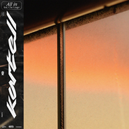
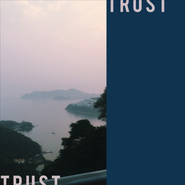
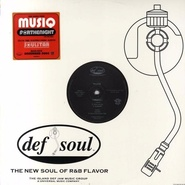
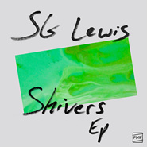
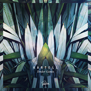
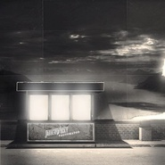
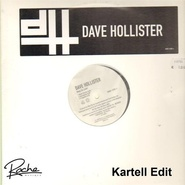
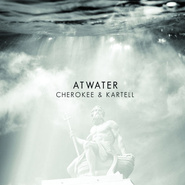

Kartell
============================

|  |  |
| :--: | :-- |
| [ Kartell](https://i.xiami.com/kartell) | **播放数**: 6282099 **粉丝数**: 4038 **评论数**: 197 **地区**: France 法国 **风格**: 节奏布鲁斯 R&B, 迪斯科 Disco, 浩室舞曲 House  |

## 档案

Kartell is a young and gifted house producer whos gripping vibes have made him one of the leading artists of the French House movement. His signature sound filled of intricate basslines and magnetic melodies fusion in a musical medley for all ears. Passionate and charismatic performer, Kartell creates a strong connection with his audience, punctuating his mix of complicit smiles with the crowd, enjoying the sweet crime of dancing the night away.     Part of label Shiny Disco Club and managing his own label Roche Musique, Kartell also holds an influential blog, revealing young talents of the rising house scene. Inexhaustible, Kartell has played in an impressive number of clubs for a guy studying full time and isn’t ready to stop. Ranging from Funky French House tracks to more dark and groovy music the talented artist never ceases to mesmerize.     It has been told people have fallen in love while listening to Kartell’s house gem Pantera and the crowd eagerly awaits everyone one of his already classic tracks. When all is done the crowd is left begging for more of Kartell’s boundary-pushing sound.     参考于脸谱网  https://www.facebook.com/iamkartell/info  个人网站  http://kartell.tumblr.com/

## 专辑

| 名称 | 语种 | 唱片公司 | 发行时间 | 专辑类别 | 专辑风格 |
| :--: | :-- | :-- | :-- | :-- | :-- |
| [ Time](./albums/5021709437.md) | 英语 | Roche Musique | 2020年10月22日 | EP, 单曲 | 节奏布鲁斯 R&B |
| [ All In](./albums/5021063815.md) | 英语 | Roche Musique | 2020年07月06日 | EP, 单曲 | 迪斯科 Disco, 放克电子 Electro (Electro-Funk), 嘻哈 Hip-Hop |
| [ Trust ☰ Spring Tape](./albums/2103690198.md) | 英语 | Rochemusique | 2018年04月19日 | EP, 单曲 |  |
| [ After The Storm (Kartell Edit)](./albums/2103577059.md) | 英语 | Self-Released | 2018年02月06日 | EP, 单曲 |  |
| [ Forthenight (Kartell Edit)](./albums/2102746094.md) | 英语 | Self-Released | 2017年05月10日 | EP, 单曲 |  |
| [ Last Glow](./albums/2102643923.md) | 英语 | Roche Musique | 2016年11月18日 | EP, 单曲 |  |
| [ Conqueror (Kartell Remix)](./albums/2102977365.md) | 英语 | Self-Released | 2016年04月04日 | EP, 单曲 |  |
| [ Green & Gold (Kartell Remix)](./albums/2100273982.md) | 英语 | Self-Released | 2016年02月11日 | EP, 单曲 |  |
| [ Gold](./albums/2100232938.md) | 英语 | Self-Released | 2015年11月04日 | EP, 单曲 |  |
| [ No Less (Kartell Remix)](./albums/2100263086.md) | 英语 | Self-Released | 2015年07月14日 | EP, 单曲 |  |
| [ Tender Games](./albums/933133464.md) | 英语 | Roche Musique | 2015年06月01日 | EP, 单曲 |  |
| [ All I Have](./albums/831582618.md) | 英语 | Rochemusique | 2015年05月12日 | EP, 单曲 |  |
| [ When The Beat Drop Out (Kartell Remix)](./albums/1228912907.md) | 英语 | Rochemusique | 2015年04月12日 | EP, 单曲 |  |
| [ The Wolves (Kartell Remix)](./albums/1128562190.md) | 英语 | Self-Released | 2014年12月05日 | EP, 单曲 |  |
| [ Lights](./albums/1229152447.md) | 英语 | Relentless Records | 2014年11月21日 | EP, 单曲 |  |
| [ Let Go (Kartell Remix)](./albums/1128562304.md) | 英语 | Rochemusique | 2014年07月25日 | EP, 单曲 |  |
| [ Genie In A Bottle](./albums/1628562458.md) | 英语 | HW&W Recordings | 2014年06月28日 | EP, 单曲 |  |
| [ Drop It Like It's Hot (Kartell Remix)](./albums/628563960.md) | 英语 | Self-Released | 2014年04月17日 | EP, 单曲 |  |
| [ Just Chillin' Out (Kartell Edit)](./albums/128912830.md) | 英语 | Rochemusique | 2014年03月28日 | EP, 单曲 |  |
| [ Like I'm On Fire (Kartell Remix)](./albums/1528562253.md) | 英语 | Rochemusique | 2014年01月27日 | EP, 单曲 |  |
| [ Sapphire](./albums/98236463.md) | 英语 | Roche Musique | 2014年01月06日 | EP, 单曲 |  |
| [ Photomaton (Kartell Remix)](./albums/1028912933.md) | 英语 | Pain Surprises | 2013年12月18日 | EP, 单曲 |  |
| [ Keep Lovin' You (Kartell Edit)](./albums/1329251030.md) | 英语 | Rochemusique | 2013年11月06日 | EP, 单曲 |  |
| [ Minimum Move](./albums/328562109.md) | 英语 | Self-Released | 2013年10月20日 | EP, 单曲 |  |
| [ Atwater](./albums/1528906160.md) | 英语 | Rochemusique | 2013年05月08日 | EP, 单曲 |  |
| [ Let Me Up](./albums/1927782517.md) | 英语 | Self-Released | 2013年03月28日 | EP, 单曲 |  |
| [ Dreamer (Kartell Rework)](./albums/129249801.md) | 英语 | Self-Released | 2012年06月27日 | EP, 单曲 |  |
| [ Riviera](./albums/872667576.md) | 英语 | Roche Musique | 2012年05月21日 | EP, 单曲 |  |
| [ Do You Believe (Kartell Remix)](./albums/1129152406.md) | 英语 | Self-Released | 2012年03月31日 | EP, 单曲 |  |
| [ You Are My High (Kartell Remix)](./albums/529152375.md) | 英语 | Self-Released | 2012年02月19日 | EP, 单曲 |  |
| [ Love Strike](./albums/531408286.md) | 英语 | Self-Released | 2012年01月23日 | EP, 单曲 |  |
| [ Fresh Memories](./albums/2100393168.md) | 英语 | Shiny Disco Club | 2010年10月16日 | 录音室专辑 |  |
| [ La Jeunesse Retrouvée](./albums/127857829.md) | 法语 | Self-Released | 2010年09月25日 | EP, 单曲 |  |

## 评论

|  |  |  |  |
| :-- | :-- | :-- | :-- |
|  [虾米用户](https://emumo.xiami.com/u/93081992) so what 2020-12-13 21:58 赞(1) 踩(0) | 
因为kartell入了虾米的坑呢
 |
| ⇒ |  [虾米用户](https://emumo.xiami.com/u/82864204) RocheMusique... 2021-01-16 01:05 赞(0) 踩(0) | 
我也是
 |
|  [虾米用户](https://emumo.xiami.com/u/49640493) 网易云SAINTDONT... 2020-11-12 23:57 赞(0) 踩(0) | 
love
 |
|  [虾米用户](https://emumo.xiami.com/u/82864204) RocheMusique... 2020-09-26 13:36 赞(1) 踩(0) | 
kartell是初衷 当初是在replay上听到
 |
|  [虾米用户](https://emumo.xiami.com/u/9319634) 我还没想好要写什么... 2020-03-08 19:54 赞(0) 踩(0) | 
nice‍♀️
 |
|  [虾米用户](https://emumo.xiami.com/u/52056952) 人生即是到來、相遇、陪伴... 2019-12-18 00:32 赞(0) 踩(0) | 

 |
|  [虾米用户](https://emumo.xiami.com/u/71178106) 塵世や 酒、風呂を抜け ... 2019-06-30 11:27 赞(2) 踩(0) | 
♡
 |
|  [虾米用户](https://emumo.xiami.com/u/51586444) ‍再見 2019-06-01 21:17 赞(0) 踩(0) | 
太棒了吧！！！
 |
|  [虾米用户](https://emumo.xiami.com/u/276944698) 不要自我设限..... 2019-03-06 20:26 赞(1) 踩(0) | 

 |
|  [虾米用户](https://emumo.xiami.com/u/4487129)  2019-02-20 12:35 赞(0) 踩(0) | 
！！！
 |
|  [虾米用户](https://emumo.xiami.com/u/45686435) 一壺飛鳧 尋山夢鶴   ... 2019-02-13 14:39 赞(0) 踩(0) | 
喜
 |
|  [虾米用户](https://emumo.xiami.com/u/12468606) 我还没想好要写什么... 2019-01-27 22:09 赞(0) 踩(0) | 
大哥的每一首都想点收藏
 |
|  [虾米用户](https://emumo.xiami.com/u/11017456) i only wanna... 2019-01-27 15:43 赞(0) 踩(0) | 
愛了
 |
|  [虾米用户](https://emumo.xiami.com/u/12177420) 网易云: FIUFIU_... 2018-12-29 02:57 赞(0) 踩(0) | 
Kartell现场有点呆萌哈哈
 |
|  [虾米用户](https://emumo.xiami.com/u/1726687) Hi,bye~ 2018-10-21 21:46 赞(2) 踩(0) | 
10.11深圳，我是瞎了吗，哭到原地断气
 |
|  [虾米用户](https://emumo.xiami.com/u/228843687) 懒惰统治人间 2018-10-11 20:22 赞(0) 踩(0) | 

 |
|  [虾米用户](https://emumo.xiami.com/u/11906267)  2018-10-09 13:19 赞(0) 踩(0) | 
厦门福州了解下_(&amp;acute;ཀ`」 &amp;ang;)_
 |
|  [虾米用户](https://emumo.xiami.com/u/6449744) 我还没想好要写什么... 2018-10-05 14:01 赞(2) 踩(0) | 
10月11日 Roche Musique 厂牌夜 Darius/Kartell/Dabeull @ 深圳 OIL Club<a href="https://mp.weixin.qq.com/s/yxXr4KvgpGWwZ4CeDgGiIA" target="_blank" rel="nofollow noreferrer noopener">https://mp.weixin.qq.com/s/yxXr4KvgpGWwZ4CeDgGiIA</a>
 |
|  [虾米用户](https://emumo.xiami.com/u/343026517) 听歌类型广阔，只要好听就... 2018-09-28 05:27 赞(0) 踩(0) | 
他的歌真的好听
 |
|  [虾米用户](https://emumo.xiami.com/u/22534652) 我还没想好要写什么... 2018-09-16 03:58 赞(0) 踩(0) | 
French House
 |
|  [虾米用户](https://emumo.xiami.com/u/324879742)   2018-09-01 14:06 赞(2) 踩(0) | 
.
 |
|  [虾米用户](https://emumo.xiami.com/u/340461740) 我还没想好要写什么... 2018-08-08 19:45 赞(4) 踩(0) | 
Kartell 10月中国巡演，详情请关注微信公众号discjockeysh
 |
| ⇒ |  [虾米用户](https://emumo.xiami.com/u/28556963) 暂无签名~ 2018-09-18 12:43 赞(0) 踩(0) | 
cool 爱了
 |
| ⇒ |  [虾米用户](https://emumo.xiami.com/u/550852)  2019-06-15 23:12 赞(0) 踩(0) | 
所以是2018年的巡演吗 
 |
|  [虾米用户](https://emumo.xiami.com/u/10811234) Love Mucic 2018-06-21 08:51 赞(0) 踩(0) | 
赞
 |
|  [虾米用户](https://emumo.xiami.com/u/362522772)  2018-05-19 06:39 赞(0) 踩(0) | 
  
 |
|  [虾米用户](https://emumo.xiami.com/u/304400922) 我还没想好要写什么... 2018-03-24 22:22 赞(0) 踩(0) | 
嘛时候来中国
 |
| ⇒ |  [虾米用户](https://emumo.xiami.com/u/340461740) 我还没想好要写什么... 2018-08-08 19:44 赞(0) 踩(0) | 
10月
 |
| ⇒ |  [虾米用户](https://emumo.xiami.com/u/304400922) 我还没想好要写什么... 2018-08-08 19:46 赞(0) 踩(0) | 
<q><b>Disc Jockey 说：</b></q>
 |
| ⇒ |  [虾米用户](https://emumo.xiami.com/u/340461740) 我还没想好要写什么... 2018-08-08 19:54 赞(0) 踩(0) | 
<q><b>DaftPatrick说：</b></q>
 |
|  [虾米用户](https://emumo.xiami.com/u/5656652)   2018-02-22 11:51 赞(4) 踩(0) | 
出新的了 虾米快去搞定版权 歌名叫 after the storm
 |
|  [虾米用户](https://emumo.xiami.com/u/14091078) 我还没想好要写什么... 2017-12-16 21:21 赞(0) 踩(0) | 
French
 |
| ⇒ |  [虾米用户](https://emumo.xiami.com/u/362522772)  2018-05-19 06:37 赞(0) 踩(0) | 
我一一喜欢的喜他在那里为什么我们的生过得那么苦累丶得通场痛心哭泪让我囟U囱己快巴爬起来那么我又该怎办真烦心很自己无;山l能
 |
|  [虾米用户](https://emumo.xiami.com/u/12719802) lame 2017-12-16 14:51 赞(1) 踩(0) | 
亲亲抱抱举高高  
 |
|  [虾米用户](https://emumo.xiami.com/u/13111079) 有缘再见 2017-11-27 22:19 赞(0) 踩(0) | 
ෆ
 |
|  [虾米用户](https://emumo.xiami.com/u/53712312) ⠀ 2017-11-13 00:37 赞(0) 踩(0) | 
&amp;middot;
 |
|  [虾米用户](https://emumo.xiami.com/u/50642130) 很软 2017-11-02 10:57 赞(0) 踩(0) | 
cute
 |
|  [虾米用户](https://emumo.xiami.com/u/14091078) 我还没想好要写什么... 2017-09-06 22:52 赞(0) 踩(0) | 
太正
 |
|  [虾米用户](https://emumo.xiami.com/u/32508852) 一个脱离了成熟的人 2017-09-04 14:42 赞(1) 踩(0) | 
来了来了来了
 |
|  [虾米用户](https://emumo.xiami.com/u/3117182)  2017-08-07 19:37 赞(0) 踩(0) | 
可以
 |
|  [虾米用户](https://emumo.xiami.com/u/2418238) weibo: @尤米口 2017-08-02 08:15 赞(0) 踩(0) | 
♡⃛
 |
|  [虾米用户](https://emumo.xiami.com/u/83893196) 我还没想好要写什么... 2017-07-26 18:13 赞(0) 踩(0) | 

 |
|  [虾米用户](https://emumo.xiami.com/u/13911932) 暂冇签名~ 2017-06-27 17:04 赞(0) 踩(0) | 
[带墨镜笑]
 |
|  [虾米用户](https://emumo.xiami.com/u/10417095) 听客 2017-05-25 19:20 赞(0) 踩(0) | 
m
 |
|  [虾米用户](https://emumo.xiami.com/u/3140019) 天马行空 2017-05-23 03:07 赞(0) 踩(0) | 
法国帅哥
 |
|  [虾米用户](https://emumo.xiami.com/u/188576732) ins@almighty... 2017-05-18 23:39 赞(0) 踩(0) | 

 |
|  [虾米用户](https://emumo.xiami.com/u/50093825) 。 2017-05-17 16:09 赞(0) 踩(0) | 
: )
 |
|  [虾米用户](https://emumo.xiami.com/u/45485152) Wubba lubba ... 2017-05-15 12:46 赞(1) 踩(0) | 
126
 |
|  [虾米用户](https://emumo.xiami.com/u/48276337) 22世纪不道德 2017-03-16 23:29 赞(0) 踩(0) | 

 |
|  [虾米用户](https://emumo.xiami.com/u/47902661) 虾米体验很不好，很少用虾... 2017-03-03 01:21 赞(0) 踩(0) | 

 |
|  [虾米用户](https://emumo.xiami.com/u/2266073) 过去是现在的未来 2017-03-01 19:00 赞(0) 踩(0) | 
hi
 |
|  [虾米用户](https://emumo.xiami.com/u/156056836) 我还没想好要写什么... 2017-02-25 12:15 赞(0) 踩(0) | 
又没了
 |
|  [虾米用户](https://emumo.xiami.com/u/10329969) :D 2017-01-28 19:30 赞(0) 踩(0) | 
♡
 |
|  [虾米用户](https://emumo.xiami.com/u/214866049) 我还没想好要写什么... 2017-01-24 07:00 赞(0) 踩(0) | 
Gold
 |
|  [虾米用户](https://emumo.xiami.com/u/201391232) 最快的方法是先抱抱 2017-01-22 18:46 赞(0) 踩(0) | 
）
 |
|  [虾米用户](https://emumo.xiami.com/u/37274231) 祝我长命百岁 2017-01-10 11:11 赞(0) 踩(0) | 
我在
 |
|  [虾米用户](https://emumo.xiami.com/u/33552517) 偏好、 2017-01-04 19:40 赞(0) 踩(0) | 
〰
 |
|  [虾米用户](https://emumo.xiami.com/u/45617642) Not bad 2017-01-02 21:44 赞(0) 踩(0) | 
 
 |
|  [虾米用户](https://emumo.xiami.com/u/9028760) 豆瓣见 spotify ... 2016-12-02 21:12 赞(0) 踩(0) | 
Kartell女票hin美啊
 |
|  [虾米用户](https://emumo.xiami.com/u/43547593) ♡ 2016-11-04 16:19 赞(0) 踩(0) | 
@
 |
|  [虾米用户](https://emumo.xiami.com/u/95500084) 或许你从来没有听说过我。 2016-10-16 18:01 赞(0) 踩(0) | 
here
 |
|  [虾米用户](https://emumo.xiami.com/u/85148548)  2016-10-03 11:04 赞(0) 踩(0) | 
嘻嘻
 |
|  [虾米用户](https://emumo.xiami.com/u/4758103) 嘣嘣嘣咖喱儿 2016-09-14 21:31 赞(0) 踩(0) | 

 |
|  [虾米用户](https://emumo.xiami.com/u/49265597) 我还没想好要写什么... 2016-09-13 17:53 赞(0) 踩(0) | 

 |
|  [虾米用户](https://emumo.xiami.com/u/6076438) 起身見頭暈，行路打倒褪。... 2016-09-10 09:25 赞(0) 踩(0) | 
抖9不能停
 |
|  [虾米用户](https://emumo.xiami.com/u/18412060) v15175288880 2016-09-02 20:48 赞(0) 踩(0) | 
.
 |
|  [虾米用户](https://emumo.xiami.com/u/3607930) 一条红色的鱼，一只黑色的... 2016-08-30 08:00 赞(0) 踩(0) | 
‣
 |
|  [虾米用户](https://emumo.xiami.com/u/41993241) 不玩了。ins：rile... 2016-08-13 18:30 赞(0) 踩(0) | 
♡♡♡♡♡
 |
|  [虾米用户](https://emumo.xiami.com/u/96007710)  2016-08-12 01:16 赞(17) 踩(0) | 
French House music is the best in the world .
 |
|  [虾米用户](https://emumo.xiami.com/u/3998319) 就让我悲伤一次 2016-08-08 13:31 赞(0) 踩(0) | 
Z
 |
|  [虾米用户](https://emumo.xiami.com/u/41740929)  今如旧的 昨天比较新 2016-07-31 09:53 赞(0) 踩(0) | 
脚是停不下来的
 |
|  [虾米用户](https://emumo.xiami.com/u/8128176) 好好活着 2016-07-19 18:59 赞(0) 踩(0) | 
@
 |
|  [虾米用户](https://emumo.xiami.com/u/10825322) @Bside1 2016-07-04 07:06 赞(1) 踩(0) | 
要是知道巴黎有演出就呆久一點了（哎
 |
|  [虾米用户](https://emumo.xiami.com/u/4453773) Sunnydong199... 2016-07-01 20:20 赞(0) 踩(0) | 
什么时候来中国啊
 |
|  [虾米用户](https://emumo.xiami.com/u/7951384) 我还没想好要写什么... 2016-06-29 14:44 赞(0) 踩(0) | 

 |
|  [虾米用户](https://emumo.xiami.com/u/50812128) _ 2016-06-17 16:18 赞(0) 踩(0) | 
123
 |
|  [虾米用户](https://emumo.xiami.com/u/188706679) . 2016-06-11 13:40 赞(0) 踩(0) | 

 |
|  [虾米用户](https://emumo.xiami.com/u/45982699) ✈ 2016-05-25 21:31 赞(0) 踩(0) | 
天啊全是我的type
 |
|  [虾米用户](https://emumo.xiami.com/u/42345199) - 2016-05-21 04:40 赞(2) 踩(0) | 
法国dj就是屌
 |
|  [虾米用户](https://emumo.xiami.com/u/13869736) 算是耐看型银铃般笑声的一... 2016-05-11 00:00 赞(0) 踩(0) | 

 |
|  [虾米用户](https://emumo.xiami.com/u/33444626) Hasta la vis... 2016-05-05 23:02 赞(0) 踩(0) | 

 |
|  [虾米用户](https://emumo.xiami.com/u/85148548)  2016-05-03 11:47 赞(0) 踩(0) | 
cool
 |
|  [虾米用户](https://emumo.xiami.com/u/9513422) 虾米歌单迁徙到网易☁️:... 2016-04-29 10:36 赞(0) 踩(0) | 
Back
 |
|  [虾米用户](https://emumo.xiami.com/u/41532913)   2016-04-20 22:37 赞(0) 踩(0) | 
何昱峰
 |
|  [虾米用户](https://emumo.xiami.com/u/33310780) ！ 2016-04-14 11:07 赞(0) 踩(0) | 
!!
 |
|  [虾米用户](https://emumo.xiami.com/u/42661055) ✨ 2016-03-14 19:12 赞(0) 踩(0) | 
❁
 |
|  [虾米用户](https://emumo.xiami.com/u/28529835) wechat：13306... 2016-03-12 11:27 赞(0) 踩(0) | 
112
 |
|  [虾米用户](https://emumo.xiami.com/u/6452617) 你加上整个世界，再减去你 2016-02-24 16:12 赞(0) 踩(0) | 

 |
|  [虾米用户](https://emumo.xiami.com/u/12554850) ///404  Weib... 2016-02-17 22:05 赞(0) 踩(0) | 
︎♡
 |
|  [虾米用户](https://emumo.xiami.com/u/50869110) IG：77richiee... 2016-02-13 22:59 赞(0) 踩(0) | 
—
 |
|  [虾米用户](https://emumo.xiami.com/u/22881143) ㅤㅤㅤㅤ 2016-02-06 23:55 赞(1) 踩(0) | 
。
 |
|  [虾米用户](https://emumo.xiami.com/u/52536056) (◉ω◉υ)⁼³₌₃悄咪... 2016-02-03 20:18 赞(0) 踩(0) | 
评论又没了ಠ_ಠ
 |
|  [虾米用户](https://emumo.xiami.com/u/19706727) 孑然一身 2016-01-24 04:42 赞(0) 踩(0) | 
COOL
 |
|  [虾米用户](https://emumo.xiami.com/u/2735827)  2016-01-22 17:10 赞(1) 踩(0) | 
请换一下头像谢谢
 |
|  [虾米用户](https://emumo.xiami.com/u/6935949) 我已经想好写什么了，你帮... 2016-01-12 20:02 赞(0) 踩(0) | 
法电
 |
|  [虾米用户](https://emumo.xiami.com/u/36537308) 重的都留在這 2016-01-10 08:56 赞(0) 踩(0) | 
Seek
 |
|  [虾米用户](https://emumo.xiami.com/u/45485152) Wubba lubba ... 2015-12-29 00:56 赞(0) 踩(0) | 
只为在虾米中多看你一眼
 |
|  [虾米用户](https://emumo.xiami.com/u/9028760) 豆瓣见 spotify ... 2015-12-28 22:01 赞(0) 踩(0) | 
101啦
 |
|  [虾米用户](https://emumo.xiami.com/u/41920347)   2015-12-25 13:17 赞(0) 踩(0) | 
根本停不下来
 |
|  [虾米用户](https://emumo.xiami.com/u/60922430)  2015-12-25 11:09 赞(1) 踩(0) | 
like i am on fire已单曲循环48小时 
 |
|  [虾米用户](https://emumo.xiami.com/u/36514939) 她留着超酷的短发 网易云... 2015-12-10 10:38 赞(0) 踩(0) | 
☃
 |
|  [虾米用户](https://emumo.xiami.com/u/49492050) 中国电子音乐独立厂牌 2015-12-09 02:29 赞(0) 踩(0) | 
√
 |
|  [虾米用户](https://emumo.xiami.com/u/2831090) 同学请问你有猫饼吗? 2015-12-03 23:37 赞(32) 踩(0) | 
他是唯一一个我可以把所有歌曲随意shuffle的人。
 |
| ⇒ |  [虾米用户](https://emumo.xiami.com/u/9358672) 听派 2016-03-05 14:25 赞(0) 踩(0) | 
更多好音乐 尽在道夫派
 |
|  [虾米用户](https://emumo.xiami.com/u/4372646) 可爱又迷人的正派角色IG... 2015-11-29 15:28 赞(0) 踩(0) | 
#
 |
|  [虾米用户](https://emumo.xiami.com/u/4014356) 这个家伙很聪明什么也没留... 2015-11-27 03:11 赞(0) 踩(0) | 
不能更屌
 |
|  [虾米用户](https://emumo.xiami.com/u/527459) @4ART 2015-11-13 02:33 赞(0) 踩(0) | 
｜｜｜｜
 |
|  [虾米用户](https://emumo.xiami.com/u/108363) 不捨蝦米的一切 有意wx... 2015-11-10 00:47 赞(0) 踩(0) | 
還是法國人最屌
 |
|  [虾米用户](https://emumo.xiami.com/u/44784434) 变得和我一样库 2015-11-09 23:59 赞(0) 踩(0) | 
嘻嘻
 |
|  [虾米用户](https://emumo.xiami.com/u/15477519) 爱  是生命的和弦，而不... 2015-11-09 20:38 赞(1) 踩(0) | 
法国迷幻电子...
 |
|  [虾米用户](https://emumo.xiami.com/u/35580409) 对你不感兴趣 2015-11-07 14:25 赞(0) 踩(0) | 
我宣布 现在开始你是我的男人了
 |
|  [虾米用户](https://emumo.xiami.com/u/35714790)  2015-10-26 01:21 赞(0) 踩(0) | 
٩(๑ᵒ̴̶̷͈᷄ᗨᵒ̴̶̷͈᷅)و ٩(๑ᵒ̴̶̷͈᷄ᗨᵒ̴̶̷͈᷅)و  
 |
|  [虾米用户](https://emumo.xiami.com/u/13146778) 再没遇到过听歌对盘的人 2015-10-23 18:00 赞(0) 踩(0) | 
我只想问。今晚谁去！
 |
| ⇒ |  [虾米用户](https://emumo.xiami.com/u/14028659)   2015-10-24 02:48 赞(0) 踩(0) | 
不好玩
 |
| ⇒ |  [虾米用户](https://emumo.xiami.com/u/13146778) 再没遇到过听歌对盘的人 2015-10-24 08:01 赞(0) 踩(0) | 
<q><b>小铭仔说：</b></q>
 |
| ⇒ |  [虾米用户](https://emumo.xiami.com/u/14028659)   2015-10-24 09:38 赞(0) 踩(0) | 
<q><b>Vanessa说：</b></q>
 |
| ⇒ |  [虾米用户](https://emumo.xiami.com/u/13146778) 再没遇到过听歌对盘的人 2015-10-24 10:16 赞(0) 踩(0) | 
<q><b>小铭仔说：</b></q>
 |
| ⇒ |  [虾米用户](https://emumo.xiami.com/u/14028659)   2015-10-24 10:33 赞(0) 踩(0) | 
<q><b>Vanessa说：</b></q>
 |
| ⇒ |  [虾米用户](https://emumo.xiami.com/u/156729)  2015-10-25 10:52 赞(0) 踩(0) | 
<q><b>小铭仔说：</b></q>
 |
|  [虾米用户](https://emumo.xiami.com/u/267680) 一个老人 2015-10-22 16:29 赞(0) 踩(0) | 
10月23 kartell @arkham
 |
|  [虾米用户](https://emumo.xiami.com/u/44858319) 永远是我最爱的虾米 2015-10-19 09:53 赞(0) 踩(0) | 
。
 |
|  [虾米用户](https://emumo.xiami.com/u/108363) 不捨蝦米的一切 有意wx... 2015-10-17 11:20 赞(0) 踩(0) | 
法國的都好棒
 |
|  [虾米用户](https://emumo.xiami.com/u/41163024) I’m done. 2015-10-11 02:35 赞(0) 踩(0) | 
w
 |
|  [虾米用户](https://emumo.xiami.com/u/7016243) 我还没想好要写什么... 2015-10-09 13:29 赞(0) 踩(0) | 

 |
|  [虾米用户](https://emumo.xiami.com/u/47812860) 我还没想好要写什么... 2015-10-08 17:41 赞(0) 踩(0) | 
dope
 |
|  [虾米用户](https://emumo.xiami.com/u/5848254) 网易云音乐（之后可能会开... 2015-09-24 11:33 赞(0) 踩(0) | 
棒棒的!
 |
|  [虾米用户](https://emumo.xiami.com/u/8526889) 情绪 悟性 灵感 梦幻 2015-09-21 23:05 赞(0) 踩(0) | 
1
 |
|  [虾米用户](https://emumo.xiami.com/u/7322777) ∮ 2015-09-20 15:57 赞(0) 踩(0) | 
...A...
 |
|  [虾米用户](https://emumo.xiami.com/u/8000099) 暂无签名~ 2015-09-20 01:36 赞(0) 踩(0) | 
准备从第一首顺序播放
 |
|  [虾米用户](https://emumo.xiami.com/u/28946659)   2015-09-16 19:58 赞(0) 踩(0) | 

 |
|  [虾米用户](https://emumo.xiami.com/u/22456876) 失眠是因为睡前戴上了耳机 2015-09-10 20:05 赞(0) 踩(0) | 
维持 2
 |
|  [虾米用户](https://emumo.xiami.com/u/11512934) 好累哦但还是要保持亢奋 2015-09-08 11:16 赞(0) 踩(0) | 
屌
 |
|  [虾米用户](https://emumo.xiami.com/u/48621783) 微信联系 Sacred-... 2015-09-04 23:49 赞(0) 踩(0) | 
√
 |
|  [虾米用户](https://emumo.xiami.com/u/763459) (๑•̀ㅁ•́ฅ)嗷呜 2015-08-25 14:30 赞(0) 踩(0) | 
SW
 |
|  [虾米用户](https://emumo.xiami.com/u/23356340)   2015-08-25 07:01 赞(0) 踩(0) | 
有人，惊呆了
 |
|  [虾米用户](https://emumo.xiami.com/u/14028659)   2015-08-16 23:32 赞(0) 踩(0) | 
舒爽
 |
| ⇒ |  [虾米用户](https://emumo.xiami.com/u/23356340)   2015-08-25 07:02 赞(0) 踩(0) | 
好听
 |
|  [虾米用户](https://emumo.xiami.com/u/5061480) 一片素心 三分侠气 2015-08-07 18:21 赞(1) 踩(0) | 
老骚了
 |
|  [虾米用户](https://emumo.xiami.com/u/51803691) 就是太聪明 什么都不留下 2015-08-07 18:04 赞(1) 踩(0) | 
听他的小取儿让我感觉高冷
 |
|  [虾米用户](https://emumo.xiami.com/u/42661055) ✨ 2015-08-04 09:34 赞(0) 踩(0) | 
☆
 |
|  [虾米用户](https://emumo.xiami.com/u/42661055) ✨ 2015-08-04 09:34 赞(0) 踩(0) | 
@
 |
|  [虾米用户](https://emumo.xiami.com/u/42725114) ThistheshitI... 2015-07-22 00:23 赞(0) 踩(0) | 

 |
|  [虾米用户](https://emumo.xiami.com/u/42879874) born to lost 2015-07-16 14:30 赞(0) 踩(0) | 
✘
 |
|  [虾米用户](https://emumo.xiami.com/u/42695089) vb：吴浣甜甜 2015-07-15 16:43 赞(0) 踩(0) | 
。
 |
|  [虾米用户](https://emumo.xiami.com/u/6871050) 我还没想好要写什么... 2015-07-14 10:50 赞(0) 踩(0) | 

 |
|  [虾米用户](https://emumo.xiami.com/u/3442087) Dust To Dust 2015-07-12 11:45 赞(0) 踩(0) | 
m
 |
|  [虾米用户](https://emumo.xiami.com/u/8528123) 我还没想好要写什么... 2015-07-12 02:07 赞(0) 踩(0) | 
给档案跪了 
 |
|  [虾米用户](https://emumo.xiami.com/u/1320669) ツ 2015-07-01 19:03 赞(0) 踩(0) | 
0.0
 |
|  [虾米用户](https://emumo.xiami.com/u/50046431) baby 2015-06-25 11:09 赞(0) 踩(0) | 

 |
|  [虾米用户](https://emumo.xiami.com/u/5942996) 我还没想好要写什么... 2015-06-25 10:52 赞(0) 踩(0) | 
→→→
 |
|  [虾米用户](https://emumo.xiami.com/u/46128112) 一个假泰国人  2015-06-20 20:55 赞(0) 踩(0) | 

 |
|  [虾米用户](https://emumo.xiami.com/u/6500137)  2015-06-17 11:23 赞(0) 踩(0) | 
.
 |
|  [虾米用户](https://emumo.xiami.com/u/5490437) 女士优先 2015-06-14 14:29 赞(0) 踩(0) | 
:;
 |
|  [虾米用户](https://emumo.xiami.com/u/50541290)   2015-06-10 17:25 赞(0) 踩(0) | 
♥
 |
|  [虾米用户](https://emumo.xiami.com/u/38788628)  2015-06-10 00:59 赞(0) 踩(0) | 

 |
|  [虾米用户](https://emumo.xiami.com/u/38640339) 我想好写什么了…… 2015-05-25 12:43 赞(0) 踩(0) | 

 |
|  [虾米用户](https://emumo.xiami.com/u/9412733) 雪人☃ 2015-05-14 14:05 赞(0) 踩(0) | 
hao ai chou yan o
 |
|  [虾米用户](https://emumo.xiami.com/u/20862728) 柯男 2015-05-13 10:08 赞(0) 踩(0) | 
٩(●̮̮̃●̃)۶ ٩(•̮̮̃•̃)۶ ٩(-̮̮̃-̃)۶ ٩(●̮̮̃•̃)۶ ٩(-̮̮̃•̃)۶
 |
|  [虾米用户](https://emumo.xiami.com/u/1320669) ツ 2015-05-12 21:45 赞(0) 踩(0) | 
0.0
 |
|  [虾米用户](https://emumo.xiami.com/u/9412733) 雪人☃ 2015-05-06 10:28 赞(0) 踩(0) | 
太好了了拉拉啦了
 |
|  [虾米用户](https://emumo.xiami.com/u/6654069) mutherfacker... 2015-05-06 01:36 赞(0) 踩(0) | 
-
 |
|  [虾米用户](https://emumo.xiami.com/u/1903770) unknown plea... 2015-05-04 22:30 赞(0) 踩(0) | 
1
 |
|  [虾米用户](https://emumo.xiami.com/u/9547482) 4649、、39！！ 2015-05-03 00:30 赞(0) 踩(0) | 
太赞了！潮到爆！超喜欢的节奏！
 |
|  [虾米用户](https://emumo.xiami.com/u/6860812) 勇敢的三月兔 2015-04-26 23:43 赞(0) 踩(0) | 
=_=
 |
|  [虾米用户](https://emumo.xiami.com/u/3512592) 你需要休闲 2015-04-23 19:10 赞(0) 踩(0) | 
没毛病
 |
|  [虾米用户](https://emumo.xiami.com/u/9412733) 雪人☃ 2015-04-20 21:10 赞(0) 踩(0) | 
llll
 |
|  [虾米用户](https://emumo.xiami.com/u/723168)  2015-04-15 21:13 赞(0) 踩(0) | 
很有feel~~~~~~~
 |
|  [虾米用户](https://emumo.xiami.com/u/6654069) mutherfacker... 2015-04-09 06:46 赞(0) 踩(0) | 
-
 |
|  [虾米用户](https://emumo.xiami.com/u/240547)  2015-03-30 00:47 赞(0) 踩(0) | 
喵~
 |
|  [虾米用户](https://emumo.xiami.com/u/28640266) 听你听我听精钢化掉的声音 2015-03-28 00:57 赞(0) 踩(0) | 
法式~
 |
|  [虾米用户](https://emumo.xiami.com/u/14074126) 收集灵魂的藏品 2015-03-26 21:14 赞(0) 踩(0) | 
只听到三个音符，我就知道我的菜，绝对牛逼
 |
|  [虾米用户](https://emumo.xiami.com/u/56048)   2015-03-16 14:58 赞(0) 踩(0) | 
好爱这法国电子的调调~~~
 |
|  [虾米用户](https://emumo.xiami.com/u/33584146) 你是我心口的伤疤 2015-03-15 09:34 赞(0) 踩(0) | 
Attractive !
 |
|  [虾米用户](https://emumo.xiami.com/u/39802823) 难以表述的杂偏好 2015-03-14 18:22 赞(0) 踩(0) | 
awesome!!!
 |
|  [虾米用户](https://emumo.xiami.com/u/3726651) simplicity 2015-03-08 23:02 赞(0) 踩(0) | 
一级棒
 |
|  [虾米用户](https://emumo.xiami.com/u/30263391)  2015-03-04 19:57 赞(0) 踩(0) | 
相见恨晚  太好了
 |
|  [虾米用户](https://emumo.xiami.com/u/37684946) chill靈 2015-02-27 19:34 赞(0) 踩(0) | 
太六臂
 |
|  [虾米用户](https://emumo.xiami.com/u/1507513) 介绍一下你自己 2015-02-22 03:33 赞(0) 踩(0) | 

 |
|  [虾米用户](https://emumo.xiami.com/u/10121087) 天涼好個秋 2015-02-18 13:21 赞(0) 踩(0) | 
棒！！！
 |
|  [虾米用户](https://emumo.xiami.com/u/20010220) 热爱音乐，享受生活 2015-02-13 19:10 赞(0) 踩(0) | 
好听
 |
|  [虾米用户](https://emumo.xiami.com/u/7661244)  2015-02-11 16:35 赞(0) 踩(0) | 
❤️
 |
|  [虾米用户](https://emumo.xiami.com/u/23739365) Life in Swit... 2015-02-10 12:12 赞(1) 踩(0) | 
fucking awesome
 |
|  [虾米用户](https://emumo.xiami.com/u/46290712)   2015-02-06 18:45 赞(0) 踩(0) | 
不赖
 |
|  [虾米用户](https://emumo.xiami.com/u/39865190)   2015-01-20 13:57 赞(0) 踩(0) | 
nice
 |
|  [虾米用户](https://emumo.xiami.com/u/1988060) Electrow 2015-01-19 11:54 赞(0) 踩(0) | 
儿子
 |
|  [虾米用户](https://emumo.xiami.com/u/26015972) come and chi... 2014-12-29 20:25 赞(0) 踩(0) | 
Δ
 |
|  [虾米用户](https://emumo.xiami.com/u/6815911) 我还没想好要写什么... 2014-12-25 05:18 赞(0) 踩(0) | 
～
 |
|  [虾米用户](https://emumo.xiami.com/u/102182) 最近我常常陷入回忆，每个... 2014-11-28 13:27 赞(0) 踩(0) | 
Kartell
 |
|  [虾米用户](https://emumo.xiami.com/u/21801236)  2014-11-23 17:16 赞(0) 踩(0) | 
叼
 |
|  [虾米用户](https://emumo.xiami.com/u/2289778) fuk u all！ 2014-11-12 09:07 赞(0) 踩(0) | 
不错
 |
|  [虾米用户](https://emumo.xiami.com/u/24123398) // 2014-10-23 00:20 赞(0) 踩(0) | 
- -
 |
| ⇒ |  [虾米用户](https://emumo.xiami.com/u/2289778) fuk u all！ 2014-11-12 08:56 赞(0) 踩(0) | 
爱你
 |
|  [虾米用户](https://emumo.xiami.com/u/3166931) 血男孩 2014-09-15 15:46 赞(0) 踩(0) | 
来自未来客户端
 |
|  [虾米用户](https://emumo.xiami.com/u/1284030) 我还没想好要写什么... 2014-08-29 20:33 赞(0) 踩(0) | 
天啊 跪了
 |
|  [虾米用户](https://emumo.xiami.com/u/4453773) Sunnydong199... 2014-02-24 19:23 赞(0) 踩(0) | 
谁说没人？
 |
|  [虾米用户](https://emumo.xiami.com/u/11576260)  2014-01-24 13:09 赞(0) 踩(0) | 
我醉了，这么屌炸天居然没人！！！
 |
|  [虾米用户](https://emumo.xiami.com/u/11682613)  2014-01-21 16:31 赞(0) 踩(0) | 
居然没人。。
 |
