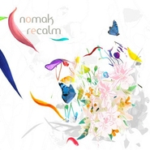

Recalm
============================

|  |  |
| :--: | :-- |
| [ Recalm](https://emumo.xiami.com/album/343820) | **艺人**: [Nomak](../index.md) **语种**: 日语 **唱片公司**: Huge Soul **发行时间**: 2008年04月16日 **专辑类别**: 录音室专辑 **专辑风格**: 爵士说唱 Jazz Rap **播放数**: 164146 **收藏数**: 450 **评论数**: 15  |

## 简介

在NOMAK官方网站上写着这样一段话：“NOMAK在山川和海洋所构成的大自然下诞生与成长，在透过接触草、花、木、水、土等自然的环境下孕育了其感性及情绪丰富的特质，将日本的风格与现代音乐融为一体，并且将持续的在日常生活中追寻新的景色和发现。”
 
  

被日本FMusic、HMV和Tower Record一致评价为2008年度日本underground hip hop最佳新星。
 
  
虽然常被拿来和Nujabes比较，两者都是很好的融合了东西方音乐的大师，Nomak的风格就像他的官站上所说的那样，更加富于自然气息，钢琴和弦乐舒缓但充满生命力。  
  
衝撃のデビューと共に大ヒット中のアルバム"Calm"を、DJ Deckstream, Kero One, Shin-Skiなど、国内外の人気アーティストがリ ミックス。 アルバム未収録の企画曲 "One Peace"の DJ Deckstreamによるリミックスを収録した、2大アーティストの初競演!! さらに、Nomakファンには嬉しい、MCをフィーチャーしたセルフリミックス2曲も収録!! 今のシーンを象徴するアーティスト達が、個性を十分に発揮したバラエ ティーに富んだ大傑作の誕生!!

## 曲目

## 评论

|  |  |  |  |
| :-- | :-- | :-- | :-- |
|  [虾米用户](https://emumo.xiami.com/u/52415194) ♬♩♫♪♡ 2018-04-06 23:45 赞(0) 踩(0) | 
ᵕ᷄≀ ̠˘᷅
 |
|  [虾米用户](https://emumo.xiami.com/u/23795068)  2014-08-22 18:57 赞(0) 踩(0) | 
outro有问题
 |
|  [虾米用户](https://emumo.xiami.com/u/36537308) 重的都留在這 2014-08-15 10:27 赞(0) 踩(0) | 
好。
 |
|  [虾米用户](https://emumo.xiami.com/u/8502640) I'm half cra... 2014-08-07 02:29 赞(0) 踩(0) | 
清新电子
 |
|  [虾米用户](https://emumo.xiami.com/u/3367148) be there 2013-12-13 13:36 赞(0) 踩(0) | 
great.
 |
|  [虾米用户](https://emumo.xiami.com/u/155947) 一期一会 2013-01-06 11:14 赞(0) 踩(0) | 
Keep calm and carry on .
 |
|  [虾米用户](https://emumo.xiami.com/u/10188613)  2012-12-23 02:48 赞(0) 踩(0) | 
Elemental Music Feat.Melodee (Dela Remix)  大爱
 |
|  [虾米用户](https://emumo.xiami.com/u/4480996)  2012-05-29 16:58 赞(0) 踩(0) | 
Clam了吗！还得Recalm。 真欠
 |
|  [虾米用户](https://emumo.xiami.com/u/1550760)   2012-04-17 21:18 赞(0) 踩(0) | 
Nomak
 |
|  [虾米用户](https://emumo.xiami.com/u/5170986) 从小耍流氓，长大风清扬 2011-11-23 11:45 赞(0) 踩(0) | 
混音专辑~集合
 |
|  [虾米用户](https://emumo.xiami.com/u/3304379) 我还没想好要写什么... 2011-10-16 14:27 赞(0) 踩(0) | 
JAZZYHIPHOP!
 |
|  [虾米用户](https://emumo.xiami.com/u/1742284) ♂ 2011-08-25 20:26 赞(0) 踩(0) | 
intro outro更精彩
 |
| ⇒ |  [虾米用户](https://emumo.xiami.com/u/3928557) 阿边个边个 2011-12-30 20:42 赞(0) 踩(0) | 
同意！因为没有raper
 |
|  [虾米用户](https://emumo.xiami.com/u/1301315) 有一天 我看了很多次日落 2011-04-29 18:44 赞(0) 踩(0) | 
突然的清新
 |
|  [虾米用户](https://emumo.xiami.com/u/482580)  2010-01-06 11:23 赞(0) 踩(0) | 
如是清风
 |
