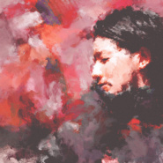
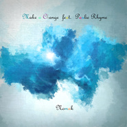
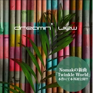
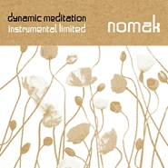
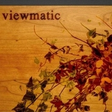
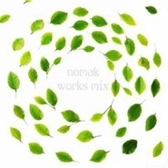
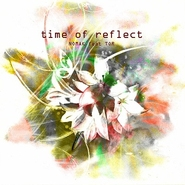
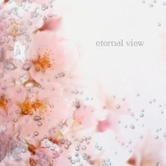
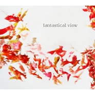

Nomak
============================

|  |  |
| :--: | :-- |
| [ Nomak](https://i.xiami.com/nomak) | **播放数**: 11190173 **粉丝数**: 16999 **评论数**: 873 **地区**: Japan 日本 **风格**: 爵士流行 Jazz Pop, 爵士说唱 Jazz Rap, 独立电子乐 Indietronica  |

## 档案

07年发行的首张专辑《CALM》惊艳四座，被Tower Record评介为年度日本underground hip hop最佳新星。因病淡出音乐圈后，虽鲜少露面，却影响力不减。2010年，无任何宣传活动助力的新专辑《Dynamic Meditation Instrume》在iTunes store同类专辑排行榜名列第2位。而其作品优美细腻的风格颇受到大牌们的青睐，曾多次被CHANEL，PRADA，Sony Xperia等用于广告片的BGM。 
———— 
【Nomak大事记】 
2006  在支持社会正视核废料存放问题所兴办的活动【STOP ROKKASHO】的单曲Rokkash中，推出了自己的Remix作品 
2007  发行个人专辑《CALM》，一举成名 
2008  Tower Record评介为年度日本underground hip hop最佳新星 
2010  发行专辑《dynamic meditation instrumental limited》，并取得iTunes同类专辑排行榜名列第2位的佳绩 
2011  与CHANEL、PRADA、Sony Xperia、Patagonia等大牌合作，制作广告片的BGM 
2014  《Make a Change》在iTunes Store 发售 
2015  首次海外巡演成功，在海外掀起Jazz-Hiphop的热浪 
2016 上海 广州双城巡演 首次公开了三首2017新专歌曲获得好评

## 专辑

| 名称 | 语种 | 唱片公司 | 发行时间 | 专辑类别 | 专辑风格 |
| :--: | :-- | :-- | :-- | :-- | :-- |
| [ Phenomenal Love](./albums/2104937175.md) | 其他 |  | 2019年06月10日 | 录音室专辑 | 爵士嘻哈 Jazz Hip Hop, 轻音乐 Easy Listening |
| [ Nota 100](./albums/2103725783.md) | 英语 |  | 2018年05月31日 | EP, 单曲 | 欧美流行 Western Pop |
| [ Perfect View](./albums/1894767688.md) | 其他 | Huge Soul | 2014年03月15日 | 合集, 杂锦 | 爵士说唱 Jazz Rap |
| [ Make a Change feat. Paulie Rhyme](./albums/994690340.md) | 日语 | Huge Soul | 2014年03月12日 | EP, 单曲 | 爵士说唱 Jazz Rap |
| [ Dreamin' View](./albums/1888027148.md) | 其他 | Huge Soul | 2014年01月10日 | 录音室专辑 | 爵士说唱 Jazz Rap |
| [ Dynamic Meditation Instrumental Limited](./albums/379497.md) | 日语 | Huge Soul | 2010年05月26日 | 录音室专辑 | 爵士说唱 Jazz Rap |
| [ Viewmatic](./albums/351067.md) | 日语 | Huge Soul | 2009年08月21日 | 录音室专辑 | 爵士说唱 Jazz Rap |
| [ Works Mix](./albums/390441.md) | 日语 | Huge Soul | 2009年03月15日 | 精选集 | 爵士说唱 Jazz Rap |
| [ Muziq and Foto](./albums/343694.md) | 日语 | Huge Soul | 2009年01月28日 | 录音室专辑 | 爵士说唱 Jazz Rap |
| [ Recalm](./albums/343820.md) | 日语 | Huge Soul | 2008年04月16日 | 录音室专辑 | 爵士说唱 Jazz Rap |
| [ Time Of Reflect](./albums/283208869.md) | 日语 | Huge Soul | 2008年01月16日 | EP, 单曲 | 爵士说唱 Jazz Rap |
| [ Calm](./albums/315480.md) | 日语 | Huge Soul | 2007年10月03日 | 录音室专辑 | 爵士说唱 Jazz Rap |
| [ eternal view](./albums/353317.md) | 日语 | Huge Soul | 2007年07月23日 | 合集, 杂锦 | 爵士说唱 Jazz Rap |
| [ One Fist](./albums/343910.md) | 日语 | Huge Soul | 2007年01月01日 | EP, 单曲 | 爵士说唱 Jazz Rap |
| [ Velodrome (Nomak Remix)](./albums/489725.md) | 日语 | Shou Records | 2006年09月21日 | EP, 单曲 | 爵士说唱 Jazz Rap |
| [ wonderin' view](./albums/343892.md) | 日语 | Huge Soul | 2006年01月01日 | 合集, 杂锦 | 爵士说唱 Jazz Rap |
| [ fantastical view](./albums/343893.md) | 日语 | Huge Soul | 2006年01月01日 | 合集, 杂锦 | 爵士说唱 Jazz Rap |

## 评论

|  |  |  |  |
| :-- | :-- | :-- | :-- |
|  [虾米用户](https://emumo.xiami.com/u/427840279) 购买诗集《落日飞奔术》电... 2020-10-09 16:06 赞(0) 踩(0) | 
，
 |
|  [虾米用户](https://emumo.xiami.com/u/400715332) 留白 2020-03-16 08:12 赞(0) 踩(0) | 
&amp;mdash;&amp;mdash;
 |
|  [虾米用户](https://emumo.xiami.com/u/276944698) 不要自我设限..... 2020-02-05 15:02 赞(1) 踩(0) | 

 |
|  [虾米用户](https://emumo.xiami.com/u/40603098) You can’t ho... 2019-12-13 10:24 赞(1) 踩(0) | 

 |
|  [虾米用户](https://emumo.xiami.com/u/13947440) 愚人节出生的老妖婆 2019-07-27 20:08 赞(0) 踩(0) | 
hi. i want to send u the song i write and sing with ur music.i am sorry for that.but i think u will forgive me when u hear it.my email is <a href="mailto:huajazz@126.com">huajazz@126.com</a>  or i also have line.the id is huajazz …looking forward of ur reply.   thank u so much
 |
|  [虾米用户](https://emumo.xiami.com/u/346492287) 虾米不要离开我！ 2019-06-16 00:01 赞(0) 踩(0) | 
下次能不能宠幸一下广深！！
 |
|  [虾米用户](https://emumo.xiami.com/u/21163995) 心は進化するんだ。 2019-06-12 22:02 赞(0) 踩(0) | 
Nomakは俺のお気に入りのヒップホップボーカル
 |
|  [虾米用户](https://emumo.xiami.com/u/2928117) 你好 2019-05-30 22:36 赞(0) 踩(0) | 
Mr. N。儿童节快乐！
 |
|  [虾米用户](https://emumo.xiami.com/u/8326332) 后来，即便是音乐，也无法... 2019-05-07 07:15 赞(3) 踩(0) | 
可以来交流音乐，但别把音乐过分商业化。
 |
|  [虾米用户](https://emumo.xiami.com/u/1702889)  2019-05-07 01:31 赞(2) 踩(0) | 
炸街
 |
|  [虾米用户](https://emumo.xiami.com/u/4015583) 永遠的蝦米 2019-05-07 00:50 赞(0) 踩(0) | 
。。。
 |
|  [虾米用户](https://emumo.xiami.com/u/50123090) 虚幻的幸福 2019-05-07 00:28 赞(1) 踩(0) | 
这是怎么啦突然大爆发更新!?
 |
|  [虾米用户](https://emumo.xiami.com/u/6515158) weibo：杯砸_aer... 2019-05-06 23:40 赞(0) 踩(0) | 
哈哈哈哈哈哈哈哈
 |
|  [虾米用户](https://emumo.xiami.com/u/346492287) 虾米不要离开我！ 2019-05-06 22:22 赞(1) 踩(0) | 
15条？我的天
 |
|  [虾米用户](https://emumo.xiami.com/u/47706944) 蛙蛙什么都不知道 2019-05-06 21:54 赞(1) 踩(0) | 
今晚什么意思？？虾米轰炸？？
 |
|  [虾米用户](https://emumo.xiami.com/u/69159922) 自卑早日远离我 2019-04-30 22:58 赞(0) 踩(0) | 
巡演2019年有广州的？
 |
| ⇒ |  [虾米用户](https://emumo.xiami.com/u/6024603)   2019-05-02 10:54 赞(0) 踩(0) | 
上面写了但是都还搜不到票
 |
| ⇒ |  [虾米用户](https://emumo.xiami.com/u/69159922) 自卑早日远离我 2019-05-02 23:07 赞(0) 踩(0) | 
<q><b>03_SR说：</b></q>
 |
| ⇒ |  [虾米用户](https://emumo.xiami.com/u/32704477) 像熟悉了一个世纪 2019-05-05 01:49 赞(0) 踩(0) | 
<q><b>Mystline说：</b></q>
 |
|  [虾米用户](https://emumo.xiami.com/u/8291066)  2019-04-25 17:03 赞(0) 踩(0) | 
已购门票  来杭州了 开心(∩_∩)
 |
|  [虾米用户](https://emumo.xiami.com/u/417223) 应见未见，如此之多 2019-04-22 13:09 赞(0) 踩(0) | 
这次没有北京站，我哭了
 |
| ⇒ |  [虾米用户](https://emumo.xiami.com/u/12764473) 我还没想好要写什么... 2019-05-30 10:55 赞(0) 踩(0) | 
有呀
 |
| ⇒ |  [虾米用户](https://emumo.xiami.com/u/417223) 应见未见，如此之多 2019-05-31 14:22 赞(0) 踩(0) | 
<q><b>Cat_Champloo说：</b></q>
 |
|  [虾米用户](https://emumo.xiami.com/u/355616318) : )大家都好好的 2019-03-12 18:01 赞(0) 踩(0) | 
.
 |
|  [虾米用户](https://emumo.xiami.com/u/45686435) 一壺飛鳧 尋山夢鶴   ... 2019-03-11 13:39 赞(0) 踩(0) | 
✨
 |
|  [虾米用户](https://emumo.xiami.com/u/324879742)   2018-11-17 15:18 赞(0) 踩(0) | 
.
 |
|  [虾米用户](https://emumo.xiami.com/u/346492287) 虾米不要离开我！ 2018-11-07 13:28 赞(0) 踩(0) | 
大白天本想午睡，结果听他的曲子听得泪流满面是怎么回事？
 |
|  [虾米用户](https://emumo.xiami.com/u/362221456) 我还没想好要写什么... 2018-09-03 13:09 赞(0) 踩(0) | 
少了点什么
 |
|  [虾米用户](https://emumo.xiami.com/u/32704477) 像熟悉了一个世纪 2018-07-04 22:22 赞(1) 踩(0) | 
他的音乐高中开始听 一直不见真容刚打开图片 发现有汉字心想开头几个字  有太阳&amp;hellip;&amp;hellip;肯定是什么励志短语了谁知有太阳升起的地方就有......朝阳轮胎？？？轮胎？？
 |
| ⇒ |  [虾米用户](https://emumo.xiami.com/u/32056965) stay gold. 2019-05-04 20:34 赞(0) 踩(0) | 
hah是17年7月那场刚下飞机的时候paulie rhyme给他拍的 这个行李车上的广告我也是笑爆了
 |
|  [虾米用户](https://emumo.xiami.com/u/1115247) @Nebula_7293 2018-05-25 19:32 赞(0) 踩(0) | 
／
 |
|  [虾米用户](https://emumo.xiami.com/u/256746836)   2018-05-13 13:37 赞(0) 踩(0) | 
嗯
 |
|  [虾米用户](https://emumo.xiami.com/u/20177386) 感谢一切美好的遇见❤️ 2018-04-22 01:58 赞(0) 踩(0) | 

 |
|  [虾米用户](https://emumo.xiami.com/u/42799966) 两棵朝圣的树。 2018-04-05 11:13 赞(1) 踩(0) | 
这个面相不错呀！
 |
|  [虾米用户](https://emumo.xiami.com/u/52415194) ♬♩♫♪♡ 2018-04-05 05:36 赞(0) 踩(0) | 
:-)
 |
|  [虾米用户](https://emumo.xiami.com/u/76004672) じゃ おやすみなさい( ... 2018-03-09 23:58 赞(0) 踩(0) | 
ꉂ(ˊᗜˋ*)赞~
 |
|  [虾米用户](https://emumo.xiami.com/u/298010920)  2018-03-02 23:19 赞(2) 踩(0) | 
伟大的日本，我爱你  
 |
|  [虾米用户](https://emumo.xiami.com/u/298010920)  2018-03-02 22:34 赞(1) 踩(0) | 
.
 |
|  [虾米用户](https://emumo.xiami.com/u/298010920)  2018-03-02 22:28 赞(1) 踩(0) | 
.
 |
|  [虾米用户](https://emumo.xiami.com/u/298010920)  2018-03-02 22:28 赞(2) 踩(0) | 
日本厉害  
 |
|  [虾米用户](https://emumo.xiami.com/u/20177386) 感谢一切美好的遇见❤️ 2018-02-27 15:53 赞(0) 踩(0) | 

 |
|  [虾米用户](https://emumo.xiami.com/u/253592407) 再见 2018-02-13 22:28 赞(0) 踩(0) | 
Hi 
 |
|  [虾米用户](https://emumo.xiami.com/u/13917752) . 2018-01-27 21:07 赞(1) 踩(0) | 
来晚了 非常抱歉
 |
|  [虾米用户](https://emumo.xiami.com/u/31074894)  2018-01-22 11:09 赞(0) 踩(0) | 
重庆站的小伙伴有建群吗
 |
|  [虾米用户](https://emumo.xiami.com/u/72490592) 黑猫女 2018-01-22 08:59 赞(2) 踩(0) | 
Nomak你其实不需要太多嘉宾来增加音乐本身的饱满度 在纯净无杂质的音乐里我们很享受
 |
|  [虾米用户](https://emumo.xiami.com/u/17233975) wc： tiamwhoi... 2018-01-22 01:58 赞(0) 踩(0) | 
不是说即兴说唱low！更正！是因为那种jazz 环境 一下子变成这种叫卖式应援&amp;hellip;气氛不太对 导致的情感认知
 |
|  [虾米用户](https://emumo.xiami.com/u/17233975) wc： tiamwhoi... 2018-01-22 01:57 赞(0) 踩(0) | 
现场和照片一样帅！不过那个黑人歌手热场子热的太尴尬了&amp;hellip;什么memeyouyou&amp;hellip;&amp;hellip;&amp;hellip;&amp;hellip;又不是即兴说唱现场   优雅的jazz hippop &amp;hellip;一下子low了 后来女歌手拉回来堪称实力了！享受后半段
 |
| ⇒ |  [虾米用户](https://emumo.xiami.com/u/4416737) 我还没想好要写什么... 2018-01-22 10:31 赞(0) 踩(0) | 
我还以为现场就我那么尴尬本来这个原来听的就是纯音乐，又不是冲着hippop去的，结果来那么多rapper，我个人是完全不喜欢听rap，live没有器乐我就感觉很不自在了。后面jazz女歌手部分就好多了&amp;hellip;&amp;hellip;
 |
| ⇒ |  [虾米用户](https://emumo.xiami.com/u/17233975) wc： tiamwhoi... 2018-01-22 15:22 赞(0) 踩(0) | 
<q><b>人間アレルギー说：</b></q>
 |
| ⇒ |  [虾米用户](https://emumo.xiami.com/u/4416737) 我还没想好要写什么... 2018-01-22 18:15 赞(0) 踩(0) | 
<q><b>•THT•说：</b></q>
 |
| ⇒ |  [虾米用户](https://emumo.xiami.com/u/17233975) wc： tiamwhoi... 2018-01-22 18:49 赞(0) 踩(0) | 
<q><b>人間アレルギー说：</b></q>
 |
| ⇒ |  [虾米用户](https://emumo.xiami.com/u/4416737) 我还没想好要写什么... 2018-01-22 18:55 赞(0) 踩(0) | 
<q><b>•THT•说：</b></q>
 |
| ⇒ |  [虾米用户](https://emumo.xiami.com/u/32275483) 我还没想好要写什么... 2018-02-15 10:33 赞(0) 踩(0) | 
ppt也很尴尬 
 |
| ⇒ |  [虾米用户](https://emumo.xiami.com/u/17233975) wc： tiamwhoi... 2018-02-15 18:33 赞(0) 踩(0) | 
<q><b>小Q说：</b></q>
 |
|  [虾米用户](https://emumo.xiami.com/u/6515158) weibo：杯砸_aer... 2018-01-21 13:32 赞(0) 踩(0) | 
我觉得昨晚挺好的啊
 |
|  [虾米用户](https://emumo.xiami.com/u/32275483) 我还没想好要写什么... 2018-01-21 12:12 赞(0) 踩(0) | 
...昨天重庆场太尴尬了&amp;hellip;
 |
| ⇒ |  [虾米用户](https://emumo.xiami.com/u/458674) 曲多耳杂 关注需谨慎 2018-01-21 15:53 赞(0) 踩(0) | 
重庆场也失误了吗？北京场简直现场车祸！
 |
| ⇒ |  [虾米用户](https://emumo.xiami.com/u/1464912) good music i... 2018-01-21 23:55 赞(0) 踩(0) | 
（请问）怎么说？
 |
| ⇒ |  [虾米用户](https://emumo.xiami.com/u/31074894)  2018-01-22 08:41 赞(0) 踩(0) | 
重庆场的有威信群吗
 |
|  [虾米用户](https://emumo.xiami.com/u/23107239) 我还没想好要写什么... 2018-01-18 13:49 赞(0) 踩(0) | 
OMG 他这周五晚上来北京Mao livehouse演出！
 |
|  [虾米用户](https://emumo.xiami.com/u/53552129)   2018-01-11 23:48 赞(2) 踩(0) | 
2018年1月20日 重庆站购票地址：<a href="https://www.showstart.com/event/37955" target="_blank" rel="nofollow noreferrer noopener">https://www.showstart.com/event/37955</a>
 |
|  [虾米用户](https://emumo.xiami.com/u/6515158) weibo：杯砸_aer... 2018-01-11 21:20 赞(0) 踩(0) | 
巡演？？？完全没听说 
 |
|  [虾米用户](https://emumo.xiami.com/u/339902243) /// 2018-01-08 22:39 赞(0) 踩(0) | 
➕
 |
|  [虾米用户](https://emumo.xiami.com/u/82494) 最后一个月啦，十年虾米老... 2018-01-06 10:38 赞(0) 踩(0) | 
想去
 |
|  [虾米用户](https://emumo.xiami.com/u/5169131) 我还没想好要写什么... 2017-12-30 23:01 赞(0) 踩(0) | 
仿佛一生
 |
|  [虾米用户](https://emumo.xiami.com/u/250974138)  2017-12-23 23:06 赞(0) 踩(0) | 
精致 
 |
|  [虾米用户](https://emumo.xiami.com/u/11720811)  2017-12-08 17:18 赞(1) 踩(0) | 
1.19 北京走起
 |
| ⇒ |  [虾米用户](https://emumo.xiami.com/u/23107239) 我还没想好要写什么... 2018-01-18 13:50 赞(0) 踩(0) | 
我也北京！
 |
| ⇒ |  [虾米用户](https://emumo.xiami.com/u/11720811)  2018-02-01 02:10 赞(0) 踩(0) | 
<q><b>hsbhdiwnw说：</b></q>
 |
|  [虾米用户](https://emumo.xiami.com/u/20453749) 我知道你知道我的秘密 2017-12-02 13:10 赞(1) 踩(0) | 
1.21上海
 |
| ⇒ |  [虾米用户](https://emumo.xiami.com/u/17233975) wc： tiamwhoi... 2018-01-21 19:48 赞(0) 踩(0) | 
同在！
 |
|  [虾米用户](https://emumo.xiami.com/u/100660422) 你好呀。(¦3[▓▓]虾... 2017-11-29 18:08 赞(0) 踩(0) | 
ԅ(&amp;macr;﹃&amp;macr;ԅ)
 |
|  [虾米用户](https://emumo.xiami.com/u/46474076) 知可子 2017-11-23 22:05 赞(0) 踩(0) | 
北京的约我一起！！！
 |
|  [虾米用户](https://emumo.xiami.com/u/36425079) ᠡᠷᠬᠡ ᠴᠢᠯᠦᠭᠡ 2017-11-20 17:20 赞(1) 踩(0) | 
1.19北京
 |
|  [虾米用户](https://emumo.xiami.com/u/39954947) 我们是保守同一个秘密的两... 2017-11-05 00:25 赞(0) 踩(0) | 
很棒啊
 |
|  [虾米用户](https://emumo.xiami.com/u/1115247) @Nebula_7293 2017-11-04 14:34 赞(0) 踩(0) | 
重庆
 |
| ⇒ |  [虾米用户](https://emumo.xiami.com/u/17422479)   2018-01-10 09:19 赞(0) 踩(0) | 
哈哈，怎么这也遇到你
 |
| ⇒ |  [虾米用户](https://emumo.xiami.com/u/1115247) @Nebula_7293 2018-01-10 09:36 赞(0) 踩(0) | 
<q><b>Lethe说：</b></q>
 |
| ⇒ |  [虾米用户](https://emumo.xiami.com/u/17422479)   2018-01-10 09:44 赞(0) 踩(0) | 
<q><b>Nebula_7293说：</b></q>
 |
| ⇒ |  [虾米用户](https://emumo.xiami.com/u/1115247) @Nebula_7293 2018-01-10 10:17 赞(0) 踩(0) | 
<q><b>Lethe说：</b></q>
 |
|  [虾米用户](https://emumo.xiami.com/u/17233975) wc： tiamwhoi... 2017-10-31 18:42 赞(0) 踩(0) | 
内容已删除
 |
| ⇒ |  [虾米用户](https://emumo.xiami.com/u/5545915)   2017-11-03 08:10 赞(0) 踩(0) | 
有！！！要去！！！在哪买票 
 |
| ⇒ |  [虾米用户](https://emumo.xiami.com/u/2539704)  2017-11-04 18:19 赞(0) 踩(0) | 
<q><b>冬阳说：</b></q>
 |
|  [虾米用户](https://emumo.xiami.com/u/5409461) from out spa... 2017-10-28 23:54 赞(1) 踩(0) | 
重庆人一本满足
 |
| ⇒ |  [虾米用户](https://emumo.xiami.com/u/32275483) 我还没想好要写什么... 2017-11-01 13:42 赞(0) 踩(0) | 
在想要不要提前买呢，场子很紧俏的样子
 |
|  [虾米用户](https://emumo.xiami.com/u/2795020) 浮憩與遊離 2017-10-28 00:33 赞(1) 踩(0) | 
矮油 最近好喜欢他。随意的调调。
 |
|  [虾米用户](https://emumo.xiami.com/u/3342295)  2017-10-28 00:24 赞(0) 踩(0) | 
节奏强，音律清新细致。有民族风。
 |
|  [虾米用户](https://emumo.xiami.com/u/4367247)  2017-10-27 23:40 赞(2) 踩(0) | 
不知道接下来Senpai会不会来。觉得Senpai和NOMAK风格有一些接近，优美系里最喜欢的两位。
 |
|  [虾米用户](https://emumo.xiami.com/u/474233)  2017-10-27 23:22 赞(1) 踩(0) | 
像好多一眼只看中封面小清新和乐手满脸疤拉的人和我们所能了解的音乐一样，都是停留最表面和最肤浅的一层，很多人只知道听着舒服，并不会深思为什么敌区的鬼子会这样玩命，随便一样事物都要搞到极致。
 |
|  [虾米用户](https://emumo.xiami.com/u/3815293) baby Jesus s... 2017-10-27 16:24 赞(0) 踩(0) | 
知道了知道了，早鸟已买
 |
|  [虾米用户](https://emumo.xiami.com/u/45052758) 我还没想好要写什么... 2017-10-26 12:45 赞(0) 踩(0) | 
[带墨镜笑]
 |
|  [虾米用户](https://emumo.xiami.com/u/4131849) 网易云：非人類兔子Agy... 2017-10-20 00:30 赞(0) 踩(0) | 
+
 |
|  [虾米用户](https://emumo.xiami.com/u/1320669) ツ 2017-10-10 17:05 赞(0) 踩(0) | 
0.0
 |
|  [虾米用户](https://emumo.xiami.com/u/2928117) 你好 2017-10-04 16:12 赞(2) 踩(0) | 
要来重庆啊&amp;hellip;&amp;hellip;&amp;hellip;我会迷路的啊&amp;hellip;&amp;hellip;
 |
|  [虾米用户](https://emumo.xiami.com/u/7024158)  2017-09-30 23:51 赞(0) 踩(0) | 
正在学习日语。。。 
 |
|  [虾米用户](https://emumo.xiami.com/u/32056965) stay gold. 2017-09-30 20:24 赞(0) 踩(0) | 
Nostalgia
 |
|  [虾米用户](https://emumo.xiami.com/u/84779848) Back to life... 2017-09-30 18:46 赞(0) 踩(0) | 
Any performance in Chengdu？
 |
| ⇒ |  [虾米用户](https://emumo.xiami.com/u/2539704)  2017-09-30 20:36 赞(0) 踩(0) | 
2018.01.20 in Chongqing~
 |
| ⇒ |  [虾米用户](https://emumo.xiami.com/u/84779848) Back to life... 2017-10-01 14:09 赞(0) 踩(0) | 
<q><b>Nomak说：</b></q>
 |
|  [虾米用户](https://emumo.xiami.com/u/6515082)  2017-09-29 00:29 赞(0) 踩(0) | 
溯光
 |
|  [虾米用户](https://emumo.xiami.com/u/32351973)  2017-09-20 19:14 赞(0) 踩(0) | 
歌手图片里的朝阳轮胎
 |
|  [虾米用户](https://emumo.xiami.com/u/8070377) 爱雾瑞性维欧腐漏 2017-08-26 23:33 赞(0) 踩(0) | 

 |
|  [虾米用户](https://emumo.xiami.com/u/49265597) 我还没想好要写什么... 2017-07-31 10:52 赞(0) 踩(0) | 
！
 |
|  [虾米用户](https://emumo.xiami.com/u/1084473)  2017-07-24 20:58 赞(0) 踩(0) | 
Nujabes后扛起Jazz-Hiphop大旗的接班人
 |
|  [虾米用户](https://emumo.xiami.com/u/7614695)  2017-07-15 12:52 赞(0) 踩(0) | 
nujabes的接班人么
 |
|  [虾米用户](https://emumo.xiami.com/u/9327494) http://www.x... 2017-07-12 09:02 赞(0) 踩(0) | 
Moon Flow
 |
|  [虾米用户](https://emumo.xiami.com/u/2928117) 你好 2017-07-01 22:37 赞(0) 踩(0) | 
现场怎么样
 |
|  [虾米用户](https://emumo.xiami.com/u/36641241) Meh 2017-07-01 20:36 赞(0) 踩(0) | 
到Mao了 然而同学迟到了 
 |
|  [虾米用户](https://emumo.xiami.com/u/32056965) stay gold. 2017-07-01 19:56 赞(1) 踩(0) | 
在Mao了
 |
|  [虾米用户](https://emumo.xiami.com/u/2928117) 你好 2017-06-24 21:37 赞(1) 踩(0) | 
7月不能去看NOMAK先生了。不知道这次演出有新专辑吗？
 |
| ⇒ |  [虾米用户](https://emumo.xiami.com/u/3643353) 虾米要关闭了，难说再见！... 2017-06-30 15:25 赞(0) 踩(0) | 
有啊
 |
| ⇒ |  [虾米用户](https://emumo.xiami.com/u/50100727) 我还没想好要写什么... 2017-07-09 00:38 赞(0) 踩(0) | 
同没去，
 |
|  [虾米用户](https://emumo.xiami.com/u/702290) 我还没想好要写什么... 2017-06-16 12:42 赞(2) 踩(0) | 
霓虹金？
 |
|  [虾米用户](https://emumo.xiami.com/u/264283064) bye  2017-05-30 17:58 赞(2) 踩(0) | 
△
 |
|  [虾米用户](https://emumo.xiami.com/u/673183)  2017-05-19 21:13 赞(1) 踩(0) | 
平静又躁动，像海底火山
 |
|  [虾米用户](https://emumo.xiami.com/u/46474076) 知可子 2017-04-25 23:15 赞(0) 踩(0) | 
今年会在北京
 |
| ⇒ |  [虾米用户](https://emumo.xiami.com/u/2539704)  2017-09-30 17:48 赞(0) 踩(0) | 
2018。01.19 beijing
 |
| ⇒ |  [虾米用户](https://emumo.xiami.com/u/46474076) 知可子 2017-10-15 21:11 赞(0) 踩(0) | 
<q><b>Nomak说：</b></q>
 |
|  [虾米用户](https://emumo.xiami.com/u/2539704)  2017-04-25 18:49 赞(24) 踩(0) | 
么么哒
 |
| ⇒ |  [虾米用户](https://emumo.xiami.com/u/76004672) じゃ おやすみなさい( ... 2018-03-09 23:58 赞(0) 踩(0) | 
好可爱かわいい
 |
| ⇒ |  [虾米用户](https://emumo.xiami.com/u/32704477) 像熟悉了一个世纪 2018-07-04 22:17 赞(0) 踩(0) | 

 |
|  [虾米用户](https://emumo.xiami.com/u/2928117) 你好 2017-04-24 18:38 赞(1) 踩(0) | 
七月杭州哦。有新专辑吗？？ 
 |
|  [虾米用户](https://emumo.xiami.com/u/12237675) 脑乱/喜欢听伴奏 2017-04-24 18:33 赞(0) 踩(0) | 
版权又回来了..
 |
| ⇒ |  [虾米用户](https://emumo.xiami.com/u/30511848) 并没有特别之处 2017-04-24 21:32 赞(0) 踩(0) | 
就很奇怪
 |
|  [虾米用户](https://emumo.xiami.com/u/11752665) 。 2017-02-11 17:49 赞(0) 踩(0) | 
这一波下架
 |
|  [虾米用户](https://emumo.xiami.com/u/10814187) 大概今生是有些东西 是提... 2017-01-25 00:13 赞(0) 踩(0) | 
为什么要下架
 |
|  [虾米用户](https://emumo.xiami.com/u/10814187) 大概今生是有些东西 是提... 2017-01-24 23:29 赞(0) 踩(0) | 
为啥全部下架
 |
|  [虾米用户](https://emumo.xiami.com/u/2928117) 你好 2017-01-01 22:48 赞(0) 踩(0) | 
快乐 
 |
|  [虾米用户](https://emumo.xiami.com/u/4970072)   2016-11-18 06:41 赞(1) 踩(0) | 
错过巡演，想哭哭
 |
|  [虾米用户](https://emumo.xiami.com/u/218540026) 等一百年捱过花开才遇见 2016-10-30 17:14 赞(0) 踩(0) | 
怎么下架了
 |
|  [虾米用户](https://emumo.xiami.com/u/7375071) 世世世世世俗 2016-10-26 11:52 赞(0) 踩(0) | 
虾米也没有，网易有，虾米该上上心了。
 |
|  [虾米用户](https://emumo.xiami.com/u/4230706)  2016-10-24 17:58 赞(0) 踩(0) | 
我擦   这是要闹那样！！！会员白整了！
 |
|  [虾米用户](https://emumo.xiami.com/u/4282950) 一种生活习惯必须每日听歌... 2016-10-09 12:07 赞(2) 踩(0) | 
来广州了。。可惜我现在才发现。。。。。哎。
 |
|  [虾米用户](https://emumo.xiami.com/u/681476) 衣不如新，人不如故 2016-09-28 00:13 赞(0) 踩(0) | 
呜呜呜呜为什么没有背景站！！
 |
|  [虾米用户](https://emumo.xiami.com/u/2266972) 世界很大，没理由寂寞。 2016-09-12 01:28 赞(1) 踩(0) | 
今晚上海站Mao Livehouse演出太棒啦！Nomak超级害羞腼腆啊……要了签名！       
 |
|  [虾米用户](https://emumo.xiami.com/u/3758923) 我还没想好要写什么... 2016-09-11 22:49 赞(0) 踩(0) | 
想知道这回在上海的表演 他是放CD吗？
 |
| ⇒ |  [虾米用户](https://emumo.xiami.com/u/7056029) 再 见 2017-05-16 17:17 赞(0) 踩(0) | 
哈哈，当时我也产生了这个想法！而且整场下来他居然一句话没说 
 |
|  [虾米用户](https://emumo.xiami.com/u/21268195) 我还没想好要写什么... 2016-09-04 00:55 赞(0) 踩(0) | 
妈的巡演竟然不来我大帝都
 |
|  [虾米用户](https://emumo.xiami.com/u/4367247)  2016-08-30 22:47 赞(0) 踩(0) | 
下周日上海现场的票貌似去不了.....早鸟160买的，有人要吗
 |
|  [虾米用户](https://emumo.xiami.com/u/8082976) 我还没想好要写什么... 2016-08-26 10:47 赞(1) 踩(0) | 
马爸爸多拿点钱出来买版权啊啊啊啊！
 |
|  [虾米用户](https://emumo.xiami.com/u/41021627) Breathturn 2016-08-24 14:43 赞(0) 踩(0) | 
不回來嗎 我只用蝦米的好嗎
 |
|  [虾米用户](https://emumo.xiami.com/u/26062828)  2016-08-18 09:12 赞(1) 踩(0) | 
尼玛的，刚买会员没多久
 |
|  [虾米用户](https://emumo.xiami.com/u/2352842) take myself ... 2016-08-17 21:43 赞(0) 踩(0) | 
下架了，结果却发布自己的行程。。感觉有点别扭
 |
|  [虾米用户](https://emumo.xiami.com/u/202941)  2016-08-13 00:09 赞(0) 踩(0) | 
为盛么没北京！？
 |
|  [虾米用户](https://emumo.xiami.com/u/50280802) Under the Ho... 2016-08-12 08:21 赞(1) 踩(0) | 
草 下架了？？
 |
|  [虾米用户](https://emumo.xiami.com/u/3197383) 生活中碰到知音的几率是零 2016-08-09 15:07 赞(0) 踩(0) | 
我去，No大也被下架了
 |
|  [虾米用户](https://emumo.xiami.com/u/37254328) 唯有音樂与爱不能辜负 2016-08-04 21:42 赞(2) 踩(0) | 
各位 广州见
 |
|  [虾米用户](https://emumo.xiami.com/u/2928117) 你好 2016-08-03 01:03 赞(4) 踩(0) | 
nomak去网易了，有新曲子。觉得有点可惜，我在虾米呆惯了。
 |
|  [虾米用户](https://emumo.xiami.com/u/2988078)  2016-08-02 21:57 赞(0) 踩(0) | 
通知我有演唱会，然而全下架了没有虾米这个平台，我真不会认识到各种音乐人
 |
|  [虾米用户](https://emumo.xiami.com/u/92686490)  2016-07-30 10:45 赞(0) 踩(0) | 
告訴我！版權被哪家買了   
 |
| ⇒ |  [虾米用户](https://emumo.xiami.com/u/43021945) 暂无签名~ 2016-08-02 17:04 赞(0) 踩(0) | 
应该是跑去网易了
 |
|  [虾米用户](https://emumo.xiami.com/u/4367247)  2016-07-29 11:01 赞(3) 踩(0) | 
说真的，上了的专辑再下架，一点安全感都没有，精选集白建。这样还不如下载好听。时代在倒退。
 |
| ⇒ |  [虾米用户](https://emumo.xiami.com/u/3643353) 虾米要关闭了，难说再见！... 2016-07-30 07:25 赞(0) 踩(0) | 
还好之前保存了他的全集。其实在线听的好处就是可以和大家一起交流。
 |
|  [虾米用户](https://emumo.xiami.com/u/4367247)  2016-07-29 10:58 赞(0) 踩(0) | 
为什么下架了？
 |
|  [虾米用户](https://emumo.xiami.com/u/8959580) 拜拜各位 2016-07-28 16:36 赞(0) 踩(0) | 
嚯 全部阵亡 无一幸存
 |
|  [虾米用户](https://emumo.xiami.com/u/2928117) 你好 2016-07-27 19:24 赞(1) 踩(0) | 
可儿是中国巡演的经纪人 
 |
| ⇒ |  [虾米用户](https://emumo.xiami.com/u/48904070) I love CHINA 2016-07-27 21:43 赞(0) 踩(0) | 
哈哈，谢谢说明。
 |
|  [虾米用户](https://emumo.xiami.com/u/1052819)  2016-07-27 13:12 赞(0) 踩(0) | 
那个叫什么可儿的，为何能管理nomak的主页，还能代表艺人说话。
 |
|  [虾米用户](https://emumo.xiami.com/u/32056965) stay gold. 2016-07-27 08:59 赞(0) 踩(0) | 
怎么下架了
 |
|  [虾米用户](https://emumo.xiami.com/u/119896142)   2016-07-27 07:41 赞(0) 踩(0) | 

 |
|  [虾米用户](https://emumo.xiami.com/u/11927341)   2016-07-26 22:56 赞(0) 踩(0) | 
咋滴了…一觉起来全都下架了…
 |
|  [虾米用户](https://emumo.xiami.com/u/5058803) EnterTheVoid 2016-07-25 14:15 赞(1) 踩(0) | 
卧槽 这货怎么又来了 去年圈钱圈的还不够丢人吗
 |
| ⇒ |  [虾米用户](https://emumo.xiami.com/u/13495606) 口味专一 2016-07-30 11:35 赞(0) 踩(0) | 
不能同意更多，白瞎了一百多块钱。
 |
|  [虾米用户](https://emumo.xiami.com/u/185316677)  2016-07-25 14:05 赞(0) 踩(0) | 
广州，上海~~~~期待
 |
|  [虾米用户](https://emumo.xiami.com/u/5409461) from out spa... 2016-07-24 18:45 赞(0) 踩(0) | 
喜欢酥酥也喜欢nomak，可是。。。我是一个苦逼的学生党嘤嘤嘤
 |
| ⇒ |  [虾米用户](https://emumo.xiami.com/u/185316677)  2016-07-25 14:06 赞(0) 踩(0) | 
上海走起啊啊
 |
|  [虾米用户](https://emumo.xiami.com/u/666947) ISTP 2016-07-24 06:05 赞(0) 踩(0) | 
来成都❤️❤️
 |
|  [虾米用户](https://emumo.xiami.com/u/2928117) 你好 2016-07-23 20:14 赞(0) 踩(0) | 
去不了现场 麻烦网上卖新专辑  谢谢
 |
|  [虾米用户](https://emumo.xiami.com/u/10749221)  2016-07-23 17:56 赞(0) 踩(0) | 
赶紧快新专辑，好期待
 |
|  [虾米用户](https://emumo.xiami.com/u/135009490) PillyDance 2016-07-22 13:40 赞(2) 踩(0) | 
上海见 还是 广州见？ 更多最新消息请关注主办方微博@霹雳丹PillyDance：weibo.com/playwithheart
 |
|  [虾米用户](https://emumo.xiami.com/u/4013132)  2016-07-19 21:53 赞(2) 踩(0) | 
9月9广州！！！
 |
| ⇒ |  [虾米用户](https://emumo.xiami.com/u/185316677)  2016-07-25 14:06 赞(0) 踩(0) | 
手拉手
 |
|  [虾米用户](https://emumo.xiami.com/u/5980152) 噗、噗叽！ 2016-07-15 00:42 赞(3) 踩(0) | 
被站内信轰烦了，点进来本来想取关的，取关前听了一遍热门歌曲……哼⁄(⁄ ⁄•⁄ω⁄•⁄ ⁄)⁄……看、看在歌这么好听的份上……就继续粉着吧……
 |
|  [虾米用户](https://emumo.xiami.com/u/1875004) 再見蝦米。 2016-07-13 20:45 赞(0) 踩(0) | 
感谢诺马克大叔，你的作品陪伴我度过了大学时期
 |
|  [虾米用户](https://emumo.xiami.com/u/2527832) 超越生命 解放自由 2016-07-12 22:08 赞(0) 踩(0) | 
恭喜入住，会有新作品么？
 |
|  [虾米用户](https://emumo.xiami.com/u/37950358) 抗忙~北鼻！！巴扎黑~~ 2016-07-12 16:49 赞(0) 踩(0) | 
好的，身为女粉丝，我就问一个问题，封面照上面的“可儿”是谁，蜜汁微笑
 |
| ⇒ |  [虾米用户](https://emumo.xiami.com/u/2539704)  2016-07-12 18:31 赞(0) 踩(0) | 
My tour manager
 |
|  [虾米用户](https://emumo.xiami.com/u/2928117) 你好 2016-07-09 19:42 赞(0) 踩(0) | 
The combination of visual arts and performing arts is even better.Thank you MR.NOMAK for coming to China again.But I don&amp;#039;t have time to see you.Looking forward to the new album.You and your music like the blue sky、white clouds、rain as natural.公演おめでとう！！
 |
|  [虾米用户](https://emumo.xiami.com/u/1368035) 只有音乐才是我的解药 2016-07-09 12:58 赞(0) 踩(0) | 
上海上海上海！！！
 |
|  [虾米用户](https://emumo.xiami.com/u/305300)   2016-07-08 17:49 赞(0) 踩(0) | 
吖啊啊吖吖吖吖吖吖吖吖吖终于来了吖吖吖吖吖
 |
|  [虾米用户](https://emumo.xiami.com/u/37950358) 抗忙~北鼻！！巴扎黑~~ 2016-07-08 16:29 赞(0) 踩(0) | 
如果我去上海或者广州看Nomak，我差不多要花一千五到两千的路费，迷之微笑。
 |
| ⇒ |  [虾米用户](https://emumo.xiami.com/u/14091078) 我还没想好要写什么... 2016-07-08 19:20 赞(0) 踩(0) | 
好远
 |
|  [虾米用户](https://emumo.xiami.com/u/4455346)  2016-07-08 13:02 赞(0) 踩(0) | 
巡演 怎么购票？
 |
| ⇒ |  [虾米用户](https://emumo.xiami.com/u/2539704)  2016-07-08 17:07 赞(0) 踩(0) | 
月底会开放票务渠道，请耐心等待
 |
|  [虾米用户](https://emumo.xiami.com/u/1604346) 再見 2016-07-08 12:38 赞(0) 踩(0) | 
！！！！！！！！！广州
 |
|  [虾米用户](https://emumo.xiami.com/u/742851) 笑看各路小众狗 2016-07-07 23:37 赞(0) 踩(0) | 
不来北京呀，有些可惜呢
 |
|  [虾米用户](https://emumo.xiami.com/u/7154254) 他人亦已歌 2016-07-07 20:21 赞(0) 踩(0) | 
啥时候来西安啊喂！
 |
|  [虾米用户](https://emumo.xiami.com/u/2928117) 你好 2016-07-07 17:58 赞(0) 踩(0) | 
Guangzhou's show is not Saturday,so I can't go. I hope that Mr. Nomak will be able to interact with everyone ，Don't quiet  Control computer to play music，can play a musical instrument is better。
 |
| ⇒ |  [虾米用户](https://emumo.xiami.com/u/2539704)  2016-07-08 09:51 赞(0) 踩(0) | 
这次的演出会完全不同于去年，请期待吧
 |
|  [虾米用户](https://emumo.xiami.com/u/36057872) 网易/BC: Breat... 2016-07-07 17:17 赞(0) 踩(0) | 
~
 |
|  [虾米用户](https://emumo.xiami.com/u/3643353) 虾米要关闭了，难说再见！... 2016-07-07 16:20 赞(1) 踩(0) | 
为什么没有北京？
 |
| ⇒ |  [虾米用户](https://emumo.xiami.com/u/2539704)  2016-07-08 09:50 赞(0) 踩(0) | 
北京的场地没有档期啦
 |
|  [虾米用户](https://emumo.xiami.com/u/14203442) 太短了。。 2016-07-07 15:45 赞(1) 踩(0) | 
能来广州真是太好了:)
 |
|  [虾米用户](https://emumo.xiami.com/u/341091) 偶爱我们呢~ 2016-07-07 15:22 赞(0) 踩(0) | 
求问购票地址！
 |
| ⇒ |  [虾米用户](https://emumo.xiami.com/u/48904070) I love CHINA 2016-07-07 15:51 赞(0) 踩(0) | 
月底才开始售票哦，会另外发布的。么么~
 |
| ⇒ |  [虾米用户](https://emumo.xiami.com/u/341091) 偶爱我们呢~ 2016-07-07 16:00 赞(0) 踩(0) | 
<q><b>The Candle Thieves说：</b></q>
 |
|  [虾米用户](https://emumo.xiami.com/u/37950358) 抗忙~北鼻！！巴扎黑~~ 2016-07-07 15:01 赞(1) 踩(0) | 
求你 来北京！！！！！！！
 |
| ⇒ |  [虾米用户](https://emumo.xiami.com/u/48904070) I love CHINA 2016-07-07 15:52 赞(0) 踩(0) | 
木有场地
 |
| ⇒ |  [虾米用户](https://emumo.xiami.com/u/37950358) 抗忙~北鼻！！巴扎黑~~ 2016-07-07 15:53 赞(0) 踩(0) | 
<q><b>The Candle Thieves说：</b></q>
 |
| ⇒ |  [虾米用户](https://emumo.xiami.com/u/48904070) I love CHINA 2016-07-07 15:59 赞(0) 踩(0) | 
<q><b>萌萌爱吃肉说：</b></q>
 |
| ⇒ |  [虾米用户](https://emumo.xiami.com/u/37950358) 抗忙~北鼻！！巴扎黑~~ 2016-07-07 16:00 赞(0) 踩(0) | 
<q><b>The Candle Thieves说：</b></q>
 |
| ⇒ |  [虾米用户](https://emumo.xiami.com/u/48904070) I love CHINA 2016-07-07 16:30 赞(0) 踩(0) | 
<q><b>萌萌爱吃肉说：</b></q>
 |
| ⇒ |  [虾米用户](https://emumo.xiami.com/u/7154254) 他人亦已歌 2016-07-07 20:21 赞(0) 踩(0) | 
<q><b>The Candle Thieves说：</b></q>
 |
| ⇒ |  [虾米用户](https://emumo.xiami.com/u/48904070) I love CHINA 2016-07-08 00:42 赞(0) 踩(0) | 
<q><b>Sariel说：</b></q>
 |
|  [虾米用户](https://emumo.xiami.com/u/11720811)  2016-07-07 14:40 赞(0) 踩(0) | 
为什么不来北京呢，很期待啊
 |
| ⇒ |  [虾米用户](https://emumo.xiami.com/u/48904070) I love CHINA 2016-07-07 14:42 赞(0) 踩(0) | 
场地没有档期
 |
| ⇒ |  [虾米用户](https://emumo.xiami.com/u/11720811)  2016-07-07 14:45 赞(0) 踩(0) | 
<q><b>The Candle Thieves说：</b></q>
 |
| ⇒ |  [虾米用户](https://emumo.xiami.com/u/48904070) I love CHINA 2016-07-07 14:48 赞(0) 踩(0) | 
<q><b>lacool说：</b></q>
 |
| ⇒ |  [虾米用户](https://emumo.xiami.com/u/11720811)  2016-07-07 14:55 赞(0) 踩(0) | 
<q><b>The Candle Thieves说：</b></q>
 |
|  [虾米用户](https://emumo.xiami.com/u/32056965) stay gold. 2016-07-07 10:56 赞(3) 踩(0) | 
Dear Nomak：I remixed your  and this is the url:  《Moon Flow》<a href="http://www.xiami.com/song/1773749633" target="_blank" rel="nofollow noreferrer noopener">http://www.xiami.com/song/1773749633</a> hope you like.
 |
|  [虾米用户](https://emumo.xiami.com/u/5520564) 在我的世界里汗流浃背。 2016-07-06 23:43 赞(0) 踩(0) | 
可以消夏
 |
|  [虾米用户](https://emumo.xiami.com/u/2928117) 你好 2016-06-26 11:15 赞(0) 踩(0) | 
久しぶりですね，今日は初めてこの曲を聴いた《Another Mind》。違う編曲。夏は楽しい，Mr. NOMAK
 |
|  [虾米用户](https://emumo.xiami.com/u/3840451) 人间有味是清欢 2016-06-25 13:04 赞(0) 踩(0) | 
喜欢，放松一下，少些浮躁，多些务实……  
 |
|  [虾米用户](https://emumo.xiami.com/u/4420600) 花间一壶酒 2016-06-03 21:09 赞(0) 踩(0) | 
太喜欢heartful memories啦
 |
|  [虾米用户](https://emumo.xiami.com/u/3706484) 放松 呼吸 2016-06-01 14:10 赞(0) 踩(0) | 
whats up, nomak
 |
|  [虾米用户](https://emumo.xiami.com/u/2159126) 啊哈 2016-05-25 21:39 赞(1) 踩(0) | 
The page you are looking for is temporarily unavailable...
 |
| ⇒ |  [虾米用户](https://emumo.xiami.com/u/2539704)  2016-05-26 17:13 赞(0) 踩(0) | 
Please try again
 |
|  [虾米用户](https://emumo.xiami.com/u/140107566)   2016-05-21 15:12 赞(0) 踩(0) | 
cool
 |
|  [虾米用户](https://emumo.xiami.com/u/2928117) 你好 2016-05-08 20:44 赞(1) 踩(0) | 
NOMAK要参加迷笛音乐节？？？？我看错了吗
 |
| ⇒ |  [虾米用户](https://emumo.xiami.com/u/680933)  2016-05-25 23:03 赞(0) 踩(0) | 
+1
 |
| ⇒ |  [虾米用户](https://emumo.xiami.com/u/2539704)  2016-05-26 17:17 赞(0) 踩(0) | 
<q><b>驴驴说：</b></q>
 |
|  [虾米用户](https://emumo.xiami.com/u/4420600) 花间一壶酒 2016-04-24 18:56 赞(0) 踩(0) | 
歌都很好听，清新自然，很打动人的旋律
 |
|  [虾米用户](https://emumo.xiami.com/u/33090693)  2016-04-20 19:19 赞(0) 踩(0) | 
喜欢
 |
|  [虾米用户](https://emumo.xiami.com/u/2928117) 你好 2016-04-14 21:56 赞(0) 踩(0) | 
Long time no see Mr. NOMAK, are you writing a new album? Summer is coming, happy  summer!
 |
|  [虾米用户](https://emumo.xiami.com/u/5465332) 『原無甚麼值得聽，但耳根... 2016-03-23 23:24 赞(0) 踩(0) | 
又溫柔又帥 。
 |
|  [虾米用户](https://emumo.xiami.com/u/52574966) 蛋疼的人才听音药 2016-03-21 12:16 赞(0) 踩(0) | 

 |
|  [虾米用户](https://emumo.xiami.com/u/122155496)  2016-03-11 11:23 赞(0) 踩(0) | 
帅
 |
|  [虾米用户](https://emumo.xiami.com/u/8786672)   2016-03-10 18:42 赞(0) 踩(0) | 
（^_^）
 |
|  [虾米用户](https://emumo.xiami.com/u/3854430) 是一个隐蔽的青年 2016-03-09 14:34 赞(0) 踩(0) | 
( ⁼̴̀ .̫ ⁼̴́ )✧
 |
|  [虾米用户](https://emumo.xiami.com/u/52506830) 再见 2016-02-26 12:40 赞(0) 踩(0) | 
（）
 |
|  [虾米用户](https://emumo.xiami.com/u/113677024)   2016-02-23 13:36 赞(0) 踩(0) | 
抒情，微冷
 |
|  [虾米用户](https://emumo.xiami.com/u/9734635) どうじん 2016-02-23 08:49 赞(0) 踩(0) | 

 |
|  [虾米用户](https://emumo.xiami.com/u/2928117) 你好 2016-02-04 00:38 赞(0) 踩(0) | 
nomak先生，听过这个版本的吗<a href="http://www.xiami.com/song/1773749633?spm=a1z1s.3521865.23309997.12.H40AAp" target="_blank" rel="nofollow noreferrer noopener">http://www.xiami.com/song/1773749633?spm=a1z1s.3521865.23309997.12.H40AAp</a>（MOON FLOW）
 |
|  [虾米用户](https://emumo.xiami.com/u/93600104)  2016-01-24 00:35 赞(0) 踩(0) | 
太细腻了
 |
|  [虾米用户](https://emumo.xiami.com/u/43960484) 这家伙非常非常非常非常聪... 2016-01-23 17:32 赞(0) 踩(0) | 

 |
|  [虾米用户](https://emumo.xiami.com/u/8070377) 爱雾瑞性维欧腐漏 2016-01-23 09:42 赞(0) 踩(0) | 
还真是我最初听JHH时期的那批人里的一个呢
 |
|  [虾米用户](https://emumo.xiami.com/u/10860427)  2016-01-15 17:17 赞(0) 踩(0) | 
喜欢的很多歌都是他的
 |
|  [虾米用户](https://emumo.xiami.com/u/5657949) 少吃点 2016-01-14 15:22 赞(0) 踩(0) | 
喜欢的纯音乐，又多了一个
 |
|  [虾米用户](https://emumo.xiami.com/u/2928117) 你好 2016-01-01 11:10 赞(1) 踩(0) | 
You like the blue sky、white clouds、rain as naturalHAPPY NEW YEAR您像蓝天、白云和细雨般自然
 |
|  [虾米用户](https://emumo.xiami.com/u/48304635) 音乐信仰 2015-12-31 18:24 赞(0) 踩(0) | 
来虾米了...
 |
|  [虾米用户](https://emumo.xiami.com/u/92819314)  2015-12-30 13:10 赞(0) 踩(0) | 
找到了！找到了！就是这种感觉的音乐！！！！！！！
 |
|  [虾米用户](https://emumo.xiami.com/u/12855734) 人总是在不断追寻 2015-12-28 14:30 赞(2) 踩(0) | 
哇咧，竟然入驻了？！真的真的是本人么？？？
 |
|  [虾米用户](https://emumo.xiami.com/u/9840090) Thug life. 2015-12-26 12:52 赞(2) 踩(0) | 
nomak大神什么时候来中国巡演啊！！！！！
 |
| ⇒ |  [虾米用户](https://emumo.xiami.com/u/32250616) 你是我的故乡 2016-04-01 19:08 赞(0) 踩(0) | 
去年十月份就来过呀…
 |
|  [虾米用户](https://emumo.xiami.com/u/5669236) あらら 2015-12-21 19:54 赞(0) 踩(0) | 
哈哈哈  欢迎来到大虾米~
 |
|  [虾米用户](https://emumo.xiami.com/u/12237675) 脑乱/喜欢听伴奏 2015-12-20 22:18 赞(0) 踩(0) | 
welcome to xiami nomak
 |
|  [虾米用户](https://emumo.xiami.com/u/2649067) 要有爱! 2015-12-20 11:27 赞(2) 踩(0) | 
头像好像小田切让啊
 |
|  [虾米用户](https://emumo.xiami.com/u/11865922) 经常遇见我就关注一下吧 2015-12-19 00:48 赞(0) 踩(0) | 
欢迎欢迎 
 |
|  [虾米用户](https://emumo.xiami.com/u/10439841) 暂无签名~ 2015-12-18 23:10 赞(0) 踩(0) | 
这是真的吗？本当の贵方なのが？Nomakさん
 |
|  [虾米用户](https://emumo.xiami.com/u/6500137)  2015-12-18 17:18 赞(0) 踩(0) | 
新头像那么骚？
 |
|  [虾米用户](https://emumo.xiami.com/u/30243610)   2015-12-18 16:08 赞(0) 踩(0) | 
求这个头像怎么做出来的
 |
| ⇒ |  [虾米用户](https://emumo.xiami.com/u/43236270)  2015-12-18 21:36 赞(0) 踩(0) | 
美图秀秀马赛克吗.........................
 |
| ⇒ |  [虾米用户](https://emumo.xiami.com/u/31715376) 我还没想好要写什么... 2015-12-20 20:02 赞(0) 踩(0) | 
<q><b>未知生物说：</b></q>
 |
| ⇒ |  [虾米用户](https://emumo.xiami.com/u/2928117) 你好 2016-01-01 11:07 赞(0) 踩(0) | 
NOMAK好像会画画
 |
|  [虾米用户](https://emumo.xiami.com/u/7690343) Control 2015-12-18 16:02 赞(0) 踩(0) | 
www我的天，居然来虾米了
 |
|  [虾米用户](https://emumo.xiami.com/u/2928117) 你好 2015-12-18 15:58 赞(0) 踩(0) | 
good
 |
|  [虾米用户](https://emumo.xiami.com/u/42022929) lay back 2015-12-18 15:41 赞(0) 踩(0) | 
chill
 |
|  [虾米用户](https://emumo.xiami.com/u/2539704)  2015-12-18 12:42 赞(83) 踩(0) | 
我刚入驻了虾米音乐人，欢迎大家来我的个人主页，收听我的最新音乐
 |
| ⇒ |  [虾米用户](https://emumo.xiami.com/u/37950358) 抗忙~北鼻！！巴扎黑~~ 2015-12-18 13:34 赞(0) 踩(0) | 
nomak你好啊~
 |
| ⇒ |  [虾米用户](https://emumo.xiami.com/u/2539704)  2015-12-18 14:58 赞(0) 踩(0) | 
<q><b>萌萌爱吃肉说：</b></q>
 |
| ⇒ |  [虾米用户](https://emumo.xiami.com/u/856551) 虾米活下去 用户指责什么... 2015-12-18 15:44 赞(0) 踩(0) | 
么么哒٩(๑♥ з ♥)۶♥
 |
| ⇒ |  [虾米用户](https://emumo.xiami.com/u/3643353) 虾米要关闭了，难说再见！... 2015-12-18 15:48 赞(0) 踩(0) | 
<q><b>Nomak说：</b></q>
 |
| ⇒ |  [虾米用户](https://emumo.xiami.com/u/30818783) 我 2015-12-18 15:52 赞(0) 踩(0) | 
卧槽。nomark是个安静的美男子
 |
| ⇒ |  [虾米用户](https://emumo.xiami.com/u/681476) 衣不如新，人不如故 2015-12-20 22:14 赞(0) 踩(0) | 
Welcome!!!!
 |
| ⇒ |  [虾米用户](https://emumo.xiami.com/u/767022) icbm mail洲际导... 2015-12-20 22:36 赞(0) 踩(0) | 
这是要中国巡演了吗？
 |
| ⇒ |  [虾米用户](https://emumo.xiami.com/u/10784295) 忠实于疏离旁观的自我 2015-12-22 12:21 赞(0) 踩(0) | 
支持
 |
| ⇒ |  [虾米用户](https://emumo.xiami.com/u/287519046)  2018-01-11 08:27 赞(0) 踩(0) | 
你好 
 |
| ⇒ |  [虾米用户](https://emumo.xiami.com/u/10284907) SSSSSSS 2018-12-02 18:31 赞(0) 踩(0) | 
有一天我也要做出像spirit home 那样出色的音乐
 |
|  [虾米用户](https://emumo.xiami.com/u/2233329) 下一个假期前要发奋！ 2015-12-18 03:47 赞(2) 踩(0) | 
居然请来了Nomak！！虾米你太棒了！！
 |
|  [虾米用户](https://emumo.xiami.com/u/948132) 冰岛 2015-12-18 00:56 赞(1) 踩(0) | 
欢迎入驻
 |
|  [虾米用户](https://emumo.xiami.com/u/1700002) V5_ORZZZZZ 2015-12-17 23:33 赞(1) 踩(0) | 
竟然入驻
 |
|  [虾米用户](https://emumo.xiami.com/u/8286923) 赛赛粉丝 2015-12-17 22:14 赞(1) 踩(0) | 
欢迎入驻！
 |
|  [虾米用户](https://emumo.xiami.com/u/18566621) 我是无肉不欢的素食主义者 2015-12-17 20:15 赞(1) 踩(0) | 
哎哟！
 |
|  [虾米用户](https://emumo.xiami.com/u/13826470) 每天都在倒計時 2015-12-17 18:18 赞(1) 踩(0) | 
Welcome 超感动
 |
|  [虾米用户](https://emumo.xiami.com/u/2928117) 你好 2015-12-17 18:09 赞(0) 踩(0) | 
啊，您终于来了，请翻译一下，nomak先生
 |
|  [虾米用户](https://emumo.xiami.com/u/30511848) 并没有特别之处 2015-12-17 18:07 赞(2) 踩(0) | 
变相处理了版权问题
 |
|  [虾米用户](https://emumo.xiami.com/u/33611592) 音乐是药 2015-12-17 16:28 赞(1) 踩(0) | 
欢迎！！！
 |
|  [虾米用户](https://emumo.xiami.com/u/4147939)  2015-12-17 15:48 赞(1) 踩(0) | 
欢迎
 |
|  [虾米用户](https://emumo.xiami.com/u/2769808)  2015-12-17 12:56 赞(1) 踩(0) | 
棒棒哒！
 |
|  [虾米用户](https://emumo.xiami.com/u/7963798)  2015-12-17 12:44 赞(1) 踩(0) | 
nice!
 |
|  [虾米用户](https://emumo.xiami.com/u/1019822) Weibo:传琦SAMA... 2015-12-17 12:41 赞(1) 踩(0) | 
厉害...
 |
|  [虾米用户](https://emumo.xiami.com/u/8326332) 后来，即便是音乐，也无法... 2015-12-17 11:29 赞(3) 踩(0) | 
看来虾米确实有在做事，欢迎Nomak！
 |
|  [虾米用户](https://emumo.xiami.com/u/11640829) ._. 2015-12-17 11:19 赞(2) 踩(0) | 
终于加入了!!
 |
|  [虾米用户](https://emumo.xiami.com/u/7154254) 他人亦已歌 2015-12-17 08:48 赞(1) 踩(0) | 
加入了？有巡演吗？来西安吗？
 |
|  [虾米用户](https://emumo.xiami.com/u/3643353) 虾米要关闭了，难说再见！... 2015-12-17 08:34 赞(3) 踩(0) | 
欢迎nomak入驻虾米
 |
|  [虾米用户](https://emumo.xiami.com/u/9507770) 0 0 2015-12-17 02:00 赞(1) 踩(0) | 
酷
 |
|  [虾米用户](https://emumo.xiami.com/u/1612404) 我有时看不了你们的回复 2015-12-17 00:50 赞(1) 踩(0) | 
那就是说要来演出咯，缩，哪几个城市！（
 |
|  [虾米用户](https://emumo.xiami.com/u/15477519) 爱  是生命的和弦，而不... 2015-12-16 21:26 赞(1) 踩(0) | 
❤
 |
|  [虾米用户](https://emumo.xiami.com/u/5826453) 唯音乐与爱不可辜负 2015-12-12 19:20 赞(0) 踩(0) | 
然后是你
 |
|  [虾米用户](https://emumo.xiami.com/u/76557174)  2015-12-09 18:15 赞(0) 踩(0) | 
旋律动人
 |
|  [虾米用户](https://emumo.xiami.com/u/15273606)  2015-11-11 13:37 赞(0) 踩(0) | 
jazzpop 我觉得两个人一起听都不爽快，怎么想去听现场呢
 |
|  [虾米用户](https://emumo.xiami.com/u/5826453) 唯音乐与爱不可辜负 2015-11-07 01:08 赞(1) 踩(0) | 
当时可以治愈脑癌晚期患者
 |
|  [虾米用户](https://emumo.xiami.com/u/5826453) 唯音乐与爱不可辜负 2015-11-07 01:07 赞(1) 踩(0) | 
我去日本了
 |
|  [虾米用户](https://emumo.xiami.com/u/4367247)  2015-10-27 14:52 赞(2) 踩(0) | 
看到前面有说玩扫雷的...我觉得他们两个是在台上写报告的苦逼白领  
 |
|  [虾米用户](https://emumo.xiami.com/u/4367247)  2015-10-27 14:48 赞(2) 踩(0) | 
看过的现场DJ不多，但他不是唯一一个现场玩电脑的DJ，个人风格偏好。实话我觉得看NOMAK的现场不适合COLD LISTEN。熟悉了旋律再看他的那些PPT会有更好的理解。
 |
|  [虾米用户](https://emumo.xiami.com/u/4367247)  2015-10-27 14:47 赞(0) 踩(0) | 
台下对MOON FLOW反应更大，最后压轴那首universe 前奏开始后台下没有多大反应
 |
|  [虾米用户](https://emumo.xiami.com/u/1205493) 单曲循环患者 2015-10-27 12:13 赞(0) 踩(0) | 
。。看完演出就知道虾米评论里要掐架了。。。
 |
|  [虾米用户](https://emumo.xiami.com/u/2928117) 你好 2015-10-26 13:20 赞(4) 踩(0) | 
至今我只看过两场演出，一是dave liang的，二是nomak的。dave liang是那种在键盘上乱弹一通都好听的人，很会用肢体语言表情达意，重新编曲二次创作的作品给你在专辑里不一样的感觉，荧幕上的图画艺术感和设计感很强。所以演出立体和饱满。听说nomak要来我很吃惊，交通住宿买碟什么的花了近三千。出发前我只想着见本人就好。演出嘛一般不都是那样么，他在上面弹琴，说唱搓碟在旁边修饰音乐，大家在下面嗨。实际演出和我想象的不一样，我也没期望他的演出和自己的门票等值，既然演出这样就允许它发生好了。
 |
| ⇒ |  [虾米用户](https://emumo.xiami.com/u/26805934) 对，是的 2015-11-05 17:10 赞(0) 踩(0) | 
这两个演出，我都由参与，不过很遗憾都没看，
 |
| ⇒ |  [虾米用户](https://emumo.xiami.com/u/2928117) 你好 2015-11-05 17:12 赞(0) 踩(0) | 
<q><b>刀犬犬说：</b></q>
 |
| ⇒ |  [虾米用户](https://emumo.xiami.com/u/26805934) 对，是的 2015-11-05 17:20 赞(0) 踩(0) | 
<q><b>♩♪♫♩♬说：</b></q>
 |
| ⇒ |  [虾米用户](https://emumo.xiami.com/u/2928117) 你好 2015-11-05 18:37 赞(0) 踩(0) | 
<q><b>刀犬犬说：</b></q>
 |
|  [虾米用户](https://emumo.xiami.com/u/2928117) 你好 2015-10-26 13:19 赞(4) 踩(0) | 
nomak不是明星，也不会成为烂大街的明星。他是个有局限性的人，舞台不是他发光的地方。我觉得他是来中国不是来赚人民币的，他也许是想到多元化的场景看看。我不美化他的演出，也不会因为一场演出怒火中烧。我说的会有人认为是脑残粉在狡辩。09年到15年，知道了很多玩jazzhiphop的乐者，他们的作品振动我的心弦，给我带来美好的感觉，而我从未买过他们的正版专辑。如果能见到本人说声谢谢好了。
 |
| ⇒ |  [虾米用户](https://emumo.xiami.com/u/31715376) 我还没想好要写什么... 2015-10-26 23:27 赞(0) 踩(0) | 
现场我也去了 可能是因为首场演出感觉他真挺腼腆的  我觉得我能看到平时神秘低调的本人也算是满足了～
 |
| ⇒ |  [虾米用户](https://emumo.xiami.com/u/2928117) 你好 2015-10-26 23:59 赞(0) 踩(0) | 
<q><b>池池330说：</b></q>
 |
| ⇒ |  [虾米用户](https://emumo.xiami.com/u/31715376) 我还没想好要写什么... 2015-10-27 00:15 赞(0) 踩(0) | 
<q><b>♩♪♫♩♬说：</b></q>
 |
|  [虾米用户](https://emumo.xiami.com/u/2928117) 你好 2015-10-25 06:01 赞(3) 踩(0) | 
昨晚的演出没有其他商业演出的标准（弹或唱或去克闹；给观众打鸡血，互动，调动气氛；重新编曲之类的）nomak先生有成熟的才艺，但他目前并不是商业演出的做法。我不知道他以后是否还会来中国或去其他国家演出。我想不会了，他不靠商演赚钱，他积蓄音乐力量的方式不是外向型。他打破惯例，来看看我们中国的乐迷，我觉得很幸福了。自然，文化，和平，我感受到了。如果您以后还来中国，愿您能弹一曲可好。
 |
| ⇒ |  [虾米用户](https://emumo.xiami.com/u/7118760) Be A Man 2015-10-25 15:45 赞(0) 踩(0) | 
你说这么多我都无力反驳你，但我真想吐槽几句心里话。nomak在台上干什么呢，那些影像不是先前制作好的顺序播放？他搭档紧捣鼓什么呢？每首歌都是独立的，跟d没有对速也不存在remix，难道他也是影像的一部分？歌儿没问题但跟放mp3似的，live的本质是什么？最后点名声演坊，对于北上广挑剔观众来说，这种演出水平150也真是勇敢。另外那播音员上来干嘛的？说好的8点30开场，尊重呢？别告诉我什么行业传统，有些事儿不对就是不对，看看人new noise怎么做的。没去看野孩子我有错！
 |
| ⇒ |  [虾米用户](https://emumo.xiami.com/u/2928117) 你好 2015-10-25 16:04 赞(0) 踩(0) | 
<q><b>帆儿说：</b></q>
 |
| ⇒ |  [虾米用户](https://emumo.xiami.com/u/3643353) 虾米要关闭了，难说再见！... 2015-10-25 19:05 赞(0) 踩(0) | 
<q><b>帆儿说：</b></q>
 |
| ⇒ |  [虾米用户](https://emumo.xiami.com/u/9730064) 纯音党 2015-10-25 19:17 赞(0) 踩(0) | 
<q><b>帆儿说：</b></q>
 |
| ⇒ |  [虾米用户](https://emumo.xiami.com/u/1052819)  2015-10-26 12:44 赞(0) 踩(0) | 
<q><b>说：</b></q>
 |
| ⇒ |  [虾米用户](https://emumo.xiami.com/u/3732926)  2015-12-18 17:11 赞(0) 踩(0) | 
<q><b>帆儿说：</b></q>
 |
| ⇒ |  [虾米用户](https://emumo.xiami.com/u/614216) diggin' | in... 2015-12-20 02:12 赞(0) 踩(0) | 
<q><b>说：</b></q>
 |
|  [虾米用户](https://emumo.xiami.com/u/2928117) 你好 2015-10-25 04:34 赞(3) 踩(0) | 
Nomak先生是优秀的音乐家，审美不错的平面设计师。他之前从未有过商演，非常低调。生病消失了一段时间。他一定会乐器，但他目前有局限性，并不擅长现场演出和观众互动（或许他喜欢这样表达音乐）首演在中国，还制作了精美的图片，很有诚意了。
 |
| ⇒ |  [虾米用户](https://emumo.xiami.com/u/31715376) 我还没想好要写什么... 2015-10-25 13:07 赞(0) 踩(0) | 
之前生什么病了？？
 |
| ⇒ |  [虾米用户](https://emumo.xiami.com/u/2928117) 你好 2015-10-25 13:19 赞(0) 踩(0) | 
<q><b>池池330说：</b></q>
 |
|  [虾米用户](https://emumo.xiami.com/u/2928117) 你好 2015-10-25 03:50 赞(18) 踩(0) | 
nomak先生首场在中国很荣幸。昨晚我去看了。nomak先生没有弹奏乐器，在配合音乐组织画面，他和大家的互动很少，可能是语言不通或者是没做过演出不懂吧。所以昨晚就是感受氛围听感觉看他安安静静的美男子样。签收的时候他和搭档都很亲切，态度很好。能见到本人我满足了。毕竟他之前从未演出
 |
|  [虾米用户](https://emumo.xiami.com/u/18793000)  2015-10-25 01:34 赞(0) 踩(0) | 
以前没看过jazzhiphop的现场 原来就是两个人在台上放歌啊.. 手都不怎么动的 就跟着音乐点头
 |
|  [虾米用户](https://emumo.xiami.com/u/5660185) QQ音乐官方虾米账号 2015-10-25 00:18 赞(10) 踩(0) | 
jazz－hipa如何解决现场看起来不像是一个人在放ppt，一个在创建播放列表这个问题？
 |
| ⇒ |  [虾米用户](https://emumo.xiami.com/u/7056029) 再 见 2015-10-25 00:45 赞(0) 踩(0) | 
无解...
 |
| ⇒ |  [虾米用户](https://emumo.xiami.com/u/614216) diggin' | in... 2015-12-20 02:15 赞(0) 踩(0) | 
看蛋堡和shin-ski的现场就知道了 <a href="http://v.youku.com/v_show/id_XNjg3OTg2MzYw.html?from=y1.7-1.2" target="_blank" rel="nofollow noreferrer noopener">http://v.youku.com/v_show/id_XNjg3OTg2MzYw.html?from=y1.7-1.2</a>
 |
| ⇒ |  [虾米用户](https://emumo.xiami.com/u/5660185) QQ音乐官方虾米账号 2015-12-21 00:31 赞(0) 踩(0) | 
<q><b>OCEAN说：</b></q>
 |
| ⇒ |  [虾米用户](https://emumo.xiami.com/u/93600104)  2016-01-24 00:35 赞(0) 踩(0) | 
<q><b>未知生物说：</b></q>
 |
| ⇒ |  [虾米用户](https://emumo.xiami.com/u/458674) 曲多耳杂 关注需谨慎 2018-02-02 10:21 赞(0) 踩(0) | 
看看dj krush 的現場就知道了！連PPT都沒有，攝受力超強！
 |
|  [虾米用户](https://emumo.xiami.com/u/1282269)  2015-10-24 13:01 赞(0) 踩(0) | 
求北京票两张啊！！！
 |
|  [虾米用户](https://emumo.xiami.com/u/4367247)  2015-10-24 03:24 赞(0) 踩(0) | 
今天去看了现场，很喜欢！
 |
|  [虾米用户](https://emumo.xiami.com/u/5058803) EnterTheVoid 2015-10-24 03:20 赞(3) 踩(0) | 
nomak的现场，谁！去！谁！傻！逼！骗钱也不至于骗成这样，麻烦要放CD回家放去，老子的钱也不是空中刮来的！
 |
|  [虾米用户](https://emumo.xiami.com/u/3581084)   2015-10-24 01:06 赞(1) 踩(0) | 
以后不要放ppt了 现场很闷诶
 |
|  [虾米用户](https://emumo.xiami.com/u/1377329)  2015-10-24 00:19 赞(2) 踩(0) | 
今天看了现场
 |
|  [虾米用户](https://emumo.xiami.com/u/32056965) stay gold. 2015-10-23 21:59 赞(2) 踩(0) | 
很可惜，明天还要学考模拟。很爱Nomak。
 |
|  [虾米用户](https://emumo.xiami.com/u/48303926) 我以为因为音乐你会不一样 2015-10-23 21:17 赞(4) 踩(0) | 
我现在在现场！真人太帅！想嫁！
 |
| ⇒ |  [虾米用户](https://emumo.xiami.com/u/38588876) 暂无签名~ 2015-10-24 00:47 赞(0) 踩(0) | 
我也想嫁 
 |
| ⇒ |  [虾米用户](https://emumo.xiami.com/u/2928117) 你好 2015-10-28 20:10 赞(0) 踩(0) | 
<q><b>☻说：</b></q>
 |
| ⇒ |  [虾米用户](https://emumo.xiami.com/u/38588876) 暂无签名~ 2015-10-28 20:44 赞(0) 踩(0) | 
<q><b>♩♪♫♩♬说：</b></q>
 |
| ⇒ |  [虾米用户](https://emumo.xiami.com/u/2928117) 你好 2015-10-28 20:45 赞(0) 踩(0) | 
<q><b>☻说：</b></q>
 |
| ⇒ |  [虾米用户](https://emumo.xiami.com/u/31715376) 我还没想好要写什么... 2015-10-29 15:23 赞(0) 踩(0) | 
<q><b>♩♪♫♩♬说：</b></q>
 |
| ⇒ |  [虾米用户](https://emumo.xiami.com/u/2928117) 你好 2015-10-29 15:49 赞(0) 踩(0) | 
<q><b>池池330说：</b></q>
 |
|  [虾米用户](https://emumo.xiami.com/u/18793000)  2015-10-23 20:33 赞(0) 踩(0) | 
为了他错过了野孩子
 |
| ⇒ |  [虾米用户](https://emumo.xiami.com/u/7031762) 电影厨房食物烹制采样～A... 2015-10-25 01:43 赞(0) 踩(0) | 
同为他错过野孩子 现场略闷 不过作为妹纸 被nomak那张温柔脸迷哒不要不要的哈哈哈哈哈哈哈
 |
|  [虾米用户](https://emumo.xiami.com/u/33457836)   2015-10-22 23:11 赞(0) 踩(0) | 
-
 |
|  [虾米用户](https://emumo.xiami.com/u/6097912) KK是唯一！！ 2015-10-22 20:16 赞(0) 踩(0) | 
哇，
 |
|  [虾米用户](https://emumo.xiami.com/u/3581084)   2015-10-20 21:31 赞(0) 踩(0) | 
周五见！！！
 |
|  [虾米用户](https://emumo.xiami.com/u/3029076) hey bye than... 2015-10-20 16:15 赞(0) 踩(0) | 
上海本周五MAO的演出 加班去不了 转票 150rmb
 |
| ⇒ |  [虾米用户](https://emumo.xiami.com/u/716233) 漂亮包裹酸酸甜甜又健康 2015-10-21 22:52 赞(0) 踩(0) | 
可怜 摸头
 |
| ⇒ |  [虾米用户](https://emumo.xiami.com/u/3029076) hey bye than... 2015-10-25 09:11 赞(0) 踩(0) | 
<q><b>番茄糖纸说：</b></q>
 |
| ⇒ |  [虾米用户](https://emumo.xiami.com/u/716233) 漂亮包裹酸酸甜甜又健康 2015-10-25 15:39 赞(0) 踩(0) | 
<q><b>金桔希子说：</b></q>
 |
| ⇒ |  [虾米用户](https://emumo.xiami.com/u/3029076) hey bye than... 2015-10-25 15:43 赞(0) 踩(0) | 
<q><b>番茄糖纸说：</b></q>
 |
| ⇒ |  [虾米用户](https://emumo.xiami.com/u/716233) 漂亮包裹酸酸甜甜又健康 2015-10-25 15:57 赞(0) 踩(0) | 
<q><b>金桔希子说：</b></q>
 |
|  [虾米用户](https://emumo.xiami.com/u/36455393) 好人 2015-10-19 12:56 赞(1) 踩(0) | 
这周五，上海MAO，走着！！！
 |
|  [虾米用户](https://emumo.xiami.com/u/12674116) 我还没想好要写什么... 2015-10-19 10:07 赞(0) 踩(0) | 
这样的音乐如果可以在太阳高照的秋日里出现，如果可以在金黄的田野里出现。
 |
| ⇒ |  [虾米用户](https://emumo.xiami.com/u/7118760) Be A Man 2015-10-21 17:32 赞(0) 踩(0) | 
吃喝玩乐在北京里认真听音乐的人不多了。
 |
|  [虾米用户](https://emumo.xiami.com/u/7350916) 后摇 2015-10-19 00:26 赞(0) 踩(0) | 
北京场 有口以一起的咩～
 |
| ⇒ |  [虾米用户](https://emumo.xiami.com/u/9968086) 只求同好 无关浮名 2015-10-19 21:47 赞(0) 踩(0) | 
一起咩
 |
| ⇒ |  [虾米用户](https://emumo.xiami.com/u/7350916) 后摇 2015-10-19 21:50 赞(0) 踩(0) | 
<q><b>Sol_chan说：</b></q>
 |
|  [虾米用户](https://emumo.xiami.com/u/1604346) 再見 2015-10-18 18:19 赞(0) 踩(0) | 
沒有廣州！！！！！！！！！！！！！！！！！！！！！！！1
 |
|  [虾米用户](https://emumo.xiami.com/u/7489678) 我还没想好要写什么... 2015-10-15 00:16 赞(1) 踩(0) | 
想起nujabes
 |
|  [虾米用户](https://emumo.xiami.com/u/6916105)  2015-10-13 10:24 赞(0) 踩(0) | 
为什么没有放Combine这张专辑上来？
 |
|  [虾米用户](https://emumo.xiami.com/u/10940214)  2015-10-04 20:29 赞(0) 踩(0) | 
棒
 |
|  [虾米用户](https://emumo.xiami.com/u/68968952)  2015-09-24 09:47 赞(1) 踩(0) | 
10月23日北京10月24日上海首次中国巡演即将开始，演出详情：<a href="http://www.showstart.com/event/3924" target="_blank" rel="nofollow noreferrer noopener">http://www.showstart.com/event/3924</a>
 |
|  [虾米用户](https://emumo.xiami.com/u/36455393) 好人 2015-09-23 23:58 赞(0) 踩(0) | 
票已买，10月见！
 |
|  [虾米用户](https://emumo.xiami.com/u/40510267)  2015-09-11 16:48 赞(1) 踩(0) | 
Yoyo，十月去听现场 
 |
|  [虾米用户](https://emumo.xiami.com/u/2928117) 你好 2015-08-02 19:51 赞(0) 踩(0) | 
目测是个帅哥，嗯，可能长发
 |
|  [虾米用户](https://emumo.xiami.com/u/12855734) 人总是在不断追寻 2015-07-21 09:46 赞(0) 踩(0) | 
上海的小伙伴们，记得一定要拍照啊啊
 |
|  [虾米用户](https://emumo.xiami.com/u/1812295) 我还没想好要写什么... 2015-07-21 09:39 赞(0) 踩(0) | 
专辑好像不全啊，没有combine这张专辑
 |
|  [虾米用户](https://emumo.xiami.com/u/2928117) 你好 2015-07-19 15:35 赞(1) 踩(0) | 
去现场把NOMAK拍下来，百度百科就可以把他的头放上去了。哈哈哈哈，JAZZ HIOHOP一大谜团即将揭晓
 |
| ⇒ |  [虾米用户](https://emumo.xiami.com/u/12855734) 人总是在不断追寻 2015-07-21 09:25 赞(0) 踩(0) | 
是头像，头像！
 |
| ⇒ |  [虾米用户](https://emumo.xiami.com/u/2928117) 你好 2015-07-21 10:12 赞(0) 踩(0) | 
<q><b>昨天の明天说：</b></q>
 |
| ⇒ |  [虾米用户](https://emumo.xiami.com/u/12855734) 人总是在不断追寻 2015-07-22 15:08 赞(0) 踩(0) | 
<q><b>♩♪♫♩♬说：</b></q>
 |
| ⇒ |  [虾米用户](https://emumo.xiami.com/u/6352508) 溢出的淚水中  光輝的季... 2015-08-14 22:05 赞(0) 踩(0) | 
现场不让拍照哦！okawari我都没拍到！。。
 |
| ⇒ |  [虾米用户](https://emumo.xiami.com/u/2928117) 你好 2015-08-14 22:07 赞(0) 踩(0) | 
<q><b>陳亞光CHENY说：</b></q>
 |
| ⇒ |  [虾米用户](https://emumo.xiami.com/u/6352508) 溢出的淚水中  光輝的季... 2015-08-14 22:09 赞(0) 踩(0) | 
<q><b>♩♪♫♩♬说：</b></q>
 |
| ⇒ |  [虾米用户](https://emumo.xiami.com/u/2928117) 你好 2015-08-14 22:10 赞(0) 踩(0) | 
<q><b>陳亞光CHENY说：</b></q>
 |
| ⇒ |  [虾米用户](https://emumo.xiami.com/u/2928117) 你好 2015-08-14 22:13 赞(0) 踩(0) | 
<q><b>陳亞光CHENY说：</b></q>
 |
| ⇒ |  [虾米用户](https://emumo.xiami.com/u/37950358) 抗忙~北鼻！！巴扎黑~~ 2015-09-08 15:51 赞(0) 踩(0) | 
于是事情到底怎么发展的！！~~
 |
| ⇒ |  [虾米用户](https://emumo.xiami.com/u/2928117) 你好 2015-09-08 20:53 赞(0) 踩(0) | 
<q><b>萌萌爱吃肉说：</b></q>
 |
| ⇒ |  [虾米用户](https://emumo.xiami.com/u/37950358) 抗忙~北鼻！！巴扎黑~~ 2015-09-09 10:48 赞(0) 踩(0) | 
<q><b>♩♪♫♩♬说：</b></q>
 |
| ⇒ |  [虾米用户](https://emumo.xiami.com/u/1440858)   2015-10-21 17:31 赞(0) 踩(0) | 
<q><b>♩♪♫♩♬说：</b></q>
 |
| ⇒ |  [虾米用户](https://emumo.xiami.com/u/2928117) 你好 2015-10-21 20:19 赞(0) 踩(0) | 
<q><b>Van说：</b></q>
 |
| ⇒ |  [虾米用户](https://emumo.xiami.com/u/6352508) 溢出的淚水中  光輝的季... 2017-10-28 00:26 赞(0) 踩(0) | 
<q><b>♩♪♫♩♬说：</b></q>
 |
|  [虾米用户](https://emumo.xiami.com/u/52356639) 穿越时光极限 2015-07-10 00:04 赞(0) 踩(0) | 
传说中气氛音乐   
 |
|  [虾米用户](https://emumo.xiami.com/u/7154254) 他人亦已歌 2015-07-04 12:45 赞(0) 踩(0) | 
只去北京上海，我要痛哭
 |
|  [虾米用户](https://emumo.xiami.com/u/3643353) 虾米要关闭了，难说再见！... 2015-07-02 20:20 赞(0) 踩(0) | 
票已经买好了
 |
|  [虾米用户](https://emumo.xiami.com/u/5693451) Seethenature 2015-07-02 16:05 赞(1) 踩(0) | 
东方古典旋律
 |
|  [虾米用户](https://emumo.xiami.com/u/6500137)  2015-06-29 23:23 赞(1) 踩(0) | 
来重庆啊= =去现场的小伙伴记得把脸拍下来啊
 |
| ⇒ |  [虾米用户](https://emumo.xiami.com/u/7056029) 再 见 2015-08-24 18:49 赞(0) 踩(0) | 
烟友，这个任务我来~
 |
| ⇒ |  [虾米用户](https://emumo.xiami.com/u/6500137)  2015-08-24 19:42 赞(0) 踩(0) | 
<q><b>会游泳的蜜蜂说：</b></q>
 |
|  [虾米用户](https://emumo.xiami.com/u/687163) 这家伙很能吃什么也没留下... 2015-06-29 01:08 赞(1) 踩(0) | 
演出面前只有北上没有广
 |
|  [虾米用户](https://emumo.xiami.com/u/2539704)  2015-06-26 11:48 赞(18) 踩(0) | 
[Sounds Great呈现]日本Jazz Hip-Pop新星Nomak首次中国巡演活动详情：<a href="http://www.douban.com/event/24616809/" target="_blank" rel="nofollow noreferrer noopener">http://www.douban.com/event/24616809/</a>10.23--上海站<a href="http://www.douban.com/event/24617051" target="_blank" rel="nofollow noreferrer noopener">http://www.douban.com/event/24617051</a>10.24--北京站<a href="http://www.douban.com/event/24616884/" target="_blank" rel="nofollow noreferrer noopener">http://www.douban.com/event/24616884/</a>
 |
| ⇒ |  [虾米用户](https://emumo.xiami.com/u/12855734) 人总是在不断追寻 2015-07-21 09:23 赞(0) 踩(0) | 
可惜去不鸟啊5~QAQ
 |
| ⇒ |  [虾米用户](https://emumo.xiami.com/u/2539704)  2015-07-28 15:37 赞(0) 踩(0) | 
<q><b>昨天の明天说：</b></q>
 |
| ⇒ |  [虾米用户](https://emumo.xiami.com/u/715477)  2018-01-18 14:51 赞(0) 踩(0) | 
票已买 
 |
|  [虾米用户](https://emumo.xiami.com/u/31039410) ______∅_____... 2015-06-19 18:01 赞(0) 踩(0) | 
◎
 |
|  [虾米用户](https://emumo.xiami.com/u/10223816) ㅤ  2015-06-18 00:45 赞(0) 踩(0) | 
❌
 |
|  [虾米用户](https://emumo.xiami.com/u/48406024)  2015-06-16 11:39 赞(0) 踩(0) | 
就想来点让人放松的音乐
 |
|  [虾米用户](https://emumo.xiami.com/u/601978)  2015-06-16 11:04 赞(0) 踩(0) | 
10月要来中国巡演啦
 |
|  [虾米用户](https://emumo.xiami.com/u/8819462) 一期一会 2015-06-13 20:47 赞(0) 踩(0) | 
有人看过nomak现场么，，，，，居然最近要去看了，好神气！
 |
| ⇒ |  [虾米用户](https://emumo.xiami.com/u/11643877) 姑且听之 2015-06-14 17:08 赞(0) 踩(0) | 
吃惊,在哪
 |
| ⇒ |  [虾米用户](https://emumo.xiami.com/u/6500137)  2015-06-16 11:41 赞(0) 踩(0) | 
吃惊，在哪
 |
| ⇒ |  [虾米用户](https://emumo.xiami.com/u/10437744) 我还没想好要写什么..b... 2015-06-22 11:44 赞(0) 踩(0) | 
zai  na...
 |
| ⇒ |  [虾米用户](https://emumo.xiami.com/u/3581084)   2015-06-22 14:26 赞(0) 踩(0) | 
在哪啊 10月要来中国了
 |
| ⇒ |  [虾米用户](https://emumo.xiami.com/u/8370443) 魏如萱。silmshad... 2015-06-29 23:46 赞(0) 踩(0) | 
哪啊哪啊
 |
|  [虾米用户](https://emumo.xiami.com/u/7361294) 24/7 2015-06-03 21:06 赞(0) 踩(0) | 

 |
|  [虾米用户](https://emumo.xiami.com/u/7859162) 就算是我最开心的时候，也... 2015-05-12 13:02 赞(0) 踩(0) | 
从容淡定的节奏
 |
|  [虾米用户](https://emumo.xiami.com/u/10895210)  2015-04-24 12:33 赞(0) 踩(0) | 
喜欢JAZZ -HIP HOP的请加群 306843736 群主听的很广哦一定能在这找到喜欢的音乐
 |
|  [虾米用户](https://emumo.xiami.com/u/7757466) 只想好好当个垃圾✓ 2015-04-23 22:04 赞(0) 踩(0) | 
☣
 |
|  [虾米用户](https://emumo.xiami.com/u/15786313) 让人沉醉的 只有音乐 2015-04-23 13:21 赞(0) 踩(0) | 
喜欢
 |
|  [虾米用户](https://emumo.xiami.com/u/645218) 任性逍遥于有欲无欲之间 2015-04-22 23:35 赞(0) 踩(0) | 
喜欢这个调调
 |
|  [虾米用户](https://emumo.xiami.com/u/14494009)  2015-04-06 13:30 赞(0) 踩(0) | 
Nomark
 |
|  [虾米用户](https://emumo.xiami.com/u/286165) 音乐触及灵魂，听者从善。 2015-03-25 17:41 赞(0) 踩(0) | 
老牛逼了~
 |
|  [虾米用户](https://emumo.xiami.com/u/43842131)   2015-03-23 21:46 赞(2) 踩(0) | 
听到nomak就想起nujabes不禁潸然泪下
 |
|  [虾米用户](https://emumo.xiami.com/u/22018627)  2015-02-18 10:56 赞(0) 踩(0) | 
很早以前就听过他的作品了，非常地喜欢。就是今日听起，依旧是会深深地迷恋上。
 |
|  [虾米用户](https://emumo.xiami.com/u/44760704) 暂无签名~ 2015-02-11 16:04 赞(3) 踩(0) | 
听了几张专辑推荐，不得不说，日本的音乐制作带入了灵魂的故事，它与大地与天与万物相融，它是有生命力的存在，就在生活之间。❤
 |
|  [虾米用户](https://emumo.xiami.com/u/45580231) 独揽月华，不沾尘埃。 2015-01-02 23:10 赞(0) 踩(0) | 
深深沉迷于日本情调，让我们放弃两国隔阂吧
 |
| ⇒ |  [虾米用户](https://emumo.xiami.com/u/22374228) ____________... 2015-03-02 23:52 赞(0) 踩(0) | 
与这无关
 |
| ⇒ |  [虾米用户](https://emumo.xiami.com/u/12237675) 脑乱/喜欢听伴奏 2015-03-03 18:12 赞(0) 踩(0) | 
音乐本来就不分国界
 |
| ⇒ |  [虾米用户](https://emumo.xiami.com/u/2689520)  2015-03-26 21:28 赞(0) 踩(0) | 
两国还有什么隔阂？
 |
|  [虾米用户](https://emumo.xiami.com/u/31567159) Wha Dah Fah  2014-12-30 23:39 赞(0) 踩(0) | 
.
 |
|  [虾米用户](https://emumo.xiami.com/u/13905738)  2014-12-14 16:32 赞(0) 踩(0) | 
喜欢不需要理由
 |
|  [虾米用户](https://emumo.xiami.com/u/13519982)  2014-12-10 15:56 赞(0) 踩(0) | 
new age加点电子？
 |
| ⇒ |  [虾米用户](https://emumo.xiami.com/u/13660002) Jazz Electri... 2015-01-10 01:54 赞(0) 踩(0) | 
New Age涵盖面很广的
 |
|  [虾米用户](https://emumo.xiami.com/u/614216) diggin' | in... 2014-12-04 14:57 赞(0) 踩(0) | 
音乐作那么好 封面却那么渣 就不能好好找人设计一个……
 |
|  [虾米用户](https://emumo.xiami.com/u/20819731) 虽然不能去大城市，网络一... 2014-11-27 17:01 赞(0) 踩(0) | 
日本有这么屌的 收藏
 |
|  [虾米用户](https://emumo.xiami.com/u/32056965) stay gold. 2014-11-25 22:59 赞(0) 踩(0) | 
永远都是我最爱的艺人。
 |
|  [虾米用户](https://emumo.xiami.com/u/31140564)  2014-11-23 16:51 赞(0) 踩(0) | 
挺不错的歌
 |
|  [虾米用户](https://emumo.xiami.com/u/1576815) 행복해야해 2014-11-18 13:05 赞(0) 踩(0) | 
cool.
 |
|  [虾米用户](https://emumo.xiami.com/u/43664099)  2014-11-14 14:47 赞(0) 踩(0) | 
春夏秋冬 花鸟鱼虫 拥抱大自然的风格
 |
|  [虾米用户](https://emumo.xiami.com/u/5662640) 失落 2014-11-10 20:31 赞(0) 踩(0) | 
Nomak
 |
|  [虾米用户](https://emumo.xiami.com/u/31453528) 将灵魂囚禁于牢笼中，剩下... 2014-11-07 20:12 赞(0) 踩(0) | 
听了一万遍也不会腻，最最喜欢的 jazz HipHop
 |
|  [虾米用户](https://emumo.xiami.com/u/9418264)  2014-10-31 12:17 赞(0) 踩(0) | 
纯音乐
 |
|  [虾米用户](https://emumo.xiami.com/u/30938492) cjnm雨后泸沽湖嗯了解... 2014-10-30 14:33 赞(0) 踩(0) | 
非常好听的音乐哦
 |
|  [虾米用户](https://emumo.xiami.com/u/5592586)  2014-10-07 03:11 赞(0) 踩(0) | 
推荐下载无损
 |
|  [虾米用户](https://emumo.xiami.com/u/1685622) 我就是我 2014-09-18 19:29 赞(0) 踩(0) | 
惊艳
 |
|  [虾米用户](https://emumo.xiami.com/u/8278111) urmy wonderw... 2014-09-13 23:33 赞(0) 踩(0) | 
回忆团成线球ing
 |
|  [虾米用户](https://emumo.xiami.com/u/4310322)  2014-09-12 23:33 赞(0) 踩(0) | 
underground hiphop
 |
|  [虾米用户](https://emumo.xiami.com/u/16477815)   2014-09-08 23:59 赞(0) 踩(0) | 
中秋节听moon flow
 |
|  [虾米用户](https://emumo.xiami.com/u/5555550) 一只小小鲤 2014-09-06 20:13 赞(0) 踩(0) | 
♥
 |
|  [虾米用户](https://emumo.xiami.com/u/11021694) 眼泪笑了 2014-08-31 21:41 赞(0) 踩(0) | 
太喜欢他的音乐了！
 |
|  [虾米用户](https://emumo.xiami.com/u/13905738)  2014-08-20 08:17 赞(0) 踩(0) | 
222
 |
|  [虾米用户](https://emumo.xiami.com/u/2757327) 是不是该谢谢你提醒我 2014-08-11 13:36 赞(0) 踩(0) | 
霓虹是个国家不是民族......
 |
|  [虾米用户](https://emumo.xiami.com/u/5528132) 我还没想好要写什么... 2014-08-05 14:51 赞(0) 踩(0) | 
换头像了=w=
 |
|  [虾米用户](https://emumo.xiami.com/u/13747048) VIC 2014-07-22 23:22 赞(0) 踩(0) | 
love it
 |
|  [虾米用户](https://emumo.xiami.com/u/36609931)  2014-07-16 19:17 赞(0) 踩(0) | 
他有一个05年的专辑没收录，里面的 Doze Off 很有感觉
 |
|  [虾米用户](https://emumo.xiami.com/u/5693451) Seethenature 2014-07-15 13:28 赞(0) 踩(0) | 
是真爱
 |
|  [虾米用户](https://emumo.xiami.com/u/30335286)  2014-07-12 01:29 赞(0) 踩(0) | 
Love
 |
|  [虾米用户](https://emumo.xiami.com/u/9018828)   2014-07-08 10:44 赞(0) 踩(0) | 
听着有感觉
 |
|  [虾米用户](https://emumo.xiami.com/u/12551665) 海面星光点点，就像我的眼 2014-06-30 13:19 赞(0) 踩(0) | 
我喜欢
 |
|  [虾米用户](https://emumo.xiami.com/u/2931660)  2014-06-25 10:42 赞(0) 踩(0) | 
jazz hiphop art
 |
|  [虾米用户](https://emumo.xiami.com/u/29230195) Gubba nub nu... 2014-06-05 13:47 赞(0) 踩(0) | 
换了。
 |
|  [虾米用户](https://emumo.xiami.com/u/1555162)  2014-06-02 18:05 赞(0) 踩(0) | 
青春痘小哥怎么换头像了
 |
| ⇒ |  [虾米用户](https://emumo.xiami.com/u/7154254) 他人亦已歌 2014-06-09 20:45 赞(0) 踩(0) | 
据说，那不是他
 |
|  [虾米用户](https://emumo.xiami.com/u/3749751) 白天是夜晚的仆从 2014-05-31 12:40 赞(0) 踩(0) | 
听了蛮多日系歌到了这里终于可以承认日本有的不仅仅只是A和V～··
 |
|  [虾米用户](https://emumo.xiami.com/u/2928117) 你好 2014-05-18 11:44 赞(0) 踩(0) | 
没错  那个满脸坑的男人不是他啦  NOMAK来中国百度偷看过 在nomak.net说了不是他。QQ百科有个男人，不知道是不是NOMAK？
 |
|  [虾米用户](https://emumo.xiami.com/u/11157355) 榕树长青 2014-05-14 14:54 赞(0) 踩(0) | 
好吧，，你们都对，，
 |
|  [虾米用户](https://emumo.xiami.com/u/6500137)  2014-05-13 17:47 赞(6) 踩(0) | 
关于头像更换问题详见：<a href="http://www.xiami.com/artist/pic-detail/pid/108851?spm=a1z1s.6659509.6856553.4.vV6mx9" target="_blank" rel="nofollow noreferrer noopener">http://www.xiami.com/artist/pic-detail/pid/108851?spm=a1z1s.6659509.6856553.4.vV6mx9</a>下方评论。就算是扫盲吧，喜欢Nomak的人越来越多了，还是有必要更正一下。我猜这个艺人形象多半是以前某个豆瓣用户上传的。
 |
|  [虾米用户](https://emumo.xiami.com/u/13333456)    . 2014-05-13 14:07 赞(0) 踩(0) | 
头像换了= =？
 |
|  [虾米用户](https://emumo.xiami.com/u/6674200) 每个劫数时间会善后。 2014-05-12 22:59 赞(0) 踩(0) | 
突然想起一句歌词“我是DJ你还会爱我吗？”我的脑洞=_=
 |
|  [虾米用户](https://emumo.xiami.com/u/4298941)   2014-05-09 17:07 赞(0) 踩(0) | 
封面挺好看- -
 |
|  [虾米用户](https://emumo.xiami.com/u/425887) 有缘再见 2014-04-23 22:56 赞(0) 踩(0) | 
找老军医治疗一下皮肤问题啊！快快拨打全国免费**！
 |
| ⇒ |  [虾米用户](https://emumo.xiami.com/u/1317745) limitless 2014-04-29 22:21 赞(0) 踩(0) | 
哈哈哈哈哈是不是照片没选好
 |
| ⇒ |  [虾米用户](https://emumo.xiami.com/u/425887) 有缘再见 2014-04-29 23:36 赞(0) 踩(0) | 
<q><b>1zcome1zgo说：</b></q>
 |
| ⇒ |  [虾米用户](https://emumo.xiami.com/u/1317745) limitless 2014-04-30 01:01 赞(0) 踩(0) | 
<q><b>植物园隐士说：</b></q>
 |
| ⇒ |  [虾米用户](https://emumo.xiami.com/u/14203442) 太短了。。 2014-05-08 15:49 赞(0) 踩(0) | 
这张图片是假的..从百度开始..各处都用这张...
 |
|  [虾米用户](https://emumo.xiami.com/u/29757328)  2014-04-21 16:00 赞(0) 踩(0) | 
不一样哦
 |
|  [虾米用户](https://emumo.xiami.com/u/5691092) 爱生活 爱音乐 爱影视 2014-04-17 09:37 赞(0) 踩(0) | 
不错，乃之。
 |
|  [虾米用户](https://emumo.xiami.com/u/11149140)  2014-04-11 13:33 赞(0) 踩(0) | 
jazz
 |
|  [虾米用户](https://emumo.xiami.com/u/35122880) 我还没想好要写什么... 2014-04-09 17:51 赞(0) 踩(0) | 
嗯嗯
 |
|  [虾米用户](https://emumo.xiami.com/u/9198107) 超级另类的独立说唱歌手 2014-03-26 21:14 赞(0) 踩(0) | 
值得学习啊～！
 |
|  [虾米用户](https://emumo.xiami.com/u/4718349)  2014-03-07 12:57 赞(0) 踩(0) | 
怎么少了两张呢
 |
|  [虾米用户](https://emumo.xiami.com/u/1555162)  2014-03-06 13:09 赞(2) 踩(0) | 
小哥年轻时候长了不少青春痘吧
 |
| ⇒ |  [虾米用户](https://emumo.xiami.com/u/20642810)   2014-04-05 15:36 赞(0) 踩(0) | 
23333，搞什么啊~
 |
| ⇒ |  [虾米用户](https://emumo.xiami.com/u/1555162)  2014-04-06 12:04 赞(0) 踩(0) | 
<q><b>ayu说：</b></q>
 |
| ⇒ |  [虾米用户](https://emumo.xiami.com/u/20642810)   2014-04-06 12:06 赞(0) 踩(0) | 
<q><b>　　　　说：</b></q>
 |
| ⇒ |  [虾米用户](https://emumo.xiami.com/u/1555162)  2014-04-06 20:49 赞(0) 踩(0) | 
<q><b>ayu说：</b></q>
 |
|  [虾米用户](https://emumo.xiami.com/u/9799510) 暂无签名~ 2014-03-02 11:23 赞(1) 踩(0) | 
清新，有灵魂
 |
|  [虾米用户](https://emumo.xiami.com/u/11297518)  2014-02-25 23:04 赞(1) 踩(0) | 
a
 |
|  [虾米用户](https://emumo.xiami.com/u/874332) 虾米要关站，再见各位！ 2014-02-13 01:17 赞(1) 踩(0) | 
新曲试听：<a href="http://nomak.net/?p=2620" target="_blank" rel="nofollow noreferrer noopener">http://nomak.net/?p=2620</a>
 |
|  [虾米用户](https://emumo.xiami.com/u/1302712) 炼海为酒，指星为棋，伊人... 2014-02-10 17:34 赞(0) 踩(0) | 
虾米推荐今天太给力了！听了一会儿开始无法自拔。。
 |
|  [虾米用户](https://emumo.xiami.com/u/1302712) 炼海为酒，指星为棋，伊人... 2014-02-10 17:19 赞(0) 踩(0) | 
Flow Soul
 |
|  [虾米用户](https://emumo.xiami.com/u/3726934) ✨ 2014-02-07 18:40 赞(0) 踩(0) | 
头像和封面对比真是极端
 |
| ⇒ |  [虾米用户](https://emumo.xiami.com/u/11437621) 与鸿绝交，依旧下载虾米 2014-02-11 15:26 赞(0) 踩(0) | 
这个不是他。。
 |
|  [虾米用户](https://emumo.xiami.com/u/10418785)  2014-01-28 13:40 赞(0) 踩(0) | 
Anger Of The Earth  好像在哪听过，是另一首歌，求知道。
 |
|  [虾米用户](https://emumo.xiami.com/u/1486733) 喵 2014-01-23 19:11 赞(0) 踩(0) | 
他跟nujabes是绝配。真可惜了。什么时候还来上海啊
 |
| ⇒ |  [虾米用户](https://emumo.xiami.com/u/2684928) love green 2014-02-23 13:54 赞(0) 踩(0) | 
啊！他什么时候来上海了？？
 |
|  [虾米用户](https://emumo.xiami.com/u/3464838)  2014-01-15 11:45 赞(0) 踩(0) | 
jazz-hiphop 典范
 |
|  [虾米用户](https://emumo.xiami.com/u/3768553) 老板，来碗心灵鸡汤米线。 2014-01-14 11:36 赞(0) 踩(0) | 
典型外表粗狂内心细腻哈哈哈哈
 |
|  [虾米用户](https://emumo.xiami.com/u/4006153) 去网易云音乐搜同名关注我... 2014-01-11 22:33 赞(0) 踩(0) | 
因病隐退 最近复出
 |
|  [虾米用户](https://emumo.xiami.com/u/16837945) 暂无签名~ 2014-01-11 20:56 赞(0) 踩(0) | 
除了nujabes和okawari，nomak的jazz hiphop是最有灵魂的，更深刻
 |
|  [虾米用户](https://emumo.xiami.com/u/8518287)  2014-01-07 18:53 赞(0) 踩(0) | 
jj
 |
|  [虾米用户](https://emumo.xiami.com/u/1154026) 老夫已光腚很多年 2013-12-31 20:56 赞(0) 踩(0) | 
st
 |
|  [虾米用户](https://emumo.xiami.com/u/779378) 听歌吧！ 2013-12-26 19:19 赞(0) 踩(0) | 
节奏
 |
|  [虾米用户](https://emumo.xiami.com/u/675104) 这儿快结束了  2013-12-26 02:23 赞(0) 踩(0) | 
听说这货要有新作了 我来 卡看
 |
| ⇒ |  [虾米用户](https://emumo.xiami.com/u/440513)  2013-12-26 21:01 赞(0) 踩(0) | 
我也来卡看
 |
|  [虾米用户](https://emumo.xiami.com/u/6892945) Voltka 2013-12-25 16:48 赞(0) 踩(0) | 
Dreamin&amp;#039; View！！！
 |
|  [虾米用户](https://emumo.xiami.com/u/1911590) 音乐是陪伴灵魂的东西 2013-12-22 23:48 赞(0) 踩(0) | 
自然 舒服
 |
|  [虾米用户](https://emumo.xiami.com/u/11021694) 眼泪笑了 2013-12-09 13:19 赞(0) 踩(0) | 
非常喜欢！
 |
|  [虾米用户](https://emumo.xiami.com/u/5907257)  2013-12-05 15:39 赞(0) 踩(0) | 
我喜欢
 |
|  [虾米用户](https://emumo.xiami.com/u/754847) 我还没想好要写什么... 2013-11-26 13:51 赞(0) 踩(0) | 
竟然找到了！
 |
|  [虾米用户](https://emumo.xiami.com/u/24002403) 放牛娃 2013-11-18 19:52 赞(0) 踩(0) | 
干净；
 |
|  [虾米用户](https://emumo.xiami.com/u/8818613) 狂躁症 2013-11-17 19:21 赞(0) 踩(0) | 
很喜欢这旋律
 |
|  [虾米用户](https://emumo.xiami.com/u/15991072) 暂无签名~ 2013-11-07 22:22 赞(0) 踩(0) | 
封面照简直就像棒子一样，还好不是他本人
 |
| ⇒ |  [虾米用户](https://emumo.xiami.com/u/11934199) 我死后  这个号会去向哪... 2013-12-24 23:48 赞(0) 踩(0) | 
求他本人照片地址
 |
|  [虾米用户](https://emumo.xiami.com/u/2928117) 你好 2013-11-02 21:31 赞(0) 踩(0) | 
这个男人不是他
 |
| ⇒ |  [虾米用户](https://emumo.xiami.com/u/11934199) 我死后  这个号会去向哪... 2013-12-24 23:48 赞(0) 踩(0) | 
求他本人照片地址
 |
| ⇒ |  [虾米用户](https://emumo.xiami.com/u/2928117) 你好 2013-12-25 20:17 赞(0) 踩(0) | 
<q><b>ATS-CRARK说：</b></q>
 |
| ⇒ |  [虾米用户](https://emumo.xiami.com/u/11934199) 我死后  这个号会去向哪... 2013-12-26 13:24 赞(0) 踩(0) | 
<q><b>♩♪♫♩♬说：</b></q>
 |
| ⇒ |  [虾米用户](https://emumo.xiami.com/u/909187) 暂无签名~ 2014-04-24 20:17 赞(0) 踩(0) | 
<q><b>♩♪♫♩♬说：</b></q>
 |
| ⇒ |  [虾米用户](https://emumo.xiami.com/u/2928117) 你好 2014-04-24 21:21 赞(0) 踩(0) | 
<q><b>La gardenia说：</b></q>
 |
|  [虾米用户](https://emumo.xiami.com/u/3265273) 选我所爱，爱我所选 2013-11-01 22:45 赞(0) 踩(0) | 
他脸怎么了……
 |
|  [虾米用户](https://emumo.xiami.com/u/2307526) 连接比特与像素的造梦师！ 2013-10-29 21:31 赞(0) 踩(0) | 
Moon Flow!
 |
|  [虾米用户](https://emumo.xiami.com/u/319590) 暂无签名~ 2013-10-21 18:41 赞(0) 踩(0) | 
走心
 |
|  [虾米用户](https://emumo.xiami.com/u/8368499) 我还没想好要写什么... 2013-09-28 14:52 赞(0) 踩(0) | 
为什么我觉得nomak跟Nujabes特别不一样啊？！太不一样了！nomak跟神思者倒是挺像的 呵呵 可能我耳朵有病吧 nomak就是混了beat的神思者 不是么
 |
| ⇒ |  [虾米用户](https://emumo.xiami.com/u/5662265)  2013-11-21 18:17 赞(0) 踩(0) | 
NOMAK更取向于电子（electronic，和NUJABES比起来更甜美，而NUJABES的大量采样是来自john coltrane。NUJABES更喜欢爵士一点的感觉吧。
 |
|  [虾米用户](https://emumo.xiami.com/u/6254014) 风吹动长发，梦一般的童话 2013-09-26 21:34 赞(0) 踩(0) | 
喜欢，心情会跟着跳动的感觉
 |
|  [虾米用户](https://emumo.xiami.com/u/12032111)  2013-09-11 16:31 赞(0) 踩(0) | 
被传说中的新专辑骗来了
 |
|  [虾米用户](https://emumo.xiami.com/u/2928117) 你好 2013-09-10 20:11 赞(0) 踩(0) | 
？新发的专辑呢？被老鼠吃了吗
 |
|  [虾米用户](https://emumo.xiami.com/u/5551436)  2013-09-07 21:48 赞(0) 踩(0) | 
cool
 |
|  [虾米用户](https://emumo.xiami.com/u/1483116) 就让我电死吧 2013-09-02 21:40 赞(0) 踩(0) | 
moon flow 月光在流淌
 |
|  [虾米用户](https://emumo.xiami.com/u/1483116) 就让我电死吧 2013-09-02 21:39 赞(0) 踩(0) | 
恩
 |
|  [虾米用户](https://emumo.xiami.com/u/5169131) 我还没想好要写什么... 2013-09-02 16:21 赞(0) 踩(0) | 
新专再也没有了。
 |
|  [虾米用户](https://emumo.xiami.com/u/4009638) 我只想在乎我在乎的 2013-08-30 00:06 赞(0) 踩(0) | 
提琴销魂
 |
|  [虾米用户](https://emumo.xiami.com/u/185257)   2013-08-16 11:42 赞(0) 踩(0) | 
能不能换个头像 如此凤凰芙蓉的。。。
 |
|  [虾米用户](https://emumo.xiami.com/u/10104502) 我还没想好要写什么... 2013-08-09 15:00 赞(0) 踩(0) | 
Nomak
 |
|  [虾米用户](https://emumo.xiami.com/u/10104502) 我还没想好要写什么... 2013-08-09 15:00 赞(0) 踩(0) | 
Nomak
 |
|  [虾米用户](https://emumo.xiami.com/u/1635974)  2013-07-29 11:42 赞(0) 踩(0) | 
唯美
 |
|  [虾米用户](https://emumo.xiami.com/u/2928117) 你好 2013-07-26 15:27 赞(0) 踩(0) | 
我在SOSO百科看到了NOMAK的一张照片  不知道是不是他本人
 |
|  [虾米用户](https://emumo.xiami.com/u/10674325) 急性失语症 2013-07-23 13:58 赞(0) 踩(0) | 
挺好的。
 |
|  [虾米用户](https://emumo.xiami.com/u/17849200) …… 2013-07-23 11:31 赞(0) 踩(0) | 
流动的月光……感觉他的音乐节奏感更强
 |
|  [虾米用户](https://emumo.xiami.com/u/17178204)  2013-07-19 17:57 赞(0) 踩(0) | 
喜欢的。好听。
 |
|  [虾米用户](https://emumo.xiami.com/u/2928117) 你好 2013-07-17 23:42 赞(1) 踩(0) | 
日剧《最后的朋友》第一集里竟然有NOMAK的音乐，不过我那时候压根不知道NOMAK是谁呵呵
 |
|  [虾米用户](https://emumo.xiami.com/u/3643353) 虾米要关闭了，难说再见！... 2013-07-14 11:18 赞(0) 踩(0) | 
他怎么还不出专辑
 |
|  [虾米用户](https://emumo.xiami.com/u/12352391) 听觉享受 2013-07-08 22:56 赞(0) 踩(0) | 
味道不错
 |
|  [虾米用户](https://emumo.xiami.com/u/2928117) 你好 2013-07-07 17:19 赞(0) 踩(0) | 
09年的时候，我无意中听到他的muziq and foto，那时候我压根不知道什么是JAZZ HIPHOP.不过我认为NOMAK的音乐并不爵士也不嘻哈。他09、10年的2张专辑和之前的比，有不同，之前的说唱的比较多。这个脸上有坑的男人不是他啦，貌似他来百度偷看过，他自己在官网说，那个人不是他。
 |
|  [虾米用户](https://emumo.xiami.com/u/12057108) 焦躁是一种虚怯的行为。 2013-07-05 16:19 赞(0) 踩(0) | 
jazz p
 |
|  [虾米用户](https://emumo.xiami.com/u/9135135) 沉浸在音乐世界里探索自嗨... 2013-07-05 05:02 赞(0) 踩(0) | 
雾
 |
|  [虾米用户](https://emumo.xiami.com/u/3927013) 嘟嘟嘟嘟嘟嘟嘟 2013-07-01 14:42 赞(0) 踩(0) | 
好货·越来越少
 |
|  [虾米用户](https://emumo.xiami.com/u/329568) I'm mizuki. 2013-06-24 11:17 赞(0) 踩(0) | 
他  Nomak.
 |
|  [虾米用户](https://emumo.xiami.com/u/12032111)  2013-06-23 21:04 赞(0) 踩(0) | 
有诗情有画意
 |
|  [虾米用户](https://emumo.xiami.com/u/2604984)  2013-06-22 20:41 赞(0) 踩(0) | 
很棒的BGM
 |
|  [虾米用户](https://emumo.xiami.com/u/12948310) 音乐是上帝派来慰藉灵魂的... 2013-06-19 10:35 赞(0) 踩(0) | 
喜欢他的音乐风格
 |
|  [虾米用户](https://emumo.xiami.com/u/2843027)  2013-06-17 23:29 赞(0) 踩(0) | 
不错
 |
|  [虾米用户](https://emumo.xiami.com/u/5662265)  2013-06-17 22:00 赞(0) 踩(0) | 
你敢不敢出点歌？？？？？
 |
|  [虾米用户](https://emumo.xiami.com/u/4152727) 心无挂碍 2013-06-17 14:45 赞(0) 踩(0) | 
Nomak的音乐中我听出了久石让音乐里的沉静、深度，音乐充满电影胶片一样的画面感，还有后摇音乐的氛围、大气，还有和清晨露珠、刚初生的青草嫩芽般的纯真、唯美。此人音乐功力确实深厚啊，做音乐先要学做人。
 |
|  [虾米用户](https://emumo.xiami.com/u/15485978) 伙伴 2013-06-16 08:33 赞(1) 踩(0) | 
一首《Moon  flow》，可以说是对其一听钟情啊。。。
 |
|  [虾米用户](https://emumo.xiami.com/u/2314028)  2013-06-10 23:57 赞(0) 踩(0) | 
轻电子
 |
|  [虾米用户](https://emumo.xiami.com/u/6636985)  2013-06-08 17:49 赞(0) 踩(0) | 
nomak
 |
|  [虾米用户](https://emumo.xiami.com/u/12128769) 我还没想好要写什么... 2013-06-06 11:49 赞(0) 踩(0) | 
除了Moon flow以外还有什么好听的，不会就这一首不错而已吧……
 |
| ⇒ |  [虾米用户](https://emumo.xiami.com/u/1197708)  2013-10-27 19:26 赞(0) 踩(0) | 
Cheer (Nomak Remix)
 |
|  [虾米用户](https://emumo.xiami.com/u/9399855)  2013-06-05 19:41 赞(0) 踩(0) | 
：）
 |
|  [虾米用户](https://emumo.xiami.com/u/341091) 偶爱我们呢~ 2013-06-03 23:05 赞(0) 踩(0) | 
比nujabes稍微清脆一点，鬼才一点
 |
|  [虾米用户](https://emumo.xiami.com/u/638030)   2013-05-31 22:04 赞(0) 踩(0) | 
来留名~~~
 |
|  [虾米用户](https://emumo.xiami.com/u/14526930)  2013-05-30 16:37 赞(0) 踩(0) | 
就是喜欢
 |
|  [虾米用户](https://emumo.xiami.com/u/515915)  2013-05-29 12:01 赞(0) 踩(0) | 
好听啊！
 |
|  [虾米用户](https://emumo.xiami.com/u/6326229) http://human 2013-05-25 02:05 赞(0) 踩(0) | 
6666
 |
|  [虾米用户](https://emumo.xiami.com/u/2928117) 你好 2013-05-19 16:24 赞(49) 踩(0) | 
从NOMAK开始    开始进入JAZZ HIPHOP和优美系的世界
 |
| ⇒ |  [虾米用户](https://emumo.xiami.com/u/440513)  2013-12-26 21:01 赞(0) 踩(0) | 
妹子说的好
 |
| ⇒ |  [虾米用户](https://emumo.xiami.com/u/2928117) 你好 2013-12-26 21:27 赞(0) 踩(0) | 
<q><b>TOTA说：</b></q>
 |
| ⇒ |  [虾米用户](https://emumo.xiami.com/u/440513)  2013-12-27 00:50 赞(0) 踩(0) | 
<q><b>♩♪♫♩♬说：</b></q>
 |
|  [虾米用户](https://emumo.xiami.com/u/7568359)  2013-05-19 01:48 赞(0) 踩(0) | 
如叮咚的河水般流入心灵深处
 |
|  [虾米用户](https://emumo.xiami.com/u/12937134) .. 2013-05-18 11:54 赞(0) 踩(0) | 
爵士嘻哈听着是安逸哟!
 |
|  [虾米用户](https://emumo.xiami.com/u/1886346) #  蒸気住民 2013-05-14 21:25 赞(0) 踩(0) | 
又是忘收藏........
 |
|  [虾米用户](https://emumo.xiami.com/u/15267531)   2013-05-14 19:42 赞(0) 踩(0) | 
JazzHipHop
 |
|  [虾米用户](https://emumo.xiami.com/u/3130830)  2013-05-09 14:44 赞(0) 踩(0) | 
cool
 |
|  [虾米用户](https://emumo.xiami.com/u/11541652)  2013-04-29 17:39 赞(0) 踩(0) | 
moom flow good
 |
|  [虾米用户](https://emumo.xiami.com/u/706923)  2013-04-27 15:42 赞(0) 踩(0) | 
Nice rhythm
 |
|  [虾米用户](https://emumo.xiami.com/u/6468215)  2013-04-25 11:57 赞(0) 踩(0) | 
Nomak
 |
|  [虾米用户](https://emumo.xiami.com/u/4471466)  2013-04-23 18:13 赞(0) 踩(0) | 
听了这么久居然没收藏~~
 |
|  [虾米用户](https://emumo.xiami.com/u/13179395) 忠告等乎废话一大堆 2013-04-22 18:17 赞(0) 踩(0) | 
我想知道moon flow的原曲
 |
| ⇒ |  [虾米用户](https://emumo.xiami.com/u/2059297) 我不想呆在家里，可是什么... 2013-05-17 19:35 赞(0) 踩(0) | 
感觉只是一些民间音乐改的吧？！
 |
|  [虾米用户](https://emumo.xiami.com/u/5834182)  2013-04-21 23:36 赞(0) 踩(0) | 
DJ OKAWARI，绕道过来的
 |
|  [虾米用户](https://emumo.xiami.com/u/9361521)  2013-04-17 23:08 赞(0) 踩(0) | 
先听了一首，等接下来听更多。。。
 |
|  [虾米用户](https://emumo.xiami.com/u/639424)  2013-04-17 12:59 赞(0) 踩(0) | 
背景音乐的不二之选
 |
|  [虾米用户](https://emumo.xiami.com/u/13848768)  2013-04-15 01:22 赞(0) 踩(0) | 
喜欢
 |
|  [虾米用户](https://emumo.xiami.com/u/831948) jackman1900 2013-04-13 10:55 赞(0) 踩(0) | 
已经收藏过了，咋又变成未收藏，晕~~~
 |
|  [虾米用户](https://emumo.xiami.com/u/13627724) 听众A 2013-04-09 21:46 赞(0) 踩(0) | 
❤
 |
|  [虾米用户](https://emumo.xiami.com/u/5170986) 从小耍流氓，长大风清扬 2013-04-09 18:39 赞(118) 踩(0) | 
内容已删除
 |
| ⇒ |  [虾米用户](https://emumo.xiami.com/u/1483116) 就让我电死吧 2013-09-02 21:39 赞(0) 踩(0) | 
(*^__^*) 嘻嘻……
 |
| ⇒ |  [虾米用户](https://emumo.xiami.com/u/3768553) 老板，来碗心灵鸡汤米线。 2014-01-14 11:35 赞(0) 踩(0) | 
哈哈，请nomak同志来年继续努力。
 |
| ⇒ |  [虾米用户](https://emumo.xiami.com/u/2684928) love green 2014-02-23 13:53 赞(0) 踩(0) | 
哈哈哈 强！
 |
| ⇒ |  [虾米用户](https://emumo.xiami.com/u/4416831)  2015-12-09 22:09 赞(0) 踩(0) | 
放屁！小平九十年代就去世了！
 |
| ⇒ |  [虾米用户](https://emumo.xiami.com/u/5170986) 从小耍流氓，长大风清扬 2015-12-10 06:14 赞(0) 踩(0) | 
<q><b>鹿说：</b></q>
 |
| ⇒ |  [虾米用户](https://emumo.xiami.com/u/18075628) 小人物 2015-12-11 00:31 赞(0) 踩(0) | 
<q><b>爵士小丑说：</b></q>
 |
| ⇒ |  [虾米用户](https://emumo.xiami.com/u/4416831)  2015-12-14 11:07 赞(0) 踩(0) | 
<q><b>爵士小丑说：</b></q>
 |
| ⇒ |  [虾米用户](https://emumo.xiami.com/u/5170986) 从小耍流氓，长大风清扬 2015-12-14 20:11 赞(0) 踩(0) | 
<q><b>鹿说：</b></q>
 |
| ⇒ |  [虾米用户](https://emumo.xiami.com/u/4416831)  2015-12-18 17:23 赞(0) 踩(0) | 
<q><b>爵士小丑说：</b></q>
 |
| ⇒ |  [虾米用户](https://emumo.xiami.com/u/5170986) 从小耍流氓，长大风清扬 2015-12-18 17:24 赞(0) 踩(0) | 
<q><b>鹿说：</b></q>
 |
| ⇒ |  [虾米用户](https://emumo.xiami.com/u/9726899)  2016-03-08 18:26 赞(0) 踩(0) | 
what?
 |
| ⇒ |  [虾米用户](https://emumo.xiami.com/u/50452313)  2017-09-30 19:35 赞(0) 踩(0) | 

 |
|  [虾米用户](https://emumo.xiami.com/u/2291584) philips_tl 2013-03-25 22:51 赞(1) 踩(0) | 
jazzhiphop
 |
|  [虾米用户](https://emumo.xiami.com/u/3775609)  2013-03-24 21:34 赞(0) 踩(0) | 
日本电子乐 Nomak
 |
|  [虾米用户](https://emumo.xiami.com/u/13649241)  2013-03-23 21:04 赞(0) 踩(0) | 
超喜欢。。真心。。
 |
|  [虾米用户](https://emumo.xiami.com/u/11227622) ... 2013-03-22 21:27 赞(0) 踩(0) | 
不错不错
 |
|  [虾米用户](https://emumo.xiami.com/u/3191578)  2013-03-22 17:45 赞(1) 踩(0) | 
宁静中找回自我的影子
 |
|  [虾米用户](https://emumo.xiami.com/u/1171231)  2013-03-22 11:23 赞(0) 踩(0) | 
新鲜
 |
|  [虾米用户](https://emumo.xiami.com/u/11883189) Sorting out 2013-03-21 13:39 赞(0) 踩(0) | 
长得还好吧，蛮有腔调的~~~~~
 |
|  [虾米用户](https://emumo.xiami.com/u/7260234)  2013-03-15 20:24 赞(0) 踩(0) | 
不错的音乐
 |
|  [虾米用户](https://emumo.xiami.com/u/6797043) Jazz hip-hop... 2013-03-15 16:13 赞(0) 踩(0) | 
jazz-rap
 |
|  [虾米用户](https://emumo.xiami.com/u/13270108)  2013-03-15 12:17 赞(0) 踩(0) | 
Moon Flow 很棒
 |
|  [虾米用户](https://emumo.xiami.com/u/4064425) I am pana 2013-03-13 21:37 赞(0) 踩(0) | 
喜欢轻音乐
 |
|  [虾米用户](https://emumo.xiami.com/u/13368888)  2013-03-13 16:39 赞(1) 踩(0) | 
Moon Flow 是我最喜欢的一首 仿佛带我飞向月亮
 |
|  [虾米用户](https://emumo.xiami.com/u/6628415)  2013-03-08 15:57 赞(0) 踩(0) | 
moon flow 一开始无意间听到的，听得我鸡皮疙瘩起！太棒
 |
|  [虾米用户](https://emumo.xiami.com/u/13416383) 我也不知道写啥 2013-03-07 14:11 赞(0) 踩(0) | 
非常喜欢
 |
|  [虾米用户](https://emumo.xiami.com/u/10200698) NOW OR NEVER 2013-03-02 17:18 赞(0) 踩(0) | 
Jazzy-Hiphop让人听不腻的可太少了……
 |
|  [虾米用户](https://emumo.xiami.com/u/12839452) 暱稱 2013-03-01 21:20 赞(0) 踩(0) | 
纯音乐,nomak,
 |
|  [虾米用户](https://emumo.xiami.com/u/13287392) 让我喝一杯会吐血的香槟 2013-02-28 13:55 赞(0) 踩(0) | 
与自然接近的声音
 |
|  [虾米用户](https://emumo.xiami.com/u/658542) 深悟幻境 独与道游 2013-02-21 16:13 赞(0) 踩(0) | 
jazz rap
 |
|  [虾米用户](https://emumo.xiami.com/u/7676929) Shanon 2013-02-17 18:03 赞(0) 踩(0) | 
moon flow真棒~~
 |
|  [虾米用户](https://emumo.xiami.com/u/2832200)   2013-02-13 16:08 赞(0) 踩(0) | 
这货应该算技术宅了吧。啧啧，突然觉得技术宅好有魅力。
 |
|  [虾米用户](https://emumo.xiami.com/u/7706720)  2013-02-01 12:56 赞(0) 踩(0) | 
喜欢这种音乐
 |
|  [虾米用户](https://emumo.xiami.com/u/3606998)   2013-01-31 17:13 赞(0) 踩(0) | 
好听~~~
 |
|  [虾米用户](https://emumo.xiami.com/u/1304187) 暂无签名~ 2013-01-24 18:02 赞(0) 踩(0) | 
夏.月.花
 |
|  [虾米用户](https://emumo.xiami.com/u/3436270) 音乐摸不着，但不知为什么... 2013-01-23 15:32 赞(0) 踩(0) | 
他脸咋了？
 |
|  [虾米用户](https://emumo.xiami.com/u/12562632) 动物凶猛 2013-01-22 16:26 赞(0) 踩(0) | 
电子音乐 最喜欢····
 |
|  [虾米用户](https://emumo.xiami.com/u/588121) 我还没想好要写什么... 2013-01-21 22:29 赞(0) 踩(0) | 
最佳新星
 |
|  [虾米用户](https://emumo.xiami.com/u/10717606) 暂无签名~ 2013-01-18 21:36 赞(0) 踩(0) | 
k的原声就是他啊原来！
 |
| ⇒ |  [虾米用户](https://emumo.xiami.com/u/11437621) 与鸿绝交，依旧下载虾米 2013-01-31 23:23 赞(0) 踩(0) | 
真的假的？你说哪个k？那部新番吗？-。-
 |
| ⇒ |  [虾米用户](https://emumo.xiami.com/u/8446291)  2013-02-01 05:46 赞(0) 踩(0) | 
K的原声不是远藤干雄咩？
 |
| ⇒ |  [虾米用户](https://emumo.xiami.com/u/10717606) 暂无签名~ 2013-02-01 12:25 赞(0) 踩(0) | 
<q><b>yoyyyyo说：</b></q>
 |
| ⇒ |  [虾米用户](https://emumo.xiami.com/u/10717606) 暂无签名~ 2013-02-01 12:26 赞(0) 踩(0) | 
<q><b>橘子说：</b></q>
 |
| ⇒ |  [虾米用户](https://emumo.xiami.com/u/11437621) 与鸿绝交，依旧下载虾米 2013-02-01 13:34 赞(0) 踩(0) | 
<q><b>胡查十四世说：</b></q>
 |
| ⇒ |  [虾米用户](https://emumo.xiami.com/u/10717606) 暂无签名~ 2013-02-01 15:22 赞(0) 踩(0) | 
<q><b>橘子说：</b></q>
 |
| ⇒ |  [虾米用户](https://emumo.xiami.com/u/11437621) 与鸿绝交，依旧下载虾米 2013-02-17 14:35 赞(0) 踩(0) | 
<q><b>胡查十四世说：</b></q>
 |
|  [虾米用户](https://emumo.xiami.com/u/7909483)  2013-01-07 15:57 赞(1) 踩(0) | 
唯美···
 |
|  [虾米用户](https://emumo.xiami.com/u/9107417) I love music 2013-01-06 18:28 赞(0) 踩(0) | 
Moon Flow
 |
|  [虾米用户](https://emumo.xiami.com/u/6924843) 这个战场血流成河，但除了... 2013-01-03 14:48 赞(0) 踩(0) | 
不解释。
 |
|  [虾米用户](https://emumo.xiami.com/u/12214247) DJ，清新 2013-01-01 20:35 赞(0) 踩(0) | 
小清新
 |
|  [虾米用户](https://emumo.xiami.com/u/7346942) 不一样的烟火 2012-12-29 21:06 赞(0) 踩(0) | 
以前没听过
 |
|  [虾米用户](https://emumo.xiami.com/u/2182294)  2012-12-29 18:22 赞(0) 踩(0) | 
长得丑但是音乐超棒的
 |
|  [虾米用户](https://emumo.xiami.com/u/1163291) clarity 2012-12-28 17:06 赞(0) 踩(0) | 
这个音乐人长得有点丑，这个唱歌的长得真丑，这个作者长得太丑了，这个。。长得。。那个。。长的。。———中国各类社交网站网友如是评
 |
| ⇒ |  [虾米用户](https://emumo.xiami.com/u/7427845)  2013-01-18 13:00 赞(0) 踩(0) | 
听歌的管他长的啥样
 |
|  [虾米用户](https://emumo.xiami.com/u/1891314) 品质生活，玩美音乐 2012-12-25 22:39 赞(0) 踩(0) | 
纯音乐，轻轻流淌进你的心里。别怕，来试下。
 |
|  [虾米用户](https://emumo.xiami.com/u/1891314) 品质生活，玩美音乐 2012-12-25 22:38 赞(0) 踩(0) | 
很不错的音乐，适合晚上静静的欣赏。
 |
|  [虾米用户](https://emumo.xiami.com/u/4899575)  2012-12-23 00:06 赞(0) 踩(0) | 
人有点丑。。。。
 |
|  [虾米用户](https://emumo.xiami.com/u/9350896)  2012-12-18 00:19 赞(0) 踩(0) | 
Jazz Hop
 |
|  [虾米用户](https://emumo.xiami.com/u/9327494) http://www.x... 2012-12-15 23:15 赞(0) 踩(0) | 
+2
 |
|  [虾米用户](https://emumo.xiami.com/u/2696752) 我还没想好要写什么... 2012-12-15 21:23 赞(0) 踩(0) | 
jazz
 |
|  [虾米用户](https://emumo.xiami.com/u/8141200)  2012-12-14 00:45 赞(0) 踩(0) | 
好听
 |
|  [虾米用户](https://emumo.xiami.com/u/1135139)   2012-12-11 11:16 赞(0) 踩(0) | 
有才
 |
|  [虾米用户](https://emumo.xiami.com/u/8022395)  2012-12-08 23:38 赞(0) 踩(0) | 
Jazz-hiphop,nomak
 |
|  [虾米用户](https://emumo.xiami.com/u/5007823)  2012-12-08 11:44 赞(0) 踩(0) | 
纯音乐
 |
|  [虾米用户](https://emumo.xiami.com/u/10631318)   2012-12-08 00:23 赞(0) 踩(0) | 
Luv (Sic) Pt 3 不是Nujabes 的吗，怎么会出现在这里，求高人解答？
 |
|  [虾米用户](https://emumo.xiami.com/u/11800723)  2012-12-05 18:25 赞(0) 踩(0) | 
好听就是好听
 |
|  [虾米用户](https://emumo.xiami.com/u/11538632) from here to... 2012-12-04 21:51 赞(0) 踩(0) | 
MOON
 |
|  [虾米用户](https://emumo.xiami.com/u/4990704) 音乐永不停息。 2012-11-24 13:07 赞(0) 踩(0) | 
棒极了！！
 |
|  [虾米用户](https://emumo.xiami.com/u/8770985)  2012-11-18 15:28 赞(0) 踩(0) | 
nomak
 |
|  [虾米用户](https://emumo.xiami.com/u/7893495)  2012-11-17 15:51 赞(0) 踩(0) | 
黑美的音乐！！！
 |
|  [虾米用户](https://emumo.xiami.com/u/7087581)  2012-11-15 20:45 赞(0) 踩(0) | 
好听
 |
|  [虾米用户](https://emumo.xiami.com/u/11417788) 我还没想好要写什么... 2012-11-10 20:46 赞(0) 踩(0) | 
好
 |
|  [虾米用户](https://emumo.xiami.com/u/11407858) 爱妄想的小毛孩 2012-11-09 22:28 赞(0) 踩(0) | 
通俗高雅无界线,
 |
|  [虾米用户](https://emumo.xiami.com/u/8831612)  2012-11-03 13:08 赞(0) 踩(0) | 
good
 |
|  [虾米用户](https://emumo.xiami.com/u/9076669)  2012-10-31 12:55 赞(0) 踩(0) | 
喜欢。
 |
|  [虾米用户](https://emumo.xiami.com/u/9076669)  2012-10-31 12:55 赞(0) 踩(0) | 
I love it.
 |
|  [虾米用户](https://emumo.xiami.com/u/10495358) 秋凉天气 2012-10-28 23:13 赞(0) 踩(0) | 
喜欢啊
 |
|  [虾米用户](https://emumo.xiami.com/u/2888100)  2012-10-24 21:18 赞(0) 踩(0) | 
非常好听的Jazz-hippop 跟DJ okawari有的一拼
 |
| ⇒ |  [虾米用户](https://emumo.xiami.com/u/9454793)   2012-10-27 22:31 赞(0) 踩(0) | 
DJ OKAWARI是CHILL OUT吧，感觉不出爵士味
 |
| ⇒ |  [虾米用户](https://emumo.xiami.com/u/2761026)  2012-11-01 03:41 赞(0) 踩(0) | 
<q><b>mike说：</b></q>
 |
|  [虾米用户](https://emumo.xiami.com/u/9639977)  2012-10-23 13:06 赞(0) 踩(0) | 
i luv u
 |
|  [虾米用户](https://emumo.xiami.com/u/5551997)  2012-10-22 22:55 赞(0) 踩(0) | 
备注下次听。
 |
|  [虾米用户](https://emumo.xiami.com/u/9998629) 信念激发梦想 2012-10-18 19:02 赞(1) 踩(0) | 
这曲Moon Flow 太模仿Forbidden Colours了吧 !
 |
| ⇒ |  [虾米用户](https://emumo.xiami.com/u/1453131) 悉听尊便，世界。 2013-02-04 13:45 赞(0) 踩(0) | 
是有那么些味道
 |
|  [虾米用户](https://emumo.xiami.com/u/11078677)  2012-10-16 14:29 赞(0) 踩(0) | 
Real
 |
|  [虾米用户](https://emumo.xiami.com/u/1111430)  2012-10-16 11:02 赞(0) 踩(0) | 
推个老仁..
 |
|  [虾米用户](https://emumo.xiami.com/u/8122764)  2012-10-04 00:50 赞(0) 踩(0) | 
q
 |
|  [虾米用户](https://emumo.xiami.com/u/1072501) 总有改变，才能有明天 2012-09-27 22:30 赞(0) 踩(0) | 
赞
 |
|  [虾米用户](https://emumo.xiami.com/u/5840045)  2012-09-27 09:37 赞(0) 踩(0) | 
Jazz-hiphop,
 |
|  [虾米用户](https://emumo.xiami.com/u/5163903)  2012-09-13 01:42 赞(0) 踩(0) | 
喜欢他谱下散落的月光时的心情。
 |
|  [虾米用户](https://emumo.xiami.com/u/4486756)  2012-09-12 11:34 赞(0) 踩(0) | 
good~
 |
|  [虾米用户](https://emumo.xiami.com/u/1234356) 再见虾米！辛苦你们了！ 2012-09-05 11:25 赞(0) 踩(0) | 
轻音乐
 |
|  [虾米用户](https://emumo.xiami.com/u/865776) life is a bi... 2012-08-31 11:58 赞(0) 踩(0) | 
这个嘴怎么跟小丑似的……
 |
| ⇒ |  [虾米用户](https://emumo.xiami.com/u/6460016)  2012-10-05 11:18 赞(0) 踩(0) | 
haha  崽，，长的真不咋地。。
 |
|  [虾米用户](https://emumo.xiami.com/u/10438960) 如题 2012-08-31 10:12 赞(0) 踩(0) | 
Ample Energy 真是惊艳
 |
|  [虾米用户](https://emumo.xiami.com/u/1159660) --seeking 2012-08-30 13:16 赞(0) 踩(0) | 
Nomark
 |
|  [虾米用户](https://emumo.xiami.com/u/6659424)  2012-08-13 00:58 赞(0) 踩(0) | 
确实，只为一首《moon flow&amp;gt;
 |
|  [虾米用户](https://emumo.xiami.com/u/9973419) lalalala~~ 2012-08-01 20:13 赞(0) 踩(0) | 
jazz
 |
|  [虾米用户](https://emumo.xiami.com/u/6619148)  2012-07-31 19:44 赞(0) 踩(0) | 
清
 |
|  [虾米用户](https://emumo.xiami.com/u/2183746)  2012-07-27 17:48 赞(0) 踩(0) | 
lovvv
 |
|  [虾米用户](https://emumo.xiami.com/u/9467809)  2012-07-23 11:14 赞(0) 踩(0) | 
清新的音乐，很舒适的感觉
 |
|  [虾米用户](https://emumo.xiami.com/u/687193) 自由 2012-07-22 00:36 赞(0) 踩(0) | 
不错~
 |
|  [虾米用户](https://emumo.xiami.com/u/8780063)  2012-07-12 22:35 赞(0) 踩(0) | 
只为一曲《Moon Flow 》。
 |
|  [虾米用户](https://emumo.xiami.com/u/9275787) Be Real. 2012-07-12 14:07 赞(0) 踩(0) | 
Pure and Peace
 |
|  [虾米用户](https://emumo.xiami.com/u/2197096) 那些抓也抓不住的才是真的... 2012-07-11 10:28 赞(0) 踩(0) | 
好俗气的电子，哈哈。
 |
|  [虾米用户](https://emumo.xiami.com/u/9638579)  2012-07-09 17:13 赞(0) 踩(0) | 
说唱
 |
|  [虾米用户](https://emumo.xiami.com/u/9582977) 我还没想好要写什么... 2012-07-09 16:41 赞(0) 踩(0) | 
hiphop,
 |
|  [虾米用户](https://emumo.xiami.com/u/4881627) 暂无签名~ 2012-07-08 15:12 赞(0) 踩(0) | 
钢琴+hip hop真心美爆了~~
 |
|  [虾米用户](https://emumo.xiami.com/u/3606136)  2012-07-05 19:09 赞(0) 踩(0) | 
好
 |
|  [虾米用户](https://emumo.xiami.com/u/8208827) ″我，和我的style 2012-07-05 00:16 赞(0) 踩(0) | 
一直在听 .从未听过
 |
|  [虾米用户](https://emumo.xiami.com/u/5170986) 从小耍流氓，长大风清扬 2012-06-26 15:51 赞(0) 踩(0) | 
期盼专辑从2**丝一直到现如今4k粉丝，依然没有新动向..
 |
|  [虾米用户](https://emumo.xiami.com/u/3675309)  2012-06-25 16:00 赞(0) 踩(0) | 
这个 不错的
 |
|  [虾米用户](https://emumo.xiami.com/u/1082440) JL 2012-06-21 13:11 赞(0) 踩(0) | 
nice office music.!!!!!!!!!!!.
 |
|  [虾米用户](https://emumo.xiami.com/u/9513832) 得儿意地笑~ 2012-06-19 11:46 赞(0) 踩(0) | 
稀饭的小清新全Japanese
 |
|  [虾米用户](https://emumo.xiami.com/u/724005) 我还没想好要写什么... 2012-06-13 18:22 赞(0) 踩(0) | 
Hallo的月流跟MOON FLOW 一样   为毛
 |
|  [虾米用户](https://emumo.xiami.com/u/2593600)  2012-06-07 12:41 赞(0) 踩(0) | 
很有感觉的音乐
 |
|  [虾米用户](https://emumo.xiami.com/u/9372927)  2012-06-04 21:34 赞(0) 踩(0) | 
n0mak
 |
|  [虾米用户](https://emumo.xiami.com/u/1724079) 我是个疯子，快乐的疯子 2012-06-03 17:06 赞(0) 踩(0) | 
很舒服的音乐
 |
|  [虾米用户](https://emumo.xiami.com/u/3721584) 杂食动物~ 2012-05-30 18:17 赞(0) 踩(0) | 
Jazz-hiphop
 |
|  [虾米用户](https://emumo.xiami.com/u/884022)  2012-05-23 23:45 赞(0) 踩(0) | 
日本风味jazz-hiphop
 |
|  [虾米用户](https://emumo.xiami.com/u/5804601) t r s 2012-05-22 17:19 赞(0) 踩(0) | 
awes0me.
 |
|  [虾米用户](https://emumo.xiami.com/u/5982457)  2012-05-21 14:50 赞(0) 踩(0) | 
又发现一个大宝矿
 |
|  [虾米用户](https://emumo.xiami.com/u/1351341) everyday of ... 2012-05-16 23:40 赞(0) 踩(0) | 
@又一只驴  听这片专辑 我就想站在18楼抽根烟
 |
|  [虾米用户](https://emumo.xiami.com/u/8093080)  2012-05-16 23:22 赞(0) 踩(0) | 
wooo~
 |
|  [虾米用户](https://emumo.xiami.com/u/3501116)  2012-05-11 13:03 赞(0) 踩(0) | 
1
 |
|  [虾米用户](https://emumo.xiami.com/u/4370508)  2012-05-09 19:03 赞(0) 踩(0) | 
精致的宁静~
 |
|  [虾米用户](https://emumo.xiami.com/u/5170986) 从小耍流氓，长大风清扬 2012-05-07 22:33 赞(0) 踩(0) | 
Nomak是Nujabes的精神小号，后者仙逝，Nomak也跟着息鼓了，诸位有新动向没。
 |
| ⇒ |  [虾米用户](https://emumo.xiami.com/u/7533087)  2012-05-10 21:14 赞(0) 踩(0) | 
熄鼓是什么意思
 |
| ⇒ |  [虾米用户](https://emumo.xiami.com/u/5170986) 从小耍流氓，长大风清扬 2012-05-10 22:13 赞(0) 踩(0) | 
<q><b>kinger说：</b></q>
 |
|  [虾米用户](https://emumo.xiami.com/u/7884925)  2012-04-30 21:09 赞(0) 踩(0) | 
澄澈见底
 |
|  [虾米用户](https://emumo.xiami.com/u/7771185)  2012-04-30 08:18 赞(0) 踩(0) | 
没有理由，音乐。
 |
|  [虾米用户](https://emumo.xiami.com/u/1907988)  2012-04-28 22:32 赞(0) 踩(0) | 
宁静~·
 |
|  [虾米用户](https://emumo.xiami.com/u/8246611)  2012-04-22 11:27 赞(0) 踩(0) | 
放松的心情
 |
|  [虾米用户](https://emumo.xiami.com/u/3432372)  2012-04-20 23:52 赞(165) 踩(0) | 
日本，一个极致的民族
 |
| ⇒ |  [虾米用户](https://emumo.xiami.com/u/4333104)  2012-04-28 08:20 赞(0) 踩(0) | 
的确 做什么都很高品质 其实这也是他们生存所迫 因为资源有限 有居安思危的意识
 |
| ⇒ |  [虾米用户](https://emumo.xiami.com/u/1243631)  2012-05-09 22:02 赞(0) 踩(0) | 
<q><b>enjoyMusic说：</b></q>
 |
| ⇒ |  [虾米用户](https://emumo.xiami.com/u/4009638) 我只想在乎我在乎的 2013-01-14 15:06 赞(0) 踩(0) | 
日本不是民族。。。
 |
| ⇒ |  [虾米用户](https://emumo.xiami.com/u/1855935) 瞎说 2013-01-24 12:28 赞(0) 踩(0) | 
高度赞誉啊~
 |
| ⇒ |  [虾米用户](https://emumo.xiami.com/u/7649080)  2013-02-22 13:02 赞(0) 踩(0) | 
拥有极致的灵感 极致的乐感 和各种极致
 |
| ⇒ |  [虾米用户](https://emumo.xiami.com/u/11739971) 大爱东方 2013-04-28 10:15 赞(0) 踩(0) | 
极致...？只能用于形容个体哦。
 |
| ⇒ |  [虾米用户](https://emumo.xiami.com/u/1555162)  2014-06-02 18:06 赞(0) 踩(0) | 
没有日本这个民族
 |
| ⇒ |  [虾米用户](https://emumo.xiami.com/u/4333104)  2015-02-16 09:52 赞(0) 踩(0) | 
对
 |
|  [虾米用户](https://emumo.xiami.com/u/3865960)  2012-04-16 21:59 赞(0) 踩(0) | 
awesome
 |
|  [虾米用户](https://emumo.xiami.com/u/6815040) 人生需要蓄淀、 2012-04-16 00:09 赞(0) 踩(0) | 
喜欢
 |
|  [虾米用户](https://emumo.xiami.com/u/5991449)   2012-04-14 21:09 赞(0) 踩(0) | 
赞啊
 |
|  [虾米用户](https://emumo.xiami.com/u/8777352)  2012-04-12 20:25 赞(0) 踩(0) | 
好听
 |
|  [虾米用户](https://emumo.xiami.com/u/8830005) 我爱你就如同你爱我，我恨... 2012-04-11 21:37 赞(0) 踩(0) | 
nujabe再世
 |
|  [虾米用户](https://emumo.xiami.com/u/7933183)  2012-04-11 15:12 赞(0) 踩(0) | 
安静
 |
|  [虾米用户](https://emumo.xiami.com/u/8797234)  2012-04-09 10:52 赞(0) 踩(0) | 
jazzhp
 |
|  [虾米用户](https://emumo.xiami.com/u/8490868)  2012-04-08 18:18 赞(0) 踩(0) | 
没有理由。
 |
|  [虾米用户](https://emumo.xiami.com/u/4303194)  2012-04-08 15:13 赞(0) 踩(0) | 
小清新~
 |
|  [虾米用户](https://emumo.xiami.com/u/5170986) 从小耍流氓，长大风清扬 2012-04-07 21:54 赞(1) 踩(0) | 
痘疤脸大胸弟，你的新专辑在哪里~~~
 |
|  [虾米用户](https://emumo.xiami.com/u/2724706)  2012-04-04 08:28 赞(0) 踩(0) | 
好
 |
|  [虾米用户](https://emumo.xiami.com/u/2724706)  2012-04-04 08:27 赞(0) 踩(0) | 
好
 |
|  [虾米用户](https://emumo.xiami.com/u/3216485)  2012-03-30 15:13 赞(0) 踩(0) | 
COOL ~좋아
 |
|  [虾米用户](https://emumo.xiami.com/u/2826765)  2012-03-28 04:19 赞(0) 踩(0) | 
my style
 |
|  [虾米用户](https://emumo.xiami.com/u/3867090)  2012-03-25 18:49 赞(0) 踩(0) | 
g
 |
|  [虾米用户](https://emumo.xiami.com/u/7271246)  2012-03-25 12:41 赞(0) 踩(0) | 
like~
 |
|  [虾米用户](https://emumo.xiami.com/u/1778475)  2012-03-24 10:57 赞(0) 踩(0) | 
coool!exactly what i want
 |
|  [虾米用户](https://emumo.xiami.com/u/331443)  2012-03-22 20:56 赞(0) 踩(0) | 
Nomak
 |
|  [虾米用户](https://emumo.xiami.com/u/8324987)  2012-03-21 23:52 赞(0) 踩(0) | 
moom flow
 |
|  [虾米用户](https://emumo.xiami.com/u/7711530)   2012-03-19 07:11 赞(0) 踩(0) | 
good music
 |
|  [虾米用户](https://emumo.xiami.com/u/8444895) 我还没想好要写什么... 2012-03-16 13:20 赞(0) 踩(0) | 
好听
 |
|  [虾米用户](https://emumo.xiami.com/u/8251170) 沧海浮游~！ 2012-03-09 14:53 赞(0) 踩(0) | 
好
 |
|  [虾米用户](https://emumo.xiami.com/u/7180163)  2012-03-08 16:46 赞(0) 踩(0) | 
优美的旋律中伴有节奏与鼓点，让人不自觉的跟着一起摇摆，很有感觉
 |
|  [虾米用户](https://emumo.xiami.com/u/7180163)  2012-03-08 16:43 赞(0) 踩(0) | 
优美的旋律中伴有节奏与鼓点，让人不自觉的跟着一起摇摆
 |
|  [虾米用户](https://emumo.xiami.com/u/6058009)  2012-03-04 10:37 赞(0) 踩(0) | 
电音
 |
|  [虾米用户](https://emumo.xiami.com/u/6483023)  2012-03-03 21:17 赞(0) 踩(0) | 
喜欢。无法形容的感觉
 |
|  [虾米用户](https://emumo.xiami.com/u/3736075) 非冷即暖 2012-03-01 12:30 赞(0) 踩(0) | 
这种音乐只能用毒来形容了
 |
|  [虾米用户](https://emumo.xiami.com/u/516747)  2012-02-27 15:04 赞(0) 踩(0) | 
静静聆听着音乐，思绪已飘渺到界外~~·
 |
|  [虾米用户](https://emumo.xiami.com/u/8132383)  2012-02-21 16:02 赞(0) 踩(0) | 
.
 |
|  [虾米用户](https://emumo.xiami.com/u/3909995)  2012-02-14 00:51 赞(0) 踩(0) | 
好
 |
|  [虾米用户](https://emumo.xiami.com/u/2913925)  2012-02-13 20:27 赞(0) 踩(0) | 
喜欢这样的意境
 |
|  [虾米用户](https://emumo.xiami.com/u/7881000)  2012-02-13 10:56 赞(0) 踩(0) | 
明快
 |
|  [虾米用户](https://emumo.xiami.com/u/1174925)  2012-02-10 11:13 赞(0) 踩(0) | 
空灵！
 |
|  [虾米用户](https://emumo.xiami.com/u/7853704)  2012-02-07 13:34 赞(0) 踩(0) | 
太好听了，心都平静了
 |
|  [虾米用户](https://emumo.xiami.com/u/530490) 音乐不说谎。 2012-02-07 10:01 赞(0) 踩(0) | 
空灵，日本的。
 |
|  [虾米用户](https://emumo.xiami.com/u/346099)  2012-02-01 12:35 赞(0) 踩(0) | 
很是推荐!舒服!
 |
|  [虾米用户](https://emumo.xiami.com/u/7133601)  2012-01-25 20:41 赞(0) 踩(0) | 
支持好音乐！一向佩服日本人的心灵音乐创作能力！
 |
|  [虾米用户](https://emumo.xiami.com/u/7200035)  2012-01-24 20:43 赞(0) 踩(0) | 
难难难
 |
|  [虾米用户](https://emumo.xiami.com/u/3928852)  2012-01-18 16:34 赞(0) 踩(0) | 
- -
 |
|  [虾米用户](https://emumo.xiami.com/u/2449066)  2012-01-16 22:39 赞(0) 踩(0) | 
惊喜
 |
|  [虾米用户](https://emumo.xiami.com/u/4488143) 我还没想好要写什么... 2012-01-14 12:12 赞(0) 踩(0) | 
空灵神马的，我最喜欢了
 |
|  [虾米用户](https://emumo.xiami.com/u/4159123)  2012-01-11 21:05 赞(0) 踩(0) | 
挺喜欢jazzhop的
 |
|  [虾米用户](https://emumo.xiami.com/u/999027)  2012-01-09 11:15 赞(0) 踩(0) | 
日本风的Mix Hip Hop
 |
|  [虾米用户](https://emumo.xiami.com/u/7575744)  2012-01-07 15:52 赞(0) 踩(0) | 
음악이 너무 좋다
 |
|  [虾米用户](https://emumo.xiami.com/u/2032646)  2012-01-03 20:26 赞(0) 踩(0) | 
JAZZ-POP
 |
|  [虾米用户](https://emumo.xiami.com/u/5170986) 从小耍流氓，长大风清扬 2012-01-03 17:57 赞(0) 踩(0) | 
Nomak ，你的新专辑到底在哪里！~
 |
|  [虾米用户](https://emumo.xiami.com/u/7360708)  2011-12-31 14:12 赞(0) 踩(0) | 
佳佳桑推荐的
 |
|  [虾米用户](https://emumo.xiami.com/u/5952930)  2011-12-27 20:52 赞(0) 踩(0) | 
真是惊艳    D
 |
|  [虾米用户](https://emumo.xiami.com/u/7385876)  2011-12-26 23:23 赞(0) 踩(0) | 
Jazz-hiphop
 |
|  [虾米用户](https://emumo.xiami.com/u/7377720)   2011-12-24 01:13 赞(0) 踩(0) | 
nice
 |
|  [虾米用户](https://emumo.xiami.com/u/3203857)  2011-12-21 12:13 赞(0) 踩(0) | 
!!!
 |
|  [虾米用户](https://emumo.xiami.com/u/7097911) 上虾米必须的 的 的 2011-12-12 13:54 赞(0) 踩(0) | 
LD
 |
|  [虾米用户](https://emumo.xiami.com/u/877753)   2011-12-10 23:31 赞(0) 踩(0) | 
居家旅行必备哈哈
 |
|  [虾米用户](https://emumo.xiami.com/u/5170986) 从小耍流氓，长大风清扬 2011-12-09 14:44 赞(0) 踩(0) | 
居家旅行必备~
 |
|  [虾米用户](https://emumo.xiami.com/u/2279420)  2011-12-02 10:46 赞(0) 踩(0) | 
竟然很好听~
 |
|  [虾米用户](https://emumo.xiami.com/u/7022766)  2011-12-01 17:27 赞(0) 踩(0) | 
果断收藏！
 |
|  [虾米用户](https://emumo.xiami.com/u/1313958)  2011-11-25 11:17 赞(0) 踩(0) | 
突然想起了Nujabes。。。
 |
|  [虾米用户](https://emumo.xiami.com/u/1353473)  2011-11-24 18:05 赞(0) 踩(0) | 
纯音乐
 |
|  [虾米用户](https://emumo.xiami.com/u/2065603) 你好，再见 2011-11-24 14:48 赞(0) 踩(0) | 
哇、、、
 |
|  [虾米用户](https://emumo.xiami.com/u/6361585) 少说话多听音乐 2011-11-22 22:45 赞(0) 踩(0) | 
good
 |
|  [虾米用户](https://emumo.xiami.com/u/6340508)  2011-11-21 13:06 赞(0) 踩(0) | 
灵动的纯音乐~
 |
|  [虾米用户](https://emumo.xiami.com/u/1880584) ≫(‘♀’)≪ 2011-11-21 00:58 赞(0) 踩(0) | 
喜欢
 |
|  [虾米用户](https://emumo.xiami.com/u/5774064)  2011-11-20 16:41 赞(0) 踩(0) | 
日本hop
 |
|  [虾米用户](https://emumo.xiami.com/u/980403) Imma runnin'... 2011-11-17 17:03 赞(0) 踩(0) | 
清新舒适，细胞呼吸、
 |
|  [虾米用户](https://emumo.xiami.com/u/6663858) 我还没想好要写什么... 2011-11-14 12:56 赞(0) 踩(0) | 
notamk
 |
|  [虾米用户](https://emumo.xiami.com/u/1711512)  2011-11-13 14:11 赞(0) 踩(0) | 
曲
 |
|  [虾米用户](https://emumo.xiami.com/u/830685) 要要！切克闹！ 2011-11-12 22:42 赞(0) 踩(0) | 
yeah~节奏感很强
 |
|  [虾米用户](https://emumo.xiami.com/u/1965086) 上苍给了我们一具不堪的肉... 2011-11-09 08:54 赞(0) 踩(0) | 
很舒服的电子纯音。
 |
|  [虾米用户](https://emumo.xiami.com/u/5170986) 从小耍流氓，长大风清扬 2011-11-05 16:01 赞(0) 踩(0) | 
啥时候有新专辑，，强烈期待！
 |
|  [虾米用户](https://emumo.xiami.com/u/5602343)  2011-10-27 10:21 赞(0) 踩(0) | 
.
 |
|  [虾米用户](https://emumo.xiami.com/u/650278) 这家伙很丧什么也没留下.... 2011-10-25 22:41 赞(0) 踩(0) | 
像有点意思  失乐园那位
 |
|  [虾米用户](https://emumo.xiami.com/u/5608423) 我还没想好要写什么... 2011-10-25 16:13 赞(0) 踩(0) | 
大爱~！@
 |
|  [虾米用户](https://emumo.xiami.com/u/2449867) 「遇见就是上上签」 2011-10-25 12:30 赞(0) 踩(0) | 
大学时期是他的拥趸，仅次于nujabes
 |
|  [虾米用户](https://emumo.xiami.com/u/1246749)  2011-10-23 00:40 赞(0) 踩(0) | 
洗涤心灵
 |
|  [虾米用户](https://emumo.xiami.com/u/5170986) 从小耍流氓，长大风清扬 2011-10-18 09:48 赞(0) 踩(0) | 
NOMAK新专辑啥时候才有呢..强烈期待呢~
 |
| ⇒ |  [虾米用户](https://emumo.xiami.com/u/5383081)  2012-07-29 18:13 赞(0) 踩(0) | 
发现你了~~
 |
| ⇒ |  [虾米用户](https://emumo.xiami.com/u/5170986) 从小耍流氓，长大风清扬 2012-07-30 07:23 赞(0) 踩(0) | 
<q><b>Lunamy.说：</b></q>
 |
|  [虾米用户](https://emumo.xiami.com/u/6306957) 我还没想好要写什么... 2011-10-18 08:05 赞(0) 踩(0) | 
舒服
 |
|  [虾米用户](https://emumo.xiami.com/u/5788526)  2011-10-17 18:56 赞(0) 踩(0) | 
\&amp;quot;Moon Flow \&amp;quot;哦买噶！听的我汗毛耸立~很好听的调!大爱大爱！！！！！
 |
|  [虾米用户](https://emumo.xiami.com/u/6267355)   2011-10-17 12:28 赞(0) 踩(0) | 
hiphop中的一丝恬淡
 |
|  [虾米用户](https://emumo.xiami.com/u/110251)  2011-10-13 13:38 赞(0) 踩(0) | 
不错
 |
|  [虾米用户](https://emumo.xiami.com/u/5928542)   2011-10-06 16:09 赞(0) 踩(0) | 
这种风格的都喜欢
 |
|  [虾米用户](https://emumo.xiami.com/u/5928542)   2011-10-06 16:04 赞(0) 踩(0) | 
一听就能听出和nujabes的相似和不同了   虽然风格相同但蕴藏在曲子里的感情不一样  同样大爱~~~~
 |
|  [虾米用户](https://emumo.xiami.com/u/4787900) 我还没想好要写什么... 2011-10-04 23:27 赞(0) 踩(0) | 
就是爱这样的音乐啊！这种节奏！先是胖子大叔，现在是瘦子小伙~哈哈哈。。。
 |
|  [虾米用户](https://emumo.xiami.com/u/5931791) 暂无签名~ 2011-10-02 19:49 赞(0) 踩(0) | 
ss
 |
|  [虾米用户](https://emumo.xiami.com/u/2094565)   2011-09-28 21:03 赞(0) 踩(0) | 
又一枚Jazz-hiphop牛人，而且居然不是胖子大叔~!
 |
|  [虾米用户](https://emumo.xiami.com/u/5865111)  2011-09-25 01:11 赞(0) 踩(0) | 
惊艳......
 |
|  [虾米用户](https://emumo.xiami.com/u/5884069)  2011-09-19 13:34 赞(0) 踩(0) | 
丫赞
 |
|  [虾米用户](https://emumo.xiami.com/u/2718559)  2011-09-18 23:34 赞(0) 踩(0) | 
很好奇做出这么牛逼音乐的人会是怎样的一个人
 |
|  [虾米用户](https://emumo.xiami.com/u/877753)   2011-09-14 20:43 赞(0) 踩(0) | 
cool~~~
 |
|  [虾米用户](https://emumo.xiami.com/u/799420)  2011-09-12 21:06 赞(0) 踩(0) | 
shit
 |
|  [虾米用户](https://emumo.xiami.com/u/5635928)  2011-09-10 01:39 赞(0) 踩(0) | 
爱死你的音乐...
 |
|  [虾米用户](https://emumo.xiami.com/u/2297038)  2011-09-02 12:01 赞(0) 踩(0) | 
听得时候，心情顿时清澈！
 |
|  [虾米用户](https://emumo.xiami.com/u/1842132)  2011-09-01 18:30 赞(0) 踩(0) | 
爱你很多年
 |
|  [虾米用户](https://emumo.xiami.com/u/5079193)  2011-08-29 23:45 赞(0) 踩(0) | 
nomak
 |
|  [虾米用户](https://emumo.xiami.com/u/5198206)  2011-08-28 09:28 赞(0) 踩(0) | 
.
 |
|  [虾米用户](https://emumo.xiami.com/u/645972)  2011-08-24 23:07 赞(0) 踩(0) | 
日本jazz-hiphop,
 |
|  [虾米用户](https://emumo.xiami.com/u/385345) 忽然间，忘了如何做自己 2011-08-21 21:40 赞(0) 踩(0) | 
NOMAK在山川和海洋所构成的大自然下诞生与成长，在透过接触草、花、木、水、土等自然的环境下孕育了其感性及情绪丰富的特质，将日本的风格与现代音乐融为一体，并且将持续的在日常生活中追寻新的景色和发现
 |
|  [虾米用户](https://emumo.xiami.com/u/5423347)  2011-08-21 16:49 赞(0) 踩(0) | 
独特
 |
|  [虾米用户](https://emumo.xiami.com/u/2863100) 前尘湮灭,化作乌有. 2011-08-19 11:53 赞(0) 踩(0) | 
节奏&amp;amp;旋律
 |
|  [虾米用户](https://emumo.xiami.com/u/5388587)  2011-08-19 00:25 赞(0) 踩(0) | 
Promising
 |
|  [虾米用户](https://emumo.xiami.com/u/5170986) 从小耍流氓，长大风清扬 2011-08-17 17:09 赞(0) 踩(0) | 
Nujabes大叔继承者
 |
|  [虾米用户](https://emumo.xiami.com/u/1386275)  2011-08-13 15:43 赞(0) 踩(0) | 
凡是和民族文化挂钩的东西，都能使我着迷
 |
|  [虾米用户](https://emumo.xiami.com/u/3251058)   2011-08-11 16:17 赞(0) 踩(0) | 
喜欢
 |
|  [虾米用户](https://emumo.xiami.com/u/1550760)   2011-08-04 19:03 赞(0) 踩(0) | 
很喜欢的纯音  好听
 |
|  [虾米用户](https://emumo.xiami.com/u/3125242)  2011-08-04 00:28 赞(0) 踩(0) | 
悠閒啊
 |
|  [虾米用户](https://emumo.xiami.com/u/2412013)  2011-07-29 14:49 赞(0) 踩(0) | 
GOOD
 |
|  [虾米用户](https://emumo.xiami.com/u/20839)  2011-07-28 14:17 赞(0) 踩(0) | 
好棒！
 |
|  [虾米用户](https://emumo.xiami.com/u/1480808)  2011-07-27 22:39 赞(0) 踩(0) | 
For the Children 从第56秒开始~~~~嘟嘟~嘟~嘟嘟~嘟嘟嘟~嘟~~~~~~~~~帅
 |
|  [虾米用户](https://emumo.xiami.com/u/3180773)  2011-07-24 17:39 赞(0) 踩(0) | 
大爱。。。。。。。。
 |
|  [虾米用户](https://emumo.xiami.com/u/1480808)  2011-07-19 10:43 赞(0) 踩(0) | 
霸道 ！！！！の日式传统+现代电子
 |
|  [虾米用户](https://emumo.xiami.com/u/3364099) 风吹疯了一些人 2011-07-12 17:11 赞(0) 踩(0) | 
非常喜欢
 |
|  [虾米用户](https://emumo.xiami.com/u/1936049) 假装我未曾来过 或 我不... 2011-07-12 16:13 赞(0) 踩(0) | 
在这个喧嚣城市 累了 就戴上耳机 用心来静静聆听 这一片宁静//阳光 清新 或浅浅的低吟 总会触动你心//欢迎来我的电台 <a href="http://www.xiami.com/radio/play/type/4/oid/1936049" target="_blank" rel="nofollow noreferrer noopener">http://www.xiami.com/radio/play/type/4/oid/1936049</a>
 |
|  [虾米用户](https://emumo.xiami.com/u/4342261)  2011-07-02 10:15 赞(0) 踩(0) | 
音乐好听
 |
|  [虾米用户](https://emumo.xiami.com/u/775264)  2011-06-26 22:26 赞(0) 踩(0) | 
&amp;lt;3
 |
|  [虾米用户](https://emumo.xiami.com/u/775264)  2011-06-26 22:26 赞(0) 踩(0) | 
&amp;lt;3
 |
|  [虾米用户](https://emumo.xiami.com/u/4167353)  2011-06-24 02:24 赞(0) 踩(0) | 
歳を取ったせいなのか、それとも天気のせいか
 |
|  [虾米用户](https://emumo.xiami.com/u/862299)  2011-06-22 21:39 赞(0) 踩(0) | 
children\'s song
 |
|  [虾米用户](https://emumo.xiami.com/u/2092701)  2011-06-13 03:00 赞(0) 踩(0) | 
感观音乐～视觉音乐～4D音乐，可惜我们只能听，靠想向吧…。
 |
|  [虾米用户](https://emumo.xiami.com/u/2964317)  2011-06-11 18:50 赞(0) 踩(0) | 
******
 |
|  [虾米用户](https://emumo.xiami.com/u/1748282) Können Sie m... 2011-06-08 20:27 赞(0) 踩(0) | 
只需要一个音符。就可以被征服。
 |
|  [虾米用户](https://emumo.xiami.com/u/849435) 双魚 2011-06-03 18:41 赞(0) 踩(0) | 
他有一张喜欢睡懒觉的脸，布满了小凹坑，吸引着萤火虫 _
 |
| ⇒ |  [虾米用户](https://emumo.xiami.com/u/4316733)  2011-06-17 20:17 赞(0) 踩(0) | 
额！重庆的
 |
|  [虾米用户](https://emumo.xiami.com/u/3455964)  2011-05-26 23:39 赞(0) 踩(0) | 
Jazz-HipHop
 |
|  [虾米用户](https://emumo.xiami.com/u/2727327) 盛夏繁花 2011-05-25 22:31 赞(0) 踩(0) | 
还不错
 |
|  [虾米用户](https://emumo.xiami.com/u/448685) Lucky, unalt... 2011-05-24 15:42 赞(0) 踩(0) | 
封皮都喜欢
 |
|  [虾米用户](https://emumo.xiami.com/u/981117)  2011-05-23 23:31 赞(0) 踩(0) | 
抒情。
 |
|  [虾米用户](https://emumo.xiami.com/u/3212253) 我们都活在梦里 2011-05-16 23:52 赞(0) 踩(0) | 
嗯，现代动感的纯音乐却能让人感到安静和感动，真是不一般
 |
|  [虾米用户](https://emumo.xiami.com/u/279085) 痛觉の残留 2011-05-10 21:35 赞(0) 踩(0) | 
赞啊~
 |
|  [虾米用户](https://emumo.xiami.com/u/49292) これでおしまい 2011-05-06 20:00 赞(0) 踩(0) | 
like
 |
|  [虾米用户](https://emumo.xiami.com/u/284231)  2011-05-02 15:30 赞(0) 踩(0) | 
很久没那么平静了
 |
|  [虾米用户](https://emumo.xiami.com/u/806918)  2011-04-17 20:29 赞(0) 踩(0) | 
jazzhipop 纯节奏~
 |
|  [虾米用户](https://emumo.xiami.com/u/2210369)  2011-04-03 21:58 赞(0) 踩(0) | 
\'Jazz-hiphop\'
 |
|  [虾米用户](https://emumo.xiami.com/u/3215922)  2011-03-23 16:34 赞(0) 踩(0) | 
还不错
 |
|  [虾米用户](https://emumo.xiami.com/u/1987314)   2011-03-16 18:46 赞(0) 踩(0) | 
~\\(≧▽≦)/~赞 ！！！
 |
|  [虾米用户](https://emumo.xiami.com/u/3082400)  2011-03-05 14:18 赞(0) 踩(0) | 
曲风很欢快，不受拘束
 |
|  [虾米用户](https://emumo.xiami.com/u/347807)  2011-03-01 15:42 赞(0) 踩(0) | 
好听！
 |
|  [虾米用户](https://emumo.xiami.com/u/2928818)  2011-02-23 12:51 赞(0) 踩(0) | 
这不错诶
 |
|  [虾米用户](https://emumo.xiami.com/u/196704)  2011-02-19 15:27 赞(0) 踩(0) | 
一上网就看到这么欢乐的文章，兄弟我不禁虎躯一震。我以前现在将来都不认识作者自插双目，扶墙而出
 |
| ⇒ |  [虾米用户](https://emumo.xiami.com/u/543734) 音乐魔力，生命动力！ 2011-03-12 13:01 赞(0) 踩(0) | 
一上网就看到这么欢乐的文章，兄弟我不禁虎躯一震。我以前现在将来都不认识作者自插双目，扶墙而出
 |
|  [虾米用户](https://emumo.xiami.com/u/2848855) 暂无签名~ 2011-02-17 21:04 赞(0) 踩(0) | 
喜欢的风格
 |
|  [虾米用户](https://emumo.xiami.com/u/2875419) 我还没想好要写什么... 2011-02-17 17:11 赞(0) 踩(0) | 
先生的音乐越来越温柔了，添了静谧的气息。
 |
|  [虾米用户](https://emumo.xiami.com/u/2875419) 我还没想好要写什么... 2011-02-17 17:10 赞(0) 踩(0) | 
为什么先生的混音走到了如此的境界呢？听起来不觉得烦躁。
 |
|  [虾米用户](https://emumo.xiami.com/u/166566)  2011-02-14 03:56 赞(0) 踩(0) | 
给人一种清新的味道！
 |
|  [虾米用户](https://emumo.xiami.com/u/1052461) @blinK4sy- 2011-02-09 00:24 赞(0) 踩(0) | 
Nomak 神马的最有爱了·
 |
|  [虾米用户](https://emumo.xiami.com/u/155947) 一期一会 2011-01-24 09:25 赞(0) 踩(0) | 
徘句般细腻，精致的旋律…
 |
|  [虾米用户](https://emumo.xiami.com/u/155947) 一期一会 2011-01-24 09:22 赞(0) 踩(0) | 
细腻、精致的美丽旋律
 |
|  [虾米用户](https://emumo.xiami.com/u/1052461) @blinK4sy- 2011-01-17 18:53 赞(0) 踩(0) | 
清淡口味的Jazzy hip-pop.
 |
|  [虾米用户](https://emumo.xiami.com/u/1479142) 再见虾米音乐 2011-01-17 18:04 赞(0) 踩(0) | 
Nomak
 |
|  [虾米用户](https://emumo.xiami.com/u/2439897)  2011-01-11 14:09 赞(0) 踩(0) | 
i'm loving it ! Jazzy-hiphop!
 |
|  [虾米用户](https://emumo.xiami.com/u/901317) 我还没想好要写什么... 2010-12-24 11:45 赞(0) 踩(0) | 
长得还好吧 我觉得挺MAN
 |
|  [虾米用户](https://emumo.xiami.com/u/849435) 双魚 2010-12-22 08:57 赞(0) 踩(0) | 
长得确实……需要平井坚的一首歌来诠释：轻闭双眼。
 |
|  [虾米用户](https://emumo.xiami.com/u/579986)  2010-10-21 14:20 赞(0) 踩(0) | 
moon flow真不错啊。
 |
|  [虾米用户](https://emumo.xiami.com/u/107388) 灯火棋倦，饮醉沉眠 2010-05-06 15:42 赞(0) 踩(0) | 
美好的事情就是听见Nomak.
 |
|  [虾米用户](https://emumo.xiami.com/u/375085)  2010-01-11 17:10 赞(0) 踩(0) | 
Nomak的小组已经建立成<a href="http://www.xiami.com/group/13883" target="_blank" rel="nofollow noreferrer noopener">http://www.xiami.com/group/13883</a>
 |
|  [虾米用户](https://emumo.xiami.com/u/517302)  2009-11-17 18:07 赞(0) 踩(0) | 
!!!!!
 |
|  [虾米用户](https://emumo.xiami.com/u/61852)  2009-02-26 16:34 赞(0) 踩(0) | 
哪里能下载呢??我第一次登陆客户端怎么没红包给我的??
 |
