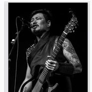

额尔古纳乐队
============================

|  |  |
| :--: | :-- |
| [ 额尔古纳乐队](https://i.xiami.com/maxibatu) | **地区**: China 中国大陆 **风格**: 国语流行 Mandarin Pop, 蒙古族传统乐 Mongolian Traditional Music **播放数**: 10718968 **粉丝数**: 5182 **评论数**: 220  |

## 档案

小简介 
“额尔古纳”乐队名称来源与乐队介绍 
额尔古纳河是蒙古族的发源地，她伴随着蒙古族的成长、成熟，是蒙古人民心中神圣的母亲河。早在13世纪初，蒙古族的英雄成吉思汗就站在神奇美丽的额尔古纳河畔，向着湛湛天空、茫茫大地宣誓，吹响了征服世界的号角，他带领着雄悍威武的蒙古骑兵从这里出发。蒙古人的马蹄，向潮水般踏遍了亚欧大陆，创建了蒙古帝国。正是由于一代天骄成吉思汗的威名与神奇美丽的额尔古纳河密切相连，因此，额尔古纳河在蒙古族心目中有着很重要的地位。“额尔古纳”不仅是一条河的名字，也是一段历史的名字。额尔古纳乐队，这一支以内蒙古母亲河命名的乐队，在它成立的那一天就带上了英雄主义的光环。 
额尔古纳乐队成立于2001年7月，由6名来自内蒙古的青年组成，他们传承着内蒙古文化的积淀，带着对音乐的执着追求，一路唱出蒙古，唱到了星光熠熠的舞台上。他们继承了蒙古族的豪迈与坚强，歌曲主要以原创以及翻唱蒙古族民歌为主，歌唱草原的旋律、歌唱蒙古的风情，歌曲细腻而不失大气，虽然是一支流行摇滚乐队，但可塑性极强。乐队除了能够熟练演奏时尚的电声器乐，还精通多种民族器乐，可以把时尚和民族完美的结合在一起。 
乐队成绩一览 
2001.11 
内蒙古自治区首届校园歌曲大奖赛，获一等奖； 
2002.4 
全国青年歌手大奖赛内蒙地区选拔赛，获第二名； 
2002.6 
内蒙古自治区大学生汇演一等奖； 
2002.8 
代表内蒙古电视台参加西部十二省的联合放歌文艺晚会； 
2002.12 
“仕奇杯”内蒙古自治区首届原创歌曲大奖赛荣获一等奖及最佳表演奖； 
2005.6 
淄博全国拳王争霸赛开幕式演出嘉宾 
2005.8 
包头国际草原文化节演出嘉宾； 
2005.9 
CCTV3《艺术人生》演出嘉宾； 
2005.9 
内蒙古卫视《魅力中国》专题介绍； 
2005.9 
中外新闻界中秋联谊会演出嘉宾； 
2005.10 
参加中央电视台《星光大道》音乐比赛节目，获三等奖。

## 专辑

| 名称 | 语种 | 唱片公司 | 发行时间 | 专辑类别 | 专辑风格 |
| :--: | :-- | :-- | :-- | :-- | :-- |
| [ 古纳新翻唱](./albums/2103751053.md) | 国语 | 传世乐坊 | 2018年06月18日 | 录音室专辑 |  |
| [ 你的歌声风中飞来](./albums/2102866701.md) | 国语 | 传世乐坊 | 2017年09月30日 | EP, 单曲 |  |
| [ 额尔古纳乐队 作品精选集](./albums/2102723162.md) | 国语 | 传世乐坊 | 2017年03月17日 | 精选集 |  |
| [ 世界音乐走秀音乐](./albums/2100234172.md) | 国语 | 古纳文化 | 2015年11月07日 | 录音室专辑 | 世界融合 World Fusion, 世界节拍 Worldbeat |
| [ 大地额尔古纳乐队－大地 < Dubstep>](./albums/1234079572.md) | 国语 | 古纳文化 | 2015年06月12日 | EP, 单曲 | 硬摇滚 Hard Rock, 流行摇滚 Pop Rock, 回响贝斯 Dubstep |
| [ 2015 电音 半圆月 EP电音](./albums/726688926.md) | 国语 | 独立发行 | 2015年03月19日 | EP, 单曲 | 电音流行 Electropop |
| [ 小黄马](./albums/925215670.md) | 国语 | 独立发行 | 2015年03月01日 | EP, 单曲 |  |
| [ 莫尼山](./albums/1622274136.md) | 国语 | 独立发行 | 2015年01月26日 | EP, 单曲 | 国语流行 Mandarin Pop |
| [ 不能停止的思念](./albums/9571341.md) | 国语 | 古纳文化 | 2014年08月18日 | 录音室专辑 | 流行摇滚 Pop Rock, 国语流行 Mandarin Pop |
| [ 风吹草浪](./albums/562335.md) | 国语 | 古纳文化 | 2012年12月20日 | EP, 单曲 |  |
| [ 唱起草原的歌](./albums/439865.md) | 国语 | 古纳文化 | 2010年08月10日 | 录音室专辑 |  |
| [ 信念](./albums/419040.md) | 国语 | 古纳文化 | 2009年08月02日 | EP, 单曲 | 国语流行 Mandarin Pop |
| [ 往日时光](./albums/329692.md) | 国语 | 飞旗音乐 | 2009年01月20日 | EP, 单曲 |  |
| [ 鸿雁](./albums/316922.md) | 国语 | 飞旗音乐 | 2006年12月01日 | 录音室专辑 |  |
| [ 额尔古纳](./albums/427174.md) | 国语 | 内蒙古音像 | 2002年09月01日 | 录音室专辑 |  |

## 评论

|  |  |  |
| :-- | :-- | :-- |
|  [虾米用户](https://emumo.xiami.com/u/404522053) Beautiful se... 2020-12-06 17:47 赞(1) 踩(0) | 
四个帅哥
 |
|  [虾米用户](https://emumo.xiami.com/u/276944698) 不要自我设限..... 2020-09-07 19:39 赞(0) 踩(0) | 

 |
|  [虾米用户](https://emumo.xiami.com/u/270234174) 听。 2020-08-30 09:14 赞(1) 踩(0) | 
偶然在音乐频道看到，粉了粉了 
 |
|  [虾米用户](https://emumo.xiami.com/u/433494129)  2020-01-04 20:14 赞(1) 踩(0) | 
家乡的乐队，好！
 |
|  [虾米用户](https://emumo.xiami.com/u/237225170) 睡眠奢侈品 2019-05-12 07:43 赞(0) 踩(0) | 
超级喜欢
 |
|  [虾米用户](https://emumo.xiami.com/u/287070662)  2019-05-03 15:07 赞(0) 踩(0) | 
非常棒哦！
 |
|  [虾米用户](https://emumo.xiami.com/u/232541553) 乐在旅途 2019-04-03 06:52 赞(0) 踩(0) | 
大早上，听到满身鸡皮疙瘩，爱！
 |
|  [虾米用户](https://emumo.xiami.com/u/412512958)  2019-03-09 23:02 赞(1) 踩(0) | 
很棒的乐队，继续努力
 |
|  [虾米用户](https://emumo.xiami.com/u/355447847)  2018-07-31 22:20 赞(0) 踩(0) | 
这才是真正的实力歌手
 |
|  [虾米用户](https://emumo.xiami.com/u/34522244)  2018-07-27 22:33 赞(0) 踩(0) | 
深情如你
 |
|  [虾米用户](https://emumo.xiami.com/u/266071074) 享受音樂！熱愛生活！ 2018-06-25 19:32 赞(1) 踩(0) | 
最近在看有关额尔古纳的书，突然发现这首《鸿雁》竟然是额尔古纳乐队唱的    支持！支持！
 |
|  [虾米用户](https://emumo.xiami.com/u/281217332) 旋律悠扬 2018-05-27 18:05 赞(0) 踩(0) | 
非常好听！
 |
|  [虾米用户](https://emumo.xiami.com/u/56730288)  2018-04-19 09:10 赞(0) 踩(0) | 
莫尼山好听啊
 |
|  [虾米用户](https://emumo.xiami.com/u/321530207)  2018-04-08 21:22 赞(3) 踩(0) | 
最喜欢的两个民族乐队，杭盖和额尔古纳，各有各的风格。都很喜欢，建议你们把一些歌穿插汉语，这样更便于推广蒙古族自己的音乐。一直支持你们。希望你们取得更好的进步。长生天保佑你们。   
 |
|  [虾米用户](https://emumo.xiami.com/u/7250151)  2018-02-01 21:21 赞(1) 踩(0) | 
有机会一定到蒙古大草原去看看
 |
|  [虾米用户](https://emumo.xiami.com/u/309793628)  2017-12-23 22:33 赞(0) 踩(0) | 
太好听了。谢谢
 |
|  [虾米用户](https://emumo.xiami.com/u/49459961)  2017-10-29 16:01 赞(1) 踩(0) | 
好听
 |
|  [虾米用户](https://emumo.xiami.com/u/10248714)  2017-10-28 00:41 赞(2) 踩(0) | 
第一个大一在学校听到他们的某首歌，应该是内蒙古的某个管制员唱的，完全和cd没区别，可能就是他们主唱吧。在北院礼堂，哭成狗没敢让学姐看见。林薇学姐啊~好想再重逢呢……超喜欢您~
 |
|  [虾米用户](https://emumo.xiami.com/u/45901195) Mingyuesongj... 2017-10-13 00:50 赞(1) 踩(0) | 
因为鸿雁，知道了你们，你们的歌似乎可以诉说我的内心。谢谢有你们，来自草原的我很适合听你们的歌啊 
 |
|  [虾米用户](https://emumo.xiami.com/u/292758872)  2017-07-29 23:39 赞(2) 踩(0) | 
个人认为额尔古纳乐队的蒙语歌比汉语歌更有一番风味
 |
|  [虾米用户](https://emumo.xiami.com/u/292758872)  2017-07-29 23:38 赞(2) 踩(0) | 
刚才仔细听了额尔古纳乐队的第一张专家额尔古纳中的歌，觉得是最好听的几首歌，虽然听不懂蒙语，但音乐是超越语言的一种美
 |
|  [虾米用户](https://emumo.xiami.com/u/311679942) 让一切随风 2017-07-29 21:52 赞(0) 踩(0) | 
我最喜欢的一首歌就是白云诗，感觉闭上眼睛就仿佛在草原上驰骋。下来就是莫尼山。说不出为什么特别喜欢MGL风格的曲子。
 |
|  [虾米用户](https://emumo.xiami.com/u/274564138)  2017-06-09 16:51 赞(0) 踩(0) | 
好听
 |
|  [虾米用户](https://emumo.xiami.com/u/255281026)  2017-03-23 22:27 赞(0) 踩(0) | 
旋律
 |
|  [虾米用户](https://emumo.xiami.com/u/9080939) 不为无益之事，何遣有涯之... 2017-01-24 23:31 赞(0) 踩(0) | 
很喜欢❤️❤️。希望你们能永远保持本真，不忘初心，家乡才是你们艺术的根源
 |
|  [虾米用户](https://emumo.xiami.com/u/49160430)   2016-12-21 00:27 赞(1) 踩(0) | 
记得迟子健的额尔古纳河右岸 讲的游牧民族的迁徙与生活
 |
| ⇒ |  [虾米用户](https://emumo.xiami.com/u/34287749)  2017-02-07 12:31 赞(0) 踩(0) | 
搜鄂温克歌曲《东泉》
 |
| ⇒ |  [虾米用户](https://emumo.xiami.com/u/49160430)   2017-02-07 20:47 赞(0) 踩(0) | 
<q><b>悟空说：</b></q>
 |
|  [虾米用户](https://emumo.xiami.com/u/10581442) 非 墨 2016-10-25 12:21 赞(0) 踩(0) | 
喜欢
 |
|  [虾米用户](https://emumo.xiami.com/u/223050652) 那就有质感的活着啊宝贝 2016-10-08 13:59 赞(1) 踩(0) | 
加油做下去，把自己民族的文化继承下去啊
 |
|  [虾米用户](https://emumo.xiami.com/u/16135450)  2016-06-19 23:07 赞(0) 踩(0) | 
1352
 |
|  [虾米用户](https://emumo.xiami.com/u/120157538)   2016-04-16 16:57 赞(0) 踩(0) | 
听哭了
 |
|  [虾米用户](https://emumo.xiami.com/u/132185224)  2016-04-02 19:29 赞(0) 踩(0) | 
谢谢
 |
|  [虾米用户](https://emumo.xiami.com/u/132185224)  2016-04-02 19:28 赞(0) 踩(0) | 
莫尼山蒙语伴奏能给一下吗
 |
|  [虾米用户](https://emumo.xiami.com/u/36425079) ᠡᠷᠬᠡ ᠴᠢᠯᠦᠭᠡ 2016-03-22 11:23 赞(0) 踩(0) | 

 |
|  [虾米用户](https://emumo.xiami.com/u/8087733)  2015-10-30 17:16 赞(0) 踩(0) | 
支持家乡的乐队！！！
 |
|  [虾米用户](https://emumo.xiami.com/u/3768599) 独自行走在乡间的小路上 2015-09-13 12:12 赞(0) 踩(0) | 
期盼@额尔古纳乐队 会有更好的作品出现，让民族音乐在世界上大放异彩。好运！
 |
|  [虾米用户](https://emumo.xiami.com/u/3645397)  2015-09-05 21:00 赞(1) 踩(0) | 
因为去了呼伦贝尔大草原，去了额尔古纳湿地公园，所以知道了额尔古纳乐队，太喜欢了，回家后就一直循环播放你们的歌曲
 |
|  [虾米用户](https://emumo.xiami.com/u/7826688)  2015-08-24 22:48 赞(0) 踩(0) | 
鸿雁
 |
|  [虾米用户](https://emumo.xiami.com/u/22424206)  2015-08-20 08:43 赞(0) 踩(0) | 
蓝天、草甸，马头琴。在他们浑厚的歌声里可以找寻。
 |
|  [虾米用户](https://emumo.xiami.com/u/22424206)  2015-08-20 08:43 赞(1) 踩(0) | 
蓝天、草甸，马头琴。在他们浑厚的歌声里可以找寻。
 |
|  [虾米用户](https://emumo.xiami.com/u/46259318) 没个性。不签名 2015-08-18 21:35 赞(0) 踩(0) | 
唱到人心灵深处的民歌
 |
|  [虾米用户](https://emumo.xiami.com/u/46259318) 没个性。不签名 2015-08-18 21:35 赞(0) 踩(0) | 
唱到人心灵深处的民歌
 |
|  [虾米用户](https://emumo.xiami.com/u/8128176) 好好活着 2015-08-14 05:31 赞(0) 踩(0) | 
！
 |
|  [虾米用户](https://emumo.xiami.com/u/19655843)   2015-08-12 23:56 赞(0) 踩(0) | 
喜欢就是喜欢了。。。
 |
|  [虾米用户](https://emumo.xiami.com/u/10168417)  2015-08-12 10:52 赞(1) 踩(0) | 
图书馆闭馆放《鸿雁》，一下子就怔住了。绿草青空无际，风摇铃过耳，时过不知泪已落
 |
|  [虾米用户](https://emumo.xiami.com/u/6747165)  2015-08-06 16:57 赞(1) 踩(0) | 
我酥掉了 软掉了
 |
|  [虾米用户](https://emumo.xiami.com/u/1024430)  2015-06-19 23:01 赞(2) 踩(0) | 
呼斯楞和吕燕卫俩SB 有没有同意我的？点赞
 |
|  [虾米用户](https://emumo.xiami.com/u/23618525) 心净无染  自然 2015-06-16 23:32 赞(1) 踩(0) | 
反复听莫尼山，乌兰巴托的夜，能让人安静
 |
| ⇒ |  [虾米用户](https://emumo.xiami.com/u/46259318) 没个性。不签名 2015-08-18 21:39 赞(0) 踩(0) | 
能让人的心灵净化、置身与草原青草之间
 |
| ⇒ |  [虾米用户](https://emumo.xiami.com/u/46259318) 没个性。不签名 2015-08-18 21:39 赞(0) 踩(0) | 
能让人的心灵净化、置身与草原青草之间
 |
|  [虾米用户](https://emumo.xiami.com/u/4879916) 人身本是一团腥秽物，涂搽... 2015-05-17 14:59 赞(0) 踩(0) | 
好！
 |
|  [虾米用户](https://emumo.xiami.com/u/42012490) We must been... 2015-05-09 10:17 赞(0) 踩(0) | 
声音好美
 |
|  [虾米用户](https://emumo.xiami.com/u/4261281)  2015-05-07 14:54 赞(1) 踩(0) | 
额尔古纳乐队
 |
|  [虾米用户](https://emumo.xiami.com/u/4380909)  2015-05-03 13:20 赞(0) 踩(0) | 
shishi
 |
|  [虾米用户](https://emumo.xiami.com/u/3605814) 是一个废人了 2015-04-12 00:08 赞(0) 踩(0) | 
最爱 德勒格日玛 好深情！！ 好强的画面感啊！！！！！！！！！她彻夜不停地梳妆  他彻夜不停地眺望
 |
|  [虾米用户](https://emumo.xiami.com/u/12053684) 怕日出一到彼此瓦解 2015-04-08 15:35 赞(1) 踩(0) | 
求毕业歌
 |
|  [虾米用户](https://emumo.xiami.com/u/31642020)  2015-04-05 20:42 赞(0) 踩(0) | 
太棒了！
 |
|  [虾米用户](https://emumo.xiami.com/u/402417)  2015-04-03 11:51 赞(0) 踩(0) | 
额尔古纳乐队,
 |
|  [虾米用户](https://emumo.xiami.com/u/2010590)  2015-03-27 23:52 赞(0) 踩(0) | 
深夜的周末，从《乌兰巴托的夜》听到《鸿雁》，听完已然泪流满面
 |
|  [虾米用户](https://emumo.xiami.com/u/13765167)  2015-03-25 14:19 赞(0) 踩(0) | 
喜欢莫尼山，喜欢鸿雁，喜欢两座山，喜欢白云诗，喜欢唱起草原的歌，喜欢额尔古纳的音乐，更喜欢额尔古纳乐队几位成员对音乐的执着，低调的为人！
 |
|  [虾米用户](https://emumo.xiami.com/u/13765167)  2015-03-25 14:16 赞(0) 踩(0) | 
无法拒绝的声音，无法忽视的音乐人
 |
|  [虾米用户](https://emumo.xiami.com/u/36897148) 私信➕v请备注 2015-03-21 20:44 赞(0) 踩(0) | 
毕业歌呢
 |
|  [虾米用户](https://emumo.xiami.com/u/10297818) 梦幻泡影  如露如电 2015-03-07 21:58 赞(0) 踩(0) | 
鸿雁（蒙语版）——直接听哭了……来吧，用我的母语来虐死我吧。
 |
|  [虾米用户](https://emumo.xiami.com/u/44001418)  2015-02-22 22:17 赞(0) 踩(0) | 
繁星，那样动听的音乐！让我仿佛置身绿色的草原的夜色中！！那样的陶醉！那样的宁静！
 |
|  [虾米用户](https://emumo.xiami.com/u/17277186) 暂无签名~ 2015-02-17 02:17 赞(0) 踩(0) | 
挺好 经常想起来回来听听这儿的歌
 |
|  [虾米用户](https://emumo.xiami.com/u/32334995) 暂无签名~ 2015-02-15 23:15 赞(0) 踩(0) | 
很多年没听过白云诗 高中那时候喜欢的歌呢 后来连组合的名字也忘了歌名也忘 白云诗～
 |
|  [虾米用户](https://emumo.xiami.com/u/27083480) 睡不醒啊。 2015-02-13 20:04 赞(0) 踩(0) | 
初中的时候妈妈喜欢  我也被安利了~
 |
|  [虾米用户](https://emumo.xiami.com/u/2789093) 浮生如梦梦如歌 2015-02-09 00:42 赞(0) 踩(0) | 
无法自拔。
 |
|  [虾米用户](https://emumo.xiami.com/u/2704671)  2015-01-28 11:32 赞(0) 踩(0) | 
喜欢《两座山》~~
 |
|  [虾米用户](https://emumo.xiami.com/u/9045197)  2015-01-24 18:36 赞(0) 踩(0) | 
额尔古纳乐队
 |
|  [虾米用户](https://emumo.xiami.com/u/37980879)  2014-12-27 09:56 赞(0) 踩(0) | 
1
 |
|  [虾米用户](https://emumo.xiami.com/u/28291455) 2019不自闭 2014-11-21 14:56 赞(0) 踩(0) | 
已阅
 |
|  [虾米用户](https://emumo.xiami.com/u/29365101)  2014-11-09 19:46 赞(0) 踩(0) | 
高中起就喜欢的乐队！
 |
|  [虾米用户](https://emumo.xiami.com/u/586710)  2014-09-29 17:06 赞(0) 踩(0) | 
一曲鸿雁，知道了额尔古纳，知道了呼斯楞。
 |
|  [虾米用户](https://emumo.xiami.com/u/41427846) 我的最爱 2014-09-21 11:11 赞(1) 踩(0) | 
非常好听的音乐，我一直在收藏额尔古纳乐队的音乐，额尔古纳乐队的音乐能沁人心脾，抒发个人的情感
 |
|  [虾米用户](https://emumo.xiami.com/u/13552)  2014-09-18 08:41 赞(1) 踩(0) | 
鸿雁、毕业歌、莫尼山、往日时光、无言的诉说、寻、夜莺、夜色、游牧少年
 |
|  [虾米用户](https://emumo.xiami.com/u/16018837)  2014-09-11 21:24 赞(1) 踩(0) | 
唱点儿真正的蒙古音乐不好吗，你们自己不觉得自己的歌不伦不类吗
 |
| ⇒ |  [虾米用户](https://emumo.xiami.com/u/39482058) 虚则倾，中则正，满则覆。 2014-09-14 20:45 赞(0) 踩(0) | 
创新没什么不好的，有了流行元素才能被其他民族的接受和知晓啊，而且蒙古特征也是明显的。
 |
|  [虾米用户](https://emumo.xiami.com/u/1160312) 也曾辉煌过 2014-09-02 23:30 赞(1) 踩(0) | 
很浑厚的声音，没看到乐队成员照片的时候感觉应该是类似腾格尔大叔的形象才对( ⊙ o ⊙ )   鸿雁真是把我听哭了。背井离乡的游子的心声。
 |
|  [虾米用户](https://emumo.xiami.com/u/30563867)   2014-09-02 16:42 赞(83) 踩(0) | 
谢谢大家的关注， 谢谢 ！！！！！！
 |
| ⇒ |  [虾米用户](https://emumo.xiami.com/u/10297818) 梦幻泡影  如露如电 2015-03-07 21:57 赞(0) 踩(0) | 
太好听了爱你们
 |
| ⇒ |  [虾米用户](https://emumo.xiami.com/u/22170548) Music makes ... 2015-04-06 03:38 赞(0) 踩(0) | 
欢迎来深圳 开演唱会～
 |
| ⇒ |  [虾米用户](https://emumo.xiami.com/u/43704680)   2015-08-31 08:37 赞(0) 踩(0) | 
我是蒙古族在云南读大学，想家的时候都有挺你们的歌，很想家，很想广阔的大草原和蒙古包
 |
| ⇒ |  [虾米用户](https://emumo.xiami.com/u/334013421)  2018-04-04 20:28 赞(0) 踩(0) | 
大爱额尔古纳！
 |
| ⇒ |  [虾米用户](https://emumo.xiami.com/u/287070662)  2019-05-03 15:09 赞(0) 踩(0) | 
好棒的乐队
 |
|  [虾米用户](https://emumo.xiami.com/u/30563867)   2014-09-02 16:05 赞(45) 踩(0) | 
我刚入驻了虾米音乐人，欢迎大家来我的个人主页，收听我的最新音乐
 |
| ⇒ |  [虾米用户](https://emumo.xiami.com/u/8337431) 以乐会友 2015-03-01 23:40 赞(0) 踩(0) | 
一直都非常喜欢你们，欢迎入驻，但我觉得新专还应充分发挥自身特色，严把质量关。
 |
| ⇒ |  [虾米用户](https://emumo.xiami.com/u/22170548) Music makes ... 2015-04-06 03:38 赞(0) 踩(0) | 
支持你们！
 |
| ⇒ |  [虾米用户](https://emumo.xiami.com/u/55462312) 直挂云帆济沧海 2015-08-17 22:15 赞(0) 踩(0) | 
MV怎么那么少啊？？？？最近在听白云诗，感觉挺好，就是多宣传，挺
 |
|  [虾米用户](https://emumo.xiami.com/u/7275540) 但请不要停止我的音乐……... 2014-06-24 12:49 赞(0) 踩(0) | 
毕业歌呢！！！！！
 |
|  [虾米用户](https://emumo.xiami.com/u/8286012) 暂无签名~ 2014-06-07 20:20 赞(0) 踩(0) | 
好听
 |
|  [虾米用户](https://emumo.xiami.com/u/2273283)  2014-05-18 00:20 赞(0) 踩(0) | 
摇篮曲比杭盖那个好听
 |
|  [虾米用户](https://emumo.xiami.com/u/526851) 听听音乐，好好生活。 2014-04-06 14:23 赞(0) 踩(0) | 
因为 东归英雄传
 |
|  [虾米用户](https://emumo.xiami.com/u/177415)   2014-03-29 13:20 赞(1) 踩(0) | 
处理的方式更加时髦的家乡歌曲，让我想起初秋草原上深浅明暗缓缓流动的光
 |
|  [虾米用户](https://emumo.xiami.com/u/8761176)  2014-01-18 14:39 赞(0) 踩(0) | 
民族风格
 |
|  [虾米用户](https://emumo.xiami.com/u/5765292) 我还没想好要写什么... 2013-12-31 19:13 赞(0) 踩(0) | 
上学时候爱唱鸿雁,虽然老被喷......永远是森森的爱!!!
 |
|  [虾米用户](https://emumo.xiami.com/u/25034067)  2013-10-22 23:33 赞(0) 踩(0) | 
额尔古纳
 |
|  [虾米用户](https://emumo.xiami.com/u/5604569)  2013-10-22 22:03 赞(0) 踩(0) | 
ooo
 |
|  [虾米用户](https://emumo.xiami.com/u/1352508)  2013-10-19 19:51 赞(1) 踩(0) | 
悠远，辽阔，古旧，深情，听完对大草原充满向往
 |
|  [虾米用户](https://emumo.xiami.com/u/11757057) 自由的活 2013-09-26 12:26 赞(1) 踩(0) | 
悠远苍凉、民族风情
 |
|  [虾米用户](https://emumo.xiami.com/u/13164290)  2013-09-09 15:08 赞(0) 踩(0) | 
歌由心生
 |
|  [虾米用户](https://emumo.xiami.com/u/605182) 人人都是精神病 2013-09-06 20:39 赞(1) 踩(0) | 
闭上眼就是草原和羊群，余晖映着蒙古包。我无法再想出任何一个比这更美的画面。额尔古纳，谢谢；大草原，谢谢。
 |
|  [虾米用户](https://emumo.xiami.com/u/9545688) 暂无签名~ 2013-08-19 21:57 赞(0) 踩(0) | 
今天在车上哼着鸿雁的调调，脑中浮现出画面，竟然不自觉的掉出了眼泪，实在太美了，我恨不能立马飞奔到草原上像一匹骏马一样
 |
|  [虾米用户](https://emumo.xiami.com/u/11688971) ཤུགས་རྒྱོབ། 2013-07-20 18:20 赞(0) 踩(0) | 
没去过蒙古，不过似乎额尔古纳的每一首歌都令我想起在青海海东那段日子，似乎这世界上再没有其他歌能如此饱满地再现那段时光了~~~
 |
|  [虾米用户](https://emumo.xiami.com/u/16263850) 下架鸡柳的肯德基不迷人了... 2013-06-26 18:55 赞(0) 踩(0) | 
其实很喜欢蒙古歌曲，要是能懂的蒙古语就好了。
 |
|  [虾米用户](https://emumo.xiami.com/u/1666232)  2013-06-15 17:01 赞(0) 踩(0) | 
今天才发现这么美的声音！
 |
|  [虾米用户](https://emumo.xiami.com/u/15402680) 我还没想好要写什么... 2013-05-25 17:12 赞(0) 踩(0) | 
民族
 |
|  [虾米用户](https://emumo.xiami.com/u/9210583) 只要活着、就叫唤！ 2013-05-22 13:19 赞(0) 踩(0) | 
虽听不懂蒙语，但可以感受到对家乡的热爱，第一当然是鸿雁了，第二就是乌拉巴托之夜了！听完醉了，听完泪了。
 |
|  [虾米用户](https://emumo.xiami.com/u/10547530) 生于白昼，隐与黑夜。 2013-05-19 20:08 赞(0) 踩(0) | 
什么叫做民族风？这就叫做民族风。民族风不是嘶喊狂吼，用喧嚣的电音麻醉你的神经。民族风，是以对一个民族最挚诚的情怀，唱出你对故乡所有缱绻难忘的思恋。——鸿雁做到了。只可惜，却仿若流星般刹那即逝。再没有续写辉煌。而这恰恰是我们所需要的，真正的民族性的歌声。
 |
|  [虾米用户](https://emumo.xiami.com/u/13690867)  2013-04-04 12:29 赞(0) 踩(0) | 
悠扬、舒缓的歌曲，让人忘记这纷繁复杂的世界，得到缓解。
 |
|  [虾米用户](https://emumo.xiami.com/u/13783491)  2013-04-02 13:41 赞(0) 踩(0) | 
为了鸿雁
 |
|  [虾米用户](https://emumo.xiami.com/u/13580933) 爱音乐 没道理 2013-03-21 12:22 赞(0) 踩(0) | 
蒙古族都喜欢
 |
|  [虾米用户](https://emumo.xiami.com/u/7497937)  2013-03-12 09:07 赞(26) 踩(0) | 
2006年的《鸿雁》到2013年才知道！中国的音乐怎么了？
 |
| ⇒ |  [虾米用户](https://emumo.xiami.com/u/1489937)  2014-11-21 14:42 赞(0) 踩(0) | 
说得好，摇滚在中国是小众化的音乐类型，更不用说接受少数民族的歌手的音乐了。
 |
| ⇒ |  [虾米用户](https://emumo.xiami.com/u/43923282) 音乐狂人 2014-11-23 21:00 赞(0) 踩(0) | 
很早就知道了，我听了好几年后来才有人再唱。
 |
| ⇒ |  [虾米用户](https://emumo.xiami.com/u/35783) 身体给雨，灵魂给风。 2015-01-24 15:49 赞(0) 踩(0) | 
任何时间地点领域都有被埋没的金子，和中国没关系，和音乐也没关系。
 |
| ⇒ |  [虾米用户](https://emumo.xiami.com/u/11223084)  2015-10-27 21:49 赞(0) 踩(0) | 
然而我07年就买到专辑了，当时某人还未离队
 |
| ⇒ |  [虾米用户](https://emumo.xiami.com/u/283919655) 水一般的男子 2020-09-17 17:12 赞(0) 踩(0) | 
鸿雁的主唱参加了某音乐综艺节目。。
 |
|  [虾米用户](https://emumo.xiami.com/u/10475129)  2013-02-27 19:29 赞(0) 踩(0) | 
豪迈
 |
|  [虾米用户](https://emumo.xiami.com/u/4095530)  2013-02-15 16:26 赞(0) 踩(0) | 
超喜欢
 |
|  [虾米用户](https://emumo.xiami.com/u/521927) try everythi... 2013-02-14 08:40 赞(0) 踩(0) | 
有淡淡的乡愁感！
 |
|  [虾米用户](https://emumo.xiami.com/u/12263021)  2013-01-05 00:02 赞(0) 踩(0) | 
大爱民族音乐
 |
|  [虾米用户](https://emumo.xiami.com/u/2589737)  2012-12-25 18:05 赞(0) 踩(0) | 
好听
 |
|  [虾米用户](https://emumo.xiami.com/u/62451) 梦里花落知多少 2012-12-22 12:12 赞(0) 踩(0) | 
音乐响起，面前一片草原。辽阔。喜欢
 |
|  [虾米用户](https://emumo.xiami.com/u/11611686)  2012-11-23 18:59 赞(1) 踩(0) | 
刚刚知道《鸿雁》的原唱是额尔古纳乐队，孤陋寡闻了。真真不错，加油吧！来自家乡的小伙子们！
 |
|  [虾米用户](https://emumo.xiami.com/u/4867665)  2012-11-06 21:27 赞(0) 踩(0) | 
让我回想起从前的美好时光！
 |
|  [虾米用户](https://emumo.xiami.com/u/11271480)  2012-11-04 14:51 赞(0) 踩(0) | 
很喜欢的一个乐队，干净美好
 |
|  [虾米用户](https://emumo.xiami.com/u/10374242) XXXXXXXXXXXX 2012-10-28 13:17 赞(0) 踩(0) | 
x
 |
|  [虾米用户](https://emumo.xiami.com/u/11064829)  2012-10-27 12:44 赞(0) 踩(0) | 
草原
 |
|  [虾米用户](https://emumo.xiami.com/u/690808) dddddddddddd 2012-10-19 00:33 赞(0) 踩(0) | 
额，往日时光被下架，我好想听呀！
 |
|  [虾米用户](https://emumo.xiami.com/u/6585584)  2012-10-12 12:04 赞(0) 踩(0) | 
听着他们的歌就仿佛自己身在大草原中
 |
|  [虾米用户](https://emumo.xiami.com/u/6749168) 音乐催人奋进 2012-10-08 11:01 赞(0) 踩(0) | 
很喜欢他们的鴻雁
 |
|  [虾米用户](https://emumo.xiami.com/u/6744967) 音乐无国界，你爱我也爱。 2012-09-24 01:03 赞(0) 踩(0) | 
喜欢 谢谢
 |
|  [虾米用户](https://emumo.xiami.com/u/1451905) 活着就是修行 2012-09-22 00:06 赞(0) 踩(0) | 
宽广，深厚，草原的味道
 |
|  [虾米用户](https://emumo.xiami.com/u/106026)  2012-09-09 10:18 赞(0) 踩(0) | 
草原上优秀的乐队之一
 |
|  [虾米用户](https://emumo.xiami.com/u/10444780) 娜 2012-09-07 00:36 赞(0) 踩(0) | 
喜欢
 |
|  [虾米用户](https://emumo.xiami.com/u/3149129)  2012-09-03 23:46 赞(0) 踩(0) | 
民族的就是世界的
 |
|  [虾米用户](https://emumo.xiami.com/u/10461402)  2012-09-02 20:28 赞(0) 踩(0) | 
jgjghg
 |
|  [虾米用户](https://emumo.xiami.com/u/483395)  2012-09-01 13:58 赞(0) 踩(0) | 
喜欢民族
 |
|  [虾米用户](https://emumo.xiami.com/u/8895415)  2012-08-27 21:33 赞(0) 踩(0) | 
怀旧
 |
|  [虾米用户](https://emumo.xiami.com/u/358819) 想念你的音乐 2012-08-23 12:03 赞(0) 踩(0) | 
鸿雁真的很经典啊！
 |
|  [虾米用户](https://emumo.xiami.com/u/645218) 任性逍遥于有欲无欲之间 2012-08-22 12:25 赞(0) 踩(0) | 
喜欢这个调调
 |
|  [虾米用户](https://emumo.xiami.com/u/1034840)  2012-08-18 15:27 赞(0) 踩(0) | 
来自草原的豪迈汉子们
 |
|  [虾米用户](https://emumo.xiami.com/u/3814790)  2012-08-12 23:56 赞(0) 踩(0) | 
有空慢慢听
 |
|  [虾米用户](https://emumo.xiami.com/u/7584333)  2012-08-12 08:01 赞(0) 踩(0) | 
鸿雁还有摇篮曲都很喜欢。。。
 |
|  [虾米用户](https://emumo.xiami.com/u/9986974)  2012-07-29 17:18 赞(0) 踩(0) | 
喜欢鸿雁
 |
|  [虾米用户](https://emumo.xiami.com/u/9858513)  2012-07-18 15:23 赞(0) 踩(0) | 
经典的鸿雁
 |
|  [虾米用户](https://emumo.xiami.com/u/9858513)  2012-07-18 15:23 赞(0) 踩(0) | 
经典的鸿雁，太好听了～
 |
|  [虾米用户](https://emumo.xiami.com/u/2354433) 暂无签名~ 2012-07-11 10:24 赞(0) 踩(0) | 
周末乐堡音乐节可以现场看他们了。
 |
|  [虾米用户](https://emumo.xiami.com/u/7403434)  2012-07-09 14:02 赞(0) 踩(0) | 
好
 |
|  [虾米用户](https://emumo.xiami.com/u/9567743)  2012-06-29 02:28 赞(0) 踩(0) | 
很好听
 |
|  [虾米用户](https://emumo.xiami.com/u/9236442)  2012-06-21 09:34 赞(0) 踩(0) | 
额尔古纳乐队
 |
|  [虾米用户](https://emumo.xiami.com/u/7175997)  2012-05-22 21:58 赞(0) 踩(0) | 
歌好
 |
|  [虾米用户](https://emumo.xiami.com/u/6231170) 相爱吧，终有一散的人们 2012-05-22 11:42 赞(0) 踩(0) | 
喜欢
 |
|  [虾米用户](https://emumo.xiami.com/u/5988983) 健康第一快乐第二工作第三 2012-05-09 19:52 赞(0) 踩(0) | 
悠远的草原，悠远的音乐。
 |
|  [虾米用户](https://emumo.xiami.com/u/8018643)  2012-05-04 17:46 赞(0) 踩(0) | 
べ_べ
 |
|  [虾米用户](https://emumo.xiami.com/u/108393)  2012-04-27 08:32 赞(0) 踩(0) | 
我爱这样男子！
 |
|  [虾米用户](https://emumo.xiami.com/u/8761419) shengCn 2012-04-18 15:45 赞(0) 踩(0) | 
4-18/12
 |
|  [虾米用户](https://emumo.xiami.com/u/8413992)  2012-03-24 14:54 赞(0) 踩(0) | 
欣赏
 |
|  [虾米用户](https://emumo.xiami.com/u/1124003)  2012-03-22 22:03 赞(0) 踩(0) | 
鸿雁还是原版最好听，太有感觉了
 |
|  [虾米用户](https://emumo.xiami.com/u/1124003)  2012-03-22 21:29 赞(0) 踩(0) | 
来自北方深厚富有磁性的声音
 |
|  [虾米用户](https://emumo.xiami.com/u/8370763)  2012-03-18 21:22 赞(0) 踩(0) | 
终于找到了。棒极了。
 |
|  [虾米用户](https://emumo.xiami.com/u/7353649)  2012-03-16 16:54 赞(0) 踩(0) | 
喜欢那富有磁性的声音！
 |
|  [虾米用户](https://emumo.xiami.com/u/550976) 我不是文艺青年 我来淘歌... 2012-03-10 10:58 赞(0) 踩(0) | 
先收藏，最近虾米越来越卡了！
 |
|  [虾米用户](https://emumo.xiami.com/u/550976) 我不是文艺青年 我来淘歌... 2012-03-10 10:30 赞(0) 踩(0) | 
娃哈哈！
 |
|  [虾米用户](https://emumo.xiami.com/u/5573259)  2012-03-01 22:13 赞(0) 踩(0) | 
辽阔 悠远 喜欢
 |
|  [虾米用户](https://emumo.xiami.com/u/8063712)  2012-02-16 17:48 赞(0) 踩(0) | 
超喜欢鸿雁这首歌了，听着会不由自主随之舞动起来。
 |
|  [虾米用户](https://emumo.xiami.com/u/7948914)  2012-02-07 13:01 赞(0) 踩(0) | 
我喜欢他们
 |
|  [虾米用户](https://emumo.xiami.com/u/6249205) 永远谦逊，永远学习。 2012-02-06 19:28 赞(0) 踩(0) | 
美
 |
|  [虾米用户](https://emumo.xiami.com/u/1666232)  2012-02-04 16:32 赞(0) 踩(0) | 
蒙古悠扬
 |
|  [虾米用户](https://emumo.xiami.com/u/2565090)  2012-01-31 17:30 赞(0) 踩(0) | 
家乡的音乐，最爱
 |
|  [虾米用户](https://emumo.xiami.com/u/5675396) 我还没想好要写什么... 2012-01-31 11:31 赞(0) 踩(0) | 
蒙古额尔古纳
 |
|  [虾米用户](https://emumo.xiami.com/u/7218270)  2012-01-28 23:09 赞(0) 踩(0) | 
醒魂
 |
|  [虾米用户](https://emumo.xiami.com/u/2586812) ┏ (゜ω゜)=☞ 2012-01-26 16:42 赞(0) 踩(0) | 
家的声音
 |
|  [虾米用户](https://emumo.xiami.com/u/7598568)  2012-01-15 13:38 赞(0) 踩(0) | 
最爱
 |
|  [虾米用户](https://emumo.xiami.com/u/890284)  2012-01-09 02:10 赞(0) 踩(0) | 
就是好听
 |
|  [虾米用户](https://emumo.xiami.com/u/6026956)  2011-12-12 01:10 赞(0) 踩(0) | 
home
 |
| ⇒ |  [虾米用户](https://emumo.xiami.com/u/6899591)  2011-12-22 01:38 赞(0) 踩(0) | 
听到他的个歌，是不热泪盈眶了
 |
| ⇒ |  [虾米用户](https://emumo.xiami.com/u/6026956)  2011-12-28 05:41 赞(0) 踩(0) | 
<q><b>牛旦儿说：</b></q>
 |
|  [虾米用户](https://emumo.xiami.com/u/4317320)  2011-12-10 18:17 赞(0) 踩(0) | 
主唱的声音不错。
 |
|  [虾米用户](https://emumo.xiami.com/u/824442) 点心茶席 2011-12-09 21:55 赞(0) 踩(0) | 
好听
 |
|  [虾米用户](https://emumo.xiami.com/u/1357506) 舍不得，哭了好几天了，一... 2011-12-09 14:53 赞(0) 踩(0) | 
这个版本的鸿雁最好听
 |
|  [虾米用户](https://emumo.xiami.com/u/7061621)  2011-12-02 13:35 赞(0) 踩(0) | 
听了3年呢，还是喜欢鸿雁，莫尼山这样的歌曲，让人心旷神怡。。。
 |
|  [虾米用户](https://emumo.xiami.com/u/2075045)  2011-11-28 11:29 赞(0) 踩(0) | 
浅蓝色
 |
|  [虾米用户](https://emumo.xiami.com/u/6497207)  2011-10-30 13:55 赞(0) 踩(0) | 
质朴、宽广、深邃、旋律优美流畅、歌词有诗意......
 |
|  [虾米用户](https://emumo.xiami.com/u/484578)  2011-10-18 10:38 赞(0) 踩(0) | 
乡音
 |
| ⇒ |  [虾米用户](https://emumo.xiami.com/u/6899591)  2011-12-22 01:39 赞(0) 踩(0) | 
我在外地听到就会热泪盈眶
 |
|  [虾米用户](https://emumo.xiami.com/u/6031836)  2011-09-29 14:59 赞(0) 踩(0) | 
纯洁的声音，听着觉得心灵也干净了。
 |
|  [虾米用户](https://emumo.xiami.com/u/3341557)  2011-09-11 17:43 赞(0) 踩(0) | 
超爱
 |
|  [虾米用户](https://emumo.xiami.com/u/5531211)  2011-08-22 22:20 赞(0) 踩(0) | 
草原歌曲
 |
|  [虾米用户](https://emumo.xiami.com/u/2101199)  2011-08-04 22:37 赞(0) 踩(0) | 
ok
 |
|  [虾米用户](https://emumo.xiami.com/u/3668748)  2011-08-02 22:12 赞(0) 踩(0) | 
充满回忆的暖
 |
|  [虾米用户](https://emumo.xiami.com/u/1270354)  2011-06-26 12:55 赞(0) 踩(0) | 
草原的鸿雁
 |
|  [虾米用户](https://emumo.xiami.com/u/1793319)  2011-06-21 13:07 赞(0) 踩(0) | 
曾被《鸿雁》一举击中，又被《两座山》攫住，逃不出这片旋律笼罩的乡情。
 |
|  [虾米用户](https://emumo.xiami.com/u/2833635) 修休秀羞锈嗅咻~ 2011-06-14 19:40 赞(0) 踩(0) | 
专心做音乐
 |
|  [虾米用户](https://emumo.xiami.com/u/4258955)  2011-06-12 00:03 赞(0) 踩(0) | 
好听宁静致远
 |
|  [虾米用户](https://emumo.xiami.com/u/3210136)  2011-05-16 23:47 赞(0) 踩(0) | 
蒙古民乐
 |
|  [虾米用户](https://emumo.xiami.com/u/2986088)  2011-05-06 08:28 赞(0) 踩(0) | 
充满草原的味道，淡淡的芳草天空，喜欢！！
 |
|  [虾米用户](https://emumo.xiami.com/u/3352867)  2011-04-30 22:41 赞(0) 踩(0) | 
大师兄。用心做的音乐，喜欢呼斯楞和那日苏的声音，尤其重新演绎的经典老歌《鸿雁》百听不厌
 |
|  [虾米用户](https://emumo.xiami.com/u/2568513)  2011-04-30 14:44 赞(0) 踩(0) | 
不失细腻的男子汉风格
 |
|  [虾米用户](https://emumo.xiami.com/u/3779006)  2011-04-29 21:13 赞(0) 踩(0) | 
最喜欢鸿雁
 |
|  [虾米用户](https://emumo.xiami.com/u/1326667)  2011-04-25 08:42 赞(0) 踩(0) | 
他们出新专辑了，有人分享没~~
 |
| ⇒ |  [虾米用户](https://emumo.xiami.com/u/3352867)  2011-04-30 22:41 赞(0) 踩(0) | 
我有他们签名的2010新专辑《唱起草原的歌》
 |
| ⇒ |  [虾米用户](https://emumo.xiami.com/u/1326667)  2011-05-01 18:14 赞(0) 踩(0) | 
<q><b>相期款款乐说：</b></q>
 |
|  [虾米用户](https://emumo.xiami.com/u/1477559) 山川異域，風月同天。 2011-04-17 12:50 赞(0) 踩(0) | 
草原，那是我的家乡。
 |
|  [虾米用户](https://emumo.xiami.com/u/3227449)  2011-03-19 21:06 赞(0) 踩(0) | 
喜欢这种自由的驰骋的感觉！
 |
|  [虾米用户](https://emumo.xiami.com/u/2172535)  2011-03-14 23:19 赞(0) 踩(0) | 
辽远
 |
|  [虾米用户](https://emumo.xiami.com/u/1590247)  2011-03-11 20:05 赞(0) 踩(0) | 
如天籁的声音 干净
 |
|  [虾米用户](https://emumo.xiami.com/u/3027634)  2011-03-10 16:12 赞(0) 踩(0) | 
fff
 |
|  [虾米用户](https://emumo.xiami.com/u/1579310)  2011-03-07 22:36 赞(0) 踩(0) | 
仍然记得当时听到它的吃惊。
 |
|  [虾米用户](https://emumo.xiami.com/u/3023225)   2011-02-28 21:56 赞(0) 踩(0) | 
喜欢民歌
 |
|  [虾米用户](https://emumo.xiami.com/u/2267539)  2011-02-28 17:03 赞(0) 踩(0) | 
蒙语版的鸿雁、两座山充分表现了民族特色，非常喜欢。其他的歌我听了就非常难受，真的太行了，内蒙也有一个颠覆m乐队，也不错
 |
|  [虾米用户](https://emumo.xiami.com/u/2267539)  2011-02-28 16:16 赞(0) 踩(0) | 
让你心如止水的民族音乐
 |
|  [虾米用户](https://emumo.xiami.com/u/2793543)  2011-02-24 13:40 赞(0) 踩(0) | 
浑厚大气，带有有民族性的豪爽，和淳朴总是忍不住让人亲近。
 |
|  [虾米用户](https://emumo.xiami.com/u/1342581)  2011-02-04 22:16 赞(0) 踩(0) | 
额尔古纳乐队
 |
|  [虾米用户](https://emumo.xiami.com/u/259069)  2011-01-17 16:53 赞(0) 踩(0) | 
在青歌赛上认识他们，很质朴的声音~
 |
|  [虾米用户](https://emumo.xiami.com/u/630760) 感谢11年来的陪伴，我爱... 2011-01-16 00:17 赞(0) 踩(0) | 
真好听！
 |
|  [虾米用户](https://emumo.xiami.com/u/2078543)  2010-12-03 19:47 赞(0) 踩(0) | 
太好听了
 |
|  [虾米用户](https://emumo.xiami.com/u/1717396)  2010-11-01 09:53 赞(0) 踩(0) | 
大气   豪放  纯真  坦荡
 |
