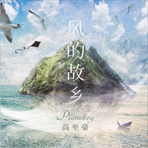

风的故乡
============================

|  |  |
| :--: | :-- |
| [ 风的故乡](https://emumo.xiami.com/album/2104988716) | **艺人**: [Pianoboy](../index.md) **语种**: 纯音乐 **唱片公司**: 集韶文化 **发行时间**: 2019年07月12日 **专辑类别**: EP, 单曲 **专辑风格**: 轻音乐 Easy Listening **播放数**: 41141 **收藏数**: 64 **评论数**: 21  |

## 简介

【著作权人声明：版权所有，翻录必究。本专辑内词曲未经著作权人许可不得使用或翻唱翻弹(包括不得使用音乐作品制作录像及录音制品)】
 

&nbsp;
 

  
  
  
  
《风的故乡》  
  
作曲：Pianoboy高至豪  
编曲：Pianoboy高至豪  
混音：Pianoboy高至豪  
製作：Pianoboy高至豪  
文字：小猴子  
  
  
  
  
【风的故乡】  
  
风就在方圆几里内翻捲  
海面像落叶一样  
跑了  
但是不久又都回来  
跟走的时候没有两样  
天知道外边  
那个活泼的红点迅速一瞥  
换来沉在海底的那一隻眼仰视  
  
  
风就在方圆几里内翻捲  
主人多半不住这裡  
一年也难得回几趟  
閒着  
閒着  
这麽个好地方  
  
  
风就在方圆几里内翻捲  
主人称岛屿叫村子  
每当傍晚  
他们喜欢这样玩  
真正的当地人  
骑着阵阵摩托车变老的声音从岸边传来  
而异乡人  
在海边也都放着鱼杆  
有模有样  
  
  
风就在方圆几里内翻捲&nbsp;  
白天几棵树上有鸟  
夜晚林子外挂了星星  
老而又老的房屋  
海鸥老远就能看到  
这裡安静得好似一段故事  
其中还有一座庙  
相传百年前有个令人嚮往  
一段故事的终结  
  
而风就在方圆几里内翻捲 

## 曲目

## 评论

|  |  |  |
| :-- | :-- | :-- |
|  [虾米用户](https://emumo.xiami.com/u/848683)  2020-03-21 00:54 赞(0) 踩(0) | 
好听，有种pianoboy回归的感觉。不浮躁，有灵魂，最难得。如果不加节奏可能会更好，不过也只是如果可能。
 |
|  [虾米用户](https://emumo.xiami.com/u/274976883) 爱听音乐的人 2020-01-23 08:26 赞(1) 踩(0) | 
真好听 
 |
|  [虾米用户](https://emumo.xiami.com/u/425017825)  2019-08-19 08:55 赞(2) 踩(0) | 
故乡的风
 |
|  [虾米用户](https://emumo.xiami.com/u/408642406)  2019-07-25 20:23 赞(0) 踩(0) | 
每听到这首曲子我就会想起家乡
 |
|  [虾米用户](https://emumo.xiami.com/u/375374069) 心情不错 2019-07-21 07:31 赞(1) 踩(0) | 
很喜欢
 |
|  [虾米用户](https://emumo.xiami.com/u/333320150) 七弦为益友，两耳是知音 2019-07-16 23:02 赞(0) 踩(0) | 
风来了，带来了故乡的消息， 风走了，带去了我的思念
 |
|  [虾米用户](https://emumo.xiami.com/u/276252624)  2019-07-16 19:06 赞(0) 踩(0) | 
风的故乡  蓝蓝的天有云在飞翔……
 |
|  [虾米用户](https://emumo.xiami.com/u/328194567) 虾听音乐 2019-07-16 00:08 赞(0) 踩(0) | 

 |
|  [虾米用户](https://emumo.xiami.com/u/302995139) 来或者不来，我都在。 2019-07-14 23:51 赞(0) 踩(0) | 
像回到某个时候，那时候我们都还青春年少。
 |
|  [虾米用户](https://emumo.xiami.com/u/309537743)  2019-07-14 21:43 赞(0) 踩(0) | 
另人心灵舒缓的好音乐，最近偏向战歌（捂脸）（捂脸）也好评啦
 |
|  [虾米用户](https://emumo.xiami.com/u/352291508) Felix 2019-07-14 18:20 赞(0) 踩(0) | 
超赞
 |
|  [虾米用户](https://emumo.xiami.com/u/47749156) 飞翔的音符 2019-07-14 07:00 赞(0) 踩(0) | 
清新
 |
|  [虾米用户](https://emumo.xiami.com/u/78172714) 音乐不牵绊丶 2019-07-13 22:09 赞(0) 踩(0) | 
喜欢这种平静
 |
|  [虾米用户](https://emumo.xiami.com/u/203356174) 勇敢往前冲吧！ 2019-07-13 13:28 赞(0) 踩(0) | 
lovely melody
 |
|  [虾米用户](https://emumo.xiami.com/u/7151428) 暖暖的～～ 2019-07-13 12:00 赞(0) 踩(0) | 
 
 |
|  [虾米用户](https://emumo.xiami.com/u/17517819) 音乐以载道，每首都有一个... 2019-07-13 10:44 赞(0) 踩(0) | 
很有意境的一首曲子。
 |
|  [虾米用户](https://emumo.xiami.com/u/295856791) 开心快乐每一天 2019-07-13 06:49 赞(1) 踩(0) | 
风的故乡
 |
|  [虾米用户](https://emumo.xiami.com/u/330900828) 高舉一面五星紅旗在蝦米！ 2019-07-13 06:31 赞(1) 踩(0) | 
@音樂向左：融入了自然四季，透視了萬物復甦，[666]
 |
|  [虾米用户](https://emumo.xiami.com/u/344018512) 我还没想好要写什么... 2019-07-13 00:52 赞(1) 踩(0) | 

 |
|  [虾米用户](https://emumo.xiami.com/u/3250268) 一首好歌都比爱一个人长久... 2019-07-12 22:16 赞(0) 踩(0) | 
   
 |
|  [虾米用户](https://emumo.xiami.com/u/258289166) 越是喜欢珍爱，越要好好好... 2019-07-12 22:05 赞(0) 踩(0) | 
封面好看
 |
