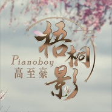
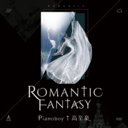
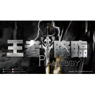

Pianoboy
============================

|  |  |
| :--: | :-- |
| [ Pianoboy](https://i.xiami.com/pianoboy) | **地区**: Taiwan, PRC 中国台湾 **风格**: 器乐独奏 Solo Instrumental, 器乐流行 Instrumental Pop, 器乐流行 Instrumental Pop **播放数**: 75543277 **粉丝数**: 60765 **评论数**: 1367  |

## 档案

Pianoboy 是来自台湾的流行钢琴创作演奏家，自幼学琴，并靠自己摸索出一条创作之路，在没有唱片公司宣传下，仅靠口耳相传，就在网络培养了众多支持的乐迷。 
其音乐具备多种元素、既流行、也轻柔，灵感来自生活片刻、自然风景、都会风情，充满魅力且平易近人，在偶像戏剧、电玩音乐、流行艺人、卖座电影等地方都可以听到他音乐的轨迹。 
他的音乐简单却有股神秘的力量，能引领听者超越生活的困境，具有疗愈人心的能力，许多乐迷都是透过他的音乐渡过人生的低潮，这或许与他人生经历有关，他出生时右手就被医生拉伤，留下一辈子的后遗症『臂神经丛损伤』 (brachial plexus injury) ， 2015 年又被诊断出罕见的『局部肌张力不全』 (focal dystonia) ，双手不听使唤，几乎无法正常演奏，但不影响他在音乐之路继续前进，就如同他作品展现无穷的生命力一般。 
Pianoboy 遨游在自己的音乐世界，独树一帜、才华洋溢，顶着台大物理硕士的学位，又跨足音乐领域大放异彩，游走在自我的创作世界，不断前进。未来会在音乐界又带来什么样的元素，备受期待。 
《《历年作品》》 
2005- 安静的午后 ( 宁静加上淡淡忧愁 ) 
2005-The truth that you leave(Pianoboy 经典代表作 ) 
2005- 第 105 天     ( 清澈如冰的动人小品 ) 
2005-DOUTOR COFFEE SHOP( 浓郁的大提琴配上钢琴 ) 
2006- 寂静的跳舞娃娃 ( 一动也不动的木制娃娃，在八音盒上独自旋转着 ) 
2007-Annabelle    ( 迷幻 Hip-hop 曲风 ) 
2010- 复刻回忆       ( 浓郁旧上海中国风情，刻划出每个人心底对于爱情的惆怅 ) 
2011-Alone on the way   ( 美式节奏曲风，展现出一无反顾前进的勇气和信心 ) 
2011- 夏日绿荫    ( 闭上双眼，彷佛就站在一条树林的余荫下 ) 
2013- 王者降临    ( 与电吉他大师 JerryC 合作作品，宣示温柔王者之降临 ) 
2015- 那年记忆中的追寻    ( 如电影般场景一幕幕切换，勾起每个人的回忆 ) 
2015-Anifled  ( 如诗如歌，浪漫唯美之钢琴小品 ) 
《《历年经历》》 
◎ 2005- 台湾最大博客『无名小站』音乐授权。 
◎ 2007- 江亦帆音乐学院第一名毕业 ( 台湾最大私人音乐学院 ) 。 
◎ 2007- 台湾华研国际唱片公司签约 ( 台湾唯一上市唱片公司 ) 。 
◎ 2007- 星光帮潘裕文补梦网 MV ，演出钢琴手。 
◎ 2008- 台湾最大博客『无名小站』音乐点播全国第二名。 
◎ 2011- 飞轮海炎亚纶专辑『下一个炎亚纶』．作曲。 
◎ 2011- 台湾偶像剧『新兵日记』插曲．作曲。 
◎ 2013- 愿境网讯股份有限公司『 KKBOX 』音乐授权。 
◎ 2014-Rayark Inc. 『 DEEMO 』游戏授权。 
◎ 2015- 北京六趣网络科技有限公司，『橙光游戏』授权。 
◎ 2015- 上海大剧院演出。台湾舞蹈王子李伟淳『王者之风』现代舞剧。 
Pianoboy is a famous  piano composer & player from Taiwan. He started learning piano from childhood , and found out his way to compose music himself.  Without any propagandizing , he has a large number of fans supported only by the word of mouth on the internet. 
His music contains various elements, inspired from any moment from his daily life, natural scenery , modern city......etc.  Except internet sharing, his charming and approachable music can also be found in  Chinese dramas, online games and Taiwanese singer's piece. 
Some fans believe that Pianoboy's music has some secret power which leads people to overcome their depression , and also be able to heal a broken heart.  Many fans went through their ebb of life  with the accompany of his music. The reason of the secret power within his music may be related to Pianoboy's life experience.When he was born, his right hand was hurt by the doctor, and caused a lifetime sequela -  brachial plexus injury.  Again in 2015, he has been diagnosed  with a rare disease - focal dystonia. Sometimes his hands lose control,  and almost impossible to play the piano properly. However, this won't affect his process  to compose; just like the melody of his music  reveals infinite vitality. 
With unique and talented skills, Pianoboy creates  his beautiful music world. He has a master's degree in physical from National Taiwan University and shines himself at music and keep the progress. We highly anticipate the new elements which Pianoboy will  bring into his music in the future.

## 专辑

| 名称 | 语种 | 唱片公司 | 发行时间 | 专辑类别 | 专辑风格 |
| :--: | :-- | :-- | :-- | :-- | :-- |
| [ 风的故乡](./albums/2104988716.md) | 纯音乐 | 集韶文化 | 2019年07月12日 | EP, 单曲 | 轻音乐 Easy Listening |
| [ 梧桐影](./albums/2104716019.md) | 纯音乐 | 集韶文化 | 2019年03月29日 | EP, 单曲 | 流行 Pop |
| [ ROMANTIC FANTASY](./albums/2104469081.md) | 纯音乐 | 集韶文化 | 2019年01月11日 | EP, 单曲 | 流行 Pop |
| [ 爱丽丝花园众神的遗址](./albums/2104017832.md) | 纯音乐 | 集韶文化 | 2018年09月12日 | EP, 单曲 | 流行 Pop |
| [ Pianoboy高至豪音乐随笔用音乐记录生活瞬间的感触、悸动](./albums/2103573281.md) | 纯音乐 | 独立发行 | 2018年03月01日 | 精选集 | 新世纪音乐 New Age, 轻音乐 Easy Listening |
| [ Layee一場愛與華麗的奇幻旅程](./albums/2102760026.md) | 纯音乐 | 集韶文化 | 2017年06月05日 | EP, 单曲 | 器乐流行 Instrumental Pop, 轻音乐流行 Light Pop |
| [ 小幸运钢琴版(Pianoboy_COVER)](./albums/2102722590.md) | 其他 | 独立发行 | 2017年03月26日 | EP, 单曲 | 新世纪音乐 New Age, 轻音乐 Easy Listening |
| [ Pianoboy2017触动心扉演奏会概念音乐](./albums/2102721991.md) | 其他 | 独立发行 | 2017年03月25日 | EP, 单曲 | 新世纪音乐 New Age |
| [ 那年记忆中的追寻](./albums/2100261610.md) | 其他 | 集韶文化 | 2016年01月01日 | 精选集 | 轻音乐 Easy Listening |
| [ 王者降临](./albums/2100261606.md) | 其他 | 集韶文化 | 2016年01月01日 | 精选集 | 轻音乐 Easy Listening |
| [ Anifled(安娜弗莱蒂)](./albums/1935644221.md) | 纯音乐 | 集韶文化 | 2015年06月29日 | EP, 单曲 | 器乐独奏 Solo Instrumental, 轻音乐 Easy Listening |
| [ 复刻回忆](./albums/511145.md) | 国语 | 集韶文化 | 2012年04月27日 | EP, 单曲 | 轻音乐 Easy Listening, 器乐独奏 Solo Instrumental |
| [ Alone On The Way](./albums/510561.md) | 国语 | 集韶文化 | 2012年02月04日 | EP, 单曲 | 世界音乐 World Music, 器乐独奏 Solo Instrumental |
| [ 夏日绿荫](./albums/1798059834.md) | 其他 | 集韶文化 | 2011年08月25日 | EP, 单曲 | 流行 Pop |
| [ Pianoboy](./albums/321061.md) | 其他 | 集韶文化 | 2008年03月15日 | 精选集 | 器乐流行 Instrumental Pop |
| [ Annabelle](./albums/388622.md) | 国语 | 集韶文化 | 2007年06月27日 | EP, 单曲 | 器乐流行 Instrumental Pop |
| [ A Best](./albums/359937.md) | 其他 | 集韶文化 | 2005年09月08日 | 精选集 | 器乐流行 Instrumental Pop |

## 评论

|  |  |  |
| :-- | :-- | :-- |
|  [虾米用户](https://emumo.xiami.com/u/34365449)  2021-01-24 09:19 赞(0) 踩(0) | 
这首钢琴曲给人带来一种有人从你身边离开的感觉
 |
|  [虾米用户](https://emumo.xiami.com/u/402511522)  2021-01-23 18:09 赞(0) 踩(0) | 
下次有演唱会了我一定要去
 |
|  [虾米用户](https://emumo.xiami.com/u/358104299) 悲观的唯心存在现实解构虚... 2021-01-08 06:22 赞(0) 踩(0) | 
20068
 |
|  [虾米用户](https://emumo.xiami.com/u/290340304) 我还没想好要写什么... 2020-11-15 22:54 赞(0) 踩(0) | 
我早就把高至豪取关了好多次了，还不是为了顶置......
 |
|  [虾米用户](https://emumo.xiami.com/u/377973290) 小花絮~宇宙深处的一只天... 2020-08-03 13:23 赞(0) 踩(0) | 
你好，初认识
 |
|  [虾米用户](https://emumo.xiami.com/u/299715766) 如果可以；请慢慢的打开我... 2020-04-07 14:18 赞(0) 踩(0) | 
什么时候来上海啊？
 |
|  [虾米用户](https://emumo.xiami.com/u/434667651) 我还没想好要写什么...... 2020-03-17 02:27 赞(0) 踩(0) | 
嗨你好凌晨2点半
 |
|  [虾米用户](https://emumo.xiami.com/u/257736766) 泛滥成灾 2020-03-13 16:41 赞(0) 踩(0) | 
希望有新作品 
 |
|  [虾米用户](https://emumo.xiami.com/u/410640422)  2020-02-20 13:02 赞(1) 踩(0) | 
天气对钢琴声很喜欢，纯音乐只有听钢琴声才能平静，特别是pianoboy的  
 |
|  [虾米用户](https://emumo.xiami.com/u/262497392) 子不语者，怪，力，乱，神... 2020-02-05 04:20 赞(1) 踩(0) | 
想听钢琴版的《余香》 
 |
|  [虾米用户](https://emumo.xiami.com/u/28447845)  2019-12-27 23:20 赞(2) 踩(0) | 
君が好きだと叫びたい   有没有钢琴独奏版
 |
|  [虾米用户](https://emumo.xiami.com/u/432407524)  2019-12-18 11:00 赞(1) 踩(0) | 
从105天过来的，听boy的音乐，可以让心从纷扰繁杂中沉静下来。
 |
|  [虾米用户](https://emumo.xiami.com/u/318494643) 一切都是循环平衡，都遵循... 2019-12-04 03:58 赞(1) 踩(0) | 
肯定没人看得见（I promise）：大佬曲子真的有东西，情感的频率每个奏者都不一样。
 |
|  [虾米用户](https://emumo.xiami.com/u/6674200) 每个劫数时间会善后。 2019-11-18 00:58 赞(1) 踩(0) | 
去了现场，好棒！！
 |
| ⇒ |  [虾米用户](https://emumo.xiami.com/u/428872013) 美丽的星空 2020-04-07 12:43 赞(0) 踩(0) | 
真的吗？好历害！羡慕你
 |
|  [虾米用户](https://emumo.xiami.com/u/10255630) 暂无签名~ 2019-11-08 01:31 赞(1) 踩(0) | 
今年在上海听了一场高志豪的现场演奏会，在第二排，能看清小高的脸。 音乐真的很棒，享受！我听不懂古典乐，我只喜欢流行钢琴曲。没什么鉴赏力，好听，听着舒服！很享受！
 |
|  [虾米用户](https://emumo.xiami.com/u/328657369) 风格随心而变、 2019-10-09 18:28 赞(1) 踩(0) | 
总能听到你的歌，爱了，加油
 |
|  [虾米用户](https://emumo.xiami.com/u/356569955)  2019-10-08 14:16 赞(1) 踩(0) | 
希望出更多好作品
 |
|  [虾米用户](https://emumo.xiami.com/u/43256840) 听歌 2019-07-13 14:34 赞(2) 踩(0) | 
一听到您的曲子，我神情……（无法行容）
 |
| ⇒ |  [虾米用户](https://emumo.xiami.com/u/428872013) 美丽的星空 2020-04-07 12:45 赞(0) 踩(0) | 
我也是啊，那种&amp;hellip;&amp;hellip;怎么说呢？
 |
|  [虾米用户](https://emumo.xiami.com/u/11642841)  2019-07-10 12:39 赞(2) 踩(0) | 
音乐很棒哦帅哥
 |
|  [虾米用户](https://emumo.xiami.com/u/267350163)  2019-05-25 18:17 赞(2) 踩(0) | 
虾推推荐的，好听！收藏了！
 |
|  [虾米用户](https://emumo.xiami.com/u/55587169) 当繁华的叶片落尽，生命的... 2019-05-20 16:32 赞(2) 踩(0) | 
现场听了你的2018-9-23从此以后你的音乐是我无法戒掉的毒瘾，错过了你的2019-5-25很遗憾，要努力工作等待2019-12-21…祝你演出成功… 
 |
|  [虾米用户](https://emumo.xiami.com/u/217064533) CererlKiller... 2019-05-06 01:02 赞(1) 踩(0) | 
6.15上海等你！
 |
|  [虾米用户](https://emumo.xiami.com/u/72584416)  2019-04-17 06:57 赞(2) 踩(0) | 
5.11星海音乐厅 
 |
|  [虾米用户](https://emumo.xiami.com/u/123239068) Ich erinnere... 2019-03-28 17:26 赞(1) 踩(0) | 
坐等梧桐影~
 |
|  [虾米用户](https://emumo.xiami.com/u/408281614)  2019-03-15 22:20 赞(1) 踩(0) | 
巡回演出票现在有卖了吗？？北京的我要去看啊啊啊啊啊啊啊啊啊
 |
|  [虾米用户](https://emumo.xiami.com/u/8326332) 后来，即便是音乐，也无法... 2019-03-12 21:29 赞(1) 踩(0) | 
能不能别频繁更新公告栏
 |
|  [虾米用户](https://emumo.xiami.com/u/8326332) 后来，即便是音乐，也无法... 2019-03-02 13:42 赞(3) 踩(0) | 
为何现在变得那么商业化，全是广告，哎，无比心痛！！
 |
|  [虾米用户](https://emumo.xiami.com/u/407614649) 你越来越耀眼 而我越来越... 2019-02-23 13:35 赞(1) 踩(0) | 
差不多半年前，我让你总监给我带了一朵花给你在微信，不知道你这么忙有没有看见
 |
|  [虾米用户](https://emumo.xiami.com/u/198036178)  2019-02-21 11:20 赞(1) 踩(0) | 
一群EXO的粉丝为什么在您的作品下面发一些和您的作品无关的评论呢？不理解！！！
 |
|  [虾米用户](https://emumo.xiami.com/u/293759321) …… 2019-02-13 16:31 赞(3) 踩(0) | 
听着你的钢琴曲补了一下午作业，泪流满面 
 |
|  [虾米用户](https://emumo.xiami.com/u/405214059)  2019-01-31 20:56 赞(1) 踩(0) | 
很好听
 |
|  [虾米用户](https://emumo.xiami.com/u/8326332) 后来，即便是音乐，也无法... 2019-01-16 07:15 赞(0) 踩(0) | 
日经更新公告栏 
 |
|  [虾米用户](https://emumo.xiami.com/u/302382089) 。 2019-01-07 00:12 赞(1) 踩(0) | 
因为爱阳光所以爱上了你的音乐，后来因为你的音乐我重新爱上了阳光。
 |
|  [虾米用户](https://emumo.xiami.com/u/411349095) 一个新手，一篇诗，一杯酒... 2018-12-31 20:35 赞(1) 踩(0) | 
您会弹《卡农》吗？
 |
|  [虾米用户](https://emumo.xiami.com/u/101636444) ❤️一只喜欢闵玧其的疯姑... 2018-11-20 23:36 赞(0) 踩(0) | 
1314评论实在不忍心打破 （但还是打破了） ❤️
 |
|  [虾米用户](https://emumo.xiami.com/u/328798430)  2018-11-19 20:08 赞(0) 踩(0) | 
明天可以抢票啦
 |
| ⇒ |  [虾米用户](https://emumo.xiami.com/u/410486893)  2018-12-14 11:16 赞(0) 踩(0) | 
  
 |
| ⇒ |  [虾米用户](https://emumo.xiami.com/u/259591395)  2019-01-24 13:09 赞(0) 踩(0) | 
？ 
 |
|  [虾米用户](https://emumo.xiami.com/u/328798430)  2018-11-19 20:07 赞(0) 踩(0) | 
七个月之前没见到你周四要坐前排
 |
|  [虾米用户](https://emumo.xiami.com/u/328798430)  2018-11-19 20:06 赞(0) 踩(0) | 
想想就很开心转圈圈
 |
|  [虾米用户](https://emumo.xiami.com/u/341475100) 想在虾米找一个品味相同的... 2018-11-14 22:21 赞(0) 踩(0) | 
好想要体面的完全板  
 |
|  [虾米用户](https://emumo.xiami.com/u/342480207) TFBOYS3-1＝0 2018-10-13 23:49 赞(1) 踩(0) | 
最迷人的地方在于弹钢琴的时候，侧颜+旋律+一举一动，都很撩人，支持你 
 |
|  [虾米用户](https://emumo.xiami.com/u/402078377) 流行   古风    纯... 2018-10-13 00:54 赞(3) 踩(0) | 
至豪哥哥纯钢琴音乐响起，很好听！很喜欢很亲切
 |
|  [虾米用户](https://emumo.xiami.com/u/192824903) 超级可爱！ 2018-09-12 23:51 赞(3) 踩(0) | 
喜欢你的钢琴，希望可以去听你的现场 
 |
|  [虾米用户](https://emumo.xiami.com/u/75036262) 生死归于尘土。。。。 2018-08-28 22:06 赞(1) 踩(0) | 
喜欢小哥哥 
 |
|  [虾米用户](https://emumo.xiami.com/u/376807147)  2018-08-07 18:52 赞(4) 踩(0) | 
讲真，我在歌手介绍栏看到中国两个字的时候好开心，有一种自豪感。我从来都不认为中国会缺少灵魂音乐家，只在于我们会不会用心去做。高志豪我记住这个名字了❤
 |
|  [虾米用户](https://emumo.xiami.com/u/13466378)   2018-08-07 00:32 赞(0) 踩(0) | 
武汉见～
 |
|  [虾米用户](https://emumo.xiami.com/u/374888137) 严重纠结的选择困难户 2018-08-01 10:15 赞(2) 踩(0) | 
特别喜欢Pb的曲子，希望能来合肥开音乐会啊。上半年在南京和上海我都错过了，很可惜。
 |
|  [虾米用户](https://emumo.xiami.com/u/8326332) 后来，即便是音乐，也无法... 2018-07-19 07:22 赞(2) 踩(0) | 
以前去一些古城，会被商业化恶心到，现在听音乐&amp;hellip;&amp;hellip;
 |
| ⇒ |  [虾米用户](https://emumo.xiami.com/u/377478160) 嗯……梦想是当花花的助手... 2020-01-21 13:45 赞(0) 踩(0) | 
诶，音乐人也要吃饭养老婆(公)的嘛 营销＋实力＝名气＝演出费＝吃饭 所以，【有灵气的音乐人】≠【不食人间烟火的自己就会出名的仙人】噢
 |
| ⇒ |  [虾米用户](https://emumo.xiami.com/u/8326332) 后来，即便是音乐，也无法... 2020-01-22 00:42 赞(0) 踩(0) | 
<q><b>适俗随时说：</b></q>
 |
| ⇒ |  [虾米用户](https://emumo.xiami.com/u/377478160) 嗯……梦想是当花花的助手... 2020-01-22 21:36 赞(0) 踩(0) | 
<q><b>韦几说：</b></q>
 |
| ⇒ |  [虾米用户](https://emumo.xiami.com/u/8326332) 后来，即便是音乐，也无法... 2020-01-23 09:56 赞(0) 踩(0) | 
<q><b>适俗随时说：</b></q>
 |
|  [虾米用户](https://emumo.xiami.com/u/377345731)  2018-07-11 21:52 赞(3) 踩(0) | 
小时候的梦想就是弹钢琴，能有一家自己的钢琴，手指经常做出弹钢琴的动作，但因为可能没有条件，就只能想想，以后赚钱的话，还是要学一下的，钢琴能洗涤的心灵，就一种透彻的感觉 
 |
|  [虾米用户](https://emumo.xiami.com/u/377478160) 嗯……梦想是当花花的助手... 2018-07-03 12:09 赞(2) 踩(0) | 
听你的钢琴曲，有种温柔又满足的感觉 
 |
|  [虾米用户](https://emumo.xiami.com/u/348680481) 你们真的很棒嘛 2018-06-23 23:16 赞(1) 踩(0) | 
好喜欢你啊
 |
|  [虾米用户](https://emumo.xiami.com/u/9126552) 喵…… 2018-06-10 23:39 赞(2) 踩(0) | 
今天去听了演奏会，好感动，期待新作品~
 |
|  [虾米用户](https://emumo.xiami.com/u/359305496)  2018-06-08 12:32 赞(0) 踩(0) | 
不好看
 |
|  [虾米用户](https://emumo.xiami.com/u/251385775) 三日月の地はなり麦の花 2018-06-03 19:42 赞(2) 踩(0) | 
高老师好可爱2333
 |
|  [虾米用户](https://emumo.xiami.com/u/52415194) ♬♩♫♪♡ 2018-06-03 16:30 赞(1) 踩(0) | 
就这样错过了你的演出
 |
|  [虾米用户](https://emumo.xiami.com/u/237483189)  2018-05-31 01:13 赞(1) 踩(0) | 
谢谢你这么好听的音乐  
 |
|  [虾米用户](https://emumo.xiami.com/u/13610419) Be myself. 2018-05-16 16:02 赞(0) 踩(0) | 
杭州见呀，高老师～ 
 |
|  [虾米用户](https://emumo.xiami.com/u/214195913) 等待着那个人 2018-05-12 13:40 赞(1) 踩(0) | 
对我来说，是很温柔的钢琴曲。
 |
|  [虾米用户](https://emumo.xiami.com/u/330040726)  2018-05-12 08:03 赞(0) 踩(0) | 
支持，加油
 |
|  [虾米用户](https://emumo.xiami.com/u/10326543) Faith 2018-05-06 21:42 赞(1) 踩(0) | 
刚听完南京场，感觉最后三首风格略有改变，好像有点偏浪漫风格了~
 |
|  [虾米用户](https://emumo.xiami.com/u/50818202) 定一个小目标，播放十万首... 2018-05-02 03:22 赞(0) 踩(0) | 
后悔怎么小学不去学个乐器&amp;ldquo;钢琴&amp;rdquo;，听你您的钢琴曲以后有要学习他的冲动，我19岁了指头还算长现在学还来得及吗？以后有了自己私人别墅一定好好买一架钢琴。
 |
| ⇒ |  [虾米用户](https://emumo.xiami.com/u/8202644) 除了我都是猪 2018-06-25 11:38 赞(0) 踩(0) | 
以后你有了私人别野，记得叫上我，你负责弹琴，我负责住。
 |
|  [虾米用户](https://emumo.xiami.com/u/361571984)  2018-04-29 09:18 赞(0) 踩(0) | 
不好听
 |
|  [虾米用户](https://emumo.xiami.com/u/83168234)  2018-04-16 19:19 赞(2) 踩(0) | 
没收藏过哪个人呢，这是第一个
 |
|  [虾米用户](https://emumo.xiami.com/u/357569973) 莫小婷 2018-04-10 16:35 赞(0) 踩(0) | 
好听呢
 |
|  [虾米用户](https://emumo.xiami.com/u/347018399) 啥鬼？ 2018-04-05 17:59 赞(3) 踩(0) | 
话不多说。支持你。多编曲儿吧。
 |
|  [虾米用户](https://emumo.xiami.com/u/328798430)  2018-04-03 12:47 赞(2) 踩(0) | 
南京见买了前排
 |
|  [虾米用户](https://emumo.xiami.com/u/319933932)  2018-03-24 16:01 赞(12) 踩(0) | 
他的演奏不需要太多装饰，和高贵的衣服，只需要钢琴和聆听者
 |
|  [虾米用户](https://emumo.xiami.com/u/354316795)  2018-03-14 02:47 赞(2) 踩(0) | 
如果可以配歌就很好了，但是这也只是我的想法而已。
 |
|  [虾米用户](https://emumo.xiami.com/u/354316795)  2018-03-14 02:46 赞(2) 踩(0) | 
每首歌曲都很动听，觉得有种忧伤的感觉
 |
|  [虾米用户](https://emumo.xiami.com/u/5540228) 小小爱意，不成敬意 2018-03-11 21:15 赞(2) 踩(0) | 
欸 有广州场了耶❤
 |
|  [虾米用户](https://emumo.xiami.com/u/347963625)  2018-02-24 21:33 赞(4) 踩(0) | 
喜欢你
 |
|  [虾米用户](https://emumo.xiami.com/u/310879661) 我当然不会试图摘月，我会... 2018-02-19 15:05 赞(4) 踩(0) | 
❤
 |
|  [虾米用户](https://emumo.xiami.com/u/313323793) 今夜·雨声烦，一叶·之至... 2018-02-19 08:52 赞(2) 踩(0) | 
一听，回想起了好几年前的那封信,当我回信时，哪位朋友是否还在，我一直回信，他没接应，可那时我已明白，但我一直回信，因为我相信，哪位朋友会回来，可他会收到信吗，我一直等着&amp;hellip;
 |
|  [虾米用户](https://emumo.xiami.com/u/349047769) 只是爱音乐 2018-02-12 10:34 赞(3) 踩(0) | 
真好听
 |
|  [虾米用户](https://emumo.xiami.com/u/6889509) 黑与白很美黑或白亦愿和你... 2018-02-07 22:44 赞(1) 踩(0) | 
我在武汉期待你
 |
|  [虾米用户](https://emumo.xiami.com/u/212471672)  2018-02-01 17:56 赞(0) 踩(0) | 
一直喜欢你的调
 |
|  [虾米用户](https://emumo.xiami.com/u/333175798)  2018-01-28 17:20 赞(0) 踩(0) | 
因为你值得
 |
|  [虾米用户](https://emumo.xiami.com/u/321156579) 寒流来何以你先拥抱他 2018-01-27 13:27 赞(0) 踩(0) | 
太有才了 
 |
|  [虾米用户](https://emumo.xiami.com/u/13555511) 听蛙 2018-01-19 09:37 赞(1) 踩(0) | 
刚才用手机滑动屏幕，您的头像动了一下，吓一跳以为是幻觉，又试了一下太惊悚了，能弹那首&amp;ldquo;上帝是个女孩&amp;rdquo;吗？
 |
|  [虾米用户](https://emumo.xiami.com/u/312567966)  2018-01-15 22:30 赞(1) 踩(0) | 
特别喜欢你的创作，希望一直都在
 |
|  [虾米用户](https://emumo.xiami.com/u/305744195)  2018-01-14 02:36 赞(0) 踩(0) | 
第一次听你的音乐就沉迷了，怎么办   
 |
|  [虾米用户](https://emumo.xiami.com/u/340604164) 每日都要想着做一件事 2017-12-19 22:00 赞(0) 踩(0) | 
好钟意这中纯音乐
 |
|  [虾米用户](https://emumo.xiami.com/u/248731190)  2017-12-15 07:51 赞(2) 踩(0) | 
好听
 |
|  [虾米用户](https://emumo.xiami.com/u/335746651)  2017-11-30 21:35 赞(2) 踩(0) | 
good！！！
 |
| ⇒ |  [虾米用户](https://emumo.xiami.com/u/335746651)  2018-01-07 20:05 赞(0) 踩(0) | 
Good
 |
|  [虾米用户](https://emumo.xiami.com/u/333965341) 天地间…… 2017-11-20 15:18 赞(0) 踩(0) | 
真的很好听
 |
|  [虾米用户](https://emumo.xiami.com/u/54434609) 这家伙很聪明 2017-11-14 08:45 赞(0) 踩(0) | 
SoundOfSoul 
 |
|  [虾米用户](https://emumo.xiami.com/u/277578563) 每一个不曾闻歌起舞的日子... 2017-11-06 18:12 赞(1) 踩(0) | 
支持高至豪
 |
|  [虾米用户](https://emumo.xiami.com/u/562944)  2017-10-28 00:34 赞(1) 踩(0) | 
挺不错的，可惜缺少后期制作的加分，张力稍嫌不够，节奏上也有些拖沓，让我想起了《别说我的眼泪无所谓》的那个前奏。简直~~~~~
 |
|  [虾米用户](https://emumo.xiami.com/u/33757554) 大概迷路了 2017-10-27 23:35 赞(1) 踩(0) | 
恭喜入住虾米音乐人
 |
|  [虾米用户](https://emumo.xiami.com/u/8326332) 后来，即便是音乐，也无法... 2017-10-24 22:08 赞(0) 踩(0) | 
闲
 |
|  [虾米用户](https://emumo.xiami.com/u/30259779) Why ur alway... 2017-10-22 04:28 赞(0) 踩(0) | 
就喜欢没有歌词的
 |
|  [虾米用户](https://emumo.xiami.com/u/273729099)  2017-10-16 15:42 赞(0) 踩(0) | 
挺适合做BGM
 |
|  [虾米用户](https://emumo.xiami.com/u/121028250)  2017-10-08 19:20 赞(0) 踩(0) | 
很安静的音乐
 |
|  [虾米用户](https://emumo.xiami.com/u/53545321)  2017-10-07 14:33 赞(0) 踩(0) | 
Pianoboy有个性，The    Truth     That     You      Leave  特好听，听了让人心旷神怡。
 |
|  [虾米用户](https://emumo.xiami.com/u/327846161)   2017-10-01 23:12 赞(3) 踩(0) | 
原创钢琴曲袭来一股清流，高音处并不刺耳，轻轻拨动着心弦，平抚那起伏不定的心情。好似享受的雨后清新的大自然。
 |
|  [虾米用户](https://emumo.xiami.com/u/327846161)   2017-10-01 22:22 赞(4) 踩(0) | 
在上海东方艺术中心聆听你富有激情的演奏，是一种享受。上海欢迎您，请再带来更多好听的钢琴曲。
 |
|  [虾米用户](https://emumo.xiami.com/u/4242366) 你说这一句，很有夏天的感... 2017-09-18 13:19 赞(3) 踩(0) | 
真的好赞！国内还有如此用心做音乐的人！
 |
|  [虾米用户](https://emumo.xiami.com/u/255459037)  2017-09-15 21:18 赞(0) 踩(0) | 

 |
|  [虾米用户](https://emumo.xiami.com/u/267701455) 我是条咸鱼 2017-09-10 23:35 赞(116) 踩(0) | 
石进，Pianoboy，久石让，July，李闰珉，够听很久了
 |
| ⇒ |  [虾米用户](https://emumo.xiami.com/u/245855283) 有什么过不去的坎呢，何况... 2017-12-06 23:01 赞(0) 踩(0) | 
还有 理查德克莱德曼
 |
| ⇒ |  [虾米用户](https://emumo.xiami.com/u/278061092) 。 2018-02-19 20:51 赞(0) 踩(0) | 
精英一堆堆
 |
| ⇒ |  [虾米用户](https://emumo.xiami.com/u/271511167)  2018-08-17 08:57 赞(0) 踩(0) | 
還有V.K 
 |
|  [虾米用户](https://emumo.xiami.com/u/54082291) 茫茫人间沉与浮，苍苍白雪... 2017-08-30 19:40 赞(1) 踩(0) | 
在下很欣赏the truth that you leave 这让我回到过去，那落叶纷飞的童年
 |
|  [虾米用户](https://emumo.xiami.com/u/187663244) l y e x o 2017-08-28 04:29 赞(0) 踩(0) | 
非常喜欢
 |
|  [虾米用户](https://emumo.xiami.com/u/11116556) shut up 2017-08-19 13:33 赞(0) 踩(0) | 
把你装进口袋了  
 |
|  [虾米用户](https://emumo.xiami.com/u/7213585) I can‘t ! 2017-08-14 22:52 赞(0) 踩(0) | 
很喜欢你的A Best的专辑 
 |
|  [虾米用户](https://emumo.xiami.com/u/10312958) 无远不近，心有所动 2017-08-14 22:24 赞(0) 踩(0) | 
一听就是很多年
 |
|  [虾米用户](https://emumo.xiami.com/u/315070973)  2017-08-07 13:37 赞(0) 踩(0) | 
轻音乐好听点
 |
|  [虾米用户](https://emumo.xiami.com/u/292338009)  2017-08-06 10:25 赞(0) 踩(0) | 

 |
|  [虾米用户](https://emumo.xiami.com/u/177947434)  2017-08-05 00:43 赞(0) 踩(0) | 
低配版林俊杰
 |
|  [虾米用户](https://emumo.xiami.com/u/270048096) EXO。 2017-08-04 11:44 赞(1) 踩(0) | 
你是我唯一接触的，喜欢的音乐家，请继续创作下去
 |
|  [虾米用户](https://emumo.xiami.com/u/270048096) EXO。 2017-08-04 11:43 赞(1) 踩(0) | 
谢谢，您的曲子，让我明白了太多
 |
|  [虾米用户](https://emumo.xiami.com/u/270048096) EXO。 2017-08-04 11:43 赞(1) 踩(0) | 
触动心灵，想起太多了，虽然五年不长，但努力这么久，放不下了。
 |
|  [虾米用户](https://emumo.xiami.com/u/248610953)  2017-08-01 20:11 赞(0) 踩(0) | 
闭上眼睛听着旋律从耳机中一寸一寸的流入脑海，放下所有的疲惫，难过，静静的感受。
 |
|  [虾米用户](https://emumo.xiami.com/u/312376911)  2017-07-24 11:05 赞(1) 踩(0) | 
不愧是&amp;ldquo;钢琴男孩&amp;rdquo;
 |
|  [虾米用户](https://emumo.xiami.com/u/253592407) 再见 2017-07-15 20:16 赞(3) 踩(0) | 
看看啥时候4.8万 现在4.7w
 |
| ⇒ |  [虾米用户](https://emumo.xiami.com/u/124883806) 只不过是庸人自扰的自导自... 2017-08-24 17:23 赞(0) 踩(0) | 
就现在 
 |
|  [虾米用户](https://emumo.xiami.com/u/311365395)  2017-07-15 12:23 赞(1) 踩(0) | 
❤喜欢 好美的音乐
 |
|  [虾米用户](https://emumo.xiami.com/u/11075210)  2017-07-13 15:36 赞(2) 踩(0) | 
高哥。 你的作品听了好几年、每次都能回忆往事。你是唯一喜欢的钢琴家
 |
|  [虾米用户](https://emumo.xiami.com/u/187466370) 努力努力再努力 2017-07-02 12:09 赞(1) 踩(0) | 
看到了你，听过你的曲子后，我才知道我没什么那么喜欢钢琴。♡
 |
|  [虾米用户](https://emumo.xiami.com/u/253592407) 再见 2017-06-30 21:15 赞(2) 踩(0) | 
《Doutor coffee shop》正在虾米寻光评选，快来投票！！！截至7月2号
 |
|  [虾米用户](https://emumo.xiami.com/u/231982721) 我已经回到原地，而你再也... 2017-06-30 14:27 赞(1) 踩(0) | 
不用谢,去听听我弄的精选集你怎么样？ //回复Piano Boy
 |
| ⇒ |  [虾米用户](https://emumo.xiami.com/u/253592407) 再见 2017-07-15 20:16 赞(0) 踩(0) | 
你是那个摄影师吗？ 
 |
|  [虾米用户](https://emumo.xiami.com/u/190272652) 赟就是娇 2017-06-28 19:30 赞(1) 踩(0) | 
独立风格璀璨的星星 这才是走心的音乐
 |
|  [虾米用户](https://emumo.xiami.com/u/203387286) 漫漫人生一人懂我就好无谓... 2017-06-28 18:10 赞(0) 踩(0) | 
加油  要开心
 |
|  [虾米用户](https://emumo.xiami.com/u/243296462) Never gives ... 2017-06-22 23:02 赞(1) 踩(0) | 
The truth that you leave.以及，所有的歌曲，可以用经典形容。非常好
 |
|  [虾米用户](https://emumo.xiami.com/u/243296462) Never gives ... 2017-06-22 23:01 赞(0) 踩(0) | 
The truth that you leave.以及，所有的歌曲，可以用经典形容。
 |
|  [虾米用户](https://emumo.xiami.com/u/8979551) 不诉离殇 2017-06-17 00:27 赞(0) 踩(0) | 
买了10月1的钢琴演出门票 
 |
|  [虾米用户](https://emumo.xiami.com/u/194172193) 明天后天未来，我都有期望... 2017-06-12 18:08 赞(1) 踩(0) | 
最爱 The   Truth That   You   Leave
 |
|  [虾米用户](https://emumo.xiami.com/u/8326332) 后来，即便是音乐，也无法... 2017-06-12 07:23 赞(4) 踩(0) | 
别被金钱消减了才华
 |
|  [虾米用户](https://emumo.xiami.com/u/1630681) 世事洞明皆学问 ◕‿-｡... 2017-06-11 14:29 赞(1) 踩(0) | 
很不错的钢琴曲，老乡！加油！
 |
|  [虾米用户](https://emumo.xiami.com/u/52533199)  2017-06-09 02:54 赞(0) 踩(0) | 
高志豪
 |
|  [虾米用户](https://emumo.xiami.com/u/285174732)  2017-05-26 09:35 赞(1) 踩(0) | 
输给daydream了。 对音乐的内涵的理解不足。
 |
|  [虾米用户](https://emumo.xiami.com/u/297615484)   2017-05-22 18:59 赞(0) 踩(0) | 
真的很美
 |
|  [虾米用户](https://emumo.xiami.com/u/262123146) 我愿用没有情感的躯壳换回... 2017-05-21 21:27 赞(0) 踩(0) | 
独立和所有人的音乐
 |
|  [虾米用户](https://emumo.xiami.com/u/293561658) 背灯和月就花阴，已是十年... 2017-05-03 17:50 赞(1) 踩(0) | 
炒鸡喜欢
 |
|  [虾米用户](https://emumo.xiami.com/u/83757976) alone 2017-05-01 21:28 赞(1) 踩(0) | 
04.28广州星海音乐厅与你相见，静静地看着你双手在钢琴键上舞动，静静地听着音符里的故事。
 |
| ⇒ |  [虾米用户](https://emumo.xiami.com/u/254595707)  2017-06-07 13:09 赞(0) 踩(0) | 
演出城市表出来了吗，有没有武汉的？
 |
| ⇒ |  [虾米用户](https://emumo.xiami.com/u/83757976) alone 2017-06-10 00:28 赞(0) 踩(0) | 
<q><b>陌名说：</b></q>
 |
|  [虾米用户](https://emumo.xiami.com/u/270699168) 啦啦啦～德玛西亚 2017-04-30 09:47 赞(1) 踩(0) | 
很喜欢他的曲子
 |
|  [虾米用户](https://emumo.xiami.com/u/292306132)  2017-04-29 14:26 赞(0) 踩(0) | 
kkk
 |
|  [虾米用户](https://emumo.xiami.com/u/11639928) 好运藏在努力里✨ 2017-04-29 02:47 赞(0) 踩(0) | 
今天见到他啦~
 |
|  [虾米用户](https://emumo.xiami.com/u/291877728)  2017-04-27 21:36 赞(0) 踩(0) | 
很好
 |
|  [虾米用户](https://emumo.xiami.com/u/291476426) 狼行天下七肉，狗行天下七... 2017-04-26 06:27 赞(0) 踩(0) | 

 |
|  [虾米用户](https://emumo.xiami.com/u/282544683) 心硬者得世界 2017-04-25 18:23 赞(0) 踩(0) | 
  
 |
|  [虾米用户](https://emumo.xiami.com/u/36683320) 我們都是世界的一部分 2017-04-24 23:06 赞(0) 踩(0) | 
终于知道你的模样啦
 |
|  [虾米用户](https://emumo.xiami.com/u/259832898)  2017-04-24 20:14 赞(0) 踩(0) | 
还好还好还好还好哈哈哈哈
 |
|  [虾米用户](https://emumo.xiami.com/u/289526216)   2017-04-22 22:58 赞(0) 踩(0) | 
嘻嘻
 |
|  [虾米用户](https://emumo.xiami.com/u/279559546)  2017-04-22 17:00 赞(0) 踩(0) | 
嗯 不错 有助于我静心
 |
|  [虾米用户](https://emumo.xiami.com/u/286378124)  2017-04-22 12:55 赞(1) 踩(0) | 
旋律很美 
 |
|  [虾米用户](https://emumo.xiami.com/u/52763491) 眼熟我，惊喜我，意外我. 2017-04-19 12:01 赞(0) 踩(0) | 
喜欢你的钢琴曲
 |
|  [虾米用户](https://emumo.xiami.com/u/288836638)  2017-04-15 20:16 赞(0) 踩(0) | 
好喜欢他的音乐  
 |
|  [虾米用户](https://emumo.xiami.com/u/34371135) 这个人很懒 2017-04-08 22:56 赞(0) 踩(0) | 
很喜欢
 |
|  [虾米用户](https://emumo.xiami.com/u/267701455) 我是条咸鱼 2017-04-04 22:53 赞(1) 踩(0) | 
我无意收藏了一首曲子，然后通过消息发现了更多的好听曲子。
 |
|  [虾米用户](https://emumo.xiami.com/u/281211972) 爱    你是什么…… 2017-04-04 12:34 赞(0) 踩(0) | 
音色有些太亮了 尽量用柔情的表现修饰掉一些突出亮音色会更好听 
 |
|  [虾米用户](https://emumo.xiami.com/u/285431016)  2017-04-02 19:34 赞(0) 踩(0) | 
真的好听
 |
|  [虾米用户](https://emumo.xiami.com/u/282559151)  2017-04-01 22:08 赞(0) 踩(0) | 
新手
 |
|  [虾米用户](https://emumo.xiami.com/u/54686131) 要听更多喜欢的歌~~~ 2017-03-10 22:36 赞(0) 踩(0) | 
~~~
 |
|  [虾米用户](https://emumo.xiami.com/u/8326332) 后来，即便是音乐，也无法... 2017-03-06 07:29 赞(0) 踩(0) | 
钱
 |
|  [虾米用户](https://emumo.xiami.com/u/49748006) Fly me to th... 2017-03-03 13:45 赞(0) 踩(0) | 
哇
 |
|  [虾米用户](https://emumo.xiami.com/u/202123708) Thank you ne... 2017-02-28 21:08 赞(0) 踩(0) | 
每一首歌，都是一个故事
 |
|  [虾米用户](https://emumo.xiami.com/u/1231512)  2017-02-26 13:12 赞(3) 踩(0) | 
买了广州演奏会票了，期待！ 
 |
|  [虾米用户](https://emumo.xiami.com/u/11681189) 木鱼响  小和尚不明了心... 2017-02-16 13:55 赞(1) 踩(0) | 
台湾果然是个好地方，之前出了个v.k克 收藏
 |
|  [虾米用户](https://emumo.xiami.com/u/211653025) 智者知幻即离，愚者以幻为... 2017-02-09 21:44 赞(0) 踩(0) | 
全是马赛克
 |
|  [虾米用户](https://emumo.xiami.com/u/93894210) 电脑桌的仙人掌 2017-02-01 10:48 赞(0) 踩(0) | 
一如既往的喜欢 
 |
|  [虾米用户](https://emumo.xiami.com/u/260285137)  2017-01-22 14:58 赞(1) 踩(0) | 
每一段乐章都有他独特的故事
 |
|  [虾米用户](https://emumo.xiami.com/u/103181698) 我还没想好要写什么... 2017-01-18 17:08 赞(28) 踩(0) | 
乍一看还以为是林俊杰
 |
|  [虾米用户](https://emumo.xiami.com/u/246778725)   2017-01-11 20:26 赞(0) 踩(0) | 
报告伴侣～
 |
|  [虾米用户](https://emumo.xiami.com/u/261059400)  2017-01-11 19:46 赞(0) 踩(0) | 
rll0
 |
|  [虾米用户](https://emumo.xiami.com/u/261059400)  2017-01-11 19:46 赞(0) 踩(0) | 
rll0
 |
|  [虾米用户](https://emumo.xiami.com/u/44754665) 暂无签名~ 2016-12-20 22:08 赞(4) 踩(0) | 
昨天，pb来我们学校了，第一次听pb的音乐，好喜欢，还拿到了签名，好开心～
 |
|  [虾米用户](https://emumo.xiami.com/u/4364224) . 2016-12-19 21:10 赞(3) 踩(0) | 
12.19 华农站 很享受
 |
|  [虾米用户](https://emumo.xiami.com/u/245418501) 我还没想好要写什么... 2016-12-17 16:55 赞(1) 踩(0) | 
2016.12.17 昨天高先生来我们学校啦  有幸现场听他的演奏 当大家举起手机拍照时 我闭上了眼睛  享受着那个时刻的宁静美好  很放松的晚上 很幸运的一天 
 |
| ⇒ |  [虾米用户](https://emumo.xiami.com/u/226081577) 人生总要有点喜欢的事情吧... 2017-04-28 13:25 赞(0) 踩(0) | 
我听现场也喜欢闭上眼睛静静享受，那种感觉很不一样！
 |
|  [虾米用户](https://emumo.xiami.com/u/249823956) 简简单单。 2016-11-25 21:58 赞(0) 踩(0) | 
无意之中听到的，真的很喜欢
 |
|  [虾米用户](https://emumo.xiami.com/u/245258446) 除了自渡，他人爱莫能助 2016-11-16 20:22 赞(0) 踩(0) | 
很美
 |
|  [虾米用户](https://emumo.xiami.com/u/142207002) You belong t... 2016-11-08 23:32 赞(0) 踩(0) | 
太厉害了
 |
|  [虾米用户](https://emumo.xiami.com/u/939534) 纯音乐控 2016-10-28 21:15 赞(1) 踩(0) | 
刚听完北京演奏会，越往后越多惊喜，大好评！
 |
|  [虾米用户](https://emumo.xiami.com/u/2452157) ଲ 2016-10-19 09:41 赞(0) 踩(0) | 
不见不散0.0
 |
|  [虾米用户](https://emumo.xiami.com/u/136070606) 我还没想好要写什么... 2016-10-14 10:22 赞(0) 踩(0) | 
nice piano, not boring
 |
|  [虾米用户](https://emumo.xiami.com/u/36269274)  2016-10-10 08:49 赞(0) 踩(0) | 
只为大神慕名而来 以前用他作品做过编曲。
 |
|  [虾米用户](https://emumo.xiami.com/u/222595531)   2016-10-03 13:15 赞(0) 踩(0) | 
qwqqq
 |
|  [虾米用户](https://emumo.xiami.com/u/51644571) 我爱你，可以回来吗 2016-09-18 15:24 赞(0) 踩(0) | 
屌屌的
 |
|  [虾米用户](https://emumo.xiami.com/u/155947) 一期一会 2016-09-02 09:44 赞(0) 踩(0) | 
要演出啦~
 |
|  [虾米用户](https://emumo.xiami.com/u/47888751)  2016-08-31 12:21 赞(0) 踩(0) | 
哇，原来一直以为是传说的人让我看到真人了，你的作品很好听百听不厌啊
 |
|  [虾米用户](https://emumo.xiami.com/u/217005575) 小舟从此逝 江海寄余生 2016-08-28 10:15 赞(0) 踩(0) | 
不错啊，很好听 
 |
|  [虾米用户](https://emumo.xiami.com/u/15977678)  2016-08-20 23:44 赞(0) 踩(0) | 
听榜首单曲听到流泪，喜欢你的作品！
 |
|  [虾米用户](https://emumo.xiami.com/u/206869235) 路漫漫其修远兮，吾将上下... 2016-07-31 16:45 赞(0) 踩(0) | 
还是好喜欢你的曲子 
 |
|  [虾米用户](https://emumo.xiami.com/u/188300075) 五连绝世！ 2016-07-14 12:54 赞(2) 踩(0) | 
很多都是橙光游戏用到的音乐，真的很好听
 |
|  [虾米用户](https://emumo.xiami.com/u/194006152)   2016-07-08 12:32 赞(0) 踩(0) | 

 |
|  [虾米用户](https://emumo.xiami.com/u/50623840) 安安静静地听 2016-07-05 21:28 赞(3) 踩(0) | 
原来他是中国人啊，，，，挺好听的，轻音乐
 |
|  [虾米用户](https://emumo.xiami.com/u/185113200) Music is lif... 2016-06-22 09:01 赞(1) 踩(0) | 
让我来打破这1111条评论2333
 |
|  [虾米用户](https://emumo.xiami.com/u/47568942)  2016-06-17 22:48 赞(0) 踩(0) | 
好好听，呜呜
 |
|  [虾米用户](https://emumo.xiami.com/u/49982597) fatalistic 2016-06-13 17:50 赞(4) 踩(0) | 
不单是音乐人，还是台大物理硕士，我给你跪了
 |
|  [虾米用户](https://emumo.xiami.com/u/138515716)  2016-05-28 13:38 赞(1) 踩(0) | 
5月1号在上海有演奏会，我不知道呀，什么时候再来呀？？！   
 |
| ⇒ |  [虾米用户](https://emumo.xiami.com/u/228607323) 资源整合与对接 2016-10-15 01:18 赞(0) 踩(0) | 
10/10已经在上海交大办了一场校园钢琴演奏会哦！
 |
| ⇒ |  [虾米用户](https://emumo.xiami.com/u/254787078)  2016-12-16 18:44 赞(0) 踩(0) | 
<q><b>Yvonne的音乐世界说：</b></q>
 |
| ⇒ |  [虾米用户](https://emumo.xiami.com/u/276423628)  2017-03-07 18:38 赞(0) 踩(0) | 
<q><b>Yan说：</b></q>
 |
|  [虾米用户](https://emumo.xiami.com/u/43870938) 喜欢聆听。 2016-05-19 12:11 赞(0) 踩(0) | 
居然要付费 早知当初下载去了 
 |
|  [虾米用户](https://emumo.xiami.com/u/126372214) 等待，就是浪费青春！ 2016-05-10 23:26 赞(1) 踩(0) | 
再次听哭、支持
 |
|  [虾米用户](https://emumo.xiami.com/u/159634258)  2016-05-03 05:13 赞(3) 踩(0) | 
一直没有意识到，原来我喜欢男人！
 |
| ⇒ |  [虾米用户](https://emumo.xiami.com/u/4869230) 我还没想好要写什么... 2016-05-09 14:56 赞(0) 踩(0) | 
恭喜
 |
|  [虾米用户](https://emumo.xiami.com/u/10443880) 此间的少年 2016-04-28 15:02 赞(0) 踩(0) | 
有造诣
 |
|  [虾米用户](https://emumo.xiami.com/u/2716081) 人生就是连续不断的妥协 2016-04-27 20:16 赞(0) 踩(0) | 
加油！
 |
|  [虾米用户](https://emumo.xiami.com/u/145991444) 钢琴曲控 2016-04-27 14:26 赞(1) 踩(0) | 
希望明年可以在北京╮(╯▽╰)╭
 |
| ⇒ |  [虾米用户](https://emumo.xiami.com/u/228607323) 资源整合与对接 2016-10-15 01:20 赞(0) 踩(0) | 
不用等到2017年，2016年10月28日，北京音乐厅就能亲眼目睹高至豪Pianoboy的风采啦！
 |
| ⇒ |  [虾米用户](https://emumo.xiami.com/u/250548918)  2016-12-17 10:43 赞(0) 踩(0) | 
<q><b>Yvonne的音乐世界说：</b></q>
 |
|  [虾米用户](https://emumo.xiami.com/u/70372372)  2016-04-24 14:30 赞(0) 踩(0) | 
不可复制的感动
 |
|  [虾米用户](https://emumo.xiami.com/u/122813406)  2016-04-24 12:41 赞(0) 踩(0) | 
就是喜欢    不知道为什么
 |
|  [虾米用户](https://emumo.xiami.com/u/135204206)  2016-04-23 11:51 赞(0) 踩(0) | 
(๑•ั็ω•็ั๑)Ъ大赞！
 |
|  [虾米用户](https://emumo.xiami.com/u/50506719)   2016-04-19 20:06 赞(0) 踩(0) | 
支持
 |
|  [虾米用户](https://emumo.xiami.com/u/138515716)  2016-04-10 10:11 赞(0) 踩(0) | 
谢谢你带来的创作，给我带来的欢乐，还有曾经走过的岁月…请一直坚持下去，回一直关注   
 |
|  [虾米用户](https://emumo.xiami.com/u/12331655) 沐月 2016-04-05 21:30 赞(0) 踩(0) | 
台湾 日月泉左岸
 |
|  [虾米用户](https://emumo.xiami.com/u/65131980) ←_← 2016-04-05 11:53 赞(0) 踩(0) | 
喜欢简单
 |
|  [虾米用户](https://emumo.xiami.com/u/126723352)  2016-03-24 23:12 赞(0) 踩(0) | 
赞
 |
|  [虾米用户](https://emumo.xiami.com/u/93117374)  2016-03-24 22:28 赞(1) 踩(0) | 
寻找一个安静的夜晚，在流动的旋律里，触摸属于自己的那一份感动。
 |
|  [虾米用户](https://emumo.xiami.com/u/125398282) 一个要强的人 2016-03-24 16:15 赞(0) 踩(0) | 
喜欢
 |
|  [虾米用户](https://emumo.xiami.com/u/44884926) 听 2016-03-01 23:03 赞(0) 踩(0) | 
个人最喜欢第105天
 |
|  [虾米用户](https://emumo.xiami.com/u/92734688)  2016-02-19 20:46 赞(0) 踩(0) | 
喜欢曲风
 |
|  [虾米用户](https://emumo.xiami.com/u/7878790) 音乐无国界！ 2016-02-19 12:27 赞(0) 踩(0) | 
简约中的繁华！
 |
|  [虾米用户](https://emumo.xiami.com/u/10326543) Faith 2016-02-15 22:40 赞(0) 踩(0) | 
喜欢！
 |
|  [虾米用户](https://emumo.xiami.com/u/99252096)  2016-02-04 22:14 赞(0) 踩(0) | 
你的曲子都特棒，我也是学钢琴的，祝你永远辉煌
 |
|  [虾米用户](https://emumo.xiami.com/u/51909404)  2016-02-04 12:06 赞(0) 踩(0) | 
喜欢
 |
|  [虾米用户](https://emumo.xiami.com/u/34411576) 这家伙很牛逼什么也没留下... 2016-02-01 16:03 赞(0) 踩(0) | 
走起
 |
|  [虾米用户](https://emumo.xiami.com/u/48211350) 已弃虾米，勿扰 2016-01-19 11:14 赞(0) 踩(0) | 
女朋友漂亮
 |
|  [虾米用户](https://emumo.xiami.com/u/40309525)  2016-01-18 12:30 赞(0) 踩(0) | 
以前听boy的曲子感觉比较平淡，刚刚听了王者，特么感觉超越v.k克了。
 |
|  [虾米用户](https://emumo.xiami.com/u/46517976) 你在哪儿，来听。 2016-01-18 11:03 赞(0) 踩(0) | 
啦啦啦
 |
|  [虾米用户](https://emumo.xiami.com/u/50530467) 《Pianoboy高至豪... 2016-01-18 00:36 赞(42) 踩(0) | 
感谢制作团队为了广大乐迷不眠不休赶工，Pianoboy首次官方完美正版琴谱---简体版---第一波预购1/18也正式开始啦！！！(之前预购繁体版也可以转换成简体版，请告知当初订购人员)  ※※※※※※预购方式※※※※※※  Step1：付款(1本￥70，以下银行皆可付款) 招商银行 6214 8312 1805 3558 中信银行 6217 6802 0105 0437 ◎亦可微信支付，请加Pianoboy经纪人微信(Pianoboy_Taiwan) Step2：填写预购单送出。(填好后以任何方式传送) 1.姓名： 2.电话： 3.地址： 4.数量： 5.您的账号末五码： Step3：
 |
|  [虾米用户](https://emumo.xiami.com/u/30502167) 空耳二百八十级 2016-01-17 17:01 赞(0) 踩(0) | 
出新歌啦ฅʕ•̫͡•ʔฅ
 |
|  [虾米用户](https://emumo.xiami.com/u/50530467) 《Pianoboy高至豪... 2016-01-17 01:51 赞(12) 踩(0) | 
内容已删除
 |
| ⇒ |  [虾米用户](https://emumo.xiami.com/u/4482776) 热爱一切极限运动. 2016-01-17 10:06 赞(0) 踩(0) | 
棒
 |
| ⇒ |  [虾米用户](https://emumo.xiami.com/u/45435466) Learn By Hea... 2016-01-17 10:12 赞(0) 踩(0) | 

 |
| ⇒ |  [虾米用户](https://emumo.xiami.com/u/50530467) 《Pianoboy高至豪... 2016-01-18 20:42 赞(0) 踩(0) | 
<q><b>彩の無い世界说：</b></q>
 |
| ⇒ |  [虾米用户](https://emumo.xiami.com/u/18154882) 长夜将至，我从今开始守望 2016-01-23 21:45 赞(0) 踩(0) | 
支持，购
 |
| ⇒ |  [虾米用户](https://emumo.xiami.com/u/124088152)  2016-04-23 23:15 赞(0) 踩(0) | 
<q><b>Pianoboy高至豪说：</b></q>
 |
| ⇒ |  [虾米用户](https://emumo.xiami.com/u/50530467) 《Pianoboy高至豪... 2016-04-24 00:21 赞(0) 踩(0) | 
<q><b>蓝天向海说：</b></q>
 |
| ⇒ |  [虾米用户](https://emumo.xiami.com/u/124088152)  2016-04-24 13:32 赞(0) 踩(0) | 
<q><b>Pianoboy高至豪说：</b></q>
 |
| ⇒ |  [虾米用户](https://emumo.xiami.com/u/50530467) 《Pianoboy高至豪... 2016-04-24 13:42 赞(0) 踩(0) | 
<q><b>蓝天向海说：</b></q>
 |
| ⇒ |  [虾米用户](https://emumo.xiami.com/u/49982597) fatalistic 2016-06-12 21:06 赞(0) 踩(0) | 
<q><b>Pianoboy高至豪说：</b></q>
 |
| ⇒ |  [虾米用户](https://emumo.xiami.com/u/228607323) 资源整合与对接 2016-10-15 01:17 赞(0) 踩(0) | 
<q><b>Cosmos·Vi说：</b></q>
 |
| ⇒ |  [虾米用户](https://emumo.xiami.com/u/228607323) 资源整合与对接 2016-10-15 01:23 赞(0) 踩(0) | 
<q><b>蓝天向海说：</b></q>
 |
|  [虾米用户](https://emumo.xiami.com/u/5658768)   2016-01-12 16:40 赞(0) 踩(0) | 
钢琴
 |
|  [虾米用户](https://emumo.xiami.com/u/28946659)   2016-01-11 17:00 赞(0) 踩(0) | 

 |
|  [虾米用户](https://emumo.xiami.com/u/30179008) 暂无签名~ 2016-01-05 17:15 赞(0) 踩(0) | 
复刻回忆
 |
|  [虾米用户](https://emumo.xiami.com/u/13661633) 不逆其时，登峰造极 2016-01-04 10:28 赞(3) 踩(0) | 
第一眼看成林俊杰 
 |
|  [虾米用户](https://emumo.xiami.com/u/97140458)  2016-01-03 16:13 赞(0) 踩(0) | 
最喜欢王者降临那一首
 |
|  [虾米用户](https://emumo.xiami.com/u/13953800) 声控。 2016-01-02 22:09 赞(0) 踩(0) | 
不想你的曲子红，怕世俗玷污了那股圣洁。我要想要全部都占有，就像留在最心底的秘密
 |
|  [虾米用户](https://emumo.xiami.com/u/39953931)  2016-01-02 08:03 赞(1) 踩(0) | 
几年前关注的时候在读书，现在还在么0.0
 |
| ⇒ |  [虾米用户](https://emumo.xiami.com/u/228607323) 资源整合与对接 2016-10-15 23:10 赞(0) 踩(0) | 
音乐事业才正要起步呢！
 |
|  [虾米用户](https://emumo.xiami.com/u/11029702) 喜欢电视剧音乐 2015-12-23 23:50 赞(0) 踩(0) | 
喜欢他简单的钢琴旋律
 |
|  [虾米用户](https://emumo.xiami.com/u/90677214) 音乐的天堂 2015-12-16 17:49 赞(0) 踩(0) | 
干活风格
 |
|  [虾米用户](https://emumo.xiami.com/u/43248227)  2015-12-07 16:45 赞(0) 踩(0) | 
互粉嘛
 |
|  [虾米用户](https://emumo.xiami.com/u/35649721)  2015-12-06 10:15 赞(0) 踩(0) | 
他的钢琴曲有一种温暖人心感动人心的力量。从初中到大学，陪我走过了很多很多个安静又沉默的夜晚。身边的人和事与我都在变，唯一不变的大概只剩心底的那份执念。
 |
|  [虾米用户](https://emumo.xiami.com/u/59102410)  2015-11-22 12:38 赞(0) 踩(0) | 
找到了一直想要的感觉
 |
|  [虾米用户](https://emumo.xiami.com/u/7879143) 你以为 你看到的是我 其... 2015-11-21 19:04 赞(0) 踩(0) | 
很干净的钢琴曲 很喜欢 会一直支持你   
 |
|  [虾米用户](https://emumo.xiami.com/u/9258652) 我的梦飞~~~ 2015-11-17 10:22 赞(0) 踩(0) | 
好听
 |
|  [虾米用户](https://emumo.xiami.com/u/44169740)  2015-11-13 20:58 赞(0) 踩(0) | 
好听
 |
|  [虾米用户](https://emumo.xiami.com/u/62065206) 谁又为我在乎…… 2015-11-12 04:13 赞(0) 踩(0) | 
&lt;
 |
|  [虾米用户](https://emumo.xiami.com/u/6222234) 希望世界更好！ 2015-11-12 00:22 赞(0) 踩(0) | 
加油！！！
 |
|  [虾米用户](https://emumo.xiami.com/u/12953229)  2015-11-06 13:11 赞(0) 踩(0) | 
annabelle，我会弹了。
 |
|  [虾米用户](https://emumo.xiami.com/u/4833661) 坚强起来，才可以温柔。 2015-11-05 23:12 赞(0) 踩(0) | 
温柔哀伤中带着那么一丝倔强坚持，安静中夹杂着不安分的因子，每次听the  truth  that  you  leave，总能信心恢复。
 |
|  [虾米用户](https://emumo.xiami.com/u/4833661) 坚强起来，才可以温柔。 2015-11-05 23:08 赞(0) 踩(0) | 
很喜欢你的钢琴曲，没有原因，就是很喜欢，没理由，听起来感觉整个世界都在漫漫散开在眼前，希望可以一直听到你的创作歌曲。     
 |
|  [虾米用户](https://emumo.xiami.com/u/53721769)  2015-11-03 17:28 赞(0) 踩(0) | 
好爱 
 |
|  [虾米用户](https://emumo.xiami.com/u/836333) 冷光微逝 2015-11-02 14:47 赞(0) 踩(0) | 
咱能不能换个照片~~~~这几张真不像你的风格啊~~~
 |
|  [虾米用户](https://emumo.xiami.com/u/12161298) 天涯海角，有缘再见如果愿... 2015-10-31 21:17 赞(1) 踩(0) | 
内牛满面。。。物理大师高志豪
 |
|  [虾米用户](https://emumo.xiami.com/u/48512708) 逝去的那便逝去吧，终将毁... 2015-10-31 17:06 赞(0) 踩(0) | 
恭贺入驻√
 |
|  [虾米用户](https://emumo.xiami.com/u/13953800) 声控。 2015-10-31 15:47 赞(1) 踩(0) | 
入驻了咩~证明以后有机会去听你的音乐会咩
 |
|  [虾米用户](https://emumo.xiami.com/u/2760237) 但永远有人在奋斗着 2015-10-31 11:08 赞(1) 踩(0) | 
╰(￣▽￣)╮╰(￣▽￣)╮╰(￣▽￣)╮
 |
|  [虾米用户](https://emumo.xiami.com/u/45435466) Learn By Hea... 2015-10-31 10:23 赞(4) 踩(0) | 
物理名师高志豪 
 |
|  [虾米用户](https://emumo.xiami.com/u/10168417)  2015-10-31 09:02 赞(1) 踩(0) | 
喔喔来了哇～～
 |
|  [虾米用户](https://emumo.xiami.com/u/11590705)  2015-10-31 08:38 赞(1) 踩(0) | 
好聽
 |
|  [虾米用户](https://emumo.xiami.com/u/813027) 仔细一数刚刚好十二个字呢 2015-10-31 06:05 赞(1) 踩(0) | 
咦
 |
|  [虾米用户](https://emumo.xiami.com/u/10438167) 虾米猜越来越不准了，江湖... 2015-10-31 02:43 赞(1) 踩(0) | 
欢迎欢迎~~~~~
 |
|  [虾米用户](https://emumo.xiami.com/u/50530467) 《Pianoboy高至豪... 2015-10-31 02:11 赞(983) 踩(0) | 
我刚入驻了虾米音乐人，欢迎大家来我的个人主页，收听我的最新音乐
 |
| ⇒ |  [虾米用户](https://emumo.xiami.com/u/49703538) 我喜欢你可是 2015-10-31 17:01 赞(0) 踩(0) | 
哈哈！万圣节入驻 真好！！每次听你的歌都有很多感触！
 |
| ⇒ |  [虾米用户](https://emumo.xiami.com/u/12953229)  2015-11-06 13:11 赞(0) 踩(0) | 
简单，足够打动人
 |
| ⇒ |  [虾米用户](https://emumo.xiami.com/u/5714592) 一个收集故事的人 2015-11-07 18:10 赞(0) 踩(0) | 
每首编曲都很棒！！！
 |
| ⇒ |  [虾米用户](https://emumo.xiami.com/u/22088339) dream life! 2015-11-27 21:51 赞(0) 踩(0) | 
喜欢你的曲子。一定要一直坚持创作啊  
 |
| ⇒ |  [虾米用户](https://emumo.xiami.com/u/35968246) 最美音乐，最爱音乐(๑•... 2016-01-18 20:40 赞(0) 踩(0) | 
太喜欢你的作品了，什么时候能开演奏会？
 |
| ⇒ |  [虾米用户](https://emumo.xiami.com/u/100769394)  2016-02-01 20:54 赞(0) 踩(0) | 
我爱你
 |
| ⇒ |  [虾米用户](https://emumo.xiami.com/u/3606509)  2016-02-07 13:28 赞(0) 踩(0) | 
愿你成为中国纯音乐的骄傲！
 |
| ⇒ |  [虾米用户](https://emumo.xiami.com/u/16780397) Loop 2016-02-16 22:06 赞(0) 踩(0) | 
謝謝你的音樂創作，支持
 |
| ⇒ |  [虾米用户](https://emumo.xiami.com/u/90449538) 女摄影师，微博@頔阿頔 2016-03-10 22:34 赞(0) 踩(0) | 
您好，请问《那年记忆中的追寻》封面图征得摄影师同意了吗？我一看，这么眼熟呢，这是我朋友拍的。
 |
| ⇒ |  [虾米用户](https://emumo.xiami.com/u/50530467) 《Pianoboy高至豪... 2016-03-11 00:47 赞(0) 踩(0) | 
<q><b>頔阿頔说：</b></q>
 |
| ⇒ |  [虾米用户](https://emumo.xiami.com/u/136155820) 三分四月樱花季~ 2016-04-07 07:58 赞(0) 踩(0) | 
歌很好听。
 |
| ⇒ |  [虾米用户](https://emumo.xiami.com/u/34788081)  2016-05-13 22:46 赞(0) 踩(0) | 
很喜欢你的作品
 |
| ⇒ |  [虾米用户](https://emumo.xiami.com/u/52275574) 一夜哄不成梦 2016-05-22 18:30 赞(0) 踩(0) | 
好喜欢你的音乐
 |
| ⇒ |  [虾米用户](https://emumo.xiami.com/u/124088152)  2016-08-24 13:40 赞(0) 踩(0) | 
下次来大陆开音乐会什么时候啊？好期待
 |
| ⇒ |  [虾米用户](https://emumo.xiami.com/u/228607323) 资源整合与对接 2016-10-15 01:16 赞(0) 踩(0) | 
<q><b>蓝天向海说：</b></q>
 |
| ⇒ |  [虾米用户](https://emumo.xiami.com/u/228607323) 资源整合与对接 2016-10-15 23:09 赞(0) 踩(0) | 
<q><b>^殇々【声乐】ξ陌漓说：</b></q>
 |
| ⇒ |  [虾米用户](https://emumo.xiami.com/u/12988541)   2016-12-31 20:37 赞(0) 踩(0) | 
好听
 |
| ⇒ |  [虾米用户](https://emumo.xiami.com/u/44957846) To face the ... 2017-01-13 13:15 赞(0) 踩(0) | 
hi
 |
| ⇒ |  [虾米用户](https://emumo.xiami.com/u/283358533)  2017-05-12 23:44 赞(0) 踩(0) | 
希望高哥哥可以为我们奏出更多的和the truth that you leave一样优秀的钢琴诗篇来
 |
| ⇒ |  [虾米用户](https://emumo.xiami.com/u/88415460) 以後還有很漫長的路途要自... 2017-05-28 16:23 赞(0) 踩(0) | 
  
 |
| ⇒ |  [虾米用户](https://emumo.xiami.com/u/259906092)  2017-06-22 20:41 赞(0) 踩(0) | 
你好呀
 |
| ⇒ |  [虾米用户](https://emumo.xiami.com/u/304118367)  收藏我和二淳的所有故事 2017-06-23 20:31 赞(0) 踩(0) | 
小男孩，一定要来重庆。
 |
| ⇒ |  [虾米用户](https://emumo.xiami.com/u/204436940)  2017-06-25 11:35 赞(0) 踩(0) | 
喜欢你，期待你更多的好作品 
 |
| ⇒ |  [虾米用户](https://emumo.xiami.com/u/272478813) 曾经沧海难为水，除却巫山... 2017-06-26 18:31 赞(0) 踩(0) | 
作品很好，我们都很喜欢，谢谢你。加油！
 |
| ⇒ |  [虾米用户](https://emumo.xiami.com/u/253592407) 再见 2017-07-02 23:11 赞(0) 踩(0) | 
<q><b>我家二淳是猪猪说：</b></q>
 |
| ⇒ |  [虾米用户](https://emumo.xiami.com/u/103494594) 当车声隆隆，梦开始阵痛 2017-07-10 21:18 赞(0) 踩(0) | 
高大佬，成都完了来昆明吗？很期待你来彩云之南 
 |
| ⇒ |  [虾米用户](https://emumo.xiami.com/u/311365395)  2017-07-15 12:22 赞(0) 踩(0) | 
您音乐会触动心灵 ❤
 |
| ⇒ |  [虾米用户](https://emumo.xiami.com/u/37136619)   2017-08-02 23:03 赞(0) 踩(0) | 
您的音乐非常好听 
 |
| ⇒ |  [虾米用户](https://emumo.xiami.com/u/270048096) EXO。 2017-08-04 11:41 赞(0) 踩(0) | 
触动心灵了，谢谢！
 |
| ⇒ |  [虾米用户](https://emumo.xiami.com/u/294089342) 防弹 2017-08-20 19:12 赞(0) 踩(0) | 
<q><b>共心说：</b></q>
 |
| ⇒ |  [虾米用户](https://emumo.xiami.com/u/270048096) EXO。 2017-08-20 19:30 赞(0) 踩(0) | 
<q><b>WINGS说：</b></q>
 |
| ⇒ |  [虾米用户](https://emumo.xiami.com/u/294089342) 防弹 2017-08-20 20:00 赞(0) 踩(0) | 
<q><b>共心说：</b></q>
 |
| ⇒ |  [虾米用户](https://emumo.xiami.com/u/317412698)  2017-08-26 20:47 赞(0) 踩(0) | 
很棒的样子
 |
| ⇒ |  [虾米用户](https://emumo.xiami.com/u/283025510) weenkers 2017-08-30 10:58 赞(0) 踩(0) | 
真好
 |
| ⇒ |  [虾米用户](https://emumo.xiami.com/u/283025510) weenkers 2017-08-30 10:59 赞(0) 踩(0) | 
想让人流泪
 |
| ⇒ |  [虾米用户](https://emumo.xiami.com/u/267701455) 我是条咸鱼 2017-09-07 22:20 赞(0) 踩(0) | 
十一正好回家了，赶不上上海那场了，晕哦
 |
| ⇒ |  [虾米用户](https://emumo.xiami.com/u/287540037)  2017-09-21 19:29 赞(0) 踩(0) | 
你的曲子都很棒！加油！希望你成为下一代钢琴王子！
 |
| ⇒ |  [虾米用户](https://emumo.xiami.com/u/37339135) 做自己很难。可是可以为自... 2017-10-02 17:03 赞(0) 踩(0) | 
期待云南的演奏   很喜欢你的曲子。听了整个人会变得很安静。无论什么时候都喜欢听 
 |
| ⇒ |  [虾米用户](https://emumo.xiami.com/u/53545321)  2017-10-07 14:36 赞(0) 踩(0) | 
希望你创造出更多动听优美的曲子
 |
| ⇒ |  [虾米用户](https://emumo.xiami.com/u/33650633)  2017-10-27 23:50 赞(0) 踩(0) | 
有些音质不太好呀 录制的有些糙 影响了动听的旋律 编排 混音后的效果更佳 有些小细节处的不精准 不和谐 期待更精致的曲子 跳舞的娃娃节奏变化的有些混乱 不过还是很喜欢 像是一个木偶娃娃奇遇记的故事 有天真 有紧张
 |
| ⇒ |  [虾米用户](https://emumo.xiami.com/u/12150771) 朝牧青牛去，暮采野花回。... 2017-11-16 22:37 赞(0) 踩(0) | 
喜欢
 |
| ⇒ |  [虾米用户](https://emumo.xiami.com/u/339128210) 还没想好～(￣▽￣～)~ 2017-12-16 19:50 赞(0) 踩(0) | 
我非常喜欢小的音乐
 |
| ⇒ |  [虾米用户](https://emumo.xiami.com/u/205741006)  2017-12-24 17:10 赞(0) 踩(0) | 
最爱钢琴手：pianoboy
 |
| ⇒ |  [虾米用户](https://emumo.xiami.com/u/336828998)  2017-12-29 00:01 赞(0) 踩(0) | 
刚听了加州旅馆有一个版本前奏吉他，鼓，混合，有三分钟上下才开始唱，我就在想，如果你也写一两首类似晚宴慢摇的曲子，那一定是上天给我耳机的眷顾，还有就是，感觉莫扎特的很多曲子也很舒畅。我听也就听个舒服，不懂高雅一说 
 |
| ⇒ |  [虾米用户](https://emumo.xiami.com/u/266768433)  2018-01-04 11:47 赞(0) 踩(0) | 
喜欢您的钢琴曲
 |
| ⇒ |  [虾米用户](https://emumo.xiami.com/u/6889509) 黑与白很美黑或白亦愿和你... 2018-01-05 08:30 赞(0) 踩(0) | 
武汉期待你
 |
| ⇒ |  [虾米用户](https://emumo.xiami.com/u/8262246)  让我看看你的歌单 再考... 2018-01-06 21:52 赞(0) 踩(0) | 
新单曲第一首叫风的什么啊，晚上没听清，平台也没上线吗？
 |
| ⇒ |  [虾米用户](https://emumo.xiami.com/u/328264401)  2018-01-21 22:55 赞(0) 踩(0) | 
如果我能有一架自己的琴，能有人指点，如果我能想你一样努力，结果会是怎样的呢？明明我不畏惧，明明我有些那么久的野心和热情，明明我那么坚强和勇敢，可是一想到我的生活啊，就算是翻天覆地了的努力也只剩下遗憾，还能怎么选择呢，我应该是有多羡慕你们啊。
 |
| ⇒ |  [虾米用户](https://emumo.xiami.com/u/334626366)  2018-08-08 14:48 赞(0) 踩(0) | 
<q><b>阿拉善说：</b></q>
 |
| ⇒ |  [虾米用户](https://emumo.xiami.com/u/328264401)  2018-08-08 22:58 赞(0) 踩(0) | 
<q><b>zjlsswm说：</b></q>
 |
| ⇒ |  [虾米用户](https://emumo.xiami.com/u/33817547) 我还没想好要写什么... 2018-10-20 19:38 赞(0) 踩(0) | 
想听你弹病变的完整版，拜托啦，如果可以的话。
 |
| ⇒ |  [虾米用户](https://emumo.xiami.com/u/287510003) 虾米里不曾认识任何人，只... 2019-06-11 20:41 赞(0) 踩(0) | 
<q><b>阿拉善说：</b></q>
 |
| ⇒ |  [虾米用户](https://emumo.xiami.com/u/287510003) 虾米里不曾认识任何人，只... 2019-06-11 20:43 赞(0) 踩(0) | 
<q><b>阿拉善说：</b></q>
 |
| ⇒ |  [虾米用户](https://emumo.xiami.com/u/425556794) 我还 未来要和你共度一生... 2019-06-23 21:04 赞(0) 踩(0) | 

 |
| ⇒ |  [虾米用户](https://emumo.xiami.com/u/24764273)  2019-08-01 16:11 赞(0) 踩(0) | 
题题
 |
| ⇒ |  [虾米用户](https://emumo.xiami.com/u/373652009) 骨灰级处女座，古风填词。... 2019-08-15 18:08 赞(0) 踩(0) | 
<q><b>阿拉善说：</b></q>
 |
| ⇒ |  [虾米用户](https://emumo.xiami.com/u/43256840) 听歌 2019-10-26 18:12 赞(0) 踩(0) | 
好的
 |
| ⇒ |  [虾米用户](https://emumo.xiami.com/u/428872013) 美丽的星空 2020-04-07 12:41 赞(0) 踩(0) | 
欢迎你加入！   
 |
| ⇒ |  [虾米用户](https://emumo.xiami.com/u/18149369)  2020-04-13 12:20 赞(0) 踩(0) | 
终于把你找到了Taiwan black man，之前在人人视频上听过几首你的钢琴曲觉得特别好听，后来你把人人上的歌曲下架了就听不到了，今天无意间听到你的一首曲子我就知道是你，已关注了你，我个人特别喜欢你和石进两位自己原创的钢琴曲，希望听到更多你的曲子。
 |
|  [虾米用户](https://emumo.xiami.com/u/2760237) 但永远有人在奋斗着 2015-10-31 01:54 赞(1) 踩(0) | 
╰(￣▽￣)╮╰(￣▽￣)╮╰(￣▽￣)╮
 |
|  [虾米用户](https://emumo.xiami.com/u/347473) 闭站前好友打捞计划正式启... 2015-10-30 23:03 赞(2) 踩(0) | 
祝贺入住~~
 |
|  [虾米用户](https://emumo.xiami.com/u/1700002) V5_ORZZZZZ 2015-10-30 22:44 赞(1) 踩(0) | 
竟然入驻  内牛满面
 |
|  [虾米用户](https://emumo.xiami.com/u/16745497) 我还没想好要写什么... 2015-10-30 22:34 赞(1) 踩(0) | 
等了很久了！大神赶紧发布专辑吧！！！
 |
|  [虾米用户](https://emumo.xiami.com/u/4486462) 不和听垃圾的人做朋友。 2015-10-30 22:23 赞(1) 踩(0) | 
噫？欢迎wwwwwwwwwwwwwwwwwwwwwww
 |
|  [虾米用户](https://emumo.xiami.com/u/50430664) 我还没想好要写什么... 2015-10-21 20:50 赞(1) 踩(0) | 
这大神好屌 
 |
|  [虾米用户](https://emumo.xiami.com/u/13097036) Y(^_^)Y誰也和我一... 2015-10-19 01:33 赞(1) 踩(0) | 
听说虾米上能找到自己的男朋友哦～～～～    
 |
| ⇒ |  [虾米用户](https://emumo.xiami.com/u/10904636) Love is The ... 2015-10-27 13:46 赞(0) 踩(0) | 
谁说的！
 |
| ⇒ |  [虾米用户](https://emumo.xiami.com/u/13097036) Y(^_^)Y誰也和我一... 2015-10-27 17:45 赞(0) 踩(0) | 
<q><b>Rorschach说：</b></q>
 |
| ⇒ |  [虾米用户](https://emumo.xiami.com/u/10904636) Love is The ... 2015-10-27 17:46 赞(0) 踩(0) | 
<q><b>Kingsan说：</b></q>
 |
| ⇒ |  [虾米用户](https://emumo.xiami.com/u/13097036) Y(^_^)Y誰也和我一... 2015-10-27 17:48 赞(0) 踩(0) | 
<q><b>Rorschach说：</b></q>
 |
|  [虾米用户](https://emumo.xiami.com/u/69985980) 听说虾米要关停了，好难过... 2015-10-13 03:21 赞(0) 踩(0) | 
要不然人家会哭死了呢
 |
|  [虾米用户](https://emumo.xiami.com/u/69985980) 听说虾米要关停了，好难过... 2015-10-13 03:21 赞(0) 踩(0) | 
记得一定要过来听我弹钢琴哦，人家刚注册粉丝好少，记得过来看人家了呢
 |
|  [虾米用户](https://emumo.xiami.com/u/69985980) 听说虾米要关停了，好难过... 2015-10-13 03:21 赞(0) 踩(0) | 
hello!亲，人家过来看你了呢，记得回访互粉哦，或者叫你的粉丝去粉人家呢，人家刚注册粉丝好少呀，好可怜
 |
|  [虾米用户](https://emumo.xiami.com/u/69985980) 听说虾米要关停了，好难过... 2015-10-13 03:21 赞(0) 踩(0) | 
hello!亲，人家过来看你了呢，记得回访互粉哦，或者叫你的粉丝去粉人家呢，人家刚注册粉丝好少呀，好可怜
 |
|  [虾米用户](https://emumo.xiami.com/u/37098145) 这个家伙太蠢了不会留下什... 2015-10-08 10:17 赞(0) 踩(0) | 
wk
 |
|  [虾米用户](https://emumo.xiami.com/u/34398635)  2015-10-03 10:55 赞(0) 踩(0) | 
钢琴男孩
 |
|  [虾米用户](https://emumo.xiami.com/u/60002378) 人心简单就幸福。 2015-09-18 09:52 赞(1) 踩(0) | 
有关注他的微博，pianoboy现在已经来上海定居发展，希望以后能现场听到他的作品。
 |
|  [虾米用户](https://emumo.xiami.com/u/49840311) 请从后面开始听…？ 2015-09-12 20:41 赞(0) 踩(0) | 
1001！
 |
|  [虾米用户](https://emumo.xiami.com/u/52996245)  2015-09-09 20:46 赞(0) 踩(0) | 
1000
 |
|  [虾米用户](https://emumo.xiami.com/u/322484)  2015-09-09 17:47 赞(1) 踩(0) | 
原来曾经用作桌面屏保的图片来自于你的专辑
 |
|  [虾米用户](https://emumo.xiami.com/u/4374535)  2015-09-04 10:17 赞(3) 踩(0) | 
从没碰过乐器，只是喜欢听纯乐，无意间听到他，感觉很音乐很干净，没什么炫酷的技法，但很令人着迷。。一直喜欢用偏重低音的耳机，为了这些音乐特意换了根耳机。。。。
 |
|  [虾米用户](https://emumo.xiami.com/u/32582029) 暂无签名~ 2015-08-29 20:22 赞(0) 踩(0) | 
！！！！！
 |
|  [虾米用户](https://emumo.xiami.com/u/47615676) 暂无签名~ 2015-08-28 20:17 赞(0) 踩(0) | 
love IT！33
 |
|  [虾米用户](https://emumo.xiami.com/u/57616218)  2015-08-25 12:06 赞(0) 踩(0) | 
好听音乐
 |
|  [虾米用户](https://emumo.xiami.com/u/57616218)  2015-08-25 12:06 赞(0) 踩(0) | 
好听音乐
 |
|  [虾米用户](https://emumo.xiami.com/u/8395841)  2015-08-19 10:37 赞(0) 踩(0) | 
阳光！
 |
|  [虾米用户](https://emumo.xiami.com/u/20274266)  2015-08-17 23:00 赞(0) 踩(0) | 
清新
 |
|  [虾米用户](https://emumo.xiami.com/u/20274266)  2015-08-17 23:00 赞(0) 踩(0) | 
清新
 |
|  [虾米用户](https://emumo.xiami.com/u/52266433)  2015-08-12 00:20 赞(0) 踩(0) | 
99999
 |
|  [虾米用户](https://emumo.xiami.com/u/55033109)  2015-08-11 19:56 赞(0) 踩(0) | 
第一首不是好想全世界都恋爱的曲吗 
 |
| ⇒ |  [虾米用户](https://emumo.xiami.com/u/73832862)  2015-10-31 13:19 赞(0) 踩(0) | 
至少是这个先出
 |
|  [虾米用户](https://emumo.xiami.com/u/50833849) 譬如昨日死 2015-08-03 23:49 赞(0) 踩(0) | 
钢琴男孩哈哈哈
 |
|  [虾米用户](https://emumo.xiami.com/u/11052613) 阳光猛烈，万物显形。 2015-08-03 19:48 赞(0) 踩(0) | 
之前收的几首曲子不见了……是我记忆混乱了么
 |
|  [虾米用户](https://emumo.xiami.com/u/6368908) easy come,ea... 2015-07-29 07:21 赞(0) 踩(0) | 
这艺名取的好low
 |
|  [虾米用户](https://emumo.xiami.com/u/42893080)  2015-07-26 01:34 赞(1) 踩(0) | 
这么好的作品叻  作音乐就像恋爱 为什么一个陌生的人你会对他情有独钟 节奏会告诉你 一直反复大脑会不自觉的接受叻 当事人却成为人质
 |
|  [虾米用户](https://emumo.xiami.com/u/7799094)  2015-07-13 14:01 赞(2) 踩(0) | 
他的名字是高至豪不是高志豪！！！现在是台大的物理老师，去年刚刚签约了唱片公司- -准备开始业余转职业。
 |
|  [虾米用户](https://emumo.xiami.com/u/50804485) Inept Young 2015-07-05 00:11 赞(0) 踩(0) | 
你这歌名就打错了-_-||
 |
|  [虾米用户](https://emumo.xiami.com/u/52026827) 萌即正义 2015-07-03 17:14 赞(0) 踩(0) | 
温柔的。
 |
|  [虾米用户](https://emumo.xiami.com/u/12224707)  2015-06-30 22:43 赞(0) 踩(0) | 
很赞的纯音乐
 |
|  [虾米用户](https://emumo.xiami.com/u/4710558)  2015-06-29 08:55 赞(0) 踩(0) | 
#早安推荐#最近好喜欢他的曲子！听不厌！超级适合早晨在工作室里放的背景音乐ლ(°◕‵ƹ′◕ლ)
 |
|  [虾米用户](https://emumo.xiami.com/u/32767469) 再见也不见 2015-06-22 14:20 赞(0) 踩(0) | 
简单的旋律
 |
|  [虾米用户](https://emumo.xiami.com/u/51606287)  2015-06-21 15:22 赞(0) 踩(0) | 
钢琴
 |
|  [虾米用户](https://emumo.xiami.com/u/12115688) 辣椒和雪 2015-06-17 02:03 赞(1) 踩(0) | 
这首歌真的跟周杰伦没有任何关系吗？  
 |
|  [虾米用户](https://emumo.xiami.com/u/4301112)  2015-06-12 16:34 赞(1) 踩(0) | 
超喜欢的~
 |
|  [虾米用户](https://emumo.xiami.com/u/8488903) Polly wants ... 2015-06-07 17:42 赞(0) 踩(0) | 
第一首鼓加的不好，给人卡带的感觉 
 |
|  [虾米用户](https://emumo.xiami.com/u/39788841)  . 2015-05-30 18:25 赞(0) 踩(0) | 
lium
 |
|  [虾米用户](https://emumo.xiami.com/u/49762372) 道有亦盗 2015-05-26 02:46 赞(0) 踩(0) | 
钢琴高手。
 |
|  [虾米用户](https://emumo.xiami.com/u/42361373) 感恩虾米，让我们相遇！请... 2015-05-25 20:40 赞(3) 踩(0) | 
又来听你的曲子，又来重现自己多年前的过往。
 |
|  [虾米用户](https://emumo.xiami.com/u/11302713)   2015-05-17 20:59 赞(0) 踩(0) | 
以前就很喜欢The Truth That You Leave，QWQ很适合配词呢
 |
|  [虾米用户](https://emumo.xiami.com/u/33806810) 用心聆听 2015-05-16 17:13 赞(1) 踩(0) | 
一直以为是个国外的大师神马的。。竟然是台大的学生，才子一枚~~果断成为脑残粉==||
 |
|  [虾米用户](https://emumo.xiami.com/u/33806810) 用心聆听 2015-05-16 17:13 赞(4) 踩(0) | 
一直以为是个国外的大师神马的。。竟然是台大的学生，才子一枚~~果断成为脑残粉==||
 |
|  [虾米用户](https://emumo.xiami.com/u/49972514)  2015-05-11 21:42 赞(1) 踩(0) | 
简单随性
 |
|  [虾米用户](https://emumo.xiami.com/u/35168105) 你是灵感 2015-05-10 21:12 赞(0) 踩(0) | 
好好
 |
|  [虾米用户](https://emumo.xiami.com/u/47187178) 无尽的永恒 2015-05-03 10:05 赞(2) 踩(0) | 
能和vk克一起弹就好了
 |
|  [虾米用户](https://emumo.xiami.com/u/48229347)  2015-04-25 22:30 赞(0) 踩(0) | 
深情的人
 |
|  [虾米用户](https://emumo.xiami.com/u/33953474)  2015-04-16 21:36 赞(0) 踩(0) | 
不错
 |
|  [虾米用户](https://emumo.xiami.com/u/45846983) 222222222222 2015-04-16 09:37 赞(0) 踩(0) | 
haoting
 |
|  [虾米用户](https://emumo.xiami.com/u/1467803) 置身于炎夏的乐园 2015-04-05 22:42 赞(58) 踩(0) | 
每次看到他的名字都觉得（这起名的时候是得多不走心） 不过跟他的音乐一样亲切随性又可爱~意外挺配的哈哈~
 |
|  [虾米用户](https://emumo.xiami.com/u/48831852)  2015-04-03 20:50 赞(0) 踩(0) | 
台湾钢琴
 |
|  [虾米用户](https://emumo.xiami.com/u/47873761)  2015-03-23 16:51 赞(0) 踩(0) | 
....
 |
|  [虾米用户](https://emumo.xiami.com/u/4064573)  2015-03-13 00:02 赞(0) 踩(0) | 
说不清
 |
|  [虾米用户](https://emumo.xiami.com/u/47453053)  2015-03-05 08:02 赞(2) 踩(0) | 
清新的钢琴演凑，有治愈心灵的作用。
 |
|  [虾米用户](https://emumo.xiami.com/u/46358653) 我善良，但不及天使；我有... 2015-02-28 22:18 赞(1) 踩(0) | 
一如既往地喜欢，大赞
 |
|  [虾米用户](https://emumo.xiami.com/u/47642643)  2015-02-27 00:19 赞(0) 踩(0) | 
炒鸡喜欢他 加油
 |
|  [虾米用户](https://emumo.xiami.com/u/44433003)  2015-02-15 11:48 赞(0) 踩(0) | 
六年了，还是炒鸡喜欢他啊(●ↀωↀ●)✧
 |
|  [虾米用户](https://emumo.xiami.com/u/4409357)  2015-02-15 04:48 赞(0) 踩(0) | 
美
 |
|  [虾米用户](https://emumo.xiami.com/u/43857287) 后摇… 2015-02-12 15:41 赞(0) 踩(0) | 
男神！大男神！还有刘闯的岛是小男神，这两个人激励我一直把钢琴之路继续下去…
 |
|  [虾米用户](https://emumo.xiami.com/u/2800122)  2015-02-09 13:26 赞(0) 踩(0) | 
很喜欢~
 |
|  [虾米用户](https://emumo.xiami.com/u/13660029) 暂不签名 2015-01-29 23:41 赞(2) 踩(0) | 
The truth that youleave的鼓点中间怎么有一拍乱了？
 |
|  [虾米用户](https://emumo.xiami.com/u/33474229) 岁月静好， 2015-01-28 15:20 赞(0) 踩(0) | 
很棒的钢琴曲
 |
|  [虾米用户](https://emumo.xiami.com/u/10171424)  2015-01-27 15:35 赞(0) 踩(0) | 
喜欢纯粹的音乐
 |
|  [虾米用户](https://emumo.xiami.com/u/12935467)  2015-01-23 00:10 赞(0) 踩(0) | 
、
 |
|  [虾米用户](https://emumo.xiami.com/u/10897395) 魚 2015-01-06 23:36 赞(0) 踩(0) | 
背后默默付出
 |
|  [虾米用户](https://emumo.xiami.com/u/35653949) 不羡明月知 2015-01-05 15:11 赞(0) 踩(0) | 
太动感啦！曲子好听极了
 |
|  [虾米用户](https://emumo.xiami.com/u/5693451) Seethenature 2015-01-05 12:46 赞(0) 踩(0) | 
安静美娘子
 |
|  [虾米用户](https://emumo.xiami.com/u/22219308) 笑一个吧！~ 2015-01-05 01:03 赞(0) 踩(0) | 
24岁，学钢琴吧
 |
|  [虾米用户](https://emumo.xiami.com/u/39608787) 石 2014-12-30 20:03 赞(0) 踩(0) | 
原来 我早就见过你
 |
|  [虾米用户](https://emumo.xiami.com/u/35311963) 恩？ 2014-12-26 17:47 赞(0) 踩(0) | 
已关注 2014.12.26
 |
|  [虾米用户](https://emumo.xiami.com/u/45128929)  2014-12-21 11:28 赞(0) 踩(0) | 
我超喜欢他
 |
|  [虾米用户](https://emumo.xiami.com/u/41624423) 暂无签名~ 2014-12-20 21:44 赞(1) 踩(0) | 
在电脑上听安静的午后听了一下午，然后晚上脑子里一直单曲循环这首歌，现在来到虾米狂下pianoboy::&gt;_&lt;::
 |
|  [虾米用户](https://emumo.xiami.com/u/32461398) 曾在云上浮想联翩如今也终... 2014-12-04 19:15 赞(0) 踩(0) | 
节奏─=≡Σ(((&nbsp;つ•̀ω•́)つ超人
 |
|  [虾米用户](https://emumo.xiami.com/u/44323585) 恋风 2014-12-02 14:49 赞(0) 踩(0) | 
嘻嘻
 |
|  [虾米用户](https://emumo.xiami.com/u/17252328)  2014-11-27 14:42 赞(1) 踩(0) | 
旋律清新自然流畅
 |
|  [虾米用户](https://emumo.xiami.com/u/43743600)  2014-11-16 01:30 赞(0) 踩(0) | 
love his music
 |
|  [虾米用户](https://emumo.xiami.com/u/32625967) 暂无签名~ 2014-11-14 19:04 赞(0) 踩(0) | 
13年的王者降临没有啊
 |
| ⇒ |  [虾米用户](https://emumo.xiami.com/u/7799094)  2014-11-20 19:41 赞(0) 踩(0) | 
作者网络上发布的作品达不到虾米比特率要求，所以无法通过，在那个专辑的评论中我已经发了链接了。
 |
|  [虾米用户](https://emumo.xiami.com/u/39572727) 不知道 2014-11-09 18:25 赞(0) 踩(0) | 
电音怪怪的！
 |
|  [虾米用户](https://emumo.xiami.com/u/68548)  2014-11-04 22:22 赞(0) 踩(0) | 
人才
 |
|  [虾米用户](https://emumo.xiami.com/u/2312684)   2014-11-03 01:59 赞(0) 踩(0) | 
Piano man
 |
|  [虾米用户](https://emumo.xiami.com/u/37066830) But this is ... 2014-10-29 21:53 赞(0) 踩(0) | 
他现在在干什么，应该已经变成大人了。
 |
|  [虾米用户](https://emumo.xiami.com/u/42965129) melt me down 2014-10-24 13:35 赞(1) 踩(0) | 
回忆
 |
|  [虾米用户](https://emumo.xiami.com/u/14006906) 我很柔软 2014-10-23 17:49 赞(0) 踩(0) | 
我的菜…好听
 |
|  [虾米用户](https://emumo.xiami.com/u/9046536)  2014-10-23 08:16 赞(0) 踩(0) | 
钢琴
 |
|  [虾米用户](https://emumo.xiami.com/u/10547530) 生于白昼，隐与黑夜。 2014-10-22 21:01 赞(0) 踩(0) | 
生命这场叙事诗。唯有钢琴可以表达的如此流畅而温婉。
 |
|  [虾米用户](https://emumo.xiami.com/u/13552)  2014-10-22 13:44 赞(0) 踩(0) | 
The Truth That You Leave
 |
|  [虾米用户](https://emumo.xiami.com/u/34413466) 暂无签名~ 2014-10-20 21:01 赞(0) 踩(0) | 
the truth that you 神曲。第一次听就吸引了我。配上某一版本的词。他在我无数次迷惘的时候指明了方向。初三了，加油！
 |
|  [虾米用户](https://emumo.xiami.com/u/40316046) 山海不可移。 2014-10-17 11:55 赞(0) 踩(0) | 
没有人评论吗？
 |
|  [虾米用户](https://emumo.xiami.com/u/10790881)   2014-10-16 22:19 赞(0) 踩(0) | 
喜欢piano
 |
|  [虾米用户](https://emumo.xiami.com/u/40704755) 暂无签名~ 2014-10-12 17:31 赞(0) 踩(0) | 
deemo上有piano boy的歌了QWQ
 |
| ⇒ |  [虾米用户](https://emumo.xiami.com/u/32005381) ……A Sky Full... 2014-10-13 09:04 赞(0) 踩(0) | 
一大波Deemo正在接近中！。。话说曲包真赞买买买！
 |
| ⇒ |  [虾米用户](https://emumo.xiami.com/u/40316046) 山海不可移。 2014-10-17 11:55 赞(0) 踩(0) | 
是嘛！deemo还有！
 |
|  [虾米用户](https://emumo.xiami.com/u/21201818)  2014-10-10 15:19 赞(0) 踩(0) | 
纯音乐，钢琴曲
 |
|  [虾米用户](https://emumo.xiami.com/u/29083367)  2014-10-07 15:27 赞(0) 踩(0) | 
荻花
 |
|  [虾米用户](https://emumo.xiami.com/u/2374695)  2014-10-02 13:53 赞(0) 踩(0) | 
安静 清新
 |
|  [虾米用户](https://emumo.xiami.com/u/1655898) 雨不歇，心绵绵 2014-09-30 22:07 赞(0) 踩(0) | 
果然是孩子呢
 |
|  [虾米用户](https://emumo.xiami.com/u/4960796) 鲱鱼君 2014-09-27 21:25 赞(0) 踩(0) | 
多练练要是在提下音质就更好了
 |
|  [虾米用户](https://emumo.xiami.com/u/9072755)  2014-09-13 13:05 赞(0) 踩(0) | 
终于找到神曲出处了！！
 |
|  [虾米用户](https://emumo.xiami.com/u/35495324)  2014-09-12 13:34 赞(0) 踩(0) | 
不错，年轻有才气，前途一片大好。呵呵
 |
|  [虾米用户](https://emumo.xiami.com/u/39100218) 他知道那是最美好的时光 2014-09-10 23:26 赞(0) 踩(0) | 
恩
 |
|  [虾米用户](https://emumo.xiami.com/u/16836513) 暂无签名~ 2014-09-10 22:15 赞(0) 踩(0) | 
赞一下！
 |
|  [虾米用户](https://emumo.xiami.com/u/16834137) FLET赛高！ 2014-09-08 20:38 赞(2) 踩(0) | 
简直天才，百听不厌
 |
|  [虾米用户](https://emumo.xiami.com/u/23240447) 暂无签名~ 2014-09-08 10:18 赞(0) 踩(0) | 
很动感的钢琴喔
 |
|  [虾米用户](https://emumo.xiami.com/u/40635903)  2014-08-30 21:42 赞(0) 踩(0) | 
喜欢
 |
|  [虾米用户](https://emumo.xiami.com/u/35344571) 暂无签名~ 2014-08-22 12:45 赞(0) 踩(0) | 
(^з^)无与伦比的美妙。。。。。。。
 |
|  [虾米用户](https://emumo.xiami.com/u/4935021) 没有音乐不能呼吸、 2014-08-21 13:18 赞(328) 踩(0) | 
Pianoboy在他的部落格上有这么句话：我从很久以前，就痛恨自己只是因为怕失败，就不敢去做一件你想做，或你认为该做的事，做一件不一样的事，走在别人没有走的轨道上，就像走在一片原始丛林里，没有人帮你开道，没有人告诉你方向，你必须自己决定，然後承担後果，这确实是一件充满变数的冒险之旅。在这过程中，你可能会跌倒，可能会迷失，可能会失败，更可能会犯错。虽然未来一切充满未知，但一旦你认为是对的事，就应该要继续走下去！
 |
| ⇒ |  [虾米用户](https://emumo.xiami.com/u/17005129) 暂无签名~ 2014-08-30 15:49 赞(0) 踩(0) | 
在哪里可以看到他的部落格？
 |
| ⇒ |  [虾米用户](https://emumo.xiami.com/u/17005129) 暂无签名~ 2014-09-01 08:46 赞(0) 踩(0) | 
<q><b>说：</b></q>
 |
| ⇒ |  [虾米用户](https://emumo.xiami.com/u/1471733)  2015-05-22 12:33 赞(0) 踩(0) | 
这就是人生吧
 |
| ⇒ |  [虾米用户](https://emumo.xiami.com/u/3606509)  2016-02-07 13:29 赞(0) 踩(0) | 
这正应了老祖宗的一句话：“天行健，君子以自强不息！”炎黄子孙，天地保佑！
 |
| ⇒ |  [虾米用户](https://emumo.xiami.com/u/221522407)  2017-06-14 19:51 赞(0) 踩(0) | 

 |
| ⇒ |  [虾米用户](https://emumo.xiami.com/u/360191471) 我还没想好要写什么... 2018-08-07 00:03 赞(0) 踩(0) | 
人生只有一次，死掉了就真的什么都没了，所以，尽所能去丰富自己的人生吧，起码，不要后悔
 |
| ⇒ |  [虾米用户](https://emumo.xiami.com/u/363598366)  2019-03-05 19:11 赞(0) 踩(0) | 
<q><b>.|°夨.忆℡说：</b></q>
 |
|  [虾米用户](https://emumo.xiami.com/u/17749030) Columbia Uni... 2014-08-19 15:19 赞(0) 踩(0) | 
天才啊！
 |
|  [虾米用户](https://emumo.xiami.com/u/35934153)  2014-08-18 16:40 赞(0) 踩(0) | 
钢琴
 |
|  [虾米用户](https://emumo.xiami.com/u/28016011) 何事惊慌 2014-08-09 16:46 赞(0) 踩(0) | 
怎么会这么好听！;-)
 |
|  [虾米用户](https://emumo.xiami.com/u/12958942) fenfne 2014-08-04 16:53 赞(0) 踩(0) | 
Alone On The Way一生推
 |
|  [虾米用户](https://emumo.xiami.com/u/11901452)  2014-07-23 17:27 赞(0) 踩(0) | 
弟弟喜欢，我也喜欢,,,,,,,,~(@^_^@)~……
 |
|  [虾米用户](https://emumo.xiami.com/u/35633205) 雪花飘落之冬，与之邂逅 2014-07-22 16:31 赞(0) 踩(0) | 
清纯里透着帅气
 |
|  [虾米用户](https://emumo.xiami.com/u/38755255) 听见自己,也听见你... 2014-07-20 13:03 赞(1) 踩(0) | 
纯净得有点让人怜惜...
 |
|  [虾米用户](https://emumo.xiami.com/u/1769862) 以乐会友，不亦乐乎！ 2014-07-16 00:11 赞(1) 踩(0) | 
小伙子真棒，不是天才哪有这样的作品！顶起！
 |
|  [虾米用户](https://emumo.xiami.com/u/30843265)  2014-07-13 23:36 赞(205) 踩(0) | 
The true love that you leave 旋律很好听、可是鼓点有几个地方有点小落拍、就是听起来有一点卡卡的、26秒和1分10秒 这边若果不是按错键那应该就是选键问题、听起来有点不和谐、另外2分30秒左右这边鼓排得太紧了、踩镲和翻拍有点过了（这不是批评噢）、但是很有天赋、相信累积经验后会制作出更好的创作
 |
| ⇒ |  [虾米用户](https://emumo.xiami.com/u/44072991) 没有什么能好过一个微笑！ 2015-03-28 02:07 赞(0) 踩(0) | 
卡米！！！！
 |
| ⇒ |  [虾米用户](https://emumo.xiami.com/u/3311905)  2015-04-14 12:21 赞(0) 踩(0) | 
耳朵真尖啊！
 |
| ⇒ |  [虾米用户](https://emumo.xiami.com/u/15922309)  2015-06-13 09:42 赞(0) 踩(0) | 
我想说，他的这首曲，6年前就有了，那年我刚出来工作，所以很记得
 |
| ⇒ |  [虾米用户](https://emumo.xiami.com/u/50804485) Inept Young 2015-07-05 00:12 赞(0) 踩(0) | 
你好自以为是呢
 |
| ⇒ |  [虾米用户](https://emumo.xiami.com/u/11322653)   2015-08-05 16:10 赞(0) 踩(0) | 
耳朵真尖
 |
| ⇒ |  [虾米用户](https://emumo.xiami.com/u/8384826) 再见，虾米，谢谢！ 2015-10-31 16:45 赞(0) 踩(0) | 
很认真的聆听
 |
| ⇒ |  [虾米用户](https://emumo.xiami.com/u/281222869)  2017-03-30 21:02 赞(0) 踩(0) | 
66666666
 |
| ⇒ |  [虾米用户](https://emumo.xiami.com/u/9152977) 不合群的音谋者。 2017-04-25 14:39 赞(0) 踩(0) | 
同感
 |
| ⇒ |  [虾米用户](https://emumo.xiami.com/u/196300962) Happiness&De... 2017-07-09 22:24 赞(0) 踩(0) | 
同感
 |
| ⇒ |  [虾米用户](https://emumo.xiami.com/u/317285234) 人被激怒往往不是因为被误... 2017-12-19 22:21 赞(0) 踩(0) | 
然而这样也可以成为纯音乐里的一根标杆。 
 |
| ⇒ |  [虾米用户](https://emumo.xiami.com/u/278061092) 。 2018-02-19 20:52 赞(0) 踩(0) | 
哇塞果然是高手这也听出来了
 |
| ⇒ |  [虾米用户](https://emumo.xiami.com/u/347018399) 啥鬼？ 2018-04-05 17:58 赞(0) 踩(0) | 
好有道理的样子。
 |
| ⇒ |  [虾米用户](https://emumo.xiami.com/u/431925728) 再见了各位，希望在虾米下... 2020-07-28 22:39 赞(0) 踩(0) | 
<q><b>西决说：</b></q>
 |
| ⇒ |  [虾米用户](https://emumo.xiami.com/u/13823968)  2020-12-09 07:13 赞(0) 踩(0) | 
呵呵，真无趣。烂
 |
|  [虾米用户](https://emumo.xiami.com/u/15781114) B&B 2014-07-07 13:47 赞(0) 踩(0) | 
很棒
 |
|  [虾米用户](https://emumo.xiami.com/u/34333339) 暂无签名~ 2014-07-06 13:13 赞(0) 踩(0) | 
好听
 |
|  [虾米用户](https://emumo.xiami.com/u/8722592) 或者，存在 2014-06-30 11:24 赞(0) 踩(0) | 
舒缓，清新，醉人。
 |
|  [虾米用户](https://emumo.xiami.com/u/4342101)  2014-06-27 01:52 赞(0) 踩(0) | 
清新的钢琴....
 |
|  [虾米用户](https://emumo.xiami.com/u/20432093) 听美好的歌，过愉快的生活 2014-06-25 23:52 赞(0) 踩(0) | 
温柔的轻音乐
 |
|  [虾米用户](https://emumo.xiami.com/u/35769937) 喜歡大自然的通透。 2014-06-24 11:48 赞(0) 踩(0) | 
輕鬆的
 |
|  [虾米用户](https://emumo.xiami.com/u/28331565)  2014-06-19 14:20 赞(0) 踩(0) | 
想起某人。。突然想起。。
 |
|  [虾米用户](https://emumo.xiami.com/u/412540) - 织梦者 - 2014-06-19 10:55 赞(0) 踩(0) | 
喜欢干净的钢琴
 |
|  [虾米用户](https://emumo.xiami.com/u/22281531) stand by me 2014-06-18 23:35 赞(0) 踩(0) | 
干净流畅
 |
|  [虾米用户](https://emumo.xiami.com/u/34989284) 男人就要面对生活的一切 2014-06-18 23:08 赞(0) 踩(0) | 
对于独立创作的钢琴演奏者感兴趣
 |
|  [虾米用户](https://emumo.xiami.com/u/36810932)  2014-06-13 14:22 赞(0) 踩(0) | 
很喜欢
 |
|  [虾米用户](https://emumo.xiami.com/u/36810932)  2014-06-13 14:20 赞(0) 踩(0) | 
很喜欢
 |
|  [虾米用户](https://emumo.xiami.com/u/32996509) jerry 2014-06-13 13:45 赞(0) 踩(0) | 
钢琴,纯音乐
 |
|  [虾米用户](https://emumo.xiami.com/u/24157162) 灵动的音符 2014-06-11 18:08 赞(0) 踩(0) | 
轻快钢琴曲
 |
|  [虾米用户](https://emumo.xiami.com/u/7589985)  2014-06-09 12:27 赞(0) 踩(0) | 
美！
 |
|  [虾米用户](https://emumo.xiami.com/u/1735471)   2014-06-09 05:11 赞(0) 踩(0) | 
四年前的冬天只有这曲子陪伴，你也是一人过年，那个冬天我只知道向你倾诉，却不知道最需要人倾听安慰的人是你。等三个月后自己才知道真相却发现一切都回不去了。
 |
|  [虾米用户](https://emumo.xiami.com/u/37151612) 每个人都无可替代。 2014-06-07 11:37 赞(0) 踩(0) | 
钢琴不错
 |
|  [虾米用户](https://emumo.xiami.com/u/34111122)  2014-06-06 11:34 赞(0) 踩(0) | 
the truth that you leave找了好久。。。大爱！
 |
|  [虾米用户](https://emumo.xiami.com/u/7133527) 避世，守静，听音，赏乐，... 2014-06-02 00:07 赞(0) 踩(0) | 
简单干净流畅优美。
 |
|  [虾米用户](https://emumo.xiami.com/u/18094283) 限量版的每个人 珍惜自己 2014-05-30 22:08 赞(0) 踩(0) | 
fggjerty
 |
|  [虾米用户](https://emumo.xiami.com/u/13373381) °☆°落櫻紛飛╭☆° 2014-05-30 21:07 赞(0) 踩(0) | 
The Truth That You Leave真的很好聽...
 |
|  [虾米用户](https://emumo.xiami.com/u/36472302)  2014-05-11 13:53 赞(0) 踩(0) | 
一直喜爱
 |
|  [虾米用户](https://emumo.xiami.com/u/9535910) 两只狗 2014-05-06 12:00 赞(0) 踩(0) | 
~~~~
 |
|  [虾米用户](https://emumo.xiami.com/u/16216086) . 2014-05-04 14:56 赞(0) 踩(0) | 
我阳历生日居然和他是同一天
 |
|  [虾米用户](https://emumo.xiami.com/u/14057652) hello 2014-04-29 19:30 赞(0) 踩(0) | 
喜欢
 |
|  [虾米用户](https://emumo.xiami.com/u/137905)  2014-04-26 01:05 赞(1) 踩(0) | 
俗，但喜欢。
 |
|  [虾米用户](https://emumo.xiami.com/u/16396825) do you ? 2014-04-22 10:59 赞(0) 踩(0) | 
0.0
 |
|  [虾米用户](https://emumo.xiami.com/u/35338338)  2014-04-21 20:46 赞(0) 踩(0) | 
完美了阐释了什么是平民音乐家啊
 |
|  [虾米用户](https://emumo.xiami.com/u/8337431) 以乐会友 2014-04-16 01:44 赞(0) 踩(0) | 
台湾钢琴男孩 6455752,30690,855
 |
|  [虾米用户](https://emumo.xiami.com/u/28073383) 重新玩起了 2014-04-15 11:58 赞(0) 踩(0) | 
喜欢.....
 |
|  [虾米用户](https://emumo.xiami.com/u/35331891)  2014-04-13 23:00 赞(0) 踩(0) | 
嘻嘻
 |
|  [虾米用户](https://emumo.xiami.com/u/14734740) 陷入慵懒 2014-04-12 07:43 赞(0) 踩(0) | 
好喜欢好喜欢~~~~
 |
|  [虾米用户](https://emumo.xiami.com/u/1555162)  2014-04-09 12:09 赞(0) 踩(0) | 
不错
 |
|  [虾米用户](https://emumo.xiami.com/u/541563) . 2014-04-08 17:31 赞(0) 踩(0) | 
钢琴男孩
 |
|  [虾米用户](https://emumo.xiami.com/u/12808453) besttz.com 2014-04-04 11:24 赞(0) 踩(0) | 
居然是台湾的呢....... 不是日本的= =
 |
| ⇒ |  [虾米用户](https://emumo.xiami.com/u/2543291) 氪星girl//银河系漫... 2014-04-24 11:20 赞(0) 踩(0) | 
应该说不是韩国的...
 |
| ⇒ |  [虾米用户](https://emumo.xiami.com/u/137905)  2014-04-26 01:04 赞(0) 踩(0) | 
<q><b>Amy说：</b></q>
 |
|  [虾米用户](https://emumo.xiami.com/u/6372143) 我还没想好要写什么... 2014-04-03 14:41 赞(0) 踩(0) | 
帅！！忍不住想给他的每首曲填词。。。。。QAQ
 |
|  [虾米用户](https://emumo.xiami.com/u/10947607) 音乐是灵魂伴侣 2014-03-30 20:01 赞(0) 踩(0) | 
再分享@爱纠结的羊小羊
 |
|  [虾米用户](https://emumo.xiami.com/u/24351935)  2014-03-26 04:07 赞(0) 踩(0) | 
简单的旋律，指尖流淌的感情，独爱Doutor coffee shop
 |
|  [虾米用户](https://emumo.xiami.com/u/5949577) less is more 2014-03-20 19:37 赞(0) 踩(0) | 
认识 pianoboy 从 the truth that you leave 开始
 |
|  [虾米用户](https://emumo.xiami.com/u/652919) 月寒日暖，来煎人寿。 2014-03-20 18:06 赞(0) 踩(0) | 
记得初次听到高志豪的钢琴曲还是在初二的时候，无意间搜到The Truth That You Leave，此后这首曲子在个人音乐播放列表里呆了好几年。
 |
| ⇒ |  [虾米用户](https://emumo.xiami.com/u/13973899)  2014-07-18 09:10 赞(0) 踩(0) | 
和我一样
 |
|  [虾米用户](https://emumo.xiami.com/u/31291933)  2014-03-19 14:21 赞(0) 踩(0) | 
1
 |
|  [虾米用户](https://emumo.xiami.com/u/6674200) 每个劫数时间会善后。 2014-03-16 21:32 赞(0) 踩(0) | 
码字可以有
 |
|  [虾米用户](https://emumo.xiami.com/u/33988202)   2014-03-15 20:18 赞(0) 踩(0) | 
曲子好棒
 |
|  [虾米用户](https://emumo.xiami.com/u/33963323)  2014-03-12 21:45 赞(0) 踩(0) | 
简单的美丽钢琴
 |
|  [虾米用户](https://emumo.xiami.com/u/22485851) my oh my 2014-03-09 23:01 赞(0) 踩(0) | 
like
 |
|  [虾米用户](https://emumo.xiami.com/u/6638261) 已下架。。。。20200... 2014-03-09 09:24 赞(0) 踩(0) | 
刚认识 喜欢~
 |
|  [虾米用户](https://emumo.xiami.com/u/6151847) 卷小慧爱阳光~ 2014-03-08 21:29 赞(0) 踩(0) | 
小清新
 |
|  [虾米用户](https://emumo.xiami.com/u/16013183)  2014-03-07 20:30 赞(0) 踩(0) | 
like the truth you leave
 |
|  [虾米用户](https://emumo.xiami.com/u/4055652)  2014-03-03 11:18 赞(1) 踩(0) | 
从音乐中能懂一个人，非常感恩能听到这么好的钢琴曲！
 |
|  [虾米用户](https://emumo.xiami.com/u/2182121)  2014-03-02 21:09 赞(0) 踩(0) | 
The truth that I leave
 |
|  [虾米用户](https://emumo.xiami.com/u/11707853)  2014-02-27 14:51 赞(0) 踩(0) | 
不错
 |
|  [虾米用户](https://emumo.xiami.com/u/33191484)  2014-02-25 18:56 赞(0) 踩(0) | 
去年第一次听到，耳目一新，今天又重新听到，有种久别重逢，知是故人来的情绪。
 |
|  [虾米用户](https://emumo.xiami.com/u/28699792)  2014-02-25 11:46 赞(0) 踩(0) | 
❤
 |
|  [虾米用户](https://emumo.xiami.com/u/15991072) 暂无签名~ 2014-02-24 22:38 赞(0) 踩(0) | 
很失望
 |
|  [虾米用户](https://emumo.xiami.com/u/4453939) 最多12个字符 2014-02-18 19:42 赞(0) 踩(0) | 
NB！
 |
|  [虾米用户](https://emumo.xiami.com/u/32915572) 音乐粉丝 2014-02-18 11:35 赞(0) 踩(0) | 
哇涩，大爱你
 |
|  [虾米用户](https://emumo.xiami.com/u/7612527)  2014-02-14 11:13 赞(0) 踩(0) | 
小众钢琴曲。
 |
|  [虾米用户](https://emumo.xiami.com/u/12260118)  2014-02-09 17:21 赞(0) 踩(0) | 
喜欢
 |
|  [虾米用户](https://emumo.xiami.com/u/11353275)  2014-02-07 19:17 赞(0) 踩(0) | 
简单的旋律把我震撼到了，好久没听到这么爽的小钢琴曲了
 |
|  [虾米用户](https://emumo.xiami.com/u/32215627) All For Love 2014-01-28 13:46 赞(0) 踩(0) | 
美丽
 |
|  [虾米用户](https://emumo.xiami.com/u/11597078)  2014-01-27 20:12 赞(0) 踩(0) | 
haoding
 |
|  [虾米用户](https://emumo.xiami.com/u/5405789)  2014-01-24 17:06 赞(0) 踩(0) | 
挺好的
 |
|  [虾米用户](https://emumo.xiami.com/u/5070113)  2014-01-24 11:12 赞(0) 踩(0) | 
简单而好听的旋律
 |
|  [虾米用户](https://emumo.xiami.com/u/7424381) 去则留，存则忘 2014-01-22 22:49 赞(2) 踩(0) | 
怎么都有种电钢琴的感觉 而且生硬又俗气 到不了心里
 |
|  [虾米用户](https://emumo.xiami.com/u/31762775) smile:) 2014-01-17 04:47 赞(0) 踩(0) | 
peace
 |
|  [虾米用户](https://emumo.xiami.com/u/17927516) 窝是 ayi /lyr 2014-01-14 21:01 赞(0) 踩(0) | 
蛮不错的旋律
 |
|  [虾米用户](https://emumo.xiami.com/u/7565264)  2014-01-04 19:19 赞(0) 踩(0) | 
QVQ好喜欢
 |
|  [虾米用户](https://emumo.xiami.com/u/17182969)  2014-01-04 00:10 赞(0) 踩(0) | 
e
 |
|  [虾米用户](https://emumo.xiami.com/u/7690032) 东方同人 2013-12-31 21:17 赞(0) 踩(0) | 
很舒服的旋律~
 |
|  [虾米用户](https://emumo.xiami.com/u/390116)  2013-12-30 22:15 赞(0) 踩(0) | 
走心
 |
|  [虾米用户](https://emumo.xiami.com/u/13375468) Smile All Th... 2013-12-22 17:05 赞(0) 踩(0) | 
柔美~~~喜歡這種純靜的感覺
 |
|  [虾米用户](https://emumo.xiami.com/u/13688578) 我还没想好要写什么... 2013-12-17 22:53 赞(0) 踩(0) | 
m
 |
|  [虾米用户](https://emumo.xiami.com/u/29978442)  2013-12-17 20:25 赞(0) 踩(0) | 
简单 悦耳
 |
|  [虾米用户](https://emumo.xiami.com/u/29649395)  2013-12-13 15:16 赞(0) 踩(0) | 
为了旋律~动人
 |
|  [虾米用户](https://emumo.xiami.com/u/29440802) 音乐在蓝天中传唱 2013-12-11 18:20 赞(0) 踩(0) | 
简单的歌
 |
|  [虾米用户](https://emumo.xiami.com/u/17892997)  2013-12-11 15:59 赞(0) 踩(0) | 
和石进一样，简单美好的曲子，给简单美好的人听。不需要大师级的华丽，只是这样，已经足矣
 |
|  [虾米用户](https://emumo.xiami.com/u/29314791) Always keep ... 2013-12-09 14:36 赞(0) 踩(0) | 
复刻回忆
 |
|  [虾米用户](https://emumo.xiami.com/u/14031422) 音乐，你我的心事！ 2013-12-08 04:47 赞(0) 踩(0) | 
easy life， simple rhythm
 |
|  [虾米用户](https://emumo.xiami.com/u/29170249) 性格差 2013-12-06 23:33 赞(0) 踩(0) | 
静冷，好听
 |
|  [虾米用户](https://emumo.xiami.com/u/19363740) 虾米你这个大坏蛋，我恨你 2013-12-06 19:12 赞(0) 踩(0) | 
旋律节奏 有点味道
 |
|  [虾米用户](https://emumo.xiami.com/u/19363740) 虾米你这个大坏蛋，我恨你 2013-12-06 19:11 赞(0) 踩(0) | 
贝斯与钢琴配合的很默契呀
 |
|  [虾米用户](https://emumo.xiami.com/u/19363740) 虾米你这个大坏蛋，我恨你 2013-12-06 19:08 赞(0) 踩(0) | 
回归~
 |
|  [虾米用户](https://emumo.xiami.com/u/8326332) 后来，即便是音乐，也无法... 2013-12-06 14:41 赞(0) 踩(0) | 
喜欢国产
 |
|  [虾米用户](https://emumo.xiami.com/u/217346) 任性的孩子，还会回来的。 2013-12-01 21:08 赞(0) 踩(0) | 
还好啦.台北养人.
 |
|  [虾米用户](https://emumo.xiami.com/u/12925231)  2013-11-25 23:43 赞(1) 踩(0) | 
有点小惊喜，之前听过Pianoboy的一首《安静的午后》。夏天那段每天午饭后小憩前单曲循环，现在发现更多他的作品，真好！
 |
|  [虾米用户](https://emumo.xiami.com/u/23840932)  2013-11-13 19:28 赞(0) 踩(0) | 
单纯、流畅。拂过湖丝般的柔滑。泛舟西湖之上，清风拂面的惬意。
 |
|  [虾米用户](https://emumo.xiami.com/u/10606080)  2013-11-11 18:51 赞(0) 踩(0) | 
the truth that you leave，　听者伤心
 |
|  [虾米用户](https://emumo.xiami.com/u/9409594)  2013-11-05 22:26 赞(0) 踩(0) | 
好听啊
 |
|  [虾米用户](https://emumo.xiami.com/u/4987778) 爱老婆--！ 2013-11-04 20:40 赞(0) 踩(0) | 
安静的享受~~
 |
|  [虾米用户](https://emumo.xiami.com/u/26004763)  2013-11-03 19:03 赞(0) 踩(0) | 
才看到，不妨听听，看评论挺好的。
 |
|  [虾米用户](https://emumo.xiami.com/u/8468830) 没有音乐，我没有生命！ 2013-11-02 19:58 赞(0) 踩(0) | 
适合给电影配乐~
 |
|  [虾米用户](https://emumo.xiami.com/u/9327494) http://www.x... 2013-11-02 00:40 赞(0) 踩(0) | 
Alone On The Way
 |
|  [虾米用户](https://emumo.xiami.com/u/11603366) 混世灵童 2013-10-30 15:59 赞(0) 踩(0) | 
因为the truth that you leave
 |
|  [虾米用户](https://emumo.xiami.com/u/25003717)  2013-10-21 10:53 赞(0) 踩(0) | 
love
 |
|  [虾米用户](https://emumo.xiami.com/u/24012752)  2013-10-19 21:51 赞(0) 踩(0) | 
我在哪，被谁记住，被谁遗忘？
 |
|  [虾米用户](https://emumo.xiami.com/u/23977665)  2013-10-18 16:45 赞(0) 踩(0) | 
一直很喜欢他的音乐，才发现原来是他
 |
|  [虾米用户](https://emumo.xiami.com/u/6702677)  2013-10-15 09:36 赞(0) 踩(0) | 
诶？！我怎么。。才找到！！！
 |
|  [虾米用户](https://emumo.xiami.com/u/11563246) Che vuoi? 2013-10-13 09:30 赞(0) 踩(0) | 
THE TRUTH THAT YOU LEAVE 神作么..
 |
|  [虾米用户](https://emumo.xiami.com/u/8165815)  2013-10-12 17:14 赞(0) 踩(0) | 
good
 |
|  [虾米用户](https://emumo.xiami.com/u/12520008) HAPPY 2013-10-07 14:27 赞(0) 踩(0) | 
倍THE TRUTH THAT YOU LEAVE 給感動了
 |
|  [虾米用户](https://emumo.xiami.com/u/11828261) 暂无签名~ 2013-09-30 16:46 赞(0) 踩(0) | 
超喜欢他
 |
|  [虾米用户](https://emumo.xiami.com/u/11828261) 暂无签名~ 2013-09-30 16:46 赞(0) 踩(0) | 
喜欢
 |
|  [虾米用户](https://emumo.xiami.com/u/5691092) 爱生活 爱音乐 爱影视 2013-09-29 11:39 赞(0) 踩(0) | 
虽然晚了些，不过来了就好，不是么。
 |
|  [虾米用户](https://emumo.xiami.com/u/22243453)  2013-09-17 19:56 赞(0) 踩(0) | 
舒服
 |
|  [虾米用户](https://emumo.xiami.com/u/21700760)  2013-09-13 15:30 赞(0) 踩(0) | 
听着浮想联翩~
 |
|  [虾米用户](https://emumo.xiami.com/u/5479606)  2013-09-08 19:45 赞(0) 踩(0) | 
纯
 |
|  [虾米用户](https://emumo.xiami.com/u/7415576)  2013-09-08 15:34 赞(0) 踩(0) | 
輕音樂 淡淡哀愁的鋼琴
 |
|  [虾米用户](https://emumo.xiami.com/u/18915444) 暂无签名~ 2013-09-04 14:52 赞(0) 踩(0) | 
高志豪 台湾
 |
|  [虾米用户](https://emumo.xiami.com/u/11460030) 桃，不掉。 2013-09-04 00:08 赞(0) 踩(0) | 
简单的旋律却很有感染力，心情也变得清澈
 |
|  [虾米用户](https://emumo.xiami.com/u/11383776)  2013-09-02 01:04 赞(0) 踩(0) | 
nice~~~
 |
|  [虾米用户](https://emumo.xiami.com/u/7246283)  2013-08-31 15:00 赞(0) 踩(0) | 
喜欢钢琴咯~...
 |
|  [虾米用户](https://emumo.xiami.com/u/13927472) 小黑 2013-08-29 15:25 赞(0) 踩(0) | 
喜欢
 |
|  [虾米用户](https://emumo.xiami.com/u/5666568) 如忆韵儿 2013-08-27 18:30 赞(0) 踩(0) | 
音乐很有故事性
 |
|  [虾米用户](https://emumo.xiami.com/u/11405673) 抬头看星空吧 小心别摔着 2013-08-05 22:04 赞(0) 踩(0) | 
简单的旋律 精美的音符
 |
|  [虾米用户](https://emumo.xiami.com/u/13495566)  2013-08-02 10:46 赞(0) 踩(0) | 
旋律真的好好听
 |
|  [虾米用户](https://emumo.xiami.com/u/1937323) 赤橙黄绿青蓝紫 2013-07-31 11:44 赞(0) 踩(0) | 
国内的牛人
 |
|  [虾米用户](https://emumo.xiami.com/u/15383973) 不离不弃！每天都有奇迹！ 2013-07-26 14:16 赞(0) 踩(0) | 
享受指尖的黑白带来很舒适的感受
 |
|  [虾米用户](https://emumo.xiami.com/u/17947866)  2013-07-25 21:09 赞(0) 踩(0) | 
喜欢安静清新的钢琴纯音乐
 |
|  [虾米用户](https://emumo.xiami.com/u/9497054) 再不做黄花菜都快馊了。 2013-07-25 19:50 赞(0) 踩(0) | 
才子
 |
|  [虾米用户](https://emumo.xiami.com/u/1674285) 我还没想好要写什么... 2013-07-23 21:29 赞(0) 踩(0) | 
最喜欢热门歌曲中的第3首
 |
|  [虾米用户](https://emumo.xiami.com/u/17797241)  2013-07-22 20:01 赞(0) 踩(0) | 
简单
 |
|  [虾米用户](https://emumo.xiami.com/u/8800444)  2013-07-21 16:18 赞(0) 踩(0) | 
悠然自得 ...悠揚
 |
|  [虾米用户](https://emumo.xiami.com/u/319780) 平凡的生活变得热气腾腾 2013-07-21 15:38 赞(0) 踩(0) | 
能很安静的听完一首又一首
 |
|  [虾米用户](https://emumo.xiami.com/u/7454880)  2013-07-20 10:46 赞(0) 踩(0) | 
The  Pianogay
 |
|  [虾米用户](https://emumo.xiami.com/u/10547530) 生于白昼，隐与黑夜。 2013-07-18 18:44 赞(0) 踩(0) | 
有同好做过一个MV，用这首曲子配着秒速五厘米的片段。唯美的不像话，看着就落泪。
 |
|  [虾米用户](https://emumo.xiami.com/u/17560769)  2013-07-17 22:08 赞(0) 踩(0) | 
之前听过一次，很喜欢，第24040位粉丝哇咔咔
 |
|  [虾米用户](https://emumo.xiami.com/u/17287112)  2013-07-15 15:28 赞(0) 踩(0) | 
悦动  灵性
 |
|  [虾米用户](https://emumo.xiami.com/u/8908228)  2013-07-12 19:23 赞(0) 踩(0) | 
like it
 |
|  [虾米用户](https://emumo.xiami.com/u/8247114)  2013-07-10 14:07 赞(0) 踩(0) | 
钢琴
 |
|  [虾米用户](https://emumo.xiami.com/u/7206504) 一天两包中南海 2013-07-10 13:53 赞(0) 踩(0) | 
独调钢琴
 |
|  [虾米用户](https://emumo.xiami.com/u/8368125) 少私寡欲，不去争斗 2013-07-01 23:28 赞(0) 踩(0) | 
pianoboy
 |
|  [虾米用户](https://emumo.xiami.com/u/16057983)  2013-06-30 13:22 赞(0) 踩(0) | 
钢琴
 |
|  [虾米用户](https://emumo.xiami.com/u/6216135)  2013-06-28 06:00 赞(0) 踩(0) | 
钢琴男孩
 |
|  [虾米用户](https://emumo.xiami.com/u/5571389)  2013-06-26 21:27 赞(0) 踩(0) | 
哟 不错哦
 |
|  [虾米用户](https://emumo.xiami.com/u/12579619) Don't Waste ... 2013-06-24 10:58 赞(1) 踩(0) | 
民國人民..就是！！！
 |
|  [虾米用户](https://emumo.xiami.com/u/6378332) 呵呵呵真蠢 2013-06-22 21:48 赞(0) 踩(0) | 
有一天要写完他的歌词。
 |
|  [虾米用户](https://emumo.xiami.com/u/13651396) 爱音乐 爱生活 2013-06-21 19:05 赞(0) 踩(0) | 
喜欢
 |
|  [虾米用户](https://emumo.xiami.com/u/8678174)  2013-06-19 18:57 赞(0) 踩(0) | 
因为爱
 |
|  [虾米用户](https://emumo.xiami.com/u/13433126) 。 2013-06-17 12:01 赞(0) 踩(0) | 
啦啦
 |
|  [虾米用户](https://emumo.xiami.com/u/13997339) 留下来吧 2013-06-16 21:34 赞(0) 踩(0) | 
幽美的旋律
 |
|  [虾米用户](https://emumo.xiami.com/u/4051655) 音乐的陪伴! 静。。。 2013-06-16 14:27 赞(0) 踩(0) | 
美
 |
|  [虾米用户](https://emumo.xiami.com/u/15430318)  2013-06-16 13:40 赞(0) 踩(0) | 
好听
 |
|  [虾米用户](https://emumo.xiami.com/u/10324002)  2013-06-13 18:53 赞(0) 踩(0) | 
喜欢喜欢= =
 |
|  [虾米用户](https://emumo.xiami.com/u/6024112)  2013-06-11 16:31 赞(0) 踩(0) | 
喜欢`
 |
|  [虾米用户](https://emumo.xiami.com/u/8678174)  2013-06-11 11:54 赞(0) 踩(0) | 
很喜欢❤
 |
|  [虾米用户](https://emumo.xiami.com/u/8749802)  2013-06-04 14:15 赞(0) 踩(0) | 
很有才的一个钢琴男孩，简单的几个音符让听众心情舒畅
 |
|  [虾米用户](https://emumo.xiami.com/u/9357825)   2013-06-04 09:42 赞(0) 踩(0) | 
钢琴，它像一个孩子，睁着未沾尘世烦扰的眼睛，当你悲伤时，它便映照出你的悲伤，当你快乐，它也跟着喜悦了起来。
 |
|  [虾米用户](https://emumo.xiami.com/u/10654511)  2013-06-04 00:20 赞(0) 踩(0) | 
安静 舒服 迷人
 |
|  [虾米用户](https://emumo.xiami.com/u/6493912)  2013-05-27 20:48 赞(0) 踩(0) | 
旋律 跌宕起伏 有穿透力  能引起共鸣
 |
|  [虾米用户](https://emumo.xiami.com/u/2493175)  2013-05-25 17:22 赞(0) 踩(0) | 
太美。倾注了感情的旋律
 |
|  [虾米用户](https://emumo.xiami.com/u/6068499)  2013-05-25 00:20 赞(0) 踩(0) | 
赞
 |
|  [虾米用户](https://emumo.xiami.com/u/7318368)  2013-05-24 21:32 赞(0) 踩(0) | 
很喜欢他的钢琴曲，很舒服~~~
 |
|  [虾米用户](https://emumo.xiami.com/u/14166398) ..我是猫.. 2013-05-24 09:37 赞(0) 踩(0) | 
.....很愿意买票去听、、舒适、、恬静、、
 |
|  [虾米用户](https://emumo.xiami.com/u/1613691) 致良知 2013-05-19 17:39 赞(0) 踩(0) | 
钢琴男娃~
 |
|  [虾米用户](https://emumo.xiami.com/u/54852)  2013-05-15 17:32 赞(0) 踩(0) | 
虾米居然有！
 |
|  [虾米用户](https://emumo.xiami.com/u/4374537)  2013-05-13 11:06 赞(0) 踩(0) | 
没有过多炫技，简简单单的音乐。好听
 |
|  [虾米用户](https://emumo.xiami.com/u/12756890) 杉妮 2013-05-12 16:54 赞(0) 踩(0) | 
很喜欢，一直想学钢琴，或者一种乐器，直到现在还没有机会，以后会学吉他吧
 |
|  [虾米用户](https://emumo.xiami.com/u/10341006)  2013-05-12 13:40 赞(0) 踩(0) | 
清新简单
 |
|  [虾米用户](https://emumo.xiami.com/u/1250253) 唯有爱和音乐不可辜负 2013-05-12 09:13 赞(0) 踩(0) | 
不愧是台大出来的，超喜欢
 |
|  [虾米用户](https://emumo.xiami.com/u/4491721) 画一张皮，演一只妖孽 2013-05-11 22:43 赞(0) 踩(0) | 
我想安稳的睡个好觉
 |
|  [虾米用户](https://emumo.xiami.com/u/129087)  2013-05-10 14:21 赞(0) 踩(0) | 
pianoboy
 |
|  [虾米用户](https://emumo.xiami.com/u/8250248)  2013-05-07 11:40 赞(0) 踩(0) | 
简单，干净的钢琴曲
 |
|  [虾米用户](https://emumo.xiami.com/u/14639410)  2013-05-07 10:24 赞(0) 踩(0) | 
安静舒服
 |
|  [虾米用户](https://emumo.xiami.com/u/4306729) 不敢收新歌，往往是怕丢掉... 2013-05-05 23:36 赞(0) 踩(0) | 
很治愈的孩纸弹奏的一群很治愈的曲
 |
|  [虾米用户](https://emumo.xiami.com/u/14472863)  2013-05-05 18:30 赞(0) 踩(0) | 
音乐很好听
 |
|  [虾米用户](https://emumo.xiami.com/u/3410902)  2013-05-05 10:58 赞(0) 踩(0) | 
很好听
 |
|  [虾米用户](https://emumo.xiami.com/u/1505366) ys0323@gmail 2013-05-05 03:35 赞(0) 踩(0) | 
好听。
 |
|  [虾米用户](https://emumo.xiami.com/u/1947496)  2013-05-04 19:59 赞(0) 踩(0) | 
纯音乐
 |
|  [虾米用户](https://emumo.xiami.com/u/14041431) Charity 2013-05-04 01:35 赞(0) 踩(0) | 
Like it!
 |
|  [虾米用户](https://emumo.xiami.com/u/14174720)  2013-04-30 09:08 赞(1) 踩(0) | 
音乐听人让人非常舒服，非常欢喜，感谢作者用心的演奏！
 |
|  [虾米用户](https://emumo.xiami.com/u/1867719)  2013-04-27 11:43 赞(0) 踩(0) | 
干净
 |
|  [虾米用户](https://emumo.xiami.com/u/8017924)  2013-04-25 22:56 赞(0) 踩(0) | 
就喜欢安静的好音乐
 |
|  [虾米用户](https://emumo.xiami.com/u/4089507) 春天...... 2013-04-22 23:31 赞(0) 踩(0) | 
喜欢
 |
|  [虾米用户](https://emumo.xiami.com/u/9626988)  2013-04-17 14:58 赞(0) 踩(0) | 
旋律缓缓诉说，听着的人想起某个有相同气息的时刻，不自觉地乱了呼吸，红了眼眶。
 |
|  [虾米用户](https://emumo.xiami.com/u/3980830)  2013-04-17 10:27 赞(0) 踩(0) | 
琴键之舞！
 |
|  [虾米用户](https://emumo.xiami.com/u/13929268) 音乐纯粹，爱你绝对 2013-04-16 22:00 赞(0) 踩(0) | 
就听了一下，感觉就很好，很喜欢
 |
|  [虾米用户](https://emumo.xiami.com/u/13973899)  2013-04-16 19:48 赞(0) 踩(0) | 
找到专辑了哇哈哈哈~！pianoboy好神秘的样子
 |
|  [虾米用户](https://emumo.xiami.com/u/8119868)  2013-04-16 03:40 赞(0) 踩(0) | 
Piano
 |
|  [虾米用户](https://emumo.xiami.com/u/1526367) 我还没想好要写什么... 2013-04-15 09:53 赞(1) 踩(0) | 
我可以追你么~Piano boy
 |
|  [虾米用户](https://emumo.xiami.com/u/588121) 我还没想好要写什么... 2013-04-14 10:46 赞(1) 踩(0) | 
为了追那个女人, 老子苦练The truth that you leave.. 结果还没练成,. 就已经追到了....
 |
| ⇒ |  [虾米用户](https://emumo.xiami.com/u/9554441) 我还没想好要写什么... 2013-04-22 19:15 赞(0) 踩(0) | 
练成就leave了， 祝你早日成功！
 |
|  [虾米用户](https://emumo.xiami.com/u/1536068) 暂无签名~ 2013-04-13 20:53 赞(0) 踩(0) | 
love`~~
 |
|  [虾米用户](https://emumo.xiami.com/u/4830094)  2013-04-11 08:45 赞(0) 踩(0) | 
Pianoboy
 |
|  [虾米用户](https://emumo.xiami.com/u/8909135)  2013-04-10 10:13 赞(0) 踩(0) | 
有画面感~~~
 |
|  [虾米用户](https://emumo.xiami.com/u/11722351) JJ Lin & mus... 2013-04-08 17:53 赞(0) 踩(0) | 
钢琴
 |
|  [虾米用户](https://emumo.xiami.com/u/5552145) 许巍，就是这样子的吧！ 2013-04-06 14:02 赞(0) 踩(0) | 
钢琴男孩
 |
|  [虾米用户](https://emumo.xiami.com/u/5784914)  2013-04-05 14:59 赞(1) 踩(0) | 
好听到流尿!!!
 |
|  [虾米用户](https://emumo.xiami.com/u/7721396) 我还没想好要写什么... 2013-04-01 21:30 赞(0) 踩(0) | 
good
 |
|  [虾米用户](https://emumo.xiami.com/u/5933069) 我还没想好要写什么... 2013-04-01 10:18 赞(0) 踩(0) | 
安静的声音
 |
|  [虾米用户](https://emumo.xiami.com/u/7657572)  2013-03-30 21:06 赞(0) 踩(0) | 
很舒适
 |
|  [虾米用户](https://emumo.xiami.com/u/7539252)  2013-03-30 15:44 赞(0) 踩(0) | 
安静，比较舒服的音乐
 |
|  [虾米用户](https://emumo.xiami.com/u/13726554)  2013-03-29 13:36 赞(0) 踩(0) | 
能深入人心的简单的音乐，就是最好的。
 |
|  [虾米用户](https://emumo.xiami.com/u/9071591)  2013-03-27 13:18 赞(1) 踩(0) | 
每个曲子里都在叙说一个故事，非常好的钢琴曲，听着很舒心也很平静，对于搞设计的人更能激发出一些灵感来，非常惬意的享受着音乐！
 |
|  [虾米用户](https://emumo.xiami.com/u/11453785)  2013-03-24 09:53 赞(0) 踩(0) | 
鋼琴高手~
 |
|  [虾米用户](https://emumo.xiami.com/u/9755063)   2013-03-22 21:36 赞(0) 踩(0) | 
feel same with 전수연
 |
|  [虾米用户](https://emumo.xiami.com/u/13634467)  2013-03-22 18:43 赞(0) 踩(0) | 
kk
 |
|  [虾米用户](https://emumo.xiami.com/u/13609838)  2013-03-20 16:16 赞(0) 踩(0) | 
无解
 |
|  [虾米用户](https://emumo.xiami.com/u/8829969) 暂无签名~ 2013-03-19 13:36 赞(1) 踩(0) | 
优美的琴音浸入灵魂给人以感动安慰
 |
|  [虾米用户](https://emumo.xiami.com/u/3104924)  2013-03-18 12:58 赞(0) 踩(0) | 
钢琴曲
 |
|  [虾米用户](https://emumo.xiami.com/u/6218982)  2013-03-18 10:25 赞(0) 踩(0) | 
好喜欢
 |
|  [虾米用户](https://emumo.xiami.com/u/6428537)  2013-03-17 22:44 赞(0) 踩(0) | 
温暖人心
 |
|  [虾米用户](https://emumo.xiami.com/u/638030)   2013-03-16 20:19 赞(0) 踩(0) | 
我只能说，奇才~
 |
|  [虾米用户](https://emumo.xiami.com/u/4747438)  2013-03-15 17:43 赞(0) 踩(0) | 
piano 舒缓情绪   放松
 |
|  [虾米用户](https://emumo.xiami.com/u/9447430)  2013-03-14 22:25 赞(0) 踩(0) | 
简单
 |
|  [虾米用户](https://emumo.xiami.com/u/10204609)  2013-03-13 01:37 赞(0) 踩(0) | 
赞啊啊啊
 |
|  [虾米用户](https://emumo.xiami.com/u/13262628) 有一种心灵寄托叫音乐。 2013-03-12 14:48 赞(0) 踩(0) | 
干干净净的音乐，很让人放松。
 |
|  [虾米用户](https://emumo.xiami.com/u/13262628) 有一种心灵寄托叫音乐。 2013-03-12 14:37 赞(0) 踩(0) | 
pianno
 |
|  [虾米用户](https://emumo.xiami.com/u/12068445) · 2013-03-11 12:51 赞(0) 踩(0) | 
开始停了一下，停得真好！
 |
|  [虾米用户](https://emumo.xiami.com/u/12068445) · 2013-03-11 12:50 赞(0) 踩(0) | 
钢琴
 |
|  [虾米用户](https://emumo.xiami.com/u/299961) 别说话,抱住我 2013-03-09 18:42 赞(0) 踩(0) | 
钢琴
 |
|  [虾米用户](https://emumo.xiami.com/u/9680235)  2013-03-08 13:58 赞(0) 踩(0) | 
钢琴的声音总让人感到放松和惬意
 |
|  [虾米用户](https://emumo.xiami.com/u/5612160)  2013-03-06 12:31 赞(0) 踩(0) | 
此刻，最需要的是:溫暖。
 |
|  [虾米用户](https://emumo.xiami.com/u/13122367)  2013-03-05 23:06 赞(0) 踩(0) | 
Handyman
 |
|  [虾米用户](https://emumo.xiami.com/u/13068071) 心怀大爱做小事。 2013-03-04 17:24 赞(0) 踩(0) | 
我要在酒吧放这个不管别人喜不喜欢。
 |
|  [虾米用户](https://emumo.xiami.com/u/13330330)  2013-03-03 15:40 赞(0) 踩(0) | 
安静
 |
|  [虾米用户](https://emumo.xiami.com/u/1396812) NEVER 2013-03-02 22:33 赞(0) 踩(0) | 
喜欢钢琴曲的不要错过了~
 |
|  [虾米用户](https://emumo.xiami.com/u/11879572) 缠绵游戏过后一切纯属虚构 2013-03-02 15:47 赞(0) 踩(0) | 
神曲the truth that you leave原来是他啊
 |
|  [虾米用户](https://emumo.xiami.com/u/10672805) ＡＣＲＯＳＳ ＴＨＥ Ｕ... 2013-03-01 19:06 赞(0) 踩(0) | 
i like.每一首都是故事
 |
|  [虾米用户](https://emumo.xiami.com/u/13266206)  2013-02-27 14:32 赞(0) 踩(0) | 
很舒缓的音乐，不错
 |
|  [虾米用户](https://emumo.xiami.com/u/1550193) 夏至未至 2013-02-27 10:54 赞(0) 踩(0) | 
被秒了
 |
|  [虾米用户](https://emumo.xiami.com/u/12574600)  2013-02-26 21:00 赞(0) 踩(0) | 
00
 |
|  [虾米用户](https://emumo.xiami.com/u/9869240)  2013-02-25 14:03 赞(0) 踩(0) | 
简单的，私人的美好。
 |
|  [虾米用户](https://emumo.xiami.com/u/10346722)  2013-02-25 13:19 赞(0) 踩(0) | 
the truth that you leave 原来是他创作的
 |
|  [虾米用户](https://emumo.xiami.com/u/1280640)  2013-02-24 14:52 赞(0) 踩(0) | 
创造
 |
|  [虾米用户](https://emumo.xiami.com/u/13217263) 相见欢别亦难 2013-02-24 14:27 赞(0) 踩(0) | 
爱钢琴
 |
|  [虾米用户](https://emumo.xiami.com/u/13208058)  2013-02-23 22:54 赞(0) 踩(0) | 
没什么，一个业余的也还不错……
 |
|  [虾米用户](https://emumo.xiami.com/u/9367546)  2013-02-22 13:27 赞(0) 踩(0) | 
好
 |
|  [虾米用户](https://emumo.xiami.com/u/13083493) philip zhang 2013-02-22 04:19 赞(0) 踩(0) | 
有点创意，听听看会有怎样的感受？
 |
|  [虾米用户](https://emumo.xiami.com/u/11590705)  2013-02-21 10:18 赞(0) 踩(0) | 
曲風優美.讓人喜愛.
 |
|  [虾米用户](https://emumo.xiami.com/u/11590705)  2013-02-21 10:16 赞(0) 踩(0) | 
很有才華.曲風優美.
 |
|  [虾米用户](https://emumo.xiami.com/u/7392157) guwa 2013-02-19 15:11 赞(0) 踩(0) | 
真是每首都好好听啊啊啊柔和清澈又忧伤
 |
|  [虾米用户](https://emumo.xiami.com/u/3979642)  2013-02-18 13:08 赞(0) 踩(0) | 
nice
 |
|  [虾米用户](https://emumo.xiami.com/u/4830843)  2013-02-14 17:39 赞(0) 踩(0) | 
好听， 没有太多的说明， 就是好听，
 |
|  [虾米用户](https://emumo.xiami.com/u/9545631)  2013-02-12 09:28 赞(0) 踩(0) | 
弹的真棒！
 |
|  [虾米用户](https://emumo.xiami.com/u/5527333)  2013-02-06 08:22 赞(0) 踩(0) | 
NICE SONG
 |
|  [虾米用户](https://emumo.xiami.com/u/6030953)  2013-02-05 15:41 赞(0) 踩(0) | 
很喜欢
 |
|  [虾米用户](https://emumo.xiami.com/u/8502587)  2013-02-05 02:02 赞(0) 踩(0) | 
大触
 |
|  [虾米用户](https://emumo.xiami.com/u/4247119) Kinsey 2013-02-04 15:28 赞(0) 踩(0) | 
贴近生活的小清新钢琴曲
 |
|  [虾米用户](https://emumo.xiami.com/u/12430072)   2013-02-01 15:11 赞(0) 踩(0) | 
流淌的声音
 |
|  [虾米用户](https://emumo.xiami.com/u/12808855)  2013-02-01 00:34 赞(0) 踩(0) | 
不错
 |
|  [虾米用户](https://emumo.xiami.com/u/4402132)  2013-01-31 17:22 赞(0) 踩(0) | 
钢琴曲
 |
|  [虾米用户](https://emumo.xiami.com/u/9902531) 浪漫指南 2013-01-26 14:15 赞(0) 踩(0) | 
the truth that u leave
 |
|  [虾米用户](https://emumo.xiami.com/u/12694094) 若无烦事挂心头，便是人间 2013-01-25 20:59 赞(0) 踩(0) | 
like
 |
|  [虾米用户](https://emumo.xiami.com/u/12664751)  2013-01-24 14:05 赞(0) 踩(0) | 
纯真的追求
 |
|  [虾米用户](https://emumo.xiami.com/u/12581639)  2013-01-22 23:21 赞(0) 踩(0) | 
年轻有才
 |
|  [虾米用户](https://emumo.xiami.com/u/12566042) 暂无签名~ 2013-01-22 18:38 赞(0) 踩(0) | 
喜欢
 |
|  [虾米用户](https://emumo.xiami.com/u/10360140) Black Holy 2013-01-20 14:57 赞(0) 踩(0) | 
每一次听, 都会有种能让我感到平静又舒服的感觉. 淡淡的却牵动人心
 |
|  [虾米用户](https://emumo.xiami.com/u/6597752)  2013-01-19 11:10 赞(0) 踩(0) | 
很宁静的钢琴曲，享受它吧！
 |
|  [虾米用户](https://emumo.xiami.com/u/10778463)  2013-01-17 20:48 赞(0) 踩(0) | 
最近爱极了各种安静声音
 |
|  [虾米用户](https://emumo.xiami.com/u/5880819)  2013-01-17 12:19 赞(0) 踩(0) | 
自创钢琴曲，自娱自乐。
 |
|  [虾米用户](https://emumo.xiami.com/u/6069861) 乖乖隆地隆 2013-01-17 00:48 赞(0) 踩(0) | 
安静欣赏，聆听
 |
|  [虾米用户](https://emumo.xiami.com/u/10140228) 哪一天陌生了，希望我还记... 2013-01-16 11:54 赞(0) 踩(0) | 
轻盈
 |
|  [虾米用户](https://emumo.xiami.com/u/7538623)  2013-01-16 00:37 赞(0) 踩(0) | 
轻快。旋律轻盈
 |
|  [虾米用户](https://emumo.xiami.com/u/11456906) mic 2013-01-13 16:39 赞(0) 踩(0) | 
好好聽,很舒服...
 |
|  [虾米用户](https://emumo.xiami.com/u/10099493)  2013-01-12 20:23 赞(0) 踩(0) | 
他的钢琴曲旋律虽然简单,但是每一首都很不错
 |
|  [虾米用户](https://emumo.xiami.com/u/10099493)  2013-01-12 19:24 赞(0) 踩(0) | 
喜欢钢琴曲
 |
|  [虾米用户](https://emumo.xiami.com/u/2375447)  2013-01-12 11:45 赞(0) 踩(0) | 
听过的钢琴曲都很有印象
 |
|  [虾米用户](https://emumo.xiami.com/u/11331223)  2013-01-08 14:27 赞(0) 踩(0) | 
天然去雕饰~~
 |
|  [虾米用户](https://emumo.xiami.com/u/11206846) 感动常在 2013-01-08 10:45 赞(0) 踩(0) | 
赞！人才啊！
 |
|  [虾米用户](https://emumo.xiami.com/u/11328371)  2013-01-07 19:53 赞(0) 踩(0) | 
简单
 |
|  [虾米用户](https://emumo.xiami.com/u/12298987) 心随乐动，悦随心声。 2013-01-07 15:18 赞(0) 踩(0) | 
喜欢
 |
|  [虾米用户](https://emumo.xiami.com/u/11298747)  2013-01-06 14:23 赞(0) 踩(0) | 
喜欢他的音乐
 |
|  [虾米用户](https://emumo.xiami.com/u/12275525) 热爱轻音乐 2013-01-06 12:46 赞(0) 踩(0) | 
喜欢the truth that  you leave
 |
|  [虾米用户](https://emumo.xiami.com/u/11720115)  2013-01-06 10:04 赞(0) 踩(0) | 
cai  hua
 |
|  [虾米用户](https://emumo.xiami.com/u/10596371)  2013-01-05 14:04 赞(0) 踩(0) | 
喜欢 在晴朗午后 心情恬淡...
 |
|  [虾米用户](https://emumo.xiami.com/u/5943433)  2013-01-04 18:17 赞(0) 踩(0) | 
喜欢这种温暖的感觉
 |
|  [虾米用户](https://emumo.xiami.com/u/8206174) 大音希声~ 2013-01-03 12:56 赞(0) 踩(0) | 
不错，很有才
 |
|  [虾米用户](https://emumo.xiami.com/u/11858063)  2013-01-03 10:42 赞(0) 踩(0) | 
简单而温暖
 |
|  [虾米用户](https://emumo.xiami.com/u/9738781) 時計仕掛けのレイライン 2013-01-03 00:25 赞(0) 踩(0) | 
很喜欢他的曲子❤温情啊~~~~
 |
|  [虾米用户](https://emumo.xiami.com/u/12004160)  2013-01-02 21:54 赞(0) 踩(0) | 
纯粹的音乐，纯粹的喜欢！ 钢琴辅以贝斯和鼓，绝美！
 |
|  [虾米用户](https://emumo.xiami.com/u/4353208)   2013-01-01 21:34 赞(0) 踩(0) | 
pianoboy不是弹vivalavida的吗
 |
|  [虾米用户](https://emumo.xiami.com/u/9987885) Zzz…(¦3[▓▓] 2012-12-29 18:26 赞(0) 踩(0) | 
o(≧v≦)o~~好棒
 |
|  [虾米用户](https://emumo.xiami.com/u/12116494)  2012-12-29 02:18 赞(0) 踩(0) | 
就是喜欢~
 |
|  [虾米用户](https://emumo.xiami.com/u/12116494)  2012-12-29 02:14 赞(0) 踩(0) | 
就是喜欢~
 |
|  [虾米用户](https://emumo.xiami.com/u/9859554)   2012-12-28 03:39 赞(0) 踩(0) | 
这个孩子是真心的热爱音乐，不带功利性的热爱，这样才能做出最好的音乐不是么
 |
|  [虾米用户](https://emumo.xiami.com/u/7246417)  2012-12-26 21:10 赞(0) 踩(0) | 
a
 |
|  [虾米用户](https://emumo.xiami.com/u/9022987)  2012-12-25 19:54 赞(0) 踩(0) | 
简单而华丽的音乐
 |
|  [虾米用户](https://emumo.xiami.com/u/12054558)  2012-12-25 04:11 赞(0) 踩(0) | 
memeda
 |
|  [虾米用户](https://emumo.xiami.com/u/12081422) shoulder 2012-12-24 20:36 赞(0) 踩(0) | 
haoting
 |
|  [虾米用户](https://emumo.xiami.com/u/765276)  2012-12-24 14:54 赞(0) 踩(0) | 
难以置信这么好听的曲子竟出自一位比我大不了几岁的家伙的手中。
 |
|  [虾米用户](https://emumo.xiami.com/u/6778111)  2012-12-23 20:37 赞(0) 踩(0) | 
简单入耳，温暖入心
 |
|  [虾米用户](https://emumo.xiami.com/u/718694)  2012-12-23 19:03 赞(0) 踩(0) | 
简单，舒服
 |
|  [虾米用户](https://emumo.xiami.com/u/12013749)  2012-12-20 14:58 赞(0) 踩(0) | 
就是喜欢要理由吗？
 |
|  [虾米用户](https://emumo.xiami.com/u/3715196)  2012-12-19 00:31 赞(0) 踩(0) | 
:D
 |
|  [虾米用户](https://emumo.xiami.com/u/11814969)  2012-12-16 11:14 赞(0) 踩(0) | 
好听
 |
|  [虾米用户](https://emumo.xiami.com/u/3638916)  2012-12-14 00:32 赞(0) 踩(0) | 
喜歡是不需要原因的, 因為已經撼動了我的魂.
 |
|  [虾米用户](https://emumo.xiami.com/u/7723432) 爱fingerstyle 2012-12-10 19:22 赞(0) 踩(0) | 
有理想的孩子
 |
|  [虾米用户](https://emumo.xiami.com/u/11368574)  2012-12-09 22:47 赞(0) 踩(0) | 
哦
 |
|  [虾米用户](https://emumo.xiami.com/u/6082805)  2012-12-05 16:44 赞(0) 踩(0) | 
学习简单好听的钢琴曲：）
 |
|  [虾米用户](https://emumo.xiami.com/u/5921270)  2012-12-05 14:13 赞(0) 踩(0) | 
好舒服的音乐
 |
|  [虾米用户](https://emumo.xiami.com/u/1543018)  2012-12-05 13:13 赞(0) 踩(0) | 
等下听
 |
|  [虾米用户](https://emumo.xiami.com/u/6094427)  2012-12-04 22:52 赞(0) 踩(0) | 
高三最爱的the truth that you leave
 |
|  [虾米用户](https://emumo.xiami.com/u/5103998) 喜欢把情绪糅合到音乐里。 2012-12-01 12:06 赞(0) 踩(0) | 
很有才华。
 |
|  [虾米用户](https://emumo.xiami.com/u/11733578)  2012-12-01 11:14 赞(0) 踩(0) | 
最先听到他的the truth that you leave
 |
|  [虾米用户](https://emumo.xiami.com/u/8805688)  2012-12-01 02:01 赞(0) 踩(0) | 
你离开的真相
 |
|  [虾米用户](https://emumo.xiami.com/u/10606805)  2012-11-29 10:51 赞(0) 踩(0) | 
好听
 |
|  [虾米用户](https://emumo.xiami.com/u/10499599) 专注聆听 2012-11-28 16:46 赞(0) 踩(0) | 
台湾
 |
|  [虾米用户](https://emumo.xiami.com/u/3941165)  2012-11-27 23:06 赞(0) 踩(0) | 
是个很温柔的孩子~
 |
|  [虾米用户](https://emumo.xiami.com/u/9033811) new me , bet... 2012-11-27 22:27 赞(0) 踩(0) | 
超爱the truth that you leave，
 |
|  [虾米用户](https://emumo.xiami.com/u/9327494) http://www.x... 2012-11-27 16:53 赞(0) 踩(0) | 
love
 |
|  [虾米用户](https://emumo.xiami.com/u/9202508) 生活很枯燥，有你在就好 2012-11-27 13:11 赞(0) 踩(0) | 
简单的钢琴师-台湾
 |
|  [虾米用户](https://emumo.xiami.com/u/6403862)  2012-11-27 11:19 赞(0) 踩(0) | 
简简单单却又让人感动。。。。。。。。
 |
|  [虾米用户](https://emumo.xiami.com/u/11675595)  2012-11-26 22:44 赞(0) 踩(0) | 
温暖的声音
 |
|  [虾米用户](https://emumo.xiami.com/u/328620)  2012-11-26 21:00 赞(0) 踩(0) | 
低调的原创钢琴王子
 |
|  [虾米用户](https://emumo.xiami.com/u/9283938)  2012-11-26 20:56 赞(0) 踩(0) | 
前奏将人秒杀
 |
|  [虾米用户](https://emumo.xiami.com/u/9353996)  2012-11-26 12:36 赞(0) 踩(0) | 
喜欢。
 |
|  [虾米用户](https://emumo.xiami.com/u/10729655)  2012-11-26 12:29 赞(0) 踩(0) | 
钢琴
 |
|  [虾米用户](https://emumo.xiami.com/u/10729655)  2012-11-26 12:28 赞(0) 踩(0) | 
想去学钢琴
 |
|  [虾米用户](https://emumo.xiami.com/u/10097193)  2012-11-24 21:01 赞(0) 踩(0) | 
喜欢
 |
|  [虾米用户](https://emumo.xiami.com/u/7165725)  2012-11-24 20:57 赞(0) 踩(0) | 
纯音乐
 |
|  [虾米用户](https://emumo.xiami.com/u/1080474)  2012-11-23 19:39 赞(0) 踩(0) | 
真好听 舒服
 |
|  [虾米用户](https://emumo.xiami.com/u/7924242) 我还没想好要写什么... 2012-11-22 22:37 赞(0) 踩(0) | 
...
 |
|  [虾米用户](https://emumo.xiami.com/u/7924242) 我还没想好要写什么... 2012-11-22 22:33 赞(0) 踩(0) | 
森林一样本真的曲子
 |
|  [虾米用户](https://emumo.xiami.com/u/11601777)  2012-11-22 11:32 赞(0) 踩(0) | 
秒五
 |
|  [虾米用户](https://emumo.xiami.com/u/10183389)  2012-11-18 19:22 赞(0) 踩(0) | 
the truth
 |
|  [虾米用户](https://emumo.xiami.com/u/11544579) 暂无签名~ 2012-11-18 14:51 赞(0) 踩(0) | 
喜欢他的音乐
 |
|  [虾米用户](https://emumo.xiami.com/u/11544579) 暂无签名~ 2012-11-18 14:50 赞(0) 踩(0) | 
喜欢他的音乐
 |
|  [虾米用户](https://emumo.xiami.com/u/7628771)  2012-11-17 15:23 赞(0) 踩(0) | 
就是喜欢，不需要理由吧？
 |
|  [虾米用户](https://emumo.xiami.com/u/10587439)   2012-11-17 09:07 赞(0) 踩(0) | 
才子啊
 |
|  [虾米用户](https://emumo.xiami.com/u/11333094)  2012-11-16 20:50 赞(0) 踩(0) | 
LOVE
 |
|  [虾米用户](https://emumo.xiami.com/u/5596291)  2012-11-16 17:44 赞(0) 踩(0) | 
真好听
 |
|  [虾米用户](https://emumo.xiami.com/u/10077527)  2012-11-16 13:13 赞(0) 踩(0) | 
d
 |
|  [虾米用户](https://emumo.xiami.com/u/4073143)  2012-11-15 19:54 赞(0) 踩(0) | 
支持原创~
 |
|  [虾米用户](https://emumo.xiami.com/u/3711647)   丢到马桶让水流 2012-11-15 13:58 赞(0) 踩(0) | 
钢琴男孩儿~
 |
|  [虾米用户](https://emumo.xiami.com/u/1794169)  2012-11-14 15:40 赞(0) 踩(0) | 
他的音樂一直都是我blog的背景音樂，很舒服：）
 |
|  [虾米用户](https://emumo.xiami.com/u/458721)  2012-11-14 11:27 赞(0) 踩(0) | 
欢快钢琴
 |
|  [虾米用户](https://emumo.xiami.com/u/11469357) 喜欢音乐 2012-11-13 08:42 赞(0) 踩(0) | 
我也想弹奏这样富有节奏感的曲子
 |
|  [虾米用户](https://emumo.xiami.com/u/8128176) 好好活着 2012-11-11 19:23 赞(0) 踩(0) | 
咕嘿嘿
 |
|  [虾米用户](https://emumo.xiami.com/u/11449128)  2012-11-11 18:19 赞(0) 踩(0) | 
好清纯.
 |
|  [虾米用户](https://emumo.xiami.com/u/1045922)  2012-11-11 04:19 赞(0) 踩(0) | 
简单 个人化的旋律   专于创作   喜欢这种不求名气的专注创作者
 |
|  [虾米用户](https://emumo.xiami.com/u/1045922)  2012-11-11 04:18 赞(0) 踩(0) | 
简单 个人化的旋律   专于创作   喜欢这种不求名气的专注创作者
 |
|  [虾米用户](https://emumo.xiami.com/u/11411899)  2012-11-09 10:01 赞(0) 踩(0) | 
超迷恋弹钢琴的手
 |
|  [虾米用户](https://emumo.xiami.com/u/11126941)  2012-11-09 09:33 赞(0) 踩(0) | 
纯粹
 |
|  [虾米用户](https://emumo.xiami.com/u/11407947)  2012-11-08 21:41 赞(0) 踩(0) | 
好听
 |
|  [虾米用户](https://emumo.xiami.com/u/6916219)  2012-11-08 19:16 赞(0) 踩(0) | 
安静得能听到心痛的感觉
 |
|  [虾米用户](https://emumo.xiami.com/u/9563382)  2012-11-08 13:47 赞(0) 踩(0) | 
演奏并不奢华，却能通过简单明快的旋律打动心灵。很欣赏！
 |
|  [虾米用户](https://emumo.xiami.com/u/5697408)  2012-11-07 20:49 赞(0) 踩(0) | 
看文献的背景乐
 |
|  [虾米用户](https://emumo.xiami.com/u/11058886) 音乐如此美好 2012-11-04 21:02 赞(0) 踩(0) | 
超安静，超喜欢
 |
|  [虾米用户](https://emumo.xiami.com/u/9483407) 可爱即是正义～ 2012-11-04 07:58 赞(0) 踩(0) | 
简单就是至高的境界
 |
|  [虾米用户](https://emumo.xiami.com/u/3901224)  2012-10-31 20:28 赞(0) 踩(0) | 
周杰伦痕迹很重！不否认他还是有才华的，至少比那个什么石进好很多，但是钢琴上的造诣，我可以说周杰伦真的是中国不可多得的人才，不要看他最近出专辑怪里吧唧的唱歌还装嗲，周杰伦的古典钢琴功底真不是盖的，可能大家都已经渐渐开始遗忘了这一点
 |
|  [虾米用户](https://emumo.xiami.com/u/9356673)  2012-10-30 14:47 赞(0) 踩(0) | 
。。。
 |
|  [虾米用户](https://emumo.xiami.com/u/8514378) …… 2012-10-29 20:32 赞(0) 踩(0) | 
叫什么名字来着。。忘记了，网上见过
 |
|  [虾米用户](https://emumo.xiami.com/u/9142266)  2012-10-28 09:20 赞(0) 踩(0) | 
牧神的午后，the truth that you live。
 |
|  [虾米用户](https://emumo.xiami.com/u/11196929)  2012-10-25 19:07 赞(0) 踩(0) | 
简单的音符，奏出共鸣的感动
 |
|  [虾米用户](https://emumo.xiami.com/u/3665230)  2012-10-24 10:03 赞(0) 踩(0) | 
很简单
 |
|  [虾米用户](https://emumo.xiami.com/u/1816665)  2012-10-22 16:23 赞(0) 踩(0) | 
好像是傍晚路过钢琴教室时不经意间听到的
 |
|  [虾米用户](https://emumo.xiami.com/u/11157047)  2012-10-22 15:27 赞(0) 踩(0) | 
完美
 |
|  [虾米用户](https://emumo.xiami.com/u/8609414)  2012-10-21 21:51 赞(0) 踩(0) | 
简单的让你无法说不，那就静静聆听，那份简单的触动。。。
 |
|  [虾米用户](https://emumo.xiami.com/u/10931006)  2012-10-20 03:39 赞(0) 踩(0) | 
气质好好
 |
|  [虾米用户](https://emumo.xiami.com/u/10931006)  2012-10-20 03:39 赞(0) 踩(0) | 
有特色
 |
|  [虾米用户](https://emumo.xiami.com/u/6859110)  2012-10-18 14:50 赞(0) 踩(0) | 
给人宁静的感觉
 |
|  [虾米用户](https://emumo.xiami.com/u/11098409) unbelievable 2012-10-18 01:00 赞(0) 踩(0) | 
就是喜欢
 |
|  [虾米用户](https://emumo.xiami.com/u/2307526) 连接比特与像素的造梦师！ 2012-10-17 16:04 赞(0) 踩(0) | 
Pianoboy
 |
|  [虾米用户](https://emumo.xiami.com/u/1393888)  2012-10-17 13:47 赞(0) 踩(0) | 
欢快的钢琴曲
 |
|  [虾米用户](https://emumo.xiami.com/u/5749772)  2012-10-17 01:33 赞(0) 踩(0) | 
钢琴配乐
 |
|  [虾米用户](https://emumo.xiami.com/u/5674873)  2012-10-16 20:24 赞(0) 踩(0) | 
音乐和名字一样清新，pianoboy~
 |
|  [虾米用户](https://emumo.xiami.com/u/5944591)  2012-10-16 19:37 赞(0) 踩(0) | 
一 不错哟
 |
|  [虾米用户](https://emumo.xiami.com/u/11075210)  2012-10-16 00:23 赞(0) 踩(0) | 
你的音乐我听了4年了   就一首你离开的真相 我 一直很爱很爱  一直存在我电脑手机   哪怕手机电脑换了换 但是我一直喜欢
 |
|  [虾米用户](https://emumo.xiami.com/u/11075210)  2012-10-16 00:18 赞(0) 踩(0) | 
一生都会爱下去
 |
|  [虾米用户](https://emumo.xiami.com/u/1319117) 暂无签名~ 2012-10-09 21:26 赞(0) 踩(0) | 
好听
 |
|  [虾米用户](https://emumo.xiami.com/u/10959888) 我心有猛虎，细嗅蔷薇。 2012-10-07 10:24 赞(0) 踩(0) | 
很干净
 |
|  [虾米用户](https://emumo.xiami.com/u/9980788) 爱音乐 2012-10-06 22:25 赞(0) 踩(0) | 
好听
 |
|  [虾米用户](https://emumo.xiami.com/u/8480082)  2012-10-06 21:13 赞(0) 踩(0) | 
随意
 |
|  [虾米用户](https://emumo.xiami.com/u/831282) 我是夜的精灵，畅游于星幻... 2012-10-05 21:42 赞(0) 踩(0) | 
神奇的音乐，神奇的心境
 |
|  [虾米用户](https://emumo.xiami.com/u/10359406) 我还没想好要写什么... 2012-10-05 04:38 赞(0) 踩(0) | 
好听。
 |
|  [虾米用户](https://emumo.xiami.com/u/10902240)  2012-10-02 22:37 赞(0) 踩(0) | 
非常扣人心弦~
 |
|  [虾米用户](https://emumo.xiami.com/u/10495358) 秋凉天气 2012-10-02 16:07 赞(0) 踩(0) | 
最近发现钢琴也蛮好听
 |
|  [虾米用户](https://emumo.xiami.com/u/5103998) 喜欢把情绪糅合到音乐里。 2012-10-02 15:32 赞(0) 踩(0) | 
喜欢这种音乐~
 |
|  [虾米用户](https://emumo.xiami.com/u/10800385) 世事皆因凡尘纷扰 2012-09-28 09:05 赞(0) 踩(0) | 
那种纯纯的赶脚，很舒服
 |
|  [虾米用户](https://emumo.xiami.com/u/9697205)  2012-09-27 23:26 赞(0) 踩(0) | 
高志豪
 |
|  [虾米用户](https://emumo.xiami.com/u/5560679)  2012-09-27 03:56 赞(0) 踩(0) | 
听一千遍也不厌倦
 |
|  [虾米用户](https://emumo.xiami.com/u/9196103)  2012-09-27 00:15 赞(0) 踩(0) | 
pianoboy
 |
|  [虾米用户](https://emumo.xiami.com/u/7251478)  2012-09-26 22:59 赞(0) 踩(0) | 
大赞钢琴曲
 |
|  [虾米用户](https://emumo.xiami.com/u/7251478)  2012-09-26 22:58 赞(0) 踩(0) | 
大赞钢琴
 |
|  [虾米用户](https://emumo.xiami.com/u/2697646) 哈牛柚子露 2012-09-26 00:31 赞(0) 踩(0) | 
The truth that you leave。
 |
|  [虾米用户](https://emumo.xiami.com/u/9327494) http://www.x... 2012-09-24 23:14 赞(0) 踩(0) | 
love
 |
|  [虾米用户](https://emumo.xiami.com/u/4106461) 我爱你亲爱的 2012-09-23 20:20 赞(0) 踩(0) | 
好听
 |
|  [虾米用户](https://emumo.xiami.com/u/10727215)  2012-09-22 11:30 赞(0) 踩(0) | 
节奏钢琴
 |
|  [虾米用户](https://emumo.xiami.com/u/10633648) 对你的思念化作歌声， 2012-09-19 09:00 赞(0) 踩(0) | 
因为简单，所以美丽
 |
|  [虾米用户](https://emumo.xiami.com/u/6858382)  2012-09-10 13:38 赞(0) 踩(0) | 
感动人。。。
 |
|  [虾米用户](https://emumo.xiami.com/u/8134365)  2012-09-10 13:22 赞(0) 踩(0) | 
很好听 舒缓又轻柔
 |
|  [虾米用户](https://emumo.xiami.com/u/7903053)  2012-09-09 18:27 赞(0) 踩(0) | 
好美妙的音乐
 |
|  [虾米用户](https://emumo.xiami.com/u/8153314)  2012-09-08 21:59 赞(0) 踩(0) | 
啊
 |
|  [虾米用户](https://emumo.xiami.com/u/2731463)  2012-09-08 11:09 赞(0) 踩(0) | 
piano
 |
|  [虾米用户](https://emumo.xiami.com/u/8259328)  2012-09-06 16:25 赞(0) 踩(0) | 
淡淡的忧伤
 |
|  [虾米用户](https://emumo.xiami.com/u/1174878)   2012-09-05 22:02 赞(0) 踩(0) | 
上师大课间休息铃声。
 |
|  [虾米用户](https://emumo.xiami.com/u/8755422)  2012-09-04 22:49 赞(0) 踩(0) | 
简单旋律
 |
|  [虾米用户](https://emumo.xiami.com/u/9249353)   2012-09-04 21:00 赞(0) 踩(0) | 
i just love piano~
 |
|  [虾米用户](https://emumo.xiami.com/u/10121634)  2012-09-04 10:28 赞(0) 踩(0) | 
Pianoboy 高志豪
 |
|  [虾米用户](https://emumo.xiami.com/u/9659925)  2012-09-03 23:33 赞(0) 踩(0) | 
为音乐奋斗的文艺青年！
 |
|  [虾米用户](https://emumo.xiami.com/u/10408260)  2012-09-02 20:25 赞(0) 踩(0) | 
能打动我的心啊，很干净的音乐。
 |
|  [虾米用户](https://emumo.xiami.com/u/1250253) 唯有爱和音乐不可辜负 2012-09-02 14:28 赞(0) 踩(0) | 
一句话，好听
 |
|  [虾米用户](https://emumo.xiami.com/u/9453643) 温暖，平和，纯净 2012-09-01 23:44 赞(0) 踩(0) | 
安静
 |
|  [虾米用户](https://emumo.xiami.com/u/9971582)  2012-09-01 19:08 赞(0) 踩(0) | 
很喜欢 轻柔的安抚
 |
|  [虾米用户](https://emumo.xiami.com/u/4219122) Mortal Soul. 2012-09-01 14:45 赞(0) 踩(0) | 
悦耳吧。
 |
|  [虾米用户](https://emumo.xiami.com/u/9172037) 疗愈基地 2012-09-01 11:37 赞(0) 踩(0) | 
原创   钢琴，它像一个孩子，睁着未沾尘世烦扰的眼睛，当你悲伤时，它便映照出你的悲伤，当你快乐，它也跟着喜悦了起来。
 |
|  [虾米用户](https://emumo.xiami.com/u/5739075) 永远不要怀疑，你正经历着... 2012-09-01 10:30 赞(0) 踩(0) | 
喜欢温柔淡淡的音乐
 |
|  [虾米用户](https://emumo.xiami.com/u/5442620)  2012-08-31 17:14 赞(0) 踩(0) | 
很安静的钢琴曲
 |
|  [虾米用户](https://emumo.xiami.com/u/3242433) 悠然自得地享受音乐~ 2012-08-31 15:09 赞(0) 踩(0) | 
the truth that you leave
 |
|  [虾米用户](https://emumo.xiami.com/u/2538686)  2012-08-31 13:46 赞(0) 踩(0) | 
;;;;
 |
|  [虾米用户](https://emumo.xiami.com/u/9725523)  2012-08-31 00:01 赞(0) 踩(0) | 
简单的旋律，但就是那么流畅~有才啊
 |
|  [虾米用户](https://emumo.xiami.com/u/2874598)  2012-08-29 01:36 赞(0) 踩(0) | 
The truth that you leave me.神一般的作品。
 |
|  [虾米用户](https://emumo.xiami.com/u/10375624) 没有到不了的明天。 2012-08-29 00:09 赞(0) 踩(0) | 
nice
 |
|  [虾米用户](https://emumo.xiami.com/u/10394592) 永恒的爱 2012-08-27 22:44 赞(0) 踩(0) | 
很棒
 |
|  [虾米用户](https://emumo.xiami.com/u/10394592) 永恒的爱 2012-08-27 22:42 赞(0) 踩(0) | 
给人意想不到的美妙！！！
 |
|  [虾米用户](https://emumo.xiami.com/u/10337582) 月悦 2012-08-27 10:46 赞(0) 踩(0) | 
很安静的钢琴曲， 节奏也很好！
 |
|  [虾米用户](https://emumo.xiami.com/u/3723526)  2012-08-26 13:49 赞(0) 踩(0) | 
The truth that you leave 我们学校的铃声。
 |
|  [虾米用户](https://emumo.xiami.com/u/3682599)  2012-08-25 22:03 赞(0) 踩(0) | 
好听
 |
|  [虾米用户](https://emumo.xiami.com/u/6254973)  2012-08-24 23:43 赞(0) 踩(0) | 
好
 |
|  [虾米用户](https://emumo.xiami.com/u/5929487)  2012-08-23 11:48 赞(0) 踩(0) | 
非常好听，很有感觉，总能让我的心静下来，很是享受
 |
|  [虾米用户](https://emumo.xiami.com/u/6971813) 珍宝爱世界 2012-08-22 18:52 赞(0) 踩(0) | 
清新又可爱...
 |
|  [虾米用户](https://emumo.xiami.com/u/10213016) 最爱奥利奥 2012-08-18 23:57 赞(0) 踩(0) | 
说不定 是个帅哥呢
 |
|  [虾米用户](https://emumo.xiami.com/u/2888555)   2012-08-18 01:08 赞(0) 踩(0) | 
流畅抓耳，很安静，波澜不惊
 |
|  [虾米用户](https://emumo.xiami.com/u/10254219) 小狼 2012-08-17 17:45 赞(0) 踩(0) | 
喜欢安静的旋律，低调不做作，华丽而不庸俗
 |
|  [虾米用户](https://emumo.xiami.com/u/2151417)  2012-08-17 14:20 赞(0) 踩(0) | 
love it without reason
 |
|  [虾米用户](https://emumo.xiami.com/u/8021803) 心境不要再粗糙下去。 2012-08-16 19:51 赞(0) 踩(0) | 
每首曲子背后都有一个故事，简单却不单调，轻而易举地触动你的心弦···
 |
|  [虾米用户](https://emumo.xiami.com/u/2658234)  2012-08-15 23:11 赞(0) 踩(0) | 
简单的旋律往往更能抓住人的灵魂
 |
|  [虾米用户](https://emumo.xiami.com/u/1013190) “世界再大，边际是家” 2012-08-15 14:35 赞(0) 踩(0) | 
在一个人想点什么的时候
 |
|  [虾米用户](https://emumo.xiami.com/u/9325209)  2012-08-14 14:48 赞(0) 踩(0) | 
他说。。。。
 |
|  [虾米用户](https://emumo.xiami.com/u/10202259)  2012-08-13 22:28 赞(0) 踩(0) | 
心情安静
 |
|  [虾米用户](https://emumo.xiami.com/u/10185234)  2012-08-13 20:46 赞(0) 踩(0) | 
就是爱他。 没有理由。
 |
|  [虾米用户](https://emumo.xiami.com/u/5533560)  2012-08-11 23:59 赞(0) 踩(0) | 
简单。。跳动
 |
|  [虾米用户](https://emumo.xiami.com/u/5520861)  2012-08-11 05:49 赞(0) 踩(0) | 
-0-
 |
|  [虾米用户](https://emumo.xiami.com/u/4425677) 我还没想好要写什么... 2012-08-09 13:10 赞(0) 踩(0) | 
歌曲简单但浸透人心，非常好听的钢琴曲！
 |
|  [虾米用户](https://emumo.xiami.com/u/4554641)  2012-08-06 20:04 赞(0) 踩(0) | 
终于找到手机里这首歌的主人了~~~The truth that you leave~
 |
|  [虾米用户](https://emumo.xiami.com/u/4554641)  2012-08-06 19:49 赞(0) 踩(0) | 
好有爱~
 |
|  [虾米用户](https://emumo.xiami.com/u/7528268) 跟着我，唱着歌 2012-08-04 21:38 赞(0) 踩(0) | 
就像喜欢当初的周杰伦一样，早期的他们总能给我们很温暖的感觉……
 |
|  [虾米用户](https://emumo.xiami.com/u/7392083)  2012-08-03 11:25 赞(0) 踩(0) | 
纯粹的旋律和淡淡的感觉，仿佛又回到了那一个个光华流转的午后，是阳光略微陈旧的味道
 |
|  [虾米用户](https://emumo.xiami.com/u/6738117)  2012-08-01 22:09 赞(0) 踩(0) | 
the truth that you leave
 |
|  [虾米用户](https://emumo.xiami.com/u/8829969) 暂无签名~ 2012-08-01 17:15 赞(0) 踩(0) | 
different feeling
 |
|  [虾米用户](https://emumo.xiami.com/u/10035857) 当安静成为生活的主弦律 2012-07-31 18:51 赞(0) 踩(0) | 
无法抑制每一个音符排列的忧伤旋律，也无法逃避每一支迷茫交汇的沉郁奏曲； 　无法阻止每一出生命演绎的痛苦戏剧，也无法留住每一片转瞬即逝的柔美风景... 欢迎收听腾讯微群：意境音乐流
 |
|  [虾米用户](https://emumo.xiami.com/u/3644845)  2012-07-30 20:39 赞(0) 踩(0) | 
轻轻的带着安静入眠
 |
|  [虾米用户](https://emumo.xiami.com/u/2050260) 自己觉得好听就是好歌！ 2012-07-30 12:52 赞(0) 踩(0) | 
国产人才
 |
|  [虾米用户](https://emumo.xiami.com/u/9887619)  2012-07-30 10:35 赞(0) 踩(0) | 
很喜欢啊   很有feel
 |
|  [虾米用户](https://emumo.xiami.com/u/8044828)  2012-07-26 21:08 赞(0) 踩(0) | 
油菜
 |
|  [虾米用户](https://emumo.xiami.com/u/7079825) 五月槐花香 2012-07-26 15:14 赞(0) 踩(0) | 
有节奏感，很通俗，但很好听
 |
|  [虾米用户](https://emumo.xiami.com/u/9942574) yoooooo 2012-07-24 18:09 赞(0) 踩(0) | 
因为喜欢
 |
|  [虾米用户](https://emumo.xiami.com/u/8695808) show time 2012-07-24 12:20 赞(0) 踩(0) | 
很纯美的钢琴清音
 |
|  [虾米用户](https://emumo.xiami.com/u/8083776)  2012-07-22 18:12 赞(0) 踩(0) | 
喜欢啊
 |
|  [虾米用户](https://emumo.xiami.com/u/9911415)  2012-07-22 13:25 赞(0) 踩(0) | 
一首曲子、一段故事
 |
|  [虾米用户](https://emumo.xiami.com/u/9844414)  2012-07-22 08:48 赞(0) 踩(0) | 
钢琴，它像一个孩子，睁着未沾尘世烦扰的眼睛，当你悲伤时，它便映照出你的悲伤，当你快乐，它也跟着喜悦了起来。 寻找一个安静的夜晚，在流动的旋律里，触摸属于自己的那一份感动。
 |
|  [虾米用户](https://emumo.xiami.com/u/1150014)  2012-07-21 18:02 赞(0) 踩(0) | 
纯粹的节奏 干净的旋律    没有华丽的技巧
 |
|  [虾米用户](https://emumo.xiami.com/u/8997336)  2012-07-20 21:53 赞(0) 踩(0) | 
旋律优美
 |
|  [虾米用户](https://emumo.xiami.com/u/9823010)  2012-07-17 21:04 赞(0) 踩(0) | 
柔，nice！
 |
|  [虾米用户](https://emumo.xiami.com/u/9816311)  2012-07-15 10:53 赞(0) 踩(0) | 
喜欢很久
 |
|  [虾米用户](https://emumo.xiami.com/u/9632629) 独立而开心地生活下去～ 2012-07-14 10:13 赞(0) 踩(0) | 
piano boy，你是否还记得。。。
 |
|  [虾米用户](https://emumo.xiami.com/u/2836080) 晴天，听见下雨的声音。 2012-07-12 22:46 赞(0) 踩(0) | 
很舒服
 |
|  [虾米用户](https://emumo.xiami.com/u/9447279)   2012-07-12 16:07 赞(0) 踩(0) | 
小清新。朴实
 |
|  [虾米用户](https://emumo.xiami.com/u/8496591)  2012-07-12 12:36 赞(0) 踩(0) | 
旋律非常简单的钢琴乐，却一样可以打动人心。
 |
|  [虾米用户](https://emumo.xiami.com/u/9773518)  2012-07-11 21:26 赞(0) 踩(0) | 
喜欢
 |
|  [虾米用户](https://emumo.xiami.com/u/6121541) 暂无签名~ 2012-07-09 16:13 赞(0) 踩(0) | 
收藏~~
 |
|  [虾米用户](https://emumo.xiami.com/u/5107839) 我还没想好要写什么... 2012-07-08 15:26 赞(0) 踩(0) | 
不华丽但是深入人心，鼓点加琴键的律动，难以忘怀~
 |
|  [虾米用户](https://emumo.xiami.com/u/3453218)  2012-07-06 16:29 赞(0) 踩(0) | 
感情
 |
|  [虾米用户](https://emumo.xiami.com/u/9702329)  2012-07-05 18:07 赞(0) 踩(0) | 
很好听！
 |
|  [虾米用户](https://emumo.xiami.com/u/8233680)  2012-07-04 17:15 赞(0) 踩(0) | 
一首《The truth that you leave》让我爱上并记住了这个名字——PIANOBOY
 |
|  [虾米用户](https://emumo.xiami.com/u/3548407)  2012-07-04 10:06 赞(0) 踩(0) | 
舒服 安静，在加一杯咖啡
 |
|  [虾米用户](https://emumo.xiami.com/u/6967798)  2012-07-01 23:08 赞(0) 踩(0) | 
我喜欢钢琴
 |
|  [虾米用户](https://emumo.xiami.com/u/7564491)  2012-07-01 23:00 赞(0) 踩(0) | 
曲调简单
 |
|  [虾米用户](https://emumo.xiami.com/u/5130956)  2012-06-30 18:59 赞(0) 踩(0) | 
好音乐，，要分享  原来喜欢的那首the turth that you leave 也是他的。。
 |
|  [虾米用户](https://emumo.xiami.com/u/6802693)  2012-06-28 13:01 赞(0) 踩(0) | 
好听的旋律，，让心情一下子便好起来，，
 |
|  [虾米用户](https://emumo.xiami.com/u/766732)   2012-06-27 16:10 赞(0) 踩(0) | 
简单，好听
 |
|  [虾米用户](https://emumo.xiami.com/u/4872358) 没必要做的事不做 2012-06-25 22:43 赞(1) 踩(0) | 
因为喜欢，所以喜欢
 |
|  [虾米用户](https://emumo.xiami.com/u/9574622)  2012-06-24 19:10 赞(0) 踩(0) | 
beautiful
 |
|  [虾米用户](https://emumo.xiami.com/u/3920840)  2012-06-22 23:17 赞(0) 踩(0) | 
干净清新的钢琴风啊
 |
|  [虾米用户](https://emumo.xiami.com/u/9259083) 渔樵耕读 2012-06-20 13:59 赞(0) 踩(0) | 
在电台听到熟悉的曲子，忽然感觉回到了好多年前学生时代的夏天
 |
|  [虾米用户](https://emumo.xiami.com/u/9505018)  2012-06-18 12:22 赞(0) 踩(0) | 
爱
 |
|  [虾米用户](https://emumo.xiami.com/u/6826796)  2012-06-17 18:25 赞(0) 踩(0) | 
与其格调，不如步调。
 |
|  [虾米用户](https://emumo.xiami.com/u/7629747) 始于尘土，归于宁静 2012-06-17 14:48 赞(0) 踩(0) | 
在这样聒噪的社会里还有那么一些人仍然喜欢坐在安静的角落，读书，写信，弹钢琴
 |
|  [虾米用户](https://emumo.xiami.com/u/7956099)  2012-06-17 09:55 赞(0) 踩(0) | 
纯粹的干净
 |
|  [虾米用户](https://emumo.xiami.com/u/9402771)  2012-06-16 10:30 赞(0) 踩(0) | 
piano
 |
|  [虾米用户](https://emumo.xiami.com/u/110251)  2012-06-15 11:20 赞(0) 踩(0) | 
喜欢这样的男生和音乐
 |
|  [虾米用户](https://emumo.xiami.com/u/1063910)  2012-06-14 21:34 赞(0) 踩(0) | 
平静如初，如果可以
 |
|  [虾米用户](https://emumo.xiami.com/u/8323597)  2012-06-12 13:31 赞(0) 踩(0) | 
适合现在的我听
 |
|  [虾米用户](https://emumo.xiami.com/u/9396085)  2012-06-07 20:19 赞(0) 踩(0) | 
0000
 |
|  [虾米用户](https://emumo.xiami.com/u/8704041) 高三党论文狗...^_^... 2012-06-07 12:22 赞(0) 踩(0) | 
舒服,轻音乐,安静
 |
|  [虾米用户](https://emumo.xiami.com/u/6276217)  2012-06-06 22:58 赞(0) 踩(0) | 
好听！
 |
|  [虾米用户](https://emumo.xiami.com/u/8648010)  2012-06-06 19:27 赞(0) 踩(0) | 
因为本人喜欢钢琴
 |
|  [虾米用户](https://emumo.xiami.com/u/8449389)  2012-06-06 13:07 赞(0) 踩(0) | 
原创的、新鲜的、有着大自然声音的治愈系音乐
 |
|  [虾米用户](https://emumo.xiami.com/u/7059595)  2012-06-04 20:33 赞(0) 踩(0) | 
闷声点大赞~
 |
|  [虾米用户](https://emumo.xiami.com/u/7017252) 我还没想好要写什么... 2012-06-04 13:38 赞(0) 踩(0) | 
听到后脚趾会动的好音乐~
 |
|  [虾米用户](https://emumo.xiami.com/u/179905)  2012-06-03 19:19 赞(0) 踩(0) | 
有练他的曲子，简单好听
 |
|  [虾米用户](https://emumo.xiami.com/u/4742092)  2012-06-03 11:20 赞(0) 踩(0) | 
不错
 |
|  [虾米用户](https://emumo.xiami.com/u/9363895) 雪域盛开的蓝色妖姬 2012-06-03 10:35 赞(0) 踩(0) | 
很幽美的钢琴曲
 |
|  [虾米用户](https://emumo.xiami.com/u/9345458)  2012-06-01 10:27 赞(0) 踩(0) | 
它的声音了引起了共鸣带动着情绪的跳动
 |
|  [虾米用户](https://emumo.xiami.com/u/3054699)  2012-05-31 22:29 赞(0) 踩(0) | 
哪一天的一整天
 |
|  [虾米用户](https://emumo.xiami.com/u/6666118) 无物为真，万事皆可。 2012-05-30 21:22 赞(0) 踩(0) | 
小清新一把
 |
|  [虾米用户](https://emumo.xiami.com/u/9317167)  2012-05-29 13:11 赞(0) 踩(0) | 
纯纯的
 |
|  [虾米用户](https://emumo.xiami.com/u/5556735) =。= 2012-05-28 21:25 赞(0) 踩(0) | 
蓝蓝
 |
|  [虾米用户](https://emumo.xiami.com/u/8161651)   2012-05-28 14:21 赞(0) 踩(0) | 
喜欢钢琴的声音。。。
 |
|  [虾米用户](https://emumo.xiami.com/u/5592689)  2012-05-28 13:04 赞(0) 踩(0) | 
很舒服
 |
|  [虾米用户](https://emumo.xiami.com/u/4710579)   2012-05-27 11:48 赞(0) 踩(0) | 
感觉很不错
 |
|  [虾米用户](https://emumo.xiami.com/u/8412046)  2012-05-21 10:32 赞(0) 踩(0) | 
pure music ,pure mind
 |
|  [虾米用户](https://emumo.xiami.com/u/2514135)  2012-05-20 02:31 赞(0) 踩(0) | 
******
 |
|  [虾米用户](https://emumo.xiami.com/u/8491896) 未完待续 2012-05-14 21:44 赞(0) 踩(0) | 
很喜欢这种风格的钢琴曲
 |
|  [虾米用户](https://emumo.xiami.com/u/5768953)  2012-05-14 16:18 赞(0) 踩(0) | 
很舒服
 |
|  [虾米用户](https://emumo.xiami.com/u/8931149) 钢琴控。 2012-05-13 21:58 赞(0) 踩(0) | 
凌乱里的安静与夜里的独处。
 |
|  [虾米用户](https://emumo.xiami.com/u/2512882)  2012-05-13 17:08 赞(1) 踩(0) | 
The truth that you leave  超乎想象的好听，甚至有种泪目的感觉
 |
| ⇒ |  [虾米用户](https://emumo.xiami.com/u/2041159) 想吃肉夹馍。 2012-05-14 20:07 赞(0) 踩(0) | 
真的听到泪目 想到好多东西
 |
|  [虾米用户](https://emumo.xiami.com/u/7404233) 风雪夜归人 2012-05-13 15:00 赞(0) 踩(0) | 
找的就是这种感觉
 |
|  [虾米用户](https://emumo.xiami.com/u/7404233) 风雪夜归人 2012-05-13 14:59 赞(0) 踩(0) | 
wonderful
 |
|  [虾米用户](https://emumo.xiami.com/u/7404233) 风雪夜归人 2012-05-13 14:59 赞(0) 踩(0) | 
好，要找的就是这种感觉
 |
|  [虾米用户](https://emumo.xiami.com/u/8243301)  2012-05-11 10:07 赞(0) 踩(0) | 
这样的音乐方便思绪流淌。
 |
|  [虾米用户](https://emumo.xiami.com/u/9099028)  2012-05-10 17:02 赞(0) 踩(0) | 
好听喜欢
 |
|  [虾米用户](https://emumo.xiami.com/u/3642296)  2012-05-09 15:34 赞(0) 踩(0) | 
舒坦
 |
|  [虾米用户](https://emumo.xiami.com/u/8283129)  2012-05-07 09:10 赞(0) 踩(0) | 
纯净，流畅
 |
|  [虾米用户](https://emumo.xiami.com/u/392780)  2012-05-06 16:28 赞(0) 踩(0) | 
音乐本抒情，无关技巧。
 |
|  [虾米用户](https://emumo.xiami.com/u/9091730)  2012-05-06 10:25 赞(0) 踩(0) | 
很安静很舒服
 |
|  [虾米用户](https://emumo.xiami.com/u/1747498)  2012-05-05 16:15 赞(0) 踩(0) | 
谁有他的歌曲打包啊  MM我  感激不尽
 |
|  [虾米用户](https://emumo.xiami.com/u/1642262)  2012-05-05 09:29 赞(0) 踩(0) | 
Pianoboy
 |
|  [虾米用户](https://emumo.xiami.com/u/8476094) 你比从前快乐~ 2012-05-04 21:40 赞(0) 踩(0) | 
333333
 |
|  [虾米用户](https://emumo.xiami.com/u/5119691)  2012-05-04 16:32 赞(0) 踩(0) | 
悠远
 |
|  [虾米用户](https://emumo.xiami.com/u/8255882)  2012-05-01 17:57 赞(0) 踩(0) | 
喜欢钢琴
 |
|  [虾米用户](https://emumo.xiami.com/u/2985354)  2012-04-30 13:37 赞(0) 踩(0) | 
小清新
 |
|  [虾米用户](https://emumo.xiami.com/u/9003196)  2012-04-30 09:07 赞(0) 踩(0) | 
10ve
 |
|  [虾米用户](https://emumo.xiami.com/u/9018300)  2012-04-28 20:25 赞(0) 踩(0) | 
1种感觉
 |
|  [虾米用户](https://emumo.xiami.com/u/8422248)  2012-04-27 15:34 赞(0) 踩(0) | 
喜欢
 |
|  [虾米用户](https://emumo.xiami.com/u/8788709)  2012-04-26 14:38 赞(0) 踩(0) | 
因为这首The truth that you leave
 |
|  [虾米用户](https://emumo.xiami.com/u/231797) 活着真好 好好活着 2012-04-23 22:15 赞(0) 踩(0) | 
The truth that you leave~
 |
|  [虾米用户](https://emumo.xiami.com/u/8794755)  2012-04-22 23:03 赞(0) 踩(0) | 
很流畅，听起来很舒服，适合一个人听
 |
|  [虾米用户](https://emumo.xiami.com/u/5070152)  2012-04-22 15:54 赞(0) 踩(0) | 
喜欢简简单单的钢琴曲~~
 |
|  [虾米用户](https://emumo.xiami.com/u/2735073)  2012-04-21 11:14 赞(0) 踩(0) | 
喜欢
 |
|  [虾米用户](https://emumo.xiami.com/u/741087) 我还没想好要写什么... 2012-04-20 13:14 赞(0) 踩(0) | 
通过乐器来表达内心最深处斑斓的色彩
 |
|  [虾米用户](https://emumo.xiami.com/u/8610336)  2012-04-18 22:48 赞(0) 踩(0) | 
舒畅灵雅
 |
|  [虾米用户](https://emumo.xiami.com/u/7008154)  2012-04-18 09:47 赞(0) 踩(0) | 
好想了解他
 |
|  [虾米用户](https://emumo.xiami.com/u/8892819) 我还没想好要写什么... 2012-04-17 11:04 赞(0) 踩(0) | 
才华横溢舒缓不失激情
 |
|  [虾米用户](https://emumo.xiami.com/u/8254455)  2012-04-14 03:07 赞(0) 踩(0) | 
好听
 |
|  [虾米用户](https://emumo.xiami.com/u/8844415)  2012-04-13 11:26 赞(0) 踩(0) | 
安静平缓
 |
|  [虾米用户](https://emumo.xiami.com/u/3844304)  2012-04-12 21:00 赞(0) 踩(0) | 
pianoboy
 |
|  [虾米用户](https://emumo.xiami.com/u/2679406) 微笑みをいつでも 2012-04-11 16:08 赞(0) 踩(0) | 
好喜欢你！
 |
|  [虾米用户](https://emumo.xiami.com/u/1806661)  2012-04-06 20:09 赞(0) 踩(0) | 
很好
 |
|  [虾米用户](https://emumo.xiami.com/u/3653331) 画满全身~(˘▾˘~) 2012-04-06 15:27 赞(0) 踩(0) | 
喜欢
 |
|  [虾米用户](https://emumo.xiami.com/u/7961418)  2012-04-06 12:15 赞(0) 踩(0) | 
喜欢了
 |
|  [虾米用户](https://emumo.xiami.com/u/8758651)  2012-04-06 11:04 赞(0) 踩(0) | 
流淌的钢琴声中带着跳跃的因子励志
 |
|  [虾米用户](https://emumo.xiami.com/u/1652754)   2012-04-04 18:47 赞(0) 踩(0) | 
小清新，内敛的孩子
 |
|  [虾米用户](https://emumo.xiami.com/u/79591)   2012-04-03 20:36 赞(0) 踩(0) | 
一个孩子 的钢琴曲
 |
|  [虾米用户](https://emumo.xiami.com/u/2483036)  2012-04-03 17:42 赞(0) 踩(0) | 
喜欢清新的曲风和节奏
 |
|  [虾米用户](https://emumo.xiami.com/u/6279685) 她会有多幸运. 2012-04-02 20:42 赞(0) 踩(0) | 
我还记得他。
 |
|  [虾米用户](https://emumo.xiami.com/u/8703238)  2012-04-02 15:54 赞(0) 踩(0) | 
真实
 |
|  [虾米用户](https://emumo.xiami.com/u/5034627)  2012-03-31 15:02 赞(0) 踩(0) | 
~~~单纯的钢琴旋律~
 |
|  [虾米用户](https://emumo.xiami.com/u/1511911)  2012-03-30 12:18 赞(0) 踩(0) | 
just like
 |
|  [虾米用户](https://emumo.xiami.com/u/8562110)  2012-03-29 21:39 赞(0) 踩(0) | 
感觉好
 |
|  [虾米用户](https://emumo.xiami.com/u/1965086) 上苍给了我们一具不堪的肉... 2012-03-29 15:33 赞(0) 踩(0) | 
有才又低调的人
 |
|  [虾米用户](https://emumo.xiami.com/u/8621873)  2012-03-29 12:21 赞(0) 踩(0) | 
很不错
 |
|  [虾米用户](https://emumo.xiami.com/u/4259756)  2012-03-28 16:22 赞(0) 踩(0) | 
静谧
 |
|  [虾米用户](https://emumo.xiami.com/u/4057357)  2012-03-27 17:09 赞(0) 踩(0) | 
清新
 |
|  [虾米用户](https://emumo.xiami.com/u/7974107) 毒药。 2012-03-27 12:15 赞(0) 踩(0) | 
好爱。
 |
|  [虾米用户](https://emumo.xiami.com/u/1913403) 歌声远 琴声长~ 2012-03-27 08:22 赞(0) 踩(0) | 
清晨的一缕阳光~~~ 干净 纯粹 温暖；）
 |
|  [虾米用户](https://emumo.xiami.com/u/5851889) 外向的内向人 2012-03-26 02:51 赞(0) 踩(0) | 
很美好。
 |
|  [虾米用户](https://emumo.xiami.com/u/962739) 以梦为马，诗酒趁年华 2012-03-23 20:33 赞(0) 踩(0) | 
可以听出演奏者的心意~
 |
|  [虾米用户](https://emumo.xiami.com/u/2265663)  2012-03-23 18:36 赞(0) 踩(0) | 
好
 |
|  [虾米用户](https://emumo.xiami.com/u/7988847)  2012-03-20 17:54 赞(0) 踩(0) | 
简简单单，nice，生活简单点好
 |
|  [虾米用户](https://emumo.xiami.com/u/7812746)  2012-03-19 20:20 赞(0) 踩(0) | 
好听
 |
|  [虾米用户](https://emumo.xiami.com/u/8500942)  2012-03-19 18:04 赞(0) 踩(0) | 
因为自己也是弹钢琴的孩子，所以喜欢~
 |
|  [虾米用户](https://emumo.xiami.com/u/3466712) nothing。。。 2012-03-18 17:37 赞(0) 踩(0) | 
《The truth that you leave》
 |
|  [虾米用户](https://emumo.xiami.com/u/5092774)  2012-03-17 17:42 赞(0) 踩(0) | 
很安静  有感觉~
 |
|  [虾米用户](https://emumo.xiami.com/u/8467847)  2012-03-17 17:31 赞(0) 踩(0) | 
好好听  很喜欢
 |
|  [虾米用户](https://emumo.xiami.com/u/7164653)  2012-03-17 09:56 赞(0) 踩(0) | 
?
 |
|  [虾米用户](https://emumo.xiami.com/u/8419360) Vivian 2012-03-15 21:04 赞(0) 踩(0) | 
钢琴
 |
|  [虾米用户](https://emumo.xiami.com/u/8435226)  2012-03-15 12:22 赞(0) 踩(0) | 
很清新的旋律，喜欢！
 |
|  [虾米用户](https://emumo.xiami.com/u/8393928) 与人为善说好话，从善如做 2012-03-14 22:07 赞(0) 踩(0) | 
旋律优美，简单...... 生活，也似如此......
 |
|  [虾米用户](https://emumo.xiami.com/u/7003132)  2012-03-13 14:35 赞(0) 踩(0) | 
The truth that you leave  。。
 |
|  [虾米用户](https://emumo.xiami.com/u/1397618)  2012-03-12 21:48 赞(0) 踩(0) | 
太喜欢了
 |
|  [虾米用户](https://emumo.xiami.com/u/8358138)  2012-03-12 16:41 赞(0) 踩(0) | 
喜欢，简单而又有感动，有时候，它仅仅是如流水一般跃动的音符，有时候像低低的倾述，因心境而变。
 |
|  [虾米用户](https://emumo.xiami.com/u/2263413)  2012-03-11 17:47 赞(0) 踩(0) | 
啦啦
 |
|  [虾米用户](https://emumo.xiami.com/u/4833741) 一方清屿。 2012-03-11 14:32 赞(0) 踩(0) | 
The truth that you leave  这首歌 跟那个 全世界恋爱 一样的前奏也。
 |
|  [虾米用户](https://emumo.xiami.com/u/6923787)  2012-03-11 14:09 赞(0) 踩(0) | 
piano music
 |
|  [虾米用户](https://emumo.xiami.com/u/4910658) 揺れる想い 2012-03-11 12:34 赞(0) 踩(0) | 
原来是自己人！太棒了！
 |
|  [虾米用户](https://emumo.xiami.com/u/8371729)  2012-03-10 15:58 赞(0) 踩(0) | 
很安静、很舒服
 |
|  [虾米用户](https://emumo.xiami.com/u/8013162)   2012-03-10 14:51 赞(0) 踩(0) | 
好喜欢
 |
|  [虾米用户](https://emumo.xiami.com/u/8361644)  2012-03-09 20:03 赞(0) 踩(0) | 
每次听到他的旋律都有一种让人心静下你啊的感觉
 |
|  [虾米用户](https://emumo.xiami.com/u/8355716)  2012-03-09 11:58 赞(0) 踩(0) | 
第一次歌我在你的钢琴曲里听见了忧伤、而我的内心却与之产生共鸣
 |
|  [虾米用户](https://emumo.xiami.com/u/7077215)  2012-03-08 17:13 赞(0) 踩(0) | 
简单谈钢琴，喜欢的人自然爱听
 |
|  [虾米用户](https://emumo.xiami.com/u/1502236)  2012-03-07 11:10 赞(0) 踩(0) | 
喜欢
 |
|  [虾米用户](https://emumo.xiami.com/u/7271246)  2012-03-06 20:25 赞(0) 踩(0) | 
like~
 |
|  [虾米用户](https://emumo.xiami.com/u/7256260)  2012-03-05 19:25 赞(0) 踩(0) | 
优雅的钢琴男~
 |
|  [虾米用户](https://emumo.xiami.com/u/7256260)  2012-03-05 19:21 赞(0) 踩(0) | 
优雅的钢琴男~
 |
|  [虾米用户](https://emumo.xiami.com/u/4086629)  2012-03-05 09:52 赞(0) 踩(0) | 
听着舒服~~~~咦，好像发过评论了
 |
|  [虾米用户](https://emumo.xiami.com/u/8294684)  2012-03-04 19:33 赞(0) 踩(0) | 
好舒服的琴声，好喜欢好喜欢~~~
 |
|  [虾米用户](https://emumo.xiami.com/u/8294264)  2012-03-04 19:03 赞(0) 踩(0) | 
=.=
 |
|  [虾米用户](https://emumo.xiami.com/u/8293739)  2012-03-04 18:32 赞(0) 踩(0) | 
喜欢他的音乐！~~
 |
|  [虾米用户](https://emumo.xiami.com/u/3143886) 春日恹恹无心 2012-03-03 16:27 赞(0) 踩(0) | 
蛮好听的轻音乐
 |
|  [虾米用户](https://emumo.xiami.com/u/3358975)  2012-03-02 17:48 赞(0) 踩(0) | 
原本就喜欢钢琴，这种自己作曲的小品，还蛮小清新的，不错
 |
|  [虾米用户](https://emumo.xiami.com/u/7819829)  2012-03-02 16:01 赞(0) 踩(0) | 
勾魂曲
 |
|  [虾米用户](https://emumo.xiami.com/u/8257776)  2012-03-02 13:38 赞(0) 踩(0) | 
不经意间的喜欢.......
 |
|  [虾米用户](https://emumo.xiami.com/u/8236127)  2012-02-29 19:35 赞(0) 踩(0) | 
因为喜欢
 |
|  [虾米用户](https://emumo.xiami.com/u/6009873)  2012-02-28 21:40 赞(0) 踩(0) | 
值得学习
 |
|  [虾米用户](https://emumo.xiami.com/u/3746534) 我还没想好要写什么... 2012-02-27 23:58 赞(0) 踩(0) | 
很喜欢，很喜欢，安安静静的钢琴
 |
|  [虾米用户](https://emumo.xiami.com/u/8209095)  2012-02-27 17:02 赞(0) 踩(0) | 
放松心情
 |
|  [虾米用户](https://emumo.xiami.com/u/8192599)  2012-02-26 13:45 赞(0) 踩(0) | 
喜欢听
 |
|  [虾米用户](https://emumo.xiami.com/u/2495431) Not Here 2012-02-18 22:45 赞(0) 踩(0) | 
nice music
 |
|  [虾米用户](https://emumo.xiami.com/u/8059647)  2012-02-15 21:47 赞(0) 踩(0) | 
动人心弦
 |
|  [虾米用户](https://emumo.xiami.com/u/2102820)  2012-02-15 18:04 赞(0) 踩(0) | 
钢琴，好听
 |
|  [虾米用户](https://emumo.xiami.com/u/7881000)  2012-02-13 10:56 赞(0) 踩(0) | 
节奏
 |
|  [虾米用户](https://emumo.xiami.com/u/7775103)  2012-02-12 17:15 赞(0) 踩(0) | 
喜欢简单清爽的东西
 |
|  [虾米用户](https://emumo.xiami.com/u/7989810)  2012-02-10 18:53 赞(0) 踩(0) | 
我最喜欢的
 |
|  [虾米用户](https://emumo.xiami.com/u/7989810)  2012-02-10 18:51 赞(0) 踩(0) | 
好喜欢好喜欢好喜欢好喜欢，好喜欢听钢琴曲，可是听了很伤感，会想起很多很多
 |
|  [虾米用户](https://emumo.xiami.com/u/5772425)  2012-02-08 21:12 赞(0) 踩(0) | 
简单的旋律，丰富的情感，每一个节点都如此美妙，紧紧抓住心灵
 |
|  [虾米用户](https://emumo.xiami.com/u/1795321)  2012-02-01 16:55 赞(0) 踩(0) | 
超喜欢 the truch that love
 |
|  [虾米用户](https://emumo.xiami.com/u/7152155)  2012-01-30 16:43 赞(0) 踩(0) | 
超喜欢The truth that you leave ~~ ~
 |
|  [虾米用户](https://emumo.xiami.com/u/3482396) 有音乐才有生活 2012-01-25 17:13 赞(0) 踩(0) | 
好
 |
|  [虾米用户](https://emumo.xiami.com/u/7782540)  2012-01-24 18:23 赞(0) 踩(0) | 
好听
 |
|  [虾米用户](https://emumo.xiami.com/u/7775609) 宅在PKU的成都怪蜀黍 2012-01-24 00:22 赞(0) 踩(0) | 
the truth that you leave
 |
|  [虾米用户](https://emumo.xiami.com/u/2966005)  2012-01-22 13:52 赞(0) 踩(0) | 
爱啦~
 |
|  [虾米用户](https://emumo.xiami.com/u/1851561)  2012-01-21 16:16 赞(0) 踩(0) | 
无法淡定啦
 |
|  [虾米用户](https://emumo.xiami.com/u/7748607)  2012-01-20 23:06 赞(0) 踩(0) | 
很喜欢。
 |
|  [虾米用户](https://emumo.xiami.com/u/7680017)  2012-01-15 19:52 赞(0) 踩(0) | 
well down
 |
|  [虾米用户](https://emumo.xiami.com/u/866609)  2012-01-14 20:10 赞(0) 踩(0) | 
超好听！！
 |
|  [虾米用户](https://emumo.xiami.com/u/7663146)  2012-01-14 15:30 赞(0) 踩(0) | 
治愈、温暖
 |
|  [虾米用户](https://emumo.xiami.com/u/3530854)  2012-01-10 21:22 赞(0) 踩(0) | 
终于找到了..
 |
|  [虾米用户](https://emumo.xiami.com/u/2125006)  2012-01-10 16:31 赞(0) 踩(0) | 
独立，简单，优美
 |
|  [虾米用户](https://emumo.xiami.com/u/7579732)  2012-01-07 21:31 赞(0) 踩(0) | 
太好听了，而且都能找到乐谱
 |
|  [虾米用户](https://emumo.xiami.com/u/2459215)  2012-01-03 18:44 赞(0) 踩(0) | 
无法表示
 |
|  [虾米用户](https://emumo.xiami.com/u/7516091)  2012-01-02 19:59 赞(0) 踩(0) | 
大爱
 |
|  [虾米用户](https://emumo.xiami.com/u/7511993)  2012-01-02 19:42 赞(0) 踩(0) | 
good
 |
|  [虾米用户](https://emumo.xiami.com/u/4374614) 活着就好 2012-01-02 10:07 赞(0) 踩(0) | 
好听，没别的形容词
 |
|  [虾米用户](https://emumo.xiami.com/u/7070964)  2011-12-30 16:04 赞(0) 踩(0) | 
简单 好听 就够了
 |
|  [虾米用户](https://emumo.xiami.com/u/6285698)  2011-12-29 18:04 赞(0) 踩(0) | 
一抹不为大众所知的清风
 |
|  [虾米用户](https://emumo.xiami.com/u/7026657)  2011-12-29 15:35 赞(0) 踩(0) | 
哇  我想弹钢琴~~~
 |
|  [虾米用户](https://emumo.xiami.com/u/4088703) Never Stop T... 2011-12-23 00:54 赞(0) 踩(0) | 
高....自....豪  我有姿势我自豪~ XD
 |
|  [虾米用户](https://emumo.xiami.com/u/1480212)  2011-12-22 21:38 赞(0) 踩(0) | 
就是喜欢
 |
|  [虾米用户](https://emumo.xiami.com/u/7219425)  2011-12-21 21:25 赞(0) 踩(0) | 
喜欢
 |
|  [虾米用户](https://emumo.xiami.com/u/6059725)  2011-12-21 13:08 赞(0) 踩(0) | 
轻快~~又带点忧伤的感觉
 |
|  [虾米用户](https://emumo.xiami.com/u/1716504)  2011-12-20 22:32 赞(0) 踩(0) | 
音乐钢琴
 |
|  [虾米用户](https://emumo.xiami.com/u/7297544)  2011-12-18 16:25 赞(0) 踩(0) | 
好聽! 有夠給力的!
 |
|  [虾米用户](https://emumo.xiami.com/u/7297544)  2011-12-18 16:24 赞(0) 踩(0) | 
好聽! 有夠給力的!
 |
|  [虾米用户](https://emumo.xiami.com/u/7129192)  2011-12-16 22:38 赞(0) 踩(0) | 
简单的旋律弹出不简单的人生
 |
|  [虾米用户](https://emumo.xiami.com/u/1504000)  2011-12-16 17:49 赞(0) 踩(0) | 
因为是钢琴曲。。。。
 |
|  [虾米用户](https://emumo.xiami.com/u/2240248) 哀家素喵星人~ 喵~ 2011-12-15 19:52 赞(0) 踩(0) | 
对钢琴就是没有办法抗拒。
 |
|  [虾米用户](https://emumo.xiami.com/u/4140151)   2011-12-15 11:00 赞(0) 踩(0) | 
听起来感觉不错
 |
|  [虾米用户](https://emumo.xiami.com/u/4834680)  2011-12-14 16:38 赞(0) 踩(0) | 
感觉
 |
|  [虾米用户](https://emumo.xiami.com/u/2542519)  2011-12-11 13:34 赞(0) 踩(0) | 
简单美，很不错。
 |
|  [虾米用户](https://emumo.xiami.com/u/7190880)  2011-12-11 01:08 赞(0) 踩(0) | 
旋律简单，然而，简单的旋律能够如此讨人喜欢，亦是一种不简单。
 |
|  [虾米用户](https://emumo.xiami.com/u/7187338)  2011-12-10 22:44 赞(0) 踩(0) | 
不错
 |
|  [虾米用户](https://emumo.xiami.com/u/6604332)  2011-12-10 18:44 赞(0) 踩(0) | 
喜歡
 |
|  [虾米用户](https://emumo.xiami.com/u/6895416) 每天都是大笑脸 2011-12-08 12:44 赞(0) 踩(0) | 
纯音乐
 |
|  [虾米用户](https://emumo.xiami.com/u/454726) 嗯？ 2011-12-08 10:10 赞(0) 踩(0) | 
惊艳
 |
|  [虾米用户](https://emumo.xiami.com/u/2464173)  2011-12-07 22:06 赞(0) 踩(0) | 
弹得不错~
 |
|  [虾米用户](https://emumo.xiami.com/u/3696831) 餘光有影 2011-12-07 12:04 赞(0) 踩(0) | 
嗯也許適合配樂
 |
|  [虾米用户](https://emumo.xiami.com/u/6051987)  2011-12-07 00:57 赞(0) 踩(0) | 
try
 |
|  [虾米用户](https://emumo.xiami.com/u/2327701)  2011-12-06 13:34 赞(0) 踩(0) | 
简单的个性、
 |
|  [虾米用户](https://emumo.xiami.com/u/6910647)  2011-12-06 10:28 赞(0) 踩(0) | 
能作出简单的美好的人，往往有着细腻而丰富的内心……
 |
|  [虾米用户](https://emumo.xiami.com/u/3164833)  2011-12-04 14:46 赞(0) 踩(0) | 
灯 灯 灯 灯。。。。
 |
|  [虾米用户](https://emumo.xiami.com/u/2424541)  2011-12-04 11:37 赞(0) 踩(0) | 
生命音符
 |
|  [虾米用户](https://emumo.xiami.com/u/6948282)  2011-12-02 10:51 赞(0) 踩(0) | 
我钟爱他 没有理由
 |
|  [虾米用户](https://emumo.xiami.com/u/6459084)  2011-12-02 10:41 赞(0) 踩(0) | 
以前就喜欢The truth that you leave的~~重新听到熟悉的旋律感觉不一样啊~
 |
|  [虾米用户](https://emumo.xiami.com/u/6958430)   2011-11-30 23:49 赞(0) 踩(0) | 
听了很久了
 |
|  [虾米用户](https://emumo.xiami.com/u/6237212)  2011-11-30 23:08 赞(0) 踩(0) | 
很干净的音乐。
 |
|  [虾米用户](https://emumo.xiami.com/u/7023143)  2011-11-29 22:19 赞(0) 踩(0) | 
攒！
 |
|  [虾米用户](https://emumo.xiami.com/u/6985994)  2011-11-29 12:05 赞(0) 踩(0) | 
喜欢这样的曲子。
 |
|  [虾米用户](https://emumo.xiami.com/u/4007751) enjoy the sh... 2011-11-28 19:30 赞(0) 踩(0) | 
感觉告诉我喜欢ta……
 |
|  [虾米用户](https://emumo.xiami.com/u/6995189)  2011-11-27 23:21 赞(0) 踩(0) | 
大爱
 |
|  [虾米用户](https://emumo.xiami.com/u/985993)  2011-11-26 15:00 赞(0) 踩(0) | 
大爱~~~
 |
|  [虾米用户](https://emumo.xiami.com/u/6959801)  2011-11-26 11:07 赞(0) 踩(0) | 
喜欢
 |
|  [虾米用户](https://emumo.xiami.com/u/6933179)  2011-11-24 12:54 赞(0) 踩(0) | 
赞 好惬意
 |
|  [虾米用户](https://emumo.xiami.com/u/5094672)  2011-11-22 14:44 赞(0) 踩(0) | 
没别的  只因为Truth
 |
|  [虾米用户](https://emumo.xiami.com/u/6907675)  2011-11-22 14:09 赞(0) 踩(0) | 
超有FEEL的~~
 |
|  [虾米用户](https://emumo.xiami.com/u/3309666)  2011-11-22 14:06 赞(0) 踩(0) | 
好听到想哭......
 |
|  [虾米用户](https://emumo.xiami.com/u/3163638)  2011-11-20 19:27 赞(0) 踩(0) | 
不错，听着挺有感觉的！
 |
|  [虾米用户](https://emumo.xiami.com/u/6873398)  2011-11-20 11:32 赞(0) 踩(0) | 
很优美的旋律.清新 自然 舒服..
 |
|  [虾米用户](https://emumo.xiami.com/u/6297991)  2011-11-19 16:11 赞(0) 踩(0) | 
华丽的创造
 |
|  [虾米用户](https://emumo.xiami.com/u/6834714)  2011-11-18 10:32 赞(0) 踩(0) | 
好呀
 |
|  [虾米用户](https://emumo.xiami.com/u/6610609)  2011-11-18 00:19 赞(0) 踩(0) | 
好听。
 |
|  [虾米用户](https://emumo.xiami.com/u/6583193)  2011-11-16 13:33 赞(0) 踩(0) | 
很好听 恋的感觉
 |
|  [虾米用户](https://emumo.xiami.com/u/2688180) 喜新不厌旧 2011-11-12 17:56 赞(0) 踩(0) | 
Pianoboy
 |
|  [虾米用户](https://emumo.xiami.com/u/2639529)  2011-11-10 08:44 赞(0) 踩(0) | 
好听的台大钢琴曲
 |
|  [虾米用户](https://emumo.xiami.com/u/5905853)  2011-11-09 21:16 赞(0) 踩(0) | 
&amp;gt;v&amp;lt;
 |
|  [虾米用户](https://emumo.xiami.com/u/6421825)  2011-11-09 14:03 赞(0) 踩(0) | 
很棒的音樂~
 |
|  [虾米用户](https://emumo.xiami.com/u/675209) 我还没想好要写什么... 2011-11-07 00:28 赞(0) 踩(0) | 
好听
 |
|  [虾米用户](https://emumo.xiami.com/u/6653140)  2011-11-06 20:12 赞(0) 踩(0) | 
好听
 |
|  [虾米用户](https://emumo.xiami.com/u/896657)  2011-11-06 15:09 赞(0) 踩(0) | 
宁静以致远
 |
|  [虾米用户](https://emumo.xiami.com/u/988338) 平凡之路的指南针 2011-11-06 10:20 赞(0) 踩(0) | 
呵呵
 |
|  [虾米用户](https://emumo.xiami.com/u/3208366)  2011-11-02 14:57 赞(0) 踩(0) | 
很纯净.
 |
|  [虾米用户](https://emumo.xiami.com/u/2199774)  2011-11-02 05:24 赞(0) 踩(0) | 
听到内心的音乐
 |
|  [虾米用户](https://emumo.xiami.com/u/6548255)  2011-11-01 18:10 赞(0) 踩(0) | 
舒缓疲劳
 |
|  [虾米用户](https://emumo.xiami.com/u/6031786)  2011-10-31 08:38 赞(0) 踩(0) | 
piano boy~~piano dream~
 |
|  [虾米用户](https://emumo.xiami.com/u/157680) 我还没想好要写什么... 2011-10-30 21:44 赞(0) 踩(0) | 
好听!!!
 |
|  [虾米用户](https://emumo.xiami.com/u/6445950) 呦呦 2011-10-30 16:50 赞(0) 踩(0) | 
悠悠的钢琴声放佛在诉说着什么，和谐悠远，很有共鸣，大爱这种调调~~~
 |
|  [虾米用户](https://emumo.xiami.com/u/3939264)  2011-10-30 14:50 赞(0) 踩(0) | 
简单！！
 |
|  [虾米用户](https://emumo.xiami.com/u/6501778)  2011-10-29 21:07 赞(0) 踩(0) | 
简单自然而又清新美丽~
 |
|  [虾米用户](https://emumo.xiami.com/u/6496688)  2011-10-29 16:10 赞(0) 踩(0) | 
空
 |
|  [虾米用户](https://emumo.xiami.com/u/6493912)  2011-10-29 12:59 赞(0) 踩(0) | 
挺不错的
 |
|  [虾米用户](https://emumo.xiami.com/u/6451019)  2011-10-29 00:58 赞(0) 踩(0) | 
我就喜欢
 |
|  [虾米用户](https://emumo.xiami.com/u/6471607)  2011-10-28 13:57 赞(0) 踩(0) | 
没理由
 |
|  [虾米用户](https://emumo.xiami.com/u/1255869) 我想我是海  仰望天花板 2011-10-28 13:27 赞(0) 踩(0) | 
台大的才子。
 |
|  [虾米用户](https://emumo.xiami.com/u/981659) 我还没想好要写什么... 2011-10-24 11:31 赞(0) 踩(0) | 
好听。
 |
|  [虾米用户](https://emumo.xiami.com/u/4214422)  2011-10-23 18:24 赞(0) 踩(0) | 
喜欢PIANO.
 |
|  [虾米用户](https://emumo.xiami.com/u/6384550)  2011-10-22 23:06 赞(0) 踩(0) | 
很喜欢他的钢琴曲。。
 |
|  [虾米用户](https://emumo.xiami.com/u/6382438)  2011-10-22 21:15 赞(0) 踩(0) | 
纯音乐的乐园
 |
|  [虾米用户](https://emumo.xiami.com/u/2568983)  2011-10-18 00:06 赞(0) 踩(0) | 
何时才能有新作品问世？实在很期待
 |
|  [虾米用户](https://emumo.xiami.com/u/5056878)  2011-10-16 22:05 赞(0) 踩(0) | 
至爱啊...
 |
|  [虾米用户](https://emumo.xiami.com/u/6152134)  2011-10-15 23:57 赞(0) 踩(0) | 
The Truth That You Leave
 |
|  [虾米用户](https://emumo.xiami.com/u/6263253)  2011-10-15 19:51 赞(0) 踩(0) | 
心的安宁
 |
|  [虾米用户](https://emumo.xiami.com/u/4420570)  2011-10-14 03:20 赞(0) 踩(0) | 
慢慢的，我就什么也记不住了。一首钢琴曲，竟让我老了10岁...
 |
|  [虾米用户](https://emumo.xiami.com/u/3143754)  2011-10-12 22:56 赞(0) 踩(0) | 
很舒服的钢琴
 |
|  [虾米用户](https://emumo.xiami.com/u/6038726) 我竟然是水瓶座╮(╯_╰ 2011-10-11 12:48 赞(0) 踩(0) | 
听这曲子还在想是哪位大师创作的，我说怎么不好找呢。中国什么时候有这样的人才。
 |
| ⇒ |  [虾米用户](https://emumo.xiami.com/u/4012272)  2011-10-23 19:05 赞(0) 踩(0) | 
台湾是中国的哦亲
 |
| ⇒ |  [虾米用户](https://emumo.xiami.com/u/6038726) 我竟然是水瓶座╮(╯_╰ 2011-10-24 19:22 赞(0) 踩(0) | 
<q><b>未知生物说：</b></q>
 |
| ⇒ |  [虾米用户](https://emumo.xiami.com/u/4012272)  2011-10-27 16:09 赞(0) 踩(0) | 
<q><b>dean米饭说：</b></q>
 |
| ⇒ |  [虾米用户](https://emumo.xiami.com/u/6038726) 我竟然是水瓶座╮(╯_╰ 2011-10-27 16:13 赞(0) 踩(0) | 
<q><b>未知生物说：</b></q>
 |
| ⇒ |  [虾米用户](https://emumo.xiami.com/u/4012272)  2011-10-27 16:19 赞(0) 踩(0) | 
<q><b>dean米饭说：</b></q>
 |
| ⇒ |  [虾米用户](https://emumo.xiami.com/u/6038726) 我竟然是水瓶座╮(╯_╰ 2011-10-27 16:24 赞(0) 踩(0) | 
<q><b>未知生物说：</b></q>
 |
| ⇒ |  [虾米用户](https://emumo.xiami.com/u/6038726) 我竟然是水瓶座╮(╯_╰ 2011-10-27 16:28 赞(0) 踩(0) | 
<q><b>未知生物说：</b></q>
 |
| ⇒ |  [虾米用户](https://emumo.xiami.com/u/6038726) 我竟然是水瓶座╮(╯_╰ 2011-10-27 16:50 赞(0) 踩(0) | 
<q><b>说：</b></q>
 |
| ⇒ |  [虾米用户](https://emumo.xiami.com/u/4012272)  2011-10-27 17:05 赞(0) 踩(0) | 
<q><b>dean米饭说：</b></q>
 |
| ⇒ |  [虾米用户](https://emumo.xiami.com/u/6038726) 我竟然是水瓶座╮(╯_╰ 2011-10-27 18:38 赞(0) 踩(0) | 
<q><b>未知生物说：</b></q>
 |
|  [虾米用户](https://emumo.xiami.com/u/3943125)  2011-10-09 19:59 赞(0) 踩(0) | 
！！！！！！
 |
|  [虾米用户](https://emumo.xiami.com/u/5882920) 暂无签名~ 2011-10-09 11:02 赞(0) 踩(0) | 
The truth that you leave 你离开的真相
 |
|  [虾米用户](https://emumo.xiami.com/u/4098288)  2011-10-07 21:25 赞(0) 踩(0) | 
一首让我学会珍惜的歌
 |
|  [虾米用户](https://emumo.xiami.com/u/1936425) 不要吵 2011-10-07 15:31 赞(0) 踩(0) | 
高至豪
 |
|  [虾米用户](https://emumo.xiami.com/u/3671493)  2011-10-06 13:36 赞(0) 踩(0) | 
愛是種奇妙的緣，結下永遠不解的線
 |
|  [虾米用户](https://emumo.xiami.com/u/1313722)  2011-10-05 22:55 赞(0) 踩(0) | 
很干净的声音
 |
|  [虾米用户](https://emumo.xiami.com/u/5953712)  2011-10-05 19:09 赞(0) 踩(0) | 
pianoboy。钢琴曲
 |
|  [虾米用户](https://emumo.xiami.com/u/3096773)  2011-10-05 16:56 赞(0) 踩(0) | 
不错
 |
|  [虾米用户](https://emumo.xiami.com/u/2371163)  ^-^)ﾉ☆.｡･:*... 2011-10-04 14:21 赞(0) 踩(0) | 
The truth that you leave，吾同學的短信鈴
 |
|  [虾米用户](https://emumo.xiami.com/u/1324405)  2011-10-02 18:04 赞(0) 踩(0) | 
安静的音乐 给人安全感
 |
|  [虾米用户](https://emumo.xiami.com/u/5022723)  2011-09-30 19:46 赞(0) 踩(0) | 
这男人的才华 我都愿意给他当基友····
 |
| ⇒ |  [虾米用户](https://emumo.xiami.com/u/4154583) 我还没想好要写什么... 2011-10-02 21:19 赞(0) 踩(0) | 
这男人是同？
 |
| ⇒ |  [虾米用户](https://emumo.xiami.com/u/5022723)  2011-10-03 09:46 赞(0) 踩(0) | 
<q><b>马叶子说：</b></q>
 |
|  [虾米用户](https://emumo.xiami.com/u/333480)  2011-09-30 16:05 赞(0) 踩(0) | 
很动人心弦。。。
 |
|  [虾米用户](https://emumo.xiami.com/u/333480)  2011-09-30 16:04 赞(0) 踩(0) | 
太有才了
 |
|  [虾米用户](https://emumo.xiami.com/u/5854038)  2011-09-25 23:49 赞(0) 踩(0) | 
大陆也该有这样的作曲人……
 |
|  [虾米用户](https://emumo.xiami.com/u/3504824)  2011-09-21 20:37 赞(0) 踩(0) | 
温柔，我闻到了阳光与清风的味道
 |
|  [虾米用户](https://emumo.xiami.com/u/2961716)  2011-09-21 18:04 赞(0) 踩(0) | 
就是喜欢
 |
|  [虾米用户](https://emumo.xiami.com/u/5631608) 暂无签名~ 2011-09-18 10:04 赞(0) 踩(0) | 
智慧的旋律
 |
|  [虾米用户](https://emumo.xiami.com/u/629777)  2011-09-16 14:14 赞(0) 踩(0) | 
柔美
 |
|  [虾米用户](https://emumo.xiami.com/u/5748045)   2011-09-14 00:19 赞(0) 踩(0) | 
节奏钢琴，最近很迷。
 |
|  [虾米用户](https://emumo.xiami.com/u/2322915)  2011-09-11 18:20 赞(0) 踩(0) | 
被那首 the truth that you leave.感动了
 |
|  [虾米用户](https://emumo.xiami.com/u/4328187)  2011-09-10 23:28 赞(0) 踩(0) | 
节奏 节奏
 |
|  [虾米用户](https://emumo.xiami.com/u/5746647)  2011-09-09 15:54 赞(0) 踩(0) | 
清新淡雅
 |
|  [虾米用户](https://emumo.xiami.com/u/5744868)  2011-09-08 05:00 赞(0) 踩(0) | 
可以让心情不要那么躁动
 |
|  [虾米用户](https://emumo.xiami.com/u/5744868)  2011-09-08 04:58 赞(0) 踩(0) | 
我想念我的钢琴了
 |
|  [虾米用户](https://emumo.xiami.com/u/1592080)  2011-09-07 15:35 赞(0) 踩(0) | 
这几首钢琴曲确实太好听了
 |
|  [虾米用户](https://emumo.xiami.com/u/5714454)  2011-09-05 15:53 赞(0) 踩(0) | 
The truth that you leave
 |
|  [虾米用户](https://emumo.xiami.com/u/5714454)  2011-09-05 14:50 赞(0) 踩(0) | 
The truth that you leave  很有感觉
 |
|  [虾米用户](https://emumo.xiami.com/u/3367843)  2011-09-05 13:00 赞(0) 踩(0) | 
这首曲子超喜欢
 |
|  [虾米用户](https://emumo.xiami.com/u/5641282)  2011-09-02 19:35 赞(0) 踩(0) | 
节奏钢琴。很好听。
 |
|  [虾米用户](https://emumo.xiami.com/u/5641282)  2011-09-02 19:35 赞(0) 踩(0) | 
节奏钢琴。爱。
 |
|  [虾米用户](https://emumo.xiami.com/u/3728186)  2011-09-01 22:37 赞(0) 踩(0) | 
喜欢
 |
|  [虾米用户](https://emumo.xiami.com/u/897147)  2011-09-01 15:22 赞(0) 踩(0) | 
很享受
 |
|  [虾米用户](https://emumo.xiami.com/u/4897160)  2011-08-31 16:16 赞(0) 踩(0) | 
好听不过如此！
 |
|  [虾米用户](https://emumo.xiami.com/u/5642134)  2011-08-31 13:32 赞(0) 踩(0) | 
Faris
 |
|  [虾米用户](https://emumo.xiami.com/u/2289287)   2011-08-31 10:43 赞(0) 踩(0) | 
the truth that you leave 不知为什么，听了前奏，眼角就热了
 |
|  [虾米用户](https://emumo.xiami.com/u/5101967)  2011-08-30 09:54 赞(0) 踩(0) | 
love it
 |
|  [虾米用户](https://emumo.xiami.com/u/5626657)  2011-08-29 21:31 赞(0) 踩(0) | 
the truth that you leave 听久了感觉出一点故事
 |
|  [虾米用户](https://emumo.xiami.com/u/5508662)  2011-08-28 14:47 赞(0) 踩(0) | 
纯粹的魅力
 |
|  [虾米用户](https://emumo.xiami.com/u/3872286)  2011-08-27 20:15 赞(0) 踩(0) | 
很好听
 |
|  [虾米用户](https://emumo.xiami.com/u/155947) 一期一会 2011-08-22 13:20 赞(0) 踩(0) | 
钢琴男孩
 |
|  [虾米用户](https://emumo.xiami.com/u/1397984)  2011-08-18 11:46 赞(0) 踩(0) | 
喜欢这样纯纯的不炫技的乐曲
 |
|  [虾米用户](https://emumo.xiami.com/u/5468516)  2011-08-18 11:03 赞(0) 踩(0) | 
就是喜欢
 |
|  [虾米用户](https://emumo.xiami.com/u/5116328)  2011-08-18 10:42 赞(0) 踩(0) | 
好听
 |
|  [虾米用户](https://emumo.xiami.com/u/5125424)  2011-08-18 09:58 赞(0) 踩(0) | 
.
 |
|  [虾米用户](https://emumo.xiami.com/u/4096519)  2011-08-15 12:26 赞(0) 踩(0) | 
清新的音乐，悠扬的旋律~特别适合一个人的时候~~
 |
|  [虾米用户](https://emumo.xiami.com/u/4349028)  2011-08-13 22:01 赞(0) 踩(0) | 
【Zoe好歌一推】他的每一首曲都很喜欢~
 |
|  [虾米用户](https://emumo.xiami.com/u/5209964)  2011-08-12 20:15 赞(0) 踩(0) | 
作为钢琴曲 他的歌并不算安静 可是 你总是能从他的每个音符里读出那么一点点忧伤 却也并非颓唐 伴着忧伤 还有一丝激昂 让人有种向上看的张力
 |
|  [虾米用户](https://emumo.xiami.com/u/3917679) 谛听喵 2011-08-08 19:59 赞(0) 踩(0) | 
所有的钢琴曲碰撞出来声音或忧伤,或欢快.而共有的特点就是似乎所有的钢琴曲像是在对你诉说着一个故事。 或是忧伤的故事,或是浪漫的故事。而钢琴曲是没有歌词的音乐,或许就是这样才会让钢琴有着特殊的魅力。
 |
|  [虾米用户](https://emumo.xiami.com/u/2524119)  2011-08-06 15:44 赞(0) 踩(0) | 
~~~~~
 |
|  [虾米用户](https://emumo.xiami.com/u/2981547) 暂无签名~ 2011-07-28 20:33 赞(0) 踩(0) | 
台大研究生,独立的钢琴音乐创作
 |
|  [虾米用户](https://emumo.xiami.com/u/2981547) 暂无签名~ 2011-07-28 20:26 赞(0) 踩(0) | 
台大研究生,独立的钢琴音乐创作
 |
|  [虾米用户](https://emumo.xiami.com/u/2978445)   2011-07-28 17:01 赞(0) 踩(0) | 
喜欢钢琴曲
 |
|  [虾米用户](https://emumo.xiami.com/u/2539809)  2011-07-27 09:30 赞(0) 踩(0) | 
love
 |
|  [虾米用户](https://emumo.xiami.com/u/882186) 我还没想好要写什么... 2011-07-26 17:04 赞(0) 踩(0) | 
piano
 |
|  [虾米用户](https://emumo.xiami.com/u/4866806)  2011-07-23 13:05 赞(0) 踩(0) | 
钢琴曲
 |
|  [虾米用户](https://emumo.xiami.com/u/4373599)  2011-07-22 10:28 赞(0) 踩(0) | 
钢琴，它像一个孩子，睁着未沾尘世烦扰的眼睛，当你悲伤时，它便映照出你的悲伤，当你快乐，它也跟着喜悦了起来。寻找一个安静的夜晚，在流动的旋律里，触摸属于自己的那一份感动。
 |
|  [虾米用户](https://emumo.xiami.com/u/38571) Gypsy 2011-07-20 09:31 赞(0) 踩(0) | 
PURE
 |
|  [虾米用户](https://emumo.xiami.com/u/2954582)  2011-07-19 00:48 赞(0) 踩(0) | 
轻快
 |
|  [虾米用户](https://emumo.xiami.com/u/4286511) ❤️ 2011-07-18 15:03 赞(0) 踩(0) | 
最简单的孩子
 |
|  [虾米用户](https://emumo.xiami.com/u/208501)  2011-07-07 23:35 赞(0) 踩(0) | 
带着青草香味的男生
 |
|  [虾米用户](https://emumo.xiami.com/u/4192066) 布布布嘟～ 2011-07-07 22:52 赞(0) 踩(0) | 
.......
 |
|  [虾米用户](https://emumo.xiami.com/u/4742719)  2011-07-07 20:58 赞(0) 踩(0) | 
相比纯钢琴曲我更喜欢他这种……
 |
|  [虾米用户](https://emumo.xiami.com/u/1234356) 再见虾米！辛苦你们了！ 2011-06-28 14:37 赞(0) 踩(0) | 
我想 这个人也许是很孤独的 不然染指间所要诉说的尽是无境的悲伤 我想 这个人也许是坚强的   跳跃的点点 间隙旋律也有奋力的挣扎
 |
|  [虾米用户](https://emumo.xiami.com/u/1234356) 再见虾米！辛苦你们了！ 2011-06-28 14:31 赞(0) 踩(0) | 
神秘个性的钢琴师 哀伤的曲调 娓娓有如哭诉般的旋律最打动人
 |
|  [虾米用户](https://emumo.xiami.com/u/4012272)  2011-06-23 12:46 赞(0) 踩(0) | 
the truth that you leave 真可惜 知道的人这么少 有才华的人啊
 |
|  [虾米用户](https://emumo.xiami.com/u/527026)  2011-06-20 16:08 赞(0) 踩(0) | 
听起来简单的曲子。还好。
 |
|  [虾米用户](https://emumo.xiami.com/u/1153216)  2011-06-19 22:17 赞(0) 踩(0) | 
初次听到the truth that you leave, 就迷上啦
 |
|  [虾米用户](https://emumo.xiami.com/u/1891518)  2011-06-13 10:45 赞(0) 踩(0) | 
pianoboy
 |
|  [虾米用户](https://emumo.xiami.com/u/2357836) 2017.9.5 学习吧... 2011-06-10 12:28 赞(0) 踩(0) | 
@chris皮小丘……就是这个人啦……你喜欢的那首钢琴曲是他的……
 |
|  [虾米用户](https://emumo.xiami.com/u/536714)  2011-06-09 20:21 赞(0) 踩(0) | 
适合一个人安静地听
 |
|  [虾米用户](https://emumo.xiami.com/u/1238138) 夕暮。 2011-06-06 17:55 赞(0) 踩(0) | 
心的碎片。
 |
|  [虾米用户](https://emumo.xiami.com/u/3714340)  2011-06-05 14:37 赞(0) 踩(0) | 
静静的弹钢琴一直都是我所爱的
 |
|  [虾米用户](https://emumo.xiami.com/u/3423085) high起来！ 2011-06-03 00:20 赞(0) 踩(0) | 
无法抵挡
 |
|  [虾米用户](https://emumo.xiami.com/u/2181046)  2011-05-31 12:13 赞(0) 踩(0) | 
了不起
 |
|  [虾米用户](https://emumo.xiami.com/u/2683578) 不忘初心，方得始终。 2011-05-25 09:54 赞(0) 踩(0) | 
且听琴语
 |
|  [虾米用户](https://emumo.xiami.com/u/2445633) 桑尼要开米店！ 2011-05-24 00:03 赞(0) 踩(0) | 
不说了
 |
|  [虾米用户](https://emumo.xiami.com/u/594486)  2011-05-19 22:48 赞(0) 踩(0) | 
才子，钢琴的音乐很好听
 |
|  [虾米用户](https://emumo.xiami.com/u/840126)  2011-05-15 14:24 赞(0) 踩(0) | 
听听
 |
|  [虾米用户](https://emumo.xiami.com/u/1830472)  2011-05-12 20:00 赞(0) 踩(0) | 
虽然是个孩子，却已有大师风范....
 |
|  [虾米用户](https://emumo.xiami.com/u/2045375) 迷样タピオカ¤电波星¤ 2011-05-08 12:07 赞(0) 踩(0) | 
\'台湾\' \'治愈\' \'纯音乐\' \'钢琴\' \'Pianoboy\'
 |
|  [虾米用户](https://emumo.xiami.com/u/1362892)  2011-05-04 18:34 赞(0) 踩(0) | 
优美~
 |
|  [虾米用户](https://emumo.xiami.com/u/3537764)  2011-04-30 23:10 赞(0) 踩(0) | 
简单  纯净
 |
|  [虾米用户](https://emumo.xiami.com/u/3753040)  2011-04-27 10:34 赞(0) 踩(0) | 
莫名的感觉
 |
|  [虾米用户](https://emumo.xiami.com/u/1495820)  2011-04-26 22:41 赞(0) 踩(0) | 
原来是你
 |
|  [虾米用户](https://emumo.xiami.com/u/1073453)   2011-04-26 22:29 赞(0) 踩(0) | 
超喜欢 the truth that you leave
 |
|  [虾米用户](https://emumo.xiami.com/u/1732167) 饮一坛醉生梦死 2011-04-25 14:40 赞(0) 踩(0) | 
很温暖的音乐。。
 |
|  [虾米用户](https://emumo.xiami.com/u/3566495)  2011-04-25 12:32 赞(0) 踩(0) | 
静静的听着会感觉很舒服
 |
|  [虾米用户](https://emumo.xiami.com/u/3566495)  2011-04-25 12:29 赞(0) 踩(0) | 
感觉听着很舒服
 |
|  [虾米用户](https://emumo.xiami.com/u/3720192)  2011-04-24 11:35 赞(0) 踩(0) | 
真的很好听~很喜欢很喜欢
 |
|  [虾米用户](https://emumo.xiami.com/u/3719394)  2011-04-24 10:25 赞(0) 踩(0) | 
Memory....
 |
|  [虾米用户](https://emumo.xiami.com/u/1041620)  2011-04-23 09:46 赞(0) 踩(0) | 
流畅，简单舒服的钢琴
 |
|  [虾米用户](https://emumo.xiami.com/u/3214709) 既生亮何生逾？ 2011-04-23 09:10 赞(0) 踩(0) | 
弹得一手好钢琴，很喜欢的
 |
|  [虾米用户](https://emumo.xiami.com/u/322686)  2011-04-21 23:28 赞(0) 踩(0) | 
piano
 |
|  [虾米用户](https://emumo.xiami.com/u/3220713) 朕要大赦天下~咩哈哈~钦 2011-04-20 15:28 赞(0) 踩(0) | 
The truth that you leave
 |
|  [虾米用户](https://emumo.xiami.com/u/636637)  2011-04-17 13:34 赞(0) 踩(0) | 
08年的回忆~！！
 |
|  [虾米用户](https://emumo.xiami.com/u/3630126)  2011-04-16 20:43 赞(0) 踩(0) | 
曲子简单却温暖
 |
|  [虾米用户](https://emumo.xiami.com/u/3630126)  2011-04-16 20:43 赞(0) 踩(0) | 
曲子简单却温暖
 |
|  [虾米用户](https://emumo.xiami.com/u/3630422)  2011-04-16 19:27 赞(0) 踩(0) | 
静静的听
 |
|  [虾米用户](https://emumo.xiami.com/u/3627312)  2011-04-16 15:40 赞(0) 踩(0) | 
HAO
 |
|  [虾米用户](https://emumo.xiami.com/u/3602794)  2011-04-14 14:40 赞(0) 踩(0) | 
钢琴挺好听的，不过好像有点其他声音
 |
|  [虾米用户](https://emumo.xiami.com/u/3598414)  2011-04-14 00:17 赞(0) 踩(0) | 
轻轻地琴声，却能触到心的最深处
 |
|  [虾米用户](https://emumo.xiami.com/u/2863100) 前尘湮灭,化作乌有. 2011-04-13 18:30 赞(0) 踩(0) | 
好听的旋律
 |
|  [虾米用户](https://emumo.xiami.com/u/1723234) 可爱春在一古树 2011-04-08 19:51 赞(0) 踩(0) | 
各种羡慕
 |
|  [虾米用户](https://emumo.xiami.com/u/2235403)  2011-04-03 12:01 赞(0) 踩(0) | 
。
 |
|  [虾米用户](https://emumo.xiami.com/u/111028)  2011-04-01 17:02 赞(0) 踩(0) | 
太好听了
 |
|  [虾米用户](https://emumo.xiami.com/u/3419652)  2011-03-30 23:45 赞(0) 踩(0) | 
听听试试
 |
|  [虾米用户](https://emumo.xiami.com/u/3082564)  2011-03-30 21:29 赞(0) 踩(0) | 
一聽就想哭
 |
|  [虾米用户](https://emumo.xiami.com/u/1453134)  2011-03-29 17:06 赞(0) 踩(0) | 
pianoboy
 |
|  [虾米用户](https://emumo.xiami.com/u/1073325)   2011-03-29 13:22 赞(0) 踩(0) | 
好听
 |
|  [虾米用户](https://emumo.xiami.com/u/624306)  2011-03-28 17:26 赞(0) 踩(0) | 
这个男孩有点特别。。。
 |
|  [虾米用户](https://emumo.xiami.com/u/121652) 汝之素年  谁予锦时 2011-03-27 22:59 赞(0) 踩(0) | 
原来这些耳熟能详的钢琴曲都是你的作品！
 |
|  [虾米用户](https://emumo.xiami.com/u/3301655)  2011-03-22 09:36 赞(0) 踩(0) | 
好舒服的曲子~~
 |
|  [虾米用户](https://emumo.xiami.com/u/1406559)  2011-03-22 08:14 赞(0) 踩(0) | 
好听
 |
|  [虾米用户](https://emumo.xiami.com/u/463807) 所有真实的人生，皆是相遇 2011-03-21 23:30 赞(0) 踩(0) | 
优美的钢琴旋律
 |
|  [虾米用户](https://emumo.xiami.com/u/3297749)  2011-03-21 16:16 赞(0) 踩(0) | 
太喜欢他的the truth that you leave，再怎么听都懂不厌
 |
|  [虾米用户](https://emumo.xiami.com/u/341441)  2011-03-21 09:59 赞(0) 踩(0) | 
帅哥+才子
 |
|  [虾米用户](https://emumo.xiami.com/u/1422523)  2011-03-18 11:58 赞(0) 踩(0) | 
太好聽
 |
|  [虾米用户](https://emumo.xiami.com/u/1643932)  2011-03-15 19:07 赞(0) 踩(0) | 
才子~~
 |
|  [虾米用户](https://emumo.xiami.com/u/3218422)  2011-03-15 18:46 赞(0) 踩(0) | 
piano
 |
|  [虾米用户](https://emumo.xiami.com/u/1385175) hot thing ho... 2011-03-14 15:50 赞(0) 踩(0) | 
The truth that you leave
 |
|  [虾米用户](https://emumo.xiami.com/u/3157878)  2011-03-11 01:17 赞(0) 踩(0) | 
简单清新
 |
|  [虾米用户](https://emumo.xiami.com/u/3104743)  2011-03-06 23:36 赞(0) 踩(0) | 
听一听，绝不会后悔
 |
|  [虾米用户](https://emumo.xiami.com/u/3099902)  2011-03-06 16:43 赞(0) 踩(0) | 
安静
 |
|  [虾米用户](https://emumo.xiami.com/u/1946755)  2011-02-28 20:37 赞(0) 踩(0) | 
有的时候~简简单单反而更难~
 |
|  [虾米用户](https://emumo.xiami.com/u/522214) 我还没想好要写什么... 2011-02-28 18:48 赞(0) 踩(0) | 
很好听的Piano
 |
|  [虾米用户](https://emumo.xiami.com/u/3020014)  2011-02-28 18:34 赞(0) 踩(0) | 
好听
 |
|  [虾米用户](https://emumo.xiami.com/u/3011623)  2011-02-28 16:11 赞(0) 踩(0) | 
Favorite
 |
|  [虾米用户](https://emumo.xiami.com/u/3016112)  2011-02-28 13:06 赞(0) 踩(0) | 
心
 |
|  [虾米用户](https://emumo.xiami.com/u/2963023)  2011-02-25 14:02 赞(0) 踩(0) | 
很纯净的钢琴声，欢快，给人希望。
 |
|  [虾米用户](https://emumo.xiami.com/u/2935058)  2011-02-22 14:24 赞(0) 踩(0) | 
清新淡雅，畅快淋漓
 |
|  [虾米用户](https://emumo.xiami.com/u/2935058)  2011-02-22 14:19 赞(0) 踩(0) | 
听着特别温情和淡雅
 |
|  [虾米用户](https://emumo.xiami.com/u/1391376) 山外青山楼外楼 2011-02-21 16:16 赞(0) 踩(0) | 
the truth that you leave...淡淡的心情。
 |
|  [虾米用户](https://emumo.xiami.com/u/2869410)  2011-02-17 09:26 赞(0) 踩(0) | 
简单的旋律，清新的曲调，却感人至深，使人陶醉
 |
|  [虾米用户](https://emumo.xiami.com/u/2832316)  2011-02-13 23:19 赞(0) 踩(0) | 
the truth that you leave
 |
|  [虾米用户](https://emumo.xiami.com/u/2244284) 亮歌 2011-02-10 13:05 赞(0) 踩(0) | 
很不错,没有想到.
 |
|  [虾米用户](https://emumo.xiami.com/u/2742653) glexe.com 2011-02-06 21:05 赞(0) 踩(0) | 
hao
 |
|  [虾米用户](https://emumo.xiami.com/u/2494675) Pussy 2011-01-26 10:56 赞(0) 踩(0) | 
..
 |
|  [虾米用户](https://emumo.xiami.com/u/2611192)  2011-01-25 13:12 赞(0) 踩(0) | 
我好喜欢的。。。。
 |
|  [虾米用户](https://emumo.xiami.com/u/1397552) 天堂的隔壁是疯人院 2011-01-24 22:05 赞(0) 踩(0) | 
每首歌的感觉都不一样,不同时候听不同的歌!
 |
|  [虾米用户](https://emumo.xiami.com/u/2531118)  2011-01-18 11:55 赞(0) 踩(0) | 
很棒，很美！ 希望你能创作出更多更好听的音乐！挺你~~
 |
|  [虾米用户](https://emumo.xiami.com/u/2499950)  2011-01-15 15:14 赞(0) 踩(0) | 
这里是最纯的诗，最静的夜，喜欢他简单动人的音乐还有澄澈的旋律
 |
|  [虾米用户](https://emumo.xiami.com/u/1912694)  2011-01-02 16:04 赞(0) 踩(0) | 
会讲故事的音乐
 |
|  [虾米用户](https://emumo.xiami.com/u/2292550)  2010-12-25 23:11 赞(0) 踩(0) | 
加班时也能听最好
 |
|  [虾米用户](https://emumo.xiami.com/u/646377) 不忘初心，方得始终 2010-12-22 20:30 赞(0) 踩(0) | 
真的真的好喜欢他~~~
 |
|  [虾米用户](https://emumo.xiami.com/u/1860756) 一点我就燃 2010-12-18 13:25 赞(0) 踩(0) | 
很打动 很打动
 |
|  [虾米用户](https://emumo.xiami.com/u/723541) -_- 2010-12-03 17:25 赞(0) 踩(0) | 
真的很好听。发自内心的喜欢
 |
|  [虾米用户](https://emumo.xiami.com/u/1967622)  2010-11-20 05:52 赞(0) 踩(0) | 
我好喜欢他写的曲子
 |
|  [虾米用户](https://emumo.xiami.com/u/478527) 好想跟衣服在洗衣机里滚 2010-11-01 10:36 赞(0) 踩(0) | 
安静的行走
 |
|  [虾米用户](https://emumo.xiami.com/u/721701)  2010-10-24 22:18 赞(0) 踩(0) | 
真好听，喜欢，大力支持你~
 |
|  [虾米用户](https://emumo.xiami.com/u/906695)  2010-10-20 21:59 赞(0) 踩(0) | 
好像KANT的《全世界恋爱》
 |
|  [虾米用户](https://emumo.xiami.com/u/10265)  2010-10-10 09:06 赞(0) 踩(0) | 
喜欢~~~听着很安静~~~
 |
|  [虾米用户](https://emumo.xiami.com/u/1032479)  2010-09-15 21:59 赞(0) 踩(0) | 
不错的原创。支持原创。加油！
 |
|  [虾米用户](https://emumo.xiami.com/u/1066724) 我还没想好要写什么... 2010-09-06 15:02 赞(0) 踩(0) | 
他blog在哪？
 |
| ⇒ |  [虾米用户](https://emumo.xiami.com/u/1666347)  2010-10-18 17:45 赞(0) 踩(0) | 
www.wretch.cc/blog/pianoboy
 |
|  [虾米用户](https://emumo.xiami.com/u/301384)  2010-08-10 13:01 赞(0) 踩(0) | 
很舒服啊~喜欢
 |
|  [虾米用户](https://emumo.xiami.com/u/903518)  2010-08-08 22:44 赞(0) 踩(0) | 
好哦 我也一不小心喜欢上了
 |
|  [虾米用户](https://emumo.xiami.com/u/994885)  2010-06-10 19:00 赞(0) 踩(0) | 
不小心进来，很不小心就喜欢了！很好听的
 |
|  [虾米用户](https://emumo.xiami.com/u/750191) my will 2010-05-12 07:20 赞(0) 踩(0) | 
加油！
 |
|  [虾米用户](https://emumo.xiami.com/u/646377) 不忘初心，方得始终 2010-03-05 22:36 赞(0) 踩(0) | 
好听
 |
|  [虾米用户](https://emumo.xiami.com/u/128209) 向着感觉的方向行走…… 2009-12-09 17:27 赞(0) 踩(0) | 
the truth that you leave 很好听，可惜这里面没有。
 |
| ⇒ |  [虾米用户](https://emumo.xiami.com/u/491786)  2009-12-20 19:49 赞(0) 踩(0) | 
我发布了，正在等待审核~
 |
| ⇒ |  [虾米用户](https://emumo.xiami.com/u/128209) 向着感觉的方向行走…… 2009-12-20 20:04 赞(0) 踩(0) | 
<q><b>idamag说：</b></q>
 |
| ⇒ |  [虾米用户](https://emumo.xiami.com/u/491786)  2009-12-20 20:06 赞(0) 踩(0) | 
<q><b>米茶说：</b></q>
 |
| ⇒ |  [虾米用户](https://emumo.xiami.com/u/128209) 向着感觉的方向行走…… 2009-12-20 20:11 赞(0) 踩(0) | 
<q><b>idamag说：</b></q>
 |
| ⇒ |  [虾米用户](https://emumo.xiami.com/u/994885)  2010-06-10 19:01 赞(0) 踩(0) | 
现在有了，你听听 我就是被这首歌打动的 呵呵
 |
| ⇒ |  [虾米用户](https://emumo.xiami.com/u/128209) 向着感觉的方向行走…… 2010-06-10 21:26 赞(0) 踩(0) | 
<q><b>欢欢说：</b></q>
 |
| ⇒ |  [虾米用户](https://emumo.xiami.com/u/994885)  2010-06-11 08:37 赞(0) 踩(0) | 
<q><b>米茶说：</b></q>
 |
|  [虾米用户](https://emumo.xiami.com/u/552971)  2009-12-02 17:56 赞(0) 踩(0) | 
太喜欢了。。
 |
|  [虾米用户](https://emumo.xiami.com/u/547414)  2009-11-30 12:35 赞(0) 踩(0) | 
黑白键上的跳动，每一个音符都荡漾在我的心房。尽管没有文字却更能天马行空的思绪，自由的放怀.....
 |
|  [虾米用户](https://emumo.xiami.com/u/184003)  2009-08-18 17:38 赞(0) 踩(0) | 
前面的几个小节好像在《暹罗之恋》里出现过
 |
