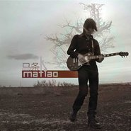

马条
============================

|  |  |
| :--: | :-- |
| [ 马条](https://emumo.xiami.com/album/320381) | **艺人**: [马条](../index.md) **语种**: 国语 **唱片公司**: 十三月唱片 **发行时间**: 2009年02月11日 **专辑类别**: 录音室专辑 **专辑风格**:  **播放数**: 6216429 **收藏数**: 2336 **评论数**: 135  |

## 简介

有的人写诗，有的人，比如马条，活得就像首诗。   
马条生于新疆克拉玛依。那是一座位于准噶尔盆地西北缘，以石油闻名于世的城市。在维吾尔语里“克拉玛依”是黑油的意思。马条的音乐就像“黑油”一样，充满了未知的颗粒感，不时的激情迸发，不时的含蓄缠绵，让人眩晕、着迷。他像一只低空飞行的大漠之鹰，敏感地捕捉着生活带给他的五味。音乐是马条对生活的一种解读以及一种与世界交流的方式。   
一九九四年，马条离开新疆背井离乡寻找自己的音乐梦想。像所有在家乡丰衣足食但躁动不安的年轻人一样，从一九九四年开始，那条充满福尔马林和汉堡味儿的艺术之路上又多了一位年少心气的音乐家。马条的音乐有别于内地音乐的规定的模式框架，不拘泥、奔放，像燃烧在沙漠中孤独的火焰，给习惯了港台流行音乐的我们当头一棒，啪一声就砸开了一条通往天堂的路。   
你们所熟悉的那个马条，嘶吼、醉酒，眼神迷离，躺在地上说梦话，告诉你他看到了你的灵魂。还时常表现出与俗世生活的格格不入，且语出惊人。   
你们并不熟悉的那个马条，细腻、敏感，善解人意，依在落日湖边的柳树上弹吉他，唱着自己由心而生的歌。他的坚硬就像他的柔软，他的柔软就像他的坚硬。   
我们完全不知的那个马条，银甲护身，战刀挥舞，千军中取上将头颅如探囊取物……   
这是一张用生命谱写的唱片。它不仅记录了作者十余年生活的点滴，同时也折射出整个中国边缘音乐家的生命状态——将欢乐、希望、狰狞、苦难、祈福、爱、纠结、欲望、信仰、自私、理想与惶恐平铺在一个现实平面上，通过音乐家重新的组织与融合形成二维空间，并最终修成成果，呈立体状。   
购买这张唱片的所有的人：感谢你们在数字音乐和免费下载的时代继续购买实体唱片。诸位所听到的这张唱片并不是流行音乐生产线上随波逐流且失去五官的商品，而是一个人和一个时代的历史与记录。像我们每个人一样，无论你是默默无闻还是一鸣惊人，你最终都逃不开自己对自己的审视，或者说是审判——卡夫卡在《审判》中如此说“就在这时，他听到门后有一声痉挛性的叹息，那扇门是他一向认为堆放废品的房门，虽说他从来没有去开过。”不断行走的路上，回头看见自己的背影，那么沉重，那么美妙……　　  

## 曲目

## 评论

|  |  |  |  |
| :-- | :-- | :-- | :-- |
|  [虾米用户](https://emumo.xiami.com/u/276944698) 不要自我设限..... 2020-10-25 03:24 赞(1) 踩(0) | 
✡️✡️✡️
 |
|  [虾米用户](https://emumo.xiami.com/u/87421924) 唯有自己钟情的音乐不可抗... 2019-10-05 05:27 赞(0) 踩(0) | 
马条同名音乐专辑之封锁线
 |
|  [虾米用户](https://emumo.xiami.com/u/404001380)  2018-11-08 13:03 赞(1) 踩(0) | 
与生俱来的民族特色，在音乐的多样性上如果能系统的学习，应该有更大发展
 |
|  [虾米用户](https://emumo.xiami.com/u/52415194) ♬♩♫♪♡ 2018-04-04 00:13 赞(0) 踩(0) | 
ᵕ᷄≀ ̠˘᷅
 |
|  [虾米用户](https://emumo.xiami.com/u/6512043) 暂无签名~ 2017-10-28 00:21 赞(1) 踩(0) | 
2000年后至今，深深打动过我的中国大陆男歌手，02年的许巍，07年的李健，09年的汪峰，现在又听到一个——马条，一首《封锁线》听得浑身鸡皮疙瘩过电。好生难得的才华。
 |
|  [虾米用户](https://emumo.xiami.com/u/178750)  2017-10-27 23:09 赞(1) 踩(0) | 
技术，思想，音乐性俱佳的作品，近年来难得的真诚的中文民谣
 |
|  [虾米用户](https://emumo.xiami.com/u/1014240) 岁月不知人间多少的忧伤，... 2017-01-21 16:38 赞(0) 踩(0) | 
真心不喜欢这个西北人
 |
|  [虾米用户](https://emumo.xiami.com/u/185928902) 唯爱与音乐不可辜负。 2016-11-18 22:43 赞(0) 踩(0) | 
寂寞有多长
 |
|  [虾米用户](https://emumo.xiami.com/u/2022341) 懶似精靈。。。。 2016-10-24 08:15 赞(0) 踩(0) | 
就是和唱那年榕樹下時，就是兩個他
 |
|  [虾米用户](https://emumo.xiami.com/u/3583445)  2016-08-06 20:53 赞(0) 踩(0) | 
哎唷，这个声音太好听了，一开始以为是黄大炜
 |
|  [虾米用户](https://emumo.xiami.com/u/11293856) 我还没想好要写什么... 2016-05-21 16:24 赞(1) 踩(0) | 
比那种所谓的小鲜肉、奶油小生强的多了
 |
|  [虾米用户](https://emumo.xiami.com/u/11293856) 我还没想好要写什么... 2016-05-21 16:21 赞(0) 踩(0) | 
从中国好歌曲里认识了马条，那种潇洒、沧桑的歌声征服了我。
 |
|  [虾米用户](https://emumo.xiami.com/u/478527) 好想跟衣服在洗衣机里滚 2016-05-11 22:28 赞(2) 踩(0) | 
秋后，有个人在讲故事。
 |
|  [虾米用户](https://emumo.xiami.com/u/478527) 好想跟衣服在洗衣机里滚 2016-05-11 22:28 赞(0) 踩(0) | 
秋后，有个人在讲故事。
 |
|  [虾米用户](https://emumo.xiami.com/u/32332032)  2016-02-22 10:24 赞(0) 踩(0) | 
封锁线，风景，寂寞有多长，塔吉汗，非常好听
 |
|  [虾米用户](https://emumo.xiami.com/u/7869199)   2015-11-28 10:10 赞(0) 踩(0) | 
喜欢他的 天使 可惜虾米没有
 |
|  [虾米用户](https://emumo.xiami.com/u/21258623)  2015-10-08 20:00 赞(0) 踩(0) | 
曲 词 充实 真实 很饱满 最重要的是不管快歌还是慢歌都能打动人 非常好
 |
|  [虾米用户](https://emumo.xiami.com/u/40295552) 暂无签名~ 2015-10-05 00:13 赞(0) 踩(0) | 
心碎了
 |
|  [虾米用户](https://emumo.xiami.com/u/4002112)  2015-09-13 01:00 赞(1) 踩(0) | 
摇滚民谣综合体
 |
|  [虾米用户](https://emumo.xiami.com/u/2988809) the sweet of... 2015-08-04 15:37 赞(0) 踩(0) | 
2015上海moma音乐节＃户联星空＃购票链接<a href="http://m.hulianxk.com/index_show.html?showId=25&amp;amp;referrers=index&amp;amp;agentId=35" target="_blank" rel="nofollow noreferrer noopener">http://m.hulianxk.com/index_show.html?showId=25&amp;amp;referrers=index&amp;amp;agentId=35</a>
 |
|  [虾米用户](https://emumo.xiami.com/u/3546413)  2015-08-03 11:27 赞(0) 踩(0) | 
听 封锁线 突然发现 马条的声音好像陈升啊 听上去沧桑又空旷 像是坐在大草原上给你讲故事一样~ 赞
 |
|  [虾米用户](https://emumo.xiami.com/u/1177150) 此心安处是吾乡 2015-07-06 14:14 赞(0) 踩(0) | 
不同的声音，惊喜
 |
|  [虾米用户](https://emumo.xiami.com/u/8287565)  2015-06-23 16:34 赞(1) 踩(0) | 
太棒了，我快把这张专辑听完了。最大的感受，我艹，就好像田震又出了一张新专辑，那种又有点粗犷，又其实很精致，不土不俗，不细腻柔美，带骨头的，属于中国大陆本土的，好的音乐。
 |
|  [虾米用户](https://emumo.xiami.com/u/21014208)  2015-03-04 12:26 赞(4) 踩(0) | 
第一眼见马条，给我的感觉就是独有的优雅，他的音乐如其人，真诚，儒雅
 |
|  [虾米用户](https://emumo.xiami.com/u/43782561) 如此清新有逼格 2015-03-03 23:01 赞(0) 踩(0) | 
超喜欢马条滴塔吉汗，那个前奏至今还记得哈哈
 |
|  [虾米用户](https://emumo.xiami.com/u/33570603)  2015-02-28 21:32 赞(0) 踩(0) | 
有才
 |
|  [虾米用户](https://emumo.xiami.com/u/656164) 一个人的夜里，唯有音乐可... 2015-02-27 17:39 赞(0) 踩(0) | 
有没有谁听了好歌曲马条给儿子写的那首？
 |
|  [虾米用户](https://emumo.xiami.com/u/26098482) 暂无签名~ 2015-02-26 11:40 赞(0) 踩(0) | 
有几年没关注音乐了，马条的音乐给我一些新的感受！
 |
|  [虾米用户](https://emumo.xiami.com/u/9044095) 别有用心的一小撮分子 2015-02-23 01:30 赞(0) 踩(0) | 
喔，我怎么好意思到她的跟前说，再多的牛羊怎比得上她丢失的年华。
 |
|  [虾米用户](https://emumo.xiami.com/u/18056127) 我当然相信你就是其中最正... 2015-02-15 18:14 赞(0) 踩(0) | 
我要钱 我要你 哈哈 简单直接实在
 |
|  [虾米用户](https://emumo.xiami.com/u/5181233)  2015-02-15 17:28 赞(0) 踩(0) | 
林宥嘉观光团。
 |
|  [虾米用户](https://emumo.xiami.com/u/5181233)  2015-02-15 17:27 赞(0) 踩(0) | 
五响。
 |
|  [虾米用户](https://emumo.xiami.com/u/17403416)  2015-02-13 14:20 赞(0) 踩(0) | 
多么美妙
 |
|  [虾米用户](https://emumo.xiami.com/u/32652663) 暂无签名~ 2015-02-07 00:11 赞(0) 踩(0) | 
诗人！用心去创作的音乐人！致敬！
 |
|  [虾米用户](https://emumo.xiami.com/u/8244559)  2015-01-25 01:56 赞(0) 踩(0) | 
******
 |
| ⇒ |  [虾米用户](https://emumo.xiami.com/u/1032568) 我还没想好要写什么... 2015-01-27 15:49 赞(0) 踩(0) | 
在哪都这一句
 |
| ⇒ |  [虾米用户](https://emumo.xiami.com/u/8244559)  2015-01-27 16:05 赞(0) 踩(0) | 
<q><b>mojun说：</b></q>
 |
| ⇒ |  [虾米用户](https://emumo.xiami.com/u/1032568) 我还没想好要写什么... 2015-01-27 16:12 赞(0) 踩(0) | 
<q><b>未知生物说：</b></q>
 |
|  [虾米用户](https://emumo.xiami.com/u/12137604) 小学音乐课上给大家放崔健... 2015-01-14 12:41 赞(0) 踩(0) | 
我有用之不完的微笑，却还欠你一个，真实的拥抱，多可惜
 |
|  [虾米用户](https://emumo.xiami.com/u/32306826) 老子平生江南江北最爱临风... 2014-12-13 14:06 赞(0) 踩(0) | 
我离开你至少有五千里，五千里……
 |
|  [虾米用户](https://emumo.xiami.com/u/43347833)  2014-12-03 23:26 赞(0) 踩(0) | 
V。V
 |
|  [虾米用户](https://emumo.xiami.com/u/893413) 让我暖一些 2014-10-17 08:50 赞(0) 踩(0) | 
开始觉得“在我垂暮的心灵湖泊，倒映你天真灿烂的笑”这句可以唱给我女儿听，可再仔细听清楚，糟，这可是年长怪蜀黍泡情窦初开小妹妹的杀手锏啊……
 |
|  [虾米用户](https://emumo.xiami.com/u/6359925)  2014-10-06 19:46 赞(0) 踩(0) | 
《风景》这首很棒，其它感觉一般。
 |
|  [虾米用户](https://emumo.xiami.com/u/10435106) 听靓歌 2014-09-23 02:49 赞(0) 踩(0) | 
不错。
 |
|  [虾米用户](https://emumo.xiami.com/u/8356658)  2014-05-09 19:58 赞(0) 踩(0) | 
又想起了封锁线，一年了
 |
|  [虾米用户](https://emumo.xiami.com/u/322000) 拒绝狗血剧情的伤心情歌 2014-05-04 15:03 赞(0) 踩(0) | 
真情，感染力。
 |
|  [虾米用户](https://emumo.xiami.com/u/322000) 拒绝狗血剧情的伤心情歌 2014-05-04 15:02 赞(0) 踩(0) | 
爱上了寂寞。
 |
|  [虾米用户](https://emumo.xiami.com/u/5375272)  2014-04-21 23:38 赞(0) 踩(0) | 
好棒啊，爱你。
 |
|  [虾米用户](https://emumo.xiami.com/u/34893857)  2014-04-04 16:48 赞(0) 踩(0) | 
不错
 |
|  [虾米用户](https://emumo.xiami.com/u/408249)  2014-03-21 13:07 赞(0) 踩(0) | 
matiao
 |
|  [虾米用户](https://emumo.xiami.com/u/1609946) 一即一切 2014-03-11 16:20 赞(0) 踩(0) | 
心 境不二
 |
|  [虾米用户](https://emumo.xiami.com/u/1957055) 泠冽阳光。 2014-03-10 01:30 赞(1) 踩(0) | 
我距离你多远，寂寞就亦有多长。
 |
|  [虾米用户](https://emumo.xiami.com/u/5980754)  2014-02-07 17:31 赞(0) 踩(0) | 
酷到没朋友啊
 |
|  [虾米用户](https://emumo.xiami.com/u/1333111) 矮油你肿莫了 2014-02-01 11:32 赞(0) 踩(0) | 
各种好听，各种感动，各种喜欢
 |
|  [虾米用户](https://emumo.xiami.com/u/16564916) 暂无签名~ 2014-01-10 15:42 赞(0) 踩(0) | 
第一首是《寂寞有多长》，听第五次的时候感觉眼泪忍不住了。我是泪点高的人。
 |
|  [虾米用户](https://emumo.xiami.com/u/14663122) 暂无签名~ 2013-11-29 21:22 赞(0) 踩(0) | 
好
 |
|  [虾米用户](https://emumo.xiami.com/u/15416686) 你的笑声让我想起我的那 2013-09-24 22:22 赞(0) 踩(0) | 
马条
 |
|  [虾米用户](https://emumo.xiami.com/u/7687655) 人活着，总得去改变些什么 2013-08-31 08:36 赞(0) 踩(0) | 
不错 这种浑厚的味道
 |
|  [虾米用户](https://emumo.xiami.com/u/10606834) 生如蚁而美如神 2013-04-12 15:58 赞(0) 踩(0) | 
民谣在路上，马条在路上。
 |
|  [虾米用户](https://emumo.xiami.com/u/4951514)  2013-04-08 14:54 赞(0) 踩(0) | 
歌曲中有生活
 |
|  [虾米用户](https://emumo.xiami.com/u/4951514)  2013-04-08 14:53 赞(0) 踩(0) | 
很喜欢马条！
 |
|  [虾米用户](https://emumo.xiami.com/u/11374362)  2013-02-05 15:45 赞(0) 踩(0) | 
能让我深夜不睡，反复聆听不厌倦，甚至湿了眼眶的就是这里面的马条。
 |
|  [虾米用户](https://emumo.xiami.com/u/12527170) 与你一起分享好听的音乐 2013-01-21 10:07 赞(0) 踩(0) | 
颗粒感.诗一样活着
 |
|  [虾米用户](https://emumo.xiami.com/u/12527170) 与你一起分享好听的音乐 2013-01-21 09:55 赞(0) 踩(0) | 
颗粒感.
 |
|  [虾米用户](https://emumo.xiami.com/u/6920851) 倾听过你的沉默 2012-11-22 19:41 赞(1) 踩(0) | 
表示不想再听靡靡之音了。活在现实里。这个老男人的词和曲，惊艳
 |
|  [虾米用户](https://emumo.xiami.com/u/6920851) 倾听过你的沉默 2012-11-22 19:38 赞(0) 踩(0) | 
表示不想再听靡靡之音了。活在现实里。这个老男人的词和曲，惊艳
 |
|  [虾米用户](https://emumo.xiami.com/u/10463410) 我相信，专注本身就很幸福 2012-11-08 00:07 赞(0) 踩(0) | 
马条
 |
|  [虾米用户](https://emumo.xiami.com/u/13213)  2012-10-21 17:27 赞(0) 踩(0) | 
草原风的摇滚与民谣，真少听到这种风格的啊！风景、封锁线、你是我的、塔吉汗、朋友来了，其中最爱塔吉汗这首
 |
|  [虾米用户](https://emumo.xiami.com/u/10383271)  2012-10-07 14:04 赞(0) 踩(0) | 
性感！
 |
|  [虾米用户](https://emumo.xiami.com/u/10536476)  2012-09-28 23:21 赞(0) 踩(0) | 
很舒服
 |
|  [虾米用户](https://emumo.xiami.com/u/9360968)  2012-06-18 21:40 赞(0) 踩(0) | 
舒适
 |
|  [虾米用户](https://emumo.xiami.com/u/2449440)  2012-05-02 12:08 赞(0) 踩(0) | 
马条，好久没见了，到宋庄电话喝酒
 |
|  [虾米用户](https://emumo.xiami.com/u/2686027) 暂无签名~ 2012-04-22 11:20 赞(0) 踩(0) | 
马条的歌不错，一直都喜欢。
 |
|  [虾米用户](https://emumo.xiami.com/u/279722) 理想主义大葵花，生长在营... 2012-03-03 17:28 赞(0) 踩(0) | 
我爱条哥！！！
 |
|  [虾米用户](https://emumo.xiami.com/u/1559482) 科学。民主。自由。 2012-02-23 08:57 赞(0) 踩(0) | 
@马条沉默。每段经历都是恩惠。
 |
|  [虾米用户](https://emumo.xiami.com/u/3913067)  2012-02-06 15:43 赞(0) 踩(0) | 
有质感的音乐
 |
|  [虾米用户](https://emumo.xiami.com/u/2078234)  2012-01-11 12:53 赞(0) 踩(0) | 
磁性中年文艺男声
 |
| ⇒ |  [虾米用户](https://emumo.xiami.com/u/3732255)  2012-01-16 13:12 赞(0) 踩(0) | 
说就说，能不提文艺吗？这年头李宇春都算文青了！！
 |
|  [虾米用户](https://emumo.xiami.com/u/3441435)  2012-01-09 15:50 赞(0) 踩(0) | 
马条
 |
|  [虾米用户](https://emumo.xiami.com/u/5847058) 常于条件状语从句中用 2012-01-01 23:52 赞(0) 踩(0) | 
到底是马条，好词！
 |
|  [虾米用户](https://emumo.xiami.com/u/7352430)  2011-12-22 11:17 赞(0) 踩(0) | 
相当期待老马八十岁时唱塔吉汗
 |
|  [虾米用户](https://emumo.xiami.com/u/3555799)  2011-12-14 22:57 赞(0) 踩(0) | 
我还在懵懂地初开情窦
 |
|  [虾米用户](https://emumo.xiami.com/u/6955434)  2011-12-07 17:32 赞(0) 踩(0) | 
好喜欢
 |
|  [虾米用户](https://emumo.xiami.com/u/618601)  2011-12-07 13:36 赞(0) 踩(0) | 
治愈系 英伦摇滚，旋律很正！
 |
|  [虾米用户](https://emumo.xiami.com/u/5969280)  2011-12-06 19:39 赞(0) 踩(0) | 
林宥嘉转发的，过来听听，然后就爱上了
 |
|  [虾米用户](https://emumo.xiami.com/u/7111610)  2011-12-06 00:07 赞(0) 踩(0) | 
真实的音乐，总是能打动别人。
 |
|  [虾米用户](https://emumo.xiami.com/u/1856595) 假如虚无有路，那路必定是... 2011-11-24 20:18 赞(0) 踩(0) | 
他的歌儿是少年的诗
 |
|  [虾米用户](https://emumo.xiami.com/u/6766429)  2011-11-13 21:57 赞(0) 踩(0) | 
因为喜欢
 |
|  [虾米用户](https://emumo.xiami.com/u/6766429)  2011-11-13 21:56 赞(0) 踩(0) | 
六岁的儿子喜欢上了条哥，尤其是 ‘切蛋糕”，“塔吉汗”，还能跟着唱几句。
 |
|  [虾米用户](https://emumo.xiami.com/u/645218) 任性逍遥于有欲无欲之间 2011-11-10 12:38 赞(0) 踩(0) | 
喜欢这个调调
 |
|  [虾米用户](https://emumo.xiami.com/u/2706709) 虽不能至 心向往之 2011-11-01 23:17 赞(0) 踩(0) | 
封锁线 最近的爱
 |
|  [虾米用户](https://emumo.xiami.com/u/2706709) 虽不能至 心向往之 2011-11-01 23:17 赞(0) 踩(0) | 
封锁线 最近的爱
 |
|  [虾米用户](https://emumo.xiami.com/u/4154620)  2011-09-29 05:22 赞(0) 踩(0) | 
林宥嘉推荐的《寂寞有多长》
 |
|  [虾米用户](https://emumo.xiami.com/u/5166244)   2011-09-25 12:22 赞(0) 踩(0) | 
喜喜欢
 |
|  [虾米用户](https://emumo.xiami.com/u/5874093)  2011-09-18 17:26 赞(0) 踩(0) | 
一聽再聽
 |
|  [虾米用户](https://emumo.xiami.com/u/276431)  2011-08-19 14:11 赞(0) 踩(0) | 
绝对挚爱专辑
 |
|  [虾米用户](https://emumo.xiami.com/u/2237988)  2011-08-15 04:54 赞(0) 踩(0) | 
风中的向日葵百听可听！
 |
|  [虾米用户](https://emumo.xiami.com/u/5196074)  2011-08-10 19:46 赞(0) 踩(0) | 
同一张专辑风格差异很大！迷惑中，，，
 |
|  [虾米用户](https://emumo.xiami.com/u/3069218)  2011-07-30 18:24 赞(0) 踩(0) | 
在银川中山公园本来是去听苏阳。有幸第一次听到马条的声音，就喜欢上了他，还有他的歌。随意的歌声中带有理想，执着。执着万岁！
 |
|  [虾米用户](https://emumo.xiami.com/u/4157531) 我还没想好要写什么... 2011-07-26 20:14 赞(0) 踩(0) | 
同名专辑。听马条的歌感觉很纯粹，尤其专辑里的《寂寞又多长》，句句真切
 |
|  [虾米用户](https://emumo.xiami.com/u/4448218)  2011-07-19 12:15 赞(0) 踩(0) | 
男人的歌~沙砾般的嗓音~555~世上还是有真男人的。。我坚定了
 |
|  [虾米用户](https://emumo.xiami.com/u/142291)   2011-07-18 16:39 赞(0) 踩(0) | 
7月15号晚，银川中山公园 有幸近距观看了 马条乐队 和山人乐队的现场，非常开心和兴奋
 |
|  [虾米用户](https://emumo.xiami.com/u/3255139)  2011-07-15 23:34 赞(0) 踩(0) | 
感觉
 |
|  [虾米用户](https://emumo.xiami.com/u/11891)  2011-07-15 20:48 赞(0) 踩(0) | 
确实很好听
 |
|  [虾米用户](https://emumo.xiami.com/u/2512481)  2011-07-14 19:17 赞(0) 踩(0) | 
喜欢本土民谣
 |
|  [虾米用户](https://emumo.xiami.com/u/4261281)  2011-07-09 12:09 赞(0) 踩(0) | 
音乐是马条对生活的一种解读以及一种与世界交流的方式。
 |
|  [虾米用户](https://emumo.xiami.com/u/4729413)  2011-07-04 21:04 赞(0) 踩(0) | 
执着，自我，坚持
 |
|  [虾米用户](https://emumo.xiami.com/u/1126207) 因果关系…… 2011-06-30 19:01 赞(0) 踩(0) | 
不是所有被生活摧残后的人都能写出这样的东西......
 |
|  [虾米用户](https://emumo.xiami.com/u/2204198)  2011-06-29 16:32 赞(0) 踩(0) | 
听过他唱歌，在一个PUB里。
 |
|  [虾米用户](https://emumo.xiami.com/u/652500)  2011-06-28 00:45 赞(0) 踩(0) | 
有的人写诗，有的人，比如马条，活得就像首诗。 这句评论太经典。
 |
|  [虾米用户](https://emumo.xiami.com/u/2205129)   2011-06-21 22:17 赞(0) 踩(0) | 
以前一直没有仔细完整地听过这张，说老实话确实感动到我了
 |
|  [虾米用户](https://emumo.xiami.com/u/4060161)  2011-05-27 14:52 赞(0) 踩(0) | 
喜欢马条的民谣！
 |
|  [虾米用户](https://emumo.xiami.com/u/2730470)  2011-04-16 11:22 赞(0) 踩(0) | 
有才的
 |
|  [虾米用户](https://emumo.xiami.com/u/1400957)  2011-04-10 18:37 赞(0) 踩(0) | 
活得像诗的人的歌唱
 |
|  [虾米用户](https://emumo.xiami.com/u/284596)  2011-04-05 00:44 赞(0) 踩(0) | 
就急急急急
 |
|  [虾米用户](https://emumo.xiami.com/u/376825)  2011-03-30 12:48 赞(0) 踩(0) | 
花儿——叶蓓<a href="http://www.xiami.com/song/399039" target="_blank" rel="nofollow noreferrer noopener">http://www.xiami.com/song/399039</a>
 |
|  [虾米用户](https://emumo.xiami.com/u/2521723)  2011-02-26 15:09 赞(0) 踩(0) | 
能唱到人心里的歌，是真正的真挚的情感的流露，马条的歌像电影画面一般展开，洋溢起来。舒服！
 |
|  [虾米用户](https://emumo.xiami.com/u/861857)  2011-02-17 14:35 赞(0) 踩(0) | 
从你住的地方算起,我离开你至少有五千里.可是距离永远也不能算出,我的寂寞有多长.....
 |
|  [虾米用户](https://emumo.xiami.com/u/2259353) raziyekurban 2011-02-16 11:04 赞(0) 踩(0) | 
新疆人，歌声带有准格尔旷野的豪放.....支持....
 |
|  [虾米用户](https://emumo.xiami.com/u/1342581)  2011-02-16 08:41 赞(0) 踩(0) | 
马条
 |
|  [虾米用户](https://emumo.xiami.com/u/907016)  2011-02-16 00:14 赞(0) 踩(0) | 
音乐对我很有吸引力，声音也很好
 |
|  [虾米用户](https://emumo.xiami.com/u/2259353) raziyekurban 2011-02-15 16:39 赞(0) 踩(0) | 
马条出生于新疆准噶尔盆地西北缘的克拉玛依。
 |
|  [虾米用户](https://emumo.xiami.com/u/1619015)  2011-02-10 12:18 赞(0) 踩(0) | 
封锁线能彻底把人征服
 |
|  [虾米用户](https://emumo.xiami.com/u/2788520)  2011-02-10 11:00 赞(0) 踩(0) | 
条哥有新疆人的不羁与豪迈,有北京人的挣吧和迷茫...
 |
|  [虾米用户](https://emumo.xiami.com/u/1984307)  2011-02-02 14:45 赞(0) 踩(0) | 
诗
 |
|  [虾米用户](https://emumo.xiami.com/u/2589187) 我系话你 2011-01-28 15:33 赞(0) 踩(0) | 
好
 |
|  [虾米用户](https://emumo.xiami.com/u/1022854)  2011-01-26 17:08 赞(0) 踩(0) | 
喜欢那首风景~~
 |
|  [虾米用户](https://emumo.xiami.com/u/2567099)  2011-01-21 18:08 赞(0) 踩(0) | 
有的人写诗，有的人，比如马条，活得就像首诗。
 |
|  [虾米用户](https://emumo.xiami.com/u/2228770)  2011-01-15 00:23 赞(0) 踩(0) | 
去年啦，一晃就是去年啦，在地坛公园的北京民谣节，期待你的演出，可后来因为不得不走的理由，没有看成。不知道什么时候才能在现场听你演出？
 |
|  [虾米用户](https://emumo.xiami.com/u/142291)   2010-12-07 17:11 赞(0) 踩(0) | 
今天第一次听到他的声音 一个陌生的名字。音乐进入耳朵 眼前一亮 。试听了前两首之后 好像还想接着听下去 。有感觉的歌手 ，自然 不张扬  耐听。音乐的配器也很舒服
 |
|  [虾米用户](https://emumo.xiami.com/u/11047)  2010-12-07 09:50 赞(0) 踩(0) | 
很好。
 |
|  [虾米用户](https://emumo.xiami.com/u/1694608)  2010-10-26 14:57 赞(0) 踩(0) | 
好音乐就是好！支持！
 |
|  [虾米用户](https://emumo.xiami.com/u/987658)  2010-09-17 17:26 赞(0) 踩(0) | 
沙漠里的明珠，终有一天会绽放光芒！
 |
|  [虾米用户](https://emumo.xiami.com/u/389293)  2009-11-19 23:29 赞(0) 踩(0) | 
******
 |
|  [虾米用户](https://emumo.xiami.com/u/389293)  2009-11-19 23:29 赞(0) 踩(0) | 
******
 |
