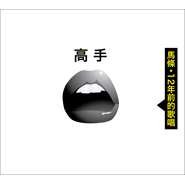

高手
============================

|  |  |
| :--: | :-- |
| [ 高手](https://emumo.xiami.com/album/489006) | **艺人**: [马条](../index.md) **语种**: 国语 **唱片公司**: 太合麦田, 十三月唱片 **发行时间**: 2012年01月13日 **专辑类别**: 录音室专辑 **专辑风格**:  **播放数**: 226787 **收藏数**: 663 **评论数**: 49  |

## 简介

从1999年初，我和秦万民用硬件音源2080开始迈出了这张处女唱片的步伐。录好6首以后，拿去给宋柯听。三天后，我正式签约“麦田唱片”。于是我们就马不停蹄的录完了后5首歌。  
  
这是一个看上去多么美好的开始，但却被一次看似偶然却又必然的意外，使这张唱片从此被搁置。  
  
2011年6月，我和宋柯重新谈起了这张唱片。这个相信中国唱片业已死的行业老大喃喃地说：“你想发行就发吧，我提供一切可能帮助你。”  
  
于是我开始一点一滴的展开与这张唱片相关的所有工作。面对12年前的她，很多情感用语言去形容显得苍白无力。我给她想了很多名字，《年青》、《谁不曾年轻过》、《时光的牧童》等等。最终，我还是决定用12年前我给她取的那个笨笨的名字《傻女孩》。我拒绝所有让我对其“再加工”的劝慰，原封不动的还原她的本来面目。在这个过程中，她也让我明白了一个道理，也坚定了我对音乐的态度：时间会走，但你留下的声音不会走，她会永远的停在那里，忠心的等你！  
  
致我第一个出生，却第三个与大家见面的我的孩子。  
  
马条  
<st1:chsdate year="2011" month="12" day="6" islunardate="False" isrocdate="False" w:st="on">2011年12月6日</st1:chsdate>夜<o:p></o:p>

## 曲目

## 评论

|  |  |  |
| :-- | :-- | :-- |
|  [虾米用户](https://emumo.xiami.com/u/52415194) ♬♩♫♪♡ 2018-04-04 00:13 赞(0) 踩(0) | 
ᵕ᷄≀ ̠˘᷅
 |
|  [虾米用户](https://emumo.xiami.com/u/478527) 好想跟衣服在洗衣机里滚 2016-04-24 18:16 赞(1) 踩(0) | 
什么时候重新上架呀
 |
|  [虾米用户](https://emumo.xiami.com/u/2988809) the sweet of... 2015-08-04 15:37 赞(0) 踩(0) | 
2015上海moma音乐节＃户联星空＃购票链接<a href="http://m.hulianxk.com/index_show.html?showId=25&amp;amp;referrers=index&amp;amp;agentId=35" target="_blank" rel="nofollow noreferrer noopener">http://m.hulianxk.com/index_show.html?showId=25&amp;amp;referrers=index&amp;amp;agentId=35</a>
 |
|  [虾米用户](https://emumo.xiami.com/u/37467557) so   rock,  ... 2015-02-25 11:50 赞(0) 踩(0) | 
听完了所有专辑，马条的创作能力确实强大，歌写的很好！
 |
|  [虾米用户](https://emumo.xiami.com/u/9044095) 别有用心的一小撮分子 2015-02-23 00:52 赞(0) 踩(0) | 
我只能说，有一股魔力，我想到了一种古老的职业：游吟诗人。
 |
|  [虾米用户](https://emumo.xiami.com/u/47239106)  2015-02-14 13:06 赞(0) 踩(0) | 
不好听或者不喜欢！唱的不好，音乐老套
 |
|  [虾米用户](https://emumo.xiami.com/u/7407506)  2015-01-25 15:38 赞(0) 踩(0) | 
好听！   不光是干净的声音、西北多少有些异域风格的旋律打动人，更有直达心底的词的深度、极富张力的音乐控制力。我这样爱听音乐  怎么会跟他错过十几年
 |
|  [虾米用户](https://emumo.xiami.com/u/8244559)  2015-01-25 01:57 赞(0) 踩(0) | 
******
 |
|  [虾米用户](https://emumo.xiami.com/u/537844) 爷爱怀旧 2014-11-10 09:44 赞(0) 踩(0) | 
摇滚不适合马条 还是好好搞民谣吧
 |
|  [虾米用户](https://emumo.xiami.com/u/6359925)  2014-10-08 18:49 赞(0) 踩(0) | 
以前的嗓音好很多。
 |
|  [虾米用户](https://emumo.xiami.com/u/3228301)  2014-07-07 17:59 赞(0) 踩(0) | 
第二首你又在学21乐队胡晓海
 |
|  [虾米用户](https://emumo.xiami.com/u/3228301)  2014-07-07 17:53 赞(0) 踩(0) | 
条条，你学废墟乐队周云山干嘛呢？
 |
|  [虾米用户](https://emumo.xiami.com/u/322000) 拒绝狗血剧情的伤心情歌 2014-05-03 16:08 赞(0) 踩(0) | 
看了北京草莓的现场，马条太牛逼了。
 |
|  [虾米用户](https://emumo.xiami.com/u/2022341) 懶似精靈。。。。 2014-03-13 08:18 赞(0) 踩(0) | 
秋语
 |
|  [虾米用户](https://emumo.xiami.com/u/1609946) 一即一切 2014-03-11 16:20 赞(0) 踩(0) | 
心 境不二
 |
|  [虾米用户](https://emumo.xiami.com/u/726540) 做我自己 2013-11-10 11:39 赞(1) 踩(0) | 
神在叫你，感觉有点窦唯的影子！
 |
|  [虾米用户](https://emumo.xiami.com/u/769297)  2013-07-30 02:54 赞(0) 踩(0) | 
13年前的专辑?唱法完全不同啊，那时的马条高音能力非常牛逼啊，难道现在是老了还是嗓子受损?
 |
|  [虾米用户](https://emumo.xiami.com/u/787914) 我还没想好要写什么... 2013-07-28 18:58 赞(0) 踩(0) | 
高手 马条
 |
|  [虾米用户](https://emumo.xiami.com/u/82006)  2013-01-28 11:35 赞(0) 踩(0) | 
大陆老摇滚的味儿
 |
| ⇒ |  [虾米用户](https://emumo.xiami.com/u/46488646)  2015-01-26 08:52 赞(0) 踩(0) | 
死鸡吧难听
 |
|  [虾米用户](https://emumo.xiami.com/u/478095)  2013-01-19 18:50 赞(0) 踩(0) | 
就是觉着马条像极了早期的郑钧，无非一个是拉萨，一个是西北....
 |
|  [虾米用户](https://emumo.xiami.com/u/12294400) 电商设计 2013-01-07 07:04 赞(0) 踩(0) | 
青春尚好 风华正茂
 |
|  [虾米用户](https://emumo.xiami.com/u/12294400) 电商设计 2013-01-07 06:08 赞(0) 踩(0) | 
秋语
 |
|  [虾米用户](https://emumo.xiami.com/u/454363)  2012-12-19 21:20 赞(1) 踩(0) | 
一个人音乐人能忍受自己12年前的作品，这些年他的审美没有进步吗？
 |
| ⇒ |  [虾米用户](https://emumo.xiami.com/u/11886197) 小城时光 2013-11-02 18:58 赞(0) 踩(0) | 
你傻呀你？！ 音乐是一场生活！ 不只是你眼里的工作！
 |
| ⇒ |  [虾米用户](https://emumo.xiami.com/u/454363)  2013-11-02 20:23 赞(0) 踩(0) | 
<q><b>沙发狗说：</b></q>
 |
| ⇒ |  [虾米用户](https://emumo.xiami.com/u/9044095) 别有用心的一小撮分子 2015-02-23 00:32 赞(0) 踩(0) | 
虽然这是12年前的作品，但也是歌者当时状态的一种纪录。
 |
|  [虾米用户](https://emumo.xiami.com/u/1259430)   2012-08-31 14:15 赞(0) 踩(0) | 
很有人文深度的民谣。
 |
|  [虾米用户](https://emumo.xiami.com/u/3664254) 看我的唐诗剑法 2012-07-03 13:20 赞(0) 踩(0) | 
当初因为什么原因没发行？》
 |
|  [虾米用户](https://emumo.xiami.com/u/2543022)  2012-03-04 22:45 赞(0) 踩(0) | 
中经报看到的，听听如何
 |
|  [虾米用户](https://emumo.xiami.com/u/1393543)  2012-03-01 11:33 赞(0) 踩(0) | 
没啥，就是喜欢。
 |
|  [虾米用户](https://emumo.xiami.com/u/1382202) 戕 2012-02-18 14:23 赞(0) 踩(0) | 
声音沉静
 |
|  [虾米用户](https://emumo.xiami.com/u/6789060)  2012-02-17 16:00 赞(0) 踩(0) | 
马条 也年轻过 哈哈
 |
|  [虾米用户](https://emumo.xiami.com/u/6789060)  2012-02-17 15:59 赞(0) 踩(0) | 
CD机挂了 买了cd还没听 先在这里过过瘾
 |
|  [虾米用户](https://emumo.xiami.com/u/4310328)  2012-02-17 12:16 赞(0) 踩(0) | 
要选一个舒服的下午听，今儿风略显大
 |
|  [虾米用户](https://emumo.xiami.com/u/3441435)  2012-02-05 12:19 赞(0) 踩(0) | 
马条
 |
|  [虾米用户](https://emumo.xiami.com/u/7898378)  2012-02-03 14:42 赞(0) 踩(0) | 
独特的嗓音，听过同名的那张专辑还不错
 |
|  [虾米用户](https://emumo.xiami.com/u/7794870) 空杯心…满怀情 2012-01-26 10:55 赞(0) 踩(0) | 
没有原因...就是喜欢真实的...听听马条的现场...依稀记得2011.02.06那个夜晚...疆进酒的专场...好怀念...
 |
|  [虾米用户](https://emumo.xiami.com/u/3555799)  2012-01-19 10:35 赞(0) 踩(0) | 
潜心写作做真正的高手
 |
|  [虾米用户](https://emumo.xiami.com/u/366736) 我的歌单们不会辜负你们对... 2012-01-18 21:50 赞(0) 踩(0) | 
有股子考肉串的味道啊。
 |
| ⇒ |  [虾米用户](https://emumo.xiami.com/u/2211497) ✘貪✔痛 生就孤独 2017-10-28 00:00 赞(0) 踩(0) | 
撸串子，哈哈
 |
|  [虾米用户](https://emumo.xiami.com/u/5579622) 生命不息 摇滚不止 2012-01-18 18:38 赞(0) 踩(0) | 
支持
 |
|  [虾米用户](https://emumo.xiami.com/u/416233) 除去繁华 静享寂寞 2012-01-17 20:02 赞(0) 踩(0) | 
今天第二次想到12年前，听来纪念！
 |
|  [虾米用户](https://emumo.xiami.com/u/1246149)  2012-01-17 14:31 赞(0) 踩(0) | 
听听12年前的歌声，听听12年前激情
 |
|  [虾米用户](https://emumo.xiami.com/u/460089) 我还没想好要写什么... 2012-01-17 13:53 赞(0) 踩(0) | 
支持条哥
 |
|  [虾米用户](https://emumo.xiami.com/u/3425353)  2012-01-16 22:53 赞(0) 踩(0) | 
什么都不想说
 |
|  [虾米用户](https://emumo.xiami.com/u/67586)  2012-01-16 15:57 赞(0) 踩(0) | 
很棒。13年前很是感动。求歌词。
 |
| ⇒ |  [虾米用户](https://emumo.xiami.com/u/7272872)  2012-01-18 21:56 赞(0) 踩(0) | 
这么清晰，还需要歌词吗
 |
|  [虾米用户](https://emumo.xiami.com/u/1536353)  2012-01-16 14:21 赞(0) 踩(0) | 
13年前的？
 |
|  [虾米用户](https://emumo.xiami.com/u/1702986)  2012-01-16 13:33 赞(0) 踩(0) | 
一整张的  听听看先
 |
