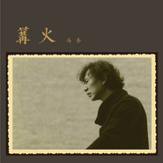

马条
============================

|  |  |
| :--: | :-- |
| [ 马条](https://i.xiami.com/matiao) | **地区**: China 中国大陆 **风格**: 独立民谣 Indie Folk, 华语唱作人 Chinese Singer-Songwriter **播放数**: 14993609 **粉丝数**: 22697 **评论数**: 544  |

## 档案

有的人写诗，有的人，比如马条，活得就像首诗。马条生于新疆克拉玛依。那是一座位于准噶尔盆地西北马条缘，以石油闻名于世的城市。在维吾尔语里“克拉玛依”是黑油的意思。马条的音乐就像“黑油”一样，充满了未知的颗粒感，不时的激情迸发，不时的含蓄缠绵，让人眩晕、着迷。他像一只低空飞行的大漠之鹰，敏感地捕捉着生活带给他的五味。音乐是马条对生活的一种解读以及一种与世界交流的方式。 
马条，上世纪70年代出生于新疆克拉玛依。1994年北上京城，随后他的身影穿梭于北京各酒吧间。这一期间，马条创作了大量还原生活本真的作品。1999年马条录制完成个人第一张作品集《傻女孩》。2004年四月签约 “太合"麦田”，并为老狼、叶蓓等歌手创作多首作品。2007年3月22日，马条正式加盟“十三月”音乐独立厂牌，2009年发行同名专辑《马条》，好评如潮。在维吾尔语里“克拉玛依”是黑油的意思。马条的音乐就像“黑油”一样，充满了未知的颗粒感，不时的激情迸发，不时的含蓄缠绵，让人眩晕、着迷。 
大事记 
1994年北上京城，随后他的身影穿梭于北京各酒吧间。这一期间，马条创作了大量还原生活本真的作品。 
1999年马条录制完成个人第一张作品集《傻女孩》。同年10月，马条签约华纳唱片。但因某些原因，此张唱片未能发行。 
2004年四月，马条签约 “太合"麦田”。并为老狼、叶蓓等歌手创作了《时光的牧童》、《秋雨》、《无尽等待》等作品。 
2005年，马条个人第二张音乐作品集《朋友来了》。其中包括《花儿》等属于马条的代表作品，既保留着浓郁的新疆音乐风格又有着西方摇滚乐的特征。 
2006年马条创作的《等待》被好友老狼的最新个人专辑收录其中，马条还参与了这首单曲的和声工作。 
2007年加入十三月音乐独立厂牌

## 专辑

| 名称 | 语种 | 唱片公司 | 发行时间 | 专辑类别 | 专辑风格 |
| :--: | :-- | :-- | :-- | :-- | :-- |
| [ 给给](./albums/2104037391.md) | 国语 | 独立发行 | 2018年09月18日 | EP, 单曲 | 国语流行 Mandarin Pop |
| [ 在水之恋](./albums/2103499344.md) | 国语 | 独立发行 | 2018年01月24日 | EP, 单曲 |  |
| [ 篝火](./albums/2100377953.md) | 国语 | 独立发行 | 2016年08月08日 | 录音室专辑 |  |
| [ 走唱·西北 新疆马条专场章鱼现场“走唱·西北”系列演出 第六场](./albums/1025889745.md) | 国语 | 章鱼现场 | 2014年11月22日 | 现场专辑 |  |
| [ 2014恒大音乐节现场版-马条](./albums/2103922549.md) | 国语 | 恒大音乐 | 2014年09月18日 | 现场专辑 |  |
| [ 高手](./albums/489006.md) | 国语 | 太合麦田, 十三月唱片 | 2012年01月13日 | 录音室专辑 |  |
| [ 你找错了地方](./albums/407846.md) | 国语 | 十三月唱片 | 2010年12月17日 | 录音室专辑 |  |
| [ 那年榕树下](./albums/363287.md) | 国语 | 十三月唱片 | 2010年01月08日 | EP, 单曲 |  |
| [ 马条](./albums/320381.md) | 国语 | 十三月唱片 | 2009年02月11日 | 录音室专辑 |  |

## 评论

|  |  |  |
| :-- | :-- | :-- |
|  [虾米用户](https://emumo.xiami.com/u/276944698) 不要自我设限..... 2020-10-25 03:24 赞(0) 踩(0) | 
✡️✡️✡️
 |
|  [虾米用户](https://emumo.xiami.com/u/421866297)  2020-10-04 13:21 赞(0) 踩(0) | 
听到这声音很有亲切感，翻开简历才知道是我们新疆老乡！期待马条做出更多优秀的音乐！
 |
|  [虾米用户](https://emumo.xiami.com/u/24584309)  2020-08-08 22:44 赞(0) 踩(0) | 
低调大气有内涵顶起 
 |
|  [虾米用户](https://emumo.xiami.com/u/249820353)  2019-07-30 23:44 赞(0) 踩(0) | 
看到今天的你  为你高兴   还记得后巴扎吗？ 加油！
 |
|  [虾米用户](https://emumo.xiami.com/u/356135070) 灵魂深处 2019-07-28 21:22 赞(1) 踩(0) | 
最爱封锁线！
 |
|  [虾米用户](https://emumo.xiami.com/u/26361202) 我还没想好要写什么... 2019-05-19 17:18 赞(0) 踩(0) | 
马条个人介绍的最后一句 我看成了“2007年十三月加入了独立音乐厂牌” 
 |
|  [虾米用户](https://emumo.xiami.com/u/43182804) 最孤独的人 2019-05-04 22:43 赞(0) 踩(0) | 
你竟然上电视了
 |
|  [虾米用户](https://emumo.xiami.com/u/6088217)  2019-03-22 12:29 赞(0) 踩(0) | 
20190315 ZZ 7LIVEHOUSE。。。
 |
|  [虾米用户](https://emumo.xiami.com/u/383742) 差不多先生 2019-01-06 15:13 赞(0) 踩(0) | 
音乐诗人！
 |
|  [虾米用户](https://emumo.xiami.com/u/406275337) 懂音乐！！！才会爱音乐！... 2018-12-16 10:01 赞(0) 踩(0) | 
相传人死后，上了黄泉路，路尽头有一条河叫忘川河，河上有一座奈何桥。孟婆就守候在那里，给每个路过的人递上一碗孟婆汤，喝过孟婆汤的人会忘却今生今世所有的牵绊，可是有那么一部分人因为种种原因，不愿意喝下孟婆汤，孟婆只好答应他们。就在胸前点颗痣。这样的人，必须跳入忘川河，受水淹火炙的磨折等上千年才能轮回，转世之后会带着前世的记忆、带着那个"记号"寻找前世的恋人。 所以朋友们请珍惜身边胸前有"记号"的人，因为他（她）也许是你前世的恋人，经过千年等待来寻找前世情缘未了的人，去完成前世未了的心愿，请永远不要去伤害他（她），因为不是谁都有勇气跳入忘川河，等上千年煎熬之苦。
 |
|  [虾米用户](https://emumo.xiami.com/u/85114506) 明月夜 短松冈 2018-10-31 21:57 赞(0) 踩(0) | 
喜欢    甚至像陈升的声线
 |
|  [虾米用户](https://emumo.xiami.com/u/2382934) 我还没想好要写什么... 2018-10-03 16:24 赞(3) 踩(0) | 
想对马条说，你的音乐陪伴我走过人生最重要的一个阶段，因为你的音乐感到幸福，听过你的音乐流过眼泪。你的音乐陪我穿越了不同的国家，陪我走过很多独来独往的日子，陪我慢慢走出错误的执念。对听众来说，最害怕的就是小众的音乐人慢慢被现实挤压消失在公众视野，我也很怕以后听不到你的音乐。希望你记得，对很多人来说你的意义是非凡和难以磨灭的。希望永远不要停止创作，永远保持初心，我会一直仰望着你。
 |
|  [虾米用户](https://emumo.xiami.com/u/324647012)  2018-07-30 08:24 赞(0) 踩(0) | 
好想好想 这首歌没有啊
 |
|  [虾米用户](https://emumo.xiami.com/u/321306379)   2018-04-05 21:21 赞(1) 踩(0) | 
马达马达  塔吉汗  这也太好听啦啦啦   跑步单曲循环   开始听其他的   
 |
|  [虾米用户](https://emumo.xiami.com/u/52415194) ♬♩♫♪♡ 2018-04-04 00:11 赞(0) 踩(0) | 
:-)
 |
|  [虾米用户](https://emumo.xiami.com/u/12858831)  2018-04-03 11:33 赞(0) 踩(0) | 
喜欢塔吉汗
 |
|  [虾米用户](https://emumo.xiami.com/u/297909199)   2017-12-31 17:19 赞(0) 踩(0) | 
   
 |
|  [虾米用户](https://emumo.xiami.com/u/301435848) 愈欣赏愈懂欣赏 2017-12-03 21:34 赞(0) 踩(0) | 
想听奇遇 那个纪录片的片尾曲
 |
|  [虾米用户](https://emumo.xiami.com/u/5577839) ☯☯☯ 2017-11-10 06:57 赞(0) 踩(0) | 
封锁线呢！！！！！？？
 |
|  [虾米用户](https://emumo.xiami.com/u/2988530) 177.5 2017-10-30 10:00 赞(0) 踩(0) | 
操，还有点审美吗，马条你们都不够大条的喜欢？
 |
|  [虾米用户](https://emumo.xiami.com/u/2259353) raziyekurban 2017-10-28 00:36 赞(0) 踩(0) | 
同为新疆人....
 |
|  [虾米用户](https://emumo.xiami.com/u/29429668) 2013感谢有你。 2017-10-28 00:32 赞(0) 踩(0) | 
乖的推荐：马条的有点沧桑的新疆范儿，旋律或者吟唱并不悠扬，但是说不出来的味道。
 |
|  [虾米用户](https://emumo.xiami.com/u/5157802)  2017-10-27 23:56 赞(3) 踩(0) | 
阳光下的向日葵，特地点开听，发现竟然是我平时固定听的收藏歌曲之一。真是汗颜，听了这么久，喜欢了这么久，竟然没有去关注一下歌名和作者。 感谢好歌曲，至少让我认认真真地记住了马条！
 |
|  [虾米用户](https://emumo.xiami.com/u/3828515)  2017-10-27 23:19 赞(0) 踩(0) | 
喜欢马条的声音..最爱《爱情调侃的方式》
 |
|  [虾米用户](https://emumo.xiami.com/u/380152)  2017-09-12 11:03 赞(1) 踩(0) | 
好嗓子，听了耳朵简直会怀孕
 |
|  [虾米用户](https://emumo.xiami.com/u/24325936) 无忧无虑，向前游。。。 2017-07-09 13:24 赞(1) 踩(0) | 
封锁线。。。
 |
|  [虾米用户](https://emumo.xiami.com/u/32091898) 如初 2017-03-19 21:44 赞(1) 踩(0) | 
OCT 3.19 B10
 |
|  [虾米用户](https://emumo.xiami.com/u/173068258) 随便找一个方向转身 2017-03-19 18:31 赞(0) 踩(0) | 
暖啊
 |
|  [虾米用户](https://emumo.xiami.com/u/157075)   2017-03-10 18:27 赞(1) 踩(0) | 
特别特别特别喜欢 特别温暖和平易近人
 |
|  [虾米用户](https://emumo.xiami.com/u/9003931) 千淘万漉虽辛苦 2017-02-15 13:57 赞(3) 踩(0) | 
建议艺人的风格那里加上民谣摇滚，谢谢。
 |
|  [虾米用户](https://emumo.xiami.com/u/68941378) 好歌无限，值再寻找…… 2017-02-11 12:53 赞(1) 踩(0) | 
一种情感值得倾听…
 |
|  [虾米用户](https://emumo.xiami.com/u/7752729) 拳头大才是硬道理 2016-12-21 17:51 赞(2) 踩(0) | 
能写能唱的民谣目前还不多
 |
|  [虾米用户](https://emumo.xiami.com/u/250808293)  2016-12-19 18:48 赞(0) 踩(0) | 
1
 |
|  [虾米用户](https://emumo.xiami.com/u/5045687)  生命之饼被河蟹后很少用... 2016-12-17 00:49 赞(4) 踩(0) | 
国内罕见有水平的民谣
 |
|  [虾米用户](https://emumo.xiami.com/u/97747450) 我还没想好要写什么... 2016-12-14 18:25 赞(0) 踩(0) | 
6416
 |
|  [虾米用户](https://emumo.xiami.com/u/49748006) Fly me to th... 2016-11-27 15:37 赞(1) 踩(0) | 
⁺ₒ⁺
 |
|  [虾米用户](https://emumo.xiami.com/u/16551745) byebye｛wb/in... 2016-11-26 17:47 赞(0) 踩(0) | 
lll
 |
|  [虾米用户](https://emumo.xiami.com/u/3086224) WTF？ 2016-11-25 11:06 赞(0) 踩(0) | 
可以，昨晚刚听了Livehouse！！
 |
|  [虾米用户](https://emumo.xiami.com/u/42458538) 天赐神授的格萨尔王 2016-09-12 00:14 赞(5) 踩(0) | 
说实在的 马条大哥创作非常吊 就是声音真的不太得劲啊 客观评价是个好的作曲家却不是个好的的歌唱家
 |
| ⇒ |  [虾米用户](https://emumo.xiami.com/u/47703704) 听音乐，就听虾米音乐 2017-01-03 18:49 赞(0) 踩(0) | 
个性
 |
| ⇒ |  [虾米用户](https://emumo.xiami.com/u/594931) 趴间:巴尔鲁克歌舞厅 2018-04-12 12:31 赞(0) 踩(0) | 
请不要把您的个人观点说成是&amp;ldquo;客观评价&amp;rdquo;
 |
|  [虾米用户](https://emumo.xiami.com/u/38918617) 你相信我，我相信你 2016-09-08 18:26 赞(0) 踩(0) | 
<a href="http://emumo.xiami.com/u/2871" target="_blank" rel="nofollow" name_card="2871">@虾小编</a> <a href="http://emumo.xiami.com/u/17330125" target="_blank" rel="nofollow" name_card="17330125">@虾米音乐人</a> 请收录新EP《遥远的精彩》
 |
| ⇒ |  [虾米用户](https://emumo.xiami.com/u/41190273) 你！到底，怎么肥四啊？！ 2016-09-09 12:40 赞(0) 踩(0) | 
那张不是EP，QQ没有发完全，是这张专辑：<a href="http://www.xiami.com/album/2100377953" target="_blank" rel="nofollow noreferrer noopener">http://www.xiami.com/album/2100377953</a>
 |
| ⇒ |  [虾米用户](https://emumo.xiami.com/u/38918617) 你相信我，我相信你 2016-09-09 12:44 赞(0) 踩(0) | 
<q><b>爆棚的傲娇气说：</b></q>
 |
|  [虾米用户](https://emumo.xiami.com/u/300550)   2016-08-30 12:31 赞(0) 踩(0) | 
大叔不错！
 |
|  [虾米用户](https://emumo.xiami.com/u/12730895) 不要离开！ 2016-08-21 23:39 赞(2) 踩(0) | 
又要存钱了
 |
|  [虾米用户](https://emumo.xiami.com/u/208679633)  2016-08-08 22:06 赞(0) 踩(0) | 
有个性的独立音乐人
 |
|  [虾米用户](https://emumo.xiami.com/u/318315) 暂无签名~ 2016-08-02 19:45 赞(0) 踩(0) | 
篝火？
 |
|  [虾米用户](https://emumo.xiami.com/u/39795806)   2016-08-02 16:24 赞(0) 踩(0) | 
为什么照片集里乱入了山人 毫无违和
 |
|  [虾米用户](https://emumo.xiami.com/u/1126207) 因果关系…… 2016-07-28 23:14 赞(1) 踩(0) | 
为毛没有篝火这张
 |
|  [虾米用户](https://emumo.xiami.com/u/31387063) 知耻近乎勇。 2016-07-27 09:27 赞(0) 踩(0) | 
棒 适合考CPA做分录听，当当当
 |
|  [虾米用户](https://emumo.xiami.com/u/3680750)  2016-07-24 21:35 赞(0) 踩(0) | 
他怎么不叫油条？
 |
| ⇒ |  [虾米用户](https://emumo.xiami.com/u/21605841)   2016-08-02 15:26 赞(0) 踩(0) | 
你怎么不消失
 |
| ⇒ |  [虾米用户](https://emumo.xiami.com/u/9256639)  2016-10-11 12:56 赞(0) 踩(0) | 
<q><b>洋子说：</b></q>
 |
|  [虾米用户](https://emumo.xiami.com/u/5538767)   2016-07-24 02:09 赞(1) 踩(0) | 
听马条莫名其妙就想哭，这是什么毛病
 |
|  [虾米用户](https://emumo.xiami.com/u/50347700)  2016-07-22 13:29 赞(0) 踩(0) | 
呃……没太有感
 |
|  [虾米用户](https://emumo.xiami.com/u/3296096) prince- air 2016-06-20 11:54 赞(0) 踩(0) | 
很合胃口
 |
|  [虾米用户](https://emumo.xiami.com/u/478527) 好想跟衣服在洗衣机里滚 2016-05-09 03:54 赞(1) 踩(0) | 
中国好歌曲 马条《傻瓜》：<a href="http://video.sina.com.cn/p/ent/z/y/2015-01-23/204464544739.html" target="_blank" rel="nofollow noreferrer noopener">http://video.sina.com.cn/p/ent/z/y/2015-01-23/204464544739.html</a>
 |
|  [虾米用户](https://emumo.xiami.com/u/11763865)  2016-04-22 13:13 赞(1) 踩(0) | 

 |
|  [虾米用户](https://emumo.xiami.com/u/23443417) shit 2016-03-30 21:53 赞(1) 踩(0) | 
很喜欢
 |
|  [虾米用户](https://emumo.xiami.com/u/49223224) Gengfire 2016-03-17 08:13 赞(0) 踩(0) | 
谁作词的啊，弄得谱曲都困难
 |
|  [虾米用户](https://emumo.xiami.com/u/7991534) 得不偿失 失不再来 来去... 2016-02-17 13:33 赞(1) 踩(0) | 
土
 |
|  [虾米用户](https://emumo.xiami.com/u/113359024)  2016-02-13 05:39 赞(0) 踩(0) | 
希望一直能听到马哥这样的好音乐
 |
|  [虾米用户](https://emumo.xiami.com/u/5586590)  2016-01-31 00:01 赞(0) 踩(0) | 
为啥把《收获》下架了啊？
 |
|  [虾米用户](https://emumo.xiami.com/u/973635) 杂食动物 2016-01-21 22:06 赞(0) 踩(0) | 
么么哒
 |
|  [虾米用户](https://emumo.xiami.com/u/95132946)   2016-01-21 10:12 赞(0) 踩(0) | 
嘿嘿嘿嘿嘿嘿
 |
|  [虾米用户](https://emumo.xiami.com/u/4389173) 爱尚音乐 2016-01-16 12:14 赞(0) 踩(0) | 
走心
 |
|  [虾米用户](https://emumo.xiami.com/u/58045120) 《我爱她》她不懂~我爱她... 2016-01-15 22:11 赞(0) 踩(0) | 
好好听啊，细腻~
 |
|  [虾米用户](https://emumo.xiami.com/u/99416938)  2016-01-12 16:53 赞(0) 踩(0) | 
马条 就是马条
 |
|  [虾米用户](https://emumo.xiami.com/u/7576326)  2015-12-10 11:30 赞(0) 踩(0) | 
好帅好帅 封锁线 超好听
 |
|  [虾米用户](https://emumo.xiami.com/u/24949922)  2015-12-08 16:47 赞(0) 踩(0) | 
那首傻瓜，真的唱哭我。在好歌曲说当爸爸了，那个像孩子般的笑看哭我。从此迷上马爷
 |
|  [虾米用户](https://emumo.xiami.com/u/36512749) 白羊座 2015-12-06 10:11 赞(0) 踩(0) | 
独立民谣 Indie Folk
 |
|  [虾米用户](https://emumo.xiami.com/u/1332648) www.181.fm 哟... 2015-12-05 23:19 赞(0) 踩(0) | 
诗
 |
|  [虾米用户](https://emumo.xiami.com/u/13691875) 谁的感叹 偶然合拍 2015-11-24 20:52 赞(0) 踩(0) | 
三天后见 
 |
|  [虾米用户](https://emumo.xiami.com/u/2279444) 爱在左，同情在右。 2015-11-21 13:53 赞(0) 踩(0) | 
晚上见，马条老师。
 |
|  [虾米用户](https://emumo.xiami.com/u/52087380) 快乐每一天！ 2015-11-07 19:49 赞(0) 踩(0) | 
满满的都是赞！ 
 |
|  [虾米用户](https://emumo.xiami.com/u/3781923) 别拒绝上帝。 2015-11-05 11:31 赞(0) 踩(0) | 
马条！卧槽！
 |
|  [虾米用户](https://emumo.xiami.com/u/51903838) upgrading...... 2015-10-29 05:35 赞(0) 踩(0) | 
诚意满满，直往心里钻，舒服，爽，好听，上瘾，不想停，越听还越励志，什么情况？！
 |
|  [虾米用户](https://emumo.xiami.com/u/13691875) 谁的感叹 偶然合拍 2015-10-19 12:15 赞(0) 踩(0) | 
条哥最近也有演出啊，虾米没完善哪
 |
|  [虾米用户](https://emumo.xiami.com/u/69213876) 原创是一种信仰 2015-10-08 11:36 赞(0) 踩(0) | 
喜欢马条
 |
|  [虾米用户](https://emumo.xiami.com/u/14219505) 不辞而别是最洒脱的方式。 2015-10-08 10:47 赞(0) 踩(0) | 
听了这么多年，才知道熟悉的嗓音是马爷！！！
 |
|  [虾米用户](https://emumo.xiami.com/u/12730895) 不要离开！ 2015-10-02 18:58 赞(1) 踩(0) | 
其实我本来不想成为颜饭的。
 |
|  [虾米用户](https://emumo.xiami.com/u/4146038)  2015-09-29 23:10 赞(0) 踩(0) | 
麻痹的，听了几年了，居然没收藏
 |
|  [虾米用户](https://emumo.xiami.com/u/2351903) 你可知我从此居无定所。 2015-09-26 03:31 赞(1) 踩(0) | 
条哥，好歌曲没火起来，好声音是时候了！！
 |
| ⇒ |  [虾米用户](https://emumo.xiami.com/u/28113352)   2015-10-28 19:52 赞(0) 踩(0) | 
不行，好声音毁人不倦
 |
|  [虾米用户](https://emumo.xiami.com/u/939390)  2015-09-22 22:36 赞(0) 踩(0) | 
寂寞好长
 |
|  [虾米用户](https://emumo.xiami.com/u/33891784) 世间予我千万种欢喜全部遗... 2015-09-21 15:50 赞(1) 踩(0) | 
喜欢大叔的萝莉
 |
|  [虾米用户](https://emumo.xiami.com/u/928576) 　　　　　　　　　 2015-09-19 10:34 赞(3) 踩(0) | 
昨晚朋友发短信说马条好棒。今早起来一边剥板栗壳一边听。民谣里难得听到的温暖声线。
 |
|  [虾米用户](https://emumo.xiami.com/u/9438622) 努力多一点，微笑多一点！ 2015-09-03 00:25 赞(0) 踩(0) | 
放松的洒脱……
 |
|  [虾米用户](https://emumo.xiami.com/u/41904517)  2015-08-31 00:18 赞(0) 踩(0) | 
我觉得那首傻瓜，把我的心都唱碎了。 
 |
| ⇒ |  [虾米用户](https://emumo.xiami.com/u/32372247) she can turn... 2015-10-14 15:46 赞(0) 踩(0) | 
哪首傻瓜？
 |
|  [虾米用户](https://emumo.xiami.com/u/41904517)  2015-08-31 00:18 赞(0) 踩(0) | 
我觉得那首傻瓜，把我的心都唱碎了。 
 |
|  [虾米用户](https://emumo.xiami.com/u/41904517)  2015-08-31 00:18 赞(0) 踩(0) | 
我觉得那首傻瓜，把我的心都唱碎了。 
 |
|  [虾米用户](https://emumo.xiami.com/u/43292205) 暂无签名~ 2015-08-28 01:23 赞(0) 踩(0) | 
每次回家的火车上有夕阳有大叔暖暖的声音。到现在想起来都会微笑
 |
|  [虾米用户](https://emumo.xiami.com/u/13005049) 凶相无色，恶意无声 2015-08-18 21:52 赞(0) 踩(0) | 
个人觉得您也就那年榕树下和塔吉汗好听一点了。都是按个人的想法说的。
 |
| ⇒ |  [虾米用户](https://emumo.xiami.com/u/3316952)  2015-09-10 21:30 赞(0) 踩(0) | 
按个人的想法，我觉得你很狭隘。不喜欢路过就好。
 |
| ⇒ |  [虾米用户](https://emumo.xiami.com/u/3316952)  2015-09-10 21:30 赞(0) 踩(0) | 
按个人的想法，我觉得你很狭隘。不喜欢路过就好。
 |
| ⇒ |  [虾米用户](https://emumo.xiami.com/u/5106725) 我还没想好要写什么... 2015-09-21 09:54 赞(0) 踩(0) | 
<q><b>Andrew说：</b></q>
 |
|  [虾米用户](https://emumo.xiami.com/u/13005049) 凶相无色，恶意无声 2015-08-18 21:51 赞(0) 踩(0) | 
个人觉得您也就那年榕树下和塔吉汗好听一点了。都是按个人的想法说的。
 |
|  [虾米用户](https://emumo.xiami.com/u/13005049) 凶相无色，恶意无声 2015-08-18 21:48 赞(0) 踩(0) | 
马老师您的歌真的不好听，我通过您的朋友知道了您，凭着对音乐人的尊敬我尝试听了您的几首歌曲，真的觉得您的词写的很怪，可惜了您的一副好声音了真的。希望您写着别这么故弄玄虚的歌。您要是唱民谣就好好唱民谣呗，不然您就只能给别人暖场了。您的声音还是很好听的，我个人不是太懂编曲，但是您的词真的太不押韵了。
 |
| ⇒ |  [虾米用户](https://emumo.xiami.com/u/5106725) 我还没想好要写什么... 2015-09-20 16:12 赞(0) 踩(0) | 
好不好听都是非常个人的感受，没人求着你喜欢，跑来一口气连刷四条，好没礼貌 右上角有X，出门左转你要的民谣多得是，慢走不送
 |
| ⇒ |  [虾米用户](https://emumo.xiami.com/u/13005049) 凶相无色，恶意无声 2015-09-20 16:27 赞(0) 踩(0) | 
<q><b>vip店长助理说：</b></q>
 |
| ⇒ |  [虾米用户](https://emumo.xiami.com/u/5106725) 我还没想好要写什么... 2015-09-21 09:33 赞(0) 踩(0) | 
<q><b>鲸鱼船长说：</b></q>
 |
| ⇒ |  [虾米用户](https://emumo.xiami.com/u/9347240) 这个家伙很懒，什么都没有... 2015-11-04 22:29 赞(0) 踩(0) | 
歌词不是必须要押韵的。作词人王海涛给李健的歌曲《似水流年》写的歌词里有一句是“偶尔在镜子里面/旧时光和我相遇”。有人问他为什么没有用“相见”，他说是故意不要押韵的。我还见过这样一句话：“千万不要相信歌词里说的那些道理，为了凑韵脚，他们什么都写得出来”。是否押韵并不是评价歌词好不好的标准。 条哥在文字和音乐方面都有很高的天赋，音乐和歌词的契合也特别好，这是很难得的。希望有一天你能领悟到其中的妙处。
 |
| ⇒ |  [虾米用户](https://emumo.xiami.com/u/50200408) 无摇不滚的我有颗民谣的心 2017-10-28 00:43 赞(0) 踩(0) | 
自己不懂得欣赏，就不要听，有很多喜欢这种风格，请不要用一个人的 感觉代替所有人。
 |
|  [虾米用户](https://emumo.xiami.com/u/13005049) 凶相无色，恶意无声 2015-08-18 21:48 赞(1) 踩(0) | 
马老师您的歌真的不好听，我通过您的朋友知道了您，凭着对音乐人的尊敬我尝试听了您的几首歌曲，真的觉得您的词写的很怪，可惜了您的一副好声音了真的。希望您写着别这么故弄玄虚的歌。您要是唱民谣就好好唱民谣呗，不然您就只能给别人暖场了。您的声音还是很好听的，我个人不是太懂编曲，但是您的词真的太不押韵了。
 |
| ⇒ |  [虾米用户](https://emumo.xiami.com/u/39142598)  2015-08-25 14:56 赞(0) 踩(0) | 
好无礼
 |
| ⇒ |  [虾米用户](https://emumo.xiami.com/u/3298953)  2015-09-05 13:23 赞(0) 踩(0) | 
不会说中国话就不要大放厥词。
 |
|  [虾米用户](https://emumo.xiami.com/u/5113701)  2015-08-08 00:46 赞(0) 踩(0) | 
民谣，诗人
 |
|  [虾米用户](https://emumo.xiami.com/u/7388008)  2015-08-06 12:59 赞(0) 踩(0) | 
很好的音乐人，很好听，词曲皆好。
 |
|  [虾米用户](https://emumo.xiami.com/u/40222774)   2015-07-29 13:12 赞(0) 踩(0) | 
功夫不是白给的
 |
|  [虾米用户](https://emumo.xiami.com/u/12951711) 我不会专注于喜欢某一种风... 2015-07-26 17:57 赞(15) 踩(0) | 
很多时候不是我们想让他们小众，实际上我为这首歌浑身起鸡皮疙瘩发现身边人听的都是什么类型歌我会放弃分享，因为大家喜好差异存在，性子直的直接来句这个什么垃圾不好听啊哪里好听了类似这样的评论，即便我说走心听才懂的你得安静去听，然后被冠以装逼的帽子
 |
| ⇒ |  [虾米用户](https://emumo.xiami.com/u/36562269)  2015-08-09 13:45 赞(0) 踩(0) | 
对
 |
|  [虾米用户](https://emumo.xiami.com/u/41904517)  2015-07-22 00:11 赞(2) 踩(0) | 
那首傻瓜，真心听的心都碎了
 |
|  [虾米用户](https://emumo.xiami.com/u/32243562) 我还没想好要写什么... 2015-07-14 16:33 赞(2) 踩(0) | 
你能不能把舌头捋直了？！
 |
|  [虾米用户](https://emumo.xiami.com/u/4911910) 优美的低于生活 2015-07-13 13:19 赞(10) 踩(0) | 
逼哥演唱会武汉场上马条说，热爱逼哥的人，会得到逼哥的爱。 我想说的是，我们也爱马条。
 |
|  [虾米用户](https://emumo.xiami.com/u/4926204)  2015-06-29 08:43 赞(1) 踩(0) | 
初开覺得像陳升，越聽越養耳，走心！
 |
|  [虾米用户](https://emumo.xiami.com/u/51544297)  2015-06-24 20:24 赞(0) 踩(0) | 

 |
|  [虾米用户](https://emumo.xiami.com/u/21536159) 斑斓。 2015-06-24 02:31 赞(0) 踩(0) | 
前几个月看见他参加了选秀节目
 |
|  [虾米用户](https://emumo.xiami.com/u/4109979)   2015-06-22 17:24 赞(1) 踩(0) | 
有自己风格，更有穿透力。
 |
|  [虾米用户](https://emumo.xiami.com/u/1730251)  2015-06-22 00:40 赞(0) 踩(0) | 
今晚深圳做嘉宾完全不知道的惊喜
 |
|  [虾米用户](https://emumo.xiami.com/u/28094308) 符号堆积 2015-06-15 09:44 赞(3) 踩(0) | 
马条的风格还是很明显的，一听就能听出来。 一是旋律的感觉，一是声音。 我觉得他的旋律像一片飘飞的叶子，在下坠的过程中却保持着向上的轻盈。 他的声音是一匹透光的麻布，粗砺质朴厚实，又不是磨得人难受。
 |
| ⇒ |  [虾米用户](https://emumo.xiami.com/u/38662280) 不懂装懂中度患者 2015-06-26 22:27 赞(0) 踩(0) | 
具象成透光麻布，通感到位！
 |
| ⇒ |  [虾米用户](https://emumo.xiami.com/u/17607687) 暂无签名~ 2016-03-16 21:19 赞(0) 踩(0) | 
好听的歌
 |
|  [虾米用户](https://emumo.xiami.com/u/49371587)  2015-06-05 12:45 赞(1) 踩(0) | 
马条诗人
 |
|  [虾米用户](https://emumo.xiami.com/u/3138112)  2015-06-01 12:55 赞(1) 踩(0) | 
四五年前通过切蛋糕认识他，当时只当他是个戏谑的民谣歌手，听多了终于理解了他活的就像首诗。
 |
|  [虾米用户](https://emumo.xiami.com/u/15818075) O_o 2015-05-26 14:42 赞(1) 踩(0) | 
下次去克拉玛依实习的时候，听着条的歌感受一下。可是那里物价好高啊。
 |
|  [虾米用户](https://emumo.xiami.com/u/13438221)  2015-05-24 21:15 赞(1) 踩(0) | 
我是听到声音想起了斯内普还是看到照片想起了斯内普？
 |
| ⇒ |  [虾米用户](https://emumo.xiami.com/u/35456397) 我是大路 是远游客 是所... 2015-06-23 09:37 赞(0) 踩(0) | 

 |
|  [虾米用户](https://emumo.xiami.com/u/1310446)   2015-05-22 17:20 赞(0) 踩(0) | 
@页景
 |
|  [虾米用户](https://emumo.xiami.com/u/50219626) 不会跳舞的文艺女青年。。... 2015-05-22 11:09 赞(0) 踩(0) | 
以梦为马…… 
 |
| ⇒ |  [虾米用户](https://emumo.xiami.com/u/35456397) 我是大路 是远游客 是所... 2015-06-23 09:37 赞(0) 踩(0) | 
以梦喂马
 |
|  [虾米用户](https://emumo.xiami.com/u/29696442)  2015-05-17 22:30 赞(1) 踩(0) | 
汪峰说他喜欢马条
 |
| ⇒ |  [虾米用户](https://emumo.xiami.com/u/562905) 我还没想好要写什么... 2015-06-02 04:25 赞(0) 踩(0) | 
马条说他厌恶汪峰
 |
| ⇒ |  [虾米用户](https://emumo.xiami.com/u/29696442)  2015-06-02 10:43 赞(0) 踩(0) | 
<q><b>acddyo说：</b></q>
 |
| ⇒ |  [虾米用户](https://emumo.xiami.com/u/8767968) 残酷死亡金属爱好者 2015-06-19 08:01 赞(0) 踩(0) | 
汪峰呵呵
 |
|  [虾米用户](https://emumo.xiami.com/u/9281390)  2015-05-10 14:25 赞(0) 踩(0) | 
大撒旦撒旦撒大撒旦撒大
 |
|  [虾米用户](https://emumo.xiami.com/u/10298789)  2015-05-09 15:10 赞(0) 踩(0) | 
******
 |
|  [虾米用户](https://emumo.xiami.com/u/34408770)   2015-05-09 08:44 赞(0) 踩(0) | 
条哥带着北方边疆地区的调调，和流行乐结合的很好。为什么不火！
 |
|  [虾米用户](https://emumo.xiami.com/u/160902)  2015-05-03 17:34 赞(1) 踩(0) | 
马条就是马条，他谁也不像，顶你马条兄
 |
|  [虾米用户](https://emumo.xiami.com/u/10532234) light music 2015-05-01 20:49 赞(0) 踩(0) | 
好听的中国摇滚。
 |
|  [虾米用户](https://emumo.xiami.com/u/10532234) light music 2015-05-01 20:49 赞(0) 踩(0) | 
好听的中国摇滚。
 |
|  [虾米用户](https://emumo.xiami.com/u/41243729)  2015-04-22 23:58 赞(0) 踩(0) | 
马条诗人
 |
|  [虾米用户](https://emumo.xiami.com/u/7610843)  2015-04-22 17:30 赞(2) 踩(0) | 
就我一个人觉得马条像斯内普教授吗
 |
|  [虾米用户](https://emumo.xiami.com/u/22739812) 向死而生。 2015-04-15 08:17 赞(0) 踩(0) | 
听不惯
 |
|  [虾米用户](https://emumo.xiami.com/u/29249838) Wechat:david... 2015-04-11 12:19 赞(0) 踩(0) | 
评论变脏了
 |
|  [虾米用户](https://emumo.xiami.com/u/28073383) 重新玩起了 2015-04-09 22:40 赞(2) 踩(0) | 
诗人是一种气质，无关乎职业
 |
|  [虾米用户](https://emumo.xiami.com/u/1851561)  2015-04-02 00:09 赞(0) 踩(0) | 
去赛里木湖 一路上听着塔吉汗。。。。大赞
 |
|  [虾米用户](https://emumo.xiami.com/u/5611598) ☞☜ 2015-03-27 13:17 赞(1) 踩(0) | 
一般
 |
|  [虾米用户](https://emumo.xiami.com/u/4263925)  2015-03-21 13:33 赞(0) 踩(0) | 
一进来就看见水军闹哪样
 |
|  [虾米用户](https://emumo.xiami.com/u/48248555)  2015-03-20 18:49 赞(0) 踩(0) | 
马条,
 |
|  [虾米用户](https://emumo.xiami.com/u/46603603)   2015-03-18 21:18 赞(0) 踩(0) | 
听着就是舒服！
 |
|  [虾米用户](https://emumo.xiami.com/u/13704947) 豆瓣见：无悲渊。 2015-03-18 13:16 赞(1) 踩(0) | 
曲风像李宗盛，声音像陈升。
 |
| ⇒ |  [虾米用户](https://emumo.xiami.com/u/28073383) 重新玩起了 2015-04-11 23:08 赞(0) 踩(0) | 
比陈升豪放多了
 |
| ⇒ |  [虾米用户](https://emumo.xiami.com/u/13704947) 豆瓣见：无悲渊。 2015-04-11 23:36 赞(0) 踩(0) | 
<q><b>爱音乐的李说：</b></q>
 |
| ⇒ |  [虾米用户](https://emumo.xiami.com/u/28073383) 重新玩起了 2015-04-11 23:37 赞(0) 踩(0) | 
<q><b>Loveholic说：</b></q>
 |
|  [虾米用户](https://emumo.xiami.com/u/8717706)   2015-03-17 18:12 赞(0) 踩(0) | 
你听不听金属的？
 |
|  [虾米用户](https://emumo.xiami.com/u/40564661) 你丫才是美工 2015-03-11 11:08 赞(0) 踩(0) | 
不能更爱你了
 |
|  [虾米用户](https://emumo.xiami.com/u/47909083)  2015-03-07 12:27 赞(1) 踩(0) | 
很善于表现情感，旋律很棒
 |
|  [虾米用户](https://emumo.xiami.com/u/33570603)  2015-02-28 21:19 赞(0) 踩(0) | 
原来风格这么多样呀 听好歌曲的时候还以为只有一种风格 差点错过 听的浑身鸡皮疙瘩掉一地 太TM有才了
 |
|  [虾米用户](https://emumo.xiami.com/u/33570603)  2015-02-28 20:39 赞(0) 踩(0) | 
喜欢
 |
|  [虾米用户](https://emumo.xiami.com/u/32749087) 终点站是晨曦 2015-02-24 12:19 赞(0) 踩(0) | 
-.-
 |
|  [虾米用户](https://emumo.xiami.com/u/7923721)  2015-02-22 03:53 赞(0) 踩(0) | 
民谣不是你想懂，想懂就能懂~╮(╯_╰)╭
 |
|  [虾米用户](https://emumo.xiami.com/u/40414835) 吟唱的诗人吟唱着他的故事 2015-02-18 22:18 赞(0) 踩(0) | 
看了评论我也是醉了，那个E打头的朋友能先告诉我浮点音符唱多少拍再来评论么？不是脸皮问题，你自信过头了。谦虚点少年
 |
|  [虾米用户](https://emumo.xiami.com/u/10300630) 1983 2015-02-16 14:13 赞(0) 踩(0) | 
马条：我日了狗了
 |
| ⇒ |  [虾米用户](https://emumo.xiami.com/u/634315)  2015-05-12 11:46 赞(0) 踩(0) | 
啊哈哈哈哈哈！！！呃。。。SORRY。。
 |
|  [虾米用户](https://emumo.xiami.com/u/8614067)  2015-02-16 09:41 赞(0) 踩(0) | 
111
 |
|  [虾米用户](https://emumo.xiami.com/u/3510738) 晚安、 2015-02-16 09:03 赞(0) 踩(0) | 
各种独立民谣  真是泛滥啊。。。
 |
|  [虾米用户](https://emumo.xiami.com/u/42458538) 天赐神授的格萨尔王 2015-02-16 01:34 赞(0) 踩(0) | 
声音这么卵难听  再会唱都没用  这么敢唱也是属于脸皮厚的
 |
| ⇒ |  [虾米用户](https://emumo.xiami.com/u/11115273)  2015-02-17 12:19 赞(0) 踩(0) | 
听声音别来这儿， 再听都没用 这么敢评论也是属于脸皮厚的
 |
| ⇒ |  [虾米用户](https://emumo.xiami.com/u/42458538) 天赐神授的格萨尔王 2015-02-17 12:21 赞(0) 踩(0) | 
<q><b>Gorillaz7说：</b></q>
 |
| ⇒ |  [虾米用户](https://emumo.xiami.com/u/11115273)  2015-02-17 14:43 赞(0) 踩(0) | 
<q><b>阿拉斯加小花花说：</b></q>
 |
| ⇒ |  [虾米用户](https://emumo.xiami.com/u/42458538) 天赐神授的格萨尔王 2015-02-17 14:44 赞(0) 踩(0) | 
<q><b>Gorillaz7说：</b></q>
 |
| ⇒ |  [虾米用户](https://emumo.xiami.com/u/9032193) 把手放在空中甩！ 2015-02-18 10:54 赞(0) 踩(0) | 
唱首歌都要涉及道德审判...厚你个卵才是
 |
| ⇒ |  [虾米用户](https://emumo.xiami.com/u/2652572)  2015-02-18 20:40 赞(0) 踩(0) | 
<q><b>阿拉斯加小花花说：</b></q>
 |
| ⇒ |  [虾米用户](https://emumo.xiami.com/u/39806008)  2015-03-12 04:28 赞(0) 踩(0) | 
<q><b>Gorillaz7说：</b></q>
 |
| ⇒ |  [虾米用户](https://emumo.xiami.com/u/11115273)  2015-03-13 18:11 赞(0) 踩(0) | 
<q><b>阿拉斯加小花花说：</b></q>
 |
| ⇒ |  [虾米用户](https://emumo.xiami.com/u/42458538) 天赐神授的格萨尔王 2015-03-13 18:27 赞(0) 踩(0) | 
<q><b>Gorillaz7说：</b></q>
 |
|  [虾米用户](https://emumo.xiami.com/u/131466) 音乐不散场，为了不迷路，... 2015-02-15 13:06 赞(0) 踩(0) | 
音乐诗人马条，唱出人生的每一段故事
 |
|  [虾米用户](https://emumo.xiami.com/u/2280317) 地中有山，永远 2015-02-15 12:23 赞(1) 踩(0) | 
造句：不仅。。。还有。。。 新疆不仅盛产哈密瓜、葡萄。。。还有马条。。。
 |
|  [虾米用户](https://emumo.xiami.com/u/13930082)   2015-02-13 19:47 赞(3) 踩(0) | 
正在听马条在好歌曲上24小时极限创作，写给孩子的这首歌，太美了。。听哭了
 |
| ⇒ |  [虾米用户](https://emumo.xiami.com/u/44469350)  2015-02-13 20:38 赞(0) 踩(0) | 
我也在听
 |
|  [虾米用户](https://emumo.xiami.com/u/6515092) 经常胡说，偶尔放歌。公众... 2015-02-12 17:26 赞(0) 踩(0) | 
微信公众号yeguiren_music，每天分享你喜欢的歌曲与电影，欢迎喜欢音乐的小伙伴。  微信硬摇群 Han_Yuki
 |
|  [虾米用户](https://emumo.xiami.com/u/9280774) 与音乐保持暧昧 2015-02-12 07:15 赞(0) 踩(0) | 
坚硬的老马
 |
|  [虾米用户](https://emumo.xiami.com/u/206199) 我像鱼一样在水里摇滚生活... 2015-02-07 16:58 赞(0) 踩(0) | 
就是这个味 ！
 |
|  [虾米用户](https://emumo.xiami.com/u/4997281) 生死不过一瞬你我不过一粟 2015-02-06 13:21 赞(0) 踩(0) | 
还是喜欢听他唱大气阴郁一点的，温柔小清新有点浪费他嗓子。
 |
|  [虾米用户](https://emumo.xiami.com/u/39456340) 听听听听歌而已 2015-02-05 22:23 赞(0) 踩(0) | 
马条竟然也去好歌曲了～阿达西
 |
|  [虾米用户](https://emumo.xiami.com/u/28631520)  2015-02-05 07:13 赞(2) 踩(0) | 
赵牧阳，航盖，马条，这些人才是真正在做音乐，台下的多数评委，你们好意思坐在那里评价这些真正热爱音乐的人么？
 |
| ⇒ |  [虾米用户](https://emumo.xiami.com/u/34272626) 我还没想好要写什么... 2015-02-06 21:25 赞(0) 踩(0) | 
同意
 |
| ⇒ |  [虾米用户](https://emumo.xiami.com/u/33661250)   2015-02-06 21:59 赞(0) 踩(0) | 
杭盖的杭都打错了，呵呵
 |
| ⇒ |  [虾米用户](https://emumo.xiami.com/u/24648377) 别装逼 认真听 2015-02-10 10:00 赞(0) 踩(0) | 
<q><b>EmptyHanded说：</b></q>
 |
| ⇒ |  [虾米用户](https://emumo.xiami.com/u/33661250)   2015-02-13 12:21 赞(0) 踩(0) | 
<q><b>sicL4说：</b></q>
 |
| ⇒ |  [虾米用户](https://emumo.xiami.com/u/33824458)   2015-02-20 10:09 赞(0) 踩(0) | 
搞得刘欢他们不做音乐一样，没必要厚此薄彼，喜欢一个人可以，没必要贬低别人。
 |
| ⇒ |  [虾米用户](https://emumo.xiami.com/u/13704947) 豆瓣见：无悲渊。 2015-03-18 13:21 赞(0) 踩(0) | 
<q><b>ytj说：</b></q>
 |
|  [虾米用户](https://emumo.xiami.com/u/322000) 拒绝狗血剧情的伤心情歌 2015-02-01 21:36 赞(2) 踩(0) | 
马条大哥是我最喜欢的中国民谣音乐人，看过现场的都清楚。期待《傻瓜》，太好听了。
 |
|  [虾米用户](https://emumo.xiami.com/u/5610913) 暂无签名~ 2015-01-31 14:36 赞(0) 踩(0) | 
有才 风格多变 寂寞有多长 好听
 |
|  [虾米用户](https://emumo.xiami.com/u/6435753)  2015-01-31 13:39 赞(0) 踩(0) | 
good
 |
|  [虾米用户](https://emumo.xiami.com/u/39147363)   2015-01-30 23:29 赞(0) 踩(0) | 
中国好歌曲
 |
|  [虾米用户](https://emumo.xiami.com/u/16926517) ,Ignorance 2015-01-28 02:31 赞(0) 踩(0) | 
好想听他好歌曲的歌
 |
|  [虾米用户](https://emumo.xiami.com/u/46520108)  2015-01-26 23:08 赞(0) 踩(0) | 
好喜欢马条，率性的声音，张扬的作曲，清冷的外表。
 |
|  [虾米用户](https://emumo.xiami.com/u/5749555)  2015-01-26 20:50 赞(0) 踩(0) | 
居然上中国好歌曲了……听了这么多年……囧 不过音乐的魅力挡不住啦 加油
 |
|  [虾米用户](https://emumo.xiami.com/u/537844) 爷爱怀旧 2015-01-26 09:40 赞(0) 踩(0) | 
蔡健雅羽泉之流也有资格作为评委点评马条？马条要是在台湾早就大红大紫了地位不比周华健低，唯一有资格收了他的也只有刘欢了。
 |
| ⇒ |  [虾米用户](https://emumo.xiami.com/u/579020)  2015-01-26 20:53 赞(0) 踩(0) | 
好好听歌，不要说这些太主观的话
 |
| ⇒ |  [虾米用户](https://emumo.xiami.com/u/9557138) 失我焉支山，令我妇女无颜... 2015-01-27 12:24 赞(0) 踩(0) | 
<q><b>愤怒的火嘴子说：</b></q>
 |
| ⇒ |  [虾米用户](https://emumo.xiami.com/u/45371954)  2015-02-10 17:47 赞(0) 踩(0) | 
<q><b>愤怒的火嘴子说：</b></q>
 |
|  [虾米用户](https://emumo.xiami.com/u/43060703)  2015-01-26 02:15 赞(0) 踩(0) | 
中国的STING
 |
|  [虾米用户](https://emumo.xiami.com/u/46247170) 暂无签名~ 2015-01-25 23:48 赞(0) 踩(0) | 
好听 好听
 |
|  [虾米用户](https://emumo.xiami.com/u/42055479)  2015-01-25 23:41 赞(4) 踩(0) | 
说小众音乐，我只能说不是他们愿意成为小众，也不是喜欢这类音乐的人不愿意把这些歌分享给别人，而是大环境不适合，你分享了，大多数浮躁的人根本静不下心去听完整首歌，去体会歌中的感情！
 |
| ⇒ |  [虾米用户](https://emumo.xiami.com/u/42680457)  2015-01-26 00:21 赞(0) 踩(0) | 
说得对      我喜欢小众
 |
|  [虾米用户](https://emumo.xiami.com/u/32623827) 独立音乐人刘昰 2015-01-25 23:30 赞(0) 踩(0) | 
上了好歌曲对你感觉又好了许多
 |
|  [虾米用户](https://emumo.xiami.com/u/37362860) 我最爱的人叫张密娟 2015-01-25 21:40 赞(1) 踩(0) | 
今天才知道他也上了好歌曲，额，我有点不知道要说什么好
 |
|  [虾米用户](https://emumo.xiami.com/u/44439139) 硬着头皮朝着目标走下去。 2015-01-25 14:47 赞(0) 踩(0) | 
民谣，这么好的音乐应该让更多人听到。一直喜欢民谣。加油
 |
|  [虾米用户](https://emumo.xiami.com/u/9360539) 愿无岁月可回头 2015-01-25 14:37 赞(0) 踩(0) | 
啊 这位大叔上周不是才上了中国好声音嘛  原来就是他唱了向日葵  爱
 |
|  [虾米用户](https://emumo.xiami.com/u/23961909) 呵呵呵 2015-01-25 06:52 赞(3) 踩(0) | 
我从不认为这是小众音乐 只是这个时代真悲哀 。
 |
|  [虾米用户](https://emumo.xiami.com/u/7677572) 在天山找我 2015-01-25 00:43 赞(0) 踩(0) | 
条叔 31号乌鲁木齐见！
 |
| ⇒ |  [虾米用户](https://emumo.xiami.com/u/15903195) 暂无签名~ 2015-01-26 03:22 赞(0) 踩(0) | 
在哪儿啊？？
 |
| ⇒ |  [虾米用户](https://emumo.xiami.com/u/34426878)  2015-01-31 00:03 赞(0) 踩(0) | 
我刚看完，在克拉玛依，记得唱切蛋糕的时候跟他互动！很爽！
 |
| ⇒ |  [虾米用户](https://emumo.xiami.com/u/7677572) 在天山找我 2015-01-31 00:11 赞(0) 踩(0) | 
<q><b>TracyEvan说：</b></q>
 |
| ⇒ |  [虾米用户](https://emumo.xiami.com/u/34426878)  2015-02-27 13:41 赞(0) 踩(0) | 
<q><b>疯狗说：</b></q>
 |
| ⇒ |  [虾米用户](https://emumo.xiami.com/u/7677572) 在天山找我 2017-10-27 23:59 赞(0) 踩(0) | 
<q><b>山野小兽说：</b></q>
 |
|  [虾米用户](https://emumo.xiami.com/u/1410522)  2015-01-24 20:08 赞(0) 踩(0) | 
昨晚中国好歌曲里最动人的一段声音
 |
|  [虾米用户](https://emumo.xiami.com/u/2375136) 暂无签名~ 2015-01-24 19:07 赞(1) 踩(0) | 
《傻瓜》会出新专辑吗？出个EP也好撒
 |
| ⇒ |  [虾米用户](https://emumo.xiami.com/u/10400684) 我还没想好要写什么... 2015-01-30 19:15 赞(0) 踩(0) | 
其它音乐软件上有 比如酷我音乐
 |
|  [虾米用户](https://emumo.xiami.com/u/13056440) 信•真•定 2015-01-24 16:16 赞(1) 踩(0) | 
真，诚。
 |
|  [虾米用户](https://emumo.xiami.com/u/18056127) 我当然相信你就是其中最正... 2015-01-24 14:31 赞(1) 踩(0) | 
赞赞赞！！为什毛感觉那个裸儿的那个飞和傻瓜挺像的
 |
|  [虾米用户](https://emumo.xiami.com/u/40426011)  2015-01-24 11:45 赞(33) 踩(0) | 
刘欢说得也不全对，不是做独立音乐的、玩小众音乐的不愿意让更多人听到，是之前根本没这样的舞台。没这样的机会，说时候，中国玩独立的根本没机会接近专业的录音棚。而且要租录音棚的话，租金特别贵。那些舞台除了捞金，没一个是给真心想做音乐的人做的。 在国外做独立的拿格莱美常用的事，在中国呢，独立音乐只能被懂的人懂。舞台都被那些过气了几十年的人占领着。算了，不多说....不公平～
 |
| ⇒ |  [虾米用户](https://emumo.xiami.com/u/32111363) 暂无签名~ 2015-01-25 08:50 赞(0) 踩(0) | 
+1
 |
| ⇒ |  [虾米用户](https://emumo.xiami.com/u/37538861) 淨極光通達 2015-02-17 01:35 赞(0) 踩(0) | 
哈哈。
 |
| ⇒ |  [虾米用户](https://emumo.xiami.com/u/317596776) 六宣情 2018-01-01 10:14 赞(0) 踩(0) | 
强者恒大，弱者恒低
 |
|  [虾米用户](https://emumo.xiami.com/u/44421858) 我爱酸妹 2015-01-24 01:48 赞(0) 踩(0) | 
好感动啊马条
 |
|  [虾米用户](https://emumo.xiami.com/u/15963682)   2015-01-24 00:52 赞(0) 踩(0) | 
好歌曲好棒，馬條好棒，劉歡好棒
 |
|  [虾米用户](https://emumo.xiami.com/u/10629523) 流动的不是音符是寂寞 2015-01-24 00:36 赞(0) 踩(0) | 
今晚刚开始听马条，不断地听，越来越有感觉。
 |
|  [虾米用户](https://emumo.xiami.com/u/1667369) 香港的一些老歌总唤起自己... 2015-01-24 00:12 赞(0) 踩(0) | 
创作歌手就是要走出来！
 |
|  [虾米用户](https://emumo.xiami.com/u/31873884) 一休哥！休息下！休息下 2015-01-23 23:34 赞(0) 踩(0) | 
做音乐的人有权利让更多的人听到，何必把自己锁死，这又不是一个锁的住秘密的时代。老师您说是吧
 |
|  [虾米用户](https://emumo.xiami.com/u/40011134) 每一首歌都是我的生命 2015-01-23 23:03 赞(0) 踩(0) | 
刚出来的时候，我就觉得这人不简单，还没听他唱歌就立马慰问了度娘，结果果断是个牛人！
 |
|  [虾米用户](https://emumo.xiami.com/u/9177558)  2015-01-23 22:50 赞(3) 踩(0) | 
今晚的好声音，马条上场的时候，我特别的惊讶，真是意想不到，这么一位艺术家也来参加好声音。 马条的音乐，太需要推广了。这么好的音乐要是被遗忘，那才叫真正的暴殄天物。在47岁的前辈面前，我们感受到的，更多的，应该是感动。音乐节看过马条的表演，现在想起来，全是美好的记忆。 优秀的音乐，应该是要得到尊敬和优待的。
 |
| ⇒ |  [虾米用户](https://emumo.xiami.com/u/45215670) 浅吟低唱 2015-01-25 22:41 赞(0) 踩(0) | 
没有去过音乐节，所以如果没有这档大众化节目，就没有机会听到这么好的歌。
 |
| ⇒ |  [虾米用户](https://emumo.xiami.com/u/33824458)   2015-02-20 10:07 赞(0) 踩(0) | 
好歌曲啊，不是好声音
 |
|  [虾米用户](https://emumo.xiami.com/u/17199566) The Mountain... 2015-01-23 22:01 赞(1) 踩(0) | 
感觉刘欢说的挺对的。
 |
|  [虾米用户](https://emumo.xiami.com/u/8809295) 再别说了，都是命 2015-01-23 21:59 赞(0) 踩(0) | 
推荐阳光中的向日葵这首歌，在我知道他居然是从小逗我玩的叔叔之前就喜欢他这首歌，话说我是多迟钝
 |
|  [虾米用户](https://emumo.xiami.com/u/10629523) 流动的不是音符是寂寞 2015-01-23 21:50 赞(0) 踩(0) | 
今晚中国好歌曲一下子就小火了一把。以前真没听说过。
 |
|  [虾米用户](https://emumo.xiami.com/u/9301514) 独立唱作人 2015-01-23 21:44 赞(0) 踩(0) | 
很淡然的民谣老师，阿兴居然忘记收藏他。
 |
|  [虾米用户](https://emumo.xiami.com/u/12626295) 只争朝夕 2015-01-23 20:49 赞(0) 踩(0) | 
欢哥说的的确打了好多人脸 啪啪啪
 |
|  [虾米用户](https://emumo.xiami.com/u/8809295) 再别说了，都是命 2015-01-23 20:49 赞(1) 踩(0) | 
今天看中国好歌曲才知道，马条是和我舅舅从小长大的。小时候叫他条子叔叔！原名叫马军军！马条是我舅舅其的外号！
 |
| ⇒ |  [虾米用户](https://emumo.xiami.com/u/12184260) 你好 2015-01-23 21:32 赞(0) 踩(0) | 

 |
| ⇒ |  [虾米用户](https://emumo.xiami.com/u/40975440) 停用啦 谢谢大家^^ 2015-01-23 21:33 赞(0) 踩(0) | 
666
 |
| ⇒ |  [虾米用户](https://emumo.xiami.com/u/752597)  2015-01-24 00:25 赞(0) 踩(0) | 
有意思
 |
| ⇒ |  [虾米用户](https://emumo.xiami.com/u/34120148) （Overexcitab... 2015-01-25 01:02 赞(0) 踩(0) | 
……还有这事……
 |
| ⇒ |  [虾米用户](https://emumo.xiami.com/u/8367605)  2015-01-26 20:34 赞(0) 踩(0) | 
是吗，哇！
 |
|  [虾米用户](https://emumo.xiami.com/u/20486710)  2015-01-23 20:47 赞(0) 踩(0) | 
加油
 |
|  [虾米用户](https://emumo.xiami.com/u/16579136) 相遇总是猝不及防，而离别... 2015-01-23 20:45 赞(0) 踩(0) | 
很棒很棒，加油！！！
 |
|  [虾米用户](https://emumo.xiami.com/u/1307896) 天高云淡 2015-01-23 20:45 赞(0) 踩(0) | 
欢哥评价很中肯
 |
|  [虾米用户](https://emumo.xiami.com/u/16898906) 优秀冬眠代表 2015-01-23 20:44 赞(0) 踩(0) | 
來聽聽他
 |
|  [虾米用户](https://emumo.xiami.com/u/41253962) let it go 2015-01-23 20:43 赞(3) 踩(0) | 
刘欢讲得很在理，好音乐值得被更多人听到。
 |
|  [虾米用户](https://emumo.xiami.com/u/6376202) 音乐和文学，都是我的粮食 2015-01-23 20:42 赞(0) 踩(0) | 
刘欢的发言打了好多人的脸
 |
|  [虾米用户](https://emumo.xiami.com/u/11774535) 自己承担后果 2015-01-23 20:41 赞(0) 踩(0) | 
感人
 |
|  [虾米用户](https://emumo.xiami.com/u/11439266) perfect futu... 2015-01-23 20:40 赞(0) 踩(0) | 
好歌曲，哈哈
 |
|  [虾米用户](https://emumo.xiami.com/u/20434109) 青春一晃就是两三年 2015-01-23 20:40 赞(0) 踩(0) | 
好歌曲正在进行时
 |
|  [虾米用户](https://emumo.xiami.com/u/12359843) 卵卵很忙 2015-01-23 20:38 赞(0) 踩(0) | 
傻瓜。。。
 |
|  [虾米用户](https://emumo.xiami.com/u/38641891)  2015-01-23 20:38 赞(0) 踩(0) | 
来好歌曲了QAQ
 |
|  [虾米用户](https://emumo.xiami.com/u/7785213) 文 化 人 2015-01-23 20:36 赞(0) 踩(0) | 
来好歌曲了
 |
|  [虾米用户](https://emumo.xiami.com/u/40053353)   2015-01-23 20:35 赞(0) 踩(0) | 
哈哈
 |
|  [虾米用户](https://emumo.xiami.com/u/82494) 最后一个月啦，十年虾米老... 2015-01-23 06:21 赞(0) 踩(0) | 
今天中国好歌曲
 |
|  [虾米用户](https://emumo.xiami.com/u/23961909) 呵呵呵 2015-01-22 21:41 赞(0) 踩(0) | 
明天好歌曲 ok
 |
|  [虾米用户](https://emumo.xiami.com/u/43364559)  2015-01-16 14:23 赞(0) 踩(0) | 
封锁线
 |
|  [虾米用户](https://emumo.xiami.com/u/6888157)  2015-01-11 16:47 赞(0) 踩(0) | 
挺不错
 |
|  [虾米用户](https://emumo.xiami.com/u/40734042) 雁去雁歸雁不散潮起潮落潮... 2014-12-26 18:11 赞(0) 踩(0) | 
从我的封锁线进入我的心
 |
|  [虾米用户](https://emumo.xiami.com/u/8833102) 伟❤️375882267 2014-12-25 01:22 赞(0) 踩(0) | 
这里的歌真好听                       圣诞快乐  ！！！
 |
|  [虾米用户](https://emumo.xiami.com/u/44814983)  2014-12-24 02:38 赞(0) 踩(0) | 
第一次觉得歌词可以这么随意的断句，旋律、重复都给人力量！
 |
|  [虾米用户](https://emumo.xiami.com/u/1406878) 情难为 2014-12-23 15:26 赞(0) 踩(0) | 
真不知道马条留言那个“弱”是啥意思
 |
|  [虾米用户](https://emumo.xiami.com/u/2543883) 啧啧 2014-12-14 14:58 赞(0) 踩(0) | 
马条的档案编得显然也太不负责任了...
 |
|  [虾米用户](https://emumo.xiami.com/u/3487489) 多想想 2014-12-10 23:32 赞(0) 踩(0) | 
之前怎么没收？
 |
| ⇒ |  [虾米用户](https://emumo.xiami.com/u/3857417) 奇怪的声音 2014-12-11 09:35 赞(0) 踩(0) | 
不迟
 |
| ⇒ |  [虾米用户](https://emumo.xiami.com/u/3487489) 多想想 2014-12-11 09:43 赞(0) 踩(0) | 
<q><b>寧四十二说：</b></q>
 |
|  [虾米用户](https://emumo.xiami.com/u/1851561)  2014-12-10 20:41 赞(0) 踩(0) | 
塔吉汗live 真赞啊。。。滴答滴答滴滴哒哒哒。。滴滴滴滴滴滴罗罗罗罗 整个人都哔哔哔哔哔哔了哈哈
 |
|  [虾米用户](https://emumo.xiami.com/u/44533083) 我有我的节奏~ 2014-12-08 09:23 赞(0) 踩(0) | 
一直循环向前
 |
|  [虾米用户](https://emumo.xiami.com/u/8138687) 我还没想好要写什么... 2014-12-03 21:15 赞(0) 踩(0) | 
塔吉汗 这首歌的结尾 有种听紧箍咒的感觉 抓狂啊
 |
|  [虾米用户](https://emumo.xiami.com/u/11218747) 被坦克轧破脊髓的诗人沐浴... 2014-11-29 12:22 赞(1) 踩(0) | 
马条，马頔，分不清
 |
|  [虾米用户](https://emumo.xiami.com/u/44168705)  2014-11-28 22:02 赞(0) 踩(0) | 
喜欢
 |
|  [虾米用户](https://emumo.xiami.com/u/1353919) goodnight 2014-11-21 14:45 赞(0) 踩(0) | 
11月22日，「章鱼现场」走唱·西北系列演出，马条个人专场将在麻雀瓦舍举办：<a href="http://www.douban.com/event/22811352/" target="_blank" rel="nofollow noreferrer noopener">http://www.douban.com/event/22811352/</a>
 |
|  [虾米用户](https://emumo.xiami.com/u/11087915)  2014-11-15 01:27 赞(0) 踩(0) | 
我喜欢的声音
 |
|  [虾米用户](https://emumo.xiami.com/u/33243494) 暂无签名~ 2014-11-08 21:25 赞(0) 踩(0) | 
当年南都传媒最佳专辑，风景，最帅
 |
|  [虾米用户](https://emumo.xiami.com/u/3425353)  2014-10-21 13:47 赞(0) 踩(0) | 
每听一次 封锁线 就挑动心弦一次   一直这样 挑动  挑动  挑动    直到 伤心欲绝。
 |
|  [虾米用户](https://emumo.xiami.com/u/12690979)  2014-10-11 12:37 赞(0) 踩(0) | 
咋么有 我能歘
 |
| ⇒ |  [虾米用户](https://emumo.xiami.com/u/285368) 我是杀鸡思达。 2014-10-15 02:12 赞(0) 踩(0) | 
那个是马飞 ^_^
 |
| ⇒ |  [虾米用户](https://emumo.xiami.com/u/12690979)  2014-10-15 07:23 赞(0) 踩(0) | 
<q><b>SUKIstar1217说：</b></q>
 |
| ⇒ |  [虾米用户](https://emumo.xiami.com/u/8970766) Stay young 2014-11-21 20:29 赞(0) 踩(0) | 
<q><b>农村包围城市说：</b></q>
 |
| ⇒ |  [虾米用户](https://emumo.xiami.com/u/12690979)  2014-11-21 22:10 赞(0) 踩(0) | 
<q><b>优秀的柚子说：</b></q>
 |
|  [虾米用户](https://emumo.xiami.com/u/7852517) L’Homme Révo... 2014-08-22 12:41 赞(1) 踩(0) | 
从你住的地方算起，我离你至少有五千里，五千里
 |
| ⇒ |  [虾米用户](https://emumo.xiami.com/u/20851730) 会许时过境迁，你会想起我... 2014-09-23 14:35 赞(0) 踩(0) | 
五千里
 |
|  [虾米用户](https://emumo.xiami.com/u/8640604)  2014-08-18 01:15 赞(0) 踩(0) | 
马条
 |
|  [虾米用户](https://emumo.xiami.com/u/306662)  2014-08-07 22:44 赞(0) 踩(0) | 
塔吉汗这歌不错哦 下次去KTV点来唱起 哈哈
 |
| ⇒ |  [虾米用户](https://emumo.xiami.com/u/9922) 坦然以炼 温润以泽 2014-08-10 17:14 赞(0) 踩(0) | 
有得点吗~ ？
 |
| ⇒ |  [虾米用户](https://emumo.xiami.com/u/306662)  2014-08-15 19:42 赞(0) 踩(0) | 
<q><b>橙橙说：</b></q>
 |
| ⇒ |  [虾米用户](https://emumo.xiami.com/u/306662)  2014-10-22 16:20 赞(0) 踩(0) | 
<q><b>橙橙说：</b></q>
 |
|  [虾米用户](https://emumo.xiami.com/u/11452662) 总有你不曾发现的惊喜。 2014-07-30 16:20 赞(0) 踩(0) | 
因为是马条
 |
|  [虾米用户](https://emumo.xiami.com/u/36761080)  2014-07-16 18:51 赞(0) 踩(0) | 
--
 |
|  [虾米用户](https://emumo.xiami.com/u/6859134) 暂无签名~ 2014-07-15 02:16 赞(0) 踩(0) | 
原来是你
 |
|  [虾米用户](https://emumo.xiami.com/u/13316084) zqsfreedom 2014-06-27 21:27 赞(2) 踩(0) | 
葡萄园 芒克  一小块葡萄园， 是我发甜的家。  当秋风突然走进哐哐作响的门口， 我的家园都是含着眼泪的葡萄。  那使园子早早暗下来的墙头， 几只鸽子惊慌飞走。  胆怯的孩子把弄脏的小脸 偷偷地藏在房后。  平时总是在这里转悠的狗， 这会儿不知溜到哪里去了。  一群红色的鸡满院子扑腾， 咯咯地叫个不停。  我眼看着葡萄掉在地上， 血在落叶中间流。  这真是个想安宁也不能安宁的日子， 这是在我家失去阳光的时候。
 |
|  [虾米用户](https://emumo.xiami.com/u/13316084) zqsfreedom 2014-06-27 21:19 赞(0) 踩(0) | 
作词：芒克
 |
|  [虾米用户](https://emumo.xiami.com/u/8435954)  2014-06-26 15:20 赞(0) 踩(0) | 
目前最爱封锁线
 |
| ⇒ |  [虾米用户](https://emumo.xiami.com/u/20851730) 会许时过境迁，你会想起我... 2014-09-23 14:35 赞(0) 踩(0) | 
还有我
 |
| ⇒ |  [虾米用户](https://emumo.xiami.com/u/43134616) 离开一段时间 2014-11-30 19:32 赞(0) 踩(0) | 
蒽。一致。听后流泪。不可思议。
 |
|  [虾米用户](https://emumo.xiami.com/u/6439686) ridiculous 2014-06-25 16:23 赞(0) 踩(0) | 
粗犷的身温柔的心
 |
|  [虾米用户](https://emumo.xiami.com/u/34362145) 问一百个问题 然后各奔东... 2014-06-19 22:47 赞(0) 踩(0) | 
棒
 |
|  [虾米用户](https://emumo.xiami.com/u/11115670) 很有个性，无需签名 2014-06-17 15:13 赞(0) 踩(0) | 
乍一看，怎么长得跟郑钧似的。。。
 |
|  [虾米用户](https://emumo.xiami.com/u/3344447) 海阔天空 2014-06-10 02:21 赞(0) 踩(0) | 
觉醒三部曲之一——反叛 《阳光下的向日葵》
 |
|  [虾米用户](https://emumo.xiami.com/u/9620813)  2014-06-09 00:14 赞(0) 踩(0) | 
给个赞
 |
|  [虾米用户](https://emumo.xiami.com/u/36284933)  2014-06-08 00:13 赞(0) 踩(0) | 
最喜欢 塔吉汗 第二 ，那年榕树下
 |
|  [虾米用户](https://emumo.xiami.com/u/421744)  2014-06-05 17:03 赞(0) 踩(0) | 
马条
 |
|  [虾米用户](https://emumo.xiami.com/u/16551745) byebye｛wb/in... 2014-05-24 00:41 赞(0) 踩(0) | 
阳光中的向日葵
 |
|  [虾米用户](https://emumo.xiami.com/u/16551745) byebye｛wb/in... 2014-05-24 00:40 赞(0) 踩(0) | 
(´･Д･)」
 |
|  [虾米用户](https://emumo.xiami.com/u/1142678) 不培养废物了。 2014-05-20 23:33 赞(0) 踩(0) | 
姓马的名字两个字的人似乎都有独特的魅力
 |
| ⇒ |  [虾米用户](https://emumo.xiami.com/u/11734764) 酒瘾 2014-05-27 01:05 赞(0) 踩(0) | 
马景涛
 |
| ⇒ |  [虾米用户](https://emumo.xiami.com/u/1142678) 不培养废物了。 2014-06-06 11:19 赞(0) 踩(0) | 
<q><b>鄒    慧说：</b></q>
 |
| ⇒ |  [虾米用户](https://emumo.xiami.com/u/11734764) 酒瘾 2014-06-12 19:43 赞(0) 踩(0) | 
<q><b>original.说：</b></q>
 |
| ⇒ |  [虾米用户](https://emumo.xiami.com/u/6373063) 为爱而  2014-06-20 02:13 赞(0) 踩(0) | 
<q><b>鄒    慧说：</b></q>
 |
|  [虾米用户](https://emumo.xiami.com/u/385679)  2014-05-13 14:19 赞(0) 踩(0) | 
阳光下的向日葵，无法灿烂绽放
 |
|  [虾米用户](https://emumo.xiami.com/u/640007)  2014-05-03 11:27 赞(0) 踩(0) | 
太性感了
 |
|  [虾米用户](https://emumo.xiami.com/u/29284990) slow walker 2014-05-02 00:26 赞(0) 踩(0) | 
这几天在写有关顾城的个人传记，觉得一不小心自己就要忧郁了...上了贴吧一位大神强烈推荐的老摇滚，很喜欢.
 |
|  [虾米用户](https://emumo.xiami.com/u/30658575)  2014-04-22 20:12 赞(1) 踩(0) | 
自然 真实 温情 不做作
 |
| ⇒ |  [虾米用户](https://emumo.xiami.com/u/7819895) 向阳草坡 晨曦夜幕 2014-05-20 17:00 赞(0) 踩(0) | 
最贴切的评价。
 |
|  [虾米用户](https://emumo.xiami.com/u/5818796) 我还没想好要写什么... 2014-04-02 19:43 赞(0) 踩(0) | 
编曲再好点就好了。
 |
|  [虾米用户](https://emumo.xiami.com/u/200630)  2014-03-26 22:03 赞(0) 踩(0) | 
傻女孩！！
 |
|  [虾米用户](https://emumo.xiami.com/u/7007254) 你要的我都有啊~~ 2014-03-21 12:24 赞(1) 踩(0) | 
克拉玛依出人才啊！
 |
|  [虾米用户](https://emumo.xiami.com/u/28854885)  2014-03-07 23:08 赞(0) 踩(0) | 
很酷喔
 |
|  [虾米用户](https://emumo.xiami.com/u/26110632)  2014-02-24 14:31 赞(0) 踩(0) | 
摇滚的民族！！！！
 |
|  [虾米用户](https://emumo.xiami.com/u/572626) 不能让好的被埋没，也不能... 2014-02-08 22:39 赞(0) 踩(0) | 
无关民族，确实不好听。
 |
|  [虾米用户](https://emumo.xiami.com/u/14845416) 鹿角轻轻一撇就斷了… 2014-01-15 08:27 赞(0) 踩(0) | 
马条这个名字好听
 |
|  [虾米用户](https://emumo.xiami.com/u/2985426)  2014-01-09 15:56 赞(1) 踩(0) | 
我刚听到塔吉汗，好赞啊！！这种揉进民族风和轻摇滚的节奏，一听就乐了。
 |
|  [虾米用户](https://emumo.xiami.com/u/29063594)  2014-01-03 14:27 赞(0) 踩(0) | 
自然
 |
|  [虾米用户](https://emumo.xiami.com/u/11025359)  2013-12-25 21:55 赞(0) 踩(0) | 
有的人写诗，有的人活的就像首诗
 |
|  [虾米用户](https://emumo.xiami.com/u/1809235) 克拉玛依人上克拉玛依网 2013-12-24 03:36 赞(0) 踩(0) | 
马条生于新疆克拉玛依,在维吾尔语里“克拉玛依”是黑油的意思。马条的音乐就像“黑油”一样，充满了未知的颗粒感，不时的激情迸发，不时的含蓄缠绵，让人眩晕、着迷。他像一只低空飞行的大漠之鹰，敏感地捕捉着生活带给他的五味。音乐是马条对生活的一种解读以及一种与世界交流的方式。
 |
|  [虾米用户](https://emumo.xiami.com/u/29429668) 2013感谢有你。 2013-12-11 14:39 赞(0) 踩(0) | 
乖的推荐：马条的有点沧桑的新疆范儿
 |
|  [虾米用户](https://emumo.xiami.com/u/2588222) 生命与民谣，同在路上。 2013-12-06 15:57 赞(0) 踩(0) | 
在我垂暮的心灵湖泊，倒映你天真灿烂的笑，你叫我如何能走得掉。
 |
|  [虾米用户](https://emumo.xiami.com/u/13908937) 暂无签名~ 2013-11-29 21:58 赞(0) 踩(0) | 
看到了吗 你看到了吗
 |
|  [虾米用户](https://emumo.xiami.com/u/9443226)  2013-11-25 13:54 赞(0) 踩(0) | 
活得像诗一样
 |
|  [虾米用户](https://emumo.xiami.com/u/9973961) 独立小桥风满袖 平林新月... 2013-11-25 00:34 赞(0) 踩(0) | 
老男人
 |
|  [虾米用户](https://emumo.xiami.com/u/10244710)  2013-11-22 23:29 赞(0) 踩(0) | 
从我的封锁线进入我的心。
 |
|  [虾米用户](https://emumo.xiami.com/u/3449737) ww 2013-11-20 20:28 赞(0) 踩(0) | 
欢迎~
 |
|  [虾米用户](https://emumo.xiami.com/u/8940878) 五月麦田 2013-11-20 15:45 赞(0) 踩(0) | 
唱歌不走音的“陈升”
 |
|  [虾米用户](https://emumo.xiami.com/u/1696889) cold 2013-11-20 13:52 赞(0) 踩(0) | 
问你学了做什么 我学了去切蛋糕
 |
|  [虾米用户](https://emumo.xiami.com/u/304993)  2013-11-19 19:58 赞(0) 踩(0) | 
声音真的像陈升啊 唱作人神马的最有爱了~
 |
|  [虾米用户](https://emumo.xiami.com/u/8759181) 生非容易死非甘 2013-11-19 17:58 赞(0) 踩(0) | 
发觉自从虾米有了音乐人入住以后,虾米们对咱们的本土音乐人都蛮捧场的,包括这位马大哥,很给力的说...
 |
|  [虾米用户](https://emumo.xiami.com/u/1226865) 爱音乐的人原本就该活简单 2013-11-19 05:39 赞(0) 踩(0) | 
好音乐
 |
|  [虾米用户](https://emumo.xiami.com/u/537844) 爷爱怀旧 2013-11-18 09:51 赞(0) 踩(0) | 
不错
 |
|  [虾米用户](https://emumo.xiami.com/u/2759713)  2013-11-17 15:39 赞(0) 踩(0) | 
很喜欢，只属于他自己风格的音乐。
 |
|  [虾米用户](https://emumo.xiami.com/u/17065741)  2013-11-13 16:27 赞(539) 踩(0) | 
我刚入驻了虾米音乐人，欢迎大家来我的个人主页，收听我的最新音乐
 |
| ⇒ |  [虾米用户](https://emumo.xiami.com/u/2086658)  2013-11-19 17:58 赞(0) 踩(0) | 
条叔终于来了，下半年就没在北京看过你演出了。。。
 |
| ⇒ |  [虾米用户](https://emumo.xiami.com/u/871780)  2013-12-27 10:21 赞(0) 踩(0) | 
上海恒大音乐节，江湾体育场我在现场
 |
| ⇒ |  [虾米用户](https://emumo.xiami.com/u/16273154) 咿咿呀呀 2014-01-05 21:24 赞(0) 踩(0) | 
阿达西,赶紧出新.O(∩_∩)O哈哈哈~
 |
| ⇒ |  [虾米用户](https://emumo.xiami.com/u/1867822)  2015-02-17 10:34 赞(0) 踩(0) | 
非常喜欢你的音乐~继续努力~
 |
| ⇒ |  [虾米用户](https://emumo.xiami.com/u/39254530) 虾米大神一枚，态度！ 2015-05-15 13:12 赞(0) 踩(0) | 
条哥你好，我是小胡
 |
| ⇒ |  [虾米用户](https://emumo.xiami.com/u/36562269)  2015-08-09 13:52 赞(0) 踩(0) | 
爱你
 |
| ⇒ |  [虾米用户](https://emumo.xiami.com/u/12230560)  2015-12-12 15:33 赞(0) 踩(0) | 
我昨天看了你在西安的现场，很high 
 |
| ⇒ |  [虾米用户](https://emumo.xiami.com/u/49525495) 天天向上 2016-04-14 14:43 赞(0) 踩(0) | 
加油！
 |
| ⇒ |  [虾米用户](https://emumo.xiami.com/u/91466534)  2016-05-16 10:04 赞(0) 踩(0) | 
好喜欢你的声音 你的歌 爱你❤
 |
| ⇒ |  [虾米用户](https://emumo.xiami.com/u/259127705)  2017-04-06 06:52 赞(0) 踩(0) | 

 |
| ⇒ |  [虾米用户](https://emumo.xiami.com/u/276216092)  2017-10-14 12:47 赞(0) 踩(0) | 
加微信吧
 |
| ⇒ |  [虾米用户](https://emumo.xiami.com/u/36656833)  2019-01-11 09:57 赞(0) 踩(0) | 
<q><b>望云说：</b></q>
 |
|  [虾米用户](https://emumo.xiami.com/u/9592289) 啦啦啦 2013-11-04 16:55 赞(0) 踩(0) | 
这才是我喜欢的男人的嗓子
 |
|  [虾米用户](https://emumo.xiami.com/u/7409057) 万籁有声，天地无言！ 2013-10-30 16:10 赞(0) 踩(0) | 
那年榕树下，我们……
 |
|  [虾米用户](https://emumo.xiami.com/u/2412358) 已被格式化。 2013-10-23 13:11 赞(0) 踩(0) | 
AUV,这嗓子。
 |
|  [虾米用户](https://emumo.xiami.com/u/4033233)  2013-10-13 14:28 赞(0) 踩(0) | 
4
 |
|  [虾米用户](https://emumo.xiami.com/u/9946063) 空谈误国。实干兴邦 2013-10-11 05:44 赞(0) 踩(0) | 
、
 |
|  [虾米用户](https://emumo.xiami.com/u/2414144) 这是多么美妙的时刻! 2013-09-18 14:30 赞(0) 踩(0) | 
新疆的小伙子真棒！
 |
|  [虾米用户](https://emumo.xiami.com/u/7492419) 再也不去音乐节了 2013-09-17 21:02 赞(0) 踩(0) | 
好棒！！！！
 |
|  [虾米用户](https://emumo.xiami.com/u/6770231)  2013-08-11 20:43 赞(0) 踩(0) | 
我喜欢的风格
 |
|  [虾米用户](https://emumo.xiami.com/u/8244559)  2013-08-01 12:39 赞(0) 踩(0) | 
******
 |
|  [虾米用户](https://emumo.xiami.com/u/3201363) 相见不如怀念，怀念不如忘... 2013-07-31 11:08 赞(0) 踩(0) | 
条条
 |
|  [虾米用户](https://emumo.xiami.com/u/16047809)  2013-07-26 11:32 赞(0) 踩(0) | 
有的人写诗，有的人，比如马条，活得就像首诗。
 |
|  [虾米用户](https://emumo.xiami.com/u/7005345)  2013-07-20 20:50 赞(0) 踩(0) | 
not bad
 |
|  [虾米用户](https://emumo.xiami.com/u/7414676)  2013-07-20 14:07 赞(0) 踩(0) | 
差点错过了马条大叔呢！上次氧气音乐节，领略了大叔的不羁与幽默～喜欢，好喜欢，将摇滚进行到底
 |
|  [虾米用户](https://emumo.xiami.com/u/8759181) 生非容易死非甘 2013-07-18 16:26 赞(0) 踩(0) | 
<a href="http://emumo.xiami.com/u/1570103" target="_blank" rel="nofollow" name_card="1570103">@雅各卑</a> 大哥，我不能肯定是不是你喜欢的，试一试吧。。。
 |
| ⇒ |  [虾米用户](https://emumo.xiami.com/u/1570103) 迁QQ音乐(雅各卑)、网... 2013-07-18 16:35 赞(0) 踩(0) | 
其实我听过马条，怎么说呢，和他同质的民谣歌手还蛮多的，我愿意过几年后再回来看他。 不过还是谢谢老虎~
 |
|  [虾米用户](https://emumo.xiami.com/u/10435106) 听靓歌 2013-07-05 03:31 赞(0) 踩(0) | 
不错.
 |
|  [虾米用户](https://emumo.xiami.com/u/16717875)   2013-07-03 22:56 赞(0) 踩(0) | 
我的！
 |
|  [虾米用户](https://emumo.xiami.com/u/2276136) 浮沉人世。或。相忘殊途 2013-06-29 03:23 赞(2) 踩(0) | 
其实，马条的慢歌写得真心好，唱得也有味道
 |
|  [虾米用户](https://emumo.xiami.com/u/537844) 爷爱怀旧 2013-06-05 09:50 赞(0) 踩(0) | 
比陈升正点
 |
| ⇒ |  [虾米用户](https://emumo.xiami.com/u/15810859)  2013-06-07 15:44 赞(0) 踩(0) | 
音色跟陈升很像，吓我一跳，不过要比陈升亮一点。。。。。（第一次听，喜欢）。 偶尔也听一下陈升，但不太喜欢，太平静太沉了，觉得他那种老得我啃不动的男人。
 |
|  [虾米用户](https://emumo.xiami.com/u/3901881)  2013-06-02 00:01 赞(1) 踩(0) | 
90妹纸所理解的80味道，有两款，1款就是这总调侃却有那个幸福画面的。
 |
| ⇒ |  [虾米用户](https://emumo.xiami.com/u/3449737) ww 2013-06-02 15:23 赞(0) 踩(0) | 
还有一款呢？QVQ
 |
| ⇒ |  [虾米用户](https://emumo.xiami.com/u/3901881)  2013-06-05 14:28 赞(0) 踩(0) | 
<q><b>犀牛说：</b></q>
 |
| ⇒ |  [虾米用户](https://emumo.xiami.com/u/3449737) ww 2013-06-06 19:39 赞(0) 踩(0) | 
<q><b>浅浅的浅浅滴……说：</b></q>
 |
|  [虾米用户](https://emumo.xiami.com/u/15279699)  2013-05-29 09:47 赞(0) 踩(0) | 
西域民谣、摇滚
 |
|  [虾米用户](https://emumo.xiami.com/u/8191448) 相似度多少你才会开口 2013-05-19 09:58 赞(0) 踩(0) | 
马条
 |
|  [虾米用户](https://emumo.xiami.com/u/8337431) 以乐会友 2013-05-13 09:55 赞(0) 踩(0) | 
马条，那年榕树下。 258405,3701,1595.
 |
|  [虾米用户](https://emumo.xiami.com/u/7616503) 暂无签名~ 2013-05-04 23:28 赞(0) 踩(0) | 
飘泊不定的都市游牧民，注定上演一幕幕写满孤独和自我的公路电影
 |
|  [虾米用户](https://emumo.xiami.com/u/9456168)  2013-05-04 12:43 赞(0) 踩(0) | 
音乐有个性好听！
 |
|  [虾米用户](https://emumo.xiami.com/u/14120501) Designer & A... 2013-05-01 14:11 赞(0) 踩(0) | 
昨天是第一次在草莓音乐节听他的现场，开到了他脸上的沧桑和故事...
 |
|  [虾米用户](https://emumo.xiami.com/u/205735) 芒果的体型能变成黄瓜的么 2013-04-27 19:01 赞(0) 踩(0) | 
你会进驻么？？会的吧，嘎嘎~~。
 |
|  [虾米用户](https://emumo.xiami.com/u/347238) 一只真诚爱民谣的大叔！ 2013-04-26 13:35 赞(0) 踩(0) | 
咦,漏了一个
 |
|  [虾米用户](https://emumo.xiami.com/u/752597)  2013-04-17 16:29 赞(0) 踩(0) | 
老男人的骚情歌
 |
|  [虾米用户](https://emumo.xiami.com/u/606281)  2013-03-21 13:13 赞(0) 踩(0) | 
感觉真好
 |
|  [虾米用户](https://emumo.xiami.com/u/5871081)  2013-03-05 23:57 赞(0) 踩(0) | 
爱马条不需要理由，听过他的歌就明白了。
 |
|  [虾米用户](https://emumo.xiami.com/u/9289904) 美丽的失落者 2013-03-03 10:34 赞(0) 踩(0) | 
有的人写诗，有的人活着就像一首诗
 |
|  [虾米用户](https://emumo.xiami.com/u/6652575) mbz2006 2013-03-01 15:12 赞(0) 踩(0) | 
ok
 |
|  [虾米用户](https://emumo.xiami.com/u/44331) 本一不二。 2013-02-03 13:06 赞(0) 踩(0) | 
悠扬又沉郁。
 |
|  [虾米用户](https://emumo.xiami.com/u/12473845)  2013-01-17 14:40 赞(0) 踩(0) | 
喜欢这种感觉。
 |
|  [虾米用户](https://emumo.xiami.com/u/1222064) 行走在人群边缘··· 2012-12-29 11:02 赞(0) 踩(0) | 
喜欢民谣而已。。
 |
|  [虾米用户](https://emumo.xiami.com/u/8055524)  2012-12-05 18:53 赞(0) 踩(0) | 
马条更像是一位有文艺气质的民歌手。
 |
|  [虾米用户](https://emumo.xiami.com/u/1429243) 沉潜飞动 2012-11-29 10:11 赞(104) 踩(0) | 
有的人写诗，有的人活的就像首诗
 |
| ⇒ |  [虾米用户](https://emumo.xiami.com/u/478527) 好想跟衣服在洗衣机里滚 2016-04-24 18:07 赞(0) 踩(0) | 
最佳评语，手动点赞
 |
|  [虾米用户](https://emumo.xiami.com/u/6105675) 我还没想好要写什么... 2012-11-28 14:11 赞(0) 踩(0) | 
喜欢老男人
 |
|  [虾米用户](https://emumo.xiami.com/u/9587378)  2012-11-27 22:37 赞(0) 踩(0) | 
喜欢
 |
|  [虾米用户](https://emumo.xiami.com/u/9652183)  2012-11-27 16:36 赞(0) 踩(0) | 
调子好
 |
|  [虾米用户](https://emumo.xiami.com/u/8251146) 人生漫长 潜心修行 2012-11-14 15:59 赞(0) 踩(0) | 
稀饭
 |
|  [虾米用户](https://emumo.xiami.com/u/2628803) 买把bass，组个乐队 2012-11-12 01:23 赞(0) 踩(0) | 
安静。
 |
|  [虾米用户](https://emumo.xiami.com/u/3028716)  2012-11-06 17:26 赞(0) 踩(0) | 
好
 |
|  [虾米用户](https://emumo.xiami.com/u/986650)  2012-11-04 12:55 赞(0) 踩(0) | 
听一次就记住的
 |
|  [虾米用户](https://emumo.xiami.com/u/5026027)  2012-10-23 09:47 赞(0) 踩(0) | 
不错的新疆歌手
 |
|  [虾米用户](https://emumo.xiami.com/u/8608040) 在荒原里永远解不开的心结 2012-09-09 13:41 赞(0) 踩(0) | 
喜欢的风格，自由自在的
 |
|  [虾米用户](https://emumo.xiami.com/u/10440095)  2012-08-31 11:27 赞(0) 踩(0) | 
民谣
 |
|  [虾米用户](https://emumo.xiami.com/u/368404)  2012-08-30 23:59 赞(0) 踩(0) | 
随意轻松的民谣。
 |
|  [虾米用户](https://emumo.xiami.com/u/1376342)  2012-08-25 21:13 赞(0) 踩(0) | 
本土乐手！支持！
 |
|  [虾米用户](https://emumo.xiami.com/u/8046895)  2012-07-03 02:49 赞(0) 踩(0) | 
我和他一样
 |
|  [虾米用户](https://emumo.xiami.com/u/3020720)  2012-04-16 23:03 赞(0) 踩(0) | 
/
 |
|  [虾米用户](https://emumo.xiami.com/u/8133974)  2012-03-29 20:50 赞(0) 踩(0) | 
喜欢
 |
|  [虾米用户](https://emumo.xiami.com/u/8304022)  2012-03-06 19:48 赞(0) 踩(0) | 
当地电台有介绍马条的精选专辑，晚上听能让人放松疲惫
 |
|  [虾米用户](https://emumo.xiami.com/u/4169368) 雾中风景 2012-03-06 18:03 赞(0) 踩(0) | 
听听
 |
|  [虾米用户](https://emumo.xiami.com/u/5158054) 大不同 2012-03-01 12:44 赞(0) 踩(0) | 
声音有点儿像陈升 但唱得不是一条路非常喜欢
 |
|  [虾米用户](https://emumo.xiami.com/u/8179565)  2012-02-25 19:07 赞(0) 踩(0) | 
因为爱
 |
|  [虾米用户](https://emumo.xiami.com/u/136636) 生命不息折腾不止 2012-02-22 08:50 赞(0) 踩(0) | 
又是一个用心歌唱的。
 |
|  [虾米用户](https://emumo.xiami.com/u/669173)  2012-02-11 03:03 赞(0) 踩(0) | 
喜欢
 |
|  [虾米用户](https://emumo.xiami.com/u/1914953)  2012-02-05 19:54 赞(0) 踩(0) | 
马条的音乐是带着马条标签的。
 |
|  [虾米用户](https://emumo.xiami.com/u/7596284)  2012-01-29 15:12 赞(0) 踩(0) | 
2
 |
|  [虾米用户](https://emumo.xiami.com/u/2808516)  2012-01-12 23:00 赞(0) 踩(0) | 
喜欢
 |
|  [虾米用户](https://emumo.xiami.com/u/7639087)  2012-01-12 16:50 赞(0) 踩(0) | 
马条
 |
|  [虾米用户](https://emumo.xiami.com/u/2732818) 这是啥- - 2012-01-09 20:34 赞(84) 踩(0) | 
纯粹进来膜拜一下。。。某颁奖礼看过真人一次，觉得丫真是从骨子里透一股“爷就是玩音乐的”。。。
 |
|  [虾米用户](https://emumo.xiami.com/u/3441435)  2012-01-09 15:49 赞(0) 踩(0) | 
马条
 |
|  [虾米用户](https://emumo.xiami.com/u/1626890) 暂无签名~ 2012-01-08 20:17 赞(0) 踩(0) | 
《塔吉汗》……
 |
|  [虾米用户](https://emumo.xiami.com/u/1641466)  2012-01-08 11:45 赞(0) 踩(0) | 
带着自己思想的歌者
 |
|  [虾米用户](https://emumo.xiami.com/u/164599) 打死我!我想死! 2012-01-07 20:05 赞(0) 踩(0) | 
不错诶
 |
|  [虾米用户](https://emumo.xiami.com/u/499894)  2012-01-07 10:25 赞(0) 踩(0) | 
風景 有味道 到位
 |
|  [虾米用户](https://emumo.xiami.com/u/7013483)  2012-01-07 01:03 赞(0) 踩(0) | 
。
 |
|  [虾米用户](https://emumo.xiami.com/u/7566093)  2012-01-06 20:02 赞(0) 踩(0) | 
悠远
 |
|  [虾米用户](https://emumo.xiami.com/u/7033826)  2012-01-06 12:43 赞(0) 踩(0) | 
有点沧桑
 |
|  [虾米用户](https://emumo.xiami.com/u/7349492)  2011-12-21 22:59 赞(0) 踩(0) | 
我喜欢的类型~
 |
|  [虾米用户](https://emumo.xiami.com/u/1000925) 其实我是那谁谁谁。 2011-12-17 20:18 赞(0) 踩(0) | 
民谣好声音。
 |
|  [虾米用户](https://emumo.xiami.com/u/1216024)   2011-12-08 19:39 赞(0) 踩(0) | 
寂寞有多长 估计是史上造价最低的MV了。马条一边弹着电吉他一边在无垠的荒漠公路上走路，再到后面的狂奔。简洁而不简单，马条的豪爽跃然而现。拍的真洒脱！
 |
|  [虾米用户](https://emumo.xiami.com/u/6957705)  2011-11-26 12:06 赞(0) 踩(0) | 
老马真tm摔啊摔
 |
|  [虾米用户](https://emumo.xiami.com/u/1716651)  2011-11-25 09:23 赞(0) 踩(0) | 
有点我喜欢那范儿！
 |
|  [虾米用户](https://emumo.xiami.com/u/6837286)  2011-11-23 15:14 赞(0) 踩(0) | 
十三月的精品
 |
|  [虾米用户](https://emumo.xiami.com/u/6175963)  2011-11-16 23:36 赞(0) 踩(0) | 
咱新疆的。支持一下，还没有听过你的音乐呢
 |
|  [虾米用户](https://emumo.xiami.com/u/6682442)  2011-11-15 22:17 赞(0) 踩(0) | 
最纯粹的 最真实的 最喜欢     @Dunainthesun  又发现一个民谣好声音
 |
|  [虾米用户](https://emumo.xiami.com/u/6682442)  2011-11-15 22:07 赞(0) 踩(0) | 
新疆男人~
 |
|  [虾米用户](https://emumo.xiami.com/u/469851) 这世间，唯有梦想和好姑娘... 2011-11-09 16:42 赞(0) 踩(0) | 
...
 |
|  [虾米用户](https://emumo.xiami.com/u/6277196)  2011-11-04 19:24 赞(0) 踩(0) | 
喜欢  塔吉汗
 |
|  [虾米用户](https://emumo.xiami.com/u/3038018)  2011-11-02 14:48 赞(0) 踩(0) | 
西域情怀！大美大爱！
 |
|  [虾米用户](https://emumo.xiami.com/u/5856095)  2011-10-25 11:26 赞(0) 踩(0) | 
音乐中的国足,
 |
|  [虾米用户](https://emumo.xiami.com/u/5913309)  2011-10-22 10:53 赞(0) 踩(0) | 
这厮音乐我喜欢
 |
|  [虾米用户](https://emumo.xiami.com/u/5913309)  2011-10-22 10:49 赞(0) 踩(0) | 
有特点的声音
 |
|  [虾米用户](https://emumo.xiami.com/u/492172)  2011-10-21 17:22 赞(0) 踩(0) | 
条子
 |
|  [虾米用户](https://emumo.xiami.com/u/1985646)  2011-10-20 00:44 赞(0) 踩(0) | 
西北的乐队！
 |
|  [虾米用户](https://emumo.xiami.com/u/1985646)  2011-10-20 00:44 赞(0) 踩(0) | 
新疆的
 |
|  [虾米用户](https://emumo.xiami.com/u/1744678)  2011-10-19 16:17 赞(0) 踩(0) | 
疆进酒~哈
 |
|  [虾米用户](https://emumo.xiami.com/u/6222828) 凡乐队主唱，词曲创作人！ 2011-10-17 00:56 赞(0) 踩(0) | 
uyguygl；‘【平
 |
|  [虾米用户](https://emumo.xiami.com/u/1223810) 暂无签名~ 2011-10-15 09:30 赞(0) 踩(0) | 
阳光中的向日葵，你看他，他没有低下头，而是把头转向身后！听得我每根脉搏都在颤动！
 |
|  [虾米用户](https://emumo.xiami.com/u/1293649)  2011-10-13 20:34 赞(0) 踩(0) | 
太好听了，听着就啥也不想了
 |
|  [虾米用户](https://emumo.xiami.com/u/1293649)  2011-10-13 20:34 赞(0) 踩(0) | 
马条
 |
|  [虾米用户](https://emumo.xiami.com/u/5926893)  2011-09-29 10:53 赞(0) 踩(0) | 
好 歌手啊
 |
|  [虾米用户](https://emumo.xiami.com/u/656201) 暂无签名~ 2011-09-25 20:20 赞(0) 踩(0) | 
马条翻唱的那首&amp;lt;执着&amp;gt;太好听了 可惜只有现场视频
 |
|  [虾米用户](https://emumo.xiami.com/u/5598643)  2011-09-20 22:56 赞(0) 踩(0) | 
寂寞有多长
 |
|  [虾米用户](https://emumo.xiami.com/u/5514664)  2011-09-20 11:47 赞(0) 踩(0) | 
长得就沧桑
 |
|  [虾米用户](https://emumo.xiami.com/u/103975)  2011-09-17 12:02 赞(0) 踩(0) | 
现场表现力突出的老爷们。
 |
|  [虾米用户](https://emumo.xiami.com/u/2056890)  2011-09-09 09:53 赞(0) 踩(0) | 
声音真好
 |
|  [虾米用户](https://emumo.xiami.com/u/2796811)  2011-09-07 09:59 赞(0) 踩(0) | 
。
 |
|  [虾米用户](https://emumo.xiami.com/u/3268983)  2011-09-02 00:37 赞(0) 踩(0) | 
喜欢，真实，认真，十三月，马条，继续加油
 |
|  [虾米用户](https://emumo.xiami.com/u/1953093)  2011-08-31 03:49 赞(0) 踩(0) | 
活得像诗，随意呼吸都是诗。声音的颗粒磨软我的耳根，字的流接着软了我心头。
 |
|  [虾米用户](https://emumo.xiami.com/u/272442)  2011-08-17 20:09 赞(0) 踩(0) | 
爽
 |
|  [虾米用户](https://emumo.xiami.com/u/4157531) 我还没想好要写什么... 2011-08-06 02:52 赞(0) 踩(0) | 
.
 |
|  [虾米用户](https://emumo.xiami.com/u/4472030)  2011-07-24 17:51 赞(0) 踩(0) | 
声音好啊
 |
|  [虾米用户](https://emumo.xiami.com/u/4728941)  2011-07-03 23:58 赞(0) 踩(0) | 
条哥条哥条哥条哥
 |
|  [虾米用户](https://emumo.xiami.com/u/327538)  2011-06-27 13:22 赞(0) 踩(0) | 
马一样的男人
 |
|  [虾米用户](https://emumo.xiami.com/u/2397715)  2011-06-25 13:48 赞(0) 踩(0) | 
粗犷辽阔
 |
|  [虾米用户](https://emumo.xiami.com/u/169100)  2011-06-21 23:07 赞(0) 踩(0) | 
就是喜欢
 |
|  [虾米用户](https://emumo.xiami.com/u/4350015)  2011-06-20 11:33 赞(0) 踩(0) | 
现场气场很强
 |
|  [虾米用户](https://emumo.xiami.com/u/4326694)  2011-06-19 16:25 赞(0) 踩(0) | 
民谣风
 |
|  [虾米用户](https://emumo.xiami.com/u/890284)  2011-06-03 13:24 赞(0) 踩(0) | 
喜欢那首《那年榕树下》
 |
|  [虾米用户](https://emumo.xiami.com/u/3893654)  2011-05-10 10:54 赞(0) 踩(0) | 
喜欢马条
 |
|  [虾米用户](https://emumo.xiami.com/u/1342950)  2011-05-08 22:25 赞(0) 踩(0) | 
切蛋糕 足以
 |
|  [虾米用户](https://emumo.xiami.com/u/310204)  2011-05-07 23:00 赞(0) 踩(0) | 
听到现场版的《封锁线》，比录音好听多了，赚翻了
 |
|  [虾米用户](https://emumo.xiami.com/u/3146502)  2011-05-04 10:22 赞(0) 踩(0) | 
喜欢对马条的介绍：有的人写诗，有的人，比如马条，活得就像首诗。
 |
|  [虾米用户](https://emumo.xiami.com/u/6826)  2011-04-25 16:49 赞(0) 踩(0) | 
非常喜欢寂寞有多长
 |
|  [虾米用户](https://emumo.xiami.com/u/2022959) 心无所恃安如平日 2011-04-21 17:31 赞(0) 踩(0) | 
他喜欢的
 |
|  [虾米用户](https://emumo.xiami.com/u/743578)  2011-04-11 16:30 赞(0) 踩(0) | 
阳光中的向日葵
 |
|  [虾米用户](https://emumo.xiami.com/u/3054832)  2011-04-08 09:44 赞(0) 踩(0) | 
记得在黄山到杭州的大巴上，听着他的歌感觉不是在坐车而是在骑马
 |
|  [虾米用户](https://emumo.xiami.com/u/376825)  2011-03-30 12:49 赞(0) 踩(0) | 
花儿——叶蓓 <a href="http://www.xiami.com/song/399039" target="_blank" rel="nofollow noreferrer noopener">http://www.xiami.com/song/399039</a>
 |
|  [虾米用户](https://emumo.xiami.com/u/2930515)  2011-03-17 11:29 赞(0) 踩(0) | 
话说青岛见过呢 呢
 |
|  [虾米用户](https://emumo.xiami.com/u/3237576)  2011-03-17 10:58 赞(0) 踩(0) | 
喜欢民谣，喜欢马条
 |
|  [虾米用户](https://emumo.xiami.com/u/567620)  2011-03-16 17:10 赞(0) 踩(0) | 
喜欢呗，马条要是有不插电就好了。
 |
|  [虾米用户](https://emumo.xiami.com/u/3122769)  2011-03-16 12:56 赞(0) 踩(0) | 
很贴心的民谣
 |
|  [虾米用户](https://emumo.xiami.com/u/3161577)  2011-03-11 13:39 赞(0) 踩(0) | 
8错
 |
|  [虾米用户](https://emumo.xiami.com/u/3109315)  2011-03-10 23:10 赞(0) 踩(0) | 
一首诗 一个人 一种生活 一种态度
 |
|  [虾米用户](https://emumo.xiami.com/u/901267)  2011-03-10 08:40 赞(0) 踩(0) | 
淡淡的坦然
 |
|  [虾米用户](https://emumo.xiami.com/u/2905202)  2011-03-03 17:39 赞(0) 踩(0) | 
喜欢
 |
|  [虾米用户](https://emumo.xiami.com/u/2853111)  2011-03-02 15:29 赞(0) 踩(0) | 
那年榕树下！
 |
|  [虾米用户](https://emumo.xiami.com/u/2521723)  2011-02-26 15:17 赞(0) 踩(0) | 
能唱到人心里的歌，是真正的真挚的情感的流露，马条的歌像电影画面一般展开，洋溢起来。舒服！
 |
|  [虾米用户](https://emumo.xiami.com/u/1530587)  2011-02-26 12:51 赞(0) 踩(0) | 
音乐的功能之一是可以让人变得纯净一些 马条的人以及他的歌一直在拼命地向这个目标靠拢 如果所有伤害都因为我们陷得太深 那就再陷得赤裸裸些吧 索性一陷到底
 |
|  [虾米用户](https://emumo.xiami.com/u/1620005)   2011-02-25 19:54 赞(0) 踩(0) | 
很怀念
 |
|  [虾米用户](https://emumo.xiami.com/u/1620005)   2011-02-25 19:51 赞(0) 踩(0) | 
到位的民谣
 |
|  [虾米用户](https://emumo.xiami.com/u/1952802)  2011-02-24 10:47 赞(0) 踩(0) | 
喜欢民谣
 |
|  [虾米用户](https://emumo.xiami.com/u/2937444)  2011-02-22 17:49 赞(0) 踩(0) | 
顶
 |
|  [虾米用户](https://emumo.xiami.com/u/2919950)  2011-02-21 03:44 赞(0) 踩(0) | 
那还用问么
 |
|  [虾米用户](https://emumo.xiami.com/u/2919950)  2011-02-21 03:43 赞(0) 踩(0) | 
不需要理由
 |
|  [虾米用户](https://emumo.xiami.com/u/2919950)  2011-02-21 03:40 赞(0) 踩(0) | 
哎呀 报到
 |
|  [虾米用户](https://emumo.xiami.com/u/2919006)  2011-02-21 00:36 赞(0) 踩(0) | 
吉他
 |
|  [虾米用户](https://emumo.xiami.com/u/333188) 我还没想好要写什么... 2011-02-19 16:39 赞(0) 踩(0) | 
感谢这些上传歌词的人
 |
|  [虾米用户](https://emumo.xiami.com/u/2899278) 静 水 缘… 2011-02-19 14:34 赞(0) 踩(0) | 
喜欢没有理由~~~
 |
|  [虾米用户](https://emumo.xiami.com/u/2839571)  2011-02-17 13:29 赞(0) 踩(0) | 
听听看
 |
|  [虾米用户](https://emumo.xiami.com/u/1342581)  2011-02-16 08:39 赞(0) 踩(0) | 
一叠诗般的...马条
 |
|  [虾米用户](https://emumo.xiami.com/u/1067281) 楼兰姑娘，你去何方… 2011-02-15 22:05 赞(0) 踩(0) | 
无尽都填空，看不穿的忧郁......
 |
|  [虾米用户](https://emumo.xiami.com/u/36029) ½ 2011-02-13 18:07 赞(0) 踩(0) | 
你找错了地方 10年最真实专辑之一
 |
|  [虾米用户](https://emumo.xiami.com/u/136070)  2011-02-13 17:20 赞(0) 踩(0) | 
昂着头的向日葵
 |
|  [虾米用户](https://emumo.xiami.com/u/2695657)  2011-02-12 13:25 赞(0) 踩(0) | 
他用喉结唱歌
 |
|  [虾米用户](https://emumo.xiami.com/u/2781936)  2011-02-12 02:41 赞(0) 踩(0) | 
hao!
 |
|  [虾米用户](https://emumo.xiami.com/u/2780044)  2011-02-11 16:06 赞(0) 踩(0) | 
喜欢就是喜欢
 |
|  [虾米用户](https://emumo.xiami.com/u/2487997)  2011-02-11 07:57 赞(0) 踩(0) | 
是有点像陈升。
 |
|  [虾米用户](https://emumo.xiami.com/u/2762781)  2011-02-07 21:28 赞(0) 踩(0) | 
好听
 |
|  [虾米用户](https://emumo.xiami.com/u/1871832)  2011-02-04 19:31 赞(0) 踩(0) | 
收藏
 |
|  [虾米用户](https://emumo.xiami.com/u/1076418)  2011-02-01 13:23 赞(0) 踩(0) | 
激情
 |
|  [虾米用户](https://emumo.xiami.com/u/2653134)  2011-02-01 10:28 赞(0) 踩(0) | 
自由的飞翔。。。
 |
|  [虾米用户](https://emumo.xiami.com/u/2538868) 得到的都是侥幸 2011-01-30 17:41 赞(0) 踩(0) | 
喜欢这嗓音
 |
|  [虾米用户](https://emumo.xiami.com/u/1560827)  2011-01-30 17:38 赞(0) 踩(0) | 
马条
 |
|  [虾米用户](https://emumo.xiami.com/u/2534982)  2011-01-27 13:13 赞(0) 踩(0) | 
有机会能听听现场版的。不知何时能再来上海？
 |
|  [虾米用户](https://emumo.xiami.com/u/2534982)  2011-01-27 13:12 赞(0) 踩(0) | 
本来以为不错。听过后，不是我喜欢的类型，更喜欢汪峰
 |
|  [虾米用户](https://emumo.xiami.com/u/1735242)  2011-01-25 16:55 赞(0) 踩(0) | 
瞬间，就知道我喜欢。
 |
|  [虾米用户](https://emumo.xiami.com/u/155947) 一期一会 2011-01-24 18:02 赞(0) 踩(0) | 
新疆汉子
 |
|  [虾米用户](https://emumo.xiami.com/u/338402)  2011-01-23 16:27 赞(0) 踩(0) | 
塔吉汗啊
 |
|  [虾米用户](https://emumo.xiami.com/u/2314023)  2011-01-22 23:50 赞(0) 踩(0) | 
喜欢不需要理由~~~
 |
|  [虾米用户](https://emumo.xiami.com/u/2544536) 暂无签名~ 2011-01-21 23:42 赞(0) 踩(0) | 
全能。才氣。聲音。
 |
|  [虾米用户](https://emumo.xiami.com/u/1945388)  2011-01-18 13:07 赞(0) 踩(0) | 
喜欢《阳光中的向日葵》
 |
|  [虾米用户](https://emumo.xiami.com/u/1309475)  2011-01-16 14:54 赞(0) 踩(0) | 
诗人
 |
|  [虾米用户](https://emumo.xiami.com/u/862750) wechat：77360... 2010-12-23 14:40 赞(0) 踩(0) | 
坚持吧！
 |
|  [虾米用户](https://emumo.xiami.com/u/142291)   2010-12-09 13:29 赞(0) 踩(0) | 
刚刚听到马条的声音 ，非常欣赏！他是用心唱歌的人，朴实却不鄙陋，动人却不矫情
 |
|  [虾米用户](https://emumo.xiami.com/u/663695)  2010-12-02 08:47 赞(0) 踩(0) | 
好听
 |
|  [虾米用户](https://emumo.xiami.com/u/1844453)  2010-11-06 15:45 赞(0) 踩(0) | 
哦！我家乡人！
 |
|  [虾米用户](https://emumo.xiami.com/u/42136)  2010-11-01 23:01 赞(0) 踩(0) | 
好听啊～
 |
|  [虾米用户](https://emumo.xiami.com/u/391752)  2010-07-13 18:45 赞(0) 踩(0) | 
封锁线--不错！
 |
|  [虾米用户](https://emumo.xiami.com/u/1075947)  2010-07-06 16:41 赞(0) 踩(0) | 
马条很牛！
 |
|  [虾米用户](https://emumo.xiami.com/u/979775)  2010-06-30 15:47 赞(0) 踩(0) | 
一下子就被吸引了
 |
|  [虾米用户](https://emumo.xiami.com/u/432297) 我还没想好要写什么... 2010-04-28 01:21 赞(0) 踩(0) | 
对中国的民谣还真没什么概念。不过马哥的音乐跟我们草根些还真近！！
 |
|  [虾米用户](https://emumo.xiami.com/u/54868)   2010-03-10 23:54 赞(0) 踩(0) | 
mark
 |
|  [虾米用户](https://emumo.xiami.com/u/95514)   2010-02-05 10:09 赞(0) 踩(0) | 
这个时点，很高兴认识你的声音。
 |
