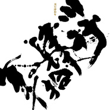

川·行肆拾年
============================

|  |  |
| :--: | :-- |
| [ 川·行肆拾年](https://emumo.xiami.com/album/1713450975) | **艺人**: [川子](../index.md) **语种**: 国语 **唱片公司**: 天博长炬 **发行时间**: 2014年11月10日 **专辑类别**: EP, 单曲 **专辑风格**: 民谣流行 Folk Pop **播放数**: 528412 **收藏数**: 383 **评论数**: 42  |

## 简介

第一次听到川子的歌声时，你在做什么？  

 

  
是与三五好友围聚在夏夜酒吧的桌前举杯豪饮谈天说地？还是在百无聊赖的上下班路上厌倦着一成不变的生活？是独坐在孤灯前回忆着那些犹在心头的往事？还是正纠结于某段看似荒诞不经的感情无法自拔？  

 

  
亦或是，这些都不是你当时正在做的事情，但那并不重要，重要的是，当你被歌声击中，那一刻的感动，是否还让你记忆犹新。  

 

  
在这个信息淆杂的时代，心灵像一粒尘埃一般被现实反复挤压，无力的散落在钢筋水泥铸造的城市森林中。平凡的你也许会感慨，世界如此之大，又有谁会在意小人物的快乐与悲哀？曾经在一片乌泱的牵强附会、粉饰太平之中，川子横空出世，出现在电视上、海报上、收音机里，他的作品成为百姓交谈的热门话题，用利剑般的歌声和口吻，直指人心，刺破绝望的藩篱、挑落虚伪的面具，说出那些你说不出口的真相，歌唱那些你渴望逃离又难以割舍的，又爱又恨的生活；他成为了你的朋友、你的兄弟、你的英雄。可渐渐的，川子淡出了公众的视野，你是否感到有些沮丧，认为生活再一次和你开了一个揪心的玩笑？你是否怀疑，那利剑般的声音或许也被生活抹去了棱角，江郎才尽？  

 

  
如今那个熟悉而又陌生的川子回来了。他还是那个他，依旧豪爽、质朴。就像在外漂泊的浪子重回故里，仗义行侠的豪客归隐江湖，少了些许锋芒，多了几分沉淀后的沧桑，他的歌声，在经历了岁月激荡、心潮澎湃的意气风发之后，山还是山，水还是水，返璞归真。犹如黑夜海上的明灯，抹不尽浩海的黑暗，但能为你照亮一方寂静的港湾，慰藉你孤独的心灵。  

 

EP收录了包括《英雄》、《长大后你还会爱我吗》、《榕树花》、《回来别走》四首歌曲，涵盖了亲情、友情、时光、生命等多个主题。
 
  

《英雄》--- 写给一位在战争中牺牲的兄弟，一个时代的烙印，一段刻骨铭心的友谊。
 

《长大后你还会爱我吗》--- 长大的烦恼，父女间的悄悄话，时间在流逝，亲情永不变。
 

《榕树花》--- 童年总是美好的，任凭周围的世界在变化，为自己留住内心那片宁静的天地。
 

《回来别走》--- 有种情感可以超越语言，有种陪伴可以超越时间。狗是人类忠诚的朋友，于人来说它是快乐，于它来说你是一生。
 
  

取名《川  行肆拾年》，既是年过四十的川子对于过往岁月的一个总结，也隐喻着川子这一路走来经历的种种悲喜交集，正如人生的一个个阶段，苦辣酸甜，串成一条生命的慢慢长路。
 

 生活还在继续，时光川流不息。“肆拾”，可以是不惑，也可以是未满之数，是留白，预示着未来还在前方，前方充满了希望。  
<strong>  
【英雄】  
</strong> 

这是川子的一首怀念之作，为纪念曾经在战场上失去生命的兄弟。
 

歌词深沉而不晦涩，悲壮中饱含着力量，仿佛在不断质问命运的无常，有坚强，有遗憾，一声声有力的呐喊与呼唤，倾注了川子一贯真诚质朴的情感。
 

从激昂到澎湃，由澎湃归于平静，仿佛一个时代的烙印重现，难忘一段刻骨铭心的兄弟情义。
 

      
新的编曲赋予了歌曲更精致丰满的听觉感受，依旧不变的，是那熟悉的“川”味儿。  
  

 
<strong>【长大后你还会爱我吗】</strong>  

你快乐时，与友人分享；你动情时，有爱人相伴；你奋斗时，无数人从你生命里打马而过；你成功时，所有人都为你而喝彩。
 

但只有亲人，无论贫穷还是富贵，健康或是疾苦，永远都在。
 

雉雏成雁，展翅高飞。
 

人终要成长，渴望去外面的世界，未来是天空海阔，亲情是最温暖的港湾。
 
  

从前的“郑钱花”如今已经渐渐长大，继承了父亲的才华，也爱弹琴唱歌。作为送给女儿姜牧言的礼物，川子分别以父亲、女儿两个视角谱写词曲。听着歌儿，就像在一个艳阳高照的寻常午后，闲坐在家院里，晒着太阳边弹边唱，聊着父女间那些动人的小事儿。
 
  

<strong>【榕树花】</strong>  
我的家在南城。
 

小的时候，天是蓝的，家家门口都有个小院子
 

我喜欢在晌午的时候站在院子中央，晒着大太阳，像是淋着阳光雨，洗了一次暖和的澡。喜欢和小伙伴儿们在胡同里玩逮人儿玩得一身汗，然后回家啃一牙儿大西瓜解渴。  

 

可自从家旁边儿不远处起了一幢幢高楼，我再也没法淋一场痛痛快快的阳光雨，玩逮人儿的小伙伴儿们也渐渐变少了。后来我知道，那是因为阳光被挡在了高楼的另一边，小伙伴儿们也一个个住进了高楼里面。      
 

  
我从来没离开过家乡，可家乡却再也找不到了。
 

我曾觉得，城市变成了一只怪兽，吞噬着美好和纯洁，为此我感到愤怒，但又很无奈。  

 

如今我也有了孩子，她的出现让我明白了应该怎样坦然面对这个不断变化的世界。
 

尽管世界已经改变，但生活仍在继续。	
 

我想对她说，孩子，童年是美好的，生活也是美好的，任凭周围的世界在变化，为自己留住内心那片宁静的天地  
  
<strong>【回来别走】  
</strong> 

它十四岁了
 

    
 

在很多人眼里，它只是一只会唱歌的狗
 

    
 

可在我心里，它是我一生的家人和朋友
 

    
 

我知道，总有一天
 

    
 

它会离开我
 

                                                    ——川子
 

 

 
 

## 曲目

## 评论

|  |  |  |  |
| :-- | :-- | :-- | :-- |
|  [虾米用户](https://emumo.xiami.com/u/37084750)   2016-12-02 16:24 赞(0) 踩(0) | 
看了相关的纪录片
 |
|  [虾米用户](https://emumo.xiami.com/u/5940907) 呼 2015-05-12 08:10 赞(0) 踩(0) | 
就回来别走还行，还不是首发，其他无亮点。为什么精灵兰花没有棚版。。。
 |
|  [虾米用户](https://emumo.xiami.com/u/1197688) 我还没想好要写什么... 2015-01-11 13:28 赞(0) 踩(0) | 
有沉淀的感觉
 |
|  [虾米用户](https://emumo.xiami.com/u/40655137) 我将灵魂献给撒旦。 2014-12-10 09:15 赞(0) 踩(0) | 
喜欢。
 |
|  [虾米用户](https://emumo.xiami.com/u/149506)  2014-12-07 22:35 赞(0) 踩(0) | 
英雄很棒啊！
 |
|  [虾米用户](https://emumo.xiami.com/u/35244555) 细嗅蔷薇 2014-11-19 23:05 赞(1) 踩(0) | 
女儿的条件很好，唱的不错，建议拿到深圳给刘洋推广一下！
 |
|  [虾米用户](https://emumo.xiami.com/u/21737804) 爱你 虾米 2014-11-18 13:42 赞(0) 踩(0) | 
英雄 非常棒
 |
|  [虾米用户](https://emumo.xiami.com/u/9118226) 万物静观皆自得 2014-11-18 00:19 赞(0) 踩(0) | 
加油！
 |
|  [虾米用户](https://emumo.xiami.com/u/6851209) 因为生命存在失望 所以我... 2014-11-16 23:39 赞(0) 踩(0) | 
……
 |
|  [虾米用户](https://emumo.xiami.com/u/39608787) 石 2014-11-15 19:53 赞(0) 踩(0) | 
心里，再一次，满满的全是爱
 |
|  [虾米用户](https://emumo.xiami.com/u/1700943)  2014-11-12 16:32 赞(0) 踩(0) | 
没什么出彩的作品，挺失望。
 |
|  [虾米用户](https://emumo.xiami.com/u/10509307)  2014-11-11 11:42 赞(0) 踩(0) | 
第一首的配器，让我想起了日本热血动漫。。。。
 |
|  [虾米用户](https://emumo.xiami.com/u/42552131)  2014-11-10 22:13 赞(0) 踩(0) | 
感觉里面有灌篮高手的旋律
 |
|  [虾米用户](https://emumo.xiami.com/u/8244559)  2014-11-10 20:50 赞(0) 踩(0) | 
******
 |
|  [虾米用户](https://emumo.xiami.com/u/42477579)  2014-11-10 18:58 赞(0) 踩(0) | 
自从你上了中国达人秀，我就觉得你完了···
 |
|  [虾米用户](https://emumo.xiami.com/u/1017492)  2014-11-10 17:09 赞(0) 踩(0) | 
换个长得好点的歌手唱直接可以上春晚了
 |
|  [虾米用户](https://emumo.xiami.com/u/401284) crape diem 2014-11-10 16:23 赞(0) 踩(0) | 
毫无亮点
 |
|  [虾米用户](https://emumo.xiami.com/u/4400366) 再也不见 2014-11-10 15:26 赞(1) 踩(0) | 
。
 |
|  [虾米用户](https://emumo.xiami.com/u/6733300) 誩 2014-11-10 15:19 赞(0) 踩(0) | 
5！
 |
|  [虾米用户](https://emumo.xiami.com/u/592216) 我还没想好要写什么... 2014-11-10 14:17 赞(0) 踩(0) | 
青梅竹马的专辑
 |
|  [虾米用户](https://emumo.xiami.com/u/4880984)  2014-11-10 13:50 赞(1) 踩(0) | 
第一次听到川子的歌声时，你在做什么？是与三五好友围聚在夏夜酒吧的桌前举杯豪饮谈天说地？还是在百无聊赖的上下班路上厌倦着一成不变的生活？是独坐在孤灯前回忆着那些犹在心头的往事？还是正纠结于某段看似荒诞不经的感情无法自拔？亦或是，这些都不是你当时正在做的事情，但那并不重要，重要的是，当你被歌声击中，那一刻的感动，是否还让你记忆犹新。在这个信息淆杂的时代，心灵像一粒尘埃一般被现实反复挤压，无力的散落在钢筋水泥铸造的城市森林中。平凡的你也许会感慨，世界如此之大，又有谁会在意小人物的快乐与悲哀？曾经在一片乌泱的牵强附会、粉饰太平之中，川子横空出世，出现在电视上、海报上、收音机里，他的作品成为百姓交
 |
|  [虾米用户](https://emumo.xiami.com/u/548916)  2014-10-24 16:56 赞(0) 踩(0) | 
这歌怎么毫无征兆的自己踩油门，突然激昂起来了。。。。别唱了，我不造。。。
 |
|  [虾米用户](https://emumo.xiami.com/u/446413)  2014-10-22 15:02 赞(0) 踩(0) | 
十三月不要他了吧
 |
|  [虾米用户](https://emumo.xiami.com/u/4400274)  2014-10-22 10:16 赞(0) 踩(0) | 
今生缘是不是他唱的？
 |
| ⇒ |  [虾米用户](https://emumo.xiami.com/u/4880984)  2014-11-10 16:51 赞(0) 踩(0) | 
是
 |
|  [虾米用户](https://emumo.xiami.com/u/820599) 愿圣光照耀你 我的敌人 2014-10-22 09:59 赞(1) 踩(0) | 
从挣钱花开始基本留下了逗逼的映像，没看歌名歌手名 乍一下觉得蛮好听的 但是发现是川子以后又觉得好感度减分了
 |
|  [虾米用户](https://emumo.xiami.com/u/1373102)  2014-10-21 09:16 赞(6) 踩(0) | 
高晓松 别以为留了胡子 就忍不出你。。。。
 |
|  [虾米用户](https://emumo.xiami.com/u/8384826) 再见，虾米，谢谢！ 2014-10-20 21:05 赞(0) 踩(0) | 
等待
 |
|  [虾米用户](https://emumo.xiami.com/u/40039077) 喜欢就是放肆，爱是克制 2014-10-20 15:53 赞(0) 踩(0) | 
一个赞字其他的没什么说的
 |
|  [虾米用户](https://emumo.xiami.com/u/1735271)  2014-10-20 15:16 赞(1) 踩(0) | 
这首歌让我很感动，让人想起了我的祖辈，父辈，向川子致敬。
 |
|  [虾米用户](https://emumo.xiami.com/u/3592527)  2014-10-20 14:59 赞(0) 踩(0) | 
带点民谣带点摇滚带点流行，因为有感而发，所以很不错。
 |
|  [虾米用户](https://emumo.xiami.com/u/168368) 原谅我渐渐少去的问候 2014-10-20 13:10 赞(0) 踩(0) | 
川子的声音再流行点就弘扬主旋律了。
 |
|  [虾米用户](https://emumo.xiami.com/u/34496172) 听音乐 2014-10-20 11:14 赞(0) 踩(0) | 
川子，支持你～！ （额。。。话说这歌听起来有种日本动漫主题曲的感觉呢。。。。  ）
 |
|  [虾米用户](https://emumo.xiami.com/u/35244555) 细嗅蔷薇 2014-10-18 13:10 赞(0) 踩(0) | 
兄弟的作品首首经典！真正的从内心发出的声音！
 |
|  [虾米用户](https://emumo.xiami.com/u/1618810) 毙 2014-10-17 13:55 赞(0) 踩(0) | 
感受下
 |
|  [虾米用户](https://emumo.xiami.com/u/1066695) 我还没想好要写什么... 2014-10-17 13:41 赞(1) 踩(0) | 
浓浓的川子味儿
 |
|  [虾米用户](https://emumo.xiami.com/u/6733300) 誩 2014-10-17 11:45 赞(0) 踩(0) | 
还ok
 |
|  [虾米用户](https://emumo.xiami.com/u/3905523) luluelza 2014-10-17 11:11 赞(0) 踩(0) | 
川子
 |
|  [虾米用户](https://emumo.xiami.com/u/8244559)  2014-10-17 10:26 赞(1) 踩(0) | 
******
 |
|  [虾米用户](https://emumo.xiami.com/u/155947) 一期一会 2014-10-17 10:17 赞(0) 踩(0) | 
在战场上失去生命的兄弟，对越自卫反击战么？
 |
|  [虾米用户](https://emumo.xiami.com/u/826671) 蔡小豆要奋斗 2014-10-17 10:15 赞(0) 踩(0) | 
好听
 |
|  [虾米用户](https://emumo.xiami.com/u/16597334) 勿忘心安，不念旧心。 2014-10-17 09:59 赞(0) 踩(0) | 
从那首郑钱花开始追这听的，喜欢你音乐的情歌
 |
