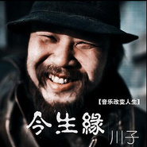

今生缘
============================

|  |  |
| :--: | :-- |
| [ 今生缘](https://emumo.xiami.com/album/320442) | **艺人**: [川子](../index.md) **语种**: 国语 **唱片公司**: 十三月唱片 **发行时间**: 2009年02月01日 **专辑类别**: 录音室专辑 **专辑风格**: 城市民谣 Urban Folk **播放数**: 5706600 **收藏数**: 1522 **评论数**: 206  |

## 简介

这是一张简单的专辑，但之所以让人觉得如此简单，是因为她太复杂了。 很难想像，如果没有音乐，川子的人生将会是什么样子。这个曾经飞扬跋扈的男人，因为朋友义气而经受八年牢狱之灾。也正是那个时候开始，音乐真正成为了他的救赎。入狱第一天，当指导员问起川子有什么特长和愿望时，他只回答了两个字：吉他。 表面上看起来，这是一段由音乐改变人生的故事。但实际上，他已经超越了故事的结构，而直接把飘零在这个世界上所有深沉的感情提练到了音符的每一处。这里面，有他对6岁女儿的爱，对亲情的感激，还有对兄弟情谊的追忆和探

## 曲目

## 评论

|  |  |  |  |
| :-- | :-- | :-- | :-- |
|  [虾米用户](https://emumo.xiami.com/u/261102355)  2018-11-20 00:07 赞(1) 踩(0) | 
伤感.就听了伤感.好听.就服你！
 |
|  [虾米用户](https://emumo.xiami.com/u/257244889)  2018-08-10 18:50 赞(0) 踩(0) | 
giao
 |
|  [虾米用户](https://emumo.xiami.com/u/2318423)  2017-10-28 00:36 赞(0) 踩(0) | 
在btv春晚上见到了川子，和他的那只可爱的爱犬嘟嘟，伴随川子十一载，感觉真的很好！
 |
|  [虾米用户](https://emumo.xiami.com/u/2285371)  2017-10-28 00:21 赞(0) 踩(0) | 
喜欢那种亲近，那种淳朴~
 |
|  [虾米用户](https://emumo.xiami.com/u/233993542) Like DJ Litt... 2016-12-20 21:20 赞(0) 踩(0) | 
加油↖(^ω^)↗
 |
|  [虾米用户](https://emumo.xiami.com/u/225948296)  2016-09-13 21:20 赞(1) 踩(0) | 
是的我也喜欢
 |
|  [虾米用户](https://emumo.xiami.com/u/225948296)  2016-09-13 21:20 赞(1) 踩(0) | 
是的我喜欢
 |
|  [虾米用户](https://emumo.xiami.com/u/140989638)  2016-05-05 06:40 赞(2) 踩(0) | 
兄弟啊让我们记住走过的路。
 |
|  [虾米用户](https://emumo.xiami.com/u/143503836)  2016-04-17 08:11 赞(1) 踩(0) | 
觉得好听
 |
|  [虾米用户](https://emumo.xiami.com/u/91769214)  2015-12-15 13:48 赞(1) 踩(0) | 
川子的歌喜欢，不需要理由
 |
|  [虾米用户](https://emumo.xiami.com/u/40736018) 我不在，谢谢。 2015-11-27 20:03 赞(1) 踩(0) | 
很感动的歌
 |
|  [虾米用户](https://emumo.xiami.com/u/43038743)  2015-11-19 11:12 赞(1) 踩(0) | 
下载
 |
|  [虾米用户](https://emumo.xiami.com/u/8070377) 爱雾瑞性维欧腐漏 2015-10-26 13:12 赞(2) 踩(0) | 
~
 |
|  [虾米用户](https://emumo.xiami.com/u/64154)  2015-08-21 23:03 赞(3) 踩(0) | 
看见推荐CD封面我以为腾格尔又出新专辑了
 |
|  [虾米用户](https://emumo.xiami.com/u/55885806)  2015-08-20 03:54 赞(0) 踩(0) | 
这就是兄弟的情义气    所以不要欺负别人因为你也有兄弟。。。。
 |
|  [虾米用户](https://emumo.xiami.com/u/42921133) 加油吧 2015-06-30 16:32 赞(0) 踩(0) | 
情感过剩，真不是个含蓄的人
 |
| ⇒ |  [虾米用户](https://emumo.xiami.com/u/8832472)  2017-03-12 01:57 赞(0) 踩(0) | 
麻木的人儿啊。
 |
|  [虾米用户](https://emumo.xiami.com/u/7915079) 快乐于心~~ 2015-06-22 20:00 赞(0) 踩(0) | 
真性情的汉子
 |
|  [虾米用户](https://emumo.xiami.com/u/7915079) 快乐于心~~ 2015-06-22 20:00 赞(0) 踩(0) | 
真性情的汉子
 |
|  [虾米用户](https://emumo.xiami.com/u/5415937)  2015-05-25 12:20 赞(0) 踩(0) | 
开首居然COPY的是《教父》的插曲。C+P。请有点新意。
 |
|  [虾米用户](https://emumo.xiami.com/u/11763865)  2015-05-01 23:04 赞(0) 踩(0) | 

 |
|  [虾米用户](https://emumo.xiami.com/u/44577674)  2014-12-31 17:30 赞(1) 踩(0) | 
有故事的男人推荐一下
 |
|  [虾米用户](https://emumo.xiami.com/u/11259253) 听靓歌 2014-12-24 15:39 赞(0) 踩(0) | 
不错。
 |
|  [虾米用户](https://emumo.xiami.com/u/14574079) 这是在哪儿~ 2014-09-16 16:41 赞(1) 踩(0) | 
高中时听的今生缘，当时是一部动画短片的配乐，短片很青春热血，这首歌也留下了深刻的印象。
 |
|  [虾米用户](https://emumo.xiami.com/u/14574079) 这是在哪儿~ 2014-09-16 16:38 赞(0) 踩(0) | 
今生缘
 |
|  [虾米用户](https://emumo.xiami.com/u/28805786)  2014-08-22 11:46 赞(0) 踩(0) | 
没有
 |
|  [虾米用户](https://emumo.xiami.com/u/35950839) 我是尹弋，不是尹戈。 2014-08-15 14:51 赞(0) 踩(0) | 
有你陪，喝醉了又何妨~
 |
|  [虾米用户](https://emumo.xiami.com/u/35244555) 细嗅蔷薇 2014-07-23 22:38 赞(0) 踩(0) | 
真性情的汉子！细腻的情感！
 |
|  [虾米用户](https://emumo.xiami.com/u/36111116)   2014-07-01 22:44 赞(0) 踩(0) | 
好听！
 |
| ⇒ |  [虾米用户](https://emumo.xiami.com/u/38950280)  2014-07-16 20:10 赞(0) 踩(0) | 
\浅…办i/|一丁\办&amp;#039;. Yiiij马 i:枓:
 |
|  [虾米用户](https://emumo.xiami.com/u/759991)  2014-06-26 12:21 赞(0) 踩(0) | 
确定这不是腾格尔，哈哈
 |
|  [虾米用户](https://emumo.xiami.com/u/9826425)  2014-05-22 11:24 赞(0) 踩(0) | 
感情真挚，发自肺腑，不失幽默，难得！
 |
|  [虾米用户](https://emumo.xiami.com/u/261902) 我就是我，是颜色不一样的... 2014-04-24 19:39 赞(0) 踩(0) | 
520
 |
|  [虾米用户](https://emumo.xiami.com/u/30477544)  2013-12-25 13:28 赞(1) 踩(0) | 
义气，够朋友。歌不错
 |
|  [虾米用户](https://emumo.xiami.com/u/30477544)  2013-12-25 13:28 赞(0) 踩(0) | 
人不错。歌好听
 |
|  [虾米用户](https://emumo.xiami.com/u/29298418)  2013-12-09 06:23 赞(0) 踩(0) | 
感觉不错
 |
|  [虾米用户](https://emumo.xiami.com/u/1769381)  2013-10-30 16:43 赞(0) 踩(0) | 
喜欢今生缘这首歌曲
 |
|  [虾米用户](https://emumo.xiami.com/u/13416124)  2013-10-13 21:38 赞(0) 踩(0) | 
喜欢川子！民瑶有力量！
 |
|  [虾米用户](https://emumo.xiami.com/u/1173512)  2013-10-02 08:58 赞(0) 踩(0) | 
喜欢
 |
|  [虾米用户](https://emumo.xiami.com/u/892722)   2013-09-06 20:43 赞(32) 踩(0) | 
哎！哎！哎 我勒个去~~~这不是腾格尔吗！同意的的举手
 |
| ⇒ |  [虾米用户](https://emumo.xiami.com/u/3604018) 当歌词触碰你心，你是否还... 2014-06-27 22:17 赞(0) 踩(0) | 
我也是这样觉得
 |
| ⇒ |  [虾米用户](https://emumo.xiami.com/u/1440103) 逆之泰然,顺之淡然 2014-08-07 04:31 赞(0) 踩(0) | 
不懂就不要在这瞎球bb!
 |
| ⇒ |  [虾米用户](https://emumo.xiami.com/u/3957792) 音乐和心也只有一步之遥 2015-05-25 10:22 赞(0) 踩(0) | 
严重同意，我以为腾格尔的新歌~哈哈
 |
| ⇒ |  [虾米用户](https://emumo.xiami.com/u/892722)   2021-01-27 00:15 赞(0) 踩(0) | 
<q><b>咳嗽的夜鸟说：</b></q>
 |
|  [虾米用户](https://emumo.xiami.com/u/20200507)  2013-08-25 10:03 赞(0) 踩(0) | 
朋友 兄弟
 |
|  [虾米用户](https://emumo.xiami.com/u/10435106) 听靓歌 2013-07-03 03:59 赞(0) 踩(0) | 
喜欢.
 |
|  [虾米用户](https://emumo.xiami.com/u/9415648) 雕刻时光 2013-06-16 10:32 赞(0) 踩(0) | 
爸爸妈妈，人模狗样
 |
|  [虾米用户](https://emumo.xiami.com/u/8337431) 以乐会友 2013-05-02 02:07 赞(0) 踩(0) | 
国产清新民谣，去天堂的孩子，708.
 |
|  [虾米用户](https://emumo.xiami.com/u/9114858) 生命不息，音乐不止 2013-03-26 08:22 赞(0) 踩(0) | 
今生缘的词曲作者，自己的声音
 |
|  [虾米用户](https://emumo.xiami.com/u/11922195)  2013-03-12 00:17 赞(0) 踩(0) | 
喜欢川子
 |
|  [虾米用户](https://emumo.xiami.com/u/12878426) 人生有多少个十年能让我虚 2013-02-04 16:25 赞(0) 踩(0) | 
感觉很真。
 |
|  [虾米用户](https://emumo.xiami.com/u/11468198) 听的不是音乐是情绪 2012-12-29 11:35 赞(0) 踩(0) | 
真感情
 |
|  [虾米用户](https://emumo.xiami.com/u/11778616)  2012-12-03 23:39 赞(0) 踩(0) | 
敢吐真话的歌手
 |
|  [虾米用户](https://emumo.xiami.com/u/11630894)  2012-11-24 10:08 赞(0) 踩(0) | 
就是喜欢
 |
|  [虾米用户](https://emumo.xiami.com/u/11238432)  2012-10-30 10:30 赞(0) 踩(0) | 
一个用心唱歌的人，一个能感动我的声音。
 |
|  [虾米用户](https://emumo.xiami.com/u/11224959)  2012-10-27 14:19 赞(0) 踩(0) | 
喜欢
 |
|  [虾米用户](https://emumo.xiami.com/u/834091) 每个人都是歌唱家 2012-09-18 14:59 赞(0) 踩(0) | 
嗯
 |
|  [虾米用户](https://emumo.xiami.com/u/10562486)  2012-09-09 22:14 赞(0) 踩(0) | 
好听
 |
|  [虾米用户](https://emumo.xiami.com/u/10357256)  2012-08-25 08:52 赞(0) 踩(0) | 
喜欢
 |
|  [虾米用户](https://emumo.xiami.com/u/10329585) 我想你 2012-08-23 06:36 赞(0) 踩(0) | 
我喜欢川子！
 |
|  [虾米用户](https://emumo.xiami.com/u/10307766) 随便听 随便看 2012-08-21 21:51 赞(0) 踩(0) | 
喜欢有故事的人
 |
|  [虾米用户](https://emumo.xiami.com/u/8672935)  2012-07-29 18:47 赞(0) 踩(0) | 
简洁悠扬~
 |
|  [虾米用户](https://emumo.xiami.com/u/9861699)  2012-07-19 16:43 赞(0) 踩(0) | 
歌的确不错
 |
|  [虾米用户](https://emumo.xiami.com/u/1026520)  2012-07-09 02:27 赞(0) 踩(0) | 
谢谢您，川子！7月8号在长沙三一街区度过了一个美妙的夜，终于让我见到了久违的您。您的沧桑、您的歌声、您的平易近人让人沉醉，有幸得到您的签名，更在好心人的帮助下有幸与您合影。谢谢您，川子！您是我人生的榜样。我会为了自己的生活、理想而不懈奋斗。感谢！！！
 |
|  [虾米用户](https://emumo.xiami.com/u/6956904) 定西 2012-07-08 19:55 赞(0) 踩(0) | 
谢谢了 川子
 |
|  [虾米用户](https://emumo.xiami.com/u/6956904) 定西 2012-07-08 19:55 赞(0) 踩(0) | 
谢谢了 川子
 |
|  [虾米用户](https://emumo.xiami.com/u/6956904) 定西 2012-07-08 19:55 赞(0) 踩(0) | 
谢谢了 川子
 |
|  [虾米用户](https://emumo.xiami.com/u/9678342)  2012-07-03 17:12 赞(0) 踩(0) | 
朋友~
 |
|  [虾米用户](https://emumo.xiami.com/u/6487932) 暂无签名~ 2012-06-10 13:38 赞(0) 踩(0) | 
嘿嘿~喝呀
 |
|  [虾米用户](https://emumo.xiami.com/u/8884137)  2012-05-10 13:37 赞(0) 踩(0) | 
不错的歌
 |
|  [虾米用户](https://emumo.xiami.com/u/8844663)  2012-04-14 21:25 赞(0) 踩(0) | 
现实生活心声的表达
 |
|  [虾米用户](https://emumo.xiami.com/u/8001092)  2012-04-07 16:04 赞(0) 踩(0) | 
有内，有外
 |
|  [虾米用户](https://emumo.xiami.com/u/8001092)  2012-04-07 16:04 赞(0) 踩(0) | 
有内，有外
 |
|  [虾米用户](https://emumo.xiami.com/u/3447311)  2012-03-15 12:37 赞(0) 踩(0) | 
今生有缘？
 |
|  [虾米用户](https://emumo.xiami.com/u/75487)  2012-03-14 16:23 赞(0) 踩(0) | 
生活里的东西
 |
|  [虾米用户](https://emumo.xiami.com/u/8047258)  2012-03-07 16:36 赞(0) 踩(0) | 
风雨过后见彩虹
 |
|  [虾米用户](https://emumo.xiami.com/u/3249760) 听听歌，写写诗！ 2012-03-05 13:59 赞(0) 踩(0) | 
真挚的情感流露，经历过沧桑的人才能看透。
 |
|  [虾米用户](https://emumo.xiami.com/u/6871629)  2012-03-05 00:53 赞(0) 踩(0) | 
如此简单的专辑，告诉你的却是这样不简单的缘命。
 |
|  [虾米用户](https://emumo.xiami.com/u/6871629)  2012-03-05 00:52 赞(0) 踩(0) | 
等不到的，缘份而已。
 |
|  [虾米用户](https://emumo.xiami.com/u/8186730) 爱死你了~ 2012-03-02 22:03 赞(0) 踩(0) | 
纯粹的音乐 纯粹的川子 让我在这个浮躁的年代可以依靠的一片音乐净土 爱你 川子
 |
|  [虾米用户](https://emumo.xiami.com/u/7755011) 我还没想好要写什么... 2012-02-27 09:39 赞(0) 踩(0) | 
今生缘在那里？
 |
|  [虾米用户](https://emumo.xiami.com/u/3066528)  2012-02-04 03:13 赞(0) 踩(0) | 
第一次听《今生缘》就觉得有点农民，或是用去做《霍元甲》或《陈真》的主题曲，后来居然有两个农民工兄弟真的唱起这首歌了。
 |
|  [虾米用户](https://emumo.xiami.com/u/7822348)  2012-01-28 14:50 赞(0) 踩(0) | 
心灵
 |
|  [虾米用户](https://emumo.xiami.com/u/7622374)  2012-01-11 10:45 赞(0) 踩(0) | 
一个真男人
 |
|  [虾米用户](https://emumo.xiami.com/u/3441435)  2011-12-28 19:11 赞(0) 踩(0) | 
今生缘-川子
 |
|  [虾米用户](https://emumo.xiami.com/u/6015887)  2011-12-24 10:21 赞(0) 踩(0) | 
从旭日阳刚的翻唱知道这首歌，各有特点，越听越有味道。
 |
|  [虾米用户](https://emumo.xiami.com/u/6723379)  2011-12-20 03:51 赞(0) 踩(0) | 
这个曾经飞扬跋扈的男人，因为朋友义气而经受八年牢狱之灾。也正是那个时候开始，音乐真正成为了他的救赎。 表面上看起来，这是一段由音乐改变人生的故事。但实际上，他已经超越了故事的结构，而直接把飘零在这个世界上所有深沉的感情提练到了音符的每一处。
 |
|  [虾米用户](https://emumo.xiami.com/u/2214678)  2011-12-19 14:47 赞(0) 踩(0) | 
喜欢他的音乐带给人特别的感觉！
 |
|  [虾米用户](https://emumo.xiami.com/u/7298003)  2011-12-18 16:55 赞(0) 踩(0) | 
朋友
 |
|  [虾米用户](https://emumo.xiami.com/u/7112818)  2011-12-16 15:29 赞(0) 踩(0) | 
兄弟岁月的回忆
 |
|  [虾米用户](https://emumo.xiami.com/u/1018) 口哨魔法師 2011-12-01 22:50 赞(0) 踩(0) | 
我们今生永远是兄弟我们今生有缘在路上只要我们彼此永不忘朋友啊 让我们一起牢牢铭记呀别在乎那一些忧和伤我们今生注定是沧桑哭着来要笑着走过呀我们今生就像梦一场有你陪喝醉了又何妨朋友啊 让我们一起牢牢铭记呀凡尘过后终了无牵挂
 |
|  [虾米用户](https://emumo.xiami.com/u/6997525)  2011-11-28 08:39 赞(0) 踩(0) | 
艾斯
 |
|  [虾米用户](https://emumo.xiami.com/u/6469716)  2011-11-26 13:39 赞(0) 踩(0) | 
一个男人
 |
|  [虾米用户](https://emumo.xiami.com/u/6926665) 怀着对这个世界的好奇，与... 2011-11-25 13:45 赞(0) 踩(0) | 
表面上看起来，这是一段由音乐改变人生的故事。但实际上，他已经超越了故事的结构，而直接把飘零在这个世界上所有深沉的感情提练到了音符的每一处。这里面，有他对6岁女儿的爱，对亲情的感激，还有对兄弟情谊的追忆
 |
|  [虾米用户](https://emumo.xiami.com/u/913551)  2011-11-15 15:41 赞(0) 踩(0) | 
纯真，自由，内心的声音
 |
|  [虾米用户](https://emumo.xiami.com/u/2628477)  2011-11-12 18:46 赞(0) 踩(0) | 
真他妈不错！！纯爷们儿
 |
|  [虾米用户](https://emumo.xiami.com/u/6131182)  2011-11-11 23:40 赞(0) 踩(0) | 
我的年纪，我的最爱！
 |
|  [虾米用户](https://emumo.xiami.com/u/5455583)  2011-11-06 21:04 赞(0) 踩(0) | 
朋友啊让我们一起牢牢铭记呀凡尘过后终了无牵挂。。。。
 |
|  [虾米用户](https://emumo.xiami.com/u/6215042) 欢迎关注同名音乐公众号 2011-11-02 09:16 赞(0) 踩(0) | 
mv感人
 |
|  [虾米用户](https://emumo.xiami.com/u/6533725)  2011-10-31 22:39 赞(0) 踩(0) | 
喜欢
 |
|  [虾米用户](https://emumo.xiami.com/u/6533725)  2011-10-31 22:38 赞(0) 踩(0) | 
这哥们是用心在歌唱.
 |
|  [虾米用户](https://emumo.xiami.com/u/6361342)  2011-10-21 16:42 赞(0) 踩(0) | 
有味道很不错的一首歌超喜欢
 |
|  [虾米用户](https://emumo.xiami.com/u/5881245) 戏剧性的生活和有故事的歌 2011-10-20 23:28 赞(0) 踩(0) | 
感人！
 |
|  [虾米用户](https://emumo.xiami.com/u/6348078)  2011-10-20 18:44 赞(0) 踩(0) | 
是一首男人的歌曲
 |
|  [虾米用户](https://emumo.xiami.com/u/3546609)  2011-10-14 22:50 赞(0) 踩(0) | 
就是喜欢
 |
|  [虾米用户](https://emumo.xiami.com/u/5931298)  2011-10-04 22:48 赞(0) 踩(0) | 
淋漓
 |
|  [虾米用户](https://emumo.xiami.com/u/6062834)  2011-10-03 10:47 赞(0) 踩(0) | 
真正的歌
 |
|  [虾米用户](https://emumo.xiami.com/u/3795471)  2011-09-28 20:54 赞(0) 踩(0) | 
用心在唱!
 |
|  [虾米用户](https://emumo.xiami.com/u/3539456) 我喜欢鲜肉！！！！ 2011-09-25 12:31 赞(0) 踩(0) | 
这声音配上这歌词   绝了
 |
|  [虾米用户](https://emumo.xiami.com/u/1987549)  2011-09-21 12:53 赞(0) 踩(0) | 
朋友情意长
 |
|  [虾米用户](https://emumo.xiami.com/u/4258920)  2011-09-14 20:16 赞(0) 踩(0) | 
这才是老大
 |
|  [虾米用户](https://emumo.xiami.com/u/5437168) 我还没想好要写什么... 2011-08-18 08:50 赞(0) 踩(0) | 
今生缘 让我想起了我的兄弟们 祝福你们
 |
|  [虾米用户](https://emumo.xiami.com/u/5442618)  2011-08-16 12:36 赞(0) 踩(0) | 
好听
 |
|  [虾米用户](https://emumo.xiami.com/u/5084419)  2011-08-01 07:35 赞(0) 踩(0) | 
听兄弟那首歌曲，想到了赵子允
 |
|  [虾米用户](https://emumo.xiami.com/u/2673157)  2011-07-28 22:01 赞(0) 踩(0) | 
悠闲
 |
|  [虾米用户](https://emumo.xiami.com/u/4959274)  2011-07-23 12:30 赞(0) 踩(0) | 
川子
 |
|  [虾米用户](https://emumo.xiami.com/u/4959568)  2011-07-21 21:22 赞(0) 踩(0) | 
······
 |
|  [虾米用户](https://emumo.xiami.com/u/3255139)  2011-07-17 01:11 赞(0) 踩(0) | 
感觉
 |
|  [虾米用户](https://emumo.xiami.com/u/4460587)  2011-07-16 17:32 赞(0) 踩(0) | 
我觉得这样的歌手会死掉的   很多朋友是不怀好意的   我知道我这样说  会遭来很多骂声  那些真以为是朋友的人 真正明白朋友的意义吗
 |
|  [虾米用户](https://emumo.xiami.com/u/1821217) 影像，时间，香料 2011-07-06 11:36 赞(0) 踩(0) | 
宝贝 结婚吧
 |
|  [虾米用户](https://emumo.xiami.com/u/4364282)   2011-06-22 21:17 赞(0) 踩(0) | 
爷们
 |
|  [虾米用户](https://emumo.xiami.com/u/4319529)  2011-06-17 16:17 赞(0) 踩(0) | 
收集所有川子的歌
 |
|  [虾米用户](https://emumo.xiami.com/u/3520458)  2011-06-12 12:55 赞(0) 踩(0) | 
平民化，高亢，清澈的声音
 |
|  [虾米用户](https://emumo.xiami.com/u/4230511)  2011-06-09 15:32 赞(0) 踩(0) | 
喜欢这人，这歌。朴实敢说。
 |
|  [虾米用户](https://emumo.xiami.com/u/133866)  2011-06-03 21:44 赞(0) 踩(0) | 
我们今生兄弟情谊长！
 |
|  [虾米用户](https://emumo.xiami.com/u/1475178) 一枚ie6都能兼容的男人 2011-06-03 02:56 赞(0) 踩(0) | 
能和 @正结 @李洪涛_Lee @吕建明jimmylui 成为师兄弟 那是相当的荣幸。所谓：今生有缘，相见恨晚。不禁让我想起了川子的一首歌 《今生缘》<a href="http://t.cn/7yVWV" target="_blank" rel="nofollow noreferrer noopener">http://t.cn/7yVWV</a>
 |
|  [虾米用户](https://emumo.xiami.com/u/1855821)  2011-05-28 19:39 赞(0) 踩(0) | 
朋友啊让我们一起牢牢铭记呀凡尘过后终了无牵挂。。。。
 |
|  [虾米用户](https://emumo.xiami.com/u/3621762)  2011-05-26 00:09 赞(0) 踩(0) | 
不错的歌手，
 |
|  [虾米用户](https://emumo.xiami.com/u/255718)  2011-05-11 15:21 赞(0) 踩(0) | 
真性情
 |
|  [虾米用户](https://emumo.xiami.com/u/2740651)  2011-05-10 02:21 赞(0) 踩(0) | 
很喜欢。
 |
|  [虾米用户](https://emumo.xiami.com/u/3198230)  2011-05-04 11:30 赞(0) 踩(0) | 
不错，用心在唱！！
 |
|  [虾米用户](https://emumo.xiami.com/u/3722596)  2011-04-24 14:36 赞(0) 踩(0) | 
沧桑感
 |
|  [虾米用户](https://emumo.xiami.com/u/3722042)  2011-04-24 13:59 赞(0) 踩(0) | 
真诚
 |
|  [虾米用户](https://emumo.xiami.com/u/1008284) 我还没想好要写什么... 2011-04-20 13:10 赞(0) 踩(0) | 
为什么？如果问我为什么我只会说我发现大哥太晚，原谅我的无知
 |
|  [虾米用户](https://emumo.xiami.com/u/1008284) 我还没想好要写什么... 2011-04-20 13:04 赞(0) 踩(0) | 
我恨我，我愚昧且无知，且自以为是，为什么今天才知道你！大哥加油！！！
 |
|  [虾米用户](https://emumo.xiami.com/u/3670253)  2011-04-20 08:47 赞(0) 踩(0) | 
顶顶
 |
|  [虾米用户](https://emumo.xiami.com/u/1735834)  2011-04-19 09:17 赞(0) 踩(0) | 
动人
 |
|  [虾米用户](https://emumo.xiami.com/u/1735834)  2011-04-19 09:16 赞(0) 踩(0) | 
太好听了
 |
|  [虾米用户](https://emumo.xiami.com/u/1646919)  2011-04-08 00:17 赞(0) 踩(0) | 
真汉子，真爷们，唱出了心中所想
 |
|  [虾米用户](https://emumo.xiami.com/u/3435437)  2011-04-01 12:53 赞(0) 踩(0) | 
现实，顺口，排愤。
 |
|  [虾米用户](https://emumo.xiami.com/u/2971499)  2011-03-20 21:37 赞(0) 踩(0) | 
简单 温暖
 |
|  [虾米用户](https://emumo.xiami.com/u/219634)  2011-03-14 09:26 赞(0) 踩(0) | 
民谣
 |
|  [虾米用户](https://emumo.xiami.com/u/750409)  2011-03-12 03:29 赞(0) 踩(0) | 
汉子
 |
|  [虾米用户](https://emumo.xiami.com/u/2369674) 暂无签名~ 2011-03-10 20:59 赞(0) 踩(0) | 
真感情，真爷们。
 |
|  [虾米用户](https://emumo.xiami.com/u/3088794)  2011-03-10 20:48 赞(0) 踩(0) | 
真挚
 |
|  [虾米用户](https://emumo.xiami.com/u/3129884) 一别两宽，各生欢喜 2011-03-10 13:48 赞(0) 踩(0) | 
本真，朴实
 |
|  [虾米用户](https://emumo.xiami.com/u/3146600) 虾米音乐，再见！ 2011-03-10 09:48 赞(0) 踩(0) | 
听着有感觉，先收藏了慢慢品。
 |
|  [虾米用户](https://emumo.xiami.com/u/3098735)  2011-03-06 15:30 赞(0) 踩(0) | 
喜欢这男人！
 |
|  [虾米用户](https://emumo.xiami.com/u/2530376)  2011-03-04 13:24 赞(0) 踩(0) | 
11
 |
|  [虾米用户](https://emumo.xiami.com/u/3051879)  2011-03-03 08:32 赞(0) 踩(0) | 
sadsadasdsadasd
 |
|  [虾米用户](https://emumo.xiami.com/u/2223714)  2011-02-27 17:53 赞(0) 踩(0) | 
有味道,赞一个
 |
|  [虾米用户](https://emumo.xiami.com/u/2988146)  2011-02-26 15:59 赞(0) 踩(0) | 
中！
 |
|  [虾米用户](https://emumo.xiami.com/u/2988146)  2011-02-26 15:59 赞(0) 踩(0) | 
中！
 |
|  [虾米用户](https://emumo.xiami.com/u/1625910)  2011-02-24 17:08 赞(0) 踩(0) | 
貝貝帑嫌朋
 |
|  [虾米用户](https://emumo.xiami.com/u/702588)  2011-02-23 17:57 赞(0) 踩(0) | 
今生缘 川子
 |
|  [虾米用户](https://emumo.xiami.com/u/997508)  2011-02-21 21:49 赞(0) 踩(0) | 
还行
 |
|  [虾米用户](https://emumo.xiami.com/u/1348901)  2011-02-19 15:10 赞(0) 踩(0) | 
好哇
 |
|  [虾米用户](https://emumo.xiami.com/u/2521723)  2011-02-19 14:13 赞(0) 踩(0) | 
这是用心写用心唱的歌，唱者动情，听者动容。真汉子真性情！
 |
|  [虾米用户](https://emumo.xiami.com/u/2872870)  2011-02-17 11:28 赞(0) 踩(0) | 
有感动到了
 |
|  [虾米用户](https://emumo.xiami.com/u/1342581)  2011-02-16 09:05 赞(0) 踩(0) | 
川子...朋友啊 让我们一切牢牢铭记...
 |
|  [虾米用户](https://emumo.xiami.com/u/1538587)  2011-02-14 16:01 赞(0) 踩(0) | 
hao
 |
|  [虾米用户](https://emumo.xiami.com/u/114018)  2011-02-14 16:00 赞(0) 踩(0) | 
喜欢
 |
|  [虾米用户](https://emumo.xiami.com/u/1901518)  2011-02-14 15:19 赞(1) 踩(0) | 
很真实，只有丰富的人生经历才能写出如此真实的歌曲
 |
|  [虾米用户](https://emumo.xiami.com/u/1457690)  2011-02-13 14:47 赞(0) 踩(0) | 
有一定情商的人都会爱听
 |
|  [虾米用户](https://emumo.xiami.com/u/2444638)  2011-02-12 23:51 赞(0) 踩(0) | 
很久没有听到这样爽朗不矫情的歌曲！
 |
|  [虾米用户](https://emumo.xiami.com/u/2741338)  2011-02-10 10:52 赞(0) 踩(0) | 
fsafa
 |
|  [虾米用户](https://emumo.xiami.com/u/2042271) 只要我们住在对方心里，死... 2011-02-08 12:25 赞(0) 踩(0) | 
这张专辑里的几首歌都像给他写的，次次听，次次哭。
 |
|  [虾米用户](https://emumo.xiami.com/u/2735420)  2011-02-05 13:22 赞(0) 踩(0) | 
简单
 |
|  [虾米用户](https://emumo.xiami.com/u/164849)  2011-02-05 00:15 赞(0) 踩(0) | 
他应该会成为我未来主要听的对象
 |
|  [虾米用户](https://emumo.xiami.com/u/2066364)  2011-02-03 08:27 赞(0) 踩(0) | 
民谣歌手里最靠谱的一个！
 |
|  [虾米用户](https://emumo.xiami.com/u/2642057)  2011-02-01 12:50 赞(0) 踩(0) | 
内心的声音！
 |
|  [虾米用户](https://emumo.xiami.com/u/1258061)  2011-01-31 21:07 赞(0) 踩(0) | 
真诚的歌声！
 |
|  [虾米用户](https://emumo.xiami.com/u/1925228)  2011-01-27 23:36 赞(0) 踩(0) | 
no
 |
|  [虾米用户](https://emumo.xiami.com/u/34307)  2011-01-27 10:20 赞(0) 踩(0) | 
川兄～狗狗还好吗？
 |
|  [虾米用户](https://emumo.xiami.com/u/1337843)  2011-01-26 17:16 赞(0) 踩(0) | 
草根歌手，还不错
 |
|  [虾米用户](https://emumo.xiami.com/u/2511296)  2011-01-16 11:51 赞(0) 踩(0) | 
...
 |
|  [虾米用户](https://emumo.xiami.com/u/763533)  2011-01-15 13:54 赞(0) 踩(0) | 
兄弟。。。。。。。。。。喜欢
 |
|  [虾米用户](https://emumo.xiami.com/u/927877)  2011-01-06 23:43 赞(0) 踩(0) | 
喜欢这种氛围
 |
|  [虾米用户](https://emumo.xiami.com/u/583061)  2011-01-03 13:22 赞(0) 踩(0) | 
真不错哦，肛肛膀胧你们遇到最大劲敌了！
 |
|  [虾米用户](https://emumo.xiami.com/u/1358111)  2010-12-29 11:35 赞(0) 踩(0) | 
歌曲人模狗样让我知道了川子。泪流满面，感动。。。
 |
|  [虾米用户](https://emumo.xiami.com/u/220719) 自知不自見，自愛不自貴 2010-10-20 09:34 赞(0) 踩(0) | 
鐘 這首歌我有，但是發布上來，好像搜狗上搜索川子可以搜得到，只是名字不是 鐘 ，是一對亂七八糟的數字或者字母
 |
|  [虾米用户](https://emumo.xiami.com/u/963243)  2010-10-09 11:59 赞(0) 踩(0) | 
求  川子的  钟！！
 |
|  [虾米用户](https://emumo.xiami.com/u/1027211) 凝视人生聆听无常感悟万物 2010-10-03 02:14 赞(0) 踩(0) | 
其实川子音质和音乐风格都很突出.希望他会继续创作,不要走向说唱的风格.郑钱花很不错,但幸福里就太想李宗盛了. 但他的音质好过前者, 音乐能继续突破就好了!
 |
|  [虾米用户](https://emumo.xiami.com/u/906956)  2010-09-18 14:33 赞(0) 踩(0) | 
唉！音乐还是内地的好啊！
 |
|  [虾米用户](https://emumo.xiami.com/u/1447112)  2010-09-05 06:23 赞(0) 踩(0) | 
好好下几个，谢谢楼主
 |
|  [虾米用户](https://emumo.xiami.com/u/1447112)  2010-09-05 06:23 赞(0) 踩(0) | 
感谢楼主，喜欢
 |
|  [虾米用户](https://emumo.xiami.com/u/1027951)  2010-09-04 22:45 赞(0) 踩(0) | 
希望大家仔细听听，很温柔的歌呢，干净的歌词，用了较粗俗的唱法，却有一种沧桑扑面而来，让人泪流满面，心里酸酸暖暖的，本月主要推荐！！！
 |
|  [虾米用户](https://emumo.xiami.com/u/1370051)  2010-08-24 00:14 赞(0) 踩(0) | 
哪能找到无损格式的么？
 |
|  [虾米用户](https://emumo.xiami.com/u/1281753)  2010-08-08 20:46 赞(0) 踩(0) | 
郑钱花····什么时候能放上来啊·
 |
| ⇒ |  [虾米用户](https://emumo.xiami.com/u/1333032) 岁月是首歌~~ 2010-09-08 12:47 赞(0) 踩(0) | 
急切地期待啊。。。
 |
|  [虾米用户](https://emumo.xiami.com/u/777225)  2010-08-07 15:16 赞(0) 踩(0) | 
郑钱花我也有，但不知道怎么放上来
 |
|  [虾米用户](https://emumo.xiami.com/u/854568) Being a bett... 2010-08-01 03:31 赞(0) 踩(0) | 
郑钱花。。。。 速度放上来吧
 |
|  [虾米用户](https://emumo.xiami.com/u/696559)  2010-07-24 01:24 赞(0) 踩(0) | 
弄了川子的&amp;quot;郑钱花&amp;quot;, 不知道怎么传上去, 有喜欢的留言吧
 |
| ⇒ |  [虾米用户](https://emumo.xiami.com/u/889159)  2010-09-01 22:47 赞(0) 踩(0) | 
在这儿居然也可以见到胖叔，哈哈
 |
| ⇒ |  [虾米用户](https://emumo.xiami.com/u/696559)  2010-09-06 22:50 赞(0) 踩(0) | 
<q><b>imaix说：</b></q>
 |
|  [虾米用户](https://emumo.xiami.com/u/1075947)  2010-07-06 16:39 赞(0) 踩(0) | 
看了川歌在《那一夜》的现场，能被沧桑感动！
 |
|  [虾米用户](https://emumo.xiami.com/u/960086)  2010-06-03 09:03 赞(0) 踩(0) | 
很感人啊
 |
|  [虾米用户](https://emumo.xiami.com/u/654900)  2010-05-03 11:32 赞(0) 踩(0) | 
真是用情在唱
 |
|  [虾米用户](https://emumo.xiami.com/u/654900)  2010-05-03 11:32 赞(0) 踩(0) | 
唱得好
 |
|  [虾米用户](https://emumo.xiami.com/u/480563)  2010-02-11 10:44 赞(0) 踩(0) | 
用情唱歌,用心感受!
 |
|  [虾米用户](https://emumo.xiami.com/u/18298) 暂无签名~ 2010-01-15 20:55 赞(0) 踩(0) | 
没有其他专辑了吗？？？？？
 |
|  [虾米用户](https://emumo.xiami.com/u/562944)  2010-01-12 20:21 赞(0) 踩(0) | 
有些音乐拿来听，有些音乐拿来唱，有些音乐拿来想，至于剩余的只能拿来珍藏。为什么我不怎么听川子，哥们我不至于感动的一个人哭吧。
 |
|  [虾米用户](https://emumo.xiami.com/u/522205) 一切很美，音為有你﹏ 2010-01-12 15:42 赞(0) 踩(0) | 
又一个性情中人 虽然坐过牢 但那是义气用事 其实这人挺简单挺单纯的 音乐也是如此 朴素而理想
 |
|  [虾米用户](https://emumo.xiami.com/u/588887)  2010-01-04 22:35 赞(0) 踩(0) | 
在《天天向上》节目有幸看到川子唱歌。非常棒
 |
|  [虾米用户](https://emumo.xiami.com/u/164413)   2009-06-03 08:40 赞(1) 踩(0) | 
怎样的勇气，怎样的自省才能带来这样温厚，真诚的声音，不管内心是平和还是跋扈，他在不正常的环境里做着正常的事，喜欢的事，这份心，这份努力，足够打动人了，谁还会在乎过去呢。
 |
|  [虾米用户](https://emumo.xiami.com/u/48021)  2009-04-11 19:26 赞(1) 踩(0) | 
年少轻狂打架坐牢9年，成就音乐，还有一首“钟”，是那时创作的，很能打动人，吉他弹奏也是很棒。说话时虽有点结巴，但人非常单纯，听听他的音乐就能体会他的内心。
 |
