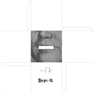

新的一年
============================

|  |  |
| :--: | :-- |
| [ 新的一年](https://emumo.xiami.com/album/417878) | **艺人**: [川子](../index.md) **语种**: 国语 **唱片公司**: 十三月唱片 **发行时间**: 2010年12月29日 **专辑类别**: EP, 单曲 **专辑风格**: 城市民谣 Urban Folk **播放数**: 119321 **收藏数**: 321 **评论数**: 99  |

## 简介

&nbsp;川子《新的一年》 

&nbsp;&nbsp; 词：易畅，曲/唱：川子 &nbsp;编曲：柳棽
 

&nbsp;
 

新的一年马上就要来了
 

未来的一切到底会怎样
 

不知房价明天是跌还是涨
 

我的收入能否打动她的老娘
 

&nbsp;
 

北京的蜗居困住多少梦想
 

上海的灵魂是否已到天堂
 

朋友来吧许下虔诚的愿望
 

谁叫咱投胎时没有碰到李刚
 

&nbsp;
 

希望城管温柔像喜羊羊
 

希望官员廉洁少写上床
 

希望国足能争气一点发挥失常
 

希望刘翔冲刺快过物价的飞涨
 

&nbsp;
 

希望我们有一个伟大的祖国
 

伟大到没有人愿意背井离乡
 

我们一起齐心协力创造幸福
 

好好活着就是最牛逼的信仰
 

&nbsp;
 

希望上网方便不用翻墙
 

希望拆迁高兴不用打仗
 

希望女孩能矜持一点挡好中央
 

希望韩寒继续打好革命的手枪
 

&nbsp;

## 曲目

## 评论

|  |  |  |  |
| :-- | :-- | :-- | :-- |
|  [虾米用户](https://emumo.xiami.com/u/19614350) 音乐是我的第二生命 2015-01-04 23:25 赞(0) 踩(0) | 
很遗憾今天才听到
 |
|  [虾米用户](https://emumo.xiami.com/u/35950839) 我是尹弋，不是尹戈。 2014-08-15 15:12 赞(0) 踩(0) | 
希望韩寒能打好革命的枪~这句是什么想法呢~喜欢韩寒~喜欢川子~喜欢的一切人都在一起~
 |
|  [虾米用户](https://emumo.xiami.com/u/34397917) 你妄想脱离低级趣味 2014-05-16 13:01 赞(0) 踩(0) | 
是钟立风推荐的
 |
|  [虾米用户](https://emumo.xiami.com/u/34397917) 你妄想脱离低级趣味 2014-05-16 13:01 赞(0) 踩(0) | 
还没听，也是来看评论的
 |
|  [虾米用户](https://emumo.xiami.com/u/1609946) 一即一切 2014-03-10 09:59 赞(0) 踩(0) | 
心 境不二
 |
|  [虾米用户](https://emumo.xiami.com/u/1173512)  2013-10-02 08:57 赞(0) 踩(0) | 
喜欢
 |
|  [虾米用户](https://emumo.xiami.com/u/102311)  2013-09-21 09:26 赞(0) 踩(0) | 
这是叫蓝草乡村么？
 |
|  [虾米用户](https://emumo.xiami.com/u/8337431) 以乐会友 2013-05-02 02:29 赞(0) 踩(0) | 
有点乱，但颇有老美老将风范。
 |
|  [虾米用户](https://emumo.xiami.com/u/2863542) 目前不搞音乐，只被音乐搞 2013-01-14 15:34 赞(0) 踩(0) | 
这才是活得相当好的国人
 |
|  [虾米用户](https://emumo.xiami.com/u/2938021)  2012-06-02 11:10 赞(0) 踩(0) | 
绝对牛逼
 |
|  [虾米用户](https://emumo.xiami.com/u/2938021)  2012-06-02 11:09 赞(0) 踩(0) | 
好好活着就是最牛逼的信仰
 |
|  [虾米用户](https://emumo.xiami.com/u/473976)  2012-03-16 18:03 赞(0) 踩(0) | 
好好活着就是最牛逼的信仰
 |
|  [虾米用户](https://emumo.xiami.com/u/473976)  2012-03-16 18:03 赞(0) 踩(0) | 
好好活着就是最牛逼的信仰
 |
|  [虾米用户](https://emumo.xiami.com/u/7294915)  2012-02-11 18:45 赞(0) 踩(0) | 
很贴切
 |
|  [虾米用户](https://emumo.xiami.com/u/6598333)  2012-01-14 12:32 赞(0) 踩(0) | 
好的
 |
|  [虾米用户](https://emumo.xiami.com/u/5855133)  2012-01-01 13:07 赞(0) 踩(0) | 
搞笑，听了之后能回忆起一年的经历和往事
 |
|  [虾米用户](https://emumo.xiami.com/u/3847194)  2011-12-31 17:23 赞(1) 踩(0) | 
又一年了，歌词仍然具有现实意义，可以一字不改用在今年。。。。。。
 |
|  [虾米用户](https://emumo.xiami.com/u/7103457)  2011-12-05 00:10 赞(0) 踩(0) | 
好听的歌
 |
|  [虾米用户](https://emumo.xiami.com/u/3198270) 18年的首都机场 记忆里... 2011-12-02 09:31 赞(0) 踩(0) | 
好好活着吧先
 |
|  [虾米用户](https://emumo.xiami.com/u/6039570) 除了许巍，我也听听别的… 2011-11-17 23:29 赞(0) 踩(0) | 
川子找的这个写词的不错
 |
|  [虾米用户](https://emumo.xiami.com/u/6098720)  2011-10-05 12:43 赞(0) 踩(0) | 
牛逼！！
 |
|  [虾米用户](https://emumo.xiami.com/u/201598) so what~ 2011-08-19 11:14 赞(0) 踩(0) | 
很喜欢歌词那蕴含的调侃的味道~
 |
|  [虾米用户](https://emumo.xiami.com/u/2627760)  2011-08-15 21:10 赞(0) 踩(0) | 
感觉非常贴近我的生活
 |
|  [虾米用户](https://emumo.xiami.com/u/5061835)  2011-08-05 17:23 赞(0) 踩(0) | 
好好活着，就是最NB的信仰！！
 |
|  [虾米用户](https://emumo.xiami.com/u/3255139)  2011-07-17 01:12 赞(0) 踩(0) | 
感觉
 |
|  [虾米用户](https://emumo.xiami.com/u/3982320)  2011-07-15 16:51 赞(0) 踩(0) | 
好好活着。。。
 |
|  [虾米用户](https://emumo.xiami.com/u/3879734)  2011-07-08 14:02 赞(0) 踩(0) | 
很棒~~好好活着@。@
 |
|  [虾米用户](https://emumo.xiami.com/u/298791)  2011-06-15 14:13 赞(0) 踩(0) | 
俺喜欢这个歌词，太好笑了
 |
|  [虾米用户](https://emumo.xiami.com/u/3810232)  2011-05-29 01:02 赞(0) 踩(0) | 
s
 |
|  [虾米用户](https://emumo.xiami.com/u/3946540)  2011-05-17 12:36 赞(0) 踩(0) | 
听同学说的这首歌，一直没听，听听挺有感觉的。
 |
|  [虾米用户](https://emumo.xiami.com/u/3902359)  2011-05-11 14:04 赞(0) 踩(0) | 
听着真带感啊～～
 |
|  [虾米用户](https://emumo.xiami.com/u/2092701)  2011-04-24 06:06 赞(0) 踩(0) | 
好好活着，好好听着，好好看着，好好干着，好好想着，好好X着，好好得了吗！谁好好着泥？！咀上咋被贴了肮布泥！？
 |
|  [虾米用户](https://emumo.xiami.com/u/2092701)  2011-04-24 06:02 赞(1) 踩(0) | 
被贴了胶布的咀。
 |
|  [虾米用户](https://emumo.xiami.com/u/540256)  2011-04-11 23:00 赞(1) 踩(0) | 
歌词很有意思!!!紧跟时代...
 |
|  [虾米用户](https://emumo.xiami.com/u/13359)  2011-04-07 14:05 赞(0) 踩(0) | 
好好活着就是最牛逼的信仰！！！
 |
|  [虾米用户](https://emumo.xiami.com/u/3505255)  2011-04-06 21:29 赞(0) 踩(0) | 
活着就是最牛逼的信仰！！！
 |
|  [虾米用户](https://emumo.xiami.com/u/2103949)  2011-03-20 16:52 赞(0) 踩(0) | 
川子唱的确实不错
 |
|  [虾米用户](https://emumo.xiami.com/u/1440088)  2011-03-12 10:12 赞(0) 踩(0) | 
川子加油，继续关注！
 |
|  [虾米用户](https://emumo.xiami.com/u/398744)  2011-03-10 20:57 赞(0) 踩(0) | 
好好活着~
 |
|  [虾米用户](https://emumo.xiami.com/u/103113) 从现在始有我在你身边 2011-03-01 11:30 赞(0) 踩(0) | 
川子的音乐配张发财的设计
 |
|  [虾米用户](https://emumo.xiami.com/u/242407)   2011-02-26 02:59 赞(0) 踩(0) | 
原来刘2唱的是这首歌= =。。
 |
|  [虾米用户](https://emumo.xiami.com/u/439976) 我是个酒鬼，我无话可说 2011-02-25 13:54 赞(0) 踩(0) | 
专辑封面原来是他老人家的头。
 |
|  [虾米用户](https://emumo.xiami.com/u/439976) 我是个酒鬼，我无话可说 2011-02-25 13:53 赞(0) 踩(0) | 
川子的这首歌前奏很像崔健的《投机分子》的前奏
 |
|  [虾米用户](https://emumo.xiami.com/u/2821999) 吾身为幻想所天成 2011-02-21 19:18 赞(0) 踩(0) | 
哈哈~好好活着~
 |
|  [虾米用户](https://emumo.xiami.com/u/2916394)  2011-02-20 21:11 赞(0) 踩(0) | 
歌听着很舒服，没有做作，只有真诚~~！！
 |
|  [虾米用户](https://emumo.xiami.com/u/2362494) 欲速则不达。 2011-02-20 11:40 赞(0) 踩(0) | 
“好好活着就是最牛逼的信仰！”献给2011新的一年！
 |
|  [虾米用户](https://emumo.xiami.com/u/2521723)  2011-02-19 14:14 赞(0) 踩(0) | 
这是用心写用心唱的歌，唱者动情，听者动容。真汉子真性情！
 |
|  [虾米用户](https://emumo.xiami.com/u/1342581)  2011-02-16 09:02 赞(0) 踩(0) | 
川子...单曲
 |
|  [虾米用户](https://emumo.xiami.com/u/2680903) 心还年轻 2011-02-11 21:57 赞(0) 踩(0) | 
又一个流年
 |
|  [虾米用户](https://emumo.xiami.com/u/2016672)  2011-02-02 18:13 赞(0) 踩(0) | 
好好活着就是最牛逼的信仰！
 |
|  [虾米用户](https://emumo.xiami.com/u/1984307)  2011-02-02 14:45 赞(0) 踩(0) | 
昔年
 |
|  [虾米用户](https://emumo.xiami.com/u/1258061)  2011-01-31 21:14 赞(0) 踩(0) | 
房价跌是一个传说！
 |
|  [虾米用户](https://emumo.xiami.com/u/533197)  2011-01-28 11:50 赞(0) 踩(0) | 
投胎时没有碰到李刚。
 |
|  [虾米用户](https://emumo.xiami.com/u/1935258)  2011-01-27 18:13 赞(0) 踩(0) | 
最牛逼的信仰！
 |
|  [虾米用户](https://emumo.xiami.com/u/90216) 女神，经 2011-01-26 13:14 赞(0) 踩(0) | 
现实呗
 |
|  [虾米用户](https://emumo.xiami.com/u/2533353)  2011-01-18 15:02 赞(0) 踩(0) | 
好玩。
 |
|  [虾米用户](https://emumo.xiami.com/u/2503663)  2011-01-15 16:38 赞(0) 踩(0) | 
给力
 |
|  [虾米用户](https://emumo.xiami.com/u/2480198)  2011-01-14 11:53 赞(0) 踩(0) | 
好好活着就是最牛逼的信仰
 |
|  [虾米用户](https://emumo.xiami.com/u/2427091)  2011-01-11 14:09 赞(0) 踩(0) | 
太给力了，真好玩~~
 |
|  [虾米用户](https://emumo.xiami.com/u/2451282) i guess your... 2011-01-11 01:16 赞(0) 踩(0) | 
喜庆
 |
|  [虾米用户](https://emumo.xiami.com/u/778227) 不能说我一无所有，不能说... 2011-01-09 16:21 赞(0) 踩(0) | 
封面艺术啊~
 |
|  [虾米用户](https://emumo.xiami.com/u/948270)  2011-01-06 19:13 赞(0) 踩(0) | 
坚持 就是给力 而且直给
 |
|  [虾米用户](https://emumo.xiami.com/u/1271913) 多听音乐少扯淡 2011-01-03 19:04 赞(0) 踩(0) | 
很给力，川子的歌总是这么爽！男人的歌！
 |
|  [虾米用户](https://emumo.xiami.com/u/704599) 你是模特儿·我是香奈儿 2011-01-02 15:14 赞(1) 踩(0) | 
希望我们有一个伟大的祖国伟大到没有人愿意背井离乡
 |
|  [虾米用户](https://emumo.xiami.com/u/90875)  2011-01-02 08:23 赞(1) 踩(0) | 
持续感动中，大时代的歌曲。
 |
|  [虾米用户](https://emumo.xiami.com/u/722837) 886 2011-01-01 18:22 赞(0) 踩(0) | 
上网不翻墙 T T啥时能实现
 |
|  [虾米用户](https://emumo.xiami.com/u/1328130)  2011-01-01 13:09 赞(0) 踩(0) | 
真给力!!!
 |
|  [虾米用户](https://emumo.xiami.com/u/2135883) 我还没想好要写什么... 2011-01-01 10:22 赞(0) 踩(0) | 
牛逼。
 |
|  [虾米用户](https://emumo.xiami.com/u/916272) 我还没想好要写什么... 2011-01-01 10:15 赞(0) 踩(0) | 
这歌听着给力，新年第一天听到的，很喜欢
 |
|  [虾米用户](https://emumo.xiami.com/u/759162) 苏世独立 横而不流 2010-12-31 20:01 赞(0) 踩(0) | 
太带劲儿了!!!
 |
|  [虾米用户](https://emumo.xiami.com/u/494066)  2010-12-31 16:58 赞(0) 踩(0) | 
歌词太给力
 |
|  [虾米用户](https://emumo.xiami.com/u/1335810)  2010-12-30 22:38 赞(0) 踩(0) | 
最牛逼的理想！
 |
|  [虾米用户](https://emumo.xiami.com/u/25576)  2010-12-30 20:09 赞(0) 踩(0) | 
要不好好活着，要不赶紧去死。哈哈哈我们一起齐心协力创造幸福好好活着就是最牛逼的信仰
 |
|  [虾米用户](https://emumo.xiami.com/u/2276112)  2010-12-30 17:20 赞(1) 踩(0) | 
封面不错 很艺术啊
 |
|  [虾米用户](https://emumo.xiami.com/u/1542769)  2010-12-30 16:45 赞(0) 踩(0) | 
niubility
 |
|  [虾米用户](https://emumo.xiami.com/u/123854) 我还没想好要写什么... 2010-12-30 16:27 赞(0) 踩(0) | 
让我想起了姚政的《等有饼吃再说吧》
 |
|  [虾米用户](https://emumo.xiami.com/u/175731)  2010-12-30 05:31 赞(0) 踩(0) | 
一首悲伤的歌。
 |
|  [虾米用户](https://emumo.xiami.com/u/975622)  2010-12-30 01:49 赞(0) 踩(0) | 
过瘾
 |
|  [虾米用户](https://emumo.xiami.com/u/2459) Nia? 2010-12-30 01:37 赞(0) 踩(0) | 
封面这么屌
 |
|  [虾米用户](https://emumo.xiami.com/u/1111527)  2010-12-29 21:36 赞(0) 踩(0) | 
继续支持川子，牛逼的人！
 |
|  [虾米用户](https://emumo.xiami.com/u/295735) 现实与梦境，我不怀疑 2010-12-29 20:52 赞(0) 踩(0) | 
期待2011新专辑《新的一年郑钱花》
 |
|  [虾米用户](https://emumo.xiami.com/u/463807) 所有真实的人生，皆是相遇 2010-12-29 16:14 赞(0) 踩(0) | 
给力。
 |
|  [虾米用户](https://emumo.xiami.com/u/2288816)  2010-12-29 16:10 赞(0) 踩(0) | 
好好活着就是最牛逼的信仰~
 |
|  [虾米用户](https://emumo.xiami.com/u/2329397)  2010-12-29 15:52 赞(0) 踩(0) | 
真nb啊，喜欢川子的实话实说
 |
|  [虾米用户](https://emumo.xiami.com/u/679921)  2010-12-29 15:10 赞(0) 踩(0) | 
真好听！！！！太棒了。。。
 |
|  [虾米用户](https://emumo.xiami.com/u/36348)  2010-12-29 15:01 赞(0) 踩(0) | 
up!
 |
|  [虾米用户](https://emumo.xiami.com/u/1568825)  2010-12-29 12:45 赞(0) 踩(0) | 
好好活着 牛逼！
 |
|  [虾米用户](https://emumo.xiami.com/u/1694129)  2010-12-29 12:17 赞(0) 踩(0) | 
挺逗的，一年真快！
 |
|  [虾米用户](https://emumo.xiami.com/u/895054) 凌冽 2010-12-29 12:14 赞(0) 踩(0) | 
好好活着就是最牛逼的信仰
 |
|  [虾米用户](https://emumo.xiami.com/u/42781)  2010-12-29 09:36 赞(0) 踩(0) | 
赞
 |
|  [虾米用户](https://emumo.xiami.com/u/2255309)  2010-12-29 00:58 赞(0) 踩(0) | 
好好活着~中！
 |
|  [虾米用户](https://emumo.xiami.com/u/435813)   2010-12-28 19:29 赞(0) 踩(0) | 
给力给力！
 |
|  [虾米用户](https://emumo.xiami.com/u/1651474) 暂无签名~ 2010-12-28 17:54 赞(0) 踩(0) | 
很好笑，
 |
|  [虾米用户](https://emumo.xiami.com/u/977690)  2010-12-28 17:51 赞(0) 踩(0) | 
<a href="http://v.ku6.com/show/07eAHc7bavr63C3K.html" target="_blank" rel="nofollow noreferrer noopener">http://v.ku6.com/show/07eAHc7bavr63C3K.html</a>  同样给力的MV！
 |
|  [虾米用户](https://emumo.xiami.com/u/1505540)  2010-12-28 17:43 赞(0) 踩(0) | 
好听
 |
|  [虾米用户](https://emumo.xiami.com/u/1972966)  2010-12-28 17:28 赞(0) 踩(0) | 
打酱油在！！！！
 |
|  [虾米用户](https://emumo.xiami.com/u/220719) 自知不自見，自愛不自貴 2010-12-28 16:38 赞(0) 踩(0) | 
聽過，保留意見。
 |
|  [虾米用户](https://emumo.xiami.com/u/1664724) xxdddddddddd 2010-12-28 15:59 赞(0) 踩(0) | 
给力啊，不过感觉还是之前的歌曲给力些
 |
|  [虾米用户](https://emumo.xiami.com/u/1702738)  2010-12-28 15:56 赞(0) 踩(0) | 
给力的歌词！
 |
