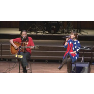

爱人晚安
============================

|  |  |
| :--: | :-- |
| [ 爱人晚安](https://emumo.xiami.com/album/493182) | **艺人**: [川子](../index.md) **语种**: 国语 **唱片公司**: 十三月唱片 **发行时间**: 2012年02月13日 **专辑类别**: EP, 单曲 **专辑风格**:  **播放数**: 157164 **收藏数**: 272 **评论数**: 41  |

## 简介

&nbsp;恋人之间，有时候不需要甜言蜜语，只需要一声最平淡的问候。民生歌手川子新作《爱人晚安》，与澳门新晋民谣女声谢丽娟共同合唱。在这个温暖的春日，把这首歌送给那些相爱的人们，特别是那些异地恋的爱人们。&nbsp;

## 曲目

## 评论

|  |  |  |
| :-- | :-- | :-- |
|  [虾米用户](https://emumo.xiami.com/u/42295901)  2015-09-13 05:16 赞(0) 踩(0) | 
爱人是你吗
 |
|  [虾米用户](https://emumo.xiami.com/u/84606) 还记得 2015-04-09 06:19 赞(0) 踩(0) | 
早安 众亲
 |
|  [虾米用户](https://emumo.xiami.com/u/13311)  2014-11-13 10:47 赞(0) 踩(0) | 
真不错
 |
|  [虾米用户](https://emumo.xiami.com/u/26270324)  2014-01-21 20:36 赞(0) 踩(0) | 
好听
 |
|  [虾米用户](https://emumo.xiami.com/u/1173512)  2013-10-02 08:59 赞(0) 踩(0) | 
喜欢
 |
|  [虾米用户](https://emumo.xiami.com/u/1237261) 王者归来 2013-07-09 12:39 赞(0) 踩(0) | 
Good
 |
|  [虾米用户](https://emumo.xiami.com/u/1264146)  2013-05-21 07:36 赞(0) 踩(0) | 
喜欢
 |
|  [虾米用户](https://emumo.xiami.com/u/12973540)  2013-02-24 22:22 赞(0) 踩(0) | 
恋着多喜欢
 |
|  [虾米用户](https://emumo.xiami.com/u/10602974)  2012-09-19 14:46 赞(0) 踩(0) | 
恋着就喜欢
 |
|  [虾米用户](https://emumo.xiami.com/u/6663810)  2012-06-07 23:13 赞(0) 踩(0) | 
好听，也唱出了我们的心声
 |
|  [虾米用户](https://emumo.xiami.com/u/9194590)  2012-05-16 22:23 赞(0) 踩(0) | 
喜欢1个粗壮汉子心底的温柔
 |
|  [虾米用户](https://emumo.xiami.com/u/1082509)  2012-05-14 00:04 赞(0) 踩(0) | 
很感动
 |
|  [虾米用户](https://emumo.xiami.com/u/8000616)  2012-04-23 17:15 赞(0) 踩(0) | 
平叙部分有的郑中基的感觉
 |
|  [虾米用户](https://emumo.xiami.com/u/8000616)  2012-04-23 17:14 赞(0) 踩(0) | 
川子的轻吟
 |
|  [虾米用户](https://emumo.xiami.com/u/8633872)  2012-03-28 18:26 赞(0) 踩(0) | 
爱川子
 |
|  [虾米用户](https://emumo.xiami.com/u/4423897)  2012-03-09 21:58 赞(0) 踩(0) | 
川子的声音越来越细腻了，这首歌很是温情，喜欢
 |
|  [虾米用户](https://emumo.xiami.com/u/3427467) 喜欢一个倔强的女孩儿 2012-02-29 22:55 赞(0) 踩(0) | 
稀饭
 |
|  [虾米用户](https://emumo.xiami.com/u/4069734) 暂无签名~ 2012-02-23 09:01 赞(0) 踩(0) | 
这个川子真的是个怪怪的人，不过我喜欢···········
 |
|  [虾米用户](https://emumo.xiami.com/u/4425483)  2012-02-21 16:36 赞(0) 踩(0) | 
并不出彩。。我记得我听川子最动人的是兄弟和今生缘
 |
|  [虾米用户](https://emumo.xiami.com/u/8076231)  2012-02-18 18:15 赞(0) 踩(0) | 
喜欢
 |
|  [虾米用户](https://emumo.xiami.com/u/8087472)  2012-02-17 23:34 赞(0) 踩(0) | 
喜欢
 |
|  [虾米用户](https://emumo.xiami.com/u/1246149)  2012-02-17 16:14 赞(0) 踩(0) | 
爱人晚安
 |
|  [虾米用户](https://emumo.xiami.com/u/5158734) 文艺二逼，不是青年。 2012-02-15 09:44 赞(0) 踩(0) | 
除了吉他弹奏以外，亮点不大啊
 |
|  [虾米用户](https://emumo.xiami.com/u/205686)  2012-02-15 09:23 赞(0) 踩(0) | 
爱人晚安。
 |
|  [虾米用户](https://emumo.xiami.com/u/7535081)  2012-02-15 08:56 赞(0) 踩(0) | 
很好
 |
|  [虾米用户](https://emumo.xiami.com/u/5413285)   2012-02-15 01:26 赞(0) 踩(0) | 
好听
 |
|  [虾米用户](https://emumo.xiami.com/u/3464746)  2012-02-14 23:38 赞(0) 踩(0) | 
爱人，晚安。
 |
|  [虾米用户](https://emumo.xiami.com/u/2550222)  2012-02-14 21:31 赞(0) 踩(0) | 
不错哦
 |
|  [虾米用户](https://emumo.xiami.com/u/12337) 喝尿 2012-02-14 20:37 赞(0) 踩(0) | 
情侣去死－ －
 |
|  [虾米用户](https://emumo.xiami.com/u/3209541)  2012-02-14 18:30 赞(0) 踩(0) | 
温暖，晚安。
 |
|  [虾米用户](https://emumo.xiami.com/u/491388) 无所畏惧 2012-02-14 17:21 赞(0) 踩(0) | 
情人节歌曲
 |
|  [虾米用户](https://emumo.xiami.com/u/30041)  2012-02-14 17:20 赞(0) 踩(0) | 
爱我的人，和我爱的人，都要幸福！
 |
|  [虾米用户](https://emumo.xiami.com/u/6394170)  2012-02-14 15:47 赞(0) 踩(0) | 
情深深雨蒙蒙
 |
|  [虾米用户](https://emumo.xiami.com/u/1516457)  2012-02-14 13:38 赞(0) 踩(0) | 
温暖；
 |
|  [虾米用户](https://emumo.xiami.com/u/1699228)  每当四目相对，就会有奇... 2012-02-14 13:07 赞(0) 踩(0) | 
爱人，真正的意义是温暖
 |
|  [虾米用户](https://emumo.xiami.com/u/8039828) 我只想要些好风景。 2012-02-14 11:22 赞(0) 踩(0) | 
清新，悠扬，相见恨晚。。。
 |
|  [虾米用户](https://emumo.xiami.com/u/7950180)  2012-02-14 11:16 赞(0) 踩(0) | 
感觉，爱情就在身边~~
 |
|  [虾米用户](https://emumo.xiami.com/u/6871629)  2012-02-14 11:13 赞(0) 踩(0) | 
睡前晚安。晚安。
 |
|  [虾米用户](https://emumo.xiami.com/u/8946)  2012-02-14 10:41 赞(0) 踩(0) | 
仔细听下来，那年那月。
 |
|  [虾米用户](https://emumo.xiami.com/u/1257672)  2012-02-13 17:09 赞(0) 踩(0) | 
主打情人节么
 |
