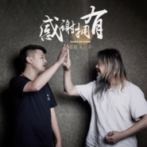

川子
============================

|  |  |
| :--: | :-- |
| [ 川子](https://i.xiami.com/chuanzi) | **播放数**: 10142214 **粉丝数**: 24105 **评论数**: 786 **地区**: China 中国大陆 **风格**: 城市民谣 Urban Folk  |

## 档案

你知道川子么？你知道嘟嘟么？你知道他们之间有什么有趣的故事么？ 
川子自幼生性刚猛、桀骜不驯，早年因为打架斗殴饱受牢狱之苦。出狱后，川子的精神世界发生了彻底的改变，他不再同过去的朋友圈子密切交往，甚至不太喜欢结识新的朋友。他的世界一下子狭小得让人透不过气来，家人还有他的爱犬嘟嘟几乎成了他生活中的唯一。 
不久后，在北京南城，川子开了一间音乐主题的酒吧。去过川子酒吧的人都知道，酒吧除了老板歌唱非常好听之外，还有一条可以唱歌的狗，那就是嘟嘟。如今，会唱的嘟嘟越来越红，他的主人川子每晚在自己的酒吧里喝酒唱歌，同嘟嘟一起表演，性格也渐渐开朗起来。 
随后，这件有趣的事被十三月唱片所发现，十三月对川子与嘟嘟事也感到颇有兴趣，川子和嘟嘟也成为了十三月的好朋友。经数次交流后，十三月将携手川子和嘟嘟，为其举办川子与嘟嘟的专场演出，还特意为这场演出起了一个温馨的名字“川子和嘟嘟与你有个约会”，当晚也会邀请到川子的朋友们和他/它一起表演。

## 专辑

| 名称 | 语种 | 唱片公司 | 发行时间 | 专辑类别 | 专辑风格 |
| :--: | :-- | :-- | :-- | :-- | :-- |
| [ 人生相逢](./albums/5020908020.md) | 国语 | 邻游天下 | 2020年06月15日 | EP, 单曲 | 国语流行 Mandarin Pop, 城市民谣 Urban Folk |
| [ 感谢拥有](./albums/2105483507.md) | 国语 | 百纳娱乐 | 2019年11月19日 | EP, 单曲 | 国语流行 Mandarin Pop |
| [ 人生相逢](./albums/2105409797.md) | 国语 | 天悦华音 | 2019年11月06日 | EP, 单曲 |  |
| [ 我要长大](./albums/2105205917.md) | 国语 | 名扬天下 | 2019年09月02日 | EP, 单曲 |  |
| [ 摇滚这个春晚](./albums/2104427596.md) | 国语 | 太声文化 | 2019年01月01日 | EP, 单曲 | 国语流行 Mandarin Pop |
| [ 蒲公英](./albums/2100192614.md) | 国语 | 十三月唱片 | 2015年08月27日 | EP, 单曲 |  |
| [ 川·行肆拾年](./albums/1713450975.md) | 国语 | 天博长炬 | 2014年11月10日 | EP, 单曲 | 民谣流行 Folk Pop |
| [ 音乐公路之旅 纪录片原声](./albums/1777236030.md) | 国语 | 独立发行 | 2013年08月23日 | EP, 单曲 |  |
| [ 新的一年](./albums/573434.md) | 国语 | 十三月唱片 | 2013年01月22日 | EP, 单曲 |  |
| [ 咱们小散有力量](./albums/500303.md) | 国语 | 十三月唱片 | 2012年03月15日 | EP, 单曲 |  |
| [ 爱人晚安](./albums/493182.md) | 国语 | 十三月唱片 | 2012年02月13日 | EP, 单曲 |  |
| [ 我要结婚](./albums/440918.md) | 国语 | 十三月唱片 | 2011年05月13日 | 录音室专辑 | 城市民谣 Urban Folk |
| [ 新的一年](./albums/417878.md) | 国语 | 十三月唱片 | 2010年12月29日 | EP, 单曲 | 城市民谣 Urban Folk |
| [ 今生缘](./albums/320442.md) | 国语 | 十三月唱片 | 2009年02月01日 | 录音室专辑 | 城市民谣 Urban Folk |
| [ 在佛面前](./albums/439867.md) | 国语 | 合炫音乐 | 2008年12月13日 | EP, 单曲 | 城市民谣 Urban Folk |

## 评论

|  |  |  |  |
| :-- | :-- | :-- | :-- |
|  [虾米用户](https://emumo.xiami.com/u/960607) 随遇而安 2021-01-24 09:16 赞(0) 踩(0) | 
多多支持
 |
|  [虾米用户](https://emumo.xiami.com/u/380229681) 無所謂都 2020-03-18 15:09 赞(2) 踩(0) | 
以前上中學，住在橫一條，最興奮的事就是晚上去合炫聽川哥唱歌，合炫時候的川哥已經不經常回來唱一直在外面演出，所以能聽到實屬不易。再早的時候是在方莊吉他吧年代的時候，川歌的歌伴著我叛逆的青春期，我現在在香港生活，懷念當時的日子。
 |
|  [虾米用户](https://emumo.xiami.com/u/13845745)   2019-10-10 16:51 赞(1) 踩(0) | 
就喜欢郑钱花
 |
|  [虾米用户](https://emumo.xiami.com/u/255836)   2019-09-13 12:27 赞(0) 踩(0) | 
《幸福里》为代表楼市三部曲是这十年最好的中国摇滚！
 |
|  [虾米用户](https://emumo.xiami.com/u/407240025)  2019-06-12 20:47 赞(0) 踩(0) | 
歌词写的不错，都是大实话啊
 |
|  [虾米用户](https://emumo.xiami.com/u/356005005) 无个性，不签名 2019-05-12 10:29 赞(1) 踩(0) | 
一看这个名字我以为是儿子 
 |
|  [虾米用户](https://emumo.xiami.com/u/342168200)  2019-03-22 00:01 赞(1) 踩(0) | 
第一次听到这首歌却是在看一段舞蹈时…但我记住了这首歌，后来终于找到创作者，我欣喜
 |
|  [虾米用户](https://emumo.xiami.com/u/333937599)  2019-02-16 20:41 赞(1) 踩(0) | 
很用心的去唱，很多音乐人都缺少这一点，川子就不一样专心唱好每一首歌       
 |
|  [虾米用户](https://emumo.xiami.com/u/293692544) 你敢给我说话吗？我咬你 2018-12-11 17:18 赞(2) 踩(0) | 
好听
 |
|  [虾米用户](https://emumo.xiami.com/u/343493013) 我梦中的一百分男孩 2018-09-08 04:21 赞(1) 踩(0) | 
 
 |
|  [虾米用户](https://emumo.xiami.com/u/293692544) 你敢给我说话吗？我咬你 2018-08-05 09:01 赞(1) 踩(0) | 
好听
 |
|  [虾米用户](https://emumo.xiami.com/u/52471347) 幸福是每一个微小的生活愿... 2018-07-29 23:13 赞(1) 踩(0) | 
URL路考虑特痛苦岔气ask啦PK考虑去咯他来咯图摩托欧了OPPO哦KTV85688855357423611111111111111111111111111111111111111111111111111111111111111111114111111111111111111111111111+111-111:12345678910/124587896530
 |
|  [虾米用户](https://emumo.xiami.com/u/39204279) I love Grung... 2018-06-30 01:04 赞(1) 踩(0) | 
十年前川子去过安徽卫视的剧风行动，印象挺深的
 |
|  [虾米用户](https://emumo.xiami.com/u/6082125) Standing and... 2018-06-28 16:11 赞(2) 踩(0) | 
人民的艺术家
 |
|  [虾米用户](https://emumo.xiami.com/u/2570040) 私信我可以帮你找吉他谱 2018-06-21 20:24 赞(1) 踩(0) | 
兄弟 那首曲子高潮时声音失真了。
 |
|  [虾米用户](https://emumo.xiami.com/u/375667407)  2018-06-14 22:06 赞(1) 踩(0) | 
永远支持你哥们，永远的铁子
 |
|  [虾米用户](https://emumo.xiami.com/u/343344707)  2018-01-05 23:24 赞(3) 踩(0) | 
今生缘  我的挚爱  感谢川子  
 |
| ⇒ |  [虾米用户](https://emumo.xiami.com/u/346098442)  2018-06-22 22:21 赞(0) 踩(0) | 
+1
 |
|  [虾米用户](https://emumo.xiami.com/u/39204279) I love Grung... 2017-11-09 00:50 赞(2) 踩(0) | 
是不是以前有一只狗，能跟着他唱歌啊
 |
|  [虾米用户](https://emumo.xiami.com/u/286463) 音乐不是歌 2017-10-28 00:10 赞(2) 踩(0) | 
蛤蛤，不错的
 |
|  [虾米用户](https://emumo.xiami.com/u/47939604)   2017-10-28 00:06 赞(1) 踩(0) | 
川子现场好牛逼，嘴里叼着烟唱高音还不掉，歌里面再加无数个他妈的更完美了哈哈
 |
|  [虾米用户](https://emumo.xiami.com/u/4750005)  2017-10-27 23:57 赞(1) 踩(0) | 
最近喜欢上这种调调了
 |
|  [虾米用户](https://emumo.xiami.com/u/11238432) 井菇凉一枚 2017-10-27 23:14 赞(0) 踩(0) | 
北京纯爷们，我喜欢这种真实的感觉。
 |
|  [虾米用户](https://emumo.xiami.com/u/39806526)  2017-10-27 23:06 赞(3) 踩(0) | 
川子來西安的時候見過兩次 在光陰酒吧…確實挺實在的歌聲 記得他煙一直點著唱歌 很隨意舒適的感覺
 |
|  [虾米用户](https://emumo.xiami.com/u/17199566) The Mountain... 2017-10-05 11:29 赞(1) 踩(0) | 
前天茂兰 唱到我心里去了
 |
|  [虾米用户](https://emumo.xiami.com/u/126281496)  2017-09-11 21:44 赞(0) 踩(0) | 
的确唱的不错
 |
|  [虾米用户](https://emumo.xiami.com/u/248478498)  2017-07-05 11:52 赞(2) 踩(0) | 
好干净的声音，今生缘我很喜欢听，一种纯粹的感情。
 |
|  [虾米用户](https://emumo.xiami.com/u/279997654)  2017-06-06 17:39 赞(0) 踩(0) | 
好的，以后我会继续关注川子
 |
|  [虾米用户](https://emumo.xiami.com/u/240828439) _(:з」∠)_ 2017-05-22 18:42 赞(0) 踩(0) | 

 |
|  [虾米用户](https://emumo.xiami.com/u/289606815)  2017-04-18 18:28 赞(0) 踩(0) | 
爱与音乐同在!
 |
|  [虾米用户](https://emumo.xiami.com/u/127092864)  2017-04-04 22:23 赞(0) 踩(0) | 
加油
 |
|  [虾米用户](https://emumo.xiami.com/u/83893196) 我还没想好要写什么... 2017-03-07 16:45 赞(0) 踩(0) | 

 |
|  [虾米用户](https://emumo.xiami.com/u/229770182)  2016-12-07 22:36 赞(0) 踩(0) | 
对女儿细腻的爱
 |
|  [虾米用户](https://emumo.xiami.com/u/7182357)  2016-12-02 21:53 赞(1) 踩(0) | 
看了央视的 音乐公路之旅
 |
|  [虾米用户](https://emumo.xiami.com/u/196318241)   2016-12-02 20:51 赞(1) 踩(0) | 
中央9纪录频道正在播音乐公路之旅
 |
|  [虾米用户](https://emumo.xiami.com/u/201410454)  2016-11-06 01:14 赞(0) 踩(0) | 
好听
 |
|  [虾米用户](https://emumo.xiami.com/u/115024282)   2016-11-06 00:12 赞(1) 踩(0) | 
唱出了心理想放飞的感觉 
 |
|  [虾米用户](https://emumo.xiami.com/u/32265938)  2016-10-30 20:05 赞(0) 踩(0) | 
永远支持
 |
|  [虾米用户](https://emumo.xiami.com/u/50406539) 今夜，聽風，有雨！ 2016-10-12 22:59 赞(1) 踩(0) | 
喜欢
 |
|  [虾米用户](https://emumo.xiami.com/u/16135450)  2016-07-20 23:39 赞(0) 踩(0) | 
2135
 |
|  [虾米用户](https://emumo.xiami.com/u/8152141)  2016-07-14 18:28 赞(0) 踩(0) | 
这声音真干净！
 |
|  [虾米用户](https://emumo.xiami.com/u/43988214)  2016-06-27 03:32 赞(0) 踩(0) | 
听了郑钱花摸过來的，好听
 |
|  [虾米用户](https://emumo.xiami.com/u/50734605)   2016-06-22 19:19 赞(1) 踩(0) | 
川子绝对的老炮
 |
|  [虾米用户](https://emumo.xiami.com/u/16887171) 不认真我就赢了 2016-05-20 19:38 赞(0) 踩(0) | 
朋友推荐让我听的
 |
| ⇒ |  [虾米用户](https://emumo.xiami.com/u/16887171) 不认真我就赢了 2016-06-07 20:11 赞(0) 踩(0) | 
<q><b>说：</b></q>
 |
|  [虾米用户](https://emumo.xiami.com/u/151198762) Rook 2016-05-20 16:05 赞(0) 踩(0) | 
爷们
 |
|  [虾米用户](https://emumo.xiami.com/u/1467803) 置身于炎夏的乐园 2016-05-12 00:32 赞(0) 踩(0) | 
一首幸福里 想去现场听了
 |
|  [虾米用户](https://emumo.xiami.com/u/47367880)  2016-04-23 01:07 赞(1) 踩(0) | 
真实
 |
|  [虾米用户](https://emumo.xiami.com/u/16722931) 我还没想好要写什么... 2016-03-13 14:52 赞(0) 踩(0) | 
川子在北京南城哪里开的酒吧啊？
 |
|  [虾米用户](https://emumo.xiami.com/u/50078959) …… 2016-02-17 22:35 赞(1) 踩(0) | 
高三那会儿，画室美术老师特别喜欢川子的这首歌，在画室单曲循环，于是我们也喜欢了……现在一听到他的歌我就感到特别亲切，回忆年少青葱岁月……
 |
|  [虾米用户](https://emumo.xiami.com/u/46233036)  2016-02-11 20:37 赞(0) 踩(0) | 
新年快乐
 |
|  [虾米用户](https://emumo.xiami.com/u/3454691) 平静,泰山,牛顿,前行 2016-01-25 16:21 赞(0) 踩(0) | 
幸福里 唱的不止单纯的房子
 |
|  [虾米用户](https://emumo.xiami.com/u/99980178)   2016-01-23 01:29 赞(0) 踩(0) | 
川子真性情
 |
|  [虾米用户](https://emumo.xiami.com/u/4079898) QQ 362318935 2016-01-21 11:04 赞(1) 踩(0) | 
用生命在歌唱的歌者。川子的音乐必须支持，专辑必买。女儿也赶快出专辑吧。
 |
|  [虾米用户](https://emumo.xiami.com/u/44211947) 时间改变了很多又什么都没... 2015-12-23 16:08 赞(0) 踩(0) | 
封面…
 |
|  [虾米用户](https://emumo.xiami.com/u/8070377) 爱雾瑞性维欧腐漏 2015-10-26 13:09 赞(0) 踩(0) | 
销魂的口哨
 |
|  [虾米用户](https://emumo.xiami.com/u/48056145) 暂无签名~ 2015-10-03 13:44 赞(0) 踩(0) | 
串子接地气啊！
 |
|  [虾米用户](https://emumo.xiami.com/u/4146038)  2015-09-30 00:18 赞(0) 踩(0) | 
来长沙了，可惜没去成
 |
|  [虾米用户](https://emumo.xiami.com/u/4146038)  2015-09-30 00:18 赞(0) 踩(0) | 
来长沙了，可惜没去成
 |
|  [虾米用户](https://emumo.xiami.com/u/45785792) Nandin's mus... 2015-09-29 19:06 赞(0) 踩(0) | 
要是你不愿意，我就一辈子听川子的歌
 |
|  [虾米用户](https://emumo.xiami.com/u/45785792) Nandin's mus... 2015-09-29 19:06 赞(0) 踩(0) | 
要是你不愿意，我就一辈子听川子的歌
 |
|  [虾米用户](https://emumo.xiami.com/u/4146038)  2015-09-22 20:51 赞(0) 踩(0) | 
能不能给川子换个图片？
 |
|  [虾米用户](https://emumo.xiami.com/u/68467250)  2015-09-21 18:42 赞(0) 踩(0) | 
川子大哥，你可以为我失去的孩子写一首歌吗？我把诗词发来好吗？
 |
|  [虾米用户](https://emumo.xiami.com/u/13600690) 北京菲尔斯代言！珍珠形象... 2015-09-20 07:23 赞(0) 踩(0) | 
喜欢川子
 |
|  [虾米用户](https://emumo.xiami.com/u/7666185) 救赎 2015-09-13 10:09 赞(0) 踩(0) | 
重温《泡芙小姐》，发现有一集请到了川子
 |
|  [虾米用户](https://emumo.xiami.com/u/49862238)  2015-09-11 10:59 赞(0) 踩(0) | 
当年听川子第一首歌是郑钱花，完全被震撼了。。。
 |
|  [虾米用户](https://emumo.xiami.com/u/49862238)  2015-09-11 10:59 赞(0) 踩(0) | 
当年听川子第一首歌是郑钱花，完全被震撼了。。。
 |
|  [虾米用户](https://emumo.xiami.com/u/19956849) 我还没想好要写什么... 2015-08-24 17:22 赞(1) 踩(0) | 
听你的歌，总是会触碰到最深处。6
 |
|  [虾米用户](https://emumo.xiami.com/u/19956849) 我还没想好要写什么... 2015-08-24 17:22 赞(0) 踩(0) | 
听你的歌，总是会触碰到最深处。6
 |
|  [虾米用户](https://emumo.xiami.com/u/1143401)  2015-08-20 09:04 赞(0) 踩(0) | 
《钟》最好，没有之一，就是最好
 |
|  [虾米用户](https://emumo.xiami.com/u/21245984) 做人求稳，好好活着比什么... 2015-07-22 16:04 赞(0) 踩(0) | 
川歌威武    
 |
|  [虾米用户](https://emumo.xiami.com/u/3797494)  2015-07-10 11:19 赞(1) 踩(0) | 
喜欢哒
 |
|  [虾米用户](https://emumo.xiami.com/u/52056635)  2015-07-05 09:01 赞(0) 踩(0) | 
教父 ！ 今天缘
 |
|  [虾米用户](https://emumo.xiami.com/u/49108133)  2015-06-27 21:25 赞(0) 踩(0) | 
可以的
 |
|  [虾米用户](https://emumo.xiami.com/u/11322495) 有一种思念，叫远方。 2015-06-19 15:40 赞(3) 踩(0) | 
浪子回头金不换。总会在磕磕绊绊中长大，成熟。
 |
|  [虾米用户](https://emumo.xiami.com/u/35167460) La vie elle ... 2015-06-12 19:27 赞(0) 踩(0) | 
今天第一次听到你的歌 听了心里好宁静。谢谢你。
 |
|  [虾米用户](https://emumo.xiami.com/u/46256393) 当里个当 2015-05-31 23:10 赞(0) 踩(0) | 
朋友啊。。。。。。
 |
|  [虾米用户](https://emumo.xiami.com/u/3161421) 我还没想好要写什么... 2015-05-29 23:34 赞(1) 踩(0) | 
郑钱花的现场更好听！求上传
 |
|  [虾米用户](https://emumo.xiami.com/u/3811479)  2015-05-24 18:58 赞(0) 踩(0) | 
fdfd
 |
|  [虾米用户](https://emumo.xiami.com/u/8881579) 怕黑，卻迷恋着夜⋯ 2015-05-11 16:59 赞(0) 踩(0) | 
非常喜歡川子哥的歌，今天偶然聽到，每一首都很觸動心扉。期待新作，做您忠誠的粉絲，希望有机会真正的去川子哥酒吧欣賞您和嘟嘟的表演！
 |
|  [虾米用户](https://emumo.xiami.com/u/45119335) 好歌不断。 2015-05-04 17:31 赞(0) 踩(0) | 
   
 |
|  [虾米用户](https://emumo.xiami.com/u/3479108) 一曲悲歌向天啸 2015-05-01 21:09 赞(0) 踩(0) | 
川子，好样的！
 |
|  [虾米用户](https://emumo.xiami.com/u/416223)  2015-04-28 19:30 赞(0) 踩(0) | 
卧槽。声音和形象！两个人么.
 |
|  [虾米用户](https://emumo.xiami.com/u/49500150) 阳光、沙滩、海浪、仙人掌 2015-04-27 22:36 赞(0) 踩(0) | 
1
 |
|  [虾米用户](https://emumo.xiami.com/u/3617316)  2015-04-23 13:41 赞(0) 踩(0) | 
老朋友
 |
|  [虾米用户](https://emumo.xiami.com/u/1215409)  2015-04-20 21:21 赞(0) 踩(0) | 
川子的歌有生活的味道 真实却不庸俗 风格也是独树一帜 旋律也很动听 绝对收藏的中国摇滚
 |
|  [虾米用户](https://emumo.xiami.com/u/49377369) 我还没想好要写什么... 2015-04-19 16:15 赞(0) 踩(0) | 
我一下爱听你的
 |
|  [虾米用户](https://emumo.xiami.com/u/48981878) 好音乐不可以辜负 2015-04-08 00:22 赞(0) 踩(0) | 
今生缘，听起来好感人
 |
|  [虾米用户](https://emumo.xiami.com/u/3798186) 我家门前有大海 2015-04-02 22:00 赞(1) 踩(0) | 
看了鲁豫有约对川子的专访，这爷们儿太有意思了！真性情！
 |
|  [虾米用户](https://emumo.xiami.com/u/913186)   2015-04-01 18:47 赞(0) 踩(0) | 
好好过一辈～子啊～
 |
|  [虾米用户](https://emumo.xiami.com/u/309484) 生活的最高级是另一种生活... 2015-03-11 19:16 赞(1) 踩(0) | 
突然发现川子的歌好有前瞻性。。。几年前的歌里讲到的今天终于激化了。。。
 |
| ⇒ |  [虾米用户](https://emumo.xiami.com/u/255836)   2019-09-13 12:36 赞(0) 踩(0) | 
几年前网友的回复，今天，更加激化了。一语成谶！
 |
|  [虾米用户](https://emumo.xiami.com/u/4218777) 博学之,审问之,慎思之,... 2015-03-08 13:40 赞(0) 踩(0) | 
喜欢，超赞！
 |
|  [虾米用户](https://emumo.xiami.com/u/5931043)  2015-02-27 12:17 赞(0) 踩(0) | 
好听！
 |
|  [虾米用户](https://emumo.xiami.com/u/2911517)  2015-02-15 10:45 赞(0) 踩(0) | 
喜欢这哥们儿发自内心的唱词，唱出了许多有关生活，有关幸福，有关一辈子的小事。
 |
|  [虾米用户](https://emumo.xiami.com/u/7979296)  2015-02-12 16:56 赞(0) 踩(0) | 
郑钱花，好喜欢
 |
|  [虾米用户](https://emumo.xiami.com/u/45285267) 傻蛋是好好萌聪明蛋是大花... 2015-01-31 23:43 赞(0) 踩(0) | 
牛逼
 |
|  [虾米用户](https://emumo.xiami.com/u/43758189)  2015-01-25 16:28 赞(0) 踩(0) | 
有内容的歌手
 |
|  [虾米用户](https://emumo.xiami.com/u/46224277)  2015-01-19 19:33 赞(0) 踩(0) | 
今生缘
 |
|  [虾米用户](https://emumo.xiami.com/u/3880838)  2015-01-17 20:00 赞(0) 踩(0) | 
声音如此干净，歌词中流露着静与善。
 |
|  [虾米用户](https://emumo.xiami.com/u/45744920)  2015-01-07 20:21 赞(0) 踩(0) | 
今生缘认识川子，嗓子很特别！赞一个
 |
|  [虾米用户](https://emumo.xiami.com/u/1902831) 如果我听歌可眼红… 2014-12-22 23:06 赞(2) 踩(0) | 
感激在这个音乐的世界能有川子，总能在你的音乐中找到心灵的慰藉，感谢你。
 |
|  [虾米用户](https://emumo.xiami.com/u/149506)  2014-12-07 22:45 赞(1) 踩(0) | 
那么多情啊爱的，终于有个不一样的了，亲情友情什么的也很好啊
 |
|  [虾米用户](https://emumo.xiami.com/u/42256522)  2014-11-30 15:11 赞(0) 踩(0) | 
太棒了
 |
|  [虾米用户](https://emumo.xiami.com/u/38595584)  2014-11-27 21:43 赞(1) 踩(0) | 
稳当
 |
|  [虾米用户](https://emumo.xiami.com/u/40694611)  2014-11-24 23:01 赞(0) 踩(0) | 
哭着来要笑着走过呀，听着听着我就哭了，孤独也没什么，笑着就走过去了
 |
|  [虾米用户](https://emumo.xiami.com/u/8128176) 好好活着 2014-11-11 04:45 赞(0) 踩(0) | 
给我一支兰州
 |
|  [虾米用户](https://emumo.xiami.com/u/9357683)  2014-11-06 21:54 赞(0) 踩(0) | 
川子
 |
|  [虾米用户](https://emumo.xiami.com/u/4274466) 把酒黄昏后  醉卧水云间 2014-10-24 11:32 赞(0) 踩(0) | 
NICE
 |
|  [虾米用户](https://emumo.xiami.com/u/7360065) 点击左侧昵称访问他的主页 2014-10-21 08:19 赞(2) 踩(0) | 
看成腾格尔了。。。
 |
|  [虾米用户](https://emumo.xiami.com/u/12343118) 哈哈哈 2014-10-20 17:52 赞(0) 踩(0) | 
想起几年前，在合炫音乐工厂看着川子和他的狗一起唱着今生缘
 |
|  [虾米用户](https://emumo.xiami.com/u/15289221) 冯洋 2014-10-13 15:23 赞(0) 踩(0) | 
什么基波 还用教父的曲子
 |
|  [虾米用户](https://emumo.xiami.com/u/23406921) 你不是我，怎知我的苦亦乐 2014-09-24 01:37 赞(0) 踩(0) | 
谢谢您的歌。温暖了我 ，本以为中国也就只有流行歌曲，总是寻找欧美那种直接切真切的感情，看来来对虾米了，又找到许多好歌。 加油支持。
 |
| ⇒ |  [虾米用户](https://emumo.xiami.com/u/16377579)   2014-10-03 23:51 赞(0) 踩(0) | 
自从用了虾米以后就再也没换过播放器
 |
|  [虾米用户](https://emumo.xiami.com/u/2439226) 我还没想好要写什么... 2014-09-21 08:12 赞(0) 踩(0) | 
我们都会经历这样的东西。没有吻，也没有性。甚至没有一句“我爱你”可我们始终相亲相爱。————今生缘
 |
|  [虾米用户](https://emumo.xiami.com/u/13552)  2014-09-15 17:39 赞(0) 踩(0) | 
今生缘、去天堂的孩子、许个愿吧、有谁在思念、爱人晚安
 |
|  [虾米用户](https://emumo.xiami.com/u/11322994) Good things 2014-09-06 19:46 赞(0) 踩(0) | 
评论卡在666
 |
|  [虾米用户](https://emumo.xiami.com/u/7852517) L’Homme Révo... 2014-08-21 18:42 赞(2) 踩(0) | 
川子 这哥们儿 太对路了
 |
|  [虾米用户](https://emumo.xiami.com/u/7852517) L’Homme Révo... 2014-08-21 18:40 赞(1) 踩(0) | 
谁说先来的赶不上后到的
 |
|  [虾米用户](https://emumo.xiami.com/u/29249838) Wechat:david... 2014-08-20 16:13 赞(1) 踩(0) | 
和我爸妈同岁，中年人，想哭。
 |
|  [虾米用户](https://emumo.xiami.com/u/29249838) Wechat:david... 2014-08-20 00:05 赞(2) 踩(0) | 
现在才认真听他的歌，不过，幸好。
 |
|  [虾米用户](https://emumo.xiami.com/u/8719383)  2014-07-18 23:53 赞(2) 踩(0) | 
民谣摇滚
 |
|  [虾米用户](https://emumo.xiami.com/u/38843841) 暂无签名~ 2014-07-15 00:55 赞(1) 踩(0) | 
今生缘的开头居然是gloomy sunday
 |
| ⇒ |  [虾米用户](https://emumo.xiami.com/u/38843841) 暂无签名~ 2014-07-15 01:02 赞(0) 踩(0) | 
搞几把搞错了。居然是教父的，怪不得那么熟悉
 |
|  [虾米用户](https://emumo.xiami.com/u/1219739) 心有猛虎细嗅蔷薇~ 2014-07-12 14:48 赞(1) 踩(0) | 
复古有感染力的嗓音和吟唱~稀罕非常稀罕
 |
|  [虾米用户](https://emumo.xiami.com/u/38751055)  2014-07-09 12:25 赞(1) 踩(0) | 
城市吼
 |
|  [虾米用户](https://emumo.xiami.com/u/3998058)  2014-07-07 20:12 赞(1) 踩(0) | 
支持
 |
|  [虾米用户](https://emumo.xiami.com/u/3448615)  2014-07-03 20:34 赞(0) 踩(0) | 
喜欢~不解释
 |
|  [虾米用户](https://emumo.xiami.com/u/9642566) 最悲惨的人生是没有理想 2014-07-01 23:33 赞(0) 踩(0) | 
哪位爷告诉我川子那酒吧在哪？
 |
|  [虾米用户](https://emumo.xiami.com/u/22887513)  2014-06-17 02:50 赞(0) 踩(0) | 
新的一年
 |
|  [虾米用户](https://emumo.xiami.com/u/4108234) 风中的塑料袋 2014-06-04 15:41 赞(0) 踩(0) | 
可惜了一个桀骜不顺的人磨的光溜溜的
 |
|  [虾米用户](https://emumo.xiami.com/u/35037877) 感觉 感受 感动 关注国... 2014-05-25 20:44 赞(0) 踩(0) | 
天使来自天上，音乐来自民间。
 |
|  [虾米用户](https://emumo.xiami.com/u/9737108) 暂无签名~ 2014-05-24 16:22 赞(0) 踩(0) | 
我喜欢川子音乐带给人们的一种真实和随性
 |
|  [虾米用户](https://emumo.xiami.com/u/1022304) 我还没想好要写什么... 2014-05-20 15:21 赞(0) 踩(0) | 
外面下着雨，突然想听听川子的歌。然后戴上耳机，阻断雨声，又想笑又想哭地听歌声里的故事。
 |
|  [虾米用户](https://emumo.xiami.com/u/9842933)  2014-05-07 20:52 赞(0) 踩(0) | 
川子自幼生性刚猛、桀骜不驯，早年因为打架斗殴饱受牢狱之苦。出狱后，川子的精神世界发生了彻底的改变，他不再同过去的朋友圈子密切交往，甚至不太喜欢结识新的朋友。他的世界一下子狭小得让人透不过气来，家人还有他的爱犬嘟嘟几乎成了他生活中的唯一。
 |
|  [虾米用户](https://emumo.xiami.com/u/33570603)  2014-05-07 13:59 赞(0) 踩(0) | 
好玩
 |
|  [虾米用户](https://emumo.xiami.com/u/3131139)  2014-04-28 22:44 赞(0) 踩(0) | 
加油川子~~
 |
|  [虾米用户](https://emumo.xiami.com/u/3865487)  2014-04-28 00:15 赞(0) 踩(0) | 
还是现场听着带劲啊，开头打嗝，   一直在听郑钱花
 |
|  [虾米用户](https://emumo.xiami.com/u/26571510) 入戏出戏  2014-04-18 12:49 赞(0) 踩(0) | 
在南四环的合炫川子酒吧偶尔听过他的歌曲，赞一个~~
 |
|  [虾米用户](https://emumo.xiami.com/u/286463) 音乐不是歌 2014-04-08 23:04 赞(1) 踩(0) | 
中国需要这样的音乐人来调剂，不是每个人都爱唱‘老百姓的钱包是我们党的牵挂’的
 |
|  [虾米用户](https://emumo.xiami.com/u/2318226) 暂无签名~ 2014-03-26 08:38 赞(0) 踩(0) | 
hao
 |
|  [虾米用户](https://emumo.xiami.com/u/10969671) 爱我我爱我我我我 2014-03-21 23:09 赞(0) 踩(0) | 
好
 |
|  [虾米用户](https://emumo.xiami.com/u/34268324) 好的音乐一听就醉 2014-03-19 22:29 赞(1) 踩(0) | 
弱弱的问一句  嘟嘟现在还好吗？
 |
|  [虾米用户](https://emumo.xiami.com/u/10305617)  2014-03-14 10:44 赞(0) 踩(0) | 
体验到真实的朴实~
 |
|  [虾米用户](https://emumo.xiami.com/u/31909133)  2014-03-07 20:29 赞(0) 踩(0) | 
川子，很喜欢这风格
 |
|  [虾米用户](https://emumo.xiami.com/u/5940907) 呼 2014-02-25 21:48 赞(0) 踩(0) | 
川子的歌百听不厌！精灵兰花很好听，希望早点能下载到录音棚版
 |
|  [虾米用户](https://emumo.xiami.com/u/11010365) 灵魂自由行走 2014-02-25 14:19 赞(0) 踩(0) | 
当初听川子的今生缘 刚好是和兄弟姐妹们离别的时候 感动得一塌糊涂 不过我们现在依然是时不时能见面的好朋友 算幸运的了
 |
|  [虾米用户](https://emumo.xiami.com/u/11283293)  2014-02-18 12:45 赞(0) 踩(0) | 
果然是个老毕
 |
|  [虾米用户](https://emumo.xiami.com/u/11259253) 听靓歌 2014-02-12 16:26 赞(0) 踩(0) | 
喜欢川子不吹牛。
 |
|  [虾米用户](https://emumo.xiami.com/u/32511446)  2014-02-11 14:09 赞(0) 踩(0) | 
粗矿的声音唱出了生活的真实~
 |
|  [虾米用户](https://emumo.xiami.com/u/13194141) 看到的给我来个联络方式。... 2014-02-09 05:08 赞(1) 踩(0) | 
今生缘，听得我落泪啊
 |
|  [虾米用户](https://emumo.xiami.com/u/6712055) 非典型。 2014-01-14 17:17 赞(0) 踩(0) | 
川子加油！
 |
|  [虾米用户](https://emumo.xiami.com/u/10363555)  2014-01-11 18:15 赞(0) 踩(0) | 
带感！
 |
|  [虾米用户](https://emumo.xiami.com/u/151979)   2014-01-08 11:41 赞(0) 踩(0) | 
很赞哈
 |
|  [虾米用户](https://emumo.xiami.com/u/11810361) 值得做闹铃的歌经得起考验 2013-12-29 22:11 赞(0) 踩(0) | 
被去天堂的孩子感动了，这么粗犷的汉子唱出这么温柔的歌。
 |
|  [虾米用户](https://emumo.xiami.com/u/1280296) 暂无签名~ 2013-12-11 09:15 赞(0) 踩(0) | 
实在
 |
|  [虾米用户](https://emumo.xiami.com/u/16013604)  2013-11-28 23:48 赞(0) 踩(0) | 
生日快乐
 |
|  [虾米用户](https://emumo.xiami.com/u/13553927) 举头望明月 2013-11-21 22:25 赞(0) 踩(0) | 
有故事感，安静的。
 |
|  [虾米用户](https://emumo.xiami.com/u/11266829) 清凉一丝丝…… 2013-11-19 18:21 赞(0) 踩(0) | 
听着听着能起一身鸡皮疙瘩，朋友啊 朋友们？你们还都好吗？
 |
|  [虾米用户](https://emumo.xiami.com/u/1226865) 爱音乐的人原本就该活简单 2013-11-19 05:36 赞(0) 踩(0) | 
！
 |
|  [虾米用户](https://emumo.xiami.com/u/2800665) 我还没想好要写什么... 2013-11-11 14:23 赞(0) 踩(0) | 
听着听着居然哭了～  @川子
 |
|  [虾米用户](https://emumo.xiami.com/u/745483) pseudo-vegan 2013-11-08 07:27 赞(0) 踩(0) | 
真性情唱好歌！
 |
|  [虾米用户](https://emumo.xiami.com/u/13034950) 五音不全者 2013-11-07 18:41 赞(0) 踩(0) | 
happy birthday~
 |
|  [虾米用户](https://emumo.xiami.com/u/9675128) 心在路上 2013-10-31 14:15 赞(0) 踩(0) | 
祝川子生日快乐~
 |
|  [虾米用户](https://emumo.xiami.com/u/6176524) 随遇而安 2013-10-31 09:26 赞(0) 踩(0) | 
天蝎座心语【天蝎座10月31日生日密码】今天出生的人十分自豪自己天生就是细心的观察家，非常擅于处理细节部份的问题。他们拥有可以集中全副精力的能力，使他们得以一路披荆斩棘、突破重围，这股如雷电般锐不可挡的冲力，也使他们成为相当可怕且难应付的敌手。祝10.31生日的天蝎座生日快乐！[蛋糕]
 |
|  [虾米用户](https://emumo.xiami.com/u/6176524) 随遇而安 2013-10-31 09:01 赞(0) 踩(0) | 
生日快乐，天蝎座！
 |
|  [虾米用户](https://emumo.xiami.com/u/6326)  2013-10-30 09:28 赞(0) 踩(0) | 
生日快乐！
 |
|  [虾米用户](https://emumo.xiami.com/u/4136304)  2013-10-29 13:17 赞(0) 踩(0) | 
川子大叔～生日快乐哦～～
 |
|  [虾米用户](https://emumo.xiami.com/u/3106787) 安静 澎湃 2013-10-29 11:50 赞(0) 踩(0) | 
生日快乐 川子
 |
|  [虾米用户](https://emumo.xiami.com/u/491388) 无所畏惧 2013-10-27 00:03 赞(0) 踩(0) | 
生日快乐
 |
|  [虾米用户](https://emumo.xiami.com/u/1111527)  2013-10-26 22:28 赞(0) 踩(0) | 
生快
 |
|  [虾米用户](https://emumo.xiami.com/u/1137473) 我还没想好要写什么... 2013-10-26 22:21 赞(0) 踩(0) | 
生快！
 |
|  [虾米用户](https://emumo.xiami.com/u/6938501)  2013-10-26 20:11 赞(0) 踩(0) | 
生快！
 |
|  [虾米用户](https://emumo.xiami.com/u/6576113) 杂食的耳朵。从耳 2013-10-26 12:57 赞(0) 踩(0) | 
生快！
 |
|  [虾米用户](https://emumo.xiami.com/u/1510442)  2013-10-26 11:53 赞(0) 踩(0) | 
生日快乐～!
 |
|  [虾米用户](https://emumo.xiami.com/u/1270973)  2013-10-26 10:57 赞(0) 踩(0) | 
生快！
 |
|  [虾米用户](https://emumo.xiami.com/u/3696644) 我还没想好要写什么... 2013-10-26 10:41 赞(0) 踩(0) | 
快活！
 |
|  [虾米用户](https://emumo.xiami.com/u/1618810) 毙 2013-10-26 10:07 赞(0) 踩(0) | 
生快
 |
|  [虾米用户](https://emumo.xiami.com/u/8043004) 再见虾米我永远的爱 2013-10-26 08:56 赞(0) 踩(0) | 
生日快乐
 |
|  [虾米用户](https://emumo.xiami.com/u/2659823) 人間發電所 2013-10-26 08:12 赞(0) 踩(0) | 
老流忙生快~！
 |
|  [虾米用户](https://emumo.xiami.com/u/19535614)  2013-10-25 21:16 赞(0) 踩(0) | 
顶你
 |
|  [虾米用户](https://emumo.xiami.com/u/9946063) 空谈误国。实干兴邦 2013-10-11 05:42 赞(0) 踩(0) | 
。
 |
|  [虾米用户](https://emumo.xiami.com/u/10613315)   2013-10-08 22:11 赞(0) 踩(0) | 
顶你川子
 |
|  [虾米用户](https://emumo.xiami.com/u/89262) 音乐于我这乏味的一生如同... 2013-10-03 20:05 赞(0) 踩(0) | 
虾米的变化真大，音乐人页面终于推出了。
 |
|  [虾米用户](https://emumo.xiami.com/u/1356139)  2013-10-02 22:08 赞(0) 踩(0) | 
我喜欢这民谣的感觉~~
 |
|  [虾米用户](https://emumo.xiami.com/u/6458674) 我的灵魂伴侣并不在地球，... 2013-09-28 16:12 赞(0) 踩(0) | 
喜欢川子的歌~听着特感人！
 |
|  [虾米用户](https://emumo.xiami.com/u/4353208)   2013-09-27 19:46 赞(0) 踩(0) | 
就喜欢这么有趣的
 |
|  [虾米用户](https://emumo.xiami.com/u/15463579) 微信公众账号：的和了 2013-09-19 09:12 赞(0) 踩(0) | 
民谣老鬼，简单朴实的歌词
 |
|  [虾米用户](https://emumo.xiami.com/u/22219053) 准备着，为中国独立音乐而 2013-09-17 15:12 赞(0) 踩(0) | 
良心，还有比良心更能动情的力量吗？因此，我就喜欢特有良心的音乐人川子。
 |
|  [虾米用户](https://emumo.xiami.com/u/3505583) 原来我爱你 2013-09-16 11:15 赞(0) 踩(0) | 
歌词有意思，曲调好听
 |
|  [虾米用户](https://emumo.xiami.com/u/1073894) 天佑人性 2013-09-12 20:15 赞(0) 踩(0) | 
富有磁性、诚实的让人感动的声音。谢谢川子，也谢谢这个时代给我们带来的好与坏。因为没有它的好与坏，就没有有着丰富感情的川子，更没有这让人感动的音乐。哈哈！
 |
|  [虾米用户](https://emumo.xiami.com/u/21100420)  2013-09-11 16:05 赞(611) 踩(0) | 
感谢大家长期对我的支持
 |
| ⇒ |  [虾米用户](https://emumo.xiami.com/u/3494855)  2013-09-12 11:03 赞(0) 踩(0) | 
感动 非常感动 十一长江迷笛等你
 |
| ⇒ |  [虾米用户](https://emumo.xiami.com/u/3570203) 我还没想好要写什么... 2013-10-27 00:00 赞(0) 踩(0) | 
川哥 音乐和你的微笑一样  会好的 会更好的 加油！  好久不见了 还记得你的小酒吧~ 加油！ 贴地气的音乐 ~
 |
| ⇒ |  [虾米用户](https://emumo.xiami.com/u/2104186)  2013-10-28 16:31 赞(0) 踩(0) | 
感谢有你
 |
| ⇒ |  [虾米用户](https://emumo.xiami.com/u/745483) pseudo-vegan 2013-11-08 07:27 赞(0) 踩(0) | 
真的好听，不容易啊，老泪纵横
 |
| ⇒ |  [虾米用户](https://emumo.xiami.com/u/11855703)  2013-12-27 15:45 赞(0) 踩(0) | 
川哥最近有木有演出的计划呀
 |
| ⇒ |  [虾米用户](https://emumo.xiami.com/u/9642566) 最悲惨的人生是没有理想 2014-03-10 15:10 赞(0) 踩(0) | 
你那酒吧在哪啊？
 |
| ⇒ |  [虾米用户](https://emumo.xiami.com/u/576751)  2014-03-14 12:22 赞(0) 踩(0) | 
再来赤峰哟~~
 |
| ⇒ |  [虾米用户](https://emumo.xiami.com/u/13378261)  2014-05-31 11:07 赞(0) 踩(0) | 
哎呀呀
 |
| ⇒ |  [虾米用户](https://emumo.xiami.com/u/9642566) 最悲惨的人生是没有理想 2014-07-01 23:32 赞(0) 踩(0) | 
川子我恨你 今生缘让我唱一回眼睛湿一回！
 |
| ⇒ |  [虾米用户](https://emumo.xiami.com/u/9424662) 非心火 2014-09-04 10:16 赞(0) 踩(0) | 
很喜欢的嗓音·
 |
| ⇒ |  [虾米用户](https://emumo.xiami.com/u/29586825)  2014-11-11 22:11 赞(0) 踩(0) | 
感觉你的声音跟你的形象太不搭了.....但是挺好听的
 |
| ⇒ |  [虾米用户](https://emumo.xiami.com/u/9812542)  2015-03-26 21:01 赞(0) 踩(0) | 
好喜欢你的音乐，还有一定要照顾好嘟嘟
 |
| ⇒ |  [虾米用户](https://emumo.xiami.com/u/24789521) 我还没想好要写什么... 2015-04-25 01:18 赞(0) 踩(0) | 
我去，川子 
 |
| ⇒ |  [虾米用户](https://emumo.xiami.com/u/49783963)  2015-05-19 15:29 赞(0) 踩(0) | 
喜欢听你的歌。  
 |
| ⇒ |  [虾米用户](https://emumo.xiami.com/u/44937009)  2015-07-01 23:45 赞(0) 踩(0) | 

 |
| ⇒ |  [虾米用户](https://emumo.xiami.com/u/97768234)  2016-01-05 21:58 赞(0) 踩(0) | 
川哥，还记得我吗 
 |
| ⇒ |  [虾米用户](https://emumo.xiami.com/u/106193668) 愿我会去到我的世界—埃菲... 2016-02-18 17:07 赞(0) 踩(0) | 
怎能如此真诚.唱到心里了
 |
| ⇒ |  [虾米用户](https://emumo.xiami.com/u/30713896) I am a clown 2016-08-18 23:24 赞(0) 踩(0) | 
加油哥
 |
| ⇒ |  [虾米用户](https://emumo.xiami.com/u/79613726)  2016-09-16 11:19 赞(0) 踩(0) | 
哈哈哈哈哈
 |
| ⇒ |  [虾米用户](https://emumo.xiami.com/u/217623269)   2016-10-05 21:37 赞(0) 踩(0) | 
支持你，川子！你最棒！
 |
| ⇒ |  [虾米用户](https://emumo.xiami.com/u/266349210)  2017-04-10 13:10 赞(0) 踩(0) | 
爱你❤
 |
| ⇒ |  [虾米用户](https://emumo.xiami.com/u/292654397)  2017-05-08 21:17 赞(0) 踩(0) | 
兄弟，我把我二十二岁的小崽发展成你的粉丝了。珍重！
 |
| ⇒ |  [虾米用户](https://emumo.xiami.com/u/295190615)  2017-05-29 22:05 赞(0) 踩(0) | 
太接地气了  棒棒哒
 |
| ⇒ |  [虾米用户](https://emumo.xiami.com/u/266329037) 我还没想好要写什么... 2017-06-17 11:02 赞(0) 踩(0) | 
喜欢坚持下去，绝不放弃，心底崛起的力量
 |
| ⇒ |  [虾米用户](https://emumo.xiami.com/u/248446431) 高晓健 2017-09-27 17:56 赞(0) 踩(0) | 
川哥好听
 |
| ⇒ |  [虾米用户](https://emumo.xiami.com/u/416711628)  2019-06-23 13:47 赞(0) 踩(0) | 
还你能收到回复吗？
 |
|  [虾米用户](https://emumo.xiami.com/u/73) 等风景都看透 谁陪我看细... 2013-09-10 13:05 赞(0) 踩(0) | 
欢迎川哥~
 |
|  [虾米用户](https://emumo.xiami.com/u/8966559)  2013-09-06 12:05 赞(0) 踩(0) | 
就是喜欢听！
 |
|  [虾米用户](https://emumo.xiami.com/u/8337431) 以乐会友 2013-09-05 04:12 赞(0) 踩(0) | 
欢迎入驻。775993,9906,573
 |
|  [虾米用户](https://emumo.xiami.com/u/190256) 我的80年代 2013-09-04 21:13 赞(0) 踩(0) | 
不知道本人来不来看，不过作为粉丝。顶一个，川子~
 |
|  [虾米用户](https://emumo.xiami.com/u/6859183) 一只乌鸦... 2013-09-04 18:48 赞(0) 踩(0) | 
欢迎川子
 |
|  [虾米用户](https://emumo.xiami.com/u/8559347)  2013-09-04 17:08 赞(0) 踩(0) | 
说实话，川子的歌我真不是很喜欢，但是那首《今生缘》真是不错...
 |
|  [虾米用户](https://emumo.xiami.com/u/598650) 我是狗 2013-09-04 13:21 赞(0) 踩(0) | 
哎呀 入驻了
 |
|  [虾米用户](https://emumo.xiami.com/u/5456103)  2013-08-29 15:01 赞(0) 踩(0) | 
有经历，有生活，感担当，生活简单的男人。简单才最不简单。
 |
|  [虾米用户](https://emumo.xiami.com/u/5456103)  2013-08-29 15:01 赞(0) 踩(0) | 
有经历，有生活，感担当，生活简单的男人。简单才最不简单。
 |
|  [虾米用户](https://emumo.xiami.com/u/8103153)  2013-08-26 23:18 赞(0) 踩(0) | 
帅呆了。。。
 |
|  [虾米用户](https://emumo.xiami.com/u/3875012) 我还没想好要写什么... 2013-08-24 16:36 赞(0) 踩(0) | 
很棒
 |
|  [虾米用户](https://emumo.xiami.com/u/1851561)  2013-08-22 19:00 赞(0) 踩(0) | 
啊啊 实在人
 |
|  [虾米用户](https://emumo.xiami.com/u/519547) 音與樂 愛與恒 2013-08-16 15:29 赞(0) 踩(0) | 
川子的酒吧：合炫音乐工厂：北京市丰台区刘家窑宋庄路顺一条8号联系电话：010-87670354乘车路线：公交 51、12、741、434、654、39……到“刘家窑桥西”地铁 5号线到“刘家窑”站，东南口出往东见“大中电器城”进宋庄路30米见“今朝装饰”院内
 |
|  [虾米用户](https://emumo.xiami.com/u/8583730) 我还没想好要写什么... 2013-08-10 21:17 赞(0) 踩(0) | 
第一次听到郑钱花
 |
|  [虾米用户](https://emumo.xiami.com/u/1946485) incredible 2013-08-10 14:41 赞(0) 踩(0) | 
大隐于世,支持...
 |
|  [虾米用户](https://emumo.xiami.com/u/18683216)  2013-08-09 18:15 赞(0) 踩(0) | 
这牢里出来的哥们儿！
 |
|  [虾米用户](https://emumo.xiami.com/u/18683216)  2013-08-09 18:15 赞(0) 踩(0) | 
这牢里出来的哥们儿！
 |
|  [虾米用户](https://emumo.xiami.com/u/11539729) 我还没想好要写什么... 2013-07-15 22:32 赞(0) 踩(0) | 
He is really to sing a song.
 |
|  [虾米用户](https://emumo.xiami.com/u/2381982) 我还没想好要写什么... 2013-07-14 20:45 赞(56) 踩(0) | 
没有人愿意和我结婚，我也永远住不进幸福里，但我有兄弟，还有川子的歌儿，可以。
 |
|  [虾米用户](https://emumo.xiami.com/u/10435106) 听靓歌 2013-07-03 04:08 赞(0) 踩(0) | 
喜欢.
 |
|  [虾米用户](https://emumo.xiami.com/u/13441493) 勇者无敌 2013-07-03 01:26 赞(0) 踩(0) | 
ok
 |
|  [虾米用户](https://emumo.xiami.com/u/2102304) yohoo 2013-06-23 16:19 赞(0) 踩(0) | 
沧桑
 |
|  [虾米用户](https://emumo.xiami.com/u/16057396)  2013-06-16 15:38 赞(0) 踩(0) | 
同嘟嘟一起表演，性格也渐渐开朗起来
 |
|  [虾米用户](https://emumo.xiami.com/u/13154849) be a better 2013-06-07 16:10 赞(0) 踩(0) | 
。。。。。。。。。。。。。
 |
|  [虾米用户](https://emumo.xiami.com/u/13782467)  2013-06-05 10:18 赞(0) 踩(0) | 
大实话
 |
|  [虾米用户](https://emumo.xiami.com/u/1137473) 我还没想好要写什么... 2013-06-05 09:22 赞(0) 踩(0) | 
川子,爷们！,
 |
|  [虾米用户](https://emumo.xiami.com/u/9651386) 找自己 当你不再不断地有... 2013-05-31 20:23 赞(0) 踩(0) | 
给你翅膀你能飞了吗
 |
|  [虾米用户](https://emumo.xiami.com/u/9651386) 找自己 当你不再不断地有... 2013-05-31 20:15 赞(0) 踩(0) | 
民谣
 |
|  [虾米用户](https://emumo.xiami.com/u/9651386) 找自己 当你不再不断地有... 2013-05-31 20:14 赞(0) 踩(0) | 
谁说先来的赶不上后到的···
 |
|  [虾米用户](https://emumo.xiami.com/u/492590)  2013-05-21 21:52 赞(0) 踩(0) | 
多好的词
 |
|  [虾米用户](https://emumo.xiami.com/u/14625966)  2013-05-18 11:48 赞(0) 踩(0) | 
.............
 |
|  [虾米用户](https://emumo.xiami.com/u/13862994)  2013-05-17 08:52 赞(0) 踩(0) | 
有故事的人才会动听
 |
|  [虾米用户](https://emumo.xiami.com/u/7034146) 电音狗 2013-05-04 19:49 赞(0) 踩(0) | 
经历过才有共鸣
 |
|  [虾米用户](https://emumo.xiami.com/u/8337431) 以乐会友 2013-05-02 02:19 赞(0) 踩(0) | 
国产草根特色民谣摇滚，去天堂的孩子，幸福里，我要结婚，10033.
 |
|  [虾米用户](https://emumo.xiami.com/u/4421922)  2013-04-28 20:08 赞(0) 踩(0) | 
川子大爱
 |
|  [虾米用户](https://emumo.xiami.com/u/421962)  2013-04-19 21:50 赞(0) 踩(0) | 
爷们
 |
|  [虾米用户](https://emumo.xiami.com/u/6717745) 不 要 告 别 2013-04-16 14:59 赞(0) 踩(0) | 
七月的人民
 |
|  [虾米用户](https://emumo.xiami.com/u/8194637) 飘浮 2013-04-16 10:43 赞(0) 踩(0) | 
郑钱花！
 |
|  [虾米用户](https://emumo.xiami.com/u/12186600)  2013-04-11 20:45 赞(0) 踩(0) | 
如此富有感情和细腻的声音真是对不起这么粗狂的外表······
 |
|  [虾米用户](https://emumo.xiami.com/u/8253655) 咦...? 2013-03-21 22:15 赞(0) 踩(0) | 
听川子的歌总会不由自主的微笑起来。
 |
|  [虾米用户](https://emumo.xiami.com/u/13490120) 宛如那民谣般淳朴的说唱 2013-03-12 13:42 赞(0) 踩(0) | 
川子
 |
|  [虾米用户](https://emumo.xiami.com/u/9392275)  2013-03-06 13:21 赞(0) 踩(0) | 
有阅历才有的共鸣
 |
|  [虾米用户](https://emumo.xiami.com/u/13180570) 鲜花总比子弹好 2013-03-05 11:08 赞(0) 踩(0) | 
汉子
 |
|  [虾米用户](https://emumo.xiami.com/u/13338325)  2013-03-02 23:07 赞(0) 踩(0) | 
@布洛陀-假
 |
|  [虾米用户](https://emumo.xiami.com/u/2047855)  2013-03-02 13:29 赞(0) 踩(0) | 
挣钱花
 |
|  [虾米用户](https://emumo.xiami.com/u/8157131) 不听歌和吃葱都会死 2013-02-27 17:34 赞(0) 踩(0) | 
汉纸
 |
|  [虾米用户](https://emumo.xiami.com/u/13168170) 1930 2013-02-21 20:33 赞(0) 踩(0) | 
自由人
 |
|  [虾米用户](https://emumo.xiami.com/u/6852481)  2013-02-19 04:17 赞(0) 踩(0) | 
这汉子真迷人
 |
|  [虾米用户](https://emumo.xiami.com/u/1642290) 我差点以为我就86年的 2013-02-18 15:06 赞(0) 踩(0) | 
...
 |
|  [虾米用户](https://emumo.xiami.com/u/8770112) 我生下来就已经死了~ 2013-02-03 06:14 赞(0) 踩(0) | 
喜欢~
 |
|  [虾米用户](https://emumo.xiami.com/u/11159124) 今生都是第一次。 2013-01-30 12:37 赞(0) 踩(0) | 
幼时的川子很瘦，不似现在像个蒙古大汉。
 |
|  [虾米用户](https://emumo.xiami.com/u/12587661)  2013-01-26 09:17 赞(0) 踩(0) | 
住了个小区……叫幸福里
 |
|  [虾米用户](https://emumo.xiami.com/u/4272180) Hello,music. 2013-01-21 18:40 赞(0) 踩(0) | 
郑钱花，嗯嗯！！
 |
|  [虾米用户](https://emumo.xiami.com/u/229535) 我还没想好要写什么... 2013-01-19 21:18 赞(0) 踩(0) | 
郑钱花好有喜感
 |
|  [虾米用户](https://emumo.xiami.com/u/2283575) 暂无签名~ 2013-01-13 18:09 赞(0) 踩(0) | 
支持
 |
|  [虾米用户](https://emumo.xiami.com/u/6717745) 不 要 告 别 2013-01-12 18:40 赞(0) 踩(0) | 
七月的人民呢？？？
 |
| ⇒ |  [虾米用户](https://emumo.xiami.com/u/4142120)   2013-01-22 16:31 赞(0) 踩(0) | 
和谐了
 |
| ⇒ |  [虾米用户](https://emumo.xiami.com/u/6717745) 不 要 告 别 2013-01-22 18:02 赞(0) 踩(0) | 
<q><b>HSG说：</b></q>
 |
|  [虾米用户](https://emumo.xiami.com/u/12253947) 每一段感情都会改变一次歌... 2013-01-04 14:33 赞(0) 踩(0) | 
推两首《挣钱花》《许个愿吧》
 |
|  [虾米用户](https://emumo.xiami.com/u/5837366)  2012-12-24 20:55 赞(0) 踩(0) | 
人生猖狂
 |
|  [虾米用户](https://emumo.xiami.com/u/5994381) 江湖见 2012-12-04 20:35 赞(0) 踩(0) | 
支持
 |
|  [虾米用户](https://emumo.xiami.com/u/11589123)  2012-12-01 09:20 赞(0) 踩(0) | 
爷们！
 |
|  [虾米用户](https://emumo.xiami.com/u/2110524)  2012-11-28 18:21 赞(0) 踩(0) | 
-io9man
 |
|  [虾米用户](https://emumo.xiami.com/u/5413698)  2012-11-28 10:56 赞(0) 踩(0) | 
川子，真性情的汉子，爷们儿
 |
|  [虾米用户](https://emumo.xiami.com/u/3422483)  2012-11-25 23:14 赞(0) 踩(0) | 
幸福里 郑钱花
 |
|  [虾米用户](https://emumo.xiami.com/u/3422483)  2012-11-25 23:14 赞(0) 踩(0) | 
幸福里 郑钱花
 |
|  [虾米用户](https://emumo.xiami.com/u/8221169) … 2012-11-21 14:57 赞(0) 踩(0) | 
···
 |
|  [虾米用户](https://emumo.xiami.com/u/5100338) 南无大慈大悲观世音菩萨 2012-11-21 00:30 赞(163) 踩(0) | 
今天见到川子了，还抽了他一根烟！
 |
| ⇒ |  [虾米用户](https://emumo.xiami.com/u/9642566) 最悲惨的人生是没有理想 2014-07-01 23:32 赞(0) 踩(0) | 
在哪啊？
 |
| ⇒ |  [虾米用户](https://emumo.xiami.com/u/5100338) 南无大慈大悲观世音菩萨 2014-12-06 07:53 赞(0) 踩(0) | 
<q><b>青龙独偃月说：</b></q>
 |
| ⇒ |  [虾米用户](https://emumo.xiami.com/u/11018219)  2015-01-15 10:38 赞(0) 踩(0) | 
...牛逼啊!
 |
|  [虾米用户](https://emumo.xiami.com/u/3675906)   2012-11-20 16:57 赞(0) 踩(0) | 
哈哈，我就喜欢粗犷的爷们儿，然后撕裂苍天的窗口，哈哈。
 |
|  [虾米用户](https://emumo.xiami.com/u/3557045) 让好事发声 2012-11-16 07:12 赞(0) 踩(0) | 
幸福里
 |
|  [虾米用户](https://emumo.xiami.com/u/11441220)  2012-11-11 08:18 赞(0) 踩(0) | 
独特味道
 |
|  [虾米用户](https://emumo.xiami.com/u/11011215) 挣扎在伪艺术的长河 2012-11-09 23:00 赞(0) 踩(0) | 
川子
 |
|  [虾米用户](https://emumo.xiami.com/u/5045797)  2012-11-04 17:22 赞(0) 踩(0) | 
川子，我们真实的声音！
 |
|  [虾米用户](https://emumo.xiami.com/u/8977393) 我还没想好要写什么... 2012-11-02 22:01 赞(0) 踩(0) | 
真实
 |
|  [虾米用户](https://emumo.xiami.com/u/10080489) MNS 2012-10-27 19:06 赞(0) 踩(0) | 
MUSIC NEVER SLEEPS
 |
|  [虾米用户](https://emumo.xiami.com/u/1486785) 嗡是后鼻音 2012-10-15 20:22 赞(1) 踩(0) | 
今生缘 封面是滕格儿吗。。。
 |
|  [虾米用户](https://emumo.xiami.com/u/2609175)  2012-09-27 11:09 赞(0) 踩(0) | 
不说什么了。
 |
|  [虾米用户](https://emumo.xiami.com/u/1816644)  2012-09-22 21:57 赞(1) 踩(0) | 
现实得无奈的歌者
 |
|  [虾米用户](https://emumo.xiami.com/u/10556264)  2012-09-19 15:04 赞(0) 踩(0) | 
好
 |
|  [虾米用户](https://emumo.xiami.com/u/10591087) 满满的都是情怀~ 2012-09-18 00:37 赞(0) 踩(0) | 
性格
 |
|  [虾米用户](https://emumo.xiami.com/u/7689136)   2012-09-16 17:25 赞(0) 踩(0) | 
*
 |
|  [虾米用户](https://emumo.xiami.com/u/9047731) 失责亏恩 度时虚浮 意志... 2012-09-08 21:16 赞(0) 踩(0) | 
平和可亲，很清静，轻柔
 |
|  [虾米用户](https://emumo.xiami.com/u/10415536)  2012-08-29 14:06 赞(0) 踩(0) | 
喜欢自由的感觉
 |
|  [虾米用户](https://emumo.xiami.com/u/7653418)  2012-08-25 15:11 赞(0) 踩(0) | 
好好活着就是最牛逼的信仰
 |
|  [虾米用户](https://emumo.xiami.com/u/3416910)  2012-08-25 12:43 赞(0) 踩(0) | 
听了迷笛就喜欢了！
 |
|  [虾米用户](https://emumo.xiami.com/u/5102305)  2012-08-17 09:59 赞(0) 踩(0) | 
真实
 |
|  [虾米用户](https://emumo.xiami.com/u/2269025)  2012-08-11 10:32 赞(0) 踩(0) | 
无尽的沧桑岁月-川子
 |
|  [虾米用户](https://emumo.xiami.com/u/9251472)  2012-08-05 21:40 赞(0) 踩(0) | 
好
 |
|  [虾米用户](https://emumo.xiami.com/u/2668437)  2012-08-03 15:53 赞(0) 踩(0) | 
喜欢
 |
|  [虾米用户](https://emumo.xiami.com/u/1507047) 9 Crimes 2012-07-30 11:52 赞(1) 踩(0) | 
听了“兄弟”  喜欢上川子。好听的声音。
 |
|  [虾米用户](https://emumo.xiami.com/u/7944228)  2012-07-28 14:02 赞(0) 踩(0) | 
喜欢
 |
|  [虾米用户](https://emumo.xiami.com/u/9923388) 永远年轻，永远热泪盈眶 2012-07-23 10:29 赞(0) 踩(0) | 
爱民谣
 |
|  [虾米用户](https://emumo.xiami.com/u/2913419)  2012-07-22 21:58 赞(0) 踩(0) | 
歌词很好~
 |
|  [虾米用户](https://emumo.xiami.com/u/2635872) 心与境寂，道随悟深！ 2012-07-21 04:16 赞(0) 踩(0) | 
真实
 |
|  [虾米用户](https://emumo.xiami.com/u/7816774) 我还没想好要写什么... 2012-07-11 11:22 赞(0) 踩(0) | 
川子又一次写进了我的内心，像之前所有为这些摇滚歌曲、民谣歌曲献身的人一样，这是所有不懂“摇滚”这个真正含义的人所不能明白的。其实“摇滚”是一种生活状态。
 |
|  [虾米用户](https://emumo.xiami.com/u/632448)  2012-07-09 01:31 赞(1) 踩(0) | 
还有比这更应该支持的歌手吗?<a href="http://jackychueng.diandian.com/" target="_blank" rel="nofollow noreferrer noopener">http://jackychueng.diandian.com/</a>
 |
|  [虾米用户](https://emumo.xiami.com/u/9740340) 笑过风歌 2012-07-08 22:22 赞(0) 踩(0) | 
有性格的原创，支持！！
 |
|  [虾米用户](https://emumo.xiami.com/u/9626570) 悲催的70-80 2012-06-29 09:23 赞(0) 踩(0) | 
有着类似的人生经历
 |
|  [虾米用户](https://emumo.xiami.com/u/15264) 暂无签名~ 2012-06-15 20:16 赞(0) 踩(0) | 
豪迈
 |
|  [虾米用户](https://emumo.xiami.com/u/1274511)  2012-06-11 16:48 赞(0) 踩(0) | 
唱的好有感情啊。
 |
|  [虾米用户](https://emumo.xiami.com/u/7558968)  2012-06-02 10:37 赞(1) 踩(0) | 
昨晚首遇川子现场演唱 哇哦 很惊喜  呵呵  嘴角不自觉裂开上翘  真的很棒川子！加油！
 |
|  [虾米用户](https://emumo.xiami.com/u/9308119) 我命，一世界。 2012-05-28 14:13 赞(0) 踩(0) | 
呵呵郑钱花
 |
|  [虾米用户](https://emumo.xiami.com/u/1673693) 把夜晚染黑。 2012-05-19 11:34 赞(0) 踩(0) | 
《郑钱花》啊哈哈，民谣=故事会么？ :D
 |
|  [虾米用户](https://emumo.xiami.com/u/1813399)  2012-05-17 11:24 赞(0) 踩(0) | 
唱实话的可爱大叔
 |
|  [虾米用户](https://emumo.xiami.com/u/7263853)  2012-05-15 15:04 赞(0) 踩(0) | 
哈哈，郑钱花
 |
|  [虾米用户](https://emumo.xiami.com/u/2170988) 人在道中，道在人中。 2012-05-13 23:06 赞(0) 踩(0) | 
不错
 |
|  [虾米用户](https://emumo.xiami.com/u/3454496) 我还没想好要写什么... 2012-05-08 17:53 赞(0) 踩(0) | 
大胡子爷们儿
 |
|  [虾米用户](https://emumo.xiami.com/u/188732)  2012-05-07 18:52 赞(0) 踩(0) | 
川子 牛逼
 |
|  [虾米用户](https://emumo.xiami.com/u/7018168)  2012-05-02 21:58 赞(0) 踩(0) | 
是个可爱的大胡子！
 |
|  [虾米用户](https://emumo.xiami.com/u/9054046)  2012-05-02 14:19 赞(0) 踩(0) | 
感伤
 |
|  [虾米用户](https://emumo.xiami.com/u/6340830) Made in xi a... 2012-05-01 16:02 赞(0) 踩(0) | 
川子很牛逼
 |
|  [虾米用户](https://emumo.xiami.com/u/5818813)  2012-05-01 11:33 赞(0) 踩(0) | 
川子~~~（他那里找来的）
 |
|  [虾米用户](https://emumo.xiami.com/u/7485986) 花若盛开，清风自来 2012-04-25 00:18 赞(0) 踩(0) | 
泡芙小姐的walkman里的川子哥
 |
|  [虾米用户](https://emumo.xiami.com/u/775792)  2012-04-24 19:40 赞(0) 踩(0) | 
难得这么正能量的民谣啊！
 |
|  [虾米用户](https://emumo.xiami.com/u/57294) 女子。 2012-04-15 04:27 赞(0) 踩(0) | 
Like you!
 |
|  [虾米用户](https://emumo.xiami.com/u/1313606)  2012-04-11 21:42 赞(0) 踩(0) | 
纯爷们儿
 |
|  [虾米用户](https://emumo.xiami.com/u/1211071) 音乐是我们共同的朋友。 2012-04-01 10:23 赞(0) 踩(0) | 
不经受大的磨难是不可能有大成就的，我越来越坚信这点了。。。八年的牢狱之苦，呵呵，是够一个人好好反思和升华的了，恭喜！~
 |
|  [虾米用户](https://emumo.xiami.com/u/5122852)  2012-03-24 07:59 赞(0) 踩(0) | 
爷们儿
 |
|  [虾米用户](https://emumo.xiami.com/u/8522472) 喜欢音乐就等于 2012-03-23 06:55 赞(0) 踩(0) | 
唱的都是大实话，大众的歌手，牛逼的歌手
 |
|  [虾米用户](https://emumo.xiami.com/u/8425273)  2012-03-14 17:50 赞(0) 踩(0) | 
沧桑
 |
|  [虾米用户](https://emumo.xiami.com/u/7725074) 我已经忘记了所有的事情P... 2012-03-14 17:00 赞(0) 踩(0) | 
文艺青年
 |
|  [虾米用户](https://emumo.xiami.com/u/711510)  2012-03-13 23:13 赞(0) 踩(0) | 
就是为了下你啊
 |
|  [虾米用户](https://emumo.xiami.com/u/2097488)  2012-03-13 19:16 赞(0) 踩(0) | 
跟我有蛋关系呢 ？怎么改了啊？味道变了！
 |
|  [虾米用户](https://emumo.xiami.com/u/7665585)  2012-03-08 19:57 赞(0) 踩(0) | 
喜欢民谣
 |
|  [虾米用户](https://emumo.xiami.com/u/6948063)  2012-03-06 18:20 赞(0) 踩(0) | 
恩，不错
 |
|  [虾米用户](https://emumo.xiami.com/u/6920883) 新疆爱心园 2012-03-06 00:40 赞(0) 踩(0) | 
川子好有才啊
 |
|  [虾米用户](https://emumo.xiami.com/u/6795236) 诗书，电影，音乐 2012-03-05 21:37 赞(0) 踩(0) | 
七月的人民
 |
|  [虾米用户](https://emumo.xiami.com/u/2253730)  2012-02-29 17:18 赞(0) 踩(0) | 
爽
 |
|  [虾米用户](https://emumo.xiami.com/u/8205728)  2012-02-27 12:15 赞(0) 踩(0) | 
真汉子
 |
|  [虾米用户](https://emumo.xiami.com/u/1342560)  2012-02-24 18:02 赞(0) 踩(0) | 
又一个来自生活的声音
 |
|  [虾米用户](https://emumo.xiami.com/u/136636) 生命不息折腾不止 2012-02-22 08:52 赞(0) 踩(0) | 
真诚的声音。
 |
|  [虾米用户](https://emumo.xiami.com/u/136636) 生命不息折腾不止 2012-02-22 08:51 赞(0) 踩(0) | 
真诚的声音。
 |
|  [虾米用户](https://emumo.xiami.com/u/7816774) 我还没想好要写什么... 2012-02-17 15:18 赞(0) 踩(0) | 
我此时的状态。
 |
|  [虾米用户](https://emumo.xiami.com/u/4136304)  2012-02-16 13:46 赞(0) 踩(0) | 
有一种生活触动的感觉。
 |
|  [虾米用户](https://emumo.xiami.com/u/4136304)  2012-02-16 13:44 赞(0) 踩(0) | 
很偶然的机会听到他的今生缘，打动了心灵，很真实的声音。很平淡的感觉。有一种生活的感觉浮现在眼前。很多触动。。。
 |
|  [虾米用户](https://emumo.xiami.com/u/8014505)  2012-02-15 17:53 赞(0) 踩(0) | 
楚狂
 |
|  [虾米用户](https://emumo.xiami.com/u/255785) 你和我臭味相投么？ 2012-02-15 01:14 赞(0) 踩(0) | 
川子必须顶！
 |
|  [虾米用户](https://emumo.xiami.com/u/8048117)  2012-02-14 23:04 赞(0) 踩(0) | 
初听挣钱花 觉得川子的歌写实   再听今生缘  觉得川子的歌感人  现在再听爱人晚安 觉得川子的歌还有温馨的一面啊
 |
|  [虾米用户](https://emumo.xiami.com/u/1935900)  2012-02-14 12:28 赞(0) 踩(0) | 
不知道为什么 有的歌听了想哭！ 有人有同感么！
 |
|  [虾米用户](https://emumo.xiami.com/u/434427) 念念不忘，必有回响 2012-02-12 18:28 赞(0) 踩(0) | 
竖个大拇指！
 |
|  [虾米用户](https://emumo.xiami.com/u/7068861)  2012-02-09 00:11 赞(0) 踩(0) | 
少看一竖
 |
|  [虾米用户](https://emumo.xiami.com/u/7818432)  2012-01-28 02:22 赞(0) 踩(0) | 
喜欢
 |
|  [虾米用户](https://emumo.xiami.com/u/7782454)  2012-01-25 11:40 赞(0) 踩(0) | 
不错喜欢原创
 |
|  [虾米用户](https://emumo.xiami.com/u/1676537)  2012-01-20 18:14 赞(0) 踩(0) | 
嘟嘟
 |
|  [虾米用户](https://emumo.xiami.com/u/7622374)  2012-01-11 10:31 赞(0) 踩(0) | 
好听
 |
|  [虾米用户](https://emumo.xiami.com/u/3881068)  2012-01-09 22:48 赞(0) 踩(0) | 
郑钱花的歌词又被和谐了！
 |
|  [虾米用户](https://emumo.xiami.com/u/6189901)  2012-01-08 20:13 赞(0) 踩(0) | 
LIKE
 |
|  [虾米用户](https://emumo.xiami.com/u/2388134)  2012-01-07 10:39 赞(0) 踩(0) | 
喜欢
 |
|  [虾米用户](https://emumo.xiami.com/u/7542036)  2012-01-05 18:43 赞(0) 踩(0) | 
太牛B了 不解释
 |
|  [虾米用户](https://emumo.xiami.com/u/2557841) 疼是别人给的，伤是自己好... 2012-01-01 19:24 赞(0) 踩(0) | 
it’s a true man
 |
|  [虾米用户](https://emumo.xiami.com/u/1467703)  2011-12-31 16:38 赞(0) 踩(0) | 
现实 感动
 |
|  [虾米用户](https://emumo.xiami.com/u/3441435)  2011-12-28 19:08 赞(0) 踩(0) | 
川子
 |
|  [虾米用户](https://emumo.xiami.com/u/6975782)  2011-12-22 11:31 赞(0) 踩(0) | 
喜欢 没有理由
 |
|  [虾米用户](https://emumo.xiami.com/u/822970)  2011-12-21 17:15 赞(0) 踩(0) | 
我要结婚，超喜欢。
 |
|  [虾米用户](https://emumo.xiami.com/u/1610240) 听歌是一件很开心的事 2011-12-20 05:03 赞(0) 踩(0) | 
大男人?....
 |
|  [虾米用户](https://emumo.xiami.com/u/7298003)  2011-12-18 16:58 赞(0) 踩(0) | 
朋友
 |
|  [虾米用户](https://emumo.xiami.com/u/7285769)  2011-12-17 21:40 赞(0) 踩(0) | 
音乐之美
 |
|  [虾米用户](https://emumo.xiami.com/u/2102695)  2011-12-15 11:34 赞(0) 踩(0) | 
川子爷
 |
|  [虾米用户](https://emumo.xiami.com/u/1805199)  2011-12-11 22:54 赞(0) 踩(0) | 
好
 |
|  [虾米用户](https://emumo.xiami.com/u/7188298)   2011-12-11 15:03 赞(0) 踩(0) | 
朋友啊，让我们一起牢牢铭记呀
 |
|  [虾米用户](https://emumo.xiami.com/u/427968)  2011-12-10 06:44 赞(0) 踩(0) | 
写实!
 |
|  [虾米用户](https://emumo.xiami.com/u/108163)  2011-12-07 19:23 赞(0) 踩(0) | 
#你懂的#
 |
|  [虾米用户](https://emumo.xiami.com/u/782209)  2011-12-06 22:39 赞(0) 踩(0) | 
恩
 |
|  [虾米用户](https://emumo.xiami.com/u/1082509)  2011-12-05 17:17 赞(0) 踩(0) | 
不错的歌手
 |
|  [虾米用户](https://emumo.xiami.com/u/6465227)  2011-12-04 15:58 赞(0) 踩(0) | 
\&amp;quot;面对音乐，人人都是赤裸的。他是那样，用最温柔的手段，把你的伪装一层层撕去。”
 |
|  [虾米用户](https://emumo.xiami.com/u/7023776)  2011-12-04 15:16 赞(0) 踩(0) | 
用心去听~
 |
|  [虾米用户](https://emumo.xiami.com/u/6779652)  2011-12-02 22:35 赞(0) 踩(0) | 
喜欢
 |
|  [虾米用户](https://emumo.xiami.com/u/6490837) 听好的音乐喝陈酿老酒 2011-12-02 17:59 赞(0) 踩(0) | 
歌有厚度
 |
|  [虾米用户](https://emumo.xiami.com/u/4013786) YOUR FRIEND 2011-12-01 10:29 赞(0) 踩(0) | 
有故事的男人
 |
|  [虾米用户](https://emumo.xiami.com/u/581926) 涉世未深，岂敢阔论高谈，... 2011-11-30 01:15 赞(0) 踩(0) | 
很棒的声音
 |
|  [虾米用户](https://emumo.xiami.com/u/6967664)  2011-11-29 13:24 赞(0) 踩(0) | 
。。
 |
|  [虾米用户](https://emumo.xiami.com/u/7013483)  2011-11-29 10:39 赞(0) 踩(0) | 
.
 |
|  [虾米用户](https://emumo.xiami.com/u/6811643) 阿心。 2011-11-28 14:19 赞(0) 踩(0) | 
有趣的大胡子
 |
|  [虾米用户](https://emumo.xiami.com/u/2429264) 朝闻游子唱离歌,昨夜微霜... 2011-11-28 13:17 赞(0) 踩(0) | 
真实。。。。。。。。。。
 |
|  [虾米用户](https://emumo.xiami.com/u/1236993)  2011-11-28 12:51 赞(0) 踩(0) | 
恩  0.
 |
|  [虾米用户](https://emumo.xiami.com/u/6988000)  2011-11-27 18:15 赞(0) 踩(0) | 
很有个性
 |
|  [虾米用户](https://emumo.xiami.com/u/6986505)  2011-11-27 15:20 赞(0) 踩(0) | 
北京土著纯爷们
 |
|  [虾米用户](https://emumo.xiami.com/u/4400)  2011-11-26 19:30 赞(0) 踩(0) | 
爷们儿
 |
|  [虾米用户](https://emumo.xiami.com/u/752597)  2011-11-25 13:32 赞(0) 踩(0) | 
由于川子当时有事在外地，唱片《今生缘》封面找腾格尔代为拍摄的。
 |
|  [虾米用户](https://emumo.xiami.com/u/752597)  2011-11-25 13:31 赞(0) 踩(0) | 
最喜欢的是《钟》
 |
|  [虾米用户](https://emumo.xiami.com/u/463807) 所有真实的人生，皆是相遇 2011-11-24 22:59 赞(0) 踩(0) | 
老爷们。。。
 |
|  [虾米用户](https://emumo.xiami.com/u/1596459)  2011-11-23 13:37 赞(0) 踩(0) | 
歌曲现实，喜欢
 |
|  [虾米用户](https://emumo.xiami.com/u/566486)  2011-11-23 12:47 赞(0) 踩(0) | 
喜欢
 |
|  [虾米用户](https://emumo.xiami.com/u/5114529) 暂无签名~ 2011-11-23 10:37 赞(0) 踩(0) | 
这个人的故事跟面条岂不很像
 |
|  [虾米用户](https://emumo.xiami.com/u/3968807)  2011-11-22 10:23 赞(0) 踩(0) | 
现实
 |
|  [虾米用户](https://emumo.xiami.com/u/5449133)  2011-11-22 00:41 赞(0) 踩(0) | 
喜欢郑钱花
 |
|  [虾米用户](https://emumo.xiami.com/u/6876442)  2011-11-21 17:56 赞(0) 踩(0) | 
沧桑
 |
|  [虾米用户](https://emumo.xiami.com/u/658593)  2011-11-20 22:10 赞(0) 踩(0) | 
洒脱
 |
|  [虾米用户](https://emumo.xiami.com/u/6231170) 相爱吧，终有一散的人们 2011-11-19 15:21 赞(0) 踩(0) | 
极刚，极柔，极沧桑
 |
|  [虾米用户](https://emumo.xiami.com/u/6740602)  2011-11-19 13:10 赞(0) 踩(0) | 
与众不同的有音乐风格
 |
|  [虾米用户](https://emumo.xiami.com/u/6722718)  2011-11-18 03:12 赞(0) 踩(0) | 
不知道说啥，总想说两句
 |
|  [虾米用户](https://emumo.xiami.com/u/1109759)  2011-11-17 23:53 赞(0) 踩(0) | 
喜欢很久了，第一次来留言。，
 |
|  [虾米用户](https://emumo.xiami.com/u/421391)  2011-11-17 19:05 赞(0) 踩(0) | 
民谣就是把不敢说的唱出来。
 |
|  [虾米用户](https://emumo.xiami.com/u/1298256)  2011-11-16 15:35 赞(0) 踩(0) | 
朴实 心声 释放
 |
|  [虾米用户](https://emumo.xiami.com/u/6791630)  2011-11-15 16:18 赞(0) 踩(0) | 
随性，洒脱，不拘于格~~
 |
|  [虾米用户](https://emumo.xiami.com/u/6600608)  2011-11-15 00:14 赞(0) 踩(0) | 
听着舒服
 |
|  [虾米用户](https://emumo.xiami.com/u/1033608)  2011-11-13 11:10 赞(0) 踩(0) | 
男人的音乐，男人是生活态度
 |
|  [虾米用户](https://emumo.xiami.com/u/6024112)  2011-11-11 16:26 赞(0) 踩(0) | 
斯欢
 |
|  [虾米用户](https://emumo.xiami.com/u/6727593)  2011-11-11 15:29 赞(0) 踩(0) | 
顶...
 |
|  [虾米用户](https://emumo.xiami.com/u/2691927) 什么 2011-11-11 12:22 赞(0) 踩(0) | 
city folk~期待明天音乐节，首位登场！
 |
|  [虾米用户](https://emumo.xiami.com/u/4897057) 西瓜 2011-11-10 18:24 赞(0) 踩(0) | 
感觉
 |
|  [虾米用户](https://emumo.xiami.com/u/2659823) 人間發電所 2011-11-10 18:07 赞(0) 踩(0) | 
好词好湿！
 |
|  [虾米用户](https://emumo.xiami.com/u/6681679)  2011-11-10 14:13 赞(0) 踩(0) | 
会永远喜欢
 |
|  [虾米用户](https://emumo.xiami.com/u/469851) 这世间，唯有梦想和好姑娘... 2011-11-09 16:38 赞(0) 踩(0) | 
...
 |
|  [虾米用户](https://emumo.xiami.com/u/6000647)  2011-11-07 18:33 赞(0) 踩(0) | 
1
 |
|  [虾米用户](https://emumo.xiami.com/u/4033942)  2011-11-07 13:01 赞(0) 踩(0) | 
很不错的摇滚风~
 |
|  [虾米用户](https://emumo.xiami.com/u/3378834) 我还没想好要写什么... 2011-11-05 17:08 赞(0) 踩(0) | 
很现实的音乐比起有些人唱的爱来爱去 无痛呻吟 他们简直就是垃圾
 |
|  [虾米用户](https://emumo.xiami.com/u/6522338)  2011-11-05 17:00 赞(0) 踩(0) | 
感人肺腑
 |
|  [虾米用户](https://emumo.xiami.com/u/3768279)  2011-11-04 09:02 赞(0) 踩(0) | 
率直的人，用歌曲去直接表达。
 |
|  [虾米用户](https://emumo.xiami.com/u/1975669)  2011-11-01 21:28 赞(0) 踩(0) | 
头回听他的 挣钱花 觉的这个人是在用心唱歌
 |
|  [虾米用户](https://emumo.xiami.com/u/3562375)  2011-11-01 20:14 赞(0) 踩(0) | 
好听
 |
|  [虾米用户](https://emumo.xiami.com/u/1567296)  2011-11-01 09:52 赞(0) 踩(0) | 
很温暖
 |
|  [虾米用户](https://emumo.xiami.com/u/6454526)  2011-10-29 21:04 赞(0) 踩(0) | 
搞艺术要真的搞才有感觉，感觉！！！！
 |
|  [虾米用户](https://emumo.xiami.com/u/5631545)  2011-10-28 09:23 赞(0) 踩(0) | 
掷地有声的歌词，缘于生活的深刻体验和感悟。声音的音域较宽，声线较为细腻呈现出活力和自己的感情融入。
 |
|  [虾米用户](https://emumo.xiami.com/u/6458279)  2011-10-27 13:50 赞(0) 踩(0) | 
发自内心的
 |
|  [虾米用户](https://emumo.xiami.com/u/5170614)  2011-10-26 19:39 赞(0) 踩(0) | 
1
 |
|  [虾米用户](https://emumo.xiami.com/u/5007413) 了犹未了，不了了之。 2011-10-26 13:04 赞(0) 踩(0) | 
听他的第一首歌是‘今生缘’。 川子，有着柔情的爷们。
 |
|  [虾米用户](https://emumo.xiami.com/u/1328408)  2011-10-25 22:33 赞(0) 踩(0) | 
郑钱花印象最深
 |
|  [虾米用户](https://emumo.xiami.com/u/2111209)  2011-10-25 08:06 赞(0) 踩(0) | 
今生缘有个动画片，真是很爷们呀
 |
|  [虾米用户](https://emumo.xiami.com/u/6384081) 我还没想好要写什么... 2011-10-23 15:12 赞(0) 踩(0) | 
现实主义
 |
|  [虾米用户](https://emumo.xiami.com/u/6158023)  2011-10-23 06:52 赞(0) 踩(0) | 
说实话的艺人，贴近生活，贴近老百姓！
 |
|  [虾米用户](https://emumo.xiami.com/u/894228) 我还没想好要写什么... 2011-10-23 03:27 赞(0) 踩(0) | 
《我要结婚》写出80后的心声.
 |
|  [虾米用户](https://emumo.xiami.com/u/5678492)  2011-10-22 19:03 赞(0) 踩(0) | 
郑钱花
 |
|  [虾米用户](https://emumo.xiami.com/u/870025) 瘾 2011-10-22 18:46 赞(0) 踩(0) | 
好棒啊。。。
 |
|  [虾米用户](https://emumo.xiami.com/u/316791)  2011-10-22 09:30 赞(0) 踩(0) | 
唱出现实的心声。
 |
|  [虾米用户](https://emumo.xiami.com/u/4982601)  2011-10-21 18:19 赞(0) 踩(0) | 
好好活着就是最牛逼的信仰。
 |
|  [虾米用户](https://emumo.xiami.com/u/492787)  2011-10-20 12:03 赞(0) 踩(0) | 
搞笑又讽刺的词儿~
 |
|  [虾米用户](https://emumo.xiami.com/u/687833)  2011-10-20 10:56 赞(0) 踩(0) | 
川子
 |
|  [虾米用户](https://emumo.xiami.com/u/6020219)  2011-10-17 19:11 赞(0) 踩(0) | 
凉快
 |
|  [虾米用户](https://emumo.xiami.com/u/4702683)  2011-10-16 13:51 赞(0) 踩(0) | 
老百姓的心声
 |
|  [虾米用户](https://emumo.xiami.com/u/6214259)  2011-10-13 11:36 赞(0) 踩(0) | 
4万多亿平米
 |
|  [虾米用户](https://emumo.xiami.com/u/319910)  2011-10-09 15:08 赞(0) 踩(0) | 
歌者
 |
|  [虾米用户](https://emumo.xiami.com/u/6156913)  2011-10-08 00:18 赞(0) 踩(0) | 
达人秀与嘟嘟的合唱，至今记忆犹新！
 |
|  [虾米用户](https://emumo.xiami.com/u/3065419)  2011-10-07 19:52 赞(0) 踩(0) | 
惊喜的发现啊，川子。
 |
|  [虾米用户](https://emumo.xiami.com/u/891421)  2011-10-06 16:02 赞(0) 踩(0) | 
川子
 |
|  [虾米用户](https://emumo.xiami.com/u/1270880)   2011-10-05 10:52 赞(0) 踩(0) | 
說的都是大實話
 |
|  [虾米用户](https://emumo.xiami.com/u/1270880)   2011-10-05 10:52 赞(0) 踩(0) | 
偶爾聽聽民謠還真不錯
 |
|  [虾米用户](https://emumo.xiami.com/u/1313606)  2011-10-03 23:37 赞(0) 踩(0) | 
太给力了
 |
|  [虾米用户](https://emumo.xiami.com/u/6076871)  2011-10-02 15:51 赞(0) 踩(0) | 
洒脱
 |
|  [虾米用户](https://emumo.xiami.com/u/480291)  2011-10-02 00:00 赞(0) 踩(0) | 
贴近生活
 |
|  [虾米用户](https://emumo.xiami.com/u/6040989)  2011-09-30 11:40 赞(0) 踩(0) | 
有才的邋遢爷们 力顶!
 |
|  [虾米用户](https://emumo.xiami.com/u/6043620)  2011-09-30 11:15 赞(0) 踩(0) | 
亲爱的朋友，喜欢不需要理由
 |
|  [虾米用户](https://emumo.xiami.com/u/6019544)  2011-09-29 16:24 赞(0) 踩(0) | 
= =
 |
|  [虾米用户](https://emumo.xiami.com/u/5137054) 是药是毒 2011-09-24 14:55 赞(0) 踩(0) | 
今生缘感动，嬉笑怒骂喜感
 |
|  [虾米用户](https://emumo.xiami.com/u/3539456) 我喜欢鲜肉！！！！ 2011-09-23 18:44 赞(0) 踩(0) | 
邋遢爷们儿。。。但歌词很棒。。。
 |
|  [虾米用户](https://emumo.xiami.com/u/4151500)  2011-09-22 17:59 赞(0) 踩(0) | 
风格很好...
 |
|  [虾米用户](https://emumo.xiami.com/u/5504181)  2011-09-21 23:45 赞(0) 踩(0) | 
吉他。。实在
 |
|  [虾米用户](https://emumo.xiami.com/u/5128723)  2011-09-21 15:22 赞(0) 踩(0) | 
干净的歌曲，心里舒服，炮哥人家
 |
|  [虾米用户](https://emumo.xiami.com/u/2126100) 我还没想好要写什么... 2011-09-20 21:29 赞(0) 踩(0) | 
偶尔听了他的歌发现比较好听
 |
|  [虾米用户](https://emumo.xiami.com/u/5514664)  2011-09-20 11:38 赞(0) 踩(0) | 
原创呗
 |
|  [虾米用户](https://emumo.xiami.com/u/1000925) 其实我是那谁谁谁。 2011-09-19 08:47 赞(0) 踩(0) | 
这个..
 |
|  [虾米用户](https://emumo.xiami.com/u/1289575) 再见了虾米了，感谢这十年... 2011-09-19 01:27 赞(0) 踩(0) | 
苏州 十一等我！！！！
 |
|  [虾米用户](https://emumo.xiami.com/u/5408907) petite 2011-09-17 20:41 赞(0) 踩(0) | 
直白
 |
|  [虾米用户](https://emumo.xiami.com/u/5082159)  2011-09-15 22:16 赞(0) 踩(0) | 
川子纯爷们
 |
|  [虾米用户](https://emumo.xiami.com/u/5828701)  2011-09-15 01:48 赞(0) 踩(0) | 
他的音乐，来自他对生活的真实感受，发自他内心深处的真诚，他的歌声，他的音乐，他的真实，感动了我......
 |
|  [虾米用户](https://emumo.xiami.com/u/3179678) Rockin In Th... 2011-09-14 11:44 赞(0) 踩(0) | 
川子
 |
|  [虾米用户](https://emumo.xiami.com/u/3579875)  2011-09-13 14:33 赞(0) 踩(0) | 
很和谐啊
 |
|  [虾米用户](https://emumo.xiami.com/u/5810157)  2011-09-13 14:18 赞(0) 踩(0) | 
11
 |
|  [虾米用户](https://emumo.xiami.com/u/5796367)  2011-09-12 13:51 赞(0) 踩(0) | 
简单不做作
 |
|  [虾米用户](https://emumo.xiami.com/u/4270511) - - 2011-09-11 05:33 赞(0) 踩(0) | 
听着川子的歌，就好像是从自己内心迸发出来的感动
 |
|  [虾米用户](https://emumo.xiami.com/u/5516845)  2011-09-10 16:31 赞(0) 踩(0) | 
大胡子的歌手很厉害呀
 |
|  [虾米用户](https://emumo.xiami.com/u/5740093)  2011-09-09 10:25 赞(0) 踩(0) | 
个性
 |
|  [虾米用户](https://emumo.xiami.com/u/3117799)  2011-09-08 19:16 赞(0) 踩(0) | 
坐等河蟹.........
 |
|  [虾米用户](https://emumo.xiami.com/u/5738093)  2011-09-07 16:12 赞(0) 踩(0) | 
大实话
 |
|  [虾米用户](https://emumo.xiami.com/u/416529) Too young to... 2011-09-07 13:21 赞(0) 踩(0) | 
七月的人民！！！！！！
 |
|  [虾米用户](https://emumo.xiami.com/u/5606339)  2011-09-05 17:00 赞(0) 踩(0) | 
写实歌手
 |
|  [虾米用户](https://emumo.xiami.com/u/5614745)  2011-09-04 14:45 赞(0) 踩(0) | 
纯爷们
 |
|  [虾米用户](https://emumo.xiami.com/u/5681186)  2011-09-03 03:17 赞(0) 踩(0) | 
坚持自己的歌手
 |
|  [虾米用户](https://emumo.xiami.com/u/4896551)  2011-09-01 17:47 赞(0) 踩(0) | 
听着温馨而心酸，妈的，活着不容易！
 |
|  [虾米用户](https://emumo.xiami.com/u/5615638)  2011-08-28 23:42 赞(0) 踩(0) | 
真实
 |
|  [虾米用户](https://emumo.xiami.com/u/5515687)  2011-08-26 11:02 赞(0) 踩(0) | 
川子的歌儿真好玩儿
 |
|  [虾米用户](https://emumo.xiami.com/u/3605409)  2011-08-25 13:58 赞(0) 踩(0) | 
看了《七月的人民》的演唱现场，激动啊！
 |
| ⇒ |  [虾米用户](https://emumo.xiami.com/u/416529) Too young to... 2011-09-07 13:21 赞(0) 踩(0) | 
是啊啊啊啊！！！看现场 川子太内麻有了！！！！
 |
|  [虾米用户](https://emumo.xiami.com/u/4237498) 弹性，力度，流动，神秘感 2011-08-22 09:30 赞(0) 踩(0) | 
老泪纵横因为心怀自由
 |
|  [虾米用户](https://emumo.xiami.com/u/4491227)  2011-08-21 18:31 赞(0) 踩(0) | 
喜欢他的人生态度
 |
|  [虾米用户](https://emumo.xiami.com/u/4867665)  2011-08-17 10:12 赞(0) 踩(0) | 
爷们
 |
|  [虾米用户](https://emumo.xiami.com/u/748513)  2011-08-15 00:29 赞(0) 踩(0) | 
Tsan
 |
|  [虾米用户](https://emumo.xiami.com/u/248810) 豆姐与宝宝 2011-08-14 21:52 赞(0) 踩(0) | 
正宗的野调子
 |
| ⇒ |  [虾米用户](https://emumo.xiami.com/u/3374930) 音乐是毒药 2011-08-17 18:22 赞(0) 踩(0) | 
顶
 |
|  [虾米用户](https://emumo.xiami.com/u/183538) 逝水洗金沙 2011-08-14 11:50 赞(0) 踩(0) | 
<a href="http://www.tudou.com/programs/view/EUapTyhbRlA/" target="_blank" rel="nofollow noreferrer noopener">http://www.tudou.com/programs/view/EUapTyhbRlA/</a>七月的人民~~~
 |
|  [虾米用户](https://emumo.xiami.com/u/220719) 自知不自見，自愛不自貴 2011-08-14 08:28 赞(0) 踩(0) | 
七月的人民！！！！
 |
|  [虾米用户](https://emumo.xiami.com/u/492590)  2011-08-11 22:44 赞(0) 踩(0) | 
我流泪拉，潮
 |
|  [虾米用户](https://emumo.xiami.com/u/3633176)  2011-08-11 00:30 赞(0) 踩(0) | 
七月的人民
 |
|  [虾米用户](https://emumo.xiami.com/u/1315500)  2011-08-10 17:05 赞(0) 踩(0) | 
******
 |
|  [虾米用户](https://emumo.xiami.com/u/5193664)  2011-08-09 14:19 赞(0) 踩(0) | 
我喜欢
 |
|  [虾米用户](https://emumo.xiami.com/u/267467)  2011-08-08 13:56 赞(0) 踩(0) | 
七月的人民啥时候出单曲？
 |
|  [虾米用户](https://emumo.xiami.com/u/197885)  2011-08-08 10:08 赞(0) 踩(0) | 
你才是真正的音乐家！！！！
 |
|  [虾米用户](https://emumo.xiami.com/u/2332723)  2011-08-06 18:05 赞(0) 踩(0) | 
跌宕的人生，起伏的音乐
 |
|  [虾米用户](https://emumo.xiami.com/u/1017486)  2011-08-06 15:18 赞(0) 踩(0) | 
川子\'
 |
|  [虾米用户](https://emumo.xiami.com/u/197885)  2011-08-05 10:20 赞(0) 踩(0) | 
川子越来越有味道了，比那些所谓的音乐家还要佳。
 |
|  [虾米用户](https://emumo.xiami.com/u/4744222)   2011-08-02 13:44 赞(0) 踩(0) | 
N
 |
|  [虾米用户](https://emumo.xiami.com/u/4818404) 我还没想好要写什么... 2011-08-02 13:29 赞(0) 踩(0) | 
今生缘
 |
|  [虾米用户](https://emumo.xiami.com/u/634749)  2011-08-01 23:23 赞(0) 踩(0) | 
牛比！
 |
|  [虾米用户](https://emumo.xiami.com/u/1329431)   2011-08-01 18:54 赞(0) 踩(0) | 
有点意思！
 |
|  [虾米用户](https://emumo.xiami.com/u/5093085)  2011-08-01 14:54 赞(0) 踩(0) | 
不错
 |
|  [虾米用户](https://emumo.xiami.com/u/2739789)  2011-07-31 11:09 赞(0) 踩(0) | 
他们鼓手谁啊，感觉编曲很棒
 |
|  [虾米用户](https://emumo.xiami.com/u/4998559)  2011-07-30 19:59 赞(0) 踩(0) | 
郑钱花
 |
|  [虾米用户](https://emumo.xiami.com/u/4770233)  2011-07-29 14:45 赞(0) 踩(0) | 
就是喜欢没有理由
 |
|  [虾米用户](https://emumo.xiami.com/u/4401740)  2011-07-23 12:45 赞(0) 踩(0) | 
其个性！
 |
|  [虾米用户](https://emumo.xiami.com/u/468025)  2011-07-23 12:36 赞(0) 踩(0) | 
郑钱花~
 |
|  [虾米用户](https://emumo.xiami.com/u/2704903)  2011-07-21 18:25 赞(0) 踩(0) | 
好奇
 |
|  [虾米用户](https://emumo.xiami.com/u/4069734) 暂无签名~ 2011-07-21 17:01 赞(0) 踩(0) | 
民谣？？？？？
 |
|  [虾米用户](https://emumo.xiami.com/u/4903810)  2011-07-20 13:54 赞(0) 踩(0) | 
还有这样的人 在唱这样的歌
 |
|  [虾米用户](https://emumo.xiami.com/u/4866595)  2011-07-16 15:57 赞(0) 踩(0) | 
感动于《今生缘》。
 |
|  [虾米用户](https://emumo.xiami.com/u/4787475)  2011-07-16 13:09 赞(0) 踩(0) | 
喜欢就是喜欢，哪里有那么多为什么
 |
|  [虾米用户](https://emumo.xiami.com/u/4860738) 潜心随行 2011-07-15 23:48 赞(0) 踩(0) | 
沙哑的感觉，沧桑，真感情，经历
 |
|  [虾米用户](https://emumo.xiami.com/u/4855123)  2011-07-15 15:15 赞(0) 踩(0) | 
没什么原因，就是喜欢
 |
|  [虾米用户](https://emumo.xiami.com/u/4855123)  2011-07-15 15:13 赞(0) 踩(0) | 
歌不错，推！
 |
|  [虾米用户](https://emumo.xiami.com/u/4739942)   2011-07-12 00:15 赞(0) 踩(0) | 
唱的很真实，是我们小人物的心声
 |
|  [虾米用户](https://emumo.xiami.com/u/4793658)  2011-07-10 04:35 赞(0) 踩(0) | 
和民谣圈里现在那几个大拿不是一感觉，歌虽软但听着不臊。
 |
|  [虾米用户](https://emumo.xiami.com/u/4753595)  2011-07-09 19:03 赞(0) 踩(0) | 
民謠！歌詞佈滿亮點！！
 |
|  [虾米用户](https://emumo.xiami.com/u/4750005)  2011-07-07 11:53 赞(0) 踩(0) | 
这样子歌不错哈
 |
|  [虾米用户](https://emumo.xiami.com/u/38135)   2011-07-06 00:14 赞(0) 踩(0) | 
嗓音够沧桑，经历够传奇，内容够现实，所以属于现实派温柔大叔系~
 |
|  [虾米用户](https://emumo.xiami.com/u/38135)   2011-07-06 00:06 赞(0) 踩(0) | 
现实社会派
 |
|  [虾米用户](https://emumo.xiami.com/u/4729413)  2011-07-04 21:05 赞(0) 踩(0) | 
流浪
 |
|  [虾米用户](https://emumo.xiami.com/u/2588288) 相信即是光明，怀疑即是黑... 2011-07-04 15:41 赞(0) 踩(0) | 
川子
 |
|  [虾米用户](https://emumo.xiami.com/u/325709) 脱完衣服就被抛弃 2011-07-02 18:50 赞(0) 踩(0) | 
豪放、粗犷的风格，我喜欢！
 |
|  [虾米用户](https://emumo.xiami.com/u/994938)  2011-06-30 14:14 赞(0) 踩(0) | 
xianshi
 |
|  [虾米用户](https://emumo.xiami.com/u/90535)  2011-06-28 19:05 赞(0) 踩(0) | 
学习斑鸠琴模拟Rednex
 |
|  [虾米用户](https://emumo.xiami.com/u/556312)   2011-06-27 22:59 赞(0) 踩(0) | 
幸福啊在哪里，不在这幸福里，四万多一平米，我买不起呀。
 |
|  [虾米用户](https://emumo.xiami.com/u/1056950) 瓦咔咔 2011-06-24 16:32 赞(0) 踩(0) | 
雀实牛掰  继续
 |
|  [虾米用户](https://emumo.xiami.com/u/583011)  2011-06-24 14:06 赞(0) 踩(0) | 
真好
 |
|  [虾米用户](https://emumo.xiami.com/u/2298907) 只有我 没有我们 2011-06-23 16:16 赞(0) 踩(0) | 
正宗的北京街口摇滚   真实又自在
 |
|  [虾米用户](https://emumo.xiami.com/u/578661) 我还没想好要写什么... 2011-06-21 11:47 赞(0) 踩(0) | 
粗糙朴实的老男人，吼唱人间冷暖。
 |
|  [虾米用户](https://emumo.xiami.com/u/1341850)  2011-06-21 09:28 赞(0) 踩(0) | 
喜欢川子
 |
|  [虾米用户](https://emumo.xiami.com/u/4348038)  2011-06-19 19:34 赞(0) 踩(0) | 
好听
 |
|  [虾米用户](https://emumo.xiami.com/u/2653771) 嘿 2011-06-19 02:17 赞(0) 踩(0) | 
郑钱花
 |
|  [虾米用户](https://emumo.xiami.com/u/4338820)  2011-06-18 23:25 赞(0) 踩(0) | 
现场听了两首，很不错啊
 |
|  [虾米用户](https://emumo.xiami.com/u/174378) 愿多结识一些画画的朋友 2011-06-18 21:03 赞(0) 踩(0) | 
今天近距离听了你的民谣在路上,真心想说你牛逼!!
 |
|  [虾米用户](https://emumo.xiami.com/u/4319529)  2011-06-17 16:13 赞(0) 踩(0) | 
越听他的歌，越喜欢他这个人
 |
|  [虾米用户](https://emumo.xiami.com/u/4319529)  2011-06-17 16:04 赞(0) 踩(0) | 
“新的一年”歌词写得很好，其他慢慢听
 |
|  [虾米用户](https://emumo.xiami.com/u/210115)  2011-06-16 22:20 赞(0) 踩(0) | 
爷们！纯的！
 |
|  [虾米用户](https://emumo.xiami.com/u/3462143)  2011-06-15 11:12 赞(0) 踩(0) | 
川子去中国达人秀 纯粹是去玩的
 |
|  [虾米用户](https://emumo.xiami.com/u/1138974)   2011-06-14 11:47 赞(0) 踩(0) | 
大俗即大雅
 |
|  [虾米用户](https://emumo.xiami.com/u/1457409) 也许有一天 我像平时一样... 2011-06-14 01:14 赞(0) 踩(0) | 
其实这就是一种随性的生活态度
 |
|  [虾米用户](https://emumo.xiami.com/u/515510)  2011-06-06 11:49 赞(0) 踩(0) | 
后来怎么变俗了呢，居然去中国达人秀，还跟旭日阳刚这种一点技术含量都没有的山寨组合合作，哎！~
 |
|  [虾米用户](https://emumo.xiami.com/u/4124232)  2011-06-01 21:12 赞(0) 踩(0) | 
流浪歌者
 |
|  [虾米用户](https://emumo.xiami.com/u/3899345)   2011-05-31 23:00 赞(0) 踩(0) | 
唱到我心底
 |
|  [虾米用户](https://emumo.xiami.com/u/1488392)  2011-05-31 16:39 赞(0) 踩(0) | 
喜欢不需要理由 支持
 |
|  [虾米用户](https://emumo.xiami.com/u/4117398)  2011-05-30 09:44 赞(0) 踩(0) | 
最爱听川子的歌，好听
 |
|  [虾米用户](https://emumo.xiami.com/u/1606768)  2011-05-29 09:04 赞(0) 踩(0) | 
纯粹，质朴，简单
 |
|  [虾米用户](https://emumo.xiami.com/u/1356978)  2011-05-28 11:37 赞(0) 踩(0) | 
生活音乐人！这种音乐才是现代人需要的
 |
|  [虾米用户](https://emumo.xiami.com/u/503825) 持之以恒 2011-05-24 14:08 赞(0) 踩(0) | 
好听~
 |
|  [虾米用户](https://emumo.xiami.com/u/1512820)   2011-05-23 11:21 赞(0) 踩(0) | 
唱出心声
 |
|  [虾米用户](https://emumo.xiami.com/u/1618134)  2011-05-22 15:43 赞(0) 踩(0) | 
川子自己的世界其实是我们都应该的世界。真情，真爱。
 |
|  [虾米用户](https://emumo.xiami.com/u/3515201)  2011-05-22 14:50 赞(0) 踩(0) | 
爷们 ！
 |
|  [虾米用户](https://emumo.xiami.com/u/3168332)  2011-05-22 11:14 赞(0) 踩(0) | 
喜欢这种实在，喜欢这种豁达
 |
|  [虾米用户](https://emumo.xiami.com/u/1858251)  2011-05-22 00:35 赞(0) 踩(0) | 
独立音乐人，大力支持
 |
|  [虾米用户](https://emumo.xiami.com/u/3866106) 风吹麦浪 2011-05-21 15:53 赞(0) 踩(0) | 
就是喜欢
 |
|  [虾米用户](https://emumo.xiami.com/u/13828)  2011-05-21 15:48 赞(0) 踩(0) | 
关注当前，身边的事儿 身边的哥儿
 |
|  [虾米用户](https://emumo.xiami.com/u/3723092) 不常听，音乐却从未离开 2011-05-21 13:59 赞(0) 踩(0) | 
一个不耍酷、不耍炫也不耍才华的人，可他的歌真的又酷有炫又有才华，喜欢他
 |
|  [虾米用户](https://emumo.xiami.com/u/1775931)  2011-05-21 12:09 赞(0) 踩(0) | 
很朴实，真心的，我很喜欢，我也是这样的人
 |
|  [虾米用户](https://emumo.xiami.com/u/1137321)  2011-05-21 01:38 赞(0) 踩(0) | 
很喜欢 这感觉
 |
|  [虾米用户](https://emumo.xiami.com/u/1818622)  2011-05-20 21:55 赞(0) 踩(0) | 
感动和愤怒
 |
|  [虾米用户](https://emumo.xiami.com/u/3204726)  2011-05-20 21:55 赞(0) 踩(0) | 
实话全是实话
 |
|  [虾米用户](https://emumo.xiami.com/u/253155)  2011-05-20 16:03 赞(0) 踩(0) | 
朴实
 |
|  [虾米用户](https://emumo.xiami.com/u/3681991)  2011-05-19 13:06 赞(0) 踩(0) | 
不会挣钱只爱花。
 |
|  [虾米用户](https://emumo.xiami.com/u/3913809)  2011-05-18 16:11 赞(0) 踩(0) | 
平凡中的一点点的激动。
 |
|  [虾米用户](https://emumo.xiami.com/u/3933109)  2011-05-18 08:07 赞(0) 踩(0) | 
很拉風!
 |
|  [虾米用户](https://emumo.xiami.com/u/3958646)  2011-05-16 14:09 赞(0) 踩(0) | 
质朴的歌喉，真实的生活写照，发自内心的喜欢
 |
|  [虾米用户](https://emumo.xiami.com/u/3524545)  2011-05-16 13:57 赞(0) 踩(0) | 
是个爷们
 |
|  [虾米用户](https://emumo.xiami.com/u/1696576)  2011-05-15 17:39 赞(0) 踩(0) | 
很写实，支持
 |
|  [虾米用户](https://emumo.xiami.com/u/1577757)  2011-05-15 14:26 赞(0) 踩(0) | 
纯爷们~
 |
|  [虾米用户](https://emumo.xiami.com/u/3938160)  2011-05-15 09:18 赞(0) 踩(0) | 
生活
 |
|  [虾米用户](https://emumo.xiami.com/u/3915375)  2011-05-13 14:15 赞(0) 踩(0) | 
川子
 |
|  [虾米用户](https://emumo.xiami.com/u/1373428)  2011-05-13 11:53 赞(0) 踩(0) | 
现实的呐喊，努力奔跑的声音！
 |
|  [虾米用户](https://emumo.xiami.com/u/3683672)  2011-05-12 15:05 赞(0) 踩(0) | 
川子哥好有爱啊
 |
|  [虾米用户](https://emumo.xiami.com/u/1464336)  2011-05-12 13:48 赞(0) 踩(0) | 
感动
 |
|  [虾米用户](https://emumo.xiami.com/u/1464336)  2011-05-12 13:47 赞(0) 踩(0) | 
为你和嘟嘟感动！
 |
|  [虾米用户](https://emumo.xiami.com/u/3866707)  2011-05-10 16:51 赞(0) 踩(0) | 
一直很喜欢
 |
|  [虾米用户](https://emumo.xiami.com/u/1342950)  2011-05-08 22:16 赞(0) 踩(0) | 
唱到草根的心里去
 |
|  [虾米用户](https://emumo.xiami.com/u/604558)  2011-05-08 20:11 赞(0) 踩(0) | 
调侃 调侃
 |
|  [虾米用户](https://emumo.xiami.com/u/1460083)  2011-05-08 12:39 赞(0) 踩(0) | 
川子顶你
 |
|  [虾米用户](https://emumo.xiami.com/u/3787017) 来无影 2011-05-07 14:49 赞(0) 踩(0) | 
从今生缘开始喜欢川子！
 |
|  [虾米用户](https://emumo.xiami.com/u/592534) 多肉大棚棚主 2011-05-06 12:52 赞(0) 踩(0) | 
骂  继续骂
 |
|  [虾米用户](https://emumo.xiami.com/u/3848014)  2011-05-06 11:23 赞(0) 踩(0) | 
接地气儿的好音乐，多多益善！
 |
|  [虾米用户](https://emumo.xiami.com/u/1699228)  每当四目相对，就会有奇... 2011-05-06 01:05 赞(0) 踩(0) | 
率性的唱出来吧！川子！爽！
 |
|  [虾米用户](https://emumo.xiami.com/u/939390)  2011-05-05 21:55 赞(0) 踩(0) | 
实在，带劲儿
 |
|  [虾米用户](https://emumo.xiami.com/u/2966661) 长颈鹿，你吐过么？ 2011-05-05 20:22 赞(0) 踩(0) | 
挺喜欢这爷们儿的，唱些现实的东西，调侃，戏谑，无奈。
 |
|  [虾米用户](https://emumo.xiami.com/u/3741423)  2011-05-05 19:44 赞(0) 踩(0) | 
天籁啊
 |
|  [虾米用户](https://emumo.xiami.com/u/2945888)  2011-05-05 19:43 赞(0) 踩(0) | 
耐听
 |
|  [虾米用户](https://emumo.xiami.com/u/3512740)  2011-05-05 01:43 赞(0) 踩(0) | 
这以前我见过，在他酒吧里。还有只猫..
 |
|  [虾米用户](https://emumo.xiami.com/u/3198230)  2011-05-04 10:40 赞(0) 踩(0) | 
不错
 |
|  [虾米用户](https://emumo.xiami.com/u/3802345)  2011-05-03 13:19 赞(0) 踩(0) | 
好
 |
|  [虾米用户](https://emumo.xiami.com/u/3783509)  2011-04-30 13:04 赞(0) 踩(0) | 
歌唱生活
 |
|  [虾米用户](https://emumo.xiami.com/u/838728)  2011-04-28 21:59 赞(0) 踩(0) | 
底层的声音
 |
|  [虾米用户](https://emumo.xiami.com/u/1449308) 只记得在脑海中留下印记的... 2011-04-25 22:19 赞(0) 踩(0) | 
喜欢中国男人的声音。
 |
|  [虾米用户](https://emumo.xiami.com/u/2092701)  2011-04-24 06:09 赞(0) 踩(0) | 
好好活着，好好听着，好好看着，好好干着，好好想着，好好X着，好好得了吗！谁好好着泥？！咀上咋被贴了肮布泥！？
 |
|  [虾米用户](https://emumo.xiami.com/u/1741640)  2011-04-22 15:05 赞(0) 踩(0) | 
赞！
 |
|  [虾米用户](https://emumo.xiami.com/u/3682100)  2011-04-21 11:11 赞(0) 踩(0) | 
这才叫诗人
 |
|  [虾米用户](https://emumo.xiami.com/u/1052461) @blinK4sy- 2011-04-19 20:23 赞(0) 踩(0) | 
！
 |
|  [虾米用户](https://emumo.xiami.com/u/3518134)  2011-04-19 18:01 赞(0) 踩(0) | 
川子
 |
|  [虾米用户](https://emumo.xiami.com/u/3518134)  2011-04-19 17:53 赞(0) 踩(0) | 
川子
 |
|  [虾米用户](https://emumo.xiami.com/u/2665045)  2011-04-19 17:17 赞(0) 踩(0) | 
够爷们
 |
|  [虾米用户](https://emumo.xiami.com/u/3652510)  2011-04-19 11:50 赞(0) 踩(0) | 
牛逼
 |
|  [虾米用户](https://emumo.xiami.com/u/880490) 其实我姓“曰” 2011-04-19 11:26 赞(0) 踩(0) | 
真诚是无敌的！
 |
|  [虾米用户](https://emumo.xiami.com/u/3146502)  2011-04-19 00:54 赞(0) 踩(0) | 
这个爷们儿有点儿猛。
 |
|  [虾米用户](https://emumo.xiami.com/u/3547472)  2011-04-17 22:18 赞(0) 踩(0) | 
实在啊
 |
|  [虾米用户](https://emumo.xiami.com/u/2545319) 因为爱所以爱 2011-04-17 21:20 赞(0) 踩(0) | 
嘟嘟
 |
|  [虾米用户](https://emumo.xiami.com/u/2545319) 因为爱所以爱 2011-04-17 21:20 赞(0) 踩(0) | 
嘟嘟
 |
|  [虾米用户](https://emumo.xiami.com/u/2211476)  2011-04-16 12:18 赞(0) 踩(0) | 
现实，无奈，理想，唉.................
 |
|  [虾米用户](https://emumo.xiami.com/u/3525310) 一个人要像一支队伍 2011-04-15 12:43 赞(0) 踩(0) | 
多好的一痞子呀 被音乐给毁了
 |
|  [虾米用户](https://emumo.xiami.com/u/3126714) 暂无签名~ 2011-04-13 12:37 赞(0) 踩(0) | 
让咱老百姓听了温暖
 |
|  [虾米用户](https://emumo.xiami.com/u/1665138) 在声音里遇见你真是太好了 2011-04-11 18:31 赞(0) 踩(0) | 
川子爷们儿
 |
|  [虾米用户](https://emumo.xiami.com/u/602021) 希望以闲云野鹤的心态做个... 2011-04-11 11:17 赞(0) 踩(0) | 
有时候就得该骂骂，该喝喝，嘟嘟该遛遛，看不惯了咱就不惯着他……
 |
|  [虾米用户](https://emumo.xiami.com/u/1432537)  2011-04-09 19:48 赞(0) 踩(0) | 
真实的声音
 |
|  [虾米用户](https://emumo.xiami.com/u/787914) 我还没想好要写什么... 2011-04-09 12:51 赞(0) 踩(0) | 
哇
 |
|  [虾米用户](https://emumo.xiami.com/u/3112380)  2011-04-08 16:17 赞(0) 踩(0) | 
现实主义的范儿~~嘛？！
 |
|  [虾米用户](https://emumo.xiami.com/u/648020)  2011-04-08 15:04 赞(0) 踩(0) | 
川子是个很好玩的歌手，当初在《中国达人秀》里看见他，结果他的节目过了，还有他的狗狗。昨天见微博上有人推荐于是又听了听。听他的《新的一年》让我想起《牛仔很忙》里的杰伦，想起《朋友》里的臧天朔，有北京爷们的爽快和实在，有在四合院嘻嘻哈哈晒着太阳，喝着茶，聊着大天的那种温暖和幸福。
 |
|  [虾米用户](https://emumo.xiami.com/u/2010922)  2011-04-07 18:55 赞(0) 踩(0) | 
转变，也许真的是瞬间的事情
 |
|  [虾米用户](https://emumo.xiami.com/u/3368624)  2011-04-05 09:46 赞(0) 踩(0) | 
够爷们！
 |
|  [虾米用户](https://emumo.xiami.com/u/1722761) zephyr 2011-04-04 13:00 赞(0) 踩(0) | 
太朴实直白的歌词啊。。。。听了后不知是该哭还是该笑
 |
|  [虾米用户](https://emumo.xiami.com/u/136413) 我还没想好要写什么... 2011-04-02 14:10 赞(0) 踩(0) | 
太棒了。
 |
|  [虾米用户](https://emumo.xiami.com/u/3207897)  2011-03-28 22:44 赞(0) 踩(0) | 
有想法，有故事，真实，勇敢。喜欢这样的歌手。
 |
|  [虾米用户](https://emumo.xiami.com/u/1162923) 暂无签名~ 2011-03-27 23:35 赞(0) 踩(0) | 
NB
 |
|  [虾米用户](https://emumo.xiami.com/u/2306854) 暂无签名~ 2011-03-27 07:40 赞(0) 踩(0) | 
川子真情
 |
|  [虾米用户](https://emumo.xiami.com/u/552267)  2011-03-27 01:07 赞(0) 踩(0) | 
我爱他，真实，纯真，现实！！！！我爱他，他的歌触动我的心，每每听，都想哭~
 |
|  [虾米用户](https://emumo.xiami.com/u/2494858) 我还没想好要写什么... 2011-03-24 20:19 赞(0) 踩(0) | 
牛人！
 |
|  [虾米用户](https://emumo.xiami.com/u/1425256) 随便说说，不要当真。 2011-03-23 23:01 赞(0) 踩(0) | 
真实。。
 |
|  [虾米用户](https://emumo.xiami.com/u/3317636)  2011-03-22 23:57 赞(0) 踩(0) | 
******
 |
|  [虾米用户](https://emumo.xiami.com/u/3294620)  2011-03-21 12:15 赞(0) 踩(0) | 
实实在在的唱
 |
|  [虾米用户](https://emumo.xiami.com/u/151049)  2011-03-20 13:06 赞(0) 踩(0) | 
知道川子是因为“郑钱花”。
 |
|  [虾米用户](https://emumo.xiami.com/u/3244541)  2011-03-17 21:20 赞(0) 踩(0) | 
给劲儿
 |
|  [虾米用户](https://emumo.xiami.com/u/1665725)  2011-03-16 20:29 赞(0) 踩(0) | 
虽然D判你刑，但人民知道你是什么样的人。
 |
| ⇒ |  [虾米用户](https://emumo.xiami.com/u/27546) MArCo 2011-03-18 11:36 赞(0) 踩(0) | 
啥时候死刑了？！
 |
| ⇒ |  [虾米用户](https://emumo.xiami.com/u/1665725)  2011-03-18 15:41 赞(0) 踩(0) | 
<q><b>虾胡来说：</b></q>
 |
| ⇒ |  [虾米用户](https://emumo.xiami.com/u/27546) MArCo 2011-04-01 19:58 赞(0) 踩(0) | 
<q><b>温柔的风信子说：</b></q>
 |
|  [虾米用户](https://emumo.xiami.com/u/3214237) 不知不觉已使用虾米近十年 2011-03-15 15:32 赞(0) 踩(0) | 
民生歌手
 |
|  [虾米用户](https://emumo.xiami.com/u/553790)  2011-03-12 15:23 赞(0) 踩(0) | 
不错，有生活的感受在里面
 |
|  [虾米用户](https://emumo.xiami.com/u/3170552)  2011-03-12 01:17 赞(0) 踩(0) | 
挺真实
 |
|  [虾米用户](https://emumo.xiami.com/u/3085762)  2011-03-11 18:17 赞(0) 踩(0) | 
给力
 |
|  [虾米用户](https://emumo.xiami.com/u/3150272)  2011-03-11 12:34 赞(0) 踩(0) | 
声音粗犷，情感细腻。
 |
|  [虾米用户](https://emumo.xiami.com/u/2217347)  2011-03-09 21:31 赞(0) 踩(0) | 
爷们~不错
 |
|  [虾米用户](https://emumo.xiami.com/u/1036356)   2011-03-08 03:21 赞(0) 踩(0) | 
好好活着 就是最牛逼的信仰
 |
|  [虾米用户](https://emumo.xiami.com/u/3057898)  2011-03-03 17:52 赞(0) 踩(0) | 
就是这样
 |
|  [虾米用户](https://emumo.xiami.com/u/2424454) 吃饱了睡，睡饱了吃。 2011-03-02 14:23 赞(0) 踩(0) | 
^_^
 |
|  [虾米用户](https://emumo.xiami.com/u/2849875)  2011-03-02 11:32 赞(0) 踩(0) | 
郑钱花他爸
 |
|  [虾米用户](https://emumo.xiami.com/u/3037962)  2011-03-02 03:19 赞(0) 踩(0) | 
呵呵
 |
|  [虾米用户](https://emumo.xiami.com/u/3029283) 用我的耳朵来看世界那该多... 2011-03-01 14:07 赞(0) 踩(0) | 
亲爱的妈妈
 |
|  [虾米用户](https://emumo.xiami.com/u/2420047) 大河，向东流。 2011-03-01 14:06 赞(0) 踩(0) | 
好吧，我MS适合这样的歌
 |
|  [虾米用户](https://emumo.xiami.com/u/871420) 我还没想好要写什么... 2011-03-01 11:22 赞(0) 踩(0) | 
呵呵，不错不错！！有趣的爷们儿！！
 |
|  [虾米用户](https://emumo.xiami.com/u/3014779)  2011-02-28 12:47 赞(0) 踩(0) | 
56
 |
|  [虾米用户](https://emumo.xiami.com/u/2946530)  2011-02-28 11:22 赞(0) 踩(0) | 
不一样的感受
 |
|  [虾米用户](https://emumo.xiami.com/u/2731520) 我还没想好要写什么... 2011-02-27 16:32 赞(0) 踩(0) | 
演绎音乐背后的音乐
 |
|  [虾米用户](https://emumo.xiami.com/u/2836094)  2011-02-26 08:13 赞(0) 踩(0) | 
川子的每句歌词都让我心里不断问我自己：怎样才是我，怎样才是社会！
 |
|  [虾米用户](https://emumo.xiami.com/u/2917235)  2011-02-24 09:06 赞(0) 踩(0) | 
郑钱花郑钱花
 |
|  [虾米用户](https://emumo.xiami.com/u/2917235)  2011-02-24 09:05 赞(0) 踩(0) | 
新的一年继续郑钱花
 |
|  [虾米用户](https://emumo.xiami.com/u/1409944)  2011-02-23 14:52 赞(0) 踩(0) | 
粗犷
 |
|  [虾米用户](https://emumo.xiami.com/u/1682332) 寻找 2011-02-23 01:57 赞(0) 踩(0) | 
太棒了
 |
|  [虾米用户](https://emumo.xiami.com/u/439976) 我是个酒鬼，我无话可说 2011-02-21 16:19 赞(0) 踩(0) | 
唱出了人生的悲欢
 |
|  [虾米用户](https://emumo.xiami.com/u/2105485)  2011-02-21 04:52 赞(0) 踩(0) | 
郑钱花
 |
|  [虾米用户](https://emumo.xiami.com/u/1904662)  2011-02-20 20:58 赞(0) 踩(0) | 
今生缘
 |
|  [虾米用户](https://emumo.xiami.com/u/1143327)  2011-02-20 15:41 赞(0) 踩(0) | 
真实
 |
|  [虾米用户](https://emumo.xiami.com/u/1143327)  2011-02-20 15:41 赞(0) 踩(0) | 
没有什么 就是因为他真
 |
|  [虾米用户](https://emumo.xiami.com/u/2912152)  2011-02-20 15:28 赞(0) 踩(0) | 
犀利
 |
|  [虾米用户](https://emumo.xiami.com/u/2154638) 明心见性 遇见真的自己 2011-02-20 13:39 赞(0) 踩(0) | 
不认识，又喜欢
 |
|  [虾米用户](https://emumo.xiami.com/u/1510190)  2011-02-19 13:05 赞(0) 踩(0) | 
音乐中体会现实
 |
|  [虾米用户](https://emumo.xiami.com/u/2625491)  2011-02-19 12:13 赞(0) 踩(0) | 
不错 么，，
 |
|  [虾米用户](https://emumo.xiami.com/u/2897734)  2011-02-19 12:03 赞(0) 踩(0) | 
******
 |
|  [虾米用户](https://emumo.xiami.com/u/623977)  2011-02-17 18:49 赞(0) 踩(0) | 
川子，不错的音乐
 |
|  [虾米用户](https://emumo.xiami.com/u/623977)  2011-02-17 18:46 赞(0) 踩(0) | 
川子，不错的音乐～
 |
|  [虾米用户](https://emumo.xiami.com/u/1101989)  2011-02-17 13:52 赞(0) 踩(0) | 
还有李刚，歌词够新鲜的。
 |
|  [虾米用户](https://emumo.xiami.com/u/2407516)  2011-02-17 13:28 赞(0) 踩(0) | 
好听
 |
|  [虾米用户](https://emumo.xiami.com/u/720890)  2011-02-17 11:41 赞(0) 踩(0) | 
真实
 |
|  [虾米用户](https://emumo.xiami.com/u/305470)  2011-02-16 18:28 赞(0) 踩(0) | 
纯真至此 音乐就应该是这样的
 |
|  [虾米用户](https://emumo.xiami.com/u/2083314) 暂无签名~ 2011-02-16 13:49 赞(0) 踩(0) | 
哈哈...不错！
 |
|  [虾米用户](https://emumo.xiami.com/u/1342581)  2011-02-16 08:55 赞(0) 踩(0) | 
川子...有谁在思念
 |
|  [虾米用户](https://emumo.xiami.com/u/2850121) 一日如千年。千年如一日。 2011-02-15 16:02 赞(0) 踩(0) | 
他的《郑钱花》很有些意思。。
 |
|  [虾米用户](https://emumo.xiami.com/u/616001) 幸福像在天上磨磨叽叽不下... 2011-02-15 09:50 赞(0) 踩(0) | 
真挚的民谣
 |
|  [虾米用户](https://emumo.xiami.com/u/2829831)  2011-02-15 00:29 赞(0) 踩(0) | 
喜欢经历风雨的歌者
 |
|  [虾米用户](https://emumo.xiami.com/u/2797459)  2011-02-14 17:06 赞(0) 踩(0) | 
非流行
 |
|  [虾米用户](https://emumo.xiami.com/u/2813563) 莞尔笑，浩然歌。 2011-02-12 13:38 赞(0) 踩(0) | 
喜欢他直白的音乐
 |
|  [虾米用户](https://emumo.xiami.com/u/2812252)  2011-02-12 11:39 赞(0) 踩(0) | 
新民吧
 |
|  [虾米用户](https://emumo.xiami.com/u/1470444)  2011-02-12 11:00 赞(0) 踩(0) | 
哭吧 哭吧
 |
|  [虾米用户](https://emumo.xiami.com/u/2655949)  2011-02-12 08:32 赞(0) 踩(0) | 
。。
 |
|  [虾米用户](https://emumo.xiami.com/u/2791336)   2011-02-11 13:25 赞(0) 踩(0) | 
老北京，味儿正！
 |
|  [虾米用户](https://emumo.xiami.com/u/2712046)  2011-02-11 11:17 赞(0) 踩(0) | 
沙啞滄桑的聲音,娓娓道著生命的點滴.
 |
|  [虾米用户](https://emumo.xiami.com/u/368785) 一切諸法，為因緣生，故無... 2011-02-11 02:00 赞(0) 踩(0) | 
佛陀
 |
|  [虾米用户](https://emumo.xiami.com/u/1412453) 少壮不努力老大玩虾米 2011-02-11 00:50 赞(0) 踩(0) | 
把现实摔的粉碎！
 |
|  [虾米用户](https://emumo.xiami.com/u/1412453) 少壮不努力老大玩虾米 2011-02-10 22:38 赞(0) 踩(0) | 
幸福她在哪里
 |
|  [虾米用户](https://emumo.xiami.com/u/2776767)  2011-02-10 09:22 赞(0) 踩(0) | 
非常特别，好听的歌曲
 |
|  [虾米用户](https://emumo.xiami.com/u/2768519) 我还没想好要写什么... 2011-02-10 00:31 赞(0) 踩(0) | 
务实   爷们！
 |
|  [虾米用户](https://emumo.xiami.com/u/898452)  2011-02-09 04:06 赞(0) 踩(0) | 
很务实！
 |
|  [虾米用户](https://emumo.xiami.com/u/2731520) 我还没想好要写什么... 2011-02-07 13:55 赞(0) 踩(0) | 
他唱的是音乐背后的价值
 |
|  [虾米用户](https://emumo.xiami.com/u/2682613) 猥琐帝 2011-02-07 09:18 赞(0) 踩(0) | 
男人 真性情
 |
|  [虾米用户](https://emumo.xiami.com/u/2481880) 暂无签名~ 2011-02-06 22:18 赞(0) 踩(0) | 
真性情
 |
|  [虾米用户](https://emumo.xiami.com/u/430687)  2011-02-06 19:59 赞(0) 踩(0) | 
太多感情
 |
|  [虾米用户](https://emumo.xiami.com/u/2748692)  2011-02-06 13:31 赞(0) 踩(0) | 
真實 純粹 實在
 |
|  [虾米用户](https://emumo.xiami.com/u/1499204)  2011-02-05 21:47 赞(0) 踩(0) | 
沧桑，真实，汉子！
 |
|  [虾米用户](https://emumo.xiami.com/u/1052461) @blinK4sy- 2011-02-05 00:17 赞(0) 踩(0) | 
听听不错。
 |
|  [虾米用户](https://emumo.xiami.com/u/1887875)  2011-02-04 19:29 赞(0) 踩(0) | 
愛妳
 |
|  [虾米用户](https://emumo.xiami.com/u/1067718)  2011-02-04 11:48 赞(0) 踩(0) | 
喜欢！织毛衣！
 |
|  [虾米用户](https://emumo.xiami.com/u/1067718)  2011-02-04 11:47 赞(0) 踩(0) | 
川子，，是那么现实！
 |
|  [虾米用户](https://emumo.xiami.com/u/1064092)  2011-02-03 14:10 赞(0) 踩(0) | 
我们今生就像梦一场，有你陪喝醉了又何妨……
 |
|  [虾米用户](https://emumo.xiami.com/u/1560827)  2011-01-30 17:40 赞(0) 踩(0) | 
川子、
 |
|  [虾米用户](https://emumo.xiami.com/u/2666869)  2011-01-30 13:17 赞(0) 踩(0) | 
想
 |
|  [虾米用户](https://emumo.xiami.com/u/955226) 今朝槿花落 明朝桐花秋 2011-01-30 09:44 赞(0) 踩(0) | 
这是爷们！！
 |
|  [虾米用户](https://emumo.xiami.com/u/1925228)  2011-01-27 23:36 赞(0) 踩(0) | 
no
 |
|  [虾米用户](https://emumo.xiami.com/u/2538868) 得到的都是侥幸 2011-01-27 20:28 赞(0) 踩(0) | 
川子的歌总能刺痛我们的心
 |
|  [虾米用户](https://emumo.xiami.com/u/1321871)  2011-01-27 11:19 赞(0) 踩(0) | 
歌颂和嘲笑操蛋的生活
 |
|  [虾米用户](https://emumo.xiami.com/u/2505592)  2011-01-27 07:02 赞(0) 踩(0) | 
胡子好看
 |
|  [虾米用户](https://emumo.xiami.com/u/2611343) 伪二次元 2011-01-26 19:57 赞(0) 踩(0) | 
嗯，音乐也应该这样
 |
|  [虾米用户](https://emumo.xiami.com/u/1921383)  2011-01-25 20:09 赞(0) 踩(0) | 
爷们
 |
|  [虾米用户](https://emumo.xiami.com/u/671904)  2011-01-25 19:35 赞(0) 踩(0) | 
人才...
 |
|  [虾米用户](https://emumo.xiami.com/u/13275) 没有签名 2011-01-25 11:04 赞(0) 踩(0) | 
怎一个帅字了得
 |
|  [虾米用户](https://emumo.xiami.com/u/939107)  2011-01-23 23:44 赞(0) 踩(0) | 
很喜欢他的个性，更喜欢他的狗！！呵呵呵
 |
|  [虾米用户](https://emumo.xiami.com/u/2504833)  2011-01-22 22:05 赞(0) 踩(0) | 
实话实说
 |
|  [虾米用户](https://emumo.xiami.com/u/2544536) 暂无签名~ 2011-01-22 14:28 赞(0) 踩(0) | 
瀟瀟灑灑真性情
 |
|  [虾米用户](https://emumo.xiami.com/u/820281)  2011-01-22 12:14 赞(0) 踩(0) | 
川子
 |
|  [虾米用户](https://emumo.xiami.com/u/2573714)  2011-01-22 11:53 赞(0) 踩(0) | 
单曲循环的听，很有感触，希望不被河蟹。
 |
|  [虾米用户](https://emumo.xiami.com/u/1293322)   2011-01-22 10:46 赞(0) 踩(0) | 
很喜欢 那只狗。。。
 |
| ⇒ |  [虾米用户](https://emumo.xiami.com/u/2573714)  2011-01-22 11:48 赞(0) 踩(0) | 
我也喜欢，它名字叫嘟嘟。
 |
| ⇒ |  [虾米用户](https://emumo.xiami.com/u/1293322)   2011-01-22 21:05 赞(0) 踩(0) | 
<q><b>鸟便是好说：</b></q>
 |
|  [虾米用户](https://emumo.xiami.com/u/347238) 一只真诚爱民谣的大叔！ 2011-01-21 21:44 赞(0) 踩(0) | 
写实的歌手
 |
|  [虾米用户](https://emumo.xiami.com/u/66851)  2011-01-21 11:16 赞(0) 踩(0) | 
听过他一首很nb，照片上的大爷很给力
 |
|  [虾米用户](https://emumo.xiami.com/u/2435310)  2011-01-17 22:52 赞(0) 踩(0) | 
实在,好听
 |
|  [虾米用户](https://emumo.xiami.com/u/2485532)  2011-01-17 20:43 赞(0) 踩(0) | 
经历很感人
 |
|  [虾米用户](https://emumo.xiami.com/u/2068427)  2011-01-16 02:19 赞(0) 踩(0) | 
极有个性的人！
 |
|  [虾米用户](https://emumo.xiami.com/u/487542)  2011-01-15 01:42 赞(0) 踩(0) | 
喜欢他
 |
|  [虾米用户](https://emumo.xiami.com/u/487542)  2011-01-15 00:51 赞(0) 踩(0) | 
这样的歌太少了
 |
|  [虾米用户](https://emumo.xiami.com/u/2490537)  2011-01-14 16:41 赞(0) 踩(0) | 
今生缘让我落泪了！
 |
|  [虾米用户](https://emumo.xiami.com/u/481340) 我还没想好要写什么... 2011-01-11 15:37 赞(0) 踩(0) | 
想听现场。。。
 |
|  [虾米用户](https://emumo.xiami.com/u/481340) 我还没想好要写什么... 2011-01-11 15:36 赞(0) 踩(0) | 
除了给力还能说什么
 |
|  [虾米用户](https://emumo.xiami.com/u/2398034)  2011-01-10 13:51 赞(0) 踩(0) | 
好音乐
 |
|  [虾米用户](https://emumo.xiami.com/u/1959625)  2011-01-08 13:18 赞(0) 踩(0) | 
真实
 |
|  [虾米用户](https://emumo.xiami.com/u/2752) 岁月流淌 音乐相随 2011-01-06 22:15 赞(0) 踩(0) | 
真实
 |
|  [虾米用户](https://emumo.xiami.com/u/923408) 我还没想好要写什么... 2011-01-03 20:27 赞(0) 踩(0) | 
川哥，纯爷们儿！
 |
|  [虾米用户](https://emumo.xiami.com/u/1992489) Metal !!! 2011-01-02 19:40 赞(0) 踩(0) | 
哈哈满脸胡子的爷们儿！
 |
|  [虾米用户](https://emumo.xiami.com/u/1183035)  2011-01-02 14:27 赞(0) 踩(0) | 
爷们~^。^
 |
|  [虾米用户](https://emumo.xiami.com/u/1271913) 多听音乐少扯淡 2010-12-09 10:51 赞(0) 踩(0) | 
在川子酒吧听歌真棒！能和川子近距离接触，看看川子和朋友们的演出，很给力！
 |
| ⇒ |  [虾米用户](https://emumo.xiami.com/u/756068)  2010-12-30 12:12 赞(0) 踩(0) | 
可惜咱不是北京的啊！
 |
|  [虾米用户](https://emumo.xiami.com/u/1527840)  2010-11-12 18:25 赞(0) 踩(0) | 
有幸听过川子的现场~
 |
|  [虾米用户](https://emumo.xiami.com/u/1617708) 我还没想好要写什么... 2010-10-14 23:26 赞(0) 踩(0) | 
唱得不错
 |
|  [虾米用户](https://emumo.xiami.com/u/1658906)  2010-10-13 07:32 赞(0) 踩(0) | 
电驴上有郑钱花的资源~
 |
|  [虾米用户](https://emumo.xiami.com/u/1199016) 暂无签名~ 2010-10-01 16:23 赞(0) 踩(0) | 
怎没没有 郑钱花呀， 传一个呀~！！
 |
|  [虾米用户](https://emumo.xiami.com/u/555689)  2010-09-20 04:54 赞(0) 踩(0) | 
郑钱花呢？谁传一下啊
 |
|  [虾米用户](https://emumo.xiami.com/u/1286278)  2010-09-13 16:28 赞(0) 踩(0) | 
现场听起来很过瘾
 |
|  [虾米用户](https://emumo.xiami.com/u/1138424)  2010-09-02 12:11 赞(0) 踩(0) | 
歌声里蕴藏了很多呢，很喜欢
 |
|  [虾米用户](https://emumo.xiami.com/u/987852)  2010-08-31 17:49 赞(0) 踩(0) | 
郑钱花~知道了这个人，他和嘟嘟的人鬼情未了震撼和打动了我
 |
|  [虾米用户](https://emumo.xiami.com/u/1382569)  2010-08-30 13:55 赞(0) 踩(0) | 
感动.....他的一曲：“人鬼情未了”演绎了他和嘟嘟的“人狗情未了”.感动现场含泪倾听
 |
|  [虾米用户](https://emumo.xiami.com/u/583786)  2010-08-30 08:44 赞(0) 踩(0) | 
有首歌叫《钟》，不知道大家有没有在意。
 |
|  [虾米用户](https://emumo.xiami.com/u/1337101)  2010-08-27 23:02 赞(0) 踩(0) | 
现场很棒！
 |
| ⇒ |  [虾米用户](https://emumo.xiami.com/u/583786)  2010-08-30 08:44 赞(0) 踩(0) | 
确实·！
 |
|  [虾米用户](https://emumo.xiami.com/u/341073) dream on 2010-08-20 12:29 赞(0) 踩(0) | 
郑钱花 没有呀
 |
| ⇒ |  [虾米用户](https://emumo.xiami.com/u/1333032) 岁月是首歌~~ 2010-09-14 13:12 赞(0) 踩(0) | 
<a href="http://v.youku.com/v_show/id_XMTg5Nzk3OTg4.html" target="_blank" rel="nofollow noreferrer noopener">http://v.youku.com/v_show/id_XMTg5Nzk3OTg4.html</a>
 |
|  [虾米用户](https://emumo.xiami.com/u/1298239) 优美的低于生活 2010-08-17 18:54 赞(0) 踩(0) | 
伟大的祖国她超有钱呐，四万个亿跟我有蛋关系呢，骄傲的GDP它蹭蹭的涨啊，能给我换来几包尿不湿嘛
 |
|  [虾米用户](https://emumo.xiami.com/u/925975)  2010-08-09 11:28 赞(0) 踩(0) | 
我也想听郑钱花~~咋没有馁~
 |
| ⇒ |  [虾米用户](https://emumo.xiami.com/u/1333032) 岁月是首歌~~ 2010-09-14 13:12 赞(0) 踩(0) | 
<a href="http://v.youku.com/v_show/id_XMTg5Nzk3OTg4.html" target="_blank" rel="nofollow noreferrer noopener">http://v.youku.com/v_show/id_XMTg5Nzk3OTg4.html</a>
 |
|  [虾米用户](https://emumo.xiami.com/u/1284606) 留，流。生活不断的告诉我... 2010-08-08 12:57 赞(0) 踩(0) | 
<a href="http://www.tudou.com/programs/view/Lj07ioBdPRI/" target="_blank" rel="nofollow noreferrer noopener">http://www.tudou.com/programs/view/Lj07ioBdPRI/</a>   郑钱花现场
 |
|  [虾米用户](https://emumo.xiami.com/u/453216)   2010-08-05 22:58 赞(0) 踩(0) | 
郑钱花 哈哈哈~~~牛~！！
 |
|  [虾米用户](https://emumo.xiami.com/u/948727)  2010-08-03 16:58 赞(0) 踩(0) | 
真的是又铁汉又柔情阿，川子，牛逼！
 |
|  [虾米用户](https://emumo.xiami.com/u/295735) 现实与梦境，我不怀疑 2010-08-01 21:22 赞(0) 踩(0) | 
郑钱花！！
 |
|  [虾米用户](https://emumo.xiami.com/u/284078) 如果有朋友找来，微信号也... 2010-07-30 22:07 赞(0) 踩(0) | 
我给丫织毛衣，还给丫“郑钱花”...
 |
|  [虾米用户](https://emumo.xiami.com/u/345248)  2010-07-27 22:08 赞(0) 踩(0) | 
想听郑钱花+65535
 |
|  [虾米用户](https://emumo.xiami.com/u/658560) 萌立刻撸=333 2010-07-27 14:50 赞(0) 踩(0) | 
郑钱花把我唱得我内牛满面
 |
|  [虾米用户](https://emumo.xiami.com/u/442298) 看不到希望 2010-07-27 11:47 赞(0) 踩(0) | 
听了郑钱花来的。。。
 |
|  [虾米用户](https://emumo.xiami.com/u/48212)  2010-07-26 12:31 赞(0) 踩(0) | 
等着听郑钱花
 |
|  [虾米用户](https://emumo.xiami.com/u/777675) 事物发生研究员 2010-07-23 23:44 赞(0) 踩(0) | 
郑钱花？
 |
|  [虾米用户](https://emumo.xiami.com/u/166755)  2010-07-22 10:47 赞(0) 踩(0) | 
******
 |
|  [虾米用户](https://emumo.xiami.com/u/973639)  2010-07-22 09:48 赞(0) 踩(0) | 
川子 真牛逼 更多的是佩服 在大牢里面学习吉他 现在比我强多了
 |
|  [虾米用户](https://emumo.xiami.com/u/525067)   2010-07-22 00:42 赞(0) 踩(0) | 
不错的一位歌手！有个性
 |
|  [虾米用户](https://emumo.xiami.com/u/936663)  2010-06-04 11:21 赞(0) 踩(0) | 
在西安的乐来乐快乐上被他感动~
 |
|  [虾米用户](https://emumo.xiami.com/u/878913)  2010-05-22 14:23 赞(0) 踩(0) | 
为什么没有过时的丝袜？
 |
|  [虾米用户](https://emumo.xiami.com/u/465440)  2010-04-07 20:23 赞(0) 踩(0) | 
一个人的转折点是什么？音乐，带给我们太多的快乐和感触！
 |
|  [虾米用户](https://emumo.xiami.com/u/296864) 我是你，我是他，我是它，... 2010-02-08 15:02 赞(0) 踩(0) | 
我们活在这个世上
 |
