徐佳莹
============================

|  |  |
| :--: | :-- |
| [<br>徐佳莹](https://i.xiami.com/lala) | **地区**: Taiwan, PRC 中国台湾<br>**风格**: 国语流行 Mandarin Pop, 华语唱作人 Chinese Singer-Songwriter<br>**播放数**: 137875755<br>**粉丝数**: 222185<br>**评论数**: 2664<br> |

## 档案

<div>
中文名：徐佳莹<br>
英文名：  Lala Hsu<br>
生日：  1984  年  12  月  20  日<br>
中国台湾创作型女歌手。<br>
2008  年，徐佳莹因参加第三届《     超级星光大道     》比赛获得冠军而正式踏入歌坛       。<br>
2009  年，徐佳莹发行个人首张专辑《徐佳莹  LaLa   首张创作专辑》；同年，她还获得了     新加坡金曲奖     最佳新人奖。<br>
2010  年，徐佳莹凭借《徐佳莹  LaLa   首张创作专辑》获得第  10  届华语音乐传媒大奖最佳国语女新人和最佳作曲人两个奖项；同年，她还发行了第二张专辑《     极限     》；并举办了首场个人售票演唱会。<br>
2012  年，徐佳莹发行第三张专辑《     理想人生     》。<br>
2014  年，徐佳莹发行了第四张个人专辑《     寻人启事     》。<br>
2015  年，徐佳莹在     台北小巨蛋     举办了《日全蚀》个人演唱会；同年，她还凭借专辑《寻人启事》获得第  26  届台湾金曲奖六项提名        。<br>
2018  年，徐佳莹凭借第五张个人专辑《     心里学     》拿下了     第   29   届台湾金曲奖     最佳国语女歌手和最佳国语专辑两项荣誉     。
</div>

## 专辑

| 名称 | 语种 | 唱片公司 | 发行时间 | 专辑类别 | 专辑风格 |
| :--: | :-- | :-- | :-- | :-- | :-- |
| [<br>不舍](./albums/5022187157.md) | 国语 | 制作家 | 2020年12月12日 | EP, 单曲 |  |
| [<br>没颜色的花](./albums/5022106688.md) | 国语 | 亚神音乐 | 2020年12月04日 | EP, 单曲 | 国语流行 Mandarin Pop |
| [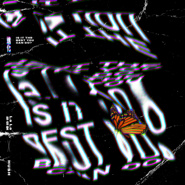<br>进化Is It the Best You Can Do](./albums/5021865245.md) | 国语 | 十一音乐, 亚神音乐 | 2020年11月05日 | EP, 单曲 | 另类唱作人 Alternative Singer-Songwriter, 国语流行 Mandarin Pop, 电音流行 Electropop |
| [<br>得到太阳](./albums/5021537619.md) | 国语 | 拾谷影业 | 2020年09月25日 | EP, 单曲 |  |
| [<br>在你不知道的时间里爱你很久](./albums/5021541624.md) | 国语 | 反正靠谱 | 2020年07月17日 | EP, 单曲 |  |
| [<br>我一直都在这里](./albums/2105723274.md) | 国语 | 听见时代 | 2020年01月14日 | EP, 单曲 | 电影原声 Film Score, 国语流行 Mandarin Pop |
| [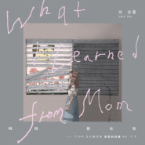<br>妈妈教会我What I Learned from Mom](./albums/2108144247.md) | 国语 | 亚神音乐 | 2019年12月24日 | EP, 单曲 | 流行 Pop |
| [<br>天使爱大象](./albums/2108146278.md) | 国语 | 亚神音乐 | 2019年12月13日 | EP, 单曲 | 流行 Pop |
| [<br>徐佳莹是日救星演唱会Live](./albums/2108159257.md) | 国语 | 亚神音乐 | 2019年12月09日 | 现场专辑 | 流行 Pop |
| [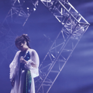<br>灰色](./albums/2108158260.md) | 国语 | 亚神音乐 | 2019年11月28日 | EP, 单曲 | 流行 Pop |
| [<br>树枝孤鸟](./albums/2108140279.md) | 闽南语 | 亚神音乐 | 2019年11月13日 | EP, 单曲 | 流行 Pop |
| [<br>树枝孤鸟 feat. 伍佰](./albums/5021027033.md) | 国语 | 亚神音乐 | 2019年11月13日 | EP, 单曲 | 流行 Pop |
| [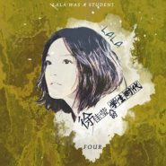<br>「徐佳莹的学生时代」FOUR](./albums/2105368406.md) | 国语 | 诺普乐文化 | 2019年10月25日 | EP, 单曲 | 国语流行 Mandarin Pop |
| [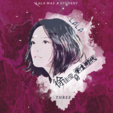<br>「徐佳莹的学生时代」THREE](./albums/2105349616.md) | 国语 | 诺普乐文化 | 2019年10月16日 | EP, 单曲 |  |
| [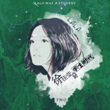<br>「徐佳莹的学生时代」TWO](./albums/2105344330.md) | 国语 | 诺普乐文化 | 2019年10月12日 | EP, 单曲 |  |
| [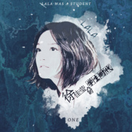<br>「徐佳莹的学生时代」ONE](./albums/2105344329.md) | 国语 | 诺普乐文化 | 2019年09月28日 | EP, 单曲 |  |
| [<br>一句话的宇宙](./albums/2104528193.md) | 国语 | 天娱传媒 | 2019年01月23日 | EP, 单曲 | 国语流行 Mandarin Pop |
| [<br>真的傻](./albums/2104603440.md) | 国语 | 奥斯特音乐 | 2019年01月21日 | 原声带, 影视音乐 | 电影原声 Film Score |
| [<br>一爱难求](./albums/2103752486.md) | 国语 | 索雅音乐 | 2018年06月20日 | EP, 单曲 | 国语流行 Mandarin Pop |
| [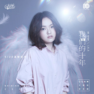<br>我们的十年Shining You 2008-2018](./albums/2103714453.md) | 国语 | 腾讯游戏 | 2018年05月20日 | EP, 单曲 | 国语流行 Mandarin Pop |
| [<br>心里学The Inner Me](./albums/2102979988.md) | 国语 | 亚神音乐 | 2017年12月27日 | 录音室专辑 | 国语流行 Mandarin Pop |
| [<br>完美落地Perfect Landing](./albums/2102875410.md) | 国语 | 相信音乐 | 2017年10月19日 | EP, 单曲 | 国语流行 Mandarin Pop |
| [<br>最初的记忆](./albums/2102752963.md) | 国语 |  | 2017年05月24日 | EP, 单曲 | 国语流行 Mandarin Pop, 电视原声 Television Music |
| [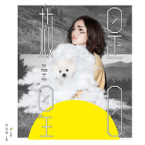<br>是日救星](./albums/2102672292.md) | 国语 | 亚神音乐 | 2016年12月26日 | EP, 单曲 | 国语流行 Mandarin Pop |
| [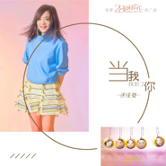<br>当我找到了你](./albums/2102652617.md) | 国语 | 乐视影业 | 2016年11月14日 | EP, 单曲 | 国语流行 Mandarin Pop |
| [<br>收•音•我是歌手4 原音精选](./albums/2102403212.md) | 国语 | 亚神音乐 | 2016年09月22日 | 现场专辑 | 国语流行 Mandarin Pop |
| [<br>不要再孤单](./albums/2100375152.md) | 国语 | 海蝶音乐 | 2016年08月12日 | EP, 单曲 | 国语流行 Mandarin Pop |
| [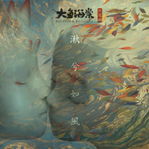<br>湫兮如风](./albums/2100366616.md) | 国语 | 霍尔果斯彩条屋影业 | 2016年07月12日 | EP, 单曲 | 国语流行 Mandarin Pop, 中国风 China-Wave |
| [<br>格斗场](./albums/2100354884.md) | 国语 | LQB Studio Limited | 2016年06月14日 | EP, 单曲 | 国语流行 Mandarin Pop |
| [<br>我所需要的](./albums/2100342626.md) | 国语 | 海蝶音乐 | 2016年05月23日 | EP, 单曲 | 国语流行 Mandarin Pop |
| [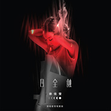<br>日全蚀 演唱会现场实录](./albums/2100256744.md) | 国语 | 亚神音乐 | 2016年05月13日 | 现场专辑 | 国语流行 Mandarin Pop, 华语唱作人 Chinese Singer-Songwriter |
| [<br>Lala's Demo](./albums/2100325000.md) | 国语 | 亚神音乐 | 2016年04月29日 | EP, 单曲 | 国语流行 Mandarin Pop |
| [<br>女人花](./albums/2100304548.md) | 国语 | 海蝶音乐 | 2016年04月05日 | EP, 单曲 | 国语流行 Mandarin Pop |
| [<br>潇洒走一回](./albums/314581835.md) | 国语 | 无限自在文化 | 2016年03月22日 | EP, 单曲 | 国语流行 Mandarin Pop |
| [<br>寻人启事](./albums/597095955.md) | 国语 | 亚神音乐 | 2014年06月13日 | 录音室专辑 | 国语流行 Mandarin Pop, 华语唱作人 Chinese Singer-Songwriter |
| [<br>在旅行的路上](./albums/1679085560.md) | 国语 |  | 2013年08月20日 | EP, 单曲 | 国语流行 Mandarin Pop |
| [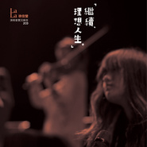<br>继续·理想人生 演唱会实况录音](./albums/64868085.md) | 国语 | 亚神音乐 | 2013年04月16日 | 现场专辑 | 根源唱作人 Singer-Songwriter, 国语流行 Mandarin Pop |
| [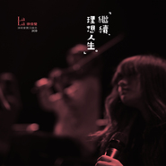<br>继续·理想人生演唱会实况录音](./albums/2108161240.md) | 其他 |  | 2013年04月16日 | EP, 单曲 |  |
| [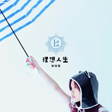<br>理想人生](./albums/513236.md) | 国语 | 亚神音乐 | 2012年06月06日 | 录音室专辑 | 根源唱作人 Singer-Songwriter, 国语流行 Mandarin Pop |
| [<br>起点](./albums/460756.md) | 国语 | 华人星光大道 | 2011年07月27日 | EP, 单曲 | 根源唱作人 Singer-Songwriter, 国语流行 Mandarin Pop |
| [<br>极限](./albums/396006.md) | 国语 | 亚神音乐 | 2010年09月03日 | 录音室专辑 | 国语流行 Mandarin Pop, 根源唱作人 Singer-Songwriter |
| [<br>LaLa 首张创作专辑](./albums/330910.md) | 国语 | 亚神音乐 | 2009年05月29日 | 录音室专辑 | 根源唱作人 Singer-Songwriter, 国语流行 Mandarin Pop |
| [<br>星光祭](./albums/320751.md) | 国语 | 超级星光大道 | 2008年08月11日 | EP, 单曲 | 根源唱作人 Singer-Songwriter, 国语流行 Mandarin Pop |

## 评论

|  |  |  |
| :-- | :-- | :-- |
| <br>[虾米用户](https://emumo.xiami.com/u/347181055)<br>乖巧的的品味分裂者<br>2021-01-07 18:18<br>赞(0) 踩(0) | <div>拉拉告诉你个秘密哦，我是男生，喜欢男生。</div> |
| <br>[虾米用户](https://emumo.xiami.com/u/358104299)<br>悲观的唯心存在现实解构虚...<br>2020-12-22 03:18<br>赞(0) 踩(0) | <div>19036</div> |
| <br>[虾米用户](https://emumo.xiami.com/u/446250416)<br><br>2020-12-21 21:52<br>赞(0) 踩(0) | <div>心动 是我送给你的第一份礼物</div> |
| <br>[虾米用户](https://emumo.xiami.com/u/421542657)<br>Joe<br>2020-12-20 14:24<br>赞(1) 踩(0) | <div>生日快樂</div> |
| <br>[虾米用户](https://emumo.xiami.com/u/347786240)<br><br>2020-12-20 11:54<br>赞(1) 踩(0) | <div>生日快乐</div> |
| <br>[虾米用户](https://emumo.xiami.com/u/15375870)<br><br>2020-12-20 11:10<br>赞(1) 踩(0) | <div>生日快乐，身体健康，事业有成，再接再厉</div> |
| <br>[虾米用户](https://emumo.xiami.com/u/361811496)<br><br>2020-12-20 11:05<br>赞(2) 踩(0) | <div>生日快乐啊 </div> |
| <br>[虾米用户](https://emumo.xiami.com/u/593193)<br><br>2020-12-20 10:54<br>赞(1) 踩(0) | <div>拉拉 生日快乐呦</div> |
| <br>[虾米用户](https://emumo.xiami.com/u/400374410)<br><br>2020-12-20 10:34<br>赞(0) 踩(0) | <div>加油，很喜欢喜你 (≧&amp;nabla;≦)ﾉ</div> |
| <br>[虾米用户](https://emumo.xiami.com/u/339497500)<br><br>2020-12-20 10:24<br>赞(0) 踩(0) | <div>小才女，爱了爱了</div> |
| <br>[虾米用户](https://emumo.xiami.com/u/378260101)<br><br>2020-12-20 01:05<br>赞(0) 踩(0) | <div>天空飘来五个字，偶像过生日</div> |
| <br>[虾米用户](https://emumo.xiami.com/u/141005728)<br>就歌唱吧，眼睛眯起来～<br>2020-10-12 19:16<br>赞(2) 踩(0) | <div>每次听到她的《修炼爱情》，都莫名其妙鼻酸一下。仿佛一下子就不快乐了。她的版本唱出了太多感情里的心酸、遗憾和无力感。好喜欢她的声线，致郁也治愈着。</div> |
| <br>[虾米用户](https://emumo.xiami.com/u/243612528)<br><br>2020-07-27 19:33<br>赞(1) 踩(0) | <div>要当妈啦，恭喜</div> |
| <br>[虾米用户](https://emumo.xiami.com/u/111414728)<br>当你内心足够强大时，才有...<br>2020-05-12 07:25<br>赞(2) 踩(0) | <div>版权回来了，都特么给老子哭！！！</div> |
| <br>[虾米用户](https://emumo.xiami.com/u/4269740)<br>等风来不如追风去<br>2020-05-11 17:57<br>赞(1) 踩(0) | <div>lala加油，爱你</div> |
| <br>[虾米用户](https://emumo.xiami.com/u/332842050)<br> 人。那么得邪恶。<br>2020-04-14 13:16<br>赞(1) 踩(0) | <div>徐嘉盈加油，在歌手第三季认识你，觉得你好酷，加油↖(^&amp;omega;^)↗</div> |
| <br>[虾米用户](https://emumo.xiami.com/u/53718156)<br>盲目平淡喜欢一滴点波澜<br>2020-04-04 13:04<br>赞(1) 踩(0) | <div>对的时间点</div> |
| <br>[虾米用户](https://emumo.xiami.com/u/16153524)<br>我还没想好要写什么...<br>2020-03-21 14:06<br>赞(2) 踩(0) | <div>终于全了</div> |
| <br>[虾米用户](https://emumo.xiami.com/u/424037079)<br>全世界最好的虾米♥️TY...<br>2020-03-21 06:52<br>赞(2) 踩(0) | <div>好喜欢Lala小仙女 人美歌甜</div> |
| <br>[虾米用户](https://emumo.xiami.com/u/15477519)<br>爱  是生命的和弦，而不...<br>2020-03-12 14:23<br>赞(5) 踩(0) | <div>感谢虾米把版权回归&amp;hellip;</div> |
| <br>[虾米用户](https://emumo.xiami.com/u/57905202)<br><br>2020-03-11 11:16<br>赞(6) 踩(0) | <div>欢迎拉拉回归 </div> |
| <br>[虾米用户](https://emumo.xiami.com/u/318132)<br>抠啦<br>2020-03-10 12:21<br>赞(14) 踩(0) | <div>欢迎徐拉拉的版权回归虾米，撒花</div> |
| <br>[虾米用户](https://emumo.xiami.com/u/88266612)<br> 晚风吹过..<br>2020-02-20 22:55<br>赞(3) 踩(0) | <div>期待lala在《歌手》的表现！宝藏女孩 治愈女声！</div> |
| <br>[虾米用户](https://emumo.xiami.com/u/2145666)<br><br>2019-12-20 19:51<br>赞(2) 踩(0) | <div>祝生日快乐！</div> |
| <br>[虾米用户](https://emumo.xiami.com/u/424744633)<br>迷茫的时候，要选择难走的...<br>2019-12-20 19:49<br>赞(2) 踩(0) | <div>祝佳莹生日快乐！2020要健康幸福！</div> |
| <br>[虾米用户](https://emumo.xiami.com/u/157969402)<br>有些事现在不做，一辈子都...<br>2019-12-20 11:56<br>赞(0) 踩(0) | <div>生日快乐</div> |
| <br>[虾米用户](https://emumo.xiami.com/u/49388900)<br>本该早点死，却不知为何活...<br>2019-12-20 10:18<br>赞(0) 踩(0) | <div>“灵魂舞者”lala生日快乐</div> |
| <br>[虾米用户](https://emumo.xiami.com/u/49388900)<br>本该早点死，却不知为何活...<br>2019-12-20 10:18<br>赞(1) 踩(0) | <div>“灵魂舞者”lala生日快乐</div> |
| <br>[虾米用户](https://emumo.xiami.com/u/4346767)<br>Whale Song<br>2019-12-20 10:02<br>赞(1) 踩(0) | <div>OMG，今天也是我生日。早晨在电台听到《失落沙洲》，这种小幸运很暖心。</div> |
| <br>[虾米用户](https://emumo.xiami.com/u/2796166)<br>最爱莫文蔚.....<br>2019-10-31 00:03<br>赞(1) 踩(0) | <div>加油~~</div> |
| <br>[虾米用户](https://emumo.xiami.com/u/43654142)<br> <br>2019-10-24 19:06<br>赞(2) 踩(0) | <div>在忙也要抽时间打麻将哦！</div> |
| <br>[虾米用户](https://emumo.xiami.com/u/225045741)<br>外向的孤独患者<br>2019-09-17 21:08<br>赞(1) 踩(0) | <div>开心 啦啦啦～</div> |
| <br>[虾米用户](https://emumo.xiami.com/u/358104299)<br>悲观的唯心存在现实解构虚...<br>2019-06-25 14:22<br>赞(1) 踩(0) | <div>12218</div> |
| <br>[虾米用户](https://emumo.xiami.com/u/53718156)<br>盲目平淡喜欢一滴点波澜<br>2019-06-16 06:33<br>赞(0) 踩(0) | <div>除了你之外的空白 还有谁教我勇敢</div> |
| <br>[虾米用户](https://emumo.xiami.com/u/293073007)<br>温暖致未来<br>2019-04-21 14:30<br>赞(1) 踩(0) | <div>人美歌甜好听</div> |
| <br>[虾米用户](https://emumo.xiami.com/u/245220530)<br><br>2019-02-15 15:13<br>赞(1) 踩(0) | <div>听她的歌总想跟着唱，然后说自己唱的是什么呀</div> |
| <br>[虾米用户](https://emumo.xiami.com/u/413504475)<br><br>2019-02-03 09:21<br>赞(0) 踩(0) | <div>来北京吧，我想听你唱</div> |
| <br>[虾米用户](https://emumo.xiami.com/u/257598102)<br><br>2019-01-31 15:20<br>赞(0) 踩(0) | <div>！！！！！</div> |
| <br>[虾米用户](https://emumo.xiami.com/u/355973826)<br><br>2019-01-28 23:01<br>赞(1) 踩(0) | <div>一直喜欢你，希望你能越走越好！加油，徐佳莹！！</div> |
| <br>[虾米用户](https://emumo.xiami.com/u/329628517)<br>徐佳莹迷弟<br>2019-01-10 09:59<br>赞(1) 踩(0) | <div>女神，女神，女神，女神</div> |
| <br>[虾米用户](https://emumo.xiami.com/u/326734921)<br>Simple livin...<br>2019-01-06 02:26<br>赞(0) 踩(0) | <div>可爱女人</div> |
| <br>[虾米用户](https://emumo.xiami.com/u/284644291)<br><br>2018-12-21 08:30<br>赞(1) 踩(0) | <div>永远爱lala.生日快乐啊</div> |
| <br>[虾米用户](https://emumo.xiami.com/u/42518622)<br><br>2018-12-20 23:27<br>赞(1) 踩(0) | <div>我们的徐佳莹，我们的爱，我们的永远</div> |
| <br>[虾米用户](https://emumo.xiami.com/u/258317850)<br>你若安好，便是晴天<br>2018-12-20 22:05<br>赞(0) 踩(0) | <div>生日快乐</div> |
| <br>[虾米用户](https://emumo.xiami.com/u/341678400)<br>开心每天<br>2018-12-20 19:27<br>赞(0) 踩(0) | <div>生日快乐！</div> |
| <br>[虾米用户](https://emumo.xiami.com/u/37501538)<br><br>2018-12-20 16:57<br>赞(0) 踩(0) | <div>很喜欢的歌手 生日快乐 希望一直有好听的歌曲 </div> |
| <br>[虾米用户](https://emumo.xiami.com/u/357215600)<br>短歌微吟不能长<br>2018-12-20 16:52<br>赞(0) 踩(0) | <div>祝福，生日快樂</div> |
| <br>[虾米用户](https://emumo.xiami.com/u/334917074)<br>唐龍<br>2018-12-20 11:29<br>赞(0) 踩(0) | <div>生日快乐 </div> |
| <br>[虾米用户](https://emumo.xiami.com/u/47494497)<br>李志、陈升，“虾米也没有...<br>2018-12-20 10:56<br>赞(0) 踩(0) | <div>生快!</div> |
| <br>[虾米用户](https://emumo.xiami.com/u/52531092)<br>我不怕千万人阻挡，只怕自...<br>2018-12-20 10:15<br>赞(0) 踩(0) | <div>Lala生日快乐啊！愿你永远快乐的做自己 </div> |
| <br>[虾米用户](https://emumo.xiami.com/u/989784)<br> <br>2018-12-20 10:14<br>赞(0) 踩(0) | <div>版权来虾米吧</div> |
| <br>[虾米用户](https://emumo.xiami.com/u/6914343)<br> <br>2018-12-20 10:13<br>赞(0) 踩(0) | <div>生日快乐～～</div> |
| <br>[虾米用户](https://emumo.xiami.com/u/23087752)<br><br>2018-12-20 10:10<br>赞(0) 踩(0) | <div>Happy birthday</div> |
| <br>[虾米用户](https://emumo.xiami.com/u/407259278)<br>我的那个她，你在哪儿？<br>2018-12-20 10:06<br>赞(0) 踩(0) | <div>亲爱的莹莹，不会反感我这样称呼你吧。祝你生日快乐，我可爱的公主</div> |
| <br>[虾米用户](https://emumo.xiami.com/u/46120357)<br>暂无签名~<br>2018-12-20 10:04<br>赞(0) 踩(0) | <div>lala生快</div> |
| <br>[虾米用户](https://emumo.xiami.com/u/335597340)<br><br>2018-12-20 10:03<br>赞(0) 踩(0) | <div>祝lala生日快乐</div> |
| <br>[虾米用户](https://emumo.xiami.com/u/113575296)<br><br>2018-12-20 10:03<br>赞(0) 踩(0) | <div>我不是一定要你回来<br>只是当我一个人看海</div> |
| <br>[虾米用户](https://emumo.xiami.com/u/289115559)<br><br>2018-12-20 10:02<br>赞(0) 踩(0) | <div>祝福拉拉</div> |
| <br>[虾米用户](https://emumo.xiami.com/u/299719)<br><br>2018-12-20 10:01<br>赞(0) 踩(0) | <div>很开心，我家宝贝今天生日  亲爱的lala生快</div> |
| <br>[虾米用户](https://emumo.xiami.com/u/331673705)<br>我还没想好要写什么...<br>2018-12-16 09:34<br>赞(0) 踩(0) | <div>（完美落地）不是你的作品，请注明！！您最多算一位翻唱歌手</div> |
| <br>[虾米用户](https://emumo.xiami.com/u/49178685)<br>本心<br>2018-12-13 13:04<br>赞(0) 踩(0) | <div>你好 ，lala。</div> |
| <br>[虾米用户](https://emumo.xiami.com/u/28790505)<br><br>2018-11-30 17:51<br>赞(0) 踩(0) | <div>好听！</div> |
| <br>[虾米用户](https://emumo.xiami.com/u/3714491)<br>混吃等死中<br>2018-11-12 23:37<br>赞(1) 踩(0) | <div>蒙面唱将 一开口就知道是你啦！</div> |
| <br>[虾米用户](https://emumo.xiami.com/u/162269666)<br>哈哈哈哈哈<br>2018-10-14 22:52<br>赞(0) 踩(0) | <div>声音超好听，大爱你。</div> |
| <br>[虾米用户](https://emumo.xiami.com/u/18039659)<br>我还没想好要写什么...<br>2018-10-14 12:23<br>赞(1) 踩(0) | <div>外表弱小内心强大</div> |
| <br>[虾米用户](https://emumo.xiami.com/u/334713697)<br>等待输入……<br>2018-10-09 23:16<br>赞(0) 踩(0) | <div>缺点好歌，其他都好</div> |
| ⇒ | <br>[虾米用户](https://emumo.xiami.com/u/18039659)<br>我还没想好要写什么...<br>2018-10-14 12:24<br>赞(0) 踩(0) | <div>？？？？她写了好多好歌好吗？！！！作词作曲！！！每一首都好听很用心的好吗？？？？</div> |
| <br>[虾米用户](https://emumo.xiami.com/u/339191478)<br> <br>2018-10-04 15:38<br>赞(0) 踩(0) | <div>❤</div> |
| <br>[虾米用户](https://emumo.xiami.com/u/350031041)<br>我还没想好要写什么...<br>2018-09-29 01:09<br>赞(0) 踩(0) | <div>虾米最让我失望的就是JJ和lala的歌都不能听和下载！</div> |
| <br>[虾米用户](https://emumo.xiami.com/u/404589619)<br><br>2018-09-23 18:53<br>赞(0) 踩(0) | <div>拉拉加油！</div> |
| <br>[虾米用户](https://emumo.xiami.com/u/278397156)<br><br>2018-09-17 17:24<br>赞(2) 踩(0) | <div>我宣布徐佳莹的演唱会，哪座城市都会有一位男演员带我去。如果北京场的话，宣布叫黄晓明带我去。如果上海场的话，宣布叫何润东带我去。如果是深圳场的话，宣布叫周渝民带我去。好像让我最喜欢的男演员都想带我去看徐佳莹的演唱会。因为两盒乐高玩具不够，如果去了北京的话，徐佳莹肯定会给我送好几百箱，或者是1000多箱。在北京，上海，深圳的话，徐佳莹就给我送任何东西。徐佳莹就给我买一盒真彩牌子油画棒，48色或者是72色，都可以买。因为徐佳莹就想给我买一盒48色的。</div> |
| <br>[虾米用户](https://emumo.xiami.com/u/3074474)<br>黄金十年<br>2018-09-08 22:52<br>赞(0) 踩(0) | <div>你敢不敢 承认我爱上你的坏<br>五年后成都再见 距离远了九千多米 hello徐小（tai）姐（tai）<br>新歌完全不会唱简直被嘲笑假粉丝 但是继续理想人生那场唱过的每一首再次出现时 思绪都无阔避免地被带回五年前 那个high翻了东郊记忆全场的你<br>最后 台湾单方面宣布你已婚 是无效的 徒劳的 我们大陆义正言辞拒绝的 不承认的<br>你依然还是那个自带鬼脸特效的心中宝岛地表最强女歌手</div> |
| <br>[虾米用户](https://emumo.xiami.com/u/50946783)<br>走走停停，驺驺听听…<br>2018-09-08 02:59<br>赞(0) 踩(0) | <div>第一首听到徐佳莹的歌《明知故犯》是在大五环上飞驰的时候，其实给我的感觉就是虽然女声相对纤细一些，但是却有一种呼之欲出的力量！现在都记得当时的感觉-震撼！</div> |
| <br>[虾米用户](https://emumo.xiami.com/u/52056952)<br>人生即是到來、相遇、陪伴...<br>2018-09-03 19:15<br>赞(0) 踩(0) | <div>ヾ(❀╹◡╹)ﾉ~</div> |
| <br>[虾米用户](https://emumo.xiami.com/u/2796166)<br>最爱莫文蔚.....<br>2018-08-30 06:28<br>赞(0) 踩(0) | <div>我喜欢张洢豪~ 但我更喜欢你~ 我期待你们两人明晚在《明日之子二》5进3的合作。</div> |
| <br>[虾米用户](https://emumo.xiami.com/u/164055740)<br><br>2018-08-21 15:42<br>赞(1) 踩(0) | <div>心里学为什么没有版权虾米真是</div> |
| <br>[虾米用户](https://emumo.xiami.com/u/378789945)<br><br>2018-08-18 08:50<br>赞(1) 踩(0) | <div>您的歌真的很好听，我喜欢</div> |
| <br>[虾米用户](https://emumo.xiami.com/u/312091774)<br>超甜的小姐姐.<br>2018-08-12 16:47<br>赞(2) 踩(0) | <div>唱功很好，也很有感情   </div> |
| <br>[虾米用户](https://emumo.xiami.com/u/269197127)<br><br>2018-08-07 19:43<br>赞(4) 踩(0) | <div>祝愿隹莹2018演唱会成功  </div> |
| <br>[虾米用户](https://emumo.xiami.com/u/329824447)<br>做你想做的梦，去你想去的...<br>2018-08-07 01:31<br>赞(3) 踩(0) | <div>新婚快乐哦第一次来听你歌</div> |
| <br>[虾米用户](https://emumo.xiami.com/u/57905202)<br><br>2018-08-05 17:16<br>赞(3) 踩(0) | <div>恭喜lala</div> |
| <br>[虾米用户](https://emumo.xiami.com/u/319722031)<br>难事为之难亦易，易事不为...<br>2018-08-05 16:43<br>赞(2) 踩(0) | <div>新婚幸福，哦</div> |
| <br>[虾米用户](https://emumo.xiami.com/u/877150)<br>我还没想好要写什么...<br>2018-08-05 15:43<br>赞(1) 踩(0) | <div>新婚快乐，恭喜恭喜~</div> |
| <br>[虾米用户](https://emumo.xiami.com/u/3714491)<br>混吃等死中<br>2018-08-05 14:17<br>赞(1) 踩(0) | <div>恭喜</div> |
| <br>[虾米用户](https://emumo.xiami.com/u/47944656)<br><br>2018-07-25 17:02<br>赞(1) 踩(0) | <div></div> |
| <br>[虾米用户](https://emumo.xiami.com/u/47944656)<br><br>2018-07-24 13:33<br>赞(1) 踩(0) | <div>对</div> |
| <br>[虾米用户](https://emumo.xiami.com/u/88266612)<br> 晚风吹过..<br>2018-07-07 14:17<br>赞(1) 踩(0) | <div>今年的最佳女歌手/歌后实至名归！</div> |
| <br>[虾米用户](https://emumo.xiami.com/u/193740515)<br><br>2018-07-07 07:39<br>赞(1) 踩(0) | <div>lala恭喜你！～～</div> |
| <br>[虾米用户](https://emumo.xiami.com/u/270082040)<br>看看小说，听听音乐，只为...<br>2018-07-02 00:43<br>赞(1) 踩(0) | <div>翻唱真得很nice</div> |
| <br>[虾米用户](https://emumo.xiami.com/u/31341165)<br>我还没想好要写什么...<br>2018-07-01 15:04<br>赞(2) 踩(0) | <div>有才有运，遥祝演出成功！</div> |
| <br>[虾米用户](https://emumo.xiami.com/u/31341165)<br>我还没想好要写什么...<br>2018-07-01 11:58<br>赞(1) 踩(0) | <div>好听，生活、梦想、聪慧、执着、爱情、坚持。</div> |
| <br>[虾米用户](https://emumo.xiami.com/u/31341165)<br>我还没想好要写什么...<br>2018-07-01 07:25<br>赞(1) 踩(0) | <div>偶像，真的好喜欢你，加油！</div> |
| <br>[虾米用户](https://emumo.xiami.com/u/157774822)<br>卸掉了陪我多年的酷我音乐...<br>2018-06-26 00:08<br>赞(1) 踩(0) | <div>歌后你好</div> |
| <br>[虾米用户](https://emumo.xiami.com/u/48800185)<br>上得天堂，下得牢房。马中...<br>2018-06-24 15:03<br>赞(1) 踩(0) | <div>恭喜恭喜恭喜啊！敲锣打鼓啦！哈哈哈哈哈哈</div> |
| <br>[虾米用户](https://emumo.xiami.com/u/35469210)<br>杂食动物<br>2018-06-24 01:34<br>赞(1) 踩(0) | <div>为你开心</div> |
| <br>[虾米用户](https://emumo.xiami.com/u/48896344)<br>自闭<br>2018-06-24 01:05<br>赞(2) 踩(0) | <div>恭喜Lala</div> |
| <br>[虾米用户](https://emumo.xiami.com/u/991341)<br>微信：jeans_rob...<br>2018-06-24 00:48<br>赞(45) 踩(0) | <div>恭喜徐佳莹成为第一位拥有金曲奖最佳新人，最佳国语女演唱人，最佳国语专辑的女歌手，实至名归！</div> |
| <br>[虾米用户](https://emumo.xiami.com/u/294125799)<br>Ranger<br>2018-06-23 23:34<br>赞(3) 踩(0) | <div>恭喜lala 只求版权</div> |
| <br>[虾米用户](https://emumo.xiami.com/u/125973444)<br>爱着爱着就永远。<br>2018-06-23 23:31<br>赞(63) 踩(0) | <div>​第29届金曲奖最佳国语女歌手：徐佳莹 ​<br>第三位同时拥有金曲新人和金曲歌后的歌手<br>恭喜拉拉，实至名归</div> |
| ⇒ | <br>[虾米用户](https://emumo.xiami.com/u/212815143)<br><br>2018-07-07 08:56<br>赞(0) 踩(0) | <div>她还是唯一拿过国专的女新人奖得主。男新人是陶喆</div> |
| ⇒ | <br>[虾米用户](https://emumo.xiami.com/u/122522494)<br>Jerry Zhang<br>2018-07-14 03:59<br>赞(0) 踩(0) | <div><q><b>Xanadu说：</b></q></div> |
| ⇒ | <br>[虾米用户](https://emumo.xiami.com/u/122522494)<br>Jerry Zhang<br>2018-07-14 04:01<br>赞(0) 踩(0) | <div><q><b>jerry说：</b></q></div> |
| <br>[虾米用户](https://emumo.xiami.com/u/241078645)<br>就讓我被毀滅 作個廢人無...<br>2018-06-23 23:25<br>赞(2) 踩(0) | <div>歌后拉拉 </div> |
| <br>[虾米用户](https://emumo.xiami.com/u/9463262)<br>暂无<br>2018-06-23 23:24<br>赞(1) 踩(0) | <div>这边也要恭喜一次的！！！</div> |
| <br>[虾米用户](https://emumo.xiami.com/u/241078645)<br>就讓我被毀滅 作個廢人無...<br>2018-06-14 21:31<br>赞(3) 踩(0) | <div>版权啊，唯一喜欢的女歌手。。。。。。。啊啊啊啊啊啊啊</div> |
| <br>[虾米用户](https://emumo.xiami.com/u/355349611)<br><br>2018-06-13 18:59<br>赞(0) 踩(0) | <div>佳莹版的旅行的意义好听，我翻的  <a href="https://changba.com/s/3bSjIDDw6lrB54oDWa-krQ" target="_blank" rel="nofollow noreferrer noopener">https://changba.com/s/3bSjIDDw6lrB54oDWa-krQ</a></div> |
| <br>[虾米用户](https://emumo.xiami.com/u/375534147)<br>享受生活，倾听心灵的声音...<br>2018-06-13 15:00<br>赞(0) 踩(0) | <div>声音超好</div> |
| <br>[虾米用户](https://emumo.xiami.com/u/1872145)<br>  <br>2018-06-11 09:07<br>赞(0) 踩(0) | <div>莹莹加油</div> |
| <br>[虾米用户](https://emumo.xiami.com/u/303092856)<br>我还没想好要写什么...<br>2018-06-10 18:56<br>赞(0) 踩(0) | <div>   </div> |
| <br>[虾米用户](https://emumo.xiami.com/u/303506160)<br>因为我对你爱的深沉<br>2018-06-09 00:13<br>赞(1) 踩(0) | <div>嘿呦</div> |
| <br>[虾米用户](https://emumo.xiami.com/u/259130102)<br><br>2018-06-08 21:17<br>赞(0) 踩(0) | <div>身為拉拉五專時的學校學妹為榮 </div> |
| <br>[虾米用户](https://emumo.xiami.com/u/1872145)<br>  <br>2018-06-07 19:02<br>赞(1) 踩(0) | <div>小莹莹加油</div> |
| <br>[虾米用户](https://emumo.xiami.com/u/260167529)<br>爱音乐的疯子<br>2018-06-06 18:06<br>赞(0) 踩(0) | <div>才女精灵 她和许哲佩是最适合这个形容的</div> |
| <br>[虾米用户](https://emumo.xiami.com/u/263562473)<br><br>2018-06-04 01:04<br>赞(1) 踩(0) | <div>是自动发送的收藏消息还是你看到啦？</div> |
| <br>[虾米用户](https://emumo.xiami.com/u/84209664)<br><br>2018-06-01 21:30<br>赞(0) 踩(0) | <div>徐佳莹整体的版权在哪家啊</div> |
| ⇒ | <br>[虾米用户](https://emumo.xiami.com/u/10156323)<br>我还是依旧记得依然知道他...<br>2018-06-02 00:44<br>赞(0) 踩(0) | <div>太和（百度）音乐</div> |
| ⇒ | <br>[虾米用户](https://emumo.xiami.com/u/84209664)<br><br>2018-06-13 21:36<br>赞(0) 踩(0) | <div><q><b>JO2EY说：</b></q></div> |
| <br>[虾米用户](https://emumo.xiami.com/u/169469684)<br>你好<br>2018-06-01 10:24<br>赞(0) 踩(0) | <div></div> |
| <br>[虾米用户](https://emumo.xiami.com/u/336802265)<br>人生梦<br>2018-05-31 02:21<br>赞(0) 踩(0) | <div>做我的女人</div> |
| <br>[虾米用户](https://emumo.xiami.com/u/2725165)<br>我还没想好要写什么...<br>2018-05-27 21:14<br>赞(1) 踩(0) | <div>雲林在地英那來看你了，加油徐佳瑩，你是我第二個女偶像，第一個是梁靜茹，你們都棒棒的歌聲</div> |
| ⇒ | <br>[虾米用户](https://emumo.xiami.com/u/205868239)<br>用黑瓷做條大馬魚<br>2018-07-14 23:04<br>赞(0) 踩(0) | <div>哇和我一樣誒 </div> |
| <br>[虾米用户](https://emumo.xiami.com/u/336066654)<br>当我看着你哭红了眼睛你猜...<br>2018-05-26 11:24<br>赞(0) 踩(0) | <div>声音好好听，很有磁性</div> |
| <br>[虾米用户](https://emumo.xiami.com/u/336437280)<br>终于结束的起点，终于写下...<br>2018-04-27 14:02<br>赞(1) 踩(0) | <div>说不清道不明，就是很好听的声音，加油加油！！！</div> |
| <br>[虾米用户](https://emumo.xiami.com/u/144620702)<br><br>2018-04-26 00:09<br>赞(0) 踩(0) | <div>2535（ ）</div> |
| <br>[虾米用户](https://emumo.xiami.com/u/354959352)<br><br>2018-04-19 15:14<br>赞(1) 踩(0) | <div>加油lala</div> |
| <br>[虾米用户](https://emumo.xiami.com/u/303506160)<br>因为我对你爱的深沉<br>2018-04-18 07:31<br>赞(1) 踩(0) | <div>嘿呦</div> |
| <br>[虾米用户](https://emumo.xiami.com/u/44388690)<br><br>2018-04-15 20:43<br>赞(0) 踩(0) | <div>lala，nice to meet you</div> |
| <br>[虾米用户](https://emumo.xiami.com/u/89029652)<br>我还没想好要写什么...<br>2018-04-14 00:37<br>赞(0) 踩(0) | <div>怎么好多又听不了了。。</div> |
| <br>[虾米用户](https://emumo.xiami.com/u/277814847)<br>梦里不知身是客，一晌贪欢<br>2018-04-02 00:43<br>赞(1) 踩(0) | <div>版权版权啊</div> |
| <br>[虾米用户](https://emumo.xiami.com/u/53718156)<br>盲目平淡喜欢一滴点波澜<br>2018-04-01 10:16<br>赞(3) 踩(0) | <div>火了 真的火了</div> |
| <br>[虾米用户](https://emumo.xiami.com/u/53718156)<br>盲目平淡喜欢一滴点波澜<br>2018-04-01 10:05<br>赞(0) 踩(0) | <div>发光的闪烁着</div> |
| <br>[虾米用户](https://emumo.xiami.com/u/343417565)<br><br>2018-03-26 15:47<br>赞(1) 踩(0) | <div>喜欢她唱的我也不想这样。感觉比王菲的好。她的声音听得很舒服。</div> |
| <br>[虾米用户](https://emumo.xiami.com/u/246333986)<br>享受孤独<br>2018-03-20 13:20<br>赞(1) 踩(0) | <div>听过她的第一首歌是《柳树下》，直到现在还是喜欢单曲循环。</div> |
| <br>[虾米用户](https://emumo.xiami.com/u/206861795)<br>XMLr.<br>2018-03-07 18:57<br>赞(3) 踩(0) | <div>徐佳莹的歌适合思念～单相思。</div> |
| <br>[虾米用户](https://emumo.xiami.com/u/343032315)<br>我爱他，他不爱我，最差的...<br>2018-03-06 17:25<br>赞(0) 踩(0) | <div>期待下一部作品</div> |
| <br>[虾米用户](https://emumo.xiami.com/u/343032315)<br>我爱他，他不爱我，最差的...<br>2018-03-06 17:25<br>赞(0) 踩(0) | <div>好听哦</div> |
| <br>[虾米用户](https://emumo.xiami.com/u/353016737)<br><br>2018-03-04 00:29<br>赞(0) 踩(0) | <div>好听   </div> |
| <br>[虾米用户](https://emumo.xiami.com/u/10762562)<br><br>2018-02-10 00:56<br>赞(3) 踩(0) | <div>怎么又是悄无声息地发了（没有第一时间听捶心口）</div> |
| <br>[虾米用户](https://emumo.xiami.com/u/308988048)<br>随意听<br>2018-02-07 09:16<br>赞(3) 踩(0) | <div>很不错的才华型女歌手</div> |
| <br>[虾米用户](https://emumo.xiami.com/u/347808657)<br><br>2018-02-05 17:15<br>赞(0) 踩(0) | <div>爱佳莹</div> |
| <br>[虾米用户](https://emumo.xiami.com/u/332776816)<br><br>2018-02-05 08:05<br>赞(3) 踩(0) | <div>******</div> |
| <br>[虾米用户](https://emumo.xiami.com/u/1302357)<br><br>2018-02-02 23:56<br>赞(0) 踩(0) | <div>我爱上你了，拉拉。</div> |
| <br>[虾米用户](https://emumo.xiami.com/u/259984201)<br><br>2018-01-26 18:42<br>赞(1) 踩(0) | <div>徐佳莹你到底在干什么？</div> |
| <br>[虾米用户](https://emumo.xiami.com/u/333715876)<br>烧完美好青春，换一个老伴...<br>2018-01-17 18:12<br>赞(0) 踩(0) | <div>都是live啊。</div> |
| <br>[虾米用户](https://emumo.xiami.com/u/5755)<br><br>2018-01-11 10:31<br>赞(26) 踩(0) | <div>歌手 那期知道她要参加 我就想她不红 天理难容。果然红了 ，还有 ALIN ， 红的不要不要的 。 可我居然有点失落。 好像女朋友 被人抢了一样 。。呜。。</div> |
| ⇒ | <br>[虾米用户](https://emumo.xiami.com/u/23036349)<br><br>2019-01-31 00:48<br>赞(0) 踩(0) | <div>你不要胡说哦，谁是你女盆友？！lala是我的！</div> |
| ⇒ | <br>[虾米用户](https://emumo.xiami.com/u/113047714)<br>当夜幕降临<br>2019-03-31 20:41<br>赞(0) 踩(0) | <div>原来粉丝都是这样的心理，很喜欢很喜欢一个人，把他捧在手心里，很怕别人抢走hhhhh但是又想让别人知道他很厉害，都好矛盾啊</div> |
| <br>[虾米用户](https://emumo.xiami.com/u/330926963)<br><br>2018-01-07 22:27<br>赞(1) 踩(0) | <div>为什么没有版权？</div> |
| ⇒ | <br>[虾米用户](https://emumo.xiami.com/u/18282119)<br>我就是我，独一无二<br>2018-01-26 11:38<br>赞(0) 踩(0) | <div>百度音乐独家。</div> |
| <br>[虾米用户](https://emumo.xiami.com/u/42529893)<br> <br>2018-01-06 22:27<br>赞(3) 踩(0) | <div>徐佳莹简直拯救我去KTV想唱的歌全是男key的魔咒</div> |
| ⇒ | <br>[虾米用户](https://emumo.xiami.com/u/323319238)<br> 如果你喜欢下雨，这里的...<br>2018-01-08 10:37<br>赞(0) 踩(0) | <div>握爪</div> |
| <br>[虾米用户](https://emumo.xiami.com/u/334760765)<br>这是一个新的账号 旧的故...<br>2018-01-05 09:57<br>赞(19) 踩(0) | <div>当时认识拉拉的很小众，积极向身边扥推荐她，还给洪涛导演微博留言，希望可以请拉拉上我是歌手！结果真的实现啦！！<br>很开心一个金子被发现了！喜欢拉拉现在的状态 不浮躁 很高兴你还是我的唱故事的徐歌手❤</div> |
| ⇒ | <br>[虾米用户](https://emumo.xiami.com/u/122408898)<br>2014注册<br>2018-04-29 20:24<br>赞(0) 踩(0) | <div>谁爱我的搞怪爱我懒散状态姿态再说吧算了</div> |
| <br>[虾米用户](https://emumo.xiami.com/u/339641178)<br><br>2018-01-03 17:53<br>赞(1) 踩(0) | <div>徐佳莹真的好棒 </div> |
| <br>[虾米用户](https://emumo.xiami.com/u/342054604)<br>svip<br>2018-01-02 23:41<br>赞(2) 踩(0) | <div>女人的小聪明和小才情 把她放进了我的循环歌单了 </div> |
| <br>[虾米用户](https://emumo.xiami.com/u/294978439)<br>可可爱爱<br>2018-01-01 10:36<br>赞(0) 踩(0) | <div>喜欢 </div> |
| <br>[虾米用户](https://emumo.xiami.com/u/294978439)<br>可可爱爱<br>2018-01-01 10:35<br>赞(0) 踩(0) | <div>喜欢</div> |
| <br>[虾米用户](https://emumo.xiami.com/u/319864686)<br><br>2017-12-31 11:58<br>赞(1) 踩(0) | <div>好喜欢佳莹</div> |
| <br>[虾米用户](https://emumo.xiami.com/u/341897868)<br><br>2017-12-31 01:35<br>赞(1) 踩(0) | <div>收到私信，管它是不是自动私信，非常喜欢你的歌</div> |
| <br>[虾米用户](https://emumo.xiami.com/u/334935388)<br><br>2017-12-27 08:09<br>赞(1) 踩(0) | <div>好听</div> |
| <br>[虾米用户](https://emumo.xiami.com/u/8635478)<br>换个地方思考<br>2017-12-21 17:10<br>赞(2) 踩(0) | <div>哟，好像有些歌曲回来了喔！！[撒花~]</div> |
| <br>[虾米用户](https://emumo.xiami.com/u/330926963)<br><br>2017-12-20 15:46<br>赞(1) 踩(0) | <div>我拉 生日快乐！两首主打都很好听！期待全专&amp;hellip;&amp;hellip;。</div> |
| <br>[虾米用户](https://emumo.xiami.com/u/318882698)<br><br>2017-12-20 00:36<br>赞(0) 踩(0) | <div>佳莹生日快乐！</div> |
| <br>[虾米用户](https://emumo.xiami.com/u/182488740)<br>best wishes ...<br>2017-12-18 22:21<br>赞(2) 踩(0) | <div>新头像我换的  还行么</div> |
| <br>[虾米用户](https://emumo.xiami.com/u/41828526)<br>海量歌无版权做歌单无意义<br>2017-12-18 20:52<br>赞(0) 踩(0) | <div>也许是我们的音乐类型太少，外语的乡村、爵士、灵魂、摇滚、电子...都有大把优秀歌曲，而充斥我们市场的似乎都是流行，情呀爱啊，一点点摇滚民谣在挣扎，汪峰的人文摇滚似乎也要江郎才尽了，李宗盛都要10年磨一歌了</div> |
| <br>[虾米用户](https://emumo.xiami.com/u/296547605)<br>走自己的路，让别人说去吧...<br>2017-12-18 16:45<br>赞(1) 踩(0) | <div>金志文你要是没有女朋友的话，带徐佳莹一起远走高飞吧！  </div> |
| ⇒ | <br>[虾米用户](https://emumo.xiami.com/u/185600354)<br><br>2017-12-22 01:02<br>赞(0) 踩(0) | <div>然而LaLa有男朋友  </div> |
| <br>[虾米用户](https://emumo.xiami.com/u/42076306)<br>每个人都是单行道的跳蚤，...<br>2017-12-15 20:26<br>赞(1) 踩(0) | <div>好像喜欢lala好久了吧&amp;hellip;&amp;hellip;久到连我自己都忘了</div> |
| <br>[虾米用户](https://emumo.xiami.com/u/208051085)<br><br>2017-12-14 14:24<br>赞(0) 踩(0) | <div>给拉拉打call</div> |
| <br>[虾米用户](https://emumo.xiami.com/u/5440629)<br><br>2017-12-13 11:41<br>赞(1) 踩(0) | <div>有些人就是会毫无保留的喜欢她</div> |
| <br>[虾米用户](https://emumo.xiami.com/u/339583747)<br>54088<br>2017-12-11 23:13<br>赞(0) 踩(0) | <div>爱她一辈子！</div> |
| <br>[虾米用户](https://emumo.xiami.com/u/339583747)<br>54088<br>2017-12-11 23:12<br>赞(0) 踩(0) | <div>女神唱的！赞！！  </div> |
| <br>[虾米用户](https://emumo.xiami.com/u/339293262)<br><br>2017-12-09 22:48<br>赞(0) 踩(0) | <div></div> |
| <br>[虾米用户](https://emumo.xiami.com/u/5187921)<br><br>2017-12-08 21:19<br>赞(0) 踩(0) | <div>支持一下</div> |
| <br>[虾米用户](https://emumo.xiami.com/u/3513351)<br>Games We Pla...<br>2017-12-07 11:54<br>赞(3) 踩(0) | <div>徐佳莹的创作很贴近生活，真实感很强。我记得刚出《寻人启事》这歌的时候，还没有特别期待，以为只是单曲，想不到整个专辑以此为主题开始让我觉得是她有史以来最棒的一张。看过她两次现场，被她的声音震撼以及打动到，期待她的新专辑《心里学》。</div> |
| ⇒ | <br>[虾米用户](https://emumo.xiami.com/u/330926963)<br><br>2017-12-11 07:39<br>赞(0) 踩(0) | <div>lala是我个人觉得很少见的从第一张专辑开始，一张比一张更令人期待的创作歌手。当然，LIVE超级nice。</div> |
| <br>[虾米用户](https://emumo.xiami.com/u/251417564)<br><br>2017-12-06 13:14<br>赞(0) 踩(0) | <div>喜欢你哟</div> |
| <br>[虾米用户](https://emumo.xiami.com/u/309821391)<br> <br>2017-12-05 18:30<br>赞(1) 踩(0) | <div>喜欢❤️</div> |
| <br>[虾米用户](https://emumo.xiami.com/u/32308850)<br>暂无签名~<br>2017-12-05 12:39<br>赞(1) 踩(0) | <div>为什么没有版权</div> |
| <br>[虾米用户](https://emumo.xiami.com/u/51398233)<br><br>2017-12-01 14:19<br>赞(0) 踩(0) | <div>我在我歌之前就听Lala了，结果如今她却不能听了&amp;hellip;</div> |
| <br>[虾米用户](https://emumo.xiami.com/u/53718156)<br>盲目平淡喜欢一滴点波澜<br>2017-11-28 09:59<br>赞(2) 踩(0) | <div>最爱了</div> |
| <br>[虾米用户](https://emumo.xiami.com/u/43950873)<br><br>2017-11-27 19:23<br>赞(1) 踩(0) | <div>看我是歌手认识的，她各种风格的歌都能唱，还唱的那么好听，每次都只想听她唱，因为会有惊喜。而其他几位每次都一样的风格，一样的腔调，没意思。</div> |
| <br>[虾米用户](https://emumo.xiami.com/u/199325834)<br> <br>2017-11-15 22:19<br>赞(2) 踩(0) | <div>太厉害了。我心中快跟蔡健雅一个咔位</div> |
| <br>[虾米用户](https://emumo.xiami.com/u/334648115)<br>又是一年一度的单身，寻找...<br>2017-11-12 23:37<br>赞(1) 踩(0) | <div>加油↖(^&amp;omega;^)↗</div> |
| <br>[虾米用户](https://emumo.xiami.com/u/278397156)<br><br>2017-11-12 08:50<br>赞(1) 踩(0) | <div>我最喜欢徐佳莹跟黄晓明了</div> |
| <br>[虾米用户](https://emumo.xiami.com/u/278397156)<br><br>2017-11-12 08:47<br>赞(3) 踩(0) | <div>黄晓明跟徐佳莹代言了加多宝凉茶一共有790ml</div> |
| <br>[虾米用户](https://emumo.xiami.com/u/278397156)<br><br>2017-11-12 08:46<br>赞(0) 踩(0) | <div>徐佳莹喜欢黄晓明</div> |
| <br>[虾米用户](https://emumo.xiami.com/u/15315406)<br><br>2017-11-12 01:22<br>赞(1) 踩(0) | <div>徐佳莹什么时候回虾米啊</div> |
| <br>[虾米用户](https://emumo.xiami.com/u/306136643)<br><br>2017-11-10 15:46<br>赞(3) 踩(0) | <div>徐佳莹是靠自己的实力打动听众的，她虽然没有美丽的外貌，也不炒作，但她却是个有才艺的人。</div> |
| <br>[虾米用户](https://emumo.xiami.com/u/278695925)<br><br>2017-11-09 21:31<br>赞(2) 踩(0) | <div> </div> |
| <br>[虾米用户](https://emumo.xiami.com/u/8444797)<br>保持微笑～明天会更好<br>2017-11-08 09:19<br>赞(0) 踩(0) | <div>喜欢</div> |
| <br>[虾米用户](https://emumo.xiami.com/u/53718156)<br>盲目平淡喜欢一滴点波澜<br>2017-11-07 11:14<br>赞(0) 踩(0) | <div>很酷吧</div> |
| <br>[虾米用户](https://emumo.xiami.com/u/281594868)<br><br>2017-11-06 23:21<br>赞(3) 踩(0) | <div>lala姐，爱你哦</div> |
| <br>[虾米用户](https://emumo.xiami.com/u/43139)<br>伪阿里虾米真衰<br>2017-11-06 12:34<br>赞(1) 踩(0) | <div>一听钟情</div> |
| <br>[虾米用户](https://emumo.xiami.com/u/333520925)<br>欺负我    让班主任 ...<br>2017-11-06 11:45<br>赞(2) 踩(0) | <div>莹宝，加油，期待着你的新专辑出现</div> |
| <br>[虾米用户](https://emumo.xiami.com/u/5105728)<br><br>2017-11-05 12:51<br>赞(0) 踩(0) | <div>NO WHY，JUST LOVE!</div> |
| <br>[虾米用户](https://emumo.xiami.com/u/50838517)<br>never mind<br>2017-11-03 18:35<br>赞(1) 踩(0) | <div>和韦礼安是真的挺像 但又不像 韦礼安变了 你好像还没有</div> |
| <br>[虾米用户](https://emumo.xiami.com/u/44224801)<br>这家伙不太聪明哦！<br>2017-11-01 11:12<br>赞(0) 踩(0) | <div> emmm</div> |
| <br>[虾米用户](https://emumo.xiami.com/u/332574410)<br><br>2017-10-31 19:19<br>赞(0) 踩(0) | <div>是谁在困难中解救了我？是谁？</div> |
| ⇒ | <br>[虾米用户](https://emumo.xiami.com/u/330926963)<br><br>2017-10-31 22:27<br>赞(0) 踩(0) | <div>能解救你的，只有你自己。是日救星 </div> |
| <br>[虾米用户](https://emumo.xiami.com/u/332574410)<br><br>2017-10-31 19:17<br>赞(0) 踩(0) | <div>我没吃，听到你的是狗是那条小溪在火辣辣嘀哩哟火辣辣的妹妹火辣辣的歌儿，我来了的歌儿来，我就理由来。来来来来来来我来啦，我来啦，我来我来啦，我来啦，我来啦，我就加班该给就改改哥哥开白k哥几个几个姑姑开白叽叽咕咕几百更加的架构9个后天空ko ko哇那个ok ok ok ok ok滚滚去夸自个家猪猪滚滚滚滚东朱滚滚竹棍滚一个，我是一株小草大千世界武汉渺小，可我并不惭愧，并不气馁，献一点绿色在天地精神药我是一株小草，不要担心我动听，我会面容枯槁当春风吹过了辽阔大地，我也汇率b t</div> |
| <br>[虾米用户](https://emumo.xiami.com/u/332574410)<br><br>2017-10-31 19:15<br>赞(0) 踩(0) | <div>宁静的夏天，天空中繁星点点金立头有些思念区，你请的夏天天空中繁星点点，心里头有些思念思念着你的脸，我可以假装看不见，也可以偷偷地想念举报，让你摸到我那温暖的胸哈喽哈喽哈喽拜拜</div> |
| <br>[虾米用户](https://emumo.xiami.com/u/332574410)<br><br>2017-10-31 19:12<br>赞(0) 踩(0) | <div>你可以靠在我身哥就去，不能靠在铃声沟深的事，你的心思每当几星期那句话，是我就会哭的去找你哦哦，刚才风吹过，没有的事哦等顺丰没有棱角的时候，都是语音不在了等于部分赶快找住全都能赞会跟我走，会跟我走，我走我走我过去过去过去过去过去过去过去过去我去我去我去我去我去。我有个朋友叫一圈，可是他很无趣。</div> |
| <br>[虾米用户](https://emumo.xiami.com/u/332574410)<br><br>2017-10-31 19:11<br>赞(0) 踩(0) | <div>p p a p b b不行英文光鲜的泼墨</div> |
| <br>[虾米用户](https://emumo.xiami.com/u/332574410)<br><br>2017-10-31 19:10<br>赞(0) 踩(0) | <div>徐佳莹较为明星，我妈妈很喜欢你，我们都是台北人哟</div> |
| <br>[虾米用户](https://emumo.xiami.com/u/330926963)<br><br>2017-10-30 08:57<br>赞(0) 踩(0) | <div>佳莹  加油！喜欢你的所有歌</div> |
| <br>[虾米用户](https://emumo.xiami.com/u/330113645)<br><br>2017-10-29 10:50<br>赞(0) 踩(0) | <div>学习</div> |
| <br>[虾米用户](https://emumo.xiami.com/u/325883397)<br><br>2017-10-28 01:17<br>赞(2) 踩(0) | <div>每次听到你的歌声都能让我平静，特别喜欢你的声音</div> |
| <br>[虾米用户](https://emumo.xiami.com/u/6113850)<br>hip屎祖ster<br>2017-10-28 00:07<br>赞(0) 踩(0) | <div>因為他是有才華的台灣人! 哇哈哈</div> |
| <br>[虾米用户](https://emumo.xiami.com/u/2398427)<br><br>2017-10-27 23:58<br>赞(0) 踩(0) | <div>看星光的时候就很喜欢她，傻傻的没有心机的简单的，只想写出心中的歌，唱给大家听。</div> |
| <br>[虾米用户](https://emumo.xiami.com/u/3861848)<br> <br>2017-10-27 23:31<br>赞(1) 踩(0) | <div>最近超喜欢的才女。</div> |
| <br>[虾米用户](https://emumo.xiami.com/u/3849369)<br><br>2017-10-27 23:30<br>赞(2) 踩(0) | <div>这几年年纪大了，听的都是老歌，唱的都是回忆，没想过还会喜欢上什么新生代歌手，可徐佳莹这个小女孩儿还真有几分认真劲儿，你的态度和才华，别说，我能从你歌里听出来～小小的身体，拥有大大的能量，加油，我顶你！</div> |
| <br>[虾米用户](https://emumo.xiami.com/u/33850850)<br>To Be Myself<br>2017-10-27 23:24<br>赞(3) 踩(0) | <div>在无关紧要的场合 都会想起这首歌<br>是因为 你曾经哼唱着<br>再平淡无奇的眼神 都会想起你呢</div> |
| <br>[虾米用户](https://emumo.xiami.com/u/7336773)<br><br>2017-10-27 23:01<br>赞(2) 踩(0) | <div>平滑嗓音可以时而高亢时而细腻，喜欢唱作型歌手</div> |
| <br>[虾米用户](https://emumo.xiami.com/u/328043991)<br><br>2017-10-25 23:40<br>赞(0) 踩(0) | <div>我也很喜欢你的歌。好多翻唱的歌也很喜欢！</div> |
| <br>[虾米用户](https://emumo.xiami.com/u/45298985)<br>Wechat:dqx19...<br>2017-10-23 11:00<br>赞(0) 踩(0) | <div>+</div> |
| <br>[虾米用户](https://emumo.xiami.com/u/12251294)<br>音乐万万岁<br>2017-10-23 01:54<br>赞(0) 踩(0) | <div>歌好听</div> |
| <br>[虾米用户](https://emumo.xiami.com/u/330926963)<br><br>2017-10-21 12:48<br>赞(1) 踩(0) | <div>好喜欢lala的声音 再离不开这个声音了</div> |
| <br>[虾米用户](https://emumo.xiami.com/u/26602945)<br>夏天就要过去了。。。<br>2017-10-20 22:30<br>赞(1) 踩(0) | <div>马爸爸，赶紧吧lala也收了吧</div> |
| <br>[虾米用户](https://emumo.xiami.com/u/9575514)<br>有喜欢的人 在屏幕对面。<br>2017-10-20 16:39<br>赞(2) 踩(0) | <div>虾米 你能不能买下lala的歌 </div> |
| <br>[虾米用户](https://emumo.xiami.com/u/292031544)<br>阎勇古诗歌曲KTV<br>2017-10-20 06:43<br>赞(0) 踩(0) | <div>需要《阎勇古诗歌曲KTV160首》和160首古诗配乐朗诵的朋友，请登录古诗歌曲网站<br>www.gushi160.com<br>免费下载</div> |
| <br>[虾米用户](https://emumo.xiami.com/u/285342803)<br>从今天开始爱上音乐<br>2017-10-18 05:45<br>赞(1) 踩(0) | <div>因为《修炼爱情》太难唱了，专门去听了徐佳莹很多歌，才发现这个才女很轻易就走进你的心里，一直难忘，一直肯定</div> |
| <br>[虾米用户](https://emumo.xiami.com/u/330136272)<br><br>2017-10-14 17:30<br>赞(0) 踩(0) | <div>很好听</div> |
| <br>[虾米用户](https://emumo.xiami.com/u/246311016)<br>云碎成雨点<br>2017-10-08 22:03<br>赞(0) 踩(0) | <div>2017-10-8周日22:03好听！</div> |
| <br>[虾米用户](https://emumo.xiami.com/u/84143512)<br><br>2017-10-07 16:27<br>赞(2) 踩(0) | <div>声音完美</div> |
| <br>[虾米用户](https://emumo.xiami.com/u/307542743)<br>比基尼美女❤❤<br>2017-10-04 14:27<br>赞(0) 踩(0) | <div>好美呀~</div> |
| <br>[虾米用户](https://emumo.xiami.com/u/307542743)<br>比基尼美女❤❤<br>2017-10-04 14:27<br>赞(0) 踩(0) | <div>好听</div> |
| <br>[虾米用户](https://emumo.xiami.com/u/307542743)<br>比基尼美女❤❤<br>2017-10-04 14:27<br>赞(1) 踩(0) | <div>歌声嘹亮</div> |
| <br>[虾米用户](https://emumo.xiami.com/u/313073611)<br>以前听腻的歌，再听听还有...<br>2017-10-03 15:03<br>赞(1) 踩(0) | <div>静：和平宁静的声音 动：狂放洒脱</div> |
| <br>[虾米用户](https://emumo.xiami.com/u/322572521)<br><br>2017-10-03 12:33<br>赞(0) 踩(0) | <div>你唱的太好听了</div> |
| <br>[虾米用户](https://emumo.xiami.com/u/328117806)<br><br>2017-10-03 11:56<br>赞(0) 踩(0) | <div>很好</div> |
| <br>[虾米用户](https://emumo.xiami.com/u/315553450)<br><br>2017-10-02 19:51<br>赞(1) 踩(0) | <div></div> |
| <br>[虾米用户](https://emumo.xiami.com/u/312501743)<br> <br>2017-10-02 14:30<br>赞(1) 踩(0) | <div>凉凉</div> |
| <br>[虾米用户](https://emumo.xiami.com/u/326671308)<br><br>2017-09-24 21:28<br>赞(0) 踩(0) | <div>听着听着使我放松</div> |
| <br>[虾米用户](https://emumo.xiami.com/u/54735707)<br><br>2017-09-24 20:16<br>赞(0) 踩(0) | <div>好听</div> |
| <br>[虾米用户](https://emumo.xiami.com/u/326336495)<br><br>2017-09-23 10:52<br>赞(1) 踩(0) | <div>                                </div> |
| <br>[虾米用户](https://emumo.xiami.com/u/324454167)<br>春的花 、秋的風、冬的飄...<br>2017-09-19 01:41<br>赞(2) 踩(0) | <div>你的聲音與美貌讓我難以忘懷！  </div> |
| <br>[虾米用户](https://emumo.xiami.com/u/314527066)<br><br>2017-09-18 20:06<br>赞(2) 踩(0) | <div>我最近睡覺前必備聽的歌！love you </div> |
| <br>[虾米用户](https://emumo.xiami.com/u/92761034)<br>4:44<br>2017-09-17 01:31<br>赞(0) 踩(0) | <div>我爱你</div> |
| <br>[虾米用户](https://emumo.xiami.com/u/34052844)<br><br>2017-09-14 12:01<br>赞(0) 踩(0) | <div>自然</div> |
| <br>[虾米用户](https://emumo.xiami.com/u/324883630)<br><br>2017-09-13 21:59<br>赞(1) 踩(0) | <div>             </div> |
| <br>[虾米用户](https://emumo.xiami.com/u/323611889)<br><br>2017-09-13 13:50<br>赞(2) 踩(0) | <div>美丽的音色！</div> |
| <br>[虾米用户](https://emumo.xiami.com/u/37706842)<br> <br>2017-09-12 00:11<br>赞(2) 踩(0) | <div>什么时候上架啊</div> |
| <br>[虾米用户](https://emumo.xiami.com/u/7237462)<br>百无聊赖。<br>2017-09-11 23:13<br>赞(4) 踩(0) | <div>寻人启事什么时候上架啊。。。。。。。</div> |
| <br>[虾米用户](https://emumo.xiami.com/u/5046509)<br> <br>2017-09-10 22:01<br>赞(2) 踩(0) | <div>她的第一张专辑每一首都好好听</div> |
| <br>[虾米用户](https://emumo.xiami.com/u/73224022)<br>全身心的投入到事业中去，...<br>2017-09-09 08:54<br>赞(2) 踩(0) | <div>从听你的第一首（失落沙洲）开始喜欢上的</div> |
| <br>[虾米用户](https://emumo.xiami.com/u/212454033)<br>用心诠释喜欢的每一首歌!<br>2017-09-08 15:21<br>赞(0) 踩(0) | <div>喜欢佳莹美女好声音</div> |
| <br>[虾米用户](https://emumo.xiami.com/u/21759246)<br> <br>2017-09-07 20:07<br>赞(0) 踩(0) | <div>听你的歌，我也慢慢度过了我的青春时代</div> |
| <br>[虾米用户](https://emumo.xiami.com/u/322663700)<br><br>2017-08-31 21:07<br>赞(1) 踩(0) | <div>好听</div> |
| <br>[虾米用户](https://emumo.xiami.com/u/32661752)<br><br>2017-08-31 15:49<br>赞(2) 踩(0) | <div>压抑是一种美，感谢你给我们这种美！</div> |
| <br>[虾米用户](https://emumo.xiami.com/u/298242980)<br><br>2017-08-30 02:51<br>赞(1) 踩(0) | <div>超赞的歌声。</div> |
| <br>[虾米用户](https://emumo.xiami.com/u/285706041)<br>快乐<br>2017-08-29 10:08<br>赞(0) 踩(0) | <div>爱你爱你爱你爱你</div> |
| <br>[虾米用户](https://emumo.xiami.com/u/285706041)<br>快乐<br>2017-08-29 10:07<br>赞(0) 踩(0) | <div>唱得好单纯好听</div> |
| <br>[虾米用户](https://emumo.xiami.com/u/321631860)<br><br>2017-08-28 22:33<br>赞(0) 踩(0) | <div>为我拉加油！</div> |
| <br>[虾米用户](https://emumo.xiami.com/u/322027885)<br><br>2017-08-28 20:21<br>赞(0) 踩(0) | <div>很简单，单纯的喜欢她的歌</div> |
| <br>[虾米用户](https://emumo.xiami.com/u/14187011)<br>不可言<br>2017-08-27 01:30<br>赞(1) 踩(0) | <div>始于白马，陷于失落沙洲</div> |
| <br>[虾米用户](https://emumo.xiami.com/u/6437213)<br><br>2017-08-25 14:29<br>赞(1) 踩(0) | <div>迷上你了。一切都好，都刚刚好，不多也不少。</div> |
| <br>[虾米用户](https://emumo.xiami.com/u/320102686)<br><br>2017-08-24 23:38<br>赞(0) 踩(0) | <div>女神，很喜欢你唱的歌，期待出新歌！</div> |
| <br>[虾米用户](https://emumo.xiami.com/u/3341760)<br><br>2017-08-20 00:20<br>赞(0) 踩(0) | <div>清新纯感</div> |
| <br>[虾米用户](https://emumo.xiami.com/u/301107243)<br><br>2017-08-19 21:59<br>赞(0) 踩(0) | <div>好久没听你歌了</div> |
| <br>[虾米用户](https://emumo.xiami.com/u/301107243)<br><br>2017-08-19 21:58<br>赞(0) 踩(0) | <div>晚上好</div> |
| <br>[虾米用户](https://emumo.xiami.com/u/317694973)<br><br>2017-08-16 08:21<br>赞(1) 踩(0) | <div>拉拉            </div> |
| <br>[虾米用户](https://emumo.xiami.com/u/308159559)<br><br>2017-08-11 17:35<br>赞(0) 踩(0) | <div>她唱歌非常好听。</div> |
| <br>[虾米用户](https://emumo.xiami.com/u/317325012)<br>候明昊<br>2017-08-11 11:56<br>赞(0) 踩(0) | <div>还是嘻嘻好vx</div> |
| <br>[虾米用户](https://emumo.xiami.com/u/25115443)<br>坚持做最好滴自己<br>2017-08-10 14:27<br>赞(0) 踩(0) | <div>我爱你❤️</div> |
| <br>[虾米用户](https://emumo.xiami.com/u/125011556)<br><br>2017-08-08 16:24<br>赞(4) 踩(0) | <div>女歌手中最喜欢徐怀钰和徐佳莹的声线，真的很有个人特点。辨识度高</div> |
| <br>[虾米用户](https://emumo.xiami.com/u/318077693)<br><br>2017-08-08 15:43<br>赞(0) 踩(0) | <div>爱你哦 </div> |
| <br>[虾米用户](https://emumo.xiami.com/u/270040876)<br><br>2017-08-08 13:14<br>赞(0) 踩(0) | <div>很喜欢lala的歌声，听起很舒服</div> |
| <br>[虾米用户](https://emumo.xiami.com/u/313070151)<br><br>2017-08-08 09:05<br>赞(0) 踩(0) | <div>人美歌甜</div> |
| <br>[虾米用户](https://emumo.xiami.com/u/5562620)<br><br>2017-08-06 21:53<br>赞(0) 踩(0) | <div>徐佳莹真讨人喜欢呀。</div> |
| <br>[虾米用户](https://emumo.xiami.com/u/297066671)<br><br>2017-08-06 12:46<br>赞(1) 踩(0) | <div>徐佳莹的歌我非常喜欢，你们呢？</div> |
| <br>[虾米用户](https://emumo.xiami.com/u/49303880)<br>我还没想好要写什么...<br>2017-08-05 19:47<br>赞(0) 踩(0) | <div>lala</div> |
| <br>[虾米用户](https://emumo.xiami.com/u/314367419)<br>颖为遇见你<br>2017-08-05 16:15<br>赞(0) 踩(0) | <div>好听</div> |
| <br>[虾米用户](https://emumo.xiami.com/u/315157777)<br><br>2017-08-03 15:33<br>赞(1) 踩(0) | <div>实力歌手，个人特色</div> |
| <br>[虾米用户](https://emumo.xiami.com/u/286569860)<br><br>2017-08-01 01:37<br>赞(1) 踩(0) | <div>好喜欢你，要加油噢！不要有太大的压力了愿你安好！</div> |
| <br>[虾米用户](https://emumo.xiami.com/u/312536147)<br>Love music<br>2017-07-26 15:04<br>赞(1) 踩(0) | <div>哈哈，我真是太佩服我自己了&amp;hellip;&amp;hellip; </div> |
| <br>[虾米用户](https://emumo.xiami.com/u/312536147)<br>Love music<br>2017-07-26 14:53<br>赞(2) 踩(0) | <div>很喜欢她的声音 </div> |
| <br>[虾米用户](https://emumo.xiami.com/u/312536147)<br>Love music<br>2017-07-26 14:20<br>赞(2) 踩(0) | <div>刚开始俺还以为她只是一个普通的音乐爱好者，没想到啊 </div> |
| <br>[虾米用户](https://emumo.xiami.com/u/105850710)<br>虾米音乐，帮我找寻儿时最...<br>2017-07-25 14:22<br>赞(1) 踩(0) | <div>唱作小天后LaLa你好！</div> |
| <br>[虾米用户](https://emumo.xiami.com/u/103266484)<br>YEP<br>2017-07-24 14:27<br>赞(2) 踩(0) | <div>失落沙洲是真的好听</div> |
| <br>[虾米用户](https://emumo.xiami.com/u/306278206)<br><br>2017-07-23 16:15<br>赞(2) 踩(0) | <div>好听到爆，支持你，亲亲</div> |
| <br>[虾米用户](https://emumo.xiami.com/u/313608765)<br><br>2017-07-20 20:52<br>赞(49) 踩(0) | <div>唱得好有感情哦  </div> |
| <br>[虾米用户](https://emumo.xiami.com/u/257749393)<br><br>2017-07-20 14:21<br>赞(3) 踩(0) | <div>                   </div> |
| <br>[虾米用户](https://emumo.xiami.com/u/313566901)<br><br>2017-07-20 10:59<br>赞(81) 踩(0) | <div>Lala ，你的歌声真的很棒 每次听你唱歌好像被征服了  我是你的终极粉丝  </div> |
| <br>[虾米用户](https://emumo.xiami.com/u/313566901)<br><br>2017-07-20 10:57<br>赞(3) 踩(0) | <div>Lala，你的歌声是最好的  我是你的终极粉丝 </div> |
| <br>[虾米用户](https://emumo.xiami.com/u/242069486)<br><br>2017-07-19 23:13<br>赞(1) 踩(0) | <div>最美的女孩</div> |
| <br>[虾米用户](https://emumo.xiami.com/u/311820056)<br>神一般的感觉<br>2017-07-13 13:32<br>赞(2) 踩(0) | <div>她唱歌非常好  </div> |
| <br>[虾米用户](https://emumo.xiami.com/u/228271876)<br><br>2017-07-12 21:53<br>赞(3) 踩(0) | <div>希望能不忘初心啊，加油！！</div> |
| <br>[虾米用户](https://emumo.xiami.com/u/299114150)<br>这里有你想听的歌<br>2017-07-12 17:45<br>赞(1) 踩(0) | <div>莹莹棒棒哒</div> |
| <br>[虾米用户](https://emumo.xiami.com/u/310626451)<br>世界很美好<br>2017-07-12 12:23<br>赞(4) 踩(0) | <div>徐佳莹的歌声，能让人感受到寂寞，开心。。。。但最重要的是她唱歌的时候能自己触发生情，使歌唱得很好，这就是唱歌的最佳境界！</div> |
| <br>[虾米用户](https://emumo.xiami.com/u/310626451)<br>世界很美好<br>2017-07-10 10:00<br>赞(3) 踩(0) | <div>徐佳莹唱的歌能感应到自己内心深处的地方</div> |
| <br>[虾米用户](https://emumo.xiami.com/u/310252480)<br><br>2017-07-06 22:57<br>赞(0) 踩(0) | <div>永远爱你</div> |
| <br>[虾米用户](https://emumo.xiami.com/u/310050511)<br><br>2017-07-06 07:24<br>赞(0) 踩(0) | <div>赞赞赞赞赞赞赞赞赞赞！</div> |
| <br>[虾米用户](https://emumo.xiami.com/u/297420884)<br><br>2017-07-05 11:53<br>赞(0) 踩(0) | <div>喜欢着的曲风，而且歌词也很不错</div> |
| <br>[虾米用户](https://emumo.xiami.com/u/295972165)<br><br>2017-07-03 13:15<br>赞(0) 踩(0) | <div>    </div> |
| <br>[虾米用户](https://emumo.xiami.com/u/226082346)<br><br>2017-07-02 20:25<br>赞(1) 踩(0) | <div>很有才的歌手 值得收藏关注</div> |
| <br>[虾米用户](https://emumo.xiami.com/u/180943752)<br>只愿为你守候，爱你TF。...<br>2017-07-02 19:46<br>赞(1) 踩(0) | <div>你的歌十分富有感情，我在听得时候已经哭了。十分感谢你为电视剧《夏至未至》演唱片尾曲。十分感谢。  </div> |
| <br>[虾米用户](https://emumo.xiami.com/u/307542743)<br>比基尼美女❤❤<br>2017-07-02 17:04<br>赞(1) 踩(0) | <div>喜欢你喜欢了一年多了。。</div> |
| <br>[虾米用户](https://emumo.xiami.com/u/39310412)<br>Yoga<br>2017-07-02 14:57<br>赞(0) 踩(0) | <div>终于又买回来版权了？</div> |
| <br>[虾米用户](https://emumo.xiami.com/u/308798244)<br>有个性，不签名<br>2017-07-02 14:26<br>赞(2) 踩(0) | <div>好听</div> |
| <br>[虾米用户](https://emumo.xiami.com/u/308429226)<br>魔倩倩<br>2017-06-29 21:25<br>赞(1) 踩(0) | <div>我永远支持你</div> |
| <br>[虾米用户](https://emumo.xiami.com/u/288629746)<br><br>2017-06-27 13:11<br>赞(0) 踩(0) | <div>1</div> |
| <br>[虾米用户](https://emumo.xiami.com/u/307097466)<br><br>2017-06-25 15:54<br>赞(2) 踩(0) | <div>拉拉的声音像钻石一样好好听<br>拉拉的声音像钻石样，好喜欢</div> |
| <br>[虾米用户](https://emumo.xiami.com/u/302872852)<br><br>2017-06-24 20:49<br>赞(0) 踩(0) | <div>女神！lala我怎么这么喜欢你  </div> |
| <br>[虾米用户](https://emumo.xiami.com/u/233311220)<br><br>2017-06-23 18:31<br>赞(0) 踩(0) | <div>加油</div> |
| <br>[虾米用户](https://emumo.xiami.com/u/233311220)<br><br>2017-06-23 18:31<br>赞(1) 踩(0) | <div>凶</div> |
| <br>[虾米用户](https://emumo.xiami.com/u/306040876)<br><br>2017-06-23 07:30<br>赞(1) 踩(0) | <div>音乐响起  让我想起了什么&amp;hellip;&amp;hellip;</div> |
| <br>[虾米用户](https://emumo.xiami.com/u/282929732)<br><br>2017-06-23 04:23<br>赞(0) 踩(0) | <div>很喜欢你的歌声.加油</div> |
| <br>[虾米用户](https://emumo.xiami.com/u/306504613)<br>我想听好的歌，不想听的歌<br>2017-06-22 19:04<br>赞(1) 踩(0) | <div>实在是太好听了，还有没有别走比这首更好听的?</div> |
| <br>[虾米用户](https://emumo.xiami.com/u/45056928)<br> <br>2017-06-20 02:42<br>赞(0) 踩(0) | <div>＾＾</div> |
| <br>[虾米用户](https://emumo.xiami.com/u/248032870)<br><br>2017-06-19 14:54<br>赞(1) 踩(0) | <div>徐佳莹的歌给了我很多勇气，从一点感情的自卑到鼓起勇气追求拥有再到结束，有她的歌陪我</div> |
| <br>[虾米用户](https://emumo.xiami.com/u/301159512)<br>QQ188113289<br>2017-06-18 23:35<br>赞(2) 踩(0) | <div>一个人总要走陌生的路，看陌生的风景，听陌生的歌，然后在某个不经意的瞬间，你会发现，原本是费尽心机想要忘记的事情真的就那么忘记了。</div> |
| <br>[虾米用户](https://emumo.xiami.com/u/231311673)<br>闹钟相恋<br>2017-06-18 00:12<br>赞(2) 踩(0) | <div>佳莹姐姐，你唱歌很好听，希望再出一点新歌</div> |
| <br>[虾米用户](https://emumo.xiami.com/u/304552098)<br>做更好的自己，只为在最好...<br>2017-06-14 22:59<br>赞(1) 踩(0) | <div>每当我听时回想起以前的青春往事青涩的我们在最好的年华想聚又笑又哭的过完了青春年华。我想这就是缘分。</div> |
| <br>[虾米用户](https://emumo.xiami.com/u/292761046)<br><br>2017-06-14 12:08<br>赞(3) 踩(0) | <div>真心好听 </div> |
| <br>[虾米用户](https://emumo.xiami.com/u/227639995)<br><br>2017-06-14 09:58<br>赞(1) 踩(0) | <div>和她生日同一天 </div> |
| <br>[虾米用户](https://emumo.xiami.com/u/301370029)<br><br>2017-06-12 19:53<br>赞(3) 踩(0) | <div>嗓音清亮，通透。从她参加比赛时就喜欢她！</div> |
| <br>[虾米用户](https://emumo.xiami.com/u/301578671)<br><br>2017-06-07 22:11<br>赞(1) 踩(0) | <div>好听好听  </div> |
| <br>[虾米用户](https://emumo.xiami.com/u/71380100)<br> <br>2017-06-06 19:38<br>赞(0) 踩(0) | <div>haoting</div> |
| <br>[虾米用户](https://emumo.xiami.com/u/302125146)<br><br>2017-06-05 19:12<br>赞(3) 踩(0) | <div>徐佳莹在下半年就跟何润东演一部电影叫做《几乐酒店杀人事件》</div> |
| <br>[虾米用户](https://emumo.xiami.com/u/302125146)<br><br>2017-06-05 19:09<br>赞(1) 踩(0) | <div>徐佳莹要加入演艺圈了</div> |
| <br>[虾米用户](https://emumo.xiami.com/u/301194085)<br><br>2017-06-05 15:55<br>赞(0) 踩(0) | <div>******</div> |
| <br>[虾米用户](https://emumo.xiami.com/u/4032319)<br>……<br>2017-06-05 12:54<br>赞(3) 踩(0) | <div>被这个女人的声音征服了</div> |
| <br>[虾米用户](https://emumo.xiami.com/u/298385938)<br><br>2017-06-04 22:38<br>赞(3) 踩(0) | <div>对现在的音乐界不感兴趣，她的声音吸引了我，从此就有了天天关注她&amp;hellip;&amp;hellip;</div> |
| <br>[虾米用户](https://emumo.xiami.com/u/301337850)<br><br>2017-06-02 22:07<br>赞(1) 踩(0) | <div>才女</div> |
| <br>[虾米用户](https://emumo.xiami.com/u/300684498)<br><br>2017-06-01 06:08<br>赞(0) 踩(0) | <div>我想说一句你真的好漂亮</div> |
| <br>[虾米用户](https://emumo.xiami.com/u/149793790)<br><br>2017-05-29 13:02<br>赞(1) 踩(0) | <div>太棒了</div> |
| <br>[虾米用户](https://emumo.xiami.com/u/298315647)<br>这家伙很笨什么也没留下....<br>2017-05-28 09:43<br>赞(1) 踩(0) | <div>漂亮姐姐</div> |
| <br>[虾米用户](https://emumo.xiami.com/u/182488740)<br>best wishes ...<br>2017-05-28 09:41<br>赞(4) 踩(0) | <div>这两年出的主题曲都能凑够一张专辑了   请问还能不能出一张正经八百的专辑了</div> |
| <br>[虾米用户](https://emumo.xiami.com/u/140695240)<br><br>2017-05-27 18:21<br>赞(2) 踩(0) | <div>覺得她和李聖經神韻有些相似啊  </div> |
| ⇒ | <br>[虾米用户](https://emumo.xiami.com/u/57905202)<br><br>2017-05-30 07:54<br>赞(0) 踩(0) | <div>哪有啊</div> |
| <br>[虾米用户](https://emumo.xiami.com/u/116075092)<br><br>2017-05-27 15:58<br>赞(2) 踩(0) | <div>很有才的女歌手！！</div> |
| <br>[虾米用户](https://emumo.xiami.com/u/116075092)<br><br>2017-05-27 15:58<br>赞(1) 踩(0) | <div>很有才的女歌手！！</div> |
| <br>[虾米用户](https://emumo.xiami.com/u/19213969)<br> <br>2017-05-26 09:12<br>赞(2) 踩(0) | <div>太好听了吧</div> |
| <br>[虾米用户](https://emumo.xiami.com/u/267327640)<br>妈妈的眼睛在看着你<br>2017-05-24 20:04<br>赞(0) 踩(0) | <div>没有</div> |
| <br>[虾米用户](https://emumo.xiami.com/u/256810413)<br><br>2017-05-24 07:23<br>赞(0) 踩(0) | <div>棒棒哒 </div> |
| <br>[虾米用户](https://emumo.xiami.com/u/298046100)<br>爱音乐<br>2017-05-21 18:55<br>赞(0) 踩(0) | <div>喜欢</div> |
| <br>[虾米用户](https://emumo.xiami.com/u/291115015)<br><br>2017-05-21 10:48<br>赞(3) 踩(0) | <div>之前听过林宥嘉的《浪费》一点也没有打动我。然而今天听你这个版本的《浪费》你的声音一出现便让我心动。太喜欢你。。。声线优美音色独据韵味唱腔富有魅力而又风格多变且音域宽广，真是歌如其人声如其美。能够常常听到如此一个大美女又如此有才华者的音乐作品实在是我的幸运 </div> |
| ⇒ | <br>[虾米用户](https://emumo.xiami.com/u/57905202)<br><br>2017-05-30 07:54<br>赞(0) 踩(0) | <div>对滴对滴</div> |
| ⇒ | <br>[虾米用户](https://emumo.xiami.com/u/289427079)<br>我是一只爱锻炼的小熊<br>2017-06-09 09:58<br>赞(0) 踩(0) | <div>都打动人</div> |
| <br>[虾米用户](https://emumo.xiami.com/u/291992772)<br><br>2017-05-19 09:45<br>赞(2) 踩(0) | <div>才女呀</div> |
| <br>[虾米用户](https://emumo.xiami.com/u/296892691)<br>你说过你爱过我，是真的吗...<br>2017-05-17 03:13<br>赞(1) 踩(0) | <div>我很喜欢你，你一定要好好加油加油。爱你，么么哒  </div> |
| <br>[虾米用户](https://emumo.xiami.com/u/268071293)<br>人生多的是猝不及防的别离<br>2017-05-16 14:52<br>赞(1) 踩(0) | <div>希望她的音乐之路能走得更深远，加油！</div> |
| <br>[虾米用户](https://emumo.xiami.com/u/295753543)<br>我爱胖迪，像胖迪学习！加...<br>2017-05-13 12:40<br>赞(1) 踩(0) | <div>我在歌手里面看到了你，就很喜欢你，你的每一首歌我都会听，永远支持你！要加油哦！</div> |
| <br>[虾米用户](https://emumo.xiami.com/u/295851882)<br>十五岁时我们都喜欢林宥嘉...<br>2017-05-13 09:40<br>赞(0) 踩(0) | <div>啦啦</div> |
| <br>[虾米用户](https://emumo.xiami.com/u/8467954)<br><br>2017-05-11 19:56<br>赞(1) 踩(0) | <div>音乐纯正</div> |
| <br>[虾米用户](https://emumo.xiami.com/u/294217060)<br><br>2017-05-06 18:38<br>赞(3) 踩(0) | <div>觉得很像阿lin但他俩各有千秋，我很喜欢徐佳莹</div> |
| <br>[虾米用户](https://emumo.xiami.com/u/256043518)<br>治愈系<br>2017-05-06 02:36<br>赞(0) 踩(0) | <div>喜歡你。 黑鳳梨！</div> |
| <br>[虾米用户](https://emumo.xiami.com/u/291501762)<br><br>2017-05-05 21:30<br>赞(1) 踩(0) | <div>词太好了，而歌也是好听极了 </div> |
| <br>[虾米用户](https://emumo.xiami.com/u/11631762)<br><br>2017-05-04 13:25<br>赞(1) 踩(0) | <div>没理由</div> |
| <br>[虾米用户](https://emumo.xiami.com/u/12263097)<br>我就是爱音乐<br>2017-05-02 17:42<br>赞(2) 踩(0) | <div>才女，声音具有穿透力</div> |
| <br>[虾米用户](https://emumo.xiami.com/u/293037695)<br><br>2017-05-01 19:03<br>赞(0) 踩(0) | <div>喜欢你的歌</div> |
| <br>[虾米用户](https://emumo.xiami.com/u/292996694)<br><br>2017-05-01 16:30<br>赞(0) 踩(0) | <div>加油</div> |
| <br>[虾米用户](https://emumo.xiami.com/u/292447617)<br><br>2017-04-30 21:44<br>赞(0) 踩(0) | <div>          </div> |
| <br>[虾米用户](https://emumo.xiami.com/u/292627441)<br><br>2017-04-30 14:36<br>赞(1) 踩(0) | <div>不知道为什么，就是喜欢她！</div> |
| <br>[虾米用户](https://emumo.xiami.com/u/291525794)<br>我还没想好要写什么...<br>2017-04-30 00:37<br>赞(0) 踩(0) | <div></div> |
| <br>[虾米用户](https://emumo.xiami.com/u/292244655)<br><br>2017-04-29 12:51<br>赞(0) 踩(0) | <div>好听</div> |
| <br>[虾米用户](https://emumo.xiami.com/u/288612005)<br><br>2017-04-29 08:10<br>赞(0) 踩(0) | <div>好听</div> |
| <br>[虾米用户](https://emumo.xiami.com/u/285477013)<br><br>2017-04-28 22:32<br>赞(0) 踩(0) | <div>喜欢你</div> |
| <br>[虾米用户](https://emumo.xiami.com/u/291943211)<br><br>2017-04-28 06:18<br>赞(0) 踩(0) | <div>有才，好听！</div> |
| <br>[虾米用户](https://emumo.xiami.com/u/38591968)<br><br>2017-04-26 13:31<br>赞(1) 踩(0) | <div>喜欢这个声音，喜欢这个声音带来的作品。</div> |
| <br>[虾米用户](https://emumo.xiami.com/u/291146911)<br><br>2017-04-25 06:06<br>赞(0) 踩(0) | <div>你唱的歌超级好听</div> |
| <br>[虾米用户](https://emumo.xiami.com/u/65775784)<br> <br>2017-04-22 19:45<br>赞(0) 踩(0) | <div>好多歌不能听了不开心 </div> |
| <br>[虾米用户](https://emumo.xiami.com/u/290437607)<br><br>2017-04-22 12:22<br>赞(0) 踩(0) | <div>好好听</div> |
| <br>[虾米用户](https://emumo.xiami.com/u/275286798)<br>我还没想好要写什么...<br>2017-04-21 09:21<br>赞(0) 踩(0) | <div>好喜欢你啦啦 </div> |
| <br>[虾米用户](https://emumo.xiami.com/u/289948262)<br><br>2017-04-19 21:27<br>赞(0) 踩(0) | <div>佳莹姐姐，你真棒啊 </div> |
| <br>[虾米用户](https://emumo.xiami.com/u/229523520)<br><br>2017-04-18 12:48<br>赞(1) 踩(0) | <div>好听</div> |
| <br>[虾米用户](https://emumo.xiami.com/u/6356649)<br> <br>2017-04-17 20:30<br>赞(0) 踩(0) | <div>好听</div> |
| <br>[虾米用户](https://emumo.xiami.com/u/289233381)<br><br>2017-04-17 11:46<br>赞(0) 踩(0) | <div>谢谢</div> |
| <br>[虾米用户](https://emumo.xiami.com/u/187589144)<br>你只管自己去活罢 规矩捏...<br>2017-04-16 14:30<br>赞(2) 踩(0) | <div>歌手的帮唱令人惊艳 即使有些问题 也令人觉得动人 很喜欢</div> |
| <br>[虾米用户](https://emumo.xiami.com/u/286424624)<br>音乐是一个放松的锦囊！<br>2017-04-15 22:19<br>赞(0) 踩(0) | <div>好听 </div> |
| <br>[虾米用户](https://emumo.xiami.com/u/7328096)<br>黑凤梨<br>2017-04-15 20:57<br>赞(1) 踩(0) | <div>永远爱你 </div> |
| <br>[虾米用户](https://emumo.xiami.com/u/4934037)<br> <br>2017-04-13 23:53<br>赞(0) 踩(0) | <div>就是爱</div> |
| <br>[虾米用户](https://emumo.xiami.com/u/288380123)<br>我想好要写什么了<br>2017-04-13 22:36<br>赞(0) 踩(0) | <div>拉拉～</div> |
| <br>[虾米用户](https://emumo.xiami.com/u/288178353)<br> <br>2017-04-13 21:37<br>赞(0) 踩(0) | <div>唱歌认真的萌妹子！</div> |
| <br>[虾米用户](https://emumo.xiami.com/u/284954746)<br><br>2017-04-12 15:30<br>赞(0) 踩(0) | <div>好听</div> |
| <br>[虾米用户](https://emumo.xiami.com/u/287675063)<br><br>2017-04-12 14:15<br>赞(0) 踩(0) | <div>超级好听</div> |
| <br>[虾米用户](https://emumo.xiami.com/u/287690131)<br><br>2017-04-12 08:21<br>赞(0) 踩(0) | <div>声音好听，期待更多一些好的作品 </div> |
| <br>[虾米用户](https://emumo.xiami.com/u/273995270)<br> <br>2017-04-11 19:50<br>赞(0) 踩(0) | <div>好聽</div> |
| <br>[虾米用户](https://emumo.xiami.com/u/287782112)<br><br>2017-04-11 18:19<br>赞(0) 踩(0) | <div>一直爱听徐佳莹的歌</div> |
| <br>[虾米用户](https://emumo.xiami.com/u/284259294)<br><br>2017-04-09 23:17<br>赞(0) 踩(0) | <div>好听</div> |
| <br>[虾米用户](https://emumo.xiami.com/u/287436345)<br><br>2017-04-09 15:09<br>赞(1) 踩(0) | <div>LaLa的歌都好听</div> |
| <br>[虾米用户](https://emumo.xiami.com/u/38512657)<br>我还没想好要写什么...<br>2017-04-09 13:46<br>赞(0) 踩(0) | <div>  </div> |
| <br>[虾米用户](https://emumo.xiami.com/u/181615366)<br>一个没有故事的人。<br>2017-04-09 13:45<br>赞(0) 踩(0) | <div>喜欢歌词</div> |
| <br>[虾米用户](https://emumo.xiami.com/u/194557528)<br><br>2017-04-08 21:30<br>赞(1) 踩(0) | <div>非常喜欢这首歌，歌词不错，徐佳莹更唱出这首歌的内在的情感，像一个人对另一个人的对白&amp;hellip;</div> |
| <br>[虾米用户](https://emumo.xiami.com/u/287159585)<br><br>2017-04-08 16:24<br>赞(0) 踩(0) | <div>我爱你，徐佳莹</div> |
| <br>[虾米用户](https://emumo.xiami.com/u/287159585)<br><br>2017-04-08 16:22<br>赞(1) 踩(0) | <div>徐佳莹，你可以再上一次我是歌手吗，没听够</div> |
| <br>[虾米用户](https://emumo.xiami.com/u/287100248)<br><br>2017-04-08 12:31<br>赞(0) 踩(0) | <div>好听 </div> |
| <br>[虾米用户](https://emumo.xiami.com/u/285023000)<br><br>2017-04-07 20:28<br>赞(0) 踩(0) | <div>算不上女强人，但确实是个才女</div> |
| <br>[虾米用户](https://emumo.xiami.com/u/278148020)<br><br>2017-04-07 07:20<br>赞(0) 踩(0) | <div>浪費真係好好聽。</div> |
| <br>[虾米用户](https://emumo.xiami.com/u/230800178)<br><br>2017-04-07 00:15<br>赞(0) 踩(0) | <div>你是女神哦佳莹</div> |
| <br>[虾米用户](https://emumo.xiami.com/u/286672338)<br><br>2017-04-06 19:13<br>赞(0) 踩(0) | <div>棒棒哒，加油!</div> |
| <br>[虾米用户](https://emumo.xiami.com/u/282546971)<br><br>2017-04-06 15:49<br>赞(0) 踩(0) | <div>好听</div> |
| <br>[虾米用户](https://emumo.xiami.com/u/284906325)<br><br>2017-04-06 11:06<br>赞(0) 踩(0) | <div>good voice</div> |
| <br>[虾米用户](https://emumo.xiami.com/u/271354855)<br>这家伙很聪明什么也没留下...<br>2017-04-06 03:19<br>赞(0) 踩(0) | <div>喜欢</div> |
| <br>[虾米用户](https://emumo.xiami.com/u/271354855)<br>这家伙很聪明什么也没留下...<br>2017-04-05 17:30<br>赞(0) 踩(0) | <div>就是喜欢</div> |
| <br>[虾米用户](https://emumo.xiami.com/u/281771995)<br> <br>2017-04-05 09:43<br>赞(0) 踩(0) | <div>大学辅导员长得特别像lala</div> |
| <br>[虾米用户](https://emumo.xiami.com/u/179234548)<br><br>2017-04-03 02:16<br>赞(1) 踩(0) | <div>感觉阿拉蕾很像lala，娃娃脸，眼睛等</div> |
| <br>[虾米用户](https://emumo.xiami.com/u/283344922)<br><br>2017-04-02 21:48<br>赞(0) 踩(0) | <div>莫名，我就喜欢你 &amp;hellip;深深地爱上你。喜欢你徐佳莹歌声演绎的那感觉</div> |
| <br>[虾米用户](https://emumo.xiami.com/u/285470387)<br><br>2017-04-02 21:13<br>赞(0) 踩(0) | <div>音乐很好听</div> |
| <br>[虾米用户](https://emumo.xiami.com/u/178248068)<br><br>2017-04-02 18:30<br>赞(1) 踩(0) | <div>声音很好听，唱多点好听的歌呗</div> |
| <br>[虾米用户](https://emumo.xiami.com/u/285343540)<br><br>2017-04-02 18:26<br>赞(0) 踩(0) | <div>唱得很好</div> |
| <br>[虾米用户](https://emumo.xiami.com/u/284697174)<br><br>2017-04-02 02:11<br>赞(0) 踩(0) | <div>喜欢！</div> |
| <br>[虾米用户](https://emumo.xiami.com/u/285167599)<br><br>2017-04-01 21:53<br>赞(1) 踩(0) | <div>好好听！</div> |
| <br>[虾米用户](https://emumo.xiami.com/u/969709)<br>尚好的 青春 都是你<br>2017-04-01 10:10<br>赞(0) 踩(0) | <div>Lala</div> |
| <br>[虾米用户](https://emumo.xiami.com/u/54205053)<br>我们会拥有全世界的时间<br>2017-03-31 12:45<br>赞(0) 踩(0) | <div>期待今年的演唱会</div> |
| <br>[虾米用户](https://emumo.xiami.com/u/272195218)<br><br>2017-03-30 21:17<br>赞(0) 踩(0) | <div>怎么帖了个小清新的标签？她的作品有很明显的个性好不好!</div> |
| <br>[虾米用户](https://emumo.xiami.com/u/281453323)<br><br>2017-03-30 07:21<br>赞(1) 踩(0) | <div>好听</div> |
| <br>[虾米用户](https://emumo.xiami.com/u/22012232)<br><br>2017-03-29 14:04<br>赞(0) 踩(0) | <div>最有感情的声线</div> |
| <br>[虾米用户](https://emumo.xiami.com/u/283856804)<br>追寻时光里的记忆。<br>2017-03-28 22:29<br>赞(1) 踩(0) | <div>人生不需要理由，加油！继续努力歌唱！</div> |
| <br>[虾米用户](https://emumo.xiami.com/u/81371124)<br> <br>2017-03-28 13:02<br>赞(1) 踩(0) | <div>听她的歌一辈子不会腻</div> |
| <br>[虾米用户](https://emumo.xiami.com/u/283634636)<br><br>2017-03-26 20:52<br>赞(1) 踩(0) | <div>真的很好听 </div> |
| <br>[虾米用户](https://emumo.xiami.com/u/89113356)<br><br>2017-03-25 19:21<br>赞(1) 踩(0) | <div>徐佳莹</div> |
| <br>[虾米用户](https://emumo.xiami.com/u/276980071)<br><br>2017-03-25 15:50<br>赞(0) 踩(0) | <div>  </div> |
| <br>[虾米用户](https://emumo.xiami.com/u/271220514)<br><br>2017-03-25 02:34<br>赞(1) 踩(0) | <div>啦啦好棒</div> |
| <br>[虾米用户](https://emumo.xiami.com/u/281700848)<br><br>2017-03-24 23:38<br>赞(0) 踩(0) | <div>每天晚上睡觉前听一遍赶脚不要不要的</div> |
| <br>[虾米用户](https://emumo.xiami.com/u/45796080)<br><br>2017-03-23 17:38<br>赞(0) 踩(0) | <div>一直都喜欢lala的歌    </div> |
| <br>[虾米用户](https://emumo.xiami.com/u/277536751)<br><br>2017-03-22 20:10<br>赞(1) 踩(0) | <div>加油！LaLa</div> |
| <br>[虾米用户](https://emumo.xiami.com/u/113687650)<br>活在当下，屯书癖康复中<br>2017-03-22 17:12<br>赞(1) 踩(0) | <div>等着你的新专辑</div> |
| <br>[虾米用户](https://emumo.xiami.com/u/281483136)<br><br>2017-03-22 13:39<br>赞(0) 踩(0) | <div></div> |
| <br>[虾米用户](https://emumo.xiami.com/u/4819422)<br>音乐<br>2017-03-21 23:07<br>赞(1) 踩(0) | <div>嗓音不错，喜欢听你唱歌。</div> |
| <br>[虾米用户](https://emumo.xiami.com/u/276666498)<br> <br>2017-03-21 22:35<br>赞(0) 踩(0) | <div></div> |
| <br>[虾米用户](https://emumo.xiami.com/u/282266989)<br><br>2017-03-21 21:25<br>赞(0) 踩(0) | <div> </div> |
| <br>[虾米用户](https://emumo.xiami.com/u/35509231)<br>提灯天后  策马小僧<br>2017-03-21 09:21<br>赞(0) 踩(0) | <div>这位也是，堪称听众福气的存在</div> |
| <br>[虾米用户](https://emumo.xiami.com/u/35509231)<br>提灯天后  策马小僧<br>2017-03-21 09:21<br>赞(0) 踩(0) | <div>这位也是，堪称听众福气的存在</div> |
| <br>[虾米用户](https://emumo.xiami.com/u/173904254)<br><br>2017-03-20 00:44<br>赞(0) 踩(0) | <div> </div> |
| <br>[虾米用户](https://emumo.xiami.com/u/281479870)<br>后来的我们<br>2017-03-18 23:31<br>赞(0) 踩(0) | <div>加油徐佳莹。努力的玩音乐</div> |
| <br>[虾米用户](https://emumo.xiami.com/u/89113356)<br><br>2017-03-18 19:04<br>赞(1) 踩(0) | <div>徐佳莹</div> |
| <br>[虾米用户](https://emumo.xiami.com/u/241130626)<br><br>2017-03-18 12:48<br>赞(0) 踩(0) | <div>哈哈哈</div> |
| <br>[虾米用户](https://emumo.xiami.com/u/41695233)<br> <br>2017-03-18 09:37<br>赞(0) 踩(0) | <div>漂亮的小女人</div> |
| <br>[虾米用户](https://emumo.xiami.com/u/281122170)<br><br>2017-03-17 20:40<br>赞(0) 踩(0) | <div>太好听啦</div> |
| <br>[虾米用户](https://emumo.xiami.com/u/279962494)<br>流泪不是为了一时的悲伤，...<br>2017-03-16 22:11<br>赞(1) 踩(0) | <div>很漂亮 歌好好听喔</div> |
| <br>[虾米用户](https://emumo.xiami.com/u/278397156)<br><br>2017-03-14 21:15<br>赞(1) 踩(0) | <div>我和徐佳莹代言了舒蕾色彩莹亮洗发露，最大是1215毫升了。</div> |
| <br>[虾米用户](https://emumo.xiami.com/u/280096056)<br><br>2017-03-13 16:15<br>赞(1) 踩(0) | <div>能唱到人心里去 </div> |
| <br>[虾米用户](https://emumo.xiami.com/u/280096056)<br><br>2017-03-13 16:15<br>赞(1) 踩(0) | <div>好听</div> |
| <br>[虾米用户](https://emumo.xiami.com/u/276276803)<br>等待着你。<br>2017-03-11 21:21<br>赞(1) 踩(0) | <div>好酷</div> |
| <br>[虾米用户](https://emumo.xiami.com/u/89113356)<br><br>2017-03-10 18:15<br>赞(0) 踩(0) | <div>徐佳莹</div> |
| <br>[虾米用户](https://emumo.xiami.com/u/7275426)<br><br>2017-03-09 10:12<br>赞(0) 踩(0) | <div>惊艳的声音</div> |
| <br>[虾米用户](https://emumo.xiami.com/u/278753743)<br><br>2017-03-08 17:48<br>赞(0) 踩(0) | <div>喜欢</div> |
| <br>[虾米用户](https://emumo.xiami.com/u/278397156)<br><br>2017-03-07 16:39<br>赞(2) 踩(0) | <div>徐佳莹的声音很清爽莹亮。</div> |
| <br>[虾米用户](https://emumo.xiami.com/u/278397156)<br><br>2017-03-07 16:35<br>赞(0) 踩(0) | <div>人人网上姓名为 徐佳莹 的用户共有652人 其中 女生95.86% 男生4.14%</div> |
| <br>[虾米用户](https://emumo.xiami.com/u/267274414)<br>闲来无事听听音乐，心情不...<br>2017-03-04 20:46<br>赞(1) 踩(0) | <div>好听 </div> |
| <br>[虾米用户](https://emumo.xiami.com/u/68506118)<br>我还没想好要写什么...<br>2017-03-04 09:36<br>赞(2) 踩(0) | <div>实力唱将，歌声触及灵魂</div> |
| <br>[虾米用户](https://emumo.xiami.com/u/276560851)<br><br>2017-02-28 21:04<br>赞(4) 踩(0) | <div>真的很喜欢她的声音 不在乎名次 按自己的唱下去 很自然 不拘束</div> |
| <br>[虾米用户](https://emumo.xiami.com/u/276584636)<br><br>2017-02-27 20:20<br>赞(1) 踩(0) | <div>好喜欢你</div> |
| <br>[虾米用户](https://emumo.xiami.com/u/274871063)<br>你是我心里填不满的圆<br>2017-02-27 16:49<br>赞(0) 踩(0) | <div>拉拉，加油</div> |
| <br>[虾米用户](https://emumo.xiami.com/u/268813894)<br>没有恋爱过，却比失恋还难...<br>2017-02-27 09:50<br>赞(1) 踩(0) | <div>徐佳莹好好听</div> |
| <br>[虾米用户](https://emumo.xiami.com/u/253364285)<br><br>2017-02-25 10:27<br>赞(1) 踩(0) | <div>徐佳莹加油</div> |
| <br>[虾米用户](https://emumo.xiami.com/u/264793590)<br><br>2017-02-25 09:23<br>赞(0) 踩(0) | <div>就是</div> |
| <br>[虾米用户](https://emumo.xiami.com/u/1260390)<br><br>2017-02-24 12:03<br>赞(0) 踩(0) | <div>真好</div> |
| <br>[虾米用户](https://emumo.xiami.com/u/260107456)<br><br>2017-02-24 03:03<br>赞(39) 踩(0) | <div>湫兮如风，能唱出空灵，无奈，期待，希望，无悔，无形，把湫的复杂完整的诠释出来。吟唱出凄美与意境，歌者亦倾心</div> |
| <br>[虾米用户](https://emumo.xiami.com/u/9039712)<br><br>2017-02-23 22:27<br>赞(0) 踩(0) | <div>令人印象深刻</div> |
| <br>[虾米用户](https://emumo.xiami.com/u/50806991)<br><br>2017-02-21 11:58<br>赞(0) 踩(0) | <div>好听 好听 特别喜爱</div> |
| <br>[虾米用户](https://emumo.xiami.com/u/252815781)<br><br>2017-02-21 08:13<br>赞(0) 踩(0) | <div>我的拉拉</div> |
| <br>[虾米用户](https://emumo.xiami.com/u/10730406)<br><br>2017-02-18 21:24<br>赞(1) 踩(0) | <div>穿透力相当好！</div> |
| <br>[虾米用户](https://emumo.xiami.com/u/274280648)<br><br>2017-02-18 16:08<br>赞(0) 踩(0) | <div>拉拉，加油↖(^ω^)↗，我们拉拉家族永远挺你，虾米好样的  </div> |
| <br>[虾米用户](https://emumo.xiami.com/u/273662559)<br>XZQ，WXHN!<br>2017-02-17 09:35<br>赞(0) 踩(0) | <div>拉拉，加油</div> |
| <br>[虾米用户](https://emumo.xiami.com/u/268568849)<br><br>2017-02-16 22:19<br>赞(0) 踩(0) | <div></div> |
| <br>[虾米用户](https://emumo.xiami.com/u/273811878)<br><br>2017-02-16 11:11<br>赞(0) 踩(0) | <div>漂亮</div> |
| <br>[虾米用户](https://emumo.xiami.com/u/273340422)<br><br>2017-02-14 10:16<br>赞(0) 踩(0) | <div>感动</div> |
| <br>[虾米用户](https://emumo.xiami.com/u/271069836)<br><br>2017-02-13 15:33<br>赞(0) 踩(0) | <div>徐佳莹姐姐你是谁认识我</div> |
| <br>[虾米用户](https://emumo.xiami.com/u/81846798)<br>笑响吹亮了四月天。<br>2017-02-10 22:02<br>赞(1) 踩(0) | <div>所以虾米终于得到LALA的版权了 </div> |
| <br>[虾米用户](https://emumo.xiami.com/u/270369067)<br>(*๓´╰╯`๓)<br>2017-02-09 14:39<br>赞(0) 踩(0) | <div>喜欢你的每一处 </div> |
| <br>[虾米用户](https://emumo.xiami.com/u/271761086)<br><br>2017-02-08 22:36<br>赞(2) 踩(0) | <div>喜欢你的声音，也喜欢你的人</div> |
| <br>[虾米用户](https://emumo.xiami.com/u/262802351)<br><br>2017-02-08 15:18<br>赞(0) 踩(0) | <div>喜欢拉拉</div> |
| <br>[虾米用户](https://emumo.xiami.com/u/269874863)<br>大雨将至，满地潮湿记忆眼...<br>2017-02-08 13:23<br>赞(1) 踩(0) | <div>如果我能像她那样，我自己都认不出我来(⊙o⊙)</div> |
| <br>[虾米用户](https://emumo.xiami.com/u/271765467)<br><br>2017-02-08 10:45<br>赞(1) 踩(0) | <div>好听啊</div> |
| <br>[虾米用户](https://emumo.xiami.com/u/255279055)<br>U-ni小公舉<br>2017-02-07 20:13<br>赞(1) 踩(0) | <div>小清新</div> |
| <br>[虾米用户](https://emumo.xiami.com/u/270912844)<br><br>2017-02-05 11:10<br>赞(2) 踩(0) | <div>不知用什么语言，向你说我对你的敬仰，加油！</div> |
| <br>[虾米用户](https://emumo.xiami.com/u/264531187)<br><br>2017-02-04 08:47<br>赞(1) 踩(0) | <div>偶像</div> |
| <br>[虾米用户](https://emumo.xiami.com/u/236817454)<br><br>2017-02-01 21:25<br>赞(0) 踩(0) | <div>很伤感</div> |
| <br>[虾米用户](https://emumo.xiami.com/u/89113356)<br><br>2017-02-01 19:19<br>赞(2) 踩(0) | <div>才女</div> |
| <br>[虾米用户](https://emumo.xiami.com/u/269458975)<br><br>2017-01-31 08:58<br>赞(0) 踩(0) | <div>为什么这个下载要付费？   </div> |
| <br>[虾米用户](https://emumo.xiami.com/u/181256762)<br>️<br>2017-01-28 19:20<br>赞(2) 踩(0) | <div>唱作俱佳的才女</div> |
| <br>[虾米用户](https://emumo.xiami.com/u/263688258)<br><br>2017-01-26 21:06<br>赞(1) 踩(0) | <div>护士  </div> |
| <br>[虾米用户](https://emumo.xiami.com/u/267734863)<br><br>2017-01-26 10:31<br>赞(2) 踩(0) | <div>  </div> |
| <br>[虾米用户](https://emumo.xiami.com/u/59109096)<br>♡<br>2017-01-25 10:12<br>赞(1) 踩(0) | <div>♡</div> |
| <br>[虾米用户](https://emumo.xiami.com/u/215681545)<br>东生枫火（飞灵诗涛）金曲...<br>2017-01-20 07:03<br>赞(0) 踩(0) | <div>喜欢美才女Lala空中放声嗨@东生枫火DJ</div> |
| <br>[虾米用户](https://emumo.xiami.com/u/264339308)<br><br>2017-01-19 21:40<br>赞(1) 踩(0) | <div>啦啦啦~拉拉lala(≧▽≦)，虾米里找到了你，所有画面里，我最喜欢你 </div> |
| <br>[虾米用户](https://emumo.xiami.com/u/261965366)<br><br>2017-01-16 06:39<br>赞(0) 踩(0) | <div>。</div> |
| <br>[虾米用户](https://emumo.xiami.com/u/104021232)<br>情不知所起，一往而深。恨...<br>2017-01-15 17:20<br>赞(2) 踩(0) | <div>一个平凡的女孩用作品走到如今我好爱的歌手。你会发现好多以前的歌都有她。王心凌的《变成陌生人》，谢安琪《第二个家》，杨丞琳《转快》，……。她一直都在。</div> |
| <br>[虾米用户](https://emumo.xiami.com/u/259837834)<br><br>2017-01-14 19:40<br>赞(0) 踩(0) | <div>  </div> |
| <br>[虾米用户](https://emumo.xiami.com/u/259837834)<br><br>2017-01-14 19:40<br>赞(0) 踩(0) | <div>我喜欢徐佳莹</div> |
| <br>[虾米用户](https://emumo.xiami.com/u/261845990)<br><br>2017-01-14 16:45<br>赞(0) 踩(0) | <div>因为她像她啊</div> |
| <br>[虾米用户](https://emumo.xiami.com/u/255216053)<br><br>2017-01-13 02:37<br>赞(0) 踩(0) | <div>很让人感动，加油。</div> |
| ⇒ | <br>[虾米用户](https://emumo.xiami.com/u/262137592)<br><br>2017-01-15 17:48<br>赞(0) 踩(0) | <div>嗯</div> |
| <br>[虾米用户](https://emumo.xiami.com/u/7084337)<br>drown<br>2017-01-12 03:09<br>赞(0) 踩(0) | <div>版权啊版权</div> |
| <br>[虾米用户](https://emumo.xiami.com/u/261059400)<br><br>2017-01-11 13:24<br>赞(0) 踩(0) | <div>rll0</div> |
| <br>[虾米用户](https://emumo.xiami.com/u/261059400)<br><br>2017-01-11 13:24<br>赞(0) 踩(0) | <div>rll0</div> |
| <br>[虾米用户](https://emumo.xiami.com/u/260451199)<br><br>2017-01-10 14:06<br>赞(0) 踩(0) | <div>自我风格</div> |
| <br>[虾米用户](https://emumo.xiami.com/u/117531738)<br>是谁来自山川湖海，却囿于...<br>2017-01-09 14:00<br>赞(1) 踩(0) | <div>又会写，又会编，还会唱。这样的唱作奇才怎么让人不喜欢。。。</div> |
| <br>[虾米用户](https://emumo.xiami.com/u/260286714)<br>两千个秘密 没人知道<br>2017-01-08 02:04<br>赞(0) 踩(0) | <div>真是喜欢你</div> |
| <br>[虾米用户](https://emumo.xiami.com/u/89113356)<br><br>2017-01-07 18:41<br>赞(0) 踩(0) | <div>徐佳莹，我真的喜欢你的歌声</div> |
| <br>[虾米用户](https://emumo.xiami.com/u/9306209)<br><br>2017-01-04 22:17<br>赞(1) 踩(0) | <div>我的闺蜜是徐佳莹的忠粉，每一次出新歌她都超级兴奋。如果有可能希望得到徐佳莹的一张签名给她做生日礼物。希望徐佳莹能够在明年有更多在南京的艺能活动。祝徐佳莹在新的一年里写出更多打动人心的词曲，温暖更多人。</div> |
| <br>[虾米用户](https://emumo.xiami.com/u/2491956)<br>我还没想好要写什么...<br>2017-01-03 16:23<br>赞(0) 踩(0) | <div>恩 是川妹子的模样</div> |
| <br>[虾米用户](https://emumo.xiami.com/u/12749735)<br>谈十晚。<br>2017-01-02 19:48<br>赞(0) 踩(0) | <div>加油啊拉拉！</div> |
| <br>[虾米用户](https://emumo.xiami.com/u/250014596)<br><br>2016-12-31 17:14<br>赞(2) 踩(0) | <div>永远爱你la la.  </div> |
| <br>[虾米用户](https://emumo.xiami.com/u/211707742)<br><br>2016-12-31 11:49<br>赞(4) 踩(0) | <div>很有才华的女歌手噢，未来华语乐坛必将有她的一席之地(山河脸)</div> |
| <br>[虾米用户](https://emumo.xiami.com/u/35193914)<br>暂无签名~<br>2016-12-28 12:49<br>赞(2) 踩(0) | <div>声音真好听</div> |
| <br>[虾米用户](https://emumo.xiami.com/u/85638216)<br>无声胜有声<br>2016-12-27 23:54<br>赞(2) 踩(0) | <div>很喜欢 打动人心的拉拉</div> |
| <br>[虾米用户](https://emumo.xiami.com/u/207161759)<br> <br>2016-12-27 09:19<br>赞(2) 踩(0) | <div>听她的歌感觉很舒服，没有那么多感慨，感觉生活就应该这样。</div> |
| <br>[虾米用户](https://emumo.xiami.com/u/24814862)<br>-<br>2016-12-26 00:20<br>赞(0) 踩(0) | <div>新歌呢？</div> |
| <br>[虾米用户](https://emumo.xiami.com/u/35045656)<br> <br>2016-12-18 10:32<br>赞(0) 踩(0) | <div>怎么音质都这么差，就不能搞定版权吗</div> |
| <br>[虾米用户](https://emumo.xiami.com/u/101654930)<br> あなたもきっと、誰かの...<br>2016-12-18 10:16<br>赞(0) 踩(0) | <div>加油</div> |
| <br>[虾米用户](https://emumo.xiami.com/u/42351246)<br> <br>2016-12-16 21:30<br>赞(0) 踩(0) | <div>曲风简单、填词清新、声音干净清亮</div> |
| ⇒ | <br>[虾米用户](https://emumo.xiami.com/u/255809496)<br>爱上一个人需要一秒钟，忘...<br>2016-12-23 19:34<br>赞(0) 踩(0) | <div>☺</div> |
| <br>[虾米用户](https://emumo.xiami.com/u/102332512)<br>Instagtam:vv...<br>2016-12-12 22:21<br>赞(1) 踩(0) | <div>第一次关注lala是因为心凌在演唱会上唱了lala的 你敢不敢  后来就关注起来了lala 喜欢她那种空灵的嗓音 很清澈 动人 干净无暇  近期作品也十分走心 风格简约 一个青春的女孩 正能量的女生 希望继续努力带来更好的作品 lala加油  </div> |
| <br>[虾米用户](https://emumo.xiami.com/u/221121694)<br><br>2016-12-11 09:38<br>赞(0) 踩(0) | <div>厉害了</div> |
| <br>[虾米用户](https://emumo.xiami.com/u/89113356)<br><br>2016-12-10 19:32<br>赞(0) 踩(0) | <div>喜欢你徐佳莹</div> |
| <br>[虾米用户](https://emumo.xiami.com/u/253314135)<br><br>2016-12-10 10:13<br>赞(1) 踩(0) | <div>好听甜美的声音</div> |
| <br>[虾米用户](https://emumo.xiami.com/u/253314135)<br><br>2016-12-10 10:13<br>赞(0) 踩(0) | <div>好听甜美的声音</div> |
| <br>[虾米用户](https://emumo.xiami.com/u/252578217)<br><br>2016-12-06 21:01<br>赞(0) 踩(0) | <div>徐佳莹你选歌手</div> |
| ⇒ | <br>[虾米用户](https://emumo.xiami.com/u/152450408)<br> <br>2016-12-10 03:51<br>赞(0) 踩(0) | <div>你名字跟我名字好像，我叫梦柯。</div> |
| <br>[虾米用户](https://emumo.xiami.com/u/251037530)<br><br>2016-11-30 14:21<br>赞(0) 踩(0) | <div>一辈子的爱豆  </div> |
| <br>[虾米用户](https://emumo.xiami.com/u/250897134)<br><br>2016-11-30 14:12<br>赞(0) 踩(0) | <div>Good Singer</div> |
| <br>[虾米用户](https://emumo.xiami.com/u/243710564)<br><br>2016-11-28 01:21<br>赞(0) 踩(0) | <div>好好听，我爱你</div> |
| <br>[虾米用户](https://emumo.xiami.com/u/6942546)<br><br>2016-11-26 20:43<br>赞(0) 踩(0) | <div>好听的声音！</div> |
| <br>[虾米用户](https://emumo.xiami.com/u/32273071)<br>好的声音是好歌的必备条件<br>2016-11-23 12:15<br>赞(0) 踩(0) | <div>非常好听的声音，干净纯粹</div> |
| <br>[虾米用户](https://emumo.xiami.com/u/216356790)<br>渍。<br>2016-11-19 16:16<br>赞(0) 踩(0) | <div>徐佳莹的声音很纯粹 </div> |
| <br>[虾米用户](https://emumo.xiami.com/u/43629371)<br> <br>2016-11-18 23:19<br>赞(0) 踩(0) | <div>怎么都是现场版？</div> |
| <br>[虾米用户](https://emumo.xiami.com/u/139064668)<br><br>2016-11-18 12:44<br>赞(1) 踩(0) | <div>一直都爱不上她的歌，可是别人翻唱却是超好听。</div> |
| <br>[虾米用户](https://emumo.xiami.com/u/158635926)<br><br>2016-11-17 17:55<br>赞(1) 踩(0) | <div>棒棒棒 </div> |
| <br>[虾米用户](https://emumo.xiami.com/u/127147066)<br>什么是是非，都似是而非<br>2016-11-17 07:28<br>赞(0) 踩(0) | <div>怎么好听的大部分都是翻唱</div> |
| <br>[虾米用户](https://emumo.xiami.com/u/236182364)<br><br>2016-11-16 21:41<br>赞(0) 踩(0) | <div>别具一格</div> |
| <br>[虾米用户](https://emumo.xiami.com/u/245911379)<br><br>2016-11-16 18:54<br>赞(0) 踩(0) | <div>我认为她很厉害，很能干，所以很讨人喜欢</div> |
| <br>[虾米用户](https://emumo.xiami.com/u/10412070)<br><br>2016-11-16 14:12<br>赞(0) 踩(0) | <div>徐佳莹</div> |
| <br>[虾米用户](https://emumo.xiami.com/u/246452202)<br> <br>2016-11-16 11:51<br>赞(0) 踩(0) | <div>声音好干净！好喜欢！</div> |
| <br>[虾米用户](https://emumo.xiami.com/u/246000038)<br><br>2016-11-15 21:39<br>赞(0) 踩(0) | <div>喜欢</div> |
| <br>[虾米用户](https://emumo.xiami.com/u/17276748)<br>这个人懒死呢，什么都没留...<br>2016-11-14 23:29<br>赞(0) 踩(0) | <div>我发现徐佳莹很喜欢林宥嘉啊！！翻唱了林宥嘉的浪费 想自由 ！！感动</div> |
| <br>[虾米用户](https://emumo.xiami.com/u/222099565)<br><br>2016-11-14 22:24<br>赞(0) 踩(0) | <div>会员有什么用？？？哎！！！！</div> |
| <br>[虾米用户](https://emumo.xiami.com/u/245481752)<br><br>2016-11-13 13:23<br>赞(0) 踩(0) | <div></div> |
| <br>[虾米用户](https://emumo.xiami.com/u/245470519)<br><br>2016-11-13 12:53<br>赞(0) 踩(0) | <div>声音真的很好听</div> |
| <br>[虾米用户](https://emumo.xiami.com/u/243496452)<br> <br>2016-11-06 18:08<br>赞(0) 踩(0) | <div>咋没版权了</div> |
| <br>[虾米用户](https://emumo.xiami.com/u/241933327)<br>相信爱。<br>2016-11-05 20:25<br>赞(0) 踩(0) | <div>怎么支持啊？我想下载歌曲呢</div> |
| <br>[虾米用户](https://emumo.xiami.com/u/34394643)<br><br>2016-11-04 05:35<br>赞(0) 踩(0) | <div>让我静心的声音</div> |
| <br>[虾米用户](https://emumo.xiami.com/u/216261916)<br><br>2016-11-01 23:08<br>赞(0) 踩(0) | <div>偶像，一直爱你！希望快快有新作品！</div> |
| <br>[虾米用户](https://emumo.xiami.com/u/241046781)<br><br>2016-10-30 21:21<br>赞(0) 踩(0) | <div>lala加油</div> |
| <br>[虾米用户](https://emumo.xiami.com/u/136989304)<br><br>2016-10-30 19:51<br>赞(0) 踩(0) | <div>神交</div> |
| <br>[虾米用户](https://emumo.xiami.com/u/240734251)<br><br>2016-10-30 09:15<br>赞(0) 踩(0) | <div>突然好想你这首歌真的非常好听</div> |
| <br>[虾米用户](https://emumo.xiami.com/u/240734251)<br><br>2016-10-30 09:14<br>赞(1) 踩(0) | <div>突然好想你这首歌真的非常好听</div> |
| <br>[虾米用户](https://emumo.xiami.com/u/240286131)<br> <br>2016-10-25 21:23<br>赞(0) 踩(0) | <div>好好听</div> |
| <br>[虾米用户](https://emumo.xiami.com/u/28878477)<br>我还没想好要写什么...<br>2016-10-25 13:59<br>赞(2) 踩(0) | <div>爱上的第一个射手座歌手</div> |
| <br>[虾米用户](https://emumo.xiami.com/u/239831308)<br> <br>2016-10-24 11:10<br>赞(0) 踩(0) | <div>lala 好棒</div> |
| <br>[虾米用户](https://emumo.xiami.com/u/6500597)<br><br>2016-10-23 09:54<br>赞(0) 踩(0) | <div>声音很好听 </div> |
| <br>[虾米用户](https://emumo.xiami.com/u/228832969)<br><br>2016-10-20 22:52<br>赞(0) 踩(0) | <div>好听！</div> |
| <br>[虾米用户](https://emumo.xiami.com/u/120099104)<br><br>2016-10-20 17:01<br>赞(0) 踩(0) | <div>超级喜欢lalala</div> |
| <br>[虾米用户](https://emumo.xiami.com/u/2351903)<br>你可知我从此居无定所。<br>2016-10-12 21:02<br>赞(0) 踩(0) | <div>此女歌喉唱功意念无一不精</div> |
| <br>[虾米用户](https://emumo.xiami.com/u/234303855)<br><br>2016-10-09 19:21<br>赞(0) 踩(0) | <div>她有才华，加油！</div> |
| <br>[虾米用户](https://emumo.xiami.com/u/52804740)<br>你是我小心维护的梦<br>2016-10-08 00:41<br>赞(0) 踩(0) | <div>lala</div> |
| <br>[虾米用户](https://emumo.xiami.com/u/232037594)<br><br>2016-10-01 20:12<br>赞(1) 踩(0) | <div>支持拉拉！！！</div> |
| <br>[虾米用户](https://emumo.xiami.com/u/9891572)<br><br>2016-09-30 20:08<br>赞(1) 踩(0) | <div>歌曲都没了，心疼</div> |
| <br>[虾米用户](https://emumo.xiami.com/u/124914284)<br><br>2016-09-30 13:53<br>赞(1) 踩(0) | <div>支持你，要好好的。好好的走下去 </div> |
| <br>[虾米用户](https://emumo.xiami.com/u/8096482)<br> <br>2016-09-25 11:46<br>赞(4) 踩(0) | <div>后知后觉，发现这个女人唱歌这么好听</div> |
| <br>[虾米用户](https://emumo.xiami.com/u/11721160)<br><br>2016-09-24 23:01<br>赞(1) 踩(0) | <div>其实是因为“我是歌手”才注意到她的。《身骑白马》让我着迷，接下来对她的歌、她的词、她的人越来越爱。</div> |
| <br>[虾米用户](https://emumo.xiami.com/u/229525329)<br>萌呜<br>2016-09-24 16:06<br>赞(0) 踩(0) | <div>。。。</div> |
| <br>[虾米用户](https://emumo.xiami.com/u/43637685)<br>。<br>2016-09-19 19:34<br>赞(3) 踩(0) | <div>妈的 亚神版权被酷狗弄去了 听蔡依林qq 田馥甄虾米 徐佳莹酷狗……</div> |
| <br>[虾米用户](https://emumo.xiami.com/u/226938904)<br><br>2016-09-17 10:08<br>赞(0) 踩(0) | <div>lalalalala</div> |
| <br>[虾米用户](https://emumo.xiami.com/u/90513206)<br><br>2016-09-15 20:49<br>赞(1) 踩(0) | <div>艹艹艹艹艹版权全没了…………搞毛线</div> |
| <br>[虾米用户](https://emumo.xiami.com/u/89113356)<br><br>2016-09-10 20:38<br>赞(1) 踩(0) | <div>拉拉，你是最棒的。</div> |
| <br>[虾米用户](https://emumo.xiami.com/u/21289880)<br>暂无签名~<br>2016-09-09 10:35<br>赞(3) 踩(0) | <div>好听的都下架了  虾米搞什么鬼？？</div> |
| <br>[虾米用户](https://emumo.xiami.com/u/9207224)<br> <br>2016-09-08 04:47<br>赞(0) 踩(0) | <div>oh come on!! Xiami got to pay for her songs! bring her songs back!</div> |
| <br>[虾米用户](https://emumo.xiami.com/u/774208)<br>我还没想好要写什么...<br>2016-09-02 15:46<br>赞(3) 踩(0) | <div>徐佳莹将于10月6日于上海简单生活节演出！<br><br>10月4-6日 上海世博公园 简单生活节<br><br>刘若英、陈绮贞、郑秀文、张震岳、徐佳莹、朴树、李荣浩、许巍、李志、老狼、窦靖童、陈粒、王若琳、赵雷、苏慧伦、陶晶莹、关淑怡、梁博、韦礼安、Faye飞、邱比、陈珊妮 feat 蔡健雅、MATZKA feat A-Lin、魏如萱 feat 马頔、杨乃文 feat 高旗、HUSH feat 阿肆、草东没有派对、万能青年旅店、逃跑计划、好妹妹、旅行团、果味VC、Hello Nico、声音玩具……众星云集！<br><br>微博：@简单生活节上海 <a href="http://weibo.com/simplelifeshanghai" target="_blank" rel="nofollow noreferrer noopener">http://weibo.com/simplelifeshanghai</a></div> |
| ⇒ | <br>[虾米用户](https://emumo.xiami.com/u/227249345)<br><br>2016-09-17 10:00<br>赞(0) 踩(0) | <div>    </div> |
| <br>[虾米用户](https://emumo.xiami.com/u/220842328)<br><br>2016-09-01 17:46<br>赞(3) 踩(0) | <div>                          </div> |
| <br>[虾米用户](https://emumo.xiami.com/u/220842328)<br><br>2016-09-01 17:41<br>赞(2) 踩(0) | <div>徐莹姐姐我爱你么么哒</div> |
| <br>[虾米用户](https://emumo.xiami.com/u/220842328)<br><br>2016-09-01 17:39<br>赞(1) 踩(0) | <div>我很喜欢你唱的歌</div> |
| <br>[虾米用户](https://emumo.xiami.com/u/214672176)<br><br>2016-08-29 11:59<br>赞(1) 踩(0) | <div>好哦</div> |
| <br>[虾米用户](https://emumo.xiami.com/u/6390866)<br><br>2016-08-28 21:29<br>赞(1) 踩(0) | <div>富有张力和感染力</div> |
| <br>[虾米用户](https://emumo.xiami.com/u/219749546)<br><br>2016-08-28 20:23<br>赞(0) 踩(0) | <div>lala，加油↖(^ω^)↗    爱你呦！</div> |
| <br>[虾米用户](https://emumo.xiami.com/u/198317148)<br>整天沉迷于徐佳莹<br>2016-08-26 20:20<br>赞(1) 踩(0) | <div>우리啦啦，最棒了</div> |
| <br>[虾米用户](https://emumo.xiami.com/u/7284447)<br><br>2016-08-24 23:17<br>赞(0) 踩(0) | <div>啦啦啦啦啦啦啦   呦吼   </div> |
| <br>[虾米用户](https://emumo.xiami.com/u/214385030)<br><br>2016-08-18 08:27<br>赞(2) 踩(0) | <div>徐莹姐，我爱你，棒棒哒</div> |
| <br>[虾米用户](https://emumo.xiami.com/u/198225655)<br><br>2016-08-15 13:45<br>赞(3) 踩(0) | <div>有一种特殊的魅力  会让人着迷</div> |
| <br>[虾米用户](https://emumo.xiami.com/u/182488740)<br>best wishes ...<br>2016-08-14 17:20<br>赞(10) 踩(0) | <div>徐佳莹姐姐今年给各种烂片配的曲都能凑够一张专辑了</div> |
| <br>[虾米用户](https://emumo.xiami.com/u/50033417)<br>QQ：743561064<br>2016-08-14 16:59<br>赞(1) 踩(0) | <div>爱爱爱爱a</div> |
| <br>[虾米用户](https://emumo.xiami.com/u/211838372)<br><br>2016-08-13 21:48<br>赞(3) 踩(0) | <div>我喜欢你莹莹</div> |
| <br>[虾米用户](https://emumo.xiami.com/u/212398177)<br><br>2016-08-13 13:16<br>赞(3) 踩(0) | <div>佳莹姐，你棒棒哒！</div> |
| <br>[虾米用户](https://emumo.xiami.com/u/42217242)<br> <br>2016-08-12 21:58<br>赞(1) 踩(0) | <div>爱你❤</div> |
| <br>[虾米用户](https://emumo.xiami.com/u/22921604)<br> <br>2016-08-10 00:40<br>赞(1) 踩(0) | <div>live都不能听了，真是够了</div> |
| <br>[虾米用户](https://emumo.xiami.com/u/115548336)<br>.....<br>2016-08-09 17:47<br>赞(1) 踩(0) | <div>爱你，</div> |
| <br>[虾米用户](https://emumo.xiami.com/u/11053773)<br><br>2016-08-07 17:13<br>赞(1) 踩(0) | <div>认识你在我是歌手！感觉好素的好静的一个歌手！返璞归真！喜欢你！</div> |
| ⇒ | <br>[虾米用户](https://emumo.xiami.com/u/50906140)<br><br>2016-09-03 14:20<br>赞(0) 踩(0) | <div>我也是</div> |
| <br>[虾米用户](https://emumo.xiami.com/u/205673924)<br><br>2016-08-06 17:00<br>赞(2) 踩(0) | <div>徐佳莹你的歌唱得好好哦！</div> |
| <br>[虾米用户](https://emumo.xiami.com/u/207061492)<br><br>2016-08-06 07:43<br>赞(0) 踩(0) | <div>徐佳莹我爱你</div> |
| <br>[虾米用户](https://emumo.xiami.com/u/207061492)<br><br>2016-08-06 07:42<br>赞(0) 踩(0) | <div>  </div> |
| <br>[虾米用户](https://emumo.xiami.com/u/207061492)<br><br>2016-08-06 07:42<br>赞(0) 踩(0) | <div>好听吗？ </div> |
| <br>[虾米用户](https://emumo.xiami.com/u/197592211)<br><br>2016-08-05 18:58<br>赞(2) 踩(0) | <div>好听就下架無聊。。不弄虾米会员了</div> |
| <br>[虾米用户](https://emumo.xiami.com/u/208439413)<br>天空<br>2016-08-04 12:27<br>赞(1) 踩(0) | <div>佳莹姐姐，你好棒</div> |
| <br>[虾米用户](https://emumo.xiami.com/u/148980334)<br> <br>2016-08-03 18:35<br>赞(0) 踩(0) | <div>酷狗能听很多她的歌</div> |
| <br>[虾米用户](https://emumo.xiami.com/u/195204255)<br>纠   结       ...<br>2016-08-03 10:48<br>赞(1) 踩(0) | <div>徐佳莹真的很棒</div> |
| <br>[虾米用户](https://emumo.xiami.com/u/41858276)<br> <br>2016-07-31 02:22<br>赞(20) 踩(0) | <div>内容已删除</div> |
| ⇒ | <br>[虾米用户](https://emumo.xiami.com/u/255372998)<br><br>2017-07-09 10:02<br>赞(0) 踩(0) | <div>总不可能面面俱到，你这么爱吐槽，给你钱你能弄得这么好?</div> |
| ⇒ | <br>[虾米用户](https://emumo.xiami.com/u/255372998)<br><br>2017-07-09 10:03<br>赞(0) 踩(0) | <div>不满意就不要用啊 </div> |
| ⇒ | <br>[虾米用户](https://emumo.xiami.com/u/255372998)<br><br>2017-08-19 21:52<br>赞(0) 踩(0) | <div><q><b>说：</b></q></div> |
| ⇒ | <br>[虾米用户](https://emumo.xiami.com/u/255372998)<br><br>2017-08-19 21:53<br>赞(0) 踩(0) | <div><q><b>说：</b></q></div> |
| ⇒ | <br>[虾米用户](https://emumo.xiami.com/u/255372998)<br><br>2017-08-19 21:54<br>赞(0) 踩(0) | <div><q><b>说：</b></q></div> |
| ⇒ | <br>[虾米用户](https://emumo.xiami.com/u/255372998)<br><br>2017-08-19 21:55<br>赞(0) 踩(0) | <div><q><b>说：</b></q></div> |
| <br>[虾米用户](https://emumo.xiami.com/u/153840872)<br>张继科<br>2016-07-29 03:07<br>赞(0) 踩(0) | <div>喜欢lala</div> |
| <br>[虾米用户](https://emumo.xiami.com/u/6773146)<br>艾玛最可爱不接受反驳<br>2016-07-27 19:43<br>赞(3) 踩(0) | <div>佳莹姐姐，好棒</div> |
| <br>[虾米用户](https://emumo.xiami.com/u/205688051)<br><br>2016-07-27 11:51<br>赞(3) 踩(0) | <div>佳莹姐姐，你真棒</div> |
| <br>[虾米用户](https://emumo.xiami.com/u/205242018)<br><br>2016-07-26 08:36<br>赞(1) 踩(0) | <div>萌萌哒，佳莹</div> |
| <br>[虾米用户](https://emumo.xiami.com/u/1710193)<br>我还没想好要写什么...<br>2016-07-25 17:48<br>赞(1) 踩(0) | <div>投入</div> |
| <br>[虾米用户](https://emumo.xiami.com/u/35339054)<br>缺少一颗有趣的灵魂<br>2016-07-25 01:47<br>赞(3) 踩(0) | <div>为什么好多徐佳莹的歌都不能听了，虾米怎么了？</div> |
| <br>[虾米用户](https://emumo.xiami.com/u/52201510)<br><br>2016-07-24 00:49<br>赞(2) 踩(0) | <div>求歌！好多好听的歌都没了！</div> |
| <br>[虾米用户](https://emumo.xiami.com/u/112618832)<br><br>2016-07-18 11:35<br>赞(2) 踩(0) | <div></div> |
| <br>[虾米用户](https://emumo.xiami.com/u/201889604)<br><br>2016-07-17 12:04<br>赞(1) 踩(0) | <div>14520</div> |
| <br>[虾米用户](https://emumo.xiami.com/u/50061061)<br><br>2016-07-17 02:04<br>赞(0) 踩(0) | <div>爱你</div> |
| <br>[虾米用户](https://emumo.xiami.com/u/201727000)<br><br>2016-07-16 22:19<br>赞(0) 踩(0) | <div>好萌</div> |
| <br>[虾米用户](https://emumo.xiami.com/u/75895734)<br>此情可待成追忆<br>2016-07-16 13:07<br>赞(1) 踩(0) | <div>版权呢！</div> |
| <br>[虾米用户](https://emumo.xiami.com/u/123218304)<br> <br>2016-07-15 14:09<br>赞(0) 踩(0) | <div>小脸圆鼓鼓得 特萌</div> |
| <br>[虾米用户](https://emumo.xiami.com/u/3310234)<br>我还没想好要写什么...<br>2016-07-14 13:32<br>赞(0) 踩(0) | <div>买版权啊！</div> |
| <br>[虾米用户](https://emumo.xiami.com/u/122057776)<br><br>2016-07-14 09:26<br>赞(0) 踩(0) | <div>歌好听，人更美。</div> |
| <br>[虾米用户](https://emumo.xiami.com/u/97115776)<br><br>2016-07-13 18:41<br>赞(0) 踩(0) | <div>爱</div> |
| <br>[虾米用户](https://emumo.xiami.com/u/4285019)<br>书控，声控，小物控<br>2016-07-13 14:48<br>赞(0) 踩(0) | <div>没弄错的话，《湫兮如风》的320K音源虾米是最先出的。</div> |
| ⇒ | <br>[虾米用户](https://emumo.xiami.com/u/1612404)<br>我有时看不了你们的回复<br>2016-07-14 23:34<br>赞(0) 踩(0) | <div>虾米拼手速拼赢了而已</div> |
| <br>[虾米用户](https://emumo.xiami.com/u/200451459)<br><br>2016-07-13 13:03<br>赞(1) 踩(0) | <div>徐佳莹姐姐我喜欢你</div> |
| <br>[虾米用户](https://emumo.xiami.com/u/72226764)<br>长得非常好看<br>2016-07-11 15:31<br>赞(1) 踩(0) | <div>为什么 身骑白马 不能听</div> |
| <br>[虾米用户](https://emumo.xiami.com/u/199610800)<br><br>2016-07-10 22:24<br>赞(0) 踩(0) | <div>怎么都没歌</div> |
| <br>[虾米用户](https://emumo.xiami.com/u/43156603)<br>请叫我何小河<br>2016-07-10 12:04<br>赞(0) 踩(0) | <div></div> |
| <br>[虾米用户](https://emumo.xiami.com/u/195529412)<br><br>2016-07-10 10:56<br>赞(0) 踩(0) | <div>加油 la la</div> |
| <br>[虾米用户](https://emumo.xiami.com/u/4285019)<br>书控，声控，小物控<br>2016-07-10 09:54<br>赞(0) 踩(0) | <div>大鱼海棠！湫兮如风！</div> |
| <br>[虾米用户](https://emumo.xiami.com/u/199168630)<br><br>2016-07-09 20:18<br>赞(2) 踩(0) | <div>不是很喜欢，虽然她很有创造才华，但声音没有一点特点，一点也没有吸引我的地方。</div> |
| <br>[虾米用户](https://emumo.xiami.com/u/182666098)<br>I  love  you...<br>2016-07-08 12:43<br>赞(0) 踩(0) | <div>    </div> |
| <br>[虾米用户](https://emumo.xiami.com/u/182666098)<br>I  love  you...<br>2016-07-08 12:42<br>赞(6) 踩(0) | <div>我身骑白马，走三关。我改换素衣，回中原。放下西凉，没有管。我一心只想，王宝玔。—《身骑白马》徐佳莹lala</div> |
| <br>[虾米用户](https://emumo.xiami.com/u/182666098)<br>I  love  you...<br>2016-07-08 12:38<br>赞(0) 踩(0) | <div>爱lala</div> |
| <br>[虾米用户](https://emumo.xiami.com/u/40779601)<br><br>2016-07-07 02:12<br>赞(0) 踩(0) | <div>拉拉我爱你</div> |
| <br>[虾米用户](https://emumo.xiami.com/u/71525656)<br><br>2016-07-06 10:34<br>赞(0) 踩(0) | <div>崇拜崇拜 </div> |
| <br>[虾米用户](https://emumo.xiami.com/u/182666098)<br>I  love  you...<br>2016-07-04 18:08<br>赞(0) 踩(0) | <div>lala </div> |
| <br>[虾米用户](https://emumo.xiami.com/u/194848813)<br><br>2016-07-03 20:17<br>赞(0) 踩(0) | <div>好漂亮</div> |
| <br>[虾米用户](https://emumo.xiami.com/u/194848813)<br><br>2016-07-03 20:16<br>赞(0) 踩(0) | <div>l love  you</div> |
| <br>[虾米用户](https://emumo.xiami.com/u/59788144)<br><br>2016-07-03 11:38<br>赞(0) 踩(0) | <div>版权啊 </div> |
| <br>[虾米用户](https://emumo.xiami.com/u/196694737)<br>*£杨幂£*<br>2016-07-02 22:52<br>赞(1) 踩(0) | <div>好想抱抱她，有一种萌萌的感觉 </div> |
| <br>[虾米用户](https://emumo.xiami.com/u/194715132)<br> <br>2016-07-02 10:10<br>赞(0) 踩(0) | <div>你的魅力在于即使是翻唱别人的歌，即使听众先入为主，你依然可以唱出自己独特的风格</div> |
| <br>[虾米用户](https://emumo.xiami.com/u/53532393)<br>梦里永无止境  可现实却...<br>2016-06-24 00:32<br>赞(0) 踩(0) | <div>还好下载了歌曲不然下架了都不知道去哪找歌听 </div> |
| <br>[虾米用户](https://emumo.xiami.com/u/72480812)<br><br>2016-06-23 14:23<br>赞(0) 踩(0) | <div>人看起来很好，声音好听 ，好喜欢你徐佳莹</div> |
| <br>[虾米用户](https://emumo.xiami.com/u/8948537)<br>叮叮噹<br>2016-06-23 09:54<br>赞(1) 踩(0) | <div>我是歌手表现很好，很喜欢她的风格。</div> |
| <br>[虾米用户](https://emumo.xiami.com/u/30673828)<br> <br>2016-06-22 10:05<br>赞(0) 踩(0) | <div>只有一首歌了....</div> |
| <br>[虾米用户](https://emumo.xiami.com/u/9476906)<br>後搖，氛圍，迷幻電音。<br>2016-06-20 18:17<br>赞(0) 踩(0) | <div>喜欢你，好的声音，好的作品，期待更多！</div> |
| <br>[虾米用户](https://emumo.xiami.com/u/27983792)<br><br>2016-06-20 11:39<br>赞(0) 踩(0) | <div>喜歡的女歌手</div> |
| <br>[虾米用户](https://emumo.xiami.com/u/191770112)<br><br>2016-06-19 16:33<br>赞(0) 踩(0) | <div>你真棒</div> |
| <br>[虾米用户](https://emumo.xiami.com/u/52974975)<br><br>2016-06-18 17:29<br>赞(0) 踩(0) | <div>为什么突然都不能听了！！</div> |
| <br>[虾米用户](https://emumo.xiami.com/u/69272968)<br>（aaui te ame...<br>2016-06-16 06:40<br>赞(0) 踩(0) | <div></div> |
| <br>[虾米用户](https://emumo.xiami.com/u/562004)<br>我还没想好要写什么...<br>2016-06-14 07:20<br>赞(2) 踩(0) | <div>所以现在lala的歌全下架了吗   </div> |
| <br>[虾米用户](https://emumo.xiami.com/u/185969935)<br>嗯<br>2016-06-13 18:08<br>赞(0) 踩(0) | <div>佳莹你最棒</div> |
| <br>[虾米用户](https://emumo.xiami.com/u/14004776)<br><br>2016-06-13 11:45<br>赞(0) 踩(0) | <div>正</div> |
| <br>[虾米用户](https://emumo.xiami.com/u/105081464)<br><br>2016-06-12 22:04<br>赞(0) 踩(0) | <div>lala爱你的</div> |
| <br>[虾米用户](https://emumo.xiami.com/u/163745128)<br><br>2016-06-11 14:43<br>赞(0) 踩(0) | <div>我好喜欢你</div> |
| <br>[虾米用户](https://emumo.xiami.com/u/163745128)<br><br>2016-06-11 14:41<br>赞(0) 踩(0) | <div>我是徐佳莹的头号粉丝</div> |
| <br>[虾米用户](https://emumo.xiami.com/u/3989578)<br>音乐无国界<br>2016-06-10 21:35<br>赞(1) 踩(0) | <div>細膩的聲線，純真的性格，綿長的氣息</div> |
| <br>[虾米用户](https://emumo.xiami.com/u/12875895)<br> <br>2016-06-10 18:17<br>赞(0) 踩(0) | <div>竟然都下架了</div> |
| ⇒ | <br>[虾米用户](https://emumo.xiami.com/u/3989578)<br>音乐无国界<br>2016-06-10 21:39<br>赞(0) 踩(0) | <div>蝦米搞不下去了</div> |
| <br>[虾米用户](https://emumo.xiami.com/u/188329075)<br><br>2016-06-10 14:56<br>赞(0) 踩(0) | <div>有才华 唱歌也很好听 </div> |
| <br>[虾米用户](https://emumo.xiami.com/u/188090327)<br><br>2016-06-09 23:29<br>赞(0) 踩(0) | <div>加油，支持你 </div> |
| <br>[虾米用户](https://emumo.xiami.com/u/187148505)<br><br>2016-06-08 11:18<br>赞(0) 踩(0) | <div>可爱，漂亮女神！love你！ </div> |
| <br>[虾米用户](https://emumo.xiami.com/u/185969935)<br>嗯<br>2016-06-06 12:45<br>赞(0) 踩(0) | <div>加油佳莹</div> |
| <br>[虾米用户](https://emumo.xiami.com/u/184358851)<br>维维，新婚快乐！<br>2016-06-05 14:44<br>赞(0) 踩(0) | <div>爱徐佳莹</div> |
| <br>[虾米用户](https://emumo.xiami.com/u/167285916)<br><br>2016-05-31 20:09<br>赞(1) 踩(0) | <div>是美美哒，哈哈</div> |
| <br>[虾米用户](https://emumo.xiami.com/u/167285916)<br><br>2016-05-31 20:09<br>赞(1) 踩(0) | <div>妹妹哒哟</div> |
| <br>[虾米用户](https://emumo.xiami.com/u/42821678)<br><br>2016-05-31 05:01<br>赞(0) 踩(0) | <div>一首歌<br>都不螚啊</div> |
| <br>[虾米用户](https://emumo.xiami.com/u/89253252)<br><br>2016-05-30 18:58<br>赞(0) 踩(0) | <div>歌呢</div> |
| <br>[虾米用户](https://emumo.xiami.com/u/32948820)<br><br>2016-05-30 11:59<br>赞(6) 踩(0) | <div>歌呢？虾米在搞什么！</div> |
| <br>[虾米用户](https://emumo.xiami.com/u/87285850)<br><br>2016-05-29 20:05<br>赞(1) 踩(0) | <div>突然觉得很喜欢这个丫头，其实上次这种感觉还是王祖贤，哈哈</div> |
| <br>[虾米用户](https://emumo.xiami.com/u/175524582)<br>为了五月天下的虾米。天天...<br>2016-05-28 01:09<br>赞(0) 踩(0) | <div>全部都不能听。。。啊啊啊啊又要去下过app</div> |
| <br>[虾米用户](https://emumo.xiami.com/u/173747902)<br><br>2016-05-26 18:39<br>赞(1) 踩(0) | <div>爱徐佳莹LaLa</div> |
| <br>[虾米用户](https://emumo.xiami.com/u/6758075)<br><br>2016-05-25 11:02<br>赞(3) 踩(0) | <div>歌呢？？？怎么又下架了？？？？？？？</div> |
| <br>[虾米用户](https://emumo.xiami.com/u/9404659)<br><br>2016-05-25 10:22<br>赞(1) 踩(0) | <div>沒歌聽了 </div> |
| <br>[虾米用户](https://emumo.xiami.com/u/177589810)<br>有些事，你总以为发生在昨...<br>2016-05-25 09:01<br>赞(0) 踩(0) | <div>为什么又听不了了?   </div> |
| <br>[虾米用户](https://emumo.xiami.com/u/142293678)<br><br>2016-05-23 22:05<br>赞(0) 踩(0) | <div>怎么又下架了</div> |
| <br>[虾米用户](https://emumo.xiami.com/u/125831134)<br>爱是透明水晶，泪是你悬在...<br>2016-05-23 00:02<br>赞(0) 踩(0) | <div>虾米买来了lala的所有版权！！！ </div> |
| <br>[虾米用户](https://emumo.xiami.com/u/176323664)<br><br>2016-05-22 09:29<br>赞(1) 踩(0) | <div>喜欢</div> |
| <br>[虾米用户](https://emumo.xiami.com/u/47769289)<br><br>2016-05-20 11:08<br>赞(2) 踩(0) | <div>同样是超级星光大道出道的歌手，lala要比杨宗纬更多了些创作天赋和灵动，总是能通过对生活的细微观察完美演绎少女独有的成长心事。</div> |
| <br>[虾米用户](https://emumo.xiami.com/u/19593846)<br>想要一件鼠灰色细条纹麻质...<br>2016-05-19 23:18<br>赞(6) 踩(0) | <div>啊啊啊啊啊啊啊虾米终于买到版权了        </div> |
| <br>[虾米用户](https://emumo.xiami.com/u/167940974)<br> <br>2016-05-19 17:34<br>赞(1) 踩(0) | <div>声音很美</div> |
| <br>[虾米用户](https://emumo.xiami.com/u/132418998)<br><br>2016-05-17 16:59<br>赞(2) 踩(0) | <div>词不华丽 又能打动人 她一定好好的爱过 然后受了伤</div> |
| ⇒ | <br>[虾米用户](https://emumo.xiami.com/u/177050120)<br><br>2016-05-22 22:19<br>赞(0) 踩(0) | <div>U</div> |
| <br>[虾米用户](https://emumo.xiami.com/u/171917380)<br><br>2016-05-17 13:20<br>赞(1) 踩(0) | <div>一见钟情</div> |
| <br>[虾米用户](https://emumo.xiami.com/u/153148168)<br><br>2016-05-17 11:27<br>赞(1) 踩(0) | <div>都喜欢</div> |
| <br>[虾米用户](https://emumo.xiami.com/u/30997128)<br>我不想谋生，我想生活。<br>2016-05-14 20:55<br>赞(2) 踩(0) | <div>创作才女</div> |
| <br>[虾米用户](https://emumo.xiami.com/u/8636888)<br><br>2016-05-13 23:02<br>赞(3) 踩(0) | <div>清新，真实，会思考和表达的女生</div> |
| <br>[虾米用户](https://emumo.xiami.com/u/168368032)<br><br>2016-05-13 13:35<br>赞(1) 踩(0) | <div>可爱,喜欢你</div> |
| <br>[虾米用户](https://emumo.xiami.com/u/168353570)<br><br>2016-05-13 13:14<br>赞(1) 踩(0) | <div>小清新。姐姐</div> |
| <br>[虾米用户](https://emumo.xiami.com/u/4732522)<br><br>2016-05-11 17:19<br>赞(0) 踩(0) | <div>自然清新~</div> |
| <br>[虾米用户](https://emumo.xiami.com/u/166505450)<br><br>2016-05-10 22:05<br>赞(0) 踩(0) | <div>like   lala</div> |
| <br>[虾米用户](https://emumo.xiami.com/u/166505450)<br><br>2016-05-10 22:04<br>赞(0) 踩(0) | <div>like lala</div> |
| <br>[虾米用户](https://emumo.xiami.com/u/165348390)<br><br>2016-05-09 13:36<br>赞(0) 踩(0) | <div>喜欢你</div> |
| <br>[虾米用户](https://emumo.xiami.com/u/22096025)<br><br>2016-05-08 03:05<br>赞(49) 踩(0) | <div>高三无意中听到她唱的身骑白马，从此爱上她，所有歌下载到手机每天都听，每天在家里都哼唱身骑白马的高潮，我妈以为我唱外语哈哈哈，有次上课还悄悄唱给同桌听，被老师发现了场面十分尴尬哈哈，后来大二去台湾交流期间去高雄看彩虹音乐节，她也来了，幸福得无法言喻，她唱现场真的超级棒，当时站我旁边的一个大哥说“这个女生爆发力很强噢”，超喜欢！！喜欢了这么多年，她一直属于小众范围，我的朋友几乎都不认识她，这次我是歌手请她来真的是激动哭我了，第一场就得了第一，我天天向朋友炫耀“你看我家lala第一诶！”。现在越来越多人知道她喜欢她，虽然有私心想霸占，但是她被认可更让我开心。希望lala一直这么顺利，爱她。</div> |
| <br>[虾米用户](https://emumo.xiami.com/u/4743705)<br>无音乐会死星人<br>2016-05-05 17:56<br>赞(3) 踩(0) | <div>从第一张失落沙洲一直喜欢过来，果然是没有失望的，我是歌手里的浪费，十分难得的唱得比原唱更有味道。这很难。佳莹是难得的不需要颜值的宝玉。</div> |
| <br>[虾米用户](https://emumo.xiami.com/u/14559742)<br><br>2016-05-04 21:43<br>赞(0) 踩(0) | <div>才女！</div> |
| <br>[虾米用户](https://emumo.xiami.com/u/10957942)<br>阿木古楞<br>2016-05-04 16:06<br>赞(0) 踩(0) | <div>喜欢</div> |
| <br>[虾米用户](https://emumo.xiami.com/u/41571730)<br>听你说的话 ..<br>2016-05-03 00:08<br>赞(7) 踩(0) | <div>怎么连徐佳莹的版权都没有了？ 虾米就有这么穷？</div> |
| <br>[虾米用户](https://emumo.xiami.com/u/145080254)<br><br>2016-05-02 20:32<br>赞(0) 踩(0) | <div>清新的创作才女！！！</div> |
| <br>[虾米用户](https://emumo.xiami.com/u/40779601)<br><br>2016-05-02 18:18<br>赞(0) 踩(0) | <div>拉拉我爱你</div> |
| <br>[虾米用户](https://emumo.xiami.com/u/84644704)<br>贾征宇<br>2016-05-02 17:49<br>赞(0) 踩(0) | <div>  </div> |
| <br>[虾米用户](https://emumo.xiami.com/u/6244945)<br>低调 沉静<br>2016-05-01 22:30<br>赞(2) 踩(0) | <div>喜欢你 与你红不红无关</div> |
| <br>[虾米用户](https://emumo.xiami.com/u/120572240)<br><br>2016-05-01 12:21<br>赞(0) 踩(0) | <div>``````````````````````````````<br>```````````</div> |
| <br>[虾米用户](https://emumo.xiami.com/u/26188964)<br><br>2016-05-01 02:01<br>赞(0) 踩(0) | <div>jiushixihuan, meiyouliyou</div> |
| <br>[虾米用户](https://emumo.xiami.com/u/15951033)<br>音乐无国界，哇哈哈哈哈<br>2016-04-30 19:23<br>赞(0) 踩(0) | <div>很喜欢徐佳莹   </div> |
| <br>[虾米用户](https://emumo.xiami.com/u/155776500)<br><br>2016-04-29 20:49<br>赞(1) 踩(0) | <div>喜欢喜欢喜欢你，真的好喜欢你</div> |
| <br>[虾米用户](https://emumo.xiami.com/u/155776500)<br><br>2016-04-29 20:49<br>赞(0) 踩(0) | <div>喜欢喜欢喜欢你，真的好喜欢你</div> |
| <br>[虾米用户](https://emumo.xiami.com/u/155600528)<br><br>2016-04-29 18:32<br>赞(0) 踩(0) | <div>好</div> |
| <br>[虾米用户](https://emumo.xiami.com/u/3840283)<br><br>2016-04-29 11:55<br>赞(0) 踩(0) | <div>新封面好美！</div> |
| <br>[虾米用户](https://emumo.xiami.com/u/155017384)<br><br>2016-04-29 05:31<br>赞(0) 踩(0) | <div>中国好歌曲知道了王兀 总决赛知道了和他搭档那个女歌手  然后找女歌手视频  然后到了我是歌手  不经意听到徐佳莹的  额   有种一见钟情的感觉  歌唱的太好听了有么有  然后听到凌晨五点 只听她的   然后看最后名次   不是冠军   好纠结   哪有正版专辑卖的   要支持下  有的回复下哈</div> |
| <br>[虾米用户](https://emumo.xiami.com/u/105061822)<br> <br>2016-04-28 07:22<br>赞(1) 踩(0) | <div>喜欢喜欢喜欢喜欢喜欢</div> |
| <br>[虾米用户](https://emumo.xiami.com/u/142293678)<br><br>2016-04-27 21:58<br>赞(0) 踩(0) | <div>拉拉可是我－生中第一个喜欢的歌手</div> |
| <br>[虾米用户](https://emumo.xiami.com/u/142293678)<br><br>2016-04-27 21:55<br>赞(0) 踩(0) | <div>封片什么时候换的呀？ </div> |
| <br>[虾米用户](https://emumo.xiami.com/u/3040229)<br><br>2016-04-27 14:42<br>赞(0) 踩(0) | <div>歌声很打动人</div> |
| <br>[虾米用户](https://emumo.xiami.com/u/151705626)<br><br>2016-04-25 23:02<br>赞(0) 踩(0) | <div>脸圆圆的，很可爱~</div> |
| <br>[虾米用户](https://emumo.xiami.com/u/11513914)<br><br>2016-04-25 17:03<br>赞(1) 踩(0) | <div>最喜欢徐佳莹版的莉莉安，好听到爆~~有才有才。</div> |
| <br>[虾米用户](https://emumo.xiami.com/u/43210825)<br>Mo. nica~ ~~<br>2016-04-25 16:38<br>赞(0) 踩(0) | <div>喜欢就是喜欢</div> |
| <br>[虾米用户](https://emumo.xiami.com/u/22440514)<br>话音未落<br>2016-04-25 01:41<br>赞(0) 踩(0) | <div>把封面换了可以吗(´;︵;`)</div> |
| <br>[虾米用户](https://emumo.xiami.com/u/150193278)<br><br>2016-04-24 19:16<br>赞(0) 踩(0) | <div>很有气质，而且唱的很好听(ง •̀_•́)ง</div> |
| <br>[虾米用户](https://emumo.xiami.com/u/6350780)<br>我还没想好要写什么...<br>2016-04-21 06:12<br>赞(7) 踩(0) | <div>虾米还有啥版权？</div> |
| <br>[虾米用户](https://emumo.xiami.com/u/41419100)<br>  苟且的活在犬儒社会<br>2016-04-21 06:09<br>赞(0) 踩(0) | <div>身骑白马安利大家听！</div> |
| <br>[虾米用户](https://emumo.xiami.com/u/70797000)<br><br>2016-04-21 00:36<br>赞(0) 踩(0) | <div>good</div> |
| <br>[虾米用户](https://emumo.xiami.com/u/52502269)<br> <br>2016-04-19 18:51<br>赞(1) 踩(0) | <div>越来越喜欢lala了！！！！！！</div> |
| <br>[虾米用户](https://emumo.xiami.com/u/142293678)<br><br>2016-04-19 06:24<br>赞(2) 踩(0) | <div>好可惜，好多歌曲都下架了。 </div> |
| <br>[虾米用户](https://emumo.xiami.com/u/99016902)<br>爱你值得<br>2016-04-18 11:09<br>赞(2) 踩(0) | <div>我很喜欢啦啦徐佳莹</div> |
| ⇒ | <br>[虾米用户](https://emumo.xiami.com/u/142293678)<br><br>2016-04-19 06:20<br>赞(0) 踩(0) | <div>我也是呀</div> |
| <br>[虾米用户](https://emumo.xiami.com/u/77342392)<br><br>2016-04-17 14:47<br>赞(2) 踩(0) | <div>我支持你，佳莹。</div> |
| <br>[虾米用户](https://emumo.xiami.com/u/115276464)<br>我还没想好要写什么...<br>2016-04-17 14:15<br>赞(0) 踩(0) | <div>大爱拉拉</div> |
| <br>[虾米用户](https://emumo.xiami.com/u/142293678)<br><br>2016-04-17 10:32<br>赞(2) 踩(0) | <div>为什么有些歌听不了？</div> |
| <br>[虾米用户](https://emumo.xiami.com/u/25078469)<br>雨还是不停地落下<br>2016-04-17 06:19<br>赞(3) 踩(0) | <div>超爱她,唱法鲜活,百听不腻....</div> |
| <br>[虾米用户](https://emumo.xiami.com/u/140320628)<br><br>2016-04-17 03:46<br>赞(0) 踩(0) | <div>歌唱精灵加油哦↖(^ω^)↗我们看好你。希望你的创作到路越来越棒哦♡ </div> |
| <br>[虾米用户](https://emumo.xiami.com/u/17221670)<br>暂无签名~<br>2016-04-16 14:55<br>赞(0) 踩(0) | <div>我去创作歌手</div> |
| <br>[虾米用户](https://emumo.xiami.com/u/142293678)<br><br>2016-04-16 13:44<br>赞(0) 踩(0) | <div>拉拉好棒！ </div> |
| <br>[虾米用户](https://emumo.xiami.com/u/34658478)<br>我还没想好要写什么...<br>2016-04-15 02:59<br>赞(2) 踩(0) | <div>佳莹~佳莹~ 好喜欢听佳莹唱歌</div> |
| <br>[虾米用户](https://emumo.xiami.com/u/102897814)<br><br>2016-04-13 16:04<br>赞(2) 踩(0) | <div>拉拉，解锁小能手</div> |
| <br>[虾米用户](https://emumo.xiami.com/u/35949246)<br>WEI KUO<br>2016-04-12 21:57<br>赞(3) 踩(0) | <div>太棒太棒了！在我是歌手的每一首歌都可以出專輯了！請一直做自己，因為喜歡妳的原創～</div> |
| <br>[虾米用户](https://emumo.xiami.com/u/140333230)<br><br>2016-04-12 21:48<br>赞(1) 踩(0) | <div>旧街角</div> |
| <br>[虾米用户](https://emumo.xiami.com/u/139428314)<br>gawd<br>2016-04-12 15:56<br>赞(2) 踩(0) | <div>永爱你  Lala </div> |
| <br>[虾米用户](https://emumo.xiami.com/u/68164954)<br><br>2016-04-11 21:40<br>赞(2) 踩(0) | <div>就是喜欢</div> |
| <br>[虾米用户](https://emumo.xiami.com/u/118515176)<br><br>2016-04-11 19:59<br>赞(1) 踩(0) | <div>你在《我是歌手》棒棒哒，把每首歌都唱成了自己</div> |
| <br>[虾米用户](https://emumo.xiami.com/u/118515176)<br><br>2016-04-11 19:58<br>赞(0) 踩(0) | <div>爱你</div> |
| <br>[虾米用户](https://emumo.xiami.com/u/139284202)<br><br>2016-04-11 11:21<br>赞(1) 踩(0) | <div>一个安静却又带点逗趣的呆萌活泼才女。。。</div> |
| <br>[虾米用户](https://emumo.xiami.com/u/52584285)<br><br>2016-04-11 02:36<br>赞(0) 踩(0) | <div>决赛两首太棒了！</div> |
| <br>[虾米用户](https://emumo.xiami.com/u/52734740)<br><br>2016-04-09 23:49<br>赞(2) 踩(0) | <div>自私的希望你还是被小部分的我们喜欢着，但是你变得受欢迎我也很开心，只是感觉要和很多很多的人一起分享的感觉</div> |
| <br>[虾米用户](https://emumo.xiami.com/u/138250336)<br><br>2016-04-09 22:22<br>赞(0) 踩(0) | <div>喜欢</div> |
| <br>[虾米用户](https://emumo.xiami.com/u/138161104)<br><br>2016-04-09 20:50<br>赞(1) 踩(0) | <div>爱你！徐佳莹！么么哒 </div> |
| <br>[虾米用户](https://emumo.xiami.com/u/32258060)<br><br>2016-04-09 18:07<br>赞(3) 踩(0) | <div>为什么会这样，没火之前一直在听，火了以后反而不能听了，不开心</div> |
| <br>[虾米用户](https://emumo.xiami.com/u/102632032)<br><br>2016-04-09 15:34<br>赞(1) 踩(0) | <div>好听，不需要解释    </div> |
| <br>[虾米用户](https://emumo.xiami.com/u/111765918)<br><br>2016-04-09 10:53<br>赞(0) 踩(0) | <div>天籁之音</div> |
| <br>[虾米用户](https://emumo.xiami.com/u/137597532)<br><br>2016-04-09 08:01<br>赞(0) 踩(0) | <div>永远支持你哦！徐佳莹小姐</div> |
| <br>[虾米用户](https://emumo.xiami.com/u/126488924)<br><br>2016-04-08 22:34<br>赞(0) 踩(0) | <div>永远支持你哦   </div> |
| <br>[虾米用户](https://emumo.xiami.com/u/128045034)<br><br>2016-04-08 22:18<br>赞(0) 踩(0) | <div>aini</div> |
| <br>[虾米用户](https://emumo.xiami.com/u/37806470)<br>在很远的地方，有一片海岸...<br>2016-04-07 14:45<br>赞(0) 踩(0) | <div>居然有些哥歌听不了</div> |
| <br>[虾米用户](https://emumo.xiami.com/u/124124528)<br>你的不快乐都不是你的。❤<br>2016-04-05 21:32<br>赞(1) 踩(0) | <div>她的声音很美丽 </div> |
| <br>[虾米用户](https://emumo.xiami.com/u/121331934)<br>山水总相逢<br>2016-04-05 20:05<br>赞(1) 踩(0) | <div>如今我似乎能明白，等待确实是一件能催促人衰老的美好事情。<br>然而我无法阻挡这类似消瘦的长情，最后成为不可再怀念的陈旧年岁。<br>我纵然不会独自离开，而你却也不会重新到来。</div> |
| <br>[虾米用户](https://emumo.xiami.com/u/121331934)<br>山水总相逢<br>2016-04-05 20:05<br>赞(3) 踩(0) | <div>如今我似乎能明白，等待确实是一件能催促人衰老的美好事情。<br>然而我无法阻挡这类似消瘦的长情，最后成为不可再怀念的陈旧年岁。<br>我纵然不会独自离开，而你却也不会重新到来。</div> |
| <br>[虾米用户](https://emumo.xiami.com/u/132477194)<br><br>2016-04-02 23:05<br>赞(2) 踩(0) | <div>她唱的歌好好听！</div> |
| <br>[虾米用户](https://emumo.xiami.com/u/30015407)<br>哔格满满<br>2016-04-02 20:41<br>赞(0) 踩(0) | <div>我爱你</div> |
| ⇒ | <br>[虾米用户](https://emumo.xiami.com/u/140333230)<br><br>2016-04-12 21:50<br>赞(0) 踩(0) | <div>开</div> |
| <br>[虾米用户](https://emumo.xiami.com/u/131817524)<br><br>2016-04-02 14:20<br>赞(0) 踩(0) | <div>喜欢拉拉~声音不算甜美得让人起鸡皮疙瘩，但很空灵，很有魅力，小清新~无论什么歌都能唱出自己的风格呢~是我喜欢的类型&amp;gt;V</div> |
| <br>[虾米用户](https://emumo.xiami.com/u/130647750)<br><br>2016-04-01 11:55<br>赞(0) 踩(0) | <div>我喜欢你</div> |
| <br>[虾米用户](https://emumo.xiami.com/u/8635478)<br>换个地方思考<br>2016-03-30 15:55<br>赞(0) 踩(0) | <div>没歌啦－－！</div> |
| <br>[虾米用户](https://emumo.xiami.com/u/127676708)<br><br>2016-03-27 14:14<br>赞(1) 踩(0) | <div>可爱</div> |
| <br>[虾米用户](https://emumo.xiami.com/u/102187234)<br>久别重逢<br>2016-03-27 09:07<br>赞(1) 踩(0) | <div>啦啦啦啦啦啦啦啦</div> |
| <br>[虾米用户](https://emumo.xiami.com/u/127259212)<br><br>2016-03-26 14:21<br>赞(1) 踩(0) | <div>徐佳莹加油！</div> |
| <br>[虾米用户](https://emumo.xiami.com/u/119075542)<br><br>2016-03-26 12:30<br>赞(3) 踩(0) | <div>我第一个喜欢的歌手</div> |
| <br>[虾米用户](https://emumo.xiami.com/u/125333886)<br><br>2016-03-26 08:49<br>赞(3) 踩(0) | <div>很喜欢徐佳莹，喜欢她对音乐的态度，希望她能够表现得越来越好！</div> |
| <br>[虾米用户](https://emumo.xiami.com/u/35339054)<br>缺少一颗有趣的灵魂<br>2016-03-25 21:08<br>赞(0) 踩(0) | <div>为什么都下架了？这会员太………</div> |
| <br>[虾米用户](https://emumo.xiami.com/u/39634472)<br>暂无签名~<br>2016-03-24 19:28<br>赞(0) 踩(0) | <div>完美女声无法自拔，只想全部都挺</div> |
| <br>[虾米用户](https://emumo.xiami.com/u/13814807)<br>quit loving.<br>2016-03-23 21:19<br>赞(1) 踩(0) | <div>看评论就知道这里已经沦陷了 回不去了</div> |
| ⇒ | <br>[虾米用户](https://emumo.xiami.com/u/51743143)<br><br>2016-03-30 00:26<br>赞(0) 踩(0) | <div>是啊，唉，顺其自然吧，毕竟拉拉也要挣钱的，也没有几个黑子我就放心点儿了。只是，唉。。。。</div> |
| ⇒ | <br>[虾米用户](https://emumo.xiami.com/u/13814807)<br>quit loving.<br>2016-03-31 13:57<br>赞(0) 踩(0) | <div><q><b>森果说：</b></q></div> |
| ⇒ | <br>[虾米用户](https://emumo.xiami.com/u/155017384)<br><br>2016-04-29 14:42<br>赞(0) 踩(0) | <div><q><b>森果说：</b></q></div> |
| ⇒ | <br>[虾米用户](https://emumo.xiami.com/u/51743143)<br><br>2016-07-20 11:47<br>赞(0) 踩(0) | <div><q><b>裸奔的小包子说：</b></q></div> |
| <br>[虾米用户](https://emumo.xiami.com/u/125782994)<br><br>2016-03-22 15:36<br>赞(0) 踩(0) | <div>支持拉拉</div> |
| <br>[虾米用户](https://emumo.xiami.com/u/124052860)<br>无关风月，只为真心。<br>2016-03-21 16:22<br>赞(2) 踩(0) | <div>爱拉拉～《我歌》的每首歌都听好多遍～</div> |
| <br>[虾米用户](https://emumo.xiami.com/u/8943891)<br>你咋那么可爱？<br>2016-03-21 15:52<br>赞(0) 踩(0) | <div>I</div> |
| <br>[虾米用户](https://emumo.xiami.com/u/125374342)<br><br>2016-03-21 03:43<br>赞(1) 踩(0) | <div>聲音很乾淨……</div> |
| <br>[虾米用户](https://emumo.xiami.com/u/125339186)<br><br>2016-03-20 22:53<br>赞(1) 踩(0) | <div>她的歌好听，我是歌手节目办的好，上来的都是强强手。</div> |
| <br>[虾米用户](https://emumo.xiami.com/u/117447184)<br><br>2016-03-20 15:24<br>赞(1) 踩(0) | <div>我爱你lala!!</div> |
| <br>[虾米用户](https://emumo.xiami.com/u/27267051)<br>我还没想好要写什么...<br>2016-03-20 14:56<br>赞(1) 踩(0) | <div>身骑白马都赢不了</div> |
| <br>[虾米用户](https://emumo.xiami.com/u/27549206)<br><br>2016-03-20 14:33<br>赞(0) 踩(0) | <div>唱功了得，感情细腻</div> |
| <br>[虾米用户](https://emumo.xiami.com/u/27549206)<br><br>2016-03-20 14:33<br>赞(1) 踩(0) | <div>唱功了得，感情细腻</div> |
| <br>[虾米用户](https://emumo.xiami.com/u/93427042)<br>音乐   远方  诗歌<br>2016-03-20 10:52<br>赞(1) 踩(0) | <div>蝦米妳粗來  為何她的歌單那麼多都聽不到？？？看來我要下載網易雲音樂了</div> |
| <br>[虾米用户](https://emumo.xiami.com/u/93427042)<br>音乐   远方  诗歌<br>2016-03-20 10:50<br>赞(1) 踩(0) | <div>中了一种叫LALA的毒  幸福而沉醉其中</div> |
| <br>[虾米用户](https://emumo.xiami.com/u/124779606)<br> <br>2016-03-19 13:29<br>赞(1) 踩(0) | <div>因为一首失落沙洲认识了这个大脸，然后比较喜欢</div> |
| <br>[虾米用户](https://emumo.xiami.com/u/6215042)<br>欢迎关注同名音乐公众号<br>2016-03-19 10:20<br>赞(0) 踩(0) | <div>徐胖脸</div> |
| <br>[虾米用户](https://emumo.xiami.com/u/52871167)<br>我还没想好要写什么...<br>2016-03-18 22:40<br>赞(1) 踩(0) | <div>讚！讚！讚！</div> |
| <br>[虾米用户](https://emumo.xiami.com/u/2351903)<br>你可知我从此居无定所。<br>2016-03-16 17:42<br>赞(2) 踩(0) | <div>会唱</div> |
| <br>[虾米用户](https://emumo.xiami.com/u/4748544)<br>这个人很懒，神马都没写....<br>2016-03-15 17:24<br>赞(1) 踩(0) | <div>还剩了三首歌，作为一个虾米音乐人</div> |
| <br>[虾米用户](https://emumo.xiami.com/u/35986)<br>一边听一边发现<br>2016-03-15 16:06<br>赞(1) 踩(0) | <div>比较奇怪，为什么音乐人页面不把徐佳莹在《我是歌手》唱的歌展示进来。</div> |
| ⇒ | <br>[虾米用户](https://emumo.xiami.com/u/155017384)<br><br>2016-04-29 14:44<br>赞(0) 踩(0) | <div>版权方不让 歌唱方估计要出钱买版权</div> |
| <br>[虾米用户](https://emumo.xiami.com/u/35670795)<br>顺石<br>2016-03-14 21:21<br>赞(1) 踩(0) | <div>我是歌手第四季里的她，还要说啥</div> |
| <br>[虾米用户](https://emumo.xiami.com/u/52511505)<br><br>2016-03-14 12:42<br>赞(1) 踩(0) | <div>徐佳莹(LaLa</div> |
| <br>[虾米用户](https://emumo.xiami.com/u/95423406)<br><br>2016-03-12 19:29<br>赞(1) 踩(0) | <div>佳莹萌萌^ω^哒</div> |
| <br>[虾米用户](https://emumo.xiami.com/u/44622101)<br><br>2016-03-11 23:05<br>赞(3) 踩(0) | <div>喜欢你唱的每一首歌！               </div> |
| <br>[虾米用户](https://emumo.xiami.com/u/3491441)<br><br>2016-03-11 16:22<br>赞(1) 踩(0) | <div>居然被这个小女人征服了一下</div> |
| <br>[虾米用户](https://emumo.xiami.com/u/41017493)<br> <br>2016-03-09 12:40<br>赞(2) 踩(0) | <div>哦 草 火了之后果然音乐都下架了 大写的惨</div> |
| ⇒ | <br>[虾米用户](https://emumo.xiami.com/u/37541605)<br><br>2016-03-16 06:37<br>赞(0) 踩(0) | <div>很早就下架了</div> |
| <br>[虾米用户](https://emumo.xiami.com/u/118496874)<br> <br>2016-03-08 17:40<br>赞(1) 踩(0) | <div>虾米音乐人交流群 245563426 就等你来 </div> |
| <br>[虾米用户](https://emumo.xiami.com/u/97547948)<br>简介就是没有简介<br>2016-03-08 12:55<br>赞(3) 踩(0) | <div>很早之前就听过徐佳莹，不太关注，被  我是歌手  里她翻唱的  我好想你  彻底征服了，真棒。 </div> |
| <br>[虾米用户](https://emumo.xiami.com/u/1040112)<br><br>2016-03-06 23:24<br>赞(2) 踩(0) | <div>只有三首歌么 呵呵 虾米醉了</div> |
| <br>[虾米用户](https://emumo.xiami.com/u/120505866)<br>爱笑的女孩运气都不会太差...<br>2016-03-06 08:11<br>赞(2) 踩(0) | <div>喜欢 </div> |
| <br>[虾米用户](https://emumo.xiami.com/u/10514427)<br> <br>2016-03-06 01:54<br>赞(2) 踩(0) | <div>        </div> |
| <br>[虾米用户](https://emumo.xiami.com/u/119503642)<br>最爱张国荣<br>2016-03-05 15:37<br>赞(3) 踩(0) | <div>俏皮可爱，灵光一现，音乐如人，挺好。</div> |
| <br>[虾米用户](https://emumo.xiami.com/u/99361330)<br><br>2016-03-05 15:10<br>赞(2) 踩(0) | <div>为什么那么多歌放不了咧 </div> |
| <br>[虾米用户](https://emumo.xiami.com/u/97116048)<br><br>2016-03-05 00:44<br>赞(2) 踩(0) | <div>加油。。。女神。！</div> |
| <br>[虾米用户](https://emumo.xiami.com/u/44689557)<br>你是谁，你就会遇见谁…<br>2016-03-05 00:16<br>赞(0) 踩(0) | <div>哼情歌…</div> |
| <br>[虾米用户](https://emumo.xiami.com/u/119885710)<br> <br>2016-03-04 11:25<br>赞(1) 踩(0) | <div>.</div> |
| <br>[虾米用户](https://emumo.xiami.com/u/90513206)<br><br>2016-03-03 12:44<br>赞(1) 踩(0) | <div>下架的。。。。</div> |
| <br>[虾米用户](https://emumo.xiami.com/u/3738548)<br>知耻而后勇<br>2016-03-02 21:57<br>赞(1) 踩(0) | <div>徐佳莹不是虾米音乐人么，现在连自家音乐人的歌都听不了了？？？</div> |
| <br>[虾米用户](https://emumo.xiami.com/u/118789520)<br><br>2016-02-29 18:27<br>赞(1) 踩(0) | <div>为什么虾米听不了身骑白马 </div> |
| <br>[虾米用户](https://emumo.xiami.com/u/8833102)<br>伟❤️375882267<br>2016-02-29 13:40<br>赞(0) 踩(0) | <div>今晴 22~8℃<br><br>空气质量 轻度污染<br><br>2016.2.29</div> |
| <br>[虾米用户](https://emumo.xiami.com/u/38875951)<br>、<br>2016-02-29 11:30<br>赞(1) 踩(0) | <div>我大概误会了拉拉的意思╭(°A°`)╮</div> |
| <br>[虾米用户](https://emumo.xiami.com/u/72334200)<br>活在当下。<br>2016-02-29 00:01<br>赞(0) 踩(0) | <div>LaLa加油</div> |
| <br>[虾米用户](https://emumo.xiami.com/u/18767320)<br><br>2016-02-28 23:52<br>赞(0) 踩(0) | <div>好歌声又有才气</div> |
| <br>[虾米用户](https://emumo.xiami.com/u/45350032)<br>世界很大，还好我很小<br>2016-02-27 23:05<br>赞(0) 踩(0) | <div>到底是些什么人在看我是歌手 尼玛推手不懂？？</div> |
| <br>[虾米用户](https://emumo.xiami.com/u/85330974)<br><br>2016-02-27 22:16<br>赞(1) 踩(0) | <div>才女 现场也很棒，几年前朋友推荐身骑白马，我是歌手后发现现场也强，声音很好听，高音舒服！</div> |
| <br>[虾米用户](https://emumo.xiami.com/u/34301245)<br>情 深 可 能 緣 淺 ...<br>2016-02-26 23:26<br>赞(1) 踩(0) | <div>为什么好多徐佳莹的歌虾米都听不了 </div> |
| <br>[虾米用户](https://emumo.xiami.com/u/14454851)<br>一万年。<br>2016-02-26 19:30<br>赞(0) 踩(0) | <div>[文字up][文字up][文字up][文字up][文字up]</div> |
| <br>[虾米用户](https://emumo.xiami.com/u/93651794)<br>生命是终将荒芜的渡口，你...<br>2016-02-26 12:25<br>赞(1) 踩(0) | <div>不醉不会，失落沙洲……循环了好几天了</div> |
| <br>[虾米用户](https://emumo.xiami.com/u/6844618)<br>Love never f...<br>2016-02-25 22:09<br>赞(0) 踩(0) | <div>鹤爷推荐</div> |
| <br>[虾米用户](https://emumo.xiami.com/u/95678808)<br>我爱你爱你爱我<br>2016-02-25 21:43<br>赞(18) 踩(0) | <div>看我是歌手就是为了听徐佳莹   </div> |
| ⇒ | <br>[虾米用户](https://emumo.xiami.com/u/99016902)<br>爱你值得<br>2016-04-18 11:10<br>赞(0) 踩(0) | <div>我也是，每次都特别期待徐佳莹的表演</div> |
| <br>[虾米用户](https://emumo.xiami.com/u/102926696)<br><br>2016-02-25 21:37<br>赞(1) 踩(0) | <div>很好听呀！加油吧！我一直听你的歌呢！  </div> |
| <br>[虾米用户](https://emumo.xiami.com/u/10387896)<br>暂无签名~<br>2016-02-25 00:34<br>赞(3) 踩(0) | <div>听徐佳莹的时候挺早了…才出了2张专辑那时…总感觉挺可惜的恩</div> |
| <br>[虾米用户](https://emumo.xiami.com/u/60864802)<br><br>2016-02-24 19:11<br>赞(1) 踩(0) | <div>动人心，真挚</div> |
| <br>[虾米用户](https://emumo.xiami.com/u/11901182)<br>人生旅程，音乐中得到慰藉<br>2016-02-24 16:09<br>赞(0) 踩(0) | <div>有那么一份淡定和洒脱，温暖你的心</div> |
| <br>[虾米用户](https://emumo.xiami.com/u/46712874)<br>痞极泰会来~<br>2016-02-24 03:42<br>赞(0) 踩(0) | <div>还用说吗，好干净的声音，好干净的人~</div> |
| <br>[虾米用户](https://emumo.xiami.com/u/115970714)<br><br>2016-02-23 11:08<br>赞(1) 踩(0) | <div>好听的 都不能听了！！！！！</div> |
| <br>[虾米用户](https://emumo.xiami.com/u/40713369)<br>暂无签名~<br>2016-02-22 12:44<br>赞(1) 踩(0) | <div>喜欢你！！！</div> |
| <br>[虾米用户](https://emumo.xiami.com/u/113957256)<br> <br>2016-02-22 11:54<br>赞(0) 踩(0) | <div>不醉不会喜欢</div> |
| <br>[虾米用户](https://emumo.xiami.com/u/9062060)<br>此生没拿一个亿来爱虾米是...<br>2016-02-22 11:03<br>赞(0) 踩(0) | <div>不希望太火</div> |
| <br>[虾米用户](https://emumo.xiami.com/u/113211522)<br><br>2016-02-21 18:01<br>赞(2) 踩(0) | <div>徐佳莹不仅歌唱的好，而且自己也可以写歌作曲，好棒哒。参加我是歌手时改编的歌很好听，很有个性！大爱佳莹酱！</div> |
| <br>[虾米用户](https://emumo.xiami.com/u/116120586)<br>我还没想好要写什么...<br>2016-02-21 13:48<br>赞(0) 踩(0) | <div>最爱徐佳莹！唱出来的歌声沁人心肺！</div> |
| <br>[虾米用户](https://emumo.xiami.com/u/115223884)<br> <br>2016-02-20 18:18<br>赞(0) 踩(0) | <div>为啥歌都是灰色的</div> |
| <br>[虾米用户](https://emumo.xiami.com/u/58654610)<br>静静的思念······<br>2016-02-20 13:15<br>赞(0) 踩(0) | <div>真好听啊！听地都哭了 </div> |
| <br>[虾米用户](https://emumo.xiami.com/u/47016552)<br> <br>2016-02-20 10:28<br>赞(0) 踩(0) | <div>点赞</div> |
| <br>[虾米用户](https://emumo.xiami.com/u/115637708)<br><br>2016-02-19 22:18<br>赞(1) 踩(0) | <div>我竟然一点都不懂这个歌手，为什么不出名呢？我是从女性体温计<a href="http://www.omrontmall.com/" target="_blank" rel="nofollow noreferrer noopener">http://www.omrontmall.com/</a> 这里的一个小小标签点进来的 居然被这个小女人征服了一下==~徐拉拉加油咯，我是歌手！投票什么的放心好了！</div> |
| <br>[虾米用户](https://emumo.xiami.com/u/9026935)<br>路，还是那条路，只是每天...<br>2016-02-19 19:09<br>赞(0) 踩(0) | <div>总觉得你是把歌词唱的连在了一起，把一句歌词当一个字来发音的那种赶脚(*^．^*)</div> |
| <br>[虾米用户](https://emumo.xiami.com/u/113807860)<br><br>2016-02-19 08:27<br>赞(2) 踩(0) | <div>继陈绮贞后第二个让我一听就爱上的嗓音。</div> |
| ⇒ | <br>[虾米用户](https://emumo.xiami.com/u/52804740)<br>你是我小心维护的梦<br>2016-04-02 22:18<br>赞(0) 踩(0) | <div>居然一样耶，老陈和lala </div> |
| <br>[虾米用户](https://emumo.xiami.com/u/2280317)<br>地中有山，永远<br>2016-02-18 18:58<br>赞(0) 踩(0) | <div>很抓心！继续加油啊！</div> |
| <br>[虾米用户](https://emumo.xiami.com/u/401282)<br> <br>2016-02-18 16:23<br>赞(0) 踩(0) | <div>最爱的</div> |
| <br>[虾米用户](https://emumo.xiami.com/u/115013924)<br><br>2016-02-18 00:08<br>赞(0) 踩(0) | <div>她唱歌非常好听，听到她唱歌我都会哭   </div> |
| <br>[虾米用户](https://emumo.xiami.com/u/59610814)<br>通读三千音律，得见人生大...<br>2016-02-17 19:15<br>赞(7) 踩(0) | <div>电视什么鬼把我家lala照的脸那么大</div> |
| <br>[虾米用户](https://emumo.xiami.com/u/104699398)<br><br>2016-02-17 01:07<br>赞(0) 踩(0) | <div>大爱！！</div> |
| <br>[虾米用户](https://emumo.xiami.com/u/9004876)<br> <br>2016-02-16 17:57<br>赞(0) 踩(0) | <div>林允</div> |
| <br>[虾米用户](https://emumo.xiami.com/u/89426530)<br>干你屁事<br>2016-02-13 06:40<br>赞(8) 踩(0) | <div>也不知道红了对你是不是一件好事，红之前至少只有爱你的人，红之前却有一堆不知所谓讨厌你的人。</div> |
| <br>[虾米用户](https://emumo.xiami.com/u/111795910)<br><br>2016-02-13 03:11<br>赞(1) 踩(0) | <div>谢谢你，让我从歌声里感受到不爱也痛，疏解很多 </div> |
| <br>[虾米用户](https://emumo.xiami.com/u/110151542)<br>我还没想好要写什么...<br>2016-02-12 21:28<br>赞(0) 踩(0) | <div>好听</div> |
| <br>[虾米用户](https://emumo.xiami.com/u/50419552)<br>也许一无所有。<br>2016-02-12 16:15<br>赞(0) 踩(0) | <div>说好的独家呢</div> |
| <br>[虾米用户](https://emumo.xiami.com/u/7244457)<br>我还没想好要写什么...<br>2016-02-12 15:40<br>赞(3) 踩(0) | <div>sei换的封面图！！！</div> |
| <br>[虾米用户](https://emumo.xiami.com/u/41703622)<br><br>2016-02-11 20:17<br>赞(6) 踩(0) | <div>喜欢她，自然娇柔不造作，好可爱，自然清新，不是一眼让你惊艳，却是耐人寻味</div> |
| <br>[虾米用户](https://emumo.xiami.com/u/52804740)<br>你是我小心维护的梦<br>2016-02-11 13:41<br>赞(0) 踩(0) | <div>好在下架前全缓存了 </div> |
| <br>[虾米用户](https://emumo.xiami.com/u/70274014)<br>我还没想好要写什么...<br>2016-02-10 11:13<br>赞(1) 踩(0) | <div>支持</div> |
| <br>[虾米用户](https://emumo.xiami.com/u/49775200)<br>能被荒废的喜欢都不算是真...<br>2016-02-08 22:06<br>赞(1) 踩(0) | <div>很平静很甜</div> |
| <br>[虾米用户](https://emumo.xiami.com/u/32507838)<br>never say go...<br>2016-02-08 02:56<br>赞(10) 踩(0) | <div>不懂别人怎么评价她 也没有很爱她 只是看到她被抨击会觉得难过 因为我总是能想起 在绿岛骑摩托看大海看星星时无限循环&amp;lt;寻人启事&amp;gt;的那种感受 真的太幸福 太美好 徐给人感觉很纯粹</div> |
| <br>[虾米用户](https://emumo.xiami.com/u/44798879)<br>神秘园<br>2016-02-07 00:40<br>赞(0) 踩(0) | <div>没歌是什么鬼？</div> |
| <br>[虾米用户](https://emumo.xiami.com/u/110905048)<br><br>2016-02-06 16:21<br>赞(1) 踩(0) | <div>很可爱</div> |
| <br>[虾米用户](https://emumo.xiami.com/u/33050671)<br>虾米_最初的喜悦 <br>2016-02-06 13:54<br>赞(1) 踩(0) | <div>好漂亮的女子</div> |
| <br>[虾米用户](https://emumo.xiami.com/u/110714682)<br><br>2016-02-06 09:18<br>赞(1) 踩(0) | <div>大爱徐佳莹</div> |
| <br>[虾米用户](https://emumo.xiami.com/u/79868598)<br><br>2016-02-06 00:33<br>赞(4) 踩(0) | <div>一开始机缘巧合下听过一两首觉得不错 后来开始搜她的歌 渐渐的无法自拔... 最近单曲循环「不醉不会」 现在我姐一听到这首歌就想把我丢出去... </div> |
| <br>[虾米用户](https://emumo.xiami.com/u/10857967)<br>我～就是我！不喜勿進！<br>2016-02-03 23:39<br>赞(1) 踩(0) | <div>《点水》这首挺不错的，虽然让杨丞琳唱了</div> |
| <br>[虾米用户](https://emumo.xiami.com/u/857110)<br>仰望银河，思绪万千<br>2016-02-03 08:30<br>赞(4) 踩(0) | <div>现在这么火的歌手应该购买版权的，这时候下架影响用户的</div> |
| ⇒ | <br>[虾米用户](https://emumo.xiami.com/u/10857967)<br>我～就是我！不喜勿進！<br>2016-02-03 23:42<br>赞(0) 踩(0) | <div>徐佳莹还好，杨丞琳的歌在虾米里面只剩《双丞戏》整张专辑，周杰伦、林俊杰中枪更严重，他们的所有歌都下架了（我是他们的粉丝）</div> |
| ⇒ | <br>[虾米用户](https://emumo.xiami.com/u/857110)<br>仰望银河，思绪万千<br>2016-02-04 08:53<br>赞(0) 踩(0) | <div><q><b>王心凌的房客说：</b></q></div> |
| ⇒ | <br>[虾米用户](https://emumo.xiami.com/u/10857967)<br>我～就是我！不喜勿進！<br>2016-02-04 10:30<br>赞(0) 踩(0) | <div><q><b>晴天说：</b></q></div> |
| <br>[虾米用户](https://emumo.xiami.com/u/106303188)<br>阿叵死安当死<br>2016-02-03 00:37<br>赞(1) 踩(0) | <div>lala加油 </div> |
| <br>[虾米用户](https://emumo.xiami.com/u/106015324)<br><br>2016-02-01 18:10<br>赞(0) 踩(0) | <div>徐佳莹唱歌很好听啊！</div> |
| <br>[虾米用户](https://emumo.xiami.com/u/33050021)<br>暂无签名~<br>2016-01-31 23:46<br>赞(0) 踩(0) | <div>为什么歌曲下线了！</div> |
| <br>[虾米用户](https://emumo.xiami.com/u/105731170)<br>一起在透明的路上散步✨<br>2016-01-31 22:30<br>赞(0) 踩(0) | <div>wuli LaLa✨知道她还是因为采洁！阿拉鸟</div> |
| ⇒ | <br>[虾米用户](https://emumo.xiami.com/u/11020267)<br>那就这样吧。<br>2016-02-06 18:02<br>赞(0) 踩(0) | <div>捕捉到一只小花</div> |
| <br>[虾米用户](https://emumo.xiami.com/u/34261743)<br><br>2016-01-31 13:50<br>赞(1) 踩(0) | <div>蝦米買回LALA的歌,我續期VIP一百年~</div> |
| <br>[虾米用户](https://emumo.xiami.com/u/105005464)<br><br>2016-01-31 13:15<br>赞(0) 踩(0) | <div>不知道说什么好 只想说 加油我们支持你</div> |
| <br>[虾米用户](https://emumo.xiami.com/u/102531436)<br>你若折了我兄弟翅膀，我定...<br>2016-01-31 07:51<br>赞(0) 踩(0) | <div>想跳就跳吧， </div> |
| <br>[虾米用户](https://emumo.xiami.com/u/5046315)<br>damn you<br>2016-01-30 21:44<br>赞(1) 踩(0) | <div>下架下架下架下架下架下架下架下架下架下架下架下架下架下架下架下架</div> |
| <br>[虾米用户](https://emumo.xiami.com/u/15813759)<br>笨蛋魚 (´⊙ω⊙`)<br>2016-01-30 17:45<br>赞(0) 踩(0) | <div>聽拉拉的歌就像在看一幅能深植人心的畫~~</div> |
| <br>[虾米用户](https://emumo.xiami.com/u/49694893)<br><br>2016-01-30 14:05<br>赞(2) 踩(0) | <div>很朴实的一个女孩，加油</div> |
| <br>[虾米用户](https://emumo.xiami.com/u/11833355)<br>我还没想好要写什么...<br>2016-01-30 13:31<br>赞(4) 踩(0) | <div>我們的鑽石被人家發現了</div> |
| <br>[虾米用户](https://emumo.xiami.com/u/10042548)<br> <br>2016-01-30 00:20<br>赞(0) 踩(0) | <div>加油</div> |
| <br>[虾米用户](https://emumo.xiami.com/u/702290)<br>我还没想好要写什么...<br>2016-01-29 23:54<br>赞(4) 踩(0) | <div>妈的一火歌曲就下线-_-#</div> |
| <br>[虾米用户](https://emumo.xiami.com/u/50287368)<br> <br>2016-01-29 22:52<br>赞(1) 踩(0) | <div>谁换的封面</div> |
| <br>[虾米用户](https://emumo.xiami.com/u/37057657)<br><br>2016-01-29 09:53<br>赞(0) 踩(0) | <div>就是喜欢</div> |
| <br>[虾米用户](https://emumo.xiami.com/u/5132011)<br>我繼續  你要隨意<br>2016-01-28 12:57<br>赞(6) 踩(0) | <div>換封面有沒有考慮我們老粉的感受...</div> |
| <br>[虾米用户](https://emumo.xiami.com/u/103514698)<br>嗯<br>2016-01-27 10:19<br>赞(0) 踩(0) | <div>温暖</div> |
| <br>[虾米用户](https://emumo.xiami.com/u/26835063)<br><br>2016-01-27 01:27<br>赞(0) 踩(0) | <div>一缕白纱般轻唱，带我飞。</div> |
| <br>[虾米用户](https://emumo.xiami.com/u/476776)<br>暂无签名~<br>2016-01-26 00:47<br>赞(6) 踩(0) | <div>为啥换了一张这么鸡血味的照片当封面。<br>不怕掉粉真是 :(</div> |
| <br>[虾米用户](https://emumo.xiami.com/u/100739974)<br> <br>2016-01-24 14:53<br>赞(0) 踩(0) | <div>现在开始你的歌一首首的听一遍 </div> |
| ⇒ | <br>[虾米用户](https://emumo.xiami.com/u/34261743)<br><br>2016-01-24 21:00<br>赞(0) 踩(0) | <div>蝦米只有3首LOL~</div> |
| ⇒ | <br>[虾米用户](https://emumo.xiami.com/u/100739974)<br> <br>2016-01-24 21:01<br>赞(0) 踩(0) | <div><q><b>HoWingWinG说：</b></q></div> |
| ⇒ | <br>[虾米用户](https://emumo.xiami.com/u/38531275)<br><br>2016-01-25 13:03<br>赞(0) 踩(0) | <div><q><b>HoWingWinG说：</b></q></div> |
| <br>[虾米用户](https://emumo.xiami.com/u/94956346)<br><br>2016-01-24 12:02<br>赞(1) 踩(0) | <div>她张得挺像我的前单恋，可惜她嫌弃我</div> |
| <br>[虾米用户](https://emumo.xiami.com/u/5822435)<br>乐己者荣<br>2016-01-24 10:14<br>赞(0) 踩(0) | <div>有实力 有气质 赞</div> |
| <br>[虾米用户](https://emumo.xiami.com/u/6988991)<br><br>2016-01-24 02:22<br>赞(6) 踩(0) | <div>都火了还不买版权上架吗！！！</div> |
| <br>[虾米用户](https://emumo.xiami.com/u/60053498)<br><br>2016-01-23 22:27<br>赞(0) 踩(0) | <div>淡淡的温柔</div> |
| <br>[虾米用户](https://emumo.xiami.com/u/60053498)<br><br>2016-01-23 22:27<br>赞(0) 踩(0) | <div>淡淡的温柔</div> |
| <br>[虾米用户](https://emumo.xiami.com/u/89426530)<br>干你屁事<br>2016-01-23 22:21<br>赞(1) 踩(0) | <div>终于被更多更多的人知道喜欢 佳莹加油！</div> |
| ⇒ | <br>[虾米用户](https://emumo.xiami.com/u/103349348)<br><br>2016-01-26 19:16<br>赞(0) 踩(0) | <div>看了我是歌手才知道她的，唱歌确实不错，不知道能否成为第二个邓紫棋，哈哈。我在逛虾米的时候，无意间听到一首歌曲鹏泊《永远》，挺特别的</div> |
| ⇒ | <br>[虾米用户](https://emumo.xiami.com/u/10857967)<br>我～就是我！不喜勿進！<br>2016-02-04 10:31<br>赞(0) 踩(0) | <div><q><b>音乐vs生活说：</b></q></div> |
| <br>[虾米用户](https://emumo.xiami.com/u/98235798)<br>，，，<br>2016-01-23 21:47<br>赞(0) 踩(0) | <div>徐佳莹</div> |
| <br>[虾米用户](https://emumo.xiami.com/u/67818056)<br>大部分只喜欢抒情歌<br>2016-01-23 14:20<br>赞(0) 踩(0) | <div>好听</div> |
| <br>[虾米用户](https://emumo.xiami.com/u/7780550)<br>不一样的烟火<br>2016-01-22 13:39<br>赞(1) 踩(0) | <div>佳莹好，在微信上给你听的那首独奏曲我已经发行专辑了，收集那个开门红黑金唱片里，应该比那个好很多</div> |
| <br>[虾米用户](https://emumo.xiami.com/u/97670290)<br>余生请你多多指教<br>2016-01-21 12:24<br>赞(6) 踩(0) | <div>一个月的vip 敌不过能听自己想听的歌</div> |
| <br>[虾米用户](https://emumo.xiami.com/u/7987622)<br>暂无签名~<br>2016-01-21 03:23<br>赞(3) 踩(0) | <div>领了一个月的vip(苦笑)</div> |
| <br>[虾米用户](https://emumo.xiami.com/u/6767116)<br>Living on th...<br>2016-01-20 23:44<br>赞(3) 踩(0) | <div>舍不得什么，从比赛到现在一直关注她每张专辑循环无数次最喜欢身骑白马失落沙洲哼情歌白旗vip圆舞曲一样的月光残爱出口极限惧高症绿洲迪斯科love不难不怕庆祝理想人生辣椒寻人启事明天的事只要一分钟潜规则人类的羞耻心别怕的我都没有不舍得，只是怕红了是非多，还是希望你是那个音乐精灵，用作品说明一切。</div> |
| <br>[虾米用户](https://emumo.xiami.com/u/58654610)<br>静静的思念······<br>2016-01-20 19:15<br>赞(0) 踩(0) | <div>厉害！好崇拜       </div> |
| <br>[虾米用户](https://emumo.xiami.com/u/17040292)<br>Hasta la vis...<br>2016-01-20 14:20<br>赞(3) 踩(0) | <div>所以说为什么还不把下架的买回来！！！！</div> |
| <br>[虾米用户](https://emumo.xiami.com/u/45701209)<br>SNSD<br>2016-01-20 12:49<br>赞(1) 踩(0) | <div>下架了有段时间了……现在，一般一张专辑有一首抓耳的歌就算惊喜了，拉拉的专辑完成度很高，每一首都是一个故事，越听越有味道，吐字发音狠到位，对唱歌这事徐佳莹真是不一般的虔诚</div> |
| ⇒ | <br>[虾米用户](https://emumo.xiami.com/u/5584426)<br>我从火星来<br>2016-02-20 15:23<br>赞(0) 踩(0) | <div>希望虾米能尽快上架</div> |
| <br>[虾米用户](https://emumo.xiami.com/u/44369585)<br>此生只取悦自己<br>2016-01-20 11:21<br>赞(3) 踩(0) | <div>初中开始听到现在你好像火了   为你高兴的同时有些失落<br>希望你能继续好好创作</div> |
| ⇒ | <br>[虾米用户](https://emumo.xiami.com/u/5621908)<br>让纷乱的一切都单纯的低于...<br>2016-01-21 05:39<br>赞(0) 踩(0) | <div>握手</div> |
| <br>[虾米用户](https://emumo.xiami.com/u/37289600)<br>on<br>2016-01-19 20:40<br>赞(0) 踩(0) | <div>默默地循环了一下</div> |
| <br>[虾米用户](https://emumo.xiami.com/u/13165169)<br><br>2016-01-19 19:07<br>赞(0) 踩(0) | <div>不错，好听！！！</div> |
| <br>[虾米用户](https://emumo.xiami.com/u/1685829)<br> <br>2016-01-19 18:13<br>赞(1) 踩(0) | <div>好呆萌的公告栏yeah!</div> |
| <br>[虾米用户](https://emumo.xiami.com/u/6082125)<br>Standing and...<br>2016-01-19 17:43<br>赞(1) 踩(0) | <div>喜欢你的歌两年了 现在有更多人认识你了 开森的同时 也理解舍不得三个字 你不再是属于一个人的了</div> |
| <br>[虾米用户](https://emumo.xiami.com/u/51973772)<br> <br>2016-01-19 14:55<br>赞(1) 踩(0) | <div>不争</div> |
| <br>[虾米用户](https://emumo.xiami.com/u/81300306)<br>。<br>2016-01-19 13:56<br>赞(1) 踩(0) | <div>感觉live比CD好听</div> |
| <br>[虾米用户](https://emumo.xiami.com/u/7762529)<br>岁月流逝只为他们的弥留<br>2016-01-19 12:33<br>赞(1) 踩(0) | <div>高中时候听她的歌一直很喜欢，现在要出头了吗</div> |
| <br>[虾米用户](https://emumo.xiami.com/u/4179114)<br>有点傻，不太乖～<br>2016-01-19 12:04<br>赞(1) 踩(0) | <div>不怒不争</div> |
| <br>[虾米用户](https://emumo.xiami.com/u/434089)<br> <br>2016-01-18 20:50<br>赞(1) 踩(0) | <div>歌都下架了，还做推荐，听什么</div> |
| <br>[虾米用户](https://emumo.xiami.com/u/52654971)<br>我还没想好要写什么...<br>2016-01-18 16:30<br>赞(2) 踩(0) | <div>身骑白马 我记得还是在东南卫视第一次听 就爱上好多年了</div> |
| ⇒ | <br>[虾米用户](https://emumo.xiami.com/u/5584426)<br>我从火星来<br>2016-02-20 15:25<br>赞(0) 踩(0) | <div>11年听身骑白马</div> |
| <br>[虾米用户](https://emumo.xiami.com/u/6082125)<br>Standing and...<br>2016-01-18 16:15<br>赞(0) 踩(0) | <div>怎么火了马上就下架了。。。</div> |
| <br>[虾米用户](https://emumo.xiami.com/u/49068787)<br>你问我全世界哪里最美 我...<br>2016-01-18 13:15<br>赞(3) 踩(0) | <div>（｀Δ´）比赛加油！！！14年第一次听你的歌！16年了你参加我是歌手了～希望你过得越来越好</div> |
| <br>[虾米用户](https://emumo.xiami.com/u/36002051)<br> <br>2016-01-18 01:12<br>赞(3) 踩(0) | <div>感觉她好腼腆，好真诚…</div> |
| <br>[虾米用户](https://emumo.xiami.com/u/9764422)<br>balabala<br>2016-01-17 23:47<br>赞(0) 踩(0) | <div>徐佳莹也喜欢剪刀姐妹！</div> |
| <br>[虾米用户](https://emumo.xiami.com/u/15275403)<br>you can find...<br>2016-01-17 19:47<br>赞(4) 踩(0) | <div>徐佳莹火很久了吧，身骑白马从好多年前就是各种理发店的标配音乐</div> |
| <br>[虾米用户](https://emumo.xiami.com/u/35926045)<br> <br>2016-01-17 18:21<br>赞(10) 踩(0) | <div>马云！！！马云！！你给我出来马云！！</div> |
| ⇒ | <br>[虾米用户](https://emumo.xiami.com/u/5584426)<br>我从火星来<br>2016-02-20 15:25<br>赞(0) 踩(0) | <div>哈哈哈</div> |
| ⇒ | <br>[虾米用户](https://emumo.xiami.com/u/5584426)<br>我从火星来<br>2016-02-20 15:26<br>赞(0) 踩(0) | <div>你应该叫“矮大紧”出来！</div> |
| <br>[虾米用户](https://emumo.xiami.com/u/7068006)<br><br>2016-01-17 15:13<br>赞(2) 踩(0) | <div>简单的到心底</div> |
| <br>[虾米用户](https://emumo.xiami.com/u/6439073)<br><br>2016-01-17 14:26<br>赞(4) 踩(0) | <div>好多下架的，简直不能愉快的听。。。</div> |
| <br>[虾米用户](https://emumo.xiami.com/u/2306579)<br><br>2016-01-17 13:14<br>赞(1) 踩(0) | <div>声音比几年前沙哑了一些。没有变的是，以及还是要谢谢你的是，温柔的力量。</div> |
| <br>[虾米用户](https://emumo.xiami.com/u/43508103)<br><br>2016-01-17 13:06<br>赞(1) 踩(0) | <div>失落沙洲         </div> |
| <br>[虾米用户](https://emumo.xiami.com/u/36141089)<br> <br>2016-01-17 12:27<br>赞(2) 踩(0) | <div>快买版权啊</div> |
| <br>[虾米用户](https://emumo.xiami.com/u/37677412)<br><br>2016-01-17 11:44<br>赞(13) 踩(0) | <div>虾米很搞笑，又要学人搞什么封面歌手，推介那些东西。但自已连推介的歌曲都无版权。那推介来有什么用？叫我们自已去qq，酷狗听吗？ </div> |
| <br>[虾米用户](https://emumo.xiami.com/u/10922511)<br>音乐，是生活的调剂品！<br>2016-01-17 08:29<br>赞(0) 踩(0) | <div>相比她，我更喜欢王胜男！</div> |
| <br>[虾米用户](https://emumo.xiami.com/u/14246466)<br><br>2016-01-17 07:18<br>赞(0) 踩(0) | <div>一直很喜欢徐佳莹的歌</div> |
| <br>[虾米用户](https://emumo.xiami.com/u/5585016)<br>下架大潮之后，推荐的歌都...<br>2016-01-17 03:08<br>赞(2) 踩(0) | <div>你参加我是歌手了，你终于可以火了，可是我却舍不得！</div> |
| ⇒ | <br>[虾米用户](https://emumo.xiami.com/u/10922511)<br>音乐，是生活的调剂品！<br>2016-01-17 08:28<br>赞(0) 踩(0) | <div>舍不得是因为你以后不能因她而装逼了！</div> |
| ⇒ | <br>[虾米用户](https://emumo.xiami.com/u/26826208)<br>under the wa...<br>2016-01-17 11:00<br>赞(0) 踩(0) | <div><q><b>且听风吟说：</b></q></div> |
| ⇒ | <br>[虾米用户](https://emumo.xiami.com/u/5585016)<br>下架大潮之后，推荐的歌都...<br>2016-01-17 18:26<br>赞(0) 踩(0) | <div><q><b>且听风吟说：</b></q></div> |
| ⇒ | <br>[虾米用户](https://emumo.xiami.com/u/32529505)<br>独自静好<br>2016-01-18 21:10<br>赞(0) 踩(0) | <div><q><b>瘿说：</b></q></div> |
| <br>[虾米用户](https://emumo.xiami.com/u/3451192)<br><br>2016-01-17 01:11<br>赞(0) 踩(0) | <div>唱功了得</div> |
| <br>[虾米用户](https://emumo.xiami.com/u/5178939)<br><br>2016-01-17 00:41<br>赞(2) 踩(0) | <div>虾米还有什么能听</div> |
| <br>[虾米用户](https://emumo.xiami.com/u/44798879)<br>神秘园<br>2016-01-17 00:24<br>赞(3) 踩(0) | <div>然而听不了啊，虾米对于一个即将红的艺人仍然无动于衷吗？</div> |
| <br>[虾米用户](https://emumo.xiami.com/u/7299622)<br>暂无签名~<br>2016-01-16 23:07<br>赞(7) 踩(0) | <div>以前去KTV点你的歌，歌单都只有几首，以前看你的演唱会，是只能站着的酒吧，很快你就被很多很多人喜欢了，我却有一点儿难过了…可你在我心里永远是那个25分的徐佳莹！</div> |
| <br>[虾米用户](https://emumo.xiami.com/u/39816876)<br>全世界不缺你一个<br>2016-01-16 22:22<br>赞(2) 踩(0) | <div>怎么还不买版权</div> |
| <br>[虾米用户](https://emumo.xiami.com/u/12852028)<br>国家级爱情退堂鼓专业鼓手...<br>2016-01-16 21:25<br>赞(1) 踩(0) | <div>明明我下午还在听的 尼玛晚上一回来就下架！艹！</div> |
| <br>[虾米用户](https://emumo.xiami.com/u/32143668)<br>要相信要勇敢~<br>2016-01-16 21:14<br>赞(1) 踩(0) | <div>啦啦啦。最羡慕你的声音。我们身高一样，生日一样。我是不是可以自以为是的认为比较理解你。</div> |
| <br>[虾米用户](https://emumo.xiami.com/u/32308850)<br>暂无签名~<br>2016-01-16 20:52<br>赞(2) 踩(0) | <div>从前只属于我和一小部分人的你，从前不开心就听你风格多变歌的我。如今，这样的你和我都将变成大写的我们。拉拉，愿你永远都那么活色生香 </div> |
| <br>[虾米用户](https://emumo.xiami.com/u/59709164)<br>路     人     ...<br>2016-01-16 20:03<br>赞(0) 踩(0) | <div>好萌(*/ω＼*)</div> |
| <br>[虾米用户](https://emumo.xiami.com/u/42590446)<br><br>2016-01-16 17:28<br>赞(1) 踩(0) | <div>不希望她红 还有虾米都下架了还推荐个屁 滚去网易云</div> |
| <br>[虾米用户](https://emumo.xiami.com/u/538255)<br><br>2016-01-16 16:45<br>赞(4) 踩(0) | <div>诶居然红了 有点难过</div> |
| <br>[虾米用户](https://emumo.xiami.com/u/10692506)<br>现实挡不住想飞的心发芽<br>2016-01-16 14:10<br>赞(2) 踩(0) | <div>还以为虾米回把下了的歌弄回来了呢</div> |
| <br>[虾米用户](https://emumo.xiami.com/u/75425750)<br><br>2016-01-16 13:36<br>赞(0) 踩(0) | <div>村 </div> |
| <br>[虾米用户](https://emumo.xiami.com/u/100511484)<br><br>2016-01-16 13:32<br>赞(0) 踩(0) | <div>走心极致，随心所欲</div> |
| <br>[虾米用户](https://emumo.xiami.com/u/9050272)<br><br>2016-01-16 13:25<br>赞(4) 踩(0) | <div>虽然上湖南卫视红得快。。。但有的歌手就是不想让她红起来。。。呜呜</div> |
| <br>[虾米用户](https://emumo.xiami.com/u/96392040)<br>与其让你了解我，我宁愿我...<br>2016-01-16 12:33<br>赞(1) 踩(0) | <div>很有才华的女歌手，不像一些歌手词曲都不是自己原创的，感觉那些歌手并不算什么天王天后，还是喜欢有才华的歌手。 </div> |
| <br>[虾米用户](https://emumo.xiami.com/u/9260656)<br>whatever<br>2016-01-16 12:04<br>赞(3) 踩(0) | <div>都上我是歌手了，虾米快把徐佳莹还给我！！！</div> |
| <br>[虾米用户](https://emumo.xiami.com/u/10471420)<br><br>2016-01-16 11:35<br>赞(2) 踩(0) | <div>最初认识徐佳莹是高中的时候用2G手机听电台fm102.6 ，她一首惧高症征服了我。一晃大学毕业了，，，</div> |
| <br>[虾米用户](https://emumo.xiami.com/u/100511484)<br><br>2016-01-16 10:40<br>赞(2) 踩(0) | <div>喜欢徐佳莹很走心</div> |
| <br>[虾米用户](https://emumo.xiami.com/u/44011310)<br><br>2016-01-16 10:24<br>赞(2) 踩(0) | <div>从邓紫棋到alin再到徐佳莹  喜欢的都这样火了</div> |
| <br>[虾米用户](https://emumo.xiami.com/u/45888620)<br>Wanna hook u...<br>2016-01-16 10:09<br>赞(2) 踩(0) | <div>不高兴  但你值得</div> |
| <br>[虾米用户](https://emumo.xiami.com/u/978124)<br>我想能不能不要这么坚强？<br>2016-01-16 09:19<br>赞(0) 踩(0) | <div>为你高兴也为你骄傲~</div> |
| <br>[虾米用户](https://emumo.xiami.com/u/1171016)<br>人们活着.静如止水<br>2016-01-16 04:31<br>赞(0) 踩(0) | <div>拉拉，为你高兴，你的努力。</div> |
| <br>[虾米用户](https://emumo.xiami.com/u/36298010)<br>不懂，还以为是真的。<br>2016-01-16 04:26<br>赞(1) 踩(0) | <div>杰伦完了之后到她了吗</div> |
| <br>[虾米用户](https://emumo.xiami.com/u/38998366)<br><br>2016-01-16 04:21<br>赞(1) 踩(0) | <div>赶紧买版权啊 </div> |
| <br>[虾米用户](https://emumo.xiami.com/u/201495)<br><br>2016-01-16 03:26<br>赞(9) 踩(0) | <div>不想让她红的怎么想的……<br>全场年轻人几乎都会唱得她的失落沙洲，这叫不红？<br>一些创作型人才确实是在失意之时更能展现才华，但因为你希望她一直保持这种调调，就让她不要红的想法，是非常自私的。<br>别的不说，不红吃什么，你养？</div> |
| ⇒ | <br>[虾米用户](https://emumo.xiami.com/u/273262)<br><br>2016-01-17 13:22<br>赞(0) 踩(0) | <div>同意，不想让好歌手走红的心态大概可以解释为“你红了我还怎么靠知道你的歌来装逼啊”</div> |
| <br>[虾米用户](https://emumo.xiami.com/u/310808)<br>暂无签名~<br>2016-01-16 01:26<br>赞(16) 踩(0) | <div>不想让自己的偶像红到底一种什么心态，实在无法理解。。再说这试听量和粉丝数真的不能算小众了，“小众优越感”是这个星球上最恶心的存在，没有之一！</div> |
| <br>[虾米用户](https://emumo.xiami.com/u/21157616)<br>如果有些歌始终没唱<br>2016-01-16 00:56<br>赞(3) 踩(0) | <div>明明是虾米音乐人，为什么这么多都下架</div> |
| <br>[虾米用户](https://emumo.xiami.com/u/48974440)<br>是你填满温暖，让梦想有了...<br>2016-01-16 00:23<br>赞(0) 踩(0) | <div>从刚听《身骑白马》开始就喜欢上的歌手，但最爱的还是《失落沙洲》。</div> |
| ⇒ | <br>[虾米用户](https://emumo.xiami.com/u/5584426)<br>我从火星来<br>2016-02-20 15:31<br>赞(0) 踩(0) | <div>看《逆光飞翔》 听《调色盘》 很喜欢</div> |
| <br>[虾米用户](https://emumo.xiami.com/u/48370609)<br>ZARD<br>2016-01-16 00:12<br>赞(0) 踩(0) | <div>我只想说666</div> |
| <br>[虾米用户](https://emumo.xiami.com/u/9880320)<br>我还没想好要写什么...<br>2016-01-16 00:08<br>赞(0) 踩(0) | <div>1700</div> |
| <br>[虾米用户](https://emumo.xiami.com/u/50522300)<br>唯有奔跑，不失自我（欢迎...<br>2016-01-16 00:08<br>赞(0) 踩(0) | <div>平平淡淡的唱法却有着令人内心波涛汹涌的力量，一首寻人启事让我认识了她。希望她在我是歌手4好好发挥，让每个人感受到她灵气嗓音里透露的纯净美好的魅力，加油，徐佳莹，我看好你！</div> |
| <br>[虾米用户](https://emumo.xiami.com/u/24967506)<br>Music is fun<br>2016-01-15 23:55<br>赞(4) 踩(0) | <div>有一种我的lala要大火的感觉，虽然很不舍，但是希望她很好</div> |
| <br>[虾米用户](https://emumo.xiami.com/u/6822213)<br><br>2016-01-15 23:35<br>赞(0) 踩(0) | <div>太厉害了，歌声能把人唱哭。</div> |
| <br>[虾米用户](https://emumo.xiami.com/u/7426491)<br>暂无签名~<br>2016-01-15 23:31<br>赞(0) 踩(0) | <div>默默为你加油</div> |
| <br>[虾米用户](https://emumo.xiami.com/u/442367)<br><br>2016-01-15 23:27<br>赞(0) 踩(0) | <div>还是不要红 希望lala可以快乐的做自己</div> |
| <br>[虾米用户](https://emumo.xiami.com/u/1686376)<br>Aloha~<br>2016-01-15 23:19<br>赞(2) 踩(0) | <div>不想让你火的</div> |
| ⇒ | <br>[虾米用户](https://emumo.xiami.com/u/84893890)<br>神神叨叨女疯子<br>2016-01-15 23:25<br>赞(0) 踩(0) | <div>太有同感了，感觉自己秘密心事似的 </div> |
| <br>[虾米用户](https://emumo.xiami.com/u/19386723)<br><br>2016-01-15 22:52<br>赞(1) 踩(0) | <div>爆款前留名</div> |
| <br>[虾米用户](https://emumo.xiami.com/u/53953515)<br>Peace&love c...<br>2016-01-15 20:29<br>赞(7) 踩(0) | <div>我就说她马上要火了，既开心又难过</div> |
| ⇒ | <br>[虾米用户](https://emumo.xiami.com/u/41891987)<br><br>2016-01-15 21:54<br>赞(0) 踩(0) | <div>对啊同感</div> |
| <br>[虾米用户](https://emumo.xiami.com/u/2943206)<br><br>2016-01-15 11:18<br>赞(0) 踩(0) | <div>LaLa加油~</div> |
| <br>[虾米用户](https://emumo.xiami.com/u/54435577)<br>Life goes on...<br>2016-01-15 09:16<br>赞(0) 踩(0) | <div>加油Lala…在我是歌手等你[文字up]</div> |
| <br>[虾米用户](https://emumo.xiami.com/u/49158242)<br>撬开耳朵去流浪<br>2016-01-14 11:05<br>赞(4) 踩(0) | <div>从lala开始一直都没间断对你的喜欢，现在终于要被更多的更多的人喜欢，有点像要分别一样的不舍，但是总归知道是要去到最好的地方。祝初心不变，爱你 </div> |
| ⇒ | <br>[虾米用户](https://emumo.xiami.com/u/96479792)<br> <br>2016-01-16 01:03<br>赞(0) 踩(0) | <div>您的评论让人感动</div> |
| <br>[虾米用户](https://emumo.xiami.com/u/37706842)<br> <br>2016-01-14 06:27<br>赞(0) 踩(0) | <div>从lala专辑到后来的寻人启事，喜欢从来没断过，真的可以唱到心里去，曾经单曲循环的迪斯科与圆舞曲，希望越来越好，青春不老</div> |
| <br>[虾米用户](https://emumo.xiami.com/u/37592735)<br>青春像花永远开在心里<br>2016-01-13 22:39<br>赞(0) 踩(0) | <div>留名</div> |
| <br>[虾米用户](https://emumo.xiami.com/u/1256149)<br> <br>2016-01-13 19:05<br>赞(2) 踩(0) | <div>火吧！让大家都听到你的好音乐！！！！！</div> |
| <br>[虾米用户](https://emumo.xiami.com/u/2589541)<br>Be the golde...<br>2016-01-13 16:39<br>赞(1) 踩(0) | <div>开心!Lala终于要上我是歌手了!!真心为你高兴~会有越来越多人喜欢上你 听到你的声音的 </div> |
| <br>[虾米用户](https://emumo.xiami.com/u/10091714)<br>---<br>2016-01-13 15:17<br>赞(3) 踩(0) | <div>之前我是歌手微博调查推荐歌手时候我就强烈推荐徐佳莹 没想到哈哈哈哈</div> |
| <br>[虾米用户](https://emumo.xiami.com/u/99705862)<br><br>2016-01-13 14:51<br>赞(0) 踩(0) | <div>好听</div> |
| <br>[虾米用户](https://emumo.xiami.com/u/39549707)<br>静悄悄做人<br>2016-01-12 22:02<br>赞(1) 踩(0) | <div>其实很不想你去 加油！</div> |
| <br>[虾米用户](https://emumo.xiami.com/u/7031281)<br><br>2016-01-12 16:05<br>赞(0) 踩(0) | <div>火钳刘明</div> |
| <br>[虾米用户](https://emumo.xiami.com/u/2679804)<br> <br>2016-01-12 13:54<br>赞(0) 踩(0) | <div>周五之前留一贴~~~<br>最喜欢的就是《失落沙洲》<br>最美也最遗憾的事情跟这首歌有关</div> |
| ⇒ | <br>[虾米用户](https://emumo.xiami.com/u/99590164)<br>喜欢音乐想快乐<br>2016-01-15 12:18<br>赞(0) 踩(0) | <div>  </div> |
| <br>[虾米用户](https://emumo.xiami.com/u/14044953)<br> <br>2016-01-12 13:48<br>赞(0) 踩(0) | <div>火钳刘明</div> |
| <br>[虾米用户](https://emumo.xiami.com/u/8070377)<br>爱雾瑞性维欧腐漏<br>2016-01-12 13:46<br>赞(0) 踩(0) | <div>我觉得你得唱失落沙洲</div> |
| <br>[虾米用户](https://emumo.xiami.com/u/8946950)<br>灌不饱的耳朵<br>2016-01-11 10:33<br>赞(4) 踩(0) | <div>想学的：wa xin kia bei me ya，zao san guan。wa gai wa so yi yo，hui diong wan。bang ha sei liang ，mo lang guan，wa yi xim ji xiu，ong bo cuan。不谢。</div> |
| ⇒ | <br>[虾米用户](https://emumo.xiami.com/u/9593793)<br>「循着、寻着，我的步调。...<br>2016-01-18 00:14<br>赞(0) 踩(0) | <div>谢啦</div> |
| ⇒ | <br>[虾米用户](https://emumo.xiami.com/u/8946950)<br>灌不饱的耳朵<br>2016-01-18 00:32<br>赞(0) 踩(0) | <div><q><b>swdel说：</b></q></div> |
| <br>[虾米用户](https://emumo.xiami.com/u/67876560)<br>ヒカル<br>2016-01-11 07:01<br>赞(0) 踩(0) | <div>唉:-(，趁你红之前赶快买张理想人生</div> |
| <br>[虾米用户](https://emumo.xiami.com/u/45685307)<br>没有意义 无所谓方向 不...<br>2016-01-10 19:47<br>赞(0) 踩(0) | <div>你要红了</div> |
| <br>[虾米用户](https://emumo.xiami.com/u/47235882)<br>分享好音乐<br>2016-01-09 23:47<br>赞(0) 踩(0) | <div>火钳刘明</div> |
| <br>[虾米用户](https://emumo.xiami.com/u/6409521)<br><br>2016-01-09 23:39<br>赞(1) 踩(0) | <div>刚才在看湖南台，看到你，挺开心，不管这个台俗不俗，但是这意味有更多人会认识你，我觉得只要知道你了，就会喜欢你，你说更少说话，写更多歌，么么哒</div> |
| <br>[虾米用户](https://emumo.xiami.com/u/8946950)<br>灌不饱的耳朵<br>2016-01-09 21:25<br>赞(0) 踩(0) | <div>下架了还听个捷豹！</div> |
| <br>[虾米用户](https://emumo.xiami.com/u/43818044)<br><br>2016-01-09 15:46<br>赞(0) 踩(0) | <div>只为火前留名，我是歌手4最期待你的表现！</div> |
| <br>[虾米用户](https://emumo.xiami.com/u/207908)<br><br>2016-01-09 11:52<br>赞(1) 踩(0) | <div>希望lala也能跟gem一样让更多人可以知道吧</div> |
| <br>[虾米用户](https://emumo.xiami.com/u/48842285)<br>正义不败 撤。<br>2016-01-09 08:38<br>赞(1) 踩(0) | <div>感觉等我是歌手播出来之后就有一大波情敌了 </div> |
| <br>[虾米用户](https://emumo.xiami.com/u/35163056)<br><br>2016-01-09 06:38<br>赞(0) 踩(0) | <div>听了拉拉版的【突然好想你】就觉得必火</div> |
| <br>[虾米用户](https://emumo.xiami.com/u/49266649)<br><br>2016-01-09 00:11<br>赞(0) 踩(0) | <div>俗气得很</div> |
| <br>[虾米用户](https://emumo.xiami.com/u/52524710)<br><br>2016-01-08 23:23<br>赞(0) 踩(0) | <div>火钳刘明</div> |
| <br>[虾米用户](https://emumo.xiami.com/u/550969)<br>雞翅如我<br>2016-01-08 16:58<br>赞(1) 踩(0) | <div>火鉗最後一次來看妳</div> |
| <br>[虾米用户](https://emumo.xiami.com/u/15321320)<br><br>2016-01-08 15:50<br>赞(0) 踩(0) | <div>火钳留名!! 歌曲重新回来吧不要下架!!!</div> |
| <br>[虾米用户](https://emumo.xiami.com/u/55042814)<br>my darling s...<br>2016-01-08 13:41<br>赞(0) 踩(0) | <div>祝福你呀:</div> |
| <br>[虾米用户](https://emumo.xiami.com/u/41125377)<br>道法自然<br>2016-01-08 12:42<br>赞(0) 踩(0) | <div>女神，加油(ง •̀_•́)ง</div> |
| <br>[虾米用户](https://emumo.xiami.com/u/40656575)<br> <br>2016-01-08 12:25<br>赞(1) 踩(0) | <div>马上就要火了吧  开心又难过</div> |
| <br>[虾米用户](https://emumo.xiami.com/u/18161833)<br><br>2016-01-08 11:20<br>赞(3) 踩(0) | <div>趁LALA火之前留个名，华语乐坛最最最喜欢的女歌手，没有之一。<br>对于她上我歌，感觉就像对待心爱的宝物一样，既想向全世界炫耀，又怕拿出来有所磕碰。</div> |
| <br>[虾米用户](https://emumo.xiami.com/u/18161833)<br><br>2016-01-08 11:17<br>赞(0) 踩(0) | <div>下架了好多！！！</div> |
| ⇒ | <br>[虾米用户](https://emumo.xiami.com/u/101973354)<br><br>2016-01-21 18:37<br>赞(0) 踩(0) | <div>hj<br>9</div> |
| <br>[虾米用户](https://emumo.xiami.com/u/36165303)<br>喜欢李沧东的薄荷糖 也喜...<br>2016-01-07 10:45<br>赞(6) 踩(0) | <div>终于要火了~lala加油(ง •̀_•́)ง 陪我度过整个高中的你 一定会拿到很好的名次！</div> |
| <br>[虾米用户](https://emumo.xiami.com/u/35681166)<br>暂无签名~<br>2016-01-07 09:49<br>赞(1) 踩(0) | <div>火前留名！</div> |
| <br>[虾米用户](https://emumo.xiami.com/u/4929299)<br>音楽と生きよう<br>2016-01-05 21:17<br>赞(1) 踩(0) | <div>我也是，总觉得有一天会找上她！</div> |
| <br>[虾米用户](https://emumo.xiami.com/u/47021477)<br><br>2016-01-05 18:32<br>赞(2) 踩(0) | <div>加油，被更多人喜欢是好事~</div> |
| <br>[虾米用户](https://emumo.xiami.com/u/9460755)<br><br>2016-01-05 09:09<br>赞(1) 踩(0) | <div>果然你要上歌手4 了。意料之中。</div> |
| <br>[虾米用户](https://emumo.xiami.com/u/44686148)<br> <br>2016-01-05 05:20<br>赞(0) 踩(0) | <div>火钳刘明</div> |
| <br>[虾米用户](https://emumo.xiami.com/u/76014162)<br><br>2016-01-04 22:00<br>赞(0) 踩(0) | <div>超喜欢她！！！</div> |
| <br>[虾米用户](https://emumo.xiami.com/u/58009764)<br>我还没想好要写什么...<br>2015-12-29 23:35<br>赞(1) 踩(0) | <div>lala是我在虾米最大的遗憾</div> |
| <br>[虾米用户](https://emumo.xiami.com/u/95254518)<br>+我q免费给你看B<br>2015-12-28 20:45<br>赞(0) 踩(0) | <div>喜欢你的声音，加油！</div> |
| ⇒ | <br>[虾米用户](https://emumo.xiami.com/u/8402567)<br>再见<br>2015-12-30 15:04<br>赞(0) 踩(0) | <div>卧槽  到处留言</div> |
| <br>[虾米用户](https://emumo.xiami.com/u/47355429)<br>生老病死四季轮回<br>2015-12-28 20:21<br>赞(0) 踩(0) | <div>也算身骑白马走过青春了。</div> |
| <br>[虾米用户](https://emumo.xiami.com/u/34298419)<br> <br>2015-12-25 21:53<br>赞(0) 踩(0) | <div>拉拉的歌还有几首是没下架的呵呵哒我都不想吐槽了虾米</div> |
| <br>[虾米用户](https://emumo.xiami.com/u/49066036)<br>只要有音樂就不會有世界末...<br>2015-12-25 12:46<br>赞(1) 踩(0) | <div>请参加我是歌手 让内地观众知道什么是没有极限的声音~</div> |
| ⇒ | <br>[虾米用户](https://emumo.xiami.com/u/2766453)<br><br>2016-01-04 19:29<br>赞(0) 踩(0) | <div>愿望成真啦！！</div> |
| <br>[虾米用户](https://emumo.xiami.com/u/53953515)<br>Peace&love c...<br>2015-12-20 23:46<br>赞(1) 踩(0) | <div>徐佳莹在内地要火了</div> |
| <br>[虾米用户](https://emumo.xiami.com/u/34261743)<br><br>2015-12-20 23:35<br>赞(1) 踩(0) | <div>LALA 生日快樂~^3^</div> |
| <br>[虾米用户](https://emumo.xiami.com/u/40400424)<br>我还没想好要写什么...<br>2015-12-20 09:29<br>赞(0) 踩(0) | <div>生日快乐拉拉！</div> |
| <br>[虾米用户](https://emumo.xiami.com/u/44316745)<br> <br>2015-12-19 17:40<br>赞(3) 踩(0) | <div>Lala要是再不红真是天理难容，虽然好不希望歌烂大街   ，但是还是更希望越来越多的人喜欢她</div> |
| ⇒ | <br>[虾米用户](https://emumo.xiami.com/u/57905202)<br><br>2016-01-02 10:46<br>赞(0) 踩(0) | <div>是啊是啊</div> |
| <br>[虾米用户](https://emumo.xiami.com/u/80730908)<br><br>2015-12-19 12:34<br>赞(0) 踩(0) | <div>哪里有那么多为什么</div> |
| <br>[虾米用户](https://emumo.xiami.com/u/80730908)<br><br>2015-12-19 12:34<br>赞(0) 踩(0) | <div>哪里有那么多为什么</div> |
| <br>[虾米用户](https://emumo.xiami.com/u/85926830)<br>自由循环。<br>2015-12-17 23:04<br>赞(0) 踩(0) | <div>还是喜欢当初的《身骑白马》</div> |
| <br>[虾米用户](https://emumo.xiami.com/u/70051074)<br><br>2015-12-17 16:41<br>赞(1) 踩(0) | <div>红了就是步苏打绿的后尘呗</div> |
| ⇒ | <br>[虾米用户](https://emumo.xiami.com/u/57905202)<br><br>2016-01-02 10:47<br>赞(0) 踩(0) | <div>为什么</div> |
| <br>[虾米用户](https://emumo.xiami.com/u/45621221)<br>卸载状态。<br>2015-12-14 23:37<br>赞(2) 踩(0) | <div>尼玛比虾米。</div> |
| <br>[虾米用户](https://emumo.xiami.com/u/8021033)<br>去他X虾米评论的骗赞抄段...<br>2015-12-14 19:42<br>赞(0) 踩(0) | <div>为了小众的这种喜欢不纯粹</div> |
| <br>[虾米用户](https://emumo.xiami.com/u/477303)<br><br>2015-12-14 15:59<br>赞(0) 踩(0) | <div>这么多歌没了，我可以呵呵吗？！~ 为毛呀为毛呀为毛呀！！！</div> |
| ⇒ | <br>[虾米用户](https://emumo.xiami.com/u/18282119)<br>我就是我，独一无二<br>2015-12-20 16:51<br>赞(0) 踩(0) | <div>亚神音乐被海洋音乐独家，也就是酷我音乐和酷狗音乐。</div> |
| ⇒ | <br>[虾米用户](https://emumo.xiami.com/u/5584426)<br>我从火星来<br>2016-02-20 15:53<br>赞(0) 踩(0) | <div><q><b>______说：</b></q></div> |
| ⇒ | <br>[虾米用户](https://emumo.xiami.com/u/18282119)<br>我就是我，独一无二<br>2016-02-20 16:00<br>赞(0) 踩(0) | <div><q><b>麻瓜说：</b></q></div> |
| <br>[虾米用户](https://emumo.xiami.com/u/37561236)<br>我还没想好要写什么...<br>2015-12-12 01:14<br>赞(2) 踩(0) | <div>喜欢六年 突然即将要有好多人和我一起喜欢你啦</div> |
| <br>[虾米用户](https://emumo.xiami.com/u/3857640)<br>欢迎来到我的摩登派对。<br>2015-12-11 11:56<br>赞(3) 踩(0) | <div>不想她红的都是什么心态？人家那么努力多挣点钱碍你事儿？病态心理。</div> |
| <br>[虾米用户](https://emumo.xiami.com/u/7299622)<br>暂无签名~<br>2015-12-09 10:21<br>赞(1) 踩(0) | <div>在lala去我是歌手前，来留个言…我不要你那么红… 从超级星光大道一直喜欢你~ 真的不想你那么红</div> |
| <br>[虾米用户](https://emumo.xiami.com/u/10037213)<br> <br>2015-12-08 20:07<br>赞(0) 踩(0) | <div>果然要去我歌了。。。气死</div> |
| <br>[虾米用户](https://emumo.xiami.com/u/87796500)<br>小时候觉得自己很大，世界...<br>2015-12-06 08:34<br>赞(1) 踩(0) | <div>徐拉拉加油咯，我是歌手！投票什么的放心好了！[带墨镜笑][带墨镜笑][带墨镜笑]</div> |
| <br>[虾米用户](https://emumo.xiami.com/u/17299648)<br>做自己便是最好<br>2015-12-04 20:47<br>赞(3) 踩(0) | <div>lala要上我是歌手了</div> |
| <br>[虾米用户](https://emumo.xiami.com/u/15790832)<br>xixihehehaha<br>2015-12-04 09:30<br>赞(1) 踩(0) | <div>马云把拉拉买回来啊</div> |
| <br>[虾米用户](https://emumo.xiami.com/u/37466129)<br><br>2015-12-03 21:04<br>赞(1) 踩(0) | <div>寻人启事，单曲循环中……</div> |
| <br>[虾米用户](https://emumo.xiami.com/u/64696)<br>新浪微博@破产美剧迷<br>2015-12-03 11:02<br>赞(1) 踩(0) | <div>是音乐人也会这样吗</div> |
| <br>[虾米用户](https://emumo.xiami.com/u/11046988)<br>夏虫不可以语冰<br>2015-11-28 11:32<br>赞(1) 踩(0) | <div>就是本命啊</div> |
| <br>[虾米用户](https://emumo.xiami.com/u/83105788)<br><br>2015-11-28 06:17<br>赞(1) 踩(0) | <div>马云 买买买~！</div> |
| <br>[虾米用户](https://emumo.xiami.com/u/3038663)<br>无言的人最深情，而幸福的...<br>2015-11-26 23:31<br>赞(1) 踩(0) | <div>哎哎呀。以后听歌都要在线听了吗。。。</div> |
| ⇒ | <br>[虾米用户](https://emumo.xiami.com/u/63541116)<br><br>2015-11-27 11:17<br>赞(0) 踩(0) | <div>APP可以下载</div> |
| <br>[虾米用户](https://emumo.xiami.com/u/701307)<br><br>2015-11-17 11:33<br>赞(6) 踩(0) | <div>她会参加我是歌手第四季</div> |
| ⇒ | <br>[虾米用户](https://emumo.xiami.com/u/50394498)<br>我还没想好要写什么...<br>2015-12-21 00:05<br>赞(0) 踩(0) | <div>果然</div> |
| <br>[虾米用户](https://emumo.xiami.com/u/80925844)<br><br>2015-11-16 13:08<br>赞(8) 踩(0) | <div>...为了听歌我得装多少个播放器</div> |
| ⇒ | <br>[虾米用户](https://emumo.xiami.com/u/63541116)<br><br>2015-11-27 11:41<br>赞(0) 踩(0) | <div>我电脑上装了虾米，QQ，酷狗，酷我，手机上还有5sing。。。。</div> |
| <br>[虾米用户](https://emumo.xiami.com/u/82635632)<br><br>2015-11-13 21:02<br>赞(0) 踩(0) | <div>第一次听 喜欢 </div> |
| <br>[虾米用户](https://emumo.xiami.com/u/1326565)<br><br>2015-11-13 14:53<br>赞(0) 踩(0) | <div>卧槽这歌删的....................</div> |
| <br>[虾米用户](https://emumo.xiami.com/u/51770914)<br>这家伙很聪明<br>2015-11-12 09:42<br>赞(0) 踩(0) | <div>红红火火</div> |
| <br>[虾米用户](https://emumo.xiami.com/u/43637685)<br>。<br>2015-11-12 09:02<br>赞(0) 踩(0) | <div>怎么下架那么多……</div> |
| <br>[虾米用户](https://emumo.xiami.com/u/46470777)<br><br>2015-11-07 10:02<br>赞(0) 踩(0) | <div>……又下架</div> |
| <br>[虾米用户](https://emumo.xiami.com/u/13051450)<br>爱情<br>2015-11-07 09:29<br>赞(0) 踩(0) | <div>還我徐拉拉~:(</div> |
| <br>[虾米用户](https://emumo.xiami.com/u/45126562)<br><br>2015-11-05 21:55<br>赞(0) 踩(0) | <div>觉得每首歌都很好听的歌手第二人</div> |
| <br>[虾米用户](https://emumo.xiami.com/u/4397236)<br> <br>2015-11-04 21:45<br>赞(1) 踩(0) | <div>快把她的歌都买回来啊啊啊啊啊…</div> |
| <br>[虾米用户](https://emumo.xiami.com/u/3898566)<br>虾米别再下架了好不<br>2015-11-02 23:08<br>赞(0) 踩(0) | <div>没有一点点防备。。。</div> |
| <br>[虾米用户](https://emumo.xiami.com/u/43963013)<br>‭<br>2015-11-02 19:51<br>赞(6) 踩(0) | <div>蝦米音樂人的歌都下架 已卸載</div> |
| <br>[虾米用户](https://emumo.xiami.com/u/34261743)<br><br>2015-11-01 22:55<br>赞(2) 踩(0) | <div>還我徐拉拉~:(</div> |
| <br>[虾米用户](https://emumo.xiami.com/u/6988991)<br><br>2015-11-01 18:32<br>赞(4) 踩(0) | <div>又下架一波 唉  虾米已经没歌了</div> |
| <br>[虾米用户](https://emumo.xiami.com/u/534911)<br><br>2015-10-28 14:20<br>赞(0) 踩(0) | <div>好听，舒服</div> |
| <br>[虾米用户](https://emumo.xiami.com/u/40371905)<br><br>2015-10-25 21:08<br>赞(0) 踩(0) | <div>才女！</div> |
| <br>[虾米用户](https://emumo.xiami.com/u/5940881)<br> <br>2015-10-25 10:57<br>赞(0) 踩(0) | <div>寻人启事在金曲奖颗粒无收蛮可惜的</div> |
| <br>[虾米用户](https://emumo.xiami.com/u/72953666)<br><br>2015-10-20 19:28<br>赞(0) 踩(0) | <div>喜欢这个小女生，喜欢她的音乐。</div> |
| <br>[虾米用户](https://emumo.xiami.com/u/72953666)<br><br>2015-10-20 19:28<br>赞(0) 踩(0) | <div>喜欢这个小女生，喜欢她的音乐。</div> |
| <br>[虾米用户](https://emumo.xiami.com/u/47336619)<br><br>2015-10-20 16:03<br>赞(0) 踩(0) | <div>台湾地区不可多得的唱作人，非常棒。</div> |
| <br>[虾米用户](https://emumo.xiami.com/u/55330319)<br>物是人非<br>2015-10-20 15:56<br>赞(2) 踩(0) | <div>每张都是良心专辑！超级喜欢！  </div> |
| <br>[虾米用户](https://emumo.xiami.com/u/10048326)<br>我是一个随缘而来的开放系...<br>2015-10-19 11:48<br>赞(7) 踩(0) | <div>理想人生下架了。虾米为啥跟便秘一样，时上时下，还是一段一段的，太刺激了。</div> |
| <br>[虾米用户](https://emumo.xiami.com/u/60635206)<br>2015，13岁。<br>2015-10-18 01:23<br>赞(0) 踩(0) | <div>寻人启事这专太棒了</div> |
| <br>[虾米用户](https://emumo.xiami.com/u/40046181)<br>黑抒情 白摇滚<br>2015-10-16 20:58<br>赞(0) 踩(0) | <div>才女</div> |
| <br>[虾米用户](https://emumo.xiami.com/u/56285360)<br><br>2015-10-02 20:01<br>赞(1) 踩(0) | <div>我爱你</div> |
| <br>[虾米用户](https://emumo.xiami.com/u/56285360)<br><br>2015-10-02 20:01<br>赞(0) 踩(0) | <div>我爱你</div> |
| <br>[虾米用户](https://emumo.xiami.com/u/43320137)<br>我要好好待你<br>2015-09-30 13:37<br>赞(0) 踩(0) | <div>声音很好听，感觉和她的长相不像</div> |
| <br>[虾米用户](https://emumo.xiami.com/u/51939145)<br><br>2015-09-28 15:10<br>赞(1) 踩(0) | <div>神了简直</div> |
| <br>[虾米用户](https://emumo.xiami.com/u/69241198)<br>后知后觉<br>2015-09-25 15:08<br>赞(0) 踩(0) | <div>小才女</div> |
| <br>[虾米用户](https://emumo.xiami.com/u/69241198)<br>后知后觉<br>2015-09-25 15:08<br>赞(0) 踩(0) | <div>小才女</div> |
| <br>[虾米用户](https://emumo.xiami.com/u/54335842)<br>有无相生/<br>2015-09-24 19:12<br>赞(1) 踩(0) | <div>很有灵气！就是有些歌词太露骨了，能含蓄点更好！很喜欢你哦！加油！</div> |
| <br>[虾米用户](https://emumo.xiami.com/u/49619490)<br>Love Adam.<br>2015-09-22 00:28<br>赞(3) 踩(0) | <div>第一次听她时13岁，时间过得好快</div> |
| <br>[虾米用户](https://emumo.xiami.com/u/35632975)<br><br>2015-09-20 10:52<br>赞(1) 踩(0) | <div>像一杯茶，听得心里暖暖的。。。</div> |
| <br>[虾米用户](https://emumo.xiami.com/u/6216247)<br><br>2015-09-19 00:49<br>赞(1) 踩(0) | <div>加油，lala 做自己，大步走</div> |
| <br>[虾米用户](https://emumo.xiami.com/u/7375746)<br>我还没想好要写什么...<br>2015-09-18 00:42<br>赞(2) 踩(0) | <div>高产高质</div> |
| <br>[虾米用户](https://emumo.xiami.com/u/33864541)<br>我头像像不像CD<br>2015-09-13 23:11<br>赞(0) 踩(0) | <div>特别</div> |
| <br>[虾米用户](https://emumo.xiami.com/u/54893890)<br><br>2015-09-10 21:34<br>赞(3) 踩(0) | <div>有灵气的声音，有灵气的创作</div> |
| <br>[虾米用户](https://emumo.xiami.com/u/3413598)<br>Crazy for U<br>2015-09-08 19:53<br>赞(0) 踩(0) | <div>那些给热门评论点弱的人，给我个理由好吗？</div> |
| <br>[虾米用户](https://emumo.xiami.com/u/10951299)<br>「停不下来的就交给命运」<br>2015-09-07 13:03<br>赞(0) 踩(0) | <div>不要上我歌嘛… </div> |
| <br>[虾米用户](https://emumo.xiami.com/u/32297083)<br>一个独立品味的音乐爱好者...<br>2015-09-06 21:28<br>赞(1) 踩(0) | <div>这个女人唱到尼心底</div> |
| <br>[虾米用户](https://emumo.xiami.com/u/52360893)<br> <br>2015-09-02 16:47<br>赞(1) 踩(0) | <div>最喜欢的华语创作女歌手</div> |
| <br>[虾米用户](https://emumo.xiami.com/u/52360893)<br> <br>2015-09-02 16:46<br>赞(4) 踩(0) | <div>我也不想她去歌手 好吧我比较自私 </div> |
| <br>[虾米用户](https://emumo.xiami.com/u/852192)<br>噢噢噢噢噢噢噢噢<br>2015-09-01 11:41<br>赞(1) 踩(0) | <div>26th 金曲奖你的表演太精彩了！</div> |
| <br>[虾米用户](https://emumo.xiami.com/u/12178206)<br>你可曾听得见我心底的委婉<br>2015-08-30 00:19<br>赞(1) 踩(0) | <div>回来听徐佳莹</div> |
| <br>[虾米用户](https://emumo.xiami.com/u/8876371)<br><br>2015-08-25 21:37<br>赞(0) 踩(0) | <div>简直爱死了</div> |
| <br>[虾米用户](https://emumo.xiami.com/u/49484869)<br><br>2015-08-23 13:51<br>赞(0) 踩(0) | <div>喜欢</div> |
| <br>[虾米用户](https://emumo.xiami.com/u/56858564)<br> <br>2015-08-23 09:17<br>赞(1) 踩(0) | <div>喜欢</div> |
| <br>[虾米用户](https://emumo.xiami.com/u/13940839)<br>口头日记<br>2015-08-21 10:26<br>赞(0) 踩(0) | <div>咋还不发专辑！</div> |
| <br>[虾米用户](https://emumo.xiami.com/u/55931008)<br><br>2015-08-20 10:47<br>赞(0) 踩(0) | <div>恩恩</div> |
| <br>[虾米用户](https://emumo.xiami.com/u/1746372)<br>我懷疑你懷疑我不懷好意<br>2015-08-20 01:54<br>赞(1) 踩(0) | <div>越来越喜欢</div> |
| <br>[虾米用户](https://emumo.xiami.com/u/1173505)<br>树荫精灵<br>2015-08-14 11:10<br>赞(0) 踩(0) | <div>听着舒服。</div> |
| <br>[虾米用户](https://emumo.xiami.com/u/46704933)<br>H E L L O  T...<br>2015-08-11 17:41<br>赞(0) 踩(0) | <div>大爱徐佳莹啊啊啊啊啊啊啊啊啊啊啊啊   </div> |
| <br>[虾米用户](https://emumo.xiami.com/u/12033868)<br>如何感怀，你的短发。<br>2015-08-11 12:19<br>赞(0) 踩(0) | <div>还是最最喜欢你</div> |
| <br>[虾米用户](https://emumo.xiami.com/u/3852839)<br> <br>2015-08-10 16:09<br>赞(0) 踩(0) | <div>才女</div> |
| <br>[虾米用户](https://emumo.xiami.com/u/36067046)<br>他是对面大厦 我想住进去...<br>2015-08-08 21:16<br>赞(0) 踩(0) | <div>喜欢她</div> |
| <br>[虾米用户](https://emumo.xiami.com/u/444583)<br> <br>2015-08-04 16:37<br>赞(0) 踩(0) | <div>噗 那个公告好可爱啊</div> |
| <br>[虾米用户](https://emumo.xiami.com/u/53691769)<br><br>2015-08-04 06:21<br>赞(0) 踩(0) | <div>她的眼神让人觉得有一种怦然心动的感觉</div> |
| <br>[虾米用户](https://emumo.xiami.com/u/1140935)<br> <br>2015-08-03 14:10<br>赞(0) 踩(0) | <div>简介好好玩</div> |
| <br>[虾米用户](https://emumo.xiami.com/u/52788738)<br>活着，在樱花花阴之下，便<br>2015-08-02 12:57<br>赞(0) 踩(0) | <div>创作型</div> |
| <br>[虾米用户](https://emumo.xiami.com/u/3733741)<br><br>2015-07-30 12:19<br>赞(1) 踩(0) | <div>一句 ～我不是一定要你回来～唱入到我心坎～<br><br>只是当又一个人看海<br>疲惫的身影不是我<br>不是你想看见的我<br><br>戳中我泪点～ 看MV更泪流不止～触碰到内心掩盖的一面<br><br>这首歌里面一定有故事～但听的人～这首歌已经是你的故事～</div> |
| <br>[虾米用户](https://emumo.xiami.com/u/53718481)<br><br>2015-07-28 21:20<br>赞(0) 踩(0) | <div>******</div> |
| <br>[虾米用户](https://emumo.xiami.com/u/53683011)<br><br>2015-07-28 11:04<br>赞(1) 踩(0) | <div>不想你上我是歌手！</div> |
| <br>[虾米用户](https://emumo.xiami.com/u/21738)<br>I can’t live...<br>2015-07-27 17:29<br>赞(1) 踩(0) | <div>新生代创作才女</div> |
| <br>[虾米用户](https://emumo.xiami.com/u/10037213)<br> <br>2015-07-27 00:25<br>赞(8) 踩(0) | <div>听闻好像要上我是歌手了。。。千万不要啊 毕竟我只剩这么一个宝物了 不舍得和大家share</div> |
| <br>[虾米用户](https://emumo.xiami.com/u/35103783)<br><br>2015-07-26 19:44<br>赞(1) 踩(0) | <div>******</div> |
| <br>[虾米用户](https://emumo.xiami.com/u/1523401)<br><br>2015-07-18 20:09<br>赞(1) 踩(0) | <div>很喜欢~实力唱将</div> |
| <br>[虾米用户](https://emumo.xiami.com/u/50855153)<br> <br>2015-07-17 14:19<br>赞(2) 踩(0) | <div>初次听到失落沙洲，惊艳，了解后听到身骑白马，真的震惊了,amazing！最爱第一张专辑，没锁门kuso的曲风我真的超喜欢</div> |
| <br>[虾米用户](https://emumo.xiami.com/u/50844591)<br> <br>2015-07-16 09:38<br>赞(2) 踩(0) | <div>寻人启事后 觉得自己已经是拉拉的脑残粉了 真是个有毒的女孩 </div> |
| <br>[虾米用户](https://emumo.xiami.com/u/2364175)<br> <br>2015-07-14 21:26<br>赞(1) 踩(0) | <div>徐佳莹真心是童颜童颜</div> |
| <br>[虾米用户](https://emumo.xiami.com/u/12231622)<br>古典乐是逻辑蒸馏成诗<br>2015-07-14 13:15<br>赞(1) 踩(0) | <div>声音有毒，不矫情地煽情也只有她，我买账</div> |
| <br>[虾米用户](https://emumo.xiami.com/u/488688)<br><br>2015-07-13 11:43<br>赞(1) 踩(0) | <div>长的象我前女友</div> |
| <br>[虾米用户](https://emumo.xiami.com/u/42940082)<br><br>2015-07-04 18:22<br>赞(0) 踩(0) | <div>请让我拥有你，失去的时间。</div> |
| <br>[虾米用户](https://emumo.xiami.com/u/52059244)<br>等到春暖花開時。: )<br>2015-07-04 12:25<br>赞(0) 踩(0) | <div>午安曲。</div> |
| <br>[虾米用户](https://emumo.xiami.com/u/22885754)<br>浪子把头都给浪掉了<br>2015-07-04 00:10<br>赞(0) 踩(0) | <div>CUTE</div> |
| <br>[虾米用户](https://emumo.xiami.com/u/616381)<br>天高地广 心远即安<br>2015-07-02 00:40<br>赞(0) 踩(0) | <div>觉得寻人启事是中规中矩能让人一听就喜欢上的歌，而身骑白马却是越听越有味道，会让人直接成为脑残粉的歌啊</div> |
| <br>[虾米用户](https://emumo.xiami.com/u/36536789)<br>深锁广寒宫殿<br>2015-07-02 00:26<br>赞(0) 踩(0) | <div>红红火火</div> |
| <br>[虾米用户](https://emumo.xiami.com/u/51783507)<br>小猫骑士<br>2015-07-01 23:30<br>赞(1) 踩(0) | <div>好吧，一开始看错了歌手的名字，听了两首。。。很棒</div> |
| <br>[虾米用户](https://emumo.xiami.com/u/51848088)<br><br>2015-07-01 18:31<br>赞(1) 踩(0) | <div>突然好想你</div> |
| <br>[虾米用户](https://emumo.xiami.com/u/14398610)<br>love Mayday <br>2015-07-01 02:18<br>赞(1) 踩(0) | <div>失落沙洲</div> |
| <br>[虾米用户](https://emumo.xiami.com/u/14398610)<br>love Mayday <br>2015-07-01 02:17<br>赞(0) 踩(0) | <div>好喜欢这个小女生</div> |
| <br>[虾米用户](https://emumo.xiami.com/u/13048549)<br>回应大地的召唤<br>2015-06-29 17:07<br>赞(0) 踩(0) | <div>其实身骑白马比寻人启事更值得一听</div> |
| <br>[虾米用户](https://emumo.xiami.com/u/866962)<br><br>2015-06-28 23:20<br>赞(6) 踩(0) | <div>最入心的就是寻人启事 金曲奖这臭脚捧得也是醉了~~寻人启事的耐听度在我看来是超过那些得奖的大咖的歌~~</div> |
| <br>[虾米用户](https://emumo.xiami.com/u/35447249)<br> <br>2015-06-28 19:08<br>赞(0) 踩(0) | <div>支持。知道寻人启事有多赞。真的很赞～lala要继续有这样赞的才对。四砖之后真的觉得你是有多精彩。会越来越精彩。</div> |
| <br>[虾米用户](https://emumo.xiami.com/u/40456328)<br>我还没想好要写什么...<br>2015-06-28 14:46<br>赞(0) 踩(0) | <div>爱你 昨晚红裙超级美</div> |
| <br>[虾米用户](https://emumo.xiami.com/u/32052730)<br>虾米虾米？<br>2015-06-28 08:20<br>赞(11) 踩(0) | <div>心疼拉拉 6提0中 你要是得了将会是乐坛多么清新的一股空气啊~唉。</div> |
| <br>[虾米用户](https://emumo.xiami.com/u/6763376)<br>执手千秋忘别离<br>2015-06-28 01:49<br>赞(0) 踩(0) | <div>最爱你～！</div> |
| <br>[虾米用户](https://emumo.xiami.com/u/19256650)<br>serpentskirt<br>2015-06-28 00:55<br>赞(0) 踩(0) | <div>讚</div> |
| <br>[虾米用户](https://emumo.xiami.com/u/42162401)<br>our bridges ...<br>2015-06-28 00:04<br>赞(1) 踩(0) | <div>在我心中 你是最棒的歌后~</div> |
| <br>[虾米用户](https://emumo.xiami.com/u/7888098)<br>吃<br>2015-06-27 22:46<br>赞(0) 踩(0) | <div>太喜歡你了</div> |
| <br>[虾米用户](https://emumo.xiami.com/u/50730143)<br>No,I dont ha...<br>2015-06-27 22:27<br>赞(2) 踩(0) | <div>过了追星年纪很多年的人居然喜欢上这样一位歌手 </div> |
| <br>[虾米用户](https://emumo.xiami.com/u/5831599)<br>强硬到自满<br>2015-06-27 19:13<br>赞(1) 踩(0) | <div>还停留在第一张专辑 喔依细 身骑白马 失落沙洲的印象。一开始还是觉得不过是台湾盛产的一票小清新的其中之一罢了。时值金曲奖，对寻人启事最有兴趣。听了才知道有多优秀。而且lala好像也有气声的优势。。。</div> |
| <br>[虾米用户](https://emumo.xiami.com/u/1111072)<br>我还没想好要写什么...<br>2015-06-27 12:57<br>赞(0) 踩(0) | <div>太喜欢</div> |
| <br>[虾米用户](https://emumo.xiami.com/u/47829663)<br> <br>2015-06-27 01:52<br>赞(0) 踩(0) | <div>声音真的太好听了</div> |
| <br>[虾米用户](https://emumo.xiami.com/u/1411564)<br>耳朵想旅行<br>2015-06-26 12:54<br>赞(0) 踩(0) | <div>突然好想你  <a href="http://www.xiami.com/song/1774443830" target="_blank" rel="nofollow noreferrer noopener">http://www.xiami.com/song/1774443830</a></div> |
| <br>[虾米用户](https://emumo.xiami.com/u/51746372)<br><br>2015-06-26 09:37<br>赞(0) 踩(0) | <div>爱你，爱你，爱你 </div> |
| <br>[虾米用户](https://emumo.xiami.com/u/6763376)<br>执手千秋忘别离<br>2015-06-24 23:06<br>赞(0) 踩(0) | <div>lala加油～ </div> |
| <br>[虾米用户](https://emumo.xiami.com/u/50543200)<br><br>2015-06-21 21:55<br>赞(0) 踩(0) | <div>没想到人气这么爆棚</div> |
| <br>[虾米用户](https://emumo.xiami.com/u/12033868)<br>如何感怀，你的短发。<br>2015-06-21 19:33<br>赞(0) 踩(0) | <div>太爱你。</div> |
| <br>[虾米用户](https://emumo.xiami.com/u/50457642)<br><br>2015-06-21 00:50<br>赞(0) 踩(0) | <div>好听，足够了！</div> |
| <br>[虾米用户](https://emumo.xiami.com/u/9723775)<br> <br>2015-06-20 21:22<br>赞(0) 踩(0) | <div>徐佳莹你啥时候回来？</div> |
| <br>[虾米用户](https://emumo.xiami.com/u/49396765)<br><br>2015-06-19 02:50<br>赞(0) 踩(0) | <div>lala 金曲加油哦！</div> |
| <br>[虾米用户](https://emumo.xiami.com/u/39147363)<br> <br>2015-06-19 01:28<br>赞(2) 踩(0) | <div>什么都不管，写的出这些歌足够了</div> |
| <br>[虾米用户](https://emumo.xiami.com/u/5631259)<br> <br>2015-06-18 14:43<br>赞(0) 踩(0) | <div>现场很棒！</div> |
| <br>[虾米用户](https://emumo.xiami.com/u/37162491)<br>我还没想好要写什么...<br>2015-06-18 12:33<br>赞(0) 踩(0) | <div>听起来很舒服</div> |
| <br>[虾米用户](https://emumo.xiami.com/u/5846459)<br>不来也不去<br>2015-06-14 14:31<br>赞(0) 踩(0) | <div>越来越爱，每张专辑都很用心，好爱冷门 迪斯科</div> |
| <br>[虾米用户](https://emumo.xiami.com/u/1400485)<br>唯有音樂與愛不可辜負。<br>2015-06-12 14:44<br>赞(0) 踩(0) | <div>就是特别喜欢这个小菇凉</div> |
| <br>[虾米用户](https://emumo.xiami.com/u/1523401)<br><br>2015-06-10 21:46<br>赞(0) 踩(0) | <div>用实力说话~歌很棒</div> |
| <br>[虾米用户](https://emumo.xiami.com/u/9535910)<br>两只狗<br>2015-06-08 22:50<br>赞(0) 踩(0) | <div>留名</div> |
| <br>[虾米用户](https://emumo.xiami.com/u/6854854)<br>最后一个月，红心听一遍~<br>2015-06-04 19:31<br>赞(0) 踩(0) | <div>西湖音乐节听了现场！唱的好棒！人也超可爱~来听一听</div> |
| <br>[虾米用户](https://emumo.xiami.com/u/49736633)<br><br>2015-06-03 23:12<br>赞(0) 踩(0) | <div>有一种让人静下心的感觉</div> |
| <br>[虾米用户](https://emumo.xiami.com/u/22514402)<br><br>2015-06-03 22:00<br>赞(0) 踩(0) | <div>唱作俱佳 风格越来越多元啦~</div> |
| <br>[虾米用户](https://emumo.xiami.com/u/31456460)<br>风筝有风，海豚有海<br>2015-05-24 14:34<br>赞(3) 踩(0) | <div>昨天听了现场，见证了唱功！赞一个，金曲奖加油</div> |
| <br>[虾米用户](https://emumo.xiami.com/u/22475212)<br><br>2015-05-23 16:31<br>赞(1) 踩(0) | <div>徐拉拉下一站天后</div> |
| <br>[虾米用户](https://emumo.xiami.com/u/45690425)<br>杂食爱女毒<br>2015-05-22 19:26<br>赞(0) 踩(0) | <div>要出头了</div> |
| <br>[虾米用户](https://emumo.xiami.com/u/3513351)<br>Games We Pla...<br>2015-05-20 16:53<br>赞(4) 踩(0) | <div>觉得今年的金曲奖最佳国语女歌手还是会给创作型的</div> |
| <br>[虾米用户](https://emumo.xiami.com/u/3023829)<br>在无花果树里寻花<br>2015-05-18 23:58<br>赞(7) 踩(0) | <div>好希望拉拉这次金曲奖大获全胜哦！！</div> |
| <br>[虾米用户](https://emumo.xiami.com/u/721624)<br>我还没想好要写什么...<br>2015-05-18 21:25<br>赞(2) 踩(0) | <div>说这张质量最高的是睁着眼说瞎话吧？</div> |
| <br>[虾米用户](https://emumo.xiami.com/u/4445123)<br>睡眠不足<br>2015-05-18 19:36<br>赞(0) 踩(0) | <div>萌萌萌</div> |
| <br>[虾米用户](https://emumo.xiami.com/u/6115847)<br>TBA<br>2015-05-18 18:13<br>赞(1) 踩(0) | <div>徐佳莹永远一百分</div> |
| <br>[虾米用户](https://emumo.xiami.com/u/2440449)<br>大概是因为你姓陆~<br>2015-05-18 17:39<br>赞(1) 踩(0) | <div>→_→ 大家好，我是lala徐佳瑩，yeah！</div> |
| <br>[虾米用户](https://emumo.xiami.com/u/3304289)<br>卖麻豆的小火柴<br>2015-05-18 17:39<br>赞(0) 踩(0) | <div>希望年专是你的，女歌手给娃娃吧</div> |
| ⇒ | <br>[虾米用户](https://emumo.xiami.com/u/12800136)<br>外在神经吃货内心细嗅蔷薇<br>2015-05-18 20:10<br>赞(0) 踩(0) | <div>=. = 尽管我也好爱Lala和娃娃，还是好想把奖给Alin</div> |
| <br>[虾米用户](https://emumo.xiami.com/u/5944567)<br>你猜猜 我在想什么<br>2015-05-17 11:42<br>赞(2) 踩(0) | <div>最初的专辑真是让人惊艳 然而越到后面越让人失望  是该好好找寻一下自己了</div> |
| ⇒ | <br>[虾米用户](https://emumo.xiami.com/u/9591718)<br><br>2015-05-18 21:06<br>赞(0) 踩(0) | <div>可是目前为止，寻人启事的质量是最高啊。相比前面很流行的曲风，这张专辑有股独立音乐的味道，同时旋律创作水准也没有下降。怎么能越来越让人失望呢？<br><br>如果歌手的水准进步了，粉丝的鉴赏水平也要跟着进步的。</div> |
| <br>[虾米用户](https://emumo.xiami.com/u/6079440)<br> <br>2015-05-14 10:15<br>赞(0) 踩(0) | <div>最爱的女歌手</div> |
| <br>[虾米用户](https://emumo.xiami.com/u/13552)<br><br>2015-05-14 08:30<br>赞(1) 踩(0) | <div>***</div> |
| <br>[虾米用户](https://emumo.xiami.com/u/5846459)<br>不来也不去<br>2015-05-07 22:57<br>赞(0) 踩(0) | <div>难得的创作女歌手，每张专辑好听的歌都那么多，太棒了。</div> |
| <br>[虾米用户](https://emumo.xiami.com/u/39147363)<br> <br>2015-05-06 22:56<br>赞(0) 踩(0) | <div>她真的是不仅歌写得好，词也好，编曲也好，唱的也好，怪不得有这么多好歌</div> |
| <br>[虾米用户](https://emumo.xiami.com/u/8635478)<br>换个地方思考<br>2015-05-02 21:59<br>赞(0) 踩(0) | <div>像我（不是样子）</div> |
| <br>[虾米用户](https://emumo.xiami.com/u/1256222)<br>我还没想好要写什么...<br>2015-04-27 12:23<br>赞(1) 踩(0) | <div>日全蚀被企鹅独家了 </div> |
| <br>[虾米用户](https://emumo.xiami.com/u/32052730)<br>虾米虾米？<br>2015-04-27 00:12<br>赞(0) 踩(0) | <div>我听了你五六年了吧，现在还是感觉隐藏神曲无穷无尽……徐拉拉，你的才华太可怕了</div> |
| <br>[虾米用户](https://emumo.xiami.com/u/36597768)<br>未来才是永远。<br>2015-04-25 13:16<br>赞(0) 踩(0) | <div>好好听   </div> |
| <br>[虾米用户](https://emumo.xiami.com/u/49456433)<br><br>2015-04-21 23:45<br>赞(0) 踩(0) | <div>纯净，至达心底</div> |
| <br>[虾米用户](https://emumo.xiami.com/u/1256149)<br> <br>2015-04-11 09:48<br>赞(10) 踩(0) | <div>想让她参加我是歌手，但又觉得那个节目配不上她的声音</div> |
| ⇒ | <br>[虾米用户](https://emumo.xiami.com/u/43836546)<br>@fuck<br>2015-04-19 19:36<br>赞(0) 踩(0) | <div>同感啊！</div> |
| ⇒ | <br>[虾米用户](https://emumo.xiami.com/u/30602808)<br>仅供记录<br>2015-05-18 20:15<br>赞(0) 踩(0) | <div>如果真参加了估计又是要红得不可收拾了。</div> |
| <br>[虾米用户](https://emumo.xiami.com/u/6079440)<br> <br>2015-04-08 18:53<br>赞(0) 踩(0) | <div>最喜欢的女歌声</div> |
| <br>[虾米用户](https://emumo.xiami.com/u/34561009)<br>听歌吃药<br>2015-04-04 19:15<br>赞(2) 踩(0) | <div>17岁时最喜欢的女歌手，就这样喜欢到现在</div> |
| <br>[虾米用户](https://emumo.xiami.com/u/9634248)<br>拿出自己的样子活下去…<br>2015-04-04 11:45<br>赞(1) 踩(0) | <div>以前就喜欢她，但真正的被身骑白马所折服！台牛逼了！</div> |
| <br>[虾米用户](https://emumo.xiami.com/u/8496008)<br> <br>2015-04-01 10:40<br>赞(2) 踩(0) | <div>声音高中低三频都很出色~</div> |
| <br>[虾米用户](https://emumo.xiami.com/u/3246148)<br><br>2015-03-30 17:16<br>赞(1) 踩(0) | <div>她现在应该处于《中国好歌曲》参赛者和导师之间的存在</div> |
| <br>[虾米用户](https://emumo.xiami.com/u/44097189)<br>生生灯火，明暗不辄。<br>2015-03-29 10:25<br>赞(0) 踩(0) | <div>被这姑娘惊着了</div> |
| <br>[虾米用户](https://emumo.xiami.com/u/32002476)<br>人生太短 故事太长 <br>2015-03-29 09:59<br>赞(0) 踩(0) | <div>你的歌里 有埋在记忆里最深的回忆。</div> |
| <br>[虾米用户](https://emumo.xiami.com/u/3694425)<br>哈哈哈3<br>2015-03-27 21:57<br>赞(0) 踩(0) | <div>testtfu5</div> |
| <br>[虾米用户](https://emumo.xiami.com/u/3694425)<br>哈哈哈3<br>2015-03-27 21:46<br>赞(0) 踩(0) | <div>test</div> |
| <br>[虾米用户](https://emumo.xiami.com/u/32052730)<br>虾米虾米？<br>2015-03-21 23:29<br>赞(1) 踩(0) | <div>演唱会看的好过瘾</div> |
| <br>[虾米用户](https://emumo.xiami.com/u/2527832)<br>超越生命 解放自由<br>2015-03-21 21:08<br>赞(0) 踩(0) | <div>腾讯视频Live Music正独家直播徐佳莹《日全蚀》演唱会<br><a href="http://v.qq.com/livetopic/xjy201503/index.htm" target="_blank" rel="nofollow noreferrer noopener">http://v.qq.com/livetopic/xjy201503/index.htm</a></div> |
| <br>[虾米用户](https://emumo.xiami.com/u/11328760)<br>soul~<br>2015-03-18 21:43<br>赞(0) 踩(0) | <div>闽南语~</div> |
| <br>[虾米用户](https://emumo.xiami.com/u/47668531)<br>暂无签名~<br>2015-03-18 14:41<br>赞(0) 踩(0) | <div>因为身骑白马，第一次听就喜欢。</div> |
| <br>[虾米用户](https://emumo.xiami.com/u/47604370)<br>我爱着你。爱着。一直爱。<br>2015-03-18 08:44<br>赞(0) 踩(0) | <div>很喜欢你的歌~希望你能越来越好~</div> |
| <br>[虾米用户](https://emumo.xiami.com/u/46451523)<br>如果海会说话，如果风爱上...<br>2015-03-17 14:51<br>赞(0) 踩(0) | <div>声音好听，用情唱出的就是打动人的好声音。</div> |
| <br>[虾米用户](https://emumo.xiami.com/u/29704728)<br>一蓑烟雨任平生<br>2015-03-13 14:48<br>赞(3) 踩(0) | <div>为什么她不来我是歌手？她可比邓紫棋、张靓颖、谭维维之流强太多了，论音色、唱功、感染力在当今年轻歌手中均是出类拔萃的，外形和性格也蛮可爱、讨喜</div> |
| <br>[虾米用户](https://emumo.xiami.com/u/10064615)<br>签名中……<br>2015-03-12 17:39<br>赞(1) 踩(0) | <div>“大家好，我是lala徐佳瑩，我的最新專輯《尋人啟事》要和大家見面啦！yeah！”<br>~虽然你是拉拉~  可是还是炒鸡喜欢你~加油喔~</div> |
| <br>[虾米用户](https://emumo.xiami.com/u/47336148)<br><br>2015-03-09 20:03<br>赞(0) 踩(0) | <div>好喜欢你~</div> |
| <br>[虾米用户](https://emumo.xiami.com/u/33124930)<br><br>2015-03-08 17:41<br>赞(0) 踩(0) | <div>似陈绮贞</div> |
| <br>[虾米用户](https://emumo.xiami.com/u/46745241)<br>音乐充斥回忆<br>2015-03-07 19:46<br>赞(0) 踩(0) | <div>声音很像吴青峰</div> |
| <br>[虾米用户](https://emumo.xiami.com/u/12503696)<br>nobody said ...<br>2015-02-28 10:46<br>赞(0) 踩(0) | <div>快去踢馆</div> |
| <br>[虾米用户](https://emumo.xiami.com/u/46428056)<br> <br>2015-02-18 22:25<br>赞(0) 踩(0) | <div>好温柔的声音啊！</div> |
| <br>[虾米用户](https://emumo.xiami.com/u/18265880)<br><br>2015-02-16 12:24<br>赞(0) 踩(0) | <div>~</div> |
| <br>[虾米用户](https://emumo.xiami.com/u/9816099)<br> <br>2015-02-13 22:50<br>赞(0) 踩(0) | <div>曲子不错</div> |
| <br>[虾米用户](https://emumo.xiami.com/u/20644306)<br>下一刻心情<br>2015-02-12 10:55<br>赞(1) 踩(0) | <div>喜欢这个温柔又有力的小女子的声音</div> |
| <br>[虾米用户](https://emumo.xiami.com/u/20644306)<br>下一刻心情<br>2015-02-12 10:52<br>赞(0) 踩(0) | <div>声音真好听。</div> |
| <br>[虾米用户](https://emumo.xiami.com/u/27541482)<br>失去翅膀的鸟儿<br>2015-02-12 05:03<br>赞(1) 踩(0) | <div>和小刚（周传雄）感觉好像，头次听到！</div> |
| <br>[虾米用户](https://emumo.xiami.com/u/34013994)<br>我还没想好要写什么...<br>2015-02-07 20:47<br>赞(0) 踩(0) | <div>寻人启事的缘分</div> |
| <br>[虾米用户](https://emumo.xiami.com/u/32557984)<br>Laus Deo.<br>2015-02-05 22:34<br>赞(0) 踩(0) | <div>LALA好棒╮(╯▽╰)╭</div> |
| <br>[虾米用户](https://emumo.xiami.com/u/3520032)<br><br>2015-02-03 21:45<br>赞(0) 踩(0) | <div>好听</div> |
| <br>[虾米用户](https://emumo.xiami.com/u/881684)<br>我还没想好要写什么...<br>2015-02-01 16:14<br>赞(0) 踩(0) | <div>现在我都说不好了...</div> |
| <br>[虾米用户](https://emumo.xiami.com/u/30478561)<br><br>2015-01-31 22:43<br>赞(0) 踩(0) | <div>李雪主？</div> |
| <br>[虾米用户](https://emumo.xiami.com/u/8508614)<br><br>2015-01-29 15:30<br>赞(0) 踩(0) | <div>好听</div> |
| <br>[虾米用户](https://emumo.xiami.com/u/6608003)<br> <br>2015-01-28 11:58<br>赞(0) 踩(0) | <div>才女</div> |
| <br>[虾米用户](https://emumo.xiami.com/u/6608003)<br> <br>2015-01-28 11:57<br>赞(0) 踩(0) | <div>cainv</div> |
| <br>[虾米用户](https://emumo.xiami.com/u/46344660)<br><br>2015-01-22 15:55<br>赞(0) 踩(0) | <div>而非</div> |
| <br>[虾米用户](https://emumo.xiami.com/u/1572001)<br><br>2015-01-20 12:01<br>赞(0) 踩(0) | <div>嘻嘻</div> |
| <br>[虾米用户](https://emumo.xiami.com/u/11434231)<br>我爱故我在<br>2015-01-18 20:03<br>赞(0) 踩(0) | <div>看好你拿歌后</div> |
| <br>[虾米用户](https://emumo.xiami.com/u/45641739)<br> <br>2015-01-10 22:15<br>赞(0) 踩(0) | <div>音质干净，唱功不俗，高音游刃有余</div> |
| <br>[虾米用户](https://emumo.xiami.com/u/43130288)<br>卖螺蛳粉的王阿姨<br>2015-01-07 17:57<br>赞(0) 踩(0) | <div>调色盘旋律好简单，可是唱得很好听</div> |
| <br>[虾米用户](https://emumo.xiami.com/u/11965648)<br>嗨，好久不见。<br>2015-01-07 00:15<br>赞(0) 踩(0) | <div>不做作，用心</div> |
| <br>[虾米用户](https://emumo.xiami.com/u/45188808)<br><br>2015-01-05 22:52<br>赞(1) 踩(0) | <div>徐佳莹唱的 心动 是我最喜欢的版本</div> |
| <br>[虾米用户](https://emumo.xiami.com/u/61932)<br>我还没想好要写什么...<br>2015-01-04 12:29<br>赞(0) 踩(0) | <div>新年伊始，惊艳入耳。</div> |
| <br>[虾米用户](https://emumo.xiami.com/u/6772163)<br>暂无签名~<br>2015-01-01 00:43<br>赞(0) 踩(0) | <div>喜欢你！加油加油哦！！</div> |
| <br>[虾米用户](https://emumo.xiami.com/u/45371895)<br><br>2014-12-28 07:20<br>赞(0) 踩(0) | <div>好好听</div> |
| <br>[虾米用户](https://emumo.xiami.com/u/37980879)<br><br>2014-12-25 22:23<br>赞(0) 踩(0) | <div>1</div> |
| <br>[虾米用户](https://emumo.xiami.com/u/8833102)<br>伟❤️375882267<br>2014-12-25 00:58<br>赞(0) 踩(0) | <div>声音好好听<br><br><br><br><br><br><br><br><br>·<br>創作能量很強, 接地氣接得恰到好處. 繼續翻滾吧!!</div> |
| <br>[虾米用户](https://emumo.xiami.com/u/40044495)<br><br>2014-12-23 23:34<br>赞(1) 踩(0) | <div>小馬一匹.能衝能唱.歌聲精力十足.讚一個</div> |
| <br>[虾米用户](https://emumo.xiami.com/u/43395572)<br>喜欢文字，喜欢音乐，喜欢...<br>2014-12-23 23:02<br>赞(1) 踩(0) | <div>才女</div> |
| <br>[虾米用户](https://emumo.xiami.com/u/36058883)<br><br>2014-12-19 13:55<br>赞(1) 踩(0) | <div>才女~~</div> |
| <br>[虾米用户](https://emumo.xiami.com/u/44666047)<br><br>2014-12-17 17:13<br>赞(1) 踩(0) | <div>歌好听不是更重要么？她是歌手又不是演员或者模特。</div> |
| <br>[虾米用户](https://emumo.xiami.com/u/40656997)<br> <br>2014-12-16 16:01<br>赞(1) 踩(0) | <div>才女～</div> |
| <br>[虾米用户](https://emumo.xiami.com/u/34133074)<br><br>2014-12-15 18:36<br>赞(1) 踩(0) | <div>弘很喜欢她的歌</div> |
| <br>[虾米用户](https://emumo.xiami.com/u/9555226)<br>music liker<br>2014-12-10 15:39<br>赞(1) 踩(0) | <div>越来越喜欢这样的创作才女~</div> |
| <br>[虾米用户](https://emumo.xiami.com/u/39809524)<br><br>2014-12-05 10:54<br>赞(1) 踩(0) | <div>听到就喜欢</div> |
| <br>[虾米用户](https://emumo.xiami.com/u/44434152)<br><br>2014-12-05 01:35<br>赞(0) 踩(0) | <div>大爱徐佳莹！台中的你</div> |
| <br>[虾米用户](https://emumo.xiami.com/u/44430677)<br>徐佳莹的脑残粉啊！<br>2014-12-04 22:57<br>赞(0) 踩(0) | <div>太爱徐佳莹，无可救药</div> |
| <br>[虾米用户](https://emumo.xiami.com/u/8943891)<br>你咋那么可爱？<br>2014-12-04 15:51<br>赞(0) 踩(0) | <div>~</div> |
| <br>[虾米用户](https://emumo.xiami.com/u/39462552)<br><br>2014-12-04 13:38<br>赞(1) 踩(0) | <div>其实中国还是有很多优秀的歌手音乐人的，但是他们不出名.以至于越来越难听到好歌</div> |
| <br>[虾米用户](https://emumo.xiami.com/u/42957347)<br>独立音乐人<br>2014-12-03 17:45<br>赞(0) 踩(0) | <div>简单，深情。</div> |
| <br>[虾米用户](https://emumo.xiami.com/u/7593214)<br>华晨宇<br>2014-12-01 09:55<br>赞(0) 踩(0) | <div>湾湾歌手，越听越爱听。</div> |
| <br>[虾米用户](https://emumo.xiami.com/u/19837513)<br>我很聪明，什么都没有留下...<br>2014-11-28 17:30<br>赞(0) 踩(0) | <div>大雨将至蛮好听的</div> |
| <br>[虾米用户](https://emumo.xiami.com/u/37064999)<br><br>2014-11-27 15:24<br>赞(0) 踩(0) | <div>好听</div> |
| <br>[虾米用户](https://emumo.xiami.com/u/2598214)<br>夏、何でもいいですね.<br>2014-11-24 18:56<br>赞(0) 踩(0) | <div>来杭州开演唱会那！啦啦！</div> |
| <br>[虾米用户](https://emumo.xiami.com/u/8943891)<br>你咋那么可爱？<br>2014-11-22 10:28<br>赞(1) 踩(0) | <div>٩(๑ᵒ̴̶̷͈᷄ᗨᵒ̴̶̷͈᷅)و ... . 。o   O     〇</div> |
| <br>[虾米用户](https://emumo.xiami.com/u/43360290)<br><br>2014-11-15 17:46<br>赞(0) 踩(0) | <div>喜欢徐佳莹</div> |
| <br>[虾米用户](https://emumo.xiami.com/u/39002721)<br><br>2014-11-09 13:39<br>赞(0) 踩(0) | <div>喜欢她</div> |
| <br>[虾米用户](https://emumo.xiami.com/u/7260742)<br><br>2014-10-31 20:56<br>赞(1) 踩(0) | <div>少有的现场比录音棚还要好的歌手。</div> |
| <br>[虾米用户](https://emumo.xiami.com/u/16079326)<br>拥有网易云 苹果音乐 虾...<br>2014-10-30 18:13<br>赞(0) 踩(0) | <div>lala~唱作俱佳</div> |
| <br>[虾米用户](https://emumo.xiami.com/u/41828526)<br>海量歌无版权做歌单无意义<br>2014-10-26 21:20<br>赞(0) 踩(0) | <div>挺怀念过去，学友王菲阿妹...以前海量好歌随便抛一首出来就能捧红现在一歌手，可惜它们都集中在那些时代那些少数人身上，所以现在选这么多好声音出来又有什么用呢，连天王天后都拿不到好歌了，连孙燕姿都只有拿克卜勒来做专辑主打了</div> |
| ⇒ | <br>[虾米用户](https://emumo.xiami.com/u/6082125)<br>Standing and...<br>2014-11-08 20:24<br>赞(0) 踩(0) | <div>有许多好歌只是没有电台放，没有人做市场。其实有许多好歌没人发现，在这里我发现许多优秀的音乐人和音乐，歌曲常好，但奇怪怎么没人发现，我才知道原来创作者一直在创作，但却没有平台被更多人知晓。</div> |
| <br>[虾米用户](https://emumo.xiami.com/u/41828526)<br>海量歌无版权做歌单无意义<br>2014-10-26 21:16<br>赞(0) 踩(0) | <div>人们审音观越来越高，我们优秀的歌却越来越少。<br>今天打开收藏歌单才注意精选好歌我们的还不及外语歌的1/5，突然感到有点悲哀，不是不想选只是多数曲实在平庸，词实在垃圾</div> |
| <br>[虾米用户](https://emumo.xiami.com/u/15525348)<br><br>2014-10-19 16:40<br>赞(0) 踩(0) | <div>创作小才女</div> |
| <br>[虾米用户](https://emumo.xiami.com/u/9353012)<br>。<br>2014-10-15 01:38<br>赞(1) 踩(0) | <div>这张大脸。。她男票亲一个下午都还没能亲完把</div> |
| ⇒ | <br>[虾米用户](https://emumo.xiami.com/u/20549708)<br><br>2014-10-17 16:45<br>赞(0) 踩(0) | <div>哈哈哈</div> |
| ⇒ | <br>[虾米用户](https://emumo.xiami.com/u/198922)<br>喝咖啡的时候怎能没有虾米<br>2014-10-23 13:51<br>赞(0) 踩(0) | <div>大脸有福</div> |
| ⇒ | <br>[虾米用户](https://emumo.xiami.com/u/6385284)<br>我还没想好要写什么...<br>2014-11-16 21:16<br>赞(0) 踩(0) | <div>哈哈哈哈哈哈</div> |
| <br>[虾米用户](https://emumo.xiami.com/u/10850905)<br>音乐是为了更好的活着！<br>2014-10-13 10:35<br>赞(0) 踩(0) | <div>很喜欢这样的声音！声音是如此动听！！！</div> |
| <br>[虾米用户](https://emumo.xiami.com/u/39462429)<br><br>2014-10-12 21:26<br>赞(1) 踩(0) | <div>棒棒！有才！好听！加油！</div> |
| <br>[虾米用户](https://emumo.xiami.com/u/40398764)<br>暂无签名~<br>2014-10-02 13:20<br>赞(1) 踩(0) | <div>身骑白马万人中。只有她唱出来了不一样的身骑白马。</div> |
| <br>[虾米用户](https://emumo.xiami.com/u/32141337)<br>暂无签名~<br>2014-09-27 23:14<br>赞(0) 踩(0) | <div>绿洲</div> |
| <br>[虾米用户](https://emumo.xiami.com/u/41658301)<br>谢谢你分享了我的 狼狈。<br>2014-09-24 23:44<br>赞(0) 踩(0) | <div>好听</div> |
| <br>[虾米用户](https://emumo.xiami.com/u/3347500)<br>heartless<br>2014-09-22 14:58<br>赞(1) 踩(0) | <div>看星光大道知道她的<br>因为她把那季从头看到到尾<br>真真才华横溢。<br>谁能想到一个貌丑的小护士能有这样的才华<br>原谅我正宗的相貌党 不过还是被她的歌折服了<br>能写能唱才最本事。</div> |
| <br>[虾米用户](https://emumo.xiami.com/u/3703308)<br><br>2014-09-21 22:48<br>赞(0) 踩(0) | <div>好听的歌，努力的人。总不会忘她</div> |
| <br>[虾米用户](https://emumo.xiami.com/u/3274171)<br><br>2014-09-21 07:29<br>赞(2) 踩(0) | <div>“你敢不敢”这首唱功明显高出其他歌一截。。气息控制地好了很多</div> |
| <br>[虾米用户](https://emumo.xiami.com/u/31657261)<br><br>2014-09-19 13:46<br>赞(2) 踩(0) | <div>我说哭了你信么。</div> |
| <br>[虾米用户](https://emumo.xiami.com/u/10850905)<br>音乐是为了更好的活着！<br>2014-09-17 10:12<br>赞(1) 踩(0) | <div>声音真好听！</div> |
| <br>[虾米用户](https://emumo.xiami.com/u/39610088)<br><br>2014-09-14 11:13<br>赞(0) 踩(0) | <div>很好听</div> |
| <br>[虾米用户](https://emumo.xiami.com/u/5016693)<br>我是大侠，一二三，呀呀呀<br>2014-09-14 10:49<br>赞(1) 踩(0) | <div>我还没收藏她吗，不科学啊</div> |
| <br>[虾米用户](https://emumo.xiami.com/u/10377429)<br>KenWu<br>2014-09-14 00:31<br>赞(0) 踩(0) | <div>好聽</div> |
| <br>[虾米用户](https://emumo.xiami.com/u/10377429)<br>KenWu<br>2014-09-14 00:31<br>赞(1) 踩(0) | <div>好聽</div> |
| <br>[虾米用户](https://emumo.xiami.com/u/15322933)<br>暂无签名~<br>2014-09-10 15:46<br>赞(1) 踩(0) | <div>喜欢她</div> |
| <br>[虾米用户](https://emumo.xiami.com/u/644457)<br><br>2014-09-09 13:58<br>赞(1) 踩(0) | <div>脸不行</div> |
| <br>[虾米用户](https://emumo.xiami.com/u/7962601)<br>serendipity<br>2014-09-09 01:13<br>赞(1) 踩(0) | <div>喜欢</div> |
| <br>[虾米用户](https://emumo.xiami.com/u/16813711)<br>我还没想好要写什么...<br>2014-09-02 16:48<br>赞(1) 踩(0) | <div>妹妹</div> |
| <br>[虾米用户](https://emumo.xiami.com/u/32745693)<br>有时候所有的努力，通往相...<br>2014-08-30 18:21<br>赞(0) 踩(0) | <div>嘿嘿原来以前和方大同合唱过，赶紧风格完全不一样啊哈哈</div> |
| <br>[虾米用户](https://emumo.xiami.com/u/3782225)<br>拔剑四顾心茫然<br>2014-08-27 20:53<br>赞(1) 踩(0) | <div>挺罕见的喜欢这种小清新。</div> |
| <br>[虾米用户](https://emumo.xiami.com/u/39998617)<br><br>2014-08-27 16:43<br>赞(1) 踩(0) | <div>创作型歌手，清新中的小感性袭来~~~~</div> |
| <br>[虾米用户](https://emumo.xiami.com/u/32840428)<br>看一次签名一百万。<br>2014-08-26 22:40<br>赞(0) 踩(0) | <div>看《花事》才知道她，虽然相遇有点晚，但是能够相遇就不算晚。</div> |
| <br>[虾米用户](https://emumo.xiami.com/u/34456730)<br><br>2014-08-25 01:39<br>赞(2) 踩(0) | <div>听一次她的歌就被声线吸引，很动听，很清澈新颖</div> |
| <br>[虾米用户](https://emumo.xiami.com/u/4981605)<br>我是美少女战士<br>2014-08-22 11:23<br>赞(0) 踩(0) | <div>就是爱拉拉 这么多年的感情</div> |
| <br>[虾米用户](https://emumo.xiami.com/u/10223494)<br>再见了。<br>2014-08-20 12:08<br>赞(2) 踩(0) | <div>我最喜欢的华语女歌手，没有之一。曾经我以为多听听摇滚，我能百毒不侵。但是面对失败的感情，我……</div> |
| <br>[虾米用户](https://emumo.xiami.com/u/40147460)<br><br>2014-08-19 10:58<br>赞(0) 踩(0) | <div>哼情歌</div> |
| <br>[虾米用户](https://emumo.xiami.com/u/1064349)<br>感觉虾米一点点的没落了<br>2014-08-16 22:11<br>赞(2) 踩(0) | <div>疲惫的时候不能听 鼻子会酸</div> |
| <br>[虾米用户](https://emumo.xiami.com/u/13552)<br><br>2014-08-11 10:15<br>赞(0) 踩(0) | <div>***</div> |
| <br>[虾米用户](https://emumo.xiami.com/u/37518673)<br><br>2014-08-11 01:17<br>赞(0) 踩(0) | <div>very good songs for us....</div> |
| <br>[虾米用户](https://emumo.xiami.com/u/37518673)<br><br>2014-08-11 01:14<br>赞(0) 踩(0) | <div>loving your song....</div> |
| <br>[虾米用户](https://emumo.xiami.com/u/10215075)<br><br>2014-08-10 22:48<br>赞(1) 踩(0) | <div>迷幻日光中的失落与温暖</div> |
| <br>[虾米用户](https://emumo.xiami.com/u/3511219)<br><br>2014-08-10 14:42<br>赞(0) 踩(0) | <div>没有去到8月8的现场  好可惜</div> |
| <br>[虾米用户](https://emumo.xiami.com/u/39773322)<br><br>2014-08-07 01:16<br>赞(0) 踩(0) | <div>这歌手唱歌很棒</div> |
| <br>[虾米用户](https://emumo.xiami.com/u/30360660)<br><br>2014-08-06 18:23<br>赞(7) 踩(0) | <div>很细腻很甜的声音加上很棒的创作，包装也很少，除了音乐外毫无消息，我觉得这就是个好音乐人。我最喜欢的女歌手之一，比邓紫棋什么的更注重音乐本身</div> |
| <br>[虾米用户](https://emumo.xiami.com/u/9732818)<br><br>2014-08-01 10:33<br>赞(0) 踩(0) | <div>细腻真实而不失流行整体形象</div> |
| <br>[虾米用户](https://emumo.xiami.com/u/6629718)<br>凉生过云<br>2014-08-01 05:08<br>赞(0) 踩(0) | <div>声音真好听，但歌曲一般般吧</div> |
| <br>[虾米用户](https://emumo.xiami.com/u/10637)<br>音乐唱作人<br>2014-07-31 22:15<br>赞(1) 踩(0) | <div>很赞~~~~</div> |
| <br>[虾米用户](https://emumo.xiami.com/u/32367704)<br>我想变得更好！<br>2014-07-29 23:36<br>赞(0) 踩(0) | <div>太爱～身骑白马</div> |
| <br>[虾米用户](https://emumo.xiami.com/u/6215578)<br>他诚恳 才不让你等<br>2014-07-28 17:17<br>赞(1) 踩(0) | <div>创作小女子</div> |
| <br>[虾米用户](https://emumo.xiami.com/u/38884714)<br><br>2014-07-24 05:00<br>赞(0) 踩(0) | <div>这女人根本不懂音乐不会唱歌   不知道为什么她还花钱请人来包装</div> |
| ⇒ | <br>[虾米用户](https://emumo.xiami.com/u/37541605)<br><br>2014-07-24 21:28<br>赞(0) 踩(0) | <div>你最懂</div> |
| ⇒ | <br>[虾米用户](https://emumo.xiami.com/u/21806925)<br> <br>2014-07-27 19:18<br>赞(0) 踩(0) | <div>你挺懂得</div> |
| ⇒ | <br>[虾米用户](https://emumo.xiami.com/u/36709496)<br>暂无签名~<br>2014-07-28 09:20<br>赞(0) 踩(0) | <div>要不你来？废物东西</div> |
| ⇒ | <br>[虾米用户](https://emumo.xiami.com/u/13803635)<br>我还没想好要写什么...<br>2014-07-29 15:07<br>赞(0) 踩(0) | <div>羡慕嫉妒恨？</div> |
| ⇒ | <br>[虾米用户](https://emumo.xiami.com/u/38884714)<br><br>2014-07-29 16:49<br>赞(0) 踩(0) | <div><q><b>奶油说：</b></q></div> |
| ⇒ | <br>[虾米用户](https://emumo.xiami.com/u/12522075)<br><br>2014-08-07 17:48<br>赞(0) 踩(0) | <div>装逼货   就你懂怎么喷粪</div> |
| ⇒ | <br>[虾米用户](https://emumo.xiami.com/u/6222807)<br>做人要低调*<br>2014-09-10 16:29<br>赞(0) 踩(0) | <div>就是来找喷,偏不成全你</div> |
| ⇒ | <br>[虾米用户](https://emumo.xiami.com/u/1893611)<br><br>2015-01-21 14:49<br>赞(0) 踩(0) | <div>嫉妒是很低级的行为咧</div> |
| ⇒ | <br>[虾米用户](https://emumo.xiami.com/u/30360660)<br><br>2017-10-28 00:01<br>赞(0) 踩(0) | <div>你根本不懂音乐，徐佳莹从出道时就没什么包装，专辑宣传更是精简至极，亚神更注重音乐本身。别以为满脑子国外摇滚，就在这里装逼装高冷</div> |
| <br>[虾米用户](https://emumo.xiami.com/u/814062)<br><br>2014-07-20 20:24<br>赞(0) 踩(0) | <div>平淡，隽永。</div> |
| <br>[虾米用户](https://emumo.xiami.com/u/36476844)<br><br>2014-07-18 00:19<br>赞(0) 踩(0) | <div></div> |
| <br>[虾米用户](https://emumo.xiami.com/u/8358627)<br><br>2014-07-17 01:43<br>赞(0) 踩(0) | <div>8.8号北京mini演唱会，同去的小伙伴有木有～有票哦</div> |
| ⇒ | <br>[虾米用户](https://emumo.xiami.com/u/9360941)<br>早上好呀。<br>2014-07-17 21:58<br>赞(0) 踩(0) | <div>嗯嗯嗯？求票～</div> |
| <br>[虾米用户](https://emumo.xiami.com/u/9486802)<br>暂无签名~<br>2014-07-16 20:17<br>赞(2) 踩(0) | <div>將歌唱入人心</div> |
| <br>[虾米用户](https://emumo.xiami.com/u/38884714)<br><br>2014-07-15 14:33<br>赞(0) 踩(0) | <div>垃圾歌手垃圾歌       花了多少钱 被推荐到的首页啊</div> |
| ⇒ | <br>[虾米用户](https://emumo.xiami.com/u/35894211)<br>always stan❤...<br>2014-07-15 15:13<br>赞(0) 踩(0) | <div>你才垃圾</div> |
| ⇒ | <br>[虾米用户](https://emumo.xiami.com/u/12522075)<br><br>2014-07-16 22:14<br>赞(0) 踩(0) | <div>我操  你是不是一天没事做   整天喷粪找成就感</div> |
| <br>[虾米用户](https://emumo.xiami.com/u/6801494)<br><br>2014-07-14 20:18<br>赞(0) 踩(0) | <div>好听</div> |
| <br>[虾米用户](https://emumo.xiami.com/u/2511090)<br>飒飒凉风吹汝急<br>2014-07-12 21:14<br>赞(0) 踩(0) | <div>感觉这些歌，写的痕迹太重，没有浑然天成的感觉</div> |
| ⇒ | <br>[虾米用户](https://emumo.xiami.com/u/11056698)<br>我是小李雷。<br>2014-07-15 13:17<br>赞(0) 踩(0) | <div>认了06片吗</div> |
| <br>[虾米用户](https://emumo.xiami.com/u/34529213)<br>近入q460，LinL~<br>2014-07-12 15:54<br>赞(0) 踩(0) | <div>会创作才能总有好作品</div> |
| <br>[虾米用户](https://emumo.xiami.com/u/34319522)<br>Promise me. ...<br>2014-07-12 14:15<br>赞(0) 踩(0) | <div>身骑白马</div> |
| <br>[虾米用户](https://emumo.xiami.com/u/32308850)<br>暂无签名~<br>2014-07-10 10:06<br>赞(1) 踩(0) | <div>太爱了  她真的好棒</div> |
| <br>[虾米用户](https://emumo.xiami.com/u/275564)<br><br>2014-07-08 13:59<br>赞(0) 踩(0) | <div>声音很清透很空灵，持续关注</div> |
| <br>[虾米用户](https://emumo.xiami.com/u/1370691)<br><br>2014-07-08 08:32<br>赞(0) 踩(0) | <div>舒服的声音</div> |
| <br>[虾米用户](https://emumo.xiami.com/u/565665)<br> <br>2014-07-07 13:58<br>赞(1) 踩(0) | <div>这么细腻的声音很少了，就算是高音也唱得这么气质淑女，声线细细的，就像猫被捋顺了毛发~~</div> |
| ⇒ | <br>[虾米用户](https://emumo.xiami.com/u/14258809)<br><br>2014-07-08 00:43<br>赞(0) 踩(0) | <div>天了噜 好赞的评论</div> |
| <br>[虾米用户](https://emumo.xiami.com/u/1533007)<br><br>2014-07-05 10:49<br>赞(0) 踩(0) | <div>有想法的女孩</div> |
| <br>[虾米用户](https://emumo.xiami.com/u/4709173)<br><br>2014-07-04 08:33<br>赞(0) 踩(0) | <div>好听</div> |
| <br>[虾米用户](https://emumo.xiami.com/u/10079475)<br>有过太多纯粹的快乐 才会...<br>2014-06-29 23:45<br>赞(1) 踩(0) | <div>lala的音乐很好地反映出射手的感觉</div> |
| <br>[虾米用户](https://emumo.xiami.com/u/38553366)<br><br>2014-06-29 15:09<br>赞(0) 踩(0) | <div>！</div> |
| <br>[虾米用户](https://emumo.xiami.com/u/37974489)<br>我还没想好要写什么......<br>2014-06-29 02:47<br>赞(0) 踩(0) | <div>当我想起你-刘蔓，大家听，失恋千万不能听，念旧的也是</div> |
| <br>[虾米用户](https://emumo.xiami.com/u/30388577)<br>阿信&yoga<br>2014-06-27 23:54<br>赞(0) 踩(0) | <div>放你向前走，我才看清爱的缺口</div> |
| <br>[虾米用户](https://emumo.xiami.com/u/7351099)<br>let‘s rock..<br>2014-06-22 19:49<br>赞(0) 踩(0) | <div>留下我迂回地徘徊</div> |
| <br>[虾米用户](https://emumo.xiami.com/u/7163225)<br> <br>2014-06-22 10:24<br>赞(1) 踩(0) | <div>声音很好听~</div> |
| <br>[虾米用户](https://emumo.xiami.com/u/10805203)<br>SOUL BRINGS ...<br>2014-06-21 18:15<br>赞(0) 踩(0) | <div>期待合作…</div> |
| <br>[虾米用户](https://emumo.xiami.com/u/37444404)<br><br>2014-06-21 01:57<br>赞(0) 踩(0) | <div>太美</div> |
| <br>[虾米用户](https://emumo.xiami.com/u/32951991)<br>蝦米萬歲<br>2014-06-20 15:43<br>赞(1) 踩(0) | <div>好會唱</div> |
| <br>[虾米用户](https://emumo.xiami.com/u/3329599)<br>我还没想好要写什么...<br>2014-06-20 10:18<br>赞(0) 踩(0) | <div>听了两天觉得woooo</div> |
| <br>[虾米用户](https://emumo.xiami.com/u/37766109)<br>Life goes On...<br>2014-06-19 14:07<br>赞(0) 踩(0) | <div></div> |
| <br>[虾米用户](https://emumo.xiami.com/u/37756373)<br><br>2014-06-19 09:25<br>赞(0) 踩(0) | <div>加油，加油</div> |
| <br>[虾米用户](https://emumo.xiami.com/u/9224393)<br><br>2014-06-18 01:15<br>赞(0) 踩(0) | <div>有记忆的声音。</div> |
| <br>[虾米用户](https://emumo.xiami.com/u/36548147)<br><br>2014-06-16 21:58<br>赞(0) 踩(0) | <div>永远爱拉拉！</div> |
| <br>[虾米用户](https://emumo.xiami.com/u/3276725)<br><br>2014-06-16 14:09<br>赞(0) 踩(0) | <div>不難很好聽</div> |
| <br>[虾米用户](https://emumo.xiami.com/u/32972637)<br><br>2014-06-16 10:23<br>赞(0) 踩(0) | <div>很棒哦~</div> |
| <br>[虾米用户](https://emumo.xiami.com/u/5132011)<br>我繼續  你要隨意<br>2014-06-15 22:07<br>赞(1) 踩(0) | <div>靈魂創作    棒棒！！</div> |
| <br>[虾米用户](https://emumo.xiami.com/u/5466117)<br><br>2014-06-15 19:02<br>赞(0) 踩(0) | <div>最近分享她的特别多，可我总觉得一般。</div> |
| <br>[虾米用户](https://emumo.xiami.com/u/6587792)<br> <br>2014-06-14 21:52<br>赞(1) 踩(0) | <div>声音很不错~</div> |
| <br>[虾米用户](https://emumo.xiami.com/u/3379529)<br>略略略<br>2014-06-14 11:15<br>赞(1) 踩(0) | <div>感觉绝壁么有快到三十岁的感觉啊 这么干净的少女一样的声音</div> |
| <br>[虾米用户](https://emumo.xiami.com/u/37518673)<br><br>2014-06-14 00:58<br>赞(0) 踩(0) | <div>Love LaLa&amp;#039;s song..</div> |
| <br>[虾米用户](https://emumo.xiami.com/u/29448638)<br>暂无签名~<br>2014-06-13 22:57<br>赞(1) 踩(0) | <div>声音带感</div> |
| <br>[虾米用户](https://emumo.xiami.com/u/2795843)<br>No church in...<br>2014-06-13 16:10<br>赞(0) 踩(0) | <div>新专集加油。</div> |
| <br>[虾米用户](https://emumo.xiami.com/u/11434231)<br>我爱故我在<br>2014-06-13 12:13<br>赞(1) 踩(0) | <div>火了</div> |
| <br>[虾米用户](https://emumo.xiami.com/u/4234450)<br>Let the ligh...<br>2014-06-13 11:15<br>赞(1) 踩(0) | <div>理想人生这张大赞！</div> |
| <br>[虾米用户](https://emumo.xiami.com/u/36995054)<br><br>2014-06-12 19:05<br>赞(0) 踩(0) | <div>1</div> |
| <br>[虾米用户](https://emumo.xiami.com/u/1548545)<br><br>2014-06-11 16:49<br>赞(0) 踩(0) | <div>失落沙洲----听到流泪的歌曲！</div> |
| <br>[虾米用户](https://emumo.xiami.com/u/2858747)<br><br>2014-06-09 23:20<br>赞(0) 踩(0) | <div>好棒！一首歌飙泪</div> |
| <br>[虾米用户](https://emumo.xiami.com/u/9301514)<br>独立唱作人<br>2014-06-09 23:18<br>赞(2) 踩(0) | <div>根源创作人佼佼者、才女创作人。</div> |
| <br>[虾米用户](https://emumo.xiami.com/u/17261011)<br>寻人启事<br>2014-06-09 22:17<br>赞(0) 踩(0) | <div>听的痛哭</div> |
| <br>[虾米用户](https://emumo.xiami.com/u/2857420)<br>昨天晚上我梦见你<br>2014-06-08 17:36<br>赞(0) 踩(0) | <div>超爱啦啦！！！！！！！！！！！！！！！！！！！！！！！！！！！！！！！</div> |
| <br>[虾米用户](https://emumo.xiami.com/u/35145803)<br> 爱，原来是一场自我教育<br>2014-06-05 05:57<br>赞(0) 踩(0) | <div>深得我心</div> |
| <br>[虾米用户](https://emumo.xiami.com/u/25487926)<br><br>2014-06-04 18:43<br>赞(1) 踩(0) | <div>莫名喜欢</div> |
| <br>[虾米用户](https://emumo.xiami.com/u/37216949)<br>爱我所爱。<br>2014-06-04 14:55<br>赞(0) 踩(0) | <div>驾驭不了的喜欢</div> |
| <br>[虾米用户](https://emumo.xiami.com/u/6055686)<br><br>2014-06-03 22:20<br>赞(1) 踩(0) | <div>祖籍四川 吓尿= = 四川出人才啊 哈哈</div> |
| ⇒ | <br>[虾米用户](https://emumo.xiami.com/u/11129459)<br>=_=<br>2014-06-06 15:26<br>赞(0) 踩(0) | <div>哈哈哈哈啊哈哈今天才知道这小妮子祖籍四川23333333</div> |
| <br>[虾米用户](https://emumo.xiami.com/u/32990010)<br>人生的無常,總是無奈..<br>2014-06-01 16:40<br>赞(0) 踩(0) | <div>創作才女</div> |
| <br>[虾米用户](https://emumo.xiami.com/u/6216247)<br><br>2014-05-30 22:13<br>赞(1) 踩(0) | <div>lala加油</div> |
| <br>[虾米用户](https://emumo.xiami.com/u/35339200)<br><br>2014-05-30 01:00<br>赞(0) 踩(0) | <div>一首歌俘获我的心</div> |
| <br>[虾米用户](https://emumo.xiami.com/u/28273734)<br> <br>2014-05-29 19:10<br>赞(2) 踩(0) | <div>看着lala越来越红了心里真是五味杂陈&amp;gt;&amp;lt;</div> |
| <br>[虾米用户](https://emumo.xiami.com/u/1347471)<br><br>2014-05-29 17:57<br>赞(0) 踩(0) | <div>一首失落沙洲足以</div> |
| <br>[虾米用户](https://emumo.xiami.com/u/34969567)<br>我还没想好要写什么...<br>2014-05-28 22:23<br>赞(2) 踩(0) | <div>声音细腻温暖，又不矫情。</div> |
| <br>[虾米用户](https://emumo.xiami.com/u/36948430)<br>带刺的玫瑰不扎人，假小子...<br>2014-05-28 21:44<br>赞(0) 踩(0) | <div>[花][猪头]</div> |
| <br>[虾米用户](https://emumo.xiami.com/u/5095421)<br><br>2014-05-28 16:38<br>赞(1) 踩(0) | <div>有才</div> |
| <br>[虾米用户](https://emumo.xiami.com/u/36776191)<br>上班时怎能不开电台<br>2014-05-28 08:52<br>赞(0) 踩(0) | <div>喜欢温柔中透着坚强的声音</div> |
| <br>[虾米用户](https://emumo.xiami.com/u/1091908)<br>一切随缘<br>2014-05-26 21:38<br>赞(0) 踩(0) | <div>Very Nice ~</div> |
| <br>[虾米用户](https://emumo.xiami.com/u/37064114)<br>Anne小尾巴<br>2014-05-26 19:04<br>赞(0) 踩(0) | <div>可愛的LaLa</div> |
| <br>[虾米用户](https://emumo.xiami.com/u/20214343)<br><br>2014-05-25 13:40<br>赞(0) 踩(0) | <div>听得很舒服！期待新专辑</div> |
| <br>[虾米用户](https://emumo.xiami.com/u/35492349)<br>平凡又没见过世面<br>2014-05-25 02:19<br>赞(0) 踩(0) | <div>成名曲是神马？</div> |
| ⇒ | <br>[虾米用户](https://emumo.xiami.com/u/3872849)<br>在人海茫茫<br>2014-05-26 12:40<br>赞(0) 踩(0) | <div>失落沙洲</div> |
| ⇒ | <br>[虾米用户](https://emumo.xiami.com/u/24560018)<br> <br>2014-05-28 22:31<br>赞(0) 踩(0) | <div>身骑白马~</div> |
| ⇒ | <br>[虾米用户](https://emumo.xiami.com/u/30228443)<br>暂无签名~<br>2014-06-13 21:10<br>赞(0) 踩(0) | <div>身骑白马</div> |
| ⇒ | <br>[虾米用户](https://emumo.xiami.com/u/37703378)<br>他们不试着了解状况，就轻...<br>2014-06-17 20:50<br>赞(0) 踩(0) | <div>身骑白马</div> |
| ⇒ | <br>[虾米用户](https://emumo.xiami.com/u/17592807)<br>毕业了呢<br>2014-06-23 06:08<br>赞(0) 踩(0) | <div><q><b>请你喝点水说：</b></q></div> |
| <br>[虾米用户](https://emumo.xiami.com/u/6196971)<br>陪伴是最长情的告白<br>2014-05-24 19:13<br>赞(2) 踩(0) | <div>星光大道出来好像最后也只爱她。。。</div> |
| ⇒ | <br>[虾米用户](https://emumo.xiami.com/u/30360660)<br><br>2014-08-06 18:24<br>赞(0) 踩(0) | <div>貌似是这样，林宥嘉喜欢歌人一般</div> |
| ⇒ | <br>[虾米用户](https://emumo.xiami.com/u/6196971)<br>陪伴是最长情的告白<br>2014-08-14 00:49<br>赞(0) 踩(0) | <div><q><b>我瞳孔里的我说：</b></q></div> |
| <br>[虾米用户](https://emumo.xiami.com/u/13185243)<br><br>2014-05-23 23:42<br>赞(0) 踩(0) | <div>这次是和Hush!合作的么</div> |
| <br>[虾米用户](https://emumo.xiami.com/u/35695348)<br><br>2014-05-23 00:19<br>赞(0) 踩(0) | <div>音色</div> |
| <br>[虾米用户](https://emumo.xiami.com/u/36863634)<br><br>2014-05-21 15:30<br>赞(0) 踩(0) | <div>like</div> |
| <br>[虾米用户](https://emumo.xiami.com/u/1610240)<br>听歌是一件很开心的事<br>2014-05-21 10:09<br>赞(0) 踩(0) | <div>徐佳莹(LaLa)<br>下歌要钱了..</div> |
| <br>[虾米用户](https://emumo.xiami.com/u/36144298)<br><br>2014-05-18 14:08<br>赞(0) 踩(0) | <div>额误工费</div> |
| <br>[虾米用户](https://emumo.xiami.com/u/1695352)<br>我还没想好要写什么...<br>2014-05-17 20:46<br>赞(1) 踩(0) | <div>寻人启事超好听~~~~~</div> |
| <br>[虾米用户](https://emumo.xiami.com/u/35865062)<br>我还没想好要写什么...<br>2014-05-16 22:08<br>赞(0) 踩(0) | <div>no reason</div> |
| <br>[虾米用户](https://emumo.xiami.com/u/5709128)<br>#写不了乐评的成叔<br>2014-05-15 10:55<br>赞(0) 踩(0) | <div>怎么首页没有添加艺人资料了呢？</div> |
| <br>[虾米用户](https://emumo.xiami.com/u/36548147)<br><br>2014-05-13 12:23<br>赞(0) 踩(0) | <div>拉拉加油！期待新专</div> |
| <br>[虾米用户](https://emumo.xiami.com/u/34533881)<br>暂无签名~<br>2014-05-06 09:44<br>赞(0) 踩(0) | <div>下个月新专♥</div> |
| <br>[虾米用户](https://emumo.xiami.com/u/16396825)<br>do you ?<br>2014-05-05 23:37<br>赞(0) 踩(0) | <div>寻人启事！！！</div> |
| <br>[虾米用户](https://emumo.xiami.com/u/12799691)<br><br>2014-05-02 20:56<br>赞(0) 踩(0) | <div>看她的歌声</div> |
| <br>[虾米用户](https://emumo.xiami.com/u/36085042)<br><br>2014-05-01 17:11<br>赞(1) 踩(0) | <div>好听</div> |
| <br>[虾米用户](https://emumo.xiami.com/u/2231127)<br>Bleh 个性古怪<br>2014-04-29 11:58<br>赞(1) 踩(0) | <div>请告诉我！你凭什么要虾币！</div> |
| <br>[虾米用户](https://emumo.xiami.com/u/394493)<br><br>2014-04-15 11:39<br>赞(0) 踩(0) | <div>新专快来了。。太好了！</div> |
| <br>[虾米用户](https://emumo.xiami.com/u/29376924)<br><br>2014-04-14 11:46<br>赞(1) 踩(0) | <div>莫名其妙的喜欢这个姑娘……</div> |
| <br>[虾米用户](https://emumo.xiami.com/u/17679789)<br>我还没想好要写什么...<br>2014-04-13 11:04<br>赞(1) 踩(0) | <div>看徐佳莹参加星光大道的时候我初三毕业  现在我大三了啊  过去这些年  徐佳莹唱歌越来越好听 写的歌还是一如既往的有灵气 所以我特别喜欢她</div> |
| ⇒ | <br>[虾米用户](https://emumo.xiami.com/u/35705296)<br><br>2014-04-23 00:14<br>赞(0) 踩(0) | <div>她比赛时候我大三，今年工作5年了，时间过的真是快呀...</div> |
| <br>[虾米用户](https://emumo.xiami.com/u/6385284)<br>我还没想好要写什么...<br>2014-04-13 02:06<br>赞(1) 踩(0) | <div>真是偏爱创作歌手，何况又是这么可爱又小独特的存在的lala~~~</div> |
| <br>[虾米用户](https://emumo.xiami.com/u/35045449)<br><br>2014-04-07 22:46<br>赞(0) 踩(0) | <div>那首成名曲很好听</div> |
| <br>[虾米用户](https://emumo.xiami.com/u/16813968)<br><br>2014-04-07 15:21<br>赞(1) 踩(0) | <div>喜欢她的声音</div> |
| <br>[虾米用户](https://emumo.xiami.com/u/9118347)<br>have no idea<br>2014-04-06 12:31<br>赞(3) 踩(0) | <div>超级星光大道时候，有一次张宇点评lala，”lala，你作词功力没有作曲功力强，写曲又没有唱功强。“。。。。。所以呀lala加油，你的发展空间还很大。by the way，因为你，我觉得胖姑娘也是这么可爱。</div> |
| <br>[虾米用户](https://emumo.xiami.com/u/319923)<br>也爱做小日日啊<br>2014-04-03 23:14<br>赞(0) 踩(0) | <div>看了相册，感觉化妆真实一项伟大的发明。</div> |
| <br>[虾米用户](https://emumo.xiami.com/u/8661869)<br>我还没想好要写什么...<br>2014-04-03 01:12<br>赞(0) 踩(0) | <div>身披战甲</div> |
| <br>[虾米用户](https://emumo.xiami.com/u/873463)<br><br>2014-04-01 19:13<br>赞(0) 踩(0) | <div>white horse</div> |
| <br>[虾米用户](https://emumo.xiami.com/u/7733960)<br><br>2014-03-30 11:08<br>赞(0) 踩(0) | <div>你妹，都两年了，快发下一张专辑啊~</div> |
| <br>[虾米用户](https://emumo.xiami.com/u/34561009)<br>听歌吃药<br>2014-03-29 19:55<br>赞(1) 踩(0) | <div>细腻动听的歌声，直刺心房的歌词，恰到好处的情感。<br>最喜欢的华语女歌手，没有之一。</div> |
| <br>[虾米用户](https://emumo.xiami.com/u/281001)<br>一梦三年终觉醒 不懂爱也<br>2014-03-27 16:31<br>赞(0) 踩(0) | <div>身骑白马真是我在追求的传统和现代的融合</div> |
| <br>[虾米用户](https://emumo.xiami.com/u/9916120)<br><br>2014-03-22 22:01<br>赞(0) 踩(0) | <div>很好，继续。</div> |
| <br>[虾米用户](https://emumo.xiami.com/u/9926785)<br><br>2014-03-22 11:07<br>赞(0) 踩(0) | <div>喜欢</div> |
| <br>[虾米用户](https://emumo.xiami.com/u/7797413)<br>青椒的寂寥。<br>2014-03-18 12:42<br>赞(1) 踩(0) | <div>声音很甜 又不会腻，清新又邻家，可是能量又那么强，真是很棒啊！加油红起来吧！</div> |
| <br>[虾米用户](https://emumo.xiami.com/u/18664182)<br><br>2014-03-18 09:11<br>赞(1) 踩(0) | <div>少數唱(演唱)作(創作)俱佳的歌手!</div> |
| <br>[虾米用户](https://emumo.xiami.com/u/9364769)<br><br>2014-03-17 20:24<br>赞(0) 踩(0) | <div>为什么还不出专辑TvT</div> |
| <br>[虾米用户](https://emumo.xiami.com/u/4834013)<br><br>2014-03-14 10:02<br>赞(0) 踩(0) | <div>期待今年初夏的新專!!!!!!</div> |
| <br>[虾米用户](https://emumo.xiami.com/u/28273734)<br> <br>2014-03-11 21:23<br>赞(0) 踩(0) | <div>赶快出新砖啊</div> |
| <br>[虾米用户](https://emumo.xiami.com/u/27359030)<br><br>2014-03-10 19:42<br>赞(0) 踩(0) | <div>xihuan</div> |
| <br>[虾米用户](https://emumo.xiami.com/u/6484396)<br><br>2014-03-10 17:57<br>赞(1) 踩(0) | <div>新生代力量，唱功了得</div> |
| <br>[虾米用户](https://emumo.xiami.com/u/1113723)<br>喵喵喵~~~<br>2014-03-04 08:37<br>赞(0) 踩(0) | <div>快出新歌啊</div> |
| <br>[虾米用户](https://emumo.xiami.com/u/13422688)<br><br>2014-03-02 01:55<br>赞(0) 踩(0) | <div>....</div> |
| <br>[虾米用户](https://emumo.xiami.com/u/29041454)<br>我喜欢新势力<br>2014-02-28 18:56<br>赞(0) 踩(0) | <div>小小身躯爆发出强大能量</div> |
| <br>[虾米用户](https://emumo.xiami.com/u/11639291)<br>你们都是怎么找到我本尊的<br>2014-02-28 11:22<br>赞(0) 踩(0) | <div>还不错</div> |
| <br>[虾米用户](https://emumo.xiami.com/u/32890449)<br><br>2014-02-20 17:22<br>赞(0) 踩(0) | <div>like</div> |
| <br>[虾米用户](https://emumo.xiami.com/u/32888783)<br><br>2014-02-17 17:53<br>赞(0) 踩(0) | <div>好聽</div> |
| <br>[虾米用户](https://emumo.xiami.com/u/12120122)<br><br>2014-02-13 23:21<br>赞(1) 踩(0) | <div>好有才的小菇凉~</div> |
| <br>[虾米用户](https://emumo.xiami.com/u/13856717)<br><br>2014-02-01 21:23<br>赞(0) 踩(0) | <div>欢快的优柔</div> |
| <br>[虾米用户](https://emumo.xiami.com/u/3840713)<br>我还没想好要写什么...<br>2014-01-16 20:52<br>赞(0) 踩(0) | <div>声线很棒！</div> |
| <br>[虾米用户](https://emumo.xiami.com/u/24794962)<br><br>2014-01-14 21:08<br>赞(0) 踩(0) | <div>身骑白马让我听到这位歌手天籁般的声音</div> |
| <br>[虾米用户](https://emumo.xiami.com/u/8525681)<br>爱吉他听押尾<br>2014-01-10 16:39<br>赞(0) 踩(0) | <div>不错不错~</div> |
| <br>[虾米用户](https://emumo.xiami.com/u/31321515)<br>鄭朱渊<br>2014-01-10 02:19<br>赞(0) 踩(0) | <div>她的声音是心脏的声音,<br>有很多好听的歌。</div> |
| <br>[虾米用户](https://emumo.xiami.com/u/31178802)<br>黑化肥发灰,灰化肥发黑。...<br>2014-01-06 12:41<br>赞(0) 踩(0) | <div>没有缺失 内心坚韧</div> |
| <br>[虾米用户](https://emumo.xiami.com/u/2381982)<br>我还没想好要写什么...<br>2014-01-05 21:25<br>赞(0) 踩(0) | <div>新天后，该你上位了。</div> |
| <br>[虾米用户](https://emumo.xiami.com/u/13715883)<br>[离线留言]<br>2014-01-04 19:09<br>赞(0) 踩(0) | <div>小女人！不仅歌好,人好,还有许多生活的小小情调....好想去你的签售。还有就是,邓紫棋去了我是歌手,你也会去麽?【我脑洞好大XDDDD</div> |
| <br>[虾米用户](https://emumo.xiami.com/u/12833523)<br>春日宴,绿酒一杯歌一遍<br>2014-01-04 15:40<br>赞(0) 踩(0) | <div>初中找到两个特别喜欢的歌手,一个是G.E.M.一个是LaLa.期待你新的作品</div> |
| <br>[虾米用户](https://emumo.xiami.com/u/8378913)<br><br>2013-12-29 19:40<br>赞(0) 踩(0) | <div>歌词回甘 曲子舒服 人小信念强</div> |
| <br>[虾米用户](https://emumo.xiami.com/u/18577342)<br><br>2013-12-28 14:16<br>赞(0) 踩(0) | <div>喜歡你的歌聲</div> |
| <br>[虾米用户](https://emumo.xiami.com/u/2104186)<br><br>2013-12-24 23:25<br>赞(0) 踩(0) | <div>嗯 我爱你</div> |
| <br>[虾米用户](https://emumo.xiami.com/u/30262960)<br><br>2013-12-22 09:54<br>赞(0) 踩(0) | <div>000000</div> |
| <br>[虾米用户](https://emumo.xiami.com/u/29693342)<br>寻寻找找为何都找不到。<br>2013-12-20 15:21<br>赞(0) 踩(0) | <div>小惊喜</div> |
| <br>[虾米用户](https://emumo.xiami.com/u/29610592)<br>qiauwei<br>2013-12-19 12:16<br>赞(0) 踩(0) | <div>歌声响亮 很棒</div> |
| <br>[虾米用户](https://emumo.xiami.com/u/1032218)<br>越来越虾米<br>2013-12-12 08:46<br>赞(0) 踩(0) | <div>生日快乐！</div> |
| <br>[虾米用户](https://emumo.xiami.com/u/29244335)<br><br>2013-12-11 21:37<br>赞(0) 踩(0) | <div>.</div> |
| <br>[虾米用户](https://emumo.xiami.com/u/1598274)<br>我来自月球！！<br>2013-12-10 21:02<br>赞(0) 踩(0) | <div>生日快乐</div> |
| <br>[虾米用户](https://emumo.xiami.com/u/4068477)<br>我还没想好要写什么...<br>2013-12-10 19:41<br>赞(0) 踩(0) | <div>生日快乐</div> |
| <br>[虾米用户](https://emumo.xiami.com/u/2521095)<br>T<br>2013-12-10 13:21<br>赞(0) 踩(0) | <div>H.B!!</div> |
| <br>[虾米用户](https://emumo.xiami.com/u/1447905)<br>?<br>2013-12-10 08:45<br>赞(0) 踩(0) | <div>小虾米说你今天生日喔，哈哈哈~啦啦啦</div> |
| <br>[虾米用户](https://emumo.xiami.com/u/14849567)<br><br>2013-12-09 20:09<br>赞(0) 踩(0) | <div>自己作词作曲，歌还这么好听，相当之中意~</div> |
| <br>[虾米用户](https://emumo.xiami.com/u/3466183)<br>我还没想好要写什么...<br>2013-12-09 09:57<br>赞(0) 踩(0) | <div>lala</div> |
| <br>[虾米用户](https://emumo.xiami.com/u/29203628)<br><br>2013-12-08 20:43<br>赞(0) 踩(0) | <div>喜歡</div> |
| <br>[虾米用户](https://emumo.xiami.com/u/877155)<br>不知不觉，虾米播放音乐居...<br>2013-12-05 23:13<br>赞(0) 踩(0) | <div>居然现在才发现，错过了这么好的华语歌手。</div> |
| <br>[虾米用户](https://emumo.xiami.com/u/893413)<br>让我暖一些<br>2013-12-04 21:24<br>赞(0) 踩(0) | <div>没想到，被她一首《失落沙洲》征服了。作为台湾的选秀冠军，词曲唱一手包办的成名曲，还有一首《身骑白马》，不得了，好喜欢~~~~~~</div> |
| <br>[虾米用户](https://emumo.xiami.com/u/893413)<br>让我暖一些<br>2013-12-04 21:12<br>赞(0) 踩(0) | <div>想不到被一首《失落沙洲》征服了</div> |
| <br>[虾米用户](https://emumo.xiami.com/u/28423500)<br><br>2013-11-28 02:43<br>赞(0) 踩(0) | <div>實力派女歌手!!</div> |
| <br>[虾米用户](https://emumo.xiami.com/u/28273734)<br> <br>2013-11-26 22:09<br>赞(0) 踩(0) | <div>这姑娘很不错！</div> |
| <br>[虾米用户](https://emumo.xiami.com/u/5604569)<br><br>2013-11-24 20:37<br>赞(0) 踩(0) | <div>ooo</div> |
| <br>[虾米用户](https://emumo.xiami.com/u/25605564)<br><br>2013-11-24 19:37<br>赞(0) 踩(0) | <div><a href="http://www.xiami.com/widget/25605564_1772239439/singlePlayer.swf" target="_blank" rel="nofollow noreferrer noopener">http://www.xiami.com/widget/25605564_1772239439/singlePlayer.swf</a></div> |
| <br>[虾米用户](https://emumo.xiami.com/u/588121)<br>我还没想好要写什么...<br>2013-11-22 17:40<br>赞(0) 踩(0) | <div>LaLa</div> |
| <br>[虾米用户](https://emumo.xiami.com/u/12035643)<br>暂无签名~<br>2013-11-13 17:21<br>赞(0) 踩(0) | <div>身骑白马</div> |
| <br>[虾米用户](https://emumo.xiami.com/u/3819085)<br><br>2013-11-13 12:15<br>赞(0) 踩(0) | <div>:)</div> |
| <br>[虾米用户](https://emumo.xiami.com/u/11589093)<br><br>2013-11-12 17:27<br>赞(0) 踩(0) | <div>shengyin</div> |
| <br>[虾米用户](https://emumo.xiami.com/u/278702)<br>我爱音乐<br>2013-11-12 15:55<br>赞(0) 踩(0) | <div>很有天分的女歌手。</div> |
| <br>[虾米用户](https://emumo.xiami.com/u/278702)<br>我爱音乐<br>2013-11-12 15:44<br>赞(0) 踩(0) | <div>听多会飙泪</div> |
| <br>[虾米用户](https://emumo.xiami.com/u/25845134)<br><br>2013-11-08 21:53<br>赞(0) 踩(0) | <div>..</div> |
| <br>[虾米用户](https://emumo.xiami.com/u/3256886)<br><br>2013-11-07 17:31<br>赞(0) 踩(0) | <div>近年来少有的高质创作女歌手~ 挺看好她的~</div> |
| <br>[虾米用户](https://emumo.xiami.com/u/12359843)<br>卵卵很忙<br>2013-10-30 23:18<br>赞(0) 踩(0) | <div>我觉得迪斯科好好听啊</div> |
| <br>[虾米用户](https://emumo.xiami.com/u/2270024)<br>DeeJay Flea<br>2013-10-29 20:37<br>赞(0) 踩(0) | <div>我是听蛋堡的歌才知道这个人。</div> |
| <br>[虾米用户](https://emumo.xiami.com/u/25636682)<br><br>2013-10-29 14:37<br>赞(0) 踩(0) | <div>我身骑白马走三关，<br>改换素衣归中原，<br>放下西凉无人管，<br>我一心只想王宝钏。</div> |
| <br>[虾米用户](https://emumo.xiami.com/u/16899664)<br>在音乐里，释放灵魂<br>2013-10-28 17:13<br>赞(0) 踩(0) | <div>独具风格</div> |
| <br>[虾米用户](https://emumo.xiami.com/u/12504598)<br>当我还在浴室思过<br>2013-10-23 20:02<br>赞(0) 踩(0) | <div>失落沙洲</div> |
| <br>[虾米用户](https://emumo.xiami.com/u/11097640)<br><br>2013-10-20 10:00<br>赞(0) 踩(0) | <div>声音不错啊～</div> |
| <br>[虾米用户](https://emumo.xiami.com/u/1447905)<br>?<br>2013-10-18 15:46<br>赞(0) 踩(0) | <div>那个 不只是你想看到的我 呢？ 怎么没人上传？</div> |
| <br>[虾米用户](https://emumo.xiami.com/u/11115416)<br>葱油饼儿~<br>2013-10-16 23:29<br>赞(1) 踩(0) | <div>老乡啊 我祖上也是四川人</div> |
| <br>[虾米用户](https://emumo.xiami.com/u/11115416)<br>葱油饼儿~<br>2013-10-16 23:28<br>赞(0) 踩(0) | <div>声音不错啊</div> |
| <br>[虾米用户](https://emumo.xiami.com/u/3807650)<br>我是街上的游魂你是闻到我...<br>2013-10-16 17:16<br>赞(0) 踩(0) | <div>我不是一定要你回来<br>只是当又一个人看海<br>回头才发现你不在<br>留下我迂回的徘徊<br>我不是一定要你回来<br>只是当又把回忆翻开<br>除了你之外的空白<br>还有谁能来教我爱</div> |
| <br>[虾米用户](https://emumo.xiami.com/u/24526919)<br><br>2013-10-16 15:06<br>赞(0) 踩(0) | <div>很努力的女生，很好听的音乐</div> |
| <br>[虾米用户](https://emumo.xiami.com/u/23108694)<br> <br>2013-10-14 02:42<br>赞(0) 踩(0) | <div>平凡却独特的声音</div> |
| <br>[虾米用户](https://emumo.xiami.com/u/15971985)<br><br>2013-10-13 23:30<br>赞(0) 踩(0) | <div>纯净</div> |
| <br>[虾米用户](https://emumo.xiami.com/u/24306357)<br><br>2013-10-12 16:38<br>赞(0) 踩(0) | <div>歌好聽</div> |
| <br>[虾米用户](https://emumo.xiami.com/u/931423)<br>Bossa Nova<br>2013-10-09 18:17<br>赞(0) 踩(0) | <div>调色盘</div> |
| <br>[虾米用户](https://emumo.xiami.com/u/6632763)<br><br>2013-10-04 16:41<br>赞(0) 踩(0) | <div>lala......</div> |
| <br>[虾米用户](https://emumo.xiami.com/u/23638121)<br><br>2013-10-04 01:59<br>赞(0) 踩(0) | <div>good</div> |
| <br>[虾米用户](https://emumo.xiami.com/u/23550489)<br>暂无签名~<br>2013-10-02 22:57<br>赞(1) 踩(0) | <div>拉拉</div> |
| <br>[虾米用户](https://emumo.xiami.com/u/1987137)<br><br>2013-10-02 17:24<br>赞(0) 踩(0) | <div>不可多得的创作才女~</div> |
| <br>[虾米用户](https://emumo.xiami.com/u/23512593)<br><br>2013-10-02 12:37<br>赞(0) 踩(0) | <div>不错</div> |
| <br>[虾米用户](https://emumo.xiami.com/u/1404437)<br><br>2013-09-30 22:29<br>赞(0) 踩(0) | <div>有个热情的地方 叫台湾<br><br>可以说地域偏见，也可以说。意识形态。</div> |
| <br>[虾米用户](https://emumo.xiami.com/u/10849702)<br>天下太平 你输我赢<br>2013-09-30 21:41<br>赞(0) 踩(0) | <div>哈哈 加油啊！</div> |
| <br>[虾米用户](https://emumo.xiami.com/u/23401955)<br><br>2013-09-30 20:12<br>赞(0) 踩(0) | <div>感觉</div> |
| <br>[虾米用户](https://emumo.xiami.com/u/13179302)<br>来自安徽合肥的声音<br>2013-09-30 17:12<br>赞(0) 踩(0) | <div>大家好，我是一个新人，大家可以试听的我的demo，新人求罩~</div> |
| <br>[虾米用户](https://emumo.xiami.com/u/11401997)<br> <br>2013-09-28 18:41<br>赞(0) 踩(0) | <div>真心不错  触动</div> |
| <br>[虾米用户](https://emumo.xiami.com/u/1532548)<br><br>2013-09-27 21:56<br>赞(0) 踩(0) | <div>才女</div> |
| <br>[虾米用户](https://emumo.xiami.com/u/2165208)<br>Never dreame...<br>2013-09-26 11:46<br>赞(0) 踩(0) | <div>人不美声美</div> |
| <br>[虾米用户](https://emumo.xiami.com/u/4707536)<br>我很忙！<br>2013-09-24 17:04<br>赞(0) 踩(0) | <div>小身材大能量。</div> |
| <br>[虾米用户](https://emumo.xiami.com/u/3303153)<br><br>2013-09-23 13:55<br>赞(0) 踩(0) | <div>声音</div> |
| <br>[虾米用户](https://emumo.xiami.com/u/19942005)<br><br>2013-09-22 09:47<br>赞(0) 踩(0) | <div>值得关注的才女啊。。</div> |
| <br>[虾米用户](https://emumo.xiami.com/u/22622012)<br><br>2013-09-21 21:12<br>赞(0) 踩(0) | <div>唱功了得，深入我心</div> |
| <br>[虾米用户](https://emumo.xiami.com/u/3256886)<br><br>2013-09-18 02:13<br>赞(0) 踩(0) | <div>哎呦 妹子唱歌不错~</div> |
| <br>[虾米用户](https://emumo.xiami.com/u/14862643)<br><br>2013-09-18 01:21<br>赞(0) 踩(0) | <div>好棒啊</div> |
| <br>[虾米用户](https://emumo.xiami.com/u/11254863)<br><br>2013-09-16 20:32<br>赞(0) 踩(0) | <div>声音好</div> |
| <br>[虾米用户](https://emumo.xiami.com/u/1447905)<br>?<br>2013-09-15 14:41<br>赞(0) 踩(0) | <div>新专辑呢新专辑呢？？？</div> |
| <br>[虾米用户](https://emumo.xiami.com/u/8950298)<br><br>2013-09-14 15:23<br>赞(0) 踩(0) | <div>徐家的才女啊！</div> |
| <br>[虾米用户](https://emumo.xiami.com/u/21949737)<br>哈哈哈<br>2013-09-14 15:10<br>赞(0) 踩(0) | <div>Like</div> |
| <br>[虾米用户](https://emumo.xiami.com/u/3274373)<br> <br>2013-09-14 13:50<br>赞(0) 踩(0) | <div>两个字总结这个女人的作品：气质。  有种弹性韧性。</div> |
| <br>[虾米用户](https://emumo.xiami.com/u/21806263)<br>govislove<br>2013-09-12 21:12<br>赞(0) 踩(0) | <div>很特別的女聲, 好聽</div> |
| <br>[虾米用户](https://emumo.xiami.com/u/12307970)<br><br>2013-09-12 11:13<br>赞(0) 踩(0) | <div>lovely</div> |
| <br>[虾米用户](https://emumo.xiami.com/u/21039851)<br>武汉美联众邦文化传媒<br>2013-09-06 11:01<br>赞(0) 踩(0) | <div>创作型小才女</div> |
| <br>[虾米用户](https://emumo.xiami.com/u/2604752)<br>理论乃灰色，生命之树长青<br>2013-09-05 20:51<br>赞(0) 踩(0) | <div>Lala成都见</div> |
| <br>[虾米用户](https://emumo.xiami.com/u/3104087)<br>怕世上游遍发觉没有此人<br>2013-09-05 12:59<br>赞(0) 踩(0) | <div>才女！</div> |
| <br>[虾米用户](https://emumo.xiami.com/u/21001280)<br><br>2013-09-03 12:33<br>赞(0) 踩(0) | <div>清脆乾淨聲音</div> |
| <br>[虾米用户](https://emumo.xiami.com/u/8076564)<br>我还没想好要写什么...<br>2013-09-02 03:59<br>赞(0) 踩(0) | <div>萌妹子么么哒</div> |
| <br>[虾米用户](https://emumo.xiami.com/u/4867506)<br><br>2013-08-31 18:32<br>赞(0) 踩(0) | <div>很有诚意的音乐，很有感情的演绎。喜欢~希望快点在LIVE上见到你！！</div> |
| <br>[虾米用户](https://emumo.xiami.com/u/20717862)<br><br>2013-08-30 22:00<br>赞(0) 踩(0) | <div>很写实的一句话</div> |
| <br>[虾米用户](https://emumo.xiami.com/u/13744710)<br>钢琴伴随一个人成长<br>2013-08-30 19:47<br>赞(0) 踩(0) | <div>nice~~~</div> |
| <br>[虾米用户](https://emumo.xiami.com/u/20480553)<br>oricon吧本质基佬<br>2013-08-28 19:26<br>赞(0) 踩(0) | <div>长得不太好看，是国外台湾我最喜欢的本质女歌手了，创作能力强，可惜始终没有hit过</div> |
| <br>[虾米用户](https://emumo.xiami.com/u/19914607)<br><br>2013-08-28 16:07<br>赞(0) 踩(0) | <div>喜欢她的声音</div> |
| <br>[虾米用户](https://emumo.xiami.com/u/1622729)<br><br>2013-08-28 14:51<br>赞(0) 踩(0) | <div>很清澈，内心细腻温柔。虽然刚只听过一首《调色盘》，但我知道足够了</div> |
| <br>[虾米用户](https://emumo.xiami.com/u/20443454)<br><br>2013-08-27 21:08<br>赞(0) 踩(0) | <div>有才华</div> |
| <br>[虾米用户](https://emumo.xiami.com/u/20380928)<br>天暗下来没有边伯贤我就看<br>2013-08-27 10:40<br>赞(0) 踩(0) | <div>属于每个人心中的小清新</div> |
| <br>[虾米用户](https://emumo.xiami.com/u/5659880)<br><br>2013-08-25 14:33<br>赞(0) 踩(0) | <div>Lala的创作都有真实的情感寄托在其中，每首歌就像是一段故事~~</div> |
| <br>[虾米用户](https://emumo.xiami.com/u/16579349)<br><br>2013-08-25 06:38<br>赞(0) 踩(0) | <div>喜欢就是喜欢没有为什么</div> |
| <br>[虾米用户](https://emumo.xiami.com/u/17142824)<br> <br>2013-08-24 19:49<br>赞(0) 踩(0) | <div>曾经的歌声依旧～</div> |
| <br>[虾米用户](https://emumo.xiami.com/u/2564185)<br><br>2013-08-22 21:51<br>赞(1) 踩(0) | <div>这两年真是超级喜欢她的歌 每每很累或是有不开心的事 总是听她的歌 超级治愈系</div> |
| <br>[虾米用户](https://emumo.xiami.com/u/8771237)<br>2018，我回来了<br>2013-08-20 21:04<br>赞(0) 踩(0) | <div>翻滚吧！！！</div> |
| <br>[虾米用户](https://emumo.xiami.com/u/6630660)<br>猜赢涂口红…<br>2013-08-20 17:31<br>赞(0) 踩(0) | <div>在旅行的路上MV首播~先一睹为快吧~<a href="http://www.yinyuetai.com/video/744045" target="_blank" rel="nofollow noreferrer noopener">http://www.yinyuetai.com/video/744045</a></div> |
| ⇒ | <br>[虾米用户](https://emumo.xiami.com/u/355865)<br>Let it go, l...<br>2013-08-24 14:41<br>赞(0) 踩(0) | <div>风格中的国语流行改成Mandarin Pop吧……难道是她自己非要改成“中文名”的？= =可是虾米其实是中英都带的，只是在艺人页面的时候没显示出中文名而已吧……</div> |
| ⇒ | <br>[虾米用户](https://emumo.xiami.com/u/355865)<br>Let it go, l...<br>2013-08-24 14:46<br>赞(0) 踩(0) | <div>啊，上一条说的不准确。<br>很奇怪啊，虾米有些艺人也是Mandarin Pop风格，但显示的是英文，有些就显示中文，这是怎么想的？能不能都显示（就像专辑风格一样）？或者至少统一一下吧。</div> |
| ⇒ | <br>[虾米用户](https://emumo.xiami.com/u/30705)<br>我还没想好要写什么...<br>2013-08-27 22:05<br>赞(0) 踩(0) | <div><q><b>Desperado说：</b></q></div> |
| ⇒ | <br>[虾米用户](https://emumo.xiami.com/u/355865)<br>Let it go, l...<br>2013-08-28 09:56<br>赞(0) 踩(0) | <div><q><b>beson说：</b></q></div> |
| <br>[虾米用户](https://emumo.xiami.com/u/19733242)<br>没音乐是不完整的<br>2013-08-19 21:48<br>赞(0) 踩(0) | <div>特别</div> |
| <br>[虾米用户](https://emumo.xiami.com/u/7767409)<br>目標：和喜歡的一切在一起...<br>2013-08-16 15:01<br>赞(0) 踩(0) | <div>堅持原創，喜歡她的聲音，旋律和詞都不錯</div> |
| <br>[虾米用户](https://emumo.xiami.com/u/19267730)<br>Saxao in TW<br>2013-08-15 18:38<br>赞(0) 踩(0) | <div>Lala 是才女歌手，聲音溫柔歌聲好，最重要是歌曲可以感動人心</div> |
| <br>[虾米用户](https://emumo.xiami.com/u/3785241)<br> <br>2013-08-14 22:41<br>赞(0) 踩(0) | <div>有灵气</div> |
| <br>[虾米用户](https://emumo.xiami.com/u/17968752)<br>Ainiun<br>2013-08-14 11:51<br>赞(0) 踩(0) | <div>原创的声音</div> |
| <br>[虾米用户](https://emumo.xiami.com/u/7699397)<br><br>2013-08-14 00:19<br>赞(0) 踩(0) | <div>Σ( ° △ °|||)︴！！！！酷爱来开演唱会~~</div> |
| <br>[虾米用户](https://emumo.xiami.com/u/7113538)<br><br>2013-08-12 09:53<br>赞(0) 踩(0) | <div>点赞</div> |
| <br>[虾米用户](https://emumo.xiami.com/u/10617426)<br> <br>2013-08-10 00:02<br>赞(0) 踩(0) | <div>不知道姐姐啥时候出新歌哦……</div> |
| <br>[虾米用户](https://emumo.xiami.com/u/18872979)<br>因爱而乐<br>2013-08-09 20:00<br>赞(0) 踩(0) | <div>因为她的身骑白马</div> |
| <br>[虾米用户](https://emumo.xiami.com/u/18872979)<br>因爱而乐<br>2013-08-09 20:00<br>赞(0) 踩(0) | <div>因为她的身骑白马</div> |
| <br>[虾米用户](https://emumo.xiami.com/u/1495407)<br>爱永远消失 寂寞封锁我心<br>2013-08-09 19:37<br>赞(0) 踩(0) | <div>有时候听听这个安静的声音，安静的聆听自己心底的声音。</div> |
| <br>[虾米用户](https://emumo.xiami.com/u/2389786)<br><br>2013-08-09 18:44<br>赞(0) 踩(0) | <div>@thyword，越来越像林忆莲</div> |
| <br>[虾米用户](https://emumo.xiami.com/u/11970559)<br>音乐有生命。<br>2013-08-09 09:28<br>赞(1) 踩(0) | <div>欢迎入驻虾米音乐人哦。。。从星光三班开始就超级喜欢你：P<br>啦啦啦。。。</div> |
| <br>[虾米用户](https://emumo.xiami.com/u/2130941)<br><br>2013-08-09 09:11<br>赞(0) 踩(0) | <div>欢呼，撒花~</div> |
| <br>[虾米用户](https://emumo.xiami.com/u/1132252)<br><br>2013-08-09 08:43<br>赞(0) 踩(0) | <div>拉拉 瘦一些对身体好啊-。-</div> |
| <br>[虾米用户](https://emumo.xiami.com/u/2527832)<br>超越生命 解放自由<br>2013-08-09 07:34<br>赞(0) 踩(0) | <div>蝦米太NB了,終於膜拜了!拉拉~~</div> |
| <br>[虾米用户](https://emumo.xiami.com/u/5109147)<br>花吃了这女孩<br>2013-08-09 00:12<br>赞(0) 踩(0) | <div>lala会来广东么... ...我懒得去看新闻了，上海好遥远</div> |
| <br>[虾米用户](https://emumo.xiami.com/u/8384740)<br>爱音乐,爱电影,爱生活,<br>2013-08-08 22:24<br>赞(0) 踩(0) | <div>本人？？？</div> |
| <br>[虾米用户](https://emumo.xiami.com/u/2521095)<br>T<br>2013-08-08 21:32<br>赞(0) 踩(0) | <div>拉拉入驻是什么意思呀？</div> |
| <br>[虾米用户](https://emumo.xiami.com/u/11363261)<br>为美好的世界献上祝福<br>2013-08-08 21:10<br>赞(0) 踩(0) | <div>本人入驻？！( ⊙ o ⊙ )</div> |
| <br>[虾米用户](https://emumo.xiami.com/u/4184394)<br><br>2013-08-08 20:54<br>赞(0) 踩(0) | <div>本尊 Σ( ° △ °|||)︴！！！！</div> |
| <br>[虾米用户](https://emumo.xiami.com/u/644618)<br>暂无签名~<br>2013-08-08 20:54<br>赞(0) 踩(0) | <div>入驻啦，热烈欢迎</div> |
| <br>[虾米用户](https://emumo.xiami.com/u/5289881)<br><br>2013-08-08 20:40<br>赞(0) 踩(0) | <div>哦~她要巡演~</div> |
| <br>[虾米用户](https://emumo.xiami.com/u/4441803)<br>原来不朽的/是自由<br>2013-08-08 20:15<br>赞(0) 踩(0) | <div>拉拉什么时候再来香港啊！！！</div> |
| <br>[虾米用户](https://emumo.xiami.com/u/7578844)<br>我回来辣～！<br>2013-08-08 20:14<br>赞(0) 踩(0) | <div>啊啊啊啊啊啊啊入驻了了了了了了了</div> |
| <br>[虾米用户](https://emumo.xiami.com/u/5005215)<br><br>2013-08-08 20:12<br>赞(0) 踩(0) | <div>大大入驻了！？</div> |
| <br>[虾米用户](https://emumo.xiami.com/u/220719)<br>自知不自見，自愛不自貴<br>2013-08-08 19:49<br>赞(0) 踩(0) | <div>真的是徐拉拉本人進駐？</div> |
| <br>[虾米用户](https://emumo.xiami.com/u/2571278)<br>我不好玩儿<br>2013-08-08 18:47<br>赞(0) 踩(0) | <div>lala~</div> |
| <br>[虾米用户](https://emumo.xiami.com/u/1851561)<br><br>2013-08-08 18:39<br>赞(0) 踩(0) | <div>╮(╯▽╰)╭</div> |
| <br>[虾米用户](https://emumo.xiami.com/u/33328)<br>我还没想好要写什么...<br>2013-08-08 18:16<br>赞(0) 踩(0) | <div>歌很好听，每一首！</div> |
| <br>[虾米用户](https://emumo.xiami.com/u/1638956)<br>I am a creep<br>2013-08-08 16:58<br>赞(1) 踩(0) | <div>撒花庆祝！！！<br>LALA也入驻了！！！</div> |
| <br>[虾米用户](https://emumo.xiami.com/u/1342)<br>活像个孤独患者，自我拉扯<br>2013-08-08 15:49<br>赞(0) 踩(0) | <div>这妞儿也在了啊</div> |
| <br>[虾米用户](https://emumo.xiami.com/u/1447905)<br>?<br>2013-08-08 15:39<br>赞(0) 踩(0) | <div>好喜欢这种声音</div> |
| <br>[虾米用户](https://emumo.xiami.com/u/8601290)<br>远在远方的风，比远方更远<br>2013-08-08 15:35<br>赞(0) 踩(0) | <div>Lala，娃也来看你咯。超喜欢你的音乐嘞</div> |
| <br>[虾米用户](https://emumo.xiami.com/u/14022279)<br><br>2013-08-08 15:31<br>赞(0) 踩(0) | <div>坐等上海818(*￣ω￣)</div> |
| <br>[虾米用户](https://emumo.xiami.com/u/721624)<br>我还没想好要写什么...<br>2013-08-08 15:20<br>赞(0) 踩(0) | <div>哇塞！！！！</div> |
| <br>[虾米用户](https://emumo.xiami.com/u/2148678)<br><br>2013-08-08 14:02<br>赞(0) 踩(0) | <div>給你按個大大的&amp;quot;贊&amp;quot;！</div> |
| <br>[虾米用户](https://emumo.xiami.com/u/3775253)<br>就这？<br>2013-08-08 13:34<br>赞(0) 踩(0) | <div>哇~加油加油~~</div> |
| <br>[虾米用户](https://emumo.xiami.com/u/3110981)<br>:з」∠<br>2013-08-08 13:22<br>赞(0) 踩(0) | <div>你都来了！！</div> |
| <br>[虾米用户](https://emumo.xiami.com/u/20)<br>自由爱恨，只因荣幸<br>2013-08-08 13:16<br>赞(0) 踩(0) | <div>Lala来了!!!</div> |
| <br>[虾米用户](https://emumo.xiami.com/u/13034195)<br><br>2013-08-08 13:13<br>赞(0) 踩(0) | <div>赞。</div> |
| <br>[虾米用户](https://emumo.xiami.com/u/812392)<br>【封面控】毛驴牌❤小众好...<br>2013-08-08 13:05<br>赞(0) 踩(0) | <div>哇</div> |
| <br>[虾米用户](https://emumo.xiami.com/u/337895)<br>全平台同名<br>2013-08-08 12:44<br>赞(0) 踩(0) | <div>爱你！</div> |
| <br>[虾米用户](https://emumo.xiami.com/u/1481645)<br>。。。<br>2013-08-08 12:44<br>赞(0) 踩(0) | <div>哇，这个绝对是绝对是大惊喜！</div> |
| <br>[虾米用户](https://emumo.xiami.com/u/251264)<br>stay gold<br>2013-08-08 12:24<br>赞(0) 踩(0) | <div>欢迎LaLa~~╭(╯3╰)╮</div> |
| <br>[虾米用户](https://emumo.xiami.com/u/2604752)<br>理论乃灰色，生命之树长青<br>2013-08-08 12:10<br>赞(0) 踩(0) | <div>矮油喂，今天啥日子，熊宝贝入驻了，徐LaLa也入驻了，欢迎欢迎，撒花</div> |
| <br>[虾米用户](https://emumo.xiami.com/u/12832061)<br>行善沒有條件<br>2013-08-08 12:05<br>赞(0) 踩(0) | <div>女神女神！！！！！！你入駐了！！！！！！</div> |
| <br>[虾米用户](https://emumo.xiami.com/u/318132)<br>抠啦<br>2013-08-08 11:51<br>赞(1) 踩(0) | <div>LALA加入虾米了，MUSIC的纯偶像，这小子这回乐坏了</div> |
| <br>[虾米用户](https://emumo.xiami.com/u/15)<br>吃嘛嘛香<br>2013-08-08 11:49<br>赞(0) 踩(0) | <div>哇，入驻虾米音乐人~</div> |
| <br>[虾米用户](https://emumo.xiami.com/u/9045933)<br><br>2013-08-02 15:53<br>赞(0) 踩(0) | <div>贊</div> |
| <br>[虾米用户](https://emumo.xiami.com/u/527818)<br><br>2013-08-02 15:34<br>赞(0) 踩(0) | <div>Lala</div> |
| <br>[虾米用户](https://emumo.xiami.com/u/6770)<br><br>2013-07-27 11:15<br>赞(0) 踩(0) | <div>台湾创作才女</div> |
| <br>[虾米用户](https://emumo.xiami.com/u/10244451)<br><br>2013-07-16 15:53<br>赞(0) 踩(0) | <div>认真的歌手最可爱。何况还天赐完美声线~</div> |
| <br>[虾米用户](https://emumo.xiami.com/u/8367835)<br>喜欢听歌<br>2013-07-10 09:18<br>赞(0) 踩(0) | <div>小清新？</div> |
| <br>[虾米用户](https://emumo.xiami.com/u/2108369)<br> <br>2013-07-07 14:04<br>赞(1) 踩(0) | <div>结果却拿不到半个奖，不知道该笑不笑。。。么么哒，来年再战</div> |
| ⇒ | <br>[虾米用户](https://emumo.xiami.com/u/1367065)<br><br>2013-07-31 13:59<br>赞(0) 踩(0) | <div>能入围都可以了  金曲奖有几个能入围的</div> |
| <br>[虾米用户](https://emumo.xiami.com/u/6936529)<br><br>2013-07-05 21:24<br>赞(0) 踩(0) | <div>好听</div> |
| <br>[虾米用户](https://emumo.xiami.com/u/3598350)<br>时光改变不了我的所爱<br>2013-07-02 08:59<br>赞(0) 踩(0) | <div>很轻柔很有穿透力的歌声</div> |
| <br>[虾米用户](https://emumo.xiami.com/u/16613252)<br><br>2013-06-30 21:14<br>赞(0) 踩(0) | <div>因為她唱的歌很好聽</div> |
| <br>[虾米用户](https://emumo.xiami.com/u/16044089)<br>期待中前进<br>2013-06-29 23:18<br>赞(0) 踩(0) | <div>喜欢啦啦 是因为一首 失落沙洲 三金给我听的好听的声音</div> |
| <br>[虾米用户](https://emumo.xiami.com/u/13702212)<br><br>2013-06-28 21:29<br>赞(0) 踩(0) | <div>我喜欢~</div> |
| <br>[虾米用户](https://emumo.xiami.com/u/5984916)<br><br>2013-06-27 08:50<br>赞(0) 踩(0) | <div>飞机场</div> |
| <br>[虾米用户](https://emumo.xiami.com/u/8860595)<br><br>2013-06-26 17:14<br>赞(0) 踩(0) | <div>創作人</div> |
| <br>[虾米用户](https://emumo.xiami.com/u/16369749)<br><br>2013-06-25 22:52<br>赞(0) 踩(0) | <div>好聽</div> |
| <br>[虾米用户](https://emumo.xiami.com/u/7121667)<br>吃饱撑着~<br>2013-06-24 10:39<br>赞(0) 踩(0) | <div>感觉声音差点爆发~~~</div> |
| <br>[虾米用户](https://emumo.xiami.com/u/1294544)<br><br>2013-06-23 19:41<br>赞(0) 踩(0) | <div>被惊艳到的声音！</div> |
| <br>[虾米用户](https://emumo.xiami.com/u/16227328)<br><br>2013-06-23 02:44<br>赞(0) 踩(0) | <div>好聽</div> |
| <br>[虾米用户](https://emumo.xiami.com/u/6938364)<br>音乐改变我的心情<br>2013-06-18 02:32<br>赞(0) 踩(0) | <div>忆</div> |
| <br>[虾米用户](https://emumo.xiami.com/u/16068632)<br><br>2013-06-17 13:55<br>赞(0) 踩(0) | <div>喜欢</div> |
| <br>[虾米用户](https://emumo.xiami.com/u/10749791)<br><br>2013-06-16 14:08<br>赞(0) 踩(0) | <div>好听</div> |
| <br>[虾米用户](https://emumo.xiami.com/u/15998630)<br><br>2013-06-13 22:31<br>赞(1) 踩(0) | <div>是在2013流行音乐上注意到她，她说她是一只鹿！ 那一刻就忽然喜欢上了她！</div> |
| <br>[虾米用户](https://emumo.xiami.com/u/89672)<br><br>2013-06-12 20:47<br>赞(0) 踩(0) | <div>lalaba</div> |
| <br>[虾米用户](https://emumo.xiami.com/u/15853503)<br><br>2013-06-12 17:08<br>赞(0) 踩(0) | <div>美丽</div> |
| <br>[虾米用户](https://emumo.xiami.com/u/10330240)<br>音乐之声<br>2013-06-12 11:38<br>赞(0) 踩(0) | <div>她的感觉</div> |
| <br>[虾米用户](https://emumo.xiami.com/u/2673139)<br>听歌像吃饭<br>2013-06-08 19:31<br>赞(0) 踩(0) | <div>KTV主打</div> |
| <br>[虾米用户](https://emumo.xiami.com/u/439196)<br>每天打鸡血的射鸡师<br>2013-06-06 10:23<br>赞(985) 踩(0) | <div>我一直觉得做女人能像她这样就够了，有一些自己的小才华，认真生活，不忘调侃</div> |
| ⇒ | <br>[虾米用户](https://emumo.xiami.com/u/8021033)<br>去他X虾米评论的骗赞抄段...<br>2015-12-14 19:40<br>赞(0) 踩(0) | <div>加N! 求上天赐予徐佳莹这样的女子一枚吧。。。</div> |
| ⇒ | <br>[虾米用户](https://emumo.xiami.com/u/38773740)<br><br>2016-02-24 15:54<br>赞(0) 踩(0) | <div>小才华。。。</div> |
| ⇒ | <br>[虾米用户](https://emumo.xiami.com/u/163900292)<br>不知道写什么呐，暂时就这...<br>2016-11-19 13:48<br>赞(0) 踩(0) | <div>我还能说什么</div> |
| ⇒ | <br>[虾米用户](https://emumo.xiami.com/u/478527)<br>好想跟衣服在洗衣机里滚<br>2017-01-17 21:21<br>赞(0) 踩(0) | <div>认真生活，不忘调侃</div> |
| ⇒ | <br>[虾米用户](https://emumo.xiami.com/u/265620697)<br><br>2017-01-21 22:01<br>赞(0) 踩(0) | <div>说的好(✪▽✪)</div> |
| ⇒ | <br>[虾米用户](https://emumo.xiami.com/u/253323432)<br><br>2017-02-18 09:47<br>赞(0) 踩(0) | <div></div> |
| ⇒ | <br>[虾米用户](https://emumo.xiami.com/u/276639726)<br><br>2017-05-15 22:23<br>赞(0) 踩(0) | <div>%嗯</div> |
| ⇒ | <br>[虾米用户](https://emumo.xiami.com/u/312536147)<br>Love music<br>2017-07-26 14:39<br>赞(0) 踩(0) | <div>我表示非常地赞同 </div> |
| ⇒ | <br>[虾米用户](https://emumo.xiami.com/u/3513351)<br>Games We Pla...<br>2017-12-07 11:44<br>赞(0) 踩(0) | <div>说的很对</div> |
| ⇒ | <br>[虾米用户](https://emumo.xiami.com/u/316498278)<br><br>2018-01-18 12:08<br>赞(0) 踩(0) | <div>6</div> |
| ⇒ | <br>[虾米用户](https://emumo.xiami.com/u/122522494)<br>Jerry Zhang<br>2018-07-14 04:01<br>赞(0) 踩(0) | <div>ir</div> |
| ⇒ | <br>[虾米用户](https://emumo.xiami.com/u/350020107)<br><br>2018-07-27 20:00<br>赞(0) 踩(0) | <div><q><b>jerry说：</b></q></div> |
| ⇒ | <br>[虾米用户](https://emumo.xiami.com/u/357487832)<br>我还没想好要写什么...<br>2018-09-15 14:07<br>赞(0) 踩(0) | <div>嗯</div> |
| <br>[虾米用户](https://emumo.xiami.com/u/717699)<br><br>2013-06-03 14:51<br>赞(1) 踩(0) | <div>雄厚又婉转，自然有细节，喜欢</div> |
| <br>[虾米用户](https://emumo.xiami.com/u/6726344)<br><br>2013-06-02 04:40<br>赞(0) 踩(0) | <div>有實力</div> |
| <br>[虾米用户](https://emumo.xiami.com/u/13490557)<br><br>2013-06-01 23:33<br>赞(0) 踩(0) | <div>屋</div> |
| <br>[虾米用户](https://emumo.xiami.com/u/13706131)<br>暂无签名~<br>2013-05-31 20:05<br>赞(0) 踩(0) | <div>声音干净</div> |
| <br>[虾米用户](https://emumo.xiami.com/u/9250141)<br><br>2013-05-30 13:36<br>赞(0) 踩(0) | <div>好</div> |
| <br>[虾米用户](https://emumo.xiami.com/u/6959116)<br><br>2013-05-29 20:33<br>赞(0) 踩(0) | <div>啥语言？</div> |
| <br>[虾米用户](https://emumo.xiami.com/u/30705)<br>我还没想好要写什么...<br>2013-05-25 22:28<br>赞(0) 踩(0) | <div>她和杨宗纬一样，都好谦和~</div> |
| <br>[虾米用户](https://emumo.xiami.com/u/2734032)<br><br>2013-05-24 20:46<br>赞(0) 踩(0) | <div>最早是身骑白马，最近好像不是很火了。</div> |
| <br>[虾米用户](https://emumo.xiami.com/u/4820734)<br><br>2013-05-24 11:09<br>赞(0) 踩(0) | <div>不错</div> |
| <br>[虾米用户](https://emumo.xiami.com/u/3852847)<br><br>2013-05-23 20:39<br>赞(0) 踩(0) | <div>金曲奖神马的，加油噻</div> |
| <br>[虾米用户](https://emumo.xiami.com/u/563232)<br><br>2013-05-23 12:46<br>赞(0) 踩(0) | <div>♥</div> |
| <br>[虾米用户](https://emumo.xiami.com/u/6708697)<br><br>2013-05-20 20:59<br>赞(0) 踩(0) | <div>....</div> |
| <br>[虾米用户](https://emumo.xiami.com/u/14556402)<br>哈哈<br>2013-05-17 22:46<br>赞(0) 踩(0) | <div>真是极好的</div> |
| <br>[虾米用户](https://emumo.xiami.com/u/15235286)<br>享受现在，享受音乐~~~<br>2013-05-15 14:06<br>赞(0) 踩(0) | <div>独特的声线，很有韵味~~</div> |
| <br>[虾米用户](https://emumo.xiami.com/u/5862093)<br>我还没想好要写什么...<br>2013-05-12 13:33<br>赞(0) 踩(0) | <div>很久没有听到这么好听的女声了</div> |
| <br>[虾米用户](https://emumo.xiami.com/u/627562)<br><br>2013-05-11 18:26<br>赞(2) 踩(0) | <div>她的才华让我折服，她的声线让我想到了14年前的张惠妹。</div> |
| <br>[虾米用户](https://emumo.xiami.com/u/10129823)<br>一个人的好天气<br>2013-05-11 16:16<br>赞(0) 踩(0) | <div>你能想象，我会这么样听爱情歌吗</div> |
| <br>[虾米用户](https://emumo.xiami.com/u/913392)<br><br>2013-05-08 05:20<br>赞(0) 踩(0) | <div>对我胃口</div> |
| <br>[虾米用户](https://emumo.xiami.com/u/10158481)<br><br>2013-05-07 20:31<br>赞(0) 踩(0) | <div>好听</div> |
| <br>[虾米用户](https://emumo.xiami.com/u/14534018)<br><br>2013-05-05 14:37<br>赞(0) 踩(0) | <div>加油</div> |
| <br>[虾米用户](https://emumo.xiami.com/u/9941485)<br>我还没想好要写什么...<br>2013-05-05 14:32<br>赞(0) 踩(0) | <div>什么时候出新专辑啊</div> |
| <br>[虾米用户](https://emumo.xiami.com/u/14201517)<br><br>2013-05-04 12:20<br>赞(0) 踩(0) | <div>喜欢娓娓道来的声音</div> |
| <br>[虾米用户](https://emumo.xiami.com/u/944014)<br>树洞<br>2013-05-01 18:24<br>赞(0) 踩(0) | <div>失落沙洲，听得痛到了。</div> |
| <br>[虾米用户](https://emumo.xiami.com/u/14313225)<br>那夜烟火为谁凉<br>2013-04-30 19:13<br>赞(0) 踩(0) | <div>正能量燃起！萌爆了啊喵！歌中适当地与闽南话结合不让人觉得俗，反而有种眼前一亮的感觉呢~</div> |
| <br>[虾米用户](https://emumo.xiami.com/u/5952197)<br>自由万岁<br>2013-04-27 23:29<br>赞(0) 踩(0) | <div>真实最打动人</div> |
| <br>[虾米用户](https://emumo.xiami.com/u/3852847)<br><br>2013-04-27 14:59<br>赞(0) 踩(0) | <div>最佳创作女歌手呢</div> |
| <br>[虾米用户](https://emumo.xiami.com/u/10231881)<br>天天UP~~!~~<br>2013-04-24 03:14<br>赞(0) 踩(0) | <div>欣赏她的气质！才女！</div> |
| <br>[虾米用户](https://emumo.xiami.com/u/10396101)<br><br>2013-04-23 23:51<br>赞(0) 踩(0) | <div>天哪！这是遗失的好声音！她的音乐让人忍不住很想很想听她的音乐会！</div> |
| <br>[虾米用户](https://emumo.xiami.com/u/7346565)<br>YOUNG FOR YO...<br>2013-04-23 00:48<br>赞(0) 踩(0) | <div>整夜都在循环徐佳莹的歌，忧伤情歌，我好忧桑，第一次听了那么多中文歌，还是同一个人！！</div> |
| <br>[虾米用户](https://emumo.xiami.com/u/51492)<br><br>2013-04-22 12:02<br>赞(0) 踩(0) | <div>阿妹的清纯版</div> |
| <br>[虾米用户](https://emumo.xiami.com/u/11904121)<br><br>2013-04-21 19:05<br>赞(0) 踩(0) | <div>浅浅淡淡</div> |
| <br>[虾米用户](https://emumo.xiami.com/u/4876914)<br>nobody<br>2013-04-21 12:38<br>赞(0) 踩(0) | <div>才女</div> |
| <br>[虾米用户](https://emumo.xiami.com/u/241390)<br>你走吧，哥们唱着歌送你<br>2013-04-21 12:19<br>赞(0) 踩(0) | <div>给所有青春年少的过往！</div> |
| <br>[虾米用户](https://emumo.xiami.com/u/13941362)<br><br>2013-04-20 16:55<br>赞(0) 踩(0) | <div>致青春</div> |
| <br>[虾米用户](https://emumo.xiami.com/u/678878)<br>我已坠入看不见爱的国度…<br>2013-04-18 12:23<br>赞(0) 踩(0) | <div>hehe!</div> |
| <br>[虾米用户](https://emumo.xiami.com/u/7878966)<br>我还没想好要写什么...<br>2013-04-17 16:51<br>赞(0) 踩(0) | <div>我会一直喜欢这个女孩的。</div> |
| <br>[虾米用户](https://emumo.xiami.com/u/8734760)<br><br>2013-04-17 15:21<br>赞(0) 踩(0) | <div>实力派</div> |
| <br>[虾米用户](https://emumo.xiami.com/u/5076772)<br>人总需要勇敢生存。。。<br>2013-04-16 23:47<br>赞(0) 踩(0) | <div>职业 护士 =。=~！</div> |
| <br>[虾米用户](https://emumo.xiami.com/u/7571484)<br><br>2013-04-16 17:37<br>赞(0) 踩(0) | <div>pop</div> |
| <br>[虾米用户](https://emumo.xiami.com/u/7564660)<br><br>2013-04-16 16:30<br>赞(0) 踩(0) | <div>喜欢</div> |
| <br>[虾米用户](https://emumo.xiami.com/u/12550952)<br>活着就会有好事发生,大概<br>2013-04-15 04:57<br>赞(374) 踩(0) | <div>創作能量很強, 接地氣接得恰到好處. 繼續翻滾吧!!</div> |
| ⇒ | <br>[虾米用户](https://emumo.xiami.com/u/5638317)<br>暂无签名~<br>2015-07-05 17:00<br>赞(0) 踩(0) | <div>yeah！！！！</div> |
| ⇒ | <br>[虾米用户](https://emumo.xiami.com/u/140333230)<br><br>2016-04-12 21:48<br>赞(0) 踩(0) | <div>好</div> |
| ⇒ | <br>[虾米用户](https://emumo.xiami.com/u/177634314)<br><br>2016-05-23 18:21<br>赞(0) 踩(0) | <div>j"1&amp;lt;,ilit一|。。</div> |
| ⇒ | <br>[虾米用户](https://emumo.xiami.com/u/186886640)<br> <br>2016-11-27 07:30<br>赞(0) 踩(0) | <div>你</div> |
| <br>[虾米用户](https://emumo.xiami.com/u/13921439)<br><br>2013-04-11 20:49<br>赞(0) 踩(0) | <div>好听</div> |
| <br>[虾米用户](https://emumo.xiami.com/u/13814730)<br>Eve<br>2013-04-05 22:11<br>赞(0) 踩(0) | <div>很舒服的聲音</div> |
| <br>[虾米用户](https://emumo.xiami.com/u/13789310)<br><br>2013-04-02 22:13<br>赞(0) 踩(0) | <div>good</div> |
| <br>[虾米用户](https://emumo.xiami.com/u/3181286)<br>我还没想好要写什么...<br>2013-04-02 09:38<br>赞(0) 踩(0) | <div>流畅的女声</div> |
| <br>[虾米用户](https://emumo.xiami.com/u/6144916)<br><br>2013-04-01 21:55<br>赞(0) 踩(0) | <div>喜欢她的寂寞沙洲</div> |
| <br>[虾米用户](https://emumo.xiami.com/u/6122742)<br>用九<br>2013-03-30 08:18<br>赞(1) 踩(0) | <div>唱到内心深处的声音。</div> |
| <br>[虾米用户](https://emumo.xiami.com/u/13721286)<br><br>2013-03-29 11:48<br>赞(0) 踩(0) | <div>like</div> |
| <br>[虾米用户](https://emumo.xiami.com/u/13589953)<br>oh! yeah!<br>2013-03-27 15:41<br>赞(0) 踩(0) | <div>创作才女   声音很好</div> |
| <br>[虾米用户](https://emumo.xiami.com/u/13657028)<br>一刻也不能离开你<br>2013-03-25 21:47<br>赞(0) 踩(0) | <div>喜欢</div> |
| <br>[虾米用户](https://emumo.xiami.com/u/6199922)<br><br>2013-03-24 00:56<br>赞(0) 踩(0) | <div>算个人才吧</div> |
| <br>[虾米用户](https://emumo.xiami.com/u/3751309)<br>520apk.com<br>2013-03-23 14:26<br>赞(0) 踩(0) | <div>小爆发，大爆炸，很棒！</div> |
| <br>[虾米用户](https://emumo.xiami.com/u/13422688)<br><br>2013-03-23 02:36<br>赞(0) 踩(0) | <div>好聽喔</div> |
| <br>[虾米用户](https://emumo.xiami.com/u/11639511)<br>音乐伴我前行。<br>2013-03-18 22:43<br>赞(0) 踩(0) | <div>歌声甜美</div> |
| <br>[虾米用户](https://emumo.xiami.com/u/13093749)<br>干<br>2013-03-17 14:58<br>赞(0) 踩(0) | <div>hah</div> |
| <br>[虾米用户](https://emumo.xiami.com/u/13548386)<br>博士现在不卖切糕该卖茶饼<br>2013-03-16 18:28<br>赞(0) 踩(0) | <div>温润</div> |
| <br>[虾米用户](https://emumo.xiami.com/u/11661435)<br>新生<br>2013-03-16 14:49<br>赞(0) 踩(0) | <div>身骑白马</div> |
| <br>[虾米用户](https://emumo.xiami.com/u/5162094)<br>天下没有免费的音乐。<br>2013-03-15 22:21<br>赞(0) 踩(0) | <div>还是小清新</div> |
| <br>[虾米用户](https://emumo.xiami.com/u/13414935)<br>Angel<br>2013-03-11 19:17<br>赞(0) 踩(0) | <div>good</div> |
| <br>[虾米用户](https://emumo.xiami.com/u/12232382)<br><br>2013-03-07 12:57<br>赞(0) 踩(0) | <div>嗯</div> |
| <br>[虾米用户](https://emumo.xiami.com/u/6940439)<br><br>2013-03-06 10:23<br>赞(0) 踩(0) | <div>创作才女，身骑白马是经典之作</div> |
| <br>[虾米用户](https://emumo.xiami.com/u/2058942)<br><br>2013-03-05 21:16<br>赞(0) 踩(0) | <div>很喜欢她的歌</div> |
| <br>[虾米用户](https://emumo.xiami.com/u/11596014)<br>期待的人生会开始的<br>2013-03-02 16:48<br>赞(0) 踩(0) | <div>简单</div> |
| <br>[虾米用户](https://emumo.xiami.com/u/13144942)<br><br>2013-02-28 17:40<br>赞(0) 踩(0) | <div>清新</div> |
| <br>[虾米用户](https://emumo.xiami.com/u/2286200)<br><br>2013-02-26 18:33<br>赞(0) 踩(0) | <div>不错！</div> |
| <br>[虾米用户](https://emumo.xiami.com/u/13080436)<br>jeanlala<br>2013-02-24 13:49<br>赞(0) 踩(0) | <div>平凡的美,正如其人...</div> |
| <br>[虾米用户](https://emumo.xiami.com/u/13151593)<br><br>2013-02-21 17:42<br>赞(0) 踩(0) | <div>第一次听，很喜欢，嗯嗯嗯~~~</div> |
| <br>[虾米用户](https://emumo.xiami.com/u/13142558)<br><br>2013-02-20 19:10<br>赞(0) 踩(0) | <div>好听</div> |
| <br>[虾米用户](https://emumo.xiami.com/u/9685157)<br><br>2013-02-05 15:02<br>赞(0) 踩(0) | <div>有創作能力的女聲~雖平凡但吸引人.</div> |
| <br>[虾米用户](https://emumo.xiami.com/u/9626701)<br><br>2013-02-05 10:44<br>赞(1) 踩(0) | <div>好聽不做作</div> |
| <br>[虾米用户](https://emumo.xiami.com/u/4214126)<br>我还没想好要写什么...<br>2013-02-03 11:49<br>赞(0) 踩(0) | <div>简简单单  台湾优质女声</div> |
| <br>[虾米用户](https://emumo.xiami.com/u/1288503)<br><br>2013-02-03 04:21<br>赞(0) 踩(0) | <div>惧高症 不难 你敢不敢</div> |
| <br>[虾米用户](https://emumo.xiami.com/u/12766185)<br>暂无签名~<br>2013-02-02 21:44<br>赞(0) 踩(0) | <div>好聽~~大愛~~</div> |
| <br>[虾米用户](https://emumo.xiami.com/u/3035802)<br>爱吃不吃～<br>2013-01-30 13:11<br>赞(0) 踩(0) | <div>身骑白马不错，但有one night in 北京的痕迹。</div> |
| <br>[虾米用户](https://emumo.xiami.com/u/6645440)<br>黑与白的相遇不一定成灰，...<br>2013-01-29 14:40<br>赞(0) 踩(0) | <div>被几首歌吸引来，听听看～</div> |
| <br>[虾米用户](https://emumo.xiami.com/u/3094071)<br><br>2013-01-24 16:34<br>赞(0) 踩(0) | <div>制服诱惑的歌手</div> |
| <br>[虾米用户](https://emumo.xiami.com/u/6107167)<br>我还没想好要写什么...<br>2013-01-21 23:16<br>赞(0) 踩(0) | <div>你敢不敢 不难 good！</div> |
| <br>[虾米用户](https://emumo.xiami.com/u/10612273)<br><br>2013-01-21 11:59<br>赞(0) 踩(0) | <div>原创歌手就是有才华的人··</div> |
| <br>[虾米用户](https://emumo.xiami.com/u/2282124)<br>西风吹雨长路遥，葬花落魄...<br>2013-01-19 12:53<br>赞(0) 踩(0) | <div>青春质朴的声线，不同于那种尘世浮躁的华丽，有着少女的雅致，对爱情的诚恳态度，多一分理性，少一分感性。</div> |
| <br>[虾米用户](https://emumo.xiami.com/u/12494743)<br><br>2013-01-18 15:43<br>赞(0) 踩(0) | <div>才女</div> |
| <br>[虾米用户](https://emumo.xiami.com/u/12271681)<br>揪~<br>2013-01-18 02:21<br>赞(0) 踩(0) | <div>徐佳莹,</div> |
| <br>[虾米用户](https://emumo.xiami.com/u/3452205)<br>you are what...<br>2013-01-17 23:33<br>赞(0) 踩(0) | <div>推荐这个人。喜欢 @悦子小姐orz</div> |
| <br>[虾米用户](https://emumo.xiami.com/u/7874843)<br><br>2013-01-17 10:19<br>赞(0) 踩(0) | <div>不难。</div> |
| <br>[虾米用户](https://emumo.xiami.com/u/1674012)<br><br>2013-01-16 23:45<br>赞(0) 踩(0) | <div>声音有爆发力，曲风好听</div> |
| <br>[虾米用户](https://emumo.xiami.com/u/9967887)<br><br>2013-01-14 21:33<br>赞(0) 踩(0) | <div>真的超喜歡的</div> |
| <br>[虾米用户](https://emumo.xiami.com/u/12369414)<br><br>2013-01-14 20:52<br>赞(1) 踩(0) | <div>无意中发现的好声音，像一个无底的糖果罐，总有惊喜不厌倦。 这一个冬天，在她的音乐中发现你内心的悸动，勇气，脆弱，以及对未来的无限热情吧。</div> |
| <br>[虾米用户](https://emumo.xiami.com/u/8515302)<br>一百年后，没有你也没有我...<br>2013-01-11 22:08<br>赞(0) 踩(0) | <div>很诚实、很真挚的歌声</div> |
| <br>[虾米用户](https://emumo.xiami.com/u/1070732)<br><br>2013-01-07 11:54<br>赞(0) 踩(0) | <div>才女</div> |
| <br>[虾米用户](https://emumo.xiami.com/u/1182761)<br>松任谷由实的迷弟<br>2013-01-05 05:33<br>赞(0) 踩(0) | <div>徐LALA~</div> |
| <br>[虾米用户](https://emumo.xiami.com/u/1931382)<br><br>2013-01-03 14:50<br>赞(0) 踩(0) | <div>喜欢她的质朴与原色，没有物质的才女！</div> |
| <br>[虾米用户](https://emumo.xiami.com/u/10934765)<br>生活以快乐为基准<br>2013-01-03 11:30<br>赞(0) 踩(0) | <div>温暖，阳光，清新的创作才女</div> |
| <br>[虾米用户](https://emumo.xiami.com/u/9106038)<br><br>2013-01-03 02:23<br>赞(0) 踩(0) | <div>好听</div> |
| <br>[虾米用户](https://emumo.xiami.com/u/10769746)<br><br>2013-01-02 14:09<br>赞(0) 踩(0) | <div>就是喜欢了 哪需要原因、</div> |
| <br>[虾米用户](https://emumo.xiami.com/u/8419632)<br><br>2012-12-28 00:02<br>赞(0) 踩(0) | <div>歌声很好听</div> |
| <br>[虾米用户](https://emumo.xiami.com/u/2429933)<br> <br>2012-12-27 23:12<br>赞(0) 踩(0) | <div>好礼哈，好多歌都是她自己写的。还那么火。</div> |
| <br>[虾米用户](https://emumo.xiami.com/u/7063358)<br><br>2012-12-27 03:37<br>赞(1) 踩(0) | <div>她的歌很耐听</div> |
| <br>[虾米用户](https://emumo.xiami.com/u/330517)<br><br>2012-12-25 12:01<br>赞(0) 踩(0) | <div>用心唱歌的女生</div> |
| <br>[虾米用户](https://emumo.xiami.com/u/988381)<br><br>2012-12-25 10:43<br>赞(0) 踩(0) | <div>一首 失落沙洲 足矣</div> |
| <br>[虾米用户](https://emumo.xiami.com/u/3765954)<br>装下那片湖<br>2012-12-22 21:19<br>赞(0) 踩(0) | <div>她的声音很好，我继续听。</div> |
| <br>[虾米用户](https://emumo.xiami.com/u/3319668)<br><br>2012-12-20 22:35<br>赞(0) 踩(0) | <div>h b t y</div> |
| <br>[虾米用户](https://emumo.xiami.com/u/1481645)<br>。。。<br>2012-12-20 13:54<br>赞(0) 踩(0) | <div>生快！！！</div> |
| <br>[虾米用户](https://emumo.xiami.com/u/12011094)<br>。<br>2012-12-20 12:13<br>赞(0) 踩(0) | <div>喜欢LALA~~~</div> |
| <br>[虾米用户](https://emumo.xiami.com/u/9722367)<br><br>2012-12-20 09:39<br>赞(0) 踩(0) | <div>生日快乐</div> |
| <br>[虾米用户](https://emumo.xiami.com/u/10435106)<br>听靓歌<br>2012-12-16 00:56<br>赞(0) 踩(0) | <div>喜欢。</div> |
| <br>[虾米用户](https://emumo.xiami.com/u/1306664)<br>人生苦短 再来一碗<br>2012-12-15 11:48<br>赞(1) 踩(0) | <div>她的声音确实能感动人。</div> |
| <br>[虾米用户](https://emumo.xiami.com/u/11929587)<br><br>2012-12-14 21:18<br>赞(0) 踩(0) | <div>我喜欢的女声！</div> |
| <br>[虾米用户](https://emumo.xiami.com/u/11914271)<br><br>2012-12-13 19:29<br>赞(0) 踩(0) | <div>用心唱歌</div> |
| <br>[虾米用户](https://emumo.xiami.com/u/11698375)<br><br>2012-12-10 19:17<br>赞(0) 踩(0) | <div>...好聽</div> |
| <br>[虾米用户](https://emumo.xiami.com/u/9474314)<br>Jerrrrrrrrrr<br>2012-12-09 16:53<br>赞(0) 踩(0) | <div>huahuahuahua</div> |
| <br>[虾米用户](https://emumo.xiami.com/u/7003439)<br>爱音乐，爱生活！<br>2012-12-07 01:53<br>赞(0) 踩(0) | <div>0.0</div> |
| <br>[虾米用户](https://emumo.xiami.com/u/8468014)<br>鱼戚戚<br>2012-12-01 22:00<br>赞(0) 踩(0) | <div>就是喜欢啊~</div> |
| <br>[虾米用户](https://emumo.xiami.com/u/8705953)<br>我还没想好要写什么...<br>2012-11-28 23:04<br>赞(0) 踩(0) | <div>还好</div> |
| <br>[虾米用户](https://emumo.xiami.com/u/5601402)<br>我还没想好要写什么...<br>2012-11-26 23:45<br>赞(0) 踩(0) | <div>为什么听不了啊</div> |
| <br>[虾米用户](https://emumo.xiami.com/u/10528017)<br><br>2012-11-26 08:45<br>赞(0) 踩(0) | <div>嗯这个妹纸唱的不错~</div> |
| <br>[虾米用户](https://emumo.xiami.com/u/9944410)<br>111111111111<br>2012-11-25 13:22<br>赞(0) 踩(0) | <div>靓妹。</div> |
| <br>[虾米用户](https://emumo.xiami.com/u/2139331)<br><br>2012-11-24 18:11<br>赞(0) 踩(0) | <div>喜欢</div> |
| <br>[虾米用户](https://emumo.xiami.com/u/5575250)<br>人生如梦，只若初见<br>2012-11-23 15:12<br>赞(0) 踩(0) | <div>风格</div> |
| <br>[虾米用户](https://emumo.xiami.com/u/9101139)<br> <br>2012-11-16 23:47<br>赞(0) 踩(0) | <div>喜欢她的声音她的歌</div> |
| <br>[虾米用户](https://emumo.xiami.com/u/7640523)<br><br>2012-11-15 14:03<br>赞(0) 踩(0) | <div>爱</div> |
| <br>[虾米用户](https://emumo.xiami.com/u/1170835)<br><br>2012-11-14 21:49<br>赞(0) 踩(0) | <div>身骑白马</div> |
| <br>[虾米用户](https://emumo.xiami.com/u/10966577)<br>你喜欢哪种女孩，好巧，我...<br>2012-11-10 21:01<br>赞(0) 踩(0) | <div>清澈。</div> |
| <br>[虾米用户](https://emumo.xiami.com/u/11401981)<br><br>2012-11-09 08:54<br>赞(0) 踩(0) | <div>好聽</div> |
| <br>[虾米用户](https://emumo.xiami.com/u/11397980)<br>嘿嘿<br>2012-11-09 06:18<br>赞(0) 踩(0) | <div>唱功好～</div> |
| <br>[虾米用户](https://emumo.xiami.com/u/11081319)<br>Ingrid<br>2012-11-08 17:22<br>赞(0) 踩(0) | <div>真正的才女一枚啊，创作演唱俱佳</div> |
| <br>[虾米用户](https://emumo.xiami.com/u/11395471)<br>人领先，心无界，俊彦配好...<br>2012-11-07 23:00<br>赞(0) 踩(0) | <div>登高闻弦音</div> |
| <br>[虾米用户](https://emumo.xiami.com/u/11305186)<br>Stephanie<br>2012-11-02 17:23<br>赞(0) 踩(0) | <div>她什么时候才能来广东或者香港澳门开mini concert阿？</div> |
| <br>[虾米用户](https://emumo.xiami.com/u/4019351)<br><br>2012-11-01 22:54<br>赞(0) 踩(0) | <div>很厉害嘛 不知什么情况！</div> |
| <br>[虾米用户](https://emumo.xiami.com/u/1434476)<br>我还没想好要写什么...<br>2012-11-01 20:14<br>赞(0) 踩(0) | <div>才女，当之无愧</div> |
| <br>[虾米用户](https://emumo.xiami.com/u/8180264)<br><br>2012-10-29 22:52<br>赞(0) 踩(0) | <div>I like</div> |
| <br>[虾米用户](https://emumo.xiami.com/u/3216244)<br><br>2012-10-28 19:41<br>赞(0) 踩(0) | <div>喜欢她的没锁门</div> |
| <br>[虾米用户](https://emumo.xiami.com/u/11203277)<br>teletha<br>2012-10-26 01:58<br>赞(0) 踩(0) | <div>~</div> |
| <br>[虾米用户](https://emumo.xiami.com/u/6819624)<br><br>2012-10-25 11:44<br>赞(0) 踩(0) | <div>好</div> |
| <br>[虾米用户](https://emumo.xiami.com/u/9406738)<br><br>2012-10-22 16:19<br>赞(0) 踩(0) | <div>她会越来越好的</div> |
| <br>[虾米用户](https://emumo.xiami.com/u/3605632)<br>我还没想好要写什么...<br>2012-10-11 11:48<br>赞(0) 踩(0) | <div>因为  不怕庆祝  这首歌 喜欢她的歌</div> |
| <br>[虾米用户](https://emumo.xiami.com/u/3605526)<br>还是学不会。<br>2012-10-09 23:57<br>赞(0) 踩(0) | <div>被清新派俘虏了</div> |
| <br>[虾米用户](https://emumo.xiami.com/u/675731)<br><br>2012-10-08 19:58<br>赞(0) 踩(0) | <div>很美好</div> |
| <br>[虾米用户](https://emumo.xiami.com/u/10961996)<br>理性的力量<br>2012-10-07 14:32<br>赞(0) 踩(0) | <div>真的好听！很多年没有发现好听的国语女声了！</div> |
| <br>[虾米用户](https://emumo.xiami.com/u/9406218)<br>要有树的沉静和花的狂放<br>2012-10-06 19:35<br>赞(0) 踩(0) | <div>sunny</div> |
| <br>[虾米用户](https://emumo.xiami.com/u/4878498)<br> <br>2012-10-04 14:32<br>赞(0) 踩(0) | <div>惧高症 很好听，不过这里好像没有。</div> |
| <br>[虾米用户](https://emumo.xiami.com/u/10762746)<br><br>2012-10-02 18:25<br>赞(0) 踩(0) | <div>好聲音</div> |
| <br>[虾米用户](https://emumo.xiami.com/u/10435106)<br>听靓歌<br>2012-10-01 02:01<br>赞(0) 踩(0) | <div>喜欢。</div> |
| <br>[虾米用户](https://emumo.xiami.com/u/9635487)<br><br>2012-09-30 00:54<br>赞(0) 踩(0) | <div>听一下看看~~!!</div> |
| <br>[虾米用户](https://emumo.xiami.com/u/741894)<br>你既然认准了这条路，又何<br>2012-09-26 12:39<br>赞(0) 踩(0) | <div>有力量的声音听起来不费劲的唱法，自己的音乐乍一听很怪，但仔细听很有特点</div> |
| <br>[虾米用户](https://emumo.xiami.com/u/1107192)<br>Listen<br>2012-09-26 09:35<br>赞(0) 踩(0) | <div>这几年见过最好的创作人,声音还有特色唱功又好,绝对天赋.<br>歌曲创作不落俗套非常有灵性,真的大赞</div> |
| <br>[虾米用户](https://emumo.xiami.com/u/6257963)<br>徐佳莹<br>2012-09-24 10:38<br>赞(0) 踩(0) | <div>最喜欢的歌手，LALA徐佳莹，最喜欢听的现场，LALA徐佳莹。。。。</div> |
| <br>[虾米用户](https://emumo.xiami.com/u/10435106)<br>听靓歌<br>2012-09-24 01:38<br>赞(0) 踩(0) | <div>不错，喜欢，好听。</div> |
| <br>[虾米用户](https://emumo.xiami.com/u/10671504)<br><br>2012-09-21 09:10<br>赞(0) 踩(0) | <div>声音很干净，很有感情</div> |
| <br>[虾米用户](https://emumo.xiami.com/u/5181976)<br><br>2012-09-19 11:19<br>赞(0) 踩(0) | <div>i love lala!</div> |
| <br>[虾米用户](https://emumo.xiami.com/u/5598563)<br><br>2012-09-18 12:39<br>赞(0) 踩(0) | <div>挺好听的</div> |
| <br>[虾米用户](https://emumo.xiami.com/u/10435106)<br>听靓歌<br>2012-09-17 01:44<br>赞(0) 踩(0) | <div>不错。喜欢。</div> |
| <br>[虾米用户](https://emumo.xiami.com/u/10617865)<br><br>2012-09-14 23:22<br>赞(0) 踩(0) | <div>歌都比较有质量</div> |
| <br>[虾米用户](https://emumo.xiami.com/u/5722092)<br><br>2012-09-14 02:25<br>赞(0) 踩(0) | <div>:)</div> |
| <br>[虾米用户](https://emumo.xiami.com/u/10605845)<br>青菜萝卜全都爱<br>2012-09-13 22:00<br>赞(0) 踩(0) | <div>清新、有活力、有新意。</div> |
| <br>[虾米用户](https://emumo.xiami.com/u/9406738)<br><br>2012-09-10 10:16<br>赞(0) 踩(0) | <div>要是在北京就好了</div> |
| <br>[虾米用户](https://emumo.xiami.com/u/10539516)<br>yuooooo<br>2012-09-09 09:21<br>赞(0) 踩(0) | <div>徐佳瑩</div> |
| <br>[虾米用户](https://emumo.xiami.com/u/3318080)<br><br>2012-09-05 02:11<br>赞(0) 踩(0) | <div>love her</div> |
| <br>[虾米用户](https://emumo.xiami.com/u/472837)<br><br>2012-09-02 01:49<br>赞(0) 踩(0) | <div>拉拉,真的是新生代創作歌手,會唱又有才華的,一定要支持。</div> |
| <br>[虾米用户](https://emumo.xiami.com/u/4774098)<br><br>2012-09-01 12:56<br>赞(0) 踩(0) | <div>好像我最适合唱你的歌。。</div> |
| <br>[虾米用户](https://emumo.xiami.com/u/10425128)<br>被囚於宇宙中之徒。<br>2012-08-30 10:00<br>赞(0) 踩(0) | <div>清新~~~..</div> |
| <br>[虾米用户](https://emumo.xiami.com/u/7597511)<br><br>2012-08-29 20:09<br>赞(0) 踩(0) | <div>身骑白马！</div> |
| <br>[虾米用户](https://emumo.xiami.com/u/3113813)<br>我还没想好要写什么...<br>2012-08-28 17:28<br>赞(0) 踩(0) | <div>从拉拉参加星光大道开始就一直关注她，到现在发行了第三张专辑，感觉她的风格越来越明显且清新独特了，词曲都是那么的简单，真实，打动人心。</div> |
| <br>[虾米用户](https://emumo.xiami.com/u/5722700)<br><br>2012-08-28 15:38<br>赞(0) 踩(0) | <div>求票呀，这个太想去了。</div> |
| <br>[虾米用户](https://emumo.xiami.com/u/2987526)<br>no Romeo<br>2012-08-28 12:48<br>赞(0) 踩(0) | <div>萌妹子！！！！</div> |
| <br>[虾米用户](https://emumo.xiami.com/u/691339)<br><br>2012-08-28 11:43<br>赞(0) 踩(0) | <div>徐佳莹。真实不造作。。喜欢她直抒胸臆的歌词，唱出了多少人的心声，喜欢，推荐~~</div> |
| <br>[虾米用户](https://emumo.xiami.com/u/8656274)<br><br>2012-08-28 11:43<br>赞(0) 踩(0) | <div>小清新</div> |
| <br>[虾米用户](https://emumo.xiami.com/u/7346920)<br><br>2012-08-27 21:00<br>赞(0) 踩(0) | <div>让我抽中吧！！！！！！！</div> |
| <br>[虾米用户](https://emumo.xiami.com/u/2260476)<br><br>2012-08-27 20:05<br>赞(0) 踩(0) | <div>求票求票呢~真的好喜欢她~</div> |
| <br>[虾米用户](https://emumo.xiami.com/u/3319668)<br><br>2012-08-27 19:58<br>赞(0) 踩(0) | <div>让我抽到吧 我这样喜欢她的大叔不多啊</div> |
| <br>[虾米用户](https://emumo.xiami.com/u/1989162)<br><br>2012-08-27 08:22<br>赞(0) 踩(0) | <div>让我抽到吧</div> |
| <br>[虾米用户](https://emumo.xiami.com/u/1065542)<br> <br>2012-08-26 13:36<br>赞(0) 踩(0) | <div>为什么都说我长得像她。。。我明明长得像快乐柠檬。。。</div> |
| <br>[虾米用户](https://emumo.xiami.com/u/10368026)<br>gjm<br>2012-08-25 23:45<br>赞(0) 踩(0) | <div>还可以</div> |
| <br>[虾米用户](https://emumo.xiami.com/u/318132)<br>抠啦<br>2012-08-23 15:32<br>赞(0) 踩(0) | <div>我身骑白马过五关</div> |
| <br>[虾米用户](https://emumo.xiami.com/u/6938481)<br><br>2012-08-22 11:34<br>赞(0) 踩(0) | <div>歌曲优美！</div> |
| <br>[虾米用户](https://emumo.xiami.com/u/9953533)<br><br>2012-08-17 22:35<br>赞(0) 踩(0) | <div>清新难得的好声音</div> |
| <br>[虾米用户](https://emumo.xiami.com/u/2602272)<br>你值得去爱和被爱<br>2012-08-17 09:11<br>赞(565) 踩(0) | <div>居然被这个小女人征服了一下==~</div> |
| ⇒ | <br>[虾米用户](https://emumo.xiami.com/u/82902638)<br>不悔过去，不梦未来，活在...<br>2016-01-18 11:20<br>赞(0) 踩(0) | <div>原来它在这儿呀 </div> |
| ⇒ | <br>[虾米用户](https://emumo.xiami.com/u/186886640)<br> <br>2016-11-27 07:25<br>赞(0) 踩(0) | <div>^_^</div> |
| ⇒ | <br>[虾米用户](https://emumo.xiami.com/u/186886640)<br> <br>2016-11-27 07:30<br>赞(0) 踩(0) | <div>你的  </div> |
| ⇒ | <br>[虾米用户](https://emumo.xiami.com/u/255809496)<br>爱上一个人需要一秒钟，忘...<br>2016-12-23 19:34<br>赞(0) 踩(0) | <div></div> |
| ⇒ | <br>[虾米用户](https://emumo.xiami.com/u/255809496)<br>爱上一个人需要一秒钟，忘...<br>2016-12-23 19:34<br>赞(0) 踩(0) | <div>神经病</div> |
| ⇒ | <br>[虾米用户](https://emumo.xiami.com/u/278148020)<br><br>2017-04-07 07:21<br>赞(0) 踩(0) | <div>同意。</div> |
| ⇒ | <br>[虾米用户](https://emumo.xiami.com/u/292310082)<br>你笑的模样，是最初的模样<br>2017-04-29 14:43<br>赞(0) 踩(0) | <div>同意。</div> |
| ⇒ | <br>[虾米用户](https://emumo.xiami.com/u/313943794)<br><br>2017-07-31 17:38<br>赞(0) 踩(0) | <div>同意</div> |
| ⇒ | <br>[虾米用户](https://emumo.xiami.com/u/403634700)<br><br>2018-09-08 21:36<br>赞(0) 踩(0) | <div>往后就不会了。</div> |
| <br>[虾米用户](https://emumo.xiami.com/u/2204233)<br>生命是一次旅行<br>2012-08-14 17:30<br>赞(0) 踩(0) | <div>身骑白马</div> |
| <br>[虾米用户](https://emumo.xiami.com/u/2785521)<br><br>2012-08-13 21:43<br>赞(0) 踩(0) | <div>徐佳莹都火了，说好的软嘴唇呢？</div> |
| <br>[虾米用户](https://emumo.xiami.com/u/2785521)<br><br>2012-08-13 21:41<br>赞(0) 踩(0) | <div>徐佳莹都火了，说好的软嘴唇呢？</div> |
| <br>[虾米用户](https://emumo.xiami.com/u/7653441)<br><br>2012-08-12 23:27<br>赞(0) 踩(0) | <div>确实好声音！</div> |
| <br>[虾米用户](https://emumo.xiami.com/u/4350656)<br><br>2012-08-12 21:03<br>赞(0) 踩(0) | <div>很美的声音</div> |
| <br>[虾米用户](https://emumo.xiami.com/u/10101326)<br><br>2012-08-12 10:38<br>赞(0) 踩(0) | <div>0.0</div> |
| <br>[虾米用户](https://emumo.xiami.com/u/644618)<br>暂无签名~<br>2012-08-11 20:31<br>赞(0) 踩(0) | <div>听她的歌，句句敲在心上</div> |
| <br>[虾米用户](https://emumo.xiami.com/u/2243067)<br><br>2012-08-11 13:24<br>赞(0) 踩(0) | <div>很喜欢她的音乐，非常有自己的味道；仿佛把自己的心声唱出来</div> |
| <br>[虾米用户](https://emumo.xiami.com/u/7181769)<br><br>2012-08-07 15:44<br>赞(0) 踩(0) | <div>为数不多见过真人的歌星，声音非常的空灵！</div> |
| <br>[虾米用户](https://emumo.xiami.com/u/9494924)<br><br>2012-08-05 18:48<br>赞(0) 踩(0) | <div>清新 自然</div> |
| <br>[虾米用户](https://emumo.xiami.com/u/9342098)<br><br>2012-08-04 16:20<br>赞(0) 踩(0) | <div>喜欢</div> |
| <br>[虾米用户](https://emumo.xiami.com/u/6491091)<br>看见了轮廓就当作宇宙<br>2012-08-04 13:16<br>赞(0) 踩(0) | <div>lala我喜欢你啊~</div> |
| <br>[虾米用户](https://emumo.xiami.com/u/9253015)<br><br>2012-08-03 21:33<br>赞(0) 踩(0) | <div>好听</div> |
| <br>[虾米用户](https://emumo.xiami.com/u/3483174)<br>版权流民<br>2012-08-02 23:34<br>赞(0) 踩(0) | <div>从星光大道就一直关注的歌手</div> |
| <br>[虾米用户](https://emumo.xiami.com/u/10058553)<br><br>2012-08-02 11:28<br>赞(0) 踩(0) | <div>这女的很骚美女多多在线直播httprb8lcomida26689</div> |
| <br>[虾米用户](https://emumo.xiami.com/u/10045063)<br><br>2012-08-02 09:09<br>赞(0) 踩(0) | <div>nice</div> |
| <br>[虾米用户](https://emumo.xiami.com/u/9967786)<br><br>2012-07-30 15:27<br>赞(0) 踩(0) | <div>清新女声</div> |
| <br>[虾米用户](https://emumo.xiami.com/u/4096374)<br><br>2012-07-29 16:31<br>赞(0) 踩(0) | <div>只有身骑白马可听。</div> |
| <br>[虾米用户](https://emumo.xiami.com/u/9915250)<br><br>2012-07-27 15:37<br>赞(0) 踩(0) | <div>喜歡她的創作，總是能深入人心~自然不做作的態度也令人欣賞</div> |
| <br>[虾米用户](https://emumo.xiami.com/u/2626658)<br><br>2012-07-26 21:08<br>赞(0) 踩(0) | <div>稀饭~~~~</div> |
| <br>[虾米用户](https://emumo.xiami.com/u/8986879)<br>我还没想好要写什么...<br>2012-07-26 18:49<br>赞(0) 踩(0) | <div>喜欢身骑白马</div> |
| <br>[虾米用户](https://emumo.xiami.com/u/8846911)<br><br>2012-07-26 15:33<br>赞(0) 踩(0) | <div>听到想哭。</div> |
| <br>[虾米用户](https://emumo.xiami.com/u/7203463)<br><br>2012-07-26 01:43<br>赞(0) 踩(0) | <div>******</div> |
| <br>[虾米用户](https://emumo.xiami.com/u/9950477)<br><br>2012-07-25 10:48<br>赞(0) 踩(0) | <div>愛聽她的歌與音樂!</div> |
| <br>[虾米用户](https://emumo.xiami.com/u/8231625)<br><br>2012-07-25 10:26<br>赞(0) 踩(0) | <div>oyixi</div> |
| <br>[虾米用户](https://emumo.xiami.com/u/9565791)<br><br>2012-07-25 05:59<br>赞(0) 踩(0) | <div>很大胆的把所有的美丽因素都溶入到音乐中。甚至自己。</div> |
| <br>[虾米用户](https://emumo.xiami.com/u/8083776)<br><br>2012-07-23 21:35<br>赞(0) 踩(0) | <div>！！</div> |
| <br>[虾米用户](https://emumo.xiami.com/u/9561810)<br> <br>2012-07-23 16:20<br>赞(0) 踩(0) | <div>一如既往的优质作品，认真的对待音乐，认真的奉献给我们的耳朵倾听。</div> |
| <br>[虾米用户](https://emumo.xiami.com/u/9888801)<br>MY LOVE<br>2012-07-20 18:50<br>赞(0) 踩(0) | <div>就是喜歡這樣無理頭的LALA，熱愛音樂著自我創作自我專輯=ˇ=</div> |
| <br>[虾米用户](https://emumo.xiami.com/u/8359250)<br><br>2012-07-20 16:50<br>赞(0) 踩(0) | <div>喜欢声音</div> |
| <br>[虾米用户](https://emumo.xiami.com/u/9861972)<br>音楽が大好き<br>2012-07-20 10:27<br>赞(0) 踩(0) | <div>小才女</div> |
| <br>[虾米用户](https://emumo.xiami.com/u/9857710)<br>nmgyunhai<br>2012-07-18 10:40<br>赞(0) 踩(0) | <div>好听</div> |
| <br>[虾米用户](https://emumo.xiami.com/u/9835243)<br><br>2012-07-16 20:24<br>赞(0) 踩(0) | <div>nice</div> |
| <br>[虾米用户](https://emumo.xiami.com/u/1068404)<br><br>2012-07-15 11:02<br>赞(0) 踩(0) | <div>喜欢声音</div> |
| <br>[虾米用户](https://emumo.xiami.com/u/9302510)<br><br>2012-07-12 23:59<br>赞(0) 踩(0) | <div>喜欢她的音质</div> |
| <br>[虾米用户](https://emumo.xiami.com/u/9778195)<br><br>2012-07-12 13:46<br>赞(0) 踩(0) | <div>自然,不作做,勇敢作自己~</div> |
| <br>[虾米用户](https://emumo.xiami.com/u/9759758)<br>我还没想好要写什么...<br>2012-07-10 17:52<br>赞(0) 踩(0) | <div>听了很久都没厌倦~<br>貌似先听到极限开始的~~</div> |
| <br>[虾米用户](https://emumo.xiami.com/u/8516603)<br><br>2012-07-09 16:44<br>赞(0) 踩(0) | <div>清新</div> |
| <br>[虾米用户](https://emumo.xiami.com/u/9207071)<br><br>2012-07-09 05:20<br>赞(0) 踩(0) | <div>4</div> |
| <br>[虾米用户](https://emumo.xiami.com/u/8619601)<br><br>2012-07-08 15:29<br>赞(0) 踩(0) | <div>台湾</div> |
| <br>[虾米用户](https://emumo.xiami.com/u/9708204)<br>啊<br>2012-07-06 10:03<br>赞(0) 踩(0) | <div>真的不错啊</div> |
| <br>[虾米用户](https://emumo.xiami.com/u/9224411)<br><br>2012-07-03 10:55<br>赞(0) 踩(0) | <div>最近唯一愛聽的 聽不厭的 聽到胸口會充滿正能量的 實力創作派女歌手。 年紀輕輕 必須要摁一個贊。</div> |
| <br>[虾米用户](https://emumo.xiami.com/u/9662735)<br><br>2012-07-02 10:25<br>赞(0) 踩(0) | <div>000</div> |
| <br>[虾米用户](https://emumo.xiami.com/u/9471394)<br><br>2012-07-01 15:14<br>赞(0) 踩(0) | <div>声音好感觉好~~</div> |
| <br>[虾米用户](https://emumo.xiami.com/u/6267866)<br>我不想，可是...<br>2012-06-30 18:54<br>赞(0) 踩(0) | <div>额？</div> |
| <br>[虾米用户](https://emumo.xiami.com/u/4867482)<br><br>2012-06-28 08:13<br>赞(0) 踩(0) | <div>很舒服。</div> |
| <br>[虾米用户](https://emumo.xiami.com/u/7128530)<br> <br>2012-06-28 00:53<br>赞(0) 踩(0) | <div>突然喜欢这个女声…</div> |
| <br>[虾米用户](https://emumo.xiami.com/u/5432709)<br><br>2012-06-26 22:02<br>赞(0) 踩(0) | <div>改换素衣回中原</div> |
| <br>[虾米用户](https://emumo.xiami.com/u/9584487)<br><br>2012-06-25 15:36<br>赞(0) 踩(0) | <div>清新,女声,好听,</div> |
| <br>[虾米用户](https://emumo.xiami.com/u/9553811)<br><br>2012-06-24 22:58<br>赞(0) 踩(0) | <div>超好听</div> |
| <br>[虾米用户](https://emumo.xiami.com/u/6647101)<br>一颗阴暗的心永远托不起一<br>2012-06-24 16:27<br>赞(0) 踩(0) | <div>实力派</div> |
| <br>[虾米用户](https://emumo.xiami.com/u/6561000)<br>不急<br>2012-06-23 16:36<br>赞(0) 踩(0) | <div>琴晚REQWEQWWEQ EQ EQ QE Q</div> |
| <br>[虾米用户](https://emumo.xiami.com/u/9555550)<br><br>2012-06-23 06:48<br>赞(0) 踩(0) | <div>rteeeeeeeee</div> |
| <br>[虾米用户](https://emumo.xiami.com/u/1928235)<br><br>2012-06-21 12:36<br>赞(0) 踩(0) | <div>身骑白马！</div> |
| ⇒ | <br>[虾米用户](https://emumo.xiami.com/u/2316199)<br>我还没想好要写什么...<br>2012-06-28 18:02<br>赞(0) 踩(0) | <div>hi，你也爱看pretty little liars?</div> |
| ⇒ | <br>[虾米用户](https://emumo.xiami.com/u/1928235)<br><br>2012-06-29 10:23<br>赞(0) 踩(0) | <div><q><b>universalove说：</b></q></div> |
| ⇒ | <br>[虾米用户](https://emumo.xiami.com/u/2316199)<br>我还没想好要写什么...<br>2012-06-29 21:59<br>赞(0) 踩(0) | <div><q><b>咸鱼说：</b></q></div> |
| <br>[虾米用户](https://emumo.xiami.com/u/9527642)<br><br>2012-06-20 18:02<br>赞(0) 踩(0) | <div>haotying</div> |
| <br>[虾米用户](https://emumo.xiami.com/u/9500815)<br><br>2012-06-19 21:26<br>赞(0) 踩(0) | <div>重 身骑白马就喜欢她了，是一位创作与唱功都不错的实力派</div> |
| <br>[虾米用户](https://emumo.xiami.com/u/9268657)<br>我还没想好要写什么...<br>2012-06-18 19:58<br>赞(0) 踩(0) | <div>身骑白马！</div> |
| <br>[虾米用户](https://emumo.xiami.com/u/6343255)<br><br>2012-06-18 14:24<br>赞(0) 踩(0) | <div>good</div> |
| <br>[虾米用户](https://emumo.xiami.com/u/8479984)<br>everything w...<br>2012-06-17 13:44<br>赞(0) 踩(0) | <div>唔，身骑白马神马都大爱</div> |
| <br>[虾米用户](https://emumo.xiami.com/u/9486765)<br><br>2012-06-16 16:15<br>赞(0) 踩(0) | <div>厉害</div> |
| <br>[虾米用户](https://emumo.xiami.com/u/6706037)<br>我还没想好要写什么...<br>2012-06-15 22:07<br>赞(0) 踩(0) | <div>华语女歌手内难得的入耳的好声音</div> |
| <br>[虾米用户](https://emumo.xiami.com/u/6438474)<br><br>2012-06-14 23:09<br>赞(0) 踩(0) | <div>好听，，好听</div> |
| <br>[虾米用户](https://emumo.xiami.com/u/9166817)<br><br>2012-06-13 20:23<br>赞(0) 踩(0) | <div>说不出</div> |
| <br>[虾米用户](https://emumo.xiami.com/u/8135160)<br><br>2012-06-12 22:57<br>赞(0) 踩(0) | <div>继孙燕姿之后喜欢的女歌手</div> |
| <br>[虾米用户](https://emumo.xiami.com/u/5847980)<br><br>2012-06-12 15:09<br>赞(0) 踩(0) | <div>看起来很普通的小女生，但歌声却很醇厚。还停留在喜欢听六七十年代歌手的音乐的我需要跟进了。再说那帮人现在都回家生孩子去了，不好玩了。</div> |
| <br>[虾米用户](https://emumo.xiami.com/u/2138459)<br><br>2012-06-11 14:51<br>赞(0) 踩(0) | <div>声音有穿透力</div> |
| <br>[虾米用户](https://emumo.xiami.com/u/9420178)<br>hellohan<br>2012-06-10 13:04<br>赞(0) 踩(0) | <div>清新</div> |
| <br>[虾米用户](https://emumo.xiami.com/u/3471519)<br><br>2012-06-09 20:33<br>赞(0) 踩(0) | <div>挺喜欢的，厚实有力的声音</div> |
| <br>[虾米用户](https://emumo.xiami.com/u/1668556)<br><br>2012-06-09 18:38<br>赞(0) 踩(0) | <div>求 极限 专辑完整版的下载。。</div> |
| <br>[虾米用户](https://emumo.xiami.com/u/8176370)<br><br>2012-06-08 21:14<br>赞(0) 踩(0) | <div>.</div> |
| <br>[虾米用户](https://emumo.xiami.com/u/9024559)<br><br>2012-06-08 09:55<br>赞(0) 踩(0) | <div>爱她的好声音 =3=</div> |
| <br>[虾米用户](https://emumo.xiami.com/u/91841)<br><br>2012-06-07 23:51<br>赞(0) 踩(0) | <div>创作质量真的挺高的</div> |
| <br>[虾米用户](https://emumo.xiami.com/u/3413598)<br>Crazy for U<br>2012-06-07 11:46<br>赞(0) 踩(0) | <div>嗯。。。为什么还是没有《极限》这首歌？！？！</div> |
| <br>[虾米用户](https://emumo.xiami.com/u/3413598)<br>Crazy for U<br>2012-06-07 11:44<br>赞(0) 踩(0) | <div>噢，我收藏的歌手，怎能没有佳莹？</div> |
| <br>[虾米用户](https://emumo.xiami.com/u/7434739)<br>愿化作泥土，不化成眼泪<br>2012-06-07 11:43<br>赞(0) 踩(0) | <div>听起来会让人觉得安静~</div> |
| <br>[虾米用户](https://emumo.xiami.com/u/4443008)<br><br>2012-06-07 09:46<br>赞(0) 踩(0) | <div>身骑白马，虽然这么说很奇怪，每次听都会有浑身汗毛都竖起来的感觉。</div> |
| <br>[虾米用户](https://emumo.xiami.com/u/8207258)<br>时光的河入海流<br>2012-06-07 00:40<br>赞(0) 踩(0) | <div>安静用心唱歌的女子</div> |
| <br>[虾米用户](https://emumo.xiami.com/u/4366039)<br>我还没想好要写什么...<br>2012-06-06 22:38<br>赞(0) 踩(0) | <div>生日跟我同一天</div> |
| <br>[虾米用户](https://emumo.xiami.com/u/4825247)<br><br>2012-06-06 20:25<br>赞(0) 踩(0) | <div>苦情</div> |
| <br>[虾米用户](https://emumo.xiami.com/u/3189739)<br><br>2012-06-06 14:42<br>赞(0) 踩(0) | <div>我身骑白马 走三关 我改换素衣 过中原 放下西凉没人管 我一心只想王宝钏  惊艳到了！</div> |
| <br>[虾米用户](https://emumo.xiami.com/u/8190783)<br>我还没想好要写什么...<br>2012-06-03 21:44<br>赞(0) 踩(0) | <div>小清新</div> |
| <br>[虾米用户](https://emumo.xiami.com/u/4788202)<br><br>2012-06-03 21:07<br>赞(0) 踩(0) | <div>小清新</div> |
| <br>[虾米用户](https://emumo.xiami.com/u/9316230)<br><br>2012-06-02 21:18<br>赞(0) 踩(0) | <div>平静如水</div> |
| <br>[虾米用户](https://emumo.xiami.com/u/1405259)<br><br>2012-05-30 08:19<br>赞(0) 踩(0) | <div>创作型女歌手~~</div> |
| <br>[虾米用户](https://emumo.xiami.com/u/8015022)<br>再见了，朋友们。<br>2012-05-26 19:23<br>赞(0) 踩(0) | <div>为什么找不到极限...</div> |
| ⇒ | <br>[虾米用户](https://emumo.xiami.com/u/2099573)<br>　/) /)ฅ(• - ...<br>2012-05-28 13:55<br>赞(0) 踩(0) | <div>被和谐啦</div> |
| <br>[虾米用户](https://emumo.xiami.com/u/6649580)<br><br>2012-05-25 23:59<br>赞(0) 踩(0) | <div>真的有这么多的粉丝吗</div> |
| <br>[虾米用户](https://emumo.xiami.com/u/1716769)<br>YO<br>2012-05-23 13:31<br>赞(0) 踩(0) | <div>声音</div> |
| <br>[虾米用户](https://emumo.xiami.com/u/9181659)<br><br>2012-05-23 13:18<br>赞(0) 踩(0) | <div>哎呀 就是喜欢了啊</div> |
| <br>[虾米用户](https://emumo.xiami.com/u/7499637)<br><br>2012-05-22 21:56<br>赞(0) 踩(0) | <div>粉丝</div> |
| <br>[虾米用户](https://emumo.xiami.com/u/6159636)<br><br>2012-05-20 19:15<br>赞(0) 踩(0) | <div>qingxin</div> |
| <br>[虾米用户](https://emumo.xiami.com/u/8928244)<br>荒草丛生，不必过问。<br>2012-05-18 11:48<br>赞(0) 踩(0) | <div>徐佳莹</div> |
| <br>[虾米用户](https://emumo.xiami.com/u/9168513)<br><br>2012-05-14 01:21<br>赞(0) 踩(0) | <div>优质女声</div> |
| <br>[虾米用户](https://emumo.xiami.com/u/5098659)<br><br>2012-05-12 14:54<br>赞(0) 踩(0) | <div>好听</div> |
| <br>[虾米用户](https://emumo.xiami.com/u/9118347)<br>have no idea<br>2012-05-10 12:09<br>赞(0) 踩(0) | <div>拉拉</div> |
| <br>[虾米用户](https://emumo.xiami.com/u/9099756)<br>给一丝阳光。还一个天堂。<br>2012-05-09 17:22<br>赞(0) 踩(0) | <div>才女大大大大的才女</div> |
| <br>[虾米用户](https://emumo.xiami.com/u/6120863)<br><br>2012-05-06 05:47<br>赞(0) 踩(0) | <div>我不是一定要你回来，只是有些专属的依赖，你要我找谁来替代。</div> |
| <br>[虾米用户](https://emumo.xiami.com/u/1737268)<br>我还没想好要写什么...<br>2012-05-05 10:12<br>赞(0) 踩(0) | <div>选择一个窗口，就有一片风景。选择一段旋律，就有一篇剧情。选择遗忘。选择怀念。选择青春。选择爱情。选择远方。选择错过，选择等待，选择重新开始。选择美妙生活，选择慢灵魂。选择勇敢爱，还是选择顺其自然。 选不选择，有没有理由，有没有答案。爱上爱的音乐，不需要理由。</div> |
| <br>[虾米用户](https://emumo.xiami.com/u/9035351)<br><br>2012-05-04 18:48<br>赞(0) 踩(0) | <div>声音太好听了</div> |
| <br>[虾米用户](https://emumo.xiami.com/u/1309353)<br><br>2012-05-03 20:28<br>赞(0) 踩(0) | <div>果然好听！</div> |
| <br>[虾米用户](https://emumo.xiami.com/u/8969498)<br><br>2012-05-03 08:16<br>赞(0) 踩(0) | <div>许多</div> |
| <br>[虾米用户](https://emumo.xiami.com/u/875875)<br><br>2012-04-26 11:14<br>赞(0) 踩(0) | <div>百度了一下才知道《身骑白马》中那几句是台湾的歌仔戏唱词，很喜欢。不知道大家还有么有类似的歌曲推荐啊？</div> |
| <br>[虾米用户](https://emumo.xiami.com/u/7805246)<br><br>2012-04-24 21:55<br>赞(0) 踩(0) | <div>我觉得她的歌真的挺好听的~</div> |
| <br>[虾米用户](https://emumo.xiami.com/u/4394039)<br>迎着风听歌的 装B人！<br>2012-04-24 16:34<br>赞(0) 踩(0) | <div>FUNNY VOICE</div> |
| <br>[虾米用户](https://emumo.xiami.com/u/5747249)<br><br>2012-04-24 11:59<br>赞(0) 踩(0) | <div>稀饭</div> |
| <br>[虾米用户](https://emumo.xiami.com/u/2934657)<br><br>2012-04-22 12:06<br>赞(0) 踩(0) | <div>干净</div> |
| <br>[虾米用户](https://emumo.xiami.com/u/3042869)<br><br>2012-04-18 00:08<br>赞(0) 踩(0) | <div>好听</div> |
| <br>[虾米用户](https://emumo.xiami.com/u/6037856)<br><br>2012-04-17 21:20<br>赞(0) 踩(0) | <div>才女</div> |
| <br>[虾米用户](https://emumo.xiami.com/u/4716607)<br><br>2012-04-15 16:18<br>赞(0) 踩(0) | <div>身骑白马很不错呀。两张专辑的歌都很好！</div> |
| <br>[虾米用户](https://emumo.xiami.com/u/8853013)<br><br>2012-04-13 22:50<br>赞(0) 踩(0) | <div>好聽</div> |
| <br>[虾米用户](https://emumo.xiami.com/u/5719775)<br>可爱可爱~不可及<br>2012-04-12 11:41<br>赞(0) 踩(0) | <div>新专辑快来吧！！！！！</div> |
| <br>[虾米用户](https://emumo.xiami.com/u/2431047)<br><br>2012-04-11 10:57<br>赞(0) 踩(0) | <div>声音很棒啊</div> |
| <br>[虾米用户](https://emumo.xiami.com/u/8606786)<br><br>2012-04-10 18:51<br>赞(0) 踩(0) | <div>声音很特别，声线感觉很清润</div> |
| <br>[虾米用户](https://emumo.xiami.com/u/2307526)<br>连接比特与像素的造梦师！<br>2012-04-10 16:47<br>赞(0) 踩(0) | <div>我身骑白马 走三关 我改换素衣 回中原<br>放下西凉 无人管 我一心只想 王宝钏</div> |
| <br>[虾米用户](https://emumo.xiami.com/u/7222776)<br><br>2012-04-10 10:30<br>赞(0) 踩(0) | <div>好听呀</div> |
| <br>[虾米用户](https://emumo.xiami.com/u/8310141)<br><br>2012-04-08 21:46<br>赞(0) 踩(0) | <div>身骑白马~特别的~</div> |
| <br>[虾米用户](https://emumo.xiami.com/u/4834013)<br><br>2012-04-07 14:35<br>赞(0) 踩(0) | <div>拉拉三專六月發行~~~期待阿~</div> |
| <br>[虾米用户](https://emumo.xiami.com/u/8749681)<br><br>2012-04-06 11:28<br>赞(0) 踩(0) | <div>第一次听身骑白马就被折服</div> |
| <br>[虾米用户](https://emumo.xiami.com/u/6991172)<br>听不到说不了你在笑我知道<br>2012-04-05 12:58<br>赞(0) 踩(0) | <div>你是我的菜~</div> |
| <br>[虾米用户](https://emumo.xiami.com/u/8731596)<br><br>2012-04-04 12:09<br>赞(0) 踩(0) | <div>喜欢她独特的气质三维的创作空间</div> |
| <br>[虾米用户](https://emumo.xiami.com/u/8710686)<br><br>2012-04-03 15:40<br>赞(0) 踩(0) | <div>一直很喜欢她的声音和创作</div> |
| <br>[虾米用户](https://emumo.xiami.com/u/886962)<br>等待是幸福的同义词<br>2012-04-01 10:31<br>赞(0) 踩(0) | <div>每次一听身骑白马，就起鸡皮疙瘩，咋回事。血液沸腾？？？</div> |
| <br>[虾米用户](https://emumo.xiami.com/u/1209642)<br><br>2012-03-31 21:32<br>赞(0) 踩(0) | <div>声音很好听~</div> |
| <br>[虾米用户](https://emumo.xiami.com/u/3152908)<br><br>2012-03-26 14:54<br>赞(0) 踩(0) | <div>唱功</div> |
| <br>[虾米用户](https://emumo.xiami.com/u/5945073)<br>过客。<br>2012-03-25 21:12<br>赞(0) 踩(0) | <div>实力</div> |
| <br>[虾米用户](https://emumo.xiami.com/u/8557529)<br><br>2012-03-23 21:50<br>赞(0) 踩(0) | <div>nice</div> |
| <br>[虾米用户](https://emumo.xiami.com/u/6366140)<br><br>2012-03-23 13:57<br>赞(0) 踩(0) | <div>随意</div> |
| <br>[虾米用户](https://emumo.xiami.com/u/6053246)<br><br>2012-03-23 11:38<br>赞(0) 踩(0) | <div>才女啊</div> |
| <br>[虾米用户](https://emumo.xiami.com/u/5588974)<br>最最最拉风地K歌小王子<br>2012-03-18 23:15<br>赞(0) 踩(0) | <div>nice</div> |
| <br>[虾米用户](https://emumo.xiami.com/u/7842851)<br>我还没想好要写什么...<br>2012-03-18 01:01<br>赞(0) 踩(0) | <div>好喜欢她的歌</div> |
| <br>[虾米用户](https://emumo.xiami.com/u/8445708)<br><br>2012-03-16 22:35<br>赞(0) 踩(0) | <div>因为有爱</div> |
| <br>[虾米用户](https://emumo.xiami.com/u/7536085)<br>无楽不悦<br>2012-03-16 16:30<br>赞(0) 踩(0) | <div>身骑白马走三关</div> |
| <br>[虾米用户](https://emumo.xiami.com/u/1999112)<br>岁月是你们之间<br>2012-03-15 21:46<br>赞(0) 踩(0) | <div>我怎么可能不喜欢徐佳莹！</div> |
| <br>[虾米用户](https://emumo.xiami.com/u/8408325)<br><br>2012-03-15 14:21<br>赞(0) 踩(0) | <div>。。</div> |
| <br>[虾米用户](https://emumo.xiami.com/u/8432783)<br><br>2012-03-15 06:20<br>赞(0) 踩(0) | <div>清新自然</div> |
| <br>[虾米用户](https://emumo.xiami.com/u/3445945)<br>边听边唱！<br>2012-03-14 14:39<br>赞(0) 踩(0) | <div>野兽声音，我喜欢！！！</div> |
| <br>[虾米用户](https://emumo.xiami.com/u/5529999)<br><br>2012-03-14 13:09<br>赞(0) 踩(0) | <div>干净</div> |
| <br>[虾米用户](https://emumo.xiami.com/u/8418762)<br><br>2012-03-13 21:56<br>赞(0) 踩(0) | <div>身骑白马</div> |
| <br>[虾米用户](https://emumo.xiami.com/u/7029888)<br><br>2012-03-11 12:37<br>赞(0) 踩(0) | <div>声音不错</div> |
| <br>[虾米用户](https://emumo.xiami.com/u/643306)<br>此人多半有病<br>2012-03-10 23:36<br>赞(0) 踩(0) | <div>华语新生力量绝对实力代表人</div> |
| <br>[虾米用户](https://emumo.xiami.com/u/6424648)<br><br>2012-03-07 15:57<br>赞(0) 踩(0) | <div>66</div> |
| <br>[虾米用户](https://emumo.xiami.com/u/8310151)<br><br>2012-03-06 23:05<br>赞(0) 踩(0) | <div>好声音就要收藏</div> |
| <br>[虾米用户](https://emumo.xiami.com/u/8295344)<br><br>2012-03-04 20:18<br>赞(0) 踩(0) | <div>just like !</div> |
| <br>[虾米用户](https://emumo.xiami.com/u/6909052)<br><br>2012-03-01 19:29<br>赞(0) 踩(0) | <div>讚</div> |
| <br>[虾米用户](https://emumo.xiami.com/u/1767699)<br> <br>2012-02-29 23:57<br>赞(0) 踩(0) | <div>好声音，好音乐~~~~赞</div> |
| <br>[虾米用户](https://emumo.xiami.com/u/7974107)<br>毒药。<br>2012-02-21 10:53<br>赞(0) 踩(0) | <div>一样的月光</div> |
| <br>[虾米用户](https://emumo.xiami.com/u/2987526)<br>no Romeo<br>2012-02-17 11:51<br>赞(0) 踩(0) | <div>惧高症   怎么没有这首歌</div> |
| ⇒ | <br>[虾米用户](https://emumo.xiami.com/u/2987526)<br>no Romeo<br>2012-02-25 21:30<br>赞(0) 踩(0) | <div><q><b>说：</b></q></div> |
| ⇒ | <br>[虾米用户](https://emumo.xiami.com/u/1404)<br>我是虾大米,虾小米他哥<br>2012-02-29 18:57<br>赞(0) 踩(0) | <div><q><b>阿丢 A.说：</b></q></div> |
| ⇒ | <br>[虾米用户](https://emumo.xiami.com/u/2987526)<br>no Romeo<br>2012-02-29 21:46<br>赞(0) 踩(0) | <div><q><b>虾大米说：</b></q></div> |
| <br>[虾米用户](https://emumo.xiami.com/u/5777313)<br>活着就是为了折腾<br>2012-02-14 21:29<br>赞(0) 踩(0) | <div>太自以为的世界，被你离开的反作用力，锁进黑暗陷进</div> |
| <br>[虾米用户](https://emumo.xiami.com/u/8016981)<br><br>2012-02-12 18:00<br>赞(0) 踩(0) | <div>声音迷人</div> |
| <br>[虾米用户](https://emumo.xiami.com/u/4739890)<br><br>2012-02-11 13:15<br>赞(0) 踩(0) | <div>声音比较喜欢~~</div> |
| <br>[虾米用户](https://emumo.xiami.com/u/7992086)<br><br>2012-02-10 22:15<br>赞(0) 踩(0) | <div>听过她现场演唱。</div> |
| <br>[虾米用户](https://emumo.xiami.com/u/7342302)<br><br>2012-02-10 10:05<br>赞(0) 踩(0) | <div>好听</div> |
| <br>[虾米用户](https://emumo.xiami.com/u/4301331)<br>生蚝好吃<br>2012-02-07 09:57<br>赞(0) 踩(0) | <div>好多触动我心的歌。</div> |
| <br>[虾米用户](https://emumo.xiami.com/u/7333920)<br><br>2012-02-06 22:43<br>赞(0) 踩(0) | <div>一部电视剧的客串认识她，一直之后与蛋堡在台北合作被熟知-。-小才女~</div> |
| <br>[虾米用户](https://emumo.xiami.com/u/1176233)<br><br>2012-02-06 20:29<br>赞(0) 踩(0) | <div>超喜欢////身骑白马</div> |
| <br>[虾米用户](https://emumo.xiami.com/u/1434414)<br>one swallow ...<br>2012-02-04 11:28<br>赞(0) 踩(0) | <div>没有为什么</div> |
| <br>[虾米用户](https://emumo.xiami.com/u/7877477)<br><br>2012-02-01 20:53<br>赞(0) 踩(0) | <div>期待更多好听的歌</div> |
| <br>[虾米用户](https://emumo.xiami.com/u/4585780)<br>蛤？<br>2012-01-30 23:12<br>赞(0) 踩(0) | <div>地區應該改成台灣</div> |
| <br>[虾米用户](https://emumo.xiami.com/u/4418307)<br>⚈้̤͡ ˌ̫̮ ⚈้̤...<br>2012-01-30 22:38<br>赞(0) 踩(0) | <div>最爱身骑白马~</div> |
| <br>[虾米用户](https://emumo.xiami.com/u/7297005)<br><br>2012-01-25 20:50<br>赞(0) 踩(0) | <div>嗓音清亮</div> |
| <br>[虾米用户](https://emumo.xiami.com/u/4349951)<br><br>2012-01-24 19:52<br>赞(0) 踩(0) | <div>拉拉。。。。</div> |
| <br>[虾米用户](https://emumo.xiami.com/u/7719915)<br><br>2012-01-20 22:18<br>赞(0) 踩(0) | <div>声音有感觉</div> |
| <br>[虾米用户](https://emumo.xiami.com/u/6467242)<br><br>2012-01-20 20:42<br>赞(0) 踩(0) | <div>好听</div> |
| <br>[虾米用户](https://emumo.xiami.com/u/7740032)<br> <br>2012-01-20 11:57<br>赞(0) 踩(0) | <div>声音没的说</div> |
| <br>[虾米用户](https://emumo.xiami.com/u/7299852)<br> <br>2012-01-19 10:35<br>赞(0) 踩(0) | <div>才女！</div> |
| <br>[虾米用户](https://emumo.xiami.com/u/5907668)<br><br>2012-01-12 23:17<br>赞(0) 踩(0) | <div>KTV</div> |
| <br>[虾米用户](https://emumo.xiami.com/u/7629980)<br><br>2012-01-11 21:05<br>赞(0) 踩(0) | <div>听听看好听</div> |
| <br>[虾米用户](https://emumo.xiami.com/u/7215824)<br><br>2012-01-09 12:53<br>赞(0) 踩(0) | <div>国字脸好丑，不过失落沙洲好喜欢，我扭拧的时候总听</div> |
| <br>[虾米用户](https://emumo.xiami.com/u/822970)<br><br>2012-01-07 16:36<br>赞(0) 踩(0) | <div>身骑白马很好听哇</div> |
| <br>[虾米用户](https://emumo.xiami.com/u/2779085)<br><br>2012-01-07 11:36<br>赞(0) 踩(0) | <div>2</div> |
| <br>[虾米用户](https://emumo.xiami.com/u/7155124)<br><br>2012-01-04 12:47<br>赞(0) 踩(0) | <div>。。。。</div> |
| <br>[虾米用户](https://emumo.xiami.com/u/2704634)<br>Live high~<br>2012-01-01 21:19<br>赞(0) 踩(0) | <div>我爱LALA~~~</div> |
| <br>[虾米用户](https://emumo.xiami.com/u/7449152)<br><br>2011-12-29 18:11<br>赞(0) 踩(0) | <div>想听</div> |
| <br>[虾米用户](https://emumo.xiami.com/u/6523792)<br><br>2011-12-21 15:04<br>赞(0) 踩(0) | <div>小清新</div> |
| <br>[虾米用户](https://emumo.xiami.com/u/6433665)<br><br>2011-12-20 19:53<br>赞(0) 踩(0) | <div>喜欢失落沙洲 MV里的男生怎样了？我不是一定要你回来，一定很无奈。</div> |
| <br>[虾米用户](https://emumo.xiami.com/u/6433665)<br><br>2011-12-20 19:53<br>赞(0) 踩(0) | <div>Happy birthday~ 刚好在今天发现徐佳莹的歌，好喜欢呢~</div> |
| <br>[虾米用户](https://emumo.xiami.com/u/6722466)<br><br>2011-12-20 04:55<br>赞(0) 踩(0) | <div>声音好干净</div> |
| <br>[虾米用户](https://emumo.xiami.com/u/7035789)<br>飘乎乎的豆子。。。<br>2011-12-18 15:29<br>赞(0) 踩(0) | <div>淡淡的清新女声。。</div> |
| <br>[虾米用户](https://emumo.xiami.com/u/2587104)<br> <br>2011-12-18 13:08<br>赞(0) 踩(0) | <div>失落沙洲 好难过</div> |
| <br>[虾米用户](https://emumo.xiami.com/u/5443831)<br>✎心想˙事˙成˙<br>2011-12-18 11:29<br>赞(0) 踩(0) | <div>i like :)</div> |
| <br>[虾米用户](https://emumo.xiami.com/u/7290622)<br><br>2011-12-18 04:04<br>赞(0) 踩(0) | <div>《哼情歌》</div> |
| <br>[虾米用户](https://emumo.xiami.com/u/3739052)<br><br>2011-12-18 02:18<br>赞(0) 踩(0) | <div>一把干净的**之声却又如此郑重其事。</div> |
| <br>[虾米用户](https://emumo.xiami.com/u/3988239)<br><br>2011-12-17 11:14<br>赞(0) 踩(0) | <div>女生的勇气，是身骑白马的勇气，这是属于女孩子的美好，佳莹我们一起成长。</div> |
| <br>[虾米用户](https://emumo.xiami.com/u/2691052)<br>且看那青山綠水別來無恙。<br>2011-12-15 14:53<br>赞(0) 踩(0) | <div>喜欢</div> |
| <br>[虾米用户](https://emumo.xiami.com/u/2691052)<br>且看那青山綠水別來無恙。<br>2011-12-15 14:53<br>赞(0) 踩(0) | <div>多遇上这样的好音乐。</div> |
| <br>[虾米用户](https://emumo.xiami.com/u/1419619)<br><br>2011-12-15 13:02<br>赞(0) 踩(0) | <div>美才女</div> |
| <br>[虾米用户](https://emumo.xiami.com/u/7096604)<br><br>2011-12-13 22:38<br>赞(0) 踩(0) | <div>give a  Like !!</div> |
| <br>[虾米用户](https://emumo.xiami.com/u/3879446)<br><br>2011-12-13 22:13<br>赞(0) 踩(0) | <div>小队长的马子果然还不赖~！！</div> |
| <br>[虾米用户](https://emumo.xiami.com/u/7065342)<br><br>2011-12-13 18:02<br>赞(0) 踩(0) | <div>11</div> |
| <br>[虾米用户](https://emumo.xiami.com/u/6262238)<br><br>2011-12-12 20:53<br>赞(0) 踩(0) | <div>我喜欢</div> |
| <br>[虾米用户](https://emumo.xiami.com/u/6163843)<br>杂货<br>2011-12-11 22:59<br>赞(0) 踩(0) | <div>身骑白马啊。听了有两年了把。。</div> |
| <br>[虾米用户](https://emumo.xiami.com/u/4783581)<br><br>2011-12-11 15:24<br>赞(0) 踩(0) | <div>..</div> |
| <br>[虾米用户](https://emumo.xiami.com/u/5704440)<br><br>2011-12-11 12:22<br>赞(0) 踩(0) | <div>喜欢她的风格，欣赏她的才华！</div> |
| <br>[虾米用户](https://emumo.xiami.com/u/544533)<br><br>2011-12-10 20:45<br>赞(0) 踩(0) | <div>是我的类型</div> |
| <br>[虾米用户](https://emumo.xiami.com/u/3394845)<br><br>2011-12-08 16:55<br>赞(0) 踩(0) | <div>单曲循环的人</div> |
| <br>[虾米用户](https://emumo.xiami.com/u/6160228)<br><br>2011-12-08 09:46<br>赞(0) 踩(0) | <div>挺不错的</div> |
| <br>[虾米用户](https://emumo.xiami.com/u/6829349)<br><br>2011-12-07 15:15<br>赞(0) 踩(0) | <div>喜欢</div> |
| <br>[虾米用户](https://emumo.xiami.com/u/7132790)<br><br>2011-12-06 23:47<br>赞(0) 踩(0) | <div>。</div> |
| <br>[虾米用户](https://emumo.xiami.com/u/7132790)<br><br>2011-12-06 23:47<br>赞(0) 踩(0) | <div>。</div> |
| <br>[虾米用户](https://emumo.xiami.com/u/7132790)<br><br>2011-12-06 23:43<br>赞(0) 踩(0) | <div>。</div> |
| <br>[虾米用户](https://emumo.xiami.com/u/7124485)<br><br>2011-12-06 15:05<br>赞(0) 踩(0) | <div>清新</div> |
| <br>[虾米用户](https://emumo.xiami.com/u/6724757)<br><br>2011-12-06 13:11<br>赞(0) 踩(0) | <div>清新</div> |
| <br>[虾米用户](https://emumo.xiami.com/u/7101453)<br><br>2011-12-04 21:26<br>赞(0) 踩(0) | <div>喜欢的声音。。。</div> |
| <br>[虾米用户](https://emumo.xiami.com/u/6696957)<br><br>2011-12-03 12:14<br>赞(0) 踩(0) | <div>創作的歌都很好聽</div> |
| <br>[虾米用户](https://emumo.xiami.com/u/7073308)<br><br>2011-12-03 08:17<br>赞(0) 踩(0) | <div>(⊙o⊙)哦 喜欢</div> |
| <br>[虾米用户](https://emumo.xiami.com/u/6665763)<br><br>2011-12-02 17:15<br>赞(0) 踩(0) | <div>实力歌手~~~喜欢她~~</div> |
| <br>[虾米用户](https://emumo.xiami.com/u/6665763)<br><br>2011-12-02 17:14<br>赞(0) 踩(0) | <div>喜欢她~~星光大道</div> |
| <br>[虾米用户](https://emumo.xiami.com/u/7061068)<br><br>2011-12-02 12:48<br>赞(0) 踩(0) | <div>好听</div> |
| <br>[虾米用户](https://emumo.xiami.com/u/7053489)<br><br>2011-12-02 00:35<br>赞(0) 踩(0) | <div>lala，星光出来的创作才女</div> |
| <br>[虾米用户](https://emumo.xiami.com/u/2002792)<br><br>2011-12-01 18:45<br>赞(0) 踩(0) | <div>喜欢而已</div> |
| <br>[虾米用户](https://emumo.xiami.com/u/7043910)<br>.........<br>2011-12-01 10:09<br>赞(0) 踩(0) | <div>好听</div> |
| <br>[虾米用户](https://emumo.xiami.com/u/6909290)<br><br>2011-11-30 22:27<br>赞(0) 踩(0) | <div>甜美！</div> |
| <br>[虾米用户](https://emumo.xiami.com/u/6035818)<br><br>2011-11-30 20:53<br>赞(0) 踩(0) | <div>jk</div> |
| <br>[虾米用户](https://emumo.xiami.com/u/1678053)<br><br>2011-11-30 18:58<br>赞(0) 踩(0) | <div>太有才了！</div> |
| <br>[虾米用户](https://emumo.xiami.com/u/6359677)<br><br>2011-11-29 23:03<br>赞(0) 踩(0) | <div>好喜欢的声音</div> |
| <br>[虾米用户](https://emumo.xiami.com/u/932887)<br><br>2011-11-27 22:56<br>赞(0) 踩(0) | <div>身骑白马。。。。</div> |
| <br>[虾米用户](https://emumo.xiami.com/u/6978154)<br><br>2011-11-26 23:34<br>赞(0) 踩(0) | <div>不错的嗓音</div> |
| <br>[虾米用户](https://emumo.xiami.com/u/6327316)<br><br>2011-11-26 11:30<br>赞(0) 踩(0) | <div>干净的嗓音</div> |
| <br>[虾米用户](https://emumo.xiami.com/u/5586176)<br><br>2011-11-25 22:02<br>赞(0) 踩(0) | <div>喜欢</div> |
| <br>[虾米用户](https://emumo.xiami.com/u/368546)<br><br>2011-11-24 23:16<br>赞(0) 踩(0) | <div>才女</div> |
| <br>[虾米用户](https://emumo.xiami.com/u/6802317)<br><br>2011-11-23 00:06<br>赞(0) 踩(0) | <div>很有感觉</div> |
| <br>[虾米用户](https://emumo.xiami.com/u/5299943)<br><br>2011-11-22 17:41<br>赞(0) 踩(0) | <div>:)喜歡佳瑩的失落沙洲:)</div> |
| <br>[虾米用户](https://emumo.xiami.com/u/6881176)<br><br>2011-11-20 18:33<br>赞(0) 踩(0) | <div>很有才</div> |
| <br>[虾米用户](https://emumo.xiami.com/u/6806408)<br> <br>2011-11-19 23:40<br>赞(0) 踩(0) | <div>从星光开始~一路喜欢</div> |
| <br>[虾米用户](https://emumo.xiami.com/u/6267349)<br><br>2011-11-19 23:25<br>赞(0) 踩(0) | <div>好听</div> |
| <br>[虾米用户](https://emumo.xiami.com/u/2469564)<br><br>2011-11-19 23:16<br>赞(0) 踩(0) | <div>终于找到她了。</div> |
| <br>[虾米用户](https://emumo.xiami.com/u/6862798)<br><br>2011-11-19 19:33<br>赞(0) 踩(0) | <div>创作才女!声音震撼心灵</div> |
| <br>[虾米用户](https://emumo.xiami.com/u/787354)<br><br>2011-11-18 21:31<br>赞(0) 踩(0) | <div>咦？惧高症这首歌去哪里了?</div> |
| <br>[虾米用户](https://emumo.xiami.com/u/5871830)<br><br>2011-11-18 21:07<br>赞(0) 踩(0) | <div>没有为什么，就是喜欢这个声音，甚至不知道她的长相。一首《残爱》让我记住了这个声音，现在又听到这首《明知故犯》，大爱。</div> |
| <br>[虾米用户](https://emumo.xiami.com/u/6136532)<br><br>2011-11-18 13:16<br>赞(0) 踩(0) | <div>姓名:徐佳莹 昵称:LALA BA 性别:女 生日:1** 年龄:24</div> |
| <br>[虾米用户](https://emumo.xiami.com/u/6834284)<br><br>2011-11-18 11:14<br>赞(0) 踩(0) | <div>才女孩需要喜歡的理由嗎!</div> |
| <br>[虾米用户](https://emumo.xiami.com/u/4282950)<br>一种生活习惯必须每日听歌...<br>2011-11-17 22:50<br>赞(0) 踩(0) | <div>徐佳莹,</div> |
| <br>[虾米用户](https://emumo.xiami.com/u/1128167)<br><br>2011-11-16 15:49<br>赞(0) 踩(0) | <div>创作小女生</div> |
| <br>[虾米用户](https://emumo.xiami.com/u/276741)<br><br>2011-11-15 14:26<br>赞(0) 踩(0) | <div>很好听很清新的创作女歌手</div> |
| <br>[虾米用户](https://emumo.xiami.com/u/4875867)<br><br>2011-11-15 12:50<br>赞(0) 踩(0) | <div>可爱甜美的声音。。人人听了都喜欢。。</div> |
| <br>[虾米用户](https://emumo.xiami.com/u/6779848)<br><br>2011-11-14 20:32<br>赞(0) 踩(0) | <div>feel</div> |
| <br>[虾米用户](https://emumo.xiami.com/u/3058693)<br><br>2011-11-14 10:10<br>赞(0) 踩(0) | <div>谁上传一下惧高症啊！！！</div> |
| <br>[虾米用户](https://emumo.xiami.com/u/2914469)<br><br>2011-11-13 22:25<br>赞(0) 踩(0) | <div>清純的創作歌手</div> |
| <br>[虾米用户](https://emumo.xiami.com/u/6752024)<br><br>2011-11-13 00:19<br>赞(0) 踩(0) | <div>******</div> |
| <br>[虾米用户](https://emumo.xiami.com/u/6740021)<br><br>2011-11-12 14:47<br>赞(0) 踩(0) | <div>才女</div> |
| <br>[虾米用户](https://emumo.xiami.com/u/4164834)<br><br>2011-11-11 23:37<br>赞(0) 踩(0) | <div>又远又近的声音，很美</div> |
| <br>[虾米用户](https://emumo.xiami.com/u/444585)<br><br>2011-11-11 16:44<br>赞(0) 踩(0) | <div>身骑白马</div> |
| <br>[虾米用户](https://emumo.xiami.com/u/2339497)<br> <br>2011-11-11 14:30<br>赞(0) 踩(0) | <div>喜欢这种类型的人和歌</div> |
| <br>[虾米用户](https://emumo.xiami.com/u/6332459)<br><br>2011-11-09 18:16<br>赞(0) 踩(0) | <div>清新,</div> |
| <br>[虾米用户](https://emumo.xiami.com/u/6696840)<br><br>2011-11-09 14:17<br>赞(0) 踩(0) | <div>白马</div> |
| <br>[虾米用户](https://emumo.xiami.com/u/2436211)<br><br>2011-11-09 11:03<br>赞(0) 踩(0) | <div><a href="http://www.xiami.com/u/2436211" target="_blank" rel="nofollow noreferrer noopener">http://www.xiami.com/u/2436211</a></div> |
| <br>[虾米用户](https://emumo.xiami.com/u/2436211)<br><br>2011-11-09 11:03<br>赞(0) 踩(0) | <div>www.baidu.com</div> |
| <br>[虾米用户](https://emumo.xiami.com/u/6367044)<br><br>2011-11-08 16:07<br>赞(0) 踩(0) | <div>超级爱的声音</div> |
| <br>[虾米用户](https://emumo.xiami.com/u/1661426)<br><br>2011-11-08 00:50<br>赞(0) 踩(0) | <div>唱歌很有感情 很有力气</div> |
| <br>[虾米用户](https://emumo.xiami.com/u/6657493)<br><br>2011-11-06 23:52<br>赞(0) 踩(0) | <div>like her</div> |
| <br>[虾米用户](https://emumo.xiami.com/u/6257963)<br>徐佳莹<br>2011-11-06 19:16<br>赞(1) 踩(0) | <div>这声音，已经直接把我迷死了。。。创作还没提之前。。。</div> |
| <br>[虾米用户](https://emumo.xiami.com/u/2493490)<br><br>2011-11-06 13:37<br>赞(0) 踩(0) | <div>很喜欢她的声线</div> |
| <br>[虾米用户](https://emumo.xiami.com/u/4108385)<br><br>2011-11-06 02:47<br>赞(0) 踩(0) | <div>好</div> |
| <br>[虾米用户](https://emumo.xiami.com/u/6634822)<br>go along…be ...<br>2011-11-05 21:53<br>赞(0) 踩(0) | <div>喜欢</div> |
| <br>[虾米用户](https://emumo.xiami.com/u/5973331)<br><br>2011-11-05 14:45<br>赞(0) 踩(0) | <div>喜欢她声音的张力</div> |
| <br>[虾米用户](https://emumo.xiami.com/u/5110529)<br><br>2011-11-03 22:37<br>赞(0) 踩(0) | <div>第一次聽，感覺不錯。</div> |
| <br>[虾米用户](https://emumo.xiami.com/u/2240248)<br>哀家素喵星人~ 喵~<br>2011-11-02 16:32<br>赞(0) 踩(0) | <div>o..</div> |
| <br>[虾米用户](https://emumo.xiami.com/u/6192788)<br><br>2011-11-02 10:13<br>赞(0) 踩(0) | <div>清新~~</div> |
| <br>[虾米用户](https://emumo.xiami.com/u/2081661)<br> <br>2011-11-02 06:00<br>赞(0) 踩(0) | <div>喜欢身骑白马~喜欢闽南话！</div> |
| <br>[虾米用户](https://emumo.xiami.com/u/6104021)<br><br>2011-11-01 21:31<br>赞(0) 踩(0) | <div>从星光大道就一直很喜欢她</div> |
| <br>[虾米用户](https://emumo.xiami.com/u/5729310)<br><br>2011-10-31 21:23<br>赞(0) 踩(0) | <div>听过，好听</div> |
| <br>[虾米用户](https://emumo.xiami.com/u/6504961)<br><br>2011-10-31 19:50<br>赞(0) 踩(0) | <div>可爱</div> |
| <br>[虾米用户](https://emumo.xiami.com/u/6329773)<br><br>2011-10-31 15:19<br>赞(0) 踩(0) | <div>我喜欢</div> |
| <br>[虾米用户](https://emumo.xiami.com/u/6530492)<br><br>2011-10-31 12:40<br>赞(0) 踩(0) | <div>莹~~因为这个字</div> |
| <br>[虾米用户](https://emumo.xiami.com/u/6530492)<br><br>2011-10-31 12:39<br>赞(0) 踩(0) | <div>喜欢~~！</div> |
| <br>[虾米用户](https://emumo.xiami.com/u/6313403)<br>不介<br>2011-10-30 15:12<br>赞(0) 踩(0) | <div>好听</div> |
| <br>[虾米用户](https://emumo.xiami.com/u/6199789)<br><br>2011-10-29 23:44<br>赞(0) 踩(0) | <div>不错</div> |
| <br>[虾米用户](https://emumo.xiami.com/u/1900811)<br>暂无签名~<br>2011-10-29 19:29<br>赞(0) 踩(0) | <div>很棒!!!!</div> |
| <br>[虾米用户](https://emumo.xiami.com/u/6496329)<br><br>2011-10-29 15:14<br>赞(0) 踩(0) | <div>up jo494]</div> |
| <br>[虾米用户](https://emumo.xiami.com/u/6330404)<br><br>2011-10-28 17:40<br>赞(0) 踩(0) | <div>低吟浅唱</div> |
| <br>[虾米用户](https://emumo.xiami.com/u/1957213)<br>Who knows?<br>2011-10-28 17:21<br>赞(0) 踩(0) | <div>欢迎爱音乐的你来收听我的虾米电台，都是一年来收藏的歌曲，清新、朋克风格不等。欢迎收听、分享、提建议啊！</div> |
| <br>[虾米用户](https://emumo.xiami.com/u/4507076)<br><br>2011-10-28 17:06<br>赞(0) 踩(0) | <div>声音好听</div> |
| <br>[虾米用户](https://emumo.xiami.com/u/6478081)<br><br>2011-10-28 15:38<br>赞(0) 踩(0) | <div>其实对于这位女孩不是很了解，但是喜欢她歌声中偶尔带有的羞涩</div> |
| <br>[虾米用户](https://emumo.xiami.com/u/36777)<br><br>2011-10-28 14:35<br>赞(0) 踩(0) | <div>别具韵味</div> |
| <br>[虾米用户](https://emumo.xiami.com/u/780091)<br>千嬅<br>2011-10-28 12:35<br>赞(0) 踩(0) | <div>怎么还没有新作，等啊等！</div> |
| <br>[虾米用户](https://emumo.xiami.com/u/6453031)<br><br>2011-10-27 00:04<br>赞(0) 踩(0) | <div>really love her~</div> |
| <br>[虾米用户](https://emumo.xiami.com/u/6046650)<br><br>2011-10-26 14:15<br>赞(0) 踩(0) | <div>很好听</div> |
| <br>[虾米用户](https://emumo.xiami.com/u/5170614)<br><br>2011-10-23 16:33<br>赞(0) 踩(0) | <div>1</div> |
| <br>[虾米用户](https://emumo.xiami.com/u/6349885)<br><br>2011-10-23 12:24<br>赞(0) 踩(0) | <div>某只的姐…</div> |
| <br>[虾米用户](https://emumo.xiami.com/u/6390310)<br><br>2011-10-23 11:03<br>赞(0) 踩(0) | <div>干净的声音</div> |
| <br>[虾米用户](https://emumo.xiami.com/u/704238)<br><br>2011-10-23 10:55<br>赞(0) 踩(0) | <div>说唱歌像我的？</div> |
| <br>[虾米用户](https://emumo.xiami.com/u/5170614)<br><br>2011-10-22 10:58<br>赞(0) 踩(0) | <div>鰰</div> |
| <br>[虾米用户](https://emumo.xiami.com/u/1600022)<br><br>2011-10-20 20:17<br>赞(0) 踩(0) | <div>身骑白马</div> |
| <br>[虾米用户](https://emumo.xiami.com/u/2987526)<br>no Romeo<br>2011-10-20 06:38<br>赞(0) 踩(0) | <div>一直很喜欢   ____一直没收藏................</div> |
| <br>[虾米用户](https://emumo.xiami.com/u/6305395)<br><br>2011-10-18 17:18<br>赞(0) 踩(0) | <div>喜欢</div> |
| <br>[虾米用户](https://emumo.xiami.com/u/6304880)<br><br>2011-10-18 10:14<br>赞(0) 踩(0) | <div>喜欢</div> |
| <br>[虾米用户](https://emumo.xiami.com/u/6204394)<br><br>2011-10-17 13:04<br>赞(0) 踩(0) | <div>极限 以后认识你</div> |
| <br>[虾米用户](https://emumo.xiami.com/u/6285382)<br><br>2011-10-17 08:28<br>赞(0) 踩(0) | <div>創作型歌手</div> |
| <br>[虾米用户](https://emumo.xiami.com/u/3058693)<br><br>2011-10-15 20:51<br>赞(0) 踩(0) | <div>谁上传一下惧高症啊！！！</div> |
| ⇒ | <br>[虾米用户](https://emumo.xiami.com/u/6349885)<br><br>2011-10-23 12:24<br>赞(0) 踩(0) | <div>等你传了 - - 我都木听过那歌</div> |
| <br>[虾米用户](https://emumo.xiami.com/u/6259466)<br><br>2011-10-15 09:22<br>赞(0) 踩(0) | <div>看着漂亮</div> |
| <br>[虾米用户](https://emumo.xiami.com/u/3590674)<br><br>2011-10-14 17:45<br>赞(0) 踩(0) | <div>good</div> |
| <br>[虾米用户](https://emumo.xiami.com/u/6223293)<br><br>2011-10-12 20:03<br>赞(0) 踩(0) | <div>喜欢射手座的人</div> |
| <br>[虾米用户](https://emumo.xiami.com/u/5726836)<br><br>2011-10-12 10:02<br>赞(0) 踩(0) | <div>符合我的心境</div> |
| <br>[虾米用户](https://emumo.xiami.com/u/333488)<br><br>2011-10-11 17:43<br>赞(0) 踩(0) | <div>唱作俱佳</div> |
| <br>[虾米用户](https://emumo.xiami.com/u/5625308)<br><br>2011-10-11 17:16<br>赞(0) 踩(0) | <div>创作歌手</div> |
| <br>[虾米用户](https://emumo.xiami.com/u/681476)<br>衣不如新，人不如故<br>2011-10-11 12:24<br>赞(0) 踩(0) | <div>声音真的很不错呀！~能很好地把握每首歌不同的风格~期待有更多创作的好歌~</div> |
| <br>[虾米用户](https://emumo.xiami.com/u/5461731)<br><br>2011-10-09 11:09<br>赞(0) 踩(0) | <div>肿么还没有 惧高症 呢       看大学生了没听你唱这首 好听到爆   唱功了得啊</div> |
| <br>[虾米用户](https://emumo.xiami.com/u/267896)<br><br>2011-10-07 18:26<br>赞(0) 踩(0) | <div>\&amp;quot;极限\&amp;quot;非常出色,何时才有新专辑呢?期待</div> |
| <br>[虾米用户](https://emumo.xiami.com/u/6148638)<br><br>2011-10-07 16:19<br>赞(0) 踩(0) | <div>聪明，我喜欢才女，尤其是那种内敛的</div> |
| <br>[虾米用户](https://emumo.xiami.com/u/1219015)<br><br>2011-10-03 14:09<br>赞(0) 踩(0) | <div>失落沙洲</div> |
| <br>[虾米用户](https://emumo.xiami.com/u/5967344)<br>暂无签名~<br>2011-10-03 10:33<br>赞(0) 踩(0) | <div>清甜的声音甜入我心</div> |
| <br>[虾米用户](https://emumo.xiami.com/u/5883024)<br><br>2011-10-02 08:47<br>赞(0) 踩(0) | <div>好听^^</div> |
| <br>[虾米用户](https://emumo.xiami.com/u/5689255)<br><br>2011-10-01 20:32<br>赞(0) 踩(0) | <div>清新真诚的好声音！</div> |
| <br>[虾米用户](https://emumo.xiami.com/u/6042388)<br>暂无签名~<br>2011-09-30 09:53<br>赞(0) 踩(0) | <div>第一次听你唱的 失落沙洲 就喜欢你了</div> |
| <br>[虾米用户](https://emumo.xiami.com/u/6041121)<br><br>2011-09-30 02:03<br>赞(0) 踩(0) | <div>好听</div> |
| <br>[虾米用户](https://emumo.xiami.com/u/225968)<br><br>2011-09-29 18:19<br>赞(0) 踩(0) | <div>独立</div> |
| <br>[虾米用户](https://emumo.xiami.com/u/6002747)<br> <br>2011-09-27 17:35<br>赞(0) 踩(0) | <div>~</div> |
| <br>[虾米用户](https://emumo.xiami.com/u/4996123)<br><br>2011-09-26 00:04<br>赞(0) 踩(0) | <div>试试，谢谢</div> |
| <br>[虾米用户](https://emumo.xiami.com/u/3640602)<br><br>2011-09-25 22:17<br>赞(0) 踩(0) | <div>近期难得喜欢的华语女歌手</div> |
| <br>[虾米用户](https://emumo.xiami.com/u/5968570)<br><br>2011-09-25 14:15<br>赞(0) 踩(0) | <div>有自己的风格，创新，悠扬</div> |
| <br>[虾米用户](https://emumo.xiami.com/u/5965407)<br><br>2011-09-25 02:35<br>赞(0) 踩(0) | <div>Dear Eiditer: Good tonigter! I love they on long long times...but aganst lovest S.Korea\&amp;quot;s Miss Cai-yan &amp;amp; Miss Deng li-jun...  Thanks!</div> |
| <br>[虾米用户](https://emumo.xiami.com/u/5579090)<br><br>2011-09-23 23:26<br>赞(0) 踩(0) | <div>创作才女~</div> |
| <br>[虾米用户](https://emumo.xiami.com/u/5947051)<br><br>2011-09-23 22:30<br>赞(0) 踩(0) | <div>自我的世界，我就是认得你</div> |
| <br>[虾米用户](https://emumo.xiami.com/u/5915988)<br><br>2011-09-23 14:07<br>赞(0) 踩(0) | <div>创作小女生，加油！</div> |
| <br>[虾米用户](https://emumo.xiami.com/u/5939877)<br><br>2011-09-23 13:47<br>赞(0) 踩(0) | <div>超级创作才女</div> |
| <br>[虾米用户](https://emumo.xiami.com/u/5936888)<br><br>2011-09-23 10:02<br>赞(0) 踩(0) | <div>她的声音很独特，所以听起来很舒服=）</div> |
| <br>[虾米用户](https://emumo.xiami.com/u/5873140)<br><br>2011-09-22 22:38<br>赞(0) 踩(0) | <div>还是很爱······一样的月光·</div> |
| <br>[虾米用户](https://emumo.xiami.com/u/2444507)<br><br>2011-09-22 21:20<br>赞(0) 踩(0) | <div>000</div> |
