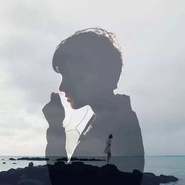
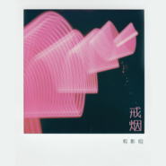

剪影姐
============================

|  |  |
| :--: | :-- |
| [ 剪影姐](https://i.xiami.com/jianying) | **地区**: China 中国大陆 **风格**: 国语流行 Mandarin Pop **播放数**: 3770077 **粉丝数**: 1618 **评论数**: 77  |

## 档案

剪影姐，女，网络红人，歌手。因在网络上以创意的唯美剪影方式自我拍摄演唱歌曲视频而极速走红，嗓音本身具有磁性质感，有爆发力，演唱方式深沉细腻，哀而不伤。

## 专辑

| 名称 | 语种 | 唱片公司 | 发行时间 | 专辑类别 | 专辑风格 |
| :--: | :-- | :-- | :-- | :-- | :-- |
| [ 你给我听好](./albums/2102813205.md) | 国语 | 独立发行 | 2017年08月11日 | EP, 单曲 | 流行 Pop |
| [ 剪影](./albums/810317401.md) | 国语 | 菲尚文化 | 2014年09月09日 | EP, 单曲 | 国语流行 Mandarin Pop |
| [ My Destiny](./albums/593557463.md) | 国语 | 菲尚文化 | 2014年02月27日 | EP, 单曲 |  |
| [ 烟花易冷](./albums/5020663109.md) | 国语 | 独立发行 | 不详 | 现场专辑 | 流行 Pop |
| [ 你不是真正的快乐](./albums/2108408029.md) | 国语 | 独立发行 | 不详 | 现场专辑 | 流行 Pop |
| [ 戒烟](./albums/2108330030.md) | 国语 | 独立发行 | 不详 | 现场专辑 | 国语流行 Mandarin Pop |
| [ 你就不要想起我](./albums/5021218757.md) | 国语 | 独立发行 | 不详 | 现场专辑 | 流行 Pop |
| [ 十年](./albums/5020740347.md) | 国语 | 独立发行 | 不详 | 有声书 | 流行 Pop |
| [ 好久不见](./albums/5020687806.md) | 国语 | 独立发行 | 不详 | 现场专辑 | 流行 Pop |
| [ 新不了情](./albums/5021418801.md) | 国语 | 独立发行 | 不详 | 录音室专辑 | 流行 Pop |
| [ 记得](./albums/5021383340.md) | 国语 | 独立发行 | 不详 | 现场专辑 | 流行 Pop |

## 评论

|  |  |  |
| :-- | :-- | :-- |
|  [虾米用户](https://emumo.xiami.com/u/402934245) 珍惜眼前人 做好身边事 2020-04-16 09:42 赞(0) 踩(0) | 
还好吗最近
 |
|  [虾米用户](https://emumo.xiami.com/u/299096947) 路漫漫其修远兮，吾辈将上... 2020-03-15 12:55 赞(2) 踩(0) | 
众里寻你千百度
 |
|  [虾米用户](https://emumo.xiami.com/u/10075840) Hurrah for C... 2019-04-10 09:04 赞(0) 踩(0) | 
酷诶老姐  和声音的反差也很有意思
 |
|  [虾米用户](https://emumo.xiami.com/u/312987423)  2019-04-01 19:27 赞(0) 踩(0) | 
…
 |
|  [虾米用户](https://emumo.xiami.com/u/312987423)  2019-04-01 19:13 赞(0) 踩(0) | 
按实际
 |
|  [虾米用户](https://emumo.xiami.com/u/333430356) 我16岁开卡宴，你们呢？ 2019-02-16 13:27 赞(0) 踩(0) | 
嗓音真心好听
 |
|  [虾米用户](https://emumo.xiami.com/u/354353505)  2019-01-13 22:45 赞(1) 踩(0) | 
就和回音哥发声是一样，鼻腔的音
 |
|  [虾米用户](https://emumo.xiami.com/u/407613723)  2018-11-20 09:04 赞(0) 踩(0) | 
沦陷此声
 |
|  [虾米用户](https://emumo.xiami.com/u/32470978) 我还没想好要写什么... 2018-05-29 01:28 赞(0) 踩(0) | 
想听阿楚姑娘
 |
|  [虾米用户](https://emumo.xiami.com/u/257033009) 这家伙很懒什么也没留下.... 2018-05-08 03:00 赞(1) 踩(0) | 
坚持就好
 |
|  [虾米用户](https://emumo.xiami.com/u/56942442)  2018-01-19 11:12 赞(0) 踩(0) | 
哈哈，学习能力不错。
 |
|  [虾米用户](https://emumo.xiami.com/u/129793668)   2017-06-07 14:50 赞(2) 踩(0) | 
以前玩人人的时候就很喜欢剪影姐的声音。
 |
|  [虾米用户](https://emumo.xiami.com/u/286510503)  2017-04-07 03:49 赞(4) 踩(0) | 
想不通为什么剪影姐不火，这歌声真的好啊！
 |
|  [虾米用户](https://emumo.xiami.com/u/9003931) 千淘万漉虽辛苦 2016-12-10 13:31 赞(1) 踩(0) | 
声 声 慢
 |
|  [虾米用户](https://emumo.xiami.com/u/1801615)  2016-11-18 19:42 赞(0) 踩(0) | 
唱得好认真的感觉
 |
|  [虾米用户](https://emumo.xiami.com/u/137448324)  2016-07-22 11:41 赞(0) 踩(0) | 
vvvv
 |
|  [虾米用户](https://emumo.xiami.com/u/139768048) 顺其自然的背后总是无可奈... 2016-05-29 08:27 赞(2) 踩(0) | 
每个翻唱都好听，还有mv很酷，都是剪影，独具一格。
 |
|  [虾米用户](https://emumo.xiami.com/u/139768048) 顺其自然的背后总是无可奈... 2016-05-28 14:02 赞(0) 踩(0) | 
JY剪影姐，每个翻唱都好听
 |
|  [虾米用户](https://emumo.xiami.com/u/54385766) 冲在法国最前端的一只猫。 2016-05-23 12:11 赞(0) 踩(0) | 
歌声走心❤️
 |
|  [虾米用户](https://emumo.xiami.com/u/97022852)  2016-05-03 23:07 赞(0) 踩(0) | 
你就不要想起我 是你唱的
 |
|  [虾米用户](https://emumo.xiami.com/u/3239717)  2015-12-25 15:36 赞(4) 踩(0) | 
听影姐的歌总是会触动心弦而想哭却欲哭无泪的感觉。 心里一阵一阵的触动。 跟听阿黛尔的歌的感觉一样。
 |
|  [虾米用户](https://emumo.xiami.com/u/3239717)  2015-12-25 15:25 赞(4) 踩(0) | 
触动心弦的声音。这才是中国好声音。
 |
|  [虾米用户](https://emumo.xiami.com/u/46421499) 晚霞，长空，西去而又折返... 2015-12-23 21:27 赞(0) 踩(0) | 
影姐，希望出首林宥嘉的〔兜圈〕
 |
|  [虾米用户](https://emumo.xiami.com/u/78266514) 乐为知音者歌 2015-12-21 00:06 赞(1) 踩(0) | 
乐为知音者歌
 |
|  [虾米用户](https://emumo.xiami.com/u/75628098)  2015-10-22 18:40 赞(2) 踩(0) | 
能不能唱下《一次就好》这首歌啊，肯定特别感人！很期待的！
 |
|  [虾米用户](https://emumo.xiami.com/u/8105280) 朱宝宝、刚好遇见你 2015-08-18 20:14 赞(0) 踩(0) | 
^o^
 |
|  [虾米用户](https://emumo.xiami.com/u/53210612)   2015-07-27 12:01 赞(0) 踩(0) | 
枕边
 |
|  [虾米用户](https://emumo.xiami.com/u/51785687)  2015-06-27 16:53 赞(0) 踩(0) | 
上瘾的毒药
 |
|  [虾米用户](https://emumo.xiami.com/u/12390139)  2015-06-22 17:18 赞(0) 踩(0) | 

 |
|  [虾米用户](https://emumo.xiami.com/u/27688256)  2015-06-03 05:41 赞(0) 踩(0) | 
喜欢你的声音
 |
|  [虾米用户](https://emumo.xiami.com/u/34700250)  2015-03-23 17:18 赞(0) 踩(0) | 
爱你
 |
|  [虾米用户](https://emumo.xiami.com/u/10040607)  2015-02-27 16:27 赞(1) 踩(0) | 
好棒！搜《你的背包》搜到的～(≧ω≦) 真的好棒～谢谢你让我听到一首那么好听的《你的背包》。
 |
|  [虾米用户](https://emumo.xiami.com/u/12276303)  2015-02-06 20:44 赞(0) 踩(0) | 
******
 |
|  [虾米用户](https://emumo.xiami.com/u/8250370) 无论哪里 虾米 爱你 2015-01-21 11:53 赞(0) 踩(0) | 
听她的歌，是在听故事。从声音里倾诉，我喜欢你！支持你！
 |
|  [虾米用户](https://emumo.xiami.com/u/39957112) 暂无签名~ 2014-12-31 15:01 赞(1) 踩(0) | 
可以治愈很多很多
 |
|  [虾米用户](https://emumo.xiami.com/u/292227) 我还没想好要写什么... 2014-12-28 11:25 赞(1) 踩(0) | 
曾有人问我，你通宵就是特地听某人的歌？那个人就是剪影哦
 |
|  [虾米用户](https://emumo.xiami.com/u/34136339) 平生不会煽情 2014-12-07 22:48 赞(0) 踩(0) | 
虽然有模仿的痕迹，依然有动人的地方
 |
|  [虾米用户](https://emumo.xiami.com/u/2044643) 氤氲对你的痴情。 2014-12-04 12:32 赞(0) 踩(0) | 
Hebe的歌驾驭得很好。
 |
|  [虾米用户](https://emumo.xiami.com/u/43962075) 我爱音乐 2014-12-04 08:10 赞(0) 踩(0) | 
剪影姐 听你的歌已经一年多啦 一直很喜欢 加油！
 |
|  [虾米用户](https://emumo.xiami.com/u/2044643) 氤氲对你的痴情。 2014-12-02 22:17 赞(0) 踩(0) | 
很美。即便这个夜晚，你的歌声令我流泪。
 |
| ⇒ |  [虾米用户](https://emumo.xiami.com/u/26175210) 暂无签名~ 2014-12-27 19:56 赞(0) 踩(0) | 
哈哈
 |
|  [虾米用户](https://emumo.xiami.com/u/43833922)  2014-11-29 00:35 赞(0) 踩(0) | 
很喜歡你
 |
|  [虾米用户](https://emumo.xiami.com/u/13812932) 寧願讓我的人生成為孤島 2014-11-27 03:55 赞(0) 踩(0) | 
赞
 |
|  [虾米用户](https://emumo.xiami.com/u/43833922)  2014-11-18 15:02 赞(0) 踩(0) | 
喜欢你么么
 |
|  [虾米用户](https://emumo.xiami.com/u/43108376) 暂无签名~ 2014-10-28 17:01 赞(0) 踩(0) | 
支持你，但是你为什么不参加好声音或者一些展现自己的舞台呢？
 |
|  [虾米用户](https://emumo.xiami.com/u/9301514) 独立唱作人 2014-10-18 19:18 赞(0) 踩(0) | 
剪影姐，听了“魔鬼中的天使”，希望你能更加超越。
 |
|  [虾米用户](https://emumo.xiami.com/u/6280517)  2014-10-15 23:17 赞(0) 踩(0) | 
爱音乐的人都相信声音的力量。加油、诸位。
 |
|  [虾米用户](https://emumo.xiami.com/u/32793985) 暂无签名~ 2014-10-02 06:09 赞(0) 踩(0) | 
很爱你的声音，剪影也很好听~~~
 |
|  [虾米用户](https://emumo.xiami.com/u/19068943) 剪了谁的影，又碎了谁的心... 2014-09-29 11:10 赞(1) 踩(0) | 
听说剪影姐可能有签约公司，可是不知道什么原因公司把她封杀了，所以现在才会出现在网络上成为一名网络人气的红人！这个我也只是听说。
 |
|  [虾米用户](https://emumo.xiami.com/u/27947613)  2014-09-24 00:06 赞(1) 踩(0) | 
觉得你的歌很对味，这些歌有时候在虾米找不到，没想到我喜欢的你全都唱了，我男朋友介绍听你的歌，感觉真好。加油
 |
|  [虾米用户](https://emumo.xiami.com/u/29398630) 顺其自然，为当所为 2014-09-21 19:11 赞(1) 踩(0) | 
很爱你的声音，剪影也很好听~~~
 |
|  [虾米用户](https://emumo.xiami.com/u/28614326) 好久不见…… 2014-09-12 23:59 赞(0) 踩(0) | 
支持你！！加油！！
 |
|  [虾米用户](https://emumo.xiami.com/u/21765600)  2014-08-29 00:21 赞(0) 踩(0) | 
@年轻的我的快乐
 |
|  [虾米用户](https://emumo.xiami.com/u/1963119) 全然的倾听。 2014-08-27 00:31 赞(0) 踩(0) | 
来听温柔~   祝好
 |
|  [虾米用户](https://emumo.xiami.com/u/33207140) 清新自持。 2014-08-21 23:05 赞(0) 踩(0) | 
真想就这样安安静静听下去
 |
|  [虾米用户](https://emumo.xiami.com/u/37177315)  2014-08-18 01:04 赞(0) 踩(0) | 
影姐肿么不去参加好声音呀
 |
|  [虾米用户](https://emumo.xiami.com/u/3923403) 时尚万变，风格永存。 2014-08-13 01:20 赞(0) 踩(0) | 
好听！
 |
|  [虾米用户](https://emumo.xiami.com/u/6213416) 时而狂野、时而更狂野。 2014-07-24 00:23 赞(0) 踩(0) | 
好听，但音质效果好像....
 |
|  [虾米用户](https://emumo.xiami.com/u/39222699)  2014-07-22 20:08 赞(0) 踩(0) | 
最喜欢的女歌手是 JY剪影 我是你的铁杆粉丝
 |
|  [虾米用户](https://emumo.xiami.com/u/39131294) 暂无签名~ 2014-07-19 01:01 赞(0) 踩(0) | 
加油啊！！！
 |
|  [虾米用户](https://emumo.xiami.com/u/36051753) ！ 2014-07-13 16:19 赞(0) 踩(0) | 
JY老大加油！
 |
|  [虾米用户](https://emumo.xiami.com/u/35605852) 有个性 没签名 2014-07-10 00:03 赞(0) 踩(0) | 
很佩服你的坚持   挺你
 |
|  [虾米用户](https://emumo.xiami.com/u/34991640) 暂无签名~ 2014-07-06 23:00 赞(0) 踩(0) | 
很喜欢这声音:)   加油(￣.￣)
 |
|  [虾米用户](https://emumo.xiami.com/u/382851)  2014-07-04 20:58 赞(1) 踩(0) | 
好爱这种感觉， 很爱这种声音，很爱你对音乐的态度
 |
|  [虾米用户](https://emumo.xiami.com/u/37764719) 没有一直开心 2014-07-02 00:27 赞(1) 踩(0) | 
就是很有味道的感觉 没有哪些喋喋的声音
 |
|  [虾米用户](https://emumo.xiami.com/u/18250264) 我正慎行，不虚度光阴。 2014-06-07 14:49 赞(0) 踩(0) | 
我觉得你是很酷的人。帅气却不失温柔的存在。让人安心的声音。
 |
| ⇒ |  [虾米用户](https://emumo.xiami.com/u/37757752) Dancing ... 2014-06-19 10:07 赞(0) 踩(0) | 
哇！你说的好棒！听你说完就是这种感觉！
 |
| ⇒ |  [虾米用户](https://emumo.xiami.com/u/18250264) 我正慎行，不虚度光阴。 2014-06-29 10:46 赞(0) 踩(0) | 
<q><b>熠蕤说：</b></q>
 |
|  [虾米用户](https://emumo.xiami.com/u/3652223) 暂无签名~ 2014-05-03 11:24 赞(0) 踩(0) | 
虾米摇出的剪影姐，声音很清澈，侧颜很美~
 |
|  [虾米用户](https://emumo.xiami.com/u/23465296) 暂无签名~ 2014-04-24 18:03 赞(0) 踩(0) | 
下首歌一定是林俊杰的
 |
|  [虾米用户](https://emumo.xiami.com/u/23465296) 暂无签名~ 2014-04-24 18:01 赞(0) 踩(0) | 
好听的声音
 |
|  [虾米用户](https://emumo.xiami.com/u/34867065)  2014-04-03 21:42 赞(0) 踩(0) | 
喜欢
 |
|  [虾米用户](https://emumo.xiami.com/u/7023025)   2014-03-13 20:00 赞(0) 踩(0) | 
剪影姐
 |
|  [虾米用户](https://emumo.xiami.com/u/7884259)  2014-03-13 10:40 赞(0) 踩(0) | 
惊艳，很不错
 |
|  [虾米用户](https://emumo.xiami.com/u/7167746) 曾用名：沐子花十。 2014-02-16 21:47 赞(0) 踩(0) | 
就是喜欢
 |
|  [虾米用户](https://emumo.xiami.com/u/7135977) 我不要天上的星星，我只要... 2014-01-22 13:14 赞(0) 踩(0) | 
成熟的人需要面具。戴上，坚强面对社会；摘下，温柔面对家人，为了值得真正去在乎的人
 |
|  [虾米用户](https://emumo.xiami.com/u/7135977) 我不要天上的星星，我只要... 2014-01-22 13:13 赞(0) 踩(0) | 
打开链接跟我听歌吧！
 |
